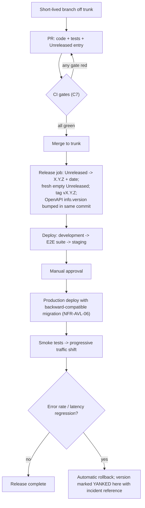

# Changelog

**Gym Marketplace & Multi-Tenant Gym Management SaaS**

All notable changes to this project are recorded in this file.

The format follows [Keep a Changelog 1.1.0](https://keepachangelog.com/en/1.1.0/), and this project
adheres to [Semantic Versioning 2.0.0](https://semver.org/spec/v2.0.0.html) under the two-stream
policy defined in [§5 Version-numbering policy](#5-version-numbering-policy).

---

> ## UPDATE TRIGGER
>
> **This file is edited in the same pull request as the change it describes. Never afterwards, and
> never from `git log`.**
>
> Edit this file when **any** of the following is true:
>
> | # | Trigger | Section to edit |
> | :-: | :--- | :--- |
> | 1 | A change alters what a member, gym owner, gym staff member, platform staff member or API integrator can see, do, or receive. | `[Unreleased]` → the matching category |
> | 2 | A change alters the public REST contract at `/v1` (**C3.1**) — request shape, response shape, status code, error `code`, header, pagination, or idempotency semantics (**C1.5**). | `[Unreleased]` → `Added` / `Changed` / `Deprecated` / `Removed` |
> | 3 | A defect of severity **S1** or **S2** (**C8.5**) is fixed. | `[Unreleased]` → `Fixed`, or `Security` where a control was involved |
> | 4 | A security control named in **NFR-SEC-01 … NFR-SEC-13** is added, strengthened, weakened or restored. | `[Unreleased]` → `Security` |
> | 5 | A capability is put on a deprecation path, including an API version retirement under **NFR-MNT-02**. | `[Unreleased]` → `Deprecated` |
> | 6 | A feature flag from `FEATURE_FLAGS.md` reaches 100% rollout, or is retired and its dead branch deleted. | `[Unreleased]` → `Added` (rollout) / `Removed` (retirement) |
> | 7 | A governance document in `/docs` is created, materially rewritten, or deleted. | `[Unreleased]` → `Added` / `Changed` / `Removed`, scope tag `[docs]` |
> | 8 | A release is cut, or a released version is withdrawn. | Promote `[Unreleased]`; or mark the version `[YANKED]` |
>
> **Do not edit this file** for: internal refactors with no observable effect, test-only changes,
> comment and formatting changes, or dependency bumps that change no behaviour. Those live in the
> commit history, which is the correct place for them.

---

## 1. How to use this file

### 1.1 Who this is written for

Four audiences read this file, and every entry is written so that all four can act on it:

| Reader | What they need from an entry |
| :--- | :--- |
| **Client sponsor / Product** | Whether a signed-off requirement from `MASTER_PRD.md` moved, and which one. |
| **Gym owners and platform support** | What changed on `dash`, `web` or `admin` today, in plain language, so a support answer is not a guess. |
| **API integrators** *(Phase 2, per A6.1 stream 10)* | Whether the `/v1` contract changed, and whether their client breaks. |
| **Engineering and QA** | What shipped in which version, so a defect can be bisected to a release and a PR. |

### 1.2 The two mandatory references

**Every entry cites at least one PRD identifier and exactly one pull request.** An entry with
neither is not a changelog entry; it is a rumour.

- **PRD identifier** — one or more of `OBJ-` `KPI-` `BR-` `FR-` `NFR-` `US-` `AC-` `SCR-` `API-`
  `RSK-` `OQ-` `ASM-` `CON-` `DEP-` `BAC-` `E2E-` `UAT-`. Where no PRD identifier applies because
  the change is internal governance, cite the governing artefact instead: `ADR-nnnn`
  (`DECISION_LOG.md`), `TD-nnn` (`TECH_DEBT.md`), `KL-nnn` (`KNOWN_LIMITATIONS.md`), or `A-nn`
  (`engineering/STACK_ADDITIONS.md`).
- **Pull request** — the merged PR that carried the change. Conventional Commits are enforced by
  commitlint (**A-24**) and the PR title carries the same PRD identifier, so the two agree.

### 1.3 Entry format

```text
- [scope] Imperative, user-visible statement of what changed. (PRD-ID, PRD-ID) (#PR)
```

*(illustrative — not committed code)*

**Scope tags**, exhaustively — one per entry, chosen from:

| Tag | Surface or layer |
| :--- | :--- |
| `[api]` | The NestJS 10 API at `/v1` (**C1.1**, **C3.1**) |
| `[web]` | Customer marketplace website, Next.js 14 (**B1.1**) |
| `[dash]` | Gym owner dashboard, React 18 + Vite (**B1.1**) |
| `[admin]` | Super-admin console, React 18 + Vite (**B1.1**) |
| `[ui]` | Shared component library and design tokens in `packages/ui` (**C1.1**, **A-03**, **A-04**) |
| `[worker]` | Background job tier (**C5**, **NFR-SCAL-05**) |
| `[db]` | Schema, migration, index, RLS policy or partition change (**C2**, **C1.4**) |
| `[infra]` | Terraform, containers, orchestrator, managed Postgres/Redis, CDN (**A-27**, **NFR-MNT-08**) |
| `[docs]` | Anything under `/docs` |

### 1.4 What must never appear in this file

| Prohibited content | Governing rule |
| :--- | :--- |
| Any member, staff or owner personal data — names, phone numbers, email addresses, member codes | **BR-DAT-06**, **NFR-PRV-01** |
| Any tenant's legal or trading name used as an example | **BR-TEN-01** |
| Secrets, tokens, connection strings, provider keys, webhook signing secrets | **NFR-SEC-07** |
| Raw or partially-redacted payment provider payloads, card fragments, bank identifiers | **BR-PAY-08**, **NFR-SEC-03** |
| KYC document contents, filenames or storage keys | **BR-DAT-07**, **NFR-SEC-02** |
| Exploit detail for an unpatched vulnerability, or for a patched one before production rollout completes | **NFR-SEC-04** |

A `Security` entry names **the control that was restored and its `NFR-SEC-` identifier**, never the
payload that defeated it.

---

## 2. Categories

Keep a Changelog 1.1.0 defines six categories. They are used here with the following project-specific
meaning. **Empty categories are omitted from a release, never written out as empty headings.**

| Category | Meaning in this project | Typical PRD identifiers |
| :--- | :--- | :--- |
| **Added** | New capability that did not previously exist: a new `SCR-` screen, a new endpoint in the **C3.2** catalogue, a new report from the **B5.20** catalogue, a new notification from the **B5.19** catalogue, a new background job from **C5**, a new reason code in a **C4.8** taxonomy, a new feature flag reaching general availability. | `FR-`, `SCR-`, `API-`, `US-` |
| **Changed** | Existing behaviour now behaves differently: a recomputed figure, a re-sequenced validation, a moved control, a new default, a tightened rule, a ranking-formula change under **FR-SRCH-10**, a rewritten governance document. | `BR-`, `FR-`, `NFR-`, `AC-` |
| **Deprecated** | Still present and working, but scheduled for removal. A `/v1` endpoint superseded in `/v2` sits here for the **≥6 months** mandated by **NFR-MNT-02** and **C3.1** before it may move to `Removed`. Every `Deprecated` entry states the removal version and the earliest removal date. | `NFR-MNT-02`, `API-` |
| **Removed** | Gone. An entry here must have appeared under `Deprecated` in an earlier release, except for documents and internal artefacts, which may be removed directly. | `NFR-MNT-02`, `API-`, `FR-` |
| **Fixed** | A defect corrected — behaviour now matches the specification it always claimed to meet. Severity per **C8.5** is stated for S1 and S2. | `BR-`, `FR-`, `AC-`, `E2E-` |
| **Security** | A control added, strengthened or restored; a dependency vulnerability of critical or high severity remediated (**NFR-SEC-08**); a penetration-test finding closed (**NFR-SEC-04**). | `NFR-SEC-`, `BR-DAT-`, `BAC-10` |

**Ordering within a release:** `Security` first, then `Fixed`, `Removed`, `Deprecated`, `Changed`,
`Added`. Money, tenancy and check-in entries come first inside their category, because those are the
entries a reader is most likely to be looking for under pressure.

---

## 3. Release process

Releases are cut from trunk. Branches are short-lived (**C7**), and the changelog is never
reconstructed at release time.



### 3.1 The changelog gate

A CI job named `changelog-required` fails any pull request that touches `apps/` or `packages/`
without adding at least one line under `[Unreleased]`. Two exemptions exist, both explicit:

1. A `chore(deps)` bump from Dependabot (**A-25**) that changes no behaviour and no lockfile-visible
   API surface.
2. A PR carrying the `no-changelog` label, which only a code owner may apply, and which requires a
   one-line justification in the PR body.

### 3.2 Gates that must be green before a release is cut

Every gate below is a **C7** non-negotiable and is restated here because a release is where they are
most often waived under pressure.

| # | Gate | Source |
| :-: | :--- | :--- |
| 1 | All unit, integration, contract and end-to-end suites pass | **C8.1** |
| 2 | Coverage ≥ 80% overall and ≥ 95% on payments, settlements, membership state and tenancy | **NFR-MNT-01** |
| 3 | Tenant-isolation suite passes for 100% of tenant-scoped endpoints | **NFR-SEC-09**, **BAC-10**, **E2E-11** |
| 4 | Zero critical dependency vulnerabilities | **NFR-SEC-08**, **A-25** |
| 5 | Every new endpoint declares a required permission | **FR-RBAC-01** |
| 6 | OpenAPI specification matches code — zero drift | **NFR-MNT-03**, **A-16** |
| 7 | Customer-site initial JS ≤ 200 KB gzipped | **NFR-PERF-10**, **A-29** |
| 8 | Migrations are backward-compatible within the release window | **NFR-AVL-06**, **A-07** |
| 9 | Architecture fitness test passes — no module reaches into another module's repositories | **C1.3**, **A-23** |
| 10 | No unapproved dependency present — every package maps to a `Part 1` locked row or an `APPROVED` `A-nn` row | `engineering/STACK_ADDITIONS.md` standing rule |

### 3.3 Cadence

| Stream | Cadence |
| :--- | :--- |
| Staging releases | Every sprint (two weeks, **C9.1**), from sprint 1. |
| Production releases | From **M8** (production launch, sprint 18) onward; weekly by default. |
| Hotfix releases | On demand for **S1** and **S2** defects (**C8.5**), branched from the release tag, PATCH bump, merged back to trunk the same day. |
| Change freeze | From the start of UAT (sprint 17) only S1 and S2 fixes are released (**C10**). |

### 3.4 Withdrawing a release

If the progressive traffic shift auto-rolls-back, or a released version is found to have corrupted
money, crossed tenants, or broken check-in:

1. The version heading is annotated `[YANKED]` in this file with the date and the incident reference.
2. Its entries are **left in place**, not deleted — a reader must be able to see what was in it.
3. The version number is **never reused**. The fix ships as the next PATCH.

### 3.5 Roles

| Action | Who |
| :--- | :--- |
| Writes the `[Unreleased]` entry | The engineer who authored the change |
| Reviews the entry for accuracy and audience fit | The PR reviewer |
| Cuts the release and promotes `[Unreleased]` | Technical Lead |
| Approves the production deploy | Technical Lead + Delivery Manager |
| Marks a version `[YANKED]` | Technical Lead |

---

## 4. Links and comparison

Each released version heading links to the comparison diff against its predecessor. Link definitions
live at the foot of this file. `[Unreleased]` links to the diff between the latest tag and trunk.

Until **BLK-01** is closed — the workspace is not yet a Git repository (`PHASES.md`, Open Blockers) —
these links resolve to nothing and pull-request references are recorded as
`(no PR — pre-repository, BLK-01)`. Every such reference is backfilled with a real PR number when
the repository is initialised, in a single documented commit.

---

## 5. Version-numbering policy

Two version streams are maintained independently, because the wire contract and the product move at
different speeds and break different people.

### 5.1 Stream A — the public API (`MAJOR.MINOR.PATCH`)

The contract is URL-versioned at `https://api.<domain>/v1` (**C3.1**). The URL carries only the
MAJOR component; MINOR and PATCH are published in the OpenAPI document's `info.version`, which is
generated from code and gated against drift (**NFR-MNT-03**, **A-16**).

| Bump | Definition | Exhaustive list of triggering changes |
| :--- | :--- | :--- |
| **MAJOR** | Any change that can break a conforming client. Requires a new URL version and a published deprecation period of **≥ 6 months** for the outgoing one (**NFR-MNT-02**, **C3.1**). | Removing an endpoint; renaming or removing a response field; making an optional request field required; narrowing an accepted value range or tightening validation; removing a value from a request enum; changing an error `code` string; changing an HTTP status for an unchanged condition — including turning the `200 DENIED` check-in response (**C3.2**) into a 4xx; changing pagination from cursor to any other scheme; changing `Idempotency-Key` semantics (**C1.5**); changing money representation away from minor-unit integers with an adjacent ISO-4217 code (**BR-PAY-01**, **NFR-DQ-02**); changing the tenant-resolution rule so that a tenant may be supplied by the client (**C3.1**, **BR-TEN-01**); changing authentication from bearer access tokens with rotating refresh tokens (**FR-AUTH-06**). |
| **MINOR** | Additive and backward-compatible for a conforming client. | A new endpoint; a new optional request field; a new response field; a new optional query filter or sort key; a new value in a **response** enum that the specification documents as open — the check-in denial taxonomy (**C4.8**) and every other `reason_code` set are declared open for exactly this reason; a new `X-RateLimit-*` or other advisory header; a newly supported payment instrument surfaced dynamically (**FR-PAY-02**). |
| **PATCH** | No contract change. | Fixing behaviour that already contradicted the published specification; latency and throughput work against **NFR-PERF-01 … NFR-PERF-09**; changing an error `message` while its `code` is unchanged (**C1.5** error model); correcting an example, description or `operationId` collision in the OpenAPI document. |

**Rule.** A response enum is only additive-safe if the specification declares it open and the client
guidance says to treat unknown members as "unknown". Any enum not so declared is closed, and adding
a member to it is a MAJOR change.

### 5.2 Stream B — the product (`MAJOR.MINOR.PATCH`)

The product version covers `web`, `dash`, `admin`, the worker tier and the database schema as one
deployable whole. It is the number that appears in release headings in this file.

| Bump | Definition | Exhaustive list of triggering changes |
| :--- | :--- | :--- |
| **MAJOR** | A user, tenant or integrator must change how they work. Requires client-sponsor approval through **C10** Change Control before release. | Withdrawing any of the 24 modules in **B1.3** from the shipped product; removing a role from **B3.1** or reducing a role's capabilities in the **B3.2** matrix; changing the commission computation in **A6.3** in a way that alters payable figures for terms already sold (**BR-FIN-05** forbids this retroactively, so it can only apply forward); changing the settlement cycle default or reserve mechanics in **A6.4** for existing tenants; changing the invoice numbering scheme in **FR-INV-02**; changing tenancy isolation away from shared-schema RLS (**C1.4**) — for example the schema-per-tenant migration path; retiring a surface from **B1.1**; a data migration that is not reversible within the release window (**NFR-AVL-06**). |
| **MINOR** | New user-visible capability, backward-compatible. | A new `SCR-` screen; a new report from either catalogue in **B5.20**; a new notification from the **B5.19** catalogue; a new background job from **C5**; a new reason code added to a **C4.8** taxonomy through **FR-ADMN-07**; a feature flag reaching 100% and becoming permanent (**FR-ADMN-08**, **NFR-MNT-07**); promotion of a deferred item — for example the Phase-2 Socket.IO transport behind `release.attendance.realtime_transport` (**A-08**); a new supported country tax profile or KYC checklist (**FR-ADMN-05**, **FR-ADMN-06**). |
| **PATCH** | No new capability, nothing removed. | S3 and S4 defect fixes (**C8.5**); copy, label and error-message changes satisfying **NFR-USE-05**; accessibility corrections that do not change flow (**NFR-USE-01 … NFR-USE-04**); performance work inside existing **NFR-PERF-** budgets; dependency updates with no behaviour change; infrastructure changes invisible to users. |

**S1 hotfix rule.** An S1 fix — money wrong, data crossed tenants, check-in or payment down, or a
security defect (**C8.5**) — ships as a **PATCH** through the hotfix path, and **must** carry a
`Fixed` or `Security` entry naming the violated rule and the post-incident review reference. An S1
is never folded silently into a larger release.

### 5.3 Pre-1.0.0

Until **BAC-01 … BAC-15** are all satisfied and milestone **M8** (production launch, **C9.2**) is
recorded, the product version remains `0.y.z`:

- `y` (MINOR) absorbs everything a post-1.0 release would call MAJOR or MINOR.
- `z` (PATCH) absorbs everything else.
- `1.0.0` is cut at **M8**, and only at **M8**.

The API stream is `1.0.0` from the first deployed endpoint, because `/v1` is in the URL from the
first request and integrators are entitled to stability guarantees before the product is
feature-complete.

### 5.4 Documentation versioning

`MASTER_PRD.md` carries the **client's** document version (currently **2.0**, 04 Aug 2026), which
moves only through **C10** Change Control and is not a software version. Documentation changes
appear in this file under the ordinary categories with the `[docs]` scope tag, and never move either
software version stream on their own.

---

## [Unreleased]

> ### Status of the build
>
> **No application code exists. No version has been released.**
>
> The repository contains documentation only. Phase 8 (Implementation) is **locked** in `PHASES.md`
> and unlocks only when Phases 0–7 and G are `DONE` and the project owner records explicit approval
> in the Phase 8 Unlock Record. Cross-Phase Rule 1 permits illustrative snippets inside
> documentation, each labelled *illustrative — not committed code*; nothing else.
>
> Accordingly the sections below contain `[docs]`-scoped entries only. There are no `Deprecated`,
> `Fixed` or `Security` entries because there is no software to deprecate, no defect to fix and no
> control to change. Those headings are omitted rather than written out empty, per §2.

### Added

- `[docs]` **`docs/PHASES.md`** — the master execution ledger: nine phases (0–7, G, 8) with
  deliverables, acceptance gates, a cross-phase rule set, a progress log and an open-blocker
  register. Phase 8 is locked behind an explicit unlock record. (`ADR-0001`, `BAC-14`)
  (no PR — pre-repository, `BLK-01`)
- `[docs]` **`docs/MASTER_PRD.md`** — a 4,193-line loss-free Markdown transcription of the client
  BRD/PRD v2.0 (04 Aug 2026): Part A business requirements, Part B product requirements, Part C
  engineering annexes. All 21 identifier families verified against source counts — `OBJ-` ×10,
  `KPI-` ×26, `BR-` ×95 across 13 families, `FR-` ×261, `NFR-` ×68, `US-` ×38, `AC-` ×129, `SCR-`
  ×55, `API-` ×14, `RSK-` ×15, `OQ-` ×20, `ASM-` ×7, `CON-` ×5, `DEP-` ×8, `BAC-` ×15, `E2E-` ×12,
  `UAT-` ×6, 24 modules, 24 background jobs, 7 state machines, 5 reason-code taxonomies. Three
  source-document inconsistencies preserved verbatim and flagged `[EDITORIAL]`. This file is the
  single source of truth; every other artefact is downstream of it. (`OBJ-01` … `OBJ-10`, `C10`)
  (no PR — pre-repository, `BLK-01`)
- `[docs]` **`docs/README.md`** — the documentation index: reading order, the precedence order that
  resolves conflicts between documents, the directory map by phase, the living-document register
  with update triggers, and the five invariants that must never be got wrong (tenant isolation,
  append-only money, price honoured, verification before visibility, webhook-driven activation).
  (`BR-TEN-01`, `BR-FIN-01`, `BR-PLN-03`, `BR-GYM-01`, `BR-PAY-02`)
  (no PR — pre-repository, `BLK-01`)
- `[docs]` **`docs/engineering/STACK_ADDITIONS.md`** — the stack ruling and the additions register.
  Part 1 reproduces the locked PRD stack from **C1.1**; Part 2 registers 30 additions `A-01` …
  `A-30` in three tiers with the exact PRD clause that leaves each slot open; Part 3 records the
  decisions that are *not* additions; Part 4 documents the two contested proposals. Roll-up: **29
  approved, 2 deferred** (`A-08` Socket.IO to Phase 2, `A-19` notification vendors blocked on
  `OQ-01`). Standing rule: any technology absent from Part 1 or Part 2 is unapproved and is a review
  blocker if it appears in a `package.json` or an infrastructure definition. (`C1.1`, `NFR-SEC-05`,
  `NFR-MNT-03`) (no PR — pre-repository, `BLK-01`)
- `[docs]` **`docs/PROJECT_CONSTITUTION.md`** — the immutable engineering law: SOLID, Clean
  Architecture, DDD bounded contexts, dependency injection through NestJS providers and modules, the
  repository pattern, use cases, feature modules, strict TypeScript with zero `any`, naming, Git
  strategy, security rules, the Amendment Procedure and the *Ten Questions Before Code*.
  (`NFR-MNT-01`, `NFR-MNT-09`, `NFR-SEC-09`) (no PR — pre-repository, `BLK-01`)
- `[docs]` **`docs/DECISION_LOG.md`** — every architectural and technology decision with context,
  options considered, rationale and consequences, including the reversals recorded under *Changed*
  below. (`ADR-0001` onward) (no PR — pre-repository, `BLK-01`)
- `[docs]` **`docs/engineering/phase-0/ENGINEERING_PLAN.md`** — the consolidated 20-section Phase-0
  engineering plan: folder structure, epics, features, module dependency graph, ERD, API catalogue,
  state machines, sequence diagrams, sprint planning, milestones, technical risks, business risks,
  complexity, roadmap, Git strategy, CI/CD, testing, deployment, monitoring and coding standards.
  (`C1`, `C7`, `C8`, `C9`) (no PR — pre-repository, `BLK-01`)
- `[docs]` **`docs/MASTER_PRD_CHECKLIST.md`** — every requirement in `MASTER_PRD.md` as an
  individually tickable item, grouped by identifier family, with traceability columns back to the
  PRD section and forward to the artefact that satisfies it. Reconciles the two business-rule counts
  (78 catalogue rows in the source PDF's §A8 against 95 individual `BR-` identifiers across 13
  families). (`BAC-06`, `C13`) (no PR — pre-repository, `BLK-01`)
- `[docs]` **`docs/KNOWN_LIMITATIONS.md`** — what the system deliberately does not do, and why.
  Opens with `KL-001` … `KL-003`, the three source-document inconsistencies preserved verbatim
  during transcription. (`A4.2`, `A4.3`, Cross-Phase Rule 3)
  (no PR — pre-repository, `BLK-01`)
- `[docs]` **`docs/TECH_DEBT.md`** — the debt register: 28 knowingly-accepted debts `TD-001` …
  `TD-028`, each with category, interest rate and its justification, estimated payoff effort, payoff
  trigger, owner, status and the PRD identifier it touches; plus the Debt Budget policy and the
  Repayment Schedule mapping every item to a sprint from **C9.1** or to a measurable trigger.
  (`RSK-14`, `NFR-MNT-01`, `C9.1`) (no PR — pre-repository, `BLK-01`)
- `[docs]` **`docs/FEATURE_FLAGS.md`** — the flag registry: flag key, owner, default, targeting
  dimension (tenant, role, percentage), kill-switch semantics and retirement date. Includes
  `release.attendance.realtime_transport`, default off, owned by the Technical Lead, created by the
  `A-08` ruling. (`FR-ADMN-08`, `NFR-MNT-07`) (no PR — pre-repository, `BLK-01`)

### Changed

- `[docs]` **Stack ruling of 2026-08-06 — the PRD stack is authoritative and unchangeable.** An
  early planning draft had assumed **Express + Prisma** on the strength of a generic engineering
  brief rather than the PRD. The project owner ruled that the technology named in the Baseline
  Decisions table and in **C1.1** stands exactly as written, so **the API framework is NestJS 10 on
  Node.js 20 (TypeScript)**, as the PRD specifies. Express is recorded in
  `engineering/STACK_ADDITIONS.md` Part 3 as an option raised and **rejected**, because substituting
  a named PRD selection is a change requiring **C10** Change Control, not an addition. Where the PRD
  is silent — ORM, CSS framework, component primitives, schema validation, form state, monorepo
  tooling, test runners — a choice is an *addition*, permitted only when declared and approved.
  (`C1.1`, `C10`, `ADR-0002`) (no PR — pre-repository, `BLK-01`)
- `[docs]` **`MASTER_PRD.md` editorial stack notes rewritten.** Both `[EDITORIAL]` notes touching
  technology selection — the one under Baseline Decisions and the one under **C1.1** — now record
  the PRD baseline as binding and point to `engineering/STACK_ADDITIONS.md` for gap-filling
  additions. No source requirement text was altered. (`C1.1`, `ADR-0002`)
  (no PR — pre-repository, `BLK-01`)
- `[docs]` **`A-08` real-time transport ruled: polling for Phase 1, Socket.IO deferred to Phase 2.**
  The two live figures the PRD asks for — the currently-in-gym count on **SCR-DASH-001** and the
  recent check-ins strip on **SCR-DASH-009** — refresh by TanStack Query polling at 10–15 seconds.
  Socket.IO is deferred behind the flag `release.attendance.realtime_transport`, default off, so the
  application tier stays stateless with no session affinity per **NFR-SCAL-03** and no Redis
  WebSocket adapter is introduced. Binding consequences: both surfaces must display a *last updated*
  indicator, because a stale figure presented as live is a defect; all live figures are consumed
  through a single `useLiveCounters()` hook so that the Phase-2 transport swap touches that hook
  alone; **NFR-PERF-03** is unaffected because check-in confirmation is a request/response path
  (`POST /checkin/scan`), not a push path. Recorded as `TD-002` with revisit triggers. (`A-08`,
  `SCR-DASH-001`, `SCR-DASH-009`, `NFR-SCAL-03`, `NFR-PERF-03`, `ADR-0010`, `TD-002`)
  (no PR — pre-repository, `BLK-01`)
- `[docs]` **`A-01` Prisma approved with a mandatory tenant-context client extension.** All
  tenant-scoped data access must pass through a Prisma client extension that wraps every operation
  in an interactive transaction which first executes `SET LOCAL app.tenant_id`. No repository may
  call the raw client. Without this, connection pooling can hand a query a different pooled
  connection than the one the tenant variable was set on, and **BR-TEN-01** breaks silently. The
  discipline is enforced by dependency-cruiser (**A-23**) and proved by the CI isolation suite
  (**BAC-10**, **E2E-11**). Recorded as `TD-010` at interest rate *Compounding*. (`A-01`,
  `BR-TEN-01`, `C1.4`, `NFR-SEC-09`, `ADR-0005`, `TD-010`)
  (no PR — pre-repository, `BLK-01`)
- `[docs]` **Backend folder structure ruled: the PRD's C1.3 layout supersedes the earlier
  14-module brief.** The API is organised as the 23 modules named in **C1.3** — `common/`
  `tenancy/` `iam/` `onboarding/` `catalog/` `plans/` `discovery/` `ordering/` `payments/`
  `billing/` `memberships/` `attendance/` `crm/` `staff/` `reviews/` `ledger/` `settlements/`
  `refunds/` `notifications/` `reporting/` `support/` `admin/` `audit/`. The earlier brief collapsed
  `ledger/`, `settlements/`, `refunds/` and `billing/` into a single `payments` module, which is an
  unacceptable boundary for money code under **BR-FIN-01**, where balances are derived from an
  append-only ledger and no figure on a statement is recomputed at display time. (`C1.3`,
  `BR-FIN-01`, `BR-FIN-02`, `ADR-0029`) (no PR — pre-repository, `BLK-01`)
- `[docs]` **`PHASES.md` progress log and blocker register updated** to record the aborted run, the
  stack ruling, the additions approval (29 approved, 2 deferred) and the folder-structure ruling,
  and to carry `BLK-01` (workspace is not a Git repository) and `BLK-02` (20 unanswered `OQ-`
  questions) as open. (`OQ-01` … `OQ-20`, `BLK-01`, `BLK-02`)
  (no PR — pre-repository, `BLK-01`)

### Removed

- `[docs]` **Three contaminated partial drafts deleted rather than patched** — an earlier
  `PROJECT_CONSTITUTION.md`, an earlier `CHANGELOG.md` and an earlier `MASTER_PRD_CHECKLIST.md`,
  all authored by a run briefed with Express in place of the PRD's NestJS. They were deleted and
  regenerated from the correct baseline. Patching was rejected: a document whose foundational
  premise is wrong cannot be corrected line by line without leaving residue, and residue in the
  constitution is the most expensive kind. (`C1.1`, `ADR-0002`)
  (no PR — pre-repository, `BLK-01`)

---

<!--
  Released versions are appended below this line, newest first, in the form:

  ## [1.4.0] - 2027-03-11
  ### Added
  - [dash] ...

  A withdrawn release is marked, and its entries are kept:

  ## [1.4.0] - 2027-03-11 [YANKED]
  Withdrawn 2027-03-11 after automatic rollback on latency regression. Incident: INC-0007.

  (illustrative — not committed code)
-->

<!-- Link definitions. Populated when BLK-01 is closed and the repository exists. -->

[Unreleased]: https://example.invalid/compare/HEAD
