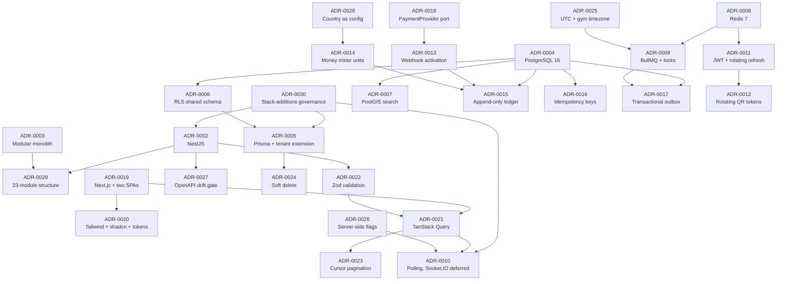
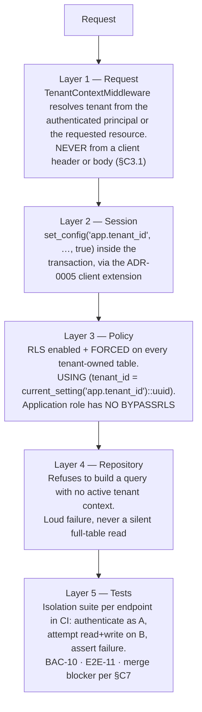
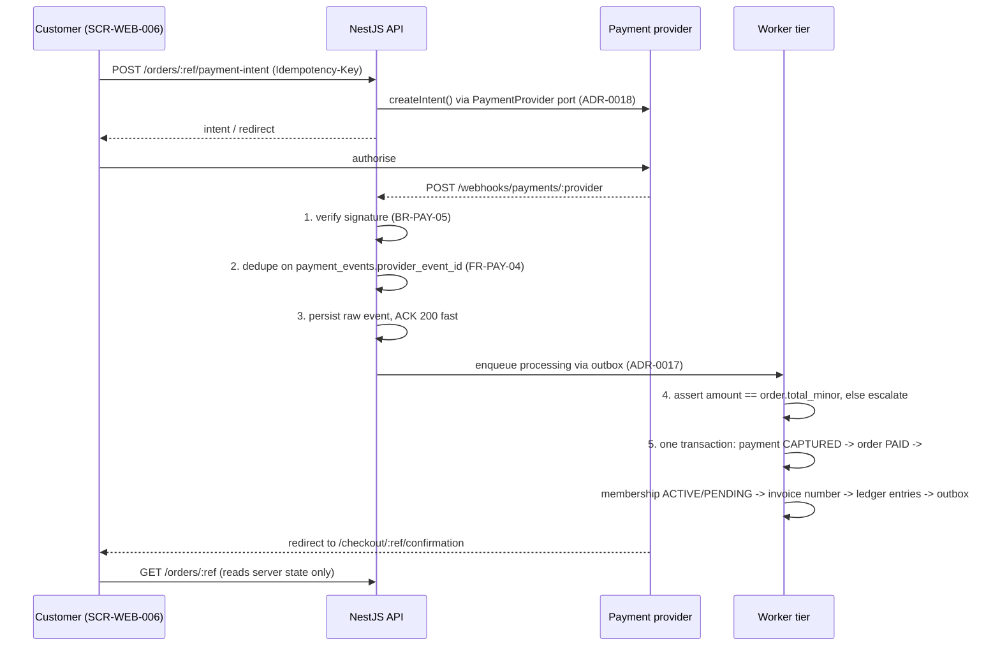
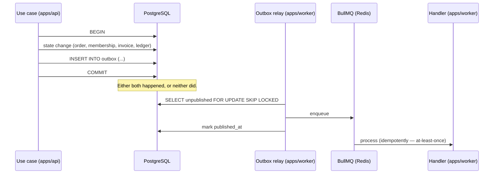

# DECISION_LOG — Architecture Decision Records

> **Purpose.** Every architectural decision taken on the Gym Marketplace & Multi-Tenant Gym
> Management SaaS platform, with the forces that produced it, the options genuinely considered, the
> consequences we accept, and the measurable signal that would reopen it.
>
> **Status of this file.** Living document. It is part of the Phase G deliverable set in
> `/docs/PHASES.md` and is governed by the Cross-Phase Rules in that file.
>
> **Update trigger — when this file MUST be edited:**
>
> | Trigger | Required action |
> | :--- | :--- |
> | A new technology, pattern or cross-cutting mechanism is chosen | New ADR, next free number, status `Accepted` |
> | An existing ADR's **Revisit Trigger** fires | Re-open the ADR; either record a reaffirmation with the new evidence, or write a superseding ADR and set the old one to `Superseded` |
> | A `MASTER_PRD.md` change is approved through Part C §C10 Change Control | Every ADR whose *Related PRD ids* column names an affected identifier is reviewed and annotated |
> | A new row is added to `/docs/engineering/STACK_ADDITIONS.md` | Either an existing ADR is amended, or a new ADR is written; an approved addition with no rationale recorded anywhere is a governance defect (see ADR-0030) |
> | Two documents in `/docs/` are found to contradict each other | Per `PHASES.md` Cross-Phase Rule 5, work halts and the resolution is recorded here |
> | An ADR is found to have been violated in code | The violation is either fixed or the ADR is amended. Silent divergence is prohibited |
>
> **Never delete an ADR.** Numbers are stable and are never reused. A decision that stops being
> true becomes `Superseded by ADR-NNNN`, exactly as `MASTER_PRD.md` retains `[WITHDRAWN]`
> requirements so that traceability survives across versions.

---

## The one thing to read before anything else

The technology stack named in `MASTER_PRD.md` — the **Baseline Decisions** table and **Part C
§C1.1** — is **authoritative and unchangeable** by the project owner's ruling of **2026-08-06**.
Nothing it names may be substituted, downgraded or reinterpreted.

- The API framework is **NestJS 10 on Node.js 20 (TypeScript)**. It is not Express. Express was
  raised during planning and **rejected**; see **ADR-0002**, which records the rejection and then
  argues positively for NestJS on its merits.
- Where the PRD is **silent**, a choice must still be made in order to build. Such a choice is an
  **addition**, not a change, and is governed by **ADR-0030** and the register at
  `/docs/engineering/STACK_ADDITIONS.md`.
- **Substitution = forbidden. Addition = allowed, but only after it is declared and approved.**

Where an ADR below reaffirms a PRD selection rather than making a free choice, its *Options
Considered* table still records what else was on the table and why it lost — because a decision
whose alternatives were never written down cannot be defended in month nine, and because the PRD
itself prices a stack change as **"High — Part C would be rewritten."**

---

## How to read an ADR in this log

| Field | Meaning |
| :--- | :--- |
| **Status** | `Accepted` — in force. `Superseded` — replaced, retained for history. `Deprecated` — no longer applied, not replaced. |
| **Date** | The date the decision was recorded in this log. Where a decision originates in the PRD baseline of 04 Aug 2026, the Context says so. |
| **Deciders** | The roles accountable, drawn from the Approval Matrix in `MASTER_PRD.md` Document Control and the team shape in §C9.3. |
| **Tags** | Cross-cutting themes, for filtering. |
| **Supersedes / Superseded by** | ADR relationships. `—` where none. |
| **Related PRD ids** | The identifiers this decision serves or is constrained by. These are the audit trail. |
| **Context** | The forces at play in **this** product. Never generic. |
| **Decision** | One unambiguous sentence, then the detail. |
| **Options Considered** | At least three real options, with the reason each loser lost. |
| **Consequences** | Positive, negative and neutral. The negatives are written to be believed, not to be survivable. |
| **Revisit Trigger** | A concrete, measurable signal. Not "if requirements change". |
| **Implementation Notes** | What this means in code, in the 23-module structure of §C1.3. |

**Code in this document.** Every snippet is labelled **illustrative — not committed code**. No
application code exists in this workspace and none may be written before Phase 8 unlocks
(`PHASES.md`).

---

## Summary index

| ADR | Title | Status | Date | Deciders | Related PRD ids |
| :--- | :--- | :--- | :--- | :--- | :--- |
| [0001](#adr-0001--monorepo-over-polyrepo-pnpm-workspaces--turborepo) | Monorepo over polyrepo (pnpm workspaces + Turborepo) | Accepted | 2026-08-06 | Technical Lead, Engineering Lead, Delivery Manager | §C1.3, §C7, NFR-MNT-03, NFR-MNT-08, NFR-PERF-10, B1.1 |
| [0002](#adr-0002--nestjs-as-the-api-framework-as-specified-by-the-prd) | NestJS as the API framework, as specified by the PRD | Accepted | 2026-08-06 | Project Owner, Engineering Lead / CTO, Technical Lead | §C1.1, §C1.3, §C1.4, FR-RBAC-01, FR-RBAC-02, BR-DAT-01, BR-PAY-03, NFR-MNT-03 |
| [0003](#adr-0003--modular-monolith-over-microservices) | Modular monolith over microservices | Accepted | 2026-08-06 | Project Owner, Engineering Lead / CTO, Technical Lead | §C1.3, NFR-SCAL-02, NFR-SCAL-05, BR-FIN-01, BR-FIN-03, §C9.3, CON-05 |
| [0004](#adr-0004--postgresql-16-as-the-single-primary-datastore) | PostgreSQL 16 as the single primary datastore | Accepted | 2026-08-06 | Project Owner, Engineering Lead / CTO, Technical Lead | §C1.1, §C2, NFR-SEC-09, NFR-DQ-01, NFR-SCAL-06, FR-INV-02 |
| [0005](#adr-0005--prisma-orm-plus-the-mandatory-tenant-context-client-extension) | Prisma ORM plus the mandatory tenant-context client extension | Accepted | 2026-08-06 | Project Owner, Technical Lead, Engineering Lead / CTO | A-01, A-07, §C1.4, BR-TEN-01, NFR-SEC-09, BAC-10, E2E-11, RSK-08 |
| [0006](#adr-0006--row-level-security-shared-database-shared-schema-for-tenant-isolation) | Row-Level Security, shared database and shared schema, for tenant isolation | Accepted | 2026-08-06 | Project Owner, Engineering Lead / CTO, Technical Lead | §C1.4, BR-TEN-01, BR-TEN-02, OBJ-07, NFR-SEC-09, BAC-10, E2E-11, RSK-08 |
| [0007](#adr-0007--postgis-for-radius-search-instead-of-a-dedicated-search-cluster-in-phase-1) | PostGIS for radius search instead of a search cluster in Phase 1 | Accepted | 2026-08-06 | Technical Lead, Product Manager, Engineering Lead | §C1.1, FR-SRCH-01…15, NFR-PERF-01, NFR-PERF-09, KPI-23, CON-05 |
| [0008](#adr-0008--redis-7-for-cache-sessions-and-rate-limiting) | Redis 7 for cache, sessions and rate limiting | Accepted | 2026-08-06 | Technical Lead, Engineering Lead | §C1.1, §C1.5, NFR-SEC-06, NFR-SCAL-03, NFR-SCAL-04, NFR-AVL-03, A-13 |
| [0009](#adr-0009--bullmq-for-background-jobs-with-the-distributed-lock-requirement-from-c5) | BullMQ for background jobs, with the distributed-lock requirement from §C5 | Accepted | 2026-08-06 | Technical Lead, Engineering Lead | §C1.1, §C5, NFR-SCAL-05, NFR-MNT-06, FR-ADMN-13, A-30 |
| [0010](#adr-0010--polling-for-phase-1-live-dashboard-figures-socketio-deferred-to-phase-2) | Polling for Phase-1 live dashboard figures; Socket.IO deferred to Phase 2 | Accepted | 2026-08-06 | Project Owner, Technical Lead, Product Manager | A-08, SCR-DASH-001, SCR-DASH-009, NFR-SCAL-03, NFR-PERF-03, NFR-PERF-08 |
| [0011](#adr-0011--jwt-access-tokens--rotating-refresh-tokens-with-reuse-detection) | JWT access tokens + rotating refresh tokens with reuse detection | Accepted | 2026-08-06 | Technical Lead, Engineering Lead / CTO | §C1.1, FR-AUTH-06, FR-AUTH-09, FR-AUTH-10, FR-AUTH-12, FR-RBAC-04, NFR-SEC-11 |
| [0012](#adr-0012--rotating-60-second-signed-qr-tokens) | Rotating 60-second signed QR tokens | Accepted | 2026-08-06 | Project Owner, Product Manager, Technical Lead | BR-CHK-02, BR-CHK-06, FR-CHK-01, FR-CHK-02, A-10, A-11, NFR-PERF-03, NFR-PERF-08, RSK-03 |
| [0013](#adr-0013--webhook-driven-membership-activation-never-the-client-redirect) | Webhook-driven membership activation, never the client redirect | Accepted | 2026-08-06 | Project Owner, Finance, Technical Lead | BR-PAY-02, BR-PAY-05, BR-PAY-06, FR-PAY-03, FR-PAY-04, FR-PAY-05, AC-PAY-02.1, RSK-04 |
| [0014](#adr-0014--money-as-integer-minor-units-with-explicit-currency-and-a-money-value-object) | Money as integer minor units with explicit currency, and a `Money` value object | Accepted | 2026-08-06 | Project Owner, Finance, Technical Lead | BR-PAY-01, NFR-DQ-02, §A6.3, §C1.5, BR-FIN-02, BR-FIN-04, OBJ-09 |
| [0015](#adr-0015--append-only-ledger-as-the-source-of-truth-for-all-balances) | Append-only ledger as the source of truth for all balances | Accepted | 2026-08-06 | Project Owner, Finance, Engineering Lead / CTO | BR-FIN-01…BR-FIN-08, §A3.4, KPI-26, E2E-12, BAC-07 |
| [0016](#adr-0016--idempotency-keys-on-all-money--and-state-affecting-endpoints) | Idempotency keys on all money- and state-affecting endpoints | Accepted | 2026-08-06 | Project Owner, Finance, Technical Lead | BR-PAY-03, BR-CHK-06, BR-REF-09, §C1.5, §C3.1, FR-CART-06, RSK-04 |
| [0017](#adr-0017--transactional-outbox-for-domain-events) | Transactional outbox for domain events | Accepted | 2026-08-06 | Technical Lead, Engineering Lead | §C1.5, §C5, FR-NOTF-04, NFR-SCAL-05, NFR-MNT-06 |
| [0018](#adr-0018--paymentprovider-port-with-stripe-connect-as-the-reference-adapter) | `PaymentProvider` port with Stripe Connect as the reference adapter | Accepted | 2026-08-06 | Project Owner, Finance, Technical Lead | §C1.1, FR-PAY-01, FR-PAY-10, FR-PAY-12, DEP-01, ASM-03, OQ-01, RSK-13 |
| [0019](#adr-0019--nextjs-for-the-customer-site-and-reactvite-spas-for-the-dashboards) | Next.js for the customer site (SEO) and React + Vite SPAs for the dashboards | Accepted | 2026-08-06 | Project Owner, Product Manager, Technical Lead | §C1.1, B1.1, FR-SRCH-13, FR-DETL-10, FR-NAV-05, NFR-PERF-02, NFR-PERF-10, SCR-DASH-009 |
| [0020](#adr-0020--tailwindcss--shadcnui--design-tokens-as-the-shared-ui-foundation) | TailwindCSS + shadcn/ui + design tokens as the shared UI foundation | Accepted | 2026-08-06 | Product Designer, Technical Lead, Product Manager | §C1.1, A-03, A-04, NFR-USE-01…NFR-USE-07, FR-INV-07 |
| [0021](#adr-0021--tanstack-query-for-all-server-state) | TanStack Query for all server state | Accepted | 2026-08-06 | Technical Lead, Frontend leads | §C1.1, A-08, FR-SRCH-07, FR-AUTH-11, AC-AUTH-02.2, SCR-DASH-009, NFR-PERF-10 |
| [0022](#adr-0022--zod-as-the-single-validation-source-with-types-inferred) | Zod as the single validation source, with types inferred | Accepted | 2026-08-06 | Technical Lead, Engineering Lead | A-02, A-09, NFR-SEC-05, NFR-MNT-03, FR-ONB-01, SCR-DASH-002, SCR-WEB-005 |
| [0023](#adr-0023--cursor-pagination-as-the-default) | Cursor pagination as the default | Accepted | 2026-08-06 | Technical Lead, Frontend leads | §C3.1, §C2.4, FR-SRCH-07, SCR-DASH-007, SCR-DASH-009, NFR-PERF-04, NFR-SCAL-06 |
| [0024](#adr-0024--soft-delete-as-the-default-with-documented-hard-delete-paths) | Soft delete as the default, with documented hard-delete paths | Accepted | 2026-08-06 | Project Owner, Technical Lead, Engineering Lead | NFR-DQ-04, BR-DAT-04, BR-TEN-04, BR-PLN-04, NFR-PRV-04, CON-04, FR-USER-07 |
| [0025](#adr-0025--utc-storage-with-the-gym-timezone-authoritative-for-membership-validity) | UTC storage with the gym timezone authoritative for membership validity | Accepted | 2026-08-06 | Product Manager, Technical Lead | NFR-DQ-03, BR-MEM-03, §C1.5, §C4.1, §C5, FR-MEMB-09, BR-CHK-05, NFR-AVL-08 |
| [0026](#adr-0026--server-side-feature-flag-evaluation) | Server-side feature flag evaluation | Accepted | 2026-08-06 | Technical Lead, Product Manager | §C1.5, FR-ADMN-08, NFR-MNT-07, FR-RBAC-02, SCR-ADM-011, NFR-AVL-07 |
| [0027](#adr-0027--openapi-generated-from-code-with-ci-drift-detection) | OpenAPI generated from code with CI drift detection | Accepted | 2026-08-06 | Technical Lead, Engineering Lead, QA lead | NFR-MNT-03, NFR-MNT-02, FR-RBAC-01, §C3.1, §C7, §C8.1, A-16 |
| [0028](#adr-0028--country-currency-tax-and-kyc-as-configuration-rather-than-code) | Country, currency, tax and KYC as configuration rather than code | Accepted | 2026-08-06 | Project Owner, Finance, Product Manager | OBJ-09, BR-PAY-11, FR-INV-05, FR-ADMN-05, FR-ADMN-06, FR-ONB-03, OQ-01, OQ-16, NFR-PRV-05 |
| [0029](#adr-0029--the-prd-c13-23-module-backend-structure-over-the-14-module-engineering-brief) | The PRD §C1.3 23-module backend structure over the 14-module engineering brief | Accepted | 2026-08-06 | Project Owner, Engineering Lead / CTO, Technical Lead | §C1.3, BR-FIN-01, BR-FIN-02, BR-REF-05, NFR-MNT-01, §A5.3, B1.3 |
| [0030](#adr-0030--the-stack-additions-governance-model) | The stack-additions governance model | Accepted | 2026-08-06 | Project Owner, Engineering Lead / CTO, Delivery Manager | §C1.1 `[EDITORIAL]`, §C10, Baseline Decisions, NFR-SEC-07, NFR-SEC-08, A-01…A-30 |

### The Phase-G acceptance gate, answered

`PHASES.md` requires this file to answer twelve specific questions before Phase G can close.

| Gate question | Answered by |
| :--- | :--- |
| Why Prisma? | ADR-0005 |
| Why PostgreSQL? | ADR-0004 |
| Why Redis? | ADR-0008 |
| Why BullMQ? | ADR-0009 |
| **Why Express?** | **ADR-0002 — Express is *not* used. It was raised as an alternative and rejected because the PRD names NestJS and substituting it is a change, not an addition.** |
| Why JWT? | ADR-0011 |
| Why refresh tokens? | ADR-0011 |
| Why QR? | ADR-0012 |
| Why modular monolith? | ADR-0003 |
| Why RLS? | ADR-0006 (mechanism), ADR-0005 (the Prisma hazard that could silently defeat it) |
| Why minor-unit integers? | ADR-0014 |
| Why webhook-driven activation? | ADR-0013 |

### Decision dependency map



---

### ADR-0001 — Monorepo over polyrepo (pnpm workspaces + Turborepo)

| Field | Value |
| :--- | :--- |
| **Status** | Accepted |
| **Date** | 2026-08-06 |
| **Deciders** | Technical Lead / Architect, Engineering Lead / CTO, Delivery Manager |
| **Tags** | `repository` · `tooling` · `ci-cd` · `addition-A-05` |
| **Supersedes** | — |
| **Superseded by** | — |
| **Related PRD ids** | §C1.3, §C7, B1.1, NFR-MNT-03, NFR-MNT-08, NFR-PERF-10, NFR-USE-08, FR-RBAC-01, A-05 |

**Context**

This product is not one application. It is **four deployable units and one contract**: the NestJS
API (§C1.1), the worker tier that NFR-SCAL-05 requires to be separate so background work "cannot
starve request handling", and three browser surfaces — `web`, `dash`, `admin` — which B1.1 states
"consume the same versioned REST API" with "no private back door".

Three specific forces make the repository shape a real decision rather than a preference:

1. **A shared contract that CI must be able to break.** NFR-MNT-03 requires the OpenAPI
   specification to be generated from code and requires **drift to fail CI**. A drift gate that
   can only see the server is half a gate; the value is in failing the build when the server
   changes and a client's typed calls no longer match. That check needs both sides in one CI run.
2. **A shared UI system that is a stated PRD requirement, not an optimisation.** §C1.1 names a
   "shared component library consumed by all three surfaces; design tokens as the single source of
   styling truth", with the explicit rationale "prevents three divergent interpretations of the
   same design". Fifty-five `SCR-` screens across three surfaces will diverge if the library
   travels by version number rather than by import path.
3. **Shared validation schemas.** ADR-0022 puts Zod schemas in a shared package so that one schema
   satisfies NFR-SEC-05 on the server and drives React Hook Form on the client. That is only cheap
   when the schema is one file, not one published package with a release cadence.

Against those, the counter-pressure is real: CON-05 constrains infrastructure budget, §C9.3 staffs
three backend and three frontend engineers, and a monorepo that takes twenty minutes to validate a
one-line change costs that team more than a publish step ever would.

**Decision**

**All application code, shared packages, infrastructure definitions and documentation live in one
Git repository, managed with pnpm workspaces for dependency resolution and Turborepo for task
orchestration and caching.**

The layout is fixed as follows and is enforced by `dependency-cruiser` (A-23):

```text
# illustrative — not committed code
gymmap/
  apps/
    api/            NestJS 10 HTTP tier — the 23 modules of §C1.3
    worker/         NestJS 10 standalone app — the 24 jobs of §C5, same modules, no HTTP
    web/            Next.js 14 App Router — customer marketplace (SCR-WEB-001…018)
    dash/           React 18 + Vite SPA — gym owner dashboard (SCR-DASH-001…022)
    admin/          React 18 + Vite SPA — super-admin console (SCR-ADM-001…015)
  packages/
    types/          Zod schemas + inferred types — the only cross-tier contract source
    ui/             shadcn/ui-derived components + design tokens (ADR-0020)
    config/         eslint, prettier, tsconfig, tailwind preset, dependency-cruiser rules
    testing/        Testcontainers fixtures, the §C8.2 deterministic seed, isolation-suite helpers
  infra/            Terraform (A-27) and Docker Compose (A-28)
  docs/             this documentation set
```

`apps/api` and `apps/worker` are separate deployables that import the same domain modules. This is
how NFR-SCAL-05's separate worker tier is achieved without ADR-0003's modular monolith becoming a
distributed system: same code, two process types, one database.

**Options Considered**

| Option | Pros | Cons | Why rejected |
| :--- | :--- | :--- | :--- |
| **Monorepo, pnpm workspaces + Turborepo** *(chosen)* | One atomic commit spans an API change and its three client updates; the NFR-MNT-03 drift gate and the FR-RBAC-01 permission gate can inspect everything; `packages/ui` and `packages/types` are imported, not published; pnpm's content-addressed store keeps four `node_modules` trees cheap on CON-05 budgets; Turborepo's task graph and remote cache mean a `web`-only change does not rebuild `api` | Task-graph configuration is a real skill; one repository means one coarse access-control boundary; a bad root-level change breaks every app at once | — |
| Polyrepo — one repository per app plus published shared packages | Independent release cadence; clean access boundaries; smaller clones | A contract change becomes a five-PR choreography across repositories with version skew in between; the NFR-MNT-03 drift gate cannot see client and server together; `packages/ui` must be versioned and published, which §C1.1's "single source of styling truth" rationale specifically warns against; onboarding cost multiplies by five | Rejected. The coordination cost lands on a three-person backend team every time the API changes, which is every sprint from §C9.1 sprint 1 to sprint 15 |
| Monorepo with npm or yarn workspaces + Nx | Nx's project graph and generators are more capable than Turborepo's; strong affected-target detection | Nx's plugin ecosystem imposes its own project conventions on top of NestJS's and Next.js's; npm/yarn workspaces hoist flat, which lets an app import a dependency it never declared — precisely the accidental coupling that dependency-cruiser then has to police | Rejected. pnpm's strict, non-flat `node_modules` makes undeclared dependencies a hard error rather than a lint rule, which is worth more here than Nx's extra features |
| Monorepo with Bazel | Hermetic, perfectly reproducible, language-agnostic | Enormous configuration burden for an all-TypeScript codebase; poor ergonomics with Next.js and Vite; no team member has operated it | Rejected as disproportionate to a four-app TypeScript workspace |
| Git submodules or subtrees | Keeps repositories nominally separate while allowing local composition | All the coordination cost of polyrepo plus a well-known class of detached-HEAD failures; no shared task graph or cache | Rejected |

**Consequences**

*Positive*
- A single pull request can change `POST /orders` (§C3.2 `API-ORD`), its Zod schema in
  `packages/types`, and the `SCR-WEB-005` checkout that calls it — and CI validates all three
  together. This is what makes the NFR-MNT-03 drift gate meaningful rather than ceremonial.
- The §C7 pipeline — "commit → lint and type-check → unit tests → build → integration tests →
  tenant-isolation suite → dependency and secret scan → container build" — is expressible as one
  Turborepo task graph, with the isolation suite (BAC-10, E2E-11) as a first-class task that no
  app can skip.
- NFR-USE-08 ("all user-facing strings are externalised for translation from the first commit") is
  enforceable with one lint rule configured once in `packages/config`, rather than three drifting
  copies.
- NFR-PERF-10's 200 KB gzipped budget is checked by `size-limit` (A-29) against the real
  `packages/ui` build, not against a possibly-stale published version.

*Negative*
- **One repository is one access boundary.** KYC handling code (BR-DAT-07, `kyc_documents`) and the
  super-admin console sit in the same clone as everything else. Access control becomes a
  `CODEOWNERS` and branch-protection problem, not a repository-permissions problem. This is a
  genuine reduction in defence-in-depth and must be compensated by review rules.
- **Turborepo cache correctness is a real operational concern.** A task with under-declared inputs
  produces a false cache hit, and a false cache hit on the isolation suite would let a tenant
  isolation regression through. Cache configuration for the isolation and contract suites must be
  reviewed with the same seriousness as the tests themselves; the safest posture — and the one
  adopted — is that the isolation suite and the security scans are **never cached**.
- **CI wall-clock grows with the repository, not with the change**, unless affected-target
  detection stays healthy. A misconfigured dependency edge makes every change a full-graph build.
- **Blast radius of root-level changes.** A TypeScript version bump in `packages/config` can break
  four applications simultaneously. Renovate-style batched upgrades via Dependabot (A-25) mitigate
  but do not remove this.

*Neutral*
- Clone size grows over the life of the project. With four apps of TypeScript and no binary assets
  in-repo (media lives in object storage per §C1.1), this is not expected to become material.
- BLK-01 in `PHASES.md` records that the workspace is not yet a Git repository. This ADR is written
  on the assumption that `git init` precedes Sprint 0; the decision does not depend on when.

**Revisit Trigger**

Any one of:
1. The default CI pipeline exceeds **20 minutes of wall-clock on a warm cache** for a
   single-package change, measured as the p75 over one sprint.
2. A **false cache hit** is observed on any correctness-critical task (isolation suite, contract
   suite, security scan) — this triggers an immediate review of cache scope, not of the monorepo.
3. A **second delivery organisation** (an outsourced partner, or the Phase-2 native mobile team
   anticipated in A4.2 and A11) needs write access to some code but not all of it.

**Implementation Notes**

- `pnpm-workspace.yaml` declares `apps/*` and `packages/*`. Root `package.json` carries only
  workspace scripts and dev tooling; no runtime dependency is ever installed at the root.
- Turborepo pipeline tasks, at minimum: `lint`, `typecheck`, `test:unit`, `test:integration`,
  `test:contract`, `test:isolation`, `test:e2e`, `build`, `size-limit`, `openapi:generate`,
  `openapi:check`, `depcruise`. The last three implement ADR-0027 and the §C1.3 boundary rule.
- Dependency direction is enforced by `dependency-cruiser` (A-23) with these rules:
  `apps/*` may import `packages/*`; `packages/*` may never import `apps/*`; no `apps/X` may import
  `apps/Y`; `packages/ui` may not import `packages/types` schemas that describe server-only
  concerns; nothing outside `apps/api/src/common/database` may import `@prisma/client` (ADR-0005).
- Husky + lint-staged + commitlint (A-24) run at the root. Commit messages carry PRD identifiers so
  that traceability from `OBJ-` to commit is continuous, as the PRD's Document End section requires.
- Local development uses Docker Compose (A-28) with Postgres + PostGIS, Redis, MinIO and Mailpit,
  matching the §C7 *Local* environment row exactly.

---

### ADR-0002 — NestJS as the API framework, as specified by the PRD

| Field | Value |
| :--- | :--- |
| **Status** | Accepted |
| **Date** | 2026-08-06 |
| **Deciders** | Project Owner, Engineering Lead / CTO, Technical Lead / Architect |
| **Tags** | `stack-locked` · `api` · `architecture` · `governance` |
| **Supersedes** | — |
| **Superseded by** | — |
| **Related PRD ids** | Baseline Decisions ("Technology stack"), §C1.1, §C1.3, §C1.4, §C1.5, FR-RBAC-01, FR-RBAC-02, FR-RBAC-03, BR-DAT-01, BR-PAY-03, BR-TEN-01, NFR-MNT-03, NFR-SEC-05, NFR-MNT-01 |

**Context**

Two things must be recorded here, in this order, because the second is worthless without the first.

**First, the governance fact.** During planning, **Express was raised as the API framework** and a
short-lived set of drafts in this repository was written on that assumption. That was wrong, and it
was reversed. `MASTER_PRD.md`'s Baseline Decisions table names "**Node.js + NestJS (TypeScript)
API**" and prices a change to it as **"High — Part C would be rewritten."** Part C §C1.1 names
"**Node.js 20 + NestJS 10 (TypeScript)**" with its own rationale. Under the governance model in
ADR-0030, replacing a technology the PRD names is a **substitution**, which is forbidden; it is a
*change*, requiring the §C10 Change Control process, not an *addition*. On **2026-08-06** the
project owner ruled the PRD stack authoritative and unchangeable, the in-flight run was aborted, and
three contaminated partial drafts were **deleted rather than patched** — recorded in the
`PHASES.md` Progress Log and in Part 3 of `/docs/engineering/STACK_ADDITIONS.md`
("**Express — Rejected.** The PRD names NestJS. Substituting it is a change, not an addition.").

**Second, and more usefully: NestJS is genuinely the right framework for this system**, and would
be a defensible choice even on a blank page. The reason is not taste. It is that four of this
platform's hardest requirements are *cross-cutting concerns that must be impossible to forget*, and
NestJS provides a framework-level place to put each one:

| Requirement | Why "remember to do it" is not good enough | NestJS mechanism |
| :--- | :--- | :--- |
| **BR-TEN-01** — no tenant may read another tenant's data by *any* code path | §C1.4 calls this "the thing most likely to be violated by an ordinary coding mistake"; RSK-08 scores it 2×5 | Request-scoped tenant context established by middleware and carried in `AsyncLocalStorage`, consumed by an injected, tenant-aware data provider (ADR-0005). No repository can be constructed without it |
| **FR-RBAC-01/02/03** — every endpoint declares a permission; a missing declaration **fails CI**; scope is evaluated against the tenant *on the resource* | A convention that a reviewer must notice is not a control | Guards plus metadata decorators. The same reflection pass that builds the OpenAPI document (ADR-0027) enumerates every handler and asserts each carries a permission decorator |
| **BR-DAT-01** — every create, update and delete on nine entity families writes actor, timestamp, IP, before-state and after-state to an append-only log | Hand-written audit calls will be omitted, especially in a rarely-touched admin path | An interceptor, exactly as §C1.5 specifies: "an interceptor writes before/after state for annotated entities" |
| **BR-PAY-03** — every money-affecting operation is idempotent on a client key; §C1.5 defines the exact key/fingerprint/response semantics | Reimplementing this per controller guarantees three subtly different implementations | One interceptor applied by decorator, with the §C1.5 semantics implemented once (ADR-0016) |

Add to that: **NFR-SEC-05** ("all input is validated server-side against a schema") maps onto
pipes; **NFR-MNT-03** (OpenAPI generated from code, drift fails CI) is served natively by
`@nestjs/swagger` (A-16); **§C5**'s 24 background jobs run in the same module graph in
`apps/worker`; and **NFR-MNT-01**'s ≥95% coverage requirement on payment, settlement, membership
and tenancy code is far cheaper to reach when dependencies are injected and therefore substitutable
in tests.

Finally, §C1.3's 23-module structure is not a folder convention — it is a set of **enforced
boundaries** where "modules communicate through exported service interfaces or domain events, never
by reaching into another module's repositories". NestJS modules with explicit `imports`/`exports`
make that boundary a first-class construct that the framework itself refuses to let you cross by
accident, with `dependency-cruiser` (A-23) as the belt to the framework's braces.

**Decision**

**The API is built on NestJS 10 running on Node.js 20 with TypeScript in `strict` mode, exactly as
`MASTER_PRD.md` §C1.1 specifies; Express is not used as this project's framework and was rejected
as a substitution.**

Detail:
- `apps/api` is a NestJS HTTP application; `apps/worker` is a NestJS standalone application
  importing the same domain modules with no HTTP adapter (ADR-0001, NFR-SCAL-05).
- Guards implement FR-RBAC-01…07. Interceptors implement BR-DAT-01 audit, BR-PAY-03 idempotency,
  the §C3.1 response envelope, and OpenTelemetry span enrichment. Pipes implement NFR-SEC-05 via
  the Zod bridge of ADR-0022. Exception filters implement the §C1.5 error model
  (`code`, `message`, `details[]`, `correlationId`).
- Controllers contain **no business logic** — they resolve a request into a use-case invocation and
  a response DTO. This is a constitutional rule, and it is testable: a controller method longer
  than a handful of lines fails review.

**Options Considered**

| Option | Pros | Cons | Why rejected |
| :--- | :--- | :--- | :--- |
| **NestJS 10 on Node.js 20** *(chosen)* | Named by the PRD; framework-level DI and module boundaries directly express §C1.3; guards/interceptors/pipes/filters give a single enforced home to RBAC, tenant context, audit, idempotency and validation; `@nestjs/swagger` satisfies NFR-MNT-03; `@nestjs/bullmq` covers §C5; `@nestjs/testing` makes NFR-MNT-01's 95% money-code coverage practical; §C1.1's own rationale cites a "large hiring pool" | Decorator and `reflect-metadata` indirection can hide behaviour; heavier startup than a bare HTTP server; the framework's own DTO convention is class-validator, which conflicts with the shared-schema goal of ADR-0022; 23 modules is a lot of explicit wiring | — |
| **Express 4 with a hand-rolled layered structure** | Minimal, universally understood, no decorator indirection, smallest dependency surface | **It is a substitution, and substitutions are forbidden**: the PRD names NestJS and prices a stack change as "High — Part C would be rewritten"; on the merits, every cross-cutting concern in the table above becomes a middleware ordering convention that a reviewer must police; there is no framework notion of a module boundary, so §C1.3's "enforced boundaries" would rest entirely on `dependency-cruiser`; no first-class DI, so NFR-MNT-01's coverage targets on tenancy and money code get harder | **Rejected.** Raised during planning and reversed by the project owner's ruling of 2026-08-06. Recorded in `STACK_ADDITIONS.md` Part 3 and in the `PHASES.md` Progress Log |
| **Fastify used directly (not as a Nest adapter)** | Highest raw throughput in this class; excellent JSON-schema-based validation that would pair naturally with NFR-SEC-05 | Same substitution problem as Express; the throughput advantage is irrelevant against this system's actual budgets — NFR-PERF-09 is 2,000 searches/minute and NFR-PERF-08 is 500 check-ins/minute, both of which are database-bound, not framework-bound | Rejected as a substitution, and unnecessary on the numbers |
| **tRPC** | End-to-end type safety between server and the three TypeScript clients with no code generation | The PRD specifies a **versioned REST API** (§C3.1: URL-versioned, `snake_case`, cursor pagination, `Idempotency-Key`, documented status codes) and B1.1 requires that "anything the admin console can do is expressible as an authorised, audited API call" — a shape that must remain callable by non-TypeScript clients, including the Phase-2 public partner API in §A6.1 stream 10 and the Phase-2 native apps in A4.2 | Rejected — contradicts §C3 |
| **A serverless function framework** | Elastic scale, no idle cost | Contradicts §C1.3's modular monolith and §C1.1's "containers on a managed orchestrator"; cold starts endanger NFR-PERF-03's 2-second check-in budget; per-invocation connection handling is hostile to the RLS session-variable discipline of §C1.4 and ADR-0005 | Rejected |

**Consequences**

*Positive*
- The four hardest cross-cutting rules — tenancy, RBAC, audit, idempotency — each have exactly one
  implementation and one test surface, which is what makes NFR-MNT-01's ≥95% coverage on those
  paths achievable rather than aspirational.
- §C1.3's 23 modules become real compile-time objects. A `payments` module that fails to export a
  service cannot be reached from `billing`, and the failure is at wiring time, not in production.
- NFR-MNT-03's drift gate has a native implementation (A-16), so ADR-0027 costs configuration
  rather than invention.
- The §C5 worker tier reuses domain modules verbatim, so the `membership.expire` job and the
  `POST /me/memberships/:id/freeze` endpoint invoke the *same* state-machine use case. There is no
  second implementation of C4.1 to drift.

*Negative*
- **Decorator indirection is genuinely harder to debug than explicit function calls.** A request
  that fails inside a guard chain gives a less obvious stack trace than a middleware array. New
  engineers lose time to this in their first sprint.
- **NestJS's conventional DTO validation is class-validator, and we are not using it** (ADR-0022).
  This means the codebase diverges from the framework's own documentation on one visible axis, and
  every NestJS tutorial a new engineer reads will show the wrong pattern for this repository. We
  accept that cost for schema shareability; it is a real cost.
- **The `@nestjs/swagger` decorators read class metadata, not Zod schemas**, so ADR-0027 needs a
  bridge rather than a switch. That bridge is called out as an open governance item in ADR-0022.
- **Module wiring for 23 modules is verbose**, and the temptation to reach for `forwardRef()` when
  two modules want each other is strong. `forwardRef()` is banned outright: a circular module
  dependency means the boundary is wrong (ADR-0029), and the Phase-2 gate in `PHASES.md` requires
  `ModuleDependency.md` to prove the graph is acyclic.
- **Request-scoped providers are a performance trap.** Making a provider `Scope.REQUEST` cascades
  scope to everything that injects it and instantiates a fresh object graph per request. The tenant
  context is therefore carried in `AsyncLocalStorage`, not by request-scoped injection.

*Neutral*
- Nest's default HTTP adapter is Express-based. This is an internal implementation detail of the
  framework and does **not** make Express this project's framework; no application code imports
  Express, registers Express middleware directly, or depends on Express types. If the Fastify
  adapter is ever adopted for throughput, that is a configuration change inside a locked selection,
  not a substitution — and it would still require an ADR.
- Node.js 20 is an LTS line. Its end-of-life is an ordinary maintenance event, handled by
  Dependabot (A-25) and a runtime-upgrade ADR when the time comes.

**Revisit Trigger**

This decision is **locked by the PRD** and can only be reopened through **Part C §C10 Change
Control** with the client sponsor's written approval, on the PRD's own assessment that the change
is "High — Part C would be rewritten". No engineering metric reopens it.

Two operational signals would nonetheless require a *recorded response* short of reopening:
1. Framework overhead measured at more than **10% of the p95 latency budget** for `POST
   /checkin/scan` (NFR-PERF-03, 2 s end to end) or `GET /search/gyms` (NFR-PERF-01, 500 ms) — the
   response is profiling and targeted optimisation, not a framework change.
2. A NestJS major-version end-of-life without a viable upgrade path — the response is a
   version-upgrade ADR, not a substitution.

**Implementation Notes**

- `apps/api/src/main.ts` registers, in order: Helmet-equivalent security headers (NFR-SEC-12), the
  correlation-id middleware feeding `nestjs-pino` and `AsyncLocalStorage` (A-14, NFR-MNT-04), the
  `TenantContextMiddleware` of §C1.4 step 1, the global Zod validation pipe (ADR-0022), the global
  audit interceptor (BR-DAT-01), the global idempotency interceptor (ADR-0016), and the global
  exception filter emitting the §C1.5 error model.
- **`@Public()`, `@Permission('...')` and `@TenantScoped()` decorators are mandatory on every
  handler.** A handler with none of them fails the CI reflection check that implements FR-RBAC-01.
- Guards run in a fixed order: authentication → tenant resolution → permission → resource-scope
  check. FR-RBAC-03 is satisfied by the fourth guard, which compares the resource's `tenant_id`
  against the resolved context rather than trusting the session alone.
- Controllers are thin. Use cases live in `<module>/application/`, domain logic in
  `<module>/domain/`, persistence in `<module>/infrastructure/`. No controller imports a repository.
- `apps/worker/src/main.ts` uses `NestFactory.createApplicationContext()` — no HTTP listener — and
  registers the §C5 job processors through `@nestjs/bullmq` (ADR-0009).

---

### ADR-0003 — Modular monolith over microservices

| Field | Value |
| :--- | :--- |
| **Status** | Accepted |
| **Date** | 2026-08-06 |
| **Deciders** | Project Owner, Engineering Lead / CTO, Technical Lead / Architect |
| **Tags** | `stack-locked` · `architecture` · `scalability` |
| **Supersedes** | — |
| **Superseded by** | — |
| **Related PRD ids** | §C1.3, §C1.1, NFR-SCAL-02, NFR-SCAL-03, NFR-SCAL-05, NFR-AVL-01, NFR-AVL-02, BR-FIN-01, BR-FIN-03, BR-PAY-10, §C9.3, CON-05, RSK-14 |

**Context**

§C1.3 states the choice and the reason in one sentence: *"The API is a modular monolith. This is a
deliberate choice: the domain boundaries below are enforced in code, so that any module can later be
extracted into a service without a rewrite, but the operational cost of distributed systems is not
paid before there is a reason to pay it."* `STACK_ADDITIONS.md` Part 3 records microservices as
**Rejected**.

The domain-level reasons this is right for *this* product, not merely fashionable restraint:

1. **Money requires local transactions.** A single successful checkout must, atomically, move the
   order to `PAID` (§C4.2), create the membership (§C4.1), allocate a **gapless** invoice number
   (BR-PAY-10, FR-INV-02, AC-INV-01.1 "concurrent payments … numbers are unique, sequential and
   without gaps"), write the ledger entries (BR-FIN-01), and enqueue the notification through the
   outbox (§C1.5). Distributed across services, that is a saga with five compensating actions on
   day one, and AC-INV-01.2 makes it worse: *"a silently skipped number is a defect."* A gapless
   per-tenant sequence across a service boundary is a distributed counter — a well-known way to
   lose either gaplessness or throughput.
2. **BR-FIN-03 demands exact arithmetic across module boundaries.** A settlement statement's line
   items "must sum exactly to the payout amount, including opening balance, reserve and refund
   lines", and E2E-12 requires zero variance. Sourcing those lines from `ledger`, `settlements`,
   `refunds` and `billing` as four independently-deployed services introduces eventual consistency
   into a figure the PRD requires to be exact.
3. **Team shape.** §C9.3 staffs **three backend engineers**. RSK-14 already flags key-person
   dependency. Distributed tracing, per-service CI, service discovery, contract testing between
   services and independent on-call rotations are a platform-engineering workload that this team
   does not have and CON-05 does not fund.
4. **Availability maths.** NFR-AVL-01 requires ≥99.9% monthly availability and NFR-AVL-02 makes
   check-in and payment "the highest-priority services" that "degrade last". Serialised
   dependencies multiply failure probability; a single well-monitored process with circuit breakers
   on the seven external dependencies of §A9.3 has fewer places to fail than a mesh.

What the monolith is *not* is a single process. NFR-SCAL-05 requires background work to run on a
separate worker tier "that cannot starve request handling", and NFR-SCAL-03 requires the
application tier to be stateless and horizontally scalable with no session affinity. Both are
satisfied by deploying the same codebase as two process types behind an orchestrator (ADR-0001).

**Decision**

**The backend is a single deployable modular monolith with 23 code-enforced module boundaries
(§C1.3), deployed as two process types — an HTTP tier and a worker tier — against one PostgreSQL
database and one Redis instance.**

Boundary enforcement, which is what makes this a *modular* monolith rather than a big ball of mud:
- A module exposes a **service interface** and **domain events**. Nothing else is importable.
- No module imports another module's repository, entity, or Prisma delegate. `dependency-cruiser`
  (A-23) fails the build on violation, satisfying §C1.3's "a lint rule and an architecture test
  fail the build on violation".
- Cross-module writes that must be atomic happen inside **one** use case in **one** transaction,
  through the owning module's service interface. Cross-module reactions that need not be atomic go
  through the outbox (ADR-0017).
- The dependency graph is **acyclic** and is proved so by an architecture fitness test, which is a
  named Phase-2 acceptance gate in `PHASES.md`.

**Options Considered**

| Option | Pros | Cons | Why rejected |
| :--- | :--- | :--- | :--- |
| **Modular monolith, 23 enforced modules** *(chosen)* | One transaction spans order → membership → invoice → ledger, which is what BR-PAY-10, BR-FIN-01 and BR-FIN-03 actually require; one deploy, one trace, one log stream; a three-engineer team can hold it; §C1.3's stated extraction path stays open because boundaries are already explicit | One process to exhaust; scaling is coarse-grained; a slow endpoint can affect unrelated endpoints through the shared event loop and connection pool; boundary discipline depends on tooling that must be maintained | — |
| **Microservices from day one** | Independent scaling and deployment; team autonomy at scale; failure isolation between domains | Every money invariant becomes a saga; gapless invoice numbering becomes a distributed counter; §C9.3's three backend engineers would spend a large fraction of the 18 sprints on platform plumbing rather than the 261 `FR-` requirements; **explicitly rejected by §C1.3 and by `STACK_ADDITIONS.md` Part 3** | Rejected — a substitution of a named PRD selection, and wrong on the merits at this size |
| **Monolith with no enforced boundaries** | Fastest to write in sprint 1 | Guarantees that by sprint 11 the `settlements` code imports a `payments` repository directly, at which point NFR-SCAL-02's "10× headroom without re-architecture" is false and §C1.3's extraction path is closed; also makes NFR-MNT-01's ≥95% coverage on money code unmeasurable because "money code" has no boundary | Rejected — this is the failure mode the enforced boundaries exist to prevent |
| **Serverless functions per endpoint** | Elastic; pay-per-use | Contradicts §C1.1's "containers on a managed orchestrator"; per-invocation database connections are hostile to the RLS session-variable discipline (ADR-0005, ADR-0006); cold starts endanger NFR-PERF-03 | Rejected |
| **Two services: a "core" and a "finance" service** | Isolates money code, which has the strictest coverage requirement | Splits precisely the transaction that must be atomic; the boundary sits exactly where BR-FIN-03's exact-sum requirement crosses | Rejected — it splits on the one seam that must not be split |

**Consequences**

*Positive*
- The checkout transaction of §A7.3 is one database transaction. BR-PAY-10's gapless numbering is a
  sequence allocation inside it, not a distributed consensus problem.
- E2E-12's zero-variance settlement reconciliation reads one ledger in one database.
- One OpenTelemetry trace covers a whole request (NFR-MNT-05), and one correlation id propagates
  into background jobs (NFR-MNT-04) without cross-service header plumbing.
- The §C9.1 sprint plan is feasible: a sprint that delivers `E2E-06` (coupon → price re-validation →
  payment → commission base → settlement tie-out) touches five modules in one repository and one
  deploy.

*Negative*
- **One process means one blast radius.** A CPU-bound report query (B5.20) or a runaway PDF render
  (FR-INV-07) can degrade `POST /checkin/scan`, which NFR-AVL-02 says must degrade *last*.
  Mitigations are real but partial: reports over threshold go asynchronous (FR-RPT-03), PDF
  rendering runs on the worker tier, and the check-in path gets its own connection-pool allocation
  and rate-limit class (§C1.5).
- **Scaling is coarse.** If search traffic (NFR-PERF-09, 2,000/min) grows faster than check-in
  traffic (NFR-PERF-08, 500/min), we scale the whole API tier, paying for check-in capacity we do
  not need. Under CON-05's budget constraint this is a real inefficiency, accepted knowingly.
- **Boundary erosion is a permanent maintenance cost.** `dependency-cruiser` rules must be kept
  current as modules gain sub-folders, or the rules quietly stop matching and stop protecting.
- **Deploy coupling.** A hotfix to the review-moderation queue redeploys the payment path. The §C7
  pipeline's progressive traffic shift and automatic rollback on error-rate regression is what makes
  this tolerable; without it, this consequence would be unacceptable.
- **A single database is a single point of contention.** ADR-0004 accepts this with read replicas
  (NFR-SCAL-04) and time partitioning (NFR-SCAL-06) as the mitigations.

*Neutral*
- The worker tier is a second process type, not a second service: same code, same modules, no
  network contract between them. This is deployment topology, not architecture.
- The extraction path stays open. §C1.3 states it, and the module with the cleanest seam is
  `discovery/` — it reads a denormalised projection, owns no money, and holds no cross-module
  transaction. If anything is extracted first, it is that.

**Revisit Trigger**

Any one of:
1. Sustained load reaches **NFR-SCAL-02's 10× figures** — 20,000 tenants, 5,000,000 users,
   500,000 check-ins/day — and horizontal scaling of the single API tier can no longer meet
   NFR-PERF-01 and NFR-PERF-03 simultaneously.
2. A **single module's scaling profile diverges by more than 5×** from the rest, measured as CPU
   seconds per request over a sprint, such that the whole-tier scaling waste exceeds the
   operational cost of extracting it.
3. The engineering organisation exceeds **three independent squads**, at which point deploy
   contention rather than compute becomes the binding constraint.
4. `dependency-cruiser` reports a **cycle that cannot be broken** without merging two §C1.3 modules
   — this signals the boundaries are wrong and both this ADR and ADR-0029 are reopened together.

**Implementation Notes**

- Module template: `<module>/{domain,application,infrastructure,presentation}`. `domain` has no
  framework imports at all — no NestJS decorators, no Prisma types — so that domain logic is
  testable as pure functions and reaches NFR-MNT-01's 95% bar cheaply.
- Public surface: each module exports exactly one `*.module.ts` and a small set of interfaces from
  `<module>/application/ports`. `dependency-cruiser` forbids importing any path deeper than that
  from outside the module.
- Domain events are typed and declared in the owning module; consumers subscribe via the outbox
  relay (ADR-0017). An event is part of a module's public contract and changing its shape requires
  the same care as changing an API response.
- The HTTP tier and the worker tier get **separate connection pools sized independently**, so a
  worker running `settlement.build-batches` at 02:00 cannot exhaust the pool serving check-ins.
- Per NFR-MNT-09, each of the 23 modules carries a runbook covering its top three failure modes.

---

### ADR-0004 — PostgreSQL 16 as the single primary datastore

| Field | Value |
| :--- | :--- |
| **Status** | Accepted |
| **Date** | 2026-08-06 |
| **Deciders** | Project Owner, Engineering Lead / CTO, Technical Lead / Architect |
| **Tags** | `stack-locked` · `data` · `tenancy` · `money` |
| **Supersedes** | — |
| **Superseded by** | — |
| **Related PRD ids** | §C1.1, §C2, §C1.4, NFR-SEC-09, NFR-DQ-01, NFR-DQ-02, NFR-DQ-03, NFR-DQ-05, NFR-SCAL-04, NFR-SCAL-06, NFR-AVL-04, NFR-AVL-05, BR-FIN-01, BR-PAY-10, FR-INV-02, CON-05 |

**Context**

§C1.1 names PostgreSQL 16 and gives four reasons: *"row-level security for tenant isolation;
PostGIS for geospatial search; strong transactional guarantees for money; JSONB where schema
flexibility is genuinely needed."* Every one of those is load-bearing in this specific product, and
each is traceable to a requirement that fails without it.

| Postgres capability | The requirement that depends on it | What breaks without it |
| :--- | :--- | :--- |
| **Row-Level Security** | NFR-SEC-09: isolation enforced "at the database level … not solely in application code"; BR-TEN-01; OBJ-07; BAC-10; E2E-11; RSK-08 | The single most important rule in the system would rest entirely on application discipline. The PRD explicitly forbids that posture |
| **PostGIS** | `branches.location geography(Point,4326)` with a GiST index (§C2.2, §C2.4); FR-SRCH-01…08; NFR-PERF-01 p95 ≤ 500 ms; KPI-23 | Radius search needs a separate geospatial store in Phase 1, contradicting §C1.1's "do not add a search cluster before the data justifies it" |
| **ACID with real serialisable isolation** | BR-FIN-01 append-only ledger; BR-PAY-10 **gapless** sequential invoice numbers per tenant per financial year; AC-INV-01.1 under concurrency; BR-FIN-03 exact sums | Money is wrong, which §C8.5 classifies as a Severity-1 defect |
| **JSONB** | `orders.refund_policy_snapshot` (BR-REF-02), `orders.tax_snapshot` (BR-PAY-11), `memberships.purchased_terms` (BR-PLN-02), `invoices.line_items`/`tax_breakdown`, `disputes.evidence`, `reviews.edit_history`, `applications.snapshot`, `tenants.refund_policy`, `gym_media.renditions`, `audit_log.before`/`after` | Immutable point-in-time snapshots would need either a rigid mirror schema per snapshot type or a second document store |
| **Declarative partitioning** | NFR-SCAL-06: "database growth is bounded by partitioning attendance and audit tables by time"; §C2.2 partitions `attendance` and `audit_log` monthly; §C5 job `audit.partition-maintenance` | 50,000 check-ins/day (NFR-SCAL-01) and a 7-year audit retention (NFR-PRV-04) become unmanageable tables |
| **Full-text search + `pg_trgm`** | FR-SRCH-02 free-text with typo tolerance | A search dependency arrives before the data justifies it (ADR-0007) |
| **Per-role grants** | `ledger_entries`: "no `UPDATE` or `DELETE` grant exists on this table for the application role"; NFR-SEC-13 audit logs "stored where application credentials cannot alter them"; §C1.4's elevated platform role | Append-only becomes a convention rather than a permission |
| **Read replicas** | NFR-SCAL-04: read-heavy marketplace traffic served from replicas; "writes never contend with search" | Marketplace traffic contends with check-in writes |
| **PITR and verified restore** | NFR-AVL-04 RPO ≤ 15 min, RTO ≤ 4 h; NFR-AVL-05 monthly restore verification | Recovery objectives are unmet |

CON-05 also matters: one managed Postgres plus one managed Redis is the cheapest defensible
topology, and §C1.1's infrastructure row names exactly that.

**Decision**

**PostgreSQL 16 is the single primary datastore for all persistent application state, with PostGIS
for geospatial data and no second primary store in Phase 1.**

Redis (ADR-0008) is a cache, a rate-limit store and a queue substrate — never a source of truth.
Object storage (§C1.1) holds binary media, KYC documents and invoice PDFs, with their metadata rows
in Postgres. OpenSearch is out of scope until the trigger in ADR-0007 fires.

**Options Considered**

| Option | Pros | Cons | Why rejected |
| :--- | :--- | :--- | :--- |
| **PostgreSQL 16, single primary store** *(chosen)* | Delivers all nine capabilities in the table above in one dependency; one backup, one restore drill, one connection story; managed offerings are mature; RLS is the only mainstream relational implementation strong enough for NFR-SEC-09 | One store is one contention point; RLS adds planner overhead; JSONB invites schemaless drift; PostGIS availability and version pinning vary between managed providers | — |
| Postgres for relational data **plus MongoDB** for snapshots and flexible documents | Document modelling for `invoices.line_items`, `applications.snapshot` and `disputes.evidence` | JSONB already covers those, with transactional guarantees that a second store would break — an invoice snapshot must commit in the same transaction as the invoice number allocation; two stores means two backup, restore, retention (NFR-PRV-04) and isolation stories, and RLS would not protect the second one; **explicitly rejected in `STACK_ADDITIONS.md` Part 3** | Rejected — a substitution and a real regression in isolation guarantees |
| Postgres **plus OpenSearch from launch** | Best-in-class relevance, analyzers, synonyms and faceting for FR-SRCH-02/03/10 | §C1.1 is explicit: *"Do not add a search cluster before the data justifies it"* — OpenSearch only past ~50k listings, and KPI-01 targets 500 verified gyms in year one; adds an index-sync failure mode that NFR-AVL-03 would then have to degrade around; **rejected in `STACK_ADDITIONS.md` Part 3** | Rejected for Phase 1 — see ADR-0007 for the full analysis and the trigger |
| MySQL 8 / MariaDB | Familiar; strong replication | No row-level security, so NFR-SEC-09's database-level isolation is unachievable; weaker geospatial than PostGIS; weaker JSON; no `pg_trgm` equivalent for FR-SRCH-02 | Rejected — fails the single most important requirement in the system |
| A managed distributed SQL engine (CockroachDB or similar) | Horizontal write scaling; survivable zone failures | NFR-SCAL-01's year-one figures are comfortably within one Postgres primary; PostGIS support and RLS parity are weaker; cost profile conflicts with CON-05; adds latency to the transaction that BR-PAY-10 needs to be tight | Rejected as premature for the stated capacity |

**Consequences**

*Positive*
- ADR-0006's isolation model is available natively rather than emulated, which is what allows
  BAC-10 and E2E-11 to be provable rather than argued.
- The whole of §C2's data model — 30-plus tables, the enum-heavy state machines of §C4, the 15
  indexes of §C2.4 — is expressible with database-enforced referential integrity, satisfying
  NFR-DQ-01's "not application convention alone".
- One backup, one PITR configuration, one monthly restore drill (NFR-AVL-05: *"a restore that has
  never been tested is not a backup"*).
- Reporting (B5.20's 16 tenant reports and 11 platform reports) runs against read replicas
  (NFR-SCAL-04) with no ETL pipeline to build or keep correct.

*Negative*
- **A single database is a single contention point and a single failure domain.** NFR-AVL-01's
  99.9% and NFR-AVL-04's RTO ≤ 4 h both depend on the managed provider's failover behaviour, which
  is outside our control. This must be exercised, not assumed.
- **RLS imposes planner and execution overhead on every tenant-scoped query.** Policies are
  evaluated per row-fetch; on large tables such as monthly `attendance` partitions this is
  measurable. Indexes must lead with `tenant_id` (as §C2.4 already does for `memberships`,
  `attendance`, `orders` and `ledger_entries`) or the policy predicate turns index scans into
  filters.
- **JSONB is a discipline problem.** Ten columns are JSONB by design; nothing stops an eleventh
  being added because a migration felt inconvenient. NFR-PRV-01 requires that "every field in the
  schema has a documented purpose", which a JSONB blob quietly evades. The rule adopted: JSONB is
  permitted **only** for immutable point-in-time snapshots and for provider-shaped payloads
  (`payments.raw_payload`, `applications.precheck_results`), never for queryable business state.
- **PostGIS is an extension**, so the managed provider must support it and the version must be
  pinned in Terraform (A-27); an upgrade that changes index behaviour is a scheduled maintenance
  event under NFR-AVL-08.
- **Analytical load competes with transactional load.** Platform analytics (SCR-ADM-014) across
  2,000 tenants is a different query shape from a member's check-in. Read replicas help; they do
  not eliminate the risk that a bad analytical query saturates replica I/O and stales the reads
  that FR-RPT-02 caps at 15 minutes.

*Neutral*
- Object storage holds binaries; Postgres holds their metadata (`gym_media`, `kyc_documents`,
  `invoices.pdf_url`). Orphan reconciliation between the two is a known operational task
  (ADR-0024).
- Postgres 16's specific features used include `MERGE`, partition-wise joins, and improved parallel
  execution; none is load-bearing, so a future major-version upgrade is routine.

**Revisit Trigger**

Any one of:
1. Primary-instance CPU or IOPS sustains **above 70%** for a full week at the largest instance size
   the CON-05 budget permits, after index and query tuning.
2. **Write throughput** cannot keep pace with NFR-SCAL-01's 50,000 check-ins/day plus settlement
   batch writes within the `settlement.build-batches` 02:00 window.
3. Analytical queries for SCR-ADM-014 push **replica lag beyond the 15-minute freshness cap** in
   FR-RPT-02 — the first response is a read-optimised projection or a warehouse for analytics only,
   not a change of primary store.
4. A launch market's data-residency requirement (NFR-PRV-05, OQ-16) cannot be met by the managed
   Postgres offering in that region.

**Implementation Notes**

- Schema is owned by Prisma Migrate (A-07, ADR-0005). Objects Prisma cannot express declaratively —
  RLS policies and their `FORCE ROW LEVEL SECURITY`, partitioned tables and their monthly children,
  GiST and trigram indexes, partial unique indexes for soft delete (ADR-0024), role grants, and the
  `set_config`-based tenant variable — are written as **raw SQL inside Prisma migration files**, so
  there is exactly one migration history.
- Database roles, at minimum three: `app_rw` (tenant-scoped, **no `BYPASSRLS`**, no `UPDATE`/`DELETE`
  on `ledger_entries`, `audit_log`, `membership_events`, `payment_events` or `attendance`),
  `app_platform` (the audited elevation of §C1.4, used only by explicitly-marked platform-scope use
  cases), and `app_migrate` (DDL only, used by CI).
- Every table carries `created_at`, `updated_at`, `created_by`, `updated_by` per NFR-DQ-05, and
  `deleted_at` where ADR-0024 applies.
- Money columns are `bigint` minor units with an adjacent `char(3)` currency column, everywhere,
  with no exceptions — NFR-DQ-02, BR-PAY-01, and the Phase-4 acceptance gate in `PHASES.md`.
- Timestamps are `timestamptz`; civil dates that belong to a gym's calendar (`memberships.start_date`,
  `memberships.end_date`, `branch_hour_exceptions.date`) are `date`. ADR-0025 explains why the
  distinction is not cosmetic.
- Connection pooling runs in **session mode**, not transaction mode, wherever a pooler sits between
  the application and Postgres — ADR-0005 explains why transaction-mode pooling plus RLS is a
  correctness hazard, not a performance question.

---

### ADR-0005 — Prisma ORM plus the mandatory tenant-context client extension

| Field | Value |
| :--- | :--- |
| **Status** | Accepted (conditional — the extension in this ADR is a constitutional requirement, not a suggestion) |
| **Date** | 2026-08-06 |
| **Deciders** | Project Owner, Technical Lead / Architect, Engineering Lead / CTO |
| **Tags** | `data-access` · `tenancy` · `security` · `addition-A-01` · `addition-A-07` |
| **Supersedes** | — |
| **Superseded by** | — |
| **Related PRD ids** | A-01, A-07, A-23, §C1.4, §C2, BR-TEN-01, BR-TEN-02, NFR-SEC-09, NFR-MNT-01, NFR-PERF-01, NFR-PERF-04, NFR-PERF-08, BAC-10, E2E-11, RSK-08, AC-AUTH-02.3 |

> **This is the second most important ADR in this log, after ADR-0006.** ADR-0006 chooses
> Row-Level Security as the isolation mechanism. This ADR is about the specific, well-understood
> way that an ORM's connection pooling can silently defeat it.

**Context**

§C1.1 names PostgreSQL 16 but **names no ORM**. The slot is therefore open, and under ADR-0030 a
choice here is an *addition*, registered as **A-01** and approved on 2026-08-06 **conditional on
the mitigation described below**.

The requirement that makes this decision dangerous is §C1.4 step 2:

> *"Every request checks out a connection and executes `SET LOCAL app.tenant_id = $1` **inside the
> transaction**. The value is set from the resolved context and cannot be set by application code
> elsewhere."*

paired with §C1.4 step 3:

> *"Every tenant-owned table has RLS enabled with a policy
> `USING (tenant_id = current_setting('app.tenant_id')::uuid)`. The application role has **no**
> `BYPASSRLS`."*

**The hazard, stated precisely.** `SET LOCAL` (and its parameterisable equivalent
`set_config(name, value, true)`) is **transaction-scoped and connection-scoped**. Its effect exists
only on the specific backend connection that executed it, and only until that transaction ends.
Prisma — like every pooling client, including TypeORM — hands each operation a connection from a
pool. Therefore:

```text
// illustrative — not committed code — THIS IS THE BUG
await prisma.$executeRaw`SELECT set_config('app.tenant_id', ${tenantId}, true)`;  // connection #3
const members = await prisma.member.findMany();                                   // connection #7
```

The second statement may execute on a **different pooled connection** than the first. On that
connection `app.tenant_id` was never set. Two outcomes follow, and the second is far worse than the
first:

1. **The loud failure.** `current_setting('app.tenant_id')` raises `unrecognized configuration
   parameter`, the query errors, and a developer sees it immediately. This is the good case.
2. **The silent failure.** A developer "fixes" the loud failure by making the setting optional and
   the policy tolerant — for instance
   `USING (tenant_id = COALESCE(NULLIF(current_setting('app.tenant_id', true), '')::uuid, tenant_id))`.
   That expression evaluates to `tenant_id = tenant_id`, which is **true for every row in the
   table**. RLS is now enabled, the policy exists, the migration looks correct, the code runs
   without error — and **BR-TEN-01 is comprehensively violated across every tenant-owned table**.
   Nothing fails. Nothing logs. RSK-08 has materialised in a form that only the isolation suite of
   BAC-10 and E2E-11 can detect.

The hazard compounds where a connection pooler such as PgBouncer sits between the application and
Postgres in **transaction pooling mode**, because that layer multiplexes even statements within
what the client believes is one session onto different server connections.

Two further facts shape the mitigation:

- **`SET LOCAL` cannot take a bind parameter.** `SET LOCAL app.tenant_id = $1` is not valid; the
  parameterisable form is `SELECT set_config('app.tenant_id', $1, true)`, where `true` means
  transaction-local. Building the statement by string interpolation instead would be an SQL
  injection vector on the single most security-sensitive value in the system. This detail is
  cheap to get right now and expensive to discover in month nine.
- **`app.tenant_id` must be a namespaced custom GUC** (`app.` prefix) so that `current_setting`
  can address it and so that it cannot collide with a Postgres-reserved name.

Against this, the reasons A-01 selected Prisma at all remain: the strongest generated types in the
TypeScript ecosystem, which matters directly to the constitutional rule of strict TypeScript with
zero `any`; a first-class migration tool (A-07) satisfying §C7's backward-compatible migration
requirement and NFR-AVL-06; an extension mechanism that can enforce this very discipline
*mechanically* rather than by convention; and mature tooling for the introspection and seeding that
§C8.2's deterministic seed requires.

**Decision**

**Prisma is the ORM, and every tenant-scoped database operation is performed through a mandatory
Prisma client extension that wraps the operation in an interactive transaction which first sets
`app.tenant_id` on that transaction's connection. No repository, use case, service or controller
may call the raw Prisma client. This is enforced by `dependency-cruiser` (A-23), by ESLint, and by
the CI isolation suite (BAC-10, E2E-11).**

Three, and only three, database access providers exist in the dependency-injection container:

| Provider | Role used | Tenant variable | Who may inject it |
| :--- | :--- | :--- | :--- |
| `TenantPrismaService` | `app_rw` | Always set, from `AsyncLocalStorage`; **throws** if absent | Any module's `infrastructure/` layer |
| `PublicPrismaService` | `app_rw` | Not set; may only touch the platform-global reference tables of §C2.3 and the read-only marketplace projection of `APPROVED` gyms | `discovery/` and `catalog/` public read paths only |
| `PlatformPrismaService` | `app_platform` (the audited elevation of §C1.4) | Not set; RLS bypassed by role | `admin/`, `reporting/` platform-scope, `settlements/` cross-tenant batch build, and `audit/` — nothing else |

The raw `PrismaClient` is constructed exactly once, inside
`apps/api/src/common/database/prisma.factory.ts`, is **not** registered as a provider, and is not
exported from that file's module.

Sketch of the extension:

```ts
// illustrative — not committed code
export function withTenantContext(base: PrismaClient, ctx: TenantContextStore) {
  return base.$extends({
    query: {
      $allModels: {
        async $allOperations({ args, query }) {
          const tenantId = ctx.getStore()?.tenantId;
          if (!tenantId) {
            // Loud, never silent. A missing tenant context is a defect, not a wide query.
            throw new MissingTenantContextError();   // -> 500 + alert, never an unscoped read
          }
          return base.$transaction(async (tx) => {
            // transaction-local, parameterised. NEVER string-interpolated.
            await tx.$executeRaw`SELECT set_config('app.tenant_id', ${tenantId}::text, true)`;
            return query(args, { tx });
          });
        },
      },
    },
  });
}
```

Two rules govern its use, and both are as important as the extension itself:

1. **A use case that performs more than one tenant-scoped operation opens ONE explicit interactive
   transaction and performs all of them inside it.** The extension's per-operation transaction is a
   safety net for the single-operation case, not the intended pattern for multi-step work. The
   checkout use case of §A7.3 — order → payment record → membership → invoice number → ledger
   entries → outbox row — is one transaction, one `set_config`, one commit.
2. **The tenant id comes only from `AsyncLocalStorage`, populated by `TenantContextMiddleware` from
   the authenticated principal or the requested resource.** §C3.1 is unambiguous: the tenant is
   *"derived from the token or the resource. **Never accepted from the client.**"* There is no
   setter on the store that application code can call.

**Options Considered**

| Option | Pros | Cons | Why rejected |
| :--- | :--- | :--- | :--- |
| **Prisma + mandatory tenant-context extension** *(chosen)* | Best-in-class generated types, which serves the zero-`any` rule directly; Prisma Migrate (A-07) gives one migration history including the raw-SQL objects of ADR-0004; the `$extends` API lets the tenant discipline be enforced by the client itself rather than by reviewer vigilance; large ecosystem and strong Testcontainers story for the RLS integration tests of §C8.1 | Every guarded operation is an interactive transaction, costing a round trip and holding a pooled connection longer; Prisma's schema language cannot express RLS, partitions or GiST indexes, so raw SQL migrations are unavoidable; `$extends` is a relatively young API surface | — |
| **TypeORM** | Nest-native integration; decorator entities familiar to Nest developers; supports `QueryRunner` for explicit connection control | **The pooling hazard is identical** — it is a property of pooling plus RLS, not of Prisma; weaker type inference than Prisma, which pushes toward `any` in query builders and conflicts with the zero-`any` rule; migration tooling is less disciplined | Rejected. It solves none of the hazard and loses type safety |
| **Drizzle ORM** | Excellent types; SQL-first; very light runtime; explicit connection handling makes the RLS discipline natural | Young ecosystem with a thinner migration and introspection story than A-07 requires; smaller hiring pool against §C1.1's own "large hiring pool" rationale; less mature Testcontainers/seed tooling for §C8.2 | Rejected as too young for a system where the data layer carries BR-TEN-01 |
| **Kysely (typed query builder) + a hand-written migration tool** | Precise SQL control; trivially compatible with explicit transactions and `set_config`; no generated-client weight | No migration story, so A-07's slot would need a second addition; no model layer, so every repository writes more code, which raises the cost of NFR-MNT-01's ≥95% coverage on money and tenancy paths | Rejected — solves the hazard but at a cost paid on every table for the life of the project |
| **Raw `pg` with a hand-written unit-of-work** | Total control; zero abstraction to misunderstand; the tenant variable is trivially colocated with the transaction | Every one of the 30-plus tables in §C2 gets hand-written mapping code; no compile-time guarantee that a column rename reaches its call sites; §C9.3's three backend engineers would spend sprints on data plumbing instead of the 261 `FR-` requirements | Rejected as disproportionate |

**Consequences**

*Positive*
- **The hazard becomes structurally impossible rather than merely known.** There is no code path
  from a repository to an unscoped query, because the only injectable tenant-facing client is the
  extended one, and it throws when the context is absent.
- **A missing tenant context fails loudly.** §C1.4 step 4 asks for exactly this: *"a base repository
  refuses to construct a query without an active tenant context, producing a loud failure rather
  than a silent full-table read."* `MissingTenantContextError` is a 500 with an alert, never an
  empty result set, because an empty result set looks like "no data" and gets shipped.
- **The three-provider split makes the §C1.4 platform elevation explicit and greppable.** Auditing
  "which code can cross tenants?" becomes "which files inject `PlatformPrismaService`?", which
  `dependency-cruiser` can answer on every build.
- Prisma Migrate (A-07) gives one ordered migration history, satisfying §C7's backward-compatible
  migration requirement and NFR-AVL-06's zero-downtime deployment.
- Generated types give a compile-time link between §C2's schema and the code, which is a real
  contributor to NFR-MNT-01's coverage targets because it removes a whole class of test that would
  otherwise be needed.

*Negative*
- **Latency and connection-hold cost are real.** Wrapping a single `findMany` in `BEGIN` →
  `set_config` → query → `COMMIT` adds round trips and holds a pooled connection for the whole
  transaction. Under NFR-PERF-08's 500 check-ins/minute and NFR-PERF-04's 800 ms p95 on dashboard
  lists, this is not free. Mitigations, all mandatory: batch per use case into one transaction
  (rule 1 above); keep public marketplace reads on `PublicPrismaService`, which needs no tenant
  variable at all; size the pool for transaction-hold rather than statement-hold; and measure the
  overhead explicitly in the load tests that BAC-11 requires.
- **Session-mode pooling is now a hard infrastructure constraint.** Any pooler between the
  application and Postgres must run in **session mode**. Transaction-mode pooling is a correctness
  hazard here, not a tuning choice, and this must be asserted in Terraform (A-27) and re-checked on
  every infrastructure change.
- **Prisma's schema language cannot express the objects that matter most.** RLS policies,
  `FORCE ROW LEVEL SECURITY`, monthly partitions for `attendance` and `audit_log`, the GiST index on
  `branches.location`, trigram indexes, partial unique indexes for soft delete, and role grants all
  live in hand-written SQL inside migration files. The migration review burden is therefore higher
  than a pure-Prisma project's, and a hand-written policy can be wrong in ways the schema file does
  not reveal — which is exactly why the isolation suite exists.
- **`$extends` interacts awkwardly with nested writes and raw queries.** `$queryRaw` and
  `$executeRaw` are **not** intercepted by the `query` extension hook, so raw SQL must be issued
  only inside an already-open guarded transaction. This is an ESLint-enforced rule
  (`no-restricted-syntax` on `$queryRaw`/`$executeRaw` outside `common/database` and outside an
  explicit transaction callback), not a guideline.
- **A developer under time pressure can still reach for `PlatformPrismaService`.** The provider must
  exist for §C1.4's legitimate cross-tenant operations. Its misuse is prevented by
  `dependency-cruiser` path allow-lists plus mandatory review by a second engineer on any diff that
  adds an injection site — a process control, honestly weaker than a compiler.

*Neutral*
- The same hazard exists for every pooling ORM. Choosing Prisma neither creates nor avoids it;
  choosing this **extension** avoids it.
- Prisma's generated client is large. It ships only in `apps/api` and `apps/worker`, never in a
  browser bundle, so NFR-PERF-10's 200 KB budget is unaffected.

**Revisit Trigger**

Any one of:
1. Transaction-wrapping overhead attributable to the extension exceeds **15% of the NFR-PERF-04
   budget** (that is, more than 120 ms of the 800 ms p95) on dashboard list endpoints, measured in
   the load tests required by BAC-11 — the first response is batching and pool tuning, not removing
   the extension.
2. Prisma ships **first-class per-connection session settings** that survive its pooling, making
   the transaction wrapper unnecessary for single-operation reads.
3. The isolation suite (BAC-10, E2E-11) detects **any** cross-tenant read or write — this is a
   Severity-1 defect under §C8.5 and reopens both this ADR and ADR-0006 immediately.
4. A future requirement forces transaction-mode connection pooling (for example an extreme
   connection-count constraint at NFR-SCAL-02 scale), at which point the tenant-variable strategy
   must be redesigned rather than patched.

**Implementation Notes**

- Location: `apps/api/src/common/database/`. Files: `prisma.factory.ts` (the single raw client),
  `tenant-prisma.service.ts`, `public-prisma.service.ts`, `platform-prisma.service.ts`,
  `tenant-context.store.ts` (the `AsyncLocalStorage` wrapper), and
  `missing-tenant-context.error.ts`.
- `dependency-cruiser` rules, all `error` severity:
  - `no-prisma-client-outside-database`: no file outside `common/database/**` may import
    `@prisma/client`.
  - `no-platform-prisma-outside-allowlist`: `PlatformPrismaService` importable only from
    `admin/**`, `reporting/**`, `settlements/**`, `audit/**`.
  - `no-raw-sql-outside-database`: `$queryRaw` and `$executeRaw` only within `common/database/**`
    or inside an explicit `$transaction` callback in a repository.
- CI proof, layered — no single mechanism is trusted alone:
  1. **Migration assertion test.** Enumerate every table carrying a `tenant_id` column and assert
     `relrowsecurity` and `relforcerowsecurity` are both true and that at least one policy exists.
     A new tenant-owned table without a policy fails the build.
  2. **Policy-shape test.** Assert that no policy expression contains a construct that can evaluate
     to a tautology — specifically, reject any policy whose `USING` clause references
     `current_setting(..., true)` with a `COALESCE` fallback to a column. This is the exact silent
     failure described above, and it is worth a dedicated test.
  3. **Integration tests on Testcontainers (A-06).** With a real Postgres, assert that a repository
     call made with no tenant context throws `MissingTenantContextError` rather than returning rows,
     and that a repository call scoped to tenant A returns zero rows for tenant B's fixtures.
  4. **The isolation suite (BAC-10, E2E-11).** For **every** tenant-scoped endpoint, authenticate as
     tenant A and attempt to read and write a known tenant B resource, asserting failure. §C1.4
     step 5 and §C7's non-negotiable gates make this a merge blocker: a new endpoint without
     isolation coverage fails the build.
  5. **Pool-mode assertion.** A startup check queries the pooler's mode where one is present and
     refuses to boot in transaction pooling mode.
- The §C8.2 deterministic seed (3 tenants, one suspended) is the fixture for all of the above, so
  isolation tests run without bespoke setup, exactly as §C8.2 requires.

---

### ADR-0006 — Row-Level Security, shared database and shared schema, for tenant isolation

| Field | Value |
| :--- | :--- |
| **Status** | Accepted |
| **Date** | 2026-08-06 |
| **Deciders** | Project Owner, Engineering Lead / CTO, Technical Lead / Architect |
| **Tags** | `stack-locked` · `tenancy` · `security` · `data` |
| **Supersedes** | — |
| **Superseded by** | — |
| **Related PRD ids** | Baseline Decisions ("Tenancy isolation"), §C1.4, §C2.3, OBJ-07, BR-TEN-01, BR-TEN-02, BR-TEN-03, BR-TEN-04, BR-TEN-05, NFR-SEC-09, NFR-SEC-13, BAC-10, E2E-11, RSK-08, AC-AUTH-02.3, A6.2 (Enterprise "data residency options") |

> **This is the single most important ADR in this log.** §C1.4 opens with the reason:
> *"This is the single most important architectural decision in the system, because BR-TEN-01 is
> both a legal obligation and the thing most likely to be violated by an ordinary coding mistake."*

**Context**

BR-TEN-01 is absolute: *"Every data record other than platform-global reference data belongs to
exactly one tenant and is inaccessible to any other tenant **by any code path, including reporting
and support tooling**."* OBJ-07 restates it as a business objective and adds the commercial framing:
*"legal and reputational necessity; also a sales objection to pre-empt."* RSK-08 scores cross-tenant
leakage 2×5 and prescribes *"row-level security in the database, not only in application code"*.
NFR-SEC-09 makes it a testable non-functional requirement. BAC-10 makes it a launch-blocking
business acceptance criterion. E2E-11 makes it a named end-to-end journey.

Three product facts make this harder than a textbook multi-tenant case:

1. **One identity can span tenants.** BR-TEN-02 permits one owner account to own multiple tenants;
   FR-AUTH-11 makes tenant context explicit per dashboard session; AC-AUTH-02.2 requires that
   switching reloads everything scoped to the new tenant and writes the switch to the audit log;
   AC-AUTH-02.3 states the hard rule: *"when any request is made, then no data belonging to tenant B
   is returned under any circumstance, including search, reports and exports."* Isolation therefore
   cannot be a property of the *user*; it must be a property of the *request*.
2. **Some operations legitimately cross tenants.** The super-admin console (SCR-ADM-004 tenant list,
   SCR-ADM-006 all orders, SCR-ADM-010 reconciliation), platform analytics (SCR-ADM-014, 11 platform
   reports), the settlement batch builder (§C5 `settlement.build-batches`) and the audit explorer
   (SCR-ADM-015) all read across tenants by design. An isolation model with no elevation path is
   unusable; an elevation path that is ambient is not isolation.
3. **Support impersonation exists.** BR-DAT-02 and FR-AUTH-12 allow a support agent to act as a
   user, time-boxed, audited, and barred from financial mutations. Impersonation must adopt the
   impersonated user's tenant scope, not the agent's platform scope.

The Baseline Decisions table selects the model and prices the alternative: *"Shared database, shared
schema, PostgreSQL row-level security keyed on `tenant_id`, with a documented migration path to
schema-per-tenant for large accounts"* — effect if changed: **"High if schema-per-tenant is
mandated from day one."** `STACK_ADDITIONS.md` Part 3 records schema-per-tenant at day one as
**Rejected**.

**Decision**

**Tenant isolation uses one database and one schema, with a `tenant_id` column on every
tenant-owned table and PostgreSQL Row-Level Security enforcing scope, applied through the five-layer
enforcement chain of §C1.4, with a documented — and pre-tested — migration path to schema-per-tenant
for individual large accounts.**

The five layers, each of which must independently be able to stop a leak:



Scope rules:
- **Tenant-owned tables** carry `tenant_id` and have RLS enabled **and forced** (`FORCE ROW LEVEL
  SECURITY`, so that even the table owner is subject to the policy).
- **Platform-global reference tables** — §C2.3's `countries`, `cities`, `localities`, `amenities`,
  `gym_categories`, `subscription_tiers`, `tax_profiles`, `kyc_checklists`, `reason_codes`,
  `feature_flags`, `notification_templates` — are **not** tenant-scoped and are explicitly exempt.
  The exemption list is closed: adding a table to it requires an ADR amendment.
- **User-owned, cross-tenant data** — a user's profile, their favourites across gyms, their orders
  at several tenants — is scoped by `user_id`, not `tenant_id`, and is protected by
  authorisation rather than RLS. This distinction is written down here because conflating it is how
  a `/me/memberships` endpoint accidentally becomes tenant-scoped and returns nothing.
- **Platform-scope operations** use the `app_platform` role through `PlatformPrismaService`
  (ADR-0005). §C1.4 requires this to be *"a named function call, not an ambient capability, and
  every use is logged with actor and reason"* — so every platform-scope use case takes an explicit
  `PlatformElevation` value object carrying actor and reason, and constructing one writes an audit
  row.

**Options Considered**

| Option | Pros | Cons | Why rejected |
| :--- | :--- | :--- | :--- |
| **Shared database, shared schema, RLS on `tenant_id`** *(chosen)* | The database is the last line of defence, which is exactly what NFR-SEC-09 demands; one schema means one migration run for 2,000 tenants (NFR-SCAL-01); cross-tenant platform reporting is a role change, not a fan-out over thousands of schemas; connection pooling is simple; the model is the PRD baseline | Every tenant table needs the column, the policy and an index leading with `tenant_id`; a forgotten policy is invisible without a test; noisy-neighbour effects are shared; per-tenant restore is a data export, not a file restore; RLS costs planner and execution overhead | — |
| **Schema-per-tenant from day one** | Strong physical separation; per-tenant backup and restore is trivial; per-tenant performance isolation | The Baseline Decisions table prices this as **"High"** impact and `STACK_ADDITIONS.md` Part 3 rejects it; migrations must run across up to 2,000 schemas within NFR-AVL-06's zero-downtime window; connection pooling degrades because `search_path` becomes per-connection state; cross-tenant platform analytics (SCR-ADM-014) becomes a union over thousands of schemas; tenant provisioning becomes a DDL operation on the hot path of FR-ONB-13's 60-second listing publication | Rejected for day one; retained as the documented migration path for individual large accounts |
| **Database-per-tenant** | Maximum isolation; per-tenant residency (NFR-PRV-05) and per-tenant encryption keys; the natural home for A6.2's Enterprise "data residency options" | Operationally impossible at NFR-SCAL-01's 2,000 tenants under CON-05's budget; connection management, migration orchestration and monitoring all multiply by tenant count | Rejected for the general case; the natural end-state for a small number of Enterprise accounts, reachable from the schema-per-tenant step |
| **Application-layer scoping only (a `WHERE tenant_id = ?` convention)** | No RLS overhead; simplest to implement; works with any datastore | **Explicitly forbidden by NFR-SEC-09**, which requires enforcement "at the database level … not solely in application code"; one forgotten `WHERE` clause in one report query is a breach; RSK-08's mitigation names database-level RLS specifically | Rejected — contradicts a Must-have NFR |
| **A tenant-scoped view layer instead of RLS** | Some of the benefit without policy overhead | Views can be bypassed by any code that reaches the base table; grants become a large and fragile surface; no protection for the `INSERT`/`UPDATE` side without additional triggers | Rejected as weaker than RLS with more moving parts |

**Consequences**

*Positive*
- A leak now requires **five independent failures**, not one. That is the entire point, and it is
  what lets OBJ-07 be presented to a prospective tenant as an engineering property rather than a
  promise.
- One migration run serves every tenant, which keeps NFR-AVL-06's zero-downtime deployment and
  §C7's backward-compatible migration requirement achievable with a three-person backend team.
- Cross-tenant platform features — SCR-ADM-004, SCR-ADM-006, SCR-ADM-010, SCR-ADM-014, SCR-ADM-015,
  and the settlement batch builder — are ordinary queries under an explicitly elevated, audited
  role, instead of a fan-out across schemas.
- BAC-10 and E2E-11 become mechanically checkable, and §C7 makes them merge blockers. Isolation
  stops being a claim and becomes a build artefact.

*Negative*
- **A tenant-owned table shipped without a policy is invisible until something catches it.** The
  schema will look right, the code will work, and every tenant will see every row. The migration
  assertion test in ADR-0005 exists solely for this failure and must never be weakened or skipped.
- **A tautological or over-permissive policy is worse than no policy**, because it looks correct.
  ADR-0005's policy-shape test targets exactly this.
- **RLS costs measurable query performance.** The policy predicate is evaluated per row considered.
  Any index that does not lead with `tenant_id` risks degrading to a filtered scan under the policy.
  §C2.4 already leads with `tenant_id` on `memberships`, `attendance`, `orders` and
  `ledger_entries`; every new tenant-scoped index must follow that rule or justify itself.
- **Noisy neighbours are shared.** One tenant importing 400 members (FR-ONB-15) or running a
  12-month report (NFR-PERF-06) consumes capacity that every other tenant shares. Per-tenant rate
  limiting (§C1.5) and asynchronous exports (FR-RPT-03) reduce but do not remove this.
- **Per-tenant restore is not a file restore.** BR-TEN-04's soft-delete-with-retention and a
  hypothetical "restore tenant X to yesterday" request both become data operations against a shared
  database, with all the care that implies. This is a genuine operational regression versus
  database-per-tenant and should be stated to any Enterprise prospect asking for it.
- **The elevated role is a standing risk.** It exists because §C1.4 requires it. Its blast radius is
  total. It is mitigated by path allow-lists, mandatory second review, the explicit
  `PlatformElevation` value object, and audit logging — all process and tooling, none of it a
  compiler guarantee.

*Neutral*
- Every tenant-owned table gains a `tenant_id uuid not null` column and a foreign key to `tenants`.
  This is already assumed throughout §C2.2.
- Public marketplace reads (FR-SRCH-09: only `APPROVED`, non-suspended gyms with a published public
  plan) are cross-tenant **by design** — a search result set spans tenants. These run on
  `PublicPrismaService` against a read projection restricted to publishable fields, which is a
  different concern from tenant isolation and must not be confused with it.

**Revisit Trigger**

Any one of:
1. **Any** cross-tenant read or write detected by the isolation suite, in QA, or in production. This
   is a Severity-1 defect under §C8.5 (*"data crosses tenants"*), blocks release, and reopens both
   this ADR and ADR-0005 the same day.
2. A single tenant's share of a shared table crosses **20% of that table's rows**, or its query load
   crosses 20% of database CPU — the trigger to execute the schema-per-tenant migration for that
   tenant, not to change the model for everyone.
3. An **Enterprise-tier contract** (A6.2) requires data residency (NFR-PRV-05, OQ-16) or a dedicated
   encryption key that shared-schema cannot provide.
4. RLS predicate evaluation is measured as more than **10% of query time** on the `attendance` or
   `ledger_entries` hot paths after index tuning.

**Implementation Notes**

*Policy shape.* Written once, applied identically to every tenant-owned table:

```sql
-- illustrative — not committed code
ALTER TABLE memberships ENABLE ROW LEVEL SECURITY;
ALTER TABLE memberships FORCE  ROW LEVEL SECURITY;   -- the owner is not exempt

CREATE POLICY tenant_isolation ON memberships
  USING      (tenant_id = current_setting('app.tenant_id')::uuid)
  WITH CHECK (tenant_id = current_setting('app.tenant_id')::uuid);
```

`current_setting('app.tenant_id')` is called **without** the `missing_ok` second argument, so an
unset variable raises rather than yielding `NULL`. The `WITH CHECK` clause is mandatory: without it
a tenant could `INSERT` a row carrying another tenant's `tenant_id`.

*The documented schema-per-tenant migration path.* §C1.4 states the property that makes it possible:
*"the design supports moving to a dedicated schema without changing application code, because all
access is already tenant-scoped and no cross-tenant joins exist in tenant-scope code paths."* The
procedure is fixed here so it is not invented under pressure:

| Step | Action | Verification |
| :--- | :--- | :--- |
| 1 | Create `tenant_<id>` schema with identical DDL, generated from the same Prisma migration history | Schema diff against `public` is empty |
| 2 | Resolve the schema at connection time from the same `AsyncLocalStorage` tenant context that today sets `app.tenant_id`, by setting `search_path` — **no repository, use case or controller changes** | Contract suite passes unchanged |
| 3 | Backfill: copy the tenant's rows table by table in foreign-key order, preserving primary keys | Row counts and checksums match per table |
| 4 | Dual-write window: writes go to both locations, reads still from `public` | Divergence monitor reports zero for 24 hours |
| 5 | Cut over reads; keep dual-write for a rollback window | Isolation suite (BAC-10, E2E-11) passes against the new schema |
| 6 | Stop dual-write; delete the tenant's rows from the shared tables inside the retention rules of BR-TEN-04, NFR-PRV-04 and CON-04 | Ledger totals for that tenant reconcile before and after, to zero variance per KPI-26 |

This path is **rehearsed against the §C8.2 seed's multi-branch tenant before it is ever needed**,
because a migration path that has never been executed is, in the spirit of NFR-AVL-05, not a
migration path.

*Impersonation.* An impersonation session (FR-AUTH-12) resolves the **impersonated user's** tenant
context, never the agent's platform scope, and carries an `act` claim so that every audit row
written during it records both identities per BR-DAT-02 and AC-ADMN-02.2.

*Client-side corollary.* Isolation does not end at the API. `tenantId` is the first element of every
TanStack Query cache key and the query cache is cleared on tenant switch (ADR-0021), because
AC-AUTH-02.2 requires in-flight views to reload scoped to the new tenant and a warm browser cache
would otherwise render tenant A's data inside tenant B's session.

---

### ADR-0007 — PostGIS for radius search instead of a dedicated search cluster in Phase 1

| Field | Value |
| :--- | :--- |
| **Status** | Accepted |
| **Date** | 2026-08-06 |
| **Deciders** | Technical Lead / Architect, Product Manager, Engineering Lead / CTO |
| **Tags** | `stack-locked` · `search` · `performance` · `cost` |
| **Supersedes** | — |
| **Superseded by** | — |
| **Related PRD ids** | §C1.1, §C2.2 (`branches.location`), §C2.4, FR-SRCH-01…FR-SRCH-15, FR-DETL-08, NFR-PERF-01, NFR-PERF-09, NFR-AVL-03, KPI-01, KPI-09, KPI-23, CON-02, CON-05, §C5 (`search.reindex`) |

**Context**

§C1.1 makes two separate rulings that together define this decision. On geospatial: *"PostGIS —
avoids a separate search dependency for Phase 1 radius queries at expected volume."* On search:
*"PostgreSQL full-text + trigram initially; OpenSearch when catalogue exceeds ~50k listings — **do
not add a search cluster before the data justifies it**."*

The volumes justify the ruling arithmetically, not by preference. KPI-01 targets **500 verified
active gyms** in year one. NFR-SCAL-01 sizes year-one capacity at **5,000 branches**. A GiST index
over 5,000 `geography(Point,4326)` rows answers a radius query in single-digit milliseconds; the
`ST_DWithin` filter is not the expensive part of the query at this size, and will not be at
NFR-SCAL-02's 10× either. The expensive parts are the things a search engine is also good at:
faceted counts and relevance ranking.

The demanding requirements are therefore not "find gyms within 3 km":

- **FR-SRCH-10** — ranking factors are distance, Bayesian-adjusted rating, listing freshness,
  conversion rate, featured status, and profile completeness, and *"the ranking formula is
  configurable without deployment."*
- **FR-SRCH-03** and **SCR-WEB-002** — ten filter dimensions, and *"each filter shows a live result
  count."* Faceted counts across ten dimensions are the genuinely hard query.
- **FR-SRCH-02** — free-text across gym name, locality, city and **amenity synonyms**, with typo
  tolerance.
- **FR-SRCH-12** and **AC-SRCH-01.2** — a zero-result state that names *the most restrictive
  filter* and previews the count after relaxing it. That requires computing counts under
  hypothetical filter sets.
- **NFR-PERF-01** — p95 ≤ 500 ms, p99 ≤ 1000 ms; **NFR-PERF-09** — 2,000 searches/minute sustained;
  **KPI-23** restates the latency target as a business metric.

CON-02 adds an external constraint that pushes the same way: third-party map and geocoding rate
limits bound throughput and *"must be cached and budgeted"*, so a caching layer is required
regardless of which search technology is chosen.

**Decision**

**Phase-1 marketplace discovery is served by PostgreSQL 16 with PostGIS for radius and bounds
queries, `tsvector` full-text search with `pg_trgm` for typo tolerance and synonym expansion, and a
denormalised search projection table refreshed by the `search.reindex` job; facet counts are cached
in Redis. No dedicated search cluster is provisioned in Phase 1.**

The projection is the key design element: `discovery/` never joins across `gyms`, `branches`,
`plans`, `gym_amenities`, `branch_hours` and `reviews` at query time. It reads one wide, indexed,
pre-computed row per branch containing everything SCR-WEB-002's result card and filter rail need —
cover image, name, slug, city, locality, `geography(Point,4326)` location, rating mean and count,
freshness score, featured-until, lowest monthly-equivalent price, an amenity id array, a gender
policy, an opening-hours bitmap for "open now" and "open at 06:00", 24-hour access flag, trial
availability, parking flag, and a `tsvector` search document. This is what makes the ten-dimension
filter rail and NFR-PERF-01 compatible.

**Options Considered**

| Option | Pros | Cons | Why rejected |
| :--- | :--- | :--- | :--- |
| **PostGIS + Postgres FTS + `pg_trgm` + a projection table + Redis facet cache** *(chosen)* | Named by §C1.1; no new infrastructure, which respects CON-05; the projection commits in the same transaction as the source change through the outbox (ADR-0017), so a published price change is never stale in search — which matters because §A3.4 principle 2 says *"never show a price that cannot be bought"*; FR-SRCH-10's configurable ranking becomes a weighted SQL expression whose weights are read from configuration; degradation story is simple, since search failing means Postgres failing, and NFR-AVL-03 only requires that maps and indexing failures not block check-in or purchase | Relevance tuning is cruder than a purpose-built engine; no built-in analyzers, stemming dictionaries or synonym rings — synonyms need their own table; faceted counts across ten dimensions are expensive and must be cached; `pg_trgm` similarity on a large corpus is slower than an inverted index | — |
| **OpenSearch or Elasticsearch from launch** | Best-in-class relevance, analyzers, synonyms, fuzzy matching and native faceting, which would make FR-SRCH-02, FR-SRCH-03 and FR-SRCH-12 straightforward | **§C1.1 rules it out explicitly** until ~50k listings; `STACK_ADDITIONS.md` Part 3 rejects it for Phase 1; a cluster is a second datastore with its own availability, backup, versioning and cost profile against CON-05; index synchronisation introduces a staleness class that §A3.4 principle 2 and BR-PLN-03 (server-side price re-validation) exist to prevent; at 5,000 branches the cluster would be almost empty | Rejected for Phase 1. The trigger below is the PRD's own number |
| A managed search service (Algolia, Typesense Cloud or similar) | Excellent developer experience; faceting and typo tolerance out of the box; no cluster to run | An unapproved dependency under ADR-0030 with no `A-NN` row; per-search pricing against NFR-PERF-09's 2,000 searches/minute is a real cost line under CON-05; introduces a new sub-processor requiring disclosure under NFR-PRV-06; contradicts §C1.1's ruling as much as OpenSearch does | Rejected |
| Geohash buckets in Redis for proximity, Postgres for everything else | Very fast proximity lookups; Redis already present | Solves the cheapest part of the problem and none of the expensive parts; adds a second source of truth for location that can drift from `branches.location`; no filtering, ranking or text search | Rejected |
| PostGIS with no projection table — join at query time | Simplest; no synchronisation to maintain | A six-table join with ten optional filters and a ranking expression will not hold NFR-PERF-01's 500 ms p95 at 2,000 searches/minute, and NFR-SCAL-04 requires that *"writes never contend with search"*, which a live join over `reviews` and `plans` violates by construction | Rejected |

**Consequences**

*Positive*
- Zero additional infrastructure. §C1.1's rationale, CON-05's budget constraint and the three-person
  backend team of §C9.3 all point the same way.
- No index-synchronisation failure mode of the kind that would otherwise need to appear in
  NFR-AVL-03's degradation list. The projection is refreshed transactionally through the outbox, so
  the worst case is a bounded lag, not a divergence.
- FR-SRCH-13's requirement that search results be server-rendered for indexability on city and
  category landing pages is trivial when search is a SQL query the Next.js server can issue directly
  (ADR-0019).
- The GiST index on `branches.location` (§C2.4) also serves FR-DETL-08's comparison view, the
  "similar gyms nearby" section of FR-DETL-01, and BR-GYM-08's address-to-geo tolerance check at
  onboarding — one index, three features.

*Negative*
- **Relevance quality will be visibly worse than a search engine's.** Stemming, synonym rings,
  phrase boosting and typo tolerance are all coarser. FR-SRCH-02's "amenity synonyms" requires a
  hand-maintained synonym table that Operations must curate — a content operations cost the PRD
  does not otherwise budget for.
- **Faceted counts are the real performance risk, not radius search.** Ten filters each showing a
  live count (SCR-WEB-002) means, naively, eleven aggregate queries per search. This is why facet
  counts are cached in Redis with a short TTL keyed on the location bucket and the active filter
  set, and why the counts shown are explicitly **approximate for large result sets** — the UI must
  not imply exactness it cannot afford.
- **`ORDER BY` on a computed ranking expression cannot use an index**, so the ranking is applied
  after filtering to a bounded candidate set (radius plus filters), not across the whole catalogue.
  At 5,000 branches this is fine; at 50,000 it is the thing that breaks first, which is precisely
  why the PRD's threshold sits where it does.
- **The projection is a second copy of the truth.** A bug in `search.reindex` shows a stale price,
  which BR-PLN-03's server-side re-validation catches at checkout — but only after the customer has
  seen the wrong number, which §A3.4 principle 2 calls *"a defect, not a UX inconvenience"* and
  RSK-11 scores 3×4.
- **Trigram indexes are large**, often larger than the data they index, and add write cost to every
  projection refresh.

*Neutral*
- The `search.reindex` job (§C5) already exists in the PRD, scheduled "on change + nightly", so the
  projection introduces no new job — only a specific definition of what it maintains.
- OpenSearch is not rejected forever; it is sequenced. The projection table is deliberately shaped
  like a document so that, when the trigger fires, it becomes the source for the indexer with no
  domain change.

**Revisit Trigger**

Any one of:
1. **Published listings exceed 50,000** — the PRD's own number in §C1.1. This is the primary
   trigger and needs no further debate when it arrives.
2. **NFR-PERF-01 is missed** — search p95 above 500 ms or p99 above 1000 ms — for two consecutive
   weeks on production traffic, with indexes verified and the projection healthy.
3. **Facet-count queries exceed 25% of database CPU**, measured over a week, after cache tuning.
4. A product requirement lands that Postgres cannot serve at all: per-user personalised ranking,
   vector similarity for the AI recommendations of A11, or multi-language analyzers when NFR-USE-08's
   externalised strings become an actual second locale.

**Implementation Notes**

- Module ownership: `discovery/` owns the projection table, the query builder and the ranking
  expression. It is the module with the cleanest extraction seam (ADR-0003) precisely because it
  owns no money and holds no cross-module transaction.
- Indexes on the projection: GiST on `location`; GIN on the `tsvector` document; GIN with
  `gin_trgm_ops` on the name and locality text; GIN on the amenity id array; a B-tree on
  `(city_id, status, featured_until DESC, rating_avg DESC)` for the city landing pages of B4.1.
  These extend, and do not replace, §C2.4's declared indexes.
- Radius queries use `ST_DWithin(location, :point, :metres)` on the `geography` type so that
  distances are true metres, not degrees — a classic and expensive mistake if `geometry` were used
  instead.
- FR-SRCH-10's configurable ranking is a weighted sum whose weights live in platform configuration
  (`admin/` module, SCR-ADM-011) and are read per request from a cached config, so tuning ranking
  requires no deployment, exactly as the requirement states.
- "Open now" and "open at 06:00" (AC-SRCH-01.1) are answered from a pre-computed 7×24 availability
  bitmap on the projection, refreshed when `branch_hours` or `branch_hour_exceptions` change. A
  live join against split-hours rows per weekday would not hold NFR-PERF-01.
- Map degradation: AC-SRCH-02.3 requires that when the maps provider is unavailable, the list still
  renders fully. Because the list is a database query and the map is a third-party tile layer, this
  degradation is free — which is a direct benefit of not depending on an external search service
  for the list itself, and satisfies NFR-AVL-03.

---

### ADR-0008 — Redis 7 for cache, sessions and rate limiting

| Field | Value |
| :--- | :--- |
| **Status** | Accepted |
| **Date** | 2026-08-06 |
| **Deciders** | Technical Lead / Architect, Engineering Lead / CTO |
| **Tags** | `stack-locked` · `cache` · `security` · `availability` |
| **Supersedes** | — |
| **Superseded by** | — |
| **Related PRD ids** | §C1.1, §C1.5, NFR-SEC-06, NFR-SCAL-03, NFR-SCAL-04, NFR-AVL-03, NFR-AVL-07, FR-AUTH-05, FR-AUTH-08, FR-RBAC-04, FR-NOTF-06, CON-02, CON-05, A-13 |

**Context**

§C1.1 names *"Redis 7 + BullMQ — session and rate-limit storage, cached search facets, and durable
background jobs in one dependency."* The "one dependency" clause is doing real work under CON-05.

What the platform actually needs a shared, low-latency, out-of-process store for, enumerated
exhaustively:

| Need | Requirement | Why it cannot live in the app process |
| :--- | :--- | :--- |
| Rate limiting, tiered by endpoint class | NFR-SEC-06; §C1.5 *"Redis token bucket, tiered by endpoint class: auth and OTP strictest, then payments, then general writes, then reads"*; FR-AUTH-05's OTP limits (5 attempts, 3 resends per 30 minutes per number, per-IP and per-number); FR-AUTH-08's lockout after 10 failed attempts in 15 minutes | NFR-SCAL-03 forbids session affinity, so a per-instance counter lets an attacker spread attempts across replicas |
| Search facet counts | ADR-0007; §C1.1 *"cached search facets"*; NFR-PERF-01 | Must be shared across replicas to be worth computing |
| Permission-version counters | FR-RBAC-04: role changes take effect **within 60 seconds** without re-authentication | Access tokens live 15 minutes (FR-AUTH-06); a shared counter is how the gap is closed (ADR-0011) |
| Refresh-token family revocation lookups | FR-AUTH-06 reuse detection; FR-AUTH-09 bulk session revocation; FR-AUTH-10 password reset invalidating all sessions | Must be instant and shared |
| Feature-flag resolved sets | ADR-0026; FR-ADMN-08 targeting changeable without deployment | A flip must propagate to all replicas quickly |
| Notification-storm suppression | FR-NOTF-06 rate limiting per recipient per category | Shared counters across the worker fleet |
| Third-party response caching | CON-02: maps and geocoding rate limits *"must be cached and budgeted"* | Shared, or the cache hit rate divides by replica count |
| Distributed locks for §C5 jobs | §C5: *"every job runs with a distributed lock to prevent double execution"* | The whole point is cross-process (ADR-0009) |
| BullMQ job state | §C1.1, §C5 | BullMQ is Redis-native (ADR-0009) |

One thing that deliberately does **not** live in Redis: **idempotency records**. §C1.5 and §C2.2
place `idempotency_keys` in PostgreSQL, and ADR-0016 explains why — the record must commit in the
same transaction as the effect it guards, which a separate store cannot do.

**Decision**

**Redis 7 is the platform's shared ephemeral store: rate-limit buckets, cached search facets and
third-party responses, permission-version and session-revocation lookups, resolved feature-flag
sets, notification-storm counters, distributed locks, and the BullMQ job substrate. It is never a
source of truth, and no business state is recoverable only from Redis.**

Logical separation is mandatory:
- **Cache database** — `maxmemory-policy allkeys-lru`. Eviction here is correct behaviour.
- **Queue and lock database** — `maxmemory-policy noeviction`, with persistence enabled. Evicting a
  BullMQ job or a lock is data loss, not cache pressure.

These are separate logical databases at minimum, and separate instances once the queue workload
justifies it.

**Options Considered**

| Option | Pros | Cons | Why rejected |
| :--- | :--- | :--- | :--- |
| **Redis 7, one managed instance, split logical databases** *(chosen)* | Named by §C1.1; covers nine distinct needs with one dependency, which CON-05 rewards; atomic Lua scripting makes token-bucket rate limiting correct under concurrency, which `rate-limiter-flexible` (A-13) relies on; BullMQ requires it anyway, so the marginal cost of using it for cache is zero | A second failure domain that NFR-AVL-03 must degrade around; mixing cache and queue workloads on one instance risks eviction of queue data if the policy is wrong; memory is the scaling limit and it is not cheap | — |
| Memcached for caching, plus something else for queues and locks | Simple, fast, well-understood caching | No data structures beyond strings, so token buckets, sorted-set-based locks and BullMQ are all impossible; would require Redis anyway, giving two caches | Rejected |
| In-process LRU cache only | Zero infrastructure; lowest possible latency | NFR-SCAL-03 forbids session affinity, so per-instance rate limits are trivially bypassed by spreading requests; cache hit rate divides by replica count; FR-RBAC-04's 60-second propagation is unachievable | Rejected — fails a Must-have security requirement |
| PostgreSQL unlogged tables as the cache and lock store | One fewer dependency; transactional with business data; `pg_advisory_lock` is a genuine distributed lock | Puts high-frequency cache and rate-limit writes onto the same primary that NFR-SCAL-04 requires to be protected from contention; BullMQ still needs Redis, so this saves nothing while adding load where it hurts most | Rejected |
| Redis plus a separate managed queue service | Cleanest workload separation | Two dependencies where §C1.1 chose one; contradicts the named selection | Rejected as a substitution |

**Consequences**

*Positive*
- NFR-SCAL-03's stateless application tier is achievable: the small amount of state that must be
  shared lives in Redis, not in a sticky session.
- NFR-SEC-06's tiered rate limiting is implemented once with `rate-limiter-flexible` (A-13) over
  atomic Redis operations, giving correct behaviour under concurrent requests across replicas —
  which is what makes FR-AUTH-05's OTP limits and FR-AUTH-08's lockout meaningful rather than
  approximate.
- CON-02's mandate to cache third-party map and geocoding responses has an obvious home, and the
  cost saving is measurable against DEP-02.
- One dependency serves cache, locks and queues, which keeps the §C7 environment definitions and
  the A-28 Docker Compose file small.

*Negative*
- **Redis is a second failure domain, and the degradation policy must be asymmetric and deliberate.**
  This is written down because it will otherwise be decided badly during an incident:
  - **Rate limiting on auth, OTP and payment endpoint classes fails CLOSED.** If Redis is
    unreachable, those endpoints return `503`. Serving unlimited OTP requests would breach
    NFR-SEC-06 and hand an attacker a free window; DEP-03's SMS cost exposure makes it worse.
  - **Rate limiting on read endpoint classes fails OPEN.** NFR-AVL-03 requires that check-in and
    purchase continue when peripheral systems fail, and a browse request is not worth an outage.
  - **Facet and third-party caches fail open**, degrading to a direct query or a direct provider
    call within CON-02's budget.
  - **BullMQ has no fail-open mode.** Jobs stop. The outbox (ADR-0017) is the durable record, so
    nothing is lost, but delivery is delayed — which is exactly why the outbox is in Postgres.
- **Cache stampede on hot keys.** A popular gym detail page (SCR-WEB-003) expiring under load sends
  every replica to the database simultaneously. Mitigated by request coalescing plus jittered TTLs;
  not eliminated.
- **Memory is the binding constraint and it fails abruptly.** An unbounded key pattern — per-search
  facet keys are the obvious candidate — can exhaust memory and, with the wrong policy on the wrong
  database, evict queue data. Hence the mandatory split above.
- **Redis persistence is not a durability guarantee.** A failover can lose recently-written data.
  Nothing that matters may exist only here, which is a rule this ADR states and ADR-0017 enforces.

*Neutral*
- Local development uses the Redis container from the A-28 Docker Compose stack, matching §C7's
  *Local* row.
- Bull Board (A-30) reads queue state from Redis and is exposed only behind RBAC, per FR-ADMN-13
  and the A-30 approval condition.

**Revisit Trigger**

Any one of:
1. Redis memory utilisation sustains **above 70%** for a week after TTL and key-pattern review.
2. **Queue and cache workloads measurably interfere** — BullMQ job pickup latency p95 above 1 second
   while cache hit ratio degrades — which triggers splitting to separate instances, not a change of
   technology.
3. A **Redis failover causes observable job loss or duplicate execution** despite the ADR-0009 lock
   and idempotency design.
4. Rate-limit accuracy proves insufficient against a real credential-stuffing attempt on the auth
   endpoints, indicating the token-bucket configuration rather than the store needs revision.

**Implementation Notes**

- Key namespacing is mandatory and uniform: `{env}:{concern}:{scope}:{id}` — for example
  `prod:ratelimit:otp:phone:+10000000000`, `prod:facets:search:{geohash5}:{filterhash}`,
  `prod:perm:user:{userId}`, `prod:flags:tenant:{tenantId}`. A key without a namespace is a review
  failure, because it cannot be reasoned about during an incident or expired in bulk.
- Every key has a TTL. There are no immortal keys outside BullMQ's own structures.
- Rate-limit tiers, following §C1.5's ordering exactly: `auth` and `otp` strictest, then `payments`,
  then `writes`, then `reads`. Limits are configuration, not constants, so they can be tightened
  during an incident without a deployment (ADR-0026).
- `X-RateLimit-*` headers are returned per §C3.1, and a `429` carries the standard §C1.5 error
  envelope with a `retry_after` detail so that NFR-USE-05's "what happened, why, and what to do
  next" holds even for a rate-limit response.
- Circuit breakers wrap Redis access per NFR-AVL-07, with the fail-open/fail-closed policy above
  encoded per endpoint class rather than globally.
- Health checks distinguish "Redis unavailable" from "application unhealthy": the API stays up and
  serves check-in and payment when Redis is down, because NFR-AVL-02 ranks those paths highest.

---

### ADR-0009 — BullMQ for background jobs, with the distributed-lock requirement from §C5

| Field | Value |
| :--- | :--- |
| **Status** | Accepted |
| **Date** | 2026-08-06 |
| **Deciders** | Technical Lead / Architect, Engineering Lead / CTO |
| **Tags** | `stack-locked` · `jobs` · `reliability` · `observability` |
| **Supersedes** | — |
| **Superseded by** | — |
| **Related PRD ids** | §C1.1, §C5 (all 24 jobs), NFR-SCAL-05, NFR-MNT-04, NFR-MNT-06, NFR-MNT-09, NFR-AVL-07, FR-ADMN-13, FR-RPT-03, FR-NOTF-04, BR-PAY-06, BR-PAY-07, BR-FIN-07, A-30 |

**Context**

§C5 specifies **24 named background jobs**, every one marked idempotent, and closes with a
requirement that is easy to skim past and expensive to skip:

> *"Every job: runs with a **distributed lock** to prevent double execution, records start/end/
> outcome, emits metrics, and alerts on failure or on exceeding its expected duration."*

The jobs are not uniform, and three shapes among them drive the design:

1. **Timezone-fanned jobs.** `membership.activate-pending` and `membership.expire` run *"hourly, per
   gym timezone"*; `membership.renewal-reminders` runs *"daily 09:00 gym-time"*. There is no single
   moment at which "expire memberships" is correct — it depends on `tenants.timezone`, which
   BR-MEM-03 makes authoritative (ADR-0025).
2. **Money jobs where double execution is a Severity-1 defect.** `settlement.build-batches`,
   `payment.duplicate-detect` (BR-PAY-07 auto-refunds duplicates), `subscription.charge`,
   `reserve.release`, and `membership.auto-renew` (§C5 notes *"idempotency key per period"*).
   Running `settlement.build-batches` twice for one tenant-cycle would produce two payouts.
3. **Continuous drains.** `notification.dispatch` runs continuously, draining the outbox and the
   delivery queue (ADR-0017).

NFR-SCAL-05 requires all of this on *"a separate worker tier that cannot starve request handling"*.
NFR-MNT-06 requires alerting on queue depth and job failures. FR-ADMN-13 requires a read-only system
health view showing queue depths, webhook failure counts, reconciliation status and job failures.

**Decision**

**Background work runs on BullMQ over Redis 7, hosted in the separate `apps/worker` NestJS
application, with a three-layer double-execution defence: BullMQ's own repeatable-job deduplication,
an explicit Redis distributed lock per job-run identity, and — the only layer actually trusted for
money — a database uniqueness constraint that makes a second execution a no-op.**

The three layers, in increasing order of trustworthiness:

| Layer | Mechanism | What it protects against | Why it is not enough alone |
| :--- | :--- | :--- | :--- |
| 1. Scheduler | BullMQ repeatable jobs with a deterministic `jobId` derived from `{jobName}:{tenantId}:{periodBucket}` | Two schedulers enqueuing the same run | A retry after a worker crash legitimately re-enqueues |
| 2. Lock | Redis lock on `lock:{jobName}:{tenantId}:{periodBucket}`, TTL comfortably above the job's expected duration, renewed while running, released on completion | Two workers processing concurrently | A lock can expire mid-run under GC pause or network partition; a lock is an optimisation, never a guarantee |
| 3. Database | A uniqueness constraint on the natural key of the job's effect — `settlement_batches (tenant_id, period_start, period_end)`, `orders (idempotency_key)` per §C2.4, `payment_events (provider_event_id)`, `attendance (token_nonce)` | Everything, including the case where layers 1 and 2 both fail | Nothing. This is the layer that is trusted |

§C5's "idempotent: yes" column is therefore not a property that jobs are asked to have politely; it
is implemented by layer 3 and asserted in tests.

Timezone fanning: each timezone-sensitive job runs **hourly** and, in that run, selects the tenants
whose local time has just crossed the relevant boundary, using `tenants.timezone`. The lock key
includes the tenant and the local period bucket, so two hourly runs for the same tenant-hour cannot
both act. This also makes daylight-saving transitions safe, because a duplicated or skipped local
hour is absorbed by the bucket identity rather than by hoping the scheduler fires exactly once
(ADR-0025).

**Options Considered**

| Option | Pros | Cons | Why rejected |
| :--- | :--- | :--- | :--- |
| **BullMQ on Redis 7** *(chosen)* | Named by §C1.1; Redis is already present for ADR-0008, so no new dependency; native repeatable jobs, delayed jobs, retries with backoff (FR-NOTF-04), rate-limited queues, priorities and flows; `@nestjs/bullmq` keeps processors inside the §C1.3 module graph, so a job and the endpoint that does the same thing share one use case; Bull Board (A-30) satisfies FR-ADMN-13's queue-depth view | Job state lives in Redis, whose durability is weaker than Postgres; the scheduler is a Redis structure, so a Redis outage stops all background work; queue observability needs the extra A-30 dependency | — |
| pg-boss (job queue inside PostgreSQL) | Transactional enqueue — a job and its triggering state change commit together, which would remove the need for the outbox; one fewer durability story | Contradicts §C1.1's named selection; puts high-frequency polling load on the primary that NFR-SCAL-04 wants protected; weaker throughput and a thinner ecosystem for scheduling, priorities and rate limits | Rejected as a substitution. The transactional-enqueue benefit is obtained instead by the outbox pattern (ADR-0017) |
| Temporal or a comparable durable-workflow engine | Purpose-built for long-running, compensating workflows — `membership.auto-renew` mandates and the refund state machine of §C4.5 are natural fits; retries, timeouts and versioning are first class | A substantial new infrastructure component against CON-05; contradicts §C1.1; a large conceptual burden for §C9.3's three backend engineers; most of the 24 jobs are simple periodic tasks that do not need workflow semantics | Rejected for Phase 1; the honest candidate if the revisit trigger fires |
| A cloud-native managed queue with function consumers | Fully managed, elastic, durable | Contradicts §C1.1 and §C1.3; splits the codebase across a second runtime; per-invocation database connections conflict with the ADR-0005 tenant-context transaction model | Rejected |
| `node-cron` inside the API process | Trivial to add | Violates NFR-SCAL-05 outright (background work would compete with request handling) and NFR-SCAL-03 (every replica would run every job); no distributed lock, no retry, no observability | Rejected — it fails two Must-have NFRs at once |

**Consequences**

*Positive*
- Every one of §C5's 24 jobs runs on the worker tier, satisfying NFR-SCAL-05, and shares domain
  modules with the API, so there is exactly one implementation of the C4.1 membership state machine
  regardless of whether a transition is triggered by `membership.expire` or by an endpoint.
- Retries with exponential backoff cover FR-NOTF-04's "queued, retried with backoff, every attempt
  logged" and DEP-03/DEP-04's "queue and retry" mitigations without bespoke code.
- Queue depth, job duration, failure counts and stalled-job counts are exportable as metrics,
  feeding NFR-MNT-06's alerting list and FR-ADMN-13's system health view directly.
- The correlation id propagates from the originating request into the job through the job payload
  and back into `nestjs-pino`'s `AsyncLocalStorage` context, satisfying NFR-MNT-04's requirement
  that the id reach *"into background jobs"*.

*Negative*
- **Redis durability bounds job durability.** A failover can lose enqueued jobs. This is why the
  outbox (ADR-0017) lives in Postgres and BullMQ is only the *dispatcher*: a lost job means a
  delayed notification, not a missing one, because the outbox row is still there to be re-drained.
  Any job whose trigger is *not* an outbox row — the periodic ones — is safe for a different reason:
  it will simply run at the next tick, and layer 3 makes the catch-up idempotent.
- **A lock is not a guarantee, and pretending otherwise is the classic way to pay a gym twice.**
  A worker that stalls past its lock TTL and resumes will believe it holds a lock it has lost. The
  database constraint is the only real defence, which is why layer 3 is mandatory for every job with
  a financial or state-changing effect and why `settlement_batches` carries a natural-key uniqueness
  constraint.
- **Job code deploys with the application**, so a worker fix requires an application release. §C7's
  progressive rollout applies to the worker tier as well, and long-running jobs must tolerate being
  terminated mid-run — meaning every job must be resumable, not merely idempotent.
- **Bull Board exposes job payloads**, which can contain member and order identifiers. A-30's
  approval condition is that it sits behind RBAC; it is admin-only, is covered by BR-DAT-01 audit on
  access, and payloads carry identifiers rather than personal data per BR-DAT-06.
- **Timezone fanning multiplies job runs.** Hourly execution across 2,000 tenants (NFR-SCAL-01) with
  per-tenant locks is thousands of lock operations an hour. This is cheap in Redis but must be
  batched by timezone rather than iterated per tenant, or it becomes a slow loop.

*Neutral*
- Queue naming mirrors §C5's job names exactly (`membership.expire`, `settlement.reconcile`,
  `payment.duplicate-detect`), so an alert names something a reader can find in the PRD.
- Per NFR-MNT-09, each job's failure modes are documented in its owning module's runbook.

**Revisit Trigger**

Any one of:
1. **Observed job loss** after a Redis failover that the outbox does not fully recover.
2. **Duplicate financial effect** reaching production — a double payout, a double subscription
   charge, or a double auto-refund — which is Severity-1 and reopens this ADR and ADR-0016 together.
3. A workflow appears that genuinely needs multi-day durable state with compensation across
   restarts and deployments — the most likely candidate is auto-renewal mandate management under
   FR-PAY-11 and BR-MEM-10 — at which point Temporal is re-evaluated for that workflow specifically.
4. Queue depth alerting fires persistently because the worker tier cannot drain within the interval
   between scheduled runs, and horizontal worker scaling has already been applied.

**Implementation Notes**

- Processors live in their owning §C1.3 module under `<module>/application/jobs/`, registered via
  `@nestjs/bullmq`. `settlement.build-batches` lives in `settlements/`, `membership.expire` in
  `memberships/`, `notification.dispatch` in `notifications/`, `audit.partition-maintenance` in
  `audit/`. A job never lives outside the module that owns its data.
- Every processor is wrapped by a shared `JobRunner` that: acquires the lock, writes a
  `job_run` record with start time, establishes the tenant context where the job is tenant-scoped
  (so ADR-0005's extension applies to jobs exactly as it does to requests), executes, records
  outcome and duration, releases the lock, and emits metrics. No processor implements any of this
  itself.
- Jobs that touch tenant data run **inside a tenant context**, one tenant at a time. A job that
  needs to read across tenants — `settlement.build-batches` selecting eligible tenants,
  `settlement.reconcile` comparing provider reports — uses `PlatformPrismaService` with an explicit
  `PlatformElevation` recording the job as the actor (ADR-0005, ADR-0006).
- Expected-duration thresholds are declared per job and alert on breach, per §C5's *"alerts on
  failure or on exceeding its expected duration"*. A job that normally takes 30 seconds and takes 10
  minutes is a problem before it is a failure.
- Concurrency is configured per queue, not globally: `notification.dispatch` runs wide,
  `settlement.build-batches` runs with concurrency 1 per tenant.
- Dead-letter handling: a job exhausting its retries moves to a failed set, raises an alert, and
  appears in FR-ADMN-13's health view. Failed money jobs additionally notify Finance, matching
  BR-PAY-06's escalation posture and BR-FIN-07's requirement that a reconciliation variance
  *"blocks auto-payout for the affected tenant until resolved"*.

---

### ADR-0010 — Polling for Phase-1 live dashboard figures; Socket.IO deferred to Phase 2

| Field | Value |
| :--- | :--- |
| **Status** | Accepted |
| **Date** | 2026-08-06 |
| **Deciders** | Project Owner, Technical Lead / Architect, Product Manager |
| **Tags** | `real-time` · `frontend` · `scalability` · `addition-A-08` · `deferred-phase-2` |
| **Supersedes** | — |
| **Superseded by** | — |
| **Related PRD ids** | A-08, SCR-DASH-001 (Region 2, Region 5), SCR-DASH-009, NFR-SCAL-03, NFR-PERF-03, NFR-PERF-08, NFR-USE-05, NFR-MNT-07, FR-ADMN-08, KPI-06, KPI-24 |

**Context**

The PRD **never asks for real-time**. It asks for two live figures and one live strip:

- **SCR-DASH-001 Region 2 — "Today"**: check-ins today, active members, new members today, revenue
  today, and a **currently-in-gym count**.
- **SCR-DASH-001 Region 5 — "Activity"**: recent sales, recent check-ins, recent reviews.
- **SCR-DASH-009 — Check-in Desk**: a **recent check-ins strip** below the viewfinder.

No requirement anywhere states a freshness bound for any of them. What *is* stated, and is a
Must-have, is **NFR-SCAL-03**: *"Application tier is stateless and horizontally scalable; no session
affinity."* A WebSocket layer conflicts with that directly unless it is given either sticky sessions
(prohibited) or a Redis pub/sub adapter (permitted, but it is new infrastructure, new failure modes,
and new operational load against CON-05).

The confusion worth killing early is the check-in latency requirement. **NFR-PERF-03** — *"check-in
scan to confirmation, p95 ≤ 2 s end to end"*, restated commercially as **KPI-24** — is about the
person standing at the desk holding a phone. That path is `POST /checkin/scan` returning the
`200 OK` payload documented in §C3.3, with the member's name, photo, plan and days remaining. It is
**request/response**. It has nothing to do with how the *counter in the corner of the screen*
updates. Sameer's requirement in B2.3 — *"to check someone in during a queue in under two seconds"* —
is met by the scan round trip, and polling does not touch it.

This was put to the project owner explicitly rather than decided quietly, and was **decided on
2026-08-06**.

**Decision**

**Phase 1 refreshes all live dashboard figures with TanStack Query polling on a 10–15 second
interval. Socket.IO is deferred to Phase 2 behind the feature flag
`release.attendance.realtime_transport`, default off, owned by the Technical Lead. The application
tier stays stateless per NFR-SCAL-03: no WebSocket layer, no Redis adapter, no sticky sessions in
Phase 1.**

Five binding consequences, all of which are requirements and not suggestions:

| # | Binding consequence |
| :-: | :--- |
| 1 | **One hook.** Every live figure on every surface goes through a single `useLiveCounters()` hook. No component calls the counters endpoint directly and no component sets its own `refetchInterval`. This is what makes the Phase-2 transport swap a change to one file |
| 2 | **A "last updated" indicator is mandatory** wherever a live figure appears — SCR-DASH-001 Region 2, SCR-DASH-001 Region 5, and SCR-DASH-009's recent strip. **A stale figure presented as live is a defect**, consistent with NFR-USE-05's insistence that the interface tell the user what is actually true |
| 3 | **NFR-PERF-03 is unaffected**, because check-in confirmation is request/response, not push. Polling is never on the confirmation path |
| 4 | **The flag exists from day one.** `release.attendance.realtime_transport` is registered in `FEATURE_FLAGS.md` with owner, default and retirement criteria, per NFR-MNT-07 and FR-ADMN-08 |
| 5 | **The debt is registered.** This is recorded in `TECH_DEBT.md` because **polling is the cheaper choice, not the better one**, and it carries a known cost at scale |

**Options Considered**

| Option | Pros | Cons | Why rejected |
| :--- | :--- | :--- | :--- |
| **TanStack Query polling at 10–15 s** *(chosen for Phase 1)* | Zero new infrastructure; the app tier stays stateless per NFR-SCAL-03; TanStack Query is already the mandated server-state layer (§C1.1, ADR-0021) so `refetchInterval` is configuration rather than code; degrades to nothing worse than a stale number; conditional requests make the common "nothing changed" case very cheap; trivially disabled per tenant if it ever becomes a problem | Up to 15 seconds of staleness at the desk; requests are sent whether or not anything changed; at NFR-SCAL-01's 5,000 branches, simultaneous open desks generate meaningful baseline load | — |
| **Socket.IO with the Redis adapter** | Instant updates; the desk counter feels alive; lower request count once connected | Requires either session affinity — which **NFR-SCAL-03 forbids outright** — or the Redis pub/sub adapter, which is new infrastructure, a new failure mode for NFR-AVL-03 to degrade around, and a new operational burden against CON-05; connection state on a tier the PRD requires to be stateless; **the PRD asks for none of it** | **Deferred to Phase 2**, not rejected. Behind `release.attendance.realtime_transport` |
| **Server-Sent Events** | Simpler than WebSockets; one-directional, which is all these figures need; works over plain HTTP; no Socket.IO dependency | Still a long-lived connection on a tier required to be stateless, so it has NFR-SCAL-03's problem without Socket.IO's ecosystem benefits; consumes a connection per open dashboard through every proxy and load balancer in the path; no bidirectional channel if Phase 2 wants one | Rejected. It carries the cost of the deferred option without its capability |
| **HTTP long polling** | No new protocol; near-real-time | Holds a server request open per client, which is the worst of both worlds for a stateless tier under NFR-SCAL-03; harder to reason about under the load balancer's timeouts | Rejected |
| **No live figures at all — manual refresh** | Cheapest possible | SCR-DASH-001 and SCR-DASH-009 specify these figures; removing them is a scope change requiring §C10 | Rejected |

**Consequences**

*Positive*
- NFR-SCAL-03 holds without qualification. There is no sticky session, no connection state, and no
  Redis pub/sub adapter in Phase 1.
- No new infrastructure, no new dependency, no new failure mode. NFR-AVL-03's degradation list is
  unchanged.
- The upgrade path is genuinely one file. Swapping `useLiveCounters()` from `refetchInterval` to a
  socket subscription changes no component, no screen and no test of any screen.
- Polling composes naturally with the rest of ADR-0021: the same query cache, the same tenant-scoped
  cache keys, the same invalidation on mutation. A successful `POST /checkin/scan` invalidates the
  counters immediately, so **the operator's own action updates instantly** — the 15-second window
  only ever applies to *other people's* activity, which is the case that matters least.

*Negative*
- **The desk counter can be up to 15 seconds stale.** For a second receptionist at a second station,
  or for the owner watching from an office, a check-in appears late. This is a genuine product
  compromise and the "last updated" indicator exists to make it honest rather than invisible.
- **Baseline request load is real and must be watched.** Two polled surfaces at a 12-second interval
  is roughly 10 requests per minute per open dashboard. NFR-SCAL-01 allows 5,000 branches; if a
  large fraction have a desk open during peak gym hours, this becomes a substantial share of total
  API traffic — larger, potentially, than NFR-PERF-09's 2,000 searches/minute. Hence the explicit
  5% revisit trigger below, and hence the mitigations are not optional.
- **Most polls return unchanged data**, which is wasted work at every layer.
- **Counters can appear to move backwards** if two polls are served by read replicas with different
  lag. Live counters therefore read from the **primary**, not a replica — an explicit exception to
  NFR-SCAL-04's general routing, made because a counter that decreases is worse than a counter that
  is slightly expensive.
- **Polling is registered debt.** It is in `TECH_DEBT.md` because it will need to be paid at scale,
  and pretending otherwise would be the wrong record for a future reader.

*Neutral*
- Phase 2's Socket.IO work is already scoped: one hook, one gateway, one Redis adapter, one flag
  flip. The flag's existence in Phase 1 means the Phase-2 rollout can be dark-launched per tenant
  under FR-ADMN-08's targeting.
- Members' own surfaces need none of this. SCR-WEB-009's QR already refreshes on its own 60-second
  cycle (ADR-0012) and pauses when backgrounded.

**Revisit Trigger**

Any one of the three, exactly as recorded in `STACK_ADDITIONS.md` Part 4:

1. **A tenant exceeds 200 check-ins per hour at a single branch.** At that rate a 15-second window
   hides roughly one visit in a busy minute, and the desk experience stops being acceptable.
2. **Poll traffic exceeds 5% of total API requests**, measured over a rolling week. At that point
   polling is no longer the cheap option and the socket infrastructure pays for itself.
3. **Explicit gym-owner complaints about desk-counter lag**, tracked as support tickets categorised
   against SCR-DASH-009. Qualitative, deliberately — B2.1's Rohan and B2.3's Sameer are the
   authorities on whether the desk feels right, and KPI-06's 80% digital check-in adoption depends
   on staff not resenting the tool.

Any one firing promotes A-08's Socket.IO from `DEFERRED` to an active work item and flips
`release.attendance.realtime_transport` on for the affected cohort first.

**Implementation Notes**

- **The endpoint.** One combined read: `GET /v1/tenant/live-counters?branch_id=…`, returning the
  currently-in-gym count, today's check-in count, today's new-member count, today's revenue as
  minor units with currency (ADR-0014), the most recent N check-ins for the strip, and a
  `generated_at` timestamp. One request, not five, because request count is the cost being managed.
- **`generated_at` is what the "last updated" indicator renders.** It is server time, never the
  client's clock — the same discipline ADR-0012 applies to token validation.
- **Conditional requests.** The endpoint returns a strong `ETag`; the hook sends `If-None-Match`.
  An unchanged counter costs a `304` with no body and no database work beyond the cheap
  freshness check. This is the single most effective mitigation against the 5% trigger.
- **The hook, and its rules:**

```ts
// illustrative — not committed code
export function useLiveCounters(branchId: string) {
  return useQuery({
    queryKey: ['tenant', tenantId, 'live-counters', branchId],   // tenantId first — ADR-0006
    queryFn: fetchLiveCounters,
    refetchInterval: (q) => (document.hidden ? false : q.state.data?.pollMs ?? 12_000),
    refetchIntervalInBackground: false,   // a hidden tab polls nothing
    staleTime: 5_000,
  });
}
// Rule 1: no component may call the counters endpoint directly.
// Rule 2: no component may set its own refetchInterval for live figures.
// Rule 3: every consumer must render data.generated_at as "last updated".
```

- **Server-controlled interval.** The response carries `pollMs`, so the interval can be widened
  centrally — per tenant, per branch, or globally during an incident — without a client deployment.
  This is the pressure valve if trigger 2 approaches.
- **Backoff when idle.** After a configurable period with no scan at the desk, the interval widens
  to 60 seconds and returns to 12 on the next interaction. A closed gym should not poll all night.
- **Invalidate on mutation.** A successful `POST /checkin/scan`, offline sale, or manual check-in
  invalidates the live-counters key immediately, so the acting operator sees their own action at
  once. The polling window applies only to activity originating elsewhere.
- **Read from the primary.** The counters query is explicitly routed to the primary to avoid
  non-monotonic counts from replica lag.
- **Phase-2 swap.** `useLiveCounters()` becomes a subscription behind the flag, with polling
  retained as the fallback when the socket is unavailable — so the flag is also the kill switch,
  per NFR-MNT-07's "instant rollback".

---

### ADR-0011 — JWT access tokens + rotating refresh tokens with reuse detection

| Field | Value |
| :--- | :--- |
| **Status** | Accepted |
| **Date** | 2026-08-06 |
| **Deciders** | Technical Lead / Architect, Engineering Lead / CTO |
| **Tags** | `stack-locked` · `auth` · `security` · `tenancy` |
| **Supersedes** | — |
| **Superseded by** | — |
| **Related PRD ids** | §C1.1, FR-AUTH-06, FR-AUTH-07, FR-AUTH-08, FR-AUTH-09, FR-AUTH-10, FR-AUTH-11, FR-AUTH-12, FR-RBAC-03, FR-RBAC-04, NFR-SEC-11, NFR-SEC-12, BR-DAT-02, BR-TEN-02, AC-AUTH-02.2, AC-AUTH-03.1, AC-AUTH-03.2, AC-AUTH-03.3 |

**Context**

§C1.1 names the mechanism: *"JWT access tokens + rotating refresh tokens, stored httpOnly."*
FR-AUTH-06 gives the parameters: *"short-lived access tokens (15 min) with rotating refresh tokens
(30 days, **revoked on reuse detection**)."* The B5.1 edge-case list states the reuse rule in
operational terms: *"a refresh token is presented twice (theft indicator): **the entire token family
is revoked** and the user is notified."*

Around that core, five requirements shape the design, and each one rules out a simpler answer:

1. **FR-RBAC-04** — *"role changes take effect within 60 seconds without requiring the affected user
   to re-authenticate."* A 15-minute access token cannot express a 60-second revocation on its own.
   This single requirement is why the design is not purely stateless.
2. **FR-AUTH-11 and BR-TEN-02** — one identity, many tenants; the tenant context is explicit per
   dashboard session and switching is audited (AC-AUTH-02.2). The tenant is part of the session, and
   §C3.1 forbids taking it from the client — so it must be a claim the server issued.
3. **FR-AUTH-12 and BR-DAT-02** — impersonation issues *"a distinctly-typed token"*, capped at 30
   minutes, which **cannot perform financial mutations** (AC-AUTH-03.2), and every action taken
   during it is attributable to both identities (AC-AUTH-03.3).
4. **FR-AUTH-09 and FR-AUTH-10** — a user-visible list of active sessions with individual and bulk
   revocation, and a password reset that invalidates all existing sessions.
5. **NFR-SEC-11 and FR-AUTH-07** — MFA mandatory for all platform staff roles, optional TOTP for
   `GYM_OWNER`. Whether MFA was satisfied must be visible to a guard protecting an admin endpoint.

Three surfaces consume these tokens (B1.1): a server-rendered Next.js site, and two SPAs — one of
which, `admin`, requires MFA. `httpOnly` storage is specified, which makes this a cookie design, not
a bearer-header-from-`localStorage` design, and therefore brings CSRF into scope.

**Decision**

**Authentication uses a short-lived signed JWT access token (15 minutes) plus a long-lived opaque
rotating refresh token (30 days), both delivered as `httpOnly`, `Secure`, `SameSite=Lax` cookies.
Refresh tokens are stored server-side as hashes within a token *family*; presenting a
previously-consumed token revokes the entire family and notifies the user. A Redis-backed
permission-version counter closes the gap between the 15-minute token lifetime and FR-RBAC-04's
60-second propagation requirement.**

Token design:

| Aspect | Access token | Refresh token |
| :--- | :--- | :--- |
| Format | Signed JWT (EdDSA Ed25519, same key-rotation discipline as ADR-0012, `kid` in the header) | Opaque 256-bit random value; **not** a JWT |
| Lifetime | 15 minutes (FR-AUTH-06) | 30 days (FR-AUTH-06), rotated on every use |
| Storage | `httpOnly` cookie (§C1.1) | `httpOnly` cookie, path-scoped to `/v1/auth/refresh` |
| Server state | None, apart from the permission-version lookup | Hash stored with `family_id`, `generation`, `issued_at`, `consumed_at`, device and IP metadata |
| Claims | `sub`, `sid`, `typ` (`ACCESS` or `IMPERSONATION`), `tenant_id` (nullable), `roles`, `perm_ver`, `amr` (MFA methods satisfied), `act` (actor, present only when impersonating), `iat`, `exp`, `kid` | — |

Why the refresh token is opaque rather than a JWT: it is checked against server state on every use
anyway, so signing it buys nothing, and a self-contained 30-day credential is a strictly worse thing
to leak.

**Reuse detection.** Each refresh issues a new token in the same family and marks the presented one
consumed. Presenting a consumed token means the token was captured — either the legitimate client's
copy or the attacker's is now invalid, and there is no way to tell which. The response is
unambiguous: **revoke the whole family**, force re-authentication, notify the user through the
channels of FR-NOTF-01, and write an audit row under BR-DAT-01.

**Closing the FR-RBAC-04 gap.** Every access token carries `perm_ver`. Any change to a user's roles,
staff status (FR-STAF-04 removal *"revokes access immediately"*), tenant membership, or a tenant
suspension (BR-TEN-05) increments a counter at `perm:user:{userId}` in Redis. The authentication
guard performs one Redis `GET` per request; a mismatch returns `401` with code
`TOKEN_STALE_PERMISSIONS`, and the client transparently refreshes and retries. Propagation is
bounded by one request round trip, comfortably inside 60 seconds, without shortening the token
lifetime for everyone.

**Options Considered**

| Option | Pros | Cons | Why rejected |
| :--- | :--- | :--- | :--- |
| **Short JWT access + opaque rotating refresh with family reuse detection** *(chosen)* | Named by §C1.1 and parameterised by FR-AUTH-06; per-request authorisation needs no database read; refresh rotation with family revocation is the standard, effective answer to token theft and is exactly what the B5.1 edge case describes; `sid` gives FR-AUTH-09's session list a handle; `perm_ver` satisfies FR-RBAC-04 at the cost of one Redis `GET` | Access tokens cannot be revoked instantly without the counter; three surfaces × cookies means CSRF must be handled; claim growth increases every request's size; reuse detection can false-positive on flaky networks racing two refreshes | — |
| Server-side opaque sessions in Redis for everything | Instant revocation; smallest possible client credential; trivially satisfies FR-AUTH-09 and FR-RBAC-04 | Contradicts §C1.1's named selection; a Redis lookup becomes mandatory on every request, so a Redis outage becomes a total authentication outage, which NFR-AVL-02 ranks unacceptable given check-in must degrade last | Rejected as a substitution, and worse under partial failure |
| Long-lived JWT with no refresh token | Simplest; no rotation logic | A stolen token is valid for its whole life with no revocation path; FR-AUTH-06, FR-AUTH-09 and FR-AUTH-10 all become unimplementable | Rejected — fails three Must-have requirements |
| A third-party identity provider (hosted IdP) | MFA, breached-password checks (FR-AUTH-04), social login (FR-AUTH-03) and session management out of the box | An unapproved dependency under ADR-0030 with no `A-NN` row; a new critical sub-processor for NFR-PRV-06; impersonation with the exact semantics of FR-AUTH-12 and the tenant-context switching of FR-AUTH-11 are bespoke enough that a generic IdP would be fought rather than used; DEP list does not include one | Rejected for Phase 1; the natural candidate if Enterprise SSO (A6.2) is sold |
| Access token in memory + refresh in `httpOnly` cookie | Removes CSRF exposure on the access token | Contradicts §C1.1's "stored httpOnly" for the tokens; breaks server-rendered requests in Next.js, which need the credential on the initial document request for the account pages of B4.1 | Rejected |

**Consequences**

*Positive*
- Per-request authorisation is one signature verification plus one Redis `GET`. At NFR-PERF-08's 500
  check-ins per minute and NFR-PERF-09's 2,000 searches per minute, that is negligible.
- `httpOnly` cookies keep tokens out of JavaScript's reach, removing the largest XSS
  credential-theft path and complementing NFR-SEC-12's CSP.
- FR-AUTH-09's session list and FR-AUTH-10's reset-invalidates-everything are natural operations on
  the token-family table: list families for a user, revoke one or all.
- Reuse detection is real, cheap security. A stolen refresh token becomes useless the moment either
  party uses it twice, and the user is told.
- Impersonation is a token *type*, not a flag, so a guard can refuse `typ === 'IMPERSONATION'` on
  every financial mutation and satisfy AC-AUTH-03.2 in one place rather than in each payment,
  refund and payout endpoint.

*Negative*
- **Access tokens remain valid for up to 15 minutes after a revocation event that does not bump
  `perm_ver`.** The counter covers role, staff-status, tenant-membership and suspension changes. It
  does **not** cover every conceivable case, and the honest statement is that instant global
  revocation is not a property of this design — it is bounded revocation with a well-defined trigger
  list, and that list must be maintained as new authorisation inputs appear.
- **Cookies mean CSRF.** `SameSite=Lax` blocks the common cross-site form post, but state-changing
  requests additionally carry a double-submit token, and `POST /webhooks/payments/:provider` is
  explicitly exempt because it is unauthenticated and signature-guarded instead (ADR-0013). Three
  origins also means a precise CORS allow-list with credentials enabled — a configuration that is
  easy to loosen accidentally and must be asserted in tests.
- **Reuse detection has false positives.** Two tabs refreshing simultaneously, or a mobile network
  retrying a request whose response was lost, can present the same refresh token twice legitimately.
  Mitigation: a short grace window during which the immediately-preceding generation is accepted
  once and re-issues the *current* token rather than a new one. This weakens the guarantee slightly
  and is a deliberate, measured trade against locking real users out of their accounts.
- **Claim growth.** `roles` for a multi-tenant owner with several branch scopes can make the token
  large, and it is sent on every request. Roles are therefore carried as compact scope codes, and
  the full permission expansion (which FR-RBAC-05 makes inspectable by Super Admin) is resolved
  server-side.
- **Key rotation is operational work.** The Ed25519 signing key rotates on a schedule with `kid` in
  the header and an overlap window at least as long as the access-token lifetime.

*Neutral*
- MFA (FR-AUTH-07, NFR-SEC-11) is expressed as an `amr` claim. An admin-surface guard requires it;
  an absent or insufficient `amr` yields `403` with a code the client uses to start enrolment.
- Tenant switching (FR-AUTH-11) issues a new access token with the new `tenant_id`; the refresh
  family is unchanged, and the switch is audited per AC-AUTH-02.2.
- FR-AUTH-04's Argon2id hashing (A-12) and FR-AUTH-05's OTP rules are adjacent concerns implemented
  in the same `iam/` module; they are constrained by the PRD directly and need no separate ADR.

**Revisit Trigger**

Any one of:
1. **Reuse-detection false positives exceed 0.5% of refresh operations** over a sprint, indicating
   the grace window is mistuned and real users are being logged out.
2. An **Enterprise SSO contract** (A6.2's "SSO" inclusion) requires SAML or OIDC federation, at
   which point an external IdP is re-evaluated as a federation source rather than a replacement.
3. A **revocation-latency incident** occurs — a removed staff member (FR-STAF-04) or a suspended
   tenant (BR-TEN-05) retaining access beyond 60 seconds — which means the `perm_ver` trigger list
   is incomplete.
4. Cookie-based authentication becomes untenable for a Phase-2 native mobile client (A4.2), which
   would need a bearer-token profile alongside the cookie profile.

**Implementation Notes**

- Module: `iam/`. It owns users, sessions, roles, permissions and impersonation per §C1.3.
- Tables: `sessions` (one row per token family: `user_id`, `family_id`, `current_generation`,
  `device`, `ip`, `created_at`, `last_used_at`, `revoked_at`, `revoked_reason`) and
  `refresh_tokens` (`family_id`, `generation`, `token_hash`, `issued_at`, `consumed_at`). Both are
  user-scoped rather than tenant-scoped, because one identity spans tenants under BR-TEN-02
  (ADR-0006).
- Cookie attributes: `httpOnly`, `Secure`, `SameSite=Lax`, `Path=/` for the access token and
  `Path=/v1/auth/refresh` for the refresh token, with `Domain` set only where the three surfaces
  share a registrable domain.
- The authentication guard order is fixed (ADR-0002): verify signature and expiry → check
  `perm_ver` → resolve tenant context → evaluate permission → evaluate resource scope (FR-RBAC-03,
  which compares the resource's `tenant_id`, never the session's alone).
- Impersonation: `POST /auth/impersonate` requires a stated reason, issues `typ: 'IMPERSONATION'`
  with `act` set to the agent and `sub` set to the member, caps `exp` at 30 minutes, and returns a
  banner directive the client must render (FR-AUTH-12). A global guard rejects
  `typ === 'IMPERSONATION'` on every endpoint tagged `@FinancialMutation()`. Every audit row written
  during the session carries `impersonated_by`, which is already a column on `audit_log` in §C2.2,
  satisfying AC-AUTH-03.3 and AC-ADMN-02.2.
- Rate limiting on `/auth/*` uses the strictest tier from §C1.5 and fails **closed** when Redis is
  unavailable (ADR-0008).
- Password reset (FR-AUTH-10) revokes every family for the user and increments `perm_ver` in the
  same transaction as the credential change.

---

### ADR-0012 — Rotating 60-second signed QR tokens

| Field | Value |
| :--- | :--- |
| **Status** | Accepted |
| **Date** | 2026-08-06 |
| **Deciders** | Project Owner, Product Manager, Technical Lead / Architect |
| **Tags** | `check-in` · `security` · `addition-A-10` · `addition-A-11` |
| **Supersedes** | — |
| **Superseded by** | — |
| **Related PRD ids** | Baseline Decisions ("Check-in method"), BR-CHK-01…BR-CHK-10, BR-MEM-13, FR-CHK-01, FR-CHK-02, FR-CHK-03, FR-CHK-04, FR-CHK-07, A-10, A-11, NFR-PERF-03, NFR-PERF-08, NFR-USE-09, RSK-03, KPI-06, KPI-24, SCR-WEB-009, SCR-DASH-009, AC-CHK-01.3, AC-CHK-01.4, AC-CHK-01.5, ASM-01, ASM-02, CON-01 |

**Context**

The Baseline Decisions table selects the method: *"Rotating QR presented by the member, scanned by a
gym-side web scanner running on any camera-equipped device. NFC and biometric are Phase 2."*
BR-CHK-02 fixes the parameters and states the reason in the rule itself: *"A check-in QR token is
signed, single-purpose, and expires within 60 seconds of generation. **Screenshots are therefore of
no lasting value.**"*

That last clause is the entire security argument. RSK-03 — membership credential sharing — is scored
4×3 and is one of the two fraud risks the marketplace's credibility rests on (the other being fake
reviews, RSK-02). BR-MEM-13 escalates it: detected sharing *"suspends the membership pending review
rather than cancelling it"*. AC-CHK-01.3 makes it a test: *"Given a member presents a screenshot of
an old QR, when it is scanned, then it is denied as expired because the token TTL is 60 seconds."*

The performance envelope is tight and specific. NFR-PERF-03 allows 2 seconds p95 from scan to
confirmation (KPI-24 restates it), NFR-PERF-08 requires 500 concurrent check-ins per minute
platform-wide, and UAT-02 scripts a simulated peak hour of twenty check-ins including three denials.
FR-CHK-04 specifies a **ten-step ordered validation sequence** — signature, expiry, membership
existence, `ACTIVE` status, tenant match, branch permission, gym open, plan access window, duplicate
cooldown, entitlement remaining — with the first failure returned. All of that must fit inside two
seconds, on a tablet, in a queue.

The physical constraints matter too. ASM-01 assumes gym staff have *"a smartphone or tablet with a
camera"* — no dedicated hardware. NFR-USE-09 requires the desk to be *"operable one-handed on a
tablet at arm's length"*, which bounds how much data a QR can carry before it stops scanning
reliably: more payload means a denser symbol, and a denser symbol needs a closer, steadier camera.
CON-01 confines Phase 1 to responsive web with no app-store distribution.

**Decision**

**Check-in uses a server-signed, 60-second, single-use token rendered as a QR code on the member's
device, signed with EdDSA over Ed25519 using a rotating key identified by a `kid` in the payload,
carrying no personal data, and made idempotent by a nonce that is unique within the token's TTL.**

Payload, exactly (FR-CHK-02: *"membership id, member id, tenant id, issue time, expiry and nonce,
signed server-side… It contains no personal data"*):

```jsonc
// illustrative — not committed code
{
  "kid": "chk-2026-08",           // key id, for rotation
  "mid": "<membership_id>",       // uuid
  "uid": "<member_id>",           // uuid — an opaque identifier, not personal data
  "tid": "<tenant_id>",           // uuid — enables the BR-CHK-03 tenant/branch check
  "iat": 1786000000,              // server time, seconds
  "exp": 1786000060,              // iat + 60 (BR-CHK-02)
  "n":   "<128-bit nonce>"        // BR-CHK-06 idempotency; unique within TTL
}
```

Validation uses **server time exclusively**. The B5.13 edge-case list is explicit: *"Clock skew on
the scanning device: validation uses server time exclusively; the device clock is never trusted."*

**Options Considered**

| Option | Pros | Cons | Why rejected |
| :--- | :--- | :--- | :--- |
| **Rotating 60-second signed token, Ed25519** *(chosen)* | Specified by the Baseline Decisions table and BR-CHK-02; a screenshot is worthless within a minute, which is the direct mitigation for RSK-03; no hardware, satisfying ASM-01 and CON-01; the signature is verified locally with no database round trip, which helps the ten-step FR-CHK-04 sequence fit NFR-PERF-03's budget; small symbol, so it scans at arm's length per NFR-USE-09 | The member needs a charged phone with the screen on; a token request every 60 seconds while the screen is visible; no offline check-in; key rotation is operational work |— |
| **Static QR encoding the membership code** | Trivial; printable on a card; works with a dead phone; no token endpoint at all | A screenshot or photo becomes a **permanent, transferable credential**, which is RSK-03 realised by design; directly contradicts BR-CHK-02 and fails AC-CHK-01.3; BR-MEM-13's sharing detection would be fighting the architecture rather than an abuse | Rejected — it defeats the platform's own anti-sharing rule |
| **NFC card or phone tap** | Fastest possible desk interaction; no screen brightness problem; works with a locked phone | The Baseline Decisions table defers NFC to **Phase 2**; requires reader hardware at every desk, contradicting ASM-01; A4.2 lists access-hardware integration as out of scope with "enterprise tier demand" as its prerequisite; CON-01's web-only constraint means no native NFC access on the dominant mobile browser | Deferred to Phase 2 per the PRD, not rejected on merit |
| **Biometric (fingerprint or face) at the desk** | Impossible to share, which would eliminate RSK-03 entirely | Deferred to Phase 2 by the Baseline Decisions table; biometric templates are a sensitive category under NFR-PRV-07 with restricted access and no marketing use, and would materially expand the regulatory surface flagged by RSK-13; requires hardware, contradicting ASM-01; consent and retention obligations under NFR-PRV-03 and NFR-PRV-04 are substantial | Deferred per the PRD; also the highest-cost option in privacy terms |
| **BLE proximity / geofenced self-check-in** | No scanner, no queue | No staff verification, so the member's photo never appears on the desk screen — removing the human check that FR-CHK-05 relies on and that RSK-03's mitigation list names; proximity is spoofable; the PRD specifies a scanned QR | Rejected |

**Why EdDSA (Ed25519) rather than the obvious alternatives**

| Algorithm | Signature size | Verdict |
| :--- | :--- | :--- |
| **Ed25519** *(chosen, A-11)* | 64 bytes | Smallest asymmetric signature in common use, which keeps the QR symbol sparse enough to scan reliably at arm's length (NFR-USE-09); verification is fast enough that NFR-PERF-08's 500 verifications per minute is not a consideration; deterministic signing removes the nonce-reuse failure mode that has broken ECDSA implementations |
| RSA-2048 | 256 bytes | Four times the signature payload for no benefit; a denser QR is a worse QR at arm's length; slower to sign |
| ECDSA P-256 | ~64–72 bytes (DER-encoded, variable) | Comparable size but non-deterministic signing with a well-documented catastrophic failure mode on poor randomness; variable-length DER encoding complicates a fixed-size payload budget |
| HMAC-SHA256 | 32 bytes | Smallest of all, and tempting. Rejected because the verification key **is** the signing key: any component that verifies can also mint. That forecloses ever verifying at the edge or in a scanner-side pre-check, and it makes key compromise symmetric — a leaked verification key becomes a token factory. With Ed25519 the public key can be distributed freely |

**Consequences**

*Positive*
- RSK-03 is structurally mitigated. A shared screenshot is dead in under a minute, and AC-CHK-01.3
  is satisfied by the design rather than by a rule someone must remember to enforce.
- Signature verification is local, so the expensive part of FR-CHK-04's ten-step sequence is the
  database work for steps three to ten — leaving comfortable room inside NFR-PERF-03's 2 seconds.
- No hardware anywhere. ASM-01 holds, CON-01 holds, and a gym can open a desk on whatever tablet it
  already owns, which matters for KPI-06's 80% digital check-in adoption target.
- The public key can be published, which keeps a Phase-2 native scanner app or an edge pre-check
  open as an option without redesigning the token.
- `kid` in the payload means keys rotate without invalidating tokens already on screen; an overlap
  window of a few minutes is more than sufficient for a 60-second TTL.

*Negative*
- **The member needs a charged phone with the screen on and bright.** SCR-WEB-009 already
  prescribes a brightness hint. The fallback is FR-CHK-07's manual check-in by name, phone or member
  code, marked `MANUAL` with staff identity and reason under BR-CHK-08 — which is a real operational
  cost at the desk, not a theoretical one.
- **Token issuance is a request every 60 seconds** per open membership screen
  (`POST /me/memberships/:id/qr`). SCR-WEB-009 requires the refresh to pause when the screen is
  backgrounded, which bounds this; without that pause it would be a meaningful load line.
- **Offline check-in is impossible.** A4.2 defers it and notes the mitigation — *"check-in API is
  idempotent, enabling later replay"* — but ASM-06 assumes adequate connectivity at gym premises,
  and if that assumption fails, this decision is part of what has to change. SCR-DASH-009 is
  explicit that in the offline state *"no false success is ever shown"*.
- **Key management is a standing operational duty.** The signing key lives in the managed secret
  store (NFR-SEC-07), rotates on schedule, and a botched rotation denies every check-in
  simultaneously — precisely the path NFR-AVL-02 says must degrade last. Rotation is therefore a
  monitored, staged operation with the old key retained through the overlap window.
- **Denials are 200, not 4xx**, per §C3.3's explicit note. This is correct — a denial is a
  successful evaluation with a negative result, and SCR-DASH-009 needs the full context to offer
  "Renew now", "Unfreeze" or "Override with reason". It also means denial rates cannot be monitored
  from HTTP status codes and must come from the `result` and `denial_reason` fields that BR-CHK-10
  requires to be recorded.

*Neutral*
- A-10 supplies the libraries: `qrcode` for rendering, `@zxing/browser` for scanning, since no
  browser-native decoding API has adequate support.
- The 60-second TTL is fixed by BR-CHK-02 and is not a tuning parameter. The duplicate cooldown
  (BR-CHK-04, default 60 minutes) *is* configurable and is a different mechanism, resolved at
  OQ-08.

**Revisit Trigger**

Any one of:
1. **Manual check-ins (`method = MANUAL`) exceed 20% of all visits** over a month. That would mean
   the QR path is failing in practice — dead phones, poor lighting, scanner ergonomics — and
   directly endangers KPI-06's ≥80% digital check-in adoption.
2. **NFR-PERF-03 is missed** — scan-to-confirmation p95 above 2 seconds — with signature
   verification measurably implicated rather than the database steps of FR-CHK-04.
3. **Sharing detection (BR-CHK-07, FR-CHK-12) flags rise despite the rotating token**, indicating a
   capture-and-relay attack rather than casual screenshot sharing, which would justify binding the
   token to a device or adding a scanner-side challenge.
4. **Phase-2 hardware demand** arrives — A11 lists turnstiles, door controllers and biometric
   readers with "enterprise tier demand" as the prerequisite — at which point NFC and biometric
   return to the table as *additional* methods alongside the QR, not replacements.

**Implementation Notes**

- Module: `attendance/` owns token issuance, the FR-CHK-04 validation sequence, attendance records
  and the analytics that feed FR-CHK-13's heatmap. `iam/` owns the signing keys.
- Issuance: `POST /me/memberships/:id/qr` (§C3.2 `API-MEMB`). It refuses to issue for any membership
  not in `ACTIVE` — a `PENDING` future start, a `FROZEN` membership, an `EXPIRED` or `REFUNDED` one
  — matching SCR-WEB-009's state table, so a token for an ineligible membership never exists in the
  first place.
- Validation: `POST /checkin/scan` with `Idempotency-Key: <token_nonce>`, exactly as §C3.3 shows.
  The nonce is stored on `attendance.token_nonce`, which §C2.2 marks *"unique within TTL for
  idempotency (BR-CHK-06)"*. A replay inside the TTL returns the original attendance record —
  AC-CHK-01.4 — and a network drop mid-scan resolves to exactly once or not at all — AC-CHK-01.5.
- The validation sequence is implemented in FR-CHK-04's stated order, returning the first failure,
  with each failure mapping to one of the fifteen `denial_reason` codes in §C4.8. Order matters:
  cheap cryptographic checks precede database reads, which is both correct and fast.
- Every denial is persisted with its reason (BR-CHK-10) so that FR-CHK-06's staff-appropriate
  message, SCR-DASH-010's denial-reason filter, and dispute analysis all read from the same record.
- Overrides (FR-CHK-08, BR-CHK-08) require a reason from the fixed §C4.8 override taxonomy, are
  recorded with `method = OVERRIDE` and the staff identity, and are reportable — OQ-09's default
  makes all denials overridable with weekly reporting to the owner.
- Key rotation: keys are generated and stored in the managed secret store (NFR-SEC-07), published to
  the verifier as a `kid`-indexed set, rotated on a fixed schedule with an overlap window of at
  least five minutes, and rotation is a monitored operation with a pre-flight verification that the
  new key validates a test token before the old one is retired.

---

### ADR-0013 — Webhook-driven membership activation, never the client redirect

| Field | Value |
| :--- | :--- |
| **Status** | Accepted |
| **Date** | 2026-08-06 |
| **Deciders** | Project Owner, Finance, Technical Lead / Architect |
| **Tags** | `payments` · `money` · `reliability` |
| **Supersedes** | — |
| **Superseded by** | — |
| **Related PRD ids** | §A7.3, BR-PAY-02, BR-PAY-05, BR-PAY-06, BR-PAY-07, FR-PAY-03, FR-PAY-04, FR-PAY-05, FR-PAY-08, AC-PAY-02.1, AC-PAY-02.2, AC-PAY-02.3, SCR-WEB-006, SCR-WEB-007, §C4.2, §C4.3, §C5 (`payment.reconcile`), RSK-04, KPI-11, KPI-19 |

**Context**

BR-PAY-02 is one sentence and it removes an entire class of bug: *"Membership activation is driven
by the gateway webhook, not by the client's redirect. **A client-side success signal never activates
a membership.**"* FR-PAY-03 restates it as a functional requirement. §A7.3's payment flow puts the
webhook fork at the centre of the diagram.

The reason is not purity. It is that the browser is the least reliable participant in a payment:

- **AC-PAY-02.1** — *"Given payment succeeded at the gateway but my browser closed before redirect,
  when I reopen the site, then my membership is active **because activation is webhook-driven**."*
  The acceptance criterion names the mechanism.
- The B5.10 edge-case list enumerates the rest: the webhook arrives *before* the redirect
  (activation completes and the redirect finds an already-active membership); the webhook arrives
  *twice* (deduplication by event id yields one activation); the webhook *never* arrives (the poller
  reconciles, and if still indeterminate, Finance is alerted per BR-PAY-06); and — the one that
  matters most — *"the gateway reports success but the amount differs from the order: activation is
  blocked and the case is escalated; **no membership is created on an amount mismatch**."*
- A client-trusted redirect is also forgeable. A user who can call the confirmation URL with an
  order reference could self-activate a membership, which is a free gym membership and a
  Severity-1 defect under §C8.5.

RSK-04 (payment failure or double charge, 3×5) names webhook-driven activation as a mitigation
alongside idempotency and duplicate detection. KPI-19 targets ≥92% payment success and KPI-11
targets ≥65% checkout completion; both are measured from server state, which only the webhook path
produces reliably.

**Decision**

**A membership is activated only by a signature-verified, deduplicated, idempotently-processed
provider webhook, or by an explicit staff-recorded offline payment (BR-MEM-02). The client redirect
updates the user interface and nothing else; the confirmation screen reflects server state and never
asserts activation on its own.**

The pipeline, in order:



Steps 1–3 happen synchronously and fast, because a slow acknowledgement makes the provider retry and
amplifies load. Steps 4–5 happen in the worker tier, and step 5 is **one database transaction**,
which is only possible because of ADR-0003's modular monolith.

**Options Considered**

| Option | Pros | Cons | Why rejected |
| :--- | :--- | :--- | :--- |
| **Webhook-driven activation** *(chosen)* | Mandated by BR-PAY-02 and FR-PAY-03; correct when the browser closes, crashes, loses network or is on a different device from the one that paid; the provider is the authority on whether money moved, which is the only authority that matters for BR-FIN-06's "recorded as reported by the provider, never estimated"; not forgeable by a client | The user can reach the confirmation screen before the webhook lands, requiring an honest "confirming payment" state; needs a public, unauthenticated endpoint with signature verification as its only gate; local development needs a tunnel or the provider sandbox's replay facility |— |
| Redirect-driven activation (trust the client's success return) | Instantaneous confirmation; simple; no public endpoint | **Explicitly prohibited by BR-PAY-02**; forgeable, so a user could self-activate; fails AC-PAY-02.1 outright whenever the browser closes; fails whenever the customer pays on one device and returns on another | Rejected — prohibited and unsound |
| Poll the provider only, no webhook | No public endpoint at all, so no signature-verification surface | Adds latency proportional to the poll interval on the happy path, degrading KPI-11's checkout completion; wastes provider API quota on every pending order; still needs the same idempotent application logic, so it saves no complexity | Rejected as the primary mechanism; **retained as the reconciliation safety net** — FR-PAY-05 and §C5's `payment.reconcile` every 15 minutes |
| Hybrid: redirect activates optimistically, webhook confirms | Best perceived latency | Creates a window in which a membership exists without confirmed payment, which BR-PAY-02 forbids and which would let a QR be issued (ADR-0012) against an unpaid membership; unwinding an optimistic activation is a compensating transaction against `membership_events`, the ledger and possibly an issued invoice | Rejected — the fast path is not worth an unpaid check-in |

**Consequences**

*Positive*
- Activation is correct in every browser-failure case the B5.10 edge-case list enumerates, which is
  what AC-PAY-02.1 demands.
- Deduplication on `payment_events.provider_event_id` — unique per §C2.4 — makes duplicate webhook
  delivery a no-op, satisfying FR-PAY-04 and BR-PAY-05's replay protection with a database
  constraint rather than application logic.
- The amount assertion at step 4 makes the B5.10 edge case ("gateway reports success but the amount
  differs") a hard block rather than a discovered discrepancy at settlement time, protecting
  BR-FIN-03's exact-sum requirement upstream of the ledger.
- The same handler serves every provider event type — capture, failure, refund completion
  (FR-RFND-05), dispute opening (FR-RFND-08, BR-REF-08), dispute resolution (AC-RFND-02.3) — so
  there is one signature-verification and deduplication path for all provider-originated state.

*Negative*
- **A delayed webhook is a visible customer experience problem.** SCR-WEB-007 specifies the pending
  state — *"if the webhook has not yet landed, show 'confirming payment' with live polling, and
  never a failure message before the reconciliation threshold elapses"* — and SCR-WEB-006 requires
  the timeout state to say explicitly that no second attempt should be made. Both exist because this
  decision creates the window. Support tickets will follow when a provider is slow, and that is a
  real cost of correctness.
- **A public, unauthenticated endpoint is an attack surface.** `POST /webhooks/payments/:provider`
  is guarded by signature verification and provider IP allow-listing (§C3.2 notes both), is rate
  limited in its own class, and must be resilient to a flood of invalid payloads. An unverified
  webhook is *"logged and discarded"* per BR-PAY-05 — logged, because a spike in verification
  failures is a signal, not noise.
- **Local and CI development need a webhook path.** §C7's *Local* row uses the provider sandbox;
  CI stubs payments entirely. FR-PAY-12 requires a sandbox mode with deterministic outcomes for
  success, failure, timeout and duplicate, which ADR-0018's `FakePaymentProvider` supplies by
  emitting webhooks directly.
- **Fast acknowledgement is mandatory and easy to get wrong.** If the handler does the work
  inline and takes too long, the provider times out and retries, multiplying load exactly when the
  system is already slow. Persist-then-acknowledge-then-process is the rule, and the outbox
  (ADR-0017) is what makes it safe.
- **Webhook ordering is not guaranteed.** A refund event can arrive before the capture event it
  refunds. Every handler is therefore written to be order-independent, keyed on provider
  identifiers, and to park an event whose predecessor has not arrived rather than failing it.

*Neutral*
- Offline sales (FR-CART-09, BR-PAY-09, SCR-DASH-012) activate through the staff-recorded path that
  BR-MEM-02 permits, not through a webhook. That path has its own controls: the collecting staff
  member is recorded on `payments.collected_by_staff_id`, and the action appears in FR-STAF-05's
  staff activity log.
- The §C4.3 payment state machine and §C4.2 order state machine are driven entirely by this
  pipeline, so there is exactly one place where those transitions occur.

**Revisit Trigger**

Any one of:
1. **p95 webhook arrival latency exceeds 30 seconds** for the production provider over a week —
   which makes SCR-WEB-007's pending state the common case rather than the exception.
2. **More than 2% of paid orders remain in "confirming payment" for over 60 seconds**, because that
   is a direct drag on KPI-11's ≥65% checkout completion target.
3. `payment.reconcile` **escalates more than 0.5% of payments to Finance** under BR-PAY-06, meaning
   webhook delivery is unreliable enough that the poller has become the primary mechanism.
4. A provider selected under OQ-01 **offers no webhook facility**, which would force a poll-primary
   design and require both this ADR and ADR-0018 to be revisited together.

**Implementation Notes**

- Module: `payments/` owns the webhook endpoint, signature verification, the `payment_events` log
  and the reconciliation poller. `memberships/`, `billing/` and `ledger/` are invoked through their
  service interfaces inside the single activation transaction (ADR-0003, ADR-0029).
- The endpoint is `@Public()` — the only category of endpoint that legitimately is — and is
  annotated so that the FR-RBAC-01 CI check recognises it as deliberately unauthenticated rather
  than as a missing permission declaration.
- Raw body preservation is required for signature verification; the global JSON parser is disabled
  for this route, which is a small but classic source of "signature always invalid" incidents.
- `payment_events` has a unique constraint on `provider_event_id` (§C2.4). Insert-first, then
  process: if the insert conflicts, the event is a duplicate and processing stops. This is the
  deduplication mechanism, and it is a database constraint rather than a check-then-act race.
- The activation transaction performs, in order: mark payment `CAPTURED`; move the order to `PAID`
  (§C4.2); create the membership as `ACTIVE` or `PENDING` per §C4.1's start-date guard; allocate the
  gapless invoice number and issue the immutable invoice (BR-PAY-10, FR-INV-02); write the
  `SALE`, `TAX`, `COMMISSION` and `GATEWAY_FEE` ledger entries (§C2.2, ADR-0015); write a
  `membership_events` row; and insert the outbox rows for the activation notification, the invoice
  email and the QR provisioning signal (BAC-04). One transaction, one commit.
- Where the gateway fee is not reported at capture time, the `GATEWAY_FEE` entry is deferred rather
  than estimated, per BR-FIN-06, and the line is held out of settlement until reported.
- `payment.reconcile` (§C5, every 15 minutes) polls any payment left `PENDING` or `AUTHORISED`
  beyond the threshold, applies a terminal state idempotently, and escalates to Finance if still
  indeterminate — never auto-activating (BR-PAY-06).
- `payment.duplicate-detect` (§C5, every 15 minutes) implements BR-PAY-07 and FR-PAY-08: two
  captures against one order produce one membership (AC-PAY-01.1), the second is refunded within an
  hour (AC-PAY-01.2), and both appear in settlement netting to zero (AC-PAY-01.3, E2E-08).

---

### ADR-0014 — Money as integer minor units with explicit currency, and a `Money` value object

| Field | Value |
| :--- | :--- |
| **Status** | Accepted |
| **Date** | 2026-08-06 |
| **Deciders** | Project Owner, Finance, Technical Lead / Architect |
| **Tags** | `money` · `data` · `correctness` |
| **Supersedes** | — |
| **Superseded by** | — |
| **Related PRD ids** | BR-PAY-01, NFR-DQ-02, §A6.3, §C1.5, BR-FIN-02, BR-FIN-03, BR-FIN-04, BR-CPN-04, OBJ-09, AC-RPT-01.3, §C2.2, Baseline Decisions ("Geographic model") |

**Context**

BR-PAY-01 is absolute and unusually blunt for a business rule: *"All monetary amounts are stored as
integers in the currency's minor unit with an explicit ISO-4217 code. **Floating-point
representation of money is prohibited anywhere in the system.**"* NFR-DQ-02 restates it as a data
quality requirement. §C1.5 specifies the mechanism: *"A `Money` value type of
`{ amountMinor: bigint, currency: string }`. Arithmetic is only permitted through its methods. A
lint rule forbids `number` for any field named like an amount."* The Phase-4 acceptance gate in
`PHASES.md` makes it a database review criterion.

The reason is §A6.3. Every sale carries **eight** figures that must all be persisted and must all
tie out:

```text
discount        D  = coupon/promotional reduction
net_sale        N  = G − D
tax             T  = tax_profile(N)
commission_base B  = N (excluding tax)
commission      C  = round_half_even(B × commission_rate)
gateway_fee     F  = gateway-reported fee
payable_to_gym  P  = (N + T) − C − F
```

BR-FIN-02 requires all eight persisted per settlement line and *"none of these is recomputed at
display time"*. BR-FIN-03 requires the line items to *"sum **exactly** to the payout amount"*.
KPI-26 requires **100%** settlement accuracy and E2E-12 requires a settlement cycle with mixed
online sales, offline sales, a coupon, a refund and a reserve to reconcile to **zero variance**.
There is no tolerance band anywhere in this specification. A single float rounding error makes
KPI-26 unachievable, and B2.5's Vikram — who needs *"a settlement statement that ties out to the
gateway to the minor unit"* — will find it.

The Baseline Decisions table adds the internationalisation angle: *"Every monetary amount is stored
as a minor-unit integer with an ISO-4217 currency code"*, supporting OBJ-09's country-agnostic goal.

**Decision**

**Every monetary amount is a `bigint` count of the currency's minor unit, stored with an adjacent
`char(3)` ISO-4217 currency column, and is manipulated in application code only through a `Money`
value object whose constructor is the only way to create one and whose methods are the only way to
combine them.**

The value object, and the rules that make it worth having:

```ts
// illustrative — not committed code
export class Money {
  private constructor(
    readonly amountMinor: bigint,
    readonly currency: CurrencyCode,
  ) {}

  static of(amountMinor: bigint, currency: CurrencyCode): Money { /* … */ }
  static zero(currency: CurrencyCode): Money { /* … */ }

  plus(other: Money): Money   { this.assertSameCurrency(other); /* … */ }
  minus(other: Money): Money  { this.assertSameCurrency(other); /* … */ }

  /** Basis points, because commission_rate_bps and reserve_bps are ints in §C2.2. */
  applyRateBps(bps: number, rounding: Rounding = Rounding.HALF_EVEN): Money { /* … */ }

  /** Largest-remainder split so the parts always sum EXACTLY to the whole — BR-FIN-03. */
  allocate(weights: readonly number[]): Money[] { /* … */ }

  // No toNumber(). No valueOf(). No implicit coercion. Ever.
}
```

Four non-negotiable rules:

1. **Mixed-currency arithmetic throws.** `assertSameCurrency` is not a warning. A tenant's currency
   comes from `tenants.currency` and there is no implicit conversion anywhere in Phase 1.
2. **Rounding happens exactly once, at the point §A6.3 specifies it**, using
   `round_half_even` — banker's rounding — on the commission computation. Nothing rounds at display
   time, because BR-FIN-02 forbids recomputation at display time and rounding is recomputation.
3. **Splitting uses largest remainder.** When a discount or a reserve is apportioned across lines,
   the parts must sum exactly to the whole. Naive per-line rounding loses or gains minor units and
   breaks BR-FIN-03.
4. **The minor-unit exponent comes from configuration, never from a hardcoded 100.** ISO-4217 has
   zero-decimal currencies (JPY, KRW, VND) and three-decimal currencies (BHD, KWD, TND, OMR). The
   exponent is a property of the currency row (ADR-0028), used for parsing and formatting only —
   never in arithmetic, which is always on raw minor units.

**Options Considered**

| Option | Pros | Cons | Why rejected |
| :--- | :--- | :--- | :--- |
| **`bigint` minor units + `Money` value object** *(chosen)* | Mandated by BR-PAY-01, NFR-DQ-02 and §C1.5; exact by construction with no rounding error to accumulate; maps cleanly to Postgres `bigint`; a value object makes currency mismatch a runtime error at the point of the bug rather than a wrong number in a statement; `allocate` puts BR-FIN-03's exactness in one tested method | `bigint` does not serialise to JSON natively, so the API boundary needs an explicit contract; arithmetic is verbose; Prisma aggregate helpers over `bigint` need care; every report and export must carry a separate currency column (AC-RPT-01.3) | — |
| Postgres `numeric` / decimal columns with a decimal library | Exact decimal arithmetic; human-readable in the database; natural for tax percentages | BR-PAY-01 says *integers in the minor unit*, so this is a contradiction of a Must-have rule, not an alternative reading; introduces a scale/precision question per currency; a decimal library is an unapproved dependency under ADR-0030 | Rejected — contradicts BR-PAY-01 |
| IEEE-754 floating point | Native; fast; no ceremony | **Explicitly prohibited by BR-PAY-01**; `0.1 + 0.2 !== 0.3` means KPI-26's 100% settlement accuracy and E2E-12's zero variance are unreachable | Rejected — prohibited, and unsound for money |
| JavaScript `number` holding minor units | Integer-valued, so exact up to 2^53; no `bigint` serialisation friction | Exact only below 9,007,199,254,740,991 minor units. In a low-denomination currency — and the platform is explicitly country-agnostic per OBJ-09, so the launch currency is unknown until OQ-01 — a large multi-branch annual settlement aggregate is not comfortably far from that ceiling; and once a codebase uses `number` for money, nothing prevents a division producing a fraction | Rejected. `bigint` removes the question entirely rather than requiring anyone to reason about the ceiling |
| Strings holding decimal representations | No precision loss in transit; JSON-native | Arithmetic requires parsing at every step; the database cannot aggregate; comparison and indexing are lexical, not numeric | Rejected |

**Consequences**

*Positive*
- Exactness is structural. KPI-26's 100% settlement accuracy, BR-FIN-03's exact sums and E2E-12's
  zero variance are achievable because no arithmetic step can lose a minor unit.
- `Money.allocate` puts the hardest arithmetic in this system — apportioning a discount, a reserve
  or a proportional commission reversal (BR-REF-05) across lines so the parts sum to the whole — in
  one method with one test suite, contributing directly to NFR-MNT-01's ≥95% coverage on money code.
- Mixed-currency bugs surface as thrown errors, which matters as soon as OBJ-09's country-agnostic
  design meets a second market.
- Basis-point rate application matches the schema exactly: `tenants.commission_rate_bps`,
  `renewal_commission_rate_bps` and `reserve_bps` are already integers in §C2.2, so
  `applyRateBps` is the natural operation and there is no percentage-as-float anywhere.

*Negative*
- **`bigint` does not survive `JSON.stringify`.** It throws. §C3.3's contract shows amounts as JSON
  **numbers** (`"plan_price_minor": 500000`), so the serialisation boundary converts `bigint` to
  `number` — and must **assert the value is within `Number.MAX_SAFE_INTEGER` and fail loudly if it
  is not**, rather than silently truncating. That assertion is the price of matching the published
  contract, and it is written down here so nobody removes it as noise.
- **Arithmetic is verbose.** `a.plus(b).minus(c)` instead of `a + b - c`. Over eight figures per
  order, across pricing, tax, commission, settlement and refund code, this is real friction that
  engineers will feel every day.
- **Prisma returns `bigint` for `BigInt` columns**, and aggregate helpers, raw queries and CSV
  exports each need their own conversion discipline. AC-RPT-01.3 requires that an exported CSV have
  *"every monetary column as a plain number with a separate currency column"* — so exports convert
  once, at the export boundary, with the same safe-range assertion.
- **The lint rule is blunt.** §C1.5 requires that *"a lint rule forbids `number` for any field named
  like an amount"*, which is a name-based heuristic. It will produce false positives on genuinely
  non-monetary fields and false negatives on badly-named monetary ones. It is worth having anyway,
  and the naming convention (`*_minor` in the database, `Money` in the domain) is what makes it
  work.
- **Currency conversion is out of scope and must stay out.** There is no FX in Phase 1. A tenant
  transacts in one currency. The moment multi-currency retail appears (A11's "multi-country and
  multi-currency retail"), rate sourcing, rate snapshotting on the order, and gain/loss ledger
  entries all become new requirements — this ADR does not cover them and must not be assumed to.

*Neutral*
- Tax rates, commission rates and reserve rates are integers in basis points, not decimals — already
  the schema's choice in §C2.2, and consistent with never representing a rate as a float.
- Amounts of zero still carry a currency. `Money.zero(currency)` exists so that an empty settlement
  batch or a fully-discounted order still has a well-typed total.

**Revisit Trigger**

Any one of:
1. A market requires a currency with a **minor-unit exponent greater than 3**, or a non-ISO-4217
   settlement unit, which the `countries`/currency configuration of ADR-0028 cannot express.
2. **Multi-currency retail** (A11) is committed, requiring FX rates, rate snapshots on the order,
   and realised/unrealised gain ledger entry types beyond the twelve in §C2.2.
3. A settlement reconciliation variance is traced to **arithmetic rather than data** — that would
   mean the `Money` implementation has a defect and is a Severity-1 event under §C8.5.
4. The safe-integer assertion at the serialisation boundary **fires in production**, meaning a real
   aggregate has outgrown the JSON number contract and §C3's representation must change.

**Implementation Notes**

- Location: `common/money/` per §C1.3's `common/` description, which names *"money (minor-unit
  integer type)"* explicitly.
- Database convention, without exception: `<name>_minor bigint` with an adjacent `currency char(3)`.
  §C2.2 already follows this on `plans`, `orders`, `payments`, `ledger_entries`,
  `settlement_batches`, `settlement_lines`, `refunds`, `disputes`, `memberships` and `coupons`.
- The eight §A6.3 figures are persisted on `orders` — `gross_minor`, `discount_minor`, `net_minor`,
  `tax_minor`, `total_minor`, `commission_base_minor`, `commission_minor`, `gateway_fee_minor`,
  `payable_to_gym_minor` — and denormalised again onto `settlement_lines`, which §C2.2 describes as
  *"one row per contributing ledger entry with all eight figures denormalised for the statement"*.
  This duplication is deliberate: BR-FIN-02 forbids recomputation at display time.
- Rounding: `round_half_even` at the commission computation only, per §A6.3. `Rounding.HALF_EVEN`
  is the default on `applyRateBps` and any other mode must be passed explicitly and justified.
- `BR-CPN-04` — *"discount never reduces a payable below zero; any excess is discarded, not
  credited"* — is enforced in the pricing use case with `Money.max(zero)`, not by clamping at
  display.
- Coupon funding source changes the commission base per §A6.3 and BR-CPN-05: gym-funded coupons make
  the base the post-discount net; platform-funded coupons make the base the pre-discount net and the
  platform absorbs the discount. This is a branch in the pricing calculator reading
  `coupons.funding_source`, which BR-CPN-05 makes immutable after first use — *"a field on the
  coupon, not a policy argument at settlement time"*, exactly as §A6.3 says.
- Tests: the §A6.3 worked example (5,000.00 gross, 1,000.00 coupon, 18% exclusive tax, 10%
  commission, 2% gateway fee, payable 4,225.60, platform revenue 400.00) is a fixture in the unit
  suite, in minor units, and is expected to match to the unit.

---

### ADR-0015 — Append-only ledger as the source of truth for all balances

| Field | Value |
| :--- | :--- |
| **Status** | Accepted |
| **Date** | 2026-08-06 |
| **Deciders** | Project Owner, Finance, Engineering Lead / CTO |
| **Tags** | `money` · `ledger` · `audit` · `data` |
| **Supersedes** | — |
| **Superseded by** | — |
| **Related PRD ids** | BR-FIN-01…BR-FIN-08, §A3.4 (principle 3), §A6.3, §A6.4, §C2.2 (`ledger_entries`), KPI-26, BAC-07, E2E-12, FR-SETL-01…FR-SETL-10, BR-REF-05, NFR-SEC-13, NFR-SCAL-06, B2.5 |

**Context**

§A3.4's third guiding product principle states the intent: *"**Money is append-only.** Financial
state is derived from an immutable ledger of events. Nothing that has affected a balance is ever
edited or deleted; corrections are compensating entries."* BR-FIN-01 makes it contractual: *"All
balances are derived from the append-only ledger. **No balance is ever stored as a directly-mutable
figure.**"* §C2.2 puts teeth on it: `ledger_entries` is described as *"append-only, the source of
truth for all balances"* and the schema note reads *"**No `UPDATE` or `DELETE` grant exists on this
table for the application role.**"*

The commercial pressure behind the rule is A6.4 and B2.5. A settlement statement must explain a
payout to a gym owner line by line (AC-SETL-01.1: *"the arithmetic visibly sums to the payout
amount"*), must show a refund as a negative line referencing the original sale (AC-SETL-01.2), must
show reserve with its release date (AC-SETL-01.3), and must show a recovered negative balance as an
explicit opening-balance line (AC-SETL-01.4). Vikram in B2.5 needs *"a ledger he can trust"* and
*"every financial figure traceable to its source events"*. RSK-05 (refund and chargeback abuse) and
RSK-06 (gym closes with prepaid members) both resolve into ledger questions.

The twelve entry types in §C2.2 are the vocabulary: `SALE`, `COMMISSION`, `GATEWAY_FEE`, `TAX`,
`REFUND`, `COMMISSION_REVERSAL`, `CHARGEBACK`, `CHARGEBACK_REVERSAL`, `RESERVE_HOLD`,
`RESERVE_RELEASE`, `PAYOUT`, `ADJUSTMENT` — each with a `CREDIT`/`DEBIT` direction, an amount in
minor units (ADR-0014), a `reference_type`/`reference_id` pointing at an order, refund, payout or
dispute, and a nullable `settlement_batch_id` that stays null until the entry is batched.

**Decision**

**All tenant financial balances are derived by aggregating `ledger_entries`. No balance is stored as
a mutable column anywhere. Corrections are compensating entries, never edits. The application role
holds `INSERT` and `SELECT` on `ledger_entries` and no `UPDATE` or `DELETE` grant at all.**

A derived, recomputable **projection** of the current balance may exist for performance, and the
distinction from a "stored balance" is precise and must be understood, because it is the one place
this design can be misread into violating BR-FIN-01:

| | Mutable balance column *(prohibited)* | Derived projection *(permitted)* |
| :--- | :--- | :--- |
| How it changes | Written directly by business code | Only ever rebuilt by aggregating the ledger |
| If it disagrees with the ledger | It is a second opinion, and nobody knows which is right | It is a bug in the projection; the ledger wins, unconditionally |
| Can be dropped and rebuilt | No — it is the truth | Yes, at any time, with an identical result |
| Used for | Everything | Dashboard display and batch pre-selection only. **Never** for computing a payout |
| Reconciled | — | Compared against a live aggregation by `settlement.reconcile` daily (BR-FIN-07) |

A settlement statement is computed from the ledger, never from the projection. This is what makes
BAC-07 and E2E-12's zero-variance requirement meaningful.

**Options Considered**

| Option | Pros | Cons | Why rejected |
| :--- | :--- | :--- | :--- |
| **Append-only ledger, balances derived** *(chosen)* | Mandated by BR-FIN-01 and §A3.4; every figure on a statement is traceable to its source events, which is what B2.5 and AC-SETL-01.1 require; a database grant makes immutability real rather than aspirational (NFR-SEC-13's posture applied to money); a refund, chargeback, reserve hold or adjustment is a new row, never a rewrite, so history is intact for RSK-05 disputes | Balances cost an aggregation; the table grows without bound; corrections require staff and support to understand compensating entries; single-entry-with-direction gives no automatic debits-equal-credits invariant | — |
| Mutable balance column plus a transaction history table | Fast balance reads; conceptually familiar | **Directly prohibited by BR-FIN-01**; the balance and the history can diverge, and when they do, KPI-26's 100% accuracy is unverifiable; a bug that writes the balance without the history entry is undetectable | Rejected — prohibited and unsound |
| Full double-entry bookkeeping with a chart of accounts | Debits equal credits as a structural invariant; the accounting profession's own answer; would make an external audit straightforward | Substantially more modelling for a platform that is explicitly **not a financial institution** (§A4.3) and never holds customer funds in its own name; §C2.2 already specifies the simpler shape with twelve entry types and a direction; the team of §C9.3 has no accountant | Rejected as beyond what the PRD models. The trigger below is the honest condition under which it returns |
| Event-sourcing the whole domain | Complete auditability everywhere; temporal queries for free | Enormous scope increase across all 23 modules; BR-DAT-01's audit log already covers non-financial auditability; the PRD event-sources money specifically and nothing else | Rejected — the PRD's scoping is right |
| Ledger held in an external accounting system | Off-the-shelf correctness; accountants already know it | An unapproved dependency and a new critical integration under DEP; settlement must be computed synchronously with data the platform owns; latency and availability of a third party on the settlement path is unacceptable against BR-FIN-07's daily reconciliation | Rejected |

**Consequences**

*Positive*
- Every figure on a settlement statement is traceable to the events that produced it, which is
  exactly AC-SETL-01.1 and B2.5's requirement, and is what makes E2E-12's zero-variance run provable
  rather than hopeful.
- Refunds and chargebacks are additive: `REFUND`, `COMMISSION_REVERSAL`, `CHARGEBACK`,
  `CHARGEBACK_REVERSAL`. BR-REF-05's proportional commission reversal is a computed compensating
  entry, and AC-PAY-01.3's requirement that a duplicate and its reversal both appear and net to zero
  falls out of the model rather than being special-cased.
- Immutability is enforced by a database grant, not by a code review. Even a compromised application
  credential cannot rewrite financial history — the same posture NFR-SEC-13 requires for audit logs.
- Reserve mechanics from §A6.4 — a rolling 5% held and released after 30 days — are two entry types
  (`RESERVE_HOLD`, `RESERVE_RELEASE`) rather than a stateful balance to maintain, and
  FR-SETL-04's requirement that reserve appear as *"a separate visible line"* is automatic.
- Negative balances (FR-SETL-10, §A6.4) need no special handling: the aggregate is simply negative
  and carries forward, and AC-SETL-01.4's explicit opening-balance line reads directly from it.

*Negative*
- **This is single-entry with a direction, not double-entry.** There is no structural invariant that
  every credit has a matching debit, so a bug that writes a `COMMISSION` entry without the
  corresponding `SALE` entry is not caught by the model. Three compensating controls exist and all
  three are mandatory: a per-transaction assertion that the §A6.3 identity `P = (N + T) − C − F`
  holds before commit; the daily reconciliation of BR-FIN-07 comparing provider settlement reports
  to the ledger; and BR-FIN-03's requirement that statement lines sum exactly to the payout, checked
  at batch close. This is a weaker guarantee than double-entry and it should be read as such.
- **Balance reads cost an aggregation.** For a tenant with years of history this is not free, which
  is why the projection exists — and the projection is a cache with all a cache's failure modes.
- **Corrections are counter-intuitive to non-engineers.** A support agent or a Finance analyst who
  wants to "fix" a wrong figure must post an `ADJUSTMENT`, with a reason, which shows on the
  statement. That is correct and it is also a training obligation; SCR-ADM-011's requirement that
  every configuration change carry a reason sets the same expectation elsewhere.
- **The table grows monotonically and forever.** NFR-SCAL-06 partitions `attendance` and `audit_log`
  by time; `ledger_entries` needs the same treatment by `occurred_at`, with the constraint that
  financial records are retained for the statutory period under NFR-PRV-04 and CON-04 — so
  partitions are archived to cold storage, never dropped.
- **Reporting on a ledger is harder than reading a balance column.** B5.20's revenue reports and
  SCR-ADM-014's platform analytics all aggregate it. This pushes analytical load onto the primary or
  its replicas, which is one of the pressures named in ADR-0004's negatives.

*Neutral*
- Every entry carries `tenant_id` and is therefore RLS-protected like any other tenant-owned table
  (ADR-0006). Cross-tenant settlement operations use the audited platform elevation.
- `ADJUSTMENT` is a deliberate escape hatch. It exists because reality requires one. It is
  restricted to Finance and Super Admin (B3.2), requires a reason, and is audited under BR-DAT-01 —
  and its use is a metric worth watching.

**Revisit Trigger**

Any one of:
1. **A reconciliation variance that the ledger cannot explain** — that is, BR-FIN-07 raises an alert
   and the ledger's own history does not account for it. Severity-1 under §C8.5, blocks auto-payout
   per BR-FIN-07, and reopens this ADR.
2. **`settlement.build-batches` cannot complete within its 02:00 window** (§C5) because ledger
   aggregation has become too slow, after partitioning and index tuning.
3. **A regulator or external auditor requires strict double-entry** with a chart of accounts —
   plausible if the platform's role in a launch market is classified differently than §A4.3 assumes.
4. **`ADJUSTMENT` entries exceed 0.5% of entries by count or value** in a quarter, which would mean
   the twelve entry types do not model reality and something is being forced through the escape
   hatch.

**Implementation Notes**

- Module: `ledger/` owns `ledger_entries` and the balance query. It depends only on `common/` and
  `tenancy/`. `settlements/` and `refunds/` depend on `ledger/`; `ledger/` depends on neither. This
  direction is enforced by `dependency-cruiser` and is a large part of why ADR-0029 keeps these as
  separate modules.
- Grants: the `app_rw` role receives `INSERT` and `SELECT` on `ledger_entries` and nothing else. The
  same posture applies to `audit_log`, `membership_events`, `payment_events` and `attendance`
  (BR-CHK-09: *"attendance records are immutable once written"*).
- Entries are written **inside the same transaction as the state change that caused them** — the
  activation transaction of ADR-0013 writes `SALE`, `TAX`, `COMMISSION` and, when reported,
  `GATEWAY_FEE` together with the order and invoice. There is no path where money moves and the
  ledger is written later.
- BR-FIN-06 governs the fee: *"gateway fees are recorded as reported by the provider, never
  estimated. Where a fee is not yet reported, the line is **held out of settlement** rather than
  estimated."* So a `GATEWAY_FEE` entry is written when the provider reports it, and a sale whose
  fee is unreported is excluded from the batch rather than approximated.
- BR-FIN-05 governs the rate: the commission rate applied is the rate effective at the moment of
  sale, snapshotted onto the order, so a later rate change under FR-ADMN-03 never alters historical
  settlements — which AC-ADMN-01.4 tests directly.
- Batching sets `settlement_batch_id` on the contributing entries. This is the **one** field on a
  ledger entry that changes after insert, and it is therefore handled by an explicitly-granted,
  narrowly-scoped operation rather than a general `UPDATE` grant: the batch assignment runs under
  the platform role in the settlement job, is idempotent on the batch's natural key (ADR-0009 layer
  3), and is audited.
- Partitioning by `occurred_at`, monthly, with archival rather than deletion, matching the pattern
  §C2.2 already applies to `attendance` and `audit_log` and the retention rules of NFR-PRV-04.
- The §C8.2 seed includes one duplicate payment, one partial refund and one chargeback, so E2E-12
  and BAC-07 run against a ledger containing every awkward shape from day one.

---

### ADR-0016 — Idempotency keys on all money- and state-affecting endpoints

| Field | Value |
| :--- | :--- |
| **Status** | Accepted |
| **Date** | 2026-08-06 |
| **Deciders** | Project Owner, Finance, Technical Lead / Architect |
| **Tags** | `money` · `api` · `reliability` |
| **Supersedes** | — |
| **Superseded by** | — |
| **Related PRD ids** | BR-PAY-03, BR-PAY-07, BR-CHK-06, BR-REF-09, §C1.5, §C3.1, §C3.3, §C2.2 (`idempotency_keys`), §C2.4, FR-CART-06, FR-ONB-15, AC-CART edge cases, AC-CHK-01.4, AC-CHK-01.5, AC-PAY-01.1, AC-ONB-03.4, RSK-04 |

**Context**

BR-PAY-03: *"All payment-affecting operations are idempotent on a client-supplied idempotency key; a
repeated request returns the original result without side effects."* §C3.1 extends the scope beyond
payments: the `Idempotency-Key` header is *"required on all `POST`, `PUT`, `PATCH`, `DELETE` that
affect **money or membership state**"*. §C1.5 specifies the exact semantics:

> *"A key, its **request fingerprint** and its response are stored for 24 hours. A repeat with the
> same key **and fingerprint** returns the stored response; the same key with a **different
> fingerprint** returns 409."*

Four separate requirements depend on this one mechanism, and they are not variations of the same
case:

| Requirement | The scenario | The key |
| :--- | :--- | :--- |
| **BR-PAY-03**, FR-CART-06 | The B5.9 edge case: *"the same order is submitted twice from two tabs: idempotency returns one order and one payment"* | Client-generated per checkout attempt |
| **BR-CHK-06** | *"Check-in is idempotent on the token; a token replayed within its TTL yields the original attendance record, not a second one."* §C3.3 shows `Idempotency-Key: <token_nonce>` literally | The QR token's nonce (ADR-0012) |
| **BR-REF-09** | *"Refunds are never processed on a membership already refunded; the operation is idempotent on the order"* | Derived from the order |
| **FR-ONB-15**, AC-ONB-03.4 | *"Bulk member import … idempotent re-run"* — re-running the same CSV creates no duplicates | Per-row natural key within an import job |

RSK-04 (payment failure or double charge, 3×5) names *"idempotency everywhere"* as its first
mitigation. AC-CHK-01.5 states the guarantee a receptionist actually needs: *"Given the network
drops mid-scan, when connectivity returns, then the operation either completed exactly once or not
at all — never twice."*

The storage choice is the crux. §C1.5 and §C2.2 both put `idempotency_keys` in **PostgreSQL**, with
columns `key`, `endpoint`, `request_hash`, `response_status`, `response_body jsonb`, `expires_at`,
and §C2.4 additionally places a unique index on `orders (idempotency_key)`. Redis would be the
reflexive choice for a 24-hour TTL store, and it is the wrong one — see below.

**Decision**

**Every endpoint that affects money or membership state requires an `Idempotency-Key` header. The
key, a fingerprint of the request, and the eventual response are persisted in PostgreSQL and
committed in the same transaction as the effect they guard. A repeat with a matching fingerprint
replays the stored response; a repeat with a differing fingerprint returns `409`.**

Three states, and the concurrency handling that makes them safe:

| State | Meaning | Behaviour on a new request with this key |
| :--- | :--- | :--- |
| `IN_FLIGHT` | Claimed, not yet completed | `409` with code `IDEMPOTENT_REQUEST_IN_PROGRESS` and a `Retry-After` hint. Never a second execution |
| `COMPLETED` | Effect committed, response stored | Fingerprint matches → replay the stored status and body. Fingerprint differs → `409 IDEMPOTENCY_KEY_REUSE` |
| `FAILED` | The operation failed in a way that is safe to retry | The key is released so the client may retry with the same key |

The key is **claimed** with `INSERT … ON CONFLICT DO NOTHING`. If the insert affects zero rows,
another request already holds the key and the current one is a duplicate. This is a single atomic
statement, not a check-then-act, so two simultaneous requests cannot both proceed.

**Why PostgreSQL and not Redis.** The idempotency record must commit **atomically with the effect**.
If the record lives in Redis:

- Writing the record *before* the effect and then crashing leaves a key marked complete for an
  effect that never happened — the customer's payment silently disappears and the retry is refused.
- Writing it *after* the effect and then crashing leaves an effect with no record — the retry
  executes again and the customer is charged twice.

There is no ordering that is safe across two stores without a distributed transaction. In Postgres
the record and the effect are one commit, and the problem does not exist. This is the same reasoning
that puts the outbox in Postgres (ADR-0017), and it is why §C1.5 places `idempotency_keys` where it
does.

**Options Considered**

| Option | Pros | Cons | Why rejected |
| :--- | :--- | :--- | :--- |
| **PostgreSQL `idempotency_keys` table, committed with the effect** *(chosen)* | Specified by §C1.5 and §C2.2; atomic with the effect, which is the only property that actually matters; `ON CONFLICT` gives race-free claiming; the fingerprint check catches the dangerous case of key reuse with different content; survives a Redis outage, which matters because NFR-AVL-02 ranks payment highest | Adds a row write and an index lookup to every mutating request; 24-hour retention means a very late retry re-executes; storing response bodies stores data that must be covered by redaction and retention policy | — |
| Redis `SETNX` with a 24-hour TTL | Fast; TTL is free; no table growth | **Cannot commit atomically with the effect** — the failure modes above are unavoidable; a Redis eviction or failover silently permits a duplicate charge; contradicts §C1.5 and §C2.2 | Rejected. This is the decision's core reasoning |
| Rely on the payment provider's own idempotency only | Providers implement it well; no local state | Covers only the provider call, not the surrounding transaction — a duplicate request would still create two orders, two memberships and two invoice numbers even if only one charge occurred; does nothing for check-in (BR-CHK-06), refunds (BR-REF-09) or import (FR-ONB-15) | Rejected as insufficient scope |
| Natural-key uniqueness only, no idempotency layer | Simplest; the constraint is the guarantee | Cannot **return the original response**, which BR-PAY-03 requires — the duplicate gets a constraint-violation error instead of the original order; no fingerprint checking; no uniform behaviour across endpoints | Rejected as the sole mechanism; **retained as the underlying safety net**, as §C2.4's unique index on `orders (idempotency_key)` shows |
| Server-generated keys instead of client-supplied | No client discipline required | Defeats the purpose — the client must be able to retry *the same logical request* after a network failure it cannot distinguish from a server failure, which requires the client to choose the key before sending | Rejected |

**Consequences**

*Positive*
- The B5.9 two-tab case, the AC-CHK-01.5 network-drop case, and AC-PAY-01.1's double-submit case all
  resolve to exactly one effect, with the original response returned rather than an error.
- The fingerprint check catches a genuinely dangerous client bug: reusing a key for a *different*
  request. Returning `409` rather than replaying the wrong response is the difference between a
  caught bug and a wrong membership.
- One interceptor implements it for every endpoint (ADR-0002), so behaviour is uniform and there is
  one place to test it — which matters for NFR-MNT-01's ≥95% coverage bar on payment code.
- It composes with the layered defences elsewhere: §C2.4's unique index on `orders`, the unique
  `payment_events.provider_event_id` for webhook dedup (ADR-0013), the unique
  `attendance.token_nonce` for check-in (ADR-0012), and ADR-0009's layer-3 constraints for jobs.
  Idempotency is not one mechanism; it is the same principle applied at four boundaries.

*Negative*
- **A row write and an index lookup on every mutating request.** Under NFR-PERF-05's 1.5-second
  budget for payment intent creation this is immaterial; it is still real work on every write.
- **The 24-hour window is a real boundary.** A client retrying after 25 hours executes again. §C1.5
  chose 24 hours and this ADR keeps it; the consequence is documented rather than hidden, and it is
  acceptable because no legitimate client retries a checkout a day later.
- **Response bodies are stored.** An order-creation response contains the member's context and the
  full price breakdown. `idempotency_keys` is therefore covered by BR-DAT-06's prohibition on
  personal data in logs by storing only the API response (which is already redacted by the
  serialisation layer), is swept by `data.retention-sweep` (§C5), and is excluded from analytics
  exports.
- **Client discipline is required and cannot be enforced by the server.** A client that generates a
  new key on every retry gets no protection. The three frontends generate the key once per logical
  attempt and reuse it across retries; this is a rule in `packages/types`' client helpers, and the
  contract tests assert it.
- **`IN_FLIGHT` returning `409` is a slightly hostile response to a legitimate slow retry.** The
  alternative — blocking until the first request completes — holds a connection and risks a
  cascade. `409` with `Retry-After` is the safer choice and the client handles it silently.

*Neutral*
- Phase 5's acceptance gate in `PHASES.md` requires that *"every money-affecting or state-changing
  endpoint declares idempotency behaviour"*, so each endpoint documents its key derivation in
  `/docs/apis/`. ADR-0027's reflection gate enforces the declaration exists.
- §C3.1 already reserves `409` for *"idempotency-key mismatch and state conflicts"*, so no new
  status code is introduced.

**Revisit Trigger**

Any one of:
1. **Any duplicate financial effect reaches production** — two charges, two memberships, two
   payouts, two refunds. Severity-1 under §C8.5; reopens this ADR and ADR-0009 together.
2. **`idempotency_keys` growth makes the 24-hour window expensive** — sustained insert volume such
   that the table's write and vacuum load is material against ADR-0004's contention concerns.
3. **A partner integration under A6.1's Phase-2 public API requires a longer replay window** than
   24 hours, which would change §C1.5's parameter and require an amendment.
4. **Fingerprint mismatches (`IDEMPOTENCY_KEY_REUSE`) exceed 0.1% of keyed requests**, indicating a
   client bug that is being masked rather than fixed.

**Implementation Notes**

- Location: `common/idempotency/` per §C1.3's `common/` description, which names *"idempotency"*
  explicitly.
- The fingerprint is a stable hash over the HTTP method, the resolved route, the authenticated
  subject, the tenant context, and a **canonicalised** request body — keys sorted, insignificant
  whitespace removed — so that a semantically identical retry produces an identical fingerprint.
- Declaration is by decorator: `@Idempotent({ source: 'header' })` for client-supplied keys,
  `@Idempotent({ source: 'body', field: 'token' })` for check-in, where §C3.3 shows the token nonce
  used as the key. A handler that mutates money or membership state without the decorator fails the
  ADR-0027 reflection gate.
- Key derivation per endpoint class, enumerated:
  - `POST /orders` and `POST /orders/:ref/payment-intent` — client-generated UUID per checkout
    attempt (FR-CART-06), additionally persisted on `orders.idempotency_key` with the unique index
    of §C2.4.
  - `POST /checkin/scan` — the QR token nonce, persisted on `attendance.token_nonce`
    (BR-CHK-06, ADR-0012).
  - `POST /me/memberships/:id/refund-request` and `POST /admin/refunds/:id/decide` — derived from
    the order, satisfying BR-REF-09's "idempotent on the order".
  - `POST /tenant/members/import` — an import job id, with per-row natural keys inside it for
    AC-ONB-03.4's re-run guarantee.
  - `POST /tenant/orders/offline` and `POST /tenant/orders/:ref/collect-balance` — client-generated
    per desk action, because a receptionist tapping twice on a slow tablet is the exact scenario.
- Retention: `expires_at` is set to 24 hours at claim time; `data.retention-sweep` (§C5) deletes
  expired rows weekly, and the table is not partitioned because the working set is bounded by the
  window.
- Testing: the isolation suite already covers cross-tenant access; a parallel **idempotency suite**
  fires every keyed endpoint twice concurrently against the §C8.2 seed and asserts exactly one
  effect and one identical response, with E2E-08 (duplicate payment → one membership → auto-refund →
  nets to zero in settlement) as the end-to-end proof.

---

### ADR-0017 — Transactional outbox for domain events

| Field | Value |
| :--- | :--- |
| **Status** | Accepted |
| **Date** | 2026-08-06 |
| **Deciders** | Technical Lead / Architect, Engineering Lead / CTO |
| **Tags** | `events` · `reliability` · `jobs` · `notifications` |
| **Supersedes** | — |
| **Superseded by** | — |
| **Related PRD ids** | §C1.5 (Events), §C2.2 (`outbox`), §C5 (`notification.dispatch`, `search.reindex`, `review.aggregate`), FR-NOTF-04, NFR-SCAL-05, NFR-MNT-04, NFR-MNT-06, BR-PAY-02, BR-MEM-11, AC-REV-02.3, AC-ONB-02.5, FR-ONB-13 |

**Context**

§C1.5 specifies the pattern and, unusually, also states the failure it prevents:

> *"Domain events published in-process and persisted to an **outbox** table in the same transaction
> as the state change, then dispatched by a worker. This guarantees that a notification is **never
> sent for a transaction that rolled back**, and **never lost for one that committed**."*

§C2.2 gives the table: `outbox` with `aggregate_type`, `aggregate_id`, `event_type`,
`payload jsonb`, `published_at`, `attempts`. §C5 gives the relay: `notification.dispatch`, running
*"continuous"*, whose purpose is *"drain the outbox and delivery queue"*.

The concrete failure this prevents is easy to state with this platform's own data. The activation
transaction of ADR-0013 does six things at once. Suppose the notification is enqueued to BullMQ
inside that transaction and the transaction then rolls back — because the invoice-number allocation
deadlocked, say. BullMQ is Redis; it does not participate in the Postgres transaction. The job is
already queued. The member receives *"Membership activated"* by SMS and email (per the B5.19
notification catalogue) for a membership that does not exist. They arrive at the gym, present a QR
that was never provisioned, and are denied. Support gets a ticket that no log explains.

The mirror failure is equally concrete: enqueue *after* commit, and a process crash in the gap
between `COMMIT` and `enqueue` means the membership exists and no notification is ever sent. The
member is never told their membership is active, never receives their invoice — and FR-INV-08
requires invoices to be *"emailed on issue"*.

The pattern is needed in more places than notifications:

| Event | Consumer | Requirement |
| :--- | :--- | :--- |
| `membership.activated` | `notifications/` | B5.19 catalogue; BAC-04 |
| `invoice.issued` | `notifications/` | FR-INV-08 emailed on issue |
| `gym.approved` | `discovery/` projection, `notifications/` | FR-ONB-13 and AC-ONB-02.5: listing live **within 60 seconds** |
| `plan.published`, `plan.price_changed`, `gym.profile_updated` | `discovery/` projection | ADR-0007; §A3.4 principle 2 — never show a price that cannot be bought |
| `review.published`, `review.unpublished` | `reviews/` aggregation | AC-REV-02.3: rating recalculates **within one minute** |
| `membership.expiring` | `notifications/` | BR-MEM-11 reminder schedule |
| `refund.completed` | `billing/`, `notifications/`, `ledger/` | FR-RFND-07, E2E-07 |
| `application.submitted` | `notifications/` | B5.19: verification officer SLA alert |

**Decision**

**Every domain event that must reach a consumer is written to the `outbox` table in the same
database transaction as the state change that produced it. A relay in the worker tier drains the
outbox and dispatches into BullMQ. Nothing publishes directly to a queue from inside a business
transaction, and nothing publishes after commit from application code.**



The relay is a §C5 job, so it inherits ADR-0009's lock and observability wrapper. `FOR UPDATE SKIP
LOCKED` lets multiple relay workers drain concurrently without contending or double-dispatching.

**Options Considered**

| Option | Pros | Cons | Why rejected |
| :--- | :--- | :--- | :--- |
| **Transactional outbox** *(chosen)* | Specified by §C1.5, table already in §C2.2, relay already in §C5; gives exactly the guarantee the PRD asks for in both directions; the event history is queryable, which is invaluable when investigating "why was this notification sent"; survives a Redis outage because the durable record is in Postgres | Adds a table write per event; introduces dispatch latency bounded by the relay's polling interval; at-least-once delivery, so every consumer must be idempotent; the outbox table needs a growth strategy | — |
| Enqueue to BullMQ inside the transaction | Simplest to write; no extra table | Redis does not participate in the Postgres transaction, so a rollback still sends the message — the exact failure §C1.5 exists to prevent | Rejected — this is the bug |
| Enqueue after commit, in application code | Simple; no extra table; no relay latency | A crash between `COMMIT` and `enqueue` loses the event permanently and silently. For BR-MEM-11's renewal reminders that is lost revenue; for FR-INV-08's invoice email it is a compliance problem | Rejected — silent loss is worse than bounded latency |
| Change data capture from the write-ahead log | No application-side outbox; captures everything; no polling | A substantial new infrastructure component against CON-05; couples event shape to table shape, so a schema refactor becomes an event-contract break; contradicts §C1.5's explicit design | Rejected for Phase 1; the natural successor if the relay becomes a bottleneck |
| Two-phase commit across Postgres and Redis | Genuine atomicity | Redis does not support it usefully; XA is operationally fragile and slow; nobody wants it on the checkout path | Rejected |

**Consequences**

*Positive*
- The activation flow of ADR-0013 becomes safe in both directions: the notification, the invoice
  email and the QR provisioning signal are all committed with the membership or none of them are.
- The relay is one place to add observability. NFR-MNT-04's correlation id travels in the outbox
  payload into the job and into the handler's logs, and NFR-MNT-06's alerting gets a natural metric
  in outbox lag.
- Redis outages become delays rather than losses. Events accumulate in Postgres and drain when Redis
  returns — which is exactly the property ADR-0008 relies on when it says nothing that matters may
  exist only in Redis.
- The `outbox` table is a queryable audit of what the system decided to tell the world, which is
  materially useful when a gym owner asks why they received — or did not receive — a payout
  notification.
- It gives §C1.3's rule that *"modules communicate through exported service interfaces **or domain
  events**"* a concrete, durable implementation, which is what keeps ADR-0003's extraction path open.

*Negative*
- **At-least-once, never exactly-once.** A relay crash between enqueue and marking `published_at`
  redelivers. Every consumer must therefore be idempotent — which §C5 already asserts for all 24
  jobs, but it is now a hard requirement rather than a property. A notification handler that is not
  idempotent sends the message twice, and FR-NOTF-06's per-recipient rate limiting is the last line
  of defence against a storm.
- **Dispatch latency is bounded by the relay interval, and two requirements have tight bounds.**
  FR-ONB-13 and AC-ONB-02.5 require an approved listing live *within 60 seconds*; AC-REV-02.3
  requires a rating to recalculate *within one minute*. A 5-second relay interval leaves ample
  headroom, but the budget is real and must be monitored, not assumed.
- **Ordering is per-aggregate only.** Events for one membership are dispatched in insertion order;
  events across different aggregates are not ordered relative to each other. A consumer that
  assumes global ordering will be wrong. This is written down because it is the kind of assumption
  that is made silently.
- **The outbox table grows and must be managed.** Published rows are pruned on a retention schedule
  after they have been dispatched and their consumers have succeeded; the table is partitioned by
  insertion time so pruning is a partition drop rather than a large delete.
- **A poisonous event blocks nothing but itself, which is both good and bad.** `SKIP LOCKED` means
  one failing event does not stall the queue, but it also means a permanently-failing event can be
  retried forever without anyone noticing. Attempt counts are capped, exhausted events move to a
  dead-letter state, and that state alerts — otherwise a lost notification hides in a healthy-looking
  system.

*Neutral*
- The outbox is an **internal** mechanism. It is not an event bus for external consumers, and there
  is no public subscription. A6.1's Phase-2 public API is a separate concern.
- Event payloads carry identifiers, not personal data, per BR-DAT-06. A notification handler
  re-reads the entities it needs, which also means an event never carries stale content.

**Revisit Trigger**

Any one of:
1. **Outbox drain lag p95 exceeds 5 seconds** during peak, which puts FR-ONB-13's 60-second listing
   publication and AC-REV-02.3's one-minute rating recalculation at risk.
2. **Relay polling load becomes material** against ADR-0004's contention concerns — at which point
   `LISTEN`/`NOTIFY` replaces polling before CDC is considered.
3. **A dead-lettered event causes a customer-visible failure** — a missing invoice email under
   FR-INV-08, a missing renewal reminder under BR-MEM-11 — indicating the alerting on exhausted
   attempts is inadequate.
4. Event volume grows to the point where **logical-replication CDC is cheaper** than the outbox
   write on every transaction.

**Implementation Notes**

- The `outbox` table gains, beyond §C2.2's columns, a `tenant_id` (so relayed work can re-establish
  the tenant context of ADR-0005), an `available_at` for delayed events, a `correlation_id` for
  NFR-MNT-04, and a `status` covering `PENDING`, `PUBLISHED` and `DEAD`.
- Writing an event is not optional plumbing that a use case may forget: the transactional helper in
  `common/` exposes `withTransaction(async (tx, publish) => { … publish(event) … })`, and `publish`
  is the only way to emit. A use case cannot obtain a queue client.
- The relay runs in `apps/worker` as the `notification.dispatch` job of §C5, batching with
  `SELECT … FOR UPDATE SKIP LOCKED LIMIT n`, enqueuing to the appropriate BullMQ queue by
  `event_type`, and marking `published_at` in the same transaction as the read lock.
- Handlers re-establish tenant context from the event's `tenant_id` before touching tenant data, so
  ADR-0005's extension governs event handling exactly as it governs requests.
- Consumer idempotency is by construction, not by convention: a notification handler checks
  `notification_log` for an existing send of the same `(recipient, template_key, aggregate_id)`
  before dispatching; a projection handler is an upsert; an aggregation handler recomputes from
  source rather than incrementing.
- Retention: published rows are pruned by `data.retention-sweep` (§C5) after a retention window
  sufficient for investigation; `DEAD` rows are retained until explicitly resolved and appear in
  FR-ADMN-13's system health view.
- Metrics for NFR-MNT-06: pending count, oldest pending age, dispatch rate, dead-letter count. The
  oldest-pending-age metric is the one that alerts, because it is the one that maps directly to
  FR-ONB-13's and AC-REV-02.3's stated bounds.

---

### ADR-0018 — `PaymentProvider` port with Stripe Connect as the reference adapter

| Field | Value |
| :--- | :--- |
| **Status** | Accepted |
| **Date** | 2026-08-06 |
| **Deciders** | Project Owner, Finance, Technical Lead / Architect |
| **Tags** | `stack-locked` · `payments` · `ports-and-adapters` · `vendor-risk` |
| **Supersedes** | — |
| **Superseded by** | — |
| **Related PRD ids** | §C1.1, Baseline Decisions ("Payment gateway"), FR-PAY-01, FR-PAY-02, FR-PAY-10, FR-PAY-11, FR-PAY-12, §A6.3, §A6.4, BR-FIN-06, BR-REF-04, BR-REF-05, DEP-01, ASM-03, OQ-01, RSK-13, §A4.3, §C7 |

**Context**

§C1.1 names it: *"Provider-agnostic `PaymentProvider` port; Stripe Connect reference adapter — BR-PAY
and A6.3 require split settlement and full fee visibility."* The Baseline Decisions table prices
change: *"**Low** for a second adapter, **medium** if a gateway without split-payment support is
mandated."* FR-PAY-01 enumerates the port's operations precisely — *"create intent, capture, refund,
fetch status, verify webhook, create connected account, initiate payout. **No domain code references
a specific provider.**"*

The forces that make the port genuinely necessary, rather than a reflex application of
ports-and-adapters:

1. **OQ-01 is unanswered and blocking.** The launch country is undecided and *"determines tax
   profile, KYC checklist, gateway and SMS provider"*. The gateway cannot be chosen until it is
   answered, but the domain must be built now — §C9.1 puts payments in sprints 5–6.
2. **DEP-01 is Critical.** *"No sales"* is the failure mode. Its mitigation is listed as *"provider
   abstraction, second adapter ready, offline sale recording continues"*. The port **is** the
   mitigation.
3. **ASM-03 may be false.** *"A payment gateway supporting split settlement is available in each
   launch market."* If it is false, *"the platform must operate a manual payout process."* The port
   must therefore not assume split settlement exists — FR-PAY-10 says so explicitly: split *"where
   the provider supports it; otherwise the platform performs a scheduled payout."*
4. **§A4.3 constrains the legal shape.** *"The platform is **not** a payment aggregator or a
   financial institution. It never holds customer funds in its own name outside the gateway's
   regulated flow."* The connected-account model is therefore load-bearing legally, not just
   technically.
5. **BR-FIN-06 forbids estimation.** Gateway fees are *"recorded as reported by the provider, never
   estimated. Where a fee is not yet reported, the line is held out of settlement."* Providers
   differ in **when** they report fees — at capture, at settlement, or in a separate report — and
   the port must expose that difference rather than paper over it.

**Decision**

**All payment interaction goes through a `PaymentProvider` port whose operations are exactly those
enumerated in FR-PAY-01, plus a declared capability set. Stripe Connect is the reference adapter. A
`FakePaymentProvider` adapter with deterministic outcomes serves CI and local development per
FR-PAY-12. No code outside `payments/infrastructure/adapters/` names a provider.**

The capability set is the part that stops the port from becoming Stripe-shaped by accident:

```ts
// illustrative — not committed code
interface PaymentProviderCapabilities {
  readonly supportsSplitSettlement: boolean;   // FR-PAY-10 — else platform-scheduled payout
  readonly supportsConnectedAccounts: boolean; // §A4.3 — else the platform's legal posture changes
  readonly supportsMandates: boolean;          // FR-PAY-11 auto-renewal
  readonly supportsPartialRefund: boolean;     // FR-RFND-04 pro-rata refunds
  readonly feeReporting: 'AT_CAPTURE' | 'AT_SETTLEMENT' | 'SEPARATE_REPORT'; // BR-FIN-06
  readonly instruments: readonly PaymentInstrument[];  // FR-PAY-02 — never hardcoded
}

interface PaymentProvider {
  readonly capabilities: PaymentProviderCapabilities;
  createIntent(cmd: CreateIntentCommand): Promise<PaymentIntentResult>;
  capture(cmd: CaptureCommand): Promise<CaptureResult>;
  refund(cmd: RefundCommand): Promise<RefundResult>;          // BR-REF-04 — original instrument only
  fetchStatus(ref: ProviderPaymentRef): Promise<PaymentStatus>;
  verifyWebhook(raw: Buffer, headers: Headers): VerifiedEvent; // BR-PAY-05
  createConnectedAccount(cmd: CreateAccountCommand): Promise<ConnectedAccountResult>;
  initiatePayout(cmd: PayoutCommand): Promise<PayoutResult>;
}
```

Domain code branches on **capabilities**, never on provider identity. `settlements/` asks
`capabilities.supportsSplitSettlement` and chooses between provider-side splitting and a
platform-scheduled payout — which is exactly what FR-PAY-10 describes and what ASM-03's failure mode
requires.

**Options Considered**

| Option | Pros | Cons | Why rejected |
| :--- | :--- | :--- | :--- |
| **`PaymentProvider` port + Stripe Connect reference adapter + Fake adapter** *(chosen)* | Named by §C1.1 and specified operation-by-operation by FR-PAY-01; lets sprints 5–6 proceed while OQ-01 is unanswered; is DEP-01's stated mitigation; FR-PAY-12's deterministic sandbox becomes a real adapter rather than a mocking framework, so the same code path is exercised in CI; RSK-13's regulatory-change mitigation depends on it | The port is designed against one provider's model and will leak; a lowest-common-denominator port loses provider-specific features; maintaining a faithful Fake is ongoing work | — |
| Call the Stripe SDK directly from domain code | Less code; full access to provider features; no abstraction to maintain | **FR-PAY-01 forbids it**: *"No domain code references a specific provider"*; DEP-01's mitigation evaporates; OQ-01 would block sprint 5 entirely; a country change becomes a rewrite of `payments/`, `settlements/`, `refunds/` and `billing/` | Rejected — contradicts a Must-have requirement |
| A third-party payment abstraction library | Someone else maintains the adapters | An unapproved dependency under ADR-0030; generic abstractions do not model **split settlement with per-transaction fee reporting**, which is precisely what §A6.3 and BR-FIN-06 need; adds a vendor between the platform and its most critical dependency | Rejected |
| Build two real adapters before launch | Proves the port is not over-fitted; DEP-01's *"second adapter ready"* becomes literal | The second provider cannot be chosen until OQ-01 resolves; building an adapter for a provider that may not be used is speculative work against an 18-sprint plan | Rejected as premature. The **Fake** adapter serves as the second implementation that keeps the port honest, and the trigger below measures whether it worked |
| Manual payouts only, no gateway split | No dependence on ASM-03 | Contradicts §A6.4's settlement model and §A6.3's commission mechanics; makes the platform a funds-handler, which §A4.3 forbids; Finance headcount rises, exactly as ASM-03's failure note predicts | Rejected as the default; **retained as the fallback** the capability flag selects |

**Consequences**

*Positive*
- Sprints 5–6 can build orders, payments, webhooks, invoicing and activation against the port and
  the Fake adapter while OQ-01 remains open, which removes a blocking dependency from the critical
  path of §C9.1.
- FR-PAY-12's deterministic sandbox — success, failure, timeout, duplicate — is the Fake adapter, so
  §C7's *CI: payments stubbed* row is satisfied by an implementation of the same interface rather
  than by test doubles scattered across suites. E2E-08's duplicate-payment journey becomes
  reproducible on demand.
- RSK-13 (regulatory change in payments, 2×4) and DEP-01 (Critical) both have a concrete, testable
  mitigation rather than a stated intention.
- FR-PAY-02's requirement that *"supported instruments are provider-driven and rendered
  dynamically; the platform does not hardcode an instrument list"* is served by the capability set —
  the checkout screen (SCR-WEB-006) renders what the provider declares.
- BR-FIN-06's fee-reporting rule is expressed as a capability, so `settlements/` knows whether to
  expect a fee at capture or to hold the line out of the batch. This is the kind of provider
  difference that silently corrupts a settlement if it is not modelled.

*Negative*
- **The port is Stripe-shaped and will leak.** "Intent" and "capture" are Stripe's vocabulary.
  A provider whose model is hosted-checkout-only, or that settles gross and invoices fees monthly,
  will strain it. The capability set absorbs some of this; it will not absorb all of it, and the
  first real second adapter will force revisions to the port. That is expected and is the honest
  cost of designing an abstraction against one example.
- **A lowest-common-denominator port loses features.** Stripe Connect's account onboarding,
  risk tooling and instant payouts are not in FR-PAY-01's seven operations. Using them means
  extending the port, which means every adapter must answer for them.
- **The Fake adapter must stay faithful, and faithfulness decays.** A Fake that diverges from real
  provider behaviour produces green CI and a broken production integration. It is maintained
  deliberately: every production incident traced to provider behaviour adds a case to the Fake.
- **ASM-03 remains an assumption, not a fact.** If the OQ-01 country has no split-settlement
  provider, the platform-scheduled payout path becomes primary — more Finance work, more operational
  risk around holding balances, and a re-examination of §A4.3's legal posture. The capability flag
  makes the code ready; it does not make the business ready.
- **Webhook signature verification is provider-specific** and sits behind `verifyWebhook`, which
  means the most security-sensitive operation in the payment path has one implementation per
  adapter. Each needs its own tests against real captured payloads.

*Neutral*
- §C3.2 already routes webhooks per provider: `POST /webhooks/payments/:provider`. The path
  parameter selects the adapter, so multiple providers can be live simultaneously — which is exactly
  what a migration between providers requires.
- `payments.provider`, `provider_intent_id` and `provider_charge_id` are already on the schema in
  §C2.2, with a unique index on `(provider, provider_intent_id)` in §C2.4, so the data model already
  anticipates more than one provider.

**Revisit Trigger**

Any one of:
1. **OQ-01 resolves to a country where Stripe Connect is unavailable**, making a different provider
   the reference adapter — the port survives, the reference changes, and both are recorded as an
   amendment here.
2. **Building a second adapter takes more than 10 person-days**, which is the measurable evidence
   that the port is over-fitted to Stripe and needs redesign rather than extension.
3. **A capability the domain depends on turns out not to be a capability at all** — for example a
   provider that supports split settlement but reports fees only in a monthly statement, which
   BR-FIN-06 would force out of settlement entirely.
4. **ASM-03 is falsified** and the platform must operate manual payouts in a launch market, which
   promotes the platform-scheduled payout path from fallback to primary and requires §A4.3's legal
   posture to be re-examined with counsel.

**Implementation Notes**

- Module: `payments/` per §C1.3 — *"provider port, adapters, intents, webhooks, reconciliation"*.
  The port interface lives in `payments/application/ports/`; adapters live in
  `payments/infrastructure/adapters/{stripe,fake}/`. `dependency-cruiser` forbids any import of a
  provider SDK outside that adapters directory, which is how FR-PAY-01's *"no domain code references
  a specific provider"* becomes a build failure rather than a review comment.
- Adapter selection is configuration per tenant country, resolved at request time, so more than one
  provider can be live during a migration.
- Every port method takes and returns platform types — `Money` (ADR-0014), `OrderRef`,
  `ProviderPaymentRef` — never provider SDK types. A provider type escaping the adapter boundary is
  a review blocker.
- `verifyWebhook` receives the **raw** body, not the parsed JSON (ADR-0013), and returns a
  normalised `VerifiedEvent` carrying a provider event id for the deduplication constraint on
  `payment_events`.
- `refund` enforces BR-REF-04 structurally: the command references the original payment, and the
  adapter has no parameter for an alternative destination. *"A refund is never issued to any
  instrument other than the original payment instrument"* is therefore not a rule someone must
  remember.
- Connected-account creation is part of onboarding step 5 (FR-ONB-06: *"bank account details,
  account-name verification through the gateway"*) and its failure is one of BR-GYM-02's approval
  blockers via the `BANK_VERIFICATION_FAILED` rejection code in §C4.8.
- BR-GYM-06's rule that a bank-account change *"suspends payouts until re-verified"* is implemented
  as a state on the payout account, checked by `settlements/` before `initiatePayout` is ever
  called — so the port is never asked to pay an unverified account.
- Circuit breakers wrap every provider call per NFR-AVL-07, with the documented fallback being
  offline sale recording (DEP-01's mitigation) rather than a retry storm.
- Contract tests run the **same suite** against both the Stripe sandbox and the Fake adapter, which
  is the only mechanism that keeps the Fake faithful over time.

---

### ADR-0019 — Next.js for the customer site (SEO) and React + Vite SPAs for the dashboards

| Field | Value |
| :--- | :--- |
| **Status** | Accepted |
| **Date** | 2026-08-06 |
| **Deciders** | Project Owner, Product Manager, Technical Lead / Architect |
| **Tags** | `stack-locked` · `frontend` · `seo` · `performance` |
| **Supersedes** | — |
| **Superseded by** | — |
| **Related PRD ids** | §C1.1, B1.1, B4.1, B4.2, B4.3, FR-SRCH-13, FR-DETL-07, FR-DETL-10, FR-NAV-05, FR-NAV-06, NFR-PERF-02, NFR-PERF-10, NFR-SEC-11, NFR-USE-07, SCR-WEB-003, SCR-DASH-009, KPI-09, OBJ-02, CON-01 |

**Context**

§C1.1 makes two separate selections with two separate rationales. For the customer website:
*"Next.js 14 (App Router), React 18, TypeScript — server rendering for SEO on gym and city pages,
**which is a core acquisition channel**."* For the dashboards: *"React 18 + Vite + TypeScript — SPA
is correct where SEO is irrelevant and interactivity is high."* B1.1 tabulates the same split and
adds that `admin` requires *"Required + MFA"* authentication.

Organic discovery is not a nice-to-have here; it is the demand side of a two-sided marketplace.
B4.1's information architecture is built for it: `/gyms/:citySlug/:gymSlug`,
`/c/:categorySlug` for category landings such as *"24-hour gyms in <city>"*, and `/city/:citySlug`
for city landings explicitly marked **(SEO)**. FR-SRCH-13 requires search results to be
*"server-rendered for indexability on city and category landing pages"*. FR-DETL-10 requires
structured data for local business and aggregate rating on every gym page. FR-NAV-05 requires a
*"canonical, human-readable, stable URL suitable for sharing and search indexing"*. FR-DETL-07
requires correct link-preview metadata. OBJ-02 and KPI-09 depend on strangers finding these pages.

The performance budget is field-measured, not lab-measured: NFR-PERF-02 requires **LCP ≤ 2.5 s on a
4G connection**, measured by real user monitoring, and NFR-PERF-10 caps **initial JS at 200 KB
gzipped for the customer site**, enforced as a build budget in CI (A-29 `size-limit`). A
client-rendered marketplace cannot meet both while also being indexable.

The dashboards face the opposite pressures. Nothing behind authentication is indexable, and one
screen in particular argues loudly for a SPA: **SCR-DASH-009**, the check-in desk. It is *"a single
always-on surface optimised for speed at the counter"*, with a live camera viewfinder, a manual
search field *"always focused-on-keypress"*, a result panel and a recent check-ins strip, in
persistent full-screen mode, one-handed on a tablet (NFR-USE-09). A full-page navigation would tear
down the camera stream and refocus the field. That surface must never do a document navigation while
the desk is open.

**Decision**

**The customer marketplace is a Next.js 14 App Router application with server rendering on all
public routes. The gym owner dashboard and the super-admin console are two separate React 18 + Vite
single-page applications. All three consume the same versioned REST API and share `packages/ui` and
`packages/types`.**

| Surface | Framework | Rendering | Auth | Why |
| :--- | :--- | :--- | :--- | :--- |
| `web` | Next.js 14 App Router | Server-rendered public routes; client components for interactive regions; account routes client-rendered behind auth | Optional for browsing, required at the checkout auth gate (FR-NAV-01) | FR-SRCH-13, FR-DETL-10, FR-NAV-05, NFR-PERF-02, NFR-PERF-10 |
| `dash` | React 18 + Vite | SPA | Required | High interactivity; SCR-DASH-009 must never navigate; SEO irrelevant |
| `admin` | React 18 + Vite | SPA | Required **+ MFA** (NFR-SEC-11) | Separate permission universe, separate bundle, separate release cadence |

**Two dashboard SPAs, not one application with role-based routes.** This is a deliberate choice
with three reasons: `admin` requires MFA and `dash` does not, so the authentication flows differ at
the entry point; the permission universes in B3.2 barely overlap — a `RECEPTIONIST` and a
`MODERATOR` share no capability; and shipping admin code in the gym-owner bundle means every gym
owner downloads, and can read, the console that suspends tenants and overrides commission. Separate
bundles are a small, real reduction in attack surface.

**Options Considered**

| Option | Pros | Cons | Why rejected |
| :--- | :--- | :--- | :--- |
| **Next.js for `web` + two Vite SPAs** *(chosen)* | Exactly §C1.1's selection; server rendering where indexability is an acquisition channel and SPA where it is irrelevant; Vite's dev server keeps the dashboard feedback loop fast for the two frontend engineers on `dash` in §C9.3; separate bundles keep admin code out of the owner bundle; the check-in desk never navigates | Three build pipelines and three deploy targets; `packages/ui` must work in both a React Server Component context and a pure-client context; authentication plumbing differs between the cookie-on-document-request model and the SPA model | — |
| Next.js for all three surfaces | One framework, one mental model, one auth story, one deployment pattern | Server rendering buys nothing behind authentication and costs a server render per dashboard navigation; the App Router's navigation model fights SCR-DASH-009's always-on camera surface; `admin` and `dash` would share a bundle unless carefully split, undermining the separation argument; contradicts §C1.1's explicit second selection | Rejected — contradicts a named PRD selection and is worse for the desk |
| Three Vite SPAs | One build tool; simplest possible story | Fails FR-SRCH-13, FR-DETL-10 and FR-NAV-05 outright; a client-rendered marketplace is not reliably indexable and cannot hold NFR-PERF-02's 2.5 s LCP on 4G; OBJ-02 and KPI-09 depend on exactly what this removes | Rejected — fails the acquisition channel the business case rests on |
| One unified application with route-based auth for all three audiences | Maximum code sharing; one deployment | Public marketplace code and super-admin code in one bundle; MFA-gated and unauthenticated routes in one router; the largest possible blast radius for any change; B1.1 describes three surfaces with three audiences and three auth models | Rejected |
| Next.js for `web`, one Vite SPA for both dashboards with role-based routes | Two pipelines instead of three; some shared dashboard chrome | Ships the super-admin console to every gym owner; forces one MFA policy across two audiences; couples the release cadence of an internal tool to a customer-facing one | Rejected. The shared chrome is obtainable from `packages/ui` without shipping one audience's code to another |

**Consequences**

*Positive*
- Gym and city pages are server-rendered with structured data, canonical URLs and correct
  link-preview metadata, which is what FR-DETL-10, FR-NAV-05, FR-DETL-07 and FR-SRCH-13 require and
  what KPI-09's ≥45% search-to-detail rate depends on.
- The Next.js server can query the search projection of ADR-0007 during rendering, so a city landing
  page is one server round trip rather than a shell plus a fetch — which is most of how NFR-PERF-02
  is met.
- The check-in desk is a SPA route that never performs a document navigation, so the camera stream
  and the always-focused search field survive every interaction, as SCR-DASH-009 requires.
- `admin` ships separately with its own MFA gate, its own release cadence, and no exposure in the
  gym-owner bundle.
- Vite's dev server keeps iteration fast on the two most screen-dense surfaces — 22 `SCR-DASH-`
  screens and 15 `SCR-ADM-` screens.

*Negative*
- **Three build pipelines, three deploy targets, three router idioms.** Turborepo (ADR-0001) makes
  the builds coherent; it does not make them one thing. An engineer moving between `web` and `dash`
  switches routing models.
- **`packages/ui` must be usable from both React Server Components and pure client code.** In
  practice the shared library is client-component-first with `'use client'` where interactivity
  demands it, which forfeits some of the App Router's server-component benefit on pages that use
  shared components heavily. This is a real, accepted limitation of sharing a component library
  across two rendering models.
- **Authentication plumbing genuinely differs.** Next.js needs the `httpOnly` cookie on the initial
  document request for account routes; the SPAs use the same cookie on XHR with CORS credentials and
  the CSRF double-submit of ADR-0011. Two code paths for one concept is a place bugs live.
- **NFR-PERF-10's 200 KB budget is tight for a page that also renders an interactive map,** an
  amenity multi-select, a price-range slider and a synchronised result list (SCR-WEB-002). Meeting
  it requires the map to be lazily loaded on interaction, the filter rail to be progressively
  enhanced, and `size-limit` (A-29) to fail the build rather than warn.
- **Three surfaces means three accessibility audits.** NFR-USE-01 requires WCAG 2.1 AA on the
  customer site **and** the check-in desk specifically, which are on different stacks. axe-core
  (A-06) runs in all three pipelines, and the manual keyboard and screen-reader passes that §C8.1
  requires are three passes, not one.

*Neutral*
- CON-01 confines Phase 1 to responsive web with no app-store distribution, and NFR-USE-07 requires
  320–2560 px with no horizontal scrolling on all three surfaces. That is a shared responsibility of
  `packages/ui` (ADR-0020) rather than a per-app concern.
- A4.2 anticipates native apps in Phase 2 and notes the API is already client-agnostic. Nothing in
  this decision closes that path, because all three surfaces talk to the same REST contract.

**Revisit Trigger**

Any one of:
1. **NFR-PERF-02 (LCP ≤ 2.5 s on 4G) or NFR-PERF-10 (≤200 KB gzipped) is missed on field data for
   two consecutive releases**, after lazy-loading and bundle-splitting have been applied.
2. **`dash` and `admin` converge to the point where the second bundle is pure overhead** — measured
   as more than 80% shared route and component code — at which point merging them is cheaper than
   maintaining two.
3. **Organic traffic to city and category landing pages fails to materialise** such that KPI-09's
   ≥45% search-to-detail rate is unreachable, which would mean the SEO investment is not paying and
   the rendering strategy for `web` should be reconsidered.
4. A Phase-2 native application (A4.2) makes the customer web surface secondary, changing the
   balance between SEO and interactivity.

**Implementation Notes**

- `apps/web`: App Router. Public routes — `/`, `/search`, `/gyms/:citySlug/:gymSlug` and its
  `/reviews` and `/plans` children, `/c/:categorySlug`, `/city/:citySlug`, `/compare`,
  `/for-gyms` — are server-rendered. Account routes under `/account` are client-rendered behind the
  auth gate of FR-NAV-01. Checkout routes are client-rendered because SCR-WEB-005 and SCR-WEB-006
  are interactive and must never be cached.
- FR-NAV-02 requires that after authentication the user returns *"to the exact point of interruption
  with prior state intact (selected plan, filters, comparison set)"*. Filters live in the URL
  (SCR-WEB-002's *"URL state"* row and AC-SRCH-01.3), the comparison set persists per FR-DETL-09,
  and the post-auth redirect target is carried through the auth flow. This is a cross-cutting
  requirement of the routing design, not a screen-level detail.
- Structured data for FR-DETL-10 is emitted server-side per gym page: local business, aggregate
  rating and offers. BR-REV-07's rule that ratings are not displayed below three reviews applies to
  the structured data as well as the visible page — emitting an aggregate rating the page does not
  show would be both inconsistent and, to a search engine, wrong.
- `apps/dash` and `apps/admin`: Vite, React Router, code-split per route. FR-NAV-06 requires deep
  links to resolve correctly after authentication, so the router preserves the intended location
  through the login redirect.
- FR-NAV-03 requires dashboard navigation to be *"filtered by effective permission; a user never
  sees a menu item they cannot use"* — a presentation concern only, since FR-RBAC-02 makes clear
  that client-side hiding is never a security control.
- All three consume generated API clients derived from the OpenAPI document of ADR-0027 and the Zod
  schemas of ADR-0022 in `packages/types`, so a contract change breaks the client build in the same
  CI run (ADR-0001).
- `size-limit` (A-29) budgets are set per app; only `web` carries NFR-PERF-10's 200 KB figure, and
  the dashboards get their own budgets appropriate to authenticated, repeat-visit surfaces.

---

### ADR-0020 — TailwindCSS + shadcn/ui + design tokens as the shared UI foundation

| Field | Value |
| :--- | :--- |
| **Status** | Accepted |
| **Date** | 2026-08-06 |
| **Deciders** | Product Designer, Technical Lead / Architect, Product Manager |
| **Tags** | `frontend` · `design-system` · `accessibility` · `addition-A-03` · `addition-A-04` |
| **Supersedes** | — |
| **Superseded by** | — |
| **Related PRD ids** | §C1.1 (UI system), A-03, A-04, NFR-USE-01…NFR-USE-09, NFR-PERF-10, FR-INV-07, FR-NOTF-03, SCR-DASH-009, M1, §C8.1 (accessibility layer) |

**Context**

§C1.1 states a requirement and a rationale but names no library: *"Shared component library consumed
by all three surfaces; **design tokens as the single source of styling truth** — prevents three
divergent interpretations of the same design."* The slot is open, so A-03 (CSS framework) and A-04
(component primitives) are registered additions under ADR-0030.

Fifty-five screens across three surfaces will diverge unless something structural prevents it. The
accessibility requirements are what make the choice technical rather than aesthetic:

| Requirement | What it demands of the component layer |
| :--- | :--- |
| **NFR-USE-01** | WCAG 2.1 **Level AA** on the customer website **and the check-in desk**; Level A minimum elsewhere with AA as the target |
| **NFR-USE-02** | Full keyboard operability on all dashboard and admin surfaces — 37 screens |
| **NFR-USE-03** | Minimum touch target 44×44 px on all touch surfaces |
| **NFR-USE-04** | Text contrast ≥ 4.5:1; interactive element contrast ≥ 3:1 |
| **NFR-USE-06** | Every destructive action confirms and *"states its consequence specifically"* — SCR-DASH-006's archive confirmation shows the affected membership count |
| **NFR-USE-07** | Responsive 320–2560 px with no horizontal scrolling |
| **NFR-USE-09** | The check-in desk operable one-handed on a tablet at arm's length |

Accessible primitives — a dialog that traps focus and restores it, a combobox with correct ARIA and
keyboard semantics, a date picker that is usable without a mouse — are the hardest part of NFR-USE-01
and NFR-USE-02 and the part most often got wrong when hand-built. §C8.1 makes them testable:
automated axe checks plus manual keyboard and screen-reader passes on the customer site and the
check-in desk.

Two consumers of the tokens are easy to forget and both matter. **FR-INV-07** requires invoice PDF
generation to be *"deterministic and reproducible; regenerating an invoice yields a **byte-identical**
document"*, rendered by headless Chromium (§C1.1). **FR-NOTF-03** requires versioned, previewable
email templates. Neither is a React application, so tokens cannot live only in a React theme object.

**Decision**

**Design tokens are authored once as CSS custom properties in `packages/ui`, consumed by a shared
Tailwind preset, by shadcn/ui-derived components copied into `packages/ui` as owned source, by the
invoice PDF templates, and by the email templates. Tailwind is the styling mechanism; shadcn/ui
(Radix primitives) is the component substrate; the tokens are the single source of styling truth
that §C1.1 requires.**

Token layering, so that a change lands in one place:

```text
# illustrative — not committed code
packages/ui/tokens/
  primitives.css   raw scale — colour ramps, spacing scale, type scale, radii, shadows, durations
  semantic.css     meaning   — --color-surface, --color-danger, --space-touch-min (44px), --focus-ring
  themes/          light and high-contrast maps over the semantic layer
  tailwind-preset  exposes the semantic layer to Tailwind utilities
  pdf.css          the same semantic layer, inlined at build time for FR-INV-07
  email.css        the same semantic layer, inlined for FR-NOTF-03
```

Components are **copied in, not depended on**. shadcn/ui is a distribution model rather than a
runtime package: the source lands in `packages/ui/components/` and the project owns it. This is what
makes NFR-USE-03's 44 px minimum and NFR-USE-04's contrast ratios enforceable — they are edits to
our own components, not overrides fighting a vendor theme — and it means no version bump can change
three applications at once.

**Options Considered**

| Option | Pros | Cons | Why rejected |
| :--- | :--- | :--- | :--- |
| **Tailwind + shadcn/ui copied into `packages/ui` + CSS-custom-property tokens** *(chosen)* | Radix gives correct focus management, ARIA semantics and keyboard behaviour, which is most of NFR-USE-01 and NFR-USE-02; owning the source means NFR-USE-03 and NFR-USE-04 are edits, not overrides; Tailwind's utility model keeps NFR-PERF-10's 200 KB budget reachable because unused CSS is never emitted; CSS custom properties reach the PDF and email templates that a JS-only theme cannot; no runtime component dependency to version across three apps | Copied components are forked components, so upstream fixes are manual; long utility class strings hurt readability and code review; a large token surface drifts without linting; Tailwind's configuration is itself a thing to maintain | — |
| A batteries-included component library (MUI, Mantine, or Chakra) | Enormous component inventory covering most of the 55 screens; accessibility generally good; theming built in | A heavy runtime dependency in all three bundles, which pressures NFR-PERF-10 hard; the theme is the styling source of truth, which competes with §C1.1's "design tokens as the single source of styling truth"; deep customisation means fighting the library, and NFR-USE-03's 44 px minimum and NFR-USE-04's contrast floors are exactly the kind of global override that is painful; the token layer would not reach the PDF or email templates | Rejected — bundle cost plus a competing source of styling truth |
| CSS Modules with fully bespoke components | Total control; smallest possible CSS; no framework opinions | Every accessible primitive — dialog, combobox, popover, tabs, tooltip, date picker — is hand-built and hand-tested against NFR-USE-01 and NFR-USE-02; that is months of work for a team with one product designer and three frontend engineers, and it is the part most likely to be got subtly wrong | Rejected as disproportionate risk on the accessibility requirements |
| vanilla-extract or Panda CSS | Type-safe styles; zero-runtime; excellent token modelling | Smaller ecosystems; no accessible component substrate, so Radix would be needed anyway; the build integration across Next.js and two Vite apps is more configuration than Tailwind's | Rejected — solves the styling half and none of the component half |
| styled-components or Emotion | Familiar; dynamic theming; colocated styles | Runtime CSS-in-JS costs bundle size and render time against NFR-PERF-10 and NFR-PERF-02; server-rendering integration in the App Router is awkward; tokens would live in JavaScript and not reach the PDF or email templates | Rejected |

**Consequences**

*Positive*
- Radix primitives deliver focus trapping, focus restoration, ARIA roles and keyboard interaction
  patterns, which is the expensive majority of NFR-USE-01's AA target and NFR-USE-02's full keyboard
  operability across 37 dashboard and admin screens.
- NFR-USE-03's 44 px touch minimum and NFR-USE-04's contrast floors become **token values**, so they
  are set once and can be linted — rather than reviewed on 55 screens.
- One token source reaches React, the invoice PDF and the email templates. FR-INV-07's byte-identical
  requirement is served because the PDF stylesheet is generated from the same tokens and inlined at
  build time, with fonts embedded rather than fetched.
- Tailwind emits only the utilities actually used, which is a material contribution to NFR-PERF-10's
  200 KB gzipped budget on `web`.
- M1 — *"design system and high-fidelity screens for all three surfaces approved"* by sprint 2 — has
  a concrete deliverable: the token files plus the component inventory, which is exactly what
  Phase 6's acceptance gate asks for (*"component inventory maps to shadcn/ui primitives and shared
  `packages/ui`"*).

*Negative*
- **Copied components are forked components.** An upstream accessibility fix or a Radix version bump
  does not arrive automatically; it is a deliberate merge. This is the direct cost of the ownership
  that makes NFR-USE-03 and NFR-USE-04 easy, and it must be scheduled rather than hoped for.
- **Utility class strings are genuinely hard to review.** A diff that changes spacing on a dense
  table row is a wall of tokens. Mitigations: extract repeated patterns into components rather than
  into class-name constants, and keep conditional class logic out of JSX bodies.
- **Token drift is the failure mode of a token system.** Nothing stops an engineer writing an
  arbitrary value in a hurry. An ESLint rule bans arbitrary values outside the token scale, and a
  visual regression check flags unauthorised colours and spacings — but the rule can be disabled,
  and the discipline is ultimately social.
- **"Single source of styling truth" only holds if nobody writes ad-hoc CSS.** One stylesheet with a
  hand-written hex value undermines the claim. This is enforced by lint and review, not by the
  architecture.
- **Two rendering models complicate the library.** As ADR-0019 notes, `packages/ui` is
  client-component-first, which forfeits some server-component benefit on component-heavy pages.

*Neutral*
- Dark mode is not a stated requirement anywhere in the PRD. The token layering supports themes, and
  a high-contrast theme is the more valuable one given NFR-USE-04.
- NFR-USE-08 requires all user-facing strings externalised from the first commit. That is a
  translation concern rather than a styling one, but it lands in the same components and is linted
  in the same package (ADR-0001).

**Revisit Trigger**

Any one of:
1. **An accessibility audit fails NFR-USE-01 on a shadcn-derived component** — that is a defect in
   the copied source and reopens whether copying was the right distribution model.
2. **Token drift is detected**: more than five unauthorised colour or spacing values reach `main` in
   a quarter, indicating the lint rule is being bypassed rather than respected.
3. **NFR-PERF-10's 200 KB budget is breached by CSS or component weight** specifically, rather than
   by application code.
4. **FR-INV-07's byte-identical PDF requirement fails** because of a styling dependency — an
   externally-fetched font, a token resolved at runtime — which would force the PDF template to be
   fully decoupled from the shared token pipeline.

**Implementation Notes**

- `packages/ui` exports components, the token CSS, and the Tailwind preset. It has **no** dependency
  on any `apps/*` package and no dependency on server-only code (`dependency-cruiser`, ADR-0001).
- Semantic tokens are named by role, never by appearance: `--color-danger`, `--color-surface-raised`,
  `--space-touch-min`. A token called `--color-red-500` in a component is a review failure, because
  it re-couples meaning to appearance and defeats theming.
- `--space-touch-min: 44px` exists as a token specifically so NFR-USE-03 is expressed once and
  applied by every interactive component. The check-in desk (SCR-DASH-009, NFR-USE-09) is the
  surface where this matters most and is the one audited manually.
- Contrast: NFR-USE-04's 4.5:1 text and 3:1 interactive ratios are asserted by an automated check
  over every semantic token pair in every theme, run in CI. A theme that cannot pass is not a theme.
- axe-core (A-06) runs in the component test suite and in the E2E suite for `web` and the check-in
  desk, matching §C8.1's accessibility layer. Automated checks are necessary and insufficient;
  §C8.1's manual keyboard and screen-reader passes remain scheduled work.
- NFR-USE-06's specific-consequence confirmations are a shared `ConfirmDialog` that **requires** a
  consequence string — the component will not render without one. SCR-DASH-006's *"this will archive
  a plan held by 34 active members"* is the canonical example, and making the prop required is what
  stops it degrading to "Are you sure?".
- NFR-USE-05's error requirement — *"what happened, why, and what to do next … never an error code
  alone"* — is served by a shared error presenter that maps the §C1.5 error envelope's `code` to a
  human message and a suggested action, so all three surfaces present the same failure identically.
- The invoice PDF template lives with `billing/` but imports the generated token stylesheet from
  `packages/ui` at build time, with fonts embedded as assets so that headless Chromium renders
  deterministically (FR-INV-07).

---

### ADR-0021 — TanStack Query for all server state

| Field | Value |
| :--- | :--- |
| **Status** | Accepted |
| **Date** | 2026-08-06 |
| **Deciders** | Technical Lead / Architect, Frontend leads |
| **Tags** | `stack-locked` · `frontend` · `state` · `tenancy` |
| **Supersedes** | — |
| **Superseded by** | — |
| **Related PRD ids** | §C1.1, A-08, FR-SRCH-07, FR-DETL-09, FR-NAV-02, FR-AUTH-11, AC-AUTH-02.2, AC-AUTH-02.3, SCR-DASH-009, SCR-WEB-002, SCR-WEB-006, SCR-WEB-007, NFR-PERF-10, BR-TEN-01 |

**Context**

§C1.1 selects it and gives the reason: *"TanStack Query for server state; minimal client state —
caching, retry and invalidation semantics that hand-rolled fetch code never gets right."*
`STACK_ADDITIONS.md` Part 3 forecloses the usual alternatives: *"Redux / Zustand / MobX for server
state — **not applicable**."*

What the three surfaces actually need from a server-state layer, drawn from the screen specs:

| Need | Source |
| :--- | :--- |
| Interval polling for live figures | ADR-0010; SCR-DASH-001 Region 2 and Region 5; SCR-DASH-009's recent strip |
| Infinite/cursor pagination | FR-SRCH-07 infinite scroll with a "load more" fallback; SCR-DASH-007's 50-row virtualised list (ADR-0023) |
| Aggressive caching of read-mostly data | Amenities, categories and cities are platform reference data (§C2.3) that changes rarely |
| Correct retry semantics that differ by endpoint class | A failed search retries; a failed `POST /orders` must **not** |
| Coordinated invalidation after a mutation | A check-in invalidates live counters and the attendance list; a refund invalidates the membership, the order and the settlement view |
| Polling a pending resource | SCR-WEB-007's *"confirming payment"* state polls the order until the webhook lands (ADR-0013) |

And one requirement that makes this a tenancy decision, not just a frontend one. **AC-AUTH-02.2**:
switching tenant means *"all in-flight views reload scoped to tenant B"*. **AC-AUTH-02.3**: *"no data
belonging to tenant B is returned under any circumstance, including search, reports and exports."*
A warm browser cache keyed without the tenant would render tenant A's member list inside tenant B's
session — a client-side violation of BR-TEN-01 that every server-side control in ADR-0006 would be
powerless to prevent.

**Decision**

**TanStack Query is the only mechanism for reading, caching and invalidating server state on all
three surfaces. Client state is limited to an enumerated list. Every query key begins with the
tenant identifier where the data is tenant-scoped, and the entire query cache is cleared on tenant
switch.**

Client state, enumerated exhaustively — anything not on this list is server state and belongs in a
query:

| Client state | Storage | Requirement |
| :--- | :--- | :--- |
| Search filters, sort, location, map bounds | The URL | SCR-WEB-002's *"URL state"* row; AC-SRCH-01.3 requires filters to survive share and reload |
| Comparison set (up to 4 gyms) | `localStorage`, merged server-side after login | FR-DETL-09: *"comparison state survives login and page reload"* |
| Form state | React Hook Form (A-09) | SCR-DASH-002's six-step resumable wizard; SCR-WEB-005 checkout; SCR-DASH-006 plan editor |
| Post-auth return destination and pre-auth context | Session storage plus the auth redirect | FR-NAV-02: return to *"the exact point of interruption with prior state intact"* |
| Ephemeral UI state — open dialogs, sheet visibility, scanner full-screen mode | React component state | SCR-DASH-009's full-screen mode |

There is no Redux store, no Zustand store, and no global client state container.

**Two prohibitions, both specific to this domain:**

1. **No optimistic updates on the check-in path.** SCR-DASH-009 states it plainly: *"no false success
   is ever shown."* An optimistic green confirmation for a scan that is subsequently denied — an
   expired membership, a wrong branch, an exhausted entitlement — would let a non-member through the
   door. The desk waits for the server, which NFR-PERF-03's 2-second budget makes acceptable.
2. **No optimistic updates on any payment or money path.** SCR-WEB-007 requires the confirmation
   screen to reflect server state and never assert activation on the client (ADR-0013).

**Options Considered**

| Option | Pros | Cons | Why rejected |
| :--- | :--- | :--- | :--- |
| **TanStack Query** *(chosen)* | Named by §C1.1; caching, deduplication, retry, background refetch, interval polling and infinite queries all built in; `refetchInterval` is exactly what ADR-0010 needs; query-key hierarchy makes tenant scoping and coordinated invalidation expressible; framework-agnostic, so the same patterns work in Next.js and both Vite SPAs | Cache-key discipline is a real burden and a real risk; `staleTime` tuning is per-endpoint judgement; devtools must be excluded from production builds for NFR-PERF-10 | — |
| Redux Toolkit Query | Same capabilities plus a global store for client state | `STACK_ADDITIONS.md` Part 3 records Redux as not applicable for server state; brings a store this application does not need given the enumerated client-state list; more ceremony per endpoint | Rejected — contradicts the register and adds unused machinery |
| SWR | Lighter; simple mental model; good caching | Weaker mutation, invalidation and infinite-query stories, all of which are load-bearing here; contradicts §C1.1's named selection | Rejected as a substitution and functionally weaker for these needs |
| Hand-rolled fetch plus React Context | No dependency; full control | §C1.1 names the failure directly: *"caching, retry and invalidation semantics that hand-rolled fetch code never gets right"*; would need reimplementing polling, deduplication, cursor pagination and invalidation across three apps | Rejected |
| Apollo Client or another GraphQL client | Excellent caching with a normalised store | The API is REST per §C3; there is no GraphQL surface and none is planned | Not applicable |

**Consequences**

*Positive*
- ADR-0010's polling is configuration on one hook rather than a bespoke timer, and the Phase-2
  Socket.IO swap touches only that hook.
- Coordinated invalidation is declarative. A successful `POST /checkin/scan` invalidates
  `['tenant', tenantId, 'live-counters']` and `['tenant', tenantId, 'attendance']`, so the desk
  updates immediately for the operator's own action while polling covers everyone else's.
- SCR-WEB-007's *"confirming payment"* state is a query with a refetch interval and a success
  predicate — no bespoke polling loop, and no risk of a loop that never stops.
- FR-SRCH-07's infinite scroll and its *"stable load-more fallback"* are `useInfiniteQuery` over the
  cursor contract of ADR-0023, with the fallback being a button that calls the same
  `fetchNextPage`.
- Reference data from §C2.3 is cached with a long `staleTime`, which removes a large volume of
  repeat requests across a browsing session and helps NFR-PERF-01's budget indirectly.

*Negative*
- **Cache-key discipline is the tenancy risk of the frontend, and it is entirely convention.** If
  one query key omits `tenantId`, tenant A's data can render in tenant B's session after a switch.
  Server-side RLS cannot help, because the data was legitimately fetched. Mitigations: a lint rule
  requiring the tenant-scoped key factory, a mandatory `queryClient.clear()` on tenant switch, and
  an E2E test that switches tenants and asserts no stale data — which is the client-side companion
  to E2E-11.
- **`staleTime` tuning is judgement, endpoint by endpoint.** Too long and a gym owner edits a plan
  and does not see the change; too short and the cache stops being a cache. The default is
  deliberately short and long values require justification.
- **Retry defaults are wrong for mutations.** Automatic retry on a `POST` is exactly the scenario
  ADR-0016's idempotency keys exist for; retries are disabled by default on mutations and enabled
  only where the endpoint is keyed and the key is stable across the retry.
- **Devtools are a bundle risk.** They must be excluded from production builds or NFR-PERF-10's
  200 KB budget is spent on tooling, which `size-limit` (A-29) would catch late rather than early.
- **The cache survives navigation but not reload**, so anything that must survive a reload —
  FR-DETL-09's comparison set, FR-NAV-02's interrupted context — is client state and is listed
  above. Confusing the two produces bugs that only appear on refresh.

*Neutral*
- Next.js server components fetch directly on the server for the public routes of ADR-0019; TanStack
  Query governs client-side reads, including the interactive regions of SCR-WEB-002 and the whole of
  the account area.
- Mutations use the generated API client from `packages/types` (ADR-0022, ADR-0027), so request and
  response shapes are typed end to end.

**Revisit Trigger**

Any one of:
1. **A cross-tenant cache leak is found** in QA or production — the client-side analogue of a
   Severity-1 isolation defect. Reopens the key-factory design immediately.
2. **The query layer exceeds 25 KB gzipped** in the `web` bundle, materially eroding NFR-PERF-10's
   200 KB budget.
3. **Stale-data complaints from gym owners** — an edit made in SCR-DASH-006 not reflected in
   SCR-DASH-005 — indicating `staleTime` and invalidation are mistuned rather than the library
   being wrong.
4. The Phase-2 real-time transport (ADR-0010) makes push the primary update mechanism, at which
   point the caching model is re-examined for subscription-driven updates rather than replaced.

**Implementation Notes**

- A single `queryKeys` factory lives in `packages/types` and is the **only** permitted source of
  query keys. An inline array literal as a query key is a lint error. The factory enforces the
  tenant prefix structurally:

```ts
// illustrative — not committed code
export const queryKeys = {
  tenant: (tenantId: TenantId) => ({
    all:        ['tenant', tenantId] as const,
    members:    (f: MemberFilters) => ['tenant', tenantId, 'members', f] as const,
    attendance: (f: AttendanceFilters) => ['tenant', tenantId, 'attendance', f] as const,
    liveCounters: (branchId: BranchId) => ['tenant', tenantId, 'live-counters', branchId] as const,
  }),
  me: { memberships: ['me', 'memberships'] as const },   // user-scoped, not tenant-scoped
  public: { amenities: ['public', 'amenities'] as const }, // §C2.3 reference data
};
```

- On tenant switch (FR-AUTH-11): call `queryClient.clear()`, then reload. Not `invalidateQueries` —
  `clear()`, because AC-AUTH-02.3 permits no tenant B data to exist anywhere in the session, and an
  invalidated-but-present cache entry can still be read during the refetch window.
- Global defaults: `retry: 2` with exponential backoff for queries; `retry: 0` for mutations unless
  the endpoint is idempotency-keyed; `refetchOnWindowFocus` enabled on dashboard surfaces where a
  returning operator should see current data, disabled on checkout where a refetch mid-payment would
  be disruptive.
- Error handling routes through one boundary that maps the §C1.5 error envelope to the shared error
  presenter of ADR-0020, so NFR-USE-05's requirement holds uniformly. A `401 TOKEN_STALE_PERMISSIONS`
  (ADR-0011) triggers a silent refresh and one retry.
- `useLiveCounters()` (ADR-0010) is the only hook permitted to set `refetchInterval` for live
  figures, and it is enforced by lint rather than by convention.

---

### ADR-0022 — Zod as the single validation source, with types inferred

| Field | Value |
| :--- | :--- |
| **Status** | Accepted |
| **Date** | 2026-08-06 |
| **Deciders** | Technical Lead / Architect, Engineering Lead / CTO |
| **Tags** | `validation` · `types` · `frontend` · `api` · `addition-A-02` · `addition-A-09` |
| **Supersedes** | — |
| **Superseded by** | — |
| **Related PRD ids** | A-02, A-09, NFR-SEC-05, NFR-MNT-03, NFR-PERF-10, §C1.5 (error model), §C3.1, FR-ONB-01, FR-ONB-15, FR-CART-04, SCR-DASH-002, SCR-DASH-006, SCR-WEB-005, AC-ONB-03.2, NFR-USE-05 |

**Context**

NFR-SEC-05 requires that *"all input is validated server-side against a schema"* and names no
library, so the slot is open and A-02 registers the addition. §C1.5's error model constrains what
validation failures must produce: `code`, `message`, an optional `details` array *"for field-level
problems"*, and a `correlationId`. §C3.1 maps validation to `400`.

**The honest framing: this departs from NestJS convention.** The idiomatic NestJS approach —
documented everywhere, expected by every engineer who has used the framework, and the pattern
`@nestjs/swagger` is built around — is a DTO **class** annotated with `class-validator` decorators,
validated by the built-in `ValidationPipe` and transformed by `class-transformer`:

```ts
// illustrative — not committed code — the NestJS convention we are NOT using
export class CreateOrderDto {
  @IsUUID() planId!: string;
  @IsUUID() branchId!: string;
  @IsDateString() startDate!: string;
  @IsOptional() @IsString() couponCode?: string;
}
```

That approach is not bad. It is well-supported, integrates natively with OpenAPI generation, and is
what a new hire will expect. Choosing against it is a real cost and is recorded as such.

**Why Zod wins here anyway — the argument is shareability, and it is specific.** The same validation
rules are needed on the server and in three browsers:

| Rule | Server need | Client need |
| :--- | :--- | :--- |
| The six-step onboarding wizard's per-step fields (FR-ONB-02…FR-ONB-07) | NFR-SEC-05 server validation on submit | SCR-DASH-002: *"validation is per-step"*, and FR-ONB-01 makes the wizard resumable, so each step validates before advancing |
| Checkout input (FR-CART-02) | Server computes all amounts (FR-CART-04, BR-PAY-04) and validates the rest | SCR-WEB-005 must show inline field errors before submission |
| Plan editor's ~20 attributes (FR-PLAN-01) | Server validation | SCR-DASH-006 form validation with live marketplace preview |
| CSV import rows (FR-ONB-15) | Per-row validation with a downloadable error report (AC-ONB-03.2) | Client-side preview of the first 20 mapped rows (AC-ONB-03.1) |

A `class-validator` DTO **cannot be shared with the browser** without shipping `reflect-metadata`
and the decorator runtime into a bundle governed by NFR-PERF-10's 200 KB gzipped budget. A Zod
schema is a plain value: it lives in `packages/types` (ADR-0001), is imported by `apps/api`,
`apps/web`, `apps/dash` and `apps/admin`, and is consumed directly by React Hook Form's Zod resolver
(A-09). One definition, four consumers, no duplication and no drift.

The second reason is type inference. `z.infer<typeof CreateOrderSchema>` produces the TypeScript
type **from** the schema, so the type and the runtime check cannot disagree. With decorator DTOs the
class shape and the decorators are two things that can drift — a field can gain a property and never
gain a validator, and nothing fails.

**Decision**

**Zod schemas in `packages/types` are the single source of validation truth for every request
payload, and every corresponding TypeScript type is inferred from its schema with `z.infer`. A
custom `ZodValidationPipe` bridges them into NestJS in place of the conventional class-validator
`ValidationPipe`. `class-validator` and `class-transformer` are not used and are not installed.**

The bridge:

```ts
// illustrative — not committed code
@Injectable()
export class ZodValidationPipe implements PipeTransform {
  constructor(private readonly schema: ZodSchema) {}

  transform(value: unknown) {
    const result = this.schema.safeParse(value);
    if (result.success) return result.data;      // parsed, narrowed, no `any`
    throw new ValidationFailedException(
      // maps Zod issues onto the §C1.5 error model's `details` array
      result.error.issues.map((i) => ({
        field: i.path.join('.'),
        code: i.code,
        message: i.message,
      })),
    );
  }
}

// Applied by decorator so the handler signature stays honest:
//   @Post() create(@ZodBody(CreateOrderSchema) body: CreateOrderInput) { … }
// where  type CreateOrderInput = z.infer<typeof CreateOrderSchema>
```

`safeParse`, not `parse`, so the failure path is explicit rather than exceptional control flow, and
the mapped output feeds §C1.5's `details` array directly — which is what lets NFR-USE-05's *"what
happened, why, and what to do next"* be rendered per field rather than as one opaque message.

**Options Considered**

| Option | Pros | Cons | Why rejected |
| :--- | :--- | :--- | :--- |
| **Zod in `packages/types`, types inferred, bridged by a pipe** *(chosen)* | One schema serves the server and all three clients, which is the whole argument; types are inferred so they cannot drift from the runtime check; plain values, so no `reflect-metadata` in browser bundles under NFR-PERF-10; React Hook Form's resolver (A-09) consumes a Zod schema directly, so SCR-DASH-002's per-step validation is the same code as the server's; composable refinements express cross-field rules such as FR-CART-02's start-date horizon | Departs from NestJS convention, so framework documentation shows the wrong pattern; `@nestjs/swagger` does not read Zod, so ADR-0027 needs a bridge; deeply-nested inferred types can slow the TypeScript language server; parsing large payloads is slower than decorator validation | — |
| **class-validator + class-transformer DTOs** (the NestJS convention) | Idiomatic, expected, documented; native `@nestjs/swagger` integration so ADR-0027 needs no bridge; mature; every Nest engineer already knows it | **Cannot be shared with the frontend** without the decorator runtime in the bundle, so the six-step wizard, the checkout form and the plan editor would each need a second, hand-maintained copy of the same rules — and a rule that exists twice will eventually exist in two versions; the class shape and its decorators can silently disagree; transformation and validation are entangled | Rejected. Duplicated validation between the server guard and SCR-DASH-002's per-step client validation is the specific risk we are buying our way out of |
| Yup | Mature; good React ecosystem support; shareable as a value | Weaker TypeScript inference than Zod, which matters under the zero-`any` rule; less precise discriminated-union support, which the state-machine-shaped payloads of §C4 need | Rejected |
| Joi | Very mature; expressive | Server-oriented and heavy for a browser bundle; type inference is poor; no natural React Hook Form path | Rejected |
| TypeBox / JSON Schema + Ajv | JSON Schema **is** the OpenAPI schema language, so ADR-0027's bridge problem disappears entirely; very fast validation | Ergonomics are markedly worse for cross-field refinements — a Zod `.superRefine` versus a hand-written JSON Schema conditional; the React Hook Form path is less direct; the team's familiarity is lower | Rejected, but it is the strongest alternative, and it is the option to reconsider if the OpenAPI bridge proves troublesome |

**Consequences**

*Positive*
- One definition of every input rule. When FR-PLAN-01's plan attributes change, the server
  validation, the SCR-DASH-006 form validation and the TypeScript types all change in one file.
- FR-ONB-01's resumable, per-step-validated wizard uses the *same* step schemas on the client and on
  the server, so SCR-DASH-002's per-step validation cannot diverge from what submission will accept
  — which is exactly the class of bug that makes a six-step wizard infuriating.
- Types are inferred, so a field cannot exist in the type and be unvalidated at runtime. This is a
  direct contributor to the zero-`any` rule and reduces the test surface NFR-MNT-01 has to cover.
- Field-level errors map cleanly onto §C1.5's `details` array, so the three surfaces render precise
  inline messages and NFR-USE-05 holds without per-endpoint work.
- FR-ONB-15's CSV import validates each row against the same member schema used by the manual
  create form, so AC-ONB-03.2's per-row error report speaks the same language as the UI.

*Negative*
- **We are off the framework's paved road, visibly.** Every NestJS tutorial, Stack Overflow answer
  and code generator shows class-validator DTOs. A new engineer will write one, and review must
  catch it. A lint rule bans `class-validator` imports, and the package is not installed — which
  makes the mistake fail at build rather than at review, but the friction is real.
- **`@nestjs/swagger` reads class metadata, not Zod schemas — and this is an unresolved governance
  item, not a solved problem.** NFR-MNT-03 requires an OpenAPI document generated from code with
  drift failing CI (ADR-0027). Bridging Zod to OpenAPI needs either (a) a small in-repo converter
  covering the schema constructs this project actually uses, or (b) a new registered addition under
  ADR-0030 with its own `A-NN` row and the project owner's approval. **Option (b) must not be taken
  silently** — the standing rule in `STACK_ADDITIONS.md` is that *"a dependency present in the
  repository without a corresponding approved row is a review blocker."* This is flagged here so
  that the choice is made deliberately in Phase 5, and it is the clearest live example of ADR-0030's
  governance model doing its job.
- **Validation cost is higher than decorator validation on large payloads.** FR-ONB-15's 400-row
  imports are streamed with papaparse (A-20) and validated row by row, never as one giant array
  schema, precisely to avoid this.
- **Deeply-composed inferred types can degrade editor performance.** Schemas are kept shallow and
  composed by reference rather than by deep inline nesting, and heavily-reused inferred types are
  given explicit named aliases.
- **`safeParse` returns `unknown`-shaped data until narrowed.** The zero-`any` rule means every
  parse result must be properly narrowed rather than cast, which is more typing and is the point.

*Neutral*
- Zod covers **input** validation. Output shapes are governed by the OpenAPI contract (ADR-0027) and
  by response DTOs; validating outbound responses in production is not done, though the contract
  suite of §C8.1 asserts them in CI.
- Server-computed values are never accepted from the client. FR-CART-04 and BR-PAY-04 are explicit:
  the client submits a plan id, a start date, an optional coupon code and an idempotency key —
  **never a price** (SCR-WEB-005's notes). The schema simply has no field for an amount, which makes
  the rule structural rather than a check.

**Revisit Trigger**

Any one of:
1. **The Zod-to-OpenAPI bridge cannot satisfy NFR-MNT-03's drift gate** — at which point either a
   registered converter addition is approved, or TypeBox/JSON Schema is reconsidered as the
   validation source, since JSON Schema is natively the OpenAPI schema language.
2. **Validation CPU exceeds 5% of request time at p95**, measured in the load tests BAC-11 requires.
3. **TypeScript language-server responsiveness degrades measurably** on the schema package,
   indicating the inference graph has outgrown the approach.
4. **A duplicate validation rule is found** between a client form and a server schema, which would
   mean the sharing that justified this decision is not actually happening.

**Implementation Notes**

- Location: `packages/types/src/schemas/`, organised by §C1.3 module — `ordering/`, `plans/`,
  `onboarding/`, `attendance/` — one directory for each of the 23 modules of §C1.3, so a schema's
  owner is unambiguous.
- Naming: `CreateOrderSchema` with `export type CreateOrderInput = z.infer<typeof CreateOrderSchema>`.
  The type is always inferred; a hand-written interface alongside a schema is a review failure.
- Field naming follows §C3.1's wire convention (`snake_case`) at the schema boundary, with the
  domain layer using `camelCase`. The mapping happens once, at the presentation edge, not scattered.
- Shared primitives live in one place and are reused everywhere: `MoneyMinorSchema`
  (a `bigint`-compatible integer plus an ISO-4217 currency, per ADR-0014), `CurrencyCodeSchema`,
  `TenantIdSchema`, `CursorSchema` (ADR-0023), `IanaTimezoneSchema` (ADR-0025), and
  `PhoneNumberSchema` (FR-AUTH-01).
- Cross-field rules use `.superRefine` so that the error attaches to the right field: FR-CART-02's
  start date must be today or within the configured future horizon; BR-MEM-07's freeze may not be
  retroactive and may not begin more than 30 days ahead; FR-PLAN-01's `SESSION` plans require a
  session count while `DURATION` plans require a duration value and unit.
- Enum schemas are generated from a single source shared with the database enums of §C2.2, so the
  membership states of §C4.1, the fifteen check-in denial reasons and the sixteen application
  rejection reasons of §C4.8 exist once.
- React Hook Form (A-09) uses `zodResolver(StepSchema)` per wizard step, so SCR-DASH-002's per-step
  validation and the server's step validation are literally the same object.
- ESLint: `no-restricted-imports` on `class-validator` and `class-transformer`, with a message
  pointing at this ADR. Neither package appears in any `package.json`.

---

### ADR-0023 — Cursor pagination as the default

| Field | Value |
| :--- | :--- |
| **Status** | Accepted |
| **Date** | 2026-08-06 |
| **Deciders** | Technical Lead / Architect, Frontend leads |
| **Tags** | `api` · `performance` · `data` |
| **Supersedes** | — |
| **Superseded by** | — |
| **Related PRD ids** | §C3.1, §C2.4, FR-SRCH-07, FR-DETL-05, SCR-DASH-007, SCR-DASH-009, SCR-DASH-010, SCR-ADM-002, NFR-PERF-01, NFR-PERF-04, NFR-SCAL-01, NFR-SCAL-06, FR-RPT-03, FR-CRM-01 |

**Context**

§C3.1 fixes the convention: *"Pagination — cursor-based: `?limit=&cursor=`; response includes
`next_cursor`."* The data model is already shaped for it. Every index in §C2.4 that serves a list
view is a composite leading with the scope and ending in the sort column:
`attendance (tenant_id, branch_id, checked_in_at)`, `attendance (membership_id, checked_in_at desc)`,
`orders (tenant_id, status, created_at)`, `reviews (gym_id, status, published_at desc)`. Those are
cursor indexes.

The volumes make offset pagination untenable rather than merely unfashionable. NFR-SCAL-01 sizes
year one at **50,000 check-ins per day**, and `attendance` is partitioned monthly under NFR-SCAL-06.
`OFFSET 40000` on a partitioned table scans and discards forty thousand rows before returning
anything, and the cost grows linearly with depth while NFR-PERF-04 holds the p95 at 800 ms
regardless of page.

The correctness argument is sharper than the performance one, and SCR-DASH-009 supplies it. The
check-in desk shows a *recent check-ins strip* while check-ins are actively being recorded. With
offset pagination, a row inserted between page one and page two shifts everything down: the reader
sees a duplicate at the top of page two and never sees the row that fell off the boundary. On an
infinite-scroll list (FR-SRCH-07) the same defect appears as repeated cards. Cursor pagination is
stable under concurrent insertion because the cursor names a position in the ordering, not a count
of skipped rows.

**Decision**

**Cursor pagination is the default for every collection endpoint, using an opaque `cursor`
parameter, a `limit`, and a `next_cursor` in the response. The cursor encodes the ordering tuple
plus an immutable tiebreaker and the sort that produced it. Offset pagination is permitted only in
the enumerated exceptions below.**

Cursor construction:

```text
# illustrative — not committed code
cursor = base64url({ v: 1, sort: "checked_in_at:desc", k: ["2026-08-05T18:22:11.482Z", "<uuid>"] })
```

- `v` — a version, so the encoding can change without breaking clients mid-scroll.
- `sort` — the sort that produced it. A cursor presented with a different `sort` returns `400` with
  code `CURSOR_SORT_MISMATCH`, because silently continuing under a different ordering yields a
  result set that is neither.
- `k` — the ordering tuple, always ending with an **immutable** tiebreaker (the row `id`), so that
  rows sharing a timestamp are ordered deterministically and none is skipped.

Opaque, not because it is secret, but because a client that parses it becomes a constraint on
changing it.

**The exceptions, enumerated exhaustively.** These are the only places offset pagination is
permitted, and adding to this list requires an amendment to this ADR:

| # | Surface | Why offset is permitted | Bound |
| :-: | :--- | :--- | :--- |
| 1 | **SCR-ADM-002 approval queue** | Verification officers sort by SLA state and age and need to jump to a page; the set is small — Anita in B2.4 reviews 30–60 applications per day — and short-lived | Hard cap at 100 pages; beyond that the filter must be narrowed |
| 2 | **SCR-ADM-015 audit log explorer** | Investigative use with arbitrary filters where jumping is genuinely useful | Hard cap at 100 pages; deep history is served by export instead |
| 3 | **Reference data (§C2.3)** — amenities, categories, cities, reason codes, subscription tiers, tax profiles, KYC checklists, feature flags, notification templates | Bounded, small, cached | Returned whole; not paginated at all |
| 4 | **`POST /compare`** | FR-DETL-08 caps the comparison at four gyms | Not paginated |
| 5 | **Reports (B5.20)** | Reports are rendered whole or exported; FR-RPT-03 sends anything over the size threshold to asynchronous export with a notification and a time-limited link | Not paginated |

**Options Considered**

| Option | Pros | Cons | Why rejected |
| :--- | :--- | :--- | :--- |
| **Cursor pagination as default, offset by exception** *(chosen)* | Specified by §C3.1; constant-time regardless of depth, which is what NFR-PERF-04's flat 800 ms p95 requires; stable under concurrent insertion, which SCR-DASH-009 and FR-SRCH-07 need; maps exactly onto the composite indexes already in §C2.4; `useInfiniteQuery` (ADR-0021) consumes it directly | No total count; no arbitrary page jump; harder to test; cursors break if the sort column is mutable | — |
| Offset pagination everywhere | Trivial; total counts are free; page jumping works; every developer understands it | Linear degradation with depth on `attendance`, `audit_log`, `orders` and `ledger_entries` — the four largest tables; duplicates and skips under concurrent insertion, which is a visible defect on the check-in desk and on infinite scroll | Rejected — contradicts §C3.1 and produces user-visible wrongness |
| Keyset pagination with exposed sort keys instead of an opaque cursor | Self-describing; debuggable by hand | Clients couple to the key shape, so changing a sort order or adding a tiebreaker becomes a breaking API change under NFR-MNT-02's versioning and six-month deprecation policy | Rejected — an opaque cursor costs nothing and preserves freedom to change |
| Hybrid: cursor for large collections, offset for small ones, decided per endpoint | Best of both, endpoint by endpoint | Two conventions in one API means every client integration must know which applies where; "small" is a judgement that ages badly as tenants grow | Rejected as the general rule; the five bounded exceptions above are the controlled version of this idea |

**Consequences**

*Positive*
- List performance is flat with depth. A gym owner scrolling three months of attendance
  (SCR-DASH-010) pays the same per page as on page one, which is what NFR-PERF-04's single p95
  figure implicitly assumes.
- The check-in desk's recent strip and the marketplace's infinite scroll are correct under
  concurrent insertion — no duplicates, no skips.
- The existing §C2.4 indexes serve pagination directly, with no additional index needed for the
  common list views.
- `useInfiniteQuery` (ADR-0021) consumes `next_cursor` natively, and FR-SRCH-07's *"stable load-more
  fallback"* is the same `fetchNextPage` behind a button rather than a scroll observer.

*Negative*
- **No total count, and one screen visibly wants one.** SCR-WEB-002's filter rail requires that
  *"each filter shows a live result count"*. Those counts do not come from pagination; they come
  from the cached facet-count path of ADR-0007, and they are explicitly **approximate for large
  result sets**. The result list itself shows a relative indicator rather than "page 3 of 47". This
  is a genuine product compromise, and pretending an exact count is cheap would be the wrong record.
- **No arbitrary page jumping.** Users of dense tables sometimes want it; the two admin screens that
  genuinely need it are exceptions 1 and 2. Everywhere else, narrowing the filter is the intended
  interaction and the UI must make that obvious.
- **Cursors break if the sort column is mutable.** Sorting `memberships` by `end_date` while a
  freeze extends an end date mid-scroll (BR-MEM-05) can skip or repeat a row. Mitigation: sortable
  columns for cursor pagination must be immutable or effectively stable, and where a mutable sort is
  genuinely required — the expiring-members list of SCR-DASH-001 Region 3 — the set is small enough
  to return whole.
- **Testing is more involved.** A pagination test must insert rows *between* page fetches to prove
  stability, which is a more elaborate fixture than counting pages. The §C8.2 seed's 5,000
  attendance records exist partly to make this practical.
- **`limit` is a denial-of-service parameter** if unbounded. It is capped server-side, and the cap
  is returned in the response so clients can adapt rather than guess.

*Neutral*
- §C3.1's `?sort=field:asc|desc` composes with the cursor: the sort is part of the cursor, and
  changing it starts a new scroll.
- Exports (FR-RPT-03, BR-DAT-05, FR-CRM-08) are not paginated at all. They stream server-side and,
  above a threshold, run asynchronously with a notification and a time-limited download link.

**Revisit Trigger**

Any one of:
1. **A screen requires exact total counts with page jumping** and neither the cached facet path nor
   an export can serve it — which would add a sixth exception rather than change the default.
2. **Cursor instability is observed in production** — duplicated or skipped rows in a list — which
   means a mutable sort column has slipped through the rule above.
3. **Offset use in an exception screen exceeds its page cap regularly**, indicating the filters on
   that screen are inadequate for the data volume.
4. NFR-PERF-04's 800 ms p95 is missed on a paginated list **despite** cursor pagination, which would
   point at the query or the index rather than the pagination strategy.

**Implementation Notes**

- Location: `common/pagination/` per §C1.3's `common/` description, which names *"pagination"*
  explicitly. It provides `CursorCodec`, a `Paginated<T>` response type, and a repository helper that
  builds the keyset predicate from a cursor and a declared sort.
- The keyset predicate is a row comparison rather than a chain of `OR`s, so the planner can use the
  composite index:

```sql
-- illustrative — not committed code
WHERE tenant_id = current_setting('app.tenant_id')::uuid
  AND branch_id = $1
  AND (checked_in_at, id) < ($2, $3)     -- row comparison; matches (tenant_id, branch_id, checked_in_at)
ORDER BY checked_in_at DESC, id DESC
LIMIT $4;
```

- `limit` defaults to 20 for public endpoints and 50 for dashboard lists, matching SCR-DASH-007's
  *"50 per page with virtualised scrolling"*, and is capped at 100 server-side.
- The response envelope is uniform: `{ data: T[], next_cursor: string | null, limit: number }`.
  `next_cursor: null` means the end, and is the only signal of the end — clients must not infer it
  from a short page, because a filtered page can legitimately be short.
- An invalid, corrupt or version-mismatched cursor returns `400` with a stable code, never a `500`
  and never a silent reset to page one — a silent reset makes an infinite scroll loop forever.
- The `CursorSchema` in `packages/types` (ADR-0022) validates the parameter before it reaches the
  handler.
- Contract tests (§C8.1) assert, for every paginated endpoint: that a full traversal returns every
  row exactly once; that inserting a row mid-traversal produces neither a duplicate nor a skip among
  the rows that existed at the start; and that a cursor from one sort is rejected under another.

---

### ADR-0024 — Soft delete as the default, with documented hard-delete paths

| Field | Value |
| :--- | :--- |
| **Status** | Accepted |
| **Date** | 2026-08-06 |
| **Deciders** | Project Owner, Technical Lead / Architect, Engineering Lead / CTO |
| **Tags** | `data` · `privacy` · `retention` · `compliance` |
| **Supersedes** | — |
| **Superseded by** | — |
| **Related PRD ids** | NFR-DQ-04, NFR-DQ-05, NFR-PRV-03, NFR-PRV-04, BR-DAT-03, BR-DAT-04, BR-TEN-04, BR-PLN-04, BR-CHK-09, BR-REV-11, FR-USER-06, FR-USER-07, FR-PLAN-05, FR-STAF-04, CON-04, AC-USER-02.1, AC-USER-02.3, NFR-USE-06, §C5 (`data.retention-sweep`) |

**Context**

NFR-DQ-04 states the default and its single exception: *"Soft deletion for all business entities;
**hard deletion only through documented data-subject processes**."* §C2.2 puts `deleted_at` on every
table *"where soft deletion applies"*, alongside NFR-DQ-05's mandatory `created_at`, `updated_at`,
`created_by`, `updated_by`.

Several rules make soft delete non-optional rather than merely prudent:

- **BR-TEN-04** — *"Deleting a tenant is a soft delete. Financial, invoice and audit records are
  retained for the statutory retention period regardless of deletion."*
- **BR-PLN-04** — *"A plan may be archived but never hard-deleted while any membership references
  it."* FR-PLAN-05 adds that archiving *"retains all existing memberships"*, and BR-PLN-02 requires
  a purchased membership to keep its terms until expiry — which means the plan row must survive.
- **BR-CHK-09** — *"Attendance records are immutable once written. Corrections are separate reversal
  records."*
- **FR-STAF-04** — removal *"revokes access immediately and preserves all historical attribution"*,
  and AC-STAF-01.4 tests it: a removed receptionist's cash collections remain attributed to them.
- **CON-04** — *"Financial and invoice records are subject to statutory retention and cannot be
  deleted on user request."*
- **BR-MEM-12** — *"An `EXPIRED` membership retains full historical visibility to both member and
  gym **indefinitely**."*

And one rule pulls the other way, hard. **BR-DAT-04**: *"A user may request deletion; the account
and personal identifiers are **erased or irreversibly pseudonymised**, while financial records are
retained in de-identified form for the statutory retention period."* AC-USER-02.3 makes it testable:
*"when any surface queries my identity, then personal identifiers are **irrecoverable** and financial
records reference a pseudonymous identifier only."*

Soft delete alone cannot satisfy BR-DAT-04, because a `deleted_at` timestamp on a row that still
contains a name and a phone number is not erasure. The two requirements coexist only if the
hard-delete and pseudonymisation paths are explicitly designed and enumerated — which is what this
ADR does.

**Decision**

**Soft delete via a `deleted_at` timestamp is the default for every business entity, applied
automatically by the Prisma extension. Hard deletion and irreversible pseudonymisation occur only
through the six enumerated paths below, each of which is deliberate, audited, and implemented as a
named operation rather than an ad-hoc query.**

**The hard-delete and pseudonymisation paths, enumerated exhaustively:**

| # | Path | Trigger | What is destroyed | What survives | Governing ids |
| :-: | :--- | :--- | :--- | :--- | :--- |
| 1 | **Data-subject erasure** | User requests deletion; 7-day grace period; confirmation required if an active membership exists | Name, phone, email, date of birth, photo, emergency contact, health and fitness context, review author identity | Financial records — orders, payments, invoices, credit notes, ledger entries — referencing an irreversible pseudonymous id; attendance rows keyed to the pseudonym | BR-DAT-04, FR-USER-07, AC-USER-02.1, AC-USER-02.3, AC-USER-02.4, CON-04 |
| 2 | **Retention sweep** | `data.retention-sweep`, weekly (§C5) | Operational data past *account active + 12 months*; audit logs past 7 years; KYC documents past the statutory period after tenant closure | Financial records for the statutory period | NFR-PRV-04, CON-04 |
| 3 | **KYC document expiry** | Retention period elapses after tenant closure | The encrypted object in the separate KYC bucket **and** its metadata row | The audit record that the document existed and was accessed | BR-DAT-07, NFR-SEC-02, NFR-PRV-04 |
| 4 | **Idempotency key expiry** | 24 hours after creation (§C1.5) | The `idempotency_keys` row including the stored response body | Nothing — the guarded effect is elsewhere | §C1.5, ADR-0016 |
| 5 | **Partition lifecycle** | `audit.partition-maintenance`, monthly (§C5) | Nothing is dropped: `attendance` and `audit_log` partitions are **archived** to cold storage, because audit retention is 7 years and attendance underpins BR-MEM-12's indefinite visibility | Everything, in archived form | NFR-SCAL-06, NFR-PRV-04 |
| 6 | **Orphaned object-storage sweep** | Media replaced by re-upload, or its owning record erased | The stored object and its renditions | The `gym_media` row's audit trail | FR-GYM-02, DEP-05 |

Everything else is a soft delete. There is no seventh path, and adding one requires an amendment
here.

**Options Considered**

| Option | Pros | Cons | Why rejected |
| :--- | :--- | :--- | :--- |
| **Soft delete by default + six enumerated hard-delete paths** *(chosen)* | Satisfies NFR-DQ-04 as written; preserves the referential integrity that BR-PLN-04, BR-MEM-12 and FR-STAF-04 require; keeps BR-DAT-04's erasure obligation as a designed, testable operation rather than an afterthought; accidental deletion is recoverable | Unique constraints must become partial; every query must filter, and forgetting is silent; storage grows; "delete" means different things in different places, which must be explained in the UI | — |
| Hard delete everywhere with an archive table | Simple mental model; storage bounded; erasure is trivial | Breaks BR-PLN-04 (a plan referenced by a membership must survive), FR-STAF-04's attribution preservation, BR-MEM-12's indefinite visibility and CON-04's statutory retention; a cascade delete on a tenant would destroy financial records that must be kept | Rejected — contradicts four rules |
| Soft delete everywhere with **no** hard-delete path | Simplest possible retention story | **BR-DAT-04 becomes unimplementable** — a `deleted_at` flag on a row containing a name and phone number is not erasure, and AC-USER-02.3 requires identifiers to be *irrecoverable* | Rejected — fails a Must-have privacy rule |
| Event-sourced deletion (append a deletion event, project current state) | Perfect history; natural for the ledger | The ledger is already append-only (ADR-0015); extending event sourcing to all 23 modules is a scope explosion; erasure in an event-sourced store is notoriously hard, which makes BR-DAT-04 harder rather than easier | Rejected |
| Per-entity policy decided case by case | Optimal for each entity | Produces a system where nobody knows whether a delete is recoverable; the enumerated-exception model gives the same outcome with a stated rule | Rejected |

**Consequences**

*Positive*
- BR-PLN-04, BR-MEM-12, FR-STAF-04 and BR-TEN-04 are satisfied by the default rather than by
  per-entity special cases.
- Accidental deletion by a gym owner or a support agent is recoverable, which materially reduces
  support severity — and B2.1's Rohan, who fears being locked in and losing data, is the persona
  this reassures.
- BR-DAT-04's erasure is a named, tested operation with an explicit inventory of destroyed and
  retained fields, which is exactly what AC-USER-02.1 requires the user to be shown: *"exactly which
  records are erased and which financial records are retained, with the retention period stated."*
- The audit trail survives every path. BR-DAT-01's append-only log records the deletion itself, so
  even an erasure is attributable.

*Negative*
- **Unique constraints must be partial, and forgetting this is a real bug.** `gyms.slug` is unique
  per city (§C2.2); if a gym is soft-deleted and the owner recreates it with the same slug, a plain
  unique constraint blocks them. Every uniqueness rule on a soft-deletable table becomes
  `UNIQUE (…) WHERE deleted_at IS NULL`. Missing one produces a confusing, intermittent failure.
- **Every query must filter, and omission is silent.** The Prisma extension applies
  `deleted_at IS NULL` automatically to tenant-scoped reads (ADR-0005), with an explicit
  `withDeleted()` escape restricted to `admin/` and `audit/`. Raw SQL bypasses the extension, which
  is one more reason raw SQL is restricted to `common/database`.
- **Storage grows monotonically**, and soft-deleted rows still occupy index space, still participate
  in RLS policy evaluation, and still cost the planner.
- **"Delete" must be explained honestly in the interface.** NFR-USE-06 requires destructive actions
  to state their consequence specifically. Archiving a plan is not deleting it; removing a staff
  member preserves their historical attribution; deleting an account keeps the invoices. Each of
  those needs its own accurate confirmation copy, not a generic one.
- **Pseudonymisation is irreversible by design and therefore unforgiving.** AC-USER-02.3 requires it.
  A bug in the field inventory — one missed column containing a phone number — is a privacy defect
  that cannot be corrected after the fact, only prevented. The inventory is therefore derived from
  the schema and asserted by test, not maintained by hand.

*Neutral*
- Some tables are never soft-deleted because they are append-only by nature: `ledger_entries`,
  `audit_log`, `membership_events`, `payment_events`, `attendance`, `coupon_redemptions`,
  `notification_log`, `outbox`. They have no `deleted_at` column at all, which §C2.2's phrasing
  (*"`deleted_at` **where soft deletion applies**"*) already anticipates.
- BR-DAT-03 and FR-USER-06's data export is a read operation and is unaffected by this decision,
  beyond the requirement that an export not include other people's soft-deleted data.

**Revisit Trigger**

Any one of:
1. **A data-protection authority in the launch country (OQ-01, OQ-16) mandates erasure semantics
   that pseudonymisation does not satisfy** — for example requiring the destruction of records
   CON-04 currently requires to be retained. That is a conflict between two legal obligations and
   requires counsel, not an engineering decision.
2. **Soft-deleted rows exceed 20% of any large table**, at which point archival of soft-deleted rows
   out of the hot table becomes worthwhile.
3. **A soft-delete filter omission reaches production** — deleted data appearing in a list, an
   export or a report — which reopens whether the extension's default is sufficient.
4. **The pseudonymisation field inventory is found incomplete** after an erasure has run. A privacy
   defect; reopens the derivation mechanism immediately.

**Implementation Notes**

- The Prisma extension (ADR-0005) applies `deleted_at IS NULL` to `findMany`, `findFirst`,
  `findUnique` and `count` on soft-deletable models, and rewrites `delete` to an `update` setting
  `deleted_at`. `withDeleted()` is an explicit, allow-listed escape.
- Every uniqueness rule on a soft-deletable table is expressed as a partial unique index in a raw
  SQL migration: `gyms (city_id, slug) WHERE deleted_at IS NULL`,
  `plans (tenant_id, name) WHERE deleted_at IS NULL`,
  `staff (tenant_id, user_id) WHERE deleted_at IS NULL`. A migration test enumerates unique indexes
  on soft-deletable tables and fails any that is not partial.
- Foreign keys point at rows that may be soft-deleted, so `ON DELETE` behaviour is `RESTRICT`
  throughout — a hard delete that would orphan a reference must fail loudly, satisfying NFR-DQ-01's
  database-enforced referential integrity.
- **The erasure operation** (path 1) is a single named use case in `iam/` with a field inventory
  **derived from schema annotations** rather than hand-maintained: every column carrying personal
  data is tagged in the schema, NFR-PRV-01 already requires that *"every field in the schema has a
  documented purpose"*, and the erasure routine reads those tags. A tagged column with no erasure
  handling fails a test.
- Erasure replaces the user id on retained financial rows with a stable pseudonym derived by a
  one-way function with a per-deployment secret, so linkage within the retained financial set is
  preserved for CON-04's statutory reporting while re-identification is not possible from the data.
- The 7-day grace period (FR-USER-07, AC-USER-02.2) is a scheduled job; logging in during the window
  offers cancellation. AC-USER-02.4's warning about forfeiting an active membership is a required
  confirmation, not a notice.
- `data.retention-sweep` (§C5, weekly) implements path 2 and reports what it removed, per category,
  to an operational log — a retention sweep that silently deletes is impossible to audit.
- Partition archival (path 5) moves cold partitions to object storage in a restorable format;
  NFR-AVL-05's principle applies — an archive that has never been restored is not an archive, so a
  restore is exercised on the same schedule as the backup verification.

---

### ADR-0025 — UTC storage with the gym timezone authoritative for membership validity

| Field | Value |
| :--- | :--- |
| **Status** | Accepted |
| **Date** | 2026-08-06 |
| **Deciders** | Product Manager, Technical Lead / Architect |
| **Tags** | `time` · `data` · `correctness` · `jobs` |
| **Supersedes** | — |
| **Superseded by** | — |
| **Related PRD ids** | NFR-DQ-03, BR-MEM-03, BR-CHK-05, BR-MEM-05, BR-MEM-07, §C1.5 (Time), §C2.2 (`tenants.timezone`), §C4.1, §C5, FR-MEMB-09, FR-PLAN-02, FR-GYM-04, NFR-AVL-08, AC-CART-01.1, AC-CART-01.3, NFR-USE-05 |

**Context**

NFR-DQ-03: *"All timestamps stored in UTC with the applicable timezone stored alongside where local
interpretation matters."* §C1.5 is more forceful: *"All storage in UTC. Any validity or business-day
computation takes an **explicit timezone argument** — usually the gym's. There is **no implicit
'server timezone'**."*

The authority is fixed by BR-MEM-03: *"A membership's validity is `[start_date, end_date]`
inclusive, computed in the **gym's** timezone, not the member's."* §C2.2 puts it on the schema —
`tenants.timezone` is an *"IANA identifier; **authoritative for all validity computation**"* — and
the B5.12 edge-case list confirms the member-facing consequence: *"the gym's timezone differs from
the member's: all validity computation uses the gym's timezone, and the member's UI states the
timezone."*

The rule reaches into a surprising number of places:

| Where | Requirement |
| :--- | :--- |
| Activation | §C4.1: `PENDING → ACTIVE` by *"scheduled job at **00:00 gym-time** on start date"*; AC-CART-01.1 states the same from the member's view |
| Expiry | FR-MEMB-09: expiry *"runs as a scheduled job in the gym's timezone; a membership never remains `ACTIVE` past its end date"* |
| Reminders | §C5: `membership.renewal-reminders` at *"daily 09:00 gym-time"*, implementing BR-MEM-11's T−15/−7/−3/−1 schedule |
| Check-in | BR-CHK-05: denial outside operating hours; FR-GYM-04's per-weekday hours with split windows and dated exceptions are local wall-clock, not instants |
| Plan access windows | FR-PLAN-02: an off-peak plan valid 11:00–17:00 — enforced at check-in, in gym time |
| Freeze | BR-MEM-05 extends `end_date` by the frozen duration; BR-MEM-07 forbids retroactive freezes and freezes starting more than 30 days ahead — both are date arithmetic in gym time |
| Search | AC-SRCH-01.1: *"filter open at 06:00"* must mean 06:00 where the gym is |
| Maintenance | NFR-AVL-08: windows *"never scheduled during peak gym hours in any served timezone"* |
| Notifications | FR-NOTF-05: quiet hours *"in the **recipient's** timezone"* — the one place the member's timezone wins |

That last row matters: there are two timezones in this system with different authority. **Validity
and access use the gym's timezone. Notification quiet hours use the recipient's.** Conflating them
produces either a membership that expires on the wrong day or a marketing SMS at 3 a.m.

**Decision**

**Every instant is stored as `timestamptz` in UTC. Every civil date that belongs to a gym's calendar
is stored as a `date`. Every validity, expiry, operating-hours or business-day computation takes an
explicit IANA timezone argument, which is `tenants.timezone` unless the requirement names a
different authority. There is no implicit server timezone, and `new Date()` is banned from domain
code.**

The instant/civil-date distinction is the crux and is not cosmetic:

| Concept | Type | Why |
| :--- | :--- | :--- |
| `attendance.checked_in_at`, `orders.created_at`, `payments.*`, `ledger_entries.occurred_at`, `audit_log.occurred_at` | `timestamptz` | These are **instants** — a moment that happened, identical everywhere |
| `memberships.start_date`, `memberships.end_date` | `date` | These are **civil dates in the gym's calendar**. "Valid through 30 November" means the gym's 30 November, whatever instant that ends at. Storing an instant would silently bake in an offset that daylight saving invalidates |
| `branch_hours.opens_at` / `closes_at` | local time-of-day | Wall-clock in the branch's locality; interpreted against the date being evaluated |
| `branch_hour_exceptions.date` | `date` | A civil date — a public holiday is a date, not an instant |
| `coupons.valid_from` / `valid_to` | `timestamptz` | Promotional windows are instants; a coupon expiring "at midnight" needs a defined moment, and BR-CPN-03 re-validates server-side at payment |

**Options Considered**

| Option | Pros | Cons | Why rejected |
| :--- | :--- | :--- | :--- |
| **UTC instants + civil dates + explicit gym timezone** *(chosen)* | Exactly NFR-DQ-03 and §C1.5; BR-MEM-03's authority is honoured structurally; correct across daylight saving because civil dates carry no offset; the same instant sorts consistently everywhere for the ledger and audit log | Every computation needs an explicit timezone argument, which is verbose and easy to forget; two representations to reason about; DST transitions still require care in the scheduling jobs | — |
| Store local times with an offset | Human-readable in the database; no conversion on read | An offset is not a timezone — `+05:30` does not tell you what the offset will be after a DST change, and a membership whose end date was stored with last summer's offset expires at the wrong moment; contradicts NFR-DQ-03 | Rejected |
| Store everything in the tenant's local timezone | Every gym query is naturally local; no conversion for the common case | Cross-tenant queries — SCR-ADM-014's platform analytics, SCR-ADM-010's daily reconciliation, `settlement.reconcile` — become incomparable; the ledger could not be ordered globally; contradicts NFR-DQ-03 | Rejected |
| UTC everywhere with one fixed platform timezone for business rules | Simplest; one rule | Contradicts BR-MEM-03 outright and produces the exact bug the rule exists to prevent: a member in a gym three hours from the platform timezone finds their membership expired a day early, or a check-in denied for "outside operating hours" while the gym is open | Rejected — violates a Must-have business rule |
| Store both a UTC instant and a local civil date, denormalised | Fast for both query shapes | Two representations that can disagree; every write must maintain both; a timezone change desynchronises them silently | Rejected |

**Consequences**

*Positive*
- BR-MEM-03 is enforced by the type system as much as by discipline: `end_date` is a `date`, so
  there is no instant to get wrong, and comparing it requires an explicit timezone to resolve
  "today" — which forces the caller to say whose today they mean.
- Ledger entries, audit rows and attendance are globally ordered instants, which is what
  BR-FIN-07's daily reconciliation, E2E-12's settlement tie-out and SCR-ADM-015's audit explorer all
  require.
- DST is handled correctly for validity because a civil date has no offset to become stale. A
  membership ending 30 November ends at the end of the gym's 30 November in whatever offset applies
  then.
- FR-NOTF-05's recipient-timezone quiet hours coexist cleanly, because the timezone is always an
  argument and the caller chooses which authority applies.

*Negative*
- **Every computation carries a timezone argument, and this is genuinely verbose.** A `Clock` port
  is injected rather than calling `new Date()`, and an ESLint rule bans `new Date()`,
  `Date.now()` and any implicit `toLocaleString()` in domain code. The rule will be irritating and
  it is worth it: the alternative is a single forgotten conversion producing a membership that
  expires a day early for one tenant.
- **DST transitions break the naive scheduler.** "00:00 gym-time" does not exist on the spring-forward
  day in some zones and occurs twice on the autumn-back day. This is why §C5 already schedules the
  affected jobs **hourly** rather than at a fixed local time, and why ADR-0009's lock key includes
  the local period bucket: a missing hour means the job acts on the next tick, and a duplicated hour
  is absorbed by the bucket identity.
- **A gym relocating across timezones reinterprets its existing memberships.** Changing
  `tenants.timezone` shifts every future activation, expiry and reminder. BR-GYM-06 already routes
  address changes to review; a timezone change is therefore an explicit, audited operation with a
  stated consequence per NFR-USE-06, not an ordinary settings edit.
- **The PRD models timezone at the tenant level, not the branch level.** BR-TEN-03 permits multiple
  branches, and `tenants.timezone` is the only timezone column in §C2.2. A tenant operating branches
  in two timezones is therefore not representable. This is a **known limitation** and is recorded in
  `KNOWN_LIMITATIONS.md` rather than solved unilaterally, because moving timezone to the branch
  would change the schema the PRD specifies and would need §C10 change control.
- **The member-facing UI must state the timezone.** The B5.12 edge case requires it, and SCR-WEB-009
  must not display "expires in 3 days" computed in the browser's timezone when the authority is the
  gym's. Days-remaining is computed server-side and sent as a number, not derived on the client.

*Neutral*
- Postgres `timestamptz` does not store a timezone; it stores an instant and renders it in the
  session timezone. The session timezone is pinned to UTC on every connection so that no rendering
  surprise can occur, and the *applicable* timezone is stored in its own column where NFR-DQ-03
  requires it.
- `branch_hours` permitting multiple rows per weekday (§C2.2) already accommodates split hours,
  which interacts with this decision only in that each window is evaluated against the same local
  date.

**Revisit Trigger**

Any one of:
1. **A tenant needs branches in more than one timezone.** BR-TEN-03 allows multi-branch tenants and
   the schema has one timezone column; this would require a PRD change under §C10 to move timezone
   to `branches`.
2. **A DST-related defect reaches production** — a membership activating or expiring on the wrong
   local day, or a reminder sent at the wrong hour — indicating the hourly-plus-bucket scheduling is
   insufficient.
3. **A launch market uses a non-Gregorian civil calendar** for business dates, which the `date` type
   and IANA timezone model do not express.
4. **The IANA database changes an offset for a served zone** — which happens with real political
   frequency — and a scheduled release does not pick it up, indicating the runtime's timezone data
   is not being refreshed.

**Implementation Notes**

- A `Clock` port lives in `common/time/` and is injected everywhere. Tests inject a fixed clock,
  which makes the §C4.1 state-machine tests and the §C5 job tests deterministic — a prerequisite for
  NFR-MNT-01's ≥95% coverage on membership state code.
- The domain API is explicit by construction: `isWithinValidity(membership, at: Instant, tz:
  IanaTimeZone)`, `startOfBusinessDay(date: CivilDate, tz: IanaTimeZone)`,
  `isOpenAt(branch, at: Instant, tz: IanaTimeZone)`. There is no overload that omits the timezone.
- `IanaTimezoneSchema` in `packages/types` (ADR-0022) validates that a stored timezone is a real
  IANA identifier at the point of entry, so an invalid zone cannot reach the expiry job.
- The database session timezone is set to UTC on connection, alongside the tenant variable of
  ADR-0005.
- Timezone-sensitive §C5 jobs run **hourly** and select tenants whose local time has crossed the
  relevant boundary since the last run, with the lock key
  `{jobName}:{tenantId}:{localDate}:{localHour}` (ADR-0009). This makes the spring-forward gap and
  the autumn-back repetition both harmless.
- Runtime timezone data is pinned in the container image and updated as a dependency, so a zone
  rule change is a reviewable, deployable event rather than a silent drift between environments.
- NFR-AVL-08's constraint — maintenance never during peak gym hours *in any served timezone* — is
  evaluated against the distinct set of `tenants.timezone` values in production, which is a query,
  not a judgement call.
- Days-remaining, sessions-remaining and "expires in N days" figures (SCR-WEB-009, FR-MEMB-03,
  §C3.3's check-in response) are computed server-side in the gym's timezone and transmitted as
  numbers. The client never derives them, because the client's timezone is the wrong authority.

---

### ADR-0026 — Server-side feature flag evaluation

| Field | Value |
| :--- | :--- |
| **Status** | Accepted |
| **Date** | 2026-08-06 |
| **Deciders** | Technical Lead / Architect, Product Manager |
| **Tags** | `operability` · `release` · `security` |
| **Supersedes** | — |
| **Superseded by** | — |
| **Related PRD ids** | §C1.5 (Feature flags), §C2.3 (`feature_flags`), FR-ADMN-08, NFR-MNT-07, FR-RBAC-02, FR-RBAC-04, SCR-ADM-011, NFR-AVL-07, A-08, §C7, B3.2 |

**Context**

§C1.5 specifies the mechanism in one line: *"Evaluated **server-side**; the client receives the
**resolved set**. Flags support tenant, role and percentage targeting."* FR-ADMN-08 requires
*"feature flags with targeting by tenant, by role and by percentage rollout, **changeable without
deployment**"*. NFR-MNT-07 requires *"feature flags for all significant new functionality, enabling
dark launch and **instant rollback**"*. `feature_flags` is a platform-global reference table in
§C2.3 and is managed through SCR-ADM-011, where *"every configuration change requires a reason,
shows a preview of affected entities, and is audited"*.

Three concrete uses exist before a line of application code is written:

1. **`release.attendance.realtime_transport`** — ADR-0010's Socket.IO deferral. Default off, owner
   Technical Lead, and it is simultaneously the Phase-2 rollout switch and the kill switch.
2. **Dependency kill switches.** NFR-AVL-07 requires circuit breakers on every third-party call
   *"with defined fallback behaviour"*. When DEP-02 (maps) or DEP-03 (SMS) degrades, an operator
   needs to force the fallback immediately — AC-SRCH-02.3's map-unavailable path and DEP-03's
   email-OTP fallback — without waiting for a deployment.
3. **Progressive rollout.** §C7's pipeline ends with *"progressive traffic shift and automatic
   rollback on error-rate or latency regression"*; flags give the same capability at feature
   granularity rather than deploy granularity.

The reason evaluation must be server-side is the same reason FR-RBAC-02 gives for permissions:
*"client-side hiding of UI is presentation only and never a security control."* A flag shipped to
the browser as a rule set discloses unreleased functionality, the targeting logic, and often the
tenant list it targets. Worse, if the client evaluates independently of the server, the two can
disagree — and a user sees a button that returns `403`, or a dark-launched endpoint is reachable by
anyone who flips a boolean in devtools.

**Decision**

**Feature flags are evaluated on the server. Clients receive only the resolved boolean set for the
current principal, tenant and session. Targeting supports tenant, role and deterministic percentage
bucketing. A flag change takes effect within 60 seconds without a deployment.**

Resolution and delivery:

| Aspect | Rule |
| :--- | :--- |
| Evaluation | Server-side only, in one `FeatureFlagService` in `admin/` |
| Delivery to clients | The resolved set is returned on `/me` and on a dedicated endpoint; it is a map of flag name to boolean and contains **no targeting rules** |
| Caching | Resolved sets cached in Redis with a short TTL plus pub/sub invalidation on change, so a flip propagates inside the 60-second budget that FR-RBAC-04 sets for the analogous permission case |
| Percentage bucketing | Deterministic — a stable hash of `(flagName, stableSubjectId)`. Never random, or a user oscillates between cohorts on every request |
| Bucketing subject | The tenant for tenant-scoped features, the user for user-scoped features. Declared per flag, never inferred |
| Server enforcement | A flagged endpoint is **guarded** server-side. Hiding the UI is presentation; the guard is the control (FR-RBAC-02's principle applied to flags) |
| Governance | Every flag is registered in `FEATURE_FLAGS.md` with owner, default, targeting, kill-switch semantics and a retirement date. Changes go through SCR-ADM-011 with a reason and are audited under BR-DAT-01 |

**Options Considered**

| Option | Pros | Cons | Why rejected |
| :--- | :--- | :--- | :--- |
| **Server-side evaluation, resolved set to clients** *(chosen)* | Exactly §C1.5; no disclosure of unreleased features, targeting rules or targeted tenant lists; server and client cannot disagree because there is one evaluator; a flagged endpoint can be guarded, making a flag a real control rather than a hint; changeable without deployment per FR-ADMN-08 | A round trip before the client knows the set, so the UI must render a neutral state first; every flag is a branch and a test-matrix entry; Redis caching adds an invalidation path to get right | — |
| Client-side SDK from a flag vendor | Rich targeting, experimentation, analytics and a mature console out of the box | An unapproved dependency under ADR-0030 with no `A-NN` row; a new sub-processor to disclose under NFR-PRV-06 and a new critical runtime dependency not present in the §A9.3 dependency list; ships targeting rules to the browser, which is the disclosure problem; contradicts §C1.5's "evaluated server-side" | Rejected |
| Environment variables or config files | Trivially simple; no runtime state | Fails FR-ADMN-08's *"changeable without deployment"* and NFR-MNT-07's *"instant rollback"*; no tenant, role or percentage targeting; a kill switch that needs a deploy is not a kill switch during an incident | Rejected |
| Database-only evaluation with no cache | Always current; simplest correctness story | A database read per flag per request on the hot paths that NFR-PERF-03 and NFR-PERF-01 govern; unnecessary load on the primary that NFR-SCAL-04 protects | Rejected as the general mechanism; the database remains the source of truth behind the cache |
| Hybrid: server evaluates, client re-evaluates for responsiveness | No neutral-state flash | Two evaluators that can disagree; ships the rules to do it; reintroduces every problem the server-side choice solves | Rejected |

**Consequences**

*Positive*
- Dark launch becomes real: an endpoint can ship guarded and off, be enabled for one tenant
  (FR-ADMN-08's tenant targeting), then a percentage, then everyone — with §C7's automatic rollback
  as the safety net at deploy granularity and the flag as the safety net at feature granularity.
- Kill switches for DEP-02, DEP-03, DEP-04, DEP-05 and DEP-06 give an operator a same-minute
  response to a degraded third party, which is what NFR-AVL-07's *"defined fallback behaviour"*
  requires in practice rather than in principle.
- ADR-0010's Phase-2 transport swap is a flag flip per tenant cohort, not a release.
- Because the flag is enforced by a guard, a flag is genuinely a control. An unreleased endpoint is
  not merely hidden; it is closed.

*Negative*
- **Every flag is a branch, and branches multiply.** Two flags are four states; five are
  thirty-two. Not all combinations are testable, so flags must be independent by design and the
  interacting ones documented. This is the main reason `FEATURE_FLAGS.md` carries a retirement date
  for every flag.
- **Flags rot.** A flag left on for a year is dead code plus a live risk that someone turns it off.
  Retirement dates are mandatory, and a flag past its date is a review finding — the same posture
  ADR-0030 takes toward unapproved dependencies.
- **The UI must render a neutral state before the resolved set arrives.** A flash of a feature
  appearing or disappearing is a visible defect; components default to the off state and to a
  loading treatment rather than to an assumed value.
- **Cache invalidation is the hard part.** A flag flipped in SCR-ADM-011 must reach every replica
  inside 60 seconds. Pub/sub plus a short TTL achieves it; a pub/sub failure silently extends the
  window to the TTL, which is a degradation that must be monitored rather than assumed away.
- **Percentage rollout needs a stable subject and the right one.** Bucketing a tenant-scoped feature
  by user means one gym's staff see different behaviour at the same desk. The bucketing subject is
  declared per flag for exactly this reason.
- **Flags on hot paths cost latency.** A flag evaluated inside `POST /checkin/scan` competes with
  NFR-PERF-03's 2-second budget. Hot-path flags read from the request-scoped resolved set computed
  once per request, never per call site.

*Neutral*
- Flag state is platform-global reference data (§C2.3) and is exempt from RLS, while *targeting* may
  name tenants. Reading the flag configuration is a Super Admin capability per B3.2's *"toggle
  feature flags"* row.
- Feature flags and A/B experimentation are different things. Nothing in the PRD asks for
  experimentation, and this decision does not provide it.

**Revisit Trigger**

Any one of:
1. **More than 25 live flags simultaneously**, indicating flags are being used as configuration or
   are not being retired.
2. **A flag evaluation appears in a hot path with measurable latency cost** against NFR-PERF-03 or
   NFR-PERF-01.
3. **A flag flip fails to propagate within 60 seconds** in production, indicating the pub/sub
   invalidation path is unreliable.
4. **Product asks for A/B experimentation with statistical analysis**, which is a different capability
   and would need its own addition under ADR-0030.

**Implementation Notes**

- Module: `admin/` owns flag definitions, targeting and the SCR-ADM-011 management surface, per
  §C1.3's *"configuration, feature flags, taxonomy, audit explorer"*. A thin
  `FeatureFlagService` in `common/` is what other modules inject, so no module depends on `admin/`.
- Flag naming is namespaced and self-describing: `release.<module>.<capability>` for rollout,
  `killswitch.<dependency>` for NFR-AVL-07 fallbacks, `ops.<behaviour>` for operational tuning.
  `release.attendance.realtime_transport` follows this and is the first registered flag.
- Evaluation happens **once per request**, at the start, producing an immutable resolved set carried
  in `AsyncLocalStorage` alongside the tenant context (ADR-0005) and the correlation id (A-14).
  Every call site reads that set; nothing re-evaluates.
- Server enforcement is a guard: `@RequiresFlag('release.attendance.realtime_transport')` returns
  `404` — not `403` — for a flag-gated endpoint that is off, because a `403` confirms the endpoint
  exists and a dark launch should not disclose that.
- The resolved set is delivered to clients as a flat map with no rules, and the client uses it for
  presentation only, exactly as FR-RBAC-02 frames the analogous permission case.
- Changes flow through SCR-ADM-011's guard: a reason is required, a preview of affected entities is
  shown, and the change is written to `audit_log` under BR-DAT-01 with actor, before-state and
  after-state.
- `FEATURE_FLAGS.md` is the registry and is a Phase-G deliverable. Its columns are flag, owner,
  default, targeting, kill-switch semantics and retirement date — and its update trigger is any
  flag creation, change or retirement.
- Flags are visible in FR-ADMN-13's system health view alongside queue depths and job failures, so
  an on-call engineer can see at a glance which kill switches are engaged.

---

### ADR-0027 — OpenAPI generated from code with CI drift detection

| Field | Value |
| :--- | :--- |
| **Status** | Accepted |
| **Date** | 2026-08-06 |
| **Deciders** | Technical Lead / Architect, Engineering Lead / CTO, QA lead |
| **Tags** | `api` · `ci-cd` · `contract` · `addition-A-16` |
| **Supersedes** | — |
| **Superseded by** | — |
| **Related PRD ids** | NFR-MNT-02, NFR-MNT-03, FR-RBAC-01, §C3.1, §C3.2, §C3.3, §C7, §C8.1 (contract layer), A-16, B1.1, §A6.1 (stream 10) |

**Context**

NFR-MNT-03 is unusually prescriptive: *"OpenAPI specification generated from code and published;
**drift between code and specification fails CI**."* A-16 fills the tooling slot with
`@nestjs/swagger` plus a CI diff gate. §C8.1's contract test layer asserts *"API request/response
against the OpenAPI specification"* for *"every endpoint"*. §C7 lists the non-negotiable merge
gates, which include *"a declared permission on every new endpoint"*.

There is an apparent tension with the delivery plan, and it needs resolving here rather than in a
Phase-5 argument. `PHASES.md` Phase 5 says *"freeze the API contract before implementation"* and
produces ten specification documents in `/docs/apis/` with *"zero controller or route code
written"*. That is spec-first. NFR-MNT-03 is code-first. Both are right about different artefacts,
and conflating them would either make the Phase-5 documents ceremonial or make the generated spec
untrustworthy.

There is a second, more valuable observation. The reflection pass that walks every controller to
build the OpenAPI document is the **same pass** that can assert the other per-endpoint CI gates:

| Gate | Requirement | Assertion during the same pass |
| :--- | :--- | :--- |
| Permission declared | FR-RBAC-01: *"an endpoint with no declared permission fails a CI check and cannot be merged"* | Every handler carries `@Permission()` or an explicit `@Public()` |
| Idempotency declared | §C3.1 and the Phase-5 gate | Every money- or state-affecting handler carries `@Idempotent()` (ADR-0016) |
| Isolation coverage | §C7: *"isolation coverage for every new tenant-scoped endpoint"* | Every `@TenantScoped()` handler appears in the isolation suite's endpoint inventory (BAC-10, E2E-11) |
| Error taxonomy | Phase-5 gate: *"every endpoint lists its error codes from the shared error taxonomy"* | Documented error codes exist in the shared taxonomy |

One mechanism, four gates. That is the strongest argument for generating from code rather than
hand-maintaining a specification.

**Decision**

**The OpenAPI 3.1 document is generated from the NestJS application at build time and committed to
the repository. CI regenerates it and fails the build on any diff against the committed artefact.
The same reflection pass asserts the permission, idempotency, isolation-coverage and error-taxonomy
gates. The Phase-5 documents in `/docs/apis/` are the design contract; the generated document is the
truth about the running code, and the diff between them is a reviewable event.**

Resolving spec-first against code-first, explicitly:

| Artefact | Role | Authority |
| :--- | :--- | :--- |
| `/docs/apis/*.md` (Phase 5) | The **design** contract: purpose, authorisation, validation, business rules, rate limits, future compatibility per endpoint | Authoritative on intent. Frozen before implementation |
| `openapi.json` (committed, generated) | The **implemented** contract | Authoritative on behaviour |
| The CI diff | The **change** | A deliberate contract change appears as a diff in the pull request and is reviewed as such. An accidental one is caught before merge |

So the specification is never hand-edited and never silently drifts. Changing the contract means
changing the code and committing the regenerated artefact in the same pull request, which makes the
reviewer see exactly what a client will see.

**Options Considered**

| Option | Pros | Cons | Why rejected |
| :--- | :--- | :--- | :--- |
| **Generate from code, commit the artefact, fail CI on diff** *(chosen)* | Exactly NFR-MNT-03; the specification cannot lie about what the code does; the reflection pass carries three other gates for free; §C8.1's contract tests run against a specification that is definitionally current; a contract change is visible in the pull request diff | The generated document describes accidents as faithfully as intentions; descriptions and examples must still be authored by hand or the document is useless to a client; large refactors produce large spec diffs and review fatigue | — |
| Hand-maintained specification, code written to match | Clean, intentional document; excellent for design review; can be written before code, matching Phase 5 | **Directly contradicts NFR-MNT-03's "generated from code"**; drift is guaranteed over 18 sprints and 14 API groups; the specification becomes a document nobody trusts, which is worse than none | Rejected as the source of truth. Its legitimate role is the Phase-5 design contract, which is preserved above |
| Generate at runtime and serve, without committing | No artefact to keep in sync; always current | There is nothing to diff, so NFR-MNT-03's drift gate is unimplementable; no history of contract changes; clients cannot pin | Rejected — the committed artefact **is** the drift gate |
| Contract-first with code generation from the specification | Guaranteed conformance; the specification is unambiguously the source | Generated controllers fight NestJS's idioms and the guard/interceptor/pipe architecture of ADR-0002; the Zod validation source of ADR-0022 would be generated rather than authored, losing the client sharing that justified it; contradicts NFR-MNT-03's direction | Rejected |
| Adopt JSON Schema as the validation source so the spec falls out naturally | Removes the Zod-to-OpenAPI bridge problem entirely | Loses Zod's ergonomics and its React Hook Form integration — see ADR-0022's analysis, where TypeBox was the runner-up for precisely this reason | Rejected here; recorded as ADR-0022's revisit trigger 1 |

**Consequences**

*Positive*
- The published specification is definitionally accurate, which is what makes §C8.1's contract layer
  meaningful and what a Phase-2 public partner API (§A6.1 stream 10) would eventually depend on.
- FR-RBAC-01's *"an endpoint with no declared permission fails a CI check and cannot be merged"*
  becomes a concrete implementation rather than an aspiration, and it is enforced by the same code
  that produces the document.
- The three frontends consume generated typed clients (ADR-0019, ADR-0021), so a server contract
  change breaks the client build in the same CI run — the payoff ADR-0001 promised for the monorepo.
- Contract changes are visible and reviewable. A pull request that changes a response shape shows
  the specification diff next to the code diff, which makes NFR-MNT-02's versioning and six-month
  deprecation policy enforceable by review rather than by memory.

*Negative*
- **A generated specification documents accidents faithfully.** If a handler returns an extra field
  by mistake, the specification says so and CI is satisfied. The diff review is the only place that
  catches it, which makes specification diffs a mandatory review item rather than a formality.
- **Descriptions, examples and error catalogues must still be hand-written.** `@ApiOperation`,
  `@ApiResponse` and `@ApiProperty` annotations are real work, and a specification without them is
  machine-valid and human-useless. §C3.3's representative contracts set the expected standard.
- **The Zod-to-OpenAPI bridge is an unresolved dependency of this decision.** `@nestjs/swagger`
  reads class metadata; ADR-0022 chose Zod. Either a small in-repo converter is written, or a
  converter library is registered as a new `A-NN` addition and approved. Until that is settled,
  NFR-MNT-03's gate cannot be fully implemented — this is stated plainly rather than assumed away,
  and it is ADR-0022's first revisit trigger.
- **Refactor noise.** Renaming an internal DTO can produce a large specification diff with no
  behavioural change. Schema component names are therefore derived from stable, deliberate names
  rather than from internal class names.
- **The error envelope must be applied uniformly or the specification lies about failures.** The
  §C1.5 model is emitted by a global exception filter (ADR-0002) and documented once as a shared
  component; per-endpoint error documentation lists which codes can occur, not the envelope shape.

*Neutral*
- The specification is published per NFR-MNT-03. Publication is internal in Phase 1; §A6.1's metered
  partner API is Phase 2 and would need its own curated document, since the internal specification
  contains admin endpoints no partner should see.
- §C3.1's conventions — `snake_case`, cursor pagination, `Idempotency-Key`, `X-RateLimit-*`, the
  documented status-code set — are encoded as shared components and reusable parameters, so they are
  declared once.

**Revisit Trigger**

Any one of:
1. **Specification generation exceeds 60 seconds in CI**, materially slowing the feedback loop that
   ADR-0001's monorepo exists to keep fast.
2. **A contract change reaches production without a corresponding specification diff**, meaning the
   gate has a hole.
3. **§A6.1's public partner API is committed**, requiring a curated external specification separate
   from the internal one, with its own versioning and deprecation timeline under NFR-MNT-02.
4. **The Zod bridge cannot express a schema construct the API needs**, forcing either a hand-written
   schema component or a reconsideration of ADR-0022.

**Implementation Notes**

- Turborepo tasks (ADR-0001): `openapi:generate` writes `openapi.json` at the repository root;
  `openapi:check` regenerates into a temporary file and diffs. `openapi:check` is **never cached**,
  for the same reason the isolation suite is never cached.
- The generation entry point boots the Nest application context without listening, builds the
  document with `SwaggerModule.createDocument`, and runs the four gate assertions before writing.
  A gate failure fails the build with the offending handler named.
- Schema components are contributed from the Zod schemas of ADR-0022 through the bridge, registered
  under stable names taken from the schema's exported identifier — not from an internal class name.
- Per-endpoint annotations are mandatory and are themselves a gate: a handler without an
  `@ApiOperation` summary and at least one documented success response fails generation. This is how
  the "machine-valid, human-useless" failure mode is prevented.
- Versioning follows §C3.1 and NFR-MNT-02: URL-versioned at `/v1`, with a breaking change requiring
  a new version and a published deprecation period of at least six months. The generated document
  carries the version, and a change to an existing version's response shape is flagged by the diff
  for explicit reviewer attention.
- Contract tests (§C8.1) run Supertest (A-06) against the running application and validate both
  request and response against the generated document, for every endpoint — which is the closing of
  the loop: the specification is generated from the code, and the code is then tested against the
  specification.
- The isolation-coverage gate compares the set of `@TenantScoped()` handlers against the endpoint
  inventory the isolation suite exercises, failing on any handler not covered. That is the
  mechanical implementation of §C1.4 step 5 and §C7's *"isolation coverage for every new
  tenant-scoped endpoint"*.

---

### ADR-0028 — Country, currency, tax and KYC as configuration rather than code

| Field | Value |
| :--- | :--- |
| **Status** | Accepted |
| **Date** | 2026-08-06 |
| **Deciders** | Project Owner, Finance, Product Manager |
| **Tags** | `configuration` · `internationalisation` · `money` · `compliance` |
| **Supersedes** | — |
| **Superseded by** | — |
| **Related PRD ids** | Baseline Decisions ("Geographic model"), OBJ-09, BR-PAY-01, BR-PAY-11, BR-GYM-02, FR-INV-05, FR-INV-06, FR-ONB-03, FR-ADMN-05, FR-ADMN-06, §C2.2, §C2.3, NFR-PRV-05, OQ-01, OQ-16, ASM-03, RSK-13, §C13 |

**Context**

The Baseline Decisions table sets the ambition and prices it: *"Currency-agnostic and
country-agnostic. Every monetary amount is stored as a minor-unit integer with an ISO-4217 currency
code. Tax is computed by a **pluggable tax profile per country**. KYC is a **configurable document
checklist per country**."* Effect if changed: **"Low — the design absorbs a country choice as
configuration, not code."** OBJ-09 makes it a business objective: *"Build the platform
country-agnostic from day one: currency, tax and KYC as configuration rather than code. Avoids a
rewrite at first international expansion."*

This is not speculative generality. **OQ-01 is unanswered and marked Blocking**: *"Which launch
country and city? Determines tax profile, KYC checklist, gateway and SMS provider."* It is needed by
Sprint 0. The platform must be buildable while the answer is outstanding, and §C9.1 puts onboarding
and KYC in sprints 1–2 and invoicing in sprints 5–6 — both before OQ-01 could reasonably be
re-litigated.

The schema already assumes this design. `tenants` carries `country_code`, `currency`, `timezone`,
`tax_profile_id`. §C2.3's platform-global reference tables include `countries`, `tax_profiles` and
`kyc_checklists`. `orders.tax_snapshot` and `invoices.tax_breakdown` are JSONB snapshots because
BR-PAY-11 requires the treatment applied to be stored on the invoice, and FR-INV-06 requires that
*"later profile changes never alter issued invoices"*.

The honest complication is that **tax is not purely data**. FR-INV-05 requires a profile to express
*"rate table, inclusive or exclusive treatment, place-of-supply rules where relevant, and rounding
method"*. Place-of-supply rules are conditional logic. A configuration format expressive enough to
encode arbitrary conditional logic has become a programming language with no type checker, no tests
and no debugger — which is a worse outcome than a small amount of code.

**Decision**

**Country, currency, KYC checklists and tax profiles are data in platform-global reference tables,
editable through the admin console without deployment. Tax *computation* is performed by a small,
closed, enumerated set of named strategies; a tax profile selects a strategy and supplies its
parameters. Adding a country is data. Adding a strategy is code, an ADR amendment, and a test
suite.**

The boundary, stated precisely:

| Concern | Data or code | Where |
| :--- | :--- | :--- |
| Country list, ISO-4217 currency, **minor-unit exponent**, default timezone | **Data** | `countries` (§C2.3) |
| Tax rates, rate names, effective dates, thresholds, rounding mode, inclusive/exclusive flag | **Data** | `tax_profiles` (§C2.3), referenced by `tenants.tax_profile_id` |
| **Which computation strategy applies** | **Data** — a strategy name on the profile | `tax_profiles.strategy` |
| **The strategies themselves** | **Code** — a closed set | `billing/domain/tax/strategies/` |
| KYC document types, mandatory flags, format and size rules, validity rules | **Data** | `kyc_checklists` (§C2.3), driving FR-ONB-03 |
| Invoice field requirements per country, numbering format | **Data** | `tax_profiles` and tenant settings, driving FR-INV-02 and FR-INV-04 |
| Payment provider selection | **Data** (per country) selecting a **coded** adapter | ADR-0018 |
| Notification vendor selection | **Deferred** — A-19, blocked on OQ-01; ports designed now | ADR-0030 |

The enumerated tax strategies, which is the closed set:

| Strategy | Behaviour |
| :--- | :--- |
| `ZERO_RATED` | No tax computed; the invoice states the exemption basis |
| `EXCLUSIVE_SINGLE_RATE` | Tax added on top of the net at one rate. The §A6.3 worked example uses this at 18% |
| `INCLUSIVE_SINGLE_RATE` | The displayed price includes tax; net and tax are derived by back-computation |
| `EXCLUSIVE_MULTI_RATE` | Different line categories attract different rates from the profile's rate table |
| `EXCLUSIVE_COMPOUND` | A second tax computed on the net-plus-first-tax base |
| `PLACE_OF_SUPPLY_SPLIT` | One rate split across two or more heads depending on whether supplier and customer jurisdictions match, per FR-INV-05's *"place-of-supply rules where relevant"* |

Adding a seventh requires code, an amendment to this ADR, and unit tests — which §C13's traceability
summary already anticipates by listing *"tax profile unit tests"* as the verification for OBJ-09.

**Options Considered**

| Option | Pros | Cons | Why rejected |
| :--- | :--- | :--- | :--- |
| **Data-driven configuration with a closed set of coded strategies** *(chosen)* | Delivers OBJ-09 and the Baseline Decisions "Low" impact rating; unblocks sprints 1–2 and 5–6 while OQ-01 is open; adding a country is an admin operation under FR-ADMN-05 and FR-ADMN-06; the strategy boundary keeps the configuration format simple enough to validate | Configuration errors are financial defects with no compiler to catch them; every profile needs its own test fixture; the strategy set may prove incomplete for a market | — |
| Hardcode the launch country, generalise later | Fastest to sprint 1; no abstraction to design | Contradicts OBJ-09 and the Baseline Decisions table; "generalise later" against a live tenant base with issued invoices under BR-PAY-11's immutability rule is an expensive migration; the PRD explicitly exists to avoid *"a rewrite at first international expansion"* | Rejected |
| A code module per country (a strategy class per market) | Full expressiveness; type-checked; testable | Adding a market becomes a deployment, contradicting FR-ADMN-05 and FR-ADMN-06's admin-configurable requirement; rate changes — frequent and often short-notice — would need releases | Rejected as the general model; **retained in reduced form** as the closed strategy set, which is the smallest amount of code that keeps the data honest |
| A fully general rules engine or expression language for tax | Any regime expressible without a release | The configuration becomes an untested, undebuggable programming language operating on money; a malformed expression is a Severity-1 financial defect discoverable only in production; nobody on the §C9.3 team owns a rules engine | Rejected — the cure is worse than the disease |
| A third-party tax engine | Correct rates maintained by a vendor; handles regime changes | An unapproved dependency under ADR-0030 with no `A-NN` row; a new critical sub-processor for NFR-PRV-06 and a new runtime dependency on the checkout path; overkill for a single-market launch with a handful of rates | Rejected for Phase 1; the honest candidate at the second or third market |

**Consequences**

*Positive*
- OQ-01 stops being a hard blocker on engineering. Sprints 1–2 build onboarding against a
  configurable checklist; sprints 5–6 build invoicing against a configurable profile. When the
  country is decided, someone fills in data.
- FR-ADMN-05 and FR-ADMN-06 are satisfied natively: SCR-ADM-011 edits tax profiles and KYC
  checklists with a reason, a preview of affected entities and an audit record.
- BR-PAY-11 and FR-INV-06 are satisfied by snapshotting. `orders.tax_snapshot` and
  `invoices.tax_breakdown` freeze the treatment at the moment of sale, so a rate change never alters
  an issued invoice — the same snapshot discipline BR-REF-02 applies to refund policy and BR-PLN-02
  to purchased terms.
- ADR-0014's minor-unit exponent comes from `countries` rather than a hardcoded 100, so a
  zero-decimal or three-decimal currency is a data row.
- NFR-PRV-05's configurable data residency and OQ-16's default are expressed at the deployment level
  rather than in application code.

*Negative*
- **A misconfigured tax profile is a financial defect with no compile-time protection.** A wrong rate
  or a wrong strategy produces wrong invoices, wrong commission bases (BR-FIN-04 charges commission
  on the base excluding tax) and wrong settlements. The controls are SCR-ADM-011's mandatory reason
  and affected-entity preview, the audit record, and a required test fixture per profile — process
  controls, weaker than a type system, and stated as such.
- **Every profile needs its own fixture and expected outputs.** §C13 lists *"tax profile unit
  tests"* as OBJ-09's verification, which means adding a country is data **plus** tests, not data
  alone. Pretending otherwise is how the first international expansion goes wrong.
- **The strategy set will eventually be incomplete.** Reverse charge, digital-services rules,
  regional surcharges and turnover-threshold exemptions all exist. Each is a code change, an
  amendment and a test suite — which is the correct cost, but it is a cost, and the "Low" impact
  rating in the Baseline Decisions table holds only for countries the existing strategies cover.
- **Configuration drifts between environments.** Staging and production tax profiles can diverge,
  which makes a UAT-05 settlement rehearsal misleading. Profiles are therefore versioned and
  promoted deliberately rather than edited independently per environment.
- **OQ-01's continued absence has a deadline.** If it is unanswered at Sprint 0, the PRD default
  applies and the first real profile is authored under time pressure — noted as BLK-02 in
  `PHASES.md` and, for notification vendors, as A-19's deferral.

*Neutral*
- KYC checklists drive FR-ONB-03's typed uploads and BR-GYM-02's approval precondition (*"complete
  KYC document set for the tenant's country profile"*). Adding a document type is data; the
  encrypted storage and access logging of BR-DAT-07 and NFR-SEC-02 are unaffected.
- The sixteen application rejection reason codes in §C4.8 are reference data in `reason_codes` and
  are country-agnostic; a country-specific rejection reason would be a new reference row, not new
  code.

**Revisit Trigger**

Any one of:
1. **A launch market needs a tax computation none of the six strategies expresses** — the trigger to
   add a strategy with an amendment here, or to reconsider a third-party tax engine.
2. **A second market is committed**, at which point the maintenance cost of hand-maintained profiles
   is compared honestly against a vendor.
3. **A tax-configuration error reaches production** and produces an incorrect invoice, meaning the
   SCR-ADM-011 preview and the fixture requirement are inadequate controls.
4. **A currency with a minor-unit exponent greater than 3**, or a market where the settlement unit
   is not the transaction currency, which is also ADR-0014's revisit trigger 1.

**Implementation Notes**

- Modules: `billing/` owns tax profiles and the strategies; `onboarding/` owns KYC checklists;
  `admin/` owns the SCR-ADM-011 management surfaces for both. Reference tables live in §C2.3 and are
  exempt from RLS (ADR-0006).
- A tax profile is versioned with an effective date range. The profile **version** applicable at the
  moment of sale is snapshotted onto `orders.tax_snapshot`, so BR-PAY-11 holds even when a profile
  is edited the same day.
- The strategy interface is narrow and total: given a net amount as `Money` (ADR-0014), a line
  categorisation, a supplier jurisdiction and a customer jurisdiction, it returns a tax breakdown
  whose components sum exactly to the total tax — the same largest-remainder discipline ADR-0014
  applies to allocation, because BR-FIN-03's exactness applies here too.
- Commission is computed on the base **excluding tax** per BR-FIN-04 and §A6.3, so the tax strategy
  runs before commission and its output feeds the commission base rather than the other way round.
- Profile validation on save: the strategy name must be in the closed set; the rate table must be
  complete for the strategy; effective dates must not overlap within a profile; and a dry-run
  computation against a fixture must produce the expected output. A profile that fails validation
  cannot be saved, which is the closest thing to a compiler available here.
- Country data seeds include the ISO-4217 code, the **minor-unit exponent**, the default IANA
  timezone (ADR-0025) and the default locale, so ADR-0014's formatting and ADR-0025's scheduling
  both read from one row.
- OQ-16's data-residency default — *"provider default region for the launch country"* — is a
  Terraform variable (A-27), not application configuration, because NFR-PRV-05's residency is a
  deployment property.

---

### ADR-0029 — The PRD §C1.3 23-module backend structure over the 14-module engineering brief

| Field | Value |
| :--- | :--- |
| **Status** | Accepted |
| **Date** | 2026-08-06 |
| **Deciders** | Project Owner, Engineering Lead / CTO, Technical Lead / Architect |
| **Tags** | `architecture` · `modularity` · `money` · `governance` |
| **Supersedes** | — |
| **Superseded by** | — |
| **Related PRD ids** | §C1.3, B1.3, BR-FIN-01, BR-FIN-02, BR-FIN-03, BR-FIN-05, BR-FIN-07, BR-PAY-10, BR-REF-05, NFR-MNT-01, NFR-MNT-09, §A5.3 (RACI), §C9.1 |

**Context**

An earlier engineering brief in this project proposed a **14-module** backend layout. `PHASES.md`
records the ruling of 2026-08-06: *"The PRD's §C1.3 23-module layout supersedes the 14-module list in
the original engineering brief. Rationale: §C1.3 separates `ledger/`, `settlements/`, `refunds/` and
`billing/`, which the brief collapsed into a single `payments` module — **an unacceptable boundary
for money code under BR-FIN-01**."*

The PRD's §C1.3 layout is authoritative. The 23 modules are:

| # | Module | Owns | Principal PRD ids |
| :-: | :--- | :--- | :--- |
| 1 | `common/` | Config, logging, tracing, errors, guards, decorators, **money**, **pagination**, **idempotency** | §C1.5, ADR-0014, ADR-0016, ADR-0023 |
| 2 | `tenancy/` | Tenant context resolution, the RLS session variable, the tenant guard | BR-TEN-01, §C1.4, ADR-0005, ADR-0006 |
| 3 | `iam/` | Auth, sessions, users, roles, permissions, impersonation | FR-AUTH-01…14, FR-RBAC-01…07, BR-DAT-02 |
| 4 | `onboarding/` | Applications, KYC documents, verification workflow | FR-ONB-01…15, BR-GYM-01…09, §C4.4 |
| 5 | `catalog/` | Gyms, branches, amenities, hours, media | FR-GYM-01…12, BR-TEN-03 |
| 6 | `plans/` | Plans, promotions, add-ons | FR-PLAN-01…09, BR-PLN-01…07 |
| 7 | `discovery/` | Search, ranking, comparison, favourites, SEO surfaces | FR-SRCH-01…15, FR-DETL-01…11, FR-FAV-01…05, ADR-0007 |
| 8 | `ordering/` | Carts, orders, eligibility, coupons | FR-CART-01…11, FR-CPN-01…08, §C4.2 |
| 9 | `payments/` | Provider port, adapters, intents, webhooks, reconciliation | FR-PAY-01…12, BR-PAY-02…08, §C4.3, ADR-0013, ADR-0018 |
| 10 | `billing/` | Invoices, credit notes, tax profiles, subscription billing | FR-INV-01…11, BR-PAY-10, BR-PAY-11, BR-TEN-06, ADR-0028 |
| 11 | `memberships/` | Lifecycle state machine, freeze, renewal, upgrade, expiry jobs | FR-MEMB-01…12, BR-MEM-01…14, §C4.1 |
| 12 | `attendance/` | Tokens, check-in validation, attendance records, analytics | FR-CHK-01…14, BR-CHK-01…10, ADR-0012 |
| 13 | `crm/` | Members, segments, notes, leads | FR-CRM-01…10 |
| 14 | `staff/` | Staff, invitations, branch assignment | FR-STAF-01…09 |
| 15 | `reviews/` | Reviews, responses, moderation, aggregation, anomaly detection | FR-REV-01…11, BR-REV-01…07, §C4.6 |
| 16 | `ledger/` | **Append-only financial ledger, balances** | BR-FIN-01, ADR-0015 |
| 17 | `settlements/` | Batches, statements, payouts, reserve | FR-SETL-01…10, BR-FIN-02…08, §A6.4, §C4.7 |
| 18 | `refunds/` | Refund requests, policy evaluation, disputes | FR-RFND-01…11, BR-REF-01…09, §C4.5 |
| 19 | `notifications/` | Templates, channels, preferences, delivery log | FR-NOTF-01…08, A-19 |
| 20 | `reporting/` | Report definitions, query layer, exports | FR-RPT-01…05, B5.20 |
| 21 | `support/` | Tickets, help centre | FR-SUP-01…07, OBJ-10 |
| 22 | `admin/` | Configuration, feature flags, taxonomy, audit explorer | FR-ADMN-01…13, ADR-0026 |
| 23 | `audit/` | Append-only audit log writer and reader | BR-DAT-01, NFR-SEC-13 |

**Decision**

**The backend uses the 23-module structure of PRD §C1.3 exactly as written. The 14-module list from
the earlier engineering brief is rejected. In particular, `ledger/`, `settlements/`, `refunds/` and
`billing/` remain four separate modules with enforced boundaries, and are never collapsed into
`payments/`.**

**Why collapsing them is unacceptable, concretely:**

1. **BR-FIN-01's guarantee is a boundary property.** *"All balances are derived from the append-only
   ledger. No balance is ever stored as a directly-mutable figure."* That guarantee holds because
   `ledger/` is the only module with write access to `ledger_entries` and its write path is a single
   append operation. Inside one large `payments` module, any code could write a ledger entry as a
   side effect of anything, and the guarantee reduces to a convention.
2. **The dependency direction is the design.** `ledger/` depends on nothing but `common/` and
   `tenancy/`. `settlements/` and `refunds/` depend on `ledger/`. `billing/` depends on `ordering/`
   and `payments/`. `payments/` **never** depends on `settlements/`. Those edges are testable and
   `dependency-cruiser` enforces them. Collapsed into one module, the graph is a single node and
   there is nothing to enforce.
3. **NFR-MNT-01 demands ≥95% coverage on "payment, settlement, membership state and tenancy
   isolation code".** That threshold is only measurable if those concerns are separately
   addressable. A single module reporting 95% could be 100% on order creation and 60% on the reserve
   release, and nobody would know.
4. **The RACI in §A5.3 assigns different accountability to these concerns.** Finance is `R` for
   invoice issuance and `R` for the settlement/payout run; Super Admin is `A` for refunds and
   chargebacks; Support is `R` for refund requests. Four accountabilities, four review surfaces,
   four runbooks under NFR-MNT-09 — and one module cannot carry four owners.
5. **The delivery plan sequences them separately.** §C9.1 puts payments and invoicing in sprints
   5–6, the ledger and settlements in sprint 11, and refunds and disputes in sprint 12 — deliberately
   *"so that reconciliation is tested against realistic ledger shapes rather than synthetic ones"*.
   A single module makes those sprints touch the same code repeatedly with no boundary to protect
   the earlier work.
6. **BR-REF-05's proportional commission reversal spans three modules on purpose.** `refunds/`
   decides the amount, `ledger/` records the reversal entries, `billing/` issues the credit note,
   and `settlements/` reflects it as a negative line. Each step has a different rule and a different
   owner; merging them hides where a mistake would be made.

**One boundary that is genuinely ambiguous, resolved here:** a credit note is a **document**, so
`billing/` owns it (FR-INV-09 numbers credit notes in their own sequence). A refund is a
**decision and a movement of money**, so `refunds/` owns it (FR-RFND-03's eligibility evaluation,
FR-RFND-04's computation) and `ledger/` records it. `refunds/` asks `billing/` to issue the credit
note; `billing/` never decides a refund.

**Options Considered**

| Option | Pros | Cons | Why rejected |
| :--- | :--- | :--- | :--- |
| **PRD §C1.3's 23 modules** *(chosen)* | It is the PRD's own layout and is therefore authoritative; separates the four money concerns whose rules and owners genuinely differ; makes NFR-MNT-01's targeted coverage measurable; produces an acyclic graph with `ledger/` as a sink, which is exactly right for an append-only store; each module gets its own NFR-MNT-09 runbook | 23 NestJS modules is substantial wiring; more cross-module service interfaces; new engineers must learn where concepts live; the temptation to reach for `forwardRef()` grows with module count | — |
| The earlier brief's **14 modules**, collapsing money into one `payments` | Fewer modules; the whole checkout-to-payout flow in one place; less wiring | Puts BR-FIN-01, BR-PAY-10, BR-REF-05 and BR-FIN-07 behind one boundary with one owner and one coverage number; destroys the dependency direction that makes the append-only ledger a structural guarantee; contradicts the PRD's authoritative §C1.3 | **Rejected by the ruling of 2026-08-06.** An unacceptable boundary for money code under BR-FIN-01 |
| One code module per PRD product module — 24 modules matching B1.3 exactly | Perfect naming symmetry with the product inventory; easy to trace a requirement to a folder | B1.3 is a **product feature inventory**, not a code boundary — `AUTH` and `USER` are one identity concern, while `PAY`, `INV`, `SETL` and `RFND` hide the ledger entirely; the two taxonomies serve different purposes and forcing them to coincide serves neither | Rejected; the mapping below preserves the traceability without the false equivalence |
| Layer-first structure — `controllers/`, `services/`, `repositories/` | Familiar; trivial to place a new file | Destroys domain boundaries entirely; §C1.3's *"modules communicate through exported service interfaces or domain events, never by reaching into another module's repositories"* becomes meaningless; ADR-0003's extraction path closes | Rejected |

**The two taxonomies, mapped.** B1.3's 24 product modules and §C1.3's 23 code modules are different
things; this table is the bridge, so a requirement can always be traced to a folder:

| B1.3 product module | §C1.3 code module(s) |
| :--- | :--- |
| `AUTH`, `USER` | `iam/` |
| `ONB` | `onboarding/` |
| `GYM` | `catalog/` |
| `PLAN` | `plans/` |
| `SRCH`, `DETL`, `FAV` | `discovery/` |
| `CART`, `CPN` | `ordering/` |
| `PAY` | `payments/` |
| `INV` | `billing/` |
| `MEMB` | `memberships/` |
| `CHK` | `attendance/` |
| `CRM` | `crm/` |
| `STAF` | `staff/` |
| `REV` | `reviews/` |
| `REFR` | `ordering/` (referral attribution, wallet application at checkout) + `crm/` (referral relationships) |
| `NOTF` | `notifications/` |
| `RPT` | `reporting/` |
| `SETL` | `settlements/` + `ledger/` |
| `RFND` | `refunds/` + `ledger/` + `billing/` (credit note) |
| `SUP` | `support/` |
| `ADMN` | `admin/` + `audit/` |
| *(cross-cutting)* | `common/`, `tenancy/` |

**Consequences**

*Positive*
- `ledger/` is a **sink** in the dependency graph — nothing it depends on can depend on it — which
  is precisely the shape an append-only store should have and is what makes BR-FIN-01 structural.
- NFR-MNT-01's ≥95% coverage on money code is measurable per module, so a gap in reserve-release
  logic cannot hide behind well-tested order creation.
- Each of the 23 modules has an owner, a runbook (NFR-MNT-09) and a coverage number, which makes
  §A5.3's four different money accountabilities expressible in the codebase rather than only in a
  RACI table.
- §C9.1's sprint sequencing works: sprint 11 builds `ledger/` and `settlements/` against real
  transaction data produced by sprints 5–6, with a boundary that protects the earlier work.
- ADR-0003's extraction path stays credible. `discovery/` is extractable today; `reporting/` and
  `notifications/` are next; the money modules are deliberately not, because their transaction
  must stay local.

*Negative*
- **23 modules is a lot of wiring**, and the `imports`/`exports` graph is genuinely verbose. This is
  the direct cost of the boundaries and it is paid on every new cross-module call.
- **`forwardRef()` will be tempting and is banned.** A circular module dependency means a boundary
  is wrong. The Phase-2 gate requires `ModuleDependency.md` to prove the graph acyclic, so a cycle
  is a design conversation, not a workaround.
- **Concept placement is not always obvious.** Credit note versus refund is resolved above; others
  will arise — a coupon redemption is `ordering/`, a review anomaly is `reviews/`, a settlement
  reserve is `settlements/`. Each ambiguity resolved should be recorded, or the same argument
  recurs.
- **Cross-module call chains can become chatty.** A refund touches `refunds/`, `payments/`,
  `ledger/`, `billing/`, `memberships/` and `notifications/`. Because these are in-process calls in
  one transaction (ADR-0003), the cost is latency and readability rather than network round trips —
  but a six-module use case is harder to follow than a six-function one.
- **The two taxonomies must both be maintained.** The mapping table above is a living artefact; if
  it goes stale, requirement traceability from B1.3 to code degrades.

*Neutral*
- The worker tier imports the same modules (ADR-0001, ADR-0009), so a job lives in the module that
  owns its data and there is no parallel job-module hierarchy.
- `common/` is deliberately thin: configuration, logging, tracing, errors, guards, decorators,
  money, pagination and idempotency. It is a place for cross-cutting mechanisms, not for anything a
  developer cannot classify.

**Revisit Trigger**

Any one of:
1. **`dependency-cruiser` reports a cycle that cannot be broken** without merging two modules —
   which means a boundary is genuinely wrong and reopens this ADR alongside ADR-0003.
2. **A module has fewer than three use cases after sprint 15**, suggesting it should fold into a
   neighbour. `support/` and `audit/` are the candidates to watch.
3. **A cross-module call chain exceeds five modules in one transaction**, indicating the boundaries
   cut across a workflow rather than along it.
4. **A §C10 change to the PRD alters §C1.3.** The layout is the PRD's; a change to it is a change to
   the PRD.

**Implementation Notes**

- Each module is `<module>/{domain,application,infrastructure,presentation}` (ADR-0003). `domain`
  imports no framework code at all.
- The public surface of a module is its `*.module.ts` and the interfaces under
  `<module>/application/ports/`. `dependency-cruiser` forbids importing any deeper path from
  outside.
- Money-module dependency rules, enforced as `error` severity:
  - `ledger/` may import only `common/` and `tenancy/`.
  - `settlements/` and `refunds/` may import `ledger/`; `ledger/` may import neither.
  - `payments/` may not import `settlements/`.
  - No module outside `ledger/` may reference the `ledger_entries` table, in Prisma or in raw SQL.
- Coverage thresholds are configured **per module**, not globally: ≥95% on `payments/`, `billing/`,
  `ledger/`, `settlements/`, `refunds/`, `memberships/` and `tenancy/`; ≥80% elsewhere — which is
  NFR-MNT-01 expressed as configuration.
- Each module carries `RUNBOOK.md` covering its top three failure modes, per NFR-MNT-09.
- The Phase-2 deliverable `ModuleDependency.md` renders this graph and proves acyclicity; the same
  graph is asserted in CI so the document cannot drift from the code.

---

### ADR-0030 — The stack-additions governance model

| Field | Value |
| :--- | :--- |
| **Status** | Accepted |
| **Date** | 2026-08-06 |
| **Deciders** | Project Owner, Engineering Lead / CTO, Delivery Manager |
| **Tags** | `governance` · `process` · `supply-chain` |
| **Supersedes** | — |
| **Superseded by** | — |
| **Related PRD ids** | Baseline Decisions, §C1.1 `[EDITORIAL]`, §C10, NFR-SEC-07, NFR-SEC-08, DEP-07, OQ-01, A-01…A-30, `PHASES.md` Progress Log |

**Context**

This ADR exists because of a specific, recorded failure. `PHASES.md`'s Progress Log, 2026-08-06:

> *"**Run aborted and rolled back.** Project owner ruled: *the PRD tech stack is authoritative and
> unchangeable; additions permitted only with prior approval.* The in-flight run had been briefed
> with **Express in place of the PRD's NestJS**. Run stopped; three contaminated partial drafts
> (`PROJECT_CONSTITUTION.md`, `CHANGELOG.md`, `MASTER_PRD_CHECKLIST.md`) **deleted rather than
> patched**."*

Three documents were destroyed because a single stack assumption was wrong at the root. Had that
assumption reached code instead of documentation, the cost would have been Part C's architecture
rather than three Markdown files. The Baseline Decisions table prices it: a technology-stack change
is **"High — Part C would be rewritten."**

At the same time, the PRD cannot be followed literally without making choices it does not make. Its
own `[EDITORIAL]` note in §C1.1 lists the silent slots: *"the ORM / data-access layer, the CSS
framework and component-primitive library behind the 'shared component library', the
schema-validation library behind NFR-SEC-05, the form library, the real-time transport implied by
SCR-DASH-001's currently-in-gym count and SCR-DASH-009's live check-in strip, the monorepo tool, and
the specific test runners behind Part C §C8.1."* Something must fill each of those or nothing can be
built.

So the governance problem is precise: **permit the choices that must be made, forbid the ones that
override the client's decisions, and make the difference mechanically checkable.**

**Decision**

**Substitution is forbidden. Addition is permitted only after it is declared in
`/docs/engineering/STACK_ADDITIONS.md` and approved by the project owner. A dependency in the
repository without a corresponding approved row is a review blocker.**

The four qualifying tests. An addition qualifies only if **all four** are true:

1. The PRD names no technology for that slot.
2. The slot cannot be left empty — something must be chosen to build the feature.
3. The choice contradicts no PRD selection, business rule, NFR or acceptance criterion.
4. It is recorded in the register with the **exact PRD clause** that leaves the slot open.

If any one is false, it is a **change**, and a change requires the §C10 Change Control process — a
written change request, an assessment within three working days naming affected requirement ids,
effort, schedule and cost, and the client sponsor's written approval, with the PRD version
incremented.

Current state, from the register: **29 approved, 2 deferred.**

| Status | Items |
| :--- | :--- |
| `APPROVED` (29) | A-01…A-18, A-20…A-30 |
| `DEFERRED` (2) | **A-08** Socket.IO → Phase 2 behind `release.attendance.realtime_transport` (ADR-0010) · **A-19** email/SMS/push vendors → blocked on **OQ-01**, the launch country |
| **Rejected as substitutions** | Express (ADR-0002) · microservices (ADR-0003) · MongoDB or any non-Postgres primary store (ADR-0004) · a dedicated search cluster at launch (ADR-0007) · schema-per-tenant at day one (ADR-0006) |

A-19 is the only open Tier-2 slot. Vendors cannot be chosen before OQ-01 is answered, because
availability is country-dependent; the **ports** are designed now per FR-NOTF-01, and only the
concrete adapters wait. If OQ-01 is unanswered at Sprint 0, the PRD default applies, a provider is
selected for the default region, and the choice is recorded in the register as an amendment.

**Options Considered**

| Option | Pros | Cons | Why rejected |
| :--- | :--- | :--- | :--- |
| **Locked PRD stack + declared, approved additions + CI enforcement** *(chosen)* | Preserves the client's decisions, which the Approval Matrix requires signed before development starts; still permits the choices the PRD's own `[EDITORIAL]` note admits are necessary; the four tests give a bright line between "addition" and "change"; the register is a single readable artefact; mechanically checkable in CI | Friction on every new dependency; an urgent need can be blocked waiting for approval; the register can go stale; the CI gate cannot see transitive dependencies | — |
| Engineers choose freely, reviewed after the fact | Fastest; trusts the team | This is what produced the Express incident. By the time review happens the assumption is load-bearing, and the PRD prices a stack change as "High"; the Approval Matrix exists precisely so the client's selections are not silently re-decided | Rejected — the failure mode is documented in this project's own history |
| Full §C10 Change Control for every library | Maximum rigour; one process | Absurdly heavy for a Prettier upgrade or a lockfile bump; three working days of assessment per dependency would stop delivery; §C10 is designed for scope and requirement changes, not for tooling | Rejected as disproportionate |
| An architecture review board meeting per decision | Discussion; shared understanding | Synchronous, slow, and produces no durable artefact unless minuted; a table with a status column is more useful than a meeting | Rejected |
| A pre-approved allow-list with no register | Simple to enforce | Records the *what* and never the *why* or the PRD clause that opened the slot, which is the part that makes the four tests checkable in future | Rejected — the rationale is the point |

**Consequences**

*Positive*
- The PRD's authority is preserved without making the project unbuildable. Every one of the eight
  slots the `[EDITORIAL]` note names is filled, and none of the PRD's selections is overridden.
- The register is a genuine artefact, not a formality: it records the slot, the exact PRD clause
  that leaves it open, the proposal, the alternatives considered, and the approval status. A future
  engineer asking "why Prisma and not Drizzle" gets an answer in one table.
- The Express incident is unrepeatable through this path. A brief that assumes a different framework
  fails against Part 1 of the register before any work is done.
- Deferred items stay visible. A-08 and A-19 are not forgotten decisions; they are tracked with a
  trigger (Phase 2) and a blocker (OQ-01) respectively.
- Supply-chain hygiene composes with it. Dependabot, Trivy and Gitleaks (A-25) cover vulnerability
  and secret risk under NFR-SEC-07 and NFR-SEC-08; this gate covers **governance**, which none of
  them does.

*Negative*
- **Friction is real, and an urgent need can be blocked.** An escape hatch is therefore defined
  rather than improvised: the **Technical Lead may grant `PROVISIONAL` status**, valid for one
  sprint, recorded in the register immediately with the reason. Before the sprint ends it must be
  ratified by the project owner or removed. A `PROVISIONAL` grant that survives a sprint boundary
  unresolved is a process failure and is reported.
- **The register can go stale**, which is why this ADR's update trigger and the register's own
  standing rule both require it to be edited whenever a dependency changes. A stale register is
  worse than none, because it looks authoritative.
- **The CI gate governs direct dependencies only.** Transitive dependencies are not in the register
  and cannot practically be — a single approved package can pull in a hundred. Transitive risk is
  covered by Trivy and Dependabot (A-25) under NFR-SEC-08's *"critical vulnerabilities block
  release"*, which is vulnerability management, not governance. **This is an honest gap and is
  stated as one.**
- **The gate creates an incentive to write instead of install**, which is sometimes right and
  sometimes produces four hundred lines of subtly wrong date arithmetic. The rule that applies:
  writing a small utility is a normal engineering decision, but reimplementing a well-known library
  to avoid the process is a governance failure of a different shape and should be raised rather
  than hidden.
- **It cannot govern what it does not know about.** A dependency pulled in through a Terraform
  provider (A-27), a Docker base image (A-28) or a GitHub Action (A-26) is outside the
  `package.json` gate. Those are reviewed through infrastructure and pipeline review instead, which
  is a weaker control.

*Neutral*
- The register is a Phase-0 artefact and predates most of this log. Where an ADR references an
  `A-NN` identifier, the register is the authority for its status and this log is the authority for
  its rationale.
- Two live examples of the model working appear in this log: ADR-0022 flags that the Zod-to-OpenAPI
  bridge may need a new `A-NN` row and **must not be added silently**; ADR-0026 and ADR-0018 both
  reject otherwise-attractive vendor options on the grounds that they are unapproved dependencies
  with no registered row.

**Revisit Trigger**

Any one of:
1. **More than three `PROVISIONAL` grants in a single sprint**, which means the approval path is too
   slow and the process needs to change rather than be worked around.
2. **An unapproved direct dependency reaches `main`**, which means the CI gate is broken or is being
   bypassed.
3. **A `PROVISIONAL` grant survives past its sprint** without ratification or removal.
4. **The register and `package.json` diverge** at any audit, indicating the gate is not actually
   running on every build.

**Implementation Notes**

- The register is `/docs/engineering/STACK_ADDITIONS.md`. Part 1 is the locked PRD stack, Part 2 the
  approved additions in three tiers, Part 3 the decisions that are explicitly *not* additions, Part
  4 the two contested proposals and how they were decided, plus the approval record and the standing
  rule.
- **CI gate.** A job parses the direct dependency names from every `package.json` in the workspace
  and compares them against the union of Part 1 and Part 2's approved entries. An unrecognised
  direct dependency fails the build with a message naming this ADR and the register. Devtools and
  type-only packages are covered; transitive dependencies are explicitly out of scope and the job
  says so in its output, so the gap is visible rather than assumed closed.
- **Commit discipline.** commitlint (A-24) requires PRD identifiers in commit messages; a commit
  adding a dependency cites its `A-NN` row, so the register entry and the code change are linked in
  history.
- **Review discipline.** `CODEOWNERS` routes any change to a `package.json`, to `infra/`, or to the
  register itself to the Technical Lead and the Engineering Lead.
- **Where the register meets the other tooling:** A-25's Dependabot, Trivy and Gitleaks address
  NFR-SEC-07 (secrets never in source control) and NFR-SEC-08 (vulnerability scanning on every
  build, critical vulnerabilities block release). Those are orthogonal to governance and neither
  replaces the other.
- **Amendment procedure.** A new addition is proposed as a new `A-NN` row with the slot, the exact
  PRD clause that leaves it open, the proposal, the alternatives considered, and a `PROPOSED`
  status. The project owner's approval flips it to `APPROVED` and is recorded with a date in the
  approval record. Only then may it appear in a `package.json`.

---

## Appendix A — Open questions whose documented defaults these ADRs assume

`PHASES.md` records **BLK-02**: twenty open questions (`OQ-01`…`OQ-20`) remain unanswered, and the
documented defaults *"will be applied and recorded in `DECISION_LOG.md`"*. The table below lists the
open questions that a decision in this log actually depends on, the default being assumed, and what
changes if the client answers differently. Open questions with no architectural dependency are not
listed here; they are tracked in `MASTER_PRD.md` §C11.

| OQ | Question | Default assumed | ADRs that depend on it | Impact if answered differently |
| :--- | :--- | :--- | :--- | :--- |
| **OQ-01** | Launch country and city — **Blocking**, needed by Sprint 0 | Deferred; ports designed, adapters chosen on answer | ADR-0018 (payment adapter), ADR-0028 (tax profile, KYC checklist), ADR-0030 (A-19 notification vendors) | Low for tax and KYC (data). Medium for payments if the country has no split-settlement provider — ASM-03 fails and the platform-scheduled payout path becomes primary |
| **OQ-04** | Settlement cycle and reserve | T+7, 5% reserve released at 30 days | ADR-0015 (reserve entry types), ADR-0009 (`settlement.build-batches` cadence) | None architecturally — both are per-tenant configuration in §C2.2 (`settlement_cycle_days`, `reserve_bps`) |
| **OQ-05** | Platform-minimum refund policy or entirely tenant-defined | Tenant-defined with a platform-mandated 7-day no-visit cooling-off | ADR-0015 (refund entry types), ADR-0016 (BR-REF-09 idempotency) | None architecturally — BR-REF-02 already snapshots the policy onto the order |
| **OQ-08** | Check-in cooldown duration | 60 minutes | ADR-0012 (BR-CHK-04 duplicate handling) | None — configurable per tenant |
| **OQ-09** | May staff override any denial, or only specific reasons | All denials overridable with a reason; overrides reported weekly to the owner | ADR-0012 (override taxonomy from §C4.8) | None — the reason taxonomy is reference data |
| **OQ-11** | Are gym-funded and platform-funded coupons both needed at launch | Yes, both; *"the distinction is structural and expensive to retrofit"* | ADR-0014 (commission base depends on `funding_source` per §A6.3 and BR-CPN-05) | **High if answered "no" late.** The PRD's own note is correct — this is structural, and the default is the safe one |
| **OQ-16** | Data residency requirement | Provider default region for the launch country | ADR-0004 (managed Postgres region), ADR-0006 (schema-per-tenant path as the residency lever), ADR-0028 (Terraform variable) | Medium — a per-tenant residency requirement accelerates ADR-0006's migration path for Enterprise accounts |
| **OQ-20** | On-premise or private-cloud deployment required | Managed cloud | ADR-0004, ADR-0008, ADR-0009 (all assume managed Postgres and Redis per §C1.1) | **High.** §C1.1's infrastructure row assumes a managed orchestrator with managed Postgres and Redis; on-premise changes the operational model and would require §C10 change control |

## Appendix B — Cross-reference: business rules to the ADRs that implement them

Not exhaustive across all 95 rule identifiers; this lists the rules whose implementation is
*determined* by an architectural decision recorded here, so that a reviewer can trace from a
contractual rule to the decision that makes it true.

| Business rule | ADR(s) |
| :--- | :--- |
| **BR-TEN-01** — no cross-tenant access by any code path | ADR-0006 (RLS, five layers), ADR-0005 (the pooling hazard that could defeat it), ADR-0021 (client cache keys) |
| **BR-TEN-02** — one owner, many tenants; switching audited | ADR-0011 (tenant claim), ADR-0006, ADR-0021 (cache clear on switch) |
| **BR-TEN-04** — tenant deletion is soft; financials retained | ADR-0024 |
| **BR-PLN-02** — a price change never affects a purchased membership | ADR-0024 (plan survives), ADR-0028 (terms snapshot) |
| **BR-PLN-03** — displayed price equals charged price | ADR-0007 (projection freshness), ADR-0022 (client never submits a price) |
| **BR-PLN-04** — a plan is archived, never hard-deleted while referenced | ADR-0024 |
| **BR-MEM-02** — activation only on confirmed capture or staff-recorded offline payment | ADR-0013 |
| **BR-MEM-03** — validity computed in the gym's timezone | ADR-0025 |
| **BR-PAY-01** — integer minor units, floating point prohibited | ADR-0014 |
| **BR-PAY-02** — webhook-driven activation | ADR-0013 |
| **BR-PAY-03** — idempotent on a client key | ADR-0016 |
| **BR-PAY-05** — webhooks signature-verified and replay-protected | ADR-0013, ADR-0018 |
| **BR-PAY-10** — gapless immutable invoice numbering | ADR-0003 (local transaction), ADR-0004 (sequences), ADR-0029 (`billing/`) |
| **BR-PAY-11** — tax treatment stored on the invoice | ADR-0028 |
| **BR-CHK-02** — signed 60-second QR token | ADR-0012 |
| **BR-CHK-06** — check-in idempotent on the token | ADR-0012, ADR-0016 |
| **BR-CHK-09** — attendance immutable once written | ADR-0015 (grant posture), ADR-0024 |
| **BR-REF-04** — refund only to the original instrument | ADR-0018 (structural in the port) |
| **BR-REF-05** — proportional commission reversal | ADR-0015, ADR-0029 |
| **BR-REF-09** — refunds idempotent on the order | ADR-0016 |
| **BR-FIN-01** — all balances derived from the append-only ledger | ADR-0015, ADR-0029 |
| **BR-FIN-02** — eight figures persisted, never recomputed | ADR-0014, ADR-0015 |
| **BR-FIN-03** — statement lines sum exactly to the payout | ADR-0014 (`allocate`), ADR-0015 |
| **BR-FIN-06** — gateway fees as reported, never estimated | ADR-0018 (`feeReporting` capability), ADR-0015 |
| **BR-DAT-01** — append-only audit of every mutation | ADR-0002 (interceptor), ADR-0029 (`audit/`) |
| **BR-DAT-02** — impersonation stated, time-boxed, visible, audited | ADR-0011 |
| **BR-DAT-04** — erasure or irreversible pseudonymisation | ADR-0024 |
| **BR-DAT-06** — no personal data in logs, traces or analytics events | ADR-0012 (token payload), ADR-0016 (stored responses), ADR-0017 (event payloads) |

### ADR-0031 — `basis_points` becomes a plain `integer` with per-column `CHECK`

| Field | Value |
| :--- | :--- |
| **Status** | `Accepted` |
| **Date** | 2026-08-07 |
| **Decided by** | Project owner, on the analysis below |
| **Supersedes** | Nothing. Amends `Schema.md` §2.4 for one of its twelve domains |
| **Tracked as** | `BLK-06` in `PHASES.md` — now resolved |

**Context.** M-012 found that a Prisma write to a column typed with a PostgreSQL **domain over
`integer`** fails before the statement reaches the database's row-level security policy:

```text
SQLSTATE 22P03 — incorrect binary data format in bind parameter N
```

Read on first sight, this looked like an irreconcilable conflict between two binding decisions:
`Schema.md` §2.4 mandates twelve custom domains, and `STACK_ADDITIONS.md` A-01 locks Prisma as
the ORM. Reads worked; every write failed.

**Investigation.** Each numeric domain was tested in isolation against a real PostgreSQL 16:

| Domain | Base type | Prisma write |
| :--- | :--- | :--- |
| `basis_points` | `integer` | **fails** |
| `money_minor` | `bigint` | works |
| `money_minor_nonneg` | `bigint` | works |
| *(plain `integer`, control)* | `integer` | works |
| the nine `text`/`char` domains | — | work — bound in the same statement, ahead of the failure |

The conflict is therefore **not** "domains versus Prisma". It is `int4` domains specifically, and
exactly one domain in this schema is over `int4`.

**Options considered.**

| | Keeps | Costs |
| :--- | :--- | :--- |
| **A · chosen** — `basis_points` becomes `integer` with an equivalent per-column `CHECK` | Every validation rule. The other eleven domains, untouched. Prisma writes work. | The named type on ~3 columns today; the `CHECK` is restated per column, which is the duplication §2.4 exists to avoid. |
| **B** — keep the domain, write through `$queryRaw` | §2.4 verbatim | Every write in the system becomes hand-written SQL. Defeats the ORM and widens the injection surface for one column's type name. |
| **C** — domain on read-only columns only | Both, partially | A schema where a column's type depends on whether the application writes it. Indefensible to the next reader. |

**Decision.** **A.** The `CHECK (VALUE >= 0 AND VALUE <= 1000000)` that `basis_points` carried is
reproduced on every basis-points column with the same bounds and a named constraint. No
validation is weakened: a negative or absurd rate is still rejected by the database.

The domain is `DROP`ped rather than left defined. An unused domain is dead code the next person
will reasonably assume is safe to use, and using it would reintroduce this failure on a table
nobody is looking at.

**What is genuinely lost.** A schema browser now shows `integer` rather than `basis_points`, so
the column no longer states why it is an integer. §2.4's own justification — *"a rule that would
otherwise be restated on 200 columns"* — is diminished for this one rule. Accepted, because the
alternatives are worse and the rule itself survives intact.

**§10.4 R3 is unaffected.** A rate remains an integer count of basis points; `0.10` is still
unrepresentable, which is the property R3 actually protects.

**Consequences.**

- Every future table with a basis-points column adds its own range `CHECK`. `migration-lint`
  should grow a rule requiring one on any column matching `%_bps` — recorded as follow-up work.
- If Prisma later fixes `int4` domain binding, this is reversible: recreate the domain and alter
  the columns back. Nothing depends on the base type having changed.

---

## ADR-0032 — The idempotency retention window is 24 hours, because the provider's is

- **Status.** `Accepted`
- **Date.** 2026-08-07
- **Milestone.** M-017
- **Requirement.** `TR-36`, `AC-FND-07.5`, `BR-PAY-03`

### Context

`AC-FND-07.5` requires the idempotency retention window to be **configuration**, and to be at
least the payment provider's own retry window. It does not name a number, because the number
depends on a third party's behaviour rather than on ours.

The failure being avoided is specific and one-directional. A retention window SHORTER than the
provider's retry window means a provider retry arrives after the key has expired, is treated as a
first attempt, and **executes a second time**. On a webhook that activates a membership
(`BR-PAY-02`) that is a duplicate activation; on a refund path it is a duplicate refund.

### The two numbers

| Window | Value | Source |
| :--- | :--- | :--- |
| Razorpay webhook retry window | **24 hours** | Razorpay retries a failed webhook with exponential backoff for up to 24 hours before giving up. |
| Client-side retry window | minutes | A mobile client retrying a checkout does so within one user session. It is comfortably inside any window chosen for the provider. |
| **`IDEMPOTENCY_RETENTION_SECONDS`** | **86,400 (24 h)**, configurable 1 h – 7 d | Matches the longest of the above. |

The provider's window is the binding constraint, and the client's is not close to it. So the
configured default equals the provider's window exactly rather than exceeding it: a longer window
costs storage and, more importantly, extends the period in which a **reused** key produces a 409
for a client that has legitimately moved on to a new operation.

### Decision

`IDEMPOTENCY_RETENTION_SECONDS` defaults to **86,400** and is validated to the range 3,600 –
604,800. The floor of one hour is deliberate: any value below it is almost certainly a units
error — someone writing minutes into a seconds field — and the schema refuses it at boot rather
than producing a system that is silently non-idempotent under load.

### Consequences

- Adding a second payment provider requires re-checking this number against **its** retry window,
  and raising the default if that window is longer. The comparison lives here so the check has
  somewhere to be recorded rather than being rediscovered.
- The sweep (M-018) deletes expired rows; expiry is **also** enforced on read, because the sweep
  runs on a schedule and can be behind. A row past its window must never replay a response from
  outside the retention period the client was promised.
- The value is per-environment configuration, so a staging environment can shorten it to make the
  expiry path testable without waiting a day.

---

## Appendix C — Superseded and deprecated decisions

None. All thirty-two ADRs in this log are `Accepted` and in force as of 2026-08-07.

When the first supersession occurs, the superseded ADR **remains in place** with its status changed
to `Superseded`, its `Superseded by` field populated, and its content otherwise unaltered — matching
the treatment `MASTER_PRD.md` gives `[WITHDRAWN]` requirements, so that traceability holds across
versions.

---

## ADR-0033 — The password maximum is 128, the value that satisfies both documents

| Field | Value |
| :--- | :--- |
| **Status** | `Accepted` |
| **Date** | 2026-08-07 |
| **Decided by** | Project owner, on the analysis below |
| **Supersedes** | Nothing. Reconciles `Security.md` §2.4.1 with `Authentication.md` §5.2 |
| **Tracked as** | M-020 |

**The conflict.** Two documents at the same rank state different maxima for a password:

| Document | Value | Its stated reason |
| :--- | :--- | :--- |
| `Security.md` §2.4.1 | **128** | *"an unbounded body is a memory-pressure vector before it reaches the hasher. 128 accommodates any passphrase a human will type"* |
| `Authentication.md` §5.2 | **256** | *"bound the Argon2id work factor"* |

`CLAUDE.md` §2 puts `docs/engineering/` and `docs/apis/` at the **same** precedence rank, so the
hierarchy returns no answer. Under §9.3 that is a halt, and it was raised as one.

**Decision. 128.** Not because `Security.md` outranks `Authentication.md` — it does not — but
because 128 is the only value that leaves **both rules true**. Each document states a *ceiling*.
A password of 128 characters or fewer is within 128 and within 256; a password of 200 is within
one and outside the other. Choosing the intersection is not choosing a winner.

This is the same move as M-019's widening of `ck_users__has_contact`: where two clauses can both
be honoured, honour both rather than ranking them.

**What is NOT changed.** `Authentication.md` §8.4's login schema and §-1312's re-authentication
schema keep `.max(256)` with `.min(1)`, exactly as written. Those are deliberately **not** the
policy schema — an existing password may predate any policy, and rejecting a login because the
stored password is longer than today's maximum locks a user out of their own account with no path
forward. The policy bound applies where a password is **chosen**: register, reset, change.

**Consequence.** A user who would have chosen a 129–256 character password is refused, with
`VALIDATION_FAILED` naming the field and not echoing the value. The practical cost is nil: no
human types a 129-character passphrase, and a password manager generating one can generate 128.

**Follow-up.** `Authentication.md` §5.2 should be amended to 128 so the two documents agree in
text and not only in effect. Until then this ADR is the reconciliation of record.

---

## ADR-0034 — Credential tokens live in Redis, not in a table

| Field | Value |
| :--- | :--- |
| **Status** | `Accepted` |
| **Date** | 2026-08-07 |
| **Decided by** | Technical Lead |
| **Supersedes** | Nothing. Fills a genuine gap |
| **Tracked as** | M-020 |

**Context.** `Authentication.md` §8.3 and §8.7 require two single-use tokens — email verification
(24 h) and password reset (30 minutes) — each a 256-bit CSPRNG value stored as its **SHA-256**,
never in the clear (`NFR-SEC-07`). Neither document names a home for them. `Schema.md` §4 has no
such table, and its register is **closed at 79 tables**.

**This is the `BLK-08` situation again.** An eightieth table is a schema amendment under
constitution §24, not a milestone's prerogative — and M-018 already met this with `job_runs`.

**Decision.** Redis, under `iam:verify:{sha256}` and `iam:reset:{sha256}`, with the TTL as the
key's expiry and consumption as an atomic `GETDEL`.

**Why this is the better answer here, not merely the available one.**

| | Redis | A table |
| :--- | :--- | :--- |
| Expiry | The TTL **is** the storage. An expired token cannot be read, ever. | A `expires_at` column plus a sweep job, and every read must remember to check it. |
| Single use | `GETDEL` is atomic. Two concurrent uses of one reset token cannot both succeed. | A `used_at` update, with a read-then-write race unless it is `UPDATE … WHERE used_at IS NULL RETURNING`. |
| Data at rest | Nothing survives the TTL. A backup restored six months later contains no live reset tokens. | Rows persist until swept, and a restored backup may contain usable ones. |

The third row is the security argument, and it is why this is not a workaround. `A-25`'s Redis is
already the store for the lockout counter and the rate limiter, so no new infrastructure appears.

**What it costs.** A Redis outage makes verification and reset unavailable — they fail closed,
which for a credential path is the correct direction. Recorded in `runbooks/iam.md`.

**Reversible.** The `CredentialTokenStore` port has one implementation. If the owner amends
`Schema.md` to add the table, a Prisma adapter drops in behind the same interface and no use case
changes — the same shape as `JOB_RUN_SINK`.

---

## ADR-0035 — `auth_sessions` and `refresh_tokens` move from M-022 into M-020

| Field | Value |
| :--- | :--- |
| **Status** | `Accepted` |
| **Date** | 2026-08-07 |
| **Decided by** | Project owner, on the analysis below |
| **Supersedes** | The milestone placement in `roadmap/Milestones_000-029.md` §M-022 |
| **Tracked as** | M-020 |

**The circularity.** M-020 AC-4 requires that *"a password reset invalidates **all** sessions for
that user, not just the current one"* (`FR-AUTH-10`), and ships
`reset-invalidates-sessions.int-spec.ts` to prove it. The `auth_sessions` and `refresh_tokens`
tables are created by **M-022** — which lists **M-020** as a dependency. `Epic_02.md` L537 states
the edge in the opposite direction. As written, neither milestone can be built first.

**Why this resolves in favour of moving the migration.**

`CLAUDE.md` §2 places `docs/roadmap/` at rank 4 and says of it: *"plan of work, never a source of
requirements"*. `FR-AUTH-10` is in `MASTER_PRD.md`, rank 2. So:

- The requirement that a reset revokes every session is **binding**.
- The milestone in which a table is created is **a plan**, and the plan contains a cycle.

Shipping the reset endpoint without revocation is not a smaller version of the feature.
`Authentication.md` §8.8 is explicit: *"Not revoking sessions would violate `FR-AUTH-10` and is not
a compatibility question."* A password reset that leaves an attacker's session alive is the exact
scenario a reset exists to end.

**Decision.** M-020 creates both tables, to `Schema.md` §4.8's specification — `auth_sessions`
grant class **G-CRUD**, `refresh_tokens` **G-COMPLETE** with `UPDATE (used_at, superseded_by_id)`
and nothing else (Deviation **D-04**). Both are **IDENTITY** class: no `tenant_id`, no RLS, and
both are added to the `IS6` exemption list with their reason in the same change (`PC2`).

**What M-020 does NOT take from M-022.** Only the tables. JWT issue, rotation and reuse detection
remain M-022's, and M-020 writes no session row — it only revokes. The one operation M-020 needs
is a set-based `UPDATE … WHERE user_id = $1 AND status = 'ACTIVE'`.

**Consequence for M-022.** Its migration is already applied when it starts; its Files list loses
one entry and its acceptance criteria are otherwise untouched. Recorded in `PHASES.md`.

---

---

## ADR-0036 — The brand becomes a deep wine red, and it must not be `danger`'s red

| Field | Value |
| :--- | :--- |
| **Status** | `Accepted` |
| **Date** | 2026-08-08 |
| **Decided by** | Project owner, during the admin console redesign |
| **Supersedes** | `pear` as the brand family in `packages/ui/src/tokens/primitive/palette.ts` |
| **Tracked as** | Phase 1 of the console redesign |

**The instruction.** The owner specified: *"GymMap's brand should use Primary: deep red / GymMap
red"*, with red reserved for *"primary actions, active navigation, important metrics, critical
states, selected controls"* and the explicit constraint that *"red must NOT dominate the whole
dashboard"* — most surfaces stay neutral.

This supersedes `pear` (`#BCFF00`, a yellow-green). A brand colour is the owner's to choose, and
`DesignSystem.md` §2.4 already places the palette in `packages/ui` precisely so that changing it
is one edit rather than sixty.

**The problem the instruction creates, and how it is resolved.** The same brief assigns
`red = danger`. This console adjudicates businesses: an **Approve** primary sitting beside a
**Reject** destructive is the most consequential pair of buttons in the product, and two reds at
the same lightness there is a mis-click rather than a matter of taste.

Hue cannot separate them, because both are red. **Lightness can.** So the brand sits deep and
`danger` stays bright:

| Pair | Ratio |
| :--- | :--- |
| `wine-600` `#7A1637` vs `danger-600` `#DC2626` | **2.18:1** |
| `wine-700` vs `danger-700` | 1.90:1 |

2.18:1 is a visible step apart. It is the number to re-check if either ramp moves, and it is why
the brand solid is at step 600 rather than the conventional 400.

**This is the second time this argument has been had, in the opposite direction.** The palette
file records the original: a brand green was reconsidered because `SCR-DASH-009` renders a green
check-in verdict, and *"a green brand would put every primary button in the same perceptual
neighbourhood as 'this member may enter'"*. `pear` survived that on the same measured basis. The
method carries over unchanged; only the family changed.

**A consequence worth stating.** `pear` was so light that white on it measured 1.20:1, so every
primary button carried DARK text and the solid had to *lighten* on hover. `wine-600` takes white
at 10.51:1, so `content-on-brand` is now white and hover *deepens* (600 → 700 → 800), which is
what a dark button should do. Both themes changed together.

**Verified.** All 87 token tests and every shipped contrast proof pass unchanged, which is the
point of having them: the ramp moved and nothing that depended on a ratio broke.

**Also in this change, and separately.** `neutral-50` and `neutral-100` were re-stepped off a
yellow-green cast that did not sit on the same hue line as `neutral-200` and beyond. That was a
ramp defect rather than a brand decision — the admin canvas is `surface-sunken` (100), so every
light-mode screen rendered on a yellow wash while the cards on it were near-neutral.

---

---

## ADR-0037 — Visual prescription in `docs/ui/` becomes advisory; the accessibility floor does not

| Field | Value |
| :--- | :--- |
| **Status** | `Accepted` |
| **Date** | 2026-08-08 |
| **Decided by** | Project owner, during the admin console redesign |
| **Amends** | `docs/ui/DesignSystem.md` `TK3` · the layout, column-order and region mandates of `AdminDashboard.md` §6.x, `GymDashboard.md` §6.x and `CustomerApp.md` §6.x |
| **Does NOT amend** | `NFR-USE-02` · `NFR-USE-04` · `AX2` · `AX4` · `AX8` · `AX9` · `BR-PAY-01` · `MO3` · `DM1` |

**The instruction.** The owner specified, in two messages: *"koi restriction hai kya ya kuch v hai
kya aisa jo rokk rha hai best ui ux bnane ka"*, then *"ui style se related kuch v hai jo screen
bnane me aata hai usko hata do — mai apne according best banawaunga websites ui ux ya dashboard,
sirf style wagaira ka restriction hatana"*.

`docs/ui/` is 14,381 lines and it is binding derived specification at rank 3. The owner is the only
person who can move it, and this ADR is that move — recorded rather than performed by deleting a
specification file, because `CLAUDE.md` §3 forbids rewriting one wholesale and a second session
writes to `docs/` continuously.

### What is lifted

| Was | Now |
| :--- | :--- |
| **`TK3`** — *"Arbitrary values are forbidden in `apps/**`: `text-[#1a2b3c]`, `p-[13px]`, `z-[999]`, `w-[327px]`"* | **Advisory.** A design may use whatever value it needs. The trade-off is stated below rather than enforced |
| **`AdminDashboard.md` §6.x column orders and region lists** — e.g. `SCR-ADM-002`'s *"SLA chip, age, tenant + gym, city, type, pre-check, assignee"* in that order | **Advisory.** The columns remain the useful default and the reasoning behind each is worth reading, but the arrangement is the designer's |
| The prescribed **layouts** — the ASCII wireframes, the split ratios, the panel order, the mandated card anatomy of `Components.md` §2 | **Advisory.** They are reference, not contract |
| Density, radius, spacing-step and type-scale **prescriptions** | **Advisory** |

### What is not lifted, and why it is not style

These are requirements in `MASTER_PRD.md` §B9 and `Accessibility.md`, not visual preference. Each
one, if removed, breaks something that currently works or excludes somebody:

| Kept | Because |
| :--- | :--- |
| **Text ≥ 4.5:1, interactive ≥ 3:1** (`NFR-USE-04`, `AX4`) | A non-functional requirement with sixty measured pairings and a passing proof suite. Contrast is not a look; below the floor some people cannot read the screen at all |
| **Colour is never the sole carrier of meaning** (`AX9`, `AX8`) | An SLA chip that says only "red" says nothing to a red-green colour-blind officer triaging sixty applications a day. The glyph and the word cost nothing visually |
| **Full keyboard operability** (`NFR-USE-02`, `AX2`) | `AdminDashboard.md` §1.1 has Anita opening the approval queue 30–60 times a day. The keyboard path is the product for her, not an accessibility afterthought |
| **`DM1`** — one theme switch, both themes defined | Removing it does not free a design, it breaks the light/dark toggle that already ships |
| **`MO3`** — nothing on a data path animates | A counting-up number makes a stale figure look live. That is a correctness claim about data, wearing a motion costume |
| **`BR-PAY-01`** — money rendered from server-computed minor units | Invariant 2. Not negotiable at any layer |
| **The sample-data discipline** | `SCR-ADM-003` may not show a fabricated pre-check pass. `RSK-01` scores 20, the highest in the register, and that screenshot is the claim the marketplace sells |

### The trade-off `TK3` existed to prevent, now stated instead of enforced

An arbitrary colour does not theme. `text-[#1a2b3c]` is the same in light mode and dark mode, so a
screen using them looks correct in whichever mode it was designed in and wrong in the other. The
token path is not a restriction on which colours may be used — the palette is one file — it is what
makes one design work twice.

Same for spacing: `theme.spacing` **replaces** Tailwind's numeric scale, so `p-4` emits **nothing**
and the element renders with no padding at all, silently. That is a defect rather than a style
choice, which is why `ci:tailwind-tokens` stays ON: it does not restrict a value, it catches a class
that produces no CSS. Arbitrary values in brackets pass it, and always did.

### Consequences

- No code changes. Nothing in the repository violated `TK3`, so lifting it removes a constraint on
  future work rather than legitimising existing work.
- The lint rule `UI3` that `DesignSystem.md` names for `TK3` was never written, so there is nothing
  to switch off.
- `AdminDashboard.md` §6.2's column semantics are still what the current queue implements. They are
  now a default that was reasoned about, not a mandate — and the reasoning is still in the code
  comments where a future change can weigh it.

---

## ADR-0038 — `state_code` is the GST 2-digit numeric code, and was never genuinely contested

| Field | Value |
| :--- | :--- |
| **Status** | `Accepted` |
| **Date** | 2026-08-10 |
| **Decided by** | Project owner, delegated to this session on the analysis below |
| **Supersedes** | Nothing. Corrects `BLK-20`'s framing, which was mine and was wrong twice |
| **Tracked as** | `BLK-20` in `PHASES.md` — now resolved |
| **Related PRD ids** | `BR-PAY-01` · `FR-GYM-07` · `LAUNCH_MARKET_INDIA.md` §4 · `Constraints.md` §13.4 · `NamingConvention.md` §9 |

**Decision.** `state_code` — on `tenants`, on `branches`, and as `invoices.place_of_supply_state_code`
— is the **GST 2-digit numeric state code**: `27` is Maharashtra, `29` is Karnataka. ISO 3166-2:IN
alpha codes enter no column. Where a human-readable region is needed, the adjacent free-text `state`
column already carries it, and schema.org's `addressRegion` is a separate presentation field that may
continue to use alpha.

**Context.** `state_code` is the **place of supply**. It selects CGST+SGST versus IGST on every
invoice a branch issues, and a wrong value is corrected only by a credit note per document. I raised
`BLK-20` on 2026-08-10 as *"two rank-3 documents give two alphabets"* and shipped
`ck_branches__state_code_shape` as `^[A-Z0-9]{2}$`, which accepts `27` **and** `MH` — the conflict
procedure's step 1 violated (*"do not implement both"*) wearing a permissive constraint as a
disguise.

Re-reading found the blocker wrong in two independent ways.

**First: it is not rule-versus-rule.** Every ISO-alpha occurrence in the corpus sits inside a fenced
block whose banner reads `// illustrative — not committed code`:

| Occurrence | Fence banner |
| :--- | :--- |
| `Marketplace.md` 662 | `Marketplace.md` 603 |
| `Marketplace.md` 1694, 1699, 1704, 1709, 1731 | `Marketplace.md` 1690 |
| `MigrationStrategy.md` 604 | `MigrationStrategy.md` 602 |

Every numeric occurrence is a **rule**: `SeedStrategy.md` §3.6's 38-row table (which carries no alpha
column at all) and its twelve city rows keyed `mumbai 27`, `bengaluru 29`, `pune 27`;
`Constraints.md` line 638; `NamingConvention.md` line 340; `Schema.md` line 795 (*"derived from
`gstin` when present"*); and `Gym.md` line 1387's Zod — `state_code: z.string().regex(/^\d{2}$/), //
GST state code`. `Marketplace.md`'s own normative Zod at line 502 is alphabet-neutral: `.length(2)`.

Rule beats example. The precedence question never arose, and `BLK-20` should not have been raised as
a conflict at all.

**Second, and worse, because it was an absence claim.** `BLK-20` also asserted that
`ck_tenants__state_code_matches_gstin` *"was never created, so `tenants.state_code` is unvalidated
too"*. That is **false**. The constraint has existed since `20260807000000_expand_create_tenants`
under a **reversed name**:

```sql
ck_tenants__gstin_state_matches
  CHECK (gstin IS NULL OR state_code IS NULL OR state_code = substring(gstin FROM 1 FOR 2))
```

I searched `pg_constraint` for the name the documents specify, found nothing, and concluded absence.
One spelling is not a search. This repository has hit that shape before, and the skeptic prompts I
write for exactly this reason say so.

That constraint also settles the alphabet on its own, which is why option B below is not merely
expensive. A GSTIN's first two characters are **digits**. Under the ISO reading the constraint
becomes `'MH' = '27'`, and every GST-registered tenant is unsavable — the alpha option was already
physically refused by a shipped constraint that nobody had to argue about.

**Options considered.**

| | Option | Verdict |
| :-: | :--- | :--- |
| **A** | GST 2-digit numeric everywhere | **Adopted.** Every rule in the corpus, plus committed code: the `gstin_in` domain's `^[0-9]{2}…`, `gstin.vo.ts`'s `GSTIN_FORMAT`, all 23 seeded demo gyms, `india-identifiers.spec.ts` |
| **B** | ISO 3166-2:IN alpha | Rejected. Supported by zero rules — only by blocks marked *not committed code*. Makes a shipped constraint unsatisfiable, invalidates `SeedStrategy.md` §3.6 entirely, and requires an ISO↔GST mapping nobody has specified so GSTR-1 can still be filed |
| **C** | Keep numeric for tax, add `state_iso_code` for display | Rejected as unnecessary. `branches.state` is already `text NOT NULL` holding *"Maharashtra"*, and JSON-LD's `addressRegion` is a separate field that can derive alpha at the edge. A new column on three tables plus a 38-row mapping plus a consistency constraint, for a value already covered |

**Consequences accepted.**

- Public API payloads carry `"state_code": "27"` where a human might expect `"MH"`. Mitigated in the
  same object: `"state": "Maharashtra"` is already there.
- Six illustrative payloads in two documents are now wrong and are corrected alongside this ADR.
  `Marketplace.md` line 502's Zod tightens from `.length(2)` to `/^\d{2}$/`.
- `ck_branches__state_code_shape` narrows to `^[0-9]{2}$` (migration
  `20260810150000_expand_alter_state_code_to_gst_numeric`), and the `tenants` constraint is renamed
  to the name both documents specify — catalogue-only, and it stops the next reader repeating my
  mistake.

**Revisit trigger.** A second launch market whose tax regime does not identify a region by a numeric
code embedded in the tax identifier. India's does; `LAUNCH_MARKET_INDIA.md` §4 is the whole reason
this column exists. Until then, nothing in a second market's onboarding touches this decision.

---

## ADR-0039 — `audit_log`'s write policy is role-scoped and unpredicated; the read policy is not

| Field | Value |
| :--- | :--- |
| **Status** | `Accepted` |
| **Date** | 2026-08-10 |
| **Decided by** | Project owner, delegated to this session on the analysis below |
| **Supersedes** | Nothing. Amends the policy shipped by `20260807040000_expand_create_audit_log` |
| **Tracked as** | `BLK-18` in `PHASES.md` — now resolved |
| **Related PRD ids** | `BR-DAT-01` · `BR-DAT-02` · `NFR-SEC-13` · `AC-ADMN-02.3` · `AC-FND-11.2` |

**Decision.** `audit_log` and every partition carry **two** policies where they carried one:

```sql
-- READ. Tenant-scoped, SELECT only, app_rw only.
CREATE POLICY rls_audit_log__tenant_isolation ON audit_log
  FOR SELECT TO app_rw
  USING (tenant_id = current_setting('app.tenant_id')::uuid);

-- WRITE. app_append only, INSERT only, no predicate.
CREATE POLICY rls_audit_log__append_write ON audit_log
  FOR INSERT TO app_append
  WITH CHECK (true);
```

`Constraints.md` §8.3 is **not** amended. `missing_ok` remains never written.

**Context.** `BLK-18` was the most consequential open row in the register: as the deployed audit
credential, **every** audit write failed, and the failure was swallowed by design — so `BR-DAT-01`
was unsatisfiable in any environment using that credential, and `audit_log` held zero rows.

Reproduced as `gymmap_audit`, a member of `app_append` and nothing else:

```text
ERROR:  unrecognized configuration parameter "app.tenant_id"     -- SQLSTATE 42704
```

The shipped policy was `FOR ALL TO app_rw, app_append` with
`WITH CHECK (tenant_id = current_setting('app.tenant_id')::uuid OR tenant_id IS NULL)`.
`AuditPrismaService` is deliberately **not** tenant-extended — its own header explains that an audit
row's `tenant_id` is frequently NULL, because an elevation belongs to no tenant and neither does a
platform-admin login, and the extension refuses any operation with no tenant in scope. So
`app.tenant_id` is never set on that connection, the one-argument `current_setting` raises, and
PostgreSQL does not short-circuit the `OR` — the left operand raises before `tenant_id IS NULL`,
which is `TRUE`, is ever reached. Every insert failed, **including** the rows that clause exists to
permit.

**Why this is an alignment rather than a new decision.** Read from
`information_schema.role_table_grants` before writing the migration:

| Role | Privileges on `audit_log` |
| :--- | :--- |
| `app_append` | `INSERT` |
| `app_rw` | `SELECT` |
| `app_platform_ro` | `SELECT` |

`app_rw` holds no `INSERT`. So the `FOR ALL` policy covered operations that role could never
perform, and the tenant predicate on the write side applied only to `app_append` — the one role that
structurally cannot satisfy it. The policy was out of step with the grant.

`AuditStrategy.md` §2.3's own illustrative block already specifies the shape adopted here —
`FOR SELECT TO app_rw` for the read, and a bare `GRANT INSERT ... TO app_append` for the write. The
write path was always meant to be governed by the grant, not by a predicate. `audit-prisma.service.ts`
says the same in its header: *"isolation is instead the `app_append` grant: this pool can write one
table and read nothing."*

**Options considered.**

| | Option | Verdict |
| :-: | :--- | :--- |
| **A** | Role-scoped `FOR INSERT` policy for `app_append` with no predicate | **Adopted.** Matches the grants, matches `AuditStrategy.md` §2.3, and is the pattern `rls_audit_log__platform_read` already uses for a role-scoped exception |
| **B** | The audit connection sets `app.tenant_id` before each write | Rejected. The writer would choose the value it is then checked against — §8.4's tautology in a different costume. It constrains nothing and costs every audit row |
| **C** | `current_setting('app.tenant_id', true)` | Forbidden. `Constraints.md` §8.3: *"`missing_ok` is `false`. It is never written."* `migration-lint` refused it at M-029, correctly |

**Consequences accepted, and verified rather than asserted.** `WITH CHECK (true)` reads permissively,
so each property was probed against the live database after the migration:

| Property | Result |
| :--- | :--- |
| `app_append` can insert, including `tenant_id IS NULL` | `INSERT 0 1` |
| `app_append` can read | `permission denied for table audit_log` |
| `app_append` can update or delete | `permission denied` on both |
| Tenant A reads its own row only, not tenant B's | 1 of 2 |
| A tenant sees `tenant_id IS NULL` platform rows | 0 |
| A read with no tenant context | raises `42704` — §8.3's loud failure intact |
| `app_platform_ro` reads across tenants | permitted, as the elevation path requires |

The canary in `audit-correlation.int-spec.ts` was written to go red when this was fixed. It did, and
it is now three positive assertions: the write succeeds, `app_append` is refused every other verb,
and a context-less read still raises.

**The partition obligation, which is the half a table-only fix forgets.** `audit_log` is
`RANGE`-partitioned and `audit_log_create_partition()` builds next month's. The parent's policies do
not apply when a partition is addressed by name (§2.3.3 obligation 7, `CI-10`), so the migration
applies both policies to the parent, to all three existing partitions, and inside the function —
otherwise the cron path silently re-introduces the defect on the first of the month.

**Revisit trigger.** Any proposal to give `app_rw` an `INSERT` grant on `audit_log`. That would make
the read policy's `FOR SELECT` narrowing wrong, and it would mean a request-scoped role can write
audit rows — which `FolderStructure.md` §8.2 forbids for a reason it states plainly: a module that
can append an audit row can append a **false** one, and a false entry in an append-only log is
permanent and unfalsifiable.

---

## ADR-0040 — `kyc_checklists` is `G-COMPLETE`: append, plus one column-scoped completion write

| Field | Value |
| :--- | :--- |
| **Status** | `Accepted` |
| **Date** | 2026-08-10 |
| **Decided by** | Project owner, delegated to this session on the analysis below |
| **Supersedes** | Nothing. Resolves a disagreement inside `Schema.md` without amending either clause |
| **Tracked as** | `BLK-15` in `PHASES.md` — now resolved |
| **Related PRD ids** | `FR-ONB-03` · `FR-ADMN-06` · `ERD.md` §9.6 · `Schema.md` §1.3, §2.7, §12.3 |

**Decision.** `kyc_checklists` takes grant class **`G-COMPLETE`**:

```sql
GRANT SELECT, INSERT                                        ON kyc_checklists TO app_rw;
GRANT UPDATE (superseded_at, updated_at, updated_by)        ON kyc_checklists TO app_rw;
GRANT SELECT                                                ON kyc_checklists TO app_platform_ro;
```

`items`, `country_code`, `entity_type` and `version` are ungrantable for `UPDATE` by any application
role. Neither conflicting clause is amended.

**Context.** `Schema.md` says two different things about this table:

| Clause | Says | Which §2.7 class |
| :--- | :--- | :--- |
| §1.3 line 470 | GLOBAL, *"written only by `admin/` through the audited reason-required path"* | `G-REF` — `SELECT, INSERT, UPDATE` |
| §12.3 line 2040 | *"**Grants: G-APPEND** on all three — versioned by validity window, superseded, never edited"* | `G-APPEND` — `SELECT, INSERT` |

M-029 shipped the intersection — `SELECT` only to both roles — and raised `BLK-15` rather than pick
a side. That was the right holding position and it made the table unwritable.

**Why neither side has to lose.** Read as a choice between two class names, one document loses. Read
for what each is *protecting*, they do not disagree at all:

- **§12.3 protects the payload.** A published checklist is never edited, because an application cited
  a version and that version must still say what it said. `ERD.md` §9.6 freezes the claim and the
  checklist version together and depends on exactly this.
- **§1.3 protects the write path.** The checklist is configuration, editable without a deployment
  (`FR-ADMN-06`), through an audited reason-gated path.

And one fact settles it: **superseding is an `UPDATE`.** `superseded_at` is a column on this table,
and closing a version means writing it. Under pure `G-APPEND` — `SELECT, INSERT` and nothing more —
§12.3's own versioning model cannot be executed at all. The clause that names `G-APPEND` describes a
behaviour that class forbids.

`G-COMPLETE` is defined in §2.7 as *"`SELECT, INSERT`, plus column-scoped `UPDATE` on named
columns"*, and it is the only class under which both clauses are simultaneously true.

**Options considered.**

| | Option | Verdict |
| :-: | :--- | :--- |
| **A** | `G-COMPLETE` with `superseded_at`, `updated_at`, `updated_by` | **Adopted.** Both clauses honoured; the payload is physically immutable; superseding works |
| **B** | `G-REF` — §1.3 wins | Rejected. `items` becomes editable on a version an application already cited, which is the one thing §12.3 exists to prevent |
| **C** | `G-APPEND` — §12.3 wins | Rejected. Makes §12.3's own versioning model unexecutable: a version can be published and never closed |
| **D** | Keep `SELECT`-only and defer | Rejected. That is the M-029 holding position, and it means `FR-ADMN-06` cannot be built at all |

**Consequences accepted, probed rather than argued.** Verified as `gymmap_app` after the migration:

| Statement | Result |
| :--- | :--- |
| `UPDATE kyc_checklists SET items = '[]'` | `permission denied` |
| `UPDATE kyc_checklists SET version = 99` | `permission denied` |
| `UPDATE kyc_checklists SET superseded_at = now(), updated_at = now()` | `UPDATE 4` |

Publishing a new checklist is therefore: `INSERT` the successor and close the predecessor, in one
transaction, from the reason-gated `admin/` path — and nothing else is physically possible. The
precedent is `D-03` on `applications.snapshot` from M-026: the same technique for the same reason,
because §2.7 opens by saying a grant is the only control that holds when the application itself is
the attacker.

`app_platform_ro` keeps `SELECT` and gains nothing. A platform role able to close a version could
change which documents an in-flight application is judged against, from outside any tenant scope and
outside the `FR-ADMN-06` reason path.

**Revisit trigger.** A requirement to correct a typo in a *published* checklist's `items` — for
instance a mislabelled document that is confusing applicants. Under this decision the only remedy is
a new version, which is the correct answer and will feel heavy the first time somebody wants it. If
that pressure produces a proposal to widen the grant, the answer is a targeted `admin/` use case
that supersedes, not an `UPDATE` on `items`.

---

## ADR-0041 — §21.3's five sections are mandatory and ordered, not exclusive

| Field | Value |
| :--- | :--- |
| **Status** | `Accepted` |
| **Date** | 2026-08-10 |
| **Decided by** | Project owner, delegated to this session on the analysis below |
| **Supersedes** | Nothing. Interprets `PROJECT_CONSTITUTION.md` §21.3 `FD1`; the constitution is unamended |
| **Tracked as** | `BLK-12` in `PHASES.md` — now resolved |
| **Related PRD ids** | `PROJECT_CONSTITUTION.md` §21.3 `FD1`–`FD4` · `DG3` · DoD item 23 |

**Decision.** A feature document under `docs/features/` **must** contain the five §21.3 sections —
*Business Rules*, *Database*, *API*, *Flow*, *Future Improvements* — in that relative order. It
**may** contain other sections as well. `FD3`'s *Flow* must be a mermaid sequence diagram, per `DG3`.

The constitution is **not** amended. The two shipped documents carry debt, not a precedent.

**Context.** `BLK-12` recorded this as *"the constitution and both shipped feature documents disagree
about what a feature document is"*, and closed by observing that *"the precedence ladder says the
constitution wins"*. On re-reading, the framing was generous to the code: this was never a
disagreement between documents of comparable rank. `PROJECT_CONSTITUTION.md` is rank 1. Two files
under `docs/features/` do not conform to it, and nothing recorded that — which `CLAUDE.md` §9.6
forbids independently of any conflict.

What made it feel like a conflict is that the two files are *good documents*. Neither is careless;
both are narrative and readable, and `M-015`'s roadmap entry even claims one has the five sections.
That is drift with a plausible face, which is the kind that survives review — and CI job 22 checks
only that a feature document **exists**.

**The reading that matters, and it costs less than the blocker assumed.** `FD1` says:

> The five sections are mandatory and appear in that order.

*Mandatory* and *ordered*. It does not say *exclusive*, and no clause elsewhere does. So a document
carrying the five sections plus narrative is conforming. The two existing files are non-conforming
because they omit **all five**, not because they added prose — and the remedy is therefore to add
the five around what they already have, not to rewrite them.

**Options considered.**

| | Option | Verdict |
| :-: | :--- | :--- |
| **A** | Five sections mandatory and ordered, narrative permitted alongside | **Adopted.** The literal reading of `FD1`; the two existing files become fixable rather than disposable |
| **B** | Amend §21.3 to bless the narrative spine | Rejected. It would discard `FD2`'s guarantee — every `BR-` appears in exactly one *Business Rules* section — which is the section a CI report will one day read. A narrative document has nowhere for that report to look |
| **C** | Five sections exclusively; strip the narrative | Rejected. `FD1` does not say it, and the prose in both files is where the reasoning lives |

**Consequences accepted.**

- `docs/features/rbac.md` (owed by `M-023`) is written to §21.3 from the start. The shape question
  that blocked it is answered.
- `docs/features/tenant-isolation.md` and `docs/features/session-lifecycle.md` need the five
  sections added and their ASCII diagrams converted to mermaid per `DG3`. Recorded as `TD-043`
  rather than done here, because both are large and one is being edited by a concurrent session.
- CI job 22 checks existence only. A shape check — five headings, in order, mermaid in *Flow* — is
  the natural companion to this decision and is named in `TD-043` as part of the repayment.

**Revisit trigger.** `FD2`'s CI report going in. If it turns out that a *Business Rules* section
cannot be machine-read reliably across documents that also carry narrative, the exclusivity question
returns — and the answer then is a stricter heading convention, not a looser one.

---

## ADR-0042 — the platform taxonomy ships as a placeholder, because the backlog says to

| Field | Value |
| :--- | :--- |
| **Status** | `Accepted` |
| **Date** | 2026-08-10 |
| **Decided by** | Project owner, delegated to this session on the analysis below |
| **Supersedes** | Nothing. Adds the display layer over keys `SeedStrategy.md` §3.7 already fixes |
| **Tracked as** | `BLK-21` in `PHASES.md` — now resolved |
| **Related PRD ids** | `NFR-DQ-06` · `FR-GYM-03` · `FR-SRCH-03` · `AC-GYM-04.3` · `SeedStrategy.md` §3.7, §1.4, `RD2`, `RD4` |

**Decision.** Adopt the display layer now — `name`, `icon`, `slug` and `sort_order` for all 59
amenities and all 15 gym categories — with every `key` and `display_group` byte-identical to §3.7.
Ship as `prisma/reference/{amenities,gym-categories}.csv` and a migration **generated** from them
by `pnpm ref:generate`.

**Context, and the fourth time I mis-framed a blocker.** `BLK-21` said the content was an unmade
client decision and rested that entirely on `Epic_04.md` line 349. Read in full, that row says the
opposite:

> **Client decision** | Amenity taxonomy content — the actual list of amenity terms and their
> display priority for the top-three card slots | *Search filters ship with a **placeholder
> taxonomy**; retrofitting terms is cheap, retrofitting **ids** is not, so the id scheme is fixed in
> Sprint 2 regardless*

It asks for a placeholder and says the ids are what must be right. Against it, `SeedStrategy.md`
§1.4 — **rank 3** — states a requirement: `amenities.csv` 59 rows, `gym-categories.csv` 15 rows.
`docs/backlog/` is rank 4, and `CLAUDE.md` §2 calls it *"a plan of work, never a source of
requirements"*. A rank-4 document cannot hold a rank-3 requirement hostage, and this one was not
even trying to.

**Why this was safe to decide when the permission vocabulary was not.** `RD2` derives every `id`
from the **key**, and §3.7 fixes every key. So the permanent part was never in question, and the
part being decided — four display columns — is editable through the `FR-ADMN-06` path without
touching a single foreign key. Compare `BLK-19`, where the thing being decided *was* the permanent
part and a wrong answer widened access. Reversibility is what separates them.

**Three drafting rules, because no document states them and one has to.**

| Rule | Evidence |
| :--- | :--- |
| **Sentence case** | No `docs/ui/*.md` file contains "sentence case", "title case" or "capitalisation" — all eight grepped. The product voice is in `en.ts` ('Group classes', 'Strength') and `catalogue.ts` ('Free weights', 'Women-only hours'), uniformly sentence case. 20-to-1 against the single Title Case outlier |
| **≤ 18 characters** | `ResponsiveBehavior.md` puts the amenity chip row in a horizontal scroller at 320 px, where three long chips push the third off-screen. `DV2` forbids fixed-height chips and `DV6` forbids JS slicing, so a long label wraps rather than clips — 18 keeps the top three visible |
| **One global `sort_order` 1..59** | `AC-GYM-04.3`: *"exactly the top three by platform-defined display priority appear, and the detail page shows all twelve grouped by amenity category."* A per-group order cannot answer "top three across groups"; a global one answers both |

**Three `IC4` glyph collisions, resolved against the existing concept map.** `dumbbell` is already
*Trainer*, so it goes to `PERSONAL_TRAINING` and `FREE_WEIGHTS` takes `weight`. `lock` is already
*Permission denied*, so `LOCKER_ROOM` takes `vault`. `clock` is already *Open now*, so
`OPEN_24_HOURS` takes `clock-12`. All 59 icons are distinct — asserted, because two amenities that
look identical in a chip row are two a member cannot tell apart.

**The caveat that matters most, stated plainly.** `lucide-react` is **not installed** — no
`package.json` reference and nothing in `node_modules`. Every icon name was chosen against knowledge
of the library and **could not be verified against the package**. The likeliest failures, in order:

1. `PARKING_TWO_WHEELER` → `scooter`. Lucide has no scooter or motorcycle glyph; `bike` is a bicycle
   and is spent on `SPIN_BIKES`. `AM3` calls two-wheeler parking *"a top-three decision factor for
   an Indian gym member"* and `DesignSystem.md` permits a custom icon *"only where Lucide has no
   equivalent"* — but this would take Phase 1's custom-icon count from three to four and needs a §12
   amendment. Fallback if refused: `bike` here, `disc-3` for `SPIN_BIKES`.
2. `venus`, `biceps-flexed`, `land-plot`, `user-round-check`, `concierge-bell`, `vault`, `clock-12`,
   `stretch-horizontal` — all real but comparatively recent additions.
3. `OLYMPIC_PLATFORM` → `rectangle-horizontal` is literal and mute; `BOXING_BAG` → `cylinder` and
   `SPINNING` → `gauge` are shape metaphors, because Lucide has neither object.

The day `lucide-react` is installed, an unknown export must fail the build rather than render
nothing. That check is owed and is recorded as part of this decision's follow-through.

**Two names exceed 18 characters and are kept.** "Two-wheeler parking" (19) because
`Marketplace.md` already fixes that exact string, and "Resistance machines" (19) because "Machines"
alone is meaningless beside "Cardio zone". Both sit at `sort_order` ≥ 3, so the pair never shares a
top-three at 320 px.

**One thing the owner should see.** `Epic_04.md` names the `SCR-WEB-001` tile set as *"24-hour,
women-only, budget, premium, CrossFit, yoga"*. Five are categories in this table; **"24-hour" is
not — it is the `OPEN_24_HOURS` amenity.** So that tile strip is not a straight category render, and
whoever builds it will need both sources.

**Revisit trigger.** The first real gym owner completing the amenity step and not finding a term
they expect. That is a content change — one CSV row and a regenerated migration — and it is
deliberately cheap. If instead the trigger is a *key* nobody anticipated, that is a new row in §3.7
first, because the id derives from it and ids are permanent.


## ADR-0043 — `admin.user.read_permissions` joins *Manage platform users* as an extra READ key

| Field | Value |
| :--- | :--- |
| **Status** | `Accepted` |
| **Date** | 2026-08-10 |
| **Closes** | `BLK-11` |
| **Decided by** | Derived from `MASTER_PRD.md` `FR-RBAC-05` (rank 2) and `API_Catalog.md` §5.1/§5.6/§7.3.1 (rank 3) |
| **Amends** | Nothing. `§B3.2` gains no row and no cell changes |
| **Related** | `BLK-10` and `BLK-14` are **not** closed by this — see the boundary below |

**What `BLK-11` said, and the one word in it that was wrong.** The row read: *"`API_Catalog.md` is
rank-3 derived spec; the matrix is rank-2 PRD data and cannot **gain a capability** from it."* Every
clause of that is true, and it does not apply, because no capability is being gained.

`API_Catalog.md` line 1119 classifies this endpoint, in its own words, as a **derived row**:

> `GET /admin/users/:id/permissions` (**`FR-RBAC-05` requires effective permissions to be
> inspectable by Super Admin**; without an endpoint the requirement is unimplementable)

So the capability arrives from **`FR-RBAC-05` itself** — `MASTER_PRD.md` line 1174, rank 2, *"A
user's effective permissions are inspectable by **Super Admin** for support purposes."* Rank 3
supplied the permission STRING, which §5.6 says in as many words is rank 3's job: *"the API is
expressed as permissions by endpoint. The join is `permissions.ts`."*

### The three tests, checked rather than asserted

`§5.6`'s column header is **"Permission string(s)"**, plural, and its own rows carry three keys for
*Scan / record check-in* and two for *View audit log*. Many-keys is the documented shape. What it
does not license is picking WHICH row — so:

| Test | This attribution |
| :--- | :--- |
| **Resource and scope** match the row, not merely a plausible neighbour | The row governs platform-side accounts. `API_Catalog.md` 1077 gives the route `scope = platform`, and its subject is a platform user's own permission set — a property OF the entity the row administers, and the read half of re-roling them |
| It is a **READ** | `read_permissions`, carried in `extraReadKeys`, which structurally cannot emit a write key |
| A **rank-2** source names the holders, and the row's non-`NONE` grants match | `FR-RBAC-05` says Super Admin. The row is `SUPER_ADMIN: FULL` and eleven `NONE` |

**Why the module prefix differs, and why that is correct.** The row's other two keys are
`iam.platform_user.*`; this one is `admin.*`. §5.1 constrains `<module>` to be one of `§C1.3`'s 23
and states nothing further, and §7.3.1 makes it **the module that owns the endpoint** —
`/admin/users/:id/permissions` is served by `admin/`. No rule anywhere requires a capability's keys
to share a prefix. §5.6's rows happen to be single-module because each row's endpoints happen to sit
in one module; *View audit log* already shows one capability spanning two audiences and two scopes.

### Why this was safe to decide when `BLK-19` was not

`BLK-19`'s refused draft produced four latent privilege escalations, and every one shared a
mechanism: `permissionsFor()` emits a capability's read key for **every** grant that is not `NONE`,
so attributing a key to a row with several holders widens it to all of them silently. Each of the
four landed on a multi-holder row — `SUPPORT ○`, `VERIF ○`, `GYM_MANAGER ▪`.

**This row has exactly one non-`NONE` grant.** There is no second role to widen to. The escalation
mechanism is not avoided here by care; it is structurally absent — and that is a property a test can
hold, so a test holds it:

- `an extra read key may only hang off a capability ONE role holds` — a **general** gate. Any future
  attribution to a multi-holder row fails the build and has to be argued here first. That converts
  capability shopping from an invisible consequence of an edit into something somebody wrote down.
  `RB2` is the real answer to over-granting and `RB2` is unbuilt; this stands in until it exists.
- `FR-RBAC-05 — the effective-permission inspector reaches SUPER_ADMIN and nobody else` — all twelve
  roles asserted, because the failure that matters is a role quietly GAINING the key, and a test
  checking only `SUPER_ADMIN` passes just as happily when `SUPPORT_AGENT` gains it too.

### The boundary — what this does not touch

`BLK-10` and `BLK-14` stay **OPEN**, and this ADR is not a precedent for closing them:

| Blocker | Why the same reasoning does not reach it |
| :--- | :--- |
| `BLK-10` — `admin.platform_overview.read`, `admin.gym_register.read` | Neither has a rank-2 requirement naming its holders. They were invented by the module, which is the opposite of a derived row. They keep `PlatformRoleGuard` and `TD-034` |
| `BLK-14` — a tenant submitting its own onboarding application | The matrix holds **no** row for it at any holder set. There is nothing to attribute a key to; this needs a genuinely new `§B3.2` row under `§C10` |

The distinction that matters: a derived row **reaches an existing capability**; `BLK-10` and
`BLK-14` need a capability that does not exist. Only the second is a `§C10` change.

---

## ADR-0044 — `BLK-13` is closed: a rank-3 specification never conflicted with a test file

| Field | Value |
| :--- | :--- |
| **Status** | `Accepted` |
| **Date** | 2026-08-10 |
| **Closes** | `BLK-13` |
| **Decided by** | Precedence — `CLAUDE.md` §2 |
| **Amends** | Nothing |

**Fifth blocker mis-framed the same way, and this one the most plainly.** The row recorded a
conflict between `CustomerApp.md` line 447 (*"The hero image carries an empty `alt`"*) and
`apps/customer-web/test/hero.spec.ts` line 104, and sent it to Project owner + Accessibility.

`CustomerApp.md` is rank 3. **A test file is rank 5** — `CLAUDE.md` §2 puts *"code, tests,
migrations, IaC, comments"* at the bottom of the ladder and calls code *"evidence of intent, never a
statement of intent."* Two documents of different rank do not conflict; the higher one wins and the
lower one is corrected. This never needed an owner, and it never needed eight days.

**What the row should have recorded is worse than what it did.** For those eight days the shipped
component followed the test and not the specification. The defect was not an ambiguity — it was a
rank-5 artefact overriding a rank-3 rule, unrecorded, which is the same class of drift `ADR-0041`
found in `docs/features/`.

**Both halves are now moot, and for a legitimate reason.** The "Chalk & Iron" rebuild (`e4b7144`,
`42a5b1b`) removed the hero photograph: the background is two radial washes, a masked rule grid,
three rings and ~300 bytes of SVG grain, inside `<div aria-hidden="true">`. Verified — `hero.tsx`
contains no `<Image`, no ` **BOTH citations are wrong:** ERD.md §6 and §6.1 are the foreign-key register and the four FK
> conventions. Neither contains a list of aggregate roots.

That is an accurate description of **`docs/database/ERD.md`**, whose §6 is *"Foreign-key
inventory"*. It is not the file the citations mean. **`docs/engineering/ERD.md` §6 is "The
aggregate map"** and **§6.1 is "Aggregate composition"** — a numbered table of exactly **26** roots,
which is the number both citing documents give. The citations were right for three weeks.

**The secondary objection is answered in the same section.** The note said a derived set yields 36
and *"includes rows that are plainly not event-emitting aggregates — `outbox` itself, `audit_log`,
`idempotency_keys`."* §6.1 excludes precisely those, by name: *"**Six entities belong to no
aggregate** … `audit_log`, `outbox`, `idempotency_keys`, `notification_log`, `export_jobs`,
`report_definitions`"*, plus sixteen reference rows *"managed by `admin/` as configuration, not as
aggregates"*. The derivation performed by hand had already been done in the cited file.

### Rank 1 names 18, and that is an elaboration rather than a rival

`PROJECT_CONSTITUTION.md` §4.3 lists 18 roots; §6.1 lists 26 and says openly *"This section does
what the constitution does not: it assigns **all 76 entities** to an aggregate."* The eight extra
are `User`, `CreditNote`, `CrmMember`, `Lead`, `Segment`, `Referral`, `SubscriptionInvoice` and
`AttributionEvent`.

**The check that settles it is inside the constitution.** Its own *"Referenced by id only"* column
names `User` (on `Order`) and `CreditNote` (on `Invoice`), and rule **A2** says *"aggregates
reference each other by id only"*. A by-id reference **is** an aggregate boundary — so rank 1
already implies roots its own table does not enumerate, and rank 3 finished a job rank 1 declined
to start. A test pins that this stays true: the 18 must remain a **subset** of the 26, because the
day rank 3 drops one, it stops elaborating and starts overriding.

### Why `MG9` now argues for shipping rather than waiting

`MG9` makes an enum value permanent — addable, never removable while a row holds it, never renamed.
Shipping 36 and learning the answer was 26 would have left ten values that can never be withdrawn.
**The deferral was correct.** What changed is that the set is now *read out of* a register instead
of derived, and the asymmetry reverses: a missing 27th value is one migration, a wrong value is
forever. `20260810200000_contract_alter_outbox_aggregate_type_to_enum` creates the type, drops
`ck_outbox__aggregate_type` **first** (there is no `enum ~ text` operator, so leaving it makes the
type change fail on revalidation), and casts the column. The table held zero rows, verified before
writing, so no rewrite is paid and no row can fail the cast.

Probed against the live database rather than argued: column type is `outbox_aggregate_type_enum` ·
26 labels · the old `CHECK` is gone · `'Membership'` is accepted (the insert reaches the `tenant_id`
NOT NULL constraint, so the cast succeeded) · `'Outbox'` is refused with `invalid input value for
enum` — which is the exact value the deferral note worried about.

### What the enum found on the day it landed

**`upload-kyc-document.use-case.ts` was emitting `aggregateType: 'KycDocument'`, and `KycDocument`
is not an aggregate root.** §6.1 row 2 lists `kyc_documents` among the entities **contained in**
`Application`. Three layers each had a reason not to catch it:

| Layer | Why it passed |
| :--- | :--- |
| `ck_outbox__aggregate_type` | `^[A-Z][A-Za-z]{2,49}$` — `KycDocument` is well-formed PascalCase |
| The compiler | `DomainEvent.aggregateType` was `string`, widening the enum away one line before the call |
| Review | The use case's own comment cited the right precedent — *"aggregate `Application`, event `application.submitted`"* — and then did something else |

Both halves are fixed. `DomainEvent.aggregateType` is now the 26-value union, declared in
`common/outbox/outbox.port.ts` rather than imported from Prisma (§3.4.3 keeps ORM types out of
ports) and asserted against §6.1 so the independence costs an assertion instead of a divergence.
The use case emits `Application` with the application's id, or `Tenant` with the tenant's id when
`applicationId` is null — which `Schema.md` §4.3 permits *"while the tenant is still assembling a
draft"*, and a draft attachment has no `Application` instance to name.

**`documentId` moved into the payload**, because `aggregateId` used to be it. Without that the
event would say a document was uploaded and not which one, and a correction would have silently
dropped information while looking like a rename. An opaque uuid is safe where the fields that
comment rules out are not: a filename, a key or a digest describes the *content* of a passport scan
to every consumer of the queue.

### One divergence recorded, not fixed

`ERD.md` §9.1 *"Three, not two"* lists `outbox` among the partitioned tables and §9.4 specifies it.
The shipped table is `relkind = r` — plain — and no migration creates an outbox partition or a
maintenance function. That is real and it is not this migration's to close: partitioning has a
different lock profile, and folding it into a type change would hide it. Stated in the migration
header so `partitioned: no` does not read as an oversight.

---

## ADR-0046 — the commission is what LISTING costs; the subscription is what the SOFTWARE costs

| Field | Value |
| :--- | :--- |
| **Status** | `Accepted` |
| **Date** | 2026-08-10 |
| **Closes** | `KL-112` |
| **Decided by** | Project owner, on a conflict raised by a copy audit of `SCR-WEB-030` |
| **Amends** | Nothing. `MASTER_PRD.md` §A6.1 stands unchanged |

**The conflict.** `/for-gyms` told gym owners: *"A commission per membership sold, and nothing
else: no listing fee, no monthly charge and no fee for a month with no sales."* `MASTER_PRD.md`
§A6.1 lists three Phase 1 revenue streams, and two of them are a **SaaS subscription** (monthly or
annual, tiered) and a **featured listing / promotion** fee. The page denied two of the three.

`CLAUDE.md` §9.3 forbids reconciling two documents in code, so neither the string nor the PRD was
edited while this was open. It was registered as `KL-112` with both readings and their costs, and
the owner ruled.

**The ruling.** The two charges buy two different products, which is what this repository's own
one-line description has said from the first commit: *"Gym Marketplace **&** Multi-Tenant Gym
Management SaaS."*

| Product | What the gym gets | What it pays |
| :--- | :--- | :--- |
| Marketplace | Members this platform sends it | **Commission** per membership sold |
| Management software | The dashboard, check-in desk, attendance, settlements — used daily whether or not a member arrives | **Subscription**, monthly or annual |

§A6.2's own tier table supports the reading rather than merely permitting it: the tiers are priced
by **branches, active members and staff seats**, which are facts about the gym's own operations and
not about anything the marketplace delivers. A gym with no marketplace sales still runs its
business on the software, and still pays for it.

**Therefore the page's sentence was not false, it was unscoped**, and one clause fixes it:

> Listing on GymMap costs a commission per membership sold, and nothing else: no listing fee, no
> monthly charge for your listing, and no fee for a month with no sales.

The marketplace's strongest promise survives intact — a gym with no sales pays nothing to be
listed, which is the only offer a marketplace with no members yet can honestly make — and the page
no longer denies a product it is not selling. The subscription is sold on its own surface, to a gym
that is already listed.

**Still open, and deliberately not decided here.** §A6.1 row 3 is a **featured listing /
promotion** fee, marked Phase 1 (S). That IS a charge attached to the listing, so the sentence above
would deny it. It is not in scope for this ADR because nothing in the product sells promoted
placement yet and no surface mentions it. When `FR-SRCH-10`'s ranking gains a paid tier, this
sentence must be revisited in the same change — a marketplace that says "nothing else" and then
sells placement is the trust failure `BR-GYM-*` exists to prevent.

---

## ADR-0047 — the owner's decision session of 2026-08-10: seven answers, and what each costs

| Field | Value |
| :--- | :--- |
| **Status** | `Accepted` |
| **Date** | 2026-08-10 |
| **Decided by** | **Project owner**, directly, in session |
| **Closes** | `BLK-14` · `BLK-17` · `BLK-19` |
| **Advances** | `BLK-16` · `BLK-22` · `BLK-08` |
| **Amends** | `MASTER_PRD.md` §B3.2 under Part C §C10 — see §1 and §7 below |
| **Related** | `ADR-0043` (the anti-capability-shopping gate) · `TD-045` |

Seven questions were put to the owner in plain language, with the consequence of each option stated.
All seven were answered. **The direction of each is settled and is not re-opened below.** What this
ADR records is the direction *and* what an adversarial design pass found it actually costs — because
four of the four designs came back **PROCEED WITH CHANGES**, and one came back **feature-dead as
drafted**.

### The seven answers

| # | Question | The owner's answer |
| :-: | :--- | :--- |
| 1 | Should permissions be configurable — a gym owner ticking what their own staff may do, and an admin creating roles? | **Phase 2. Leave room in Phase 1** |
| 2 | Do all six `BR-GYM-09` pre-checks run instantly at submission? | **Yes**, via a platform-global duplicate register |
| 3 | How long does a KYC document link live? | **Single-use** — it dies on first click |
| 4 | May a gym owner submit their own onboarding application? | **Yes** — a new `§B3.2` row, `GYM_OWNER` only |
| 5 | Is a `job_runs` table added now? | **No** — log lines for now |
| 6 | Which audit shape for a KYC document access? | **`ELEVATE`** |
| 7 | Do `RECEPTIONIST` and `TRAINER` see the branch list, and may Support read the two admin screens? | **All three branches** · **Support may read** |

---

### 1. "Leave room" does NOT mean moving authorisation into the database

**This is the most important line in this ADR, and it reverses the intuitive reading — including
mine when I framed the question.**

Today `permits()` resolves a principal's permissions from the **compiled** `CAPABILITY_MATRIX`
(`iam/domain/effective-permissions.ts` → `permissionsFor(grant.role)`), not from the
`role_permissions` **table**. The table is written by the seed and read by nothing on the request
path. The obvious "leave room" move is to repoint the guard at the table.

**That would be a security regression, and three rank-3 rules forbid it:**

- `Security.md` `RB1` — *"The grant table is data, not control flow: a frozen map from
  `(role, permission)` to a qualifier."*
- `RB2` — the `rbac-matrix-drift` CI job parses `§B3.2` out of `MASTER_PRD.md` and fails the build
  on any difference, *"so a permission cannot be widened by editing code"*.
- `RB5` — the `FR-RBAC-05` inspector is served by *"the SAME compiled map"* the guard uses.

A database-reading guard turns a privilege change into an `UPDATE` — no code review, no drift check,
no diff. Phase 2's tenant overlay must sit **beside** the compiled baseline as a **subtract-only**
layer, never replace it.

**So "leave room" costs four small things, all of which are owed anyway:**

| What | Why it is owed regardless of Phase 2 |
| :--- | :--- |
| **One resolution seam** in `iam/domain` — every call site goes through it, returning `permissionsFor(grant.role)` verbatim today | Seven call sites resolve permissions independently today. A Phase-2 change that patches `permits()` and misses `effectiveGrants()` is a silent escalation — the `AC-5` union-by-omission the file's own header warns about |
| **`PermissionsGuard.canActivate` returns a Promise** | `FR-RBAC-04` already requires a role change to land within 60s without re-authentication, and `PermissionCache.read()` is async. Free today: `TD-045` means the guard has zero production call sites |
| **A written `NON_DELEGABLE` list** — the keys that must never appear on any tick list, in any phase | `FEATURE_FLAGS.md` §6.3 and `CLAUDE.md` §9.7 — money, tenancy and review-integrity rules are never disableable, and a per-tenant permission toggle is a flag over the authorisation path by another name |
| **`is_active` on `roles`, `permissions`, `role_permissions`** | `SeedStrategy.md` §2.5 already prescribes exactly this shape and `SoftDeleteStrategy.md` forbids deleting from these tables. A rank-3 conformance gap owed today, at its cheapest now: 12 / 64 / 191 rows and no dependants |

**And it costs nothing else.** Explicitly *not* built: a nullable `tenant_id` on `role_permissions`
(its per-tenant successor is a new tenant-class table, not this global one), any change to
`platform_role_enum`, any custom-role table, any tick screen.

**Three corrections the adversary made to the design, all mandatory:**

1. A drafted rule `RB7` — *"a tenant-side list may contain only keys `§B3.2` already grants to at
   least one tenant- or branch-scoped role"* — **authorises ticking
   `settlements.payout_account.update` for `RECEPTIONIST`.** It must be per-role: *only keys the
   role being narrowed already holds, removal only.*
2. `iam.impersonation.manage` is in the proposed `NON_DELEGABLE` list and **is not in
   `PERMISSION_KEYS`** — the accompanying spec fails on day one.
3. `NON_DELEGABLE` must be **inert**. Wiring it into `permits()` as a denylist is the next reader's
   instinct and it removes `VERIFICATION_OFFICER`'s own onboarding access.

---

### 2. All six pre-checks run instantly — and the drafted register is currently feature-dead

The owner's direction reconciles a rank-1/rank-3 collision correctly. `PROJECT_CONSTITUTION.md`
`PE6` forbids a user request fanning out across tenants synchronously **and names the remedy**: a
pre-aggregated platform projection. A single indexed read of one platform-scoped register *is* that
remedy, not the fan-out it forbids. `BLK-22`'s conflict dissolves.

**Two findings block the drafted design, both verified:**

- **It would see zero rows.** The design puts `ENABLE` + `FORCE ROW LEVEL SECURITY` on the register
  and reads it through a `SECURITY DEFINER` function — but a function created in a migration is
  owned by `app_migrator`, and `FORCE` applies to the owner too. The probe returns nothing, always,
  and every duplicate check silently reports `PASS`. **A fraud control that looks like it works.**
- **The drafted function signature is a cross-tenant geolocation oracle.**
  `fn_count_other_premises_claimants(value_hash, point, radius)` binds the self-claim guard to
  `value_hash` only, so any tenant can ask *"is there a gym within N metres of this point"* about
  anywhere. That is invariant 1, breached through a function designed to protect it.

Both are fixable and neither reverses the decision. Recorded here so the next attempt does not
re-make them.

**The separation the owner specified stands and must be structural, not conventional:** a reviewer
may see *which* gym holds a duplicate; the submitting owner sees only *"this number is already
registered"*. `precheck_results` is inside the submitting tenant's own RLS row **and** is returned
in the tenant-facing `202` body, so the tenant-side read must be an explicit allowlisted
projection — never the stored object.

---

### 3. The KYC link is single-use, and the audit row is `ELEVATE`

Both halves of `BLK-16`'s TTL conflict become true at once, which is why the two-hop shape was the
only reconciliation that ever worked: the platform mints a **15-minute single-use** token on its own
origin, consumes it atomically on redirect (`GETDEL`), and mints a **300-second** presigned GET at
that moment. `Admin.md`'s 15 minutes times the token; `Security.md` `KY2`'s 300 seconds times the
object. `BLK-17` closes with `ELEVATE` / `elevation_scope = 'KYC_DOCUMENT_ACCESS'`.

`AC-8`'s ordering guarantee — *"no signed URL is issued unless the audit row committed first"* —
needs a new **throwing** writer (`appendOrThrow`), because `AuditPrismaRepository.append()` swallows
failures by design under `BR-DAT-01`. That is a deliberate, narrow exception to an availability
trade-off, and it applies to this path only.

**Not built, and the migration must say so:** no malware scanner (`A-31`, unapproved), no PDF
rasteriser, no new table, no new error code. `KL-104` quarantines every document as `UNSCANNED`, so
the redirect endpoint must **refuse** an unscanned document — the route becomes legal and stays
non-functional until `A-31` is approved. Anyone reading *"`BLK-16` resolved"* as *"reviewers can now
open documents"* will make the one-word change that turns this into a breach.

---

### 4. The gym owner may submit their own application — and there is a deadlock behind it

One new `§B3.2` row, **"Submit own gym application"**, `GYM_OWNER ●` and eleven `—` including
`SUPER_ADMIN` (a platform actor must not be able to author the artefact they later approve —
`BR-GYM-03`). It carries five permission strings already frozen verbatim in `API_Catalog.md` §3.9.

The holder set is **read off** `FR-ONB-08`, not chosen — `ADR-0043`'s rule.

**The deadlock, found by the adversary and settled by precedence rather than by a new decision:**
`Gym.md` §9.2 refuses submission until `BR-GYM-02` holds, which includes *"≥1 **published** plan"* —
but publishing requires an **approved** tenant, and approval requires submission. Every gym owner
would deadlock at step 4 forever. Rank-2 `FR-ONB-05` says *"at least one plan **created** before
submission"*, and §9.2's own side-effects paragraph says *"**Nothing is published**"*. Rank 2 wins:
the predicate is **created**, not published.

**Two things this does not do.** It does not make KYC upload work (`ObjectStoragePort` and
`MalwareScanPort` both answer `UNAVAILABLE`/`UNSCANNED` by design). And **it resolves none of the
seven permission keys `TD-045` names** — those are `admin.*`, `iam.*` and `tenancy.*`, not
`onboarding.*` — so binding `PermissionsGuard` still `403`s every authenticated route. `TD-045`'s
order stands: **resolve the keys, then register.** No guard is bound in the same change.

---

### 5. `job_runs` stays out

`BLK-08` is unchanged and `TD-032` remains open. Single-execution is already guaranteed by Postgres
advisory locks; what is deferred is only the `AC-FND-12.2` overrun alert. Revisit before launch.

---

### 6. `ELEVATE`, not `EXPORT`

Recorded in §3. The deciding reason is that an elevation is what this *is* — a platform actor
reading a tenant's private document — and `runElevated()` already carries the audit-before-work
discipline the requirement needs.

---

### 7. `RECEPTIONIST` and `TRAINER` see all three branches; Support may read the two admin screens

**`BLK-19` closes.** `§B3.2` rows 19 and 20 gain `RECEPTIONIST` and `TRAINER`, and the two
platform-admin capabilities of `BLK-10` gain `SUPPORT_AGENT ○`. `SCR-DASH-004` can be built as
designed and `M-031`'s five branch routes are unblocked.

**Scope, stated because the owner's answer did not distinguish it and the difference is large:**
*"all three branches"* is read as **read only**. A receptionist and a trainer may see the branch
list; creating, editing and deactivating a branch stay with the owner. If that is wrong it is a
one-line change to this row — but widening a write is not something to infer from an answer about
seeing a list.

**Both answers widen access, and both were the owner's to widen.** They are recorded as such rather
than argued: `ADR-0043`'s rule refuses *me* widening access without a document forcing it; the owner
is the `§C10` authority and this ADR is that authority being exercised. The narrower option was put
first in both cases with its reasoning, and was not taken.

---

### What is now open, honestly

Closed: `BLK-14`, `BLK-17`, `BLK-19`. Advanced but not closed: `BLK-16` (the route is legal and
non-functional until `A-31`), `BLK-22` (the register design needs its two critical fixes), `BLK-08`
(deferred by decision).

Still open and untouched by this session: `BLK-03`, `BLK-04`, `BLK-05`, `BLK-09`, `BLK-10`'s
remaining half, and — surfaced by this pass — **six reviewer-side `onboarding.*` strings that exist
in `API_Catalog.md` and in no matrix row**, which is `BLK-10`'s family and blocks `M-036`. And
`POST /tenants` (wizard step 1) declares `tenancy.tenant.create`, which is in no matrix row either:
a second `BLK-14`-shaped hole that nobody had raised.

**`TD-045` is the gate on all of it.** Four guards are built and registered nowhere; until the key
set is complete, binding them `403`s the application.

---

## ADR-0048 — ClamAV is approved as `A-42`, and `A-31` is left where it lies

| Field | Value |
| :--- | :--- |
| **Status** | `Accepted` |
| **Date** | 2026-08-10 |
| **Decided by** | **Project owner**, directly |
| **Adds** | `STACK_ADDITIONS.md` **`A-42`** — ClamAV, `APPROVED` |
| **Closes** | `KL-104`, once the adapter lands |
| **Does NOT close** | `BLK-09` — the `A-31`…`A-39` numbering collision is untouched |

**The engineering decision was already made and written down; what was missing was the approval.**
`Security.md` §0.4 has carried ClamAV as the recommended engine at `PROPOSED` all along, with both
alternatives already rejected and reasoned:

| Rejected | Why, in the document's own terms |
| :--- | :--- |
| A cloud provider's object-scanning service | Adds a **sub-processor** under `NFR-PRV-06` and raises a residency question under `NFR-PRV-05`. The files are gym owners' PAN cards, passports and bank proofs, and `OQ-16` keeps them in India |
| A commercial engine | Cost, against `CON-05` |

ClamAV is free, runs as a sidecar on the estate's own hardware, and no byte of a customer's identity
document leaves it. `CLAUDE.md` §5 is why this ADR exists rather than a commit: *"Adding one
requires a new row and the owner's approval **first**."*

### Why `A-42` and not `A-31`

`A-31` is the number `Security.md` §0.4 uses, and taking it would look like the tidy choice. It sits
inside a **contested block**: `CI_CD.md` §13 claims `A-31`…`A-39` as a range, `A-32` is claimed
three times over (breach corpus, artefact signing, log store) and `A-33` three times again. That is
`BLK-09`, it is open, and it is the owner's to resolve.

`STACK_ADDITIONS.md` already set the precedent in writing when `A-40` skipped the block: *"taking
another number inside the contested block would have made it worse while looking like progress."*
So this takes `A-42`, the next free number after `A-41`, and `BLK-09` is left exactly as it was —
smaller by nothing, but not larger either.

**What this does not mean.** `Security.md` §0.4's `A-31` row is not renumbered here. Rewriting a
rank-3 document's identifier to match a decision is how the collision got this bad; the row is
cross-referenced instead, and the reconciliation belongs to `BLK-09`'s resolution.

### What it unblocks, and what it does not

`KL-104` records that every uploaded document is quarantined as `UNSCANNED` and *"therefore never
served"* — `MALWARE_SCAN_PORT` is bound to `UnavailableMalwareScanAdapter`, which never answers
`CLEAN`. That is deliberate and it is the reason **no gym can currently be approved**: `BR-GYM-02`
needs a human to have seen the documents, and no human can open one.

A real adapter closes that, and with it the last hard stop on `E2E-01`. It does not make the flow
work on its own — `M-032`, `M-033`, `M-035` and `M-036` are unbuilt and `M-027` is at 20% — but it
is the one item on that path that no amount of engineering could have removed.

**Stated because it will be tempting later:** the one-word change that makes
`UnavailableMalwareScanAdapter` answer `CLEAN` is a security breach, not a shortcut.
`storage-ports.spec.ts` exists specifically to fail it. The adapter is replaced, never edited.

### The honest limitation, recorded rather than glossed

ClamAV is not the strongest engine available; commercial products detect more. The trade is
deliberate and proportionate: the inputs here are documents attached to a phone-verified, registered
tenant account, not arbitrary files from the open internet. `MalwareScanPort` is the seam that makes
this reversible — a stronger engine is a new adapter behind the same port, with no caller changed.

---

## ADR-0049 — `§B3.2` row 46, *Create own tenant* — the hole wizard step 1 was standing in

| Field | Value |
| :--- | :--- |
| **Status** | `Accepted` |
| **Date** | 2026-08-10 |
| **Decided by** | **Project owner**, directly |
| **Amends** | `MASTER_PRD.md` §B3.2 under Part C §C10 — row 46. Now 46 rows, 552 cells |

`ADR-0047` closed `BLK-14` and unblocked the onboarding wizard — or so it looked. Applying it
surfaced a second hole of exactly the same shape that nobody had raised: **`POST /tenants`, the
wizard's FIRST step, declares `tenancy.tenant.create`, and no row carried it.** Row 43 unblocked
every step AFTER a tenant exists and not the one that creates it.

**The holders are not just `GYM_OWNER`, and the reason is in the timing.** At the moment this route
is called the person owns nothing — `Gym.md` §2.1 row 1's capability cell reads literally
*"(pre-tenant; the caller is a `USER`)"*. `GYM_OWNER` is a role they acquire **by** calling it.

| Role | Cell | Why |
| :--- | :-: | :--- |
| `USER` | `●` | The owner's answer, and the marketplace argument is the right one: any registered person may start listing a gym |
| `MEMBER` | `●` | Coherence. A member is a registered person who happens to hold a membership; buying one must not stop them opening a gym of their own |
| `GYM_OWNER` | `●` | **Required, not inferred.** `BR-TEN-02`: *"One owner account may own multiple tenants."* Without it an owner could never onboard a second gym |
| `SUPER_ADMIN` | `—` | Row 43's reason: a platform actor must not create the tenant it later approves (`BR-GYM-03`) |

`VISITOR` is `—`: the route is authenticated, and a tenant with no owner attached is a row nobody
can administer.

**No key is invented.** `tenancy.tenant.create` is already the string `API_Catalog.md` freezes on
the route; `permissionOf()` now reads it out of this row, so the two cannot drift — which is the
mechanism `ADR-0047` put in place after four separate cases of a module writing its own vocabulary.

**The pattern this is the sixth instance of.** A rank-5 artefact needs a key, the rank-2 register
has no row for it, and the gap is invisible because nothing fails until a guard is bound. It was
found this time only because `PermissionsGuard` was finally registered earlier the same day.

---

**End of decision log.** Forty-nine ADRs, all `Accepted`, numbered `ADR-0001` … `ADR-0049` with no
gaps. ADR-0001…ADR-0030 recorded 2026-08-06
against `MASTER_PRD.md` v2.0 (04 August 2026) and `/docs/engineering/STACK_ADDITIONS.md` as
approved on 2026-08-06; ADR-0031…ADR-0035 recorded 2026-08-07 and ADR-0036…ADR-0037 on 2026-08-08, during Phase 8 implementation.

