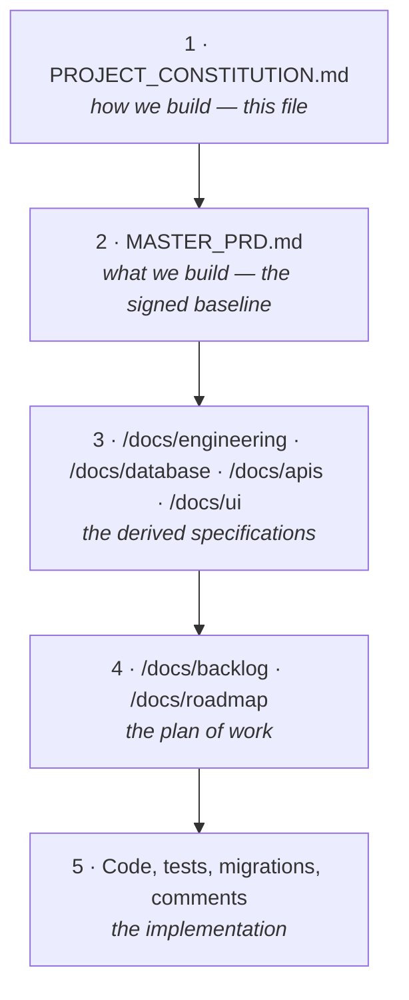
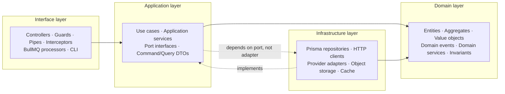
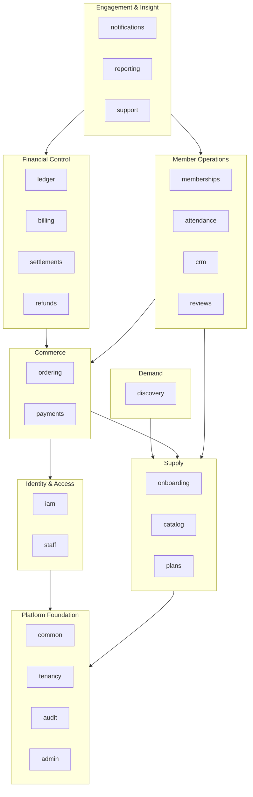
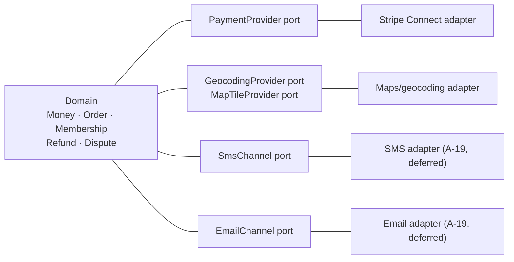
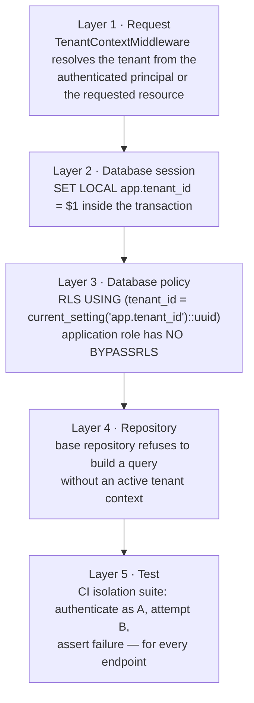
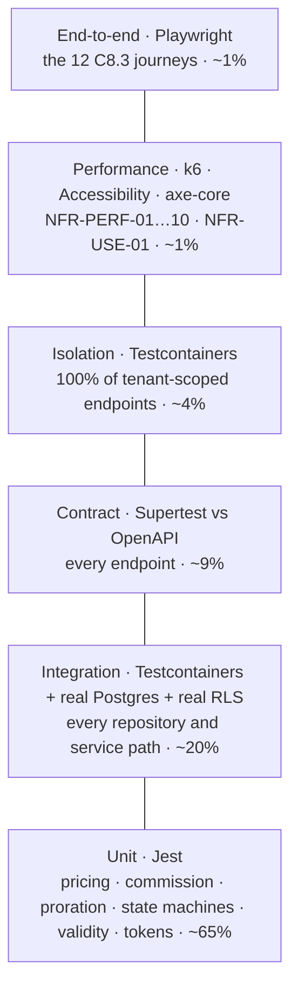

# PROJECT CONSTITUTION

## Gym Marketplace & Multi-Tenant Gym Management SaaS — The Engineering Law

| Field | Value |
| :--- | :--- |
| Document | `/docs/PROJECT_CONSTITUTION.md` |
| Version | 1.0 |
| Status | **IN FORCE** |
| Ratified | 2026-08-06 |
| Ratified by | Project owner |
| Governs | Every line of code, every migration, every pipeline definition, every infrastructure module, and every document in this repository |
| Baseline it serves | `/docs/MASTER_PRD.md` v2.0 (04 Aug 2026), the transcription of `Gym_Marketplace_BRD_PRD_v2.pdf` |
| Amendment | Section 24 only. No other mechanism exists. |
| Phase | Authored under Phase 0 of `/docs/PHASES.md`. **Zero application code exists.** Every code block in this document is labelled *illustrative — not committed code*. |

---

## Table of Contents

| § | Section |
| :-- | :--- |
| [1](#1-preamble--status) | Preamble & Status |
| [2](#2-the-ten-questions-before-code) | The Ten Questions Before Code |
| [3](#3-architecture-rules) | Architecture Rules |
| [4](#4-domain-driven-design) | Domain-Driven Design |
| [5](#5-clean-architecture-layer-contract) | Clean Architecture Layer Contract |
| [6](#6-solid-applied) | SOLID Applied |
| [7](#7-folder-structure-law) | Folder Structure Law |
| [8](#8-naming-conventions) | Naming Conventions |
| [9](#9-typescript-rules) | TypeScript Rules |
| [10](#10-money--time-law) | Money & Time Law |
| [11](#11-multi-tenancy-law) | Multi-Tenancy Law |
| [12](#12-security-rules) | Security Rules |
| [13](#13-error-handling-law) | Error Handling Law |
| [14](#14-api-rules) | API Rules |
| [15](#15-database-rules) | Database Rules |
| [16](#16-frontend-rules) | Frontend Rules |
| [17](#17-testing-law) | Testing Law |
| [18](#18-observability-law) | Observability Law |
| [19](#19-performance-budgets) | Performance Budgets |
| [20](#20-git-strategy) | Git Strategy |
| [21](#21-documentation-law) | Documentation Law |
| [22](#22-dependency-governance) | Dependency Governance |
| [23](#23-definition-of-ready--definition-of-done) | Definition of Ready / Definition of Done |
| [24](#24-amendment-procedure) | Amendment Procedure |
| [25](#25-enforcement-matrix) | Enforcement Matrix |

---

# 1. Preamble & Status

## 1.1 What this document is

This is the **law of the project**. `/docs/MASTER_PRD.md` says *what* is built and *why*.
This document says *how* it is built, *how* it is structured, *how* it is named, *how* it is tested,
*how* it is reviewed, and *what happens when someone breaks a rule*.

It is written for one specific reader: **the engineer who joins in month nine**, opens the repository
for the first time, and must ship a change to the settlement statement without breaking `BR-FIN-03`,
without leaking tenant B's rows into tenant A's report, and without a verbal briefing from anyone.
Everything that engineer needs to know about *how we build here* is in this file or is reachable from
a rule in this file.

It is deliberately long. A constitution that omits the awkward cases is not a constitution; it is a
style guide, and a style guide does not stop money being computed with a `float` at 02:00 on a
Friday.

## 1.2 Status: immutable

This document is **immutable**. It is not edited in the ordinary course of work. It is not "kept up
to date" by whoever last touched a file. It is not refactored, tidied, reorganised, or reworded.

The only permitted change is a **numbered amendment** made through the procedure in
[§24](#24-amendment-procedure). An amendment states its number, its rationale, its date and its
approver; the clause it supersedes is retained in place, struck through, so that a reader in month
thirty-six can reconstruct what the rule used to be and why it changed.

A pull request that edits any section of this file without a corresponding row in the Amendment
Register in §24 is closed without review.

## 1.3 The precedence order

When two artefacts disagree, the higher one wins. This order is absolute and is not subject to
seniority, urgency, or a demo tomorrow.



| Rank | Artefact | Authority | Typical conflict it settles |
| :-: | :--- | :--- | :--- |
| **1** | `/docs/PROJECT_CONSTITUTION.md` | Absolute on *how*. Cannot be overridden by any lower artefact. | An API design doc proposes accepting `tenant_id` in a request body. §11 forbids it. The API doc is wrong and is corrected. |
| **2** | `/docs/MASTER_PRD.md` | Absolute on *what*, *why*, and the commercial rules. Overrides everything below it. | A backlog story says commission is charged on the tax-inclusive total. `BR-FIN-04` says commission is charged on the commission base only. The story is wrong. |
| **3** | `/docs/engineering/*`, `/docs/database/*`, `/docs/apis/*`, `/docs/ui/*` | Binding derived specification. Must trace to a PRD identifier. | Two engineering docs disagree on whether `attendance` is partitioned. `NFR-SCAL-06` and `C2.2` settle it: partitioned monthly by `checked_in_at`. |
| **4** | `/docs/backlog/*`, `/docs/roadmap/*` | Plan of work. Never a source of requirements. | A roadmap milestone omits the isolation test for a new endpoint. §11 and `C7`'s non-negotiable gates reinstate it. |
| **5** | Code, tests, migrations, IaC, comments | Lowest authority. Code is evidence of intent, never a statement of intent. | A comment says "commission excludes joining fee". Nothing in `A6.3` says that. The comment is deleted and the behaviour is re-derived from `A6.3`. |

**Corollary — a comment is never a specification.** If behaviour is documented only in a code
comment, it is undocumented. Move it to the owning `/docs/features/<name>.md` file (§21) and cite the
PRD identifier.

**Corollary — this constitution never overrides a business rule.** §1.3 rank 1 beats rank 2 only on
matters of *construction*. If this document ever appeared to change a `BR-`, `FR-` or `NFR-`
requirement, that is a defect in this document and is fixed by amendment, not by ignoring the PRD.

## 1.4 The Halt Rule

> **A conflict between any two artefacts HALTS work on the affected item until the conflict is
> resolved and the resolution is recorded in `/docs/DECISION_LOG.md`.**

This restates and hardens Cross-Phase Rule 5 of `/docs/PHASES.md`. It is not advisory.

**Procedure when a conflict is found:**

| Step | Action | Output |
| :-: | :--- | :--- |
| 1 | **Stop.** Do not implement either reading. Do not "pick the sensible one". Do not implement both behind a flag. | Work item moves to `BLOCKED`. |
| 2 | Write the conflict down: the two artefacts, the exact quoted text of each, the identifiers involved, and the two candidate behaviours with their consequences. | A conflict note in the pull request or ticket. |
| 3 | Apply the precedence order in §1.3. If precedence resolves it unambiguously, the lower artefact is corrected **in the same pull request** as the work. | Corrected artefact + `DECISION_LOG.md` entry. |
| 4 | If precedence does not resolve it — the conflict is *within* one rank, or it is a genuine gap in `MASTER_PRD.md` — escalate to the project owner. If it is a gap in the PRD, it is a change request under `MASTER_PRD.md` §C10, not a decision an engineer may take. | Owner ruling. |
| 5 | Record the resolution in `/docs/DECISION_LOG.md` with: date, conflicting artefacts, options considered, decision, rationale, consequences, and the identifiers affected. | Permanent record. |
| 6 | Resume. If the resolution invalidated existing work, that work is reverted, not patched. | Unblocked work item. |

**Worked example.** `MASTER_PRD.md` §A6.3 states that commission is computed on `B = N` and that
`round_half_even` is applied. A draft `/docs/database/Schema.md` proposes storing
`commission_rate_bps` as `numeric(5,2)`. §10 of this constitution forbids floating or decimal
arithmetic in the money path and `C2.2` already specifies `commission_rate_bps int`. Precedence
resolves it: rank 1 and rank 2 both beat rank 3. `Schema.md` is corrected to `int` basis points in
the same PR, and `DECISION_LOG.md` records why basis points rather than a decimal rate — because a
rate expressed in integer basis points multiplied by an integer minor-unit base, with a single
documented rounding step, is the only formulation in which `BR-FIN-02` (persist all eight figures)
and `BR-FIN-03` (lines sum exactly to the payout) can both hold.

## 1.5 Ratified stack — restated so it cannot be misread

The technology stack named in `MASTER_PRD.md` (Baseline Decisions table and Part C §C1.1) is
**authoritative and unchangeable** by owner ruling of 2026-08-06.

| Slot | Locked selection | Not this |
| :--- | :--- | :--- |
| API framework | **NestJS 10 on Node.js 20, TypeScript** | Not Express. Express was raised as an option during an earlier draft and was **rejected** as a substitution rather than an addition. Any document, comment, ticket or diagram in this repository naming Express as this project's framework is a defect. |
| Architecture | **Modular monolith** | Not microservices. Explicitly rejected in `C1.3`. |
| Database | **PostgreSQL 16** | Not MongoDB, not any non-Postgres primary store. |
| Geospatial | **PostGIS** | Not a third-party geospatial service for radius queries. |
| Search | **Postgres full-text + trigram**; OpenSearch only past ~50k listings | Not a search cluster at launch. |
| Cache / queue | **Redis 7 + BullMQ** | Not RabbitMQ, not SQS, not an in-process scheduler. |
| Object storage | **S3-compatible + CDN** | Not the application filesystem. |
| Customer site | **Next.js 14 App Router + React 18 + TypeScript**, server-rendered | Not a client-only SPA — SEO on gym and city pages is an acquisition channel (`FR-SRCH-13`, `FR-DETL-10`, `NFR-PERF-02`). |
| Dashboards (`dash`, `admin`) | **React 18 + Vite + TypeScript**, SPA | Not Next.js — SEO is irrelevant and interactivity is high. |
| UI system | **Shared component library + design tokens as the single styling source** | Not three per-surface style implementations. |
| Server state | **TanStack Query** | Not Redux, Zustand or MobX for server state. |
| Auth | **JWT access tokens + rotating refresh tokens, httpOnly** | Not server-side sessions with affinity — `NFR-SCAL-03` requires a stateless app tier. |
| Payments | **`PaymentProvider` port + Stripe Connect reference adapter** | Not a provider SDK called from domain code. |
| Notifications | **Channel adapters behind one interface** | Not a vendor SDK called from a use case. |
| PDF | **Headless Chromium, deterministic** (`FR-INV-07`) | Not a template service whose output varies between runs. |
| Observability | **OpenTelemetry + structured JSON logs + metrics + error tracking** | Not `console.log`. |
| CI/CD | **Trunk-based, short-lived branches** | Not GitFlow, not long-lived release branches. |
| Infrastructure | **Containers on a managed orchestrator, managed Postgres and Redis, IaC** | Not manually-provisioned servers. |

The thirty approved additions `A-01` … `A-30` and the two deferred ones (`A-08` Socket.IO → Phase 2,
`A-19` notification vendors → blocked on `OQ-01`) are registered in
`/docs/engineering/STACK_ADDITIONS.md`. §22 of this constitution makes that register binding.

## 1.6 Who this binds

| Party | Bound by |
| :--- | :--- |
| Every engineer, in-house or contract | All sections. |
| Every reviewer | §23 (Definition of Done) and §25 (Enforcement Matrix). A reviewer who approves a violation owns the violation. |
| Every automated agent or code-generation tool operating on this repository | All sections. An agent's output is held to the identical standard; "generated" is never a defence. |
| CI | §25. Where a rule says CI fails the build, CI fails the build. A green build with a disabled gate is a red build. |

## 1.7 The seven guiding principles this constitution serves

Restated from `MASTER_PRD.md` §A3.4 because every engineering rule below traces to one of them.

| # | Principle | The engineering rule it produces |
| :-: | :--- | :--- |
| 1 | **The gym's data belongs to the gym.** | Export paths are first-class features with tests, not admin scripts (`BR-DAT-05`, `FR-CRM-08`, `BAC-12`). |
| 2 | **Never show a price that cannot be bought.** | Server-side price revalidation is a use case, not a controller check (`BR-PLN-03`, `AC-PLAN-02.2`). |
| 3 | **Money is append-only.** | `ledger_entries` carries no `UPDATE` or `DELETE` grant (`BR-FIN-01`, §15.7). |
| 4 | **Verification before visibility.** | No code path may set a gym to `APPROVED` without a human actor id (`BR-GYM-03`). |
| 5 | **Earned reviews only.** | Review eligibility is computed server-side from `attendance`, never inferred from the client (`BR-REV-01`, `FR-REV-01`). |
| 6 | **Degrade, do not fail.** | Every third-party call sits behind a circuit breaker with a defined fallback (`NFR-AVL-03`, `NFR-AVL-07`). |
| 7 | **Every state change is attributable.** | Actor, timestamp, before-state and after-state on every audited entity (`BR-DAT-01`, `NFR-DQ-05`). |

---

# 2. The Ten Questions Before Code

Before writing an implementation — not before opening a pull request, **before writing the
implementation** — the engineer answers these ten questions in the ticket or the PR description.
Ten short answers. This is a preflight checklist, not an essay.

The tenth question is the point of the exercise: a "no" is permitted, but only out loud.

| # | Question | Answered where |
| :-: | :--- | :--- |
| 1 | Does this already exist in another module? | PR description |
| 2 | Can this be reused instead of duplicated? | PR description |
| 3 | Will this design still work with 10 gyms? 1,000? 100,000? | PR description |
| 4 | If this module is removed, will unrelated modules continue to work? | PR description |
| 5 | Is this introducing unnecessary coupling? | PR description |
| 6 | Is this feature configurable instead of hardcoded? | PR description |
| 7 | Is this implementation testable? | PR description |
| 8 | Is this implementation observable? | PR description |
| 9 | Is this implementation backward compatible? | PR description |
| 10 | If any answer is "no", explain why **before** writing code. | PR description + `TECH_DEBT.md` where it is a shortcut |

---

## Q1 — Does this already exist in another module?

**Why it is here.** This product has twenty-three backend modules and fifty-five screens. The single
most common failure mode in a domain this size is not a bug; it is the *second implementation* of
something that already worked — a second money formatter, a second date-in-gym-timezone helper, a
second permission check — which then drifts from the first and produces two different answers to the
same question.

**Worked example — commission computation.**
A developer building the **tenant-facing** revenue report (`SCR-DASH-020`, report *Revenue summary*)
needs commission per order. The temptation is to write
`commissionMinor = Math.round(netMinor * rate)` in `reporting/`.

That is forbidden twice over. First, `A6.3` and `BR-FIN-02` require the eight figures
(`G`, `D`, `N`, `T`, `B`, `C`, `F`, `P`) to be **persisted per transaction** and never recomputed at
display time. Second, the computation already exists once, in `ledger/`, as the sole place the
platform is permitted to derive `C` from `B` and the effective rate at the moment of sale
(`BR-FIN-05`).

The correct answer to Q1 is: *yes, it exists — `ledger/` owns the computation and `orders` /
`settlement_lines` persist the result; `reporting/` reads the persisted columns.* If the report
disagrees with the settlement statement, that is a `BAC-07` failure and an S1 defect under `C8.5`.

**Search order before answering "no":**

1. `/docs/features/` — one file per feature, each with a *Business Rules* section.
2. The twenty-three module `README.md` files (§21.2), each of which lists its exported providers.
3. `packages/utils` and `packages/types` — the shared kernel (§3.5).
4. `grep` for the PRD identifier. Every use case cites the identifiers it satisfies (§21).

---

## Q2 — Can this be reused instead of duplicated?

**Why it is here.** Q1 asks whether it exists. Q2 asks whether the thing that exists can be *shaped*
to serve both callers without becoming a god-object with a `mode` flag.

**Worked example — QR token issuance.**
`FR-CHK-01` renders a rotating QR on the member's membership screen (`SCR-WEB-009`), signed
server-side with a 60-second TTL, Ed25519 with a rotating key and `kid` in the payload (`A-11`,
`BR-CHK-02`). Later, `FR-CHK-07` adds staff manual check-in by member lookup, and someone proposes a
"staff-issued token" so the desk can generate a code for a member whose phone is flat
(`SCR-DASH-009` manual mode).

Reuse test:

| Question | Answer |
| :--- | :--- |
| Same signing key and algorithm? | Yes — one `TokenSigner` port, one rotating Ed25519 key, `kid` in payload. |
| Same payload shape? | Yes — `membership_id`, `member_id`, `tenant_id`, `iat`, `exp`, `nonce`, and nothing personal (`FR-CHK-02`). |
| Same validation sequence? | **No.** `FR-CHK-04` fixes the ten-step order for a scanned token. A manual check-in is a different use case with a different guard set: it is marked `MANUAL`, carries `staff_id` and a reason (`BR-CHK-08`), and is reportable separately. |
| Same authorisation? | **No.** The member issues their own token (`POST /me/memberships/:id/qr`); staff record a manual entry (`POST /checkin/manual`). Different permissions entirely. |

Correct answer: **reuse the `TokenSigner` and the payload type; do not reuse the use case.** One
signer, two use cases — `IssueMembershipTokenUseCase` and `RecordManualCheckInUseCase` — sharing a
port, not a branch. A single `checkIn(mode: 'scan' | 'manual')` function would fail Q5 (coupling) and
would make `BR-CHK-08`'s separate reportability an `if` statement instead of a domain distinction.

---

## Q3 — Will this design still work with 10 gyms? 1,000? 100,000?

**Why it is here.** `NFR-SCAL-01` fixes Year-1 capacity at 2,000 tenants, 5,000 branches, 500,000
users, 100,000 concurrent-eligible memberships and 50,000 check-ins per day. `NFR-SCAL-02` demands
10× headroom without re-architecture. Designs that are correct at 10 and catastrophic at 100,000 are
almost always correct-looking in review.

Answer this question with three numbers, not an adjective.

**Worked example — tenant isolation and the "load all tenants" report.**
The platform reconciliation job (`settlement.reconcile`, daily 04:00, `FR-SETL-09`, `BR-FIN-07`)
compares the gateway settlement report to `ledger_entries` for every tenant.

| Scale | Naive design: `for (const tenant of allTenants) { … }` loading all ledger entries per tenant | Verdict |
| :--- | :--- | :--- |
| 10 gyms | 10 iterations, a few thousand rows. Fine. | Passes |
| 1,000 gyms | 1,000 iterations. Each opens a transaction, sets `app.tenant_id`, streams rows. Runtime measured in minutes. Acceptable if the job window is respected and progress is checkpointed. | Passes with checkpointing |
| 100,000 gyms | 100,000 transactions in a nightly window, each acquiring a pooled connection. The pool is the bottleneck long before Postgres is. A single failure at tenant 71,402 must not restart from tenant 1. | **Fails** without batching, a resumable cursor and a distributed lock |

The design that survives all three: the job is **partitioned by tenant batch**, each batch is a
BullMQ job with its own distributed lock (`C5`), each batch checkpoints its last completed tenant,
and a variance raises a per-tenant alert and blocks auto-payout for **that tenant only**
(`BR-FIN-07`) rather than failing the run. That design is identical at 10 and at 100,000; only the
number of batches changes. That is what "still works" means.

**The three scale questions to actually ask:**

1. What is the query's row count at 100,000 tenants, and is there an index in `/docs/database/Indexes.md` that serves it?
2. Does anything here load an unbounded collection into memory? (Bulk member import — `FR-ONB-15`, 400+ rows — must stream via `papaparse` stream mode per `A-20`, never buffer.)
3. Does anything here run per-tenant in a single process, and if so, is it batched, locked, checkpointed and independently failable?

---

## Q4 — If this module is removed, will unrelated modules continue to work?

**Why it is here.** `C1.3` states the modular monolith exists so that "any module can later be
extracted into a service without a rewrite". A module that cannot be *deleted* cannot be *extracted*.
Deletability is the cheap, testable proxy for extractability.

**Worked example — the settlement statement.**
`settlements/` produces batches and statements (`FR-SETL-01` … `FR-SETL-10`). Delete it. What breaks?

| Module | Does it break? | Why |
| :--- | :--- | :--- |
| `ledger/` | **No.** | `ledger/` writes append-only entries on payment capture, refund and chargeback. It has never heard of a batch. `settlement_batch_id` on `ledger_entries` is nullable until batched (`C2.2`). |
| `payments/` | **No.** | Capture writes ledger entries and emits `payment.captured`. It does not call settlement. |
| `refunds/` | **No.** | A refund writes reversal entries (`FR-RFND-07`). Whether they later land in a batch is not `refunds/`'s concern. |
| `reporting/` | **Degrades, correctly.** | The *Settlement statement* report disappears. *Revenue summary*, *Revenue by plan*, *Tax report* continue, because they read `orders` and `ledger_entries`, not batches. |
| `notifications/` | **No.** | The "Payout initiated + statement" notification stops being emitted because nothing emits `settlement.paid`. The channel, the template registry and every other notification are untouched. |
| `attendance/`, `memberships/`, `discovery/`, `reviews/` | **No.** | No path from a check-in or a review to a payout. |

That is a passing answer. A **failing** answer would be: "`payments/` imports
`SettlementBatchRepository` to mark entries as settled at capture time." That inverts the dependency,
makes money capture depend on payout machinery, and means an outage in settlement blocks sales —
violating `NFR-AVL-02` (check-in and payment degrade last).

**How to answer Q4 honestly:** list the module's *inbound* edges from
`/docs/engineering/ModuleDependency.md`. If an inbound edge exists from a module that has no business
reason to know this one exists, that edge is the answer, and it is a "no".

---

## Q5 — Is this introducing unnecessary coupling?

**Why it is here.** §3.4 permits exactly two forms of cross-module communication: an **exported
provider interface** and a **domain event**. Everything else — importing another module's repository,
another module's Prisma model, another module's table, another module's DTO — is a build failure.
Q5 catches the cases that are *technically* permitted but still wrong.

**Worked example — review eligibility.**
`BR-REV-01`: only a user with at least one recorded check-in at the gym may review it. `FR-REV-01`
adds that eligibility is computed server-side and the compose UI is unreachable otherwise.

Three candidate designs:

| Design | Coupling | Verdict |
| :--- | :--- | :--- |
| **A.** `reviews/` injects `AttendanceRepository` and runs `SELECT 1 FROM attendance WHERE …`. | `reviews/` now depends on `attendance`'s persistence shape. Partitioning `attendance` monthly (`NFR-SCAL-06`) becomes a change to `reviews/`. | **Forbidden.** Cross-module repository access. Build fails (§3.7). |
| **B.** `reviews/` injects `AttendanceQueryPort` — a narrow interface exported by `attendance/` with one method, `hasCheckInAtGym(memberId, gymId): Promise<boolean>`. | One method, one direction, no persistence knowledge, no shared types beyond branded ids. | **Correct.** |
| **C.** `attendance/` emits `attendance.recorded`; `reviews/` maintains its own `review_eligibility` projection. | Eventually consistent. A member who checked in ten seconds ago and immediately taps "Write a review" may be told they are ineligible — a direct contradiction of `AC-REV-02.1`'s intent and a support ticket generator. | **Rejected for this case.** Correct for the *review prompt* (`FR-REV-10`, sent after the third check-in), which is asynchronous by nature. |

The distinction Q5 forces: **synchronous truth needs a port; asynchronous reaction needs an event.**
Eligibility is synchronous truth. The prompt is an asynchronous reaction. Using an event for the
first, or a port for the second, is unnecessary coupling in one direction and unnecessary latency in
the other.

---

## Q6 — Is this feature configurable instead of hardcoded?

**Why it is here.** `MASTER_PRD.md`'s Baseline Decisions table commits the platform to being
"currency-agnostic and country-agnostic", with tax as a pluggable profile and KYC as a configurable
checklist. Twenty open questions (`OQ-01` … `OQ-20`) are still unanswered and each has a *stated
default*. Every one of those defaults is a value that will change.

**The rule:** if a number, a duration, a threshold or a list appears in `MASTER_PRD.md` next to the
word *configurable*, *default*, *per tenant*, *per country* or *per plan*, it is **configuration**,
never a literal.

**Worked example — the check-in cooldown.**
`BR-CHK-04`: "A repeat check-in within a **configurable** cooldown (**default 60 minutes**) at the
same branch is recorded as a duplicate and does not decrement entitlement." `OQ-08` asks the client
to confirm 60 minutes and states 60 minutes as the default until they do.

| Implementation | Verdict |
| :--- | :--- |
| `const COOLDOWN_MINUTES = 60;` in the check-in use case | **Forbidden.** Hardcodes an `OQ-` default as a constant. |
| Tenant setting `checkin_cooldown_minutes`, surfaced in `SCR-DASH-022` *Settings → check-in configuration*, defaulted to 60 by platform configuration, read by the use case through a `TenantSettingsPort` | **Correct.** `OQ-08` becomes a configuration change, not a deployment. |

**The exhaustive list of things that are configuration in this product, not code:**

| Value | Source | PRD reference |
| :--- | :--- | :--- |
| Commission rate (global default < tier < tenant override) | Platform config + tenant override | `FR-ADMN-03`, `OQ-02` |
| Reduced renewal commission rate | Tenant | `A6.3`, `OQ-02` |
| Settlement cycle days | Tenant, default 7 | `A6.4`, `C2.2`, `OQ-04` |
| Reserve basis points and release period | Tenant, default 500 bps / 30 days | `A6.4`, `OQ-04` |
| New-tenant hold period | Platform, default 14 days | `A6.4` |
| Minimum payout floor | Tenant | `A6.4`, `FR-SETL-05` |
| Attribution window | Platform, 30 days | `A6.3` |
| Refund policy (window, proration, cancellation fee) | Tenant, snapshotted per order | `BR-REF-01`, `BR-REF-02`, `OQ-05` |
| Refund auto-approval value and usage thresholds | Platform | `BR-REF-03`, `BR-REF-06` |
| Check-in cooldown | Tenant, default 60 min | `BR-CHK-04`, `OQ-08` |
| Auto-checkout threshold | Tenant | `FR-CHK-09` |
| Overridable denial reasons | Platform taxonomy | `FR-CHK-08`, `OQ-09` |
| Implausible-travel distance and interval | Platform | `FR-CHK-12`, `BR-CHK-07` |
| Freeze allowance and cap | Plan | `BR-MEM-05`, `OQ-06` |
| Freeze future-start horizon (30 days) | Platform | `BR-MEM-07` |
| Renewal reminder schedule (T−15/−7/−3/−1) | Platform default, tenant override | `BR-MEM-11`, `FR-MEMB-10` |
| Order expiry (30 minutes) | Platform | `FR-CART-05` |
| Future start-date horizon | Platform | `FR-CART-02` |
| Minimum reviews before a numeric rating shows (3) | Platform | `BR-REV-07`, `OQ-10` |
| Review edit window (7 days) | Platform | `BR-REV-02` |
| Address-to-geo tolerance | Platform, per country | `BR-GYM-08` |
| Tax rates, inclusive/exclusive, rounding | Tax profile per country | `FR-INV-05`, `FR-ADMN-05` |
| KYC document checklist | Per country | `FR-ONB-03`, `FR-ADMN-06` |
| Subscription tier limits, features, prices | Platform | `FR-ADMN-04`, `OQ-03` |
| Search relevance ranking weights | Platform, changeable without deployment | `FR-SRCH-10` |
| Listing freshness thresholds | Platform | `FR-GYM-12` |
| Rate-limit tiers | Platform, per endpoint class | `NFR-SEC-06`, `C1.5` |
| Notification quiet hours | Per user | `FR-NOTF-05` |
| Feature flags | Platform, with tenant / role / percentage targeting | `FR-ADMN-08`, `NFR-MNT-07` |
| Session display duration on the check-in desk | Tenant | `FR-CHK-05` |
| Live-counter poll interval (10–15 s) | Platform | `A-08` |

---

## Q7 — Is this implementation testable?

**Why it is here.** `NFR-MNT-01` demands ≥80% coverage overall and ≥95% on payment, settlement,
membership state and tenancy code. `BAC-06` demands that every rule in `A8` has a passing automated
test and that every M-priority rule also has a **negative-case** test. Code that is hard to test is
not "hard to test"; it is wrongly structured, and it will be the code that is not covered.

**Worked example — settlement statement arithmetic.**
`BR-FIN-03`: a statement's line items must sum **exactly** to the payout amount, including opening
balance, reserve and refund lines. `AC-SETL-01.1`: the arithmetic must visibly sum to the payout.

| Design | Testable? |
| :--- | :--- |
| `SettlementService` that opens a transaction, queries ledger entries, computes the batch, writes the batch, renders the PDF and sends the notification | **No.** Testing `BR-FIN-03` requires a database, a Chromium process and a mail transport. Nobody writes the fifty edge-case tests that rule deserves. |
| A pure domain function `buildStatement(openingBalance: Money, lines: readonly LedgerLine[], reserve: ReservePolicy): Statement` that returns a `Statement` whose `total` is asserted to equal the sum of its parts, plus a thin use case that loads, calls, persists and emits | **Yes.** `BR-FIN-03` becomes a property test: for any generated set of lines, `statement.total === sum(statement.lines) + openingBalance − reserveHeld + reserveReleased`. The `E2E-12` journey then proves the wiring once. |

**The testability rules that follow:**

1. **Domain logic is pure.** Pricing (`A6.3`), proration (`FR-RFND-04`), freeze extension
   (`BR-MEM-05`), entitlement decrement (`BR-PLN-06`), the ten-step check-in validation sequence
   (`FR-CHK-04`), invoice numbering (`FR-INV-02`) and state-machine transitions (`C4.1` … `C4.7`) are
   pure functions over value objects. No I/O, no clock, no random.
2. **Time is injected.** A `Clock` port. `BR-MEM-03` computes validity in the *gym's* timezone; a test
   for a membership expiring at 23:59 in `Asia/Kolkata` while the CI runner is on UTC must be
   possible without changing the runner.
3. **Randomness is injected.** The QR nonce (`FR-CHK-02`) and the idempotency key come from a port so
   `AC-CHK-01.4` (same token scanned twice → one attendance record) is deterministic.
4. **External systems are ports.** `PaymentProvider` (`FR-PAY-01`), notification channels
   (`FR-NOTF-01`), object storage, maps and geocoding. Integration tests use Testcontainers (`A-06`)
   for the real Postgres, because RLS behaviour cannot be faked.

---

## Q8 — Is this implementation observable?

**Why it is here.** `NFR-MNT-04` requires structured JSON logs with a correlation id propagated into
background jobs. `NFR-MNT-06` names the seven things that must alert. `NFR-MNT-09` requires a runbook
per module covering its top three failure modes. An implementation you cannot see is an
implementation you cannot operate, and this platform's worst failures are silent ones:
a settlement that is quietly 40 minor units out, a webhook that quietly stopped arriving.

**Worked example — commission computation, again.**
When Finance opens a `BR-FIN-07` variance at 04:00 and asks "why is tenant 812's payout 40 paise
short", the answer must be reconstructible from telemetry without attaching a debugger to production.

| Signal | Required |
| :--- | :--- |
| Log | One structured line per settlement batch: `tenant_id`, `batch_id`, `period_start`, `period_end`, `line_count`, `gross_minor`, `commission_minor`, `fees_minor`, `refunds_minor`, `reserve_held_minor`, `net_payable_minor`, `currency`, `correlation_id`. No member names, no emails, no phone numbers (`BR-DAT-06`). |
| Metric | `settlement_batch_build_duration_seconds` (histogram), `settlement_batch_lines_total` (counter), `settlement_reconciliation_variance_minor` (gauge, per tenant). |
| Trace | A span per batch with the tenant id as an attribute; child spans for ledger read, computation, persistence, statement render. |
| Alert | `settlement_reconciliation_variance_minor != 0` → page Finance, block auto-payout for that tenant (`BR-FIN-07`, `KPI-26`). |
| Runbook | `apps/server/src/settlements/README.md` → *Failure modes*: (1) gateway report late or malformed; (2) non-zero variance; (3) payout rejected by bank (`FR-SETL-08`). |

**Answer Q8 with four artefacts:** the log line's field list, the metric names, the span names, and
the alert condition. "It logs errors" is not an answer.

---

## Q9 — Is this implementation backward compatible?

**Why it is here.** `NFR-AVL-06` requires zero-downtime deployment with backward-compatible
migrations within a release window. `NFR-MNT-02` requires API versioning with a published deprecation
period, and `C3.1` fixes that period at **≥6 months**. During a rolling deploy, the previous and next
versions of the application run simultaneously against **one** database.

**Worked example — adding `commission_base_minor` semantics for platform-funded coupons.**
`BR-CPN-05` and `A6.3`: when a coupon is gym-funded, the commission base is the post-discount net;
when platform-funded, it is the pre-discount net and the platform absorbs the discount. Suppose the
first release shipped gym-funded only, and platform-funded is now being added.

| Step | Change | Compatible? |
| :-: | :--- | :--- |
| 1 | Migration adds `coupons.funding_source` with a default of `GYM` and `NOT NULL`. Old code ignores the column; new code reads it. | Yes — additive with a default. |
| 2 | New code writes `orders.commission_base_minor` per the funding source. Old code writes it per the gym-funded rule. Both write *something valid for the coupon that existed when the order was created*, because `BR-CPN-05` makes `funding_source` immutable after first use. | Yes. |
| 3 | Settlement reads `orders.commission_base_minor` — the persisted figure (`BR-FIN-02`) — never recomputes. | Yes. This is precisely why `BR-FIN-02` exists. |
| 4 | A later release drops the temporary compatibility branch, after the deprecation window. | Yes — separate release. |

The **forbidden** version of this change is a single migration that renames a column, backfills it,
and ships new code that requires the new name. During the rolling window, old pods write the old
column and new pods read the new one, and the platform silently computes commission on the wrong
base for the duration of the deploy. That is an S1 defect under `C8.5`.

**The backward-compatibility rules that follow (expanded in §15.3):**

| Operation | Allowed in one release? |
| :--- | :--- |
| Add a nullable column | Yes |
| Add a `NOT NULL` column **with** a default | Yes |
| Add a table, index (`CONCURRENTLY`), or non-validated constraint | Yes |
| Rename a column or table | **No** — add new, dual-write, backfill, switch reads, drop old, across ≥3 releases |
| Drop a column or table | **No** in the release that stops writing it — drop one release later |
| Narrow a type or add a `NOT NULL` without a default | **No** — expand, migrate, contract |
| Remove or rename an API field | **No** — deprecate for ≥6 months per `C3.1` |
| Remove an enum value that exists in persisted rows | **No** — never; enum values are append-only in practice |

---

## Q10 — If any answer is "no", explain why before writing code

A "no" is not automatically a blocker. Deadlines are real, and `MASTER_PRD.md` §C9.1 has eighteen
sprints, not eighty. What is forbidden is a **silent** "no".

**The procedure:**

| Step | Action |
| :-: | :--- |
| 1 | Write the "no" in the PR description, naming the question number. |
| 2 | State the consequence in this domain's terms — not "this is a bit ugly" but "at 2,000 tenants this job exceeds its 2-hour window and `settlement.build-batches` misses its 02:00 slot". |
| 3 | State what would make it a "yes" and what that costs. |
| 4 | Register it in `/docs/TECH_DEBT.md` with: id, date, owner, the question failed, the interest rate (what gets worse as time passes), and the **payoff trigger** (the measurable condition that forces the fix). |
| 5 | Get an explicit reviewer acknowledgement of the debt row, not merely an approval of the code. |

**Worked example — the live-counter poll (`A-08`).**
`SCR-DASH-001` needs a currently-in-gym count and `SCR-DASH-009` a live recent-check-ins strip.
Q3 ("will it work at 100,000?") is answered **no** for polling: at scale, a 10-second poll from every
open dashboard is a meaningful share of total API traffic.

The owner ruled polling for Phase 1 anyway, and did it correctly: the "no" is written down, the
consequence is quantified, the payoff trigger is explicit — *any tenant exceeding 200 check-ins/hour
at one branch, or poll traffic exceeding 5% of total API requests, or gym-owner complaints about desk
lag* — the mitigation is architectural (**one** `useLiveCounters()` hook so the Phase-2 transport swap
touches one file), the honesty requirement is a product rule (both surfaces show a "last updated"
indicator; a stale figure presented as live is a defect), and it is registered as `TD-0xx` in
`TECH_DEBT.md` behind flag `release.attendance.realtime_transport`.

That is what a compliant "no" looks like. Anything less is a `TODO` comment, and a `TODO` comment is
a decision nobody made.

---
# 3. Architecture Rules

## 3.1 The modular monolith law

`MASTER_PRD.md` §C1.3 selects a **modular monolith** and states the reason plainly: the domain
boundaries are enforced in code so that any module can later be extracted into a service without a
rewrite, but the operational cost of a distributed system is not paid before there is a reason to pay
it. `/docs/engineering/STACK_ADDITIONS.md` Part 3 records microservices as **rejected**.

| Law | Statement |
| :--- | :--- |
| **L1** | There is exactly **one** deployable API artefact: `apps/server`. It runs in two roles — HTTP request handler and BullMQ worker — selected by configuration, never by a separate codebase. |
| **L2** | The worker role is a **separate process and a separate scaling group** from the request role (`NFR-SCAL-05`: background work cannot starve request handling), running the same image. |
| **L3** | Module boundaries are **compile-time and lint-time enforced**, not conventional. A violation fails the build (§3.7). |
| **L4** | No module may be split across two NestJS `@Module()` declarations, and no NestJS `@Module()` may span two domain modules. One directory, one module, one boundary. |
| **L5** | A module is **deletable**: removing its directory and its import from `AppModule` must leave every other module compiling and its tests passing, except for features that legitimately consume its exported ports (Q4, §2). |
| **L6** | The app tier is **stateless** (`NFR-SCAL-03`). No in-memory session store, no in-memory cache that must be coherent across replicas, no sticky sessions, no WebSocket state in Phase 1 (`A-08`). Shared state lives in PostgreSQL or Redis. |
| **L7** | The nine cross-cutting mechanisms of `C1.5` — idempotency, money, time, events/outbox, audit, feature flags, rate limiting, error model, and tenant context — are implemented **once**, in `common/` or `tenancy/`, and consumed by every module. A second implementation of any of them is a build failure. |

## 3.2 The twenty-three modules

`C1.3` is authoritative and supersedes any earlier module list. The **23** backend modules are fixed.
Adding a twenty-fourth requires an amendment under §24.

| # | Module | Owns | Key PRD identifiers |
| :-: | :--- | :--- | :--- |
| 1 | `common/` | Config, logging, tracing, errors, guards, decorators, `Money`, pagination, idempotency | `C1.5`, `NFR-MNT-04`, `BR-PAY-01`, `BR-PAY-03` |
| 2 | `tenancy/` | Tenant context resolution, RLS session variable, tenant guard, the Prisma tenant-context extension | `BR-TEN-01` … `BR-TEN-06`, `C1.4`, `NFR-SEC-09` |
| 3 | `iam/` | Auth, sessions, users, roles, permissions, impersonation | `FR-AUTH-01` … `FR-AUTH-14`, `FR-RBAC-01` … `FR-RBAC-07` |
| 4 | `onboarding/` | Applications, KYC documents, verification workflow, pre-checks | `FR-ONB-01` … `FR-ONB-15`, `BR-GYM-01` … `BR-GYM-09`, `BR-DAT-07` |
| 5 | `catalog/` | Gyms, branches, amenities, hours, exceptions, media | `FR-GYM-01` … `FR-GYM-12`, `BR-TEN-03` |
| 6 | `plans/` | Plans, promotions, add-ons | `FR-PLAN-01` … `FR-PLAN-09`, `BR-PLN-01` … `BR-PLN-07` |
| 7 | `discovery/` | Search, ranking, comparison, favourites, SEO surfaces | `FR-SRCH-01` … `FR-SRCH-15`, `FR-DETL-01` … `FR-DETL-11`, `FR-FAV-01` … `FR-FAV-05` |
| 8 | `ordering/` | Carts, orders, eligibility, coupons | `FR-CART-01` … `FR-CART-11`, `FR-CPN-01` … `FR-CPN-08`, `BR-CPN-01` … `BR-CPN-05` |
| 9 | `payments/` | `PaymentProvider` port, adapters, intents, webhooks, payment reconciliation | `FR-PAY-01` … `FR-PAY-12`, `BR-PAY-01` … `BR-PAY-11` |
| 10 | `billing/` | Invoices, credit notes, tax profiles, subscription billing | `FR-INV-01` … `FR-INV-11`, `BR-PAY-10`, `BR-PAY-11`, `BR-TEN-06` |
| 11 | `memberships/` | Lifecycle state machine, freeze, renewal, upgrade, expiry jobs | `FR-MEMB-01` … `FR-MEMB-12`, `BR-MEM-01` … `BR-MEM-14`, `C4.1` |
| 12 | `attendance/` | Tokens, check-in validation, attendance records, attendance analytics | `FR-CHK-01` … `FR-CHK-14`, `BR-CHK-01` … `BR-CHK-10` |
| 13 | `crm/` | Members, segments, notes, leads | `FR-CRM-01` … `FR-CRM-10`, `BR-DAT-01`, `BR-DAT-05` |
| 14 | `staff/` | Staff, invitations, branch assignment, staff activity | `FR-STAF-01` … `FR-STAF-09` |
| 15 | `reviews/` | Reviews, responses, moderation, aggregation, anomaly detection | `FR-REV-01` … `FR-REV-11`, `BR-REV-01` … `BR-REV-07` |
| 16 | `ledger/` | Append-only financial ledger, balances, commission computation | `BR-FIN-01` … `BR-FIN-08`, `A6.3` |
| 17 | `settlements/` | Batches, statements, payouts, reserve, settlement reconciliation | `FR-SETL-01` … `FR-SETL-10`, `A6.4`, `KPI-26` |
| 18 | `refunds/` | Refund requests, policy evaluation, disputes, evidence packs | `FR-RFND-01` … `FR-RFND-11`, `BR-REF-01` … `BR-REF-09` |
| 19 | `notifications/` | Templates, channel adapters, preferences, delivery log | `FR-NOTF-01` … `FR-NOTF-08`, `BR-MEM-11` |
| 20 | `reporting/` | Report definitions, query layer, exports | `FR-RPT-01` … `FR-RPT-05`, `BAC-12` |
| 21 | `support/` | Tickets, help centre | `FR-SUP-01` … `FR-SUP-07`, `OBJ-10` |
| 22 | `admin/` | Configuration, feature flags, taxonomy, audit explorer surface | `FR-ADMN-01` … `FR-ADMN-13` |
| 23 | `audit/` | Append-only audit log writer and reader | `BR-DAT-01`, `BR-DAT-02`, `NFR-SEC-13` |

**Why `ledger/`, `settlements/`, `refunds/` and `billing/` are four modules and not one `payments`.**
The earlier engineering brief collapsed them. That is an unacceptable boundary for money code under
`BR-FIN-01` ("all balances are derived from the append-only ledger; no balance is ever stored as a
directly-mutable figure"). Four distinct consistency boundaries exist here:

| Module | Consistency boundary | If merged with the others |
| :--- | :--- | :--- |
| `ledger/` | An append-only fact. Once written, immutable, with **no** `UPDATE`/`DELETE` grant. | A merged module would inevitably grow an "adjust the ledger" path. `BR-FIN-01` dies. |
| `settlements/` | A *derived* aggregate over ledger facts, with its own state machine (`C4.7`) and dual approval above a threshold (`BR-FIN-08`). | Payout state machine transitions would sit next to capture logic; an outage in payouts would risk blocking sales, violating `NFR-AVL-02`. |
| `refunds/` | A *request-and-approval workflow* (`C4.5`) that produces ledger reversals; policy evaluation is its own domain (`BR-REF-01` … `BR-REF-09`). | Refund policy logic would be reachable from the capture path, which has no business knowing it. |
| `billing/` | Documents and tax — immutable invoices with gapless numbering (`FR-INV-02`, `BR-PAY-10`) and tenant subscription billing (`BR-TEN-06`), which is a *different money flow* from marketplace settlement entirely. | Subscription arrears logic (`BR-TEN-06`) would sit inside the marketplace settlement module, and the two would be confused in reporting. |

## 3.3 The dependency rule

Dependencies point **inwards**. The domain depends on nothing.



Read as text, and this is the sentence every engineer on this project must be able to recite:

> **routes/controllers → use cases → domain ← repositories. The domain depends on nothing.**

| Rule | Statement |
| :--- | :--- |
| **D1** | A controller contains no business logic. It validates the request shape with a Zod pipe, resolves the caller's permission via a guard, calls exactly one use case, and maps the result to a response DTO. Nothing else. |
| **D2** | A use case orchestrates. It loads aggregates through repository **ports**, invokes domain behaviour, persists through ports, and emits domain events. It contains no SQL, no HTTP, no `PrismaClient`, and no framework decorator other than `@Injectable()`. |
| **D3** | The domain layer imports **nothing** from NestJS, Prisma, Zod, Express, `@nestjs/swagger`, Redis, BullMQ, Pino, Sentry, or any other module's directory. It may import from `packages/types` (branded ids, `Money`, enums) and `packages/utils` (pure helpers) only. |
| **D4** | Repositories implement port interfaces **declared in the application layer** and live in the infrastructure layer. The port is named for what the domain needs (`MembershipRepository`), not for the technology (`PrismaMembershipRepository` is the implementation class name, bound in the module). |
| **D5** | Domain events are plain, serialisable value objects declared in the domain layer. They carry ids and minimal facts, never entities and never personal data (`BR-DAT-06`). |
| **D6** | No layer imports "upwards". Infrastructure may not import a controller. Domain may not import a use case. |
| **D7** | BullMQ processors are **interface-layer adapters**, structurally identical to controllers: resolve context, call one use case, map the result. `C5`'s twenty-four jobs contain no business logic. |

## 3.4 Permitted cross-module communication

Exactly two mechanisms are permitted. There is no third.

### 3.4.1 Exported provider interfaces (synchronous)

| Rule | Statement |
| :--- | :--- |
| **X1** | A module that needs synchronous truth from another module consumes a **narrow interface** exported by that module's `index.ts` public surface and provided by its NestJS module. |
| **X2** | The interface is declared by the **provider** module (it owns the contract) and lives in `<module>/ports/`. It is injected by a NestJS injection token, never by a concrete class. |
| **X3** | The interface exposes the smallest set of operations the consumer needs (Interface Segregation, §6.4). A "give me the whole entity" method is a design smell and normally means the boundary is wrong. |
| **X4** | The returned type is a **read model** owned by the provider module — never the provider's domain entity, never its Prisma model, never a `Prisma.$Result` type. |
| **X5** | Cross-module calls are **acyclic**. `/docs/engineering/ModuleDependency.md` must prove the graph is a DAG; `dependency-cruiser` enforces `no-circular` at build time. |

**Illustrative — not committed code**

```ts
// apps/server/src/attendance/ports/attendance-query.port.ts
// Declared by attendance/, consumed by reviews/ to satisfy BR-REV-01.
export const ATTENDANCE_QUERY_PORT = Symbol('ATTENDANCE_QUERY_PORT');

export interface AttendanceQueryPort {
  /** BR-REV-01: at least one recorded check-in at this gym by this member. */
  hasCheckInAtGym(input: {
    readonly memberId: MemberId;
    readonly gymId: GymId;
  }): Promise<boolean>;
}
```

### 3.4.2 Domain events via the transactional outbox (asynchronous)

`C1.5` fixes the mechanism: domain events are published in-process **and persisted to an `outbox`
table in the same transaction as the state change**, then dispatched by a worker. This guarantees
that a notification is never sent for a transaction that rolled back and never lost for one that
committed.

| Rule | Statement |
| :--- | :--- |
| **E1** | Any reaction that may be eventually consistent uses an event, not a port. |
| **E2** | An event is written to `outbox` **inside** the same interactive transaction that changed state. A publish outside the transaction is a build-review blocker. |
| **E3** | Event handlers are idempotent. The dispatcher may deliver more than once; `C5` states every job is idempotent. |
| **E4** | Event names are `<aggregate>.<past-tense-verb>`, lowercase, dot-separated: `payment.captured`, `membership.activated`, `review.published`, `settlement.paid`, `application.approved`, `checkin.recorded`, `refund.completed`, `dispute.opened`. |
| **E5** | An event payload carries ids, an occurrence timestamp in UTC, the tenant id, and the minimum scalar facts a handler needs. It never carries a member's name, phone, email, or any other personal datum (`BR-DAT-06`, `C6`). |
| **E6** | A handler failing must not roll back the emitter. Retry with backoff, then a dead-letter queue with an alert (`NFR-MNT-06`). |

### 3.4.3 What is forbidden, exhaustively

| Forbidden | Why | Enforced by |
| :--- | :--- | :--- |
| Importing another module's repository class or interface | Couples to persistence shape; breaks Q4 deletability | `dependency-cruiser` rule `no-cross-module-repository` |
| Importing another module's Prisma model type or delegate | Same, plus it leaks the ORM into the domain | `dependency-cruiser` rule `no-cross-module-prisma` |
| Querying another module's table directly, in SQL or Prisma | Bypasses invariants and RLS assumptions | Code review + `dependency-cruiser` on generated client paths |
| Importing another module's domain entity, aggregate or value object (other than shared-kernel types) | Two modules would share a consistency boundary | `dependency-cruiser` rule `no-cross-module-domain` |
| Importing another module's DTO, controller or guard | Interface-layer coupling | `dependency-cruiser` rule `no-cross-module-interface` |
| A `@Global()` NestJS module other than `common/` and `tenancy/` | Ambient availability defeats explicit dependency declaration | ESLint custom rule + review |
| A circular dependency between modules, at any depth | Makes extraction impossible | `dependency-cruiser` rule `no-circular` |
| Sharing a database transaction across two modules' repositories | Merges consistency boundaries silently | Review; the unit-of-work is owned by one use case in one module |
| Reaching into another module's `internal/` directory | Only `index.ts` is public surface | `dependency-cruiser` rule `module-public-api-only` |

## 3.5 The shared kernel

The shared kernel is the small set of concepts that genuinely belong to **every** bounded context.
It is deliberately tiny, because everything placed in it becomes a coupling point for all
twenty-three modules.

### 3.5.1 What may live in the shared kernel

| Location | Permitted contents |
| :--- | :--- |
| `packages/types` | Branded id types (`TenantId`, `GymId`, `BranchId`, `PlanId`, `MembershipId`, `OrderId`, `PaymentId`, `InvoiceId`, `LedgerEntryId`, `SettlementBatchId`, `RefundId`, `DisputeId`, `ReviewId`, `CouponId`, `StaffId`, `UserId`, `MemberId`, `AttendanceId`, `ApplicationId`, `TicketId`); the `Money` value object type and `CurrencyCode`; `IanaTimeZone`; the shared Zod schemas that define the API contract; the PRD's enumerations (`MembershipStatus`, `OrderStatus`, `PaymentStatus`, `TenantStatus`, `GymStatus`, `PlanStatus`, `ReviewStatus`, `RefundStatus`, `SettlementBatchStatus`, `DisputeStatus`, `Origin`, `Channel`, `LedgerEntryType`, `LedgerDirection`, `PlanType`, `GenderPolicy`, `Visibility`, `AttendanceMethod`, `AttendanceResult`, `CheckInDenialReason`, `ApplicationRejectionReason`, `RefundReason`, `ModerationReason`, `CheckInOverrideReason`, `NotificationChannel`, `NotificationCategory`, `CouponFundingSource`, `DiscountType`); the error-code registry type; the pagination envelope types. |
| `packages/utils` | Pure, dependency-free functions: `Money` arithmetic, business-date computation given an explicit IANA timezone, basis-point maths, `round_half_even`, slug generation, cursor encode/decode, exhaustiveness `assertNever`, deterministic string formatting for invoice fields. |
| `packages/config` | Shared ESLint, Prettier, TypeScript base configs, `dependency-cruiser` rule set, Tailwind preset, Zod-to-OpenAPI helpers configuration. |
| `packages/ui` | Design tokens and shadcn/ui-derived primitives (`A-03`, `A-04`) consumed by all three surfaces. **Presentation only** — no domain logic, no API calls, no TanStack Query hooks. |
| `apps/server/src/common` | Server-side cross-cutting mechanisms of `C1.5`: config loading and validation, Pino logger and correlation-id `AsyncLocalStorage` (`A-14`), OpenTelemetry setup, the error taxonomy and exception filter, the Zod validation pipe (`A-02`), the idempotency interceptor, pagination helpers, base repository, the `Clock` and `IdGenerator` ports. |

### 3.5.2 What may never live in the shared kernel

| Forbidden in the shared kernel | Where it belongs |
| :--- | :--- |
| Business rules (`BR-*` logic) | The owning module's domain layer |
| Anything that reads or writes the database | The owning module's infrastructure layer |
| Anything that knows a specific vendor (Stripe, an SMS provider, a maps provider) | The owning module's adapter |
| A "helpers" or "misc" bucket | Nowhere. Ambiguously-named modules are rejected in review. |
| Cross-module orchestration ("when payment captured, activate membership") | The consuming module's event handler |
| Permission definitions for a specific module's endpoints | `iam/` declares the permission model; each module declares its own permission constants |
| React components with domain semantics (`<MembershipCard/>`, `<SettlementStatement/>`) | The owning feature folder in the consuming app |

**The kernel admission test.** A type or function may enter the shared kernel only if **all four**
hold: (1) at least three of the twenty-three modules need it; (2) it encodes no business rule;
(3) it has no runtime dependency beyond the standard library and the locked stack; (4) changing it
would be a *breaking change to a contract*, and the team accepts that weight. If any is false, it
belongs to a module.

## 3.6 How a module is later extracted to a service

Extraction is a **Phase 2+ possibility**, not a plan. `MASTER_PRD.md` rejects microservices for
Phase 1. This procedure exists so that the modular monolith's promise is verifiable rather than
aspirational — and so that nobody argues in month nine that extraction is "impossible now".

| Step | Action | Precondition it proves |
| :-: | :--- | :--- |
| 1 | Confirm the module has **no inbound edges except through its exported ports and events**, using `/docs/engineering/ModuleDependency.md` and the `dependency-cruiser` graph. | §3.4 was enforced. |
| 2 | Confirm the module's tables are referenced **only** by its own repositories. Foreign keys crossing the boundary are replaced by an id column plus a port lookup, in a prior release. | §15 boundary discipline. |
| 3 | Replace each exported provider interface's binding with a **remote adapter** implementing the identical interface over HTTP or a queue. Consumers do not change: they depend on the interface, not the implementation (Dependency Inversion, §6.6). | §3.4.1 X1–X4. |
| 4 | Move event publication from the in-process dispatcher to a broker. The `outbox` pattern already guarantees at-least-once delivery, so handler idempotency (E3) already holds. | `C1.5` outbox. |
| 5 | Split the schema. Because all access is tenant-scoped and no cross-tenant joins exist in tenant-scope paths (`C1.4` migration path), and because cross-module joins were already forbidden, the module's tables move with it. | §11, §15. |
| 6 | Run the full contract suite and the isolation suite (`E2E-11`) against the split deployment. | `BAC-10`, `NFR-SEC-09`. |

**Extraction-readiness is tested continuously, not at extraction time.** The `dependency-cruiser`
graph is generated on every CI run and published as a build artefact. A module whose inbound edge
count increases without an amendment is flagged in review.

## 3.7 The fitness test that fails the build

`C1.3`: *"A lint rule and an architecture test fail the build on violation."* This is that rule set.
It is implemented with `dependency-cruiser` (`A-23`) plus a small number of custom ESLint rules
(`A-21`), and it runs in the `architecture` CI job. **The job is required. It cannot be skipped, and
its rules cannot be disabled inline.**

| Rule name | Forbids | Severity |
| :--- | :--- | :--- |
| `no-circular` | Any cycle in the module or file dependency graph | error |
| `no-cross-module-internal` | `src/<a>/**` importing `src/<b>/**` other than `src/<b>/index.ts` | error |
| `no-cross-module-repository` | Importing any path matching `src/*/infrastructure/**repository**` from another module | error |
| `no-cross-module-prisma` | Importing `@prisma/client` types from another module's directory, or any `Prisma.*Delegate` outside `src/*/infrastructure/**` | error |
| `no-cross-module-domain` | Importing `src/<b>/domain/**` from `src/<a>/**` | error |
| `no-cross-module-interface` | Importing `src/<b>/controllers/**`, `src/<b>/dto/**` or `src/<b>/guards/**` from `src/<a>/**` | error |
| `domain-is-pure` | `src/*/domain/**` importing `@nestjs/*`, `@prisma/client`, `zod`, `ioredis`, `bullmq`, `pino`, `@sentry/*`, `axios`, `node:fs`, `node:net`, `node:http` | error |
| `usecase-no-orm` | `src/*/application/**` importing `@prisma/client` or any file under `src/*/infrastructure/**` | error |
| `controller-no-repository` | `src/*/controllers/**` importing any `*.repository.ts` | error |
| `no-raw-prisma-client` | Any file outside `src/tenancy/prisma/**` importing `PrismaClient` or constructing one (§11.4) | error |
| `orphan-modules` | A file reachable from nothing (dead code) | error |
| `no-deprecated-express` | Any import of `express`, `@nestjs/platform-express` custom middleware bypassing Nest, or a reference to Express as this project's framework in a doc | error |
| `module-public-api-only` | A module directory lacking `index.ts`, or exporting from anywhere else | error |
| `no-global-modules` | `@Global()` outside `src/common` and `src/tenancy` | error |
| `no-default-export` | `export default` anywhere in `apps/server` and `packages/*` (§9.9) | error |
| `no-float-money` | `number` used for any identifier matching `/(amount|price|fee|total|gross|net|tax|commission|discount|payable|balance|reserve|minor)/i` (§10.3) | error |

**On violation:** the pipeline fails at the `architecture` stage, before tests run. There is no
override path, no `--no-verify`, no inline suppression comment, and no "fix it in the next PR". The
only legitimate way to change one of these rules is an amendment under §24.

---

# 4. Domain-Driven Design

## 4.1 Bounded contexts

The twenty-three modules of `C1.3` group into **eight bounded contexts**. A bounded context is a
language boundary: inside it, a word means exactly one thing. *Member* means something different to
`crm/` (a person the gym manages) than to `iam/` (an identity with roles) — and that is precisely why
they are different contexts with a translation between them.



| Bounded context | Modules | The language inside it | Its one job |
| :--- | :--- | :--- | :--- |
| **Platform Foundation** | `common/`, `tenancy/`, `audit/`, `admin/` | Tenant, actor, correlation id, permission, flag, reason code, configuration | Make every other context safe, isolated, configurable and attributable |
| **Identity & Access** | `iam/`, `staff/` | User, identity, session, role, scope, permission, invitation, impersonation | Establish *who is asking* and *what they may do* — never *what they own* |
| **Supply** | `onboarding/`, `catalog/`, `plans/` | Application, KYC document, gym, branch, amenity, operating hours, plan, promotion, entitlement definition | Turn an applicant into a verified, listed, sellable inventory of plans |
| **Demand** | `discovery/` | Query, filter, facet, ranking, relevance, listing, comparison set, favourite | Get a stranger to a specific gym's detail page in under a minute (`B5.6`) |
| **Commerce** | `ordering/`, `payments/` | Order, line item, coupon, eligibility, idempotency key, intent, capture, webhook event | Convert intent into a captured payment, exactly once |
| **Financial Control** | `ledger/`, `billing/`, `settlements/`, `refunds/` | Ledger entry, balance, invoice, credit note, tax profile, batch, statement, reserve, payout, refund, dispute, chargeback | Prove, for any figure, where it came from — and never edit a fact |
| **Member Operations** | `memberships/`, `attendance/`, `crm/`, `reviews/` | Membership, entitlement, freeze, renewal, check-in, denial reason, visit, segment, note, lead, review, rating | Make the membership a live, useful thing to both sides of the counter |
| **Engagement & Insight** | `notifications/`, `reporting/`, `support/` | Template, channel, preference, category, quiet hours, report, export, ticket, SLA | React to what happened and explain what happened |

### 4.1.1 Context map — the relationship between contexts

| Upstream | Downstream | Pattern | Contract |
| :--- | :--- | :--- | :--- |
| Supply | Demand | **Published language** | `discovery/` reads a read model of published, `APPROVED`, non-suspended gyms with ≥1 public plan (`FR-SRCH-09`, `BR-GYM-01`, `BR-TEN-05`, `BR-PLN-05`). It never reads `plans/`'s aggregate. |
| Supply | Commerce | **Customer/supplier** | `ordering/` asks `plans/` for a *priceable snapshot* at order time and revalidates at payment (`BR-PLN-03`, `FR-CART-04`). |
| Commerce | Financial Control | **Domain events** | `payment.captured` → ledger entries, invoice issuance, membership activation. Never a direct call from `payments/` into `settlements/`. |
| Commerce | Member Operations | **Domain events** | `payment.captured` → `membership.activate` (`BR-PAY-02`: webhook-driven, never client-driven). |
| Member Operations | Member Operations | **Port** | `reviews/` → `attendance/` via `AttendanceQueryPort` for `BR-REV-01`. |
| Financial Control | Engagement & Insight | **Domain events + read models** | `settlement.paid` → statement notification; `reporting/` reads persisted eight-figure columns, never recomputes (`BR-FIN-02`). |
| Identity & Access | Everything | **Shared kernel (thin) + guard** | Every module receives an authenticated principal and a resolved permission; no module implements its own authentication. |
| Platform Foundation | Everything | **Conformist** | Every module conforms to `tenancy/`'s tenant context and `common/`'s error, money, time, idempotency and audit mechanisms. Deviation is a build failure (§3.1 L7). |

## 4.2 Ubiquitous language

These words have exactly one meaning in this codebase. A synonym in code is a defect. Every term
here appears in `MASTER_PRD.md`; the *Owning context* column says which module defines it, and
therefore who is allowed to change what it means.

| Term | Definition (binding) | Owning context | Code identifier | PRD source |
| :--- | :--- | :--- | :--- | :--- |
| **Tenant** | A gym business operating on the platform. **The unit of data isolation.** Every tenant-owned row carries `tenant_id`. One owner account may own multiple tenants (`BR-TEN-02`). | `tenancy/` | `TenantId`, `Tenant` | `C12`, `BR-TEN-01` |
| **Gym** | A tenant's brand and public identity, with a slug, description, category, amenities, rating and status. A tenant may hold more than one gym. | `catalog/` | `GymId`, `Gym` | `C2.2 gyms` |
| **Branch** | A physical location of a gym, with its own address, PostGIS point, hours, photos, staff and capacity. A gym has one or more branches. | `catalog/` | `BranchId`, `Branch` | `C12`, `BR-TEN-03` |
| **Plan** | Sellable inventory: `DURATION` or `SESSION`, with price, currency, joining fee, applicable branches, access windows, eligibility, freeze and transfer policy, visibility and status. | `plans/` | `PlanId`, `Plan` | `BR-PLN-01`, `FR-PLAN-01` |
| **Membership** | An instance of a plan held by a user at a gym, in exactly one of six states, with an inclusive `[start_date, end_date]` computed in the **gym's** timezone. **This is the product.** | `memberships/` | `MembershipId`, `Membership` | `BR-MEM-01`, `BR-MEM-03` |
| **Entitlement** | The remaining consumable value of a membership — **days** for duration plans, **sessions** for session plans. Decremented per non-duplicate check-in on session plans. | `memberships/` | `Entitlement` | `C12`, `BR-PLN-06` |
| **Order** | The commercial record of a purchase attempt: server-priced, coupon-bearing, policy-snapshotting, idempotency-keyed, in one of eight states. | `ordering/` | `OrderId`, `Order` | `C2.2 orders`, `C4.2` |
| **Payment** | A single attempt to move money for an order through a provider, in one of eight states, with provider identifiers and a redacted raw payload. | `payments/` | `PaymentId`, `Payment` | `C2.2 payments`, `C4.3` |
| **Ledger entry** | An **append-only** financial fact: type, direction, amount in minor units, currency, reference, occurrence time. The source of truth for all balances. Never updated, never deleted. | `ledger/` | `LedgerEntryId`, `LedgerEntry` | `BR-FIN-01`, `C2.2` |
| **Settlement batch** | The periodic aggregate of eligible ledger entries for one tenant for one cycle, carrying opening balance, gross, commission, fees, refunds, reserve held, reserve released and net payable, in one of six states. | `settlements/` | `SettlementBatchId`, `SettlementBatch` | `FR-SETL-01`, `C4.7` |
| **Reserve** | A configurable rolling percentage of settled value (default 5%, released after 30 days) withheld to cover refunds and chargebacks against already-settled sales. Appears as its own visible statement line. | `settlements/` | `Reserve`, `ReservePolicy` | `A6.4`, `FR-SETL-04` |
| **Attribution** | The server-side record that a user reached a gym through platform-owned discovery, establishing `origin = MARKETPLACE` for **30 days** from the qualifying event. | `ordering/` (recorded), `discovery/` (raised) | `Attribution`, `attributedAt` | `A6.3`, `C2.2 memberships.attributed_at` |
| **Origin** | The attribution of a sale as `MARKETPLACE` or `DIRECT`. Determines whether commission applies. | `ordering/` | `Origin` | `C12`, `A6.3` |
| **Check-in** | A recorded entry of a member to a branch, by `SCAN`, `MANUAL` or `OVERRIDE`, with result `ALLOWED` or `DENIED`. **Immutable once written.** | `attendance/` | `AttendanceId`, `CheckIn` | `C12`, `BR-CHK-09` |
| **Denial reason** | One of fifteen codes from the fixed `C4.8` taxonomy explaining why a check-in evaluation returned `DENIED`. Always recorded (`BR-CHK-10`). | `attendance/` | `CheckInDenialReason` | `C4.8` |
| **Freeze** | A temporary suspension of a membership that extends its `end_date` by **exactly** the frozen duration, capped by plan configuration, never retroactive, never starting more than 30 days ahead. A frozen membership denies check-in. | `memberships/` | `Freeze` | `BR-MEM-05`, `BR-MEM-06`, `BR-MEM-07` |
| **Commission base** | The amount on which platform commission is calculated: **net sale value excluding tax** (`B = N`). Commission is never charged on tax and never on gateway fees. | `ledger/` | `commissionBase` | `A6.3`, `BR-FIN-04` |
| **Take rate** | Platform revenue as a percentage of GMV. A reporting metric, never an input to a computation. | `reporting/` | `takeRate` | `C12`, `KPI-16` |
| **Credit note** | An **immutable** document reversing all or part of an issued invoice, numbered in its own sequence, referencing the original invoice number. Invoices are never edited (`BR-PAY-10`). | `billing/` | `CreditNote` | `C12`, `FR-INV-09` |
| **Chargeback** | A payment reversal initiated by the cardholder's bank. Immediately places the disputed amount in hold against the tenant balance and opens a dispute case with an evidence deadline. | `refunds/` | `Dispute`, `Chargeback` | `C12`, `BR-REF-08` |

### 4.2.1 Words that are banned because they are ambiguous

| Banned word | Why | Say instead |
| :--- | :--- | :--- |
| `customer` | Ambiguous between the paying consumer and the gym (who is the platform's customer). | `member` (holds a membership), `user` (has an account), `tenant` (the gym business) |
| `subscription` used for a membership | `subscription` in this product means the **tenant's SaaS subscription** (`A6.2`, `BR-TEN-06`). | `membership` for the consumer product |
| `payment` used for a refund | Refunds have their own aggregate and lifecycle. | `refund` |
| `balance` stored as a column | `BR-FIN-01` forbids a directly-mutable balance. | `derivedBalance`, computed from `ledger_entries` |
| `amount` without a currency | `BR-PAY-01` requires an explicit ISO-4217 code adjacent to every figure. | `Money` |
| `deleted` for business entities | `NFR-DQ-04` mandates soft deletion. | `archived` (plans), `suspended` (tenants, gyms), `removed` (staff), `deletedAt` (the soft-delete column) |
| `admin` for a gym owner | `admin` is platform staff. | `owner`, `manager` |
| `visit` and `check-in` used interchangeably in code | A visit is the member-facing rendering of an `ALLOWED` check-in; a denied check-in is still a check-in record. | `checkIn` in the domain; `visit` only in member-facing copy |
| `fee` unqualified | Three unrelated fees exist: `joiningFee`, `gatewayFee`, `cancellationFee`. | The qualified name |
| `rate` unqualified | `commissionRate`, `renewalCommissionRate`, `taxRate`, `reserveRate` are four different things, all in basis points. | The qualified name |

## 4.3 Aggregates, aggregate roots and consistency boundaries

An **aggregate** is the unit of transactional consistency. One transaction changes **one** aggregate
instance. Cross-aggregate consistency is achieved by domain events and, where the invariant is
financial, by the append-only ledger.

| Aggregate root | Contained entities / value objects | Consistency boundary — what one transaction guarantees | Referenced by id only |
| :--- | :--- | :--- | :--- |
| **`Tenant`** | Subscription state, commission override, settlement cycle, reserve policy, tax profile reference, refund policy, timezone, currency, country | Tenant-level configuration is internally consistent; a commission override never exists without a validity window and a reason (`AC-ADMN-01.2`) | `SubscriptionTier`, `TaxProfile` |
| **`Application`** | Version, snapshot, pre-check results, assigned reviewer, decision, reason codes, reviewer notes | A submitted version is **frozen** (`FR-ONB-08`); a decision always carries an actor and, on rejection, ≥1 structured reason code (`BR-GYM-04`) | `Tenant`, `KycDocument` |
| **`Gym`** | Amenity links, media, category, gender policy, status, rating snapshot, freshness score | Status transitions obey `C4.4`; a gym is never `APPROVED` without a human actor (`BR-GYM-03`) | `Tenant`, `Branch`, `Amenity` |
| **`Branch`** | Address, PostGIS location, hours, hour exceptions, capacity, status | Hours and exceptions are internally coherent; the location is within tolerance of the geocoded address at approval time (`BR-GYM-08`) | `Gym` |
| **`Plan`** | Pricing, promotional pricing window, eligibility, access windows, freeze/transfer/stackable policy, branch restrictions, visibility, status | At most one active promotion at a time (`BR-PLN-07`); a `PUBLISHED` plan has a price and a currency; archiving never orphans a membership (`BR-PLN-04`) | `Tenant`, `Gym`, `Branch` |
| **`Order`** | Line items, coupon redemption, the eight money figures, refund-policy snapshot, tax snapshot, idempotency key, expiry | All eight figures are computed **server-side** and internally consistent: `N = G − D`, `B` per `funding_source`, `P = (N + T) − C − F` (`A6.3`, `BR-PAY-04`) | `Tenant`, `Gym`, `User`, `Plan`, `Coupon` |
| **`Payment`** | Provider intent id, provider charge id, method, status, failure code, redacted payload, offline collection attribution | One order may have many payments; a payment's status transitions obey `C4.3`; provider event ids are unique (`BR-PAY-05`) | `Order` |
| **`Invoice`** | Tenant snapshot, customer snapshot, line items, tax breakdown, totals, PDF reference | Gapless sequential number per tenant per financial year; **immutable once issued** (`BR-PAY-10`, `FR-INV-02`, `FR-INV-03`) | `Order`, `CreditNote` |
| **`Membership`** | Status, start/end dates, sessions total/used, freeze days used, auto-renew, origin, attributed-at, purchased price, purchased terms snapshot | Exactly one of six states (`BR-MEM-01`); `ACTIVE` implies `start_date ≤ today ≤ end_date` in the gym's timezone; `end_date` is never null (`C4.1` invariants); every transition writes a `membership_events` row | `Tenant`, `Gym`, `User`, `Plan`, `Order` |
| **`CheckIn`** (attendance record) | Method, result, denial reason, staff id, override reason, token nonce, timestamps, duration | Immutable once written (`BR-CHK-09`); idempotent on `token_nonce` within TTL (`BR-CHK-06`) | `Tenant`, `Gym`, `Branch`, `Membership`, `User`, `Staff` |
| **`Review`** | Rating, sub-ratings, body, media, status, screening result, edit history | One per member per gym per membership term (`BR-REV-02`); a gym may never edit or delete it (`BR-REV-05`) | `Tenant`, `Gym`, `User`, `Membership` |
| **`LedgerEntry`** | Type, direction, amount, currency, reference, occurrence time | **Append-only.** The aggregate has no mutating behaviour at all (`BR-FIN-01`) | `Tenant`, `SettlementBatch` |
| **`SettlementBatch`** | Lines, opening balance, gross, commission, fees, refunds, reserve held, reserve released, net payable, status, payout reference, statement | Lines sum **exactly** to the payout (`BR-FIN-03`); state transitions obey `C4.7`; dual approval above threshold (`BR-FIN-08`) | `Tenant`, `LedgerEntry` |
| **`Refund`** | Reason code, requested/approved amounts, computation, approver, provider refund id | Idempotent on the order (`BR-REF-09`); the applicable policy is the one **stored on the order** (`BR-REF-02`); commission reverses proportionally (`BR-REF-05`) | `Order`, `Membership`, `CreditNote` |
| **`Dispute`** | Provider dispute id, amount, reason code, evidence, evidence deadline, outcome | Opening a case holds the amount against the tenant balance (`BR-REF-08`) | `Payment` |
| **`Coupon`** | Discount type/value/cap, validity, limits, applicable plans/branches, first-purchase flag, funding source, redemption count | `funding_source` is **immutable after first use** (`BR-CPN-05`); discount never reduces payable below zero (`BR-CPN-04`) | `Tenant`, `Plan`, `Branch` |
| **`Staff`** | Role, status, branch assignments, invitation state | The last `GYM_OWNER` can never be removed or demoted (`BR`/`FR-RBAC-07`, `FR-STAF-09`); seat limits enforced per tier (`FR-STAF-06`) | `Tenant`, `User`, `Branch` |
| **`SupportTicket`** | Category, priority, status, messages, internal notes, linked entities, SLA timers | Status transitions obey the `FR-SUP-04` lifecycle | `User`, `Tenant`, `Order`, `Membership` |

### 4.3.1 Aggregate rules

| Rule | Statement |
| :--- | :--- |
| **A1** | One transaction, one aggregate instance. A use case that must change two aggregates changes one and emits an event; the second changes in its own transaction, idempotently. |
| **A2** | Aggregates reference each other **by id only**, never by object graph. There is no `order.membership.plan.gym.tenant` chain in the domain. |
| **A3** | An aggregate's invariants are enforced in its own constructor and methods, never by a caller and never by a database trigger alone. Database constraints are the *second* line (`NFR-DQ-01`), not the first. |
| **A4** | An aggregate is loaded and saved **whole** by its repository. Partial hydration is a query concern and belongs to a read model, not to the aggregate. |
| **A5** | Read models are separate from aggregates. `SCR-DASH-007`'s member list, `SCR-WEB-002`'s search results and every report read a projection, never an aggregate collection. |
| **A6** | An aggregate never depends on a repository. It receives what it needs as arguments. |

### 4.3.2 The exception that proves the rule: payment capture

`AC-PAY-01.1` requires that two simultaneous submissions produce exactly one membership. Capture
touches `Payment`, `Order`, `Membership`, `Invoice` and `LedgerEntry` — five aggregates. This is
resolved as:

| Transaction | Aggregates changed | Guarantee |
| :-: | :--- | :--- |
| T1 | `Payment` (status → `CAPTURED`), `outbox` row `payment.captured` | Idempotent on `provider_event_id` (`BR-PAY-05`, unique index) |
| T2 | `Order` (status → `PAID`), `outbox` row `order.paid` | Idempotent on order id + event id |
| T3 | `Membership` created or activated, `membership_events` row, `outbox` row `membership.activated` | Idempotent on order id — an order yields at most one membership |
| T4 | `Invoice` issued with a gapless number, `outbox` row `invoice.issued` | Number allocation is transactional; a failure after allocation either reuses the number on retry or records a documented void (`AC-INV-01.2`) |
| T5 | `LedgerEntry` rows: `SALE`, `TAX`, `COMMISSION`, `GATEWAY_FEE` | Append-only; idempotent on `(reference_type, reference_id, entry_type)` |

Five transactions, five idempotent handlers, one outbox. The alternative — a single 5-aggregate
transaction — would hold locks across an invoice PDF render and would make `BR-PAY-06`
(indeterminate payments reconciled later, never auto-activating) structurally impossible.

## 4.4 Invariants that may never be violated

These are the statements that must be true of the system at every instant a transaction commits.
Each has a test in the suite named after it, and each M-priority rule additionally has a **negative
case** test (`BAC-06`).

### 4.4.1 Tenancy invariants

| # | Invariant | Source |
| :-: | :--- | :--- |
| INV-TEN-1 | Every row in a tenant-owned table has a non-null `tenant_id`. | `BR-TEN-01` |
| INV-TEN-2 | No query executed under a tenant context returns a row whose `tenant_id` differs from that context. | `BR-TEN-01`, `NFR-SEC-09` |
| INV-TEN-3 | No single request performs an action in two tenants. | `BR-TEN-02` |
| INV-TEN-4 | A suspended tenant appears in no marketplace search result, while its existing `ACTIVE` memberships continue to permit check-in until natural expiry. | `BR-TEN-05` |
| INV-TEN-5 | Subscription arrears never block a member check-in. | `BR-TEN-06` |
| INV-TEN-6 | Deleting a tenant never deletes a financial, invoice or audit record. | `BR-TEN-04`, `CON-04` |

### 4.4.2 Money invariants

| # | Invariant | Source |
| :-: | :--- | :--- |
| INV-FIN-1 | No monetary value exists anywhere in the system as a floating-point number. | `BR-PAY-01`, `NFR-DQ-02` |
| INV-FIN-2 | Every monetary value has an explicit adjacent ISO-4217 currency code. | `BR-PAY-01`, `NFR-DQ-02` |
| INV-FIN-3 | For every order: `N = G − D`, and `P = (N + T) − C − F`, and all eight figures are persisted. | `A6.3`, `BR-FIN-02` |
| INV-FIN-4 | `C = round_half_even(B × commissionRate)` where `B` excludes tax and excludes gateway fees. | `A6.3`, `BR-FIN-04` |
| INV-FIN-5 | The commission rate applied is the rate effective at the moment of sale; a later rate change never alters a historical settlement. | `BR-FIN-05` |
| INV-FIN-6 | A settlement statement's lines, plus opening balance, plus reserve lines, plus refund lines, sum **exactly** to the payout amount. | `BR-FIN-03` |
| INV-FIN-7 | No balance is stored as a directly-mutable figure; every balance is derived from `ledger_entries`. | `BR-FIN-01` |
| INV-FIN-8 | Gateway fees are recorded as reported, never estimated; an unreported fee holds the line out of settlement rather than estimating it. | `BR-FIN-06` |
| INV-FIN-9 | An issued invoice is never modified. Corrections exist only as credit notes. | `BR-PAY-10`, `FR-INV-03` |
| INV-FIN-10 | Invoice numbers are gapless and sequential per tenant per financial year. | `FR-INV-02`, `AC-INV-01.1` |
| INV-FIN-11 | A discount never reduces the payable below zero; excess is discarded, never credited. | `BR-CPN-04` |
| INV-FIN-12 | A refund is issued only to the original payment instrument. | `BR-REF-04` |
| INV-FIN-13 | Refunding an already-refunded order is a no-op returning the original result. | `BR-REF-09` |

### 4.4.3 Membership and attendance invariants

| # | Invariant | Source |
| :-: | :--- | :--- |
| INV-MEM-1 | A membership is in exactly one of `PENDING`, `ACTIVE`, `FROZEN`, `EXPIRED`, `CANCELLED`, `REFUNDED`. | `BR-MEM-01` |
| INV-MEM-2 | An `ACTIVE` membership satisfies `start_date ≤ today ≤ end_date` **in the gym's timezone**. | `C4.1`, `BR-MEM-03` |
| INV-MEM-3 | `end_date` is never null. | `C4.1` |
| INV-MEM-4 | Every state transition writes exactly one `membership_events` row with actor, timestamp and reason. | `FR-MEMB-02`, `C4.1` |
| INV-MEM-5 | An `EXPIRED` membership is terminal; renewal creates a **new** membership and never reactivates the old one. | `C4.1` |
| INV-MEM-6 | A membership becomes `ACTIVE` only on confirmed payment capture or an explicit staff-recorded offline payment — never on a client-side success signal. | `BR-MEM-02`, `BR-PAY-02` |
| INV-MEM-7 | A freeze extends `end_date` by exactly the frozen duration, and total freeze days never exceed the plan cap. | `BR-MEM-05` |
| INV-CHK-1 | Only an `ACTIVE` membership permits check-in. | `BR-CHK-01` |
| INV-CHK-2 | A QR token is invalid more than 60 seconds after issue. | `BR-CHK-02` |
| INV-CHK-3 | A token replayed within its TTL yields the **original** attendance record, not a second one. | `BR-CHK-06`, `AC-CHK-01.4` |
| INV-CHK-4 | An attendance record is never updated or deleted; corrections are separate reversal records. | `BR-CHK-09` |
| INV-CHK-5 | A denied check-in is always recorded with its denial reason. | `BR-CHK-10` |
| INV-CHK-6 | A repeat check-in within the cooldown never decrements entitlement. | `BR-CHK-04` |

### 4.4.4 Trust invariants

| # | Invariant | Source |
| :-: | :--- | :--- |
| INV-TRU-1 | A gym is visible in marketplace search only when `APPROVED`, non-suspended, and holding ≥1 published public plan. | `BR-GYM-01`, `FR-SRCH-09` |
| INV-TRU-2 | No automated code path sets a gym to `APPROVED`. Approval always carries a human actor id. | `BR-GYM-03` |
| INV-TRU-3 | A review exists only where ≥1 attendance record exists for that user at that gym. | `BR-REV-01` |
| INV-TRU-4 | No API or interface exists by which a gym can edit or delete a member's review. | `BR-REV-05`, `AC-REV-01.2` |
| INV-TRU-5 | Every published review carries the "Verified member" marker; no unverified review type exists. | `BR-REV-03` |
| INV-TRU-6 | No numeric rating is displayed below the configured minimum review count. | `BR-REV-07` |
| INV-TRU-7 | The price displayed on the marketplace equals the price charged at checkout for the same plan at the same moment, or checkout halts with an explicit message. | `BR-PLN-03`, `AC-PLAN-02.2` |
| INV-TRU-8 | A staff-only plan is never returned by any public API or rendered on any public surface. | `BR-PLN-05` |

### 4.4.5 Data, privacy and audit invariants

| # | Invariant | Source |
| :-: | :--- | :--- |
| INV-DAT-1 | Every create, update and delete on a member, membership, payment, plan, gym, staff or configuration record writes an append-only audit row with actor, timestamp, IP, entity, before-state and after-state. | `BR-DAT-01` |
| INV-DAT-2 | No interface exists to modify or delete an audit record. | `AC-ADMN-02.3`, `NFR-SEC-13` |
| INV-DAT-3 | No personal data appears in an application log, error trace or analytics event. | `BR-DAT-06`, `C6` |
| INV-DAT-4 | No card number, CVV, bank credential or full instrument identifier is stored, logged or transmitted through platform infrastructure. | `BR-PAY-08`, `NFR-SEC-03` |
| INV-DAT-5 | Impersonation is time-boxed to 30 minutes, cannot perform financial mutations, is visible to the impersonated user, and is fully audited. | `FR-AUTH-12`, `BR-DAT-02` |
| INV-DAT-6 | KYC documents are encrypted with a separate key, accessible only to Verification and Super Admin roles, and every access is logged. | `BR-DAT-07`, `NFR-SEC-02` |

## 4.5 Anti-corruption layers

An **anti-corruption layer** (ACL) is a translation boundary that prevents an external system's model
from leaking into the domain. This product has four mandatory ACLs. Each is a port in the application
layer, an adapter in the infrastructure layer, and a translation function that is unit-tested against
recorded provider payloads.



### 4.5.1 The payment ACL

| Aspect | Rule |
| :--- | :--- |
| Port | `PaymentProvider`, exposing exactly the seven operations of `FR-PAY-01`: create intent, capture, refund, fetch status, verify webhook, create connected account, initiate payout. |
| Placement | Port in `payments/application/ports/`; adapters in `payments/infrastructure/adapters/`. |
| Translation | Provider status strings map into the platform's own `PaymentStatus` (`C4.3`). Provider error codes map into the platform error registry (§13). Provider amounts map into `Money` with an explicit currency — never a bare number. |
| Fees | The gateway fee `F` is taken **only** from the provider's report (`BR-FIN-06`). The adapter never estimates. Where the provider has not yet reported a fee, the adapter returns "unreported" and `settlements/` holds the line out of the batch. |
| Webhooks | Signature verification and replay protection live in the adapter (`BR-PAY-05`). The domain sees a verified, deduplicated, typed event or nothing. |
| Forbidden | No domain code, use case, controller or report references a provider name, a provider type, or a provider SDK. `FR-PAY-01`: *"No domain code references a specific provider."* |
| Test | The adapter is tested against recorded provider fixtures for success, failure, timeout and duplicate (`FR-PAY-12`); the domain is tested against a fake implementing the port. |

### 4.5.2 The maps and geocoding ACL

| Aspect | Rule |
| :--- | :--- |
| Ports | `GeocodingProvider` (address → coordinates + confidence) and `MapTileProvider` (client-side rendering credentials). |
| Translation | Provider responses map into a `GeoPoint` value object and a platform-owned confidence band. Provider place ids are stored as opaque strings in `catalog/`, never used as domain identifiers. |
| Domain use | `BR-GYM-08` compares the geocoded address to the map pin against a configurable per-country tolerance. That comparison is a **pure domain function** over two `GeoPoint`s and a tolerance — it does not call the provider. |
| Persistence | Geocodes are cached and persisted (`DEP-02` mitigation: "cached geocodes serve existing listings"). Radius search uses **PostGIS**, never the provider (`C1.1`). |
| Degradation | `AC-SRCH-02.3` and `NFR-AVL-03`: provider unavailability degrades the map to a notice while the list renders fully. The circuit breaker lives in the adapter (`NFR-AVL-07`). |
| Rate limits | `CON-02` binds throughput. The adapter owns caching and budgeting; the domain never knows a quota exists. |

### 4.5.3 The SMS ACL

| Aspect | Rule |
| :--- | :--- |
| Port | `SmsChannel`, one of the channel adapters behind the single notification interface of `FR-NOTF-01`. |
| Status | Vendor **deferred** (`A-19`), blocked on `OQ-01` (launch country). The port is designed now; the adapter is chosen later. Nothing in the domain changes when it is. |
| Translation | Provider delivery statuses map into the platform's own delivery states recorded in `notification_log`. Provider error codes map into platform error codes. |
| Domain use | The domain emits an event; `notifications/` selects channels by category and preference (`FR-NOTF-02`, `FR-USER-04`) and quiet hours (`FR-NOTF-05`). No use case ever calls "send an SMS". |
| Fallback | `AC-AUTH-01.5` and `DEP-03`: provider unavailability offers email OTP as an alternative rather than a generic failure. The fallback is a **domain policy** in `notifications/`, not an adapter behaviour. |
| Privacy | The adapter is the **only** place a phone number is handled for delivery. It is never logged (`BR-DAT-06`) and never placed in an analytics event (`C6`). |
| Cost | `FR-NOTF-08` and `RSK-12`: per-channel cost is recorded per message so Finance can report on it. Cost is an adapter-supplied fact, not an estimate. |

### 4.5.4 The email ACL

| Aspect | Rule |
| :--- | :--- |
| Port | `EmailChannel`, alongside `SmsChannel`, `PushChannel` and `InAppChannel` behind the one interface of `FR-NOTF-01`. |
| Status | Vendor **deferred** (`A-19`), blocked on `OQ-01`. Local development uses Mailpit (`A-28`). |
| Translation | Bounce, complaint, delivered and deferred events map into platform delivery states; suppression lists map into the platform's own suppression, so that `AC-USER-01.1` ("suppression at send time, not merely at list build time") is a platform guarantee rather than a vendor feature. |
| Attachments | Invoice and credit-note PDFs are generated by the deterministic headless-Chromium renderer (`FR-INV-07`) and passed as bytes. The adapter never renders a document. |
| Templates | Templates are versioned platform data (`FR-NOTF-03`), rendered by `notifications/`. The adapter receives a rendered subject and body; the vendor's own template engine is **not** used, because that would move product copy outside version control and outside `FR-NOTF-03`'s preview-and-edit requirement. |
| Unsubscribe | `AC-USER-01.3` requires unsubscribe without login. The link is platform-issued and signed; the vendor's unsubscribe mechanism is not the source of truth. |

---
# 5. Clean Architecture Layer Contract

Four layers. The table below is the contract. `dependency-cruiser` (§3.7) encodes every cell of the
*must never import from* column.

| Layer | May import from | Must never import from | Example path | What belongs here | What does not |
| :--- | :--- | :--- | :--- | :--- | :--- |
| **1 · Domain** | `packages/types` (branded ids, `Money`, `CurrencyCode`, `IanaTimeZone`, PRD enums), `packages/utils` (pure functions), its own layer | **Everything else.** `@nestjs/*`, `@prisma/client`, `zod`, `bullmq`, `ioredis`, `pino`, `@sentry/*`, `@nestjs/swagger`, `axios`, `node:fs`, `node:http`, `node:crypto`, any other module's directory, its own module's `application/`, `infrastructure/` or `controllers/` | `apps/server/src/memberships/domain/membership.entity.ts`<br>`apps/server/src/ledger/domain/commission.ts`<br>`apps/server/src/attendance/domain/check-in-policy.ts` | Aggregates and entities (`Membership`, `Order`, `SettlementBatch`); value objects (`Money`, `Entitlement`, `DateRange`, `GeoPoint`, `BasisPoints`); domain services that span entities within one aggregate (`CommissionCalculator`, `ProrationCalculator`, `CheckInValidationSequence` per `FR-CHK-04`); domain events (`MembershipActivated`, `PaymentCaptured`); invariant enforcement (§4.4); the seven state machines of `C4.1`–`C4.7`; typed domain errors | SQL or Prisma; HTTP; `Date.now()` (inject `Clock`); `Math.random()` (inject `IdGenerator`); `process.env`; NestJS decorators; Zod schemas; DTOs; logging; feature-flag lookups; another module's entity |
| **2 · Application** | Layer 1 (its own module's domain), `packages/types`, `packages/utils`, `@nestjs/common` **for `@Injectable()` and `@Inject()` only**, port interfaces of other modules imported via their `index.ts` | `@prisma/client`; any `*.repository.ts` implementation; any `infrastructure/**` file of any module; any `controllers/**` or `dto/**` file; any vendor SDK; `express`; `@nestjs/platform-*`; `@nestjs/swagger` | `apps/server/src/ordering/application/create-order.use-case.ts`<br>`apps/server/src/settlements/application/ports/ledger-read.port.ts` | One class per use case, one public `execute()` method; port **interfaces** the use case needs (`MembershipRepository`, `PaymentProvider`, `Clock`, `IdGenerator`, `TenantSettingsPort`); command and result types (plain TypeScript, not Zod, not class-validator); transaction orchestration through a unit-of-work port; domain-event emission into the outbox port; application-level policy that is not a domain invariant (which endpoint routes a refund to Super Admin per `BR-REF-03`) | Business invariants (those live in the domain); SQL; HTTP status codes; request/response shapes; the framework's `Request` object; a second public method on a use case ("`executeAndAlsoNotify`") |
| **3 · Infrastructure** | Layers 1 and 2 of its own module, `packages/types`, `packages/utils`, `packages/config`, the tenant-scoped Prisma client from `tenancy/`, vendor SDKs, `@nestjs/common` | Any `controllers/**` file; any other module's `domain/**`, `application/**` or `infrastructure/**`; the **raw** `PrismaClient` (§11.4) | `apps/server/src/memberships/infrastructure/membership.prisma-repository.ts`<br>`apps/server/src/payments/infrastructure/adapters/stripe-connect.adapter.ts` | Repository implementations of layer-2 ports; the four ACL adapters of §4.5; object-storage clients (`A-18`); the Sharp image pipeline (`A-17`); the headless-Chromium PDF renderer; Redis-backed caches and the `rate-limiter-flexible` store (`A-13`); BullMQ queue producers; the outbox dispatcher; mappers translating between Prisma rows and domain aggregates | Business rules; validation of business meaning (shape validation happens at layer 4, meaning at layers 1–2); direct instantiation of a use case; cross-module queries |
| **4 · Interface** | Layer 2 of its own module (use cases and command types), `packages/types` (shared Zod schemas), `@nestjs/*`, `@nestjs/swagger`, its own module's `dto/` and `guards/` | Layer 1 **entities** (a controller never touches an aggregate); layer 3 (a controller never touches a repository or an adapter); any other module's directory | `apps/server/src/attendance/controllers/check-in.controller.ts`<br>`apps/server/src/settlements/jobs/build-batches.processor.ts` | HTTP controllers with route decorators and `@nestjs/swagger` annotations; the mandatory `@RequiredPermission()` declaration (`FR-RBAC-01`); Zod validation pipes (`A-02`); response DTO mapping; BullMQ processors for the twenty-four jobs of `C5`; guards (`JwtAuthGuard`, `PermissionsGuard`, `TenantGuard`); interceptors (correlation id, idempotency, audit); the exception filter that renders the `C3.1` error envelope | Any conditional that encodes a business rule; a database call; a `Money` computation; more than one use-case invocation per handler; a `try/catch` that swallows (§13.6) |

## 5.1 The NestJS module file and where it sits

A NestJS `*.module.ts` is a **composition root fragment**, not a layer. It is the only file permitted
to know about all four layers at once, because binding a port to an adapter is exactly what it is
for.

**Illustrative — not committed code**

```ts
// apps/server/src/memberships/memberships.module.ts
@Module({
  imports: [TenancyModule, forwardRef(() => NotificationsModule)],
  controllers: [MembershipController, TenantMembershipController],
  providers: [
    FreezeMembershipUseCase,
    RenewMembershipUseCase,
    ExpireMembershipsUseCase,
    { provide: MEMBERSHIP_REPOSITORY, useClass: PrismaMembershipRepository },
    { provide: CLOCK, useClass: SystemClock },
  ],
  exports: [MEMBERSHIP_QUERY_PORT],
})
export class MembershipsModule {}
```

Rules for the module file:

| # | Rule |
| :-: | :--- |
| 1 | Every port is bound by **injection token**, never by concrete class as the token. |
| 2 | `exports` lists **only** port tokens and their interface types, never repositories, never use cases, never entities. |
| 3 | `forwardRef` is a smell that indicates a cycle. It is permitted only with a `DECISION_LOG.md` entry naming the cycle and the plan to remove it. |
| 4 | `@Global()` is forbidden outside `common/` and `tenancy/` (§3.4.3). |

## 5.2 Where routing lives — there is no `routes/` file

NestJS routes are declared by **decorators on controller methods** plus the controller's registration
in a `*.module.ts`. There is therefore **no `routes.ts`, no `router/` directory and no route table
file** in this codebase. An engineer arriving from an Express background will look for one; it does
not exist, and creating one is a review rejection.

The consequence for §7's mandated file list: a module has `<name>.controller.ts` (one or more) and
`<name>.module.ts`, and those two together **are** the routing.

## 5.3 The dependency-inversion boundary, concretely

**Illustrative — not committed code**

```ts
// Layer 2 declares the need. It names the domain concept, not the technology.
// apps/server/src/refunds/application/ports/refund-repository.port.ts
export const REFUND_REPOSITORY = Symbol('REFUND_REPOSITORY');
export interface RefundRepository {
  findByOrderId(orderId: OrderId): Promise<Refund | null>;   // BR-REF-09 idempotency
  save(refund: Refund): Promise<void>;
}

// Layer 3 satisfies it. The Prisma name appears only here.
// apps/server/src/refunds/infrastructure/refund.prisma-repository.ts
@Injectable()
export class PrismaRefundRepository implements RefundRepository { /* … */ }
```

The arrow at compile time points from `infrastructure` to `application`, which is the inversion.
At runtime the module file wires them together. No other file in the system knows both names.

---

# 6. SOLID Applied

SOLID is not decoration here. Each letter maps to a concrete failure this product would otherwise
suffer. Every sketch below is **illustrative — not committed code**.

## 6.1 S — Single Responsibility Principle

> A class has one reason to change.

In this domain the test is: *which stakeholder's decision would force this file to change?* If two
different stakeholders can force a change to the same class, it has two responsibilities.

### Wrong

```ts
// ❌ apps/server/src/payments/payment.service.ts
// illustrative — not committed code
@Injectable()
export class PaymentService {
  async handleWebhook(raw: Buffer, signature: string) {
    const event = this.stripe.webhooks.constructEvent(raw, signature, this.secret); // provider
    const order = await this.prisma.order.findUnique({ where: { id: event.data.orderId } }); // ORM
    const commission = Math.round(order.netMinor * 0.10);                            // finance policy
    await this.prisma.ledgerEntry.createMany({ /* … */ });                            // ledger
    await this.prisma.membership.create({ /* … */ });                                 // membership
    const pdf = await this.chromium.render(invoiceHtml);                              // documents
    await this.mailer.send(order.customerEmail, 'Your invoice', pdf);                 // notifications
  }
}
```

Six stakeholders can force this file to change: the payment provider, the DBA, Finance
(`OQ-02` commission rate), the membership product owner, the invoice designer, and the notification
vendor decision (`A-19`). It also violates `A6.3` by recomputing commission, `BR-FIN-05` by using a
hardcoded rate rather than the rate effective at the moment of sale, `BR-DAT-06` by touching an email
address in a money path, and §3.4.3 five times over.

### Right

```ts
// ✅ illustrative — not committed code
// payments/controllers/payment-webhook.controller.ts   — layer 4, transport only
@Post('/webhooks/payments/:provider')
async receive(@Param('provider') p: ProviderKey, @Req() req: RawBodyRequest) {
  const event = await this.verifyWebhook.execute({ provider: p, raw: req.rawBody!, headers: req.headers });
  await this.recordPaymentEvent.execute(event);      // BR-PAY-05: verified + deduplicated
  return { received: true };
}

// payments/application/record-payment-event.use-case.ts — layer 2, one job:
//   persist the provider fact and emit a domain event in the same transaction (C1.5 outbox).
// ledger/application/on-payment-captured.handler.ts     — writes SALE, TAX, COMMISSION, GATEWAY_FEE
// memberships/application/on-payment-captured.handler.ts— activates, idempotent on order id
// billing/application/on-payment-captured.handler.ts    — issues the gapless invoice
// notifications/application/on-invoice-issued.handler.ts— selects channels by preference
```

Each file now has exactly one stakeholder. `A6.3`'s commission arithmetic lives in
`ledger/domain/commission.ts` and nowhere else.

### The SRP rules for this codebase

| # | Rule |
| :-: | :--- |
| S1 | One use case per file, one public `execute()` method. |
| S2 | No class named `*Manager`, `*Helper`, `*Util`, `*Handler` (except event handlers), `*Processor` (except BullMQ processors) or `*Service` without a domain noun in front of it. |
| S3 | A file over **300 lines** in `apps/server/src/**` is a review discussion; over **400** it is a rejection unless the PR explains why (`no God classes`). |
| S4 | A use case that reads as "do X **and** Y" in its name is two use cases. |

## 6.2 O — Open/Closed Principle

> Open for extension, closed for modification.

### The case: notification channels

`FR-NOTF-01` names four channels — email, SMS, in-app notification centre, and web push — each an
adapter behind a common interface. `A-19` defers the vendor choice for email, SMS and push until
`OQ-01` (launch country) is answered. Adding a channel, or swapping a vendor, must therefore touch
**no** existing file.

### Wrong

```ts
// ❌ illustrative — not committed code
async function dispatch(n: Notification) {
  if (n.channel === 'EMAIL') { await sendgrid.send(/* … */); }
  else if (n.channel === 'SMS') { await twilio.messages.create(/* … */); }
  else if (n.channel === 'PUSH') { await fcm.send(/* … */); }
  else if (n.channel === 'IN_APP') { await db.notification.create(/* … */); }
  // adding WhatsApp in Phase 2 edits this function, retests all four branches,
  // and risks a regression in the OTP path (FR-AUTH-05) that has nothing to do with WhatsApp
}
```

### Right

```ts
// ✅ illustrative — not committed code
// notifications/application/ports/notification-channel.port.ts
export interface NotificationChannel {
  readonly key: NotificationChannelKey;              // 'EMAIL' | 'SMS' | 'PUSH' | 'IN_APP'
  supports(category: NotificationCategory): boolean; // FR-NOTF-02
  send(message: RenderedMessage): Promise<DeliveryReceipt>;
}

// notifications/notifications.module.ts — registration is the only place a channel is named
{ provide: NOTIFICATION_CHANNELS, useFactory: (...c: NotificationChannel[]) => c,
  inject: [EmailChannel, SmsChannel, PushChannel, InAppChannel] }

// notifications/application/dispatch-notification.use-case.ts — never changes again
const channels = this.channels.filter((c) =>
  preferences.allows(c.key, message.category) && c.supports(message.category),
);
```

Adding a channel is a new file plus one line in the module's provider array. The dispatch use case,
the preference logic (`FR-USER-04`), the quiet-hours logic (`FR-NOTF-05`) and the per-recipient rate
limiter (`FR-NOTF-06`) are untouched, and their tests do not re-run in anger.

### Where else Open/Closed is mandatory in this product

| Extension point | Interface | Adding a variant must not modify |
| :--- | :--- | :--- |
| Payment providers (`FR-PAY-01`) | `PaymentProvider` | Any use case, any domain file, any report |
| Tax profiles per country (`FR-INV-05`, `OBJ-09`) | `TaxProfile` strategy resolved by `country_code` | The invoice use case, the order pricing use case |
| KYC checklists per country (`FR-ONB-03`, `FR-ADMN-06`) | Checklist **data**, not code | The onboarding wizard, the review screen |
| Report definitions (`FR-RPT-01`) | `ReportDefinition` registry | The export pipeline, the scheduling job |
| Check-in denial reasons (`C4.8`) | Fifteen-value enum + reason-code table | The scanner UI, the attendance log |
| Search ranking factors (`FR-SRCH-10`) | Weighted factor list, configurable without deployment | The search use case |
| Real-time transport (`A-08`) | `useLiveCounters()` hook | Every dashboard component |

## 6.3 L — Liskov Substitution Principle

> A subtype must be usable wherever its supertype is expected, without the caller knowing.

### The case: offline payments are not a subclass of online payments

`BR-PAY-09` permits partial payment **only** for staff-recorded offline sales; online marketplace
purchases must be paid in full (`AC-CART-02.4`).

### Wrong

```ts
// ❌ illustrative — not committed code
class OnlinePayment {
  capture(amount: Money): Promise<void> { /* … */ }
}
class OfflineCashPayment extends OnlinePayment {
  override capture(amount: Money): Promise<void> {
    throw new Error('offline payments are recorded, not captured'); // ← LSP violated
  }
}
```

Any caller holding an `OnlinePayment` reference now has a hidden landmine. Worse, someone will
"fix" it with `if (payment instanceof OfflineCashPayment)`, which reintroduces the branch
Open/Closed removed.

### Right

```ts
// ✅ illustrative — not committed code
// Two distinct concepts, one shared read contract. Neither pretends to be the other.
interface PaymentRecord {                        // what everything can rely on
  readonly id: PaymentId;
  readonly amount: Money;
  readonly status: PaymentStatus;                // C4.3
  readonly isOffline: boolean;
}

interface GatewayCapturablePayment extends PaymentRecord {
  readonly isOffline: false;
  createIntent(): Promise<ProviderIntent>;       // FR-PAY-01
}

interface StaffRecordedPayment extends PaymentRecord {
  readonly isOffline: true;
  readonly collectedByStaffId: StaffId;          // C2.2 payments.collected_by_staff_id
  readonly allowsBalanceDue: true;               // BR-PAY-09
}
```

`reporting/` consumes `PaymentRecord` and works for both. `payments/` consumes
`GatewayCapturablePayment` where an intent is required. No caller is ever surprised.

### The LSP rules for this codebase

| # | Rule |
| :-: | :--- |
| L1 | No implementation of a port may throw "not supported" for a method the port declares. If it cannot support the method, the port is wrong — split it (§6.4). |
| L2 | No implementation may strengthen a precondition (require more than the interface documents) or weaken a postcondition (return less). |
| L3 | Every port has a **contract test suite** that all its implementations must pass. `PaymentProvider` has one; the Stripe Connect adapter and the test fake both run it. |
| L4 | `instanceof` on a port implementation anywhere outside a module's own composition root is a review rejection. |

## 6.4 I — Interface Segregation Principle

> No client is forced to depend on methods it does not use.

### The case: `PaymentProvider`

`FR-PAY-01` names seven operations: create intent, capture, refund, fetch status, verify webhook,
create connected account, initiate payout. That is a legitimate provider surface — but almost no
caller needs all seven, and `A-19`-style vendor variation means some providers will support split
settlement natively while others require a scheduled platform payout (`FR-PAY-10`).

### Wrong

```ts
// ❌ illustrative — not committed code
export interface PaymentProvider {
  createIntent(...): Promise<ProviderIntent>;
  capture(...): Promise<ProviderCapture>;
  refund(...): Promise<ProviderRefund>;
  fetchStatus(...): Promise<ProviderStatus>;
  verifyWebhook(...): VerifiedEvent;
  createConnectedAccount(...): Promise<ConnectedAccount>;
  initiatePayout(...): Promise<PayoutInstruction>;
}
// The refund use case now depends on payouts. The onboarding module now depends on webhooks.
// A provider without native split settlement must implement initiatePayout() as a lie or a throw
// — which is also an LSP violation (§6.3).
```

### Right

```ts
// ✅ illustrative — not committed code
// One capability per interface. FR-PAY-01's seven operations, grouped by who needs them.
export interface PaymentIntentPort {                 // ordering/, payments/
  createIntent(cmd: CreateIntentCommand): Promise<ProviderIntent>;
  fetchStatus(intentId: ProviderIntentId): Promise<ProviderPaymentStatus>;
}
export interface PaymentCapturePort {                // payments/
  capture(cmd: CaptureCommand): Promise<ProviderCapture>;
}
export interface PaymentRefundPort {                 // refunds/
  refund(cmd: RefundCommand): Promise<ProviderRefund>;
}
export interface WebhookVerificationPort {           // payments/ only
  verify(raw: Buffer, headers: Readonly<Record<string, string>>): VerifiedProviderEvent;
}
export interface ConnectedAccountPort {              // onboarding/ (FR-ONB-06 bank verification)
  createConnectedAccount(cmd: CreateAccountCommand): Promise<ConnectedAccount>;
}
export interface PayoutPort {                        // settlements/ only
  initiatePayout(cmd: PayoutCommand): Promise<PayoutInstruction>;
  readonly supportsSplitSettlement: boolean;         // FR-PAY-10 branch, declared not thrown
}

// The Stripe Connect reference adapter implements all six. A future adapter that cannot do
// payouts implements five and the platform falls back to a scheduled payout per FR-PAY-10 —
// a capability query, not an exception.
```

Now `refunds/` depends on `PaymentRefundPort` and nothing else. Deleting `settlements/` (Q4) does
not touch the refund module's imports.

### The ISP rules for this codebase

| # | Rule |
| :-: | :--- |
| I1 | A port with more than **five** methods requires a justification in the PR. |
| I2 | A port is named for the capability (`PaymentRefundPort`), never for the vendor (`StripePort`) and never for the module (`PaymentsPort`). |
| I3 | If two consumers of a port use disjoint method sets, it is two ports. |
| I4 | Optional capability is expressed as a **separate port** or a `readonly supports*: boolean`, never as a method that throws. |

## 6.5 D — Dependency Inversion Principle (part 1: repositories)

> High-level policy does not depend on low-level detail. Both depend on abstractions.

### The case: the membership repository

### Wrong

```ts
// ❌ illustrative — not committed code
@Injectable()
export class FreezeMembershipUseCase {
  constructor(private readonly prisma: PrismaService) {}   // ← policy depends on the ORM

  async execute(cmd: FreezeCommand) {
    const m = await this.prisma.membership.findFirst({ where: { id: cmd.membershipId } });
    // BR-MEM-05 arithmetic inlined next to a Prisma call, untestable without a database,
    // and — fatally — calling the RAW client, which breaks BR-TEN-01 under connection pooling (§11.4)
    await this.prisma.membership.update({
      where: { id: cmd.membershipId },
      data: { status: 'FROZEN', endDate: addDays(m!.endDate, cmd.days) },
    });
  }
}
```

Three failures: the use case cannot be unit-tested without Postgres; `BR-MEM-05`'s cap check has
nowhere to live; and it calls the raw Prisma client, which §11.4 makes a build failure because a
pooled connection may not be the one `SET LOCAL app.tenant_id` ran on.

### Right

```ts
// ✅ illustrative — not committed code
// Layer 2 — the use case depends on an abstraction it declares.
@Injectable()
export class FreezeMembershipUseCase {
  constructor(
    @Inject(MEMBERSHIP_REPOSITORY) private readonly memberships: MembershipRepository,
    @Inject(UNIT_OF_WORK) private readonly uow: UnitOfWork,
    @Inject(CLOCK) private readonly clock: Clock,
  ) {}

  async execute(cmd: FreezeCommand): Promise<FreezeResult> {
    return this.uow.withTenantTransaction(async (tx) => {
      const membership = await this.memberships.findById(cmd.membershipId, tx);
      if (membership === null) throw new MembershipNotFoundError(cmd.membershipId);

      // BR-MEM-05 / BR-MEM-07 live in the aggregate, where they are unit-testable.
      const frozen = membership.freeze({
        range: cmd.range,
        now: this.clock.nowInZone(membership.gymTimeZone),   // BR-MEM-03
      });

      await this.memberships.save(frozen, tx);
      await this.uow.publish(new MembershipFrozen(frozen.id, cmd.range), tx); // C1.5 outbox
      return FreezeResult.from(frozen);
    });
  }
}
```

The unit test injects an in-memory `MembershipRepository`, a fixed `Clock` set to 23:50
`Asia/Kolkata`, and asserts `BR-MEM-05`, `BR-MEM-07` and `AC-MEMB-01.4` without a container.

## 6.6 D — Dependency Inversion Principle (part 2: the direction of the arrow)

The point of DIP is not "use interfaces". It is **who owns the interface**.

| Ownership | Consequence |
| :--- | :--- |
| ❌ `infrastructure/` declares `IMembershipRepository` and `application/` imports it | The arrow still points from policy to detail. Renaming a Prisma model ripples into the use case. |
| ✅ `application/ports/` declares `MembershipRepository`; `infrastructure/` imports it and implements it | The arrow points inward. Prisma can be replaced, or the module extracted to a service (§3.6), with zero change above layer 3. |

### The concrete rules

| # | Rule |
| :-: | :--- |
| D1 | Every port interface lives in the **consuming** layer's `ports/` directory (layer 2 for repositories and providers; the provider module's `ports/` for cross-module ports per §3.4.1). |
| D2 | Injection is by **token**, always: `@Inject(MEMBERSHIP_REPOSITORY)`. Never `constructor(private repo: PrismaMembershipRepository)`. |
| D3 | The **only** files that name both an abstraction and its implementation are `*.module.ts` files. |
| D4 | `Clock`, `IdGenerator`, `TokenSigner`, `FeatureFlagReader`, `TenantSettingsPort` and `UnitOfWork` are ports, not statics. `Date.now()`, `crypto.randomUUID()` and `process.env` are forbidden in layers 1 and 2 (§9.5, §3.7 `domain-is-pure`). |
| D5 | A test double for a port is a hand-written fake implementing the port's contract test (§6.3 L3), not a mocking-framework `any`. |

---
# 7. Folder Structure Law

The tree below is **normative**. A directory that is not in it does not exist without an amendment
under §24. A file that the law mandates and that is missing **fails review** — not "is noted", not
"is a follow-up". Fails review.

## 7.1 The monorepo root

pnpm workspaces + Turborepo (`A-05`).

```
gymmap/
├── apps/
│   ├── customer-web/          Next.js 14 App Router · React 18 · TS · SSR for SEO
│   ├── gym-dashboard/         React 18 + Vite + TS · SPA  (surface code `dash`)
│   ├── admin-dashboard/       React 18 + Vite + TS · SPA  (surface code `admin`, MFA required)
│   └── server/                NestJS 10 · Node 20 · TS · the modular monolith
├── packages/
│   ├── ui/                    Design tokens + shadcn/ui primitives (A-03, A-04) — presentation only
│   ├── types/                 Branded ids, Money, PRD enums, shared Zod schemas, error registry types
│   ├── utils/                 Pure functions: Money maths, gym-timezone dates, basis points, cursors
│   └── config/                eslint · prettier · tsconfig · dependency-cruiser · tailwind presets
├── docs/
│   ├── PROJECT_CONSTITUTION.md
│   ├── MASTER_PRD.md
│   ├── MASTER_PRD_CHECKLIST.md
│   ├── PHASES.md
│   ├── DECISION_LOG.md
│   ├── CHANGELOG.md
│   ├── KNOWN_LIMITATIONS.md
│   ├── TECH_DEBT.md
│   ├── FEATURE_FLAGS.md
│   ├── engineering/           Architecture, FolderStructure, ModuleDependency, ERD, API_Catalog,
│   │                          BusinessRules, SequenceDiagrams, StateMachines, SprintPlanning,
│   │                          RiskAnalysis, TestingStrategy, Deployment, Monitoring, CI_CD,
│   │                          Security, Scalability, STACK_ADDITIONS.md, phase-0/
│   ├── database/              ERD, Schema, Indexes, Constraints, Relationships, NamingConvention,
│   │                          MigrationStrategy, SeedStrategy, SoftDeleteStrategy, AuditStrategy
│   ├── apis/                  README, Authentication, Gym, Marketplace, Membership, Payments,
│   │                          Reviews, Notifications, Search, Admin
│   ├── ui/                    CustomerApp, GymDashboard, AdminDashboard, Navigation, Components,
│   │                          DesignSystem, Accessibility, ResponsiveBehavior
│   ├── backlog/               README + Epic_01.md … Epic_NN.md
│   ├── roadmap/               README + Milestones_000-029.md … Milestones_090-119.md
│   ├── features/              One file per feature (§21.3)
│   └── runbooks/              One runbook per backend module (NFR-MNT-09)
├── infra/
│   ├── terraform/             A-27 · modules/ + environments/{development,staging,production}
│   ├── docker/                Dockerfiles for server, customer-web, gym-dashboard, admin-dashboard
│   └── compose/               A-28 · Postgres+PostGIS, Redis, MinIO, Mailpit for local dev
├── .github/
│   ├── workflows/             A-26 · ci.yml, deploy.yml, nightly.yml, security.yml
│   ├── PULL_REQUEST_TEMPLATE.md
│   ├── CODEOWNERS
│   └── dependabot.yml         A-25
├── .husky/                    A-24 · pre-commit, commit-msg, pre-push
├── package.json               workspace root — no application dependencies
├── pnpm-workspace.yaml
├── turbo.json
├── .gitleaks.toml             A-25
├── .dependency-cruiser.cjs    A-23 · the §3.7 rule set
└── README.md
```

### 7.1.1 Root-level laws

| # | Law |
| :-: | :--- |
| R1 | The root `package.json` declares **no** runtime dependency. Only workspace tooling. |
| R2 | No application imports another **application**. Sharing goes through `packages/*`. |
| R3 | `packages/ui` imports nothing from `apps/*` and nothing from `packages/types` that is not a plain type. It never calls an API. |
| R4 | `packages/types` and `packages/utils` have **zero** runtime dependencies beyond `zod` (`packages/types` only). |
| R5 | Every workspace package has a `README.md` stating its purpose, its public surface, and what may not be added to it. |
| R6 | No file may exist at the repository root other than those listed above plus `.gitignore`, `.editorconfig`, `.nvmrc`, `LICENSE` and lockfiles. |

## 7.2 The backend: `apps/server`

```
apps/server/
├── src/
│   ├── main.ts                     bootstrap: HTTP role
│   ├── worker.ts                   bootstrap: BullMQ worker role (NFR-SCAL-05)
│   ├── app.module.ts               composition root — imports the 23 modules
│   ├── common/                     C1.5 cross-cutting — see §3.5.1
│   ├── tenancy/                    tenant context, RLS session variable, Prisma extension (A-01)
│   ├── iam/
│   ├── onboarding/
│   ├── catalog/
│   ├── plans/
│   ├── discovery/
│   ├── ordering/
│   ├── payments/
│   ├── billing/
│   ├── memberships/
│   ├── attendance/
│   ├── crm/
│   ├── staff/
│   ├── reviews/
│   ├── ledger/
│   ├── settlements/
│   ├── refunds/
│   ├── notifications/
│   ├── reporting/
│   ├── support/
│   ├── admin/
│   └── audit/
├── prisma/
│   ├── schema.prisma
│   ├── migrations/                 A-07 · forward-only, backward-compatible (NFR-AVL-06)
│   └── seed/                       C8.2 deterministic seed
├── test/
│   ├── integration/                Testcontainers · real Postgres · real RLS
│   ├── contract/                   Supertest against the generated OpenAPI (NFR-MNT-03)
│   ├── isolation/                  BAC-10 / E2E-11 — the isolation suite
│   └── fixtures/                   recorded provider payloads for the ACL adapters
├── nest-cli.json
├── tsconfig.json
└── package.json
```

## 7.3 The canonical NestJS module tree — every mandated file

This is the shape of **every one** of the twenty-three modules. `memberships/` is shown; substitute
the module name. Files marked **MANDATORY** must exist; a module missing any of them fails review.

```
apps/server/src/memberships/
├── index.ts                                   MANDATORY · the ONLY public surface (§3.4.3)
├── memberships.module.ts                      MANDATORY · NestJS module; routing lives here + on
│                                                          controller decorators. There is NO routes/ file.
├── README.md                                  MANDATORY · §21.2 contents
│
├── controllers/                               MANDATORY (≥1 file) · layer 4
│   ├── membership.controller.ts                         member-facing  (API-MEMB)
│   ├── tenant-membership.controller.ts                  tenant-facing  (API-TEN)
│   └── membership.controller.spec.ts          MANDATORY per controller
│
├── application/                               MANDATORY · layer 2
│   ├── freeze-membership.use-case.ts
│   ├── freeze-membership.use-case.spec.ts     MANDATORY per use case
│   ├── unfreeze-membership.use-case.ts
│   ├── renew-membership.use-case.ts
│   ├── expire-memberships.use-case.ts
│   ├── activate-pending-memberships.use-case.ts
│   ├── transfer-membership.use-case.ts
│   ├── commands/                              MANDATORY · plain command + result types
│   │   ├── freeze-membership.command.ts
│   │   └── freeze-membership.result.ts
│   └── ports/                                 MANDATORY · interfaces this module CONSUMES
│       ├── membership-repository.port.ts
│       └── plan-policy.port.ts
│
├── domain/                                    MANDATORY · layer 1 · imports nothing framework
│   ├── membership.entity.ts                             the aggregate root
│   ├── membership.entity.spec.ts              MANDATORY per aggregate
│   ├── membership-status.state-machine.ts               C4.1
│   ├── membership-status.state-machine.spec.ts MANDATORY per state machine
│   ├── entitlement.vo.ts
│   ├── freeze.vo.ts
│   ├── membership.errors.ts                   MANDATORY · typed domain errors (§13)
│   └── events/                                MANDATORY where the module emits
│       ├── membership-activated.event.ts
│       ├── membership-frozen.event.ts
│       └── membership-expired.event.ts
│
├── infrastructure/                            MANDATORY · layer 3
│   ├── membership.prisma-repository.ts
│   ├── membership.mapper.ts                             row ⇄ aggregate
│   └── membership.prisma-repository.int-spec.ts MANDATORY · Testcontainers, incl. RLS
│
├── dto/                                       MANDATORY · layer 4 request/response contracts
│   ├── freeze-membership.request.dto.ts                 Zod schema + inferred type (A-02)
│   ├── membership.response.dto.ts
│   └── membership.openapi.ts                            @nestjs/swagger decoration (A-16)
│
├── guards/                                    MANDATORY where the module owns a rule-bearing guard
│   └── membership-ownership.guard.ts                    "is this the caller's membership?"
│
├── jobs/                                      MANDATORY where the module owns a C5 job
│   ├── expire-memberships.processor.ts
│   ├── activate-pending.processor.ts
│   ├── renewal-reminders.processor.ts
│   └── expire-memberships.processor.spec.ts   MANDATORY per processor
│
├── types/                                     MANDATORY · module-local types not in packages/types
│   └── membership.types.ts
│
└── permissions.ts                             MANDATORY · the module's permission constants
                                                          (FR-RBAC-01 — every endpoint declares one)
```

### 7.3.1 The mandated-file checklist

A module review checks each row. A missing row is a rejection.

| # | File / directory | Mandatory | Rule |
| :-: | :--- | :-: | :--- |
| 1 | `index.ts` | Always | The only file other modules may import from (§3.4.3). Exports port tokens, port interfaces, read-model types. Never entities, repositories or DTOs. |
| 2 | `<module>.module.ts` | Always | The NestJS module. Binds ports to adapters. Declares controllers. `exports` contains tokens only. |
| 3 | `README.md` | Always | §21.2. Purpose, owned tables, PRD identifiers, public surface, consumed ports, emitted events, top three failure modes (`NFR-MNT-09`). |
| 4 | `controllers/` with ≥1 controller | Always, except `common/`, `tenancy/`, `ledger/`, `audit/` which may be provider-only | Layer 4. Every route method carries `@RequiredPermission()` (`FR-RBAC-01`). |
| 5 | `application/` with ≥1 use case | Always | Layer 2. One use case per file. |
| 6 | `application/commands/` | Always where a use case takes input | Plain types. Not Zod, not classes with decorators. |
| 7 | `application/ports/` | Always | Interfaces this module consumes. |
| 8 | `ports/` at module root | Where the module is consumed by another (§3.4.1) | Interfaces this module **exports**. `attendance/ports/attendance-query.port.ts`. |
| 9 | `domain/` | Always, except `common/` and `admin/` where the domain is configuration | Layer 1. Framework-free (`domain-is-pure`, §3.7). |
| 10 | `domain/<aggregate>.entity.ts` | Where the module owns an aggregate (§4.3) | Invariants enforced here. |
| 11 | `domain/<x>.errors.ts` | Always where the module can fail on a business rule | Typed errors mapping to the §13 registry. |
| 12 | `domain/events/` | Where the module emits domain events | One file per event. |
| 13 | `infrastructure/` | Always where the module persists or calls out | Layer 3. Repositories, adapters, mappers. |
| 14 | `dto/` | Always where the module has controllers | Zod request schemas, response DTOs, OpenAPI decoration. |
| 15 | `guards/` | Where the module owns an authorisation rule beyond the generic permission check | Membership ownership, branch scoping, tenant-resource matching (`FR-RBAC-03`). |
| 16 | `jobs/` | Where the module owns one of the twenty-four `C5` jobs | BullMQ processors. Layer 4 discipline. |
| 17 | `types/` | Always | Module-local types. Promotion to `packages/types` requires the §3.5.2 admission test. |
| 18 | `permissions.ts` | Always where the module has controllers | The permission constants its endpoints declare. |
| 19 | `*.spec.ts` beside each controller, use case, aggregate, state machine and processor | Always | §17. A use case without a spec file fails CI, not review. |
| 20 | `*.int-spec.ts` beside each repository | Always | Testcontainers integration test including an RLS assertion (§11.7). |

### 7.3.2 Directories that must **not** exist in a module

| Forbidden | Why |
| :--- | :--- |
| `routes/`, `router/`, `routes.ts` | NestJS routes live on controller decorators and in `<module>.module.ts` (§5.2). |
| `services/` as a catch-all | Use cases live in `application/`; domain services live in `domain/`. A `services/` bucket becomes a god-folder. |
| `helpers/`, `utils/`, `misc/`, `shared/`, `lib/`, `core/` | Ambiguous names. Pure functions go to `packages/utils`; module-local logic goes to the layer that owns it. |
| `models/` | Ambiguous between Prisma model, domain entity and DTO. Say which. |
| `interfaces/` | Ports go in `ports/`; types go in `types/`. |
| `constants/` | Permissions go in `permissions.ts`; enums go in `packages/types`; configurable values are configuration (§2 Q6), not constants. |
| `middleware/` | NestJS middleware for cross-cutting concerns lives in `common/`. A module-specific one is a guard or an interceptor. |
| `entities/` alongside `domain/` | One home for the aggregate. |

## 7.4 The canonical frontend feature tree

All three surfaces use the same feature-folder shape. Only the routing host differs: Next.js App
Router for `customer-web`; a router configuration for the two Vite SPAs.

```
apps/customer-web/
├── app/                                       Next.js App Router — routing ONLY
│   ├── layout.tsx
│   ├── page.tsx                                        SCR-WEB-001 Home
│   ├── search/page.tsx                                 SCR-WEB-002
│   ├── gyms/[citySlug]/[gymSlug]/page.tsx              SCR-WEB-003 (server component, SSR for SEO)
│   ├── compare/page.tsx                                SCR-WEB-004
│   ├── checkout/[orderRef]/page.tsx                    SCR-WEB-005
│   ├── checkout/[orderRef]/payment/page.tsx            SCR-WEB-006
│   ├── checkout/[orderRef]/confirmation/page.tsx       SCR-WEB-007
│   ├── account/…                                       SCR-WEB-008 … SCR-WEB-015
│   ├── auth/…                                          SCR-WEB-016
│   └── for-gyms/…                                      SCR-WEB-018
├── src/
│   ├── features/                              ← all real code lives here
│   │   ├── discovery/
│   │   ├── gym-detail/
│   │   ├── checkout/
│   │   ├── membership/
│   │   ├── reviews/
│   │   └── account/
│   ├── shared/
│   │   ├── api/                               generated client + typed fetcher
│   │   ├── query/                             TanStack Query client, keys, defaults
│   │   ├── auth/                              session context, route guards
│   │   ├── i18n/                              NFR-USE-08 — externalised from the first commit
│   │   └── analytics/                         C6 event emitters (no personal data)
│   └── styles/                                Tailwind entry consuming packages/ui tokens
└── public/
```

Inside a feature:

```
src/features/checkout/
├── index.ts                                   MANDATORY · the feature's public surface
├── api/                                       MANDATORY
│   ├── checkout.queries.ts                              TanStack Query hooks — the ONLY data access
│   ├── checkout.mutations.ts                            useMutation wrappers, idempotency keys
│   └── checkout.keys.ts                                 query-key factory
├── components/                                MANDATORY
│   ├── OrderSummary.tsx
│   ├── CouponField.tsx
│   ├── PriceBreakdown.tsx
│   ├── RefundPolicyDisclosure.tsx                       SCR-WEB-005 region 5 — full text, not a link
│   └── OrderSummary.test.tsx                  MANDATORY per component with logic
├── hooks/                                     MANDATORY where the feature has view logic
│   └── useCheckoutValidation.ts
├── schemas/                                   MANDATORY where the feature has a form
│   └── checkout.schema.ts                               Zod, shared from packages/types where the
│                                                        server validates the same shape (A-02)
├── types/                                     MANDATORY
│   └── checkout.types.ts
└── README.md                                  MANDATORY · which SCR- screens and FR- ids it serves
```

### 7.4.1 Frontend structure laws

| # | Law |
| :-: | :--- |
| F1 | `app/` (Next.js) and the SPA router configuration contain **routing only** — a page component that composes a feature. No data fetching beyond a server-component call into the feature's own server loader, no business logic, no layout beyond the shell. |
| F2 | A feature never imports another feature's internals. Cross-feature reuse goes through `packages/ui` (presentation) or `src/shared` (infrastructure). |
| F3 | Every feature folder declares, in its `README.md`, the `SCR-` screens and `FR-` identifiers it implements. |
| F4 | Component files are `PascalCase.tsx`. Hook files are `useCamelCase.ts`. Everything else is `kebab-case.ts`. |
| F5 | A component file over **250 lines** is a review discussion; over **350** it is a rejection. |
| F6 | `apps/gym-dashboard` and `apps/admin-dashboard` use the identical `src/features/**` shape. Only `app/` is replaced by `src/routes/`. |

## 7.5 What "fails review" means

A pull request that adds a module or a feature missing any **MANDATORY** file from §7.3.1 or §7.4 is
**closed, not commented on**. The author reopens it complete. This is deliberately harsh: the tenth
module to skip its `README.md` is the reason the month-nine engineer needs a verbal briefing, which
is the exact outcome this constitution exists to prevent.

---

# 8. Naming Conventions

One name for one thing, everywhere. The *Bad* column is not hypothetical; each entry is a name that
would plausibly be written on this project and would then have to be renamed later at cost.

## 8.1 Files and folders

| Rule | Good | Bad |
| :--- | :--- | :--- |
| Backend files: `kebab-case`, with a role suffix | `freeze-membership.use-case.ts` | `FreezeMembership.ts`, `freezeMembership.ts`, `freeze_membership.ts` |
| Role suffixes are from a fixed list: `.use-case`, `.controller`, `.module`, `.entity`, `.vo`, `.repository`, `.port`, `.adapter`, `.mapper`, `.guard`, `.interceptor`, `.pipe`, `.filter`, `.processor`, `.event`, `.command`, `.result`, `.errors`, `.state-machine`, `.request.dto`, `.response.dto`, `.types`, `.spec`, `.int-spec`, `.e2e-spec`, `.openapi` | `membership.prisma-repository.ts` | `membershipRepo.ts`, `membership-repo.ts`, `membership.dao.ts` |
| Folders: `kebab-case`, plural for collections of like things, singular for a layer | `application/`, `domain/`, `ports/`, `controllers/`, `use-cases/` is **not** used (files carry the suffix) | `UseCases/`, `Domain/`, `misc/`, `stuff/` |
| React components: `PascalCase.tsx` | `SettlementStatement.tsx` | `settlement-statement.tsx`, `statement.tsx` |
| React hooks: `useCamelCase.ts` | `useLiveCounters.ts` | `live-counters.ts`, `LiveCounters.ts` |
| Test files sit beside the subject | `commission.spec.ts` next to `commission.ts` | `__tests__/commission.test.ts` at the module root |
| Docs: `PascalCase.md` in `docs/engineering`, `docs/database`, `docs/apis`, `docs/ui`; `SCREAMING_SNAKE.md` for root governance files; `kebab-case.md` in `docs/features` and `docs/runbooks` | `MigrationStrategy.md`, `TECH_DEBT.md`, `qr-check-in.md` | `migration strategy.md`, `techDebt.md` |
| Terraform: `kebab-case.tf` grouped by resource purpose | `postgres.tf`, `redis.tf`, `object-storage.tf` | `main.tf` holding everything |

## 8.2 NestJS modules, controllers, services, providers

| Rule | Good | Bad |
| :--- | :--- | :--- |
| Module class: `PascalCase` + `Module`, named for the domain module | `SettlementsModule`, `AttendanceModule` | `SettlementModule` (singular where the directory is plural), `PayoutModule` |
| Controller class: `PascalCase` + `Controller`, named for the resource and audience | `TenantMembershipController`, `CheckInController`, `AdminSettlementController` | `MembershipsApiController`, `Controller1`, `MainController` |
| Use case class: verb + noun + `UseCase` | `RecordManualCheckInUseCase`, `BuildSettlementBatchUseCase` | `CheckInService`, `SettlementHandler`, `DoSettlement` |
| Domain service: noun describing the calculation | `CommissionCalculator`, `ProrationCalculator`, `RankingScorer` | `CommissionService`, `Calculator`, `Helper` |
| Adapter class: vendor/technology + capability + `Adapter` | `StripeConnectPaymentAdapter`, `S3ObjectStorageAdapter`, `PostgisGeoSearchAdapter` | `PaymentAdapter` (which provider?), `StripeService` |
| Repository implementation: technology + aggregate + `Repository` | `PrismaMembershipRepository` | `MembershipRepositoryImpl`, `MembershipDao` |
| Injection token: `SCREAMING_SNAKE_CASE` `Symbol`, matching the interface name | `const MEMBERSHIP_REPOSITORY = Symbol('MEMBERSHIP_REPOSITORY')` | `'MembershipRepo'` (string token), `MEMBERSHIP` |
| Guard: subject + `Guard` | `PermissionsGuard`, `TenantGuard`, `MembershipOwnershipGuard`, `ImpersonationRestrictionGuard` | `AuthGuard2`, `CheckGuard` |
| Interceptor / pipe / filter: purpose + role | `CorrelationIdInterceptor`, `IdempotencyInterceptor`, `AuditInterceptor`, `ZodValidationPipe`, `DomainExceptionFilter` | `MyInterceptor`, `Pipe` |
| BullMQ processor: job name + `Processor` | `ExpireMembershipsProcessor`, `BuildSettlementBatchesProcessor` | `CronJob`, `Worker1` |

## 8.3 Classes, interfaces, types, enums

| Rule | Good | Bad |
| :--- | :--- | :--- |
| Class: `PascalCase`, a noun | `SettlementBatch`, `Money`, `Entitlement` | `SettlementBatchClass`, `DoSettlement` |
| Interface: `PascalCase`, **no `I` prefix** | `PaymentRefundPort`, `MembershipRepository` | `IPaymentProvider`, `IRepository` |
| Port interface: capability + `Port` where it crosses a boundary; plain domain noun where it is a repository | `AttendanceQueryPort`, `PayoutPort`, `MembershipRepository` | `AttendanceInterface`, `IPayout` |
| Type alias: `PascalCase` | `CheckInEvaluation`, `SettlementLineView` | `checkInEvaluation`, `TSettlementLine` |
| Branded id type: entity + `Id` | `MembershipId`, `SettlementBatchId` | `MembershipID`, `Id`, `Uuid` |
| Enum: `PascalCase` name, `SCREAMING_SNAKE_CASE` members, matching the PRD's strings exactly | `MembershipStatus.ACTIVE`, `CheckInDenialReason.OUTSIDE_PLAN_ACCESS_WINDOW` | `MembershipStatus.Active`, `DenialReason.outsideWindow` |
| Discriminated union: `type` field literal in `SCREAMING_SNAKE_CASE` matching the PRD | `{ result: 'ALLOWED' } \| { result: 'DENIED'; denialReason: CheckInDenialReason }` | `{ ok: true } \| { ok: false }` |
| Domain event class: past tense, no suffix | `MembershipActivated`, `PaymentCaptured`, `ReviewPublished` | `MembershipActivatedEvent`, `OnPaymentCaptured` |
| Domain error class: condition + `Error` | `PlanPriceChangedError`, `FreezeAllowanceExhaustedError` | `Error1`, `BadRequest` |
| Command / result: verb-noun + `Command` / `Result` | `FreezeMembershipCommand`, `FreezeMembershipResult` | `FreezeInput`, `FreezeDto` |
| Read model: noun + `View` or `Summary` | `MemberListView`, `SettlementStatementSummary` | `MemberDto` (a DTO is a wire shape, a view is a query shape) |

## 8.4 Functions, variables, constants, booleans

| Rule | Good | Bad |
| :--- | :--- | :--- |
| Function: `camelCase`, verb first | `computeCommission()`, `evaluateCheckIn()`, `renderStatement()` | `commission()`, `checkInEval()`, `doStuff()` |
| Pure predicate: `is`/`has`/`can`/`should` + condition | `isWithinCooldown()`, `hasFreezeAllowance()`, `canReviewGym()` | `cooldown()`, `freezeCheck()` |
| Variable: `camelCase`, a noun that names the thing, not its type | `payableToGym`, `denialReason`, `effectiveCommissionRateBps` | `data`, `result2`, `tmp`, `x`, `moneyObj` |
| Money variable: always ends in the unit or is a `Money` | `grossMinor: bigint`, `gross: Money` | `gross: number`, `amount` |
| Boolean: `is`/`has`/`can`/`should`/`allows` prefix, always affirmative | `isOffline`, `hasBalanceDue`, `allowsFreeze`, `isMarketplaceOriginated` | `offline`, `notActive`, `disableFreeze`, `flag` |
| Constant (true invariant, never configuration): `SCREAMING_SNAKE_CASE` | `MINOR_UNITS_PER_MAJOR`, `ISO_4217_LENGTH` | `CHECKIN_COOLDOWN_MINUTES` (that is configuration, §2 Q6) |
| Array/collection: plural noun | `settlementLines`, `denialReasons` | `settlementLineList`, `reasonArr` |
| Map/record: `<value>By<key>` | `commissionRateByTier`, `branchesByGymId` | `map`, `lookup`, `dict` |
| Async function returning one or none: `find*` returns `T \| null`; `get*` throws if absent | `findMembershipById()`, `getMembershipByIdOrThrow()` | `getMembership()` that sometimes returns `undefined` |

## 8.5 React components and hooks

| Rule | Good | Bad |
| :--- | :--- | :--- |
| Component: `PascalCase`, a noun phrase naming what is on screen | `CheckInDeskScanner`, `SettlementStatementTable`, `RefundPolicyDisclosure` | `Scanner2`, `Table`, `Comp` |
| Screen-level component matches its `SCR-` identifier in the feature README | `GymDetailPage` for `SCR-WEB-003` | `Detail` |
| Props type: component name + `Props` | `type CheckInDeskScannerProps = { … }` | `IProps`, `Props` |
| Hook: `use` + camelCase noun/verb | `useLiveCounters`, `useCheckoutValidation`, `useMembershipQuery` | `liveCounters`, `getCounters`, `useData` |
| Query hook: `use` + entity + `Query`; list variants pluralise | `useMembershipQuery`, `useMembershipsQuery`, `useAttendanceHeatmapQuery` | `useFetchMembership`, `useGetMemberships` |
| Mutation hook: `use` + verb + entity + `Mutation` | `useFreezeMembershipMutation`, `useApplyCouponMutation` | `useFreeze`, `useCouponPost` |
| Query key factory: `<entity>Keys` | `membershipKeys.detail(id)`, `searchKeys.results(filters)` | `keys`, `QK` |
| Event handler prop: `on` + event | `onScanSuccess`, `onOverrideRequested` | `scanCb`, `handleIt` |
| Internal handler: `handle` + event | `handleScanSuccess` | `onScanSuccessInternal` |
| Context: noun + `Context`; provider: noun + `Provider` | `TenantContext`, `TenantProvider` | `Ctx`, `Wrapper` |

## 8.6 Prisma models, database tables, columns

The database naming rules restate and bind `/docs/database/NamingConvention.md`; where the two ever
differ, this section wins (§1.3).

| Rule | Good | Bad |
| :--- | :--- | :--- |
| Prisma model: `PascalCase` singular, mapped to a `snake_case` plural table | `model SettlementBatch { @@map("settlement_batches") }` | `model settlement_batches`, `model Settlement_Batch` |
| Table: `snake_case`, plural | `ledger_entries`, `membership_events`, `branch_hour_exceptions` | `LedgerEntry`, `tblOrders`, `settlement_batch` |
| Join table: both sides, singular-plural per the PRD's own naming | `plan_branches`, `gym_amenities`, `staff_branches`, `coupon_redemptions` | `plan_branch_map`, `PlanToBranch` |
| Column: `snake_case` | `payable_to_gym_minor`, `commission_base_minor`, `checked_in_at` | `payableToGym`, `PayableToGym`, `payable` |
| Primary key: always `id uuid` | `id` | `membership_id` as the PK of `memberships`, `pk`, `uid` |
| Foreign key: `<referenced_table_singular>_id` | `tenant_id`, `membership_id`, `settlement_batch_id` | `tenant`, `fk_tenant`, `tenantId` |
| Money column: `<name>_minor` **plus** an adjacent `currency` | `gross_minor bigint`, `currency char(3)` | `gross numeric(10,2)`, `amount` |
| Rate column: `<name>_bps int` | `commission_rate_bps`, `reserve_bps` | `commission_rate numeric(5,4)` |
| Timestamp: `<verb>_at timestamptz`, UTC | `created_at`, `issued_at`, `checked_in_at`, `evidence_due_at` | `created`, `timestamp`, `date_created` |
| Date (calendar, timezone-interpreted): `<name>_date date` | `start_date`, `end_date`, `period_start` | `start`, `from_dt` |
| Boolean: `is_`/`has_`/`allows_` prefix | `is_primary`, `is_offline`, `freeze_allowed`, `first_purchase_only` | `primary`, `offline`, `flag` |
| Enum column: `snake_case` name; **values** `SCREAMING_SNAKE_CASE` matching the PRD verbatim | `status` holding `PENDING_REVIEW`; `denial_reason` holding `OUTSIDE_PLAN_ACCESS_WINDOW` | `status` holding `pending_review`; `denialReason` |
| JSONB column: `<name>` or `<name>_snapshot` where it freezes state | `refund_policy_snapshot`, `tax_snapshot`, `purchased_terms`, `precheck_results` | `data`, `meta`, `json1` |
| Audit columns on every table (`NFR-DQ-05`) | `created_at`, `updated_at`, `created_by`, `updated_by` | omitting any of the four |
| Soft-delete column (`NFR-DQ-04`) | `deleted_at timestamptz null` | `is_deleted boolean`, `active boolean` |

## 8.7 Indexes, constraints, database enums

| Object | Pattern | Good | Bad |
| :--- | :--- | :--- | :--- |
| B-tree index | `idx_<table>__<col1>_<col2>` | `idx_memberships__tenant_id_status_end_date` | `memberships_idx`, `idx1` |
| Unique index | `uq_<table>__<cols>` | `uq_orders__idempotency_key`, `uq_payment_events__provider_event_id` | `orders_unique` |
| Partial index | `idx_<table>__<cols>__<predicate>` | `idx_gyms__status_rating__approved` | `idx_gyms_partial` |
| GiST / spatial index | `gix_<table>__<col>` | `gix_branches__location` | `branches_geo` |
| GIN index (full-text, trigram, JSONB) | `gin_<table>__<col>` | `gin_gyms__search_vector`, `gin_gyms__name_trgm` | `gyms_fts` |
| Primary key constraint | `pk_<table>` | `pk_settlement_lines` | `settlement_lines_pkey1` |
| Foreign key constraint | `fk_<table>__<ref_table>` | `fk_memberships__plans` | `fk1`, `memberships_plan_fkey` |
| Check constraint | `ck_<table>__<rule>` | `ck_orders__net_equals_gross_minus_discount`, `ck_ledger_entries__amount_non_negative` | `ck_orders_1` |
| Exclusion constraint | `ex_<table>__<rule>` | `ex_plans__one_active_promotion` (`BR-PLN-07`) | `plans_excl` |
| RLS policy | `rls_<table>__tenant_isolation` | `rls_memberships__tenant_isolation` | `policy1` |
| Database enum type | `snake_case` singular + `_enum` | `membership_status_enum`, `check_in_denial_reason_enum` | `MembershipStatus`, `statuses` |
| Partition | `<table>_y<YYYY>m<MM>` | `attendance_y2026m08`, `audit_log_y2026m08` | `attendance_aug` |
| Sequence | `seq_<table>__<purpose>` | `seq_invoices__number_per_tenant_fy` | `invoice_seq` |
| Migration file (Prisma Migrate, `A-07`) | `<timestamp>_<verb>_<subject>` | `20260901120000_add_coupon_funding_source` | `20260901120000_update`, `fix` |

## 8.8 API routes, query parameters

| Rule | Good | Bad |
| :--- | :--- | :--- |
| Base path is versioned | `/v1/...` per `C3.1` | `/api/...`, unversioned |
| Resource path: plural, `kebab-case`, nouns | `/v1/tenant/settlements`, `/v1/admin/kyc-checklists` | `/v1/getSettlements`, `/v1/tenant/Settlement` |
| Path parameter: `camelCase` in the route declaration, matching the DTO field | `/v1/gyms/:slug/reviews`, `/v1/orders/:orderRef/coupon` | `/v1/gyms/:gym_slug` |
| Sub-resource action that is not CRUD: a `POST` to a verb segment | `POST /v1/orders/:orderRef/validate`, `POST /v1/checkin/override`, `POST /v1/admin/applications/:id/request-info` | `POST /v1/orders/validateOrder`, `GET /v1/deleteOrder` |
| Audience prefixes are fixed: none (public), `/me` (self), `/tenant` (tenant-scoped), `/admin` (platform), `/webhooks` | `/v1/me/memberships`, `/v1/tenant/plans`, `/v1/admin/tenants` | `/v1/owner/plans`, `/v1/dashboard/plans` |
| Query parameter: `snake_case`, matching the JSON field convention of `C3.1` | `?limit=50&cursor=…&sort=created_at:desc&branch_id=…` | `?pageSize=50&orderBy=createdAt` |
| Pagination is always `limit` + `cursor`, response `next_cursor` | `?limit=50&cursor=eyJ…` | `?page=3&per_page=50` |
| Sorting is always `sort=<field>:asc\|desc` | `?sort=end_date:asc` | `?sortBy=endDate&order=ASC` |
| Filters are explicit, named parameters — never a generic query language | `?status=ACTIVE&branch_id=…&expiring_within_days=7` | `?filter={"status":"ACTIVE"}`, `?q=status:ACTIVE` |
| Body and response fields: `snake_case` (`C3.1`) | `"payable_to_gym_minor"` | `"payableToGymMinor"` |

## 8.9 Environment variables, feature flags

| Rule | Good | Bad |
| :--- | :--- | :--- |
| Env var: `SCREAMING_SNAKE_CASE`, prefixed by subsystem | `DATABASE_URL`, `REDIS_URL`, `S3_BUCKET_MEDIA`, `S3_BUCKET_KYC`, `OTEL_EXPORTER_OTLP_ENDPOINT`, `SENTRY_DSN`, `QR_SIGNING_KEY_ID` | `db`, `url2`, `key` |
| Secrets are **never** env-var literals in the repository; they come from the managed secret store (`NFR-SEC-07`) | Terraform reads the secret store; the container receives an injected value | `.env` committed; a secret in `docker-compose.yml` |
| Every env var is declared in one Zod schema in `common/config`, validated at boot, and documented in `infra/README.md` | `AppConfigSchema` | `process.env.FOO` read inline |
| Feature flag: `<area>.<subject>.<capability>`, lowercase, dot-separated | `release.attendance.realtime_transport`, `release.reviews.anomaly_detection`, `ops.settlements.auto_payout`, `experiment.discovery.ranking_v2` | `newFeature`, `FLAG_1`, `enableStuff` |
| Flag prefixes are a fixed set: `release.` (dark launch of shipped code), `ops.` (operational kill switch), `experiment.` (percentage rollout), `tenant.` (per-tenant capability) | `ops.notifications.sms_kill_switch` | `temp.thing` |
| Every flag has a row in `/docs/FEATURE_FLAGS.md` with owner, default, targeting, kill-switch semantics and retirement date (`FR-ADMN-08`, `NFR-MNT-07`) | — | a flag in code with no registry row |

## 8.10 BullMQ queues and jobs

The twenty-four jobs of `C5` are the authoritative list. Names below match it exactly.

| Rule | Good | Bad |
| :--- | :--- | :--- |
| Queue name: `<module>` | `memberships`, `settlements`, `notifications`, `attendance`, `payments`, `reporting`, `catalog`, `reviews`, `crm`, `billing`, `audit` | `default`, `jobs`, `queue1` |
| Job name: `<domain>.<verb-phrase>` in `kebab-case` after the dot, exactly as `C5` names it | `membership.activate-pending`, `membership.expire`, `membership.unfreeze-scheduled`, `membership.renewal-reminders`, `membership.auto-renew`, `order.expire`, `payment.reconcile`, `payment.duplicate-detect`, `settlement.build-batches`, `settlement.reconcile`, `reserve.release`, `review.aggregate`, `review.anomaly-scan`, `gym.freshness-score`, `search.reindex`, `attendance.auto-checkout`, `attendance.sharing-scan`, `crm.risk-flags`, `notification.dispatch`, `report.scheduled-delivery`, `export.generate`, `subscription.charge`, `data.retention-sweep`, `audit.partition-maintenance` | `expireJob`, `cron1`, `doExpiry` |
| Job id (for idempotency and the distributed lock): `<job-name>:<scope>:<period>` | `settlement.build-batches:tenant_7f3a:2026-08-06` | a random uuid, which defeats the lock |
| Repeatable job key matches the job name | — | a second name for the schedule |
| Processor class: job name in `PascalCase` + `Processor` | `SettlementBuildBatchesProcessor` | `SettlementCron` |
| Dead-letter queue: `<queue>.dlq` | `notifications.dlq` | `failed`, `errors` |

## 8.11 Error codes

| Rule | Good | Bad |
| :--- | :--- | :--- |
| Wire format: flat `SCREAMING_SNAKE_CASE`, globally unique, exactly as `C3.1`'s representative contract shows | `PLAN_PRICE_CHANGED`, `IDEMPOTENCY_KEY_MISMATCH`, `MEMBERSHIP_NOT_STACKABLE`, `COMMISSION_RATE_NOT_CONFIGURED` | `plan_price_changed`, `ERR_1042`, `PlanPriceChanged`, `PAYMENTS.PLAN_PRICE_CHANGED` |
| The code names the **condition**, not the HTTP status and not the fix | `COUPON_EXHAUSTED` | `BAD_REQUEST`, `TRY_AGAIN` |
| Codes are **stable forever**. A code is never reused for a different meaning and never renamed. Retired codes stay in the registry marked retired. | — | renaming `ORDER_EXPIRED` to `ORDER_TIMED_OUT` |
| Check-in denial reasons are **not** error codes. They are the fifteen `C4.8` values returned in a **200** response (§13.4). | `{"result":"DENIED","denial_reason":"MEMBERSHIP_FROZEN"}` | `{"error":{"code":"MEMBERSHIP_FROZEN"}}` with a 403 |
| Every code has a row in the registry (§13.2) with: code, owning module, HTTP status, user-facing message key, and the `BR-`/`FR-` identifier it enforces | — | a code thrown from code with no registry row |

## 8.12 Test names

| Rule | Good | Bad |
| :--- | :--- | :--- |
| `describe` names the unit under test | `describe('CommissionCalculator', …)` | `describe('tests', …)` |
| Nested `describe` names the rule identifier | `describe('BR-FIN-04 — commission is charged on the base only', …)` | `describe('commission stuff', …)` |
| `it` reads as a sentence stating behaviour and expected outcome | `it('excludes tax from the commission base', …)` | `it('works', …)`, `it('test 1', …)` |
| Negative-case tests are explicitly labelled (`BAC-06`) | `it('NEGATIVE: refuses a review from a user with no check-in at the gym', …)` | `it('review fails', …)` |
| Isolation tests name both tenants | `it('NEGATIVE: tenant A cannot read tenant B memberships via GET /v1/tenant/memberships', …)` | `it('isolation', …)` |
| E2E spec file names match the PRD journey id | `e2e-06-coupon-to-settlement.e2e-spec.ts` | `checkout.e2e.ts` |
| Performance test names carry the NFR id | `NFR-PERF-01 search p95 under 500ms` | `load test` |

## 8.13 Branches and commits

| Rule | Good | Bad |
| :--- | :--- | :--- |
| Branch: `<type>/<PRD-id>-<kebab-summary>`, ≤ 60 characters | `feat/FR-CHK-04-checkin-validation-sequence`, `fix/BR-FIN-03-statement-sums-exactly`, `chore/A-23-dependency-cruiser-rules` | `my-branch`, `feature/new-stuff`, `johns-work` |
| Branch types are a fixed set: `feat`, `fix`, `docs`, `refactor`, `test`, `perf`, `chore`, `ci`, `build`, `revert`, `hotfix` | `perf/NFR-PERF-01-search-index` | `wip/…`, `temp/…` |
| Branches are **short-lived** — trunk-based per `C1.1`. Target ≤ 2 days, hard limit 5 days. | — | a 3-week feature branch |
| Commit: Conventional Commits, with the PRD identifier in the scope | `feat(FR-CHK-04): enforce the ten-step check-in validation order` | `updates`, `fix bug`, `WIP` |
| Every commit references at least one PRD identifier in the scope or the footer | `fix(BR-PAY-03): return the stored response on idempotency-key replay` | a commit with no identifier |
| Breaking change: `!` after the scope plus a `BREAKING CHANGE:` footer | `feat(API-ORD)!: remove deprecated total field` | a silent breaking change |
| Body explains **why**, not what — the diff shows what | `Because BR-FIN-06 forbids estimating a gateway fee, the line is held out of the batch until the provider reports it.` | `changed the code` |

---
# 9. TypeScript Rules

TypeScript is the language of all four applications and all four packages. It is used in **strict**
mode with every safety flag enabled. A type error is a build failure; there is no `// @ts-ignore`
culture on this project.

## 9.1 The compiler configuration — every flag enumerated

`packages/config/tsconfig.base.json` sets the following. Each row is mandatory; none may be relaxed
in a package-level `tsconfig.json`.

| Flag | Value | Why it is on, in this product |
| :--- | :--- | :--- |
| `strict` | `true` | Umbrella for the seven flags below. Stated explicitly anyway so that a future TypeScript release adding a flag to `strict` does not silently change behaviour. |
| `noImplicitAny` | `true` | An implicit `any` in a settlement calculation is how `BR-FIN-03` stops holding. |
| `strictNullChecks` | `true` | `end_date` is never null (`INV-MEM-3`), but `checked_out_at` is (`FR-CHK-09`). The compiler must know the difference. |
| `strictFunctionTypes` | `true` | Contravariant parameter checking on the port interfaces of §6.4. |
| `strictBindCallApply` | `true` | — |
| `strictPropertyInitialization` | `true` | An aggregate with an uninitialised invariant field is an aggregate that can violate §4.4. |
| `useUnknownInCatchVariables` | `true` | Forces explicit narrowing in every `catch`, which §13.6 requires anyway. |
| `alwaysStrict` | `true` | — |
| `noUncheckedIndexedAccess` | `true` | `settlementLines[0]` is `SettlementLine \| undefined`. On a statement that must sum exactly (`BR-FIN-03`), that distinction matters. |
| `exactOptionalPropertyTypes` | `true` | `{ couponCode?: string }` must not silently accept `{ couponCode: undefined }`; the two mean different things at checkout. |
| `noImplicitReturns` | `true` | Every branch of a check-in evaluation returns a decision. |
| `noFallthroughCasesInSwitch` | `true` | The fifteen denial reasons and six membership states are switched on constantly. |
| `noImplicitOverride` | `true` | Explicit `override` on every port implementation. |
| `noPropertyAccessFromIndexSignature` | `true` | Forces `config['DATABASE_URL']` to be a declared key, not a guess. |
| `noUnusedLocals` | `true` | Dead code is deleted, not commented out. |
| `noUnusedParameters` | `true` | — |
| `forceConsistentCasingInFileNames` | `true` | Linux CI and Windows developer machines must agree. |
| `isolatedModules` | `true` | Required for the build tooling and for `verbatimModuleSyntax`. |
| `verbatimModuleSyntax` | `true` | `import type` is explicit, so the domain layer's framework-free guarantee (§3.7 `domain-is-pure`) is checkable at the import level. |
| `esModuleInterop` | `true` | — |
| `skipLibCheck` | `true` | Third-party declaration files are not this project's problem; **our** code is checked fully. |
| `target` | `ES2022` | Node 20. |
| `module` / `moduleResolution` | `NodeNext` / `NodeNext` (server, packages); `ESNext` / `Bundler` (web apps) | — |
| `declaration`, `declarationMap`, `sourceMap` | `true` | Debuggable stack traces in Sentry (`A-15`). |
| `incremental` | `true` | Turborepo caching. |

## 9.2 The no-`any` law

> **`any` is forbidden.** `@typescript-eslint/no-explicit-any` is set to `error`. `noImplicitAny` is
> on. There is no third source of `any` in this codebase.

Where a type is genuinely unknown, the correct type is **`unknown`**, followed by narrowing — usually
by a Zod `safeParse` (`A-02`), which is how every external input enters the system anyway.

### 9.2.1 The two permitted escape hatches

Exactly two. Both require the justification comment shown, on the line immediately above, with a real
PRD or ticket reference. A `// eslint-disable` without this exact shape fails CI.

**Escape hatch 1 — an untyped third-party boundary that cannot be typed at the call site.**

```ts
// illustrative — not committed code
// ANY-ESCAPE-1: <library>@<version> ships no types for <symbol>.
// Contained: the value is narrowed by <schema> on the next line and never escapes this function.
// Reference: DECISION_LOG entry DL-0NN · owner: <name> · review by: <date>
// eslint-disable-next-line @typescript-eslint/no-explicit-any
const raw = (legacyClient as any).describe();
const parsed = DescribeSchema.parse(raw);   // unknown → typed, right here
```

**Escape hatch 2 — a generic constraint the compiler cannot express, inside a single generic utility.**

```ts
// illustrative — not committed code
// ANY-ESCAPE-2: variance limitation in TS <version> for the port-decorator generic.
// Contained: the `any` appears only in the constraint position of this one signature and
// is never a value type; all call sites remain fully typed.
// Reference: DECISION_LOG entry DL-0NN · owner: <name> · review by: <date>
// eslint-disable-next-line @typescript-eslint/no-explicit-any
type PortMethod = (...args: any[]) => unknown;
```

| Rule | Statement |
| :--- | :--- |
| N1 | Both escapes require a `DECISION_LOG.md` entry and a review-by date. An escape past its review-by date fails the nightly CI check. |
| N2 | Neither escape may appear in `apps/server/src/*/domain/**`, `apps/server/src/*/application/**`, `apps/server/src/ledger/**`, `apps/server/src/settlements/**`, `apps/server/src/billing/**`, `apps/server/src/refunds/**`, `apps/server/src/tenancy/**` or `packages/utils/**`. Money and tenancy code has **no** escape hatch. |
| N3 | `as any` on a value is never permitted, under either escape. Escape 1 narrows immediately; escape 2 is a type-position constraint only. |
| N4 | `any[]`, `Record<string, any>`, `Promise<any>` and `Function` are forbidden. Use `unknown[]`, `Record<string, unknown>`, `Promise<unknown>` and an explicit signature. |
| N5 | `object` as a type is forbidden. Name the shape. |
| N6 | Type assertions (`as X`) on a value are permitted only immediately after a runtime check that proves the assertion, and require a one-line comment naming the check. A chain `as unknown as X` is forbidden outright. |

## 9.3 Non-null assertions

`!` is permitted **only** with a comment on the same line stating the invariant that guarantees
non-nullity, and that invariant must be one that the compiler cannot see.

```ts
// illustrative — not committed code
// ✅ the invariant is stated and is real
const batch = batchesById.get(line.settlementBatchId)!; // non-null: lines were grouped from this map above

// ❌ rejected — no justification, and the correct fix is a guard clause
const membership = await repo.findById(id)!;
```

| Rule | Statement |
| :--- | :--- |
| NN1 | `@typescript-eslint/no-non-null-assertion` is `error`; the comment-bearing exception is enforced by a custom ESLint rule, not by a blanket disable. |
| NN2 | `!` is forbidden entirely in the money modules (`ledger/`, `settlements/`, `billing/`, `refunds/`) and in `tenancy/`. Use an explicit guard and a typed domain error. |
| NN3 | `!` after an `await` on a repository call is always wrong: `find*` returns `T \| null` by contract (§8.4) and the null case is a business outcome, not an impossibility. |

## 9.4 Discriminated unions for state

Every state in this product is a closed set. Model it as a discriminated union, never as a bag of
optional fields.

```ts
// illustrative — not committed code
// ❌ optional-field soup: nothing stops { result: 'ALLOWED', denialReason: 'TOKEN_EXPIRED' }
interface CheckInResultBad {
  result: 'ALLOWED' | 'DENIED';
  attendanceId?: AttendanceId;
  denialReason?: CheckInDenialReason;
  suggestedActions?: readonly SuggestedAction[];
}

// ✅ illegal states are unrepresentable — and this mirrors C3.3's two 200 responses exactly
export type CheckInResult =
  | {
      readonly result: 'ALLOWED';
      readonly attendanceId: AttendanceId;
      readonly member: MemberBadge;
      readonly membership: MembershipBadge;
      readonly checkedInAt: UtcInstant;
    }
  | {
      readonly result: 'DENIED';
      readonly denialReason: CheckInDenialReason;   // one of the fifteen C4.8 values
      readonly message: MessageKey;
      readonly member: MemberBadge | null;          // unknown for TOKEN_INVALID
      readonly suggestedActions: readonly SuggestedAction[];
    };
```

| Where a discriminated union is mandatory | PRD source |
| :--- | :--- |
| Check-in evaluation result | `C3.3`, `FR-CHK-04`, `C4.8` |
| Membership state (`PENDING`, `ACTIVE`, `FROZEN`, `EXPIRED`, `CANCELLED`, `REFUNDED`) with state-specific data | `BR-MEM-01`, `C4.1` |
| Order state (eight values) with state-specific data | `C4.2` |
| Payment state (eight values) | `C4.3` |
| Application / tenant state (eight values) | `C4.4`, `FR-ONB-09` |
| Refund state (six values) | `C4.5` |
| Review state (five values) | `C4.6` |
| Settlement batch state (six values) | `C4.7` |
| Coupon validation outcome (applied / rejected-with-reason) | `BR-CPN-03`, `AC-CPN-01.1` |
| Eligibility outcome at checkout (eligible / ineligible-with-reason) | `FR-CART-07` |
| Refund eligibility (auto-approve / requires-approval-with-reason) | `BR-REF-03` |
| Payout capability (native split / scheduled platform payout) | `FR-PAY-10` |
| Async result envelopes in the UI (loading / empty / error / permission-denied / ready) | §16.9 |

## 9.5 Branded types for identifiers and money

A `string` id is a bug waiting for a rename. This product has twenty entity types and passes ids
between twenty-three modules.

```ts
// illustrative — not committed code
// packages/types/src/ids.ts
declare const brand: unique symbol;
type Brand<T, B extends string> = T & { readonly [brand]: B };

export type TenantId          = Brand<string, 'TenantId'>;
export type GymId             = Brand<string, 'GymId'>;
export type BranchId          = Brand<string, 'BranchId'>;
export type PlanId            = Brand<string, 'PlanId'>;
export type MembershipId      = Brand<string, 'MembershipId'>;
export type OrderId           = Brand<string, 'OrderId'>;
export type PaymentId         = Brand<string, 'PaymentId'>;
export type InvoiceId         = Brand<string, 'InvoiceId'>;
export type LedgerEntryId     = Brand<string, 'LedgerEntryId'>;
export type SettlementBatchId = Brand<string, 'SettlementBatchId'>;
// … one per entity in §4.3

// packages/types/src/money.ts — BR-PAY-01 / NFR-DQ-02
export type MinorUnits  = Brand<bigint, 'MinorUnits'>;
export type CurrencyCode = Brand<string, 'CurrencyCode'>;   // ISO-4217, validated on construction
export type BasisPoints  = Brand<number, 'BasisPoints'>;    // integer, 0…10000

// A branded value is produced ONLY by a validating constructor.
export const tenantId = (raw: string): TenantId => { assertUuid(raw); return raw as TenantId; };
```

| Rule | Statement |
| :--- | :--- |
| B1 | Every entity identifier in §4.3 has a branded type in `packages/types`. |
| B2 | A branded value is created only by its validating constructor. A bare `as TenantId` outside `packages/types` is a review rejection. |
| B3 | Function signatures use the branded type, never `string`. `freeze(membershipId: MembershipId)` — never `freeze(id: string)`. |
| B4 | `Money` is a branded value object, never a bare `bigint` and never a `number` (§10). |
| B5 | Rates are `BasisPoints` (integer), never a decimal fraction (§10.4). |

## 9.6 Exhaustive switches with a `never` guard

Every switch over a closed set ends with a `default` that proves exhaustiveness at compile time.
When the sixteenth denial reason is added in Phase 2, the compiler lists every place that must handle
it — instead of production silently rendering a blank denial screen at a busy front desk.

```ts
// illustrative — not committed code
// packages/utils/src/assert-never.ts
export function assertNever(value: never, context: string): never {
  throw new UnreachableCaseError(`${context}: unhandled ${JSON.stringify(value)}`);
}

// attendance/domain/denial-message.ts
export function denialMessageKey(reason: CheckInDenialReason): MessageKey {
  switch (reason) {
    case 'MEMBERSHIP_EXPIRED':            return 'checkin.denied.membership_expired';
    case 'MEMBERSHIP_FROZEN':             return 'checkin.denied.membership_frozen';
    case 'MEMBERSHIP_PENDING_START':      return 'checkin.denied.membership_pending_start';
    case 'MEMBERSHIP_CANCELLED':          return 'checkin.denied.membership_cancelled';
    case 'MEMBERSHIP_REFUNDED':           return 'checkin.denied.membership_refunded';
    case 'WRONG_BRANCH':                  return 'checkin.denied.wrong_branch';
    case 'OUTSIDE_OPERATING_HOURS':       return 'checkin.denied.outside_operating_hours';
    case 'OUTSIDE_PLAN_ACCESS_WINDOW':    return 'checkin.denied.outside_plan_access_window';
    case 'GYM_CLOSED_EXCEPTION':          return 'checkin.denied.gym_closed_exception';
    case 'NO_SESSIONS_REMAINING':         return 'checkin.denied.no_sessions_remaining';
    case 'DUPLICATE_WITHIN_COOLDOWN':     return 'checkin.denied.duplicate_within_cooldown';
    case 'TOKEN_EXPIRED':                 return 'checkin.denied.token_expired';
    case 'TOKEN_INVALID':                 return 'checkin.denied.token_invalid';
    case 'MEMBERSHIP_UNDER_REVIEW':       return 'checkin.denied.membership_under_review';
    case 'TENANT_SUSPENDED':              return 'checkin.denied.tenant_suspended';
    default: return assertNever(reason, 'denialMessageKey');
  }
}
```

| Rule | Statement |
| :--- | :--- |
| S1 | Every `switch` over a union, enum or discriminant ends in `default: return assertNever(x, '<context>')`. |
| S2 | `noFallthroughCasesInSwitch` is on; intentional fallthrough is written as two labels on one case. |
| S3 | An `if/else if` chain over a closed set is rewritten as a switch so the guard applies. |
| S4 | The `never` guard is a **compile-time** device. The runtime throw exists only for data that arrived from outside the type system, and it maps to a `500` with a distinct error code (§13). |

## 9.7 Zod as the single validation source, with types inferred

`NFR-SEC-05` requires all input to be validated server-side against a schema. `A-02` selects **Zod**,
shared in `packages/types` and bridged into NestJS through a validation pipe.

### 9.7.1 Why Zod rather than NestJS's conventional class-validator DTOs

NestJS's idiomatic approach is a DTO class annotated with `class-validator` decorators, transformed by
`class-transformer` and applied by the built-in `ValidationPipe`. That approach is well supported and
was seriously considered. It was **not** chosen, for one reason that dominates the others on this
project: a `class-validator` DTO is a class with decorator metadata, and it cannot be shared with the
frontend.

| Criterion | class-validator DTOs (NestJS default) | Zod (`A-02`, chosen) |
| :--- | :--- | :--- |
| Shareable with `customer-web`, `gym-dashboard`, `admin-dashboard` | **No.** Requires `reflect-metadata`, decorator transpilation and shipping the class to the browser. | **Yes.** A schema is a value in `packages/types`, imported by both sides. |
| One definition of the checkout contract (`SCR-WEB-005`) validated identically in browser and server | Two definitions, guaranteed to drift | One definition |
| Type inference | Types come from the class; validation rules are metadata that the type does not reflect | `z.infer<typeof Schema>` — the type **is** the schema |
| Composition and refinement (`FR-CART-07` eligibility, conditional coupon rules) | Custom validator classes | `.refine()`, `.superRefine()`, discriminated unions |
| Runtime parsing of untrusted `unknown` (webhooks, CSV rows, provider payloads) | Awkward — designed for class instances | Native — `safeParse(unknown)` |
| React Hook Form integration (`A-09`) | Requires an adapter and a second schema | First-class `zodResolver` |
| NestJS integration | Native | One `ZodValidationPipe` in `common/`, ~40 lines |

The cost of the choice is that the NestJS-native path is not used and one small pipe must be
maintained. That cost is paid once. The benefit — a single checkout contract, a single coupon-rule
contract, a single review-submission contract shared between the browser and the server — is paid
back on every one of the fifty-five screens.

### 9.7.2 How the two coexist

| Rule | Statement |
| :--- | :--- |
| Z1 | `class-validator` and `class-transformer` are **not dependencies of this project**. Neither appears in any `package.json`. §22 makes an unregistered dependency a review blocker. |
| Z2 | Every controller input is validated by `ZodValidationPipe` in `common/`, using a schema imported from `packages/types` (where the frontend shares it) or the module's `dto/` (where it is server-only). |
| Z3 | Types are **inferred**, never hand-written alongside a schema: `export type CreateOrderRequest = z.infer<typeof CreateOrderRequestSchema>`. A hand-written interface duplicating a schema is a review rejection. |
| Z4 | `@nestjs/swagger` (`A-16`) documents endpoints from the Zod schemas through a converter, so the OpenAPI document and the validator cannot drift (`NFR-MNT-03`). |
| Z5 | Zod appears at the **boundary only** — controllers, BullMQ processors, webhook adapters, CSV parsing (`A-20`), configuration loading. It never appears in `domain/` (§3.7 `domain-is-pure`) and never in `application/` command types. |
| Z6 | A schema is the single source for: the server validator, the shared client type, the React Hook Form resolver (`A-09`), and the OpenAPI definition. Four consumers, one definition. |
| Z7 | Money fields in a schema are `z.string()` carrying a minor-unit integer, or `z.bigint()` where the transport permits, **never** `z.number()` (§10.3). |

```ts
// illustrative — not committed code
// packages/types/src/schemas/create-order.schema.ts   ← shared by server and all three frontends
export const CreateOrderRequestSchema = z.object({
  plan_id:     z.string().uuid(),
  branch_id:   z.string().uuid().nullable(),
  start_date:  z.string().date(),            // interpreted in the GYM's timezone (BR-MEM-03)
  coupon_code: z.string().min(1).max(64).optional(),
  add_on_ids:  z.array(z.string().uuid()).default([]),
}).strict();                                  // BR-PAY-04: no client-submitted amounts, ever
export type CreateOrderRequest = z.infer<typeof CreateOrderRequestSchema>;
```

`.strict()` is mandatory on every request schema. It is the mechanism by which a client that tries to
send `total_minor` is rejected rather than ignored — `BR-PAY-04` made structural.

## 9.8 Immutability

| Rule | Statement |
| :--- | :--- |
| M1 | Domain value objects are `readonly` in every field and return new instances from every operation. `Money.add()` returns a `Money`; it never mutates. |
| M2 | Function parameters that are collections are `readonly T[]`. |
| M3 | Aggregate mutators return a new aggregate instance; the repository persists what it is given. |
| M4 | `packages/types` exports `readonly` interfaces. |
| M5 | Arrays of persisted facts (`ledger_entries`, `attendance`, `audit_log`, `membership_events`, `payment_events`) are `readonly` in every signature, mirroring the database's absence of `UPDATE`/`DELETE` grants (§15.7). |

## 9.9 No default exports

| Rule | Statement |
| :--- | :--- |
| X1 | `export default` is forbidden in `apps/server/**` and `packages/**` (`no-default-export`, §3.7). Named exports make renames greppable and make `index.ts` public surfaces explicit. |
| X2 | The single exception is where a framework requires it: Next.js `page.tsx`, `layout.tsx`, `route.ts`, `error.tsx`, `loading.tsx`, `not-found.tsx` and configuration files (`next.config.mjs`, `tailwind.config.ts`, `vite.config.ts`). The ESLint rule is scoped to allow exactly those filenames and no others. |
| X3 | A module's `index.ts` re-exports named symbols explicitly. `export *` is forbidden, because it makes the public surface invisible at the point of declaration. |

## 9.10 Additional TypeScript rules

| # | Rule |
| :-: | :--- |
| T1 | `enum` (the TypeScript construct) is forbidden. Use `as const` object literals plus a derived union type, which erase cleanly and match the string values persisted in Postgres enums. |
| T2 | `namespace` is forbidden. Modules are the unit of encapsulation. |
| T3 | `interface` for object shapes that may be implemented or extended; `type` for unions, intersections, mapped and conditional types. Do not mix arbitrarily. |
| T4 | Return types are **explicit** on every exported function and every public class method. Inference is permitted only for local variables and inline callbacks. |
| T5 | `Promise`-returning functions are `async` or return a `Promise` explicitly; a floating promise is an error (`@typescript-eslint/no-floating-promises`). |
| T6 | `void` return from an async handler is forbidden where the caller must await it (`@typescript-eslint/no-misused-promises`). |
| T7 | Optional chaining and nullish coalescing are preferred over truthiness checks, because `0` is a legitimate minor-unit amount and `''` is a legitimate empty note. |
| T8 | Barrel files exist only as module `index.ts` public surfaces. No `index.ts` inside `domain/`, `application/` or `infrastructure/`. |
| T9 | Circular type references across modules are forbidden, exactly as circular imports are (§3.7 `no-circular`). |
| T10 | Every `TODO` in code carries an owner and a ticket: `// TODO(<name>, TD-0NN): …`. A bare `TODO` fails lint. |

---

# 10. Money & Time Law

This is the section that, if ignored, produces the defect class the PRD calls **S1** — *"money is
wrong"* (`C8.5`) — and the one metric the business will not tolerate missing: `KPI-26`, settlement
accuracy, target **100%**.

## 10.1 The money law in one sentence

> **Money is always an integer count of the currency's minor unit, carried together with an explicit
> ISO-4217 currency code, and manipulated only through the `Money` value object.**

`BR-PAY-01`: *"All monetary amounts are stored as integers in the currency's minor unit with an
explicit ISO-4217 code. Floating-point representation of money is prohibited anywhere in the
system."* `NFR-DQ-02` restates it for the schema. `C1.5` fixes the type:
`{ amountMinor: bigint, currency: string }`, with arithmetic permitted only through its methods.

## 10.2 The `Money` value object

```ts
// illustrative — not committed code
// packages/types/src/money.ts
export class Money {
  private constructor(
    readonly amountMinor: bigint,        // integer minor units — never a number, never a float
    readonly currency: CurrencyCode,     // ISO-4217, validated
  ) {}

  static of(amountMinor: bigint, currency: CurrencyCode): Money { /* … */ }
  static zero(currency: CurrencyCode): Money { /* … */ }

  add(other: Money): Money        { this.assertSameCurrency(other); /* … */ }
  subtract(other: Money): Money   { this.assertSameCurrency(other); /* … */ }
  /** Multiply by an integer basis-point rate with an explicit, single rounding step. */
  applyRate(rate: BasisPoints, rounding: RoundingMode): Money { /* … */ }
  /** Split into n parts whose sum equals the original exactly — no lost minor unit. */
  allocate(weights: readonly number[]): readonly Money[] { /* … */ }
  negate(): Money { /* … */ }
  isZero(): boolean { /* … */ }
  isNegative(): boolean { /* … */ }
  compare(other: Money): -1 | 0 | 1 { this.assertSameCurrency(other); /* … */ }

  private assertSameCurrency(other: Money): void {
    if (other.currency !== this.currency) throw new CurrencyMismatchError(this.currency, other.currency);
  }
}
```

| Rule | Statement |
| :--- | :--- |
| MO1 | `Money` is the **only** type permitted to perform monetary arithmetic. A `+`, `-`, `*` or `/` applied to a raw amount outside `Money` is a review rejection and is caught by the `no-float-money` lint rule (§3.7). |
| MO2 | Mixing currencies throws `CurrencyMismatchError`. There is no implicit conversion anywhere in the system. |
| MO3 | `allocate()` exists because proportional splits — proportional commission reversal on a partial refund (`BR-REF-05`), reserve computation (`A6.4`), pro-rata refund on unused days (`FR-RFND-04`) — must sum back to the original **exactly**. A naive per-part rounding loses minor units and breaks `BR-FIN-03`. |
| MO4 | Rounding is explicit at every call site. `A6.3` specifies `round_half_even` for commission; the tax profile specifies its own rounding method (`FR-INV-05`). There is no default rounding mode. |
| MO5 | `Money` is serialised to JSON as `{ "<name>_minor": "<integer as string>", "currency": "<ISO-4217>" }`. A `bigint` is transported as a string to avoid the IEEE-754 double that `JSON.parse` would otherwise produce in a browser. |
| MO6 | `Money` is persisted as `bigint` (Postgres `bigint`) plus an adjacent `char(3)` currency column (§8.6, §15). |

## 10.3 Floating point is a build failure

| Prohibition | Enforcement |
| :--- | :--- |
| `number` typed for any identifier matching `/(amount\|price\|fee\|total\|gross\|net\|tax\|commission\|discount\|payable\|balance\|reserve\|minor)/i` | ESLint `no-float-money` (§3.7), **error**, build fails |
| `parseFloat`, `Number()`, `+value` applied to a monetary string | ESLint `no-restricted-syntax`, **error** |
| `numeric`, `decimal`, `real`, `double precision`, `money` as a Postgres column type for a monetary value | Migration review checklist + a CI schema assertion that scans `information_schema.columns` for the `_minor` suffix paired with a non-`bigint` type |
| `toFixed()` anywhere in the money path | ESLint `no-restricted-properties`, **error** |
| A JavaScript `number` crossing the API boundary for a monetary field | Zod schema rule Z7 (§9.7) — `z.number()` is forbidden for `*_minor` fields |
| Client-side monetary arithmetic in `customer-web`, `gym-dashboard` or `admin-dashboard` | The client **renders** server-computed figures. It never computes one (`FR-CART-04`, `BR-PAY-04`). Lint applies the same `no-float-money` rule to the frontends. |

**Why this is absolute.** `0.1 + 0.2 !== 0.3` in IEEE-754. A settlement batch with 4,000 lines that
each lose a fraction of a minor unit produces a statement that does not tie out, which fails
`BR-FIN-03`, fails `BAC-07`, and fails `KPI-26` — and the failure is not reproducible from a single
line, which is the worst property a money defect can have.

## 10.4 Rates are basis points

| Rule | Statement |
| :--- | :--- |
| R1 | Every rate — commission, renewal commission, reserve, tax — is an **integer in basis points** (1 bps = 0.01%). `C2.2` already specifies `commission_rate_bps int`, `renewal_commission_rate_bps int`, `reserve_bps int` with a default of 500. |
| R2 | `Money.applyRate(rate: BasisPoints, rounding: RoundingMode)` performs the multiplication in integer arithmetic and applies exactly **one** rounding step at the end. |
| R3 | A rate is never stored or transported as a decimal fraction (`0.10`) or a percentage float (`10.0`). |
| R4 | The rate applied to a transaction is the rate **effective at the moment of sale** and is persisted with the transaction (`BR-FIN-05`, `AC-ADMN-01.4`). A later change to the tier or the tenant override never alters a historical settlement. |
| R5 | Commission-rate resolution follows `FR-ADMN-03`'s precedence — global default < tier < tenant override — and the resolved value plus its **source** is persisted, so `AC-ADMN-01.2` ("tenant override, set by X on date, reason Y") is answerable from data. |

## 10.5 The eight persisted figures

`A6.3` fixes the computation for a sale of gross amount `G`:

```
discount        D  = coupon/promotional reduction
net_sale        N  = G − D
tax             T  = tax_profile(N)                 # inclusive or exclusive per country profile
commission_base B  = N (excluding tax)              # commission is never charged on tax
commission      C  = round_half_even(B × commission_rate)
gateway_fee     F  = gateway-reported fee for the transaction
payable_to_gym  P  = (N + T) − C − F
```

| Symbol | Name | Column | Rule |
| :-: | :--- | :--- | :--- |
| **G** | Gross | `orders.gross_minor` | Plan price + joining fee + add-ons, before any discount |
| **D** | Discount | `orders.discount_minor` | Coupon or promotional reduction. Never takes the payable below zero (`BR-CPN-04`) |
| **N** | Net sale | `orders.net_minor` | `G − D` |
| **T** | Tax | `orders.tax_minor` | From the tenant's tax profile **at the moment of sale**, snapshotted on the order and the invoice (`BR-PAY-11`, `FR-INV-06`) |
| **B** | Commission base | `orders.commission_base_minor` | `N` excluding tax. When the coupon is **gym-funded**, the base is post-discount `N`. When **platform-funded**, the base is the pre-discount net and the platform absorbs the discount. This is a field on the coupon (`funding_source`, `BR-CPN-05`), **not a policy argument at settlement time** |
| **C** | Commission | `orders.commission_minor` | `round_half_even(B × commissionRateBps / 10000)`. Never on tax, never on gateway fees (`BR-FIN-04`) |
| **F** | Gateway fee | `orders.gateway_fee_minor` | **As reported by the provider, never estimated.** Where unreported, the line is held out of settlement rather than estimated (`BR-FIN-06`) |
| **P** | Payable to gym | `orders.payable_to_gym_minor` | `(N + T) − C − F` |

### 10.5.1 The no-recomputation rule

> **None of `G`, `D`, `N`, `T`, `B`, `C`, `F`, `P` is ever recomputed at display time.**

`A6.3`: *"Every one of G, D, N, T, B, C, F, P is persisted per transaction. No figure that appears on
a settlement statement is ever recomputed at display time."* `BR-FIN-02` restates it as a business
rule. `FR-SETL-02` restates it for the batch line.

| Consequence | Rule |
| :--- | :--- |
| Reporting | `reporting/` **reads** the eight columns. It has no commission function, no tax function and no proration function. A report that computes a money figure is a review rejection. |
| Statements | `settlement_lines` denormalises all eight figures per contributing entry (`C2.2`) so a statement rendered in 2029 shows the arithmetic that applied in 2026. |
| Invoices | An issued invoice is immutable and carries its own `line_items`, `tax_breakdown` and `totals` snapshots (`FR-INV-03`, `FR-INV-04`). |
| Refunds | A refund's computation is persisted in `refunds.computation jsonb` and shown to all parties (`FR-RFND-04`). |
| API | The API returns persisted figures. It never computes one in a serialiser. |
| Frontend | The client renders what the server returns (`FR-CART-04`). `PriceBreakdown.tsx` performs no arithmetic — not even a subtotal. |

### 10.5.2 The worked example, restated as a test fixture

From `A6.3`, currency-neutral, commission 10% (1000 bps), tax 18% exclusive, gateway fee 2%:

| Line | Minor units | Symbol |
| :--- | ---: | :-: |
| Plan price (gross) | 500000 | `G` |
| Coupon `NEW20` (gym-funded) | −100000 | `D` |
| Net sale | 400000 | `N` |
| Tax @18% | 72000 | `T` |
| Customer pays | 472000 | `N + T` |
| Commission base | 400000 | `B` |
| Platform commission @1000 bps | 40000 | `C` |
| Gateway fee @2% of 472000 | 9440 | `F` |
| **Payable to gym** | **422560** | `P` |
| **Platform revenue** | **40000** | — |

This exact case is a mandatory unit-test fixture in `ledger/domain/commission.spec.ts`, together with
its **platform-funded** counterpart, in which `B = 500000` (pre-discount net), `C = 50000`, and the
platform absorbs the 100000 discount.

## 10.6 The time law

> **All timestamps are stored in UTC. Every business-date computation takes an explicit IANA
> timezone argument — usually the gym's. There is no implicit server timezone.**

`NFR-DQ-03`: *"All timestamps stored in UTC with the applicable timezone stored alongside where local
interpretation matters."* `C1.5`: *"All storage in UTC. Any validity or business-day computation
takes an explicit timezone argument — usually the gym's. There is no implicit 'server timezone'."*
`BR-MEM-03`: *"A membership's validity is `[start_date, end_date]` inclusive, computed in the gym's
timezone, not the member's."*

| Rule | Statement |
| :--- | :--- |
| TM1 | Instants are `timestamptz`, stored in UTC, typed `UtcInstant` (branded). |
| TM2 | Calendar dates that carry business meaning — `start_date`, `end_date`, `period_start`, `period_end` — are `date` columns interpreted in an explicitly-named timezone at every use. |
| TM3 | `tenants.timezone` holds an **IANA identifier** and is *"authoritative for all validity computation"* (`C2.2`). |
| TM4 | Every function that converts between an instant and a business date takes an `IanaTimeZone` parameter. There is no zero-argument `today()`, no `startOfDay(date)`, and no reliance on `process.env.TZ`. Server processes run with `TZ=UTC` and the code must not care. |
| TM5 | `new Date()`, `Date.now()` and `Temporal.Now` are forbidden in layers 1 and 2. Time comes from the injected `Clock` port (§6.6 D4), which exposes `nowUtc(): UtcInstant` and `nowInZone(tz: IanaTimeZone): ZonedDateTime`. |
| TM6 | The **member's** timezone is used for presentation only, and the UI states the timezone whenever a validity date is shown (`B5.12` edge case: *"the member's UI states the timezone"*). It is never used for a validity computation. |
| TM7 | Scheduled jobs that are described as running "per gym timezone" — `membership.activate-pending`, `membership.expire`, `membership.renewal-reminders` (`C5`) — resolve each tenant's timezone and evaluate per tenant. A single UTC sweep would expire an Auckland membership 13 hours early and a Los Angeles membership 7 hours late. |
| TM8 | Operating-hours evaluation at check-in (`BR-CHK-05`, `FR-CHK-04` step 7) uses the **branch's** local time derived from the tenant timezone, applies `branch_hours` and then `branch_hour_exceptions`, and returns `GYM_CLOSED_EXCEPTION` in preference to `OUTSIDE_OPERATING_HOURS` when an exception applies (`B5.13` edge case). |
| TM9 | Token TTL (`BR-CHK-02`, 60 seconds) and clock skew are evaluated against **server time exclusively**; the scanning device clock is never trusted (`B5.13` edge case). |
| TM10 | Financial-year boundaries for invoice numbering (`FR-INV-02`, `AC-INV-01.3`) are a property of the tenant's country profile, not of the server calendar. |
| TM11 | Quiet hours for notifications are evaluated in the **recipient's** timezone (`FR-NOTF-05`) — the one place where the member's timezone is authoritative, and it is a delivery concern, not a validity computation. |
| TM12 | Durations are stored as integers with a named unit (`duration_value` + `duration_unit`, `freeze_max_days`, `settlement_cycle_days`, `window_days`), never as a serialised interval string. |

### 10.6.1 The DST cases that must have tests

| Case | Expected behaviour | Source |
| :--- | :--- | :--- |
| A membership starts on a date whose local midnight does not exist (spring-forward) | Activation occurs at the first valid local instant of that date | `AC-CART-01.1`, `C5` `membership.activate-pending` |
| A membership ends on a date whose local midnight occurs twice (fall-back) | Expiry occurs at the end of the **second** occurrence, so the member is never short-changed | `BR-MEM-03`, `INV-MEM-2` |
| A freeze spans a DST transition | The extension is computed in **whole calendar days** in the gym's timezone, not in 24-hour periods | `BR-MEM-05` |
| A check-in occurs during a fall-back repeated hour, within cooldown of the previous one | Cooldown is evaluated on the UTC instants, so the duplicate is detected correctly | `BR-CHK-04` |
| A renewal reminder is due at 09:00 gym-time on a DST transition day | Sent once, at the local 09:00 | `C5` `membership.renewal-reminders` |
| A settlement period boundary falls on a DST transition | `period_start` and `period_end` are dates in the tenant timezone; the ledger query converts to UTC instants once | `FR-SETL-01` |

---

# 11. Multi-Tenancy Law

`MASTER_PRD.md` §C1.4 opens with the sentence this section exists to honour:

> *"This is the single most important architectural decision in the system, because **BR-TEN-01** is
> both a legal obligation and the thing most likely to be violated by an ordinary coding mistake."*

`RSK-08` scores cross-tenant leakage at probability 2, impact 5. `OBJ-07` makes isolation a business
objective. `BAC-10` makes an automated isolation suite a launch gate. `NFR-SEC-09` requires
enforcement **at the database level, not solely in application code**.

## 11.1 The model

Shared database, shared schema, `tenant_id` on every tenant-owned table, enforced by PostgreSQL
row-level security. Schema-per-tenant at day one was **rejected** (`/docs/engineering/STACK_ADDITIONS.md`
Part 3); the Baseline Decisions table rates that change *"High"* impact and `C1.4` documents a
migration path for large accounts instead.

## 11.2 The five-layer enforcement chain

Every layer is mandatory. Any one of them alone is insufficient; the chain exists because each layer
fails differently.



| Layer | Mechanism | What it catches | What it does not catch |
| :-: | :--- | :--- | :--- |
| **1** | `TenantContextMiddleware` resolves the tenant from the authenticated principal (dashboard, admin) or from the requested resource (public marketplace reads) | A request with no tenant context reaching a tenant-scoped handler | A correctly-resolved context applied to the wrong query |
| **2** | `SET LOCAL app.tenant_id = $1` executed inside the same transaction as every tenant-scoped query | The database not knowing who is asking | A query that runs outside a transaction, or on a different pooled connection — **this is the A-01 failure mode, §11.4** |
| **3** | RLS policy on every tenant-owned table; the application role has **no** `BYPASSRLS` | A raw query, a forgotten `WHERE tenant_id`, an ORM predicate mistake, a SQL injection that reaches the planner | A missing policy on a newly-created table (caught by §11.6) |
| **4** | A base repository that refuses to construct a query without an active tenant context, failing **loudly** rather than silently reading the full table | A developer bypassing the guard in a service | A query written outside the base repository (caught by §3.7 `no-raw-prisma-client`) |
| **5** | The CI isolation suite: for every exposed endpoint, authenticate as tenant A and attempt to read and write a known resource of tenant B, asserting failure | Any of the above having been wired up wrongly, and any new endpoint added without coverage | Nothing — this is the backstop, and it is why `BAC-10` is a launch gate |

## 11.3 The tenant id never comes from the client

> **The tenant identifier is NEVER read from a client-supplied header, query parameter, request body
> field, cookie, or URL segment under the client's control.**

`C1.4` layer 1: *"The tenant is **never** taken from a client-supplied header or body parameter."*
`C3.1`: *"Tenant — Derived from the token or the resource. **Never accepted from the client.**"*

| Source | Permitted? | Notes |
| :--- | :--- | :--- |
| The authenticated principal's active tenant context, established at login or by `POST /auth/tenant-context` and carried in the signed access token | **Yes** | `FR-AUTH-11`: the tenant context is explicit in every dashboard session and switching is audited. `AC-AUTH-02.2`: the switch is written to the audit log. |
| Derived server-side from the requested resource, for public marketplace reads (`GET /gyms/:slug` → the gym's tenant) | **Yes** | The resource lookup itself runs under platform-scope read of a **public** projection, and the resolved tenant then scopes everything downstream. |
| An `X-Tenant-Id` header | **No** | Trivially forgeable. A request carrying this header is rejected with `400 TENANT_HEADER_NOT_ACCEPTED` and the attempt is logged as a security event. |
| A `tenant_id` field in a request body | **No** | Every request schema is `.strict()` (§9.7 Z7), so the field is rejected rather than ignored. |
| A `?tenant_id=` query parameter | **No** | Same. |
| A subdomain | **No** in Phase 1 | Not in the PRD's URL scheme (`B4.1`, `B4.2`, `B4.3`). Introducing one requires an amendment. |
| A cookie the client can set | **No** | The refresh token is `httpOnly`; the tenant context lives inside the signed token, not beside it. |

**Tenant switching (`BR-TEN-02`, `FR-AUTH-11`).** One owner account may own multiple tenants.
Switching is an explicit, audited action that issues a **new** access token carrying the new context.
`BR-TEN-02` also fixes the hard boundary: *"no cross-tenant action occurs in a single request"*.
There is therefore no code path in which two tenant contexts are live at once, and `AC-AUTH-02.3`
("no data belonging to tenant B is returned under any circumstance, including search, reports and
exports") is a structural property rather than a per-endpoint check.

## 11.4 The mandatory Prisma tenant-context client extension (`A-01`)

This is the single most important implementation rule in this constitution, and it exists because of
a specific, well-understood interaction between connection pooling and RLS.

### 11.4.1 The failure mode, stated precisely

PostgreSQL RLS reads `current_setting('app.tenant_id')`. `SET LOCAL` scopes that setting to the
**current transaction on the current connection**. Prisma pools connections. Therefore:

```
tx: SET LOCAL app.tenant_id = 'tenant-A'   →  connection #3
    prisma.membership.findMany()           →  connection #7   ← different connection
                                              current_setting('app.tenant_id') is unset here
```

The result is one of two failures, both catastrophic:

| If the RLS policy is written strictly | If the RLS policy is written permissively |
| :--- | :--- |
| `current_setting` raises or yields empty, the policy matches nothing, and the query returns **zero rows** — a silent data-loss bug that looks like "the member has no memberships" | The policy admits rows it should not, and the query returns **another tenant's rows** — `BR-TEN-01` violated, `RSK-08` realised, and the platform's core legal obligation broken |

This is a property of **pooling plus RLS**, not of Prisma. TypeORM has the identical issue. It is
recorded in `/docs/engineering/STACK_ADDITIONS.md` Part 4 as the condition on which `A-01` was
approved.

### 11.4.2 The mandatory mitigation

> **All tenant-scoped data access goes through a Prisma client extension that wraps every operation
> in an interactive transaction which first executes `SET LOCAL app.tenant_id`. No repository may
> call the raw client.**

This is a **constitutional requirement**, not a recommendation. `/docs/engineering/STACK_ADDITIONS.md`
records the owner's approval of `A-01` as *conditional* on exactly this.

```ts
// illustrative — not committed code
// apps/server/src/tenancy/prisma/tenant-scoped-client.ts
export function withTenantContext(base: PrismaClient, resolve: () => TenantContext): PrismaClient {
  return base.$extends({
    query: {
      $allModels: {
        async $allOperations({ args, query, model, operation }) {
          const ctx = resolve();                     // from AsyncLocalStorage — never from a parameter
          if (ctx.kind === 'NONE') {
            // Loud failure. Never a silent full-table read. (C1.4 layer 4)
            throw new MissingTenantContextError(model, operation);
          }
          if (ctx.kind === 'PLATFORM') {
            // §11.5: only via the named, audited elevation. The elevation already logged itself.
            return query(args);
          }
          // ONE interactive transaction: SET LOCAL and the query share the same connection.
          return base.$transaction(async (tx) => {
            await tx.$executeRaw`SELECT set_config('app.tenant_id', ${ctx.tenantId}, true)`;
            return query(args, { __tx: tx });
          });
        },
      },
    },
  });
}
```

| Rule | Statement |
| :--- | :--- |
| P1 | The extension lives in `apps/server/src/tenancy/prisma/` and is the **only** place `PrismaClient` is constructed. |
| P2 | `no-raw-prisma-client` (§3.7) fails the build for any import of `PrismaClient`, any `new PrismaClient()`, or any import of `@prisma/client`'s client export outside that directory. **No repository may call the raw client.** |
| P3 | `SET LOCAL` uses `set_config(..., true)` — the `true` is the `is_local` flag, scoping it to the transaction. A session-level `SET` is forbidden, because a pooled connection returned to the pool would carry it to the next request. |
| P4 | Where a use case needs several operations to share one transaction, it uses the `UnitOfWork` port, which opens **one** interactive transaction, sets the tenant variable once, and hands the transaction client to the repositories. Nested `$transaction` calls are forbidden. |
| P5 | The tenant context is resolved from `AsyncLocalStorage` (`A-14`), established by `TenantContextMiddleware`, never passed as a repository method parameter. A parameter can be forgotten; an absent ALS context throws. |
| P6 | The extension applies to **every** model, including new ones, because it hooks `$allModels`/`$allOperations`. A new table is protected the moment it exists — the extension is not a per-model opt-in. |
| P7 | Raw SQL (`$queryRaw`, `$executeRaw`) outside `tenancy/` is forbidden. Where genuinely required — PostGIS radius queries, full-text ranking, the reconciliation aggregate — it is written inside the owning module's repository, goes through the same extension-provided transaction client, and carries a comment naming the reason and the RLS policy that still applies. |
| P8 | Connection-pool sizing accounts for interactive transactions holding a connection for their duration. This is documented in `/docs/engineering/Scalability.md` and load-tested against `NFR-PERF-01` and `NFR-PERF-08`. |

## 11.5 The base repository

`C1.4` layer 4: *"A base repository refuses to construct a query without an active tenant context,
producing a loud failure rather than a silent full-table read."*

| Rule | Statement |
| :--- | :--- |
| BR1 | Every repository extends `TenantScopedRepository`, which obtains its client from the tenant-scoped extension and never from the raw client. |
| BR2 | Absent tenant context throws `MissingTenantContextError` → HTTP `500` with code `TENANT_CONTEXT_MISSING`, logged at `error` with the correlation id and alerted on (`NFR-MNT-06`). It is a **defect**, never a user-facing 403, because a user should never be able to cause it. |
| BR3 | The repository never writes `where: { tenantId }` by hand. RLS does that. A hand-written tenant predicate is *permitted as defence in depth only where it is additionally an index-selectivity choice*, and then it carries a comment saying so — because a hand-written predicate that disagrees with the RLS policy is worse than none. |
| BR4 | Platform-global reference tables (`countries`, `cities`, `localities`, `amenities`, `gym_categories`, `subscription_tiers`, `tax_profiles`, `kyc_checklists`, `reason_codes`, `feature_flags`, `notification_templates` — `C2.3`) are exempt from RLS and are accessed through a separate `ReferenceDataRepository` base class, so that the exemption is explicit and greppable rather than implicit. |
| BR5 | A repository method never accepts a `tenantId` parameter. If one appears in a signature, the boundary is wrong. |

## 11.6 Platform elevation — the named, audited function

`C1.4`: *"Super-admin and reporting operations that legitimately cross tenants use a distinct database
role with an explicit, audited elevation. The elevation is a named function call, not an ambient
capability, and every use is logged with actor and reason."*

Legitimate cross-tenant work exists and is specified: the platform approval queue (`SCR-ADM-002`),
tenant administration (`FR-ADMN-01`), platform-wide user search (`SCR-ADM-005`), all-orders and
all-payments finance views (`SCR-ADM-006`), settlement runs across tenants (`SCR-ADM-007`), the daily
reconciliation (`FR-SETL-09`), moderation queues (`FR-ADMN-12`), the audit explorer (`FR-ADMN-09`),
and platform analytics (`SCR-ADM-014`).

```ts
// illustrative — not committed code
// apps/server/src/tenancy/platform-elevation.ts
export interface PlatformElevation {
  /**
   * The ONLY way to read across tenants. Runs `fn` under the platform read role.
   * Writes an audit_log row before the work begins, per BR-DAT-01 and C1.4.
   */
  runElevated<T>(request: {
    readonly actorId: UserId;
    readonly permission: PlatformPermission;   // e.g. 'admin.settlements.read_all'
    readonly reason: string;                   // FR-ADMN-02: every administrative action requires a reason
    readonly scope: ElevationScope;            // READ_ALL_TENANTS | WRITE_SINGLE_TENANT
  }, fn: (client: PlatformScopedClient) => Promise<T>): Promise<T>;
}
```

| Rule | Statement |
| :--- | :--- |
| PE1 | Elevation runs under a **distinct database role** with the narrowest grant that satisfies the use case. `READ_ALL_TENANTS` has `SELECT` only. No role in the system has `BYPASSRLS` on write paths. |
| PE2 | Every elevation writes an `audit_log` row **before** the work, carrying actor, permission, reason, scope, correlation id and IP (`FR-ADMN-02`, `BR-DAT-01`). |
| PE3 | Elevation is **not** available to `SUPPORT_AGENT` for financial mutation (`FR-AUTH-12`, `AC-AUTH-03.2`) and is never available during impersonation. |
| PE4 | Elevation is time-bounded to the single function call. There is no "elevated session". |
| PE5 | Elevated code paths are marked in the OpenAPI document and appear in a generated inventory published by CI. The inventory's size is a reviewed number: it should shrink, not grow. |
| PE6 | Reporting that aggregates across tenants (`SCR-ADM-014`, `KPI-14` … `KPI-21`) reads from a **pre-aggregated platform projection** built by an elevated job, not by elevating a request-path query. A user request never fans out across tenants synchronously. |
| PE7 | Every elevated function has an isolation test proving that the **non**-elevated path cannot reach the same data. |

## 11.7 The CI isolation suite

`C1.4` layer 5, `BAC-10`, `E2E-11` and `NFR-SEC-09` combine into one non-negotiable gate.

| Rule | Statement |
| :--- | :--- |
| IS1 | The suite enumerates **every exposed endpoint** from the generated OpenAPI document (`A-16`, `NFR-MNT-03`), so it cannot miss one that a developer forgot to register. |
| IS2 | For each tenant-scoped endpoint it authenticates as tenant A and attempts to read and write a known seeded resource of tenant B (`C8.2` provides three tenants, one of them suspended), asserting failure — `403`, `404`, or an empty result set, per the endpoint's documented behaviour. |
| IS3 | **A new endpoint without isolation coverage fails the build.** The suite compares its case list against the OpenAPI path list and fails on any uncovered tenant-scoped path. |
| IS4 | The suite runs against a **real** PostgreSQL with RLS enabled, via Testcontainers (`A-06`). Mocked repositories cannot prove RLS. |
| IS5 | Coverage extends beyond CRUD to the paths where leakage is easiest and least noticed: **search** (`GET /search/gyms`), **reports** (`GET /tenant/reports/:reportKey`), **exports** (`POST /tenant/exports`), the **audit explorer**, **notification delivery logs**, and **settlement statements** — the exact list `AC-AUTH-02.3` names. |
| IS6 | A migration that creates a table without an RLS policy fails a dedicated CI check that queries `pg_policies` against the set of tables carrying a `tenant_id` column. |
| IS7 | The suite includes the **negative of the negative**: a platform-elevated call *must* succeed where a tenant-scoped call fails, so that a policy tightened into uselessness is caught too. |
| IS8 | Isolation-suite failures are **S1** under `C8.5` and block release unconditionally. |

## 11.8 Tenant lifecycle rules that are not about isolation

| Rule | Statement | Source |
| :--- | :--- | :--- |
| TL1 | Deleting a tenant is a **soft delete**. Financial, invoice and audit records are retained for the statutory period regardless. | `BR-TEN-04`, `CON-04`, `NFR-PRV-04` |
| TL2 | A suspended tenant leaves marketplace search **immediately**, while its existing `ACTIVE` memberships continue to permit check-in until natural expiry. Two different code paths, two different tests. | `BR-TEN-05`, `INV-TEN-4` |
| TL3 | Subscription arrears degrade a tenant on a schedule — `PAST_DUE` at first failure, marketplace visibility lost at 7 days, dashboard write access lost at 14 days — and **never** block a member check-in. | `BR-TEN-06`, `INV-TEN-5` |
| TL4 | One tenant may operate multiple branches, sharing the plan catalogue by default, with per-plan branch restriction available. | `BR-TEN-03`, `FR-GYM-08` |
| TL5 | The migration path to schema-per-tenant for large accounts must remain open: no cross-tenant joins exist in tenant-scope code paths, and no query assumes a single physical schema. | `C1.4`, `Baseline Decisions` |

---
# 12. Security Rules

`NFR-SEC-01` … `NFR-SEC-13` are the requirements. This section is how they are met, concretely, in
this codebase.

## 12.1 OWASP Top 10 mapped to controls here

| OWASP category | How it would manifest in **this** product | Control | Verified by |
| :--- | :--- | :--- | :--- |
| **A01 Broken access control** | A receptionist opens the plan editor by direct URL (`AC-STAF-01.2`); tenant A reads tenant B's members (`AC-AUTH-02.3`); a user reviews a gym they never attended (`AC-REV-02.1`) | Server-side permission on every endpoint (`FR-RBAC-01`, `FR-RBAC-02`); resource-tenant evaluation, not session-tenant alone (`FR-RBAC-03`); the five-layer tenancy chain (§11); ownership guards | Isolation suite (`BAC-10`, `E2E-11`); the CI check that every endpoint declares a permission; `AC-REV-02.1` negative test |
| **A02 Cryptographic failures** | KYC documents readable from a misconfigured bucket; QR tokens forgeable; refresh tokens replayable | TLS 1.2+ in transit, AES-256 at rest (`NFR-SEC-01`); KYC in a separate bucket with a separate key and access logging (`NFR-SEC-02`, `BR-DAT-07`); Ed25519 detached signatures with a rotating key and `kid` in payload (`A-11`); Argon2id password hashing (`FR-AUTH-04`, `A-12`); refresh-token reuse detection (§12.4) | Infrastructure review; token-forgery unit tests; a test that a `kid` for a retired key is rejected |
| **A03 Injection** | SQL injection through a search filter; stored XSS in a gym description (`FR-GYM-01`, "rich text, sanitised") or a review body | Parameterised queries only — the Prisma extension is the sole data path (§11.4); Zod validation on every input (`NFR-SEC-05`, `A-02`); HTML sanitisation on ingest **and** contextual encoding on output; CSP (`NFR-SEC-12`) | SAST in CI; a stored-XSS test on gym description and review body; DAST before release |
| **A04 Insecure design** | Commission computed client-side; membership activated by a client redirect | `BR-PAY-04` (server-side pricing) and `BR-PAY-02` (webhook-driven activation) are structural, enforced by `.strict()` schemas rejecting client amounts and by there being **no** endpoint that activates a membership from a client signal | `AC-PAY-02.1` test; the absence of such an endpoint in the OpenAPI document |
| **A05 Security misconfiguration** | A table shipped without an RLS policy; a permissive CORS origin; a debug endpoint in production | The `pg_policies` CI check (§11.7 IS6); explicit CORS allowlist per surface; security headers (`NFR-SEC-12`); IaC only, no manual production changes (`NFR-MNT-08`) | CI checks; Terraform plan review; header assertions in the smoke suite |
| **A06 Vulnerable and outdated components** | A transitive dependency with a critical CVE | Dependabot + Trivy (`A-25`); critical vulnerabilities **block release** (`NFR-SEC-08`) | `security.yml` CI job |
| **A07 Identification and authentication failures** | OTP brute force; credential stuffing; session fixation | OTP: 6 digits, 5-minute validity, max 5 attempts, max 3 resends per 30 minutes per number, rate-limited per IP and per number (`FR-AUTH-05`); lockout after 10 failures in 15 minutes (`FR-AUTH-08`); breached-password check and 10-character minimum (`FR-AUTH-04`); MFA mandatory for all platform staff (`FR-AUTH-07`, `NFR-SEC-11`); password reset invalidates all sessions (`FR-AUTH-10`) | Rate-limit tests; `AC-AUTH-01.3`, `AC-AUTH-01.4` tests |
| **A08 Software and data integrity failures** | An unverified webhook activating a membership; a tampered invoice PDF | Signature verification and replay protection on every webhook (`BR-PAY-05`, `FR-PAY-04`); `payment_events.provider_event_id` unique; invoices immutable with deterministic regeneration (`FR-INV-03`, `FR-INV-07`); append-only audit on a role that cannot alter it (`NFR-SEC-13`) | Webhook forgery and replay tests; byte-identical PDF regeneration test |
| **A09 Security logging and monitoring failures** | An impersonation session nobody can reconstruct; a leakage attempt nobody notices | `audit_log` on every state change (`BR-DAT-01`); impersonation fully audited and visible to the impersonated user (`BR-DAT-02`, `AC-AUTH-03.3`); KYC access logged (`BR-DAT-07`); alerting on the seven `NFR-MNT-06` signals plus authentication anomalies | `AC-ADMN-02.1`, `AC-ADMN-02.2` tests; alert-catalogue review |
| **A10 Server-side request forgery** | A gym profile "website" URL fetched server-side for a link preview; a media URL fetched for processing | No server-side fetch of a user-supplied URL. Media is **uploaded**, never fetched by URL. Where a preview is ever needed, it is a Phase-2 change requiring an amendment and an allowlist with DNS-rebinding protection | Code review; the absence of an outbound-fetch helper in `common/` |

## 12.2 Authentication versus authorisation

They are different questions, answered in different places, and conflating them is how A01 happens.

| | Authentication | Authorisation |
| :--- | :--- | :--- |
| Question | *Who is asking?* | *May they do this, to this resource?* |
| Owner | `iam/` | `iam/` declares the model; **each module declares its own permissions** in `permissions.ts` (§7.3.1) |
| Mechanism | `JwtAuthGuard` validating a short-lived access token | `PermissionsGuard` evaluating `(role, scope, resource, action)` — **never role alone** (`B3.1`) |
| Failure | `401` with code `UNAUTHENTICATED` | `403` with code `PERMISSION_DENIED` |
| Where | A global guard, opt-out by `@Public()` on the handful of public endpoints | A global guard reading the mandatory `@RequiredPermission()` metadata |
| Scope | The identity and its active tenant context | The **resource's** tenant, not the session's (`FR-RBAC-03`) |

### 12.2.1 The permission declaration rule

> **Every API endpoint declares its required permission. An endpoint with no declared permission
> fails a CI check and cannot be merged.** (`FR-RBAC-01`)

| Rule | Statement |
| :--- | :--- |
| AZ1 | Every controller method carries exactly one of `@RequiredPermission('<module>.<resource>.<action>')` or `@Public()`. There is no third state and no default. |
| AZ2 | A CI job walks the compiled route table and fails on any route lacking both decorators. `C7` lists this among the non-negotiable gates. |
| AZ3 | Permission strings are declared as constants in the owning module's `permissions.ts` and are the same strings the `admin` console shows when inspecting a user's effective permissions (`FR-RBAC-05`). |
| AZ4 | `@Public()` is permitted only on: the discovery endpoints of `API-DISC`, the unauthenticated auth endpoints of `API-AUTH` (`/auth/otp/request`, `/auth/otp/verify`, `/auth/register`, `/auth/login`, `/auth/password/forgot`, `/auth/password/reset`), the payment webhook (`POST /webhooks/payments/:provider`, which is signature-guarded instead), and the health endpoints. Every `@Public()` use is listed in `/docs/apis/README.md` with its compensating control. |
| AZ5 | Client-side hiding of UI is **presentation only and never a security control** (`FR-RBAC-02`). `FR-NAV-03` filters dashboard navigation by effective permission for usability; the server still refuses the request (`AC-STAF-01.2`). |
| AZ6 | Role changes take effect within 60 seconds without re-authentication (`FR-RBAC-04`), which means permissions are evaluated against current state per request, not baked into the access token. The token carries identity and tenant context; it does not carry a permission list. |
| AZ7 | The last `GYM_OWNER` of a tenant can never be removed or demoted (`FR-RBAC-07`, `FR-STAF-09`). This is an aggregate invariant in `staff/`, not a UI check. |
| AZ8 | Branch scoping is part of authorisation, not filtering: a `RECEPTIONIST` assigned to branch 1 is **refused** for branch 2, not shown an empty list (`FR-STAF-03`, `AC-STAF-01.1`). |

## 12.3 Tokens

`C1.1` locks the mechanism: **JWT access tokens + rotating refresh tokens, stored `httpOnly`.**
`FR-AUTH-06` fixes the lifetimes: access 15 minutes, refresh 30 days, revoked on reuse detection.

| Rule | Statement |
| :--- | :--- |
| TK1 | Access token: 15-minute lifetime, signed with an asymmetric key, carrying `sub`, `tenant_context`, `session_id`, `token_type`, `iat`, `exp`, `jti`, `kid`. It carries **no** permission list and **no** personal data. |
| TK2 | Refresh token: 30-day lifetime, opaque to the client, stored `httpOnly`, `Secure`, `SameSite=Strict`, path-scoped to `/v1/auth`. |
| TK3 | Refresh tokens **rotate** on every use. The old token is immediately invalidated. |
| TK4 | Tokens belong to a **family** rooted at the original login. Presenting an already-used refresh token is a theft indicator: **the entire family is revoked** and the user is notified (`FR-AUTH-06`, `B5.1` edge case). This is not a warning; it is a revocation. |
| TK5 | Password reset invalidates **all** sessions (`FR-AUTH-10`). Session list and individual/bulk revocation are user-facing (`FR-AUTH-09`). |
| TK6 | The impersonation token is a **distinctly typed** token: `token_type: 'IMPERSONATION'`, capped at 30 minutes, carrying `impersonator_id` and `reason` (`FR-AUTH-12`). |
| TK7 | Tokens are never placed in a URL, never in `localStorage` for the refresh token, never logged, and never included in an analytics event. |
| TK8 | Signing keys rotate on a schedule, with `kid` in the header and an overlap window. This applies equally to the Ed25519 QR-token key (`A-11`). |

## 12.4 Impersonation constraints (`FR-AUTH-12`)

Support impersonation is a deliberate, audited capability with hard limits. Each limit below is a
test.

| Constraint | Rule | Source |
| :--- | :--- | :--- |
| Requires a stated reason | The reason is a required field, is persisted on the audit row, and is shown to the impersonated user | `BR-DAT-02`, `AC-AUTH-03.3` |
| Time-boxed | Hard cap of 30 minutes, enforced by token expiry **and** by a server-side session check | `FR-AUTH-12`, `AC-AUTH-03.1` |
| Cannot perform financial mutations | Initiating a payment, requesting a refund, or changing a payout account is **refused** — by a guard that inspects `token_type`, not by hiding a button | `AC-AUTH-03.2` |
| Visible to the impersonated user | The event appears in the user's account activity with the agent's name, timestamp and reason | `AC-AUTH-03.3`, `FR-USER-05` |
| Persistent banner | A banner is visible throughout the impersonated session on every screen | `FR-AUTH-12`, `AC-AUTH-03.1` |
| Fully audited | Every action taken during impersonation carries `impersonated_by` on its audit row and is marked as impersonated in the explorer | `AC-ADMN-02.2`, `C2.2 audit_log.impersonated_by` |
| Never elevates | Impersonation grants the impersonated user's permissions, never the agent's, and never platform elevation (§11.6 PE3) | `BR-DAT-02` |

## 12.5 Secrets

| Rule | Statement |
| :--- | :--- |
| SC1 | Secrets live in a managed secret store. **Never** in source control, never in a committed `.env`, never in a container image, never in logs (`NFR-SEC-07`). |
| SC2 | Gitleaks (`A-25`) runs pre-commit (`A-24` Husky) **and** in CI. A detected secret fails the build and triggers rotation, not just removal from the diff. |
| SC3 | `.env.example` is committed with **keys only** and placeholder values that are obviously not real. |
| SC4 | Terraform (`A-27`) reads secrets from the store by reference; secret values never appear in state files that are readable outside the state backend's access control. |
| SC5 | Separate keys per purpose and per environment: database, Redis, object storage (media), object storage (**KYC — separate bucket, separate key** per `C1.1` and `NFR-SEC-02`), JWT signing, Ed25519 QR signing, webhook verification per provider, notification vendors. |
| SC6 | Key rotation is a documented runbook per key type, with an overlap window and a `kid`-based selection where the key is embedded in a token. |
| SC7 | Local development uses Docker Compose (`A-28`) with well-known development-only credentials that are structurally incapable of matching a production format (a length or prefix check at boot refuses them outside `local`). |

## 12.6 Input validation and output encoding

`NFR-SEC-05`: *"All input is validated server-side against a schema; output encoding prevents
injection in every rendering context."*

| Rule | Statement |
| :--- | :--- |
| IV1 | **Every** controller input, BullMQ job payload, webhook body, CSV row (`A-20`) and configuration value is parsed by a Zod schema before it reaches a use case. |
| IV2 | Request schemas are `.strict()`. Unknown fields are rejected, not stripped — so an attempt to send `total_minor` is a `400`, which is `BR-PAY-04` made observable. |
| IV3 | Validation of **shape** happens at the boundary; validation of **business meaning** happens in the domain. A Zod schema never encodes a business rule such as "the coupon must not be exhausted" — that is `BR-CPN-03`, evaluated server-side at apply time and again at payment initiation. |
| IV4 | Rich text (`FR-GYM-01` gym description, review bodies, gym responses, internal notes) is sanitised on ingest against an allowlist of tags and attributes, stored sanitised, and **also** encoded on output. Both, not either. |
| IV5 | Output encoding is contextual: HTML body, HTML attribute, URL, JavaScript, CSS and PDF template contexts each get their own encoding. The invoice PDF template (`FR-INV-07`) is a rendering context and is encoded accordingly. |
| IV6 | CSV export escaping neutralises formula injection (`=`, `+`, `-`, `@`, tab, carriage return leading a cell) in every export path — member export (`FR-CRM-08`), attendance export (`AC-CHK-02.3`), invoice export (`FR-INV-10`), settlement statements, and every report (`FR-RPT-01`). |
| IV7 | `NFR-DQ-06`: reference data (amenities, categories, cities) is platform-managed with stable identifiers; free-text alternatives are not offered where filtering depends on the value. `FR-GYM-03` makes this explicit for amenities. This is a security control as well as a data-quality one: it removes a free-text field from a filtered surface. |
| IV8 | Search input is parameterised into Postgres full-text and trigram queries; no user string is concatenated into SQL. |

## 12.7 Upload rules (`NFR-SEC-10`)

Uploads exist in four places: gym and branch photos (`FR-GYM-02`), KYC documents (`FR-ONB-03`),
review photos (`FR-REV-02`) and support-ticket attachments (`FR-SUP-01`).

| Rule | Statement |
| :--- | :--- |
| UP1 | File type is validated by **content inspection** (magic bytes), never by extension and never by the client-supplied MIME type. |
| UP2 | Size limits are enforced per upload class and are configuration, not constants. |
| UP3 | Every upload is virus-scanned before it becomes retrievable. |
| UP4 | Metadata is stripped. `FR-GYM-02` mandates EXIF stripping; `/docs/engineering/STACK_ADDITIONS.md` records that this is *"a privacy requirement, not an optimisation"* — a gym photo carrying GPS coordinates and a device serial is a privacy incident. Sharp (`A-17`) performs the strip and the rendition resize. |
| UP5 | Uploads are served from a **separate origin** to the application, with a restrictive `Content-Disposition` and `X-Content-Type-Options: nosniff`. |
| UP6 | KYC documents go to a **separate bucket with a separate encryption key**, are accessible only to `VERIFICATION_OFFICER` and `SUPER_ADMIN`, and **every access is logged** (`BR-DAT-07`, `NFR-SEC-02`). Access is by short-lived signed URL issued per access, never by a durable public URL. |
| UP7 | Filenames are never used as storage keys. The storage key is a generated identifier; the original filename is stored as data (`C2.2 kyc_documents.original_filename`) and is encoded on display. |
| UP8 | Image renditions are generated server-side into a fixed set. The client never requests an arbitrary transform, because an arbitrary-transform endpoint is a denial-of-service amplifier. |
| UP9 | Upload endpoints are rate-limited in the strictest write tier (§12.8) and are permission-declared like every other endpoint. |

## 12.8 Rate-limit tiers

`NFR-SEC-06` requires limits per IP, per user and per endpoint class, stricter on auth, OTP and
payment. `C1.5` fixes the mechanism: a **Redis token bucket**, tiered by endpoint class. `A-13`
selects `rate-limiter-flexible` as the implementation.

| Tier | Endpoint classes | Keyed by | Relative strictness | Notes |
| :-: | :--- | :--- | :--- | :--- |
| **1** | OTP request and verify (`/auth/otp/*`) | Phone number **and** IP | Strictest | `FR-AUTH-05` fixes the semantics: max 5 verify attempts, max 3 resends per 30 minutes per number |
| **2** | Authentication (`/auth/login`, `/auth/register`, `/auth/password/*`, `/auth/refresh`) | IP, account | Very strict | Plus lockout after 10 failures in 15 minutes (`FR-AUTH-08`) |
| **3** | Payment initiation and retry (`/orders/:ref/payment-intent`, `/payments/:id/retry`) | User, order | Strict | Combined with idempotency (`BR-PAY-03`), a burst produces one payment |
| **4** | Mutating writes (all other `POST`/`PUT`/`PATCH`/`DELETE`) | User, tenant | Moderate | |
| **5** | Uploads | User, tenant | Moderate, plus a bytes-per-window budget | §12.7 UP9 |
| **6** | Authenticated reads | User | Generous | Must accommodate the `A-08` dashboard poll at 10–15 s without tripping |
| **7** | Public discovery reads (`/search/gyms`, `/gyms/:slug`) | IP, with a separate crawler allowlist | Generous, must sustain `NFR-PERF-09`'s 2,000 searches/minute | Cached facets reduce origin load |
| **8** | Webhooks (`/webhooks/payments/:provider`) | Provider, verified by signature and source | Not user-rate-limited; protected by signature verification, replay protection and a burst ceiling | A rate limit that drops a genuine capture webhook would break `BR-PAY-02` |

| Rule | Statement |
| :--- | :--- |
| RL1 | Limits are **configuration**, per tier, changeable without deployment (§2 Q6). |
| RL2 | Every limited response returns `429` with `X-RateLimit-Limit`, `X-RateLimit-Remaining`, `X-RateLimit-Reset` and `Retry-After` (`C3.1`), and a message that states when the caller may retry (`NFR-USE-05`, `AC-AUTH-01.4`). |
| RL3 | Notification sending has its own per-recipient, per-category limiter to prevent storms (`FR-NOTF-06`) — a separate concern from HTTP rate limiting. |
| RL4 | Third-party quotas (maps, geocoding, SMS — `CON-02`) are budgeted in the adapter, not by the HTTP limiter. |

## 12.9 Audit-log immutability

| Rule | Statement |
| :--- | :--- |
| AU1 | `audit_log` is append-only. The application role has `INSERT` and `SELECT`; it has **no** `UPDATE` and **no** `DELETE` grant (`NFR-SEC-13`, `C1.5`). |
| AU2 | Audit writes go through a connection whose role cannot modify existing rows (`C1.5`), so an application-level defect cannot alter history. |
| AU3 | *"Given I attempt to modify or delete an audit record through any interface, then no such capability exists"* (`AC-ADMN-02.3`). There is no endpoint, no admin action, no job and no migration that updates an audit row. |
| AU4 | Every audited change records actor, timestamp, IP, user agent, entity type, entity id, action, before-state, after-state, correlation id, reason, and `impersonated_by` where applicable (`BR-DAT-01`, `C2.2`). |
| AU5 | The interceptor that writes audit rows is declarative — entities are annotated — so that adding an audited entity is a declaration, not a scattering of calls. |
| AU6 | `audit_log` is partitioned monthly (`C2.2`) with a maintenance job (`C5` `audit.partition-maintenance`). Partition maintenance creates and archives; it never deletes within the 7-year retention (`NFR-PRV-04`). |
| AU7 | The same append-only discipline applies to `ledger_entries`, `membership_events`, `payment_events` and `attendance` (§15.7). |

## 12.10 PII never in logs (`BR-DAT-06`)

> *"Personal data is never included in application logs, error traces, or analytics events."*

| Rule | Statement |
| :--- | :--- |
| PII1 | The Pino logger (`A-14`) is configured with a **redaction allowlist-by-default posture**: a fixed set of safe fields is logged; everything else must be explicitly opted in by a reviewer. |
| PII2 | The redaction list explicitly covers: `name`, `first_name`, `last_name`, `display_name`, `email`, `phone`, `mobile`, `address*`, `date_of_birth`, `gender`, `health*`, `emergency_contact*`, `member_code` where it identifies a person to an outsider, `ip` in analytics contexts, `password`, `otp`, `token`, `authorization`, `cookie`, `card*`, `cvv`, `account_number`, `ifsc`/`routing`/`iban`, `storage_key` for KYC, and every field of `raw_payload` not on the safe list. |
| PII3 | Log **identifiers**, not people: `user_id`, `membership_id`, `tenant_id`, `order_ref`. A support agent joins those to the record through the admin console, which is audited; a log aggregator is not an audited surface. |
| PII4 | Error traces are captured by Sentry (`A-15`) with the same redaction applied **before** transmission, and with `sendDefaultPii` disabled. |
| PII5 | Analytics events carry no personal data as a property (`C6` states this explicitly); location is precision-reduced in `search_performed` (`C6`). |
| PII6 | `payments.raw_payload` is stored **redacted** (`C2.2`) — the redaction happens in the adapter before persistence, not at read time. |
| PII7 | Health and fitness information is a sensitive category with restricted access and **no marketing use** (`FR-USER-03`, `NFR-PRV-07`). It is never logged, never in an event, and never a segmentation input. |
| PII8 | A CI check greps for logger calls interpolating a field name on the redaction list and fails the build. Reviewers additionally check every new log line. |
| PII9 | The notification adapters (§4.5.3, §4.5.4) are the only components handling a phone number or email address for delivery, and they log a `notification_log` row keyed by `recipient_id`, never by the address. |

## 12.11 Additional mandatory security controls

| # | Control | Source |
| :-: | :--- | :--- |
| 1 | Security headers on every response: HSTS, CSP, `X-Content-Type-Options`, `Referrer-Policy`, `Permissions-Policy` | `NFR-SEC-12` |
| 2 | No cardholder data touches platform infrastructure; the integration minimises PCI DSS scope to SAQ-A | `NFR-SEC-03`, `BR-PAY-08`, `FR-PAY-09` |
| 3 | MFA mandatory for all platform staff roles; optional TOTP for `GYM_OWNER` | `NFR-SEC-11`, `FR-AUTH-07` |
| 4 | Dependency vulnerability scanning on every build; critical vulnerabilities block release | `NFR-SEC-08`, `A-25` |
| 5 | OWASP controls verified by automated scanning in CI and by an independent penetration test before launch and annually | `NFR-SEC-04` |
| 6 | Staff invitations are single-use, expire in 7 days, and bind the invited email to the intended role and branches | `FR-AUTH-13` |
| 7 | Data residency configurable per deployment region | `NFR-PRV-05`, `OQ-16` |
| 8 | Sub-processors documented and disclosed | `NFR-PRV-06` |

---

# 13. Error Handling Law

## 13.1 The taxonomy

Every failure in this system belongs to exactly one of six classes. The class determines the HTTP
status, the log level, whether it alerts, and whether the user sees a retry affordance.

| Class | Meaning | Example in this domain | HTTP | Log level | Alerts? | Retryable by the caller? |
| :--- | :--- | :--- | :-: | :--- | :-: | :--- |
| **Validation** | The request is malformed or violates a schema | `start_date` is not a date; an unknown field was sent (`.strict()`) | `400` | `info` | No | Yes, after correction |
| **Authentication** | The caller is not authenticated, or the token is invalid or expired | Access token expired; refresh token reused (family revoked) | `401` | `info` (`warn` on reuse detection) | On reuse-detection spikes | Yes, after re-authentication |
| **Authorisation** | The caller is authenticated but may not do this | A `RECEPTIONIST` opens the plan editor by URL (`AC-STAF-01.2`); a user reviews a gym they never attended (`AC-REV-02.1`) | `403` | `warn` | On anomalous rates | No |
| **Not found / Gone** | The resource does not exist, or existed and no longer does | Unknown order reference; an expired order (`FR-CART-05`) | `404` / `410` | `info` | No | No / Yes with a new order |
| **Business-rule violation** | The request is well-formed and permitted, but a domain rule refuses it | Plan price changed since page load (`BR-PLN-03`); coupon exhausted (`BR-CPN-03`); freeze allowance exhausted (`BR-MEM-05`); concurrent non-stackable membership (`BR-MEM-04`) | `422` (or `409` for a state conflict) | `info` | No | Depends on the rule; the message says |
| **System / dependency** | The platform or a dependency failed | Database unavailable; the payment provider timed out; the maps provider is down | `500` / `503` | `error` | **Yes** | Yes, with backoff |

## 13.2 The error-code registry

`C1.5`: *"Every error response carries a stable machine-readable `code`, a human-readable `message`,
an optional `details` array for field-level problems, and a `correlationId`."*

### 13.2.1 Format

| Aspect | Rule |
| :--- | :--- |
| Format | Flat `SCREAMING_SNAKE_CASE`, globally unique across the platform. `C3.3`'s representative contract shows `"code": "PLAN_PRICE_CHANGED"`, and the wire format follows the PRD exactly. A namespaced form (`ORDERING.PLAN_PRICE_CHANGED`) was considered and **rejected** because it would contradict the signed contract. |
| Uniqueness | A code appears once in the registry. Two modules never share a code. |
| Stability | A code is **never** renamed and **never** reused for a different meaning. Retired codes remain in the registry marked `RETIRED` with the version in which they stopped being emitted. |
| Registry location | `packages/types/src/errors/registry.ts` — a single `as const` object — plus a generated table in `/docs/apis/README.md`. |
| Registry columns | `code` · owning module · error class (§13.1) · HTTP status · message key (i18n, `NFR-USE-08`) · the `BR-`/`FR-`/`NFR-` identifier it enforces · `details` shape, if any · retryable |
| Enforcement | A CI check fails the build if a thrown domain error maps to a code absent from the registry, or if two registry rows share a code. |

### 13.2.2 Representative rows

Illustrative of the shape; the complete registry is generated into `/docs/apis/README.md`.

| Code | Module | Class | HTTP | Enforces |
| :--- | :--- | :--- | :-: | :--- |
| `PLAN_PRICE_CHANGED` | `ordering` | Business | `422` | `BR-PLN-03`, `AC-PLAN-02.2` |
| `PLAN_ARCHIVED` | `ordering` | Business | `422` | `FR-PLAN-05`, `AC-PLAN-02.3` |
| `COUPON_EXPIRED` | `ordering` | Business | `422` | `BR-CPN-03` |
| `COUPON_EXHAUSTED` | `ordering` | Business | `422` | `AC-CPN-01.3` |
| `COUPON_FIRST_PURCHASE_ONLY` | `ordering` | Business | `422` | `BR-CPN-01`, `AC-CPN-01.1` |
| `MEMBERSHIP_NOT_STACKABLE` | `ordering` | Business | `422` | `BR-MEM-04` |
| `ORDER_EXPIRED` | `ordering` | Gone | `410` | `FR-CART-05` |
| `IDEMPOTENCY_KEY_MISMATCH` | `common` | Conflict | `409` | `BR-PAY-03`, `C1.5` |
| `PARTIAL_PAYMENT_NOT_PERMITTED_ONLINE` | `payments` | Business | `422` | `BR-PAY-09`, `AC-CART-02.4` |
| `PAYMENT_AMOUNT_MISMATCH` | `payments` | Business | `422` | `B5.10` edge case — no membership is created on an amount mismatch |
| `WEBHOOK_SIGNATURE_INVALID` | `payments` | Authentication | `401` | `BR-PAY-05` |
| `FREEZE_NOT_PERMITTED_BY_PLAN` | `memberships` | Business | `422` | `BR-MEM-05`, `AC-MEMB-01.5` |
| `FREEZE_ALLOWANCE_EXHAUSTED` | `memberships` | Business | `422` | `BR-MEM-05`, `AC-MEMB-01.4` |
| `FREEZE_RETROACTIVE_NOT_PERMITTED` | `memberships` | Business | `422` | `BR-MEM-07` |
| `REVIEW_REQUIRES_CHECK_IN` | `reviews` | Authorisation | `403` | `BR-REV-01`, `AC-REV-02.1` |
| `REVIEW_ALREADY_SUBMITTED_FOR_TERM` | `reviews` | Business | `422` | `BR-REV-02` |
| `REVIEW_EDIT_WINDOW_CLOSED` | `reviews` | Business | `422` | `BR-REV-02` |
| `REFUND_ALREADY_PROCESSED` | `refunds` | Business | `422` | `BR-REF-09` |
| `REFUND_REQUIRES_APPROVAL` | `refunds` | Business | `422` | `BR-REF-03`, `BR-REF-06` |
| `GATEWAY_FEE_NOT_REPORTED` | `settlements` | Business | `422` | `BR-FIN-06` |
| `SETTLEMENT_BLOCKED_BY_VARIANCE` | `settlements` | Business | `422` | `BR-FIN-07` |
| `PAYOUT_REQUIRES_DUAL_APPROVAL` | `settlements` | Business | `422` | `BR-FIN-08` |
| `GYM_APPROVAL_REQUIRES_HUMAN_ACTOR` | `onboarding` | Business | `422` | `BR-GYM-03` |
| `APPLICATION_PRECHECK_OVERRIDE_REQUIRED` | `onboarding` | Business | `422` | `AC-ONB-02.3`, `AC-ONB-02.4` |
| `LAST_OWNER_CANNOT_BE_REMOVED` | `staff` | Business | `422` | `FR-RBAC-07`, `FR-STAF-09` |
| `STAFF_SEAT_LIMIT_REACHED` | `staff` | Business | `422` | `FR-STAF-06` |
| `TENANT_HEADER_NOT_ACCEPTED` | `tenancy` | Validation | `400` | `C1.4`, `C3.1`, §11.3 |
| `TENANT_CONTEXT_MISSING` | `tenancy` | System | `500` | `C1.4` layer 4, §11.5 BR2 |
| `PERMISSION_DENIED` | `iam` | Authorisation | `403` | `FR-RBAC-01`, `FR-RBAC-02` |
| `IMPERSONATION_FORBIDS_FINANCIAL_MUTATION` | `iam` | Authorisation | `403` | `AC-AUTH-03.2` |
| `OTP_ATTEMPTS_EXCEEDED` | `iam` | Authorisation | `429` | `FR-AUTH-05` |
| `ACCOUNT_LOCKED` | `iam` | Authorisation | `403` | `FR-AUTH-08` |
| `DEPENDENCY_UNAVAILABLE` | `common` | System | `503` | `NFR-AVL-03`, `NFR-AVL-07` |

## 13.3 The standard envelope (`C3.1`)

Every non-2xx response, without exception, has this shape:

```json
{
  "error": {
    "code": "PLAN_PRICE_CHANGED",
    "message": "The price of this plan changed while you were checking out.",
    "details": [
      { "field": "plan_price_minor", "previous": 500000, "current": 550000 }
    ],
    "correlation_id": "01J9Z7..."
  }
}
```

| Rule | Statement |
| :--- | :--- |
| EV1 | The envelope is produced by **one** NestJS exception filter in `common/`. No controller constructs an error response by hand. |
| EV2 | `code` is a registry code (§13.2). |
| EV3 | `message` is resolved from a message key through the i18n layer (`NFR-USE-08`), in the caller's language. It is never a raw exception message and never a stack fragment. |
| EV4 | `details` is present only for field-level problems: validation failures (one entry per field) and business rules with concrete comparanda (the price-change case above). It never contains a database error, a query, a hostname, a file path or an internal identifier that is not already public. |
| EV5 | `correlation_id` is always present and is the same id in the structured log and the trace (§18), so a support agent can quote it and an engineer can find everything. |
| EV6 | The envelope shape is identical for `400`, `401`, `403`, `404`, `409`, `410`, `422`, `429`, `500` and `503`. A client parses one shape. |

## 13.4 Status-code mapping

`C3.1` fixes the standard codes. This table binds each to a failure class so that two engineers do
not choose differently for the same situation.

| Status | When | Example |
| :-: | :--- | :--- |
| `200` | Success, **including a successful evaluation with a negative result** | Check-in denial (§13.5) |
| `201` | A resource was created | `POST /v1/orders` |
| `202` | Accepted for asynchronous processing | `POST /tenant/exports` (`FR-RPT-03`) |
| `204` | Success with no body | `DELETE /me/favourites/:gymId` |
| `400` | Schema or shape validation failure | Malformed `start_date`; an unknown body field |
| `401` | Not authenticated, or credentials invalid or expired | Expired access token; invalid webhook signature |
| `403` | Authenticated but not permitted | `AC-STAF-01.2`; `AC-REV-02.1`; impersonation attempting a financial mutation |
| `404` | The resource does not exist, or exists in another tenant and must not be disclosed | An unknown order reference. **Cross-tenant reads return `404`, not `403`**, so existence is not confirmed |
| `409` | A state conflict, including an idempotency-key fingerprint mismatch | `IDEMPOTENCY_KEY_MISMATCH` (`C1.5`); attempting to publish an already-published review |
| `410` | The resource existed and is permanently gone in this form | An expired order (`FR-CART-05`) |
| `422` | Well-formed, permitted, but a **business rule** refuses it | Plan price changed; coupon exhausted; freeze allowance exhausted |
| `429` | Rate limited | Tier 1–8 (§12.8) |
| `500` | An unexpected platform failure | `TENANT_CONTEXT_MISSING`; an unhandled exception |
| `503` | A dependency is unavailable and the operation cannot degrade | Database unreachable; payment provider circuit open on a capture path |

**The 403-versus-404 rule.** When the caller is authenticated but the resource belongs to another
tenant, respond `404`. Returning `403` confirms that the resource exists, which is an information
leak that `BR-TEN-01` does not tolerate. `403` is reserved for *"this resource is yours or public,
and you may not perform this action on it"*.

## 13.5 A check-in denial is 200, not 4xx

> **A denied check-in returns HTTP `200` with `"result": "DENIED"`. It is never a 4xx.**

`C3.3` states it explicitly:

> *"A denial is **200, not 4xx** — it is a successful evaluation with a negative result, and the
> scanner needs the full context to act on it."*

| Reason | Detail |
| :--- | :--- |
| It is a successful evaluation | The ten-step sequence of `FR-CHK-04` ran to completion and produced an answer. Nothing failed. |
| The scanner needs the payload | `SCR-DASH-009`'s denial state shows the member's details, the specific reason, and contextual actions — *Renew now*, *Unfreeze*, *Override with reason* (`FR-CHK-06`, `FR-CHK-08`). A 4xx body would be an error envelope, which carries none of that. |
| It must be recorded | `BR-CHK-10` requires the denial and its reason to be persisted so disputes and access problems are analysable. A denial is a **write**, not a rejected request. |
| Client error handling would be wrong | A 4xx triggers generic error UI, retry logic and error-rate alerts. A member whose membership expired yesterday is not a system error, and `AC-CHK-01.2` requires a specific, actionable screen — not a toast. |
| `E2E-04` depends on it | *"Expired membership scanned → denial with reason → staff renews from the denial screen → immediate re-scan succeeds."* That journey requires the denial response to carry enough to open a pre-filled sale flow. |

The same principle generalises: **an evaluation that ran correctly and returned "no" is a 200 with a
typed negative result.** The other places this applies:

| Endpoint | Negative result at 200 |
| :--- | :--- |
| `GET /gyms/:slug/reviews/eligibility` | `{ "eligible": false, "reason": "NO_CHECK_IN_RECORDED" }` — the compose UI uses this to explain, per `SCR-WEB-013`'s ineligible state |
| `POST /orders/:ref/validate` | `{ "valid": false, "changes": [...] }` — `AC-PLAN-02.2` requires showing old and new price and requiring re-confirmation, not an error |
| Refund eligibility preview | `{ "autoApprove": false, "requiresApproval": true, "reason": "USAGE_ABOVE_THRESHOLD" }` (`BR-REF-03`, `BR-REF-06`) |
| Coupon **application** (`POST /orders/:ref/coupon`) | This one **is** a `422`, because the caller asked to apply a coupon and the coupon could not be applied — the request did not succeed. The distinction is that the caller asked to *do* something, not to *evaluate* something. `AC-CPN-01.1` requires the specific reason in the envelope's `code`. |

## 13.6 Never swallow, never leak

| Rule | Statement |
| :--- | :--- |
| ER1 | An empty `catch` is forbidden. `catch { }` and `catch (e) { /* ignore */ }` fail lint. |
| ER2 | A `catch` either handles the error meaningfully (a defined fallback per `NFR-AVL-07`), enriches and rethrows, or converts it to a typed domain error. It never returns `null` to mean "something went wrong". |
| ER3 | Enriching means adding context and preserving the cause: `throw new SettlementBuildFailedError(batchId, { cause: error })`. The original stack survives. |
| ER4 | An error is logged **once**, at the boundary that decides the response, not at every frame it passes through. Duplicate logging makes alert thresholds meaningless. |
| ER5 | Internal details never reach the client: no stack traces, no SQL, no Prisma error text, no provider raw messages, no hostnames, no file paths, no library names. The client gets a registry code and an i18n message. The correlation id is the bridge. |
| ER6 | A provider error is translated by its ACL adapter (§4.5) into a platform error before it crosses into the domain. `payments/` never lets a provider exception type escape. |
| ER7 | `process.on('unhandledRejection')` and `process.on('uncaughtException')` log at `error`, report to Sentry (`A-15`), and terminate the process so the orchestrator restarts it. A process in an unknown state does not keep serving check-ins. |
| ER8 | Retries are explicit, bounded and idempotent, with jitter. A retry of a non-idempotent operation is forbidden — which is why `BR-PAY-03` and `C5`'s "every job is idempotent" exist. |
| ER9 | Circuit breakers wrap every third-party call with a defined fallback (`NFR-AVL-07`), and the fallback is a **product decision** recorded in the feature doc, not an engineer's improvisation: maps → list-only (`AC-SRCH-02.3`); SMS → email OTP (`AC-AUTH-01.5`); email → queue and retry with the in-app centre carrying the message (`DEP-04`); object storage → placeholder images and queued uploads (`DEP-05`); error tracking → local logging retained (`DEP-07`). |
| ER10 | `NFR-AVL-03` is absolute: loss of maps, search indexing, notifications or analytics **must not** prevent check-in, purchase or payment. Any code path where a non-critical dependency can block a critical one is a defect. |

## 13.7 Every user-facing message states what / why / what next

`NFR-USE-05`: *"Every error message states what happened, why, and what to do next, in the user's
language, never an error code alone."*

| Rule | Statement |
| :--- | :--- |
| UM1 | Every registry code maps to an i18n message key with three components: **what happened**, **why**, **what to do next**. A key with only the first fails review. |
| UM2 | Messages are externalised from the first commit (`NFR-USE-08`). No user-facing string is a literal in a component or a controller. |
| UM3 | The audience matters. `FR-CHK-06` requires denial reasons *"in staff-appropriate language plus a suggested action"* — the desk sees "Membership expired on 12 March. Offer renewal." while the member's own screen sees a member-appropriate phrasing of the same fact. Two keys, one denial reason. |
| UM4 | Destructive actions state their consequence **specifically**: *"this will archive a plan held by 34 active members"* (`NFR-USE-06`), with the real count, computed server-side. |
| UM5 | A message never blames the user and never says "unexpected error". A `500` says what the user should do (retry, or contact support with the correlation id) even though it cannot say why. |
| UM6 | The correlation id is surfaced to the user on `500` and `503` so support can act on it (`KPI-25`). |
| UM7 | `AC-PAY-02.3`: a genuine payment failure shows *"the failure reason in customer language"* — provider codes are translated, never displayed. |

---

# 14. API Rules

## 14.1 Versioning

| Rule | Statement |
| :--- | :--- |
| V1 | The API is URL-versioned: `https://api.<domain>/v1` (`C3.1`). |
| V2 | A breaking change requires a **new version** (`NFR-MNT-02`). Versions coexist. |
| V3 | Deprecation is **≥ 6 months** (`C3.1`), announced in the OpenAPI document, in response headers (`Deprecation`, `Sunset`, `Link` to the migration note), in `CHANGELOG.md`, and in-product for dashboard users. |
| V4 | These are **breaking** and require a new version: removing or renaming a field; narrowing a type; adding a required request field; changing an enum's meaning; removing an enum value that clients may receive; changing a status code for an existing condition; changing pagination semantics; changing an error code for an existing condition. |
| V5 | These are **non-breaking** and ship within `v1`: adding an optional request field; adding a response field; adding a new enum value **where the contract documented that clients must tolerate unknown values**; adding an endpoint; relaxing a validation rule. |
| V6 | Clients are contractually required to ignore unknown response fields and to handle unknown enum values by falling back to a documented default. This is stated in `/docs/apis/README.md` so that V5's middle clause is legitimate. |
| V7 | Internal endpoints do not exist. `B1.1`: *"No surface has a private back door; anything the admin console can do is expressible as an authorised, audited API call."* |

## 14.2 Idempotency (`BR-PAY-03`)

`C1.5` fixes the mechanism: an `Idempotency-Key` header on all mutating endpoints; the key, its
request fingerprint and its response are stored for 24 hours; a repeat with the same key **and**
fingerprint returns the stored response; the same key with a **different** fingerprint returns `409`.

### 14.2.1 Which endpoint classes require it

`C3.1`: required on all `POST`, `PUT`, `PATCH`, `DELETE` **that affect money or membership state**.
This constitution enumerates the classes so there is no judgement call at implementation time.

| Class | Idempotency-Key | Endpoints |
| :--- | :-: | :--- |
| **Money-affecting** | **Required** | `POST /orders`; `POST /orders/:ref/payment-intent`; `POST /payments/:id/retry`; `POST /tenant/orders/offline`; `POST /tenant/orders/:ref/collect-balance`; `POST /me/memberships/:id/refund-request`; `POST /tenant/refunds`; `POST /admin/refunds/:id/decide`; `POST /admin/settlements/:id/approve`; `POST /admin/disputes/:id/evidence` |
| **Membership-state-affecting** | **Required** | `POST /me/memberships/:id/freeze`; `/unfreeze`; `POST /me/memberships/:id/renew`; `PATCH /me/memberships/:id/auto-renew`; `POST /tenant/memberships/:id/transfer` |
| **Attendance-recording** | **Required** — the key is the `token_nonce` (`C3.3`) | `POST /checkin/scan`; `POST /checkin/manual`; `POST /checkin/:id/checkout`; `POST /checkin/override` |
| **Provider webhooks** | **Required in effect** — deduplicated by `provider_event_id`, which is unique-indexed (`C2.2`, `FR-PAY-04`) | `POST /webhooks/payments/:provider` |
| **Bulk and asynchronous** | **Required** — `AC-ONB-03.4`: re-running the same file creates no duplicate members | `POST /tenant/members/import`; `POST /tenant/exports`; `POST /me/export` |
| **Coupon application** | **Required** — a double-tap must not double-count a redemption | `POST /orders/:ref/coupon` |
| **Other mutations** | **Recommended, accepted if supplied** | Profile edits, plan edits, media uploads, note creation |
| **Reads** | Not applicable | All `GET` |

### 14.2.2 The mechanics

| Rule | Statement |
| :--- | :--- |
| ID1 | The key is client-supplied, opaque, and unique per logical operation. `FR-CART-06`: one key is generated per checkout attempt and honoured through payment initiation. |
| ID2 | The request fingerprint is a hash of the method, path, authenticated principal, tenant context and canonicalised body. |
| ID3 | Same key + same fingerprint → the **stored response** is returned, with the original status code and no side effects. |
| ID4 | Same key + **different** fingerprint → `409 IDEMPOTENCY_KEY_MISMATCH`. |
| ID5 | Records live in `idempotency_keys` (`C2.2`) for 24 hours, then expire. |
| ID6 | Concurrency: a second request arriving while the first is in flight waits or receives `409` with a retry hint. It never executes the operation twice. `AC-CHK-01.5`: *"the operation either completed exactly once or not at all — never twice."* |
| ID7 | The interceptor lives in `common/` and is applied by decorator. A required-class endpoint without it fails a CI check that cross-references the route table against the class list in §14.2.1. |
| ID8 | Idempotency is **not** a substitute for a uniqueness constraint. `orders.idempotency_key` is unique-indexed and `payment_events.provider_event_id` is unique-indexed (`C2.4`); the interceptor is the fast path, the constraint is the truth. |

## 14.3 Pagination, filtering, sorting

| Aspect | Rule | Source |
| :--- | :--- | :--- |
| Pagination | **Cursor-based only**: `?limit=&cursor=`, response carries `next_cursor`. Offset pagination is forbidden — it is unstable under concurrent inserts, which every one of these lists experiences | `C3.1` |
| Cursor opacity | The cursor is an opaque base64 token encoding the sort key and a tiebreaker id. Clients never construct one | `C3.1` |
| Default and maximum `limit` | Default 25, maximum 100, except explicitly documented endpoints. `SCR-DASH-007` specifies 50 rows per page with virtualised scrolling | `SCR-DASH-007` |
| Total counts | Not returned by default — an exact count over a large tenant's attendance is expensive. Where a count is a product requirement (`SCR-WEB-002` filter counts, `FR-SRCH-12`), it is a separate, explicitly-documented, cached facet call | `NFR-PERF-01` |
| Filtering | **Explicit named query parameters per endpoint. No generic query language.** A `?filter={json}` parameter is forbidden — it is unbounded surface area and an injection risk | `C3.1` |
| Filter naming | `snake_case`, matching the response field it filters | §8.8 |
| Sorting | `?sort=field:asc\|desc`, restricted to an allowlist per endpoint. An unlisted field returns `400` | `C3.1` |
| Multi-sort | Not supported in `v1`. A second sort key would change cursor semantics | `C3.1` |
| Search | Discovery search takes `lat,lng,radius,q,filters,sort,cursor` (`C3.2 API-DISC`) and is served from Postgres full-text + trigram + PostGIS | `C1.1`, `FR-SRCH-01` … `FR-SRCH-15` |
| Large exports | Above a size threshold, exports are asynchronous: `202` plus a job, delivered by notification with a time-limited link | `FR-RPT-03`, `FR-RPT-01` |

## 14.4 Never trust client amounts (`BR-PAY-04`)

> **Order amounts are computed server-side from server-held plan, coupon and tax data.
> Client-submitted amounts are ignored.**

This is not implemented as "ignore the field". It is implemented as **the field does not exist**.

| Rule | Statement |
| :--- | :--- |
| CA1 | No request schema anywhere in the API contains a monetary field. `.strict()` (§9.7) makes an attempt to send one a `400`, not a silently-dropped field — so a compromised or buggy client fails loudly. |
| CA2 | `SCR-WEB-005`'s note is binding: *"The client submits a plan id, a start date, an optional coupon code and an idempotency key — **never a price**."* |
| CA3 | The server prices the order from the plan, the promotional window, the coupon and the tax profile, and returns the full breakdown (`FR-CART-03`, `C3.3`). |
| CA4 | The price is **revalidated** at payment initiation (`BR-PLN-03`, `FR-CART-04`, `BR-CPN-03`). A change halts checkout with an explicit message showing old and new, requiring re-confirmation — it never silently charges either figure (`AC-PLAN-02.2`). |
| CA5 | An amount mismatch reported by the gateway blocks activation and escalates; **no membership is created on an amount mismatch** (`B5.10` edge case, `PAYMENT_AMOUNT_MISMATCH`). |
| CA6 | The same rule applies to rates: a client never submits a commission rate, a tax rate, a discount value or a reserve percentage. |
| CA7 | Offline sales (`FR-CART-09`) submit a **payment method and an amount received**, which is a record of cash handed over, not a price. The price still comes from the plan. A partial payment is validated against the server-computed total. |

## 14.5 Webhooks (`BR-PAY-05`)

| Rule | Statement |
| :--- | :--- |
| W1 | **Every** webhook is signature-verified before any parsing beyond what verification requires. An unverified webhook is logged and discarded (`BR-PAY-05`); it never reaches a use case. |
| W2 | Verification uses the raw request body. The framework's JSON body parser is disabled for webhook routes; a re-serialised body will not verify. |
| W3 | Replay protection: `payment_events.provider_event_id` is unique-indexed (`C2.4`). A duplicate delivery is accepted with `200` and produces no second effect (`FR-PAY-04`, `B5.10` edge case: *"the webhook arrives twice: deduplication by event id yields one activation"*). |
| W4 | Timestamp tolerance: an event whose provider timestamp is outside a configured window is rejected as a replay, independent of the event-id check. |
| W5 | The endpoint is `@Public()` but IP- and signature-guarded (`C3.2 API-PAY`). |
| W6 | The handler **persists and acknowledges quickly**, then processes asynchronously through the outbox (`C1.5`). A provider that times out will redeliver, and a slow synchronous handler turns one capture into many. |
| W7 | Out-of-order delivery is expected. Handlers are written so that a later state never regresses to an earlier one (`B5.10` edge case: the webhook may arrive **before** the client redirect). |
| W8 | Membership activation is driven **exclusively** by the verified webhook (`BR-PAY-02`, `FR-PAY-03`). No endpoint exists that activates a membership from a client-side success signal. |
| W9 | A webhook that cannot be processed after its retry budget goes to a dead-letter queue with an alert (`NFR-MNT-06` names webhook failures explicitly). |
| W10 | Dispute and refund webhooks follow identical rules (`FR-RFND-08`, `AC-RFND-02.1`, `AC-RFND-02.3`). |

## 14.6 OpenAPI generated from code, drift fails CI

`NFR-MNT-03`: *"OpenAPI specification generated from code and published; drift between code and
specification fails CI."* `A-16` selects `@nestjs/swagger` plus a CI diff gate.

| Rule | Statement |
| :--- | :--- |
| OA1 | The document is **generated from the code** — decorators plus the Zod schemas (§9.7 Z4). It is never hand-maintained. |
| OA2 | The generated document is committed. CI regenerates it and fails on any diff, so a contract change is always a visible, reviewed change. |
| OA3 | Every endpoint documents: purpose, authentication, **the required permission** (`FR-RBAC-01`), validation rules, request, response, error codes from the registry (§13.2), business rules enforced, rate-limit tier, and idempotency behaviour. `/docs/apis/` Phase-5 acceptance gate requires exactly this. |
| OA4 | The contract test suite (`C8.1`) runs Supertest against the generated document for **every** endpoint. |
| OA5 | The isolation suite enumerates its cases from the same document (§11.7 IS1), so an endpoint cannot exist without both contract and isolation coverage. |
| OA6 | Deprecated endpoints and fields are marked in the document with their sunset date (§14.1 V3). |

## 14.7 Additional API rules

| # | Rule | Source |
| :-: | :--- | :--- |
| 1 | JSON, `snake_case` field names, everywhere | `C3.1` |
| 2 | `Authorization: Bearer <access_token>` | `C3.1` |
| 3 | Tenant derived from the token or the resource, **never** accepted from the client | `C3.1`, §11.3 |
| 4 | Rate limits returned in `X-RateLimit-*` headers | `C3.1` |
| 5 | Every response carries the correlation id in a header as well as in error bodies | `NFR-MNT-04` |
| 6 | Money in responses is `<name>_minor` as a string plus an adjacent `currency` | §10.2 MO5 |
| 7 | Timestamps in responses are ISO-8601 UTC with `Z`; business dates are `YYYY-MM-DD` with the interpreting timezone documented | §10.6 |
| 8 | `PATCH` is a partial update with explicit semantics for null (clear) versus absent (leave). Documented per endpoint | `C3.1` |
| 9 | Bulk endpoints report per-item outcomes and never apply a row partially (`AC-ONB-03.3`) | `FR-ONB-15` |
| 10 | Public discovery responses are cacheable with explicit `Cache-Control`; authenticated responses are `private, no-store` | `NFR-SCAL-04` |
| 11 | CORS is an explicit allowlist per surface origin. No wildcard | `NFR-SEC-12` |
| 12 | Health endpoints (`/healthz` liveness, `/readyz` readiness) exist, are `@Public()`, and expose no internal detail | `NFR-AVL-01` |

---
# 15. Database Rules

PostgreSQL 16 with PostGIS (`C1.1`). Prisma ORM (`A-01`) with Prisma Migrate (`A-07`), both
conditional on §11.4's tenant-context extension.

## 15.1 No table without documentation

> **A table does not exist until `/docs/database/Schema.md` documents its purpose, its
> relationships, its indexes, its constraints and the business rules it enforces.**

This restates the Phase-4 acceptance gate of `/docs/PHASES.md` and makes it permanent: it applies to
the fiftieth table added in month twenty, not only to the initial schema.

| Required for every table | Content |
| :--- | :--- |
| **Purpose** | One paragraph: what this table records and why the product needs it. `NFR-PRV-01` requires every **field** to have a documented purpose; a table with an undocumented column fails review. |
| **Relationships** | Parents, children, and the cardinality of each, with the foreign-key constraint names (§8.7). |
| **Indexes** | Every index, its name, its columns, and the **query it serves** (`C2.4` is the model for this). An index without a named query is either dead or undocumented; both are defects. |
| **Constraints** | Primary key, foreign keys, unique, check, exclusion, not-null — each with the invariant it enforces (§4.4). |
| **Business rules** | The `BR-`/`FR-`/`NFR-` identifiers this table participates in enforcing. |
| **RLS** | The policy name and predicate, or an explicit statement that the table is platform-global reference data (`C2.3`) and why. |
| **Retention** | The `NFR-PRV-04` class: operational (account life + 12 months), financial (statutory), audit (7 years), KYC (statutory after tenant closure). |
| **Volume** | Expected row count at `NFR-SCAL-01` Year-1 scale and at `NFR-SCAL-02`'s 10×, and whether it is partitioned. |

## 15.2 Money and time columns

| Rule | Statement |
| :--- | :--- |
| DB1 | Monetary columns are `bigint`, named `<name>_minor`, with an adjacent `currency char(3)` (`BR-PAY-01`, `NFR-DQ-02`, §8.6). |
| DB2 | `numeric`, `decimal`, `real`, `double precision` and the `money` type are **forbidden** for monetary values. A CI check scans `information_schema.columns` for `%_minor` columns whose type is not `bigint`, and for any column of type `money`. |
| DB3 | Rates are `int` basis points (§10.4). |
| DB4 | Instants are `timestamptz`, stored UTC (`NFR-DQ-03`). |
| DB5 | Business dates are `date`, interpreted in an explicitly-stored timezone — the tenant's `timezone` column is authoritative (`C2.2`, `BR-MEM-03`). |
| DB6 | `timestamp without time zone` is forbidden. |

## 15.3 Migrations: forward-only and backward-compatible

`NFR-AVL-06`: zero-downtime deployment; database migrations are backward-compatible within a release
window. `C7` states migrations run as part of the production deploy.

| Rule | Statement |
| :--- | :--- |
| MG1 | Migrations are **forward-only**. A `down` migration is not written, is not tested, and would not be trusted in production. Recovery from a bad migration is a **new forward migration** plus, in the worst case, a point-in-time restore (`NFR-AVL-04`: RPO ≤ 15 minutes). |
| MG2 | Every migration is backward-compatible with the **currently-deployed** application version, because during a rolling deploy both versions run against one database. |
| MG3 | The expand-migrate-contract pattern is mandatory for any change that is not purely additive. Three releases: **expand** (add the new shape, dual-write), **migrate** (backfill, switch reads), **contract** (stop writing the old shape, then drop it in a later release). |
| MG4 | Index creation on a populated table uses `CREATE INDEX CONCURRENTLY` and is not wrapped in the migration transaction. |
| MG5 | Adding a `NOT NULL` column to a populated table requires a default, or is done as: add nullable → backfill in batches → add a `NOT VALID` check → `VALIDATE CONSTRAINT` → set `NOT NULL`. |
| MG6 | Long-running data backfills are **jobs**, not migrations. A migration that locks a large table during a deploy violates `NFR-AVL-06`. |
| MG7 | A migration is never edited after it has been applied to any environment beyond `local`. A correction is a new migration. |
| MG8 | Every migration is reviewed by a second engineer with the schema documentation update in the **same** pull request (§21). |
| MG9 | Enum values are added, never removed while any row holds them, and never renamed (§9 Q9 table). |
| MG10 | A migration creating a table with a `tenant_id` column must also create its RLS policy in the same migration; CI check IS6 (§11.7) fails the build otherwise. |
| MG11 | Migrations are tested in CI against a database seeded with the deterministic `C8.2` seed, and their duration is measured; a migration exceeding its budget fails the build. |

## 15.4 Soft delete by default

`NFR-DQ-04`: *"Soft deletion for all business entities; hard deletion only through documented
data-subject processes."*

| Rule | Statement |
| :--- | :--- |
| SD1 | Business entities carry `deleted_at timestamptz null`. A row is never removed by ordinary application code. |
| SD2 | The tenant-scoped Prisma extension (§11.4) applies a default `deleted_at IS NULL` predicate to reads. Including soft-deleted rows is an **explicit** repository option, used by audit, export and admin surfaces. |
| SD3 | Domain vocabulary is preferred over "deleted" where the PRD supplies it: plans are **archived** (`FR-PLAN-05`, `BR-PLN-04` — never hard-deleted while any membership references them); tenants are **suspended** or **closed** (`BR-TEN-04`); staff are **removed** with historical attribution preserved (`FR-STAF-04`, `AC-STAF-01.4`); reviews are **unpublished** or **removed** by a moderator (`FR-REV-07`). |
| SD4 | Append-only tables have **no** soft-delete column, because they have no delete concept at all (§15.7). |
| SD5 | Hard deletion happens only through the documented data-subject process: `BR-DAT-04` erases or irreversibly pseudonymises personal identifiers while **retaining** financial records in de-identified form for the statutory period; `AC-USER-02.3` requires personal identifiers to be irrecoverable and financial records to reference a pseudonymous identifier only. |
| SD6 | `CON-04` is absolute: financial and invoice records are subject to statutory retention and **cannot** be deleted on user request. The deletion flow states exactly what is retained and why (`AC-USER-02.1`). |
| SD7 | Unique constraints coexist with soft delete by being partial: `UNIQUE (tenant_id, code) WHERE deleted_at IS NULL`. |
| SD8 | `data.retention-sweep` (`C5`, weekly) applies `NFR-PRV-04` retention. It is the **only** job permitted to remove data, it runs under a dedicated audited role, and every removal writes an audit row. |

## 15.5 Mandatory audit columns

`NFR-DQ-05`: *"Every table carries `created_at`, `updated_at`, `created_by`, `updated_by`."*

| Rule | Statement |
| :--- | :--- |
| AC1 | Every table has `created_at timestamptz not null default now()`, `updated_at timestamptz not null`, `created_by uuid null`, `updated_by uuid null`. |
| AC2 | `created_by`/`updated_by` reference the acting **user**, and are null only for system actors (jobs, webhooks), where the audit row records the system actor type instead. |
| AC3 | `updated_at` is maintained by the application through the Prisma extension, not by a trigger, so that a bulk job's updates are attributable to that job. |
| AC4 | Tenant-owned tables additionally carry `tenant_id uuid not null` with its RLS policy. |
| AC5 | Soft-deletable tables additionally carry `deleted_at`. |
| AC6 | A CI check queries `information_schema` and fails the build for any table missing the four audit columns, and for any table with a `tenant_id` column missing an RLS policy. |
| AC7 | These columns are **not** a substitute for `audit_log`. They answer "when and by whom was this row last touched"; `audit_log` answers "what changed, from what, to what, and why" (`BR-DAT-01`). Both are required. |

## 15.6 Row-level security on every tenant-owned table

| Rule | Statement |
| :--- | :--- |
| RS1 | Every table with a `tenant_id` column has RLS **enabled** and **forced**, with policy `rls_<table>__tenant_isolation` using `USING (tenant_id = current_setting('app.tenant_id')::uuid)` (`C1.4`). |
| RS2 | The policy applies to `SELECT`, `INSERT`, `UPDATE` and `DELETE`, with a `WITH CHECK` clause on writes so a row cannot be *written* into another tenant. |
| RS3 | The application role has **no** `BYPASSRLS` (`C1.4`). |
| RS4 | Platform-global reference tables (`C2.3`: `countries`, `cities`, `localities`, `amenities`, `gym_categories`, `subscription_tiers`, `tax_profiles`, `kyc_checklists`, `reason_codes`, `feature_flags`, `notification_templates`) are exempt and are listed explicitly in `/docs/database/Schema.md`. The exemption list is a reviewed artefact; adding to it requires the same scrutiny as a new elevation. |
| RS5 | Cross-tenant reads occur only through the named, audited elevation of §11.6, under a distinct role with `SELECT`-only grants. |
| RS6 | **No cross-tenant joins exist in tenant-scope code paths** (`C1.4`). This is what keeps the schema-per-tenant migration path open, and it is checked in review on every query touching more than one table. |
| RS7 | Every repository integration test asserts RLS behaviour against a real Postgres via Testcontainers (§7.3.1 row 20). |

## 15.7 Append-only tables

Five tables are append-only. The application role holds `INSERT` and `SELECT` on them and **no**
`UPDATE` and **no** `DELETE` grant. This is a grant-level fact, not a convention — an application
defect cannot rewrite history.

| Table | Why append-only | Source | Corrections are made by |
| :--- | :--- | :--- | :--- |
| `ledger_entries` | *"All balances are derived from the append-only ledger. No balance is ever stored as a directly-mutable figure."* `C2.2` states plainly: **"No `UPDATE` or `DELETE` grant exists on this table for the application role."** | `BR-FIN-01`, `A3.4` principle 3 | Compensating entries — `COMMISSION_REVERSAL`, `CHARGEBACK_REVERSAL`, `ADJUSTMENT` |
| `audit_log` | *"Given I attempt to modify or delete an audit record through any interface, then no such capability exists."* Stored where application credentials cannot alter it | `BR-DAT-01`, `AC-ADMN-02.3`, `NFR-SEC-13`, `C1.5` | Nothing. History is history. |
| `membership_events` | Every membership transition is a fact with actor, timestamp, reason and financial reference | `FR-MEMB-02`, `C4.1` invariants, `C2.2` | A subsequent transition |
| `payment_events` | The provider event log, unique on `provider_event_id` for deduplication and replay protection | `FR-PAY-07`, `BR-PAY-05`, `C2.4` | A subsequent event |
| `attendance` | *"Attendance records are immutable once written. Corrections are separate reversal records."* | `BR-CHK-09` | A reversal record |

| Rule | Statement |
| :--- | :--- |
| AP1 | The absence of `UPDATE`/`DELETE` grants is asserted by a CI check that queries `information_schema.role_table_grants`. |
| AP2 | No Prisma model for an append-only table exposes an `update`, `updateMany`, `delete`, `deleteMany` or `upsert` operation to callers; the repository interface offers `append` and query methods only. |
| AP3 | `attendance` and `audit_log` are partitioned monthly (`C2.2`, `NFR-SCAL-06`), maintained by `audit.partition-maintenance` (`C5`). Partition **archival** is permitted; row deletion within the retention period is not. |
| AP4 | `checked_out_at` and `duration_minutes` on `attendance` are the one nuance: check-out is a **later fact about the same visit** (`FR-CHK-09`). It is modelled as a controlled, single-transition column write permitted by a narrowly-scoped grant, documented in `/docs/database/AuditStrategy.md`, and asserted by a test that no other column of a written attendance row can change. |

## 15.8 Additional database rules

| # | Rule | Source |
| :-: | :--- | :--- |
| 1 | Referential integrity is enforced by **database constraints**, not application convention alone | `NFR-DQ-01` |
| 2 | Primary keys are `uuid`. Sequential surrogate keys are forbidden because they leak volume across tenants | `C2.2` |
| 3 | Gapless per-tenant-per-financial-year invoice numbering uses a transactional allocation, not a global sequence; `AC-INV-01.2` requires that a failure after allocation either reuses the number or records a documented void | `FR-INV-02` |
| 4 | Denormalised values (`gyms.rating_avg`, `gyms.rating_count`, `gyms.freshness_score`, `coupons.redemption_count`, `settlement_lines`' eight figures) are documented as denormalised, have a named recomputation job (`C5`), and are never the source of truth for money | `C2.2`, `BR-FIN-02` |
| 5 | JSONB is used **only** where the PRD calls for a snapshot or a genuinely open shape: `refund_policy`, `refund_policy_snapshot`, `tax_snapshot`, `purchased_terms`, `access_window`, `precheck_results`, `screening_result`, `edit_history`, `line_items`, `tax_breakdown`, `renditions`, `computation`, `evidence`, `sub_ratings`, `before`/`after` on audit rows, `payload` on outbox and notification log, `raw_payload` on payments. A JSONB column used to avoid designing a schema is a review rejection | `C2.2` |
| 6 | Every foreign key is indexed | `C2.4` |
| 7 | Radius search uses a GiST index on `branches.location geography(Point,4326)` | `C2.4`, `C1.1` |
| 8 | Full-text and trigram search use GIN indexes; a search cluster is **not** introduced before ~50k listings | `C1.1` |
| 9 | Read-heavy marketplace traffic is served from read replicas and cache; writes never contend with search | `NFR-SCAL-04` |
| 10 | The seed is **deterministic** and produces exactly the `C8.2` fixture set: 3 tenants (single-branch, multi-branch, suspended), 12 plans across both types, 200 members in mixed states, 5,000 attendance records, orders in every status, one duplicate payment, one partial refund, one chargeback, reviews at every moderation state | `C8.2` |
| 11 | Backups are automated daily with **monthly restore verification** — *"a restore that has never been tested is not a backup"* | `NFR-AVL-05` |
| 12 | Database growth is bounded by partitioning `attendance` and `audit_log` by time | `NFR-SCAL-06` |

---

# 16. Frontend Rules

Three surfaces, one component library, one design-token source. `customer-web` is Next.js 14 App
Router with SSR for SEO; `gym-dashboard` and `admin-dashboard` are React 18 + Vite SPAs (`C1.1`).

## 16.1 Next.js server versus client components

| Rule | Statement |
| :--- | :--- |
| NX1 | **Server components are the default.** `'use client'` is opt-in, applied at the smallest possible boundary — usually a leaf that needs state, an effect, or a browser API. |
| NX2 | The SEO-critical pages are server-rendered: home (`SCR-WEB-001`), search results for city and category landings (`FR-SRCH-13`), gym detail (`SCR-WEB-003`, with structured data per `FR-DETL-10`), city landings and category landings (`B4.1`). `NFR-PERF-02` requires LCP ≤ 2.5 s on 4G, measured by field data. |
| NX3 | A server component never imports a TanStack Query hook. It fetches on the server through the typed API client and passes plain data down. Hydration of that data into the client cache, where a client component needs it, is done by an explicit dehydrate/hydrate boundary. |
| NX4 | A client component never imports a server-only module. Secrets, the server API client and Node built-ins are `server-only`-guarded. |
| NX5 | The auth gate appears at "select plan → checkout" and nowhere earlier (`FR-NAV-01`), so everything above it stays server-renderable and indexable. |
| NX6 | After authentication the user returns to the exact point of interruption with prior state intact — selected plan, filters, comparison set (`FR-NAV-02`, `AC-FAV-01.1`, `FR-CART-08`). That state lives in the URL and in server-persisted state, never only in memory. |
| NX7 | Search, filter and location state is encoded in the URL and restored on load (`AC-SRCH-01.3`, `SCR-WEB-002` URL state row). |
| NX8 | Every gym detail page has a canonical, human-readable, stable URL (`FR-NAV-05`) matching `B4.1`'s `/gyms/:citySlug/:gymSlug`. |
| NX9 | The two Vite SPAs have no server components. They apply every other rule in this section identically. |

## 16.2 Data fetching only through TanStack Query hooks

| Rule | Statement |
| :--- | :--- |
| DQ1 | **Every** client-side read goes through a TanStack Query hook declared in the owning feature's `api/*.queries.ts`. A bare `fetch` or `axios` call in a component is a review rejection. |
| DQ2 | **Every** client-side write goes through a `useMutation` wrapper in `api/*.mutations.ts`, which attaches the `Idempotency-Key` for the endpoint classes of §14.2.1 and performs the cache invalidation. |
| DQ3 | Query keys come from a per-feature key factory (`membershipKeys.detail(id)`), never inline arrays, so invalidation is greppable and correct. |
| DQ4 | `TanStack Query` holds **server state**. Client state is minimal (`C1.1`: *"TanStack Query for server state; minimal client state"*). Redux, Zustand and MobX are not dependencies of this project (`/docs/engineering/STACK_ADDITIONS.md` Part 3). |
| DQ5 | Stale-time, retry and refetch policies are set per query class in one place: reference data long, member-facing detail short, live counters at the `A-08` interval, financial figures never served stale beyond `FR-RPT-02`'s 15-minute bound (and financial reports read the ledger and are always current). |
| DQ6 | Optimistic updates are permitted only where the server outcome is deterministic and the rollback is safe. They are **forbidden** on anything money-affecting or membership-state-affecting: a member must never see "membership frozen" before the server agrees. |
| DQ7 | The generated API client types come from the OpenAPI document (`A-16`), so a contract change breaks the frontend build rather than production. |

## 16.3 Live figures: the `useLiveCounters()` single-hook rule (`A-08`)

The owner ruled polling for Phase 1 and deferred Socket.IO to Phase 2 behind
`release.attendance.realtime_transport`, to keep the app tier stateless per `NFR-SCAL-03`.

| Rule | Statement |
| :--- | :--- |
| LC1 | **Every** live figure on every dashboard goes through **one** hook: `useLiveCounters()`. There is no second polling hook, no component-level `setInterval`, and no per-widget refetch interval. |
| LC2 | The figures it serves are `SCR-DASH-001`'s currently-in-gym count and its today strip, and `SCR-DASH-009`'s recent-check-ins strip. Any future live figure is added to this hook, not beside it. |
| LC3 | The poll interval is **10–15 seconds**, configuration-driven, and set in the hook. |
| LC4 | Polling pauses when the document is hidden and resumes on visibility, so a dashboard left open overnight is not a load source. This mirrors the QR screen's behaviour (`SCR-WEB-009`: the QR *"pauses when backgrounded"*). |
| LC5 | **A "last updated" indicator is mandatory on every surface showing a polled figure.** `/docs/engineering/STACK_ADDITIONS.md` states it exactly: *"A stale figure presented as live is a defect."* The indicator shows relative freshness and an explicit stale state when a poll fails. |
| LC6 | The hook is the **only** thing Phase 2's transport swap touches. Components consume `{ data, lastUpdatedAt, isStale }` and know nothing about polling, sockets, or `release.attendance.realtime_transport`. |
| LC7 | Check-in confirmation is **not** a live figure. `NFR-PERF-03` (p95 ≤ 2 s scan → confirmation) is a request/response path through `POST /checkin/scan` and is unaffected by the polling decision. Routing confirmation through the poll would be a defect. |
| LC8 | The hook records the revisit-trigger metrics named in `A-08`: poll traffic as a share of total API requests, and per-branch check-in rate. When a trigger fires, `TECH_DEBT.md`'s payoff condition is met and Phase 2 is scheduled. |

## 16.4 Forms

| Rule | Statement |
| :--- | :--- |
| FM1 | **Every** form uses React Hook Form with the Zod resolver (`A-09`). No hand-rolled form state, no uncontrolled-input soup. |
| FM2 | The Zod schema is the **same** schema the server validates against, imported from `packages/types` wherever the server validates the same shape (§9.7 Z6). Client and server cannot drift. |
| FM3 | Client validation is a **usability** feature. Server validation is the security control (`NFR-SEC-05`, `FR-RBAC-02`). Both always. |
| FM4 | Multi-step forms persist per-step state server-side where the PRD requires resumability: `SCR-DASH-002`'s six-step wizard is resumable with per-step validation and progress that *"persists indefinitely"* (`FR-ONB-01`). Local storage is not persistence. |
| FM5 | Server field errors from the `details` array (§13.3) map onto form fields by name, so a `400` lands on the offending input rather than in a toast. |
| FM6 | Submit buttons are disabled while a mutation is in flight and the mutation carries an idempotency key, so a double-click cannot create two orders (`B5.9` edge case: *"the same order is submitted twice from two tabs: idempotency returns one order and one payment"*). |
| FM7 | Destructive confirmations state the specific consequence with a server-computed figure (`NFR-USE-06`: *"this will archive a plan held by 34 active members"*, `SCR-DASH-006` guards). |
| FM8 | The checkout form submits a plan id, a start date, an optional coupon code and an idempotency key — **never a price** (`SCR-WEB-005`, §14.4 CA2). |

## 16.5 Component library and design tokens

| Rule | Statement |
| :--- | :--- |
| UI1 | shadcn/ui primitives (Radix-based) are **copied into `packages/ui`** (`A-04`), not consumed as a runtime dependency, so the platform owns its accessibility behaviour and its upgrade cadence. |
| UI2 | **Design tokens are the single source of styling truth** (`C1.1`). Tokens are defined once in `packages/ui` and exposed as CSS custom properties consumed by the TailwindCSS preset (`A-03`). |
| UI3 | Hard-coded colours, spacing, radii, shadows, font sizes, font weights, z-indices and breakpoints are **forbidden** in application code. A hex literal or an arbitrary Tailwind value (`text-[#1a2b3c]`, `p-[13px]`) in `apps/**` fails lint. |
| UI4 | A component that appears on two surfaces lives in `packages/ui`. A component that encodes domain meaning (`<SettlementStatement/>`, `<MembershipCard/>`) lives in the owning feature of the owning app, even if two apps would like it — because the two surfaces show it to different audiences with different permissions. |
| UI5 | `packages/ui` contains **no** API calls, **no** TanStack Query hooks, **no** business logic and **no** domain types beyond primitives. It renders what it is given. |
| UI6 | All three surfaces consume the same tokens, so `C1.1`'s rationale — *"prevents three divergent interpretations of the same design"* — actually holds. |
| UI7 | Icons, typography scale and spacing scale are token-driven and enumerated in `/docs/ui/DesignSystem.md`. |

## 16.6 No business logic in components

| Rule | Statement |
| :--- | :--- |
| BL1 | A component renders state and raises events. It does not decide business outcomes. |
| BL2 | Money arithmetic in a component is forbidden (§10.3). `PriceBreakdown.tsx` renders eight server-supplied figures; it does not add them up to check. |
| BL3 | Eligibility, entitlement, freeze allowance, refund amount, commission, tax, denial reason and review eligibility are **server-computed** and rendered. `FR-REV-01` is explicit: eligibility is computed server-side and the compose UI is unreachable otherwise. |
| BL4 | Date arithmetic that carries business meaning — days remaining, expiry, freeze extension — is server-computed in the **gym's** timezone (`BR-MEM-03`) and returned as a value. The client formats it and states the timezone. |
| BL5 | View logic that is genuinely presentational (sorting a list the user just reordered, toggling a disclosure, formatting a number for locale) belongs in a hook in the feature's `hooks/`, not inline in JSX. |
| BL6 | Permission-driven **hiding** is presentation only and never a security control (`FR-RBAC-02`). `FR-NAV-03` filters navigation by effective permission for usability; the server still refuses. |
| BL7 | Feature flags are evaluated **server-side** and the client receives the resolved set (`C1.5`). The client never evaluates targeting rules. |

## 16.7 Accessibility floor

`NFR-USE-01`: **WCAG 2.1 Level AA on the customer website and the check-in desk**; Level A minimum
elsewhere with AA as the target.

| Rule | Statement | Source |
| :--- | :--- | :--- |
| AX1 | `customer-web` and `SCR-DASH-009` (check-in desk) meet **WCAG 2.1 AA**. This is a merge gate, not an aspiration | `NFR-USE-01` |
| AX2 | Full keyboard operability on all dashboard and admin surfaces; every primary action on the check-in desk is keyboard-reachable | `NFR-USE-02`, `SCR-DASH-009` |
| AX3 | Minimum touch target 44×44 px on all touch surfaces | `NFR-USE-03` |
| AX4 | Text contrast ≥ 4.5:1; interactive element contrast ≥ 3:1 — enforced by the token palette, not by per-component choices | `NFR-USE-04` |
| AX5 | Responsive 320 px → 2560 px with **no horizontal scrolling** | `NFR-USE-07` |
| AX6 | The check-in desk is operable one-handed on a tablet at arm's length, in portrait, with a full-screen mode | `NFR-USE-09`, `SCR-DASH-009` |
| AX7 | axe-core (`A-06`) runs in CI on every screen; a new violation fails the build. Automated checks are supplemented by manual keyboard and screen-reader passes on the customer site and the check-in desk | `C8.1` accessibility layer |
| AX8 | Live regions announce check-in outcomes, so a denial is announced and not only coloured red | `NFR-USE-01`, `FR-CHK-06` |
| AX9 | Colour is never the sole carrier of meaning — the green success and red denial states carry text and iconography | `NFR-USE-04` |

## 16.8 Internationalisation from the first commit

`NFR-USE-08`: *"All user-facing strings are externalised for translation from the first commit."*
`ASM-07` assumes a single launch language; `A4.2` defers multi-language UI — but externalisation is
**not** deferred, because retrofitting it across fifty-five screens is the expensive path.

| Rule | Statement |
| :--- | :--- |
| I18N1 | No user-facing string literal appears in a component, a controller, a validator or an error mapper. Every string is a key. |
| I18N2 | Keys are namespaced by surface and feature: `web.checkout.coupon.expired`, `dash.checkin.denied.membership_frozen`, `admin.approvals.precheck.geo_mismatch`. |
| I18N3 | Error messages resolve from the registry's message key (§13.3 EV3) in the caller's language. |
| I18N4 | Pluralisation, number, currency and date formatting go through the i18n layer with an explicit locale. A currency is formatted from `Money` — minor units plus ISO-4217 — never by string concatenation. |
| I18N5 | A CI check fails the build on a hard-coded user-facing string in `apps/**`, and on a key referenced in code but missing from the catalogue. |
| I18N6 | Server-generated documents — invoices (`FR-INV-04`, including *"total in words"*), credit notes, settlement statements and notification templates — are template-driven and locale-aware. `FR-NOTF-03` requires templates to be versioned, previewable and editable without deployment. |

## 16.9 Every screen implements four states

> **Every screen implements loading, empty, error and permission-denied states.**

`B6`'s preamble is explicit about why: *"States are specified for every screen because the empty,
loading, error and permission-denied cases are where implementations diverge from intent."* The
Phase-6 acceptance gate in `/docs/PHASES.md` requires all fifty-five `SCR-` screens to specify them.

| State | Requirement | Examples from the PRD |
| :--- | :--- | :--- |
| **Loading** | A skeleton matching the eventual layout — never a spinner over a blank page, never a layout shift. Interactive affordances that do not depend on the data remain usable | `SCR-WEB-001`: *"Skeleton cards; the search bar is interactive immediately and never blocked by content loading."* `SCR-WEB-002`: *"6 skeleton cards; map shows a loading overlay, not a blank tile."* |
| **Empty** | Explains **why** it is empty and offers the next action. Never a bare "No results" | `SCR-WEB-002`: names the most restrictive filter, offers one-tap relaxation with the resulting count previewed, plus radius expansion and nearby cities (`FR-SRCH-12`, `AC-SRCH-01.2`). `SCR-WEB-008`: no memberships → discovery CTA with nearby gyms. `SCR-DASH-001`: new tenant → the onboarding checklist occupies the full screen |
| **Error** | Retry affordance, last successful data retained where possible, and graceful degradation of non-critical regions rather than a blocking dialog | `SCR-WEB-001`: *"Static content renders; dynamic strips degrade to hidden with no error dialog."* `SCR-WEB-002`: *"Retry affordance; last successful results retained where possible."* `AC-SRCH-02.3`: the map degrades to a notice while the list renders fully |
| **Permission-denied** | Explains that the action requires a permission the user lacks and what to do — never a blank page and never a silent redirect | `SCR-DASH-001`: *"Receptionists and trainers see a reduced version scoped to their branch and role."* `FR-NAV-03`: a user never sees a menu item they cannot use; a deep link they may not use returns an explanatory state (`FR-NAV-06`) |

Additional mandatory states where the domain demands them:

| Screen | Extra states |
| :--- | :--- |
| `SCR-WEB-003` Gym detail | Gym suspended → informational page with similar gyms (`FR-DETL-11`); fewer than 3 reviews → count shown, no numeric rating (`BR-REV-07`, `AC-DETL-02.1`) |
| `SCR-WEB-005` Checkout | Coupon invalid → inline reason; price changed → blocking modal with old and new requiring re-confirmation; plan archived → blocking message with alternatives; order expired → new order offered |
| `SCR-WEB-006` Payment | Processing (non-dismissible, elapsed indicator); timeout → *"we're confirming your payment"* with polling and an explicit instruction not to retry |
| `SCR-WEB-007` Confirmation | Webhook not yet landed → *"confirming payment"* with live polling, and **never** a failure message before the reconciliation threshold elapses (`AC-PAY-02.2`) |
| `SCR-WEB-009` Membership & QR | `PENDING` future start → "starts on ⟨date⟩"; `FROZEN` → frozen notice with unfreeze action; `EXPIRED` → renew CTA; `REFUNDED` → historical view only |
| `SCR-WEB-013` Review | Ineligible → explanation of the check-in requirement; already reviewed → edit within 7 days else read-only; held for moderation → clear status |
| `SCR-DASH-009` Check-in desk | Success; denial with specific reason and contextual actions; **offline** → clear "no connection" state and *"no false success is ever shown"* |
| `SCR-DASH-002` Onboarding wizard | `DRAFT`, `SUBMITTED`, `UNDER_REVIEW`, `INFO_REQUESTED` with targeted checklist, `REJECTED` with reasons mapped to fields, `APPROVED` |

## 16.10 Frontend performance

| Rule | Statement | Source |
| :--- | :--- | :--- |
| FP1 | Initial JS ≤ **200 KB gzipped** for the customer site, enforced as a **build budget in CI** by `size-limit` (`A-29`). Exceeding it fails the build | `NFR-PERF-10` |
| FP2 | Gym detail LCP ≤ 2.5 s on 4G, measured by field data (RUM) | `NFR-PERF-02` |
| FP3 | Route-level code splitting on all three surfaces; the map library, the QR scanner (`@zxing/browser`, `A-10`) and charting are dynamically imported at the point of use | `NFR-PERF-10` |
| FP4 | Images are served in modern formats from the CDN at the rendition the layout needs, with explicit dimensions to prevent layout shift | `FR-GYM-02`, `NFR-PERF-02` |
| FP5 | Dashboard list views render ≤ 50 rows with virtualised scrolling | `SCR-DASH-007`, `NFR-PERF-04` |
| FP6 | The check-in desk holds the camera stream open and returns to ready immediately after a scan; confirmation appears within 2 s at p95 | `AC-CHK-01.1`, `NFR-PERF-03` |

---

# 17. Testing Law

## 17.1 The pyramid and the enforced ratios

`C8.1` names eight layers. `A-06` selects the tools: Jest, Supertest, Testcontainers, Playwright, k6,
axe-core.



| Layer | Scope | Tool | Share of the suite | Runs |
| :--- | :--- | :--- | :-: | :--- |
| **Unit** | Pure logic: pricing, commission, proration, state machines, validity computation, token signing | Jest | ~65% | Every commit, every PR |
| **Integration** | Module + database, **including RLS behaviour** | Jest + Testcontainers | ~20% | Every PR |
| **Contract** | Request/response against the generated OpenAPI document | Supertest | ~9% | Every PR |
| **Isolation** | Cross-tenant access attempts on **every** endpoint | Testcontainers | ~4% | Every PR — blocking |
| **End-to-end** | The 12 critical journeys of `C8.3` through real UI | Playwright | ~1% | Every PR (smoke subset) + full on merge to trunk |
| **Performance** | Load and soak against `NFR-PERF-01` … `NFR-PERF-10` | k6 | ~1% | Nightly + before each major release |
| **Security** | SAST, dependency scan, secret scan, DAST, annual penetration test | Trivy, Gitleaks, DAST | continuous | Every PR + annual |
| **Accessibility** | Automated axe checks plus manual keyboard and screen-reader passes | axe-core | continuous | Every PR (automated); per release (manual) |

The ratios are **guidance with teeth**: CI reports the layer distribution on every run, and a PR that
shifts the distribution by more than five percentage points in either direction is flagged for
discussion. A suite that becomes 40% end-to-end is a slow, flaky suite that nobody trusts; a suite
that is 95% unit has never proved that RLS works.

## 17.2 Coverage floors (`NFR-MNT-01`)

| Scope | Floor | Enforced |
| :--- | :-: | :--- |
| Overall | **≥ 80%** | CI gate; `C7` names it a non-negotiable gate |
| `payments/` | **≥ 95%** | CI gate, per-path threshold |
| `ledger/` | **≥ 95%** | CI gate |
| `settlements/` | **≥ 95%** | CI gate |
| `billing/` | **≥ 95%** | CI gate |
| `refunds/` | **≥ 95%** | CI gate |
| `memberships/` (state machine and lifecycle) | **≥ 95%** | CI gate |
| `tenancy/` (isolation code) | **≥ 95%** | CI gate |
| `attendance/` (validation sequence and token handling) | **≥ 95%** | CI gate — `NFR-MNT-01` names membership state; the check-in validation sequence is held to the same bar because `BR-CHK-01` … `BR-CHK-10` are all M-priority and a denial defect is a front-desk queue |

| Rule | Statement |
| :--- | :--- |
| CV1 | Coverage is measured on **branches**, not only lines. A branch-uncovered `if` in a commission calculation is exactly the case that matters. |
| CV2 | Coverage never decreases. A PR that lowers any threshold's actual value fails. |
| CV3 | Coverage is a floor, not a goal. 95% on `ledger/` with no negative-case tests is a failing suite that passes CI, and reviewers say so. |
| CV4 | Generated code, DTO type files and `*.module.ts` are excluded from the denominator. Nothing else is excluded. |

## 17.3 What must have a test before merge

| Change | Required tests |
| :--- | :--- |
| A new endpoint | Contract test; **isolation test** (§11.7 IS3 fails the build without it); permission-denied test; validation-failure test; the happy path |
| A new business rule implementation | A positive test and — for every **M**-priority rule — a **negative** test (`BAC-06`) |
| A new state-machine transition | A test per legal transition and a test per **illegal** transition asserting refusal |
| A new money computation | A unit test with the `A6.3` worked example plus boundary cases: zero, one minor unit, discount exceeding gross (`BR-CPN-04`), rounding half-even at the midpoint, currency mismatch |
| A new migration | An integration test that the migration applies to the seeded database, plus an RLS assertion where the table is tenant-owned |
| A new BullMQ job | An idempotency test — running it twice produces one effect (`C5`: every job is idempotent) — plus a distributed-lock test and a failure-alerting test |
| A new notification | A preference-suppression test (`AC-USER-01.1`), a transactional-cannot-be-disabled test (`AC-USER-01.2`), and a quiet-hours test (`FR-NOTF-05`) |
| A new screen | Loading, empty, error and permission-denied state tests, plus an axe-core pass (§16.9) |
| A bug fix | A regression test that **fails before the fix and passes after**. A fix without one is not merged |
| A performance-sensitive change | A k6 assertion against the relevant `NFR-PERF-*` budget |

## 17.4 The negative-case rule (`BAC-06`)

> *"Every rule in A8 has at least one passing automated test, and every M-priority rule has a test
> that also proves the negative case."*

A negative-case test proves the rule **refuses** the thing it exists to refuse. It is the test that
would catch the rule being accidentally deleted.

| M-priority rule | Positive test | **Negative** test |
| :--- | :--- | :--- |
| `BR-TEN-01` | Tenant A reads its own members | Tenant A is refused tenant B's members through **every** endpoint (`E2E-11`) |
| `BR-GYM-01` | An `APPROVED` gym appears in search | A `PENDING_REVIEW`, `SUSPENDED` or `CLOSED` gym **never** appears |
| `BR-GYM-03` | A human approval sets `APPROVED` | No automated path can set `APPROVED`; a job attempting it is refused |
| `BR-PLN-03` | The displayed price is charged | A price changed between page load and payment **halts** checkout with old and new shown (`AC-PLAN-02.2`) |
| `BR-PLN-05` | A `PUBLIC` plan is returned publicly | A `STAFF_ONLY` plan is returned by **no** public API and rendered on **no** public surface |
| `BR-MEM-02` | Capture activates the membership | A client-side success signal activates **nothing** |
| `BR-MEM-04` | A member holds memberships at two different gyms | A second concurrent non-stackable membership at the **same** gym is refused |
| `BR-MEM-06` | An `ACTIVE` membership checks in | A `FROZEN` membership is **denied** with `MEMBERSHIP_FROZEN` |
| `BR-PAY-01` | Amounts round-trip as minor-unit integers | No float appears in any money path — asserted by the lint rule and by a schema scan |
| `BR-PAY-03` | A repeat request returns the original result | A repeat with a **different** fingerprint returns `409` |
| `BR-PAY-04` | The server prices the order | A client-submitted amount is **rejected** with `400`, not ignored |
| `BR-PAY-05` | A verified webhook is processed | An unsigned, wrongly-signed or replayed webhook is **discarded** |
| `BR-CHK-01` | An `ACTIVE` membership is allowed | Every non-`ACTIVE` state is **denied** with its specific reason |
| `BR-CHK-02` | A fresh token is accepted | A token 61 seconds old is **denied** `TOKEN_EXPIRED` (`AC-CHK-01.3`) |
| `BR-CHK-06` | A token scanned once records one visit | The **same** token scanned twice within TTL returns the original record, not a second (`AC-CHK-01.4`) |
| `BR-REV-01` | A member with a check-in publishes a review | A user with **no** check-in is refused `403` on a direct API call (`AC-REV-02.1`, `BAC-09`) |
| `BR-REV-05` | A gym posts one response | **No** interface or API exists for a gym to edit or delete a review (`AC-REV-01.2`) |
| `BR-REF-04` | A refund goes to the original instrument | A refund to **any other** instrument is impossible |
| `BR-REF-09` | A refund is processed once | A second refund on the same order is a **no-op** returning the original |
| `BR-FIN-01` | Balances derive from the ledger | **No** code path writes a mutable balance; no `UPDATE`/`DELETE` grant exists |
| `BR-FIN-03` | A statement sums to the payout | A statement that does **not** sum is rejected before issue |
| `BR-FIN-04` | Commission is charged on the base | Commission on a tax-inclusive or fee-inclusive figure is **never** produced |
| `BR-FIN-05` | The rate at sale time is applied | A later rate change does **not** alter a historical settlement (`AC-ADMN-01.4`) |
| `BR-DAT-01` | Changes write audit rows | An unaudited change to an audited entity is impossible |
| `BR-DAT-06` | Logs carry identifiers | **No** log line, error trace or analytics event contains personal data |
| `BR-CPN-04` | A discount reduces the payable | A discount larger than the payable results in **zero**, with the excess discarded, never credited |
| `FR-RBAC-07` | An owner can be removed while another exists | The **last** `GYM_OWNER` cannot be removed or demoted |

## 17.5 The deterministic seed (`C8.2`)

Every scenario in `C8.3` runs against one seed **without additional setup**. That is a hard property:
a test that seeds its own data is a test that will pass while production is broken.

| The seed produces | Count / detail |
| :--- | :--- |
| Tenants | 3 — one single-branch, one multi-branch, one suspended |
| Plans | 12 across both plan types (`DURATION`, `SESSION`) |
| Members | 200 in mixed states: active, expiring in 3 days, frozen, expired, refunded |
| Attendance records | 5,000, spanning peak and off-peak patterns |
| Orders | In every status of `C4.2` |
| Payments | Including **one duplicate payment** |
| Refunds | Including **one partial refund** |
| Disputes | **One chargeback** |
| Reviews | At every moderation state of `C4.6` |

| Rule | Statement |
| :--- | :--- |
| SE1 | The seed is **deterministic**: identical output for a given seed value, including ids, timestamps relative to a fixed reference instant, and generated codes. |
| SE2 | Timestamps are relative to a fixed reference instant injected through the `Clock` port, so "expiring in 3 days" is true on every run in every timezone. |
| SE3 | The suspended tenant exists so that `BR-TEN-05` and `AC-FAV-01.3` are testable without ad-hoc setup. |
| SE4 | The seed covers **three** timezones across the three tenants, so `BR-MEM-03` and the DST cases of §10.6.1 are exercised by default. |
| SE5 | The seed is the same in `local`, `CI` and `development`. `staging` uses anonymised production-shaped data (`C7`). |
| SE6 | A test that mutates seeded data restores it or runs in a transaction that rolls back. Test order never matters. |

## 17.6 Test naming

Restated from §8.12 because it is a testing law as much as a naming one: `describe` names the unit;
a nested `describe` names the **rule identifier**; `it` reads as a sentence; negative cases are
labelled `NEGATIVE:`; isolation tests name both tenants; E2E files match the `C8.3` journey id;
performance tests carry the `NFR-PERF-*` id.

The purpose is a single grep: `BR-FIN-04` must find the rule in the PRD, its enforcement in the code,
its row in `/docs/engineering/BusinessRules.md`, and its tests. `BAC-06` compliance is verified by a
CI report that lists every `A8` rule and the tests referencing it, failing on any rule with zero
tests and on any M-priority rule with no `NEGATIVE:` test.

## 17.7 Zero flake tolerance

| Rule | Statement |
| :--- | :--- |
| FL1 | A flaky test is a **defect**, tracked with the same severity as a product defect. It is not retried, not `.skip`ped and not quarantined indefinitely. |
| FL2 | A test may be quarantined for a maximum of **five working days**, with an owner and a `TECH_DEBT.md` row. After that, it is fixed or the feature it covers is treated as untested and the coverage gate fails. |
| FL3 | Automatic retries are configured to **zero** for unit, integration, contract and isolation layers. A retry that hides a race is a race in production. Playwright may retry **once** on network-level flake only, and every retry is reported. |
| FL4 | The common causes are removed structurally, not tolerated: real time (use the `Clock` port), real randomness (use `IdGenerator`), shared mutable state between tests (use transactional rollback), ordering assumptions (assert on sets, not arrays, where order is not specified), and arbitrary waits (use explicit conditions). |
| FL5 | `it.skip`, `describe.skip`, `it.only` and `describe.only` fail lint. A skipped test in trunk is a lie about coverage. |
| FL6 | The nightly run executes the full suite ten times; any test failing intermittently is reported as flaky and opened as a defect automatically. |

## 17.8 The twelve end-to-end journeys

`C8.3` fixes the list. Each is a Playwright specification named for its identifier, run against the
`C8.2` seed, and is a release gate.

| # | Journey | Modules covered |
| :--- | :--- | :--- |
| `E2E-01` | Owner signs up → KYC → gym → plan → payout → submit → admin approves → listing live | `onboarding`, `catalog`, `plans`, `admin` |
| `E2E-02` | Visitor searches → filters → compares → views detail → registers → buys → membership active → invoice issued | `discovery`, `ordering`, `payments`, `billing`, `memberships` |
| `E2E-03` | Member generates QR → staff scans → attendance recorded → appears in both views | `attendance`, `memberships` |
| `E2E-04` | Expired membership scanned → denial with reason → staff renews from the denial screen → immediate re-scan succeeds | `attendance`, `memberships`, `ordering` |
| `E2E-05` | Member freezes → check-in denied → unfreezes early → end date recalculated → check-in succeeds | `memberships`, `attendance` |
| `E2E-06` | Coupon applied → price re-validated → payment → commission computed on the correct base → settlement statement ties out | `ordering`, `payments`, `ledger`, `settlements` |
| `E2E-07` | Refund within window → auto-approved → gateway refund → credit note → membership refunded → QR revoked → tenant balance reduced | `refunds`, `billing`, `memberships`, `settlements` |
| `E2E-08` | Duplicate payment → single membership → duplicate auto-refunded → both visible in settlement, netting to zero | `payments`, `settlements` |
| `E2E-09` | Member with a check-in writes a review → published → gym responds → gym cannot delete → gym reports → moderator unpublishes → rating recalculates | `reviews`, `admin` |
| `E2E-10` | Receptionist records an offline sale with partial payment → balance due → balance collected → single consolidated invoice | `ordering`, `billing`, `staff` |
| `E2E-11` | **Tenant A attempts to read tenant B members, orders, reports and exports by direct API call → all refused** | `tenancy` |
| `E2E-12` | Settlement cycle with mixed online sales, offline sales, a coupon, a refund and a reserve → statement reconciles to **zero variance** | `settlements`, `ledger` |

## 17.9 Defect severity (`C8.5`)

| Severity | Definition | Response |
| :-: | :--- | :--- |
| **S1** | **Money is wrong, data crosses tenants, check-in or payment is down, or a security defect** | Immediate; blocks release; hotfix path (§20.9) |
| **S2** | A core journey is blocked with no workaround | Same day; blocks release |
| **S3** | Functionality impaired with a workaround | Next release |
| **S4** | Cosmetic or minor | Backlog |

`BAC-14` requires that no M-priority defect at S1 or S2 is open at acceptance. `C8.4`'s UAT exit
criteria require zero S1 and S2 open, and all S3 triaged with an agreed disposition.

---
# 18. Observability Law

`NFR-MNT-04` … `NFR-MNT-06` and `NFR-MNT-09` are the requirements. `A-14` (Pino + `nestjs-pino` +
`AsyncLocalStorage`), `A-15` (Sentry) and the locked OpenTelemetry choice (`C1.1`) are the tools.

## 18.1 Structured JSON logs with a propagated correlation id

`NFR-MNT-04`: *"Structured JSON logging with a correlation id propagated across services and into
background jobs."*

| Rule | Statement |
| :--- | :--- |
| LG1 | Every log line is **JSON**. There is no human-formatted logging in any environment beyond `local`, where a pretty printer is applied at the terminal, not in the logger. |
| LG2 | `console.log`, `console.error`, `console.warn` and `console.debug` are forbidden in `apps/server/**` and `packages/**`; they fail lint. |
| LG3 | The correlation id is generated at the edge if absent, accepted from a trusted upstream if present, stored in `AsyncLocalStorage` (`A-14`), attached to **every** log line automatically, returned in a response header, and included in every error envelope (`C1.5`, §13.3 EV5). |
| LG4 | **The correlation id propagates into BullMQ jobs.** When a use case enqueues a job, the current correlation id is written into the job data; the processor restores it into `AsyncLocalStorage` before doing any work. A settlement batch traced from the HTTP request that triggered it, through the outbox, into the worker, and into the notification, is one id. |
| LG5 | The outbox carries the correlation id on every event row, so an asynchronous chain — `payment.captured` → activation → invoice → notification — is one traceable story. |
| LG6 | Log **levels** are used consistently: `trace` (never in production), `debug` (development diagnosis), `info` (business events and request completion), `warn` (recoverable anomalies, authorisation failures, circuit-breaker openings), `error` (unhandled failures and system errors), `fatal` (process termination). |
| LG7 | Sampling: `info` request logs are sampled on high-volume public discovery reads; `warn`, `error` and every money-path and tenancy-path line are **never** sampled. |
| LG8 | A log line is written **once** per event, at the boundary that decides the outcome (§13.6 ER4). |

### 18.1.1 Required log fields

Every line carries the base fields. Contextual fields are added where they exist.

| Field | Always | Meaning |
| :--- | :-: | :--- |
| `timestamp` | ✅ | ISO-8601 UTC |
| `level` | ✅ | `trace` … `fatal` |
| `message` | ✅ | A short, stable, non-interpolated description; variable data goes in fields |
| `correlation_id` | ✅ | The propagated id (LG3, LG4) |
| `service` | ✅ | `api` or `worker` |
| `version` | ✅ | Build SHA and semantic version |
| `environment` | ✅ | `local`, `ci`, `development`, `staging`, `production` |
| `module` | ✅ | One of the twenty-three modules |
| `tenant_id` | Where a tenant context exists | Identifier only |
| `actor_id` | Where authenticated | User id only — **never** a name or contact detail |
| `actor_type` | Where authenticated | Role or `SYSTEM` |
| `impersonated_by` | During impersonation | `FR-AUTH-12` |
| `http.method`, `http.route`, `http.status_code`, `http.duration_ms` | Request logs | Route **template**, never the interpolated path (which would leak ids into log indexes as high-cardinality noise) |
| `job.name`, `job.id`, `job.attempt`, `job.duration_ms` | Job logs | The `C5` job name |
| `error.code`, `error.class`, `error.stack` | Error logs | Registry code (§13.2) plus the internal class; the stack is never sent to a client |
| `entity_type`, `entity_id` | Where a domain entity is the subject | Identifier only |
| `outcome` | Business event logs | e.g. `ALLOWED` / `DENIED` on a check-in; `AUTO_APPROVED` / `PENDING_APPROVAL` on a refund |

### 18.1.2 What must never be logged

Restated from §12.10 because this is where the rule is broken. `BR-DAT-06` is absolute.

| Never logged | Log instead |
| :--- | :--- |
| Name, email, phone, address, date of birth, gender, emergency contact | `user_id`, `member_id` |
| Health or fitness information (`FR-USER-03`, `NFR-PRV-07`) | Nothing. It has no operational use. |
| Passwords, OTPs, tokens, refresh tokens, `Authorization` headers, cookies | Nothing |
| Card numbers, CVV, bank account numbers, routing identifiers (`BR-PAY-08`) | The provider's opaque token id |
| Full provider webhook payloads | The redacted payload already stored in `payments.raw_payload`, and the event id |
| KYC document contents, filenames or storage keys (`BR-DAT-07`) | `kyc_document_id` and the access-audit row |
| Full request bodies on any authenticated endpoint | Field **names** that failed validation, never their values |
| Precise user geolocation | Precision-reduced coordinates, as `C6` already requires for `search_performed` |
| Interpolated URL paths containing ids | The route template plus separate id fields |

## 18.2 Metrics

| Rule | Statement |
| :--- | :--- |
| MT1 | Metric names are `snake_case`, prefixed by subsystem, suffixed by unit: `<area>_<subject>_<unit>`. Counters end `_total`; durations end `_seconds`; sizes end `_bytes`; gauges end with the quantity. |
| MT2 | Labels are **low-cardinality only**: `module`, `route_template`, `status_class`, `job_name`, `channel`, `provider`, `result`, `denial_reason`, `entry_type`, `environment`. **`tenant_id` is never a metric label** — 2,000 tenants at Year-1 scale (`NFR-SCAL-01`) multiplied across histogram buckets is a cardinality explosion. Per-tenant figures come from the database, not from the metrics backend. The single exception is the reconciliation variance gauge, which is per-tenant by necessity (`BR-FIN-07`) and is emitted only for tenants with a non-zero variance. |
| MT3 | Every `NFR-PERF-*` budget has a corresponding metric so that §19's budgets are measured continuously and not only in the k6 run. |
| MT4 | Every `C5` job emits start, end, duration, outcome and items-processed. |
| MT5 | Every business event that a KPI depends on emits a counter, so `KPI-11` (checkout completion), `KPI-19` (payment success), `KPI-20` (refund rate), `KPI-21` (dispute rate), `KPI-24` (check-in latency) and `KPI-26` (settlement accuracy) are observable without a database query. |

### 18.2.1 The mandatory metric set

| Metric | Type | Labels | Serves |
| :--- | :--- | :--- | :--- |
| `http_request_duration_seconds` | histogram | `route_template`, `method`, `status_class` | `NFR-PERF-01`, `-04`, `-05`; `KPI-23` |
| `http_requests_total` | counter | `route_template`, `method`, `status_class` | Error rate alerting (`NFR-MNT-06`) |
| `checkin_scan_duration_seconds` | histogram | `result` | `NFR-PERF-03`; `KPI-24` |
| `checkin_total` | counter | `method`, `result`, `denial_reason` | `KPI-06`; denial-pattern analysis (`BR-CHK-10`) |
| `checkin_rate_per_minute` | gauge | — | `NFR-PERF-08` (500/min) |
| `search_duration_seconds` | histogram | — | `NFR-PERF-01`; `KPI-23` |
| `search_requests_per_minute` | gauge | — | `NFR-PERF-09` (2,000/min) |
| `payment_intent_duration_seconds` | histogram | `provider` | `NFR-PERF-05` |
| `payment_attempts_total` | counter | `provider`, `status`, `failure_code` | `KPI-19` payment success rate |
| `webhook_events_total` | counter | `provider`, `event_type`, `outcome` | `NFR-MNT-06` webhook failures |
| `webhook_verification_failures_total` | counter | `provider`, `reason` | `BR-PAY-05`; security alerting |
| `invoice_pdf_duration_seconds` | histogram | — | `NFR-PERF-07` (≤ 3 s) |
| `report_generation_duration_seconds` | histogram | `report_key`, `mode` | `NFR-PERF-06` |
| `queue_depth` | gauge | `queue` | `NFR-MNT-06` queue depth |
| `job_duration_seconds` | histogram | `job_name` | `C5` duration expectations |
| `job_outcomes_total` | counter | `job_name`, `outcome` | `NFR-MNT-06` job failures |
| `settlement_reconciliation_variance_minor` | gauge | `tenant_id` (non-zero only) | `BR-FIN-07`; `KPI-26` |
| `ledger_entries_written_total` | counter | `entry_type`, `direction` | Financial throughput |
| `refunds_total`, `disputes_total` | counter | `reason_code`, `outcome` | `KPI-20`, `KPI-21` |
| `notification_delivery_total` | counter | `channel`, `category`, `status` | `FR-NOTF-04`, `FR-NOTF-08` |
| `notification_cost_minor_total` | counter | `channel` | `FR-NOTF-08`; `RSK-12` |
| `rate_limit_rejections_total` | counter | `tier`, `route_template` | §12.8 |
| `tenant_isolation_violations_total` | counter | — | **Must always be zero.** Any increment pages immediately |
| `auth_failures_total` | counter | `reason` | `FR-AUTH-08`; credential-stuffing detection |
| `refresh_token_reuse_detected_total` | counter | — | `FR-AUTH-06`; theft detection |
| `impersonation_sessions_total` | counter | — | `BR-DAT-02` oversight |
| `live_counter_poll_requests_total` | counter | — | `A-08` revisit trigger: poll traffic as a share of total requests |
| `web_bundle_bytes` | gauge | `app` | `NFR-PERF-10` (≤ 200 KB gzipped) |

## 18.3 Tracing

`NFR-MNT-05`: distributed tracing on all request paths. `C1.1` locks OpenTelemetry.

| Rule | Statement |
| :--- | :--- |
| TR1 | Every HTTP request, every BullMQ job and every outbox dispatch is a trace. Context propagates across all three (LG4, LG5). |
| TR2 | Span names use the route template or the job name — never an interpolated path. |
| TR3 | Span attributes carry `tenant_id`, `module`, `actor_type` and the entity id where relevant, and **never** personal data. |
| TR4 | Sampling is head-based with a low rate on public discovery reads, **100% on money paths** (`ordering`, `payments`, `ledger`, `billing`, `settlements`, `refunds`), **100% on check-in**, and 100% on any trace containing an error. |

### 18.3.1 Required spans

| Path | Mandatory child spans |
| :--- | :--- |
| Check-in scan (`POST /checkin/scan`) | token verification → membership load → the ten-step `FR-CHK-04` validation sequence (one span, with the failing step as an attribute) → attendance write → entitlement decrement → response |
| Order creation (`POST /orders`) | plan load → eligibility evaluation (`FR-CART-07`) → coupon validation → tax computation → the eight-figure computation (`A6.3`) → order persist → idempotency record |
| Payment capture (webhook) | signature verification → event deduplication → payment persist → outbox write; then, per handler: order transition, membership activation, invoice issue, ledger writes |
| Settlement batch build | tenant resolution → ledger read → line computation → reserve computation → batch persist → statement render → payout instruction |
| Search (`GET /search/gyms`) | filter parse → PostGIS radius query → full-text/trigram query → ranking (`FR-SRCH-10`) → facet counts → serialise |
| Invoice PDF (`FR-INV-07`) | template render → Chromium render → determinism hash → storage upload |
| Notification dispatch | template render → preference evaluation → quiet-hours evaluation → per-channel send |

## 18.4 The alert catalogue (`NFR-MNT-06`)

`NFR-MNT-06` names seven signals: error rate, latency percentiles, queue depth, webhook failures,
payment success rate, reconciliation variance, job failures. This is the catalogue that implements
them, plus the security and isolation alerts that `NFR-SEC-09` and `RSK-08` demand.

| # | Alert | Condition | Severity | Routes to | Runbook |
| :-: | :--- | :--- | :--- | :--- | :--- |
| 1 | API error rate | 5xx rate above threshold over a rolling window | Page | On-call engineer | `runbooks/api-error-rate.md` |
| 2 | Latency regression | p95 of any `NFR-PERF-*`-budgeted path exceeds its budget for a sustained window | Page | On-call engineer | `runbooks/latency.md` |
| 3 | Queue depth | Any BullMQ queue depth above its threshold, or oldest-job age above threshold | Page | On-call engineer | `runbooks/queue-backlog.md` |
| 4 | Webhook failures | Verification failures, processing failures, or a **drop to zero** in expected webhook volume | Page | On-call + Finance | `runbooks/webhooks.md` |
| 5 | Payment success rate | Below `KPI-19`'s 92% over a rolling window | Page | On-call + Finance | `runbooks/payment-health.md` |
| 6 | **Reconciliation variance** | `settlement_reconciliation_variance_minor != 0` for any tenant. **Blocks auto-payout for that tenant** (`BR-FIN-07`) | Page | Finance + on-call | `runbooks/reconciliation-variance.md` |
| 7 | Job failures | Any `C5` job failing, or **exceeding its expected duration** | Page or ticket by job criticality | On-call | `runbooks/<job>.md` |
| 8 | **Tenant isolation violation** | `tenant_isolation_violations_total > 0`, or `TENANT_CONTEXT_MISSING` occurring at all | **Page immediately, S1** | On-call + security | `runbooks/tenant-isolation.md` |
| 9 | Check-in availability | Check-in error rate or latency breach — `NFR-AVL-02` makes check-in and payment the highest-priority paths | Page | On-call | `runbooks/checkin.md` |
| 10 | Payout failure | A payout rejected by the bank (`FR-SETL-08`) | Ticket + notify tenant and Finance | Finance | `runbooks/payout-failure.md` |
| 11 | Dispute deadline approaching | An open dispute within its evidence-deadline window (`BR-REF-08`) | Ticket | Finance | `runbooks/disputes.md` |
| 12 | Verification SLA breach | An application awaiting review beyond SLA (`FR-ADMN-11`, `SCR-ADM-002`) | Ticket | Operations | `runbooks/verification-queue.md` |
| 13 | Moderation queue depth | Above threshold (`B5.19` notification catalogue) | Ticket | Operations | `runbooks/moderation-queue.md` |
| 14 | Notification delivery failure rate | Per channel above threshold, or a provider circuit open | Ticket | On-call | `runbooks/notifications.md` |
| 15 | Auth anomaly | Spike in `auth_failures_total`, or any `refresh_token_reuse_detected_total` increment | Page | Security | `runbooks/auth-anomaly.md` |
| 16 | Dependency circuit open | Any circuit breaker open beyond a short window (`NFR-AVL-07`) | Page | On-call | `runbooks/dependency-degradation.md` |
| 17 | Database health | Connection-pool saturation, replication lag, disk headroom | Page | On-call | `runbooks/database.md` |
| 18 | Backup and restore | A backup failing, or the **monthly restore verification** failing (`NFR-AVL-05`) | Page | On-call | `runbooks/backup-restore.md` |
| 19 | Duplicate payment detected | `payment.duplicate-detect` finding a duplicate (`BR-PAY-07`) | Ticket, auto-refund proceeds | Finance | `runbooks/duplicate-payment.md` |
| 20 | Indeterminate payment escalation | `BR-PAY-06` escalation after the reconciliation threshold | Page | Finance | `runbooks/indeterminate-payment.md` |

| Rule | Statement |
| :--- | :--- |
| AL1 | Every alert has an owner, a threshold, a runbook link, and a documented false-positive rate. An alert without a runbook is deleted, because an alert nobody can act on trains people to ignore alerts. |
| AL2 | Alert thresholds are configuration, reviewed quarterly. |
| AL3 | Alerts 6 and 8 are **never** silenced. A variance or an isolation violation is an S1 by definition (`C8.5`). |
| AL4 | A page that fires and resolves without action is reviewed: either the threshold is wrong or the system is flapping. |

## 18.5 One runbook per module (`NFR-MNT-09`)

> *"Every module has a runbook covering its top three failure modes."*

Twenty-three modules, twenty-three runbooks in `/docs/runbooks/`, each linked from the module's
`README.md`. A module without one fails review (§7.3.1 row 3).

| Runbook section | Content |
| :--- | :--- |
| **Purpose** | What the module does and which `SCR-`/`FR-` identifiers depend on it |
| **Dependencies** | Which other modules' ports it consumes, which external dependencies (`DEP-01` … `DEP-08`) it touches |
| **Failure mode 1 / 2 / 3** | For each: symptom as an operator sees it, the alert that fires, the diagnostic query or dashboard, the immediate mitigation, the permanent fix, and the escalation path |
| **Kill switch** | The feature flag that disables the module's non-critical behaviour, if one exists (`NFR-MNT-07`) |
| **Data recovery** | What is recoverable and how, given the append-only tables and the retention policy |
| **Blast radius** | What still works if this module is down — the Q4 answer (§2), operationalised |

### 18.5.1 The declared top-three failure modes

| Module | 1 | 2 | 3 |
| :--- | :--- | :--- | :--- |
| `common` | Correlation-id propagation lost into jobs | Idempotency store unavailable | Config validation failure at boot |
| `tenancy` | `TENANT_CONTEXT_MISSING` spike | RLS policy missing on a new table | Connection-pool saturation from interactive transactions |
| `iam` | OTP provider unavailable | Refresh-token reuse spike | Permission evaluation latency |
| `onboarding` | KYC storage unavailable | Pre-check (geocoding) provider down | Verification queue SLA breach |
| `catalog` | Media pipeline backlog | Geocode drift beyond tolerance | Search reindex lag after a profile edit |
| `plans` | Promotional window failing to revert | Price change during an in-flight checkout | Archive attempted with active memberships |
| `discovery` | Search latency breach | Maps provider unavailable | Zero-result rate spike |
| `ordering` | Order expiry job backlog | Coupon revalidation failures | Eligibility check latency |
| `payments` | Webhook delivery stopped | Provider circuit open | Indeterminate payments accumulating |
| `billing` | Invoice number allocation gap | PDF renderer unavailable | Tax profile misconfiguration |
| `memberships` | Expiry job missed its window in a timezone | Activation not triggered by capture | Freeze extension miscomputed across DST |
| `attendance` | Scan latency breach at peak | Token signing key rotation failure | Duplicate-cooldown false positives |
| `crm` | Import job partial failure | Segment recomputation lag | Export size exceeding synchronous budget |
| `staff` | Seat limit blocking a legitimate invite | Invitation delivery failure | Last-owner protection triggered unexpectedly |
| `reviews` | Aggregation lag after moderation | Screening provider unavailable | Anomaly detector false-positive burst |
| `ledger` | Entry write failure inside a capture transaction | Balance derivation slow at scale | Reversal without a matching original |
| `settlements` | Reconciliation variance | Payout rejected by bank | Batch build exceeding its window |
| `refunds` | Gateway refund failure | Approval queue backlog | Dispute evidence deadline missed |
| `notifications` | Channel provider outage | Delivery-queue backlog | Preference suppression not applied |
| `reporting` | Report exceeding the synchronous budget | Stale read model beyond 15 minutes | Export link expiry before download |
| `support` | SLA timer breach | Ticket context load failure | Canned-response template error |
| `admin` | Configuration change with unintended blast radius | Feature-flag evaluation failure | Taxonomy change orphaning references |
| `audit` | Write failure on an audited path | Partition maintenance failure | Explorer query timeout at scale |

## 18.6 Health, readiness and dashboards

| Rule | Statement |
| :--- | :--- |
| HL1 | `/healthz` reports process liveness only. `/readyz` reports dependency readiness — database, Redis, object storage — and removes the instance from rotation when unready. |
| HL2 | `FR-ADMN-13`'s read-only **system health** view in the admin console shows queue depths, webhook failure counts, reconciliation status and job failures, sourced from the same metrics as the alerts. Bull Board (`A-30`) is available admin-only behind RBAC. |
| HL3 | Dashboards exist for: the golden signals per surface, the money path (order → payment → ledger → settlement), the check-in path, queue health, and the `KPI-` set that is measurable from telemetry. |
| HL4 | Every dashboard panel names the `NFR-`/`KPI-` identifier it tracks, so a panel that no longer serves a requirement is deleted rather than accumulated. |

---

# 19. Performance Budgets

`NFR-PERF-01` … `NFR-PERF-10` are **budgets**, not aspirations. Each is measured in CI or in the
nightly k6 run, and each has an explicit build-failure condition. `BAC-11` makes
`NFR-PERF-01` … `NFR-PERF-05` a business acceptance criterion.

| ID | Budget | Target | Measured by | **Fails the build when** |
| :--- | :--- | :--- | :--- | :--- |
| **NFR-PERF-01** | Marketplace search response | **p95 ≤ 500 ms, p99 ≤ 1000 ms** (server-side, excluding client render) | k6 against the `C8.2` seed at `NFR-SCAL-01` data volume, nightly and pre-release; `search_duration_seconds` continuously | p95 > 500 ms or p99 > 1000 ms on the nightly run, or on the pre-release run against production-shaped staging data |
| **NFR-PERF-02** | Gym detail Largest Contentful Paint | **≤ 2.5 s on 4G** | Lighthouse CI on every PR (lab); RUM field data continuously | Lab LCP > 2.5 s on the simulated 4G profile in the PR run |
| **NFR-PERF-03** | Check-in scan → confirmation | **p95 ≤ 2 s end to end** (client-observed) | Playwright timing in `E2E-03`; k6 on `POST /checkin/scan`; `checkin_scan_duration_seconds` continuously | p95 > 2 s in the nightly run, or the `E2E-03` timing assertion failing in a PR |
| **NFR-PERF-04** | Dashboard list views (≤ 50 rows) | **p95 ≤ 800 ms** (server-side) | k6 against the seeded multi-branch tenant | p95 > 800 ms on the nightly run |
| **NFR-PERF-05** | Payment intent creation | **p95 ≤ 1.5 s** (server-side, excluding gateway) | k6 with a stubbed provider so gateway time is excluded | p95 > 1.5 s on the nightly run |
| **NFR-PERF-06** | Report generation (≤ 12 months) | **≤ 5 s synchronous**; beyond that **asynchronous with notification** | k6 per report key in the `FR-RPT` catalogue | Any report exceeding 5 s synchronously **without** an asynchronous path implemented; or an asynchronous report missing its notification |
| **NFR-PERF-07** | Invoice PDF generation | **≤ 3 s** | Integration test with a timing assertion; `invoice_pdf_duration_seconds` | > 3 s in the integration test, or a determinism failure — regeneration must be **byte-identical** (`FR-INV-07`) |
| **NFR-PERF-08** | Concurrent check-ins | **500/minute platform-wide without degradation** | k6 load test, pre-release | Throughput below 500/min, or p95 latency degrading beyond `NFR-PERF-03` under that load, or any error above the tolerated rate |
| **NFR-PERF-09** | Concurrent searches | **2,000/minute sustained** | k6 soak test, pre-release | Throughput below 2,000/min sustained, or p95 breaching `NFR-PERF-01` under load |
| **NFR-PERF-10** | Customer-site initial JS bundle | **≤ 200 KB gzipped** | `size-limit` (`A-29`) on **every** PR | Bundle > 200 KB gzipped. This is a **per-PR** gate, not a nightly one — bundle size regresses one import at a time |

## 19.1 Budget governance rules

| # | Rule |
| :-: | :--- |
| PB1 | A budget is never raised to make a build pass. Raising a budget is a **change to `MASTER_PRD.md`** under `C10` change control, and an amendment here under §24. |
| PB2 | A PR that breaches a per-PR budget (`NFR-PERF-02`, `NFR-PERF-10`) does not merge. |
| PB3 | A nightly breach opens an S2 defect. Two consecutive nightly breaches block the next release. |
| PB4 | Pre-release load and soak runs (`NFR-PERF-08`, `NFR-PERF-09`) are a release gate. `C8.1` states performance testing runs *"before each major release"*. |
| PB5 | Budgets are measured against the deterministic seed (`C8.2`) at `NFR-SCAL-01` volumes — 2,000 tenants, 5,000 branches, 500,000 users, 100,000 concurrent-eligible memberships, 50,000 check-ins/day — not against a developer's ten-row database. |
| PB6 | `NFR-SCAL-02` requires 10× headroom without re-architecture. The pre-release run includes a 10× data-volume variant on the search and dashboard paths; a super-linear degradation is a design defect recorded in `TECH_DEBT.md` even when the current budget passes. |
| PB7 | Every budget has a metric (§18.2.1) so that a production regression is detected before the next nightly run. |
| PB8 | Degradation priority is fixed by `NFR-AVL-02`: **check-in and payment degrade last**. A performance mitigation that slows check-in to speed up reporting is rejected. |
| PB9 | `NFR-PERF-06`'s asynchronous threshold is a product behaviour, not a fallback: `FR-RPT-03` requires exports over a size threshold to be generated asynchronously and delivered by notification with a time-limited link. |
| PB10 | The `A-08` polling decision must not consume the budget: `live_counter_poll_requests_total` as a share of `http_requests_total` is a tracked figure with a **5%** revisit trigger. |

---

# 20. Git Strategy

`C1.1` locks the model: **trunk-based development with short-lived branches.** GitFlow, long-lived
release branches and a `develop` branch are not used.

> **Standing blocker.** `/docs/PHASES.md` records `BLK-01`: the workspace is not yet a Git
> repository. Every rule in this section takes effect at `git init`; none of it is optional
> thereafter.

## 20.1 Trunk-based development

| Rule | Statement |
| :--- | :--- |
| G1 | `main` is the trunk. It is **always releasable**. |
| G2 | All work happens on short-lived branches cut from `main` and merged back into `main`. Target ≤ 2 days, hard limit 5 days. |
| G3 | Long-lived feature branches are forbidden. Incomplete work ships behind a feature flag (`NFR-MNT-07`, `FR-ADMN-08`), dark-launched and instantly rollback-able. |
| G4 | Branches rebase onto `main` rather than merging `main` into themselves, so history stays linear and bisectable. |
| G5 | There is no `develop` branch and no long-lived `release/*` branch. Releases are tags on `main` (§20.8). |

## 20.2 Branch grammar

```
<type>/<PRD-ID>-<kebab-summary>
```

| Element | Rule |
| :--- | :--- |
| `<type>` | One of exactly eleven: `feat`, `fix`, `docs`, `refactor`, `test`, `perf`, `chore`, `ci`, `build`, `revert`, `hotfix` |
| `<PRD-ID>` | A real identifier: `FR-CHK-04`, `BR-FIN-03`, `NFR-PERF-01`, `SCR-DASH-009`, `E2E-11`, `BAC-10`, `A-23`, `TD-017`, `OQ-08`. Not a ticket number alone |
| `<kebab-summary>` | Lowercase, hyphenated, ≤ 40 characters, describing the change |
| Total length | ≤ 60 characters |

| Good | Bad |
| :--- | :--- |
| `feat/FR-CHK-04-checkin-validation-sequence` | `feature/checkin` |
| `fix/BR-FIN-03-statement-sums-exactly` | `bugfix/money` |
| `perf/NFR-PERF-01-search-gist-index` | `speed-up` |
| `chore/A-25-trivy-gitleaks-workflow` | `ci-stuff` |
| `hotfix/BR-TEN-01-isolation-regression` | `urgent` |

## 20.3 Conventional Commits with a PRD identifier

```
<type>(<PRD-ID>): <imperative summary, ≤ 72 chars>

<body: WHY, wrapped at 100 chars>

<footers>
```

| Rule | Statement |
| :--- | :--- |
| C1 | `<type>` is one of the eleven branch types. `commitlint` (`A-24`) enforces it. |
| C2 | **`<scope>` is a PRD identifier.** A commit that touches no requirement — a formatting pass, a dependency bump — uses the addition register id (`A-22`), the tech-debt id (`TD-017`), or `chore` with a footer naming why. A commit with no identifier anywhere fails `commit-msg`. |
| C3 | The summary is **imperative** ("enforce", "add", "reject"), not past tense, and does not end in a full stop. |
| C4 | The body explains **why**. The diff already shows what. |
| C5 | Breaking changes carry `!` after the scope **and** a `BREAKING CHANGE:` footer describing the migration path (§14.1). |
| C6 | Footers include, where applicable: `Refs:` with additional PRD identifiers, `Closes:` with the ticket, `Co-authored-by:`, and `Tech-debt:` with the `TD-` id created by a §2 Q10 "no". |
| C7 | Commits are atomic: one logical change, compiling and passing tests on its own. "Fix tests" as a follow-up commit is squashed away before merge. |
| C8 | `WIP`, `fixup`, `temp` and `asdf` commit messages never reach `main`. Local fixups are squashed. |

**Example**

```
feat(FR-CHK-04): enforce the ten-step check-in validation order

FR-CHK-04 fixes the order and requires the FIRST failure to be returned, so that the desk
sees the most actionable reason. Evaluating all steps and returning the last failure would
tell a member with an expired membership at the wrong branch that they are at the wrong
branch, which is true but useless.

Refs: BR-CHK-01, BR-CHK-03, BR-CHK-05, BR-PLN-06, C4.8
Closes: GYM-412
```

## 20.4 The pull request template

`.github/PULL_REQUEST_TEMPLATE.md` contains the following and is not optional.

```markdown
## What and why
<!-- One paragraph. Why, not what. -->

## PRD identifiers
<!-- Every OBJ-/KPI-/BR-/FR-/NFR-/US-/AC-/SCR-/API-/BAC-/E2E-/UAT-/RSK-/OQ-/A-NN this touches -->

## The Ten Questions (§2)
1. Does this already exist in another module?            <!-- yes/no + where -->
2. Can this be reused instead of duplicated?             <!-- yes/no + how -->
3. Will this work at 10 / 1,000 / 100,000 gyms?          <!-- three answers -->
4. If this module is removed, do unrelated modules work? <!-- yes/no + which break -->
5. Is this introducing unnecessary coupling?             <!-- no/yes + which edge -->
6. Is this configurable instead of hardcoded?            <!-- yes/n-a + where configured -->
7. Is this testable?                                     <!-- yes + which layers -->
8. Is this observable?                                   <!-- log fields / metrics / spans / alert -->
9. Is this backward compatible?                          <!-- yes/no + migration plan -->
10. Any "no" above explained, and registered in TECH_DEBT.md?

## Tests
- [ ] Unit
- [ ] Integration (Testcontainers, real RLS where applicable)
- [ ] Contract (against the generated OpenAPI)
- [ ] **Isolation** (required for every new tenant-scoped endpoint — BAC-10, E2E-11)
- [ ] **Negative case** for every M-priority business rule touched (BAC-06)
- [ ] E2E where a C8.3 journey is affected
- [ ] Regression test for a bug fix, proven to fail before the fix

## Money and tenancy
- [ ] No floating point anywhere in a money path (BR-PAY-01)
- [ ] All eight A6.3 figures persisted; none recomputed at display time (BR-FIN-02)
- [ ] Tenant id never read from a client header, body, query or cookie (C1.4)
- [ ] No repository calls the raw Prisma client (A-01, §11.4)

## Security
- [ ] Every new endpoint declares a permission (FR-RBAC-01)
- [ ] Input validated server-side by a Zod schema, `.strict()` (NFR-SEC-05)
- [ ] No personal data in logs, traces or analytics events (BR-DAT-06)
- [ ] Secrets from the managed store only (NFR-SEC-07)

## Documentation shipped in THIS PR (§21)
- [ ] Module README updated
- [ ] /docs/features/<name>.md created or updated
- [ ] DECISION_LOG.md entry, if a decision was taken
- [ ] TECH_DEBT.md entry, if a shortcut was taken
- [ ] KNOWN_LIMITATIONS.md entry, if a requirement is unmet
- [ ] FEATURE_FLAGS.md entry, if a flag was added
- [ ] STACK_ADDITIONS.md row, if a dependency was added (§22)
- [ ] CHANGELOG.md entry

## Rollback plan
<!-- Flag to disable, revert path, and any data written that a revert would strand -->
```

## 20.5 The review checklist

A reviewer approving a PR is asserting **every** line below. `CODEOWNERS` routes money, tenancy and
security paths to a second reviewer.

| # | The reviewer confirms |
| :-: | :--- |
| 1 | The Ten Questions are answered, and every "no" is explained and registered |
| 2 | Nothing contradicts `MASTER_PRD.md`; where it might, the Halt Rule (§1.4) was followed |
| 3 | Layer boundaries hold: no business logic in a controller, no ORM in a use case, no framework in the domain (§5) |
| 4 | Cross-module communication is a port or an event — never a repository, model, table or DTO (§3.4) |
| 5 | Every mandated file exists for a new module or feature (§7.3.1, §7.4) |
| 6 | Naming matches §8 exactly — files, classes, columns, indexes, routes, flags, queues, error codes, tests |
| 7 | No `any` without an §9.2.1 escape hatch, its comment and its `DECISION_LOG.md` entry |
| 8 | Money is integer minor units plus currency; no float; the eight figures are persisted, not recomputed (§10) |
| 9 | Time is UTC in storage and every business-date computation takes an explicit IANA timezone (§10.6) |
| 10 | Tenant context is server-derived; no repository touches the raw Prisma client; RLS covers any new table (§11) |
| 11 | Every new endpoint declares a permission and has isolation coverage (`FR-RBAC-01`, `BAC-10`) |
| 12 | Errors use registry codes, the standard envelope, correct statuses, and a check-in denial is 200 (§13) |
| 13 | Idempotency is applied to the correct endpoint classes (§14.2.1) |
| 14 | Tests exist at the right layers, including the negative case for every M-priority rule (§17.3, §17.4) |
| 15 | Logs, metrics, spans and an alert exist for anything operationally significant (§18) |
| 16 | Performance budgets are respected, and the bundle gate passed (§19) |
| 17 | Documentation ships **in this PR** (§21) |
| 18 | No unapproved dependency was added (§22) |
| 19 | The rollback plan is real: a flag, a revert path, and an account of any stranded data |
| 20 | The reviewer would be willing to be paged for this change at 03:00 |

## 20.6 Merge strategy

| Rule | Statement |
| :--- | :--- |
| M1 | **Squash merge** into `main`. One PR becomes one commit, whose message is the PR title in Conventional Commit form plus a body summarising the change. |
| M2 | History on `main` is linear. Merge commits from feature branches do not appear. |
| M3 | The branch is deleted on merge. |
| M4 | A PR is rebased onto `main` before merge; a stale PR re-runs CI after rebase. |
| M5 | No merge without a green pipeline. There is no "merge anyway". |
| M6 | `--no-verify` is forbidden. Husky hooks (`A-24`) are not advisory. |

## 20.7 Protected branch rules

`main` is protected with:

| # | Protection |
| :-: | :--- |
| 1 | No direct pushes. Every change arrives by pull request |
| 2 | ≥ 1 approving review; **≥ 2 for `ledger/`, `settlements/`, `billing/`, `refunds/`, `payments/`, `tenancy/`, `iam/`, and any migration** (`RSK-14` mitigation: *"pair coverage on payments and tenancy"*) |
| 3 | Stale approvals dismissed on new commits |
| 4 | `CODEOWNERS` review required for the paths above, plus `/docs/PROJECT_CONSTITUTION.md`, `/docs/MASTER_PRD.md`, `infra/**` and `.github/**` |
| 5 | All required status checks green: lint · typecheck · **architecture (`dependency-cruiser`)** · unit · integration · contract · **isolation** · coverage thresholds · OpenAPI drift · **permission-declaration check** · secret scan · dependency scan · bundle size · a11y · migration check · Conventional Commit check |
| 6 | Branch must be up to date with `main` before merge |
| 7 | Linear history required |
| 8 | Force push and deletion blocked |
| 9 | Signed commits required |
| 10 | Administrators are **not** exempt |

## 20.8 SemVer and tagging

| Rule | Statement |
| :--- | :--- |
| SV1 | The platform is versioned `MAJOR.MINOR.PATCH`. **MAJOR** = a breaking API change (a new `/vN`, §14.1). **MINOR** = backward-compatible functionality. **PATCH** = backward-compatible fixes. |
| SV2 | Every production release is a tag `vMAJOR.MINOR.PATCH` on `main`. |
| SV3 | `CHANGELOG.md` follows Keep-a-Changelog and is updated **in the PR that makes the change**, not at release time. |
| SV4 | Release notes are generated from Conventional Commits and cite the PRD identifiers, so a release is traceable to requirements (`C13`). |
| SV5 | The API version in the URL (`/v1`) is independent of the platform version. `/v1` may survive many MAJOR platform releases; a new URL version is only minted for a breaking contract change with a ≥6-month deprecation of the old one. |
| SV6 | Deployment artefacts are tagged with the commit SHA and the semantic version, both surfaced in the `version` log field (§18.1.1) and on the health endpoint. |

## 20.9 The hotfix path

For S1 and S2 defects only (`C8.5`): money is wrong, data crosses tenants, check-in or payment is
down, a security defect, or a core journey blocked with no workaround.

| Step | Action |
| :-: | :--- |
| 1 | **Try the flag first.** If a feature flag can disable the broken behaviour (`NFR-MNT-07`), do that immediately. It is faster than any deploy and needs no code change. Record it. |
| 2 | Branch `hotfix/<PRD-ID>-<summary>` from the **released tag**, not from `main`, so unreleased work is not dragged into an emergency deploy |
| 3 | Write the **failing regression test first**. A hotfix without one is not merged, even at 03:00 |
| 4 | Minimal fix. No refactoring, no tidying, no drive-by improvements |
| 5 | Full pipeline. Nothing is skipped — the isolation suite especially, since an isolation regression is the exact class of defect a rushed hotfix causes |
| 6 | Two reviewers, one of whom is a `CODEOWNERS` owner for the affected path |
| 7 | Tag `vX.Y.Z+1`, deploy with the standard progressive traffic shift and automatic rollback on error-rate or latency regression (`C7`) |
| 8 | **Merge the hotfix back into `main` the same day.** A fix that lives only on a tag will be reverted by the next release |
| 9 | Post-incident: `DECISION_LOG.md` if a decision was taken, `TECH_DEBT.md` if a shortcut was taken, `KNOWN_LIMITATIONS.md` if something remains unfixed, and a runbook update so the next occurrence is faster (`NFR-MNT-09`) |

---
# 21. Documentation Law

`RSK-14` scores key-person dependency in the delivery team and names the mitigation:
*"documentation-first culture; this document as the baseline"*. This section makes that culture a
rule rather than an intention.

## 21.1 The one rule that makes the rest work

> **Documentation ships in the SAME pull request as the code.**

Not before. Not after. Not in a follow-up ticket. Not "when we have a moment".

| Rule | Statement |
| :--- | :--- |
| DC1 | A PR that changes behaviour and does not update the documents §21.2 – §21.8 require is **not merged**. |
| DC2 | A documentation-only PR that describes behaviour not yet built is permitted **only** during Phases 0–7 of `/docs/PHASES.md`, where documentation *is* the deliverable. |
| DC3 | A code-only PR that leaves a document stale is a defect, not a debt. It is fixed in the PR. |
| DC4 | The PR template (§20.4) lists the eight documentation checkboxes, and the reviewer confirms them (§20.5 item 17). |
| DC5 | Every document names its **update trigger** — the condition under which it must be edited — at the top. A document without one drifts. |

## 21.2 A README per module

Every one of the twenty-three backend modules and every frontend feature folder has a `README.md`
(§7.3.1 row 3, §7.4 F3). A module missing one fails review.

| Section | Content |
| :--- | :--- |
| **Purpose** | Two or three sentences. What this module is responsible for, and what it is deliberately not responsible for |
| **PRD identifiers** | Every `FR-`, `BR-`, `NFR-`, `SCR-`, `API-`, `US-`, `AC-` this module implements or enforces |
| **Owned tables** | The tables this module's repositories may touch. No other module may touch them (§3.4.3) |
| **Public surface** | Every symbol exported from `index.ts`: port tokens, port interfaces, read-model types. This is the module's contract with the other twenty-two |
| **Consumed ports** | Which other modules' ports it injects, and why each is a port rather than an event (§3.4) |
| **Emitted events** | Every domain event, its payload shape, and who is known to handle it |
| **Consumed events** | Every event it handles and the idempotency key it uses |
| **Configuration** | Every configurable value this module reads, its default, and where it is set (§2 Q6) |
| **Feature flags** | Every flag that gates its behaviour |
| **Jobs** | Every `C5` job it owns, its schedule, its lock key, its idempotency strategy |
| **Failure modes** | The top three, linking to `/docs/runbooks/<module>.md` (`NFR-MNT-09`, §18.5) |
| **Blast radius** | What continues to work if this module is unavailable — the §2 Q4 answer |
| **Testing notes** | Which seed fixtures (`C8.2`) this module's tests rely on |

## 21.3 A feature document per feature

`/docs/features/<name>.md`, `kebab-case`, one per feature. A feature is a user-visible capability —
*qr-check-in*, *settlement-statements*, *coupon-application*, *membership-freeze*,
*gym-verification*, *review-moderation* — not a module and not a screen.

| Section | Content |
| :--- | :--- |
| **Business Rules** | Every `BR-` this feature enforces, quoted, each with its enforcement point (module, layer, file role) and its test identifiers. This is the section that answers "where does `BR-MEM-05` actually live?" |
| **Database** | Tables and columns touched, indexes relied upon, constraints enforcing the invariants, RLS considerations, and the retention class |
| **API** | Endpoints, their permissions (`FR-RBAC-01`), idempotency behaviour, error codes from the registry (§13.2), and rate-limit tier |
| **Flow** | A mermaid sequence diagram of the happy path, plus the enumerated failure paths with their outcomes. Every state the user can observe appears here |
| **Future Improvements** | What was deliberately left out, why, and the trigger that would justify building it. Cross-references `A11` (Phase 2 scope), `KNOWN_LIMITATIONS.md` and `TECH_DEBT.md` |

| Rule | Statement |
| :--- | :--- |
| FD1 | The five sections are mandatory and appear in that order. |
| FD2 | Every `BR-` in `MASTER_PRD.md` §A8 appears in exactly one feature document's *Business Rules* section. A CI report lists any orphaned rule. |
| FD3 | The *Flow* diagram is kept accurate. A behaviour change without a diagram change is a stale diagram, which is worse than no diagram. |
| FD4 | *Future Improvements* is not a wish list. Each entry names a trigger condition. |

## 21.4 `DECISION_LOG.md`

**Update trigger:** any architectural or technical decision, any conflict resolved under the Halt
Rule (§1.4), any `any`-escape (§9.2.1), any `forwardRef` (§5.1), any deviation from a default.

| Field | Content |
| :--- | :--- |
| Id | `DL-0NN`, sequential, never reused |
| Date | ISO date |
| Status | `PROPOSED`, `ACCEPTED`, `SUPERSEDED BY DL-0MM`, `REJECTED` |
| Context | The situation forcing a decision, with the PRD identifiers at stake |
| Options | Every option considered, with its consequences — not only the chosen one |
| Decision | What was decided, and by whom |
| Rationale | Why, in terms of this product's constraints |
| Consequences | What becomes easier, what becomes harder, what must now be true |

The Phase-G acceptance gate in `/docs/PHASES.md` requires the log to answer, at minimum: why Prisma,
why PostgreSQL, why Redis, why BullMQ, **why NestJS and why Express was rejected**, why JWT, why
rotating refresh tokens, why QR, why a modular monolith, why RLS, why minor-unit integers, and why
webhook-driven activation.

> **[EDITORIAL NOTE]** The Phase-G gate as written in `/docs/PHASES.md` lists *"Why Express?"* among
> the questions the decision log must answer. That line predates the 2026-08-06 stack ruling and the
> deletion of the Express-contaminated drafts. The question is answered here and in
> `DECISION_LOG.md` in its corrected form: **Express was rejected**; the framework is NestJS 10, per
> `MASTER_PRD.md` §C1.1 and `/docs/engineering/STACK_ADDITIONS.md` Part 3. The `PHASES.md` line is
> left as written rather than silently edited, and is flagged here per the Halt Rule (§1.4) — it is a
> stale question, not a conflicting requirement, so it does not block work.

## 21.5 `KNOWN_LIMITATIONS.md`

**Update trigger:** any PRD requirement that is not fully met, any deliberate product gap, any source
inconsistency preserved rather than corrected.

Cross-Phase Rule 3 of `/docs/PHASES.md` is binding: *"If a source requirement cannot be honoured, it
is recorded in `KNOWN_LIMITATIONS.md` with a reason — never silently dropped."*

| Field | Content |
| :--- | :--- |
| Id | `KL-0NN` |
| Requirement | The `BR-`/`FR-`/`NFR-`/`AC-` not fully met |
| Limitation | What the system does instead |
| Reason | Why — scope, dependency, an unanswered `OQ-`, a `CON-` constraint |
| User impact | What a real user experiences |
| Workaround | What support or the user can do |
| Revisit trigger | The condition under which this is reconsidered |

`KL-001`, `KL-002` and `KL-003` already exist: the three source-document inconsistencies preserved
verbatim during transcription (`MASTER_PRD.md` Transcription Completeness Attestation).

## 21.6 `TECH_DEBT.md`

**Update trigger:** any "no" to one of the Ten Questions (§2 Q10), any shortcut, any quarantined test
(§17.7 FL2), any `forwardRef` cycle, any deferred optimisation.

| Field | Content |
| :--- | :--- |
| Id | `TD-0NN` |
| Date, owner | — |
| Question failed | Which of the Ten Questions, or "other" with a description |
| Description | What was done instead of the right thing |
| **Interest rate** | What gets worse as time passes, quantified where possible |
| **Payoff trigger** | The measurable condition that forces the fix |
| Estimated cost to fix | — |
| Related | PRD identifiers, flag names, `DECISION_LOG` entries |

The `A-08` polling decision is the model entry: interest rate is poll traffic growing with tenant
count; payoff triggers are a tenant exceeding 200 check-ins/hour at one branch, poll traffic
exceeding 5% of total API requests, or explicit gym-owner complaints about desk-counter lag.

## 21.7 `FEATURE_FLAGS.md`

**Update trigger:** any flag added, retargeted, defaulted differently, or retired.

| Field | Content |
| :--- | :--- |
| Flag | The dotted name (§8.9) |
| Owner | A named person |
| Default | On or off, per environment |
| Targeting | Tenant, role, percentage (`FR-ADMN-08`) |
| Purpose | What it gates and why it exists |
| Kill-switch semantics | Exactly what happens when it is turned off mid-request and mid-job |
| Retirement date | When it is removed. A flag with no retirement date is permanent configuration and belongs in settings, not in the flag registry |

`release.attendance.realtime_transport` is registered here, default off, owned by the Technical Lead
(`/docs/engineering/STACK_ADDITIONS.md`).

## 21.8 `CHANGELOG.md` and `STACK_ADDITIONS.md`

| Document | Update trigger |
| :--- | :--- |
| `CHANGELOG.md` | Every user-visible change, in the PR that makes it. Keep-a-Changelog format, SemVer (§20.8) |
| `/docs/engineering/STACK_ADDITIONS.md` | **Every new dependency**, before it appears in any `package.json` (§22) |

## 21.9 Diagrams

| Rule | Statement |
| :--- | :--- |
| DG1 | Diagrams are **mermaid in Markdown**, version-controlled and diffable. Binary image files of diagrams are forbidden. |
| DG2 | `MASTER_PRD.md`'s ASCII flows and state machines are preserved verbatim in that file and are the authority; derived documents may render them as mermaid, and any divergence is a defect in the derived document. |
| DG3 | Every feature document has a sequence diagram (§21.3). Every state machine has a state diagram. `/docs/engineering/ModuleDependency.md` has the dependency graph and must prove it acyclic. |
| DG4 | The `dependency-cruiser` graph is generated on every CI run and published as a build artefact, so the documented graph and the real one are comparable. |

## 21.10 Comments in code

| Rule | Statement |
| :--- | :--- |
| CM1 | Comments explain **why**, never what. A comment restating the code is deleted. |
| CM2 | Every non-obvious business rule implementation carries a comment naming its PRD identifier: `// BR-CHK-04: repeat within the configurable cooldown does not decrement entitlement`. |
| CM3 | A comment is never a substitute for documentation (§1.3 corollary). Behaviour documented only in a comment is undocumented. |
| CM4 | Commented-out code is deleted. Git remembers. |
| CM5 | Every `TODO` carries an owner and a `TD-` id (§9.10 T10). |
| CM6 | Public exported symbols carry TSDoc stating purpose, the PRD identifier they serve, and any invariant a caller must respect. |

---

# 22. Dependency Governance

## 22.1 The standing rule

`/docs/engineering/STACK_ADDITIONS.md` closes with the rule this section makes constitutional:

> **Any technology not listed in Part 1 (the locked PRD stack) or Part 2 (the approved additions
> register) is unapproved and may not appear in code, in a `package.json`, or in an infrastructure
> definition. Adding one requires a new `A-NN` row there and the owner's approval first. A dependency
> present in the repository without a corresponding approved row is a review blocker.**

| Rule | Statement |
| :--- | :--- |
| DP1 | **Substitution = forbidden. Addition = allowed, but only after it is declared and approved.** Replacing anything the PRD names is a *change*, requiring the `MASTER_PRD.md` §C10 change-control process — not the additions register. |
| DP2 | A dependency in any `package.json`, `Dockerfile`, `docker-compose` file or Terraform module without an approved `A-NN` row is a **review blocker**. The PR does not merge. |
| DP3 | A CI job cross-references every direct dependency in every workspace `package.json` against the approved list in `/docs/engineering/STACK_ADDITIONS.md` Part 2 and fails on any unlisted package. |
| DP4 | Transitive dependencies are not individually approved, but are governed by Dependabot and Trivy (`A-25`); a critical vulnerability blocks release (`NFR-SEC-08`). |
| DP5 | A dependency is a dependency regardless of size. A four-line utility package still adds a supply-chain surface, a licence obligation and an upgrade burden. |
| DP6 | The **deferred** entries may not be used until they are approved: `A-08` Socket.IO is Phase 2 behind `release.attendance.realtime_transport`; `A-19` email/SMS/push vendors are blocked on `OQ-01`. Writing an adapter against a specific unapproved vendor SDK is a violation even if it is behind a flag. |
| DP7 | The explicitly rejected items may not be reintroduced under any name: **Express**, microservices, MongoDB or any non-Postgres primary store, a dedicated search cluster at launch, schema-per-tenant at day one, native mobile apps in Phase 1, and Redux/Zustand/MobX for server state. |
| DP8 | `class-validator` and `class-transformer` are specifically **not** dependencies of this project, despite being NestJS-idiomatic, because `A-02` selected Zod for shareability with the three frontends (§9.7.1). |

## 22.2 How to propose a new dependency

| Step | Action |
| :-: | :--- |
| 1 | **Establish that the slot is genuinely open.** All four of the register's tests must hold: the PRD names no technology for that slot; the slot cannot be left empty; the choice contradicts no PRD selection, business rule, NFR or acceptance criterion; and the exact PRD clause leaving it open can be cited. If any is false, this is a *change*, not an addition. |
| 2 | **Try to do without.** State plainly what breaks if the slot is filled with code already in the repository. Many proposals die here, correctly. |
| 3 | **Add a row to `/docs/engineering/STACK_ADDITIONS.md`** with the next `A-NN` id, in the correct tier, containing: the slot, the PRD clause that leaves it open, the proposal, the alternatives considered with why each was rejected, and `Status: PROPOSED`. |
| 4 | **Assess it** against: licence compatibility; maintenance health (release cadence, open critical issues, bus factor); security history; bundle-size impact where it reaches the client (`NFR-PERF-10`); Node 20 and TypeScript strict-mode compatibility; whether it can sit behind a port so it is replaceable (§4.5); and the cost of removing it in eighteen months. |
| 5 | **Obtain the project owner's approval.** The Status column changes to `APPROVED` and the approval record table gains a row with the date, the approver and the scope. |
| 6 | **Only then** add it to a `package.json`, in the narrowest workspace that needs it — never the root (§7.1.1 R1). |
| 7 | **Record the reasoning** in `DECISION_LOG.md`, cross-referencing the `A-NN` row. |

## 22.3 Where a dependency may live

| Workspace | May depend on |
| :--- | :--- |
| Root `package.json` | Workspace tooling only. **No runtime dependency** (§7.1.1 R1) |
| `apps/server` | Approved server-side additions: `@nestjs/*`, Prisma, Zod, BullMQ, ioredis, Pino, `@sentry/node`, `@nestjs/swagger`, argon2, `rate-limiter-flexible`, `qrcode`, Sharp, `@aws-sdk/client-s3`, papaparse, OpenTelemetry SDKs |
| `apps/customer-web`, `apps/gym-dashboard`, `apps/admin-dashboard` | Approved client-side additions: React, Next.js or Vite, TanStack Query, React Hook Form, Zod, Tailwind, `@zxing/browser`, `@sentry/react`, OpenTelemetry browser SDK |
| `packages/types` | **Zod only.** Nothing else |
| `packages/utils` | **Nothing.** Zero runtime dependencies (§7.1.1 R4) |
| `packages/ui` | Radix primitives copied in per `A-04`, Tailwind, and nothing that fetches data |
| `packages/config` | Tooling configuration packages only |
| `infra/**` | Terraform providers, declared and pinned |

## 22.4 Version discipline

| Rule | Statement |
| :--- | :--- |
| VD1 | Exact versions in `package.json`; the pnpm lockfile is committed and is the source of truth. |
| VD2 | Dependabot (`A-25`) raises upgrades; each is reviewed like any other PR, with the full pipeline. |
| VD3 | Major-version upgrades of anything in the locked stack (`C1.1`) — NestJS, Node, PostgreSQL, Redis, React, Next.js — require a `DECISION_LOG.md` entry and, where the PRD names a version (NestJS **10**, Node **20**, PostgreSQL **16**, Redis **7**, React **18**, Next.js **14**), a `MASTER_PRD.md` §C10 change request. The version numbers in `C1.1` are part of the locked selection, not incidental. |
| VD4 | A dependency that becomes unmaintained is registered in `TECH_DEBT.md` with a replacement trigger. |
| VD5 | Removing a dependency updates its `A-NN` row to record the removal date. The register is a history, not only a whitelist. |

---

# 23. Definition of Ready / Definition of Done

## 23.1 Definition of Ready

A work item may not be started until **every** box is ticked. An item that is not Ready is not
refined enough to estimate, and estimating it is guesswork.

| # | Ready criterion |
| :-: | :--- |
| 1 | The item cites the PRD identifiers it delivers — `OBJ-`, `KPI-`, `BR-`, `FR-`, `NFR-`, `US-`, `AC-`, `SCR-`, `API-`, `BAC-`, `E2E-` — and each cited identifier actually exists in `MASTER_PRD.md` |
| 2 | Acceptance criteria are written in Given/When/Then form and are testable as written |
| 3 | The **negative cases** are enumerated, not implied — for every M-priority rule involved (`BAC-06`) |
| 4 | The affected modules are named, and the module boundaries hold: no cross-module repository access is implied by the design (§3.4) |
| 5 | The API contract is specified in `/docs/apis/` — endpoint, permission, validation, request, response, error codes, idempotency, rate-limit tier — or the item explicitly includes designing it |
| 6 | The data model change is specified in `/docs/database/` — tables, columns, indexes, constraints, RLS, retention — or the item explicitly includes designing it |
| 7 | The UI states are specified in `/docs/ui/` for every affected `SCR-`: loading, empty, error, permission-denied, plus any domain-specific states (§16.9) |
| 8 | Every configurable value is identified and its default stated (§2 Q6); no `OQ-` default is being hardcoded |
| 9 | Dependencies on other items are named and are either done or scheduled earlier |
| 10 | No blocking `OQ-` is unanswered for this item, or the documented default is explicitly adopted and recorded |
| 11 | The **Ten Questions** (§2) have preliminary answers; any anticipated "no" is flagged now, not at review |
| 12 | No new technology is required, or an approved `A-NN` row already exists (§22) |
| 13 | Observability is specified: what will be logged, measured, traced and alerted (§18) |
| 14 | The performance budget that applies is named, if any (§19) |
| 15 | The item is small enough to complete on a branch living ≤ 2 days (§20.1 G2). If it is not, it is split |
| 16 | The rollback approach is known: which feature flag gates it, or why none is needed |

## 23.2 Definition of Done

A work item is Done only when **every** box is ticked. "Done except the tests" is not done. "Done, the
docs are next" is not done.

### Code

| # | Criterion |
| :-: | :--- |
| 1 | Behaviour matches every cited acceptance criterion, verified by a test per criterion |
| 2 | Layer boundaries hold (§5); cross-module communication is a port or an event (§3.4) |
| 3 | Every mandated file exists (§7.3.1, §7.4) |
| 4 | Naming conforms to §8 throughout — files, classes, columns, indexes, routes, flags, queues, error codes, tests |
| 5 | Zero `any` without an §9.2.1 escape hatch, its comment and its `DECISION_LOG.md` entry; zero unexplained `!`; strict mode clean |
| 6 | Money is integer minor units plus currency; the eight `A6.3` figures are persisted and never recomputed at display (§10) |
| 7 | Time is UTC in storage; every business-date computation takes an explicit IANA timezone (§10.6) |
| 8 | Tenant context is server-derived; no repository calls the raw Prisma client; every new tenant-owned table has an RLS policy (§11) |
| 9 | Every new endpoint declares a permission (`FR-RBAC-01`) and applies idempotency where §14.2.1 requires it |
| 10 | Errors use registry codes and the standard envelope; a check-in denial is 200 (§13) |
| 11 | Every user-facing string is externalised (`NFR-USE-08`) and states what happened, why, and what next (`NFR-USE-05`) |
| 12 | No unapproved dependency was added (§22) |

### Tests

| # | Criterion |
| :-: | :--- |
| 13 | Unit tests for all new domain logic; branch coverage above the applicable floor (§17.2) |
| 14 | Integration tests against a real Postgres via Testcontainers, including RLS assertions |
| 15 | Contract tests against the generated OpenAPI document for every new or changed endpoint |
| 16 | **Isolation tests for every new tenant-scoped endpoint** — the build fails without them (`BAC-10`, `E2E-11`) |
| 17 | **A negative-case test for every M-priority business rule touched** (`BAC-06`) |
| 18 | E2E updated where a `C8.3` journey is affected |
| 19 | A regression test for any bug fixed, proven to fail before the fix |
| 20 | Accessibility: axe-core clean on every affected screen; keyboard path verified on `customer-web` and the check-in desk (`NFR-USE-01`) |
| 21 | No flaky test introduced; no `.skip`, no `.only` (§17.7) |

### Documentation

| # | Criterion |
| :-: | :--- |
| 22 | Module `README.md` updated (§21.2) |
| 23 | `/docs/features/<name>.md` created or updated with all five sections (§21.3) |
| 24 | `/docs/apis/`, `/docs/database/`, `/docs/ui/` updated where the contract, schema or screens changed |
| 25 | `DECISION_LOG.md` entry where a decision was taken; `TECH_DEBT.md` where a shortcut was taken; `KNOWN_LIMITATIONS.md` where a requirement is unmet; `FEATURE_FLAGS.md` where a flag was added; `STACK_ADDITIONS.md` where a dependency was added |
| 26 | `CHANGELOG.md` updated |
| 27 | Runbook updated where a failure mode changed (`NFR-MNT-09`) |
| 28 | `/docs/PHASES.md` ticked where the item completes a deliverable, in the same change (Cross-Phase Rule 4) |

### Operability

| # | Criterion |
| :-: | :--- |
| 29 | Structured logs with the required fields; the correlation id propagates into any job this triggers (§18.1) |
| 30 | Metrics emitted; spans present on the affected path; an alert exists if the behaviour can fail silently (§18) |
| 31 | Performance budgets respected; the bundle gate passed (§19) |
| 32 | Feature-flagged where `NFR-MNT-07` applies, with kill-switch semantics documented |
| 33 | Migration is forward-only and backward-compatible; it has been applied and verified against the seeded database (§15.3) |

### Process

| # | Criterion |
| :-: | :--- |
| 34 | The Ten Questions are answered in the PR; every "no" is explained and registered |
| 35 | Reviewed and approved per §20.5 and §20.7 — two approvals for money, tenancy, IAM and migration paths |
| 36 | The full pipeline is green: lint, typecheck, **architecture**, unit, integration, contract, **isolation**, coverage, OpenAPI drift, **permission declaration**, secret scan, dependency scan, bundle size, a11y, migration, commit lint |
| 37 | Squash-merged into `main` with a Conventional Commit citing the PRD identifier; the branch is deleted |
| 38 | Deployed to `development` and smoke-verified |

---

# 24. Amendment Procedure

## 24.1 The only way to change this document

This constitution is immutable in ordinary work. It changes **only** by numbered amendment.

| Step | Action |
| :-: | :--- |
| 1 | **Raise the amendment.** Written, stating: the section and clause affected; the exact current text; the exact proposed text; the rationale; and the consequences for existing code, documents and CI rules |
| 2 | **Establish that it is an amendment, not a violation.** An amendment changes a *rule*. A request to break a rule once is not an amendment and is refused. If the rule is right and the case is exceptional, the exception is recorded in `TECH_DEBT.md` with a payoff trigger — the rule stands |
| 3 | **Check precedence.** An amendment may never contradict `MASTER_PRD.md` (§1.3). If it would, the PRD must change first through `MASTER_PRD.md` §C10 change control |
| 4 | **Assess the blast radius.** Which CI rules, `dependency-cruiser` rules, ESLint rules, tsconfig flags, review checklist items and enforcement-matrix rows change; and how much existing code becomes non-conforming |
| 5 | **Obtain the project owner's approval**, in writing |
| 6 | **Apply the amendment.** Assign the next sequential number `AM-0NN`. Insert the new text. **Retain the superseded clause in place, struck through**, annotated `— superseded by AM-0NN on <date>` |
| 7 | **Add a row to the Amendment Register** (§24.3) |
| 8 | **Update the enforcement** in the same pull request: the CI rule, the lint rule, the checklist item, the enforcement-matrix row |
| 9 | **Record the reasoning** in `DECISION_LOG.md`, cross-referencing `AM-0NN` |
| 10 | **Announce it.** Every engineer is told, and the change is listed in `CHANGELOG.md` |

## 24.2 Rules governing amendments

| # | Rule |
| :-: | :--- |
| AM1 | Amendment numbers are sequential and **never reused**, exactly as PRD identifiers are never reused |
| AM2 | Superseded text is **never deleted**. It is struck through and annotated, so a reader can reconstruct what the rule was and why it changed |
| AM3 | An amendment is not retroactive. Code written under the previous rule is conforming until it is next touched, unless the amendment explicitly requires remediation and names a deadline |
| AM4 | An amendment that weakens a control on money (§10), tenancy (§11), security (§12) or testing (§17) requires the project owner's approval **and** a written risk assessment naming the `RSK-` entry it affects |
| AM5 | An amendment cannot be made by an automated agent. It requires a named human approver |
| AM6 | An amendment that would substitute a locked-stack technology (§1.5) is out of scope for this procedure entirely; it is a PRD change under `MASTER_PRD.md` §C10 |
| AM7 | The version number in the header increments with each amendment: `1.0` → `1.1` → `1.2` |

## 24.3 Amendment Register

| # | Date | Section(s) | Summary of change | Rationale | Approver |
| :-- | :--- | :--- | :--- | :--- | :--- |
| — | — | — | *No amendments. This document stands as ratified on 2026-08-06.* | — | — |

---

# 25. Enforcement Matrix

Every rule in this constitution is enforced by at least one mechanism. A rule enforced only by
"reviewers should notice" is a rule that will be broken, so the table below names the mechanism and
the consequence for each.

**Enforcement mechanisms:** `tsconfig` flag · ESLint rule · `dependency-cruiser` rule · CI job ·
architecture test · schema/grant check · runtime guard · code review item.

**Consequences:** `BUILD FAILS` (the pipeline stops) · `PR BLOCKED` (cannot merge) ·
`REVIEW REJECT` (closed or changes requested) · `RUNTIME ERROR` (fails loudly in production, alerts).

| § | Rule | Enforced by | On violation |
| :-: | :--- | :--- | :--- |
| 1.2 | Constitution edited without an amendment row | CI check comparing the diff against the Amendment Register | **PR BLOCKED** |
| 1.3 | Lower artefact contradicts a higher one | Code review item; traceability CI report | **REVIEW REJECT** |
| 1.4 | Work continued through an unresolved conflict | Code review item; `DECISION_LOG.md` entry required in the PR | **PR BLOCKED** |
| 1.5 | Express, microservices, MongoDB, a launch search cluster, or day-one schema-per-tenant introduced | `dependency-cruiser` `no-deprecated-express`; §22 dependency-manifest CI check | **BUILD FAILS** |
| 2 | Ten Questions unanswered in the PR | PR template + code review item | **PR BLOCKED** |
| 2 Q10 | A "no" not registered in `TECH_DEBT.md` | Code review item | **PR BLOCKED** |
| 3.1 L3 | Module boundary violated | `dependency-cruiser` (`no-cross-module-*`) | **BUILD FAILS** |
| 3.1 L6 | In-memory state that breaks statelessness | Code review item; load test with multiple replicas | **REVIEW REJECT** |
| 3.1 L7 | A second implementation of a `C1.5` cross-cutting mechanism | Code review item; `dependency-cruiser` on `common/` imports | **REVIEW REJECT** |
| 3.3 D1 | Business logic in a controller | Code review item; controller file-size and complexity lint | **REVIEW REJECT** |
| 3.3 D2 | ORM in a use case | `dependency-cruiser` `usecase-no-orm` | **BUILD FAILS** |
| 3.3 D3 | Framework import in the domain | `dependency-cruiser` `domain-is-pure` | **BUILD FAILS** |
| 3.4.1 | Cross-module repository, Prisma model, domain or interface import | `dependency-cruiser` `no-cross-module-repository`, `-prisma`, `-domain`, `-interface` | **BUILD FAILS** |
| 3.4.1 X5 | Circular module dependency | `dependency-cruiser` `no-circular` | **BUILD FAILS** |
| 3.4.2 E2 | Event published outside the state-changing transaction | Code review item; integration test asserting outbox-and-state atomicity | **REVIEW REJECT** |
| 3.4.3 | Import of a module's internals rather than `index.ts` | `dependency-cruiser` `no-cross-module-internal`, `module-public-api-only` | **BUILD FAILS** |
| 3.4.3 | `@Global()` outside `common/` and `tenancy/` | ESLint `no-global-modules` | **BUILD FAILS** |
| 3.7 | Any architecture fitness rule | `dependency-cruiser` in the `architecture` CI job | **BUILD FAILS** — no override, no inline suppression |
| 4.3 A1 | One transaction changing two aggregates | Code review item | **REVIEW REJECT** |
| 4.4 | Any invariant INV-TEN-*, INV-FIN-*, INV-MEM-*, INV-CHK-*, INV-TRU-*, INV-DAT-* | Unit + integration tests, one per invariant; `BAC-06` CI report | **BUILD FAILS** |
| 4.5 | Vendor name referenced in domain or application code | `dependency-cruiser` on vendor packages outside `infrastructure/` | **BUILD FAILS** |
| 5 | Layer import contract | `dependency-cruiser`, all layer rules | **BUILD FAILS** |
| 5.2 | A `routes/` file or route table created | Code review item; folder-structure CI check | **REVIEW REJECT** |
| 6.1 S3 | File over 400 lines in `apps/server/src` | ESLint `max-lines` | **BUILD FAILS** |
| 6.3 L1 | A port implementation throwing "not supported" | Port contract test suite | **BUILD FAILS** |
| 6.4 I1 | A port with more than five methods without justification | Code review item | **REVIEW REJECT** |
| 6.6 D2 | Injection by concrete class rather than token | Code review item; ESLint custom rule on constructor parameter types | **BUILD FAILS** |
| 7.1.1 R1 | A runtime dependency in the root `package.json` | CI manifest check | **BUILD FAILS** |
| 7.3.1 | A mandated module file missing | Folder-structure CI check | **BUILD FAILS** |
| 7.3.2 | A forbidden directory name created | Folder-structure CI check | **BUILD FAILS** |
| 7.4 F1 | Data fetching or business logic in a routing file | Code review item | **REVIEW REJECT** |
| 8.1–8.13 | Any naming convention | ESLint naming rules; database naming CI check on `information_schema`; commitlint; branch-name hook | **BUILD FAILS** (automated subsets) / **REVIEW REJECT** (the rest) |
| 9.1 | Any strict compiler flag disabled | `tsconfig` base is not overridable; CI asserts the effective config | **BUILD FAILS** |
| 9.2 | `any` without an escape hatch | ESLint `@typescript-eslint/no-explicit-any`; `tsconfig noImplicitAny` | **BUILD FAILS** |
| 9.2.1 N1 | An escape hatch past its review-by date | Nightly CI check | **BUILD FAILS** |
| 9.2.1 N2 | An escape hatch in money or tenancy code | ESLint path-scoped override with no exception | **BUILD FAILS** |
| 9.3 | Unjustified non-null assertion | ESLint `no-non-null-assertion` + custom comment rule | **BUILD FAILS** |
| 9.6 | A non-exhaustive switch | `tsconfig` + `assertNever` typing | **BUILD FAILS** |
| 9.7 Z1 | `class-validator` or `class-transformer` added | §22 dependency-manifest CI check | **BUILD FAILS** |
| 9.7 Z3 | A hand-written type duplicating a Zod schema | Code review item | **REVIEW REJECT** |
| 9.9 | `export default` outside the allowed filenames | ESLint `no-default-export` | **BUILD FAILS** |
| 10.1–10.3 | Floating-point money, or arithmetic outside `Money` | ESLint `no-float-money`; `information_schema` column-type check; Zod schema rule | **BUILD FAILS** |
| 10.5.1 | A money figure recomputed at display time | Code review item; a test asserting the report equals the persisted column | **REVIEW REJECT** |
| 10.6 TM5 | `Date.now()` or `new Date()` in layers 1–2 | ESLint `no-restricted-globals`, path-scoped | **BUILD FAILS** |
| 10.6 TM4 | A business-date function without an explicit timezone parameter | Code review item; ESLint custom rule on the date-utility surface | **BUILD FAILS** |
| 11.3 | Tenant id accepted from a client header, body, query or cookie | Runtime guard returning `TENANT_HEADER_NOT_ACCEPTED`; `.strict()` Zod schemas; isolation suite | **RUNTIME ERROR** + **BUILD FAILS** |
| 11.4 P2 | A repository calling the raw Prisma client | `dependency-cruiser` `no-raw-prisma-client` | **BUILD FAILS** |
| 11.5 BR2 | A query built without tenant context | Runtime guard `MissingTenantContextError`; alert 8 | **RUNTIME ERROR** + page |
| 11.6 | Cross-tenant access outside the named elevation | Isolation suite; elevated-path inventory review | **BUILD FAILS** |
| 11.7 IS3 | A new endpoint without isolation coverage | Isolation suite comparing its case list to the OpenAPI path list | **BUILD FAILS** |
| 11.7 IS6 | A tenant-owned table without an RLS policy | `pg_policies` CI check | **BUILD FAILS** |
| 12.2.1 AZ2 | An endpoint without a declared permission | Permission-declaration CI job walking the route table | **BUILD FAILS** |
| 12.5 SC2 | A secret committed | Gitleaks pre-commit hook + CI | **BUILD FAILS** + rotation required |
| 12.6 IV1 | An unvalidated input reaching a use case | Global Zod validation pipe; contract tests | **RUNTIME ERROR** |
| 12.7 | An upload rule breached | Runtime guards in the upload pipeline; integration tests | **RUNTIME ERROR** |
| 12.10 | Personal data in a log, trace or analytics event | Pino redaction; log-call CI grep; code review item | **BUILD FAILS** |
| 13.2 | An error code absent from the registry, or duplicated | Registry CI check | **BUILD FAILS** |
| 13.3 | A hand-constructed error response | Single exception filter; contract tests asserting envelope shape | **BUILD FAILS** |
| 13.5 | A check-in denial returned as 4xx | Contract test on `POST /checkin/scan`; `E2E-04` | **BUILD FAILS** |
| 13.6 ER1 | An empty catch | ESLint `no-empty` with `allowEmptyCatch: false` | **BUILD FAILS** |
| 14.1 V4 | A breaking change inside `v1` | OpenAPI diff gate classifying breaking changes | **BUILD FAILS** |
| 14.2.1 | A required-class endpoint without idempotency | Route-table CI check against the class list | **BUILD FAILS** |
| 14.3 | Offset pagination, or a generic query-language filter | Contract tests; code review item | **BUILD FAILS** |
| 14.4 CA1 | A monetary field in a request schema | Zod schema CI scan; `.strict()` runtime rejection | **BUILD FAILS** |
| 14.5 W1 | A webhook processed without signature verification | Contract test posting an unsigned webhook and asserting rejection | **BUILD FAILS** |
| 14.6 OA2 | OpenAPI drift | OpenAPI diff gate | **BUILD FAILS** |
| 15.1 | A table without documentation | Migration review checklist; schema-doc CI cross-check | **PR BLOCKED** |
| 15.2 DB2 | A non-`bigint` money column, or a `money`/`numeric` monetary type | `information_schema` CI check | **BUILD FAILS** |
| 15.3 | A non-backward-compatible migration | Migration review checklist; rolling-deploy compatibility test | **PR BLOCKED** |
| 15.4 SD1 | A hard delete outside the data-subject process | Grant review; code review item; `data.retention-sweep` being the only permitted deleter | **REVIEW REJECT** |
| 15.5 AC6 | A table missing an audit column or an RLS policy | `information_schema` + `pg_policies` CI check | **BUILD FAILS** |
| 15.7 AP1 | An `UPDATE`/`DELETE` grant on an append-only table | `role_table_grants` CI check | **BUILD FAILS** |
| 16.2 DQ1 | A bare `fetch` in a component | ESLint `no-restricted-globals` in `apps/*/src/features/**/components` | **BUILD FAILS** |
| 16.3 LC1 | A second polling hook or a component-level interval | ESLint `no-restricted-syntax` on `setInterval` in components; code review item | **BUILD FAILS** |
| 16.3 LC5 | A live figure without a "last updated" indicator | Component test per live surface; code review item | **BUILD FAILS** |
| 16.4 FM1 | A form not using React Hook Form + Zod | Code review item | **REVIEW REJECT** |
| 16.5 UI3 | A hard-coded colour, spacing or arbitrary Tailwind value | ESLint + Tailwind config restricting arbitrary values | **BUILD FAILS** |
| 16.6 BL2 | Money arithmetic in a component | ESLint `no-float-money` applied to `apps/**` | **BUILD FAILS** |
| 16.7 | A WCAG 2.1 AA violation on `customer-web` or the check-in desk | axe-core CI job | **BUILD FAILS** |
| 16.8 I18N5 | A hard-coded user-facing string, or a missing catalogue key | i18n CI check | **BUILD FAILS** |
| 16.9 | A screen missing loading, empty, error or permission-denied | Component tests per state; UI-doc cross-check | **BUILD FAILS** |
| 17.2 | Coverage below a floor | Coverage CI gate, overall and per-path | **BUILD FAILS** |
| 17.3 | A required test absent for a change class | PR template + code review item; isolation and permission gates automate the two most important | **PR BLOCKED** |
| 17.4 | An M-priority rule without a `NEGATIVE:` test | `BAC-06` CI report | **BUILD FAILS** |
| 17.7 FL5 | `.skip` or `.only` committed | ESLint `no-focused-tests`, `no-skipped-tests` | **BUILD FAILS** |
| 18.1 LG2 | `console.*` in server or package code | ESLint `no-console` | **BUILD FAILS** |
| 18.1 LG4 | Correlation id not propagated into a job | Integration test asserting the id survives enqueue and dequeue | **BUILD FAILS** |
| 18.2 MT2 | `tenant_id` used as a metric label | Metric-registration lint in `common/`; code review item | **BUILD FAILS** |
| 18.4 AL1 | An alert without a runbook | Alert-catalogue CI cross-check against `/docs/runbooks/` | **BUILD FAILS** |
| 18.5 | A module without a runbook | Folder-structure CI check | **BUILD FAILS** |
| 19 | `NFR-PERF-02` or `NFR-PERF-10` breached | Lighthouse CI and `size-limit` on every PR | **BUILD FAILS** |
| 19 | `NFR-PERF-01`, `-03`, `-04`, `-05`, `-06`, `-07`, `-08`, `-09` breached | Nightly k6 and pre-release load/soak | **PR BLOCKED** on two consecutive breaches; release gate on load/soak |
| 19 PB1 | A budget raised to pass a build | Code review item; `MASTER_PRD.md` §C10 change control required | **REVIEW REJECT** |
| 20.2 | A malformed branch name | Husky `pre-push` hook | **PR BLOCKED** |
| 20.3 | A commit without a Conventional Commit type or a PRD identifier | commitlint `commit-msg` hook + CI | **BUILD FAILS** |
| 20.4 | An incomplete PR template | PR template + code review item | **PR BLOCKED** |
| 20.6 M6 | `--no-verify` used | Server-side CI re-runs every hook check | **BUILD FAILS** |
| 20.7 | A protected-branch rule bypassed | Branch protection; administrators are not exempt | **PR BLOCKED** |
| 21.1 DC1 | Documentation not shipping in the same PR | PR template + code review item; docs-freshness CI check on module README and feature docs | **PR BLOCKED** |
| 21.3 FD2 | A `BR-` rule with no feature document | Traceability CI report | **BUILD FAILS** |
| 22 DP2 | A dependency without an approved `A-NN` row | Dependency-manifest CI check against `STACK_ADDITIONS.md` | **BUILD FAILS** |
| 22 VD3 | A locked-stack major version changed without change control | Dependency-manifest CI check pinning the named versions | **BUILD FAILS** |
| 23.1 | Work started on an item that is not Ready | Code review item; the item is returned to refinement | **PR BLOCKED** |
| 23.2 | Any Definition-of-Done box unticked | The full pipeline plus code review | **PR BLOCKED** |
| 24 | This document amended outside the procedure | CODEOWNERS on `/docs/PROJECT_CONSTITUTION.md`; Amendment Register diff check | **PR BLOCKED** |

## 25.1 What happens when enforcement itself is bypassed

| Situation | Consequence |
| :--- | :--- |
| A CI gate is disabled, skipped, or made non-required | Treated as an S1 process defect. The gate is restored before any further merge, and the change that disabled it is reverted |
| An ESLint or `dependency-cruiser` rule is suppressed inline | Only permitted where this document names an escape hatch (§9.2.1) with its comment and `DECISION_LOG.md` entry. Every other suppression fails a CI scan for suppression comments |
| A reviewer approves a violation | The reviewer owns the violation (§1.6). It is fixed forward immediately |
| A rule is found to be wrong | It is amended (§24), not ignored. An ignored rule teaches everyone that rules are optional, which is the failure this constitution exists to prevent |

---

## Closing

This document is the law of the project. It is long because the domain is large: twenty-three
backend modules, fifty-five screens, ninety-five business rules, sixty-eight non-functional
requirements, twenty-six KPIs and two independent revenue streams — with money, tenant isolation and
review integrity as the three things that must never be wrong.

It exists so that the engineer who joins in month nine can open the repository, read this file, and
ship a change to the settlement statement without breaking `BR-FIN-03`, without leaking tenant B's
rows into tenant A's report, and without asking anybody how things are done here.

**Ratified 2026-08-06. Amendable only by numbered amendment under §24.**

---

*End of PROJECT_CONSTITUTION.md*

