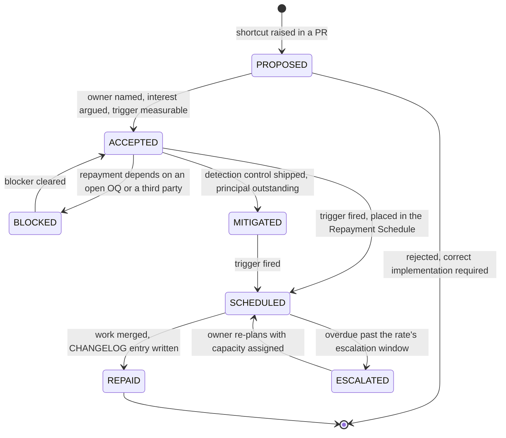

# Technical Debt Register

**Gym Marketplace & Multi-Tenant Gym Management SaaS**

Every shortcut this plan **knowingly** accepts, before a line of application code exists. Debt taken
deliberately, priced, and given a repayment trigger is engineering. Debt taken silently is rot.

---

> ## UPDATE TRIGGER
>
> **No shortcut is taken without an entry here, and the entry lands in the same pull request as the
> shortcut.**
>
> Edit this file when **any** of the following is true:
>
> | # | Trigger | Action |
> | :-: | :--- | :--- |
> | 1 | A pull request chooses a cheaper implementation over the correct one, for any reason. | Add a `TD-nnn` entry with all eleven fields; argue the interest rate, do not assert it. |
> | 2 | A `MASTER_PRD.md` requirement is met in a way that satisfies its letter but not its intent. | Add an entry, and cross-reference `KNOWN_LIMITATIONS.md` if the gap is visible to a user. |
> | 3 | An existing entry's payoff trigger fires. | Move its Status to `SCHEDULED`, place it in the Repayment Schedule, and notify its Owner. |
> | 4 | An entry is repaid. | Set Status `REPAID`, add the date and the PR, and record the change in `CHANGELOG.md`. |
> | 5 | An entry's interest rate changes because scale, team size or scope changed. | Update the rate **and** its justification. A rate without a fresh justification is stale. |
> | 6 | A sprint retrospective reviews the register (mandatory, every sprint). | Update statuses, close what is closed, escalate what is overdue. |
> | 7 | A decision in `DECISION_LOG.md` creates debt as a consequence. | Add the entry and cite the `ADR-nnnn`. |
>
> **Do not use this file** for: defects (they go to the defect tracker at the severity in **C8.5**),
> deliberate scope exclusions with no intention to build (they go to `KNOWN_LIMITATIONS.md`), or
> unmade decisions (they go to `DECISION_LOG.md` or the `OQ-` list in **C11**).

---

## 1. What counts as debt here

| This register | Not this register |
| :--- | :--- |
| A correct-enough implementation chosen over the right one, with a known cost. | A bug. The implementation does not do what it claims. → defect tracker, severity per **C8.5**. |
| A capability built to a lower standard than the PRD implies, on purpose. | A capability deliberately not built at all, with no intention to build it. → `KNOWN_LIMITATIONS.md`. |
| An architectural choice that is right today and will be wrong at a stated threshold. | An architectural choice that is simply right. → `DECISION_LOG.md`, no debt. |
| A control that is specified but not yet automated. | A control that is specified, automated and passing. → nothing to record. |

**Three entries in this register are already mitigated by mandatory controls rather than merely
noted** — `TD-005`, `TD-010` and `TD-014` — because their failure modes are Severity 1 under
**C8.5** (money wrong, data crosses tenants, check-in down). Mitigation is not repayment; the
principal stays outstanding until the trigger is met.

### 1.1 Field definitions

**Category** — one of seven, exhaustively:

| Category | Meaning |
| :--- | :--- |
| **Architecture** | Boundary, topology or coupling. Expensive to change, cheap to get wrong. |
| **Code** | Implementation-level shortcut inside a correct boundary. |
| **Test** | Missing or weak verification of behaviour that already ships. |
| **Infra** | Deployment, provisioning, capacity, runtime topology. |
| **Security** | Anything touching **NFR-SEC-01 … NFR-SEC-13**, **BR-TEN-01** or **BR-DAT-01 … BR-DAT-07**. |
| **Docs** | Traceability, runbooks, specification drift. |
| **Data** | Schema shape, denormalisation, partitioning, retention, integrity. |

**Interest rate** — how fast the debt gets more expensive if left alone:

| Rate | Definition | Escalation |
| :--- | :--- | :--- |
| **Low** | Cost of ownership is roughly flat. The debt does not get more expensive with time, traffic, data volume or team size. | Reviewed quarterly. |
| **Medium** | Cost grows with a driver that is named and measured — traffic, rows, tenants, screens. Growth is linear and visible on a dashboard. | Reviewed every sprint; escalated six sprints past trigger. |
| **High** | Cost grows faster than its driver, or the debt blocks a scheduled deliverable, or its cost is only discovered at the moment it is needed. | Escalated to the project owner four sprints past trigger. |
| **Compounding** | Every new unit of work — repository, module, endpoint, engineer — is a fresh opportunity to violate the invariant. Cost multiplies by code surface and team size, not by traffic. Reserved for debts that can produce a Severity 1 defect. | Escalated to the project owner **two** sprints past trigger. Hard cap of three open at once. |

**Estimated payoff effort** — engineer-days, on the **C9.3** team shape:

| Band | Days |
| :--- | :--- |
| **XS** | ≤ 2 |
| **S** | 3 – 5 |
| **M** | 6 – 10 |
| **L** | 11 – 20 |
| **XL** | > 20 |

**Payoff trigger** — an observable condition, never a date alone. A trigger that cannot be measured
by a metric, an alert, a contract or a completed sprint is not a trigger.

**Status** — the lifecycle below:

---

## 2. Debt Budget

A budget exists because "we will clean it up later" is not a plan and never has been. This is the
plan.

### 2.1 Ceilings

| Ceiling | Limit | If breached |
| :--- | :--- | :--- |
| Total open entries | **35** | A new entry may not be opened until an existing one reaches `REPAID`. |
| Open `Compounding` entries | **3** | Hard stop. The shortcut is not taken; the correct implementation is written. |
| Open `High` entries | **6** | The sprint's repayment reserve is redirected to `High` items until the count falls. |
| New entries opened per sprint | **2** | A third shortcut in one sprint is a signal that the sprint was mis-scoped; the Technical Lead re-plans rather than absorbing it. |
| Entries closed per sprint, from sprint 7 | **≥ 1** | The reserve was not used. Reported to the project owner in the sprint review. |

At the time of writing the register holds **28 entries: 2 Compounding, 6 High, 15 Medium, 5 Low.**
The `High` count is at its ceiling, which is intentional and visible: it means the repayment reserve
is committed to `TD-014`, `TD-017`, `TD-021`, `TD-023`, `TD-027` and `TD-028` before anything else.

### 2.2 Repayment reserve

**15% of every sprint's engineering capacity is reserved for repayment.** On the **C9.3** team shape
(three backend, three frontend, two QA from sprint 2) that is approximately **4 engineer-days per
sprint**.

The reserve is **use-it-or-lose-it**. It does not accumulate into a mythical "debt sprint", because a
debt sprint never happens. An unused reserve is reported as a miss in the sprint review, in the same
place a missed story point is reported.

### 2.3 Debt that may never be taken

The following are **not debts**. They are defects, and no entry may be opened for them. A pull
request proposing one is rejected in review, and no interest rate makes it acceptable.

| # | Forbidden shortcut | Governing rule |
| :-: | :--- | :--- |
| 1 | Any weakening of tenant isolation, including "the RLS policy comes in the next PR". | **BR-TEN-01**, **NFR-SEC-09**, **BAC-10** |
| 2 | Storing money as a floating-point value, or dropping the adjacent currency column. | **BR-PAY-01**, **NFR-DQ-02** |
| 3 | Updating or deleting a ledger entry, an issued invoice, an attendance record or an audit row. | **BR-FIN-01**, **FR-INV-03**, **BR-CHK-09**, **BR-DAT-01** |
| 4 | Activating a membership from a client-side success signal instead of a verified webhook. | **BR-PAY-02**, **FR-PAY-03** |
| 5 | Publishing a gym to the marketplace by any automated path. | **BR-GYM-01**, **BR-GYM-03** |
| 6 | Accepting a review from a user with no recorded check-in at that gym. | **BR-REV-01**, **BR-REV-03** |
| 7 | Merging an endpoint with no declared permission, or with no cross-tenant isolation test. | **FR-RBAC-01**, **BAC-10**, **C7** gates |
| 8 | Writing personal data, card data or KYC content to logs, traces or analytics events. | **BR-DAT-06**, **BR-PAY-08**, **BR-DAT-07** |
| 9 | Holding a secret anywhere other than the managed secret store. | **NFR-SEC-07** |
| 10 | Introducing a dependency absent from the locked stack or the approved additions register. | `engineering/STACK_ADDITIONS.md` standing rule |

### 2.4 The rules

1. **No shortcut without an entry.** The entry is written in the same PR as the shortcut, by the
   engineer who took it, and reviewed as part of the PR.
2. **Argue the interest rate.** "Medium" with no justification is rejected. Name the driver and the
   metric that shows it rising.
3. **Every `Medium`, `High` and `Compounding` entry names a detection control** — an alarm, an
   assertion, a drift check, a dashboard threshold. A debt nobody can see rising is not registered,
   it is forgotten.
4. **Triggers are observable.** A date is not a trigger. "When we have time" is not a trigger.
5. **Owners are individuals in a role, not teams.** A debt owned by everybody is owned by nobody.
6. **Repayment is a `CHANGELOG.md` event** when the repayment changes observable behaviour, and a
   `DECISION_LOG.md` event when it reverses a decision.
7. **Escalation is automatic**, on the schedule in the interest-rate table. The Technical Lead
   reports open `Compounding` and overdue `High` counts to the project owner every sprint.

---

## 3. Register index

Full detail for each entry is in §4. `PRD id` shows the primary identifier; each entry cites more.

| ID | Title | Category | Interest | Effort | Payoff trigger (summary) | Owner | Status | PRD id |
| :--- | :--- | :--- | :--- | :--- | :--- | :--- | :--- | :--- |
| **TD-001** | Modular monolith defers service extraction | Architecture | Low | XL | One module's load profile diverges, or horizontal scaling stops reaching NFR-SCAL-02 | Technical Lead | ACCEPTED | `C1.3` |
| **TD-002** | Polling instead of push for live dashboard figures | Architecture | Medium | M | 200 check-ins/hour at one branch, or poll traffic above 5% of API requests | Technical Lead | ACCEPTED | `A-08` |
| **TD-003** | Postgres full-text and trigram instead of a search cluster | Architecture | Medium | XL | ~50,000 published listings, or search p95 above 400 ms | Backend Lead, discovery | ACCEPTED | `FR-SRCH-10` |
| **TD-004** | Denormalised `gyms.rating_avg` and `rating_count` | Data | Medium | S | First drift incident, or a nightly rebuild correcting above 0.5% of gyms | Backend Lead, reviews | ACCEPTED | `FR-REV-08` |
| **TD-005** | Denormalised `settlement_lines` duplicating ledger figures | Data | Medium | S | Before the first production payout — launch gate | Backend Lead, money | MITIGATED | `BR-FIN-02` |
| **TD-006** | No offline check-in queue | Architecture | Medium | L | Above 2% of check-ins failing on network error in a rolling week | Frontend Lead, dashboards | ACCEPTED | `ASM-06` |
| **TD-007** | Single-region deployment | Infra | Medium | XL | First Enterprise residency contract, or `OQ-16` answered elsewhere | DevOps Engineer | ACCEPTED | `NFR-PRV-05` |
| **TD-008** | Manual featured-listing sales | Code | Low | L | Above 20 simultaneous placements, or above 5% of `KPI-15` | Product Manager | ACCEPTED | `OQ-12` |
| **TD-009** | Headless Chromium as the PDF engine | Infra | Medium | M | First byte-difference on regeneration, or `NFR-PERF-07` p95 above 2.4 s | Backend Lead, billing | ACCEPTED | `FR-INV-07` |
| **TD-010** | Prisma and RLS need per-transaction session-variable discipline | Security | **Compounding** | M | One isolation-suite failure on trunk, or any raw-client use outside the extension | Technical Lead | MITIGATED | `BR-TEN-01` |
| **TD-011** | No read-replica routing at day one | Infra | Medium | L | Primary CPU above 60% for a week, or `NFR-PERF-01` p95 above 400 ms | DevOps Engineer | ACCEPTED | `NFR-SCAL-04` |
| **TD-012** | Synchronous report generation under the 5-second threshold | Code | Medium | M | Any synchronous report exceeding 5 s in production | Backend Lead, reporting | ACCEPTED | `FR-RPT-03` |
| **TD-013** | No multi-currency retail despite currency-agnostic storage | Architecture | Low | XL | Second market commitment | Product Manager | ACCEPTED | `OBJ-09` |
| **TD-014** | Partition maintenance as a cron job | Data | **High** | S | Before the first production write to `attendance` or `audit_log` — launch gate | DevOps Engineer | MITIGATED | `NFR-SCAL-06` |
| **TD-015** | Two rating computations to keep in sync | Code | Medium | S | Sprint 10 exit, or any reported rating-versus-ranking mismatch | Backend Lead, reviews | ACCEPTED | `FR-REV-08` |
| **TD-016** | Reason codes as reference data, not typed enums | Code | **Compounding** | M | First unhandled reason code on a user-facing surface | Backend Lead, admin | ACCEPTED | `FR-ADMN-07` |
| **TD-017** | Attribution window as a timestamp, not an event store | Data | **High** | M | First commission dispute, or `KPI-17` below 30% while `KPI-09` holds | Backend Lead, ordering | ACCEPTED | `A6.3` |
| **TD-018** | Outbox drained by a worker, no message broker | Architecture | Low | M | Outbox backlog above 10,000 rows, or a second consumer required | Backend Lead, notifications | ACCEPTED | `C1.5` |
| **TD-019** | Idempotency keys in Postgres with 24-hour retention | Data | Low | S | Above 50 million live rows, or a duplicate charge the window missed | Backend Lead, payments | ACCEPTED | `BR-PAY-03` |
| **TD-020** | Invoice numbering serialises per tenant per financial year | Data | Medium | M | A tenant exceeding 30 invoices per minute, or any observed gap | Backend Lead, billing | ACCEPTED | `FR-INV-02` |
| **TD-021** | Reporting reads the OLTP primary, no analytics store | Data | **High** | M | Any platform analytics query above 10 s, or history beyond 24 months | Backend Lead, reporting | ACCEPTED | `FR-RPT-02` |
| **TD-022** | One `PaymentProvider` adapter, port unproven | Architecture | Medium | XL | `OQ-01` answered where Stripe Connect is unavailable, or a mandated gateway | Backend Lead, payments | ACCEPTED | `FR-PAY-01` |
| **TD-023** | Notification adapters unbuilt, ports only | Architecture | **High** | M per channel | `OQ-01` answered — hard deadline sprint 0 | Technical Lead | **BLOCKED** | `A-19` |
| **TD-024** | Ranking formula tuned by hand, no evaluation harness | Test | Medium | L | Third evidence-free weight change, or `KPI-09` below 45% for two weeks | Product Manager | ACCEPTED | `FR-SRCH-10` |
| **TD-025** | One Redis for cache, queue, rate limiting and sessions | Infra | Medium | S | First eviction on a queue key, or Redis memory above 70% | DevOps Engineer | ACCEPTED | `NFR-SEC-06` |
| **TD-026** | Strings externalised, no translation pipeline | Code | Low | S | Second locale committed, or `ASM-07` recorded false | Frontend Lead, customer site | ACCEPTED | `NFR-USE-08` |
| **TD-027** | Traceability maintained by hand | Docs | **High** | M | First sprint where the checklist is not updated in-PR; sprint 16 at the latest | QA Lead | ACCEPTED | `BAC-06` |
| **TD-028** | No provider-sandbox contract tests, fixtures hand-authored | Test | **High** | M | Before sprint 6 exit — no production payment traffic before this | QA Lead | SCHEDULED | `BR-PAY-05` |
| **TD-029** | `strictPropertyInitialization: false` in `apps/server` | Code | Low | S | A NestJS version that resolves injection without constructor-parameter metadata | Technical Lead | ACCEPTED | `§9.1`, M-001 |
| **TD-030** | `verbatimModuleSyntax: false` in `apps/server` | Code | Medium | M | NestJS ships first-class ESM support, or the ecosystem's CJS-only dependencies clear | Technical Lead | ACCEPTED | `§9.1`, M-001 |
| **TD-031** | `outbox.aggregate_type` is `text` + `CHECK`, not an enum | Data | Low | S | `BLK-07` answered — the register of aggregate roots is written down | Technical Lead | **BLOCKED** | `MG9`, M-018 |
| **TD-032** | Job run history is a log line, not a `job_runs` table | Data | Medium | S | `BLK-08` answered, or the first overrun nobody could reconstruct from logs | Technical Lead | **BLOCKED** | `AC-FND-12.2`, M-018 |
| **TD-033** | Seed versioned by a string, not by `seed.manifest.json` checksums | Test | Medium | S | The first "works on my machine" traced to seed drift; sprint 6 at the latest | QA Lead | ACCEPTED | `§6.7`, `SD-2`, M-019 |
| **TD-034** | `/v1/admin/*` gated on PLATFORM role membership, not the `§B3.2` matrix | Security | **High** | S | **M-023** — the matrix, `PermissionsGuard` and the generated per-cell test | Backend Lead | SCHEDULED | `FR-RBAC-01`, `PG-1`, M-022 |
| **TD-035** | Verification SLA counted in WALL-CLOCK hours, not `Asia/Kolkata` business hours | Correctness | Low | S | A business-hours calendar exists anywhere in `docs/`, or the first officer complaint that an application was called late over a weekend | Technical Lead | **BLOCKED** | `Admin.md` §5.1.1, `FR-ADMN-11`, M-036 |
| **TD-037** | `kyc_documents` diverged from `Schema.md` §4.3 in eight places, unrecorded | Correctness | **High** | S | **PAID at M-029** — corrected by `20260809130000_expand_alter_kyc_documents_to_schema` | Schema Owner | **PAID** | `Schema.md` §4.3, `NFR-SEC-10`, `BR-DAT-07`, M-026, M-029 |
| **TD-036** | Two `customer-web` security headers relax `Security.md` §11 without the `DECISION_LOG.md` entry §11.7 requires | Security | Medium | S | Before `SEC-A05-002` is written, or the owner rules on either deviation | Project owner + Security | **OPEN** | `Security.md` §11.3, §11.7, `NFR-SEC-12`, `SCR-WEB-001` |

---

## 4. Entries

---

### TD-029 — `strictPropertyInitialization: false` in `apps/server`

| Field | Value |
| :--- | :--- |
| **Category** | Code |
| **Interest rate** | **Low** — bounded to one package and one class of field |
| **Effort** | S |
| **Owner** | Technical Lead |
| **Status** | ACCEPTED |
| **Discovered** | M-001, while writing `packages/config/tsconfig/nest.json` |

**What.** `apps/server` is the only package in the repository that relaxes a `§9.1` compiler flag.
Every other package — including all three front-end apps — keeps the full set.

**Why we took it.** NestJS populates two kinds of field the compiler cannot see being assigned:
constructor-injected providers, and DTO properties set by deserialisation. With
`strictPropertyInitialization: true`, every one requires a `!` definite-assignment assertion.
Constitution `§9.2` forbids a non-null assertion without a justification comment — so the flag would
trade **one documented exception for several hundred undocumented ones**, and would train engineers
to write `!` reflexively, which is exactly the habit the rule exists to prevent.

**What it costs.** A genuinely uninitialised property in a non-injected class inside `apps/server`
will not be caught by the compiler. Mitigated because Zod validates every inbound payload at the
boundary (`NFR-SEC-05`), so an unset DTO field fails validation before it reaches a use case.

**Revisit trigger.** A NestJS release that resolves injection without reading constructor-parameter
metadata — at which point the flag can be restored and the `!`-assertion question disappears with it.

**Verified.** Not assumed. `packages/config/test/effective-config.spec.mjs` asserts this override is
present, is scoped to `apps/server`, and cites this id. An override without a `TD-` reference fails
the test.

---

### TD-030 — `verbatimModuleSyntax: false` in `apps/server`

| Field | Value |
| :--- | :--- |
| **Category** | Code |
| **Interest rate** | **Medium** — grows with the size of the server codebase |
| **Effort** | M |
| **Owner** | Technical Lead |
| **Status** | ACCEPTED |
| **Discovered** | M-001, empirically — `tsc` raised `TS1287` on the first exported symbol |

**What.** `apps/server` disables `verbatimModuleSyntax`, which the rest of the repository keeps on.

**Why we took it.** This is **forced, not preferred**. NestJS 10 and its ecosystem are CommonJS-first.
`apps/server` therefore has no `"type": "module"`, so `NodeNext` resolves it as CJS — and TypeScript
raises:

> `TS1287: A top-level 'export' modifier cannot be used on value declarations in a CommonJS module
> when 'verbatimModuleSyntax' is enabled.`

on the very first exported symbol. Two alternatives were considered and rejected:

| Alternative | Why rejected |
| :--- | :--- |
| Make `apps/server` ESM (`"type": "module"`) | Fights `emitDecoratorMetadata`, and a long tail of Nest ecosystem packages are CJS-only. Trades a compile-time flag for runtime interop failures discovered in production |
| Use `export =` / `import =` throughout | Abandons ESM syntax across the entire server. Every file becomes non-portable and unfamiliar |

**What it costs.** Without `verbatimModuleSyntax`, TypeScript elides imports it believes are
type-only. Ordinarily harmless — but combined with `emitDecoratorMetadata` it is the opposite of
harmless: a provider imported as `import type { X }` is erased, its DI metadata becomes `undefined`,
and Nest fails at **runtime** with a confusing "Cannot read properties of undefined" rather than at
compile time.

**Mitigation.** The rule is: **never use `import type` for anything appearing in a constructor
signature.** Enforced by the custom ESLint rule `no-type-import-in-ctor`, delivered in M-002. Until
that rule ships, this debt is uncontrolled and the risk is live — recorded here rather than assumed
away.

**Revisit trigger.** NestJS ships first-class ESM support, or the CJS-only dependencies in the
server's tree clear. Re-test by removing the override and running `pnpm turbo run typecheck`; the
failure, if it remains, is immediate and unambiguous.

---

### TD-031 — `outbox.aggregate_type` is `text` + `CHECK`, not an enum

| Field | Value |
| :--- | :--- |
| **Category** | Data |
| **Interest rate** | **Low** — one column, and the `CHECK` already prevents the failure an enum would |
| **Effort** | S |
| **Owner** | Technical Lead |
| **Status** | BLOCKED — on `BLK-07` |
| **Discovered** | M-006, deferred. Forced by M-018, which had to create the column |

**What.** `outbox.aggregate_type` is `text` with `CHECK (aggregate_type ~ '^[A-Z][A-Za-z]*$')`
rather than the `outbox_aggregate_type_enum` the schema implies. Every other categorical column in
this database is an enum — 81 of them shipped in `0_init`.

**Why we took it.** The value set is not knowable from the documents. `Schema.md` §2.5 and
`Relationships.md` both say the type is one of **the 26 aggregate roots listed at `ERD.md` §6**, and
`ERD.md` §6 lists none — it discusses aggregate boundaries without enumerating them. Deriving the
set from the 79-table schema yields **36** candidates. The ten-row gap turns on genuine modelling
questions (is `Invoice` a root, or part of `Order`?) that are the owner's to answer, not a
milestone's to guess.

**`MG9` is what makes guessing unrecoverable.** An enum value is permanent — addable, but never
removable while a single row holds it. A 36-value enum that should have been 26 leaves ten values
in the type forever, and every future reader has to be told which ten are wrong.

**What it costs.** The database will accept `Membershp` — PascalCase, passes the `CHECK`, means
nothing. An enum would refuse it at the storage engine. Mitigated in three places: `OutboxWriter`
is the only writer, the dispatcher's routing is a total map over known types, and the
`outbox.int-spec.ts` suite asserts the `CHECK` refuses `camelCase`, `snake_case` and the empty
string.

**Payoff trigger.** `BLK-07` answered. The repayment is one migration — `CREATE TYPE`, `ALTER TABLE
… TYPE … USING aggregate_type::outbox_aggregate_type_enum`, drop the `CHECK` — with **no data
change**, because every value already conforms.

**Verified.** `apps/server/test/isolation/outbox.int-spec.ts` asserts the constraint bites.

---

### TD-032 — Job run history is a log line, not a `job_runs` table

| Field | Value |
| :--- | :--- |
| **Category** | Data |
| **Interest rate** | **Medium** — grows with the number of scheduled jobs, and §C5 names twenty-four |
| **Effort** | S |
| **Owner** | Technical Lead |
| **Status** | BLOCKED — on `BLK-08` |
| **Discovered** | M-018, while building the §C5 job harness |

**What.** `AC-FND-12.2` requires an alert when a job **succeeds late**, not only when it fails —
"a settlement build that usually takes 40 seconds and today took 40 minutes has not failed; it will
succeed, after the payout window closed." Detecting that needs run history. There is no table for
it. `JobRunner` emits a structured record through the `JOB_RUN_SINK` port, and the only adapter
behind that port writes to the log.

**Why we took it.** `Schema.md` §4 is a **closed register of 79 tables**. `job_runs` is not one of
them, and an eightieth table is a schema amendment under constitution §24 — not something a
milestone decides on its own while implementing an unrelated acceptance criterion.

**The single-execution guarantee did not need the table anyway.** `TR-25` requires that a job
scheduled on three workers executes once per fire. The obvious implementation is a claims table;
M-018 used **Postgres advisory locks** instead, and that is the better mechanism regardless: an
advisory lock is released automatically when the session ends, so a worker killed mid-job leaves
nothing behind. A claims row would block every subsequent run of that job until a human noticed and
cleared it — at 3am, on a job nobody was watching because it had been working for six months.

**What it costs.** Overrun and failure are visible in logs and alertable there, but not
**queryable**. "Has `settlements.build` been slower every night this week?" needs a log aggregator
rather than a `SELECT`, and the retention is the aggregator's rather than the platform's.

**Payoff trigger.** `BLK-08` answered — or, sooner, the first overrun incident that could not be
reconstructed from logs, which is the evidence the amendment is worth making. Repayment is a
`PrismaJobRunSink` behind the existing port: **no job changes**, because no job has ever seen
anything but the interface.

**Verified.** `apps/server/test/job-harness.spec.ts` — 23 tests, including the `TR-25` deliberate
double-trigger (the same job fired concurrently on two workers executes exactly once) and the
overrun case, both asserted against the port rather than against a table.

---

### TD-033 — Seed versioned by a string, not by `seed.manifest.json` checksums

| Field | Value |
| :--- | :--- |
| **Category** | Test |
| **Interest rate** | **Medium** — the cost is paid in debugging time, and it grows with every suite that binds to a fixture |
| **Effort** | S |
| **Owner** | QA Lead |
| **Status** | ACCEPTED |
| **Discovered** | M-019, on bumping `SEED_VERSION` to `0.2` for the first real payload |

**What.** The seed's identity is `SEED_VERSION = '0.2'`, a hand-maintained string in
`prisma/seed/version.ts`. `TestingStrategy.md` §6.7 specifies something considerably stronger — a
`seed.manifest.json` carrying `version`, `epoch`, `prngSeed`, `namespace`, and per-table
`checksums` and `counts`, with gate `SD-2` failing the build when a computed checksum differs from
the manifest, and failing equally when the manifest changes and the output does not.

**Why we took it.** The roadmap's M-019 entry names `SEED_VERSION → 0.2` explicitly, and the gate
that would read a manifest does not exist: `SD-2`, `SD-3` and `SD-4` are part of CI job 11
(`migration-safety`), which is not built. Writing the manifest now would produce a file nothing
reads, and a checksum nobody verifies is worse than no checksum — it looks like a control.

**What it costs.** The failure §6.7 exists to prevent is a seed whose contents change without its
version changing: every snapshot and every isolation binding breaks, and *the breakage surfaces as
unrelated red tests in someone else's pull request*. A string bumped by hand does not prevent that;
it only records the intent to.

**Mitigation, and it is real but partial.** `roles-seed.int-spec.ts` asserts the counts §6.7's
manifest would carry — 12 roles, 64 permissions, 191 `role_permissions`, 11 principals — and goes
further: it resolves every `role_permissions` row back to its key and compares each role's whole
permission set against what §B3.2 derives. That catches a changed payload. It does not catch a
changed payload accompanied by a matching test edit, which is exactly what a checksum in a
separate file is for.

**Payoff trigger.** The first "works on my machine" traced to seed drift — or CI job 11 landing,
whichever is sooner. **Sprint 6 at the latest**, because that is when payment fixtures start
carrying money figures and a silently-different seed stops being a debugging annoyance.

**Related.** `SD-2`, `SD-3`, `SD-4`, `SE5` (environment parity), `Scalability.md` §10.2 (the volume
overlay preserves these exact identifiers, so it depends on the seed being reproducible).

---

### TD-034 — `/v1/admin/*` gated on PLATFORM role membership, not the `§B3.2` matrix

**What was taken.** `PlatformRoleGuard` admits any principal holding one of the five `§B3.1`
platform roles and refuses everyone else. It does not distinguish `FINANCE` from `MODERATOR`, and
it does not consult the 516-cell `§B3.2` matrix, because that matrix is `M-023` and does not exist
yet.

**Why this rather than nothing.** The admin console needed a read path before `M-023`, and
`@RequiredPermission()` does not provide one: it is metadata read by the `PG-1` CI gate and it
enforces nothing at runtime. Without a guard, `/v1/admin/*` would have been gated on
authentication alone — and any member who registered on the customer website could have read the
tenant register of every gym on the platform. That is not a defensible interim, so the choice was
between a coarse gate and delaying the console.

**Why this rather than a partial matrix.** Building a quarter of `PermissionsGuard` here under
another name is the worse option and the tempting one. Two authorisation implementations diverge,
and the divergence is discovered by whoever the looser one lets through. A deliberately coarse
gate that names itself as coarse cannot be mistaken for the real thing.

**The direction of the error.** Stricter than the eventual matrix in one direction: nobody outside
the platform roles gets in at all. Looser within it: a `SUPPORT_AGENT` can currently read the gym
register, which `§B3.2` may not permit. So the residual risk is between platform staff, not
between the platform and the public — a materially smaller exposure than the alternative.

**Interest.** Low while the console has two read endpoints. It rises with every route added under
`/v1/admin`, because each one inherits the coarse gate and the eventual migration to per-cell
evaluation has to revisit all of them.

**Payoff trigger.** `M-023`. The guard is deleted, not adapted: `PermissionsGuard` replaces it
outright, and `@RequiredPermission()` stops being metadata and starts being the control.

**Verified.** `platform-role.guard.spec.ts` asserts that a tenant-scoped `GYM_OWNER@t:<uuid>` is
refused, that an unknown key with a `@platform` suffix is refused, and that an authenticated
member with no roles receives 403 rather than 404.

### TD-035 — the verification SLA counts wall-clock hours, not business hours

**What was taken.** `PlatformOverviewUseCase.slaFor()` computes `hours_remaining` as a plain
subtraction from `submitted_at`, on a 72-hour target. `Admin.md` §5.1.1 says the figures are derived
*"from `submitted_at` and the configured SLA target in `Asia/Kolkata` business hours"*.

**Why this rather than the spec.** **No document in this repository defines what business hours
are.** There is no working-day list and no holiday calendar anywhere under `docs/` — searched for
"business hours", "working day", "public holiday" across all eight `docs/ui/` files, `docs/apis/`,
`MASTER_PRD.md` and `docs/engineering/`. §5.1.1 is the only mention, and it names the concept
without defining it.

Inventing one here would put a commercial commitment — the moment a gym owner is told their
application is late — inside an implementation detail, decided by whoever wrote the function. That
is a worse outcome than a documented approximation.

**The direction of the error, and why it is the safe one.** Wall-clock is **stricter**. It counts
the weekend, so it can only ever report an application as breached *earlier* than a business-hours
calculation would; it can never report one as WITHIN when business hours would have called it
breached. The failure mode is an officer looking at something sooner than they strictly had to,
which on a verification queue is the direction to err in — `RSK-01` is fake gyms getting listed, not
officers being too prompt.

**Precedent in the same repository, in the same direction.** `Monitoring.md` SLO-04 made this exact
call for the SUPPORT SLA and gave the reason: *"Business hours are **not** subtracted. `KPI-25` says
'median time to first human response' with no working-hours carve-out, and a member who tickets at
21:00 IST experiences the wait regardless. Support staffing is the lever, not the definition."*
Whether the verification SLA should follow that reading or genuinely needs a calendar is the
question this entry is waiting on.

**What is NOT approximated.** The target itself is configuration and reaches the client
(`VERIFICATION_SLA_TARGET_HOURS`, `UI-ADM-4`); the three state thresholds are §5.1.1's table
verbatim; a breach goes negative and stays visible; and `INFO_REQUESTED` pauses the clock with the
wall-clock age still exposed so a paused queue cannot hide a stalled application. Fifteen tests
cover those. The approximation is confined to one subtraction.

**Interest rate.** **Low, and flat.** The gap only bites across a weekend or a public holiday, and
only by making the console slightly pessimistic. It does not compound, and no other code depends on
the reading — `hours_remaining` has exactly one producer.

**Payoff trigger.** Either a business-hours calendar appears in `docs/` — at which point this becomes
a small change in one method, since the pause logic already proves the shape supports a
non-linear clock — or an officer reports that an application was called late over a weekend, which
is the cheapest possible way to learn the answer matters.

---

### TD-036 — two `customer-web` headers relax `Security.md` §11 without a recorded decision

**What was taken.** `apps/customer-web/src/shared/security/csp.ts` emits two values that §11.3 does
not authorise:

| Directive   | `Security.md` §11.3 | What ships                       |
| :---------- | :------------------ | :------------------------------- |
| `autoplay`  | `autoplay=()`       | `autoplay=(self)`                |
| `media-src` | `media-src 'none'`  | `media-src 'self' <media host>`  |

Both are **deliberate and argued in the code**, and both have a pinning test. Neither has the entry
§11.7 step 2 requires: *"every violation is either a policy fix or a code fix, never a directive
relaxation without a `DECISION_LOG.md` entry"*. That entry is the project owner's to write, which is
why this is recorded here rather than resolved.

**Why they exist.** `SCR-WEB-001`'s hero plays a muted decorative loop from our own origin. Under
`media-src 'none'` the element cannot load at all, and under `autoplay=()` the browser refuses to
start it. Both grants are `self`-scoped, so an embedded third-party frame — including the payment
provider's — still gets nothing, and what actually protects a visitor from sound is the `muted`
attribute, which `hero.spec.ts` asserts separately.

**The narrower reading, and why it was not taken.** §11.3 was written before the surface had a video.
Read strictly, the spec forbids the feature rather than the grant, so the compliant options were to
drop the hero loop or to amend §11.3 — and only the owner can do the second. The relaxation is the
minimum that makes the built page work, and it is scoped as tightly as the mechanism allows.

**A third deviation was found at the same time and is already fixed, not deferred.**
`document-domain=()` was simply **missing** from the shipped header — nineteen mandated features,
eighteen emitted. It was an omission with no justification anywhere, so it was restored rather than
recorded. It survived because the suite used four `includes()` calls on four features, and a
substring check cannot see an absence nobody thought to look for; `shell.spec.ts` now compares the
full feature set against a verbatim transcription of §11.3, which is what §11.7 step 7 asks for.

**Interest rate.** **Medium, and it compounds in one specific way.** While one unrecorded relaxation
stands, the next one arrives beside it looking like precedent. That is exactly how a deny-by-default
header becomes a list of things somebody once needed. The new test names `autoplay=(self)` as the
**sole** permitted deviation, so a second one fails the build — which caps the compounding but does
not repay the debt.

**Payoff trigger.** Before `SEC-A05-002` is written — it asserts the full header set on every
surface, and it cannot be written against a spec two surfaces do not match — or the owner ruling on
either deviation, whichever comes first. Repayment is one `DECISION_LOG.md` entry plus an amendment
to §11.3–§11.5, or reverting both grants and deleting the hero loop.

---

---

### TD-001 — Modular monolith defers service extraction

| Field | Value |
| :--- | :--- |
| **ID** | TD-001 |
| **Title** | Modular monolith defers service extraction |
| **Category** | Architecture |
| **Description** | The API ships as one deployable NestJS 10 process holding all 23 modules named in **C1.3** — `common/` `tenancy/` `iam/` `onboarding/` `catalog/` `plans/` `discovery/` `ordering/` `payments/` `billing/` `memberships/` `attendance/` `crm/` `staff/` `reviews/` `ledger/` `settlements/` `refunds/` `notifications/` `reporting/` `support/` `admin/` `audit/` — plus a worker tier running the same image with a different entrypoint. Boundaries are enforced in code only: exported service interfaces and domain events, checked by dependency-cruiser (**A-23**). No module can be scaled, deployed, rate-limited or failed independently of the others. |
| **Why we took it** | **C1.3** selects the modular monolith explicitly and rejects microservices. At year-1 capacity — 2,000 tenants, 5,000 branches, 500,000 users, 50,000 check-ins per day (**NFR-SCAL-01**) — the operational cost of distribution buys nothing. **CON-05** bounds infrastructure spend, and money code spanning `ordering/`, `payments/`, `ledger/`, `settlements/`, `refunds/` and `billing/` benefits enormously from a single transactional boundary under **BR-FIN-01**. |
| **Interest rate** | **Low.** The cost is flat while the fitness test stays green. Extraction cost is a function of boundary cleanliness, not of elapsed time — and **A-23** plus the **C1.3** build-failing lint rule keep boundaries clean by construction. The rate rises to Medium only if boundary violations start being waived. |
| **Estimated payoff effort** | **XL** — 15–25 engineer-days *per module extracted*: contract definition, data ownership split, deployment pipeline, cross-process tracing, rollback plan, and a distributed-transaction strategy for any money path involved. Not payable in one release. |
| **Payoff trigger** | Any of: (a) the `attendance/` module sustaining above 40% of total API CPU for two weeks; (b) `reporting/` causing an **NFR-PERF-01** or **NFR-PERF-04** regression that read-replica routing (`TD-011`) does not resolve; (c) **NFR-SCAL-02**'s 10× headroom no longer reachable by horizontal scaling of the monolith; (d) backend team size above 12, making trunk contention the delivery bottleneck. |
| **Owner** | Technical Lead |
| **Status** | ACCEPTED |
| **Related PRD id** | `C1.3`, `NFR-SCAL-01`, `NFR-SCAL-02`, `NFR-SCAL-03`, `CON-05`, `ADR-0003` |

---

### TD-002 — Polling instead of push for live dashboard figures

| Field | Value |
| :--- | :--- |
| **ID** | TD-002 |
| **Title** | Polling instead of push for live dashboard figures |
| **Category** | Architecture |
| **Description** | **SCR-DASH-001**'s currently-in-gym count and **SCR-DASH-009**'s recent check-ins strip refresh by TanStack Query polling on a 10–15 second interval, consumed through a single `useLiveCounters()` hook. There is no WebSocket layer, no Redis pub/sub adapter and no session affinity. Both surfaces display a "last updated" indicator, because a stale figure presented as live is a defect, not a tolerance. Socket.IO is deferred to Phase 2 behind the flag `release.attendance.realtime_transport`, default off, owned by the Technical Lead. |
| **Why we took it** | The **A-08** ruling of 2026-08-06. The PRD never asks for real-time; it asks for two live figures, and both are satisfied at 10–15 seconds. Polling adds no infrastructure and keeps the application tier stateless with no session affinity per **NFR-SCAL-03** — which Socket.IO would compromise unless a Redis adapter were added specifically to avoid it. **NFR-PERF-03** (p95 ≤ 2 s scan to confirmation) is untouched, because check-in confirmation is a request/response path through `POST /checkin/scan`, not a push path. |
| **Interest rate** | **Medium.** Cost grows linearly with (open dashboard sessions × branches × poll frequency) and every term is measurable. Each open check-in desk issues roughly four to six requests per minute whether or not anything happened, so the load is proportional to desks open rather than to events occurring — the wrong shape, but a shallow slope. The user-facing cost is up to 15 seconds of perceived lag at a busy counter, which is a UX cost and not a correctness cost. It does not compound, because the entire transport is isolated behind one hook. **Detection control:** a dashboard panel tracking polling requests as a percentage of total API requests, alarming at 5%. |
| **Estimated payoff effort** | **M** — 6–9 engineer-days: Socket.IO gateway, the Redis adapter required to preserve **NFR-SCAL-03**, an authentication handshake reusing the access token, reconnect and backoff behaviour, the swap inside `useLiveCounters()`, a load test at 500 concurrent desks, and a flagged progressive rollout. No component changes, by design. |
| **Payoff trigger** | Any of: (a) a tenant exceeding **200 check-ins per hour at one branch**; (b) poll traffic exceeding **5% of total API requests**; (c) recurring gym-owner complaints about desk-counter lag. Rollout is via `release.attendance.realtime_transport`. |
| **Owner** | Technical Lead (transport) with Frontend Lead, dashboards (hook) |
| **Status** | ACCEPTED |
| **Related PRD id** | `A-08`, `SCR-DASH-001`, `SCR-DASH-009`, `NFR-SCAL-03`, `NFR-PERF-03`, `ADR-0010` |

---

### TD-003 — Postgres full-text and trigram instead of a search cluster

| Field | Value |
| :--- | :--- |
| **ID** | TD-003 |
| **Title** | Postgres full-text and trigram instead of a search cluster |
| **Category** | Architecture |
| **Description** | Marketplace search (**FR-SRCH-01** … **FR-SRCH-15**) runs on PostgreSQL 16 full-text search with `pg_trgm` for the typo tolerance **FR-SRCH-02** requires, and PostGIS GiST radius filtering on `branches.location`. The **FR-SRCH-10** relevance formula — distance, Bayesian-adjusted rating, listing freshness, conversion rate, featured status, profile completeness — is computed in SQL. Amenity synonyms are a hand-maintained dictionary. No OpenSearch. |
| **Why we took it** | **C1.1** is explicit: do not add a search cluster before the data justifies it; OpenSearch only past roughly 50,000 listings. At year-1 supply (**KPI-01** targets 500 verified active gyms; **NFR-SCAL-01** plans for 5,000 branches) a cluster is one more system to run, secure, back up, and keep synchronised, for no measurable relevance gain, against **CON-05**. |
| **Interest rate** | **Medium.** Cost grows with catalogue size and with every ranking factor added. **FR-SRCH-10** requires the formula to be configurable without deployment: the *weights* satisfy that through configuration, but the *factor set* is SQL and therefore a deploy. Synonym coverage degrades as amenity taxonomy grows under **FR-ADMN-07**. **Detection control:** search p95 tracked against the **NFR-PERF-01** budget with an alarm at 80%, plus a published-listing counter. |
| **Estimated payoff effort** | **XL** — 20–30 engineer-days: an index pipeline driven off the `outbox` table, mapping and analyser design, a dual-run period comparing relevance against the incumbent, cutover behind a flag, and a runbook per **NFR-MNT-09**. |
| **Payoff trigger** | Any of: (a) published listings exceeding roughly **50,000**; (b) search p95 exceeding **400 ms** — 80% of the **NFR-PERF-01** budget — at the **NFR-PERF-09** load of 2,000 searches per minute; (c) a ranking requirement SQL cannot express inside the latency budget. |
| **Owner** | Backend Lead, discovery |
| **Status** | ACCEPTED |
| **Related PRD id** | `C1.1`, `FR-SRCH-02`, `FR-SRCH-10`, `NFR-PERF-01`, `NFR-PERF-09`, `ADR-0007` |

---

### TD-004 — Denormalised `gyms.rating_avg` and `rating_count`

| Field | Value |
| :--- | :--- |
| **ID** | TD-004 |
| **Title** | Denormalised `gyms.rating_avg` and `rating_count` |
| **Category** | Data |
| **Description** | `gyms.rating_avg numeric(2,1)` and `gyms.rating_count int` (**C2.2**) are maintained by the `review.aggregate` job (**C5**), which runs on change and rebuilds nightly. The gym detail rating summary (**FR-DETL-04**) and the ranking index `(status, rating_avg desc, freshness_score desc)` (**C2.4**) read the denormalised columns rather than aggregating `reviews`. |
| **Why we took it** | Aggregating over `reviews` for every search result row and every detail render puts a group-by on the hot path of **NFR-PERF-01** (p95 ≤ 500 ms) and **NFR-PERF-02** (LCP ≤ 2.5 s on 4G), which are the two budgets the acquisition funnel depends on. |
| **Interest rate** | **Medium.** Every event that can change a rating is another place to forget the recompute, and the set is already long: publication, moderator unpublish and permanent removal (**FR-REV-07**), member self-deletion (**FR-REV-11**), an edit inside the 7-day window (**BR-REV-02**), an anomaly hold that excludes a review from the aggregate (**FR-REV-09**), and pseudonymisation on account deletion (**BR-DAT-04**). **AC-REV-02.3** requires recalculation within one minute of an unpublish. Drift is invisible to users and corrodes exactly the trust **OBJ-03** exists to protect. **Detection control:** the nightly rebuild reports how many gyms it corrected. |
| **Estimated payoff effort** | **S** — 3–5 engineer-days for a drift detector comparing each denormalised pair against a live aggregate nightly, alerting on any mismatch and repairing it. **M** — 8–12 days if replaced by a materialised view refreshed transactionally on review status change. |
| **Payoff trigger** | Any of: (a) the first production drift incident; (b) any nightly rebuild correcting more than **0.5%** of gyms; (c) the addition of a rating-mutating event beyond the six enumerated above. |
| **Owner** | Backend Lead, reviews |
| **Status** | ACCEPTED |
| **Related PRD id** | `FR-REV-08`, `FR-DETL-04`, `BR-REV-07`, `AC-REV-02.3`, `C2.2`, `C5` `review.aggregate` |

---

### TD-005 — Denormalised `settlement_lines` duplicating ledger figures

| Field | Value |
| :--- | :--- |
| **ID** | TD-005 |
| **Title** | Denormalised `settlement_lines` duplicating ledger figures |
| **Category** | Data |
| **Description** | `settlement_lines` (**C2.2**) holds one row per contributing ledger entry with all eight **A6.3** figures copied in — gross, discount, net, tax, commission base, commission, gateway fee, payable — alongside `ledger_entries`, which is the append-only source of truth under **BR-FIN-01**. The same money is therefore represented twice. |
| **Why we took it** | **BR-FIN-02** requires that none of the eight figures is recomputed at display time, and **BR-FIN-03** requires the statement lines to sum exactly to the payout including opening balance, reserve and refund lines. A settlement statement is a document a gym owner disputes months later: it must render identically forever, independent of any subsequent change to commission rates (**BR-FIN-05**), tax profiles (**BR-PAY-11**), or the code that produced it. Deriving it live would make history mutable, which is the failure **A3.4** principle 3 forbids. |
| **Interest rate** | **Medium.** Two representations of the same money must agree in perpetuity. A settlement-builder defect writes a wrong line that then carries the authority of a statement, and **KPI-26** demands 100% settlement accuracy with zero manual adjustment. The rate does not compound, because only one component writes these rows. **Detection control:** the per-batch checksum described below. |
| **Estimated payoff effort** | **S** — 4–6 engineer-days: an assertion inside `settlement.reconcile` (**C5**) that re-derives every line from `ledger_entries` and fails the batch on any variance, plus a stored per-batch checksum on `settlement_batches` verified at statement render. |
| **Payoff trigger** | **Before the first production payout.** This is a launch gate under **BAC-07** and **E2E-12**, not a deferred cleanup. It also fires on any reconciliation variance raised under **BR-FIN-07**. |
| **Owner** | Backend Lead, money domain |
| **Status** | MITIGATED — control scheduled sprint 11 |
| **Related PRD id** | `BR-FIN-01`, `BR-FIN-02`, `BR-FIN-03`, `BR-FIN-07`, `KPI-26`, `BAC-07`, `E2E-12` |

---

### TD-006 — No offline check-in queue

| Field | Value |
| :--- | :--- |
| **ID** | TD-006 |
| **Title** | No offline check-in queue |
| **Category** | Architecture |
| **Description** | `POST /checkin/scan` requires connectivity. **SCR-DASH-009** shows an explicit "no connection" state and never a false success, per its offline-behaviour specification. There is no local queue, no deferred replay and no conflict-resolution design. |
| **Why we took it** | **A4.2** defers offline-first check-in on the stated grounds that it requires a conflict-resolution design, and **ASM-06** assumes connectivity at gym premises is adequate. The architecture already anticipates the future: check-in is idempotent on the token nonce (**BR-CHK-06**, `attendance.token_nonce`), which is exactly what makes later replay safe without redesign. |
| **Interest rate** | **Medium.** The cost falls entirely on gyms with poor connectivity and stays invisible until a specific tenant complains, so it does not grow with code size or traffic. It grows with geographic expansion into markets where **ASM-06** is weaker. If **ASM-06** proves false in the launch market (**OQ-01**), this debt converts into a Phase-1 scope change rather than a backlog item — which is precisely why it is tracked here and not merely noted. **Detection control:** the rate of check-in attempts failing on network error, reported weekly per tenant. |
| **Estimated payoff effort** | **L** — 18–25 engineer-days: service worker with an IndexedDB queue, offline signature validation against a cached Ed25519 public key selected by `kid` (**A-11**), replay using the existing nonce idempotency, duplicate-cooldown reconciliation on replay (**BR-CHK-04**), entitlement-decrement conflict rules for session plans (**BR-PLN-06**), a "pending sync" staff surface, and a new denial reason in the **C4.8** taxonomy for a decision invalidated after the fact. |
| **Payoff trigger** | Any of: (a) more than **2%** of check-in attempts in a rolling week failing on network error; (b) a launch-city tenant reporting recurring desk outages; (c) **ASM-06** recorded as false in `KNOWN_LIMITATIONS.md`. |
| **Owner** | Frontend Lead, dashboards |
| **Status** | ACCEPTED |
| **Related PRD id** | `A4.2`, `ASM-06`, `BR-CHK-04`, `BR-CHK-06`, `SCR-DASH-009`, `NFR-AVL-03` |

---

### TD-007 — Single-region deployment

| Field | Value |
| :--- | :--- |
| **ID** | TD-007 |
| **Title** | Single-region deployment while residency is advertised as configurable |
| **Category** | Infra |
| **Description** | One region is stood up: one managed PostgreSQL 16 primary, one managed Redis 7, one object-storage bucket set with CDN, one orchestrator cluster. **NFR-PRV-05** states that data residency is configurable per deployment region; the configurability exists in the Terraform modules (**A-27**) and in the absence of hard-coded regions, but only one region is actually deployed, backed up and restore-verified. |
| **Why we took it** | **OQ-16** (data residency) defaults to the provider default region for the launch country, and **OQ-01** has not yet named that country. Standing up a second region before the first market is known spends **CON-05** budget on a guess. **NFR-AVL-04** (RPO ≤ 15 minutes, RTO ≤ 4 hours) is achievable within one region using managed backups and point-in-time recovery, with monthly restore verification per **NFR-AVL-05**. |
| **Interest rate** | **Medium.** It grows as the Enterprise tier's advertised "data residency options" (**A6.2**) turn into a contractual commitment, and with every stateful component added to the stack, because each one has to be regionalised later. Adding a region is materially cheaper before the first enterprise contract than after. **Detection control:** the sales pipeline is reviewed for residency requirements at each sprint review. |
| **Estimated payoff effort** | **XL** — 25–35 engineer-days: regionalised Terraform modules, per-region secret stores, per-tenant region pinning on `tenants`, cross-region object-storage and CDN policy, per-region backup and restore verification (**NFR-AVL-05**), and a runbook per region (**NFR-MNT-09**). |
| **Payoff trigger** | Any of: (a) the first signed Enterprise-tier contract requiring residency per **A6.2**; (b) **OQ-16** answered with a jurisdiction other than the deployed region; (c) a regulatory change under **RSK-13**; (d) a second launch market under **A11**. |
| **Owner** | DevOps Engineer |
| **Status** | ACCEPTED |
| **Related PRD id** | `NFR-PRV-05`, `NFR-AVL-04`, `NFR-AVL-05`, `OQ-01`, `OQ-16`, `RSK-13`, `CON-05` |

---

### TD-008 — Manual featured-listing sales

| Field | Value |
| :--- | :--- |
| **ID** | TD-008 |
| **Title** | Manual featured-listing sales |
| **Category** | Code |
| **Description** | Featured placement — revenue stream 3 in **A6.1**, surfaced by **FR-SRCH-11** — is sold by a human and applied by a Super Admin setting `gyms.featured_until` (**C2.2**). There is no self-service purchase, no slot inventory per city or category, no auction, no automated invoicing of the fee, and no placement-performance report beyond the `is_featured` property on the `search_result_clicked` analytics event (**C6**). |
| **Why we took it** | **OQ-12** defaults to "yes, as a manually-sold placement with an automated slot". Building a self-service promotions product before advertiser demand is demonstrated is speculative. The obligation that actually matters — **FR-SRCH-11**, that promoted placements are visually and textually labelled — is met regardless of how the placement was sold. |
| **Interest rate** | **Low.** Cost is linear in the number of featured sales, each of which passes through a Super Admin who is already in the console. It corrupts no data, blocks no other work, and does not accelerate. **Detection control:** a monthly count of live placements and of Super Admin time spent administering them. |
| **Estimated payoff effort** | **L** — 12–18 engineer-days: slot inventory per city and category, self-service purchase through the existing order and payment path, automatic invoicing under **FR-INV-01**, a placement-performance report added to the **B5.20** tenant catalogue, and expiry automation. |
| **Payoff trigger** | Any of: (a) more than **20** featured placements live simultaneously; (b) featured revenue exceeding **5%** of **KPI-15** net platform revenue; (c) Super Admin time on placement administration exceeding four hours per week. |
| **Owner** | Product Manager |
| **Status** | ACCEPTED |
| **Related PRD id** | `OQ-12`, `A6.1`, `FR-SRCH-11`, `KPI-15`, `C6` |

---

### TD-009 — Headless Chromium as the PDF engine

| Field | Value |
| :--- | :--- |
| **ID** | TD-009 |
| **Title** | Headless-Chromium PDF generation as a heavyweight dependency |
| **Category** | Infra |
| **Description** | Invoices, credit notes (**FR-INV-07**: regeneration must be byte-identical) and settlement statements (**FR-SETL-07**) render through headless Chromium from HTML. This places a browser binary in the worker image, pins a font set, and requires the renderer to be deterministic: fixed Chromium version, embedded fonts with no system fallback, no network fetches during render, fixed timezone and locale, and no date-dependent content outside the document's own data. |
| **Why we took it** | **C1.1** names headless-Chromium HTML-to-PDF, and names it *because* **FR-INV-07** requires reproducibility and HTML/CSS is the only templating language design and engineering already share. This is a locked selection, not an open slot — the debt is in the operational consequences, not in the choice. |
| **Interest rate** | **Medium.** The image is large, which slows cold starts, enlarges the registry footprint and widens the CVE surface Trivy scans (**A-25**, **NFR-SEC-08**). Determinism is fragile in a specific way: a Chromium upgrade, a font substitution or a layout-engine change can alter byte output and break **FR-INV-07** *silently*, because nothing compares a regenerated invoice with its stored original unless something is built to do so. **NFR-PERF-07** caps generation at 3 seconds. **Detection control:** the golden-file comparison below, run in CI. |
| **Estimated payoff effort** | **M** — 5–8 engineer-days for the determinism harness: golden-file byte comparison for one invoice per configured tax profile in CI, pinned Chromium and font digests, and a documented upgrade procedure that regenerates goldens deliberately and under review. Replacing the engine is out of scope, because **C1.1** is locked. |
| **Payoff trigger** | Any of: (a) the first byte-difference detected between a regenerated invoice and its stored PDF; (b) **NFR-PERF-07** p95 exceeding **2.4 s** (80% of budget); (c) a critical CVE in the pinned Chromium with no patch available on the pinned line. |
| **Owner** | Backend Lead, billing, with DevOps Engineer |
| **Status** | ACCEPTED |
| **Related PRD id** | `FR-INV-07`, `FR-SETL-07`, `NFR-PERF-07`, `NFR-SEC-08`, `C1.1` |

---

### TD-010 — Prisma and RLS need per-transaction session-variable discipline

| Field | Value |
| :--- | :--- |
| **ID** | TD-010 |
| **Title** | Prisma plus RLS requires per-transaction session-variable discipline |
| **Category** | Security |
| **Description** | PostgreSQL row-level security resolves tenant scope from `current_setting('app.tenant_id')` (**C1.4** step 3). Prisma pools connections, so `SET LOCAL app.tenant_id` must execute inside the *same* interactive transaction as every query. The mandated mitigation under **A-01** is a Prisma client extension that wraps every tenant-scoped operation in such a transaction, setting the variable first. **No repository may call the raw client.** Enforcement is dependency-cruiser (**A-23**) plus the CI isolation suite (**BAC-10**, **E2E-11**). |
| **Why we took it** | **A-01** was approved on exactly this condition. The alternative ORMs share the property — it is a consequence of connection pooling plus RLS, not of Prisma — and raw `pg` was rejected for having no migration story, which **A-07** requires. The discipline is therefore the price of any pooled ORM under **C1.4**, and it is paid deliberately with enforcement rather than accidentally with hope. |
| **Interest rate** | **Compounding.** This is the debt that touches the single most important rule in the system. Every new repository, every new module and every new engineer is a fresh opportunity to bypass the extension, so the exposure multiplies by code surface and headcount rather than by traffic. The failure is silent: a query on the wrong pooled connection sees no tenant setting and returns nothing — or, if any policy were ever written permissively, the wrong rows. A single escape violates **BR-TEN-01**, **NFR-SEC-09** and **BAC-10** at once and is Severity 1 under **C8.5**. **Detection control:** the isolation suite runs on every commit and covers 100% of tenant-scoped endpoints; a new endpoint without isolation coverage fails the build per **C1.4** step 5. |
| **Estimated payoff effort** | **M** — prevention is already funded (extension, fitness test, isolation suite). The residual principal is 8–12 engineer-days to remove the discipline requirement altogether: either a connection-per-request model with the tenant set at checkout, or the schema-per-tenant migration path **C1.4** already provides for large accounts. |
| **Payoff trigger** | Any of: (a) one isolation-suite failure reaching trunk; (b) any endpoint merged without isolation coverage; (c) any raw-client usage found outside the extension by **A-23**; (d) the first tenant qualifying for the **C1.4** schema-per-tenant migration path. |
| **Owner** | Technical Lead |
| **Status** | MITIGATED — the mitigation is constitutional, not optional |
| **Related PRD id** | `BR-TEN-01`, `NFR-SEC-09`, `BAC-10`, `E2E-11`, `RSK-08`, `C1.4`, `A-01`, `A-23`, `ADR-0005` |

---

### TD-011 — No read-replica routing at day one

| Field | Value |
| :--- | :--- |
| **ID** | TD-011 |
| **Title** | No read-replica routing at day one |
| **Category** | Infra |
| **Description** | Every read and write goes to the PostgreSQL primary. **NFR-SCAL-04** requires read-heavy marketplace traffic to be served from read replicas *and* cache so that writes never contend with search. Phase 1 delivers the cache half — Redis-cached search facets, CDN for media renditions — and not the replica half. |
| **Why we took it** | Replica routing needs a read/write split in the data-access layer plus an explicit read-your-writes policy for the paths where staleness is a correctness failure rather than a cosmetic one: checkout price re-validation (**BR-PLN-03**, **AC-PLAN-02.1**), the ten-step check-in validation sequence (**FR-CHK-04**), and every ledger read (**BR-FIN-01**). Introducing that before there is measured read pressure trades a real correctness risk for headroom nobody needs yet. |
| **Interest rate** | **Medium.** Cost grows directly with marketplace traffic, and the driver is measured continuously. **Detection control:** primary CPU utilisation and the **NFR-PERF-01** and **NFR-PERF-04** percentile dashboards, with alarms at 80% of budget. |
| **Estimated payoff effort** | **L** — 10–15 engineer-days: replica provisioning in Terraform, a routing decorator on the Prisma client extension with an explicit primary-only annotation, an allow-list of replica-safe queries, replication-lag monitoring with automatic failback to primary above a lag threshold, and a load test at the **NFR-PERF-09** target of 2,000 searches per minute. |
| **Payoff trigger** | Any of: (a) primary CPU above **60%** sustained for one week; (b) **NFR-PERF-01** p95 above **400 ms**; (c) reporting load (`TD-021`) measurably degrading **NFR-PERF-04**. |
| **Owner** | DevOps Engineer with Technical Lead |
| **Status** | ACCEPTED |
| **Related PRD id** | `NFR-SCAL-04`, `NFR-PERF-01`, `NFR-PERF-04`, `NFR-PERF-09`, `BR-PLN-03`, `FR-CHK-04` |

---

### TD-012 — Synchronous report generation under the 5-second threshold

| Field | Value |
| :--- | :--- |
| **ID** | TD-012 |
| **Title** | Synchronous report generation under the 5-second threshold |
| **Category** | Code |
| **Description** | Reports in the **B5.20** catalogues render synchronously whenever they fit inside **NFR-PERF-06**'s 5-second budget; only exports above a size threshold go asynchronous through the `export.generate` job with a notification and a time-limited link (**FR-RPT-03**). The threshold is a configured row count rather than a measured cost, and a synchronous report occupies an API worker for its whole duration. |
| **Why we took it** | Making every report asynchronous turns a one-step interaction into a two-step one for the large majority that complete in under a second, which damages precisely the daily-use habit **OBJ-06** and **KPI-05** depend on. Rohan opening the expiring-members list should not receive an email about it. |
| **Interest rate** | **Medium.** A tenant with three years of attendance and a 12-month range approaches the budget, and each such request consumes request capacity that check-in and checkout need — **NFR-AVL-02** ranks those as the highest-priority paths and requires them to degrade last. Blast radius grows with data volume per tenant rather than with tenant count. **Detection control:** a per-report duration histogram with an alarm at 4 seconds, and report time as a share of total API request time. |
| **Estimated payoff effort** | **M** — 6–9 engineer-days: a pre-flight cost estimate from table statistics, automatic promotion to asynchronous above the estimate, a shared progress surface reused by both catalogues, and a hard statement timeout so no report can exceed its budget. |
| **Payoff trigger** | Any of: (a) any synchronous report exceeding **5 s** in production; (b) report requests occupying more than **10%** of API request time; (c) the first **NFR-PERF-04** regression traced to a report. |
| **Owner** | Backend Lead, reporting |
| **Status** | ACCEPTED |
| **Related PRD id** | `FR-RPT-03`, `NFR-PERF-06`, `NFR-PERF-04`, `NFR-AVL-02`, `OBJ-06`, `KPI-05` |

---

### TD-013 — No multi-currency retail despite currency-agnostic storage

| Field | Value |
| :--- | :--- |
| **ID** | TD-013 |
| **Title** | No multi-currency retail despite currency-agnostic storage |
| **Category** | Architecture |
| **Description** | Every monetary column is an integer minor unit with an adjacent ISO-4217 currency code (**BR-PAY-01**, **NFR-DQ-02**), and tax is a pluggable per-country profile (**FR-INV-05**, **FR-ADMN-05**) — so **OBJ-09** is realised in the *schema*. It is not realised in the *product*: a tenant transacts in exactly one currency (`tenants.currency`), prices are not localised, there is no FX rate sourcing, no multi-currency settlement or reserve handling, and no currency selector on `web`. |
| **Why we took it** | **OQ-01** has not named the launch country and the launch is a single market. **A11** lists multi-country and multi-currency retail as Phase 2 with "second market commitment" as its stated prerequisite. Building FX ahead of a second market is speculative work on the most consequential code in the system, and **A6.3**'s commission arithmetic would have to be re-verified against every rate path. |
| **Interest rate** | **Low.** The expensive and irreversible part — integer minor units, adjacent currency columns, tax as configuration — is already paid, which is exactly what **OBJ-09** was meant to buy. What remains is presentation, rate sourcing and settlement-currency policy, none of which becomes harder with time or data volume. **Detection control:** none required at Low; reviewed when a second market enters the commercial pipeline. |
| **Estimated payoff effort** | **XL** — 20–30 engineer-days: display-currency selection, FX rate sourcing with a rate snapshot persisted on the order beside `tax_snapshot`, settlement-currency policy per payout account, per-currency reserve and negative-balance handling under **A6.4**, and multi-currency roll-ups in both report catalogues. |
| **Payoff trigger** | Second market commitment per **A11**; or any single tenant requiring pricing in a currency other than its own country's. |
| **Owner** | Product Manager with Backend Lead, money domain |
| **Status** | ACCEPTED |
| **Related PRD id** | `OBJ-09`, `BR-PAY-01`, `NFR-DQ-02`, `A6.3`, `A6.4`, `A11`, `OQ-01` |

---

### TD-014 — Partition maintenance as a cron job

| Field | Value |
| :--- | :--- |
| **ID** | TD-014 |
| **Title** | Audit and attendance partition maintenance as a cron job rather than automated declarative partitioning |
| **Category** | Data |
| **Description** | `attendance` is partitioned monthly by `checked_in_at` and `audit_log` monthly by `occurred_at` (**C2.2**, **NFR-SCAL-06**). Partitions are created and archived by the `audit.partition-maintenance` job, which runs monthly (**C5**). If that job fails, the next month's inserts have no partition to land in. |
| **Why we took it** | It is the smallest thing that works, and **C5** already gives every job a distributed lock, start and end recording, outcome metrics, and alerting on failure or overrun. Declarative automation was not worth building before the tables exist. |
| **Interest rate** | **High.** The failure is delayed, silent and lands in the two worst possible places. A missing `attendance` partition breaks check-in recording, and attendance is immutable once written with corrections only as reversal records (**BR-CHK-09**) — there is no graceful degradation. A missing `audit_log` partition breaks the append-only audit obligation (**BR-DAT-01**, **NFR-SEC-13**), which is a compliance failure, not an outage. Both are Severity 1 under **C8.5**. It is High rather than Medium because the cost does not scale down with a small tenant base, and because the failure occurs on a month boundary, which is when the fewest people are watching. **Detection control:** the daily partition-existence assertion below. |
| **Estimated payoff effort** | **S** — 4–6 engineer-days: create partitions three months ahead rather than one, add a daily assertion that partitions exist for today plus 60 days with a paging alert on absence, and add a **C7** pipeline smoke test that inserts into and reads from the current partition of each table. |
| **Payoff trigger** | **Immediately before the first production write to either table.** This is a launch gate. Thereafter it escalates to an incident on any missed partition. |
| **Owner** | DevOps Engineer with Backend Lead, audit |
| **Status** | MITIGATED — control scheduled sprint 15 or 16, before launch |
| **Related PRD id** | `NFR-SCAL-06`, `BR-CHK-09`, `BR-DAT-01`, `NFR-SEC-13`, `C5` `audit.partition-maintenance`, `C2.2` |

---

### TD-015 — Two rating computations to keep in sync

| Field | Value |
| :--- | :--- |
| **ID** | TD-015 |
| **Title** | Bayesian rating for ranking while the displayed figure is a plain mean |
| **Category** | Code |
| **Description** | **FR-REV-08** mandates a Bayesian-adjusted rating for ranking purposes (consumed by **FR-SRCH-10**) while the figure shown to users is the plain mean with its count (**BR-REV-07**), suppressed entirely below three published reviews (**OQ-10** default, **AC-DETL-02.1**). Two computations therefore run over the same review set with different inclusion rules, because reviews held by anomaly detection are excluded from ranking pending review (**FR-REV-09**) while their status also affects the displayed aggregate. |
| **Why we took it** | The PRD requires both, correctly. A plain mean is honest to a reader and useless to a ranker — one five-star review would outrank a gym with two hundred good ones. A Bayesian figure is right for ranking and confusing on a detail page, where a member expects the arithmetic they can check themselves. |
| **Interest rate** | **Medium.** It grows with every change to review status handling, and the two computations can diverge in ways no user sees and no test catches unless the test asserts both. A ranking that quietly disagrees with the displayed rating is a trust defect under **OBJ-03** and **RSK-02**, not a visible bug — which is what makes it worth registering. **Detection control:** a property test asserting both computations consume the same inclusion-filtered row set, plus a nightly sample comparison of displayed count against ranking count. |
| **Estimated payoff effort** | **S** — 3–5 engineer-days: extract one review-aggregation module exposing `displayedRating()` and `rankingScore()` over a single inclusion-filtered set, with tests asserting that the count displayed always equals the count used in ranking. |
| **Payoff trigger** | Before sprint 10 exit, when **E2E-09** passes — divergence risk peaks the moment moderation actions first exist. Also on any support ticket reporting a rating-versus-position mismatch. |
| **Owner** | Backend Lead, reviews |
| **Status** | ACCEPTED |
| **Related PRD id** | `FR-REV-08`, `FR-REV-09`, `BR-REV-07`, `FR-SRCH-10`, `AC-DETL-02.1`, `OQ-10`, `RSK-02`, `E2E-09` |

---

### TD-016 — Reason codes as reference data, not typed enums

| Field | Value |
| :--- | :--- |
| **ID** | TD-016 |
| **Title** | Reason-code taxonomies as database reference data rather than typed enums |
| **Category** | Code |
| **Description** | The five taxonomies in **C4.8** — check-in denial (15 codes), application rejection (16), refund reason (10), moderation (9), check-in override (7) — live in the platform-global `reason_codes` table (**C2.3**) so that **FR-ADMN-07** can add and retire codes without a deployment. Application code therefore handles them as strings rather than as TypeScript discriminated unions, trading compile-time exhaustiveness for runtime configurability. |
| **Why we took it** | **FR-ADMN-07** explicitly requires taxonomy management at runtime, and Anita's review screen (**B2.4**, **SCR-ADM-003**) depends on a fixed-but-administrable taxonomy rather than free text, because free text is what makes rejection reasons unanalysable. A compile-time enum would require a release to add a rejection reason for a queue handling 30 to 60 applications a day. |
| **Interest rate** | **Compounding.** Every `switch`, mapping, translation key, report grouping and analytics property that consumes a reason code is another place an unhandled value can surface at runtime, and the set of consumers grows with every feature. Renaming or deleting a code in production silently breaks historical reports and orphans stored values in `attendance.denial_reason` and `applications.reason_codes`. The exposure multiplies by consumer count, not by traffic. **Detection control:** the seed-drift test below, plus an alarm on any unmapped code reaching a rendering path. |
| **Estimated payoff effort** | **M** — 6–9 engineer-days: generate a TypeScript union from `reason_codes` at build time so known codes are typed while unknown codes stay representable; add an exhaustiveness lint at every consumer; make codes append-only with a `retired_at` flag so no historical value is ever orphaned; add a drift test asserting that every code referenced in source exists in the table and every table code has a rendering. |
| **Payoff trigger** | Any of: (a) the first unhandled reason code reaching a user-facing surface; (b) the first taxonomy edit that breaks a report; (c) `reason_codes` exceeding 80 rows. |
| **Owner** | Backend Lead, admin |
| **Status** | ACCEPTED |
| **Related PRD id** | `C4.8`, `FR-ADMN-07`, `C2.3`, `NFR-DQ-06`, `BR-CHK-10`, `BR-GYM-04` |

---

### TD-017 — Attribution window as a timestamp, not an event store

| Field | Value |
| :--- | :--- |
| **ID** | TD-017 |
| **Title** | The 30-day attribution window implemented as a timestamp comparison rather than a full attribution event store |
| **Category** | Data |
| **Description** | **A6.3**'s attribution rule is implemented as `memberships.attributed_at` plus an `origin` enum of `MARKETPLACE` or `DIRECT`, evaluated as "is the sale within 30 days of `attributed_at`". There is no attribution event store: no record of which discovery surface produced the qualifying event — search, category page, gym detail reached from search, comparison, favourites, or a platform campaign link — no record of competing touches, and no replayable history. |
| **Why we took it** | A single timestamp answers the commission question for the common case at a fraction of the cost, and orders already persist `origin` alongside all eight computed money figures per **A6.3**, so the *arithmetic* is fully auditable even though the *provenance* is not. |
| **Interest rate** | **High.** This is the mechanism defending **RSK-07** — a gym disintermediating the marketplace with "come and pay at the counter instead" — scored 16, one of the highest in the register. **A6.3** states plainly that attribution disputes are resolved by the recorded event log, visible to both parties. A bare timestamp is not an event log. The first serious dispute with a large tenant is unwinnable without the underlying events, and those events cannot be reconstructed after the fact, because the data was never written. Interest is High rather than Medium precisely because the cost is discovered only at the moment it is needed, by which time the window has closed. **Detection control:** **KPI-17** (marketplace-originated share, target ≥ 30%) tracked against **KPI-09** (search-to-detail, target ≥ 45%) — leakage shows as the first falling while the second holds. |
| **Estimated payoff effort** | **M** — 8–12 engineer-days: an append-only `attribution_events` table keyed on user or anonymous id with gym id, surface, campaign, session and `occurred_at`; a documented and configurable first-touch or last-touch resolution rule; an attribution trail visible on the order to both the tenant and the member, as **A6.3** promises; and retention aligned to **NFR-PRV-04**. |
| **Payoff trigger** | Any of: (a) the first commission dispute raised by a tenant; (b) **KPI-17** falling below 30% while **KPI-09** holds at or above 45%; (c) any tenant formally contesting an `origin` classification. |
| **Owner** | Backend Lead, ordering, with Product Manager |
| **Status** | ACCEPTED |
| **Related PRD id** | `A6.3`, `RSK-07`, `KPI-17`, `KPI-09`, `C6` `gym_detail_viewed`, `NFR-PRV-04` |

---

### TD-018 — Outbox drained by a worker, no message broker

| Field | Value |
| :--- | :--- |
| **ID** | TD-018 |
| **Title** | Transactional outbox drained by a single worker, with no message broker |
| **Category** | Architecture |
| **Description** | Domain events are published in-process and persisted to the `outbox` table in the same transaction as the state change (**C1.5**), then dispatched by a BullMQ worker through `notification.dispatch` (**C5**). There is no broker, no topic fan-out, no consumer groups, and no replay tooling beyond re-marking rows. |
| **Why we took it** | The transactional-outbox pattern delivers exactly the guarantee **C1.5** demands — a notification is never sent for a rolled-back transaction and never lost for a committed one — using Redis 7 and BullMQ, which **C1.1** already mandates. A broker is another dependency to run, secure and back up against **CON-05**. |
| **Interest rate** | **Low.** The pattern is correct and does not decay. What is missing is operational ergonomics: no dead-letter view beyond Bull Board (**A-30**), no per-consumer offset, and no fan-out path for a future second consumer such as an analytics sink. **Detection control:** outbox backlog depth and dispatch age, both already required by **NFR-MNT-06** alerting on queue depth. |
| **Estimated payoff effort** | **M** — 5–8 engineer-days for a dead-letter queue with a documented replay procedure and a runbook (**NFR-MNT-09**). **L** — 15–20 days if a broker later becomes necessary for genuine fan-out. |
| **Payoff trigger** | Any of: (a) outbox backlog exceeding **10,000** undispatched rows; (b) a second independent consumer of the same event stream being required; (c) any notification-loss incident. |
| **Owner** | Backend Lead, notifications |
| **Status** | ACCEPTED |
| **Related PRD id** | `C1.5`, `C5` `notification.dispatch`, `NFR-MNT-06`, `NFR-MNT-09`, `A-30` |

---

### TD-019 — Idempotency keys in Postgres with 24-hour retention

| Field | Value |
| :--- | :--- |
| **ID** | TD-019 |
| **Title** | Idempotency keys stored in Postgres with 24-hour retention |
| **Category** | Data |
| **Description** | **C1.5** stores the key, the request fingerprint and the response in `idempotency_keys` for 24 hours; a repeat with the same key and fingerprint replays the stored response, and the same key with a different fingerprint returns 409. The table sits on the primary and is written on every mutating request that affects money or membership state (**C3.1**). |
| **Why we took it** | Durability matters more than latency here. A Redis-backed store is faster but loses keys on eviction or failover, and losing an idempotency key on the payment path means **BR-PAY-03** is not honoured — which is precisely how double charges happen (**RSK-04**, scored 15, and **KPI-19**). |
| **Interest rate** | **Low.** Write volume is bounded by mutating request volume and rows expire on schedule. The one sharp edge is the retention window: a client retrying a payment after 24 hours receives a new effect rather than a replay, and **BR-PAY-07**'s duplicate detector — running every 15 minutes per **C5** — becomes the safety net rather than the primary control. **Detection control:** metrics on key-collision rate and fingerprint-mismatch 409s. |
| **Estimated payoff effort** | **S** — 3–4 engineer-days: a time-bucketed or partitioned table with a sweep job aligned to the existing `data.retention-sweep`, plus the two metrics above. |
| **Payoff trigger** | Any of: (a) `idempotency_keys` write latency becoming visible in the **NFR-PERF-05** payment-intent budget; (b) the table exceeding 50 million live rows; (c) any duplicate charge the 24-hour window failed to prevent. |
| **Owner** | Backend Lead, payments |
| **Status** | ACCEPTED |
| **Related PRD id** | `C1.5`, `BR-PAY-03`, `BR-PAY-07`, `NFR-PERF-05`, `RSK-04`, `KPI-19` |

---

### TD-020 — Invoice numbering serialises per tenant per financial year

| Field | Value |
| :--- | :--- |
| **ID** | TD-020 |
| **Title** | Gapless invoice numbering serialises invoice issue per tenant per financial year |
| **Category** | Data |
| **Description** | **FR-INV-02** requires gapless sequential numbering per tenant per financial year, and **AC-INV-01.1** requires it to hold when concurrent payments complete simultaneously for one tenant. The implementation takes a row lock on a per-(tenant, financial year) counter inside the invoice-issuing transaction, which serialises invoice issue within a tenant. |
| **Why we took it** | A PostgreSQL sequence is gap-*tolerant* by design: a rolled-back transaction burns a number permanently. Gaplessness here is a statutory audit property, not an aesthetic preference, and **AC-INV-01.2** states outright that a silently skipped number is a defect. A lock is the honest implementation of the requirement as written. |
| **Interest rate** | **Medium.** Contention grows with per-tenant transaction concurrency, not with tenant count — so the platform can be healthy while one large tenant suffers. For a 3,000-member Professional-tier tenant (**A6.2**) on a renewal-heavy day this is real contention on a path budgeted by **NFR-PERF-05**. **Detection control:** lock wait time on the counter, exported as a metric and visible in payment-path traces (**NFR-MNT-05**). |
| **Estimated payoff effort** | **M** — 5–7 engineer-days: move allocation into a dedicated short transaction separate from PDF generation, add the documented void-record path **AC-INV-01.2** contemplates so a failed generation visibly occupies its number, and add a concurrency test issuing 50 simultaneous invoices for one tenant that asserts no gap and no duplicate. |
| **Payoff trigger** | Any of: (a) counter lock wait appearing in **NFR-PERF-05** traces; (b) a single tenant exceeding 30 invoices per minute; (c) any gap observed in a production series. |
| **Owner** | Backend Lead, billing |
| **Status** | ACCEPTED |
| **Related PRD id** | `FR-INV-02`, `AC-INV-01.1`, `AC-INV-01.2`, `BR-PAY-10`, `NFR-PERF-05`, `NFR-MNT-05` |

---

### TD-021 — Reporting reads the OLTP primary, no analytics store

| Field | Value |
| :--- | :--- |
| **ID** | TD-021 |
| **Title** | Reporting queries run against the operational database with no analytics store |
| **Category** | Data |
| **Description** | Both catalogues in **B5.20** — 16 tenant reports and 11 platform reports — query the operational schema directly. **FR-RPT-02** permits non-financial reports to read data up to 15 minutes stale and requires financial reports to read the ledger and be current. There is no separate analytics store, no pre-aggregation, and no columnar layout for the cohort and funnel reports. |
| **Why we took it** | A warehouse is a second copy of the truth with its own pipeline, its own freshness defects and its own tenant-isolation problem — row-level security does not follow data into a warehouse, and **BR-TEN-01** admits no exception, "including reporting and support tooling". Building one before the queries hurt would create a **BR-TEN-01** surface before it created any value. |
| **Interest rate** | **High.** Tenant cohort retention, churn cohort, marketplace funnel and city performance are inherently full-history scans: their cost grows with *total platform history*, not with the requesting tenant's size, so a small tenant can run an expensive query. They compete for the same primary as check-in and checkout, which **NFR-AVL-02** designates the highest-priority paths that must degrade last, and read replicas (`TD-011`) are not yet in place to absorb them. **Detection control:** per-report duration histograms and the share of primary CPU attributable to reporting. |
| **Estimated payoff effort** | **M** — 8–12 engineer-days for materialised summary tables refreshed by a scheduled job inside the **FR-RPT-02** 15-minute window, with financial reports left reading the ledger live. **XL** — 30–40 days for a separate analytics store, which would additionally require an isolation suite of its own to keep **BR-TEN-01** true outside Postgres. |
| **Payoff trigger** | Any of: (a) any platform analytics query exceeding **10 s**; (b) an **NFR-PERF-04** regression attributable to reporting; (c) platform history exceeding **24 months**, at which point the cohort reports scan far more than they aggregate. |
| **Owner** | Backend Lead, reporting |
| **Status** | ACCEPTED |
| **Related PRD id** | `FR-RPT-02`, `NFR-PERF-04`, `NFR-PERF-06`, `NFR-AVL-02`, `NFR-SCAL-04`, `BR-TEN-01` |

---

### TD-022 — One `PaymentProvider` adapter, port unproven

| Field | Value |
| :--- | :--- |
| **ID** | TD-022 |
| **Title** | Only one `PaymentProvider` adapter at launch, so the port is unproven by a second implementation |
| **Category** | Architecture |
| **Description** | **FR-PAY-01** defines a provider-agnostic port with seven operations — create intent, capture, refund, fetch status, verify webhook, create connected account, initiate payout — and **C1.1** names Stripe Connect as the reference adapter. At launch exactly one adapter exists, so the abstraction has never been tested against a second provider's semantics. |
| **Why we took it** | **DEP-01** rates the gateway Critical and prescribes exactly this mitigation: "provider abstraction, second adapter ready". But **ASM-03** assumes a split-settlement gateway exists in each launch market and **OQ-01** has not named the market, so the second adapter cannot be chosen, much less built. Building against a guessed provider would prove nothing. |
| **Interest rate** | **Medium.** A single-implementation interface always leaks its implementation. Every Stripe-shaped concept that reaches domain code is a cost paid later, and the surface grows with each payment feature: fee-reporting timing under **BR-FIN-06** (where a fee not yet reported holds the line out of settlement rather than estimating it), connected-account onboarding, dispute webhook shapes under **FR-RFND-08**, and refund-to-original-instrument semantics under **BR-REF-04**. **Detection control:** the port-conformance test below, which fails when domain code references a provider-specific type. |
| **Estimated payoff effort** | **XL** — 20–30 engineer-days for a genuine second adapter. **S** — 4–6 engineer-days for the cheaper interim control: a contract-test suite running the full scenario set against a fake adapter that implements only the port, proving no domain code depends on a provider-specific type. |
| **Payoff trigger** | Any of: (a) **OQ-01** answered with a market where Stripe Connect is unavailable; (b) **DEP-01** materialising as an outage; (c) a mandated gateway without split-payment support, which the Baseline Decisions table rates medium impact; (d) the second market under **A11**. |
| **Owner** | Backend Lead, payments |
| **Status** | ACCEPTED |
| **Related PRD id** | `FR-PAY-01`, `DEP-01`, `ASM-03`, `OQ-01`, `BR-FIN-06`, `BR-REF-04`, `C1.1` |

---

### TD-023 — Notification adapters unbuilt, ports only

| Field | Value |
| :--- | :--- |
| **ID** | TD-023 |
| **Title** | Notification channel adapters unbuilt — ports designed, vendors unchosen |
| **Category** | Architecture |
| **Description** | **FR-NOTF-01** requires email, SMS, in-app notification centre and web push behind one common interface. The interface, the versioned template system (**FR-NOTF-03**), the preference model (**FR-NOTF-02**, **FR-USER-04**), queued delivery with backoff and per-attempt provider logging (**FR-NOTF-04**), quiet hours (**FR-NOTF-05**) and per-recipient rate limiting (**FR-NOTF-06**) are all designed. The concrete email, SMS and push vendors are not chosen. **A-19** is `DEFERRED`, blocked on **OQ-01**. |
| **Why we took it** | Vendor availability, deliverability and price are country-dependent, and OTP delivery is the most market-specific of all: **FR-AUTH-05** sets a 6-digit, 5-minute, 5-attempt, 3-resend policy and **AC-AUTH-01.1** requires delivery within 30 seconds. Choosing a vendor before the market is known is choosing wrong. |
| **Interest rate** | **High.** This blocks a launch-critical path rather than a convenience. OTP is the primary registration route (**FR-AUTH-01**), renewal reminders at T−15, T−7, T−3 and T−1 drive **KPI-12** (renewal rate ≥ 55%), and the **B5.19** baseline catalogue enumerates 24 notification types across six recipient roles. The dependency chain runs **OQ-01** → **A-19** → sprint 14 → UAT, and each week **OQ-01** stays open compresses the integration and deliverability-testing window rather than shifting it — which is what makes the interest High rather than Medium. **Detection control:** **OQ-01** age tracked as an open blocker in `PHASES.md`. |
| **Estimated payoff effort** | **M per channel** — 8–12 engineer-days each for email, SMS and push including sandbox, retry semantics, provider-response logging and the per-channel cost report (**FR-NOTF-08**); plus **S** — 3–5 days of deliverability configuration per market (sender authentication, sender identity registration, template pre-approval where the market requires it). |
| **Payoff trigger** | **OQ-01** answered — hard deadline sprint 0 per **C11**. If **OQ-01** is still open at sprint 0, the PRD default applies, a provider is selected for the default region, and the selection is recorded as an amendment in `engineering/STACK_ADDITIONS.md`. |
| **Owner** | Technical Lead with Product Manager |
| **Status** | **BLOCKED** — on `OQ-01` |
| **Related PRD id** | `A-19`, `OQ-01`, `FR-NOTF-01`, `FR-NOTF-08`, `FR-AUTH-01`, `FR-AUTH-05`, `AC-AUTH-01.1`, `DEP-03`, `DEP-04`, `DEP-06`, `KPI-12` |

**Progress, 2026-08-07 (M-018).** The port half of this entry is now built, which is what `T-17.03`
asks for in Sprint 0: `NotificationChannel` at
`apps/server/src/notifications/application/ports/notification-channel.port.ts`, with the four keys,
the `ChannelSendResult` the §2.8 D3 attempt record needs, the status-callback member and the DLT
binding. One local adapter exists — Mailpit, email, `local`/`test` only.

**The debt is unchanged and the interest still accrues.** No vendor adapter exists, and `OQ-01`
being answered (India) has not by itself produced one — the India SMS path additionally needs TRAI
DLT registration, which is calendar time on a regulator's timetable. What M-018 did change is that
the failure is now **visible**: outside `local` and `test`, `NotificationsModule` registers no
channel at all, so the answer is `CHANNEL_NOT_AVAILABLE` (422) rather than a stub reporting success.
A silent hundred-percent delivery rate on a channel that delivers nothing was the real risk in this
entry, and it is closed.

---

### TD-024 — Ranking formula tuned by hand, no evaluation harness

| Field | Value |
| :--- | :--- |
| **ID** | TD-024 |
| **Title** | Search ranking weights set by judgement with no offline evaluation harness |
| **Category** | Test |
| **Description** | **FR-SRCH-10** names six ranking factors — distance, Bayesian-adjusted rating, listing freshness, conversion rate, featured status, profile completeness — and requires the formula to be configurable without deployment. The weights will be set by judgement. There is no held-out query set, no relevance-judgement corpus, no offline metric, and no way to compare a candidate weighting against the incumbent before it reaches live traffic. |
| **Why we took it** | There is no click data before launch, so there is nothing to evaluate against. Building the measuring instrument before there is anything to measure is the wrong order. |
| **Interest rate** | **Medium.** It grows with traffic, because every unevaluated weight change is applied blind to a funnel measured by **KPI-09** (search-to-detail ≥ 45%) and **KPI-10** (detail-to-checkout ≥ 8%). Featured placement sits inside the same formula (**FR-SRCH-11**), so a weighting error is simultaneously a revenue error and a fairness question for a paying advertiser. **Detection control:** **KPI-09** and **KPI-10** tracked weekly, annotated with the date of every weight change. |
| **Estimated payoff effort** | **L** — 10–15 engineer-days: capture `search_performed` and `search_result_clicked` (**C6**) into an evaluation set, define a ranking metric, build a replay harness that scores a candidate weighting offline against the incumbent, and gate weight changes behind it. |
| **Payoff trigger** | Any of: (a) the third weight change made without evidence; (b) **KPI-09** below 45% or **KPI-10** below 8% for two consecutive weeks; (c) the first paid featured placement disputing its position. |
| **Owner** | Product Manager with Backend Lead, discovery |
| **Status** | ACCEPTED |
| **Related PRD id** | `FR-SRCH-10`, `FR-SRCH-11`, `KPI-09`, `KPI-10`, `C6` |

---

### TD-025 — One Redis for cache, queue, rate limiting and sessions

| Field | Value |
| :--- | :--- |
| **ID** | TD-025 |
| **Title** | A single Redis instance serving cache, queue, rate limiting and session state |
| **Category** | Infra |
| **Description** | One managed Redis 7 instance carries BullMQ queues, cached search facets, `rate-limiter-flexible` token buckets (**A-13**, **NFR-SEC-06**) and session-adjacent state (**C1.1**). There is no workload separation, no per-workload eviction policy, and no separate instance for the queue. |
| **Why we took it** | **C1.1** selects "Redis 7 + BullMQ" as a single dependency precisely so that the platform runs one of these rather than three, and **CON-05** bounds infrastructure spend. At launch volume one instance is comfortably sufficient on capacity grounds. |
| **Interest rate** | **Medium.** The workloads have incompatible failure modes sharing one memory budget. Cache wants eviction; queues must never be evicted; rate-limit state must survive a restart or the stricter limits on auth, OTP and payment endpoints (**NFR-SEC-06**, **C1.5**) silently lift at exactly the moment an attacker benefits most. A memory-pressure event caused by cache growth can therefore drop jobs and disable rate limiting simultaneously — one incident, three consequences. **Detection control:** `evicted_keys` per logical database, memory utilisation, and a synthetic probe that asserts rate limits are still enforced after a restart. |
| **Estimated payoff effort** | **S** — 4–6 engineer-days: separate logical databases with an explicit `maxmemory-policy` per workload, eviction alarms, and separate instances for queue and cache. **M** — 8–10 days for full separation including a dedicated rate-limit instance. |
| **Payoff trigger** | Any of: (a) the first eviction recorded on a queue key; (b) Redis memory above **70%**; (c) any rate-limit bypass observed after a Redis restart. |
| **Owner** | DevOps Engineer |
| **Status** | ACCEPTED |
| **Related PRD id** | `C1.1`, `C1.5`, `NFR-SEC-06`, `NFR-SCAL-05`, `A-13`, `CON-05` |

---

### TD-026 — Strings externalised, no translation pipeline

| Field | Value |
| :--- | :--- |
| **ID** | TD-026 |
| **Title** | All strings externalised, but with no translation pipeline or pseudo-locale check |
| **Category** | Code |
| **Description** | **NFR-USE-08** requires every user-facing string externalised from the first commit, and they will be. There is no second locale, no translation management, no pseudo-locale build to catch concatenated or hard-coded strings, and no right-to-left layout verification. **ASM-07** assumes a single launch language. |
| **Why we took it** | **A4.2** defers multi-language UI, and states the architectural anticipation required of Phase 1: all user-facing strings externalised from day one. That is being done. The rest is Phase 2 work with a Phase 2 trigger. |
| **Interest rate** | **Low.** Externalisation is the expensive discipline and it is being paid now, at the point where it is cheapest. Without a pseudo-locale check, however, violations accumulate invisibly across 55 `SCR-` screens on three surfaces, and the cost of finding them later is proportional to screen count rather than to string count. **Detection control:** none until the pseudo-locale build exists, which is itself the cheap half of the payoff. |
| **Estimated payoff effort** | **S** — 3–4 engineer-days for a pseudo-locale build plus a CI check failing on any literal user-facing string outside the catalogue. **XL** — 20–30 days for a full translation pipeline with a second locale, layout verification and content operations. |
| **Payoff trigger** | Any of: (a) a second launch locale committed; (b) **ASM-07** recorded as false; (c) the pseudo-locale check, once added, finding violations on more than 10% of screens. |
| **Owner** | Frontend Lead, customer site |
| **Status** | ACCEPTED |
| **Related PRD id** | `NFR-USE-08`, `ASM-07`, `A4.2` |

---

### TD-027 — Traceability maintained by hand

| Field | Value |
| :--- | :--- |
| **ID** | TD-027 |
| **Title** | Requirement-to-test traceability maintained by hand |
| **Category** | Docs |
| **Description** | Every artefact cites PRD identifiers by hand: commit messages (enforced by commitlint, **A-24**), test names, documents, and this register. **C13**'s traceability summary and `MASTER_PRD_CHECKLIST.md` are hand-maintained. No tool reads the codebase and reports which of the 261 `FR-`, 95 `BR-`, 68 `NFR-` and 15 `BAC-` identifiers have covering tests. |
| **Why we took it** | The identifier discipline had to exist before any tool could read it, and **BAC-06** — every rule in **A8** has at least one passing automated test, and every M-priority rule also has a test proving the negative case — is verified by review in the meantime. |
| **Interest rate** | **High.** Hand-maintained traceability decays the moment the team is under delivery pressure, which is exactly when **BAC-06** and **BAC-14** matter most. **RSK-14** (key-person dependency) is mitigated in this project specifically by a documentation-first culture with this document set as the baseline, so decay here undermines a named risk control rather than merely inconveniencing an auditor. It is High because the loss is discovered at the launch gate, when there is no time to rebuild it. **Detection control:** the sprint retrospective checks whether `MASTER_PRD_CHECKLIST.md` moved in the same PRs as the work. |
| **Estimated payoff effort** | **M** — 5–8 engineer-days: a tag convention in test names, a collector parsing test titles and source annotations, and a generated coverage matrix published by CI against the checklist, failing the build when an M-priority rule loses its covering test. |
| **Payoff trigger** | Any of: (a) the first sprint in which the checklist is not updated in the same PR as the work; (b) **sprint 16** (hardening) at the latest, because **BAC-06** is a launch gate; (c) any `BAC-` item found unevidenced during UAT. |
| **Owner** | QA Lead |
| **Status** | ACCEPTED |
| **Related PRD id** | `BAC-06`, `BAC-14`, `C13`, `RSK-14`, `NFR-MNT-01`, `A-24` |

---

### TD-028 — No provider-sandbox contract tests, fixtures hand-authored

| Field | Value |
| :--- | :--- |
| **ID** | TD-028 |
| **Title** | No payment-provider sandbox contract tests in CI; webhook fixtures are hand-authored |
| **Category** | Test |
| **Description** | **C7** stubs payments in CI. Webhook handling — signature verification and replay protection (**BR-PAY-05**), deduplication by provider event id (**FR-PAY-04**, unique index on `payment_events.provider_event_id`) — is tested against hand-authored fixtures rather than payloads captured from the provider sandbox. **FR-PAY-12**'s deterministic sandbox outcomes for success, failure, timeout and duplicate are exercised only in the development environment. |
| **Why we took it** | A CI job calling a third-party sandbox on every commit is slow, flaky and rate-limited, and CI has to stay fast enough for trunk-based development with short-lived branches (**C7**). |
| **Interest rate** | **High.** Hand-authored fixtures encode the developer's belief about the provider, not the provider's behaviour, and every money-path defect class the PRD is most afraid of hides in that gap: duplicate capture (**BR-PAY-07**, **E2E-08**), a gateway reporting success at an amount differing from the order — where **B5.10** requires activation to be blocked and no membership created — late fee reporting under **BR-FIN-06**, and dispute webhook shapes under **FR-RFND-08**. The metrics that suffer are **KPI-19** (payment success rate ≥ 92%) and **KPI-21** (dispute rate ≤ 0.5%), both Finance-visible. **Detection control:** the nightly job below, whose divergence output is the alarm. |
| **Estimated payoff effort** | **M** — 6–9 engineer-days: a nightly job, not a per-commit one, replaying the full scenario set against the real provider sandbox, promoting captured payloads into the CI fixture set automatically, and failing the nightly build on any divergence between fixture and reality. |
| **Payoff trigger** | **Before sprint 6 exit**, when **E2E-02** passes — no production payment traffic before the fixtures are provider-derived. Thereafter on any provider API version change. |
| **Owner** | QA Lead with Backend Lead, payments |
| **Status** | SCHEDULED — sprint 5 or 6 |
| **Related PRD id** | `BR-PAY-05`, `BR-PAY-07`, `FR-PAY-04`, `FR-PAY-12`, `BR-FIN-06`, `FR-RFND-08`, `E2E-02`, `E2E-08`, `KPI-19`, `KPI-21`, `C7` |

---

### TD-037 — `kyc_documents` diverged from `Schema.md` §4.3 in eight places, and nothing recorded it

**What was taken.** `20260809110000_expand_create_kyc_documents` names `Schema.md` §4.3 as its
requirement source in its own header, and then departs from that section in eight places:

| §4.3 requires | M-026 shipped | Consequence |
| :--- | :--- | :--- |
| `original_filename text NOT NULL` | absent | — |
| `content_type text NOT NULL` — *"determined by content inspection, not by the client's claim"* | absent | **The upload pipeline has nowhere to record what the bytes actually were** |
| `byte_size bigint NOT NULL > 0` | absent | No size recorded, and no zero-byte guard |
| `checksum_sha256 char(64) NOT NULL` — *"proves the stored object is the reviewed one"* | `content_hash text` | A reviewer approves what they saw; nothing later could show the bytes are still those bytes |
| `application_id` **nullable** — *"while the tenant is still assembling a draft"* | `NOT NULL` | **Inverted the onboarding order**: a document could not exist until an application did, so the wizard would have to submit before uploading anything |
| `review_notes text` | `rejection_reason text` | A reviewer's note on an ACCEPTED document had nowhere to go |
| `valid_until date` | `expires_at timestamptz` | An instant invents a time of day, so the same licence expires on different days for two readers |
| `storage_purged_at timestamptz` | `tombstoned_at timestamptz` | Name only; the semantics were identical and well argued |

**Why this is here rather than in `KNOWN_LIMITATIONS.md`.** It is not a limitation of behaviour, and
it was never a decision — it is a migration that disagreed with the document it cited. `CLAUDE.md`
§2: *"code is evidence of intent, never a statement of intent."* There was no conflict to halt on;
`docs/database/` outranks a migration, so the migration was simply wrong.

**The actual debt was the SILENCE.** A grep for `original_filename`, `byte_size`,
`checksum_sha256`, `valid_until` or `storage_purged_at` across `KNOWN_LIMITATIONS.md`,
`TECH_DEBT.md` and `DECISION_LOG.md` returned nothing before this entry. `CLAUDE.md` §9.6 says a
requirement that cannot be honoured goes in one register and a knowing shortcut goes in the other,
and that *"there is no third option"*. Eight unrecorded departures were the third option.

**Interest rate.** **High while unpaid, and it compounded on a schedule.** Three of the four missing
columns are precisely what the upload pipeline produces, so the gap was invisible for exactly as
long as nothing wrote to the table — and would have surfaced as "the pipeline has nowhere to put its
findings" at the moment somebody was mid-way through building it. The nullability inversion was
worse: it would have been discovered as an onboarding-order problem, which reads as a design
question rather than as a migration defect, and the tempting fix would have been to reorder the
wizard.

**How it was paid.** `20260809130000_expand_alter_kyc_documents_to_schema`, at M-029, while the
table held **zero rows** — so every operation was catalogue-only and the renames were free. They
were never going to be free again. `onboarding-tables.int-spec.ts` gained the assertion that would
have caught this at M-026: every §4.3 column present by name, and `application_id` nullable.

**What this says about the process.** The migration's header cites its source section. Nothing
checked that the header was true. A migration linter that diffs a cited `Schema.md` section against
the DDL it produces is the structural fix, and it does not exist — recorded here rather than built,
because it is a `packages/config/scripts/` change with its own design questions.

| Field | Value |
| :--- | :--- |
| **Category** | Correctness |
| **Interest rate** | High — paid before it compounded |
| **Estimated payoff effort** | **S** — one expand migration, one Prisma model, one repository, four assertions |
| **Payoff trigger** | Met: the first code to write to the table (M-029's upload path) |
| **Owner** | Schema Owner |
| **Status** | **PAID** — 2026-08-09, M-029 |
| **Related PRD id** | `Schema.md` §4.3, `NFR-SEC-10`, `BR-DAT-07`, `NFR-PRV-04`, `FR-ONB-03`, M-026, M-029 |

---

## 5. Repayment Schedule

Every entry is placed in one of four repayment classes. Sprint numbers refer to the **C9.1** delivery
plan; milestones to **C9.2**.

| Class | Meaning |
| :--- | :--- |
| **Launch gate** | Must be repaid, or its control shipped, before production launch. Not negotiable. |
| **Scheduled** | Has a target sprint. Drawn from the 15% repayment reserve in §2.2. |
| **Trigger-driven** | Repaid when its measurable trigger fires, not before. Reserve is not pre-allocated. |
| **Structural** | Repayment is a re-architecture, gated on a commercial or scale event rather than on engineering appetite. |

### 5.1 Launch gates — before M8

| ID | Target | Gate it protects | Metric that raises the alarm |
| :--- | :--- | :--- | :--- |
| **TD-028** | Sprint 5–6 | **E2E-02**, **E2E-08**, **BAC-04** | Nightly sandbox divergence count above zero |
| **TD-005** | Sprint 11 | **BAC-07**, **E2E-12**, **KPI-26** | Any settlement batch checksum mismatch |
| **TD-015** | Sprint 10 | **E2E-09** | Displayed count differing from ranking count |
| **TD-014** | Sprint 15–16 | **BR-CHK-09**, **BR-DAT-01**, **NFR-SEC-13** | Partition-existence assertion failing for today plus 60 days |
| **TD-027** | Sprint 16 | **BAC-06**, **BAC-14** | Any M-priority rule without a covering test in the generated matrix |
| **TD-023** | Sprint 0 decision, sprint 14 delivery | **FR-AUTH-05**, **KPI-12**, **UAT-03** | Age of `OQ-01` in the `PHASES.md` blocker register |

### 5.2 Scheduled

| ID | Target sprint | Why then | Reserve draw |
| :--- | :--- | :--- | :--- |
| **TD-010** | Continuous from sprint 0 | The mitigation ships with the tenancy foundation in sprint 0 and is re-proved on every commit thereafter | Already inside sprint 0 scope |
| **TD-004** | Sprint 10 | Alongside review moderation, when the mutating events first all exist | S |
| **TD-009** | Sprint 6 | With the first invoice generation, before any stored PDF exists to diverge from | M |
| **TD-019** | Sprint 6 | With the payment path, while idempotency behaviour is fresh | S |
| **TD-020** | Sprint 6 | With invoicing, proved by the 50-invoice concurrency test | M |
| **TD-025** | Sprint 16 | Hardening — eviction policy and the post-restart rate-limit probe belong with security testing | S |
| **TD-018** | Sprint 14 | With notifications end to end, when the dead-letter path first has traffic | M |
| **TD-026** | Sprint 16 | Pseudo-locale check with accessibility and hardening, across all 55 screens at once | S |

### 5.3 Trigger-driven

| ID | Trigger restated in one line | Watched by |
| :--- | :--- | :--- |
| **TD-002** | 200 check-ins per hour at one branch, or poll traffic above 5% of API requests | Technical Lead |
| **TD-003** | ~50,000 listings, or search p95 above 400 ms | Backend Lead, discovery |
| **TD-006** | Above 2% of check-ins failing on network error in a rolling week | Frontend Lead, dashboards |
| **TD-008** | Above 20 live placements, or above 5% of **KPI-15** | Product Manager |
| **TD-011** | Primary CPU above 60% for a week, or **NFR-PERF-01** p95 above 400 ms | DevOps Engineer |
| **TD-012** | Any synchronous report above 5 s in production | Backend Lead, reporting |
| **TD-016** | First unhandled reason code on a user-facing surface | Backend Lead, admin |
| **TD-017** | First commission dispute, or **KPI-17** below 30% while **KPI-09** holds | Backend Lead, ordering |
| **TD-021** | Any platform analytics query above 10 s, or 24 months of history | Backend Lead, reporting |
| **TD-024** | Third evidence-free weight change, or **KPI-09** below 45% for two weeks | Product Manager |

### 5.4 Structural

| ID | Gating event | Class of work |
| :--- | :--- | :--- |
| **TD-001** | Module load divergence, or **NFR-SCAL-02** headroom exhausted | Service extraction, per module |
| **TD-007** | First Enterprise residency contract, or a second market | Regionalisation |
| **TD-013** | Second market commitment per **A11** | Multi-currency retail |
| **TD-022** | **OQ-01** resolving to a market without Stripe Connect, or a second market | Second payment adapter |

### 5.5 Review cadence

| Cadence | What happens | Who |
| :--- | :--- | :--- |
| Every sprint retrospective | Statuses updated, triggers checked against their metrics, overdue items escalated, reserve usage reported | Technical Lead |
| Every sprint review | Open `Compounding` count and overdue `High` count reported to the project owner | Technical Lead |
| **M5** — feature complete in staging | Full audit of all entries; every launch gate confirmed scheduled with named capacity | Technical Lead with QA Lead |
| **M6** — performance, accessibility and security sign-off | `TD-010`, `TD-014` and `TD-025` verified by test rather than by assertion | Technical Lead with DevOps Engineer |
| **M7** — UAT sign-off | Every launch gate `REPAID` or its control `MITIGATED` and evidenced; no `ESCALATED` entry open | Technical Lead with Delivery Manager |
| Quarterly, post-launch | `Low` entries revisited; the whole register re-priced against actual scale | Technical Lead |

---

## 6. Adding, changing and closing an entry

### 6.1 Adding

1. Allocate the next free `TD-nnn`. **Identifiers are never reused**, exactly as PRD identifiers are
   never reused. A withdrawn entry is marked `WITHDRAWN` and left in place.
2. Fill all eleven fields. An entry missing an Owner, an Interest-rate justification or a measurable
   Payoff trigger is incomplete and blocks the PR.
3. Check §2.1 ceilings and §2.3 forbidden shortcuts before opening the entry, not after.
4. Cross-reference: cite the `ADR-nnnn` if a decision created the debt, and add a
   `KNOWN_LIMITATIONS.md` entry if the debt is visible to a user.

### 6.2 Changing

An entry's Interest rate may be raised or lowered, and its Payoff trigger may be tightened, at any
review. A trigger may only be **loosened** with the project owner's agreement recorded in
`DECISION_LOG.md` — otherwise a debt that becomes inconvenient simply redefines its way out of
existence, which is the most common way a register like this dies.

### 6.3 Closing

1. The repayment work merges with its own tests.
2. Status becomes `REPAID`, with the date and the PR reference.
3. `CHANGELOG.md` carries an entry when the repayment changes observable behaviour.
4. `DECISION_LOG.md` carries an entry when the repayment reverses a recorded decision.
5. The entry stays in this file forever. A repaid debt is evidence that the system works, and the
   next person proposing the same shortcut should be able to read what it cost.
