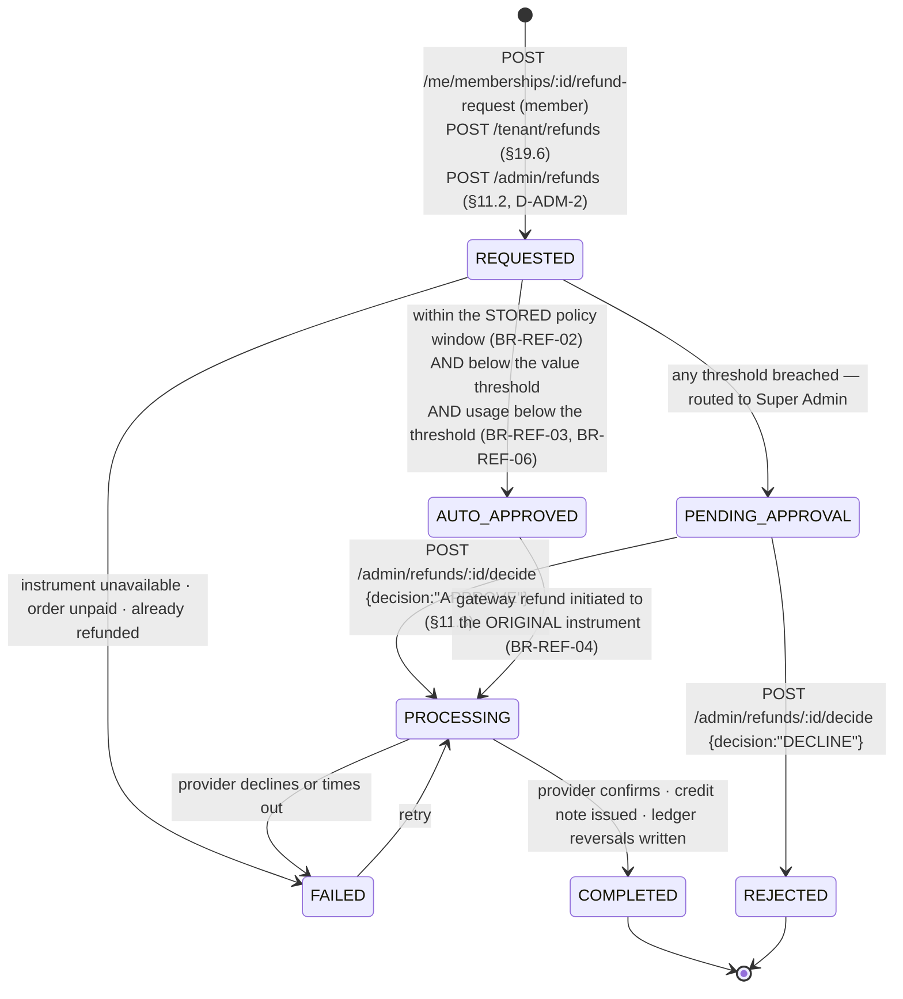
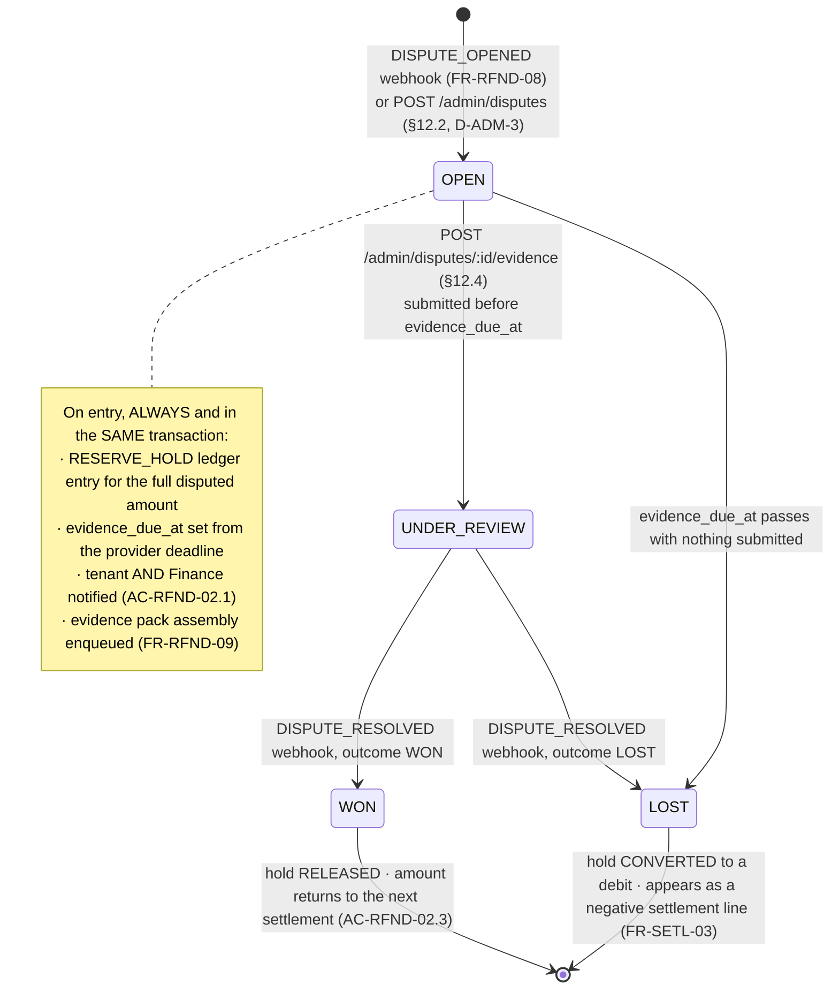

# `API-ADM` + tenant financial reads — Platform administration: the frozen endpoint contract

**Modules:** `admin` · `onboarding` · `settlements` · `refunds` · `reviews` · `reporting` ·
`notifications` · `audit` · `ordering` · `billing` · **Groups:** `ADM` (54 rows documented here) and
the ten financial rows of `TEN` · **Status:** contract frozen, no code written · **Launch market:**
India (`LAUNCH_MARKET_INDIA.md`) · **Phase-1 adapter:** Razorpay Route behind the `PaymentProvider`
port.

---

## 0. Document control

| Aspect | Value |
| :--- | :--- |
| Owns | The `API-ADM` rows of `API_Catalog.md` §3.12 in per-endpoint detail, plus the ten financial rows of `API-TEN` (§3.11) that `Gym.md` explicitly does not own: `GET /tenant/orders`, `GET /tenant/invoices`, `GET`/`GET :id` `/tenant/settlements`, `GET`/`POST /tenant/refunds`, `POST /tenant/orders/offline`, `POST /tenant/orders/:orderRef/collect-balance`, `GET /tenant/reports/:reportKey`, `POST /tenant/exports` |
| Contract law | **`docs/apis/README.md`** — the 18-section convention document: auth modes (§3), authorisation (§4), tenant resolution (§5), idempotency (§6), pagination (§7), filtering (§8), the 173-code error registry (§9.5), rate limits (§10), money (§11), time (§12), validation (§13), caching (§15), OpenAPI (§16). **This document cites it and never restates it** (`README.md` §18.3 rule 4) |
| Authoritative index | `docs/engineering/API_Catalog.md` §3.12 and §3.11 — which endpoints exist and their eleven attributes. A row may be deepened here; it may not be contradicted |
| Governing law | `PROJECT_CONSTITUTION.md` §13 (Error Handling Law), §14 (API Rules), §12 (Security). Nothing here may contradict either |
| Product source | `MASTER_PRD.md` `B5.24` (`ADMN`), `B5.21` (`SETL`), `B5.22` (`RFND`), `B5.20` (`RPT`), `B5.3` (`ONB`), `B5.16` (`REV`), `A6.2`–`A6.4` (tiers, commission, settlement), `A8` (`BR-FIN`, `BR-REF`, `BR-DAT`, `BR-GYM`, `BR-TEN`), `B3.1`/`B3.2` (roles and the permission matrix), `B8` `SCR-ADM-001`…`SCR-ADM-015`, `C3.2` (catalogue), `C4.5`/`C4.7`/`C4.8` (state machines and reason taxonomies), `C5` (background jobs) |
| Physical model | `docs/database/Schema.md` §4.2 `applications`, §4.1 `tenants`, §4.6 `users`, §4.10 `staff`, §7.1 `orders`, §7.4 `payments`, §7.5 `invoices`/`credit_notes`, §9.1 `ledger_entries`, §9.2 `settlement_batches`/`settlement_lines`/`reserves`, §9.3 `refunds`/`disputes`/`dispute_evidence`, §9.4 `commission_rules`, §10.1 `reviews`, §11.3 `report_definitions`/`export_jobs`, §12.2 taxonomy, §12.3 `subscription_tiers`/`tax_profiles`/`kyc_checklists`, §12.4 `feature_flags`/`notification_templates`, §13.3 `audit_log` |
| Enforcement split | `docs/database/Constraints.md` §13 — the `BR-` coverage matrix. Everything graded `NONE` or `PARTIAL` there is **this layer's** job |
| Launch market | `LAUNCH_MARKET_INDIA.md` — `INR`/paise, `Asia/Kolkata`, GST 18% as CGST 9% + SGST 9%, FY 1 April, commission **10% standard / 5% renewal**, tier deltas −2pp Growth and −4pp Professional |
| Not owned here | The webhook that opens a dispute (`POST /v1/webhooks/payments/:provider` — `Payments.md` §7); the member-side refund request (`POST /v1/me/memberships/:id/refund-request` — `Membership.md`); the tenant's own non-financial surfaces (`Gym.md`); review composition and gym responses (`Reviews.md`); notification template *sending* (`Notifications.md`); `GET /admin/system/health`, `GET /admin/system/queues`, `GET /admin/notifications/costs`, `POST /admin/tenants/:id/force-reverification`, `GET /admin/users/:id/permissions`, `POST /admin/users/:id/merge` — see §23 |

> **Every fenced block in this document is labelled `illustrative — not committed code`. No
> application code exists. Zod sketches, TypeScript interfaces, mermaid diagrams and JSON bodies here
> are the *contract*, expressed in the notation the implementation will use; they are not the
> implementation.**

---

## 1. Position, precedence, and five findings against the source set

### 1.1 The non-duplication contract

`README.md` §1.1 fixes the three-artefact division and §18.3 rule 4 forbids a domain file from
restating a convention. This document therefore cites and never repeats:

| Convention | Where it is defined | What this document does |
| :--- | :--- | :--- |
| `access(mfa)` as an auth mode | `README.md` §3.1 | Cites. **Every one of the 54 `ADM` rows is `access(mfa)`** — §2.1 explains why the qualifier is structural here and nowhere else |
| Platform elevation as a named, audited call | `README.md` §5.1 row 4, §5.3 TD8 | Cites. §2.3 shows the `runElevated()` envelope every cross-tenant read in this file passes through |
| Cross-tenant read is `404` | `README.md` §5.4 | Cites — **and §2.3 records the one place it does not apply**, because a platform-scope read is not a cross-tenant read |
| Idempotency: 24-hour store, five-component fingerprint, three states, replay is the original status | `README.md` §6 | Cites. §2.6 gives the per-endpoint posture, §21.2 the per-endpoint column; §10.5 works the double-approval race |
| Cursor pagination, and the five offset exceptions | `README.md` §7.1, §7.5 | Cites. **Two of the five exceptions live in this file** — `GET /admin/applications` and `GET /admin/audit` (§2.8) |
| Explicit named filters, `.strict()` query schemas, `sort` allowlists | `README.md` §8 | Cites. Every list endpoint below carries its own filter table, as §8.2 requires |
| The error envelope and the 173-code registry | `README.md` §9.1, §9.5 | Cites. §20 is the `admin`/`settlements`/`refunds`/`reporting` slice with the per-endpoint mapping |
| Money as `<name>_minor` strings with adjacent `currency`; rates as `_bps` integers | `README.md` §11.1 M1–M6 | Cites. Every amount below is a string of **paise** |
| Timestamps UTC with `Z`; business dates `YYYY-MM-DD` with a documented zone; FY as `"2026-27"` | `README.md` §12 | Cites. Settlement periods and invoice dates are **business dates in `Asia/Kolkata`** |
| Cache tokens | `README.md` §15.1 | Cites. **Every endpoint in this document is `NO-STORE!`** — §2.7 |
| Rate-limit classes | `README.md` §10.2 | Cites. `RL-ADMIN` on the platform surface, `RL-READ`/`RL-PAY`/`RL-EXPORT` on the tenant surface — §21.1 |

### 1.2 Finding 1 — five write endpoints the specification forces that the catalogue does not carry

`API_Catalog.md` §3.12 carries 57 `ADM` rows. Five writes required by the product specification have
no row, and each is **derived here** rather than invented: the requirement that forces it is named,
and the row is to be added to §3.12 in the same pull request that adds the handler
(`README.md` §18.3 rule 1).

| # | Derived endpoint | Requirement that forces it | Why a list row cannot serve it |
| :-: | :--- | :--- | :--- |
| **D-ADM-1** | `POST /v1/admin/settlements` | `FR-SETL-01` creates batches by the `settlement.build-batches` job (`C5`, daily 02:00). `FR-SETL-08` returns a **failed** payout to `PENDING_APPROVAL`, and `SCR-ADM-007` names *"failure handling"* as a screen action | A batch that failed at the bank must be **rebuilt or re-opened by a human** on a day the job has already run. Without an endpoint, the only remedy is a database edit — which `B1.1` forbids: *"anything the admin console can do is expressible as an authorised, audited API call"* |
| **D-ADM-2** | `POST /v1/admin/refunds` | `FR-RFND-01`: refund request origination by *"member … gym staff, **or platform staff**"*. `B3.2` grants *Request refund* to `SUPPORT` ●, `FINANCE` ● and `S.ADMIN` ● | The member path is `POST /me/memberships/:id/refund-request`; the tenant path is `POST /tenant/refunds`. **The platform path has no row**, so a third of `FR-RFND-01` is unimplementable |
| **D-ADM-3** | `POST /v1/admin/disputes` | `FR-RFND-08` intakes disputes *"from the gateway webhook"*. `AC-RFND-02.1` requires a case, a hold and a notification | Providers also notify chargebacks **out of band** — by email, by portal, by settlement-report line — and a case opened three days late has already lost evidence days against `evidence_due_at`. Manual intake is the compensating path, and it is `POST`, audited, with the provider's own dispute id required |
| **D-ADM-4** | `GET /v1/admin/settlements/:id` and `GET /v1/admin/disputes/:id` | Already **derived in the catalogue itself** (§3.12 "Derived rows"), marked `†`. Recorded here so the reader is not surprised to find them documented | An approval or an evidence submission cannot be made on a list row |
| **D-ADM-5** | `POST /v1/admin/reconciliation/:varianceId/resolve` | `BR-FIN-07`: a variance *"raises an alert **and blocks auto-payout for the affected tenant until resolved**"*. `KPI-26` demands **100%** with no tolerance band. `SCR-ADM-010` names variance resolution as a screen action | **"Until resolved" requires a resolution act.** With only `GET /admin/reconciliation` the block is permanent and every affected tenant stops being paid for ever — or someone clears it in the database, which `B1.1` forbids. The resolution is a classification plus, where the ledger was wrong, a compensating entry: an audited `POST`, never an `UPDATE` |

**None of these five widens platform authority.** Each is an existing `B3.2` capability that has no
route, which is the failure mode `README.md` §4.5 calls *"a capability with no permission is
unreachable"* read in the other direction.

### 1.3 Finding 2 — the task's `/moderation/{reviews,content,reports}` `POST` is the catalogue's `/:id/decide`

The task list writes `GET/POST /v1/admin/moderation/reviews, /content, /reports`. The catalogue
writes `GET /admin/moderation/reviews` and `POST /admin/moderation/reviews/:id/decide` (and likewise
for the other two queues). These are **the same six endpoints**: the `POST` acts on one queued item,
not on the queue. `README.md` §8 R6 — *"a non-CRUD action is a `POST` to a verb segment on the
resource"* — settles the spelling in the catalogue's favour. **This document uses `/:id/decide`
throughout.** There is no `POST /v1/admin/moderation/reviews` that creates a moderation item; items
are created by `review.anomaly-scan`, by automated screening (`BR-REV-04`) and by
`POST /v1/gyms/:slug/report`.

### 1.4 Finding 3 — `GET /admin/settlements` is a **batch** list, not a **run** list

`SCR-ADM-007` describes *"settlement runs by cycle"*. `Schema.md` §9.2 has no `runs` table: a "run"
is the set of `settlement_batches` sharing a `period_start`/`period_end`, one per tenant. Modelling a
run as a first-class resource would create an aggregate with no row, no id and no state machine —
`C4.7` is a **batch** machine. **Resolution:** `GET /v1/admin/settlements` lists **batches** with a
`period_start` filter, and the console groups by period client-side. This is a presentation grouping,
not a missing resource, and it keeps approval (`POST /:id/approve`) attached to the thing `BR-FIN-08`
actually approves.

### 1.5 Finding 4 — `KL-006` is only partially resolved, and the residue is a contract fact

`LAUNCH_MARKET_INDIA.md` §10 resolves `OQ-02` (10% / 5%) and observes that at those values no tier
delta drives the effective rate negative. Two items survive and **both surface on this API**:

| Residue | Status | Where it appears in this contract |
| :--- | :--- | :--- |
| **The 0 bps floor** must be implemented even though it is currently unreachable, because `A6.2` says the values are configurable and a future 3% standard with a −4pp delta goes negative | **Adopted and enforced.** `ck_commission_rules__floor_zero` (`Schema.md` §9.4) plus a resolver clamp; the API refusal is `422 COMMISSION_RATE_BELOW_FLOOR` naming the delta that caused it | §7.3, `PUT /v1/admin/config/commission` (§14.1), `POST /v1/admin/tenants/:id/commission-override` (§6.6) |
| **Whether tier deltas apply to the renewal rate** | **Unresolved.** Adopted working interpretation: **deltas apply to the standard rate only; the renewal rate is flat 500 bps across every tier.** Flagged for client confirmation before Sprint 11 (`Schema.md` open item **O-4**) | The effective-rate resolver returns `renewal_rate_bps` **with a `delta_applied: false` marker and an `assumption` field naming O-4**, so the console can show the assumption rather than imply a decision (§7.2) |

Recording it in the response body rather than only in a document is deliberate: an assumption that is
visible on every finance screen gets corrected; an assumption buried in a markdown file does not.

### 1.6 Finding 5 — `commission_tax_minor` is **PENDING CLIENT DECISION** and this file is where it lands

`LAUNCH_MARKET_INDIA.md` §11 conflict 2 (severity **High**), `Schema.md` §14.3 open item **O-1**,
`README.md` §18.2 item 6, `Payments.md` §2.2. `A6.3` computes `payable_to_gym = (N + T) − C − F` with
**no GST on the commission**, and the platform owes 18% GST on its own commission service.

| Aspect | Status |
| :--- | :--- |
| Where it surfaces | **Here and only here.** `Payments.md` §2.2 records that no `API-PAY` endpoint returns `C`, `F`, `P` or `Cₜ`. The ninth figure changes `GET /v1/tenant/settlements/:id` (§19.4), `GET /v1/admin/settlements/:id` (§10.2) and the `sum_invariant` string both of them publish |
| Schema cost | **Zero DDL.** `settlement_batches.commission_tax_minor` and `settlement_lines.commission_tax_minor` exist, are nullable, and are `NULL` on every row; `ck_settlement_batches__sums_to_payable` already carries the term inside a `COALESCE` |
| API cost | **Additive under `README.md` §2.2** — a new response field plus a `COMMISSION_TAX` entry in `lines[]`, legal **only because** `settlement_line.type` is registered **open** in §2.3 (CO-2) |
| What is *not* additive | The four-term identity `payable = net + tax − commission − fee` **stops holding**. `README.md` §2.6 is the worked retirement procedure and it is **the execution plan, not the decision** |
| The mitigation, shipped from day one | Both settlement endpoints publish **`sum_invariant` as a machine-readable string** from the first response (CO-9), so a conforming finance integration reads the identity instead of assuming it. This is the single highest-leverage line in this document |
| Deadline and owner | **Before Sprint 11**, Project Owner + Finance on advice from a qualified Indian tax advisor. After the first real settlement it stops being configuration and becomes a restatement of issued statements against `BR-PAY-10` immutability |

**This document states the mechanism and refuses to state the liability**, under
`LAUNCH_MARKET_INDIA.md` §13's standing caveat.

### 1.7 What is not in this document, and why each absence is a control

| Absence | Why | Asserted by |
| :--- | :--- | :--- |
| **Any endpoint that modifies or deletes an `audit_log` row** — no `PATCH`, no `DELETE`, no bulk edit, no redaction, no "correct this entry" | `AC-ADMN-02.3`: *"Given I attempt to modify or delete an audit record through any interface, then no such capability exists."* There is deliberately **no `AUDIT_LOG_IMMUTABLE` error code** (`README.md` §9.5.12) — an error code implies a route that refuses, which is weaker than a route that does not exist | Grants: `app_append` has `INSERT` and no `SELECT`; `app_rw` has `SELECT` and no `INSERT`/`UPDATE`/`DELETE` (`Schema.md` §13.3, `L3-GRANT`). A structural assertion over the generated OpenAPI document (`README.md` §16.4) |
| Any automated or service-account path that reaches `POST /admin/applications/:id/approve` | `BR-GYM-03`: *"Approval is a human decision. No automated path may set `APPROVED`."* | `422 GYM_APPROVAL_REQUIRES_HUMAN_ACTOR`, plus `access(mfa)` — a service account cannot satisfy a TOTP challenge (§5.3) |
| Any endpoint that edits an issued invoice or a posted ledger entry | `BR-PAY-10`, `BR-FIN-01`. Corrections are **credit notes** and **reversal entries** | `409 INVOICE_IMMUTABLE`, `409 LEDGER_ENTRY_IMMUTABLE`; `ledger_entries` and `settlement_lines` are `G-APPEND` |
| Any endpoint that recomputes a historical settlement figure or a historical commission rate | `BR-FIN-02`, `BR-FIN-05`, `FR-SETL-02`, `AC-ADMN-01.4` | All eight figures are denormalised per `settlement_line`; the read path never joins to `commission_rules` (§10.5) |
| Any request field by which a client names a tenant, and any monetary or `_bps` field on any request schema **except** `amount_received_minor` on `POST /tenant/orders/offline` and `collect-balance` | `README.md` §5.2, §11.1 M3/M4/M5 | `.strict()`; absence assertions 2 and 3 over the generated document |
| A commission rate, tier price or tax rate accepted from a **tenant**-scope caller | `README.md` §11.1 M5, `BR-FIN-05` | These fields exist only on `/admin/config/*` and `/admin/tenants/:id/commission-override`, all `platform` scope |
| A streaming, SSE or WebSocket channel for the approval queue, the reconciliation feed or the moderation queue | **A-08** — Phase 1 uses TanStack Query polling at 10–15 s. The queues are the polled resources | Absent from the route table |
| A "delete tenant" endpoint | `BR-TEN-04` — deletion is a **soft** delete and financial, invoice and audit records are retained for the statutory period regardless. The administrative action that exists is **suspend** (§6.4) | Absent from `API_Catalog.md` §3.12 |
| An admin endpoint that edits or deletes a member's review | `BR-REV-05`, invariant 4. Moderation may `PUBLISH`, `UNPUBLISH`, `REQUEST_EDIT` or `REMOVE` — **it never rewrites the member's words** | `README.md` §16.4 absence assertion 4 |

---

## 2. Cross-cutting contracts on this surface

### 2.1 `access(mfa)` is not a preference — it is the whole platform surface

`README.md` §3.1 defines `access(mfa)` as a **qualifier** on `access`: an access token whose session
asserts a satisfied MFA challenge (`amr` contains `totp`). `NFR-SEC-11` and `FR-AUTH-07` make MFA
mandatory for **all** platform staff roles, and `API_Catalog.md` §3.12 marks **every** `ADM` row with
it. There is no partial application and no read-only exemption.

| Rule | Statement |
| :--- | :--- |
| **AM1** | Every endpoint in §5–§18 requires `amr` to contain `totp`. A platform-staff token without it is **`403 MFA_REQUIRED`**, routed to enrolment — not `401`, because the caller *is* authenticated |
| **AM2** | `auth_time` matters as much as `amr`. A 30-day refresh family cannot carry a single MFA assertion forever: **any endpoint in §6, §10, §11, §12, §14 or §18 — every write that moves money, changes authority or changes configuration — requires `now − auth_time ≤ 900 s`**, and otherwise returns `403 MFA_REQUIRED` with a step-up prompt. Reads (§5.1, §8, §9, §13, §16, §17) are satisfied by `amr` alone |
| **AM3** | MFA cannot be turned off from inside. `PATCH /v1/admin/staff/:id` (§18.3) refuses any payload that would clear the MFA requirement on a platform account with **`422 MFA_MANDATORY_FOR_ROLE`**, including when the actor is editing their own row |
| **AM4** | An **impersonation** token (`typ: IMPERSONATION`) may never call any endpoint in this file. `README.md` §3.5 IM1 grants the impersonated user's authority and **never platform elevation**, so a support agent impersonating a gym owner holds `GYM_OWNER`, not `SUPPORT_AGENT`. The refusal is `403 PERMISSION_DENIED` from the `PermissionsGuard`, reached before the `ImpersonationGuard` — the agent simply does not hold `admin.*` while impersonating |
| **AM5** | The tenant financial surfaces of §19 are plain `access`. They are the **tenant's** money, read by the tenant's own roles, and demanding TOTP from a receptionist at a Pune front desk would push the platform toward shared logins — a worse security outcome than the one the rule protects |

### 2.2 The reason field — `FR-ADMN-02` as a schema, not a convention

> `FR-ADMN-02`: *"Every administrative action requires a reason and is written to the audit log."*

This is the single rule that shapes every request body in §5–§18. It is enforced as a **required
field on the Zod schema**, not as a service-layer check, because a required field is visible in the
generated OpenAPI document and a service-layer check is not.

```ts
// illustrative — not committed code
// packages/types/src/admin/admin-action.schema.ts
// Every administrative WRITE body in this document extends this base.
export const AdminActionBase = z.object({
  reason: z.string().trim().min(10).max(1000),   // FR-ADMN-02 — REQUIRED, never optional
});

// Example composition — POST /v1/admin/tenants/:id/suspend
export const SuspendTenantRequest = AdminActionBase.extend({
  suspension_category: z.enum([
    'FRAUD_SUSPECTED','KYC_LAPSED','PERSISTENT_NEGATIVE_BALANCE',
    'MEMBER_SAFETY','CONTENT_VIOLATION','TENANT_REQUEST','OTHER',
  ]),                                             // structured, alongside the free text
  effective_from: z.string().regex(/^\d{4}-\d{2}-\d{2}$/).optional(),  // default: today, Asia/Kolkata
  notify_tenant: z.boolean().default(true),
}).strict();                                      // README.md §13 Z4
```

| Rule | Statement |
| :--- | :--- |
| **RS1** | `reason` is **required** on every `POST`, `PUT` and `PATCH` in §5–§18. There is no endpoint in this file where it is optional and none where the server supplies a default |
| **RS2** | Omitting it is **`400 ADMIN_ACTION_REASON_REQUIRED`**, not `400 VALIDATION_FAILED`. The distinction is deliberate: `VALIDATION_FAILED` is a shape failure a developer fixes, `ADMIN_ACTION_REASON_REQUIRED` is a **governance** failure whose message is staff-facing and whose occurrence is a metric. §2.2.1 shows the exact body |
| **RS3** | Minimum length **10 characters after trimming**. `"ok"`, `"."` and `"   "` are refused. A reason field that accepts a full stop is a reason field that will contain full stops, and `AC-ADMN-02.1`'s reconstruction becomes impossible |
| **RS4** | Where the domain has a **structured** taxonomy — application rejection (16 codes), refund reason (10), moderation (9), check-in override (7), all `C4.8` — the structured code is required **in addition to** the free text, never instead of it. `BR-GYM-04` says the owner sees **both** |
| **RS5** | The reason is persisted on `audit_log.reason` (`Schema.md` §13.3) **and**, where the domain has a home for it, on the entity: `applications.reviewer_notes`, `commission_rules.reason`, `refunds.reason_text`. Two copies, deliberately — the audit row survives the entity (`CON-04`) and the entity row is what the counterparty reads |
| **RS6** | The reason is **never** echoed into a public surface. A tenant sees the rejection reason and the suspension reason; a marketplace visitor sees neither. `BR-DAT-06` governs the free text as it governs any operator-authored string |

#### 2.2.1 The `400` a missing reason produces, exactly

```json
// illustrative — not committed code — HTTP 400
{
  "error": {
    "code": "ADMIN_ACTION_REASON_REQUIRED",
    "message": "State a reason before suspending this tenant. The reason is recorded in the audit log and is shown to the gym owner.",
    "details": [
      { "field": "reason", "rule": "required", "message": "Describe why this action is being taken, in at least 10 characters." }
    ],
    "correlation_id": "01K2N7QK3M4N5P6R7S8T9V0W1X"
  }
}
```

A `reason` of `"   "` produces the same code with `"rule": "too_short"`, because
`README.md` §13.4 rule 6 trims **before** validating.

### 2.3 Platform elevation — `runElevated()`, and why `404` does not apply here

`README.md` §5.1 row 4: an `/admin` route resolves tenant context from *"platform elevation, plus the
resource where one is named"*, and §5.3 TD8 requires elevation to be **a named, audited function call
with an actor and a reason — not a role flag, not a middleware bypass, not an ambient capability**.

```ts
// illustrative — not committed code
// The ONLY way an /admin handler reads across tenants.
await runElevated(
  {
    actorId:        ctx.user.id,                       // → audit_log.actor_id
    permission:     'settlements.batch.read_all',      // → audit_log.permission
    elevationScope: 'PLATFORM_SETTLEMENT_REVIEW',      // → audit_log.elevation_scope
    reason:         'Weekly payout review, cycle 2026-W31',
    correlationId:  ctx.correlationId,
  },
  async (db) => db.settlementBatch.findMany({ where: { periodStart: '2026-07-27' } }),
);
// PE2 (Schema.md §13.3): the audit row is written BEFORE the work begins, so an
// elevation that then throws is still on the record. A crash cannot erase the attempt.
```

| Rule | Statement |
| :--- | :--- |
| **PE1** | `PlatformPrismaService` is injectable **only** inside `admin/`, `reporting/`, `settlements/` and `audit/`. `dependency-cruiser` (A-23) fails the build on any other import. There is no fifth module and adding one is an amendment |
| **PE2** | The `audit_log` row is written **before** the elevated work runs, carrying `permission` and `elevation_scope` (`Schema.md` §13.3). An elevation that reads nothing is still an elevation that happened |
| **PE3** | **`README.md` §5.4's `404` rule does not apply to `/admin` reads**, and this is not an exception to it — it is the rule read correctly. §5.4 governs *a caller authenticated in tenant A requesting tenant B's resource*. A `SUPER_ADMIN` on an `/admin` route is authenticated at **platform** scope and every tenant's rows are legitimately in scope, so an unknown id is a genuine `404 RESOURCE_NOT_FOUND` and a known id is a `200`. The information leak §5.4 prevents is not reachable, because there is nothing to conceal from a principal already authorised to see everything |
| **PE4** | A `VERIFICATION_OFFICER` requesting `GET /admin/settlements` is **`403 PERMISSION_DENIED`**, not `404`. `B3.2` gives them `—` on *Approve payout run*. Platform scope is not platform authority; the four-tuple still decides (`README.md` §4.1) |
| **PE5** | An `/admin` handler that reaches a tenant-owned table **without** `runElevated()` produces `500 TENANT_CONTEXT_MISSING`, which `README.md` §9.5.2 marks *a defect, not a user error*. It alerts, and it is caught in test by gate **PG-4**'s isolation inventory |

### 2.4 `B3.2` capabilities mapped to the permission strings of this surface

Every endpoint declares exactly one permission or gate **PG-1** fails the build (`FR-RBAC-01`).
Strings are `<module>.<resource>.<action>` (`README.md` §4.2), three segments, module from the 23 of
`§C1.3`, declared `as const` in the owning module's `permissions.ts`. **Scope is not in the string.**

| `B3.2` capability | Roles holding it | Permission string | Endpoint(s) |
| :--- | :--- | :--- | :--- |
| Approve / reject gym | `VERIF` ● `S.ADMIN` ● | `onboarding.application.list_all` | `GET /admin/applications` (§5.1) |
| Approve / reject gym | `VERIF` ● `S.ADMIN` ● | `onboarding.application.review` | `GET /admin/applications/:id` (§5.2) |
| Approve / reject gym | `VERIF` ● `S.ADMIN` ● | `onboarding.application.approve` | `POST …/approve` (§5.3) |
| Approve / reject gym | `VERIF` ● `S.ADMIN` ● | `onboarding.application.reject` | `POST …/reject` (§5.4) |
| Approve / reject gym | `VERIF` ● `S.ADMIN` ● | `onboarding.application.request_info` | `POST …/request-info` (§5.5) |
| Verification queue management (`FR-ADMN-11`) | `VERIF` ● `S.ADMIN` ● | `onboarding.application.assign` | `POST …/assign` (§5.6) |
| Suspend tenant / tenant administration | `S.ADMIN` ● | `admin.tenant.list` · `admin.tenant.read` · `admin.tenant.update` | §6.1 · §6.2 · §6.3 |
| Suspend tenant | `S.ADMIN` ● | `admin.tenant.suspend` · `admin.tenant.reinstate` | §6.4 · §6.5 |
| Configure commission rate | `FINANCE` ○ `S.ADMIN` ● | `admin.tenant.commission_override` | §6.6 |
| Tenant administration (tier) | `S.ADMIN` ● | `admin.tenant.tier_change` | §6.7 |
| Manage platform users | `S.ADMIN` ● | `admin.user.list` · `admin.user.read` | §8.1 · §8.2 |
| View tenant reports (platform read) | `SUPPORT` ○ `FINANCE` ○ `S.ADMIN` ● | `admin.order.list` | `GET /admin/orders` (§9.1) |
| Handle chargeback / payment oversight | `FINANCE` ● `S.ADMIN` ● | `admin.payment.list` | `GET /admin/payments` (§9.2) |
| Approve payout run | `FINANCE` ● `S.ADMIN` ● | `settlements.batch.list_all` · `settlements.batch.read_all` | §10.1 · §10.2 |
| Approve payout run | `FINANCE` ● `S.ADMIN` ● | `settlements.batch.build` **(derived, D-ADM-1)** | `POST /admin/settlements` (§10.4) |
| Approve payout run | `FINANCE` ● `S.ADMIN` ● | `settlements.batch.approve` | §10.5 |
| Approve out-of-policy refund | `FINANCE` ○ `S.ADMIN` ● | `refunds.refund.list_all` · `refunds.refund.decide` | §11.1 · §11.3 |
| Request refund (platform origination) | `SUPPORT` ● `FINANCE` ● `S.ADMIN` ● | `refunds.refund.create_platform` **(derived, D-ADM-2)** | `POST /admin/refunds` (§11.2) |
| Handle chargeback | `FINANCE` ● `S.ADMIN` ● | `refunds.dispute.list` · `refunds.dispute.read` · `refunds.dispute.submit_evidence` | §12.1 · §12.3 · §12.4 |
| Handle chargeback | `FINANCE` ● `S.ADMIN` ● | `refunds.dispute.intake_manual` **(derived, D-ADM-3)** | `POST /admin/disputes` (§12.2) |
| Approve payout run (reconciliation) | `FINANCE` ● `S.ADMIN` ● | `settlements.reconciliation.read` | §13.1 |
| Approve payout run (variance closure) | `FINANCE` ● `S.ADMIN` ● — **`WRITE_OFF` is `S.ADMIN` only** | `settlements.reconciliation.resolve` **(derived, D-ADM-5)** | §13.4 |
| Configure commission rate | `FINANCE` ○ `S.ADMIN` ● | `admin.config_commission.read` · `admin.config_commission.update` | §14.1 |
| Tenant administration (tiers) | `S.ADMIN` ● | `admin.config_tier.read` · `admin.config_tier.update` | §14.2 |
| Configuration (tax) | `FINANCE` ○ `S.ADMIN` ● | `admin.config_tax.read` · `admin.config_tax.update` | §14.3 |
| Review KYC documents (checklist config) | `VERIF` ○ `S.ADMIN` ● | `admin.config_kyc.read` · `admin.config_kyc.update` | §14.4 |
| Manage taxonomy | `MODER` ● `S.ADMIN` ● | `admin.config_taxonomy.read` · `admin.config_taxonomy.update` | §14.5 |
| Toggle feature flags | `S.ADMIN` ● | `admin.config_flag.read` · `admin.config_flag.update` | §14.6 |
| Configuration (templates) | `S.ADMIN` ● | `admin.config_template.read` · `admin.config_template.update` | §14.7 |
| Moderate / unpublish review | `MODER` ● `S.ADMIN` ● | `reviews.moderation.list` · `reviews.moderation.decide` | §15.1 · §15.2 |
| Moderate content and reports | `MODER` ● `S.ADMIN` ● | `admin.moderation_content.list` · `admin.moderation_content.decide` · `admin.moderation_report.list` · `admin.moderation_report.decide` | §15.3 · §15.4 |
| View audit log | `SUPPORT` ○ `VERIF` ○ `FINANCE` ○ `MODER` ○ `S.ADMIN` ● | `audit.audit_log.search` | §16.1 |
| View tenant reports (platform) | `S.ADMIN` ● `FINANCE` ○ | `reporting.platform_report.read` | §17.1 |
| Manage platform users | `S.ADMIN` ● | `admin.staff.list` · `admin.staff.invite` · `admin.staff.update` | §18.1 · §18.2 · §18.3 |
| View settlement statements (own tenant) | `OWNER` ● `FINANCE` ○ `S.ADMIN` ○ | `settlements.batch.list` · `settlements.batch.read` | §19.3 · §19.4 |
| View tenant reports | `RECEPT` ▪ `TRAINER` ▪ `MANAGER` ▪ `OWNER` ● | `ordering.order.list` · `billing.invoice.list` · `reporting.report.read` | §19.1 · §19.2 · §19.9 |
| Record offline payment | `RECEPT` ● `MANAGER` ● `OWNER` ● | `ordering.order.create_offline` · `ordering.order.collect_balance` | §19.7 · §19.8 |
| Request refund (tenant origination) | `MANAGER` ● `OWNER` ● | `refunds.refund.list` · `refunds.refund.create` | §19.5 · §19.6 |
| Export tenant data | `OWNER` ● `FINANCE` ● `S.ADMIN` ● | `reporting.export.create` | §19.10 |

**The `○` rows are not a runtime flag.** `README.md` §4.2 is explicit: read-only is a **distinct
`.read` permission granted where `.update` is not**. `FINANCE` holds `admin.config_commission.read`
and does **not** hold `admin.config_commission.update`; the refusal is `403 PERMISSION_DENIED`
naming the role that can grant it, not a disabled button (`FR-RBAC-02`).

### 2.5 Surfaces

| Endpoint family | `web` | `dash` | `admin` |
| :--- | :-: | :-: | :-: |
| §5 Applications | ❌ | ❌ — the owner's own view is `GET /v1/tenant/applications` (`Gym.md` §9.1) | ✅ `SCR-ADM-002`, `SCR-ADM-003` |
| §6 Tenants | ❌ | ❌ | ✅ `SCR-ADM-004` |
| §8 Users | ❌ | ❌ | ✅ `SCR-ADM-005` |
| §9 Orders and payments | ❌ | ❌ — `dash` reads §19.1 | ✅ `SCR-ADM-006` |
| §10 Settlements | ❌ | ❌ — `dash` reads §19.3/§19.4 | ✅ `SCR-ADM-007` |
| §11 Refunds | ❌ | ❌ — `dash` writes §19.6 | ✅ `SCR-ADM-008` |
| §12 Disputes | ❌ | ❌ — the tenant sees the hold on its statement (§19.4) | ✅ `SCR-ADM-009` |
| §13 Reconciliation | ❌ | ❌ | ✅ `SCR-ADM-010` |
| §14 Configuration | ❌ | ❌ | ✅ `SCR-ADM-011` |
| §15 Moderation | ❌ | ❌ | ✅ `SCR-ADM-012` |
| §16 Audit | ❌ | ⚠️ — the **tenant's own** audit view is `GET /v1/tenant/audit` (`Gym.md`), a different endpoint with a `tenant` scope | ✅ `SCR-ADM-015` |
| §17 Analytics | ❌ | ❌ | ✅ `SCR-ADM-014` |
| §18 Platform staff | ❌ | ❌ | ✅ `SCR-ADM-005` |
| §19 Tenant financial | ❌ | ✅ `SCR-DASH-010`…`SCR-DASH-014` | ❌ |

### 2.6 Idempotency posture, per endpoint class

`README.md` §6.1 binds the classes; gate **PG-2** enforces the decoration. This surface contributes
four rows to the money-affecting class and one to the bulk-and-asynchronous class.

| Class | Endpoints in this document | Key derivation |
| :--- | :--- | :--- |
| **Money-affecting — REQ** | `POST /admin/settlements/:id/approve` · `POST /admin/refunds/:id/decide` · `POST /admin/disputes/:id/evidence` · `POST /tenant/refunds` · `POST /tenant/orders/offline` · `POST /tenant/orders/:orderRef/collect-balance` | Approve: client-generated per approval attempt, and the batch's `status` transition is the real guard. Decide: **derived from the order** (`BR-REF-09`, `README.md` §6.5). Evidence: per submission attempt. Offline / collect-balance: client-generated per desk action |
| **Money-affecting — REQ, derived rows** | `POST /admin/settlements` (D-ADM-1) · `POST /admin/refunds` (D-ADM-2) · `POST /admin/disputes` (D-ADM-3) | Build: `(period_start, period_end, tenant_id)` natural key plus the header. Platform refund: derived from the order, exactly as `/tenant/refunds`. Manual dispute intake: **the `provider_dispute_id`**, which `uq_disputes__provider_dispute_id` already makes unique — the header is belt, the index is braces (ID-A) |
| **Bulk and asynchronous — REQ** | `POST /tenant/exports` | An export job id; `EXPORT_ALREADY_IN_PROGRESS` (`409`) points at the running job rather than starting a second |
| **Other mutations — OPT** | Every remaining write: `PATCH /admin/tenants/:id`, the four application actions, `POST /admin/tenants/:id/{suspend,reinstate,commission-override,tier}`, the seven `PUT /admin/config/*`, the three `/moderation/:id/decide`, `POST`/`PATCH /admin/staff` | Accepted and honoured when supplied. `API_Catalog.md` §3.12 marks several of these `REQ`; **this document adopts the catalogue's `REQ` where it states one** and treats the rest as `OPT`. §21.2 lists the exact per-endpoint column |
| **Safe — N/A** | Every `GET` in this document (28 of them) | — |

**Why suspension is idempotency-`REQ` and not `OPT`.** `API_Catalog.md` §3.12 marks
`POST /admin/tenants/:id/suspend` **REQ**, and it is right to: a double-tapped *Suspend* would write
two audit rows, fire two `TenantSuspended` outbox events and send the owner two notifications for one
decision. The second attempt without a key is not harmless — it is `409 TENANT_ALREADY_SUSPENDED`,
which is a **worse** outcome than an idempotent replay of the first success, because it makes a
correct operator look wrong.

### 2.7 Cache and privacy posture

**Every endpoint in this document is `NO-STORE!`** — `private, no-store` plus `Pragma: no-cache`
plus `Vary: Authorization` (`README.md` §15.1). There are no exceptions and no `ETag`s except the
optimistic-concurrency tokens named in §14.

| Rule | Statement |
| :--- | :--- |
| **CP1** | `Vary: Authorization` is what stops an intermediary from ever keying an admin response on the URL alone. `GET /admin/tenants?q=iron` returns different rows to a `SUPER_ADMIN` and to a `VERIFICATION_OFFICER`, and a shared cache that missed that would be a cross-role disclosure |
| **CP2** | No `/admin` response carries an `ETag` (E4). An entity tag on an uncacheable response is an invitation to cache it |
| **CP3** | KYC document **content** is never in a JSON body. `GET /admin/applications/:id` returns time-limited, single-use, audited signed URLs (§5.2), because `BR-DAT-07` requires *every access* to be logged and a body-embedded document is an access nobody logged |
| **CP4** | `pan`, `gstin`, bank account number and IFSC are returned **in full** to `VERIFICATION_OFFICER` and `SUPER_ADMIN`, **masked** to `FINANCE` on non-payout surfaces and to `SUPPORT_AGENT` everywhere, and **absent** for `MODERATOR`. Masking is applied in the serialisation layer by permission qualifier, not by the handler (`BR-DAT-06`, `BR-DAT-07`) |
| **CP5** | Member personal data on `GET /admin/users/:id` obeys `BR-DAT-06` in logs and analytics: the response may carry a phone number, the log line may not. `Authorization`, `Cookie`, `pan`, `gstin`, `account_number` and `phone` are on the Pino redaction list |
| **CP6** | Every response carries `X-Correlation-Id` (`README.md` §9.7 CI1), and on this surface the same ULID is written to `audit_log.correlation_id`, so an operator's screenshot joins to the audit row without a text search |

### 2.8 Pagination posture — the two offset exceptions live here

`README.md` §7.5 enumerates five offset exceptions and **two of them are endpoints in this file**.

| Endpoint | Pagination | Bound | Why |
| :--- | :--- | :--- | :--- |
| `GET /admin/applications` (§5.1) | **Offset** — exception 1 | Hard cap **100 pages**; beyond it `400 LIMIT_EXCEEDS_MAXIMUM` asks for a narrower filter | Verification officers sort by SLA state and age and genuinely need to jump. `B2.4` sizes the queue at 30–60 per day, and the set is short-lived |
| `GET /admin/audit` (§16.1) | **Offset** — exception 2 | Hard cap **100 pages**; deep history is served by export | Investigative use with arbitrary filters where jumping is useful |
| `GET /admin/config/*` (§14) | **Not paginated** — exception 3, reference data | — | Bounded and small: ~40 flags, 4 tax profiles, 8 tiers, 8 KYC checklists, ~350 templates returned by key |
| `GET /admin/analytics/:reportKey` (§17.1), `GET /tenant/reports/:reportKey` (§19.9) | **Not paginated** — exception 5 | Over the size threshold → `422 REPORT_RANGE_TOO_LARGE` offering asynchronous export | Reports render whole or export (`FR-RPT-03`) |
| **Everything else** — 22 list endpoints | **Cursor**, `limit` default **50** on admin and dashboard lists (`SCR-DASH-007`), cap 100 | — | ADR-0023 |

**The two offset endpoints do not return `next_cursor` at all.** They return `page`, `page_size`,
`page_count` and `has_more`, and a client must not mix the two shapes. `README.md` §7.1's envelope is
the cursor shape; §5.1 and §16.1 publish the offset shape explicitly, so the difference is visible in
the generated OpenAPI document rather than discovered at runtime.

---

## 3. The audit contract — `FR-ADMN-02`, `BR-DAT-01`, `BR-DAT-02`, `AC-ADMN-02.1`…`02.3`

### 3.1 What every administrative write produces

There is no administrative write in this document that does not produce an `audit_log` row. The row
is written by the `AuditInterceptor` (`L9-INT`) inside the same transaction as the effect, so a
rolled-back write leaves no audit row and a committed write always leaves one.

| `audit_log` column | Value on an admin write | Source |
| :--- | :--- | :--- |
| `occurred_at` | Transaction start instant, UTC. **Partition key** — monthly range partitions | `NFR-SCAL-06` |
| `tenant_id` | The **subject** tenant where the action names one (`POST /admin/tenants/:id/suspend` → that tenant); `NULL` for a platform-only action (`PUT /admin/config/flags`) | `Schema.md` §13.3 |
| `actor_id` / `actor_type` | The platform staff user; `actor_type = 'PLATFORM_STAFF'` | `BR-DAT-01` |
| `impersonated_by` | `NULL` on this surface — §2.1 AM4 makes an impersonation token unable to reach it | `BR-DAT-02` |
| `entity_type` / `entity_id` | The governed entity. **No foreign key** — the audit row must outlive its subject (`CON-04`) | `Schema.md` §13.3 |
| `action` | `audit_action_enum`: `CREATE`, `UPDATE`, `DELETE`, `APPROVE`, `REJECT`, `SUSPEND`, `REINSTATE`, `OVERRIDE`, `DECIDE`, `ASSIGN`, `CONFIG_CHANGE`, `ELEVATE`, `EXPORT` | `BR-DAT-01` |
| `before` / `after` | The full entity state either side, as `jsonb`. **`before` is `NULL` on a create**; `after` is `NULL` on a hard delete, which does not occur on this surface | `AC-ADMN-02.1` |
| `reason` | §2.2 RS1's required field, verbatim | `FR-ADMN-02` |
| `permission` / `elevation_scope` | Written by `runElevated()` **before** the work begins (PE2) | `Schema.md` §13.3 |
| `ip` / `user_agent` | From the request; `AC-ADMN-02.1` names IP explicitly | `BR-DAT-01` |
| `correlation_id` | The request ULID, identical to `X-Correlation-Id` and to the Pino log line | `NFR-MNT-04` |

**Rule `SC-R02` is not weakened here.** An append-only table is its own audit record, so a
`settlement_lines` insert or a `ledger_entries` insert does **not** produce an `audit_log` row. What
produces one is the **decision**: the approval, the override, the rejection, the configuration
change. `POST /admin/settlements/:id/approve` writes one audit row for the approval and zero for the
1,247 statement lines the approval releases.

### 3.2 The no-mutation property, stated as contract

> `AC-ADMN-02.3`: *"Given I attempt to modify or delete an audit record through any interface, then
> no such capability exists."*

This is asserted at four layers and **each is independently sufficient**:

| Layer | Control |
| :--- | :--- |
| `L3-GRANT` | `GRANT INSERT ON audit_log TO app_append; GRANT SELECT ON audit_log TO app_rw, app_platform_ro;` — the writer cannot read, the reader cannot write, and **nobody holds `UPDATE` or `DELETE`**. Re-applied to every new monthly partition by `ops.partition-maintain` (`Schema.md` §13.3) |
| Route table | No `PATCH`, `PUT` or `DELETE` operation exists on `/v1/admin/audit` or on any path beneath it. `GET /admin/audit` (§16.1) has no sibling |
| `L12-CI` | A structural assertion over the **generated** OpenAPI document: no operation whose path matches `/admin/audit` uses a mutating method. `README.md` §16.4's absence-assertion mechanism, extended by one row for this file |
| Registry | There is deliberately **no `AUDIT_LOG_IMMUTABLE` error code** (`README.md` §9.5.12). An error code implies a route that refuses; the absence of the route is stronger |

**Retention is not mutation.** `audit.partition-maintenance` (`C5`, monthly) detaches partitions
beyond 24 months to cold storage and can re-attach them as foreign tables for the rare deep query of
`FR-ADMN-09`. `R-AUD` is **7 years**. Detaching is not deleting, and a detached partition is
re-attachable — which is the difference between archival and destruction.

### 3.3 `BR-DAT-02` — impersonation appears in the impersonated user's own activity

> `BR-DAT-02`: *"Support impersonation of a user requires a stated reason, is time-boxed, is
> **visible to the impersonated user in their account activity**, and is fully audited."*
> `AC-ADMN-02.2`: querying that user's audit trail shows the impersonation, its reason, its duration
> and **every action taken during it**, marked as impersonated.

| Rule | Statement |
| :--- | :--- |
| **IMP1** | Every action taken under a `support` token writes an `audit_log` row with `actor_id = <the impersonated user>` **and** `impersonated_by = <the agent>`. Two subjects on one row, never one (`README.md` §3.5 IM5) |
| **IMP2** | The **member's own** activity feed — `GET /v1/me/activity`, owned by `Authentication.md` — reads the same rows and renders the impersonation marker. The member does not need to ask support what support did |
| **IMP3** | `GET /v1/admin/audit?impersonation=true` (§16.1) filters on `impersonated_by IS NOT NULL`, which is `AC-ADMN-02.2`'s query made a first-class parameter rather than a saved search an auditor has to know to write |
| **IMP4** | The impersonation **session** itself is one audit row of `action = 'ELEVATE'` carrying the reason and the 30-minute cap; `act.reason_ref` on the token points at that row's id (`README.md` §3.5 IM3). The duration `AC-ADMN-02.2` requires is `(session end − occurred_at)`, and the end is a second row |
| **IMP5** | An impersonation token cannot reach any endpoint in this document (§2.1 AM4), so **no row in `/admin/*` is ever written with a non-null `impersonated_by`**. The filter of IMP3 is for the tenant and member surfaces, which is exactly where support works |

### 3.4 What is deliberately **not** audited

| Not audited | Why |
| :--- | :--- |
| `GET` requests on §5.1, §6.1, §8, §9, §10.1, §11.1, §12.1, §15, §16, §17 | `BR-DAT-01` audits create, update and delete. Auditing every dashboard read would drown the trail it exists to make searchable — `SCR-ADM-001` alone polls four collections at 10–15 s (A-08) |
| **Exception, and it is not an exception to `BR-DAT-01`** | `GET /admin/applications/:id` **is** audited, because `BR-DAT-07` requires *every access* to a KYC document to be logged. The audit row is `action = 'ELEVATE'` with `elevation_scope = 'KYC_DOCUMENT_ACCESS'` and it names the documents whose signed URLs were minted (§5.2) |
| The `runElevated()` row on a read | Not an exception either — PE2's row is written for the **elevation**, which is an authority event, not for the data returned |

---

## 4. The three state machines this surface drives

### 4.1 Settlement batch — `C4.7`

`settlement_batch_status_enum` is a **closed** enum (`README.md` §2.3): a client may not receive a
value outside this set and adding one is a breaking change.

```mermaid
%% illustrative — not committed code
stateDiagram-v2
    [*] --> OPEN: settlement.build-batches (C5, daily 02:00)<br/>or POST /admin/settlements (D-ADM-1)
    OPEN --> CLOSED: period ends · roll-ups computed · lines frozen (BR-FIN-02)
    CLOSED --> ON_HOLD: reconciliation variance (BR-FIN-07)<br/>or payout account unverified (BR-GYM-06)<br/>or a gateway fee not yet reported (BR-FIN-06)
    ON_HOLD --> CLOSED: variance resolved · account re-verified · fee reported
    CLOSED --> PENDING_APPROVAL: below the auto-approval threshold and auto-payout OFF,<br/>or above it (FR-SETL-06)
    CLOSED --> APPROVED: auto-payout ON and below the auto-approval threshold (FR-SETL-06)
    PENDING_APPROVAL --> APPROVED: POST /admin/settlements/:id/approve<br/>(one approver below the dual threshold, two above — BR-FIN-08)
    APPROVED --> PROCESSING: payout instructed to the provider
    PROCESSING --> PAID: provider confirms · payout_reference recorded
    PROCESSING --> FAILED: bank rejection (FR-SETL-08)
    FAILED --> PENDING_APPROVAL: reason recorded · tenant AND Finance notified · re-approval required
    CLOSED --> [*]: below the minimum payout — rolls forward (FR-SETL-05)<br/>with the reason shown to the tenant
    PAID --> [*]
```



| Transition | Caused by | Guarded by |
| :--- | :--- | :--- |
| `OPEN → CLOSED` | `settlement.build-batches` at the period boundary | Runs at `REPEATABLE READ` (`Schema.md` §2.10) so the roll-ups and the lines see one snapshot; `ck_settlement_batches__sums_to_payable` is the acceptance test |
| `CLOSED → ON_HOLD` | `settlement.reconcile` (`C5`, daily 04:00) finding a variance | **`BR-FIN-07` — this is the block, and it is a state, not a boolean.** §13 |
| `CLOSED → APPROVED` **without** `PENDING_APPROVAL` | Auto-payout enabled **and** amount below the auto-approval threshold | `FR-SETL-06`. Never reachable while `ON_HOLD` — `BR-FIN-07` blocks auto-payout for that tenant |
| `PENDING_APPROVAL → APPROVED` | §10.5 | `BR-FIN-08` dual approval above the threshold; `ck_settlement_batches__dual_approval_distinct` makes the two approvers differ at `L1-DB` |
| `PROCESSING → FAILED → PENDING_APPROVAL` | `FR-SETL-08` | The batch is **never edited**. A correction appears as adjustment lines in the **next** batch with the opening balance carrying the difference (`Schema.md` §9.2) |

**An approval attempted from any other state is `422 BATCH_NOT_IN_APPROVABLE_STATE` naming the
current state.** Not `409`: the refusal is a domain rule evaluated against the request's content, and
retrying identically cannot succeed until the world changes (`README.md` §9.3).

### 4.2 Refund — `C4.5`



| Property | Statement |
| :--- | :--- |
| **Idempotent on the order** | `uq_refunds__order_id_active` — `CREATE UNIQUE INDEX … ON refunds (order_id) WHERE status NOT IN ('REJECTED','FAILED')`. `BR-REF-09` as an index, not as a service check (`Schema.md` §9.3). A second live refund on one order is impossible at `L1-DB` |
| **The policy is the stored one** | `BR-REF-02`. The window, proration method and cancellation fee come from `orders.refund_policy_snapshot`, **never** from the tenant's current settings. A tenant who tightens their policy today cannot retroactively narrow a refund on last month's order |
| **The computation is shown before confirmation** | `FR-RFND-04`, `AC-RFND-01.2`. §11.3's response body **is** that computation, and it is returned by the `GET` and echoed by the `POST` |
| **Commission reverses proportionally** | `BR-REF-05`. A partial refund writes a `REFUND` ledger entry plus a proportional `COMMISSION_REVERSAL` — and, if O-1 is adopted, a proportional `COMMISSION_TAX_REVERSAL`. `Money.allocate()` guarantees the parts sum back exactly (`MO3`) |
| **Gateway fees reverse only if the gateway reverses them** | `BR-REF-05`, `BR-FIN-06`. A non-reversed fee is borne per the tenant agreement and appears **explicitly** as its own settlement line — never silently absorbed and never estimated |

### 4.3 Dispute — `dispute_status_enum`, driven by `BR-REF-08`



**The hold is a ledger entry, never a column.** `BR-FIN-01` forbids a mutable stored balance
anywhere, so the hold is a `RESERVE_HOLD`-typed `ledger_entries` row referencing the dispute
(`Schema.md` §9.3). Releasing it is a second entry, not an update. This is why a tenant can see, on
`GET /v1/tenant/settlements/:id` (§19.4), a line explaining precisely why their payout is smaller
this cycle — the hold is a **fact in the ledger**, not a number someone changed.

---

## 5. Applications — the verification queue (`FR-ONB-09`…`FR-ONB-13`, `FR-ADMN-11`)

### 5.1 `GET /v1/admin/applications`

| | |
| :--- | :--- |
| **Purpose · Surfaces** | The approval queue with SLA state, assignee, age, submission type and pre-check status, so a verification officer can pick the next application rather than search for it · `admin` `SCR-ADM-002` |
| **Auth · Permission · Scope** | `access(mfa)` · **`onboarding.application.list_all`** · **`platform`** — every tenant's rows, read under `runElevated()` (§2.3) |
| **Idem · RL · Cache** | N/A · `RL-ADMIN` (300/min per staff user) · `NO-STORE!` |
| **Catalogue row** | `API_Catalog.md` §3.12 row 1 — FR: `FR-ONB-09`, `FR-ADMN-11` |
| **Pagination** | **Offset** — `README.md` §7.5 exception 1. Hard cap **100 pages** |

**Request — query parameters.** All optional; the query schema is `.strict()`, so an unrecognised
parameter is `400 UNKNOWN_QUERY_PARAMETER` naming it (`README.md` §8.3).

| Parameter | Type | Notes |
| :--- | :--- | :--- |
| `status` | enum, repeatable | `SUBMITTED` · `UNDER_REVIEW` · `INFO_REQUESTED` · `APPROVED` · `REJECTED` (`FR-ONB-09`, `C4.4`). Default: the three open states |
| `assigned_to` | uuid, repeatable | A staff user id. `assigned_to=unassigned` is the reserved literal for `IS NULL` — a **literal**, not an empty value, because an empty value is indistinguishable from an omitted parameter |
| `sla_state` | enum | `WITHIN` · `APPROACHING` · `BREACHED`. Server-computed from `submitted_at` and the configured SLA (§5.1.1) |
| `submission_type` | enum | `NEW` (`applications.version = 1`) · `RESUBMISSION` (`version > 1`, `BR-GYM-05`) |
| `precheck` | enum | `ALL_PASS` · `ANY_FAIL`. Reads `applications.precheck_results` |
| `city` / `state` | string | The gym's city and Indian state from the snapshot |
| `submitted_from` / `submitted_to` | `YYYY-MM-DD` | Business dates in `Asia/Kolkata`, inclusive both ends (`README.md` §8.1) |
| `q` | string, 2–80 chars | Parameterised trigram match over legal name, trading name and gym name. **Never concatenated into SQL** (`README.md` §8.1) |
| `sort` | allowlist | `submitted_at:asc` (**default** — oldest first is the queue's whole point) · `submitted_at:desc` · `sla_state:desc` · `city:asc`. Anything else is `400 SORT_FIELD_NOT_ALLOWED` listing the four |
| `page` / `page_size` | integer | `page` 1-based, cap **100**; `page_size` default **50**, cap 100 |

**Response — `200 OK`**

```json
// illustrative — not committed code — HTTP 200 OK
{
  "data": [
    {
      "application_id": "01932d10-4a02-7c11-9b33-5e2f7a1c4d80",
      "version": 2,
      "submission_type": "RESUBMISSION",
      "tenant": { "id": "01932c6a-11f4-7a90-b3c2-77e1a4d55f01",
                  "legal_name": "Iron Temple Fitness Private Limited",
                  "trading_name": "Iron Temple Fitness" },
      "gym": { "display_name": "Iron Temple Fitness — Koregaon Park", "city": "Pune", "state": "Maharashtra" },
      "status": "UNDER_REVIEW",
      "submitted_at": "2026-08-04T06:11:52Z",
      "age_hours": 51,
      "sla": { "state": "APPROACHING", "target_hours": 72, "hours_remaining": 21, "breaches_at": "2026-08-07T06:11:52Z" },
      "assigned_to": { "staff_id": "01932c99-7b21-7d40-a112-33c8e0f6b901", "full_name": "Ananya Iyer" },
      "precheck": { "summary": "ANY_FAIL", "pass_count": 4, "fail_count": 1,
                    "failing": ["GEO_ADDRESS_DISTANCE"] },
      "prior_decision": { "version": 1, "decision": "REJECTED",
                          "reason_codes": ["KYC_DOCUMENT_ILLEGIBLE", "INSUFFICIENT_PHOTOS"],
                          "decided_at": "2026-07-29T09:40:11Z" }
    },
    {
      "application_id": "01932d11-1f77-7e05-8c90-6b4a2d3e5f12",
      "version": 1,
      "submission_type": "NEW",
      "tenant": { "id": "01932c7b-9d02-7411-bb18-2f7c5a9e3301",
                  "legal_name": "Pulse Fitness LLP", "trading_name": "Pulse Fitness" },
      "gym": { "display_name": "Pulse Fitness — Indiranagar", "city": "Bengaluru", "state": "Karnataka" },
      "status": "SUBMITTED",
      "submitted_at": "2026-08-06T03:22:40Z",
      "age_hours": 6,
      "sla": { "state": "WITHIN", "target_hours": 72, "hours_remaining": 66, "breaches_at": "2026-08-09T03:22:40Z" },
      "assigned_to": null,
      "precheck": { "summary": "ALL_PASS", "pass_count": 5, "fail_count": 0, "failing": [] },
      "prior_decision": null
    }
  ],
  "page": 1,
  "page_size": 50,
  "page_count": 2,
  "has_more": true,
  "queue_summary": {
    "open_total": 63, "unassigned": 11,
    "sla_breached": 2, "sla_approaching": 7,
    "oldest_open_hours": 79,
    "by_officer": [
      { "staff_id": "01932c99-7b21-7d40-a112-33c8e0f6b901", "full_name": "Ananya Iyer", "open": 14 },
      { "staff_id": "01932c99-8e14-7a63-9004-51b7c2d9e885", "full_name": "Rahul Bhatt", "open": 9 }
    ]
  }
}
```

`queue_summary` is `FR-ADMN-11`'s *"SLA monitoring, workload distribution"* as data rather than as a
second call. It is computed over the **filtered** set except `by_officer`, which is computed over all
open applications — a workload figure filtered to one city would tell an assigner nothing useful.

#### 5.1.1 `sla_state` is server-computed, and why

`README.md` §12.3's rule: *any value a user will compare against their own calendar is computed
server-side.* `age_hours`, `hours_remaining` and `breaches_at` are all derived from `submitted_at`
and the configured SLA target in `Asia/Kolkata` business hours. A client computing "51 hours" from a
UTC timestamp in a browser set to IST gets a different answer 23% of the day (`README.md` §12.3), and
an officer told an application breaches "tomorrow" when it breaches tonight will let it breach.

| `sla_state` | Definition |
| :--- | :--- |
| `WITHIN` | `hours_remaining > 24` |
| `APPROACHING` | `0 < hours_remaining ≤ 24` |
| `BREACHED` | `hours_remaining ≤ 0`. The value goes negative in `hours_remaining` and stays visible — a breach that disappears from the queue is a breach nobody fixes |

The SLA target (**72 hours** at launch) is configuration, not a constant, and it lives beside the
other operational parameters rather than in code.

**Errors.** Universal only, plus `400 SORT_FIELD_NOT_ALLOWED`, `400 UNKNOWN_QUERY_PARAMETER`,
`400 LIMIT_EXCEEDS_MAXIMUM` (page above 100 or `page_size` above 100).
**Business rules.** `BR-TEN-01` — the elevation is the read path and PE1 confines it to `admin/`.
`BR-GYM-05` — prior versions are retained, which is what makes `prior_decision` answerable.
**Validation.** Query schema `.strict()`; `q` trimmed then length-checked; dates parsed as
`YYYY-MM-DD` and rejected as `400 VALIDATION_FAILED` with `rule: "iso_date"` otherwise.
**Side effects.** One `audit_log` row of `action = 'ELEVATE'` for the elevation (PE2); **no** row per
application read — §3.4.
**Future compatibility.** May be added in `v1`: further filters (`entity_type`, `tier`), a
`risk_score` field, additional `sort` allowlist entries. Would force `v2`: moving to cursor
pagination (a `page` client breaks), removing `queue_summary`, changing the meaning of `sla_state`.

### 5.2 `GET /v1/admin/applications/:id`

| | |
| :--- | :--- |
| **Purpose · Surfaces** | Everything a verification officer needs to decide in under three minutes (`US-ONB-02`): the frozen snapshot, the KYC document set behind audited signed URLs, the pre-check panel, the structured checklist and the field-level diff against the prior version · `admin` `SCR-ADM-003` |
| **Auth · Permission · Scope** | `access(mfa)` · **`onboarding.application.review`** · `platform` |
| **Idem · RL · Cache** | N/A · `RL-ADMIN` · `NO-STORE!` — `CP3` |
| **Catalogue row** | `API_Catalog.md` §3.12 row 2 — FR: `FR-ONB-12`; BR: `BR-GYM-08`, `BR-GYM-09`, `BR-DAT-07` |

**Request.** Path parameter `id` (uuid). One optional query parameter: `diff_against` (integer
version, default `version − 1`; omitted entirely when `version = 1`).

**Response — `200 OK`** (abridged in the document set; every field named is present)

```json
// illustrative — not committed code — HTTP 200 OK
{
  "application": {
    "id": "01932d10-4a02-7c11-9b33-5e2f7a1c4d80",
    "version": 2,
    "status": "UNDER_REVIEW",
    "submitted_at": "2026-08-04T06:11:52Z",
    "assigned_to": { "staff_id": "01932c99-7b21-7d40-a112-33c8e0f6b901", "full_name": "Ananya Iyer" },
    "kyc_checklist_version": "IN/COMPANY/v3",
    "snapshot_frozen": true
  },
  "tenant": {
    "id": "01932c6a-11f4-7a90-b3c2-77e1a4d55f01",
    "legal_name": "Iron Temple Fitness Private Limited",
    "entity_type": "COMPANY",
    "registration_number": "U93030PN2021PTC201884",
    "pan": "AABCI9021K",
    "gstin": "27AABCI9021K1ZP",
    "state_code": "27",
    "registered_address": { "line1": "Survey 41/3, North Main Road", "line2": "Koregaon Park",
                            "city": "Pune", "state": "Maharashtra", "postal_code": "411001" },
    "contact_phone": "+919822014477", "contact_email": "rohan@irontemple.in",
    "status": "PENDING_REVIEW"
  },
  "gym": {
    "display_name": "Iron Temple Fitness — Koregaon Park",
    "categories": ["STRENGTH", "CROSSFIT"],
    "amenity_ids": ["01932a01-…", "01932a04-…", "01932a09-…"],
    "photo_count": 7,
    "published_plan_count": 3,
    "geo": { "lat": 18.53621, "lng": 73.89344 },
    "operating_hours_complete": true,
    "gender_policy": "ALL"
  },
  "kyc_documents": [
    { "id": "01932d20-…", "type": "PAN", "mandatory": true, "status": "UPLOADED",
      "uploaded_at": "2026-08-03T14:02:11Z", "scan_state": "CLEAN",
      "view_url": "https://files.gymmap.in/kyc/01932d20?sig=…", "view_url_expires_at": "2026-08-06T09:52:03Z" },
    { "id": "01932d21-…", "type": "SHOP_AND_ESTABLISHMENT", "mandatory": true, "status": "UPLOADED",
      "uploaded_at": "2026-08-03T14:05:47Z", "scan_state": "CLEAN",
      "view_url": "https://files.gymmap.in/kyc/01932d21?sig=…", "view_url_expires_at": "2026-08-06T09:52:03Z" },
    { "id": "01932d22-…", "type": "FIRE_SAFETY_NOC", "mandatory": false, "status": "NOT_PROVIDED",
      "uploaded_at": null, "scan_state": null, "view_url": null, "view_url_expires_at": null }
  ],
  "prechecks": [
    { "key": "GEO_ADDRESS_DISTANCE", "result": "FAIL", "severity": "BLOCKING",
      "detail": { "measured_metres": 940, "tolerance_metres": 500,
                  "geocoded": { "lat": 18.54402, "lng": 73.89512 } },
      "rule": "BR-GYM-08", "override_required": true },
    { "key": "DUPLICATE_APPROVED_ADDRESS", "result": "PASS", "severity": "BLOCKING",
      "detail": { "matches": [] }, "rule": "BR-GYM-09", "override_required": false },
    { "key": "MINIMUM_PHOTOS", "result": "PASS", "severity": "BLOCKING",
      "detail": { "count": 7, "minimum": 3 }, "rule": "BR-GYM-02", "override_required": false },
    { "key": "PUBLISHED_PLAN_PRESENT", "result": "PASS", "severity": "BLOCKING",
      "detail": { "count": 3 }, "rule": "FR-ONB-05", "override_required": false },
    { "key": "CONTENT_SCREENING", "result": "PASS", "severity": "ADVISORY",
      "detail": { "flags": [] }, "rule": "FR-ONB-12", "override_required": false }
  ],
  "approval_readiness": {
    "can_approve": false,
    "blocking_prechecks": ["GEO_ADDRESS_DISTANCE"],
    "required_action": "EXPLICIT_OVERRIDE_WITH_REASON",
    "br_gym_02_satisfied": true
  },
  "diff_against_version": 1,
  "diff": [
    { "path": "gym.photos", "change": "COUNT_CHANGED", "before": 3, "after": 7 },
    { "path": "kyc_documents.SHOP_AND_ESTABLISHMENT", "change": "REPLACED",
      "before": { "uploaded_at": "2026-07-26T10:11:00Z" }, "after": { "uploaded_at": "2026-08-03T14:05:47Z" } },
    { "path": "gym.geo", "change": "UNCHANGED_BUT_STILL_FAILING", "before": { "lat": 18.53621, "lng": 73.89344 },
      "after": { "lat": 18.53621, "lng": 73.89344 } }
  ],
  "history": [
    { "version": 1, "submitted_at": "2026-07-26T10:22:03Z", "decision": "REJECTED",
      "decided_by": { "staff_id": "01932c99-7b21-…", "full_name": "Ananya Iyer" },
      "decided_at": "2026-07-29T09:40:11Z",
      "reason_codes": ["KYC_DOCUMENT_ILLEGIBLE", "INSUFFICIENT_PHOTOS"],
      "reviewer_notes": "Shop & Establishment scan is cut off at the registration number. Three photos, all of the reception area." }
  ]
}
```

| Field | Contract note |
| :--- | :--- |
| `snapshot_frozen` | Always `true` on a submitted application. `FR-ONB-08`: the owner may keep editing non-material fields, and **the reviewer sees a fixed snapshot**. The values above come from `applications.snapshot`, not from live `tenants`/`gyms` rows |
| `kyc_checklist_version` | Snapshotted at submit (`Schema.md` §4.2). Without it, adding a tenth required document in March would retroactively make every February application incomplete |
| `view_url` | **Time-limited, single-use, audited.** Expiry is 15 minutes from mint. `BR-DAT-07` requires every KYC access to be logged, so minting these URLs writes the `ELEVATE` audit row of §3.4 naming the document ids |
| `prechecks[].severity` | `BLOCKING` requires an override to approve past; `ADVISORY` does not. `FR-ONB-12` lists six checks and `SCR-ADM-003` requires failures expanded and passes collapsed — `result` is what drives that |
| `approval_readiness` | `AC-ONB-02.3`/`02.4` **pre-resolved server-side.** `can_approve: false` with `required_action: "EXPLICIT_OVERRIDE_WITH_REASON"` is the contract the console renders; the server still refuses without the override (§5.3), because `FR-RBAC-02` makes the client's copy presentation only |
| `diff` | `AC-ONB-01.3`'s field-level diff. `UNCHANGED_BUT_STILL_FAILING` is a deliberate third value: a resubmission that did not fix the cited defect is the single most useful thing to show a reviewer, and rendering it as "unchanged" buries it |

**Errors**

| Code | HTTP | When | Message | Retry |
| :--- | :-: | :--- | :--- | :--- |
| `RESOURCE_NOT_FOUND` | 404 | Unknown application id | "That application no longer exists." | No |
| `PERMISSION_DENIED` | 403 | Caller holds no `onboarding.application.review` — e.g. a `FINANCE` principal | Name the role that can: Verification Officer or Super Admin | No |
| `MFA_REQUIRED` | 403 | Platform token without `totp` in `amr` | Route to enrolment | Fix |
| `KYC_DOCUMENT_SCAN_PENDING` | 409 | A document's virus scan has not completed, so no URL can be minted | "Still checking one document — refresh in a moment." | Wait |
| `VALIDATION_FAILED` | 400 | `diff_against` names a version that does not exist or is ≥ the current version | Name the available versions | Fix |

**Business rules enforced, and where.** `BR-GYM-08` geo tolerance and `BR-GYM-09` duplicate address —
computed at submit by `L10-JOB`, **read** here; the decision guard is §5.3 (`L6-UC`). `BR-DAT-07`
KYC access logging — `L9-INT`, and the grant restricting the bucket key to Verification and Super
Admin is `L3-GRANT`. `BR-GYM-05` version retention — `L1-DB` via `uq_applications__tenant_version`.
`FR-ONB-08` snapshot lock — `L1-DB`, `applications` has no `UPDATE` grant on `snapshot`.
**Validation.** Path `id` as uuid; `diff_against` as a positive integer.
**Side effects.** One `audit_log` row, `action = 'ELEVATE'`, `elevation_scope =
'KYC_DOCUMENT_ACCESS'`, listing the document ids whose URLs were minted. No state change.
**Future compatibility.** May be added in `v1`: further `prechecks[]` keys (the array is read by key
and unknown keys render from `detail`), an OCR-extracted field panel, a `risk_score`. Would force
`v2`: removing `approval_readiness`, or making `view_url` permanent.

### 5.3 `POST /v1/admin/applications/:id/approve` — the human decision

| | |
| :--- | :--- |
| **Purpose · Surfaces** | Approve a verification dossier, move the tenant to `APPROVED`, and publish the listing **within 60 seconds** · `admin` `SCR-ADM-003` |
| **Auth · Permission · Scope** | `access(mfa)` **with `now − auth_time ≤ 900 s`** (AM2) · **`onboarding.application.approve`** · `platform` |
| **Idem · RL · Cache** | **REQ** · `RL-ADMIN` · `NO-STORE!` |
| **Catalogue row** | `API_Catalog.md` §3.12 row 3 — FR: `FR-ONB-13`; BR: `BR-GYM-02`, `BR-GYM-03` |

> **`BR-GYM-03`: *"Approval is a human decision. No automated path may set `APPROVED`."*** This is
> the only endpoint in the platform whose contract names the *species* of the caller.

**Request**

```ts
// illustrative — not committed code
// packages/types/src/onboarding/approve-application.schema.ts
export const ApproveApplicationRequest = AdminActionBase.extend({   // reason: required, ≥10 chars
  expected_version: z.number().int().positive(),   // optimistic concurrency: the version the
                                                   // reviewer actually read. A resubmission that
                                                   // landed mid-review must not be auto-approved.
  precheck_overrides: z.array(z.object({
    precheck_key: z.enum([
      'GEO_ADDRESS_DISTANCE','DUPLICATE_APPROVED_ADDRESS','DUPLICATE_REGISTRATION_ID',
      'DUPLICATE_BANK_ACCOUNT','IMAGE_QUALITY','CONTENT_SCREENING',
    ]),
    override_reason: z.string().trim().min(20).max(1000),   // AC-ONB-02.3 / AC-ONB-02.4 —
                                                            // LONGER minimum than the base reason.
                                                            // Overriding a blocking check is a
                                                            // bigger claim than approving a clean one.
  })).max(6).default([]),
  publish_immediately: z.boolean().default(true),
}).strict();
// Absent by design: tenant_id, gym_id, status, approved_at, decided_by, any *_minor field,
// any commission or tier field. Sending one is 400 VALIDATION_FAILED / unknown_field.
```

**Response — `200 OK`**

```json
// illustrative — not committed code — HTTP 200 OK
{
  "application": {
    "id": "01932d10-4a02-7c11-9b33-5e2f7a1c4d80",
    "version": 2,
    "status": "APPROVED",
    "decision": "APPROVED",
    "decided_by": { "staff_id": "01932c99-7b21-7d40-a112-33c8e0f6b901", "full_name": "Ananya Iyer",
                    "role": "VERIFICATION_OFFICER" },
    "decided_at": "2026-08-06T09:41:07Z"
  },
  "tenant": { "id": "01932c6a-11f4-7a90-b3c2-77e1a4d55f01", "status": "APPROVED",
              "status_since": "2026-08-06T09:41:07Z" },
  "overrides_applied": [
    { "precheck_key": "GEO_ADDRESS_DISTANCE",
      "override_reason": "Owner supplied the municipal survey plan; the postal address geocodes to the society gate 940 m away, the premises are inside the compound. Verified against the utility bill.",
      "audit_row_id": "01932d40-88b1-7c22-9e05-4a7f1b3c2d99" }
  ],
  "publication": {
    "state": "QUEUED",
    "target_visible_by": "2026-08-06T09:42:07Z",
    "sla_seconds": 60,
    "poll": "GET /v1/admin/applications/01932d10-4a02-7c11-9b33-5e2f7a1c4d80"
  },
  "notifications_queued": ["EMAIL", "SMS", "IN_APP"]
}
```

#### 5.3.1 `FR-ONB-13` — "live within 60 seconds", as a contract rather than a hope

> `FR-ONB-13`: *"Approval publishes the listing within 60 seconds and notifies the owner across all
> enabled channels."* `AC-ONB-02.5` repeats the bound.

| Rule | Statement |
| :--- | :--- |
| **P1** | The response is **`200`, not `202`**, because the decision is committed synchronously. `publication.state` is `QUEUED` because *visibility* is the projection's job, and conflating the two would let a slow reindex look like a failed approval |
| **P2** | Publication runs through the **transactional outbox** (ADR-0017), so it cannot fire on a rolled-back approval and cannot be lost by a crash between commit and enqueue |
| **P3** | The 60 seconds is spent on: `search_documents` projection insert → CDN purge of the city and category landing keys (`README.md` §15.3 C3) → `CDN-60` edge TTL expiry. `CDN-60` and not `CDN-300` on search exists **precisely because of this requirement** (`README.md` §15.4 PR6) |
| **P4** | `target_visible_by` is a server-computed instant so the console can show a countdown rather than a spinner, and so a breach is observable rather than anecdotal |
| **P5** | Breaching it is an **alert**, not a client-visible error. The approval succeeded; the projection is late. The metric is `onboarding.publication_latency_seconds` p99 against a 60-second SLO |

#### 5.3.2 The two guards that make `BR-GYM-03` and `AC-ONB-02.3`/`02.4` real

**Guard 1 — the actor must be human.**

| Check | Refusal |
| :--- | :--- |
| `typ` is `ACCESS` (not `IMPERSONATION`, not a service credential) **and** `amr` contains `totp` **and** the principal resolves to a `users` row with `actor_type = 'PLATFORM_STAFF'` | **`422 GYM_APPROVAL_REQUIRES_HUMAN_ACTOR`** |

`422` and not `403` is deliberate and matches the registry (`README.md` §9.5.4). A service account
*is* authenticated and *may* hold the permission in a misconfiguration; the refusal is a **domain
rule about the decision**, not about authority. Recording it as `403` would file it under
"permissions", where somebody would eventually fix it by granting the permission.

**A service account cannot satisfy TOTP**, so `access(mfa)` alone would nearly do it. The explicit
check exists because *nearly* is not a control: `NFR-SEC-11` could be relaxed for one automation and
this rule would silently evaporate.

**Guard 2 — a failed blocking pre-check needs an explicit override with a reason.**

```text
illustrative — not committed code

for each precheck P where P.result = 'FAIL' and P.severity = 'BLOCKING':
    if no entry in request.precheck_overrides has precheck_key = P.key:
        → 422 APPLICATION_PRECHECK_OVERRIDE_REQUIRED, naming P.key and its detail
    if the entry's override_reason is shorter than 20 characters after trimming:
        → 400 ADMIN_ACTION_REASON_REQUIRED, field "precheck_overrides.0.override_reason"

for each entry E in request.precheck_overrides:
    if no BLOCKING precheck with key = E.precheck_key currently FAILS:
        → 422 CONFIG_VALIDATION_FAILED  -- an override for a check that passes is
                                        -- a reviewer working from a stale screen
```

The second loop matters as much as the first. An override submitted for a check that now passes means
the reviewer's screen predates a resubmission; approving on that basis is approving a dossier nobody
read. `expected_version` catches the same hazard from the other side and returns
`409 RESOURCE_VERSION_CONFLICT`.

**Errors**

| Code | HTTP | When | Message | Retry |
| :--- | :-: | :--- | :--- | :--- |
| `ADMIN_ACTION_REASON_REQUIRED` | 400 | `reason` absent, or an `override_reason` under 20 characters | "State a reason. It is recorded in the audit log and shown to the gym owner." | Fix |
| `IDEMPOTENCY_KEY_REQUIRED` | 400 | No `Idempotency-Key` header | Developer-facing; never shown to a reviewer | Fix |
| `GYM_APPROVAL_REQUIRES_HUMAN_ACTOR` | 422 | A non-human principal, or `amr` without `totp` | "Approval is a human decision and requires a signed-in reviewer with MFA." | No |
| `APPLICATION_PRECHECK_OVERRIDE_REQUIRED` | 422 | A blocking pre-check fails with no matching override | **Name the pre-check and its detail** — "The map pin is 940 m from the geocoded address; the tolerance is 500 m. Override with a reason, or request information." | Fix |
| `APPLICATION_INCOMPLETE` | 422 | The `BR-GYM-02` set is not satisfied — unverified email or phone, incomplete KYC, no published plan, fewer than three photos, unresolvable geo, no operating hours | **Enumerate exactly what is missing**, never "incomplete" | Fix |
| `RESOURCE_VERSION_CONFLICT` | 409 | `expected_version` ≠ the current version — a resubmission landed mid-review | "This application was resubmitted while you were reviewing it. Reload to see version 3." | Fix |
| `CONFIG_VALIDATION_FAILED` | 422 | An override supplied for a pre-check that is not failing | Name the key | Fix |
| `RESOURCE_NOT_FOUND` | 404 | Unknown id, or the application is already decided and is not re-decidable | "That application has already been decided." | No |
| `IDEMPOTENCY_KEY_MISMATCH` | 409 | Same key, different body — a reviewer changed the reason and retried with the old key | Developer-facing; a client bug | No |

**Business rules enforced, and where**

| Rule | Where | Detail |
| :--- | :--- | :--- |
| `BR-GYM-03` human decision | **This layer** (`L7-GUARD` reads `typ` and `amr`) + `L6-UC` (`actor_type` re-read inside the transaction) | Two layers because the guard could be bypassed by a route added later without it; the use case cannot |
| `BR-GYM-02` approval prerequisites | `L6-UC` on **freshly read** state inside the transaction | The pre-check panel of §5.2 is a *display*; the gate is re-evaluated at decision time, because a plan may have been unpublished in the intervening minutes |
| `AC-ONB-02.3`, `AC-ONB-02.4` | `L6-UC` | The two loops of guard 2 |
| `AC-ONB-02.5` audit | `L9-INT` | `action = 'APPROVE'`, `before` = the pre-decision application row, `after` = the decided row, `reason` = the body's reason. **One extra row per override**, so an override is independently searchable |
| `FR-ONB-13` 60-second publication | `L10-JOB` behind the outbox | §5.3.1 |
| `BR-GYM-01` visibility | `L1-DB` + the projection predicate | `search_documents` holds only `APPROVED`, non-suspended, publicly visible listings (`Schema.md` §13.4) |

**Validation.** Guard chain per `README.md` §4.3: steps 1/3 `RL-ADMIN`; step 2 `access(mfa)` plus
AM2's 900-second `auth_time` window; step 4 rejects `X-Tenant-Id`; step 5 checks
`onboarding.application.approve`; step 7 applies the schema; step 8 claims the idempotency key.
`reason` and every `override_reason` are trimmed before length validation.
**Side effects.** One transaction: claim `idempotency_keys` → `runElevated()` audit row →
`SELECT … FOR UPDATE` on `applications` → re-evaluate `BR-GYM-02` and the blocking pre-checks →
`UPDATE applications` (`status`, `decision`, `decided_by`, `decided_at`) under the column-scoped grant
of `Schema.md` §4.2 → `UPDATE tenants SET status = 'APPROVED'` → insert `audit_log` (`APPROVE`) →
insert one `audit_log` per override (`OVERRIDE`) → insert `outbox` `ApplicationApproved` → store the
idempotent response. The outbox event fans out to: `search.reindex`, the CDN purge, and
`notification.dispatch` for email, SMS and in-app (`FR-ONB-13`). **No** ledger entry, **no**
settlement effect, **no** commission row — approval is a trust decision, not a financial one.
**Future compatibility.** May be added in `v1`: a `conditional_approval` variant with an expiry, an
optional `assign_success_manager` field, further `precheck_key` values. Would force `v2`: making
`expected_version` optional again, or returning `202`.

### 5.4 `POST /v1/admin/applications/:id/reject`

| | |
| :--- | :--- |
| **Purpose · Surfaces** | Reject a dossier with at least one structured `C4.8` reason code plus optional free text, each item naming the field or document to fix · `admin` `SCR-ADM-003` |
| **Auth · Permission · Scope** | `access(mfa)`, AM2 · **`onboarding.application.reject`** · `platform` |
| **Idem · RL · Cache** | **REQ** · `RL-ADMIN` · `NO-STORE!` |
| **Catalogue row** | `API_Catalog.md` §3.12 row 4 — FR: `FR-ONB-11`; BR: `BR-GYM-04`, `BR-GYM-05` |

**Request**

```ts
// illustrative — not committed code
export const RejectApplicationRequest = AdminActionBase.extend({
  expected_version: z.number().int().positive(),
  reason_codes: z.array(z.enum([                    // the sixteen C4.8 application-rejection codes,
    'KYC_DOCUMENT_MISSING','KYC_DOCUMENT_ILLEGIBLE','KYC_DOCUMENT_EXPIRED','KYC_NAME_MISMATCH',
    'ADDRESS_UNVERIFIABLE','GEO_ADDRESS_MISMATCH','DUPLICATE_LISTING','INSUFFICIENT_PHOTOS',
    'PHOTO_QUALITY','PHOTO_NOT_OF_PREMISES','INCOMPLETE_PROFILE','NO_PUBLISHED_PLAN',
    'BANK_VERIFICATION_FAILED','PROHIBITED_CONTENT','SUSPECTED_FRAUD','OTHER',
  ])).min(1).max(16),                               // BR-GYM-04 — AT LEAST ONE. min(1) is the rule.
  items: z.array(z.object({                         // FR-ONB-11 — "identifies exactly which fields
    reason_code: z.string(),                        // or documents to fix"
    target_type: z.enum(['FIELD','DOCUMENT','PHOTO','PLAN','GEO']),
    target_ref:  z.string().trim().min(1).max(120), // "kyc_documents.SHOP_AND_ESTABLISHMENT",
                                                    // "tenant.registered_address_line1", "gym.photos"
    corrective_action: z.string().trim().min(10).max(500),
  })).min(1).max(40),
}).strict();
```

**`reason_codes` is an open taxonomy in the response, closed in the request.** `README.md` §2.3
registers the reason-code taxonomies as **open** because `FR-ADMN-07` makes them Super-Admin-managed
— a client receiving a seventeenth code renders the server-supplied label. In a **request** the
closed set still applies (`README.md` §13.4 rule 7): openness is a response property. A code added
through `PUT /v1/admin/config/taxonomy` (§14.5) becomes acceptable here on the next deployment of the
generated enum, and that lag is recorded rather than concealed (§24 open item `O-ADM-4`).

**Response — `200 OK`**

```json
// illustrative — not committed code — HTTP 200 OK
{
  "application": {
    "id": "01932d11-1f77-7e05-8c90-6b4a2d3e5f12",
    "version": 1,
    "status": "REJECTED",
    "decision": "REJECTED",
    "decided_by": { "staff_id": "01932c99-7b21-7d40-a112-33c8e0f6b901", "full_name": "Ananya Iyer" },
    "decided_at": "2026-08-06T10:03:22Z",
    "reason_codes": ["KYC_DOCUMENT_ILLEGIBLE", "INSUFFICIENT_PHOTOS"],
    "reviewer_notes": "The Shop & Establishment scan is cut off at the registration number, and all three photographs are of the reception desk. We need the full certificate and photographs of the training floor."
  },
  "owner_visible": {
    "codes": [
      { "code": "KYC_DOCUMENT_ILLEGIBLE",
        "label": "Document is not readable",
        "target_type": "DOCUMENT", "target_ref": "kyc_documents.SHOP_AND_ESTABLISHMENT",
        "corrective_action": "Re-upload the Shop & Establishment certificate as a full-page scan showing the registration number." },
      { "code": "INSUFFICIENT_PHOTOS",
        "label": "Not enough photographs of the premises",
        "target_type": "PHOTO", "target_ref": "gym.photos",
        "corrective_action": "Add at least three more photographs showing the training floor, the changing area and the entrance." }
    ],
    "free_text": "The Shop & Establishment scan is cut off at the registration number, and all three photographs are of the reception desk. We need the full certificate and photographs of the training floor.",
    "resubmission": { "permitted": true, "limit": null, "next_version": 2 }
  },
  "tenant": { "id": "01932c7b-9d02-7411-bb18-2f7c5a9e3301", "status": "REJECTED" },
  "notifications_queued": ["EMAIL", "SMS", "IN_APP"]
}
```

`owner_visible` is `BR-GYM-04` made a field: *"Rejection must cite at least one structured reason code
and may include free text. **The owner sees both.**"* It is the exact object
`GET /v1/tenant/applications` (`Gym.md` §9.1) returns to the owner, serialised once here so the
reviewer sees precisely what the owner will read. A rejection reason the reviewer cannot preview is a
rejection reason that says *"KYC_DOCUMENT_ILLEGIBLE"* to a gym owner in Bengaluru.

`resubmission.limit` is `null` because `BR-GYM-05` permits **unlimited** resubmission; each is a new
reviewable version with the prior retained.

**Errors**

| Code | HTTP | When | Message | Retry |
| :--- | :-: | :--- | :--- | :--- |
| `REJECTION_REASON_REQUIRED` | 400 | `reason_codes` empty or absent | Reviewer-facing; the list is the sixteen `C4.8` codes | Fix |
| `ADMIN_ACTION_REASON_REQUIRED` | 400 | `reason` absent or under 10 characters | As §2.2.1 | Fix |
| `VALIDATION_FAILED` | 400 | An `items[].reason_code` not present in `reason_codes`; a `target_ref` that does not resolve; an unknown enum member | Name the field and the mismatch | Fix |
| `RESOURCE_VERSION_CONFLICT` | 409 | `expected_version` stale | "This application was resubmitted while you were reviewing it." | Fix |
| `RESOURCE_NOT_FOUND` | 404 | Unknown id, or already decided | — | No |
| `IDEMPOTENCY_KEY_REQUIRED` | 400 | No key | Developer-facing | Fix |

**Business rules enforced, and where.** `BR-GYM-04` — `L8-PIPE` enforces `min(1)` on `reason_codes`
and `L1-DB` enforces `ck_applications__reject_needs_reason` on the array column; **both**, because a
future code path that writes the row directly must still fail. `BR-GYM-05` — `L1-DB`, no limit on
`applications.version`. `FR-ONB-11` — `L6-UC` cross-checks every `items[].reason_code` against
`reason_codes` and every `target_ref` against the snapshot's addressable paths. `FR-ADMN-02` audit —
`L9-INT`.
**Validation.** `items[].target_ref` is validated against a **generated allowlist of snapshot
paths**, not against free text, so a reviewer cannot point an owner at a field that does not exist.
**Side effects.** One transaction: claim key → elevation audit row → `FOR UPDATE` → `UPDATE
applications` (`status='REJECTED'`, `decision`, `decided_by`, `decided_at`, `reason_codes`,
`reviewer_notes`) → `UPDATE tenants SET status='REJECTED'` → `audit_log` (`REJECT`) → `outbox`
`ApplicationRejected` → store the response. The listing is **not** published; a rejected tenant was
never in `search_documents`, so there is nothing to purge.
**Future compatibility.** May be added in `v1`: reason codes beyond the sixteen (open enum, CO-2 on
the response side), a `severity` per item, an optional `resubmit_by` date. Would force `v2`: making
`items` optional, or removing `owner_visible`.

### 5.5 `POST /v1/admin/applications/:id/request-info`

| | |
| :--- | :--- |
| **Purpose · Surfaces** | Ask for specific additional information **without rejecting**, moving the application to `INFO_REQUESTED` with a targeted checklist and preserving the owner's progress · `admin` `SCR-ADM-003` |
| **Auth · Permission · Scope** | `access(mfa)`, AM2 · **`onboarding.application.request_info`** · `platform` |
| **Idem · RL · Cache** | REQ · `RL-ADMIN` · `NO-STORE!` |
| **Catalogue row** | `API_Catalog.md` §3.12 row 5 — FR: `FR-ONB-10` |

**Request.** `AdminActionBase` extended with `expected_version` (integer) and
`requested_items: z.array({ target_type, target_ref, what_is_needed (10–500 chars), blocking (boolean) }).min(1).max(20)`,
plus optional `respond_by` (a `YYYY-MM-DD` business date in `Asia/Kolkata`, ≥ tomorrow). `.strict()`.

**Response — `200 OK`.** The application with `status: "INFO_REQUESTED"`, the checklist echoed under
`owner_visible.requested_items`, `respond_by`, and `sla: { "paused": true, "paused_at": … }`.

**The SLA pauses and that is the point.** `FR-ONB-10` exists so a reviewer facing an unreadable scan
asks rather than rejects (`B5.3` edge case). If the clock kept running, the incentive would be to
reject — which destroys the owner's progress and produces a resubmission the queue has to process
anyway. `sla.paused` is `true` from the moment of the request until the owner responds, and the
paused interval is excluded from `age_hours` in §5.1. The **total** elapsed time is still visible as
`age_hours_wall_clock`, so a paused queue cannot hide a stalled application.

**Errors.** `ADMIN_ACTION_REASON_REQUIRED` (400) · `VALIDATION_FAILED` (400 — empty
`requested_items`, unresolvable `target_ref`, `respond_by` in the past) · `RESOURCE_VERSION_CONFLICT`
(409) · `RESOURCE_NOT_FOUND` (404) · `IDEMPOTENCY_KEY_REQUIRED` (400).
**Business rules · side effects.** `FR-ONB-10` at `L6-UC`; `FR-ADMN-02` audit at `L9-INT`
(`action = 'UPDATE'`, `before`/`after` carrying the status change). One transaction: elevation row →
`FOR UPDATE` → `UPDATE applications` (`status`) → `audit_log` → `outbox` `ApplicationInfoRequested`
→ notification to the owner across enabled channels. **The snapshot is not unfrozen** — `FR-ONB-08`
holds, and the owner responds by uploading against the checklist, which produces version N+1.
**Future compatibility.** May be added: per-item response tracking, a reminder schedule. Would force
`v2`: unfreezing the snapshot in place.

### 5.6 `POST /v1/admin/applications/:id/assign`

| | |
| :--- | :--- |
| **Purpose · Surfaces** | Assign or reassign an application to a verification officer — `FR-ADMN-11`'s *"assignment, workload distribution"* · `admin` `SCR-ADM-002` |
| **Auth · Permission · Scope** | `access(mfa)` · **`onboarding.application.assign`** · `platform` |
| **Idem · RL · Cache** | REQ · `RL-ADMIN` · `NO-STORE!` |
| **Catalogue row** | `API_Catalog.md` §3.12 row 6 — FR: `FR-ADMN-11` |

**Request.** `AdminActionBase` extended with `assignee_staff_id: z.string().uuid().nullable()` —
`null` **unassigns**, returning the application to the pool, and is why the field is nullable rather
than optional (an omitted field would be indistinguishable from "leave it alone"). `.strict()`.

**Response — `200 OK`.** `{ application: { id, status, assigned_to }, previous_assignee, workload:
{ assignee_open_count, queue_open_total } }`. `workload` lets `SCR-ADM-002` show the consequence of
the assignment without a second call.

**Errors.** `ADMIN_ACTION_REASON_REQUIRED` (400) · `VALIDATION_FAILED` (400 — the assignee is not a
platform staff user, or holds neither `VERIFICATION_OFFICER` nor `SUPER_ADMIN`) · `RESOURCE_NOT_FOUND`
(404 — unknown application, or unknown assignee) · `PERMISSION_DENIED` (403).
**Business rules · side effects.** `FR-ADMN-11` at `L6-UC`; the role check is a **permission** check
against the assignee's effective grants, not a string comparison against a role name
(`README.md` §4.1). `audit_log` `action = 'ASSIGN'`, `before.assigned_to` / `after.assigned_to`.
`outbox` `ApplicationAssigned` → in-app notification to the new assignee. Assignment **does not**
change `status`; an assigned `SUBMITTED` application stays `SUBMITTED` until the officer opens it,
because `UNDER_REVIEW` should mean "someone is reading this", not "someone owns this".
**Future compatibility.** May be added: bulk assignment, a round-robin `auto_assign` flag, capacity
limits per officer.

---

## 6. Tenant administration (`FR-ADMN-01`, `FR-ADMN-02`, `FR-ADMN-03`, `FR-ADMN-04`)

### 6.1 `GET /v1/admin/tenants`

| | |
| :--- | :--- |
| **Purpose · Surfaces** | Tenant search across the platform with the operating figures `SCR-ADM-004`'s list requires: name, city, tier, status, members, GMV, commission rate, last activity, risk flags · `admin` `SCR-ADM-004` |
| **Auth · Permission · Scope** | `access(mfa)` · **`admin.tenant.list`** · `platform` |
| **Idem · RL · Cache** | N/A · `RL-ADMIN` · `NO-STORE!` · **cursor** pagination, `limit` default 50 |
| **Catalogue row** | `API_Catalog.md` §3.12 row 7 — FR: `FR-ADMN-01` |

**Filters** (`.strict()`): `status` (repeatable, the eight `C4.4` tenant states) · `tier_key`
(repeatable) · `subscription_status` (`TRIAL`/`ACTIVE`/`PAST_DUE`/`CANCELLED`) · `city` · `state` ·
`risk_flag` (repeatable: `NEGATIVE_BALANCE`, `RECONCILIATION_VARIANCE`, `DISPUTE_RATE_HIGH`,
`REFUND_RATE_HIGH`, `KYC_EXPIRING`, `PAYOUT_ACCOUNT_UNVERIFIED`, `NO_ACTIVITY_30D`) ·
`has_commission_override` (boolean) · `created_from`/`created_to` · `q` (2–80 chars, parameterised
trigram over legal name, trading name, gym name, GSTIN and PAN — **exact match only** on the last
two) · `sort` allowlist `created_at:desc` (default) · `gmv_30d_minor:desc` · `legal_name:asc` ·
`last_activity_at:desc`.

**Response — `200 OK`**

```json
// illustrative — not committed code — HTTP 200 OK
{
  "data": [
    {
      "tenant_id": "01932c6a-11f4-7a90-b3c2-77e1a4d55f01",
      "legal_name": "Iron Temple Fitness Private Limited",
      "trading_name": "Iron Temple Fitness",
      "primary_city": "Pune", "state": "Maharashtra",
      "status": "APPROVED", "status_since": "2026-08-06T09:41:07Z",
      "subscription": { "tier_key": "GROWTH", "status": "ACTIVE", "past_due_since": null },
      "counts": { "branches": 2, "active_members": 412, "staff_seats_used": 6, "staff_seats_limit": 10 },
      "currency": "INR",
      "gmv_30d_minor": "1847500000",
      "effective_commission": { "standard_rate_bps": 800, "renewal_rate_bps": 500, "source": "TIER" },
      "risk_flags": ["KYC_EXPIRING"],
      "last_activity_at": "2026-08-06T04:51:19Z",
      "created_at": "2026-06-12T08:20:44Z"
    }
  ],
  "next_cursor": "eyJ2IjoxLCJzb3J0IjoiY3JlYXRlZF9hdDpkZXNjIiwiayI6WyIyMDI2LTA2LTEyVDA4OjIwOjQ0WiIsIjAxOTMyYzZhLTExZjQtN2E5MC1iM2MyLTc3ZTFhNGQ1NWYwMSJdfQ",
  "limit": 50
}
```

`gmv_30d_minor` reads **₹1,84,75,000** — one crore eighty-four lakh — rendered by the
`packages/utils` formatter, never by the API (`README.md` §11.1 M6). `effective_commission` carries
its `source` on the **list** as well as the detail, because `AC-ADMN-01.2` requires the source
wherever the rate is shown and a list that shows 8.0% without saying why invites the question the
detail screen was supposed to answer.

**Errors.** Universal, plus `SORT_FIELD_NOT_ALLOWED`, `UNKNOWN_QUERY_PARAMETER`, `CURSOR_INVALID`,
`CURSOR_SORT_MISMATCH`. **Side effects.** One `ELEVATE` audit row. **Future compatibility.** May be
added: further `risk_flag` values (the array is rendered by server-supplied label, CO-2), a
`health_score`, a `settlement_cycle_days` column.

### 6.2 `GET /v1/admin/tenants/:id`

| | |
| :--- | :--- |
| **Purpose · Surfaces** | Tenant detail with the **effective commission rate and its source**, subscription state, KYC posture, financial position and the configuration levers of `SCR-ADM-004`'s tabs · `admin` `SCR-ADM-004` |
| **Auth · Permission · Scope** | `access(mfa)` · **`admin.tenant.read`** · `platform` |
| **Idem · RL · Cache** | N/A · `RL-ADMIN` · `NO-STORE!` |
| **Catalogue row** | `API_Catalog.md` §3.12 row 8 — FR: `FR-ADMN-01`, `FR-ADMN-03` |

**Response — `200 OK`** (the commission block is the contractually interesting part; §7 explains it)

```json
// illustrative — not committed code — HTTP 200 OK
{
  "tenant": {
    "id": "01932c6a-11f4-7a90-b3c2-77e1a4d55f01",
    "legal_name": "Iron Temple Fitness Private Limited",
    "trading_name": "Iron Temple Fitness",
    "entity_type": "COMPANY", "country_code": "IN", "currency": "INR", "timezone": "Asia/Kolkata",
    "pan": "AABCI9021K", "gstin": "27AABCI9021K1ZP", "state_code": "27",
    "registered_address": { "line1": "Survey 41/3, North Main Road", "line2": "Koregaon Park",
                            "city": "Pune", "state": "Maharashtra", "postal_code": "411001" },
    "contact_phone": "+919822014477", "contact_email": "rohan@irontemple.in",
    "status": "APPROVED", "status_since": "2026-08-06T09:41:07Z",
    "suspension": null,
    "created_at": "2026-06-12T08:20:44Z"
  },
  "subscription": {
    "tier_key": "GROWTH", "tier_name": "Growth", "status": "ACTIVE",
    "monthly_price_minor": "249900", "currency": "INR",
    "past_due_since": null, "visibility_loss_on": null, "write_block_on": null,
    "limits": { "max_branches": 3, "max_active_members": 750, "max_staff_seats": 10 },
    "usage":  { "branches": 2, "active_members": 412, "staff_seats": 6 }
  },
  "commission": {
    "effective": {
      "standard_rate_bps": 800,
      "renewal_rate_bps": 500,
      "source": "TIER",
      "source_detail": {
        "tier_key": "GROWTH",
        "platform_default_standard_bps": 1000,
        "tier_delta_bps": -200,
        "tenant_override": null,
        "effective_from": "2026-04-01T00:00:00Z",
        "effective_to": null,
        "set_by": null, "set_at": null, "reason": null
      },
      "renewal_delta_applied": false,
      "assumption": "KL-006 / Schema.md O-4 — tier deltas are applied to the standard rate only; the renewal rate is flat 500 bps across tiers. PENDING CLIENT CONFIRMATION before Sprint 11.",
      "floor_bps": 0
    },
    "resolution_chain": [
      { "level": "PLATFORM_DEFAULT", "standard_rate_bps": 1000, "renewal_rate_bps": 500, "applied": true,  "note": "LAUNCH_MARKET_INDIA.md §10 — OQ-02" },
      { "level": "TIER",             "delta_bps": -200,                                  "applied": true,  "note": "A6.2 Growth: Standard − 2pp" },
      { "level": "TENANT_OVERRIDE",  "standard_rate_bps": null,                          "applied": false, "note": "no override in force" }
    ],
    "history_note": "Historical settlements show the rate that applied at the time (AC-ADMN-01.4, BR-FIN-05). This block describes the rate effective NOW and says nothing about past statements."
  },
  "financial": {
    "currency": "INR",
    "settlement_cycle_days": 7,
    "reserve_bps": 500,
    "minimum_payout_minor": "100000",
    "auto_payout_enabled": true,
    "payout_account": { "status": "VERIFIED", "bank_name": "HDFC Bank",
                        "account_number_masked": "XXXXXX4417", "ifsc": "HDFC0000123",
                        "verified_at": "2026-06-20T11:02:33Z" },
    "current_balance_minor": "412300",
    "held_minor": "0",
    "open_disputes": 0,
    "reconciliation_state": "CLEAN",
    "auto_payout_blocked": false, "auto_payout_block_reason": null
  },
  "kyc": { "checklist_version": "IN/COMPANY/v3", "complete": true,
           "expiring_documents": [ { "type": "SHOP_AND_ESTABLISHMENT", "expires_on": "2026-09-30" } ] },
  "risk_flags": ["KYC_EXPIRING"],
  "available_actions": ["SUSPEND", "CHANGE_TIER", "SET_COMMISSION_OVERRIDE",
                        "FORCE_REVERIFICATION", "ADJUST_SETTLEMENT_CYCLE", "ADJUST_RESERVE"]
}
```

| Field | Contract note |
| :--- | :--- |
| `commission.effective.source` | `AC-ADMN-01.2` verbatim: *"the effective rate is shown together with its source"*. `source` is one of `PLATFORM_DEFAULT`, `TIER`, `TENANT_OVERRIDE`, `NEGOTIATED` — the `commission_rate_source_enum` of `Schema.md` §9.4 |
| `commission.resolution_chain` | The precedence made **visible** rather than inferred. `FR-ADMN-03`: *"global default < tier < tenant override"*. A finance user who can see all three levels can answer "why 8%?" without opening a second screen |
| `commission.effective.assumption` | Finding 5 (§1.5). The `O-4` residue of `KL-006` is stated **on the response**, not only in a document |
| `commission.history_note` | `AC-ADMN-01.4` as a guard-rail against the most likely misreading of this block. Historical statements are §10.2 and §19.4, and they carry their own persisted rates |
| `financial.auto_payout_blocked` | `BR-FIN-07`. `true` whenever `reconciliation_state != 'CLEAN'` **or** the payout account is unverified **or** a batch is `ON_HOLD`. §13 owns the mechanism |
| `pan` / `gstin` / `account_number_masked` | CP4. Full to `SUPER_ADMIN` and `VERIFICATION_OFFICER`; masked to `FINANCE` outside the payout context; absent to `MODERATOR`. The account **number** is masked even for `SUPER_ADMIN` — nobody needs it on a screen, and `PUT /v1/tenant/payout-account` is where it is set |
| `available_actions` | Pre-resolves the caller's **effective permissions** so the console renders the right buttons; `FR-RBAC-02` means the server still refuses independently |

**Errors.** `RESOURCE_NOT_FOUND` (404) · `PERMISSION_DENIED` (403) · `MFA_REQUIRED` (403).
**Business rules.** `FR-ADMN-03` at `L6-UC` (the resolver, §7); `BR-FIN-01` — `current_balance_minor`
is **derived from the ledger on read**, never a stored mutable figure; `BR-DAT-06`/`BR-DAT-07`
masking in the serialisation layer. **Side effects.** One `ELEVATE` audit row.
**Future compatibility.** May be added: a `health_score`, a `success_manager`, further
`available_actions`. Would force `v2`: flattening `commission` or removing `resolution_chain`.

### 6.3 `PATCH /v1/admin/tenants/:id`

| | |
| :--- | :--- |
| **Purpose · Surfaces** | Edit the **administrative** fields of a tenant that the owner cannot set: settlement cycle, reserve rate, minimum payout, auto-payout flag, internal notes and success-manager assignment · `admin` `SCR-ADM-004` |
| **Auth · Permission · Scope** | `access(mfa)`, AM2 · **`admin.tenant.update`** · `platform` |
| **Idem · RL · Cache** | REQ · `RL-ADMIN` · `NO-STORE!` |
| **Catalogue row** | `API_Catalog.md` §3.12 row 9 — FR: `FR-ADMN-01`, `FR-ADMN-02`; BR: `BR-DAT-01` |

```ts
// illustrative — not committed code
export const PatchAdminTenantRequest = AdminActionBase.extend({
  settlement_cycle_days: z.number().int().min(1).max(30).optional(),   // FR-ADMN-01 "adjust settlement cycle"
  reserve_bps:           z.number().int().min(0).max(2000).optional(), // A6.4 default 500
  minimum_payout_minor:  z.string().regex(/^\d+$/).optional(),         // the ONE money field here —
                                                                       // a platform-set FLOOR, not a price.
                                                                       // README.md §11.1 M3 governs CLIENT
                                                                       // amounts; this is a platform operator
                                                                       // configuring a threshold, and it is
                                                                       // called out in §21.3 as the exception.
  auto_payout_enabled:   z.boolean().optional(),
  internal_note:         z.string().trim().max(2000).optional(),
  success_manager_staff_id: z.string().uuid().nullable().optional(),
}).strict().refine(o => Object.keys(o).length > 1, 'at_least_one_field');  // reason alone is not a PATCH
```

**Response — `200 OK`.** The §6.2 body, plus `changed: [{ field, before, after }]` — the same array
written to `audit_log.before`/`after`, so the operator sees exactly what the auditor will.

**Errors.** `ADMIN_ACTION_REASON_REQUIRED` (400) · `VALIDATION_FAILED` (400 — no field beyond
`reason`; `reserve_bps` outside 0–2000; a non-integer `minimum_payout_minor` string) ·
`CONFIG_VALIDATION_FAILED` (422 — `auto_payout_enabled: true` while
`financial.auto_payout_blocked` is `true`, naming the block reason; enabling auto-payout on a tenant
`BR-FIN-07` has blocked would silently defeat the block) · `RESOURCE_NOT_FOUND` (404) ·
`TENANT_ALREADY_SUSPENDED` is **not** emitted here — a suspended tenant's administrative fields
remain editable, because Finance may need to change a settlement cycle precisely because of the
suspension.
**Business rules · side effects.** `FR-ADMN-02` (`L9-INT`, `action = 'UPDATE'`); `BR-FIN-07` at
`L6-UC` for the auto-payout guard; `BR-PAY-01` — `minimum_payout_minor` is a minor-unit integer
**string** with the tenant's `currency` implied by the tenant row, never a float. One transaction:
elevation row → `FOR UPDATE` on `tenants` → update → `audit_log` → `outbox` `TenantConfigChanged`.
Changing `settlement_cycle_days` **never** rewrites an open batch; it takes effect at the next
`settlement.build-batches` run (`C5`), because `BR-FIN-02` makes a closed batch a financial record.
**Future compatibility.** May be added: further administrative fields; a `hold_period_days`
override. Would force `v2`: making `reason` optional, or allowing this endpoint to write
owner-editable fields (`Gym.md` §7.3 owns those, and splitting them is the control).

### 6.4 `POST /v1/admin/tenants/:id/suspend`

| | |
| :--- | :--- |
| **Purpose · Surfaces** | Suspend a tenant: **removed from marketplace search immediately**, while existing active memberships continue to permit check-in until natural expiry · `admin` `SCR-ADM-004` |
| **Auth · Permission · Scope** | `access(mfa)`, AM2 · **`admin.tenant.suspend`** · `platform` · `B3.2` grants it to `S.ADMIN` **only** |
| **Idem · RL · Cache** | **REQ** (§2.6) · `RL-ADMIN` · `NO-STORE!` |
| **Catalogue row** | `API_Catalog.md` §3.12 row 10 — FR: `FR-ADMN-01`, `FR-ADMN-02`; BR: `BR-TEN-05`, `BR-MEM-14` |

**Request.** The `SuspendTenantRequest` schema of §2.2 — `reason` (≥10), `suspension_category` (7
values), optional `effective_from` business date, `notify_tenant` defaulting `true`.

**Response — `200 OK`**

```json
// illustrative — not committed code — HTTP 200 OK
{
  "tenant": { "id": "01932c7b-9d02-7411-bb18-2f7c5a9e3301", "status": "SUSPENDED",
              "status_since": "2026-08-06T11:14:02Z" },
  "suspension": {
    "category": "PERSISTENT_NEGATIVE_BALANCE",
    "reason": "Balance has been negative for four consecutive cycles totalling ₹1,42,000 after refund recovery. Payouts paused pending a repayment plan.",
    "suspended_by": { "staff_id": "01932c99-0a45-7b18-8f21-6d3e9c1a4b77", "full_name": "Arjun Nair", "role": "SUPER_ADMIN" },
    "effective_from": "2026-08-06"
  },
  "effects": {
    "search_visibility": { "state": "REMOVING", "target_removed_by": "2026-08-06T11:15:02Z" },
    "existing_memberships": { "count": 318, "check_in_permitted": true,
                              "rule": "BR-TEN-05 — existing active memberships continue to permit check-in until natural expiry" },
    "new_sales": "BLOCKED",
    "dashboard_writes": "BLOCKED",
    "dashboard_reads": "PERMITTED",
    "payouts": "PAUSED",
    "member_notification": { "required": true, "window_hours": 24, "rule": "BR-MEM-14", "queued": true }
  }
}
```

**`effects` is the contract's most important table rendered as data.** `BR-TEN-05` is routinely
misimplemented as "suspend everything", which strands 318 members who paid a gym that is still open.
The endpoint therefore returns, on every call, exactly what suspension does and does not do — and the
check-in path enforces it independently: `POST /v1/checkin/scan` for a member of a suspended tenant
returns **`200` with `result: "ALLOWED"`**, not a denial, because `TENANT_SUSPENDED` in the `C4.8`
denial taxonomy applies to memberships sold *after* suspension, never to those already held.

**Errors**

| Code | HTTP | When | Message | Retry |
| :--- | :-: | :--- | :--- | :--- |
| `ADMIN_ACTION_REASON_REQUIRED` | 400 | `reason` absent or under 10 characters | §2.2.1 | Fix |
| `TENANT_ALREADY_SUSPENDED` | 409 | The tenant is already `SUSPENDED` | Show the existing suspension, its category, its reason and who set it | No |
| `IDEMPOTENCY_KEY_REQUIRED` | 400 | No key | Developer-facing | Fix |
| `VALIDATION_FAILED` | 400 | `effective_from` in the past, or an unknown `suspension_category` | Name the field | Fix |
| `RESOURCE_NOT_FOUND` | 404 | Unknown tenant | — | No |
| `PERMISSION_DENIED` | 403 | Not `SUPER_ADMIN` — `B3.2` gives *Suspend tenant* to `S.ADMIN` alone | "Only a Super Admin can suspend a tenant." | No |

**Business rules enforced, and where.** `BR-TEN-05` — `L6-UC` sets the status; the **visibility**
effect is the projection predicate at `L10-JOB` plus the CDN purge; the **check-in** effect is the
*absence* of a denial rule, asserted by test `BR-TEN-05-P1`. `BR-MEM-14` — `L10-JOB`, affected
members notified within 24 hours and unconsumed prepaid value becomes eligible for refund under
`BR-REF-07`. `BR-TEN-04` — this is **not** a delete; no row is removed. `FR-ADMN-02` — `L9-INT`,
`action = 'SUSPEND'`.
**Side effects.** One transaction: claim key → elevation row → `FOR UPDATE` → `UPDATE tenants` →
`audit_log` → `outbox` `TenantSuspended` → store the response. The outbox fans out to
`search.reindex` (removal), the CDN purge of city/category/detail keys, `notification.dispatch` to
the owner, and — under `BR-MEM-14` — a scheduled member notification job. **Payouts pause**: any
`OPEN` or `CLOSED` batch moves to `ON_HOLD` (`C4.7`), which is why `ON_HOLD` is a state and not a
boolean.
**Future compatibility.** May be added: `suspension_category` values (open taxonomy on the response),
a scheduled `lift_on` date, a partial suspension that blocks new sales without removing the listing.
Would force `v2`: making existing memberships stop permitting check-in.

### 6.5 `POST /v1/admin/tenants/:id/reinstate`

| | |
| :--- | :--- |
| **Purpose · Surfaces** | Return a suspended tenant to its pre-suspension status and restore marketplace visibility · `admin` `SCR-ADM-004` |
| **Auth · Permission · Scope** | `access(mfa)`, AM2 · **`admin.tenant.reinstate`** · `platform` |
| **Idem · RL · Cache** | **REQ** · `RL-ADMIN` · `NO-STORE!` |
| **Catalogue row** | `API_Catalog.md` §3.12 row 11 — FR: `FR-ADMN-01`; BR: `BR-TEN-05` |

**Request.** `AdminActionBase` plus `restore_to: z.enum(['PREVIOUS','PENDING_REVIEW'])` (default
`PREVIOUS`) and `resume_payouts: z.boolean().default(false)`. `.strict()`.

**Response — `200 OK`.** The tenant with its restored status, plus `effects` mirroring §6.4:
`search_visibility.state: "RESTORING"` with a `target_visible_by` **60 seconds** out (the same
`FR-ONB-13` bound governs re-publication), and `payouts` either `RESUMED` or `STILL_PAUSED` with the
reason.

**`resume_payouts` defaults to `false` and that is deliberate.** A tenant suspended for a
reconciliation variance is reinstated when the *listing* problem is fixed; the *money* problem is
`BR-FIN-07`'s and clears only when the variance clears (§13). Coupling them would let a
reinstatement quietly release a blocked payout. Setting `resume_payouts: true` while
`auto_payout_blocked` is still `true` is **`422 SETTLEMENT_BLOCKED_BY_VARIANCE`** naming the variance
amount and the batch.

**Errors.** `ADMIN_ACTION_REASON_REQUIRED` (400) · `VALIDATION_FAILED` (400 — the tenant is not
suspended; `restore_to: "PREVIOUS"` where the previous status was itself `SUSPENDED`) ·
`SETTLEMENT_BLOCKED_BY_VARIANCE` (422) · `PAYOUT_ACCOUNT_UNVERIFIED` (422 — `resume_payouts: true`
with an unverified account, `BR-GYM-06`) · `RESOURCE_NOT_FOUND` (404) · `PERMISSION_DENIED` (403).
**Side effects.** `audit_log` `action = 'REINSTATE'`; `outbox` `TenantReinstated` → reindex, CDN
purge, owner notification. Members are **not** notified — they were told about the suspension under
`BR-MEM-14` and a second message telling them the gym is fine again is noise on a channel
`FR-NOTF-06` protects.

### 6.6 `POST /v1/admin/tenants/:id/commission-override` (`FR-ADMN-03`, `US-ADMN-01`)

| | |
| :--- | :--- |
| **Purpose · Surfaces** | Set a **tenant-level** commission rate with a validity window, without touching the global default or the tier rate for anyone else · `admin` `SCR-ADM-004`, `SCR-ADM-011` |
| **Auth · Permission · Scope** | `access(mfa)`, AM2 · **`admin.tenant.commission_override`** · `platform` · `B3.2`: `FINANCE` ○ (read only), `S.ADMIN` ● |
| **Idem · RL · Cache** | **REQ** · `RL-ADMIN` · `NO-STORE!` |
| **Catalogue row** | `API_Catalog.md` §3.12 row 12 — FR: `FR-ADMN-03`; BR: `BR-FIN-05` |

**Request**

```ts
// illustrative — not committed code
export const CommissionOverrideRequest = AdminActionBase.extend({
  standard_rate_bps: z.number().int().min(0).max(5000),            // basis points, README.md M5.
                                                                    // 0 is legal (a waived rate);
                                                                    // negative is unrepresentable.
  renewal_rate_bps:  z.number().int().min(0).max(5000),
  effective_from:    z.string().datetime(),                         // RFC 3339 UTC, must be >= now
  effective_to:      z.string().datetime().nullable(),              // AC-ADMN-01.3 — an end date is
                                                                    // supported and reversion is automatic
}).strict();
// Absent by design: tenant_id (it is the path), scope (it is always TENANT_OVERRIDE),
// tier_delta_bps (a tenant override is ABSOLUTE, not a delta — KL-006 (a)), any *_minor field.
```

**`tier_delta_bps` is deliberately absent, and that resolves half of `KL-006`.** `A6.2` expresses
tier benefits as percentage-point **deltas** while `commission_rules` stores absolute basis points.
`KL-006`'s adopted resolution is that *"the resolution order global < tier < tenant override is
applied to **absolute rates only**"*. A tenant override is therefore an **absolute** rate that
**replaces** the resolved tier rate; it is never a second delta stacked on the first. Two subtractive
levels would make the floor rule non-local and the effective rate impossible to explain on a screen.

**Response — `201 Created`**

```json
// illustrative — not committed code — HTTP 201 Created
{
  "override": {
    "id": "01932e02-6c31-7f14-b208-9d4a3e7b1c56",
    "scope": "TENANT_OVERRIDE",
    "tenant_id": "01932c6a-11f4-7a90-b3c2-77e1a4d55f01",
    "standard_rate_bps": 600,
    "renewal_rate_bps": 400,
    "effective_from": "2026-09-01T00:00:00Z",
    "effective_to": "2027-03-31T18:30:00Z",
    "reason": "Six-month launch incentive for the Pune multi-branch pilot, agreed with the commercial team on 2026-08-04. Reverts to the Growth tier rate on 1 April 2027.",
    "set_by": { "staff_id": "01932c99-0a45-7b18-8f21-6d3e9c1a4b77", "full_name": "Arjun Nair" },
    "created_at": "2026-08-06T11:41:55Z"
  },
  "effective_now": {
    "standard_rate_bps": 800, "renewal_rate_bps": 500, "source": "TIER",
    "note": "The override starts on 2026-09-01. Until then the Growth tier rate applies."
  },
  "effective_from_start": {
    "standard_rate_bps": 600, "renewal_rate_bps": 400, "source": "TENANT_OVERRIDE",
    "floor_applied": false
  },
  "reversion": {
    "at": "2027-03-31T18:30:00Z",
    "to": { "standard_rate_bps": 800, "renewal_rate_bps": 500, "source": "TIER" },
    "notifies": ["TENANT", "FINANCE"],
    "rule": "AC-ADMN-01.3"
  },
  "impact_preview": {
    "orders_last_30d": 214,
    "commission_at_current_rate_minor": "147800000",
    "commission_at_new_rate_minor": "110850000",
    "delta_minor": "-36950000",
    "currency": "INR",
    "basis": "Applies the new rate to the last 30 days of MARKETPLACE-origin orders. Illustrative only — BR-FIN-05 fixes the rate at the moment of sale, so no historical figure changes."
  },
  "historical_statements_unchanged": true
}
```

`effective_to` reads `2027-03-31T18:30:00Z` because **midnight on 1 April in `Asia/Kolkata` is 18:30
UTC on 31 March** (`README.md` §12.3). Writing `2027-04-01T00:00:00Z` would give the tenant five and a
half extra hours at the promotional rate — small, real, and exactly the class of error the half-hour
offset produces.

`impact_preview` is `SCR-ADM-011`'s *"preview of affected entities"*. It is **illustrative and says
so**: `BR-FIN-05` fixes the rate at the moment of sale, so applying a new rate to past orders is a
what-if, never a restatement.

#### 6.6.1 `AC-ADMN-01.4` — historical statements show the rate that applied then

> *"Given settlements ran during the override, when I view historical statements, then they show the
> rate that applied at the time, not the current rate."*

| Mechanism | Layer |
| :--- | :--- |
| Every `settlement_lines` row denormalises **all eight figures**, including `commission_minor` and `commission_base_minor` (`Schema.md` §9.2, `BR-FIN-02`) | `L1-DB` |
| `settlement_lines` is **`G-APPEND`** — `GRANT SELECT, INSERT` only. There is no `UPDATE` grant, so no code path can restate a line | `L3-GRANT` |
| The statement read path (§10.2, §19.4) **never joins to `commission_rules`**. The rate it displays is `round(commission_minor / commission_base_minor × 10000)`, derived from the persisted pair — or, more precisely, the persisted `applied_commission_rate_bps` carried on the line | `L6-UC` |
| `commission_rules` itself is `G-APPEND` and versioned by `effective_from`/`effective_to` with `ex_commission_rules__no_overlap` (a gist exclusion constraint), so a rate is **superseded, never edited** | `L1-DB`, `L3-GRANT` |
| `FR-SETL-02` forbids recomputation at display time; `BR-FIN-02` says none of the eight figures is recomputed | Contract |

**The failure this prevents.** A finance analyst opens a June statement in October, after the
override lapsed, and sees 8% where 6% was charged. Every historical comparison, the `KPI-16` take
rate and the tenant's own reconciliation break at once — and nothing in the system reports an error,
because the arithmetic is internally consistent and wrong.

**Errors**

| Code | HTTP | When | Message | Retry |
| :--- | :-: | :--- | :--- | :--- |
| `ADMIN_ACTION_REASON_REQUIRED` | 400 | `reason` absent or under 10 characters | `AC-ADMN-01.2` requires the reason to be *displayed* with the rate, so an empty one is a broken screen | Fix |
| `COMMISSION_RATE_BELOW_FLOOR` | 422 | The resolved effective rate would be below **0 bps** | **Name the delta that caused it** — "The Professional tier delta of −4pp against a 3% standard rate resolves to −1%. The floor is 0%." | Fix |
| `CONFIG_VALIDATION_FAILED` | 422 | `effective_to` ≤ `effective_from`; `effective_from` in the past; the window overlaps an existing `TENANT_OVERRIDE` for this tenant (`ex_commission_rules__no_overlap`) | Name the conflicting rule and its window | Fix |
| `VALIDATION_FAILED` | 400 | A rate outside 0–5000 bps; a non-integer; a decimal rate such as `6.5` | "Rates are whole basis points. 6.5% is 650." | Fix |
| `RESOURCE_NOT_FOUND` | 404 | Unknown tenant | — | No |
| `PERMISSION_DENIED` | 403 | `FINANCE` attempting the write — `B3.2` grants them `○` | "Finance can view commission configuration; only a Super Admin can change it." | No |
| `IDEMPOTENCY_KEY_REQUIRED` | 400 | No key | Developer-facing | Fix |

**Business rules enforced, and where.** `FR-ADMN-03` precedence — `L6-UC` (§7). `BR-FIN-05` rate at
the moment of sale — `L1-DB` (persisted per line) + `L6-UC` (the resolver is called at order
creation, never at settlement). `KL-006` 0 bps floor — `L1-DB`
(`ck_commission_rules__floor_zero`) **and** `L6-UC` (the resolver clamps and refuses); both, because
the constraint catches a direct write and the resolver produces the message a human can act on.
`FR-ADMN-02` — `L9-INT`, `action = 'OVERRIDE'`.
**Side effects.** One transaction: claim key → elevation row → **insert** a `commission_rules` row
with `scope = 'TENANT_OVERRIDE'` (never an update — the table is `G-APPEND`) → `audit_log` →
`outbox` `CommissionOverrideSet` → store the response. The outbox notifies the tenant and Finance,
and schedules the `AC-ADMN-01.3` reversion notification for `effective_to`. **No order is re-priced
and no settlement is touched** — the override applies to sales from `effective_from` forward.
**Future compatibility.** May be added in `v1`: a `NEGOTIATED` scope for Enterprise contracts (the
enum value already exists in `commission_rate_source_enum`); per-plan or per-branch overrides; an
`approval_required_above_bps` control. Would force `v2`: making the override a delta rather than an
absolute rate, or removing `effective_to`.

### 6.7 `POST /v1/admin/tenants/:id/tier`

| | |
| :--- | :--- |
| **Purpose · Surfaces** | Change a tenant's subscription tier, which changes limits, features, price **and the commission delta** · `admin` `SCR-ADM-004` |
| **Auth · Permission · Scope** | `access(mfa)`, AM2 · **`admin.tenant.tier_change`** · `platform` |
| **Idem · RL · Cache** | **REQ** · `RL-ADMIN` · `NO-STORE!` |
| **Catalogue row** | `API_Catalog.md` §3.12 row 13 — FR: `FR-ADMN-04`; BR: `BR-TEN-06` |

**Request.** `AdminActionBase` plus `tier_key: z.enum(['STARTER','GROWTH','PROFESSIONAL','ENTERPRISE'])`,
`effective_from: z.string().datetime()`, and
`proration: z.enum(['NONE','CREDIT_UNUSED','CHARGE_DIFFERENCE']).default('NONE')`. `.strict()`. **No
price field** — the price is the tier's, from `subscription_tiers` (§14.2).

**Response — `200 OK`.** The tenant's subscription block, plus a `downgrade_impact` object that is
the reason this endpoint is not a `PATCH`:

```json
// illustrative — not committed code — an excerpt
{
  "subscription": { "tier_key": "STARTER", "effective_from": "2026-09-01T00:00:00Z",
                    "monthly_price_minor": "99900", "currency": "INR" },
  "commission_change": { "before": { "standard_rate_bps": 800, "source": "TIER" },
                         "after":  { "standard_rate_bps": 1000, "source": "TIER" },
                         "renewal_rate_bps": 500, "renewal_delta_applied": false },
  "downgrade_impact": {
    "is_downgrade": true,
    "branches":       { "current": 2,   "new_limit": 1,   "over_by": 1 },
    "active_members": { "current": 412, "new_limit": 150, "over_by": 262 },
    "staff_seats":    { "current": 6,   "new_limit": 3,   "over_by": 3 },
    "features_lost": ["COUPONS", "CRM_LEADS", "ADVANCED_REPORTS", "INVOICE_BRANDING"],
    "policy": "GRANDFATHER_EXISTING_BLOCK_NEW"
  }
}
```

**`GRANDFATHER_EXISTING_BLOCK_NEW` is the only defensible downgrade policy** and it is stated as a
contract value rather than left to implementation. A downgrade never deletes a branch, never
deactivates a member and never removes a staff account — `BR-MEM-14` and `FR-GYM-07` make stranding
members a notification-and-refund event, not a side effect of a billing change. What it does is
**refuse new ones**: creating branch 2 on Starter is `422 STAFF_SEAT_LIMIT_REACHED`'s sibling at the
relevant endpoint in `Gym.md`, and the over-limit counts are shown here so the operator sees the
consequence before confirming.

**Errors.** `ADMIN_ACTION_REASON_REQUIRED` (400) · `CONFIG_VALIDATION_FAILED` (422 — `tier_key` is
not effective at `effective_from`; `effective_from` in the past; `ENTERPRISE` selected without a
negotiated commission rule in force, because `A6.2` prices Enterprise *per contract* and a tier with
no rate is `COMMISSION_RATE_NOT_CONFIGURED` waiting to happen at the next sale) ·
`COMMISSION_RATE_NOT_CONFIGURED` (422) · `RESOURCE_NOT_FOUND` (404) · `PERMISSION_DENIED` (403) ·
`IDEMPOTENCY_KEY_REQUIRED` (400).
**Business rules · side effects.** `FR-ADMN-04` and `BR-TEN-06` at `L6-UC`; `FR-STAF-06` seat limits
enforced at the staff endpoints, not here. `audit_log` `action = 'UPDATE'` with the full
subscription before/after; `outbox` `TenantTierChanged` → tenant notification, Finance notification,
`subscription.charge` re-evaluation at the next daily run (`C5`). **The commission effect is
implicit and must be visible**: changing the tier changes the resolved rate for future sales, which
is why `commission_change` is in the response rather than something the operator discovers later.
**Future compatibility.** May be added: scheduled tier changes, a trial extension, tier-level
`features` beyond the four shown.

---

## 7. The commission precedence resolver (`FR-ADMN-03`, `BR-FIN-04`, `BR-FIN-05`, `KL-006`)

### 7.1 One resolver, three callers, one moment

`FR-ADMN-03` fixes the precedence: **global default < tier < tenant override**. The resolver that
implements it is called from exactly three places and nowhere else, and this is what makes
`BR-FIN-05` — *"the rate applied is the rate effective at the moment of sale"* — mechanically true
rather than aspirational.

| Caller | When | What it does with the result |
| :--- | :--- | :--- |
| `POST /v1/orders` and `POST /v1/tenant/orders/offline` (§19.7) | At order creation, inside the transaction | **Persists** `applied_commission_rate_bps`, `commission_base_minor` and `commission_minor` on the order (`A6.3`). The rate is never resolved again for that order |
| `GET /v1/admin/tenants/:id` (§6.2) and `GET /v1/admin/config/commission` (§14.1) | On read | **Displays** the rate effective *now*, with its source. Explicitly not a statement about any past order |
| `POST /v1/admin/tenants/:id/commission-override` (§6.6) and `PUT /v1/admin/config/commission` (§14.1) | Before writing | **Validates** the floor and produces the impact preview |

**Settlement never calls it.** `settlement.build-batches` reads the persisted per-order figures. A
settlement run that resolved rates would produce a different statement every time it ran, which is
`BR-FIN-02`'s and `FR-SETL-02`'s exact prohibition.

### 7.2 The algorithm, stated precisely

```text
illustrative — not committed code

resolve(tenant, at_instant, is_renewal, renewal_generation):

  1. base := commission_rules WHERE scope='PLATFORM_DEFAULT'
                AND at_instant <@ tstzrange(effective_from, effective_to)
     if none  → 422 COMMISSION_RATE_NOT_CONFIGURED    -- blocks the sale; never defaults to zero
     India:  base.standard_rate_bps = 1000  (10.0%)   -- LAUNCH_MARKET_INDIA.md §10, OQ-02
             base.renewal_rate_bps  =  500  ( 5.0%)

  2. tier := commission_rules WHERE scope='TIER' AND subscription_tier_id = tenant.tier
                AND at_instant <@ tstzrange(...)
     standard := base.standard_rate_bps + COALESCE(tier.tier_delta_bps, 0)
                                                     -- Starter 0, Growth −200, Professional −400
     renewal  := base.renewal_rate_bps               -- O-4: NO delta. See §7.4.
     source   := (tier exists AND tier_delta_bps <> 0) ? 'TIER' : 'PLATFORM_DEFAULT'

  3. override := commission_rules WHERE scope='TENANT_OVERRIDE' AND tenant_id = tenant.id
                    AND at_instant <@ tstzrange(...)
     if override exists:
         standard := override.standard_rate_bps      -- ABSOLUTE, replaces; never a second delta
         renewal  := override.renewal_rate_bps
         source   := 'TENANT_OVERRIDE'

  4. standard := max(standard, 0)                    -- KL-006 (a): the 0 bps FLOOR
     renewal  := max(renewal,  0)
     if the clamp changed a value on a WRITE path → 422 COMMISSION_RATE_BELOW_FLOOR
     if the clamp changed a value on a READ path  → return it clamped, with floor_applied: true

  5. rate := is_renewal AND renewal_generation >= 2 ? renewal : standard
                                                     -- A6.3: the FIRST renewal is at STANDARD;
                                                     -- the reduced rate applies from the SECOND.
     return { rate_bps: rate, standard_rate_bps: standard, renewal_rate_bps: renewal,
              source, floor_applied, effective_window }
```

**`renewal_generation` is derived once and persisted.** `KL-006` (b) records that `memberships`
carries no renewal-sequence column. The adopted resolution: the generation is derived from the prior
membership on the same `(user_id, gym_id)` lineage at order creation and **written onto the order**,
so it is never recomputed and never drifts across plan changes, gaps in cover or gym-side
re-creation. That derivation belongs to `Membership.md`; this document consumes its result.

### 7.3 The 0 bps floor — unreachable today, mandatory anyway

| Aspect | Position |
| :--- | :--- |
| Is it reachable at launch values? | **No.** 1000 bps standard with a −400 bps worst-case delta resolves to 600 bps. `LAUNCH_MARKET_INDIA.md` §10 says so explicitly |
| Then why implement it? | Because `A6.2` says *"values are configurable"*. A future 3% standard (300 bps) with the Professional −4pp delta (−400 bps) resolves to **−100 bps**, and a negative commission is a **payment from the platform to the gym on every sale**, computed silently, appearing on statements as a credit nobody authorised |
| Where is it enforced? | `L1-DB` `ck_commission_rules__floor_zero` on the stored rates; `L6-UC` step 4 on the **resolved** rate, which is the only place the delta arithmetic happens. The database constraint cannot catch it alone — each stored value is non-negative and their sum is not |
| What does the operator see? | `422 COMMISSION_RATE_BELOW_FLOOR` naming the tier delta that caused it (`README.md` §9.5.7). Not a silent clamp on a write path: clamping silently would let a Super Admin believe they had configured 3% when they had configured 0% for two tiers |
| Read paths | Clamp and return `floor_applied: true`. A read must not fail because a configuration is bad; it must **show** that the configuration is bad |

### 7.4 The unresolved half of `KL-006` — do tier deltas apply to the renewal rate?

| Aspect | Position |
| :--- | :--- |
| The question | `A6.2` gives Growth *"Standard − 2pp"*. `A6.3` gives a reduced renewal rate from the second renewal. **Neither says whether the tier delta also reduces the renewal rate.** At Growth, is the renewal rate 5% or 3%? |
| Adopted interpretation | **Deltas apply to the standard rate only. The renewal rate is flat 500 bps across every tier.** `LAUNCH_MARKET_INDIA.md` §10: *"the simplest defensible reading … recorded as the working assumption"* |
| Why this reading | A −4pp delta against a 5% renewal rate resolves to 1%, which is below the payment-processing pass-through and makes renewals loss-making at the tier the platform most wants to sell. The alternative reading is commercially incoherent before it is arithmetically dangerous |
| How the API surfaces it | Every response carrying a resolved rate includes **`renewal_delta_applied: false`** and an **`assumption`** string naming `KL-006` and `Schema.md` O-4. §6.2, §6.6 and §14.1 all carry it |
| Storage impact of a reversal | **None.** `commission_rules.renewal_rate_bps` and `tier_delta_bps` are separate columns; applying the delta to renewals is a resolver change, not a migration (`Schema.md` §9.4) |
| Deadline and owner | **Before Sprint 11**, Project Owner + Finance. Tracked as `O-ADM-1` (§24) |

**Flagged for client confirmation.** Until it is confirmed, every finance screen states the
assumption, and the platform behaves consistently with it. Behaving consistently with a recorded
assumption is not the same as having a decision, and this document does not pretend otherwise.

---

## 8. User administration (`FR-ADMN-10`, `BR-DAT-06`)

### 8.1 `GET /v1/admin/users` · 8.2 `GET /v1/admin/users/:id`

| | |
| :--- | :--- |
| **Purpose · Surfaces** | Platform-wide user search by phone, email, name or **order reference**, and the user detail a support agent needs on one screen: memberships, orders, payments, reviews, tickets and sessions · `admin` `SCR-ADM-005` |
| **Auth · Permission · Scope** | `access(mfa)` · **`admin.user.list`** / **`admin.user.read`** · `platform` |
| **Idem · RL · Cache** | N/A · `RL-ADMIN` · `NO-STORE!` · cursor, `limit` 50 |
| **Catalogue rows** | `API_Catalog.md` §3.12 rows 15–16 — FR: `FR-ADMN-10`; BR: `BR-DAT-06` |

**Filters on the list** (`.strict()`): `q` (2–80 chars — matched against **normalised** phone
(`+91XXXXXXXXXX`), lowercased email, trigram name, and an **exact** `order_ref` such as
`ORD-2026-000148`) · `status` (`ACTIVE`/`LOCKED`/`DELETION_REQUESTED`/`PSEUDONYMISED`) ·
`has_membership` (boolean) · `city` · `registered_from`/`registered_to` · `sort` allowlist
`created_at:desc` (default), `last_seen_at:desc`.

**`order_ref` is a search key and it must not be parsed.** CO-3 makes identifiers opaque; the search
matches the string, it does not decode a financial year out of it.

**Response — the detail, abridged**

```json
// illustrative — not committed code — HTTP 200 OK
{
  "user": {
    "id": "01932c7e-4d81-7c3a-9f10-2b5c8e6a1d44",
    "full_name": "Priya Sharma",
    "phone": "+919820134567", "phone_verified": true,
    "email": "priya.sharma@example.in", "email_verified": true,
    "city": "Mumbai", "locale": "en-IN",
    "status": "ACTIVE", "created_at": "2026-03-14T05:11:20Z", "last_seen_at": "2026-08-06T02:44:09Z",
    "mfa_enrolled": false
  },
  "memberships": [ { "id": "01932d51-…", "gym": "Iron Temple Fitness", "plan": "3 Month Unlimited",
                     "status": "ACTIVE", "start_date": "2026-06-01", "end_date": "2026-08-31",
                     "date_timezone": "Asia/Kolkata", "days_remaining": 25 } ],
  "orders":   { "count": 4, "lifetime_value_minor": "1888000", "currency": "INR",
                "recent": [ { "order_ref": "ORD-2026-000148", "status": "PAID",
                              "total_minor": "472000", "created_at": "2026-05-31T12:04:02Z" } ] },
  "payments": { "successful": 4, "failed": 1, "last_method": "UPI" },
  "refunds":  { "count": 0 },
  "reviews":  { "count": 2, "published": 2, "moderated": 0 },
  "tickets":  { "open": 0, "closed": 3 },
  "sessions": [ { "sid": "01932c7e-4d81-…-1d99", "created_at": "2026-08-05T18:02:11Z",
                  "last_used_at": "2026-08-06T02:44:09Z", "user_agent_family": "Chrome / Android",
                  "ip_country": "IN", "current": false } ],
  "impersonation_history": [ { "at": "2026-07-21T09:12:00Z", "agent": "Neha Kulkarni",
                               "reason": "Member reported QR not generating after freeze",
                               "duration_minutes": 12, "actions": 7 } ],
  "data_subject_requests": []
}
```

| Contract note | Detail |
| :--- | :--- |
| `phone` and `email` are returned **in the body** and **never in a log** | `BR-DAT-06`. The Pino redaction list covers both; CP5 |
| `sessions[]` carries `user_agent_family` and `ip_country`, **not** the raw UA string or the raw IP | The raw values are on the audit row, which is access-controlled. A support console does not need them, and `NFR-PRV-03` says so |
| `impersonation_history` | `BR-DAT-02`, `AC-ADMN-02.2` — the **same rows** the member sees in their own account activity, rendered for the agent. Symmetry is the control: an agent who knows the member can see this behaves accordingly |
| No password hash, no TOTP secret, no recovery code, no refresh-token value, no card token, no bank detail appears on any projection of this endpoint | `NFR-SEC-13`, `BR-PAY-08` |
| There is **no** `PATCH /v1/admin/users/:id` | Editing a user's personal data from the admin console is not a `B3.2` capability. Support acts by **impersonation** (audited, time-boxed, visible to the user) or by asking the user. `FR-AUTH-14` account merge is a separate, `C`-priority endpoint (§23) |

**Errors.** `RESOURCE_NOT_FOUND` (404) · `PERMISSION_DENIED` (403) · `MFA_REQUIRED` (403) ·
`UNKNOWN_QUERY_PARAMETER` / `SORT_FIELD_NOT_ALLOWED` (400).
**Side effects.** One `ELEVATE` audit row per request. **Future compatibility.** May be added:
a risk/fraud panel, wallet balance, referral tree. Would force `v2`: returning raw IPs.

---

## 9. Cross-tenant financial oversight reads

### 9.1 `GET /v1/admin/orders` · 9.2 `GET /v1/admin/payments`

| | |
| :--- | :--- |
| **Purpose · Surfaces** | All orders and all payment attempts across every tenant, with gateway state, provider references and failure reasons, filterable and drillable to the **redacted** raw provider payload · `admin` `SCR-ADM-006` |
| **Auth · Permission · Scope** | `access(mfa)` · **`admin.order.list`** / **`admin.payment.list`** · `platform` |
| **Idem · RL · Cache** | N/A · `RL-ADMIN` · `NO-STORE!` · cursor, `limit` 50 |
| **Catalogue rows** | `API_Catalog.md` §3.12 rows 19–20 — FR: `FR-ADMN-01`, `FR-PAY-07`; BR: `BR-PAY-08` |

**Filters — orders:** `status` (the `C4.2` states) · `tenant_id` **(legal here and only here —
§9.3)** · `origin` (`MARKETPLACE`/`DIRECT`) · `channel` (`ONLINE`/`OFFLINE`) · `city` ·
`created_from`/`created_to` · `min_total_minor`/`max_total_minor` (string integers, a **filter
bound**, not a submitted amount) · `order_ref` (exact) · `sort` allowlist `created_at:desc`
(default), `total_minor:desc`.
**Filters — payments:** `status` (the eight `C4.3` states) · `method` (`UPI`/`CARD`/`NETBANKING`/
`WALLET`/`CASH`/`BANK_TRANSFER` — **open enum**, CO-2) · `tenant_id` · `provider` ·
`failure_reason_class` · `captured_from`/`captured_to` · `provider_payment_ref` (exact) ·
`indeterminate` (boolean — the `BR-PAY-06` set the reconciler is chasing).

**Response — payments, abridged**

```json
// illustrative — not committed code — HTTP 200 OK
{
  "data": [
    { "payment_id": "01932d63-2a90-7c04-8b71-1e5f8d3a2c67",
      "order_ref": "ORD-2026-000148",
      "tenant": { "id": "01932c6a-…", "trading_name": "Iron Temple Fitness", "city": "Pune" },
      "member": { "full_name": "Priya Sharma", "phone_masked": "+9198201*****" },
      "status": "CAPTURED", "method": "UPI",
      "currency": "INR", "amount_minor": "472000",
      "gateway_fee_minor": "9440", "fee_reported": true,
      "provider": "razorpay", "provider_payment_ref": "pay_QkR4mN2xY7aB1c",
      "captured_at": "2026-05-31T12:05:41Z",
      "failure_reason": null,
      "indeterminate": false },
    { "payment_id": "01932d64-8f11-7d33-a052-77c1b4e6f209",
      "order_ref": "ORD-2026-000151",
      "tenant": { "id": "01932c7b-…", "trading_name": "Pulse Fitness", "city": "Bengaluru" },
      "member": { "full_name": "Kiran Rao", "phone_masked": "+9199450*****" },
      "status": "FAILED", "method": "CARD",
      "currency": "INR", "amount_minor": "899000",
      "gateway_fee_minor": null, "fee_reported": false,
      "provider": "razorpay", "provider_payment_ref": "pay_QkS9pL4tE2fG8h",
      "captured_at": null,
      "failure_reason": { "class": "INSTRUMENT_DECLINED",
                          "member_message": "Your bank declined the payment. Try another method or contact your bank.",
                          "provider_code_visible_to": "PLATFORM_STAFF_ONLY" },
      "indeterminate": false }
  ],
  "next_cursor": null, "limit": 50
}
```

| Contract note | Detail |
| :--- | :--- |
| `gateway_fee_minor: null` with `fee_reported: false` | `BR-FIN-06` — fees are recorded **as reported, never estimated**. A `null` here is the honest state, and it is what holds the line out of settlement (§10.2) |
| `failure_reason.class` | `ER6`, `AC-PAY-02.3` — the **platform** taxonomy, never the provider's string. The provider code exists in the redacted raw payload and is reachable only by drill-down, which is why it carries `provider_code_visible_to` |
| `phone_masked` | `BR-DAT-06`, CP4. A cross-tenant list is the widest personal-data surface in the platform; the full number is on the user detail (§8.2), one deliberate click away and separately audited |
| No card number, no masked PAN beyond a provider display string, no CVV, no bank account, no IFSC on any payment projection | `BR-PAY-08`, `FR-PAY-09`, RBI tokenisation. A schema check fails the build on a field name matching an instrument pattern (`Payments.md` §1.4) |
| `indeterminate` | The `BR-PAY-06` set `payment.reconcile` polls every 15 minutes (`C5`). Exposing it as a filter is what lets Finance see the reconciler's backlog without reading a queue dashboard |

### 9.3 `tenant_id` as a **filter** is not `tenant_id` as **context**

`README.md` §5.2 is absolute: the client never supplies the tenant. `?tenant_id=…` on a `/tenant`
route is `400 TENANT_HEADER_NOT_ACCEPTED` (TD1). On an `/admin` route it is a **legitimate filter**,
and the distinction is not a loophole:

| | `/tenant/orders?tenant_id=X` | `/admin/orders?tenant_id=X` |
| :--- | :--- | :--- |
| What the parameter would do | **Establish** the security context — decide whose rows are visible | **Narrow** a result set the caller is already authorised to see in full |
| If omitted | Context comes from `token.tenant_id`; the parameter is redundant at best and an escalation at worst | Every tenant's orders are returned, which is the endpoint's purpose |
| Response | `400 TENANT_HEADER_NOT_ACCEPTED` | `200` with the filtered set; an unknown id returns an **empty page**, not a `404`, because a filter matching nothing is not an error |
| Why safe | — | Authority came from `platform` scope and `runElevated()` **before** the filter was read. The filter cannot widen it |

The rule generalises: **a tenant identifier may narrow a platform-scope query and may never
establish a scope.** Gate PG-4's isolation inventory asserts that no `/admin` handler passes a
client-supplied `tenant_id` into `SET LOCAL app.tenant_id`.

**Errors.** Universal, plus `UNKNOWN_QUERY_PARAMETER`, `SORT_FIELD_NOT_ALLOWED`, `CURSOR_INVALID`.
**Business rules.** `BR-PAY-08` masking at the serialisation layer; `BR-FIN-06` `null` fees;
`BR-TEN-01` — the elevation is the read path. **Side effects.** One `ELEVATE` audit row.
**Future compatibility.** May be added: `settlement_batch_id` as a filter, a `risk_score`, further
`method` values (open enum). Would force `v2`: returning provider codes to non-staff surfaces.

---

## 10. Settlements (`FR-SETL-01`…`FR-SETL-10`, `BR-FIN-02`, `BR-FIN-03`, `BR-FIN-07`, `BR-FIN-08`)

### 10.1 `GET /v1/admin/settlements`

| | |
| :--- | :--- |
| **Purpose · Surfaces** | Payout batches awaiting a decision, grouped by cycle in the console (§1.4) with the dual-approval and variance state each carries · `admin` `SCR-ADM-007` |
| **Auth · Permission · Scope** | `access(mfa)` · **`settlements.batch.list_all`** · `platform` · `B3.2`: `FINANCE` ● `S.ADMIN` ● |
| **Idem · RL · Cache** | N/A · `RL-ADMIN` · `NO-STORE!` · cursor, `limit` 50 |
| **Catalogue row** | `API_Catalog.md` §3.12 row 21 — FR: `FR-SETL-06`; BR: `BR-FIN-07` |

**Filters:** `status` (repeatable, the nine `C4.7` states) · `period_start` / `period_end` (business
dates, `Asia/Kolkata`) · `tenant_id` (§9.3) · `requires_dual_approval` (boolean) · `blocked` (boolean
— `BR-FIN-07` variance, unverified payout account, or an unreported gateway fee) ·
`min_net_payable_minor` · `sort` allowlist `period_start:desc` (default), `net_payable_minor:desc`,
`tenant_name:asc`.

**Response — `200 OK`**

```json
// illustrative — not committed code — HTTP 200 OK
{
  "data": [
    { "batch_id": "01932e40-3b12-7a09-9c44-2f6d8b1e5a03",
      "tenant": { "id": "01932c6a-…", "trading_name": "Iron Temple Fitness", "city": "Pune" },
      "period_start": "2026-07-27", "period_end": "2026-08-02", "date_timezone": "Asia/Kolkata",
      "financial_year": "2026-27",
      "status": "PENDING_APPROVAL",
      "currency": "INR",
      "net_payable_minor": "1284460",
      "line_count": 37,
      "approval": { "required": true, "dual_required": false,
                    "threshold_minor": "5000000", "approved_by_1": null, "approved_by_2": null },
      "blocked": false, "block_reasons": [],
      "payout_account_status": "VERIFIED",
      "closed_at": "2026-08-03T20:30:00Z" },
    { "batch_id": "01932e41-9d55-7b73-8e10-4a2c7f9b3d18",
      "tenant": { "id": "01932c7b-…", "trading_name": "Pulse Fitness", "city": "Bengaluru" },
      "period_start": "2026-07-27", "period_end": "2026-08-02", "date_timezone": "Asia/Kolkata",
      "financial_year": "2026-27",
      "status": "ON_HOLD",
      "currency": "INR",
      "net_payable_minor": "6431200",
      "line_count": 114,
      "approval": { "required": true, "dual_required": true,
                    "threshold_minor": "5000000", "approved_by_1": null, "approved_by_2": null },
      "blocked": true,
      "block_reasons": [
        { "code": "RECONCILIATION_VARIANCE", "rule": "BR-FIN-07",
          "detail": { "variance_minor": "-118000", "as_of": "2026-08-05",
                      "reconciliation_id": "01932e30-…" } }
      ],
      "payout_account_status": "VERIFIED",
      "closed_at": "2026-08-03T20:30:00Z" }
  ],
  "next_cursor": null, "limit": 50,
  "cycle_summary": { "period_start": "2026-07-27", "period_end": "2026-08-02",
                     "batches": 214, "total_net_payable_minor": "184920400", "currency": "INR",
                     "pending_approval": 197, "on_hold": 6, "below_minimum": 11 }
}
```

`net_payable_minor: "1284460"` is **₹12,844.60**; the cycle total `"184920400"` is **₹18,49,204.00**.
`cycle_summary` is §1.4's grouping served as data so the console need not aggregate 214 rows to show
a run header.

### 10.2 `GET /v1/admin/settlements/:id` — the statement, and the arithmetic that must hold

| | |
| :--- | :--- |
| **Purpose · Surfaces** | The full statement a Finance approver reads **before** approving: every line with all eight persisted figures, the roll-ups, the reserve, the refunds, the opening balance, and the identity that ties them to the payout · `admin` `SCR-ADM-007` |
| **Auth · Permission · Scope** | `access(mfa)` · **`settlements.batch.read_all`** · `platform` |
| **Idem · RL · Cache** | N/A · `RL-ADMIN` · `NO-STORE!` |
| **Catalogue row** | `API_Catalog.md` §3.12 row 22 (derived `†`) — FR: `FR-SETL-02`; BR: `BR-FIN-02`, `BR-FIN-03` |

**Request.** Path `id`. Query: `include=lines` (default `true`), `line_type` (repeatable filter over
the **open** `settlement_line.type` enum), `line_cursor` + `line_limit` (default 100, cap 500) — the
lines are cursor-paginated **inside** the statement, because a busy tenant's weekly batch can carry
several hundred and the summary must render immediately.

**Response — `200 OK`**

```json
// illustrative — not committed code — HTTP 200 OK
{
  "batch": {
    "id": "01932e40-3b12-7a09-9c44-2f6d8b1e5a03",
    "tenant": { "id": "01932c6a-…", "legal_name": "Iron Temple Fitness Private Limited",
                "trading_name": "Iron Temple Fitness", "gstin": "27AABCI9021K1ZP", "state_code": "27" },
    "period_start": "2026-07-27", "period_end": "2026-08-02", "date_timezone": "Asia/Kolkata",
    "financial_year": "2026-27",
    "status": "PENDING_APPROVAL",
    "currency": "INR",
    "closed_at": "2026-08-03T20:30:00Z",
    "payout_snapshot": { "bank_name": "HDFC Bank", "account_number_masked": "XXXXXX4417",
                         "ifsc": "HDFC0000123", "account_holder": "Iron Temple Fitness Private Limited",
                         "captured_at": "2026-08-03T20:30:00Z" }
  },
  "summary": {
    "opening_balance_minor": "-42000",
    "gross_minor":           "1512000",
    "commission_minor":       "-96000",
    "commission_tax_minor":       null,
    "fees_minor":             "-28540",
    "refunds_minor":          "-45000",
    "reserve_held_minor":     "-75600",
    "reserve_released_minor":  "59600",
    "net_payable_minor":     "1284460",
    "currency": "INR",
    "sum_invariant": "net_payable = opening_balance + gross - commission - commission_tax - fees - refunds - reserve_held + reserve_released",
    "sum_verified": true,
    "commission_tax_status": "PENDING_CLIENT_DECISION",
    "commission_tax_note": "LAUNCH_MARKET_INDIA.md §11 conflict 2 · Schema.md open item O-1 · README.md §18.2 item 6. The ninth figure is not yet adopted; commission_tax_minor is null and contributes zero to the identity above. Adoption adds a COMMISSION_TAX line to lines[] — tolerate it per CO-2."
  },
  "lines": {
    "data": [
      { "line_id": "01932e42-…", "type": "SALE", "label": "Membership sale",
        "occurred_on": "2026-07-28", "order_ref": "ORD-2026-000148",
        "member_masked": "Priya S.", "plan_name": "3 Month Unlimited",
        "gross_minor": "500000", "discount_minor": "100000", "net_minor": "400000",
        "tax_minor": "72000",
        "tax_components": [ { "component": "CGST", "rate_bps": 900, "amount_minor": "36000" },
                            { "component": "SGST", "rate_bps": 900, "amount_minor": "36000" } ],
        "commission_base_minor": "400000",
        "applied_commission_rate_bps": 800, "commission_source": "TIER",
        "commission_minor": "32000",
        "commission_tax_minor": null,
        "gateway_fee_minor": "9440", "fee_reported": true,
        "payable_to_gym_minor": "430560",
        "currency": "INR" },
      { "line_id": "01932e43-…", "type": "REFUND", "label": "Refund — pro-rata, medical",
        "occurred_on": "2026-07-30", "order_ref": "ORD-2026-000132",
        "refund_ref": "RFD-2026-000019",
        "gross_minor": "-250000", "discount_minor": "0", "net_minor": "-250000",
        "tax_minor": "-45000",
        "commission_base_minor": "-250000",
        "applied_commission_rate_bps": 800, "commission_source": "TIER",
        "commission_minor": "-20000",
        "gateway_fee_minor": "0", "fee_reported": true,
        "payable_to_gym_minor": "-275000",
        "currency": "INR",
        "note": "BR-REF-05 — commission reversed proportionally. The gateway did not reverse its fee; the non-reversed portion appears as the FEE_NOT_REVERSED line below." },
      { "line_id": "01932e44-…", "type": "FEE_NOT_REVERSED", "label": "Gateway fee not reversed on refund",
        "occurred_on": "2026-07-30", "amount_minor": "-4720", "currency": "INR",
        "note": "BR-REF-05 — borne per the tenant agreement and shown explicitly, never absorbed silently." },
      { "line_id": "01932e45-…", "type": "RESERVE_HELD", "label": "Rolling reserve withheld @ 5%",
        "occurred_on": "2026-08-02", "amount_minor": "-75600", "rate_bps": 500,
        "matures_on": "2026-09-01", "currency": "INR",
        "note": "FR-SETL-04, AC-SETL-01.3 — amount, reason and scheduled release date stated." },
      { "line_id": "01932e46-…", "type": "RESERVE_RELEASED", "label": "Reserve released (held 2026-07-01)",
        "occurred_on": "2026-08-02", "amount_minor": "59600", "currency": "INR" },
      { "line_id": "01932e47-…", "type": "OPENING_BALANCE", "label": "Negative balance carried forward",
        "occurred_on": "2026-07-27", "amount_minor": "-42000", "currency": "INR",
        "note": "AC-SETL-01.4 — recovery shown as an explicit opening balance line." }
    ],
    "next_cursor": null, "limit": 100, "returned": 6, "total_in_batch": 37
  },
  "approval": {
    "required": true, "dual_required": false,
    "threshold_minor": "5000000",
    "approved_by_1": null, "approved_by_2": null,
    "eligible_approver_roles": ["FINANCE", "SUPER_ADMIN"],
    "blocked": false, "block_reasons": []
  },
  "held_gateway_fees": { "count": 0, "excluded_lines": [],
                         "rule": "BR-FIN-06 — a transaction whose gateway fee is not yet reported is HELD OUT of this batch, never estimated." },
  "statement_url": null,
  "statement_url_note": "Generated on transition to PAID; FR-SETL-07 makes it downloadable to the tenant."
}
```

### 10.3 `BR-FIN-03` — the lines must sum **exactly** to the payout

> `BR-FIN-03`: *"A settlement statement's line items must sum exactly to the payout amount, including
> opening balance, reserve and refund lines."* `AC-SETL-01.1`: *"the arithmetic visibly sums to the
> payout amount."*

Verify the worked example above, in paise:

```text
illustrative — not committed code

opening_balance      −    42,000
gross                + 1,512,000
commission           −    96,000
commission_tax       −         0        (null → 0; PENDING O-1)
fees                 −    28,540
refunds              −    45,000
reserve_held         −    75,600
reserve_released     +    59,600
                     ────────────
net_payable          = 1,284,460        →  ₹12,844.60
```

| Mechanism | Layer |
| :--- | :--- |
| `ck_settlement_batches__sums_to_payable` carries the identity **as a database constraint**, with `COALESCE(commission_tax_minor, 0)` already in place so adopting O-1 needs **no DDL change** (`Schema.md` §9.2) | `L1-DB` |
| Every figure is an **integer count of paise**. Exactness is achievable only because nothing is a float — the moment one becomes a float the identity becomes an approximation and `BR-FIN-07` starts reporting phantom variances (`README.md` §11.4 R4) | `L5-DOM` (`Money`) |
| Batch assembly runs at **`REPEATABLE READ`**, so the roll-ups and the lines see one snapshot of `ledger_entries` (`Schema.md` §2.10). Without it the constraint fails intermittently, at 02:00, on the busiest tenants | `L10-JOB` |
| `sum_verified` is computed **on read** by re-adding the returned lines and comparing to `net_payable_minor`. It is `true` on every correct response; a `false` would mean the projection disagrees with the persisted total, which alerts | `L6-UC` |
| `sum_invariant` is published **as data**, so a finance integration reads the identity rather than hard-coding it (CO-9). This is the single field that turns O-1's adoption from a `v2` into a `v1` addition (`README.md` §2.6) | Contract |

**`settlement_line.type` is an open enum** (`README.md` §2.3). A client receiving an unknown type
**renders the server-supplied `label` and `amount_minor` and includes it in the sum**. A client that
skipped unknown types would produce a total that does not match `net_payable_minor` and would report
it as a platform defect — which is precisely why CO-2 is a contractual obligation and not advice.

**The eight figures, and the ninth.** `A6.3` persists `G`, `D`, `N`, `T`, `B`, `C`, `F`, `P` per
transaction and `BR-FIN-02` forbids recomputation at display time. All eight appear on every `SALE`
and `REFUND` line above. `Cₜ` (`commission_tax_minor`) is present as a **`null` field on every line
and on the summary from day one** — not absent. A field that appears later is a schema change a
client must handle; a field that is present and null is a value change it already handles.

### 10.4 `POST /v1/admin/settlements` — build or re-open a batch (derived, D-ADM-1)

| | |
| :--- | :--- |
| **Purpose · Surfaces** | Build a batch for a tenant and period outside the daily job, or re-open a `FAILED` batch for re-approval after a bank rejection · `admin` `SCR-ADM-007` |
| **Auth · Permission · Scope** | `access(mfa)`, AM2 · **`settlements.batch.build`** (derived) · `platform` |
| **Idem · RL · Cache** | **REQ** — key over `(tenant_id, period_start, period_end)` · `RL-ADMIN` · `NO-STORE!` |
| **Catalogue row** | **Derived — D-ADM-1** (§1.2). To be added to `API_Catalog.md` §3.12 — FR: `FR-SETL-01`, `FR-SETL-08` |

**Request.** `AdminActionBase` plus a discriminated union (`README.md` §13.1 Z7) so an impossible
combination is unrepresentable: `{ mode: 'BUILD', tenant_id, period_start, period_end }` or
`{ mode: 'REOPEN', batch_id }`. `.strict()`. **No amount, no line, no figure** — the batch is
assembled from `ledger_entries` by the same code the job runs, never from operator input.

**Response — `201 Created`** (`BUILD`) or **`200 OK`** (`REOPEN`), returning the §10.2 body.

**Errors.** `ADMIN_ACTION_REASON_REQUIRED` (400) · `CONFIG_VALIDATION_FAILED` (422 — a batch already
exists for that `(tenant, period)`, which `uq_settlement_batches__tenant_period` also enforces at
`L1-DB`; or `period_end` in the future) · `BATCH_NOT_IN_APPROVABLE_STATE` (422 — `REOPEN` on a batch
that is not `FAILED`) · `BATCH_BELOW_MINIMUM_PAYOUT` (422 on `BUILD` where the assembled total is
under the tenant's floor — the batch is **not created**; the balance rolls forward with the reason
shown to the tenant per `FR-SETL-05`) · `GATEWAY_FEE_NOT_REPORTED` (422 where every candidate
transaction is fee-pending, so the batch would be empty) · `RESOURCE_NOT_FOUND` (404).

**A rebuilt batch never edits the failed one.** `FR-SETL-08` returns the batch to
`PENDING_APPROVAL`; `Schema.md` §9.2 states the rule plainly — *"a wrong batch is never edited"* —
and a correction appears as adjustment lines in the **next** batch with the opening balance carrying
the difference. `REOPEN` therefore transitions state and preserves every line; it does not
re-assemble.

### 10.5 `POST /v1/admin/settlements/:id/approve` (`FR-SETL-06`, `BR-FIN-08`)

| | |
| :--- | :--- |
| **Purpose · Surfaces** | Approve a payout run. **Finance approval is required**; above a configurable threshold **two distinct approvers** are required · `admin` `SCR-ADM-007` |
| **Auth · Permission · Scope** | `access(mfa)`, AM2 · **`settlements.batch.approve`** · `platform` · `B3.2` *Approve payout run*: `FINANCE` ● `S.ADMIN` ● |
| **Idem · RL · Cache** | **REQ** · `RL-ADMIN` · `NO-STORE!` |
| **Catalogue row** | `API_Catalog.md` §3.12 row 23 — FR: `FR-SETL-06`; BR: `BR-FIN-08`, `BR-FIN-07` |

**Request**

```ts
// illustrative — not committed code
export const ApproveSettlementRequest = AdminActionBase.extend({
  expected_net_payable_minor: z.string().regex(/^-?\d+$/),  // NOT an amount the client sets — an
                                                            // amount the client CONFIRMS. The server
                                                            // compares and refuses on mismatch, which
                                                            // is BR-PAY-04's spirit inverted: the
                                                            // client may not choose the number, but it
                                                            // must prove it saw the right one.
  expected_status: z.enum(['CLOSED','PENDING_APPROVAL','FAILED']),
  acknowledge_variance: z.boolean().default(false),         // NEVER sufficient on its own — see below
}).strict();
```

**`expected_net_payable_minor` is the one place a monetary string appears in a request body on this
surface, and it is not a violation of `README.md` §11.1 M3.** M3 forbids a client **supplying** an
amount the server will act on. Here the server has already computed the amount; the field is a
**confirmation token**, compared and discarded. A mismatch is
`409 RESOURCE_VERSION_CONFLICT` — *"this batch changed since you opened it"* — which is exactly the
protection a four-eyes control needs: the second approver must be approving the same number as the
first.

**Response — `200 OK`, single approval**

```json
// illustrative — not committed code — HTTP 200 OK
{
  "batch": { "id": "01932e40-3b12-7a09-9c44-2f6d8b1e5a03", "status": "APPROVED",
             "net_payable_minor": "1284460", "currency": "INR" },
  "approval": {
    "dual_required": false,
    "threshold_minor": "5000000",
    "approved_by_1": { "staff_id": "01932c9a-1177-7e03-b445-8c2d9f1a3e60",
                       "full_name": "Kavita Menon", "role": "FINANCE",
                       "at": "2026-08-06T12:22:41Z" },
    "approved_by_2": null,
    "complete": true
  },
  "payout": { "state": "QUEUED", "expected_instruction_at": "2026-08-06T12:23:00Z",
              "destination": { "bank_name": "HDFC Bank", "account_number_masked": "XXXXXX4417" } }
}
```

**Response — `200 OK`, first of two approvals** (above the threshold): identical shape with
`"dual_required": true`, `"approved_by_2": null`, **`"complete": false`**, `"batch.status":
"PENDING_APPROVAL"` and `"payout": null`, plus
`"awaiting": { "second_approver_roles": ["FINANCE","SUPER_ADMIN"], "must_differ_from": "01932c9a-1177-…" }`.

**`200`, not `202`, and not an error.** The first approval is a **successful, complete action** whose
result is "one of two recorded". `README.md` §9.4's principle applies: an evaluation that ran
correctly and produced a partial state is a `200` with a typed result, not a `4xx`. The approver did
everything right.

#### 10.5.1 The four gates, in order

| # | Gate | Refusal |
| :-: | :--- | :--- |
| 1 | **State.** `status` must be `CLOSED` or `PENDING_APPROVAL` | `422 BATCH_NOT_IN_APPROVABLE_STATE` naming the current state |
| 2 | **Variance.** `BR-FIN-07` — a reconciliation variance for this tenant **blocks auto-payout and blocks approval** | `422 SETTLEMENT_BLOCKED_BY_VARIANCE` naming the **variance amount** and the batch. `acknowledge_variance: true` alone does **not** clear it: the variance is cleared in §13, by a `SUPER_ADMIN`, with a resolution note. A Finance approver cannot self-certify past a control that exists to catch Finance errors |
| 3 | **Payout account.** `BR-GYM-06` — a bank-account change suspends payouts until re-verified | `422 PAYOUT_ACCOUNT_UNVERIFIED` |
| 4 | **Dual approval.** `BR-FIN-08` — above `threshold_minor`, two approvals from **distinct** staff | `422 PAYOUT_REQUIRES_DUAL_APPROVAL` naming the second approver role, when a single approver attempts to complete. A **second** approval by the **same** actor is `422 PAYOUT_REQUIRES_DUAL_APPROVAL` with the message *"a second, different approver is required"* — and `ck_settlement_batches__dual_approval_distinct` refuses it again at `L1-DB` |

**Errors**

| Code | HTTP | When | Retry |
| :--- | :-: | :--- | :--- |
| `ADMIN_ACTION_REASON_REQUIRED` | 400 | `reason` absent | Fix |
| `IDEMPOTENCY_KEY_REQUIRED` | 400 | No key | Fix |
| `BATCH_NOT_IN_APPROVABLE_STATE` | 422 | Gate 1 | No |
| `SETTLEMENT_BLOCKED_BY_VARIANCE` | 422 | Gate 2 | Fix |
| `PAYOUT_ACCOUNT_UNVERIFIED` | 422 | Gate 3 | Fix |
| `PAYOUT_REQUIRES_DUAL_APPROVAL` | 422 | Gate 4 | Fix |
| `BATCH_BELOW_MINIMUM_PAYOUT` | 422 | The batch is under the tenant's floor and should roll forward, not pay | No |
| `RESOURCE_VERSION_CONFLICT` | 409 | `expected_net_payable_minor` or `expected_status` stale | Fix |
| `IDEMPOTENT_REQUEST_IN_PROGRESS` | 409 | Two approvers pressed at the same instant with the same key | Wait |
| `PERMISSION_DENIED` | 403 | Not `FINANCE` or `SUPER_ADMIN` | No |

#### 10.5.2 The double-approval race, worked

Kavita (Finance) and Arjun (Super Admin) both open batch `01932e41` — ₹64,312.00, above the
₹50,000.00 threshold — and press *Approve* within the same second, each with their own
`Idempotency-Key`.

| Step | What happens |
| :--- | :--- |
| 1 | Both requests claim **different** idempotency keys. `README.md` §6.4's `INSERT … ON CONFLICT DO NOTHING` does not serialise them, because the keys differ — the header protects a **retry**, not a **race** |
| 2 | Both transactions execute `SELECT … FOR UPDATE` on `settlement_batches`. **One wins the row lock**; the other blocks |
| 3 | The winner writes `approved_by_1 = Kavita`, keeps `status = 'PENDING_APPROVAL'`, commits, returns `complete: false` |
| 4 | The loser proceeds, re-reads the row **inside** its transaction, sees `approved_by_1` set to a **different** actor, writes `approved_by_2 = Arjun`, transitions to `APPROVED`, commits, returns `complete: true` |
| 5 | Had both been the same actor, step 4 would have hit `ck_settlement_batches__dual_approval_distinct` and returned `422 PAYOUT_REQUIRES_DUAL_APPROVAL` |
| 6 | If Kavita's client retries with **her** key, it replays her stored `200`/`complete: false` byte-for-byte with no second effect (`README.md` §6.4). She sees her own approval, not Arjun's — and one refresh shows the truth |

**The row lock is the concurrency control; idempotency is the retry control.** Conflating them is the
classic mistake, and it produces a system where two approvers can both become `approved_by_1`.

**Business rules enforced, and where.** `BR-FIN-08` — `L6-UC` (threshold and distinctness) +
`L1-DB` (`ck_settlement_batches__dual_approval_distinct`). `BR-FIN-07` — `L6-UC` reading the
reconciliation state on **freshly read** data inside the transaction. `BR-FIN-03` — re-verified at
`L6-UC` before the transition; a batch whose lines no longer sum is **never** approved and alerts.
`BR-GYM-06` — `L6-UC`. `FR-ADMN-02` — `L9-INT`, `action = 'APPROVE'`, with `before`/`after` carrying
both approver slots.
**Side effects.** One transaction: claim key → elevation row → `FOR UPDATE` → four gates → update
`approved_by_1`/`approved_by_2` and possibly `status` → `audit_log` → on completion, `outbox`
`SettlementApproved` → store the response. The outbox instructs the payout through the
`PaymentProvider` port, moving the batch to `PROCESSING`; provider confirmation moves it to `PAID`
and generates the statement document (`FR-SETL-07`). **No ledger entry is written by the approval
itself** — the entries already exist; the batch references them.
**Future compatibility.** May be added in `v1`: an approval `note` distinct from `reason`, a
three-approver tier, a scheduled payout date. Would force `v2`: removing
`expected_net_payable_minor`, or returning `202`.

---

## 11. Refunds (`FR-RFND-01`…`FR-RFND-07`, `BR-REF-02`…`BR-REF-06`, `BR-REF-09`)

### 11.0 The eligibility rule this section exists to serve

> `BR-REF-03` / `FR-RFND-03`: *"within window, usage below threshold, value below threshold →
> auto-approve; otherwise route to Super Admin."*

Three predicates, evaluated in this order, **all** against the policy **stored on the order**
(`orders.refund_policy_snapshot`, `BR-REF-02`) and never against the tenant's current settings:

| # | Predicate | Source of the number | India launch values (`LAUNCH_MARKET_INDIA.md` §6, configurable per tenant) |
| :-: | :--- | :--- | :--- |
| **P1 — window** | `now ≤ order.paid_at + snapshot.cooling_off_days` | `orders.refund_policy_snapshot.cooling_off_days` | **7 days** default; a tenant may set 0–30 |
| **P2 — usage** | recorded check-ins against the membership `≤ snapshot.usage_threshold_visits` **and** consumed duration `≤ snapshot.usage_threshold_pct` | same snapshot | **3 visits** and **20%** of the term |
| **P3 — value** | `requested_amount_minor ≤ platform.auto_approval_ceiling_minor` | **platform** configuration, not the tenant's — a tenant cannot raise its own auto-approval ceiling | **`"500000"`** paise = ₹5,000 |

`P1 ∧ P2 ∧ P3` → `AUTO_APPROVED`, no human. Any of them false → `PENDING_APPROVAL`, routed to
`SUPER_ADMIN`, and §11.3 is the only way it moves. **The predicates are evaluated once, at request
time, and the evaluation is persisted** in `refunds.computation.eligibility` — so a decision taken
nine days later is explicable against the world as it was, which is `AC-ADMN-01.4`'s principle
applied to refunds.

**`P3`'s ceiling is platform-scope and that is a deliberate authority boundary.** `README.md` §11.1
M5 forbids a tenant-scope caller from setting a monetary policy parameter that binds the platform's
own approval workload. A tenant sets *its* window and *its* cancellation fee; the platform sets the
value above which a human must look.

### 11.1 `GET /v1/admin/refunds`

| | |
| :--- | :--- |
| **Purpose · Surfaces** | The approval queue: every refund in `PENDING_APPROVAL` across all tenants, plus history on demand · `admin` `SCR-ADM-008` |
| **Auth · Permission · Scope** | `access(mfa)`, `amr` only · **`refunds.refund.list_all`** · `platform` · `B3.2`: `FINANCE` ○, `S.ADMIN` ● |
| **Idem · RL · Cache** | N/A · `RL-ADMIN` · `NO-STORE!` |
| **Catalogue row** | `API_Catalog.md` §3.12 — FR: `FR-RFND-03`; BR: `BR-REF-03` |

**Query parameters.** `.strict()`, every filter named (`README.md` §8.2).

| Parameter | Type | Default | Notes |
| :--- | :--- | :--- | :--- |
| `status` | `refund_status_enum[]` | `['PENDING_APPROVAL']` | The default **is** the queue. Passing `status=COMPLETED` turns the screen into history |
| `tenant_id` | `uuid` | — | A **filter**, not context — §9.3 |
| `reason_code` | `refund_reason_enum[]` | — | The ten `C4.8` refund reasons |
| `requester_type` | `enum('MEMBER','TENANT_STAFF','PLATFORM_STAFF')` | — | `FR-RFND-01`'s three origination paths |
| `amount_min_minor` / `amount_max_minor` | `string` (paise) | — | Query-string money is a **filter bound**, permitted by `README.md` §11.1 M3's carve-out for range parameters; it is never an amount the server applies |
| `requested_from` / `requested_to` | `YYYY-MM-DD` (`Asia/Kolkata`) | last 30 days | |
| `breached_predicate` | `enum('WINDOW','USAGE','VALUE')[]` | — | *Why* this one needs a human. Reads `refunds.computation.eligibility` |
| `age_state` | `enum('FRESH','DUE_TODAY','OVERDUE')` | — | Against the 48-hour internal decision SLA (`FR-RFND-03`) |
| `sort` | allowlist: `requested_at` · `requested_amount_minor` · `age` | `age` desc | `README.md` §8.4 |
| `cursor` / `limit` | | 50 / max 100 | **Cursor**, not offset — this queue is worked from the top, never jumped into |

**Response — `200 OK`**

```json
// illustrative — not committed code — HTTP 200 OK
{
  "data": [
    {
      "id": "01933a10-4c77-7d02-9a51-8b2e6f4c1a09",
      "tenant": { "id": "01932c7b-9d02-7411-bb18-2f7c5a9e3301", "legal_name": "Iron Temple Fitness LLP", "city": "Pune" },
      "order": { "order_ref": "ORD-2026-PN-004182", "paid_at": "2026-07-18T05:42:11Z", "origin": "MARKETPLACE" },
      "member": { "id": "01932f04-11a8-7c33-9e02-4a7b1c5d8e21", "display_name": "Sneha D.", "phone_masked": "+91 ••••• •4471" },
      "requested_amount_minor": "1180000", "currency": "INR",
      "reason_code": "RELOCATION",
      "requester_type": "MEMBER",
      "status": "PENDING_APPROVAL",
      "eligibility": {
        "window_ok": false, "usage_ok": true, "value_ok": false,
        "breached": ["WINDOW", "VALUE"],
        "evaluated_at": "2026-08-02T09:14:33Z"
      },
      "requested_at": "2026-08-02T09:14:33Z",
      "age_hours": 74,
      "age_state": "OVERDUE"
    }
  ],
  "page_info": { "next_cursor": "eyJhZ2UiOjc0LCJpZCI6IjAxOTMzYTEwIn0", "has_more": true, "limit": 50 },
  "summary": {
    "pending_count": 23,
    "pending_value_minor": "8471500",
    "currency": "INR",
    "overdue_count": 4,
    "oldest_pending_hours": 74
  }
}
```

**`summary` is computed over the filtered set, not the page** (`README.md` §7.4). A Finance lead who
filters to one tenant sees that tenant's exposure, which is the number they actually need.

**Errors.** `VALIDATION_FAILED` (400 — unknown `status`, `amount_min_minor` above `amount_max_minor`,
a range over 366 days) · `PERMISSION_DENIED` (403 — a `MODERATOR` holds none of `refunds.*`) ·
`CURSOR_INVALID` (400).
**Business rules enforced, and where.** `BR-REF-03` — the `eligibility` object is **read** from
`refunds.computation`, never recomputed at list time (`FR-SETL-02`'s principle generalised: a
persisted decision is not re-derived for display). `BR-DAT-06` — the member's name is initialised and
the phone is masked at `L8-SER` for every role on this surface; the full number appears only on
§11.3, and only for `S.ADMIN`.
**Side effects.** One `runElevated()` audit row of `action = 'ELEVATE'`,
`elevation_scope = 'PLATFORM_REFUND_QUEUE'`. No `audit_log` row per refund read (§3.4).
**Future compatibility.** May be added: `assigned_to` once refund triage gains assignment, a
`tenant_refund_rate_30d` risk column, a `linked_dispute_id`. Would force `v2`: defaulting `status` to
anything other than `PENDING_APPROVAL`.

### 11.2 `POST /v1/admin/refunds` — platform-originated refund (derived, **D-ADM-2**)

| | |
| :--- | :--- |
| **Purpose · Surfaces** | Raise a refund on a member's order from the platform side, when support or Finance is the party who established the entitlement — `FR-RFND-01`'s third origination path · `admin` `SCR-ADM-008`, reachable from `SCR-ADM-005` (user detail) |
| **Auth · Permission · Scope** | `access(mfa)`, AM2 · **`refunds.refund.create_platform`** · `platform` · `B3.2` *Request refund*: `SUPPORT` ●, `FINANCE` ●, `S.ADMIN` ● |
| **Idem · RL · Cache** | **REQ**, key **derived from the order** (`BR-REF-09`, `README.md` §6.5) · `RL-ADMIN` · `NO-STORE!` |
| **Catalogue row** | **None — derived here** (§1.2 D-ADM-2). To be added to `API_Catalog.md` §3.12 in the pull request that adds the handler |

**Creating a refund is not approving one.** This endpoint writes a `refunds` row in `REQUESTED` and
then runs the *same* `BR-REF-03` evaluation as the member and tenant paths. A `SUPPORT_AGENT` who
raises a ₹11,800 refund outside the window gets `PENDING_APPROVAL` and a Super Admin still has to
decide it. **There is no platform origination path that bypasses eligibility**, exactly as there is
no automated path to `APPROVED` on an application (`BR-GYM-03`).

**Request**

```ts
// illustrative — not committed code
export const PlatformRefundRequest = AdminActionBase.extend({
  order_ref:      z.string().regex(/^ORD-\d{4}-[A-Z]{2}-\d{6}$/),  // the ORDER, not the tenant
  scope:          z.enum(['FULL', 'PARTIAL_PRORATA', 'PARTIAL_AMOUNT']),
  // PARTIAL_AMOUNT is the ONLY place a platform caller names a figure, and it is a CEILING
  // request, re-clamped server-side against the stored policy (BR-PAY-04, README.md M3).
  requested_amount_minor: z.string().regex(/^\d+$/).optional(),
  reason_code:    z.enum([
    'WITHIN_COOLING_OFF','SERVICE_NOT_AS_DESCRIBED','GYM_CLOSED','MEDICAL','RELOCATION',
    'DUPLICATE_PAYMENT','PRICING_ERROR','GOODWILL','FRAUD','OTHER',
  ]),                                                   // C4.8, RS4 — code AND free text
  waive_cancellation_fee: z.boolean().default(false),   // SUPER_ADMIN only; 403 otherwise
  notify_member:  z.boolean().default(true),
  // reason: inherited, required, ≥10 chars — FR-ADMN-02
}).strict()
 .refine(v => v.scope !== 'PARTIAL_AMOUNT' || !!v.requested_amount_minor,
         { path: ['requested_amount_minor'], message: 'Required when scope is PARTIAL_AMOUNT' });
```

**No `tenant_id` field exists.** The tenant is derived from `orders.tenant_id` after the order is
located under `runElevated()` — `README.md` §5.2's rule holds on the platform surface too, because a
platform caller naming a tenant that disagrees with the order is a bug the schema should make
unrepresentable rather than an inconsistency the handler should detect.

**Response — `201 Created`.** The created refund, its persisted computation, and the routing outcome:

```json
// illustrative — not committed code — HTTP 201 Created
{
  "refund": {
    "id": "01933b77-2e10-7a44-b0d3-5c81f2a97e60",
    "status": "PENDING_APPROVAL",
    "reason_code": "GYM_CLOSED",
    "requested_amount_minor": "944000", "currency": "INR",
    "requested_by": { "staff_id": "01932c99-0a45-7b18-8f21-6d3e9c1a4b77", "full_name": "Kavita Iyer", "role": "SUPPORT_AGENT" },
    "requested_at": "2026-08-06T11:41:09Z"
  },
  "routing": {
    "outcome": "PENDING_APPROVAL",
    "reason": "BR-REF-03 — value predicate breached: ₹9,440.00 exceeds the ₹5,000.00 auto-approval ceiling",
    "breached": ["VALUE"],
    "decider_role": "SUPER_ADMIN",
    "target_decision_by": "2026-08-08T11:41:09Z"
  },
  "computation": { "…": "the full FR-RFND-04 object, identical in shape to §11.3" }
}
```

**Errors**

| Code | HTTP | When | Message | Retry |
| :--- | :-: | :--- | :--- | :--- |
| `ADMIN_ACTION_REASON_REQUIRED` | 400 | `reason` absent or under 10 characters | §2.2.1 | Fix |
| `REFUND_REASON_REQUIRED` | 400 | Check-ins are recorded and `reason_code` is `OTHER` with fewer than 10 characters of text | Present the ten `C4.8` reasons (`BR-REF-06`, `ck_refunds__usage_needs_reason`) | Fix |
| `REFUND_ALREADY_PROCESSED` | 422 | A live refund exists on the order | Show the existing refund and its reference — `uq_refunds__order_id_active` (`BR-REF-09`) | No |
| `REFUND_ON_UNPAID_ORDER` | 422 | The order is `PENDING`, `EXPIRED`, `CANCELLED` or `BALANCE_DUE` with nothing captured | State the order status | No |
| `REFUND_EXCEEDS_PAID_AMOUNT` | 422 | `requested_amount_minor` above the captured amount | Show the paid amount — `BR-PAY-04`, the client's figure is never trusted | Fix |
| `REFUND_INSTRUMENT_UNAVAILABLE` | 422 | The original instrument cannot be credited (expired card, closed VPA) | Explain that refunds go **only** to the original instrument (`BR-REF-04`, `refunds.original_payment_id`) | No |
| `PERMISSION_DENIED` | 403 | `waive_cancellation_fee: true` from a non-`SUPER_ADMIN` | Name the role that can waive | No |
| `IDEMPOTENCY_KEY_REQUIRED` / `IDEMPOTENCY_KEY_MISMATCH` | 400 / 409 | `README.md` §6 | Developer-facing | Fix |
| `RESOURCE_NOT_FOUND` | 404 | Unknown `order_ref` | — | No |

**Business rules enforced, and where.** `BR-REF-02` — `L6-UC` reads
`orders.refund_policy_snapshot`; there is no code path from this handler to `tenants.refund_policy`,
asserted by `dependency-cruiser` and by test `BR-REF-02-P1`. `BR-REF-09` — `L1-DB`
`uq_refunds__order_id_active`; the `422` is the constraint violation translated, not a pre-check
(pre-checks race). `BR-REF-04` — `L1-DB` `fk_refunds__payments` on `original_payment_id`, a **NOT
NULL** column: a refund with no original payment cannot be stored. `BR-REF-03` — `L6-UC`, persisted
to `refunds.computation.eligibility`. `BR-PAY-04` — `L6-UC` re-derives every figure; the request's
amount is a ceiling. `FR-ADMN-02` — `L9-INT`, `action = 'CREATE'`, `entity_type = 'refund'`.
**Side effects.** One transaction: claim key → elevation row → `SELECT … FOR UPDATE` on the order →
compute → `INSERT refunds` → `audit_log` → `outbox` (`RefundRequested`) → store the response.
**No ledger entry and no credit note yet** — those are written when the refund reaches `COMPLETED`
(`BR-PAY-10`: a credit note is issued against a refund that actually happened). On `AUTO_APPROVED`
the outbox additionally instructs the provider refund.
**Future compatibility.** May be added: `on_behalf_of_ticket_id` linking to `FR-SUP-01`, a
`goodwill_funded_by` discriminator (platform vs tenant) once `BR-CPN-05`'s funding-source model is
generalised beyond coupons. Would force `v2`: allowing a platform caller to set `status` directly.

### 11.3 `POST /v1/admin/refunds/:id/decide` (`FR-RFND-03`, `FR-RFND-04`, `BR-REF-03`)

| | |
| :--- | :--- |
| **Purpose · Surfaces** | Approve or decline a refund that `BR-REF-03` routed to a human, **after** the full computation has been shown · `admin` `SCR-ADM-008` |
| **Auth · Permission · Scope** | `access(mfa)`, AM2 · **`refunds.refund.decide`** · `platform` · `B3.2` *Approve out-of-policy refund*: `FINANCE` ○ (read), **`S.ADMIN` ● (decide)** |
| **Idem · RL · Cache** | **REQ**, key **derived from the order** (`API_Catalog.md` §3.7, `BR-REF-09`) · `RL-ADMIN` · `NO-STORE!` |
| **Catalogue row** | `API_Catalog.md` §3.12 — FR: `FR-RFND-03`; BR: `BR-REF-03`, `BR-REF-06`, `BR-REF-09` |

#### 11.3.1 The computation is shown **before** the decision, and the decision echoes it

`FR-RFND-04` and `AC-RFND-01.2` require the arithmetic to be visible to all parties. That is
implemented as a **two-call contract**, and the second call is guarded by the first:

| Step | Call | What it does |
| :-: | :--- | :--- |
| 1 | `GET /v1/admin/refunds/:id` | Returns `computation` and a `computation_hash` — a SHA-256 over the canonicalised computation object |
| 2 | `POST /v1/admin/refunds/:id/decide` with `computation_hash` | **Required field.** If the stored hash differs, `409 IDEMPOTENCY_KEY_MISMATCH` is *not* the right code — the answer is `422 CONFIG_VALIDATION_FAILED` with `details[0].rule = "stale_computation"`, and the console re-renders |

**Why a hash and not a version integer.** The computation can change between render and click for
reasons that are not edits: a check-in recorded thirty seconds ago changes the consumed-duration
proration and therefore the refundable amount. A version integer tells the approver *something*
changed; the hash comparison plus the re-rendered object tells them **what**, which is the difference
between an approval and an informed approval.

**Request**

```ts
// illustrative — not committed code
export const RefundDecisionRequest = AdminActionBase.extend({
  decision:          z.enum(['APPROVE', 'DECLINE']),
  computation_hash:  z.string().regex(/^[a-f0-9]{64}$/),          // from the GET — §11.3.1
  // An approver may approve LESS than requested, never more (BR-PAY-04).
  approved_amount_minor: z.string().regex(/^\d+$/).optional(),
  decline_reason_code:   z.enum([
    'OUTSIDE_STORED_POLICY','SERVICE_DELIVERED','USAGE_ABOVE_THRESHOLD','DUPLICATE_REQUEST',
    'SUSPECTED_ABUSE','TENANT_DISPUTED_WITH_EVIDENCE','OTHER',
  ]).optional(),
  notify_member: z.boolean().default(true),
  notify_tenant: z.boolean().default(true),
}).strict()
 .refine(v => v.decision !== 'DECLINE' || !!v.decline_reason_code,
         { path: ['decline_reason_code'], message: 'A structured decline reason is required' });
```

**Response — `200 OK` (approve)**

```json
// illustrative — not committed code — HTTP 200 OK
{
  "refund": {
    "id": "01933a10-4c77-7d02-9a51-8b2e6f4c1a09",
    "status": "PROCESSING",
    "approved_amount_minor": "944000", "currency": "INR",
    "approver": { "staff_id": "01932c99-0a45-7b18-8f21-6d3e9c1a4b77", "full_name": "Arjun Nair", "role": "SUPER_ADMIN" },
    "approved_at": "2026-08-06T12:03:44Z",
    "decision_reason": "Gym closed for 6 weeks for structural repair; 41 days of a 90-day term unconsumed. Owner notified and agrees."
  },
  "computation": {
    "policy_source": "orders.refund_policy_snapshot",
    "policy_captured_at": "2026-07-18T05:42:11Z",
    "method": "PRORATA_DURATION",
    "term": { "start": "2026-07-18", "end": "2026-10-16", "total_days": 90, "consumed_days": 49, "unconsumed_days": 41 },
    "paid": { "gross_minor": "1180000", "discount_minor": "0", "net_minor": "1000000", "tax_minor": "180000", "currency": "INR" },
    "prorata": {
      "basis": "net_minor",
      "formula": "net_minor × unconsumed_days ÷ total_days",
      "raw_minor": "455555.55",
      "rounded_minor": "455556",
      "rounding_mode": "HALF_EVEN"
    },
    "cancellation_fee_minor": "50000",
    "cancellation_fee_source": "orders.refund_policy_snapshot.cancellation_fee_minor",
    "tax_on_refunded_net_minor": "72999",
    "refundable_minor": "478555",
    "…": "see the reversal block below"
  },
  "reversals": {
    "note": "Written when the refund reaches COMPLETED, not now. Shown so the approver sees the platform-side consequence.",
    "commission_reversal_minor": "40560",
    "commission_reversal_basis": "BR-REF-05 — proportional to the refunded commission base, at the rate persisted on the original settlement line (1000 bps), NOT the tenant's rate today",
    "commission_tax_reversal_minor": null,
    "commission_tax_reversal_status": "PENDING_CLIENT_DECISION — O-1 / BLK-03 conflict 2. Null until the commission-GST question is answered; see §1.6",
    "gateway_fee_reversal_minor": "0",
    "gateway_fee_reversal_basis": "BR-FIN-06 — Razorpay does not reverse the MDR on a refund; the fee is borne per the tenant agreement and appears as its own settlement line, never silently absorbed",
    "net_effect_on_tenant_minor": "-437995",
    "appears_in_batch": "the settlement batch covering 2026-08-06, as three explicit lines"
  },
  "computation_hash": "9f2c1a77e0b4d3568a1e94cc0b2f7d51ae3c8f60b9d47a2e15c3806fb4d9e7a2"
}
```

**Every figure on the statement is derived and shown; none is typed by a human.** The one number the
approver may supply is `approved_amount_minor`, and it is clamped: above `refundable_minor` it is
`422 REFUND_EXCEEDS_PAID_AMOUNT`, because `BR-PAY-04` does not become negotiable when the client is
a Super Admin.

**Response — `200 OK` (decline).** `status: "REJECTED"`, `approved_amount_minor: null`,
`decline_reason_code`, the free text, and the same `computation` block — because a declined member is
owed the arithmetic that justified the decline as much as an approved one is.

**Errors**

| Code | HTTP | When | Message | Retry |
| :--- | :-: | :--- | :--- | :--- |
| `ADMIN_ACTION_REASON_REQUIRED` | 400 | `reason` absent or under 10 characters | §2.2.1 — **on both `APPROVE` and `DECLINE`** | Fix |
| `CONFIG_VALIDATION_FAILED` | 422 | `computation_hash` does not match the stored computation | `"The refund calculation changed since you opened it — a check-in was recorded at 11:58. Review the updated figures."` | Fix |
| `VALIDATION_FAILED` | 400 | `decision: "DECLINE"` with no `decline_reason_code`; `approved_amount_minor` present on a `DECLINE` | Name the field | Fix |
| `REFUND_EXCEEDS_PAID_AMOUNT` | 422 | `approved_amount_minor` above `computation.refundable_minor` | Show the refundable figure and its derivation | Fix |
| `REFUND_ALREADY_PROCESSED` | 422 | The refund is already `PROCESSING`, `COMPLETED` or `REJECTED` | Show the existing decision and who took it | No |
| `REFUND_INSTRUMENT_UNAVAILABLE` | 422 | The original instrument became uncreditable between request and decision | `BR-REF-04`; offer the manual-settlement path | No |
| `PERMISSION_DENIED` | 403 | A `FINANCE_OPS` caller — `B3.2` gives them `○` on *Approve out-of-policy refund* | `"Only a Super Admin can decide a refund that fell outside policy."` | No |
| `MFA_REQUIRED` | 403 | `now − auth_time > 900 s` (AM2) | Step-up prompt | Fix |
| `IDEMPOTENCY_KEY_REQUIRED` / `IDEMPOTENCY_KEY_MISMATCH` | 400 / 409 | `README.md` §6 | Developer-facing | Fix |
| `RESOURCE_NOT_FOUND` | 404 | Unknown refund id | — | No |

**Business rules enforced, and where.** `BR-REF-03` — `L6-UC`; the route to this endpoint exists
*because* the predicate failed, and the handler re-reads the persisted evaluation rather than
re-running it, so an approver decides the case that was routed. `BR-REF-05` — `L6-UC` computes the
proportional reversals with `Money.allocate()` (`MO3`), guaranteeing the parts sum back exactly.
`BR-REF-04` — `L1-DB` FK plus an `L6-UC` liveness probe on the instrument. `BR-REF-09` — `L1-DB`
partial unique index; the idempotency key derived from the order is the second layer. `BR-FIN-01` —
no balance is updated; the effect is entries. `BR-PAY-10` — the credit note is issued on
`COMPLETED`, referencing the original invoice, never editing it. `FR-ADMN-02` — `L9-INT`,
`action = 'DECIDE'`, `before`/`after` carrying the status pair and the approved amount.
**Side effects.** One transaction: claim key → elevation row → `SELECT … FOR UPDATE` on the refund →
hash check → status transition → `audit_log` → `outbox` → store the response. The outbox drives, in
order: the provider refund instruction through the `PaymentProvider` port (Razorpay Route
`refunds.create` against the original `payment_id`); on provider confirmation, `COMPLETED`, the
`REFUND` / `COMMISSION_REVERSAL` ledger entries, the credit note (`FR-INV-09`), the membership
transition to `REFUNDED` (`C4.3`), member and tenant notifications, and the settlement-line
consequence in the covering batch. **`PROCESSING` is not `COMPLETED`** and the response says so; a
Super Admin who approves has approved an *instruction*, and `FR-RFND-06`'s 5–7 working-day bank
timeline belongs to the provider.
**Future compatibility.** May be added: `partial_approval_reason` for the approve-less case, a
`second_approver` above a higher ceiling mirroring `BR-FIN-08`, `refund_to_wallet` once `BR-WAL-01`
credit is a permitted destination — **which would be a `BR-REF-04` amendment, not an API addition**.
Would force `v2`: making `computation_hash` optional.

---

## 12. Disputes and chargebacks (`FR-RFND-08`, `FR-RFND-09`, `BR-REF-08`, `AC-RFND-02.1`…`02.3`)

### 12.0 The hold is the whole rule

> `BR-REF-08`: *"A chargeback places the disputed amount in hold against the tenant balance from the
> moment the case is opened."*

**From the moment the case is opened** — not on loss, not on the settlement boundary, not when a
human notices. The hold is a `RESERVE_HOLD`-typed `ledger_entries` row written **in the same
transaction** that inserts the `disputes` row, and there is no code path that creates a dispute
without it. `BR-FIN-01` forbids a mutable stored balance, so the hold cannot be a column; making it
an entry is what lets the tenant see, on `GET /v1/tenant/settlements/:id` (§19.4), a named line
explaining why this cycle's payout is ₹11,800 smaller.

| Moment | Ledger effect | Visible to the tenant as |
| :--- | :--- | :--- |
| Case opened (`OPEN`) | `RESERVE_HOLD` **debit**, full disputed amount | A `DISPUTE_HOLD` settlement line, negative, with the `provider_dispute_id` |
| Won (`WON`) | `RESERVE_RELEASE` **credit**, same amount | A `DISPUTE_HOLD_RELEASED` line in the next batch, positive (`AC-RFND-02.3`) |
| Lost (`LOST`) | The hold is **converted**: `RESERVE_RELEASE` credit **plus** a `CHARGEBACK` debit for the amount, and a second `CHARGEBACK_FEE` debit if the provider charged one | `DISPUTE_LOST` and, separately, `DISPUTE_FEE` — two lines, never one netted figure (`FR-SETL-03`) |

**Release and conversion are new entries, never updates.** An append-only ledger means the history of
a disputed ₹11,800 is four rows a Finance analyst can read in order, not one row whose meaning
changed twice.

### 12.1 `GET /v1/admin/disputes`

| | |
| :--- | :--- |
| **Purpose · Surfaces** | Chargeback cases with their evidence deadlines, ordered by urgency · `admin` `SCR-ADM-009` |
| **Auth · Permission · Scope** | `access(mfa)`, `amr` only · **`refunds.dispute.list`** · `platform` · `B3.2` *Handle chargeback*: `FINANCE` ●, `S.ADMIN` ● |
| **Idem · RL · Cache** | N/A · `RL-ADMIN` · `NO-STORE!` |
| **Catalogue row** | `API_Catalog.md` §3.12 — FR: `FR-RFND-08`; BR: `BR-REF-08` |

**Query parameters.** `status` (`dispute_status_enum[]`, default `['OPEN','UNDER_REVIEW']`) ·
`tenant_id` · `outcome` · `due_within_hours` (integer, 1–720) · `evidence_state`
(`enum('NOT_STARTED','ASSEMBLING','READY','SUBMITTED')`) · `opened_from` / `opened_to` ·
`provider_dispute_id` (exact) · `sort` allowlist `evidence_due_at` · `amount_minor` · `opened_at`,
default `evidence_due_at` **ascending** · cursor + `limit` 50/100. `.strict()`.

**Response — `200 OK`**

```json
// illustrative — not committed code — HTTP 200 OK
{
  "data": [
    {
      "id": "01933c02-8f31-7e55-a2b7-9d4c0e6a3f18",
      "provider_dispute_id": "disp_QkT7xM2pLr9Ab3",
      "tenant": { "id": "01932c7b-9d02-7411-bb18-2f7c5a9e3301", "legal_name": "Iron Temple Fitness LLP", "city": "Pune" },
      "payment": { "id": "01932e88-5b13-7a20-9c44-1f8d2b6e7c90", "provider_payment_id": "pay_QjP4nB8vXs2Kd7", "method": "UPI", "captured_at": "2026-07-11T14:07:52Z" },
      "order_ref": "ORD-2026-PN-003907",
      "amount_minor": "1180000", "currency": "INR",
      "reason_code": "SERVICES_NOT_RENDERED",
      "reason_code_source": "provider verbatim — BR-REF-08 stores the provider's own string, never a translation",
      "status": "OPEN",
      "opened_at": "2026-08-03T06:22:41Z",
      "evidence_due_at": "2026-08-10T18:29:59Z",
      "hours_remaining": 175,
      "urgency": "NORMAL",
      "evidence": { "state": "READY", "assembled_items": 6, "required_items": 6, "missing": [] },
      "hold": { "ledger_entry_id": "01933c02-9012-7bb1-8e33-2c7a5f9d4e60", "amount_minor": "1180000", "status": "HELD",
                "held_since": "2026-08-03T06:22:41Z" }
    }
  ],
  "page_info": { "next_cursor": null, "has_more": false, "limit": 50 },
  "summary": {
    "open_count": 7, "under_review_count": 3,
    "held_value_minor": "4826000", "currency": "INR",
    "due_within_48h_count": 2,
    "win_rate_trailing_90d_bps": 6400
  }
}
```

`urgency` is derived, not stored: `CRITICAL` under 24 hours remaining, `HIGH` under 72,
`NORMAL` beyond, `EXPIRED` past `evidence_due_at`. Deriving it means a deadline that passes changes
the badge without a job having to run — the alternative, a stored flag, is a stored flag that is
wrong for up to an hour.

**Errors.** `VALIDATION_FAILED` (400) · `PERMISSION_DENIED` (403 — `SUPPORT_AGENT` holds no
`refunds.dispute.*`) · `CURSOR_INVALID` (400).
**Business rules enforced, and where.** `BR-REF-08` — the `hold` object is **read from the ledger**,
`SUM(amount_minor)` over `RESERVE_HOLD` and `RESERVE_RELEASE` entries referencing the dispute, not
from a column. `BR-DAT-06` — no cardholder data, no member phone, no VPA on this surface.
**Side effects.** One `runElevated()` row, `elevation_scope = 'PLATFORM_DISPUTE_QUEUE'`.
**Future compatibility.** May be added: `represented_by` once dispute handling gains assignment,
`similar_cases_count` for pattern detection, `tenant_dispute_rate_bps`. Would force `v2`: sorting by
anything but `evidence_due_at` by default.

### 12.2 `POST /v1/admin/disputes` — manual intake (derived, **D-ADM-3**)

| | |
| :--- | :--- |
| **Purpose · Surfaces** | Open a chargeback case that arrived **out of band** — by acquirer email, by portal, by a line on the provider's settlement report — so the hold, the deadline and the evidence assembly start on the day the platform learned of it, not on the day a webhook that never came would have arrived · `admin` `SCR-ADM-009` |
| **Auth · Permission · Scope** | `access(mfa)`, AM2 · **`refunds.dispute.intake_manual`** · `platform` · `B3.2`: `FINANCE` ●, `S.ADMIN` ● |
| **Idem · RL · Cache** | **REQ**, key derived from `provider_dispute_id` · `RL-ADMIN` · `NO-STORE!` |
| **Catalogue row** | **None — derived here** (§1.2 D-ADM-3) |

**Request**

```ts
// illustrative — not committed code
export const ManualDisputeIntakeRequest = AdminActionBase.extend({
  provider_dispute_id: z.string().min(6).max(128),   // the provider's own id — uq_disputes__provider_dispute_id
  provider_payment_id: z.string().min(6).max(128),   // resolves the payment, and through it the TENANT
  amount_minor:        z.string().regex(/^\d+$/),    // the DISPUTED amount as the provider states it
  currency:            z.literal('INR'),             // Phase 1; README.md M2 keeps it adjacent and explicit
  reason_code:         z.string().min(2).max(64),    // provider verbatim, NOT mapped to a platform enum
  evidence_due_at:     z.string().datetime(),        // the provider's deadline, UTC
  intake_channel:      z.enum(['ACQUIRER_EMAIL','PROVIDER_PORTAL','SETTLEMENT_REPORT','PHONE','OTHER']),
  provider_notified_at: z.string().datetime(),       // when the PROVIDER dated it, not when we saw it
}).strict();
```

**`amount_minor` on a request body is the one monetary exception on the platform surface, and it is
not a price.** `README.md` §11.1 M3 forbids a client naming an amount the server will act on. Here
the amount is **the provider's assertion**, transcribed: the platform is not computing a charge, it
is recording an external fact whose authority is the acquirer's. It is validated against the
payment — a disputed amount exceeding the captured amount is `422 VALIDATION_FAILED` — and it is
never used to price anything.

**Response — `201 Created`.** The case, the hold entry that was written in the same transaction, the
evidence checklist, and the assembly job that was enqueued:

```json
// illustrative — not committed code — HTTP 201 Created
{
  "dispute": {
    "id": "01933c9d-1a44-7f06-b371-8e2d5c0a7b93",
    "provider_dispute_id": "disp_QmW3zR8kNv5Cf1",
    "status": "OPEN",
    "amount_minor": "590000", "currency": "INR",
    "evidence_due_at": "2026-08-12T18:29:59Z",
    "intake": { "channel": "ACQUIRER_EMAIL", "recorded_by": "Kavita Iyer",
                "recorded_at": "2026-08-06T12:20:07Z", "provider_notified_at": "2026-08-04T09:00:00Z",
                "intake_lag_hours": 51 }
  },
  "hold": { "ledger_entry_id": "01933c9d-1b02-7cc4-9f18-3a6b2e8d5f41", "entry_type": "RESERVE_HOLD",
            "direction": "DEBIT", "amount_minor": "590000",
            "rule": "BR-REF-08 — held from case opening, in the same transaction" },
  "evidence_pack": {
    "state": "ASSEMBLING",
    "job_id": "01933c9d-1c77-7a90-b552-4d9e1f0c6a28",
    "checklist": [
      { "item": "ORDER_RECORD",        "required": true,  "status": "PENDING" },
      { "item": "TAX_INVOICE",         "required": true,  "status": "PENDING" },
      { "item": "PAYMENT_RECORD",      "required": true,  "status": "PENDING" },
      { "item": "ATTENDANCE_RECORDS",  "required": true,  "status": "PENDING" },
      { "item": "TERMS_ACCEPTED",      "required": true,  "status": "PENDING" },
      { "item": "COMMUNICATION_LOG",   "required": true,  "status": "PENDING" },
      { "item": "GYM_RESPONSE",        "required": false, "status": "NOT_REQUESTED" }
    ],
    "rule": "FR-RFND-09 — the six required items are assembled automatically; a human adds context, not evidence"
  },
  "notifications": { "tenant": "QUEUED", "finance": "QUEUED", "rule": "AC-RFND-02.1" }
}
```

`intake_lag_hours` is on the response because it is the metric that tells the platform whether its
webhook coverage is adequate. A manual intake at 51 hours' lag is 51 hours of evidence-assembly time
lost, and a rising median is an integration defect, not an operations problem.

**Errors**

| Code | HTTP | When | Message | Retry |
| :--- | :-: | :--- | :--- | :--- |
| `ADMIN_ACTION_REASON_REQUIRED` | 400 | `reason` absent | §2.2.1 | Fix |
| `RESOURCE_ALREADY_EXISTS` | 409 | `provider_dispute_id` already recorded — the webhook arrived first, or a colleague typed it | Show the existing case, its status and its deadline. `uq_disputes__provider_dispute_id` (ID-A) | No |
| `VALIDATION_FAILED` | 400 | `amount_minor` above the captured amount; `evidence_due_at` in the past; `provider_notified_at` in the future; unknown `provider_payment_id` | Name the field | Fix |
| `DISPUTE_ALREADY_RESOLVED` | 409 | The referenced payment already carries a resolved dispute for the same amount and window | Show the resolution | No |
| `IDEMPOTENCY_KEY_REQUIRED` | 400 | No key | Developer-facing | Fix |
| `PERMISSION_DENIED` | 403 | Not `FINANCE_OPS` or `SUPER_ADMIN` | Name the roles | No |

**Business rules enforced, and where.** `BR-REF-08` — `L6-UC` writes the `RESERVE_HOLD` entry inside
the intake transaction; the invariant *"no `disputes` row exists without a matching `RESERVE_HOLD`"*
is asserted by nightly integrity check `IC-FIN-04` and by test `BR-REF-08-P1`. `BR-FIN-01` — hold as
entry, never as column. `BR-TEN-01` — the tenant comes from `payments.tenant_id`, never from the
request. `BR-FIN-07` — a manual intake that disagrees with the provider's settlement report becomes a
reconciliation variance the next morning, which is the cross-check that makes transcription safe.
`FR-ADMN-02` — `L9-INT`, `action = 'CREATE'`.
**Side effects.** One transaction: claim key → elevation row → resolve payment → `INSERT disputes` →
`INSERT ledger_entries` (`RESERVE_HOLD`) → `audit_log` → `outbox` `DisputeOpened` → store the
response. The outbox enqueues `dispute.assemble-evidence`, notifies the tenant owner and the Finance
group (`AC-RFND-02.1`), and — because the hold changes what is payable — marks any `OPEN` settlement
batch for the tenant as needing re-computation before it closes.
**Future compatibility.** May be added: `attachments[]` for the acquirer's own letter,
`pre_arbitration: true` for second-round cases, `provider_case_url`. Would force `v2`: making the
hold optional, in any form, for any reason.

### 12.3 `GET /v1/admin/disputes/:id` — case detail and the assembled pack

| | |
| :--- | :--- |
| **Purpose · Surfaces** | The case, the checklist, the automatically assembled evidence with one signed URL per artefact, and the hold's ledger history · `admin` `SCR-ADM-009` |
| **Auth · Permission · Scope** | `access(mfa)`, `amr` only · **`refunds.dispute.read`** · `platform` |
| **Idem · RL · Cache** | N/A · `RL-ADMIN` · `NO-STORE!` |
| **Catalogue row** | `API_Catalog.md` §3.12, derived row `†` — FR: `FR-RFND-09`; BR: `BR-REF-08` |

**Response — `200 OK`** (evidence block; the case header repeats §12.1's shape)

```json
// illustrative — not committed code — HTTP 200 OK
{
  "dispute": { "id": "01933c02-8f31-7e55-a2b7-9d4c0e6a3f18", "status": "OPEN",
               "amount_minor": "1180000", "currency": "INR",
               "evidence_due_at": "2026-08-10T18:29:59Z", "hours_remaining": 175, "urgency": "NORMAL" },
  "evidence_pack": {
    "state": "READY",
    "assembled_at": "2026-08-03T06:24:10Z",
    "assembled_by": "dispute.assemble-evidence (FR-RFND-09) — no human selected these",
    "items": [
      { "item": "ORDER_RECORD", "required": true, "status": "ATTACHED",
        "description": "ORD-2026-PN-003907 — 3-month Strength plan, placed 2026-07-11 19:37 IST from the marketplace gym-detail page",
        "storage_key": "evidence/01933c02/order.pdf", "bytes": 41822,
        "url": "https://files.gymmap.in/e/01933c02/order.pdf?exp=1754485200&sig=…", "url_expires_at": "2026-08-06T13:00:00Z" },
      { "item": "TAX_INVOICE", "required": true, "status": "ATTACHED",
        "description": "INV-2026-27-PN-000914 — ₹11,800.00 including CGST 9% ₹900.00 and SGST 9% ₹900.00",
        "storage_key": "evidence/01933c02/invoice.pdf", "bytes": 88104,
        "url": "https://files.gymmap.in/e/01933c02/invoice.pdf?exp=1754485200&sig=…", "url_expires_at": "2026-08-06T13:00:00Z" },
      { "item": "PAYMENT_RECORD", "required": true, "status": "ATTACHED",
        "description": "UPI pay_QjP4nB8vXs2Kd7 captured 2026-07-11 19:37:52 IST, VPA masked, RRN 519318472066" },
      { "item": "ATTENDANCE_RECORDS", "required": true, "status": "ATTACHED",
        "description": "11 check-ins between 2026-07-12 and 2026-08-01 — QR scans at the Baner branch, device ids recorded",
        "significance": "The strongest single artefact against a SERVICES_NOT_RENDERED claim" },
      { "item": "TERMS_ACCEPTED", "required": true, "status": "ATTACHED",
        "description": "Plan terms v4 accepted 2026-07-11 19:36:44 IST, content hash 3b91…c7, IP 49.36.—.—" },
      { "item": "COMMUNICATION_LOG", "required": true, "status": "ATTACHED",
        "description": "9 delivered notifications: purchase confirmation, invoice, 3 renewal reminders, 4 attendance summaries" },
      { "item": "GYM_RESPONSE", "required": false, "status": "REQUESTED",
        "description": "Owner asked for a narrative statement on 2026-08-03; not yet supplied" }
    ],
    "completeness": { "required_attached": 6, "required_total": 6, "ready_to_submit": true }
  },
  "hold_history": [
    { "ledger_entry_id": "01933c02-9012-7bb1-8e33-2c7a5f9d4e60", "entry_type": "RESERVE_HOLD",
      "direction": "DEBIT", "amount_minor": "1180000", "occurred_at": "2026-08-03T06:22:41Z",
      "settlement_batch_id": "01933b41-6c20-7e13-9a05-7f4d8c2b1e39" }
  ],
  "sum_invariant": "held = Σ RESERVE_HOLD − Σ RESERVE_RELEASE over entries whose reference_id is this dispute"
}
```

**The pack is assembled, not chosen.** `FR-RFND-09` names six artefacts; the job attaches all six or
reports which it could not and why. A human may add `GYM_RESPONSE` and further artefacts through
§12.4; a human may **not** remove an item, and no field on §12.4 permits it. An evidence pack a human
can prune is a pack whose `completeness` means nothing.

**`ATTENDANCE_RECORDS` is the artefact this product has and a generic marketplace does not.** A
chargeback asserting *services not rendered* is answered by eleven immutable, timestamped check-ins
(`BR-CHK-09`). That is why `FR-RFND-09`'s automatic assembly is worth building rather than leaving
to an analyst working against a deadline.

**Signed URLs are per artefact, 15 minutes, single-use and audited** (`BR-DAT-07`, CP3). Opening this
endpoint writes one `audit_log` row, `action = 'ELEVATE'`,
`elevation_scope = 'DISPUTE_EVIDENCE_ACCESS'`, enumerating the artefacts whose URLs were minted — the
same treatment KYC documents receive in §5.2, for the same reason: a document reachable from a JSON
body is a document access nobody logged.

**Errors.** `RESOURCE_NOT_FOUND` (404 — unknown id; a genuine `404` at platform scope, PE3) ·
`PERMISSION_DENIED` (403) · `RATE_LIMIT_EXCEEDED` (429).
**Side effects.** The `ELEVATE` audit row described above. No state change.
**Future compatibility.** May be added: `provider_case_url`, `similar_cases[]`, per-item
`assembly_error` detail. Would force `v2`: embedding artefact bytes in the body.

### 12.4 `POST /v1/admin/disputes/:id/evidence`

| | |
| :--- | :--- |
| **Purpose · Surfaces** | Submit the pack to the provider before `evidence_due_at`, with a narrative and optional extra artefacts · `admin` `SCR-ADM-009` |
| **Auth · Permission · Scope** | `access(mfa)`, AM2 · **`refunds.dispute.submit_evidence`** · `platform` |
| **Idem · RL · Cache** | **REQ**, client-generated per submission attempt · `RL-ADMIN` · `NO-STORE!` |
| **Catalogue row** | `API_Catalog.md` §3.12 — FR: `FR-RFND-09`; BR: `BR-REF-08` |

**Request**

```ts
// illustrative — not committed code
export const SubmitEvidenceRequest = AdminActionBase.extend({
  narrative: z.string().trim().min(50).max(5000),      // the argument; the artefacts are the facts
  additional_artefacts: z.array(z.object({
    upload_id:   z.string().uuid(),                    // from POST /v1/uploads — scanned before referenceable
    description: z.string().trim().min(10).max(300),
  })).max(10).default([]),
  acknowledge_incomplete: z.boolean().default(false),  // submitting with a required item missing
  // reason: inherited and required — here it records why THIS pack, THIS narrative, THIS timing
}).strict()
 .refine(v => !v.acknowledge_incomplete || v.reason.trim().length >= 50,
         { path: ['reason'], message: 'An incomplete submission requires at least 50 characters of justification' });
```

**Response — `202 Accepted`.** Submission is an outbound provider call and the contract does not
pretend otherwise:

```json
// illustrative — not committed code — HTTP 202 Accepted
{
  "dispute": { "id": "01933c02-8f31-7e55-a2b7-9d4c0e6a3f18", "status": "UNDER_REVIEW",
               "submitted_at": "2026-08-06T12:41:55Z",
               "submitted_by": { "staff_id": "01932c99-0a45-7b18-8f21-6d3e9c1a4b77",
                                 "full_name": "Arjun Nair", "role": "SUPER_ADMIN" } },
  "submission": {
    "artefact_count": 7,
    "narrative_chars": 812,
    "provider_submission_state": "DISPATCHING",
    "hours_before_deadline": 173,
    "immutable": true,
    "rule": "dispute_evidence is G-APPEND (Schema.md §9.3) — evidence submitted before a deadline cannot be revised after it"
  },
  "hold": { "status": "HELD", "amount_minor": "1180000", "currency": "INR",
            "note": "Submission does not release the hold. Only a WON outcome does (AC-RFND-02.3)." },
  "next": "The provider decides. DISPUTE_RESOLVED arrives as a webhook (README.md §17.2) and moves this case to WON or LOST."
}
```

**Errors**

| Code | HTTP | When | Message | Retry |
| :--- | :-: | :--- | :--- | :--- |
| `ADMIN_ACTION_REASON_REQUIRED` | 400 | `reason` absent or under 10 characters — 50 when `acknowledge_incomplete` is `true` | §2.2.1 | Fix |
| `DISPUTE_EVIDENCE_DEADLINE_PASSED` | 410 | `now > evidence_due_at` | State the deadline and that the case is closing `LOST`. The provider will not accept a late pack, and pretending otherwise wastes the analyst's afternoon | No |
| `DISPUTE_EVIDENCE_INCOMPLETE` | 422 | A required item is missing and `acknowledge_incomplete` is `false` | **Enumerate the missing items by name**: `"ATTENDANCE_RECORDS could not be assembled — the member's check-ins predate the QR turnstile migration."` | Fix |
| `DISPUTE_ALREADY_RESOLVED` | 409 | The case is `WON` or `LOST` | Show the resolution and its date | No |
| `RESOURCE_ALREADY_EXISTS` | 409 | A pack was already submitted for this case and the case is `UNDER_REVIEW` | Show the submission and its timestamp; `dispute_evidence` is append-only, so a second submission is a new round, not a revision | No |
| `VALIDATION_FAILED` | 400 | `narrative` under 50 characters; an `upload_id` still scanning, failed or belonging to another case; more than 10 additional artefacts | Name the field | Fix |
| `IDEMPOTENCY_KEY_REQUIRED` / `IDEMPOTENCY_KEY_MISMATCH` | 400 / 409 | `README.md` §6 | Developer-facing | Fix |
| `PERMISSION_DENIED` | 403 | Missing `refunds.dispute.submit_evidence` | Name the two roles that hold it | No |
| `PROVIDER_UNAVAILABLE` | 503 | The provider rejected the dispatch | The record is written; dispatch retries with backoff. **The pack is not lost** | Wait |

**`acknowledge_incomplete` is an override, and it has the shape every override in this document
has.** It raises the reason floor to 50 characters, it is recorded on the audit row as
`override: { type: 'INCOMPLETE_EVIDENCE', missing: ['ATTENDANCE_RECORDS'] }`, and it appears in the
case history so a lost dispute can be reviewed against what was known at the time. This is the same
construction as the approval override of `AC-ONB-02.3` (§5.3) and the reconciliation override of
§13.4: **an explicit override carrying a reason, never a silent permission.**

**Business rules enforced, and where.** `BR-REF-08` — `L6-UC` reads `evidence_due_at` and refuses
past it; the hold is untouched by submission, asserted by test `BR-REF-08-P3`. `FR-RFND-09` — the
completeness gate at `L6-UC` reads the assembly job's output, not the operator's claim.
`NFR-SEC-10` — an `upload_id` becomes referenceable only after virus scanning
(`README.md` §1.2.7 U3). `L3-GRANT` — `dispute_evidence` is `G-APPEND`, so "revise the pack" is not
expressible in SQL, let alone in HTTP. `FR-ADMN-02` — `L9-INT`, `action = 'UPDATE'`, `before`/`after`
on `status`.
**Side effects.** One transaction: claim key → elevation row → `FOR UPDATE` on the dispute → deadline
gate → completeness gate → `INSERT dispute_evidence` (one row per artefact) →
`UPDATE disputes SET status = 'UNDER_REVIEW'` → `audit_log` → `outbox` `DisputeEvidenceSubmitted` →
store the response. The outbox dispatches through the `PaymentProvider` port and notifies the tenant
that its case was defended — **with the narrative excluded**. The tenant learns that evidence went,
not what the platform argued: `BR-DAT-06` governs operator-authored text, and a narrative quoting a
member's medical claim is not the gym's to read.
**Future compatibility.** May be added: `submit_partial: true` for providers accepting staged
evidence, `representment_round` for pre-arbitration, `withdraw_defence` for a case the platform
elects not to contest. Would force `v2`: accepting submissions after the deadline, or permitting
artefact removal.

### 12.5 Intake and resolution are webhook-driven; §12.2 is the compensating path

Neither the normal opening of a case nor its resolution is an API action. Both arrive from the
provider (`README.md` §17.2, `Payments.md` §7): `payment.dispute.created` → `DISPUTE_OPENED`,
`payment.dispute.closed` → `DISPUTE_RESOLVED` carrying `WON` or `LOST`.

| Event | Effect, in one transaction |
| :--- | :--- |
| `DISPUTE_OPENED` | `disputes` row · `RESERVE_HOLD` ledger entry for the full amount (`BR-REF-08`) · `evidence_due_at` from the provider · tenant **and** Finance notified (`AC-RFND-02.1`) · `dispute.assemble-evidence` enqueued (`FR-RFND-09`) |
| `DISPUTE_RESOLVED`, `WON` | `RESERVE_RELEASE` credit · the amount returns in the next batch as a positive line (`AC-RFND-02.3`) · tenant notified |
| `DISPUTE_RESOLVED`, `LOST` | `RESERVE_RELEASE` credit **plus** a `CHARGEBACK` debit **plus**, where charged, a `CHARGEBACK_FEE` debit · two or three explicit lines, never one netted figure (`FR-SETL-03`) · if the balance goes negative, `FR-SETL-10` carry-forward applies |

**There is no `POST /admin/disputes/:id/resolve`, and its absence is a control.** The outcome belongs
to the card network. An endpoint that let platform staff declare a dispute won would let the ledger
diverge from the acquirer's record, which is precisely the variance `BR-FIN-07` exists to catch.
§12.2 exists only because *intake* can arrive out of band; *resolution* always arrives on the same
channel the money does.

### 12.6 `KPI-21` — the dispute rate is a platform health metric

Target **≤ 0.5%** of transactions. `dispute_rate_90d_bps` appears on §12.1's rows and on §6.2's
tenant detail because it drives triage: a tenant above the threshold is surfaced on `SCR-ADM-004`'s
risk flags and becomes a candidate for `RSK-05` intervention — a higher reserve rate (`FR-SETL-04`),
a payout hold, or re-verification. The metric is computed from `disputes` against `payments` over a
rolling 90 days by the analytics path of §17, never stored on `tenants`.

---

## 13. Reconciliation (`FR-SETL-09`, `BR-FIN-07`, `KPI-26`)

### 13.0 Zero is the only acceptable answer

> `BR-FIN-07`: *"Daily reconciliation compares the gateway settlement report to the internal ledger.
> Any variance raises an alert and blocks auto-payout for the affected tenant until resolved."*
> `KPI-26`: **100%** of settlements matching the computed ledger without manual adjustment.

`KPI-26` is the only KPI in the platform with **no tolerance band**, and the reason is `A3.4`
principle 3: money is append-only and derived from an immutable ledger. A variance means one of two
records is wrong. Until it is known which, every figure downstream of it — the batch total, the
statement, the commission, the tenant's payout — is unproven. A ₹40 variance is not "immaterial"; it
is a signal that the pipeline that produced ₹1,84,92,000 of matched transactions has a defect
somewhere, and the amount is not evidence of its size.

| Property | Statement |
| :--- | :--- |
| **RC1** | `settlement.reconcile` (`C5`, daily 04:00 IST) is the producer. This API **reads** its output and classifies its findings; it never re-runs the comparison on request, because a comparison run twice against a moving provider report produces two answers |
| **RC2** | The block is a **state**, not a boolean. A variance moves every affected `CLOSED` or `OPEN` batch for that tenant to `ON_HOLD` (`C4.7` §4.1). `ON_HOLD` is visible on §10.1, on §19.3 and to the tenant, which is why it is a state |
| **RC3** | **The block is not overridable by ignoring it.** There is no `POST /admin/reconciliation/:id/ignore`, no `?force=true` on §10.5, and no configuration that disables the rule for a tenant. A variance is closed by **explanation** (§13.4), and one of the five explanations writes a compensating ledger entry |
| **RC4** | A variance blocks **auto**-payout for the affected tenant. `POST /admin/settlements/:id/approve` (§10.5) refuses with `422 SETTLEMENT_BLOCKED_BY_VARIANCE` naming the variance and its amount — so the manual path is blocked too. `BR-FIN-07` says *auto-payout*; blocking only the automatic path while leaving a button that bypasses it would be a contract read literally and implemented dishonestly |
| **RC5** | Variance detection is **per tenant per day**, and the block is **per tenant**. One gym's ₹40 does not stop 411 other gyms being paid. Scoping the block platform-wide would make the correct response to a small variance economically impossible, and a control nobody can afford to honour is a control nobody honours |

### 13.1 `GET /v1/admin/reconciliation`

| | |
| :--- | :--- |
| **Purpose · Surfaces** | The daily comparison of provider settlement reports against the internal ledger, with every variance itemised and every affected tenant named · `admin` `SCR-ADM-010` |
| **Auth · Permission · Scope** | `access(mfa)`, `amr` only · **`settlements.reconciliation.read`** · `platform` · `B3.2` *Approve payout run*: `FINANCE` ●, `S.ADMIN` ● |
| **Idem · RL · Cache** | N/A · `RL-ADMIN` · **`NO-STORE!`** — §2.7 admits no exception, and a cached reconciliation is a reconciliation somebody acted on after it stopped being true |
| **Catalogue row** | `API_Catalog.md` §3.12 — FR: `FR-SETL-09`; BR: `BR-FIN-07` |

**Query parameters.** `date` (`YYYY-MM-DD`, `Asia/Kolkata`, default **yesterday** — the last day for
which a full provider report exists) · `date_from` / `date_to` (max 31 days, mutually exclusive with
`date`) · `tenant_id` · `state` (`enum('MATCHED','VARIANCE','UNRESOLVED','RESOLVED')[]`) ·
`variance_type` · `min_abs_variance_minor` · `provider` (`enum('RAZORPAY')`, Phase 1) · cursor +
`limit` 50/100 over the **variance list**. `.strict()`.

**Response — `200 OK` (the day that went right)**

```json
// illustrative — not committed code — HTTP 200 OK
{
  "date": "2026-08-05",
  "timezone": "Asia/Kolkata",
  "provider": "RAZORPAY",
  "run": { "job": "settlement.reconcile", "started_at": "2026-08-05T22:30:04Z",
           "completed_at": "2026-08-05T22:31:47Z", "duration_ms": 103218 },
  "summary": {
    "transactions_compared": 1247,
    "provider_total_minor": "18492000000",
    "ledger_total_minor":   "18492000000",
    "variance_minor": "0",
    "currency": "INR",
    "matched": 1247, "variance_count": 0, "unresolved_count": 0,
    "tenants_blocked": 0
  },
  "kpi_26": { "target_pct": 100, "actual_pct": 100, "status": "MET" },
  "variances": [],
  "page_info": { "next_cursor": null, "has_more": false, "limit": 50 }
}
```

**Response — `200 OK` (the day that did not)**

```json
// illustrative — not committed code — HTTP 200 OK
{
  "date": "2026-08-04",
  "timezone": "Asia/Kolkata",
  "provider": "RAZORPAY",
  "summary": {
    "transactions_compared": 1189,
    "provider_total_minor": "17703400000",
    "ledger_total_minor":   "17703871000",
    "variance_minor": "-471000",
    "currency": "INR",
    "matched": 1186, "variance_count": 3, "unresolved_count": 3,
    "tenants_blocked": 2
  },
  "kpi_26": { "target_pct": 100, "actual_pct": 99.75, "status": "BREACHED",
              "alert_id": "01933d18-7b02-7c41-9e60-2a5f8d3c1b74",
              "note": "KPI-26 has no tolerance band. 99.75% is a breach, not a pass." },
  "variances": [
    {
      "id": "01933d18-8104-7a92-b3f7-6c1e9d40a2b5",
      "state": "UNRESOLVED",
      "variance_type": "AMOUNT_MISMATCH",
      "tenant": { "id": "01932c7b-9d02-7411-bb18-2f7c5a9e3301", "legal_name": "Iron Temple Fitness LLP", "city": "Pune" },
      "provider_reference": "pay_QjR7mK4wYt8Ln2",
      "ledger_reference": { "payment_id": "01932e91-3d55-7b08-8a12-5f7c4e9b0d63", "order_ref": "ORD-2026-PN-004077" },
      "provider_amount_minor": "1180000",
      "ledger_amount_minor":   "1181000",
      "variance_minor": "-1000",
      "detected_at": "2026-08-04T22:30:51Z",
      "age_hours": 38,
      "effect": { "auto_payout_blocked": true,
                  "batches_on_hold": ["01933b41-6c20-7e13-9a05-7f4d8c2b1e39"],
                  "blocked_payout_minor": "4128700" }
    },
    {
      "id": "01933d18-8207-7f13-a044-8b2c5e1f7d90",
      "state": "UNRESOLVED",
      "variance_type": "IN_PROVIDER_NOT_IN_LEDGER",
      "tenant": { "id": "01932c8e-4a71-7d55-9b02-3e6f1c7a5d84", "legal_name": "Shakti Strength Studio Pvt Ltd", "city": "Jaipur" },
      "provider_reference": "pay_QkA2nD9xVr3Hs6",
      "ledger_reference": null,
      "provider_amount_minor": "295000",
      "ledger_amount_minor": null,
      "variance_minor": "295000",
      "detected_at": "2026-08-04T22:30:52Z",
      "age_hours": 38,
      "effect": { "auto_payout_blocked": true, "batches_on_hold": ["01933b41-7d18-7c22-8e91-4a0b6f3d2c57"],
                  "blocked_payout_minor": "1877400" }
    },
    {
      "id": "01933d18-8311-7b60-9c28-1d4a7e2f6b03",
      "state": "UNRESOLVED",
      "variance_type": "FEE_NOT_REPORTED",
      "tenant": { "id": "01932c7b-9d02-7411-bb18-2f7c5a9e3301", "legal_name": "Iron Temple Fitness LLP", "city": "Pune" },
      "provider_reference": "pay_QjS1pL6zBw4Mf9",
      "ledger_reference": { "payment_id": "01932e93-1f20-7a44-b755-9c2d6e8f0a31", "order_ref": "ORD-2026-PN-004091" },
      "provider_amount_minor": "590000",
      "ledger_amount_minor":   "590000",
      "variance_minor": "0",
      "note": "Amounts agree; the gateway fee is absent from the provider report. BR-FIN-06 holds the line out of settlement rather than estimating the fee.",
      "detected_at": "2026-08-04T22:30:53Z",
      "age_hours": 38,
      "effect": { "auto_payout_blocked": true, "batches_on_hold": ["01933b41-6c20-7e13-9a05-7f4d8c2b1e39"],
                  "blocked_payout_minor": "4128700" }
    }
  ],
  "page_info": { "next_cursor": null, "has_more": false, "limit": 50 }
}
```

**The seven variance types, enumerated** — the enum is **closed** (`README.md` §2.3); a comparison
that finds something outside this set is a defect in the comparator, not a new category:

| `variance_type` | Meaning | Typical cause | Usual resolution (§13.4) |
| :--- | :--- | :--- | :--- |
| `AMOUNT_MISMATCH` | Both records exist; the amounts differ | Rounding on a partial capture; a provider-side adjustment | `LEDGER_CORRECTION` or `PROVIDER_ERROR` |
| `IN_PROVIDER_NOT_IN_LEDGER` | The provider settled a payment the ledger has never seen | A dropped webhook whose replay has not yet run (`README.md` §17.4) | `TIMING`, then it self-clears; `LEDGER_CORRECTION` if the webhook is genuinely lost |
| `IN_LEDGER_NOT_IN_PROVIDER` | The ledger records a capture the provider's report omits | Captured after the report's cut-off | `TIMING` |
| `FEE_NOT_REPORTED` | Amounts agree; no gateway fee on the provider line | Fee posted on a later report | `FEE_NOT_YET_REPORTED` — `BR-FIN-06` holds the line, **never estimates** |
| `CURRENCY_MISMATCH` | The provider reports a currency the ledger does not | A configuration error; impossible in Phase 1's single-currency market and detected anyway | `PROVIDER_ERROR` |
| `DUPLICATE_IN_PROVIDER` | One ledger payment appears twice in the report | Provider re-statement | `PROVIDER_ERROR` |
| `REFUND_MISMATCH` | A refund's amount or presence disagrees | Partial refund settled across a day boundary | `TIMING` or `LEDGER_CORRECTION` |

**Errors.** `VALIDATION_FAILED` (400 — `date` in the future, a range over 31 days, `date` supplied
together with `date_from`) · `RESOURCE_NOT_FOUND` (404 — a date before the first reconciliation run) ·
`PERMISSION_DENIED` (403) · `RATE_LIMIT_EXCEEDED` (429).
**Business rules enforced, and where.** `BR-FIN-07` — the `effect` object is **read from the batch
state**, not asserted by this endpoint: `auto_payout_blocked` is true because those batches are
`ON_HOLD`, which is what §10.5 also reads. One fact, two readers, no possibility of the screen and
the guard disagreeing. `BR-FIN-06` — `FEE_NOT_REPORTED` is a variance rather than an estimate.
`BR-FIN-01` — nothing here writes; classification is §13.4's job.
**Side effects.** One `runElevated()` row, `elevation_scope = 'PLATFORM_RECONCILIATION_READ'`. No
`audit_log` row per variance (§3.4).
**Future compatibility.** May be added: `variance_type` values (the enum is closed, so this is a
**breaking** addition and must go through `README.md` §2.6's procedure), `provider` values as
adapters are added behind the `PaymentProvider` port, a `suggested_resolution` hint. Would force
`v2`: removing `kpi_26`, or reporting a tolerance band.

### 13.2 What the block actually blocks, stated exhaustively

An operator needs to know this without reading the settlement section, because the question arrives
as *"why has this gym not been paid?"*

| Operation | Blocked by an unresolved variance? | Where |
| :--- | :--- | :--- |
| `settlement.build-batches` creating tomorrow's batch | **No.** Batches keep building; they build into `ON_HOLD` | `C4.7` |
| Automatic `CLOSED → APPROVED` for a below-threshold batch | **Yes** — `FR-SETL-06`'s auto-payout path checks batch state first | §4.1 |
| `POST /admin/settlements/:id/approve` (manual) | **Yes** — `422 SETTLEMENT_BLOCKED_BY_VARIANCE` naming the variance amount and id (RC4) | §10.5 |
| `POST /admin/tenants/:id/reinstate` with `resume_payouts: true` | **Yes** — same code | §6.5 |
| The tenant's dashboard reads (`GET /tenant/settlements`) | **No.** The tenant sees `ON_HOLD` and the reason category | §19.3 |
| Member check-in at the affected gym | **No, never.** No financial control in this platform reaches the turnstile | `BR-TEN-06`, `BR-CHK-01` |
| New sales at the affected gym | **No** | — |
| The tenant's own refunds and offline sales | **No** | §19.6, §19.7 |

**The tenant is told.** `AC-SETL-02`-style transparency applies: the owner receives a notification
naming the cycle, the hold and its category — *"Payout for 27 Jul–02 Aug is on hold pending a
reconciliation check. No action is needed from you."* Silence would be worse than the hold, and a gym
owner who discovers a missing payout by looking at a bank statement is a support ticket that costs
more than the notification.

### 13.3 The alert is part of the rule, not part of the monitoring stack

`BR-FIN-07` says *raises an alert*. That is a product requirement with an owner and a deadline, not
an observability nicety, so it is specified here rather than left to `Monitoring.md`:

| Age of an `UNRESOLVED` variance | Who is told | Channel |
| :--- | :--- | :--- |
| At detection (04:00 IST) | Finance group | In-app + email, per `B5.19`'s *"Reconciliation variance → Finance → Email, Alert"* row |
| **+24 h** | Finance group, repeated, with the blocked payout total | Email |
| **+72 h** | Finance lead **and** the Technical Lead | Email + pager |
| **+7 days** | Recorded against `KPI-26`'s monthly figure as an unresolved breach | Reported, not paged |

The tenant is notified at detection (§13.2), never at escalation — escalation is a platform problem
and telling a gym owner that the platform has been arguing with itself for three days does not help
them.

### 13.4 `POST /v1/admin/reconciliation/:varianceId/resolve` (derived, **D-ADM-5**)

| | |
| :--- | :--- |
| **Purpose · Surfaces** | Close a variance by classifying it and, where the ledger was wrong, writing the compensating entry — the act `BR-FIN-07`'s *"until resolved"* presupposes · `admin` `SCR-ADM-010` |
| **Auth · Permission · Scope** | `access(mfa)`, AM2 · **`settlements.reconciliation.resolve`** · `platform` · `B3.2` *Approve payout run*: `FINANCE` ●, `S.ADMIN` ● — **except** `WRITE_OFF`, which is `S.ADMIN` only |
| **Idem · RL · Cache** | **REQ**, key derived from `varianceId` · `RL-ADMIN` · `NO-STORE!` |
| **Catalogue row** | **None — derived here** (§1.2 D-ADM-5) |

**Request**

```ts
// illustrative — not committed code
export const ResolveVarianceRequest = AdminActionBase.extend({
  resolution_type: z.enum([
    'TIMING',                // reconciles itself on the next run — no ledger effect
    'FEE_NOT_YET_REPORTED',  // BR-FIN-06 holds the line; no estimate is ever written
    'PROVIDER_ERROR',        // the provider corrected on their side; evidence recorded
    'LEDGER_CORRECTION',     // OUR record was wrong — writes a compensating ADJUSTMENT entry
    'WRITE_OFF',             // below the materiality threshold — SUPER_ADMIN only
  ]),
  // reason: inherited, but the floor here is 50 characters, not 10 — §13.4's refine below
  evidence_reference: z.string().trim().max(300).optional(),  // provider ticket, report line, email id
  adjustment: z.object({
    direction:    z.enum(['DEBIT', 'CREDIT']),
    amount_minor: z.string().regex(/^\d+$/),
    currency:     z.literal('INR'),
    narrative:    z.string().trim().min(20).max(500),
  }).optional(),
  expected_variance_minor: z.string().regex(/^-?\d+$/),  // OPTIMISTIC GUARD — see below
}).strict()
 .refine(v => v.reason.trim().length >= 50,
         { path: ['reason'], message: 'A variance resolution requires at least 50 characters' })
 .refine(v => !['LEDGER_CORRECTION','WRITE_OFF'].includes(v.resolution_type) || !!v.adjustment,
         { path: ['adjustment'], message: 'This resolution type requires a compensating entry' })
 .refine(v => ['LEDGER_CORRECTION','WRITE_OFF'].includes(v.resolution_type) || !v.adjustment,
         { path: ['adjustment'], message: 'This resolution type must not carry an adjustment' });
```

**`expected_variance_minor` is required and it is not ceremony.** Between the analyst reading the
screen and clicking *Resolve*, the 04:00 job may have run again and the variance may have changed —
a `TIMING` case that self-cleared, a fee that arrived, a second discrepancy on the same payment.
Submitting the figure the analyst saw makes the mismatch detectable: `409 IDEMPOTENCY_KEY_MISMATCH`
is the wrong shape, so the answer is **`422 CONFIG_VALIDATION_FAILED`** with
`details[0].rule = "variance_changed"` and both figures in the message. `BR-PAY-04`'s principle —
never trust a client amount — is honoured because the figure is used **only** as a guard and never as
an input to the adjustment.

**The five resolution types and their ledger consequences**

| `resolution_type` | Ledger effect | Who may | Unblocks the tenant? |
| :--- | :--- | :--- | :--- |
| `TIMING` | **None.** The variance is expected to clear on the next run | `FINANCE`, `S.ADMIN` | Yes — and the next run re-raises it if it did not clear, which is the safety net that makes this resolution safe to use |
| `FEE_NOT_YET_REPORTED` | **None.** The affected settlement line stays **out** of the batch under `BR-FIN-06` and joins the next one when the fee arrives | `FINANCE`, `S.ADMIN` | Yes for the rest of the batch; **that line stays held** |
| `PROVIDER_ERROR` | **None.** `evidence_reference` records the provider's own correction | `FINANCE`, `S.ADMIN` | Yes |
| `LEDGER_CORRECTION` | **One `ADJUSTMENT` `ledger_entries` row**, attributed, reasoned, referencing the variance | `FINANCE`, `S.ADMIN` | Yes |
| `WRITE_OFF` | **One `ADJUSTMENT` row** plus a `WRITE_OFF` marker on the variance | **`S.ADMIN` only** | Yes |

**`LEDGER_CORRECTION` cannot edit the original entry, and the grant makes that structural.**
`ledger_entries` is `G-APPEND` (`Schema.md` §9.1, `Constraints.md` §9.3): the application role holds
`INSERT` and `SELECT` and neither `UPDATE` nor `DELETE`. A correction is a new, signed, attributed
row and **both** rows remain on the statement. That is what makes the ledger auditable rather than
merely tidy — a statement showing ₹11,810 corrected to ₹11,800 tells a story; a statement that only
ever said ₹11,800 conceals one.

**Response — `200 OK`**

```json
// illustrative — not committed code — HTTP 200 OK
{
  "variance": {
    "id": "01933d18-8104-7a92-b3f7-6c1e9d40a2b5",
    "state": "RESOLVED",
    "resolution_type": "LEDGER_CORRECTION",
    "resolved_by": { "staff_id": "01932ca4-7e19-7f30-a8b5-0c3d6e2f9147", "full_name": "Meera Krishnan", "role": "FINANCE_OPS" },
    "resolved_at": "2026-08-06T13:07:22Z",
    "reason": "Partial capture on ORD-2026-PN-004077 rounded up by ₹10 in our capture handler; Razorpay settled the correct ₹11,800. Compensating debit posted, defect raised as ENG-2214.",
    "evidence_reference": "razorpay-report-2026-08-04-line-882"
  },
  "adjustment": {
    "ledger_entry_id": "01933d5c-2f81-7b04-9e33-7a1c6d905f28",
    "entry_type": "ADJUSTMENT",
    "direction": "DEBIT",
    "amount_minor": "1000", "currency": "INR",
    "occurred_at": "2026-08-06T13:07:22Z",
    "reference_type": "RECONCILIATION_VARIANCE",
    "reference_id": "01933d18-8104-7a92-b3f7-6c1e9d40a2b5",
    "immutable": true,
    "note": "The original entry is unchanged. Both appear on the tenant's statement."
  },
  "tenant_effect": {
    "tenant_id": "01932c7b-9d02-7411-bb18-2f7c5a9e3301",
    "remaining_unresolved_variances": 1,
    "auto_payout_blocked": true,
    "reason": "Variance 01933d18-8311 (FEE_NOT_REPORTED) is still unresolved. The block lifts when the last one closes."
  },
  "kpi_26": { "date": "2026-08-04", "actual_pct": 99.83, "status": "BREACHED",
              "note": "Resolving a variance does not retroactively make the day match. KPI-26 measures matching WITHOUT manual adjustment." }
}
```

**Two lines in that response carry most of the design.** `auto_payout_blocked` stays `true` because
one tenant can hold two variances and the block is per **tenant**, not per variance — releasing on
the first resolution would pay out while a discrepancy is open. And `kpi_26.status` stays `BREACHED`
because `KPI-26` measures settlements matching *without manual adjustment*: a metric that a manual
adjustment could repair would measure the diligence of the repair, not the health of the pipeline.

**Errors**

| Code | HTTP | When | Message | Retry |
| :--- | :-: | :--- | :--- | :--- |
| `ADMIN_ACTION_REASON_REQUIRED` | 400 | `reason` absent or under **50** characters | §2.2.1 with `"rule": "too_short"` and the 50-character floor stated | Fix |
| `CONFIG_VALIDATION_FAILED` | 422 | `expected_variance_minor` disagrees with the stored figure; `adjustment` present on a no-effect type or absent on a corrective one; `adjustment.amount_minor` not equal to the absolute variance and no explanation of the difference | Name the inconsistency | Fix |
| `RESOURCE_ALREADY_EXISTS` | 409 | The variance is already `RESOLVED` | Show the existing resolution, its type, its author and its timestamp | No |
| `PERMISSION_DENIED` | 403 | `resolution_type: "WRITE_OFF"` from `FINANCE_OPS` | `"A write-off is a Super Admin decision."` | No |
| `LEDGER_ENTRY_IMMUTABLE` | 409 | A payload attempting to reference an existing entry for modification rather than supplying an adjustment | Finance-facing: corrections are **reversal entries** | No |
| `MFA_REQUIRED` | 403 | `now − auth_time > 900 s` (AM2) | Step-up | Fix |
| `IDEMPOTENCY_KEY_REQUIRED` | 400 | No key | Developer-facing | Fix |
| `RESOURCE_NOT_FOUND` | 404 | Unknown `varianceId` | — | No |

**Business rules enforced, and where.** `BR-FIN-07` — `L6-UC`; the block lifts only when
`COUNT(unresolved variances for this tenant) = 0`, evaluated inside the transaction on freshly read
rows, and the lift is a batch transition `ON_HOLD → CLOSED`, not a flag. `BR-FIN-01` — `L3-GRANT`
makes correction-by-edit unavailable; the adjustment is an insert. `BR-FIN-06` —
`FEE_NOT_YET_REPORTED` never writes an estimated fee, asserted by
`ck_settlement_lines__no_estimated_fee` (`Constraints.md` `OI-C5`). `FR-ADMN-02` — `L9-INT`,
`action = 'DECIDE'`, `entity_type = 'reconciliation_variance'`, `before`/`after` on `state`.
**Side effects.** One transaction: claim key → elevation row → `FOR UPDATE` on the variance → guard
checks → `UPDATE` the variance to `RESOLVED` → optional `INSERT ledger_entries` (`ADJUSTMENT`) →
recount unresolved for the tenant → if zero, `UPDATE settlement_batches SET status = 'CLOSED'` for
that tenant's `ON_HOLD` batches → `audit_log` → `outbox` (`ReconciliationVarianceResolved`, and
`SettlementUnblocked` when the count reaches zero) → store the response. The outbox notifies Finance
and, on unblock, the tenant owner.
**Future compatibility.** May be added: `resolution_type` values (**closed enum — a breaking
addition**, `README.md` §2.6), bulk resolution of `TIMING` variances sharing a cause, a
`defect_reference` field linking to the engineering tracker. Would force `v2`: an `IGNORE` resolution
type, or lifting the block per variance rather than per tenant.

---

## 14. Configuration (`FR-ADMN-03`…`FR-ADMN-08`, `FR-NOTF-03`)

### 14.0 Seven surfaces, one set of rules

`API_Catalog.md` §3.12 gives each configuration family a `GET` and a `PUT`, and `§3.5` explains the
verb: **`PUT` is whole-resource replacement, used only where the resource is a complete configuration
object that is meaningless in fragments.** A commission configuration with the tier deltas omitted is
not a partial update, it is a different and wrong configuration.

| Rule | Statement |
| :--- | :--- |
| **CF1** | Every `PUT` requires `reason` (§2.2 RS1) and AM2's 15-minute MFA freshness. Every `PUT` writes an `audit_log` row with `action = 'CONFIG_CHANGE'` and the **complete** before and after objects — not a diff, because a diff is an interpretation and `AC-ADMN-02.1` asks for state |
| **CF2** | Every `PUT` accepts **`?dry_run=true`** and every one of them **must** be called that way first by the console (§14.0.1). The server does not enforce the order — enforcing it would require server-side session state for a stateless API — but the dry-run response carries a `preview_token` and a non-dry-run `PUT` without a matching token is `422 CONFIG_VALIDATION_FAILED` with `"rule": "preview_required"` |
| **CF3** | **Three of the seven families are append-only at the database level**: `subscription_tiers`, `tax_profiles` and `kyc_checklists` are `G-APPEND` (`Schema.md` §12.3), and `commission_rules` is `G-APPEND` (§9.4). For these, `PUT` means *"supersede the current version with a new one carrying a new `effective_from`"*, never *"edit the row"*. §14.3 works the refusal in full |
| **CF4** | The other four — `taxonomy`, `feature_flags`, `notification_templates` and the platform half of the commission object — are versioned by an `ETag`. A `PUT` without `If-Match` is **`400 VALIDATION_FAILED`** naming the header; a stale one is **`409 RESOURCE_VERSION_CONFLICT`** with the registry's own message, *"Someone else changed this; review and retry"* (`README.md` §15.2 E3). **No new precondition code is minted** — E3 already fixed the answer. **These are the only `ETag`s in this document** and CP2's no-`ETag` rule is about *response caching*, which these are not |
| **CF5** | None of the seven is paginated (§2.8, exception 3). All are bounded: ~4 commission rules live at once, 8 tier rows, 4 tax profiles, 8 KYC checklists, ~600 taxonomy terms, ~40 flags, ~350 templates addressed by key |
| **CF6** | A configuration change **never rewrites history**. Every consumer of these objects snapshots what it needs at the moment of use: `orders.tax_snapshot`, `orders.refund_policy_snapshot`, `applications.snapshot`, `settlement_lines`' eight persisted figures, `invoices.tenant_snapshot`. This is why a configuration API can be this simple — the hard problem was solved in the schema |
| **CF7** | Configuration reads are `NO-STORE!` like everything else on this surface (§2.7). The **public** consumers of taxonomy read a different, cacheable endpoint (`GET /v1/reference/taxonomy`, owned by `Marketplace.md`); a `PUT` here purges its CDN keys |

#### 14.0.1 The preview contract

The preview is not a courtesy. A tier delta change that silently reprices 412 tenants is exactly the
class of mistake that is **unrecoverable** in a system where `BR-FIN-05` freezes the rate at the
moment of sale: you cannot un-charge yesterday's commission, and a correction is 412 credit notes.

```json
// illustrative — not committed code — PUT /v1/admin/config/commission?dry_run=true — HTTP 200 OK
{
  "dry_run": true,
  "preview_token": "prv_01933e02a7c14f8b9d3e5a06c2f7b418",
  "preview_expires_at": "2026-08-06T13:45:00Z",
  "valid": true,
  "affected": {
    "tenants": 412,
    "tenants_by_tier": { "STARTER": 288, "GROWTH": 97, "PROFESSIONAL": 27 },
    "live_plans": 0,
    "orders_last_30d": 3180,
    "estimated_monthly_commission_delta_minor": "-18400000",
    "currency": "INR"
  },
  "sample": [
    { "tenant_id": "01932c7b-9d02-7411-bb18-2f7c5a9e3301", "legal_name": "Iron Temple Fitness LLP",
      "tier": "GROWTH", "effective_before_bps": 800, "effective_after_bps": 750,
      "source_before": "TIER", "source_after": "TIER" },
    { "tenant_id": "01932c8e-4a71-7d55-9b02-3e6f1c7a5d84", "legal_name": "Shakti Strength Studio Pvt Ltd",
      "tier": "STARTER", "effective_before_bps": 900, "effective_after_bps": 900,
      "source_before": "TENANT_OVERRIDE", "source_after": "TENANT_OVERRIDE",
      "note": "Unaffected — a tenant override outranks the tier (§7.2)" }
  ],
  "warnings": [
    "412 tenants move to a lower effective rate. Estimated monthly revenue impact −₹1,84,000.",
    "No tenant crosses the 0 bps floor (KL-006, §7.3).",
    "This change applies to sales from effective_from onward only. Settlements already computed are untouched (BR-FIN-05, AC-ADMN-01.4)."
  ],
  "errors": []
}
```

`preview_token` binds to the **canonicalised payload hash**, the actor and 15 minutes. Changing one
digit after previewing invalidates it, which is the whole point: the token asserts *"a human saw the
consequences of exactly this"*, and a token that survived an edit would assert something weaker.

### 14.1 `GET` / `PUT /v1/admin/config/commission` (`FR-ADMN-03`, `BR-FIN-04`, `BR-FIN-05`)

| | |
| :--- | :--- |
| **Purpose · Surfaces** | Read and replace the **global default** and the **per-tier deltas**. Tenant overrides are §6.6's endpoint and do not appear in this payload · `admin` `SCR-ADM-011` |
| **Auth · Permission · Scope** | `access(mfa)`; `PUT` adds AM2 · **`admin.config_commission.read`** / **`admin.config_commission.update`** · `platform` · `B3.2`: `FINANCE` ○ (read), `S.ADMIN` ● |
| **Idem · RL · Cache** | `GET` N/A; `PUT` **REQ** · `RL-ADMIN` · `NO-STORE!` |
| **Catalogue rows** | `API_Catalog.md` §3.12 rows for `GET`/`PUT /admin/config/commission` — FR: `FR-ADMN-03`; BR: `BR-FIN-04` (read), `BR-FIN-05` (write) |

**`GET` response — `200 OK`**

```json
// illustrative — not committed code — HTTP 200 OK
{
  "effective_now": {
    "as_of": "2026-08-06T13:12:00Z",
    "global": { "standard_rate_bps": 1000, "renewal_rate_bps": 500,
                "effective_from": "2026-04-01T00:00:00Z", "effective_to": null,
                "source_row": "commission_rules[scope=PLATFORM_DEFAULT]" },
    "tier_deltas_bps": {
      "STARTER":      { "delta_bps": 0,    "effective_standard_bps": 1000 },
      "GROWTH":       { "delta_bps": -200, "effective_standard_bps": 800  },
      "PROFESSIONAL": { "delta_bps": -400, "effective_standard_bps": 600  },
      "ENTERPRISE":   { "delta_bps": null, "effective_standard_bps": null,
                        "note": "Negotiated per tenant (A6.2). Expressed only as a TENANT_OVERRIDE row (§6.6); no tier delta exists" }
    },
    "floor_bps": 0,
    "renewal": {
      "rate_bps": 500,
      "applies_from_renewal_number": 2,
      "tier_deltas_apply": false,
      "assumption": {
        "ref": "KL-006 / Schema.md O-4",
        "question": "Do tier deltas apply to the renewal rate?",
        "adopted_interpretation": "No — deltas apply to the standard rate only; renewal is flat 500 bps across every tier",
        "status": "AWAITING_CLIENT_CONFIRMATION",
        "decide_by": "Sprint 11",
        "note": "Returned on every read so the assumption is visible on the finance screen rather than buried in a document (§1.5)"
      }
    },
    "currency_scope": "INR — Phase 1 is single-market (LAUNCH_MARKET_INDIA.md)"
  },
  "history": [
    { "scope": "PLATFORM_DEFAULT", "standard_rate_bps": 1000, "renewal_rate_bps": 500,
      "effective_from": "2026-04-01T00:00:00Z", "effective_to": null,
      "reason": "India launch rates per LAUNCH_MARKET_INDIA.md §10, resolving OQ-02.",
      "changed_by": "Arjun Nair", "changed_at": "2026-03-24T07:11:52Z" }
  ],
  "resolver": "See §7.2. Precedence is global < tier < tenant override; the effective rate is always returned WITH its source (FR-ADMN-03)."
}
```

**`PUT` request**

```ts
// illustrative — not committed code
export const CommissionConfigReplacement = AdminActionBase.extend({
  global: z.object({
    standard_rate_bps: z.number().int().min(0).max(5000),
    renewal_rate_bps:  z.number().int().min(0).max(5000),
  }),
  tier_deltas_bps: z.object({
    STARTER:      z.number().int().min(-5000).max(5000),
    GROWTH:       z.number().int().min(-5000).max(5000),
    PROFESSIONAL: z.number().int().min(-5000).max(5000),
  }),                                   // ENTERPRISE is absent by design — negotiated, not tiered
  effective_from: z.string().datetime(),// MUST be in the future — BR-FIN-05
  preview_token:  z.string().startsWith('prv_'),
}).strict();
```

**Rates are `_bps` integers, never decimals** (`README.md` §11.1 M6). 10% is `1000`. A float here
would eventually produce a commission of ₹1,180.0000000001 on someone's statement, and `BR-FIN-03`'s
exact-sum requirement would fail on a rounding artefact nobody could explain.

**Response — `200 OK`.** The new effective configuration, the superseded row with its
`effective_to` now set, and the realised (not estimated) affected count.

**Errors**

| Code | HTTP | When | Message | Retry |
| :--- | :-: | :--- | :--- | :--- |
| `ADMIN_ACTION_REASON_REQUIRED` | 400 | `reason` absent or under 10 characters | §2.2.1 | Fix |
| `COMMISSION_RATE_BELOW_FLOOR` | 422 | Any `global.standard_rate_bps + tier_deltas_bps[t]` below `0` | **Name the tier and the delta that caused it**: `"PROFESSIONAL (−400 bps) against a 300 bps standard rate produces −100 bps. The floor is 0 bps (KL-006)."` | Fix |
| `CONFIG_VALIDATION_FAILED` | 422 | `effective_from` in the past or inside an existing window (`ex_commission_rules__no_overlap`); `preview_token` missing, expired or bound to a different payload; a tier key absent | Name the inconsistency | Fix |
| `VALIDATION_FAILED` | 400 | A rate outside 0–5000 bps; a non-integer; an `ENTERPRISE` key present | Name the field | Fix |
| `PERMISSION_DENIED` | 403 | `FINANCE_OPS` attempting `PUT` — they hold `.read` and not `.update` (§2.4) | `"Commission configuration is changed by a Super Admin. You can view it."` | No |
| `MFA_REQUIRED` | 403 | AM2 | Step-up | Fix |
| `IDEMPOTENCY_KEY_REQUIRED` | 400 | No key | Developer-facing | Fix |

**Business rules enforced, and where.** `BR-FIN-05` — `L1-DB`: `commission_rules` is `G-APPEND` and
`ex_commission_rules__no_overlap` is a GiST exclusion constraint, so two rules cannot both be
effective for one scope at one instant; `L6-UC` refuses a past `effective_from`. **`BR-FIN-05` is why
`AC-ADMN-01.4` holds without any effort at read time**: a historical statement reads
`settlement_lines`, which carry the rate as a persisted figure and never join to this table.
`KL-006` — the floor at `L5-DOM` (a `CHECK` cannot see the tier, `Constraints.md` `OI-C2`) **and**
`ck_commission_rules__floor_zero` at `L1-DB` for the stored rate itself. `FR-ADMN-03` — the
precedence resolver of §7. `FR-ADMN-02` — `L9-INT`, `action = 'CONFIG_CHANGE'`.
**Side effects.** One transaction: claim key → elevation row → `UPDATE` the current rows'
`effective_to` → `INSERT` the new rows → `audit_log` → `outbox` `CommissionConfigChanged` → store the
response. The outbox invalidates the resolver's Redis cache (`commission:effective:*`, 5-minute TTL,
so the worst case without invalidation is five minutes of stale pricing — the invalidation exists to
make that zero) and notifies the Finance group. **No existing order, invoice, settlement line or
statement is touched.**
**Future compatibility.** May be added: per-city deltas, a `category_deltas_bps` map, a
`promotional_window` on the global row. Would force `v2`: removing `renewal.assumption` once
`KL-006` is resolved — so it will be **deprecated in place** (`README.md` §2.4), left as
`"status": "RESOLVED"` for two minor versions rather than deleted.

### 14.2 `GET` / `PUT /v1/admin/config/subscription-tiers` (`FR-ADMN-04`, `FR-STAF-06`, `BR-TEN-06`)

| | |
| :--- | :--- |
| **Purpose · Surfaces** | Tier limits, included features and prices — the SaaS half of the dual revenue model (`OBJ-08`) · `admin` `SCR-ADM-011` |
| **Auth · Permission · Scope** | `access(mfa)`; `PUT` adds AM2 · **`admin.config_tier.read`** / **`admin.config_tier.update`** · `platform` · `S.ADMIN` ● only |
| **Idem · RL · Cache** | `GET` N/A; `PUT` **REQ** · `RL-ADMIN` · `NO-STORE!` |
| **Catalogue rows** | `API_Catalog.md` §3.12 — FR: `FR-ADMN-04`, `FR-STAF-06`; BR: `BR-TEN-06` |

**`GET` response — `200 OK`** (one entry per tier; `A6.2`'s reference model at India launch prices,
`OQ-03` still open)

```json
// illustrative — not committed code — HTTP 200 OK
{
  "tiers": [
    { "key": "STARTER", "name": "Starter", "version": 1,
      "monthly_price_minor": "99900", "annual_price_minor": "1019000", "currency": "INR",
      "limits": { "max_branches": 1, "max_active_members": 150, "max_staff_seats": 3 },
      "features": ["PLANS","MEMBERS","CHECK_IN","BASIC_REPORTS","MARKETPLACE_LISTING"],
      "commission_delta_bps": 0,
      "effective_from": "2026-04-01T00:00:00Z", "effective_to": null },
    { "key": "GROWTH", "name": "Growth", "version": 1,
      "monthly_price_minor": "299900", "annual_price_minor": "3059000", "currency": "INR",
      "limits": { "max_branches": 3, "max_active_members": 750, "max_staff_seats": 10 },
      "features": ["…STARTER","COUPONS","CRM_LEADS","ADVANCED_REPORTS","INVOICE_BRANDING"],
      "commission_delta_bps": -200,
      "effective_from": "2026-04-01T00:00:00Z", "effective_to": null },
    { "key": "PROFESSIONAL", "name": "Professional", "version": 1,
      "monthly_price_minor": "799900", "annual_price_minor": "8159000", "currency": "INR",
      "limits": { "max_branches": 10, "max_active_members": 3000, "max_staff_seats": 40 },
      "features": ["…GROWTH","MULTI_BRANCH_ANALYTICS","API_ACCESS","PRIORITY_SUPPORT","FEATURED_CREDITS"],
      "commission_delta_bps": -400,
      "effective_from": "2026-04-01T00:00:00Z", "effective_to": null },
    { "key": "ENTERPRISE", "name": "Enterprise", "version": 1,
      "monthly_price_minor": null, "annual_price_minor": null, "currency": "INR",
      "limits": { "max_branches": null, "max_active_members": null, "max_staff_seats": null },
      "features": ["…PROFESSIONAL","SSO","CUSTOM_SLA","SUCCESS_MANAGER","DATA_RESIDENCY"],
      "commission_delta_bps": null,
      "pricing_model": "NEGOTIATED",
      "effective_from": "2026-04-01T00:00:00Z", "effective_to": null }
  ],
  "open_item": { "ref": "OQ-03", "question": "Subscription tier prices", "status": "PRICED_AT_CLIENT_INSTRUCTION",
                 "note": "The figures above are the reference model of A6.2 priced for India. They are configuration, not a decision this document makes." },
  "tier_delta_note": "commission_delta_bps here and tier_deltas_bps in §14.1 are the SAME numbers read from the SAME rows. §14.1 is the writer; this is a projection for the tier screen."
}
```

**`PUT` semantics.** `subscription_tiers` is `G-APPEND` (`Schema.md` §12.3): a change writes a **new
version row** with a new `effective_from` and closes the previous one, keyed by
`uq_subscription_tiers__key_effective`. An `ENTERPRISE` price is `null` and must stay `null` —
supplying one is `422 CONFIG_VALIDATION_FAILED`, because `A6.2` makes Enterprise negotiated and a
list price for a negotiated tier is a number someone will eventually quote.

**A limit reduction does not evict anybody.** A tenant with 812 active members whose Growth cap drops
to 750 keeps all 812. What happens is that **growth blocks**: the next member creation is
`422 TENANT_LIMIT_EXCEEDED` naming the limit and the upgrade path (`FR-STAF-06`'s pattern applied to
members, `BR-TEN-06`). The dry run of §14.0.1 returns `tenants_over_new_limit` precisely so this is a
decision and not a discovery.

**Errors.** `ADMIN_ACTION_REASON_REQUIRED` (400) · `CONFIG_VALIDATION_FAILED` (422 — a price on
`ENTERPRISE`; a tier key missing; `effective_from` in the past; a `features` value not in the
registry; **`tenants_over_new_limit > 0` without `acknowledge_over_limit: true`**) ·
`VALIDATION_FAILED` (400 — a negative price, a non-integer limit, a `monthly_price_minor` that is not
a digit string) · `PERMISSION_DENIED` (403) · `MFA_REQUIRED` (403) · `IDEMPOTENCY_KEY_REQUIRED` (400).
**Business rules enforced, and where.** `BR-TEN-06` — the tier drives degradation, and this endpoint
never applies degradation itself; `subscription.charge` (`C5`, daily) does. `FR-STAF-06` — seat
limits are read from these rows by the `Staff` aggregate at invite time (`Schema.md` §4.10 note), so
a limit change takes effect on the next invite without a migration. `FR-ADMN-02` — `L9-INT`,
`action = 'CONFIG_CHANGE'`.
**Side effects.** New version rows; `audit_log`; `outbox` `SubscriptionTiersChanged` invalidating the
tier cache and, where a **price** changed, notifying every affected tenant owner with the effective
date — a price change a tenant learns about from an invoice is a support ticket and a churn event.
**Future compatibility.** May be added: `trial_days`, `overage_price_minor`, per-city pricing, a
fifth tier. Would force `v2`: making `limits` values non-nullable.

### 14.3 `GET` / `PUT /v1/admin/config/tax-profiles` (`FR-ADMN-05`, `FR-INV-05`, `BR-PAY-11`)

| | |
| :--- | :--- |
| **Purpose · Surfaces** | Per-country tax treatment: components, rates, inclusive or exclusive, rounding, financial-year start, invoice field requirements · `admin` `SCR-ADM-011` |
| **Auth · Permission · Scope** | `access(mfa)`; `PUT` adds AM2 · **`admin.config_tax.read`** / **`admin.config_tax.update`** · `platform` · `B3.2`: `FINANCE` ○, `S.ADMIN` ● |
| **Idem · RL · Cache** | `GET` N/A; `PUT` **REQ** · `RL-ADMIN` · `NO-STORE!` |
| **Catalogue rows** | `API_Catalog.md` §3.12 — FR: `FR-ADMN-05`, `FR-INV-05`, `FR-INV-06`; BR: `BR-PAY-11` |

#### 14.3.1 A rate change is a new row. It is never an update. Ever.

> `BR-PAY-11`: *"The tax treatment stored on an issued invoice survives any later change to the tax
> configuration."*

An in-place edit would retroactively alter the tax position of **every invoice that references the
profile**. For Indian GST that is not a data-quality problem, it is a compliance one: the invoice is
a statutory document, the platform files returns against it, and a profile whose 18% became 12%
overnight makes every filed return unexplainable.

| Operation | Verb | Result |
| :--- | :--- | :--- |
| Publish a new rate from 1 October | `PUT` with a **future** `effective_from` | **`201`-semantics inside a `200`**: a new `tax_profiles` row; the current row's `effective_to` is closed to the instant before |
| Correct a typo in a profile that is **not yet effective** | `PUT` naming that row's `version` | Permitted — the row has never priced anything |
| Change the rate on the **currently effective** profile | `PUT` with a past or present `effective_from` | **`422 CONFIG_VALIDATION_FAILED`**, `"rule": "tax_profile_immutable"` — §14.3.2 |
| Delete a profile | — | **No route exists.** `tax_profiles` is `G-APPEND` and `R-FIN` retention; a profile referenced by a 2026-27 invoice must still be readable in 2033 |

#### 14.3.2 The `422` an in-place edit produces, exactly

```http
PUT /v1/admin/config/tax-profiles?dry_run=false HTTP/1.1
Authorization: Bearer <access(mfa)>
Idempotency-Key: 01933e4f-6a21-7c08-9b34-5d2e7f1a0c96
Content-Type: application/json

{
  "country_code": "IN",
  "version": 3,
  "effective_from": "2026-04-01T00:00:00Z",
  "total_rate_bps": 1200,
  "components": [ { "component": "CGST", "rate_bps": 600 }, { "component": "SGST", "rate_bps": 600 } ],
  "reason": "Client asked to reduce GST on subscriptions to 12 percent.",
  "preview_token": "prv_01933e4f88c2..."
}
```

```json
// illustrative — not committed code — HTTP 422
{
  "error": {
    "code": "CONFIG_VALIDATION_FAILED",
    "message": "Tax profile IN v3 has been in force since 2026-04-01 and 4,182 issued invoices reference it. A rate change is published as a NEW profile with a future effective_from — it is never an edit.",
    "details": [
      { "field": "effective_from", "rule": "tax_profile_immutable",
        "message": "effective_from must be later than 2026-08-06T13:22:41Z. Supply the date the new rate begins." },
      { "field": "version", "rule": "supersede_not_edit",
        "message": "Omit version. The server allocates v4 and closes v3 at the instant before the new effective_from." }
    ],
    "meta": {
      "enforced_by": "BR-PAY-11",
      "invoices_referencing_profile": 4182,
      "earliest_reference": "2026-04-02T04:11:07Z",
      "correct_request": {
        "country_code": "IN",
        "effective_from": "2026-10-01T00:00:00Z",
        "total_rate_bps": 1200,
        "components": [ { "component": "CGST", "rate_bps": 600 }, { "component": "SGST", "rate_bps": 600 } ]
      }
    },
    "correlation_id": "01K2N8RT5P6Q7R8S9T0V1W2X3Y"
  }
}
```

**The error carries the corrected request.** `README.md` §9.2 asks an error to say what to do next; a
finance administrator who has just been refused should be able to read the fix rather than infer it.
The `meta.invoices_referencing_profile` count is the sentence that makes the refusal land — it turns
*"the system won't let me"* into *"4,182 invoices would change"*.

#### 14.3.3 The India profile, in full

```json
// illustrative — not committed code — GET response fragment
{
  "country_code": "IN",
  "version": 3,
  "name": "India GST — services, intra-state",
  "total_rate_bps": 1800,
  "is_inclusive": false,
  "components": [
    { "component": "CGST", "rate_bps": 900, "applies_when": "supplier_state == place_of_supply" },
    { "component": "SGST", "rate_bps": 900, "applies_when": "supplier_state == place_of_supply" },
    { "component": "IGST", "rate_bps": 1800, "applies_when": "supplier_state != place_of_supply" }
  ],
  "rounding_mode": "HALF_EVEN",
  "fy_start_month": 4,
  "invoice_requirements": {
    "supplier_gstin": "REQUIRED", "supplier_address": "REQUIRED", "hsn_sac_code": "REQUIRED",
    "place_of_supply": "REQUIRED", "customer_gstin": "OPTIONAL_B2C_REQUIRED_B2B",
    "invoice_number_format": "GAPLESS_PER_FY", "signature": "DIGITAL_OPTIONAL"
  },
  "effective_from": "2026-04-01T00:00:00Z",
  "effective_to": null,
  "caveat": "LAUNCH_MARKET_INDIA.md §13 — tax parameters are configuration. This document specifies the mechanism and does not opine on the liability. BLK-04 lists the seven questions for a qualified Indian tax advisor."
}
```

**`fy_start_month: 4` is configuration, not a constant.** `FR-INV-02`'s gapless per-financial-year
numbering and the `'2026-27'` label of `invoices.financial_year` both read it (`Schema.md` §7.5). A
hardcoded April is a hardcoded India, and `OBJ-09` requires a second market to be a `tax_profiles`
row rather than a migration (ADR-0028).

**Errors.** `ADMIN_ACTION_REASON_REQUIRED` (400) · `CONFIG_VALIDATION_FAILED` (422 — §14.3.2, plus
components not summing to `total_rate_bps`, an unknown `tax_component_enum` value, `fy_start_month`
outside 1–12) · `TAX_PROFILE_NOT_CONFIGURED` (422 — a `GET` for a country with no profile; the code
is registered and reused rather than a new one being minted, `README.md` §9.5) ·
`PERMISSION_DENIED` (403 — `FINANCE_OPS` holds `.read` only) · `MFA_REQUIRED` (403) ·
`IDEMPOTENCY_KEY_REQUIRED` (400).
**Business rules enforced, and where.** `BR-PAY-11` — `L1-DB` `G-APPEND` grants and
`uq_tax_profiles__country_effective`; `L6-UC` for the future-dated requirement and the
`invoices_referencing_profile` count. `FR-INV-05` — a sale in a country with no effective profile is
blocked at checkout with `TAX_PROFILE_NOT_CONFIGURED` rather than being taxed at zero; that guard
lives in `Payments.md`'s surface and reads these rows. `FR-INV-06` — `invoice_requirements` drives
the invoice renderer's field validation.
**Side effects.** New row; previous row closed; `audit_log`; `outbox` `TaxProfileChanged` purging the
profile cache and notifying Finance. **No invoice, credit note, order or settlement line is
touched** — `orders.tax_snapshot` already holds what each sale needs (CF6).
**Future compatibility.** May be added: `CESS` and `UTGST` component rows (the enum already carries
them), a `reverse_charge` flag, per-SAC-code rates once `BLK-04` names the SAC. Would force `v2`:
permitting an in-place rate edit, in any circumstance, for any reason.

### 14.4 `GET` / `PUT /v1/admin/config/kyc-checklists` (`FR-ADMN-06`, `FR-ONB-03`, `BR-GYM-02`)

| | |
| :--- | :--- |
| **Purpose · Surfaces** | Per-country, per-entity-type document checklists: types, mandatory flags, accepted formats, validity rules · `admin` `SCR-ADM-011` |
| **Auth · Permission · Scope** | `access(mfa)`; `PUT` adds AM2 · **`admin.config_kyc.read`** / **`admin.config_kyc.update`** · `platform` · `B3.2`: `VERIF` ○, `S.ADMIN` ● |
| **Idem · RL · Cache** | `GET` N/A; `PUT` **REQ** · `RL-ADMIN` · `NO-STORE!` |
| **Catalogue rows** | `API_Catalog.md` §3.12 — FR: `FR-ADMN-06`, `FR-ONB-03`; BR: `BR-GYM-02` |

**`GET` response — `200 OK`** (the India checklist, `LAUNCH_MARKET_INDIA.md` §6)

```json
// illustrative — not committed code — HTTP 200 OK
{
  "checklists": [
    {
      "country_code": "IN", "entity_type": "PRIVATE_LIMITED", "version": 4,
      "items": [
        { "key": "PAN_ENTITY",         "label": "Company PAN",                    "mandatory": true,  "formats": ["PDF","JPEG","PNG"], "max_mb": 10, "validity_rule": "NO_EXPIRY",       "pattern": "^[A-Z]{5}[0-9]{4}[A-Z]$" },
        { "key": "GSTIN_CERTIFICATE",  "label": "GST registration certificate",   "mandatory": false, "formats": ["PDF"],              "max_mb": 10, "validity_rule": "NO_EXPIRY",       "pattern": "^[0-9]{2}[A-Z]{5}[0-9]{4}[A-Z][1-9A-Z]Z[0-9A-Z]$",
          "conditional": "MANDATORY_WHEN annual_turnover_minor > 2000000000" },
        { "key": "CIN_CERTIFICATE",    "label": "Certificate of incorporation",   "mandatory": true,  "formats": ["PDF"],              "max_mb": 10, "validity_rule": "NO_EXPIRY" },
        { "key": "ADDRESS_PROOF",      "label": "Premises address proof",         "mandatory": true,  "formats": ["PDF","JPEG"],       "max_mb": 10, "validity_rule": "ISSUED_WITHIN_90_DAYS" },
        { "key": "BANK_PROOF",         "label": "Cancelled cheque or bank letter","mandatory": true,  "formats": ["PDF","JPEG"],       "max_mb": 10, "validity_rule": "ISSUED_WITHIN_90_DAYS" },
        { "key": "SIGNATORY_ID",       "label": "Authorised signatory PAN",       "mandatory": true,  "formats": ["PDF","JPEG"],       "max_mb": 5,  "validity_rule": "NO_EXPIRY" },
        { "key": "SIGNATORY_ADDRESS",  "label": "Authorised signatory address proof", "mandatory": true, "formats": ["PDF","JPEG"],    "max_mb": 5,  "validity_rule": "ISSUED_WITHIN_90_DAYS",
          "note": "Aadhaar is ACCEPTED but never REQUIRED, and the number is never stored — BLK-04 item 6, LAUNCH_MARKET_INDIA.md §7" },
        { "key": "TRADE_LICENCE",      "label": "Municipal trade licence",        "mandatory": true,  "formats": ["PDF","JPEG"],       "max_mb": 10, "validity_rule": "EXPIRY_DATE_REQUIRED" },
        { "key": "FIRE_NOC",           "label": "Fire safety NOC",                "mandatory": false, "formats": ["PDF"],              "max_mb": 10, "validity_rule": "EXPIRY_DATE_REQUIRED",
          "conditional": "MANDATORY_WHEN premises_area_sqft > 5000" },
        { "key": "PREMISES_PHOTOS",    "label": "Premises photographs",           "mandatory": true,  "formats": ["JPEG","PNG"],       "max_mb": 8,  "min_count": 5, "validity_rule": "CAPTURED_WITHIN_180_DAYS" }
      ],
      "effective_from": "2026-04-01T00:00:00Z"
    }
  ],
  "entity_types_covered": ["SOLE_PROPRIETOR","PARTNERSHIP","LLP","PRIVATE_LIMITED"],
  "snapshot_rule": "An application in flight keeps the checklist version it was submitted against (applications.snapshot). A change here affects FUTURE applications only — the same principle as BR-REF-02's stored refund policy."
}
```

**The snapshot rule is the whole design.** A verification officer must never open an application and
find a required document that did not exist when the owner submitted. `applications.snapshot` holds
the checklist version, `GET /admin/applications/:id` (§5.2) renders against it, and this endpoint
therefore cannot break an in-flight queue no matter what it writes.

**Errors.** `ADMIN_ACTION_REASON_REQUIRED` (400) · `CONFIG_VALIDATION_FAILED` (422 — an item key
duplicated within a checklist; a `conditional` referencing an unknown field; `min_count` on a
non-image item; removing a `mandatory` item that an **in-flight** application's snapshot still
requires is **permitted** and reported in the dry run, because the snapshot protects it) ·
`VALIDATION_FAILED` (400 — an unknown `entity_type`, `max_mb` above the 25 MB platform ceiling of
`NFR-SEC-10`) · `PERMISSION_DENIED` (403 — `VERIFICATION_OFFICER` holds `.read` only) ·
`MFA_REQUIRED` (403).
**Business rules enforced, and where.** `BR-GYM-02` — the mandatory set is the gate
`POST /tenant/applications/submit` reads (`Gym.md`), not a hint. `FR-ONB-03` — the checklist drives
the owner's upload screen. `FR-ADMN-02` — `L9-INT`, `action = 'CONFIG_CHANGE'`.
**Side effects.** New `kyc_checklists` version row (`G-APPEND`,
`uq_kyc_checklists__country_entity_version`); `audit_log`; `outbox` `KycChecklistChanged` purging the
checklist cache. **In-flight applications are untouched.**
**Future compatibility.** May be added: `entity_type` values, `auto_verify_provider` per item once a
KYC vendor is selected, per-state variations for `TRADE_LICENCE`. Would force `v2`: applying a new
checklist to in-flight applications.

### 14.5 `GET` / `PUT /v1/admin/config/taxonomy` (`FR-ADMN-07`, `FR-GYM-03`, `NFR-DQ-06`)

| | |
| :--- | :--- |
| **Purpose · Surfaces** | Amenities, gym categories, cities and localities, and all five `C4.8` reason-code families · `admin` `SCR-ADM-011` |
| **Auth · Permission · Scope** | `access(mfa)`; `PUT` adds AM2 · **`admin.config_taxonomy.read`** / **`admin.config_taxonomy.update`** · `platform` · `B3.2`: `MODER` ●, `S.ADMIN` ● |
| **Idem · RL · Cache** | `GET` N/A; `PUT` **REQ** · `RL-ADMIN` · `NO-STORE!` — **and the `PUT` purges the public CDN keys**, which is the only endpoint in this document with an effect on an anonymous surface |
| **Catalogue rows** | `API_Catalog.md` §3.12 — FR: `FR-ADMN-07`, `FR-GYM-03`; NFR: `NFR-DQ-06` |

**Query.** `family` (`enum('AMENITY','CATEGORY','CITY','LOCALITY','REASON_CODE')`, repeatable) ·
`reason_family` (`enum('CHECKIN_DENIAL','APPLICATION_REJECTION','REFUND','MODERATION','CHECKIN_OVERRIDE')`) ·
`include_deprecated` (boolean, default `false`) · `locale` (default `en-IN`). Not paginated (CF5).

**`GET` response — `200 OK`** (fragment)

```json
// illustrative — not committed code — HTTP 200 OK
{
  "amenities": [
    { "key": "PARKING",      "label": "Parking",           "icon": "car",       "status": "ACTIVE", "gym_count": 1842, "filterable": true },
    { "key": "STEAM_ROOM",   "label": "Steam room",        "icon": "steam",     "status": "ACTIVE", "gym_count": 611,  "filterable": true },
    { "key": "WOMEN_ONLY_HOURS", "label": "Women-only hours", "icon": "clock",  "status": "ACTIVE", "gym_count": 289,  "filterable": true },
    { "key": "CROSSFIT_RIG", "label": "CrossFit rig",      "icon": "rig",       "status": "DEPRECATED", "gym_count": 47,
      "deprecated_at": "2026-06-11T08:00:00Z", "superseded_by": "FUNCTIONAL_TRAINING_AREA" }
  ],
  "cities": [
    { "key": "pune",      "label": "Pune",      "state": "MH", "status": "ACTIVE", "gym_count": 412, "launch_wave": 1 },
    { "key": "bengaluru", "label": "Bengaluru", "state": "KA", "status": "ACTIVE", "gym_count": 688, "launch_wave": 1 },
    { "key": "jaipur",    "label": "Jaipur",    "state": "RJ", "status": "ACTIVE", "gym_count": 133, "launch_wave": 2 }
  ],
  "reason_codes": {
    "APPLICATION_REJECTION": [
      { "key": "KYC_DOCUMENT_MISSING",   "label": "A required document is missing",   "status": "ACTIVE", "field_hint": "documents", "usage_90d": 71 },
      { "key": "GEO_ADDRESS_MISMATCH",   "label": "Address does not match the map pin","status": "ACTIVE", "field_hint": "address",   "usage_90d": 24 },
      { "key": "PHOTO_NOT_OF_PREMISES",  "label": "Photographs are not of the premises","status": "ACTIVE","field_hint": "photos",    "usage_90d": 12 }
    ]
  },
  "counts": { "amenities": 68, "categories": 14, "cities": 22, "localities": 431, "reason_codes": 57 }
}
```

**A reason code is never deleted, only deprecated.** A check-in denial recorded in 2027 must still
render its reason in 2033 (`R-OPS` retention, `Constraints.md` §13.2). There is no `DELETE` and no
`status: "REMOVED"`: the transition is `ACTIVE → DEPRECATED`, deprecated codes stop appearing in
pickers, and historical records continue to resolve. Attempting to remove a key that has ever been
used is **`422 CONFIG_VALIDATION_FAILED`**, `"rule": "deprecate_not_delete"`, naming the usage count.

**Deprecating an amenity in use strips a filter value from live listings**, which is why the dry run
returns `gym_count` per affected term. `FR-GYM-03` forbids free-text amenities precisely so that
filtering works; silently removing one would leave 47 gyms with an attribute no member can search
for and no owner can re-select.

**Errors.** `ADMIN_ACTION_REASON_REQUIRED` (400) · `CONFIG_VALIDATION_FAILED` (422 —
`deprecate_not_delete`; a `superseded_by` pointing at a deprecated term; a duplicate key within a
family; a `CITY` key with no `state`) · `VALIDATION_FAILED` (400 — a key that is not
`^[A-Z0-9_]{2,48}$` for reason codes or `^[a-z0-9-]{2,64}$` for places; no `If-Match` header, CF4) ·
`RESOURCE_VERSION_CONFLICT` (409 — stale `ETag`) · `PERMISSION_DENIED` (403).
**Business rules enforced, and where.** `NFR-DQ-06` — the controlled vocabulary is the contract;
`L1-DB` FKs from `gym_amenities` to `amenities` make a free-text amenity unstorable.
`FR-ADMN-07` — all five `C4.8` families are managed here, so a new rejection reason is configuration
and not a deployment. `FR-ADMN-02` — `L9-INT`, `action = 'CONFIG_CHANGE'`.
**Side effects.** Term rows written; `audit_log`; `outbox` `TaxonomyChanged` → `search.reindex` for
affected gyms, **CDN purge of the public reference and city/category listing keys**, and the
`Marketplace.md` filter-facet cache. This is the one configuration change a member can observe, and
it is observable within the 60-second window `FR-ONB-13` sets for publication generally.
**Future compatibility.** May be added: `locale` variants (`hi-IN`, `mr-IN`), an `AMENITY_GROUP`
family, per-city amenity relevance weights. Would force `v2`: hard deletion of any term.

### 14.6 `GET` / `PUT /v1/admin/config/flags` (`FR-ADMN-08`, ADR-0026, `NFR-MNT-07`)

| | |
| :--- | :--- |
| **Purpose · Surfaces** | Feature flags and their targeting: by tenant, by role, by percentage — **changeable without a deployment** · `admin` `SCR-ADM-011` |
| **Auth · Permission · Scope** | `access(mfa)`; `PUT` adds AM2 · **`admin.config_flag.read`** / **`admin.config_flag.update`** · `platform` · `S.ADMIN` ● only |
| **Idem · RL · Cache** | `GET` N/A; `PUT` **REQ** · `RL-ADMIN` · `NO-STORE!` |
| **Catalogue rows** | `API_Catalog.md` §3.12 — FR: `FR-ADMN-08` |

**`GET` response — `200 OK`** (fragment; `FEATURE_FLAGS.md` is the register, this is the runtime view)

```json
// illustrative — not committed code — HTTP 200 OK
{
  "flags": [
    {
      "key": "marketplace.compare_tray",
      "description": "Comparison tray on search results",
      "state": "PARTIAL",
      "default": false,
      "targeting": {
        "tenants":    { "include": [], "exclude": [] },
        "roles":      { "include": ["MEMBER"], "exclude": [] },
        "percentage": { "bucket_by": "USER_ID", "rollout_bps": 2500, "salt": "compare_tray_v2" },
        "cities":     { "include": ["pune", "bengaluru"], "exclude": [] }
      },
      "evaluation": "SERVER_SIDE_ONLY",
      "kill_switch": false,
      "owner": "Product",
      "updated_by": "Arjun Nair", "updated_at": "2026-08-01T06:12:44Z"
    },
    {
      "key": "payments.razorpay_route_split",
      "description": "Route split settlement rather than platform-collected payout",
      "state": "ON",
      "default": true,
      "targeting": { "tenants": { "include": [], "exclude": [] }, "roles": { "include": [], "exclude": [] },
                     "percentage": null, "cities": { "include": [], "exclude": [] } },
      "evaluation": "SERVER_SIDE_ONLY",
      "kill_switch": true,
      "protected": true,
      "protection_reason": "PROTECTED_MONEY — a flag that can switch the settlement mechanism mid-cycle can strand a payout. Changes require the two-person procedure of §14.6.1, not this endpoint alone.",
      "owner": "Technical Lead"
    }
  ],
  "counts": { "total": 41, "on": 12, "off": 21, "partial": 8, "protected": 6 },
  "evaluation_contract": "Flags are evaluated server-side. The client receives a resolved boolean set on GET /v1/me/context and never the targeting rules (ADR-0026). A client that could read the rules could infer the platform's rollout plan and, worse, could self-select into a bucket."
}
```

**Percentage rollout is expressed in basis points**, matching the money and rate convention so that
one unit means the same thing everywhere in this API (`README.md` §11.1 M6). 25% is `2500`. The
bucket is `hash(salt + bucket_by_value) mod 10000 < rollout_bps` — **deterministic and sticky**: a
member who saw the compare tray yesterday sees it today, because a flag that flickers is a bug report
nobody can reproduce.

#### 14.6.1 The flags this endpoint refuses to change

Three classes are marked `protected: true` and a `PUT` touching one is
**`422 CONFIG_VALIDATION_FAILED`**, `"rule": "protected_flag"`, naming the class:

| Class | Examples | Why |
| :--- | :--- | :--- |
| **Money** | `payments.razorpay_route_split`, `settlements.auto_payout`, `commission.resolver_v2` | A flag flipped mid-cycle can strand a payout or price a sale at a rate no `commission_rules` row supports. `BR-FIN-05` assumes one resolver |
| **Tenancy and isolation** | `db.rls_enforced`, `tenant.context_extension`, `admin.platform_elevation` | **A kill switch that can disable RLS is not a kill switch, it is a vulnerability.** ADR-0005's extension is mandatory and there is no supported state in which it is off |
| **Review integrity** | `reviews.require_check_in`, `reviews.screening_enabled` | `BR-REV-01` is the platform's trust guarantee (`OBJ-06`). A flag that suspends it converts every published rating into an unverified one, retroactively |

Changing one is a code change with a migration and a release, reviewed under
`PROJECT_CONSTITUTION.md` §14 — deliberately slower than a toggle, because the point of a toggle is
speed and speed is precisely what these three classes must not have.

**Errors.** `ADMIN_ACTION_REASON_REQUIRED` (400) · `CONFIG_VALIDATION_FAILED` (422 —
`protected_flag`; `rollout_bps` outside 0–10000; a `tenants.include` id that does not exist; a flag
key not in the register; both `include` and `exclude` naming the same tenant) · `VALIDATION_FAILED`
(400 — `bucket_by` outside `USER_ID`/`TENANT_ID`/`SESSION_ID`; a key not matching
`^[a-z][a-z0-9_]*\.[a-z][a-z0-9_]*$`; no `If-Match`) · `RESOURCE_VERSION_CONFLICT` (409 — stale
`ETag`, CF4) · `PERMISSION_DENIED` (403 — not `SUPER_ADMIN`) · `MFA_REQUIRED` (403).
**Business rules enforced, and where.** `FR-ADMN-08` — three targeting dimensions plus cities, all
server-side. `NFR-MNT-07` — a flag change takes effect within **60 seconds** platform-wide; the
evaluator's Redis cache carries a 30-second TTL and the outbox invalidates it immediately, so 60
seconds is the pessimistic bound rather than the expected one. `FR-ADMN-02` — `L9-INT`,
`action = 'CONFIG_CHANGE'`, `before`/`after` carrying the full targeting objects, which is how a
rollout that broke something at 14:05 is attributable at 14:20.
**Side effects.** `feature_flags` row updated (this family is **not** append-only — a flag is
operational state, and `uq_feature_flags__key` keeps one row per key); `audit_log`; `outbox`
`FeatureFlagChanged` invalidating the evaluator cache on every node. **No user is notified**; a flag
change is invisible by design.
**Future compatibility.** May be added: `schedule` for a timed rollout, `dependencies` between
flags, `variant` targeting for multivariate tests. Would force `v2`: exposing targeting rules to
clients, or permitting client-side evaluation.

### 14.7 `GET` / `PUT /v1/admin/config/templates` (`FR-NOTF-03`, TRAI DLT)

| | |
| :--- | :--- |
| **Purpose · Surfaces** | Notification templates, versioned per channel and locale, with preview · `admin` `SCR-ADM-011` |
| **Auth · Permission · Scope** | `access(mfa)`; `PUT` adds AM2 · **`admin.config_template.read`** / **`admin.config_template.update`** · `platform` · `S.ADMIN` ● |
| **Idem · RL · Cache** | `GET` N/A; `PUT` **REQ** · `RL-ADMIN` · `NO-STORE!` |
| **Catalogue rows** | `API_Catalog.md` §3.12 — FR: `FR-NOTF-03` |

**`Notifications.md` owns the template model, the variable registry, the preview renderer and the DLT
state machine.** This section owns exactly one obligation, and it is an obligation about **status
codes**:

> **An SMS template edit returns `202 Accepted` with `dlt_state: "PENDING_DLT_APPROVAL"`, never
> `200`.**

Under TRAI's DLT regime (`LAUNCH_MARKET_INDIA.md` §8) a changed SMS body must be re-registered and
approved by the operator before it can send. Returning `200` would tell an administrator their change
is live when it is not, and the message that goes out tonight will be the **previous approved
version**. `202` plus an explicit state is the difference between a surprise and a plan.

| Channel | Response | State after `PUT` | What sends tonight |
| :--- | :--- | :--- | :--- |
| `EMAIL` | `200 OK` | `ACTIVE` immediately | The new version |
| `IN_APP` | `200 OK` | `ACTIVE` immediately | The new version |
| `PUSH` | `200 OK` | `ACTIVE` immediately | The new version |
| `WHATSAPP` | `202 Accepted` | `PENDING_PROVIDER_APPROVAL` | The previous approved version |
| **`SMS`** | **`202 Accepted`** | **`PENDING_DLT_APPROVAL`** | **The previous approved version** |

**Errors.** `ADMIN_ACTION_REASON_REQUIRED` (400) · `TEMPLATE_PENDING_DLT_APPROVAL` (409 — a second
edit while one is already awaiting approval; the message must state that **the previous approved
version keeps sending**) · `TEMPLATE_VERSION_CONFLICT` (409 — concurrent edit; show both versions) ·
`CHANNEL_NOT_AVAILABLE` (422 — a channel with no configured adapter, which A-19 leaves open until the
vendor is selected) · `CONFIG_VALIDATION_FAILED` (422 — a variable not in the template's registered
set; an SMS body over the DLT-registered length; a transactional template edited to remove the
opt-out-exempt marker) · `PERMISSION_DENIED` (403) · `MFA_REQUIRED` (403).
**Business rules enforced, and where.** `FR-NOTF-03` — versioning and preview at `L6-UC`, delegated
to `Notifications.md`'s renderer. `FR-NOTF-02` / `TRANSACTIONAL_OPT_OUT_NOT_PERMITTED` — a
transactional template cannot be reclassified as marketing to dodge consent rules, refused at
`L5-DOM`. `FR-ADMN-02` — `L9-INT`, `action = 'CONFIG_CHANGE'`, with the full before and after bodies,
because *"who changed the wording of the payment-failed SMS"* is a real question with a real cost.
**Side effects.** New `notification_templates` version row
(`uq_notification_templates__key_channel_locale_version`); `audit_log`; `outbox`
`NotificationTemplateChanged` → for SMS and WhatsApp, a DLT/provider registration job; the previous
version stays `ACTIVE` until approval lands. **In-flight queued messages already rendered are not
re-rendered** — a message is rendered at send time from the version active then, and re-rendering a
queued message would mean the audit trail's copy and the delivered copy could differ.
**Future compatibility.** May be added: locales (`hi-IN`, `mr-IN`, `ta-IN`), an `A_B_variant` field,
a scheduled activation date. Would force `v2`: returning `200` for SMS.

---

## 15. Moderation queues (`FR-ADMN-12`, `FR-REV-07`, `FR-REV-09`, `BR-REV-04`…`BR-REV-06`, `BR-GYM-07`)

Six endpoints — a `GET` and a `POST …/:id/decide` for each of three queues (§1.3 settles the
spelling). `Reviews.md` §9 owns what a review moderation **decision means** — the aggregate
recomputation, the member notification, the edit-request flow. **This section owns the queue**:
what is in it, why, in what order, and what the decision call looks like on the wire.

| Queue | Endpoint pair | Permission | Populated by | Default order |
| :--- | :--- | :--- | :--- | :--- |
| Reviews | `GET /v1/admin/moderation/reviews` · `POST …/reviews/:id/decide` | `reviews.moderation.list` · `reviews.moderation.decide` | `BR-REV-04` screening holds, `review.anomaly-scan` (`C5`, hourly) flags, `POST /reviews/:id/report` from members, `POST /tenant/reviews/:id/report` from gyms | **Anomaly-flagged first, then oldest first** |
| Content | `GET /v1/admin/moderation/content` · `POST …/content/:id/decide` | `admin.moderation_content.list` · `admin.moderation_content.decide` | Gym photos and descriptions failing automated screening (`BR-GYM-07`) | Oldest first |
| Reports | `GET /v1/admin/moderation/reports` · `POST …/reports/:id/decide` | `admin.moderation_report.list` · `admin.moderation_report.decide` | `POST /v1/gyms/:slug/report` (`FR-DETL-06`) and review reports that name a policy breach | **Severity, then age** |

All six: `access(mfa)` (`amr` only on the `GET`s, AM2 on the `POST`s) · `platform` scope ·
`RL-ADMIN` · `NO-STORE!` · `B3.2` *Moderate / unpublish review*: `MODER` ●, `S.ADMIN` ●, **and no
tenant role holds it** — a gym cannot moderate a review of itself, which is `BR-REV-05`'s whole
point.

### 15.1 `GET /v1/admin/moderation/reviews`

**Query.** `state` (`enum('QUEUED','IN_REVIEW','DECIDED')[]`, default `['QUEUED']`) · `trigger`
(`enum('SCREENING_HOLD','ANOMALY_SCAN','MEMBER_REPORT','GYM_REPORT')[]`) · `tenant_id` ·
`rating` (1–5, repeatable) · `flagged_from` / `flagged_to` · `sort` allowlist
`flagged_at` · `severity` · `rating`, default `severity` desc then `flagged_at` asc · cursor +
`limit` 50/100. `.strict()`.

**Response — `200 OK`**

```json
// illustrative — not committed code — HTTP 200 OK
{
  "data": [
    {
      "id": "01933f21-5c40-7b93-8a17-2e6d4f0c9b58",
      "review_id": "01933ef0-1a22-7c04-9d31-8b5e2a7f6043",
      "state": "QUEUED",
      "trigger": "ANOMALY_SCAN",
      "severity": "HIGH",
      "signal": {
        "detector": "review.anomaly-scan",
        "finding": "RATING_VELOCITY",
        "detail": "11 five-star reviews for this gym within 94 minutes; 9 from accounts created the same day; 7 share an ASN",
        "confidence_bps": 8800,
        "rule": "BR-REV-04 — the SIGNAL is shown, never the detector's internals (README.md §9.2)"
      },
      "content": {
        "rating": 5,
        "sub_ratings": { "cleanliness": 5, "equipment": 5, "staff": 5, "value": 5 },
        "title": "Best gym in Kothrud",
        "body": "Amazing place, great trainers, must join!!",
        "language": "en",
        "submitted_at": "2026-08-05T14:41:02Z",
        "edited": false
      },
      "author": {
        "user_id": "01932f11-6b03-7e44-8c25-0a7d3f9e1b62",
        "display_name": "Rahul K.",
        "account_age_days": 1,
        "reviews_written": 1,
        "verified_check_in": { "present": true, "count": 1, "first_at": "2026-08-05T13:58:11Z",
                               "note": "BR-REV-01 is satisfied — one check-in exists. Satisfying it is not the same as being genuine." }
      },
      "gym": { "id": "01932d55-8e12-7a70-b431-5c9f2e6a4d18", "name": "Kothrud Fitness Hub",
               "tenant_id": "01932c92-3f81-7d26-8b09-4e1a7c5d0f93", "city": "Pune",
               "rating_before_burst": 3.6, "rating_now": 4.4, "review_count": 38 },
      "reporter_context": null,
      "flagged_at": "2026-08-05T15:02:44Z",
      "age_hours": 22,
      "published": false,
      "publication_rule": "BR-REV-04 — a screening or anomaly hold keeps the review UNPUBLISHED until decided. It is not live while it waits."
    }
  ],
  "page_info": { "next_cursor": "eyJzZXYiOiJISUdIIiwiaWQiOiIwMTkzM2YyMSJ9", "has_more": true, "limit": 50 },
  "summary": { "queued": 34, "queued_high_severity": 6, "oldest_queued_hours": 61,
               "sla_target_hours": 24, "breaching_sla": 9 }
}
```

**A moderator deciding without context is deciding blind**, which is why the row carries the
account's age, the author's review count, the gym's rating before and after the burst, and — on a
reported item — the **reporter's** history. `SCR-ADM-012` renders all of it. A reporter who has filed
forty reports this month is a different signal from a first-time reporter, and a queue that hides
that produces consistent, confident, wrong decisions.

**`reporter_context`, when the trigger is a report**

```json
// illustrative — not committed code — fragment
"reporter_context": {
  "reporter_type": "TENANT_STAFF",
  "reporter_role": "GYM_OWNER",
  "reason_code": "SUSPECTED_FAKE",
  "note": "This member has never trained here.",
  "reporter_history": { "reports_90d": 14, "upheld": 2, "dismissed": 11, "pending": 1,
                        "upheld_rate_bps": 1538 },
  "rule": "FR-REV-06 / BR-REV-05 — a gym may report a review. Reporting never removes it, and the outcome is not the reporter's to decide."
}
```

**Errors.** `VALIDATION_FAILED` (400) · `PERMISSION_DENIED` (403 — `FINANCE_OPS` holds no
`reviews.moderation.*`) · `CURSOR_INVALID` (400).
**Side effects.** One `runElevated()` row, `elevation_scope = 'PLATFORM_MODERATION_QUEUE'`.

### 15.2 `POST /v1/admin/moderation/reviews/:id/decide`

| | |
| :--- | :--- |
| **Purpose · Surfaces** | Publish, unpublish, request an edit, or remove a queued review · `admin` `SCR-ADM-012` |
| **Auth · Permission · Scope** | `access(mfa)`, AM2 · **`reviews.moderation.decide`** · `platform` |
| **Idem · RL · Cache** | **REQ** · `RL-ADMIN` · `NO-STORE!` |
| **Catalogue row** | `API_Catalog.md` §3.12 — FR: `FR-REV-07`; BR: `BR-REV-06` |

**Request**

```ts
// illustrative — not committed code
export const ModerateReviewRequest = AdminActionBase.extend({
  action: z.enum(['PUBLISH', 'UNPUBLISH', 'REQUEST_EDIT', 'REMOVE']),
  reason_code: z.enum([                                  // C4.8 moderation taxonomy — all nine
    'ABUSIVE_LANGUAGE','PERSONAL_INFORMATION','SPAM','IRRELEVANT','CONFLICT_OF_INTEREST',
    'SUSPECTED_FAKE','PROMOTIONAL','THREAT','OTHER',
  ]),
  member_message: z.string().trim().min(20).max(600).optional(),  // required for REQUEST_EDIT
  notify_gym: z.boolean().default(false),
}).strict()
 .refine(v => v.action !== 'REQUEST_EDIT' || !!v.member_message,
         { path: ['member_message'], message: 'Tell the member what to change' });
```

**There is no field by which a moderator edits the review text.** `BR-REV-05` invariant 4 and §1.7:
moderation may publish, unpublish, request an edit or remove — **it never rewrites the member's
words**. The absence is asserted structurally over the generated OpenAPI document
(`README.md` §16.4, absence assertion 4), because a `body` field that existed "just for typos" would
be used to soften a review a gym complained about, and the platform's review integrity claim
(`OBJ-06`) would be false.

**Response — `200 OK`**

```json
// illustrative — not committed code — HTTP 200 OK
{
  "moderation_item": { "id": "01933f21-5c40-7b93-8a17-2e6d4f0c9b58", "state": "DECIDED",
                       "action": "REMOVE", "reason_code": "SUSPECTED_FAKE",
                       "decided_by": { "staff_id": "01932cb7-2d40-7e18-9a03-6b5f1c8e2740",
                                       "full_name": "Nikhil Bose", "role": "MODERATOR" },
                       "decided_at": "2026-08-06T14:02:19Z" },
  "review": { "id": "01933ef0-1a22-7c04-9d31-8b5e2a7f6043", "status": "REMOVED", "published": false,
              "content_retained": true,
              "retention_rule": "The text is retained for BR-DAT audit and for the member's own record. Removed means not displayed, not erased." },
  "effects": {
    "gym_rating": { "before": 4.4, "after": 4.3, "recompute": "review.aggregate enqueued (C5)" },
    "member_notified": true,
    "gym_notified": false,
    "linked_items_decided": 8,
    "note": "8 sibling items from the same anomaly cluster were decided with the same reason and are listed in the audit row."
  }
}
```

**Errors.** `ADMIN_ACTION_REASON_REQUIRED` (400 — `reason` free text absent) ·
`MODERATION_DECISION_REASON_REQUIRED` (400 — `reason_code` absent; **the two are different failures
and carry different codes**, RS4: the taxonomy is required *in addition to* the free text) ·
`VALIDATION_FAILED` (400 — `REQUEST_EDIT` without `member_message`) · `RESOURCE_ALREADY_EXISTS` (409 —
the item is already `DECIDED`; show the decision and its author) · `REVIEW_UNDER_MODERATION` (409 —
the member is mid-edit on the review; the decision waits) · `PERMISSION_DENIED` (403) ·
`MFA_REQUIRED` (403) · `IDEMPOTENCY_KEY_REQUIRED` (400).
**Business rules enforced, and where.** `BR-REV-06` — the structured reason at `L4-DTO` (a Zod
`.refine`), so an unreasoned decision cannot reach the service. `BR-REV-05` — no text mutation path
exists at any layer. `BR-REV-04` — the item was unpublished while queued, so `PUBLISH` is a
transition and not a re-publication. `BR-REV-07` — removal triggers aggregate recomputation through
`review.aggregate`, never an in-place rating edit. `FR-ADMN-02` — `L9-INT`, `action = 'DECIDE'`.
**Side effects.** One transaction: claim key → elevation row → `FOR UPDATE` → decide → `audit_log` →
`outbox`. The outbox drives `review.aggregate`, the member notification (`FR-REV-07` requires the
member to be told what happened and why), the gym notification when `notify_gym` is set, the
`search.reindex` of the affected gym, and a CDN purge of the gym detail key.
**Future compatibility.** May be added: `action` values (open enum on the response, closed on the
request — a new action is a new capability and therefore a considered change), a `cluster_decide`
flag making the sibling behaviour explicit rather than implied, `appeal_permitted`. Would force `v2`:
any field that edits review text.

### 15.3 `GET` / `POST /v1/admin/moderation/content/:id/decide` (`BR-GYM-07`)

Gym photographs and descriptions that failed automated screening. The queue row carries the asset (a
signed, 15-minute, audited URL — CP3), the screening finding, the gym, and the owner who uploaded it.

**Decision actions:** `APPROVE` · `REJECT` · `REQUEST_REPLACEMENT`. **Reason code is required** from
the same nine-value `C4.8` moderation taxonomy plus `PHOTO_QUALITY` and `PHOTO_NOT_OF_PREMISES` from
the rejection taxonomy — the two families overlap here because a photograph can fail for a content
reason or a quality one and the owner needs to know which.

**A rejected photograph does not unpublish the gym.** `BR-GYM-07` governs the asset, not the listing:
the photo is removed from the gallery, the gym stays live, and the owner is told which image and why.
Unpublishing a listing over one bad photograph would apply `BR-GYM-03`'s consequence to a
`BR-GYM-07` cause. If the rejection takes the gym below the `INSUFFICIENT_PHOTOS` minimum, the
response says so in `effects.listing_impact` and the owner has 7 days before the listing is held.

**Errors.** As §15.2, plus `RESOURCE_NOT_FOUND` (404 — the asset was deleted by the owner while
queued; the item auto-closes as `WITHDRAWN` and this is the race it loses).

### 15.4 `GET` / `POST /v1/admin/moderation/reports/:id/decide` (`FR-DETL-06`)

Member- and visitor-submitted reports about a gym: *"this gym has closed"*, *"the photos are of a
different place"*, *"the address is wrong"*, *"they refused my membership at the door"*. Ordered by
**severity then age**, where severity is derived from the report category — a safety report outranks
a stale-photo report and always will.

**Decision actions:** `UPHELD_ACTION_TAKEN` · `UPHELD_NO_ACTION` · `DISMISSED` · `DUPLICATE` ·
`ESCALATED_TO_VERIFICATION`. The last one is the interesting one: it moves the gym back into the §5
verification queue with the report attached, which is how *"this gym has closed"* becomes a
re-verification rather than a moderator's guess.

**The reporter is told the outcome, not the reasoning.** `FR-DETL-06` promises acknowledgement;
`BR-DAT-06` governs what leaves the platform. A reporter learns *"we reviewed your report and took
action"* or *"we reviewed your report and no action was needed"*, never the moderator's notes about
the gym.

**Errors.** As §15.2, plus `VALIDATION_FAILED` (400 — `ESCALATED_TO_VERIFICATION` on a gym that is
not `APPROVED`, since there is nothing to re-verify).

**Queue depth is an alert, not a dashboard number.** `Monitoring.md` pages when any queue exceeds its
threshold, because a moderation backlog means `BR-REV-04`'s screening is holding legitimate reviews
out of publication: `KPI-13` degrades silently, gyms quietly lose their newest reviews, and nothing
in the product looks broken.

---

## 16. The audit explorer (`FR-ADMN-09`, `US-ADMN-02`, `AC-ADMN-02.1`…`02.3`)

### 16.1 `GET /v1/admin/audit`

| | |
| :--- | :--- |
| **Purpose · Surfaces** | Reconstruct who changed what, when, from where, and under whose authority · `admin` `SCR-ADM-015` |
| **Auth · Permission · Scope** | `access(mfa)`, `amr` only · **`audit.audit_log.search`** · `platform` · `B3.2` *View audit log*: `SUPPORT` ○, `VERIF` ○, `FINANCE` ○, `MODER` ○, `S.ADMIN` ● — **every platform role reads it**, because an audit trail only one person can read is a diary |
| **Idem · RL · Cache** | N/A · `RL-ADMIN` · `NO-STORE!` |
| **Catalogue row** | `API_Catalog.md` §3.12 — FR: `FR-ADMN-09`; BR: `BR-DAT-01`, `BR-DAT-02` |

**Query parameters.** `FR-ADMN-09` names five filters; this contract publishes nine, and every one is
an index-backed predicate rather than a scan.

| Parameter | Type | `FR-ADMN-09` | Index (`Indexes.md` §4.10) |
| :--- | :--- | :--- | :--- |
| `actor_id` | `uuid` | ✅ named | `idx_audit_log__actor_id_occurred_at` |
| `entity_type` | `text` | ✅ named | `idx_audit_log__entity_type_entity_id_occurred_at` |
| `entity_id` | `uuid` | ✅ named | same, and this is `AC-ADMN-02.1`'s exact query |
| `action` | `audit_action_enum[]` | ✅ named | partial index per high-cardinality action |
| `from` / `to` | `YYYY-MM-DD` (`Asia/Kolkata`), default last 7 days, **max span 366 days** | ✅ named | partition pruning on `occurred_at` |
| `impersonation` | `boolean` | derived from `AC-ADMN-02.2` | `idx_audit_log__impersonated_by` (partial, `WHERE impersonated_by IS NOT NULL`) |
| `tenant_id` | `uuid` | — | `idx_audit_log__tenant_id_occurred_at` |
| `correlation_id` | ULID | — | `idx_audit_log__correlation_id` — the single most useful filter in an incident, because it turns a screenshot into a trail (CP6) |
| `actor_type` | `enum('MEMBER','TENANT_STAFF','PLATFORM_STAFF','SYSTEM')` | — | composite with `occurred_at` |

**Pagination is `page`/`page_size`, not a cursor** — `README.md` §7.5 offset **exception 2**, hard cap
**100 pages** (§2.8). Beyond it, `400 LIMIT_EXCEEDS_MAXIMUM` asks for a narrower filter, and deep
history is served by export (§16.5). Investigative use with arbitrary filters is the one access
pattern where jumping to page 40 is a real behaviour rather than a design smell.

**Response — `200 OK`**

```json
// illustrative — not committed code — HTTP 200 OK
{
  "data": [
    {
      "id": "01933d5c-2f81-7b04-9e33-7a1c6d905f28",
      "occurred_at": "2026-08-06T13:07:22.418Z",
      "occurred_at_local": "2026-08-06T18:37:22+05:30",
      "tenant": { "id": "01932c7b-9d02-7411-bb18-2f7c5a9e3301", "legal_name": "Iron Temple Fitness LLP" },
      "actor": { "id": "01932ca4-7e19-7f30-a8b5-0c3d6e2f9147", "type": "PLATFORM_STAFF",
                 "display_name": "Meera Krishnan", "role_at_time": "FINANCE_OPS" },
      "impersonated_by": null,
      "entity_type": "reconciliation_variance",
      "entity_id": "01933d18-8104-7a92-b3f7-6c1e9d40a2b5",
      "action": "DECIDE",
      "permission": "settlements.reconciliation.resolve",
      "elevation_scope": "PLATFORM_RECONCILIATION_RESOLVE",
      "reason": "Partial capture on ORD-2026-PN-004077 rounded up by ₹10 in our capture handler; Razorpay settled the correct ₹11,800. Compensating debit posted, defect raised as ENG-2214.",
      "ip": "103.21.—.—",
      "user_agent": "Mozilla/5.0 (Macintosh; Intel Mac OS X 10_15_7) AppleWebKit/537.36",
      "correlation_id": "01K2N9SV6Q7R8S9T0V1W2X3Y4Z",
      "diff": {
        "changed": ["state", "resolution_type", "resolved_by", "resolved_at"],
        "before": { "state": "UNRESOLVED", "resolution_type": null, "resolved_by": null, "resolved_at": null },
        "after":  { "state": "RESOLVED",  "resolution_type": "LEDGER_CORRECTION",
                    "resolved_by": "01932ca4-7e19-7f30-a8b5-0c3d6e2f9147", "resolved_at": "2026-08-06T13:07:22Z" }
      }
    }
  ],
  "page_info": { "page": 1, "page_size": 50, "page_count": 3, "total": 118, "has_more": true },
  "note": "This endpoint returns page/page_size/page_count/has_more and NEVER next_cursor. It is offset exception 2 (README.md §7.5, §2.8) and the shape difference is deliberate and published."
}
```

**`diff` is computed at read time from `before` and `after`; both are returned in full.**
`AC-ADMN-02.1` asks for before-state and after-state, so the raw objects are the contract and the
`changed` array is a convenience. Storing a diff instead would be smaller and would make the audit
row dependent on the differ that produced it — a differ with a bug would be an audit trail with a
bug, discovered years later.

**`role_at_time` is not a join to the actor's current role.** A moderator who is now a Super Admin
made that decision as a moderator, and rendering today's role against yesterday's action would
misattribute authority. The role is denormalised onto the row at write time, for the same reason the
eight settlement figures are (`FR-SETL-02`).

**IP addresses are truncated to /16 in the response and in logs** (`103.21.—.—`) under `BR-DAT-06`,
and stored in full. An investigator who needs the full address requests it through the export path of
§16.5, which is itself audited — so *"who looked up an IP"* is also answerable.

**Errors**

| Code | HTTP | When | Message | Retry |
| :--- | :-: | :--- | :--- | :--- |
| `VALIDATION_FAILED` | 400 | `from` after `to`; a span over 366 days; an unknown `action`; `entity_id` without `entity_type` | Name the field. **`entity_id` alone is refused deliberately** — without the type it is a full scan across every partition | Fix |
| `LIMIT_EXCEEDS_MAXIMUM` | 400 | `page` above 100 | `"Narrow the date range or add a filter. For deep history, use the export."` | Fix |
| `PERMISSION_DENIED` | 403 | No `audit.audit_log.search`. A tenant role reaching this path — the tenant's own view is `GET /v1/tenant/audit` (`Gym.md`), a different endpoint with `tenant` scope | Name the correct endpoint | No |
| `RATE_LIMIT_EXCEEDED` | 429 | `RL-ADMIN` | `Retry-After` | Wait |

**Business rules enforced, and where.** `BR-DAT-01` — the row set is what the `AuditInterceptor`
wrote (§3.1); this endpoint adds nothing and hides nothing. `BR-DAT-02` — §16.2. `BR-DAT-06` — IP
truncation and PII redaction at `L8-SER`. `NFR-SCAL-06` — monthly range partitions make a date-bounded
query prune rather than scan, which is why the 366-day cap exists at all.
**Side effects.** One `runElevated()` row, `elevation_scope = 'AUDIT_SEARCH'`, carrying the **filter
set** in `after`. Reading the audit log is itself audited, and the row records what was looked for —
not because auditors are suspects, but because `AC-ADMN-02.1`'s promise is worth nothing if the
search that found the answer is invisible.
**Future compatibility.** May be added: `action` values (the enum is registered **open** for the
response and closed for the filter), a `saved_search_id`, full-text search over `reason`. Would force
`v2`: replacing the offset envelope with a cursor, or returning a diff instead of both states.

### 16.2 Impersonation is a first-class filter, not a saved search

`AC-ADMN-02.2` asks a specific question: *given a support agent impersonated a user, when I query
that user's audit trail, then the impersonation, its reason, its duration and every action taken
during it are visible and marked as impersonated.* Four things, each answered by a field:

| What `AC-ADMN-02.2` asks for | Field |
| :--- | :--- |
| The impersonation itself | The `ELEVATE` row written when the session opened (`IMP4`) |
| Its **reason** | `reason` on that row, required by `BR-DAT-02` at token mint |
| Its **duration** | `(the ELEVATE close row's occurred_at) − (the open row's occurred_at)`, capped at 30 minutes by `README.md` §3.5 IM3. Both rows are returned when the filter matches; the API does not compute a duration it would have to guess at for a session that is still open |
| **Every action during it**, marked | Every row with `impersonated_by = <agent>` and `actor_id = <member>`. `?impersonation=true` is the filter; the marker is the field's presence |

**And the member sees it too** (`IMP2`). `GET /v1/me/activity` — owned by `Authentication.md` —
reads the same rows and renders the impersonation marker in the member's own account activity. This
is `BR-DAT-02`'s *"visible to the impersonated user"* clause, and it is the reason the platform can
tell a member honestly that nobody looks at their account without leaving a trace they themselves can
read. A support agent who opens a member's account at 21:40 to fix a check-in problem appears in that
member's activity feed at 21:40.

**No row written by any endpoint in this document carries a non-null `impersonated_by`** (`IMP5`).
§2.1 AM4 makes an impersonation token unable to reach `/admin/*` at all. The filter exists for the
tenant and member surfaces, which is exactly where support works.

### 16.3 The capability that does not exist, stated as a contract property

> `AC-ADMN-02.3`: *"Given I attempt to modify or delete an audit record through any interface, then
> **no such capability exists**."*

This is a **property of the contract**, not an omission from it, and §3.2 already states the four
independent layers that assert it. Restated here because it belongs in the section an auditor reads:

| Layer | Control | How it fails if someone tries |
| :--- | :--- | :--- |
| **Route table** | No `POST`, `PATCH`, `PUT` or `DELETE` exists on `/v1/admin/audit` or anything beneath it | **`404 RESOURCE_NOT_FOUND`** — the route is absent, not forbidden. `403` would imply a door with a lock; `404` is a wall |
| **`L3-GRANT`** | `app_append` holds `INSERT` and no `SELECT`; `app_rw` holds `SELECT` and no `INSERT`, `UPDATE` or `DELETE`. **No role holds `UPDATE` or `DELETE`.** Re-applied to every new monthly partition by `ops.partition-maintain` | The statement errors at the database, not at the service |
| **`L12-CI`** | A structural assertion over the **generated** OpenAPI document: no operation whose path matches `/admin/audit` uses a mutating method (`README.md` §16.4). The build fails | A developer cannot merge the route |
| **Registry** | There is deliberately **no `AUDIT_LOG_IMMUTABLE` error code** (`README.md` §9.5.12) | An error code implies a route that refuses. The absence of the route is the stronger statement, and this document declines to weaken it for symmetry |

**Retention is not mutation.** `audit.partition-maintenance` (`C5`, monthly) detaches partitions
older than 24 months to cold storage and can re-attach them as foreign tables for a deep query.
`R-AUD` is **7 years**. Detaching is reversible; deleting is not, and that difference is the entire
distinction between archival and destruction.

**`FR-ADMN-09` permits export. Export is a read.**

### 16.4 What an auditor can actually reconstruct — a worked case

A member disputes a ₹11,800 refund decision taken eleven months ago. Seven questions, seven sources,
none of them editable:

| # | Question | Source | Why it cannot have been altered |
| :-: | :--- | :--- | :--- |
| 1 | What was bought, when, at what price? | `orders` plus the `CREATE` audit row | The order's price snapshot is written once (`BR-PAY-02`) |
| 2 | What refund policy applied? | `orders.refund_policy_snapshot` | `BR-REF-02` — the policy **at purchase**, not the tenant's policy today |
| 3 | Did the member use the membership? | `attendance` | Append-only; a check-in is never edited (`BR-CHK-09`) |
| 4 | What did the computation say? | `refunds.computation` plus §11.3's `computation_hash` | The hash on the decision row proves *which* computation was approved |
| 5 | Who decided, why, from where? | `audit_log` — actor, `role_at_time`, reason, IP, correlation id | `G-APPEND`, no `UPDATE` grant |
| 6 | Was anyone impersonating? | `audit_log.impersonated_by` | Same |
| 7 | What moved, and what did the gym receive? | `ledger_entries` and `settlement_lines`, all eight figures persisted | `G-APPEND`; a correction is a new row and both remain visible |

Every one is answerable from records that **cannot be edited by anybody, through any interface,
including this one**. That is the property `BAC-13` asks for, and it is why `AC-ADMN-02.3` is written
as an absence rather than a permission.

### 16.5 Export (`FR-ADMN-09`, `AUDIT_EXPORT_RANGE_TOO_LARGE`)

`FR-ADMN-09` names export explicitly. It is the same asynchronous mechanism as §19.10 —
`POST /v1/tenant/exports` for tenants, and for the platform an `export_kind` of `AUDIT_LOG` on the
platform export path — with three additional constraints:

| Constraint | Value | Why |
| :--- | :--- | :--- |
| Maximum range per export | **92 days**, or `422 AUDIT_EXPORT_RANGE_TOO_LARGE` suggesting a narrower window | Beyond it the job competes with online traffic on the partition set |
| Permission | `audit.audit_log.search` **plus** `S.ADMIN` for exports containing untruncated IPs | §16.1's truncation is a display rule; lifting it is a decision |
| Audit of the audit | The export writes an `EXPORT` audit row carrying the filter set, the row count and the requester | An export is the one read that leaves the building |

---

## 17. Platform analytics (`FR-RPT-01`, `FR-RPT-02`, `FR-RPT-05`, `FR-ADMN-13`)

### 17.1 `GET /v1/admin/analytics/:reportKey`

| | |
| :--- | :--- |
| **Purpose · Surfaces** | Render one report from the platform catalogue with a date range, dimensions and drill-down · `admin` `SCR-ADM-014`, and `SCR-ADM-001`'s dashboard tiles |
| **Auth · Permission · Scope** | `access(mfa)`, `amr` only · **`reporting.platform_report.read`** · `platform` · `B3.2`: `S.ADMIN` ●, `FINANCE` ○ (the financial reports only — §17.3) |
| **Idem · RL · Cache** | N/A · `RL-ADMIN` · `NO-STORE!` — §2.7 is absolute; **freshness is expressed in the payload, not in a cache header** (§17.2) |
| **Catalogue row** | `API_Catalog.md` §3.12 — FR: `FR-RPT-01`, `FR-RPT-02`; BR: `BR-FIN-01` |

**The eleven report keys — the `B5.20` platform catalogue, enumerated and closed**

| `:reportKey` | Contents (`B5.20`) | Source | Freshness |
| :--- | :--- | :--- | :--- |
| `gmv-take-rate` | GMV and take rate by period, city and tier | **Ledger** | **Always current** |
| `tenant-funnel` | Signups → submitted → approved → activated → transacting | Read model | ≤ 15 min |
| `tenant-cohort-retention` | Retention by tenant signup month | Read model | ≤ 15 min |
| `marketplace-funnel` | Search → detail → checkout → paid, with drop-off at each step | Analytics events (`C6`) | ≤ 15 min |
| `city-performance` | Supply, demand, GMV and conversion by city | Mixed; the GMV column reads the ledger | GMV current, rest ≤ 15 min |
| `payment-health` | Success rate, failure reasons, retry recovery | `payments` | ≤ 15 min |
| `refunds-disputes` | Rate, value, reasons, by tenant | **Ledger** | **Always current** |
| `reconciliation` | Gateway versus ledger variance by day | **Ledger** + `settlement.reconcile` output | **Always current** |
| `review-integrity` | Volume, moderation rate, anomaly flags | Read model | ≤ 15 min |
| `support-load` | Tickets per tenant, per category, resolution time | Read model | ≤ 15 min |
| `verification-sla` | Queue depth, time to decision, **rejection-reason distribution** | Read model | ≤ 15 min |

An unknown key is **`404 REPORT_KEY_UNKNOWN`** whose body **lists the eleven available keys** — the
registry error guidance in `README.md` §9.5.11, honoured literally, because a developer who mistyped
`gmv_take_rate` should not need this document open to recover.

**Common query parameters.** `from` / `to` (`YYYY-MM-DD`, `Asia/Kolkata`, default last 30 days) ·
`granularity` (`enum('DAY','WEEK','MONTH')`, default `DAY`) · `compare_to`
(`enum('PREVIOUS_PERIOD','SAME_PERIOD_LAST_YEAR')`, optional) · `drill`
(a dimension name — `FR-RPT-05`) · `format` (`enum('JSON','CSV')`, default `JSON`).
Per-report dimensions are declared in the report's own schema: `city_slug`, `tier`, `cohort_month`,
`tenant_id`, `reason_code`, `channel`. **Not paginated** (§2.8, exception 5): a report renders whole
or it exports.

**Response — `200 OK`** (`gmv-take-rate`, monthly, three months)

```json
// illustrative — not committed code — HTTP 200 OK
{
  "report_key": "gmv-take-rate",
  "title": "GMV and take rate",
  "range": { "from": "2026-05-01", "to": "2026-07-31", "timezone": "Asia/Kolkata", "granularity": "MONTH" },
  "freshness": { "source": "LEDGER", "as_of": "2026-08-06T14:31:07Z", "staleness_seconds": 0,
                 "rule": "FR-RPT-02 — financial reports read the ledger and are always current" },
  "currency": "INR",
  "columns": [
    { "key": "period",             "label": "Period",            "type": "PERIOD" },
    { "key": "gmv_minor",          "label": "GMV",               "type": "MONEY" },
    { "key": "commission_minor",   "label": "Commission",        "type": "MONEY" },
    { "key": "take_rate_bps",      "label": "Take rate",         "type": "BASIS_POINTS" },
    { "key": "orders",             "label": "Orders",            "type": "COUNT" },
    { "key": "transacting_tenants","label": "Transacting gyms",  "type": "COUNT" }
  ],
  "rows": [
    { "period": "2026-05", "gmv_minor": "412880000", "commission_minor": "33030400", "take_rate_bps": 800, "orders": 3104, "transacting_tenants": 288 },
    { "period": "2026-06", "gmv_minor": "487210000", "commission_minor": "39463010", "take_rate_bps": 810, "orders": 3661, "transacting_tenants": 331 },
    { "period": "2026-07", "gmv_minor": "551940000", "commission_minor": "45510550", "take_rate_bps": 825, "orders": 4188, "transacting_tenants": 379 }
  ],
  "totals": { "gmv_minor": "1452030000", "commission_minor": "118003960", "take_rate_bps": 813, "orders": 10953 },
  "drill_available": ["city_slug", "tier", "tenant_id", "origin"],
  "notes": [
    "Take rate is commission ÷ GMV, not the configured rate. It moves with tier mix, renewal share and tenant overrides, which is why it is measured rather than asserted (§7).",
    "commission_tax_minor is NOT included. O-1 / BLK-03 conflict 2 is PENDING CLIENT DECISION (§1.6); when it is resolved this report gains a column and the take-rate denominator does not change."
  ]
}
```

**`take_rate_bps` is measured, never configured.** The temptation is to render 1000 bps because that
is the standard rate. The real take rate at 813 bps reflects tier deltas, renewals at 500 bps,
tenant overrides and `DIRECT` sales carrying no commission at all — which is the number a board
actually needs and the number `OBJ-08` is judged on.

### 17.2 Freshness is a payload field, not a cache header

`FR-RPT-02` allows non-financial reports to be up to **15 minutes** stale and requires financial
reports to be **current**. Two different mechanisms, and neither of them is HTTP caching:

| | Financial reports | Everything else |
| :--- | :--- | :--- |
| Reads | `ledger_entries`, `settlement_lines`, `payments` — the durable record | The 15-minute read model refreshed by a materialised-view job |
| `freshness.staleness_seconds` | Always `0` | The actual age, e.g. `412` |
| HTTP cache | **`NO-STORE!`** | **`NO-STORE!`** |
| How the console avoids hammering | TanStack Query with a 60-second `staleTime` client-side (A-08 polling posture) | Same |

**Why not `max-age=900` on the non-financial ones?** Because §2.7 CP1 is the governing rule: an
`/admin` response varies by role, and a shared cache keyed on the URL is a cross-role disclosure. A
`private` cache would be safe, but a mixed policy across eleven report keys is a policy nobody
remembers correctly at 02:00 during an incident. **One rule, no exceptions, freshness in the body.**

### 17.3 What a `FINANCE_OPS` caller sees, and what they do not

`B3.2` marks *View tenant reports (platform)* as `S.ADMIN` ● and `FINANCE` ○. The `○` is not a
disabled button (§2.4): `FINANCE_OPS` holds `reporting.platform_report.read` **qualified to the four
financial keys** — `gmv-take-rate`, `refunds-disputes`, `reconciliation`, `payment-health`. The other
seven return `403 PERMISSION_DENIED` naming `SUPER_ADMIN`. Qualification is a permission scope on the
`:reportKey` path parameter, evaluated by the `PermissionsGuard` against a per-key allowlist declared
in `reporting/permissions.ts`, so a new report key without an entry is unreachable by anyone but
`SUPER_ADMIN` — **fail closed**.

### 17.4 No personal data, and a suppression threshold that is an open item

| Rule | Statement |
| :--- | :--- |
| **AN1** | `BR-DAT-06` — aggregates only. No name, phone, email, member id or IP appears in any report body. The **drill-down** returns identifiers (`FR-RPT-05` requires clicking a total to reveal its constituent records), and those identifiers resolve through the ordinary, permissioned, audited detail endpoints — the report never becomes a data-export side door |
| **AN2** | **A cohort of one is suppressed, not shown.** A single-member cohort is an identified individual with an aggregate wrapped round it. Suppressed cells return `null` with `"suppressed": true` and a reason, never `0` — a zero that means "hidden" is a lie a chart will render |
| **AN3** | The suppression threshold — the minimum cohort size shown — is **unset** and is open item **OI-A8** (§22). Built to a default of **5** pending a decision. Naming it here rather than hardcoding it silently is the point |
| **AN4** | `verification-sla`'s rejection-reason distribution is how `RSK-01` is monitored in practice. A sudden rise in `GEO_ADDRESS_MISMATCH` is either a geocoding regression or an organised fraud attempt, and those need opposite responses — which is why the dimension is in the catalogue rather than in someone's saved SQL |

**Errors.** `REPORT_KEY_UNKNOWN` (404 — body lists the eleven keys) · `REPORT_RANGE_TOO_LARGE`
(422 — beyond the synchronous threshold; the body carries a ready-to-post export request) ·
`VALIDATION_FAILED` (400 — `granularity: "DAY"` over a 400-day range; an unknown `drill` dimension for
this key; `from` after `to`) · `PERMISSION_DENIED` (403 — §17.3) · `RATE_LIMIT_EXCEEDED` (429).
**Business rules enforced, and where.** `BR-FIN-01` — financial reports read the ledger, never a
cached balance, which is why they cannot be stale and why there is no stored figure to drift.
`BR-DAT-06` — AN1 and AN2 at `L8-SER`. `FR-RPT-05` — `drill` at `L6-UC`.
**Side effects.** One `runElevated()` row, `elevation_scope = 'PLATFORM_ANALYTICS'`, carrying the
report key and range. Rendering a report is not otherwise audited (§3.4).
**Future compatibility.** May be added: report keys (the catalogue is **open** on the response and
validated against a registry, so a twelfth key is additive), `format: 'XLSX'`, saved views,
`FR-RPT-04` scheduled delivery. Would force `v2`: paginating a report, or removing `freshness`.

---

## 18. Platform staff administration (`FR-ADMN-10`, `FR-AUTH-07`, `FR-AUTH-13`, `FR-RBAC-04`)

Three endpoints, one role that may call them. `B3.2` *Manage platform users*: **`S.ADMIN` ● and
`—` for every other role**, including `SUPPORT_AGENT`. All three are `access(mfa)` with AM2 on the
writes, `platform` scope, `RL-ADMIN`, `NO-STORE!`.

### 18.1 `GET /v1/admin/staff`

**Permission `admin.staff.list`.** Query: `role[]` · `status`
(`enum('INVITED','ACTIVE','SUSPENDED','OFFBOARDED')[]`, default `['INVITED','ACTIVE']`) ·
`mfa_enrolled` (boolean) · `q` (name or email, trigram) · `sort` allowlist `full_name` ·
`last_active_at` · `created_at` · cursor + `limit` 50/100.

```json
// illustrative — not committed code — HTTP 200 OK
{
  "data": [
    { "staff_id": "01932c99-0a45-7b18-8f21-6d3e9c1a4b77", "full_name": "Arjun Nair",
      "email": "arjun.nair@gymmap.in", "role": "SUPER_ADMIN", "status": "ACTIVE",
      "mfa": { "enrolled": true, "methods": ["TOTP"], "enrolled_at": "2026-03-02T05:41:18Z" },
      "last_active_at": "2026-08-06T14:22:51Z", "active_sessions": 2,
      "created_at": "2026-03-02T05:38:02Z", "invited_by": "system:bootstrap" },
    { "staff_id": "01932ca4-7e19-7f30-a8b5-0c3d6e2f9147", "full_name": "Meera Krishnan",
      "email": "meera.krishnan@gymmap.in", "role": "FINANCE_OPS", "status": "ACTIVE",
      "mfa": { "enrolled": true, "methods": ["TOTP"], "enrolled_at": "2026-04-11T09:02:44Z" },
      "last_active_at": "2026-08-06T13:07:22Z", "active_sessions": 1,
      "created_at": "2026-04-11T08:55:10Z", "invited_by": "Arjun Nair" },
    { "staff_id": "01932cd2-5b81-7a03-9e46-1f7c4a8d0e35", "full_name": "Priya Raghavan",
      "email": "priya.raghavan@gymmap.in", "role": "VERIFICATION_OFFICER", "status": "INVITED",
      "mfa": { "enrolled": false, "methods": [], "enrolled_at": null },
      "invitation": { "sent_at": "2026-08-04T06:12:00Z", "expires_at": "2026-08-11T06:12:00Z",
                      "state": "PENDING", "rule": "FR-AUTH-13 — single-use, 7-day expiry" },
      "last_active_at": null, "active_sessions": 0,
      "created_at": "2026-08-04T06:12:00Z", "invited_by": "Arjun Nair" }
  ],
  "page_info": { "next_cursor": null, "has_more": false, "limit": 50 },
  "summary": { "active": 9, "invited": 1, "suspended": 0, "offboarded": 3,
               "mfa_enrolled": 9, "mfa_pending": 1,
               "note": "mfa_pending counts INVITED staff who have not yet enrolled. An ACTIVE platform account with mfa.enrolled = false cannot exist (§18.4 SF1)." }
}
```

**The five platform roles are `SUPER_ADMIN`, `VERIFICATION_OFFICER`, `SUPPORT_AGENT`, `FINANCE_OPS`
and `MODERATOR`** (`B3.1`). There is no sixth and adding one is an amendment to `B3.2`'s matrix plus
a `permissions.ts` change plus a `PG-1` gate update — deliberately three deliberate steps.

### 18.2 `POST /v1/admin/staff` — invite

**Permission `admin.staff.invite`. Idempotency REQ.**

```ts
// illustrative — not committed code
export const InviteStaffRequest = AdminActionBase.extend({
  email:     z.string().email().max(254),
  full_name: z.string().trim().min(2).max(120),
  role:      z.enum(['SUPER_ADMIN','VERIFICATION_OFFICER','SUPPORT_AGENT','FINANCE_OPS','MODERATOR']),
  // NO mfa_required field exists. It is not settable, defaultable or overridable — §18.4 SF1.
}).strict();
```

**Response — `201 Created`** with the staff row in `INVITED`, the invitation's `expires_at` seven
days out, and `mfa: { "required": true, "enrolled": false, "enforced_at": "FIRST_SIGN_IN" }`. The
invitation email carries a single-use link; accepting it forces TOTP enrolment **before** the account
can reach any endpoint in this document.

**Errors.** `ADMIN_ACTION_REASON_REQUIRED` (400) · `RESOURCE_ALREADY_EXISTS` (409 — an `ACTIVE` or
`INVITED` account with that email; the message names the existing account and its role) ·
`VALIDATION_FAILED` (400 — a non-corporate email domain where the platform restricts one; an unknown
role) · `PERMISSION_DENIED` (403) · `MFA_REQUIRED` (403) · `IDEMPOTENCY_KEY_REQUIRED` (400).

### 18.3 `PATCH /v1/admin/staff/:id` — role change, suspension, session revocation, offboarding

**Permission `admin.staff.update`. Idempotency REQ.**

```ts
// illustrative — not committed code
export const UpdateStaffRequest = AdminActionBase.extend({
  role:   z.enum(['SUPER_ADMIN','VERIFICATION_OFFICER','SUPPORT_AGENT','FINANCE_OPS','MODERATOR']).optional(),
  status: z.enum(['ACTIVE','SUSPENDED','OFFBOARDED']).optional(),
  revoke_all_sessions: z.boolean().default(false),
  reset_mfa: z.boolean().default(false),   // clears the ENROLMENT, never the REQUIREMENT — SF1
}).strict()
 .refine(v => v.role || v.status || v.revoke_all_sessions || v.reset_mfa,
         { message: 'Nothing to change' });
```

**Response — `200 OK`** with the updated row, the count of sessions revoked, and — on a role change —
`effective_at` **within 60 seconds** and `reauthentication_required: false` (`FR-RBAC-04`: authority
changes propagate without forcing re-authentication, because forcing it teaches staff that role
changes are disruptive and role changes should be routine).

**Errors**

| Code | HTTP | When | Message | Retry |
| :--- | :-: | :--- | :--- | :--- |
| `ADMIN_ACTION_REASON_REQUIRED` | 400 | `reason` absent | §2.2.1 | Fix |
| `MFA_MANDATORY_FOR_ROLE` | 422 | Any payload that would leave a platform account without the MFA requirement — **including when the actor is editing their own row** (AM3) | `"MFA cannot be disabled for platform staff (NFR-SEC-11). Use reset_mfa to re-enrol a lost device."` | No |
| `LAST_OWNER_CANNOT_BE_REMOVED` | 422 | Demoting, suspending or offboarding the **last `ACTIVE` `SUPER_ADMIN`** | `"Appoint another Super Admin first."` The platform analogue of `FR-RBAC-07`, and the reason a locked-out platform is not a recoverable state | Fix |
| `VALIDATION_FAILED` | 400 | An empty payload; `status: 'OFFBOARDED'` together with a `role` change | Name the field | Fix |
| `PERMISSION_DENIED` | 403 | Not `SUPER_ADMIN` | Name the role | No |
| `MFA_REQUIRED` | 403 | AM2 | Step-up | Fix |
| `RESOURCE_NOT_FOUND` | 404 | Unknown staff id | — | No |

### 18.4 Four properties of the platform staff surface

| Rule | Statement |
| :--- | :--- |
| **SF1** | **MFA is mandatory and cannot be waived, disabled or excepted.** `NFR-SEC-11` and `FR-AUTH-07`. There is no `mfa_required` field on any request schema in §18 — not defaulted to `true`, **absent**, which is the difference between a policy and a setting (`README.md` §16.4 absence assertion). `reset_mfa: true` clears the *enrolment* so a staff member who lost a phone can re-enrol; it never clears the *requirement*, and the account cannot reach any endpoint in this document until re-enrolled |
| **SF2** | **Offboarding revokes access and preserves attribution.** `status: 'OFFBOARDED'` revokes every session, disables sign-in and removes the account from every queue and assignment. It does **not** anonymise, delete or reassign a single historical row: every approval, rejection, override, moderation decision and settlement approval stays attributed to the person who made it, with `role_at_time` intact (§16.1). This is `FR-STAF-04`'s principle applied to platform staff — access is revoked, history is not rewritten |
| **SF3** | **The last Super Admin is protected.** A platform with no `ACTIVE` `SUPER_ADMIN` cannot invite one — `admin.staff.invite` is `S.ADMIN`-only — so the state is unrecoverable without a database intervention that `B1.1` forbids. The guard is an aggregate invariant in the `PlatformStaff` aggregate, not a `CHECK`: it is a count over a filtered set, which no constraint can express and which a trigger would evaluate under a race (`Schema.md` §4.10's note on last-owner protection, same reasoning) |
| **SF4** | **Session revocation is immediate and total.** `revoke_all_sessions: true` invalidates every refresh family and every access token by revoking the session records the `JwtAuthGuard` checks; the 15-minute access-token lifetime is not the exposure window because the guard consults the revocation set on every request (`Authentication.md` §6). *"Immediate"* in a security control has to mean immediate, not *"within fifteen minutes"* |

**Side effects across §18.** Every write: `audit_log` (`action = 'CREATE'`, `'UPDATE'` or `'DELETE'`
with `after.status = 'OFFBOARDED'` — a soft state, never a row removal) plus `outbox`
`PlatformStaffChanged`, which invalidates the permission cache within 60 seconds (`FR-RBAC-04`),
revokes sessions where asked, and sends the invitation or the role-change notice. A role change also
writes a second audit row against the **subject** so the change appears in that person's own trail,
not only in the actor's.

---

## 19. Tenant financial surfaces — the ten `API-TEN` rows this document owns

### 19.0 Why they are here

These ten endpoints are **`tenant`-scoped, not `platform`-scoped**. They are documented here rather
than in `Gym.md` for one reason: they read and write the same ledger, the same batches and the same
refund machine that §10, §11 and §13 govern, and specifying the two views apart is how they come to
disagree. For money, a divergence between what the platform sees and what the gym sees is not a
presentation bug — it is the beginning of a reconciliation problem and a support call the platform
cannot win.

| Rule | Statement |
| :--- | :--- |
| **TF1** | **Auth is plain `access`, not `access(mfa)`** (§2.1 AM5). These are the tenant's own records read by the tenant's own roles. Demanding TOTP from a receptionist at a Pune front desk during the 06:30 rush pushes a gym toward one shared login, which is a worse security outcome than the one the rule protects |
| **TF2** | Tenant context comes from the **token**, never from the request (`README.md` §5.2). No endpoint in §19 has a `tenant_id` field on any request schema or query string, and the absence is asserted over the generated OpenAPI document. RLS is the second layer and the Prisma tenant-context extension (ADR-0005) is the third |
| **TF3** | Rate-limit classes differ from the platform surface: **`RL-READ`** on the six reads, **`RL-PAY`** on `POST /tenant/refunds`, `POST /tenant/orders/offline` and `collect-balance`, **`RL-EXPORT`** on `POST /tenant/exports` (`README.md` §10.2, `API_Catalog.md` §3.11) |
| **TF4** | `NO-STORE!` throughout, as everywhere in this document (§2.7) |
| **TF5** | **`reason` is not required here.** §2.2 RS1 binds *administrative* actions by platform staff under `FR-ADMN-02`. A gym owner recording a cash sale is running their business, not exercising platform authority. Where the domain needs a reason — a refund's `reason_code` under `BR-REF-06` — the **domain** rule requires it, not `FR-ADMN-02` |
| **TF6** | **`BR-TEN-06` applies to the three writes and to nothing else.** Fourteen days of subscription arrears blocks dashboard **writes**: `POST /tenant/refunds`, `POST /tenant/orders/offline` and `collect-balance` return `403 TENANT_WRITE_BLOCKED_PAST_DUE`. **Reads are never blocked. Export is never blocked. Member check-in is never blocked** — §19.11 |

### 19.1 `GET /v1/tenant/orders`

| | |
| :--- | :--- |
| **Purpose · Surfaces** | The tenant's own sales register — online and offline, marketplace and direct, with every persisted figure · `dash` `SCR-DASH-010` |
| **Auth · Permission · Scope** | `access` · **`ordering.order.list`** · `tenant` · `B3.2` *View tenant reports*: `RECEPT` ▪ (branch-scoped), `TRAINER` ▪, `MANAGER` ▪, `OWNER` ● |
| **Idem · RL · Cache** | N/A · `RL-READ` · `NO-STORE!` |
| **Catalogue row** | `API_Catalog.md` §3.11 — FR: `FR-CART-11`; BR: `BR-TEN-01` |

**Query.** `status[]` (`PENDING`, `PAID`, `BALANCE_DUE`, `PARTIALLY_REFUNDED`, `REFUNDED`,
`CANCELLED`, `EXPIRED`) · `origin` (`MARKETPLACE` / `DIRECT`) · `channel`
(`ONLINE` / `OFFLINE`) · `branch_id` · `payment_method` · `from` / `to` (business dates,
**tenant timezone**) · `member_query` (name, phone or member code) · `order_ref` (exact) ·
`has_balance_due` (boolean) · `sort` allowlist `placed_at` · `total_minor` · `member_name`, default
`placed_at` desc · cursor + `limit` 50/100. `.strict()`.

**Response — `200 OK`**

```json
// illustrative — not committed code — HTTP 200 OK
{
  "data": [
    {
      "order_ref": "ORD-2026-PN-004182",
      "placed_at": "2026-07-18T05:42:11Z",
      "placed_at_local": "2026-07-18T11:12:11+05:30",
      "status": "PAID",
      "origin": "MARKETPLACE",
      "origin_evidence": { "discovery_event_at": "2026-07-16T17:22:08Z", "surface": "SEARCH",
                           "attribution_window_days": 30,
                           "rule": "A6.3 — attribution is the recorded event log, visible to BOTH parties" },
      "channel": "ONLINE",
      "branch": { "id": "01932d61-4a08-7b52-9c37-6e1f5a2d8b04", "name": "Baner" },
      "member": { "id": "01932f04-11a8-7c33-9e02-4a7b1c5d8e21", "full_name": "Sneha Deshmukh",
                  "phone": "+91 98220 44718", "member_code": "ITF-00412" },
      "items": [ { "plan_id": "01932d77-9c20-7e41-8a15-3b6d0f4e2c98", "plan_name": "Strength — 3 months",
                   "quantity": 1, "unit_gross_minor": "1180000" } ],
      "figures": {
        "gross_minor":          "1180000",
        "discount_minor":       "0",
        "net_minor":            "1000000",
        "tax_minor":            "180000",
        "commission_base_minor":"1000000",
        "commission_minor":     "100000",
        "gateway_fee_minor":    "23600",
        "payable_to_gym_minor": "1056400",
        "currency": "INR",
        "commission_rate_bps_applied": 1000,
        "commission_rate_source": "PLATFORM_DEFAULT",
        "rule": "A6.3 — all eight figures PERSISTED at the moment of sale, never recomputed at display (FR-SETL-02, BR-FIN-02)"
      },
      "tax_breakdown": [ { "component": "CGST", "rate_bps": 900, "amount_minor": "90000" },
                         { "component": "SGST", "rate_bps": 900, "amount_minor": "90000" } ],
      "payment": { "method": "UPI", "provider_payment_id": "pay_QjP4nB8vXs2Kd7",
                   "captured_at": "2026-07-18T05:42:52Z" },
      "invoice": { "number": "INV-2026-27-PN-000914", "issued_at": "2026-07-18T05:43:04Z" },
      "settlement": { "batch_id": "01933b41-6c20-7e13-9a05-7f4d8c2b1e39",
                      "period": "2026-07-13 → 2026-07-19", "status": "PAID",
                      "paid_at": "2026-07-26T04:11:33Z" },
      "balance_due_minor": "0",
      "refund": null
    }
  ],
  "page_info": { "next_cursor": "eyJwbGFjZWRfYXQiOiIyMDI2LTA3LTE4In0", "has_more": true, "limit": 50 },
  "summary": {
    "range": { "from": "2026-07-01", "to": "2026-07-31", "timezone": "Asia/Kolkata" },
    "orders": 118, "gross_minor": "13924000", "discount_minor": "820000", "net_minor": "11105000",
    "tax_minor": "1999000", "commission_minor": "988500", "gateway_fee_minor": "261900",
    "payable_to_gym_minor": "11853600", "currency": "INR",
    "split": { "marketplace": 71, "direct": 47, "online": 94, "offline": 24 },
    "outstanding_balance_due_minor": "354000"
  }
}
```

**`commission_rate_source` on every row is `AC-ADMN-01.2` honoured on the tenant's side.** A gym
owner who negotiated a promotional rate sees `TENANT_OVERRIDE` on the orders it applied to, and sees
`TIER` on the orders before it started. The effective rate is always shown **with its source** —
`FR-ADMN-03` is a two-sided requirement, and a platform that shows the source only to its own staff
has implemented half of it.

**`origin_evidence` exists because attribution is disputed.** `A6.3`: *"Disputes over attribution are
resolved by the recorded event log, which is visible to both parties."* A gym arguing that a sale was
`DIRECT` can see the search event, its timestamp and the 30-day window on the order itself, without
opening a support ticket. That is not a nicety — it is the mechanism the commercial model depends on.

**Errors.** `VALIDATION_FAILED` (400 — a range over 366 days, an unknown status, `branch_id` outside
the tenant) · `PERMISSION_DENIED` (403 — a `RECEPTIONIST` requesting a branch they are not assigned
to; `B3.2`'s `▪` is a **branch** qualifier enforced at `L7-REPO`, not a UI filter) ·
`CURSOR_INVALID` (400).
**Business rules enforced, and where.** `BR-TEN-01` — RLS plus the Prisma tenant-context extension;
a tenant physically cannot read another tenant's orders even with a crafted cursor. `BR-FIN-02` /
`FR-SETL-02` — the eight figures are read from `orders` and `settlement_lines`, never recomputed.
`BR-DAT-06` — the member's phone is returned **in full** here, because the gym is the data controller
for its own member's contact details, and masked in logs.
**Future compatibility.** May be added: `coupon` detail per line, `commission_tax_minor` (the ninth
figure, §1.6), `refund` becoming a populated object. Would force `v2`: removing any of the eight
figures or recomputing one at read time.

### 19.2 `GET /v1/tenant/invoices`

| | |
| :--- | :--- |
| **Purpose · Surfaces** | The invoice register for a financial year — gapless, immutable, and the artefact a Chartered Accountant actually asks for · `dash` `SCR-DASH-011` |
| **Auth · Permission · Scope** | `access` · **`billing.invoice.list`** · `tenant` · `OWNER` ●, `MANAGER` ▪ |
| **Idem · RL · Cache** | N/A · `RL-READ` · `NO-STORE!` |
| **Catalogue row** | `API_Catalog.md` §3.11 — FR: `FR-INV-08`, `FR-INV-10`; BR: `BR-PAY-10` |

**Query.** `financial_year` (`'2026-27'`, **default the current FY in the tenant's timezone**) ·
`document_type` (`enum('TAX_INVOICE','CREDIT_NOTE')[]`, default both) · `from` / `to` ·
`member_query` · `number` (exact) · `min_total_minor` / `max_total_minor` · `sort` allowlist
`issued_at` · `number` · `total_minor`, default `number` ascending — **an invoice register is read in
number order, because gaplessness is the property being inspected** · cursor + `limit` 50/100.

```json
// illustrative — not committed code — HTTP 200 OK
{
  "financial_year": "2026-27",
  "fy_boundaries": { "start": "2026-04-01", "end": "2027-03-31", "timezone": "Asia/Kolkata",
                     "rule": "FR-INV-02 — the FY start month comes from the tax profile (fy_start_month = 4 for India), never a constant" },
  "data": [
    { "id": "01933a02-6d11-7e40-9b28-4c7f1a5e3d96", "document_type": "TAX_INVOICE",
      "number": "INV-2026-27-PN-000914", "sequence": 914,
      "issued_at": "2026-07-18T05:43:04Z", "issued_at_local": "2026-07-18T11:13:04+05:30",
      "order_ref": "ORD-2026-PN-004182",
      "customer": { "name": "Sneha Deshmukh", "gstin": null, "state_code": "27", "type": "B2C" },
      "totals": { "taxable_value_minor": "1000000", "tax_minor": "180000", "total_minor": "1180000", "currency": "INR" },
      "tax_breakdown": [ { "component": "CGST", "rate_bps": 900, "amount_minor": "90000" },
                         { "component": "SGST", "rate_bps": 900, "amount_minor": "90000" } ],
      "place_of_supply": "27-Maharashtra",
      "hsn_sac": "999723",
      "status": "ISSUED",
      "immutable": true,
      "pdf": { "href": "/v1/tenant/invoices/01933a02-6d11-7e40-9b28-4c7f1a5e3d96/pdf",
               "rule": "FR-INV-07 — the PDF is a separate, audited download (Gym.md owns that row)" },
      "credit_notes": [] },
    { "id": "01933b90-2a71-7c05-8f13-9d4e6b2a0f57", "document_type": "CREDIT_NOTE",
      "number": "CRN-2026-27-PN-000031", "sequence": 31,
      "issued_at": "2026-08-01T09:14:22Z",
      "against_invoice_number": "INV-2026-27-PN-000871",
      "totals": { "taxable_value_minor": "-405556", "tax_minor": "-72999", "total_minor": "-478555", "currency": "INR" },
      "reason": "Pro-rata refund on relocation — refund 01933a10",
      "status": "ISSUED", "immutable": true }
  ],
  "page_info": { "next_cursor": null, "has_more": false, "limit": 50 },
  "register_integrity": {
    "expected_sequence_range": [1, 914],
    "invoices_present": 914,
    "gaps": [],
    "rule": "FR-INV-02 — gapless per financial year per series. A gap is a compliance defect, not a display artefact, and this field is how a tenant's CA verifies it without asking us."
  },
  "summary": { "tax_invoices": 914, "credit_notes": 31,
               "taxable_value_minor": "88412000", "tax_minor": "15914160", "total_minor": "104326160",
               "currency": "INR" }
}
```

**`register_integrity` is the most useful field on the endpoint and it costs one aggregate query.**
The tenant's accountant needs to prove the register is gapless; without this they export 914 rows and
count. Publishing `gaps: []` turns a two-hour reconciliation into a glance — and on the day it is not
empty, it turns a silent compliance defect into an alert (`INVOICE_NUMBER_SEQUENCE_UNAVAILABLE` is a
`500` that pages, `README.md` §9.5.7).

**There is no `PATCH` and no `DELETE` on any invoice.** `BR-PAY-10`: an issued invoice is immutable
and a correction is a **credit note**. An attempt is `409 INVOICE_IMMUTABLE` from the route that does
not exist — the same construction as §16.3, and the same reasoning.

**Errors.** `VALIDATION_FAILED` (400 — an unknown FY label; a `from`/`to` pair spanning two financial
years, which is refused because a register is a per-FY artefact and a cross-FY list would imply a
continuous sequence that does not exist) · `FINANCIAL_YEAR_NOT_OPEN` (422 — a future FY) ·
`PERMISSION_DENIED` (403 — a `RECEPTIONIST` holds no `billing.invoice.list`) · `CURSOR_INVALID` (400).
**Business rules enforced, and where.** `BR-PAY-10` — no mutating route exists; `L3-GRANT` on
`invoices` carries no `UPDATE`. `BR-PAY-11` — every row renders from `invoices.tax_breakdown` and
`invoices.tenant_snapshot`, which is why a tax-profile change (§14.3) cannot alter a single line
here. `FR-INV-02` — gaplessness is a sequence allocation property, verified not asserted.
**Future compatibility.** May be added: `e_invoice_irn` and `qr_code` when IRP registration becomes
applicable (`BLK-04`), `payment_status` per invoice, a `series` filter for multi-branch numbering.
Would force `v2`: making the register cross-FY, or admitting a mutating verb.

### 19.3 `GET /v1/tenant/settlements`

| | |
| :--- | :--- |
| **Purpose · Surfaces** | The tenant's payout history and what is coming · `dash` `SCR-DASH-012` |
| **Auth · Permission · Scope** | `access` · **`settlements.batch.list`** · `tenant` · `B3.2` *View settlement statements*: `OWNER` ●, `FINANCE` ○ (platform read), `MANAGER` — |
| **Idem · RL · Cache** | N/A · `RL-READ` · `NO-STORE!` |
| **Catalogue row** | `API_Catalog.md` §3.11 — FR: `FR-SETL-05`, `FR-SETL-07`; BR: `BR-FIN-03` |

**Query.** `status[]` (`settlement_batch_status_enum`) · `period_from` / `period_to` ·
`financial_year` · `sort` allowlist `period_start` · `net_payable_minor`, default `period_start`
desc · cursor + `limit` 50/100.

```json
// illustrative — not committed code — HTTP 200 OK
{
  "data": [
    { "id": "01933b41-6c20-7e13-9a05-7f4d8c2b1e39",
      "period": { "start": "2026-07-27", "end": "2026-08-02", "timezone": "Asia/Kolkata" },
      "status": "ON_HOLD",
      "status_reason": { "category": "RECONCILIATION_CHECK",
                         "message": "This payout is on hold pending a reconciliation check. No action is needed from you.",
                         "rule": "BR-FIN-07 — the tenant is told the CATEGORY, never the platform's internal variance detail (§13.2)" },
      "net_payable_minor": "1284460", "currency": "INR",
      "expected_payout_on": "2026-08-09",
      "transactions": 37, "statement_available": false },
    { "id": "01933a2f-1b70-7d84-8c19-5a6e2f0b3d47",
      "period": { "start": "2026-07-20", "end": "2026-07-26", "timezone": "Asia/Kolkata" },
      "status": "PAID",
      "net_payable_minor": "1141200", "currency": "INR",
      "paid_at": "2026-07-30T05:14:09Z",
      "payout_reference": "rzp_payout_QkN8vT2mLx7Bd4",
      "credited_to": { "bank_name": "HDFC Bank", "account_number_masked": "XXXXXX4417" },
      "transactions": 33, "statement_available": true },
    { "id": "01933990-4e02-7a61-9b38-2c5d7f1a8e60",
      "period": { "start": "2026-07-13", "end": "2026-07-19", "timezone": "Asia/Kolkata" },
      "status": "ROLLED_FORWARD",
      "net_payable_minor": "38400", "currency": "INR",
      "rolled_forward_reason": { "code": "BELOW_MINIMUM_PAYOUT", "minimum_minor": "50000",
                                 "message": "₹384.00 is below the ₹500.00 minimum payout. It has been added to your next cycle.",
                                 "rule": "FR-SETL-05 — the reason is SHOWN to the tenant, never silent" },
      "carried_into_batch_id": "01933a2f-1b70-7d84-8c19-5a6e2f0b3d47",
      "transactions": 4, "statement_available": true }
  ],
  "page_info": { "next_cursor": null, "has_more": false, "limit": 50 },
  "summary": { "paid_ytd_minor": "42817300", "pending_minor": "1284460", "on_hold_minor": "1284460",
               "reserve_held_minor": "312400", "next_reserve_release": { "on": "2026-09-01", "amount_minor": "75600" },
               "currency": "INR",
               "settlement_cycle": { "frequency": "WEEKLY", "payout_lag_days": 7,
                                     "note": "OQ-04 — built to the T+7 default; configurable per tenant (§22 OI-A4)" } }
}
```

**A below-minimum batch is `ROLLED_FORWARD` with a reason the tenant reads, not a silent
disappearance.** `FR-SETL-05` and the registry's guidance on `BATCH_BELOW_MINIMUM_PAYOUT` both say
show it. A gym owner who sees three transactions settle and then nothing has a support ticket; a gym
owner who sees *"₹384.00 rolled into next week, below the ₹500.00 minimum"* has an explanation.

**Errors.** `VALIDATION_FAILED` (400) · `PERMISSION_DENIED` (403 — `MANAGER` and below hold no
`settlements.batch.list`; payouts are the owner's) · `CURSOR_INVALID` (400).

### 19.4 `GET /v1/tenant/settlements/:id` — the statement, and `BR-FIN-03`

| | |
| :--- | :--- |
| **Purpose · Surfaces** | One statement: every line, all eight persisted figures per line, and arithmetic that sums exactly to the payout · `dash` `SCR-DASH-012` |
| **Auth · Permission · Scope** | `access` · **`settlements.batch.read`** · `tenant` · `OWNER` ● |
| **Idem · RL · Cache** | N/A · `RL-READ` · `NO-STORE!` |
| **Catalogue row** | `API_Catalog.md` §3.11 — FR: `FR-SETL-02`, `FR-SETL-03`, `FR-SETL-04`, `FR-SETL-07`; BR: `BR-FIN-02`, `BR-FIN-03`, `BR-FIN-06` |

**The body is `GET /v1/admin/settlements/:id` (§10.2) with four differences and no fifth.** Publishing
one shape for two audiences is the point of §19.0: the gym and the platform read the same statement,
and neither can be shown a number the other cannot see.

| Difference | Admin (§10.2) | Tenant (here) |
| :--- | :--- | :--- |
| `approval` block | Present — approvers, threshold, dual-approval state | **Absent.** Who approved a payout inside the platform is not the tenant's business, and `BR-FIN-08` is a platform control |
| `status_reason` on `ON_HOLD` | The variance id, its amount and the batches affected | **Category and a plain sentence only** (§19.3). The tenant learns *that*, not the platform's internal accounting |
| Member identification on `SALE` lines | Masked (`"Priya S."`) — a platform reader has no need for the name | **Full name and member code.** The gym is the controller of its own members' data |
| `statement_url` | Generated on `PAID` | Same, and this is the artefact `FR-SETL-07` promises the tenant |

**Everything else is byte-identical, including `sum_invariant`, `sum_verified`, all eight figures per
line, `applied_commission_rate_bps` with its `commission_source`, and the
`commission_tax_minor: null` placeholder with its `PENDING_CLIENT_DECISION` status.**

#### 19.4.1 The eight figures per line, and the ninth that is pending

`A6.3` persists eight figures per transaction and `FR-SETL-02` forbids recomputing any of them at
display. Every `SALE` line carries all eight:

| # | Figure | Field | This line |
| :-: | :--- | :--- | ---: |
| 1 | `G` gross | `gross_minor` | `"500000"` |
| 2 | `D` discount | `discount_minor` | `"100000"` |
| 3 | `N` net = `G − D` | `net_minor` | `"400000"` |
| 4 | `T` tax | `tax_minor` | `"72000"` |
| 5 | `B` commission base = `N` (never on tax) | `commission_base_minor` | `"400000"` |
| 6 | `C` commission = `round_half_even(B × rate)` | `commission_minor` | `"32000"` |
| 7 | `F` gateway fee, **as reported** | `gateway_fee_minor` | `"9440"` |
| 8 | `P` payable = `(N + T) − C − F` | `payable_to_gym_minor` | `"430560"` |
| **9** | **`Cₜ` commission tax** | **`commission_tax_minor`** | **`null` — PENDING CLIENT DECISION** |

> **The ninth figure is `LAUNCH_MARKET_INDIA.md` §11 conflict 2, `Schema.md` open item O-1 and
> `README.md` §18.2 item 6, and it is unresolved.** `A6.3` computes `P = (N + T) − C − F` with no GST
> on the commission, while the platform's commission is a service supplied to the tenant and attracts
> 18% GST in India. The column exists, is nullable, and is `null` on every row. Adoption adds
> `commission_tax_minor` to this response and a `COMMISSION_TAX` entry to `lines[]`, legal as an
> additive change **only because** `settlement_line.type` is registered **open** (`README.md` §2.3
> CO-2). **What is not additive is that the four-term identity stops holding** — which is precisely
> why `sum_invariant` is published as a machine-readable string from day one (§1.6). A conforming
> finance integration reads the identity; a non-conforming one hardcodes it and breaks. **Decision
> owner: Project Owner and Finance on advice from a qualified Indian tax advisor. Deadline: before
> Sprint 11**, because after the first real settlement this stops being configuration and becomes a
> restatement of issued statements against `BR-PAY-10`.

#### 19.4.2 `BR-FIN-03` — the lines must sum **exactly**, and the tenant can check

> `BR-FIN-03`: *"A settlement statement's line items must sum exactly to the payout amount, including
> opening balance, reserve and refund lines."* `AC-SETL-01.1`: *"the arithmetic visibly sums to the
> payout amount."*

```json
// illustrative — not committed code — the summary block, tenant view
{
  "opening_balance_minor":  "-42000",
  "gross_minor":           "1512000",
  "commission_minor":       "-96000",
  "commission_tax_minor":       null,
  "fees_minor":             "-28540",
  "refunds_minor":          "-45000",
  "reserve_held_minor":     "-75600",
  "reserve_released_minor":  "59600",
  "net_payable_minor":     "1284460",
  "currency": "INR",
  "sum_invariant": "net_payable = opening_balance + gross - commission - commission_tax - fees - refunds - reserve_held + reserve_released",
  "sum_verified": true,
  "verification": {
    "computed_minor": "1284460",
    "stored_minor":   "1284460",
    "difference_minor": "0",
    "checked_at": "2026-08-06T15:02:44Z",
    "rule": "BR-FIN-03 is re-verified on every read, not trusted from write time. A statement that does not sum is never served."
  }
}
```

**`sum_verified: false` is not a field the tenant will ever see, because the response is refused
first.** A batch whose lines do not sum is `500 SETTLEMENT_SUM_MISMATCH` — a defect, not a user
error, alerting immediately, blocking the payout, and holding the batch. Rendering a statement that
does not add up would be worse than an error page: it would be a document the gym forwards to its
accountant.

**Nothing here is ever recomputed.** `applied_commission_rate_bps: 800` on a July line stays `800`
after §6.6 moves the tenant to 600 in September — `AC-ADMN-01.4`, guaranteed structurally because the
read path never joins to `commission_rules` (§1.7, §10.5).

**Errors.** `RESOURCE_NOT_FOUND` (404 — a batch belonging to another tenant is a `404`, never a
`403`; `README.md` §5.4, and here the rule applies in full because the caller **is** tenant-scoped) ·
`PERMISSION_DENIED` (403) · `SETTLEMENT_SUM_MISMATCH` (500 — above) · `RATE_LIMIT_EXCEEDED` (429).
**Business rules enforced, and where.** `BR-FIN-03` — `L6-UC` re-verification plus `L1-DB`
`ck_settlement_batches__sums_to_payable`. `BR-FIN-02` / `FR-SETL-02` — figures persisted per
`settlement_lines`, read never computed. `BR-FIN-06` — `held_gateway_fees` names any transaction
excluded because its fee is unreported; **never estimated**. `FR-SETL-04` — `RESERVE_HELD` lines
carry amount, rate and `matures_on` (`AC-SETL-01.3`). `BR-TEN-01` — RLS.
**Future compatibility.** May be added: `commission_tax_minor` and a `COMMISSION_TAX` line (CO-2),
`TCS` / `TDS` lines if `BLK-04` finds them applicable, a per-line drill to the order. Would force
`v2`: removing `sum_invariant`, or changing the identity without the `README.md` §2.6 procedure.

### 19.5 `GET /v1/tenant/refunds`

| | |
| :--- | :--- |
| **Purpose · Surfaces** | Refunds the gym raised or its members raised, and where each one stands · `dash` `SCR-DASH-013` |
| **Auth · Permission · Scope** | `access` · **`refunds.refund.list`** · `tenant` · `MANAGER` ●, `OWNER` ● |
| **Idem · RL · Cache** | N/A · `RL-READ` · `NO-STORE!` |
| **Catalogue row** | `API_Catalog.md` §3.11 — FR: `FR-RFND-11`; BR: `BR-TEN-01` |

**Query.** `status[]` (`refund_status_enum`) · `reason_code[]` · `requester_type` · `branch_id` ·
`from` / `to` · `member_query` · `order_ref` · `sort` allowlist `requested_at` ·
`requested_amount_minor`, default `requested_at` desc · cursor + `limit` 50/100.

Each row carries the refund, its **status in plain language**, the stored-policy computation
(`FR-RFND-04` — the computation is shown to **all parties**, and the gym is a party), the settlement
line it will appear on, and — where `PENDING_APPROVAL` — an honest statement that the platform is
deciding:

```json
// illustrative — not committed code — fragment
{
  "id": "01933a10-4c77-7d02-9a51-8b2e6f4c1a09",
  "order_ref": "ORD-2026-PN-004182",
  "member": { "full_name": "Sneha Deshmukh", "member_code": "ITF-00412" },
  "status": "PENDING_APPROVAL",
  "status_explanation": "Outside your 7-day window and above ₹5,000, so the platform is reviewing it. Expected decision by 8 August.",
  "reason_code": "RELOCATION",
  "requested_amount_minor": "1180000", "currency": "INR",
  "requested_by": { "type": "MEMBER", "display_name": "Sneha Deshmukh" },
  "computation": { "policy_source": "orders.refund_policy_snapshot",
                   "policy_captured_at": "2026-07-18T05:42:11Z",
                   "method": "PRORATA_DURATION", "refundable_minor": "478555",
                   "cancellation_fee_minor": "50000",
                   "note": "BR-REF-02 — your policy AS IT WAS when this order was placed. Changing your policy today does not change this calculation." },
  "your_cost": { "commission_reversal_minor": "40560", "gateway_fee_reversal_minor": "0",
                 "net_effect_on_your_payout_minor": "-437995",
                 "appears_on_settlement": "the batch covering the completion date, as three explicit lines" }
}
```

**`your_cost` is the field a gym owner actually opens this screen for.** `BR-REF-05`'s proportional
commission reversal and `BR-FIN-06`'s non-reversed gateway fee both land on the gym's payout, and a
refund screen that shows the member's refund without showing the gym's cost is a screen that produces
a phone call.

**Errors.** `VALIDATION_FAILED` (400) · `PERMISSION_DENIED` (403 — `RECEPTIONIST` and `TRAINER` hold
no `refunds.refund.list`) · `CURSOR_INVALID` (400).

### 19.6 `POST /v1/tenant/refunds`

| | |
| :--- | :--- |
| **Purpose · Surfaces** | Raise a refund on behalf of a member — the gym-staff origination path of `FR-RFND-01` · `dash` `SCR-DASH-013` |
| **Auth · Permission · Scope** | `access` · **`refunds.refund.create`** · `tenant` · `B3.2` *Request refund*: `MANAGER` ●, `OWNER` ●; `RECEPT` —, `TRAINER` — |
| **Idem · RL · Cache** | **REQ**, key **derived from the order** (`BR-REF-09`) · **`RL-PAY`** · `NO-STORE!` |
| **Catalogue row** | `API_Catalog.md` §3.11 — FR: `FR-RFND-01`, `FR-RFND-03`, `FR-RFND-04`; BR: `BR-REF-02`…`BR-REF-06`, `BR-REF-09` |

**Request.** The same shape as §11.2 minus the platform-only fields:

```ts
// illustrative — not committed code
export const TenantRefundRequest = z.object({
  order_ref:   z.string().regex(/^ORD-\d{4}-[A-Z]{2}-\d{6}$/),
  scope:       z.enum(['FULL', 'PARTIAL_PRORATA', 'PARTIAL_AMOUNT']),
  requested_amount_minor: z.string().regex(/^\d+$/).optional(),  // ceiling only; re-clamped server-side
  reason_code: z.enum([
    'WITHIN_COOLING_OFF','SERVICE_NOT_AS_DESCRIBED','GYM_CLOSED','MEDICAL','RELOCATION',
    'DUPLICATE_PAYMENT','PRICING_ERROR','GOODWILL','FRAUD','OTHER',
  ]),
  reason_text: z.string().trim().max(1000).optional(),  // REQUIRED where check-ins exist — BR-REF-06
  notify_member: z.boolean().default(true),
  // No tenant_id (TF2). No waive_cancellation_fee — that is SUPER_ADMIN's, §11.2.
  // No `reason` in the FR-ADMN-02 sense — TF5.
}).strict();
```

**Three things a tenant cannot do here, each enforced somewhere other than the UI:**

| Cannot | Enforcement |
| :--- | :--- |
| Refund beyond what was captured | `422 REFUND_EXCEEDS_PAID_AMOUNT` at `L6-UC`; the request's amount is a **ceiling**, the server recomputes from the order (`BR-PAY-04`) |
| Refund to any instrument except the original | Not expressible — there is no destination field, and `refunds.original_payment_id` is `NOT NULL` with an FK to `payments` (`BR-REF-04`, `L1-DB`) |
| Apply today's refund policy to an older order | `L6-UC` reads `orders.refund_policy_snapshot`; there is no code path from this handler to `tenants.refund_policy`, asserted by `dependency-cruiser` and test `BR-REF-02-P1` |

**Response — `201 Created`** with the refund, its persisted computation, and the routing outcome.
Two outcomes, and the difference matters to the person at the desk:

```json
// illustrative — not committed code — HTTP 201 Created (auto-approved)
{
  "refund": { "id": "01933fa2-0b41-7e83-9c25-6d1a4f7b208e", "status": "AUTO_APPROVED",
              "approved_amount_minor": "285000", "currency": "INR", "requested_at": "2026-08-06T15:21:08Z" },
  "routing": { "outcome": "AUTO_APPROVED",
               "reason": "BR-REF-03 — within your 7-day window (day 3), 1 visit recorded of a 3-visit threshold, ₹2,850.00 below the ₹5,000.00 ceiling",
               "predicates": { "window_ok": true, "usage_ok": true, "value_ok": true } },
  "computation": { "policy_source": "orders.refund_policy_snapshot", "method": "FULL",
                   "cancellation_fee_minor": "0", "refundable_minor": "285000" },
  "your_cost": { "commission_reversal_minor": "24152", "gateway_fee_reversal_minor": "0",
                 "net_effect_on_your_payout_minor": "-266548" },
  "next": "The refund has been sent to the payment provider. Money reaches the member's account in 5–7 working days (FR-RFND-06)."
}
```

```json
// illustrative — not committed code — HTTP 201 Created (routed)
{
  "refund": { "id": "01933fa3-7c02-7b19-8e40-2f5c9d1a6b73", "status": "PENDING_APPROVAL",
              "requested_amount_minor": "1180000", "currency": "INR" },
  "routing": { "outcome": "PENDING_APPROVAL",
               "reason": "BR-REF-03 — day 19 of a 7-day window, and ₹11,800.00 exceeds the ₹5,000.00 ceiling",
               "predicates": { "window_ok": false, "usage_ok": true, "value_ok": false },
               "decider": "The platform's Super Admin", "target_decision_by": "2026-08-08T15:21:08Z" },
  "next": "We will notify you and the member when a decision is made. Nothing has been charged back yet."
}
```

**`201` with `PENDING_APPROVAL` is not an error and is not `REFUND_REQUIRES_APPROVAL`.** The registry
code exists for the case where a caller **asked for an immediate refund and cannot have one**; here
the caller asked to raise a refund request and one was raised. Returning a `4xx` for a successfully
created resource would be the same category error as returning `4xx` for a check-in denial — which
this platform explicitly does not do (`README.md` §9.3, and the denial rule of `Membership.md`).

**Errors.** `REFUND_REASON_REQUIRED` (400 — check-ins recorded and no `reason_text`, `BR-REF-06`,
`ck_refunds__usage_needs_reason`) · `REFUND_ALREADY_PROCESSED` (422 — `uq_refunds__order_id_active`) ·
`REFUND_ON_UNPAID_ORDER` (422) · `REFUND_EXCEEDS_PAID_AMOUNT` (422) ·
`REFUND_INSTRUMENT_UNAVAILABLE` (422) · `REFUND_WINDOW_CLOSED` (422 — **only** when the stored policy
sets a hard bar rather than a routing threshold; the message quotes the **stored** policy, never the
current one) · `TENANT_WRITE_BLOCKED_PAST_DUE` (403 — §19.11) · `PERMISSION_DENIED` (403) ·
`IDEMPOTENCY_KEY_REQUIRED` / `IDEMPOTENCY_KEY_MISMATCH` (400 / 409) · `RESOURCE_NOT_FOUND` (404).
**Business rules enforced, and where.** As §11.2, identically — **the same use case, entered from a
different surface**. `BR-REF-03`'s predicates, `BR-REF-02`'s stored policy, `BR-REF-04`'s instrument
FK, `BR-REF-05`'s proportional reversal, `BR-REF-09`'s partial unique index. One implementation, three
callers (member, tenant, platform), which is the only way three surfaces stay consistent.
**Side effects.** As §11.2. Additionally, the member is notified by the **gym's** identity where the
tenant raised it, because from the member's point of view their gym gave them a refund.
**Future compatibility.** May be added: `refund_to_wallet` (a `BR-REF-04` amendment, not an API
addition), `attachments[]` for a medical certificate, `staff_note` distinct from `reason_text`. Would
force `v2`: allowing a tenant to set `approved_amount_minor` directly.

### 19.7 `POST /v1/tenant/orders/offline`

| | |
| :--- | :--- |
| **Purpose · Surfaces** | Record a sale taken at the desk in cash, card or UPI-to-the-gym, including a **partial** payment that leaves a balance · `dash` `SCR-DASH-004`, the front-desk flow |
| **Auth · Permission · Scope** | `access` · **`ordering.order.create_offline`** · `tenant` · `B3.2` *Record offline payment*: `RECEPT` ●, `MANAGER` ●, `OWNER` ● |
| **Idem · RL · Cache** | **REQ**, client-generated per desk action · **`RL-PAY`** · `NO-STORE!` |
| **Catalogue row** | `API_Catalog.md` §3.11 — FR: `FR-CART-09`; BR: `BR-PAY-09`, `BR-MEM-02` |

**Request**

```ts
// illustrative — not committed code
export const OfflineOrderRequest = z.object({
  member_id: z.string().uuid(),                        // or member_code; one of the two
  branch_id: z.string().uuid(),
  items: z.array(z.object({
    plan_id:  z.string().uuid(),
    quantity: z.number().int().min(1).max(12),
    // NO price field. README.md §11.1 M3 — the server prices the sale from the plan (BR-PAY-04).
  })).min(1).max(10),
  coupon_code: z.string().trim().max(32).optional(),   // validated server-side; the DISCOUNT is computed
  start_date:  z.string().regex(/^\d{4}-\d{2}-\d{2}$/).optional(),  // default today, tenant timezone
  // The ONE monetary field on this surface, and it is a RECORD OF CASH HANDED OVER, not a price:
  amount_received_minor: z.string().regex(/^\d+$/),
  payment_method: z.enum(['CASH','CARD_OFFLINE','UPI_DIRECT','BANK_TRANSFER','CHEQUE']),
  payment_reference: z.string().trim().max(64).optional(),
  collected_by_staff_id: z.string().uuid().optional(), // defaults to the caller
}).strict();
```

**`amount_received_minor` is the single apparent exception to `README.md` §11.1 M3, and
`API_Catalog.md` §3.4 M4 already records why it is not one:** it is *"a record of cash handed over,
not a price"*. The server prices the order from the plans, applies the coupon it validated itself,
computes tax from the tenant's tax profile, and then **compares** the declared receipt against the
computed total. The client never names what the sale costs.

| Comparison | Result |
| :--- | :--- |
| `amount_received_minor` **equals** the computed total | Order `PAID`, invoice issued, membership created (`BR-MEM-02`) |
| `amount_received_minor` **below** the computed total | Order **`BALANCE_DUE`** with the shortfall recorded, membership created and **active** (`BR-PAY-09`: a partial payment starts the membership; withholding access over ₹500 outstanding is not how a gym at a Pune high street works), invoice issued for the **full** amount |
| `amount_received_minor` **above** the computed total | **`422 VALIDATION_FAILED`**, `"rule": "overpayment_not_supported"`, naming both figures. Overpayment is a wallet credit question (`BR-WAL-01`) and this endpoint refuses to guess |
| `amount_received_minor` is `"0"` | Permitted — a fully unpaid booked order in `BALANCE_DUE`, which is how a gym records *"they will pay tomorrow"* honestly instead of typing a fake receipt |

**Response — `201 Created`**

```json
// illustrative — not committed code — HTTP 201 Created
{
  "order": {
    "order_ref": "ORD-2026-PN-004311",
    "status": "BALANCE_DUE",
    "origin": "DIRECT",
    "origin_reason": "Created by gym staff in the dashboard — A6.3. No commission applies; payment processing cost does not arise on cash.",
    "channel": "OFFLINE",
    "placed_at": "2026-08-06T15:38:02Z", "placed_at_local": "2026-08-06T21:08:02+05:30",
    "branch": { "id": "01932d61-4a08-7b52-9c37-6e1f5a2d8b04", "name": "Baner" }
  },
  "member": { "id": "01932f19-7d40-7b25-8e13-5a2c6f9b0d84", "full_name": "Vikram Reddy", "member_code": "ITF-00519" },
  "figures": {
    "gross_minor": "590000", "discount_minor": "0", "net_minor": "500000", "tax_minor": "90000",
    "total_minor": "590000",
    "commission_base_minor": "0", "commission_minor": "0",
    "commission_note": "A6.3 — commission applies only to MARKETPLACE origin. This sale is DIRECT.",
    "gateway_fee_minor": "0",
    "payable_to_gym_minor": "590000",
    "currency": "INR"
  },
  "payment": { "amount_received_minor": "300000", "method": "CASH",
               "collected_by": { "staff_id": "01932cf3-6b81-7a04-9d27-3e5f1c8a0b62", "full_name": "Anjali More", "role": "RECEPTIONIST" },
               "received_at": "2026-08-06T15:38:02Z" },
  "balance": { "due_minor": "290000", "currency": "INR",
               "collect_at": "POST /v1/tenant/orders/ORD-2026-PN-004311/collect-balance",
               "rule": "BR-PAY-09 — a partial payment records a balance and does NOT block membership activation" },
  "membership": { "id": "01933fb1-2e70-7c46-8b39-4d0a6e2f5c17", "status": "ACTIVE",
                  "start_date": "2026-08-06", "end_date": "2026-11-05",
                  "check_in_permitted": true },
  "invoice": { "number": "INV-2026-27-PN-001042", "total_minor": "590000",
               "rule": "FR-INV-01 — the invoice is for the FULL value of the sale. A part-payment is a payment, not a smaller sale." }
}
```

**Errors**

| Code | HTTP | When | Message | Retry |
| :--- | :-: | :--- | :--- | :--- |
| `VALIDATION_FAILED` | 400 | Overpayment; an unknown `plan_id`; a `branch_id` the caller is not assigned to; `start_date` more than 90 days out | Name the field and both figures on an overpayment | Fix |
| `COUPON_EXPIRED` · `COUPON_EXHAUSTED` · `COUPON_NOT_APPLICABLE_TO_PLAN` | 422 | The coupon failed one of the `BR-CPN-01` conditions | The registry's own guidance per code — and **`COUPON_EXHAUSTED` does not hint at the limit value** | Fix |
| `TAX_PROFILE_NOT_CONFIGURED` | 422 | No effective tax profile for the tenant's country | **Blocks the sale rather than guessing GST** (`FR-INV-05`) | Fix |
| `MEMBER_LIMIT_REACHED` | 422 | The tier's `max_active_members` is reached | State the limit and the upgrade path (`BR-TEN-06`, §14.2) | Fix |
| `TENANT_WRITE_BLOCKED_PAST_DUE` | 403 | 14 days of arrears — §19.11 | State the arrears and that check-in is unaffected | Fix |
| `PERMISSION_DENIED` | 403 | `TRAINER` — `B3.2` gives *Record offline payment* to `RECEPT`, `MANAGER`, `OWNER` | Name the roles | No |
| `IDEMPOTENCY_KEY_REQUIRED` / `IDEMPOTENCY_KEY_MISMATCH` | 400 / 409 | **A receptionist double-tapping on a slow tablet is the exact scenario this class exists for** (`API_Catalog.md` §3.7) | Developer-facing | Fix |

**Business rules enforced, and where.** `BR-PAY-04` — the server prices everything; `L4-DTO` has no
price field to trust. `BR-PAY-09` — `L6-UC` computes the shortfall and sets `BALANCE_DUE`; the
membership activates regardless, asserted by test `BR-PAY-09-P1`. `BR-MEM-02` — one membership per
paid order. `A6.3` — `origin = DIRECT` is set by the **handler**, not by the client; a request cannot
declare itself marketplace-originated and dodge commission, which is the attribution-leakage attack
the 30-day window exists to prevent. `FR-INV-01` — the invoice is for the full sale value.
`FR-STAF-05` — `collected_by` is recorded for the staff-activity report (§19.9).
**Side effects.** One transaction: claim key → price → `INSERT orders` → `INSERT payments`
(`OFFLINE`) → `INSERT memberships` → allocate the gapless invoice number → `INSERT invoices` →
`INSERT ledger_entries` (`SALE`, and no `COMMISSION` entry on a `DIRECT` sale) → `outbox` → store the
response. The outbox sends the member their invoice and welcome message, enqueues
`membership.activate-pending` where the start date is future, and updates the CRM lead if one
matched. **No `audit_log` row** — this is a business operation by a tenant, not an administrative
action (`BR-DAT-01`, TF5); it appears in `GET /v1/tenant/staff/:id/activity` instead
(`FR-STAF-05`).
**Future compatibility.** May be added: `split_payment[]` for cash-plus-card, `installment_plan`,
`gst_customer_gstin` for B2B corporate sales. Would force `v2`: accepting a price from the client, in
any field, under any name.

### 19.8 `POST /v1/tenant/orders/:orderRef/collect-balance`

| | |
| :--- | :--- |
| **Purpose · Surfaces** | Collect an outstanding `BALANCE_DUE` at the desk and close the order · `dash` `SCR-DASH-004` |
| **Auth · Permission · Scope** | `access` · **`ordering.order.collect_balance`** · `tenant` · `RECEPT` ●, `MANAGER` ●, `OWNER` ● |
| **Idem · RL · Cache** | **REQ**, client-generated per desk action · **`RL-PAY`** · `NO-STORE!` |
| **Catalogue row** | `API_Catalog.md` §3.11 — FR: `FR-CART-09`; BR: `BR-PAY-09` |

**Request.** `amount_received_minor` (digit string) · `payment_method` (same five values) ·
`payment_reference` (optional) · `collected_by_staff_id` (optional). `.strict()`. **No order total,
no plan, no price** — the order already knows what it costs.

**Response — `200 OK`**

```json
// illustrative — not committed code — HTTP 200 OK
{
  "order": { "order_ref": "ORD-2026-PN-004311", "status": "PAID",
             "closed_at": "2026-08-09T11:04:37Z" },
  "collection": { "amount_received_minor": "290000", "method": "UPI_DIRECT",
                  "payment_reference": "429841772013",
                  "collected_by": { "staff_id": "01932cf3-6b81-7a04-9d27-3e5f1c8a0b62", "full_name": "Anjali More" } },
  "balance": { "due_minor": "0", "currency": "INR" },
  "payments": [
    { "sequence": 1, "amount_minor": "300000", "method": "CASH",      "received_at": "2026-08-06T15:38:02Z" },
    { "sequence": 2, "amount_minor": "290000", "method": "UPI_DIRECT","received_at": "2026-08-09T11:04:37Z" }
  ],
  "invoice": {
    "number": "INV-2026-27-PN-001042",
    "action": "UNCHANGED",
    "total_minor": "590000",
    "rule": "AC-CART-02.3 / BR-PAY-10 — ONE invoice carrying BOTH payments. The invoice was issued for the full sale value at creation and is immutable; collecting the balance settles it, it does not re-issue it or issue a second one.",
    "payment_status": "SETTLED_IN_FULL"
  },
  "membership": { "id": "01933fb1-2e70-7c46-8b39-4d0a6e2f5c17", "status": "ACTIVE",
                  "note": "Unchanged. It was active from the partial payment (BR-PAY-09)." }
}
```

**One consolidated invoice, not two.** `AC-CART-02.3` requires the completed order to carry a single
invoice showing both payments. Issuing a second invoice for the balance would break the gapless
sequence's meaning (two documents for one supply), double-count taxable value in the GST return, and
give the member two documents for one purchase. `BR-PAY-10` makes the first invoice immutable, so the
*payments* attach to it and the document itself is untouched.

**Errors.** `VALIDATION_FAILED` (400 — `amount_received_minor` above the outstanding balance, with
both figures named; overpayment is refused here for the same reason as §19.7) ·
`RESOURCE_ALREADY_EXISTS` (409 — the order is already `PAID`; show the closing payment and its date) ·
`REFUND_ON_UNPAID_ORDER`-adjacent state errors are **not** used — an order in `CANCELLED` or `EXPIRED`
is `422 VALIDATION_FAILED` naming the status · `TENANT_WRITE_BLOCKED_PAST_DUE` (403) ·
`PERMISSION_DENIED` (403) · `IDEMPOTENCY_KEY_REQUIRED` (400) · `RESOURCE_NOT_FOUND` (404 — an
`order_ref` belonging to another tenant is a `404`, `README.md` §5.4).
**Business rules enforced, and where.** `BR-PAY-09` — the balance arithmetic at `L6-UC`, with the
order row locked `FOR UPDATE` so two receptionists collecting simultaneously cannot both succeed.
`BR-PAY-10` — no invoice mutation path exists. `BR-FIN-01` — a second `SALE`-side ledger entry for
the collected amount; no balance column is updated anywhere.
**Side effects.** One transaction: claim key → `FOR UPDATE` on the order → `INSERT payments` →
recompute outstanding → `UPDATE orders.status` when zero → `INSERT ledger_entries` → `outbox` → store
the response. The outbox sends the member a receipt (not a new invoice) and clears the order from the
outstanding-balances report (§19.9).
**Future compatibility.** May be added: partial collection against a balance (today the endpoint
accepts any amount up to the balance, so this already works and the field is documented as such),
`waive_balance_minor` for a manager writing off ₹50, a payment-link alternative. Would force `v2`:
issuing a second invoice.

### 19.9 `GET /v1/tenant/reports/:reportKey`

| | |
| :--- | :--- |
| **Purpose · Surfaces** | Render one report from the tenant catalogue with a date range, a branch filter and drill-down · `dash` `SCR-DASH-014`, `/reports/:reportKey` |
| **Auth · Permission · Scope** | `access` · **`reporting.report.read`** · `tenant` · `OWNER` ●, `MANAGER` ▪ (own branches), `RECEPT` ▪ and `TRAINER` ▪ (a restricted key set — §19.9.2) |
| **Idem · RL · Cache** | N/A · `RL-READ` · `NO-STORE!` |
| **Catalogue row** | `API_Catalog.md` §3.11 — FR: `FR-RPT-01`, `FR-RPT-02`, `FR-RPT-05`; BR: `BR-FIN-01` |

#### 19.9.1 The sixteen tenant report keys, enumerated

| `:reportKey` | Contents (`B5.20`) | Source | Freshness |
| :--- | :--- | :--- | :--- |
| `revenue-summary` | Gross, discounts, tax, net, commission, payable by day/week/month, **split online versus offline** | Ledger | Current |
| `revenue-by-plan` | Units, gross, net, average selling price, share of revenue | Ledger | Current |
| `new-members` | Count and value by period, **by source (marketplace versus direct)** | Ledger + orders | Current |
| `renewals` | Due, renewed, lapsed, renewal rate, by plan | Read model | ≤ 15 min |
| `churn-cohort` | Retention by joining month across subsequent months | Read model | ≤ 15 min |
| `attendance-summary` | Visits by day, unique members, average visits per member | Read model | ≤ 15 min |
| `peak-hours` | Weekday-by-hour heatmap | Read model | ≤ 15 min |
| `member-activity` | Per member: visits, last visit, frequency trend, risk flag | Read model | ≤ 15 min |
| `expiring-memberships` | Next 7/15/30 days **with contact details** | Read model | ≤ 15 min |
| `outstanding-balances` | Orders in `BALANCE_DUE` | Orders | Current |
| `staff-activity` | Check-ins, sales, collections, **overrides** by staff (`FR-STAF-05`) | Read model | ≤ 15 min |
| `coupon-performance` | Redemptions, discount cost, influenced revenue | Ledger + orders | Current |
| `review-summary` | Rating trend, volume, response rate, sub-rating breakdown | Read model | ≤ 15 min |
| `settlement-statement` | Per payout: transactions, **all eight computed figures**, net | Ledger | Current |
| `tax-report` | Taxable value and tax **by rate by period** — the GSTR working paper | Ledger + invoices | Current |
| `lead-funnel` | Enquiries, contacted, converted, conversion rate | Read model | ≤ 15 min |

An unknown key is `404 REPORT_KEY_UNKNOWN` listing the sixteen. **Not paginated** (§2.8, exception 5):
a report renders whole or it exports.

**Common query.** `from` / `to` (business dates, **tenant timezone**, default last 30 days) ·
`branch_id[]` (`FR-RPT-01` requires a branch filter on every report) · `granularity`
(`DAY` / `WEEK` / `MONTH`) · `compare_to` · `drill` (`FR-RPT-05`) · `format`
(`JSON` / `CSV`). Per-key dimensions are declared in each report's schema.

```json
// illustrative — not committed code — GET /v1/tenant/reports/revenue-summary — HTTP 200 OK
{
  "report_key": "revenue-summary",
  "title": "Revenue summary",
  "range": { "from": "2026-07-01", "to": "2026-07-31", "timezone": "Asia/Kolkata", "granularity": "WEEK" },
  "branches": [ { "id": "01932d61-4a08-7b52-9c37-6e1f5a2d8b04", "name": "Baner" },
                { "id": "01932d62-8f11-7c05-9a48-2b7e4d1a6c93", "name": "Kothrud" } ],
  "freshness": { "source": "LEDGER", "staleness_seconds": 0,
                 "rule": "FR-RPT-02 — financial reports read the ledger and are always current" },
  "currency": "INR",
  "rows": [
    { "period": "2026-W27", "channel": "ONLINE",  "gross_minor": "1888000", "discount_minor": "118000",
      "net_minor": "1500000", "tax_minor": "270000", "commission_minor": "150000",
      "gateway_fee_minor": "35400", "payable_minor": "1584600", "orders": 16 },
    { "period": "2026-W27", "channel": "OFFLINE", "gross_minor": "708000",  "discount_minor": "0",
      "net_minor": "600000",  "tax_minor": "108000", "commission_minor": "0",
      "gateway_fee_minor": "0", "payable_minor": "708000", "orders": 6 }
  ],
  "totals": { "gross_minor": "13924000", "discount_minor": "820000", "net_minor": "11105000",
              "tax_minor": "1999000", "commission_minor": "988500", "gateway_fee_minor": "261900",
              "payable_minor": "11853600", "orders": 118 },
  "drill_available": ["order", "plan_id", "branch_id", "staff_id", "coupon_code"],
  "traceability": {
    "rule": "FR-RPT-05 — every figure is traceable. GET ?drill=order&period=2026-W27&channel=OFFLINE returns the six order refs composing ₹7,080.00.",
    "example": "/v1/tenant/reports/revenue-summary?from=2026-07-01&to=2026-07-31&drill=order&period=2026-W27"
  }
}
```

**The online/offline split on `revenue-summary` is not cosmetic.** It is the number that tells a gym
owner what the marketplace is worth to them: online sales carry commission and a gateway fee, offline
sales carry neither. `B5.20` names the split explicitly, and a revenue report that hides it invites
the conversation the attribution window (`A6.3`) exists to prevent.

#### 19.9.2 Branch scoping and the restricted key set

`B3.2` marks *View tenant reports* `▪` for `RECEPT`, `TRAINER` and `MANAGER` — a **branch**
qualifier, enforced at `L7-REPO` by an automatic predicate on the caller's branch assignments, not by
a UI filter. Additionally:

| Role | Keys reachable | Rationale |
| :--- | :--- | :--- |
| `OWNER` | All sixteen | The gym's data belongs to the gym (`A3.4` principle 1) |
| `MANAGER` | All except `settlement-statement` and `tax-report`, branch-scoped | Payouts and tax filings are the owner's |
| `RECEPTIONIST` | `expiring-memberships`, `outstanding-balances`, `attendance-summary`, `peak-hours` | The four a front desk uses |
| `TRAINER` | `attendance-summary`, `peak-hours`, `member-activity` (own assigned members) | No financial key at all |

A key outside the set is `403 PERMISSION_DENIED` naming the role that can open it (`FR-RBAC-02`), not
a `404` — the report exists, the caller may not read it, and pretending otherwise would make a
support conversation impossible.

**Errors.** `REPORT_KEY_UNKNOWN` (404 — body lists the sixteen) · `REPORT_RANGE_TOO_LARGE` (422 —
the body carries a ready-to-post export request) · `VALIDATION_FAILED` (400 — `DAY` granularity over
a 400-day range; a `branch_id` outside the tenant; an unknown `drill` dimension) ·
`PERMISSION_DENIED` (403) · `RATE_LIMIT_EXCEEDED` (429).
**Business rules enforced, and where.** `BR-FIN-01` — financial reports read `ledger_entries`, never
a cached balance. `BR-TEN-01` — RLS plus the branch predicate. `BR-DAT-06` —
`expiring-memberships` returns contact details **to the gym** because the gym is the controller;
those same fields are on the Pino redaction list and never reach a log.
**Side effects.** None beyond the read. A report render is not audited (§3.4); an **export** of one is
(§19.10).
**Future compatibility.** May be added: report keys (open registry), `FR-RPT-04` scheduled email
delivery, `format: 'XLSX'`, saved filter sets. Would force `v2`: paginating a report body.

### 19.10 `POST /v1/tenant/exports`

| | |
| :--- | :--- |
| **Purpose · Surfaces** | Request an asynchronous export of the tenant's own data, delivered by notification with a time-limited link · `dash` `SCR-DASH-014`, `/settings` |
| **Auth · Permission · Scope** | `access` · **`reporting.export.create`** · `tenant` · `B3.2` *Export tenant data*: `OWNER` ●, and platform `FINANCE` ● / `S.ADMIN` ● through their own path |
| **Idem · RL · Cache** | **REQ**, key derived from the export request fingerprint · **`RL-EXPORT`** · `NO-STORE!` |
| **Catalogue row** | `API_Catalog.md` §3.11 — FR: `FR-RPT-03`, `FR-CRM-08`, `FR-INV-10`; BR: `BR-DAT-05` |

#### 19.10.1 This is a contractual obligation, not a feature

> `BR-DAT-05` and `BAC-12`: a tenant may extract its **complete operational dataset** — members,
> memberships, payments, attendance, invoices — **at any time, without contacting support**.
> `A3.4` principle 1: *"The gym's data belongs to the gym. Export is a right, not a retention lever."*

Which fixes four things this endpoint may never do:

| May never | Why |
| :--- | :--- |
| Require a support ticket, an approval or a notice period | *"Without contacting support"* is the requirement's own wording |
| Be gated by subscription tier | A right is not a feature of the Growth plan |
| Be blocked by `BR-TEN-06` arrears | §19.11 — withholding a gym's own data over a billing dispute contradicts `A3.4` principle 1 directly, and would be the single most damaging thing this platform could do to its reputation |
| Be rate-limited below what one honest export per dataset per day needs | `RL-EXPORT` is deliberately generous; `EXPORT_ALREADY_IN_PROGRESS` handles the duplicate case by **pointing at the running job**, not by refusing |

**Request**

```ts
// illustrative — not committed code
export const CreateExportRequest = z.object({
  export_kind: z.enum([
    'MEMBERS','MEMBERSHIPS','ORDERS','PAYMENTS','INVOICES','ATTENDANCE',
    'REFUNDS','SETTLEMENTS','LEADS','REVIEWS','STAFF_ACTIVITY',
    'FULL_OPERATIONAL_DATASET',                 // BR-DAT-05's "complete" — all of the above, one archive
  ]),
  format: z.enum(['CSV', 'JSONL']).default('CSV'),
  range:  z.object({ from: z.string().regex(/^\d{4}-\d{2}-\d{2}$/),
                     to:   z.string().regex(/^\d{4}-\d{2}-\d{2}$/) }).optional(),  // omit for everything
  branch_ids: z.array(z.string().uuid()).max(50).optional(),
  report_key: z.string().max(64).optional(),   // when exporting a §19.9 report rather than a dataset
  // No tenant_id (TF2). No destination — the link goes to the requester, never to a supplied address.
}).strict();
```

**Response — `202 Accepted`** (`README.md` §9.4's asynchronous shape)

```json
// illustrative — not committed code — HTTP 202 Accepted
{
  "export_job": {
    "id": "01933fd4-5a20-7b71-9e08-3c6f2a1d7b45",
    "export_kind": "FULL_OPERATIONAL_DATASET",
    "format": "CSV",
    "status": "QUEUED",
    "requested_by": { "staff_id": "01932ce1-3f70-7a24-8b56-1d4e9c2f0a83", "full_name": "Rohan Mehta", "role": "GYM_OWNER" },
    "requested_at": "2026-08-06T16:02:11Z",
    "estimated_rows": 41882,
    "estimated_ready_by": "2026-08-06T16:09:00Z"
  },
  "poll": { "href": "/v1/tenant/exports/01933fd4-5a20-7b71-9e08-3c6f2a1d7b45",
            "interval_seconds": 15,
            "rule": "A-08 — Phase 1 polls. There is no socket, and this is the polled resource." },
  "delivery": { "channels": ["IN_APP", "EMAIL"],
                "link_ttl_hours": 24,
                "rule": "FR-RPT-03 — delivered by notification with a time-limited download link. BR-DAT-05 keeps the export_jobs row for 90 days (R-EPH) so the request itself is auditable even after the link expires." },
  "contents": [
    "members.csv", "memberships.csv", "orders.csv", "payments.csv", "invoices.csv",
    "attendance.csv", "refunds.csv", "settlements.csv", "leads.csv", "reviews.csv",
    "staff_activity.csv", "README.txt"
  ],
  "column_convention": "AC-RPT-01.3 — human-readable headers; every monetary column is a plain number with a SEPARATE currency column, never a formatted string with a symbol."
}
```

**Errors.** `EXPORT_ALREADY_IN_PROGRESS` (409 — **points at the running job's id and its
`estimated_ready_by`**, rather than starting a second) · `VALIDATION_FAILED` (400 — `from` after
`to`; an unknown `export_kind`; a `report_key` that is not in §19.9.1's sixteen; a `branch_id`
outside the tenant) · `PERMISSION_DENIED` (403 — a `MANAGER`; `B3.2` gives *Export tenant data* to
`OWNER`) · `IDEMPOTENCY_KEY_REQUIRED` (400) · `RATE_LIMIT_EXCEEDED` (429 — `RL-EXPORT`).
**`TENANT_WRITE_BLOCKED_PAST_DUE` is deliberately absent from that list.**
**Business rules enforced, and where.** `BR-DAT-05` — the `export_jobs` row is a first-class record
of the request, its parameters, its outcome and its size (`Schema.md` §11.3), which is what makes the
right auditable rather than merely available. `BR-DAT-03` — the export writes an `EXPORT` audit row
carrying `export_job_id`. `BR-DAT-06` — member personal data is **in** the export (the gym is the
controller) and **not** in any log line about it. `NFR-SEC-10` — the link is signed, single-use,
24-hour, and served from a storage host with no directory listing.
**Side effects.** `INSERT export_jobs`; `audit_log` `action = 'EXPORT'`; `outbox` enqueues
`export.generate` (`C5`, on demand). On completion the job writes `storage_key` and `url_expires_at`
and fires the notification. An expired link is `410 EXPORT_LINK_EXPIRED` offering regeneration — the
data is not lost, the URL is.
**Future compatibility.** May be added: `export_kind` values (open registry), `PARQUET`, a webhook
delivery target, scheduled recurring exports. Would force `v2`: gating export on tier, arrears or
approval.

### 19.11 `BR-TEN-06` on this surface — what arrears block, and what they never touch

> `BR-TEN-06`: dashboard **write** access is lost after 14 days of subscription arrears.
> Its final clause is absolute: **check-in for existing members is never blocked by subscription
> arrears.**

| Operation | Blocked at 14 days past due? |
| :--- | :--- |
| `POST /v1/tenant/orders/offline` (§19.7) | **Yes** — `403 TENANT_WRITE_BLOCKED_PAST_DUE` |
| `POST /v1/tenant/orders/:ref/collect-balance` (§19.8) | **Yes** |
| `POST /v1/tenant/refunds` (§19.6) | **Yes** |
| `GET /v1/tenant/orders`, `/invoices`, `/settlements`, `/settlements/:id`, `/refunds`, `/reports/:key` | **No. Never.** Reads are not a lever |
| `POST /v1/tenant/exports` (§19.10) | **No. Never.** `A3.4` principle 1 |
| Member check-in at the gym | **No. Never.** `BR-TEN-06`'s own final clause, and `BR-CHK-01` |
| Settlement payouts to the gym | **No** — the gym's marketplace earnings are the gym's money; the platform's subscription debt is collected as a debt, not by seizure |

**The `403` says what to do.** `"Your subscription is 17 days past due (₹2,999.00). Dashboard writes
are paused until it is settled. Your members can still check in, your reports and exports still work,
and your payouts are unaffected."` A blocked write that does not name the amount, the age and the
three things that still work generates a support call that costs more than the arrears.

---

## 20. The error registry slice this document consumes

### 20.1 Registry discipline

`README.md` §9.5 is the single registry of 173 codes and gate **PG-5** fails the build on a handler
emitting a code that is not in it. This document **reuses registered codes wherever one fits and
mints nothing for convenience**. Three consequences worth stating:

| Rule | Statement |
| :--- | :--- |
| **ER-A1** | An in-place tax-profile edit is **`CONFIG_VALIDATION_FAILED`** (§14.3.2), not a new `TAX_PROFILE_IMMUTABLE`. The registered code's meaning — *"configuration payload internally inconsistent"* — covers it, and the `details[]` array carries the specificity a new code would have carried |
| **ER-A2** | A stale `ETag` on a configuration `PUT` is **`RESOURCE_VERSION_CONFLICT`** (`README.md` §15.2 E3), not a new precondition code |
| **ER-A3** | There is **no `AUDIT_LOG_IMMUTABLE`** and there never will be (§3.2, §16.3). An error code implies a route that refuses; the absence of the route is the stronger statement |

### 20.2 Registered codes, mapped to the sections that emit them

| Code | HTTP | Emitted by | Registry §9.5 group |
| :--- | :-: | :--- | :--- |
| `ADMIN_ACTION_REASON_REQUIRED` | 400 | **Every write in §5–§18** | `admin` |
| `CONFIG_VALIDATION_FAILED` | 422 | §11.3 stale computation · §13.4 guards · §14.1–§14.7 | `admin` |
| `TENANT_ALREADY_SUSPENDED` | 409 | §6.4 | `admin` |
| `AUDIT_EXPORT_RANGE_TOO_LARGE` | 422 | §16.5 | `audit` |
| `COMMISSION_RATE_BELOW_FLOOR` | 422 | §6.6 · §14.1 | `payments`/`finance` |
| `COMMISSION_RATE_NOT_CONFIGURED` | 422 | The resolver of §7, read by §19.7 at pricing time | `finance` |
| `SETTLEMENT_BLOCKED_BY_VARIANCE` | 422 | §6.5 · §10.5 · §13.2 | `finance` |
| `PAYOUT_REQUIRES_DUAL_APPROVAL` | 422 | §10.5 | `finance` |
| `PAYOUT_ACCOUNT_UNVERIFIED` | 422 | §6.5 · §10.5 | `finance` |
| `BATCH_NOT_IN_APPROVABLE_STATE` | 422 | §10.5 | `finance` |
| `BATCH_BELOW_MINIMUM_PAYOUT` | 422 | §10.4 (build) · surfaced to the tenant as `ROLLED_FORWARD` in §19.3 | `finance` |
| `GATEWAY_FEE_NOT_REPORTED` | 422 | §10.2 `held_gateway_fees` · §13.1 `FEE_NOT_REPORTED` | `finance` |
| `RESERVE_NOT_RELEASABLE_YET` | 422 | §10.4 | `finance` |
| `LEDGER_ENTRY_IMMUTABLE` | 409 | §13.4 | `finance` |
| `INVOICE_IMMUTABLE` | 409 | §19.2 (as an absent route) · §19.8 | `billing` |
| `TAX_PROFILE_NOT_CONFIGURED` | 422 | §14.3 read · §19.7 pricing | `billing` |
| `FINANCIAL_YEAR_NOT_OPEN` | 422 | §19.2 | `billing` |
| `REFUND_ALREADY_PROCESSED` | 422 | §11.2 · §11.3 · §19.6 | `refunds` |
| `REFUND_REQUIRES_APPROVAL` | 422 | The member path; **not** §19.6, which returns `201 PENDING_APPROVAL` | `refunds` |
| `REFUND_WINDOW_CLOSED` | 422 | §19.6 | `refunds` |
| `REFUND_EXCEEDS_PAID_AMOUNT` | 422 | §11.2 · §11.3 · §19.6 | `refunds` |
| `REFUND_INSTRUMENT_UNAVAILABLE` | 422 | §11.2 · §11.3 · §19.6 | `refunds` |
| `REFUND_REASON_REQUIRED` | 400 | §11.2 · §19.6 | `refunds` |
| `REFUND_ON_UNPAID_ORDER` | 422 | §11.2 · §19.6 | `refunds` |
| `DISPUTE_EVIDENCE_DEADLINE_PASSED` | 410 | §12.4 | `refunds` |
| `DISPUTE_EVIDENCE_INCOMPLETE` | 422 | §12.4 | `refunds` |
| `DISPUTE_ALREADY_RESOLVED` | 409 | §12.2 · §12.4 | `refunds` |
| `MODERATION_DECISION_REASON_REQUIRED` | 400 | §15.2 · §15.3 · §15.4 | `reviews` |
| `REVIEW_UNDER_MODERATION` | 409 | §15.2 | `reviews` |
| `STAFF_SEAT_LIMIT_REACHED` | 422 | §14.2's dry run · the tenant staff path | `staff` |
| `STAFF_INVITATION_EXPIRED` · `STAFF_INVITATION_ALREADY_ACCEPTED` | 410 · 409 | §18.2 | `staff` |
| `LAST_OWNER_CANNOT_BE_REMOVED` | 422 | §18.3 (SF3, the platform analogue) | `staff` |
| `MFA_MANDATORY_FOR_ROLE` | 422 | §18.3 (AM3, SF1) | `auth` |
| `MFA_REQUIRED` | 403 | **Every AM2 write** | `auth` |
| `GYM_APPROVAL_REQUIRES_HUMAN_ACTOR` | 422 | §5.3 (`BR-GYM-03`) | `gyms` |
| `TEMPLATE_PENDING_DLT_APPROVAL` · `TEMPLATE_VERSION_CONFLICT` | 409 | §14.7 | `notifications` |
| `CHANNEL_NOT_AVAILABLE` | 422 | §14.7 | `notifications` |
| `REPORT_KEY_UNKNOWN` | 404 | §17.1 · §19.9 | `reporting` |
| `REPORT_RANGE_TOO_LARGE` | 422 | §17.1 · §19.9 | `reporting` |
| `EXPORT_ALREADY_IN_PROGRESS` | 409 | §19.10 | `reporting` |
| `EXPORT_LINK_EXPIRED` | 410 | §19.10's delivered link | `reporting` |
| `COUPON_EXPIRED` · `COUPON_EXHAUSTED` · `COUPON_NOT_APPLICABLE_TO_PLAN` | 422 | §19.7 | `coupons` |
| `TENANT_WRITE_BLOCKED_PAST_DUE` | 403 | §19.6 · §19.7 · §19.8 — **and nothing else** (§19.11) | `tenancy` |
| `RESOURCE_VERSION_CONFLICT` | 409 | §14.5 · §14.6 · §14.7 | common |
| `VALIDATION_FAILED` | 400 | Throughout | common |
| `PERMISSION_DENIED` | 403 | Throughout | common |
| `RESOURCE_NOT_FOUND` | 404 | Throughout | common |
| `CURSOR_INVALID` | 400 | Every cursor-paginated list | common |
| `LIMIT_EXCEEDS_MAXIMUM` | 400 | §5.1 · §16.1 — the two offset endpoints, past page 100 | common |
| `IDEMPOTENCY_KEY_REQUIRED` · `IDEMPOTENCY_KEY_MISMATCH` | 400 · 409 | Every `REQ` write | common |
| `RATE_LIMIT_EXCEEDED` | 429 | Throughout | common |
| `TENANT_CONTEXT_MISSING` | 500 | PE5 — a defect, alerts | common |

### 20.3 Six codes this document requires that the registry does not yet carry

Each is **derived under the same discipline as §1.2's endpoints**: the requirement that forces it is
named, and the registry row is added in the same pull request as the handler
(`README.md` §18.3 rule 1, gate **PG-5**).

| Code | HTTP | Forced by | Registry group it joins | Message guidance |
| :--- | :-: | :--- | :--- | :--- |
| `RESOURCE_ALREADY_EXISTS` | 409 | §12.2 duplicate `provider_dispute_id` · §12.4 second submission · §13.4 resolved variance · §15.2 decided item · §18.2 existing staff email · §19.8 already-paid order. Six call sites, one meaning: **a unique constraint says this already exists** | common | Show the existing resource, its state and who created it — never just "conflict" |
| `SETTLEMENT_SUM_MISMATCH` | 500 | `BR-FIN-03`. A batch whose lines do not sum must **never be served** (§19.4.2). Today the only outcome would be a generic `500`, which does not alert on the right thing | `finance` | Generic to the caller; **alerts**, blocks the payout, holds the batch. A sum failure is a defect, exactly like `INVOICE_NUMBER_SEQUENCE_UNAVAILABLE` |
| `MEMBER_LIMIT_REACHED` | 422 | `BR-TEN-06` and `A6.2`'s `max_active_members`. `STAFF_SEAT_LIMIT_REACHED` exists for seats; the member cap has no code (§19.7) | `tenancy` | State the limit and the upgrade path — the same shape as the seat code |
| `PROVIDER_UNAVAILABLE` | 503 | §12.4's dispatch. `PAYMENT_PROVIDER_TIMEOUT` is a *payment* semantic and reusing it for evidence submission would mislead an on-call engineer | `payments` | **State that the record is written and dispatch retries.** The pack is not lost |
| `PLATFORM_STAFF_LAST_SUPER_ADMIN` | 422 | SF3. `LAST_OWNER_CANNOT_BE_REMOVED` is tenant-scoped and its message names a `GYM_OWNER`; the platform case needs its own wording | `staff` | "Appoint another Super Admin first." |
| `PROTECTED_FLAG_CHANGE_REFUSED` | 422 | §14.6.1. Folding it into `CONFIG_VALIDATION_FAILED` would make a **governance** refusal look like a payload typo — the same distinction RS2 draws for `ADMIN_ACTION_REASON_REQUIRED` | `admin` | Name the protection class and the change process |

**Total registry impact of this document: +6 codes, 173 → 179.** Nothing is renamed and nothing is
retired.

---

## 21. Rate limits, idempotency and the OpenAPI contract

### 21.1 Rate-limit classes, per endpoint

`README.md` §10.2 binds the classes; **PG-5** fails the build on a handler that declares none.

| Class | Endpoints in this document | Why |
| :--- | :--- | :--- |
| **`RL-ADMIN`** | **All 60 platform endpoints** — §5.1–§5.6, §6.1–§6.7, §8, §9.1–§9.2, §10.1–§10.5, §11.1–§11.3, §12.1–§12.4, §13.1, §13.4, §14.1–§14.7 (`GET` and `PUT`), §15.1–§15.4, §16.1, §17.1, §18.1–§18.3 | Authenticated, MFA-asserted, small population, high blast radius. The limit protects the **database** from a runaway console poll, not the platform from its own staff |
| **`RL-READ`** | §19.1, §19.2, §19.3, §19.4, §19.5, §19.9 | Tenant dashboard reads, polled at 10–15 s by TanStack Query (A-08). The class is sized for that polling posture, which is why polling is a stated architectural decision rather than an accident |
| **`RL-PAY`** | §19.6, §19.7, §19.8 | Money-affecting tenant writes. Tighter than `RL-READ`, and paired with mandatory idempotency so the tight limit never punishes a legitimate retry |
| **`RL-EXPORT`** | §19.10 | Deliberately generous (§19.10.1). `EXPORT_ALREADY_IN_PROGRESS` does the duplicate-suppression work that a tight limit would otherwise do badly |

**A `429` on this surface always carries `Retry-After`** (`README.md` §10.4). An admin console that
retries blindly against a limit it cannot see is an admin console that turns a slow morning into an
incident.

### 21.2 The idempotency column, per endpoint

`README.md` §6.1's classes; gate **PG-2** enforces the decoration. **Replay returns `200` with the
stored response byte-for-byte; a fingerprint mismatch on the same key returns `409`** — never a second
effect, never a silent overwrite (`README.md` §6.4, and `BR-PAY-03`).

| Endpoint | Idem | Key derivation |
| :--- | :--- | :--- |
| `POST /admin/applications/:id/{approve,reject,request-info,assign}` | REQ | Client, per decision attempt; the `applications.status` transition is the real guard |
| `PATCH /admin/tenants/:id` | OPT | Honoured when supplied |
| `POST /admin/tenants/:id/{suspend,reinstate,commission-override,tier}` | **REQ** | Client, per action. §2.6 explains why suspension is `REQ`: a double tap must replay, not `409` |
| `POST /admin/settlements` (D-ADM-1) | REQ | `(period_start, period_end, tenant_id)` plus the header |
| `POST /admin/settlements/:id/approve` | **REQ** | Client, per approval attempt. **The row lock is the concurrency control; idempotency is the retry control** — §10.5 works the double-approval race |
| `POST /admin/refunds` (D-ADM-2) · `POST /tenant/refunds` | **REQ** | **Derived from the order** (`BR-REF-09`) |
| `POST /admin/refunds/:id/decide` | **REQ** | **Derived from the order** (`API_Catalog.md` §3.7) |
| `POST /admin/disputes` (D-ADM-3) | REQ | `provider_dispute_id`; `uq_disputes__provider_dispute_id` is the second layer (ID-A) |
| `POST /admin/disputes/:id/evidence` | **REQ** | Client, per submission attempt |
| `POST /admin/reconciliation/:varianceId/resolve` (D-ADM-5) | REQ | `varianceId` |
| `PUT /admin/config/*` (seven families) | **REQ** | Client; `preview_token` binds the payload, the key binds the attempt |
| `POST /admin/moderation/{reviews,content,reports}/:id/decide` | **REQ** | Client, per decision |
| `POST /admin/staff` · `PATCH /admin/staff/:id` | REQ | Client |
| `POST /tenant/orders/offline` · `POST /tenant/orders/:orderRef/collect-balance` | **REQ** | Client, per desk action — *"a receptionist tapping twice on a slow tablet is the exact scenario"* |
| `POST /tenant/exports` | **REQ** | Request fingerprint |
| **Every `GET` — 30 of them** | N/A | Safe |

### 21.3 What CI asserts about this surface

| Gate | Assertion over this document's endpoints |
| :--- | :--- |
| **PG-1** | Every one of the 70 operations declares exactly one permission from `B3.2` (`FR-RBAC-01`). §2.4 is the mapping and a handler without a decorator fails the build |
| **PG-2** | Every `REQ` row in §21.2 carries the idempotency decorator; every `N/A` row does not |
| **PG-4** | Tenant-isolation inventory — every `/admin` handler touching a tenant-owned table goes through `runElevated()` (PE1, PE5); every `/tenant` handler resolves context from the token (TF2) |
| **PG-5** | Every handler declares a rate-limit class (§21.1) and every code it emits exists in the registry (§20) |
| **Drift** | `@nestjs/swagger` generates the OpenAPI document; CI diffs it against the committed snapshot and fails on an undeclared change (`README.md` §16). This document is the **prose** contract; the generated document is the **machine** contract, and they are reconciled per release |
| **Absence assertions** (`README.md` §16.4) | **1.** No mutating method on any path matching `/admin/audit`. **2.** No `tenant_id` field on any request body or query schema in this document. **3.** No monetary or `_bps` field on any request schema except `amount_received_minor` (§19.7, §19.8), `amount_minor` (§12.2, a transcribed provider assertion), `requested_amount_minor` (§11.2, §19.6, a ceiling), `adjustment.amount_minor` (§13.4) and the `_bps` fields of §6.6 / §14.1 / §14.2 / §14.3. **4.** No field on any moderation request that edits review text. **5.** No `mfa_required` field on any `/admin/staff` schema |

### 21.4 Traceability — requirement to section

| Requirement | Section |
| :--- | :--- |
| `FR-ADMN-01` tenant administration | §6 |
| `FR-ADMN-02` reason and audit on every action | §2.2, §3, and **every write in §5–§18** |
| `FR-ADMN-03` commission precedence with source | §6.6, §7, §14.1 |
| `FR-ADMN-04` subscription tiers | §14.2 |
| `FR-ADMN-05` tax profiles | §14.3 |
| `FR-ADMN-06` KYC checklists | §14.4 |
| `FR-ADMN-07` taxonomy | §14.5 |
| `FR-ADMN-08` feature flags | §14.6 |
| `FR-ADMN-09` audit explorer, before/after, export | §16 |
| `FR-ADMN-10` platform staff | §18 |
| `FR-ADMN-11` verification queue management | §5.1, §5.6 |
| `FR-ADMN-12` moderation queues | §15 |
| `FR-ADMN-13` platform analytics and health | §17 |
| `FR-ONB-09`…`FR-ONB-13` | §5 |
| `FR-SETL-01`…`FR-SETL-10` | §10, §19.3, §19.4 |
| `FR-SETL-09` reconciliation | §13 |
| `FR-RFND-01`…`FR-RFND-07` | §11, §19.5, §19.6 |
| `FR-RFND-08`, `FR-RFND-09`, `FR-RFND-11` | §12, §19.5 |
| `FR-RPT-01`…`FR-RPT-05` | §17, §19.9, §19.10 |
| `FR-INV-02`, `FR-INV-05`…`FR-INV-10` | §14.3, §19.2 |
| `FR-CART-09` offline and balance | §19.7, §19.8 |
| `FR-NOTF-03` templates and DLT | §14.7 |
| `FR-REV-07`, `FR-REV-09` | §15.1, §15.2 |
| `FR-AUTH-07`, `FR-AUTH-13`, `FR-RBAC-01`, `FR-RBAC-04` | §2.1, §2.4, §18 |
| `BR-GYM-03` human approval · `BR-GYM-04` structured rejection | §5.3, §5.4 |
| `BR-GYM-06` payout account · `BR-GYM-07` content | §6.5, §10.5, §15.3 |
| `BR-FIN-01`…`BR-FIN-08` | §10, §13, §19.4 |
| `BR-REF-02`…`BR-REF-06`, `BR-REF-08`, `BR-REF-09` | §11, §12, §19.6 |
| `BR-PAY-03` idempotency · `BR-PAY-04` never trust client amounts · `BR-PAY-09` partial · `BR-PAY-10` invoice immutability · `BR-PAY-11` tax versioning | §21.2, §11.2, §19.7, §19.2, §14.3 |
| `BR-DAT-01`, `BR-DAT-02`, `BR-DAT-05`, `BR-DAT-06`, `BR-DAT-07` | §3, §16, §19.10, §2.7 |
| `BR-TEN-01`, `BR-TEN-04`, `BR-TEN-05`, `BR-TEN-06` | §19.0, §1.7, §6.4, §19.11 |
| `BR-REV-04`, `BR-REV-05`, `BR-REV-06` | §15 |
| `US-ADMN-01` · `AC-ADMN-01.1`…`01.4` | §6.6, §7, §14.1, §19.1, §19.4 |
| `US-ADMN-02` · `AC-ADMN-02.1`…`02.3` | §3.2, §16.1, §16.2, §16.3, §16.4 |
| `AC-ONB-02.3`, `AC-ONB-02.4` override with reason | §5.3 |
| `AC-RFND-01.2`, `AC-RFND-02.1`…`02.3` | §11.3, §12.0, §12.2, §12.5 |
| `AC-SETL-01.1`…`01.4`, `AC-CART-02.3` | §10.3, §19.4.2, §19.8 |
| `KPI-21`, `KPI-26` | §12.6, §13 |
| `SCR-ADM-001`…`SCR-ADM-015` · `SCR-DASH-010`…`SCR-DASH-014` | §2.5 |

---

## 22. Open items this document carries

Every one is **named in the response body of the endpoint it affects**, not only here. An assumption
visible on a finance screen gets corrected; an assumption buried in a markdown file does not.

| # | Item | Where it surfaces | Owner · Deadline |
| :-: | :--- | :--- | :--- |
| **OI-A1** | **`commission_tax_minor`, the ninth figure — `BLK-03` conflict 2 / `Schema.md` O-1 / `README.md` §18.2 item 6.** `A6.3` computes `P = (N + T) − C − F` with no GST on commission; the platform's commission is a taxable service in India. Zero DDL cost, additive API cost, **and the four-term identity stops holding** | `GET /admin/settlements/:id` (§10.2), `GET /tenant/settlements/:id` (§19.4.1), and `sum_invariant` on both | Project Owner + Finance, on advice from a qualified Indian tax advisor · **Before Sprint 11** |
| **OI-A2** | **`KL-006` — do tier deltas apply to the renewal rate?** Adopted: **they do not**; renewal is flat 500 bps across every tier | `GET /admin/config/commission` returns `renewal.assumption` with `status: AWAITING_CLIENT_CONFIRMATION` (§14.1); the resolver returns `delta_applied: false` (§7.2) | Client · **Before Sprint 11** |
| **OI-A3** | **`KL-006`, second half — the 0 bps floor.** **Resolved and enforced** even though unreachable at a 1000 bps standard rate, because `A6.2` makes the values configurable | `422 COMMISSION_RATE_BELOW_FLOOR` naming the delta (§6.6, §14.1); `ck_commission_rules__floor_zero` at `L1-DB` | Closed |
| **OI-A4** | **`BLK-04`** — seven questions for a qualified Indian tax advisor: GST TCS under s52 and its rate, TDS under 194-O, the correct SAC code, multi-state registration, RBI e-mandate thresholds, Aadhaar handling, DPDP significant-data-fiduciary status at `NFR-SCAL-01` volume | §14.3.3's standing caveat; would add settlement lines and therefore statement fields (§19.4) | Client · Sprint 11 |
| **OI-A5** | **The `BR-FIN-08` dual-approval threshold has no value.** Built to `"5000000"` paise (₹50,000). Unset, it is either never triggered or always triggered, and both are wrong | `approval.threshold_minor` on §10.2; `PAYOUT_REQUIRES_DUAL_APPROVAL` on §10.5 | Finance · **Before the first settlement run** |
| **OI-A6** | **`OQ-03` subscription tier prices.** Built to the `A6.2` reference model priced for India | `GET /admin/config/subscription-tiers` returns `open_item` inline (§14.2) | Client · Sprint 5 |
| **OI-A7** | **`OQ-04` settlement cycle and reserve.** Built to weekly, T+7, 5% released at 30 days | `summary.settlement_cycle` on §19.3 | Client |
| **OI-A8** | **`OQ-05` — platform-mandated minimum refund policy versus entirely tenant-defined.** Built to *tenant-defined with a platform minimum 7-day no-visit cooling-off* | §11.0's P1; `orders.refund_policy_snapshot` on §19.6 | Client |
| **OI-A9** | **The `BR-REF-03` auto-approval ceiling** is built to `"500000"` paise (₹5,000) and the usage thresholds to 3 visits / 20% of term. Platform-scope, not tenant-settable (§11.0) | §11.0's table; `routing.reason` on §11.2 and §19.6 | Finance |
| **OI-A10** | **`Constraints.md` `OI-C5`** — `ck_settlement_lines__no_estimated_fee` assumes Razorpay reports fees before batch build. **Unverified against the real adapter.** If fees lag, `BR-FIN-06` holds lines out and batch composition changes | §10.2 `held_gateway_fees`; §13.1's `FEE_NOT_REPORTED` variance type | Technical Lead · Sprint 11 |
| **OI-A11** | **The §17.4 analytics suppression threshold** — the minimum cohort size rendered — is unset. Built to **5** | §17.4 AN3; `"suppressed": true` cells on §17.1 | Product |
| **OI-A12** | **The four write endpoints and one error-code set derived here** (D-ADM-1…D-ADM-5, §1.2; six codes, §20.3) must be added to `API_Catalog.md` §3.12 and `README.md` §9.5 in the pull requests that add their handlers | §1.2, §20.3 | Technical Lead · per sprint |

---

*End of `Admin.md`. This document is the frozen contract for the `API-ADM` surface and the ten
`API-TEN` financial rows listed in §0. It contains 70 endpoint specifications across 22 sections; no
section is elided and no endpoint is deferred. Contract law is `docs/apis/README.md`; the
authoritative endpoint index is `docs/engineering/API_Catalog.md` §3.11 and §3.12; nothing here
may contradict `PROJECT_CONSTITUTION.md` §13 or §14. Changes follow `README.md` §18.3.*
