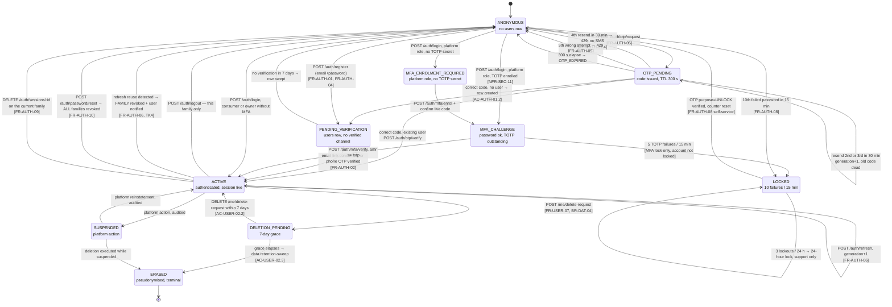

# `API-AUTH` and `API-USER` — The Frozen Endpoint Contract

**Identity, sessions, impersonation, tenant context, profile, preferences, activity, export and
erasure.** Thirty endpoints, specified to the field.

---

## 0. Document control

| Field | Value |
| :--- | :--- |
| Document | `/docs/apis/Authentication.md` |
| Status | **Frozen contract.** No application code exists; this document is written before it, and the code is judged against it |
| Owns | Every row of `API_Catalog.md` §3.1 (`API-AUTH`, 17 rows) and §3.2 (`API-USER`, 13 rows) |
| Modules | `iam/`, `tenancy/`, `notifications/` (`MASTER_PRD.md` §C1.3) |
| Surfaces | `web` (customer site), `dash` (gym owner dashboard), `admin` (super-admin console) |
| Launch market | **India.** Every example carries `+91` phones, Indian names and cities, rupee amounts in **paise as strings**, and `Asia/Kolkata` (UTC+05:30, no DST) as the interpreting timezone (`LAUNCH_MARKET_INDIA.md` §3) |
| Stack | NestJS 10 · Node 20 · TypeScript · modular monolith (ADR-0002, ADR-0003) · PostgreSQL 16 + PostGIS + RLS · Prisma with the mandatory tenant-context extension (ADR-0005) · Redis 7 + BullMQ · Zod in `packages/types` bridged by a validation pipe (ADR-0022) · `@nestjs/swagger` with CI drift detection (ADR-0027, `NFR-MNT-03`) |
| Realtime posture | **A-08: TanStack Query polling at 10–15 s. No Socket.IO, no SSE, no websocket endpoint appears in this document or anywhere in `v1`** |

### 0.1 What this document is

`API_Catalog.md` is the **authoritative master index**: it fixes, for every endpoint in the platform,
the method, path, authentication mode, required permission, tenant scope, idempotency posture,
rate-limit class, cache policy and the `FR-`/`BR-` identifiers served. It also fixes the conventions
— representation, headers, tenant derivation, idempotency mechanics, pagination, the error envelope,
the status-code contract, the rate-limit classes, the permission grammar and the error-code registry.

**This document does not restate any of that.** It **cites** it and then supplies the layer the
catalogue deliberately omits: the concrete request and response bodies, the Zod schema sketch behind
each, the per-endpoint error table with its user-facing message obligation, the enforcement point of
every business rule the endpoint touches, the side effects it commits, and the forward-compatibility
envelope inside which `v1` may still move.

| Question | Answered by |
| :--- | :--- |
| Does this endpoint exist, and what are its eight column values? | `API_Catalog.md` §3.1 / §3.2 |
| What are the conventions it obeys? | `API_Catalog.md` §1, §2, §4, §5, §6, §8 |
| What exactly does the body look like, field by field? | **This document** |
| Which errors can it emit, with what message, and is it retryable? | **This document** §14, cross-checked against `API_Catalog.md` §6.3–§6.5 |
| Which layer enforces each rule it touches? | **This document**, reconciled with `Constraints.md` §13 and `BusinessRules.md` |
| What is physically written when it succeeds? | **This document**, against `Schema.md` §4.6–§4.9, §11.3, §13.1–§13.5 |

### 0.2 Precedence

`PROJECT_CONSTITUTION.md` (rank 1) → `MASTER_PRD.md` (rank 2) → `API_Catalog.md`, `Security.md`,
`Schema.md`, `Constraints.md`, `BusinessRules.md` (rank 3 peers) → this document. Where this
document appears to add a rule, it is deriving one; every derivation names the requirement that
compels it. Where two rank-3 documents disagree, §3 records the disagreement explicitly rather than
silently picking a side.

### 0.3 The five laws this document is a consequence of

| # | Law | Where it lands here |
| :-: | :--- | :--- |
| 1 | **Tenant is never accepted from the client** (`§C3.1`, `§C1.4`, constitution §11.3) | Not one endpoint below has a `tenant_id` in a body, a query or a header. `POST /auth/tenant-context` takes a `tenant_id` — and it is the **one** endpoint in the platform for which that is legitimate, because it is *selecting from the caller's own membership set*, not asserting a context. §8.17 explains why that is not a violation and what makes it safe |
| 2 | **`Idempotency-Key` required on money- or membership-affecting mutations** (`BR-PAY-03`, §1.6.1) | Nine `API-AUTH` rows and seven `API-USER` rows are `REQ`. None of them moves money; they are `REQ` because a duplicate session, a duplicate deletion request or a duplicate contact change is a **state** defect of the same class |
| 3 | **Cursor pagination only** (ADR-0023) | Two endpoints here return collections: `GET /auth/sessions` and `GET /me/activity`. Both take `limit` + `cursor` and return `next_cursor`. Neither accepts `offset`, `page` or `page_size` |
| 4 | **Every endpoint declares a permission or CI fails** (`FR-RBAC-01`, gate PG-1) | Every heading below carries a permission string from the owning module's `permissions.ts`, or `@Public()` with its §5.4 allowlist row number |
| 5 | **Never trust client amounts** (`BR-PAY-04`) | No schema in this document contains a monetary field. `.strict()` makes sending one a `400 VALIDATION_FAILED` with `rule: "unknown_field"` |

---

## 1. How to read an endpoint specification

Every endpoint below opens with the same nine-value header block, then eight fixed sections.

| Header value | Meaning | Vocabulary fixed in |
| :--- | :--- | :--- |
| **Purpose** | One sentence, in the product's language | — |
| **Surfaces** | Which of `web` / `dash` / `admin` call it | `MASTER_PRD.md` §B4 |
| **Auth mode** | `none` · `access` · `access(mfa)` · `refresh` · `reset` · `support` | `API_Catalog.md` §1.4 |
| **Permission** | `<module>.<resource>.<action>`, or `@Public()` with its allowlist row | `API_Catalog.md` §5.1, §5.4 |
| **Tenant scope** | `public` · `user` · `tenant` · `platform` | `API_Catalog.md` §1.5 |
| **Idempotency** | `REQ` · `OPT` · `N/A` | `API_Catalog.md` §1.6 |
| **Rate-limit class** | One of the twelve | `API_Catalog.md` §4 |
| **Cache policy** | One of the six tokens | `API_Catalog.md` §1.11 |
| **Step-up** | Whether `auth_time` must be within 15 minutes | `Security.md` §2.8.3 |

Then: **Request** (path params, query params, body + Zod sketch) · **Response** (status + realistic
Indian body) · **Errors** (code · HTTP · when · user-facing message · retryable) · **Business rules
enforced** (identifier + enforcing layer) · **Validation** (what the pipe rejects before the use case
runs) · **Side effects** (rows, ledger entries, outbox events, notifications, audit records) ·
**Future compatibility** (what may be added inside `v1`, what forces `v2`).

**Enforcement-layer vocabulary**, used in every *Business rules enforced* table. It is
`BusinessRules.md`'s ladder, abbreviated:

| Token | Layer | Example in this document |
| :--- | :--- | :--- |
| `L1-DB` | A PostgreSQL constraint, index or grant | `uq_users__phone` partial unique index |
| `L2-RLS` | A row-level-security policy | Not reachable from `/me` or `/auth` — identity tables carry no `tenant_id` (`ADR-0006`) |
| `L4-EXT` | The mandatory Prisma tenant-context extension | `TENANT_CONTEXT_ALREADY_SET` on a second context in one request |
| `L5-DOM` | A domain entity or value object | `PhoneNumber`, `OtpCode`, `TokenFamily` |
| `L6-UC` | A use case | The 7-day deletion grace, the impersonation reason |
| `L7-GUARD` | A NestJS guard | `ImpersonationGuard`, `PermissionsGuard`, `MfaGuard` |
| `L8-PIPE` | The Zod validation pipe | `.strict()`, E.164 shape, password length |
| `L9-INT` | An interceptor | Idempotency, audit capture, PII redaction |
| `L10-JOB` | A BullMQ worker | `data.retention-sweep`, `export.generate`, `iam.session-sweep` |
| `L12-CI` | A build gate | PG-1…PG-5, `openapi:check`, the isolation suite |

**Every fenced block in this document is illustrative and is not committed code.** Zod sketches show
shape and constraint, not the final file; JSON bodies show realistic values, not fixtures.

---

## 2. Conventions inherited by citation, not restated

| Concern | Binding statement lives in | One-line consequence for this document |
| :--- | :--- | :--- |
| Base URL, `/v1` in the path | `API_Catalog.md` §1.1 | Every path below is relative to `https://api.<domain>/v1` |
| `snake_case` everywhere, `.strict()` bodies | §1.2.1, §9.7 IV2 | An unknown field is `400`, never ignored |
| Identifiers are UUID v7, opaque to clients | §1.2.2 | `session_id`, `user_id`, `export_id` are never parsed by a client |
| Money is `<x>_minor` string + `currency` | §1.2.3 | **No endpoint in this document carries money.** The only rupee figures here are illustrative and appear inside `/me/activity` descriptions of *other* modules' events |
| Timestamps are ISO-8601 UTC with `Z`; business dates `YYYY-MM-DD` with a documented timezone | §1.2.4 | `deletion_effective_at` is a timestamp; `date_of_birth` is a date with no timezone at all |
| Enums are `SCREAMING_SNAKE_CASE`, declared open or closed | §1.2.5, §8.3 | Every enum below states which it is |
| Collection envelope `{ data, next_cursor, limit }` | §1.2.6 | `GET /auth/sessions`, `GET /me/activity` |
| Request headers, including that `X-Tenant-Id` is **rejected**, not ignored | §1.3.1 | `400 TENANT_HEADER_NOT_ACCEPTED` |
| Response headers: `X-Correlation-Id` always, `X-RateLimit-*`, `Retry-After`, `Cache-Control` always | §1.3.2 | Not repeated per endpoint below |
| The six authentication modes and their credentials | §1.4 | Named per endpoint |
| Tenant derivation decision table | §1.5 | Rows 2 (`/me`) and 3 (`/tenant`) are the ones this document touches |
| Idempotency: 24 h store, five-part fingerprint, three states | §1.6 | Named per endpoint; §12 summarises the posture across all thirty |
| Cursor pagination, no offset | §1.7, ADR-0023 | Two endpoints |
| Explicit named filters, `.strict()` query schemas | §1.8 | `GET /me/activity` filters are enumerated, not generic |
| The error envelope and its seven rules EV1–EV7 | §1.9 | Every error table below assumes the envelope; only `code`, status, condition, message obligation and retryability are restated |
| Rate-limit headers and the `429` shape | §1.10, §4.4 | Not repeated per endpoint |
| Cache tokens | §1.11 | Named per endpoint; almost everything here is `NO-STORE!` |
| `PATCH` = partial, `null` clears, absent leaves | §1.12 | Stated field-by-field for `PATCH /me` |
| The status-code contract and the `403`/`404` rule | §2.1, §2.3 | Applied without restatement |
| "Evaluate returns 200, do returns 4xx" | §2.4, §2.5 | **`POST /auth/otp/request` under SMS failure is a `202`, not a `503`** — §8.1 |
| The twelve rate-limit classes and their numbers | §4.2 | `RL-OTP`, `RL-AUTH`, `RL-WRITE`, `RL-READ`, `RL-EXPORT`, `RL-ADMIN` are the six this document uses |
| Permission grammar and the guard chain | §5.1, §5.2 | Guard order is assumed, never re-derived |
| The error-code registry | §6.1–§6.5, §6.13 | §14 of this document is the **`iam` + `tenancy` slice**, expanded with per-endpoint conditions |
| Versioning, breaking vs non-breaking, open enums | §8.1–§8.3 | Each endpoint's *Future compatibility* section is an application of §8.2 |

---

## 3. Findings against the authoritative index, stated explicitly

The instruction under which this document is written is that the `API_Catalog.md` endpoint table must
not be contradicted, and that a suspected error in it must be named rather than quietly worked
around. Six items. **One is a genuine gap in the catalogue** (F-1); four are cross-document
inconsistencies where the catalogue is correct and a peer document is not (F-2…F-5); one is a
schema-versus-contract tension that needs a decision before the first migration (F-6).

### F-1 — `AC-USER-01.3` has no endpoint. This is a gap in `API_Catalog.md` §3.13 and §5.4.

`AC-USER-01.3`: *"Given I unsubscribe via an email link, when I do so, then the preference is applied
**without requiring me to log in**."*

`API_Catalog.md` §3.2 lists preference management only as `GET`/`PUT /me/preferences`, both
`access`-authenticated. §3.13 (`API-NOTF`) lists no unsubscribe route. §5.4 enumerates the
`@Public()` allowlist as **exhaustively twenty-two endpoints** and none of them is an unsubscribe
route. Therefore, as the catalogue currently stands, **`AC-USER-01.3` is unimplementable**: there is
no path by which an unauthenticated caller holding only an email link can change a preference.

This is a missing row, not a disagreement. The remedy is a **derived row**, specified in full at
§9.14 of this document:

| Grp | Method | Path | Auth | Permission | Scope | Idem | RL | Cache | FR | AC |
| :-- | :-- | :--- | :-- | :--- | :-- | :-: | :-- | :-- | :--- | :--- |
| NOTF | POST | `/notifications/unsubscribe` † | none | `@Public()` **allowlist row 23** | public | OPT | `RL-AUTH` | `NO-STORE!` | FR-USER-04, FR-NOTF-02 | AC-USER-01.3 |

Adopting it requires three amendments, each of which is an amendment to `API_Catalog.md` and not to
this document: add the row to §3.13; extend §5.4 from twenty-two to twenty-three entries with its
compensating control (a signed, single-purpose, category-scoped, 90-day token that can only ever
**remove** an opt-in and can never read the profile); and add `UNSUBSCRIBE_TOKEN_INVALID` to the §6.13
registry. Until those land, `AC-USER-01.3` is **not satisfied** and must be tracked as such.

### F-2 — `Security.md` §2.3.4 assigns `400` to two OTP codes that the registry puts at `401`.

| Code | `Security.md` §2.3.4 | `API_Catalog.md` §6.5 | Resolved here |
| :--- | :-: | :-: | :--- |
| `OTP_INVALID` | `400` | **`401`** | **`401`.** Constitution §13.1 classes "the credential is invalid" as Authentication, and an OTP is a credential. A wrong code is not a malformed request |
| `OTP_EXPIRED` | `400` | **`401`** | **`401`**, same reasoning |

The registry is the normative artefact (§6.1: *"a thrown domain error whose code is absent from the
registry fails CI"*), and `PROJECT_CONSTITUTION.md` §13.1 backs it. `Security.md` §2.3.4's status
column is the error. Its **body** column is correct and is honoured below: `OTP_INVALID` carries
`attempts_remaining`, `OTP_ATTEMPTS_EXCEEDED` and `OTP_RESEND_LIMIT_REACHED` carry
`retry_after_seconds`.

### F-3 — Four code names in `Security.md` are not registry codes.

Gate PG-5 fails the build for any emitted code absent from `packages/types/src/errors/registry.ts`.
These four therefore cannot be emitted as written:

| Used in `Security.md` | Registry code to emit instead | Where |
| :--- | :--- | :--- |
| `MFA_ENROLMENT_REQUIRED` (§2.8.2) | **`MFA_REQUIRED`** (403) | §6.5 |
| `SESSION_REVOKED` (§2.7.2 diagram) | **`REFRESH_TOKEN_REUSE_DETECTED`** (401) | §6.5 |
| `RATE_LIMITED` (§2.3.4) | **`RATE_LIMIT_EXCEEDED`** (429) | §6.3 |
| `TENANT_CONTEXT_ALREADY_SET` (`BusinessRules.md` `BR-TEN-02-N1`) | Internal domain exception; on the wire it is **`500 TENANT_CONTEXT_MISSING`** because reaching it is a defect, not a caller error | §6.4 |

### F-4 — Three codes are *required by behaviour specified in `Security.md`* but absent from the registry. They must be added.

| Proposed code | HTTP | Emitted by | Compelled by | Module |
| :--- | :-: | :--- | :--- | :--- |
| `REAUTHENTICATION_REQUIRED` | 403 | `POST /auth/impersonate` and the seven other step-up actions | `Security.md` §2.8.3 — an action that requires `auth_time` within 15 minutes must be able to say so | `iam` |
| `IMPERSONATION_TARGET_FORBIDDEN` | 403 | `POST /auth/impersonate` | `Security.md` IM-8 — a support agent must not impersonate a platform-role holder, or the capability is a privilege-escalation ladder | `iam` |
| `PHONE_ALREADY_REGISTERED` | 409 | `POST /me/phone/change`, `POST /auth/otp/verify` on a `PHONE_CHANGE` purpose | The registry has `EMAIL_ALREADY_REGISTERED` but no phone analogue, and in India the **phone is the primary identifier** (`Schema.md` §4.6) | `iam` |

Six further codes this document needs are `iam`/`notifications` conditions the catalogue's registry
does not yet carry; all nine additions are consolidated in §14.3 with their message obligations. Each
is additive to the registry, breaks nothing, and is legitimate under §8.2 (adding an error code for a
condition that previously had no endpoint is not a breaking change).

### F-5 — `Security.md` §2.8.3 writes `PATCH /tenant/payout-account`; the catalogue writes `PUT`.

`API_Catalog.md` §1.12 explicitly assigns `PUT` to `/tenant/payout-account` as one of five
whole-resource-replacement endpoints, and §1.4 names `PUT /v1/tenant/payout-account` as the third of
the three routes an impersonation token may never call. **`PUT` is correct**; `Security.md` §2.8.3's
`PATCH` is a transcription error. This matters here because §5.13 of this document must name the
route exactly for the `ImpersonationGuard` refusal to be testable.

### F-6 — `POST /me/export` writes a row to a table whose `tenant_id` is `NOT NULL`.

`Schema.md` §11.3 defines `export_jobs` with `tenant_id uuid NOT NULL`, RLS policy class `P-STD`, and
purpose `BR-DAT-05` — **a tenant exporting its operational dataset**. But `API_Catalog.md` §3.2 lists
`POST /me/export` and `GET /me/export/:id` at **user scope**, serving `BR-DAT-03` — *a data subject
exporting their own personal data*. A subject's archive spans every tenant they ever transacted with,
so there is no single `tenant_id` to write, and an RLS policy keyed on one would make the row
invisible.

`Schema.md` §13.5 already anticipates the correct answer for the *request*: `data_subject_requests`
is deliberately **GLOBAL**, *"a subject request spans every tenant the subject touched; scoping it to
one would make it unfulfillable."* The **job row** needs the same treatment. Three options:

| Option | Assessment |
| :--- | :--- |
| Make `export_jobs.tenant_id` nullable, GLOBAL when null | Weakens `P-STD` for the tenant case; a nullable RLS key is exactly the `ADR-0005` hazard |
| Write only `data_subject_requests` for `/me/export` and give it its own `storage_key`/`url_expires_at` | Duplicates three columns; the FK `data_subject_requests.export_job_id` then dangles |
| **Add a sibling `subject_export_jobs`, IDENTITY-tenancy, user-scoped** — recommended | Keeps `export_jobs` strictly tenant-scoped and RLS-clean; `data_subject_requests.export_job_id` points at the sibling for subject requests. One table, ~2,000 rows/yr |

This document specifies `POST /me/export` against the **recommended** option and marks it as an open
item requiring a `DECISION_LOG.md` entry and a `Schema.md` amendment before the first migration. The
wire contract is identical under all three, so no client is affected by the resolution.

### 3.1 Two clarifications that are *not* errors

- **`API_Catalog.md` §3.16 counts `API-AUTH` as 5 public rows; §5.4 lists 6 auth endpoints carrying
  `@Public()`.** Both are right. The §3.16 column counts rows whose **Auth** value is `none`;
  `POST /auth/password/reset` has Auth `reset` — it presents a credential — yet carries `@Public()`
  because no *session* exists. The two columns answer different questions and this document states
  the pair explicitly on that endpoint (§8.8).
- **`API_Catalog.md` §1.4 names three routes an impersonation token may never call;
  `Security.md` IM-6 tags nine.** Not a contradiction: the three are the literal `AC-AUTH-03.2`
  triad — payment initiation, refund request, payout-account change — and are the contract-test
  anchors. IM-6's nine are the full `@FinancialMutation()` tag set, a superset. §8.14 reconciles
  them: **the guard refuses all nine; the acceptance test asserts the three.**

---

## 4. The auth state machine

Everything the identity layer can be, and every transition between those states. `USER` here means a
`users` row (`Schema.md` §4.6) with its `user_status_enum`, crossed with its session and credential
state. Guard conditions are on the edges; the requirement each edge serves is in brackets.



**Four properties of this machine that the endpoint specifications below depend on:**

| # | Property | Consequence |
| :-: | :--- | :--- |
| SM1 | `OTP_PENDING` is **per (purpose, phone)**, not per user, and lives entirely in Redis (`Security.md` §2.3.2). It has no `users` row and no database presence | An OTP flow for a number that has never registered leaves nothing behind if abandoned. A phone number previously used by a deleted account is **treated as new; no prior data is resurrected** (`B5.1` edge case) — the partial unique index `uq_users__phone WHERE deleted_at IS NULL` is what makes this structural |
| SM2 | A code is HMAC'd **with its purpose**. `REGISTER`, `LOGIN`, `PHONE_CHANGE`, `UNLOCK`, `SENSITIVE_STEP_UP` are cryptographically disjoint | An unlock code cannot be replayed as a login. This is why `POST /auth/otp/verify` takes a `purpose` and why supplying the wrong one is `OTP_INVALID`, not a purpose-mismatch error — telling the caller which purpose the live code belongs to is an oracle |
| SM3 | **Lockout does not terminate an existing session.** The lock is evaluated *before* password verification and only on the password path | A locked-out user who is already signed in keeps working (`Security.md` §2.8.4, the weaponisation mitigation). This is deliberate and must not be "fixed" |
| SM4 | `DELETION_PENDING` is a **live, usable account**. Nothing is degraded during the grace period | `AC-USER-02.2` requires that logging in within 7 days *offers* cancellation. That is only meaningful if logging in still works |

---

## 5. The session lifecycle, end to end

One diagram covering login, the 15-minute access window, rotation, the parallel-tab race, reuse
detection and revocation. Participants are the three surfaces, the `iam/` module, PostgreSQL, Redis
and `notifications/`.

```mermaid
%% illustrative — not committed code
sequenceDiagram
    autonumber
    participant U as Priya · web (Pune)
    participant T2 as Second browser tab
    participant API as NestJS · iam/
    participant PG as PostgreSQL 16
    participant R as Redis 7
    participant N as notifications/ outbox

    Note over U,API: 1 · Establish — OTP path, the India default
    U->>API: POST /v1/auth/otp/request {phone:"+919876543210", purpose:"LOGIN"}
    API->>R: check otp:resend:LOGIN:{hmac} (< 3 in 30 min) and otp:ip:{hash} (< 20/h)
    API->>R: SET otp:code:LOGIN:{hmac} = HMAC(code) TTL 300 s
    API->>N: enqueue SMS via DLT template GYMMAP_OTP_LOGIN_V3
    API-->>U: 202 {otp_request_id, expires_at, attempts_allowed:5, resends_remaining:2}

    U->>API: POST /v1/auth/otp/verify {otp_request_id, code:"418209", purpose:"LOGIN"}
    API->>R: timingSafeEqual over HMACs, then DEL the code key
    API->>PG: INSERT auth_sessions (family_id, device_label, ip, absolute_expires_at = now()+30d)
    API->>PG: INSERT refresh_tokens (generation 1, token_hash = sha256(rt))
    API->>PG: INSERT audit_log (action='LOGIN', actor_type='USER')
    API-->>U: 200 + Set-Cookie __Host-gm_at (900 s) + __Secure-gm_rt (30 d, Path=/v1/auth/refresh)

    Note over U,API: 2 · Operate — access token valid 15 minutes
    U->>API: GET /v1/me  (Bearer, or __Host-gm_at on an SSR navigation)
    API->>R: perm:user:{id} version check (≤ 60 s TTL, FR-RBAC-04)
    API-->>U: 200 profile

    Note over U,T2: 3 · The parallel-tab race — two tabs, one expiry, two refreshes
    U->>API: POST /v1/auth/refresh (rt generation 1)
    T2->>API: POST /v1/auth/refresh (rt generation 1) — 40 ms later
    API->>PG: SELECT ... WHERE token_hash=sha256(rt) FOR UPDATE   %% tab 1 wins the row lock
    API->>PG: UPDATE refresh_tokens SET consumed_at=now() WHERE generation=1
    API->>PG: INSERT refresh_tokens (generation 2); UPDATE auth_sessions SET current_generation=2
    API-->>U: 200 + new at + new rt (generation 2)
    Note over API,PG: tab 2's SELECT ... FOR UPDATE now unblocks and sees consumed_at NOT NULL
    API->>API: RT7 grace — consumed < 10 s ago AND same user_agent_hash AND generation = current-1
    API-->>T2: 200 + re-issue of the CURRENT generation-2 pair. Generation NOT advanced. No family revocation.
    API->>R: INCR refresh_grace_used_total   %% ADR-0011 revisit trigger 1 fires above 0.5%

    Note over U,N: 4 · Theft — the same token presented outside the grace window
    U->>API: POST /v1/auth/refresh (rt generation 1, 4 hours later, different UA)
    API->>PG: row found, consumed_at NOT NULL, outside grace → REUSE
    API->>PG: UPDATE auth_sessions SET revoked_at=now(), revoked_reason='REUSE_DETECTED' WHERE family_id=…
    API->>PG: INSERT audit_log (action='SESSION_FAMILY_REVOKED', reason='REUSE_DETECTED')
    API->>R: INCR perm:user:{id}   %% every live access token under the family dies within one round trip
    API->>N: SECURITY_SESSION_REVOKED — EMAIL + SMS + IN_APP, category SECURITY (not suppressible)
    API-->>U: 401 REFRESH_TOKEN_REUSE_DETECTED

    Note over U,API: 5 · Retire — deliberate and automatic
    U->>API: DELETE /v1/auth/sessions/{other_family_id}
    API->>PG: UPDATE auth_sessions SET status='REVOKED', revoked_reason='USER_REVOKED'
    API->>R: INCR perm:user:{id}
    API-->>U: 204
    Note over API,PG: iam.session-sweep expires a family idle 14 days, and any family 30 days after root login (RT9)
```

### 5.1 The parallel-tab refresh race, specified

This is the most common real failure in a rotating-refresh design and it is specified here rather
than discovered in production. Two tabs of the same browser share one cookie jar; both hold an access
token that expires at the same instant; both issue `POST /auth/refresh` with the same refresh token
within milliseconds of each other.

| Aspect | Rule | Anchor |
| :--- | :--- | :--- |
| Serialisation | `SELECT … FROM refresh_tokens WHERE token_hash = $1 FOR UPDATE` inside the rotating transaction. The second request **blocks**, it does not read stale state | RT2 |
| Loser's outcome | It observes `consumed_at IS NOT NULL` on the generation it presented | RT2 |
| Grace admission | Accepted **once**, only if **all three** hold: consumed **< 10 seconds** ago; the presented generation is exactly `current_generation − 1`; the `user_agent_hash` matches the family's | RT7 |
| Grace response | **Re-issues the current pair** — it does **not** advance the generation and does **not** mint a third generation. Both tabs end up holding the same generation-2 token | RT7 |
| Outside grace | Reuse. Family revoked, user notified, `401 REFRESH_TOKEN_REUSE_DETECTED` | RT3 |
| Unknown hash | `401 REFRESH_TOKEN_INVALID`, **and nothing is touched** — no family is looked up, no revocation occurs. Otherwise spraying random values would be a logout-anyone weapon | RT6 |
| Observability | `refresh_grace_used_total` as a share of `auth_refresh_total`. Above **0.5%** over a sprint, ADR-0011 revisit trigger 1 fires — that rate means the client is racing routinely, not occasionally | RT7 |
| Client obligation | All three surfaces run refresh through **one** in-flight promise per document (a `TanStack Query` mutation guard). The grace window is a safety net for cross-*document* races and lost responses, not a licence to race | ID-B, by analogy |
| What the grace is not | It is not a second valid token. The superseded generation remains `consumed_at`-stamped and a **third** presentation of it is reuse regardless of timing | RT7 |

### 5.2 Shared response and request schemas

Six shapes recur across the endpoints below. They are declared once in `packages/types` and
referenced, not re-specified per endpoint.

```ts
// illustrative — not committed code
// packages/types/src/iam/shared.ts

export const indianPhone = z.string()
  .regex(/^\+91[6-9]\d{9}$/, 'phone_e164_in');          // +91 then 10 digits starting 6-9

export const otpPurpose = z.enum([
  'REGISTER', 'LOGIN', 'PHONE_CHANGE', 'UNLOCK', 'SENSITIVE_STEP_UP',
]);                                                      // CLOSED enum

export const password = z.string()
  .min(10, 'password_min_length')                        // FR-AUTH-04
  .max(256, 'password_max_length');                      // bound the Argon2id work factor

export const cursorPage = z.object({
  limit:  z.coerce.number().int().min(1).max(100).default(50),
  cursor: z.string().max(512).optional(),
}).strict();                                             // ADR-0023 — no offset, no page

// The token-pair envelope. Tokens themselves travel as cookies (Security.md §2.6);
// the body carries only what a client must render or schedule against.
export const sessionEnvelope = z.object({
  access_token_expires_at:  z.string().datetime(),       // ISO-8601 Z
  refresh_token_expires_at: z.string().datetime(),
  session_id:               z.string().uuid(),
  token_type:               z.enum(['ACCESS', 'IMPERSONATION']),
  user: z.object({
    id:              z.string().uuid(),
    full_name:       z.string().nullable(),
    phone_masked:    z.string().nullable(),              // "+91 ••••• 43210"
    email_masked:    z.string().nullable(),              // "p••••a@gmail.com"
    phone_verified:  z.boolean(),
    email_verified:  z.boolean(),
    status:          z.enum(['PENDING_VERIFICATION','ACTIVE','SUSPENDED','DEACTIVATED','ERASED']),
    mfa_enabled:     z.boolean(),
    display_locale:  z.string(),                         // 'en-IN'
    roles:           z.array(z.string()),                // compact scope codes, NOT permissions
  }),
  tenant_context: z.object({
    tenant_id:   z.string().uuid(),
    gym_name:    z.string(),
    role:        z.string(),
  }).nullable(),                                          // null for consumer sessions
  next_action: z.enum([
    'NONE', 'VERIFY_PHONE', 'VERIFY_EMAIL', 'ENROL_MFA',
    'SATISFY_MFA', 'SELECT_TENANT', 'DELETION_PENDING',
  ]),                                                     // OPEN enum — clients fall back to 'NONE'
}).strict();
```

**Three rules about the envelope that are load-bearing.**

| # | Rule | Why |
| :-: | :--- | :--- |
| SE1 | **No raw token is ever in a response body.** `access_token`, `refresh_token` and any bearer string are absent. Tokens travel only as `__Host-gm_at` and `__Secure-gm_rt` (`Security.md` §2.6, TK7). Native clients are out of scope in Phase 1, so no body-token variant exists | TK7, `Security.md` §2.6 |
| SE2 | **`roles` is scope codes, never a permission list.** `["MEMBER@self","OWNER@t:9f2a…"]`. A client that renders navigation from it is doing presentation, and the server still refuses (`AZ5`, `FR-RBAC-02`) | TK1, T3, AZ6 |
| SE3 | **`next_action` is an OPEN enum.** It is how the API tells a surface what gate stands between the caller and their goal without the surface re-deriving it from four booleans. Clients must tolerate an unknown value by falling back to `NONE` (§8.3, V6) | `NFR-USE-05` |

---

## 6. Lockout policy — `FR-AUTH-08`, specified

> *"Account lockout after 10 failed attempts in 15 minutes, with self-service unlock via verified
> channel."*

`API_Catalog.md` §4.5 fixes the boundary that matters most: **a lockout is a `403`, not a `429`.**
Rate limiting is about request volume and clears with time; a lockout is about *this account* and
clears with an unlock. Conflating them produces a message that tells a victim of credential stuffing
to "try again in a minute", which is both false and useless.

| Parameter | Value | Anchor |
| :--- | :--- | :--- |
| Counter key | `auth:fail:{user_id}` in Redis, sliding 15-minute window | `Security.md` §2.8.4 |
| Counted events | Failed **password** verifications only. Not OTP failures (§2.3's throttle covers those), not TOTP failures (its own 5-in-15 MFA lock), not `404`s on unknown identifiers | `FR-AUTH-08` |
| Threshold | **10** | `FR-AUTH-08`, exactly |
| Lock duration | **15 minutes**, or until self-service unlock, whichever is sooner | The requirement names an unlock path, so an indefinite lock would be non-compliant |
| Response while locked | **`403 ACCOUNT_LOCKED`**, with `unlock_channels` and `locked_until` in `error.details` | §4.5, `NFR-USE-05` |
| Self-service unlock | OTP with `purpose: 'UNLOCK'` to a **verified** channel, then the counter resets. Subject to the full `RL-OTP` budget, so it is a path and not a bypass | `FR-AUTH-08` |
| Escalation | **3 locks for one account in 24 hours → a 24-hour lock** requiring support, and alert 15 raises | `Security.md` §2.8.4 |
| Interaction with `RL-AUTH` | `RL-AUTH` is 10 per 15 minutes per identifier — **the same number by design**, so a caller never sees a `429` and a lockout for different counts of the same attempts. They arrive together and the `403` is the one returned, because the account condition is the more specific and more actionable fact | §4.2 reading note |
| Existing sessions | **Not terminated.** The lock gates the password path only | `Security.md` §2.8.4, SM3 |
| OTP-only accounts | **Cannot be locked** — there is no password. The OTP throttle is their equivalent control | `Security.md` §2.8.4 |
| Audit | Every lock writes an `audit_log` row (`action='UPDATE'`, `entity_type='user'`, reason `ACCOUNT_LOCKED`) and feeds alert 15 | `BR-DAT-01` |
| Notification | `SECURITY_ACCOUNT_LOCKED` on `EMAIL` + `SMS`, category `SECURITY` — **not suppressible** (`Schema.md` §4.9 note) | `FR-NOTF-02` |

**The weaponisation residue, stated rather than hidden.** An attacker who knows Priya's email can
lock her out with ten wrong guesses. Four mitigations, none of which fully solves it: the unlock path
is one OTP away; an already-authenticated session survives; the parallel per-IP ceiling (60/hour)
makes locking many accounts expensive; and every lock is audited and alerted, so a campaign is
visible. `FR-AUTH-08` mandates the lockout, and this is the cost it carries.

**The message obligation.** `NFR-USE-05` and UM1 require what happened, why, and what next:

> *"Your account is locked because there were 10 unsuccessful sign-in attempts in the last 15
> minutes. This protects you if someone else is trying to guess your password. Unlock it now with a
> code sent to your mobile ending 43210, or wait until 14:22 IST and try again."*

"Account locked" alone fails review.

---

## 7. TRAI DLT — what it constrains in this contract

India requires DLT registration for commercial SMS: the sender header **and every message template**
are pre-approved, and the variable placeholders in a sent message must match the registered template
exactly (`LAUNCH_MARKET_INDIA.md` §8).

| Rule | Statement | Consequence for these endpoints |
| :--- | :--- | :--- |
| DLT-1 | Every OTP SMS is sent through a **DLT-approved template** identified by `dlt_template_id`, with `routing_class = 'TRANSACTIONAL'` (`Schema.md` §2.5.6) | `POST /auth/otp/request`, `POST /me/phone/change` and the `UNLOCK` flow all resolve a template key before enqueuing; there is no ad-hoc SMS body anywhere in `iam/` |
| DLT-2 | **Placeholders must match the registered template exactly** — same count, same order, same semantic slots. A template registered as `{#var#}` × 2 cannot be sent with three substitutions | The OTP template is fixed at two variables: **`{#var#}` = the 6-digit code**, **`{#var#}` = validity in minutes (`5`)**. Adding a third variable — a gym name, a city — is **not** a code change; it is a **new DLT registration**, and until it clears, sends fail |
| DLT-3 | An edited SMS template enters `PENDING_DLT_APPROVAL` and **the previously approved version continues to send** (`LAUNCH_MARKET_INDIA.md` §8 resolution) | An operator editing the OTP copy never breaks OTP delivery. `TEMPLATE_PENDING_DLT_APPROVAL` (409) is emitted by the template-admin endpoint, **never** by `/auth/otp/request` |
| DLT-4 | Transactional SMS reaches DND-registered numbers; promotional does not | OTP, lockout and session-revocation messages are `TRANSACTIONAL`/`SECURITY` and therefore reach every number. Nothing in this document sends `MARKETING` |
| DLT-5 | The **plaintext OTP is never persisted** — not in `notification_log.payload`, not in a job payload, not in a log line. Only the HMAC lives, in Redis, for 300 s | `BR-DAT-06`, `PII2`, `Security.md` §2.3.1. The notification row records the template key and the masked recipient, never the code |
| DLT-6 | If the SMS adapter is unavailable, the platform **offers email verification** rather than failing | `AC-AUTH-01.5`. The response is a **`202` with `fallback: "EMAIL"`**, not a `503` — §8.1 |

---

## 8. `API-AUTH` — the seventeen endpoints

---

### 8.1 `POST /auth/otp/request`

| | |
| :--- | :--- |
| **Purpose** | Issue a 6-digit one-time code to an Indian mobile number for a named purpose, or offer email verification if the SMS rail is down |
| **Surfaces** | `web`, `dash` |
| **Auth mode** | `none` |
| **Permission** | `@Public()` — allowlist row 13 (`API_Catalog.md` §5.4) |
| **Tenant scope** | `public` |
| **Idempotency** | `OPT` — honoured if supplied. A repeated key inside 24 h replays the stored `202` **and sends no second SMS**, which is exactly the behaviour a double-tapped button needs |
| **Rate-limit class** | `RL-OTP` (tier 1) — **20/hour per IP**, **3 sends / 30 min per number**, 30-second cool-down between sends for the same number |
| **Cache policy** | `NO-STORE!` |
| **Step-up** | n/a |

#### Request

No path parameters. No query parameters.

```ts
// illustrative — not committed code
export const otpRequestBody = z.object({
  phone:    indianPhone,                       // required · "+919876543210"
  purpose:  otpPurpose,                        // required · CLOSED enum
  channel:  z.enum(['SMS', 'EMAIL']).default('SMS'),   // optional · OPEN enum
  captcha_token: z.string().max(4096).optional(),      // required only when challenged — see Validation
}).strict();                                   // .strict() ⇒ any extra field is 400 VALIDATION_FAILED
```

| Field | Type | Required | Constraint |
| :--- | :--- | :-: | :--- |
| `phone` | string | **yes** | E.164, `+91` + 10 digits, **first digit 6–9** (the TRAI mobile series). Normalised before hashing: spaces, hyphens and a leading `0` are stripped; a bare 10-digit value is **rejected**, not guessed |
| `purpose` | enum | **yes** | `REGISTER` · `LOGIN` · `PHONE_CHANGE` · `UNLOCK` · `SENSITIVE_STEP_UP`. `PHONE_CHANGE` and `SENSITIVE_STEP_UP` additionally require a valid access token even though the route is public — see Errors |
| `channel` | enum | no | Defaults `SMS`. `EMAIL` is permitted only when the caller already has a verified email on file, or as the `AC-AUTH-01.5` fallback the server itself offered |
| `captcha_token` | string | conditional | Required once the per-IP counter passes **10 in the current hour**, which is half the ceiling — the challenge arrives before the block does |

#### Response — `202 Accepted`

`202`, not `200`: the code has been **accepted for delivery**, and delivery is an outbox job
(§1.2.7 U3's reasoning generalised). A `200` would assert the SMS had been sent.

```json
// illustrative — not committed code
{
  "otp_request_id": "0199f3d2-7c41-7a10-9b8e-2f6a1c04d8e3",
  "phone_masked": "+91 ••••• 43210",
  "purpose": "LOGIN",
  "channel": "SMS",
  "code_length": 6,
  "expires_at": "2026-08-06T09:35:12Z",
  "attempts_allowed": 5,
  "resends_remaining": 2,
  "resend_available_at": "2026-08-06T09:30:42Z",
  "next_action": "NONE"
}
```

`expires_at` is 300 seconds after issue. `2026-08-06T09:35:12Z` is **15:05 IST** — every client
renders in `Asia/Kolkata` and the wire stays UTC (T1, T3).

**The `AC-AUTH-01.5` fallback — still a `202`:**

```json
// illustrative — not committed code
{
  "otp_request_id": "0199f3d2-8a02-7bd1-84c7-9e0b3a17c552",
  "phone_masked": "+91 ••••• 43210",
  "purpose": "LOGIN",
  "channel": "EMAIL",
  "fallback": "EMAIL",
  "email_masked": "p••••a.sharma@gmail.com",
  "code_length": 6,
  "expires_at": "2026-08-06T09:35:12Z",
  "attempts_allowed": 5,
  "resends_remaining": 2,
  "message": "We could not reach your mobile network just now, so we have emailed your code to p••••a.sharma@gmail.com instead. It is valid for 5 minutes.",
  "next_action": "NONE"
}
```

This is the §2.5 rule applied: the caller asked the platform to *get them a code*, and it got them a
code. A `503 DEPENDENCY_UNAVAILABLE` would be the truthful description of the SMS adapter and the
wrong description of the request. If **both** rails are unavailable the answer *is* `503`, because
then nothing was accomplished.

#### Errors

| Code | HTTP | When | User-facing message obligation | Retryable |
| :--- | :-: | :--- | :--- | :--- |
| `VALIDATION_FAILED` | 400 | `phone` is not `+91` + 10 digits starting 6–9; `purpose` unknown; an unknown field | Name the field. *"Enter a 10-digit Indian mobile number starting with 6, 7, 8 or 9 — for example 98765 43210."* Never echo the value | Fix |
| `TENANT_HEADER_NOT_ACCEPTED` | 400 | An `X-Tenant-Id` header or `?tenant_id=` was sent | Developer-facing. The attempt is logged as a signal (TD1) | No |
| `OTP_RESEND_LIMIT_REACHED` | **429** | The **4th** send in 30 minutes for this number. `AC-AUTH-01.4` — **no SMS is sent** | Must state **when** and offer an alternative: *"You have requested three codes in the last 30 minutes. For your security, wait 19 minutes before requesting another, or sign in with your email and password instead."* Carries `retry_after_seconds` in `details` and `Retry-After` | Wait |
| `OTP_RESEND_TOO_SOON` **(new — §14.3)** | 429 | A second send inside the 30-second cool-down | *"Your code is on its way. If it has not arrived in 30 seconds you can ask for another."* | Wait |
| `RATE_LIMIT_EXCEEDED` | 429 | Per-IP ceiling: 20 OTP operations in an hour | State the reset time. Do **not** reveal whether the number exists | Wait |
| `PHONE_ALREADY_REGISTERED` **(new — §14.3)** | 409 | `purpose: 'REGISTER'` on a number already held by a live account | *"This mobile number already has an account. Sign in instead, or use 'forgot password'."* Note this is **not** an enumeration leak: registration necessarily discloses collision | Fix |
| `UNAUTHENTICATED` | 401 | `purpose` is `PHONE_CHANGE` or `SENSITIVE_STEP_UP` and no valid access token accompanies the request | *"Sign in to continue."* | Fix |
| `CAPTCHA_REQUIRED` **(new — §14.3)** | 403 | Per-IP counter above 10/hour and no `captcha_token` | *"Confirm you are not a robot to receive your code."* Carries the challenge site key in `details` | Fix |
| `DEPENDENCY_UNAVAILABLE` | 503 | **Both** SMS and email rails are down, or Redis is unavailable (tier-1 classes fail **closed**, RLM3) | Say what to do next and give the correlation id (EV6) | Wait |

**What is deliberately *not* an error:** a `purpose: 'LOGIN'` request for a number with no account
returns the same `202` with the same shape and timing. Enumerating registered numbers through a
status-code difference is exactly the leak `Security.md` §1.6 forbids. The SMS is simply not sent,
and `otp/verify` will fail with `OTP_INVALID` like any wrong code.

#### Business rules enforced

| Rule | Statement | Enforced where |
| :--- | :--- | :--- |
| `FR-AUTH-05` | 6 digits, 5 minutes, ≤ 5 attempts, ≤ 3 resends / 30 min per number, limited per IP **and** per number | **`L7-GUARD`** rate-limit guard (per-IP, pre-auth) + **`L6-UC`** Redis budgets (per-number, per-purpose) — AUTHORITATIVE at `L6-UC` |
| `AC-AUTH-01.1` | Delivered within 30 s, screen advances with the number shown and an edit affordance | `L6-UC` returns `phone_masked` and `expires_at`; the 30-second cool-down is derived from this AC |
| `AC-AUTH-01.4` | The 4th request states when to retry and sends **no** SMS | `L6-UC` — the budget is checked **before** the outbox enqueue, never after |
| `AC-AUTH-01.5` | SMS provider down offers email verification | `L4-EXT` adapter health + `L6-UC` fallback branch. **Not** a generic failure |
| `BR-DAT-06` | No personal data in logs | `L9-INT` Pino redaction on `phone`, `otp`; **`L6-UC`** never persists the plaintext code (DLT-5) |
| `NFR-SEC-06` | Per-IP, per-user, per-endpoint-class limits, strictest on OTP | `L7-GUARD`, tier 1 |
| `CON-02` | Third-party cost is budgeted in the adapter | `L4-EXT` — SMS at roughly ₹0.15 per message makes an unbounded OTP endpoint a direct financial exposure, which is why the per-IP ceiling exists **independently** of the per-number one |

#### Validation — rejected by the pipe before the use case runs

1. Body is not `application/json` → `415 UNSUPPORTED_MEDIA_TYPE`.
2. Any field outside the four declared → `400`, `details[].rule = "unknown_field"`.
3. `phone` failing `/^\+91[6-9]\d{9}$/` → `400`, `rule: "phone_e164_in"`. A `+1`, a `+971` or a
   9-digit value is rejected at the pipe; Phase 1 is India-only (`LAUNCH_MARKET_INDIA.md`).
4. `purpose` outside the five → `400`, `rule: "enum"`. The pipe does **not** disclose which purposes
   currently have a live code for this number.
5. `captcha_token` longer than 4,096 bytes → `400`.
6. A monetary field, a `tenant_id`, or a `user_id` → `400` (`BR-PAY-04`, TD1).

#### Side effects

| Effect | Detail |
| :--- | :--- |
| Redis | `otp:code:{purpose}:{phone_hmac}` set with the HMAC, `issued_at`, `attempts = 0`, `generation`, TTL 300 s. `otp:resend:*` sorted-set entry appended. `otp:ip:{ip_hash}` incremented |
| Rows written | **None in PostgreSQL.** No `users` row, no session. An abandoned OTP flow leaves nothing (SM1) |
| Outbox | One `outbox` row, `aggregate_type = 'notification'`, consumed by `notification.dispatch` |
| Notification | `notification_log`: `channel = SMS`, `category = TRANSACTIONAL`, `template_key = 'AUTH_OTP'`, `template_version`, `dlt_template_id`, recipient masked. **`payload` contains the template variables' *names*, never the code** |
| Audit | **None.** An OTP request is not a mutation of a governed entity. The `429` and the fallback path do emit metrics (`otp_requested_total`, `otp_fallback_email_total`) which feed alert 15 |
| Analytics | `auth_otp_requested` with `purpose` and a **precision-reduced** geo, no identifier (`§C6`, `BR-DAT-06`) |

#### Future compatibility

| Change | Verdict |
| :--- | :--- |
| Adding `WHATSAPP` to `channel` | **Non-breaking.** `channel` is an OPEN enum and `notification_channel_enum` already carries `WHATSAPP` |
| Adding a `locale` field to select the SMS language | **Non-breaking** — optional request field (V5). It is, however, a **new DLT registration** per language (DLT-2) |
| Adding `resend_available_at` to more responses | Non-breaking — additive response field |
| Changing `code_length` from 6 | **Breaking in spirit even though the field is advertised**: `FR-AUTH-05` fixes six digits, so this is a PRD amendment before it is an API one |
| Making `captcha_token` unconditionally required | **Breaking** (V4 — adding a required request field). Would force `v2` |
| Returning `404` for an unregistered number on `purpose: LOGIN` | **Forbidden**, not merely breaking. It is an enumeration oracle |

---

### 8.2 `POST /auth/otp/verify`

| | |
| :--- | :--- |
| **Purpose** | Verify a 6-digit code against its purpose and, on success, create the identity if needed and issue a session |
| **Surfaces** | `web`, `dash` |
| **Auth mode** | `none` |
| **Permission** | `@Public()` — allowlist row 14 |
| **Tenant scope** | `public` |
| **Idempotency** | `OPT`. A replayed key returns the stored `200` rather than failing on a code that was consumed by the first call — which is the difference between a working retry and a mystifying `OTP_INVALID` |
| **Rate-limit class** | `RL-OTP` — **5 verify attempts per code**, and an independent **15 attempts / 30 min per number** ceiling (3 resends × 5) |
| **Cache policy** | `NO-STORE!` |
| **Step-up** | n/a |

#### Request

```ts
// illustrative — not committed code
export const otpVerifyBody = z.object({
  otp_request_id: z.string().uuid(),                     // required
  code:           z.string().regex(/^\d{6}$/, 'otp_six_digits'),  // required
  purpose:        otpPurpose,                            // required — must match the issued purpose
  device_label:   z.string().min(1).max(64).optional(),  // optional · "Priya's iPhone"
}).strict();
```

| Field | Type | Required | Constraint |
| :--- | :--- | :-: | :--- |
| `otp_request_id` | uuid | **yes** | The handle returned by §8.1. Binds the attempt to one issuance so a client cannot attack two live codes with one request |
| `code` | string | **yes** | Exactly six ASCII digits. Leading zeros are significant — it is a **string**, never a number |
| `purpose` | enum | **yes** | Must equal the purpose the code was minted under. A mismatch is `OTP_INVALID` (SM2) |
| `device_label` | string | no | Free text shown on the sessions screen. HTML-escaped on output (`IV5`); never used in a query |

**The phone number is not in this body.** It is recovered from `otp_request_id`. Accepting both would
let a caller pair one issuance with a different number.

#### Response — `200 OK` (existing identity) / `201 Created` (identity created by this call)

`201` is correct when `purpose: 'REGISTER'` created the `users` row — a resource came into being
(§2.1). Clients must treat both as success; `AC-AUTH-01.2` requires returning the user *"to whatever
I was doing before registration was required"*, which is client state, not an API concern.

```json
// illustrative — not committed code
{
  "access_token_expires_at": "2026-08-06T09:47:31Z",
  "refresh_token_expires_at": "2026-09-05T09:32:31Z",
  "session_id": "0199f3d3-1a44-70c2-b6d1-4c8e5f2a9013",
  "token_type": "ACCESS",
  "user": {
    "id": "0199c81b-52f7-7e40-9a33-1d7b6e0f24aa",
    "full_name": "Priya Sharma",
    "phone_masked": "+91 ••••• 43210",
    "email_masked": "p••••a.sharma@gmail.com",
    "phone_verified": true,
    "email_verified": false,
    "status": "ACTIVE",
    "mfa_enabled": false,
    "display_locale": "en-IN",
    "roles": ["MEMBER@self"]
  },
  "tenant_context": null,
  "next_action": "NONE"
}
```

Cookies set on this response: `__Host-gm_at` (900 s, `SameSite=Lax`, `Path=/`) and
`__Secure-gm_rt` (30 d, `SameSite=Strict`, `Path=/v1/auth/refresh`) plus `__Host-gm_csrf`
(`Security.md` §2.6). **No token string appears in the body** (SE1).

An owner of two gyms signing in on `dash` receives `tenant_context: null` and
`next_action: "SELECT_TENANT"` — `AC-AUTH-02.1` requires the choice **before** the dashboard, and the
API says so rather than leaving the surface to infer it.

#### Errors

| Code | HTTP | When | User-facing message obligation | Retryable |
| :--- | :-: | :--- | :--- | :--- |
| `OTP_INVALID` | **401** | Wrong code, or a purpose mismatch, with attempts remaining. **`AC-AUTH-01.3`: the code is not consumed beyond incrementing the counter** | Must state the remaining count: *"That code is not right. You have 3 attempts left before you need a new code."* `details: [{ "field": "code", "attempts_remaining": 3 }]` | Fix |
| `OTP_EXPIRED` | **401** | More than 300 s since issue | *"This code expired — codes are valid for 5 minutes. Request a new one."* Include `resends_remaining` so the UI knows whether to offer the button | Fix |
| `OTP_ATTEMPTS_EXCEEDED` | 429 | The 5th wrong attempt on this code, **or** the 15th on this number within 30 minutes | State the wait and the fallback: *"Too many incorrect attempts. Request a new code in 12 minutes, or sign in with your email and password."* `retry_after_seconds` in `details`; `Retry-After` header | Wait |
| `RESOURCE_NOT_FOUND` | 404 | `otp_request_id` unknown or already consumed | *"This code request is no longer valid. Start again."* Deliberately indistinguishable from an expired one | Fix |
| `ACCOUNT_LOCKED` | 403 | `purpose: 'LOGIN'` on a locked account. The **`UNLOCK`** purpose is the only one that verifies while locked | §6's message obligation | Fix |
| `PHONE_ALREADY_REGISTERED` **(new)** | 409 | `purpose: 'REGISTER'` and the number was claimed between request and verify | *"This mobile number was registered a moment ago. Sign in instead."* | Fix |
| `VALIDATION_FAILED` | 400 | `code` is not six digits; unknown field | *"Enter the 6-digit code from your SMS."* | Fix |
| `DEPENDENCY_UNAVAILABLE` | 503 | Redis unavailable — tier 1 fails **closed** (RLM3) | Retry guidance + correlation id | Wait |

#### Business rules enforced

| Rule | Statement | Enforced where |
| :--- | :--- | :--- |
| `AC-AUTH-01.3` | A failed attempt must **not** consume the OTP beyond the counter | **`L6-UC`** — AUTHORITATIVE. The Redis key is mutated (`attempts + 1`) but **not deleted**; only a *successful* verification `DEL`s it, inside the same transaction that issues the session (`Security.md` §2.3.1) |
| `AC-AUTH-01.2` | Correct code ⇒ account created and authenticated | `L6-UC` + `L1-DB` (`uq_users__phone` partial unique) |
| `FR-AUTH-05` | 5 attempts per code; 15 per number per window | `L6-UC` — the second ceiling is **derived and necessary**: without it, resending would reset the per-code counter and manufacture unlimited guesses |
| `FR-AUTH-06` | 15-minute access, 30-day rotating refresh | `L6-UC` mints generation 1; `L1-DB` `uq_refresh_tokens__session_generation` |
| `FR-AUTH-02` | Verified mobile mandatory before purchase | This endpoint is what **sets** `users.phone_verified_at`. The gate itself lives in `ordering/`, not here |
| `BR-TEN-02` | One owner, many tenants; context is explicit | `L6-UC` returns `tenant_context: null` + `next_action: SELECT_TENANT` rather than silently picking one |
| `BR-DAT-01` | Every governed mutation audited | `L9-INT` writes `audit_log` `LOGIN`, and `CREATE`/`user` when the row is new |

#### Validation

1. `code` must match `/^\d{6}$/` — a 5- or 7-digit value never reaches Redis, so it costs no attempt.
   **This matters:** a malformed code must not burn one of five attempts.
2. `otp_request_id` must be a UUID; a non-UUID is `400`, not `404`.
3. `purpose` must be one of five; the pipe does not reveal the issued purpose.
4. `device_label` is length-bounded and stored as data; it is escaped at render, never interpolated.
5. `.strict()` rejects `phone`, `user_id`, `tenant_id` and every monetary field.

#### Side effects

| Effect | Detail |
| :--- | :--- |
| Redis | On success: `DEL otp:code:*` and the per-code attempt counter, in the **same** transaction that issues the session — closing the race that could mint two sessions from one code. On failure: `HINCRBY attempts 1` only |
| Rows written | `users` **insert** when `purpose = 'REGISTER'` and no row exists (`status = 'ACTIVE'`, `phone_verified_at = now()`); `users` **update** of `phone_verified_at` and `last_login_at` otherwise; `auth_sessions` insert (one family); `refresh_tokens` insert (generation 1) |
| Outbox | `USER_REGISTERED` on first creation, driving the `FR-NOTF` welcome email; `USER_SIGNED_IN` for the security-activity feed |
| Notification | Welcome email (`TRANSACTIONAL`) on creation. A sign-in from a **new device fingerprint** additionally sends `SECURITY_NEW_DEVICE` (`SECURITY`, not suppressible) |
| Audit | `audit_log`: `action = 'LOGIN'`, `actor_type = 'USER'`, `entity_type = 'user'`, `ip`, `user_agent`, `correlation_id`. Plus `action = 'CREATE'` when the identity was created. Visible to the user at `GET /me/activity` (`FR-USER-05`) |
| Analytics | `auth_signin_succeeded` with `method: 'OTP'` — identifiers only, never the number |

#### Future compatibility

| Change | Verdict |
| :--- | :--- |
| Returning `mfa_required: true` + `next_action: "SATISFY_MFA"` when an owner has enrolled TOTP | **Non-breaking** — `next_action` is an OPEN enum and clients fall back to `NONE` |
| Adding `trusted_device_token` to skip MFA for 30 days | Non-breaking (optional request field, additive response field) |
| Adding a `recovery_code` alternative to `code` | Non-breaking if `code` stays optional-when-`recovery_code`-present; **breaking** if `code` becomes conditionally required in a way that changes existing callers |
| Returning `201` where `200` was returned before, for the same condition | **Breaking** (V4 — changing a status code for an existing condition). The `200`/`201` split defined here is frozen |
| Moving tokens into the response body for a future mobile app | **Breaking and forbidden in `v1`** — TK7. A native client needs a separate, deliberately designed grant, not a loosened web contract |

---

> **Compact form from here.** §8.1 and §8.2 are written long because they carry the OTP rules the
> rest of the document leans on. Every endpoint below carries the identical eight sections; the
> header block is compressed to one strip, and anything already stated above is cited, not repeated.

---

### 8.3 `POST /auth/register`

**Purpose.** Create an identity from email + password, for the owner path and for consumers who
prefer a password (`FR-AUTH-01`). The India consumer default remains OTP.

| Surfaces | Auth | Permission | Scope | Idem | RL | Cache | Step-up |
| :--- | :--- | :--- | :--- | :-: | :--- | :--- | :-: |
| `web`, `dash` | `none` | `@Public()` allowlist row 15 | `public` | **REQ** | `RL-AUTH` | `NO-STORE!` | — |

**Request.** No path or query parameters. `Idempotency-Key` header **required** (`ID-D`: absent is
`400 IDEMPOTENCY_KEY_REQUIRED`), because a double-submitted registration must not create two
identities racing on the same address.

```ts
// illustrative — not committed code
export const registerBody = z.object({
  email:              z.string().email().max(254).toLowerCase(),      // required · lowercased before write (Schema.md §4.6)
  password,                                                           // required · ≥10 chars, ≤256 (FR-AUTH-04)
  full_name:          z.string().min(2).max(120),                     // required · FR-USER-01
  phone:              indianPhone.optional(),                         // optional · unverified until OTP
  display_locale:     z.enum(['en-IN','hi-IN']).default('en-IN'),     // optional · OPEN enum
  accepts_terms:      z.literal(true),                                // required · must be literal true
  marketing_opt_in:   z.boolean().default(false),                     // optional · explicit opt-IN (NFR-PRV-02)
  intended_surface:   z.enum(['WEB','DASH']).default('WEB'),          // optional · selects the welcome template
}).strict();
```

**Response — `201 Created`.** Body is the §5.2 envelope with `status: "PENDING_VERIFICATION"`,
`email_verified: false`, `next_action: "VERIFY_EMAIL"`, and **no session cookies** — an unverified
identity is not yet a session. `email_masked` is `"r••••n.mehta@gmail.com"`, `full_name` is
`"Rohan Mehta"`, `display_locale` is `"en-IN"`.

| Code | HTTP | When | Message obligation | Retry |
| :--- | :-: | :--- | :--- | :--- |
| `EMAIL_ALREADY_REGISTERED` | 409 | Address in use by a live account | Offer sign-in **and** password reset. Never disclose more than the collision itself | Fix |
| `PASSWORD_BREACHED` | 422 | Password appears in the breach corpus | Explain **why**, without shaming; suggest a three-word passphrase | Fix |
| `PHONE_ALREADY_REGISTERED` **(new)** | 409 | Optional `phone` is claimed | Offer sign-in with that number | Fix |
| `VALIDATION_FAILED` | 400 | `password` < 10 chars; `accepts_terms` not `true`; unknown field | Name the field and the rule | Fix |
| `IDEMPOTENCY_KEY_REQUIRED` / `IDEMPOTENCY_KEY_MISMATCH` | 400 / 409 | Missing key; same key, different fingerprint | Developer-facing | Fix / No |
| `RATE_LIMIT_EXCEEDED` | 429 | `RL-AUTH`: 60/hour per IP | State the reset time | Wait |

**Business rules enforced.** `FR-AUTH-04` — length at `L8-PIPE`, breach check at `L6-UC` against a
k-anonymised range query (the full password never leaves the process), Argon2id hashing at `L5-DOM`
— AUTHORITATIVE at `L6-UC`. `FR-AUTH-01` at `L6-UC`. `FR-AUTH-02` is *not* enforced here: a
registered account with no verified phone exists legitimately and is blocked later, at purchase.
`NFR-PRV-02` — `marketing_opt_in` writes a `notification_preferences` row with
`consent_source = 'REGISTRATION'` and `consent_recorded_at`; **default `false` is the law, not a
preference** (`L6-UC`).

**Validation.** `.strict()`; `email` must parse and is lowercased *before* the uniqueness probe, so
`Rohan@Gmail.com` and `rohan@gmail.com` collide; `accepts_terms` is `z.literal(true)` so `false` is a
schema failure rather than a business rejection; `password` is length-checked at the pipe but
**never logged, never echoed, never placed in `error.details`** (`BR-DAT-06`).

**Side effects.** `users` insert (`status = 'PENDING_VERIFICATION'`, `password_hash` Argon2id);
`notification_preferences` rows for the chosen categories; an email-verification token (256-bit
CSPRNG, SHA-256 stored, 24 h TTL); one `outbox` row → `USER_REGISTERED`; `notification_log` for the
verification email (`TRANSACTIONAL`); `audit_log` `CREATE`/`user`; `idempotency_keys` row committed
in the same transaction (ADR-0016).

**Future compatibility.** Adding Google OIDC (`FR-AUTH-03`, priority `S`) arrives as a **new
endpoint** `POST /auth/oidc/google`, not as a field here — non-breaking. Adding `date_of_birth` as
optional is non-breaking. Raising the minimum password length **relaxes nothing** and is breaking for
existing callers only at *change* time, not at registration, so it ships in `v1`. Removing
`accepts_terms` would be breaking.

---

### 8.4 `POST /auth/login`

**Purpose.** Authenticate an email + password identity and either issue a session or name the gate
that stands in the way (MFA, tenant selection, verification).

| Surfaces | Auth | Permission | Scope | Idem | RL | Cache | Step-up |
| :--- | :--- | :--- | :--- | :-: | :--- | :--- | :-: |
| `web`, `dash`, `admin` | `none` | `@Public()` allowlist row 16 | `public` | **N/A** | `RL-AUTH` | `NO-STORE!` | — |

**Idempotency is `N/A`, deliberately.** Login is not idempotent in the interesting sense: two calls
*should* produce two independent sessions on two devices. Collapsing them would break the honest case
to protect against a harmless one.

```ts
// illustrative — not committed code
export const loginBody = z.object({
  email:        z.string().email().max(254).toLowerCase(),  // required
  password:     z.string().min(1).max(256),                 // required · NOT the ≥10 rule — an old
                                                            // short password must still be able to sign in
  device_label: z.string().min(1).max(64).optional(),       // optional
}).strict();
```

**Response — `200 OK`.** The §5.2 envelope. Three shapes matter and all three are `200`:

```json
// illustrative — not committed code
{
  "session_id": "0199f3e0-91b2-7c33-a0de-6b17f2c48e91",
  "access_token_expires_at": "2026-08-06T10:12:44Z",
  "refresh_token_expires_at": "2026-09-05T09:57:44Z",
  "token_type": "ACCESS",
  "user": { "id": "0199c822-…", "full_name": "Rohan Mehta", "email_masked": "r••••n.mehta@gmail.com",
            "phone_masked": "+91 ••••• 21077", "phone_verified": true, "email_verified": true,
            "status": "ACTIVE", "mfa_enabled": false, "display_locale": "en-IN",
            "roles": ["OWNER@t:0199a1c4-…", "OWNER@t:0199a1d9-…", "MEMBER@self"] },
  "tenant_context": null,
  "next_action": "SELECT_TENANT"
}
```

`next_action` resolves the gate: `SELECT_TENANT` for Rohan's two gyms (`AC-AUTH-02.1`), `SATISFY_MFA`
for an enrolled platform staff account, `ENROL_MFA` for a platform role with no TOTP secret (that
session can reach **only** `POST /auth/mfa/enrol`), `VERIFY_EMAIL`/`VERIFY_PHONE` where `FR-AUTH-02`
bites later, `DELETION_PENDING` where `AC-USER-02.2` requires offering cancellation.

| Code | HTTP | When | Message obligation | Retry |
| :--- | :-: | :--- | :--- | :--- |
| `UNAUTHENTICATED` | 401 | Wrong password, **or unknown email** — one code, one message, one timing | *"That email and password do not match an account. Check them, or reset your password."* Argon2id runs against a dummy hash on the unknown-email path so the response time does not disclose existence | Fix |
| `ACCOUNT_LOCKED` | 403 | 10 failures in 15 min (`FR-AUTH-08`) | §6's obligation, with `locked_until` and `unlock_channels` in `details` | Fix |
| `MFA_REQUIRED` | 403 | Platform role, MFA not satisfied — returned only when the caller tries to *use* the session, never as a login failure | Route to enrolment or challenge | Fix |
| `RATE_LIMIT_EXCEEDED` | 429 | `RL-AUTH` per-IP 60/hour | State the reset time | Wait |
| `VALIDATION_FAILED` | 400 | Malformed email; unknown field | Name the field | Fix |

**Business rules enforced.** `FR-AUTH-04` (Argon2id verification, `L5-DOM`); `FR-AUTH-08` (lockout
checked **before** verification, `L6-UC` — AUTHORITATIVE); `NFR-SEC-11` (`L7-GUARD` `MfaGuard` on the
`admin` surface, not here); `FR-AUTH-11`/`BR-TEN-02` (`L6-UC` refuses to pick a tenant implicitly);
`FR-RBAC-04` (`L6-UC` writes `perm_ver` into the token so a role change propagates in ≤ 60 s).

**Validation.** `password` is `min(1)`, not `min(10)` — enforcing the *policy* at sign-in would lock
out every account created before a policy change. `.strict()` rejects `tenant_id`, `role`,
`impersonate` and every other privilege-shaped field. The email is lowercased before lookup.

**Side effects.** On success: `auth_sessions` + `refresh_tokens` generation 1; `users.last_login_at`;
`audit_log` `LOGIN`; `SECURITY_NEW_DEVICE` notification on an unseen device fingerprint; Redis
`auth:fail:{user_id}` cleared. On failure: `auth:fail` incremented; **no** `audit_log` row for an
ordinary failure (volume), but the **10th** failure writes one and raises alert 15. `admin` roles are
capped at 3 concurrent families — a fourth login revokes the oldest and notifies.

**Future compatibility.** Adding `next_action` values is non-breaking (OPEN enum). Adding an optional
`totp_code` to collapse login and MFA into one round trip is non-breaking. Returning `202` for a
step-up-pending login would be **breaking** (V4) and is not planned. Removing the timing-equalisation
would be a security regression, not a compatibility question.

---

### 8.5 `POST /auth/refresh`

**Purpose.** Exchange the current refresh token for a new access/refresh pair, rotating the
generation and detecting theft.

| Surfaces | Auth | Permission | Scope | Idem | RL | Cache | Step-up |
| :--- | :--- | :--- | :--- | :-: | :--- | :--- | :-: |
| `web`, `dash`, `admin` | `refresh` | `iam.session.refresh` | `user` | **REQ** | `RL-AUTH` | `NO-STORE!` | — |

**This row is not `@Public()`.** It presents a credential — the opaque 256-bit token in
`__Secure-gm_rt`, path-scoped to `/v1/auth/refresh` — so its Auth mode is `refresh` and it is absent
from the §5.4 allowlist by design.

**Request.** **Empty body.** The credential is the cookie; a body field would invite a client to send
the token where it can be logged (TK7). `Idempotency-Key` is `REQ`: it is what makes a retry after a
lost response safe, and it pairs with the RT7 grace window rather than replacing it.

```ts
// illustrative — not committed code
export const refreshBody = z.object({}).strict();   // any field at all is 400 VALIDATION_FAILED
```

**Response — `200 OK`.** The §5.2 envelope with new `access_token_expires_at` and
`refresh_token_expires_at`, plus fresh `Set-Cookie` for both. `session_id` is **unchanged** — rotation
advances a generation inside a family, it does not create a session. `tenant_context` is carried
forward unchanged; refresh never re-resolves a tenant, because that would be an unaudited context
switch (`BR-TEN-02`).

| Code | HTTP | When | Message obligation | Retry |
| :--- | :-: | :--- | :--- | :--- |
| `REFRESH_TOKEN_INVALID` | 401 | Hash matches no row, or the family is revoked or expired. **Nothing is touched** (RT6) | *"Your session ended. Sign in again."* | Fix |
| `REFRESH_TOKEN_REUSE_DETECTED` | 401 | A consumed generation presented **outside** the RT7 grace | State plainly that **all** sessions were ended for security and that a notification was sent. Do not soften it — the user needs to consider their password compromised | Fix |
| `IDEMPOTENT_REQUEST_IN_PROGRESS` | 409 | Two calls with the same key, first still in flight | *"Still processing — one moment."* `Retry-After` | Wait |
| `RATE_LIMIT_EXCEEDED` | 429 | `RL-AUTH` | State the reset time | Wait |
| `DEPENDENCY_UNAVAILABLE` | 503 | PostgreSQL unreachable | Retry guidance + correlation id | Wait |

**The four outcomes, in the order the handler evaluates them** (§5, step 3–4): unknown hash → `401`,
no side effect · consumed **and** within grace (< 10 s, generation = current − 1, same
`user_agent_hash`) → **`200` re-issuing the current pair, generation not advanced** · consumed
outside grace → **family revoked**, user notified, `401` · valid current generation → rotate.

**Business rules enforced.** `FR-AUTH-06` at `L6-UC` under `SELECT … FOR UPDATE` — AUTHORITATIVE;
`L1-DB` `uq_refresh_tokens__session_generation` and the append-only grant (`G-COMPLETE`: only
`used_at` and `superseded_by_id` are updatable) make a rewritten chain impossible, which is what
keeps reuse detection meaningful; `FR-RBAC-04` at `L6-UC` — `perm_ver` is re-read, so a role revoked
90 seconds ago is gone from the new token; `BR-DAT-01` at `L9-INT` for the revocation path only —
ordinary rotations are **not** audited (volume: ~25 M rows/year, `Schema.md` §4.8).

**Validation.** Body must be `{}`. A `refresh_token` field is `400` with
`rule: "unknown_field"` — loud, because a client putting the token in a body is a client that will
eventually log it. Missing cookie → `401 UNAUTHENTICATED`, not `400`.

**Side effects.** Rotation: `refresh_tokens.used_at` + `superseded_by_id` on generation *g*, insert
generation *g+1*, `auth_sessions.last_used_at`. Reuse: `auth_sessions.status = 'REVOKED'`,
`revoked_reason = 'REUSE_DETECTED'` for the whole family; `audit_log`
`action = 'UPDATE'`, `entity_type = 'auth_session'`, reason `REUSE_DETECTED`; `INCR
perm:user:{id}` so live access tokens die within one round trip; `SECURITY_SESSION_REVOKED` on
`EMAIL` + `SMS` + `IN_APP`, category `SECURITY`, **not suppressible**; `refresh_token_reuse_detected_total`
increments and **pages security** (alert 15).

**Future compatibility.** Lengthening the grace window is configuration, not contract. Adding
`rotation_generation` to the response is non-breaking and would help client debugging. Returning
`409` instead of `401` on reuse would be **breaking** (V4) and wrong — reuse is an authentication
failure, not a state conflict. Making the refresh token a JWT is forbidden (RT1).

---

### 8.6 `POST /auth/logout`

**Purpose.** Revoke the current token family and clear the cookies. One device, not all of them.

| Surfaces | Auth | Permission | Scope | Idem | RL | Cache | Step-up |
| :--- | :--- | :--- | :--- | :-: | :--- | :--- | :-: |
| `web`, `dash`, `admin` | `access` | `iam.session.revoke` | `user` | `OPT` | `RL-WRITE` | `NO-STORE!` | — |

**Request.** Empty body (`z.object({}).strict()`). Optional `all_devices: boolean` is **not**
offered here — bulk revocation is `DELETE /auth/sessions/:id` iterated by the client, or the
automatic paths of `FR-AUTH-10`. A single flag that logs a user out everywhere is a griefing vector
if an access token is stolen; per-session revocation makes the blast radius explicit.

**Response — `204 No Content`.** Cookies cleared with `Max-Age=0` on all three
(`__Host-gm_at`, `__Secure-gm_rt`, `__Host-gm_csrf`).

| Code | HTTP | When | Message obligation | Retry |
| :--- | :-: | :--- | :--- | :--- |
| `UNAUTHENTICATED` | 401 | No or expired access token | *"Sign in to continue."* Note: a logout with an expired token is still a `401`, and the client should simply clear local state | Fix |
| `RATE_LIMIT_EXCEEDED` | 429 | `RL-WRITE` 60/min per user | State the reset | Wait |

**Business rules enforced.** `FR-AUTH-09` at `L6-UC`. `BR-DAT-01` at `L9-INT` — a logout is an
`audit_log` `LOGOUT` row and appears in `GET /me/activity` (`FR-USER-05`).

**Validation.** `.strict()` empty body. An `Idempotency-Key`, if supplied, makes a double-tap replay
the stored `204` rather than `401` on the second call — which is why the column is `OPT` rather than
`N/A`.

**Side effects.** `auth_sessions.status = 'REVOKED'`, `revoked_reason = 'USER_LOGOUT'`,
`revoked_at`; all `refresh_tokens` in the family become unusable by the family check, not by a
per-row update; `INCR perm:user:{id}`; `audit_log` `LOGOUT`. No notification — a deliberate logout is
not a security event.

**Future compatibility.** Adding an optional `reason` for telemetry is non-breaking. Changing `204`
to `200` with a body would be breaking (V4).

---

### 8.7 `POST /auth/password/forgot`

**Purpose.** Begin a password reset by sending a single-use token to a verified channel.

| Surfaces | Auth | Permission | Scope | Idem | RL | Cache | Step-up |
| :--- | :--- | :--- | :--- | :-: | :--- | :--- | :-: |
| `web`, `dash`, `admin` | `none` | `@Public()` allowlist row 17 | `public` | `OPT` | `RL-AUTH` | `NO-STORE!` | — |

```ts
// illustrative — not committed code
export const forgotBody = z.object({
  identifier: z.union([z.string().email().max(254).toLowerCase(), indianPhone]),  // required
  channel:    z.enum(['EMAIL', 'SMS']).optional(),   // optional · OPEN enum; server picks the verified one
}).strict();
```

**Response — `202 Accepted`, always.**

```json
// illustrative — not committed code
{
  "message": "If an account exists for that email or mobile number, we have sent reset instructions to it. The link is valid for 30 minutes. If nothing arrives, check your spam folder or try the other sign-in method.",
  "expires_in_seconds": 1800
}
```

**The response is byte-identical whether or not the account exists**, and the handler consumes the
same wall-clock budget in both branches. `NFR-USE-05` still holds: the message says what happened,
why it is phrased conditionally, and what to do next.

| Code | HTTP | When | Message obligation | Retry |
| :--- | :-: | :--- | :--- | :--- |
| `VALIDATION_FAILED` | 400 | `identifier` is neither an email nor a `+91` mobile | *"Enter the email address or mobile number you signed up with."* | Fix |
| `RATE_LIMIT_EXCEEDED` | 429 | `RL-AUTH` 60/hour per IP; **3 reset mails / hour per identifier** | State the wait | Wait |
| `DEPENDENCY_UNAVAILABLE` | 503 | Both mail and SMS rails down | Retry guidance + correlation id | Wait |

**Business rules enforced.** `FR-AUTH-10` at `L6-UC`. `BR-DAT-06` at `L9-INT` — the identifier is a
redacted field, so the request never appears in a log line. An **OTP-only account with no
`password_hash`** gets the same `202` and an email that says *"your account signs in with a code, not
a password"* — a real branch, not a silent no-op.

**Validation.** `.strict()`; the union is evaluated left-to-right, so `9876543210` fails both arms
and is `400` rather than being guessed into `+91`.

**Side effects.** A 256-bit CSPRNG token, SHA-256 stored with a 30-minute TTL, single-use;
`notification_log` (`TRANSACTIONAL`); `audit_log` `UPDATE`/`user` with reason `PASSWORD_RESET_REQUESTED`,
written **only when an account matched** — writing one for a miss would turn the audit log into the
enumeration oracle the response refuses to be.

**Future compatibility.** Adding `WHATSAPP` to `channel` is non-breaking. Shortening the TTL is
configuration. Returning `404` for an unknown identifier is **forbidden**.

---

### 8.8 `POST /auth/password/reset`

**Purpose.** Consume a reset token, set a new password, and **invalidate every session the user has**.

| Surfaces | Auth | Permission | Scope | Idem | RL | Cache | Step-up |
| :--- | :--- | :--- | :--- | :-: | :--- | :--- | :-: |
| `web`, `dash`, `admin` | `reset` | `@Public()` allowlist row 18 | `public` | **REQ** | `RL-AUTH` | `NO-STORE!` | — |

**Auth `reset` *and* `@Public()`.** Not a contradiction, and §3.1 explains it: the endpoint presents
a credential, so the Auth column is not `none`; but no *session* exists, so the handler cannot carry
`@RequiredPermission` and must carry `@Public()` to satisfy gate PG-1.

```ts
// illustrative — not committed code
export const resetBody = z.object({
  token:        z.string().min(32).max(512),   // required · the single-use reset credential
  new_password: password,                      // required · ≥10 chars, breach-checked
}).strict();
```

**Response — `200 OK`.**

```json
// illustrative — not committed code
{
  "sessions_revoked": 4,
  "message": "Your password is updated. We signed you out of all 4 devices, including this one, so nobody using an old session can stay in. Sign in again with your new password.",
  "next_action": "NONE"
}
```

`sessions_revoked` is a real server-computed count (UM4 — a destructive consequence is stated
**specifically**), and it is the only field in this document that quantifies a side effect for the
user.

| Code | HTTP | When | Message obligation | Retry |
| :--- | :-: | :--- | :--- | :--- |
| `RESET_TOKEN_INVALID` | 401 | Unknown, already used, or expired | *"This reset link has expired or was already used. Request a new one."* One code for all three — distinguishing them is an oracle | Fix |
| `PASSWORD_BREACHED` | 422 | New password in the breach corpus | Explain why without shaming; suggest a passphrase | Fix |
| `VALIDATION_FAILED` | 400 | `new_password` shorter than 10; unknown field | Name the rule, never echo the value | Fix |
| `IDEMPOTENCY_KEY_REQUIRED` | 400 | Header missing | Developer-facing | Fix |
| `ACCOUNT_LOCKED` | 403 | Account is locked | A successful reset **clears** the lock, so this fires only for the 24-hour escalated lock | Fix |

**Business rules enforced.** `FR-AUTH-10` — *"password reset invalidates all existing sessions"* — at
`L6-UC`, AUTHORITATIVE, executed in the **same transaction** as the hash update so a crash cannot
leave a new password with old sessions alive. `FR-AUTH-04` at `L6-UC` + `L5-DOM`. `BR-DAT-01` at
`L9-INT`.

**Validation.** `.strict()`; the token is compared by SHA-256 lookup, never by string equality on a
stored plaintext; `new_password` is length-checked at the pipe and breach-checked in the use case,
and appears in **no** log, trace, error body or idempotency-stored response.

**Side effects.** `users.password_hash` replaced; **every** `auth_sessions` row for the user set to
`REVOKED` with `revoked_reason = 'PASSWORD_RESET'`; the reset token marked consumed; `INCR
perm:user:{id}`; `audit_log` `UPDATE`/`user` reason `PASSWORD_RESET`; `SECURITY_PASSWORD_CHANGED`
notification on `EMAIL` + `SMS`, category `SECURITY`, **not suppressible**; Redis `auth:fail` cleared.
**No session is issued** — the user signs in again, which proves the new password works before they
depend on it.

**Future compatibility.** Adding an optional `sign_in_after_reset: boolean` is non-breaking but is
not planned. Adding a `password_strength` advisory field to the response is non-breaking. Not
revoking sessions would violate `FR-AUTH-10` and is not a compatibility question.

---

### 8.9 `GET /auth/sessions`

**Purpose.** List the caller's live device sessions so they can recognise and revoke one
(`FR-AUTH-09`, and the device half of `FR-USER-05`).

| Surfaces | Auth | Permission | Scope | Idem | RL | Cache | Step-up |
| :--- | :--- | :--- | :--- | :-: | :--- | :--- | :-: |
| `web`, `dash`, `admin` | `access` | `iam.session.list` | `user` | `N/A` | `RL-READ` | `NO-STORE!` | — |

**Request.** Query parameters only, `.strict()`: `limit` (1–100, default 50) and `cursor`
(ADR-0023). **No `user_id` parameter exists** — the subject is the token. A support agent inspecting
someone else's sessions uses `GET /admin/users/:id/sessions`, which is a different endpoint with a
different permission and an audit row.

**Response — `200 OK`.**

```json
// illustrative — not committed code
{
  "data": [
    { "id": "0199f3d3-1a44-70c2-b6d1-4c8e5f2a9013", "is_current": true,
      "device_label": "Priya's iPhone", "client": "Safari on iOS 18",
      "ip_truncated": "49.36.184.0", "approx_location": "Pune, Maharashtra, IN",
      "created_at": "2026-08-06T09:32:31Z", "last_used_at": "2026-08-06T11:04:02Z",
      "absolute_expires_at": "2026-09-05T09:32:31Z", "mfa_satisfied": false },
    { "id": "0199e7a1-cc09-7f61-8b20-3a5d9e14bb77", "is_current": false,
      "device_label": "Front desk tablet", "client": "Chrome on Android 15",
      "ip_truncated": "103.21.244.0", "approx_location": "Pune, Maharashtra, IN",
      "created_at": "2026-08-01T04:11:19Z", "last_used_at": "2026-08-05T13:47:55Z",
      "absolute_expires_at": "2026-08-31T04:11:19Z", "mfa_satisfied": false }
  ],
  "next_cursor": null,
  "limit": 50
}
```

`ip_truncated` is the /24 (IPv4) or /48 (IPv6) prefix, never the full address —
recognisable enough to answer *"was that me?"*, coarse enough not to be a tracking beacon.
`approx_location` is city-level. `client` is **derived server-side** from a user-agent that is stored
only as a hash. `next_cursor: null` is the only end-of-traversal signal (§1.2.6).

| Code | HTTP | When | Message obligation | Retry |
| :--- | :-: | :--- | :--- | :--- |
| `UNAUTHENTICATED` | 401 | No or expired token | *"Sign in to continue."* | Fix |
| `CURSOR_INVALID` | 400 | Corrupt or unknown-version cursor | *"Reload the list"* — never silently reset to page one | Fix |
| `LIMIT_EXCEEDS_MAXIMUM` | 400 | `limit` > 100 | State the cap | Fix |
| `UNKNOWN_QUERY_PARAMETER` | 400 | e.g. `?user_id=`, `?page=`, `?offset=` | Name it. A typo'd filter must never silently return unfiltered data | Fix |

**Business rules enforced.** `FR-AUTH-09` at `L6-UC`. `FR-USER-05` at `L6-UC` — this endpoint is the
*devices* portion; logins, impersonations and exports live in `GET /me/activity`. `BR-DAT-06` at
`L6-UC` — truncation and hashing happen in the projection, so the full IP and raw UA never leave the
persistence layer.

**Validation.** Query schema is `.strict()`; `limit` is coerced then bounded; `cursor` is opaque,
version-tagged, and validated against the endpoint's fixed sort (`last_used_at DESC, id DESC`), so a
cursor from another endpoint is `CURSOR_INVALID`.

**Side effects.** None. `RL-READ`, `NO-STORE!`, no audit row — reads are not audited except KYC and
impersonated sessions (`BusinessRules.md`, `BR-DAT-01` note).

**Future compatibility.** Adding `is_impersonation`, `amr` or `revoked_at` for a history view is
non-breaking. Adding a `status` filter is non-breaking. Introducing offset pagination is
**forbidden** (ADR-0023). Returning full IPs would be a privacy regression.

---

### 8.10 `DELETE /auth/sessions/:id`

**Purpose.** Revoke one named session family, including the caller's own.

| Surfaces | Auth | Permission | Scope | Idem | RL | Cache | Step-up |
| :--- | :--- | :--- | :--- | :-: | :--- | :--- | :-: |
| `web`, `dash`, `admin` | `access` | `iam.session.revoke` | `user` | **REQ** | `RL-WRITE` | `NO-STORE!` | — |

**Request.** Path parameter `:id` (declared `:sessionId` in the route per R4), a UUID v7 naming an
`auth_sessions.id` **belonging to the caller**. No body, no query. `Idempotency-Key` required —
revoking twice must return the first `204`, not a `404` that makes a retry look like a bug.

**Response — `204 No Content`.** Revoking the current session additionally clears all three cookies;
the client must treat that case as a logout.

| Code | HTTP | When | Message obligation | Retry |
| :--- | :-: | :--- | :--- | :--- |
| `RESOURCE_NOT_FOUND` | 404 | Unknown id, **or a session belonging to another user** | *"That session is no longer active."* `404`, never `403` — a `403` would confirm someone else's session id exists (§2.3 generalised from tenants to identities) | No |
| `UNAUTHENTICATED` | 401 | No or expired access token | *"Sign in to continue."* | Fix |
| `IDEMPOTENCY_KEY_MISMATCH` | 409 | Same key, different `:id` | Developer-facing; the path parameter is part of the fingerprint (§1.6.3 component 2) | No |

**Business rules enforced.** `FR-AUTH-09` at `L6-UC` (ownership predicate `user_id = sub` in the
`UPDATE`'s `WHERE`, so a wrong id updates zero rows and becomes `404` — the ownership check and the
write are one statement, not a read-then-write race). `BR-DAT-01` at `L9-INT`.

**Validation.** `:id` must be a UUID or the route yields `400 VALIDATION_FAILED`, never a database
lookup. `.strict()` empty body.

**Side effects.** `auth_sessions.status = 'REVOKED'`, `revoked_reason = 'USER_REVOKED'`; `INCR
perm:user:{id}`; `audit_log` `UPDATE`/`auth_session`; `SECURITY_SESSION_REVOKED` notification **only**
when revoking a session other than the current one — telling someone they signed themselves out is
noise.

**Future compatibility.** Adding `DELETE /auth/sessions?except=current` for bulk revocation is a new
endpoint, non-breaking. Returning the revoked count in a `200` body would be breaking (V4).

---

### 8.11 `POST /auth/mfa/enrol`

**Purpose.** Begin TOTP enrolment: return a one-time secret and provisioning URI for the
authenticator app. Mandatory for the five platform roles (`NFR-SEC-11`), optional for `GYM_OWNER`
(`FR-AUTH-07`).

| Surfaces | Auth | Permission | Scope | Idem | RL | Cache | Step-up |
| :--- | :--- | :--- | :--- | :-: | :--- | :--- | :-: |
| `dash`, `admin` | `access` | `iam.mfa.enrol` | `user` | **REQ** | `RL-AUTH` | `NO-STORE!` | **password re-auth** |

```ts
// illustrative — not committed code
export const mfaEnrolBody = z.object({
  password: z.string().min(1).max(256),          // required · re-authentication, not sign-in
  label:    z.string().min(1).max(64).optional(),// optional · shown in the authenticator app
}).strict();
```

**Response — `200 OK`.** Returned **once and never again**:

```json
// illustrative — not committed code
{
  "enrolment_id": "0199f402-3d18-7a55-9c02-77be5104ac36",
  "secret_base32": "JBSWY3DPEHPK3PXP",
  "provisioning_uri": "otpauth://totp/GymMap:anita.desai%40gymmap.in?secret=JBSWY3DPEHPK3PXP&issuer=GymMap&algorithm=SHA1&digits=6&period=30",
  "algorithm": "SHA1", "digits": 6, "period_seconds": 30,
  "expires_at": "2026-08-06T11:24:00Z",
  "next_action": "SATISFY_MFA"
}
```

The QR is rendered **client-side** from `provisioning_uri` and is never persisted server-side. The
secret becomes effective only after `POST /auth/mfa/verify` confirms a live code — enrolling without
confirmation is how people lock themselves out. `expires_at` is 10 minutes.

| Code | HTTP | When | Message obligation | Retry |
| :--- | :-: | :--- | :--- | :--- |
| `UNAUTHENTICATED` | 401 | Wrong `password` on re-authentication | *"That password is not right. Enter it again to set up two-factor sign-in."* Counts toward `FR-AUTH-08` | Fix |
| `MFA_ALREADY_ENROLLED` **(new — §14.3)** | 409 | A confirmed secret exists | *"Two-factor sign-in is already on. Turn it off first, or ask an admin to reset it."* | No |
| `PERMISSION_DENIED` | 403 | Role is `GYM_MANAGER`, `RECEPTIONIST` or `TRAINER` — not offered in Phase 1 | Say who can enable it (`KNOWN_LIMITATIONS.md`) | No |
| `RATE_LIMIT_EXCEEDED` | 429 | `RL-AUTH` | State the reset | Wait |

**Business rules enforced.** `FR-AUTH-07` and `NFR-SEC-11` at `L6-UC`. An account holding a platform
role with no enrolment can reach **only this endpoint**; every other route returns `403 MFA_REQUIRED`
at `L7-GUARD` — AUTHORITATIVE.

**Validation.** `.strict()`; `password` is never logged; the secret is 160-bit CSPRNG, encrypted at
rest under the application data key, and is absent from every subsequent response.

**Side effects.** A pending enrolment record with the encrypted secret and a 10-minute TTL;
`audit_log` `UPDATE`/`user` reason `MFA_ENROLMENT_STARTED`. `users.mfa_enabled` is **not** set here —
that happens at confirmation.

**Future compatibility.** Adding WebAuthn arrives as `POST /auth/webauthn/register`, a new endpoint,
non-breaking. Adding `recovery_codes` to the confirmation response is non-breaking. Changing
`algorithm` away from SHA-1 would break every already-enrolled authenticator and requires a migration
flow, not a version bump.

---

### 8.12 `POST /auth/mfa/verify`

**Purpose.** Confirm a TOTP code — to complete enrolment, to satisfy a login challenge, or to
step up `auth_time` before a privileged action.

| Surfaces | Auth | Permission | Scope | Idem | RL | Cache | Step-up |
| :--- | :--- | :--- | :--- | :-: | :--- | :--- | :-: |
| `dash`, `admin` | `access` | `iam.mfa.verify` | `user` | `OPT` | `RL-AUTH` | `NO-STORE!` | — |

```ts
// illustrative — not committed code
export const mfaVerifyBody = z.object({
  code:          z.string().regex(/^\d{6}$/).optional(),        // one of code OR recovery_code
  recovery_code: z.string().min(16).max(64).optional(),
  enrolment_id:  z.string().uuid().optional(),                  // present only when confirming enrolment
  intent:        z.enum(['ENROL','LOGIN','STEP_UP']),           // required · CLOSED enum
}).strict().refine(b => Boolean(b.code) !== Boolean(b.recovery_code), 'exactly_one_credential');
```

**Response — `200 OK`.** `{ "mfa_enabled": true, "amr": ["pwd","totp"], "auth_time":
"2026-08-06T11:19:07Z", "recovery_codes_remaining": 10, "next_action": "NONE" }`. On
`intent: 'ENROL'` the ten single-use recovery codes are returned **once**, in a
`recovery_codes` array, and are stored Argon2id-hashed.

| Code | HTTP | When | Message obligation | Retry |
| :--- | :-: | :--- | :--- | :--- |
| `MFA_CODE_INVALID` | 401 | Wrong code, or a code from an already-accepted step counter (replay) | *"That code did not work. Codes change every 30 seconds — check your device's clock is set automatically, then try the newest code."* Clock drift is the common cause and the message says so | Fix |
| `ACCOUNT_LOCKED` | 403 | 5 TOTP failures in 15 minutes | **MFA verification** is locked for 15 minutes; the account itself is not. Say exactly that | Fix |
| `VALIDATION_FAILED` | 400 | Both or neither credential; `intent` unknown | Name the rule | Fix |
| `RESOURCE_NOT_FOUND` | 404 | `enrolment_id` expired or unknown | *"Enrolment timed out. Start again."* | Fix |

**Business rules enforced.** `FR-AUTH-07` at `L6-UC`; acceptance window **±1 step**; the last accepted
step counter is stored per user so a shoulder-surfed code is not valid for 90 seconds — AUTHORITATIVE
at `L6-UC`. `Security.md` §2.8.3 step-up: `intent: 'STEP_UP'` refreshes `auth_time` on the **existing**
session without minting a new family.

**Validation.** `.strict()` plus the exactly-one-credential refinement; codes are compared with
`timingSafeEqual`; neither `code` nor `recovery_code` appears in a log, a trace or `error.details`.

**Side effects.** On `ENROL`: `users.mfa_enabled = true`, secret promoted from pending,
recovery codes stored; `audit_log` `UPDATE`/`user`; `SECURITY_MFA_ENABLED` notification. On `LOGIN` /
`STEP_UP`: `amr += totp`, `auth_time` refreshed. Using a recovery code writes an `audit_log` row and
**notifies the user**; below 3 remaining, the response carries a regeneration prompt.

**Future compatibility.** Adding `intent` values is **breaking** — `intent` is a CLOSED enum and a
new value changes authorisation semantics. Adding `remember_device_days` is non-breaking. Returning
recovery codes on any intent other than `ENROL` would be a security regression.

---

### 8.13 `DELETE /auth/mfa` †

**Purpose.** Disable optional TOTP. Exists because `FR-AUTH-07` makes MFA *optional* for `GYM_OWNER`,
and an option with no off switch is not optional. **Derived row** (`API_Catalog.md` §3.1).

| Surfaces | Auth | Permission | Scope | Idem | RL | Cache | Step-up |
| :--- | :--- | :--- | :--- | :-: | :--- | :--- | :-: |
| `dash` | `access` | `iam.mfa.disable` | `user` | **REQ** | `RL-AUTH` | `NO-STORE!` | **TOTP within 15 min** |

**Request.** Body carries a live `code` (6 digits) — disabling a second factor requires the second
factor. No path or query parameters.

**Response — `204 No Content`.**

| Code | HTTP | When | Message obligation | Retry |
| :--- | :-: | :--- | :--- | :--- |
| `MFA_MANDATORY_FOR_ROLE` | 422 | The caller holds any of the five platform roles | *"Two-factor sign-in is required for platform staff accounts and cannot be turned off."* | No |
| `MFA_CODE_INVALID` | 401 | Wrong or replayed code | As §8.12 | Fix |
| `REAUTHENTICATION_REQUIRED` **(new)** | 403 | `auth_time` older than 15 minutes | *"Confirm it is you before turning off two-factor sign-in."* | Fix |

**Business rules enforced.** `NFR-SEC-11` at `L7-GUARD` — **the same handler refuses for every
platform staff role**, which is why one endpoint can serve both populations safely. `FR-AUTH-07` at
`L6-UC`. `FR-ADMN-10`: only `SUPER_ADMIN` may reset **another** user's MFA, and that is a different
endpoint in `API-ADM`; a support agent cannot.

**Validation.** `.strict()`; the role check runs in the guard, before the code is even compared, so a
platform account learns nothing from timing.

**Side effects.** `users.mfa_enabled = false`; the secret and all unused recovery codes destroyed;
`audit_log` `UPDATE`/`user` reason `MFA_DISABLED`; `SECURITY_MFA_DISABLED` on `EMAIL` + `SMS`,
category `SECURITY`, **not suppressible** — this is the single most valuable notification in the
product to an account-takeover victim.

**Future compatibility.** Adding a grace period before the secret is destroyed is non-breaking.
Permitting `GYM_MANAGER` enrolment later is additive. Allowing platform staff to disable MFA would
contradict `NFR-SEC-11` and is not a compatibility question.

---

### 8.14 `POST /auth/impersonate`

**Purpose.** Issue a distinctly-typed, 30-minute, financially-castrated token that lets a support
agent see exactly what a member sees — and leaves a trail the member themselves can read.

| Surfaces | Auth | Permission | Scope | Idem | RL | Cache | Step-up |
| :--- | :--- | :--- | :--- | :-: | :--- | :--- | :-: |
| `admin` | `access(mfa)` | `iam.impersonation.start` | `platform` | **REQ** | `RL-ADMIN` | `NO-STORE!` | **`auth_time` ≤ 15 min** |

`B3.2` grants *Impersonate user* to `SUPPORT_AGENT` ● and `SUPER_ADMIN` ● and to nobody else.

```ts
// illustrative — not committed code
export const impersonateBody = z.object({
  target_user_id: z.string().uuid(),                       // required
  reason:         z.string().min(20).max(500),             // required · IM-3, shown to the member
  ticket_ref:     z.string().max(32).optional(),           // optional · support ticket linkage
  duration_minutes: z.number().int().min(5).max(30).default(30),  // optional · never above 30 (IM-5)
}).strict();
```

**Response — `201 Created`.**

```json
// illustrative — not committed code
{
  "impersonation_id": "0199f411-6b7c-7d29-9e34-51ca0f83b2d7",
  "session_id": "0199f411-6b90-7412-b8aa-0c3f7d61e544",
  "token_type": "IMPERSONATION",
  "expires_at": "2026-08-06T12:02:15Z",
  "subject": { "id": "0199c81b-52f7-7e40-9a33-1d7b6e0f24aa", "full_name": "Priya Sharma",
               "phone_masked": "+91 ••••• 43210", "city": "Pune" },
  "impersonator": { "id": "0199b0a7-…", "full_name": "Sameer Iqbal", "role": "SUPPORT_AGENT" },
  "reason": "Member reports her 3-month membership QR is rejected at the Kothrud branch; ticket SUP-4821.",
  "banner": { "required": true,
              "text": "You are viewing GymMap as Priya Sharma. This session ends at 5:32 PM IST. Everything you do is recorded and visible to her." },
  "forbidden_actions": ["PAYMENT_INTENT", "PAYMENT_RETRY", "REFUND_REQUEST", "REFUND_DECISION",
                        "PAYOUT_ACCOUNT_UPDATE", "PAYOUT_APPROVAL", "OFFLINE_SALE",
                        "COUPON_CREATE", "COMMISSION_OVERRIDE"]
}
```

`banner.required: true` is a **directive**, not a suggestion (IM-10, `AC-AUTH-03.1`); the surfaces
render it on every screen for the life of the token. `forbidden_actions` is an **OPEN** enum array
and is the wire form of the `@FinancialMutation()` tag set — nine values, per `Security.md` IM-6,
of which the `AC-AUTH-03.2` triad (`PAYMENT_INTENT`, `REFUND_REQUEST`, `PAYOUT_ACCOUNT_UPDATE`) are
the contract-test anchors (§3.1).

| Code | HTTP | When | Message obligation | Retry |
| :--- | :-: | :--- | :--- | :--- |
| `IMPERSONATION_REASON_REQUIRED` | 400 | `reason` absent or under 20 characters | Staff-facing; the console makes it required and the member will read it | Fix |
| `IMPERSONATION_TARGET_FORBIDDEN` **(new)** | 403 | Target holds a platform role, or is already impersonating (IM-8) | *"You cannot impersonate a platform staff account."* Without this, impersonation is a ladder from `SUPPORT_AGENT` to `SUPER_ADMIN` | No |
| `REAUTHENTICATION_REQUIRED` **(new)** | 403 | `auth_time` older than 15 minutes (`Security.md` §2.8.3) | *"Confirm your identity again before starting a support session."* | Fix |
| `MFA_REQUIRED` | 403 | MFA not satisfied on the agent's session | Route to the challenge | Fix |
| `PERMISSION_DENIED` | 403 | Caller lacks `iam.impersonation.start` | Name the role needed and who grants it | No |
| `RESOURCE_NOT_FOUND` | 404 | `target_user_id` unknown, erased, or deleted | *"No such account."* | No |

**Business rules enforced.** `FR-AUTH-12` and `BR-DAT-02` — AUTHORITATIVE at **`L7-GUARD`**: the
`ImpersonationGuard` inspects `typ === 'IMPERSONATION'` on every `@FinancialMutation()` route and
returns `403 IMPERSONATION_FORBIDS_FINANCIAL_MUTATION`. Never a hidden button (`FR-RBAC-02`, AZ5).
`IM-5` — the 30-minute cap is enforced **twice**: by `exp` and by a server-side session check on every
request, because a token cap alone is defeated by a clock and a session check alone is defeated by a
stolen token. `IM-7` — the token carries the **member's** permissions, never the agent's, and
`runElevated()` is unavailable for its duration (PE3). `IM-9` — one at a time; starting a second ends
the first. `AC-AUTH-03.3`/`FR-USER-05` — the event appears in the member's own `GET /me/activity`.

**Validation.** `.strict()`; `duration_minutes` is clamped at 30 by the schema, so a `45` is a `400`
and not a silently truncated 30 — a silent clamp would let a caller believe they had longer;
`reason` is stored as data and HTML-escaped on display to the member.

**Side effects.** `audit_log` row **written before the token is minted** (`action =
'IMPERSONATE_START'`, `actor_id` = agent, `impersonated_by` = agent, `entity_type = 'user'`,
`entity_id` = member, `reason`, `ip`, `user_agent`); a new `auth_sessions` family flagged as an
impersonation; the agent's own session is **untouched** (IM-14); every audit row written during the
session carries `impersonated_by` (IM-11); **no notification to the member at start** — `BR-DAT-02`
requires visibility in account activity, and a real-time push during an active support call is noise
the PRD does not ask for.

**Future compatibility.** Adding `forbidden_actions` values is non-breaking (OPEN enum) and is how a
tenth financial mutation would arrive. Adding a member-consent handshake is a new endpoint.
Lengthening the cap beyond 30 minutes contradicts `FR-AUTH-12` and is a PRD amendment. Removing
`banner` would break `AC-AUTH-03.1`.

---

### 8.15 `POST /auth/impersonate/end`

**Purpose.** End a support session explicitly and close its audit record with a duration.

| Surfaces | Auth | Permission | Scope | Idem | RL | Cache | Step-up |
| :--- | :--- | :--- | :--- | :-: | :--- | :--- | :-: |
| `admin` | `support` | `iam.impersonation.end` | `platform` | **REQ** | `RL-ADMIN` | `NO-STORE!` | — |

**Auth mode is `support`** — the endpoint is called **with the impersonation token**, not the agent's
own. The agent's session was never mutated, so ending cannot strand them (IM-14).

**Request.** Optional body `{ "outcome_note": "…" }`, max 500 characters, appended to the closing
audit row. **Response — `204 No Content`**; the impersonation cookies are cleared and the agent's
console falls back to its own session.

| Code | HTTP | When | Message obligation | Retry |
| :--- | :-: | :--- | :--- | :--- |
| `IMPERSONATION_SESSION_EXPIRED` | 401 | Called after the 30-minute cap — the session already ended itself | *"That support session already ended. Starting a new one needs a new reason."* | Fix |
| `UNAUTHENTICATED` | 401 | Called with an `ACCESS` token instead of the `IMPERSONATION` token | Developer-facing; the console holds both | Fix |

**Business rules enforced.** `FR-AUTH-12`/`IM-13` at `L6-UC` — ending is explicit **or** automatic at
`exp`, and **both paths write a closing audit row with the duration**, so a forgotten session and a
tidy one are indistinguishable in the record. `BR-DAT-02` at `L9-INT`.

**Validation.** `.strict()`; `outcome_note` is length-bounded and stored as data.

**Side effects.** `auth_sessions` for the impersonation family set `REVOKED`; `audit_log`
`IMPERSONATE_END` with `duration_seconds` and the optional note; the pair (start, end) is what
`GET /me/activity` renders to the member as one event with agent name, timestamp, duration and
reason (`AC-AUTH-03.3`).

**Future compatibility.** Adding a structured `outcome_code` taxonomy is non-breaking (it would join
the `§C4.8` reason-code family). Returning a summary body instead of `204` would be breaking (V4).

---

### 8.16 `GET /auth/tenant-contexts` †

**Purpose.** Enumerate the tenants this identity may act for, so the `dash` switcher can render.
**Derived row**: `FR-AUTH-11` requires the context to be *"explicit in every dashboard session"*, and
a switcher cannot render without an enumerable list.

| Surfaces | Auth | Permission | Scope | Idem | RL | Cache | Step-up |
| :--- | :--- | :--- | :--- | :-: | :--- | :--- | :-: |
| `dash` | `access` | `tenancy.context.list` | `user` | `N/A` | `RL-READ` | `NO-STORE` | — |

**Request.** No parameters. The set is derived from the caller's `staff` rows (`Schema.md` §4.10),
never from anything the client sends.

**Response — `200 OK`.**

```json
// illustrative — not committed code
{
  "data": [
    { "tenant_id": "0199a1c4-8f22-7bb1-9c40-2e6d13f705aa", "gym_name": "Iron Works Gym",
      "city": "Pune", "role": "GYM_OWNER", "status": "APPROVED", "branch_count": 2,
      "is_active_context": true },
    { "tenant_id": "0199a1d9-1c07-7ef8-84b3-9a2c5e08d413", "gym_name": "Iron Works Baner",
      "city": "Pune", "role": "GYM_OWNER", "status": "PENDING_REVIEW", "branch_count": 1,
      "is_active_context": false }
  ],
  "next_cursor": null,
  "limit": 50
}
```

A `SUSPENDED` or `PAST_DUE` tenant **is listed**, with its status, because hiding it strands the
owner from the very screens that explain the suspension and take payment (`BR-TEN-05`, `BR-TEN-06`).

| Code | HTTP | When | Message obligation | Retry |
| :--- | :-: | :--- | :--- | :--- |
| `UNAUTHENTICATED` | 401 | No or expired token | *"Sign in to continue."* | Fix |
| `CURSOR_INVALID` | 400 | Corrupt cursor | *"Reload the list."* | Fix |

**Business rules enforced.** `FR-AUTH-11` and `BR-TEN-02` at `L6-UC`. `BR-TEN-01` is **not** at risk
here: the endpoint reads `staff` rows for `user_id = sub` across tenants, which is precisely the one
identity-scoped read that must span tenants, and it returns **only** the tenant's name, city, status
and the caller's own role — never a fact belonging to the tenant's business.

**Validation.** `.strict()` query schema; `limit`/`cursor` only.

**Side effects.** None; not audited (a read).

**Future compatibility.** Adding `logo_url`, `subscription_status` or `pending_action_count` is
non-breaking. Filtering out suspended tenants would be behaviourally breaking even though the schema
is unchanged, and is forbidden for the reason above.

---

### 8.17 `POST /auth/tenant-context`

**Purpose.** Switch the active tenant for the session, audited, and mint a token bound to the new
context.

| Surfaces | Auth | Permission | Scope | Idem | RL | Cache | Step-up |
| :--- | :--- | :--- | :--- | :-: | :--- | :--- | :-: |
| `dash` | `access` | `tenancy.context.switch` | `user` | **REQ** | `RL-WRITE` | `NO-STORE!` | — |

**Why a `tenant_id` in this body is not a violation of the never-from-the-client law.** Every other
endpoint *derives* its tenant; this one *selects* it, from a closed set the server computed in §8.16.
Three properties make it safe, and all three are tested:

| # | Property |
| :-: | :--- |
| TC1 | The value is validated against the caller's own `staff` rows **before** anything else. A tenant the caller does not belong to is `404`, never `403` (§2.3) — a `403` would confirm the tenant exists |
| TC2 | The value **never becomes the tenant context of this request**. It is written into a **newly minted access token**, and the *next* request derives its context from that token exactly as §1.5 row 3 requires. The switch request itself runs at user scope |
| TC3 | `L4-EXT` enforces one `tenant_id` per request in `AsyncLocalStorage`; a second value throws `TENANT_CONTEXT_ALREADY_SET` and the transaction rolls back (`BR-TEN-02-N1`). So even a defective handler cannot make this request span two tenants |

```ts
// illustrative — not committed code
export const tenantContextBody = z.object({
  tenant_id: z.string().uuid(),      // required · MUST be one of GET /auth/tenant-contexts
}).strict();
```

**Response — `200 OK`.** The §5.2 envelope with `tenant_context` populated
(`{ "tenant_id": "0199a1d9-…", "gym_name": "Iron Works Baner", "role": "GYM_OWNER" }`),
`session_id` **unchanged** (a switch is not a new session), a fresh `__Host-gm_at`, and
`"reload_required": true` — the directive that satisfies `AC-AUTH-02.2`'s *"all in-flight views
reload scoped to tenant B"*. The refresh cookie is **not** rotated: the family is the same.

| Code | HTTP | When | Message obligation | Retry |
| :--- | :-: | :--- | :--- | :--- |
| `RESOURCE_NOT_FOUND` | 404 | The caller holds no active `staff` row for that tenant, or it does not exist | *"That gym is not available on your account."* Deliberately identical for both causes | No |
| `TENANT_SUSPENDED` | 403 | Tenant is suspended | Explain the effect and who to contact; **existing memberships still permit check-in** (`BR-TEN-05`) | No |
| `TENANT_WRITE_BLOCKED_PAST_DUE` | 403 | 14+ days past due (`BR-TEN-06`) | **Switching still succeeds**; this code is emitted by the *write* endpoints afterwards. Listed here so the client knows the state it is switching into | Fix |
| `TENANT_HEADER_NOT_ACCEPTED` | 400 | An `X-Tenant-Id` header accompanied the body | Developer-facing; the header is *never* the mechanism, even here (TD1) | No |
| `IDEMPOTENCY_KEY_REQUIRED` | 400 | Header missing | Developer-facing | Fix |

**Business rules enforced.** `FR-AUTH-11` at `L6-UC`; `BR-TEN-02` — AUTHORITATIVE at **`L4-EXT`**,
with `L7-GUARD` validating membership and `L9-INT` writing the audit row; `AC-AUTH-02.3` — no tenant
B data is ever returned under a tenant A context, enforced at `L2-RLS` and asserted by the isolation
suite against **every** tenant-scoped route (`BAC-10`, `E2E-11`, gate PG-4). `FR-RBAC-03` — the role
is re-resolved against the *new* tenant, so an owner of A who is only a manager of B gets manager
permissions in B.

**Validation.** `.strict()`; `tenant_id` must be a UUID; the membership predicate runs in the same
query that reads the tenant, so there is no read-then-check window.

**Side effects.** `audit_log`: `action = 'UPDATE'`, `entity_type = 'tenant_session'`,
`tenant_id` = **the new tenant**, `before = { tenant_id: A }`, `after = { tenant_id: B }`, `actor_id`,
`ip`, `correlation_id` — exactly the row `BR-TEN-02-P1` asserts. A new access token; the client
discards every cached query (`reload_required`). No notification. No row in any tenant-owned table.

**Future compatibility.** Adding `branch_context` for a manager scoped to one branch is non-breaking
(optional request field, additive response field). Returning `202` while views drain would be
breaking. Accepting a tenant **slug** instead of an id is non-breaking as an *additional* optional
field, but the id remains authoritative — a slug is human input and this is an authorisation
boundary.

---
## 9. `API-USER` — the thirteen catalogued endpoints, plus one the catalogue is missing

---

### 9.1 `GET /me`

**Purpose.** The caller's own profile, verification state, fitness context and account flags.

| Surfaces | Auth | Permission | Scope | Idem | RL | Cache | Step-up |
| :--- | :--- | :--- | :--- | :-: | :--- | :--- | :-: |
| `web`, `dash`, `admin` | `access` | `iam.profile.read` | `user` | `N/A` | `RL-READ` | `NO-STORE` | — |

**Request.** No path, query or body parameters. There is **no** `?user_id=`; the subject is the token
(§1.5 row 2). Under an impersonation token `sub` is the member, so the agent sees the member's
profile — which is the whole point of `FR-AUTH-12`.

**Response — `200 OK`.**

```json
// illustrative — not committed code
{
  "id": "0199c81b-52f7-7e40-9a33-1d7b6e0f24aa",
  "full_name": "Priya Sharma",
  "email": "priya.sharma@gmail.com", "email_verified": true,
  "phone": "+919876543210", "phone_verified": true,
  "date_of_birth": "1994-03-17", "gender": "FEMALE",
  "city": { "id": "0199a0f1-…", "name": "Pune", "slug": "pune" },
  "photo_url": "https://cdn.gymmap.in/u/0199c81b/avatar_256.webp",
  "emergency_contact": { "name": "Anjali Sharma", "relationship": "SISTER", "phone": "+919820117744" },
  "fitness": { "goals": ["WEIGHT_LOSS", "STRENGTH"], "experience_level": "INTERMEDIATE",
               "preferred_times": ["EARLY_MORNING"], "health_notes_present": true },
  "display_locale": "en-IN", "presentation_timezone": "Asia/Kolkata",
  "status": "ACTIVE", "mfa_enabled": false,
  "pending_deletion": null,
  "created_at": "2026-02-11T04:22:07Z"
}
```

**`health_notes_present` is a boolean, not the notes.** `FR-USER-03` classes health information as
**sensitive**: it is returned only on an explicit, separately-permissioned read
(`GET /me/fitness/health-notes`, `API-MEMB`), it is never an analytics property, never a segmentation
input and never logged (§12.10 PII7). A list endpoint that returned it would leak it into every cache
and every screenshot. `gender` is an **OPEN** enum including `PREFER_NOT_TO_SAY` (`FR-USER-01`).
`date_of_birth` is a bare date with **no** interpreting timezone — a birthday is not an instant (T2).

| Code | HTTP | When | Message obligation | Retry |
| :--- | :-: | :--- | :--- | :--- |
| `UNAUTHENTICATED` | 401 | No or expired access token | *"Sign in to continue."* | Fix |
| `ACCESS_TOKEN_EXPIRED` | 401 | Past 15 minutes | Silent — the client refreshes once and retries | Fix |

**Business rules enforced.** `FR-USER-01` at `L6-UC`; `FR-USER-03` at `L6-UC` (field omission) and
`L9-INT` (redaction); `BR-DAT-06` at `L9-INT`; `BR-TEN-01` is not engaged — `users` is IDENTITY
tenancy with **no** `tenant_id` and **no** RLS, protected by authorisation rather than isolation
(`ADR-0006`, `Schema.md` §4.6).

**Validation.** Nothing to validate; any query parameter at all is `400 UNKNOWN_QUERY_PARAMETER`.

**Side effects.** None. Not audited (`BR-DAT-01` audits mutations, not reads) — **except** under an
impersonation token, where the read carries `impersonated_by` through the interceptor.

**Future compatibility.** Adding fields is non-breaking (V5) and clients must ignore unknown ones
(V6). Adding `wallet_balance_minor` would introduce money into this contract and is deliberately kept
in `GET /me/wallet`. Removing `email` or `phone` would be breaking.

---

### 9.2 `PATCH /me`

**Purpose.** Partially update the profile and fitness context. **Cannot** change email, phone or
password — those have their own verified flows.

| Surfaces | Auth | Permission | Scope | Idem | RL | Cache | Step-up |
| :--- | :--- | :--- | :--- | :-: | :--- | :--- | :-: |
| `web`, `dash` | `access` | `iam.profile.update` | `user` | `OPT` | `RL-WRITE` | `NO-STORE` | — |

```ts
// illustrative — not committed code
export const patchMeBody = z.object({
  full_name:        z.string().min(2).max(120),
  date_of_birth:    z.string().date(),                    // YYYY-MM-DD, ≥13 years ago
  gender:           z.enum(['FEMALE','MALE','NON_BINARY','PREFER_NOT_TO_SAY']),
  city_id:          z.string().uuid(),                    // must be a LIVE or GATED city
  photo_media_id:   z.string().uuid(),                    // from the upload endpoint, never a URL
  emergency_contact: z.object({
    name: z.string().min(2).max(120), relationship: z.string().max(40), phone: indianPhone,
  }),
  fitness: z.object({
    goals: z.array(z.string()).max(5), experience_level: z.enum(['BEGINNER','INTERMEDIATE','ADVANCED']),
    preferred_times: z.array(z.enum(['EARLY_MORNING','MORNING','AFTERNOON','EVENING','LATE_EVENING'])).max(3),
    health_notes: z.string().max(2000),                   // SENSITIVE — FR-USER-03
  }).partial(),
  display_locale:   z.enum(['en-IN','hi-IN']),
}).partial().strict();          // .partial() ⇒ every field optional; .strict() ⇒ no unknown field
```

**`PATCH` semantics, per field** (§1.12, rule 8): **absent** leaves unchanged; explicit **`null`**
clears — permitted on `date_of_birth`, `gender`, `photo_media_id`, `emergency_contact` and every
`fitness` member; **forbidden** on `full_name`, `city_id` and `display_locale`, where `null` is
`400 VALIDATION_FAILED` with `rule: "not_nullable"`. An empty body `{}` is a valid no-op returning
`200` with the current representation.

**Response — `200 OK`** with the full §9.1 representation. Not `204`: the client needs the
server-canonicalised result (a trimmed name, a normalised city).

| Code | HTTP | When | Message obligation | Retry |
| :--- | :-: | :--- | :--- | :--- |
| `VALIDATION_FAILED` | 400 | Age under 13; unknown field; `null` on a non-nullable; `photo_media_id` not owned by the caller | Name the field and the rule; never echo `health_notes` back in `details` | Fix |
| `RESOURCE_NOT_FOUND` | 404 | `city_id` or `photo_media_id` unknown | *"That city is not available yet."* | Fix |
| `MEDIA_NOT_READY` **(new — §14.3)** | 409 | The photo is still virus-scanning (§1.2.7 U3) | *"Your photo is still being checked. Try again in a moment."* `Retry-After` | Wait |

**Business rules enforced.** `FR-USER-01`, `FR-USER-02` at `L6-UC`. **`FR-USER-03` at `L6-UC` and
`L9-INT` — AUTHORITATIVE**: `health_notes` is on the Pino redaction list, is excluded from the
analytics contract, is excluded from segmentation inputs (`crm/`), and is excluded from the
idempotency-stored response body. `BR-DAT-06` at `L9-INT`. Fitness context is **shared with a gym
only after purchase** (`FR-USER-02`) — enforced in `crm/`'s read model, not here, but this endpoint is
where the data originates and the constraint is recorded with it.

**Validation.** `.strict()` and `.partial()` together; `date_of_birth` must be a real calendar date
at least 13 years past; `photo_media_id` must reference a **scanned, EXIF-stripped** media row owned
by the caller (U4) — a URL is never accepted, which closes the SSRF path structurally (C3).

**Side effects.** `users` update; a `crm_members` projection refresh for each tenant where the member
holds a membership; `audit_log` `UPDATE`/`user` with before/after — **`health_notes` is redacted in
both**, because `BR-DAT-06` beats `BR-DAT-01` when they collide and the audit row records *that* the
field changed, not *to what*. No notification.

**Future compatibility.** Adding optional fields is non-breaking. Adding a `goals` taxonomy id list
alongside free strings is non-breaking. Moving `health_notes` out of this endpoint entirely into a
separately-permissioned resource would be **breaking** — and is the change most likely to be wanted.

---

### 9.3 `GET /me/preferences`

**Purpose.** The caller's notification matrix — five channels × four categories — plus quiet hours.

| Surfaces | Auth | Permission | Scope | Idem | RL | Cache | Step-up |
| :--- | :--- | :--- | :--- | :-: | :--- | :--- | :-: |
| `web`, `dash` | `access` | `notifications.preference.read` | `user` | `N/A` | `RL-READ` | `NO-STORE` | — |

**Request.** No parameters.

**Response — `200 OK`.**

```json
// illustrative — not committed code
{
  "channels": ["EMAIL", "SMS", "PUSH", "IN_APP", "WHATSAPP"],
  "categories": [
    { "key": "TRANSACTIONAL", "label": "Order, payment and membership updates",
      "suppressible": false, "reason": "These confirm things you have paid for or that affect your access to a gym. They cannot be turned off." },
    { "key": "SECURITY", "label": "Sign-ins, password and session alerts", "suppressible": false,
      "reason": "These tell you when someone signs in as you. They cannot be turned off." },
    { "key": "OPERATIONAL", "label": "Renewal reminders and check-in confirmations", "suppressible": true },
    { "key": "MARKETING", "label": "Offers and new gyms near you", "suppressible": true }
  ],
  "preferences": [
    { "channel": "EMAIL", "category": "OPERATIONAL", "opted_in": true,  "recorded_at": "2026-02-11T04:22:07Z", "source": "REGISTRATION" },
    { "channel": "EMAIL", "category": "MARKETING",   "opted_in": false, "recorded_at": "2026-06-02T15:41:19Z", "source": "EMAIL_UNSUBSCRIBE_LINK" },
    { "channel": "SMS",   "category": "OPERATIONAL", "opted_in": true,  "recorded_at": "2026-02-11T04:22:07Z", "source": "REGISTRATION" },
    { "channel": "SMS",   "category": "MARKETING",   "opted_in": false, "recorded_at": "2026-02-11T04:22:07Z", "source": "REGISTRATION" }
  ],
  "quiet_hours": { "enabled": true, "start": "22:00", "end": "07:00", "timezone": "Asia/Kolkata" }
}
```

`TRANSACTIONAL` and `SECURITY` rows are **absent from `preferences`** and appear only in `categories`
with `suppressible: false` and a plain-language `reason` — the API states *why* rather than returning
a toggle the client must know to grey out. `quiet_hours` is in the **recipient's** timezone
(`FR-NOTF-05`), and `22:00`–`07:00` IST is `16:30`–`01:30` UTC, which is exactly why the field
carries its timezone rather than being normalised.

| Code | HTTP | When | Message obligation | Retry |
| :--- | :-: | :--- | :--- | :--- |
| `UNAUTHENTICATED` | 401 | No or expired token | *"Sign in to continue."* | Fix |

**Business rules enforced.** `FR-USER-04`, `FR-NOTF-02`, `FR-NOTF-05` at `L6-UC`. `NFR-PRV-02` at
`L1-DB` — `consent_recorded_at` and `consent_source` are `NOT NULL` on
`notification_preferences`, so a consent with no provenance is unwritable.

**Validation.** No input. Rows are **materialised lazily** (`Schema.md` §4.9): a channel × category
pair the user has never touched is returned with the platform default, not omitted.

**Side effects.** None.

**Future compatibility.** Adding a channel or category value is non-breaking **only because** the
response ships the `channels` and `categories` arrays — a client renders from the payload, not from a
hard-coded list. That is the design choice that makes `WHATSAPP` addable without a version bump.

---

### 9.4 `PUT /me/preferences`

**Purpose.** Replace the whole preference set and quiet hours. `PUT`, not `PATCH`, because a
preference matrix is meaningless in fragments (§1.12).

| Surfaces | Auth | Permission | Scope | Idem | RL | Cache | Step-up |
| :--- | :--- | :--- | :--- | :-: | :--- | :--- | :-: |
| `web`, `dash` | `access` | `notifications.preference.update` | `user` | `OPT` | `RL-WRITE` | `NO-STORE` | — |

```ts
// illustrative — not committed code
export const putPreferencesBody = z.object({
  preferences: z.array(z.object({
    channel:  z.enum(['EMAIL','SMS','PUSH','IN_APP','WHATSAPP']),
    category: z.enum(['OPERATIONAL','MARKETING']),   // TRANSACTIONAL and SECURITY are NOT accepted
    opted_in: z.boolean(),
  })).max(10),
  quiet_hours: z.object({
    enabled: z.boolean(),
    start:   z.string().regex(/^([01]\d|2[0-3]):[0-5]\d$/),
    end:     z.string().regex(/^([01]\d|2[0-3]):[0-5]\d$/),
  }).optional(),
}).strict();
```

**The category enum is the enforcement.** `TRANSACTIONAL` and `SECURITY` are **not members of the
accepted enum**, so an attempt to send one is a schema failure — but the platform returns the
domain-specific `422 TRANSACTIONAL_OPT_OUT_NOT_PERMITTED` rather than a generic `400`, because
`AC-USER-01.2` and `FR-NOTF-02` make this a rule the user must understand, not a typo. Message:
*"Renewal reminders and payment confirmations cannot be switched off because they affect memberships
you have paid for. You can switch off marketing email and SMS."*

**Response — `200 OK`** with the full §9.3 representation.

| Code | HTTP | When | Message obligation | Retry |
| :--- | :-: | :--- | :--- | :--- |
| `TRANSACTIONAL_OPT_OUT_NOT_PERMITTED` | 422 | A `TRANSACTIONAL` or `SECURITY` row was sent | Enumerate which categories **can** be disabled | Fix |
| `VALIDATION_FAILED` | 400 | Duplicate channel × category pair; malformed `start`/`end`; unknown field | Name the pair | Fix |
| `CHANNEL_NOT_AVAILABLE` | 422 | `WHATSAPP` before its adapter exists (`A-19`) | Name the available channels | No |

**Business rules enforced.** `FR-USER-04` and `FR-NOTF-02` at `L8-PIPE` (the enum) and `L6-UC` (the
typed refusal) — AUTHORITATIVE at `L6-UC`. **`AC-USER-01.1` is enforced nowhere in this endpoint and
that is the point**: the acceptance criterion requires *"suppression at send time and not merely at
list build time"*, so the authoritative enforcement is in **`notification.dispatch`** (`L10-JOB`),
which re-reads `notification_preferences` immediately before handing a message to an adapter and
writes `notification_status_enum = 'SUPPRESSED'` when it refuses. A campaign built at 09:00 against a
user who opts out at 09:30 sends **nothing** at 10:00. This endpoint only records the fact; the job
is what honours it. `FR-NOTF-05` (quiet hours) is likewise a dispatcher behaviour and never delays a
`TRANSACTIONAL` or `SECURITY` message.

**Validation.** `.strict()`; at most 10 rows (5 channels × 2 suppressible categories); duplicate
pairs rejected rather than last-write-wins, because a silent winner is a consent record nobody can
defend.

**Side effects.** Upsert of `notification_preferences` rows with `consent_recorded_at = now()` and
`consent_source = 'PREFERENCE_CENTRE'`; `audit_log` `UPDATE`/`notification_preference` with
before/after — **a withdrawn consent must remain provable years later**; no notification (confirming
an unsubscribe by sending a message is the joke that writes itself).

**Future compatibility.** Adding a channel is non-breaking. Adding per-tenant preference overrides is
a new sub-resource. Making `quiet_hours` mandatory would be breaking. Accepting `TRANSACTIONAL`
would violate `FR-NOTF-02`.

---

### 9.5 `GET /me/activity`

**Purpose.** The user's own account-activity log: logins, devices, **impersonations**, data exports,
preference changes and security events (`FR-USER-05`, and the visibility half of `BR-DAT-02`).

| Surfaces | Auth | Permission | Scope | Idem | RL | Cache | Step-up |
| :--- | :--- | :--- | :--- | :-: | :--- | :--- | :-: |
| `web`, `dash` | `access` | `iam.activity.read` | `user` | `N/A` | `RL-READ` | `NO-STORE!` | — |

**Request.** Explicit named query parameters only, `.strict()`: `limit` (1–100, default 50),
`cursor`, `type` (repeatable — `LOGIN`, `LOGOUT`, `SESSION_REVOKED`, `IMPERSONATION`,
`PASSWORD_CHANGED`, `MFA_CHANGED`, `CONTACT_CHANGED`, `PREFERENCES_CHANGED`, `DATA_EXPORT`,
`DELETION_REQUESTED`), `from` and `to` (`YYYY-MM-DD`, interpreted in the user's
`presentation_timezone`, default `Asia/Kolkata`), and `sort` restricted to `occurred_at:desc` (the
only allowed value; anything else is `400 SORT_FIELD_NOT_ALLOWED`).

**Response — `200 OK`.**

```json
// illustrative — not committed code
{
  "data": [
    { "id": "0199f411-6b7c-…", "type": "IMPERSONATION", "occurred_at": "2026-08-06T11:32:15Z",
      "summary": "Sameer Iqbal from GymMap Support viewed your account for 12 minutes.",
      "detail": { "agent_name": "Sameer Iqbal", "agent_role": "SUPPORT_AGENT",
                  "duration_seconds": 742, "ended_at": "2026-08-06T11:44:37Z",
                  "reason": "Member reports her 3-month membership QR is rejected at the Kothrud branch; ticket SUP-4821." } },
    { "id": "0199f3d3-1a44-…", "type": "LOGIN", "occurred_at": "2026-08-06T09:32:31Z",
      "summary": "Signed in on Safari on iOS 18 from Pune.",
      "detail": { "method": "OTP", "ip_truncated": "49.36.184.0", "approx_location": "Pune, Maharashtra, IN" } }
  ],
  "next_cursor": "eyJ2IjoxLCJvIjoiMjAyNi0wOC0wNlQwOTozMjozMVoifQ",
  "limit": 50
}
```

**`AC-AUTH-03.3` is satisfied by the first row and nothing else in the platform satisfies it.** The
member sees the agent's **name**, the timestamp, the **duration** and the **verbatim reason** the
agent typed. That is why `reason` has a 20-character minimum at §8.14 — a reason nobody can read is
not a reason.

| Code | HTTP | When | Message obligation | Retry |
| :--- | :-: | :--- | :--- | :--- |
| `UNAUTHENTICATED` | 401 | No or expired token | *"Sign in to continue."* | Fix |
| `UNKNOWN_QUERY_PARAMETER` | 400 | `?user_id=`, `?page=`, `?actor=` | Name it | Fix |
| `SORT_FIELD_NOT_ALLOWED` | 400 | Any `sort` other than `occurred_at:desc` | List the permitted value | Fix |
| `CURSOR_SORT_MISMATCH` | 400 | Cursor presented under a different filter set | *"The list changed; it will restart."* | Fix |

**Business rules enforced.** `FR-USER-05` at `L6-UC`; `BR-DAT-02` at `L6-UC` — **AUTHORITATIVE for
the visibility half**: the projection selects `audit_log` rows where `entity_id = sub` **or**
`impersonated_by IS NOT NULL AND entity_id = sub`, so an impersonation is unhideable by construction.
`BR-TEN-01` at `L6-UC` — the projection excludes every tenant-owned fact; a member sees *"you were
checked in at Iron Works Gym"* but never a tenant's internal note.

**Validation.** `.strict()` query schema; `type` is a closed enum and an unknown value is `400`, not
a silently empty page; `from`/`to` span at most 400 days (a longer window is a data export, not a
screen).

**Side effects.** None. Reads of the activity log are not themselves logged — otherwise the log
grows by reading it.

**Future compatibility.** Adding `type` values is **breaking for the request filter** (a closed enum)
but **non-breaking for the response** (clients must tolerate an unknown `type` and fall back to
rendering `summary`). That asymmetry is deliberate and is why `summary` is a server-rendered,
localised string rather than something the client composes.

---

### 9.6 `POST /me/export`

**Purpose.** Request a machine-readable archive of the caller's personal data (`FR-USER-06`,
`BR-DAT-03`, DPDP Act).

| Surfaces | Auth | Permission | Scope | Idem | RL | Cache | Step-up |
| :--- | :--- | :--- | :--- | :-: | :--- | :--- | :-: |
| `web`, `dash` | `access` | `iam.data_export.request` | `user` | **REQ** | `RL-EXPORT` | `NO-STORE!` | — |

`RL-EXPORT` is **3 per day per user** — an export is minutes of worker time and `NFR-SCAL-05` forbids
background work from starving request handling.

```ts
// illustrative — not committed code
export const meExportBody = z.object({
  format:     z.enum(['JSON', 'CSV']).default('JSON'),      // OPEN enum
  categories: z.array(z.enum(['PROFILE','MEMBERSHIPS','ORDERS','INVOICES','ATTENDANCE',
                              'REVIEWS','PREFERENCES','ACTIVITY'])).min(1).optional(),  // default: all
}).strict();
```

**Response — `202 Accepted`.** `{ "export_id": "0199f42a-…", "status": "QUEUED", "categories": [...],
"format": "JSON", "estimated_ready_at": "2026-08-06T12:05:00Z", "statutory_due_at":
"2026-09-05T11:47:00Z", "poll_url": "/v1/me/export/0199f42a-…" }`. Asynchronous by
`FR-RPT-03`; `statutory_due_at` is the DPDP window the platform is tracking, not an aspiration
(`Schema.md` §13.5).

| Code | HTTP | When | Message obligation | Retry |
| :--- | :-: | :--- | :--- | :--- |
| `EXPORT_ALREADY_IN_PROGRESS` | 409 | An identical export is running | Point at the running job with its id | Wait |
| `RATE_LIMIT_EXCEEDED` | 429 | More than 3 in a day | State when the budget resets | Wait |
| `IDEMPOTENCY_KEY_REQUIRED` | 400 | Header missing | Developer-facing | Fix |

**Business rules enforced.** `BR-DAT-03` — AUTHORITATIVE at **`L10-JOB`** (`export.generate`
assembles the archive and delivers a time-limited signed link); `L6-UC` makes it self-service with no
support gate; **`L8-PIPE` neutralises CSV formula injection** on leading `=`, `+`, `-`, `@`, tab and
CR (`SEC-A03-006`) — a member's own gym name beginning `=` must not execute in their spreadsheet;
`L2-RLS`/`L6-UC` scope the export to the requesting user, so `BR-DAT-03-N1` (no other user's data, no
other tenant's data) holds through the export path.

**Validation.** `.strict()`; `categories` must be non-empty if present; `format: 'CSV'` yields one
file per category inside the archive.

**Side effects.** A `data_subject_requests` row (`request_type = 'EXPORT'`, `status = 'RECEIVED'`,
`received_at`, `statutory_due_at`) — **GLOBAL tenancy, deliberately, because a subject's data spans
every tenant they touched**; a subject export-job row (see **open item F-6** — `export_jobs.tenant_id`
is `NOT NULL` and cannot hold this); one BullMQ job; `audit_log` `EXPORT`/`user`; an `IN_APP` +
`EMAIL` notification on completion; the event appears in `GET /me/activity` as `DATA_EXPORT`.

**Future compatibility.** Adding categories is non-breaking. Adding `password_protect: true` for the
archive is non-breaking. Making the export synchronous for small accounts would change `202` to `200`
and is **breaking** (V4).

---

### 9.7 `GET /me/export/:id` †

**Purpose.** Poll one export job and, when ready, obtain a short-lived signed download link.
**Derived row**: a `202` needs a status resource.

| Surfaces | Auth | Permission | Scope | Idem | RL | Cache | Step-up |
| :--- | :--- | :--- | :--- | :-: | :--- | :--- | :-: |
| `web`, `dash` | `access` | `iam.data_export.read` | `user` | `N/A` | `RL-READ` | `NO-STORE!` | — |

**Request.** Path parameter `:id` (route `:exportId`). No query, no body. Polled by TanStack Query at
10–15 s (A-08) — **not** a websocket, and not an SSE stream; neither exists in `v1`.

**Response — `200 OK`.** `{ "export_id": "…", "status": "COMPLETED", "format": "JSON",
"row_counts": { "MEMBERSHIPS": 4, "ORDERS": 6, "ATTENDANCE": 214 }, "byte_size": 481203,
"download_url": "https://files.gymmap.in/exports/…?X-Amz-Expires=900", "url_expires_at":
"2026-08-06T12:20:00Z", "requested_at": "2026-08-06T11:47:00Z" }`. `status` is a **closed** enum:
`QUEUED` · `RUNNING` · `COMPLETED` · `FAILED` · `EXPIRED` (`export_job_status_enum`). `download_url`
is present **only** on `COMPLETED` and is re-signed on every read with a 15-minute life.

| Code | HTTP | When | Message obligation | Retry |
| :--- | :-: | :--- | :--- | :--- |
| `RESOURCE_NOT_FOUND` | 404 | Unknown id, **or another user's export** | Never disclose which | No |
| `EXPORT_LINK_EXPIRED` | 410 | The object's retention lapsed (`status = 'EXPIRED'`) | Offer regeneration; state that the **job record is retained 90 days for audit** even though the file is gone | Fix |

**Business rules enforced.** `BR-DAT-03` at `L6-UC`; `NFR-PRV-04` at `L1-DB`
(`export_jobs.url_expires_at`, 90-day row retention after the object expires); `BR-DAT-01` at
`L9-INT` — **every** issuance of a download URL writes an audit row, because the link is the data.

**Validation.** `:id` must be a UUID; the ownership predicate is part of the query, not a
read-then-check.

**Side effects.** A fresh signature per read; `audit_log` `EXPORT`/`export_job` on each URL issuance.

**Future compatibility.** Adding a `progress_percent` field is non-breaking. Adding `FAILED` detail
codes is non-breaking. Returning the archive inline would be breaking and would defeat the signed-URL
control.

---

### 9.8 `POST /me/delete-request`

**Purpose.** Request account deletion with a **7-day grace period**, after disclosing exactly what is
erased, exactly what is retained, and why (`FR-USER-07`, `BR-DAT-04`, `CON-04`).

| Surfaces | Auth | Permission | Scope | Idem | RL | Cache | Step-up |
| :--- | :--- | :--- | :--- | :-: | :--- | :--- | :-: |
| `web` | `access` | `iam.account.request_deletion` | `user` | **REQ** | `RL-WRITE` | `NO-STORE!` | — |

```ts
// illustrative — not committed code
export const deleteRequestBody = z.object({
  confirmation:            z.literal('DELETE MY ACCOUNT'),   // required · typed, not a checkbox
  reason_code:             z.enum(['NO_LONGER_USING','PRIVACY_CONCERN','MOVED_CITY',
                                   'DISSATISFIED','DUPLICATE_ACCOUNT','OTHER']).optional(),
  reason_text:             z.string().max(500).optional(),
  acknowledge_active_membership: z.boolean().optional(),     // REQUIRED when one exists — AC-USER-02.4
}).strict();
```

**Response — `202 Accepted`.** The disclosure is **in the response**, not only in a UI string,
because `AC-USER-02.1` requires the user to see exactly what is erased and what is retained, with the
retention period stated — and a promise made only in a component is unauditable (`Schema.md` §13.5).

```json
// illustrative — not committed code
{
  "deletion_request_id": "0199f43c-2e51-7bb0-8d17-4f92a6cc0311",
  "status": "SCHEDULED",
  "requested_at": "2026-08-06T12:11:40Z",
  "effective_at": "2026-08-13T12:11:40Z",
  "grace_period_days": 7,
  "cancellable_until": "2026-08-13T12:11:40Z",
  "erased": [
    { "category": "PROFILE", "detail": "Name, email, mobile number, date of birth, photo, emergency contact, health notes" },
    { "category": "PREFERENCES", "detail": "Notification preferences and consent records" },
    { "category": "REVIEWS", "detail": "Your reviews stay published but are attributed to 'A member'" },
    { "category": "SESSIONS", "detail": "All devices are signed out and cannot sign in again" }
  ],
  "retained": [
    { "category": "INVOICES", "detail": "Tax invoices issued to you", "obligation": "Indian tax law — books of account",
      "retention_years": 8, "linked_by": "pseudonymous identifier only" },
    { "category": "PAYMENTS_AND_LEDGER", "detail": "Payment records and ledger entries", "obligation": "Financial reconciliation and chargeback defence",
      "retention_years": 8, "linked_by": "pseudonymous identifier only" },
    { "category": "AUDIT_LOG", "detail": "Records of actions taken on your account", "obligation": "Security and dispute evidence",
      "retention_years": 7, "linked_by": "pseudonymous identifier only" }
  ],
  "active_memberships": [
    { "gym_name": "Iron Works Gym", "plan_name": "3 Month Unlimited", "end_date": "2026-11-30",
      "days_remaining": 116, "consequence": "This membership will be forfeited. No refund is issued for deletion." }
  ],
  "warning": "You hold 1 active membership with 116 days remaining. Deleting your account forfeits it and no refund is due. You can cancel this deletion any time before 13 August 2026, 5:41 PM IST by signing in.",
  "next_action": "DELETION_PENDING"
}
```

| Code | HTTP | When | Message obligation | Retry |
| :--- | :-: | :--- | :--- | :--- |
| `ACTIVE_MEMBERSHIP_ACKNOWLEDGEMENT_REQUIRED` **(new — §14.3)** | 422 | An active membership exists and `acknowledge_active_membership` is not `true` (`AC-USER-02.4`) | State the gym, the plan, the days remaining and that **no refund is due**, then require explicit confirmation | Fix |
| `DELETION_ALREADY_REQUESTED` **(new — §14.3)** | 409 | A `SCHEDULED` request exists | Show `effective_at` and offer cancellation | No |
| `DELETION_BLOCKED_BY_OBLIGATION` **(new — §14.3)** | 422 | The caller is the **last `GYM_OWNER`** of a live tenant, or has an open dispute or an unsettled balance | Name the specific obligation and the path to clear it. `FR-RBAC-07` does not permit the last owner to vanish | Fix |
| `VALIDATION_FAILED` | 400 | `confirmation` is not the literal string | *"Type DELETE MY ACCOUNT exactly to confirm."* | Fix |

**Business rules enforced.** `BR-DAT-04` — AUTHORITATIVE at **`L10-JOB`** (`data.retention-sweep`
executes after the grace period, overwriting identifiers with a stable pseudonym and clearing
free-text fields); `L1-DB` makes the tension structural — financial FKs to `users` are `ON DELETE
RESTRICT` and `ledger_entries`, `invoices`, `credit_notes`, `settlement_lines` and `audit_log` have
**no `deleted_at` column at all** and **no `DELETE` grant** to `app_rw`, so a hard delete is not
merely refused, it is inexpressible (`BR-TEN-04`). `L5-DOM`: the pseudonym is **deterministic** so
historical records still join and **irreversible** so it cannot be resolved back (`BR-DAT-04-N2`).
`FR-USER-07` (7-day grace) and `AC-USER-02.1`/`02.4` at `L6-UC`. **`CON-04` is the tension this
endpoint exists to make honest**: the DPDP right to erasure and the statutory duty to keep books of
account cannot both be fully satisfied, so the outcome is `PARTIALLY_FULFILLED` and the response
names both halves rather than pretending one away.

**Validation.** `.strict()`; `confirmation` is `z.literal` so a checkbox cannot be substituted for
intent; the active-membership acknowledgement is a **conditional requirement** evaluated in the use
case, not the pipe, because it depends on state the schema cannot see.

**Side effects.** `data_subject_requests` row (`request_type = 'DELETION'`, `status = 'RECEIVED'`,
`retained_categories` populated with **exactly** the array shown above, `identity_verified_at` set
from the authenticated session); `users.status` **unchanged** — the account stays fully usable during
grace (SM4); a delayed BullMQ job at `effective_at`; `audit_log` `UPDATE`/`user` reason
`DELETION_REQUESTED`; `ACCOUNT_DELETION_SCHEDULED` on `EMAIL` + `SMS`, category `SECURITY`, **not
suppressible** — if the request was not the user's, this message is how they find out.

**Future compatibility.** Adding retained categories is non-breaking and legally likely. Adding a
`download_export_first` convenience that chains `POST /me/export` is non-breaking. Shortening the
grace below 7 days contradicts `FR-USER-07`. Removing `retained[]` would breach `AC-USER-02.1`.

---

### 9.9 `DELETE /me/delete-request`

**Purpose.** Cancel a scheduled deletion during the grace period (`AC-USER-02.2`).

| Surfaces | Auth | Permission | Scope | Idem | RL | Cache | Step-up |
| :--- | :--- | :--- | :--- | :-: | :--- | :--- | :-: |
| `web` | `access` | `iam.account.cancel_deletion` | `user` | **REQ** | `RL-WRITE` | `NO-STORE!` | — |

**Request.** No path parameter — there is at most one pending request per identity, so the resource
is singular. No body. **Response — `204 No Content`.**

| Code | HTTP | When | Message obligation | Retry |
| :--- | :-: | :--- | :--- | :--- |
| `RESOURCE_NOT_FOUND` | 404 | No `SCHEDULED` request exists | *"There is no deletion scheduled on this account."* | No |
| `DELETION_ALREADY_EXECUTED` **(new — §14.3)** | 410 | The grace period lapsed and the sweep ran | `410`, not `404`: the request **existed** and is now permanently gone in this form. *"This account was deleted on 13 August 2026 and cannot be restored."* In practice the caller cannot authenticate to see it, which is why this is a rare, honest edge | No |

**Business rules enforced.** `FR-USER-07` and `AC-USER-02.2` at `L6-UC`. The endpoint exists because
`AC-USER-02.2` requires that signing in within 7 days *offers* cancellation — which the `next_action:
"DELETION_PENDING"` flag on every session response (§5.2) is what surfaces.

**Validation.** Empty `.strict()` body; `Idempotency-Key` required so a double-tap replays the `204`.

**Side effects.** `data_subject_requests.status = 'REJECTED'` with a `reason` of
`CANCELLED_BY_SUBJECT` — the row is **never deleted**, because the request and its withdrawal are
both facts a regulator may ask about; the delayed BullMQ job is removed; `audit_log` `UPDATE`/`user`
reason `DELETION_CANCELLED`; `ACCOUNT_DELETION_CANCELLED` notification (`SECURITY`).

**Future compatibility.** Adding a `reason` body field is non-breaking. Permitting cancellation after
execution is impossible by design — the identifiers are gone.

---

### 9.10 `POST /me/phone/change`

**Purpose.** Begin a mobile-number change by sending an OTP to the **new** number. The old number
stays effective until the new one is verified (`FR-USER-08`).

| Surfaces | Auth | Permission | Scope | Idem | RL | Cache | Step-up |
| :--- | :--- | :--- | :--- | :-: | :--- | :--- | :-: |
| `web`, `dash` | `access` | `iam.contact.change` | `user` | **REQ** | `RL-OTP` | `NO-STORE!` | — |

**Request.** `{ "new_phone": "+919820117744" }`, `.strict()`, `new_phone` matching
`/^\+91[6-9]\d{9}$/`. **Response — `202 Accepted`**: `{ "change_request_id": "0199f451-…",
"new_phone_masked": "+91 ••••• 17744", "expires_at": "2026-08-06T12:22:10Z", "attempts_allowed": 5,
"resends_remaining": 2 }`. Identical shape and budgets to §8.1, `purpose: 'PHONE_CHANGE'`.

| Code | HTTP | When | Message obligation | Retry |
| :--- | :-: | :--- | :--- | :--- |
| `PHONE_ALREADY_REGISTERED` **(new)** | 409 | The new number belongs to a live account | *"That mobile number is already on another GymMap account. Sign in to it, or use a different number."* | Fix |
| `VALIDATION_FAILED` | 400 | Not a `+91` mobile; same as the current number | *"That is already your number."* | Fix |
| `OTP_RESEND_LIMIT_REACHED` | 429 | 4th send in 30 minutes | State the wait; **no SMS is sent** | Wait |
| `IMPERSONATION_FORBIDS_FINANCIAL_MUTATION` | 403 | Attempted under an impersonation token | Not a financial mutation *literally*, but a contact change is an account-takeover primitive; the guard tags it. *"Ask the member to change their own number."* | No |

**Business rules enforced.** `FR-USER-08` — *"verification of the new value **before** it becomes
effective"* — AUTHORITATIVE at `L6-UC`: **nothing on `users` changes here.** `FR-AUTH-05` budgets at
`L6-UC`. `BR-DAT-01` at `L9-INT`. The `B5.1` edge case — *"both old and new are retained in the audit
trail"* — is satisfied by the before/after on the completing call, not this one.

**Validation.** `.strict()`; the collision probe runs against the partial unique index
`uq_users__phone WHERE deleted_at IS NULL`, so a number freed by a deleted account is available.

**Side effects.** A pending contact-change record (new value + OTP handle, 15-minute TTL); Redis OTP
keys under `purpose: 'PHONE_CHANGE'`; `notification_log` SMS to the **new** number via the DLT
template; **a notification to the *old* number** — `SECURITY_CONTACT_CHANGE_STARTED`, `SECURITY`
category — because the old holder is the one who needs to know; `audit_log` `UPDATE`/`user` reason
`PHONE_CHANGE_REQUESTED`.

**Future compatibility.** Supporting non-`+91` numbers is a market expansion, not a version bump —
the regex is configuration behind `PhoneNumber`. Requiring the **old** number's OTP as well would be
breaking (a new required field) and is the most likely future hardening.

---

### 9.11 `POST /me/phone/change/verify` †

**Purpose.** Complete the change by verifying the OTP sent to the new number. **Derived row**: a
one-shot change endpoint cannot satisfy "verified before effective".

| Surfaces | Auth | Permission | Scope | Idem | RL | Cache | Step-up |
| :--- | :--- | :--- | :--- | :-: | :--- | :--- | :-: |
| `web`, `dash` | `access` | `iam.contact.verify` | `user` | **REQ** | `RL-OTP` | `NO-STORE!` | — |

**Request.** `{ "change_request_id": "0199f451-…", "code": "704318" }`, `.strict()`.
**Response — `200 OK`** with the §9.1 representation showing the new `phone` and
`phone_verified: true`.

| Code | HTTP | When | Message obligation | Retry |
| :--- | :-: | :--- | :--- | :--- |
| `OTP_INVALID` | 401 | Wrong code, attempts remain. **Not consumed beyond the counter** (`AC-AUTH-01.3`) | State attempts remaining | Fix |
| `OTP_EXPIRED` | 401 | Past 300 s | Offer a resend within budget | Fix |
| `OTP_ATTEMPTS_EXCEEDED` | 429 | 5th wrong attempt | State the wait | Wait |
| `PHONE_ALREADY_REGISTERED` **(new)** | 409 | The number was claimed between request and verify | Offer a different number | Fix |
| `RESOURCE_NOT_FOUND` | 404 | `change_request_id` unknown or expired | *"That change request expired. Start again."* | Fix |

**Business rules enforced.** `FR-USER-08` at `L6-UC` — AUTHORITATIVE; `L1-DB` `uq_users__phone`
partial unique is the backstop against the check-then-write race; `FR-AUTH-02` — the new number is
immediately `phone_verified`, so purchase capability is uninterrupted; `BR-DAT-01` at `L9-INT` with
**both values in `before`/`after`**, masked in any log but whole in the audit row.

**Validation.** `code` must be six digits before Redis is touched, so a malformed code costs no
attempt (§8.2).

**Side effects.** `users.phone` and `users.phone_verified_at` updated in one transaction with the
pending record's consumption; **all other sessions revoked** — a contact change is the classic
takeover finish, and leaving old sessions alive defeats the notification; `audit_log` `UPDATE`/`user`;
`SECURITY_CONTACT_CHANGED` to **both** the old and the new number plus email (`SECURITY`, not
suppressible); the event surfaces in `GET /me/activity` as `CONTACT_CHANGED`.

**Future compatibility.** Adding a `keep_other_sessions` flag would weaken the control and will not
be added. Adding `previous_phone_masked` to the response is non-breaking.

---

### 9.12 `POST /me/email/change`

**Purpose.** Begin an email change by sending a verification link to the **new** address.

| Surfaces | Auth | Permission | Scope | Idem | RL | Cache | Step-up |
| :--- | :--- | :--- | :--- | :-: | :--- | :--- | :-: |
| `web`, `dash`, `admin` | `access` | `iam.contact.change` | `user` | **REQ** | `RL-AUTH` | `NO-STORE!` | — |

**Request.** `{ "new_email": "priya.s@outlook.in" }`, lowercased, `.strict()`.
**Response — `202 Accepted`**: `{ "change_request_id": "0199f45c-…", "new_email_masked":
"p••••a.s@outlook.in", "expires_at": "2026-08-07T12:19:00Z" }` — a 24-hour link, longer than an OTP
because email delivery is slower and less reliable than SMS.

| Code | HTTP | When | Message obligation | Retry |
| :--- | :-: | :--- | :--- | :--- |
| `EMAIL_ALREADY_REGISTERED` | 409 | The address belongs to a live account | Offer sign-in to that account | Fix |
| `VALIDATION_FAILED` | 400 | Malformed address; identical to the current one | Name the field | Fix |
| `RATE_LIMIT_EXCEEDED` | 429 | `RL-AUTH`; 3 change mails per hour per user | State the wait | Wait |
| `IMPERSONATION_FORBIDS_FINANCIAL_MUTATION` | 403 | Under an impersonation token | As §9.10 | No |

**Business rules enforced.** `FR-USER-08` at `L6-UC` — nothing on `users` changes here; `FR-AUTH-02`
— **a verified email is mandatory before an invoice is issued**, so the *old* address stays effective
throughout, and invoicing is never interrupted by a pending change; `BR-DAT-01` at `L9-INT`.

**Validation.** `.strict()`; lowercased before the collision probe so case-variant duplicates cannot
exist; the link token is 256-bit CSPRNG, SHA-256 stored, single-use, 24-hour TTL.

**Side effects.** A pending contact-change record; verification email to the **new** address
(`TRANSACTIONAL`); `SECURITY_CONTACT_CHANGE_STARTED` to the **old** address; `audit_log`
`UPDATE`/`user` reason `EMAIL_CHANGE_REQUESTED`.

**Future compatibility.** Adding a one-time code as an alternative to the link (for users who cannot
click through) is non-breaking. Shortening the TTL is configuration.

---

### 9.13 `POST /me/email/change/verify` †

**Purpose.** Consume the verification token and make the new address effective. **Derived row**, same
reasoning as §9.11.

| Surfaces | Auth | Permission | Scope | Idem | RL | Cache | Step-up |
| :--- | :--- | :--- | :--- | :-: | :--- | :--- | :-: |
| `web`, `dash`, `admin` | `access` | `iam.contact.verify` | `user` | **REQ** | `RL-AUTH` | `NO-STORE!` | — |

**Request.** `{ "token": "…" }`, 32–512 characters, `.strict()`. **Response — `200 OK`** with the
§9.1 representation showing the new `email` and `email_verified: true`.

| Code | HTTP | When | Message obligation | Retry |
| :--- | :-: | :--- | :--- | :--- |
| `RESET_TOKEN_INVALID` | 401 | Unknown, used or expired token — the registry's single-use-token code, reused here rather than minting a near-duplicate | *"This link has expired or was already used. Request a new one from your profile."* | Fix |
| `EMAIL_ALREADY_REGISTERED` | 409 | The address was claimed between request and verify | Offer a different address | Fix |
| `UNAUTHENTICATED` | 401 | No access token — **the caller must be signed in**, so a stolen link alone changes nothing | *"Sign in, then open the link again."* | Fix |

**Business rules enforced.** `FR-USER-08` at `L6-UC` — AUTHORITATIVE; `L1-DB` `uq_users__email`
partial unique is the race backstop; `FR-AUTH-02` at `L6-UC`; `BR-DAT-01` at `L9-INT` with both
addresses in `before`/`after`.

**Validation.** The token is looked up by SHA-256; the pending record must belong to the
authenticated `sub`, so a link mailed to one account cannot be redeemed by another.

**Side effects.** `users.email` and `email_verified_at` updated; other sessions revoked (as §9.11);
`audit_log` `UPDATE`/`user`; `SECURITY_CONTACT_CHANGED` to **both** addresses; `CONTACT_CHANGED` in
`GET /me/activity`. Any invoice already issued keeps its historical address — invoices are immutable
(`BR-PAY-10`).

**Future compatibility.** Requiring the old address to confirm as well is a plausible hardening and
would be breaking. Adding `previous_email_masked` to the response is non-breaking.

---

### 9.14 `POST /notifications/unsubscribe` † — **proposed; see F-1**

**Purpose.** Apply an unsubscribe from an emailed link **without signing in**, satisfying
`AC-USER-01.3`. **This endpoint does not exist in `API_Catalog.md`**, and `AC-USER-01.3` is
unimplementable until §3's three amendments land. It is specified here so the amendment is a
decision, not a design exercise.

| Surfaces | Auth | Permission | Scope | Idem | RL | Cache | Step-up |
| :--- | :--- | :--- | :--- | :-: | :--- | :--- | :-: |
| `web` (link landing) | `none` | `@Public()` — **proposed allowlist row 23** | `public` | `OPT` | `RL-AUTH` | `NO-STORE!` | — |

```ts
// illustrative — not committed code
export const unsubscribeBody = z.object({
  token:    z.string().min(32).max(512),   // required · signed, category-scoped, 90-day
  category: z.enum(['OPERATIONAL', 'MARKETING']).optional(),  // optional · defaults to the token's category
}).strict();
```

**Response — `200 OK`.** `{ "applied": true, "channel": "EMAIL", "category": "MARKETING",
"message": "You will no longer receive marketing email from GymMap. You will still get payment
receipts, membership updates and security alerts, because those affect memberships you have paid
for. Sign in any time to change this." }`. **No profile data is returned** — not a name, not an
address, not a masked one.

| Code | HTTP | When | Message obligation | Retry |
| :--- | :-: | :--- | :--- | :--- |
| `UNSUBSCRIBE_TOKEN_INVALID` **(new — §14.3)** | 401 | Bad signature, expired, or the identity was erased | *"This unsubscribe link is no longer valid. Sign in to manage your preferences."* | Fix |
| `TRANSACTIONAL_OPT_OUT_NOT_PERMITTED` | 422 | `category` is `TRANSACTIONAL` or `SECURITY` | Enumerate what **can** be turned off | Fix |
| `RATE_LIMIT_EXCEEDED` | 429 | `RL-AUTH` per IP | State the wait | Wait |

**Compensating controls** (required for a §5.4 allowlist entry). The token is HMAC-signed over
`(user_id, channel, category)` under a dedicated key; it is **one-way** — it can only set
`opted_in = false`, never `true`, never read a profile, never authenticate; it is scoped to **one**
channel and **one** suppressible category; it expires in 90 days; and every use writes an audit row.
A leaked link can annoy its owner and can do nothing else.

**Business rules enforced.** `AC-USER-01.3` at `L6-UC` — AUTHORITATIVE; `FR-NOTF-02` at `L8-PIPE`
(the enum) and `L6-UC` (the typed refusal); `NFR-PRV-02` at `L1-DB` — the row records
`consent_source = 'EMAIL_UNSUBSCRIBE_LINK'`, which is why §9.3's example shows exactly that value.

**Validation.** `.strict()`; signature verified before any lookup, so an unsigned token costs one
HMAC and no database round trip.

**Side effects.** One `notification_preferences` upsert with a fresh `consent_recorded_at`;
`audit_log` `UPDATE`/`notification_preference` with `actor_type = 'USER'`; **no notification** and
**no session**.

**Future compatibility.** Adding RFC 8058 one-click `List-Unsubscribe-Post` support is non-breaking
and is the obvious next step for Gmail deliverability. Widening the token to read preferences would
destroy the compensating control and must not happen.

---
## 10. Permission declarations, and their `B3.2` provenance

Gate PG-1 requires exactly one of `@RequiredPermission(...)` or `@Public()` on every handler; PG-3
requires three segments whose first is one of the 23 modules and whose constant lives in **that
module's** `permissions.ts`. Thirty-one handlers, seventeen distinct strings, six `@Public()`.

| Permission string | Module | Endpoints | `B3.2` capability it realises | Roles holding it |
| :--- | :--- | :--- | :--- | :--- |
| `iam.session.refresh` | `iam` | §8.5 | — (mechanism, not a capability row) | Every authenticated principal |
| `iam.session.revoke` | `iam` | §8.6, §8.10 | — | Every authenticated principal, **own sessions only** |
| `iam.session.list` | `iam` | §8.9 | — | Every authenticated principal, own sessions only |
| `iam.mfa.enrol` · `iam.mfa.verify` · `iam.mfa.disable` | `iam` | §8.11–§8.13 | — (`NFR-SEC-11`, `FR-AUTH-07`) | Platform roles (mandatory), `GYM_OWNER` (optional) |
| `iam.impersonation.start` | `iam` | §8.14 | **Impersonate user** ● | `SUPPORT_AGENT`, `SUPER_ADMIN` — **and nobody else** |
| `iam.impersonation.end` | `iam` | §8.15 | **Impersonate user** ● | Same two |
| `tenancy.context.list` · `tenancy.context.switch` | `tenancy` | §8.16, §8.17 | — (`FR-AUTH-11`, `BR-TEN-02`) | Any identity holding ≥1 `staff` row |
| `iam.profile.read` · `iam.profile.update` | `iam` | §9.1, §9.2 | — (self-scope, `FR-USER-01`) | Every authenticated principal, own profile |
| `notifications.preference.read` · `notifications.preference.update` | `notifications` | §9.3, §9.4 | — (`FR-USER-04`) | Every authenticated principal |
| `iam.activity.read` | `iam` | §9.5 | — (`FR-USER-05`, `BR-DAT-02` visibility) | Every authenticated principal |
| `iam.data_export.request` · `iam.data_export.read` | `iam` | §9.6, §9.7 | — (`BR-DAT-03`; distinct from **Export tenant data**, which is `reporting.export.create`) | Every authenticated principal |
| `iam.account.request_deletion` · `iam.account.cancel_deletion` | `iam` | §9.8, §9.9 | — (`FR-USER-07`) | Every authenticated principal |
| `iam.contact.change` · `iam.contact.verify` | `iam` | §9.10–§9.13 | — (`FR-USER-08`) | Every authenticated principal |
| `@Public()` rows 13–18 | — | §8.1, §8.2, §8.3, §8.4, §8.7, §8.8 | — | Unauthenticated, with the §5.4 compensating controls |
| `@Public()` **proposed row 23** | — | §9.14 | — | Unauthenticated, token-bound (F-1) |

**Two observations that matter.** First, most of this document's permissions have **no `B3.2` row**,
and that is correct: `B3.2` is a matrix of *capabilities over other people's data*, and `/me` is a
capability over one's own. The self-scope is carried by the `/me` audience prefix and the ownership
guard, never by a scope segment in the string (§5.1). Second, the **only** two strings in this
document that appear in `B3.2` are the impersonation pair — the single most dangerous capability in
the product, granted to the least-privileged platform role, which is why §8.14 carries the longest
constraint list in the document.

---

## 11. Rate-limit posture across the thirty-one

| Class | Tier | Endpoints | The number that binds | Why it is that number |
| :--- | :-: | :--- | :--- | :--- |
| `RL-OTP` | 1 | §8.1, §8.2, §9.10, §9.11 | **3 sends / 30 min per number**, 5 verify attempts per code, 15 attempts / 30 min per number, 20 ops/hour per IP | `FR-AUTH-05` states the first verbatim. The per-IP ceiling exists **separately** because an attacker rotating numbers is invisible to the per-number bucket, and SMS at ~₹0.15 × unbounded is a `CON-02` financial exposure |
| `RL-AUTH` | 2 | §8.3–§8.5, §8.7, §8.8, §8.11–§8.13, §9.12, §9.13, §9.14 | **10 / 15 min per identifier**, 60/hour per IP | Matches `FR-AUTH-08`'s lockout threshold **exactly**, so a caller never sees a `429` and a lockout for different counts of the same attempts |
| `RL-WRITE` | 4 | §8.6, §8.10, §8.17, §9.2, §9.4, §9.8, §9.9 | 60/min per user | `NFR-SEC-06` |
| `RL-READ` | 6 | §8.9, §8.16, §9.1, §9.3, §9.5, §9.7 | 300/min per user | Must absorb the A-08 poll at 10–15 s across three tabs without tripping |
| `RL-EXPORT` | 4 | §9.6 | **3 / day per user** | An export is minutes of worker time; `NFR-SCAL-05` forbids background work starving requests |
| `RL-ADMIN` | 6 | §8.14, §8.15 | 300/min per staff user | `NFR-SEC-06` |

**Redis failure behaviour (RLM3).** Tiers 1–3 fail **closed**, tiers 4–8 fail **open**. Concretely: if
Redis is down, OTP and login return `503 DEPENDENCY_UNAVAILABLE`, while `GET /me` keeps serving. That
is `NFR-AVL-02`'s ranking made operational — it is better to stop authenticating than to authenticate
without a limiter.

---

## 12. Idempotency posture across the thirty-one

Sixteen `REQ`, eight `OPT`, seven `N/A`. None of these endpoints moves money; they are `REQ` because
a duplicate **state** transition is the same defect class (§0.3 law 2).

| Posture | Endpoints | Key derivation | What a replay returns |
| :--- | :--- | :--- | :--- |
| **REQ** | §8.3, §8.5, §8.8, §8.10, §8.11, §8.13, §8.14, §8.15, §8.17, §9.6, §9.8, §9.9, §9.10, §9.11, §9.12, §9.13 | Client UUID, **one per logical attempt**, reused across network retries (ID-B) | The stored status and body byte-for-byte, with **no** side effect |
| **OPT** | §8.1, §8.2, §8.6, §8.9 *(safe)*, §9.2, §9.4, §9.14 | Honoured if supplied | Same; absent, the request simply executes |
| **N/A** | §8.4, §8.9, §8.16, §9.1, §9.3, §9.5, §9.7 | — | Safe methods, plus login (§8.4), where two calls **should** produce two sessions |

Three consequences worth naming. **First**, on §8.1 a replayed key means **no second SMS** — the
single most useful idempotency application in this document, because a double-tapped "Resend" would
otherwise burn one of three budgeted sends. **Second**, on §8.5 the key and the RT7 grace window are
**different mechanisms for different failures**: the key covers a lost *response*, the grace covers a
genuine *race*, and neither substitutes for the other. **Third**, the fingerprint includes the
resolved path parameters (§1.6.3 component 2), so `DELETE /auth/sessions/A` and
`DELETE /auth/sessions/B` under one key is `409 IDEMPOTENCY_KEY_MISMATCH` and not a silent revocation
of the wrong device.

---

## 13. Cache and privacy posture

Every endpoint here is `NO-STORE` or `NO-STORE!`; **not one is CDN-cacheable**, and no endpoint in
this document emits an `ETag`.

| Token | Endpoints | Header set |
| :--- | :--- | :--- |
| `NO-STORE!` | All of `API-AUTH`, plus §9.5, §9.6, §9.7, §9.8, §9.9, §9.10–§9.14 | `private, no-store` + `Pragma: no-cache` + **`Vary: Authorization`** |
| `NO-STORE` | §8.16, §9.1, §9.2, §9.3, §9.4 | `private, no-store` |

`Vary: Authorization` on the credential-bearing set prevents an intermediary from ever keying a
response on the URL alone — the failure that serves Priya's profile to Rohan from a corporate proxy.

**The redaction list this document depends on** (`BR-DAT-06`, `L9-INT`): `authorization`, `cookie`,
`token`, `password`, `otp`, `code`, `email`, `phone`, `full_name`, `date_of_birth`, `health_notes`,
`emergency_contact`. Three consequences: an `error.details` entry **names a field and its rule, never
its value**; the idempotency store's saved response body is redacted before it is written; and the
`audit_log` `before`/`after` for `health_notes` records that it changed, not what it changed to
(§9.2).

---

## 14. The complete authentication error-code table

### 14.1 The `iam` slice of the registry, as emitted by this document

Every row is already in `API_Catalog.md` §6.5. The added columns are **which endpoint emits it** and
**the `details` payload** a client can rely on.

| Code | HTTP | Emitted by | `details` payload | Retry |
| :--- | :-: | :--- | :--- | :--- |
| `UNAUTHENTICATED` | 401 | §8.4, §8.6, §8.9, §8.10, §8.15, §9.1, §9.13, and every `access` route | — | Fix |
| `ACCESS_TOKEN_EXPIRED` | 401 | Every `access` route | — | Fix |
| `REFRESH_TOKEN_INVALID` | 401 | §8.5 | — | Fix |
| `REFRESH_TOKEN_REUSE_DETECTED` | 401 | §8.5 | `{ sessions_revoked, notified_channels }` | Fix |
| `PERMISSION_DENIED` | 403 | §8.11, §8.14 | `{ required_permission }` | No |
| `ACCOUNT_LOCKED` | 403 | §8.2, §8.4, §8.8, §8.12 | `{ locked_until, unlock_channels[] }` | Fix |
| `OTP_INVALID` | **401** | §8.2, §9.11 | `{ field: "code", attempts_remaining }` | Fix |
| `OTP_EXPIRED` | **401** | §8.2, §9.11 | `{ resends_remaining }` | Fix |
| `OTP_ATTEMPTS_EXCEEDED` | 429 | §8.2, §9.11 | `{ retry_after_seconds }` | Wait |
| `OTP_RESEND_LIMIT_REACHED` | 429 | §8.1, §9.10 | `{ retry_after_seconds, alternative: "EMAIL_PASSWORD" }` | Wait |
| `PASSWORD_BREACHED` | 422 | §8.3, §8.8 | — (**never** the password) | Fix |
| `EMAIL_ALREADY_REGISTERED` | 409 | §8.3, §9.12, §9.13 | — | Fix |
| `PHONE_NOT_VERIFIED` | 403 | Not emitted here — the gate lives in `ordering/` | `{ verification_path }` | Fix |
| `EMAIL_NOT_VERIFIED` | 403 | Not emitted here — the gate lives in `billing/` | `{ verification_path }` | Fix |
| `MFA_REQUIRED` | 403 | §8.4 (post-login), every `access(mfa)` route | `{ enrolment_path }` | Fix |
| `MFA_CODE_INVALID` | 401 | §8.12, §8.13 | `{ common_cause: "CLOCK_DRIFT" }` | Fix |
| `MFA_MANDATORY_FOR_ROLE` | 422 | §8.13 | `{ role }` | No |
| `IMPERSONATION_REASON_REQUIRED` | 400 | §8.14 | `{ field: "reason", min_length: 20 }` | Fix |
| `IMPERSONATION_FORBIDS_FINANCIAL_MUTATION` | 403 | The nine `@FinancialMutation()` routes; §9.10, §9.12 | `{ action }` | No |
| `IMPERSONATION_SESSION_EXPIRED` | 401 | §8.15 and every route under an expired support token | `{ cap_minutes: 30 }` | Fix |
| `RESET_TOKEN_INVALID` | 401 | §8.8, §9.13 | — | Fix |

### 14.2 The `common`, `tenancy` and `notifications` codes this document emits

| Code | HTTP | Emitted by | Note |
| :--- | :-: | :--- | :--- |
| `VALIDATION_FAILED` | 400 | Every endpoint | One `details` entry per field: `{ field, rule, message }` |
| `UNKNOWN_QUERY_PARAMETER` | 400 | §8.9, §8.16, §9.1, §9.5 | A typo'd filter must never return unfiltered data |
| `CURSOR_INVALID` · `CURSOR_SORT_MISMATCH` · `LIMIT_EXCEEDS_MAXIMUM` · `SORT_FIELD_NOT_ALLOWED` | 400 | §8.9, §8.16, §9.5 | ADR-0023 |
| `IDEMPOTENCY_KEY_REQUIRED` | 400 | The sixteen `REQ` endpoints | Developer-facing |
| `IDEMPOTENCY_KEY_MISMATCH` | 409 | The sixteen `REQ` endpoints | Client bug; **> 0.1% is an alarm** (ID-E) |
| `IDEMPOTENT_REQUEST_IN_PROGRESS` | 409 | The sixteen `REQ` endpoints | `Retry-After` |
| `RESOURCE_NOT_FOUND` | 404 | §8.10, §8.12, §8.14, §8.17, §9.2, §9.7, §9.9, §9.11 | Absent **or** not the caller's; never disclose which |
| `RATE_LIMIT_EXCEEDED` | 429 | Every endpoint | Must state **when** and, where one exists, an alternative |
| `DEPENDENCY_UNAVAILABLE` | 503 | §8.1, §8.2, §8.5, §8.7 | Correlation id surfaced (EV6) |
| `INTERNAL_ERROR` | 500 | Every endpoint | Never "unexpected error" (UM5) |
| `TENANT_HEADER_NOT_ACCEPTED` | 400 | Every endpoint, in middleware | Logged as an attack signal |
| `TENANT_CONTEXT_MISSING` | 500 | §8.17 if the extension is bypassed | **A defect. It alerts** |
| `TENANT_SUSPENDED` · `TENANT_WRITE_BLOCKED_PAST_DUE` | 403 | §8.17 | `BR-TEN-05`, `BR-TEN-06` |
| `TRANSACTIONAL_OPT_OUT_NOT_PERMITTED` | 422 | §9.4, §9.14 | `FR-NOTF-02` |
| `CHANNEL_NOT_AVAILABLE` | 422 | §9.4 | `A-19` |
| `EXPORT_ALREADY_IN_PROGRESS` · `EXPORT_LINK_EXPIRED` | 409 · 410 | §9.6, §9.7 | — |

### 14.3 Registry additions this document requires — **eleven codes**

Each is additive (§8.2: a new code for a condition that previously had no endpoint is non-breaking),
each names its emitting endpoint, and **none can be emitted until it is added to
`packages/types/src/errors/registry.ts`**, because gate PG-5 fails the build otherwise.

| Code | HTTP | Module | Emitted by | Compelled by | Message obligation |
| :--- | :-: | :--- | :--- | :--- | :--- |
| `REAUTHENTICATION_REQUIRED` | 403 | `iam` | §8.13, §8.14 | `Security.md` §2.8.3 step-up | Say *confirm it is you*, and why this action needs it |
| `IMPERSONATION_TARGET_FORBIDDEN` | 403 | `iam` | §8.14 | `Security.md` IM-8 | State that platform accounts cannot be impersonated |
| `PHONE_ALREADY_REGISTERED` | 409 | `iam` | §8.1, §8.2, §8.3, §9.10, §9.11 | The phone is India's primary identifier; only the email analogue exists | Offer sign-in with that number |
| `OTP_RESEND_TOO_SOON` | 429 | `iam` | §8.1, §9.10 | The 30-second cool-down derived from `AC-AUTH-01.1` | *"Your code is on its way"* + `retry_after_seconds` |
| `CAPTCHA_REQUIRED` | 403 | `iam` | §8.1 | The per-IP challenge at half the ceiling | Carry the challenge site key |
| `MFA_ALREADY_ENROLLED` | 409 | `iam` | §8.11 | `FR-AUTH-07` needs a distinguishable state | Point at disable or admin reset |
| `MEDIA_NOT_READY` | 409 | `common` | §9.2 | §1.2.7 U3 — scanning precedes retrievability | *"Still being checked"* + `Retry-After` |
| `ACTIVE_MEMBERSHIP_ACKNOWLEDGEMENT_REQUIRED` | 422 | `iam` | §9.8 | **`AC-USER-02.4`**, which is otherwise unimplementable | Name the gym, plan, days remaining, and that no refund is due |
| `DELETION_ALREADY_REQUESTED` | 409 | `iam` | §9.8 | `FR-USER-07` needs a distinguishable state | Show `effective_at` and offer cancellation |
| `DELETION_BLOCKED_BY_OBLIGATION` | 422 | `iam` | §9.8 | `FR-RBAC-07` last-owner protection; open disputes | Name the specific obligation and how to clear it |
| `UNSUBSCRIBE_TOKEN_INVALID` | 401 | `notifications` | §9.14 | F-1's proposed endpoint | Offer the signed-in preference centre |

**Registry arithmetic.** `API_Catalog.md` §6.13 records **173** codes. Adopting all eleven takes it
to **184**, every one unique, none renamed, none reused.

---
## 15. The forward-compatibility register

§8.2 classifies changes; this is the register of the ones actually anticipated for `API-AUTH` and
`API-USER`, so that a future engineer can tell "we planned for this" from "this needs a version".

### 15.1 Ships inside `v1` — non-breaking (V5)

| Change | Endpoints | Why it is safe |
| :--- | :--- | :--- |
| `WHATSAPP` as an OTP and notification channel | §8.1, §9.3, §9.4 | `channel` is an OPEN enum, `notification_channel_enum` already carries the value, and §9.3 ships the channel list in the payload so clients render from data |
| New `next_action` values | §5.2 and every session-issuing endpoint | OPEN enum with a documented `NONE` fallback (V6) |
| New `forbidden_actions` values | §8.14 | OPEN enum; how a tenth `@FinancialMutation()` route arrives |
| Google OIDC sign-in (`FR-AUTH-03`, `S`) | New `POST /auth/oidc/google` | A new endpoint is additive |
| WebAuthn / passkeys | New `POST /auth/webauthn/*` | Additive; `Security.md` §2.8.2's named revisit trigger |
| `progress_percent` on an export | §9.7 | Additive response field |
| Additional `retained[]` categories on deletion | §9.8 | Additive, and legally likely |
| RFC 8058 one-click unsubscribe | §9.14 | Additive `List-Unsubscribe-Post` handling |
| Tuning OTP TTL, grace window, lock duration, rate limits | Everywhere | **Configuration, not contract** (RLM6, RL1) |

### 15.2 Forces a `v2` — breaking (V4)

| Change | Why |
| :--- | :--- |
| Adding a **required** request field anywhere — e.g. unconditional `captcha_token` (§8.1), old-number OTP on a phone change (§9.10), old-address confirmation on an email change (§9.13) | V4, adding a required request field |
| Adding a value to a **closed** enum used as a request filter — `intent` (§8.12), `purpose` (§8.1), `type` (§9.5) | V4, changing an enum's meaning for a request |
| Changing a status code for an existing condition — `200`↔`201` on §8.2, `202`→`200` on §9.6, `401`→`409` on refresh reuse | V4 explicitly |
| Returning tokens in a response body | TK7; also a security regression, not merely breaking |
| Offset pagination on §8.9 or §9.5 | ADR-0023; changes pagination semantics |
| Removing `retained[]` (§9.8), `banner` (§8.14) or `sessions_revoked` (§8.8) | Each is load-bearing for an AC |

### 15.3 Not a compatibility question at all — these would be defects

Returning `404` instead of `202` for an unregistered number (§8.1) · returning `403` instead of `404`
for another user's session (§8.10) or another tenant (§8.17) · not revoking sessions on password
reset (§8.8) · letting platform staff disable MFA (§8.13) · a `tenant_id` accepted from a header
anywhere (all) · `health_notes` in a log, a trace, an analytics event or an audit `after` (§9.2) ·
suppressing a `TRANSACTIONAL` or `SECURITY` message (§9.4, §9.14).

---

## 16. Traceability

### 16.1 Requirement coverage

| Requirement | Where satisfied |
| :--- | :--- |
| `FR-AUTH-01` | §8.1, §8.2, §8.3 |
| `FR-AUTH-02` | §8.2, §9.11, §9.13 — set here, **gated** in `ordering/` and `billing/` |
| `FR-AUTH-03` | **Not in Phase 1 scope of this document** — §15.1 records the additive path |
| `FR-AUTH-04` | §8.3, §8.4, §8.8 |
| `FR-AUTH-05` | §8.1, §8.2, §9.10, §9.11 |
| `FR-AUTH-06` | §5, §5.1, §8.2, §8.5 |
| `FR-AUTH-07` | §8.11, §8.12, §8.13 |
| `FR-AUTH-08` | §6, §8.4, §8.2 |
| `FR-AUTH-09` | §8.6, §8.9, §8.10 |
| `FR-AUTH-10` | §8.7, §8.8 |
| `FR-AUTH-11` | §8.16, §8.17 |
| `FR-AUTH-12` | §8.14, §8.15 |
| `FR-AUTH-13`, `FR-AUTH-14` | **Out of scope** — staff invitations live in `API-TEN`, account merge in `API-ADM` |
| `FR-USER-01`…`FR-USER-03` | §9.1, §9.2 |
| `FR-USER-04` | §9.3, §9.4, §9.14 |
| `FR-USER-05` | §8.9, §9.5 |
| `FR-USER-06` | §9.6, §9.7 |
| `FR-USER-07` | §9.8, §9.9 |
| `FR-USER-08` | §9.10–§9.13 |
| `FR-RBAC-01`…`FR-RBAC-04` | §10, and the per-endpoint permission strip |
| `BR-TEN-01`, `BR-TEN-02` | §8.16, §8.17 |
| `BR-DAT-01`…`BR-DAT-04`, `BR-DAT-06` | §9.5, §9.6, §9.7, §9.8, §13 |
| `NFR-SEC-06`, `NFR-SEC-11` | §11, §8.11–§8.14 |
| `NFR-USE-05` | Every *Errors* table's message-obligation column |
| `NFR-PRV-02`, `NFR-PRV-03`, `NFR-PRV-04` | §9.3, §9.4, §9.6, §9.7, §9.8 |
| `CON-04` | §9.8 — named, not resolved; `PARTIALLY_FULFILLED` is the honest outcome |

### 16.2 Acceptance criteria, and the endpoint that carries each

| AC | Carried by | Note |
| :--- | :--- | :--- |
| `AC-AUTH-01.1` | §8.1 | `phone_masked` + `expires_at` returned; 30-second resend cool-down derived from it |
| `AC-AUTH-01.2` | §8.2 | `201` on identity creation; return-to-context is client state |
| `AC-AUTH-01.3` | §8.2 | **`attempts_remaining` in `details`; the Redis key is incremented, never deleted, on failure** |
| `AC-AUTH-01.4` | §8.1 | `429 OTP_RESEND_LIMIT_REACHED` with `retry_after_seconds`; **budget checked before enqueue, so no SMS is sent** |
| `AC-AUTH-01.5` | §8.1 | `202` with `fallback: "EMAIL"` — never a generic failure, never a `503` unless both rails are down |
| `AC-AUTH-02.1` | §8.4, §8.16 | `tenant_context: null` + `next_action: "SELECT_TENANT"` |
| `AC-AUTH-02.2` | §8.17 | `reload_required: true` + the `tenant_session` audit row |
| `AC-AUTH-02.3` | §8.17 | `L2-RLS`; asserted by the isolation suite on **every** tenant-scoped route, not here |
| `AC-AUTH-03.1` | §8.14 | 30-minute cap enforced by `exp` **and** a server-side check; `banner.required` |
| `AC-AUTH-03.2` | §8.14 | `ImpersonationGuard`; nine tagged routes, three asserted |
| `AC-AUTH-03.3` | §9.5 | Agent name, timestamp, duration and verbatim reason in the member's own activity |
| `AC-USER-01.1` | §9.4 | **Enforced in `notification.dispatch`, not here** — suppression at send time |
| `AC-USER-01.2` | §9.3, §9.4 | `TRANSACTIONAL`/`SECURITY` are absent from the writable enum |
| `AC-USER-01.3` | **§9.14 — unsatisfied today.** F-1 | Needs three `API_Catalog.md` amendments |
| `AC-USER-02.1` | §9.8 | `erased[]` and `retained[]` with obligation and years, **in the response** |
| `AC-USER-02.2` | §9.9, §5.2 | `next_action: "DELETION_PENDING"` on every session response during grace |
| `AC-USER-02.3` | §9.8 | `L10-JOB` pseudonymisation; deterministic and irreversible |
| `AC-USER-02.4` | §9.8 | `ACTIVE_MEMBERSHIP_ACKNOWLEDGEMENT_REQUIRED`, with the forfeiture stated specifically |

### 16.3 Open items this document raises

| # | Item | Blocks | Needs |
| :-: | :--- | :--- | :--- |
| **O-A1** | **F-1** — no unsubscribe-by-link endpoint exists | `AC-USER-01.3` | `API_Catalog.md` §3.13 row, §5.4 allowlist row 23, §6.13 registry code |
| **O-A2** | **F-6** — `export_jobs.tenant_id` is `NOT NULL` but `POST /me/export` has no tenant | `BR-DAT-03` implementation | A `Schema.md` amendment and a `DECISION_LOG.md` entry; the recommended shape is a user-scoped sibling table |
| **O-A3** | **F-4** — eleven registry codes required (§14.3) | Gate PG-5 on first implementation | Additions to `packages/types/src/errors/registry.ts` |
| **O-A4** | **F-2, F-3, F-5** — `Security.md` §2.3.4 statuses, four code names, and `PATCH`/`PUT` on the payout account | Contract-test authoring | Corrections to `Security.md`; the catalogue is already right |
| **O-A5** | SMS provider selection (`A-19`: MSG91 / Gupshup / Kaleyra / Airtel IQ) and DLT header registration | §8.1 delivery, §7 | A vendor decision; the port contract in this document is provider-agnostic |

---

## 17. Standing rules from this point

1. An endpoint in `API-AUTH` or `API-USER` that is not specified above **does not exist**. Adding one
   amends `API_Catalog.md` §3.1/§3.2 first and this document second.
2. Every handler carries exactly one of `@RequiredPermission(...)` or `@Public()`, a rate-limit
   class, an idempotency decorator where §12 says `REQ`, and `@ApiOperation`. Gates PG-1…PG-5 are the
   enforcement, and `openapi:check` is never cached.
3. No token, password, OTP code, recovery code or reset token appears in a response body, a log, a
   trace, an analytics event, an `error.details` entry or a stored idempotency response.
4. No request schema in this document acquires a monetary field, a `tenant_id`, or a `user_id`.
5. A negative *evaluation* is a `200`; a failed *action* is a `4xx`. §8.1's SMS fallback is the one
   place in this document where that distinction is easy to get wrong.
6. Every user-facing message states **what happened, why, and what to do next**. A message that
   states only the first fails review, regardless of how correct the status code is.

---

**END OF DOCUMENT — `/docs/apis/Authentication.md`. 31 endpoints specified: `API-AUTH` §8.1–§8.17
(17), `API-USER` §9.1–§9.13 (13), plus the proposed §9.14. Six findings against the authoritative
index (F-1…F-6), eleven required registry additions (§14.3), five open items (§16.3). Nothing below
this line.**

