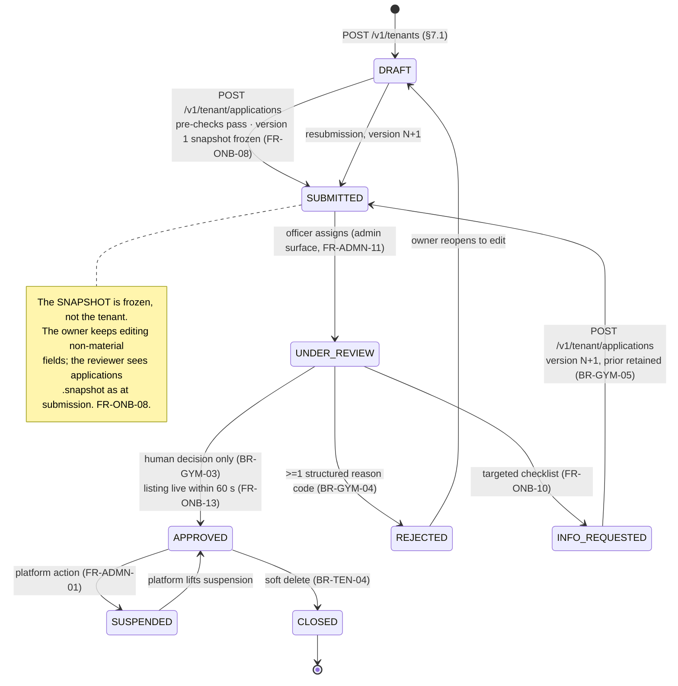

# `API-TEN` — Tenant management: the frozen endpoint contract

**Modules:** `tenancy` · `onboarding` · `catalog` · `plans` · `crm` · `staff` · `settlements`
(payout account only) · **Group:** `TEN` · **Surface count:** 44 endpoints, all `access`-authenticated
and all tenant-scoped · **Status:** contract frozen, no code written · **Launch market:** India
(`LAUNCH_MARKET_INDIA.md`).

---

## 0. Document control

| Aspect | Value |
| :--- | :--- |
| Owns | The management half of the `API-TEN` rows of `API_Catalog.md` §3.9 — onboarding, KYC, gyms, branches, media, plans, members, notes, staff, leads and the payout account — in per-endpoint detail |
| Contract law | **`docs/apis/README.md`** — versioning, auth modes, tenant resolution, idempotency, pagination, filtering, the 173-code error registry, the twelve rate-limit classes, money, time, validation, caching, OpenAPI. This document **cites** it by section number and never restates it (`README.md` §18.3 rule 4) |
| Authoritative index | **`docs/engineering/API_Catalog.md`** §3.9 — which endpoints exist and their eleven attributes |
| Governing law | `PROJECT_CONSTITUTION.md` §12 (Security), §13 (Error Handling Law), §14 (API Rules) |
| Product source | `MASTER_PRD.md` `B5.3` (`ONB`), `B5.4` (`GYM`), `B5.5` (`PLAN`), `B5.14` (`CRM`), `B5.15` (`STAF`), `B3.1`/`B3.2` (roles and the permission matrix), `A8.1`–`A8.3` (`BR-TEN`, `BR-GYM`, `BR-PLN`), `A8.7` (`BR-DAT`), `§C3` (API conventions), `§C4.4` (tenant/application state machine), `§C4.8` (reason-code taxonomies), `§C5` (background jobs) |
| Physical model | `docs/database/Schema.md` §4.1 `tenants`, §4.2 `applications`, §4.3 `kyc_documents`, §4.4 `payout_accounts`, §4.10 `staff`/`staff_branches`/`staff_invitations`, §5.1 `gyms`, §5.2 `branches`, §5.3 `branch_hours`/`branch_hour_exceptions`, §5.4 `gym_amenities`/`gym_media`, §5.5 `crm_members`/`leads`, §6.1 `plans`, §6.2 `plan_branches`, §8.4 `member_notes` |
| India specifics | `LAUNCH_MARKET_INDIA.md` §3 (`Asia/Kolkata`, +05:30, no DST), §6 (the **ten-document KYC checklist**), §4 (CGST/SGST place of supply) |
| Not owned here | Financial reads and writes — `GET /tenant/orders`, `POST /tenant/orders/offline`, `POST /tenant/orders/:orderRef/collect-balance`, `GET /tenant/payments`, `GET /tenant/invoices`, `GET /tenant/settlements`, `GET/POST /tenant/refunds`, `GET /tenant/coupons` and its writes, `GET /tenant/subscription`, `GET /tenant/reports/:reportKey`, `POST /tenant/exports`, `GET /tenant/audit` · Reviews — `GET /tenant/reviews`, `POST /tenant/reviews/:id/respond`, `POST /tenant/reviews/:id/report` (`Reviews.md`) · Notification preferences and templates (`Notifications.md`) · Every `/admin/*` counterpart, including the approve/reject decision itself (`Admin.md`) |

> **Every fenced block in this document is labelled `illustrative — not committed code`. No
> application code exists. Zod sketches, JSON bodies and mermaid diagrams here are the *contract*,
> expressed in the notation the implementation will use; they are not the implementation.**

---

## 1. Position, precedence, and four findings against the source set

### 1.1 The non-duplication contract

`README.md` §1.1 fixes the three-artefact division and §18.3 rule 4 forbids a domain file from
restating a rule that lives in the contract law. Accordingly:

| Convention | Defined in | What this document does |
| :--- | :--- | :--- |
| Base URL, versioning, deprecation | `README.md` §2 | Cites. Every path below is relative to `https://api.<domain>/v1` |
| Auth modes; the seven Auth column values | `README.md` §3.1 | Cites. **All 44 rows are `access`.** No row in this group is `@Public()`, `refresh`, `reset`, `support` or `signature` |
| Permission grammar and the five CI gates | `README.md` §4.2, §4.5 | Cites. §2.1 below maps every endpoint to its `B3.2` capability and permission string |
| Tenant resolution — never from the client | `README.md` §5 | Cites. §2.4 below states which of the four sources applies to each audience prefix on this surface |
| Cross-tenant read is `404` | `README.md` §5.4 | Cites. Every `:id` in this document resolves inside RLS, and a foreign id is `404 RESOURCE_NOT_FOUND` |
| Idempotency — 24-hour store, five-component fingerprint, three states | `README.md` §6 | Cites. §2.7 gives the per-endpoint posture |
| Cursor pagination, the opaque cursor, `next_cursor: null` | `README.md` §7 | Cites. Every collection below is cursor-paginated; **there is no offset exception in this group** |
| Filtering: explicit named parameters, `sort` allowlists | `README.md` §8 | Cites. Each list endpoint declares its own filter and sort tables |
| Error envelope and the 173-code registry | `README.md` §9.1, §9.5 | Cites. §19 is the `API-TEN` slice, and it introduces **no new code** |
| Rate-limit classes and headers | `README.md` §10 | Cites. §2.7 gives the per-endpoint class |
| Money as `<name>_minor` strings with an adjacent `currency`; rates as `_bps` | `README.md` §11 | Cites. **Plan pricing is the one place this surface writes money, and it writes it from a request field — see §1.4** |
| Time: RFC 3339 `Z` instants, `YYYY-MM-DD` business dates, `Asia/Kolkata` interpretation | `README.md` §12 | Cites. Branch hours are **local wall-clock `HH:MM`**, which is neither, and §12.5 explains why |
| Zod `.strict()` at `L8-PIPE` | `README.md` §13 | Cites. Every sketch below ends `.strict()` |
| Cache tokens and `ETag`/`If-Match` | `README.md` §15 | Cites. §2.8 gives the per-endpoint token |

### 1.2 Finding 1 — the member-import job has no status endpoint and no table

**This is a real gap and it blocks `FR-ONB-15`.**

| Source | Statement |
| :--- | :--- |
| `API_Catalog.md` §3.9 | `POST /tenant/members/import` — *"CSV import, dry-run and committing (`202`)"*, idempotency **REQ**, class `RL-EXPORT` |
| `README.md` §9.2 | `202` means *"accepted for asynchronous processing"* |
| `FR-ONB-15`, `AC-ONB-03.2` | *"per-row error reporting"* and *"I see a per-row report of errors … and can download it"* |
| `Schema.md` | Contains `export_jobs` (§11.3) and **no import-job table of any kind** |

A `202` with no way to read the outcome is not an asynchronous contract, it is a black hole; and a
per-row error report has nowhere to live. Two derived artefacts are therefore adopted here:

**Resolution `TEN-R1`, adopted, pending ratification (open item `O-TEN-1`):**

1. A derived endpoint **`GET /v1/tenant/members/import/:jobId`** (permission `crm.member.import`,
   scope `tenant`, `RL-READ`, `NO-STORE`), documented in §15.6. Its precedent is
   `GET /tenant/exports/:id`, itself a derived row in `API_Catalog.md` §3.9.
2. A table `member_import_jobs` whose shape §15.6 specifies. It is **not** `export_jobs` with a
   different `export_kind`: an import carries a column mapping, a dry-run verdict, a per-row error
   set and a natural-key ledger for `AC-ONB-03.4`'s idempotent re-run, none of which an export has.

Adding the row to `API_Catalog.md` §3.9 and the table to `Schema.md` is required in the same pull
request that implements the import. Until both land, `FR-ONB-15` is unimplementable as specified.

### 1.3 Finding 2 — `BR-GYM-06` names a state the tenant machine does not have

`BR-GYM-06` says a material change *"return[s] the gym to `PENDING_REVIEW` for those fields"*.
`PENDING_REVIEW` is a value of **`gym_status_enum`** (`Schema.md` §2.5.2), not of
**`tenant_status_enum`** or **`application_status_enum`** (§2.5.1). The two machines are different:
`§C4.4` governs the *tenant's* verification lifecycle, and `gyms.status` governs a *listing*.

**Resolution `TEN-R2`, adopted:** a material change moves **`gyms.status` → `PENDING_REVIEW`** and
opens a **new `applications` version** scoped to the changed fields, while the **listing stays
publicly visible** — which is exactly what `BR-GYM-06` says must happen and what
`BR-GYM-01`'s *"not visible until `APPROVED`"* does **not** contradict, because the gym was already
approved and its approval is not withdrawn. `tenants.status` does **not** move. §11.4 specifies the
whole transition, and §3.3 draws the two machines side by side so the distinction cannot be lost.

### 1.4 Finding 3 — plan pricing is the documented exception to `README.md` M3

`README.md` §11.1 M3 is absolute: *"No request schema anywhere in the API contains a monetary
field."* `POST /v1/tenant/plans` and `PATCH /v1/tenant/plans/:id` must accept `price_minor`,
`joining_fee_minor` and `promo_price_minor`, because **a plan price is the tenant setting a price,
not a client asserting one**. `README.md` §11.1 M4 already recognises one such case
(`amount_received_minor` on the offline order) and calls it *"a record of cash handed over, not a
price"*; this is the second, and its justification is the mirror image.

**Resolution `TEN-R3`, adopted, and raised under the Halt Rule (`PROJECT_CONSTITUTION.md` §1.4) so
that it is an amendment rather than a local exception (open item `O-TEN-2`):**

| Aspect | Position |
| :--- | :--- |
| Why it is not a `BR-PAY-04` violation | `BR-PAY-04` protects **the amount charged to a buyer** from being chosen by the buyer. Here the writer is the **seller**, acting under `plans.plan.create` / `plans.plan.update`, setting the catalogue price *that the server will later charge from its own record*. The buyer still sends no amount anywhere (`README.md` §11.2) |
| What the absence assertion must say | `README.md` §16.4 assertion 2 — *"no request schema anywhere contains a monetary field"* — must be narrowed to *"no request schema on a **purchase or settlement** path contains a monetary field"*, with an explicit allowlist of exactly three schemas: `CreatePlanRequest`, `UpdatePlanRequest`, `RecordOfflineOrderRequest`. An unbounded exception would destroy the assertion's value |
| Wire form | Unchanged: `README.md` §11.1 M1 and M2 apply in **requests** too. `price_minor` is a **string** of integer paise, `currency` is required and adjacent, and a float, a formatted string or a bare number is `400 VALIDATION_FAILED` |
| Rates | **Still forbidden.** No request on this surface carries a `_bps` field. Commission, tax and reserve rates are platform or tax-profile configuration (`README.md` §11.1 M5) |

### 1.5 Finding 4 — `POST /v1/tenants` is the one write in this group with no tenant

Every other row in `API_Catalog.md` §3.9 is scope `tenant` and resolves through the access token's
`tenant_id` claim (`README.md` §5.1 row 3). `POST /v1/tenants` cannot: the tenant does not exist yet,
so there is nothing to resolve. The catalogue correctly marks it scope **`user`**.

This is **not** a hole in `BR-TEN-01`. The endpoint creates a row whose `tenant_id` **is** the row's
own id, under a `SET LOCAL app.tenant_id` executed **after** the id is generated and **inside** the
same transaction, against the `rls_tenants__tenant_isolation` policy of `Schema.md` §4.1 — the one
policy in the schema written as `id = current_setting('app.tenant_id')` rather than
`tenant_id = …`. §7.1 specifies the sequence. The client supplies **no** identifier of any kind.

### 1.6 What is not in this document, and why each absence is a control

| Endpoint that does not exist | Why | Asserted by |
| :--- | :--- | :--- |
| Anything of the form `POST /tenant/applications/:id/approve`, `PATCH /tenant/gyms/:id/status`, `POST /tenant/gyms/:id/go-live` | **`BR-GYM-03`: approval is a human decision and no automated path may set `APPROVED`.** A tenant-side approval endpoint would put the decision on the applicant's side of the boundary. Approval lives at `POST /v1/admin/applications/:id/decide` (`Admin.md`) under `access(mfa)` and a `VERIFICATION_OFFICER` permission | `GYM_APPROVAL_REQUIRES_HUMAN_ACTOR`; a route-table absence assertion (`README.md` §16.4) |
| `DELETE /v1/tenant/plans/:id` | `BR-PLN-04` — a plan is **archived, never hard-deleted** while a membership references it. The endpoint's absence is the enforcement; `PLAN_HAS_ACTIVE_MEMBERSHIPS` exists for the case where a delete is attempted through a future bulk path | Absent from the route table |
| `DELETE /v1/tenant/members/:id` | `BR-DAT-04` erasure is a **data-subject** right exercised by the member through `POST /v1/me/erasure-request`, not a tenant capability. A tenant deleting a member would destroy attendance and financial history it is required to retain (`BR-TEN-04`) | Absent from the route table |
| `DELETE /v1/tenant/members/:id/notes/:noteId` | `FR-CRM-05` makes a note *"timestamped and attributed"*; `BR-DAT-01` audits it. Notes are editable by their author within `member_notes.editable_until` and immutable after (`Schema.md` §8.4) | Absent from the route table |
| Any endpoint that returns a full bank account number, or accepts one and echoes it | `BR-PAY-08`. `payout_accounts` stores **`account_number_last4` only**; the full number lives with the provider, tokenised (`Schema.md` §4.4) | A schema check failing the build on a field matching an instrument pattern |
| Any endpoint that returns a KYC document's bytes or a durable URL | `BR-DAT-07`, `PROJECT_CONSTITUTION.md` §12.7 UP6. Access is by **short-lived signed URL issued per access, every access logged**, and only to `VERIFICATION_OFFICER` and `SUPER_ADMIN`. §10.2 states what the **tenant** may see, which is metadata and a thumbnail of its own upload | §10.2; the audit assertion of `BR-DAT-07` |
| Any endpoint by which a gym edits or deletes a member's review | `BR-REV-05`, invariant 4. `B3.2` has no row for it, so there is no permission, so there is no endpoint | `README.md` §16.4 absence assertion 4 |
| A WebSocket or SSE channel for application status | **A-08** — Phase 1 polls with TanStack Query at 10–15 s. `GET /v1/tenant/applications` is the polled resource and carries `poll_after_seconds` | Absent from the route table |
| `POST /v1/tenant/gyms/:id/amenities` as a free-text write | `FR-GYM-03`, `NFR-DQ-06` — amenities come from the platform taxonomy by **stable identifier**. They are set as `amenity_ids[]` on `PATCH /tenant/gyms/:id`; a free-text value is `400 AMENITY_NOT_IN_TAXONOMY` | §11.4 validation |

---

## 2. Cross-cutting contracts on this surface

### 2.1 `B3.2` capabilities mapped to the 44 permission strings

Extending `README.md` §4.2. Every endpoint declares exactly one, or gate **PG-1** fails the build
(`FR-RBAC-01`). Scope is **not** in the string (`README.md` §4.2): `▪` is a resource-level predicate
evaluated after the resource is loaded, and branch scoping is a separate refusal (§2.5).

| # | Endpoint | `B3.2` capability | Permission string | OWNER | MANAGER | RECEPT | TRAINER |
| :-: | :--- | :--- | :--- | :-: | :-: | :-: | :-: |
| 1 | `POST /tenants` | *(pre-tenant; the caller is a `USER`)* | `tenancy.tenant.create` | — | — | — | — |
| 2 | `GET /tenant` | Edit gym profile (read half) | `tenancy.tenant.read` | ● | ○ | — | — |
| 3 | `PATCH /tenant` | Edit gym profile | `tenancy.tenant.update` | ● | — | — | — |
| 4 | `GET /tenant/settings` | Edit gym profile (read half) | `tenancy.settings.read` | ● | ○ | — | — |
| 5 | `PUT /tenant/settings` | Edit gym profile | `tenancy.settings.update` | ● | — | — | — |
| 6 | `GET /tenant/applications` | Edit gym profile (read half) | `onboarding.application.read` | ● | ○ | — | — |
| 7 | `POST /tenant/applications` | Edit gym profile | `onboarding.application.submit` | ● | — | — | — |
| 8 | `GET /tenant/kyc-documents` | Edit gym profile (read half) | `onboarding.kyc_document.list` | ● | — | — | — |
| 9 | `POST /tenant/kyc-documents` | Edit gym profile | `onboarding.kyc_document.upload` | ● | — | — | — |
| 10 | `DELETE /tenant/kyc-documents/:id` | Edit gym profile | `onboarding.kyc_document.delete` | ● | — | — | — |
| 11 | `GET /tenant/gyms` | Edit gym profile (read half) | `catalog.gym.list` | ● | ▪ | — | — |
| 12 | `POST /tenant/gyms` | Add / remove branch | `catalog.gym.create` | ● | — | — | — |
| 13 | `GET /tenant/gyms/:id` | Edit gym profile (read half) | `catalog.gym.read` | ● | ▪ | — | — |
| 14 | `PATCH /tenant/gyms/:id` | Edit gym profile | `catalog.gym.update` | ● | ▪ | — | — |
| 15 | `POST /tenant/gyms/:id/media` | Edit gym profile | `catalog.gym_media.create` | ● | ▪ | — | — |
| 16 | `PATCH /tenant/gyms/:id/media` | Edit gym profile | `catalog.gym_media.reorder` | ● | ▪ | — | — |
| 17 | `DELETE /tenant/gyms/:id/media/:mediaId` | Edit gym profile | `catalog.gym_media.delete` | ● | ▪ | — | — |
| 18 | `GET /tenant/branches` | Edit gym profile (read half) | `catalog.branch.list` | ● | ▪ | ▪ | ▪ |
| 19 | `POST /tenant/branches` | Add / remove branch | `catalog.branch.create` | ● | — | — | — |
| 20 | `GET /tenant/branches/:id` | Edit gym profile (read half) | `catalog.branch.read` | ● | ▪ | ▪ | ▪ |
| 21 | `PATCH /tenant/branches/:id` | Edit gym profile | `catalog.branch.update` | ● | ▪ | — | — |
| 22 | `DELETE /tenant/branches/:id` | Add / remove branch | `catalog.branch.deactivate` | ● | — | — | — |
| 23 | `PUT /tenant/branches/:id/hours` | Edit gym profile | `catalog.branch_hours.update` | ● | ▪ | — | — |
| 24 | `GET /tenant/plans` | Create / edit plan (read half) | `plans.plan.list` | ● | ○ | — | — |
| 25 | `POST /tenant/plans` | Create / edit plan | `plans.plan.create` | ● | — | — | — |
| 26 | `GET /tenant/plans/:id` | Create / edit plan (read half) | `plans.plan.read` | ● | ○ | — | — |
| 27 | `PATCH /tenant/plans/:id` | Create / edit plan | `plans.plan.update` | ● | — | — | — |
| 28 | `POST /tenant/plans/:id/publish` | **Publish plan to marketplace** | `plans.plan.publish` | ● | **—** | — | — |
| 29 | `POST /tenant/plans/:id/archive` | Create / edit plan | `plans.plan.archive` | ● | — | — | — |
| 30 | `POST /tenant/plans/:id/duplicate` | Create / edit plan | `plans.plan.duplicate` | ● | — | — | — |
| 31 | `GET /tenant/members` | Edit member record (read half) | `crm.member.list` | ● | ● | ▪ | ▪ |
| 32 | `POST /tenant/members` | Create member (walk-in) | `crm.member.create` | ● | ● | ● | — |
| 33 | `GET /tenant/members/:id` | Edit member record (read half) | `crm.member.read` | ● | ● | ▪ | ▪ |
| 34 | `PATCH /tenant/members/:id` | Edit member record | `crm.member.update` | ● | ● | ▪ | — |
| 35 | `POST /tenant/members/import` | Export tenant data *(the inverse capability)* | `crm.member.import` | ● | — | — | — |
| 36 | `GET /tenant/members/import/:jobId` **(derived, `TEN-R1`)** | as above | `crm.member.import` | ● | — | — | — |
| 37 | `GET /tenant/members/:id/notes` | Edit member record (read half) | `crm.member_note.list` | ● | ● | ▪ | ▪ |
| 38 | `POST /tenant/members/:id/notes` | Edit member record | `crm.member_note.create` | ● | ● | ▪ | ▪ |
| 39 | `GET /tenant/staff` | Invite / manage staff (read half) | `staff.staff.list` | ● | ▪ | — | — |
| 40 | `POST /tenant/staff` | Invite / manage staff | `staff.staff.invite` | ● | ▪ | — | — |
| 41 | `PATCH /tenant/staff/:id` | Invite / manage staff | `staff.staff.update` | ● | ▪ | — | — |
| 42 | `DELETE /tenant/staff/:id` | Invite / manage staff | `staff.staff.remove` | ● | ▪ | — | — |
| 43 | `GET /tenant/leads` | Edit member record (read half) | `crm.lead.list` | ● | ● | ▪ | — |
| 44 | `POST /tenant/leads` | Create member (walk-in) | `crm.lead.create` | ● | ● | ● | — |
| 45 | `PATCH /tenant/leads/:id` | Edit member record | `crm.lead.update` | ● | ● | ▪ | — |
| 46 | `GET /tenant/payout-account` | **Change payout bank account** | `settlements.payout_account.read` | ● | — | — | — |
| 47 | `PUT /tenant/payout-account` | **Change payout bank account** | `settlements.payout_account.update` | ● | — | — | — |

Forty-seven rows for forty-four endpoints, because rows 16, 17 and 20 are catalogue rows this
document owns but the brief does not enumerate; they are specified compactly in §11.6 and §12.2.

**Three rows carry the weight of `AC-STAF-01.2`.** Row 28 is `GYM_OWNER` **only** — `B3.2` gives
*Publish plan to marketplace* `—` to `GYM_MANAGER`, so a manager may draft and edit a plan and may
not put it on sale. Rows 25 and 27 are likewise `○` for the manager: a **distinct read permission is
granted and the write permission is not**, never a runtime flag on one permission
(`README.md` §4.2). And a `RECEPTIONIST` holds **none** of rows 24–30: opening the plan editor by
direct URL is `403 PERMISSION_DENIED` at step 5 of the guard chain, before any row is read.

**Six permission strings are new to the registry** and must be declared in their owning module's
`permissions.ts` or gate **PG-3** fails: `catalog.gym_media.reorder`, `catalog.branch.read`,
`catalog.branch_hours.update`, `crm.member_note.list`, `crm.member_note.create`,
`crm.member.import`. Each is three `snake_case` segments whose first segment is one of the 23
modules of `§C1.3`.

### 2.2 Surfaces

| Endpoint family | `web` | `dash` | `admin` |
| :--- | :-: | :-: | :-: |
| `POST /tenants` | ✅ `SCR-WEB-020` *List your gym* | ➖ redirects into `dash` on success | ❌ |
| Tenant, settings, applications, KYC, payout account | ❌ | ✅ `SCR-DASH-002`…`SCR-DASH-003` onboarding wizard, `SCR-DASH-016` settings | ❌ read-only counterparts live in `Admin.md` |
| Gyms, branches, hours, media | ❌ | ✅ `SCR-DASH-004` gym profile, `SCR-DASH-005` branches | ❌ |
| Plans | ❌ | ✅ `SCR-DASH-006` plan list, `SCR-DASH-007` plan editor | ❌ |
| Members, notes, import | ❌ | ✅ `SCR-DASH-011` member list, `SCR-DASH-012` member 360 | ❌ |
| Staff | ❌ | ✅ `SCR-DASH-018` staff | ❌ |
| Leads | ❌ | ✅ `SCR-DASH-017` lead pipeline | ❌ |

**Nothing in this group is consumed by the public marketplace.** The marketplace reads the
platform-scope search projection (`README.md` §3.6 rows 1–12), never a tenant-owned table, which is
what makes `BR-PLN-05` structurally true rather than filtered — see §2.6.

### 2.3 Tenant resolution on this surface

| Endpoint | `README.md` §5.1 row | Mechanism |
| :--- | :-: | :--- |
| `POST /tenants` | **2 → 3** | Audience `/tenants` is user-scope at entry. The transaction generates the tenant id, executes `SET LOCAL app.tenant_id` with it, then inserts. §7.1 |
| Every other endpoint | **3** | `/tenant` prefix → the access token's `tenant_id` claim, established at login or by the audited switch `POST /v1/auth/tenant-context` (`BR-TEN-02`, `FR-AUTH-11`). Absent → `403 TENANT_CONTEXT_REQUIRED` |

`X-Tenant-Id`, `?tenant_id=` and a `tenant_id` body field are refused exactly as `README.md` §5.3
TD1 requires. **`POST /tenants` is not an exception**: it accepts no identifier for the tenant it
creates, and a `tenant_id` in its body is `400 VALIDATION_FAILED` with `rule: "unknown_field"` like
anywhere else. `BR-TEN-02`'s multi-tenant owner switches context through the auth endpoint, never by
naming a tenant here.

### 2.4 The three tenant-state write gates, and what they do **not** block

Three separate `403`s guard this surface. They are distinct conditions with distinct remedies and
must never be collapsed into one.

| Gate | Code | Condition | Blocks | Does **not** block |
| :--- | :--- | :--- | :--- | :--- |
| Not yet verified | `TENANT_NOT_APPROVED` | `tenants.status` ∉ {`APPROVED`} | `POST /tenant/plans/:id/publish` only | Every other endpoint here. **The whole point of the onboarding wizard is that an unapproved tenant can write** (`FR-ONB-01`) |
| Suspended | `TENANT_SUSPENDED` | `tenants.status = 'SUSPENDED'` | Every write in this group | Every read; and **member check-in is never blocked** — `BR-TEN-05` keeps existing memberships valid until natural expiry |
| Arrears | `TENANT_WRITE_BLOCKED_PAST_DUE` | `subscription_status = 'PAST_DUE'` and `now() − subscription_past_due_since > 14 days` | Every write in this group | Every read; marketplace visibility (already lost at 7 days); and **check-in, absolutely** — `BR-TEN-06`: *"Check-in for existing members is never blocked by subscription arrears"* |

The gate is a `WriteAccessGuard` at `L7-GUARD` reading `tenants.status`,
`tenants.subscription_status` and `tenants.subscription_past_due_since` — three columns on a row
already loaded by tenant resolution, so it costs no additional query. The message must state the
amount owed and the payment path (`README.md` §9.5.2); *"Your account is restricted"* fails review
under `NFR-USE-05`.

### 2.5 Branch scoping is authorisation, not filtering (`FR-STAF-03`, `AZ8`)

> `README.md` §4.4 RB3, `AC-STAF-01.1`: a `RECEPTIONIST` assigned to Andheri who requests Bandra's
> data is **refused**, not shown an empty list.

| Situation | Response |
| :--- | :--- |
| A branch-scoped caller reads a **collection** with no `branch_id` filter | The set is **narrowed to the assigned branches**, and the response carries `scope: { branch_ids: [...] }` so the client can render *"showing Koregaon Park only"*. Narrowing a caller's own default view is not filtering away a refusal |
| A branch-scoped caller passes `?branch_id=` naming a branch they are **not** assigned to | **`403 BRANCH_NOT_ASSIGNED_TO_STAFF`**, naming the branches they may act in. Never an empty page |
| A branch-scoped caller requests a **single resource** belonging to another branch of the **same** tenant | **`403 BRANCH_NOT_ASSIGNED_TO_STAFF`**. Not `404` — the resource is the caller's tenant's, and `README.md` §5.4 reserves `404` for *another tenant's* resource |
| Any caller requests a resource belonging to **another tenant** | **`404 RESOURCE_NOT_FOUND`**, always, at every one of the 44 endpoints |

The distinction in rows 3 and 4 is the single most confusable pair on this surface and the isolation
suite (`BAC-10`, `E2E-11`) asserts both directions on every `:id` route in this document.

### 2.6 `BR-PLN-05` — a `STAFF_ONLY` plan is never returned by any public API

Stated once here so that no plan endpoint below re-argues it.

| Layer | Control |
| :--- | :--- |
| **Structural** | The public marketplace reads `search_documents` and the public plan projection, which are **built from a query whose predicate is `status = 'PUBLISHED' AND visibility = 'PUBLIC'`**. A `STAFF_ONLY` plan is not filtered out of a public response; **it was never in the set** |
| `L1-DB` | `idx_plans__gym_status_visibility (gym_id, status, visibility)` (`Schema.md` §6.1) is the index the public catalogue query uses, so the predicate is served, not applied afterwards |
| `L6-UC` | Purchase paths re-resolve the plan and refuse a non-public one with **`422 PLAN_NOT_PUBLISHED`**, whose message is deliberately generic — *"do not disclose that a private plan exists"* (`README.md` §9.5.4) |
| `L12-CI` | A contract test requests every `STAFF_ONLY` plan id of a fixture tenant against all twelve `API-DISC` endpoints and asserts absence, not redaction |
| This surface | `GET /tenant/plans` and `GET /tenant/plans/:id` **do** return `STAFF_ONLY` plans, because the caller is the seller. `GET /tenant/plans/:id` additionally returns `marketplace_preview`, which for a `STAFF_ONLY` plan is `null` with `preview_unavailable_reason: "STAFF_ONLY"` — `FR-PLAN-07`'s preview must not fabricate a public rendering of something that will never be public |

### 2.7 Idempotency and rate-limit posture

`README.md` §6.1 binds the classes; gate **PG-2** enforces the decorator.

| Posture | Endpoints |
| :--- | :--- |
| **REQ** — bulk and asynchronous (`README.md` §6.1) | `POST /tenant/members/import` |
| **REQ** — catalogue-affecting state mutation, per `API_Catalog.md` §3.9 | `POST /tenants` · `PATCH /tenant` · `PUT /tenant/settings` · `POST /tenant/applications` · `POST`/`DELETE /tenant/kyc-documents` · `POST`/`PATCH /tenant/gyms` · `POST`/`PATCH`/`DELETE` media · `POST`/`PATCH`/`DELETE /tenant/branches` · `PUT /tenant/branches/:id/hours` · `POST`/`PATCH /tenant/plans` and the three verbs · `POST`/`PATCH /tenant/members` · `POST`/`PATCH`/`DELETE /tenant/staff` · `POST`/`PATCH /tenant/leads` · **`PUT /tenant/payout-account`** |
| **OPT** — accepted and honoured if supplied | `POST /tenant/members/:id/notes` |
| **N/A** | Every `GET` |

| Class | Endpoints | Why |
| :--- | :--- | :--- |
| `RL-READ` | Every `GET`, including `GET /tenant/members/import/:jobId` | Tier 6: 300/min per user. Must absorb the A-08 poll on application status at 10–15 s (`README.md` §10.2) |
| `RL-WRITE` | Every write except the four below | Tier 4: 60/min per user, 600/min per tenant |
| `RL-UPLOAD` | `POST /tenant/kyc-documents` · `POST /tenant/gyms/:id/media` | Tier 5: 20/min **and 200 MB/hour** per user; 60/min **and 2 GB/hour** per tenant (`README.md` §10.2). The byte budget is what stops a rendition-pipeline denial of service |
| `RL-EXPORT` | `POST /tenant/members/import` | Tier 4 keyed as an export: **3/day per user, 5/hour per tenant**. An import is minutes of worker time and `NFR-SCAL-05` forbids background work starving request handling |
| `RL-PAY` | **`PUT /tenant/payout-account`** | Tier 3 — the strictest class, chosen deliberately for a non-payment endpoint. A changed payout account is the classic account-takeover monetisation path (`API_Catalog.md` §3.9 note 1) and it is rate-limited as if it were a payment, because in effect it is |

### 2.8 Cache and privacy posture

| Token | Endpoints |
| :--- | :--- |
| **`NO-STORE!`** — `private, no-store` + `Pragma: no-cache` + `Vary: Authorization` | `GET`/`POST`/`DELETE /tenant/kyc-documents*` · `GET`/`PUT /tenant/payout-account` |
| **`NO-STORE`** — `private, no-store` | Every other endpoint in this group, without exception |

**No endpoint in `API-TEN` is CDN-cacheable and none carries an `ETag` for caching purposes**
(`README.md` §15.2 E4). Three endpoints nonetheless support **`If-Match` for optimistic concurrency**
under E3, because they are last-writer-wins hazards with two plausible concurrent editors:
`PUT /tenant/settings`, `PUT /tenant/branches/:id/hours` and `PATCH /tenant/gyms/:id`. On those
three the `ETag` is a **concurrency token, not a cache validator**, is returned on the corresponding
`GET`, and a stale `If-Match` is `409 RESOURCE_VERSION_CONFLICT`.

---

## 3. The tenant / application state machine (`§C4.4`)

### 3.1 The eight tenant states

`tenants.status` is `tenant_status_enum` (`Schema.md` §2.5.1). It is a **closed enum**
(`README.md` §2.3): a client that received an unknown value would render an unverified gym as
approved, so adding a state is a breaking change and always was.

| State | Meaning | Owner may edit? | Listing public? | Payouts? |
| :--- | :--- | :--- | :-: | :-: |
| `DRAFT` | The wizard is in progress. **Partial state persists indefinitely** (`FR-ONB-01`) | Everything | ❌ | ❌ |
| `SUBMITTED` | A version is in the queue, unassigned | **Non-material fields only** (`FR-ONB-08`) | ❌ | ❌ |
| `UNDER_REVIEW` | A named officer has taken it | Non-material only | ❌ | ❌ |
| `INFO_REQUESTED` | The reviewer wants specific items, **without rejecting** (`FR-ONB-10`) | Everything the targeted checklist names, plus non-material | ❌ | ❌ |
| `APPROVED` | Verified and live | Everything, subject to `BR-GYM-06`/`BR-GYM-07` (§6) | ✅ | ✅ |
| `REJECTED` | Refused with ≥1 structured reason (`BR-GYM-04`) | Everything; resubmission is unlimited (`BR-GYM-05`) | ❌ | ❌ |
| `SUSPENDED` | Platform-imposed. Removed from search **immediately**; existing memberships keep permitting check-in until natural expiry (`BR-TEN-05`) | ❌ reads only (§2.4) | ❌ | ❌ held |
| `CLOSED` | Terminal. Soft delete; financial, invoice and audit records retained for the statutory period (`BR-TEN-04`) | ❌ | ❌ | ❌ |



### 3.2 The five application states, and why there is no `DRAFT` among them

`application_status_enum` is `SUBMITTED`, `UNDER_REVIEW`, `INFO_REQUESTED`, `APPROVED`, `REJECTED` —
**five values, and deliberately no `DRAFT`** (`Schema.md` §2.5.1). *A draft is a tenant state; an
application is a submitted version.* No `applications` row exists until `POST
/v1/tenant/applications` succeeds, which is why §9.1's response for a `DRAFT` tenant returns
`current: null` with a completeness checklist rather than an empty application object.

`applications` is versioned by `uq_applications__tenant_version (tenant_id, version)`, 1-based, and
every prior version is retained (`BR-GYM-05`). The grant is `SELECT, INSERT` plus a **column-scoped
`UPDATE`** on the six verdict columns only (`Schema.md` §4.2, deviation D-03) — so no code path,
including this one, can rewrite a submitted `snapshot`.

### 3.3 Two machines, one tenant — the distinction `TEN-R2` preserves

| | `tenants.status` (`§C4.4`) | `gyms.status` (`gym_status_enum`) |
| :--- | :--- | :--- |
| Answers | *Is this business verified?* | *Is this listing publishable?* |
| Values | `DRAFT` `SUBMITTED` `UNDER_REVIEW` `INFO_REQUESTED` `APPROVED` `REJECTED` `SUSPENDED` `CLOSED` | `DRAFT` `PENDING_REVIEW` `APPROVED` `SUSPENDED` `CLOSED` |
| Moved by | Onboarding submission and the platform decision | Gym creation, `BR-GYM-06` material change, platform suspension |
| First approval | Tenant `APPROVED` and its first gym `APPROVED` happen in **one** admin decision | as left |
| A material edit afterwards | **Unchanged — stays `APPROVED`** | **→ `PENDING_REVIEW`, while `visibility` stays live** (§6) |
| A bank-account change | Unchanged | Unchanged. It suspends **payouts**, not the listing — `payout_accounts.status → PENDING_VERIFICATION` and `tenants.payout_hold_until` is set (§18) |

The row that matters is the fifth. `BR-GYM-06` requires the listing to stay live through a material
re-review, and a naive implementation that moved the *tenant* out of `APPROVED` would take the gym
off the marketplace, cancel nothing, and silently stop every sale — a self-inflicted outage caused
by an owner correcting their own address.

---

## 4. The sixteen application-rejection reason codes (`§C4.8`)

`BR-GYM-04`: rejection must cite **at least one** structured reason code and may include free text;
**the owner sees both**. `FR-ONB-11` adds that each cited reason *"identifies exactly which fields or
documents to fix"*, and `AC-ONB-01.2` makes the corrective action mandatory rather than implied.

**These are data, not error codes** (`README.md` §9.5, denial-reasons row). They are carried in a
`200` response body from `GET /v1/tenant/applications`, never in an `error.code`. The taxonomy is an
**open enum** (`README.md` §2.3) because `FR-ADMN-07` makes reason taxonomies Super-Admin-managed; a
client renders the server-supplied `label` for an unknown value.

| # | Code | Cites | `target` shape returned to the owner | Corrective action surfaced |
| :-: | :--- | :--- | :--- | :--- |
| 1 | `KYC_DOCUMENT_MISSING` | A checklist row with no `ACCEPTED` document | `{"kind":"KYC","document_type":"SHOP_ESTABLISHMENT"}` | Deep link to step 2 with the type pre-selected |
| 2 | `KYC_DOCUMENT_ILLEGIBLE` | An uploaded scan that cannot be read | `{"kind":"KYC","document_id":"…"}` | Re-upload; the prior document is marked `REJECTED`, not deleted |
| 3 | `KYC_DOCUMENT_EXPIRED` | `kyc_documents.valid_until < today` | `{"kind":"KYC","document_id":"…","valid_until":"2026-03-31"}` | Re-upload a current copy |
| 4 | `KYC_NAME_MISMATCH` | Name on the document ≠ `tenants.legal_name` or the bank proof | `{"kind":"KYC","document_id":"…","field":"account_holder_name"}` | **Never echoes the name read off the document** — states the mismatch category only |
| 5 | `ADDRESS_UNVERIFIABLE` | The premises address proof does not evidence the branch address | `{"kind":"BRANCH","branch_id":"…","field":"address_line1"}` | Edit the address or upload a matching proof |
| 6 | `GEO_ADDRESS_MISMATCH` | `branches.geo_tolerance_metres` beyond the configured tolerance (`BR-GYM-08`) | `{"kind":"BRANCH","branch_id":"…","measured_metres":840,"tolerance_metres":250}` | Drag the map pin; **the measured distance is stated, never "invalid location"** |
| 7 | `DUPLICATE_LISTING` | Another `APPROVED` gym at this address (`BR-GYM-09`) | `{"kind":"BRANCH","branch_id":"…"}` | Contact support; genuine shared premises are approved by reviewer override with reason (`AC-ONB-02.4`) |
| 8 | `INSUFFICIENT_PHOTOS` | Fewer than three (`BR-GYM-02`, `FR-ONB-04`) | `{"kind":"GYM","gym_id":"…","present":2,"required":3}` | **State both counts** (`NFR-USE-06`) |
| 9 | `PHOTO_QUALITY` | Resolution, blur or exposure below threshold | `{"kind":"MEDIA","media_ids":["…"]}` | Replace the named photographs |
| 10 | `PHOTO_NOT_OF_PREMISES` | Stock imagery or an unrelated interior | `{"kind":"MEDIA","media_ids":["…"]}` | Replace with photographs of the actual gym |
| 11 | `INCOMPLETE_PROFILE` | A required `FR-ONB-02`/`FR-ONB-04` field is empty | `{"kind":"FIELD","path":"gym.description"}` | Dotted path, so the dashboard focuses the control |
| 12 | `NO_PUBLISHED_PLAN` | Zero plans in `PUBLISHED` (`FR-ONB-05`, `BR-GYM-02`) | `{"kind":"PLAN"}` | Deep link to the plan editor |
| 13 | `BANK_VERIFICATION_FAILED` | Gateway account-name verification failed (`FR-ONB-06`) | `{"kind":"PAYOUT_ACCOUNT"}` | Re-enter the account; **name the mismatch category, not the returned name** |
| 14 | `PROHIBITED_CONTENT` | Profanity or policy-breaching free text (`FR-ONB-12`) | `{"kind":"FIELD","path":"gym.description"}` | Say which **category**, never which detector |
| 15 | `SUSPECTED_FRAUD` | Reviewer judgement | `{"kind":"NONE"}` | **Deliberately non-specific.** A precise message is a tuning signal for the next attempt |
| 16 | `OTHER` | Anything the fifteen do not cover | `{"kind":"NONE"}` | `reviewer_notes` is **mandatory** when `OTHER` is cited, enforced at the admin endpoint |

Rows 15 and 16 are the pair that keeps the taxonomy honest: `OTHER` exists so a reviewer never
mis-files a real reason to fit the list, and its mandatory free text stops it becoming the default.
`SUSPECTED_FRAUD` is the one code whose message is intentionally uninformative, and that is a
security decision recorded here so nobody "improves" it later.

---

## 5. The six-step resumable wizard (`FR-ONB-01`…`FR-ONB-15`)

### 5.1 Step to endpoint

There is **no wizard endpoint**. The wizard is a client-side sequence over ordinary resource
endpoints, which is what makes it resumable without a server-side session: state lives in rows, not
in a step pointer.

| Step | `FR-` | Endpoints that satisfy it | Completion predicate read by `GET /v1/tenant/applications` |
| :-: | :--- | :--- | :--- |
| 1 · Business | `FR-ONB-02` | `POST /tenants` then `PATCH /tenant` | `legal_name`, `entity_type`, registered address and business contact present; `pan` present for `country_code = 'IN'` |
| 2 · KYC | `FR-ONB-03` | `POST`/`DELETE`/`GET /tenant/kyc-documents` | Every **mandatory** row of the in-force checklist has a document in `PENDING`, `UNDER_REVIEW` or `ACCEPTED` |
| 3 · Gym | `FR-ONB-04` | `POST`/`PATCH /tenant/gyms`, `POST /tenant/gyms/:id/media`, `POST /tenant/branches`, `PUT /tenant/branches/:id/hours` | ≥1 gym; ≥3 photographs; ≥1 branch with a resolvable `location`; ≥1 `branch_hours` row; `gender_policy` set |
| 4 · Plans | `FR-ONB-05` | `POST /tenant/plans`, `POST /tenant/plans/:id/publish` | ≥1 plan in `PUBLISHED` |
| 5 · Payout | `FR-ONB-06` | `PUT /tenant/payout-account`, `PUT /tenant/settings` | A `payout_accounts` row exists **and** `tenants.refund_policy` has been explicitly confirmed |
| 6 · Review & submit | `FR-ONB-07` | `GET /tenant/applications` (read-only summary) then `POST /tenant/applications` | Terms accepted in the submit body |

**Progress is server-computed, never client-tracked.** `GET /v1/tenant/applications` returns
`steps[]` with a boolean and a `missing[]` per step, and `FR-ONB-14`'s activation checklist is the
same mechanism extended past approval. A client that stored "you are on step 4" would be wrong the
moment the owner used two devices, and `AC-ONB-01.1` requires *"a direct link to each outstanding
item"* — which needs the missing items, not a step number.

### 5.2 `FR-ONB-08` — the snapshot lock, precisely

> *"Submission locks the submitted version; the owner may continue editing non-material fields but
> the reviewer sees a fixed snapshot."*

| Question | Answer |
| :--- | :--- |
| What is locked? | **The `applications.snapshot` JSONB, and nothing else.** The tenant's live rows stay writable |
| What may the owner still edit while `SUBMITTED` or `UNDER_REVIEW`? | Exactly the **non-material** set of §6: photographs, captions and ordering, description, amenities, operating hours, plan pricing and plan lifecycle, members, staff, leads, notes, settings other than the refund policy |
| What is refused while `SUBMITTED` or `UNDER_REVIEW`? | Every **material** field of §6 — legal name, registered address, entity type, registration identifier, branch address, geo-location, ownership, bank account — with **`409 APPLICATION_ALREADY_SUBMITTED`**, whose message shows the status and the locked snapshot |
| Why refuse rather than fork? | Because a reviewer deciding on a legal name that the owner changed forty seconds ago is deciding about nothing. `BR-GYM-05` gives the owner the correct remedy: withdraw is not offered, but the reviewer's `INFO_REQUESTED` reopens the material set, and a rejection reopens everything |
| Does a non-material edit reach the reviewer? | **No, and that is the point.** The reviewer sees `snapshot`. The dashboard shows the owner a banner naming the fields that will not be reviewed until the next submission |
| What happens on resubmission? | A **new** `applications` row at `version = N + 1` with a fresh snapshot; the prior version is retained and the reviewer can diff (`AC-ONB-01.3`) |

### 5.3 Automated pre-checks at submission (`FR-ONB-12`)

Six checks run **synchronously inside the submission transaction** and are persisted to
`applications.precheck_results`. They are shown to the reviewer with failures at the top
(`AC-ONB-02.2`) and, where they are the owner's to fix, returned in the `POST` response.

| # | Check | Blocking for the owner? | Result key |
| :-: | :--- | :--- | :--- |
| 1 | Address-to-geo distance vs tolerance (`BR-GYM-08`) | **Yes** — `422 GEO_ADDRESS_MISMATCH`, stating measured distance and tolerance | `geo_distance` |
| 2 | Duplicate approved address (`BR-GYM-09`) | No — surfaced to the reviewer, who may override with a reason (`AC-ONB-02.4`) | `duplicate_address` |
| 3 | Duplicate registration identifier | No — reviewer-facing; `uq_tenants__country_registration_number` already refuses an exact collision at write time | `duplicate_registration` |
| 4 | Duplicate bank account | No — reviewer-facing; a shared account across tenants is a fraud signal, not necessarily fraud | `duplicate_bank_account` |
| 5 | Image quality and duplicate-image detection | No — feeds reason codes 9 and 10 | `image_quality` |
| 6 | Profanity screening on all free text | No — feeds reason code 14 | `content_screening` |

Only check 1 blocks, and it blocks because `BR-GYM-08` says a mismatch *"blocks approval"*: letting
it through would guarantee a rejection round trip for a defect the owner can fix in one drag of a
map pin. The other five are **reviewer signals** — refusing on them would make the platform the
judge of ambiguous evidence, which `BR-GYM-03` reserves for a human.

---

## 6. Material versus non-material change — `BR-GYM-06`, `BR-GYM-07`, `FR-GYM-11`

### 6.1 The classification, enumerated

`FR-GYM-11` is unusual and load-bearing: *"the UI states this before the change is saved."* A UI
cannot state it unless the **API** can be asked, so the classification is a contract artefact, not a
front-end constant. Two mechanisms carry it, and both are mandatory (§6.3).

| Field | Class | Effect on save |
| :--- | :--- | :--- |
| `tenant.legal_name` | **MATERIAL** | Gyms → `PENDING_REVIEW`; new `applications` version; listing stays live |
| `tenant.entity_type` | **MATERIAL** | as above, **and** the KYC checklist branch may change, adding required documents |
| `tenant.registration_number` | **MATERIAL** | as above |
| `tenant.pan`, `tenant.gstin` | **MATERIAL** | as above; both are tax identity printed on every invoice |
| `tenant.registered_address_*` | **MATERIAL** | as above |
| `branch.address_line1/2`, `city_id`, `state`, `state_code`, `postal_code` | **MATERIAL** | as above; `state_code` additionally changes place of supply for every future invoice at that branch (`LAUNCH_MARKET_INDIA.md` §4) |
| `branch.location` (the map pin) | **MATERIAL** | as above; re-runs the `BR-GYM-08` tolerance check |
| Ownership — a `GYM_OWNER` added, removed or demoted | **MATERIAL** | as above. Enforced from the staff endpoints (§16), not from a gym field |
| **Payout bank account** | **MATERIAL — special case** | **Does not touch `gyms.status`.** Suspends **payouts** until re-verified: `payout_accounts.status → PENDING_VERIFICATION`, `tenants.payout_hold_until` set (§18) |
| `gym.name`, `gym.description`, `gym.category_id`, `established_year`, contact, website, social links | Non-material | Publishes immediately, subject to automated content screening (`BR-GYM-07`) |
| `gym.slug` | **Neither — immutable after approval** | `409 GYM_SLUG_TAKEN` on collision at creation; after approval the slug is stable forever (`FR-NAV-05`), because a changed slug breaks every external link and every crawled result |
| Photographs — add, delete, reorder, cover, captions | Non-material | Immediate, subject to media moderation |
| `gym.amenity_ids[]` | Non-material | Immediate |
| `gym.gender_policy` | Non-material | Immediate. It is a **policy**, not an identity claim, and members are notified through `FR-NOTF-01` |
| Operating hours and dated exceptions | Non-material | Immediate |
| `branch.name`, `capacity`, `landmark`, `parking_notes` | Non-material | Immediate |
| Branch temporary closure (`FR-GYM-10`) | Non-material | Immediate; triggers member notification and, past the configured consecutive-day threshold, a temporary search demotion (`AC-GYM-02.3`) |
| Plan price, promotion, description, ordering, publish, archive, duplicate | Non-material | Immediate. `BR-GYM-07` names *"plan pricing"* explicitly, and `BR-PLN-02` protects existing members instead (§13.4) |
| Members, notes, staff, leads, settings other than the refund policy | Non-material | Immediate |

### 6.2 What "returns to review while the listing stays live" means concretely

| Aspect | Behaviour |
| :--- | :--- |
| `gyms.status` | `APPROVED` → **`PENDING_REVIEW`** |
| Marketplace visibility | **Unchanged — the gym stays in search and its detail page stays live.** `BR-GYM-01` forbids visibility *before* approval; it does not withdraw an approval already given |
| Which values the marketplace shows | **The last approved values for the changed material fields**, and the new values for everything else. `applications.snapshot` holds the pending set; `gyms`/`branches` hold the approved set. There is no window in which a member sees an unreviewed legal name or an unreviewed address |
| Sales | Unaffected. Checkout, check-in, settlement and payouts all continue |
| The reviewer's queue | Receives a **partial** application version whose `snapshot.change_set` names only the changed material fields, so `SCR-ADM-002`'s three-minute decision target is not spent re-reading an approved dossier |
| On approval | The pending values are applied to `gyms`/`branches` in one transaction, `gyms.status → APPROVED`, and the search projection is purged and rebuilt within 60 seconds (`FR-ONB-13`, `README.md` §15.3 C3) |
| On rejection | The pending values are **discarded**, `gyms.status → APPROVED` with the previously approved values intact, and the owner is told which reason codes applied |

### 6.3 How the API states the class **before** the change is saved

Two mechanisms, both required, because one of them is advisory and one of them is the contract.

**Mechanism 1 — the advisory preflight (`GET /v1/tenant/gyms/:id?fields=…`, `GET /v1/tenant`).**
Every representation that can be `PATCH`ed carries a `field_change_classes` map alongside the data:

```json
// illustrative — not committed code
"field_change_classes": {
  "name": "IMMEDIATE",
  "description": "IMMEDIATE",
  "amenity_ids": "IMMEDIATE",
  "gender_policy": "IMMEDIATE",
  "slug": "IMMUTABLE",
  "legal_name": "REQUIRES_REVIEW",
  "registered_address_line1": "REQUIRES_REVIEW"
}
```

The dashboard renders *"Changing your legal name sends your listing back for review. Your gym stays
visible and your sales continue."* from this map, so the sentence a user reads is generated from the
server's classification and cannot drift from it.

**Mechanism 2 — the mandatory acknowledgement on the write.** A `PATCH` that touches a
`REQUIRES_REVIEW` field **without** `"acknowledge_review": true` is refused with
**`422 APPLICATION_PRECHECK_OVERRIDE_REQUIRED`**, whose `details` enumerate the material fields
detected and the consequence. Advisory metadata alone would satisfy `FR-GYM-11` only for clients
that chose to read it; the acknowledgement makes it true for every client, including a script.

**Why not two endpoints?** A `/preview` endpoint was considered and rejected: it doubles the round
trips, it can disagree with the write it precedes if the row changes in between, and it invites a
client to skip it. Classification is computed **inside the write transaction** from the diff against
freshly read state (`L6-UC`), which is the only place it can be correct.

---

## 7. Tenant lifecycle — `POST /v1/tenants`, `GET`/`PATCH /v1/tenant`

**Header notation used from here on.** Each endpoint opens with a four-row header carrying the eight
attributes `README.md` §1.4 requires, then Request · Response · Errors · Business rules enforced and
where · Validation · Side effects · Future compatibility. Universal errors —
`VALIDATION_FAILED`, `UNAUTHENTICATED`, `ACCESS_TOKEN_EXPIRED`, `TENANT_HEADER_NOT_ACCEPTED`,
`TENANT_CONTEXT_REQUIRED`, `PERMISSION_DENIED`, `RESOURCE_NOT_FOUND`, `RATE_LIMIT_EXCEEDED`,
`INTERNAL_ERROR`, `DEPENDENCY_UNAVAILABLE`, and on every `REQ` endpoint the three idempotency codes
— apply everywhere and are listed once in §19 rather than in all forty-four tables.

### 7.1 `POST /v1/tenants`

| | |
| :--- | :--- |
| **Purpose · Surfaces** | Create the tenant that a signed-in user will own, and make them its first `GYM_OWNER`. It creates a business, not a listing: `tenants.status = 'DRAFT'`, and no gym, branch or plan exists yet · `web` `SCR-WEB-020` |
| **Auth · Permission · Scope** | `access` · **`tenancy.tenant.create`** · **`user`** — the one row in this group that is not `tenant` (§1.5) |
| **Idem · RL · Cache** | **REQ** — a double-tapped *Create* on a slow connection must not produce two tenants · `RL-WRITE` · `NO-STORE` |
| **Catalogue row** | `API_Catalog.md` §3.9 row 1 — FR: `FR-ONB-01`, `FR-AUTH-11`; BR: `BR-TEN-02` |

**Request.** No path or query parameters.

```ts
// illustrative — not committed code
// packages/types/src/tenancy/create-tenant.schema.ts
export const CreateTenantRequest = z.object({
  legal_name:   z.string().trim().min(1).max(200),        // Schema.md §4.1 ck_tenants__legal_name_length
  trading_name: z.string().trim().min(1).max(200).optional(),
  entity_type:  z.enum(['SOLE_PROPRIETOR','PARTNERSHIP','COMPANY','OTHER']),  // CLOSED enum
  country_code: z.literal('IN'),   // Phase 1 is India-only (OQ-16). A second value is a data change,
                                   // not a contract change: the field exists so it never has to be added.
  contact_phone: z.string().regex(/^\+91[6-9]\d{9}$/),    // E.164, README §13.4 rule 11
  contact_email: z.string().email().max(254),
}).strict();
// Absent by design: tenant_id, id, slug, status, subscription_tier_id, commission_rate_bps,
// currency, timezone, any *_minor field. Sending one is 400 VALIDATION_FAILED / unknown_field.
```

`currency` (`INR`), `timezone` (`Asia/Kolkata`), `settlement_cycle_days` (7), `reserve_bps` (500) and
`status` (`DRAFT`) are **server defaults from `Schema.md` §4.1**, not client input. A client that
could pick its own `reserve_bps` could pick zero.

**Response — `201 Created`**

```json
// illustrative — not committed code — HTTP 201 Created
{
  "tenant": {
    "id": "01932c6a-11f4-7a90-b3c2-77e1a4d55f01",
    "legal_name": "Iron Temple Fitness Private Limited",
    "trading_name": "Iron Temple Fitness",
    "entity_type": "COMPANY",
    "country_code": "IN", "currency": "INR", "timezone": "Asia/Kolkata",
    "status": "DRAFT",
    "subscription_status": "TRIAL",
    "created_at": "2026-08-06T09:14:02Z"
  },
  "membership_of_tenant": { "staff_id": "01932c6a-2d77-70b1-8e04-9a1c3f5d2b88", "role": "GYM_OWNER", "status": "ACTIVE" },
  "next": { "step": 1, "action": "PATCH /v1/tenant", "missing": ["registered_address_line1", "registered_city", "registered_postal_code", "pan"] },
  "tenant_context": { "requires_switch": true, "switch_endpoint": "POST /v1/auth/tenant-context" }
}
```

`tenant_context.requires_switch` is `true` because the caller's **current** access token has
`tenant_id: null` or another tenant. This endpoint **does not mint a token** — `BR-TEN-02` requires
tenant switching to be explicit and audited, and silently re-scoping a live session here would be
exactly the ambient switch that rule forbids.

**Errors** (beyond §19's universal set)

| Code | HTTP | When | Message | Retry |
| :--- | :-: | :--- | :--- | :--- |
| `PHONE_NOT_VERIFIED` | 403 | The caller's mobile is unverified | "Verify your mobile number before listing a gym. It takes about a minute." | Fix |
| `EMAIL_NOT_VERIFIED` | 403 | The caller's email is unverified | Same shape; both are `BR-GYM-02` approval prerequisites and are demanded here so the owner is not blocked at step 6 | Fix |
| `VALIDATION_FAILED` | 400 | `country_code` other than `IN`; malformed `+91` phone | Name the field and the expected form | Fix |

**Business rules enforced, and where**

| Rule | Where | Detail |
| :--- | :--- | :--- |
| `BR-TEN-02` one owner may own many tenants | **This layer** + `L4-EXT` | No uniqueness on `(user_id)` in `staff`; `uq_staff__tenant_user` is per **pair**. Exactly one `tenant_id` may exist in `AsyncLocalStorage` per request (`README.md` §5.3 TD6) |
| `BR-TEN-01` isolation | `L2-RLS` | `rls_tenants__tenant_isolation` is `id = current_setting('app.tenant_id')` (`Schema.md` §4.1). The insert runs **after** `SET LOCAL` with the generated id, so the policy is satisfied by construction |
| `FR-RBAC-07` last owner | `L5-DOM` | The creator is inserted as `GYM_OWNER`/`ACTIVE`, so the invariant *"≥1 active owner"* holds from row one and §16 never has to bootstrap it |
| `BR-DAT-01` audit | `L9-INT` | `audit_log` row, actor = the creating user, `before = null` |

**Validation.** Guard chain per `README.md` §4.3. Steps 1–3 rate-limit; step 4 rejects `X-Tenant-Id`;
step 5 checks `tenancy.tenant.create`; step 7 applies the schema above; step 8 claims the key.
`legal_name` is trimmed **before** length validation (`README.md` §13.4 rule 6), so `"   "` is empty.

**Side effects.** One transaction: claim `idempotency_keys` → generate the tenant `id` →
`SET LOCAL app.tenant_id` → insert `tenants` (`status='DRAFT'`, `subscription_status='TRIAL'`) →
insert `staff` (`role='GYM_OWNER'`, `status='ACTIVE'`, `joined_at=now()`) → insert `audit_log` →
insert `outbox` `TenantCreated` → store the idempotent response. **No** `gyms`, `branches`, `plans`,
`applications` or `payout_accounts` row is created; a tenant with an empty catalogue is the correct
`DRAFT` state and pre-creating a placeholder gym would make `FR-ONB-04`'s completeness predicate
lie.

**Future compatibility.** May be added in `v1`: a second `country_code` value once a market opens;
an optional `referral_code`; additional `entity_type` values (`LLP` is anticipated — `Schema.md`
§2.5.1). Would force `v2`: making `trading_name` required; returning a token; removing
`tenant_context`.

### 7.2 `GET /v1/tenant`

| | |
| :--- | :--- |
| **Purpose · Surfaces** | The tenant's own profile, verification status, subscription state and the `FR-GYM-11` change-class map · `dash` `SCR-DASH-016` |
| **Auth · Permission · Scope** | `access` · **`tenancy.tenant.read`** · `tenant` |
| **Idem · RL · Cache** | N/A · `RL-READ` · `NO-STORE`, plus a strong `ETag` used **only** as the `If-Match` token for `PATCH` (§2.8) |
| **Catalogue row** | `API_Catalog.md` §3.9 row 2 — FR: `FR-ONB-02`, `FR-ONB-09`; BR: `BR-TEN-06` |

**Request.** No parameters. **Response — `200 OK`**

```json
// illustrative — not committed code — HTTP 200 OK
{
  "tenant": {
    "id": "01932c6a-11f4-7a90-b3c2-77e1a4d55f01",
    "legal_name": "Iron Temple Fitness Private Limited",
    "trading_name": "Iron Temple Fitness",
    "entity_type": "COMPANY",
    "registration_number": "U93030PN2021PTC201884",
    "country_code": "IN", "currency": "INR", "timezone": "Asia/Kolkata",
    "pan": "AABCI9021K",
    "gstin": "27AABCI9021K1ZP",
    "state_code": "27",
    "tax_registration_status": "REGISTERED",
    "registered_address_line1": "Survey 41/3, North Main Road",
    "registered_address_line2": "Koregaon Park",
    "registered_city": "Pune", "registered_state": "Maharashtra", "registered_postal_code": "411001",
    "contact_phone": "+919822014477", "contact_email": "rohan@irontemple.in",
    "status": "APPROVED",
    "status_since": "2026-07-18T11:32:44Z",
    "updated_at": "2026-08-06T09:14:02Z"
  },
  "subscription": {
    "tier_key": "GROWTH", "status": "ACTIVE",
    "past_due_since": null,
    "visibility_loss_on": null, "write_block_on": null,
    "staff_seats_used": 6, "staff_seats_limit": 10
  },
  "write_access": { "reads": true, "writes": true, "blocked_reason": null },
  "field_change_classes": {
    "legal_name": "REQUIRES_REVIEW", "entity_type": "REQUIRES_REVIEW",
    "registration_number": "REQUIRES_REVIEW", "pan": "REQUIRES_REVIEW", "gstin": "REQUIRES_REVIEW",
    "registered_address_line1": "REQUIRES_REVIEW", "registered_address_line2": "REQUIRES_REVIEW",
    "registered_city": "REQUIRES_REVIEW", "registered_state": "REQUIRES_REVIEW",
    "registered_postal_code": "REQUIRES_REVIEW",
    "trading_name": "IMMEDIATE", "contact_phone": "IMMEDIATE", "contact_email": "IMMEDIATE"
  }
}
```

| Field | Note |
| :--- | :--- |
| `pan`, `gstin` | Returned **in full to the owner only**. `GYM_MANAGER` holds `tenancy.tenant.read` at `○` and receives them **masked** (`AABCI****K`), because `BR-DAT-06` governs both and a manager has no need. Neither ever appears in a log, a trace or an analytics event |
| `subscription.visibility_loss_on` / `write_block_on` | **Server-computed business dates** in `Asia/Kolkata` from `subscription_past_due_since` + 7 and + 14 days (`BR-TEN-06`). A client must never compute them: `README.md` §12.3's rule is that any value a user compares against their own calendar is computed server-side |
| `write_access` | Pre-resolves §2.4's three gates so the dashboard can disable controls **and** the server still refuses (`FR-RBAC-02`) |
| `status_since` | An instant; drives the *"in review for 2 days"* indicator of `FR-ONB-09` |

**Errors.** Universal only. **Business rules.** `BR-TEN-06` (`L7-GUARD` computes the schedule;
`L1-DB` holds `subscription_past_due_since`), `BR-TEN-01` (`L2-RLS`), `BR-DAT-06` (serialisation
layer masks by permission qualifier). **Side effects.** None; no audit row — `BR-DAT-01` audits
writes, and auditing every dashboard read would drown the trail it exists to make searchable.
**Future compatibility.** Additive fields are non-breaking under CO-1; removing `field_change_classes`
would force `v2`, because `FR-GYM-11` compliance depends on it.

### 7.3 `PATCH /v1/tenant`

| | |
| :--- | :--- |
| **Purpose · Surfaces** | Update the business profile. **The endpoint at which `BR-GYM-06` first bites** · `dash` `SCR-DASH-002` step 1, `SCR-DASH-016` |
| **Auth · Permission · Scope** | `access` · **`tenancy.tenant.update`** · `tenant` |
| **Idem · RL · Cache** | REQ · `RL-WRITE` · `NO-STORE` |
| **Catalogue row** | `API_Catalog.md` §3.9 row 3 — FR: `FR-ONB-02`, `FR-GYM-11`; BR: `BR-GYM-06` |

**Request.** Every field optional; **at least one required**. `If-Match` optional and honoured.

```ts
// illustrative — not committed code
export const UpdateTenantRequest = z.object({
  legal_name: z.string().trim().min(1).max(200).optional(),
  trading_name: z.string().trim().min(1).max(200).nullable().optional(),
  entity_type: z.enum(['SOLE_PROPRIETOR','PARTNERSHIP','COMPANY','OTHER']).optional(),
  registration_number: z.string().trim().min(3).max(64).optional(),
  pan:   z.string().regex(/^[A-Z]{5}\d{4}[A-Z]$/).optional(),          // AAAAA9999A
  gstin: z.string().regex(/^\d{2}[A-Z]{5}\d{4}[A-Z]\d[A-Z]\d$/).optional(), // 15 chars
  registered_address_line1: z.string().trim().max(200).optional(),
  registered_address_line2: z.string().trim().max(200).nullable().optional(),
  registered_city:  z.string().trim().max(100).optional(),
  registered_state: z.string().trim().max(100).optional(),
  registered_postal_code: z.string().regex(/^[1-9]\d{5}$/).optional(), // Indian PIN, never leading 0
  contact_phone: z.string().regex(/^\+91[6-9]\d{9}$/).optional(),
  contact_email: z.string().email().max(254).optional(),
  // FR-GYM-11 / §6.3 mechanism 2. Required when the diff touches any REQUIRES_REVIEW field.
  acknowledge_review: z.boolean().optional(),
}).strict().refine(o => Object.keys(o).some(k => k !== 'acknowledge_review'), 'at_least_one_field');
// Absent by design: status, slug, currency, timezone, commission_rate_bps, reserve_bps,
// settlement_cycle_days, subscription_tier_id, payout_hold_until, refund_policy (§8), tenant_id.
```

**Response — `200 OK`**: the §7.2 body, plus a `change_result` block naming what the write did.

```json
// illustrative — not committed code — an excerpt of the HTTP 200 body
"change_result": {
  "classification": "REQUIRES_REVIEW",
  "material_fields_changed": ["legal_name", "registered_address_line1"],
  "immediate_fields_changed": ["contact_phone"],
  "gyms_returned_to_review": [{ "gym_id": "01932c72-5e19-7b60-9d34-8f2a1c7e4d55", "slug": "iron-temple-fitness-koregaon-park", "status": "PENDING_REVIEW", "listing_remains_live": true }],
  "application_version_opened": 3,
  "payouts_suspended": false
}
```

**Errors**

| Code | HTTP | When | Message | Retry |
| :--- | :-: | :--- | :--- | :--- |
| `APPLICATION_PRECHECK_OVERRIDE_REQUIRED` | 422 | A material field changed without `acknowledge_review: true` (§6.3) | "Changing your legal name sends your listing back for review. Your gym stays visible and your sales continue. Confirm to save." `details` names each material field | Fix |
| `APPLICATION_ALREADY_SUBMITTED` | 409 | A material field changed while `tenants.status ∈ {SUBMITTED, UNDER_REVIEW}` (`FR-ONB-08`, §5.2) | "Your application is with our team. You can still update photos, hours and plans; the details below unlock when the review finishes." | No |
| `RESOURCE_VERSION_CONFLICT` | 409 | Stale `If-Match` | "Someone else changed this; review and retry" | Fix |
| `VALIDATION_FAILED` | 400 | PAN not `AAAAA9999A`; GSTIN not 15 characters; PIN starting `0` | Name the field and the expected shape. **Never echo the value** (`README.md` §13.3 V3) | Fix |
| `CONFIG_VALIDATION_FAILED` | 422 | GSTIN's embedded PAN ≠ `pan`, or its state code ≠ the registered state's code | "The GSTIN you entered does not contain the PAN you entered. Check both." | Fix |
| `TENANT_SUSPENDED` · `TENANT_WRITE_BLOCKED_PAST_DUE` | 403 | §2.4 | State the effect, the amount owed and the payment path | No / Fix |

**Business rules enforced, and where**

| Rule | Where | Detail |
| :--- | :--- | :--- |
| `BR-GYM-06` material change | **This layer** at `L6-UC` | The diff is computed inside the transaction against `SELECT … FOR UPDATE` state; classification cannot be computed from the request alone, because "changed" needs the old value |
| `BR-GYM-07` non-material publishes immediately | `L6-UC` | Immediate fields are written in the same transaction and the search projection is purged from the outbox (`README.md` §15.3 C3) |
| `FR-GYM-11` state the class first | **This layer**, both mechanisms of §6.3 | `L11-UI` renders it; **the server enforces it**, so a script gets the same answer |
| `FR-ONB-08` snapshot lock | `L6-UC` | Material writes refused while a version is in the queue |
| PAN ↔ `entity_type`, GSTIN ↔ PAN ↔ state | `L6-UC` (semantic) over `L8-PIPE` (syntactic) | `README.md` §13.4 rule 11 draws the line: *shaped like* a PAN is the pipe's job; *agrees with the entity type* is the use case's. `ck_tenants__gstin_state_matches` is the `L1-DB` backstop |
| `BR-DAT-01` audit | `L9-INT` | `before`/`after` on every changed column, including `pan` and `gstin` — audit records are `BR-DAT-06`-exempt by design and access-controlled instead |

**Side effects.** One transaction: claim key → lock and diff → apply immediate fields to `tenants` →
if material, set each owned gym `PENDING_REVIEW` and insert an `applications` row at `version = N+1`
with `snapshot.change_set` → `audit_log` → `outbox` (`TenantUpdated`, plus `SearchProjectionPurge`
and `ApplicationSubmitted` when material) → store the idempotent response. Notifications: the
verification queue is notified through the outbox; the owner receives the `FR-NOTF-01` acknowledgement.

**Future compatibility.** Additive optional fields are non-breaking. Adding a field to the
`REQUIRES_REVIEW` set is **non-breaking only because `field_change_classes` is data** — a client that
hard-coded the material list would break, which is why the map exists. Removing `acknowledge_review`
would force `v2`.

---

## 8. Settings and the refund policy — `GET`/`PUT /v1/tenant/settings`

### 8.1 `GET /v1/tenant/settings`

| | |
| :--- | :--- |
| **Purpose · Surfaces** | Operational settings and the **refund policy that `BR-REF-01` snapshots onto every order** · `dash` `SCR-DASH-016`, and step 5 of the wizard |
| **Auth · Permission · Scope** | `access` · **`tenancy.settings.read`** · `tenant` |
| **Idem · RL · Cache** | N/A · `RL-READ` · `NO-STORE` + strong `ETag` for `If-Match` |
| **Catalogue row** | §3.9 row 4 — FR: `FR-RFND-02`; BR: `BR-REF-01` |

```json
// illustrative — not committed code — HTTP 200
{
  "settings": {
    "default_branch_id": "01932c73-8b21-7f45-a112-3d6e9c2b7a41",
    "member_code_prefix": "IT",
    "checkin_cooldown_minutes": 90,
    "auto_checkout_after_minutes": 240,
    "lead_follow_up_default_days": 3,
    "public_contact_phone": "+912041206677",
    "locale": "en-IN"
  },
  "refund_policy": {
    "schema_version": 1,
    "window_days": 7,
    "requires_no_check_in": true,
    "proration_method": "DAILY",
    "cancellation_fee_minor": "50000",
    "currency": "INR",
    "free_text": "Full refund within 7 days of purchase if no check-in has been recorded. Pro-rata thereafter, less a ₹500 cancellation fee.",
    "confirmed_at": "2026-07-14T06:22:10Z",
    "confirmed_by_staff_id": "01932c6a-2d77-70b1-8e04-9a1c3f5d2b88"
  },
  "etag": "W/\"stg-01932c6a-17\""
}
```

`cancellation_fee_minor` is a **string of paise** with an adjacent `currency` (`README.md` §11.1
M1–M2): ₹500 is `"50000"`. `confirmed_at` satisfies `FR-ONB-06`'s *"confirmation of the tenant's
refund policy"* — step 5 is not complete because a default exists, it is complete because a human
affirmed it. **Errors:** universal only. **Side effects:** none.

### 8.2 `PUT /v1/tenant/settings`

| | |
| :--- | :--- |
| **Purpose · Surfaces** | **Replace** the settings document and the refund policy. `PUT`, not `PATCH`: a partially applied refund policy is a policy nobody wrote · `dash` `SCR-DASH-016` |
| **Auth · Permission · Scope** | `access` · **`tenancy.settings.update`** · `tenant` |
| **Idem · RL · Cache** | REQ · `RL-WRITE` · `NO-STORE` |
| **Catalogue row** | §3.9 row 5 — FR: `FR-ONB-06`; BR: `BR-REF-01`, `BR-REF-02` |

```ts
// illustrative — not committed code
export const ReplaceTenantSettingsRequest = z.object({
  settings: z.object({
    default_branch_id: z.string().uuid(),
    member_code_prefix: z.string().regex(/^[A-Z]{2,6}$/),        // FR-CRM-10
    checkin_cooldown_minutes: z.number().int().min(0).max(1440),  // BR-CHK-08 duplicate window
    auto_checkout_after_minutes: z.number().int().min(30).max(1440),
    lead_follow_up_default_days: z.number().int().min(0).max(90),
    public_contact_phone: z.string().regex(/^\+91[1-9]\d{9,11}$/),
    locale: z.enum(['en-IN','hi-IN','mr-IN']),
  }).strict(),
  refund_policy: z.object({
    schema_version: z.literal(1),                                 // S1–S7, Schema.md §2.13
    window_days: z.number().int().min(0).max(90),
    requires_no_check_in: z.boolean(),
    proration_method: z.enum(['NONE','DAILY','MONTHLY']),
    cancellation_fee_minor: z.string().regex(/^\d+$/),            // TEN-R3: a policy figure the
    currency: z.literal('INR'),                                   // SELLER sets, minor units, string
    free_text: z.string().trim().max(2000),
  }).strict(),
  confirm_refund_policy: z.boolean(),                             // FR-ONB-06
}).strict();
```

**Response `200 OK`** — the §8.1 body with a new `etag`, plus
`"applies_to": { "existing_orders": false, "orders_from": "2026-08-06T09:41:00Z" }`.

**Errors:** `RESOURCE_VERSION_CONFLICT` (409, stale `If-Match`); `VALIDATION_FAILED` (400, e.g.
`schema_version` absent — `Schema.md` §2.13 S1 requires every JSONB document to carry one);
`CONFIG_VALIDATION_FAILED` (422 — `default_branch_id` naming a branch of another gym, an
`auto_checkout_after_minutes` below `checkin_cooldown_minutes`, or `confirm_refund_policy: false`
while the policy differs from the stored one); `TENANT_SUSPENDED` / `TENANT_WRITE_BLOCKED_PAST_DUE`
(403).

**Business rules.** **`BR-REF-01`/`BR-REF-02` are the reason this endpoint matters and the reason it
is nearly harmless.** `orders.refund_policy_snapshot` is written at sale (`Schema.md` §7.1), and
`REFUND_WINDOW_CLOSED`'s message must *"quote the stored policy, never the current one"*
(`README.md` §9.5.10). **Changing this document therefore never changes the terms of a membership
already sold**, which the response states as data rather than leaving to a footnote.
`BR-DAT-01` audits the whole before/after document.

**Side effects.** One transaction: claim key → `SELECT … FOR UPDATE` on `tenants` → replace
`tenants.refund_policy` and the settings columns → set `refund_policy.confirmed_at`/`_by` →
`audit_log` → `outbox` `TenantSettingsReplaced` → store response. No notification: a refund-policy
change is disclosed at the next purchase, not broadcast to every existing member, because their
terms did not change.

**Future compatibility.** `refund_policy.schema_version` is the forward-compatibility mechanism: a
version 2 document is a **new** discriminated variant, and both are readable, so an order snapshotted
under version 1 stays interpretable forever. Adding a `proration_method` value is non-breaking only
if the enum is registered open — **it is not**, so a new method is a `v2` field, not a new value.

---

## 9. The onboarding application — `GET`/`POST /v1/tenant/applications`

### 9.1 `GET /v1/tenant/applications`

| | |
| :--- | :--- |
| **Purpose · Surfaces** | The current application, the full version history, the six-step completeness checklist and — after a decision — the reason codes with their targets. **The polled resource for `FR-ONB-09`** · `dash` `SCR-DASH-003` |
| **Auth · Permission · Scope** | `access` · **`onboarding.application.read`** · `tenant` |
| **Idem · RL · Cache** | N/A · `RL-READ` · `NO-STORE` |
| **Catalogue row** | §3.9 row 7 — FR: `FR-ONB-01`, `FR-ONB-09` |

**Query parameters:** `include_history` (`boolean`, default `false`). No pagination — `BR-GYM-05`
permits unlimited resubmission but the realistic ceiling is single digits, and `README.md` §7.5
exception 3 covers a bounded set returned whole. **Sort:** not applicable; versions descend.

```json
// illustrative — not committed code — HTTP 200 (a rejected application)
{
  "tenant_status": "REJECTED",
  "current": {
    "id": "01932ca1-7f30-71c4-b8e2-5d9a4c1e7b02",
    "version": 2,
    "status": "REJECTED",
    "submitted_at": "2026-07-29T05:11:48Z",
    "decided_at": "2026-07-30T08:02:19Z",
    "decision": "REJECTED",
    "reason_codes": [
      { "code": "INSUFFICIENT_PHOTOS", "label": "Not enough photographs",
        "target": { "kind": "GYM", "gym_id": "01932c72-5e19-7b60-9d34-8f2a1c7e4d55", "present": 2, "required": 3 },
        "action": { "label": "Add photographs", "href": "/dashboard/gym/media" } },
      { "code": "KYC_DOCUMENT_EXPIRED", "label": "A document has expired",
        "target": { "kind": "KYC", "document_id": "01932c98-4a11-7d80-9c37-1b5e8f2a6c93", "document_type": "SHOP_ESTABLISHMENT", "valid_until": "2026-03-31" },
        "action": { "label": "Re-upload Shop & Establishment registration", "href": "/dashboard/kyc?type=SHOP_ESTABLISHMENT" } }
    ],
    "reviewer_notes": "Please upload a current Shop & Establishment certificate; the one on file lapsed in March.",
    "precheck_results": {
      "geo_distance": { "status": "PASS", "measured_metres": 46, "tolerance_metres": 250 },
      "duplicate_address": { "status": "PASS" },
      "duplicate_registration": { "status": "PASS" },
      "duplicate_bank_account": { "status": "PASS" },
      "image_quality": { "status": "WARN", "flagged_media_ids": [] },
      "content_screening": { "status": "PASS" }
    }
  },
  "steps": [
    { "step": 1, "key": "BUSINESS", "complete": true,  "missing": [] },
    { "step": 2, "key": "KYC",      "complete": false, "missing": [{ "kind": "KYC", "document_type": "SHOP_ESTABLISHMENT", "reason": "EXPIRED" }] },
    { "step": 3, "key": "GYM",      "complete": false, "missing": [{ "kind": "MEDIA", "present": 2, "required": 3 }] },
    { "step": 4, "key": "PLANS",    "complete": true,  "missing": [] },
    { "step": 5, "key": "PAYOUT",   "complete": true,  "missing": [] },
    { "step": 6, "key": "SUBMIT",   "complete": false, "missing": [{ "kind": "BLOCKED_BY_STEP", "step": 2 }, { "kind": "BLOCKED_BY_STEP", "step": 3 }] }
  ],
  "editable_now": { "material_fields": true, "reason": "REJECTED_REOPENS_EVERYTHING" },
  "history": [ { "version": 1, "status": "REJECTED", "submitted_at": "2026-07-21T04:40:02Z", "decided_at": "2026-07-22T09:18:55Z", "reason_codes": ["INCOMPLETE_PROFILE"] } ],
  "poll_after_seconds": 15,
  "generated_at": "2026-08-06T09:44:12Z"
}
```

`generated_at` is mandatory and the dashboard renders it as the *"last updated"* indicator —
`API_Catalog.md` §3.8 is explicit that **a stale figure presented as live is a defect**.
`poll_after_seconds` names the A-08 cadence server-side so changing it needs no client release. For a
`DRAFT` tenant, `current` is `null` and `steps[]` still computes (§3.2). **Errors:** universal only.
**Side effects:** none.

### 9.2 `POST /v1/tenant/applications`

| | |
| :--- | :--- |
| **Purpose · Surfaces** | Freeze a snapshot of the dossier, run the six pre-checks, and place version N+1 in the verification queue. **It does not approve anything** (`BR-GYM-03`) · `dash` `SCR-DASH-003` step 6 |
| **Auth · Permission · Scope** | `access` · **`onboarding.application.submit`** · `tenant` |
| **Idem · RL · Cache** | **REQ** · `RL-WRITE` · `NO-STORE` |
| **Catalogue row** | §3.9 row 8 — FR: `FR-ONB-07`, `FR-ONB-08`, `FR-ONB-12`; BR: `BR-GYM-02`, `BR-GYM-05`, `BR-GYM-08` |

```ts
// illustrative — not committed code
export const SubmitApplicationRequest = z.object({
  terms_accepted: z.literal(true),          // FR-ONB-07. A literal, not a boolean: false is not a
                                            // submission with a flag, it is not a submission.
  terms_version: z.string().regex(/^\d{4}-\d{2}-\d{2}$/),  // the terms document the owner saw
  declared_complete: z.literal(true),
}).strict();
// Absent by design: the dossier itself. The snapshot is composed SERVER-SIDE from live rows, so a
// client cannot submit a dossier that differs from what it has been editing.
```

**Response — `202 Accepted`.** Not `201`: the row exists, but the thing the caller asked for — a
decision — is a human queue item with an SLA, and `README.md` §9.2 reserves `202` for exactly that.

```json
// illustrative — not committed code — HTTP 202 Accepted
{
  "application": { "id": "01932cb4-0d55-7a19-8f22-6e3b1d4c9a77", "version": 3, "status": "SUBMITTED", "submitted_at": "2026-08-06T09:47:31Z" },
  "is_resubmission": true,
  "previous_version": 2,
  "precheck_results": { "geo_distance": { "status": "PASS", "measured_metres": 46, "tolerance_metres": 250 }, "duplicate_address": { "status": "WARN", "possible_duplicate_gym_count": 1 }, "duplicate_registration": { "status": "PASS" }, "duplicate_bank_account": { "status": "PASS" }, "image_quality": { "status": "PASS" }, "content_screening": { "status": "PASS" } },
  "locked_fields": ["legal_name","entity_type","registration_number","pan","gstin","registered_address_line1","registered_address_line2","registered_city","registered_state","registered_postal_code","branch.address_line1","branch.location","payout_account"],
  "still_editable": ["gym.description","gym.amenity_ids","gym.media","branch.hours","plans","members","staff","leads"],
  "expected_decision_by": "2026-08-08T09:47:31Z",
  "poll_after_seconds": 15
}
```

`locked_fields` and `still_editable` are `FR-ONB-08` made machine-readable, so the dashboard disables
precisely the right controls and a script gets the same answer.

**Errors**

| Code | HTTP | When | Message | Retry |
| :--- | :-: | :--- | :--- | :--- |
| `APPLICATION_INCOMPLETE` | 422 | The `BR-GYM-02` set is unsatisfied | **Enumerate exactly what is missing**, never "incomplete". `details` mirrors `steps[].missing` | Fix |
| `APPLICATION_ALREADY_SUBMITTED` | 409 | `tenants.status ∈ {SUBMITTED, UNDER_REVIEW}` | "Version 2 is with our team. We will come back to you by 8 August." | No |
| `GEO_ADDRESS_MISMATCH` | 422 | Pre-check 1 fails (`BR-GYM-08`) | "Your map pin is 840 m from the address you entered. Our limit is 250 m. Drag the pin to your entrance." | Fix |
| `MINIMUM_PHOTOS_NOT_MET` | 422 | Fewer than three photographs | "You have 2 photographs. Three is the minimum." **Both counts** (`NFR-USE-06`) | Fix |
| `KYC_DOCUMENT_SCAN_PENDING` | 409 | A document is still being virus-scanned | "Still checking one of your documents. Try again in a moment." | Wait |
| `TENANT_SUSPENDED` | 403 | §2.4 | State the effect and who to contact | No |

`APPLICATION_INCOMPLETE` enumerates the whole `BR-GYM-02` set in one response — verified owner email
and phone, the complete KYC set for the country profile, ≥1 published plan, ≥3 photographs, a
resolvable geo-location, stated operating hours — because a submission that fails item six after the
owner fixed items one to five is `NFR-USE-05` failure by a thousand cuts (`README.md` §13.2 P6).

**Business rules.** `BR-GYM-02` (`L6-UC`, one query per predicate inside the transaction);
`BR-GYM-03` (**this layer, by absence** — no code path in this document writes `APPROVED`);
`BR-GYM-05` (`L1-DB`, `uq_applications__tenant_version` makes the version sequence unforgeable);
`BR-GYM-08` (`L6-UC`, PostGIS `ST_Distance` between `branches.location` and the geocoded address,
persisted to `branches.geo_tolerance_metres`); `BR-GYM-09` (`L6-UC`, reviewer-facing warning, never
a refusal); `FR-ONB-08` (`L3-GRANT` — `applications` has no un-scoped `UPDATE` grant, so the
snapshot is unrewritable by construction); `BR-DAT-01` (`L9-INT`).

**Validation.** `terms_accepted` and `declared_complete` are `z.literal(true)`; `terms_version` must
match a published terms document or `422 CONFIG_VALIDATION_FAILED`. Every completeness predicate is
`L6-UC`, not `L8-PIPE`: the pipe validates shape, and "do you have three photographs" is not shape
(`README.md` §13.1 Z6).

**Side effects.** One transaction: claim key → lock `tenants` → evaluate `BR-GYM-02` → run the six
pre-checks → compose `snapshot` (tenant, gyms, branches, hours, amenities, media references, plans,
payout-account reference, **the KYC checklist version in force**, the document set) → insert
`applications` (`version = N+1`, `status='SUBMITTED'`) → `tenants.status → 'SUBMITTED'` →
`audit_log` → `outbox` (`ApplicationSubmitted` → verification queue; `NotificationRequested` →
owner acknowledgement on every enabled channel) → store response. **Nothing is published**;
publication is `FR-ONB-13`'s consequence of the admin decision.

**Future compatibility.** A seventh pre-check is additive — `precheck_results` is an open map and CO-1
requires clients to ignore unknown keys. Adding a `BR-GYM-02` requirement is **not** breaking at the
API but **is** a product change under `§C10`, because it makes previously-submittable tenants
incomplete.

---

## 10. KYC documents — the India checklist and three endpoints

### 10.1 The ten-document checklist (`LAUNCH_MARKET_INDIA.md` §6, `FR-ONB-03`)

The checklist is **configuration** in `kyc_checklists` (`Schema.md` §12.3), written only through
`GET`/`PUT /v1/admin/config/kyc-checklists` (`FR-ADMN-06`, ADR-0028) and **never hardcoded**. The
version in force at submission is copied into `applications.snapshot`, so adding an eleventh document
in March does not retroactively make February's applications incomplete.

| # | `document_type` | Mandatory | Validates | Format facts this API enforces |
| :-: | :--- | :--- | :--- | :--- |
| 1 | `PAN` | ✅ always | Tax identity | `^[A-Z]{5}\d{4}[A-Z]$` — `AAAAA9999A`. The **4th character encodes entity type** and must agree with `tenants.entity_type` (`C` company, `P` individual, `F` firm, `H` HUF, `T` trust) — `L6-UC`, not `L8-PIPE` |
| 2 | `GSTIN` | Conditional above the registration threshold | Tax registration | Exactly **15 characters**: 2-digit **state code** + the 10-character **PAN** + a 1-character entity number + literal `Z` + a checksum. Both embeddings are checked against `tenants.state_code` and `tenants.pan` |
| 3 | `BUSINESS_REGISTRATION` | ✅ | Legal existence | Certificate of Incorporation, Partnership Deed, or Udyam/MSME certificate — **which one is required branches on `entity_type`** |
| 4 | `SHOP_ESTABLISHMENT` | ✅ | Right to trade | **State-specific**, municipally issued. Commonly carries an expiry, so `valid_until` is expected |
| 5 | `BANK_PROOF` | ✅ | Payout destination | Cancelled cheque or statement showing the account name; the name must match `payout_accounts.account_holder_name` (reason code 4) |
| 6 | `OWNER_IDENTITY` | ✅ | The person behind the business | PAN **plus one of** Passport / Driving Licence / Voter ID. **Aadhaar is not requested by default** — `LAUNCH_MARKET_INDIA.md` §6's recorded position, so the platform avoids Aadhaar handling obligations entirely |
| 7 | `PREMISES_ADDRESS_PROOF` | ✅ | The `BR-GYM-08` geo-match | Utility bill or rent agreement |
| 8 | `TRADE_LICENCE` | Conditional, city-dependent | Local permission | — |
| 9 | `FIRE_SAFETY_NOC` | Conditional, floor-area dependent | Premises safety | — |
| 10 | `MUSIC_LICENCE` | ❌ **advisory** | PPL / IPRS copyright | Flagged to the owner, **never blocking**. It is a genuine liability for a gym playing music and the platform's job is to say so, not to police it |

`kyc_document_type_enum` carries an eleventh value, `OTHER`, for a second market (`Schema.md`
§2.5.1). A type outside the in-force checklist is **`422 KYC_DOCUMENT_TYPE_NOT_IN_CHECKLIST`**,
whose message lists the accepted types for India.

### 10.2 `GET /v1/tenant/kyc-documents`

`access` · **`onboarding.kyc_document.list`** · `tenant` · N/A · `RL-READ` · **`NO-STORE!`** ·
§3.9 row 9 — FR `FR-ONB-03`, BR `BR-DAT-07`. Returns the **checklist joined to the tenant's
documents**, so a client never has to reconcile two lists.

```json
// illustrative — not committed code — HTTP 200
{ "checklist_version": "IN-2026-04", "country_code": "IN",
  "items": [
    { "document_type": "PAN", "mandatory": true, "label": "PAN (entity or proprietor)",
      "document": { "id": "01932c95-3e10-7c22-90a8-4f7b2d1e6c04", "status": "ACCEPTED",
        "original_filename": "pan-iron-temple.pdf", "content_type": "application/pdf",
        "byte_size": 184320, "checksum_sha256": "9f2c…",
        "uploaded_at": "2026-07-12T10:04:33Z", "reviewed_at": "2026-07-18T11:12:02Z",
        "valid_until": null, "thumbnail_url": null, "review_notes": null } },
    { "document_type": "SHOP_ESTABLISHMENT", "mandatory": true, "label": "Shop & Establishment registration",
      "document": { "id": "01932c98-4a11-7d80-9c37-1b5e8f2a6c93", "status": "EXPIRED",
        "valid_until": "2026-03-31", "review_notes": "Lapsed 31 March 2026. Upload the renewed certificate." } },
    { "document_type": "MUSIC_LICENCE", "mandatory": false, "advisory": true, "label": "Music licence (PPL / IPRS)", "document": null } ],
  "summary": { "mandatory_total": 8, "mandatory_satisfied": 6, "blocking": ["SHOP_ESTABLISHMENT","FIRE_SAFETY_NOC"] } }
```

**`thumbnail_url` is `null` for the tenant, always.** `BR-DAT-07` restricts document *content* to
`VERIFICATION_OFFICER` and `SUPER_ADMIN`; the uploader sees **metadata and the checksum it can verify
against its own file**, which is enough to know the right artefact is on record and gives no reader
of a leaked response anything to fetch. **Errors:** universal only. **Side effects:** none — this
endpoint returns no document content, so `BR-DAT-07`'s per-access log is not triggered here. It is
triggered by the **admin** signed-URL path, which writes an `audit_log` row with action `EXPORT`
*before* returning the URL (`Schema.md` §4.3).

### 10.3 `POST /v1/tenant/kyc-documents`

`access` · **`onboarding.kyc_document.upload`** · `tenant` · **REQ** · **`RL-UPLOAD`** ·
**`NO-STORE!`** · §3.9 row 10 — FR `FR-ONB-03`, BR `BR-DAT-07`.

**Request:** `multipart/form-data` (`README.md` §13.4 rule 12; `API_Catalog.md` §1.2.7 U1) with two
parts — `document_type` (a checklist value) and `file`. Optional `valid_until` (`YYYY-MM-DD`,
interpreted `Asia/Kolkata`). **No `storage_key`, no `content_type`, no `checksum`**: the server
determines all three, because a client-asserted content type is the vulnerability UP1 exists to
close.

| Constraint | Value | Enforced |
| :--- | :--- | :--- |
| Accepted types | `application/pdf`, `image/jpeg`, `image/png` — decided by **magic-byte inspection**, never by extension or the client's MIME claim | UP1 · `415 UNSUPPORTED_MEDIA_TYPE` |
| Size | Per upload class, **configuration not a constant**; the seed is 10 MB and the **actual limit is returned in the `413` body** | UP2 · `413 PAYLOAD_TOO_LARGE` |
| Virus scan | **Before the object is retrievable.** This is why the response is `202`, never `201` | UP3 · `409 KYC_DOCUMENT_SCAN_PENDING` / `422 KYC_DOCUMENT_REJECTED_BY_SCAN` |
| Storage | **Separate bucket, separate encryption key, India region.** Not a prefix in the media bucket — a separate bucket, so a misconfigured media policy cannot expose a PAN card | UP6 · `BR-DAT-07`, `NFR-SEC-02` |
| Filename | **Never the storage key.** `storage_key` is a generated high-entropy identifier; `original_filename` is stored as data and HTML-encoded on display | UP7 |
| Rate | 20/min **and 200 MB/hour** per user; 60/min and 2 GB/hour per tenant | `RL-UPLOAD` |

**Response — `202 Accepted`:** `{ "document": { "id": "…", "document_type": "SHOP_ESTABLISHMENT",
"status": "PENDING", "processing": { "state": "SCANNING", "poll_after_seconds": 5 },
"original_filename": "shop-est-2026.pdf", "byte_size": 742118, "uploaded_at": "2026-08-06T09:52:07Z" },
"supersedes_document_id": "01932c98-4a11-7d80-9c37-1b5e8f2a6c93" }`.

Re-uploading a type that already has a document **supersedes** rather than duplicates: the prior row
moves to `SUPERSEDED` and is retained, because `R-KYC` retention means the evidence that a document
once existed outlives the document (`Schema.md` §4.3 — the row is **tombstoned, never deleted**).

**Errors:** `KYC_DOCUMENT_TYPE_NOT_IN_CHECKLIST` (422, listing the ten India types);
`PAYLOAD_TOO_LARGE` (413, stating the real limit); `UNSUPPORTED_MEDIA_TYPE` (415);
`KYC_DOCUMENT_REJECTED_BY_SCAN` (422 — **neutral message; never describe the detection**);
`APPLICATION_ALREADY_SUBMITTED` (409 — a KYC upload is material and is locked while a version is in
the queue, except when `tenants.status = 'INFO_REQUESTED'` and the type is on the reviewer's
targeted checklist, which is `FR-ONB-10`'s whole purpose); `TENANT_SUSPENDED` (403).

**Business rules.** `BR-DAT-07` (`L7-GUARD` restricts reads; the adapter enforces bucket and key
separation; every content access writes an audit row); `FR-ONB-03` (`L8-PIPE` type and size,
`L6-UC` checklist membership); `NFR-SEC-10` (`L10-JOB` scan before retrievability); `BR-DAT-06` (the
filename is sanitised for display and the **file bytes are never logged**).

**Side effects.** Transaction: claim key → validate type against the in-force checklist → stream to
the encrypted bucket under a generated key → compute `checksum_sha256` and `byte_size` → insert
`kyc_documents` (`status='PENDING'`) → supersede any prior row of the same type → `audit_log` →
`outbox` `KycDocumentUploaded` → store response. Then, asynchronously: `L10-JOB` virus and content
scan → `PENDING` → `UNDER_REVIEW` on pass, or `REJECTED` with a neutral reason on fail.

### 10.4 `DELETE /v1/tenant/kyc-documents/:id`

`access` · **`onboarding.kyc_document.delete`** · `tenant` · REQ · `RL-WRITE` · **`NO-STORE!`** ·
§3.9 row 11. **Response `204 No Content`.**

*"Remove an **unsubmitted** document"* is the catalogue's wording and it is the whole contract: a
document referenced by a submitted `applications.snapshot` is **not deletable**, because deleting
evidence a reviewer is looking at is not an operation the platform offers. The refusal is
`409 APPLICATION_ALREADY_SUBMITTED`. `404 RESOURCE_NOT_FOUND` covers both an unknown id and another
tenant's id, indistinguishably (`README.md` §5.4).

**Deletion is a tombstone, not a `DELETE`.** The row survives with `storage_purged_at` set and the
object is purged from the encrypted bucket by the retention job; `kyc_documents` has **no
`deleted_at`** and `R-KYC` outlives the tenant (`Schema.md` §4.3). `audit_log` records the actor,
the type and the checksum of what was removed.

---

## 11. Gyms and media

### 11.1 `GET /v1/tenant/gyms`

`access` · **`catalog.gym.list`** · `tenant` · N/A · `RL-READ` · `NO-STORE` · §3.9 row 12 — FR
`FR-GYM-01`, BR `BR-TEN-01`. Cursor-paginated (`README.md` §7), default `limit` **50**
(`SCR-DASH-007`), cap 100.

| Filter | Type | Notes |
| :--- | :--- | :--- |
| `status` | repeated enum `DRAFT`\|`PENDING_REVIEW`\|`APPROVED`\|`SUSPENDED`\|`CLOSED` | Repeated, never comma-joined (`README.md` §8.1) |
| `city_id` | uuid, repeated | Reference data by **stable identifier**, never free text (`NFR-DQ-06`) |
| `q` | string 2–80 | Parameterised into the FTS/trigram query; **never concatenated into SQL** |

**Sort allowlist:** `name:asc|desc` (default `name:asc`), `created_at:asc|desc`. Anything else is
`400 SORT_FIELD_NOT_ALLOWED` **listing the permitted fields**. All three are immutable or effectively
stable, satisfying `README.md` §7.3's cursor-sort rule.

Each row carries `id`, `name`, `slug`, `status`, `city`, `branch_count`, `published_plan_count`,
`media_count`, `rating_avg`, `rating_count`, `freshness_score`, `is_visible_in_marketplace` and
`cover_media`. A `GYM_MANAGER` receives only assigned gyms (`▪`), and asking for another by
`?gym_id=` is `403 BRANCH_NOT_ASSIGNED_TO_STAFF` (§2.5), never an empty page.

### 11.2 `POST /v1/tenant/gyms`

`access` · **`catalog.gym.create`** · `tenant` · REQ · `RL-WRITE` · `NO-STORE` · §3.9 row 13 — FR
`FR-GYM-01`, `FR-ONB-04`. **`201 Created`.**

```ts
// illustrative — not committed code
export const CreateGymRequest = z.object({
  name: z.string().trim().min(2).max(120),
  slug: z.string().regex(/^[a-z0-9]+(?:-[a-z0-9]+)*$/).min(3).max(120).optional(), // derived if absent
  description: z.string().trim().max(5000).optional(),   // sanitised on write, never stored raw
  category_id: z.string().uuid(),                        // platform taxonomy
  city_id: z.string().uuid(),
  established_year: z.number().int().min(1900).max(2100).optional(),
  gender_policy: z.enum(['MIXED','WOMEN_ONLY','MEN_ONLY','SCHEDULED']).default('MIXED'),
  contact_phone: z.string().regex(/^\+91[1-9]\d{9,11}$/).optional(),
  website_url: z.string().url().max(300).optional(),
  amenity_ids: z.array(z.string().uuid()).max(60).optional(),
}).strict();
// Absent: status, rating_avg, rating_count, freshness_score, featured_until, parent_gym_id,
// tenant_id. `parent_gym_id` is unreachable by contract AND by ck_gyms__no_hierarchy (Schema.md §5.1).
```

**Errors:** `GYM_SLUG_TAKEN` (409 — the slug is unique **per city**, not globally, so two "Iron
Temple" gyms in Pune and Mumbai are both legitimate; the message offers a suggestion and states that
**slugs are permanent**); `AMENITY_NOT_IN_TAXONOMY` (400); `VALIDATION_FAILED` (400);
`TENANT_SUSPENDED` / `TENANT_WRITE_BLOCKED_PAST_DUE` (403). **Business rules:** `BR-TEN-01`
(`L2-RLS`); `FR-GYM-03` (`L1-DB` FK to `amenities` plus `L8-PIPE` refusing free text);
`NFR-SEC-05` (description sanitised **on write** — the column never holds raw input,
`Schema.md` §5.1); `FR-NAV-05` (`L1-DB` `uq_gyms__city_slug`). **Side effects:** `gyms` row at
`status='DRAFT'`, `gym_amenities` rows, `audit_log`, `outbox` `GymCreated`. No branch is created —
`POST /tenant/branches` does that, and the first branch is `is_primary` (§12.2).

### 11.3 `GET /v1/tenant/gyms/:id`

`access` · **`catalog.gym.read`** · `tenant` · N/A · `RL-READ` · `NO-STORE` + `ETag` for `If-Match` ·
§3.9 row 14. Returns the full profile, `amenities[]` resolved to labels, `media[]` with renditions
and moderation state, `branch_summaries[]`, the pending-review set when `status = 'PENDING_REVIEW'`,
and **`field_change_classes`** (§6.3 mechanism 1). Where a material change is pending, the body
carries both:

```json
// illustrative — not committed code — an excerpt of the HTTP 200 body
"pending_review": { "application_version": 4, "submitted_at": "2026-08-06T10:02:41Z",
  "fields": { "registered_address_line1": { "approved": "Survey 41/3, North Main Road", "pending": "Survey 41/3A, North Main Road" } },
  "listing_shows": "APPROVED_VALUES" }
```

`listing_shows` is the sentence of §6.2 as a machine-readable field: the marketplace renders the
approved value until a human approves the pending one.

### 11.4 `PATCH /v1/tenant/gyms/:id`

| | |
| :--- | :--- |
| **Purpose · Surfaces** | Edit the gym profile. **The endpoint `BR-GYM-06`, `BR-GYM-07` and `FR-GYM-11` were written for** · `dash` `SCR-DASH-004` |
| **Auth · Permission · Scope** | `access` · **`catalog.gym.update`** · `tenant`; `GYM_MANAGER` at `▪` — assigned gyms only |
| **Idem · RL · Cache** | REQ · `RL-WRITE` · `NO-STORE`; `If-Match` honoured |
| **Catalogue row** | §3.9 row 15 — FR: `FR-GYM-01`, `FR-GYM-05`, `FR-GYM-06`, `FR-GYM-11`; BR: `BR-GYM-06`, `BR-GYM-07` |

**Request.** Every `CreateGymRequest` field optional except `slug`, which is **absent from the update
schema entirely** — an immutable field is not a field the request can carry (§6.1). Adds
`landmark`, `parking_notes`, `social_links` (an object of up to six allowlisted platform keys, each a
URL) and **`acknowledge_review: boolean`**.

**Response `200 OK`** — the §11.3 body plus the `change_result` block of §7.3. For a gym, the
material set reachable here is empty by construction: **`gyms` holds no material field**. Address and
geo-location live on `branches` (§12.3) and legal identity on `tenants` (§7.3). The block is
nonetheless returned, with `classification: "IMMEDIATE"`, so one client code path handles all three
`PATCH`es and a future material field cannot slip past an older client.

**Errors:** `AMENITY_NOT_IN_TAXONOMY` (400 — *"amenities come from the platform taxonomy"*);
`VALIDATION_FAILED` (400, including an attempt to send `slug` or `status`);
`RESOURCE_VERSION_CONFLICT` (409); `APPLICATION_ALREADY_SUBMITTED` (409, only if a future material
field is added here); `BRANCH_NOT_ASSIGNED_TO_STAFF` (403, a manager editing an unassigned gym);
`RESOURCE_NOT_FOUND` (404, another tenant's gym); `TENANT_SUSPENDED` (403).

**Business rules.** `BR-GYM-07` (`L6-UC` — non-material publishes immediately, **subject to
automated content screening**: a changed `description` re-enters screening and a hard fail is
`422 REVIEW_CONTENT_REJECTED`-shaped in the moderation queue, not a silent publish);
`FR-GYM-05` (gender policy is a closed enum; `SCHEDULED` requires at least one window on
`branch_hours` or `422 CONFIG_VALIDATION_FAILED`); `FR-GYM-11` (§6.3, both mechanisms);
`FR-GYM-12` (touching the profile updates the freshness inputs that `gym.freshness-score` reads
nightly — this layer writes no score); `BR-DAT-01`.

**Side effects.** One transaction: claim key → `SELECT … FOR UPDATE` → diff and classify → apply →
replace `gym_amenities` wholesale when `amenity_ids` is present (absent means unchanged; `[]` means
none — a distinction `.strict()` and an explicit nullable make unambiguous) → `audit_log` → `outbox`
(`GymUpdated`, `SearchProjectionPurge`, `ContentScreeningRequested` when free text changed). The
purge is what makes `FR-ONB-13`'s 60-second bound hold for edits as well as approvals
(`README.md` §15.3 C3).

**Future compatibility.** Additive optional fields; new `social_links` keys (allowlisted, so a new
key is configuration). Would force `v2`: making `slug` mutable; changing `gender_policy` from closed
to open; removing `field_change_classes`.

### 11.5 `POST /v1/tenant/gyms/:id/media`

`access` · **`catalog.gym_media.create`** · `tenant` (manager `▪`) · REQ · **`RL-UPLOAD`** ·
`NO-STORE` · §3.9 row 16 — FR `FR-GYM-02`, BR `BR-GYM-02`. **`202 Accepted`**, never `201`: the
object is not retrievable until it has been scanned, stripped and rendered.

**Request:** `multipart/form-data` — `file`, optional `branch_id` (null = gym-level asset), optional
`caption` (≤ 200 chars), optional `is_cover`. Accepted: `image/jpeg`, `image/png`, `image/webp` by
**magic-byte inspection**. Seed size limit 15 MB, returned in the `413` body.

| Processing step | Rule | Why it is not an optimisation |
| :--- | :--- | :--- |
| Virus and content scan | UP3, `NFR-SEC-10` | The object is unreachable until it passes |
| **EXIF and all metadata stripped** | UP4, `FR-GYM-02` | **A privacy requirement.** A gym photograph carrying GPS coordinates and a device serial is a privacy incident, and the coordinates in a staff member's phone photo are frequently their home, not the gym |
| Renditions generated | UP8, `FR-GYM-02` | A **fixed server-side set** — `thumb 320w`, `card 640w`, `detail 1280w`, `hero 1920w`, each in WebP and JPEG. **There is no arbitrary-transform endpoint**, because one is a denial-of-service amplifier |
| Served from a separate origin | UP5 | Restrictive `Content-Disposition`, `X-Content-Type-Options: nosniff`, and no cookie is ever in scope for that host |
| URLs are signed and short-lived | UP6-adjacent | Even public gallery renditions are issued as signed URLs with a TTL, so a scraped URL decays |

**Response:** `{ "media": { "id": "…", "moderation_status": "PENDING", "processing": { "state":
"SCANNING", "poll_after_seconds": 5 }, "sort_order": 7, "is_cover": false, "renditions": {} },
"gallery": { "count": 8, "minimum_required": 3, "maximum": 30 } }`.

**Errors:** `MEDIA_LIMIT_REACHED` (422 at more than **30** photographs, `FR-ONB-04`);
`PAYLOAD_TOO_LARGE` (413 with the real limit); `UNSUPPORTED_MEDIA_TYPE` (415);
`BRANCH_NOT_ASSIGNED_TO_STAFF` (403); `TENANT_SUSPENDED` (403). **`MINIMUM_PHOTOS_NOT_MET` is not
emitted here** — three photographs is an *approval* predicate, evaluated at §9.2, not an upload
predicate; refusing the first upload for not being the third would be absurd.

**Side effects.** `gym_media` row (`moderation_status='PENDING'`, `sort_order` = current max + 1),
`audit_log`, `outbox` `MediaUploaded`; then `L10-JOB` scan → EXIF strip → renditions → moderation
screening → `APPROVED`/`REJECTED`, followed by a search-projection purge. Setting `is_cover: true`
clears the previous cover in the same transaction — `uq_gym_media__one_cover_per_gym` is a partial
unique index, so a counting trigger's race cannot occur.

### 11.6 The two media rows this document also owns

| Endpoint | Contract in one paragraph |
| :--- | :--- |
| `PATCH /v1/tenant/gyms/:id/media` · `catalog.gym_media.reorder` · REQ · `RL-WRITE` | Body is `{ "order": [{"media_id":"…","sort_order":0}, …], "cover_media_id": "…", "captions": {"<media_id>":"Free-weights floor"} }`, `.strict()`. It is a **reorder**, not an upload: `FR-GYM-02` requires drag-ordering and cover selection, which no upload verb expresses. The whole `order` array is replaced atomically, so a partial drag never leaves two photographs at position 3. `422 CONFIG_VALIDATION_FAILED` if an id is not in this gym's gallery |
| `DELETE /v1/tenant/gyms/:id/media/:mediaId` · `catalog.gym_media.delete` · REQ · `RL-WRITE` · `204` | Soft delete (`gym_media.deleted_at`). Deleting the **cover** promotes the lowest `sort_order` survivor in the same transaction. Deleting below three photographs is **permitted** — `BR-GYM-02` is an approval gate, not a storage gate — but the response's `gallery.minimum_required` and the dashboard warn that the next submission will fail `MINIMUM_PHOTOS_NOT_MET` |

---

## 12. Branches and operating hours

### 12.1 `GET /v1/tenant/branches`

`access` · **`catalog.branch.list`** · `tenant` · N/A · `RL-READ` · `NO-STORE` · §3.9 row 18 — FR
`FR-GYM-07`, BR `BR-TEN-03`. Cursor-paginated, default `limit` 50. Filters: `gym_id` (uuid,
repeated), `status` (`ACTIVE`\|`INACTIVE`), `city_id`. Sort allowlist: `name:asc|desc` (default),
`created_at:desc`. Each row carries address, `city`, `state_code`, `location` as
`{ "lat": 18.5362, "lng": 73.8939 }`, `capacity`, `is_primary`, `status`, `active_membership_count`
and `hours_summary`. **A branch-scoped caller receives only assigned branches**, with
`scope.branch_ids` echoed (§2.5).

### 12.2 `POST /v1/tenant/branches` and `GET /v1/tenant/branches/:id`

`POST` · **`catalog.branch.create`** · REQ · `RL-WRITE` · **`201`** · §3.9 row 19 — FR `FR-GYM-07`,
`FR-GYM-09`; BR `BR-TEN-03`.

```ts
// illustrative — not committed code
export const CreateBranchRequest = z.object({
  gym_id: z.string().uuid(),
  name: z.string().trim().min(2).max(120),
  address_line1: z.string().trim().min(3).max(200),
  address_line2: z.string().trim().max(200).optional(),
  city_id: z.string().uuid(), locality_id: z.string().uuid().optional(),
  state: z.string().trim().max(100), state_code: z.string().regex(/^\d{2}$/),  // GST state code
  postal_code: z.string().regex(/^[1-9]\d{5}$/),                               // Indian PIN
  country_code: z.literal('IN'),
  location: z.object({ lat: z.number().min(-90).max(90), lng: z.number().min(-180).max(180) }).strict(),
  capacity: z.number().int().positive().max(100000).optional(),   // FR-GYM-09, crowd indicators
  landmark: z.string().trim().max(200).optional(),
  parking_notes: z.string().trim().max(500).optional(),
  is_primary: z.boolean().optional(),
}).strict();
```

**The first branch of a gym is `is_primary` regardless of the request**, because `gyms.city_id` is
denormalised from it to make `uq_gyms__city_slug` enforceable (`Schema.md` §5.1). Promotion and
demotion happen in one transaction under `uq_branches__one_primary_per_gym`, a **partial unique
index**, not a counting trigger.

`state_code` is `LAUNCH_MARKET_INDIA.md` §4's place-of-supply driver: it decides **CGST + SGST versus
IGST on every future invoice for a sale at this branch**, which is why it is required at creation and
why changing it is material (§6.1). Creation runs the `BR-GYM-08` distance check immediately and
persists `geo_tolerance_metres`; a mismatch at creation is a **warning in the response**, not a
refusal — `BR-GYM-08` blocks *approval*, and refusing at creation would prevent an owner from saving
a draft while they find the right pin.

`GET /v1/tenant/branches/:id` (**`catalog.branch.read`**, `RL-READ`, `NO-STORE`, §3.9 row 20) returns
the branch with resolved `hours[]`, `hour_exceptions[]`, active closure, `geo_tolerance_metres` and
`field_change_classes`. It exists because *"list without detail cannot serve `SCR-DASH-004`"*.

### 12.3 `PATCH /v1/tenant/branches/:id`

`access` · **`catalog.branch.update`** · `tenant` (manager `▪`) · REQ · `RL-WRITE` · `NO-STORE` ·
§3.9 row 21 — FR `FR-GYM-07`, `FR-GYM-10`; BR `BR-GYM-06`. **This is where `BR-GYM-06`'s address and
geo-location clauses actually fire** (§6.1): `address_line1/2`, `city_id`, `state`, `state_code`,
`postal_code` and `location` are **MATERIAL**; `name`, `capacity`, `landmark`, `parking_notes` and
the temporary-closure block are immediate.

Adds `temporary_closure: { from: "2026-10-20", to: "2026-10-23", reason: "Diwali maintenance" } | null`
(`FR-GYM-10`). Dates are business dates in `Asia/Kolkata`. Declaring one notifies affected members
through the outbox, and a closure exceeding the configured consecutive-day threshold **temporarily
demotes the gym in search** (`AC-GYM-02.3`) — a search-ranking effect written from a branch edit,
which is why the response names it explicitly rather than leaving the owner to discover it.

**Errors:** `APPLICATION_PRECHECK_OVERRIDE_REQUIRED` (422, material without acknowledgement);
`APPLICATION_ALREADY_SUBMITTED` (409, material while queued); `GEO_ADDRESS_MISMATCH` (422 — **this
one does refuse**, because an approved gym's pin moving 3 km is either an error or a relocation, and
both need a human); `BRANCH_NOT_ASSIGNED_TO_STAFF` (403); `CONFIG_VALIDATION_FAILED` (422, closure
`to` before `from`); `RESOURCE_VERSION_CONFLICT` (409).

### 12.4 `DELETE /v1/tenant/branches/:id`

`access` · **`catalog.branch.deactivate`** · `tenant` — **`GYM_OWNER` only** (`B3.2` *Add / remove
branch*) · REQ · `RL-WRITE` · **`204`** · §3.9 row 22 — FR `FR-GYM-07`.

A **soft deactivation** (`branches.status → 'INACTIVE'`, `deleted_at` set), never a hard delete: a
branch is named by every historical attendance row and every invoice.

**`422 BRANCH_HAS_ACTIVE_MEMBERSHIPS` is the rule that matters.** `FR-GYM-07` and `BR-MEM-14` forbid
stranding members, and `NFR-USE-06` requires **the real count**: *"1,247 members can currently check
in at Koregaon Park. Move them to another branch or let their memberships expire before closing it."*
A vague *"cannot delete"* fails review. The count is computed inside the transaction from live
membership entitlements, not from a cached figure. Deactivating the **primary** branch of a gym with
other active branches promotes the next branch in the same transaction; deactivating the **last**
active branch of an `APPROVED` gym is refused with `422 CONFIG_VALIDATION_FAILED`, because a listed
gym with no location is not a listing.

### 12.5 `PUT /v1/tenant/branches/:id/hours`

`access` · **`catalog.branch_hours.update`** · `tenant` (manager `▪`) · REQ · `RL-WRITE` ·
`NO-STORE` + `If-Match` · §3.9 row 24 — FR `FR-GYM-04`, BR `BR-CHK-05`. **Replace**, not patch: the
week is one document, and a partially applied week is a gym that thinks it is shut on Thursday.

```json
// illustrative — not committed code — request
{ "weekly": [
    { "weekday": 0, "windows": [ { "opens_at": "05:00", "closes_at": "11:00" }, { "opens_at": "16:00", "closes_at": "23:00" } ] },
    { "weekday": 6, "windows": [] },
    { "weekday": 5, "windows": [ { "opens_at": "06:00", "closes_at": "22:00" } ] } ],
  "exceptions": [
    { "exception_date": "2026-10-20", "is_closed": true,  "reason": "Diwali" },
    { "exception_date": "2026-12-31", "is_closed": false, "opens_at": "05:00", "closes_at": "18:00", "reason": "Early close" } ] }
```

| Rule | Statement |
| :--- | :--- |
| **Wall-clock, not an instant** | `opens_at`/`closes_at` are `HH:MM` **local time in the tenant's timezone** — neither a `README.md` §12.1 T1 instant nor a T2 business date, because *"the gym opens at 05:00"* is true on every date and converting it to UTC would make it 23:30 the previous day. This is the documented third form on this surface, and `date_timezone: "Asia/Kolkata"` is echoed in the response so no reader has to infer it |
| **Split days are normal, not an edge case** | Indian gyms very commonly close through the afternoon. `branch_hours` is keyed `(branch_id, weekday, opens_at)` and there is **deliberately no unique on `(branch_id, weekday)`** (`Schema.md` §5.3) |
| **Zero windows means closed** | Not "unknown". The check-in evaluator denies with `OUTSIDE_OPERATING_HOURS` |
| **A window never crosses midnight** | 22:00–02:00 is submitted as two windows on two weekdays. `422 CONFIG_VALIDATION_FAILED` on `opens_at >= closes_at`. A comparison that must know about wraparound is a bug generator, and `Asia/Kolkata` having no DST is not a reason to depend on it |
| **Overlaps are refused, and named** | `422 OPERATING_HOURS_OVERLAP` **names the day and the two windows**. Backed by `ex_branch_hours__no_overlap`, a GiST exclusion constraint, so two concurrent editors cannot both win |
| **An exception replaces, never merges** | The whole day's hours are the exception's. `GYM_CLOSED_EXCEPTION` is returned in preference to `OUTSIDE_OPERATING_HOURS` when one applies |

**Side effects.** One transaction: claim key → `DELETE` then `INSERT` the full `branch_hours` set and
the forward-dated `branch_hour_exceptions` set for this branch → `audit_log` (before/after on the
whole document) → `outbox` `BranchHoursReplaced` + search purge. Past-dated exceptions are **not**
deleted: they are the evidence behind a historical `GYM_CLOSED_EXCEPTION` denial.

---

## 13. Plans — the sellable inventory

### 13.1 `GET /v1/tenant/plans`

`access` · **`plans.plan.list`** · `tenant` · N/A · `RL-READ` · `NO-STORE` · §3.9 row 25 — FR
`FR-PLAN-01`, `FR-PLAN-04`. Cursor-paginated, default 50. Filters: `gym_id`, `status`
(`DRAFT`\|`PUBLISHED`\|`ARCHIVED`, repeated), `visibility` (`PUBLIC`\|`STAFF_ONLY`), `plan_type`,
`branch_id`, `has_active_promotion` (boolean). Sort allowlist: `sort_order:asc` (default — `FR-PLAN-04`
gives the owner control of catalogue order), `name:asc|desc`, `created_at:desc`, `price_minor:asc|desc`.

**`STAFF_ONLY` plans are returned here** and only here plus §13.3 — see §2.6. Each row carries
`active_membership_count` and `sold_last_30_days`, which are what make §13.6's archive confirmation
answerable in one screen.

### 13.2 `POST /v1/tenant/plans`

`access` · **`plans.plan.create`** · `tenant` — **`GYM_OWNER` only**; `GYM_MANAGER` is `○` (§2.1) ·
REQ · `RL-WRITE` · **`201`** · §3.9 row 26 — FR `FR-PLAN-01`, `FR-PLAN-02`, `FR-PLAN-09`; BR
`BR-PLN-01`, `BR-PLN-06`.

```ts
// illustrative — not committed code — the discriminated union of README §13.1 Z7
const PlanBase = z.object({
  gym_id: z.string().uuid(),
  name: z.string().trim().min(2).max(120),
  description: z.string().trim().max(3000).optional(),
  price_minor: z.string().regex(/^\d+$/),          // TEN-R3 (§1.4): the SELLER's catalogue price,
  currency: z.literal('INR'),                      // integer paise as a STRING, adjacent currency
  joining_fee_minor: z.string().regex(/^\d+$/).default('0'),
  branch_ids: z.array(z.string().uuid()).optional(), // ABSENT or [] => ALL branches (§13.2 note)
  access_windows: z.array(z.object({ weekday: z.number().int().min(0).max(6),
      from: z.string().regex(/^\d{2}:\d{2}$/), to: z.string().regex(/^\d{2}:\d{2}$/) }).strict()).max(21).optional(),
  min_age: z.number().int().min(0).max(120).optional(),
  gender_eligibility: z.enum(['ANY','FEMALE','MALE']).default('ANY'),
  freeze_allowed: z.boolean().default(false),
  freeze_max_days: z.number().int().positive().max(365).optional(),
  transfer_allowed: z.boolean().default(false),
  stackable: z.boolean().default(false),
  visibility: z.enum(['PUBLIC','STAFF_ONLY']).default('PUBLIC'),
  sort_order: z.number().int().min(0).max(9999).default(0),
});
export const CreatePlanRequest = z.discriminatedUnion('plan_type', [
  PlanBase.extend({ plan_type: z.literal('DURATION'),
    duration_value: z.number().int().positive().max(120),
    duration_unit: z.enum(['DAY','WEEK','MONTH','YEAR']) }).strict(),
  PlanBase.extend({ plan_type: z.literal('SESSION'),
    session_count: z.number().int().positive().max(1000),
    session_validity_days: z.number().int().positive().max(1095) }).strict(),
]);
// Absent by design: status (always DRAFT), promo_price_minor and the promo window (set by PATCH,
// §13.4), commission_rate_bps or any other _bps, tenant_id, slug.
```

A discriminated union makes *"a `SESSION` plan with a `duration_unit`"* **unrepresentable** rather
than checked (`README.md` §13.1 Z7), and `ck_plans__type_fields_present` is the `L1-DB` backstop.

**`branch_ids` is open-world and the API says so.** Zero rows in `plan_branches` means **all
branches**; a named subset restricts (`FR-GYM-08`, `Schema.md` §6.2). Consequently **removing the
last branch is a widening, not a narrowing**, and the response echoes
`"branch_scope": { "mode": "ALL_BRANCHES", "resolved_branch_ids": [...] }` so the dashboard's
confirmation can say so in those words (`NFR-USE-06`).

**Errors:** `VALIDATION_FAILED` (400 — a float, a formatted `"₹5,000"`, or a JSON number in
`price_minor`); `PLAN_NOT_AVAILABLE_AT_BRANCH` (422, a `branch_id` outside this gym);
`CONFIG_VALIDATION_FAILED` (422 — `freeze_max_days` with `freeze_allowed: false`; an access window
whose `from >= to`); `TENANT_SUSPENDED` (403). **Side effects:** `plans` row at `status='DRAFT'`,
`plan_branches` rows, `audit_log`, `outbox` `PlanCreated`. **A draft plan is invisible everywhere
public** — publication is §13.5.

### 13.3 `GET /v1/tenant/plans/:id`

`access` · **`plans.plan.read`** · `tenant` · N/A · `RL-READ` · `NO-STORE` · §3.9 row 27 — FR
`FR-PLAN-07`. Returns the plan, `branch_scope`, the active or scheduled promotion, and
**`marketplace_preview`** — `FR-PLAN-07`'s *"previews exactly how the plan will appear on the
marketplace before publishing"*, rendered by the **same projection code the public API uses**, so a
preview that differs from the live card is a bug with one cause rather than two implementations.

```json
// illustrative — not committed code — an excerpt of the HTTP 200 body
"marketplace_preview": { "available": true,
  "card": { "plan_name": "Annual Unlimited", "price_display_minor": "1200000", "list_price_minor": "1500000",
            "currency": "INR", "promotion": { "label": "Monsoon offer", "ends_on": "2026-09-30" },
            "duration_label_key": "plan.duration.months", "duration_months": 12,
            "badges": ["FREEZE_ALLOWED","ALL_BRANCHES"] } }
```

For a `STAFF_ONLY` plan: `{ "available": false, "preview_unavailable_reason": "STAFF_ONLY" }` — §2.6.
For a `DRAFT`: `available: true` with `"is_preview_of_unpublished": true`, because previewing before
publishing is the point.

### 13.4 `PATCH /v1/tenant/plans/:id`

| | |
| :--- | :--- |
| **Purpose · Surfaces** | Edit a plan or its promotional window. **Carries `BR-PLN-02`/`FR-PLAN-08` price confirmation and `BR-PLN-07` promotion exclusivity** · `dash` `SCR-DASH-007` |
| **Auth · Permission · Scope** | `access` · **`plans.plan.update`** · `tenant`, `GYM_OWNER` only |
| **Idem · RL · Cache** | REQ · `RL-WRITE` · `NO-STORE` |
| **Catalogue row** | §3.9 row 28 — FR `FR-PLAN-01`, `FR-PLAN-03`, `FR-PLAN-08`; BR `BR-PLN-02`, `BR-PLN-07` |

Request: every `CreatePlanRequest` field optional except `plan_type`, which is **immutable** — a
`DURATION` plan cannot become a `SESSION` plan, because `memberships.purchased_terms` snapshots the
type and a mutation would make historical entitlements uninterpretable. Adds:

```ts
// illustrative — not committed code
  promotion: z.object({
    promo_price_minor: z.string().regex(/^\d+$/),
    starts_at: z.string().datetime(),   // RFC 3339 Z
    ends_at:   z.string().datetime(),
    label: z.string().trim().max(60).optional(),
  }).strict().nullable().optional(),      // null clears the promotion; absent leaves it untouched
  confirm_price_change: z.boolean().optional(),   // FR-PLAN-08 / BR-PLN-02
```

**`FR-PLAN-08` — the price-change confirmation.** A request that changes `price_minor`,
`joining_fee_minor` or `promotion.promo_price_minor` **without `confirm_price_change: true`** is
refused with **`422 PLAN_PRICE_CONFIRMATION_REQUIRED`**, and the message is the requirement:

> "This plan is priced at ₹15,000. Changing it to ₹12,000 affects new purchases only — the 412
> members who already bought this plan keep their purchased price until their membership ends.
> Confirm to continue."

`details` carries `[{ "field": "price_minor", "previous": "1500000", "current": "1200000" },
{ "field": "affected_active_memberships", "count": 412 }]`. **The count is real**, computed inside the
transaction, because `BR-PLN-02`'s assurance is worthless if the number of people it is about is
unknown. The confirmation is a **server-enforced flag, not a dialogue**: `FR-RBAC-02` and
`AC-STAF-01.2` make client-side confirmation presentation, never a control.

**`BR-PLN-07` — one active promotion per plan.** Overlaps are rejected by
`ex_plans__one_active_promotion`, a GiST exclusion constraint over
`tstzrange(promo_starts_at, promo_ends_at)` (`Schema.md` §6.1) — because a read-then-write check
races under two concurrent editors. **This layer translates the constraint violation into
`422 PROMOTION_OVERLAPS_EXISTING` and names the conflict:**

```json
// illustrative — not committed code — HTTP 422
{ "error": { "code": "PROMOTION_OVERLAPS_EXISTING",
  "message": "\"Monsoon offer\" already runs on this plan from 1 August to 30 September 2026. End it or choose dates outside that window.",
  "details": [ { "field": "promotion.starts_at",
                 "conflicting_promotion": { "label": "Monsoon offer", "promo_price_minor": "1200000",
                   "starts_at": "2026-08-01T00:00:00Z", "ends_at": "2026-09-30T18:29:59Z" } } ],
  "correlation_id": "01JZQ9M2K4P7R1T5V8W3X6Y0B2" } }
```

Naming the conflicting promotion is not a nicety: an owner who is told only *"overlapping
promotion"* has no way to find it in a catalogue of forty plans. `AC-PLAN-01.1`'s automatic reversion
needs no endpoint — `promo_ends_at` passing is sufficient, and **no job writes the list price back**,
because the promotion is a window, not a mutation.

**Other errors:** `PLAN_ARCHIVED` (422, editing an archived plan — un-archiving is `POST
…/duplicate`, §13.7); `PLAN_NOT_AVAILABLE_AT_BRANCH` (422); `VALIDATION_FAILED` (400, including an
attempt to change `plan_type` or send `status`); `RESOURCE_NOT_FOUND` (404).

**Business rules.** `BR-PLN-02` (**`L5-DOM`** — `memberships.purchased_terms` is authoritative over
`plans` absolutely, `Schema.md` §6.1; this endpoint's contribution is the confirmation, not the
protection); `BR-PLN-03` (**not here** — price-displayed-equals-price-charged is a checkout rule
enforced at `L6-UC` in `ordering`, and `README.md` §15.4 PR3 explains why the outbox purge this
endpoint emits bounds the stale window to seconds); `BR-PLN-07` (`L1-DB` exclusion constraint,
`L6-UC` translation); `BR-DAT-01`.

**Side effects.** One transaction: claim key → `SELECT … FOR UPDATE` → count affected memberships if
price moved → apply → `audit_log` (before/after including both prices) → `outbox` `PlanUpdated` +
**`SearchProjectionPurge` for the gym's detail and plans cache keys**. Existing `memberships` rows
are **not touched**, and a contract test asserts that no `UPDATE memberships` statement is reachable
from this use case.

### 13.5 `POST /v1/tenant/plans/:id/publish`

`access` · **`plans.plan.publish`** · `tenant` — **`GYM_OWNER` only; `GYM_MANAGER` is `—`** · REQ ·
`RL-WRITE` · **`200`** · §3.9 row 29 — FR `FR-PLAN-04`; BR `BR-PLN-03`, `BR-PLN-05`.

Body: `{}` or `{ "sort_order": 2 }`. Moves `DRAFT` → `PUBLISHED`. **Errors:**
`TENANT_NOT_APPROVED` (403 — the one endpoint in this group that requires approval, §2.4; the
message points at the onboarding checklist and the missing item); `CONFIG_VALIDATION_FAILED` (422, a
plan whose gym has no active branch); `409` if already `PUBLISHED` (a second publish is a state
conflict, not a domain refusal — `README.md` §9.3's decidable test: retrying unchanged can never
succeed differently); `PLAN_ARCHIVED` (422).

Publishing a **`STAFF_ONLY`** plan is legal and does **not** make it public: `visibility` and
`status` are orthogonal, and a published `STAFF_ONLY` plan is sellable at the desk and invisible on
the marketplace (§2.6). The response states it: `"public_visibility": false, "reason":
"STAFF_ONLY"`. Side effects: `plans.status`, `audit_log`, `outbox` `PlanPublished` + search purge —
which is what makes `FR-ONB-13`'s 60-second publication bound hold for plans as well as listings.

### 13.6 `POST /v1/tenant/plans/:id/archive`

`access` · **`plans.plan.archive`** · `tenant` · REQ · `RL-WRITE` · **`200`** · §3.9 row 30 — FR
`FR-PLAN-05`; BR `BR-PLN-04`.

**The affected count comes first, and the API is built around that.** `FR-PLAN-05` retains existing
memberships, so archiving is safe — but an owner archiving the plan 412 people are on deserves to
know before, not after. The endpoint is therefore **two-phase within one contract**:

| Call | Body | Response |
| :--- | :--- | :--- |
| Preview | `{ "confirm": false }` or `{}` | **`200`** with `{ "preview": true, "affected": { "active_memberships": 412, "pending_memberships": 7, "open_orders": 2, "earliest_end_date": "2026-08-19", "latest_end_date": "2027-08-05" }, "effects": ["REMOVED_FROM_SALE","EXISTING_MEMBERSHIPS_UNAFFECTED","BLOCKED_IN_NEW_ORDERS"] }`. **Nothing is written** |
| Commit | `{ "confirm": true }` | **`200`** with the archived plan and the same `affected` block, now as a record of what was true at the moment of archiving |

A preview returning `200` with a negative-sounding payload is exactly `README.md` §9.4's rule: the
caller asked the platform to *evaluate*, the evaluation ran, and the answer is data. A `409` here
would carry none of the counts the owner needs.

**`open_orders` is the one that blocks.** An order in `PENDING`/`AWAITING_PAYMENT` against this plan
is a member mid-checkout; archiving under them produces `PLAN_ARCHIVED` at payment
(`AC-PLAN-02.3`). Archiving is still permitted — the 30-minute order window is short and
`FR-CART-05` expires them — but the count is stated so the choice is informed.

**Errors:** `PLAN_HAS_ACTIVE_MEMBERSHIPS` is **not** emitted by archive; it exists for a hard delete,
which has no endpoint (§1.6), and its message *"explains that archive is the correct action, with the
count"*. `409` if already `ARCHIVED`. **Side effects:** `plans.status → 'ARCHIVED'`, `audit_log`,
`outbox` `PlanArchived` + search purge. **No `memberships` row is touched** — `BR-PLN-04` and
`FR-PLAN-05` both turn on that being true.

### 13.7 `POST /v1/tenant/plans/:id/duplicate`

`access` · **`plans.plan.duplicate`** · `tenant` · REQ · `RL-WRITE` · **`201`** · §3.9 row 31 — FR
`FR-PLAN-06`. Body: `{ "name": "Annual Unlimited 2027" }` (optional; defaults to `"<name> (copy)"`).

Copies every attribute **except** `status` (always `DRAFT`), the promotion window (a promotion is
tied to its dates, and copying one would immediately collide with `BR-PLN-07` on the source plan's
successor), `sort_order` (appended last) and the identity columns. `branch_ids` are copied. This is
the only route back from `ARCHIVED`: **an archived plan is never un-archived**, because a member
holding it must be able to rely on its terms, and a resurrected plan with edited terms is a different
product wearing the same id. `422 CONFIG_VALIDATION_FAILED` if the duplicate's name collides within
the gym.

---

## 14. Members and internal notes

### 14.1 `GET /v1/tenant/members`

`access` · **`crm.member.list`** · `tenant` (`RECEPTIONIST`/`TRAINER` at `▪`) · N/A · `RL-READ` ·
`NO-STORE` · §3.9 row 32 — FR `FR-CRM-01`, `FR-CRM-02`, `FR-CRM-06`; BR `BR-TEN-01`.
Cursor-paginated, default 50.

| Filter | Type | `FR-` |
| :--- | :--- | :--- |
| `q` | string 2–80 — name, phone, email or member code, parameterised into FTS/trigram | `FR-CRM-01` |
| `status` | repeated: `ACTIVE`\|`EXPIRING`\|`EXPIRED`\|`FROZEN`\|`NEVER_ACTIVE` | `FR-CRM-01` |
| `plan_id`, `branch_id`, `assigned_trainer_staff_id` | uuid, repeated | `FR-CRM-01` |
| `expiring_within_days` | integer 1–90 | `FR-CRM-01` |
| `joined_from` / `joined_to` | `YYYY-MM-DD`, `Asia/Kolkata` — two named parameters with inclusivity in the name, never `joined[gte]` | `FR-CRM-01` |
| `no_visit_since_days` | integer 1–365 | `FR-CRM-01` |
| `at_risk` | boolean — `crm_members.risk_flagged_at IS NOT NULL` | `FR-CRM-06` |
| `segment_id` | uuid — a **saved definition re-evaluated on read**, never a materialised list | `FR-CRM-02` |

**Sort allowlist:** `full_name:asc` (default), `created_at:desc`, `member_code:asc`. **Not
`end_date`** — `README.md` §7.3's mutable-sort hazard is live here, because a freeze extends an end
date mid-scroll (`BR-MEM-05`) and the cursor would skip or repeat rows. The expiring-members view is
served by `expiring_within_days` with the default sort, which is stable.

Rows carry `id`, `member_code`, `full_name`, `phone`, `email`, `status`, `current_membership`
(plan, `end_date`, `days_remaining` — **server-computed in the gym's timezone**, `README.md` §12.3),
`last_visit_at`, `risk` (`{ flagged: true, baseline_per_week: 3.25, current_per_week: 0.5 }`,
`FR-CRM-06`), `assigned_trainer` and `branch`. `?statuss=ACTIVE` is
**`400 UNKNOWN_QUERY_PARAMETER`** naming the typo — silently returning the unfiltered member list to
a caller who believes they are looking at one segment is a privacy event, not a UX annoyance
(`README.md` §8.3).

### 14.2 `POST /v1/tenant/members` · 14.3 `GET /v1/tenant/members/:id` · 14.4 `PATCH /v1/tenant/members/:id`

| | `POST` (row 33) | `GET :id` (row 34) | `PATCH :id` (row 35) |
| :--- | :--- | :--- | :--- |
| Permission | `crm.member.create` — `RECEPTIONIST` ● | `crm.member.read` — `RECEPT`/`TRAINER` `▪` | `crm.member.update` — `RECEPTIONIST` `▪` |
| Idem · RL · Status | REQ · `RL-WRITE` · **`201`** | N/A · `RL-READ` · `200` | REQ · `RL-WRITE` · `200` |
| `FR-`/`BR-` | `FR-CRM-04`, `FR-CRM-10` | `FR-CRM-03`; `BR-TEN-01`, `BR-DAT-06` | `FR-CRM-03`; `BR-DAT-01` |

**`POST` — the walk-in.** `FR-CRM-04`'s minimal set is **name and phone**, and the schema honours
that literally: `{ full_name, phone }` required; `email`, `date_of_birth`, `gender`, `branch_id`,
`assigned_trainer_staff_id`, `member_code`, `source`, `address` optional. `source` defaults to
`WALK_IN`. **`member_code` is generated when absent** — unique per tenant, human-readable, from
`settings.member_code_prefix`: `IT-00413` (`FR-CRM-10`). A supplied duplicate is
`409 MEMBER_CODE_ALREADY_EXISTS` **offering the generated alternative**, backed by
`uq_crm_members__tenant_member_code`. `user_id` is **never** accepted: a walk-in may have no platform
account, and linking one is a matching operation the tenant does not perform.

**`GET :id` — Member 360** (`FR-CRM-03`): profile, `memberships[]` current and historical,
`payments[]` and `invoices[]` (references and totals; the documents themselves are `Payments.md` and
`Admin.md` surfaces), `attendance_summary` with a paged `attendance_cursor`, `notes_count`,
`assigned_trainer`, `communications_sent[]` and `refund_history[]`. **`BR-DAT-06` shapes it**: the
360 is a UI-facing aggregate, and none of it may reach a log, a trace or an analytics event. A
`TRAINER` at `▪` sees only assigned members and receives the profile **without** payment, invoice or
refund blocks — a distinct read grant, not a redaction flag (`README.md` §4.2).

**`PATCH :id`** edits the same fields the walk-in form offers, plus `assigned_trainer_staff_id` and
`is_active`. **Not editable:** `member_code` after creation (it is printed on cards and quoted at the
desk), `user_id`, `risk_flagged_at` (`crm.risk-flags` owns it and `AC-CRM-01.3` clears it on
check-in, not by hand), `merged_into_id` (`FR-CRM-09` merge is a Phase-2 capability with its own
`MEMBER_MERGE_CONFLICT` contract). A `RECEPTIONIST` at `▪` may edit **only members they created, at
their branches**; anything else is `403 PERMISSION_DENIED` for the ownership predicate or
`403 BRANCH_NOT_ASSIGNED_TO_STAFF` for the branch predicate (§2.5). Both refuse; neither filters.

### 14.5 `GET`/`POST /v1/tenant/members/:id/notes`

`crm.member_note.list` / `crm.member_note.create` · `tenant`, `RECEPT`/`TRAINER` `▪` · N/A / **OPT**
· `RL-READ` / `RL-WRITE` · `NO-STORE` · §3.9 rows 37–38 — FR `FR-CRM-05`; BR `BR-DAT-01`.

`GET` is cursor-paginated, sort `created_at:desc` only. `POST` body:
`{ "body": "…", "is_sensitive_category": false }`, `201`. Four properties are the contract:

1. **Never visible to the member.** No `/me` endpoint returns a `member_notes` row, and the absence
   is asserted against the generated document.
2. **Timestamped and attributed.** `author_staff_id` comes from the token, never the body. Removal of
   a staff member preserves the attribution (`AC-STAF-01.4`, §16.4).
3. **`is_sensitive_category`** marks health and fitness information, which `NFR-PRV-07` treats as a
   sensitive category: it gates read access at the authorisation layer and **excludes the note from
   every export** unless the requester holds the elevated permission.
4. **Editable by the author within `member_notes.editable_until`, immutable after**, and there is no
   delete endpoint (§1.6). A note that can be removed after the fact is not a record.

---

## 15. CSV member import — `FR-ONB-15`, `AC-ONB-03.1`…`AC-ONB-03.4`

### 15.1 `POST /v1/tenant/members/import`

| | |
| :--- | :--- |
| **Purpose · Surfaces** | Column-map a CSV, validate it row by row, and — on a second call — import the valid rows. **Asynchronous, `202`** · `dash` `SCR-DASH-013` |
| **Auth · Permission · Scope** | `access` · **`crm.member.import`** · `tenant`, `GYM_OWNER` only |
| **Idem · RL · Cache** | **REQ** · **`RL-EXPORT`** (3/day per user, 5/hour per tenant) · `NO-STORE` |
| **Catalogue row** | §3.9 row 36 — FR `FR-ONB-15` |

**Request:** `multipart/form-data` — `file` (`text/csv`, magic-byte inspected, seed limit 20 MB) plus
a JSON `spec` part:

```ts
// illustrative — not committed code
export const MemberImportSpec = z.object({
  mode: z.enum(['DRY_RUN','COMMIT']),                     // AC-ONB-03.2 then AC-ONB-03.3
  dry_run_job_id: z.string().uuid().optional(),           // required when mode = COMMIT
  has_header_row: z.boolean().default(true),
  column_mapping: z.record(                               // AC-ONB-03.1: MY columns → PLATFORM fields
    z.string().min(1).max(120),                           // the CSV column header, verbatim
    z.enum(['full_name','phone','email','member_code','date_of_birth','gender',
            'branch_name','joined_on','plan_name','membership_start','membership_end','notes'])),
  date_format: z.enum(['DD-MM-YYYY','DD/MM/YYYY','YYYY-MM-DD']),  // Indian files are overwhelmingly
  default_branch_id: z.string().uuid().optional(),                // day-first; guessing is a data loss
  default_source: z.literal('IMPORT').default('IMPORT'),
}).strict();
```

**`date_format` is explicit and required.** `05-08-2026` is 5 August in India and 8 May in a naive
parser, and silently choosing wrong writes 400 incorrect join dates that nobody notices for a year.

**Response — `202 Accepted`:** `{ "job": { "id": "01932d10-6b42-7e91-a3c5-2f8d4b6e1057", "mode":
"DRY_RUN", "state": "QUEUED", "row_count_declared": 412, "submitted_at": "2026-08-06T10:31:04Z",
"poll_after_seconds": 3, "status_url": "/v1/tenant/members/import/01932d10-6b42-7e91-a3c5-2f8d4b6e1057" },
"preview_rows": [ … first 20 mapped rows … ] }`. The preview satisfies `AC-ONB-03.1` synchronously;
everything else is the job's.

**Errors:** `IMPORT_FILE_INVALID` (400 — unparseable CSV or an unmapped required column; **names the
row and the column**); `IMPORT_ROW_LIMIT_EXCEEDED` (422 — seed cap 5,000 rows per job; states the cap
and suggests splitting, `NFR-PERF-06`); `IMPORT_DRY_RUN_REQUIRED` (422 — `mode: COMMIT` with no
`dry_run_job_id`, or one whose file checksum differs from this upload, `AC-ONB-03.3`);
`UNSUPPORTED_MEDIA_TYPE` (415); `PAYLOAD_TOO_LARGE` (413); `RATE_LIMIT_EXCEEDED` (429).

### 15.2 The four acceptance criteria, as mechanisms

| AC | Mechanism |
| :--- | :--- |
| `AC-ONB-03.1` column mapping and a 20-row preview | `column_mapping` is client-supplied and server-validated against the closed target-field enum; the preview is computed synchronously before the `202` |
| `AC-ONB-03.2` per-row error report, downloadable | The job persists `errors[]` per row with `row_number`, `column`, `rule` and a message. §15.3's status response returns the first 200 inline and a **signed, time-limited CSV link** for the rest — the same `BR-DAT-05` mechanism as an export, and `EXPORT_LINK_EXPIRED` (410) applies to it |
| `AC-ONB-03.3` valid rows import, invalid skipped, **never partially applied to a single row** | Each row is its own transaction. A row that fails at the member insert leaves nothing behind — no half member with no phone. The job is **not** one big transaction: 412 rows failing because of row 400 is the outcome this criterion exists to prevent |
| `AC-ONB-03.4` idempotent re-run creates no duplicates | Two layers. **(a)** The `Idempotency-Key` covers a resubmission of the identical request within 24 hours (`README.md` §6). **(b)** Beyond that window the real protection is a **natural key per row** — `(tenant_id, phone)`, falling back to `(tenant_id, member_code)` when the file supplies one — matched under `uq_crm_members__tenant_member_code` and a partial unique index on the phone. A matched row is **`SKIPPED_DUPLICATE`, never updated**: an import that silently overwrote a member's edited details would be a data-loss event wearing the word "idempotent" |

### 15.3 `GET /v1/tenant/members/import/:jobId` — derived (`TEN-R1`, §1.2)

`access` · **`crm.member.import`** · `tenant` · N/A · `RL-READ` · `NO-STORE`. The polled resource;
`poll_after_seconds` names the cadence.

```json
// illustrative — not committed code — HTTP 200
{ "job": { "id": "01932d10-6b42-7e91-a3c5-2f8d4b6e1057", "mode": "DRY_RUN", "state": "COMPLETED",
    "submitted_at": "2026-08-06T10:31:04Z", "completed_at": "2026-08-06T10:31:29Z",
    "file": { "original_filename": "members-july.csv", "checksum_sha256": "4b91…", "row_count": 412 },
    "column_mapping": { "Member Name": "full_name", "Mobile": "phone", "Joining Date": "joined_on" },
    "date_format": "DD-MM-YYYY" },
  "result": { "rows_total": 412, "rows_valid": 398, "rows_invalid": 11, "rows_skipped_duplicate": 3,
              "rows_created": 0, "rows_would_create": 398 },
  "errors": [
    { "row_number": 17, "column": "Mobile", "rule": "phone_e164_in", "value_redacted": true,
      "message": "This does not look like an Indian mobile number. Use 10 digits starting 6, 7, 8 or 9." },
    { "row_number": 84, "column": "Member Name", "rule": "required", "message": "A name is required." },
    { "row_number": 205, "column": "Joining Date", "rule": "date_format", "message": "Could not read 31-02-2026 as DD-MM-YYYY." } ],
  "errors_truncated": false,
  "error_report_url": "https://files.<domain>/imports/…?sig=…", "error_report_expires_at": "2026-08-07T10:31:29Z",
  "duplicates": [ { "row_number": 51, "matched_member_code": "IT-00187", "matched_on": "phone" } ],
  "next": { "action": "POST /v1/tenant/members/import", "mode": "COMMIT", "dry_run_job_id": "01932d10-6b42-7e91-a3c5-2f8d4b6e1057" },
  "poll_after_seconds": null, "generated_at": "2026-08-06T10:32:02Z" }
```

`state` ∈ `QUEUED` \| `RUNNING` \| `COMPLETED` \| `FAILED` \| `EXPIRED`. **`value_redacted: true`**
is `README.md` §13.3 V3 applied to a bulk surface: the row and column locate the problem, and the
offending phone number is never echoed into a body a proxy may log. A `COMMIT` job's `result` carries
`rows_created` and, per row, the created `member_code`, so the owner can reconcile.

**`member_import_jobs`, the table `TEN-R1` requires:** `tenant_id` (RLS key), `requested_by`, `mode`,
`dry_run_job_id`, `file_checksum_sha256`, `original_filename`, `column_mapping jsonb`,
`date_format`, `state`, `row_count`, `rows_valid`, `rows_invalid`, `rows_created`,
`rows_skipped_duplicate`, `errors jsonb`, `error_report_storage_key`, `error_report_expires_at`,
`started_at`, `completed_at`. Retention **R-EPH, 90 days**, matching `export_jobs`; the CSV object
itself is purged with the link.

---

## 16. Staff — `FR-STAF-01`…`FR-STAF-09`, `FR-RBAC-06`, `FR-RBAC-07`

### 16.1 `GET /v1/tenant/staff`

`access` · **`staff.staff.list`** · `tenant` (manager `▪`) · N/A · `RL-READ` · `NO-STORE` · §3.9
row 39 — FR `FR-STAF-01`…`FR-STAF-04`. Cursor-paginated. Filters: `role` (repeated), `status`
(`INVITED`\|`ACTIVE`\|`SUSPENDED`\|`REMOVED`), `branch_id`, `q`. Sort: `full_name:asc` (default),
`joined_at:desc`. Rows carry `id`, `user_id`, `full_name`, `email` masked to
`s****a@example.in` for a manager, `role`, `status`, `branches[]`, `invited_at`, `joined_at`,
`removed_at` and `last_active_at`. `REMOVED` staff **remain listed** by default with
`?include_removed=true`, because `AC-STAF-01.4` preserves historical attribution and a name that
cannot be resolved makes an activity log unreadable. The response carries
`seats: { used: 6, limit: 10, tier_key: "GROWTH" }` (`FR-STAF-06`).

### 16.2 `POST /v1/tenant/staff`

`access` · **`staff.staff.invite`** · `tenant` (manager `▪`) · REQ · `RL-WRITE` · **`201`** · §3.9
row 40 — FR `FR-STAF-01`, `FR-STAF-06`, `FR-AUTH-13`; `FR-RBAC-06`.

```ts
// illustrative — not committed code
export const InviteStaffRequest = z.object({
  email: z.string().email().max(254).optional(),
  phone: z.string().regex(/^\+91[6-9]\d{9}$/).optional(),
  full_name: z.string().trim().min(2).max(120),
  role: z.enum(['GYM_OWNER','GYM_MANAGER','RECEPTIONIST','TRAINER']),  // FR-STAF-02, tenant roles only
  branch_ids: z.array(z.string().uuid()).min(1).max(50).optional(),    // required for branch-scoped roles
}).strict().refine(o => !!(o.email || o.phone), 'email_or_phone_required');
```

**`FR-RBAC-06` — role and branch are fixed at invitation, and that is a security property, not a
form convention.** A `RECEPTIONIST` or `TRAINER` invited with no `branch_ids` is
**`400 BRANCH_ASSIGNMENT_REQUIRED`**, naming the requirement — because a branch-scoped role with no
branch is either everything or nothing, and both readings are wrong. `GYM_OWNER` is tenant-scoped and
`branch_ids` is refused for it with `400 VALIDATION_FAILED`. `platform_role_enum` values outside the
four are refused by the closed enum, so a `SUPER_ADMIN` invitation is unrepresentable — the `L1-DB`
backstop is `ck_staff__role_is_tenant_scoped`.

A `GYM_MANAGER` at `▪` may invite **only into their own assigned branches and only at or below their
own role** — a manager cannot mint an owner. The refusal is `403 PERMISSION_DENIED`, and it is
enforced at `L6-UC` against freshly read state, never against the token's `roles` claim, which
carries no permission list at all (`README.md` §3.2 T3).

**Errors:** `BRANCH_ASSIGNMENT_REQUIRED` (400); `STAFF_SEAT_LIMIT_REACHED` (422 — *"Your Growth plan
includes 10 staff seats and all 10 are in use. Remove a member or upgrade to add more."*, with the
upgrade path, `FR-STAF-06`); `409` on a live invitation to the same address
(`uq_staff_invitations__tenant_email` partial `WHERE consumed_at IS NULL`); `TENANT_SUSPENDED` (403).

**Side effects.** One transaction: claim key → seat check → insert `staff` (`status='INVITED'`) →
insert `staff_branches` → insert `staff_invitations` with a **hashed, single-use token** and a
**7-day** expiry → `audit_log` → `outbox` `StaffInvited` → notification. Acceptance is
`POST /v1/auth/invitations/:token/accept` (`Authentication.md`); an expired token is
`410 STAFF_INVITATION_EXPIRED` **offering a resend**, and a reused one is
`409 STAFF_INVITATION_ALREADY_ACCEPTED` routing to sign-in.

### 16.3 `PATCH /v1/tenant/staff/:id`

`access` · **`staff.staff.update`** · `tenant` (manager `▪`) · REQ · `RL-WRITE` · `200` · §3.9
row 41 — FR `FR-STAF-03`, `FR-STAF-04`; `FR-RBAC-07`, `FR-STAF-09`.

Body: `{ role?, branch_ids?, status? }` where `status` ∈ `ACTIVE` \| `SUSPENDED` only. **`REMOVED` is
not settable here** — removal is `DELETE` (§16.4), because *"revokes access immediately"* is a
different operation from *"is temporarily off shift"* and conflating them makes the audit trail
ambiguous.

> **`FR-RBAC-07` / `FR-STAF-09` — the last `GYM_OWNER` cannot be removed or demoted.**

`422 LAST_OWNER_CANNOT_BE_REMOVED` — *"You are the only owner of Iron Temple Fitness. Invite another
owner before changing your own role."* It fires on **`PATCH` exactly as it does on `DELETE`**
(`README.md` §4.4 RB4): demotion and removal are the same threat, and a rule enforced on one verb is
a rule with a bypass. It is an **aggregate invariant in the `Staff` aggregate at `L5-DOM`**, not a
`CHECK` constraint and not a trigger: it is a count over a filtered set — active, non-deleted,
`GYM_OWNER` — which no `CHECK` can express and which a counting trigger would evaluate under a race
(`Schema.md` §4.10). The use case takes `SELECT … FOR UPDATE` over the tenant's owner rows first.

A **role change takes effect within 60 seconds without re-authentication** (`FR-RBAC-04`): the write
increments `perm:user:{userId}`, which invalidates the Redis permission cache eagerly and, failing
that, expires within its ≤ 60-second TTL. The demoted staff member's existing 15-minute access token
keeps working as a **credential** and stops working as an **authority** on its next request.

### 16.4 `DELETE /v1/tenant/staff/:id`

`access` · **`staff.staff.remove`** · `tenant` (manager `▪`) · REQ · `RL-WRITE` · **`204`** · §3.9
row 42 — FR `FR-STAF-04`, `FR-STAF-09`; `FR-RBAC-07`.

**`AC-STAF-01.4` is two requirements in one sentence and both are contract:**

| Half | Mechanism |
| :--- | :--- |
| *"Removal revokes access immediately"* | `staff.status → 'REMOVED'`, `removed_at` set, `staff_branches` rows deleted, **every `auth_session` scoped to this tenant revoked**, and `perm:user:{userId}` incremented. Their next request — with a token still inside its 15 minutes — resolves zero tenant roles and is `403 PERMISSION_DENIED`, or `403 TENANT_CONTEXT_REQUIRED` if that tenant was their active context. **Not at the next login; at the next request** |
| *"preserves all historical attribution"* | The `staff` row is **soft-deleted, never removed**. `attendance.recorded_by_staff_id`, `member_notes.author_staff_id`, `orders.created_by_staff_id` and every audit row keep pointing at it, and §16.1 still resolves the name. Deleting the row would turn a year of `FR-STAF-05` activity logs into orphaned UUIDs |

Removing the last `GYM_OWNER` is `422 LAST_OWNER_CANNOT_BE_REMOVED`. Removing **yourself** is
permitted when another active owner exists, and the response is still `204`; the client discovers the
consequence on its next request, which is correct — the alternative is an endpoint that reports on a
session it has just destroyed.

---

## 17. Leads — `GET`/`POST`/`PATCH /v1/tenant/leads`

`crm.lead.list` / `crm.lead.create` / `crm.lead.update` · `tenant`, `RECEPTIONIST` ● on create and
`▪` elsewhere · N/A / REQ / REQ · `RL-READ` / `RL-WRITE` · `NO-STORE` · §3.9 rows 43–45 — FR
`FR-CRM-01`; BR `BR-TEN-01`, `BR-DAT-01`.

**`GET`** is cursor-paginated; filters `status` (`NEW`\|`CONTACTED`\|`TRIAL`\|`CONVERTED`\|`LOST`,
repeated), `branch_id`, `assigned_staff_id`, `source`, `follow_up_from`/`follow_up_to`, `q`; sort
allowlist `follow_up_on:asc` (default), `created_at:desc`, `full_name:asc`. It serves
`SCR-DASH-017`'s pipeline board, and `idx_leads__tenant_status_follow_up` is the index behind it.
Board columns are the five `lead_status_enum` values; a client must **not** invent a sixth, because
the enum is closed.

**`POST`** requires `{ full_name, phone, branch_id }` with `email`, `source`, `assigned_staff_id`,
`follow_up_on` and `note` optional; `201`. **`PATCH`** advances or annotates:
`{ status?, assigned_staff_id?, follow_up_on?, note? }`. Setting `status: "CONVERTED"` requires
`converted_order_id`, and the order must belong to this tenant and name this lead's phone —
`422 CONFIG_VALIDATION_FAILED` otherwise. A lead is **never** silently promoted into
`crm_members`: conversion is a sale (`POST /tenant/orders/offline`, `Payments.md`), and this endpoint
records the link rather than manufacturing a member. Branch scoping refuses, never filters (§2.5).

---

## 18. The payout account — `GET`/`PUT /v1/tenant/payout-account`

### 18.1 `GET /v1/tenant/payout-account`

`access` · **`settlements.payout_account.read`** · `tenant`, **`GYM_OWNER` only** · N/A · `RL-READ` ·
**`NO-STORE!`** · §3.9 row 46 — FR `FR-ONB-06`; BR `BR-DAT-06`.

```json
// illustrative — not committed code — HTTP 200
{ "payout_account": { "id": "01932c9f-1c08-7b53-a672-4e1d8c3f5a20",
    "account_holder_name": "Iron Temple Fitness Private Limited",
    "account_number_last4": "4417", "ifsc": "HDFC0001234", "bank_name": "HDFC Bank",
    "status": "VERIFIED", "verified_at": "2026-07-16T07:41:12Z", "is_primary": true },
  "payout_hold": { "active": false, "hold_until": null, "reason": null } }
```

**Only the last four digits exist to return.** The full number lives with the payment provider,
tokenised, and `payout_accounts` stores `account_number_last4` and `provider_account_token`
(`BR-PAY-08`, `Schema.md` §4.4). There is nothing to mask because there is nothing stored.

### 18.2 `PUT /v1/tenant/payout-account`

| | |
| :--- | :--- |
| **Purpose · Surfaces** | Replace the bank destination for settlements. **The most dangerous endpoint in the group** — a changed payout account is the classic account-takeover monetisation path · `dash` `SCR-DASH-016`, and step 5 of the wizard |
| **Auth · Permission · Scope** | `access` · **`settlements.payout_account.update`** · `tenant`, `GYM_OWNER` only |
| **Idem · RL · Cache** | **REQ** · **`RL-PAY`** — tier 3, the strictest class, on a non-payment endpoint by deliberate choice (§2.7) · **`NO-STORE!`** |
| **Catalogue row** | §3.9 row 47 — FR `FR-ONB-06`; BR `BR-GYM-06` |

```ts
// illustrative — not committed code
export const ReplacePayoutAccountRequest = z.object({
  account_holder_name: z.string().trim().min(2).max(200),
  account_number: z.string().regex(/^\d{9,18}$/),      // transits to the provider; NEVER persisted
  ifsc: z.string().regex(/^[A-Z]{4}0[A-Z0-9]{6}$/),    // Indian Financial System Code
  confirm_payout_suspension: z.literal(true),          // BR-GYM-06, stated before the change is saved
}).strict();
```

**This is one of exactly three endpoints an impersonation token may never call**
(`README.md` §3.5 IM4). A `SUPPORT_AGENT` acting as the owner is refused with
**`403 IMPERSONATION_FORBIDS_FINANCIAL_MUTATION`** at guard step 6, before validation, and the
message tells the agent to have the owner do it themselves.

**`BR-GYM-06`'s bank-account clause, mechanically:**

| Effect | Detail |
| :--- | :--- |
| Payouts suspend | The new `payout_accounts` row is `PENDING_VERIFICATION`; the prior row moves to `REPLACED` and is **retained**, because a historical settlement statement names it and `settlement_batches.payout_snapshot` must stay resolvable |
| The hold is a **date, not a boolean** | `tenants.payout_hold_until` is set in the same transaction, so `settlement.build-batches` needs no second lookup (`Schema.md` §4.4). Batches accrue normally; **only the payout is held** |
| The listing is untouched | `gyms.status` does **not** move (§3.3). A bank change is a money event, not a listing event |
| Verification | Provider account-name verification (penny-drop) runs asynchronously. Success → `VERIFIED`, `verified_at` set, hold released. Failure → `FAILED_VERIFICATION` and `422 PAYOUT_ACCOUNT_VERIFICATION_FAILED` on the status read, **naming the mismatch category and never the name the bank returned** |
| A payout attempted meanwhile | `422 PAYOUT_ACCOUNT_UNVERIFIED` from the settlement surface, explaining the re-verification requirement |

**Response — `200 OK`:** the §18.1 body plus `"verification": { "state": "IN_PROGRESS",
"poll_after_seconds": 10 }` and `"payout_hold": { "active": true, "hold_until": "2026-08-20",
"reason": "BANK_ACCOUNT_CHANGED" }`.

**Errors:** `IMPERSONATION_FORBIDS_FINANCIAL_MUTATION` (403); `VALIDATION_FAILED` (400 — a malformed
IFSC; **the account number is never echoed**, `README.md` §13.3 V3); `PAYOUT_ACCOUNT_VERIFICATION_FAILED`
(422); `APPLICATION_ALREADY_SUBMITTED` (409, the payout account is material and locked while a version
is queued, except under `INFO_REQUESTED` for a targeted `BANK_VERIFICATION_FAILED`);
`TENANT_SUSPENDED` (403); `DEPENDENCY_UNAVAILABLE` (503, provider unreachable — **the row is not
written**, because a payout destination the platform cannot verify is worse than no change).

**Side effects.** One transaction: claim key → `SELECT … FOR UPDATE` on `tenants` → mark the current
primary `REPLACED` → insert the new row `PENDING_VERIFICATION`, `is_primary=true` (under
`uq_payout_accounts__one_primary`, a partial unique index) → set `tenants.payout_hold_until` →
`audit_log` with **before/after and the acting user's IP** → `outbox` `PayoutAccountChanged` →
notification **to every owner on every enabled channel, including the previous account's last four
digits**, because the one person who must hear about this change is an owner who did not make it.
`account_number` is passed to the provider adapter and **never written to any column, log, trace or
outbox payload**.

---

## 19. The `API-TEN` error-code slice

**No code in this table is new.** Every one is an existing row of `README.md` §9.5, and gate **PG-5**
fails the build on an emitted code absent from that registry.

| Code | HTTP | Emitted by | Retry |
| :--- | :-: | :--- | :--- |
| `VALIDATION_FAILED` · `UNKNOWN_QUERY_PARAMETER` · `SORT_FIELD_NOT_ALLOWED` · `LIMIT_EXCEEDS_MAXIMUM` · `CURSOR_INVALID` · `CURSOR_SORT_MISMATCH` | 400 | Every endpoint / every list endpoint | Fix |
| `IDEMPOTENCY_KEY_REQUIRED` (400) · `IDEMPOTENCY_KEY_MISMATCH` (409) · `IDEMPOTENT_REQUEST_IN_PROGRESS` (409) | — | Every REQ endpoint (§2.7) | Fix / No / Wait |
| `UNAUTHENTICATED` · `ACCESS_TOKEN_EXPIRED` | 401 | Every endpoint | Fix |
| `PERMISSION_DENIED` | 403 | Every endpoint — including `AC-STAF-01.2`'s receptionist at the plan editor | No |
| `BRANCH_NOT_ASSIGNED_TO_STAFF` | 403 | Every branch-scoped resource (§2.5) | No |
| `IMPERSONATION_FORBIDS_FINANCIAL_MUTATION` | 403 | `PUT /tenant/payout-account` **only** | No |
| `TENANT_HEADER_NOT_ACCEPTED` (400) · `TENANT_CONTEXT_REQUIRED` (403) · `TENANT_CONTEXT_MISSING` (500) | — | Every endpoint; the `500` is a **defect** and alerts | Fix / Fix / Wait |
| `TENANT_NOT_APPROVED` (403) · `TENANT_SUSPENDED` (403) · `TENANT_WRITE_BLOCKED_PAST_DUE` (403) | — | §2.4 | Fix / No / Fix |
| `RESOURCE_NOT_FOUND` (404) · `RESOURCE_VERSION_CONFLICT` (409) | — | Every `:id`; the `409` on the three `If-Match` endpoints (§2.8) | No / Fix |
| `APPLICATION_ALREADY_SUBMITTED` (409) · `APPLICATION_INCOMPLETE` (422) · `APPLICATION_PRECHECK_OVERRIDE_REQUIRED` (422) · `GEO_ADDRESS_MISMATCH` (422) · `DUPLICATE_APPROVED_ADDRESS` (422) | — | §7.3, §9.2, §11.4, §12.3 | No / Fix |
| `KYC_DOCUMENT_TYPE_NOT_IN_CHECKLIST` (422) · `KYC_DOCUMENT_SCAN_PENDING` (409) · `KYC_DOCUMENT_REJECTED_BY_SCAN` (422) | — | §10.3 | Fix / Wait / No |
| `GYM_SLUG_TAKEN` (409) · `MINIMUM_PHOTOS_NOT_MET` (422) · `MEDIA_LIMIT_REACHED` (422) · `AMENITY_NOT_IN_TAXONOMY` (400) | — | §11.2, §9.2, §11.5, §11.4 | Fix |
| `OPERATING_HOURS_OVERLAP` (422) · `BRANCH_HAS_ACTIVE_MEMBERSHIPS` (422) | — | §12.5, §12.4 — both **state the specifics**: the day and the two windows; the real member count | Fix |
| `PLAN_PRICE_CONFIRMATION_REQUIRED` (422) · `PROMOTION_OVERLAPS_EXISTING` (422) · `PLAN_ARCHIVED` (422) · `PLAN_NOT_AVAILABLE_AT_BRANCH` (422) · `PLAN_HAS_ACTIVE_MEMBERSHIPS` (422) | — | §13.4, §13.6 | Fix / No |
| `MEMBER_CODE_ALREADY_EXISTS` (409) · `MEMBER_MERGE_CONFLICT` (409) | — | §14.2; merge is Phase 2 | Fix |
| `IMPORT_FILE_INVALID` (400) · `IMPORT_ROW_LIMIT_EXCEEDED` (422) · `IMPORT_DRY_RUN_REQUIRED` (422) · `EXPORT_LINK_EXPIRED` (410) | — | §15 | Fix |
| `LAST_OWNER_CANNOT_BE_REMOVED` (422) · `STAFF_SEAT_LIMIT_REACHED` (422) · `BRANCH_ASSIGNMENT_REQUIRED` (400) · `STAFF_INVITATION_EXPIRED` (410) · `STAFF_INVITATION_ALREADY_ACCEPTED` (409) | — | §16 | Fix / No |
| `PAYOUT_ACCOUNT_VERIFICATION_FAILED` (422) · `PAYOUT_ACCOUNT_UNVERIFIED` (422) | — | §18.2 | Fix |
| `CONFIG_VALIDATION_FAILED` (422) | — | §7.3, §8.2, §11.4, §12.3, §12.5, §13.2, §13.5, §13.7, §17 — **always naming the inconsistency** | Fix |
| `PAYLOAD_TOO_LARGE` (413) · `UNSUPPORTED_MEDIA_TYPE` (415) | — | §10.3, §11.5, §15.1 — the `413` body states the **actual** limit | Fix |
| `RATE_LIMIT_EXCEEDED` (429) · `INTERNAL_ERROR` (500) · `DEPENDENCY_UNAVAILABLE` (503) | — | Every endpoint | Wait |

**Two codes this surface deliberately never emits.** `PLAN_NOT_PUBLISHED` belongs to the public and
checkout paths, because on this surface an unpublished plan is a normal thing for its owner to be
looking at. `REJECTION_REASON_REQUIRED` belongs to the admin decision endpoint: a tenant never
rejects its own application.

---

## 20. Traceability

| Requirement | Where satisfied |
| :--- | :--- |
| `FR-ONB-01`…`FR-ONB-08` | §5.1 step map · §7.1, §7.3 (step 1) · §10 (step 2) · §11, §12 (step 3) · §13 (step 4) · §8.2, §18.2 (step 5) · §9.2 (step 6) · §5.2 (the `FR-ONB-08` lock) |
| `FR-ONB-09`…`FR-ONB-13` | §3.1, §9.1 (status always visible) · §4 (reason taxonomy with targets) · §5.3 (pre-checks) · §11.4, §13.5 (60-second publication through the outbox purge) |
| `FR-ONB-15`, `AC-ONB-03.1`…`03.4` | §15 in full; `TEN-R1` in §1.2 |
| `FR-GYM-01`…`FR-GYM-12` | §11 (profile, media, amenities, gender policy, freshness inputs) · §12 (branches, hours, capacity, closure) · §6 and §11.4 (`FR-GYM-11`) · §13.2 (`FR-GYM-08` branch scope on plans) |
| `FR-PLAN-01`…`FR-PLAN-09` | §13.2 (attributes, access windows, add-on hooks) · §13.4 (promotion, `FR-PLAN-08`) · §13.1 (`FR-PLAN-04` ordering) · §13.3 (`FR-PLAN-07` preview) · §13.5, §13.6, §13.7 |
| `FR-CRM-01`…`FR-CRM-10` | §14.1 (search, filters, segments, risk) · §14.2 (walk-in, member code) · §14.3 (Member 360) · §14.5 (notes) |
| `FR-STAF-01`…`FR-STAF-09`, `FR-RBAC-06`, `FR-RBAC-07` | §16 in full; §16.3 and §16.4 carry the last-owner invariant on **both** verbs |
| `FR-RBAC-01`…`FR-RBAC-04` | §2.1 (44 declarations, gate PG-1) · §2.5 and `AC-STAF-01.2` (server-side refusal) · §2.5, §14.4 (resource-tenant evaluation) · §16.3 (60-second propagation) |
| `BR-TEN-01`…`BR-TEN-06` | §2.3, §2.5 · §7.1 · §12 · §12.4 · §2.4 · §2.4 |
| `BR-GYM-01`…`BR-GYM-09` | §3.1 · §9.2 · §1.6 (approval has no tenant endpoint) · §4 · §3.2 · **§6 in full** · §6.1, §11.4 · §5.3, §9.2 · §5.3 |
| `BR-PLN-01`…`BR-PLN-07` | §13.2 · §13.4 · §13.4 (deferred to checkout) · §13.6 · **§2.6** · §13.2 (`SESSION` union) · §13.4 |
| `BR-DAT-01`, `BR-DAT-06`, `BR-DAT-07` | Every write's side-effects block · §7.2, §14.3, §15.3, §18 (no personal data on the wire that is not needed, none in logs) · §10 in full |
| India (`OQ-01`, `OQ-16`) | §10.1 ten-document checklist, PAN and GSTIN structure · §7.3 PIN and `+91` formats · §12.2 `state_code` place of supply · §12.5 `Asia/Kolkata` wall-clock hours and split days · §15.1 day-first dates · §18 IFSC and penny-drop |

---

## 21. Open items this document creates or depends on

| # | Item | Blocks | Owner |
| :-: | :--- | :--- | :--- |
| `O-TEN-1` | **`TEN-R1`** (§1.2) — `GET /tenant/members/import/:jobId` must be added to `API_Catalog.md` §3.9 and `member_import_jobs` to `Schema.md`. `FR-ONB-15` is unimplementable until both land | Sprint 8 | Principal Architect |
| `O-TEN-2` | **`TEN-R3`** (§1.4) — the `README.md` §16.4 absence assertion 2 must be narrowed to purchase and settlement paths with a three-schema allowlist. Raised under the Halt Rule; until ratified, plan pricing and the contract test disagree | Sprint 0 — before the first contract test | Principal Architect |
| `O-TEN-3` | **`TEN-R2`** (§1.3) — `BR-GYM-06`'s wording should be corrected in `MASTER_PRD.md` to say `gyms.status`, not an unqualified `PENDING_REVIEW`. No behaviour changes; the ambiguity is the risk | Documentation hygiene, before Sprint 6 | Technical Lead |
| `O-TEN-4` | The **GSTIN registration threshold** that makes document 2 mandatory is a tax fact, not an engineering one, and `LAUNCH_MARKET_INDIA.md` §13 lists it as unverified. §10.1 states the structure and refuses to state the threshold | `kyc_checklists` seed — Sprint 6 | Indian tax advisor |
| `O-TEN-5` | **Aadhaar remains uncollected by default** (§10.1, document 6). If legal review reverses that, `kyc_document_type_enum`, masking-at-rest and a `BR-DAT-06` exemption review all follow | Sprint 6 | Legal |
| `O-TEN-6` | The **geo tolerance** seeding `BR-GYM-08` (§5.3) and the **consecutive-closure-days threshold** of `AC-GYM-02.3` (§12.3) are configuration with no agreed seed. 250 m and 7 days are placeholders used in examples, not decisions | Sprint 6 | Project Owner |

---

## 22. Standing rules from this point

1. **No endpoint in this group exists that is not a row in `API_Catalog.md` §3.9.** The one exception
   is declared, justified and tracked as `O-TEN-1`; there is no second.
2. **No convention from `README.md` is overridden here.** `TEN-R3` is the only deviation and it is
   raised as an amendment under the Halt Rule, not written as a local rule (`README.md` §18.3 rule 3).
3. **A denial-shaped answer is a `200` with typed data.** §13.6's archive preview is the instance on
   this surface: the caller asked the platform to *evaluate*, and an error envelope cannot carry 412.
4. **Every material change states its class before it is saved, server-side.** `field_change_classes`
   is advisory; `acknowledge_review` is the contract. A UI-only warning satisfies neither `FR-GYM-11`
   nor `FR-RBAC-02`.
5. **Branch scoping refuses; it never filters.** An empty list is indistinguishable from "nothing
   happened" and hides the misconfiguration it should expose.

---

**End of `/docs/apis/Gym.md`.** 44 endpoints (+3 catalogue rows folded in) · 47 permission
declarations · 8 tenant states · 5 application states · **16 rejection reason codes** · 10 India KYC
documents · 6 wizard steps · 2 change classes · 0 new error codes · 6 open items.
Document complete — if this line is absent, the file was truncated.
