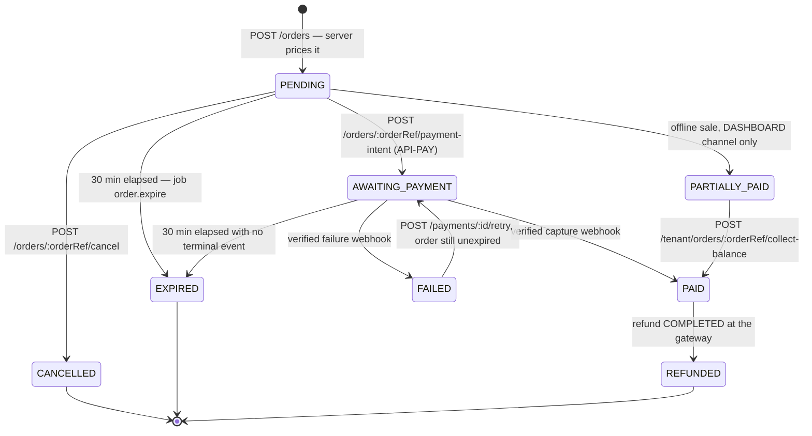
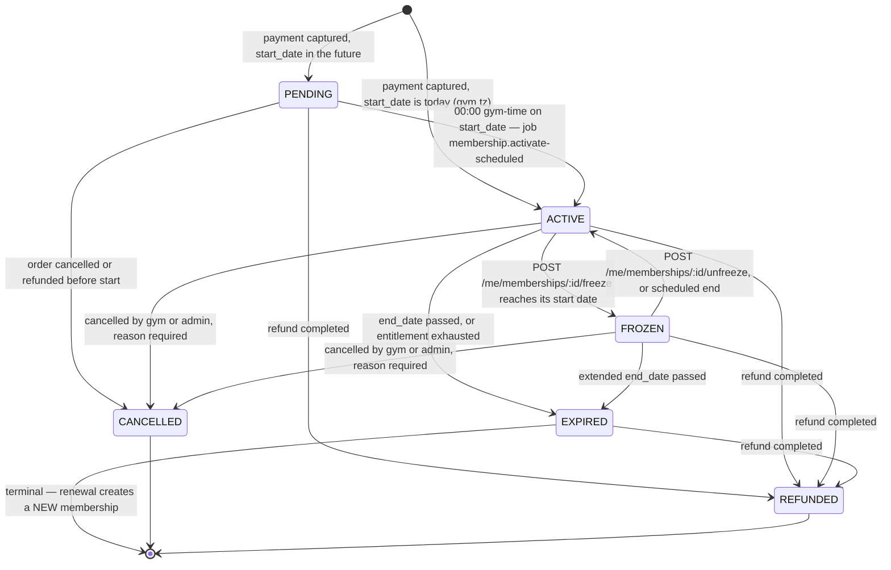

# `API-ORD` · `API-MEMB` · `API-CHK` — Orders, Memberships and Check-in: the frozen endpoint contract

**Modules:** `ordering`, `memberships`, `attendance` · **Groups:** `ORD` `MEMB` `CHK` · **Surface
count:** 23 endpoints (7 `ORD` + 10 `MEMB` + 6 `CHK`), all authenticated, none public, none
streaming · **Status:** contract frozen, no code written · **Launch market:** India
(`LAUNCH_MARKET_INDIA.md`) · **Timezone of every business date below:** `Asia/Kolkata`, UTC+05:30,
no DST.

---

## 0. Document control

| Aspect | Value |
| :--- | :--- |
| Owns | The `API-ORD` rows of `API_Catalog.md` §3.5 (7 of 9), the `API-MEMB` rows of §3.7 (10 of 12) and the `API-CHK` rows of §3.8 (6 of 7), in per-endpoint detail |
| Authoritative index | **`docs/engineering/API_Catalog.md`** — the master endpoint table, the conventions, the error registry, the twelve rate-limit classes, the permission grammar, the status-code contract. This document **cites** it and never restates it |
| Governing law | `PROJECT_CONSTITUTION.md` §13 (Error Handling Law) and §14 (API Rules). Nothing here may contradict either; where a lower-rank artefact does, §1.3 and §1.4 record the correction |
| Product source | `MASTER_PRD.md` `B5.9` (`CART`), `B5.12` (`MEMB`), `B5.13` (`CHK`); `A8.2`–`A8.4`, `A8.6`, `A8.8` (business rules); `A7.2` and `A7.4` (business processes); `C3.1`/`C3.2`/`C3.3` (conventions, catalogue, representative contracts); `C4.1`/`C4.2`/`C4.8` (state machines and reason taxonomies); `C5` (background jobs) |
| Physical model | `docs/database/Schema.md` §7.1 `orders`, §7.2 `order_items`, §7.3 `coupons` + `coupon_redemptions`, §6.1 `plans`, §6.2 `plan_branches` + `add_ons`, §8.1 `memberships`, §8.2 `membership_events` + `freezes`, §8.3 `attendance`, §13.2 `idempotency_keys`, §13.1 `outbox` |
| Enforcement split | `docs/database/Constraints.md` §13.2 (`BR-PLN`), §13.3 (`BR-MEM`), §13.4 (`BR-PAY`), §13.6 (`BR-CHK`), §13.8 (`BR-CPN`). **Everything those matrices grade `NONE` or `PARTIAL` is this layer's job**, and each endpoint below names which |
| Rule detail | `docs/engineering/BusinessRules.md` §7 (`BR-PLN`), §8 (`BR-MEM`), §11 (`BR-CHK`) — enforcement layers, failure modes, positive and negative test ids |
| Security | `docs/engineering/Security.md` — the permission model, `RL-SCAN`/`RL-PAY`/`RL-WRITE`/`RL-READ` tiers, branch-assignment authorisation (`AZ8`), `RSK-03` credential sharing |
| Screens served | `SCR-WEB-005` Checkout · `SCR-WEB-007` Order Confirmation · `SCR-WEB-009` Membership Detail & QR · `SCR-WEB-010` Visit History · `SCR-WEB-011` Orders & Invoices · `SCR-DASH-007` Member List · `SCR-DASH-009` Check-in Desk · `SCR-DASH-010` Attendance Log |
| Not owned here | `POST /v1/orders/:orderRef/payment-intent`, `GET /v1/payments/:id`, `POST /v1/payments/:id/retry`, `POST /v1/webhooks/payments/:provider` → `docs/apis/Payments.md`. `GET /v1/me/invoices`, `GET /v1/me/invoices/:id/pdf`, `GET /v1/me/memberships/:id/refund-preview`, `GET /v1/tenant/memberships/:id`, `GET /v1/tenant/attendance/live`, `POST /v1/tenant/orders/offline` → §1.5 names each and its owning document |

> **Every fenced block in this document is labelled `illustrative — not committed code`. No
> application code exists. Zod sketches, TypeScript fragments, mermaid diagrams and JSON bodies here
> are *the contract*, expressed in the notation the implementation will use. They are not the
> implementation, and nothing in them may be copied into a repository as-is.**

---

## 1. Position, precedence, and four corrections to the source set

### 1.1 The non-duplication contract

`API_Catalog.md` §0 fixes its own boundary: it is the index and the conventions; per-endpoint detail
lives in `/docs/apis/`. This document is the `ordering` + `memberships` + `attendance` third of that
split.

| Convention | Defined in | What this document does |
| :--- | :--- | :--- |
| Base URL `https://api.<domain>/v1`, URL versioning | `API_Catalog.md` §1.1 | Cites. Every path below is relative to it |
| `snake_case` everywhere; `_minor` money as **strings** with an adjacent `currency`; no monetary field in any request schema | §1.2.1 R1–R8, §1.2.3 M1–M6 | Cites. Every amount below is a string of **paise** |
| Timestamps ISO-8601 UTC with `Z`; business dates `YYYY-MM-DD` with the interpreting timezone documented per field | §1.2.4 T1–T5 | Cites, and §2.2 states the one interpreting timezone this surface uses |
| Tenant derived from the token or the resource, **never** from the client | §1.5, rows 2 and 3 | Cites. §2.4 states which of the 23 endpoints resolve by row 2 and which by row 3 |
| Idempotency: 24-hour PostgreSQL store, five-component fingerprint, three states | §1.6.1–§1.6.6 | Cites. §2.5 gives the per-endpoint key source; §9.1 shows the `token_nonce` derivation in full |
| Cursor pagination, `limit` + `cursor` + `next_cursor`, no offset | §1.7, ADR-0023 | Cites. Four endpoints here are collections; each names its sort allowlist |
| Error envelope `code` / `message` / `details` / `correlation_id` | §1.9 EV1–EV7 | Cites. §12 is the consolidated per-code slice for this surface |
| Rate-limit headers and the twelve classes | §1.10, §4.2 | Cites. §2.6 gives the per-endpoint class and the reason it is that class |
| Cache tokens `NO-STORE` / `NO-STORE!` / `PRIVATE-30` | §1.11 | Cites |
| Permission grammar `<module>.<resource>.<action>` | §5.1, §5.6 | Cites. §2.3 extends the `B3.2` mapping for these three groups |
| Status-code contract, `422` vs `409`, `403` vs `404`, **denial is `200`** | §2.1–§2.5 | Cites. §5 and §9.1 are the full working-out of §2.4 |
| Error-code registry rules, retryability semantics | §6.1, §6.2 | Cites. §12 is the `ordering` + `memberships` + `attendance` slice, expanded per endpoint |

### 1.2 Correction 1 — the path parameters are `:orderRef` and `:id`, not `:ref`

`MASTER_PRD.md` `§C3.2` writes the order paths as `/orders/:ref`, `/orders/:ref/coupon`,
`/orders/:ref/validate`, `/orders/:ref/cancel`. `API_Catalog.md` §3.5 writes them as `:orderRef`.
These are the same parameter. The catalogue's spelling is the normalised one and is what the route
table, the idempotency fingerprint (§1.6.3 component 2 is *the resolved route pattern*) and the
generated OpenAPI document will carry. **This document uses `:orderRef` throughout.** A naming
normalisation, not a defect in either source. The same applies to `/checkin/:id/checkout`, where
`:id` is the **attendance id**, not the membership id — §9.3 states it explicitly because the
ambiguity is real.

### 1.3 Correction 2 — a real error in `API_Catalog.md` §2.4: steps 9 and 10 are transposed

**This must be fixed in the master index before Sprint 6.**

| Source | Steps 7 → 10 of the validation sequence |
| :--- | :--- |
| `MASTER_PRD.md` `FR-CHK-04` (rank 1 product source) | … → **gym open (or plan grants 24h)** → within plan access window → **not within duplicate cooldown** → **entitlement remaining** |
| `BusinessRules.md` §11 flowchart, nodes `H`→`K` | … → gym open or 24h plan → within plan access window → **outside duplicate cooldown** → **entitlement remaining** |
| `API_Catalog.md` §2.4 prose | … → **within operating hours** → within plan access window → **sessions remaining** → **not a duplicate within cooldown** |

`FR-CHK-04` and `BusinessRules.md` agree; `API_Catalog.md` §2.4's prose transposes the last two
steps. **`FR-CHK-04` is authoritative and this document implements its order.** The transposition is
not cosmetic:

1. **It changes the denial reason a member sees.** A member on a `SESSION` plan whose entitlement is
   exhausted, who steps out for a phone call and re-scans eight minutes later, gets
   `DUPLICATE_WITHIN_COOLDOWN` under `FR-CHK-04` — benign, no entitlement consumed, they are already
   inside — and `NO_SESSIONS_REMAINING` under the transposed order, which sends the receptionist to
   open a top-up sale for a member who is standing in the gym they already paid for.
2. **It changes what is written.** `BR-CHK-04` requires the duplicate row to be written **without**
   decrementing entitlement. Evaluating entitlement first makes the duplicate branch unreachable for
   an exhausted plan, so the `decremented_entitlement = false` row that `FR-CHK-13` peak analysis and
   the session-dispute audit both depend on is never produced.
3. **It is cheaper in that order anyway.** The cooldown check is one index probe on
   `idx_attendance__membership_id_checked_in_at`, which the handler has already warmed reading the
   membership; the entitlement check is arithmetic on a row already in memory. Neither dominates, but
   the cooldown probe can short-circuit before the entitlement decision has to be reasoned about at
   all.

`API_Catalog.md` §2.4's **conclusion** — that a denial is `200` — is unaffected and is reproduced
faithfully in §5 and §9.1. Only the step order in that one paragraph is wrong. Logged as open item
`O-MEMB-1` (§13).

### 1.4 Correction 3 — five error codes are spelled two ways across the source set

`BusinessRules.md` §7–§8 quotes short-form codes in its test descriptions; `API_Catalog.md` §6 is the
registry, and §6.1 makes the registry the single source (*"CI fails if a thrown domain error maps to
a code absent from the registry"*). **The registry spelling wins everywhere in this document.**

| `BusinessRules.md` spelling | `API_Catalog.md` §6 registry spelling | HTTP |
| :--- | :--- | :-: |
| `FREEZE_NOT_PERMITTED` | **`FREEZE_NOT_PERMITTED_BY_PLAN`** | 422 |
| `FREEZE_ALLOWANCE_EXCEEDED` | **`FREEZE_ALLOWANCE_EXHAUSTED`** | 422 |
| `FREEZE_RETROACTIVE` | **`FREEZE_RETROACTIVE_NOT_PERMITTED`** | 422 |
| `FREEZE_TOO_FAR_AHEAD` | **`FREEZE_START_TOO_FAR_AHEAD`** | 422 |
| `CONCURRENT_MEMBERSHIP_CONFLICT` | **`MEMBERSHIP_NOT_STACKABLE`** | 422 |

One further mismatch is **not** a spelling issue: `BusinessRules.md` `BR-PLN-03-N2` names
`422 PLAN_UNAVAILABLE`, and **no such code exists in the registry**. The registry's §6.6 carries three
codes that between them cover the case with more precision, and this document uses them:
`PLAN_ARCHIVED` (the plan was archived mid-flow), `PLAN_NOT_PUBLISHED` (a `DRAFT` or `STAFF_ONLY`
plan reached a public flow — deliberately vague to the caller, `BR-PLN-05`) and
`PLAN_NOT_AVAILABLE_AT_BRANCH` (`plan_branches` excludes the chosen branch). `PLAN_UNAVAILABLE` must
**not** be added; three specific codes are strictly better than one generic one, and `NFR-USE-05`
requires the message to say what to do next, which a generic code cannot. Logged as `O-MEMB-2`.

### 1.5 What is not in this document, and where each piece lives

| Endpoint | Owner document | Why it is not here |
| :--- | :--- | :--- |
| `POST /orders/:orderRef/payment-intent` | `Payments.md` §4 | It is the money-movement boundary and it re-prices; `API-ORD` stops at the priced order |
| `GET /payments/:id`, `POST /payments/:id/retry`, `POST /webhooks/payments/:provider` | `Payments.md` §5–§7 | `API-PAY` |
| `GET /me/invoices`, `GET /me/invoices/:id/pdf` | `Billing.md` (Phase-5) | `API-ORD` rows 8 and 9 of §3.5, both `†`-derived, are `billing.*` permissions and belong with invoicing |
| `GET /me/memberships/:id/refund-preview` | `Refunds.md` (Phase-5) | `refunds.refund.preview`; the `200`-with-negative-result contract is §2.5 of the catalogue, worked out there |
| `GET /tenant/memberships/:id` | `Tenant.md` (Phase-5) | The tenant-side detail projection; `FR-MEMB-12` requires it to project the **same** `status` field this document defines, and the contract test asserts field-level equality against §8.2 |
| `GET /tenant/attendance/live` | `Tenant.md` (Phase-5) | The single A-08 polled endpoint. Its cache token `PRIVATE-30` and its mandatory `generated_at` are dashboard concerns |
| `POST /tenant/orders/offline`, `POST /tenant/orders/:orderRef/collect-balance` | `Tenant.md` (Phase-5) | The **only** endpoints that may produce `PARTIALLY_PAID` (`BR-PAY-09`). §11 states the boundary from this side |

**Endpoints that do not exist, and whose absence is a control:**

| Shape that does not exist | Why | Asserted by |
| :--- | :--- | :--- |
| Any request field named `price_minor`, `total_minor`, `amount_minor`, `discount_minor`, `tax_minor`, `plan_price_minor`, or any `*_bps` on any of the 23 request schemas | `BR-PAY-04`, constitution §14.4 CA1. `.strict()` makes sending one a `400 VALIDATION_FAILED` with `rule: "unknown_field"`, never a silent drop | `BR-PAY-04-N1`; a contract test enumerating every money field name against every request schema (`API_Catalog.md` §9.4 absence assertion 2) |
| `POST /orders/:orderRef/mark-paid`, `POST /me/memberships/:id/activate`, or anything that transitions a membership to `ACTIVE` from a client signal | `BR-PAY-02`, `FR-PAY-03`, ADR-0013. Activation is webhook-driven or staff-recorded offline payment, nothing else | `SEC-A04-004`; a structural assertion over the generated OpenAPI document |
| `PATCH /checkin/:id`, `DELETE /checkin/:id`, or any attendance mutation other than `checked_out_at` | `BR-CHK-09` — attendance is immutable; a correction is a second row carrying `corrects_attendance_id`. `Schema.md` §8.3 grants `UPDATE` on exactly two columns | `BR-CHK-09-N1`; the `append-only-grants` CI check |
| `POST /me/memberships/:id/cancel` on the member surface | Member-initiated exit is a **refund request** (`FR-RFND-03`) or an auto-renew toggle (`FR-MEMB-08`), not a status write. A member cannot write `CANCELLED` | Absence assertion; `C4.1` gives `CANCELLED` only a gym/admin/system trigger |
| Any partial-payment field on `POST /orders` | `BR-PAY-09`, `AC-CART-02.4` — online checkout never offers it. See §11 | `PARTIAL_PAYMENT_NOT_PERMITTED_ONLINE` is emitted by `API-PAY`, and the field does not exist here to reject |
| Any WebSocket, SSE or long-poll route | **A-08** — Phase 1 uses TanStack Query polling at 10–15 s. `NFR-SCAL-03` keeps the app tier stateless | Absence assertion over the generated document |

### 1.6 The 23 endpoints owned here

| § | Method | Path | Group | Permission | Scope | Idem | RL | Cache |
| :-- | :--- | :--- | :-: | :--- | :--- | :-: | :--- | :--- |
| 7.1 | POST | `/orders` | ORD | `ordering.order.create` | user | **REQ** | `RL-PAY` | `NO-STORE!` |
| 7.2 | GET | `/orders/:orderRef` | ORD | `ordering.order.read` | user | N/A | `RL-READ` | `NO-STORE!` |
| 7.3 | POST | `/orders/:orderRef/coupon` | ORD | `ordering.coupon.apply` | user | **REQ** | `RL-WRITE` | `NO-STORE!` |
| 7.4 | DELETE | `/orders/:orderRef/coupon` | ORD | `ordering.coupon.remove` | user | **REQ** | `RL-WRITE` | `NO-STORE!` |
| 7.5 | POST | `/orders/:orderRef/validate` | ORD | `ordering.order.validate` | user | OPT | `RL-PAY` | `NO-STORE!` |
| 7.6 | POST | `/orders/:orderRef/cancel` | ORD | `ordering.order.cancel` | user | **REQ** | `RL-WRITE` | `NO-STORE!` |
| 7.7 | GET | `/me/orders` | ORD | `ordering.order.list` | user | N/A | `RL-READ` | `NO-STORE!` |
| 8.1 | GET | `/me/memberships` | MEMB | `memberships.membership.list` | user | N/A | `RL-READ` | `NO-STORE` |
| 8.2 | GET | `/me/memberships/:id` | MEMB | `memberships.membership.read` | user | N/A | `RL-READ` | `NO-STORE` |
| 8.3 | POST | `/me/memberships/:id/freeze` | MEMB | `memberships.freeze.create` | user | **REQ** | `RL-WRITE` | `NO-STORE` |
| 8.4 | POST | `/me/memberships/:id/unfreeze` | MEMB | `memberships.freeze.end` | user | **REQ** | `RL-WRITE` | `NO-STORE` |
| 8.5 | POST | `/me/memberships/:id/renew` | MEMB | `memberships.membership.renew` | user | **REQ** | `RL-PAY` | `NO-STORE!` |
| 8.6 | PATCH | `/me/memberships/:id/auto-renew` | MEMB | `memberships.autorenew.update` | user | **REQ** | `RL-WRITE` | `NO-STORE!` |
| 8.7 | POST | `/me/memberships/:id/qr` | MEMB | `memberships.checkin_token.issue` | user | OPT | `RL-WRITE` | `NO-STORE!` |
| 8.8 | GET | `/me/attendance` | MEMB | `attendance.attendance.list` | user | N/A | `RL-READ` | `NO-STORE` |
| 8.9 | GET | `/tenant/memberships` | MEMB | `memberships.membership.list` | tenant | N/A | `RL-READ` | `NO-STORE` |
| 8.10 | POST | `/tenant/memberships/:id/transfer` | MEMB | `memberships.membership.transfer` | tenant | **REQ** | `RL-WRITE` | `NO-STORE` |
| 9.1 | POST | `/checkin/scan` | CHK | `attendance.checkin.scan` | tenant | **REQ** | `RL-SCAN` | `NO-STORE` |
| 9.2 | POST | `/checkin/manual` | CHK | `attendance.checkin.manual` | tenant | **REQ** | `RL-SCAN` | `NO-STORE` |
| 9.3 | POST | `/checkin/:id/checkout` | CHK | `attendance.checkout.record` | tenant | **REQ** | `RL-SCAN` | `NO-STORE` |
| 9.4 | POST | `/checkin/override` | CHK | `attendance.checkin.override` | tenant | **REQ** | `RL-SCAN` | `NO-STORE` |
| 9.5 | GET | `/tenant/attendance` | CHK | `attendance.attendance.list` | tenant | N/A | `RL-READ` | `NO-STORE` |
| 9.6 | GET | `/tenant/attendance/heatmap` | CHK | `attendance.attendance.aggregate` | tenant | N/A | `RL-READ` | `NO-STORE` |

Every row matches `API_Catalog.md` §3.5, §3.7 and §3.8 exactly. Where a row here carries detail the
catalogue does not — the key source, the sort allowlist, the exact denial taxonomy — that is
elaboration, not divergence.

---

## 2. Cross-cutting contracts on this surface

### 2.1 Money — what these endpoints return and what they will never accept

`BR-PAY-01` and `API_Catalog.md` §1.2.3 govern absolutely. Restated only where this surface adds
something:

| Rule | Statement on this surface |
| :--- | :--- |
| MO-1 | Every amount is a **string of paise** with an adjacent `"currency": "INR"`. `"472000"` is ₹4,720.00. A JSON number is never used, because `bigint` exceeds JSON's safe integer range and because a number invites a client to add two of them |
| MO-2 | The order breakdown is the seven-line shape of `FR-CART-03`: `plan_price_minor`, `joining_fee_minor`, `add_ons_minor`, `discount_minor`, `net_minor`, `tax_minor`, `total_minor` — **each a separate visible line**, plus `tax_components[]` for India |
| MO-3 | `tax_components[]` carries **CGST 9% + SGST 9% as two rows**, never one combined 18% row (`LAUNCH_MARKET_INDIA.md` §4). `component` is an **open enum** — `IGST` appears on the inter-state edge and clients must tolerate it. The scalar `tax_minor` is the sum, so a client that renders only a total is unaffected |
| MO-4 | Rates in responses are integer basis points: `rate_bps: 900` is 9%. A rate is **never** accepted in a request (§14.4 CA6) |
| MO-5 | The five figures `commission_base_minor`, `commission_minor`, `commission_rate_bps`, `gateway_fee_minor` and `payable_to_gym_minor` exist on `orders` (`Schema.md` §7.1) and are **never returned on a `/me` route**. A member has no business knowing the platform's take. They appear on tenant settlement surfaces only |
| MO-6 | `₹2,50,000` lakh/crore grouping is a **presentation** concern for the single formatter in `packages/utils`. The wire never carries a formatted amount |

### 2.2 Time — one timezone, and the 18:30 UTC midnight

`BR-MEM-03`: *"A membership's validity is `[start_date, end_date]` inclusive, computed in the gym's
timezone, not the member's."* For every Phase-1 tenant that timezone is `Asia/Kolkata`.

| Field class | Wire form | Interpreting timezone | Note |
| :--- | :--- | :--- | :--- |
| `start_date`, `end_date`, `original_end_date`, `starts_on`, `ends_on`, `date` filters | `YYYY-MM-DD` | **The gym's** (`Asia/Kolkata`) | Inclusive on both ends |
| `created_at`, `expires_at`, `checked_in_at`, `checked_out_at`, `issued_at`, `occurred_at` | ISO-8601 UTC with `Z` | UTC | Never an offset, never an epoch integer |
| `days_remaining`, `freeze_days_used`, `freeze_days_remaining`, `cooldown_minutes`, `ttl_seconds`, `duration_minutes` | integer, unit in the name | — | `T4` — no ISO-8601 durations |

**The consequence a client must handle.** Midnight gym-time is **18:30 UTC the previous day**. A
membership ending `2026-11-30` stops permitting check-in at `2026-11-30T18:29:59Z`. A client that
computes `days_remaining` from a UTC `now()` will be wrong by one day for five and a half hours out
of every twenty-four. **`days_remaining` is therefore computed server-side and returned**; it is not
derivable safely on the client and no endpoint here expects the client to try.

**Future-dated activation.** `AC-CART-01.1`: a membership bought with a future start date is created
`PENDING` and transitions to `ACTIVE` at **00:00 gym-time on the start date** — 18:30 UTC the day
before — by the `membership.activate-scheduled` job (`C5`), not by the first request that happens to
notice. A `PENDING` membership presenting a QR is denied `MEMBERSHIP_PENDING_START` (`AC-CART-01.2`),
which is a `200` (§5).

### 2.3 `B3.2` capability → permission mapping for these three groups

`API_Catalog.md` §5.6 gives representative rows; this is the complete mapping for the 23 endpoints.
Legend as `B3.2`: ● full · ▪ own/assigned only · ○ read only · — none.

| `B3.2` capability | Roles | Permission string | Endpoints |
| :--- | :--- | :--- | :--- |
| Purchase membership | `USER` ● `MEMBER` ● | `ordering.order.create`, `ordering.order.validate`, `ordering.order.cancel`, `ordering.coupon.apply`, `ordering.coupon.remove` | §7.1, §7.3–§7.6 |
| Download own invoice / view own orders | `USER` ● `MEMBER` ● | `ordering.order.read`, `ordering.order.list` | §7.2, §7.7 |
| View own memberships | `USER` ○ `MEMBER` ● | `memberships.membership.list`, `memberships.membership.read` | §8.1, §8.2 |
| Manage own membership term | `MEMBER` ● | `memberships.freeze.create`, `memberships.freeze.end`, `memberships.membership.renew`, `memberships.autorenew.update` | §8.3–§8.6 |
| Generate own check-in QR | `MEMBER` ● — **and no other role, ever** | `memberships.checkin_token.issue` | §8.7 |
| View own visit history | `MEMBER` ● | `attendance.attendance.list` (ownership-guarded to `sub`) | §8.8 |
| Scan / record check-in | `RECEPT` ● `TRAINER` ● `MANAGER` ● `OWNER` ● | `attendance.checkin.scan`, `attendance.checkin.manual`, `attendance.checkout.record` | §9.1–§9.3 |
| Manual check-in override | `RECEPT` ● `MANAGER` ● `OWNER` ● `S.ADMIN` ● — **not `TRAINER`** | `attendance.checkin.override` | §9.4 |
| View branch attendance | `RECEPT` ▪ `TRAINER` ▪ `MANAGER` ● `OWNER` ● `SUPPORT` ○ `S.ADMIN` ○ | `attendance.attendance.list`, `attendance.attendance.aggregate` | §9.5, §9.6 |
| Edit member record (tenant membership view) | `RECEPT` ▪ `MANAGER` ● `OWNER` ● `SUPPORT` ○ `S.ADMIN` ○ | `memberships.membership.list` (tenant scope) | §8.9 |
| Transfer a membership | `MANAGER` ● `OWNER` ● `S.ADMIN` ● | `memberships.membership.transfer` | §8.10 |

**Three authorisation rules the decorator alone does not carry** (`API_Catalog.md` §5.3):

1. **`AZ8` — branch assignment is authorisation, not filtering.** A `RECEPTIONIST` assigned to
   Bandra West who calls `POST /checkin/scan` with `branch_id` = Andheri East receives
   **`403 BRANCH_NOT_ASSIGNED_TO_STAFF`**, not an empty result and not a `WRONG_BRANCH` denial. The
   `▪` in `B3.2` is this guard (`FR-STAF-03`, `AC-STAF-01.1`).
2. **Ownership guard on `/me`.** `memberships.membership.read` does not grant reading *any*
   membership; the guard asserts `membership.user_id = sub` before the use case runs. A membership
   belonging to another user is **`404 RESOURCE_NOT_FOUND`**, never `403` (§2.3 of the catalogue).
3. **`FR-RBAC-03` — the tenant on the resource wins.** A `GYM_MANAGER` of tenant A with a valid
   session requesting tenant B's membership is refused by the resource check before RLS refuses the
   row, and the answer is `404`.

`TRAINER` is deliberately excluded from override. A trainer who can override a denial can admit a
personal client whose membership expired, and `FR-STAF-05`'s per-staff override report exists
precisely because override is the fraud channel.

### 2.4 Tenant derivation per endpoint

| Endpoints | Derivation row (`API_Catalog.md` §1.5) | Mechanism |
| :--- | :--- | :--- |
| All 7 `ORD` + §8.1–§8.8 (`/me/*`) | **Row 2 — the principal, not a tenant** | RLS session is set to *user* scope. Tenant-owned rows are reachable only through the explicit ownership join: the membership or order the caller holds. `POST /orders` resolves the tenant **from the plan**, which is row 1 applied to a body identifier — and the plan must already have passed the `APPROVED` + non-suspended + `PUBLIC` filter |
| §8.9, §8.10, §9.1–§9.6 (`/tenant/*` and `/checkin/*`) | **Row 3 — the access token's `tenant_context`** | Established at login or by `POST /auth/tenant-context`. Absent → `403 TENANT_CONTEXT_REQUIRED`. Every one of these executes `SET LOCAL app.tenant_id` inside its transaction through the mandatory Prisma extension (ADR-0005, TD3) and carries `@TenantScoped()`, so every one appears in the isolation-suite inventory (TD6) |

`POST /checkin/scan` deserves its own line because it looks like an exception and is not. The QR
token carries a `tenant_id` in its **signed payload**. That value is *never* used to select the
tenant context — the scanning staff member's `tenant_context` is. The token's `tenant_id` is compared
against it at step 5, and a mismatch is `TOKEN_INVALID`, not `WRONG_BRANCH`, because disclosing that
a valid membership exists at another tenant is a `BR-TEN-01` leak (`BR-CHK-03-N2`).

### 2.5 Idempotency posture, key source, and what a replay returns

`API_Catalog.md` §1.6 defines the machinery. Per endpoint:

| Endpoint | Posture | Key source | Replay returns |
| :--- | :-: | :--- | :--- |
| `POST /orders` | **REQ** | Client UUID v4, **one per checkout attempt**, reused across payment initiation (`FR-CART-06`). Also persisted on `orders.idempotency_key` with a **globally unique** index | The original `201` body byte-for-byte, including the same `order_ref` |
| `POST /orders/:orderRef/coupon` | **REQ** | Client UUID per apply action | The original `200`; **no second `coupon_redemptions` row and no second increment of `coupons.redemption_count`** |
| `DELETE /orders/:orderRef/coupon` | **REQ** | Client UUID per remove action | The original `200` |
| `POST /orders/:orderRef/validate` | OPT | Honoured if supplied | The stored evaluation. Safe either way — it writes nothing |
| `POST /orders/:orderRef/cancel` | **REQ** | Client UUID | The original `200`; the coupon hold is released once |
| `POST /me/memberships/:id/freeze` · `/unfreeze` · `/renew` · `PATCH /auto-renew` | **REQ** | Client UUID per action | The original body. `freeze` is the dangerous one: a double tap without a key extends `end_date` twice |
| `POST /me/memberships/:id/qr` | OPT | Honoured if supplied | The **same token** if within its 60 s TTL; a mint is cheap and a fresh token on retry is also correct, which is why this is OPT and not REQ |
| `POST /tenant/memberships/:id/transfer` | **REQ** | Client UUID | The original body |
| `POST /checkin/scan` | **REQ** | **The QR token's `nonce`** — `§C3.3` shows `Idempotency-Key: <token_nonce>` literally | **The original attendance record**, `result` and all (`BR-CHK-06`, `AC-CHK-01.4`). §9.1 gives the two-layer mechanism |
| `POST /checkin/manual` | **REQ** | Client UUID per desk action | The original attendance record |
| `POST /checkin/:id/checkout` | **REQ** | Client UUID | The original `200` with the recorded `checked_out_at` |
| `POST /checkin/override` | **REQ** | Client UUID | The original override attendance record |

`ID-D` is binding: a missing key on a REQ endpoint is **`400 IDEMPOTENCY_KEY_REQUIRED`**, never a
silent execution. `ID-A` is binding too: the interceptor is the fast path, and
`uq_orders__idempotency_key`, `uq_attendance__checked_in_at_token_nonce` and the Redis nonce gate are
the truth.

### 2.6 Rate-limit class per endpoint, and why

| Class | Endpoints | Keyed on | Reason it is this class |
| :--- | :--- | :--- | :--- |
| `RL-PAY` (tier 3 — 10/min per user, 60/min per tenant, **5/min per order**) | §7.1, §7.5, §8.5 | user + tenant + order | These create or re-price a commercial record and the per-order key stops a checkout page from re-validating in a loop. Combined with idempotency, a burst produces **one** order (`NFR-SEC-06`, §12.8 tier 3) |
| `RL-WRITE` (tier 4 — 60/min per user, 600/min per tenant) | §7.3, §7.4, §7.6, §8.3, §8.4, §8.6, §8.7, §8.10 | user + tenant + IP | Ordinary authenticated mutations. §8.7 sits here rather than in a read class because a QR mint is a signing operation |
| `RL-SCAN` (tier 4 — **600/min per branch**, 60/min per staff device, burst 30) | §9.1–§9.4 | **branch** + staff device | `NFR-PERF-08` requires 500 check-ins/minute platform-wide. A front desk scans many *different* members from **one** device and **one** staff session, so a per-user key would throttle the busiest gym at 07:00 exactly when it must not |
| `RL-READ` (tier 6 — 300/min per user, 3,000/min per tenant) | §7.2, §7.7, §8.1, §8.2, §8.8, §8.9, §9.5, §9.6 | user + tenant + IP | Must accommodate the A-08 dashboard poll without tripping; three tabs polling at 10 s costs 18/min |

If Redis is unavailable the limiter **fails closed for tiers 1–3 and open for tiers 4–8** (`RLM3`).
That means `POST /orders` starts refusing and `POST /checkin/scan` keeps working — the correct
ordering, because `NFR-AVL-02` ranks check-in highest and `NFR-AVL-03` forbids a non-critical
dependency from blocking a critical path. A member cannot be locked out of a gym they have paid for
because a cache node died.

---

## 3. The order state machine (`§C4.2`)



| From | To | Trigger | Guard | Written by |
| :--- | :--- | :--- | :--- | :--- |
| — | `PENDING` | `POST /orders` | Plan sellable, buyer eligible, price computed | §7.1 |
| `PENDING` | `AWAITING_PAYMENT` | Payment intent created | Order unexpired; **re-price passes** (`BR-PLN-03`) | `Payments.md` §4 |
| `PENDING` | `CANCELLED` | `POST /orders/:orderRef/cancel` | Status is exactly `PENDING` | §7.6 |
| `PENDING` / `AWAITING_PAYMENT` | `EXPIRED` | `order.expire` job, 30 min after `created_at` | No captured payment | `C5` |
| `PENDING` | `PARTIALLY_PAID` | Offline sale with a shortfall | **`channel = 'DASHBOARD'`** — `ck_orders__partial_paid_offline_only` | `Tenant.md`; §11 |
| `AWAITING_PAYMENT` | `PAID` | Verified capture webhook | Signature valid, event id new, **amount matches** | `Payments.md` §7 |
| `AWAITING_PAYMENT` | `FAILED` | Verified failure webhook | — | `Payments.md` §7 |
| `FAILED` | `AWAITING_PAYMENT` | `POST /payments/:id/retry` | Order unexpired (`FR-PAY-06`) | `Payments.md` §6 |
| `PARTIALLY_PAID` | `PAID` | Balance collected | Sum of payments equals total | `Tenant.md` |
| `PAID` | `REFUNDED` | Refund reaches `COMPLETED` | `uq_refunds__order_id__completed` (`BR-REF-09`) | `Refunds.md` |

**Invariants.**

| # | Statement | Enforced |
| :-: | :--- | :--- |
| OI-1 | The **nine money figures are frozen once `status = 'PAID'`**, except that `gateway_fee_minor` and `payable_to_gym_minor` may transition **once** from `NULL` to a value | `trg_orders__freeze_money_after_paid` (`Schema.md` §2.8.1) |
| OI-2 | `net_minor = gross_minor − discount_minor` and `discount_minor ≤ gross_minor` on every row in every state | `ck_orders__net_equals_gross_minus_discount`, `ck_orders__discount_not_exceeding_gross` (`BR-CPN-04`) |
| OI-3 | `SUM(order_items.line_total_minor) = orders.gross_minor`. Asserted at creation and by `finance.reconcile`, **not** by a constraint — a cross-row sum is not expressible in a `CHECK` | §7.1 side effects |
| OI-4 | An order carries **at most one coupon**. Enforced by `orders.coupon_id` being a single nullable column, not a join table (`BR-CPN-02`) | Structural |
| OI-5 | `PARTIALLY_PAID` is unreachable from `channel = 'WEB'` | `ck_orders__partial_paid_offline_only` (`BR-PAY-09`, **FULL** per `Constraints.md` §13.4) |
| OI-6 | An `EXPIRED` order is `410`, not `404`. It existed; it is gone **in this form**; a new order is the remedy | §7.2 errors |

---

## 4. The membership state machine (`§C4.1`)



| From | To | Trigger | Guards | `membership_events.reason` |
| :--- | :--- | :--- | :--- | :--- |
| — | `PENDING` | Order paid, future start | Payment captured (`BR-PAY-02`) | `PAYMENT_CAPTURED` / `OFFLINE_PAYMENT_RECORDED` |
| — | `ACTIVE` | Order paid, start today | Payment captured | `PAYMENT_CAPTURED` |
| `PENDING` | `ACTIVE` | `membership.activate-scheduled` at 00:00 gym-time | Not cancelled | `START_DATE_REACHED` |
| `PENDING` | `CANCELLED` | Order cancelled or refunded before start | — | `ORDER_CANCELLED` |
| `ACTIVE` | `FROZEN` | Freeze reaches `starts_on` | Plan allows; allowance remaining; dates valid | `FREEZE_REQUESTED` |
| `FROZEN` | `ACTIVE` | Unfreeze, manual (§8.4) or scheduled | — | `FREEZE_ENDED` |
| `ACTIVE` / `FROZEN` | `EXPIRED` | `membership.expire` in gym tz, or entitlement hits zero | — | `END_DATE_REACHED` / `ENTITLEMENT_EXHAUSTED` |
| `ACTIVE` / `FROZEN` / `PENDING` | `CANCELLED` | Cancellation without refund | **Reason required**; gym or admin actor only | `CANCELLED_BY_GYM` / `ADMIN_CORRECTION` |
| any | `REFUNDED` | Refund reaches `COMPLETED` | Executed at the gateway | `REFUND_COMPLETED` |
| `EXPIRED` | — | *(terminal)* | **A membership is never reactivated.** Renewal creates a new row with `renewed_from_membership_id` set | — |

**Invariants.**

| # | Statement | Enforced |
| :-: | :--- | :--- |
| MI-1 | A membership in `ACTIVE` always satisfies `start_date ≤ today ≤ end_date` **in the gym's timezone**. Not a `CHECK` — `today` is not a database concept (`TM4`) | `L5-DOM` + `membership.expire` job |
| MI-2 | `end_date` is never `NULL` | `NOT NULL` |
| MI-3 | **Every transition writes a `membership_events` row** with actor, timestamp, reason and, where financial, the order or refund id (`FR-MEMB-02`) | `L5-DOM`; `membership_events` is `G-APPEND` — `SELECT, INSERT` only |
| MI-4 | At most one non-stackable membership per `(user_id, gym_id)` in `PENDING`/`ACTIVE`/`FROZEN` | `uq_memberships__user_gym_active_nonstackable`, partial unique — **`BR-MEM-04` is FULL at `L1-DB`** |
| MI-5 | `purchased_price_minor`, `purchased_terms`, `is_stackable`, `sessions_total`, `origin` are **frozen at insert**. A later plan edit never reaches an existing membership (`BR-PLN-02`) | `Schema.md` §2.8.1 immutability trigger |
| MI-6 | `sessions_used` and `freeze_days_used` are denormalised counters with **zero permitted staleness**. A reconciliation difference against `attendance` or `freezes` is a **P1 incident**, not a nightly fix | Written inside the same transaction as the effect |
| MI-7 | The member's view (§8.2) and the gym's view (`GET /tenant/memberships/:id`) project **the same `status` field from the same state machine**. There is no separate gym-side status concept (`FR-MEMB-12`) | Contract test asserting field-level equality |

---

## 5. The check-in decision — `FR-CHK-04`, its sequence, and its latency budget

### 5.1 The ten steps, in order, first failure returned

`FR-CHK-04` fixes the order so that the denial reason is **deterministic** rather than whichever
check happened to run first. §1.3 records that `API_Catalog.md` §2.4 transposes the last two; this is
the correct order.

| # | Check | Denial reason on failure | Cost | Reads |
| :-: | :--- | :--- | :--- | :--- |
| 1 | **Signature valid** — EdDSA Ed25519 over the payload, `kid` in the active verifier set | `TOKEN_INVALID` | ~50 µs CPU | Key set in memory |
| 2 | **Not expired** — `now ≤ exp` **and** `exp − iat ≤ 60 s`, both against **server** time | `TOKEN_EXPIRED` | ~1 µs | Nothing |
| 3 | **Membership exists** — the payload's `membership_id` resolves under the scanner's tenant context | `TOKEN_INVALID` | 1 index probe | `memberships` PK |
| 4 | **Status is `ACTIVE`** | `MEMBERSHIP_EXPIRED` · `MEMBERSHIP_FROZEN` · `MEMBERSHIP_PENDING_START` · `MEMBERSHIP_CANCELLED` · `MEMBERSHIP_REFUNDED` · `MEMBERSHIP_UNDER_REVIEW` | 0 — same row | — |
| 5 | **Tenant matches** — token `tenant_id` equals the scanner's resolved `tenant_context` | `TOKEN_INVALID` (**not** `WRONG_BRANCH` — no disclosure) | 0 | — |
| 6 | **Branch permitted** — `branch_id` ∈ `purchased_terms.entitled_branch_ids` | `WRONG_BRANCH` | 0 — snapshot on the row | — |
| 7 | **Gym open, or the plan grants 24-hour access** — `branch_hour_exceptions` for the date **overrides** `branch_hours` for the weekday | `GYM_CLOSED_EXCEPTION` (declared closure) · `OUTSIDE_OPERATING_HOURS` (ordinary hours) | 2 cached reads | `branch_hours`, `branch_hour_exceptions` |
| 8 | **Within the plan's access window** — `purchased_terms.access_window`; empty means 24-hour | `OUTSIDE_PLAN_ACCESS_WINDOW` | 0 — snapshot | — |
| 9 | **Not within the duplicate cooldown** — most recent `ALLOWED` row for this membership **at this branch** within `cooldown_minutes` (default 60) | `DUPLICATE_WITHIN_COOLDOWN` — **recorded, entitlement NOT decremented** | 1 index probe | `idx_attendance__membership_id_checked_in_at` |
| 10 | **Entitlement remaining** — `sessions_total IS NULL` (duration plan) or `sessions_used < sessions_total` | `NO_SESSIONS_REMAINING` | 0 — same row | — |

A sixteenth condition sits **outside** the sequence: `TENANT_SUSPENDED`. It is evaluated at step 5
alongside the tenant match, and it fires only for a tenant suspended **for cause** — never for
subscription arrears, because `BR-TEN-06` states plainly that *"check-in for existing members is
never blocked by subscription arrears"* and `BR-TEN-05` states that a suspended tenant's *"existing
active memberships continue to permit check-in until their natural expiry"*. **No check-in code path
reads `tenants.subscription_status`**, and that absence is asserted (`INV-TEN-5`,
`BusinessRules.md` §18.5).

### 5.2 The sequence diagram

```mermaid
sequenceDiagram
    autonumber
    participant M as Member phone<br/>(SCR-WEB-009)
    participant API as NestJS API
    participant R as Redis 7
    participant PG as PostgreSQL 16
    participant S as Scanner tablet<br/>(SCR-DASH-009)

    M->>API: POST /me/memberships/:id/qr
    API->>API: mint Ed25519 token — 60 s TTL, nonce, kid
    API-->>M: 201 { token, expires_at, ttl_seconds: 60 }
    Note over M: QR rendered with countdown,<br/>auto-refresh at 60 s (FR-CHK-01)

    S->>S: camera decodes QR
    S->>API: POST /checkin/scan<br/>Idempotency-Key: <token_nonce><br/>{ token, branch_id }
    API->>API: guards — authn, permission attendance.checkin.scan,<br/>branch assignment (AZ8), RL-SCAN
    API->>R: SET NX nonce:<n> EX 60
    alt nonce already held (replay within TTL)
        R-->>API: 0 — collision
        API->>PG: SELECT the original attendance row by token_nonce
        PG-->>API: original row
        API-->>S: 200 — the ORIGINAL result (BR-CHK-06, AC-CHK-01.4)
    else nonce claimed
        R-->>API: 1 — claimed
        API->>PG: BEGIN; SET LOCAL app.tenant_id
        API->>PG: steps 3–10 — membership, branch hours, cooldown probe
        alt all ten pass
            API->>PG: INSERT attendance (result ALLOWED, decremented_entitlement)
            API->>PG: UPDATE memberships SET sessions_used = sessions_used + 1
            API->>PG: INSERT outbox (checkin.allowed)
        else any step fails
            API->>PG: INSERT attendance (result DENIED, denial_reason) — BR-CHK-10
            API->>PG: INSERT outbox (checkin.denied)
        end
        API->>PG: COMMIT
        API-->>S: 200 ALLOWED | 200 DENIED — never 4xx
    end
    Note over S: Success: photo, name, plan, days/sessions left.<br/>Denial: red state, specific reason,<br/>contextual actions (FR-CHK-05, FR-CHK-06)
```

### 5.3 The `NFR-PERF-03` latency budget — p95 ≤ 2 s scan to confirmation

`AC-CHK-01.1`: *"confirmation appears within 2 seconds at p95 and the scanner is immediately ready
for the next person."* The budget is stated per hop so that a regression is attributable rather than
argued about.

| Hop | p95 budget | Notes |
| :--- | ---: | :--- |
| Camera decode on the tablet, QR → string | 250 ms | Client-side; `SCR-DASH-009` full-screen mode keeps the viewfinder warm. Not server time |
| Network, Indian mobile/Wi-Fi, tablet → Mumbai edge | 120 ms | Single Indian region, Mumbai primary (`LAUNCH_MARKET_INDIA.md` §9) |
| TLS + HTTP parse + guard chain (authn, permission, branch assignment, rate limit) | 25 ms | Rate limiter is a Redis token bucket; the permission check reads a cached role grant |
| Redis `SET NX` nonce claim | 5 ms | Same-AZ Redis |
| Steps 1–2 — signature verify, expiry | 2 ms | Pure CPU, no I/O. **Runs before any database read, so a forged token costs nothing** |
| `BEGIN` + `SET LOCAL app.tenant_id` | 3 ms | One round trip, mandatory (TD3) |
| Steps 3–6, 8, 10 — membership read + snapshot evaluation | 15 ms | One PK probe; `purchased_terms` carries the entitled branch set and the access window, so **no joins** |
| Step 7 — branch hours + exceptions | 5 ms | Cached per branch per day; a miss is 2 index probes |
| Step 9 — cooldown probe | 10 ms | `idx_attendance__membership_id_checked_in_at`, current partition only |
| `INSERT attendance` + entitlement `UPDATE` + `INSERT outbox` | 25 ms | One transaction, current partition only |
| `COMMIT` (synchronous replica ack) | 20 ms | |
| Serialise + network return | 120 ms | |
| Render the confirmation panel | 100 ms | Client-side |
| **Total p95** | **~700 ms** | Against a 2,000 ms budget — **1.3 s of headroom**, which is the point: the budget must survive a slow tablet, a congested 4G cell and a cold cache simultaneously |

**Three things the budget forbids.** No synchronous notification send — the outbox row is the
notification trigger (`ADR-0017`). No synchronous sharing-detection — `BR-CHK-07` is the hourly
`attendance.sharing-scan` job precisely *because the decision is statistical and must not add latency
to the door*. No synchronous photo fetch — `member.photo_url` is a CDN URL the tablet resolves in
parallel with rendering.

**`NFR-PERF-08` — 500 check-ins/minute platform-wide.** `RL-SCAN` is 600/min **per branch**, so the
platform ceiling is a capacity question, not a limiter question. The check-in transaction touches the
current monthly partition only, which is what makes 50,000 rows/day affordable on a table that will
hold 18.25 M rows in year one.

---

## 6. The fifteen `§C4.8` check-in denial reasons

All fifteen, verbatim from `§C4.8` and `Schema.md` §2.5.4's `check_in_denial_reason_enum`. `result`
is a **closed** enum (`ALLOWED` | `DENIED`); `denial_reason` is a **closed** enum of exactly these
fifteen values. **None of them is a registry error code** (`API_Catalog.md` §6.1, §8.11) — they are
data, carried inside a `200`.

Each row gives the staff-facing message (`FR-CHK-06`, staff-appropriate language) and the
`suggested_actions[]` array the response carries. `suggested_actions` is an **open** enum: a client
must tolerate an unknown action by rendering nothing for it.

| # | `denial_reason` | Step | Staff-facing message | `suggested_actions` | Override allowed |
| :-: | :--- | :-: | :--- | :--- | :-: |
| 1 | `MEMBERSHIP_EXPIRED` | 4 | "Membership expired on 31 July 2026. Offer renewal — the sale flow will open pre-filled." | `RENEW`, `OVERRIDE` | ✅ |
| 2 | `MEMBERSHIP_FROZEN` | 4 | "Membership is frozen until 20 August 2026. The member can unfreeze from their app, or you can unfreeze here." | `UNFREEZE`, `OVERRIDE` | ✅ |
| 3 | `MEMBERSHIP_PENDING_START` | 4 | "Membership starts on 1 September 2026. It is paid for and confirmed — it simply has not begun." | `VIEW_MEMBERSHIP`, `OVERRIDE` | ✅ |
| 4 | `MEMBERSHIP_CANCELLED` | 4 | "Membership was cancelled on 12 July 2026. Sell a new plan if the member wants to rejoin." | `SELL_NEW_PLAN` | ❌ |
| 5 | `MEMBERSHIP_REFUNDED` | 4 | "Membership was refunded on 2 July 2026. Sell a new plan if the member wants to rejoin." | `SELL_NEW_PLAN` | ❌ |
| 6 | `WRONG_BRANCH` | 6 | "This plan does not include Andheri East. It is valid at Bandra West and Powai." | `VIEW_ENTITLED_BRANCHES`, `UPGRADE_PLAN`, `OVERRIDE` | ✅ |
| 7 | `OUTSIDE_OPERATING_HOURS` | 7 | "Bandra West is closed now. Opening hours today are 06:00–22:00." | `VIEW_HOURS`, `OVERRIDE` | ✅ |
| 8 | `OUTSIDE_PLAN_ACCESS_WINDOW` | 8 | "This is an off-peak plan. Access is 06:00–10:00 and 15:00–18:00; it is 12:40 now." | `UPGRADE_PLAN`, `OVERRIDE` | ✅ |
| 9 | `GYM_CLOSED_EXCEPTION` | 7 | "Bandra West is closed today for Independence Day. Reopens 16 August at 06:00." | `VIEW_CLOSURE`, `OVERRIDE` | ✅ |
| 10 | `NO_SESSIONS_REMAINING` | 10 | "All 12 sessions on this pack have been used. Offer a top-up." | `TOP_UP_SESSIONS`, `RENEW`, `OVERRIDE` | ✅ |
| 11 | `DUPLICATE_WITHIN_COOLDOWN` | 9 | "Already checked in at 07:12 today, 24 minutes ago. No session was deducted." | `DISMISS` | ❌ (nothing to override — they are inside) |
| 12 | `TOKEN_EXPIRED` | 2 | "This QR code has expired — codes last 60 seconds. Ask the member to refresh their screen." | `RETRY_SCAN`, `MANUAL_CHECKIN` | ❌ |
| 13 | `TOKEN_INVALID` | 1, 3, 5 | "This code could not be read. Ask the member to refresh, or check them in manually." | `RETRY_SCAN`, `MANUAL_CHECKIN` | ❌ |
| 14 | `MEMBERSHIP_UNDER_REVIEW` | 4 | "This membership is under review. Contact the gym manager before admitting." | `CONTACT_MANAGER` | ❌ (`MANAGER`/`OWNER` only) |
| 15 | `TENANT_SUSPENDED` | 5 | "This gym's account is suspended. Contact platform support with the correlation id shown." | `CONTACT_SUPPORT` | ❌ |

**Six notes that are part of the contract, not commentary.**

1. **`GYM_CLOSED_EXCEPTION` ≠ `OUTSIDE_OPERATING_HOURS`.** The PRD `B5.13` edge case is explicit:
   *"The gym is closed for a declared exception: denial cites the closure, not 'outside operating
   hours'."* A declared closure is information the member can act on; "outside hours" on a day the
   gym should be open is a misdirection. `BR-CHK-05-N1` asserts it.
2. **`TOKEN_INVALID` covers three different steps deliberately.** A bad signature, an unresolvable
   membership and a cross-tenant token are byte-identical on the wire. Distinguishing them would let
   an attacker with a forged token learn whether a membership id exists, and in which tenant
   (`BR-CHK-03-N2`, `BR-TEN-01`).
3. **`DUPLICATE_WITHIN_COOLDOWN` writes a row and decrements nothing.**
   `decremented_entitlement = false` on that row, and `FR-CHK-13` peak analysis and the
   session-dispute audit both depend on being able to tell it apart from a real visit
   (`BR-CHK-04-N1`).
4. **Every one of the fifteen writes an `attendance` row before the response is produced.**
   `BR-CHK-10` is graded **FULL** at `L1-DB`: `ck_attendance__denied_requires_reason` makes a denial
   without a reason unrepresentable, and `attendance.membership_id` is **nullable** precisely so a
   `TOKEN_INVALID` denial with no resolvable membership is still recordable. `BR-CHK-10-N1` drives
   every branch of the sequence and counts rows.
5. **Two audiences, two message keys.** The desk sees the staff phrasing above; the member's own
   screen sees a member-appropriate phrasing of the same reason (§13.7 UM3). The `denial_reason`
   value is identical; only the resolved `message` differs, and it is resolved from an i18n key in
   the caller's language (`NFR-USE-08`, defaulting to `en-IN`).
6. **The override column is authorisation, not advice.** §9.4 rejects an override attempt on
   `MEMBERSHIP_CANCELLED`, `MEMBERSHIP_REFUNDED`, `DUPLICATE_WITHIN_COOLDOWN`, `TOKEN_EXPIRED`,
   `TOKEN_INVALID` and `TENANT_SUSPENDED` with `422`, and permits `MEMBERSHIP_UNDER_REVIEW` only for
   `GYM_MANAGER` and `GYM_OWNER`.

---

## 7. `API-ORD` — Orders and checkout

### 7.1 `POST /v1/orders`

**The never-trust-the-client endpoint.** `SCR-WEB-005` is binding: *"The client submits a plan id, a
start date, an optional coupon code and an idempotency key — **never a price**."*

| Aspect | Value |
| :--- | :--- |
| **Purpose** | Create a `PENDING` order for exactly one plan at exactly one branch. **The server prices it** from server-held plan, promotion, add-on, coupon and tax data |
| **Surfaces** | `web` (`SCR-WEB-005` Checkout). Not `dash` — a staff-initiated sale is `POST /tenant/orders/offline`. Not `admin` |
| **Auth mode** | `access` — and the session must carry a **verified mobile number** (`FR-AUTH-02`) |
| **Required permission** | `ordering.order.create` (`B3.2` *Purchase membership*: `USER` ●, `MEMBER` ●) |
| **Tenant scope** | `user` — derivation row 2. The tenant is resolved **from `plan_id`**, after the plan has passed the `APPROVED` + non-suspended + `PUBLIC` + `PUBLISHED` filter |
| **Idempotency** | **REQUIRED.** Client UUID v4, one per checkout attempt, reused through payment initiation (`FR-CART-06`). Persisted on `orders.idempotency_key` (globally unique) |
| **Rate-limit class** | `RL-PAY` — 10/min per user, 60/min per tenant, 5/min per order-creation attempt per plan |
| **Cache policy** | `NO-STORE!` — `private, no-store` + `Pragma: no-cache` + `Vary: Authorization` |

#### Request

No path parameters. No query parameters — an unknown one is `400 UNKNOWN_QUERY_PARAMETER`.

| Body field | Type | Required | Constraint |
| :--- | :--- | :-: | :--- |
| `plan_id` | UUID v7 string | ✅ | Must resolve to a `PUBLISHED`, `PUBLIC`, non-archived plan of an `APPROVED`, non-suspended gym |
| `branch_id` | UUID v7 string | ✅ | Must belong to the same gym as `plan_id`, be active, and be permitted by `plan_branches` (absence of rows = all branches) |
| `start_date` | `YYYY-MM-DD` | ✅ | **Gym timezone.** ≥ today gym-time, ≤ today + `checkout_start_horizon_days` (tenant configuration, default 60) |
| `coupon_code` | string, 3–32 chars, `^[A-Z0-9_-]+$` | ❌ | Case-insensitive on read; tenant coupon resolves before a platform coupon of the same code |
| `add_on_ids` | array of UUID v7, max 10, unique | ❌ | Every id must be an `add_on` of `plan_id` and not soft-deleted. Defaults to `[]` |
| `refund_policy_accepted` | boolean | ✅ | Must be `true`. `FR-CART-02` requires *acceptance of the gym's stated refund policy* as a captured field |
| `auto_renew` | boolean | ❌ | Opt-in at purchase (`BR-MEM-10`, `FR-MEMB-08`). Defaults to `false`. Accepting `true` does **not** create a mandate; that is `API-PAY` |
| `attribution_token` | opaque string, ≤ 256 chars | ❌ | The discovery-event token that evidences `origin = MARKETPLACE` (`A6.3`). Opaque; the server resolves it to an `attribution_events` row or ignores it |

```ts
// illustrative — not committed code
export const CreateOrderBody = z.object({
  plan_id:                 z.string().uuid(),
  branch_id:               z.string().uuid(),
  start_date:              z.string().regex(/^\d{4}-\d{2}-\d{2}$/),   // gym timezone
  coupon_code:             z.string().min(3).max(32).regex(/^[A-Z0-9_-]+$/i).optional(),
  add_on_ids:              z.array(z.string().uuid()).max(10).default([]),
  refund_policy_accepted:  z.literal(true),
  auto_renew:              z.boolean().default(false),
  attribution_token:       z.string().max(256).optional(),
}).strict();
// .strict() is BR-PAY-04 made mechanical: plan_price_minor, total_minor, discount_minor,
// tax_minor, amount_minor, *_bps and tenant_id are not "ignored" — they do not exist,
// and sending one is 400 VALIDATION_FAILED with rule "unknown_field".
```

#### Response — `201 Created`

Realistic Indian values. Iron Works Gym, Bandra West, Mumbai; ₹5,000 plan; `MONSOON20` giving ₹1,000
off; 18% GST split CGST 9% + SGST 9%.

```json
// illustrative — not committed code
{
  "order_ref": "ORD-2026-000148",
  "status": "PENDING",
  "created_at": "2026-08-06T05:34:12Z",
  "expires_at": "2026-08-06T06:04:12Z",
  "channel": "WEB",
  "gym": {
    "id": "01932c7e-4f21-7a80-9c3b-2f6e1d0a5b41",
    "name": "Iron Works Gym",
    "slug": "iron-works-gym",
    "timezone": "Asia/Kolkata"
  },
  "branch": {
    "id": "01932c7e-51a8-7b13-8d40-6c2f9e7a1b03",
    "name": "Iron Works Gym — Bandra West",
    "locality": "Bandra West",
    "city": "Mumbai"
  },
  "plan": {
    "id": "01932c7e-5f0c-7c62-b1e9-4a8d3f2c6e17",
    "name": "3 Month Unlimited",
    "plan_type": "DURATION",
    "duration_value": 3,
    "duration_unit": "MONTH",
    "sessions_total": null,
    "freeze_allowed": true,
    "freeze_max_days": 30,
    "transfer_allowed": false,
    "access_window": null
  },
  "start_date": "2026-09-01",
  "projected_end_date": "2026-11-30",
  "coupon": {
    "code": "MONSOON20",
    "discount_type": "PERCENT",
    "value_bps": 2000,
    "applied_discount_minor": "100000",
    "funding_source": "GYM"
  },
  "currency": "INR",
  "breakdown": {
    "plan_price_minor": "500000",
    "joining_fee_minor": "0",
    "add_ons_minor": "0",
    "discount_minor": "100000",
    "net_minor": "400000",
    "tax_minor": "72000",
    "tax_components": [
      { "component": "CGST", "rate_bps": 900, "amount_minor": "36000" },
      { "component": "SGST", "rate_bps": 900, "amount_minor": "36000" }
    ],
    "total_minor": "472000"
  },
  "line_items": [
    { "item_type": "PLAN", "description": "3 Month Unlimited — Iron Works Gym, Bandra West",
      "quantity": 1, "unit_price_minor": "500000", "line_total_minor": "500000",
      "tax_rate_bps": 1800, "tax_minor": "72000", "currency": "INR" }
  ],
  "refund_policy": {
    "window_days": 7,
    "proration": "PRO_RATA_UNUSED_DAYS",
    "cancellation_fee_minor": "0",
    "currency": "INR",
    "text": "Full refund within 7 days if no visits are recorded. After a visit, a pro-rata refund on unused days applies. Joining fees are non-refundable."
  },
  "price_fingerprint": "pf_v1_01932c7e5f0c_500000_none_1754436000",
  "auto_renew": false,
  "next_step": {
    "action": "CREATE_PAYMENT_INTENT",
    "endpoint": "POST /v1/orders/ORD-2026-000148/payment-intent"
  }
}
```

**Six things about this body that are contract, not decoration.**

| # | Statement |
| :-: | :--- |
| 1 | **`currency` is `"INR"` and every `_minor` is a string of paise.** `§C3.3`'s reference body shows `"USD"` and JSON numbers; that is the pre-India, pre-`M1` draft. `LAUNCH_MARKET_INDIA.md` §2 and `API_Catalog.md` §1.2.3 M1–M2 supersede it, and the India form is what ships |
| 2 | **`tax_components` is India-specific and non-optional.** Two lines, CGST + SGST, because a gym is consumed at a physical location so the supply is intra-state. The scalar `tax_minor` remains the sum |
| 3 | **`refund_policy` is a snapshot, not a pointer.** It is written to `orders.refund_policy_snapshot` and is the policy that governs this membership forever, even if the tenant edits theirs tomorrow (`BR-REF-01`, `BR-REF-02` — **STRUCTURAL** at `L1-DB`) |
| 4 | **`price_fingerprint`** is opaque and is echoed back at payment initiation. It is the `BR-PLN-03` comparand: plan id + resolved price + promotion id + plan `updated_at`. A client that parses it has coupled itself to a format that will change |
| 5 | **`projected_end_date`** is a projection in **gym time**, not a commitment. The authoritative `end_date` is written on the membership at activation and may differ if the start date shifts |
| 6 | **No commission figure appears.** `commission_base_minor`, `commission_minor`, `commission_rate_bps`, `gateway_fee_minor`, `payable_to_gym_minor` are computed and persisted on the row (`Schema.md` §7.1) and are never returned to a member (MO-5) |

#### Errors

| Code | HTTP | When | User-facing message | Retry |
| :--- | :-: | :--- | :--- | :-- |
| `VALIDATION_FAILED` | 400 | Schema failure, **including any monetary or `tenant_id` field** | Names each field and what is expected; `rule: "unknown_field"` for the money case | Fix |
| `IDEMPOTENCY_KEY_REQUIRED` | 400 | No `Idempotency-Key` header | Developer-facing; never shown to an end user | Fix |
| `START_DATE_OUT_OF_HORIZON` | 400 | Start date beyond the configured horizon | "You can start this membership any day up to 5 October 2026. Choose a date on or before then." | Fix |
| `TENANT_HEADER_NOT_ACCEPTED` | 400 | `X-Tenant-Id` header or `?tenant_id=` present | Developer-facing; the attempt is logged as a signal | No |
| `UNAUTHENTICATED` | 401 | No or expired access token | "Sign in to continue" | Fix |
| `PHONE_NOT_VERIFIED` | 403 | Purchase attempted without a verified mobile | "Verify your mobile number to complete this purchase." Links to the step | Fix |
| `PERMISSION_DENIED` | 403 | Principal lacks `ordering.order.create` | Says what role is needed and who can grant it | No |
| `TENANT_SUSPENDED` | 403 | The gym's account is suspended | "This gym is not currently accepting new memberships." Existing memberships are unaffected | No |
| `RESOURCE_NOT_FOUND` | 404 | `plan_id` or `branch_id` unknown, or in another tenant, or the gym is not `APPROVED` | "We could not find that plan." Never discloses which | No |
| `COUPON_NOT_FOUND` | 404 | Unknown coupon code | "We could not find the code MONSOON20. Check it and try again, or continue without it." | Fix |
| `IDEMPOTENCY_KEY_MISMATCH` | 409 | Same key, different fingerprint | Developer-facing; a client bug | No |
| `IDEMPOTENT_REQUEST_IN_PROGRESS` | 409 | Same key mid-flight | "Still processing — one moment." Carries `Retry-After` | Wait |
| `PLAN_ARCHIVED` | 422 | The plan was archived between page load and submit | "This plan is no longer on sale. Here are Iron Works Gym's current plans." | Fix |
| `PLAN_NOT_PUBLISHED` | 422 | A `DRAFT` or `STAFF_ONLY` plan reached a public flow | Deliberately generic — never discloses that a private plan exists (`BR-PLN-05`) | No |
| `PLAN_NOT_AVAILABLE_AT_BRANCH` | 422 | `plan_branches` excludes `branch_id` | "3 Month Unlimited is not sold at Andheri East. It is available at Bandra West and Powai." | Fix |
| `PLAN_PRICE_CHANGED` | 422 | Price moved between page load and submit | **Shows old and new**; see §7.1's dedicated treatment below | Fix |
| `MEMBERSHIP_NOT_STACKABLE` | 422 | A concurrent non-stackable membership exists at this gym | "You already have a 3 Month Unlimited at Iron Works Gym running to 30 November 2026. Renew it instead — the new term will start the day after." | Fix |
| `AGE_REQUIREMENT_NOT_MET` | 422 | Below the plan's `min_age` | "This plan is for members aged 16 and over." | No |
| `GENDER_POLICY_EXCLUDES_PURCHASER` | 422 | Plan or gym gender policy excludes the buyer | Stated neutrally, naming the policy, never the buyer's attribute | No |
| `COUPON_EXPIRED` · `COUPON_EXHAUSTED` · `COUPON_PER_USER_LIMIT_REACHED` · `COUPON_FIRST_PURCHASE_ONLY` · `COUPON_NOT_APPLICABLE_TO_PLAN` | 422 | Coupon supplied at creation and refused | Specific per code; see §7.3, which carries the full table | No / Fix |
| `TAX_PROFILE_NOT_CONFIGURED` | 422 | The tenant has no tax profile | Finance-facing. **Blocks the sale rather than guessing GST** (`BR-PAY-11`) | Fix |
| `COMMISSION_RATE_NOT_CONFIGURED` | 422 | No commission rate effective at this moment | Finance-facing. **Blocks rather than defaulting to zero** (`BR-FIN-05`) | Fix |
| `RATE_LIMIT_EXCEEDED` | 429 | `RL-PAY` budget exhausted | States when they may retry | Wait |
| `INTERNAL_ERROR` | 500 | Unhandled failure | Never "unexpected error"; states retry or contact support **with the correlation id** | Wait |
| `DEPENDENCY_UNAVAILABLE` | 503 | Database or a required dependency unreachable | States what to do next and gives the correlation id | Wait |

#### `PLAN_PRICE_CHANGED` — `BR-PLN-03` / `AC-PLAN-02.2`, reproduced exactly

> `BR-PLN-03`: *"Server-side re-validation at checkout is mandatory; a mismatch **aborts checkout with
> an explicit message rather than silently charging either figure**."*
> `AC-PLAN-02.2`: the checkout screen shows **old and new** and requires **re-confirmation**.

This is `§C3.3`'s error contract, in the `M1` string-paise form:

```json
// illustrative — not committed code
// HTTP/1.1 422 Unprocessable Entity
{
  "error": {
    "code": "PLAN_PRICE_CHANGED",
    "message": "The price of this plan changed while you were checking out. It is now ₹5,500 instead of ₹5,000. Review the new price and confirm to continue.",
    "details": [
      { "field": "plan_price_minor", "previous": "500000", "current": "550000" }
    ],
    "correlation_id": "01J9Z7QF3M8XK2ND4TVB6H0RCE"
  }
}
```

| Property | Statement |
| :--- | :--- |
| **Never charges either figure** | Not the old one (deceptive pricing, a chargeback the platform loses), not the new one (silent overcharge). The order is **not created**; no `orders` row is written, no coupon is held, no ledger entry exists |
| **`details` carries both figures** | `previous` and `current` as strings of paise, so `SCR-WEB-005` can render "₹5,000 → ₹5,500" without a second round trip |
| **Where it is enforced** | **`L6-UC`, this layer.** `Constraints.md` §13.2 grades `BR-PLN-03` **`NONE`** at the database: *"equality between a rendered figure and a charged one"* is not expressible as a constraint. The schema's contribution is that `orders` persists what was actually charged, so a dispute is answerable |
| **The second gate** | `POST /orders/:orderRef/payment-intent` re-prices **again** and aborts identically (`Payments.md` §4). Two gates, because minutes pass between order creation and payment |
| **The non-error variant** | `POST /orders/:orderRef/validate` returns the same information as **`200` with `valid: false`** (§7.5). The distinction is *evaluate* versus *do* (`API_Catalog.md` §2.5) |
| **What is emitted** | No audited entity write — an aborted checkout writes nothing. It emits the `checkout_validated` analytics event with `changed = true` and `change_type = "PLAN_PRICE"` (`C6`), which is where the rate is monitored |
| **Tested by** | `BR-PLN-03-N1` — price changed between page load and payment; `422 PLAN_PRICE_CHANGED` and **no payment intent created**. `SEC-A04-005` |

#### Business rules enforced, and where

| Rule | This layer (`L6-UC` / `L8-PIPE`) | Database | Domain |
| :--- | :--- | :--- | :--- |
| `BR-PAY-04` — never trust client amounts | **AUTHORITATIVE.** `.strict()` at `L8-PIPE` makes a monetary field a `400`; the price is computed from `plans`, `plan_promotions`, `add_ons`, `coupons` and the tax profile | `NONE` — *"provenance of a number cannot be constrained"* (`Constraints.md` §13.4) | `PriceQuote` is a value object that cannot be constructed from client input |
| `BR-PLN-03` — displayed = charged | **AUTHORITATIVE.** Re-price + `price_fingerprint` comparison | `NONE` | `PriceQuote` carries its own fingerprint |
| `BR-PLN-02` — a price change never affects a purchased membership | Snapshot written at activation | **STRUCTURAL** — `memberships.purchased_price_minor` + `purchased_terms`, both `NOT NULL`, no FK reads the live plan for terms | `Plan.priceAt(instant)` |
| `BR-MEM-04` — no concurrent non-stackable membership at the same gym | Pre-checks and returns `422 MEMBERSHIP_NOT_STACKABLE` with the conflicting membership's dates (`FR-CART-07`) | **FULL** — `uq_memberships__user_gym_active_nonstackable`. The two-tab race is defeated here, not in the service | `is_stackable` copied onto the membership at purchase |
| `BR-CPN-01`…`BR-CPN-04` | Coupon resolution, scope, limits, `first_purchase_only`, and the floor at zero | `BR-CPN-04` **FULL** (`ck_orders__discount_not_exceeding_gross`); `BR-CPN-02` **FULL** (single nullable `coupon_id`) | `Discount.applyTo(Money)` |
| `BR-CPN-05` — `funding_source` sets the commission base | Reads it; **never accepts it** | **FULL** — `trg_coupons__funding_source_immutable_after_use` | `CommissionBase.from(order, coupon)` |
| `BR-REF-01`/`BR-REF-02` — the policy is stored with the order | Writes `refund_policy_snapshot` at creation | **FULL** / **STRUCTURAL** | — |
| `BR-PAY-03` — idempotent on the key | Interceptor + `uq_orders__idempotency_key` | **FULL** | — |
| `BR-PAY-11` — tax from the profile at the moment of sale | Writes `tax_snapshot`; refuses with `TAX_PROFILE_NOT_CONFIGURED` rather than guessing | **STRUCTURAL** — invoices never read a live tax profile | `TaxProfile.apply(net)` |
| `BR-FIN-04`/`BR-FIN-05` — commission on the base only, at the rate effective now | Resolves and **persists** `commission_rate_bps`, `commission_rule_id`, `commission_rate_source` | **FULL** on the identity check | `CommissionCalculator`, `round_half_even` |
| `FR-CART-01`/`02`/`03`/`07` | Single-plan checkout; the seven-line breakdown; eligibility before payment | — | — |

#### Validation — what the pipe rejects before the use case runs

1. Any unknown field, including every monetary name and `tenant_id` — `400 VALIDATION_FAILED`,
   `rule: "unknown_field"`, one `details` entry per offending field.
2. `start_date` not `YYYY-MM-DD`, or lexically valid but not a real date (`2026-02-30`).
3. `refund_policy_accepted` absent or `false` — `z.literal(true)` makes it a schema failure, not a
   business-rule failure, because there is no legitimate order without it.
4. `add_on_ids` longer than 10, or containing duplicates, or containing a non-UUID.
5. `coupon_code` outside `^[A-Z0-9_-]{3,32}$` — rejected before any database lookup, so coupon-code
   enumeration costs a schema parse rather than an index probe.
6. `Content-Type` not `application/json; charset=utf-8` — `415 UNSUPPORTED_MEDIA_TYPE`.
7. Missing `Idempotency-Key` — `400 IDEMPOTENCY_KEY_REQUIRED`, before the use case, before any
   transaction.

The pipe does **not** check plan existence, price, eligibility or coupon applicability. Those are
domain decisions with domain error codes, and conflating them with schema validation would make
`VALIDATION_FAILED` a catch-all that no client can act on.

#### Side effects

| Effect | Detail |
| :--- | :--- |
| Rows written | One `orders` row (`status = 'PENDING'`, `channel = 'WEB'`, `origin` from the attribution resolution, `expires_at = now + 30 min`, both jsonb snapshots, the nine money figures with `gateway_fee_minor` and `payable_to_gym_minor` `NULL`); one `order_items` row per line (`PLAN`, optionally `JOINING_FEE`, one per add-on); one `idempotency_keys` row committed **in the same transaction** as the order (ADR-0016) |
| Coupon | A **hold**, not a redemption. `coupon_redemptions` is written at capture, not at order creation — an abandoned checkout must not consume a limited coupon. `order.expire` releases the hold (`FR-CART-05`, `BR-CPN-01`) |
| Ledger | **None.** No `ledger_entries` row exists until money moves. An unpaid order is not a financial event (`BR-FIN-01`) |
| Outbox | `ordering.order.created` — feeds the `FR-CART-10` abandoned-checkout reminder job and the `C6` `checkout_started` analytics event |
| Notifications | None synchronously. The abandonment reminder is scheduled by the outbox consumer, subject to preferences and quiet hours (`FR-NOTF-05`) |
| Audit | `BR-DAT-01` — an order is a financial record: actor, timestamp, IP, entity, after-state. There is no before-state on a create |
| Cache | Nothing purged. This endpoint reads the public plan projection; it does not write it |

#### Future compatibility

| Change | Version impact |
| :--- | :--- |
| A new `tax_components[].component` value (`IGST`, `CESS`) | **None** — open enum, clients must tolerate (§8.3) |
| New optional response fields (`installment_options`, `wallet_applied_minor`) | **None** — additive |
| A new optional request field with a safe default (`gift_recipient_id`) | **None** — additive optional |
| A new `refund_policy.proration` value | **None** — open enum |
| Multi-plan checkout | **Forces v2.** `FR-CART-01` fixes single-plan checkout; a `line_items[]` request array changes the resource's identity, the idempotency fingerprint and `MEMBERSHIP_NOT_STACKABLE`'s meaning |
| Accepting **any** monetary field | **Never.** Not a version question — `BR-PAY-04` and §14.4 CA1 forbid it in v1, v2 and every successor |
| Making `refund_policy_accepted` optional | **Forces v2** — and would need `FR-CART-02` amended first |

### 7.2 `GET /v1/orders/:orderRef`

| Aspect | Value |
| :--- | :--- |
| **Purpose** | Read one order with its stored refund policy, its line items, its payment state and its resulting membership. The **confirmation screen reads server state through this endpoint and asserts nothing on its own** (`BR-PAY-02`, ADR-0013) |
| **Surfaces** | `web` (`SCR-WEB-007` Order Confirmation, `SCR-WEB-011` Orders & Invoices) |
| **Auth mode** | `access` |
| **Required permission** | `ordering.order.read` |
| **Tenant scope** | `user` — ownership guard asserts `order.user_id = sub`. Another user's order is `404`, never `403` |
| **Idempotency** | N/A — safe method |
| **Rate-limit class** | `RL-READ` |
| **Cache policy** | `NO-STORE!` |

#### Request

| Path param | Type | Constraint |
| :--- | :--- | :--- |
| `:orderRef` | string, `ORD-<FY>-<seq>` | Opaque to the client. A client that parses the financial year out of it has coupled itself to a format `FR-INV-02` allows a tenant to configure |

| Query param | Type | Default | Notes |
| :--- | :--- | :--- | :--- |
| `include` | repeated enum: `line_items`, `payments`, `membership` | all three | Repeated parameter, not comma-joined. An unknown value is `400 UNKNOWN_QUERY_PARAMETER` |

#### Response — `200 OK`

```json
// illustrative — not committed code
{
  "order_ref": "ORD-2026-000148",
  "status": "PAID",
  "created_at": "2026-08-06T05:34:12Z",
  "paid_at": "2026-08-06T05:38:47Z",
  "expires_at": "2026-08-06T06:04:12Z",
  "channel": "WEB",
  "gym": { "id": "01932c7e-4f21-7a80-9c3b-2f6e1d0a5b41", "name": "Iron Works Gym", "slug": "iron-works-gym" },
  "branch": { "id": "01932c7e-51a8-7b13-8d40-6c2f9e7a1b03", "name": "Iron Works Gym — Bandra West" },
  "plan": { "id": "01932c7e-5f0c-7c62-b1e9-4a8d3f2c6e17", "name": "3 Month Unlimited" },
  "start_date": "2026-09-01",
  "currency": "INR",
  "breakdown": {
    "plan_price_minor": "500000", "joining_fee_minor": "0", "add_ons_minor": "0",
    "discount_minor": "100000", "net_minor": "400000", "tax_minor": "72000",
    "tax_components": [
      { "component": "CGST", "rate_bps": 900, "amount_minor": "36000" },
      { "component": "SGST", "rate_bps": 900, "amount_minor": "36000" }
    ],
    "total_minor": "472000"
  },
  "amount_paid_minor": "472000",
  "balance_due_minor": "0",
  "coupon": { "code": "MONSOON20", "applied_discount_minor": "100000" },
  "refund_policy": {
    "window_days": 7, "proration": "PRO_RATA_UNUSED_DAYS",
    "cancellation_fee_minor": "0", "currency": "INR",
    "text": "Full refund within 7 days if no visits are recorded…"
  },
  "payments": [
    { "id": "01932c8f-1d4a-7e55-9f21-8b3c0d6e2a91", "status": "CAPTURED",
      "method": "UPI", "amount_minor": "472000", "currency": "INR",
      "captured_at": "2026-08-06T05:38:47Z" }
  ],
  "membership": {
    "id": "01932c8f-2b70-7c19-a3d8-5e1f4a9c7b26",
    "membership_code": "IW-00412",
    "status": "PENDING",
    "start_date": "2026-09-01",
    "end_date": "2026-11-30"
  },
  "invoice": { "id": "01932c8f-3e02-7d84-b6c5-9a0d7e2f1c48", "number": "IW/2026-27/000148",
               "financial_year": "2026-27", "download_path": "/v1/me/invoices/01932c8f-3e02-7d84-b6c5-9a0d7e2f1c48/pdf" }
}
```

**The `AWAITING_PAYMENT` projection is a product requirement, not a default.** `AC-PAY-02.2`: while
the webhook has not yet arrived the order shows *"confirming payment"* with an explicit
expectation, **never "failed"**. That is `status: "AWAITING_PAYMENT"` plus
`"payment_state_hint": { "state": "CONFIRMING", "expected_within_seconds": 120, "message": "We are confirming your payment with the bank. This usually takes under two minutes — you do not need to pay again." }`.
`membership` is absent in that state (`R8` — absent, not `null`).

#### Errors

| Code | HTTP | When | User-facing message | Retry |
| :--- | :-: | :--- | :--- | :-- |
| `UNAUTHENTICATED` | 401 | No or expired token | "Sign in to continue" | Fix |
| `PERMISSION_DENIED` | 403 | Lacks `ordering.order.read` | Names the role needed | No |
| `RESOURCE_NOT_FOUND` | 404 | Unknown ref, **or another user's or tenant's order** | "We could not find that order." Never discloses which | No |
| `ORDER_EXPIRED` | 410 | The order passed its 30-minute window and the caller asked for a payment-capable projection | "This order expired at 11:34 IST because payment was not completed within 30 minutes. Start again — prices will be re-checked." | Fix |
| `UNKNOWN_QUERY_PARAMETER` | 400 | A typo'd `include` | Names it | Fix |
| `RATE_LIMIT_EXCEEDED` | 429 | `RL-READ` exhausted | States when | Wait |

`410` and not `404` because the order **existed** and is gone in this form; `404` would tell a
support agent the reference was wrong when it was right. A plain read of an expired order (no
payment-capable projection requested) still returns `200` with `status: "EXPIRED"` — the history is
visible in `SCR-WEB-011` forever.

#### Business rules enforced, and where

| Rule | Where |
| :--- | :--- |
| `BR-REF-01`/`BR-REF-02` — the applicable policy is the one on the order | **This layer reads the snapshot.** Database **FULL**/**STRUCTURAL** — no FK to a live policy exists |
| `BR-TEN-01` — no cross-tenant disclosure | **Database FULL** (RLS) + this layer's `404` rule |
| `BR-PAY-02` — activation is webhook-driven | This endpoint **reports**; it never transitions anything. There is no `?confirm=true` |
| `FR-CART-11` — order history visible to member and gym, each seeing their own side | Member side here; gym side is `GET /tenant/orders` in `Tenant.md` |

#### Validation

Path parameter shape only. `:orderRef` is matched against `^ORD-\d{4}-\d{6,}$` at the route level, so
a malformed reference is a `404` from the router rather than a database lookup — order-reference
enumeration costs a regex.

#### Side effects

**None.** No rows, no ledger, no outbox, no notification. `BR-DAT-01` does not audit reads of one's
own order; `audit.audit_log` records financial *writes*.

#### Future compatibility

Additive response fields (`credit_notes[]`, `dispute`) and new `include` values are non-breaking.
Adding a `?confirm=` or `?mark_paid=` parameter is **forbidden at any version** (`BR-PAY-02`).
Changing `:orderRef`'s format is non-breaking **because it is documented opaque**, and that is the
whole reason §1.2.2 says so.

### 7.3 `POST /v1/orders/:orderRef/coupon`

| Aspect | Value |
| :--- | :--- |
| **Purpose** | Apply exactly one coupon to a `PENDING` order and re-price it. **`422` when it cannot apply** — the exception that proves `API_Catalog.md` §2.5's rule: the caller asked to *apply*, and applying failed |
| **Surfaces** | `web` (`SCR-WEB-005`) |
| **Auth mode** | `access` |
| **Required permission** | `ordering.coupon.apply` |
| **Tenant scope** | `user`; ownership guard on the order |
| **Idempotency** | **REQUIRED** — *"a double tap must not double-count a redemption"* (`API_Catalog.md` §1.6.1) |
| **Rate-limit class** | `RL-WRITE` |
| **Cache policy** | `NO-STORE!` |

#### Request

```ts
// illustrative — not committed code
export const ApplyCouponBody = z.object({
  coupon_code: z.string().min(3).max(32).regex(/^[A-Z0-9_-]+$/i),
}).strict();
// No discount_minor. No value. No funding_source. The client sends a code and nothing else.
```

#### Response — `200 OK`

```json
// illustrative — not committed code
{
  "order_ref": "ORD-2026-000148",
  "status": "PENDING",
  "coupon": {
    "code": "MONSOON20",
    "discount_type": "PERCENT",
    "value_bps": 2000,
    "max_discount_minor": "150000",
    "applied_discount_minor": "100000",
    "funding_source": "GYM"
  },
  "currency": "INR",
  "breakdown": {
    "plan_price_minor": "500000", "joining_fee_minor": "0", "add_ons_minor": "0",
    "discount_minor": "100000", "net_minor": "400000", "tax_minor": "72000",
    "tax_components": [
      { "component": "CGST", "rate_bps": 900, "amount_minor": "36000" },
      { "component": "SGST", "rate_bps": 900, "amount_minor": "36000" }
    ],
    "total_minor": "472000"
  },
  "price_fingerprint": "pf_v1_01932c7e5f0c_500000_mon20_1754436180"
}
```

**Tax is recomputed on the discounted net, not on the gross.** ₹5,000 − ₹1,000 = ₹4,000 net; 18% of
₹4,000 is ₹720, split CGST ₹360 + SGST ₹360. A client that renders the pre-coupon tax figure beside a
post-coupon total will be visibly wrong, which is why the endpoint returns the **whole** breakdown
rather than a delta.

#### Errors

| Code | HTTP | When | User-facing message | Retry |
| :--- | :-: | :--- | :--- | :-- |
| `COUPON_NOT_FOUND` | 404 | Unknown code, in either scope | "We could not find the code WINTER50." | Fix |
| `COUPON_EXPIRED` | 422 | Outside `valid_from`…`valid_to` | "MONSOON20 expired on 31 July 2026." | No |
| `COUPON_EXHAUSTED` | 422 | `total_limit` reached | "MONSOON20 has been fully claimed." **Does not hint at the limit value** (`AC-CPN-01.3`) | No |
| `COUPON_PER_USER_LIMIT_REACHED` | 422 | This user's `per_user_limit` reached | "You have already used MONSOON20 the maximum number of times." | No |
| `COUPON_FIRST_PURCHASE_ONLY` | 422 | The user has prior orders **platform-wide** | "MONSOON20 is for first purchases only, and you have bought a membership before." | No |
| `COUPON_NOT_APPLICABLE_TO_PLAN` | 422 | Plan or branch outside `applicable_plan_ids` / `applicable_branch_ids` | "MONSOON20 applies to annual plans at Bandra West. It does not apply to 3 Month Unlimited." | Fix |
| `COUPON_ALREADY_APPLIED` | 409 | A coupon is already on the order | "Only one coupon can be used per order. Remove MONSOON20 first." (`BR-CPN-02`) | Fix |
| `ORDER_NOT_CANCELLABLE` | 422 | Order is not `PENDING` | Names the current state | No |
| `ORDER_EXPIRED` | 410 | Past the 30-minute window | Offers to start again | Fix |
| `RESOURCE_NOT_FOUND` | 404 | Unknown order, or not the caller's | Never discloses which | No |
| `IDEMPOTENCY_KEY_REQUIRED` | 400 · `IDEMPOTENCY_KEY_MISMATCH` | 409 | Per §2.5 | Developer-facing | Fix / No |
| `VALIDATION_FAILED` | 400 | Code fails the character class | Names the field | Fix |

**Why a `422` here and a `200` on `/validate`.** `API_Catalog.md` §2.5: *"`validate`, `eligibility`,
`preview`, `scan` **evaluate**. `apply`, `create`, `approve`, `publish` **do**."* This endpoint does.
`AC-CPN-01.1` requires the specific reason in the envelope's `code`, which is exactly what the table
above provides.

#### Business rules enforced, and where

| Rule | This layer | Database |
| :--- | :--- | :--- |
| `BR-CPN-01` — scope, window, limits, applicability, first-purchase | **AUTHORITATIVE.** Six discrete checks producing six distinct codes | **FULL** on the shape (`ck_coupons__discount_type_value_coherent`) |
| `BR-CPN-02` — coupons do not stack | Returns `409 COUPON_ALREADY_APPLIED` | **FULL / STRUCTURAL** — `orders.coupon_id` is a single nullable column, not a join table |
| `BR-CPN-03` — re-validated at payment initiation | This layer applies now; `Payments.md` §4 re-validates then and aborts with `COUPON_EXPIRED` rather than charging | `NONE` — *"re-validation against `now()` and a running count"* |
| `BR-CPN-04` — discount never takes the payable below zero; excess **discarded, not credited** | Clamps in the domain | **FULL** — `ck_orders__discount_not_exceeding_gross`, `ck_orders__total_non_negative` |
| `BR-CPN-05` — `funding_source` sets the commission base and is immutable after first use | Reads it, recomputes `commission_base_minor` | **FULL** — `trg_coupons__funding_source_immutable_after_use` |
| `FR-CPN-03` — tenant coupon resolves before a platform coupon of the same code | **AUTHORITATIVE.** Two partial unique indexes permit the collision; resolution order is tenant-first | Indexes only |

#### Validation

Character class and length before any lookup. **The order's ownership and `PENDING` state are checked
before the coupon is resolved**, so a stranger cannot use this endpoint as a coupon-code oracle
against someone else's order reference.

#### Side effects

| Effect | Detail |
| :--- | :--- |
| Rows written | `orders.coupon_id`, `discount_minor`, `net_minor`, `tax_minor`, `tax_snapshot`, `commission_base_minor`, `commission_minor` updated in one transaction. **`coupon_redemptions` is not written** — redemption is recorded at capture, and `coupons.redemption_count` increments there |
| Outbox | `ordering.coupon.applied` → `C6` analytics `coupon_applied` |
| Audit | `BR-DAT-01` — an order money-figure change, with before and after |
| Ledger / notification | None |

#### Future compatibility

New coupon refusal codes are additive **only if** each is added to the §6.7 registry with its own
row; a client that switches on `code` must have a documented default branch. Stacking two coupons
would **force v2** and would first require `BR-CPN-02` to be amended, which is a business decision,
not an API one.

### 7.4 `DELETE /v1/orders/:orderRef/coupon`

| Aspect | Value |
| :--- | :--- |
| **Purpose** | Remove the applied coupon and re-price the order to its undiscounted figures |
| **Surfaces** | `web` (`SCR-WEB-005`) |
| **Auth mode** | `access` · **Permission** `ordering.coupon.remove` · **Scope** `user` |
| **Idempotency** | **REQUIRED** |
| **Rate-limit class** | `RL-WRITE` · **Cache** `NO-STORE!` |

#### Request

Path parameter only. **No body** — a `DELETE` with a body is refused with
`400 VALIDATION_FAILED`.

#### Response — `200 OK`

Not `204`. `API_Catalog.md` §1.12 makes `204` the default for `DELETE`, and this is a deliberate,
documented departure: removing a coupon **re-prices the order**, and a client that receives `204`
must issue a second request to learn the new total, which on a checkout screen is a visible flicker
and a race. The body is the same shape as §7.3 with `coupon` **absent** (`R8` — absent, not `null`):

```json
// illustrative — not committed code
{
  "order_ref": "ORD-2026-000148",
  "status": "PENDING",
  "currency": "INR",
  "breakdown": {
    "plan_price_minor": "500000", "joining_fee_minor": "0", "add_ons_minor": "0",
    "discount_minor": "0", "net_minor": "500000", "tax_minor": "90000",
    "tax_components": [
      { "component": "CGST", "rate_bps": 900, "amount_minor": "45000" },
      { "component": "SGST", "rate_bps": 900, "amount_minor": "45000" }
    ],
    "total_minor": "590000"
  },
  "price_fingerprint": "pf_v1_01932c7e5f0c_500000_none_1754436240"
}
```

#### Errors

| Code | HTTP | When | User-facing message | Retry |
| :--- | :-: | :--- | :--- | :-- |
| `RESOURCE_NOT_FOUND` | 404 | Unknown order, another user's order, **or no coupon is applied** | "There is no coupon on this order." | No |
| `ORDER_NOT_CANCELLABLE` | 422 | Order is not `PENDING` | "This order is already being paid. Cancel it and start again to change the coupon." | No |
| `ORDER_EXPIRED` | 410 | Past 30 minutes | Offers a fresh order | Fix |
| `IDEMPOTENCY_KEY_REQUIRED` | 400 | Header absent | Developer-facing | Fix |

Removing a coupon that is not there is **`404`, not `204`**. A silent success would let a client
believe it had changed something it had not, and on a re-pricing endpoint that is the beginning of a
total mismatch.

#### Business rules enforced

`BR-CPN-02` (the single-column encoding makes removal a `NULL` write); `BR-CPN-04` (the recomputed
figures still satisfy the database checks); `BR-CPN-05` (`commission_base_minor` reverts to the
pre-discount base if the removed coupon was `PLATFORM`-funded, and stays equal to net if it was
`GYM`-funded — the base is derived, never stored from input).

#### Validation · Side effects · Future compatibility

Pipe: path shape, no body, `Idempotency-Key` present. Effects: one `orders` update in one
transaction, an outbox `ordering.coupon.removed`, an audit row with before and after; **no**
`coupon_redemptions` change, because none was written. Future: additive fields only; returning `204`
instead of `200` would be **breaking** and is therefore closed.

### 7.5 `POST /v1/orders/:orderRef/validate`

| Aspect | Value |
| :--- | :--- |
| **Purpose** | Re-price a `PENDING` order against current server state and report what changed. **`200` with `valid: false`** — this endpoint evaluates, it does not do |
| **Surfaces** | `web` (`SCR-WEB-005` on focus regain, and immediately before navigating to payment) |
| **Auth mode** | `access` · **Permission** `ordering.order.validate` · **Scope** `user` |
| **Idempotency** | OPT — it writes nothing |
| **Rate-limit class** | `RL-PAY` — 5/min **per order**, which is the bucket that stops a checkout tab from re-validating in a loop |
| **Cache policy** | `NO-STORE!` |

#### Request

Path parameter only; empty body accepted, `{}` accepted, anything else `400`.

#### Response — `200 OK`, valid

```json
// illustrative — not committed code
{
  "order_ref": "ORD-2026-000148",
  "valid": true,
  "changes": [],
  "expires_at": "2026-08-06T06:04:12Z",
  "seconds_until_expiry": 1428,
  "currency": "INR",
  "breakdown": {
    "plan_price_minor": "500000", "joining_fee_minor": "0", "add_ons_minor": "0",
    "discount_minor": "100000", "net_minor": "400000", "tax_minor": "72000",
    "total_minor": "472000"
  },
  "price_fingerprint": "pf_v1_01932c7e5f0c_500000_mon20_1754436180"
}
```

#### Response — `200 OK`, not valid

```json
// illustrative — not committed code
{
  "order_ref": "ORD-2026-000148",
  "valid": false,
  "changes": [
    { "field": "plan_price_minor", "reason": "PLAN_PRICE_CHANGED",
      "previous": "500000", "current": "550000",
      "message": "The gym changed this plan's price from ₹5,000 to ₹5,500 while you were checking out." },
    { "field": "discount_minor", "reason": "COUPON_EXPIRED",
      "previous": "100000", "current": "0",
      "message": "MONSOON20 expired at midnight on 31 July 2026 and has been removed." }
  ],
  "requires_reconfirmation": true,
  "currency": "INR",
  "breakdown": {
    "plan_price_minor": "550000", "joining_fee_minor": "0", "add_ons_minor": "0",
    "discount_minor": "0", "net_minor": "550000", "tax_minor": "99000",
    "tax_components": [
      { "component": "CGST", "rate_bps": 900, "amount_minor": "49500" },
      { "component": "SGST", "rate_bps": 900, "amount_minor": "49500" }
    ],
    "total_minor": "649000"
  },
  "price_fingerprint": "pf_v1_01932c7e5f0c_550000_none_1754440020"
}
```

**`requires_reconfirmation: true` is the `AC-PLAN-02.2` contract in one field.** The client must show
old and new and obtain an explicit confirmation. **This endpoint does not update the order** — the
new figures are a *quote*, and the order's stored figures are unchanged until payment initiation
re-prices and commits. A validate call that silently rewrote the order would be exactly the "silently
charging the new figure" that `BR-PLN-03` prohibits.

`changes[].reason` is drawn from the registry codes so that a client can switch on one vocabulary:
`PLAN_PRICE_CHANGED`, `PLAN_ARCHIVED`, `PLAN_NOT_AVAILABLE_AT_BRANCH`, `COUPON_EXPIRED`,
`COUPON_EXHAUSTED`, `COUPON_PER_USER_LIMIT_REACHED`, `COUPON_NOT_APPLICABLE_TO_PLAN`,
`MEMBERSHIP_NOT_STACKABLE`, `TENANT_SUSPENDED`, `START_DATE_OUT_OF_HORIZON`. It is an **open** enum in
this position.

#### Errors

| Code | HTTP | When | User-facing message | Retry |
| :--- | :-: | :--- | :--- | :-- |
| `RESOURCE_NOT_FOUND` | 404 | Unknown or not the caller's order | Never discloses which | No |
| `ORDER_EXPIRED` | 410 | Past 30 minutes | "This order expired. Start again — we will re-check prices." | Fix |
| `ORDER_ALREADY_PAID` | 409 | A capture already landed | **Route to the confirmation, not to an error** | No |
| `RATE_LIMIT_EXCEEDED` | 429 | 5/min per order | States when | Wait |

`ORDER_EXPIRED` is `410`, not a `200` with `valid: false`. Expiry is not a price change; the resource
is gone in this form and no amount of re-confirmation revives it.

#### Business rules · Validation · Side effects · Future compatibility

Enforces `BR-PLN-03` and `BR-CPN-03` at `L6-UC` (both graded `NONE` at the database), and
`BR-MEM-04` re-checked because a membership may have been created in another tab since. Pipe: path
shape and an empty-or-`{}` body. **Side effects: none** — no rows, no ledger, no outbox, no audit.
It emits one analytics event, `checkout_validated` with `changed` and `change_type` (`C6`), which is
where the `BR-PLN-03` breach rate is monitored. Future: new `changes[].reason` values are additive;
turning a `200 valid:false` into a `422` would be **breaking** and contradicts `API_Catalog.md` §2.5.

### 7.6 `POST /v1/orders/:orderRef/cancel`

| Aspect | Value |
| :--- | :--- |
| **Purpose** | Cancel a `PENDING` order and release the coupon hold |
| **Surfaces** | `web` (`SCR-WEB-005` "cancel and start again", `SCR-WEB-011`) |
| **Auth mode** | `access` · **Permission** `ordering.order.cancel` · **Scope** `user` |
| **Idempotency** | **REQUIRED** |
| **Rate-limit class** | `RL-WRITE` · **Cache** `NO-STORE!` |

#### Request

```ts
// illustrative — not committed code
export const CancelOrderBody = z.object({
  reason: z.enum(['CHANGED_MY_MIND','WRONG_PLAN','WRONG_BRANCH','WRONG_START_DATE',
                  'FOUND_BETTER_PRICE','WILL_BUY_LATER','OTHER']).optional(),
  note:   z.string().max(500).optional(),
}).strict();
```

The reason vocabulary is closed and optional. It is closed because free text cannot be aggregated
into the `FR-CART-10` abandonment analysis; it is optional because forcing a reason on a cancel
button is friction on the one action a frustrated buyer wants to be instant.

#### Response — `200 OK`

```json
// illustrative — not committed code
{
  "order_ref": "ORD-2026-000148",
  "status": "CANCELLED",
  "cancelled_at": "2026-08-06T05:41:03Z",
  "coupon_released": { "code": "MONSOON20" },
  "next_step": { "action": "CREATE_NEW_ORDER", "endpoint": "POST /v1/orders" }
}
```

#### Errors

| Code | HTTP | When | User-facing message | Retry |
| :--- | :-: | :--- | :--- | :-- |
| `ORDER_NOT_CANCELLABLE` | 422 | Status is not `PENDING` — `AWAITING_PAYMENT`, `PAID`, `PARTIALLY_PAID`, `REFUNDED`, `CANCELLED`, `EXPIRED` | Explains the state and **offers the refund path where one applies**: "This order is paid. To end the membership, request a refund — your gym's policy allows a full refund within 7 days if no visits are recorded." | No |
| `ORDER_ALREADY_PAID` | 409 | A capture landed between the read and this call | Routes to the confirmation | No |
| `ORDER_EXPIRED` | 410 | Already expired | "This order already expired — there is nothing to cancel." | No |
| `RESOURCE_NOT_FOUND` | 404 | Unknown or not the caller's | Never discloses which | No |
| `IDEMPOTENCY_KEY_REQUIRED` | 400 · `IDEMPOTENCY_KEY_MISMATCH` | 409 | Per §2.5 | Developer-facing | Fix / No |

`422` and not `409` for the wrong-state case, per `API_Catalog.md` §2.2: retrying the identical
request later cannot succeed without the world changing. The single exception is
`ORDER_ALREADY_PAID`, which **is** `409` because it is a pipeline race — another writer (the webhook)
got there first.

#### Business rules · Validation · Side effects · Future compatibility

Enforces `FR-CART-05` (cancellation releases the coupon reservation) and `BR-CPN-01`. Pipe: closed
reason enum, 500-character note cap, `Idempotency-Key`. Effects: `orders.status = 'CANCELLED'`; the
coupon hold released; if a `PENDING` membership somehow exists for this order it transitions to
`CANCELLED` with `membership_events.reason = 'ORDER_CANCELLED'`; outbox `ordering.order.cancelled`;
an audit row with before and after. **No ledger entry** — no money moved. Future: new reason values
are additive; permitting cancellation of a `PAID` order is **forbidden at any version** — that path
is a refund, and conflating them would bypass `BR-REF-03`'s approval thresholds.

### 7.7 `GET /v1/me/orders`

| Aspect | Value |
| :--- | :--- |
| **Purpose** | The member's own order history, newest first |
| **Surfaces** | `web` (`SCR-WEB-011` Orders & Invoices) |
| **Auth mode** | `access` · **Permission** `ordering.order.list` · **Scope** `user` |
| **Idempotency** | N/A · **RL** `RL-READ` · **Cache** `NO-STORE!` |

#### Request

| Query param | Type | Default | Notes |
| :--- | :--- | :--- | :--- |
| `limit` | integer 1–100 | 20 | Above the cap → `400 LIMIT_EXCEEDS_MAXIMUM` |
| `cursor` | opaque string | absent | Invalid → `400 CURSOR_INVALID`, **never a silent reset to page one** |
| `status` | repeated enum of the eight `order_status_enum` values | all | Repeated, not comma-joined |
| `gym_id` | UUID v7 | — | |
| `created_from` / `created_to` | `YYYY-MM-DD` | — | **Gym timezone** of the order's gym |
| `sort` | `created_at:desc` \| `created_at:asc` | `created_at:desc` | Allowlist of exactly two. Anything else → `400 SORT_FIELD_NOT_ALLOWED` |

The sort allowlist is two values because `created_at` is **immutable**, and §1.7.6 requires
cursor-sortable columns to be immutable or effectively stable. `total_minor` is not offered as a sort
for exactly that reason — it is frozen only after `PAID`, and sorting a mixed-state list by a mutable
column skips or repeats rows.

#### Response — `200 OK`

```json
// illustrative — not committed code
{
  "data": [
    { "order_ref": "ORD-2026-000148", "status": "PAID", "created_at": "2026-08-06T05:34:12Z",
      "gym": { "name": "Iron Works Gym", "slug": "iron-works-gym" },
      "plan_name": "3 Month Unlimited", "currency": "INR", "total_minor": "472000",
      "invoice": { "number": "IW/2026-27/000148", "financial_year": "2026-27" },
      "membership_id": "01932c8f-2b70-7c19-a3d8-5e1f4a9c7b26" },
    { "order_ref": "ORD-2026-000091", "status": "REFUNDED", "created_at": "2026-05-14T09:20:41Z",
      "gym": { "name": "Pulse Fitness Andheri", "slug": "pulse-fitness-andheri" },
      "plan_name": "1 Month Trial", "currency": "INR", "total_minor": "129800",
      "refund": { "status": "COMPLETED", "amount_minor": "129800", "completed_at": "2026-05-19T11:02:07Z" } }
  ],
  "next_cursor": "eyJ2IjoxLCJzb3J0IjoiY3JlYXRlZF9hdDpkZXNjIiwiayI6WyIyMDI2LTA1LTE0VDA5OjIwOjQxWiIsIjAxOTMyYjEwLi4uIl19",
  "limit": 20
}
```

`next_cursor: null` is **the only** signal that the traversal has ended. A short page is not a
signal — a filtered page can legitimately be short (ADR-0023).

#### Errors · rules · validation · effects · compatibility

`400 CURSOR_INVALID`, `400 CURSOR_SORT_MISMATCH`, `400 SORT_FIELD_NOT_ALLOWED`,
`400 LIMIT_EXCEEDS_MAXIMUM`, `400 UNKNOWN_QUERY_PARAMETER`, `401`, `403`, `429`. Enforces
`FR-CART-11` (each side sees only its own) and `BR-TEN-01` (the ownership predicate is `user_id =
sub`; RLS is a second line). Pipe: `.strict()` query schema, so a typo'd filter fails loudly rather
than silently returning an unfiltered list — which on an order history is a privacy event. **No side
effects.** Future: additive filters and additive response fields are non-breaking; **offset
pagination will never be added** (ADR-0023, and this endpoint is not one of the five §1.7.4
exceptions).

---

## 8. `API-MEMB` — Membership lifecycle

### 8.1 `GET /v1/me/memberships`

**Purpose** own memberships, current and historical · **Surfaces** `web` (`SCR-WEB-008` Account
Home) · **Auth** `access` · **Permission** `memberships.membership.list` · **Scope** `user` ·
**Idempotency** N/A · **RL** `RL-READ` · **Cache** `NO-STORE`.

| Query param | Type | Default | Notes |
| :--- | :--- | :--- | :--- |
| `status` | repeated enum of the six `membership_status_enum` values | all | `BR-MEM-12` — an `EXPIRED` membership retains **full historical visibility indefinitely**, so the default is genuinely all six |
| `gym_id` | UUID v7 | — | |
| `limit` / `cursor` | 1–100 / opaque | 20 / absent | |
| `sort` | `created_at:desc` \| `created_at:asc` | `created_at:desc` | Allowlist of two. **`end_date` is deliberately not sortable** — §1.7.6's mutable-sort hazard is exactly this column, which a freeze moves mid-scroll (`BR-MEM-05`) |

```json
// illustrative — not committed code
{
  "data": [
    { "id": "01932c8f-2b70-7c19-a3d8-5e1f4a9c7b26", "membership_code": "IW-00412",
      "status": "ACTIVE", "gym": { "name": "Iron Works Gym", "slug": "iron-works-gym" },
      "branch_names": ["Iron Works Gym — Bandra West", "Iron Works Gym — Powai"],
      "plan_name": "3 Month Unlimited", "start_date": "2026-09-01", "end_date": "2026-11-30",
      "timezone": "Asia/Kolkata", "days_remaining": 86,
      "sessions_total": null, "sessions_remaining": null,
      "auto_renew": false, "qr_available": true,
      "actions": ["VIEW","GENERATE_QR","FREEZE","RENEW"] },
    { "id": "01932b10-7c33-7a48-9e02-1d5f8c3b6a70", "membership_code": "PF-00087",
      "status": "EXPIRED", "gym": { "name": "Pulse Fitness Andheri", "slug": "pulse-fitness-andheri" },
      "branch_names": ["Pulse Fitness — Andheri East"],
      "plan_name": "12 Session Pack", "start_date": "2026-02-01", "end_date": "2026-04-30",
      "timezone": "Asia/Kolkata", "days_remaining": 0,
      "sessions_total": 12, "sessions_remaining": 0,
      "auto_renew": false, "qr_available": false,
      "actions": ["VIEW","RENEW"] }
  ],
  "next_cursor": null,
  "limit": 20
}
```

**`actions[]` is the `AC-MEMB-01.5` contract made machine-readable.** *"Given my plan does not allow
freezing, when I view my membership, then **no freeze action is offered at all**."* The server, which
holds `purchased_terms.freeze_allowed`, decides; the client renders what it is given. A client that
hard-codes a Freeze button and hides it on a `422` has re-implemented the rule badly and will show
the button for a second before hiding it. `actions[]` is an **open** enum — `VIEW`, `GENERATE_QR`,
`FREEZE`, `UNFREEZE`, `RENEW`, `TOGGLE_AUTO_RENEW`, `REQUEST_REFUND`, `DOWNLOAD_INVOICE` today.

| Errors | `400 CURSOR_INVALID` · `400 CURSOR_SORT_MISMATCH` · `400 SORT_FIELD_NOT_ALLOWED` · `400 LIMIT_EXCEEDS_MAXIMUM` · `400 UNKNOWN_QUERY_PARAMETER` · `401 UNAUTHENTICATED` · `403 PERMISSION_DENIED` · `429 RATE_LIMIT_EXCEEDED` |
| :--- | :--- |
| **Rules** | `BR-MEM-12` (indefinite history — **STRUCTURAL**, no `deleted_at` on `memberships`); `BR-MEM-03` (`days_remaining` computed in gym time, **this layer**); `BR-PLN-06` (`sessions_remaining = sessions_total − sessions_used`, **PARTIAL** at the database) |
| **Validation** | `.strict()` query schema; unknown status value is `400 VALIDATION_FAILED`, not silently ignored |
| **Side effects** | None |
| **Compatibility** | New `actions[]` values and new response fields are additive. Adding `end_date` to the sort allowlist would be **breaking in effect** even though it looks additive, because it hands clients a cursor that skips rows |

### 8.2 `GET /v1/me/memberships/:id`

**Purpose** the full membership detail behind `SCR-WEB-009` · **Surfaces** `web` · **Auth** `access`
· **Permission** `memberships.membership.read` · **Scope** `user`, ownership-guarded · **Idempotency**
N/A · **RL** `RL-READ` · **Cache** `NO-STORE`.

```json
// illustrative — not committed code
{
  "id": "01932c8f-2b70-7c19-a3d8-5e1f4a9c7b26",
  "membership_code": "IW-00412",
  "status": "ACTIVE",
  "gym": { "id": "01932c7e-4f21-7a80-9c3b-2f6e1d0a5b41", "name": "Iron Works Gym",
           "slug": "iron-works-gym", "timezone": "Asia/Kolkata",
           "phone": "+91 22 2640 1188" },
  "entitled_branches": [
    { "id": "01932c7e-51a8-7b13-8d40-6c2f9e7a1b03", "name": "Iron Works Gym — Bandra West",
      "locality": "Bandra West", "city": "Mumbai" },
    { "id": "01932c7e-6a19-7f70-8c22-3d9b1e4f7a05", "name": "Iron Works Gym — Powai",
      "locality": "Powai", "city": "Mumbai" }
  ],
  "plan": { "id": "01932c7e-5f0c-7c62-b1e9-4a8d3f2c6e17", "name": "3 Month Unlimited",
            "plan_type": "DURATION", "access_window": null },
  "start_date": "2026-09-01",
  "end_date": "2026-11-30",
  "original_end_date": "2026-11-30",
  "timezone": "Asia/Kolkata",
  "days_remaining": 86,
  "sessions_total": null,
  "sessions_used": 0,
  "sessions_remaining": null,
  "freeze": {
    "allowed": true,
    "max_days": 30,
    "days_used": 0,
    "days_remaining": 30,
    "min_start_date": "2026-09-06",
    "max_start_date": "2026-10-06",
    "active_freeze": null,
    "scheduled_freezes": []
  },
  "transfer": { "allowed": false },
  "auto_renew": false,
  "renewal": { "eligible": true, "suggested_start_date": "2026-12-01",
               "current_plan_price_minor": "500000", "currency": "INR" },
  "attendance_summary": { "total_visits": 24, "visits_this_month": 9,
                          "current_streak_days": 3, "last_visit_at": "2026-08-05T02:14:52Z" },
  "order": { "order_ref": "ORD-2026-000148",
             "invoice": { "number": "IW/2026-27/000148", "financial_year": "2026-27" } },
  "actions": ["GENERATE_QR","FREEZE","RENEW","TOGGLE_AUTO_RENEW","REQUEST_REFUND","DOWNLOAD_INVOICE"]
}
```

**Five contract points.** (1) `entitled_branches` is projected from
`memberships.purchased_terms.entitled_branch_ids` — the **snapshot**, not a live `plan_branches`
query, so a branch opened next month does not silently widen an existing membership
(`Schema.md` §6.2). (2) `original_end_date` is present so a member can see what a freeze did to their
term; when no freeze has ever applied it equals `end_date`. (3) `freeze.min_start_date` and
`max_start_date` are the `BR-MEM-07` window — today gym-time and today + 30 days — computed
server-side, so the date picker cannot offer an invalid date. (4) `freeze.allowed: false` means the
freeze block still appears with `allowed: false` and `actions[]` omits `FREEZE`; the client renders
nothing (`AC-MEMB-01.5`). (5) When `status = "FROZEN"`, `freeze.active_freeze` is
`{ "id": …, "starts_on": "2026-09-10", "ends_on": "2026-09-24", "days_count": 15, "status": "ACTIVE", "resumes_on": "2026-09-25" }`
and `actions[]` contains `UNFREEZE`, not `GENERATE_QR` — `SCR-WEB-009` replaces the QR with a frozen
notice.

| Errors | `401 UNAUTHENTICATED` · `403 PERMISSION_DENIED` · **`404 RESOURCE_NOT_FOUND`** for an unknown id, another user's membership, or another tenant's — all three indistinguishable (§2.3 of the catalogue) · `429` |
| :--- | :--- |
| **Rules** | `FR-MEMB-03` (the mandated field set); `FR-MEMB-12` (**the same `status` the gym sees**, asserted by a contract test against `GET /tenant/memberships/:id`); `BR-MEM-03`; `BR-MEM-05` (the freeze block); `BR-MEM-08` (`transfer.allowed`); `BR-PLN-06` |
| **Validation** | UUID shape on `:id` only |
| **Side effects** | None |
| **Compatibility** | Additive fields and new `actions[]` values are non-breaking. Removing `original_end_date` would be breaking. Exposing `purchased_terms` wholesale is **closed** — it contains resolved internal identifiers and a schema version, and a client that reads it becomes a constraint on changing it |

### 8.3 `POST /v1/me/memberships/:id/freeze`

| Aspect | Value |
| :--- | :--- |
| **Purpose** | Suspend a membership for a date range and extend `end_date` by **exactly** the frozen duration |
| **Surfaces** | `web` (`SCR-WEB-009`) |
| **Auth mode** | `access` · **Permission** `memberships.freeze.create` · **Scope** `user`, ownership-guarded |
| **Idempotency** | **REQUIRED** — a double tap without a key extends `end_date` twice, and `BR-MEM-05`'s *"exactly the frozen duration"* is a systematic giveaway when it is off by one |
| **Rate-limit class** | `RL-WRITE` · **Cache** `NO-STORE` |

#### Request

```ts
// illustrative — not committed code
export const CreateFreezeBody = z.object({
  starts_on: z.string().regex(/^\d{4}-\d{2}-\d{2}$/),   // gym timezone, >= today, <= today+30
  ends_on:   z.string().regex(/^\d{4}-\d{2}-\d{2}$/),   // gym timezone, >= starts_on
  reason:    z.string().max(200).optional(),
}).strict();
// No days_count — the server computes it. A client-supplied duration that disagrees with the
// range is a second source of truth, and BR-MEM-05's "exactly" makes that intolerable.
```

`days_count` is **whole calendar days in the gym's timezone**, inclusive of both endpoints, **not**
24-hour periods (`Schema.md` §8.2, §10.6.1). A freeze `2026-09-10` → `2026-09-24` is **15 days**, and
`end_date` moves from `2026-11-30` to `2026-12-15`.

#### Response — `201 Created`

```json
// illustrative — not committed code
{
  "freeze": {
    "id": "01932d04-8e11-7b93-a05c-4f7e2d1a6b38",
    "membership_id": "01932c8f-2b70-7c19-a3d8-5e1f4a9c7b26",
    "starts_on": "2026-09-10",
    "ends_on": "2026-09-24",
    "days_count": 15,
    "status": "SCHEDULED",
    "timezone": "Asia/Kolkata"
  },
  "membership": {
    "id": "01932c8f-2b70-7c19-a3d8-5e1f4a9c7b26",
    "status": "ACTIVE",
    "previous_end_date": "2026-11-30",
    "end_date": "2026-12-15",
    "days_remaining": 101
  },
  "freeze_allowance": { "max_days": 30, "days_used": 15, "days_remaining": 15 },
  "message": "Your membership is frozen from 10 to 24 September 2026, and your end date moves from 30 November to 15 December 2026. You can unfreeze early at any time — if you do, your end date is recalculated to the days you actually froze."
}
```

`status` stays `ACTIVE` when the freeze is future-dated and the `freeze` row is `SCHEDULED`; the
membership transitions to `FROZEN` at 00:00 gym-time on `starts_on`. A freeze starting **today**
returns `membership.status: "FROZEN"` and `freeze.status: "ACTIVE"` in the same response. The
`end_date` extension is applied **immediately in both cases** — the member sees the new date before
the freeze begins, which is what `AC-MEMB-01.1` means by *"my end date extends by exactly that many
days."*

#### Errors

| Code | HTTP | When | User-facing message | Retry |
| :--- | :-: | :--- | :--- | :-- |
| `FREEZE_NOT_PERMITTED_BY_PLAN` | 422 | `purchased_terms.freeze_allowed = false` | "3 Month Unlimited does not include freezing. Iron Works Gym can be reached on +91 22 2640 1188 if your circumstances have changed." | No |
| `FREEZE_ALLOWANCE_EXHAUSTED` | 422 | `days_used + days_count > max_days` | **"You have used 22 of your 30 freeze days on this membership. This request is for 15 days, which is 7 more than you have left. Choose a range of 8 days or fewer."** — `AC-MEMB-01.4` requires days used **and** the cap, and `NFR-USE-05` requires what to do next | No |
| `FREEZE_RETROACTIVE_NOT_PERMITTED` | 422 | `starts_on` before today gym-time | "A freeze can start today or later. The earliest date available is 6 August 2026." | Fix |
| `FREEZE_START_TOO_FAR_AHEAD` | 422 | `starts_on` more than 30 days out | "A freeze can start up to 30 days ahead. The latest date available is 5 September 2026." | Fix |
| `MEMBERSHIP_ALREADY_FROZEN` | 409 | Status is already `FROZEN` | "This membership is already frozen until 24 September 2026. Unfreeze it first if you want a different range." | No |
| `MEMBERSHIP_NOT_ACTIVE` | 422 | Status is `PENDING`, `EXPIRED`, `CANCELLED` or `REFUNDED` | Names the status and the remedy: an `EXPIRED` membership is renewed, not frozen | Fix |
| `MEMBERSHIP_UNDER_SHARING_REVIEW` | 403 | `under_review_since` is set | Explains that the membership is under review and who to contact — **never the detection rule** (`BR-MEM-13`) | No |
| `VALIDATION_FAILED` | 400 | `ends_on < starts_on`, malformed date, or a `days_count` field | Names the field | Fix |
| `RESOURCE_NOT_FOUND` | 404 | Unknown id or another user's membership | Never discloses which | No |
| `IDEMPOTENCY_KEY_REQUIRED` · `IDEMPOTENCY_KEY_MISMATCH` · `IDEMPOTENT_REQUEST_IN_PROGRESS` | 400 / 409 / 409 | Per §2.5 | Developer-facing | Fix / No / Wait |
| `RESOURCE_VERSION_CONFLICT` | 409 | Two concurrent freezes that individually fit but jointly exceed the cap | "Someone else changed this membership; review and try again" | Fix |

**The overlap case.** A second freeze whose range overlaps an existing `SCHEDULED` or `ACTIVE` freeze
is refused by `ex_freezes__no_overlap`, a GiST exclusion constraint, surfaced as
`409 RESOURCE_VERSION_CONFLICT` with a `details` entry naming the conflicting range. This is a
database refusal, not a service-layer one, because two simultaneous requests defeat a read-then-write
(`BR-MEM-05-N3`).

#### Business rules enforced, and where

| Rule | This layer (`L6-UC`) | Domain (`L5-DOM`) | Database (`L1-DB`) |
| :--- | :--- | :--- | :--- |
| `BR-MEM-05` — plan permits, cap respected, `end_date` extends by exactly the duration | `SELECT … FOR UPDATE` on the membership so two simultaneous requests cannot both pass the cap check | **AUTHORITATIVE.** `Membership.freeze(range, purchasedTerms)` applies all three clauses in **one** operation — they cannot be applied separately | **PARTIAL** — `ck_freezes__days_count_matches_range`, `ck_memberships__freeze_days_non_negative`. The cap itself is domain (`Constraints.md` §13.3) |
| `BR-MEM-07` — not retroactive, not more than 30 days ahead | Bounds echoed in §8.2's `min_start_date`/`max_start_date` so the picker cannot offer an invalid date | Both bounds computed from the injected `Clock` **in the gym's timezone** | **FULL** — `ck_freezes__not_retroactive`, `ck_freezes__horizon_30_days` |
| `BR-MEM-03` — validity in the gym's timezone | Every date parsed and compared in `Asia/Kolkata` | `Clock` is injected, never `new Date()` | **FULL** on ordering |
| `BR-MEM-06` — a `FROZEN` membership denies check-in | Not here — §9.1 step 4 | Shares `BR-CHK-01`'s code path deliberately, so the two cannot diverge | `NONE` — a decision, not a stored fact |
| `FR-MEMB-04` — running total of freeze days used against the cap | `freeze_allowance` in every response, success and failure alike | `freeze_days_used` incremented in the same transaction | Denormalised counter, **zero permitted staleness** |
| `BR-DAT-01` | Audited: before/after `end_date`, the range, the actor | — | `audit_log` append-only |

#### Validation

`starts_on` and `ends_on` are real dates in `YYYY-MM-DD`; `ends_on ≥ starts_on`; `reason` ≤ 200
characters; no `days_count`, no `end_date`, no `membership_id` in the body (the path carries it);
`Idempotency-Key` present. The pipe does **not** evaluate the plan's freeze flag, the cap, or the
30-day horizon — those are domain decisions with domain codes, and a `400` for a business refusal
would tell the member their input was malformed when it was not.

#### Side effects

One `freezes` row (`SCHEDULED` or `ACTIVE`); `memberships.end_date` extended and
`freeze_days_used` incremented; one `membership_events` row
(`FREEZE_REQUESTED`, actor = the member, `occurred_at = now()`) — **`MI-3` admits no exception**; one
`idempotency_keys` row in the same transaction; outbox `memberships.freeze.created` → a confirmation
notification stating both dates and the new end date, and a scheduled `membership.unfreeze-scheduled`
evaluation; one `audit_log` row. **No ledger entry** — a freeze moves time, not money.

#### Future compatibility

Additive: `freeze.reason_category` as a closed enum; `partial_day` semantics are **closed** because
`days_count` is defined as whole calendar days. A gym-approval step for freezes would be additive
(a `PENDING_APPROVAL` value on `freeze_status_enum`, which §8.3's `status` field already carries as
an **open** enum for exactly this reason). Removing the `end_date` extension, or making it
configurable per tenant, would **force v2** and would first require `BR-MEM-05` to be amended.

### 8.4 `POST /v1/me/memberships/:id/unfreeze`

**Purpose** end a freeze early and **recalculate the extension to the actual frozen duration** ·
**Surfaces** `web` · **Auth** `access` · **Permission** `memberships.freeze.end` · **Scope** `user`,
ownership-guarded · **Idempotency** **REQUIRED** · **RL** `RL-WRITE` · **Cache** `NO-STORE`.

Request body: `{}` or absent. There is no `ends_on` field — unfreeze is always **effective today in
gym time**, because `BR-MEM-07`'s no-retroactivity rule applies symmetrically: a member cannot claim
to have unfrozen last Tuesday any more than they can freeze last Tuesday.

```json
// illustrative — not committed code
// Frozen 10–24 Sept (15 days planned); unfrozen on 17 Sept → 8 days actually frozen.
{
  "freeze": {
    "id": "01932d04-8e11-7b93-a05c-4f7e2d1a6b38",
    "starts_on": "2026-09-10", "ends_on": "2026-09-17",
    "planned_days": 15, "actual_days": 8,
    "status": "COMPLETED", "timezone": "Asia/Kolkata"
  },
  "membership": {
    "id": "01932c8f-2b70-7c19-a3d8-5e1f4a9c7b26",
    "status": "ACTIVE",
    "previous_end_date": "2026-12-15",
    "end_date": "2026-12-08",
    "days_remaining": 82
  },
  "freeze_allowance": { "max_days": 30, "days_used": 8, "days_remaining": 22 },
  "message": "Welcome back. You froze for 8 days instead of 15, so your end date moves from 15 December to 8 December 2026, and 22 of your 30 freeze days remain."
}
```

**`AC-MEMB-01.3` in three numbers.** Planned 15 → actual 8 → `end_date` recalculated from
`2026-12-15` back to `2026-12-08`, and `freeze_days_used` **decremented** from 15 to 8. The
recalculation is a recomputation from the freeze rows, **not** a subtraction applied to whatever
`end_date` currently says — that distinction is what keeps the figure correct when a second freeze
happened in between.

| Errors | `MEMBERSHIP_NOT_FROZEN` 409 (states the current status, offers freeze instead) · `MEMBERSHIP_UNDER_SHARING_REVIEW` 403 · `RESOURCE_NOT_FOUND` 404 · `IDEMPOTENCY_KEY_REQUIRED` 400 · `IDEMPOTENCY_KEY_MISMATCH` 409 · `RESOURCE_VERSION_CONFLICT` 409 · `429` |
| :--- | :--- |
| **Rules** | `BR-MEM-05` (`L5-DOM` authoritative; `BR-MEM-05-P2` asserts the recalculation); `FR-MEMB-05`; `BR-MEM-03`; `MI-3` |
| **Validation** | Empty-or-`{}` body, `Idempotency-Key` present, `:id` a UUID |
| **Side effects** | `freezes.ends_on` and `days_count` rewritten, `status = 'COMPLETED'`; `memberships.end_date` recalculated and `freeze_days_used` decremented; one `membership_events` row (`FREEZE_ENDED`); outbox `memberships.freeze.ended` → notification; audit row with before/after `end_date`. No ledger entry |
| **Compatibility** | Additive fields only. Accepting a past `ends_on` is **closed** (`BR-MEM-07`). The scheduled counterpart — `membership.unfreeze-scheduled`, hourly (`C5`) — produces the identical row shape, so a client cannot tell a manual unfreeze from a scheduled one, and must not try |

### 8.5 `POST /v1/me/memberships/:id/renew`

**Purpose** create a renewal **order** at the plan's **current** price · **Surfaces** `web`
(`SCR-WEB-009`) · **Auth** `access` · **Permission** `memberships.membership.renew` · **Scope**
`user` · **Idempotency** **REQUIRED** · **RL** `RL-PAY` · **Cache** `NO-STORE!`.

This endpoint **creates an order, not a membership.** It is `POST /orders` with the plan, branch and
start date pre-resolved from the existing membership, and it produces the same `201` body as §7.1.
The membership itself is created only on verified capture (`BR-PAY-02`). `C4.1` is explicit:
**a membership is never reactivated** — renewal creates a new row carrying
`renewed_from_membership_id` and `renewal_index + 1`, which is what makes the `A6.3` renewal
commission step-down implementable at all.

| Body field | Type | Required | Notes |
| :--- | :--- | :-: | :--- |
| `plan_id` | UUID v7 | ❌ | Defaults to the current plan (`FR-MEMB-06`). A different plan is a plan change, still priced as a fresh order |
| `start_date` | `YYYY-MM-DD` | ❌ | Defaults to **the day after `end_date`** if the membership is `ACTIVE` or `FROZEN`, **today** if it is `EXPIRED` (`FR-MEMB-06`, `AC-MEMB-02.2` — *"without a gap"*) |
| `coupon_code` | string | ❌ | As §7.1 |
| `auto_renew` | boolean | ❌ | Defaults to the current membership's value |

| Errors | Everything §7.1 can return, plus: `MEMBERSHIP_NOT_STACKABLE` 422 is **not** raised for the normal case — a renewal starting the day after `end_date` does not overlap, and `uq_memberships__user_gym_active_nonstackable` is a date-range exclusion. It **is** raised if the caller supplies an overlapping `start_date`. `PLAN_ARCHIVED` 422 when the original plan is gone: *"3 Month Unlimited is no longer sold. Iron Works Gym's current plans are listed here."* `RESOURCE_NOT_FOUND` 404 for a membership that is not the caller's |
| :--- | :--- |
| **Rules** | `BR-MEM-11` (renewal at **current** price, never the purchased price — `BR-PLN-02` protects the *old* term, not the new one); `BR-PLN-02`; `BR-PLN-03` (re-priced, and `PLAN_PRICE_CHANGED` applies identically); `BR-PAY-04`; `BR-MEM-04`; `A6.3` renewal step-down via `renewal_index` |
| **Validation** | As §7.1, minus `plan_id`/`branch_id` being required |
| **Side effects** | One `orders` row (`origin` copied from the membership — a renewal of a marketplace-originated membership stays `MARKETPLACE`), its `order_items`, an `idempotency_keys` row, outbox `ordering.order.created` with `renewal: true`, and an audit row. **No membership row and no `membership_events` row** — nothing has been paid |
| **Compatibility** | Additive. An upgrade with pro-rata credit (`FR-MEMB-07`, `BR-MEM-09`) is a **separate future endpoint**, not a flag on this one, because its money shape differs: it charges a differential computed on unused days |

### 8.6 `PATCH /v1/me/memberships/:id/auto-renew`

**Purpose** turn auto-renewal on or off · **Surfaces** `web` (`SCR-WEB-009`) · **Auth** `access` ·
**Permission** `memberships.autorenew.update` · **Scope** `user` · **Idempotency** **REQUIRED** ·
**RL** `RL-WRITE` · **Cache** `NO-STORE!`.

Body: `{ "auto_renew": boolean }`, `.strict()`. `PATCH` semantics per §1.12: an absent field is left
unchanged, so an empty body is a no-op `200` rather than an error — but with exactly one field the
practical rule is that `auto_renew` is required in effect.

```json
// illustrative — not committed code
{
  "membership_id": "01932c8f-2b70-7c19-a3d8-5e1f4a9c7b26",
  "auto_renew": true,
  "mandate": {
    "status": "REGISTRATION_REQUIRED",
    "provider": "razorpay",
    "next_step": { "action": "REGISTER_MANDATE",
                   "endpoint": "POST /v1/orders/ORD-2026-000149/payment-intent" }
  },
  "schedule": { "renews_on": "2026-12-01", "amount_estimate_minor": "590000", "currency": "INR",
                "pre_debit_notification_on": "2026-11-25" },
  "message": "Auto-renewal is on. We will remind you on 25 November, 24 hours before the payment is taken on 1 December 2026 — Reserve Bank rules require that notice. You can turn this off at any time, from this screen, without contacting anyone."
}
```

**`FR-MEMB-08` is a promise about support, not about UI**: *"a cancellation path that never requires
contacting support."* Turning `auto_renew` **off** is therefore unconditional — it never returns a
`422`, never requires a reason, and never routes to a ticket. Turning it **on** can fail, because a
mandate must exist.

| Errors | `AUTO_RENEW_REQUIRES_MANDATE` 422 — enabling with no active mandate; the message routes to registration and states that **RBI additional-factor authentication applies** (`FR-PAY-11`, `LAUNCH_MARKET_INDIA.md` §7). `MANDATE_NOT_SUPPORTED` 422 — the chosen rail offers no mandate; the message explains manual renewal and the `BR-MEM-11` reminder schedule (T−15, T−7, T−3, T−1 and on expiry). `MEMBERSHIP_NOT_ACTIVE` 422 for `EXPIRED`/`CANCELLED`/`REFUNDED`. `RESOURCE_NOT_FOUND` 404. `IDEMPOTENCY_KEY_REQUIRED` 400 |
| :--- | :--- |
| **Rules** | `BR-MEM-10` (opt-in, disclosed at purchase, **cancellable at any time before the renewal charge without penalty** — the database's contribution is that `auto_renew` defaults to `false`, which is opt-in expressed as a default value); `FR-PAY-11`; `BR-MEM-11` |
| **Validation** | `.strict()` single-boolean body; `Idempotency-Key` |
| **Side effects** | `memberships.auto_renew` updated; one `membership_events` row is **not** written — auto-renew is not a `C4.1` state transition, and `MI-3` covers transitions, not attribute edits. One `audit_log` row **is** written (`BR-DAT-01` covers every update on a membership). Outbox `memberships.autorenew.changed` → on enable, schedules the pre-debit notification; on disable, cancels it |
| **Compatibility** | Additive. A `renewal_plan_id` field (renew onto a different plan automatically) is a plausible addition and is non-breaking. Making disable conditional on anything is **closed at every version** (`FR-MEMB-08`) |

### 8.7 `POST /v1/me/memberships/:id/qr`

**Purpose** mint a 60-second signed check-in token · **Surfaces** `web` (`SCR-WEB-009`) · **Auth**
`access` · **Permission** `memberships.checkin_token.issue` — held by `MEMBER` ● **and no other role
in `B3.2`, ever** · **Scope** `user`, ownership-guarded · **Idempotency** OPT · **RL** `RL-WRITE` ·
**Cache** `NO-STORE!`.

Request body: `{}` or absent.

```json
// illustrative — not committed code
{
  "token": "eyJhbGciOiJFZERTQSIsImtpZCI6ImNoazoyMDI2LTA4In0.eyJtaWQiOiIwMTkzMmM4Zi0yYjcwLTdjMTktYTNkOC01ZTFmNGE5YzdiMjYiLCJ1aWQiOiIwMTkzMmIwMS1hYTQ0LTdlMTAtOTIzMy0wYmM4ZDRlNjFmOTAiLCJ0aWQiOiIwMTkzMmM3ZS0zMTAwLTdhMTEtODhkMi01ZjBhMWM5ZTNiNDQiLCJpYXQiOjE3NTQ0MzY0MDAsImV4cCI6MTc1NDQzNjQ2MCwibm9uY2UiOiIwMUo5WjhBM0tRUlY3Rk5NNVQyWEg0RDBQNiJ9.SIGNATURE",
  "nonce": "01J9Z8A3KQRV7FNM5T2XH4D0P6",
  "issued_at": "2026-08-06T01:40:00Z",
  "expires_at": "2026-08-06T01:41:00Z",
  "ttl_seconds": 60,
  "algorithm": "EdDSA",
  "kid": "chk:2026-08"
}
```

**The payload carries exactly seven claims and no personal data** (`FR-CHK-02`): membership id, member
id, tenant id, `iat`, `exp`, `nonce`, `kid`. No name, no phone, no photo URL, no plan name, no gym
name. QR codes are photographed and shared casually, and a token that leaks a phone number is a
privacy incident every time someone posts their gym check-in to a group chat.

| Property | Value | Source |
| :--- | :--- | :--- |
| Signature | **EdDSA Ed25519**, detached, `kid` in the header | A-11, ADR-0012, `BR-CHK-02` |
| TTL | **60 seconds**, and the verifier independently rejects any token whose `exp − iat > 60` **regardless of signature validity** | `BR-CHK-02`, `BR-CHK-02-N3` |
| Clock | Server time on both mint and verify. **The scanning device's clock is never trusted** | `B5.13` edge case |
| Key rotation | Retired `kid`s are removed from the verifier set after the overlap window | `SEC-A02-003` |
| Storage | The token is **never stored**. The nonce is held in Redis for its 60-second TTL and on `attendance.token_nonce` after use | `BR-CHK-02` (`Constraints.md` §13.6 grades it `NONE` at the database: *"token never stored"*) |

| Errors | `MEMBERSHIP_NOT_ACTIVE` 422 — the QR is not mintable for `PENDING`, `EXPIRED`, `CANCELLED` or `REFUNDED`; the message names the status and the remedy, and `SCR-WEB-009` replaces the QR with the corresponding call to action. `MEMBERSHIP_ALREADY_FROZEN`… **no** — a `FROZEN` membership returns `422 MEMBERSHIP_NOT_ACTIVE` with the resume date, and the screen shows a frozen notice rather than a scannable code, so the denial is rare at the desk (`BR-MEM-06`). `MEMBERSHIP_UNDER_SHARING_REVIEW` 403. `RESOURCE_NOT_FOUND` 404. `429 RATE_LIMIT_EXCEEDED` — 60/min per user, which comfortably accommodates the 60-second auto-refresh of `FR-CHK-01` on several open tabs |
| :--- | :--- |
| **Rules** | `BR-CHK-02` (**AUTHORITATIVE at `L5-DOM`**); `FR-CHK-01` (the client renders a countdown and auto-refreshes); `FR-CHK-02`; `BR-MEM-06`; `BR-MEM-13` |
| **Validation** | `:id` UUID; empty-or-`{}` body |
| **Side effects** | **No database write.** One Redis key reserved for the nonce is written by the *scan*, not the mint — minting does not reserve, because a member who refreshes their screen forty times while walking to the gym must not exhaust anything. One analytics event `qr_generated` (`C6`). No audit row: `BR-DAT-01` does not audit token mint, which is a high-frequency operation observed as a metric |
| **Compatibility** | The token is **opaque to every client including the scanner**, which posts it verbatim. Changing the claim set, the algorithm or the encoding is therefore non-breaking as long as `kid` rotation is honoured. Lengthening the TTL beyond 60 s is **closed** — it is `RSK-03`'s primary control |

### 8.8 `GET /v1/me/attendance`

**Purpose** own visit history with streak and monthly count · **Surfaces** `web` (`SCR-WEB-010`) ·
**Auth** `access` · **Permission** `attendance.attendance.list`, ownership-guarded to `sub` ·
**Scope** `user` · **Idempotency** N/A · **RL** `RL-READ` · **Cache** `NO-STORE`.

| Query param | Type | Default | Notes |
| :--- | :--- | :--- | :--- |
| `membership_id` | UUID v7 | all | Must be the caller's |
| `gym_id` | UUID v7 | all | |
| `from` / `to` | `YYYY-MM-DD` | last 90 days | **Gym timezone** of each row's gym |
| `result` | `ALLOWED` \| `DENIED` | `ALLOWED` | The member's history defaults to successful visits; denials are available but are not what `SCR-WEB-010` shows by default |
| `limit` / `cursor` | 1–100 / opaque | 20 / absent | |
| `sort` | `checked_in_at:desc` \| `checked_in_at:asc` | `:desc` | Allowlist of two; `checked_in_at` is immutable and is the partition key |

```json
// illustrative — not committed code
{
  "data": [
    { "id": "01932e77-3c05-7a91-b4e8-0d6f2a1c8e53",
      "checked_in_at": "2026-08-05T02:14:52Z", "local_time": "2026-08-05T07:44:52+05:30",
      "checked_out_at": "2026-08-05T03:41:10Z", "duration_minutes": 86,
      "gym": { "name": "Iron Works Gym", "slug": "iron-works-gym" },
      "branch": { "name": "Iron Works Gym — Bandra West" },
      "method": "SCAN", "result": "ALLOWED", "decremented_entitlement": false }
  ],
  "summary": { "total_visits": 24, "visits_this_month": 9, "current_streak_days": 3,
               "longest_streak_days": 11, "first_visit_at": "2026-06-02T01:52:19Z" },
  "next_cursor": null,
  "limit": 20
}
```

`local_time` is a **convenience projection in the gym's timezone**, carried beside the canonical UTC
`checked_in_at` rather than instead of it. `T1` forbids replacing the UTC field; a visit history that
shows 02:14 for a 07:44 workout is the single most reported timezone bug in this class of product,
and the fix is to send both rather than to hope the client converts.

| Errors | The five pagination `400`s · `401` · `403` · `429`. A `membership_id` that is not the caller's is `404 RESOURCE_NOT_FOUND` |
| :--- | :--- |
| **Rules** | `FR-CHK-11` (streak and monthly count); `BR-CHK-09` (records are immutable — this endpoint has no companion `PATCH`); `BR-TEN-01` |
| **Validation** | `.strict()`; `from ≤ to`; range capped at 366 days per request, above which `400 VALIDATION_FAILED` names the cap |
| **Side effects** | None |
| **Compatibility** | Additive. `summary` is computed over the filtered range and its definition of a streak — consecutive **calendar days in the gym's timezone** with at least one `ALLOWED` visit — is part of the contract, because two plausible definitions give different numbers and a member will notice |

### 8.9 `GET /v1/tenant/memberships`

**Purpose** the gym's membership list with filters · **Surfaces** `dash` (`SCR-DASH-007` Member List,
`SCR-DASH-001` expiring-this-week region) · **Auth** `access` · **Permission**
`memberships.membership.list` · **Scope** **`tenant`** — derivation row 3, `@TenantScoped()`,
`SET LOCAL app.tenant_id` · **Idempotency** N/A · **RL** `RL-READ` · **Cache** `NO-STORE`.

| Query param | Type | Default | Notes |
| :--- | :--- | :--- | :--- |
| `status` | repeated enum ×6 | all | |
| `branch_id` | repeated UUID v7 | assigned branches | **`AZ8`**: a `RECEPTIONIST` or `TRAINER` requesting a branch they are not assigned to gets `403 BRANCH_NOT_ASSIGNED_TO_STAFF` — **refusal, not filtering** |
| `plan_id` | UUID v7 | all | |
| `expiring_within_days` | integer 1–90 | — | Serves `AC-MEMB-02.1`. **Excludes members who have already renewed** (`AC-MEMB-02.3`) by testing for a successor membership |
| `q` | string ≤ 64 | — | Member name, phone or `membership_code`, parameterised into FTS/trigram — **never concatenated into SQL** |
| `auto_renew` | boolean | — | |
| `limit` / `cursor` | 1–100 / opaque | **50** (`SCR-DASH-007`: *"50 per page with virtualised scrolling"*) | |
| `sort` | `created_at:desc` \| `created_at:asc` \| `member_name:asc` | `created_at:desc` | **`end_date` is not on the allowlist** — §1.7.6. The expiring-members view is served by `expiring_within_days`, whose result set is small enough to return whole |

Response rows carry the member's `name`, `phone`, `membership_code`, `plan_name`, `status`,
`start_date`, `end_date`, `days_remaining`, `sessions_remaining`, `auto_renew`, `last_visit_at` and a
`contact_actions` array (`AC-MEMB-02.1`'s *"one-tap contact action"* — `CALL`, `WHATSAPP`, `SMS`,
`EMAIL`, filtered by the member's notification preferences). Phone numbers are rendered `+91 98200
12345` and are **PII in logs** (`BR-DAT-06`, §12.10 PII2) — never in a log line, never an analytics
property.

| Errors | `403 TENANT_CONTEXT_REQUIRED` (no active tenant context) · `403 BRANCH_NOT_ASSIGNED_TO_STAFF` · `403 PERMISSION_DENIED` · `403 TENANT_WRITE_BLOCKED_PAST_DUE` **does not apply** — this is a read, and `BR-TEN-06` blocks writes only · the five pagination `400`s · `429` |
| :--- | :--- |
| **Rules** | `FR-MEMB-12` (**same status as the member sees**); `FR-CRM-01`; `BR-TEN-01` (**FULL** at `L2-RLS`, plus the resource check of `FR-RBAC-03`); `FR-STAF-03`/`AC-STAF-01.1` (`AZ8`); `BR-MEM-11` (the expiring list is what the reminder ladder is visible against) |
| **Validation** | `.strict()`; `expiring_within_days` bounded 1–90; `q` length-capped before any query |
| **Side effects** | None. **A cross-tenant probe is `404`/empty, never `403`** — and every route in this group appears in the isolation suite's endpoint inventory (TD6, `BAC-10`, `E2E-11`) |
| **Compatibility** | Additive filters. A `total_count` is **not** returned by default (§1.7.5) — an exact count over a large tenant is expensive and `NFR-PERF-04` does not budget for it |

### 8.10 `POST /v1/tenant/memberships/:id/transfer`

**Purpose** transfer a membership to another person where the plan permits · **Surfaces** `dash`
(`SCR-DASH-008` Member 360) · **Auth** `access` · **Permission** `memberships.membership.transfer`
(`MANAGER` ● `OWNER` ● `S.ADMIN` ●) · **Scope** `tenant` · **Idempotency** **REQUIRED** · **RL**
`RL-WRITE` · **Cache** `NO-STORE`. **Priority `C`** — `FR-MEMB-11`; the aggregate and the table are
designed now so that shipping it later is additive (ADR-0029).

```ts
// illustrative — not committed code
export const TransferMembershipBody = z.object({
  to_user_phone:      z.string().regex(/^\+91[6-9]\d{9}$/),   // India E.164, mobile series 6–9
  to_user_name:       z.string().min(2).max(120),
  approved_by_staff_id: z.string().uuid(),
  reason:             z.string().min(10).max(500),
}).strict();
```

The recipient is identified by **phone**, not by user id: the person receiving the membership may not
have an account yet, and requiring one first would make the desk workflow impossible. The server
resolves or provisions the identity through the ordinary `iam` path.

```json
// illustrative — not committed code
{
  "membership_id": "01932c8f-2b70-7c19-a3d8-5e1f4a9c7b26",
  "transfer": {
    "id": "01932f3a-90d7-7c46-8b11-2e7a5c0f9d38",
    "from": { "name": "Priya Sharma", "member_code": "IW-00412" },
    "to":   { "name": "Arjun Mehta",  "member_code": "IW-00987" },
    "approved_by": { "staff_id": "01932a55-1b09-7d22-9c60-4e8b2f7a3d11", "name": "Rohan Desai", "role": "GYM_OWNER" },
    "occurred_at": "2026-08-06T06:20:44Z"
  },
  "membership": { "status": "ACTIVE", "end_date": "2026-11-30", "days_remaining": 86 },
  "message": "3 Month Unlimited transferred from Priya Sharma to Arjun Mehta, approved by Rohan Desai. Both parties have been notified and the transfer is recorded in the audit log."
}
```

| Errors | `TRANSFER_NOT_PERMITTED_BY_PLAN` 422 — `purchased_terms.transfer_allowed = false`. `TRANSFER_REQUIRES_GYM_APPROVAL` 422 — `approved_by_staff_id` absent or not a staff member holding the permission. `MEMBERSHIP_NOT_ACTIVE` 422. `MEMBERSHIP_NOT_STACKABLE` 422 — the recipient already holds a non-stackable membership at this gym; the `uq_memberships__user_gym_active_nonstackable` index refuses the `user_id` rewrite, and the message names the recipient's existing membership. `VALIDATION_FAILED` 400 — a phone that is not `+91` followed by a 6–9 series ten-digit mobile. `RESOURCE_NOT_FOUND` 404. `403 BRANCH_NOT_ASSIGNED_TO_STAFF`, `403 TENANT_CONTEXT_REQUIRED` |
| :--- | :--- |
| **Rules** | `BR-MEM-08` (**`L5-DOM` authoritative** — `Membership.transfer(toUser, approval)` requires both the plan flag and a `GymApproval` value object; graded `NONE` at the database, so **everything is this layer's and the domain's**); `BR-MEM-13`/`BR-CHK-07` (recording both identities is what makes a later sharing investigation conclusive rather than speculative); `BR-DAT-01` |
| **Validation** | Indian mobile format, minimum 10-character reason, closed `.strict()` shape. A 10-character floor on the reason exists because "transfer" as a reason is unusable in a dispute two years later |
| **Side effects** | One append-only `membership_transfers` row (`from_user_id`, `to_user_id`, `approved_by`, `occurred_at`); `memberships.user_id` rewritten — **only through this path**; one `membership_events` row (`TRANSFERRED`); outbox `memberships.transferred` → notifications to **both** parties; an `audit_log` row with before/after `user_id`, both identities and the approver. No ledger entry — no money moved, and the invoice stays with the original purchaser (`BR-PAY-10` immutability) |
| **Compatibility** | Additive. A member-initiated transfer request with gym approval (rather than a staff-executed transfer) would be a **new endpoint** under `/me`, not a flag here, because its authorisation model is different |

---

## 9. `API-CHK` — Check-in and attendance

Six endpoints. One of them — `POST /v1/checkin/scan` — is the most latency-sensitive route in the
system (`NFR-PERF-03`, p95 ≤ 2 s) and the one a receptionist runs two hundred times a day with a
queue in front of them. The decision logic and its budget are §5; the fifteen denial reasons are §6.
This section is the wire contract only.

### 9.1 `POST /v1/checkin/scan`

**Purpose** validate a presented QR token and record attendance · **Surfaces** `dash`
(`SCR-DASH-009` Check-in Desk) · **Auth** `access` · **Permission** `attendance.checkin.record` ·
**Scope** **`tenant`** — derivation row 3 · **Idempotency** **`Idempotency-Key: <token_nonce>`,
required** · **RL** `RL-CHECKIN` (see §2.6 — its own class, deliberately looser than `RL-WRITE`
because a queue of twenty members is legitimate traffic) · **Cache** `NO-STORE`.

```jsonc
// illustrative — not committed code
POST /v1/checkin/scan
Idempotency-Key: 9f2c1e77-4a1b-7c3d-b8e2-5f60a1d9c4e3   // the token nonce, not a fresh UUID
{
  "token": "eyJhbGciOiJFZERTQSIsImtpZCI6InFyLTIwMjYtMDgifQ...",
  "branch_id": "0192f3a1-7c44-7b21-9e05-3a1c8d2f6b90"
}
```

| Field | Type | Required | Notes |
| :--- | :--- | :-: | :--- |
| `token` | string, 200–900 chars | ✔ | The **compact EdDSA JWS** the member's device rendered (`A-11`). Verified by signature and `exp` **before any database access** — a forged or expired token costs one Ed25519 verification and no I/O |
| `branch_id` | UUID v7 | ✔ | The scanning station's branch. **Not taken from the token** — the token asserts what the member holds, the request asserts where they are, and `BR-CHK-03` is the comparison of the two |

**The idempotency key is the token nonce, not a fresh UUID.** This is the one endpoint where the key
is dictated rather than client-chosen, and it is what makes `BR-CHK-06` hold: a token replayed within
its 60-second TTL — a double-tap, a duplicated scan, a retry after a timeout — returns **the original
attendance record**, not a second visit. The nonce also carries a Redis TTL, so a replay after
expiry is `TOKEN_EXPIRED` rather than a silent duplicate.

**`200 OK` — allowed:**

```jsonc
// illustrative — not committed code
{
  "result": "ALLOWED",
  "attendance_id": "0192f3a2-1d08-7f44-a6b3-9c7e2d5a8f11",
  "member": {
    "name": "Priya Sharma",
    "photo_url": "https://cdn.example.in/m/0192f3.../160.webp",
    "member_code": "IW-00412"
  },
  "membership": {
    "plan_name": "3 Month Unlimited",
    "status": "ACTIVE",
    "end_date": "2026-11-30",
    "days_remaining": 118,
    "sessions_remaining": null
  },
  "checked_in_at": "2026-08-06T06:12:03+05:30"
}
```

**`200 OK` — denied:**

```jsonc
// illustrative — not committed code
{
  "result": "DENIED",
  "denial_reason": "MEMBERSHIP_EXPIRED",
  "message": "Membership expired on 31 Jul 2026",
  "member": { "name": "Priya Sharma", "member_code": "IW-00412" },
  "membership": { "plan_name": "3 Month Unlimited", "status": "EXPIRED", "end_date": "2026-07-31" },
  "suggested_actions": ["RENEW", "OVERRIDE"]
}
```

> **A denial is `200`, not `4xx`.** The evaluation succeeded; its answer was negative. `PRD §C3.3`
> states this explicitly and the reason is operational: the scanner needs the member's identity, the
> specific reason and the available actions in order to *do something about it*. A `403` carrying a
> body the client must parse for business content is a category error, and it would also make every
> denial look like an auth failure in the error-rate metric that pages the on-call engineer.

The **member block is present on a denial** — Sameer needs to know who is standing in front of him.
It is absent only for `TOKEN_INVALID`, where no membership resolved and there is nobody to name.

| Errors (true errors, not denials) | `400 VALIDATION_FAILED` (malformed token, missing `branch_id`) · `401` · `403 PERMISSION_DENIED` · `403 BRANCH_NOT_ASSIGNED_TO_STAFF` (`AZ8`) · `409 IDEMPOTENCY_FINGERPRINT_MISMATCH` (same nonce, different `branch_id` — **two branches scanned the same token**, which is `BR-CHK-07` sharing evidence and is logged as such) · `429` · `503 DEPENDENCY_UNAVAILABLE` |
| :--- | :--- |
| **Rules** | `BR-CHK-01` (`L6-UC`); `BR-CHK-02` (`L4-EXT` signature + `exp`, Redis nonce — graded `NONE` at the database, §12.6 of `Constraints.md`); `BR-CHK-03` (`L6-UC` step 6); `BR-CHK-04` cooldown (`L6-UC`, served by `idx_attendance__membership_covering`); `BR-CHK-05` operating hours in the **gym's** timezone; `BR-CHK-06` (**FULL** at `L1-DB` — `uq_attendance__token_nonce`); `BR-CHK-10` (**FULL** — `ck_attendance__denied_requires_reason`); `BR-PLN-06` entitlement; `BR-MEM-06` frozen denies; `BR-TEN-05` suspended tenant denies |
| **Validation** | `.strict()`. Token length-bounded before parsing. **Server time only** — the scanning device's clock is never trusted and is not transmitted (§5.4) |
| **Side effects** | One `attendance` row, **append-only, immutable** (`BR-CHK-09`, `trg_attendance__immutable`). On `ALLOWED` with a session plan, `memberships.sessions_used` increments **in the same transaction**. On a duplicate within cooldown, **no entitlement is consumed** (`BR-CHK-04`). Outbox `attendance.recorded` → optional member notification. **No `audit_log` row** — attendance is its own append-only record and duplicating it into the audit log would double the highest-volume write in the system for no reconstructive gain |
| **Compatibility** | Additive response fields only. A second membership at the same gym (the stackable case) returns `409 MEMBERSHIP_AMBIGUOUS` with the candidates, and the client re-submits with `membership_id` — that field is **reserved now** so adding it later is not a breaking change |

### 9.2 `POST /v1/checkin/manual`

**Purpose** staff check-in for a member without a usable phone · **Surfaces** `dash`
(`SCR-DASH-009` manual mode) · **Auth** `access` · **Permission** `attendance.checkin.record` ·
**Scope** `tenant` · **Idempotency** required · **RL** `RL-CHECKIN` · **Cache** `NO-STORE`.

Body: `membership_id` (UUID v7, required), `branch_id` (required), `reason` (enum from the
**check-in override taxonomy**, required), `note` (string ≤ 280, optional).

The same ten-step validation of `FR-CHK-04` runs, **minus steps 1 and 2** — there is no token, so
there is no signature or TTL to check. Everything else applies: a manually checked-in member whose
membership is frozen is still denied.

| Errors | `400` · `403 PERMISSION_DENIED` · `403 BRANCH_NOT_ASSIGNED_TO_STAFF` · `404 MEMBERSHIP_NOT_FOUND` · `422 REASON_REQUIRED` · `429` |
| :--- | :--- |
| **Rules** | `BR-CHK-08` (**FULL** at `L1-DB` — `ck_attendance__manual_requires_staff_and_reason`; the row is marked `MANUAL` with the staff identity and is **reportable separately from scanned check-ins**, which is what makes `FR-STAF-05` staff-activity review meaningful); `FR-CHK-07`; `BR-DAT-01` |
| **Validation** | `reason` must be a live code in the override taxonomy — a deprecated code is `422`, never silently accepted |
| **Side effects** | `attendance` row with `method='MANUAL'`, `staff_id` set. One `audit_log` row — **unlike a scan**, because a manual check-in is a staff discretionary act and `BR-DAT-01` covers staff actions on member records |
| **Compatibility** | Additive |

### 9.3 `POST /v1/checkin/override`

**Purpose** admit a member whose check-in was denied · **Surfaces** `dash` (the red denial state's
*"Override with reason"* action) · **Auth** `access` · **Permission**
`attendance.checkin.override` — **a distinct permission from `record`**, held by `RECEPTIONIST`,
`GYM_MANAGER`, `GYM_OWNER` and `SUPER_ADMIN` per `B3.2` · **Scope** `tenant` · **Idempotency**
required · **RL** `RL-CHECKIN` · **Cache** `NO-STORE`.

Body: `denied_attendance_id` (required — **the denial must already be recorded**), `reason` (enum,
required), `note` (≤ 280).

> **The denial is recorded first, then overridden.** The API does not offer *"scan and admit anyway"*
> as one call. Two rows exist afterwards: the `DENIED` row with its reason, and the `OVERRIDE` row
> with the staff identity and justification. `BR-CHK-10` requires the denial to be analysable, and an
> override that erased its own denial would destroy exactly the data that makes access problems
> diagnosable.

| Errors | `400` · `403 PERMISSION_DENIED` (a `TRAINER` may record but **not** override) · `404 ATTENDANCE_NOT_FOUND` · `409 ALREADY_OVERRIDDEN` · `422 DENIAL_NOT_OVERRIDABLE` (per `OQ-09`; the recorded default is that **all denials are overridable with a reason**) · `429` |
| :--- | :--- |
| **Rules** | `FR-CHK-08` (fixed reason list, fully audited, **reportable** — `OQ-09`'s default routes an override summary to the owner weekly); `BR-CHK-09`; `BR-DAT-01` |
| **Validation** | `denied_attendance_id` must reference a row with `result='DENIED'` **in this tenant** and within a configurable recency window — overriding a denial from last Tuesday is not a front-desk action |
| **Side effects** | One `attendance` row with `method='OVERRIDE'`, linked to the denial. Entitlement **is** consumed. One `audit_log` row. Outbox `attendance.overridden` → included in the owner's override report |
| **Compatibility** | If `OQ-09` resolves to *"only specific reasons are overridable"*, the non-overridable set becomes configuration and this endpoint returns `422 DENIAL_NOT_OVERRIDABLE` — **the error code exists now** so that resolution is not a breaking change |

### 9.4 `POST /v1/checkin/:id/checkout`

**Purpose** close an open visit · **Surfaces** `dash` · **Auth** `access` · **Permission**
`attendance.checkin.record` · **Scope** `tenant` · **Idempotency** required · **RL** `RL-WRITE` ·
**Cache** `NO-STORE`.

Optional (`FR-CHK-09`). Where recorded, `duration_minutes` is computed. Where absent, the
configurable `attendance.auto-checkout` job (`§C5`) closes the visit — so an unclosed visit is a
data-quality event, not an error state.

| Errors | `404 ATTENDANCE_NOT_FOUND` · `409 ALREADY_CHECKED_OUT` · `422 CHECKOUT_BEFORE_CHECKIN` · `429` |
| :--- | :--- |
| **Rules** | `FR-CHK-09`. **`BR-CHK-09` immutability is not violated** — `checked_out_at` is written once by a permitted path; the `trg_attendance__immutable` trigger allows this single column transition from `NULL` and nothing else. That exception is documented in `Constraints.md` §10.3 rather than being a loophole |
| **Side effects** | `checked_out_at` and `duration_minutes` set. No new row, no ledger, no audit |
| **Compatibility** | Additive |

### 9.5 `GET /v1/tenant/attendance`

**Purpose** the attendance log · **Surfaces** `dash` (`SCR-DASH-010`) · **Auth** `access` ·
**Permission** `attendance.log.view` · **Scope** `tenant` · **Idempotency** N/A · **RL** `RL-READ` ·
**Cache** `NO-STORE`.

| Query param | Type | Default | Notes |
| :--- | :--- | :--- | :--- |
| `from` / `to` | date | last 7 days | **Interpreted in the gym's timezone**, converted to UTC for the partition-pruned query. A 90-day maximum span keeps `NFR-PERF-04` reachable |
| `branch_id` | repeated UUID v7 | assigned branches | `AZ8` applies — refusal, not filtering |
| `member_id` / `membership_id` | UUID v7 | — | |
| `staff_id` | UUID v7 | — | Serves `FR-STAF-05` staff activity |
| `method` | `SCAN` \| `MANUAL` \| `OVERRIDE` | all | `BR-CHK-08`'s *"reportable separately"* |
| `result` | `ALLOWED` \| `DENIED` | all | |
| `denial_reason` | repeated enum ×15 | all | The denial-distribution analysis `BR-CHK-10` exists for |
| `limit` / `cursor` | 1–200 / opaque | 50 | |

| Errors | `403 PERMISSION_DENIED` · `403 BRANCH_NOT_ASSIGNED_TO_STAFF` · `400 DATE_RANGE_TOO_WIDE` · the pagination `400`s · `429` |
| :--- | :--- |
| **Rules** | `FR-CHK-10`; `BR-TEN-01` (**FULL** at `L2-RLS`); `FR-STAF-03`; `BR-DAT-06` — member phone numbers appear in the response but **never** in a log line or analytics property |
| **Side effects** | None. **Reads go to the replica** (`NFR-SCAL-04`), so a check-in written moments ago may lag by replication delay; the response carries `as_of` for that reason |
| **Compatibility** | `CSV` export is a separate async job (`POST /v1/tenant/exports`), not a format parameter here — `FR-RPT-03` puts anything above the size threshold on the job queue |

### 9.6 `GET /v1/tenant/attendance/heatmap`

**Purpose** the weekday × hour peak-hours grid · **Surfaces** `dash` (`SCR-DASH-010` heatmap view,
`SCR-DASH-020` Reports) · **Auth** `access` · **Permission** `attendance.log.view` · **Scope**
`tenant` · **RL** `RL-READ` · **Cache** `private, max-age=900` — 15 minutes, matching `FR-RPT-02`'s
staleness allowance for non-financial reporting.

Params: `from`, `to`, `branch_id`, and `method` (default: **`SCAN` and `MANUAL` only** — overrides
are excluded from the staffing signal because they represent exceptions, not demand).

Returns a 7 × 24 matrix of visit counts plus row and column totals, computed **in the gym's
timezone** so that "6 AM" means six in the morning locally. `AC-CHK-02.1` requires at least 14 days
of data before the heatmap renders; below that the response returns
`{ "sufficient_data": false, "days_available": n }` rather than a misleading sparse grid.

| Errors | `403 PERMISSION_DENIED` · `400 DATE_RANGE_TOO_WIDE` (365-day maximum) · `429` |
| :--- | :--- |
| **Rules** | `FR-CHK-13`; `AC-CHK-02.1`; `AC-CHK-02.2` (branch filter reflects that branch only); `NFR-DQ-03` |
| **Side effects** | None. Served from the replica against the partitioned `attendance` table with partition pruning on the date range |
| **Compatibility** | A 15-minute-bucket resolution is the obvious future ask; it becomes a `resolution` parameter defaulting to `HOUR`, which is additive |

---

## 10. Consolidated error registry for this document

Codes owned by `API-ORD`, `API-MEMB` and `API-CHK`. The shared codes — `VALIDATION_FAILED`,
`PERMISSION_DENIED`, `TENANT_CONTEXT_REQUIRED`, the pagination and idempotency families — live in
`README.md` §9 and are not repeated.

| Code | HTTP | When | User-facing message | Retry |
| :--- | :-: | :--- | :--- | :-: |
| `PLAN_PRICE_CHANGED` | 422 | Price moved between page load and payment | *"The price of this plan changed while you were checking out."* — with both figures | After re-confirm |
| `PLAN_ARCHIVED` | 422 | Plan archived mid-checkout | *"This plan is no longer available."* — with alternatives | ✗ |
| `PLAN_NOT_PUBLIC` | 404 | A `STAFF_ONLY` plan requested from `web` | Treated as not found — **`BR-PLN-05` means its existence is not disclosed** | ✗ |
| `MEMBERSHIP_ALREADY_ACTIVE` | 422 | Non-stackable concurrent membership (`BR-MEM-04`) | *"You already have an active membership at this gym, valid until 30 Nov. Renew it instead?"* | ✗ |
| `AGE_BELOW_PLAN_MINIMUM` | 422 | `FR-CART-07` eligibility | States the minimum age | ✗ |
| `GENDER_NOT_ELIGIBLE` | 422 | `FR-CART-07`, `FR-GYM-05` | Neutral wording naming the gym's stated policy | ✗ |
| `COUPON_INVALID` / `_EXPIRED` / `_EXHAUSTED` / `_NOT_FIRST_PURCHASE` | 422 | `BR-CPN-03`, `FR-CPN-06` | The specific reason, never a generic refusal (`AC-CPN-01.1`) | ✗ |
| `DISCOUNT_EXCEEDS_TOTAL` | 422 | `BR-CPN-04` | *"…capped at the full amount."* — an explanation, not a refusal | — |
| `ORDER_EXPIRED` | **410** | 30-minute window elapsed | *"This order expired. We've started a new one at today's price."* | New order |
| `ORDER_ALREADY_PAID` | 409 | Duplicate submit | Returns the paid order | ✗ |
| `START_DATE_OUT_OF_HORIZON` | 422 | Beyond `FR-CART-02`'s horizon | States the latest permitted date | ✗ |
| `PARTIAL_PAYMENT_NOT_AVAILABLE` | 422 | Partial attempted on `web` (`AC-CART-02.4`) | *"Online purchases must be paid in full."* | ✗ |
| `FREEZE_NOT_ALLOWED_BY_PLAN` | 422 | `BR-MEM-05` | *"Your plan doesn't include freezing."* — and `AC-MEMB-01.5` means the action was never offered | ✗ |
| `FREEZE_CAP_EXCEEDED` | 422 | Cap reached | Days used, days requested, days available (`AC-MEMB-01.4`) | ✗ |
| `FREEZE_RETROACTIVE` / `FREEZE_HORIZON_EXCEEDED` | 422 | `BR-MEM-07` | Names the permitted window | ✗ |
| `MEMBERSHIP_NOT_FROZEN` | 409 | Unfreeze on a non-frozen membership | — | ✗ |
| `MEMBERSHIP_AMBIGUOUS` | 409 | Two stackable memberships at one gym | Scanner prompts which to consume, defaulting to the one expiring soonest | Re-submit |
| `TRANSFER_NOT_ALLOWED_BY_PLAN` | 422 | `BR-MEM-08` | — | ✗ |
| `BRANCH_NOT_ASSIGNED_TO_STAFF` | 403 | `AZ8`, `FR-STAF-03` | *"You don't have access to this branch."* | ✗ |
| `ATTENDANCE_NOT_FOUND` | 404 | Override or checkout against an unknown row | — | ✗ |
| `ALREADY_OVERRIDDEN` | 409 | Second override on one denial | — | ✗ |
| `DENIAL_NOT_OVERRIDABLE` | 422 | Reserved for an `OQ-09` resolution | — | ✗ |
| `ALREADY_CHECKED_OUT` | 409 | Second checkout | — | ✗ |
| `DATE_RANGE_TOO_WIDE` | 400 | 90-day log / 365-day heatmap cap | States the maximum | After narrowing |
| `TENANT_WRITE_BLOCKED_PAST_DUE` | 403 | `BR-TEN-06` after 14 days | **Never applies to check-in** — arrears never block a member at the door | ✗ |

**The fifteen `DENIED` reasons of §6 are not in this table.** They are not errors; they are `200`
payload values. Conflating them would corrupt the error-rate SLI that `Monitoring.md` alerts on.

---

## 11. Timezone handling on this surface

Every date in this document is one of three kinds, and confusing them is the most likely correctness
bug in the module.

| Kind | Example | Stored as | Interpreted in | Returned as |
| :--- | :--- | :--- | :--- | :--- |
| **Business date** | `start_date`, `end_date` | `date` | **The gym's timezone** (`BR-MEM-03`) | `YYYY-MM-DD`, no offset |
| **Instant** | `checked_in_at`, `created_at` | `timestamptz` (UTC) | UTC | RFC 3339 **with `+05:30`** |
| **Local wall time** | `branch_hours.opens_at` | `time` | The branch's timezone | `HH:MM` |

**The three consequences that matter:**

1. **A membership expiring `2026-11-30` expires at 23:59:59 `Asia/Kolkata`, which is 18:29:59 UTC.**
   `membership.expire` runs hourly per gym timezone (`§C5`), so a member checking in at 22:00 IST on
   the 30th is admitted and one checking in at 00:30 IST on the 1st is not.
2. **Future-dated activation fires at 00:00 gym-time** (`AC-CART-01.1`), which is 18:30 UTC the
   previous day. A job scheduled naively at midnight UTC would activate memberships **five and a half
   hours late**, and every one of those members would be denied at the door in the interim.
3. **`open_now` and the heatmap are gym-local.** A member in Delhi and a gym in Bengaluru share a
   timezone today, so this is currently invisible — and will stop being invisible the moment a second
   market exists. The code takes an explicit IANA argument regardless (`NFR-DQ-03`), so the latent
   bug is never written.

India has **no DST**, which removes an entire class of failure. The design does not depend on that
and must not start to.

---

## 12. Traceability

| Requirement family | Covered by |
| :--- | :--- |
| `FR-CART-01` … `FR-CART-11` | §7 (all eleven) |
| `FR-MEMB-01` … `FR-MEMB-12` | §4, §8 |
| `FR-CHK-01` … `FR-CHK-14` | §5, §6, §9 |
| `BR-MEM-01` … `BR-MEM-14` | §4, §8, §11 |
| `BR-CHK-01` … `BR-CHK-10` | §5, §6, §9 |
| `BR-PAY-03`, `-04`, `-09` | §2, §7 |
| `BR-PLN-02`, `-03`, `-05`, `-06` | §7.1, §7.4, §10 |
| `BR-CPN-02`, `-03`, `-04` | §7.3, §10 |
| `US-CART-01`, `-02` · `US-MEMB-01`, `-02` · `US-CHK-01`, `-02` | §7, §8, §9 |
| `SCR-WEB-005` … `-011` · `SCR-DASH-007` … `-012` | §7, §8, §9 |
| `E2E-02` … `E2E-05`, `E2E-10` | §7, §8, §9 |
| `NFR-PERF-03`, `-04`, `-08` | §5.5, §9.1, §9.5 |

## 13. Open items handed forward

| # | Item | Owner |
| :-: | :--- | :--- |
| **OI-MB1** | `OQ-08` check-in cooldown is unanswered; built to the 60-minute default. Configurable per tenant, so a change is data, not code | Client |
| **OI-MB2** | `OQ-09` override scope is unanswered; built to *"all denials overridable with a reason"*. `DENIAL_NOT_OVERRIDABLE` is reserved so the alternative is non-breaking | Client |
| **OI-MB3** | `OQ-06` freeze and `OQ-07` auto-renewal are built to their PRD defaults (plan-configurable off; opt-in off) | Client |
| **OI-MB4** | `MEMBERSHIP_AMBIGUOUS` assumes the stackable case is rare enough for a scanner prompt. If a gym routinely sells stackable plans, the desk needs a better interaction than a modal mid-queue | Product |
| **OI-MB5** | The `attendance` replica-lag `as_of` field (§9.5) needs a stated tolerance in `Monitoring.md`; none is defined yet | Engineering |
| **OI-MB6** | `POST /v1/checkin/scan` is the only endpoint whose idempotency key is server-dictated. `README.md` §6 describes client-supplied keys and should note this exception explicitly | Engineering |

---

*End of Membership.md.*
