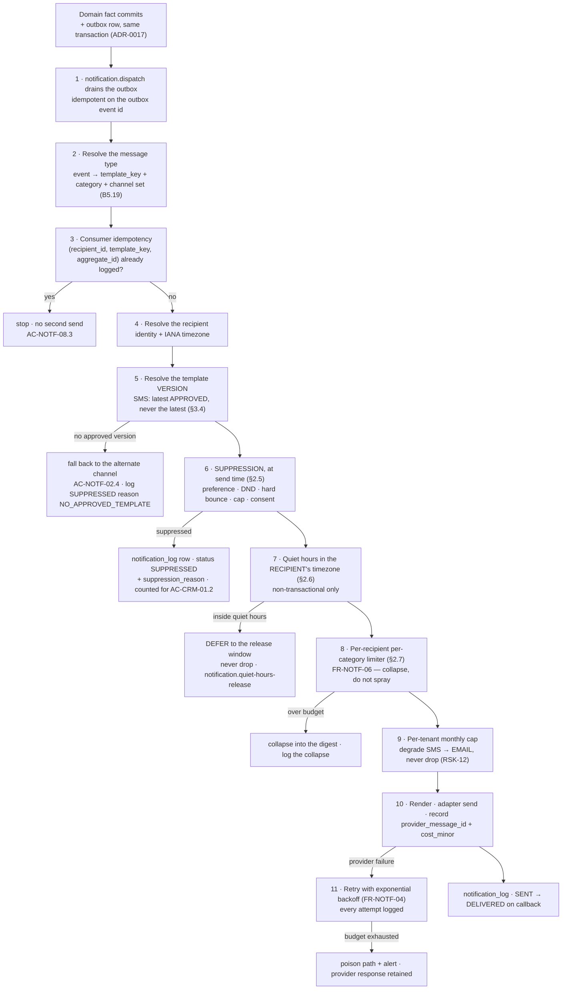
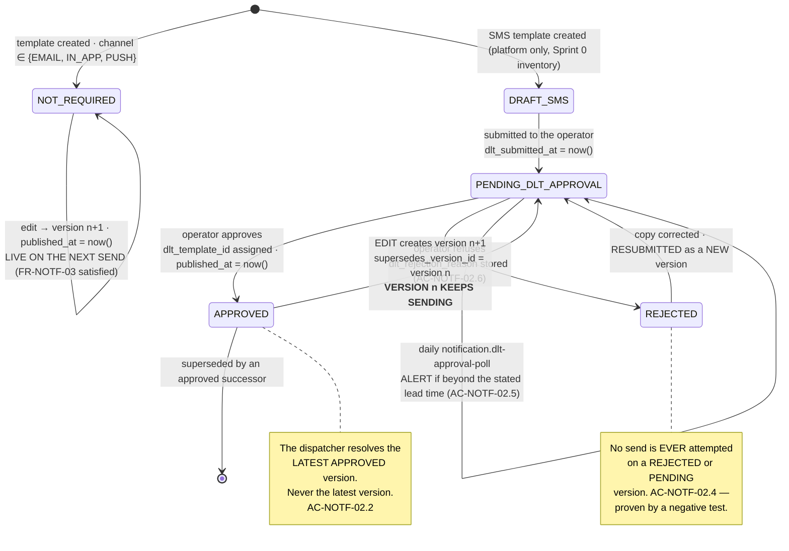
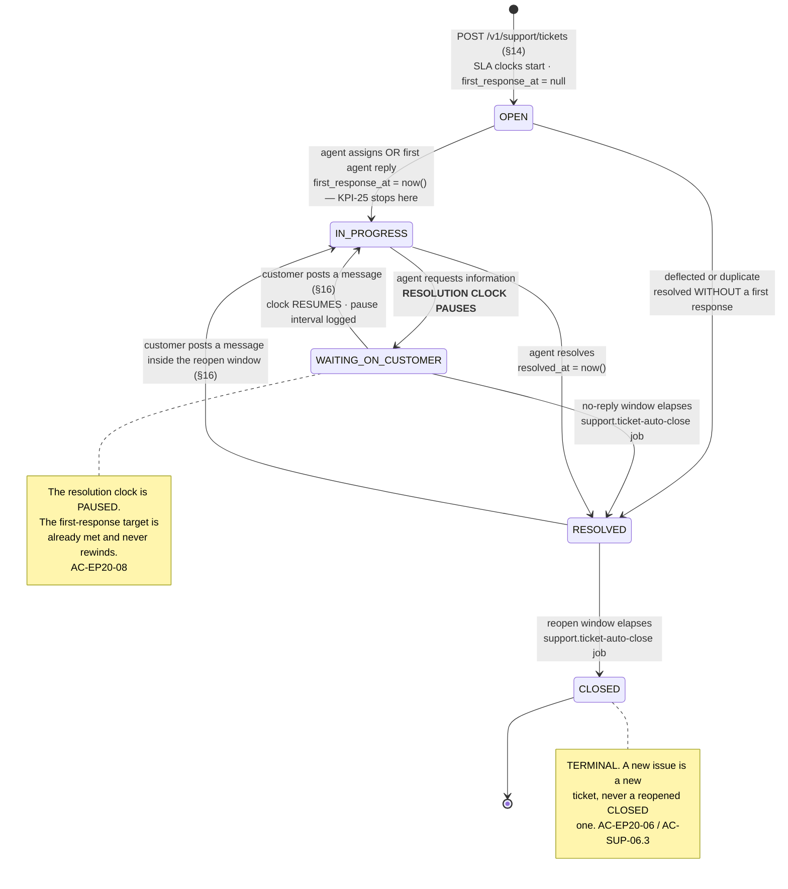
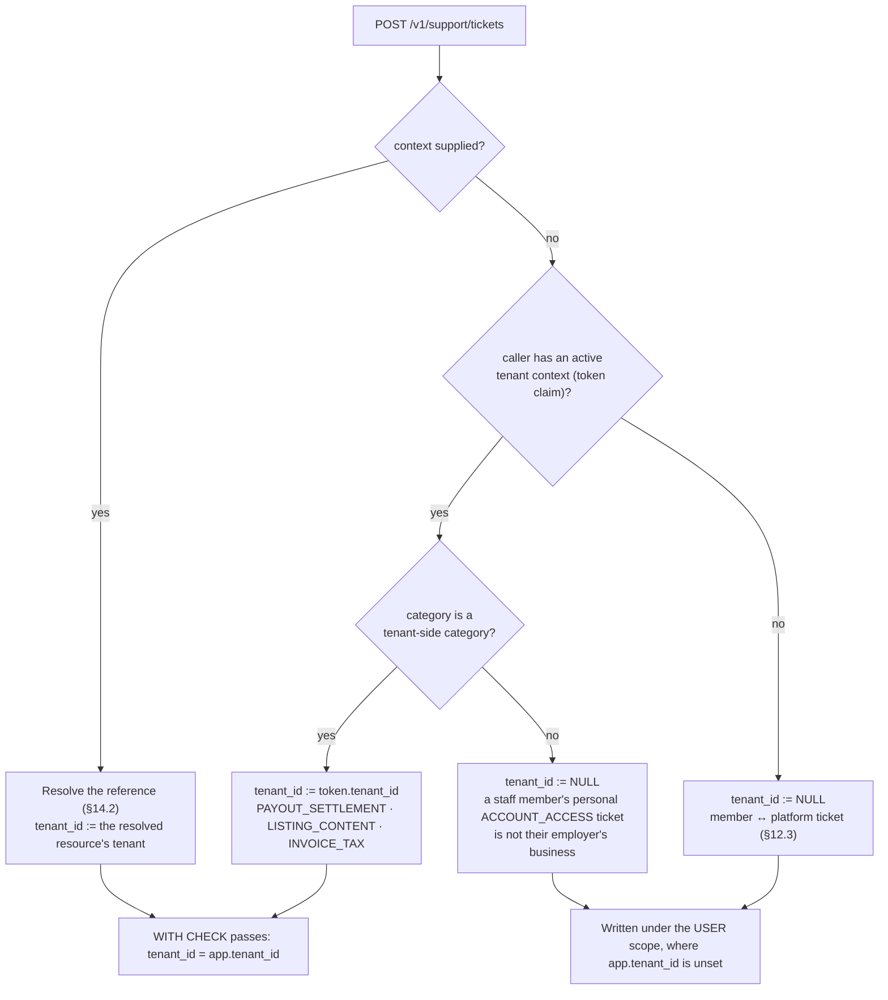

# `API-NOTF` + `API-SUP` — Notifications, templates, delivery and support: the frozen endpoint contract

**Modules:** `notifications`, `support` · **Groups:** `NOTF`, `SUP` · **Surface count:** 14 endpoints
documented here (12 authenticated, 2 `@Public()`) · **Status:** contract frozen, no code written ·
**Launch market:** India (`LAUNCH_MARKET_INDIA.md`) · **Phase-1 channel adapters:** **none selected —
`A-19` is `DEFERRED`.** The ports are specified here; the vendors are not.

---

## 0. Document control

| Aspect | Value |
| :--- | :--- |
| Owns | The seven `API-NOTF` rows of `API_Catalog.md` §3.13 and the nine `API-SUP` rows of §3.14, in per-endpoint detail, **plus four derived rows recorded in §1.2** |
| Authoritative index | **`docs/engineering/API_Catalog.md`** §3.13, §3.14 — which endpoints exist and their eleven attributes. This document deepens rows; it never adds, removes or contradicts one without recording the fact (§1.2) |
| Contract law | **`docs/apis/README.md`** — versioning (§2), auth (§3), authorisation (§4), tenant resolution (§5), idempotency (§6), pagination (§7), filtering (§8), the 173-code error registry (§9.5), rate limits (§10), money (§11), time (§12), validation (§13), caching (§15), OpenAPI (§16). **This document cites those sections and never restates them** (`README.md` §18.3 rule 4) |
| Governing law | `PROJECT_CONSTITUTION.md` §13 (Error Handling Law) and §14 (API Rules) |
| Product source | `MASTER_PRD.md` `B5.19` (`NOTF` — `FR-NOTF-01`…`FR-NOTF-08` and the 24-event baseline catalogue), `B5.23` (`SUP` — `FR-SUP-01`…`FR-SUP-07`), `B5.2` `FR-USER-04`, `A8` business rules, `§C3.1`/`§C3.2` conventions and catalogue, `§C5` background jobs |
| India source | **`LAUNCH_MARKET_INDIA.md` §8** — TRAI DLT, DND, the `FR-NOTF-03` conflict and its resolution; §3 (`Asia/Kolkata`, +05:30, no DST); §9 (DPDP, residency) |
| Physical model | `docs/database/Schema.md` §4.9 `notification_preferences`, §11.1 `notification_log`, §11.2 `support_tickets` + `ticket_messages`, §12.2 `help_articles`, §12.4 `notification_templates` |
| Ruling of record | `docs/engineering/ERD.md` §12.5 — DLT approval state on `notification_templates`. §3 below is the API expression of that ruling |
| Delivery backlog | `docs/backlog/Epic_17.md` (notifications, 41 tasks) and `docs/backlog/Epic_20.md` (support, ticket lifecycle and SLA) |
| Not owned here | `GET`/`PUT /v1/me/preferences` — **`docs/apis/Authentication.md` §9.3, §9.4.** The preference matrix, its consent provenance and the `TRANSACTIONAL_OPT_OUT_NOT_PERMITTED` refusal are documented there and are **not duplicated**; §2.4 below cites them. `GET /v1/admin/notifications/costs` and `GET`/`PUT /v1/admin/config/templates` — `docs/apis/Admin.md`. `GET /v1/me/referrals` and `GET /v1/me/wallet` — `API-SUP` rows in modules `crm` and `ledger`; see open item `O-SUP-3` |

> **Every fenced block in this document is labelled `illustrative — not committed code`. No
> application code exists. Zod sketches, TypeScript interfaces, mermaid diagrams and JSON bodies here
> are the *contract*, expressed in the notation the implementation will use; they are not the
> implementation.**

---

## 1. Position, precedence, and four findings recorded rather than propagated

### 1.1 The non-duplication contract

`README.md` §1.1 fixes the three-artefact division: the catalogue answers *which endpoints exist*,
the contract law answers *what rules every endpoint obeys*, and this file answers *what these
endpoints do*. Accordingly:

| Convention | Where it is defined | What this document does |
| :--- | :--- | :--- |
| Base URL, versioning, deprecation | `README.md` §2 | Cites. Every path below is relative to `https://api.<domain>/v1` |
| Open-enum register | `README.md` §2.3 | Cites. `notification.channel` is already registered **open**; §1.5 raises two enums that are **not yet registered** |
| Auth modes | `README.md` §3.1 | Cites. Twelve endpoints are `access`; two are `none` (`@Public()` items 20 and 21 of §3.6) |
| Permission grammar, the `PG-1`…`PG-5` gates | `README.md` §4.2, §4.5 | Cites. §1.6 maps every permission string used here |
| Tenant derivation — never from the client | `README.md` §5.1 | Cites. Rows 2 (`/me`) and 3 (`/tenant`) both appear here, and §12.3 explains the **P-NULLABLE** ticket case, which is the hardest tenancy problem on this surface |
| Idempotency — 24-hour store, five-component fingerprint | `README.md` §6 | Cites. No endpoint here is in a **REQ** class; four are **OPT** and honour a supplied key |
| Cursor pagination | `README.md` §7 | Cites. Five list endpoints paginate; `GET /help/articles` is reference data and is returned whole (§7.5 exception 3) |
| The error envelope and the 173-code registry | `README.md` §9.1, §9.5 | Cites. §20 is the `notifications` + `support` slice, expanded per endpoint |
| Rate-limit classes and headers | `README.md` §10 | Cites. §21.1 gives the per-endpoint class. **`FR-NOTF-06`'s per-recipient limiter is not HTTP rate limiting** (`README.md` §10.3 RLM7) and is specified in §2.7 |
| Cache tokens | `README.md` §15.1 | Cites. Eleven endpoints are `NO-STORE`, one is `NO-STORE!`, two are `CDN-3600` |
| Money and time | `README.md` §11, §12 | Cites. The only money on this surface is `cost_minor` on a delivery-log row, and it is a **string of paise with an adjacent `currency`** |

### 1.2 Finding 1 — four endpoints in this document are **derived rows** absent from `API_Catalog.md` §3.13

`README.md` §18.3 standing rule 1: *"No endpoint exists that is not a row in `API_Catalog.md` §3."*
Four of the fourteen endpoints documented here are not rows in §3.13. They are **not inventions** —
each is required by a screen or a requirement the catalogue itself cites — but the rule is absolute,
so the finding is recorded and the remedy is named rather than assumed.

| Endpoint | Required by | Why the catalogue lacks it | Remedy |
| :--- | :--- | :--- | :--- |
| `GET /v1/tenant/notification-templates` | `SCR-DASH-021` content line: *"template overrides where the tier permits"*; `FR-NOTF-03` *"tenant-level overrides where the tier permits"* | §3.13 lists the **member and tenant notification-centre** rows and the push-subscription pair. The catalogue's own note for §3.13 derives the tenant centre rows from `FR-NOTF-07`; the override surface was not derived at the same time | Amend `API_Catalog.md` §3.13 with three rows in the pull request that adds the handlers, per `README.md` §18.3 rule 1. Roll-up moves `API-NOTF` from 7 to 11 rows and the platform total from 233 to 237 |
| `POST /v1/tenant/notification-templates` | Same | Same | Same |
| `PATCH /v1/tenant/notification-templates/:id` | Same | Same | Same |
| `GET /v1/tenant/notifications/delivery-log` | `SCR-DASH-021` content line: *"delivery log with per-message status"*; `FR-NOTF-04` *"every attempt is logged with provider response"*; `Epic_17.md` §3.1 item 22 | The catalogue's §3.13 note correctly says **sending** is not an API surface, and the delivery **read** surface was folded into that sentence by omission | Same |

**Why these four and not more.** `Epic_17.md` names `GET|PUT /admin/notifications/templates` and
`POST /admin/notifications/templates/:id/preview` as *platform* surfaces; those are `API-ADM` rows
(`API-ADM-38`, `GET|PUT /admin/config/templates`) and belong in `Admin.md`. The four rows above are
the **tenant** half — the tier-gated override surface and the tenant's own delivery log — and there
is no admin endpoint that serves a gym owner their own sends without platform elevation, which
`README.md` §5.3 TD8 forbids as an ambient capability.

**Until the catalogue is amended, gate `PG-1` cannot pass for these four handlers**, because the
`rbac-matrix-drift` job diffs the route table against the catalogue. That is the correct behaviour:
the gate is doing its job, and the fix is a documented amendment, not a suppression.

### 1.3 Finding 2 — the ticket lifecycle is named differently in two rank-3 artefacts

| Source | State names |
| :--- | :--- |
| `MASTER_PRD.md` `FR-SUP-04` (**rank 2**) | `OPEN`, **`IN_PROGRESS`**, **`WAITING_ON_CUSTOMER`**, `RESOLVED`, `CLOSED` |
| `docs/backlog/Epic_20.md` §4.1 state diagram | `OPEN`, **`IN_PROGRESS`**, **`WAITING_ON_CUSTOMER`**, `RESOLVED`, `CLOSED` |
| `docs/database/Schema.md` §2 `ticket_status_enum` (**rank 3**) | `OPEN`, **`PENDING_INTERNAL`**, **`PENDING_CUSTOMER`**, `RESOLVED`, `CLOSED` |

**Resolution adopted here: the PRD's names win on the wire and in the database.** `README.md` §1.2
fixes the precedence — `MASTER_PRD.md` is rank 2 and `Schema.md` is rank 3 — and `FR-SUP-04` names
the five states as a requirement, not as an illustration. `IN_PROGRESS` and `WAITING_ON_CUSTOMER` are
also the names every acceptance criterion in `Epic_20.md` uses (`AC-EP20-08`: *"time in
`WAITING_ON_CUSTOMER` does not count toward the resolution target"*), so adopting the schema's names
would leave the test suite quoting values that do not exist.

**The remedy is a one-line enum change in `Schema.md` §2, before the first migration is written.**
There is no data to migrate and no client to break, because neither exists. What must **not** happen
is a translation layer: an API that renders `PENDING_CUSTOMER` as `WAITING_ON_CUSTOMER` produces two
vocabularies for one state machine, and the second one always leaks — into a log line, a report
column, or a support macro. Recorded as open item `O-SUP-1`.

### 1.4 Finding 3 — `ticket_category_enum` has eight values; the routing taxonomy has eleven

`Schema.md` §2 defines `ticket_category_enum` as `ACCOUNT`, `PAYMENT`, `MEMBERSHIP`, `CHECK_IN`,
`REFUND`, `LISTING`, `TECHNICAL`, `OTHER`. `Epic_20.md` §4.3 defines **eleven** categories, each with
a default priority, a routing queue and an auto-attachment set — which is what `FR-SUP-02`
(*"contextual ticket creation … auto-attaching the relevant references"*) actually needs.

| In both | Only in `Epic_20.md` §4.3 | Only in `Schema.md` §2 |
| :--- | :--- | :--- |
| `CHECK_IN` · `PAYMENT` · `REFUND` · `MEMBERSHIP` · `OTHER` · `ACCOUNT`↔`ACCOUNT_ACCESS` · `LISTING`↔`LISTING_CONTENT` | `INVOICE_TAX` · `PAYOUT_SETTLEMENT` · `REVIEW_MODERATION` · `DATA_PRIVACY` | `TECHNICAL` |

**Resolution adopted here: the eleven-value taxonomy, with `TECHNICAL` retained as a twelfth.** The
four categories present only in `Epic_20.md` are not cosmetic — each names a distinct routing queue
(Finance, Finance, Moderation, Legal) and a distinct auto-attachment set, and collapsing
`INVOICE_TAX` into `PAYMENT` would route a GST question to the payments queue with a payment
reference attached and no invoice. `TECHNICAL` survives because a bug report is genuinely none of the
other eleven. **Twelve values**, enumerated in §12.4, requiring an amendment to `ticket_category_enum`
before the first migration. Recorded as open item `O-SUP-2`.

`ticket.category` is therefore registered **open** in the sense of `README.md` §2.3 — see §1.5.

### 1.5 Finding 4 — two enums this surface emits are absent from the `README.md` §2.3 open-enum register

`README.md` §2.3 is explicit: *"An enum is **open** only if it appears here."* `notification.channel`
appears and is open, with the documented fallback *"ignore the entry"*. Two enums this surface emits
do not appear at all, which under §2.3 makes them **closed by default** — and closed is the wrong
answer for both.

| Enum | Values today | Why it must be **open** | Documented fallback for an unknown value |
| :--- | :--- | :--- | :--- |
| `ticket.category` | The twelve of §12.4 | `Epic_20.md` §4.3 makes categories, priorities and routing **configuration** administered through `EP-19`. A thirteenth category is a data change, and a client that fails on one is a client that breaks on a Tuesday | Render the server-supplied `label`, route to the generic queue, do not fail |
| `notification.suppression_reason` | The nine of §2.5 | `AC-CRM-01.2` requires the **reason** to be reported to the sender, and the reason set grows with each new suppression control (a hard-bounce class, a new regulator's list) | Render the server-supplied `label`; count it in the suppressed total |

**`ticket.status`, `ticket.priority`, `notification.category`, `dlt_approval_status` and
`notification_status` stay CLOSED**, and deliberately so: each is a state machine or a compliance
classification whose unknown member cannot be safely ignored. A client that silently ignored an
unknown `notification.category` would render a `MARKETING` message as though consent had been given.

Adding two rows to `README.md` §2.3 is an amendment to that document, raised here rather than
performed here (`README.md` §18.3 rule 3). Recorded as open item `O-NOTF-1`.

### 1.6 The permission strings this surface declares

`FR-RBAC-01` — every endpoint declares exactly one permission or gate `PG-1` fails the build.
`README.md` §4.2 fixes the grammar `<module>.<resource>.<action>`, three `snake_case` segments,
module drawn from the 23 of `§C1.3`. **`notifications` and `support` are both on that list.**

| Permission | Module | Endpoint | `B3.2` capability | Held by |
| :--- | :--- | :--- | :--- | :--- |
| `notifications.notification.list` | `notifications` | §4 `GET /me/notifications`, §7 `GET /tenant/notifications` | **— (none exists)**; derived from `FR-NOTF-07` | Every authenticated principal for `/me`; every tenant staff role for `/tenant` |
| `notifications.notification.mark_read` | `notifications` | §5, §7.5 | — (`FR-NOTF-07`) | Same |
| `notifications.notification.mark_all_read` | `notifications` | §6 | — (`FR-NOTF-07`) | Same |
| `notifications.template.list` | `notifications` | §8 | — (`FR-NOTF-03` tenant overrides) | `GYM_OWNER` ●, `GYM_MANAGER` ○ |
| `notifications.template.create` | `notifications` | §9 | — (`FR-NOTF-03`) | `GYM_OWNER` ● only |
| `notifications.template.update` | `notifications` | §10 | — (`FR-NOTF-03`) | `GYM_OWNER` ● only |
| `notifications.delivery_log.list` | `notifications` | §11 | — (`FR-NOTF-04`, `SCR-DASH-021`) | `GYM_OWNER` ●, `GYM_MANAGER` ▪ (own branches' recipients) |
| `support.ticket.list` | `support` | §13 | — (`FR-SUP-01`, `FR-SUP-04`) | Every authenticated principal (own); `SUPPORT_AGENT` ● platform-wide |
| `support.ticket.create` | `support` | §14 | — (`FR-SUP-01`, `FR-SUP-02`) | Every authenticated principal |
| `support.ticket.read` | `support` | §15 | — (`FR-SUP-03`, `FR-SUP-04`) | Requester, tenant principals holding `support.ticket.list`, `SUPPORT_AGENT` ● |
| `support.ticket_message.create` | `support` | §16 | — (`FR-SUP-03`) | Same |
| **none — `@Public()`** | — | §17 `GET /help/articles`, §18 `GET /help/articles/:slug` | — | Items **20** and **21** of `README.md` §3.6 |

**Every capability row above is `—` in `B3.2`.** That is not an omission to be fixed by inventing
matrix rows: `B3.2` enumerates the 43 capabilities that distinguish *roles from each other*, and
"read your own notifications" distinguishes nobody. The strings are nonetheless declared, registered
in `notifications/permissions.ts` and `support/permissions.ts`, and asserted by gate `PG-3`, exactly
as `Authentication.md` §12 does for `notifications.preference.read`. The `rbac-matrix-drift` job
must be seeded with the derived rows or it will report them as ungoverned grants — recorded as open
item `O-NOTF-2`.

### 1.7 What is *not* in this document, and why several absences are controls

| Absent | Why | Asserted by |
| :--- | :--- | :--- |
| **Any endpoint that sends a notification** | `AC-NOTF-08.1` / `AC-EP17-25`: *"sending exists only as the outbox plus `notification.dispatch` — a storm is never one compromised token away."* `API_Catalog.md` §3.13's note states it as a design property of the group | An absence assertion over the generated OpenAPI document (`README.md` §16.4): no operation in module `notifications` enqueues a channel send |
| **Any endpoint that creates, edits or overrides an SMS template** | `AC-NOTF-04.3`, `OQ-17.d`: a per-tenant SMS body is a **per-tenant DLT registration**. The capability does not exist rather than existing and refusing | §9 and §10 accept `channel ∈ {EMAIL, IN_APP}` only, at `L8-PIPE`. A schema-level absence, not a runtime branch |
| **Any endpoint by which a client disables a transactional or security category** | `FR-NOTF-02`, `FR-USER-04`, `AC-USER-01.4`. The accepted category enum on `PUT /me/preferences` contains only `OPERATIONAL` and `MARKETING` (`Authentication.md` §9.4) | `L8-PIPE` enum + the typed `422 TRANSACTIONAL_OPT_OUT_NOT_PERMITTED` at `L6-UC` |
| **Any endpoint that mutates a `notification_log` row** | `FR-NOTF-04` makes the log a delivery **record**. A record that can be edited is not evidence, and `AC-NOTF-01.4` needs it to be evidence months later | No `PATCH`/`DELETE` route exists; §11 is read-only |
| **Any endpoint that returns a recipient's email address or phone number in a delivery-log row** | `BR-DAT-06`, `NFR-PRV-01`, `AC-EP17-31`. The log carries recipient **ids** and a masked display hint, never an address | §11.3's response schema; the `T-17.26` CI check greps the dispatch path for address-shaped literals |
| **A WebSocket or SSE notification stream** | **A-08** — Phase 1 polls at 10–15 s through the single `useLiveCounters()` hook (`ADR-0010`, `AC-NOTF-07.2`). Socket.IO is Phase 2 | Absent from the route table; §4.6 specifies the polling contract instead |
| **A ticket-status mutation endpoint for the requester** | `FR-SUP-04`'s transitions are **agent** actions. A member reopens by posting a message (§16), which is a fact, not a state assertion | No `PATCH /support/tickets/:id` exists on this surface; the agent console's transitions are `API-ADM` rows |
| **A help-article write endpoint** | `help_articles` is **GLOBAL** reference data written only by `admin/` through the audited reason-required path (`Schema.md` §12.2, `PROJECT_CONSTITUTION.md` §12.9 BR4) | Absent from `API-SUP`; the write is an `API-ADM` row |
| **An outbound webhook by which a tenant subscribes to notification events** | No outbound webhooks exist in Phase 1 (`README.md` §14) | Absent from the route table |

---

## 2. The delivery model — the part of this contract that no endpoint owns

Every other domain file in `/docs/apis/` documents a set of endpoints and stops. This one cannot,
because **the most important behaviour on this surface is not reachable from any endpoint**. The
notification centre endpoints read a log that a background job wrote; the template endpoints write a
row that a background job reads. If the delivery model is not frozen here, the endpoints below are
CRUD over tables whose meaning lives nowhere.

### 2.1 Sending is not an API surface, and that is a security control

> `API_Catalog.md` §3.13: *"Notification **sending** is not an API surface. It is the outbox and the
> `notification.dispatch` job (`§C1.5`, `§C5`) … No endpoint sends a notification directly; that
> would make a notification storm one compromised token away."*

| Property | Consequence for this contract |
| :--- | :--- |
| A notification is **caused** by a committed domain fact, never by a request | The outbox row is written **in the same transaction** as the fact (`ADR-0017`). A rolled-back membership activation sends nothing; a committed one cannot fail to send |
| The API surface is **read-and-configure only** | Eight endpoints read (`/me/notifications`, `/tenant/notifications`, the delivery log, the template list, the ticket reads, the help centre); four configure (mark-read ×3, template create/update); **none dispatches** |
| The bulk path is a **domain operation**, not an HTTP endpoint | `AC-NOTF-08.2`: a `GymCeasedOperating` closure notice to 400 members is one bulk run inside `BR-MEM-14`'s 24-hour SLA. `FR-CRM-07`'s bulk member notification is a `crm` endpoint that emits **one outbox event**, not 400 HTTP-visible sends |
| Therefore `FR-NOTF-06`'s limiter is **not** HTTP rate limiting | `README.md` §10.3 RLM7 states it. A storm generated by a bulk domain operation never passes through an HTTP endpoint at all, so an HTTP limiter cannot see it (§2.7) |

### 2.2 The dispatch pipeline — eleven gates, in order

The order is the design. Suppression sits at gate 6, **after** rendering has been decided and
**immediately before** the adapter call, because `AC-USER-01.1` requires suppression at *send* time.



| # | Gate | Owner | Failure behaviour | Anchor |
| :-: | :--- | :--- | :--- | :--- |
| 1 | Outbox drain | `L10-JOB` | At-least-once delivery, made exactly-once by gate 3 | `ADR-0017`, `AC-NOTF-08.3` |
| 2 | Message-type resolution | `L5-DOM` | An event with no mapped template is a **defect**, alerted, never silently dropped | `B5.19`, `F-17.9` |
| 3 | Consumer idempotency | `L1-DB` index `idx_notification_log__recipient_template_aggregate` | Stop. Not an error | `Schema.md` §11.1 |
| 4 | Recipient + timezone resolution | `L6-UC` | Missing timezone → platform default `Asia/Kolkata`, recorded as an assumption on the row | `FR-NOTF-05` |
| 5 | Template version resolution | `L6-UC` | SMS with no `APPROVED` version → channel fallback, **never an unapproved send** | `AC-NOTF-02.4`, §3.4 |
| 6 | **Suppression** | `L6-UC`, re-reading `notification_preferences` | `SUPPRESSED` row with a reason | `AC-USER-01.1`, `AC-CRM-01.2` |
| 7 | Quiet hours | `L6-UC` | **Defer**, never suppress | `FR-NOTF-05`, `AC-NOTF-05.1` |
| 8 | Per-recipient per-category limiter | `L6-UC` + Redis | Collapse into a digest | `FR-NOTF-06`, `AC-NOTF-05.4` |
| 9 | Per-tenant monthly cap | `L6-UC` | **Degrade the channel**, never drop the message | `RSK-12`, `AC-EP17-20` |
| 10 | Adapter send | `L10-JOB` | Provider response and `cost_minor` recorded first-hand | `FR-NOTF-08`, `BR-FIN-06` discipline |
| 11 | Retry ladder | `L10-JOB` | Poison path with alert | `FR-NOTF-04`, `AC-NOTF-08.5` |

**Why gate 6 is where it is.** Putting suppression at gate 2 — when the message type is resolved —
would be cheaper: fewer templates rendered, fewer timezone lookups. It would also be
`AC-USER-01.1`'s exact failure. A campaign that resolved its recipients at 09:00 and reaches gate 10
at 11:00 must consult the preference **as it stands at 11:00**, and the only way to guarantee that
is to consult it immediately before the adapter call. The wasted render is the price of a consent
regime that is honoured mechanically rather than rhetorically, and under India's **DPDP Act 2023**
(`REG-09`) it is not an optimisation anybody may take back.

### 2.3 The `B5.19` baseline notification catalogue — all 24 events

Reproduced complete from `MASTER_PRD.md` `B5.19`, with the four columns the API needs added:
the **template key prefix** (`Epic_17.md` §4.1 fixes the sixteen SMS keys exactly), the
**`routing_class`** carried on the template (§3.6), whether the event is **suppressible** by a
preference, and the **owning module** that emits the outbox row. Twenty-four events expand to
**31 distinct message types**, because four rows fan out (`renewal_t15|t7|t3|t1`, `freeze
started|ended`, `refund initiated|completed`, `kyc approved|rejected|info_requested`).

| # | Event (`B5.19` verbatim) | Recipient | Channels (`B5.19`) | Category | Template key | `routing_class` | Suppressible | Emitted by |
| :-: | :--- | :--- | :--- | :--- | :--- | :--- | :-: | :--- |
| 1 | OTP | User | SMS / Email | **Transactional** | `auth.otp` | `TRANSACTIONAL` | ❌ | `iam` (`EP-02`) |
| 2 | Registration welcome | User | Email | **Transactional** | `auth.welcome` | `TRANSACTIONAL` | ❌ | `iam` |
| 3 | Order confirmation + invoice | Member | Email, In-app | **Transactional** | `ordering.order_confirmed` | `TRANSACTIONAL` | ❌ | `ordering` / `billing` |
| 4 | Payment failed | Member | Email, SMS, In-app | **Transactional** | `payment.failed` | `TRANSACTIONAL` | ❌ | `payments` |
| 5 | Membership activated | Member | Email, SMS, In-app | **Transactional** | `membership.activated` | `TRANSACTIONAL` | ❌ | `memberships` |
| 6 | Membership starts today (future-dated) | Member | SMS, In-app | **Transactional** | `membership.starts_today` | `TRANSACTIONAL` | ❌ | `memberships` |
| 7 | Check-in confirmation | Member | In-app | Operational | `attendance.checkin_confirmed` | `TRANSACTIONAL` | ✅ | `attendance` |
| 8 | Renewal reminder T−15 | Member | Email, SMS, In-app | Operational | `membership.renewal_t15` | **`TRANSACTIONAL`** | ✅ | `memberships` (`BR-MEM-11`) |
| 9 | Renewal reminder T−7 | Member | Email, SMS, In-app | Operational | `membership.renewal_t7` | **`TRANSACTIONAL`** | ✅ | `memberships` |
| 10 | Renewal reminder T−3 | Member | Email, SMS, In-app | Operational | `membership.renewal_t3` | **`TRANSACTIONAL`** | ✅ | `memberships` |
| 11 | Renewal reminder T−1 | Member | Email, SMS, In-app | Operational | `membership.renewal_t1` | **`TRANSACTIONAL`** | ✅ | `memberships` |
| 12 | Membership expired | Member | Email, SMS, In-app | **Transactional** | `membership.expired` | `TRANSACTIONAL` | ❌ | `memberships` |
| 13 | Freeze started / ended | Member | Email, In-app | **Transactional** | `membership.freeze_started` · `membership.freeze_ended` | `TRANSACTIONAL` | ❌ | `memberships` |
| 14 | Refund initiated / completed | Member | Email, In-app | **Transactional** | `refund.initiated` · `refund.completed` | `TRANSACTIONAL` | ❌ | `refunds` |
| 15 | Review request | Member | Email, In-app | Operational | `reviews.review_request` | `PROMOTIONAL` | ✅ | `reviews` |
| 16 | Gym closure notice | Member | SMS, Email, In-app | **Transactional** | `gym.closure_notice` | `TRANSACTIONAL` | ❌ | `catalog` (`BR-MEM-14`) |
| 17 | New sale | Owner | In-app, Email digest | Operational | `tenant.new_sale` | `TRANSACTIONAL` | ✅ | `ordering` |
| 18 | Daily summary | Owner | Email | Operational | `tenant.daily_summary` | `TRANSACTIONAL` | ✅ | `reporting` |
| 19 | Expiring members this week | Owner | Email, In-app | Operational | `tenant.expiring_members` | `TRANSACTIONAL` | ✅ | `memberships` |
| 20 | New review received | Owner | In-app, Email | Operational | `tenant.new_review` | `TRANSACTIONAL` | ✅ | `reviews` |
| 21 | Payout initiated + statement | Owner | Email, In-app | **Transactional** | `settlement.payout_initiated` | `TRANSACTIONAL` | ❌ | `settlements` |
| 22 | KYC approved / rejected / info requested | Owner | Email, SMS, In-app | **Transactional** | `onboarding.kyc_approved` · `kyc_rejected` · `kyc_info_requested` | `TRANSACTIONAL` | ❌ | `onboarding` |
| 23 | Subscription payment failed | Owner | Email, SMS, In-app | **Transactional** | `billing.subscription_failed` | `TRANSACTIONAL` | ❌ | `billing` (`BR-TEN-06`) |
| 24a | Application awaiting review > SLA | Verification Officer | In-app, Email | Operational | `platform.application_sla_breach` | `TRANSACTIONAL` | ✅ | `onboarding` |
| 24b | Refund awaiting approval | Finance | In-app, Email | Operational | `platform.refund_awaiting_approval` | `TRANSACTIONAL` | ✅ | `refunds` |
| 24c | Reconciliation variance | Finance | Email, Alert | Operational | `platform.reconciliation_variance` | `TRANSACTIONAL` | ✅ | `settlements` |
| 24d | Moderation queue over threshold | Moderator | In-app | Operational | `platform.moderation_backlog` | `TRANSACTIONAL` | ✅ | `reviews` |

*(Rows 24a–24d are the catalogue's last four rows, numbered separately because `B5.19` lists 24 rows
and the last four address four different platform roles. The event count is 24; the message-type
count is 31.)*

**Three things this table is load-bearing for.**

1. **The suppressible column is the API's `FR-NOTF-02` contract.** Eleven of the twenty-four rows are
   `Transactional` and can never be switched off. `PUT /me/preferences` (`Authentication.md` §9.4)
   does not accept the category, and the dispatcher's gate 6 does not consult a preference for it.
2. **The `routing_class` column is the India contract, and rows 8–11 are the reason it exists.**
   They are `Operational` in the PRD's own taxonomy — an opt-out category — and simultaneously
   **service messages** under TRAI's rules, which is what permits them to reach a DND number. Getting
   that classification wrong is a compliance failure in **either** direction (§3.6).
3. **Row 15 is the only `PROMOTIONAL` template in the baseline.** A review request is a solicitation.
   It is therefore the one baseline message that a DND registration blocks on SMS, which is why
   `B5.19` gives it Email and In-app only.

### 2.4 The four categories, and which two the API can never disable

`FR-NOTF-02` names three categories; `Schema.md` §2 `notification_category_enum` carries **four** —
`TRANSACTIONAL`, `OPERATIONAL`, `MARKETING`, `SECURITY`. The fourth is not drift: a sign-in alert or
a refresh-token-reuse notification (`README.md` §3.3 RT5) is not "transactional" in the commercial
sense and must never sit in the same bucket as an order confirmation for retention purposes
(`SC-R03` keys retention on this column).

| Category | Consent model | Suppressible through the API | Quiet hours apply | Retention (`SC-R03`) |
| :--- | :--- | :--- | :-: | :--- |
| `TRANSACTIONAL` | **Never opt-out** — it confirms something paid for or something that affects gym access | **No.** Not a member of the accepted enum on `PUT /me/preferences` | ❌ | `NFR-PRV-04` |
| `SECURITY` | **Never opt-out** — it tells you when somebody signs in as you | **No.** Same | ❌ | `NFR-PRV-04` |
| `OPERATIONAL` | **Opt-out** — reminders and confirmations | **Yes**, per channel | ✅ | **90 days** |
| `MARKETING` | **Opt-in** — the default is off, and the absence of a row means off | **Yes**, per channel; and off until explicitly on | ✅ | 90 days |

**The preference matrix, its consent provenance (`consent_recorded_at`, `consent_source`), the
`quiet_hours` object and the `422 TRANSACTIONAL_OPT_OUT_NOT_PERMITTED` refusal are documented in
`Authentication.md` §9.3 and §9.4 and are not repeated here.** What this document adds is the half
that lives in the dispatcher: `Authentication.md` §9.4 already says it plainly — *"`AC-USER-01.1` is
enforced nowhere in this endpoint and that is the point."* §2.5 is where it **is** enforced.

**Marketing is opt-in, which is a schema fact, not a default value.** A `notification_preferences`
row that does not exist for `(user, channel, MARKETING)` means **not opted in**. The lazy
materialisation described in `Authentication.md` §9.3 returns the platform default for a pair the
user never touched, and the platform default for `MARKETING` is `false`. An implementation that
materialised `MARKETING` rows as `true` would convert an absent record into consent, which is the
DPDP failure that no amount of later opt-out repairs.

### 2.5 `AC-USER-01.1` — suppression at send time, and the nine reasons

> `AC-USER-01.1`: *"Given I disable marketing email, when a campaign runs, then I receive nothing
> from it — verified by suppression **at send time** and not merely at list build."*
> `AC-CRM-01.2`: *"when I send a bulk notification, then it respects each member's notification
> preferences and **reports how many were sent and how many were suppressed and why**."*

**The two criteria are one mechanism seen from two ends.** The member's end requires that the
decision be made late; the sender's end requires that the decision be **reported**. A suppression
that is not written down is indistinguishable from a delivery failure, and a gym owner who cannot
tell the difference will conclude the platform is broken.

| # | `suppression_reason` | Gate | Meaning | Counts against the sender's total? |
| :-: | :--- | :-: | :--- | :--- |
| 1 | `PREFERENCE_OPTED_OUT` | 6 | The recipient's `notification_preferences` row for this (channel, category) is `opted_in = false` **as read at gate 6** | ✅ suppressed |
| 2 | `MARKETING_NOT_OPTED_IN` | 6 | No affirmative opt-in exists. Distinct from (1): never-consented is not the same fact as withdrew-consent, and DPDP evidence needs both | ✅ suppressed |
| 3 | `DND_REGISTERED` | 6 | The recipient's number is on the national DND registry and the template's `routing_class` is `PROMOTIONAL` (§3.6) | ✅ suppressed |
| 4 | `HARD_BOUNCE` | 6 | The address previously hard-bounced; sending again damages sender reputation for every tenant | ✅ suppressed |
| 5 | `CHANNEL_UNCONFIGURED` | 6 | No adapter is configured for this channel — the **`A-19` state at Phase 0** (§2.9) | ✅ suppressed |
| 6 | `NO_APPROVED_TEMPLATE` | 5 | SMS with no `APPROVED` DLT version. The message is **re-routed**, not lost (`AC-NOTF-02.4`) | ✅ suppressed, and the fallback send is counted separately |
| 7 | `RECIPIENT_DELETED` | 4 | `BR-DAT-04` erasure completed between list build and send | ✅ suppressed |
| 8 | `TENANT_CAP_EXCEEDED_NO_FALLBACK` | 9 | The monthly cap is spent **and** no fallback channel is available. Rare by construction — gate 9 degrades before it suppresses | ✅ suppressed |
| 9 | `DUPLICATE_SUPPRESSED` | 3 | Consumer idempotency caught a repeat | ❌ — not a suppression the sender caused; reported separately |

**Quiet hours are deliberately absent from this list.** A deferral is not a suppression, and
recording it as one would make `AC-NOTF-05.1`'s *"deferred, not dropped"* invisible in exactly the
report that is meant to prove it. A deferred message stays `QUEUED` with a `deferred_until` instant.

**Where a bulk sender sees the numbers.** `FR-CRM-07`'s bulk action returns a job handle; the
per-run tallies are read from `GET /v1/tenant/notifications/delivery-log?bulk_run_id=…`
(§11), which is precisely why the delivery log had to be a derived row rather than a nice-to-have
(§1.2). The response shape that satisfies `AC-CRM-01.2` is in §11.3.

```json
// illustrative — not committed code — the AC-CRM-01.2 tally, as returned by §11.3
{
  "bulk_run": {
    "id": "01936a2c-4f81-7d10-b3e9-6c2f8a1d5b70",
    "template_key": "crm.at_risk_winback",
    "category": "MARKETING",
    "channel": "EMAIL",
    "requested_count": 412,
    "sent_count": 361,
    "suppressed_count": 47,
    "deferred_count": 4,
    "suppressed_by_reason": [
      { "reason": "PREFERENCE_OPTED_OUT",   "label": "Member turned marketing email off", "count": 29 },
      { "reason": "MARKETING_NOT_OPTED_IN", "label": "Member never opted in",             "count": 14 },
      { "reason": "HARD_BOUNCE",            "label": "Address previously bounced",        "count":  3 },
      { "reason": "RECIPIENT_DELETED",      "label": "Account deleted",                   "count":  1 }
    ],
    "started_at":  "2026-08-06T04:00:11Z",
    "finished_at": "2026-08-06T04:03:52Z"
  }
}
```

`361 + 47 + 4 = 412`. **The three tallies plus the deferrals sum to the requested count, exactly**,
and the API publishes that identity as data rather than leaving a client to assume it — the same
discipline `README.md` §2.6 applies to `sum_invariant` on a settlement statement, and for the same
reason: an arithmetic identity a client hard-codes is an identity that breaks silently.

### 2.6 `FR-NOTF-05` — quiet hours in the **recipient's** timezone

> `FR-NOTF-05`: *"Per-user, per-channel quiet hours in the **recipient's** timezone for
> non-transactional messages."*

This is the one place in the platform where **the member's timezone is authoritative**, and it is a
deliberate exception to the rule that governs everything else.

| Concern | Whose timezone governs | Why | Anchor |
| :--- | :--- | :--- | :--- |
| Membership `start_date` / `end_date`, freeze windows, access windows | **The gym's** | A membership is consumed at a physical location. A member who travels does not get a longer membership | `README.md` §12.1 T2, `BR-MEM-03` |
| Attendance business-day bucketing, daily reports, settlement periods | **The gym's** | The desk and the report must agree | `README.md` §12.3 |
| `BR-MEM-11` reminder **send time** (09:00) | **The gym's** | The reminder is about that gym's membership and is batched per tenant per day | `Epic_17.md` T-17.20 |
| **Quiet hours** | **The recipient's** | It is about not waking somebody up. A Pune gym's member who has moved to Guwahati is asleep on Guwahati's clock | **`FR-NOTF-05`**, `Schema.md` §11.1 note (`TM11`) |

**The two can disagree, and the resolution is stated rather than discovered.** A `BR-MEM-11` T−3
reminder for a Pune gym is scheduled at 09:00 `Asia/Kolkata` = 03:30 UTC. If the recipient's stored
timezone is `Asia/Kolkata` — which it is for essentially every Phase-1 user — 09:00 is outside a
22:00–07:00 quiet window and it sends. **If the recipient's timezone were `America/New_York`, 09:00
IST is 23:30 the previous evening and the message defers to 08:00 local** — and it defers even
though the gym's scheduler chose a civilised hour, because `FR-NOTF-05` says whose clock counts.

| Rule | Statement |
| :--- | :--- |
| QH1 | Quiet hours are stored as `start`, `end` (`HH:mm`, 24-hour) **and an IANA zone id**, never as a UTC offset. `+05:30` is not a timezone; `Asia/Kolkata` is (`README.md` §12.3) |
| QH2 | The window may **wrap midnight** — `22:00`–`07:00` is the seeded default and is the common case. The evaluation is `start > end ? (t >= start \|\| t < end) : (t >= start && t < end)`, computed on the recipient's local wall clock |
| QH3 | Quiet hours apply to `OPERATIONAL` and `MARKETING` **only**. `TRANSACTIONAL` and `SECURITY` are **never** deferred (`AC-NOTF-05.2`). A payment failure at 23:00 IST sends at 23:00 IST |
| QH4 | The outcome is **deferral, never suppression** (`AC-NOTF-05.1`). `notification.quiet-hours-release` runs hourly and releases in **trigger order**, de-duplicated by message type (`AC-NOTF-05.5`) |
| QH5 | Quiet hours are per **user**, and `FR-NOTF-05` says *"per-channel"* — an in-app badge at 23:00 wakes nobody, so the seeded configuration applies quiet hours to `SMS` and `PUSH`, not to `IN_APP`. This is **configuration**, exposed on `GET /me/preferences`, not a constant |
| QH6 | A recipient with no stored timezone is treated as `Asia/Kolkata` (`LAUNCH_MARKET_INDIA.md` §3) and the assumption is **recorded on the log row**, so a later complaint is diagnosable rather than arguable |
| QH7 | The release job never sends a message whose relevance has passed. A T−1 renewal reminder deferred past the expiry instant is **cancelled**, logged with `suppression_reason: STALE_ON_RELEASE`, and the expiry notification carries the ask instead |

*(QH7's reason code is the tenth member of the §2.5 taxonomy and is why that enum is registered
**open** in §1.5 — it was discovered while writing this section, which is precisely the pattern a
closed enum would have punished.)*

### 2.7 `FR-NOTF-06` — rate limiting per recipient per category

> `FR-NOTF-06`: *"Rate limiting per recipient per category to prevent notification storms."* **M.**

This limiter is **not** one of the twelve HTTP classes of `README.md` §10.2 and never appears in an
`X-RateLimit-*` header, because the traffic it governs never traverses HTTP (`README.md` §10.3
RLM7).

| Aspect | Value |
| :--- | :--- |
| Key | `(recipient_id, category, channel)` — three parts. Not `(recipient_id)` alone, or a burst of transactional messages would be throttled by a marketing campaign |
| Mechanism | Redis token bucket via `rate-limiter-flexible` (A-13), the same library as the HTTP limiter, a **different** keyspace and a different failure mode |
| Seeded budgets | `TRANSACTIONAL` / `SECURITY`: **no cap** — a cap on a payment-failure notice is a cap on the platform's duty of care. `OPERATIONAL`: 6 per recipient per channel per rolling hour, 20 per day. `MARKETING`: 1 per recipient per channel per **day**, 4 per rolling 7 days |
| Over-budget behaviour | **Collapse, never drop** (`AC-NOTF-05.4`). Eleven `OPERATIONAL` events for one member in one minute become one digest message naming eleven facts |
| Failure mode | Redis unavailable → **fail open for `TRANSACTIONAL`/`SECURITY`, fail closed for `MARKETING`**, defer `OPERATIONAL` to the next drain. The asymmetry mirrors `README.md` §10.3 RLM3: a missing payment alert is worse than a duplicate; a duplicate marketing blast is worse than a missing one |
| Configuration | **All budgets are configuration**, changeable without deployment, exactly like the HTTP classes (RLM6). The values above are the seed |

**The scenario this exists for**, from `AC-NOTF-05.4`: a receptionist at Iron Works Gym runs a bulk
correction that touches eleven memberships belonging to one member's family account. Without the
limiter, Priya Sharma receives eleven SMS messages in ninety seconds, each individually correct.
With it, she receives one. `RSK-12` scores the cost side of that at 9; the reputational side is not
scored anywhere and is worse.

### 2.8 `FR-NOTF-04` — queued, retried with backoff, every attempt logged

> `FR-NOTF-04`: *"Delivery is queued, retried with backoff, and **every attempt is logged with
> provider response**."* **M.**

| Rule | Statement | Anchor |
| :--- | :--- | :--- |
| D1 | Delivery is **always** queued. There is no synchronous send path, not even for OTP — `iam` writes an outbox row and returns; the OTP endpoint's response never waits on an SMS gateway | `AC-NOTF-08.1`, `NFR-PERF-*` |
| D2 | The retry ladder is **exponential with jitter**: seeded at 30 s, 2 min, 8 min, 30 min, 2 h, 6 h — six attempts, ~9 hours of wall clock. Configuration, not constants | `FR-NOTF-04` |
| D3 | **Every attempt** writes an attempt record carrying `attempt_no`, `provider`, `provider_message_id`, the **normalised** status, the **raw provider response** (redacted per `BR-DAT-06`), the latency, and `cost_minor` where the provider reports one | `Schema.md` §11.1, `AC-EP17-18` |
| D4 | `notification_log.attempts` is the count; the attempt detail is what §11 exposes as `attempts[]`. A log that records only the last attempt cannot answer *"was it tried?"*, which is the only question a delivery dispute asks | `AC-NOTF-01.4` |
| D5 | A **4xx-class provider rejection is not retried** — a malformed address or an unregistered DLT id will fail identically six times. It goes straight to the poison path. Only 5xx, timeouts and rate-limit responses are retried | `FR-NOTF-04`, `README.md` §9.5 Retry semantics |
| D6 | Exhaustion lands the message in the poison path **with the provider response retained** and alerts. It does not silently disappear | `AC-NOTF-08.5` |
| D7 | Status is a **normalised platform enum** — `QUEUED`, `SENDING`, `SENT`, `DELIVERED`, `FAILED`, `BOUNCED`, `SUPPRESSED` — never the provider's vocabulary. Mapping is the adapter's job, exactly as `README.md` §14.4 requires of the payment adapter | `Schema.md` §2 |
| D8 | `DELIVERED` arrives on a **provider status callback**, which is a separate signed ingress (`T-17.37`), not part of this HTTP surface. A channel with no callback model never reaches `DELIVERED` and stops at `SENT`, which the delivery log states rather than implying | `FR-NOTF-04` |

### 2.9 `A-19` is `DEFERRED` — the port is specified, the adapters are not

> `README.md` §18.2 open item 4: *"**A-19 notification vendors remain `DEFERRED`.** SMS provider
> selection determines DLT header and template registration."*
> `Epic_17.md` §1: *"`A-19` is the only open Tier-2 addition slot in the plan."* Decision deadline
> **Sprint 12** (`TR-13`); candidates **MSG91, Gupshup, Kaleyra, Airtel IQ**; every candidate must be
> assessed against `REG-06` — **message content must not be processed outside India**.

**The boundary is explicit so that nine sprints of feature work can happen before a vendor exists.**

```ts
// illustrative — not committed code
// apps/server/src/modules/notifications/ports/notification-channel.port.ts

/** Normalised, provider-agnostic result of one delivery attempt. */
export interface ChannelSendResult {
  attemptNo:          number;
  status:             'SENT' | 'FAILED' | 'BOUNCED';   // never DELIVERED — that is a callback (D8)
  providerMessageId?: string;
  providerCode?:      string;   // the provider's own code, for the log — NEVER shown to a user (ER6)
  retryable:          boolean;  // D5 — the adapter decides, the dispatcher obeys
  costMinor?:         bigint;   // integer minor units, recorded FIRST-HAND at send (FR-NOTF-08)
  currency?:          string;   // 'INR'
  latencyMs:          number;
}

export interface NotificationChannelPort {
  readonly channel: 'EMAIL' | 'SMS' | 'IN_APP' | 'PUSH';
  /** Renders nothing. Receives an already-rendered body and a resolved template version. */
  send(msg: RenderedMessage, ctx: SendContext): Promise<ChannelSendResult>;
  /** Verifies and normalises a provider status callback. Signature-verified like a webhook (§14 of README). */
  parseStatusCallback(rawBody: Buffer, headers: Readonly<Record<string, string>>): ChannelStatusEvent;
  /** India, SMS only: the DLT id and header the operator requires on the wire. */
  dltBinding?(): { entityId: string; headerId: string };
}
```

| Consequence for this contract | Detail |
| :--- | :--- |
| **`CHANNEL_NOT_AVAILABLE` (422) is a real, reachable code today** | `README.md` §9.5.11 registers it against *"the requested channel has no configured adapter"* and cites `A-19` by name. Until Sprint 12 it is the honest answer for `SMS`, `PUSH` and `WHATSAPP` on any endpoint that lets a caller name a channel |
| **No endpoint names a vendor** | Not in a path, not in a body, not in an enum. `provider` appears only as a **response** dimension on a delivery-log row, and it is an **open** value rendered from a server-supplied label |
| **`cost_minor` is recorded, never estimated** | `FR-NOTF-08` and `AC-NOTF-06.1`. This is `BR-FIN-06`'s discipline — *the gateway fee is recorded only as reported* — applied outside the money path. A delivery-log row whose provider did not report a cost carries **no `cost_minor` field at all**, rather than a zero |
| **Local and CI development need no vendor** | Mailpit for email and a CI stub for the rest, wired in **Sprint 0** (`T-17.03`), so the port is exercised for nine sprints before a contract is signed |
| **The DLT programme is not blocked on the vendor for its inputs, but is gated on it for submission** | `AC-NOTF-03.5`: the vendor performs DLT registration on the brand's behalf, so vendor choice **gates** `EXT-17.2`. The sixteen-template inventory (`Epic_17.md` §4.1) is nonetheless frozen in Sprint 0, because the inventory is a product decision and the submission is a procurement one |

---

## 3. TRAI DLT — the central India constraint, and how `FR-NOTF-03` survives it

### 3.1 What DLT actually requires

`LAUNCH_MARKET_INDIA.md` §8, stated as the four obligations that reach the API:

| Obligation | Consequence |
| :--- | :--- |
| **Entity registration** | The legal entity registers once on a DLT platform with PAN, GSTIN and an authorised signatory. Not an API concern; a **Sprint 0** calendar concern (`T-17.02`) |
| **Header (sender ID) registration** | One-time, per brand. Submitted **Sprint 2** (`AC-NOTF-03.2`) |
| **Template pre-approval** | ⚠️ **Every SMS template must be registered and approved before a single message can send.** Each of the sixteen templates of `Epic_17.md` §4.1 is one registration. Submitted **Sprint 8** |
| **Transactional vs promotional routing** | Different rails, different DND treatment. Promotional SMS cannot reach a DND-registered number; service/transactional SMS can (§3.6) |

**Approval is calendar time granted on somebody else's timetable.** `REG-08` scores the lead-time
risk at **16 (High)**. No amount of engineering capacity shortens it, which is why the programme
starts sixteen sprints before the code that uses it.

### 3.2 The conflict with `FR-NOTF-03`, stated without softening

> `FR-NOTF-03`: *"Templates are versioned, previewable, and **editable by Super Admin without
> deployment**; tenant-level overrides where the tier permits."* **M.**

**For Indian SMS this requirement cannot be met, and the correct engineering response is to degrade
visibly rather than to report it met.** An edited SMS template must go back through DLT approval
before it can send. There is no configuration, no vendor and no architecture that removes that.

| Naive resolution | Why it is refused |
| :--- | :--- |
| Let the edit save and send immediately | The operator rejects the message. The member receives **nothing**, the platform learns about it from a support ticket, and `BR-MEM-11`'s reminder ladder silently stops working |
| Block the edit until approval lands | An admin who cannot fix a typo for six weeks stops using the editor. Worse, it makes the **email** template — which has no such constraint — unnecessarily unfixable if the two are edited together |
| Keep two systems, one for SMS and one for everything else | Two template stores, two version histories, two audit trails, and a `notification_log` row that cannot resolve which one rendered it — breaking `AC-NOTF-01.4` |
| Report `FR-NOTF-03` as met because email works | The failure mode this whole document exists to prevent. `KNOWN_LIMITATIONS.md` records `FR-NOTF-03` as **partially unmet by law, not by design** (`AC-EP17-36`) |

**The resolution, in one sentence:** *editing an SMS template creates a **new version** in
`PENDING_DLT_APPROVAL` while **the previously approved version continues to send**, and the
dispatcher resolves the latest `APPROVED` version rather than the latest version.*

| Channel | Editable without deployment? | What a save does | Live when? |
| :--- | :---: | :--- | :--- |
| `EMAIL` | ✅ **Yes, exactly as `FR-NOTF-03` intends** | Creates version *n+1*, `dlt_approval_status = NOT_REQUIRED`, `published_at = now()` | **Next send** |
| `IN_APP` | ✅ **Yes** | Same | **Next send** |
| `SMS` | ❌ **No — by law, not by design** | Creates version *n+1* in `PENDING_DLT_APPROVAL` with `supersedes_version_id = <version n>`; version *n* keeps sending | When the operator approves *n+1*, typically weeks |
| `PUSH` | ✅ Yes (no registration regime) | Same as email | Next send |
| `WHATSAPP` | ❌ Not in Phase 1 | The channel has its own template-approval regime; the port makes it addable, the plan does not fund it | Phase 2 |

### 3.3 Every field on `notification_templates`, and what the API does with it

`Schema.md` §12.4 owns the table; this is the API's projection of it. **`notification_templates` is
GLOBAL reference data** (`PROJECT_CONSTITUTION.md` §12.9 BR4, `RS4`) — RLS-exempt, reached only
through `ReferenceDataRepository`, written only by `admin/`. The **tenant override** rows of §8–§10
live in a separate `notification_template_overrides` table (`T-17.06`) which **is** tenant-scoped and
**is** under RLS.

| Field | Type | On the wire | Editable by a tenant | Notes |
| :--- | :--- | :--- | :---: | :--- |
| `id` | `uuid` | ✅ | — | The version's identity. `PATCH` targets it (§10) |
| `template_key` | `text` | ✅ | ❌ | `notifications.membership.renewal_t3`-style dotted key. **Immutable forever** — it is the join to `notification_log` and to sixteen DLT registrations |
| `channel` | `notification_channel_enum` | ✅ | ❌ on create beyond `{EMAIL, IN_APP}`; never editable | Part of the natural key |
| `locale` | `text` | ✅ | ❌ in Phase 1 — `en-IN` only. A Hindi SMS variant is a **second DLT registration** (`OQ-17.e`) | Part of the natural key |
| `version` | `integer` | ✅ | server-assigned | Monotonic per `(template_key, channel, locale)`. A client never sends it |
| `subject` | `text?` | ✅ | ✅ email only | Null on SMS, in-app and push |
| `body` | `text` | ✅ | ✅ email and in-app | Contains `{{placeholders}}` from the declared variable set |
| `variables` | `jsonb` | ✅ as `variables[]` | ❌ | The **declared** variable set. For SMS this is the set registered with the operator, and §3.5 validates against it |
| `routing_class` | `routing_class_enum` | ✅ | ❌ | `TRANSACTIONAL` \| `PROMOTIONAL`. A property of the **template**, never of the send (§3.6) |
| `dlt_template_id` | `text?` | ✅ | ❌ | The registered TRAI id that must accompany the send. **SMS only**; null elsewhere |
| `dlt_approval_status` | `dlt_approval_status_enum` | ✅ | ❌ | `NOT_REQUIRED` \| `PENDING_DLT_APPROVAL` \| `APPROVED` \| `REJECTED` |
| `dlt_rejection_reason` | `text?` | ✅ | ❌ | The operator's stated reason, stored against the version and shown in the editor (`AC-NOTF-02.6`) |
| `dlt_submitted_at` | `timestamptz?` | ✅ | ❌ | Drives the *pending beyond the stated lead time* alert (`AC-NOTF-02.5`) |
| `supersedes_version_id` | `uuid?` | ✅ | ❌ | **The previously approved version that continues to send.** `ON DELETE RESTRICT` — deleting it would silence the channel (`Relationships.md`) |
| `is_active` | `boolean` | ✅ | ✅ | An inactive template is not resolved by the dispatcher at all |
| `published_at` | `timestamptz?` | ✅ | server-assigned | Null while pending |

**Two database constraints make the state machine unfalsifiable** (`Constraints.md` §553–554):

- `ck_notification_templates__sms_needs_dlt` — `channel <> 'SMS' OR dlt_approval_status <> 'NOT_REQUIRED'`.
  *An Indian SMS template that claims DLT is not required is a template that cannot legally send.*
- `ck_notification_templates__approved_needs_dlt_id` — `dlt_approval_status <> 'APPROVED' OR dlt_template_id IS NOT NULL`.
  *An approved template with no registered id is an approval nobody can prove.*

Both are `L1-DB`. The API's refusals in §9 and §10 are the fast, legible path; these two are the
reason a bug in that path is a `500`, not a compliance incident.

### 3.4 The DLT approval state machine



**Every transition, with its trigger, its actor and its API expression:**

| From | To | Trigger | Actor | API expression | Errors |
| :--- | :--- | :--- | :--- | :--- | :--- |
| — | `NOT_REQUIRED` | Create an email or in-app template | `SUPER_ADMIN` (platform) or `GYM_OWNER` (tenant override, §9) | `POST` → **`201`** | `CONFIG_VALIDATION_FAILED` |
| `NOT_REQUIRED` | `NOT_REQUIRED` (new version) | Edit an email or in-app template | Same | `PATCH` → **`200`** with the new version | `TEMPLATE_VERSION_CONFLICT` |
| — | `PENDING_DLT_APPROVAL` | Platform submits an SMS template | `SUPER_ADMIN` only, via `API-ADM` | Not reachable from this document's endpoints | — |
| `PENDING_DLT_APPROVAL` | `APPROVED` | Operator approves; `notification.dlt-approval-poll` reconciles | **The DLT operator** — external | No endpoint. A daily job (`T-17.12`) | — |
| `PENDING_DLT_APPROVAL` | `REJECTED` | Operator refuses | External | Same job; `dlt_rejection_reason` stored | — |
| `PENDING_DLT_APPROVAL` | `PENDING_DLT_APPROVAL` | Lead time exceeded | Job | **Alert to the Product Manager** — the `REG-05` early-warning signal | — |
| `REJECTED` | `PENDING_DLT_APPROVAL` | Corrected copy resubmitted **as a new version** | `SUPER_ADMIN` | `API-ADM` | — |
| `APPROVED` | `PENDING_DLT_APPROVAL` | **Edit an approved SMS template** | `SUPER_ADMIN` | `API-ADM` returns **`409 TEMPLATE_PENDING_DLT_APPROVAL`** *stating that the previous approved version keeps sending* | `TEMPLATE_PENDING_DLT_APPROVAL` |

**The `409` on a save that succeeded is the most counter-intuitive thing in this document, and it is
correct.** `AC-NOTF-02.1` requires it verbatim: *"a new version is created in `PENDING_DLT_APPROVAL`
and the response is `TEMPLATE_PENDING_DLT_APPROVAL` (409) **stating that the previous approved
version keeps sending**."* `README.md` §9.2 classifies `409` as *"a conflict about the state of the
resource or the request pipeline"* — and that is exactly what this is: the caller asked to make a
template live, the version was written, and **the resource's state prevents the requested effect**.
Returning `201` would tell an admin their fix is live when it is not, which is the single failure
`AC-NOTF-02.7` exists to prevent. The row **is** written, and the error body carries its id.

> **This is not reachable from any endpoint in this document**, because tenants may not edit SMS
> templates at all (§1.7). It is documented here because §10's `PATCH` must never grow an SMS path
> by accident, and because the `notification_log` rows §11 returns are the observable consequence of
> the version-resolution rule.

### 3.5 Variable-set validation — the refusal that happens *before* the operator's

> `AC-NOTF-02.3`: *"Given I edit the template so the **variable placeholder set differs** from the
> registered DLT variable set, when I save, then the save is **refused** before submission, because
> it would be rejected at the operator."*

A DLT registration is not a registration of *wording* alone; it is a registration of a **template
shape**. `Dear {#var#}, your Iron Works Gym membership ends on {#var#}.` The operator matches the
literal text and the count and position of the variable slots. Change the slot set and the message
fails **at the operator, at send time, for every recipient**, with a provider error that says
nothing useful.

| Rule | Statement |
| :--- | :--- |
| VS1 | Every template declares a `variables[]` set. For SMS this set is **frozen at registration** and is deliberately **generous** (`AC-NOTF-03.4`, `T-17.01`) so later wording tweaks do not restart approval |
| VS2 | A save is validated by extracting `{{placeholder}}` tokens from `body` (and `subject`) and comparing the **set** against `variables[]`. A **superset** is refused; a **subset** is refused; only an exact match saves |
| VS3 | A subset is refused, not warned. An SMS body that drops a slot changes the registered shape as surely as one that adds it |
| VS4 | The refusal is **`422 CONFIG_VALIDATION_FAILED`** naming the inconsistency — `README.md` §9.5.11 registers it as *"configuration payload internally inconsistent"* with the guidance *"name the inconsistency"*. `details[]` enumerates `unknown_variable` and `missing_variable` entries, one per token |
| VS5 | For email and in-app the same validator runs and the same code is returned. There is no operator to fail at, but a template referencing `{{gym_manager_name}}` when the renderer supplies `{{gym_name}}` produces a blank in a member's inbox, which is the same defect with a cheaper blast radius |
| VS6 | The validator runs at **`L6-UC`, not `L8-PIPE`**. `README.md` §13 Z6 draws the line: the pipe checks *shape*, and "does this body's token set match this template's declared set" is a comparison against server state, which is a use-case guard |

```json
// illustrative — not committed code — HTTP 422 on a tenant email override (§10)
{
  "error": {
    "code": "CONFIG_VALIDATION_FAILED",
    "message": "This template uses two variables that are not available, and leaves out one that is required. Fix the highlighted placeholders and save again.",
    "details": [
      { "field": "body", "rule": "unknown_variable", "message": "{{trainer_name}} is not available in membership.renewal_t3. Available: member_first_name, gym_name, plan_name, end_date, days_remaining, renew_url." },
      { "field": "body", "rule": "unknown_variable", "message": "{{discount_pct}} is not available in membership.renewal_t3." },
      { "field": "body", "rule": "missing_variable",  "message": "{{end_date}} is required by this template and is not present in your version." }
    ],
    "correlation_id": "01K2R7QK3M4N5P6R7S8T9V0W1X"
  }
}
```

### 3.6 `routing_class` versus `category` — the DND classification, and why it is a compliance control

**These are two different words for two different things and conflating them is the compliance
failure.**

| | `notification_templates.routing_class` | `notification_log.category` |
| :--- | :--- | :--- |
| It is a property of | **The template** — the wording | **The send** — this message to this recipient |
| Values | `TRANSACTIONAL`, `PROMOTIONAL` | `TRANSACTIONAL`, `OPERATIONAL`, `MARKETING`, `SECURITY` |
| Decided by | The **regulator's** view of the wording: is this a service message or a solicitation? | The **product's** view of the purpose: may the recipient switch it off? |
| Governs | Which SMS rail the message travels and **whether a DND registration blocks it** | Whether preference, quiet hours and the per-recipient limiter apply, and the retention class |
| Where it is enforced | Adapter, at gate 10 — the DLT id and header on the wire | Dispatcher, at gates 6, 7 and 8 |
| Anchor | `ERD.md` §12.5, `LAUNCH_MARKET_INDIA.md` §8 | `Schema.md` §2, `FR-NOTF-02` |

**`BR-MEM-11` renewal reminders are the case that proves the pair must be separate.**

| Question | Answer | Source |
| :--- | :--- | :--- |
| What is their PRD category? | **`Operational`** — rows 8–11 of §2.3. A member may switch them off | `B5.19` |
| What is their Indian routing classification? | **`TRANSACTIONAL`** — service messages tied to an existing customer relationship | `LAUNCH_MARKET_INDIA.md` §8, `ERD.md` §12.5 |
| May they reach a DND-registered number? | **Yes** — on the transactional rail | `LAUNCH_MARKET_INDIA.md` §8 |
| What must never change? | **The wording.** *"the template wording must stay transactional and must not become promotional, or the routing classification breaks"* | `LAUNCH_MARKET_INDIA.md` §8 |

**Both directions of misclassification are failures, and they fail differently.**

| Mistake | Immediate symptom | Real consequence |
| :--- | :--- | :--- |
| A genuinely promotional body classed `TRANSACTIONAL` — *"Renew now and get 20% off!"* on the transactional rail | None. It sends. It reaches DND numbers | **A regulatory violation**, complaints against the registered header, and at the limit **header suspension** — which takes down OTP, expiry and closure notices for every tenant on the platform |
| A genuine service message classed `PROMOTIONAL` | Silence for DND-registered recipients | `BR-MEM-11`'s ladder stops reaching a large fraction of members. `KPI-12` (renewal ≥ 55%) degrades and nobody can see why, because the sends are logged as `SUPPRESSED: DND_REGISTERED` rather than as failures |

| Rule | Statement |
| :--- | :--- |
| RC1 | `routing_class` is **not client-settable on any endpoint in this document.** It is a platform property of a platform template, and a tenant override inherits it unchanged (§9) |
| RC2 | **A `PROMOTIONAL`-classed template can never be used for a `TRANSACTIONAL` send.** The dispatcher refuses at gate 5; `AC-EP17-14` tests it. The reverse — a `TRANSACTIONAL` template used for a `MARKETING` send — is refused for the same reason and is the more dangerous direction |
| RC3 | A tenant override may change **tone and wording** on email and in-app. On those channels there is no rail and no DND registry, so RC2's guard is the only constraint that applies |
| RC4 | Changing a platform template's `routing_class` is **a re-registration**, not an edit. It is an `API-ADM` operation with a reason, an audit row, and a new DLT submission |
| RC5 | The DND check happens at **gate 6**, per recipient, at send time — never against a cached list built when the campaign was composed. A number registered on DND at 10:00 is not messaged at 11:00 |

---

## 4. `GET /v1/me/notifications`

**Purpose.** The caller's own in-app notification centre — the read side of `FR-NOTF-07`, and the
channel that still works when every other channel is down (`DEP-04`, `AC-NOTF-07.4`).

| Aspect | Value |
| :--- | :--- |
| **Surfaces** | `web` (`SCR-WEB-014` shell, the centre component), `dash`, `admin` — one component, three audiences (`AC-NOTF-07.1`) |
| **Auth mode** | `access` |
| **Required permission** | `notifications.notification.list` |
| **Tenant scope** | **`user`** — `README.md` §5.1 row 2. Rows are reached by `notification_log.recipient_id = sub`. **`notification_log` is the platform's only HYBRID RLS class**: member-addressed rows carry `tenant_id IS NULL` and are unreachable from any `/tenant` path (§7.2) |
| **Idempotency** | `N/A` — safe method |
| **Rate-limit class** | **`RL-READ`** — 1,200/h per IP · **300/min per user** · burst 60. Sized for the A-08 poll (`README.md` §10.2) |
| **Cache policy** | **`NO-STORE`** — `private, no-store`. No `ETag` (`README.md` §15.2 E4) |
| **Catalogue row** | `API_Catalog.md` §3.13 row 1 — FR: `FR-NOTF-07` |

### 4.1 Request

**Path parameters** — none.

**Query parameters**

| Name | Type | Default | Constraint | Notes |
| :--- | :--- | :--- | :--- | :--- |
| `limit` | integer | **25** | 1–100 | Platform default (`README.md` §7.1). Above 100 → `400 LIMIT_EXCEEDS_MAXIMUM` |
| `cursor` | opaque string | absent | — | Opaque, per CO-4. Never constructed |
| `sort` | enum | `created_at:desc` | **allowlist: `created_at:desc` only** | Anything else → `400 SORT_FIELD_NOT_ALLOWED` listing the one permitted value. A notification centre in any other order is not a notification centre |
| `unread_only` | boolean | `false` | literal `true`/`false` | The badge's query |
| `category` | enum | absent | `TRANSACTIONAL` \| `OPERATIONAL` \| `MARKETING` \| `SECURITY` | Repeatable (`README.md` §8.1 multi-value) |
| `since` | RFC 3339 instant | absent | ≤ now, ≥ now − 90 days | The **poll** parameter. Bounded because `SC-R03` retires `OPERATIONAL` rows at 90 days |

```ts
// illustrative — not committed code
// packages/types/src/notifications/list-my-notifications.query.ts
export const ListMyNotificationsQuery = z.object({
  limit:       z.coerce.number().int().min(1).max(100).default(25),
  cursor:      z.string().min(1).optional(),
  sort:        z.literal('created_at:desc').default('created_at:desc'),
  unread_only: z.enum(['true', 'false']).transform(v => v === 'true').default('false'),
  category:    z.array(z.enum(['TRANSACTIONAL','OPERATIONAL','MARKETING','SECURITY'])).max(4).optional(),
  since:       z.string().datetime({ offset: false }).optional(),
}).strict();   // Z4 — ?unread=true (a plausible typo) is 400 UNKNOWN_QUERY_PARAMETER, never unfiltered
```

### 4.2 Response — `200 OK`

```json
// illustrative — not committed code
// Cache-Control: private, no-store · X-Correlation-Id: 01K2R7QK3M4N5P6R7S8T9V0W1X
// X-RateLimit-Limit: 300  X-RateLimit-Remaining: 297  X-RateLimit-Reset: 1786243260
{
  "data": [
    {
      "id": "01936a31-7c02-7b44-9e18-3f5a2c7d9e01",
      "template_key": "membership.renewal_t3",
      "category": "OPERATIONAL",
      "title": "Your membership at Iron Works Gym ends in 3 days",
      "body": "Priya, your 3 Month Unlimited plan at Iron Works Gym, Baner ends on 30 November 2026. Renew now to keep your streak going.",
      "read_at": null,
      "created_at": "2026-08-06T03:30:04Z",
      "context": {
        "kind": "MEMBERSHIP",
        "id": "01932c7e-4d81-7c3a-9f10-2b5c8e6a1d44",
        "deep_link": "/account/memberships/01932c7e-4d81-7c3a-9f10-2b5c8e6a1d44"
      },
      "gym": { "name": "Iron Works Gym", "slug": "iron-works-gym", "city": "Pune" },
      "actions": [
        { "key": "RENEW",   "label": "Renew now",   "href": "/account/memberships/01932c7e-4d81-7c3a-9f10-2b5c8e6a1d44/renew" },
        { "key": "DISMISS", "label": "Not now",     "href": null }
      ]
    },
    {
      "id": "01936a2f-11b7-7a90-8d33-9e4c1b6f2a55",
      "template_key": "ordering.order_confirmed",
      "category": "TRANSACTIONAL",
      "title": "Order ORD-2026-8F3K9A confirmed — ₹4,720",
      "body": "Your 3 Month Unlimited plan at Iron Works Gym is active from 1 September 2026. Your GST invoice IW/2026-27/000148 is ready.",
      "read_at": "2026-08-06T04:12:55Z",
      "created_at": "2026-08-05T23:41:22Z",
      "context": { "kind": "ORDER", "id": "ORD-2026-8F3K9A", "deep_link": "/account/orders/ORD-2026-8F3K9A" },
      "gym": { "name": "Iron Works Gym", "slug": "iron-works-gym", "city": "Pune" },
      "actions": [
        { "key": "VIEW_INVOICE", "label": "Download invoice", "href": "/account/invoices/IW-2026-27-000148" }
      ]
    }
  ],
  "unread_count": 3,
  "next_cursor": "eyJ2IjoxLCJzb3J0IjoiY3JlYXRlZF9hdDpkZXNjIiwiayI6WyIyMDI2LTA4LTA1VDIzOjQxOjIyLjAwMFoiLCIwMTkzNmEyZi0xMWI3LTdhOTAtOGQzMy05ZTRjMWI2ZjJhNTUiXX0",
  "limit": 25,
  "server_time": "2026-08-06T04:22:10Z"
}
```

| Field | Notes |
| :--- | :--- |
| `title` / `body` | **Rendered from the resolved template version at send time and stored on the row.** They are not re-rendered at read time: `AC-NOTF-01.4` requires the message a member saw to remain the message a member saw, months later, even after the template changes |
| `read_at` | `null` or an instant. There is no `is_read` boolean — the instant carries strictly more information and `README.md` §1.2 R8 forbids redundant flags |
| `context` | The domain object the message is about, from `notification_log.aggregate_id`. `kind` is an **open** enum; `deep_link` is a **relative path**, never an absolute URL — the surface's origin is the client's, and an absolute URL in a payload is an open-redirect waiting to be reflected |
| `actions[]` | Zero or more. Server-supplied because the actionable next step depends on state the client does not have — the same reasoning as the check-in denial's `suggested_actions` (`README.md` §9.4) |
| `unread_count` | Present on **every** page, computed for the whole set, not the page. It is what the badge renders, and a client must never derive it by counting `read_at: null` in `data` |
| `server_time` | Present so the polling client can render *"last updated"* (`AC-NOTF-07.2`) without trusting its own clock |

**No email address, no phone number, no `provider`, no `cost_minor`, no `attempts`.** This is the
member's centre, not the delivery log. `BR-DAT-06`.

### 4.3 Errors

| Code | HTTP | When | Message obligation | Retry |
| :--- | :-: | :--- | :--- | :--- |
| `UNAUTHENTICATED` | 401 | No credential | *"Sign in to continue."* | Fix |
| `ACCESS_TOKEN_EXPIRED` | 401 | Past 15 minutes | **Silent** — refresh once, retry once | Fix |
| `CURSOR_INVALID` | 400 | Corrupt or version-mismatched cursor | *"Reload your notifications"* — **never a silent reset to page one** | Fix |
| `CURSOR_SORT_MISMATCH` | 400 | Cursor presented under a different sort | *"The list restarted"* | Fix |
| `SORT_FIELD_NOT_ALLOWED` | 400 | Any sort but `created_at:desc` | **List the permitted value** | Fix |
| `UNKNOWN_QUERY_PARAMETER` | 400 | `?unread=true`, `?read=false`, `?tenant_id=…` | Name it | Fix |
| `LIMIT_EXCEEDS_MAXIMUM` | 400 | `limit > 100` | State the cap | Fix |
| `VALIDATION_FAILED` | 400 | `since` older than 90 days or in the future | Name the bound and say why (`SC-R03`) | Fix |
| `TENANT_HEADER_NOT_ACCEPTED` | 400 | `X-Tenant-Id` present | Developer-facing; **the attempt is logged as a signal** | No |
| `RATE_LIMIT_EXCEEDED` | 429 | `RL-READ` exhausted | State when, and that the centre refreshes automatically | Wait |

### 4.4 Business rules enforced, and where

| Rule | Where | Detail |
| :--- | :--- | :--- |
| `FR-NOTF-07` | `L6-UC` | Read/unread state on all three surfaces from one resource |
| `BR-TEN-01` | **`L2-RLS`** — the HYBRID policy `tenant_id IS NULL OR tenant_id = current_setting('app.tenant_id')` — **plus** the ownership predicate `recipient_id = sub` at `L6-UC` | RLS alone is insufficient here and saying so is the point: a member-addressed row has `tenant_id IS NULL`, which the HYBRID policy admits for *everyone*. The ownership join is what makes the row the caller's. `AC-EP17-32` tests exactly this |
| `BR-DAT-06` | `L6-UC` projection | No address, no phone, no provider detail on this projection |
| `NFR-PRV-04` / `SC-R03` | `L10-JOB` | `OPERATIONAL` rows disappear at 90 days. The `since` bound tells the client that rather than letting it discover it |

### 4.5 Validation

`.strict()` query schema; `limit` coerced and capped; `sort` a literal; `since` an RFC 3339 instant
with **no offset** permitted (`README.md` §12.1 T1 — a `+05:30` suffix is rejected, not converted);
`category` an array of at most four closed-enum values, de-duplicated. **A cursor is never parsed for
meaning** — it is decoded, version-checked and rejected as `400` if it does not match `v` or `sort`.

### 4.6 The polling contract (A-08)

| Rule | Statement |
| :--- | :--- |
| P1 | Phase 1 has **no push channel for the in-app centre**. The client polls this endpoint through the single `useLiveCounters()` hook at **10–15 s** (`ADR-0010`, `AC-NOTF-07.2`). A second polling implementation anywhere in any frontend is a review failure |
| P2 | The poll uses `?unread_only=true&limit=1` for the badge and the full query only when the panel is open. Three dashboard tabs polling at 10 s cost 18 requests/min against a 300/min budget (`README.md` §10.2) |
| P3 | The response is `NO-STORE`. **Not `PRIVATE-30`** — that token exists for exactly one endpoint, `GET /v1/tenant/attendance/live`, and borrowing it here would make a just-read notification reappear unread for up to 30 seconds |
| P4 | `server_time` drives the *"last updated"* indicator. `AC-NOTF-07.3` requires two devices to agree **within one poll interval**, which is a statement about the poll, not about the store |
| P5 | Adding SSE or WebSocket delivery later is **non-breaking**: it is a new transport for the same resource. Removing the poll would be breaking, and Phase 2's `ADR-0010` revisit is explicit that the poll stays until the socket is proven |

### 4.7 Side effects

**None.** A `GET` that marked notifications read would make the badge unusable — opening the panel
on a phone in a pocket would clear it. Marking read is §5 and §6, and it is a `POST` for that reason.

### 4.8 Future compatibility

| May be added inside `v1` | Would force a version |
| :--- | :--- |
| A `grouped: true` projection collapsing a digest into one entry | Removing `unread_count` |
| More `actions[]` keys, more `context.kind` values (both **open**) | Changing `read_at` from an instant to a boolean |
| A `?gym_slug=` filter | Making `sort` accept `created_at:asc` **and changing cursor semantics** to match |
| An `ETag`-bearing variant for the badge query | Rendering `title`/`body` live from the current template version — that would silently rewrite history and break `AC-NOTF-01.4` |

---

## 5. `POST /v1/me/notifications/:id/read`

**Purpose.** Mark exactly one of the caller's notifications read.

| Aspect | Value |
| :--- | :--- |
| **Surfaces** | `web`, `dash`, `admin` |
| **Auth mode** | `access` · **Permission** `notifications.notification.mark_read` · **Scope** `user` |
| **Idempotency** | **`OPT`** (`README.md` §6.1 *other mutations*). A supplied key is honoured; the operation is **naturally idempotent** regardless — see below |
| **Rate-limit class** | `RL-WRITE` — 300/h per IP · 60/min per user · burst 15 |
| **Cache policy** | `NO-STORE` |
| **Catalogue row** | `API_Catalog.md` §3.13 row 2 — FR: `FR-NOTF-07` |

### 5.1 Request

| Path param | Type | Constraint |
| :--- | :--- | :--- |
| `id` | `uuid` | A `notification_log.id` **belonging to the caller**. Another user's id → `404 RESOURCE_NOT_FOUND`, never `403` (`README.md` §5.4) |

**Body** — **none.** `POST` with no body, `Content-Length: 0`. There is nothing to say: the path
names the notification and the verb names the effect. A body of `{"read": true}` would invite
`{"read": false}`, and un-reading is not an operation this platform offers.

### 5.2 Response — `200 OK`

```json
// illustrative — not committed code
{
  "id": "01936a31-7c02-7b44-9e18-3f5a2c7d9e01",
  "read_at": "2026-08-06T04:23:07Z",
  "unread_count": 2
}
```

`unread_count` is returned so the badge updates from the mutation's own response rather than waiting
up to 15 seconds for the next poll. **`200`, not `204`** — the caller needs the new count, and a
`204` would force an immediate second request, which on a busy dashboard is the poll storm A-08's
budget was sized to avoid.

**A second call for the same id returns `200` with the unchanged `read_at`.** The operation is
idempotent in the domain, not merely under the interceptor: `UPDATE … SET read_at = COALESCE(read_at,
now())` is a single statement whose second execution changes nothing. `README.md` §6.6 ID-A applies —
*idempotency is not a substitute for a uniqueness constraint*, and here the constraint is the
`COALESCE`.

### 5.3 Errors

| Code | HTTP | When | Message obligation | Retry |
| :--- | :-: | :--- | :--- | :--- |
| `RESOURCE_NOT_FOUND` | 404 | Unknown id, **or** a notification addressed to another recipient | **Never disclose which** | No |
| `VALIDATION_FAILED` | 400 | `:id` is not a UUID; any body field | Name it | Fix |
| `UNAUTHENTICATED` | 401 | — | *"Sign in to continue."* | Fix |
| `IDEMPOTENCY_KEY_MISMATCH` | 409 | A supplied key was reused with a different fingerprint | Developer-facing | No |
| `RATE_LIMIT_EXCEEDED` | 429 | `RL-WRITE` exhausted | State when | Wait |

### 5.4 Business rules, validation, side effects

**Rules.** `FR-NOTF-07` at `L6-UC`. `BR-TEN-01` at `L2-RLS` + the `recipient_id = sub` predicate at
`L6-UC` — identical to §4.4, and identically insufficient without the ownership join.

**Validation.** `:id` is a UUID at `L8-PIPE`; the body must be **empty** — a `.strict()` empty object
schema, so `{"read": true}` is `400 VALIDATION_FAILED` with `rule: "unknown_field"`.

**Side effects.** One `UPDATE` of `notification_log.read_at`. **No audit row** — read state is not a
`BR-DAT-01` security-relevant event and writing 20 million audit rows a year to record that people
opened their notifications would make the audit log unusable for the events that matter. **No
notification** (the recursion writes itself). **No outbox event.**

### 5.5 Future compatibility

A `POST /v1/me/notifications/read` accepting `{"ids": [...]}` for bulk marking may be added inside
`v1` as a new endpoint. Adding an `unread` verb would not be a version break but **would be refused
at review**: read state is monotonic by design, and a member who wants to find something again uses
search, not un-reading.

---

## 6. `POST /v1/me/notifications/read-all`

**Purpose.** Clear the caller's badge in one call — the affordance every notification centre has and
the one that, done wrong, is a 20-million-row `UPDATE`.

| Aspect | Value |
| :--- | :--- |
| **Surfaces** | `web`, `dash`, `admin` |
| **Auth mode** | `access` · **Permission** `notifications.notification.mark_all_read` · **Scope** `user` |
| **Idempotency** | **`OPT`** — naturally idempotent; a second call marks nothing and returns `marked_count: 0` |
| **Rate-limit class** | `RL-WRITE`, and it is the one endpoint here where the budget matters: the operation is bounded work per call but unbounded if called in a loop |
| **Cache policy** | `NO-STORE` |
| **Catalogue row** | `API_Catalog.md` §3.13 row 3 (**derived** — the catalogue marks it †, derived from `FR-NOTF-07`) |

### 6.1 Request

**Body — Zod sketch**

```ts
// illustrative — not committed code
export const ReadAllNotificationsBody = z.object({
  // Bound the effect. Absent => every unread notification the caller has.
  // Present => only those created at or before this instant, which is what a client that
  // rendered a page at T should send: notifications that arrived at T+1 stay unread.
  before: z.string().datetime({ offset: false }).optional(),
  // Clear one tab's badge without clearing the others'.
  category: z.array(z.enum(['TRANSACTIONAL','OPERATIONAL','MARKETING','SECURITY'])).max(4).optional(),
}).strict();
```

**`before` exists because "read all" is a lie without it.** A member taps *Mark all read* at
09:41:03. A membership-expired notification lands at 09:41:04. Without `before`, whichever request
arrives second wins and the member may never see it. With it, the client sends the instant of the
list it was actually looking at, and anything newer stays unread. This is the same
read-your-own-writes hazard that `README.md` §7.3 documents for cursors, in a different shape.

### 6.2 Response — `200 OK`

```json
// illustrative — not committed code
{
  "marked_count": 17,
  "read_at": "2026-08-06T04:24:31Z",
  "unread_count": 1,
  "unread_remaining_reason": "ARRIVED_AFTER_BEFORE_BOUND"
}
```

`unread_remaining_reason` appears **only** when `unread_count > 0` after a read-all — otherwise the
member sees a badge they were just told they had cleared, concludes the button is broken, and taps
it repeatedly. It is `ARRIVED_AFTER_BEFORE_BOUND` or `CATEGORY_FILTERED`. Absent when there is
nothing to explain (`README.md` §9.1 EV8's principle: no null placeholder for an absent field).

### 6.3 Errors

| Code | HTTP | When | Message obligation | Retry |
| :--- | :-: | :--- | :--- | :--- |
| `VALIDATION_FAILED` | 400 | `before` in the future, or not RFC 3339 UTC; unknown field | Name it | Fix |
| `UNAUTHENTICATED` | 401 | — | *"Sign in to continue."* | Fix |
| `RATE_LIMIT_EXCEEDED` | 429 | `RL-WRITE` exhausted | State when | Wait |

### 6.4 Business rules, validation, side effects

**Rules.** `FR-NOTF-07` at `L6-UC`; `BR-TEN-01` as in §4.4.

**Validation.** `before` must be ≤ `now()` — a future bound would mark notifications the member has
not received. `.strict()`.

**Side effects.** One bounded `UPDATE … WHERE recipient_id = $1 AND read_at IS NULL AND created_at <=
$2`, served by `idx_notification_log__recipient_template_aggregate`'s leading column. **The statement
is bounded by an explicit `LIMIT` of 5,000 and the response reports `marked_count`**; a member with
more than 5,000 unread notifications calls again, and the client loops on `unread_count > 0`. An
unbounded `UPDATE` on the platform's second-largest table (`Schema.md` §11.1: 20 M rows at year one)
is a lock-duration incident waiting for the first power user.

No audit row, no outbox event, no notification.

### 6.5 Future compatibility

`before` and `category` may gain siblings (`gym_id`, `context_kind`) inside `v1`. Making `before`
**required** would be breaking. Removing the 5,000 bound would not be a contract change at all —
`marked_count` already tells the client what happened, which is why the bound could be raised or
lowered without anyone noticing.

---

## 7. `GET /v1/tenant/notifications`

**Purpose.** The tenant notification centre of `SCR-DASH-021` — the gym's own operational feed: new
sales, expiring members, new reviews, payout initiated, KYC decisions, subscription failures.

| Aspect | Value |
| :--- | :--- |
| **Surfaces** | `dash` only (`SCR-DASH-021`) |
| **Auth mode** | `access` · **Permission** `notifications.notification.list` · **Scope** **`tenant`** — `README.md` §5.1 row 3, from the token's `tenant_id` claim |
| **Idempotency** | `N/A` · **RL** `RL-READ` · **Cache** `NO-STORE` |
| **Catalogue row** | `API_Catalog.md` §3.13 row 4 (**derived** †) — FR: `FR-NOTF-07`; BR: **`BR-TEN-01`** |

### 7.1 Request

Identical query grammar to §4.1 — `limit` (default **50** on dashboard lists, `SCR-DASH-007`),
`cursor`, `sort=created_at:desc`, `unread_only`, `category`, `since` — **plus** two tenant-only
filters, and **minus** nothing.

| Name | Type | Notes |
| :--- | :--- | :--- |
| `branch_id` | uuid, repeatable | For a `GYM_MANAGER`, an id outside their assigned branches is **`403 BRANCH_NOT_ASSIGNED_TO_STAFF`**, not an empty list (`README.md` §4.4 RB3 — *branch scoping is authorisation, not filtering*) |
| `recipient_role` | enum, repeatable | `OWNER` \| `MANAGER` \| `RECEPTIONIST` \| `TRAINER`. Which staff audience the message addressed |

### 7.2 The HYBRID boundary — the hardest tenancy problem on this surface

`notification_log` is the platform's **only HYBRID RLS class** (`Schema.md` §11.1,
`ERD.md` line 540). The policy is
`USING (tenant_id IS NULL OR tenant_id = current_setting('app.tenant_id')::uuid)`.

| Row kind | `tenant_id` | Reachable from `/me/notifications` | Reachable from `/tenant/notifications` |
| :--- | :--- | :---: | :---: |
| Member-addressed — *"your membership expires in 3 days"* | **`NULL`** | ✅ via `recipient_id = sub` | ❌ **never** |
| Staff-addressed — *"new sale at Baner branch"* | the tenant's id | ❌ | ✅ via RLS |
| Platform-addressed — *"refund awaiting approval"* (Finance) | `NULL` | ✅ for that platform user | ❌ |

**The trap the HYBRID policy sets, stated so nobody walks into it.** `tenant_id IS NULL` satisfies
the RLS predicate for **every** session. A `/tenant` query that relied on RLS alone would return
every member-addressed notification on the platform to every gym owner — a `BR-TEN-01` breach of the
worst kind, and one that RLS *appears* to have prevented. The endpoint therefore adds an explicit
`tenant_id = :ctx AND tenant_id IS NOT NULL` predicate at `L6-UC`, and `AC-EP17-32` plus the
`E2E-11` isolation suite assert it on this exact route. **This is the one place in the platform
where RLS is necessary and not sufficient, and it is written down for that reason.**

### 7.3 Response — `200 OK`

```json
// illustrative — not committed code
{
  "data": [
    { "id": "01936a44-9d13-7c55-a021-8b7e3f4d2c19",
      "template_key": "tenant.new_sale", "category": "OPERATIONAL",
      "title": "New sale — ₹4,720 · Annual Unlimited",
      "body": "Rohan Mehta bought Annual Unlimited at Baner. Order ORD-2026-8F3K9A.",
      "read_at": null, "created_at": "2026-08-06T03:58:11Z",
      "branch": { "id": "01932c71-2b04-7e18-9a55-1d8f3c6e4b22", "name": "Baner" },
      "recipient_role": "OWNER",
      "context": { "kind": "ORDER", "id": "ORD-2026-8F3K9A", "deep_link": "/orders/ORD-2026-8F3K9A" } },
    { "id": "01936a3e-0c88-7f21-b4a7-2d9e5c1a8f30",
      "template_key": "settlement.payout_initiated", "category": "TRANSACTIONAL",
      "title": "Payout initiated — ₹2,48,930 to HDFC ••1847",
      "body": "Settlement batch STL-2026-08-01 for 1–31 July 2026 has been sent to your bank.",
      "read_at": null, "created_at": "2026-08-06T02:15:40Z",
      "branch": null, "recipient_role": "OWNER",
      "context": { "kind": "SETTLEMENT_BATCH", "id": "01936a10-…", "deep_link": "/settlements/STL-2026-08-01" } }
  ],
  "unread_count": 9,
  "next_cursor": null,
  "limit": 50,
  "server_time": "2026-08-06T04:26:02Z"
}
```

₹2,48,930 renders with **lakh grouping** from the one formatter in `packages/utils`
(`README.md` §11.1 M6) — the wire carried `"24893000"` paise inside the rendered body at send time.

### 7.4 Errors, rules, side effects

| Code | HTTP | When |
| :--- | :-: | :--- |
| `TENANT_CONTEXT_REQUIRED` | 403 | A `/tenant` route with no active tenant context — *"Select a gym to continue"* |
| `TENANT_SUSPENDED` | 403 | `BR-TEN-05`. Reading the feed is a write-adjacent dashboard action; **check-in is never blocked** |
| `BRANCH_NOT_ASSIGNED_TO_STAFF` | 403 | `?branch_id=` outside the caller's assignment (`FR-STAF-03`) |
| `PERMISSION_DENIED` | 403 | A tenant role without `notifications.notification.list` |
| Plus every code of §4.3 | | Identical query grammar, identical failures |

**Rules.** `FR-NOTF-07` (`L6-UC`) · **`BR-TEN-01`** (`L2-RLS` **+** the explicit non-null predicate at
`L6-UC`, §7.2) · `FR-RBAC-03` (`L7-GUARD` — authority against the resource's tenant) · `FR-STAF-03`
(`L7-GUARD`). **Side effects: none.**

**Future compatibility.** A `?assigned_to_me=true` filter and per-staff read state are additive. The
current model marks a tenant notification read **for the tenant**, not per staff member — which is
`SCR-DASH-021`'s intent (an owner and a manager should not both have to dismiss the same payout
notice) and is recorded here so that changing it later is understood as the breaking change it is.

### 7.5 `POST /v1/tenant/notifications/:id/read` — the delta

Catalogue row 5 (**derived** †). **Identical to §5** in every respect except: permission
`notifications.notification.mark_read` evaluated at **tenant** scope; the ownership predicate is
`tenant_id = :ctx AND tenant_id IS NOT NULL` rather than `recipient_id = sub`; a `GYM_MANAGER`
marking a notification for a branch outside their assignment is `403 BRANCH_NOT_ASSIGNED_TO_STAFF`;
and the response's `unread_count` is the tenant's. Everything else — the empty body, the `200`, the
`COALESCE` idempotence, the absence of an audit row — is §5 unchanged and is not restated.

---

## 8. `GET /v1/tenant/notification-templates`

**Purpose.** List the message templates that apply to this tenant — the platform default for every
key, and this tenant's **override** where one exists and the tier permits. This is the read half of
`SCR-DASH-021`'s *"template overrides where the tier permits"*.

| Aspect | Value |
| :--- | :--- |
| **Surfaces** | `dash` only (`SCR-DASH-021`, override panel) |
| **Auth mode** | `access` · **Permission** `notifications.template.list` · **Scope** `tenant` |
| **Idempotency** | `N/A` · **RL** `RL-READ` · **Cache** `NO-STORE` |
| **Catalogue row** | **DERIVED — absent from `API_Catalog.md` §3.13.** See §1.2. FR: `FR-NOTF-03` |
| **Pagination** | **None.** Reference data, returned whole (`README.md` §7.5 exception 3) — ≈35 keys × 2 editable channels is a bounded set |

### 8.1 Request

| Query param | Type | Notes |
| :--- | :--- | :--- |
| `channel` | enum, repeatable | `EMAIL` \| `IN_APP`. **`SMS` and `PUSH` are accepted as filters and return rows with `overridable: false`** — the tenant may *see* that an SMS template exists and why they cannot edit it (`AC-NOTF-04.2`: *visibly gated, not silently absent*) |
| `overridden_only` | boolean | Default `false` |
| `template_key` | string, repeatable | Exact keys |

### 8.2 Response — `200 OK`

```json
// illustrative — not committed code
{
  "tier": { "code": "GROWTH", "overrides_allowed": true, "overrides_used": 3, "overrides_limit": 10 },
  "data": [
    {
      "template_key": "membership.renewal_t3",
      "channel": "EMAIL",
      "locale": "en-IN",
      "category": "OPERATIONAL",
      "routing_class": "TRANSACTIONAL",
      "overridable": true,
      "variables": ["member_first_name","gym_name","plan_name","end_date","days_remaining","renew_url"],
      "platform_default": {
        "version": 4,
        "subject": "Your membership at {{gym_name}} ends in {{days_remaining}} days",
        "body": "Hi {{member_first_name}}, your {{plan_name}} at {{gym_name}} ends on {{end_date}}. Renew here: {{renew_url}}",
        "published_at": "2026-05-19T11:02:14Z"
      },
      "override": {
        "id": "01936a52-3e77-7d09-8c41-5a2b9e6f1c88",
        "version": 2,
        "subject": "Rohan's Iron Works — {{days_remaining}} days left on your plan",
        "body": "Hey {{member_first_name}}! Your {{plan_name}} runs out on {{end_date}}. Grab your renewal here: {{renew_url}} — see you on the floor.",
        "is_active": true,
        "published_at": "2026-07-02T09:41:55Z",
        "updated_by": { "id": "01932c88-…", "name": "Rohan Mehta" }
      }
    },
    {
      "template_key": "membership.renewal_t3",
      "channel": "SMS",
      "locale": "en-IN",
      "category": "OPERATIONAL",
      "routing_class": "TRANSACTIONAL",
      "overridable": false,
      "not_overridable_reason": "SMS_REQUIRES_DLT_REGISTRATION",
      "not_overridable_explanation": "SMS message wording is registered with the telecom regulator (TRAI DLT) for the whole platform. Your gym's name reaches the member as a variable inside the approved wording, not as your own text.",
      "variables": ["member_first_name","gym_name","end_date","renew_url"],
      "platform_default": {
        "version": 2,
        "body": "Hi {{member_first_name}}, your membership at {{gym_name}} ends on {{end_date}}. Renew: {{renew_url}}",
        "dlt_template_id": "1307161234567890123",
        "dlt_approval_status": "APPROVED",
        "published_at": "2026-06-11T06:20:00Z"
      },
      "override": null
    }
  ]
}
```

| Field | Notes |
| :--- | :--- |
| `tier` | `AC-NOTF-04.2` — the gate is **visible**, with the tier code and the remaining allowance, so an owner on `STARTER` sees *why* rather than an absent panel. `overrides_allowed: false` renders the upgrade path |
| `overridable` / `not_overridable_reason` | An **open** enum plus a plain-language explanation. `SMS_REQUIRES_DLT_REGISTRATION` and `TIER_DOES_NOT_PERMIT` are the two Phase-1 values |
| `variables[]` | The declared set, echoed so the editor can offer them and so §3.5's validator's verdict is predictable client-side before a round trip |
| `dlt_*` on the platform default | Read-only, present on SMS rows only. An owner who reports *"the SMS never arrived"* and a support agent looking at the same row both see `dlt_approval_status` |
| `routing_class` | Read-only always (RC1) |

**Errors.** `TENANT_CONTEXT_REQUIRED` (403) · `PERMISSION_DENIED` (403) · `FEATURE_NOT_ENABLED`
(403) where the override capability is flag-gated for a cohort (`ADR-0026`) · `UNKNOWN_QUERY_PARAMETER`
(400) · `RATE_LIMIT_EXCEEDED` (429).

**Rules.** `FR-NOTF-03` (`L6-UC`) · `BR-TEN-01` (`L2-RLS` on `notification_template_overrides`, which
is a normal tenant-scoped table — the **GLOBAL** `notification_templates` rows it joins to are read
through `ReferenceDataRepository`, `PROJECT_CONSTITUTION.md` §12.9 BR4) · tier gating at `L6-UC`
against the tenant's subscription tier.

**Side effects.** None.

**Future compatibility.** Adding `locale` values, adding `not_overridable_reason` values (open),
adding a `preview_url` are additive. Exposing SMS override fields would contradict `AC-NOTF-04.3`
and `OQ-17.d`, and is refused rather than deferred.

---

## 9. `POST /v1/tenant/notification-templates`

**Purpose.** Create this tenant's **override** of one platform template, on `EMAIL` or `IN_APP` only.
`FR-NOTF-03`'s *"tenant-level overrides where the tier permits"*, `AC-NOTF-04.1`.

| Aspect | Value |
| :--- | :--- |
| **Surfaces** | `dash` only · **Auth** `access` · **Permission** `notifications.template.create` (`GYM_OWNER` ● only) · **Scope** `tenant` |
| **Idempotency** | **`OPT`** — a double-tap must not create two overrides; the natural key `(tenant_id, template_key, channel, locale)` is unique-indexed and is the real guard (`README.md` §6.6 ID-A) |
| **RL** | `RL-WRITE` · **Cache** `NO-STORE` |
| **Catalogue row** | **DERIVED** — see §1.2. FR: `FR-NOTF-03` |

### 9.1 Request

```ts
// illustrative — not committed code
// packages/types/src/notifications/create-template-override.schema.ts
export const CreateTemplateOverrideRequest = z.object({
  template_key: z.string().regex(/^[a-z][a-z0-9_]*(\.[a-z][a-z0-9_]*)+$/).max(80),

  // AC-NOTF-04.3 / OQ-17.d: SMS and PUSH are NOT members of this enum. A per-tenant SMS body is a
  // per-tenant DLT registration. The capability does not exist; it is not a runtime refusal.
  channel: z.enum(['EMAIL', 'IN_APP']),

  locale: z.literal('en-IN').default('en-IN'),      // Phase 1; a second locale is a second registration
  subject: z.string().trim().min(3).max(200).optional(),  // EMAIL only; refused on IN_APP at L6-UC
  body: z.string().trim().min(10).max(20_000),
  is_active: z.boolean().default(true),
}).strict();
// Absent by construction: version, routing_class, dlt_template_id, dlt_approval_status,
// supersedes_version_id, variables, published_at, tenant_id. All server-owned or forbidden.
```

**Fields that do not exist and produce `400 VALIDATION_FAILED` with `rule: "unknown_field"`:**
`tenant_id` · `version` · `routing_class` · `category` · `dlt_template_id` · `dlt_approval_status` ·
`variables` · `published_at` · `recipient_override` · `from_address` · `sender_id` · `reply_to`.

Three deserve a note:

| Field | Why it is refused |
| :--- | :--- |
| `routing_class` | RC1. A tenant that could reclassify a template could put promotional wording on the transactional rail under the platform's registered header (§3.6) |
| `from_address` / `sender_id` | The sending identity is the **platform's** registered identity — a DLT header for SMS, an authenticated domain for email. A tenant-supplied sender is a deliverability and impersonation problem, and `LAUNCH_MARKET_INDIA.md` §8's header is registered per **brand**, not per tenant |
| `recipient_override` | There is no endpoint that lets a tenant choose who receives a message. Recipients are derived from the domain fact (§2.1) |

### 9.2 Response — `201 Created`

```json
// illustrative — not committed code
{
  "id": "01936a52-3e77-7d09-8c41-5a2b9e6f1c88",
  "template_key": "membership.renewal_t3",
  "channel": "EMAIL",
  "locale": "en-IN",
  "version": 1,
  "subject": "Rohan's Iron Works — {{days_remaining}} days left on your plan",
  "body": "Hey {{member_first_name}}! Your {{plan_name}} runs out on {{end_date}}. Grab your renewal here: {{renew_url}} — see you on the floor.",
  "is_active": true,
  "routing_class": "TRANSACTIONAL",
  "dlt_approval_status": "NOT_REQUIRED",
  "published_at": "2026-08-06T04:31:18Z",
  "live_from_next_send": true,
  "variables_used": ["member_first_name","plan_name","end_date","renew_url","days_remaining"],
  "preview": {
    "subject": "Rohan's Iron Works — 3 days left on your plan",
    "body": "Hey Priya! Your 3 Month Unlimited runs out on 30 November 2026. Grab your renewal here: https://gymmap.in/r/8F3K9A — see you on the floor."
  }
}
```

**`live_from_next_send: true` is the field that makes `FR-NOTF-03` legible.** On email and in-app it
is always `true` and `published_at` is set. On a channel where it could ever be `false`, the caller
would be told so explicitly rather than inferring it from a status enum — which is exactly the
disclosure `AC-NOTF-02.7` demands of the admin editor and which this surface never has to make,
because SMS is not reachable here.

**`preview` is rendered with sample data** at create time (`FR-NOTF-03` *"previewable"*,
`AC-NOTF-01.1`). It is a rendering of the submitted body, never a stored artefact.

### 9.3 Errors

| Code | HTTP | When | Message obligation | Retry |
| :--- | :-: | :--- | :--- | :--- |
| `CONFIG_VALIDATION_FAILED` | 422 | Variable set diverges from the declared set (§3.5); `subject` supplied for `IN_APP`; body with no variables where the template requires one | **Name the inconsistency**, one `details[]` entry per token | Fix |
| `RESOURCE_NOT_FOUND` | 404 | `template_key` is not a platform template, or has no version on this channel | Do not disclose which | No |
| `FEATURE_NOT_ENABLED` | 403 | The tenant's tier does not permit overrides | **Name the tier required and the upgrade path** (`AC-NOTF-04.2`) | No |
| `RESOURCE_VERSION_CONFLICT` | 409 | An override already exists for `(template_key, channel, locale)` | *"You already have a custom version — edit it instead"*, with its id | Fix |
| `VALIDATION_FAILED` | 400 | `channel: "SMS"` — **`not_in_enum`**; unknown field; body too long | For `SMS`, the message states that SMS wording is platform-wide and registered with TRAI | Fix |
| `TENANT_CONTEXT_REQUIRED` · `TENANT_SUSPENDED` · `TENANT_WRITE_BLOCKED_PAST_DUE` | 403 | Standard tenant guards (`BR-TEN-05`, `BR-TEN-06`) | State the amount owed and the payment path for the last | Fix |
| `IDEMPOTENCY_KEY_MISMATCH` | 409 | Key reused with a different fingerprint | Developer-facing | No |

### 9.4 Business rules, validation, side effects

**Rules.** `FR-NOTF-03` (`L6-UC` — versioning, preview, publish) · `AC-NOTF-04.3` / `OQ-17.d`
(**`L8-PIPE`** — the channel enum **is** the enforcement) · `AC-NOTF-04.4` (`L6-UC` — the variable
validator, §3.5) · RC1/RC2 (`L6-UC` — `routing_class` inherited, never set) · `BR-TEN-01`
(`L2-RLS` + `L4-EXT`) · `BR-DAT-01` (`L9-INT` — audited).

**Validation.** `.strict()`; `template_key` matched against the **platform** template registry, so a
typo is a `404` rather than an orphan override; `body` trimmed then length-checked; HTML in an email
body is sanitised against an allowlist at `L6-UC` and a rejected construct is
`CONFIG_VALIDATION_FAILED`, never silently stripped.

**Side effects.** One `notification_template_overrides` row (version 1, `published_at = now()`) ·
**`audit_log`** `CREATE`/`notification_template_override` with actor, before (`null`) and after
(`T-17.25`, `BR-DAT-01`) · **no outbox event and no notification** — publishing a template is not a
domain fact anybody needs told · **no cache purge**, because template rows are never CDN-cached
(`NO-STORE`).

**Future compatibility.** A `locale` beyond `en-IN`, a `POST …/:id/preview` sub-resource, and
scheduled activation (`publish_at`) are additive. Adding `SMS` to the channel enum would be a
**contract change and a compliance decision**, not a feature toggle.

---

## 10. `PATCH /v1/tenant/notification-templates/:id`

**Purpose.** Edit this tenant's override, creating a **new version**. `FR-NOTF-03`'s *"versioned"* and
`AC-NOTF-01.2`'s *"compare two versions … revert to any prior version"*.

| Aspect | Value |
| :--- | :--- |
| **Surfaces** | `dash` · **Auth** `access` · **Permission** `notifications.template.update` (`GYM_OWNER` ● only) · **Scope** `tenant` |
| **Idempotency** | **`OPT`**, and **optimistic concurrency is mandatory** — see §10.2 |
| **RL** | `RL-WRITE` · **Cache** `NO-STORE` · **Catalogue row** DERIVED (§1.2) |

### 10.1 Request

```ts
// illustrative — not committed code
export const PatchTemplateOverrideRequest = z.object({
  subject:   z.string().trim().min(3).max(200).nullable().optional(),
  body:      z.string().trim().min(10).max(20_000).optional(),
  is_active: z.boolean().optional(),
  // AC-NOTF-01.2 revert: adopt a prior version's content verbatim as a NEW version.
  // Mutually exclusive with subject/body — enforced by a discriminated refinement, not by a comment.
  revert_to_version: z.number().int().min(1).optional(),
}).strict().refine(
  b => (b.revert_to_version === undefined) || (b.subject === undefined && b.body === undefined),
  { path: ['revert_to_version'] },
);
```

`PATCH`, not `PUT`, because `is_active: false` is a common, legitimate single-field edit and a `PUT`
would force a client to round-trip the whole body to make it. `template_key`, `channel` and `locale`
are **absent from the schema** — they are the natural key and changing one is a different override,
which is a `POST`.

### 10.2 Concurrency — `If-Match` is required, and `TEMPLATE_VERSION_CONFLICT` is why

> `AC-NOTF-01.3`: *"Given two admins edit the same template concurrently, when the second saves, then
> it is refused with `TEMPLATE_VERSION_CONFLICT` (409) showing both versions."*

| Rule | Statement |
| :--- | :--- |
| C1 | The `GET` of §8 returns a **strong `ETag`** per override — the one exception to `README.md` §15.2 E4's *"`NO-STORE` responses carry no `ETag`"*, taken deliberately because `E3` names optimistic-concurrency writes as the case `If-Match` exists for. The `ETag` is a concurrency token here, **not** a cache validator, and the response remains `no-store` |
| C2 | `PATCH` **requires** `If-Match`. Absent → `400 VALIDATION_FAILED` with `rule: "required"` on the header. This is stricter than `E3`'s "supported", and the strictness is `AC-NOTF-01.3`'s |
| C3 | A stale `If-Match` → **`409 TEMPLATE_VERSION_CONFLICT`**, whose `details[]` carries **both** versions so the editor can render the diff `AC-NOTF-01.3` requires. Note this is the domain-specific code, **not** the generic `RESOURCE_VERSION_CONFLICT`: `README.md` §9.5.11 registers `TEMPLATE_VERSION_CONFLICT` for exactly this condition, and a registry code is never substituted by a more general one |
| C4 | A successful `PATCH` returns the **new** `ETag`, so a client that saves twice does not need to re-`GET` between saves |

```json
// illustrative — not committed code — HTTP 409
{ "error": {
  "code": "TEMPLATE_VERSION_CONFLICT",
  "message": "Anjali Nair saved a change to this template four minutes ago. Review both versions and save again.",
  "details": [
    { "field": "version", "rule": "stale_precondition", "previous": "2", "current": "3" },
    { "field": "body", "rule": "conflicting_value",
      "message": "Your version and the saved version differ. Both are shown in the editor." }
  ],
  "correlation_id": "01K2R7QK3M4N5P6R7S8T9V0W1X"
} }
```

### 10.3 Response — `200 OK`

The §9.2 representation with `version` incremented and a fresh `published_at`. `live_from_next_send`
is `true` — on email and in-app it always is, which is `FR-NOTF-03` met in full for the channels
where the law permits it.

**A revert returns a new version whose content equals the reverted-to version.** History is never
rewritten and no version is ever deleted: `AC-NOTF-01.4` needs every version that ever rendered a
message to stay resolvable, and `notification_log → notification_templates` is `ON DELETE RESTRICT`
for that reason (`Relationships.md`).

### 10.4 Errors

Every code of §9.3, **plus**:

| Code | HTTP | When | Retry |
| :--- | :-: | :--- | :--- |
| `TEMPLATE_VERSION_CONFLICT` | 409 | Stale `If-Match` (§10.2) | Fix |
| `RESOURCE_NOT_FOUND` | 404 | `:id` unknown **or belonging to another tenant** — never `403` (`README.md` §5.4) | No |
| `VALIDATION_FAILED` | 400 | `revert_to_version` with `body`; `revert_to_version` naming a version that does not exist; missing `If-Match` | Fix |

**`TEMPLATE_PENDING_DLT_APPROVAL` (409) is registered and is NOT emitted by this endpoint**, because
SMS is unreachable from it (§1.7). It is emitted by `PUT /v1/admin/config/templates` (`Admin.md`),
and §3.4 documents the transition so that this endpoint can never grow into it by accident.

### 10.5 Business rules, validation, side effects

**Rules.** As §9.4, plus `AC-NOTF-01.2` (versioning and revert at `L6-UC`) and `AC-NOTF-01.3`
(`L9-INT` precondition check + `L6-UC` version compare).

**Validation.** `.strict()`; the refinement makes revert-plus-edit unrepresentable rather than
checked; the §3.5 variable validator runs on every body change including a revert (a platform
template whose declared variable set changed since version 2 makes reverting to version 2 invalid,
and discovering that at send time would be the defect).

**Side effects.** A **new** override row (`version = n+1`); the previous row retained, never updated
— the table is versioned, not mutable · `audit_log` `UPDATE` with before/after · no outbox event, no
notification.

**Future compatibility.** `publish_at` scheduling, a `comment` field on a version, and a
`GET …/:id/versions` history sub-resource are additive. Making `If-Match` optional would be a
correctness regression, not a relaxation.

## 11. `GET /v1/tenant/notifications/delivery-log`

**Purpose.** Per-message delivery evidence for everything this tenant's domain facts caused to be
sent — `SCR-DASH-021`'s *"delivery log with per-message status"*, `FR-NOTF-04`'s *"every attempt is
logged with provider response"*, and the surface on which `AC-CRM-01.2`'s *"how many were sent and
how many were suppressed and why"* is actually answerable.

| Aspect | Value |
| :--- | :--- |
| **Surfaces** | `dash` only (`SCR-DASH-021`, delivery panel) |
| **Auth mode** | `access` · **Permission** `notifications.delivery_log.list` · **Scope** `tenant` |
| **Idempotency** | `N/A` — safe method · **RL** `RL-READ` · **Cache** `NO-STORE` |
| **Catalogue row** | **DERIVED — absent from `API_Catalog.md` §3.13.** See §1.2 |
| **Pagination** | Cursor, `limit` default **50** (`SCR-DASH-007`), maximum 100 |
| **Retention bound** | 90 days for `OPERATIONAL` and `MARKETING` rows (`SC-R03`); `TRANSACTIONAL` and `SECURITY` follow `NFR-PRV-04`. The bound is stated in the request contract rather than discovered as an empty page |

### 11.1 Request

**Path parameters** — none.

**Query parameters.** Every one is an explicit named parameter over an indexed column
(`README.md` §8.1). There is **no** address filter, and its absence is a control, not an omission:
`?recipient_email=` would turn a delivery log into a directory lookup and would let a gym confirm
whether an address it merely guessed exists on the platform.

| Name | Type | Default | Constraint | Notes |
| :--- | :--- | :--- | :--- | :--- |
| `limit` | integer | **50** | 1–100 | Above 100 → `400 LIMIT_EXCEEDS_MAXIMUM` |
| `cursor` | opaque string | absent | — | CO-4 |
| `sort` | enum | `created_at:desc` | **allowlist: `created_at:desc`, `created_at:asc`** | Both are permitted here because a delivery investigation legitimately reads forwards from an incident |
| `template_key` | string, repeatable | absent | one of the 31 message types of §2.3 | An unknown key is `400 VALIDATION_FAILED`, never an empty page — a typo that silently returns nothing is §8.3's privacy-shaped failure wearing an operational hat |
| `channel` | enum, repeatable | absent | `EMAIL` \| `SMS` \| `IN_APP` \| `PUSH` | `WHATSAPP` is not a Phase-1 value (§3.2) |
| `status` | enum, repeatable | absent | `QUEUED` \| `SENDING` \| `SENT` \| `DELIVERED` \| `FAILED` \| `BOUNCED` \| `SUPPRESSED` | **Closed** (§1.5). D7 |
| `suppression_reason` | enum, repeatable | absent | the ten of §2.5 + `STALE_ON_RELEASE` | **Open** (§1.5); an unknown value is accepted and matched literally rather than rejected, because a client filtering on a reason the server has since added must not break |
| `recipient_id` | uuid | absent | — | Filtered by **stable identifier only** (`README.md` §8.1, §12.6 IV7) |
| `bulk_run_id` | uuid | absent | — | Switches on the `bulk_run` summary object of §11.3 |
| `branch_id` | uuid, repeatable | absent | — | A `GYM_MANAGER` naming an unassigned branch is **`403 BRANCH_NOT_ASSIGNED_TO_STAFF`**, not an empty list (`README.md` §4.4 RB3) |
| `sent_from` / `sent_to` | RFC 3339 instant | absent | `sent_to − sent_from ≤ 31 days`; `sent_from ≥ now − 90 days` | Two named bounds with inclusivity in the name, never `created_at[gte]` (`README.md` §8.1) |
| `has_failure` | boolean | `false` | literal `true`/`false` | `true` matches `FAILED`, `BOUNCED`, or `attempts > 1` — the *"show me what went wrong"* query, which is the only reason this panel is opened |

```ts
// illustrative — not committed code
// packages/types/src/notifications/list-delivery-log.query.ts
export const ListDeliveryLogQuery = z.object({
  limit:              z.coerce.number().int().min(1).max(100).default(50),
  cursor:             z.string().min(1).optional(),
  sort:               z.enum(['created_at:desc', 'created_at:asc']).default('created_at:desc'),
  template_key:       z.array(z.string().regex(/^[a-z_]+\.[a-z0-9_]+$/)).max(10).optional(),
  channel:            z.array(z.enum(['EMAIL','SMS','IN_APP','PUSH'])).max(4).optional(),
  status:             z.array(z.enum(['QUEUED','SENDING','SENT','DELIVERED','FAILED','BOUNCED','SUPPRESSED'])).max(7).optional(),
  suppression_reason: z.array(z.string().regex(/^[A-Z_]{3,48}$/)).max(12).optional(),  // OPEN — §1.5
  recipient_id:       z.string().uuid().optional(),
  bulk_run_id:        z.string().uuid().optional(),
  branch_id:          z.array(z.string().uuid()).max(20).optional(),
  sent_from:          z.string().datetime({ offset: false }).optional(),
  sent_to:            z.string().datetime({ offset: false }).optional(),
  has_failure:        z.enum(['true','false']).transform(v => v === 'true').default('false'),
})
.strict()                                        // Z4 — ?recipient_email=… is 400 UNKNOWN_QUERY_PARAMETER
.refine(q => !(q.sent_from && q.sent_to) || Date.parse(q.sent_to!) > Date.parse(q.sent_from!),
        { path: ['sent_to'], message: 'sent_to must be after sent_from' })
.refine(q => !(q.sent_from && q.sent_to) ||
             Date.parse(q.sent_to!) - Date.parse(q.sent_from!) <= 31 * 86_400_000,
        { path: ['sent_to'], message: 'The window may not exceed 31 days' });
```

### 11.2 The causing tenant is not the addressed tenant — a structural gap raised in place

§7.2 fixed the audience rule: a member-addressed `notification_log` row carries **`tenant_id IS
NULL`** and is unreachable from any `/tenant` path, because `tenant_id IS NULL` satisfies the HYBRID
policy for *every* session. That rule is correct and this endpoint does not weaken it.

**It also makes this endpoint impossible as specified**, and saying so is better than quietly
widening §7.2. Almost every row a gym owner needs in a delivery log — the renewal reminders, the
order confirmations, the closure notice — is **member-addressed**, so under §7.2 it carries no
tenant at all. A delivery log filtered on `tenant_id = :ctx` returns only the staff-addressed rows,
which is the half nobody opens the panel to see.

**The resolution: two tenancy dimensions on one row, and they answer different questions.**

| Column | Question it answers | Set to | Governs |
| :--- | :--- | :--- | :--- |
| `tenant_id` | **Who is this message addressed to?** | The tenant whose *staff* the message addresses; `NULL` for member-addressed and platform-addressed rows | RLS, and `/tenant/notifications` (§7.2) |
| **`origin_tenant_id`** — *new* | **Whose domain fact caused this message?** | The tenant whose membership expired, whose order confirmed, whose closure was announced; `NULL` for platform-caused messages such as `auth.otp` | This endpoint, and `FR-NOTF-08` cost attribution |

`origin_tenant_id` does **not** exist on `notification_log` in `Schema.md` §11.1 today. Adding it,
its index `idx_notification_log__origin_tenant_created`, and the amended RLS policy is recorded as
open item **`O-NOTF-3`**, and this endpoint is unimplementable until it lands.

**The amended policy, stated exactly**, because a HYBRID policy that grows a third clause is the
easiest place in the platform to write a leak:

```sql
-- illustrative — not committed code
USING (
      tenant_id        = current_setting('app.tenant_id', true)::uuid   -- staff-addressed, mine
   OR origin_tenant_id = current_setting('app.tenant_id', true)::uuid   -- caused by me
   OR tenant_id IS NULL                                                 -- member/platform-addressed
)
```

**The third clause is still permissive for everyone, and every reader narrows it explicitly.** RLS
is the floor here, never the whole control (`README.md` §5.3 TD3 gives the mechanism; §4.4 RB1 gives
the reason). The three readers, and the predicate each adds at `L6-UC`:

| Endpoint | Predicate added at `L6-UC` | What it excludes that RLS admits |
| :--- | :--- | :--- |
| §4 `GET /me/notifications` | `recipient_id = sub` | Every other principal's tenant-null rows |
| §7 `GET /tenant/notifications` | `tenant_id = :ctx AND tenant_id IS NOT NULL` | Every member-addressed row on the platform |
| **§11 this endpoint** | `origin_tenant_id = :ctx AND origin_tenant_id IS NOT NULL` | Every platform-caused row, and every other tenant's |

`AC-EP17-32` and the `E2E-11` isolation suite assert all three on their own routes, in **both**
directions (`BAC-10`). A nullable-tenant column does not get a weaker test — the same standard
`AC-SUP-07.3` sets for `support_tickets` (§12.3).

**The compensating controls that make a caused-by read safe**, since the row is not the tenant's own
by RLS:

| # | Control | Why |
| :-: | :--- | :--- |
| 1 | **No address, ever.** No `recipient_email`, no `recipient_phone`, no `to` field. The row carries `recipient_id` and a masked hint (`p•••a@gmail.com`, `+9198••••4567`) | `BR-DAT-06`, `NFR-PRV-01`, `AC-EP17-31`. `T-17.26` greps the projection for address-shaped literals |
| 2 | **A relationship predicate**, not just a causation one: the recipient must hold or have held a membership, a lead record or a staff record with this tenant | Causation alone would let a tenant read a row for a person it has no relationship with, if a shared aggregate ever caused one |
| 3 | **No message body.** The log carries `template_key`, `template_version` and the resolved `subject` for email; **never** the rendered body, which can contain another member's name in a digest | `BR-DAT-06` |
| 4 | **Read-only, no mutation route exists** (§1.7) | A delivery record that can be edited is not evidence |
| 5 | `GYM_MANAGER` holds `▪`: rows are additionally narrowed to recipients at their assigned branches | `FR-STAF-03`, `B3.2` |

### 11.3 Response — `200 OK`

```json
// illustrative — not committed code
// Cache-Control: private, no-store · X-Correlation-Id: 01K2R8B4V7M2N9P0Q1R2S3T4U5
{
  "data": [
    {
      "id": "01936b04-2a71-7f38-9c60-4e1d7b8a2f11",
      "template_key": "membership.renewal_t3",
      "template_version": 2,
      "template_source": "TENANT_OVERRIDE",
      "channel": "SMS",
      "category": "OPERATIONAL",
      "routing_class": "TRANSACTIONAL",
      "status": "DELIVERED",
      "recipient": {
        "id": "01932c7e-4d81-7c3a-9f10-2b5c8e6a1d44",
        "display_name": "Priya Sharma",
        "masked_destination": "+9198••••4567",
        "member_code": "IW-00412",
        "branch": { "id": "01932c71-2b04-7e18-9a55-1d8f3c6e4b22", "name": "Baner" }
      },
      "context": { "kind": "MEMBERSHIP", "id": "01932c7e-4d81-7c3a-9f10-2b5c8e6a1d44" },
      "created_at":   "2026-08-03T03:30:04Z",
      "first_sent_at":"2026-08-03T03:30:07Z",
      "delivered_at": "2026-08-03T03:30:19Z",
      "attempt_count": 1,
      "attempts": [
        {
          "attempt_no": 1,
          "started_at": "2026-08-03T03:30:07Z",
          "status": "SENT",
          "provider": { "code": "sms_primary", "label": "SMS gateway (primary)" },
          "provider_message_id": "3f2c9a41-77b0-4d8e-9c1a-2e5b6d0f8a33",
          "provider_status_code": "AWAITED-DLVRD",
          "latency_ms": 2841,
          "cost_minor": "18",
          "currency": "INR"
        }
      ],
      "dlt": { "template_id": "1307161234567890123", "header_id": "GYMMAP", "approval_status": "APPROVED" },
      "quiet_hours": { "deferred": false, "recipient_timezone": "Asia/Kolkata", "timezone_assumed": false }
    },

    {
      "id": "01936b05-88c3-7a19-b022-9f4e1c7d5a80",
      "template_key": "reviews.review_request",
      "template_version": 1,
      "template_source": "PLATFORM_DEFAULT",
      "channel": "SMS",
      "category": "OPERATIONAL",
      "routing_class": "PROMOTIONAL",
      "status": "SUPPRESSED",
      "suppression": {
        "reason": "DND_REGISTERED",
        "label": "Number registered on the national DND list",
        "explanation": "This message is classified promotional, so telecom rules prevent it reaching a number on the Do Not Disturb registry. The same message was delivered by email.",
        "evaluated_at": "2026-08-04T09:15:02Z",
        "gate": 6
      },
      "recipient": {
        "id": "01932ca4-6b90-7d51-8f27-3c9a4e2b7d16",
        "display_name": "Arjun Nair",
        "masked_destination": "+9199••••1204",
        "member_code": "IW-00587",
        "branch": { "id": "01932c71-2b04-7e18-9a55-1d8f3c6e4b22", "name": "Baner" }
      },
      "context": { "kind": "MEMBERSHIP", "id": "01932ca4-6b90-7d51-8f27-3c9a4e2b7d16" },
      "created_at": "2026-08-04T09:15:01Z",
      "attempt_count": 0,
      "attempts": [],
      "fallback_of": null,
      "fell_back_to": "01936b05-88c3-7a19-b022-9f4e1c7d5a81"
    },

    {
      "id": "01936b06-13ae-7c44-9d18-6a2f5e9b3c07",
      "template_key": "ordering.order_confirmed",
      "template_version": 4,
      "template_source": "PLATFORM_DEFAULT",
      "channel": "EMAIL",
      "category": "TRANSACTIONAL",
      "routing_class": "TRANSACTIONAL",
      "status": "FAILED",
      "recipient": {
        "id": "01932cb1-0f22-7e63-a410-8d7c2b5f9e44",
        "display_name": "Kavya Iyer",
        "masked_destination": "k•••a@yahoo.co.in",
        "member_code": "IW-00601",
        "branch": { "id": "01932c73-9a15-7b02-8e31-4f6d1c8a2b57", "name": "Kothrud" }
      },
      "subject": "Order ORD-2026-9K2M4B confirmed — Iron Works Gym",
      "context": { "kind": "ORDER", "id": "ORD-2026-9K2M4B" },
      "created_at":    "2026-08-05T11:02:33Z",
      "first_sent_at": "2026-08-05T11:02:35Z",
      "failed_at":     "2026-08-05T20:41:12Z",
      "attempt_count": 6,
      "attempts": [
        { "attempt_no": 1, "started_at": "2026-08-05T11:02:35Z", "status": "FAILED",
          "provider": { "code": "email_primary", "label": "Email relay (primary)" },
          "provider_status_code": "451-4.3.0", "retryable": true, "latency_ms": 5120 },
        { "attempt_no": 6, "started_at": "2026-08-05T20:41:09Z", "status": "FAILED",
          "provider": { "code": "email_primary", "label": "Email relay (primary)" },
          "provider_status_code": "451-4.3.0", "retryable": true, "latency_ms": 4980 }
      ],
      "attempts_truncated": true,
      "poison": { "state": "PARKED", "parked_at": "2026-08-05T20:41:12Z", "alerted": true },
      "next_step": "Support has been alerted. The member can download the invoice from their account in the meantime."
    }
  ],
  "next_cursor": "eyJ2IjoxLCJzb3J0IjoiY3JlYXRlZF9hdDpkZXNjIiwiayI6WyIyMDI2LTA4LTA1VDExOjAyOjMzLjAwMFoiLCIwMTkzNmIwNi0xM2FlLTdjNDQtOWQxOC02YTJmNWU5YjNjMDciXX0",
  "limit": 50,
  "server_time": "2026-08-06T05:04:18Z"
}
```

| Field | Notes |
| :--- | :--- |
| `template_source` | `PLATFORM_DEFAULT` \| `TENANT_OVERRIDE`. Which row §8 resolved. An owner who edited a template and then asks *"is my wording going out?"* reads the answer here rather than inferring it |
| `template_version` | The version **as resolved at send time**, which for SMS is the latest `APPROVED`, not the latest (§3.4). This field is how a tenant sees that rule operating instead of being told about it |
| `masked_destination` | A **hint**, not an address. Enough to answer *"is that the right number?"*, not enough to be a directory (`BR-DAT-06`) |
| `subject` | Email only, and only the resolved subject line. **The body is never returned** — control 3 of §11.2 |
| `attempts[]` | Ordered by `attempt_no`. Capped at the first and last three; `attempts_truncated: true` says so rather than letting a client assume it has them all (D4) |
| `cost_minor` | A **string** of minor units with an adjacent `currency` (`README.md` §11.1 M1, M3). **Absent entirely when the provider reported no cost** — never `0`, never `null` (§2.9, `README.md` §1.2 R8) |
| `provider.code` / `label` | A **role**, not a vendor: `sms_primary`, `email_primary`. `A-19` is `DEFERRED` (§2.9) and no endpoint names a vendor. The value is **open**; render the label |
| `provider_status_code` | The provider's own code, retained for a delivery dispute. **Never rendered to an end user** (`README.md` §9.1 EV4, ER6) |
| `suppression` | Present **only** when `status = SUPPRESSED`, and always carries `reason`, `label`, a plain-language `explanation` and the **gate number** from §2.2. The gate number is what makes a suppression debuggable by someone who was not in the room when this document was written |
| `fell_back_to` / `fallback_of` | The `AC-NOTF-02.4` channel fallback, expressed as a **link between two rows** rather than as a mutation of one. Row 2's SMS was suppressed; the email that carried the same message is a separate row and says so |
| `quiet_hours.timezone_assumed` | `true` when QH6 applied the `Asia/Kolkata` default because the recipient had no stored zone. A later complaint is then diagnosable rather than arguable |
| `dlt` | SMS only. `header_id` is the registered sender header; a support agent comparing it against what a member's handset displayed resolves *"who sent me this?"* in one step |
| `poison` / `next_step` | `AC-NOTF-08.5`. A message that exhausted the ladder says so, says it was alerted, and says what the tenant can do meanwhile — `NFR-USE-05`'s *what, why, what next*, applied to an operational panel |

**With `?bulk_run_id=…`, the response additionally carries the `bulk_run` object of §2.5** — the
`AC-CRM-01.2` tally, with `requested_count`, `sent_count`, `suppressed_count`, `deferred_count` and
`suppressed_by_reason[]`, where `sent + suppressed + deferred = requested` exactly. The identity is
published as data and not left to a client to assume (CO-9). Without the parameter the object is
**absent**, not `null`.

### 11.4 Errors

| Code | HTTP | When | User-facing message obligation | Retry |
| :--- | :-: | :--- | :--- | :--- |
| `UNAUTHENTICATED` | 401 | No credential | *"Sign in to continue."* | Fix |
| `ACCESS_TOKEN_EXPIRED` | 401 | Past 15 minutes | Silent — refresh once, retry once | Fix |
| `TENANT_CONTEXT_REQUIRED` | 403 | No active tenant context on a `/tenant` route | *"Select a gym to continue."* | Fix |
| `PERMISSION_DENIED` | 403 | Role lacks `notifications.delivery_log.list` — `RECEPTIONIST` and `TRAINER` hold nothing here | State that delivery records are visible to owners and managers | **No** |
| `BRANCH_NOT_ASSIGNED_TO_STAFF` | 403 | `?branch_id=` outside a `GYM_MANAGER`'s assignment | Name the branches they may see. **Refuse, never filter** (RB3) | No |
| `TENANT_SUSPENDED` | 403 | `BR-TEN-05` | Explain the suspension and the route to resolve it. Check-in is never blocked by this | No |
| `LIMIT_EXCEEDS_MAXIMUM` | 400 | `limit > 100` | State the cap | Fix |
| `CURSOR_INVALID` / `CURSOR_SORT_MISMATCH` | 400 | Corrupt cursor, or presented under a different `sort` | *"The list restarted."* Never a silent reset to page one | Fix |
| `SORT_FIELD_NOT_ALLOWED` | 400 | Any sort but the two permitted | **List both permitted values** | Fix |
| `UNKNOWN_QUERY_PARAMETER` | 400 | `?recipient_email=`, `?to=`, `?body=`, `?tenant_id=` | Name it. `?recipient_email=` is additionally logged as a **privacy-probe signal**, not merely as a client bug | Fix |
| `VALIDATION_FAILED` | 400 | Unknown `template_key`; window over 31 days; `sent_from` older than 90 days; `sent_to` before `sent_from` | Name the bound **and why it exists** — `SC-R03` for the 90 days, index shape for the 31 | Fix |
| `TENANT_HEADER_NOT_ACCEPTED` | 400 | `X-Tenant-Id` present | Developer-facing; the attempt is logged | No |
| `RATE_LIMIT_EXCEEDED` | 429 | `RL-READ` exhausted | State when it resets | Wait |

**No `404` is reachable.** This is a collection with no path parameter; an empty result is `200` with
`data: []`. There is no per-row `GET /delivery-log/:id` in Phase 1 — a single row is reachable by
filtering, and adding a detail route later is additive (§11.6).

### 11.5 Business rules enforced, validation, side effects

| Rule | Where | Detail |
| :--- | :--- | :--- |
| `FR-NOTF-04` | `L10-JOB` writes, **this layer reads** | The log is written by the dispatcher (§2.8 D3). This endpoint adds nothing to it and can subtract nothing from it |
| `BR-TEN-01` | `L2-RLS` (amended policy, §11.2) **+** `origin_tenant_id = :ctx AND IS NOT NULL` at `L6-UC` **+** the relationship predicate | Three layers, because the RLS clause alone is permissive by construction here |
| `FR-RBAC-03` | `L7-GUARD` | Authority evaluated against the resource's tenant, never the session's alone (`README.md` §4.4) |
| `FR-STAF-03` | `L7-GUARD` | Branch scoping **refuses**; it does not filter |
| `BR-DAT-06` | `L6-UC` projection | No address, no body, no raw provider payload. The projection is the control; there is no field to accidentally include |
| `NFR-PRV-04` / `SC-R03` | `L10-JOB` | The 90-day floor on `sent_from` is the contract stating the retention policy rather than letting a tenant discover it as data loss |
| `BR-DAT-01` | — | **A read of the delivery log is not audited.** `BR-DAT-07`'s per-access audit covers KYC document *content*; a masked operational list is not that class of read, and auditing every dashboard poll would make the audit log unusable for the reads that matter |

**Validation.** `.strict()` query schema with two cross-field refinements (window ordering, window
length). `template_key` values are checked against the resolved message-type registry at `L6-UC` —
shape at the pipe, existence in the use case, per `README.md` §13 Z6. `suppression_reason` is
**deliberately not** enum-validated, because §1.5 registers it open and rejecting a value the server
may add tomorrow would break a saved dashboard filter.

**Side effects.** **None.** No row is written, no counter is incremented, no outbox event, no
notification, no audit row.

### 11.6 Future compatibility

| May be added inside `v1` | Would force a version |
| :--- | :--- |
| `GET /v1/tenant/notifications/delivery-log/:id` as a detail route | Removing `attempts[]`, or reducing it to the last attempt only |
| A `?q=` search over `recipient.display_name` **within the tenant's own relationship set** | Any filter on an address, ever |
| `cost_minor` roll-ups per template key and per month (`FR-NOTF-08`, `GET /v1/admin/notifications/costs` is the platform twin in `Admin.md`) | Changing `cost_minor` from a string to a number (`README.md` §11.1 M2) |
| New `status` values behind an amendment to §1.5's closed list | Adding a `status` value **without** the amendment — a client that silently ignored `THROTTLED` would report a message as missing |
| An export path for the log, via `POST /v1/tenant/exports` (`BR-DAT-05`'s four datasets grow to five) | Returning the rendered body |
| `webhook`-style delivery callbacks to a tenant endpoint | — (no outbound webhooks exist in Phase 1, `README.md` §14) |

---

## 12. `API-SUP` — the support model

The four ticket endpoints below share one aggregate, one lifecycle, one SLA clock and one tenancy
problem. Documenting them per-endpoint without first fixing those four would repeat the same
paragraph four times and still leave the hard parts unstated, so this section fixes them once.

### 12.1 What support is, and what it is not, on this surface

| Property | Statement | Anchor |
| :--- | :--- | :--- |
| One resource family, two audiences | `/support/tickets*` serves the **member**, the **tenant** and the **agent**. `FR-SUP-03`'s queue, assignment, priority and internal notes are the same resources under a platform-scope permission plus the `SUPPORT_AGENT` role — **not a second endpoint family** | `API_Catalog.md` §3.14 note |
| No private back door | Everything the agent console does is an authorised, audited API call | `B1.1` |
| The requester cannot assert state | There is **no** `PATCH /support/tickets/:id` on this surface. A member reopens by **posting a message** (§16), which is a fact; the transition is the system's inference from that fact | `FR-SUP-04`, §1.7 |
| Support survives arrears | A `PAST_DUE` tenant may still open and read tickets. `BR-TEN-06`'s write suspension does **not** cover ticket creation, and the `WriteAccessGuard` exempts this route | **`AC-EP20-19`**, `AC-SUP-04.2` |
| The help centre comes first | `FR-SUP-06` and `OBJ-10` want most questions never to become tickets. §17 is reachable **logged out**, and §14 accepts a `deflection` block recording that articles were shown and declined | `AC-SUP-01.2`, `AC-EP20-16` |
| Internal notes are a data-layer distinction | `ticket_messages.is_internal_note`. **Never a UI flag**, never a field the customer projection has to remember to strip | `AC-EP20-12`, `FR-SUP-03` |
| Messages are immutable | `ticket_messages` is **G-APPEND** — no `UPDATE`, no `DELETE` grant. *"A message in a thread is what was said"* | `Schema.md` §11.2, `ERD.md` §10.1, `L3-GRANT` |

### 12.2 The five-state lifecycle — `FR-SUP-04`

The five names are the PRD's, per §1.3, and `Schema.md` §2's `ticket_status_enum` is amended to
match before the first migration (`O-SUP-1`). **Closed enum** — `README.md` §2.3's reasoning for the
seven `§C4` state machines applies here identically: a client that silently ignored an unknown state
would render a `CLOSED` ticket as though it were still being worked.



**Every transition, its trigger, its actor, and its expression on this surface.** A transition absent
from this table is refused with **`422 TICKET_STATE_TRANSITION_INVALID`** — refused, not ignored
(`AC-EP20-05`, `AC-SUP-06.4`).

| # | From | To | Trigger | Actor | Reachable from this document? | Clock effect |
| :-: | :--- | :--- | :--- | :--- | :--- | :--- |
| T1 | — | `OPEN` | Ticket created | Member, tenant staff, or an agent on someone's behalf | **Yes** — §14 | Both clocks start from `created_at`, rounded to the next business hour (`AC-EP20-09`) |
| T2 | `OPEN` | `IN_PROGRESS` | Assignment, **or** the first customer-visible agent message | `SUPPORT_AGENT` | No — `API-ADM` | `first_response_at` set. **`KPI-25` is measured here** |
| T3 | `OPEN` | `RESOLVED` | Deflected or duplicate | `SUPPORT_AGENT` | No — `API-ADM` | `resolved_at` set; `first_response_at` stays `null` and the ticket is **excluded** from the `KPI-25` median rather than counted as zero |
| T4 | `IN_PROGRESS` | `WAITING_ON_CUSTOMER` | Agent asks for information | `SUPPORT_AGENT` | No — `API-ADM` | Resolution clock **pauses**; a `waiting_intervals[]` row opens |
| T5 | `WAITING_ON_CUSTOMER` | `IN_PROGRESS` | **Customer posts a message** | Requester | **Yes** — §16, as a side effect | Interval closes; clock resumes |
| T6 | `WAITING_ON_CUSTOMER` | `RESOLVED` | No-reply window elapses (seed **7 calendar days**, configuration) | `support.ticket-auto-close` (`L10-JOB`) | No | `resolved_at` set; the member is notified with the reopen window stated |
| T7 | `IN_PROGRESS` | `RESOLVED` | Agent resolves | `SUPPORT_AGENT` | No — `API-ADM` | `resolved_at` set; resolution clock stops |
| T8 | `RESOLVED` | `IN_PROGRESS` | **Customer posts a message inside the reopen window** (seed **14 calendar days**, configuration) | Requester | **Yes** — §16, as a side effect | `resolved_at` cleared **and retained on the transition history**; the resolution clock restarts. `first_response_at` is **never** cleared |
| T9 | `RESOLVED` | `CLOSED` | Reopen window elapses | `support.ticket-auto-close` (`L10-JOB`) | No | Terminal |

**Three properties of this table are load-bearing.**

1. **T5 and T8 are the only transitions a non-agent can cause, and neither is a state assertion.**
   The member posts a message; the system draws the conclusion. An endpoint that let a requester
   `PATCH` `status: RESOLVED` would let them close a ticket they did not understand, and one that let
   them set `IN_PROGRESS` would corrupt `KPI-25` at will.
2. **`CLOSED` is terminal and is reached only by elapsed time.** There is no agent action that jumps
   `RESOLVED → CLOSED` early, because the reopen window is the member's right, not the agent's
   discretion. A message posted to a `CLOSED` ticket is **`422 TICKET_CLOSED`** with an offer to
   create a new one, which is the registry's own guidance (`README.md` §9.5.11).
3. **A breach is not a state.** `AC-EP20-10` is explicit: an SLA breach fires an escalation
   notification once, leaves `status` unchanged, and is retained for `KPI-25` after resolution.
   Conflating the two makes the breach metric unrecoverable the moment the ticket resolves (§12.5).

### 12.3 `P-NULLABLE` — the hardest tenancy problem on this surface

`support_tickets` and `ticket_messages` are the platform's **`P-NULLABLE`** RLS class
(`Schema.md` §2 tenancy matrix, §11.2). `notification_log` is HYBRID and permissive by construction
(§7.2, §11.2); `support_tickets` is permissive **and writable**, which is strictly worse.

| Ticket kind | `tenant_id` | Example | Who may read |
| :--- | :--- | :--- | :--- |
| Member ↔ gym | The gym's | *"The Baner branch would not let me in on Sunday"* | The requester; that tenant's staff holding `support.ticket.list`; `SUPPORT_AGENT` |
| Member ↔ platform | **`NULL`** | *"I was charged twice and no gym is involved"*; *"delete my account"* | **The requester and platform support only** (`AC-SUP-07.1`) |
| Tenant ↔ platform | The tenant's | *"My payout is ₹2,48,930 short"* | That tenant's staff; `SUPPORT_AGENT` |

**The policy, and why the policy is not the control.**

```sql
-- illustrative — not committed code — Schema.md §11.2
USING       (tenant_id IS NULL OR tenant_id = current_setting('app.tenant_id', true)::uuid)
WITH CHECK  (tenant_id = current_setting('app.tenant_id', true)::uuid)
```

> `Schema.md` §11.2, verbatim: *"The tenant-null read path is additionally gated by requester
> identity in the authorisation layer, **because RLS alone would let any tenant read every platform
> ticket**."*

| Rule | Statement | Layer |
| :--- | :--- | :--- |
| SUP-T1 | The `USING` clause admits **every** tenant-null ticket to **every** session. The `L6-UC` predicate `requester_id = sub` is what makes a tenant-null ticket the caller's, exactly as `recipient_id = sub` does in §4.4 | `L6-UC` |
| SUP-T2 | The `WITH CHECK` clause means a tenant session **cannot create** a tenant-null ticket through the tenant path. A member's platform ticket is created under the **user** scope, where `app.tenant_id` is unset and the row is written with `tenant_id = NULL` deliberately (§14.3) | `L2-RLS` |
| SUP-T3 | A `/support/tickets` list from a **tenant** principal returns that tenant's tickets **plus** the caller's own tenant-null tickets — never another person's. `AC-SUP-07.2` states the compound predicate and `AC-SUP-07.3` requires it to be asserted in **both** directions on **every** `/support/*` route | `L6-UC` + `E2E-11` |
| SUP-T4 | A cross-tenant ticket read is **`404`**, never `403` (`README.md` §5.4). `403` would confirm that a ticket with that id exists, which on a support system is a confirmation that a *complaint* exists | `L6-UC` |
| SUP-T5 | `ticket_messages.tenant_id` mirrors its ticket's and is **denormalised deliberately** — an RLS policy that had to join to the parent to decide is a policy that gets disabled the first time it is slow | `L1-DB`, `L2-RLS` |
| SUP-T6 | The **`SUPPORT_AGENT`** cross-tenant read is **platform elevation**: the named, audited `runElevated()` call with an actor and a reason, never an ambient capability (`README.md` §5.3 TD8). An agent reading a ticket is an audited event; so is an agent reading a ticket they were not assigned | `L7-GUARD` + `L9-INT` |
| SUP-T7 | **A nullable-tenant table does not get a weaker test.** `BAC-10` and `E2E-11` enumerate `/support/*` from the generated OpenAPI document, so a route cannot exist without an isolation case in both directions | `L12-CI` |

**The failure this prevents, concretely.** Priya raises a platform ticket: *"I was charged twice for
a membership at Iron Works Gym and then the gym closed."* It carries `tenant_id = NULL` because the
complaint is against the platform's handling, not the gym's. Rohan, the owner of an unrelated gym in
Kothrud, holds a valid session and the permission `support.ticket.list`. RLS admits Priya's row —
`tenant_id IS NULL` is true for him too. Only the `requester_id = sub` predicate keeps him out, and
it is written at `L6-UC` in one repository method rather than being remembered at four call sites.

### 12.4 The twelve categories, their default priority, their queue and their auto-attachment set

`FR-SUP-01` requires a category; `FR-SUP-02` requires *"contextual ticket creation from an order,
membership, payment or check-in, **auto-attaching the relevant references**"*. The two requirements
meet here: **the category determines what is attached**, which is why collapsing the taxonomy loses
information the agent then has to ask for. Eleven values from `Epic_20.md` §4.3 plus `TECHNICAL`,
per §1.4. **Open enum** (§1.5) — priority, queue and attachment set are all `EP-19` configuration
(`AC-EP20-04`), so a thirteenth category is a data change, not a release.

| # | `category` | Default priority | Routes to | Auto-attached references (`FR-SUP-02`) |
| :-: | :--- | :-: | :--- | :--- |
| 1 | `CHECK_IN` | **P2** | Support | Membership · the last `attendance` row · the `§C4.8` denial reason code · the branch |
| 2 | `PAYMENT` | **P2** | Support → Finance on escalation | Order · payment · the provider reference · the payment state at attach time |
| 3 | `REFUND` | **P2** | Finance | Order · **`refund_policy_snapshot` as stored on the order** (`BR-REF-02`) · usage to date · any open refund request |
| 4 | `MEMBERSHIP` | **P3** | Support | Membership · plan · entitlement remaining |
| 5 | `INVOICE_TAX` | **P3** | Finance | Invoice · the GSTIN on file · the tax snapshot as issued (`BR-PAY-11`) |
| 6 | `ACCOUNT_ACCESS` | **P1** | Support | User · active sessions · recent OTP attempt **counts** — **never a credential, never an OTP value, never a token** |
| 7 | `LISTING_CONTENT` | **P3** | Moderation | Gym · branch · the flagged media or text |
| 8 | `PAYOUT_SETTLEMENT` | **P2** | Finance | Settlement batch · the statement · payout state · reserve held |
| 9 | `REVIEW_MODERATION` | **P3** | Moderation | Review · gym · the reviewer's check-in history for that gym |
| 10 | `DATA_PRIVACY` | **P2** | Support → Legal | The subject's export or deletion request state (`BR-DAT-03`, `BR-DAT-04`) |
| 11 | `TECHNICAL` | **P3** | Support | Nothing automatic; the client may attach a correlation id |
| 12 | `OTHER` | **P4** | Support | Nothing |

| Rule | Statement |
| :--- | :--- |
| CAT1 | **`ACCOUNT_ACCESS` defaults to P1** and it is the only member-raised category that does. A member locked out of a membership they paid for is a service outage for that member, and `Epic_20.md` §4.1 prices P1 at a one-business-hour first response |
| CAT2 | **The client never sends the priority.** `priority` is derived from `category` at `L6-UC` and may be raised — never lowered — by an agent. A client-settable priority is a queue every caller sets to `URGENT` |
| CAT3 | **The client never sends the attachment set either.** It sends a single `context` reference (§14.2) and the server expands it. `BR-PAY-04`'s discipline — *never trust a client-supplied figure* — generalises: never trust a client-supplied *reference set*, because a member could attach another member's order id and an agent would read it in good faith |
| CAT4 | **Every auto-attached reference is verified against the requester's own relationship** before it is attached. An order the requester did not place, a membership they do not hold, a settlement batch outside their tenant → **`404 RESOURCE_NOT_FOUND`** on the create call (§14.5), never a silently dropped attachment |
| CAT5 | Routing queue and default priority are **configuration** (`AC-EP20-04`). The seed values above are a seed, and the API never returns a queue name to a non-agent principal — a member does not need to know that their refund question went to Finance |

### 12.5 SLA timers, business hours and breach — `FR-SUP-05`, `KPI-25`

> `KPI-25`: *support first response — median time to first human response **≤ 4 h***.
> `FR-SUP-05`: *SLA timers per priority with breach alerting.*

| Priority | First response | Resolution | Breach action | Typical trigger |
| :--- | :--- | :--- | :--- | :--- |
| **P1** | **1 business hour** | 4 business hours | Immediate escalation to the support lead **and** the on-call engineer | Service down for a tenant · money missing · member locked out of a paid membership |
| **P2** | **4 business hours** — this is the `KPI-25` line | 1 business day | Escalation to the support lead | Cannot check in · indeterminate payment state · late payout |
| **P3** | 1 business day | 3 business days | Queue-age flag on `SCR-ADM-013` | Invoice correction · plan question · listing edit |
| **P4** | 2 business days | 5 business days | Queue-age flag only | Feedback · feature request · general question |

| Rule | Statement | Anchor |
| :--- | :--- | :--- |
| SLA1 | **Business hours are `Asia/Kolkata`, no DST.** Arithmetic uses the explicit-IANA discipline every other business-date computation uses; a UTC offset is never a timezone (`README.md` §12.3) | `AC-EP20-09`, `OQ-19`, `TR-24` |
| SLA2 | A ticket raised at **19:00 IST** has its first-response target computed **from the next business hour**, not from 19:00. `sla.first_response_due_at` on the response is therefore an instant a client renders, never one it computes | `AC-EP20-09` |
| SLA3 | **The resolution clock pauses in `WAITING_ON_CUSTOMER` and never rewinds the first-response target**, which is already met by definition — the ticket cannot reach that state without an agent having spoken | `AC-EP20-08` |
| SLA4 | **Timers are derived, never held.** They are recomputed from `created_at`, `first_response_at`, `resolved_at` and the logged `waiting_intervals[]`, never carried in a delayed-job payload or in memory. Restart the worker mid-ticket and the remaining time is unchanged — which is what `AC-EP20-07` restarts a worker to prove | `E14.9`, `AC-EP20-07` |
| SLA5 | Evaluation is `support.sla-evaluate` every **5 minutes**, idempotent, under the BullMQ distributed lock. A breach is recorded **once**, not once per evaluation | `Epic_20.md` §4.1 |
| SLA6 | **A breach never changes the ticket's state** and is retained after resolution. Conflating breach with state makes the `KPI-25` denominator unrecoverable | `AC-EP20-10` |
| SLA7 | `KPI-25` measures the **median time to first human response**. A `T3` deflection (`OPEN → RESOLVED` with no agent message) is **excluded from the median**, not counted as zero. Counting auto-deflections as instant responses would let the platform hit `KPI-25` by never answering anybody | §12.2 T3 |
| SLA8 | **The SLA is exposed to the requester as a target instant and a plain-language state, never as a countdown of remaining seconds.** A visible countdown converts a service commitment into a promise the platform did not make, and a paused clock renders as a frozen timer that reads as a bug | `AC-SUP-06.1` |
| SLA9 | The breach escalation is an ordinary `notifications` outbox event (§2.1). There is no synchronous alerting path and no endpoint that fires one | `AC-NOTF-08.1` |

**What the requester sees**, on §13 and §15, and nothing more:

```json
// illustrative — not committed code — the `sla` object on a ticket projection
{
  "sla": {
    "priority": "P2",
    "first_response_due_at": "2026-08-06T09:30:00Z",
    "first_response_at":     "2026-08-06T07:41:18Z",
    "first_response_met":    true,
    "resolution_due_at":     "2026-08-07T09:30:00Z",
    "clock_state":           "RUNNING",
    "business_timezone":     "Asia/Kolkata"
  }
}
```

`clock_state` is `RUNNING` | `PAUSED` | `STOPPED` — three values a member understands, replacing a
number they would misread. **`breached`, `breach_count`, `assigned_agent_id`, the queue name and
`time_to_breach_seconds` are agent-console fields and are absent from every projection in this
document** (§15.4).

### 12.6 Attachments — `AC-SUP-01.3`, `AC-EP20-03`

Attachments follow `README.md` §12.7's upload rules and `API_Catalog.md` §1.2.7's fourth upload
family. Nothing here is a local variation; the table exists because a support attachment is the one
upload a **hostile stranger** can send to an employee who is paid to open it.

| Constraint | Value | Enforced |
| :--- | :--- | :--- |
| Accepted types | `image/jpeg`, `image/png`, `image/webp`, `application/pdf` — decided by **magic-byte inspection**, never by extension or the client's MIME claim | UP1 · `415 UNSUPPORTED_MEDIA_TYPE` |
| Size | Configuration, not a constant; seed **10 MB** per file, **4 files** per message. The **actual** limit is stated in the `413` body | UP2 · `413 PAYLOAD_TOO_LARGE` |
| Virus and content scan | **Before the object is retrievable.** This is why an attachment-bearing create returns **`202`**, never `201` | UP3 · `422 TICKET_ATTACHMENT_REJECTED` |
| Scan failure message | **Neutral.** *"We could not accept this file."* Never describe the detection | `README.md` §9.5 guidance, ER6 |
| Storage | Mumbai region, private bucket, **short-lived signed URL** on retrieval; never a public URL, never a predictable key | `REG-06`, `SR-17`, `AC-EP20-03` |
| Filename | **Never the storage key.** `storage_key` is generated high-entropy; `original_filename` is stored as **user content**, HTML-encoded on display, and treated as untrusted in every log line | UP7, `BR-DAT-06` |
| Rate | `RL-UPLOAD` — 20/min and 200 MB/hour per user | `README.md` §10.2 |
| Retention | The attachment follows the ticket's retention class (`R-OPS`). A `DATA_PRIVACY` erasure that names the ticket removes the object and **tombstones the row** | `BR-DAT-04` |

### 12.7 Deflection — `OBJ-10`, `A6.5`, `AC-EP20-16`

`A6.5` targets **≤ 0.8 tickets per tenant per month**, and `OBJ-10` says the way to get there is to
answer the question before it becomes a ticket. The API's part is small and specific:

| Rule | Statement |
| :--- | :--- |
| DF1 | §17 `GET /v1/help/articles?q=` is the search the new-ticket form calls **before** the submit button is enabled. It is `@Public()`, so it works for a locked-out user — who is precisely the user who needs it (`AC-SUP-01.4`) |
| DF2 | §14 accepts an optional `deflection` block naming the articles that were shown and whether one was opened. It is **evidence the client volunteers**, never a gate: a ticket is never refused because the member did not read an article |
| DF3 | The deflection **rate** is computed by `EP-18`'s `support-load` report from that block plus the help-centre's own view events, not by this API (`AC-EP20-20`) |
| DF4 | A deflected question that never becomes a ticket leaves **no ticket row**, by construction. The metric therefore lives in analytics, and a report that counted only tickets would show deflection as zero forever |

---

## 13. `GET /v1/support/tickets`

**Purpose.** The caller's own tickets — the member's list on `SCR-WEB-017`, the owner's list on the
dashboard, and, for a `SUPPORT_AGENT`, the platform queue of `SCR-ADM-013`. One resource, three
audiences, three different result sets, **one permission string** (`API_Catalog.md` §3.14 note).

| Aspect | Value |
| :--- | :--- |
| **Surfaces** | `web` (`SCR-WEB-017`), `dash`, `admin` (`SCR-ADM-013`) |
| **Auth mode** | `access` |
| **Required permission** | `support.ticket.list` |
| **Tenant scope** | **`user`** — `README.md` §5.1 row 2. The tenant dimension is a **filter on the result**, never an input: a staff principal's own tenant comes from the token and their tenant-null tickets come from `requester_id = sub` (§12.3 SUP-T3) |
| **Idempotency** | `N/A` — safe method |
| **Rate-limit class** | `RL-READ` |
| **Cache policy** | `NO-STORE` — `private, no-store`, no `ETag` (`README.md` §15.2 E4) |
| **Catalogue row** | `API_Catalog.md` §3.14 row 1 — FR: `FR-SUP-01`, `FR-SUP-04` |

### 13.1 Request

**Path parameters** — none.

| Query parameter | Type | Default | Constraint | Notes |
| :--- | :--- | :--- | :--- | :--- |
| `limit` | integer | **25** member surfaces, **50** dashboard and admin (`SCR-DASH-007`) | 1–100 | `README.md` §7.1 |
| `cursor` | opaque string | absent | — | CO-4 |
| `sort` | enum | `last_activity_at:desc` | allowlist: `last_activity_at:desc`, `created_at:desc`, `created_at:asc`, **`sla_due_at:asc`** | `sla_due_at:asc` is **agent-only**; a non-agent requesting it gets `400 SORT_FIELD_NOT_ALLOWED` listing the three they may use, not `403` — the sort is not a resource |
| `status` | enum, repeatable | absent | the five of §12.2 | **Closed** |
| `category` | enum, repeatable | absent | the twelve of §12.4 | **Open** — an unknown value is matched literally, not rejected (§1.5) |
| `open_only` | boolean | `false` | literal `true`/`false` | Shorthand for `status ∈ {OPEN, IN_PROGRESS, WAITING_ON_CUSTOMER}`; mutually exclusive with `status` |
| `scope` | enum | `mine` | `mine` \| `tenant` | **`tenant` requires an active tenant context and the tenant role.** This is *not* a tenant identifier — it selects between two server-resolved sets and is refused with `403 TENANT_CONTEXT_REQUIRED` when there is no context. `README.md` §5.2 permits it because the value the client sends is `"tenant"`, never a tenant id |
| `created_from` / `created_to` | RFC 3339 instant | absent | `created_to > created_from` | Two named bounds, inclusivity in the name |

```ts
// illustrative — not committed code
// packages/types/src/support/list-tickets.query.ts
export const ListTicketsQuery = z.object({
  limit:        z.coerce.number().int().min(1).max(100).optional(),   // default resolved per surface
  cursor:       z.string().min(1).optional(),
  sort:         z.enum(['last_activity_at:desc','created_at:desc','created_at:asc','sla_due_at:asc'])
                 .default('last_activity_at:desc'),
  status:       z.array(z.enum(['OPEN','IN_PROGRESS','WAITING_ON_CUSTOMER','RESOLVED','CLOSED'])).max(5).optional(),
  category:     z.array(z.string().regex(/^[A-Z_]{3,32}$/)).max(12).optional(),   // OPEN — §1.5
  open_only:    z.enum(['true','false']).transform(v => v === 'true').default('false'),
  scope:        z.enum(['mine','tenant']).default('mine'),
  created_from: z.string().datetime({ offset: false }).optional(),
  created_to:   z.string().datetime({ offset: false }).optional(),
})
.strict()                                       // Z4 — ?tenant_id=… is 400 TENANT_HEADER_NOT_ACCEPTED
.refine(q => !(q.open_only && q.status?.length),
        { path: ['status'], message: 'Use open_only or status, not both' });
```

**There is no `requester_id` parameter and no `assigned_agent_id` parameter.** The first would let a
caller ask for somebody else's tickets and rely on the server to refuse; the second is an
agent-console concern served by `API-ADM`. A parameter that exists only to be denied is a parameter
that will one day not be denied.

### 13.2 What each principal's result set is

| Caller | `scope=mine` returns | `scope=tenant` returns |
| :--- | :--- | :--- |
| Member (no staff role) | Tickets where `requester_id = sub` — both tenant-bearing and tenant-null | **`403 TENANT_CONTEXT_REQUIRED`** |
| Tenant staff with `support.ticket.list` | Tickets where `requester_id = sub` — including their own tenant-null tickets as a private individual | Tickets where `tenant_id = :ctx`, **plus** the caller's own tenant-null tickets (SUP-T3), narrowed by branch for a `GYM_MANAGER` |
| `SUPPORT_AGENT` (platform) | Their own tickets as a user — an agent is also a person | **The platform queue**, through the audited `runElevated()` path (SUP-T6). Every such read is an audit row naming the agent |

**A `RECEPTIONIST` and a `TRAINER` hold `support.ticket.list` at `SELF` scope only.** They may raise
and read their **own** tickets — a receptionist locked out of the check-in desk is exactly the P1
case of §12.4 — and `scope=tenant` is `403 PERMISSION_DENIED` for them. `B3.2` does not carry a row
for this; §1.6 records the derivation.

### 13.3 Response — `200 OK`

```json
// illustrative — not committed code
// Cache-Control: private, no-store · X-Correlation-Id: 01K2R9C5W8N3P0Q1R2S3T4U5V6
{
  "data": [
    {
      "id": "01936b21-4d19-7a02-8c73-5e1f9b2a6d40",
      "reference": "TKT-2026-0004182",
      "subject": "My check-in was denied at Baner on Sunday morning",
      "category": { "code": "CHECK_IN", "label": "Check-in problem" },
      "status": { "code": "WAITING_ON_CUSTOMER", "label": "We need a little more from you" },
      "priority": "P2",
      "requester": { "id": "01932c7e-4d81-7c3a-9f10-2b5c8e6a1d44", "display_name": "Priya Sharma", "type": "MEMBER" },
      "gym": { "name": "Iron Works Gym", "slug": "iron-works-gym", "city": "Pune" },
      "message_count": 4,
      "unread_for_me": 1,
      "last_activity_at": "2026-08-06T04:55:31Z",
      "created_at": "2026-08-05T06:12:44Z",
      "resolved_at": null,
      "sla": {
        "priority": "P2",
        "first_response_due_at": "2026-08-05T09:00:00Z",
        "first_response_at":     "2026-08-05T07:48:02Z",
        "first_response_met":    true,
        "resolution_due_at":     "2026-08-07T09:00:00Z",
        "clock_state":           "PAUSED",
        "business_timezone":     "Asia/Kolkata"
      },
      "context": [
        { "kind": "MEMBERSHIP", "id": "01932c7e-4d81-7c3a-9f10-2b5c8e6a1d44", "label": "3 Month Unlimited · Iron Works Gym" },
        { "kind": "ATTENDANCE", "id": "01936a02-7b31-7c19-9d48-2f6e4a1b8c05", "label": "Denied 02 Aug 2026, 07:14 — outside plan access window" }
      ],
      "deep_link": "/account/support/TKT-2026-0004182"
    },
    {
      "id": "01936a90-8f27-7b53-9e11-4c7d2a5f6b18",
      "reference": "TKT-2026-0004077",
      "subject": "GST invoice shows the wrong GSTIN",
      "category": { "code": "INVOICE_TAX", "label": "Invoice or tax question" },
      "status": { "code": "RESOLVED", "label": "Resolved — reopen within 14 days if this is not fixed" },
      "priority": "P3",
      "requester": { "id": "01932c88-3a41-7f60-b219-7d5e0c8a1f92", "display_name": "Rohan Mehta", "type": "TENANT_OWNER" },
      "gym": { "name": "Iron Works Gym", "slug": "iron-works-gym", "city": "Pune" },
      "message_count": 6,
      "unread_for_me": 0,
      "last_activity_at": "2026-08-04T12:20:09Z",
      "created_at": "2026-07-31T10:04:51Z",
      "resolved_at": "2026-08-04T12:20:09Z",
      "reopen_until": "2026-08-18T12:20:09Z",
      "sla": {
        "priority": "P3",
        "first_response_due_at": "2026-08-01T10:30:00Z",
        "first_response_at":     "2026-07-31T14:02:37Z",
        "first_response_met":    true,
        "resolution_due_at":     "2026-08-05T10:30:00Z",
        "clock_state":           "STOPPED",
        "business_timezone":     "Asia/Kolkata"
      },
      "context": [
        { "kind": "INVOICE", "id": "IW/2026-27/000148", "label": "IW/2026-27/000148 · ₹4,720" }
      ],
      "deep_link": "/support/TKT-2026-0004077"
    }
  ],
  "next_cursor": null,
  "limit": 25,
  "counts": { "open": 1, "waiting_on_customer": 1, "resolved_recent": 1 },
  "server_time": "2026-08-06T05:11:47Z"
}
```

| Field | Notes |
| :--- | :--- |
| `reference` | The human handle a member quotes on a phone call. **Opaque to clients** (CO-3) — the year segment is a rendering convenience, never something to parse |
| `category` / `status` | Objects with `code` **and** a localised `label`, not bare strings. `label` is resolved through the i18n layer by `Accept-Language` (`README.md` §9.1 EV3), so a client never ships a translation table for a server-owned enum |
| `priority` | Rendered as `P1`…`P4`, read-only. `AC-SUP-06.1` wants a plain-language state; priority is shown because a member who reports a lockout should see that it was treated as urgent |
| `unread_for_me` | Messages posted since the caller last read the thread. Counted per **principal**, unlike a tenant notification's shared read state (§7.4) — a support thread is a conversation and two owners have separate ones |
| `context[]` | The auto-attached references of §12.4, each with a server-rendered `label`. `kind` is an **open** enum; a client that meets an unknown kind renders the label |
| `reopen_until` | Present only on `RESOLVED`. **Absent** on every other state, never `null` (`README.md` §1.2 R8). It is what makes `AC-SUP-06.3` visible instead of implied |
| `counts` | Three small aggregates for the tab strip. Not a total count — `README.md` §7.6 refuses those, and these three are bounded by the caller's own ticket volume |
| `deep_link` | A **relative path**, never an absolute URL |

**Absent by design:** `assigned_agent_id`, the routing queue, `breached`, `time_to_breach_seconds`,
internal notes, the agent's name, and any `ticket_messages` row with `is_internal_note = true`.
`AC-EP20-12` asserts the last of those with a contract test rather than by inspection.

### 13.4 Errors

| Code | HTTP | When | Message obligation | Retry |
| :--- | :-: | :--- | :--- | :--- |
| `UNAUTHENTICATED` | 401 | No credential | *"Sign in to see your support requests."* | Fix |
| `ACCESS_TOKEN_EXPIRED` | 401 | Past 15 minutes | Silent refresh, one retry | Fix |
| `TENANT_CONTEXT_REQUIRED` | 403 | `scope=tenant` with no active tenant context | *"Select a gym to see its support requests."* | Fix |
| `PERMISSION_DENIED` | 403 | `scope=tenant` from a `RECEPTIONIST` or `TRAINER` | Say they can see their own requests | **No** |
| `SORT_FIELD_NOT_ALLOWED` | 400 | `sort=sla_due_at:asc` from a non-agent, or any unlisted field | **List the permitted values for this caller** | Fix |
| `CURSOR_INVALID` / `CURSOR_SORT_MISMATCH` | 400 | Corrupt cursor, or a cursor under a changed sort | *"The list restarted."* | Fix |
| `UNKNOWN_QUERY_PARAMETER` | 400 | `?requester_id=`, `?assigned_agent_id=`, `?statuss=` | Name it (§8.3) | Fix |
| `VALIDATION_FAILED` | 400 | `open_only` together with `status`; `created_to` before `created_from` | Name both fields | Fix |
| `LIMIT_EXCEEDS_MAXIMUM` | 400 | `limit > 100` | State the cap | Fix |
| `TENANT_HEADER_NOT_ACCEPTED` | 400 | `X-Tenant-Id` or `?tenant_id=` | Developer-facing; logged as a signal | No |
| `RATE_LIMIT_EXCEEDED` | 429 | `RL-READ` exhausted | State when it resets | Wait |

`TENANT_SUSPENDED` is **deliberately not on this list.** `AC-EP20-19`: support is not withdrawn from
a suspended or `PAST_DUE` tenant. A gym that cannot pay is a gym that needs to talk to somebody.

### 13.5 Business rules, validation, side effects, future compatibility

| Rule | Where | Detail |
| :--- | :--- | :--- |
| `FR-SUP-01`, `FR-SUP-04` | `L6-UC` | The list and the five states |
| **`BR-TEN-01`** | `L2-RLS` (`P-NULLABLE`) **+** `requester_id = sub` or `tenant_id = :ctx` at `L6-UC` | §12.3. The policy is the floor; the predicate is the control |
| `FR-RBAC-03` | `L7-GUARD` | Authority against the resource's tenant |
| `FR-STAF-03` | `L7-GUARD` | A `GYM_MANAGER`'s `scope=tenant` list is narrowed to their branches; naming another branch **refuses** |
| `BR-TEN-06` | **not applied** | `AC-EP20-19` — the `WriteAccessGuard` exempts `/support/*` |
| `BR-DAT-06` | `L6-UC` projection | No message bodies in the list projection, no internal notes, no agent identity |

**Validation.** `.strict()`; one cross-field refinement; `sort` allowlisted per caller class at
`L6-UC` (shape at the pipe, entitlement in the use case, `README.md` §13 Z6); instants rejected if
they carry an offset (`README.md` §12.1 T1).

**Side effects.** **None.** Reading a list does not mark a thread read; `unread_for_me` moves only
when §15 loads the thread.

**Future compatibility.** Additive: a `?gym_slug=` filter, a `has_attachment` filter, a
`satisfaction` field once `FR-SUP-07` ships (§19.1), more `context.kind` values, more `category`
values. Breaking: removing `reference`, changing `status` from an object back to a bare string, or
making `sla` absent on any state — a client rendering `clock_state` would have to branch on presence.

---

## 14. `POST /v1/support/tickets`

**Purpose.** Raise a support case, optionally **from the thing that is broken** rather than from a
blank form — `FR-SUP-01` plus `FR-SUP-02`, and `US-SUP-01` in one sentence: *"I want to raise a
problem from the thing that is broken, not from a blank form."*

| Aspect | Value |
| :--- | :--- |
| **Surfaces** | `web` (`SCR-WEB-017`), `dash`, `admin` |
| **Auth mode** | `access` |
| **Required permission** | `support.ticket.create` |
| **Tenant scope** | **`user`**, with the ticket's `tenant_id` **derived from the attached context**, never accepted from the client (§14.3) |
| **Idempotency** | **`OPT`** — accepted and honoured when supplied (`README.md` §6.1, *other mutations*). All three frontends **do** supply one: a double-tapped submit on a slow connection is the ordinary case, and two identical tickets are worse than a replayed `201` |
| **Rate-limit class** | `RL-WRITE`; **`RL-UPLOAD`** when the request is `multipart/form-data` |
| **Cache policy** | `NO-STORE` |
| **Catalogue row** | `API_Catalog.md` §3.14 row 2 — FR: `FR-SUP-01`, `FR-SUP-02` |

### 14.1 Request

Two content types, and the choice is the client's:

| Content type | When | Response |
| :--- | :--- | :--- |
| `application/json` | No attachments | **`201 Created`** |
| `multipart/form-data` | One to four attachments; the JSON body travels as the `ticket` part | **`202 Accepted`** — the object is not retrievable until it is scanned (§12.6, UP3) |

```json
// illustrative — not committed code — application/json
// POST /v1/support/tickets
// Idempotency-Key: 7f1c2f2a-6b41-4c0d-9e8a-1b2c3d4e5f60
{
  "category": "CHECK_IN",
  "subject": "My check-in was denied at Baner on Sunday morning",
  "body": "I reached the Baner branch at 7:10 on Sunday and the scanner said my membership was not valid. I renewed on 28 July and the app shows the plan is active until 30 November. The receptionist could not override it.",
  "context": { "kind": "ATTENDANCE", "id": "01936a02-7b31-7c19-9d48-2f6e4a1b8c05" },
  "deflection": {
    "articles_shown": ["my-qr-code-will-not-scan", "freezing-extending-or-cancelling"],
    "article_opened": "my-qr-code-will-not-scan",
    "proceeded_anyway": true
  },
  "contact_preference": "EMAIL"
}
```

| Field | Type | Required | Constraint |
| :--- | :--- | :-: | :--- |
| `category` | enum | ✅ | One of the twelve of §12.4. **Open** enum, but a create is validated against the **active** registry at `L6-UC`: an unknown value on a write is `422 CONFIG_VALIDATION_FAILED`, because tolerance is a *reader's* obligation (CO-2), never a writer's licence |
| `subject` | string | ✅ | 8–160 characters after trim; no control characters; stored and rendered as user content |
| `body` | string | ✅ | 20–8,000 characters. The floor exists because *"it doesn't work"* costs an agent a round trip and `KPI-25` a first response |
| `context` | object | ❌ | `{ kind, id }` — **exactly one** reference. The server expands it into the full set (§14.2) |
| `deflection` | object | ❌ | `articles_shown[]` (≤ 10 slugs), `article_opened` (slug or `null`), `proceeded_anyway` (boolean). Evidence, never a gate (DF2) |
| `contact_preference` | enum | ❌ | `EMAIL` \| `IN_APP`. **Not `SMS`** — `AC-SUP-06.2`: *"not SMS, because every India SMS template needs DLT pre-approval"* (§3.1). The enum has no `SMS` member, so the refusal is a schema fact rather than a runtime branch |
| `attachments` | multipart parts | ❌ | 1–4 files, §12.6 |

**Fields the schema does not have, and each absence is a rule:**

| Absent field | Why |
| :--- | :--- |
| `tenant_id` | `README.md` §5.2. Derived from the context (§14.3). `.strict()` makes it `400 VALIDATION_FAILED`, rule `unknown_field` |
| `priority` | Derived from `category` (CAT2). A client-settable priority is a queue everyone marks urgent |
| `status` | A ticket is created `OPEN`; there is no other legal initial state |
| `requester_id` | The token's `sub`. An agent raising a ticket **on behalf of** a member does so through `API-ADM` with the impersonation or on-behalf-of machinery, audited with both subjects (`README.md` §3.5 IM5) |
| `assigned_agent_id`, `queue` | `FR-SUP-03` routing is server-side configuration (CAT5) |
| `sla_due_at` | Computed (§12.5). A client-supplied deadline is a promise the client made |
| `attachments[].storage_key`, `content_type`, `checksum` | The server determines all three; a client-asserted content type is the vulnerability UP1 closes |

```ts
// illustrative — not committed code
// packages/types/src/support/create-ticket.body.ts
export const CreateTicketBody = z.object({
  category: z.enum(['CHECK_IN','PAYMENT','REFUND','MEMBERSHIP','INVOICE_TAX','ACCOUNT_ACCESS',
                    'LISTING_CONTENT','PAYOUT_SETTLEMENT','REVIEW_MODERATION','DATA_PRIVACY',
                    'TECHNICAL','OTHER']),
  subject:  z.string().trim().min(8).max(160)
              .regex(/^\P{C}+$/u, { message: 'No control characters' }),
  body:     z.string().trim().min(20).max(8_000),
  context:  z.object({
              kind: z.enum(['ORDER','MEMBERSHIP','PAYMENT','ATTENDANCE','INVOICE',
                            'SETTLEMENT_BATCH','REVIEW','GYM','EXPORT_REQUEST']),
              id:   z.string().min(1).max(64),      // uuid OR a business reference such as ORD-2026-8F3K9A
            }).strict().optional(),
  deflection: z.object({
              articles_shown:   z.array(z.string().regex(/^[a-z0-9-]{3,80}$/)).max(10),
              article_opened:   z.string().regex(/^[a-z0-9-]{3,80}$/).nullable(),
              proceeded_anyway: z.boolean(),
            }).strict().optional(),
  contact_preference: z.enum(['EMAIL','IN_APP']).default('EMAIL'),   // NO 'SMS' — AC-SUP-06.2
}).strict();                                                        // CO-6, §5.2 TD1
```

### 14.2 `FR-SUP-02` — one reference in, a verified reference set out

> `AC-SUP-01.1`: *"Given an order, a membership, a payment or a check-in, when I open a ticket from
> it, then the relevant references are **auto-attached** and I do not have to quote an id."*

The client sends **one** `context` reference — the thing the member was looking at when they gave
up. The server expands it into the set the agent needs, **verifying every element against the
requester's own relationships** before attaching it (CAT3, CAT4).

| `context.kind` sent | Expanded to | Resolution rule |
| :--- | :--- | :--- |
| `ATTENDANCE` | Attendance row · the membership it was scanned against · the `§C4.8` denial reason code and its help article · the branch · the gym | The attendance row's `user_id` must be `sub`, or the caller must be tenant staff at that branch |
| `ORDER` | Order · its payment · its invoice · the membership it created · the provider reference · the payment state **at attach time** | `orders.user_id = sub`, or the order's tenant is the caller's |
| `MEMBERSHIP` | Membership · plan · gym · entitlement remaining · the order that created it | `memberships.user_id = sub`, or the caller is staff of that tenant |
| `PAYMENT` | Payment · order · state · provider reference · any open refund request | Through the order |
| `INVOICE` | Invoice **as issued** · the tax snapshot · the GSTIN on file · the order | `BR-PAY-11` — the issued document, never a recomputation |
| `SETTLEMENT_BATCH` | Batch · statement · payout state · reserve held | Caller must hold `settlements.batch.read` for that tenant |
| `REVIEW` | Review · gym · the reviewer's check-in history for that gym | Reviewer is `sub`, or the caller is staff of the reviewed gym |
| `GYM` | Gym · branches · listing state · `BR-GYM-01` visibility reason | Public read; any authenticated caller |
| `EXPORT_REQUEST` | The `BR-DAT-03` / `BR-DAT-04` request's state | Subject is `sub` |

| Rule | Statement |
| :--- | :--- |
| CX1 | **The reference set is snapshotted as `ticket_context[]` rows at create time and is never recomputed on read.** A refund that completes next week must not silently rewrite what the agent saw when they answered. This is `FR-SETL-02`'s discipline — *a persisted figure is never recomputed at display time* — applied to a support thread |
| CX2 | A **volatile** element carries the instant it was captured: `"payment_state_at_attach": {"value":"AUTHORIZED","captured_at":"2026-08-05T06:12:44Z"}`. The current state is one click away in the agent console; the captured state is what explains the conversation |
| CX3 | An **unresolvable or unrelated** reference is **`404 RESOURCE_NOT_FOUND`** on the whole create call — never a ticket created with the attachment silently dropped. A member who attached the wrong order should be told, and an attacker probing order references learns nothing that distinguishes *"not yours"* from *"does not exist"* (`README.md` §5.4) |
| CX4 | `context` is **optional**. A blank-form ticket is legal; `FR-SUP-02` is about making the contextual path *available*, not about forbidding the general one |
| CX5 | The expansion is **read-only and side-effect-free**. Attaching a settlement batch does not touch the batch |
| CX6 | Category and context are validated **against each other** only as a warning, never as a refusal: a `REFUND` ticket attached to an `ATTENDANCE` row is unusual and is routed on the **category**, because the member's description of their own problem outranks the platform's inference of it |

### 14.3 Tenant derivation — the one write where `tenant_id` may legitimately be `NULL`

`README.md` §5.2 is absolute: the client never supplies the tenant. On this endpoint the tenant is
derived, and the derivation has three outcomes rather than two.



| Rule | Statement |
| :--- | :--- |
| TN1 | **The resolved resource's tenant wins over the session's** (`FR-RBAC-03`). A member who is also a gym owner, raising a ticket about a membership they hold at *another* gym, produces a ticket owned by that other gym — not by the gym they happen to be signed into |
| TN2 | A **tenant-null** ticket is written under the **user** scope, where `app.tenant_id` is unset, so the `WITH CHECK` clause of §12.3 is not violated — it is not evaluated, because the write is not a tenant-scope write. SUP-T2 states the same fact from the policy's side |
| TN3 | **Branch G is not a rounding error.** A receptionist who cannot sign in raises an `ACCOUNT_ACCESS` ticket; making it visible to their employer's owner because they happened to have a tenant context would expose an employment matter to their manager. `ACCOUNT_ACCESS` and `DATA_PRIVACY` are **always** tenant-null unless a context reference says otherwise |
| TN4 | The decision is **recorded on the ticket** as `tenant_scope: "TENANT" \| "PLATFORM"` so the requester can see who will read it, and is **audited**. A member is entitled to know whether their gym can see their complaint |
| TN5 | There is no endpoint and no field by which a ticket's tenancy can be changed after creation. Re-tenanting a support case is a re-disclosure, and it is a new ticket |

### 14.4 Response — `201 Created` (JSON) or `202 Accepted` (multipart)

```json
// illustrative — not committed code — 201 Created
// Location: /v1/support/tickets/01936b21-4d19-7a02-8c73-5e1f9b2a6d40
// Cache-Control: private, no-store · X-Correlation-Id: 01K2RB1D6X4Q2S5T7V9W0Y1Z2A
{
  "ticket": {
    "id": "01936b21-4d19-7a02-8c73-5e1f9b2a6d40",
    "reference": "TKT-2026-0004182",
    "subject": "My check-in was denied at Baner on Sunday morning",
    "category": { "code": "CHECK_IN", "label": "Check-in problem" },
    "status": { "code": "OPEN", "label": "Received — we are looking at it" },
    "priority": "P2",
    "tenant_scope": "TENANT",
    "gym": { "name": "Iron Works Gym", "slug": "iron-works-gym", "city": "Pune" },
    "created_at": "2026-08-05T06:12:44Z",
    "sla": {
      "priority": "P2",
      "first_response_due_at": "2026-08-05T09:00:00Z",
      "first_response_at": null,
      "first_response_met": null,
      "resolution_due_at": "2026-08-06T09:00:00Z",
      "clock_state": "RUNNING",
      "business_timezone": "Asia/Kolkata"
    },
    "context": [
      { "kind": "ATTENDANCE", "id": "01936a02-7b31-7c19-9d48-2f6e4a1b8c05",
        "label": "Denied 02 Aug 2026, 07:14 — outside plan access window",
        "captured_at": "2026-08-05T06:12:44Z" },
      { "kind": "MEMBERSHIP", "id": "01932c7e-4d81-7c3a-9f10-2b5c8e6a1d44",
        "label": "3 Month Unlimited · valid to 30 Nov 2026" },
      { "kind": "DENIAL_REASON", "id": "OUTSIDE_ACCESS_WINDOW",
        "label": "Outside the plan's access window",
        "help_article_slug": "my-qr-code-will-not-scan" },
      { "kind": "BRANCH", "id": "01932c71-2b04-7e18-9a55-1d8f3c6e4b22", "label": "Baner" }
    ],
    "message_count": 1,
    "deep_link": "/account/support/TKT-2026-0004182"
  },
  "next_steps": {
    "expected_first_response": "by 2:30 pm today",
    "channel": "EMAIL",
    "help_article": { "slug": "my-qr-code-will-not-scan", "title": "My QR code will not scan, or my check-in was denied" }
  }
}
```

**`202 Accepted` — the multipart variant.** Identical `ticket` object, plus a processing block, and
`message_count` counts the opening message whose attachments are not yet retrievable:

```json
// illustrative — not committed code — 202 Accepted
{
  "ticket": { "…": "as above" },
  "attachments": [
    { "id": "01936b22-0a63-7e11-9f04-8c2d5b7a3e19", "original_filename": "denied-screenshot.png",
      "byte_size": 384_112, "state": "SCANNING", "poll_after_seconds": 5 }
  ],
  "processing": { "state": "SCANNING", "poll_after_seconds": 5 }
}
```

| Field | Notes |
| :--- | :--- |
| `tenant_scope` | `TENANT` or `PLATFORM` — TN4. The member is told who can read this before they say anything else |
| `sla.first_response_met` | **`null` while unknown**, not `false`. A target that has not yet come due has not been missed, and `false` on a five-minute-old ticket reads as a failure |
| `next_steps.expected_first_response` | A **localised phrase**, not a countdown (SLA8), rendered server-side from `first_response_due_at` in the recipient's locale and `Asia/Kolkata` business hours |
| `next_steps.help_article` | The article the deflection block said was opened, echoed so a client can offer it again on the confirmation screen — `OBJ-10` gets one more chance after the ticket exists |
| `context[]` `DENIAL_REASON` | A **reason code with a help-article slug**, which is `AC-EP20-15` and `NFR-USE-05`'s *what next* in the same field |
| `attachments[].state` | `SCANNING` → `AVAILABLE` \| `REJECTED`. Polled per `poll_after_seconds`; a `REJECTED` attachment surfaces as `422 TICKET_ATTACHMENT_REJECTED` on the next read of the thread, with a **neutral** message (§12.6) |

### 14.5 Errors

| Code | HTTP | When | Message obligation | Retry |
| :--- | :-: | :--- | :--- | :--- |
| `VALIDATION_FAILED` | 400 | `subject` under 8 or over 160 characters; `body` under 20; a `tenant_id`, `priority`, `status` or `requester_id` field present (rule `unknown_field`); `contact_preference: "SMS"` | One `details[]` entry per field. For `SMS`, say **why**: the wording is registered with the regulator per template and cannot be composed per ticket | Fix |
| `RESOURCE_NOT_FOUND` | 404 | `context.id` unknown, **or belonging to another party or another tenant** (CX3) | *"We could not find that order/membership. Raise the ticket without it and we will look it up."* Never distinguish absent from not-yours | Fix |
| `CONFIG_VALIDATION_FAILED` | 422 | `category` is not an **active** registry value | Name the inconsistency; list the active categories | Fix |
| `TICKET_ATTACHMENT_REJECTED` | 422 | Type, size or scan failure | **Neutral.** State the accepted types and the real size limit; never describe the detection | Fix |
| `PAYLOAD_TOO_LARGE` | 413 | Above the upload-class limit | State the **actual** limit (UP2) | Fix |
| `UNSUPPORTED_MEDIA_TYPE` | 415 | A part whose magic bytes are not on the allowlist; `text/xml` posted to the JSON variant | State the accepted types | Fix |
| `IDEMPOTENCY_KEY_MISMATCH` | 409 | Same key, different fingerprint | Developer-facing; **never shown to an end user** (`README.md` §6.4) | No |
| `IDEMPOTENT_REQUEST_IN_PROGRESS` | 409 | The double-tapped submit, still running | Show the pending state; do not create a second ticket | Wait |
| `RATE_LIMIT_EXCEEDED` | 429 | `RL-WRITE` or `RL-UPLOAD` exhausted | State when it resets. **The limit is per principal**, and a member who genuinely has ten problems is rare enough to wait | Wait |
| `UNAUTHENTICATED` | 401 | No credential | Sign in — **and the help centre still works** (§17) | Fix |

**No `403 TENANT_SUSPENDED`, no `403 TENANT_WRITE_BLOCKED_PAST_DUE`, no `403 TENANT_NOT_APPROVED`.**
`AC-EP20-19` again: this is the one write in the platform that a suspended, past-due or unapproved
tenant may still perform, and the `WriteAccessGuard` exempts the route explicitly rather than by
accident. An exemption that exists by omission is an exemption somebody removes during a refactor,
so `T-20.03` asserts it with a test.

### 14.6 Business rules enforced, validation, side effects

| Rule | Where | Detail |
| :--- | :--- | :--- |
| `FR-SUP-01` | `L8-PIPE` + `L6-UC` | Category, description, attachments |
| `FR-SUP-02` | **`L6-UC`** | The expansion of §14.2, each element verified against the requester's relationships. Not at the pipe — it is a comparison against server state |
| `FR-SUP-05` | `L6-UC` | `sla_due_at` computed at insert from `category → priority → target`, in `Asia/Kolkata` business hours |
| **`BR-TEN-01`** | `L2-RLS` `WITH CHECK` **+** the TN1–TN3 derivation at `L6-UC` | §14.3 |
| `BR-TEN-06` | **deliberately not applied** | `AC-EP20-19`, `T-20.03` |
| `BR-DAT-01` | `L9-INT` | An `audit_log` row for the creation, its derived tenancy and its attached reference set. **Message bodies are never copied into `audit_log`** (`Epic_20.md` §7) |
| `BR-DAT-06` | `L6-UC`, `L10-JOB` | No ticket body, no subject and no filename in a log line or an analytics event. The filename is user content and is treated as hostile (`AC-EP20-21`) |
| `NFR-SEC-10` | `L10-JOB` | Scan before retrievability — the reason multipart is `202` |
| `README.md` §6 | `L9-INT` | `OPT` idempotency: a supplied key is claimed, fingerprinted over the five components, and replayed byte-for-byte with its original `201`/`202` |

**Validation.** `.strict()` on the body and on the nested `context` and `deflection` objects — a
nested object that is not strict is a hole in `CO-6`. `subject` and `body` are trimmed before length
checks, so a body of 8,000 spaces is `VALIDATION_FAILED`, not an accepted ticket. `articles_shown[]`
slugs are shape-checked at the pipe and **not** existence-checked at all: a stale slug from a cached
page must not fail a ticket the member is trying to raise.

**Side effects.**

| Effect | Detail |
| :--- | :--- |
| Rows written | `support_tickets` ×1 (`status = OPEN`, derived `tenant_id`, derived `priority`, computed `sla_due_at`) · `ticket_messages` ×1 — the opening message, `is_internal_note = false` · `ticket_context` ×n — the snapshotted reference set (CX1) · `ticket_attachments` ×0–4 |
| Ledger | **None.** Support touches no money |
| Outbox | `SupportTicketCreated` — routes the ticket to its queue, starts the `support.sla-evaluate` participation, and emits the requester acknowledgement |
| Notifications | To the **requester**: acknowledgement with the reference and the expected first response, on `EMAIL` and `IN_APP` — **never SMS** (`AC-SUP-06.2`). To the **queue**: an in-app notification for the assigned team; for **P1**, an immediate escalation to the support lead |
| Audit | `audit_log` `CREATE` with actor, derived tenancy, category, priority and the reference set — **not** the body |
| Cache | Nothing to purge; every projection is `NO-STORE` |

### 14.7 Future compatibility

| May be added inside `v1` | Would force a version |
| :--- | :--- |
| More `category` values (**open**), more `context.kind` values (**open**) | Making `context` required |
| A `locale` field selecting the article set | Removing `tenant_scope` — a client showing *"your gym can read this"* would silently start lying |
| `POST /v1/support/tickets/:id/attachments` as a separate upload route | Accepting `priority` from the client |
| A `related_ticket_id` for a follow-up to a `CLOSED` ticket (§12.2 property 2's supported path) | Adding `SMS` to `contact_preference` without a DLT-registered per-ticket template, which §3.1 makes impossible rather than merely unbuilt |
| — | **Promoting idempotency from `OPT` to `REQ`.** All three frontends already send a key (CO-5), so it *feels* free; `README.md` §2.2 classifies adding a required request field as breaking regardless of who is currently complying, and a third-party integration is exactly the client nobody surveyed |

---

## 15. `GET /v1/support/tickets/:id`

**Purpose.** One ticket with its message thread, its attached context and its SLA state —
`SCR-WEB-017`'s detail view for a member, and the customer-facing half of `SCR-ADM-013` for an
agent. `FR-SUP-03` and `FR-SUP-04`.

| Aspect | Value |
| :--- | :--- |
| **Surfaces** | `web`, `dash`, `admin` |
| **Auth mode** | `access` · **Permission** `support.ticket.read` · **Scope** `user` (§12.3) |
| **Idempotency** | `N/A` · **RL** `RL-READ` · **Cache** `NO-STORE` |
| **Catalogue row** | `API_Catalog.md` §3.14 row 3 — FR: `FR-SUP-03`, `FR-SUP-04` |

### 15.1 Request

| Parameter | In | Type | Notes |
| :--- | :--- | :--- | :--- |
| `id` | path | **uuid or `reference`** | Both accepted. A member reads `TKT-2026-0004182` off an email and a support agent types it; forcing a uuid would make the human-readable reference decorative. The uuid form is what a client stores |
| `messages_limit` | query | integer, default **50**, max 100 | The thread is paginated **oldest-first**, because a support thread is read as a conversation |
| `messages_cursor` | query | opaque string | Independent of any list cursor |

**No `include=` parameter.** `README.md` §8.1 forbids a generic field-selection language, and a
ticket detail that returns different shapes depending on a query parameter is four contracts wearing
one path.

### 15.2 Response — `200 OK`

```json
// illustrative — not committed code
{
  "ticket": {
    "id": "01936b21-4d19-7a02-8c73-5e1f9b2a6d40",
    "reference": "TKT-2026-0004182",
    "subject": "My check-in was denied at Baner on Sunday morning",
    "category": { "code": "CHECK_IN", "label": "Check-in problem" },
    "status": { "code": "WAITING_ON_CUSTOMER", "label": "We need a little more from you" },
    "priority": "P2",
    "tenant_scope": "TENANT",
    "gym": { "name": "Iron Works Gym", "slug": "iron-works-gym", "city": "Pune" },
    "requester": { "id": "01932c7e-4d81-7c3a-9f10-2b5c8e6a1d44", "display_name": "Priya Sharma", "type": "MEMBER" },
    "created_at": "2026-08-05T06:12:44Z",
    "last_activity_at": "2026-08-06T04:55:31Z",
    "resolved_at": null,
    "sla": {
      "priority": "P2",
      "first_response_due_at": "2026-08-05T09:00:00Z",
      "first_response_at": "2026-08-05T07:48:02Z",
      "first_response_met": true,
      "resolution_due_at": "2026-08-07T09:00:00Z",
      "clock_state": "PAUSED",
      "business_timezone": "Asia/Kolkata"
    },
    "context": [
      { "kind": "ATTENDANCE", "id": "01936a02-7b31-7c19-9d48-2f6e4a1b8c05",
        "label": "Denied 02 Aug 2026, 07:14 — outside plan access window", "captured_at": "2026-08-05T06:12:44Z" },
      { "kind": "MEMBERSHIP", "id": "01932c7e-4d81-7c3a-9f10-2b5c8e6a1d44",
        "label": "3 Month Unlimited · valid to 30 Nov 2026" },
      { "kind": "DENIAL_REASON", "id": "OUTSIDE_ACCESS_WINDOW",
        "label": "Outside the plan's access window", "help_article_slug": "my-qr-code-will-not-scan" }
    ],
    "can": { "post_message": true, "reopen": false, "rate": false }
  },
  "messages": {
    "data": [
      {
        "id": "01936b21-4d1a-7c60-b118-2f7e5a9c3d02",
        "author": { "type": "REQUESTER", "display_name": "Priya Sharma" },
        "body": "I reached the Baner branch at 7:10 on Sunday and the scanner said my membership was not valid. I renewed on 28 July and the app shows the plan is active until 30 November. The receptionist could not override it.",
        "attachments": [
          { "id": "01936b22-0a63-7e11-9f04-8c2d5b7a3e19", "original_filename": "denied-screenshot.png",
            "byte_size": 384112, "content_type": "image/png", "state": "AVAILABLE",
            "download_url": "https://files.gymmap.in/s/01936b22…?exp=1786250400&sig=…",
            "download_url_expires_at": "2026-08-06T05:20:00Z" }
        ],
        "created_at": "2026-08-05T06:12:44Z"
      },
      {
        "id": "01936b45-77c1-7a08-8e52-1d4b9f3a6c77",
        "author": { "type": "AGENT", "display_name": "GYM MAP Support" },
        "body": "Hi Priya — thanks for the screenshot. Your plan is active, but this branch's 3 Month Unlimited has an access window of 06:00–22:00 on weekdays and 08:00–20:00 on Sundays, so 07:10 on a Sunday falls outside it. Could you confirm whether you were told about a Sunday timing change when you renewed? I have asked the gym in parallel.",
        "attachments": [],
        "created_at": "2026-08-05T07:48:02Z"
      },
      {
        "id": "01936b8c-2e40-7f93-9b21-6c5a8d1e4f30",
        "author": { "type": "AGENT", "display_name": "GYM MAP Support" },
        "body": "Iron Works have confirmed the Sunday window was changed on 30 July without notifying members. They are extending your membership by two days and updating the plan description. Anything else you would like us to raise with them?",
        "attachments": [],
        "created_at": "2026-08-06T04:55:31Z"
      }
    ],
    "next_cursor": null,
    "limit": 50,
    "total_visible": 3
  },
  "server_time": "2026-08-06T05:18:22Z"
}
```

| Field | Notes |
| :--- | :--- |
| `can` | Server-computed capability hints — `post_message`, `reopen`, `rate`. **Presentation input, never a control** (`FR-RBAC-02`): the server refuses independently, and §16 does not consult `can` |
| `author.type` | `REQUESTER` \| `AGENT` \| `TENANT_STAFF` \| `SYSTEM`. The agent's **personal** name is never returned to a customer — `"GYM MAP Support"` is the display name, because a named agent invites a member to contact them directly and exposes staff to pressure. `SCR-ADM-013` shows the real identity to other agents |
| `messages.data[]` | **Oldest-first.** Cursor-paginated independently of the ticket itself |
| `total_visible` | The count of messages **this caller may see** — internal notes are excluded from the count as well as from the list, or the count itself leaks their existence |
| `attachments[].download_url` | A **short-lived signed URL**, minted per request, expiring in minutes; never a stable path. `download_url_expires_at` is present so a client re-fetches the ticket rather than serving a dead link |
| `attachments[].state` | `SCANNING` attachments are listed **without** a `download_url` — the field is absent, not null. `REJECTED` attachments are listed with a neutral `rejection_note` so the thread is not silently missing a message the member remembers sending |

### 15.3 Errors

| Code | HTTP | When | Message obligation | Retry |
| :--- | :-: | :--- | :--- | :--- |
| `RESOURCE_NOT_FOUND` | 404 | Unknown id or reference; **a ticket belonging to another requester or another tenant** (SUP-T4) | *"We could not find that request."* Never distinguish absent from not-yours | No |
| `PERMISSION_DENIED` | 403 | A tenant principal holding no `support.ticket.read` at all | State who can view it | **No** |
| `UNAUTHENTICATED` / `ACCESS_TOKEN_EXPIRED` | 401 | Credential absent or expired | Standard | Fix |
| `CURSOR_INVALID` | 400 | Corrupt `messages_cursor` | Reload the thread | Fix |
| `VALIDATION_FAILED` | 400 | `messages_limit` out of range; an `:id` that is neither a uuid nor a well-formed reference | Name the field | Fix |
| `UNKNOWN_QUERY_PARAMETER` | 400 | `?include=internal_notes` — the exact request an attacker makes first | Name it, **and log it as a probe** | Fix |
| `RATE_LIMIT_EXCEEDED` | 429 | `RL-READ` exhausted | State when it resets | Wait |

### 15.4 The internal-note exclusion, and why it is a projection rather than a filter

`AC-EP20-12`: *"internal notes are **never returned by the customer-facing endpoint** — asserted by a
contract test, not by inspection."*

| Rule | Statement |
| :--- | :--- |
| IN1 | The customer projection is built by a **repository method that cannot select internal notes** — `WHERE is_internal_note = false` lives in the query, not in a mapper that a later refactor can bypass. A field-stripping serialiser is one forgotten `@Exclude()` away from an incident |
| IN2 | `total_visible` counts the same filtered set. A count of 7 beside a list of 3 tells a member there is something they are not being shown, which is both true and a disclosure |
| IN3 | The **agent** projection is a different response type on an `API-ADM` route, not a widened version of this one. Two audiences, two DTOs, one table |
| IN4 | The contract test posts an internal note through the agent route and asserts it is absent from **both** `messages.data[]` and `total_visible` on this route. It is a test, because `AC-EP20-12` says inspection is not evidence |
| IN5 | `author.display_name` for an agent is a constant on this projection (`"GYM MAP Support"`), so an internal note's *author* cannot leak through a message the customer can see either |

### 15.5 Business rules, validation, side effects, future compatibility

**Rules.** `FR-SUP-03`, `FR-SUP-04` (`L6-UC`) · **`BR-TEN-01`** (`L2-RLS` `P-NULLABLE` + `requester_id
= sub` or `tenant_id = :ctx` at `L6-UC`, §12.3) · `FR-RBAC-03` (`L7-GUARD`) · `BR-DAT-06` (the
projection, IN1) · `BR-DAT-07`-style discipline on attachments (signed, short-lived, never a stable
path) · `SUP-T6` — a `SUPPORT_AGENT` reading a ticket outside their assignment goes through
`runElevated()` and **writes an audit row**.

**Validation.** `:id` accepts a uuid **or** `TKT-` + four-digit year + `-` + seven digits; anything
else is `400`, never a database lookup on a malformed value. `messages_limit` coerced and capped.

**Side effects.** **One, and it is deliberate:** loading the thread advances the caller's
`ticket_read_receipts` watermark, which is what makes `unread_for_me` (§13.3) meaningful. It writes
no `audit_log` row for an ordinary requester — but **does** for an agent, per SUP-T6. This is the
single exception to *"a `GET` has no side effects"* on this surface, and it is stated rather than
discovered: a read receipt is not a state change to the resource, and the alternative — a `POST
/tickets/:id/seen` the client must remember — produced a worse contract when it was considered.

**Future compatibility.** Additive: message reactions, a `typing` hint, a `related_tickets[]` array,
`satisfaction` once `FR-SUP-07` ships. Breaking: returning internal notes under any flag; making
`author.display_name` the agent's real name; changing the thread order to newest-first.

---

## 16. `POST /v1/support/tickets/:id/messages`

**Purpose.** Add a message, with optional attachments, to a ticket the caller is party to —
`FR-SUP-03`. It is also, for a requester, **the only way to move the state machine** (§12.2 T5, T8),
and that indirection is the design.

| Aspect | Value |
| :--- | :--- |
| **Surfaces** | `web`, `dash`, `admin` |
| **Auth mode** | `access` · **Permission** `support.ticket_message.create` · **Scope** `user` |
| **Idempotency** | **`OPT`**, and every frontend supplies one. A duplicated message in a support thread is not merely untidy: it restarts the SLA conversation and reads to an agent as an impatient customer |
| **Rate-limit class** | `RL-WRITE`; **`RL-UPLOAD`** for the multipart variant |
| **Cache policy** | `NO-STORE` |
| **Catalogue row** | `API_Catalog.md` §3.14 row 4 — FR: `FR-SUP-03` |

### 16.1 Request

```json
// illustrative — not committed code — application/json
// POST /v1/support/tickets/01936b21-4d19-7a02-8c73-5e1f9b2a6d40/messages
// Idempotency-Key: 2c9e4b17-88a3-4f52-b6d0-71e3a5c9f204
{
  "body": "No, nobody told me about a Sunday timing change. Two days is fine, thank you. Please also ask them to update the timings on the app listing so this does not happen to somebody else."
}
```

| Field | Type | Required | Constraint |
| :--- | :--- | :-: | :--- |
| `body` | string | ✅ | 1–8,000 characters after trim. The floor is **1**, not 20: *"yes, thank you"* is a complete and useful reply, whereas a *new* ticket saying *"it doesn't work"* is not (§14.1) |
| `attachments` | multipart parts | ❌ | 1–4 files per message, §12.6 |

**`is_internal_note` is not in the schema.** An internal note is written by an agent through an
`API-ADM` route with its own permission. A boolean on the customer-facing endpoint would be one
inverted condition away from publishing an agent's private note to the customer, and `.strict()`
makes the attempt a `400 VALIDATION_FAILED` with rule `unknown_field` rather than an ignored field.

**Nor is `status`.** T5 and T8 are inferences from the fact of a message, not assertions the client
may make (§12.2 property 1).

```ts
// illustrative — not committed code
// packages/types/src/support/create-ticket-message.body.ts
export const CreateTicketMessageBody = z.object({
  body: z.string().trim().min(1).max(8_000)
          .regex(/^\P{C}+$/u, { message: 'No control characters' }),
}).strict();   // no is_internal_note, no status, no author_id, no created_at
```

### 16.2 The state transition this endpoint causes, per current state

| Ticket state on arrival | Effect | Response |
| :--- | :--- | :--- |
| `OPEN` | Message appended. **No transition** — an agent has not spoken yet, so nothing about the customer adding detail changes the queue state or the first-response clock | `201` |
| `IN_PROGRESS` | Message appended. No transition | `201` |
| `WAITING_ON_CUSTOMER` | Message appended · **T5**: → `IN_PROGRESS` · the open `waiting_intervals[]` row closes · the resolution clock **resumes** | `201`, and `ticket.status` in the body is `IN_PROGRESS` |
| `RESOLVED`, inside `reopen_until` | Message appended · **T8**: → `IN_PROGRESS` · `resolved_at` cleared and retained on the transition history · the resolution clock **restarts**; `first_response_at` is **never** cleared | `201`, `ticket.status` is `IN_PROGRESS`, and the body says the ticket was reopened |
| `RESOLVED`, past `reopen_until` | The auto-close job has not yet run but the window has elapsed. Treated as `CLOSED` — **time, not job latency, decides** | **`422 TICKET_CLOSED`** |
| `CLOSED` | Terminal | **`422 TICKET_CLOSED`**, whose registry guidance is *"offer to reopen or create a new ticket"*. Here only the second is offered, because `AC-EP20-06` makes `CLOSED` terminal. The error body carries a `create_new_ticket` action prefilled with this ticket's category and a `related_ticket_id` |

**Why the elapsed-window case is `422` and not a race the job resolves.** A member posting at
`reopen_until + 30 seconds` and a member posting at `reopen_until + 2 hours` must get the same
answer. Making the outcome depend on whether `support.ticket-auto-close` had run yet would make the
contract a function of queue depth, which is the class of bug that is irreproducible in staging.

### 16.3 Response — `201 Created` (JSON) or `202 Accepted` (multipart)

```json
// illustrative — not committed code — 201 Created
{
  "message": {
    "id": "01936bb0-19d5-7c22-8a40-3e7f2b6c9d18",
    "author": { "type": "REQUESTER", "display_name": "Priya Sharma" },
    "body": "No, nobody told me about a Sunday timing change. Two days is fine, thank you. Please also ask them to update the timings on the app listing so this does not happen to somebody else.",
    "attachments": [],
    "created_at": "2026-08-06T05:22:40Z"
  },
  "ticket": {
    "id": "01936b21-4d19-7a02-8c73-5e1f9b2a6d40",
    "reference": "TKT-2026-0004182",
    "status": { "code": "IN_PROGRESS", "label": "We are working on it" },
    "status_changed": true,
    "message_count": 4,
    "last_activity_at": "2026-08-06T05:22:40Z",
    "sla": {
      "priority": "P2",
      "first_response_due_at": "2026-08-05T09:00:00Z",
      "first_response_at": "2026-08-05T07:48:02Z",
      "first_response_met": true,
      "resolution_due_at": "2026-08-07T11:07:00Z",
      "clock_state": "RUNNING",
      "business_timezone": "Asia/Kolkata"
    }
  }
}
```

`resolution_due_at` moved from `2026-08-07T09:00:00Z` to `2026-08-07T11:07:00Z` — the ticket spent
2 hours 7 minutes of business time in `WAITING_ON_CUSTOMER` and the resolution target extended by
exactly that (`AC-EP20-08`). **The new instant is returned rather than left to be discovered**, and
`status_changed` says plainly that something moved, so a client refreshes rather than diffing.

### 16.4 Errors

| Code | HTTP | When | Message obligation | Retry |
| :--- | :-: | :--- | :--- | :--- |
| `TICKET_CLOSED` | **422** | `CLOSED`, or `RESOLVED` past `reopen_until` | *"This request was closed on 18 August. Start a new one and we will link it to this."* Carry the prefilled action | **No** — but the offered action is |
| `RESOURCE_NOT_FOUND` | 404 | Unknown ticket, or one belonging to another requester or tenant (SUP-T4) | Never distinguish absent from not-yours | No |
| `PERMISSION_DENIED` | 403 | Authenticated, party-adjacent, but without `support.ticket_message.create` | State who may reply | **No** |
| `VALIDATION_FAILED` | 400 | Empty body after trim; over 8,000 characters; `is_internal_note`, `status` or `author_id` present (rule `unknown_field`) | One entry per field | Fix |
| `TICKET_ATTACHMENT_REJECTED` | 422 | Type, size or scan failure | **Neutral** (§12.6) | Fix |
| `PAYLOAD_TOO_LARGE` / `UNSUPPORTED_MEDIA_TYPE` | 413 / 415 | Upload class | State the real limit / the accepted types | Fix |
| `IDEMPOTENCY_KEY_MISMATCH` | 409 | Same key, different body | Developer-facing | No |
| `IDEMPOTENT_REQUEST_IN_PROGRESS` | 409 | The double-tapped send | Show it as pending; never post twice | Wait |
| `RATE_LIMIT_EXCEEDED` | 429 | `RL-WRITE` / `RL-UPLOAD` | State when it resets | Wait |

**`TICKET_CLOSED` is `422`, not `409` or `410`.** The request is well-formed and the caller is
permitted; a **domain rule** refuses it, which is exactly `README.md` §9.2's definition of `422`.
`409` would say the resource is in a conflicting state that could resolve — it cannot; `CLOSED` is
terminal. `410` would say the ticket is gone — it is not, and it remains readable through §15.

### 16.5 Business rules, validation, side effects

| Rule | Where | Detail |
| :--- | :--- | :--- |
| `FR-SUP-03` | `L6-UC` | The thread |
| `FR-SUP-04` | **`L5-DOM`** | The transition table of §12.2 is an aggregate state machine, not a chain of `if` statements in a controller. An unsupported transition throws a typed domain error the filter maps to `422` (`AC-EP20-05`) |
| `FR-SUP-05` | `L6-UC` | The `waiting_intervals[]` row is closed **in the same transaction** as the message insert, or a crash between them silently gives the platform free SLA time |
| `BR-TEN-01` | `L2-RLS` + `L6-UC` | §12.3 |
| `BR-DAT-01` | `L9-INT` | The **transition** is audited; the **body** is not copied into `audit_log` (`Epic_20.md` §7) |
| `BR-DAT-06` | `L6-UC`, `L10-JOB` | No body, no filename in logs or analytics (`AC-EP20-21`) |
| **G-APPEND** | **`L3-GRANT`** | `ticket_messages` has no `UPDATE` and no `DELETE` grant. There is no edit endpoint because there is no grant to back one — *"a message in a thread is what was said"* |

**Side effects.**

| Effect | Detail |
| :--- | :--- |
| Rows | `ticket_messages` ×1 · `ticket_attachments` ×0–4 · `support_tickets` updated (`status`, `last_activity_at`, `resolved_at` cleared on T8) · `ticket_sla_intervals` closed on T5 · `ticket_read_receipts` advanced for the author |
| Outbox | `SupportTicketMessagePosted`, plus `SupportTicketReopened` on T8 — two events, because a reopen is a fact the queue must react to differently from a reply |
| Notifications | To the **assigned agent or the queue**, in-app. To the **requester**, only when the author was an agent, on `EMAIL` and `IN_APP` — **never SMS** (`AC-SUP-06.2`). The `FR-NOTF-06` per-recipient limiter (§2.7) collapses a rapid exchange into one digest rather than one message per turn |
| Audit | `audit_log` for the transition, with before/after state, actor, and the message id — never the message body |
| Ledger | **None** |

**Future compatibility.** Additive: attachments-only messages (empty `body` behind a new
`attachments_only` flag), rich-text as an **additional** field beside plain `body`, a
`quoted_message_id`. Breaking: allowing edits or deletes (there is no grant), returning internal
notes, or moving the T5/T8 inference to a client-supplied `status`.

---

## 17. `GET /v1/help/articles`

**Purpose.** The self-service help centre index and search — `FR-SUP-06`, `OBJ-10`, and the
deflection surface of §12.7. **It is one of the twenty-two `@Public()` endpoints** (`README.md` §3.6
item 20) and the reason it is public is not convenience: *"a locked-out user is exactly the user who
needs it"* (`AC-SUP-01.4`, `Epic_20.md` §3.1 item 10).

| Aspect | Value |
| :--- | :--- |
| **Surfaces** | `web` (`SCR-WEB-017`), `dash`, `admin`, and **every error surface** that deep-links a reason code |
| **Auth mode** | **`none`** — `@Public()`, allowlist item 20 |
| **Required permission** | **None.** `@Public()` is the declaration gate `PG-1` accepts in place of `@RequiredPermission()`; it is not an omission |
| **Tenant scope** | **`public`.** `help_articles` is **GLOBAL** reference data (`Schema.md` §12.2, `PROJECT_CONSTITUTION.md` §12.9 BR4) — RLS-exempt, read through `ReferenceDataRepository`, and **no tenant-owned table is touched** |
| **Idempotency** | `N/A` |
| **Rate-limit class** | **`RL-PUBLIC`** — 120/min per IP, verified-crawler allowlist exempt (`README.md` §10.2) |
| **Cache policy** | **`CDN-3600`** — `public, max-age=600, s-maxage=3600, stale-while-revalidate=600`, plus an `ETag` |
| **Pagination** | **None.** Reference data, returned whole (`README.md` §7.5 exception 3) — ~200 articles at year one, and the ten of `Epic_20.md` §4.4 are the launch set |
| **Catalogue row** | `API_Catalog.md` §3.14 row 6 — FR: `FR-SUP-06` |

### 17.1 Request

| Query parameter | Type | Default | Notes |
| :--- | :--- | :--- | :--- |
| `q` | string | absent | Free-text search, 2–120 characters. **Parameterised** into the Postgres FTS query over `help_articles.search_tsv`; no user string is ever concatenated into SQL (`README.md` §8.1, §12.6 IV8) |
| `topic` | enum, repeatable | absent | `CHECK_IN` \| `PAYMENTS` \| `REFUNDS` \| `MEMBERSHIP` \| `INVOICES` \| `REVIEWS` \| `LISTING` \| `PAYOUTS` \| `ACCOUNT`. **Open** — topics are taxonomy |
| `audience` | enum | absent | `MEMBER` \| `OWNER`. Articles 9 and 10 of §17.3 are owner-facing and clutter a member's index |
| `reason_code` | string | absent | The `§C4.8` code that produced the question — `OUTSIDE_ACCESS_WINDOW`, `KYC_DOCUMENT_ILLEGIBLE`. Returns the linked article **first**, which is `AC-EP20-15` operating rather than being described |
| `locale` | string | `en-IN` | Phase 1 serves `en-IN` only; an unsupported locale **falls back** with `locale_fallback: true` in the body rather than returning nothing |

**No `limit`, no `cursor`.** Returning ~200 rows whole is cheaper than paginating them, and a
paginated help index is a help index nobody reaches page two of.

```ts
// illustrative — not committed code
// packages/types/src/support/list-help-articles.query.ts
export const ListHelpArticlesQuery = z.object({
  q:           z.string().trim().min(2).max(120).optional(),
  topic:       z.array(z.string().regex(/^[A-Z_]{3,24}$/)).max(9).optional(),
  audience:    z.enum(['MEMBER','OWNER']).optional(),
  reason_code: z.string().regex(/^[A-Z_]{3,48}$/).optional(),
  locale:      z.string().regex(/^[a-z]{2}-[A-Z]{2}$/).default('en-IN'),
}).strict();
```

### 17.2 Response — `200 OK`

```json
// illustrative — not committed code
// Cache-Control: public, max-age=600, s-maxage=3600, stale-while-revalidate=600
// ETag: "hlp-v41-en-IN-8f3c" · Vary: Accept-Language · X-Correlation-Id: 01K2RC7F9Y5R3T6U8W0X2Z4B6
{
  "data": [
    {
      "slug": "my-qr-code-will-not-scan",
      "title": "My QR code will not scan, or my check-in was denied",
      "summary": "The fifteen reasons a check-in is refused, in plain language, and what to do about each.",
      "topic": "CHECK_IN",
      "audience": "MEMBER",
      "reading_time_minutes": 3,
      "updated_at": "2026-07-22T08:15:00Z",
      "matched_reason_codes": ["OUTSIDE_ACCESS_WINDOW", "MEMBERSHIP_EXPIRED", "MEMBERSHIP_FROZEN"],
      "relevance": 0.94
    },
    {
      "slug": "i-paid-but-my-membership-is-not-active",
      "title": "I paid but my membership is not active yet",
      "summary": "Activation follows the payment confirmation from your bank or UPI app. What an indeterminate payment means, and the 15-minute reconciliation sweep.",
      "topic": "PAYMENTS",
      "audience": "MEMBER",
      "reading_time_minutes": 2,
      "updated_at": "2026-06-30T11:40:00Z",
      "relevance": 0.61
    }
  ],
  "locale": "en-IN",
  "locale_fallback": false,
  "total": 2,
  "query": { "q": "check in denied", "reason_code": "OUTSIDE_ACCESS_WINDOW" }
}
```

| Field | Notes |
| :--- | :--- |
| `slug` | The stable identity. `§18` fetches by it; a reason code links to it; it is **never renamed** — a renamed slug is a dead link inside a denial message a member is reading at a turnstile |
| `summary` | Authored, not truncated body. A truncation that cuts mid-sentence in a deflection list is why the member proceeds to the ticket |
| `matched_reason_codes` | Present when `reason_code` was supplied or when the match came through one. It is how a client can say *"this article covers your exact problem"* rather than *"here are some articles"* |
| `relevance` | Present only when `q` was supplied. Advisory, unstable across releases, and **not** something a client may sort on — the server already returned them in order |
| `total` | Returned here, unlike on paginated collections (`README.md` §7.6), because the set is small, whole, and the count is free |
| `locale_fallback` | `true` when the requested locale is not served and `en-IN` was substituted. Saying so is what lets a Hindi-language rollout be measured rather than assumed |

**No `body` field on the index.** Ten full article bodies in a deflection dropdown is a payload
nobody reads and a CDN object nobody can invalidate cheaply. `§18` fetches one.

### 17.3 The ten launch articles — `FR-SUP-06`, `OBJ-10`, `AC-EP20-14`

`FR-SUP-06` says *"articles mapped to the ten most common issues"*. Enumerated, so that "ten
articles" cannot be satisfied by ten placeholders, and each linked from the state that produces the
question (`F-20.18`, `AC-EP20-15`).

| # | `slug` | Title | Linked from |
| :-: | :--- | :--- | :--- |
| 1 | `my-qr-code-will-not-scan` | My QR code will not scan, or my check-in was denied | **Every** check-in denial response (`§C4.8`, all fifteen reasons) |
| 2 | `i-paid-but-my-membership-is-not-active` | I paid but my membership is not active yet | The payment-pending screen; `PAYMENT` tickets |
| 3 | `i-think-i-was-charged-twice` | I think I was charged twice | Order history; `PAYMENT` tickets; `BR-PAY-07` |
| 4 | `can-i-get-a-refund` | Can I get a refund, how much, and when? | Membership detail; `REFUND` tickets; every `REFUND_WINDOW_CLOSED` |
| 5 | `freezing-extending-or-cancelling` | Freezing, extending or cancelling my membership | Membership detail; `BR-MEM-05` |
| 6 | `my-gst-invoice` | My GST invoice — details, corrections and copies | Invoice screen; `INVOICE_TAX` tickets; `BR-PAY-11` |
| 7 | `why-can-i-not-review-this-gym` | Why can I not review this gym? | Gym detail; the review CTA; `403 REVIEW_REQUIRES_CHECK_IN` |
| 8 | `the-gym-closed-or-changed-timings` | The gym closed, was suspended, or changed its timings | The closure notice (§2.3 row 16); `MEMBERSHIP` tickets; `BR-MEM-14`, `BR-TEN-05` |
| 9 | `owner-when-do-i-get-paid` | Owner: when do I get paid, and why does the amount differ from my sales? | The settlement statement; `PAYOUT_SETTLEMENT` tickets; `A6.3` |
| 10 | `owner-my-gym-is-not-in-search` | Owner: my gym is not appearing in search | Dashboard alerts; `LISTING_CONTENT` tickets; `BR-GYM-01`, `BR-TEN-06` |
| *11* | *`owner-my-kyc-was-rejected`* | *Owner: my KYC was rejected — what do I fix?* | *The sixteen `§C4.8` rejection codes — **`D-01` territory**, `AC-EP20-23`* |

**`AC-EP20-15` is a CI assertion, not an editorial aspiration.** Every `reason_codes` row carries a
nullable `help_article_id` (`Schema.md` §12.2); the seed asserts that **every active reason code in
the five `§C4.8` taxonomies resolves to a live article slug**, and a code pointing at a deleted
article fails the build. `NFR-USE-05` requires every error to state *what, why and what next*, and
the link is the *what next*.

### 17.4 Errors, caching, rules, side effects

| Code | HTTP | When | Retry |
| :--- | :-: | :--- | :--- |
| `VALIDATION_FAILED` | 400 | `q` under 2 or over 120 characters; malformed `locale`; malformed `reason_code` | Fix |
| `UNKNOWN_QUERY_PARAMETER` | 400 | `?search=`, `?page=`, `?limit=` | Fix |
| `RATE_LIMIT_EXCEEDED` | 429 | `RL-PUBLIC` — 120/min per IP | Wait |
| `DEPENDENCY_UNAVAILABLE` | 503 | Database unreachable and the read cannot degrade. **The CDN's `stale-while-revalidate` window means most callers never see this**, which is the point of `CDN-3600` on the one surface a locked-out user needs | Wait, with backoff |

**No `401`, no `403`, no `404`.** An empty search is `200` with `data: []` and — importantly — a
`suggestions[]` block naming the three most-read articles, because an empty help search is the
moment a member decides the platform cannot help them.

| Caching rule | Statement |
| :--- | :--- |
| HC1 | `CDN-3600` with an `ETag`; a conditional `GET` that matches returns **`304`** (`README.md` §15.2, §9.2) |
| HC2 | `Vary: Accept-Language` — the body carries localised titles and summaries (`README.md` §15.2 E6) |
| HC3 | **An article change purges the CDN key**, triggered from the transactional outbox, never inline (`README.md` §15.3 C3, `AC-EP20-17`). A rolled-back edit purges nothing; a committed one always purges |
| HC4 | The edit is an `API-ADM` write with a stated reason and an `audit_log` row (`AC-EP20-17`, `BR-DAT-01`) |
| HC5 | **A `q=` search is cached too** — the query string is part of the key. High-cardinality free text would poison the cache, which is why `q` is length-bounded and why the CDN is configured to cache only the parameter combinations this contract declares |

**Rules.** `FR-SUP-06` (`L6-UC`) · `NFR-USE-05` (`L12-CI` — the reason-code link assertion) ·
`README.md` §12.6 IV8 (`L6-UC` — the FTS query is parameterised) · `CON-02` (`RL-PUBLIC` bounds the
unauthenticated surface). **Side effects: none** — an article *view* event is a client analytics
concern, not a write on this path.

**Future compatibility.** Additive: `locale` values, `topic` values (open), a `related_slugs[]`
array, a `helpful_votes` count. Breaking: paginating the index, removing `total`, or renaming a
`slug`.

---

## 18. `GET /v1/help/articles/:slug`

**Purpose.** One help article, in full — `FR-SUP-06`. `@Public()` allowlist item **21**, for the
same reason as item 20.

| Aspect | Value |
| :--- | :--- |
| **Surfaces** | `web`, `dash`, `admin`, every deep link from a reason code, and every `NFR-USE-05` *what next* |
| **Auth mode** | **`none`** — `@Public()`, item 21 |
| **Required permission** | None — `@Public()` |
| **Tenant scope** | `public`. GLOBAL reference data; **no tenant-owned table is read** |
| **Idempotency** | `N/A` · **RL** `RL-PUBLIC` · **Cache** **`CDN-3600`** with an `ETag` |
| **Catalogue row** | `API_Catalog.md` §3.14 row 7 — FR: `FR-SUP-06` |

### 18.1 Request

| Parameter | In | Type | Constraint |
| :--- | :--- | :--- | :--- |
| `slug` | path | string | `^[a-z0-9-]{3,80}$`. Anything else is **`400 VALIDATION_FAILED`**, never a lookup — a path parameter that reaches the database unvalidated is a path parameter somebody will fuzz |
| `locale` | query | string | Default `en-IN`; falls back with `locale_fallback: true` rather than 404-ing |

### 18.2 Response — `200 OK`

```json
// illustrative — not committed code
// Cache-Control: public, max-age=600, s-maxage=3600, stale-while-revalidate=600
// ETag: "art-my-qr-code-will-not-scan-v7" · Vary: Accept-Language
{
  "article": {
    "slug": "my-qr-code-will-not-scan",
    "title": "My QR code will not scan, or my check-in was denied",
    "summary": "The fifteen reasons a check-in is refused, in plain language, and what to do about each.",
    "body_markdown": "## Why a check-in is refused\n\nEvery refusal has a stated reason and none of them is a fault in the scanner...\n\n### Outside the plan's access window\n\nSome plans are sold with hours attached — an off-peak plan at Iron Works Gym, Baner runs 11:00–16:00 on weekdays...\n",
    "topic": "CHECK_IN",
    "audience": "MEMBER",
    "reading_time_minutes": 3,
    "version": 7,
    "updated_at": "2026-07-22T08:15:00Z",
    "reason_codes": [
      { "code": "OUTSIDE_ACCESS_WINDOW", "label": "Outside the plan's access window", "anchor": "#outside-the-plans-access-window" },
      { "code": "MEMBERSHIP_EXPIRED",    "label": "Membership has expired",            "anchor": "#membership-has-expired" },
      { "code": "MEMBERSHIP_FROZEN",     "label": "Membership is frozen",              "anchor": "#membership-is-frozen" }
    ],
    "related": [
      { "slug": "freezing-extending-or-cancelling", "title": "Freezing, extending or cancelling my membership" },
      { "slug": "the-gym-closed-or-changed-timings", "title": "The gym closed, was suspended, or changed its timings" }
    ],
    "still_stuck": {
      "label": "Still stuck? Raise a support request",
      "prefill": { "category": "CHECK_IN", "context_hint": "ATTENDANCE" }
    }
  },
  "locale": "en-IN",
  "locale_fallback": false
}
```

| Field | Notes |
| :--- | :--- |
| `body_markdown` | **Markdown, rendered client-side; never HTML.** Platform-authored content is still content, and shipping HTML makes the renderer a trust boundary. `NFR-SEC-*` and `OWASP A03` — the client renders through a sanitising markdown renderer with an element allowlist |
| `reason_codes[]` with `anchor` | The article is addressable **at the paragraph** that answers the specific `§C4.8` code, which is what turns `AC-EP20-15` from a link into an answer |
| `version` | Increments on every published edit and is part of the `ETag`. A support agent quoting *"article 7 says…"* and a member reading article 8 is a resolvable confusion only if the version is on the wire |
| `still_stuck.prefill` | The deflection loop closing honestly: if the article did not help, the ticket form opens with the right category and the right context kind already chosen (`FR-SUP-02`, DF1) |
| `related[]` | Two to four, editorially chosen, not computed. A computed *"related"* list on 200 articles is a random-article generator |

### 18.3 Errors

| Code | HTTP | When | Message obligation | Retry |
| :--- | :-: | :--- | :--- | :--- |
| `RESOURCE_NOT_FOUND` | 404 | Unknown or unpublished slug, or one soft-deleted (`help_articles.deleted_at`) | *"That article has moved."* The body carries `suggestions[]` — three articles from the same topic — because a 404 in a help centre is the worst place to end a journey | No |
| `VALIDATION_FAILED` | 400 | Slug fails the pattern; malformed `locale` | Name the field | Fix |
| `UNKNOWN_QUERY_PARAMETER` | 400 | Any unexpected parameter | Name it | Fix |
| `RATE_LIMIT_EXCEEDED` | 429 | `RL-PUBLIC` | State when it resets | Wait |
| `DEPENDENCY_UNAVAILABLE` | 503 | Origin unreachable and the CDN has nothing stale to serve | Give the correlation id | Wait |

**Never a `401` or `403`, on any input.** This endpoint is reachable by a user whose account is
locked (`403 ACCOUNT_LOCKED` everywhere else), whose tenant is suspended, and whose password reset
failed. If an authentication concern can ever reach this handler, the `@Public()` decorator is on the
wrong method and `PG-1` plus the §3.6 allowlist cross-check should have caught it.

### 18.4 Rules, side effects, future compatibility

**Rules.** `FR-SUP-06` (`L6-UC`) · `AC-SUP-01.4` (`L7-GUARD` — `@Public()`, and the allowlist
membership is asserted by `PG-1`) · `AC-EP20-17` (`L10-JOB` — outbox-driven CDN purge on publish) ·
`BR-DAT-01` (`L9-INT` — the **edit** is audited on the `API-ADM` side; the read is not) ·
`NFR-USE-05` (`L12-CI` — every active reason code resolves to a live slug).

**Side effects.** **None.** No view counter, no read receipt, no analytics write on the API path.
A read that writes cannot be edge-cached, and edge-caching this endpoint is the reason a locked-out
user can still reach it during an origin incident.

**Future compatibility.** Additive: `locale` values, `related[]` growth, a `video_url`, a
`last_reviewed_by_role` field, an `attachments[]` array of downloadable checklists. Breaking:
returning `body_html` instead of `body_markdown`, renaming a slug, or removing `still_stuck`.

---

## 19. The three `API-SUP` rows this document does not fully own

### 19.1 `POST /v1/support/tickets/:id/rating` — the delta, and its descope

Catalogue row 5 (**derived** †), `FR-SUP-07` at priority **`C`**, and **`D-01`** in `Epic_20.md`
§3.3's descope protocol. It is documented as a delta rather than in full because a `C`-priority
requirement inside a descope-eligible epic is a requirement that may not ship, and writing 200 lines
of frozen contract for it would be dishonest about its status.

| Aspect | Value |
| :--- | :--- |
| **Auth** | `access` · **Permission** `support.ticket.rate` · **Scope** `user` · **Idem** `OPT` · **RL** `RL-WRITE` · **Cache** `NO-STORE` |
| **Request** | `{ "score": 1..5, "comment": "…" }` — `score` required, `comment` optional, ≤ 1,000 characters |
| **Precondition** | `status ∈ {RESOLVED, CLOSED}`. On any other state, **`422 TICKET_STATE_TRANSITION_INVALID`** — rating an unresolved ticket rates an unfinished job |
| **Requester only** | Not the tenant, not the agent. `403 PERMISSION_DENIED` for anyone but `requester_id = sub` |
| **One rating per ticket** | A second submission with a different score is **`409 RESOURCE_VERSION_CONFLICT`** showing the rating already recorded; the same score replays through the idempotency store. A changeable rating is a satisfaction metric an agent can lobby for |
| **Side effects** | `ticket_ratings` ×1 · outbox `SupportTicketRated` · **no** notification to the agent, deliberately: `KPI-25` and satisfaction are management signals, not a feedback loop between a member and one individual |
| **If descoped** | `AC-EP20-22` is recorded in `KNOWN_LIMITATIONS.md` **at the moment the descope is taken** (`AC-EP20-37`), the route is absent from the OpenAPI document, and the absence is asserted — an endpoint that exists and always returns `501` is worse than one that does not exist |

### 19.2 `GET /v1/me/referrals` and `GET /v1/me/wallet`

`API_Catalog.md` §3.14 rows 8 and 9 are grouped under `API-SUP` but belong to modules **`crm`** and
**`ledger`** — their permissions are `crm.referral.read` and `ledger.wallet.read`, neither of which
is in the `support` or `notifications` module. Documenting them here would put a `ledger` endpoint in
the notifications file purely because a catalogue heading grouped them by screen.

**They are recorded as open item `O-SUP-3`** and belong in `Membership.md` (referrals, alongside the
qualification rule `BR-RFL-01`) or a future `Crm.md`. Two facts about them are nonetheless fixed here
because they bound this document's absence assertions:

| Fact | Statement |
| :--- | :--- |
| Both are **`D-02`** descope candidates | `Epic_20.md` §3.3. The referral programme is the largest single descope in `EP-20` |
| **No wallet transfer endpoint and no wallet withdrawal endpoint exist**, and their absence is asserted against the generated OpenAPI document | `BR-WAL-01-N1`, `AC-EP20-33`. This is an **RBI licensing condition**, not a product choice, and `AC-EP20-33` survives every descope because an absence cannot be descoped |

---

## 20. The `notifications` + `support` error-code slice

`README.md` §9.5.11 holds fifteen codes across five modules; this surface emits **eleven** of them
plus fourteen `common` and `tenancy` codes. Gate **PG-5** asserts that every code a handler can emit
exists in the registry and that no two rows share a code, so this table is a cross-check rather than
a second registry.

### 20.1 Codes this surface emits, and from where

| Code | HTTP | Emitted by | Registry section |
| :--- | :-: | :--- | :--- |
| `TRANSACTIONAL_OPT_OUT_NOT_PERMITTED` | 422 | **Not here** — `PUT /me/preferences` (`Authentication.md` §9.4). Listed because §2.4 is the half of `FR-NOTF-02` this document owns | §9.5.11 |
| `TEMPLATE_VERSION_CONFLICT` | 409 | §10 `PATCH …/notification-templates/:id` | §9.5.11 |
| `TEMPLATE_PENDING_DLT_APPROVAL` | 409 | **Not reachable from this document** (§10.4). `PUT /v1/admin/config/templates`, `Admin.md`. Documented in §3.4 so §10 cannot grow into it | §9.5.11 |
| `CHANNEL_NOT_AVAILABLE` | 422 | §9 on a create naming a channel with no configured adapter — **reachable today**, because `A-19` is `DEFERRED` (§2.9) | §9.5.11 |
| `CONFIG_VALIDATION_FAILED` | 422 | §9, §10 (variable-set validation, §3.5) · §14 (inactive `category`) | §9.5.11 |
| `TICKET_CLOSED` | 422 | §16 | §9.5.11 |
| `TICKET_ATTACHMENT_REJECTED` | 422 | §14, §16 | §9.5.11 |
| `VALIDATION_FAILED` · `UNKNOWN_QUERY_PARAMETER` · `SORT_FIELD_NOT_ALLOWED` · `LIMIT_EXCEEDS_MAXIMUM` · `CURSOR_INVALID` · `CURSOR_SORT_MISMATCH` | 400 | Every list and every write | §9.5.1 |
| `PAYLOAD_TOO_LARGE` · `UNSUPPORTED_MEDIA_TYPE` | 413 / 415 | §14, §16 attachments | §9.5.1 |
| `IDEMPOTENCY_KEY_MISMATCH` · `IDEMPOTENT_REQUEST_IN_PROGRESS` | 409 | §5, §6, §7.5, §9, §10, §14, §16 (all `OPT`-class writes that received a key) | §9.5.1 |
| `RESOURCE_NOT_FOUND` | 404 | §5, §10, §14 (CX3), §15, §16, §18 | §9.5.1 |
| `RESOURCE_VERSION_CONFLICT` | 409 | §19.1 rating | §9.5.1 |
| `FEATURE_NOT_ENABLED` | 403 | §8, §9, §10 where the override capability is flag-gated (`ADR-0026`) | §9.5.1 |
| `RATE_LIMIT_EXCEEDED` | 429 | Every endpoint | §9.5.1 |
| `DEPENDENCY_UNAVAILABLE` | 503 | §17, §18 | §9.5.1 |
| `UNAUTHENTICATED` · `ACCESS_TOKEN_EXPIRED` | 401 | Every authenticated endpoint | §9.5.3 |
| `PERMISSION_DENIED` | 403 | Every authenticated endpoint | §9.5.3 |
| `TENANT_CONTEXT_REQUIRED` · `TENANT_SUSPENDED` · `TENANT_HEADER_NOT_ACCEPTED` | 403 / 403 / 400 | §7, §8–§11 (`TENANT_SUSPENDED` **not** on §13–§16, per `AC-EP20-19`) | §9.5.2 |
| `BRANCH_NOT_ASSIGNED_TO_STAFF` | 403 | §7, §11, §13 | §9.5.9 |

### 20.2 Two registry additions this document requires

`README.md` §9.5's total of **173** is authoritative and this document does not silently make it 175.
Both additions are raised as amendments under `README.md` §18.3 rule 3 and tracked in §22.

| # | Code | HTTP | Meaning | Why the registry needs it | Emitted by |
| :-: | :--- | :-: | :--- | :--- | :--- |
| 1 | **`TICKET_STATE_TRANSITION_INVALID`** | 422 | A ticket transition absent from the §12.2 table | `AC-EP20-05` requires an unsupported transition to be *"refused with a **registry error code**, not ignored"*, and no existing code says it. `TICKET_CLOSED` covers exactly one of the nine illegal transitions | Mostly `API-ADM` (agent transitions); on this surface **only** §19.1's rating precondition |
| 2 | **`SUPPRESSION_REASON_UNKNOWN`** — *provisional, and probably unnecessary* | — | A `?suppression_reason=` filter value the server does not know | **Recommended against.** §11.1 accepts unknown reasons and matches them literally, precisely because §1.5 registers the enum open. Recorded so the decision is deliberate: **do not add it** | Nothing |

**Net registry change: +1, to 174.** The `notifications`/`reporting`/`support`/`admin`/`audit` group
moves from 15 to 16, and `API_Catalog.md` §6's declared count moves with it.

---

## 21. Per-endpoint attribute matrix

### 21.1 The fourteen endpoints, with every catalogue attribute

| § | Method | Path | Auth | Permission | Scope | Idem | RL | Cache | Status |
| :-- | :-- | :--- | :-- | :--- | :-- | :-: | :-- | :-- | :-- |
| 4 | GET | `/me/notifications` | access | `notifications.notification.list` | user | N/A | `RL-READ` | `NO-STORE` | 200 |
| 5 | POST | `/me/notifications/:id/read` | access | `notifications.notification.mark_read` | user | OPT | `RL-WRITE` | `NO-STORE` | 200 |
| 6 | POST | `/me/notifications/read-all` | access | `notifications.notification.mark_all_read` | user | OPT | `RL-WRITE` | `NO-STORE` | 200 |
| 7 | GET | `/tenant/notifications` | access | `notifications.notification.list` | tenant | N/A | `RL-READ` | `NO-STORE` | 200 |
| 7.5 | POST | `/tenant/notifications/:id/read` | access | `notifications.notification.mark_read` | tenant | OPT | `RL-WRITE` | `NO-STORE` | 200 |
| 8 | GET | `/tenant/notification-templates` † | access | `notifications.template.list` | tenant | N/A | `RL-READ` | `NO-STORE` | 200 |
| 9 | POST | `/tenant/notification-templates` † | access | `notifications.template.create` | tenant | OPT | `RL-WRITE` | `NO-STORE` | 201 |
| 10 | PATCH | `/tenant/notification-templates/:id` † | access | `notifications.template.update` | tenant | OPT | `RL-WRITE` | `NO-STORE` | 200 |
| 11 | GET | `/tenant/notifications/delivery-log` † | access | `notifications.delivery_log.list` | tenant | N/A | `RL-READ` | `NO-STORE` | 200 |
| 13 | GET | `/support/tickets` | access | `support.ticket.list` | user | N/A | `RL-READ` | `NO-STORE` | 200 |
| 14 | POST | `/support/tickets` | access | `support.ticket.create` | user | OPT | `RL-WRITE` / `RL-UPLOAD` | `NO-STORE` | 201 / **202** |
| 15 | GET | `/support/tickets/:id` | access | `support.ticket.read` | user | N/A | `RL-READ` | `NO-STORE` | 200 |
| 16 | POST | `/support/tickets/:id/messages` | access | `support.ticket_message.create` | user | OPT | `RL-WRITE` / `RL-UPLOAD` | `NO-STORE` | 201 / **202** |
| 17 | GET | `/help/articles` | **none** | — `@Public()` **20** | public | N/A | `RL-PUBLIC` | **`CDN-3600`** | 200 / 304 |
| 18 | GET | `/help/articles/:slug` | **none** | — `@Public()` **21** | public | N/A | `RL-PUBLIC` | **`CDN-3600`** | 200 / 304 |
| 19.1 | POST | `/support/tickets/:id/rating` † | access | `support.ticket.rate` | user | OPT | `RL-WRITE` | `NO-STORE` | 201 |

† Derived or amended rows — §1.2 for the four `API-NOTF` ones, `API_Catalog.md` §3.14's own note for
the rating. **Sixteen rows are tabulated; fourteen are documented in full**, because §7.5 is a delta
on §5 and §19.1 is a delta under a live descope.

### 21.2 Why no endpoint here is `Idempotency: REQ`

`README.md` §6.1 enumerates the required classes: money-affecting, membership-state-affecting,
attendance-recording, coupon application, bulk and asynchronous, provider webhooks. **Nothing on this
surface is in any of them.** Marking a notification read, saving a template override, raising a
ticket and posting a message are none of money, membership state, attendance or a coupon.

**They are nonetheless all `OPT` and every frontend supplies a key** (CO-5), because the failure they
prevent is real even when it is not financial: two identical tickets in a queue cost an agent a
duplicate-detection round trip and cost `KPI-25` a first response, and a duplicated message reads to
an agent as an impatient customer. `README.md` §6.1's *"other mutations"* row exists for exactly this
class, and gate **PG-2** does not require the decorator here — it is present because it is correct,
not because CI demands it.

### 21.3 Cache posture, and the two edge-cached endpoints

| Token | Endpoints | Why |
| :--- | :--- | :--- |
| `NO-STORE` | §4, §5, §6, §7, §7.5, §8, §9, §10, §11, §13, §14, §15, §16, §19.1 — **fourteen** | Every one is behind `Authorization` and `README.md` §15.3 C1 forbids edge-caching anything that is. The notification centre must never serve a stale unread count; a delivery log is evidence; a ticket thread is a conversation |
| `CDN-3600` | §17, §18 — **two** | GLOBAL reference data, platform-authored, no tenant-owned table read, and **the one surface a locked-out user needs during an incident**. `stale-while-revalidate=600` means an origin outage degrades to slightly-stale help rather than to no help |

**No endpoint here uses `PRIVATE-30`**, and §4.6 P3 explains the refusal: that token exists for
`GET /v1/tenant/attendance/live` alone, and borrowing it for the notification centre would make a
just-read notification reappear unread for up to thirty seconds.

**No endpoint here uses `NO-STORE!`** either. `NO-STORE!` adds `Pragma: no-cache` and
`Vary: Authorization` for money, credentials and regulated documents (`README.md` §15.1); the two
`API-NOTF` push-subscription rows carry it and are **not** documented here (`API_Catalog.md` §3.13
rows 6–7, module `notifications`, `FR-NOTF-01`) — recorded as open item `O-NOTF-4`.

---

## 22. Traceability

### 22.1 Functional requirements

| Requirement | Where satisfied |
| :--- | :--- |
| `FR-NOTF-01` — multi-channel delivery | §2.9 (the port, and `A-19` `DEFERRED`) · §2.3 (channels per event) · the push-subscription pair is `O-NOTF-4` |
| `FR-NOTF-02` — three categories, transactional never opt-out | **§2.4 in full** · §1.7 (the capability does not exist rather than existing and refusing) · `Authentication.md` §9.4 owns the preference write |
| `FR-NOTF-03` — templates editable without deployment | **§3 in full** — §3.2 per channel, §3.3 every field, §3.4 the state machine, §3.5 the variable validator · §8, §9, §10 (the tenant override surface) |
| `FR-NOTF-04` — queued, retried with backoff, every attempt logged | §2.8 D1–D8 · **§11** (`attempts[]`, the poison path, the provider response) |
| `FR-NOTF-05` — quiet hours in the recipient's timezone | **§2.6** QH1–QH7 · §11.3 `quiet_hours.timezone_assumed` |
| `FR-NOTF-06` — per-recipient per-category rate limiting | **§2.7** · §2.1 (why it is not HTTP rate limiting) · §21.1 (the HTTP classes it is not) |
| `FR-NOTF-07` — in-app centre on all three surfaces | §4, §5, §6 (member) · §7, §7.5 (tenant) · §4.6 (the A-08 polling contract) |
| `FR-NOTF-08` — per-message cost recorded | §2.9 (recorded, never estimated) · §11.3 `cost_minor` as a minor-unit **string** with an adjacent currency |
| `FR-SUP-01` — ticket creation with category, description, attachments | **§14** · §12.4 (twelve categories) · §12.6 (attachments) |
| `FR-SUP-02` — contextual creation, auto-attaching references | **§14.2** CX1–CX6 · §12.4 (the per-category attachment set) · §14.4 (the expanded `context[]` on the response) |
| `FR-SUP-03` — agent console, internal notes, full context | §12.1 (one resource family, not two) · **§15.4** IN1–IN5 (the internal-note exclusion) · §16 |
| `FR-SUP-04` — the five-state lifecycle | **§12.2**, all nine transitions · §16.2 (the two a requester can cause) · §1.3 (the naming finding, `O-SUP-1`) |
| `FR-SUP-05` — SLA timers with breach alerting | **§12.5** SLA1–SLA9 · §13.3 / §15.2 (the `sla` object) · §16.3 (the paused clock's arithmetic, visible) |
| `FR-SUP-06` — self-service help centre | **§17**, **§18** · §17.3 (the ten launch articles, enumerated) · §12.7 (deflection) |
| `FR-SUP-07` — satisfaction rating | §19.1, as a delta under descope `D-01` |
| `FR-USER-04` — notification preferences | §2.4 · owned by `Authentication.md` §9.3, §9.4 — **not duplicated** |
| `FR-RBAC-01` — every endpoint declares a permission | §1.6 (eleven strings + two `@Public()`) · §21.1 (the matrix gate `PG-1` reads) |

### 22.2 Business rules, acceptance criteria and India

| Anchor | Where satisfied |
| :--- | :--- |
| `BR-TEN-01` | §7.2 (HYBRID `notification_log`) · **§11.2** (the two tenancy dimensions and the amended policy) · **§12.3** (`P-NULLABLE` `support_tickets`) — three different shapes of the same rule, and each one states where RLS is insufficient |
| `BR-TEN-05`, `BR-TEN-06` | §7.4 (`TENANT_SUSPENDED` on the tenant feed) · **§13.4, §14.5** (support is *not* withdrawn — `AC-EP20-19`) |
| `BR-MEM-11` | **§3.6** — the renewal ladder is `Operational` by category and `TRANSACTIONAL` by routing class, and both directions of misclassification are named |
| `BR-MEM-14` | §2.3 row 16 — the closure notice, and §2.1 (a 400-member bulk run is one domain operation, not 400 HTTP calls) |
| `BR-DAT-01` | §14.6, §16.5 (transitions audited; **bodies never copied into `audit_log`**) · §11.5 (a delivery-log read is deliberately not audited) |
| `BR-DAT-06` | §4.2, §11.2 control 1, §11.3, §15.4 — no address, no body, no filename, in any projection or any log line |
| `BR-DAT-03`, `BR-DAT-04` | §12.4 category 10 (`DATA_PRIVACY` routes to the machinery; it does not implement it) · §2.5 reason 7 (`RECIPIENT_DELETED` at gate 4) |
| `BR-PAY-03`, `BR-PAY-04` | §21.2 (no `REQ` class here, and why every write is `OPT` anyway) · §14.1 (no client-supplied priority, no client-supplied reference set — CAT3 generalises `BR-PAY-04`) |
| `BR-WAL-01` | §19.2 — no transfer endpoint, no withdrawal endpoint, asserted as an absence (`AC-EP20-33`) |
| `AC-USER-01.1`, `AC-CRM-01.2` | **§2.5** — suppression at send time, the ten reasons, and the tally whose four figures sum to the requested count exactly |
| `AC-NOTF-02.1`…`02.7` | §3.4 (the `409` on a save that succeeded) · §3.5 (the variable validator) · §8.2 (`dlt_approval_status` on the wire) |
| `AC-EP20-05`…`AC-EP20-19` | §12.2 (transitions) · §12.5 (timers, restart safety, business hours) · §15.4 (`AC-EP20-12`) · §13.4, §14.5 (`AC-EP20-19`) |
| **India** | **§3 in full** — TRAI DLT, `dlt_template_id`, the approval state machine, the variable-set refusal, DND and `routing_class` · §2.6 (`Asia/Kolkata`, no DST) · §12.5 SLA1–SLA2 (business hours in IST) · §14.1 (`contact_preference` has no `SMS` member) · §12.6 (Mumbai-region storage, `REG-06`) · §2.9 (`REG-06` — message content must not be processed outside India) |
| `KPI-25` | §12.5 (the ≤ 4 h median, P2's first-response target, and SLA7's exclusion of deflections from the denominator) |
| `OBJ-10`, `A6.5` | §12.7 · §17.3 (the ten articles) · §18.2 (`still_stuck.prefill`) |

---

## 23. Open items this document creates or depends on

| # | Item | Blocks | Owner |
| :-: | :--- | :--- | :--- |
| **`O-NOTF-1`** | **§1.5** — `ticket.category` and `notification.suppression_reason` must be added to the `README.md` §2.3 open-enum register with their documented fallbacks. Until then they are closed by default, and §11.1's *"accept an unknown reason and match it literally"* contradicts the register | `packages/types` enum tolerance — Sprint 0 | Principal Architect |
| **`O-NOTF-2`** | **§1.6** — the eleven derived permission strings must be seeded into the `rbac-matrix-drift` job's expectation set, or every one is reported as an ungoverned grant and gate `PG-3` fails | Sprint 0, before the first controller | Technical Lead |
| **`O-NOTF-3`** | **§11.2** — `notification_log.origin_tenant_id`, its index, and the amended three-clause RLS policy must be added to `Schema.md` §11.1 and `Constraints.md`. **`GET /tenant/notifications/delivery-log` is unimplementable until they land**, and `SCR-DASH-021`'s delivery panel with it | Sprint 9 (`EP-17`) | Principal Architect + DBA |
| **`O-NOTF-4`** | `POST /me/push-subscriptions` and `DELETE /me/push-subscriptions/:id` (`API_Catalog.md` §3.13 rows 6–7) are `API-NOTF` rows that **no domain file documents**. They belong here or in `Authentication.md`; the `DELETE` is the only `Idempotency: REQ` row in `API-NOTF` and its contract is unwritten | Phase 5 completeness gate | Principal Architect |
| **`O-NOTF-5`** | **§1.2** — `API_Catalog.md` §3.13 must gain four rows (the three template endpoints and the delivery log), moving `API-NOTF` from 7 to 11 and the platform total from 233 to 237. Until then gate `PG-1` cannot pass for those handlers, **which is the gate working correctly** | Sprint 9, in the pull request that adds the handlers | Principal Architect |
| **`O-SUP-1`** | **§1.3** — `Schema.md` §2 `ticket_status_enum` must be changed to the `FR-SUP-04` names (`IN_PROGRESS`, `WAITING_ON_CUSTOMER`). A one-line change with no data to migrate, and **no translation layer is acceptable** | **Before the first migration** | Technical Lead |
| **`O-SUP-2`** | **§1.4** — `ticket_category_enum` must carry twelve values, not eight. Four of the additions each name a distinct routing queue and a distinct auto-attachment set (§12.4) | Before the first migration | Technical Lead |
| **`O-SUP-3`** | **§19.2** — `GET /me/referrals` (module `crm`) and `GET /me/wallet` (module `ledger`) are `API-SUP` catalogue rows that this document does not own. They need a home in `Membership.md` or a future `Crm.md`, or Phase 5 is incomplete | Phase 5 completeness gate | Principal Architect |
| **`O-SUP-4`** | **§20.2** — `TICKET_STATE_TRANSITION_INVALID` (422) must be added to `README.md` §9.5.11, moving the registry from 173 to **174**. `AC-EP20-05` requires *a registry error code* and no existing code covers eight of the nine illegal transitions | Sprint 0, `packages/types/src/errors/registry.ts` | Principal Architect |
| **`O-SUP-5`** | The **reopen window** (seeded 14 calendar days) and the **`WAITING_ON_CUSTOMER` no-reply window** (seeded 7 calendar days) are configuration with no agreed value. Both appear in member-facing copy (`reopen_until`, the `TICKET_CLOSED` message), so a change after launch changes a promise | Sprint 14 | Project Owner |
| **`O-SUP-6`** | **`OQ-19`** — business-hours definition for SLA arithmetic. `Asia/Kolkata` is settled; the **hours** and the **holiday calendar** are not, and `AC-EP20-09` cannot be tested without them | Sprint 13, before `support.sla-evaluate` | Project Owner |
| **`A-19`** | **§2.9** — notification vendor selection remains `DEFERRED`, blocked on the `OQ-01` follow-up. Decision deadline **Sprint 12** (`TR-13`). It gates DLT submission (`EXT-17.2`), not template authoring; every candidate must satisfy `REG-06` — **message content must not be processed outside India** | Sprint 12 | Project Owner + Principal Architect |
| **`OQ-17.d` / `OQ-17.e`** | Whether a tenant may ever override an SMS body (§1.7 — currently **no**, because a per-tenant body is a per-tenant DLT registration), and whether a Hindi SMS variant is funded (§3.3 — a **second** registration per template) | Sprint 12, with `A-19` | Product Manager |

---

## 24. Standing rules from this point

1. **No endpoint sends a notification.** Sending is the outbox plus `notification.dispatch`
   (§2.1). Any pull request that adds an HTTP path capable of enqueuing a channel send fails the
   `README.md` §16.4 absence assertion, and the review answer is *"emit a domain event"*, not
   *"add a permission"*.
2. **The API can never disable a `TRANSACTIONAL` or `SECURITY` message.** The capability does not
   exist — not as a field that is refused, but as a value absent from an enum (§2.4, §1.7).
3. **SMS wording is not editable by anyone in this document, at any tier, for any price.** A
   per-tenant SMS body is a per-tenant DLT registration (§3.2, `AC-NOTF-04.3`). §9 and §10 accept
   `{EMAIL, IN_APP}` at `L8-PIPE`; the refusal is a schema absence, never a runtime branch.
4. **`routing_class` and `category` are never merged, and neither is ever inferred from the other.**
   One is the regulator's view of the wording; the other is the product's view of the purpose (§3.6).
   `BR-MEM-11` is the standing proof that they disagree.
5. **Suppression is evaluated at gate 6, immediately before the adapter call — never at list build.**
   A campaign that resolved its recipients at 09:00 consults the preference as it stands at 11:00
   (§2.2, `AC-USER-01.1`).
6. **A suppression is always reported with a reason, and the four tallies sum to the requested
   count.** A suppression that is not written down is indistinguishable from a delivery failure
   (§2.5, `AC-CRM-01.2`).
7. **Quiet hours defer; they never suppress** — and they are computed on the **recipient's** clock,
   which is the one place in the platform where the member's timezone outranks the gym's (§2.6).
8. **Where `tenant_id` is nullable, RLS is the floor and never the control.** `notification_log`
   (§7.2, §11.2) and `support_tickets` (§12.3) each add an explicit `L6-UC` predicate, and each is
   asserted in **both** directions by the isolation suite. A nullable-tenant table does not get a
   weaker test.
9. **A requester never asserts a ticket's state.** They post a message; the system draws the
   conclusion (§12.2 T5, T8). There is no `PATCH /support/tickets/:id` on this surface and adding one
   would hand `KPI-25` to the people it measures.
10. **An SLA breach is a notification, never a state.** Conflating them makes the metric
    unrecoverable the moment the ticket resolves (§12.5 SLA6).
11. **Internal notes are excluded by the query, not by the serialiser** (§15.4 IN1), and the
    exclusion is proven by a contract test rather than by inspection (`AC-EP20-12`).
12. **Support is never withdrawn for non-payment.** A suspended, past-due or unapproved tenant may
    still open and read tickets, and the `WriteAccessGuard` exemption is asserted by a test rather
    than left as an omission (`AC-EP20-19`, §14.5).
13. **The help centre works logged out, and stays up when the origin does not** (§17, §18). It is
    `@Public()` because a locked-out user is exactly the user who needs it, and `CDN-3600` because an
    outage should degrade to slightly-stale help rather than to none.
14. **No vendor is named anywhere in this contract.** `A-19` is `DEFERRED`; `provider` is a **role**
    on a log row, rendered from a server-supplied label (§2.9, §11.3). When a vendor is chosen, no
    endpoint changes shape.

---

**End of `/docs/apis/Notifications.md`.** 14 endpoints documented in full (+2 tabulated deltas) ·
11 permission declarations + 2 `@Public()` allowlist rows · 24 baseline events expanding to 31
message types · 11 dispatch gates · 10 suppression reasons · 4 notification categories · 2 routing
classes · 4 DLT approval states · 5 ticket states with 9 transitions · 12 ticket categories ·
4 SLA priorities · 10 help articles · **1 new error code (`TICKET_STATE_TRANSITION_INVALID`,
registry 173 → 174)** · 13 open items.
Document complete — if this line is absent, the file was truncated.
