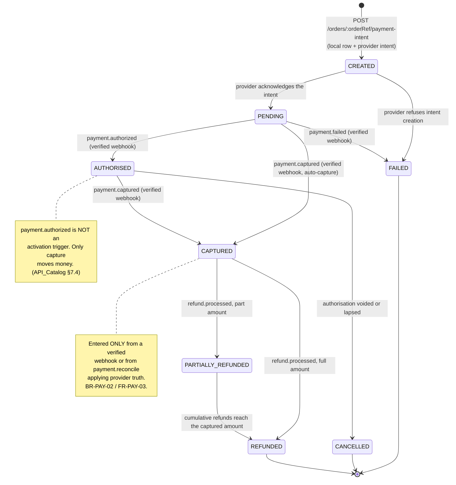
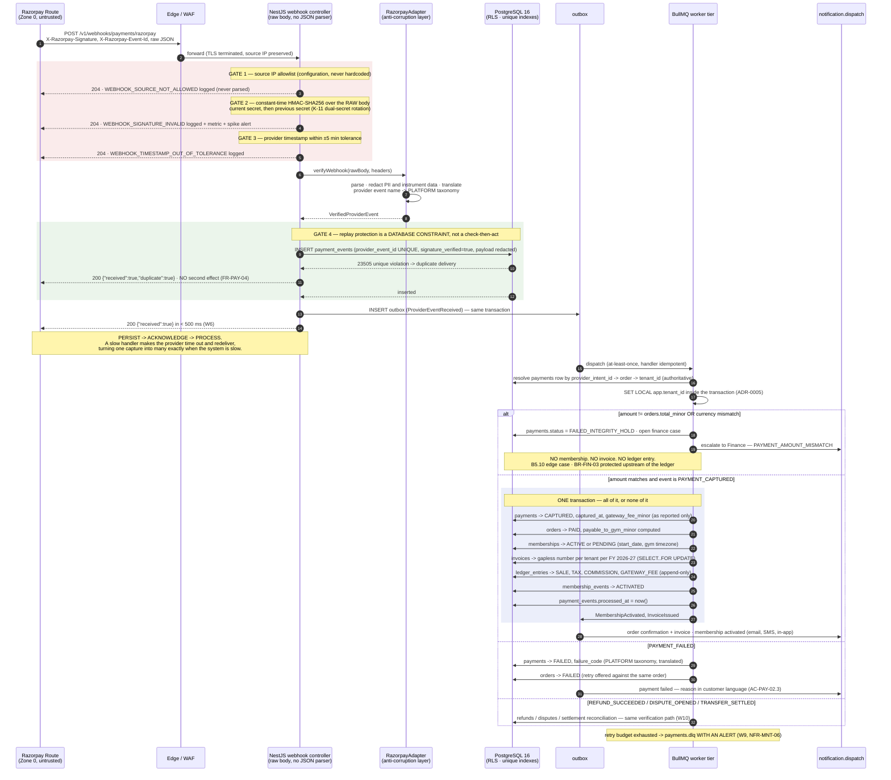

# `API-PAY` — Payments: the frozen endpoint contract

**Module:** `payments` · **Group:** `PAY` · **Surface count:** 4 endpoints (3 authenticated, 1
signature-guarded) · **Status:** contract frozen, no code written · **Launch market:** India
(`LAUNCH_MARKET_INDIA.md`) · **Phase-1 adapter:** Razorpay Route behind the `PaymentProvider` port.

---

## 0. Document control

| Aspect | Value |
| :--- | :--- |
| Owns | The four `API-PAY` rows of `API_Catalog.md` §3.6, in per-endpoint detail |
| Authoritative index | **`docs/engineering/API_Catalog.md`** — the master endpoint table, the conventions, the error registry, the rate-limit classes, the permission grammar. This document **cites** it and never restates it |
| Governing law | `PROJECT_CONSTITUTION.md` §13 (Error Handling Law) and §14 (API Rules). Nothing here may contradict either |
| Product source | `MASTER_PRD.md` `B5.10` (`PAY` module), `A8.4` (`BR-PAY-01`…`BR-PAY-11`), `A6.3` (commission mechanics), `A7.3` (payment and settlement process), `C3.1`/`C3.2` (API conventions and catalogue), `C4.2`/`C4.3` (order and payment state machines), `C5` (background jobs) |
| Physical model | `docs/database/Schema.md` §7.1 `orders`, §7.4 `payments` + `payment_events`, §7.5 `invoices`, plus `ledger_entries` (`§C2.2`) |
| Enforcement split | `docs/database/Constraints.md` §13.4 — the `BR-PAY` coverage matrix. Everything that matrix grades `NONE` or `PARTIAL` is **this layer's** job |
| Rule detail | `docs/engineering/BusinessRules.md` §9 — enforcement points, failure modes, positive and negative test ids per rule |
| Security | `docs/engineering/Security.md` — `TA-8` (provider impersonator), `TB-6` (Zone 0 → Zone 2 webhook trust boundary), `K-11` (webhook secrets), `IR-P5` (forged/replayed webhook incident runbook) |
| Not owned here | `GET /v1/tenant/payments` and `GET /v1/admin/payments` — the financial **read** surfaces. They live in `docs/apis/Admin.md`. See §19 |

> **Every fenced block in this document is labelled `illustrative — not committed code`. No
> application code exists. Zod sketches, TypeScript interfaces and JSON bodies here are the
> *contract*, expressed in the notation the implementation will use; they are not the implementation.**

---

## 1. Position, precedence, and two corrections to the master index

### 1.1 The non-duplication contract

`API_Catalog.md` §0 states its own boundary: it is the index and the conventions; the per-endpoint
detail lives in `/docs/apis/`. This document is the `payments` half of that split. Accordingly:

| Convention | Where it is defined | What this document does |
| :--- | :--- | :--- |
| Base URL, versioning | `API_Catalog.md` §1.1 | Cites. Every path below is relative to `https://api.<domain>/v1` |
| `snake_case`, money as `<name>_minor` **strings** with an adjacent `currency` | §1.2.1, §1.2.3 M1–M6 | Cites. Every amount in every example below is a string of **paise** |
| Tenant derivation — never from the client | §1.5, decision table rows 2 and 5 | Cites, and §7.6 shows exactly how row 5 resolves a webhook |
| Idempotency: 24-hour store, five-component fingerprint, three states | §1.6.1–§1.6.6 | Cites. §17 shows the two-tab race resolved by it |
| Cursor pagination | §1.7 | Not applicable — no endpoint in `API-PAY` returns a collection |
| Error envelope `code`/`message`/`details`/`correlation_id` | §1.9 EV1–EV7 | Cites. §14 gives the per-code table for this surface |
| Rate-limit headers and classes | §1.10, §4.2 | Cites. §16.1 gives the per-endpoint class |
| Cache policy tokens | §1.11 | Cites. All four endpoints are `NO-STORE!` |
| Permission grammar `<module>.<resource>.<action>` | §5.1 | Cites. §5.6 maps `B3.2` capabilities; §2.3 below extends that mapping for `PAY` |
| Status-code contract | §2.1 | Cites |
| Error-code registry rules and retryability semantics | §6.1, §6.2 | Cites. §14 is the `payments` slice, expanded |

### 1.2 Correction 1 — the path parameter is `:orderRef`, not `:ref`

`MASTER_PRD.md` `§C3.2 API-PAY` writes the intent path as `/orders/:ref/payment-intent`.
`API_Catalog.md` §3.6 writes it as `/orders/:orderRef/payment-intent`. These are the same parameter;
the catalogue's spelling is the normalised one and is what the route table, the idempotency
fingerprint (§1.6.3 component 2 is *the resolved route pattern*) and the generated OpenAPI document
will carry. **This document uses `:orderRef` throughout.** This is a naming normalisation, not a
defect in either source.

### 1.3 Correction 2 — a real contradiction: the HTTP status of a rejected webhook

**This is an error in the master index and it must be resolved before Sprint 5.**

Three sources disagree about what the wire response is when a webhook fails verification:

| Source | Statement |
| :--- | :--- |
| `API_Catalog.md` §7.1 flowchart, node `X2` | *"`401 WEBHOOK_SIGNATURE_INVALID` — logged and discarded"* |
| `API_Catalog.md` §6.8 registry row | `WEBHOOK_SIGNATURE_INVALID` → **HTTP 401** |
| `BusinessRules.md` §9 `BR-PAY-05`, enforcement layer `L9-INT` | *"an unverified webhook is logged with its provider, event id and reason at `warn` and **discarded with `2xx`** (so the provider does not retry a forgery indefinitely) — never processed"* |

`API_Catalog.md` §7.5 already establishes the underlying principle for the duplicate case — *"never
return a non-2xx for a duplicate … or the provider retries forever"* — and the same reasoning applies
with more force to a forgery: a `401` on a forged payload converts a single spoofed request into an
open-ended provider retry schedule that the attacker chose, at the platform's cost.

**Resolution `PAY-R1`, adopted by this document, pending ratification (see §20 open item `O-PAY-1`):**

| Condition | Wire response | Registry code | Where the code lives |
| :--- | :--- | :--- | :--- |
| Signature does not verify | **`204 No Content`**, empty body | `WEBHOOK_SIGNATURE_INVALID` | Structured log at `warn`, metric `payments.webhook.rejected{reason="signature"}`, alert on rate — **not on the wire** |
| Provider timestamp outside tolerance | **`204 No Content`**, empty body | `WEBHOOK_TIMESTAMP_OUT_OF_TOLERANCE` | Log + metric only |
| Source IP outside the provider allowlist | **`204 No Content`**, empty body | `WEBHOOK_SOURCE_NOT_ALLOWED` | Log + metric only |
| `:provider` is not a configured adapter | **`404 NOT_FOUND`**, standard envelope, code `WEBHOOK_PROVIDER_UNKNOWN` | `WEBHOOK_PROVIDER_UNKNOWN` | On the wire |
| Duplicate `provider_event_id` | **`200 OK`**, `{"received": true, "duplicate": true}` | — | — |

**Why the `404` survives while the three `204`s do not.** A configured provider never calls an
unconfigured `:provider` path. A `404` there is a deployment or configuration signal seen by an
operator, not a retry loop driven by a live payment provider. Keeping it a `404` preserves the
diagnostic and costs nothing.

**Why `204` and not `200`.** A rejected request produced no event, no row and no fact. A `200` with a
body implies the platform accepted something. `204` acknowledges receipt of bytes and asserts
nothing, and it cannot be mined by an attacker to distinguish "signature wrong" from "timestamp
wrong" from "IP wrong" — all three are byte-identical on the wire.

**The risk this resolution creates, and its compensating controls.** Silently accepting a
verification failure hides a genuine misconfiguration — most plausibly a secret rotation that went
wrong — because the provider stops retrying. Three controls answer it, and none may be removed:

1. `Security.md` K-11: **two webhook secrets are active simultaneously during rotation**, tried
   current-then-previous, precisely so a rotation cannot drop an event.
2. A verification-failure **rate alarm**, not a threshold on absolute count — `BR-PAY-05` states that
   a spike in verification failures *"is a signal, not noise"*. `IR-P5` is the runbook.
3. `payment.reconcile` (`FR-PAY-05`, `C5`, every 15 min) polls every indeterminate payment
   independently of webhook delivery. A dropped capture surfaces as a reconciled capture within the
   threshold, not as a lost membership.

**If the ratification goes the other way** and `401` is retained on the wire, §7.7's error table and
§14's registry slice change in one column each and nothing else in this document moves. The
rest of the webhook contract is independent of the rejection status.

### 1.4 What is *not* in this document, and why its absence is a control

> `API_Catalog.md` §3.6: *"These four rows carry invariant 5. **There is no fifth row**, and its
> absence is the control."*

| Endpoint that does not exist | Why | Asserted by |
| :--- | :--- | :--- |
| Anything of the form `POST /payments/:id/confirm`, `POST /orders/:orderRef/mark-paid`, `POST /payments/:id/success` | `BR-PAY-02`, `FR-PAY-03`, ADR-0013 — activation is webhook-driven. A client-side success signal never activates a membership | `SEC-A04-004`; a structural assertion over the **generated** OpenAPI document (`NFR-MNT-03`, ADR-0027, `API_Catalog.md` §9.4 absence assertion 1) |
| Any request field named `amount_minor`, `total_minor`, `price_minor`, `commission_minor`, `discount_minor`, `tax_minor`, `*_bps` on any `API-PAY` request schema | `BR-PAY-04`, constitution §14.4 CA1. `.strict()` makes sending one a `400 VALIDATION_FAILED` naming the unknown field, not a silent drop | `BR-PAY-04-N1`, `SEC-A04-001`; a contract test enumerating every money field in every request schema (`API_Catalog.md` §9.4 absence assertion 2) |
| Any field or header by which a client names a tenant | `API_Catalog.md` §1.5 TD1 | Explicit middleware for header/query; `.strict()` for body |
| An endpoint that returns a card number, a masked PAN beyond a provider-supplied display string, a CVV, a bank account number or an IFSC for a payment instrument | `BR-PAY-08`, `FR-PAY-09`, RBI card-tokenisation rules | `BR-PAY-08-P1`; a schema check failing the build on a column or field name matching an instrument pattern |
| A streaming, SSE or WebSocket payment-status channel | A-08 — Phase 1 uses **TanStack Query polling at 10–15 s**. `GET /payments/:id` is the polled resource | Absent from the route table |
| An outbound webhook by which a tenant subscribes to payment events | No outbound webhooks exist in Phase 1 (`API_Catalog.md` §7); a partner subscription API is Phase 2 (`A6.1` stream 10). `Security.md` records that introducing one requires an amendment, an allowlist, DNS-rebinding protection and egress controls | Absent from the route table |

---

## 2. The money contract on this surface

### 2.1 The nine figures, and which of them `API-PAY` ever returns

`A6.3` persists **eight** figures per transaction and forbids recomputation at display time. A ninth
is drafted and pending. All nine live on `orders` (`Schema.md` §7.1) and are mirrored onto
`settlement_lines`.

| Symbol | Column | `API-PAY` exposure | Meaning |
| :---: | :--- | :--- | :--- |
| `G` | `orders.gross_minor` | Via `order.breakdown` on the intent response | Plan price + joining fee + add-ons, before discount |
| `D` | `orders.discount_minor` | Via `order.breakdown` | Coupon or promotional reduction. Never takes the payable below zero (`BR-CPN-04`) |
| `N` | `orders.net_minor` | Via `order.breakdown` | `G − D` |
| `T` | `orders.tax_minor` | Via `order.breakdown`, **with `tax_components`** | From `orders.tax_snapshot` at the moment of sale (`BR-PAY-11`). India: CGST 9% + SGST 9%, two lines, never one combined 18% (`LAUNCH_MARKET_INDIA.md` §4) |
| `B` | `orders.commission_base_minor` | **Never.** Platform-internal | `N` excluding tax (`BR-FIN-04`) |
| `C` | `orders.commission_minor` | **Never on a member surface.** Tenant sees it on settlement statements only | `round_half_even(B × rate)`; zero when `origin = 'DIRECT'` |
| `F` | `orders.gateway_fee_minor` | **Never on a member surface.** Nullable until the provider reports it — **never estimated** (`BR-FIN-06`) | Provider-reported fee |
| `P` | `orders.payable_to_gym_minor` | **Never on a member surface** | `(N + T) − C − F`, and `− Cₜ` if the ninth figure is adopted |
| `Cₜ` | `orders.commission_tax_minor` | **Never** | **PENDING CLIENT DECISION** — see §2.2 |

The member-facing amount is `total_minor = N + T`, which is what the payment intent is created for
and what the webhook's captured amount is asserted against (§7.8).

### 2.2 `commission_tax_minor` — the ninth figure, PENDING CLIENT DECISION

> **`BLK-03` conflict 2** (`LAUNCH_MARKET_INDIA.md` §11, severity **High**), tracked as schema open
> item **`O-1`**, deadline **before Sprint 11**.

| Aspect | Status |
| :--- | :--- |
| The gap | `A6.3` computes `payable_to_gym = (N + T) − C − F` with **no GST on `C`**. The platform supplies a commission *service* to the tenant, and that supply attracts GST in its own right. There are two taxable supplies; the PRD models one |
| Schema today | `orders.commission_tax_minor`, `settlement_lines.commission_tax_minor` and `settlement_batches.commission_tax_minor` **exist, are nullable, and are `NULL` on every row** (`Schema.md` §14.3, `Constraints.md` §4.4) |
| DDL cost of adoption | **Zero.** `ck_orders__payable_identity` already carries the term inside a `COALESCE`, as does `ck_settlement_batches__sums_to_payable` |
| API cost of adoption | **Zero on `API-PAY`.** No endpoint in this document returns `C`, `F`, `P` or `Cₜ`. Adoption changes settlement statements (`Admin.md`, tenant settlement surfaces), not the payment surface |
| Why the deadline is real | After the first real settlement runs, changing this is a **restatement of issued statements**, and `BR-PAY-10` makes an issued invoice immutable. It stops being configuration and becomes a conversation with every tenant |
| Who decides | Project Owner + Finance, on advice from a qualified Indian tax advisor (`LAUNCH_MARKET_INDIA.md` §13 items 1, 2 and 4) |

**This document states the mechanism and refuses to state the liability.** Every rate and threshold
touching Indian tax in this file is subject to `LAUNCH_MARKET_INDIA.md`'s standing caveat: *"every
rate and threshold in this document is stated to the best of current understanding and must be
verified before it is written into a tax profile."*

### 2.3 `B3.2` capabilities mapped to `API-PAY` permissions

Extending `API_Catalog.md` §5.6. Every endpoint declares exactly one permission or `FR-RBAC-01`'s CI
gate (`PG-1`) fails the build.

| `B3.2` capability | Roles holding it | Permission string | Endpoint |
| :--- | :--- | :--- | :--- |
| Purchase membership | `USER` ● `MEMBER` ● | `payments.intent.create` | `POST /orders/:orderRef/payment-intent` |
| Purchase membership (recovery path) | `USER` ● `MEMBER` ● | `payments.intent.retry` | `POST /payments/:id/retry` |
| Purchase membership (own record read) | `USER` ● `MEMBER` ● | `payments.payment.read` | `GET /payments/:id` |
| — *(no role; the caller is a payment provider)* | — | **none — `@Public()` item 19** | `POST /webhooks/payments/:provider` |

**Scope is not in the string** (`API_Catalog.md` §5.1). `payments.payment.read` on `/payments/:id`
resolves to `▪` — own records only — through the resource ownership check of §5.3, not through the
permission string. A `MEMBER` of tenant A reading a payment belonging to tenant B gets **`404`**, not
`403` (§2.3 of the catalogue, TD5).

**`payments.payment.list`** is a different permission held by tenant roles and used by
`GET /tenant/payments`; it is documented in `Admin.md` and is deliberately **not** reachable from any
route in this file.

### 2.4 Surfaces

| Endpoint | `web` | `dash` | `admin` |
| :--- | :-: | :-: | :-: |
| `POST /orders/:orderRef/payment-intent` | ✅ `SCR-WEB-005` → `SCR-WEB-006` | ❌ — the dashboard's sale path is `POST /tenant/orders/offline` | ❌ |
| `GET /payments/:id` | ✅ `SCR-WEB-006`, `SCR-WEB-007`, `SCR-WEB-011` | ❌ — `dash` reads `GET /tenant/payments` | ❌ — `admin` reads `GET /admin/payments` |
| `POST /payments/:id/retry` | ✅ `SCR-WEB-006` failure state | ❌ | ❌ |
| `POST /webhooks/payments/:provider` | ❌ machine-to-machine | ❌ | ❌ |

---

## 3. The payment state machine (`C4.3`)

### 3.1 The states

`Schema.md` §7.4 fixes `payments.status` to the `payment_status_enum` of `§C2.2`. `§C4.3` fixes the
transitions. This is a **closed enum** — a client may not receive a value outside this set, and
adding one would be a breaking change under `API_Catalog.md` §8.2.

| State | Meaning | Terminal? | Member-facing display (`AC-PAY-02.2`) |
| :--- | :--- | :-: | :--- |
| `CREATED` | The local `payments` row exists; the provider intent has been requested but not yet acknowledged | No | *Confirming payment* |
| `PENDING` | The provider acknowledged the intent; the payer is authorising (UPI collect request sent, 3-D Secure challenge open, netbanking redirect in flight) | No | *Confirming payment* |
| `AUTHORISED` | Funds are held but **not** moved. **This is not an activation trigger** | No | *Confirming payment* |
| `CAPTURED` | Funds moved. **The only state that activates a membership** | No — refunds follow | *Paid* |
| `FAILED` | The provider reported a terminal failure with a reason code | Yes | *Payment failed* + translated reason + retry (`AC-PAY-02.3`) |
| `CANCELLED` | The authorisation lapsed or was voided before capture | Yes | *Payment cancelled* + retry |
| `REFUNDED` | Fully refunded after capture | Yes | *Refunded*, with the refund reference |
| `PARTIALLY_REFUNDED` | Partially refunded after capture | No | *Partially refunded*, with amounts |



### 3.2 The transition table, with the authorised cause of each

The column that matters is the last one. **No transition into `CAPTURED` has a client-side cause.**

| From | To | Trigger | Guard | Authorised cause |
| :--- | :--- | :--- | :--- | :--- |
| — | `CREATED` | `POST /orders/:orderRef/payment-intent` succeeds locally | Order is `PENDING` or `FAILED` and unexpired; re-pricing matched | **Client request** |
| `CREATED` | `PENDING` | Provider returns an intent identifier | — | Adapter, synchronous |
| `CREATED` | `FAILED` | Provider refuses intent creation | — | Adapter, synchronous; surfaces as `PAYMENT_PROVIDER_DECLINED` or `PAYMENT_PROVIDER_TIMEOUT` |
| `PENDING` | `AUTHORISED` | `PAYMENT_AUTHORISED` platform event | Signature verified, event id first-seen, amount asserted | **Verified webhook only** |
| `PENDING` \| `AUTHORISED` | `CAPTURED` | `PAYMENT_CAPTURED` platform event | Signature verified, event id first-seen, **amount equals `orders.total_minor`** | **Verified webhook, or `payment.reconcile` applying a provider `fetchStatus` result** — the same idempotent use case, never a second one (`BR-PAY-06-P1`) |
| `PENDING` \| `AUTHORISED` | `FAILED` | `PAYMENT_FAILED` platform event | Signature verified, event id first-seen | **Verified webhook, or the reconciler** |
| `AUTHORISED` | `CANCELLED` | Authorisation voided or lapsed at the provider | — | **Verified webhook, or the reconciler** |
| `CAPTURED` | `PARTIALLY_REFUNDED` \| `REFUNDED` | `REFUND_SUCCEEDED` platform event | Refund record exists locally; cumulative refunds ≤ captured | **Verified webhook** (`FR-RFND-05`, `BR-REF-09`) |
| any | any earlier state | **Forbidden** | — | **A later state never regresses to an earlier one** (`API_Catalog.md` §7.2 W7). An out-of-order delivery that would regress is recorded on `payment_events` and **discarded as an effect**, not applied |

### 3.3 The four states that are *indeterminate*, and what the member is told

`BR-PAY-06` names the problem: *"a payment in an indeterminate state after the gateway's settlement
window."* `CREATED`, `PENDING` and `AUTHORISED` are indeterminate from the member's point of view —
money may or may not move. `AC-PAY-02.2` fixes what the member sees while that is true.

| Elapsed since intent creation | `payments.status` | `display_status` returned by `GET /payments/:id` | Reason |
| :--- | :--- | :--- | :--- |
| 0 → `reconciliation_threshold_seconds` | `CREATED` \| `PENDING` \| `AUTHORISED` | **`CONFIRMING_PAYMENT`** | `AC-PAY-02.2`: *"it shows 'confirming payment' with an explicit expectation, **never 'failed'**"* |
| Any time | `FAILED` reached from a **verified terminal provider fact** | `FAILED` | `AC-PAY-02.3`: a genuine failure shows the reason in customer language, immediately. Absence of a fact is not a failure; a fact is |
| Past `reconciliation_threshold_seconds`, still indeterminate | `PENDING` \| `AUTHORISED` | **`CONFIRMING_PAYMENT`**, with `reconciliation.state = "RECONCILING"` | `payment.reconcile` has taken it. Still not a failure |
| Past `escalation_threshold_seconds`, still indeterminate | `PENDING` \| `AUTHORISED` | **`CONFIRMING_PAYMENT`**, with `reconciliation.state = "ESCALATED_TO_FINANCE"` and a support reference | `BR-PAY-06`: escalated to Finance, **never auto-activated**. The member is told a human is on it, not that they failed |

**Seeded values, both configuration, both revisable without a version bump:**

| Parameter | Seed | Basis |
| :--- | ---: | :--- |
| `reconciliation_threshold_seconds` | **900** (15 min) | Matches `payment.reconcile`'s 15-minute cadence (`C5`), so the first poll has run before the label changes |
| `escalation_threshold_seconds` | **21600** (6 h) | Well inside `BR-PAY-07`'s one-business-day repair budget and `FR-PAY-08`'s one-hour duplicate target, and long enough that a provider's own delayed settlement window does not manufacture escalations |
| `poll_after_seconds` returned to the client | **10** while indeterminate, **null** once terminal | A-08: TanStack Query polling at 10–15 s. The server names the cadence so a future change does not require a client release |

---

## 4. `POST /v1/orders/:orderRef/payment-intent`

### 4.1 Endpoint header

| Aspect | Value |
| :--- | :--- |
| **Purpose** | Re-price the order from server-held data, create exactly one local `payments` row, obtain a provider intent for it, and return the handoff material the client needs to open the provider's hosted element. **It does not take money and it does not activate anything.** |
| **Surfaces** | `web` only — `SCR-WEB-005` (Checkout) submits it; `SCR-WEB-006` (Payment) consumes the response |
| **Auth mode** | `access` — `Authorization: Bearer <access_token>`, the 15-minute token (`FR-AUTH-06`) |
| **Required permission** | **`payments.intent.create`** (`B3.2` *Purchase membership*, held by `USER` ● and `MEMBER` ●) |
| **Tenant scope** | `user` — audience row 2 of `API_Catalog.md` §1.5. The order's `tenant_id` is reached through the ownership join `orders.user_id = sub`, never from anything the client sends |
| **Idempotency** | **REQUIRED** (`BR-PAY-03`, `API_Catalog.md` §1.6.1 money-affecting class). Key source: the **same client-generated UUID used for `POST /orders`**, one per checkout attempt, honoured through payment initiation (`FR-CART-06`, §1.6.5 row 1) |
| **Rate-limit class** | **`RL-PAY`** — tier 3: 120/h per IP · **10/min per user** · 60/min per tenant · **5/min per order** · burst 2 |
| **Cache policy** | **`NO-STORE!`** — `private, no-store` + `Pragma: no-cache` + `Vary: Authorization` |
| **Catalogue row** | `API_Catalog.md` §3.6 row 1 — FR: `FR-PAY-01`, `FR-PAY-02`, `FR-PAY-10`, `FR-PAY-12`; BR: `BR-PAY-03`, `BR-PAY-04`, `BR-PLN-03`, `BR-CPN-03` |

### 4.2 Request

**Path parameters**

| Name | Type | Constraint | Required | Notes |
| :--- | :--- | :--- | :-: | :--- |
| `orderRef` | `string` | `^ORD-[0-9]{4}-[A-HJ-NP-Z2-9]{6}$` — Crockford-style alphabet, no `I`/`L`/`O`/`0`/`1` | ✅ | `orders.order_ref` (`Schema.md` §7.1), unique platform-wide, human-readable because both parties quote it |

**Query parameters** — **none**. An endpoint that creates money movement takes no query parameters.

**Headers**

| Header | Required | Value |
| :--- | :-: | :--- |
| `Authorization` | ✅ | `Bearer <access_token>` |
| `Idempotency-Key` | ✅ | The checkout attempt's UUID. Missing → `400 IDEMPOTENCY_KEY_REQUIRED` (ID-D) |
| `Content-Type` | ✅ | `application/json; charset=utf-8` |
| `Accept-Language` | ➖ | Selects the message catalogue. Defaults to the account language, then `en-IN` |
| `X-Correlation-Id` | ➖ | Echoed and propagated |

**Body — Zod sketch**

```ts
// illustrative — not committed code
// packages/types/src/payments/create-payment-intent.schema.ts
import { z } from 'zod';

export const CreatePaymentIntentRequest = z
  .object({
    // Which provider adapter to use. OPEN ENUM (API_Catalog §8.3): the platform may add an
    // adapter without a version bump. Omitted => the tenant's default adapter, which in
    // Phase 1 India is always 'razorpay'. FR-PAY-01 keeps this a routing hint, never a
    // capability grant: an unconfigured value is 422 PAYMENT_PROVIDER_NOT_CONFIGURED.
    provider: z.enum(['razorpay']).optional(),

    // FR-PAY-02: instruments are PROVIDER-DRIVEN and rendered dynamically. This field is a
    // PREFERENCE used only to pre-select a tab in the provider's hosted element. The platform
    // hardcodes no instrument list, validates nothing against one, and ignores a value the
    // provider does not offer. OPEN ENUM.
    preferred_method: z
      .enum(['UPI', 'CARD', 'NETBANKING', 'WALLET'])
      .optional(),

    // Where the provider should send the payer after authorisation. NOT a client-supplied URL:
    // it is a KEY into a server-held allowlist of the three surface origins (C3/C4 of
    // API_Catalog §1.13 — "no endpoint accepts a callback URL"). Absent => 'web_confirmation'.
    return_surface: z.enum(['web_confirmation', 'web_account']).optional(),

    // FR-PAY-11 / BR-MEM-10: opt in to registering a recurring mandate alongside this payment.
    // Subject to RBI e-mandate rules; see §13. If the selected rail offers no mandate the
    // request fails 422 MANDATE_NOT_SUPPORTED rather than silently charging without one.
    register_mandate: z.boolean().optional().default(false),
  })
  .strict(); // ADR-0022 / IV2: an unknown field is 400, not a silent drop
```

**The body is entirely optional.** `POST /v1/orders/ORD-2026-8F3K9A/payment-intent` with `{}` is a
complete, valid request. That is the point: *"the client submits a plan id, a start date, an optional
coupon code and an idempotency key — **never a price**"* (`SCR-WEB-005`, constitution §14.4 CA2), and
by the time the client reaches this endpoint even the plan id is already server state on the order.

**Fields that do not exist and produce `400 VALIDATION_FAILED` with `rule: "unknown_field"`:**
`amount_minor` · `total_minor` · `net_minor` · `tax_minor` · `discount_minor` · `commission_minor` ·
`commission_rate_bps` · `currency` · `plan_id` · `tenant_id` · `gym_id` · `coupon_code` ·
`callback_url` · `redirect_url` · `notify_url` · `customer_email` · `customer_phone` · `card_number` ·
`vpa` · `upi_id`.

Three of those deserve a note:

| Field | Why it is refused rather than accepted |
| :--- | :--- |
| `coupon_code` | The coupon is applied by `POST /orders/:orderRef/coupon` and is already on the order. Accepting it here would create a second application path and a second redemption-count race (`BR-CPN-02`) |
| `callback_url` / `redirect_url` / `notify_url` | `API_Catalog.md` §1.13 C4: *"There is no endpoint that accepts a callback URL, a redirect target, or a template that the server will render from client input."* `return_surface` is a key into a server-held allowlist |
| `vpa` / `upi_id` / `card_number` | `BR-PAY-08`, `FR-PAY-09`. Instrument entry happens in the **provider's** hosted element. The platform's API never receives an instrument identifier, so there is nothing to store, log or leak. This is architecture (ADR-0018), not a filter |

### 4.3 Response — `201 Created`

```json
// illustrative — not committed code
// HTTP/1.1 201 Created
// Cache-Control: private, no-store   Pragma: no-cache   Vary: Authorization
// X-Correlation-Id: 01JZQ8H4M7N2R5T9V3W6X8Y1B0
// X-RateLimit-Limit: 10  X-RateLimit-Remaining: 9  X-RateLimit-Reset: 1785312060
{
  "payment": {
    "id": "8f14c2b6-7a3d-4e51-9c88-2b1d0f6a4e77",
    "order_ref": "ORD-2026-8F3K9A",
    "status": "PENDING",
    "display_status": "CONFIRMING_PAYMENT",
    "amount_minor": "472000",
    "currency": "INR",
    "created_at": "2026-08-06T09:41:22Z",
    "expires_at": "2026-08-06T10:11:22Z",
    "poll_after_seconds": 10,
    "poll_url": "/v1/payments/8f14c2b6-7a3d-4e51-9c88-2b1d0f6a4e77"
  },
  "order": {
    "order_ref": "ORD-2026-8F3K9A",
    "status": "AWAITING_PAYMENT",
    "gym_name": "Iron Temple Fitness, Koregaon Park",
    "branch_name": "Koregaon Park",
    "plan_name": "Annual Unlimited",
    "start_date": "2026-08-10",
    "currency": "INR",
    "breakdown": {
      "plan_price_minor": "500000",
      "joining_fee_minor": "0",
      "add_ons_minor": "0",
      "gross_minor": "500000",
      "discount_minor": "100000",
      "net_minor": "400000",
      "tax_minor": "72000",
      "tax_components": [
        { "component": "CGST", "rate_bps": 900, "amount_minor": "36000" },
        { "component": "SGST", "rate_bps": 900, "amount_minor": "36000" }
      ],
      "total_minor": "472000"
    },
    "coupon": { "code": "NEW20", "discount_minor": "100000" },
    "refund_policy_summary": "Full refund within 7 days of purchase if no check-in has been recorded. Pro-rata thereafter, less a ₹500 cancellation fee."
  },
  "handoff": {
    "provider": "razorpay",
    "mode": "HOSTED_CHECKOUT",
    "provider_intent_ref": "order_PZxYq8n2WkLmT4",
    "public_key": "rzp_live_7Kq2XmN4pB8sVd",
    "prefill": {
      "name": "Priya Sharma",
      "contact": "+919822014477",
      "email": "priya.sharma@example.in"
    },
    "notes": { "order_ref": "ORD-2026-8F3K9A" },
    "available_methods": ["upi", "card", "netbanking", "wallet"],
    "return_surface": "web_confirmation",
    "expires_at": "2026-08-06T10:11:22Z"
  },
  "guidance": {
    "message_key": "payments.handoff.do_not_close",
    "message": "Do not close this window while your payment is being confirmed. If your browser closes, your membership will still be activated once we receive confirmation from your bank — reopen your account to check.",
    "no_second_attempt": true
  }
}
```

**Every field, and where it comes from**

| Field | Type | Source | Notes |
| :--- | :--- | :--- | :--- |
| `payment.id` | `uuid` | `payments.id` | The stable local identifier. **This, not the provider reference, is what the client polls** |
| `payment.status` | closed enum | `payments.status` | §3.1 |
| `payment.display_status` | open enum | Derived | §3.3. Present on every payment representation so no surface has to re-derive the `AC-PAY-02.2` rule |
| `payment.amount_minor` | `string` of paise | `payments.amount_minor` = `orders.total_minor` | `BR-PAY-01` M1. A **string**, not a number |
| `payment.expires_at` | ISO-8601 UTC `Z` | `orders.expires_at`, or intent TTL, whichever is earlier | After this the order is `410 ORDER_EXPIRED` |
| `payment.poll_after_seconds` | `integer` | Configuration | A-08 polling cadence, server-named |
| `order.breakdown.*` | `string` paise | `orders` columns `G`,`D`,`N`,`T` + `order_items` | The **re-priced** figures, computed in the same transaction as the intent (§4.6) |
| `order.breakdown.tax_components[]` | array | `orders.tax_snapshot` | `component` is an **open enum** — `CGST`, `SGST`, `IGST`. A client must tolerate an unknown component (`API_Catalog.md` §8.3, `V6`) |
| `handoff.provider` | open enum | `payments.provider` | `razorpay` in Phase 1 |
| `handoff.mode` | open enum | Adapter | `HOSTED_CHECKOUT` (provider element) or `REDIRECT` (provider-hosted page). `FakePaymentProvider` returns `SANDBOX_DETERMINISTIC` (`FR-PAY-12`) |
| `handoff.provider_intent_ref` | `string` | `payments.provider_intent_id` | Razorpay's `order_*` identifier. Opaque to the platform's domain (§9) |
| `handoff.public_key` | `string` | Configuration | The provider's **publishable** key. Never a secret. Rotated with the adapter's configuration, never hardcoded |
| `handoff.available_methods` | `string[]` | **The provider**, at intent creation | **`FR-PAY-02`: the platform hardcodes no instrument list.** The array is what the adapter reports for this intent, lowercased provider vocabulary, and the client renders it dynamically. An empty array is legal and means "let the provider decide" |
| `handoff.prefill` | object | The authenticated user's profile | Sent so the payer does not retype. Contains **no** instrument data |
| `guidance.no_second_attempt` | `boolean` | Constant `true` | `SCR-WEB-006`: the timeout state must say *"explicitly that no second attempt should be made"*. The flag lets three surfaces render one rule consistently |

**Status code is `201`**, because a `payments` row was created. A replay of the same
`Idempotency-Key` with the same fingerprint returns **the stored `201` byte-for-byte** (`§1.6.4`), not
a `200` — the stored status is replayed, not recomputed.

### 4.4 Errors

| Code | HTTP | When | User-facing message (what / why / what next, `NFR-USE-05`) | Retry |
| :--- | :-: | :--- | :--- | :--- |
| `IDEMPOTENCY_KEY_REQUIRED` | 400 | No `Idempotency-Key` header | Developer-facing; never shown to an end user | Fix |
| `IDEMPOTENCY_KEY_MISMATCH` | 409 | Same key, different fingerprint | Developer-facing; a client bug, not a user error | No |
| `IDEMPOTENT_REQUEST_IN_PROGRESS` | 409 | Same key, state `IN_FLIGHT` — **the second browser tab** | Not surfaced; the client waits `Retry-After` and re-issues with the **same** key | Same-key |
| `VALIDATION_FAILED` | 400 | Unknown field (including any monetary field), bad `orderRef` shape, bad enum | "We could not read part of that request." Field-level `details`. A monetary field appears as `rule: "unknown_field"` — `BR-PAY-04` made observable | Fix |
| `TENANT_HEADER_NOT_ACCEPTED` | 400 | `X-Tenant-Id` header or `?tenant_id=` present | Developer-facing (§1.5 TD1) | Fix |
| `UNAUTHENTICATED` | 401 | Missing, malformed or expired access token | "Your session has expired. Sign in again to finish your purchase — your order is saved for 30 minutes." | Fix |
| `PERMISSION_DENIED` | 403 | Token lacks `payments.intent.create` | "This account cannot make purchases." | No |
| `IMPERSONATION_FORBIDS_FINANCIAL_MUTATION` | 403 | A support impersonation token attempting a payment (`FR-AUTH-12`) | Staff-facing: "Impersonation cannot take a payment. Ask the member to complete checkout themselves." | No |
| `NOT_FOUND` | 404 | `orderRef` unknown, **or belongs to another user or tenant** | "We could not find that order." **`404`, never `403`** — a `403` confirms the order exists (§2.3 TD5) | No |
| `ORDER_EXPIRED` | **410** | Past the order's `PENDING` window (`FR-CART-05`) | "This order expired after 30 minutes and the coupon hold was released. Start again — the plan and price will be re-checked." | Fix |
| `ORDER_ALREADY_PAID` | 409 | A capture already landed for this order | "This order is already paid." **Route to the confirmation screen, not to an error state** | No |
| `PAYMENT_ALREADY_CAPTURED` | 409 | A second intent requested against a captured order | "This membership has already been paid for." Route to confirmation | No |
| `ORDER_NOT_CANCELLABLE` | 422 | Order is `CANCELLED` | "This order was cancelled. Start a new purchase." | Fix |
| `PLAN_PRICE_CHANGED` | **422** | Re-pricing found a different plan price (`BR-PLN-03`) | "The price of this plan changed while you were checking out. It is now ₹5,500 instead of ₹5,000. Review the new price and confirm to continue." `details` carries `previous` and `current` | Fix |
| `PLAN_ARCHIVED` | 422 | The plan left sale between order creation and payment | "This plan is no longer on sale. Here are the gym's current plans." | Fix |
| `COUPON_EXPIRED` | 422 | The coupon lapsed between application and payment (`BR-CPN-03`) | "The coupon NEW20 expired before you paid. The price without it is ₹5,900. Confirm to continue, or apply another code." | Fix |
| `COUPON_EXHAUSTED` | 422 | Redemption limit reached in the interim | "That coupon has been fully redeemed." Do not disclose the limit value | No |
| `MEMBERSHIP_NOT_STACKABLE` | 422 | A concurrent membership at this gym appeared (`BR-MEM-04`) | "You already have a membership at Iron Temple Fitness running until 12 March 2027. Renew it instead of buying a second one." | Fix |
| `TAX_PROFILE_NOT_CONFIGURED` | 422 | No tax profile for the tenant's country | Finance-facing. **Blocks the sale rather than guessing GST** (`BR-PAY-11`) | Fix |
| `COMMISSION_RATE_NOT_CONFIGURED` | 422 | No effective commission rate at the moment of sale | Finance-facing. **Blocks rather than defaulting to zero** (`BR-FIN-05`) | Fix |
| `PARTIAL_PAYMENT_NOT_PERMITTED_ONLINE` | 422 | An online order in `PARTIALLY_PAID` | "Online purchases are paid in full. Ask the gym to collect the balance at the desk." (`BR-PAY-09`, `AC-CART-02.4`) | No |
| `MANDATE_NOT_SUPPORTED` | 422 | `register_mandate: true` on a rail with no mandate support | "This payment method cannot be used for automatic renewal. Pay now and we will remind you 15, 7, 3 and 1 days before your membership ends." (`FR-PAY-11`, `BR-MEM-10`) | No |
| `PAYMENT_PROVIDER_NOT_CONFIGURED` | 422 | `provider` names an adapter that is not configured for this tenant/environment | Developer-facing | Fix |
| `PAYMENT_PROVIDER_DECLINED` | 422 | The provider refused **intent creation** | **Translate the provider's code into customer language — never display it** (ER6, `AC-PAY-02.3`) | Fix |
| `TENANT_SUSPENDED` | 422 | The gym was suspended between order and payment | "This gym is not currently accepting new memberships. Your order has been cancelled and nothing was charged." | No |
| `PAYMENT_PROVIDER_TIMEOUT` | **503** | No provider response within the call budget | "We did not get a response from your bank in time. **Do not try to pay again** — we are checking, and we will confirm within 15 minutes." | Wait |
| `RATE_LIMIT_EXCEEDED` | 429 | `RL-PAY` bucket empty | Must state **when** the caller may retry (`RL2`) | Wait |
| `SERVICE_UNAVAILABLE` | 503 | Database or a critical dependency down | Generic, with the correlation id (`UM6`) | Wait |

**Two rows are worth reading twice.** `PAYMENT_PROVIDER_TIMEOUT` is a **`503` with a Wait**, and its
message forbids a second attempt — because the intent may exist at the provider even though the
response was lost, and the reconciler is the resolver, not the member. `PLAN_PRICE_CHANGED` is a
**`422`, never a silent charge of either figure** — `API_Catalog.md` invariant 3 and `AC-PLAN-02.2`.

### 4.5 Business rules enforced, and where

| Rule | Enforced where | Detail |
| :--- | :--- | :--- |
| **`BR-PAY-03`** idempotency | **This layer** — `IdempotencyInterceptor` (`L9-INT`) — **and the database** (`uq_orders__idempotency_key`, `uq_idempotency_keys__key_endpoint`) | `Constraints.md` §13.4 grades it **FULL** at `L1-DB`. The interceptor is the fast path; uniqueness is the truth (ID-A). §17 walks the two-tab race |
| **`BR-PAY-04`** never trust client amounts | **This layer**, at `L8-PIPE` | `Constraints.md` §13.4 grades it **NONE** at the database — *"provenance of a number cannot be constrained"*. `.strict()` makes a submitted amount a `400`; the pricing service composes every figure from server state |
| **`BR-PLN-03`** price displayed = price charged | **This layer**, at `L6-UC`, inside the intent transaction | The order is re-priced from plan, promotion, coupon and tax profile; a difference aborts with `422 PLAN_PRICE_CHANGED`. `L11-UI` shows old and new and requires re-confirmation |
| **`BR-CPN-03`** coupon validity at redemption | **This layer**, at `L6-UC`, same transaction | Coupon window, total limit, per-user limit and applicability are re-evaluated. A lapse aborts rather than charging the discounted figure |
| **`BR-PAY-09`** partial payment offline only | **Database**, `ck_orders__partial_paid_offline_only` (**FULL**) | This layer refuses earlier with `PARTIAL_PAYMENT_NOT_PERMITTED_ONLINE` so the member gets a sentence rather than a constraint violation |
| **`BR-PAY-11`** tax at the moment of sale | **Database**, `orders.tax_snapshot NOT NULL` (**STRUCTURAL**) | This layer reads the snapshot; it never joins to `tax_profiles` |
| **`BR-FIN-04`** commission base excludes tax | **Database**, `ck_orders__commission_base_excludes_tax` | Computed at order creation; re-pricing recomputes it and the constraint re-validates |
| **`BR-FIN-05`** rate persisted at sale | **Database**, `orders.commission_rate_bps` (**STRUCTURAL**) | Re-pricing may move the rate only if the order is re-created, never in place after `PAID` |
| **`BR-TEN-01`** tenant isolation | **Database**, RLS | `SET LOCAL app.tenant_id` inside the transaction via the mandatory Prisma extension (ADR-0005). The application role has no `BYPASSRLS` |
| **`FR-PAY-01`** provider abstraction | **This layer** | The use case depends on the `PaymentProvider` port. `dependency-cruiser` forbids the domain importing an adapter (§9.1) |
| **`FR-PAY-02`** provider-driven instruments | **This layer** | `handoff.available_methods` is a pass-through of the adapter's report. There is no platform instrument table |
| **`FR-PAY-10`** split settlement | **This layer + adapter** | The intent is created with the Route transfer instruction so the gym's share settles to its connected account and the commission is retained; where the provider cannot split, the platform performs a scheduled payout instead |
| **`FR-PAY-12`** deterministic sandbox | **This layer**, non-production only | `FakePaymentProvider` returns one of four outcomes — success, failure, timeout, duplicate — selected by a configured test order reference, so CI needs no tunnel and no provider account |

### 4.6 Validation — what the pipe rejects before the use case runs

Guard chain order is `API_Catalog.md` §5.2. Steps 1–8 all run before a single row is read.

| Step | Rejects | Code |
| :--- | :--- | :--- |
| 1 · `RateLimitGuard` (IP-keyed) | 120/h per IP exceeded | `429` |
| 2 · `JwtAuthGuard` | Absent, malformed, expired or revoked access token | `401 UNAUTHENTICATED` |
| 3 · `RateLimitGuard` (principal-keyed) | 10/min per user, 5/min per order, 60/min per tenant | `429` |
| 4 · `TenantContextMiddleware` | `X-Tenant-Id` header or `tenant_id` query parameter | `400 TENANT_HEADER_NOT_ACCEPTED` |
| 5 · `PermissionsGuard` | Missing `payments.intent.create` | `403 PERMISSION_DENIED` |
| 6 · `ImpersonationGuard` | `token_type` is an impersonation token | `403 IMPERSONATION_FORBIDS_FINANCIAL_MUTATION` |
| 7 · `ZodValidationPipe` `.strict()` | Unknown field · **any monetary field** · `orderRef` failing the pattern · `provider` not a configured adapter · `preferred_method` not in the open enum · `return_surface` not an allowlisted key · `register_mandate` not a boolean | `400 VALIDATION_FAILED` with one `details` entry per field |
| 8 · `IdempotencyInterceptor` | Missing key → `400`; `IN_FLIGHT` → `409` + `Retry-After`; `COMPLETED` + matching fingerprint → **replay**; `COMPLETED` + different fingerprint → `409` | as listed |

**The pipe never sees a price, so it never has to decide whether to trust one.** That is the whole
design of `BR-PAY-04`: the safest validation is the field's non-existence.

### 4.7 Side effects

Everything below happens in **one** database transaction, and the idempotency record commits with it
(ADR-0016 — there is no safe ordering across two stores).

| # | Effect | Table / target | Notes |
| :-: | :--- | :--- | :--- |
| 1 | Claim the idempotency key | `idempotency_keys` | `INSERT … ON CONFLICT DO NOTHING`; zero rows affected means another request holds it |
| 2 | Lock and re-price the order | `orders` (`SELECT … FOR UPDATE`), reading `plans`, `promotions`, `coupons`, `tax_profiles` | Aborts on any of the `422`s in §4.4 before anything is written |
| 3 | Update the order's money figures if re-pricing moved them **and** the client re-confirmed | `orders` `G`,`D`,`N`,`T`,`B`,`C` | Only while `status` is not `PAID`; `trg_orders__freeze_money_after_paid` makes post-`PAID` writes impossible |
| 4 | Transition the order | `orders.status` → `AWAITING_PAYMENT` (`§C4.2`) | From `PENDING` or from `FAILED` on the retry path |
| 5 | Insert the payment | `payments` — `status='CREATED'`, `provider`, `amount_minor = orders.total_minor`, `currency='INR'`, `is_offline=false` | One row. `uq_payments__provider_intent` will hold the provider reference once known |
| 6 | Call the provider adapter | External — `PaymentProvider.createIntent()` | Wrapped in a circuit breaker with a bounded timeout (ER9). **Called inside the transaction's logical scope but with the row already written**, so a lost response leaves a `CREATED` payment the reconciler can resolve — never a phantom |
| 7 | Record the intent reference | `payments.provider_intent_id`, `status='PENDING'` | |
| 8 | Outbox event | `outbox` — `PaymentIntentCreated` | `aggregate_type='payment'`. Drives analytics `checkout_payment_started` (`C6` conversion funnel) |
| 9 | Audit record | `audit_log` | Actor = the member; `before`/`after` on the order's status and money figures (`BR-DAT-01`) |
| 10 | Store the idempotent response | `idempotency_keys.response_status`, `.response_body` | Committed with everything above; 24-hour `expires_at` |

**What is deliberately *not* written:** no `memberships` row, no `invoices` row, no
`ledger_entries` row, no `membership_events` row, no notification. **None of those exist until a
verified capture webhook lands** (`BR-PAY-02`). A payment intent is a request to be charged, not a
sale.

### 4.8 Future compatibility

| May be added inside `v1` (non-breaking, `API_Catalog.md` §8.2) | Would force a `v2` |
| :--- | :--- |
| A new value in the **open** `provider` enum — a second adapter is data, not a contract change (`Schema.md` §14.2: `payments.provider` is `text`, not an enum, precisely for this) | Removing or renaming `payment.id`, `payment.amount_minor`, `handoff.provider_intent_ref` |
| A new value in `preferred_method` or in `handoff.available_methods` — `FR-PAY-02` guarantees the platform never enumerates instruments | Making `provider` a **required** request field |
| A new `tax_components[].component` value (`IGST` already anticipated) | Changing `amount_minor` from a string to a number, or dropping `currency` |
| A new response field — e.g. `handoff.upi_intent_uri` for a deep link, or `handoff.qr_payload` for a UPI QR | Changing `201` to `200`, or changing which condition emits `PLAN_PRICE_CHANGED` |
| A new **optional** request field — e.g. `save_instrument_for_future` under RBI tokenisation rules | Adding a **required** request field |
| A new error code for a genuinely **new** condition | Reusing an existing code for a different condition, or renaming one (§6.1 stability) |
| Making `guidance.message` longer, or changing its wording — messages are i18n keys, not contract | Removing `guidance.no_second_attempt` |
| Raising or lowering `poll_after_seconds` — it is server-named for exactly this reason | Introducing a streaming channel in place of polling (that is an A-08 reversal, not an API change) |

**The one thing that must never change without a security review**, version bump or not: the set of
fields the request accepts. Adding a field that names an amount, a rate, a URL or a tenant would
break `BR-PAY-04`, `API_Catalog.md` §1.13 C4 or §1.5 TD1 respectively, and each has a CI assertion
that would fail first.

---

## 5. `GET /v1/payments/:id`

### 5.1 Endpoint header

| Aspect | Value |
| :--- | :--- |
| **Purpose** | Return the authoritative server-side state of one payment, its transition history, and the `AC-PAY-02.2` display contract. **This is the endpoint the A-08 poll hits while a payment is in flight**, and it is the only mechanism by which a client learns that a payment succeeded — the client's own redirect proves nothing (`BR-PAY-02`) |
| **Surfaces** | `web` — `SCR-WEB-006` (Payment, processing state), `SCR-WEB-007` (Order Confirmation, pending state), `SCR-WEB-011` (Orders & Invoices) |
| **Auth mode** | `access` |
| **Required permission** | **`payments.payment.read`** — scope `▪` own records only, resolved from the resource |
| **Tenant scope** | `user` — reachable only through `payments → orders → orders.user_id = sub` |
| **Idempotency** | N/A — safe method |
| **Rate-limit class** | **`RL-READ`** — tier 6: 1,200/h per IP · **300/min per user** · 3,000/min per tenant · burst 60. Sized so a 10-second poll across three open tabs (18 requests/min) leaves generous headroom (`API_Catalog.md` §4.2) |
| **Cache policy** | **`NO-STORE!`** — `private, no-store` + `Pragma: no-cache` + `Vary: Authorization`. **Never `PRIVATE-30`**: a cached payment status is a member being told they have not paid when they have |
| **Catalogue row** | `API_Catalog.md` §3.6 row 2 — FR: `FR-PAY-07`; BR: `BR-PAY-08` |

### 5.2 Request

**Path parameters**

| Name | Type | Constraint | Required |
| :--- | :--- | :--- | :-: |
| `id` | `uuid` v4 | `payments.id`. **Not** the provider reference — a provider reference is never a path parameter, because it is a third party's identifier space and a member must not be able to probe it | ✅ |

**Query parameters**

| Name | Type | Default | Constraint | Notes |
| :--- | :--- | :--- | :--- | :--- |
| `include` | `string` (CSV of open enum) | `""` | Subset of `events`, `order` | `events` adds the transition history (`FR-PAY-07`); `order` embeds the order breakdown so the confirmation screen makes one call, not two. An unknown token is **ignored**, not an error — this keeps `include` extensible without a version bump |

```ts
// illustrative — not committed code
export const GetPaymentQuery = z
  .object({
    include: z
      .string()
      .max(64)
      .optional()
      .transform((s) => (s ? s.split(',').map((t) => t.trim()) : []))
      // Unknown tokens are dropped, not rejected: forward compatibility (V6).
      .pipe(z.array(z.enum(['events', 'order'])).max(2)),
  })
  .strict();
```

**Body** — none. A `GET` with a body is rejected by the framework.

### 5.3 Response — `200 OK`, three representative states

**(a) In flight, webhook not yet arrived — the `AC-PAY-02.2` case**

```json
// illustrative — not committed code
// HTTP/1.1 200 OK   Cache-Control: private, no-store
{
  "payment": {
    "id": "8f14c2b6-7a3d-4e51-9c88-2b1d0f6a4e77",
    "order_ref": "ORD-2026-8F3K9A",
    "status": "PENDING",
    "display_status": "CONFIRMING_PAYMENT",
    "amount_minor": "472000",
    "currency": "INR",
    "method": null,
    "instrument_display": null,
    "created_at": "2026-08-06T09:41:22Z",
    "captured_at": null,
    "failure": null
  },
  "membership": null,
  "invoice": null,
  "reconciliation": {
    "state": "AWAITING_WEBHOOK",
    "elapsed_seconds": 34,
    "confirming_until": "2026-08-06T09:56:22Z",
    "poll_after_seconds": 10,
    "message_key": "payments.confirming.awaiting_bank",
    "message": "We are confirming your payment with your bank. This usually takes under a minute. Keep this page open — if it closes, your membership will still activate once confirmation arrives. Do not pay again."
  }
}
```

**Note what is absent.** `membership` is `null` and `invoice` is `null` because neither exists yet.
There is no field a client could misread as "activated". The response cannot be made to lie by a
client that stops polling early.

**(b) Captured — the webhook landed and activation completed**

```json
// illustrative — not committed code
// HTTP/1.1 200 OK
{
  "payment": {
    "id": "8f14c2b6-7a3d-4e51-9c88-2b1d0f6a4e77",
    "order_ref": "ORD-2026-8F3K9A",
    "status": "CAPTURED",
    "display_status": "PAID",
    "amount_minor": "472000",
    "currency": "INR",
    "method": "UPI",
    "instrument_display": "UPI · priya****@okhdfcbank",
    "created_at": "2026-08-06T09:41:22Z",
    "captured_at": "2026-08-06T09:41:58Z",
    "failure": null
  },
  "membership": {
    "id": "c37a9e40-51b8-4d0a-a2f6-90ce1b7d4482",
    "status": "PENDING",
    "start_date": "2026-08-10",
    "end_date": "2027-08-09",
    "gym_name": "Iron Temple Fitness, Koregaon Park",
    "plan_name": "Annual Unlimited",
    "timezone": "Asia/Kolkata"
  },
  "invoice": {
    "id": "b1d7f0c9-3a45-4c22-8e77-5f2a6b90de13",
    "invoice_number": "ITF/2026-27/000418",
    "financial_year": "2026-27",
    "issued_at": "2026-08-06T09:41:59Z",
    "pdf_href": "/v1/me/invoices/b1d7f0c9-3a45-4c22-8e77-5f2a6b90de13/pdf"
  },
  "reconciliation": {
    "state": "SETTLED_LOCALLY",
    "elapsed_seconds": 36,
    "confirming_until": null,
    "poll_after_seconds": null,
    "message_key": "payments.captured.confirmed",
    "message": "Payment received. Your membership at Iron Temple Fitness starts on 10 August 2026 — your QR pass is ready in your account."
  }
}
```

`membership.status` is **`PENDING`**, not `ACTIVE`, because `start_date` is in the future
(`§C4.1`: *"Order paid with a future start date"* → `PENDING`; `membership.activate-pending` promotes
it at 00:00 gym-time, which for `Asia/Kolkata` is **18:30 UTC the previous day**). A client that
renders "not active" as a problem is wrong, and `membership.start_date` plus `timezone` is what it
should render instead.

`invoice_number` is gapless per tenant per financial year, and the FY is **2026-27** because India's
financial year starts **1 April** (`BR-PAY-10`, `LAUNCH_MARKET_INDIA.md` §5, `FR-INV-02`).

**(c) Failed — a verified terminal provider fact**

```json
// illustrative — not committed code
// HTTP/1.1 200 OK
{
  "payment": {
    "id": "2c6b81aa-0f9e-4d13-b5c4-7a08e2f16d90",
    "order_ref": "ORD-2026-QK7T2M",
    "status": "FAILED",
    "display_status": "FAILED",
    "amount_minor": "1180000",
    "currency": "INR",
    "method": "CARD",
    "instrument_display": "Card ending 4417",
    "created_at": "2026-08-06T14:02:11Z",
    "captured_at": null,
    "failure": {
      "reason_code": "INSUFFICIENT_FUNDS",
      "message_key": "payments.failed.insufficient_funds",
      "message": "Your bank declined the payment because the account did not have enough balance. Nothing was charged. Try a different card or pay by UPI — your order is held until 14:32.",
      "retryable": true,
      "retry_href": "/v1/payments/2c6b81aa-0f9e-4d13-b5c4-7a08e2f16d90/retry",
      "order_expires_at": "2026-08-06T14:32:11Z"
    }
  },
  "membership": null,
  "invoice": null,
  "reconciliation": {
    "state": "TERMINAL",
    "elapsed_seconds": 47,
    "confirming_until": null,
    "poll_after_seconds": null,
    "message_key": "payments.failed.summary",
    "message": "This payment did not go through and nothing was charged."
  }
}
```

**`failure.reason_code` is a platform taxonomy value, never the provider's string.** ER6 and
`AC-PAY-02.3` are absolute here: *"the provider's reason code is translated into customer language,
never displayed."* The adapter owns the mapping (§9.4). `payments.failure_code` and
`payments.failure_message` (`Schema.md` §7.4) store the **platform** values; the provider's raw text
survives only inside the redacted `payments.raw_payload`, which no API surface returns.

### 5.4 The `include=events` projection — `FR-PAY-07`

> `FR-PAY-07`: *"The payment log records every state transition with provider identifiers, timestamps
> and raw (redacted) payloads."*

```json
// illustrative — not committed code
{
  "events": [
    {
      "at": "2026-08-06T09:41:22Z",
      "type": "INTENT_CREATED",
      "from_status": null,
      "to_status": "CREATED",
      "source": "PLATFORM",
      "provider_ref": null
    },
    {
      "at": "2026-08-06T09:41:23Z",
      "type": "INTENT_ACKNOWLEDGED",
      "from_status": "CREATED",
      "to_status": "PENDING",
      "source": "PROVIDER_API",
      "provider_ref": "order_PZxYq8n2WkLmT4"
    },
    {
      "at": "2026-08-06T09:41:58Z",
      "type": "PAYMENT_CAPTURED",
      "from_status": "PENDING",
      "to_status": "CAPTURED",
      "source": "PROVIDER_WEBHOOK",
      "provider_ref": "pay_PZxYs1a9QbNr7K"
    }
  ]
}
```

| Rule | Statement |
| :--- | :--- |
| E1 | `source` is a **closed enum**: `PLATFORM`, `PROVIDER_API` (a `fetchStatus` poll), `PROVIDER_WEBHOOK`, `RECONCILER`, `STAFF` (offline collection). It answers *"who caused this transition"*, which is the first question in any payment dispute |
| E2 | **The raw payload is never returned on this endpoint**, redacted or not. `FR-PAY-07`'s raw-payload requirement is satisfied by `payment_events.payload` and `payments.raw_payload`, readable through `GET /admin/payments/:id` under `admin.payment.read` with MFA. A member-facing endpoint that returned a provider payload would leak provider vocabulary into the customer surface, contradicting ER5 |
| E3 | `provider_ref` is shown because the member needs it to quote to their bank. It is an opaque provider identifier, **not** an instrument identifier — `BR-PAY-08` is untouched |
| E4 | The array is ordered oldest-first and is **complete**; it is not paginated, because a payment has single-digit events (`Schema.md` §7.4: ~3 events per payment) |

### 5.5 Errors

| Code | HTTP | When | User-facing message | Retry |
| :--- | :-: | :--- | :--- | :--- |
| `UNAUTHENTICATED` | 401 | Missing or expired token | "Sign in to see your payment." | Fix |
| `PERMISSION_DENIED` | 403 | Token lacks `payments.payment.read` | Generic | No |
| `NOT_FOUND` | 404 | Unknown `id`, **or the payment belongs to another user or another tenant** | "We could not find that payment." **Never `403`** — a `403` would confirm the payment exists and let an attacker enumerate the id space (§2.3 TD5, `BR-TEN-01`) | No |
| `VALIDATION_FAILED` | 400 | `id` is not a UUID | Developer-facing | Fix |
| `RATE_LIMIT_EXCEEDED` | 429 | `RL-READ` bucket empty — a runaway poll | "You are checking too frequently. We will keep confirming in the background; this page will update in a moment." **Never a message that implies the payment failed** | Wait |
| `SERVICE_UNAVAILABLE` | 503 | Database unavailable | Generic + correlation id | Wait |

**There is no `410` on this endpoint.** A payment record is never gone; `Schema.md` §7.4 has no soft
delete on `payments`, and `BR-TEN-04` retains financial records regardless of any other deletion.

### 5.6 Business rules enforced, and where

| Rule | Enforced where | Detail |
| :--- | :--- | :--- |
| **`BR-PAY-08`** no instrument data | **Structural** — `Constraints.md` §13.4 grades it **STRUCTURAL** at `L1-DB`: *"no column exists"* | `instrument_display` is a provider-supplied **display string** (`"Card ending 4417"`, `"UPI · priya****@okhdfcbank"`), stored as text, never parsed and never sufficient to identify an instrument. This layer additionally asserts at serialisation that no field matching the instrument pattern is emitted |
| **`BR-TEN-01`** isolation | **Database**, RLS + the ownership join | The repository query is scoped by `orders.user_id = sub`; RLS is the second, non-bypassable line |
| **`BR-PAY-02`** activation is webhook-driven | **This layer, by omission** | The response *reports* state; it has no verb. `membership` is populated only when a membership row exists, and one exists only because a verified webhook created it |
| **`AC-PAY-02.2`** never "failed" before the threshold | **This layer**, in the `display_status` derivation | §3.3. This is the single most-tested display rule on the surface; `BR-PAY-02-P1` and `AC-PAY-02.1` both depend on it |
| **`BR-DAT-06`** redaction | **This layer + `L2-LOG`** | The response is also what gets stored in `idempotency_keys.response_body` on mutating siblings; the serialisation layer redacts before storage, not at read time |

### 5.7 Validation

The pipe rejects a non-UUID `id` and an `include` value longer than 64 characters. It **does not**
reject an unknown `include` token — forward compatibility (`V6`) requires tolerance there, and an
unknown token expands to nothing.

### 5.8 Side effects

**None.** This is a `GET`. It writes no rows, emits no outbox events, sends no notifications and
creates no audit records.

One deliberate consequence: **polling this endpoint does not extend the order's expiry, does not
re-price, and does not nudge the provider.** A member refreshing the confirmation page cannot alter
the commercial outcome. The only two things that can are a verified webhook and the reconciler.

### 5.9 Future compatibility

| Non-breaking inside `v1` | Forces a `v2` |
| :--- | :--- |
| New `include` tokens — e.g. `refunds`, `dispute` | Removing `payment.status` or narrowing its enum |
| New `reconciliation.state` values — it is an **open** enum, and a client must fall back to rendering `reconciliation.message` | Changing `display_status` semantics, e.g. showing `FAILED` before the threshold |
| New `failure.reason_code` values as the adapter's mapping grows | Removing `membership` or `invoice` (a client may rely on their absence, so their *presence* must stay meaningful) |
| Adding `payment.settled_at` once settlement lands | Returning a raw provider payload |
| Adding `instrument_display` variants for new rails | Emitting any field that could identify an instrument |

---

## 6. `POST /v1/payments/:id/retry`

### 6.1 Endpoint header

| Aspect | Value |
| :--- | :--- |
| **Purpose** | After a **terminal, verified** failure, create a **fresh provider intent against the same unexpired order** so the member can pay with a different instrument without losing their coupon, their price or their start date (`FR-PAY-06`). It creates a **new `payments` row**; it never resurrects the failed one |
| **Surfaces** | `web` only — `SCR-WEB-006` failure state, reached from `payment.failure.retry_href` |
| **Auth mode** | `access` |
| **Required permission** | **`payments.intent.retry`** |
| **Tenant scope** | `user` |
| **Idempotency** | **REQUIRED** (`BR-PAY-03`). Key source: **a new client-generated UUID per retry attempt** — this is the one place in checkout where reusing the previous key would be wrong, because the caller genuinely intends a *second* intent. The interceptor's fingerprint (method + route pattern + resolved `:id` + subject + tenant + canonical body) distinguishes retries against different failed payments |
| **Rate-limit class** | **`RL-PAY`** — the same tier-3 budget as intent creation, and critically the same **5/min per order** key, which bounds a retry loop regardless of how many keys the client mints |
| **Cache policy** | **`NO-STORE!`** |
| **Catalogue row** | `API_Catalog.md` §3.6 row 3 — FR: `FR-PAY-06`; BR: `BR-PAY-03` |

### 6.2 Request

**Path parameters**

| Name | Type | Constraint | Required |
| :--- | :--- | :--- | :-: |
| `id` | `uuid` | The **failed** payment's id. The order is derived from it — the client does not name the order, because naming both would create a mismatch case that has no correct resolution | ✅ |

**Body — Zod sketch**

```ts
// illustrative — not committed code
export const RetryPaymentRequest = z
  .object({
    // Same semantics as on intent creation: a PREFERENCE, not a capability list (FR-PAY-02).
    // The overwhelmingly common retry in India is card -> UPI, which is exactly why the field
    // exists at all.
    preferred_method: z.enum(['UPI', 'CARD', 'NETBANKING', 'WALLET']).optional(),
    provider: z.enum(['razorpay']).optional(),
    return_surface: z.enum(['web_confirmation', 'web_account']).optional(),
  })
  .strict();
```

No amount. No coupon. No plan. No start date. **The retry re-uses the order exactly as it stands**,
and the order is re-priced again inside the retry transaction — a retry is not a loophole around
`BR-PLN-03`.

### 6.3 Response — `201 Created`

Identical in shape to §4.3, with three additions:

```json
// illustrative — not committed code
// HTTP/1.1 201 Created
{
  "payment": {
    "id": "d9021af7-6c4e-4b8d-9f31-08ac52e7b613",
    "order_ref": "ORD-2026-QK7T2M",
    "status": "PENDING",
    "display_status": "CONFIRMING_PAYMENT",
    "amount_minor": "1180000",
    "currency": "INR",
    "created_at": "2026-08-06T14:04:37Z",
    "expires_at": "2026-08-06T14:32:11Z",
    "poll_after_seconds": 10,
    "poll_url": "/v1/payments/d9021af7-6c4e-4b8d-9f31-08ac52e7b613"
  },
  "retry_of": {
    "payment_id": "2c6b81aa-0f9e-4d13-b5c4-7a08e2f16d90",
    "attempt": 2,
    "attempts_remaining": 3,
    "previous_failure_reason_code": "INSUFFICIENT_FUNDS"
  },
  "order": { "…": "identical shape to §4.3 — re-priced, not copied" },
  "handoff": { "…": "identical shape to §4.3 — a NEW provider intent" },
  "guidance": {
    "message_key": "payments.retry.do_not_close",
    "message": "Your previous attempt was declined and nothing was charged. Do not close this window while this payment is confirmed. Your price and coupon are unchanged and your order is held until 20:02 IST.",
    "no_second_attempt": true
  }
}
```

| New field | Meaning |
| :--- | :--- |
| `retry_of.payment_id` | The failed payment this attempt replaces. The chain is walkable, which is what makes a support conversation tractable |
| `retry_of.attempt` | 1-based count of intents against this order, including the original |
| `retry_of.attempts_remaining` | `max_payment_attempts_per_order − attempt`. Seeded at **5** total, configuration. Zero remaining → `422 PAYMENT_RETRY_LIMIT_REACHED` (§6.4) |
| `retry_of.previous_failure_reason_code` | Platform taxonomy, so the client can suggest a different rail — *"cards are being declined; try UPI"* |

**`14:32:11Z` is `20:02 IST`** in the message, and the message says IST because the member is in
India and a UTC timestamp in customer copy is a defect. `T1`/`T3` of `API_Catalog.md` §1.2.4 govern
the wire (`Z` always); the presentation layer converts.

### 6.4 Errors

| Code | HTTP | When | User-facing message | Retry |
| :--- | :-: | :--- | :--- | :--- |
| `PAYMENT_NOT_RETRYABLE` | **422** | The payment is `CREATED`, `PENDING` or `AUTHORISED` — **still indeterminate** | "We are still confirming your previous attempt. **Do not pay again.** We will tell you within 15 minutes." This is the most important row in the table: retrying an indeterminate payment is how a member gets charged twice | No |
| `PAYMENT_NOT_RETRYABLE` | 422 | The payment is `CAPTURED`, `REFUNDED` or `PARTIALLY_REFUNDED` | "This order has already been paid." Route to confirmation | No |
| `PAYMENT_ALREADY_CAPTURED` | 409 | A capture landed on a **sibling** payment for the same order while this request was in flight | "This order is already paid." Route to confirmation. Emitted in preference to `PAYMENT_NOT_RETRYABLE` because it names the actual state of the money | No |
| `ORDER_ALREADY_PAID` | 409 | The order reached `PAID` by any route, including an offline collection at the desk | "This order was already paid — the gym recorded a payment at the counter." | No |
| `ORDER_EXPIRED` | **410** | The order passed `expires_at`; the coupon hold has been released by `order.expire` | "This order expired and the coupon hold was released. Start again — we will re-check the plan and price." | Fix |
| `PAYMENT_RETRY_LIMIT_REACHED` | 422 | `attempts_remaining` is zero | "We have tried this order five times. Start a new order, or contact the gym — repeated declines usually mean the bank is blocking the transaction." | Fix |
| `NOT_FOUND` | 404 | Unknown `id`, or another user's or tenant's payment | "We could not find that payment." | No |
| `IDEMPOTENCY_KEY_REQUIRED` / `IDEMPOTENCY_KEY_MISMATCH` / `IDEMPOTENT_REQUEST_IN_PROGRESS` | 400 / 409 / 409 | Per §1.6.4 | Developer-facing except the third, which the client handles silently | Fix / No / Same-key |
| `PLAN_PRICE_CHANGED`, `COUPON_EXPIRED`, `COUPON_EXHAUSTED`, `MEMBERSHIP_NOT_STACKABLE`, `PLAN_ARCHIVED`, `TENANT_SUSPENDED` | 422 | Re-pricing inside the retry transaction found a change | Same messages as §4.4 — **the retry path re-validates everything the first path validated** | Fix |
| `PAYMENT_PROVIDER_DECLINED` | 422 | The provider refused the new intent | Translated, never the provider's string | Fix |
| `PAYMENT_PROVIDER_TIMEOUT` | 503 | No provider response within budget | "Do not try again — we are checking." | Wait |
| `RATE_LIMIT_EXCEEDED` | 429 | 5/min per order or 10/min per user | "You have tried five times in the last minute. Wait 40 seconds, or pay by UPI instead." | Wait |

### 6.5 Business rules enforced, and where

| Rule | Enforced where | Detail |
| :--- | :--- | :--- |
| **`FR-PAY-06`** retry against the same unexpired order | **This layer**, `L6-UC` | Guarded on: the previous payment is terminal-failed; the order is `FAILED` or `AWAITING_PAYMENT` and unexpired; no sibling payment is `CAPTURED` or indeterminate |
| **`BR-PAY-03`** idempotency | **This layer + database** | A new key per attempt, and the same `uq_orders__idempotency_key` truth underneath |
| **`BR-PLN-03`** / **`BR-CPN-03`** | **This layer**, same transaction | Re-priced again. A retry two minutes after a price change is refused, not silently charged at the old figure |
| **`BR-PAY-07`** duplicate prevention (the *front* half) | **This layer** | Refusing a retry while a sibling is indeterminate is the cheapest duplicate control there is. `payment.duplicate-detect` (§11) is the repair path for the duplicates this guard cannot prevent — the ones caused at the provider, not at the API |
| **`BR-MEM-04`** non-stackable membership | **This layer** | Re-checked, because a member may have bought elsewhere between the failure and the retry |

### 6.6 Validation

Everything in §4.6, plus: `id` must be a UUID; the body accepts exactly three optional fields and
`.strict()` rejects anything else — notably `order_ref` (derived, not supplied) and `amount_minor`
(does not exist).

### 6.7 Side effects

Same ten-step transaction as §4.7, with these differences:

| Step | Difference |
| :--- | :--- |
| 2 | Locks the **order** reached through the failed payment, and additionally `SELECT … FOR UPDATE` over all sibling `payments` rows for that order, so the "no indeterminate sibling" guard is not a check-then-act |
| 5 | Inserts a **new** `payments` row. The failed row is **not** mutated — `payments` history is how `FR-PAY-07` and any later dispute are answered |
| 8 | Outbox event is `PaymentRetryStarted`, carrying `retry_of` and the previous reason code, which feeds the `C6` funnel's decline-recovery metric |
| 9 | Audit record names the previous payment id in `before` |

**No membership, invoice, ledger entry or notification.** Same as §4.7, same reason.

### 6.8 Future compatibility

| Non-breaking inside `v1` | Forces a `v2` |
| :--- | :--- |
| Adding `retry_of.suggested_method` — a server-side hint derived from the decline taxonomy | Removing `retry_of` |
| Raising `max_payment_attempts_per_order` — it is configuration and is reported in the response | Changing `PAYMENT_NOT_RETRYABLE` from `422` to `409` for an existing condition |
| A `retry_of.cooling_off_seconds` field if repeated declines warrant a client-side delay | Allowing retry against an indeterminate payment |
| Accepting a new `preferred_method` value | Making the endpoint mutate the failed payment in place |

---

## 7. `POST /v1/webhooks/payments/:provider`

> **This is the highest-risk endpoint in the platform.** It is unauthenticated in the conventional
> sense, it is reachable from the public internet, and a payload it accepts creates a membership, an
> immutable tax invoice and irreversible ledger entries. `Security.md` models the attacker
> explicitly as **`TA-8` — a payment provider impersonator** whose goal is *"free memberships by
> forging a capture webhook"*, and the trust boundary as **`TB-6`, Zone 0 → Zone 2**.

### 7.1 Endpoint header

| Aspect | Value |
| :--- | :--- |
| **Purpose** | Accept a provider-originated event, prove it is genuine, record it exactly once, acknowledge it fast, and hand the effect to the worker tier. **It is the only mechanism in the system that activates a membership** (`BR-PAY-02`, `FR-PAY-03`, ADR-0013) |
| **Surfaces** | None. Machine-to-machine. No browser ever calls it |
| **Auth mode** | **`signature`** — `@Public()` item 19 of the §5.4 allowlist, with `compensatingControl` declared so CI gate `PG-1` recognises it as *deliberately* unauthenticated (`Security.md` PD3). *"A payment provider cannot hold a platform credential"* |
| **Required permission** | **None** — and this is the single endpoint in the entire API for which that is a legal answer. `FR-RBAC-01`'s CI gate accepts it **only** because of the `@Public()` allowlist entry; any other permissionless handler fails the build |
| **Tenant scope** | **`platform`** at the boundary, resolving to a tenant from **the verified payload's references** — row 5 of `API_Catalog.md` §1.5. *"The webhook body is data, not identity — the **signature** is the identity"* |
| **Idempotency** | **REQUIRED in effect**, and **not** by the `Idempotency-Key` header. The key is `provider_event_id` from the verified payload, enforced by `uq_payment_events__provider_event_id`, **globally unique, not tenant-prefixed** (`Schema.md` §7.4, §5.4 exception 1) — because the event arrives carrying an event id *and nothing else*, before the tenant is resolvable |
| **Rate-limit class** | **`RL-WEBHOOK`** — tier 8: **3,000/min per provider, counted only *after* signature verification**, burst 500. Not user-keyed. *"A rate limit that drops a genuine capture webhook would break `BR-PAY-02`"* (`Security.md` §10 tier 8) |
| **Cache policy** | **`NO-STORE!`** |
| **Catalogue row** | `API_Catalog.md` §3.6 row 4 — FR: `FR-PAY-03`, `FR-PAY-04`, `FR-PAY-05`, `FR-PAY-08`, `FR-RFND-08`; BR: `BR-PAY-02`, `BR-PAY-05`, `BR-PAY-07`, `BR-REF-08` |

### 7.2 Request

**Path parameters**

| Name | Type | Constraint | Required | Notes |
| :--- | :--- | :--- | :-: | :--- |
| `provider` | `string` | Must match a **configured** adapter for this environment. Phase 1: `razorpay`. `stripe` exists as the port's contract-test reference and is **not** configured in production India | ✅ | An unknown value is `404 WEBHOOK_PROVIDER_UNKNOWN`. **It never falls back to a default secret** (`API_Catalog.md` §7.5 row 1) |

**Query parameters** — **none, ever**. A query parameter on a signed request is data outside the
signature, which is a signature-bypass primitive.

**Headers — Razorpay (`:provider = razorpay`)**

| Header | Required | Meaning | On failure |
| :--- | :-: | :--- | :--- |
| `X-Razorpay-Signature` | ✅ | Hex **HMAC-SHA256** over the **raw** request body, keyed by the per-endpoint webhook secret. Compared in **constant time** | `204` (resolution `PAY-R1`, §1.3); code `WEBHOOK_SIGNATURE_INVALID` logged |
| `X-Razorpay-Event-Id` | ✅ | The delivery's event identifier. Becomes `payment_events.provider_event_id` **after** being cross-checked against the payload | Missing → `204`, logged as `WEBHOOK_MALFORMED` |
| `Content-Type` | ✅ | `application/json` | `415` |
| `User-Agent` | ➖ | Recorded for forensics; **never trusted** and never used in a decision | — |

**The body is `application/json` but is read as `Buffer`.** `API_Catalog.md` §7.2 W2 and constitution
§14.5 W2: *"the framework's JSON body parser is disabled for this route; a re-serialised body will
not verify. This is the classic source of 'signature always invalid' incidents."*

**Body — Razorpay Route event, and the fields the platform consumes**

```json
// illustrative — not committed code
// The provider's shape. The platform consumes a strict subset and ignores the rest.
{
  "entity": "event",
  "account_id": "acc_PYm3RqL8fT2vBd",
  "event": "payment.captured",
  "contains": ["payment"],
  "created_at": 1785311518,
  "payload": {
    "payment": {
      "entity": {
        "id": "pay_PZxYs1a9QbNr7K",
        "entity": "payment",
        "amount": 472000,
        "currency": "INR",
        "status": "captured",
        "order_id": "order_PZxYq8n2WkLmT4",
        "method": "upi",
        "captured": true,
        "fee": 11151,
        "tax": 1701,
        "vpa": "priya****@okhdfcbank",
        "email": "priya.sharma@example.in",
        "contact": "+919822014477",
        "notes": { "order_ref": "ORD-2026-8F3K9A" },
        "created_at": 1785311516
      }
    }
  }
}
```

| Provider field | Consumed as | Rule |
| :--- | :--- | :--- |
| `event` | `VerifiedProviderEvent.type` after **translation** to the platform taxonomy | The domain never sees `"payment.captured"`. See §9.3 |
| `created_at` (top level) | `occurredAt`, epoch **seconds** | Checked against the tolerance window, seeded **±5 minutes** (W4) |
| `X-Razorpay-Event-Id` header, cross-checked against the payload | `providerEventId` | The unique key. Header **and** payload must agree; disagreement is `204` + `WEBHOOK_MALFORMED` |
| `payload.payment.entity.id` | `providerPaymentRef` → `payments.provider_charge_id` | `pay_*` |
| `payload.payment.entity.order_id` | `providerOrderRef` → matched against `payments.provider_intent_id` | `order_*`. **This is the tenant-resolution key** (§7.6) |
| `payload.payment.entity.amount` | `amountMinor` — integer **paise** | **No scaling, no rounding at the boundary.** Razorpay's minor unit and the platform's `INR` minor unit are identical |
| `payload.payment.entity.currency` | `currency` | Must equal `orders.currency`; a mismatch is an amount mismatch (§7.8) |
| `payload.payment.entity.method` | `payments.method` after mapping to `payment_method_enum` | `upi` → `UPI`, `card` → `CARD`, `netbanking` → `NETBANKING`, `wallet` → `WALLET`; **anything unrecognised → `OTHER`**, never a rejection. `FR-PAY-02` means the platform must tolerate an instrument it has never heard of |
| `payload.payment.entity.fee` + `.tax` | `feeMinor` → `orders.gateway_fee_minor` | `BR-FIN-06`: **as reported, never estimated.** Absent → the column stays `NULL` and the line is held out of settlement rather than guessed |
| `payload.payment.entity.vpa` / `.card_id` / last-four | `instrument_display` **only**, after redaction | `BR-PAY-08`. A VPA is masked at the adapter before persistence, never at read time |
| `payload.payment.entity.email` / `.contact` | **Discarded.** The platform already knows the payer from the order | Accepting them would let a forged-but-signed replay associate a payment with a different person |
| `payload.payment.entity.notes.order_ref` | **Cross-check only**, never the primary resolution key | A `notes` field is client-settable at intent creation and is therefore weaker evidence than `order_id`. Disagreement between `notes.order_ref` and the order resolved from `order_id` is an **integrity alert**, and the event is parked |
| `account_id`, `entity`, `contains`, everything else | **Ignored** | The Zod schema for the adapter is `.passthrough()` at the outer level and `.strict()` on the sub-objects it parses, so a new provider field never breaks intake |

**Refund and dispute payloads** carry `payload.refund.entity` and `payload.payment.dispute.entity`
respectively, and follow **identical** rules — one verification path, one deduplication path, for all
provider-originated state (`API_Catalog.md` §7.2 W10, `FR-RFND-08`).

### 7.3 The webhook-processing sequence



### 7.4 Response

There are exactly **four** wire responses, and three of them are `2xx`.

| Outcome | Status | Body | Why |
| :--- | :-: | :--- | :--- |
| Accepted, first delivery | **`200`** | `{"received": true}` | The event is persisted and queued. The platform is now responsible for it |
| Accepted, duplicate delivery | **`200`** | `{"received": true, "duplicate": true}` | `FR-PAY-04`, W3. **A duplicate is a `200` or the provider retries forever** |
| Rejected by gate 1, 2 or 3 | **`204`** | *(empty)* | Resolution `PAY-R1`, §1.3. Byte-identical across all three so an attacker learns nothing about which gate fired |
| `:provider` not configured | **`404`** | Standard envelope, `WEBHOOK_PROVIDER_UNKNOWN` | No live provider calls an unconfigured path; this is an operator signal |

```json
// illustrative — not committed code
// HTTP/1.1 200 OK
// X-Correlation-Id: 01JZQ8HKR3V0P7M2S9D4F6G8T1
// Cache-Control: private, no-store
{ "received": true }
```

**The response never reveals anything about the outcome of processing.** Not the order, not the
member, not the amount, not whether a membership was activated, not whether the amount matched. The
provider does not need it, and every byte returned to Zone 0 is an oracle. `{"received": true}` means
*"these bytes are now our problem"*, nothing more.

**Response-time budget: under 500 ms at p99.** W6 makes this a **correctness** requirement, not a
performance preference: a provider that times out redelivers, and redelivery during an incident is
how one capture becomes many.

### 7.5 The four gates, in order, and why the order is the order

| # | Gate | Mechanism | Failure | Why it is at this position |
| :-: | :--- | :--- | :--- | :--- |
| 1 | **Source IP allowlist** | The provider's published ranges, held as **configuration**, refreshed operationally — *"never hardcoded, because a stale range is an outage on the payment path"* | `204`, logged, counted, **body never parsed** | Cheapest possible rejection. It runs first so a flood costs nothing. It is **secondary and never sufficient alone** — `Security.md` `SEC-A08-004` says so explicitly; the signature is the primary control |
| 2 | **HMAC-SHA256 over the raw body** | Constant-time comparison against the current secret, then the previous secret (K-11 dual-secret rotation, so a rotation cannot drop an event) | `204`, logged at `warn` with provider + event id + reason, metric, **spike alert** | Before *any* parsing beyond what verification requires (W1). Parsing untrusted bytes before authenticating them is how a deserialisation bug becomes an RCE |
| 3 | **Timestamp tolerance** | Provider `created_at` (epoch seconds) within a configured window, seeded **±5 minutes** | `204`, logged | Independent of gate 4, **because an attacker replaying an event whose id was purged after retention would otherwise pass the uniqueness check** (W4). Uniqueness and freshness are different properties |
| 4 | **`provider_event_id` uniqueness** | `INSERT INTO payment_events … ` — `uq_payment_events__provider_event_id` raises `23505` on conflict | `200 {"duplicate": true}` | **Insert first, then process.** A conflict *is* the duplicate detection. This is a database constraint, not a `SELECT`-then-`INSERT` race (W3). `Constraints.md` §13.4 grades `BR-PAY-05` **PARTIAL** at `L1-DB` precisely because this half is the database's and the signature half is not |

**Rate limiting sits *after* gate 2, not before.** `API_Catalog.md` §4.6 and §7.5 both state it: a
rate limit that drops a genuine capture webhook breaks `BR-PAY-02`. Counting after the HMAC means a
flood of forged payloads costs one HMAC each and nothing else.

**`payment_events` never holds an unverified event.** `ck_payment_events__verified_only`
(`Schema.md` §7.4) makes `signature_verified = false` unwritable. *"Unverified webhooks are logged
and discarded, never persisted as events."* The application log is where a forgery goes; the event
log is a record of facts.

### 7.6 Tenant resolution — row 5 of the derivation table

The webhook is the only place in the API where the tenant is derived from a **payload**, and the
mechanism is deliberately indirect:

```text
illustrative — not committed code

X-Razorpay-Signature  ──► proves the SENDER is the provider          (identity)
payload.payment.entity.order_id ("order_PZxYq8n2WkLmT4")
        │
        └─► SELECT * FROM payments WHERE provider = 'razorpay'
                                     AND provider_intent_id = $1     (uq_payments__provider_intent)
                │
                └─► payments.order_id ─► orders.tenant_id            ◄── AUTHORITATIVE
                        │
                        └─► SET LOCAL app.tenant_id = <that value>   (ADR-0005, inside the txn)
                                │
                                └─► every subsequent read and write is RLS-scoped
```

| Rule | Statement |
| :--- | :--- |
| TR1 | **No tenant identifier is read from the payload as identity.** `account_id` in the Razorpay body is the platform's own merchant account, not a tenant, and is used only to assert that the event belongs to this deployment |
| TR2 | If `provider_intent_id` resolves to **no** local payment, the event is **parked**, not failed: an out-of-order delivery in which the capture beats the platform's own intent-record commit is possible under W7. Parked events are retried with backoff and alerted if unresolved past the budget |
| TR3 | If it resolves to **more than one** payment — impossible under `uq_payments__provider_intent`, therefore a data-integrity emergency — the event is parked and a **P1** alert fires |
| TR4 | `notes.order_ref` disagreeing with the resolved order is an integrity alert and parks the event. It is a cross-check, never the resolution key |
| TR5 | Once `app.tenant_id` is set, every write is RLS-scoped and the application role has **no `BYPASSRLS`**. A forged payload that somehow passed gates 1–4 still cannot write outside the tenant its own references resolved to |

### 7.7 Errors

| Code | HTTP | When | Message | Retryable by the provider |
| :--- | :-: | :--- | :--- | :--- |
| *(none)* | **200** | Accepted, first delivery | — | N/A |
| *(none)* | **200** | Duplicate `provider_event_id` | — | N/A — and it must not be, or the provider loops |
| `WEBHOOK_SOURCE_NOT_ALLOWED` | **204** on the wire (`403` in the registry) | Source IP outside the allowlist | Not user-facing. Logged, counted | No — deliberately |
| `WEBHOOK_SIGNATURE_INVALID` | **204** on the wire (`401` in the registry) | HMAC failed against both active secrets | Not user-facing. **Logged, discarded, alerted on spikes** | No — deliberately |
| `WEBHOOK_TIMESTAMP_OUT_OF_TOLERANCE` | **204** on the wire (`401` in the registry) | `created_at` outside ±5 min | Not user-facing | No — deliberately |
| `WEBHOOK_MALFORMED` | **204** on the wire | Signature verified but the body does not parse, or the header event id disagrees with the payload | Not user-facing. **Alerted** — a signed-but-unparseable body means the provider changed its contract | No |
| `WEBHOOK_PROVIDER_UNKNOWN` | **404** | `:provider` is not a configured adapter | Not user-facing | No |
| `PAYMENT_AMOUNT_MISMATCH` | **not on the wire** — the request already returned `200` | Detected in the worker: captured amount or currency ≠ the order | Escalated to Finance. **No membership is created.** Surfaced on `GET /admin/payments` and in the finance case queue | N/A |
| `SERVICE_UNAVAILABLE` | **503** | The platform cannot persist the event — database down | Provider **should** retry; this is the one case where a non-2xx is correct, because the platform genuinely failed to take custody | **Yes — intentionally** |

**The `503` row is the exception that proves the rule.** A `204` says *"we looked at it and it is not
genuine."* A `503` says *"we could not look at it."* Only the second warrants redelivery, and
conflating them is how either a forgery loops forever or a genuine capture is lost.

### 7.8 The amount assertion — a security control, not an edge case

> `B5.10` edge case: *"The gateway reports success but the amount differs from the order: activation
> is blocked and the case is escalated; **no membership is created on an amount mismatch**."*
> `Security.md` `SEC-A08-003`. Constitution §14.4 CA5. `BR-PAY-02-N2`.

| Aspect | Specification |
| :--- | :--- |
| **What is compared** | `VerifiedProviderEvent.amountMinor` against `orders.total_minor` — **exact integer equality**, and `VerifiedProviderEvent.currency` against `orders.currency` — exact string equality. **No tolerance. No epsilon. No "within one paisa".** `BR-FIN-03` demands an exact sum and has no tolerance to relax |
| **When** | In the worker, **inside the activation transaction, before the first write**. Not at settlement, not in a nightly job |
| **On mismatch** | `payments.status` → **`FAILED_INTEGRITY_HOLD`**; a finance case is opened with the order, the payment, both amounts and the raw redacted event; a **P1** alert fires; the payer is **not** notified automatically because the correct message depends on which way the discrepancy runs |
| **What is NOT written** | No `memberships` row. No `invoices` row — an invoice is immutable once issued (`BR-PAY-10`), so issuing one against a disputed amount creates a permanent wrong document. No `ledger_entries` — the ledger is append-only (`BR-FIN-01`) and a wrong entry can only be corrected by a reversal, never deleted |
| **Why it is upstream of the ledger** | `Constraints.md` §13.9 grades `BR-FIN-03` **NONE** at the database — a `SUM` identity across rows is not expressible as a constraint. If a mismatched amount enters the ledger, the discrepancy is discovered at `settlement.reconcile` (daily, 04:00) as a variance, by which time an invoice has been issued and a member has trained. Catching it here is the difference between a case and an incident |
| **Both directions matter** | An amount **lower** than the order is theft of service. An amount **higher** is the platform holding money it has no basis to hold, which under RBI payment-aggregator rules is a compliance problem, not a windfall |
| **Resolution** | A human with `admin.payment.resolve_case` and MFA, with a stated reason, through the finance case queue. **No code path activates a membership from a mismatched capture**, and there is no override flag. If the resolution is "the member should have this membership", the correct action is a new correctly-priced order or a manual reconciliation entry with a reason — never a retroactive activation of the mismatched payment |

**Why this is a security control rather than a data-quality check.** `TA-8`'s cheapest attack, once
signature verification is in place, is not forgery — it is **substitution**: replaying a genuinely
signed capture for a ₹500 day pass against a ₹15,000 annual order, or manipulating the intent so the
provider is asked for less than the order records. The signature proves the provider sent it; only
the amount assertion proves it paid for *this*.

### 7.9 Business rules enforced, and where

| Rule | Grade at `L1-DB` (`Constraints.md` §13.4) | Enforced where | Detail |
| :--- | :--- | :--- | :--- |
| **`BR-PAY-02`** activation webhook-driven | **PARTIAL** — `ck_memberships__active_requires_order` | **`L6-UC` webhook only**, plus **`L12-CI` structural absence** | The CI assertion over the generated OpenAPI document is the *authoritative* enforcement, because a rule of the form "X never happens" is best proved by X being unrepresentable |
| **`BR-PAY-05`** signature + replay | **PARTIAL** — `uq_payment_events__provider_event_id` closes replay | **`L4-EXT` for the signature**, `L1-DB` for replay, `L6-UC` for orchestration | The two halves are independent and both are required. Uniqueness without a signature accepts forgeries once each; a signature without uniqueness accepts a genuine event a hundred times |
| **`BR-PAY-07`** duplicate detection | **PARTIAL** — `idx_payments__order_id_status__captured` | **`L7-JOB`** `payment.duplicate-detect` | This endpoint is where the *second* capture lands. It records it faithfully and lets §11 repair it — it does not suppress it, because a suppressed capture is money the platform holds with no record |
| **`BR-PAY-04`** amount integrity | **NONE** — *"provenance of a number cannot be constrained"* | **This layer**, §7.8 | The order's figures were computed server-side; the assertion proves the provider charged those figures |
| **`BR-PAY-08`** no instrument data | **STRUCTURAL** — no column exists | **The adapter**, before persistence | *"Redaction happens in the adapter, before persistence, not at read time"* (`API_Catalog.md` §7.5) |
| **`BR-REF-08`** chargeback holds funds | **PARTIAL** — `disputes.status`, `CHARGEBACK` ledger entry | **`L6-UC` on webhook intake** | `DISPUTE_OPENED` immediately places the disputed amount in hold against the tenant balance and opens a case with an evidence deadline (`FR-RFND-10`) |
| **`BR-FIN-06`** fees as reported | **PARTIAL** — `gateway_fee_minor` nullable; `ck_settlement_lines__no_estimated_fee` | **The adapter + this layer** | Where the provider reports no fee, the column stays `NULL` and the line is **held out of settlement** rather than estimated |
| **`BR-PAY-10`** gapless invoice | **PARTIAL** — `uq_invoices__tenant_fy_number` + immutability trigger | **`L6-UC`** inside the activation transaction | Number allocated under `SELECT … FOR UPDATE` *inside* the same transaction, so a rollback releases it and gaplessness survives concurrency |
| **`BR-TEN-01`** isolation | **FULL** — RLS | **Database** | §7.6 TR5 |
| **`FR-PAY-04`** dedup and idempotent processing | — | **This layer + database** | §7.5 gate 4 |
| **`FR-RFND-08`** dispute events | — | **This layer** | W10 — one path for all provider-originated state |

### 7.10 Validation

Validation on this route runs in an order that is inverted relative to every other endpoint, and the
inversion is deliberate: **signature first, then Zod, then business processing — in that order,
always** (`Security.md`).

| Order | Check | Note |
| :-: | :--- | :--- |
| 1 | Route matched to a **configured** adapter | Before a secret is selected. Never a fallback secret |
| 2 | Raw body captured as `Buffer` | The JSON body parser is disabled for this route |
| 3 | Gates 1–3 (§7.5) | No Zod yet |
| 4 | **Zod parse of the provider payload** (`Security.md` Z1: *"every webhook body is parsed by a Zod schema before it reaches a use case; there is no unparsed path"*) | Outer object `.passthrough()`, consumed sub-objects `.strict()`, so a new provider field never breaks intake but a *changed* one is caught |
| 5 | Redaction and translation in the adapter | PII and instrument data removed **before** persistence |
| 6 | Gate 4 — the unique insert | |
| 7 | Business processing in the worker | Amount assertion first (§7.8) |

### 7.11 Side effects

**Synchronous phase — one short transaction, under 500 ms:**

| # | Effect | Table |
| :-: | :--- | :--- |
| 1 | Insert the verified event | `payment_events` — `provider_event_id`, `event_type` (**provider's string, verbatim**), `signature_verified = true`, `payload` (redacted), `received_at` |
| 2 | Enqueue the effect | `outbox` — `ProviderEventReceived` |
| 3 | Commit, then respond `200` | — |

`payment_events` is **G-APPEND**: `GRANT SELECT, INSERT`, plus `GRANT UPDATE (processed_at)` — one
completion write, grant class G-COMPLETE. There is no `DELETE`. A `BEFORE UPDATE OR DELETE` trigger
raising unconditionally is a second line of defence (`Schema.md` §2.7).

**Asynchronous phase — the activation transaction, `PAYMENT_CAPTURED` with a matching amount:**

| # | Effect | Table | Rule |
| :-: | :--- | :--- | :--- |
| 1 | `payments` → `CAPTURED`, `captured_at`, `provider_charge_id`, `method`, `gateway_fee_minor` **if reported** | `payments` | `BR-FIN-06` |
| 2 | `orders` → `PAID`, `payable_to_gym_minor` computed once `F` is known | `orders` | `trg_orders__freeze_money_after_paid` then makes the nine figures immutable, except the single `NULL → value` transition of `F` and `P` |
| 3 | `memberships` → `ACTIVE` (start today) or `PENDING` (future start) | `memberships` | `§C4.1`. `BR-MEM-02` requires `ActivationEvidence`, which has two shapes and **neither can be constructed from a request body** |
| 4 | `membership_events` → `ACTIVATED` | `membership_events` | Append-only; every transition writes one |
| 5 | `invoices` → one immutable row, gapless number, FY `2026-27` | `invoices` | `BR-PAY-10`, `FR-INV-02`. India FY starts **1 April** |
| 6 | `ledger_entries` → `SALE` (credit), `TAX`, `COMMISSION` (debit), `GATEWAY_FEE` (debit) | `ledger_entries` | Append-only. **No `UPDATE`/`DELETE` grant exists.** `COMMISSION_TAX` joins this list **only if `O-1` is adopted** (§2.2) |
| 7 | `payment_events.processed_at` → `now()` | `payment_events` | The one permitted update |
| 8 | Outbox → `MembershipActivated`, `InvoiceIssued`, `SaleRecorded` | `outbox` | Dispatched by `notification.dispatch` |
| 9 | Audit → activation, payment transition, invoice issue; `actor_type = 'PROVIDER'` | `audit_log` | `AuditStrategy.md`: `PROVIDER` is a first-class actor type precisely for this |
| 10 | Notifications | `notification_log` | *Order confirmation + invoice* (email, in-app) and *Membership activated* (email, SMS, in-app), both **Transactional** (`B5.19` catalogue). SMS requires a **DLT-approved template** (`LAUNCH_MARKET_INDIA.md` §8) |
| 11 | Cache invalidation | Triggered **from the outbox**, never inline | A rolled-back write never purges; a committed write always does |

**All of steps 1–9 are one transaction.** Either the member has a membership, an invoice and a
ledger, or they have none of them and the event is retried. There is no state in which a membership
exists without an invoice, and `BR-PAY-10` — *"an invoice is generated for every successful
payment"* — is enforced by that atomicity, not by a follow-up job.

**Asynchronous phase — other event types:**

| Platform event | Effect |
| :--- | :--- |
| `PAYMENT_AUTHORISED` | `payments` → `AUTHORISED` only. **No activation.** *"`payment.authorized` is not an activation trigger; only capture moves money"* |
| `PAYMENT_FAILED` | `payments` → `FAILED` with the **translated** reason code; `orders` → `FAILED`; outbox → `PaymentFailed`; notification *Payment failed* (email, SMS, in-app) with the reason in customer language and a retry affordance |
| `REFUND_SUCCEEDED` | `refunds` → `COMPLETED`; `payments` → `REFUNDED` or `PARTIALLY_REFUNDED`; ledger `REFUND` + `COMMISSION_REVERSAL` (`BR-REF-05`, proportional); credit note issued in its own gapless sequence (`FR-INV-09`); notification *Refund completed* with the refund reference |
| `REFUND_FAILED` | `refunds` → `FAILED`; finance alert. **The membership state is not changed back** — a failed refund is a money problem, not a membership problem |
| `DISPUTE_OPENED` | `disputes` row with `evidence_due_at`; ledger `CHARGEBACK` hold against the tenant balance (`BR-REF-08`); tenant notified with the evidence deadline (`FR-RFND-10`) |
| `DISPUTE_RESOLVED` | `disputes.outcome`; ledger `CHARGEBACK_REVERSAL` if won (`AC-RFND-02.3`) |
| `TRANSFER_SETTLED` | Feeds `settlement.reconcile` (`FR-SETL-09`, `BR-FIN-07`). **The gateway fee is recorded only as reported, never estimated** |

**Out-of-order delivery is expected and handled, not prevented** (W7):

| Arrival order | Handling |
| :--- | :--- |
| Capture **before** the client redirect | Normal and common. The redirect finds an already-active membership. `AC-PAY-02.1` |
| Refund **before** the capture it refunds | The refund event is **parked** — its predecessor has not arrived — retried with backoff, and alerted if unresolved past the budget. Never failed, never applied out of order |
| Capture **after** `payment.reconcile` already applied a capture from `fetchStatus` | The activation use case is idempotent on the order; the second path is a no-op. `BR-X-06` tests exactly this: *"deliver the webhook and run the poller concurrently; assert one activation, one invoice, one `membership_events` row"* |
| An event that would move a payment **backwards** (`CAPTURED` → `PENDING`) | Recorded on `payment_events`, **discarded as an effect**. A later state never regresses |

**Failure handling:** an event that cannot be processed after its retry budget goes to
**`payments.dlq` with an alert** — `NFR-MNT-06` names webhook failures explicitly (W9). A DLQ without
an alert is a silent money loss, which is why the alert is part of the rule and not an operational
nicety.

### 7.12 Future compatibility

| Non-breaking inside `v1` | Forces a `v2` — or is simply forbidden |
| :--- | :--- |
| A **new configured adapter** at `:provider` — Cashfree Easy Split, PayU, Stripe for a second market. `payments.provider` is `text`, not an enum, precisely so a second adapter is data (`Schema.md` §14.2) | Changing the duplicate response from `200` to anything else |
| A **new provider event type** mapped into the existing platform taxonomy | Removing a platform event type that a handler depends on |
| A **new platform event type** — the taxonomy is an internal enum, not a wire contract; nothing external reads it | Accepting a tenant identifier from the payload as identity (`API_Catalog.md` §7.5) |
| New fields in the provider payload — the outer schema is `.passthrough()` | Performing the activation transaction inline (W6) |
| Rotating the webhook secret, changing the IP allowlist, changing the tolerance window — all **configuration** | Rate-limiting before signature verification |
| Adding a second signature algorithm during a provider migration, with both accepted during overlap | Returning a body that reveals processing outcome |
| Tightening `PAYMENT_AMOUNT_MISMATCH` handling | **Loosening** it. There is no tolerance to add |

> **Standing verification obligation** (`API_Catalog.md` §7.4, restated because it binds this
> document): *"Provider event names, header names and IP ranges are **implementation parameters, not
> architecture**. Every one must be confirmed against Razorpay's current documentation before Sprint
> 5."* Everything in §7.2 marked as a provider field, and every header name in §7.2, is subject to
> that confirmation. The port makes each of them a configuration or adapter change, not a domain
> change — which is the entire reason the port exists.

---

## 8. Cross-endpoint invariants

Six statements are true of all four endpoints simultaneously. Each has a CI or test assertion, and
each is the kind of thing a well-meaning future change breaks first.

| # | Invariant | Assertion |
| :-: | :--- | :--- |
| X1 | **No request schema in `API-PAY` contains a monetary field, a rate field, a tenant field or a URL field.** | Contract test enumerating every request schema; `.strict()` at runtime |
| X2 | **No endpoint transitions a membership to `ACTIVE` from a client signal.** | `SEC-A04-004` over the generated OpenAPI document |
| X3 | **Every response carries `X-Correlation-Id`; every error carries `error.correlation_id` with the same value.** | Contract test on all four routes, success and failure |
| X4 | **Every mutating endpoint is `@Idempotent`; the webhook is deduplicated by unique index instead.** | CI gate `PG-2` cross-references the compiled route table against `API_Catalog.md` §1.6.1 |
| X5 | **Every endpoint is `NO-STORE!`** — `private, no-store` + `Pragma: no-cache` + `Vary: Authorization`. | Contract test asserting the header trio on all four |
| X6 | **No response on any of the four returns an instrument identifier, a raw provider payload, or a provider error string.** | `BR-PAY-08-P1`; a serialisation-layer assertion plus the `pii-redaction` CI job |

---

## 9. The `PaymentProvider` port and the Razorpay Route adapter

### 9.1 The port, and the rule that makes it worth having

`FR-PAY-01` requires a port exposing **create intent, capture, refund, fetch status, verify webhook,
create connected account, initiate payout**, with *"no domain code referencing a provider"*.

```ts
// illustrative — not committed code
// packages/…/payments/ports/payment-provider.port.ts

export type PlatformEventType =
  | 'PAYMENT_AUTHORISED' | 'PAYMENT_CAPTURED' | 'PAYMENT_FAILED'
  | 'REFUND_SUCCEEDED'   | 'REFUND_FAILED'
  | 'DISPUTE_OPENED'     | 'DISPUTE_RESOLVED'
  | 'TRANSFER_SETTLED';

export interface VerifiedProviderEvent {
  providerEventId: string;          // -> payment_events.provider_event_id, globally unique (W3)
  type: PlatformEventType;          // PLATFORM taxonomy — never the provider's string
  occurredAt: Date;                 // checked against the tolerance window (W4)
  providerPaymentRef?: string;      // pay_*
  providerOrderRef?: string;        // order_*  — the tenant-resolution key (§7.6)
  providerRefundRef?: string;
  providerDisputeRef?: string;
  amountMinor?: bigint;             // integer paise for INR — never a number, never a float
  currency?: string;
  feeMinor?: bigint;                // ABSENT when not reported -> BR-FIN-06 holds the line
  methodHint?: string;              // provider vocabulary; mapped to payment_method_enum, OTHER on unknown
  instrumentDisplay?: string;       // already masked by the adapter (BR-PAY-08)
  failureReason?: PlatformFailureReason; // translated; the provider's code never escapes (ER6)
  raw: unknown;                     // stored REDACTED (BR-DAT-06)
}

export interface PaymentProvider {
  readonly key: string;                                   // 'razorpay' | 'stripe' | 'fake'
  createIntent(cmd: CreateIntentCommand): Promise<ProviderIntent>;
  capture(ref: string, amount: Money): Promise<void>;
  refund(cmd: RefundCommand): Promise<ProviderRefund>;
  fetchStatus(ref: string): Promise<ProviderPaymentStatus>; // used by payment.reconcile (§10)
  verifyWebhook(rawBody: Buffer, headers: Readonly<Record<string, string>>): VerifiedProviderEvent;
  createConnectedAccount(cmd: CreateAccountCommand): Promise<ProviderAccount>;
  initiatePayout(cmd: PayoutCommand): Promise<ProviderPayout>;
}
```

| Rule | Statement |
| :--- | :--- |
| P1 | **The anti-corruption rule is absolute** (`PROJECT_CONSTITUTION.md` §4.5, ER6): `payments/` never lets a provider exception type or a provider event name escape into the domain |
| P2 | `dependency-cruiser` forbids any module other than the adapter importing a provider SDK. A violation fails the build (A-23) |
| P3 | The port's **contract tests run against every adapter**, including Stripe — which is configured in **no** environment and exists solely as the reference implementation that proves the port is not Razorpay-shaped (`LAUNCH_MARKET_INDIA.md` §7) |
| P4 | `FakePaymentProvider` (`FR-PAY-12`) implements the same port and emits `VerifiedProviderEvent`s directly for four deterministic sandbox outcomes — **success, failure, timeout, duplicate** — so CI needs no tunnel and no provider account |
| P5 | Adding an adapter is a **configuration and adapter** change. `§C1.1`: a second adapter can be added *"without touching domain code"*. `LAUNCH_MARKET_INDIA.md` Conflict 1 selecting Razorpay over Stripe *"is not a deviation — it is the abstraction working as designed"* |

### 9.2 Why Razorpay Route, in one paragraph

`ASM-03` assumed a split-settlement gateway in every launch market and `§C1.1` named Stripe Connect
as the reference. **Stripe's domestic Indian marketplace split settlement is materially more limited
than in its primary markets**, so `LAUNCH_MARKET_INDIA.md` Conflict 1 (severity **High**) selects
**Razorpay Route** — an RBI-licensed payment aggregator with native split settlement and strong UPI
support. Cashfree Easy Split and PayU are documented alternates. The platform **never holds funds in
its own name** (`A4.3`), which a licensed aggregator preserves.

### 9.3 The event translation table — the adapter's most important twenty lines

| Razorpay event | Platform `type` | Effect |
| :--- | :--- | :--- |
| `payment.authorized` | `PAYMENT_AUTHORISED` | `payments` → `AUTHORISED`. **Not an activation trigger** |
| `payment.captured` | `PAYMENT_CAPTURED` | **The activation path.** Only capture moves money |
| `payment.failed` | `PAYMENT_FAILED` | Reason translated into customer language |
| `refund.processed` | `REFUND_SUCCEEDED` | `FR-RFND-05` |
| `refund.failed` | `REFUND_FAILED` | Finance alert |
| `payment.dispute.created` | `DISPUTE_OPENED` | `BR-REF-08` hold + evidence deadline |
| `payment.dispute.won` / `.lost` / `.closed` | `DISPUTE_RESOLVED` | `AC-RFND-02.3` |
| `transfer.processed`, `settlement.processed` | `TRANSFER_SETTLED` | Feeds `settlement.reconcile` (`FR-SETL-09`, `BR-FIN-07`) |
| Anything else | **No platform type** | Persisted on `payment_events` for the audit trail, **acknowledged `200`, and not dispatched**. An unmapped event is not an error; it is a provider feature the platform does not use |

### 9.4 The failure-reason translation, and why it is not optional

`AC-PAY-02.3` requires the member to see *"the failure reason in customer language"*. `UM7` and `ER6`
forbid displaying the provider's code. The adapter owns a total function from provider reason to a
**platform** taxonomy, with a documented default:

| Platform `failure.reason_code` | Member-facing intent |
| :--- | :--- |
| `INSUFFICIENT_FUNDS` | Not enough balance; nothing was charged; try another method |
| `INSTRUMENT_DECLINED_BY_BANK` | The bank declined; contact the bank or try another method |
| `AUTHENTICATION_FAILED` | The OTP or PIN was not completed in time |
| `PAYMENT_ABANDONED` | The payer closed the provider window before authorising |
| `UPI_COLLECT_EXPIRED` | The UPI request expired unapproved — the dominant Indian failure mode |
| `INSTRUMENT_NOT_SUPPORTED` | This card or wallet cannot be used here |
| `RISK_BLOCKED` | Blocked for security. **Deliberately vague** — detail here helps a fraudster tune |
| `PROVIDER_ERROR` | The documented default for an unmapped code. Never blank, never the provider's string |

**Every one of the eight maps to an i18n key with what / why / what-next**, per `UM1`. A key with
only "what happened" fails review.

---

## 10. Indeterminate payments — the reconciler and the escalation (`BR-PAY-06`)

> `BR-PAY-06`: *"A payment in an indeterminate state after the gateway's settlement window is
> reconciled automatically; if still indeterminate, it is escalated to Finance and **never
> auto-activates** a membership."* `Constraints.md` §13.4 grades it **NONE** at the database — *"a
> time-window judgement"* — so this layer and `L7-JOB` own it entirely.

| Aspect | Specification |
| :--- | :--- |
| Job | `payment.reconcile`, **every 15 minutes**, distributed lock, idempotent (`C5`) |
| Candidates | Every `payments` row in `CREATED`, `PENDING` or `AUTHORISED` whose `created_at` is older than `reconciliation_threshold_seconds` and whose `reconciled_at` is `NULL` |
| Action | `PaymentProvider.fetchStatus(provider_intent_id)` |
| Terminal result | Applied **through the same idempotent activation use case the webhook uses**. Not a parallel path. `BR-X-06`: deliver the webhook and run the poller concurrently and assert **one** activation, **one** invoice, **one** `membership_events` row |
| Still indeterminate past `escalation_threshold_seconds` | A **Finance case** is opened, an alert fires, and `GET /payments/:id` reports `reconciliation.state = "ESCALATED_TO_FINANCE"`. The membership stays `PENDING`. **No code path activates it without a human decision** (`BR-PAY-06-N1`) |
| Human resolution | Requires an actor, MFA and a **stated reason**, recorded in `audit_log`. Resolution can create a correctly-priced order or a manual reconciliation entry — it cannot retroactively activate an unresolved payment |
| The member's experience | `CONFIRMING_PAYMENT` throughout, with an escalating message. **Never "failed"** (`AC-PAY-02.2`) |

**The two symmetric errors this rule prevents**, quoted because both are expensive: *"auto-activating
an indeterminate payment gives away memberships that may never settle. Leaving it indeterminate
forever means a member who genuinely paid stays `PENDING`, contacts support, and the platform cannot
tell them whether they paid — the worst possible support conversation."*

**The reconciler is also the compensating control for resolution `PAY-R1`** (§1.3): if a genuine
webhook is ever silently discarded because of a verification failure, the poller finds the capture
within the threshold and activates through the same path. Webhook delivery is the fast path; the
poller is the guarantee.

---

## 11. Duplicate payments — detection, auto-refund, and netting to zero (`BR-PAY-07` / `FR-PAY-08`)

Three layers of defence, in the order they act:

| Layer | Control | Catches |
| :--- | :--- | :--- |
| **Prevention (API)** | `BR-PAY-03` idempotency on intent creation + the retry guard refusing a retry while a sibling is indeterminate (§6.4) + `uq_payments__provider_intent` | Two tabs, a double tap, a network retry, an impatient retry |
| **Prevention (database)** | `UNIQUE (provider, provider_intent_id)` on `payments` | The same *intent* being recorded twice |
| **Repair (job)** | `payment.duplicate-detect`, **every 15 minutes** | A genuine **second intent** that both captured — the case the API cannot prevent because it happened at the provider |

**The repair path, precisely:**

| # | Step | Detail |
| :-: | :--- | :--- |
| 1 | Find orders with more than one `CAPTURED` payment | One index scan on `idx_payments__order_id_status__captured` |
| 2 | Keep the **earliest** capture | Deterministic, so a re-run picks the same survivor |
| 3 | Refund the rest **in full** through the standard refund path | Reason code **`DUPLICATE_PAYMENT`** from the `§C4.8` refund taxonomy. Using the standard path is what makes commission reversal (`BR-REF-05`) and the credit note (`FR-INV-09`) correct |
| 4 | Notify the payer **with the refund reference** | `AC-PAY-01.2` — within one hour. `FR-PAY-08`'s one-hour target is **tighter than `BR-PAY-07`'s one business day**, and the tighter one governs |
| 5 | Both legs appear in settlement and **net to zero** | `AC-PAY-01.3`. The duplicate `SALE` + `TAX` + `COMMISSION` + `GATEWAY_FEE` entries and their `REFUND` + `COMMISSION_REVERSAL` counterparts are **both** on the statement. The ledger is append-only (`BR-FIN-01`); nothing is deleted to make the statement tidy |
| 6 | Idempotent on re-run | `BR-PAY-07-N2` — re-running the detector issues no second refund. `uq_refunds__order_id__completed` is the database half |

**What the member sees.** `AC-PAY-01.1`: exactly **one** membership, regardless. The duplicate never
produces a second membership, a second invoice or a second QR pass. On `GET /payments/:id` the
duplicate payment shows `status: REFUNDED` with the refund reference and a message naming the reason.

**Why proactive refund rather than waiting for the member to notice.** *"A member charged twice who
is not refunded proactively files a chargeback, which costs the gym a dispute fee on top of the
refund and damages the platform's provider standing. Detecting it first turns a dispute into a
goodwill moment."*

**The one gateway fee that is not recovered.** Both captures incurred a provider fee. The refund
reverses the platform's commission proportionally; the gateway fee reverses **only to the extent the
gateway reverses it** (`BR-REF-05`), and any non-reversed fee is borne per the tenant agreement and
**shown explicitly on the statement**. A duplicate is not free even when it is repaired perfectly,
which is the strongest argument for the prevention layers above it.

---

## 12. The polling contract, and the "confirming payment" display law

A-08 fixes Phase 1 on **TanStack Query polling at 10–15 s**. There is no Socket.IO, no SSE and no
streaming endpoint anywhere in this contract.

| Rule | Statement |
| :--- | :--- |
| PL1 | The client polls **`GET /v1/payments/:id`** while `poll_after_seconds` is non-null, and stops when it is `null`. **The server names the cadence**, so changing it does not require a client release |
| PL2 | `SCR-WEB-007` also polls **`GET /v1/orders/:orderRef`** for the confirmation screen, which reflects server state and *"never asserts activation on the client redirect alone"*. Either resource is sufficient; neither is authoritative over the other because both read the same rows |
| PL3 | **The client's own return from the provider is a navigation event, not evidence.** A client that arrives at the confirmation screen with a provider "success" parameter renders `CONFIRMING_PAYMENT` until the server says otherwise |
| PL4 | While `display_status` is `CONFIRMING_PAYMENT`, the surface **must not** render a failure, a retry affordance, or a "something went wrong" state — `AC-PAY-02.2`, and it is a review-blocking defect |
| PL5 | Polling is `RL-READ` at 300/min per user. A 10-second poll on three tabs is 18/min. A client that busy-loops earns a `429` whose message **must not imply the payment failed** (§5.5) |
| PL6 | The poll is `NO-STORE!`. No intermediary, service worker or browser cache may ever serve a stale payment state |
| PL7 | If the browser closes entirely, nothing is lost: `AC-PAY-02.1` — *"my membership is active because activation is webhook-driven."* The next authenticated page load reads server state |

---

## 13. RBI constraints — tokenisation and e-mandate

> **`BLK-04`: the exact thresholds below are UNVERIFIED.** `LAUNCH_MARKET_INDIA.md` §13 item 5 lists
> *"current RBI e-mandate thresholds and pre-debit notification timing for UPI AutoPay"* as requiring
> **professional advice, not engineering judgement**. This section specifies the mechanism. It does
> not state the obligation, and no number in it may be written into configuration without
> confirmation.

### 13.1 Card tokenisation (`BR-PAY-08`, `FR-PAY-09`)

| Rule | Statement |
| :--- | :--- |
| TK1 | **No PAN is ever stored, logged or transmitted through platform infrastructure.** Card entry happens in the provider's hosted element; the API never receives one. This is architecture (ADR-0018), not a filter |
| TK2 | `Constraints.md` §13.4 grades `BR-PAY-08` **STRUCTURAL**: *"no column exists to hold a PAN, CVV or bank credential."* The rule holds because there is nowhere to put one |
| TK3 | Only **network tokens** and provider references are retained. `instrument_display` is a display string, not an identifier |
| TK4 | In India this is a **licensing condition** under RBI card-tokenisation rules, not merely PCI hygiene. `NFR-SEC-03` scopes the platform to PCI DSS **SAQ-A**; a single PAN in a log line would end that scoping |
| TK5 | Enforcement is layered: Pino redaction of `token`, `authorization`, `cookie`, `password`, `otp`, `card`, `cvv`; Sentry `sendDefaultPii` disabled; a `pii-redaction` CI job over log fixtures; a schema check failing the build on any column matching an instrument pattern |
| TK6 | `BR-PAY-08-N1` is the negative test: a synthetic payload containing a PAN and CVV is pushed through the webhook handler and **every sink is grepped for the digits** |

### 13.2 e-Mandate and auto-renewal (`FR-PAY-11`, `BR-MEM-10`)

**UPI AutoPay is the practical recurring rail in India.** Three RBI requirements bind the design, and
each has an API consequence:

| RBI requirement | API consequence |
| :--- | :--- |
| **AFA (additional factor of authentication) at registration** | `register_mandate: true` on the intent (§4.2) routes the payer through the provider's mandate registration flow. The platform stores only the provider's mandate token — never an instrument |
| **Pre-debit notification in advance of each debit** | `membership.auto-renew` (`C5`, daily) must emit the pre-debit notification **before** charging, on a schedule the provider's rules dictate. This is a notification obligation the platform cannot delegate, and the template is DLT-registered (`LAUNCH_MARKET_INDIA.md` §8) |
| **Per-transaction ceiling without re-authentication** | Above the ceiling, the debit requires fresh AFA. `PATCH /me/memberships/:id/auto-renew` (owned by `Memberships.md`) must therefore be able to report a mandate as *registered but insufficient for this plan's price*, and the renewal falls back to manual with the `BR-MEM-11` reminder ladder at T−15/−7/−3/−1 |

| Rule | Statement |
| :--- | :--- |
| EM1 | A rail with no mandate support returns **`422 MANDATE_NOT_SUPPORTED`** and the message *explains manual renewal and the reminder schedule* — it never silently charges without a mandate |
| EM2 | Auto-renew enabled with no active mandate is **`422 AUTO_RENEW_REQUIRES_MANDATE`**, routing to mandate registration; **RBI AFA applies** |
| EM3 | The auto-renew charge is idempotent with **one key per period** (`C5`), so a job re-run never double-charges a member |
| EM4 | `FR-PAY-11` is priority **S**, not **M**. If mandates slip, manual renewal plus the reminder ladder is the documented degradation, and it is honest rather than hidden |
| EM5 | **No threshold, timing window or ceiling from this section is hardcoded.** All are tax-profile or payment-configuration values, because `OBJ-09` requires country-agnosticism and because these numbers change by regulator notification, not by release |

---

## 14. The complete payments error-code table

Registry rules are `API_Catalog.md` §6.1 (flat `SCREAMING_SNAKE_CASE`, globally unique, never
renamed, never reused) and §6.2 (retryability semantics: **No** / **Fix** / **Wait** / **Same-key**).
This is the `payments` slice plus every code the four endpoints can emit from adjacent families. A
code thrown by this module and absent from `packages/types/src/errors/registry.ts` **fails CI**
(gate `PG-5`).

### 14.1 Codes owned by `payments`

| Code | HTTP | Class (§13.1) | Emitted by | When | Retry | Enforces |
| :--- | :-: | :--- | :--- | :--- | :-- | :--- |
| `PAYMENT_AMOUNT_MISMATCH` | 422 | Business-rule | webhook worker (not on the wire) | Gateway amount or currency ≠ the order | No | `B5.10`, `BR-PAY-04`, `SEC-A08-003` |
| `PAYMENT_ALREADY_CAPTURED` | 409 | Business-rule | intent, retry | A second intent on a captured order | No | `BR-PAY-07` |
| `PAYMENT_NOT_RETRYABLE` | 422 | Business-rule | retry | Terminal, captured, expired — **or still indeterminate** | Fix | `FR-PAY-06` |
| `PAYMENT_RETRY_LIMIT_REACHED` | 422 | Business-rule | retry | `attempts_remaining` is zero | Fix | `FR-PAY-06`, this document |
| `PAYMENT_PROVIDER_DECLINED` | 422 | Business-rule | intent, retry | The provider refused | Fix | `AC-PAY-02.3`, ER6 |
| `PAYMENT_PROVIDER_TIMEOUT` | 503 | System/dependency | intent, retry | No provider response in budget | **Wait** | `SCR-WEB-006`, `BR-PAY-06` |
| `PAYMENT_PROVIDER_NOT_CONFIGURED` | 422 | Business-rule | intent, retry | `provider` names an unconfigured adapter | Fix | `FR-PAY-01` |
| `PARTIAL_PAYMENT_NOT_PERMITTED_ONLINE` | 422 | Business-rule | intent | Partial payment on a marketplace purchase | No | `BR-PAY-09`, `AC-CART-02.4` |
| `MANDATE_NOT_SUPPORTED` | 422 | Business-rule | intent | Mandate requested on a rail without one | No | `FR-PAY-11`, `BR-MEM-10` |
| `WEBHOOK_SIGNATURE_INVALID` | **204 wire** / 401 registry | Authentication | webhook | HMAC failed against both active secrets | No | `BR-PAY-05`, `FR-PAY-04` |
| `WEBHOOK_TIMESTAMP_OUT_OF_TOLERANCE` | **204 wire** / 401 registry | Authentication | webhook | Outside ±5 min | No | §14.5 W4 |
| `WEBHOOK_SOURCE_NOT_ALLOWED` | **204 wire** / 403 registry | Authorisation | webhook | Source IP outside the allowlist | No | `§C3.2`, §14.5 W5 |
| `WEBHOOK_MALFORMED` | **204 wire** | Validation | webhook | Signed but unparseable, or header/payload event-id disagreement | No | This document, §7.7 |
| `WEBHOOK_PROVIDER_UNKNOWN` | 404 | Not found | webhook | `:provider` is not configured | No | `FR-PAY-01` |
| `PAYOUT_ACCOUNT_VERIFICATION_FAILED` | 422 | Business-rule | *(`PUT /tenant/payout-account`, not this surface)* | Account-name verification failed | Fix | `FR-ONB-06` |

**The three `204` rows are resolution `PAY-R1` (§1.3) and are the open item `O-PAY-1`.** The
registry retains the semantic status in its `http` column for classification, logging and metrics;
the wire carries `204`. If ratification reverses this, only the wire column changes.

### 14.2 Codes emitted by these endpoints but owned elsewhere

| Code | HTTP | Owner | Emitted by |
| :--- | :-: | :--- | :--- |
| `VALIDATION_FAILED` | 400 | `common` | intent, retry, read |
| `IDEMPOTENCY_KEY_REQUIRED` | 400 | `common` | intent, retry |
| `IDEMPOTENCY_KEY_MISMATCH` | 409 | `common` | intent, retry |
| `IDEMPOTENT_REQUEST_IN_PROGRESS` | 409 | `common` | intent, retry |
| `TENANT_HEADER_NOT_ACCEPTED` | 400 | `common` | all authenticated |
| `UNAUTHENTICATED` | 401 | `iam` | all authenticated |
| `PERMISSION_DENIED` | 403 | `iam` | all authenticated |
| `IMPERSONATION_FORBIDS_FINANCIAL_MUTATION` | 403 | `iam` | intent, retry |
| `NOT_FOUND` | 404 | `common` | all authenticated |
| `RATE_LIMIT_EXCEEDED` | 429 | `common` | all four |
| `SERVICE_UNAVAILABLE` | 503 | `common` | all four |
| `ORDER_EXPIRED` | 410 | `ordering` | intent, retry |
| `ORDER_ALREADY_PAID` | 409 | `ordering` | intent, retry |
| `ORDER_NOT_CANCELLABLE` | 422 | `ordering` | intent |
| `PLAN_PRICE_CHANGED` | 422 | `ordering` | intent, retry |
| `PLAN_ARCHIVED` | 422 | `plans` | intent, retry |
| `COUPON_EXPIRED` · `COUPON_EXHAUSTED` · `COUPON_PER_USER_LIMIT_REACHED` | 422 | `ordering` | intent, retry |
| `MEMBERSHIP_NOT_STACKABLE` | 422 | `memberships` | intent, retry |
| `AUTO_RENEW_REQUIRES_MANDATE` | 422 | `memberships` | *(`PATCH /me/memberships/:id/auto-renew`)* |
| `TAX_PROFILE_NOT_CONFIGURED` | 422 | `billing` | intent, retry |
| `COMMISSION_RATE_NOT_CONFIGURED` | 422 | `ledger` | intent, retry |
| `TENANT_SUSPENDED` | 422 | `tenancy` | intent, retry |

### 14.3 The status codes this surface uses, and the two it never uses

Used: **200 · 201 · 204 · 400 · 401 · 403 · 404 · 409 · 410 · 422 · 429 · 500 · 503.**

| Never used here | Why |
| :--- | :--- |
| **202 Accepted** | Nothing on this surface is an accepted-but-unfinished *client* request. The webhook's `200` is not a `202`: the platform has taken **custody** of the event, which is a completed obligation, not a queued one |
| **200 with a negative business result** | The `§13.5` "a denial is 200" generalisation applies to *evaluations* — check-in, review eligibility, order validation. **A payment endpoint asked to *do* something and failing is a `422` or `409`, not a `200`.** The one negative result this surface returns at `200` is `display_status: CONFIRMING_PAYMENT`, which is a state report, not a refusal |

---

## 15. What makes this surface dangerous — the five ways a payment API loses money

Every other API in this system loses *data* when it is wrong. This one loses *money*, in five
distinct ways, each with a different control. The controls are not interchangeable, and removing any
one of them re-opens exactly one of these holes.

### 15.1 Loss 1 — Charging the member twice

| Aspect | Detail |
| :--- | :--- |
| **How it happens** | Two tabs. A double tap on a slow 4G connection in a Pune gym car park. An HTTP client retrying a `POST` whose response was lost. An impatient member retrying while the first attempt is still authorising |
| **What it costs** | The duplicate amount, **plus a gateway fee on both legs**, plus the non-reversed portion of the fee (`BR-REF-05`), plus a support contact. `RSK-04` scores it **15** |
| **Control** | **`BR-PAY-03` idempotency**, `INSERT … ON CONFLICT DO NOTHING` on `idempotency_keys` (one atomic statement, never check-then-act) + `uq_orders__idempotency_key` + `uq_payments__provider_intent` + the retry guard refusing an indeterminate sibling (§6.4) |
| **Repair when prevention fails** | `payment.duplicate-detect` → auto-refund within one hour with notification and the refund reference (§11) |
| **What must never be traded away** | The rate limit is **not** the control. `RL-PAY` at 10/min bounds provider cost and fraud probing; *"a burst produces one payment"* only because idempotency says so |

### 15.2 Loss 2 — Activating a membership nobody paid for

| Aspect | Detail |
| :--- | :--- |
| **How it happens** | Three ways. (a) `TA-8` forges a capture webhook. (b) `TA-8` replays a genuine one a hundred times. (c) The platform activates on the client's redirect, so *anyone who can `POST` to the confirmation route gets a free membership* |
| **What it costs** | The full membership value per occurrence, unbounded and scriptable, plus a tenant who was told they made a sale |
| **Control** | Four independent gates: **IP allowlist → constant-time HMAC over the raw body → timestamp tolerance → `uq_payment_events__provider_event_id`.** Plus the structural one: **no endpoint exists** that activates from a client signal, asserted over the generated OpenAPI document (`SEC-A04-004`) |
| **Why the structural control is the strongest** | *"A rule of the form 'X never happens' is best proved by X being unrepresentable."* Signature verification can be misconfigured; a route that does not exist cannot be called |
| **What must never be traded away** | Verification runs **before** rate limiting and **before** any parsing beyond what verification requires. A "temporarily activate on redirect" feature flag during an incident is *"exactly how `TA-8` becomes profitable"* — which is why `BR-PAY-02` is on the no-flag list |

### 15.3 Loss 3 — Charging the wrong amount

| Aspect | Detail |
| :--- | :--- |
| **How it happens** | Two directions. **Downward:** a client names its own price and buys a ₹15,000 annual membership for ₹1 — *"the most-attempted attack on any e-commerce API."* **Sideways:** the gateway reports success for an amount that differs from the order, by substitution or by a stale intent |
| **What it costs** | The difference, on every transaction, silently, until settlement reconciliation notices — by which time immutable invoices have been issued |
| **Control (downward)** | **`BR-PAY-04` implemented as absence**: no request schema contains a monetary field, and `.strict()` makes sending one a `400 VALIDATION_FAILED` naming the unknown field. *Strictly stronger than ignoring it, because it produces a signal* |
| **Control (sideways)** | **§7.8's exact-integer amount assertion**, inside the activation transaction, before the first write. **No membership, no invoice, no ledger entry on a mismatch.** Escalated to Finance; no override flag exists |
| **Control (drift)** | Re-pricing at intent creation and at retry, aborting with `422 PLAN_PRICE_CHANGED` rather than charging either figure (`BR-PLN-03`, invariant 3) |
| **What must never be traded away** | Tolerance. `BR-FIN-03` demands an exact sum and *"has no tolerance to relax"*. A one-paisa epsilon is a one-paisa-per-transaction leak and an argument nobody can win at audit |

### 15.4 Loss 4 — Taking money and losing the record of it

| Aspect | Detail |
| :--- | :--- |
| **How it happens** | The member pays; the webhook is dropped by a rate limiter, discarded by a mid-rotation secret mismatch, lost to a slow handler that made the provider time out, or dead-lettered without an alert. The member paid and has nothing |
| **What it costs** | The membership the member paid for, the support conversation that cannot answer *"did I pay?"*, and — at scale — a settlement the tenant disputes |
| **Control** | **Five, layered.** (1) `RL-WEBHOOK` counts **after** signature verification and is never user-keyed. (2) **Two webhook secrets active during rotation** (K-11), tried current-then-previous. (3) **Persist → acknowledge in under 500 ms → process via the outbox** (W6), so the provider never times out. (4) **`payment.reconcile` every 15 minutes** polls independently of webhook delivery. (5) A DLQ entry **with an alert** — `NFR-MNT-06` names webhook failures explicitly |
| **Why the poller is not redundant** | It is the only control that does not depend on the provider successfully reaching the platform. Every other control assumes delivery |
| **What must never be traded away** | The alert on the DLQ, and the alert on verification-failure **rate**. A DLQ nobody watches is a money loss with a paper trail |

### 15.5 Loss 5 — Paying the wrong party, or paying twice

| Aspect | Detail |
| :--- | :--- |
| **How it happens** | An estimated gateway fee that turns out wrong. A commission computed at display time from a rate that has since changed. A refund of a payment already settled out. A payout to a bank account changed by an attacker. A duplicate refund from a re-run detector |
| **What it costs** | Real cash out of the platform's operating account, recoverable only from a tenant who may not have it |
| **Control** | **Persist, never recompute.** All eight `A6.3` figures are stored per transaction and *"no figure that appears on a settlement statement is ever recomputed at display time."* `orders.commission_rate_bps` freezes the rate at sale (`BR-FIN-05`, **STRUCTURAL**). `gateway_fee_minor` is **nullable and never estimated** — a line with an unreported fee is **held out of settlement** rather than guessed (`BR-FIN-06`). `trg_orders__freeze_money_after_paid` makes post-`PAID` mutation impossible. `uq_refunds__order_id__completed` makes a second completed refund unwritable (`BR-REF-09`, **FULL**). A payout-account change forces re-verification (`BR-GYM-06`) and payouts above the threshold need dual approval (`BR-FIN-08`) |
| **The reserve** | A rolling reserve (default 5%, released after 30 days) covers refunds and chargebacks against already-settled sales (`A6.4`), which is the answer to *"refund of a payment whose settlement has already been paid out"* |
| **What must never be traded away** | The append-only ledger. *"There is no stored-balance column anywhere in the schema"* and no `UPDATE`/`DELETE` grant on `ledger_entries`. A correction is a **reversal entry**, never an edit — `IR-P5` says it explicitly: reverse fraudulent activations with compensating entries, *"never by editing rows"* |

### 15.6 The meta-control

None of the five is caught by a code review that asks *"does this work?"* — all five work perfectly in
the happy path. They are caught by the negative tests named in `BusinessRules.md` §9
(`BR-PAY-02-N1`/`N2`, `BR-PAY-03-N1`/`N2`/`N3`, `BR-PAY-04-N1`, `BR-PAY-05-N1`/`N2`/`N3`,
`BR-PAY-06-N1`, `BR-PAY-07-N1`/`N2`, `BR-PAY-08-N1`), by the security cases
(`SEC-A04-001`/`004`, `SEC-A08-001`…`004`), and by the CI gates (`PG-1`, `PG-2`, `PG-5`,
absence assertions 1 and 2). **A change to this surface that does not touch any of those tests is a
change that has not been reviewed.**

---

## 16. Rate limits, cache and observability on this surface

### 16.1 Per-endpoint limits and headers

| Endpoint | Class | Per IP | Per user | Per tenant | Other key | Burst | Cache |
| :--- | :--- | :--- | :--- | :--- | :--- | :-: | :--- |
| `POST /orders/:orderRef/payment-intent` | `RL-PAY` | 120/h | **10/min** | 60/min | **5/min per order** | 2 | `NO-STORE!` |
| `GET /payments/:id` | `RL-READ` | 1,200/h | **300/min** | 3,000/min | — | 60 | `NO-STORE!` |
| `POST /payments/:id/retry` | `RL-PAY` | 120/h | **10/min** | 60/min | **5/min per order** | 2 | `NO-STORE!` |
| `POST /webhooks/payments/:provider` | `RL-WEBHOOK` | — | — | — | **3,000/min per provider, counted after the HMAC** | 500 | `NO-STORE!` |

`X-RateLimit-Limit`, `X-RateLimit-Remaining` and `X-RateLimit-Reset` appear on **every** rate-limited
response including successes; `Retry-After` on `429`, `503` and `409 IDEMPOTENT_REQUEST_IN_PROGRESS`.
Where two classes apply, the **most restrictive remaining budget** is reported and the headers
describe that class.

### 16.2 What must be observable

| Signal | Why it exists |
| :--- | :--- |
| `payments.webhook.rejected{reason}` — rate, not count | `BR-PAY-05`: *"a spike in verification failures is a signal, not noise."* This is the only detector for `TA-8` and for a botched secret rotation |
| `payments.webhook.ack_latency` p99 | W6 is a correctness requirement. Above 500 ms the provider begins timing out and redelivering |
| `payments.indeterminate.age` max | `BR-PAY-06`. A rising maximum means the reconciler is not keeping up before members start calling |
| `payments.amount_mismatch` count | **Any non-zero value is a P1.** It is either an attack or a pricing defect, and both are urgent |
| `payments.duplicate_captures` count | `BR-PAY-07` prevention effectiveness. Repair working is not the same as prevention working |
| `payments.dlq.depth` | W9. A DLQ without an alert is a silent money loss |
| `idempotency.fingerprint_mismatch_rate` | Above **0.1% of keyed requests** is a client-bug alarm, not background noise (ID-E) |
| Reconciliation variance (`settlement.reconcile`, daily 04:00) | `KPI-26` requires **zero unexplained variance**. `BR-FIN-07` blocks payouts on it |

Every response on all four endpoints carries `X-Correlation-Id`, and it is the same id in the
structured log, the OpenTelemetry trace and `error.correlation_id`. For the webhook, the id is also
written to `payment_events` so a provider event can be traced from delivery to activation with one
string.

---

## 17. Idempotency and the two-tab race, worked

**Scenario.** Priya has the checkout page open in two tabs on the same phone. Both were loaded from
the same order, so both hold the **same** `Idempotency-Key`. She taps *Pay* in both within 200 ms.

| t | Tab A | Tab B | Database |
| :-- | :--- | :--- | :--- |
| 0 ms | `POST …/payment-intent`, key `K` | | |
| 5 ms | | `POST …/payment-intent`, key `K` | |
| 8 ms | `INSERT idempotency_keys … ON CONFLICT DO NOTHING` → **1 row** | | Key `K` claimed, state `IN_FLIGHT` |
| 11 ms | | Same statement → **0 rows** | Conflict |
| 12 ms | Proceeds: locks the order, re-prices, inserts **one** `payments` row, calls the adapter | Receives **`409 IDEMPOTENT_REQUEST_IN_PROGRESS`** with `Retry-After: 2` | |
| 640 ms | Commits: payment row + `IN_FLIGHT → COMPLETED` + stored `201` body — **one transaction** | | |
| 2,010 ms | | Re-issues with the **same** key `K`. Fingerprint matches → **the stored `201` is replayed byte-for-byte**, no side effects | |

**Outcome:** one order, one payment, one provider intent, one audit row. Both tabs render the same
handoff and open the same provider element; whichever the member completes, the other polls to
`CAPTURED`. `AC-PAY-01.1` and `BR-PAY-03-N3` (*asserted against a real database, not a mock*).

| Why each detail matters | |
| :--- | :--- |
| **One atomic statement, not check-then-act** | A `SELECT` followed by an `INSERT` loses this race under concurrency, and losing it means two charges |
| **The key commits with the effect** | PostgreSQL, not Redis (ADR-0016). *"Writing to Redis before the effect and crashing marks a payment complete that never happened; writing after and crashing charges the customer twice."* There is no safe ordering across two stores |
| **The fingerprint has five components** | Method, resolved **route pattern** plus path values, subject, tenant, canonicalised body. Omitting any one makes a different request replay a stored response |
| **A 25-hour-late retry executes again** | The store expires at 24 h. This is *"a real boundary, documented rather than hidden; no legitimate client retries a checkout a day later"* |
| **A client that mints a new key per retry gets no protection** | Server-side enforcement is impossible here (ID-B). All three frontends generate the key **once per logical attempt** via the shared helper in `packages/types`, and contract tests assert it |
| **The interceptor is not the truth** | ID-A: *"idempotency is not a substitute for a uniqueness constraint."* `uq_orders__idempotency_key`, `uq_payments__provider_intent` and `uq_payment_events__provider_event_id` are |

---

## 18. Testing obligations attached to this contract

| Suite | Obligation |
| :--- | :--- |
| Contract (`OA4`) | Supertest against the **generated** OpenAPI document for all four routes, every documented status code, and the `NO-STORE!` header trio |
| Absence assertions (`API_Catalog.md` §9.4) | (1) No endpoint activates a membership from a client signal. (2) No request schema contains a monetary field |
| Isolation (`BAC-10`, `E2E-11`) | `GET /payments/:id` and both mutating routes appear in the inventory with two real tenant accounts; cross-tenant reads return `404` |
| Business rules | `BR-PAY-02-P1/N1/N2` · `BR-PAY-03-P1/N1/N2/N3` · `BR-PAY-04-P1/N1` · `BR-PAY-05-P1/N1/N2/N3` · `BR-PAY-06-P1/N1` · `BR-PAY-07-P1/N1/N2` · `BR-PAY-08-P1/N1` |
| Cross-rule | `BR-X-06` — webhook and poller concurrently, **one** activation, **one** invoice, **one** `membership_events` row |
| Security | `SEC-A04-001`, `SEC-A04-004`, `SEC-A08-001`…`004` |
| End-to-end | `E2E-02` (discovery → purchase → activation), `E2E-08` (duplicate payment → auto-refund → nets to zero), `BAC-04` (browser closed before redirect, membership still activates) |
| Sandbox | `FR-PAY-12`'s four deterministic outcomes — success, failure, timeout, duplicate — run in CI with **no tunnel and no provider account** |

---

## 19. Cross-references — what lives elsewhere

**Do not duplicate these. Link to them.**

| Surface | Document | Why it is not here |
| :--- | :--- | :--- |
| `GET /v1/tenant/payments` — the tenant's payment log with provider references (`payments.payment.list`, `RL-READ`, `NO-STORE!`, `FR-PAY-07`, `BR-PAY-08`, `BR-TEN-01`) | **`docs/apis/Admin.md`** | It is a **tenant-scoped financial read**, not a payment operation. Its filters, cursor and column set belong with the other `/tenant` reads |
| `GET /v1/admin/payments` — cross-tenant payment oversight (`admin.payment.list`, `access(mfa)`, `RL-ADMIN`, `FR-PAY-07`, `BR-PAY-08`) | **`docs/apis/Admin.md`** | Platform scope with named, audited elevation (§11.6). The raw redacted payload and the finance case queue are reachable only from there |
| `POST /orders`, `GET /orders/:orderRef`, `POST /orders/:orderRef/coupon`, `POST /orders/:orderRef/validate`, `POST /orders/:orderRef/cancel` | `docs/apis/Orders.md` | The server prices the order **there**; this document begins once an order exists |
| `POST /tenant/orders/offline`, `POST /tenant/orders/:orderRef/collect-balance` | `docs/apis/Tenant.md` | Offline sales are `BR-PAY-09`'s territory: `amount_received_minor` is *a record of cash handed over, not a price* |
| `GET /me/invoices`, `GET /me/invoices/:id/pdf`, tenant invoice register | `docs/apis/Billing.md` | `BR-PAY-10`, `BR-PAY-11` |
| `POST /me/memberships/:id/refund-request`, `POST /tenant/refunds`, `POST /admin/refunds/:id/decide`, dispute evidence | `docs/apis/Refunds.md` | This document covers only the **inbound refund and dispute webhook events**, which share the verification path (W10) |
| `PATCH /me/memberships/:id/auto-renew`, `POST /me/memberships/:id/renew` | `docs/apis/Memberships.md` | Mandate registration is initiated here (§4.2 `register_mandate`) but **governed** there |
| Settlement batches, payout accounts, statements, reserve | `docs/apis/Settlements.md` | Where `C`, `F`, `P` and the pending `Cₜ` become visible |

---

## 20. Open items and verification obligations

| ID | Item | Owner | Deadline | Consequence of drift |
| :--- | :--- | :--- | :--- | :--- |
| **`O-PAY-1`** | **Ratify resolution `PAY-R1`** (§1.3): the wire status for a rejected webhook is `204`, not `401`/`403`. Requires amending `API_Catalog.md` §6.8 and the §7.1 flowchart, or overturning this document | Principal Architect + Security | **Before Sprint 5** | Left unresolved, the implementation follows whichever document the engineer opened. One choice loops a forgery forever; the other is a documented contradiction |
| **`O-1` / `BLK-03` conflict 2** | **`commission_tax_minor`** — the ninth persisted figure, GST on the platform's own commission supply. Columns exist, nullable, `NULL` on every row. **PENDING CLIENT DECISION** | Project Owner + Finance, on tax advice | **Before Sprint 11** | After the first real settlement it becomes a restatement of issued statements, and `BR-PAY-10` makes invoices immutable. **No `API-PAY` endpoint changes on adoption** (§2.2) |
| **`BLK-04`** | **RBI e-mandate thresholds and pre-debit notification timing are UNVERIFIED** (§13). Also unverified: the SAC code, the 18% rate, GST TCS / TDS applicability, and whether the platform registers for GST in every state where a tenant operates | Qualified Indian tax advisor + legal counsel | Before the settlement design is finalised | Every one is held as configuration, so verification is a **data task, not a code change** — which is the only reason it can be deferred at all |
| **`V-PAY-1`** | **Confirm every Razorpay implementation parameter** against current provider documentation: event names, `X-Razorpay-Signature` and `X-Razorpay-Event-Id` header names, published IP ranges, the `fee`/`tax` field semantics, and the timestamp field and unit | Payments engineer | **Before Sprint 5** | `API_Catalog.md` §7.4's standing obligation. The port makes each a configuration or adapter change, never a domain change |
| **`V-PAY-2`** | Fix `reconciliation_threshold_seconds` (seed 900), `escalation_threshold_seconds` (seed 21600) and `max_payment_attempts_per_order` (seed 5) against observed provider behaviour in sandbox | Payments engineer + Finance | Before Sprint 8 | All three are configuration and appear in responses, so tuning them needs no version bump |
| **`V-PAY-3`** | Register the DLT templates for *Payment failed*, *Membership activated* and the pre-debit notification before any SMS on this surface can send | Notifications owner | Before launch | `LAUNCH_MARKET_INDIA.md` §8 — an unregistered template does not send in India, and the failure is silent at the provider |

---

## 21. Traceability

| Identifier | Where it is discharged in this document |
| :--- | :--- |
| `FR-PAY-01` port | §9.1, §4.5, §14.1 `PAYMENT_PROVIDER_NOT_CONFIGURED` |
| `FR-PAY-02` provider-driven instruments | §4.2 `preferred_method`, §4.3 `handoff.available_methods`, §7.2 `method` mapping to `OTHER` on unknown |
| `FR-PAY-03` webhook-only activation | §1.4, §7 in full, §8 X2 |
| `FR-PAY-04` verify, dedup, idempotent | §7.5 gates 2 and 4, §7.11 |
| `FR-PAY-05` status poller | §10 |
| `FR-PAY-06` retry | §6 in full |
| `FR-PAY-07` payment log | §5.4, §7.11 |
| `FR-PAY-08` duplicate detection within one hour | §11 |
| `FR-PAY-09` no instrument data | §13.1, §5.3, §7.2 |
| `FR-PAY-10` split settlement | §4.5 |
| `FR-PAY-11` mandates and pre-debit notice | §13.2 |
| `FR-PAY-12` deterministic sandbox | §9.1 P4, §18 |
| `BR-PAY-01` integer minor units | §2.1, every JSON example |
| `BR-PAY-02` webhook-driven activation | §1.4, §3.2, §7.9, §15.2 |
| `BR-PAY-03` idempotency | §4.1, §6.1, §17 |
| `BR-PAY-04` never trust client amounts | §1.4, §4.2, §7.8, §15.3 |
| `BR-PAY-05` signature and replay | §7.5, §7.7, §15.2 |
| `BR-PAY-06` indeterminate reconciliation | §3.3, §10 |
| `BR-PAY-07` duplicate auto-refund | §11, §15.1 |
| `BR-PAY-08` no card or bank credentials | §5.3, §7.2, §13.1, §8 X6 |
| `BR-PAY-09` partial payment offline only | §4.4, §4.5 |
| `BR-PAY-10` gapless immutable invoice | §5.3, §7.11 step 5 |
| `BR-PAY-11` tax at moment of sale | §2.1, §4.5 |
| `BR-PLN-03` price displayed = price charged | §4.5, §6.5, §15.3 |
| `BR-CPN-03` coupon validity at redemption | §4.4, §4.5 |
| `BR-FIN-03` exact sums | §7.8 |
| `BR-FIN-05` rate frozen at sale | §15.5 |
| `BR-FIN-06` fees as reported, never estimated | §7.2, §7.11, §15.5 |
| `BR-REF-08` chargeback hold | §7.11 |
| `BR-REF-09` refunds idempotent on the order | §11 |
| `BR-TEN-01` isolation | §5.5, §7.6 |
| `BR-MEM-02` activation evidence | §7.11 step 3 |
| `AC-PAY-01.1` · `01.2` · `01.3` | §17 · §11 step 4 · §11 step 5 |
| `AC-PAY-02.1` · `02.2` · `02.3` | §12 PL7 · §3.3, §5.3(a), §12 PL4 · §5.3(c), §9.4 |
| `AC-CART-02.4` · `AC-PLAN-02.2` · `AC-INV-01.3` | §4.4 · §4.4, §15.3 · §5.3(b) |
| `FR-RBAC-01` · `FR-RBAC-02` · `FR-RBAC-03` | §2.3, every endpoint header · §4.6 guard chain · §2.3, `404`-not-`403` |
| `NFR-USE-05` what / why / what next | Every user-facing message in §4.4, §5.5, §6.4 |
| `NFR-MNT-03` OpenAPI drift | §8 X1–X6, §18 |
| `NFR-MNT-06` webhook failure alerting | §7.11 W9, §16.2 |
| `NFR-SEC-03` PCI SAQ-A | §13.1 TK4 |
| ADR-0002 · ADR-0005 · ADR-0013 · ADR-0016 · ADR-0017 · ADR-0018 · ADR-0022 · ADR-0027 | Stack · §7.6 · §7 · §17 · §7.11 · §9 · §4.2 · §8 |
| `TA-8` · `TB-6` · `K-11` · `IR-P5` | §7, §15.2 · §7 · §7.5 gate 2, §15.4 · §15.5 |
| `LAUNCH_MARKET_INDIA.md` §2 · §4 · §5 · §7 · §8 · §11 · §13 | §2.1 · §2.1, §4.3 · §5.3(b) · §9.2, §13 · §7.11 step 10, `V-PAY-3` · §2.2, §20 · §13, §20 |

---

**END OF `docs/apis/Payments.md` — `API-PAY` contract complete: 4 endpoints, 1 inbound webhook, 15
owned error codes, 5 money-loss controls, 6 open items. Nothing below this line.**

