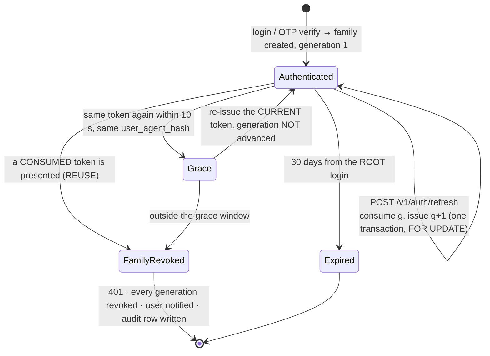
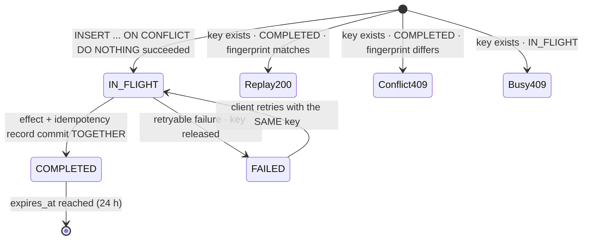
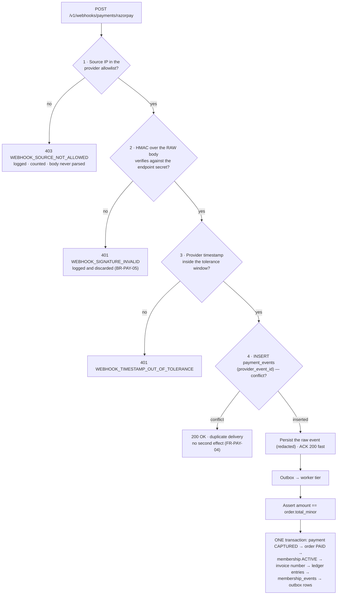
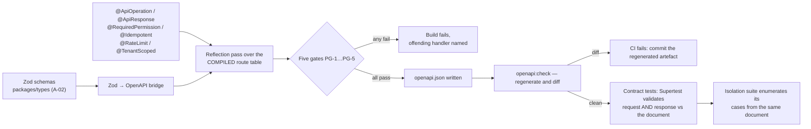

# API Contract Law — `/docs/apis/README.md`

> **Artefact rank 3** (`PROJECT_CONSTITUTION.md` §1.3): a binding derived specification. Subordinate
> to `PROJECT_CONSTITUTION.md` (rank 1) and `MASTER_PRD.md` (rank 2); it overrides the backlog, the
> roadmap and the code. Every statement traces to a PRD, constitution or ADR identifier.
>
> **Status:** Phase-5 baseline · **Date:** 2026-08-06 · **Launch market:** India (`LAUNCH_MARKET_INDIA.md`)
> **Owner:** Principal Architect · **Applies to:** every endpoint in every file under `/docs/apis/`
> **Stack:** NestJS 10 · Node 20 · TypeScript · PostgreSQL 16 + PostGIS + RLS · Prisma with the
> mandatory tenant-context extension (ADR-0005) · Redis 7 + BullMQ · Zod in `packages/types`
> (ADR-0022) · `@nestjs/swagger` with CI drift detection (ADR-0027) · Razorpay Route (India adapter)

---

## 1. Purpose, scope, and where this file sits

### 1.1 The three-artefact division

There are three API artefacts and they answer three different questions. Confusing them is how a
platform ends up with an endpoint that exists in the code, is absent from the index, and obeys a
convention nobody wrote down.

| Artefact | Question it answers | Authority | Size |
| :--- | :--- | :--- | :--- |
| `engineering/API_Catalog.md` | **Which endpoints exist?** The consolidated master index — 14 `API-` groups, 233 rows, eleven attribute columns per row (method, path, auth mode, permission, tenant scope, idempotency posture, rate-limit class, cache token, `FR-`/`BR-` identifiers) | **Authoritative on the shape of the whole.** A row may be deepened here; it may not be added, removed or contradicted | 2,178 lines |
| **This file** | **What rules does every endpoint obey?** The contract law: versioning, auth modes, tenant resolution, idempotency, pagination, filtering, the complete error registry, rate limits, money, time, validation, webhooks, caching, OpenAPI | **Authoritative on convention.** The nine domain files never restate a rule that lives here; they cite it | this file |
| The nine domain files | **What does *this* endpoint do?** Field-by-field request and response schemas, worked Indian examples, per-endpoint validation, per-endpoint errors, business rules enforced and where, side effects, future compatibility | **Authoritative on intent** for the endpoints they own. Frozen before implementation | Phase 5 |

The nine domain files, per `PHASES.md` Phase 5: `Authentication.md` · `Gym.md` · `Marketplace.md` ·
`Membership.md` · `Payments.md` · `Reviews.md` · `Notifications.md` · `Search.md` · `Admin.md`.

### 1.2 Precedence, stated once

1. `PROJECT_CONSTITUTION.md` (rank 1) — §13 Error Handling Law, §14 API Rules, §12 Security.
2. `MASTER_PRD.md` (rank 2) — §C3.1 conventions, §C3.2 catalogue, §C3.3 representative contracts, §A8 business rules.
3. `engineering/API_Catalog.md` (rank 3) — the endpoint index and the conventions it binds.
4. **This file** (rank 3) — the detailed convention. Where this file and the catalogue appear to
   differ, the catalogue's endpoint table wins on *which endpoints exist and their attributes*; this
   file wins on *how a convention is applied*, because that is what it was written to hold.
5. The nine domain files (rank 3).
6. Code.

A domain file that needs an exception to a rule in this document raises it under the **Halt Rule**
(`PROJECT_CONSTITUTION.md` §1.4). It does not write a different rule.

### 1.3 What this file deliberately does not contain

- **No endpoint list.** That is `API_Catalog.md` §3. This file names endpoints only as examples.
- **No per-endpoint schema.** That is the domain file.
- **No database detail.** `database/Schema.md` owns tables; `database/Constraints.md` §13 owns the
  coverage matrix that says which `BR-` rule the database carries and which this layer must.
- **No UI behaviour.** `/docs/ui/` owns that. `FR-RBAC-02` is absolute: client-side hiding is
  presentation, never a control.

### 1.4 The mandatory per-endpoint template

Every endpoint in every domain file is documented under exactly this structure. A section missing
any heading fails the Phase-5 acceptance gate (`PHASES.md` Phase 5) and, once code exists, the
corresponding CI gate of §16.

```text
illustrative — not committed code

### <METHOD> /v1/<path>

Purpose · Surfaces (web | dash | admin) · Auth mode (§3) · Required permission (B3.2, §4) ·
Tenant scope (public | user | tenant | platform, §5) · Idempotency (REQ | OPT | N/A, §6) ·
Rate-limit class (§10) · Cache policy (§15)

**Request**   — path params · query params · body, with a Zod sketch; every field's type,
                constraint, and whether it is required
**Response**  — success body as JSON with realistic Indian values, and the status code
**Errors**    — table: code · HTTP · when · user-facing message · retryable
**Business rules enforced** — the BR-/FR- ids, and WHERE each is enforced (this layer / L1-DB /
                L5-DOM / L6-UC …, per BusinessRules.md §2)
**Validation** — what the ZodValidationPipe rejects before the use case runs
**Side effects** — rows written · ledger entries · outbox events · notifications · audit records
**Future compatibility** — what may be added without a version bump; what would force one
```

### 1.5 The enforcement-layer vocabulary

Every "where is this enforced" answer in a domain file uses one of the twelve layer codes of
`engineering/BusinessRules.md` §2. No domain file invents a thirteenth.

| Code | Layer | Relevance to the API boundary |
| :--- | :--- | :--- |
| `L1-DB` | Database constraint | Survives every application bug; the last line |
| `L2-RLS` | Row-level security policy | The `BR-TEN-01` control that no code path can disable |
| `L3-GRANT` | Role grant / absence of grant | Append-only tables have no `UPDATE`/`DELETE` grant |
| `L4-EXT` | Prisma tenant-context extension (ADR-0005) | `SET LOCAL app.tenant_id` inside the transaction |
| `L5-DOM` | Domain invariant — aggregate, value object, state machine | Where `Money`, `DateRange`, `Entitlement` live |
| `L6-UC` | Use-case guard inside the transaction, on freshly read state | Where re-pricing and `SELECT … FOR UPDATE` live |
| `L7-GUARD` | NestJS guard | `JwtAuthGuard`, `PermissionsGuard`, `TenantGuard`, `@FinancialMutation()` |
| `L8-PIPE` | `ZodValidationPipe` with `.strict()` schemas | §13 — what this document calls "the boundary" |
| `L9-INT` | Interceptor | `IdempotencyInterceptor`, `AuditInterceptor`, correlation-id interceptor |
| `L10-JOB` | BullMQ job | Expiry, reconciliation, reserve release — time passing without a request |
| `L11-UI` | UI affordance | **Never authoritative** (`FR-RBAC-02`) |
| `L12-CI` | Build-time gate | The five gates of §4.5, the drift gate of §16, the absence assertions |

**"This layer"** in a domain file means `L7-GUARD` + `L8-PIPE` + `L9-INT` — the HTTP boundary that
this document governs. Everything below it is named explicitly.

### 1.6 Errors found in the source artefacts, recorded rather than propagated

The instruction under which this file was written requires that a discovered error in
`API_Catalog.md` be stated, not silently corrected. Four findings. **None of them changes which
endpoints exist**, and the catalogue's endpoint table (§3, 233 rows) is adopted here unchanged.

| # | Finding | Where | Resolution adopted here |
| :-: | :--- | :--- | :--- |
| 1 | §1.4 prose says the Auth column *"takes exactly one of **six** values"*, then tabulates **seven** — `none`, `access`, `access(mfa)`, `refresh`, `reset`, `support`, `signature` — and §3.0's column legend also lists seven | `API_Catalog.md` §1.4 vs §3.0 | **Seven is correct**; the prose miscounts its own table. §3 of this file adopts the seven-value set and explains the structure: **five principal-credential modes** (`none`, `access`, `refresh`, `reset`, `support`), one **qualifier** on `access` (`access(mfa)`), and one **non-caller proof** (`signature`, which authenticates a provider, not a principal) |
| 2 | Default `limit`: the constitution (§14.3, rank 1) says *"Default 25, maximum 100, **except explicitly documented endpoints**"*; the catalogue (§1.7.1, rank 3) says 20 on public and 50 on dashboard/admin | `PROJECT_CONSTITUTION.md` §14.3 vs `API_Catalog.md` §1.7.1 | **Not a conflict.** The constitution's own escape clause legitimises documented per-endpoint defaults, and `SCR-DASH-007` documents 50. §7 adopts **25 as the platform default where a domain file states nothing**, 20 public / 50 dashboard-and-admin where the catalogue states it, 100 as the absolute cap |
| 3 | The PRD's standard status set (`§C3.1`) is fourteen codes; the catalogue's §2.1 table legitimately also carries `304`, `413` and `415` | `MASTER_PRD.md` §C3.1 vs `API_Catalog.md` §2.1 | **Additive, not contradictory** — `304` is required by §15's `ETag` policy, `413`/`415` by §1.2.7's four upload families. §9.2 of this file carries the full seventeen-code set and repeats the catalogue's rule that adding an eighteenth is an amendment |
| 4 | Three error codes are cited in `engineering/BusinessRules.md` and `engineering/Security.md` under names that are **not in the §6 registry** | See §9.6 | The registry is authoritative on codes (`PROJECT_CONSTITUTION.md` §13.2.1). §9.6 lists each drifted name, its registry equivalent, and the one case that needs a decision rather than a rename |

---

## 2. Base URL, versioning and deprecation

### 2.1 The base URL and the environments

| Aspect | Value | Source |
| :--- | :--- | :--- |
| Production | `https://api.<domain>/v1` | `§C3.1`, §14.1 V1 |
| Staging | `https://api.staging.<domain>/v1` | `§C7` |
| Local | `http://localhost:3000/v1` (Docker Compose, A-28) | `§C7` |
| Deployment region | **India** — Mumbai primary, a second Indian region for DR. **Not configurable in Phase 1**, because RBI payment-data localisation and `LAUNCH_MARKET_INDIA.md` §9 make residency mandatory rather than a setting | `OQ-16` |
| Unversioned surface | `/healthz`, `/readyz` only. Outside `/v1`, `@Public()`, no internal detail | `NFR-AVL-01`, §14.7 rule 12 |
| Private surface | **None exists.** `B1.1`: *"No surface has a private back door; anything the admin console can do is expressible as an authorised, audited API call"* | §14.1 V7 |

**Why the version is in the path and not a header.** A header-versioned API cannot be pinned by a
link, cannot be cached as a distinct object by a CDN under `NFR-SCAL-04`, and cannot be diffed as two
documents under `NFR-MNT-03`. `§C3.1` fixes the URL form; this file does not reopen it.

**`v1` is the only version at launch.** Nothing in Phase 1 triggers a `v2`. §2.5 is the procedure for
when something does.

### 2.2 What is a breaking change

`NFR-MNT-02` and §14.1 V4/V5 fix the classification. The test is not "did the JSON change" — it is
**"can a conforming client that was working yesterday still work today?"**, where *conforming* means
a client that obeys §2.4.

| Breaking — requires a new version | Non-breaking — ships inside `v1` |
| :--- | :--- |
| Removing or renaming a response field | Adding a response field |
| Removing or renaming a request field | Adding an **optional** request field |
| Adding a **required** request field | Adding an optional query parameter |
| Narrowing a type — `string` → enum, nullable → non-nullable in a **request** | Widening a numeric range |
| Changing an enum's **meaning** | Adding a value to an enum **registered open** in §2.3 |
| Removing an enum value a client may **receive** | Relaxing a validation rule |
| Changing the HTTP status for an **existing** condition | Adding a new error code for a **new** condition |
| Changing the error **code** for an existing condition | Adding an endpoint |
| Changing pagination semantics or cursor meaning | Adding a response **header** |
| **Invalidating an arithmetic invariant clients rely on** (§2.5) | Adding a new optional `sort` field to an allowlist |
| Changing the interpreting timezone of a date-only field | Documenting an already-true behaviour |
| Making a `200`-with-negative-result into a `4xx`, or the reverse | Adding an `X-RateLimit-*` header to a class that lacked one |

The bolded left-hand row is the catalogue's addition to V4, and §2.5 is the worked example of why it
had to be added.

### 2.3 The open-enum register

An enum is **open** only if it appears here. This register is contract, not documentation: it is what
makes "adding an enum value" non-breaking under §2.2, and it must exist **from the first commit**,
because tolerance cannot be retro-fitted onto deployed clients.

| Enum | Open / Closed | Documented fallback for an unknown value |
| :--- | :--- | :--- |
| `settlement_line.type` | **Open** | Render with the server-supplied `label` and `amount_minor`, and **include it in the sum** |
| `tax_component.component` — `CGST`, `SGST`, `IGST` | **Open** | Render label and amount; include in the tax total |
| `payment.method` — `UPI`, `CARD`, `NETBANKING`, `WALLET`, `CASH`, `BANK_TRANSFER` | **Open** | Display as "Other". UPI dominance in India makes this the enum most likely to grow |
| `notification.channel` | **Open** | Ignore the entry |
| Reason-code taxonomies — application rejection (16), refund (10), moderation, check-in override (7) | **Open** — `FR-ADMN-07` makes them Super-Admin-managed | Display the server-supplied label |
| `denial_reason` — the fifteen `§C4.8` check-in values | **Closed** | — |
| `result` — `ALLOWED` \| `DENIED` | **Closed** | — |
| `membership.status`, `order.status`, `payment.status`, `refund.status`, `settlement_batch.status`, `review.status`, `application.status` | **Closed** — these are the seven `§C4` state machines | — |

**The state-machine enums are closed deliberately.** A client that silently ignored an unknown
membership status would render a refunded membership as though nothing had happened. Adding a state
to `§C4.1` is a breaking change and always was.

### 2.4 The client's contractual obligations

`PROJECT_CONSTITUTION.md` §14.1 V6 states that this is the file in which the obligations are
declared, *"so that V5's middle clause is legitimate"*. They are therefore stated here as binding
terms, not advice. A client that violates them is non-conforming, and a break it experiences is not
a platform defect.

| # | Obligation | Consequence of ignoring it |
| :-: | :--- | :--- |
| CO-1 | **Ignore unknown response fields.** Do not fail, do not warn, do not echo them back | Every additive change becomes a breaking change |
| CO-2 | **Tolerate unknown values on open enums** (§2.3) by applying the documented fallback | `COMMISSION_TAX` settlement lines break your reconciliation (§2.5) |
| CO-3 | **Treat identifiers as opaque.** Do not parse `ORD-2026-000148` for a financial year, do not parse a UUID for a timestamp, do not parse a slug for a city | `FR-INV-02` lets a tenant configure the invoice prefix; your parser breaks on a tenant you never tested |
| CO-4 | **Treat the pagination cursor as opaque** (§7.2). Never construct one, never decode one, never persist one beyond a scroll | The cursor's internal version increments and your reconstruction skips rows |
| CO-5 | **Send an `Idempotency-Key` on every required-class request, generated once per logical attempt and reused across retries** (§6) | A network retry double-charges a member. `BR-PAY-03` protects you only if you cooperate |
| CO-6 | **Never send a monetary value or a rate.** The schemas are `.strict()`; the field does not exist | `400 VALIDATION_FAILED` with `rule: "unknown_field"` |
| CO-7 | **Honour `Retry-After`** on `429` and `503`; retry with exponential backoff **and jitter** | Synchronised retries turn a brownout into an outage |
| CO-8 | **Do not retry a non-idempotent operation** (`ER8`) | Undefined; the platform makes no promise it did not make |
| CO-9 | **Read arithmetic identities from the response** where one is published as data (`sum_invariant`), rather than hard-coding the formula | §2.5, exactly |
| CO-10 | **Format money and dates client-side from the minor-unit integer and the RFC 3339 instant** (§11, §12) | You will show `₹250,000` to a gym owner who expects `₹2,50,000` |

### 2.5 Deprecation — the six-month window and the headers

| # | Rule | Source |
| :-: | :--- | :--- |
| D1 | A breaking change requires a **new version**. Versions **coexist**; a `v2` does not retire `v1` on the day it ships | `NFR-MNT-02`, §14.1 V2 |
| D2 | The deprecation window is **≥ 6 months** from the day the successor is published to the day the predecessor starts refusing | `§C3.1`, §14.1 V3 |
| D3 | The deprecation is announced in **five** places, all of them: the generated OpenAPI document (operation marked deprecated with its sunset date, OA6); the `Deprecation`, `Sunset` and `Link` response headers; `CHANGELOG.md`; the owning domain file under `/docs/apis/`; and **in-product** for dashboard users | §14.1 V3 |
| D4 | After the sunset instant the endpoint returns **`410 REPRESENTATION_RETIRED`**, naming the successor version and linking the migration note. It does **not** 404, because 404 loses the reason | §9.4, `NFR-MNT-02` |
| D5 | Historical data remains readable **through the successor**. Retiring a representation never retires a record — `BR-FIN-02` persists every settlement figure and `FR-SETL-02` forbids recomputation at display time | `BR-FIN-02` |
| D6 | A **field** may be deprecated independently of its endpoint, using the same headers plus an `x-deprecated` marker on the schema property in the OpenAPI document | §14.1 V3 |

**The three headers, exactly.**

```http
illustrative — not committed code

HTTP/1.1 200 OK
Deprecation: true
Sunset: Sat, 07 Feb 2027 00:00:00 GMT
Link: <https://api.example.com/docs/apis/migrations/settlement-v2>; rel="deprecation"; type="text/html"
X-Correlation-Id: 01J9Z7QK3M4N5P6R7S8T9V0W1X
Cache-Control: private, no-store
```

`Deprecation` is the literal string `true` (the boolean form of the draft header), `Sunset` is an
**RFC 9110 HTTP-date in GMT** — deliberately *not* the RFC 3339 form used in bodies, because the
header specification requires the HTTP-date grammar — and `Link` carries `rel="deprecation"` pointing
at a human-readable migration note under `/docs/apis/migrations/`.

### 2.6 Worked example — retiring the `v1` settlement statement

This is the real change India forces, taken from `API_Catalog.md` §8.4 and `LAUNCH_MARKET_INDIA.md`
Conflict 2, reproduced here because it is the only place a reader can see the whole procedure at
once.

**The change.** `A6.3` computes `payable_to_gym = (N + T) − C − F` with **no tax on the commission**.
The platform owes **18% GST on its own commission service**. The fix adds a ninth persisted figure,
`commission_tax_minor`, and a `COMMISSION_TAX` ledger entry type. Both surface on
`GET /v1/tenant/settlements/:id`.

**Step 1 — classify each sub-change against §2.2.**

| Sub-change | Class | Reasoning |
| :--- | :--- | :--- |
| Add `commission_tax_minor` to the statement summary | Non-breaking | Adding a response field |
| Add a `COMMISSION_TAX` entry to `lines[]` | Non-breaking — **only because** `settlement_line.type` is registered **open** in §2.3 | CO-2 is doing the work. Had the enum been closed, this alone forces `v2` |
| `payable_to_gym_minor` becomes a smaller number | **Not an API change** | The field's meaning — "the amount we will pay you" — is unchanged. Its computed value changed, which is business change control (`§C10`), not `NFR-MNT-02` |
| The identity `payable = net + tax − commission − fee` stops holding | **BREAKING** | `BR-FIN-03` requires lines to sum exactly to the payout. A finance integration validating the four-term identity now reports a variance on every statement and cannot distinguish it from a real one — which is precisely the failure `BR-FIN-07` exists to detect |

**Step 2 — the timeline.**

| When | What happens |
| :--- | :--- |
| **T+0** | `v1` gains `commission_tax_minor` and the `COMMISSION_TAX` line — both legal additions. `v1` **also** gains `sum_invariant: "net + tax − commission − commission_tax − fee"` as an explicit machine-readable string, so a conforming client reads the identity (CO-9) instead of assuming it. `CHANGELOG.md`, `/docs/apis/Payments.md` and the in-product dashboard notice publish the change |
| **T+0** | `v2` is published: the four-term identity is removed from the documented contract and `sum_invariant` is promoted from optional to **required**. `v1` and `v2` coexist (D1) |
| **T+0 → T+6 months** | Every `v1` settlement response carries `Deprecation: true`, `Sunset: <RFC 9110 date>`, and `Link: <…/docs/apis/migrations/settlement-v2>; rel="deprecation"`. The OpenAPI operation is marked deprecated with the sunset date (OA6). Dashboard users see an in-product notice. Support scripts quote the migration note |
| **T+6 months** | `GET /v1/tenant/settlements/:id` and `GET /v1/tenant/settlements` return **`410 REPRESENTATION_RETIRED`** naming `v2`. Historical batches stay readable through `v2` (D5) |

**Step 3 — what was rejected, and why.**

| Rejected | Why |
| :--- | :--- |
| Silently change `payable_to_gym_minor` and say nothing | Breaks reconciling clients invisibly. This is the exact class of change `NFR-MNT-02` exists to prevent |
| Fold commission GST into `commission_minor` | Destroys `BR-FIN-04`'s *"commission is charged on the commission base only, never on tax"*, corrupting every historical comparison and the `KPI-16` take-rate |
| Version the whole API to `v2` for one resource family | `NFR-MNT-02` requires a new **version**, not a new platform. Versions coexist per-URL; forcing every client to migrate every endpoint for a settlement change is cost with no correctness benefit |
| Recompute historical statements under the new formula | Violates `BR-FIN-02` and `FR-SETL-02`. A settled statement is a financial record, not a view |

**The generalisable lesson.** The open-enum register (§2.3) and publishing arithmetic identities as
**data** (`sum_invariant`) are both cheap on day one and impossible to retro-fit. They are what turns
a `v2` into a `v1` addition, and they are the highest-leverage versioning decisions in this contract.

---

## 3. Authentication

Authentication answers *"who is calling?"*. Authorisation (§4) answers *"may they do this?"*. They
are different questions answered in different guards, and conflating them is how `OWASP A07`
happens (`Security.md` §5.8).

### 3.1 The seven Auth column values

`API_Catalog.md` §3.0 gives the Auth column seven legal values. Five are **principal credentials**,
one is a **qualifier** on `access`, and one is not a caller credential at all. (See §1.6 finding 1:
the catalogue's prose says "six" and tabulates seven; seven is correct.)

| Value | Kind | Credential | Lifetime | Presented in | Notes |
| :--- | :--- | :--- | :--- | :--- | :--- |
| `none` | Principal | — | — | — | Only on the 22 endpoints of §3.6. Every one carries `@Public()` and a compensating control |
| `access` | Principal | JWT access token | **15 minutes** exactly (`exp − iat = 900`) | `Authorization: Bearer <jwt>` **or** the `__Host-gm_at` cookie | The default for every authenticated route |
| `access(mfa)` | **Qualifier** on `access` | Access token whose session asserts a satisfied MFA challenge (`amr` contains `totp`) | 15 minutes | Same as `access` | Mandatory for **all** platform staff roles (`NFR-SEC-11`, `FR-AUTH-07`). Every `/admin/*` row uses it |
| `refresh` | Principal | Opaque 256-bit CSPRNG value — **not a JWT** | **30 days from the root login**, not from the last rotation | `__Secure-gm_rt` cookie: `HttpOnly`, `Secure`, `SameSite=Strict`, `Path=/v1/auth/refresh` | Rotates on every use (§3.3) |
| `reset` | Principal | Single-use password-reset token | Short, configured | **Request body** — it is a credential, not a session | Consuming it invalidates **all** sessions (`FR-AUTH-10`, TK5) |
| `support` | Principal | Impersonation token, `typ: 'IMPERSONATION'` | **30 minutes, hard cap** | `Authorization: Bearer` | Carries `act: { sub, reason_ref }`. Grants the **impersonated user's** permissions, never the agent's, and never platform elevation (§3.5) |
| `signature` | **Not a caller credential** | Provider HMAC over the raw body **plus** a source-IP allowlist | Per-event | A provider-specific header | Webhooks only (§14). Unauthenticated in the bearer sense; authenticated in every sense that matters |

**Why `refresh` is opaque and not a JWT** (ADR-0011, RT1): *"It is checked against server state on
every use anyway, so signing it buys nothing, and a self-contained 30-day credential is a strictly
worse thing to leak."*

### 3.2 The access-token claim set

`ADR-0011` fixes the mechanism; `PROJECT_CONSTITUTION.md` §12.3 TK1 fixes the constraints;
`Security.md` §2.5 is the union. Signing is **EdDSA over Ed25519** and the verifier is configured
with a **single permitted algorithm**, rejecting any token whose header names another **before
parsing the payload** — so `alg: none` and RS↔HS confusion are not reachable states.

```json
// illustrative — not committed code
{
  "iss": "https://api.gymmap.in",
  "aud": "gm-api",
  "sub": "01932c7e-4d81-7c3a-9f10-2b5c8e6a1d44",
  "sid": "01932c7e-4d81-7c3a-9f10-2b5c8e6a1d99",
  "jti": "01932c81-0a15-7b22-8e44-6f31d2c9b077",
  "typ": "ACCESS",
  "tenant_id": "01932c6a-11f4-7a90-b3c2-77e1a4d55f01",
  "roles": ["OWNER@t:01932c6a", "MEMBER@self"],
  "perm_ver": 47,
  "amr": ["pwd", "totp"],
  "auth_time": 1785312000,
  "iat": 1785315600,
  "exp": 1785316500
}
```

| Claim | Meaning and constraint |
| :--- | :--- |
| `iss` / `aud` | Binds the token to a deployment region (`NFR-PRV-05`) and refuses a token minted for another audience |
| `sub` | The **acting subject**. Under impersonation this is the **impersonated member**, never the agent |
| `sid` | Session (token-family) id — the handle `FR-AUTH-09`'s session list revokes |
| `jti` | Unique token id, for correlation and for the reuse deny-list |
| `typ` | `ACCESS` \| `IMPERSONATION`. Read by the `ImpersonationGuard`, not inferred |
| `tenant_id` | The **active** tenant context; `null` for consumer and platform-scope sessions. Set at login or by the audited switch `POST /v1/auth/tenant-context` (`FR-AUTH-11`, `BR-TEN-02`) |
| `roles` | Compact scope codes. **Not a permission list** |
| `perm_ver` | Permission version counter; a mismatch against Redis forces a refresh — this is how `FR-RBAC-04`'s 60-second propagation is bounded |
| `amr` | Methods satisfied: `pwd`, `otp`, `totp`, `oidc`, `recovery`. `access(mfa)` requires `totp` |
| `auth_time` | Unix seconds of the **last full authentication**, not of token issue. This is the only way to express *"MFA was satisfied recently"* rather than *"at some point in this 30-day family"*, and it drives step-up re-authentication |
| `act` | Impersonation only: `{ sub: <agent user id>, reason_ref: <audit row id> }` |
| `kid` | Header claim — signing-key id, for rotation |

| Rule | Statement |
| :--- | :--- |
| **T2** | The token carries **no personal data**. No name, email, phone, or tenant *name* — identifiers only. A decoded token in a devtools screenshot must be uninteresting |
| **T3** | The token carries **no permission list**. This is what makes 60-second propagation possible and what makes a forged `roles` claim worthless — the `PermissionsGuard` resolves authority server-side per request (§4.3) |
| **T4** | Clock-skew tolerance on `exp`/`iat` is **60 seconds**, no more. A larger window extends the life of a revoked token |
| **T5** | Tokens are **never** in a URL, never in `localStorage`, never logged, never in an analytics event. `Authorization` and `Cookie` are on the Pino redaction list |

### 3.3 The 15-minute / 30-day model and reuse detection



| Rule | Statement | Anchor |
| :--- | :--- | :--- |
| RT2 | Rotation is **mandatory on every use**. The presented token is marked `consumed_at` in the **same transaction** that issues its successor, under `SELECT … FOR UPDATE`, so two concurrent refreshes cannot both succeed as new generations | TK3 |
| RT3 | Presenting a **consumed** token revokes the **entire family** — every generation and the session row. Not a warning; a revocation | TK4, `FR-AUTH-06` |
| RT4 | A revoked family also increments `perm:user:{userId}`, so any access token already issued under it fails its next `perm_ver` check within one request round trip rather than living out its 15 minutes | ADR-0011 |
| RT5 | The user is **notified** through `FR-NOTF-01` channels and an `audit_log` row is written under `BR-DAT-01` | `B5.1` edge case |
| RT6 | A token hash matching **no row** returns `401` and **touches nothing**. This is deliberate: if an unknown value revoked a family, an attacker spraying random values could log real users out at will | `Security.md` §1.6 |
| RT7 | **Grace window** — the immediately preceding generation is accepted **once**, within **10 seconds** of its consumption and **only from the same `user_agent_hash`**, re-issuing the *current* token rather than advancing the generation. ADR-0011 accepts this as *"a deliberate, measured trade against locking real users out"* for two-tab races and lost responses. `refresh_grace_used_total` above 0.5% of refreshes over a sprint fires ADR-0011's revisit trigger 1 | ADR-0011 |
| RT9 | Family lifetime is capped at **30 days from the root login**, not from the last rotation. Otherwise a continuously refreshed family is an unbounded credential | `FR-AUTH-06` |

**The client's refresh contract.** On `401 ACCESS_TOKEN_EXPIRED` a client calls
`POST /v1/auth/refresh` **once** and replays the original request **once**. A second `401` is a
terminal sign-out, not a second refresh. Concurrent requests that all receive `401` must funnel
through a **single** in-flight refresh promise — parallel refreshes are exactly what RT7's grace
window exists to survive, and depending on the grace window is not a design.

### 3.4 `401` versus `403` — the precise line

This is the most frequently confused pair in any API and the constitution settles it in §13.1 by
failure class, not by feeling.

| | `401 Unauthenticated` | `403 Forbidden` |
| :--- | :--- | :--- |
| Question it answers | *Who are you?* — unanswered, or answered with an invalid credential | *May you?* — no |
| Caller state | Not authenticated, or the credential is absent, malformed, expired, revoked or of the wrong `typ` | **Authenticated**, identity established, credential valid |
| Remedy | Re-authenticate: refresh, sign in, request a new OTP, request a new reset link | **None the caller can apply alone.** Someone must grant them authority, or they must stop |
| Retryable | Yes, after re-authentication | **No.** Retrying the identical request always fails identically |
| Log level | `info` (`warn` on reuse detection) | `warn` |
| Alerts | On reuse-detection spikes | On anomalous rates |

**`401` in this platform means one of exactly these:** `UNAUTHENTICATED`, `ACCESS_TOKEN_EXPIRED`,
`REFRESH_TOKEN_INVALID`, `REFRESH_TOKEN_REUSE_DETECTED`, `RESET_TOKEN_INVALID`, `OTP_INVALID`,
`OTP_EXPIRED`, `MFA_CODE_INVALID`, `IMPERSONATION_SESSION_EXPIRED`, `WEBHOOK_SIGNATURE_INVALID`,
`WEBHOOK_TIMESTAMP_OUT_OF_TOLERANCE`.

**`403` in this platform means one of exactly these:** `PERMISSION_DENIED`, `ACCOUNT_LOCKED`,
`MFA_REQUIRED`, `PHONE_NOT_VERIFIED`, `EMAIL_NOT_VERIFIED`, `TENANT_CONTEXT_REQUIRED`,
`TENANT_SUSPENDED`, `TENANT_NOT_APPROVED`, `TENANT_WRITE_BLOCKED_PAST_DUE`, `FEATURE_NOT_ENABLED`,
`IMPERSONATION_FORBIDS_FINANCIAL_MUTATION`, `REVIEW_REQUIRES_CHECK_IN`, `BRANCH_NOT_ASSIGNED_TO_STAFF`,
`MEMBERSHIP_UNDER_SHARING_REVIEW`, `WEBHOOK_SOURCE_NOT_ALLOWED`.

**Three traps, resolved.**

1. **An expired access token is `401`, not `403`.** The caller is not authenticated any more. A
   `403` would tell the client to give up when a refresh would fix it.
2. **An account lockout is `403 ACCOUNT_LOCKED`, not `429`** (`FR-AUTH-08`, `API_Catalog.md` §4.5).
   The condition is about *this account*, not about request volume, and the remedy is a verified
   unlock channel rather than waiting.
3. **A cross-tenant read is `404`, never `403`** (§5.4). `403` would confirm the resource exists.

### 3.5 Support impersonation

| Rule | Statement |
| :--- | :--- |
| IM1 | The token's `typ` is `IMPERSONATION` and `sub` is the **impersonated user**. Authority granted is the impersonated user's, never the agent's, and **never** platform elevation |
| IM2 | Hard cap **30 minutes**. Past it, `401 IMPERSONATION_SESSION_EXPIRED`; a new session requires a **new stated reason** |
| IM3 | A reason is mandatory at start (`400 IMPERSONATION_REASON_REQUIRED`), is persisted as an audit row, and `act.reason_ref` points at that row (`BR-DAT-02`, `AC-AUTH-03.3`) |
| IM4 | **Three endpoints an impersonation token may never call**, enforced by a guard reading `typ` — not by hiding a button (`AC-AUTH-03.2`, `FR-AUTH-12`): `POST /v1/orders/:orderRef/payment-intent`, `POST /v1/me/memberships/:id/refund-request`, `PUT /v1/tenant/payout-account`. The refusal is `403 IMPERSONATION_FORBIDS_FINANCIAL_MUTATION` |
| IM5 | Every request made under impersonation is audited with **both** subjects — the impersonated `sub` and the agent `act.sub` |

The guard is `@FinancialMutation()`-driven, so the rule extends by annotation rather than by editing
a list of three paths. A fourth financial mutation added later is covered the moment it is annotated,
and the `L12-CI` gate asserts that every endpoint the catalogue marks as money-affecting carries the
annotation.

### 3.6 The `@Public()` allowlist — enumerated exhaustively

`PROJECT_CONSTITUTION.md` §12.2.1 AZ4 permits `@Public()` **only** on these endpoints, and
`API_Catalog.md` §5.4 requires each to be listed here with its compensating control. **22 rows, 23
paths** (`/healthz` and `/readyz` are counted as one row). Any addition is an amendment to this
section **and** a security review.

| # | Endpoint(s) | Why it is public | Compensating control |
| :-: | :--- | :--- | :--- |
| 1–12 | The twelve read endpoints of `API-DISC` — search, suggest, map bounds, gym detail, gym plans, gym reviews, similar gyms, compare, city landing, category landing, amenities, categories | `FR-NAV-01`: *"the customer website is fully browsable without authentication; the auth gate appears at 'select plan → checkout' and nowhere earlier"* | `RL-SEARCH` / `RL-PUBLIC`; the `APPROVED` + non-suspended + published-`PUBLIC`-plan predicate on every read; **no tenant-owned table is read** — only the platform-scope search projection |
| 13 | `POST /v1/auth/otp/request` | A caller cannot authenticate before authenticating | `RL-OTP` tier 1 — 3 sends / 30 min per phone, 20/hour per IP; SMS cost is a real `CON-02` exposure |
| 14 | `POST /v1/auth/otp/verify` | Same | 5 verify attempts per code; `OTP_ATTEMPTS_EXCEEDED` at the sixth |
| 15 | `POST /v1/auth/register` | Same | `RL-AUTH` tier 2; Argon2id (`FR-AUTH-04`); breached-password check; `EMAIL_ALREADY_REGISTERED` discloses nothing beyond the fact needed to offer sign-in |
| 16 | `POST /v1/auth/login` | Same | `RL-AUTH` 10 / 15 min per identifier, then `FR-AUTH-08` lockout |
| 17 | `POST /v1/auth/password/forgot` | Same | `RL-AUTH`; the response is identical whether or not the address exists |
| 18 | `POST /v1/auth/password/reset` | Presents a `reset` credential, which is not a session | Single-use, short-lived; consuming it invalidates **all** sessions (`FR-AUTH-10`) |
| 19 | `POST /v1/webhooks/payments/:provider` | A payment provider cannot hold a platform credential | **Signature over the raw body + IP allowlist + timestamp tolerance + `provider_event_id` uniqueness** (§14). *"An unverified webhook is logged and discarded"* (`BR-PAY-05`) |
| 20 | `GET /v1/help/articles` | `FR-SUP-06`'s self-service help centre must be reachable by a **locked-out** user | `RL-PUBLIC`; platform-authored static content only |
| 21 | `GET /v1/help/articles/:slug` | Same | Same |
| 22 | `GET /healthz`, `GET /readyz` | The orchestrator holds no credential | Exposes **no** internal detail (§14.7 rule 12); rate-limit exempt but network-restricted where the platform permits |

**Two endpoints that look public and are not.** `POST /v1/auth/refresh` presents a refresh credential
and is therefore `refresh`-authenticated. `POST /v1/gyms/:slug/report` requires authentication —
`FR-DETL-06` says *"any authenticated user"*, and an anonymous report endpoint is a spam vector.

---

## 4. Authorization

> `B3.1`, the sentence the whole model serves: *"Permission evaluation is always
> **(role, scope, resource, action)** — never role alone."*

### 4.1 The four-tuple

| Element | Domain | Where it comes from | Failure mode if omitted |
| :--- | :--- | :--- | :--- |
| **role** | The 12 roles of `B3.1` | Platform roles from `users`; tenant roles from `staff`; `MEMBER` derived from holding ≥1 active membership; `USER` from being authenticated; `VISITOR` from being unauthenticated | Nothing works |
| **scope** | `PLATFORM` \| `TENANT` \| `BRANCH` \| `SELF` \| `PUBLIC` | Fixed per role by `B3.1` | A branch-scoped receptionist acts tenant-wide |
| **resource** | The entity **instance**, **loaded before the decision** | The route's resource resolver | `FR-RBAC-03` is violated — authority is evaluated against the session's tenant instead of the resource's |
| **action** | `read` \| `write` \| a named verb: `publish`, `approve`, `moderate`, `suspend`, `impersonate`, `override`, `decide` | The `@RequiredPermission()` string | CRUD-shaped permissions cannot express *"may create a plan but may not publish it"*, which `B3.2` requires |

**The two mistakes this model exists to prevent**, both `OWASP A01` in practice:

1. **Role-only checks.** `if (user.role === 'GYM_MANAGER')` says nothing about *which* tenant or
   *which* branch. `B3.2` gives `GYM_MANAGER` `▪` (own/assigned only) on *Edit gym profile* and
   *Invite / manage staff*; a role-only check silently grants the whole tenant.
2. **Session-tenant checks.** Comparing the resource to `token.tenant_id` without loading the
   resource is the same bug wearing a hat: it *presumes* the resource belongs to the session's
   tenant, which is precisely what needs proving.

### 4.2 The permission string

**Grammar:** `<module>.<resource>.<action>` — three dot-separated `snake_case` segments
(`PROJECT_CONSTITUTION.md` §12.2.1 AZ1, `Security.md` §3.2, normative under CR-02).

| Segment | Constraint |
| :--- | :--- |
| `<module>` | **Exactly one of the 23 modules of `§C1.3`**: `common` `tenancy` `iam` `onboarding` `catalog` `plans` `discovery` `ordering` `payments` `billing` `memberships` `attendance` `crm` `staff` `reviews` `ledger` `settlements` `refunds` `notifications` `reporting` `support` `admin` `audit` |
| `<resource>` | Singular, `snake_case`, a **domain concept** — `plan`, `kyc_document`, `payout_account`, `batch`. Never a table name, never a DTO name |
| `<action>` | `snake_case`. `read`/`list`/`create`/`update` for the general cases; a named verb where `B3.2` distinguishes an authority CRUD cannot express. `verb_qualifier` where two variants exist (`list` vs `list_all`) |
| Case and wildcards | Lower throughout. **No wildcards, ever** — a wildcard permission is a permission nobody can audit |
| Stability | A permission string is **never renamed and never reused** for a different meaning, exactly like an error code. Retired strings stay in the registry marked `RETIRED` |

**Scope is not in the string.** `self`, `tenant`, `platform` are *not* segments. Self-scope is
expressed by the `/me` audience prefix and enforced by the ownership guard; tenant scope is resolved
**from the resource** (`FR-RBAC-03`). Encoding scope in the string would invite the exact bug
`FR-RBAC-03` exists to prevent.

**The `B3.2` legend maps to grant qualifiers, not to string segments:**

| `B3.2` | Qualifier | Meaning in code |
| :-: | :--- | :--- |
| ● | `FULL` | Every resource inside the actor's scope |
| ▪ | `OWN` / `ASSIGNED` | A resource-level predicate evaluated **after** the resource is loaded — `TRAINER` on `attendance.attendance.read` sees only assigned members; `RECEPTIONIST` on `crm.member.update` only members they created, at their branches |
| ○ | Read-only | A **distinct** `.read` permission is granted and `.write` is not. Read-only is never a runtime flag on a write permission |
| — | Not granted | Absent from the grant table — and, where no role holds it, **absent as an endpoint** |

```ts
// illustrative — not committed code
// apps/server/src/modules/ordering/permissions.ts
export const OrderingPermissions = {
  ORDER_CREATE:   'ordering.order.create',
  ORDER_READ:     'ordering.order.read',
  ORDER_VALIDATE: 'ordering.order.validate',
  COUPON_APPLY:   'ordering.coupon.apply',
} as const;

// apps/server/src/modules/ordering/ordering.controller.ts
@Post('orders')
@RequiredPermission(OrderingPermissions.ORDER_CREATE)   // FR-RBAC-01 — or the build fails
@Idempotent({ source: 'header' })                        // BR-PAY-03
@RateLimit('RL-PAY')                                     // NFR-SEC-06
@TenantScoped({ from: 'resource' })                      // FR-RBAC-03
@ApiOperation({ summary: 'Create an order. The server prices it; the client submits no amounts.' })
createOrder(/* … */) { /* … */ }
```

Strings are `as const` constants in the **owning module's** `permissions.ts`, never string literals
in a controller, and they are the **same strings** the admin console renders through
`GET /v1/admin/users/:id/permissions` (`FR-RBAC-05`).

### 4.3 The guard chain, in order

```mermaid
%% illustrative — not committed code
flowchart LR
    A["1 · RateLimitGuard<br/>IP-keyed classes"] --> B["2 · JwtAuthGuard<br/>global, opt-out by @Public()"]
    B --> C["3 · RateLimitGuard<br/>principal-keyed classes"]
    C --> D["4 · TenantContextMiddleware<br/>resolve tenant — never from the client"]
    D --> E["5 · PermissionsGuard<br/>reads @RequiredPermission metadata"]
    E --> F["6 · ImpersonationGuard<br/>inspects typ"]
    F --> G["7 · ZodValidationPipe<br/>.strict() schemas"]
    G --> H["8 · IdempotencyInterceptor"]
    H --> I["9 · Handler → use case"]
    I --> J["10 · Prisma tenant-context extension<br/>SET LOCAL app.tenant_id inside the transaction"]
    J --> K["11 · PostgreSQL RLS policy"]
```



| Step | Failure | Response |
| :-: | :--- | :--- |
| 1 / 3 | Class budget exhausted | `429 <class code>` + `Retry-After` |
| 2 | Not authenticated, token invalid or expired | `401 UNAUTHENTICATED` / `401 ACCESS_TOKEN_EXPIRED` |
| 4 | Client attempted to supply a tenant | `400 TENANT_HEADER_NOT_ACCEPTED` |
| 4 | `/tenant` route with no active tenant context | `403 TENANT_CONTEXT_REQUIRED` |
| 5 | Permission not held for `(role, scope, resource, action)` | `403 PERMISSION_DENIED` |
| 5 | Resource belongs to another tenant | **`404 RESOURCE_NOT_FOUND`** (§5.4) |
| 6 | Impersonation token attempting a financial mutation | `403 IMPERSONATION_FORBIDS_FINANCIAL_MUTATION` |
| 7 | Schema violation, unknown field, monetary field | `400 VALIDATION_FAILED` |
| 10 | No tenant context resolved on a tenant-scoped path | `500 TENANT_CONTEXT_MISSING` — **a defect, not a user error**; it alerts |
| 11 | RLS policy excludes the row | Empty result, which the repository turns into `404` |

**Steps 10 and 11 are what actually enforce `BR-TEN-01`.** Steps 4–5 are defence in depth. An
engineer who deletes step 5 creates a bug; an engineer who bypasses step 10 creates a **breach** —
which is why the Prisma tenant-context extension is mandatory (ADR-0005) and the raw client is
unreachable from a repository, enforced by `dependency-cruiser` (A-23).

**Authority is evaluated per request, not per token** (AZ6). `FR-RBAC-04` requires role changes to
take effect **within 60 seconds without re-authentication**, so the `PermissionsGuard` reads current
role assignments on every request, cached in Redis with a **≤ 60-second TTL** and invalidated
eagerly on any role write. The rule holds by invalidation (fast path) *and* by expiry (guaranteed
bound).

### 4.4 `FR-RBAC-03` — the resource's tenant, never the session's

> *"A tenant-scoped role is evaluated against the tenant on the **resource**, never the tenant on the
> session alone."*

The failure this prevents, concretely: a `GYM_MANAGER` of *Iron Works Gym* (tenant A) holds a
perfectly valid session with `tenant_id = A`. They request `GET /v1/tenant/memberships/<id>` where
the id belongs to *Pulse Fitness* (tenant B). A session-only check reads "`GYM_MANAGER`, has
`memberships.membership.read`, permitted" and hands over the row. The resource check refuses **before
RLS is even consulted**, and RLS refuses again after it.

| Rule | Statement |
| :--- | :--- |
| RB1 | The resource is **loaded first**, then the decision is made. A guard that decides before loading is structurally incapable of satisfying `FR-RBAC-03` |
| RB2 | The refusal is **`404`**, not `403` (§5.4) |
| RB3 | **Branch scoping is authorisation, not filtering** (AZ8, `FR-STAF-03`). A `RECEPTIONIST` assigned to Andheri who requests Bandra's attendance is **refused** with `403 BRANCH_NOT_ASSIGNED_TO_STAFF` — not shown an empty list. An empty list is indistinguishable from "no visits today" and hides the misconfiguration |
| RB4 | The **last `GYM_OWNER`** of a tenant can never be removed or demoted (`FR-RBAC-07`, `FR-STAF-09`). This is an aggregate invariant in `staff/` (`L5-DOM`), not a UI check, and it fires on `PATCH /v1/tenant/staff/:id` exactly as it does on `DELETE` |
| RB5 | Client-side hiding of UI is **presentation only and never a security control** (`FR-RBAC-02`). `FR-NAV-03` filters dashboard navigation by effective permission for usability; the server still refuses (`AC-STAF-01.2`) |

### 4.5 `FR-RBAC-01` — the CI gate that fails the build

> *"Every API endpoint declares its required permission; an endpoint with no declared permission
> fails a CI check and cannot be merged."*

This is the **only** functional requirement in the PRD that specifies its own enforcement mechanism.
ADR-0027's insight is that the reflection pass building the OpenAPI document is the same pass that
can assert every per-endpoint gate. One mechanism, five gates. The pass boots the Nest application
context **without listening**, enumerates the **compiled route table**, and fails the build naming
the offending handler.

| Gate | Assertion | Example failure message | Requirement |
| :--- | :--- | :--- | :--- |
| **PG-1** permission-declared | Every handler carries **exactly one** of `@RequiredPermission(...)` or `@Public()`; every `@Public()` handler appears in the §3.6 allowlist | `Handler OrderingController.createOrder declares neither @RequiredPermission nor @Public` | **`FR-RBAC-01`** |
| **PG-2** idempotency-declared | Every handler in a §6.1 required class carries `@Idempotent(...)` | `Handler PaymentsController.retry mutates money without @Idempotent` | `BR-PAY-03`, ADR-0016 |
| **PG-3** permission-well-formed | Exactly three segments; segment 1 is one of the 23 modules; the string is declared in **that** module's `permissions.ts`; no two handlers in different modules claim the same string | `Permission 'orders.order.create' — 'orders' is not one of the 23 modules` | AZ3, `§C1.3` |
| **PG-4** isolation-covered | Every `@TenantScoped()` handler appears in the isolation suite's endpoint inventory | `Handler … is @TenantScoped but absent from the isolation inventory` | `BAC-10`, `E2E-11` |
| **PG-5** ratelimit- and error-declared | Every handler declares a rate-limit class; every error code it can emit exists in the §9 registry; no two registry rows share a code | `Handler … emits COUPON_DEAD, absent from the error registry` | `NFR-SEC-06`, §13.2.1 |

**Two properties make these gates trustworthy rather than decorative.**

1. **They run on the compiled route table, not on source text.** A grep-based check is defeated by a
   dynamically registered route, a mixin, or a controller composed from a base class. Reflection sees
   what Nest actually mounted.
2. **`openapi:check` is never cached in Turborepo** — a cached "pass" over a changed route table is
   worse than no gate at all.

**What a failure looks like.** A developer adds `POST /v1/tenant/plans/:id/feature` and forgets the
decorator. The pull request's `pr.yml` run fails at the `api-gates` job in under a minute with the
handler named. There is no path to merge — `§C7` lists the permission gate among the **non-negotiable**
merge gates and `§20.7` protects the trunk. That is the whole of `FR-RBAC-01`.

**`B3.2` becomes code by compilation, not transcription.** A CI job (`rbac-matrix-drift`) parses the
`B3.2` matrix into `packages/types/src/rbac/role-permission.map.generated.ts`, unions the 23
`permissions.ts` declarations into a registry, and diffs both against the route table's
`@RequiredPermission` metadata. Any divergence fails the build. A capability with no permission is
unreachable; a permission with no capability row is an ungoverned grant.

**A capability with `—` for every role has no endpoint.** `BR-REV-05` — a gym may never edit or
delete a member's review — appears in `B3.2` as the *absence* of a row and in the contract as the
*absence* of an endpoint, asserted against the generated document (§16.4).

---

## 5. Tenant resolution

> `§C3.1`: *"**Tenant** — Derived from the token or the resource. **Never accepted from the client.**"*
> `§C1.4` step 1 and `PROJECT_CONSTITUTION.md` §11.3 make it a law rather than a convention.

This is the single rule in this document most likely to be broken by an ordinary coding mistake,
because accepting a tenant identifier is the *obvious* way to write a multi-tenant endpoint and it is
catastrophically wrong.

### 5.1 The four sources, and the decision table

Exactly one row applies to any request. The resolver is deterministic and has **no fallback** — there
is no "if we cannot tell, assume the session's tenant".

| # | Audience prefix | Source | Mechanism | If it cannot be resolved |
| :-: | :--- | :--- | :--- | :--- |
| 1 | none (public) | **The resource** | The slug or id in the path resolves to exactly one gym; that gym's `tenant_id` becomes the context — **after** the `APPROVED` + non-suspended + `visibility = PUBLIC` predicate has already passed | `404` — an unapproved gym is indistinguishable from a nonexistent one |
| 2 | `/me` | **The principal, not a tenant** | User-scope routes. The RLS session variable is set to the *user* scope; tenant-owned rows are reachable only through an explicit ownership join — the membership the user actually holds | `401` if unauthenticated |
| 3 | `/tenant` | **The access token's `tenant_id` claim** | Established at login or by the explicit, audited switch `POST /v1/auth/tenant-context` (`BR-TEN-02`, `FR-AUTH-11`, `AC-AUTH-02.2`) | `403 TENANT_CONTEXT_REQUIRED` |
| 4 | `/admin` | **Platform elevation, plus the resource where one is named** | Cross-tenant reads use the named, audited elevation function `runElevated()` (`§11.6`) — an explicit call carrying actor and reason, **never an ambient capability** | `403 PERMISSION_DENIED`; a *missing* elevation is `500 TENANT_CONTEXT_MISSING`, which is a defect |
| 5 | `/webhooks` | **The verified event payload, resolved to a local record** | The provider's payment or order reference resolves to a local row whose `tenant_id` is authoritative. The webhook body is **data**; the *signature* is the identity | The event is parked, alerted and retried. **Never guessed** |

Row 5 is listed because the catalogue lists it; it is a special case of row 1 — the tenant comes from
a **resolved resource**, not from anything the caller asserted.

### 5.2 The absolute rule, and the attack it prevents

**The client never supplies the tenant — not as a header, not as a body field, not as a query
parameter, not as a path segment the server takes on trust.**

```text
illustrative — not committed code

REFUSED — X-Tenant-Id: 01932c6a-11f4-7a90-b3c2-77e1a4d55f01     → 400 TENANT_HEADER_NOT_ACCEPTED
REFUSED — { "tenant_id": "01932c6a-…", "plan_id": "…" }          → 400 VALIDATION_FAILED (unknown_field)
REFUSED — GET /v1/tenant/members?tenant_id=01932c6a-…            → 400 TENANT_HEADER_NOT_ACCEPTED
ACCEPTED — GET /v1/tenant/members            (tenant from token.tenant_id)
ACCEPTED — GET /v1/gyms/iron-works-gym       (tenant from the resolved, publicly visible gym)
ACCEPTED — POST /v1/auth/tenant-context      (an explicit, audited switch — the ONE place a tenant
                                              identifier appears in a request body, and it is
                                              validated against the caller's staff memberships)
```

**The attack.** Suppose the API accepted `X-Tenant-Id` and used it when present. *Sameer*, a
receptionist at Iron Works Gym (tenant A), holds a valid session with a valid permission
`crm.member.list`. He opens devtools, replays `GET /v1/tenant/members` with
`X-Tenant-Id: <Pulse Fitness>` and receives Pulse Fitness's entire member list — names, phone
numbers, membership values. Every guard passed: he *is* authenticated, he *does* hold the permission,
the header *is* well-formed. The permission check answered the wrong question, because the question
"may this role list members?" was decided **before** the question "whose members?" was even asked.

The same attack works against a `tenant_id` body field on any write. That is a `BR-TEN-01` breach,
an `NFR-SEC-09` failure, and — in India, where the members list is personal data under the DPDP
framework — a reportable event under `NFR-PRV-03`.

**Why rejecting is not enough on its own, and why it is still mandatory.** Even if the resolver
ignored the header, RLS would still refuse the rows (`L2-RLS`), so the *data* is safe. The header is
nonetheless rejected with a `400` rather than ignored, because **silence hides the client bug that is
trying to become a vulnerability**. A rejected header is a logged signal; an ignored header is a
future incident whose first symptom is somebody succeeding.

### 5.3 The consequences that follow mechanically

| Rule | Statement |
| :--- | :--- |
| TD1 | An `X-Tenant-Id` header or a `?tenant_id=` query parameter is **rejected with `400 TENANT_HEADER_NOT_ACCEPTED`** by explicit middleware. A `tenant_id` body field is rejected with `400 VALIDATION_FAILED` automatically, because every request schema is `.strict()` (§13) |
| TD2 | `FR-RBAC-03` — authority is evaluated against **the tenant on the resource** (§4.4) |
| TD3 | Every request touching a tenant-owned table executes `SET LOCAL app.tenant_id = $1` **inside the same transaction**, through the mandatory Prisma client extension (A-01, ADR-0005, `L4-EXT`). No repository may call the raw client; the `dependency-cruiser` fitness test (A-23) enforces it |
| TD4 | The application database role holds **no `BYPASSRLS`**. There is no application code path that can disable the policy (`L3-GRANT`) |
| TD5 | A cross-tenant read returns **`404`, not `403`** (§5.4) |
| TD6 | Exactly **one** `tenant_id` may exist in `AsyncLocalStorage` for the lifetime of a request. Re-entering with a different value **throws** rather than switching — a request is one tenant's request, start to finish (`BR-TEN-02`, `L4-EXT`) |
| TD7 | Every `@TenantScoped()` handler must appear in the isolation suite's endpoint inventory, or gate **PG-4** fails the build (`BAC-10`, `E2E-11`) |
| TD8 | Platform elevation is a **named, audited function call** with an actor and a reason — not a role flag, not a middleware bypass, not an ambient capability. `dependency-cruiser` forbids injecting `PlatformPrismaService` outside `admin/`, `reporting/`, `settlements/` and `audit/` |

### 5.4 Cross-tenant reads are `404`

> **When the caller is authenticated but the resource belongs to another tenant, respond `404`.**

Returning `403` confirms that the resource **exists**, which is an information leak `BR-TEN-01` does
not tolerate. An attacker enumerating order references could map a competitor's sales volume purely
from the difference between `403` and `404` — no body required, no data returned, and yet the
platform has leaked the competitor's monthly order count.

`403` is reserved for *"this resource is yours or is public, and you may not perform **this action**
on it"* — the receptionist and the plan editor, the member and someone else's review, the
impersonation token and a payout account.

**This is tested, not merely stated.** The isolation suite (`BAC-10`, `E2E-11`) authenticates as
tenant A, requests a known resource of tenant B on **every** tenant-scoped route, and asserts `404`.
Asserting `403` fails the test. The suite enumerates its routes from the generated OpenAPI document
(§16), so a new endpoint cannot exist without a case.

---

## 6. Idempotency

> `§C3.1`: *"`Idempotency-Key` required on all `POST`, `PUT`, `PATCH`, `DELETE` that affect money or
> membership state."*
> `§C1.5`: *"A key, its request fingerprint and its response are stored for 24 hours. A repeat with
> the same key and fingerprint returns the stored response; the same key with a different fingerprint
> returns 409."*
> ADR-0016 fixes the storage in **PostgreSQL**, committed in the same transaction as the effect.

### 6.1 Which endpoint classes require the header

`§C3.1` states the principle; `PROJECT_CONSTITUTION.md` §14.2.1 enumerates the classes so that no
judgement call is left at implementation time. The Idempotency column of `API_Catalog.md` §3 is bound
to this table, and gate **PG-2** enforces it.

| Class | Column | Endpoints |
| :--- | :-: | :--- |
| **Money-affecting** | **REQ** | `POST /orders` · `POST /orders/:orderRef/payment-intent` · `POST /payments/:id/retry` · `POST /tenant/orders/offline` · `POST /tenant/orders/:orderRef/collect-balance` · `POST /me/memberships/:id/refund-request` · `POST /tenant/refunds` · `POST /admin/refunds/:id/decide` · `POST /admin/settlements/:id/approve` · `POST /admin/disputes/:id/evidence` |
| **Membership-state-affecting** | **REQ** | `POST /me/memberships/:id/freeze` · `POST /me/memberships/:id/unfreeze` · `POST /me/memberships/:id/renew` · `PATCH /me/memberships/:id/auto-renew` · `POST /tenant/memberships/:id/transfer` |
| **Attendance-recording** | **REQ** — the key **is** the QR `token_nonce` | `POST /checkin/scan` · `POST /checkin/manual` · `POST /checkin/:id/checkout` · `POST /checkin/override` |
| **Coupon application** | **REQ** — a double tap must not double-count a redemption | `POST /orders/:orderRef/coupon` |
| **Bulk and asynchronous** | **REQ** | `POST /tenant/members/import` · `POST /tenant/exports` · `POST /me/export` |
| **Provider webhooks** | **REQ in effect** — no header; deduplicated by `provider_event_id`, unique-indexed | `POST /webhooks/payments/:provider` |
| **Other mutations** | **OPT** — accepted and honoured if supplied | Profile edits, plan edits, media uploads, note creation, staff invitations, lead updates, saved searches, favourites |
| **Safe methods** | **N/A** | Every `GET` |

A **missing** key on a REQ endpoint is `400 IDEMPOTENCY_KEY_REQUIRED` — never a silent execution
(ID-D). The message is developer-facing and is never shown to an end user.

### 6.2 The 24-hour store

| Property | Value |
| :--- | :--- |
| Table | `idempotency_keys` (`§C2.2`): `key`, `endpoint`, `request_hash`, `state`, `response_status`, `response_body jsonb`, `expires_at` |
| Store | **PostgreSQL, not Redis** (ADR-0016). The record must commit *atomically with the effect*. Writing to Redis **before** the effect and crashing marks a payment complete that never happened; writing **after** and crashing charges the customer twice. There is no safe ordering across two stores without a distributed transaction |
| Retention | `expires_at` = claim time + **24 hours**; swept weekly by the `data.retention-sweep` job (`§C5`) |
| Late retry | A retry **after** the window **executes again**. This is a real boundary, documented rather than hidden. No legitimate client retries a checkout a day later |
| Body storage | Response bodies are stored. They are already redacted by the serialisation layer, are covered by `BR-DAT-06`, and are excluded from analytics exports |
| Scope of a key | The key is scoped by `(key, endpoint, subject, tenant)` through the fingerprint (§6.3), so the same client-generated UUID used on two different endpoints is two different claims, not a collision |

### 6.3 The request fingerprint — what is hashed, and what is deliberately excluded

A stable hash over **five** components. All five, because omitting any one lets a *different* request
replay a stored response.

| # | Component | Why it must be in |
| :-: | :--- | :--- |
| 1 | HTTP method | `POST` and `DELETE` on the same path are different operations |
| 2 | The **resolved route pattern** (`POST /v1/orders/:orderRef/coupon`) **plus the resolved path parameter values** | The pattern alone would let a key claimed on order `ORD-2026-000148` replay onto `ORD-2026-000149` |
| 3 | The authenticated subject (`sub`) | Two users must never share a key's effect, even if one guesses another's key |
| 4 | The **resolved tenant context** (§5) | A staff member switching tenant context mid-session must not replay across the boundary |
| 5 | The **canonicalised** body — keys sorted, insignificant whitespace removed, numbers in canonical form | A semantically identical retry from a different JSON serialiser must produce an identical fingerprint, or every retry is a spurious `409` |

**Deliberately excluded, and why each exclusion is load-bearing:**

| Excluded | Why |
| :--- | :--- |
| `Idempotency-Key` itself | It is the lookup key, not part of what is being compared |
| `Authorization` header value | The token rotates every 15 minutes. Including it would make a retry after a refresh a `409` — precisely the retry the mechanism exists to serve. The **`sub`** is included instead: the identity, not the credential |
| `X-Correlation-Id` | Deliberately different on each attempt; it is the thing that lets an engineer see the retries |
| `User-Agent`, `Accept-Language`, `Accept` | A client that switched language mid-retry is still making the same request. `Accept-Language` affects only `error.message` rendering (§9) |
| Source IP | A mobile client on the Mumbai metro changes IP between the attempt and the retry. That is exactly the network failure the key protects against |
| Query parameters on a mutating route | Mutating endpoints carry no semantic query parameters by convention (§8). If one is ever added, this exclusion becomes a defect and must be revisited |
| Request timestamp | Retries are, by definition, later |

### 6.4 The three states, the `409`s, and the concurrency guarantee

The key is claimed with a single `INSERT … ON CONFLICT DO NOTHING`. If the insert affects zero rows,
another request already holds the key. **One atomic statement, not a check-then-act**, so two
simultaneous requests cannot both proceed.

| State | Meaning | Behaviour on a new request bearing this key |
| :--- | :--- | :--- |
| `IN_FLIGHT` | Claimed, not yet completed | **`409 IDEMPOTENT_REQUEST_IN_PROGRESS`** with a `Retry-After` hint. Never a second execution |
| `COMPLETED` | Effect committed, response stored | Fingerprint **matches** → replay the stored status and body byte-for-byte, **no side effects**. Fingerprint **differs** → **`409 IDEMPOTENCY_KEY_MISMATCH`** |
| `FAILED` | The operation failed in a way that is safe to retry | The key is **released** so the client may retry with the **same** key |



**Why a replay is `200`, not `409`.** The client asked for an effect; the effect exists; the client is
handed the response describing it. Nothing about that is a conflict. Returning `409` on a
same-fingerprint replay would mean a member on a flaky connection who retried a successful checkout
sees an error page for a membership they now hold — the exact failure `BR-PAY-03` exists to prevent.
The status returned is the **original** status: a replayed `POST /v1/orders` returns **`201`**, not
`200`, because the stored response is replayed *byte-for-byte with its original status code*. "`200`
not `409`" means *"a success, replayed"*, not *"rewritten to 200"*.

**Why a fingerprint mismatch is `409`, not `400`.** The request is well-formed. The conflict is about
the **state of the request pipeline** — this key already means something else — which is exactly the
`409` definition in §9.2. It is developer-facing: it indicates a client bug, never a user error, and
the copy must never be shown to an end user.

**Concurrency, stated as a guarantee.** `AC-CHK-01.5`: *"the operation either completed exactly once
or not at all — never twice."* Two receptionists scanning the same QR token in the same second
produce **one** attendance row: the first `INSERT` claims the nonce, the second gets zero rows and
returns `409 IDEMPOTENT_REQUEST_IN_PROGRESS`, then on retry replays the first one's `200`.

### 6.5 Key derivation per class

| Endpoint | Key source | Why |
| :--- | :--- | :--- |
| `POST /orders`, `POST /orders/:orderRef/payment-intent` | A client-generated UUID, **one per checkout attempt**, honoured through payment initiation | `FR-CART-06`. Also persisted on `orders.idempotency_key` with a unique index |
| `POST /checkin/scan` | The QR token's **nonce** — `§C3.3` shows `Idempotency-Key: <token_nonce>` literally | `BR-CHK-06`: *"a token replayed within its TTL yields the original attendance record, not a second one."* Persisted on `attendance.token_nonce` |
| `POST /me/memberships/:id/refund-request`, `POST /admin/refunds/:id/decide` | Derived from the **order** | `BR-REF-09`: *"idempotent on the order"* |
| `POST /tenant/members/import` | An import job id, with per-row natural keys inside it | `FR-ONB-15`, `AC-ONB-03.4`: re-running the same file creates **no duplicate members** |
| `POST /tenant/orders/offline`, `.../collect-balance` | Client-generated per desk action | A receptionist tapping twice on a slow tablet is the exact scenario |
| `POST /webhooks/payments/:provider` | `provider_event_id` from the **verified** payload | `FR-PAY-04`, `BR-PAY-05`; unique-indexed on `payment_events` |

### 6.6 The five rules that keep it honest

| Rule | Statement |
| :--- | :--- |
| ID-A | Idempotency is **not a substitute for a uniqueness constraint**. The interceptor is the fast path; `orders.idempotency_key`, `payment_events.provider_event_id` and `attendance.token_nonce` unique indexes are the **truth** (ID8, `L1-DB`) |
| ID-B | **Client discipline cannot be enforced by the server.** A client minting a new key on every retry gets no protection. All three frontends generate the key **once per logical attempt** and reuse it across retries; the helper lives in `packages/types` and the contract tests assert it (CO-5) |
| ID-C | A required-class endpoint lacking `@Idempotent()` **fails gate PG-2** |
| ID-D | A missing key on a REQ endpoint is `400 IDEMPOTENCY_KEY_REQUIRED`, never a silent execution |
| ID-E | A fingerprint-mismatch rate above **0.1% of keyed requests** is a client-bug alarm, not an acceptable background level (ADR-0016 revisit trigger 4) |

---

## 7. Pagination

ADR-0023 decides it: **cursor pagination is the default for every collection endpoint.** Offset
pagination is permitted only in the five enumerated exceptions of §7.5.

### 7.1 Parameters and envelope

| Parameter | Type | Default | Maximum | Notes |
| :--- | :--- | :--- | :--- | :--- |
| `limit` | integer ≥ 1 | **25** platform default; **20** on public discovery; **50** on dashboard and admin lists (`SCR-DASH-007`: *"50 per page with virtualised scrolling"*) | **100**, enforced server-side | Above the cap → `400 LIMIT_EXCEEDS_MAXIMUM` stating the cap. `limit` is a denial-of-service parameter if unbounded |
| `cursor` | opaque string | absent = first page | — | **Never constructed by a client** (CO-4) |
| `sort` | `<field>:asc\|desc` | per endpoint, documented in the domain file | — | Part of the cursor; changing it starts a new scroll |

Every collection response, without exception:

```json
// illustrative — not committed code
{
  "data": [
    { "id": "01932c7e-4d81-7c3a-9f10-2b5c8e6a1d44", "member_code": "IW-00412",
      "full_name": "Priya Sharma", "phone": "+919820134567",
      "status": "ACTIVE", "end_date": "2026-11-30" }
  ],
  "next_cursor": "eyJ2IjoxLCJzb3J0IjoiZW5kX2RhdGU6YXNjIiwiayI6WyIyMDI2LTExLTMwIiwiMDE5MzJjN2UtNGQ4MS03YzNhLTlmMTAtMmI1YzhlNmExZDQ0Il19",
  "limit": 25
}
```

`next_cursor: null` is **the only** signal that a traversal has ended. A client must not infer the end
from a short page, because a filtered page can legitimately be short — a page of 25 rows where 20 were
excluded by an RLS policy or a visibility predicate returns 5 rows and a non-null cursor.

The **applied** `limit` is echoed so a client adapts rather than guesses. A client that requested 500
and received `"limit": 100` must page, not assume it received everything.

### 7.2 The cursor's encoding, and its opacity as a contract term

```text
illustrative — not committed code

cursor = base64url( JSON: {
  "v":    1,
  "sort": "checked_in_at:desc",
  "k":    ["2026-08-05T18:22:11.482Z", "01932c7e-4d81-7c3a-9f10-2b5c8e6a1d44"]
} )
```

| Field | Purpose |
| :--- | :--- |
| `v` | Encoding version, so the encoding can change without breaking a client **mid-scroll** — an old cursor is recognised, not misparsed |
| `sort` | The sort that produced it. Presenting it under a **different** `sort` returns `400 CURSOR_SORT_MISMATCH`, because silently continuing under a different ordering yields a result set that is neither |
| `k` | The ordering tuple, **always ending in an immutable tiebreaker** (the row id), so rows sharing a timestamp are deterministically ordered and none is skipped or repeated |

**The opacity term, stated contractually** (this is the statement `API_Catalog.md` §1.7.2 defers here
for): *the cursor is opaque.* It is **not secret** — it is base64, anyone can read it — but a client
that parses it becomes a constraint on changing it, and the encoding **will** change. A client MUST
NOT decode, construct, mutate, or persist a cursor beyond the lifetime of the scroll that produced it.
A cursor is not a bookmark, not a permalink, and not a stable identifier for a position; it is a
continuation token for one traversal. Clients that violate this are non-conforming under CO-4 and a
break they experience is not a platform defect.

**Failure handling.** An invalid, corrupt, or version-mismatched cursor returns
**`400 CURSOR_INVALID`** — never a `500`, and **never a silent reset to page one**, because a silent
reset makes an infinite scroll loop forever, quietly, in production, at the CDN's expense.

### 7.3 Stability guarantees, and the one hazard

| Guarantee | Statement |
| :--- | :--- |
| **No duplicates** | A row visible at the start of a traversal appears **at most once** across all pages of that traversal, provided its sort key does not mutate |
| **No skips** | A row present for the whole traversal and matching the filter appears **at least once** |
| **Not a snapshot** | A row **inserted** after the traversal started may or may not appear, depending on where it sorts. Cursor pagination is not a repeatable-read snapshot and does not claim to be |
| **Deletes** | A row **soft-deleted** mid-traversal simply stops appearing. The cursor does not break |
| **Determinism** | Ties are broken by the immutable row id, so two identical timestamps have exactly one order and it is the same order on every request |

**The mutable-sort hazard.** A cursor breaks if its sort column mutates mid-scroll. Sorting
`memberships` by `end_date` while a freeze extends an end date (`BR-MEM-05`) can skip or repeat a row.
**The rule: cursor-sortable columns must be immutable or effectively stable.** Where a mutable sort is
genuinely required — the expiring-members list of `SCR-DASH-001` Region 3 — the set is small enough to
return **whole**, which is honest rather than clever.

### 7.4 Why offset pagination is forbidden

| Concern | Detail |
| :--- | :--- |
| **Correctness** | `SCR-DASH-009`'s recent-check-ins strip is read *while* check-ins are being written. Under offset pagination a row inserted between page 1 and page 2 shifts everything down: the reader sees a duplicate at the top of page 2 and **never sees** the row that fell off the boundary. On `FR-SRCH-07`'s infinite scroll the same defect appears as repeated cards, which testers report as "the same gym keeps showing up" |
| **Performance** | `NFR-SCAL-01` sizes year one at **50,000 check-ins per day** and `attendance` is partitioned monthly (`NFR-SCAL-06`). `OFFSET 40000` scans and discards forty thousand rows before returning anything, while `NFR-PERF-04` holds p95 at **800 ms regardless of page** |
| **Index fit** | Every list-serving index in `§C2.4` is a composite leading with the scope and ending in the sort column — `attendance (tenant_id, branch_id, checked_in_at)`, `orders (tenant_id, status, created_at)`, `reviews (gym_id, status, published_at desc)`. Those **are** cursor indexes; offset would use them and then throw the work away |
| **Cache** | A cursor page is a stable, cacheable object keyed by its cursor. `?page=3` is not — its content changes with every insert, so it can never carry a meaningful `ETag` |

### 7.5 The five offset exceptions, enumerated exhaustively

Adding a sixth requires an amendment to ADR-0023.

| # | Surface | Why permitted | Bound |
| :-: | :--- | :--- | :--- |
| 1 | `GET /v1/admin/applications` (`SCR-ADM-002`) | Verification officers sort by SLA state and age and genuinely need to jump; the set is small (`B2.4`: 30–60 per day) and short-lived | Hard cap **100 pages**; beyond that the filter must be narrowed |
| 2 | `GET /v1/admin/audit` (`SCR-ADM-015`) | Investigative use with arbitrary filters where jumping is useful | Hard cap **100 pages**; deep history is served by export |
| 3 | Reference data (`§C2.3`) — `/amenities`, `/categories`, `/cities`, reason codes, subscription tiers, tax profiles, KYC checklists, feature flags, notification templates | Bounded, small, heavily cached | **Not paginated at all** — returned whole |
| 4 | `POST /v1/compare` | `FR-DETL-08` caps comparison at four gyms | Not paginated |
| 5 | `GET /v1/tenant/reports/:reportKey`, `GET /v1/admin/analytics/:reportKey` | Reports render whole or export; `FR-RPT-03` sends anything over the size threshold to asynchronous export | Not paginated |

### 7.6 Total counts

**Not returned by default.** An exact count over a large tenant's attendance is expensive and
`NFR-PERF-01`/`NFR-PERF-04` do not budget for it. Where a count *is* a product requirement —
`SCR-WEB-002`'s filter rail requires *"each filter shows a live result count"* (`FR-SRCH-12`) — it is
a **separate, explicitly documented, cached facet call**, and the counts are **approximate for large
result sets**. The result list shows a relative indicator, not "page 3 of 47". This is a real product
compromise, recorded rather than concealed (ADR-0023).

---

## 8. Filtering and sorting

### 8.1 The rules

| Aspect | Rule | Source |
| :--- | :--- | :--- |
| Filtering | **Explicit, named query parameters, declared per endpoint.** A generic query language is **forbidden**: no `?filter={json}`, no `?q=status:ACTIVE`, no RSQL, no OData, no GraphQL-style field selection | `§C3.1`, §14.3 |
| Naming | `snake_case`, matching the response field it filters: `?status=ACTIVE&branch_id=…&expiring_within_days=7` | §8.8 |
| Multi-value | **Repeated parameters**, not comma-joined strings: `?amenity_id=a&amenity_id=b`. Comma-joining invents an escaping problem the moment a value can contain a comma | This document |
| Unknown parameter | **`400 UNKNOWN_QUERY_PARAMETER`** naming it. Query schemas are `.strict()` exactly like body schemas | §13 |
| Sorting | `?sort=<field>:asc\|desc`, restricted to a **per-endpoint allowlist** declared in the domain file. An unlisted field returns `400 SORT_FIELD_NOT_ALLOWED` **listing the permitted fields** | `§C3.1` |
| Multi-sort | **Not supported in v1.** A second sort key changes cursor semantics (§7.2) and would be a breaking change to introduce later without a new parameter name | §14.3 |
| Ranges | Expressed as two named parameters with explicit inclusivity in the name — `created_from` / `created_to`, `min_price_minor` / `max_price_minor` — never as an operator syntax like `price[gte]` | This document |
| Booleans | Literal `true` / `false`. Not `1`/`0`, not presence-implies-true | This document |
| Free text | `q` is **parameterised** into the Postgres FTS / trigram query. **No user string is ever concatenated into SQL** | §12.6 IV8 |
| Reference data | Filtered by **stable identifier**, never by free text — `?amenity_id=…`, not `?amenity=Steam%20Room`. This is a data-quality rule (`NFR-DQ-06`, `FR-GYM-03`) *and* a security control: it removes a free-text field from a filtered surface | §12.6 IV7 |

### 8.2 Why there is no generic query language

The temptation is real: one `?filter=` parameter would serve every list endpoint and no domain file
would need a filter table. It is refused for two reasons, and both are structural rather than
stylistic.

**1 — Injection surface.** A generic filter language is an interpreter. An interpreter accepting
untrusted input, whose output reaches a query planner, is the same shape as the vulnerability class
`OWASP A03` describes, and it defeats the one control that actually works: **parameterisation**.
`Security.md` §6.2 fixes SQL-injection prevention on the rule that *no user string is ever
concatenated into SQL*. A `?filter={"status":{"$in":[...]}}` parameter cannot honour that rule without
re-implementing a query planner's validation — which is to say, without building the very thing that
keeps going wrong across the industry.

**2 — Index predictability.** `§C2.4`'s indexes are composites chosen for the *specific* filter
combinations the product needs: `orders (tenant_id, status, created_at)`,
`attendance (tenant_id, branch_id, checked_in_at)`, `reviews (gym_id, status, published_at desc)`.
A named-parameter API has a **finite, enumerable** set of filter combinations, so every one can be
matched to an index and load-tested against `NFR-PERF-04`'s 800 ms p95. A generic language has an
**unbounded** set, which means the first query nobody anticipated is a sequential scan over a
partitioned attendance table during peak check-in hour. There is no way to load-test a language.

**The cost is accepted honestly.** Every domain file carries a filter table per list endpoint. That
is more writing and it is the correct trade: a filter parameter that is not written down does not
exist, cannot be indexed, and cannot be tested.

### 8.3 What a typo must never do

`?statuss=ACTIVE` on `GET /v1/tenant/members` returning the **unfiltered** member list is a privacy
event, not a UX annoyance — the caller believes they are looking at one segment and is in fact looking
at everyone. Strict query schemas make it `400 UNKNOWN_QUERY_PARAMETER` naming `statuss`. The same
reasoning makes `?sort=salary:desc` a `400` rather than an ignored parameter: silently returning a
differently ordered list to a client that asked for a specific order is a correctness bug that
surfaces as "the report is wrong" three weeks later.

---

## 9. The error model

### 9.1 The envelope

Every non-2xx response, without exception, has exactly this shape. A client parses **one** shape for
`400`, `401`, `403`, `404`, `409`, `410`, `413`, `415`, `422`, `429`, `500` and `503`.

```json
// illustrative — not committed code
{
  "error": {
    "code": "PLAN_PRICE_CHANGED",
    "message": "The price of this plan changed while you were checking out. It is now ₹5,500 instead of ₹5,000. Review the new price and confirm to continue.",
    "details": [
      { "field": "plan_price_minor", "previous": "500000", "current": "550000" }
    ],
    "correlation_id": "01J9Z7QK3M4N5P6R7S8T9V0W1X"
  }
}
```

| Rule | Statement |
| :--- | :--- |
| EV1 | The envelope is produced by **one** NestJS exception filter in `common/`. **No controller constructs an error response by hand** |
| EV2 | `code` is a registry code from §9.5. A thrown domain error whose code is absent from the registry **fails CI** (gate PG-5) |
| EV3 | `message` is resolved from an **i18n message key** in the caller's language, selected by `Accept-Language`, then the account's language, then `en-IN` (`NFR-USE-08`). Never a raw exception message, never a stack fragment |
| EV4 | `details` appears **only** for field-level problems: validation failures (one entry per field) and business rules with concrete comparanda. It **never** contains a database error, a query, a hostname, a file path, a library name, a provider message, or an internal identifier that is not already public (ER5) |
| EV5 | `correlation_id` is **always** present and is the same id in the structured log, the OpenTelemetry trace and the `X-Correlation-Id` response header (`NFR-MNT-04`) |
| EV6 | `500` and `503` messages **surface the correlation id to the user**, because `KPI-25` depends on support being able to act on it |
| EV7 | A message **never blames the user** and never says "unexpected error". A `500` says what to do — retry, or contact support with this id — even though it cannot say why |
| EV8 | `details` is an **array**, always, even for one entry, and it is **absent** rather than `[]` when there are no field-level problems (§1.2 R8: no `null`/empty placeholder for an absent field) |

**Validation `details` shape**, used by every `400 VALIDATION_FAILED`:

```json
// illustrative — not committed code
{ "error": {
  "code": "VALIDATION_FAILED",
  "message": "Two fields need attention before we can create this order.",
  "details": [
    { "field": "start_date",  "rule": "iso_date",      "message": "Use the format YYYY-MM-DD, for example 2026-09-01." },
    { "field": "total_minor", "rule": "unknown_field", "message": "Amounts are calculated by us and cannot be sent with the request." }
  ],
  "correlation_id": "01J9Z7QK3M4N5P6R7S8T9V0W1X"
} }
```

The second entry is `BR-PAY-04` made **observable**: an attempt to send a monetary field is a named
validation failure, not a silently stripped field (§14.4 CA1, §11.2).

### 9.2 The status-code contract

`§C3.1` fixes the code set; `PROJECT_CONSTITUTION.md` §13.1 binds each to a failure class so two
engineers cannot choose differently for the same situation. Seventeen codes, and adding an eighteenth
is an amendment to `API_Catalog.md` §2.1 (see §1.6 finding 3).

| Status | Failure class | When | Canonical example here | Log | Alerts | Retryable |
| :-: | :--- | :--- | :--- | :--- | :-: | :--- |
| `200` | — | Success, **including a successful evaluation with a negative result** | A check-in denial (§9.4); `POST /orders/:ref/validate` returning `valid:false` | `info` | No | n/a |
| `201` | — | A resource was created | `POST /v1/orders` | `info` | No | n/a |
| `202` | — | Accepted for asynchronous processing | `POST /v1/tenant/exports`; **every upload**, because virus scanning precedes retrievability | `info` | No | n/a |
| `204` | — | Success, no body | `DELETE /v1/me/favourites/:gymId` | `info` | No | n/a |
| `304` | — | Conditional `GET` satisfied | Gym detail with a matching `ETag` (§15) | `debug` | No | n/a |
| `400` | Validation | Schema or shape failure | Malformed `start_date`; unknown body field; an attempt to send `total_minor`; a corrupt cursor; an unknown query parameter; an `X-Tenant-Id` header | `info` | No | Yes, after correction |
| `401` | Authentication | Not authenticated, or the credential is invalid or expired | Expired access token; reused refresh token; invalid webhook signature | `info` / `warn` on reuse | On reuse spikes | Yes, after re-auth |
| `403` | Authorisation | Authenticated, but may not do this **to a resource that is theirs or public** | A `RECEPTIONIST` opening the plan editor by URL; a review from a user with no check-in; impersonation attempting a financial mutation | `warn` | On anomalous rates | **No** |
| `404` | Not found | Absent, **or in another tenant and not to be disclosed** | Unknown order reference; tenant A requesting tenant B's membership | `info` | No | No |
| `409` | Conflict | A conflict about **the state of the resource or the request pipeline** | `IDEMPOTENCY_KEY_MISMATCH`; `IDEMPOTENT_REQUEST_IN_PROGRESS`; publishing an already-published review; a version clash | `info` | No | The code says |
| `410` | Gone | Existed, permanently gone **in this form** | An expired order (`FR-CART-05`, 30-minute window); a retired representation past sunset (§2.5) | `info` | No | Yes, with a new order |
| `413` | Validation | Upload above the configured class limit | A 40 MB KYC scan | `info` | No | Yes, smaller |
| `415` | Validation | Unsupported media type | `text/xml` posted to a JSON endpoint | `info` | No | Yes |
| `422` | Business rule | Well-formed and permitted, but a **domain rule** refuses it | Plan price changed; coupon exhausted; freeze allowance exhausted; non-stackable concurrent membership | `info` | No | The message says |
| `429` | Rate limited | A class budget is exhausted | Any of the twelve classes of §10 | `info` / `warn` sustained | On sustained `RL-OTP`/`RL-AUTH` breach | Yes, after `Retry-After` |
| `500` | System | An unexpected platform failure | `TENANT_CONTEXT_MISSING`; an unhandled exception | `error` | **Yes** | Yes, with backoff |
| `503` | Dependency | A dependency is unavailable and the operation cannot degrade | Database unreachable; the provider circuit is open on a capture path | `error` | **Yes** | Yes, with backoff |

**Deliberately never used:** `100`, `206`, `301`/`302` (the API never redirects — the *provider* does,
in the browser), `402`, `405` beyond the framework default, `418`, `428`, `451`.

### 9.3 `422` versus `409`, and `403` versus `404`

Both `422` and `409` mean "well-formed but refused". The line:

- **`409`** — the refusal is about **the state of the resource or the request pipeline**: another
  writer got there first, the same idempotency key is in flight, the review is already published, the
  row was modified since it was read.
- **`422`** — the refusal is about **a domain rule evaluated against the request's content**: the
  coupon is exhausted, the price changed, the freeze allowance is spent, the plan forbids transfer.

**The decidable test:** if retrying the identical request later could succeed *without the caller
changing anything*, it is `409`. If it could only succeed after the world or the request changes, it
is `422`.

`403` versus `404` is settled in §5.4: **another tenant's resource is always `404`.** `403` means
*"this resource is yours or is public, and you may not perform this action on it."*

### 9.4 A denial is a `200`

> `§C3.3`: *"A denial is **200, not 4xx** — it is a successful evaluation with a negative result, and
> the scanner needs the full context to act on it."*

This is the most counter-intuitive rule in the contract and the one most likely to be "corrected" by a
well-meaning engineer, so the reasoning is recorded in full and every domain file cites this section
rather than re-arguing it.

| Reason | Detail |
| :--- | :--- |
| **It is a successful evaluation** | `FR-CHK-04`'s ten-step sequence — signature valid → not expired → membership exists → membership `ACTIVE` → tenant matches → branch permitted → within operating hours → within the plan's access window → sessions remaining → not a duplicate within cooldown — **ran to completion and produced an answer**. Nothing failed. A `4xx` asserts the request was defective, and it was not |
| **The scanner needs the payload** | `SCR-DASH-009`'s denial state shows the member's name and photo, the **specific** reason from the fifteen-value `§C4.8` taxonomy, and contextual actions — *Renew now*, *Unfreeze*, *Override with reason*. A `4xx` body is an error envelope (§9.1), which carries none of that and structurally cannot |
| **It must be recorded** | `BR-CHK-10`: *"A denied check-in is recorded with its denial reason, so that disputes and access problems are analysable."* **A denial is a write.** A `4xx` that nonetheless commits a row is a lie about what happened |
| **Client error handling would be wrong** | A `4xx` triggers generic error UI, TanStack Query retry logic and error-rate alerting. A member whose membership expired yesterday is **not a system error**. `AC-CHK-01.2` requires a specific, actionable screen — not a toast, not a retry, not a page in Sentry |
| **`E2E-04` depends on it** | *"Expired membership scanned → denial with reason → staff renews from the denial screen → immediate re-scan succeeds."* That journey needs the denial response to carry enough context to open a pre-filled sale flow |
| **A denial reason is not an error code** | The fifteen `§C4.8` denial reasons are **data**, never registry codes. `MEMBERSHIP_FROZEN` appears as `{"result":"DENIED","denial_reason":"MEMBERSHIP_FROZEN"}` in a `200`, **never** as `{"error":{"code":"MEMBERSHIP_FROZEN"}}` with a `403` |

```json
// illustrative — not committed code — HTTP 200
{ "result": "DENIED", "denial_reason": "MEMBERSHIP_EXPIRED",
  "message": "Membership expired on 31 July 2026. Offer renewal.",
  "member": { "name": "Priya Sharma", "member_code": "IW-00412" },
  "membership": { "plan_name": "3 Month Unlimited", "status": "EXPIRED", "end_date": "2026-07-31" },
  "suggested_actions": ["RENEW", "OVERRIDE"],
  "evaluated_at": "2026-08-05T04:12:03Z" }
```

**The generalisation:** *an evaluation that ran correctly and returned "no" is a `200` with a typed
negative result; a request to **do** something that could not be done is a `4xx`.*

| Endpoint | Negative result | Status | Why |
| :--- | :--- | :-: | :--- |
| `POST /v1/checkin/scan` | `{ "result": "DENIED", "denial_reason": … }` | **200** | Above |
| `GET /v1/gyms/:slug/reviews/eligibility` | `{ "eligible": false, "reason": "NO_CHECK_IN_RECORDED" }` | **200** | The compose UI explains the ineligible state per `SCR-WEB-013`. The caller asked *whether*, not *to* |
| `POST /v1/orders/:ref/validate` | `{ "valid": false, "changes": [ … ] }` | **200** | `AC-PLAN-02.2` requires showing old and new price and re-confirmation, **not** an error. Evaluating is the endpoint's whole purpose |
| `GET /v1/me/memberships/:id/refund-preview` | `{ "auto_approve": false, "requires_approval": true, "reason": "USAGE_ABOVE_THRESHOLD", "computed_amount_minor": "…" }` | **200** | `BR-REF-03`, `BR-REF-06`. A preview returning an error cannot show the computation `FR-RFND-04` requires all parties to see |
| `POST /v1/orders/:ref/coupon` | — | **422** | **The exception that proves the rule.** The caller asked to *apply* a coupon and it could not be applied. `AC-CPN-01.1` requires the specific reason in `error.code` |

The distinction is **"evaluate" versus "do"**, decidable from the verb in the endpoint's purpose:
`validate`, `eligibility`, `preview`, `scan` evaluate; `apply`, `create`, `approve`, `publish` do.

### 9.5 The stable error-code registry — all 173 codes

**Registry rules** (`PROJECT_CONSTITUTION.md` §13.2.1, `API_Catalog.md` §6.1). This section is the
generated table those documents point at.

| Aspect | Rule |
| :--- | :--- |
| Format | Flat `SCREAMING_SNAKE_CASE`, **globally unique across the platform**. A namespaced form (`ORDERING.PLAN_PRICE_CHANGED`) was considered and **rejected** because `§C3.3`'s signed contract shows the flat form |
| Naming | The code names the **condition** — never the HTTP status, never the fix. `COUPON_EXHAUSTED`, not `BAD_REQUEST`, not `TRY_AGAIN` |
| Uniqueness | A code appears **once**. Two modules never share one. Gate PG-5 enforces it |
| **Stability** | A code is **never renamed** and **never reused for a different meaning**. Retired codes remain in the registry marked `RETIRED` with the version in which they stopped being emitted. Changing the code for an existing condition is a **breaking change** (§2.2) — a client switching on `code` is doing exactly what the contract invites |
| Location | `packages/types/src/errors/registry.ts` — one `as const` object — plus this table |
| Enforcement | CI fails if a thrown domain error maps to an absent code, or if two rows share a code |
| Denial reasons | **Not** error codes. The `§C4.8` check-in denial, application-rejection, refund, moderation and override taxonomies are **data**, carried in success responses and audit rows |

**The Retry column** answers one question: *may an automated client retry the identical request
unchanged and reasonably expect a different outcome?*

| Value | Meaning | Client behaviour |
| :--- | :--- | :--- |
| **No** | Retrying unchanged always fails the same way | Surface the message; do not retry |
| **Fix** | Retry after the **caller** changes something | Surface the message with the field or action named |
| **Wait** | Retry unchanged after a stated delay | Honour `Retry-After`; exponential backoff with jitter |
| **Same-key** | Retry **with the same `Idempotency-Key`** — the network-failure case | Backoff, reuse the key, never mint a new one |

`ER8` is binding: *a retry of a non-idempotent operation is forbidden.* A **Wait** or **Same-key** row
on a mutating endpoint exists **only** because §6 makes that endpoint idempotent.

#### 9.5.1 `common` — cross-cutting · 18 codes

| Code | HTTP | Meaning | User-facing message guidance | Retry | Enforces |
| :--- | :-: | :--- | :--- | :-- | :--- |
| `VALIDATION_FAILED` | 400 | One or more fields violate the schema | Name each field and what is expected; never echo the raw value | Fix | `NFR-SEC-05`, A-02 |
| `UNSUPPORTED_MEDIA_TYPE` | 415 | `Content-Type` not accepted here | State the accepted type | Fix | §1.3.1 |
| `PAYLOAD_TOO_LARGE` | 413 | Upload exceeds the configured class limit | State the **actual** limit for this upload class | Fix | §12.7 UP2 |
| `CURSOR_INVALID` | 400 | Cursor corrupt or of an unknown version | "Reload the list" — never silently reset to page one | Fix | ADR-0023 |
| `CURSOR_SORT_MISMATCH` | 400 | Cursor presented under a different `sort` | "The sort order changed; the list will restart" | Fix | ADR-0023 |
| `SORT_FIELD_NOT_ALLOWED` | 400 | Sort field not on the endpoint allowlist | List the permitted fields | Fix | `§C3.1` |
| `UNKNOWN_QUERY_PARAMETER` | 400 | A query parameter is not recognised | Name it; a typo'd filter must not silently return unfiltered data | Fix | §13 |
| `LIMIT_EXCEEDS_MAXIMUM` | 400 | `limit` above the server cap | State the cap | Fix | ADR-0023 |
| `IDEMPOTENCY_KEY_REQUIRED` | 400 | A required-class endpoint received no key | Developer-facing; never shown to an end user | Fix | `BR-PAY-03` |
| `IDEMPOTENCY_KEY_MISMATCH` | 409 | Same key, different request fingerprint | Developer-facing; indicates a client bug | No | `BR-PAY-03`, `§C1.5` |
| `IDEMPOTENT_REQUEST_IN_PROGRESS` | 409 | The same key is mid-flight | "Still processing — one moment"; never a second submission | Wait | ADR-0016, `AC-CHK-01.5` |
| `RESOURCE_NOT_FOUND` | 404 | Absent, **or in another tenant** | Never disclose which | No | `BR-TEN-01`, §5.4 |
| `RESOURCE_VERSION_CONFLICT` | 409 | The row changed since it was read | "Someone else changed this; review and retry" | Fix | §15 constitution |
| `RATE_LIMIT_EXCEEDED` | 429 | A class budget is exhausted | State **when** they may retry, and any alternative | Wait | `NFR-SEC-06`, RL2 |
| `FEATURE_NOT_ENABLED` | 403 | A feature flag excludes this caller | Neutral; never hint at an unreleased capability | No | `FR-ADMN-08`, ADR-0026 |
| `REPRESENTATION_RETIRED` | 410 | Past this version's sunset | Name the successor version and the migration note | Fix | §2.5, `NFR-MNT-02` |
| `DEPENDENCY_UNAVAILABLE` | 503 | A dependency failed and the operation cannot degrade | Say what to do next and give the correlation id | Wait | `NFR-AVL-03`, `NFR-AVL-07` |
| `INTERNAL_ERROR` | 500 | Unhandled platform failure | Never "unexpected error"; say retry or contact support with the correlation id | Wait | UM5, UM6 |

#### 9.5.2 `tenancy` · 6 codes

| Code | HTTP | Meaning | User-facing message guidance | Retry | Enforces |
| :--- | :-: | :--- | :--- | :-- | :--- |
| `TENANT_HEADER_NOT_ACCEPTED` | 400 | The client tried to supply a tenant | Developer-facing; the attempt is **logged as a signal** | No | `§C1.4`, `§C3.1`, §5.2 |
| `TENANT_CONTEXT_REQUIRED` | 403 | A `/tenant` route with no active context | "Select a gym to continue" | Fix | `FR-AUTH-11`, `BR-TEN-02` |
| `TENANT_CONTEXT_MISSING` | 500 | The server failed to resolve context on a tenant path | Generic; **this is a defect** and it alerts | Wait | `§C1.4` layer 4 |
| `TENANT_SUSPENDED` | 403 | The tenant is suspended | Explain the effect and who to contact; **existing memberships still permit check-in** | No | `BR-TEN-05` |
| `TENANT_NOT_APPROVED` | 403 | The tenant has not reached `APPROVED` | Point at the onboarding checklist and the missing item | Fix | `BR-GYM-01`, `FR-NAV-04` |
| `TENANT_WRITE_BLOCKED_PAST_DUE` | 403 | Dashboard writes blocked after 14 days past due | State the amount owed and the payment path | Fix | `BR-TEN-06` |

#### 9.5.3 `iam` — identity, sessions, authorisation · 21 codes

| Code | HTTP | Meaning | User-facing message guidance | Retry | Enforces |
| :--- | :-: | :--- | :--- | :-- | :--- |
| `UNAUTHENTICATED` | 401 | No valid credential presented | "Sign in to continue" | Fix | §12.2 |
| `ACCESS_TOKEN_EXPIRED` | 401 | Access token past its 15 minutes | **Silent** — the client refreshes once and retries once | Fix | `FR-AUTH-06` |
| `REFRESH_TOKEN_INVALID` | 401 | Refresh token unknown or revoked | "Your session ended; sign in again" | Fix | `FR-AUTH-06` |
| `REFRESH_TOKEN_REUSE_DETECTED` | 401 | A used refresh token was presented — **the family is revoked** | State plainly that all sessions were ended for security and that a notification was sent | Fix | `FR-AUTH-06`, TK4 |
| `PERMISSION_DENIED` | 403 | Authenticated, not permitted on this action | Say what role is needed and who can grant it | No | `FR-RBAC-01`, `FR-RBAC-02` |
| `ACCOUNT_LOCKED` | 403 | 10 failed attempts in 15 minutes | State the unlock path through a verified channel | Fix | `FR-AUTH-08` |
| `OTP_INVALID` | 401 | Wrong code | State attempts remaining | Fix | `FR-AUTH-05` |
| `OTP_EXPIRED` | 401 | Code older than 5 minutes | Offer a resend, subject to the resend budget | Fix | `FR-AUTH-05` |
| `OTP_ATTEMPTS_EXCEEDED` | 429 | More than 5 verify attempts on one code | State the wait and the **email fallback** | Wait | `FR-AUTH-05` |
| `OTP_RESEND_LIMIT_REACHED` | 429 | More than 3 sends in 30 minutes per number | State the wait and the email fallback | Wait | `FR-AUTH-05`, `AC-AUTH-01.4` |
| `PASSWORD_BREACHED` | 422 | Password appears in a breach corpus | Explain why **without shaming**; suggest a passphrase | Fix | `FR-AUTH-04` |
| `EMAIL_ALREADY_REGISTERED` | 409 | Address already in use | Offer sign-in and password reset; never confirm account existence beyond this | Fix | `FR-AUTH-01` |
| `PHONE_NOT_VERIFIED` | 403 | Purchase attempted without a verified mobile | Name the step and link to it | Fix | `FR-AUTH-02` |
| `EMAIL_NOT_VERIFIED` | 403 | Invoice issuance requires a verified email | Name the step and link to it | Fix | `FR-AUTH-02` |
| `MFA_REQUIRED` | 403 | Platform staff without a satisfied MFA challenge | Route to enrolment | Fix | `FR-AUTH-07`, `NFR-SEC-11` |
| `MFA_CODE_INVALID` | 401 | Wrong TOTP code | State clock drift as the common cause | Fix | `FR-AUTH-07` |
| `MFA_MANDATORY_FOR_ROLE` | 422 | Attempt to disable MFA on a platform staff account | State that it is mandatory for this role | No | `NFR-SEC-11` |
| `IMPERSONATION_REASON_REQUIRED` | 400 | Impersonation without a stated reason | Developer-facing; the console makes it a required field | Fix | `BR-DAT-02`, `AC-AUTH-03.3` |
| `IMPERSONATION_FORBIDS_FINANCIAL_MUTATION` | 403 | A support token attempted one of the three financial mutations | Tell the agent to have the user perform it | No | `AC-AUTH-03.2`, `FR-AUTH-12` |
| `IMPERSONATION_SESSION_EXPIRED` | 401 | Past the 30-minute cap | State the cap; a new session needs a new reason | Fix | `FR-AUTH-12`, `AC-AUTH-03.1` |
| `RESET_TOKEN_INVALID` | 401 | Reset token unknown, used or expired | Offer a fresh reset | Fix | `FR-AUTH-10` |

#### 9.5.4 `onboarding`, `catalog`, `plans`, `discovery` · 25 codes

| Code | HTTP | Meaning | User-facing message guidance | Retry | Enforces |
| :--- | :-: | :--- | :--- | :-- | :--- |
| `APPLICATION_ALREADY_SUBMITTED` | 409 | A submitted version is under review | Show the status and the locked snapshot | No | `FR-ONB-08` |
| `APPLICATION_INCOMPLETE` | 422 | The `BR-GYM-02` set is not satisfied | **Enumerate exactly what is missing**, never "incomplete" | Fix | `BR-GYM-02`, `FR-ONB-07` |
| `REJECTION_REASON_REQUIRED` | 400 | Rejection without a structured reason code | Reviewer-facing; the list is the sixteen `§C4.8` codes | Fix | `BR-GYM-04`, `FR-ONB-11` |
| `GYM_APPROVAL_REQUIRES_HUMAN_ACTOR` | 422 | A non-human principal attempted approval | Reviewer-facing; approval is a human decision | No | `BR-GYM-03` |
| `APPLICATION_PRECHECK_OVERRIDE_REQUIRED` | 422 | A failed pre-check needs an explicit override | Name the pre-check and require a reason | Fix | `AC-ONB-02.3`, `AC-ONB-02.4` |
| `GEO_ADDRESS_MISMATCH` | 422 | The pin is outside tolerance of the geocoded address | State the measured distance and the tolerance | Fix | `BR-GYM-08`, `FR-ONB-12` |
| `DUPLICATE_APPROVED_ADDRESS` | 422 | Another approved gym occupies this address | Surface to the reviewer as a possible duplicate | Fix | `BR-GYM-09` |
| `KYC_DOCUMENT_TYPE_NOT_IN_CHECKLIST` | 422 | Document type absent from the country checklist | List the accepted types **for India** (PAN, GSTIN, business registration, Shop & Establishment, bank proof, owner identity, premises address proof, trade licence, fire NOC, music licence) | Fix | `FR-ONB-03`, `FR-ADMN-06` |
| `KYC_DOCUMENT_SCAN_PENDING` | 409 | Virus scan not yet complete | "Still checking your document" | Wait | `NFR-SEC-10` UP3 |
| `KYC_DOCUMENT_REJECTED_BY_SCAN` | 422 | The upload failed content or virus inspection | Neutral; **do not describe the detection** | No | `NFR-SEC-10` UP1, UP3 |
| `GYM_SLUG_TAKEN` | 409 | Slug already in use | Offer a suggestion; slugs are stable forever | Fix | `FR-NAV-05` |
| `MINIMUM_PHOTOS_NOT_MET` | 422 | Fewer than three photographs | State the count required and the count present | Fix | `BR-GYM-02`, `FR-ONB-04` |
| `MEDIA_LIMIT_REACHED` | 422 | More than thirty photographs | State the limit | Fix | `FR-ONB-04` |
| `AMENITY_NOT_IN_TAXONOMY` | 400 | Free-text amenity submitted | State that amenities come from the platform taxonomy | Fix | `FR-GYM-03`, `NFR-DQ-06` |
| `OPERATING_HOURS_OVERLAP` | 422 | Two windows on one weekday overlap | Name the day and the two windows | Fix | `FR-GYM-04` |
| `BRANCH_HAS_ACTIVE_MEMBERSHIPS` | 422 | Deactivation would strand members | **State the real count** — `NFR-USE-06` requires the number | Fix | `FR-GYM-07`, `BR-MEM-14` |
| `PLAN_ARCHIVED` | 422 | The plan is no longer on sale | Offer the gym's current plans | Fix | `FR-PLAN-05`, `AC-PLAN-02.3` |
| `PLAN_NOT_PUBLISHED` | 422 | A draft or staff-only plan in a public flow | Generic; **do not disclose that a private plan exists** | No | `BR-PLN-05` |
| `PLAN_HAS_ACTIVE_MEMBERSHIPS` | 422 | Hard delete attempted on a referenced plan | Explain that archive is the correct action, with the count | Fix | `BR-PLN-04` |
| `PLAN_PRICE_CONFIRMATION_REQUIRED` | 422 | Price change submitted without confirmation | State that existing memberships are unaffected | Fix | `FR-PLAN-08`, `BR-PLN-02` |
| `PROMOTION_OVERLAPS_EXISTING` | 422 | A second active promotion on one plan | Name the existing promotion and its window | Fix | `BR-PLN-07`, `FR-PLAN-03` |
| `PLAN_NOT_AVAILABLE_AT_BRANCH` | 422 | Plan excluded from the chosen branch | Name the branches where it is valid | Fix | `FR-GYM-08`, `BR-PLN-01` |
| `SEARCH_RADIUS_OUT_OF_RANGE` | 400 | Radius outside the permitted band | State the band | Fix | `FR-SRCH-03` |
| `COMPARE_SET_TOO_LARGE` | 422 | More than four gyms compared | State the limit of four | Fix | `FR-DETL-08` |
| `GEOCODING_UNAVAILABLE` | 503 | The maps provider is unreachable | **Degrade to list-only** and say so; never block the search | Wait | `AC-SRCH-02.3`, `NFR-AVL-03` |

#### 9.5.5 `ordering` — checkout and coupons · 15 codes

| Code | HTTP | Meaning | User-facing message guidance | Retry | Enforces |
| :--- | :-: | :--- | :--- | :-- | :--- |
| `PLAN_PRICE_CHANGED` | 422 | Price moved between page load and checkout | **Show old and new**; require re-confirmation; never charge either silently | Fix | `BR-PLN-03`, `AC-PLAN-02.2` |
| `ORDER_EXPIRED` | 410 | Past the 30-minute `PENDING` window | Offer to start again; the coupon reservation is released | Fix | `FR-CART-05` |
| `ORDER_ALREADY_PAID` | 409 | A capture already landed for this order | Route to the confirmation, **not** to an error | No | `BR-PAY-02` |
| `ORDER_NOT_CANCELLABLE` | 422 | Cancellation attempted on a non-pending order | Explain the state and offer refund if applicable | No | `§C4.2` |
| `MEMBERSHIP_NOT_STACKABLE` | 422 | A concurrent membership at the same gym | Name the existing membership and its end date | Fix | `BR-MEM-04` |
| `AGE_REQUIREMENT_NOT_MET` | 422 | Below the plan's minimum age | State the minimum | No | `FR-CART-07`, `BR-PLN-01` |
| `GENDER_POLICY_EXCLUDES_PURCHASER` | 422 | The plan or gym gender policy excludes the buyer | State the policy **neutrally** | No | `FR-GYM-05`, `FR-CART-07` |
| `START_DATE_OUT_OF_HORIZON` | 400 | Start date beyond the configured horizon | State the furthest permitted date | Fix | `FR-CART-02` |
| `COUPON_NOT_FOUND` | 404 | Unknown code | "We could not find that code" | Fix | `FR-CPN-03` |
| `COUPON_EXPIRED` | 422 | Outside the validity window | State that it has expired | No | `BR-CPN-03` |
| `COUPON_EXHAUSTED` | 422 | Total redemption limit reached | State plainly; **do not hint at the limit value** | No | `AC-CPN-01.3`, `BR-CPN-01` |
| `COUPON_PER_USER_LIMIT_REACHED` | 422 | This user's redemption limit reached | State it | No | `BR-CPN-01` |
| `COUPON_FIRST_PURCHASE_ONLY` | 422 | The user has prior orders platform-wide | State the restriction | No | `BR-CPN-01`, `FR-CPN-06`, `AC-CPN-01.1` |
| `COUPON_NOT_APPLICABLE_TO_PLAN` | 422 | Plan or branch outside the coupon's scope | Name where it is valid | Fix | `BR-CPN-01` |
| `COUPON_ALREADY_APPLIED` | 409 | A coupon is already on the order | State that coupons do not stack | Fix | `BR-CPN-02` |

#### 9.5.6 `payments` · 12 codes

| Code | HTTP | Meaning | User-facing message guidance | Retry | Enforces |
| :--- | :-: | :--- | :--- | :-- | :--- |
| `PAYMENT_AMOUNT_MISMATCH` | 422 | The gateway amount differs from the order total | Escalate; **no membership is created** | No | `B5.10` edge case, `BR-PAY-04` |
| `PARTIAL_PAYMENT_NOT_PERMITTED_ONLINE` | 422 | Partial payment attempted on a marketplace purchase | State that online purchases are paid in full | No | `BR-PAY-09`, `AC-CART-02.4` |
| `PAYMENT_ALREADY_CAPTURED` | 409 | A second intent on a captured order | Route to confirmation | No | `BR-PAY-07` |
| `PAYMENT_NOT_RETRYABLE` | 422 | Retry attempted on a terminal or expired order | Offer a new order | Fix | `FR-PAY-06` |
| `PAYMENT_PROVIDER_DECLINED` | 422 | The provider declined the instrument | **Translate the provider code into customer language** — never display it | Fix | `AC-PAY-02.3`, ER6 |
| `PAYMENT_PROVIDER_TIMEOUT` | 503 | No provider response within budget | Say **explicitly not to attempt a second payment**; the reconciler will resolve it | Wait | `SCR-WEB-006`, `BR-PAY-06` |
| `MANDATE_NOT_SUPPORTED` | 422 | Auto-renewal where the rail offers no mandate | Explain manual renewal and the reminder schedule | No | `FR-PAY-11`, `BR-MEM-10` |
| `PAYOUT_ACCOUNT_VERIFICATION_FAILED` | 422 | Account-name verification failed at the gateway | Name the mismatch category, **not the returned name** | Fix | `FR-ONB-06` |
| `WEBHOOK_SIGNATURE_INVALID` | 401 | HMAC did not verify over the raw body | Not user-facing; **logged, discarded, alerted on spikes** | No | `BR-PAY-05`, `FR-PAY-04` |
| `WEBHOOK_TIMESTAMP_OUT_OF_TOLERANCE` | 401 | Event timestamp outside the replay window | Not user-facing | No | §14.5 W4 |
| `WEBHOOK_SOURCE_NOT_ALLOWED` | 403 | Source IP outside the provider allowlist | Not user-facing | No | §14.5 W5 |
| `WEBHOOK_PROVIDER_UNKNOWN` | 404 | `:provider` is not a configured adapter | Not user-facing | No | `FR-PAY-01` |

#### 9.5.7 `billing`, `ledger`, `settlements` · 18 codes

| Code | HTTP | Meaning | User-facing message guidance | Retry | Enforces |
| :--- | :-: | :--- | :--- | :-- | :--- |
| `INVOICE_IMMUTABLE` | 409 | Edit attempted on an issued invoice | Explain that corrections are **credit notes** | No | `FR-INV-03`, `BR-PAY-10` |
| `CREDIT_NOTE_REQUIRES_INVOICE` | 422 | Credit note with no referenced invoice | Developer / finance-facing | Fix | `FR-INV-09` |
| `TAX_PROFILE_NOT_CONFIGURED` | 422 | No tax profile for the tenant's country | Finance-facing; **blocks the sale rather than guessing GST** | Fix | `FR-INV-05`, `BR-PAY-11` |
| `FINANCIAL_YEAR_NOT_OPEN` | 422 | Document dated outside the open FY | State the FY boundary — **1 April for India** | Fix | `FR-INV-02`, `AC-INV-01.3` |
| `INVOICE_NUMBER_SEQUENCE_UNAVAILABLE` | 500 | Gapless allocation could not proceed | Generic; **alerts** — a gap is a compliance defect | Wait | `FR-INV-02` |
| `INVOICE_PDF_GENERATION_FAILED` | 503 | Headless Chromium render failed | Offer retry; the invoice **record** exists regardless | Wait | `FR-INV-07`, `NFR-PERF-07` |
| `LEDGER_ENTRY_IMMUTABLE` | 409 | Mutation attempted on the append-only ledger | Finance-facing; corrections are **reversal entries** | No | `BR-FIN-01`, §15.7 |
| `WALLET_INSUFFICIENT_BALANCE` | 422 | Wallet applied beyond its balance | State the balance | Fix | `BR-WAL-01`, `FR-REFR-06` |
| `WALLET_CREDIT_EXPIRED` | 422 | Credit past its expiry | State the expiry date and that credit is **non-encashable** | No | `BR-WAL-01` |
| `COMMISSION_RATE_NOT_CONFIGURED` | 422 | No effective rate at the moment of sale | Finance-facing; **blocks rather than defaulting to zero** | Fix | `BR-FIN-05`, `FR-ADMN-03` |
| `COMMISSION_RATE_BELOW_FLOOR` | 422 | Configuration would produce a negative rate | Name the tier delta that caused it | Fix | `KL-006`, `A6.2` |
| `GATEWAY_FEE_NOT_REPORTED` | 422 | Fee not yet reported by the provider | Explain that the line is **held, never estimated** | Wait | `BR-FIN-06` |
| `SETTLEMENT_BLOCKED_BY_VARIANCE` | 422 | Reconciliation variance unresolved | Name the variance amount and the batch | Fix | `BR-FIN-07`, `FR-SETL-09` |
| `PAYOUT_REQUIRES_DUAL_APPROVAL` | 422 | Above the dual-approval threshold | Name the second approver role | Fix | `BR-FIN-08`, `FR-SETL-06` |
| `BATCH_BELOW_MINIMUM_PAYOUT` | 422 | Batch under the minimum; rolls forward | **Show the reason to the tenant** | No | `FR-SETL-05` |
| `BATCH_NOT_IN_APPROVABLE_STATE` | 422 | Approval attempted from the wrong state | Name the current state | No | `§C4.7` |
| `PAYOUT_ACCOUNT_UNVERIFIED` | 422 | Payout attempted after an account change | Explain the re-verification requirement | Fix | `BR-GYM-06` |
| `RESERVE_NOT_RELEASABLE_YET` | 422 | Reserve release before schedule | State the release date | No | `FR-SETL-04` |

#### 9.5.8 `memberships`, `attendance` · 16 codes

| Code | HTTP | Meaning | User-facing message guidance | Retry | Enforces |
| :--- | :-: | :--- | :--- | :-- | :--- |
| `FREEZE_NOT_PERMITTED_BY_PLAN` | 422 | The plan does not allow freezing | State it and point at the gym's contact | No | `BR-MEM-05`, `AC-MEMB-01.5` |
| `FREEZE_ALLOWANCE_EXHAUSTED` | 422 | Freeze-day cap for the term is spent | **State days used and the cap** | No | `BR-MEM-05`, `AC-MEMB-01.4` |
| `FREEZE_RETROACTIVE_NOT_PERMITTED` | 422 | Freeze start is in the past | State that freezes start today or later | Fix | `BR-MEM-07` |
| `FREEZE_START_TOO_FAR_AHEAD` | 422 | Freeze start more than 30 days out | State the 30-day horizon | Fix | `BR-MEM-07` |
| `MEMBERSHIP_ALREADY_FROZEN` | 409 | Freeze on a frozen membership | Offer unfreeze instead | No | `§C4.1` |
| `MEMBERSHIP_NOT_FROZEN` | 409 | Unfreeze on a non-frozen membership | State the current status | No | `§C4.1` |
| `MEMBERSHIP_NOT_ACTIVE` | 422 | The action requires an `ACTIVE` membership | Name the status and the remedy | Fix | `BR-MEM-01`, `BR-CHK-01` |
| `MEMBERSHIP_UNDER_SHARING_REVIEW` | 403 | Suspended pending a sharing review | Explain the review, **not the detection rule** | No | `BR-MEM-13`, `BR-CHK-07` |
| `TRANSFER_NOT_PERMITTED_BY_PLAN` | 422 | The plan forbids transfer | State it | No | `BR-MEM-08` |
| `TRANSFER_REQUIRES_GYM_APPROVAL` | 422 | Transfer submitted without gym approval | Name the approval step | Fix | `BR-MEM-08`, `FR-MEMB-11` |
| `AUTO_RENEW_REQUIRES_MANDATE` | 422 | Auto-renew enabled with no active mandate | Route to mandate registration; **RBI AFA applies** | Fix | `BR-MEM-10`, `FR-PAY-11` |
| `BRANCH_NOT_ASSIGNED_TO_STAFF` | 403 | Staff acted outside their assigned branches | Name the branches they may act in | No | `FR-STAF-03`, `AC-STAF-01.1` |
| `ATTENDANCE_ALREADY_CHECKED_OUT` | 409 | Check-out on a closed visit | Show the recorded check-out time | No | `FR-CHK-09` |
| `ATTENDANCE_RECORD_IMMUTABLE` | 409 | Edit attempted on an attendance row | Explain that corrections are **reversal records** | No | `BR-CHK-09` |
| `CHECKOUT_WITHOUT_CHECKIN` | 404 | No open visit for this id | Generic | No | `FR-CHK-09` |
| `OVERRIDE_REASON_NOT_IN_TAXONOMY` | 400 | Override reason outside the fixed list | Present the seven `§C4.8` override reasons | Fix | `FR-CHK-08` |

#### 9.5.9 `crm`, `staff`, `reviews` · 17 codes

| Code | HTTP | Meaning | User-facing message guidance | Retry | Enforces |
| :--- | :-: | :--- | :--- | :-- | :--- |
| `MEMBER_CODE_ALREADY_EXISTS` | 409 | Duplicate member code within the tenant | Offer the generated alternative | Fix | `FR-CRM-10` |
| `IMPORT_FILE_INVALID` | 400 | CSV unparseable or columns unmapped | **Name the row and the column** | Fix | `FR-ONB-15` |
| `IMPORT_ROW_LIMIT_EXCEEDED` | 422 | File above the per-job row cap | State the cap and suggest splitting | Fix | `FR-ONB-15`, `NFR-PERF-06` |
| `IMPORT_DRY_RUN_REQUIRED` | 422 | Commit attempted with no prior dry run | Name the dry-run step | Fix | `FR-ONB-15`, `AC-ONB-03.3` |
| `MEMBER_MERGE_CONFLICT` | 409 | Field-level conflicts unresolved | List the conflicting fields | Fix | `FR-CRM-09` |
| `LAST_OWNER_CANNOT_BE_REMOVED` | 422 | Removing or demoting the last `GYM_OWNER` | State that another owner must be appointed first | Fix | `FR-RBAC-07`, `FR-STAF-09` |
| `STAFF_SEAT_LIMIT_REACHED` | 422 | Tier seat limit reached | State the limit and the upgrade path | Fix | `FR-STAF-06` |
| `STAFF_INVITATION_EXPIRED` | 410 | Invitation older than 7 days | Offer to resend | Fix | `FR-AUTH-13` |
| `STAFF_INVITATION_ALREADY_ACCEPTED` | 409 | Single-use invitation reused | Route to sign-in | No | `FR-AUTH-13` |
| `BRANCH_ASSIGNMENT_REQUIRED` | 400 | A branch-scoped role invited with no branch | Name the requirement | Fix | `FR-RBAC-06`, `FR-STAF-01` |
| `REVIEW_REQUIRES_CHECK_IN` | 403 | No recorded check-in at this gym | State the rule plainly — it is the platform's trust guarantee | No | `BR-REV-01`, `AC-REV-02.1` |
| `REVIEW_ALREADY_SUBMITTED_FOR_TERM` | 422 | One review per member per gym per term | Offer edit if within the window | Fix | `BR-REV-02`, `FR-REV-04` |
| `REVIEW_EDIT_WINDOW_CLOSED` | 422 | Past 7 days | State the window | No | `BR-REV-02` |
| `REVIEW_UNDER_MODERATION` | 409 | Edit or delete while queued | State that a decision is pending | Wait | `BR-REV-04`, `FR-REV-07` |
| `REVIEW_CONTENT_REJECTED` | 422 | Screening hard-fail (personal data, threat) | Say which **category**, not which detector | Fix | `BR-REV-06`, `FR-REV-03` |
| `RESPONSE_ALREADY_SUBMITTED` | 409 | A gym response already exists | State one response per review | No | `BR-REV-05`, `FR-REV-05` |
| `MODERATION_DECISION_REASON_REQUIRED` | 400 | Moderation without a `§C4.8` reason | Moderator-facing | Fix | `FR-REV-07`, `FR-ADMN-02` |

#### 9.5.10 `refunds` · 10 codes

| Code | HTTP | Meaning | User-facing message guidance | Retry | Enforces |
| :--- | :-: | :--- | :--- | :-- | :--- |
| `REFUND_ALREADY_PROCESSED` | 422 | The order has already been refunded | Show the existing refund and its reference | No | `BR-REF-09` |
| `REFUND_REQUIRES_APPROVAL` | 422 | Outside the window, or above a value or usage threshold | **Not a rejection** — say it is routed for approval and give the expected timescale | Wait | `BR-REF-03`, `BR-REF-06` |
| `REFUND_WINDOW_CLOSED` | 422 | Past the policy window **stored on the order** | Quote the **stored** policy, never the current one | No | `BR-REF-01`, `BR-REF-02` |
| `REFUND_EXCEEDS_PAID_AMOUNT` | 422 | Requested amount above what was paid | Show the paid amount | Fix | `BR-FIN-03` |
| `REFUND_INSTRUMENT_UNAVAILABLE` | 422 | The original instrument cannot be credited | Explain that refunds go **only** to the original instrument | No | `BR-REF-04`, `FR-RFND-05` |
| `REFUND_REASON_REQUIRED` | 400 | Refund with recorded check-ins and no reason | Present the ten `§C4.8` refund reasons | Fix | `BR-REF-06` |
| `REFUND_ON_UNPAID_ORDER` | 422 | Refund against an unpaid order | State the order status | No | `§C4.5` |
| `DISPUTE_EVIDENCE_DEADLINE_PASSED` | 410 | Past the provider's evidence deadline | State the deadline and the outcome | No | `BR-REF-08`, `FR-RFND-08` |
| `DISPUTE_EVIDENCE_INCOMPLETE` | 422 | Required checklist items missing | **Enumerate the missing items** | Fix | `FR-RFND-09` |
| `DISPUTE_ALREADY_RESOLVED` | 409 | Submission after resolution | Show the resolution | No | `AC-RFND-02.3` |

#### 9.5.11 `notifications`, `reporting`, `support`, `admin`, `audit` · 15 codes

| Code | HTTP | Meaning | User-facing message guidance | Retry | Enforces |
| :--- | :-: | :--- | :--- | :-- | :--- |
| `TRANSACTIONAL_OPT_OUT_NOT_PERMITTED` | 422 | Attempt to disable transactional messages | Explain which categories **can** be disabled | Fix | `FR-NOTF-02`, `FR-USER-04` |
| `TEMPLATE_PENDING_DLT_APPROVAL` | 409 | SMS template edited, awaiting **TRAI DLT** approval | State that the **previous approved version keeps sending** | Wait | `FR-NOTF-03`, `LAUNCH_MARKET_INDIA.md` §8 |
| `TEMPLATE_VERSION_CONFLICT` | 409 | Concurrent template edit | Show both versions | Fix | `FR-NOTF-03` |
| `CHANNEL_NOT_AVAILABLE` | 422 | The requested channel has no configured adapter | Name the available channels | No | `FR-NOTF-01`, A-19 |
| `PUSH_SUBSCRIPTION_INVALID` | 400 | Malformed or expired push subscription | Silent re-registration | Fix | `FR-NOTF-01` |
| `REPORT_KEY_UNKNOWN` | 404 | `:reportKey` not in the catalogue | List the available reports | Fix | `FR-RPT-01` |
| `REPORT_RANGE_TOO_LARGE` | 422 | Range beyond the synchronous threshold | Offer asynchronous export | Fix | `FR-RPT-03`, `NFR-PERF-06` |
| `EXPORT_ALREADY_IN_PROGRESS` | 409 | An identical export is running | Point at the running job | Wait | `FR-RPT-03` |
| `EXPORT_LINK_EXPIRED` | 410 | Time-limited download link expired | Offer regeneration | Fix | `FR-RPT-03`, `BR-DAT-05` |
| `TICKET_CLOSED` | 422 | Message posted to a closed ticket | Offer to reopen or create a new ticket | Fix | `FR-SUP-04` |
| `TICKET_ATTACHMENT_REJECTED` | 422 | Attachment failed type, size or scan | State the accepted types and size | Fix | `FR-SUP-01`, `NFR-SEC-10` |
| `ADMIN_ACTION_REASON_REQUIRED` | 400 | Administrative write with no stated reason | Staff-facing; the reason is persisted on the audit row | Fix | `FR-ADMN-02`, `BR-DAT-01` |
| `CONFIG_VALIDATION_FAILED` | 422 | Configuration payload internally inconsistent | Name the inconsistency | Fix | `FR-ADMN-03`…`FR-ADMN-08` |
| `TENANT_ALREADY_SUSPENDED` | 409 | Suspend on a suspended tenant | Show the existing suspension and its reason | No | `FR-ADMN-01` |
| `AUDIT_EXPORT_RANGE_TOO_LARGE` | 422 | Audit export beyond the permitted range | Suggest narrowing; deep history is an archived export | Fix | `FR-ADMN-09` |

#### 9.5.12 Registry totals, verified

| Group | Codes |
| :--- | ---: |
| `common` | 18 |
| `tenancy` | 6 |
| `iam` | 21 |
| `onboarding`, `catalog`, `plans`, `discovery` | 25 |
| `ordering` | 15 |
| `payments` | 12 |
| `billing`, `ledger`, `settlements` | 18 |
| `memberships`, `attendance` | 16 |
| `crm`, `staff`, `reviews` | 17 |
| `refunds` | 10 |
| `notifications`, `reporting`, `support`, `admin`, `audit` | 15 |
| **Total** | **173** |

The total matches `API_Catalog.md` §6's declared count of 173 exactly, and every code is unique
across the eleven groups. `RETIRED` rows: **none** — nothing has been retired, because nothing has
shipped.

**Codes that deliberately do not exist.** There is no `AUDIT_LOG_IMMUTABLE`, because there is **no
endpoint** that could emit it: *"Given I attempt to modify or delete an audit record through any
interface, then no such capability exists"* (`AC-ADMN-02.3`). The absence of the endpoint is the
control; an error code would imply a route that refuses, which is weaker.

### 9.6 Registry reconciliation — three drifted names and one open decision

Three codes are cited elsewhere in the corpus under names absent from the registry. The registry is
authoritative (`PROJECT_CONSTITUTION.md` §13.2.1), so two are **renames to apply in the citing
document**, and one is a genuine open decision rather than a typo.

| Cited as | Cited in | Registry name | Resolution |
| :--- | :--- | :--- | :--- |
| `TENANT_WRITE_SUSPENDED` | `BusinessRules.md`, `BR-TEN-06` enforcement (`L7-GUARD`, `WriteAccessGuard`) | **`TENANT_WRITE_BLOCKED_PAST_DUE`** | The registry name is correct and more precise — the condition is "past due beyond 14 days", not a generic suspension, which is `TENANT_SUSPENDED`. `BusinessRules.md` is to be corrected; no code changes |
| `PROMOTION_OVERLAPS` | `BusinessRules.md`, `BR-PLN-07` enforcement (`L6-UC` translating the exclusion violation) | **`PROMOTION_OVERLAPS_EXISTING`** | The registry name is correct. `BusinessRules.md` is to be corrected |
| `SESSION_REVOKED` | `Security.md` §2.7.2 sequence diagram, the reuse branch | **`REFRESH_TOKEN_REUSE_DETECTED`** | The registry name is correct and states the *cause*, which §9.5 requires — a code names the condition, not the consequence. `Security.md`'s diagram is to be corrected |
| `TENANT_CONTEXT_ALREADY_SET` | `BusinessRules.md`, `BR-TEN-02` enforcement — thrown by the `L4-EXT` Prisma extension on a second tenant in one request | **absent, deliberately** | **Open decision.** It is an internal invariant violation, not a client-addressable condition: no request the client can construct triggers it, so it should surface as `500 INTERNAL_ERROR` with the internal exception name in the log and **not** in the envelope. Recorded as an open item (§17) so the choice is deliberate rather than accidental |

### 9.7 Correlation ids

| Rule | Statement |
| :--- | :--- |
| CI1 | Every response — success **and** failure — carries `X-Correlation-Id`. There is no response without one |
| CI2 | The value is a **ULID** string. It is the same value in the structured Pino log line, the OpenTelemetry trace id attribute, the `error.correlation_id` field, and any BullMQ job the request enqueues through the outbox |
| CI3 | A client-supplied `X-Correlation-Id` is **accepted, echoed and propagated**, so a mobile client's crash report and the server log join on one value. It is validated as a ULID and rejected as a `400` if it is not — an unvalidated, client-controlled value that lands in logs is a log-injection vector |
| CI4 | The id crosses the outbox into the worker tier, so an asynchronous side effect of a request — an invoice render, a notification send, a search reindex — is traceable to the request that caused it |
| CI5 | On `500` and `503` the id is **in the user-facing message**, not only the header, because `KPI-25` measures support resolution time and a user who can read the id to an agent is the fast path |
| CI6 | The id is **never** derived from anything sensitive — not the session id, not the user id, not a hash of either. It is a fresh ULID per request |

---

## 10. Rate limiting

`NFR-SEC-06` requires limits **per IP, per user and per endpoint class**, stricter on auth, OTP and
payment. `§C1.5` fixes the mechanism: a **Redis token bucket, tiered by endpoint class**. A-13 selects
`rate-limiter-flexible`. `PROJECT_CONSTITUTION.md` §12.8 enumerates eight tiers;
`API_Catalog.md` §4 binds them to twelve named classes.

### 10.1 The four bands, and the twelve classes

The eight constitution tiers collapse into **four bands** for the purpose of understanding them, and
twelve classes for the purpose of declaring them on a handler.

| Band | Tiers | Principle | Classes |
| :--- | :-: | :--- | :--- |
| **A — Credential** | 1–2 | Protects credentials and third-party cost. Fails **closed** if Redis is unavailable | `RL-OTP`, `RL-AUTH` |
| **B — Money** | 3 | Bounds provider cost and fraud probing. Fails **closed** | `RL-PAY` |
| **C — Write** | 4–5 | Bounds write amplification and storage cost. Fails **open** | `RL-WRITE`, `RL-SCAN`, `RL-EXPORT`, `RL-UPLOAD` |
| **D — Read** | 6–8 | Bounds scraping and accidental polling storms. Fails **open** | `RL-READ`, `RL-ADMIN`, `RL-SEARCH`, `RL-PUBLIC`, `RL-WEBHOOK` |

### 10.2 Concrete limits per class per principal

Every class is evaluated against **all** of its listed keys **simultaneously**. The **first** bucket to
empty produces the `429`, and the response headers describe **that** bucket. Where a request is
attributable to more than one principal — an authenticated search is both a user and an IP — **both**
buckets are consumed.

| Class | Tier | Per IP | Per identifier | Per user | Per tenant | Per other key | Burst | Anchor |
| :--- | :-: | :--- | :--- | :--- | :--- | :--- | :-: | :--- |
| `RL-OTP` | 1 | 20 / hour | **3 sends / 30 min per phone number**; **5 verify attempts per code** | — | — | — | 1 | `FR-AUTH-05` |
| `RL-AUTH` | 2 | 60 / hour | **10 / 15 min per account identifier**, then lockout | — | — | — | 3 | `FR-AUTH-08`, `NFR-SEC-06` |
| `RL-PAY` | 3 | 120 / hour | — | **10 / min** | 60 / min | 5 / min per order | 2 | `NFR-SEC-06`, `NFR-PERF-05` |
| `RL-SCAN` | 4 | — | — | — | — | **600 / min per branch**; 60 / min per staff device | 30 | `NFR-PERF-08` |
| `RL-WRITE` | 4 | 300 / hour | — | **60 / min** | 600 / min | — | 15 | `NFR-SEC-06` |
| `RL-UPLOAD` | 5 | 60 / hour | — | 20 / min **and 200 MB / hour** | 60 / min **and 2 GB / hour** | — | 5 | §12.7 UP9 |
| `RL-EXPORT` | 4 | — | — | **3 / day** | **5 / hour** | — | 1 | `FR-RPT-03`, `NFR-PERF-06` |
| `RL-READ` | 6 | 1,200 / hour | — | **300 / min** | 3,000 / min | — | 60 | `NFR-SEC-06`, A-08 |
| `RL-ADMIN` | 6 | — | — | **300 / min per staff user** | — | — | 60 | `NFR-SEC-06` |
| `RL-SEARCH` | 7 | **600 / min** | — | 60 / min per session | — | — | 30 | `NFR-PERF-09` |
| `RL-PUBLIC` | 7 | **120 / min** | — | — | — | verified-crawler allowlist exempt | 30 | `CON-02` |
| `RL-WEBHOOK` | 8 | — | — | — | — | **3,000 / min per provider**, counted **after** signature verification | 500 | `BR-PAY-05` |

**Why these numbers and not others:**

| Choice | Reason |
| :--- | :--- |
| `RL-OTP` 3 sends / 30 min per **number** | `FR-AUTH-05` states it verbatim. The separate per-IP ceiling exists because an attacker rotating numbers is invisible to the per-number bucket, and an SMS cost of ₹0.15 × unbounded is a real `CON-02` exposure |
| `RL-AUTH` 10 / 15 min per identifier | Matches `FR-AUTH-08`'s lockout threshold **exactly**, so a caller never sees a `429` and a lockout at different counts of the same attempts — they arrive together, and the message says which |
| `RL-PAY` 10 / min per user | Combined with idempotency, a burst produces **one** payment. The limit bounds provider cost and fraud probing; **preventing the double charge is idempotency's job**, not the limiter's |
| `RL-SCAN` 600 / min **per branch** | `NFR-PERF-08` requires 500 check-ins/minute platform-wide. Keying per **branch** rather than per user is essential: a front desk scans many *different* members from **one** device and **one** staff session, so a per-user key would throttle the busiest gym at 07:00 |
| `RL-READ` 300 / min per user | Must accommodate the **A-08 TanStack Query poll at 10–15 s** without tripping. Three dashboard tabs polling `GET /v1/tenant/attendance/live` every 10 s costs 18/min, leaving generous headroom |
| `RL-SEARCH` 600 / min per IP | `NFR-PERF-09` requires 2,000 searches/minute sustained platform-wide. A per-IP ceiling well below that lets a shared-NAT office or a college campus search freely while stopping a single scraper |
| `RL-EXPORT` 3 / day per user | An export is minutes of worker time, and `NFR-SCAL-05` requires background work never to starve request handling |
| `RL-WEBHOOK` not user-limited | *"A rate limit that drops a genuine capture webhook would break `BR-PAY-02`."* The protection is the signature, the replay window and a burst ceiling — counted **after** the HMAC, so a flood of forged payloads costs one HMAC each and nothing else |

### 10.3 Mechanics

| Rule | Statement |
| :--- | :--- |
| RLM1 | **Redis token bucket** via `rate-limiter-flexible`. **Not a fixed window** — a fixed window lets a caller spend two full budgets across a boundary, which on `RL-OTP` is six SMS in one second |
| RLM2 | Refill is continuous at `limit / window`; the **Burst** column is the bucket's depth above the steady rate |
| RLM3 | If Redis is unavailable the limiter **fails closed for bands A and B, open for bands C and D**. `NFR-AVL-02` ranks check-in and payment highest and `NFR-AVL-03` forbids a non-critical dependency from blocking a critical path — but a credential endpoint with no limiter is worse than a credential endpoint that is briefly unavailable |
| RLM4 | The limiter runs **before** the authentication guard for IP-keyed classes and **after** it for principal-keyed classes, so an unauthenticated flood is rejected without a token verification and an authenticated caller is charged to the right bucket (§4.3, steps 1 and 3) |
| RLM5 | The class is **declared on the handler** by decorator, exactly like the permission. A handler with no declared class fails gate **PG-5** |
| RLM6 | **Limits are configuration**, per class, changeable without deployment. The values in §10.2 are the seed configuration, not constants in code |
| RLM7 | Notification sending has its **own** per-recipient, per-category limiter (`FR-NOTF-06`), and third-party quotas — maps, geocoding, SMS — are budgeted **in the adapter** (`CON-02`). Neither is HTTP rate limiting and neither appears in §10.2 |

### 10.4 The headers and the `429`

| Header | On | Value |
| :--- | :--- | :--- |
| `X-RateLimit-Limit` | Every rate-limited response, **including successes** | The class's budget for this principal in the current window |
| `X-RateLimit-Remaining` | Every rate-limited response | Tokens left. `0` appears on the response that consumed the last one, **not only** on the `429` — a client can back off before being refused |
| `X-RateLimit-Reset` | Every rate-limited response | **Unix epoch seconds** at which the bucket refills to full |
| `Retry-After` | `429`, `503`, and `409 IDEMPOTENT_REQUEST_IN_PROGRESS` | **Seconds** until a retry is sensible |

Where two classes apply to one request, the **most restrictive remaining budget** is reported and the
headers describe **that** class.

```json
// illustrative — not committed code
// HTTP/1.1 429
// X-RateLimit-Limit: 3 · X-RateLimit-Remaining: 0 · X-RateLimit-Reset: 1785316500 · Retry-After: 1140
{ "error": {
  "code": "OTP_RESEND_LIMIT_REACHED",
  "message": "You have requested three codes in the last 30 minutes. For security, wait 19 minutes before requesting another, or sign in with your email and password instead.",
  "correlation_id": "01J9Z7QK3M4N5P6R7S8T9V0W1X"
} }
```

`RL2` and `NFR-USE-05` both require the message to state **when** the caller may retry and, where one
exists, **an alternative** — `AC-AUTH-01.4` and `AC-AUTH-01.5` name the email-OTP fallback when SMS
is unavailable. **"Too many requests" alone fails review.**

### 10.5 Rate limiting is not lockout, and neither is a circuit breaker

| Mechanism | Trigger | Response | Cleared by |
| :--- | :--- | :--- | :--- |
| **Rate limit** | Too many requests in a window | `429` + `Retry-After` | Time |
| **Account lockout** (`FR-AUTH-08`) | 10 failed authentications in 15 minutes | **`403 ACCOUNT_LOCKED`** | Self-service unlock through a verified channel |
| **Circuit breaker** (`NFR-AVL-07`) | A third-party dependency is failing | **`503 DEPENDENCY_UNAVAILABLE`**, or a defined degraded fallback | The breaker's half-open probe |

A locked-out caller sees `403`, not `429`, because the condition is about **this account** and the
remedy is different. A caller hitting a degraded provider sees `503` with a retry hint, because the
request was valid and the platform failed.

### 10.6 Exemptions, enumerated exhaustively

Only these four. Adding one is an amendment to this section.

1. **`/healthz` and `/readyz`** — exempt entirely. A limiter that throttles the orchestrator's probe
   causes the outage it was meant to prevent.
2. **`RL-PUBLIC` verified-crawler allowlist** — on `GET /v1/gyms/:slug`, `/v1/cities/*`,
   `/v1/categories/*`, because `FR-SRCH-13` and `FR-DETL-10` require the marketplace to be indexable.
   Verified by **reverse DNS**, never by user agent, which is a client-supplied string.
3. **`RL-WEBHOOK`** — counted only **after** signature verification.
4. **Internal service-to-service calls do not exist.** The modular monolith calls in-process
   (`§C1.3`, ADR-0003), so there is no internal caller to exempt. This row exists to close the
   question, not to grant anything.

---

## 11. Money in the API

`BR-PAY-01`, `BR-PAY-04` and `PROJECT_CONSTITUTION.md` §10 govern this absolutely. Invariant 2 of
`API_Catalog.md` §0.1 states it in one line: **money is an append-only ledger of integer minor units**,
and the API is the boundary at which that either survives or is quietly destroyed by a `Number`.

### 11.1 The six wire rules

| # | Rule |
| :-: | :--- |
| **M1** | Every monetary value on the wire is named `<subject>_minor` and is a **string** containing an integer count of minor units. A **string**, because `bigint` exceeds JSON's safe integer range (2^53−1 ≈ ₹90,07,19,92,54,740.99 in paise — reachable by a platform-wide settlement total) and because a JSON **number** invites a client to do floating-point arithmetic on money |
| **M2** | Every object carrying a `_minor` field carries an **adjacent `currency`** field with an ISO-4217 code. For India: `"INR"`, minor unit **paise**, 100 per rupee. A currency-free amount is meaningless and is never emitted |
| **M3** | **No request schema anywhere in the API contains a monetary field.** Not "the server ignores it" — **the field does not exist**, and `.strict()` makes sending one a `400 VALIDATION_FAILED` with `rule: "unknown_field"`, so a compromised or buggy client fails **loudly** (`BR-PAY-04`, CA1) |
| **M4** | The one apparent exception is not one. `POST /v1/tenant/orders/offline` accepts `amount_received_minor`, which is **a record of cash handed over, not a price**. It is validated against the server-computed total and a shortfall becomes `BALANCE_DUE` (`FR-CART-09`, `BR-PAY-09`, CA7) |
| **M5** | **Rates are never sent by a client either** — not a commission rate, not a tax rate, not a discount value, not a reserve percentage (CA6). Rates in **responses** are integer **basis points**, named `<subject>_bps`. 18% is `1800`, 9% is `900`. No decimals, ever |
| **M6** | Indian digit grouping (`₹2,50,000` — lakh/crore, **not** `₹250,000`) is a **presentation** concern, handled by one formatter in `packages/utils`. The wire never carries a formatted amount, a currency symbol, or a locale-grouped string |

### 11.2 What the client submits at checkout

`SCR-WEB-005`'s binding note (CA2): *"The client submits a plan id, a start date, an optional coupon
code and an idempotency key — **never a price**."*

```json
// illustrative — not committed code
// POST /v1/orders   ·   Idempotency-Key: 8f14e45f-ceea-467a-9c31-8f3b2d5a90c1
{
  "plan_id": "01932c70-8a11-7f42-b8d1-4c9e2a7b6033",
  "branch_id": "01932c71-2b04-7e18-9a55-1d8f3c6e4b22",
  "start_date": "2026-09-01",
  "coupon_code": "MONSOON20"
}
```

Four fields. No `price`, no `total`, no `discount`, no `tax`, no `currency` — the server knows the
currency from the tenant's tax profile, and a client-supplied currency is another way to spell "let
the client pick the amount".

### 11.3 What the server returns

```json
// illustrative — not committed code
// HTTP 201 Created
{
  "order_ref": "ORD-2026-000148",
  "status": "PENDING",
  "expires_at": "2026-08-05T05:12:03Z",
  "gym": { "name": "Iron Works Gym", "city": "Pune", "slug": "iron-works-gym" },
  "plan": { "name": "3 Month Unlimited", "duration_months": 3 },
  "member": { "full_name": "Priya Sharma", "phone": "+919820134567" },
  "currency": "INR",
  "breakdown": {
    "plan_price_minor":  "500000",
    "joining_fee_minor": "0",
    "add_ons_minor":     "0",
    "discount_minor":    "100000",
    "net_minor":         "400000",
    "tax_minor":         "72000",
    "tax_components": [
      { "component": "CGST", "rate_bps": 900, "amount_minor": "36000" },
      { "component": "SGST", "rate_bps": 900, "amount_minor": "36000" }
    ],
    "total_minor":       "472000"
  },
  "coupon": { "code": "MONSOON20", "discount_bps": 2000 }
}
```

Read as rupees: plan ₹5,000 · discount ₹1,000 · net ₹4,000 · GST 18% = ₹720 (CGST ₹360 + SGST ₹360) ·
**total ₹4,720**. The gym owner's dashboard renders that total as **₹4,720** and the settlement screen
renders a lakh figure as **₹2,50,000**, both from the same `packages/utils` formatter.

**Why `tax_components` and not one `gst_minor`.** Because a gym is consumed at a physical location the
supply is almost always **intra-state**, so 18% GST is **CGST 9% + SGST 9% as two separate lines**,
never one combined figure (`LAUNCH_MARKET_INDIA.md` §4). An Indian invoice must show them separately,
and `FR-INV-04` requires *"tax breakdown by rate"*. The scalar `tax_minor` remains the sum, so a client
that only renders a total is unaffected. `component` is an **open enum** (§2.3) — `IGST` appears on the
inter-state edge case and clients must tolerate it (CO-2).

### 11.4 Rounding, and where it may happen

| Rule | Statement |
| :--- | :--- |
| R1 | Rounding mode is **`round_half_even`** (banker's rounding), fixed by `A6.3`, applied **once**, at the point a computed value becomes a persisted minor-unit integer |
| R2 | The API **never** rounds at serialisation. A value on the wire is already the persisted integer |
| R3 | A client **never** rounds. Dividing `total_minor` by 3 to show "₹1,573.33 per month" is a **display** computation whose result is never sent back and never used in a comparison |
| R4 | `BR-FIN-03` requires settlement lines to sum **exactly** to the payout. Exactness is achievable only because every figure is an integer; the moment one becomes a float the identity becomes an approximation and reconciliation starts reporting phantom variances |

### 11.5 What is forbidden, with the failure each prevents

| Forbidden | Example | The failure it prevents |
| :--- | :--- | :--- |
| A float | `"total": 4720.00` | `0.1 + 0.2 !== 0.3`. A rupee lost per thousand transactions is a reconciliation variance nobody can explain |
| A JSON number for a large amount | `"total_minor": 472000` | Safe today, silently wrong at platform-scale sums. Uniformity is worth more than brevity |
| A formatted string | `"total": "₹4,720.00"` | Unparseable, locale-dependent, and it hard-codes a presentation decision in the contract |
| A bare amount with no currency | `"total_minor": "472000"` alone | Meaningless the day a second currency exists, and `OBJ-09` requires country-agnosticism |
| A rate as a decimal | `"gst_rate": 0.18` | Floating point again, plus ambiguity between 0.18 and 18 |
| A client-supplied amount | `{ "total_minor": "1" }` | The entire `BR-PAY-04` failure mode: paying ₹0.01 for a ₹4,720 membership |
| A negative amount as a "credit" | `"amount_minor": "-50000"` | Direction belongs in the entry **type**, not in the sign. `BR-FIN-01`'s ledger is append-only with typed entries |

### 11.6 The three places this is enforced

| Layer | Control |
| :--- | :--- |
| `L8-PIPE` | `.strict()` Zod schemas: a monetary field in a request body is `400 VALIDATION_FAILED`, listed in `details` with `rule: "unknown_field"` |
| `L6-UC` | Re-pricing at payment initiation from server-held plan, promotion, coupon and tax data, inside the same transaction that creates the payment intent. A difference aborts with `422 PLAN_PRICE_CHANGED` (`BR-PLN-03`, CA4) |
| `L12-CI` | An **absence assertion** against the generated OpenAPI document: *no request schema anywhere contains a monetary field* (§16.4). "We did not build it" is weaker than "the contract test proves it is not there" |

---

## 12. Time in the API

### 12.1 The five rules

| # | Rule | Source |
| :-: | :--- | :--- |
| **T1** | **Timestamps** are RFC 3339 / ISO-8601 **UTC with a literal `Z`**: `"2026-08-05T04:12:03Z"`. Never a local time, never a numeric offset, never an epoch integer, never a `+05:30` suffix | §10.6, §14.7 rule 7 |
| **T2** | **Business dates** are `YYYY-MM-DD` with **the interpreting timezone documented per field**. `membership.end_date` is interpreted in the **gym's** timezone — not the member's, not the server's, not the caller's | `BR-MEM-03`, `FR-MEMB-09` |
| **T3** | The interpreting timezone for every Phase-1 tenant is **`Asia/Kolkata`, UTC+05:30, no DST**. Presentation is Asia/Kolkata; transport is UTC. The two are never mixed in one field | `LAUNCH_MARKET_INDIA.md` §3 |
| **T4** | **Durations** are explicit integer fields with the unit **in the name**: `window_days`, `cooldown_minutes`, `ttl_seconds`, `duration_months`. No ISO-8601 duration strings, no bare numbers | §10.6 |
| **T5** | Financial-year-bounded resources — invoices, credit notes, settlement statements, financial reports — carry an explicit `financial_year` string of the form `"2026-27"`, because **the Indian FY starts 1 April** and a client cannot infer it from a date | `FR-INV-02`, `LAUNCH_MARKET_INDIA.md` §5 |

### 12.2 Instant versus business date — the decision rule

**If the value answers "when did this happen?", it is an instant** and it is UTC with `Z`:
`checked_in_at`, `created_at`, `captured_at`, `published_at`, `expires_at`, `decided_at`,
`revoked_at`.

**If the value answers "which day, in the eyes of the business?", it is a date** and it is
`YYYY-MM-DD` with a documented interpreting timezone: `start_date`, `end_date`, `freeze_from`,
`freeze_to`, `invoice_date`, `settlement_period_start`, `date_of_birth`.

A membership's `end_date` of `"2026-11-30"` does **not** mean `2026-11-30T00:00:00Z`. It means *the
whole of 30 November 2026 in Asia/Kolkata*, which is the UTC half-open interval
`[2026-11-29T18:30:00Z, 2026-11-30T18:30:00Z)`. Serialising it as an instant would be lossy and
misleading, so it never is.

### 12.3 The `+05:30` trap, in full

**Midnight gym-time is 18:30 UTC the previous day.** India's offset is a **half-hour** offset with
**no DST**, and both properties break naive code in different ways.

| Symptom | Cause | Correct handling |
| :--- | :--- | :--- |
| "Days remaining" is off by one for a member checking their app before 05:30 IST | The client computed `end_date − now()` in UTC | The **server** computes `days_remaining` in the **gym's** timezone and returns it as an integer field. A client never derives it |
| A membership expires "a day early" for members in the evening | The expiry job ran on a naive hourly UTC cron and fired at 00:00 UTC = 05:30 IST | `FR-MEMB-09`'s `membership.expire` job runs **in the gym's timezone**, scheduled at 18:30 UTC for an Asia/Kolkata midnight |
| A daily attendance report shows a different count than the check-in desk | The report bucketed by `date_trunc('day', checked_in_at)` in UTC, splitting a single gym-day at 05:30 IST | Reports bucket by `date_trunc('day', checked_in_at AT TIME ZONE 'Asia/Kolkata')` |
| A check-in at 23:45 IST lands on the wrong business day | The same bug at the write path | The **business date** is derived once, from the gym's timezone, and stored alongside the instant |
| A settlement period boundary is off by 5½ hours | The batch window was computed in UTC | Settlement periods are business dates in the tenant's timezone, resolved to instants once |
| Half-hour arithmetic fails | Code assumed offsets are whole hours (a real assumption in hand-rolled date maths) | Never hand-roll. Use a timezone-aware library with the IANA database, and never a fixed `+5.5` constant |

**Five and a half hours out of every twenty-four, a UTC-based day calculation for an Indian gym is
wrong.** That is 23% of the clock. It will be reported as "the app says my membership ends tomorrow
but the gym says today", and it will be reported by the member, at the desk, at 06:00, before a
workout.

**The rule that removes the whole class of bugs:** *any value a user will compare against their own
calendar is computed server-side, in the gym's timezone, and returned as a field.* `days_remaining`,
`sessions_remaining`, `is_expiring_soon`, `freeze_days_used`, `next_billing_date` are **server-computed
fields**, never client derivations.

### 12.4 Worked example

```json
// illustrative — not committed code
{
  "membership_id": "01932c7e-4d81-7c3a-9f10-2b5c8e6a1d44",
  "status": "ACTIVE",
  "start_date": "2026-09-01",
  "end_date": "2026-11-30",
  "date_timezone": "Asia/Kolkata",
  "days_remaining": 118,
  "freeze_days_used": 0,
  "freeze_days_allowed": 15,
  "last_checked_in_at": "2026-08-05T04:12:03Z",
  "created_at": "2026-08-05T04:08:41Z"
}
```

`start_date` and `end_date` are business dates; `date_timezone` states their interpretation
explicitly rather than relying on the reader knowing the gym's city; `days_remaining` is
**server-computed**; `last_checked_in_at` and `created_at` are instants in UTC. A client renders
`04:12:03Z` as **09:42 IST** using the browser's zone and renders `2026-11-30` as **30 Nov 2026** with
**no** timezone conversion at all — converting a business date is exactly the bug.

### 12.5 The Indian financial year

| Rule | Statement |
| :--- | :--- |
| FY1 | The Indian FY runs **1 April – 31 March**. `FR-INV-02` requires invoice numbering *"gapless and sequential per tenant per financial year"*, and `AC-INV-01.3` requires the sequence to restart at rollover — **on 1 April, not 1 January** |
| FY2 | The FY start month lives in the **tax profile as configuration**, not as a constant. `OBJ-09` requires country-agnosticism and FY start varies by country |
| FY3 | Any FY-bounded resource carries `financial_year: "2026-27"` explicitly. A client must **never** derive it from a date, because the derivation rule is configuration |
| FY4 | Invoice numbers embed it: `"IW/2026-27/000148"`. That string is **opaque** to clients (CO-3) — the prefix is tenant-configurable under `FR-INV-02` |
| FY5 | `FINANCIAL_YEAR_NOT_OPEN` (`422`) refuses a document dated outside the open FY and **states the boundary** — a finance user who is told "1 April" understands immediately; one who is told "invalid date" does not |

---

## 13. Validation

### 13.1 Zod at the boundary, types inferred, shared through `packages/types`

ADR-0022 fixes it: **Zod is the single source of validation truth**, schemas live in
`packages/types`, and TypeScript types are **inferred** from schemas rather than declared alongside
them. A type and a schema that are declared separately drift; an inferred type cannot.

| Rule | Statement |
| :--- | :--- |
| Z1 | Every request body, query object and path-parameter set has a Zod schema in `packages/types`. **No handler parses `req.body` itself** |
| Z2 | Types are `z.infer<typeof Schema>`. There is **no** hand-written `interface` mirroring a schema |
| Z3 | The same schema is consumed by the server (validation), the three frontends (form validation and typed clients), and the tests (fixture generation). One definition, four consumers — the payoff the monorepo (ADR-0001) was chosen for |
| Z4 | **Every schema is `.strict()`.** An unknown field is an **error**, never a silently stripped field. This is what makes `BR-PAY-04`, `BR-TEN-01`'s no-client-tenant rule and `CO-6` observable rather than aspirational |
| Z5 | Validation runs at **`L8-PIPE`**, before the use case, before the transaction, before any I/O. A request that cannot be valid never reaches a repository |
| Z6 | Validation is **shape and syntax**, not business truth. "Is this a valid ISO date?" is `L8-PIPE`. "Is this start date inside the plan's horizon?" is `L6-UC` and returns `400 START_DATE_OUT_OF_HORIZON` or a `422`, per §9.3 |
| Z7 | A **discriminated union** is used wherever the PRD describes a variant type — `plan_type: DURATION \| SESSION` with mutually exclusive required fields — so an impossible combination is unrepresentable rather than checked |

```ts
// illustrative — not committed code
// packages/types/src/ordering/create-order.schema.ts
import { z } from 'zod';

export const CreateOrderRequest = z
  .object({
    plan_id:     z.string().uuid(),
    branch_id:   z.string().uuid().optional(),
    start_date:  z.string().regex(/^\d{4}-\d{2}-\d{2}$/, 'iso_date'),
    coupon_code: z.string().trim().min(3).max(32).regex(/^[A-Z0-9_-]+$/).optional(),
  })
  .strict();                      // Z4 — an unknown field is a 400, never a silent drop

export type CreateOrderRequest = z.infer<typeof CreateOrderRequest>;
// There is no `total_minor`, no `price`, no `currency`, no `tenant_id`.
// Sending any of them is 400 VALIDATION_FAILED with rule: "unknown_field".
```

### 13.2 How the NestJS pipe bridges Zod

```ts
// illustrative — not committed code
@Injectable()
export class ZodValidationPipe implements PipeTransform {
  constructor(private readonly schema: ZodSchema) {}

  transform(value: unknown, metadata: ArgumentMetadata) {
    const result = this.schema.safeParse(value);
    if (result.success) return result.data;      // parsed, narrowed, trusted from here on
    throw new ValidationFailedError(             // → 400 VALIDATION_FAILED via the one filter
      result.error.issues.map((i) => ({
        field:   i.path.join('.'),               // "breakdown.total_minor"
        rule:    ruleNameFor(i),                 // "iso_date" | "unknown_field" | "uuid" | …
        message: messageKeyFor(i, metadata),     // an i18n KEY, never a Zod English string
      })),
    );
  }
}
```

| Rule | Statement |
| :--- | :--- |
| P1 | The pipe is registered **globally** and bound per-handler to the schema by decorator, so a handler cannot accidentally be unvalidated |
| P2 | The pipe returns the **parsed** value, not the raw one. Downstream code receives coerced, narrowed data — this is what makes `z.infer` trustworthy at runtime |
| P3 | The pipe **never** leaks a Zod message to the client. `i.message` is a developer string; the client gets an **i18n key resolved in the caller's language** (EV3, `NFR-USE-08`) |
| P4 | `rule` is a **stable machine-readable token** — `iso_date`, `uuid`, `unknown_field`, `too_short`, `not_in_enum`, `required` — so a frontend can attach the error to the right form control without parsing prose |
| P5 | The **same** Zod schema is contributed to the OpenAPI document as a named schema component (§16.3), so the published contract and the runtime validator cannot disagree |
| P6 | The pipe reports **all** field errors at once, not the first. A form that surfaces one error per round trip is `NFR-USE-05` failure by a thousand cuts |

### 13.3 The `400` body shape

```json
// illustrative — not committed code
// HTTP 400
{
  "error": {
    "code": "VALIDATION_FAILED",
    "message": "Three fields need attention before we can create this order.",
    "details": [
      { "field": "plan_id",     "rule": "uuid",          "message": "This does not look like a valid plan. Go back and choose a plan again." },
      { "field": "start_date",  "rule": "iso_date",      "message": "Use the format YYYY-MM-DD, for example 2026-09-01." },
      { "field": "total_minor", "rule": "unknown_field", "message": "Amounts are calculated by us and cannot be sent with the request." }
    ],
    "correlation_id": "01J9Z7QK3M4N5P6R7S8T9V0W1X"
  }
}
```

| Rule | Statement |
| :--- | :--- |
| V1 | `field` is a **dotted path** into the request body — `branches.0.opening_hours.1.opens_at` — so a nested form maps errors to controls without guessing |
| V2 | `details` contains **one entry per field**, not one per rule. A field failing three rules produces one entry naming the most actionable |
| V3 | **The raw value is never echoed.** A validation error on a password, an OTP, a PAN or a phone number must not put the value in a response body that will be logged by somebody's proxy (`BR-DAT-06`) |
| V4 | The **top-level `message`** summarises; the per-field messages instruct. Both obey `NFR-USE-05`: what happened, why, what to do next |
| V5 | Query-parameter failures use the same shape with `field` naming the parameter, and unknown parameters use `UNKNOWN_QUERY_PARAMETER` rather than `VALIDATION_FAILED`, because the remedy differs |

### 13.4 What the pipe rejects before the use case runs

Every domain file's **Validation** section enumerates its endpoint's specifics; these are the
universals that hold everywhere and are therefore never restated:

1. Unknown fields anywhere in the body (`.strict()`).
2. Any monetary field, which is a special case of (1) and is called out separately because it is the
   observable form of `BR-PAY-04`.
3. Any `tenant_id` field, likewise (§5.3 TD1).
4. Type mismatches — a string where an integer is required, an object where an array is.
5. Malformed UUIDs, malformed `YYYY-MM-DD` dates, malformed RFC 3339 instants.
6. String length bounds, and a **trim-then-validate** order so `"   "` is empty, not length 3.
7. Enum values outside the closed set (§2.3). An unknown value on a **closed** enum is a `400`; on an
   open enum in a **request**, the closed set still applies — openness is a **response** property.
8. Array bounds — `min`, `max`, and uniqueness where the domain requires it.
9. Malformed pagination: a non-integer `limit`, a `limit` above 100, an unparseable `cursor`, a
   `sort` outside the endpoint allowlist.
10. Unknown query parameters.
11. Indian-format fields where the format is a **syntactic** fact: E.164 phone `^\+91[6-9]\d{9}$`,
    PAN `^[A-Z]{5}\d{4}[A-Z]$`, GSTIN's 15-character structure, a 6-digit PIN code. Whether the PAN
    *exists* is `L6-UC`; whether it is **shaped** like a PAN is `L8-PIPE`.
12. `Content-Type` mismatch → `415`, and body size above the class limit → `413`, both before parsing.

**What the pipe deliberately does not do:** it does not check uniqueness (that needs the database),
it does not check authorisation (that is §4, and it runs *before* the pipe), it does not check
business rules (`L5-DOM` / `L6-UC`), and it does not price anything (§11).

---

## 14. Webhooks (inbound)

One route exists: **`POST /v1/webhooks/payments/:provider`**. It is the only inbound integration
surface in Phase 1 and it carries invariant 5 — *activation is webhook-driven, never the client
redirect* (`BR-PAY-02`, `FR-PAY-03`, ADR-0013). **There are no outbound webhooks in Phase 1**; a
partner subscription API is Phase 2 (`§A6.1` stream 10).

### 14.1 Unauthenticated in the bearer sense, guarded in every sense that matters

The endpoint is `@Public()` (item 19 of §3.6) because a payment provider cannot hold a platform
credential. Four independent gates apply **in this order**, and the order is the design:



### 14.2 The ten binding rules

| # | Rule |
| :-: | :--- |
| W1 | **Every** webhook is signature-verified before any parsing beyond what verification requires. An unverified webhook is *"logged and discarded"* — **logged**, because a spike in verification failures is a signal, not noise (`BR-PAY-05`) |
| W2 | Verification uses the **raw request body**. The framework's JSON body parser is **disabled for this route**; a re-serialised body will not verify. This is the classic source of "signature always invalid" incidents and it is a configuration fact, not a coding style |
| W3 | Replay protection is a **database constraint**: `payment_events.provider_event_id` is unique-indexed. **Insert first, then process** — a conflict means duplicate and processing stops. Not a check-then-act race |
| W4 | **Timestamp tolerance** rejects an event whose provider timestamp is outside a configured window (seeded ±5 minutes), **independently** of the event-id check — an attacker replaying a captured event whose id was later swept would otherwise pass W3 |
| W5 | The route is `@Public()` but **IP- and signature-guarded**, and annotated so gate PG-1 recognises it as *deliberately* unauthenticated rather than as a missing declaration |
| W6 | **Persist, acknowledge, then process.** Steps 1–4 are synchronous and fast; the effect runs in the worker tier through the transactional outbox. A slow synchronous handler makes the provider time out and retry, turning one capture into many **exactly when the system is already slow** |
| W7 | **Out-of-order delivery is expected.** A refund event can arrive before the capture it refunds; the webhook can arrive **before** the client redirect. Handlers are order-independent, keyed on provider identifiers, and **park** an event whose predecessor has not arrived rather than failing it. A later state never regresses to an earlier one |
| W8 | **Activation is driven exclusively by the verified webhook.** No endpoint activates a membership from a client-side success signal — asserted against the generated document (§16.4) |
| W9 | An event that cannot be processed after its retry budget goes to `payments.dlq` **with an alert**; `NFR-MNT-06` names webhook failures explicitly |
| W10 | Dispute and refund events follow **identical** rules. There is one verification and deduplication path for all provider-originated state |

**The amount assertion is not optional.** `B5.10`: *"the gateway reports success but the amount differs
from the order: activation is blocked and the case is escalated; **no membership is created on an
amount mismatch**"* — `PAYMENT_AMOUNT_MISMATCH`, protecting `BR-FIN-03` upstream of the ledger rather
than discovering the discrepancy at settlement three weeks later.

### 14.3 Razorpay specifics — the India adapter

`§C1.1` named **Stripe Connect** as the reference; Stripe's domestic Indian marketplace split
settlement is materially more limited than in its primary markets, so `LAUNCH_MARKET_INDIA.md`
Conflict 1 selects **Razorpay Route** as the Phase-1 India adapter, with Stripe retained as the
**port contract-test reference**. *This is the `PaymentProvider` port working as designed*, not a
deviation.

| Aspect | Razorpay Route |
| :--- | :--- |
| Path | `POST /v1/webhooks/payments/razorpay` |
| Signature header | **`X-Razorpay-Signature`** — hex HMAC-**SHA256** of the **raw** body under the per-endpoint webhook secret, compared in **constant time** |
| Secret scope | One secret **per configured webhook endpoint per environment**, in the managed secret store, rotated on a documented runbook with an overlap window |
| Event id | Taken from the delivery header, cross-checked against the payload, and stored as `payment_events.provider_event_id` |
| Timestamp | The payload's `created_at` is **epoch seconds**; tolerance is configuration, seeded at ±5 minutes |
| Amounts | Integer **paise** — matching `BR-PAY-01` and `INR`'s minor unit exactly. **No scaling, no rounding at the boundary** |
| Capture | `payment.captured` → `PAYMENT_CAPTURED`. **`payment.authorized` is not an activation trigger**; only capture moves money |
| Failure | `payment.failed` → `PAYMENT_FAILED`; the provider's reason code is **translated** into customer language, never displayed (`AC-PAY-02.3`) |
| Refunds | `refund.processed` → `REFUND_SUCCEEDED`; `refund.failed` → `REFUND_FAILED` |
| Disputes | `payment.dispute.created` → `DISPUTE_OPENED`, opening a case with an evidence deadline and holding the amount against the tenant balance; resolutions map to `DISPUTE_RESOLVED` |
| Route transfers | Transfer events → `TRANSFER_SETTLED`, feeding settlement reconciliation. **The gateway fee is recorded only as reported, never estimated** (`BR-FIN-06`); an absent fee holds the line out of settlement |
| Retry behaviour | The provider retries on any non-2xx — which is **why W6's fast acknowledgement is a correctness requirement**, not a performance preference |
| IP allowlist | The provider's published ranges, held as **configuration** and refreshed operationally. **Never hardcoded** — a stale range is an outage on the payment path |
| UPI | Expected to dominate. `FR-PAY-02` keeps instruments provider-driven and rendered dynamically, so UPI, cards, netbanking and wallets need no platform enumeration |
| e-Mandate | UPI AutoPay is the practical recurring rail. RBI requires AFA at registration, **pre-debit notification in advance**, and per-transaction ceilings without re-authentication — binding `BR-MEM-10` and `FR-PAY-11` |
| Custody | The platform **never holds funds in its own name** — an explicit non-goal (`A4.3`) preserved by using a licensed payment aggregator |

> **Verification obligation.** Provider event names, header names and IP ranges are **implementation
> parameters, not architecture**, and every one must be confirmed against Razorpay's current
> documentation before Sprint 5. The port makes each a configuration or adapter change, never a
> domain change.

### 14.4 The adapter boundary

```ts
// illustrative — not committed code
interface VerifiedProviderEvent {
  providerEventId:   string;   // → payment_events.provider_event_id, unique-indexed (W3)
  type:              PlatformEventType;  // the PLATFORM taxonomy, never the provider's
  occurredAt:        Date;     // provider timestamp, checked against tolerance (W4)
  providerPaymentRef?: string;
  providerOrderRef?:   string;
  providerRefundRef?:  string;
  providerDisputeRef?: string;
  amountMinor?: bigint;        // integer minor units — paise for INR
  currency?:    string;
  feeMinor?:    bigint;        // ABSENT when not yet reported → BR-FIN-06 holds the line
  raw:          unknown;       // stored REDACTED (BR-DAT-06)
}
interface PaymentProvider {
  verifyWebhook(rawBody: Buffer, headers: Readonly<Record<string, string>>): VerifiedProviderEvent;
  // …createIntent, capture, refund, fetchStatus, createConnectedAccount, initiatePayout
}
```

`type` is a **platform** enum — `PAYMENT_CAPTURED`, `PAYMENT_FAILED`, `REFUND_SUCCEEDED`,
`REFUND_FAILED`, `DISPUTE_OPENED`, `DISPUTE_RESOLVED`, `TRANSFER_SETTLED` — and mapping the provider's
vocabulary onto it is the adapter's job. The anti-corruption rule is absolute: `payments/` never lets a
provider exception type or a provider event name escape into the domain (ER6). `FakePaymentProvider`
(`FR-PAY-12`) emits these events directly for the four deterministic sandbox outcomes — success,
failure, timeout, duplicate — so CI needs no tunnel and no provider account.

### 14.5 What the webhook route must never do

| Never | Because |
| :--- | :--- |
| Select a secret from `:provider` before matching a **configured** adapter | An unknown provider is `404 WEBHOOK_PROVIDER_UNKNOWN`, not a fallback secret |
| Read a tenant identifier from the payload **as identity** | The **signature** is the identity; payload references are resolved to local records whose `tenant_id` is authoritative (§5.1 row 5) |
| Perform the activation transaction inline | W6 |
| Return a non-2xx for a duplicate | W3 — a duplicate is a `200`, or the provider retries forever |
| Log the raw payload unredacted | `BR-DAT-06` — redaction happens **in the adapter, before persistence**, not at read time |
| Be rate-limited before signature verification | §10.6 — a dropped capture webhook breaks `BR-PAY-02` |
| Trust `Content-Type` to decide whether to buffer the raw body | The raw body is buffered unconditionally on this route, or W2 fails intermittently and mysteriously |

---

## 15. Caching and conditional requests

`NFR-SCAL-04`: *"Read-heavy marketplace traffic is served from read replicas and cache; writes never
contend with search."* §14.7 rule 10: public discovery responses are cacheable with an **explicit**
`Cache-Control`; authenticated responses are `private, no-store`.

### 15.1 The six cache tokens

The Cache column of `API_Catalog.md` §3 takes one of six values. **No endpoint omits the header and
no endpoint relies on a framework default.**

| Token | `Cache-Control` | Applies to | Rationale |
| :--- | :--- | :--- | :--- |
| `CDN-3600` | `public, max-age=600, s-maxage=3600, stale-while-revalidate=600` | Reference data: `/amenities`, `/categories`, `/cities`, `/help/articles` | Platform-managed, changes rarely, purged on taxonomy write |
| `CDN-300` | `public, max-age=60, s-maxage=300, stale-while-revalidate=60` | Gym detail, plans, reviews, similar, city and category landing data | Serves `NFR-PERF-02`'s 2.5 s LCP through the CDN while keeping a price change visible within five minutes |
| `CDN-60` | `public, max-age=15, s-maxage=60, stale-while-revalidate=30` | `/search/gyms`, `/search/suggest`, `/compare` | `NFR-PERF-09` sustains 2,000 searches/min; a 60-second edge cache absorbs repeated-query mass without making a newly approved gym invisible for long (`FR-ONB-13` publishes within 60 s) |
| `PRIVATE-30` | `private, max-age=30` | The single polled counter endpoint `GET /v1/tenant/attendance/live` | The A-08 poll runs at 10–15 s, so this is **deliberately shorter than useful for the poll** and exists only to collapse a double-render burst |
| `NO-STORE` | `private, no-store` | Every other authenticated read | The default for anything tenant- or user-scoped |
| `NO-STORE!` | `private, no-store` + `Pragma: no-cache` + `Vary: Authorization` | Auth, payments, KYC, invoices, settlements, payout account, audit, impersonation | Money, credentials and regulated documents. `Vary: Authorization` prevents an intermediary from **ever** keying such a response on the URL alone |

### 15.2 ETag and conditional requests

| Rule | Statement |
| :--- | :--- |
| E1 | Every `CDN-*` response carries a **strong `ETag`** derived from the serialised representation, plus `Last-Modified` where a meaningful modification instant exists |
| E2 | `If-None-Match` matching the current `ETag` returns **`304`** with **no body**, the same `Cache-Control`, the same `ETag`, and `X-Correlation-Id`. A `304` is a success, logged at `debug` |
| E3 | `If-Match` is supported on the **optimistic-concurrency writes** that need it — `PUT /v1/tenant/settings`, `PUT /v1/tenant/branches/:id/hours`, `PATCH` on a gym profile under concurrent editing. A stale `If-Match` is **`409 RESOURCE_VERSION_CONFLICT`**, with the message *"Someone else changed this; review and retry"* |
| E4 | `NO-STORE` and `NO-STORE!` responses carry **no `ETag`**. An entity tag on an uncacheable response is an invitation to cache it |
| E5 | The `ETag` is computed over the **response body as serialised**, so a representation change — a new field, a changed ordering — changes the tag. It is never computed from `updated_at` alone, which misses projection changes |
| E6 | `Vary` is set explicitly wherever content negotiation occurs: `Accept-Language` on any endpoint whose body carries a localised label, and `Authorization` on every `NO-STORE!` response |

### 15.3 CDN behaviour on public marketplace reads

| Rule | Statement |
| :--- | :--- |
| C1 | Only the twelve `API-DISC` endpoints and the two help-centre reads are CDN-cacheable. **Nothing behind `Authorization` is ever edge-cached**, and the `Vary: Authorization` on `NO-STORE!` makes that structural rather than a policy |
| C2 | `stale-while-revalidate` means a user may be served a slightly stale marketplace page while the edge refreshes behind them. This is deliberate: `NFR-AVL-03` prefers a 40-second-old gym card to a spinner |
| C3 | **Invalidation is purge-by-key, triggered from the transactional outbox** (ADR-0017), never inline. A rolled-back write never purges; a committed write always does. Publishing or archiving a plan purges the gym's detail and plans keys; approving an application purges the city and category landing keys; a moderation decision purges the gym's reviews key; a taxonomy write purges all `CDN-3600` keys |
| C4 | The cache key includes the **full path and the normalised query string** — sorted parameters, dropped defaults — so `?limit=20&sort=x` and `?sort=x&limit=20` are one object, not two |
| D1 | A cursor page is cacheable **as an object keyed by its cursor** (§7.4). A page number would not be, which is one more reason offset pagination is forbidden |

### 15.4 No cached price may violate `BR-PLN-03`

> `BR-PLN-03`, invariant 3: **price displayed = price charged.** Server re-validation aborts on
> mismatch.

A five-minute CDN cache on gym plans appears to contradict this. It does not, and the reconciliation
is the most important rule in this section.

| Rule | Statement |
| :--- | :--- |
| PR1 | **A cached price is a quote, never a commitment.** The authoritative price is derived server-side at `POST /v1/orders` and derived **again** at `POST /v1/orders/:orderRef/payment-intent`, both inside the transaction, from live plan, promotion, coupon and tax data (`L6-UC`) |
| PR2 | A stale cached page therefore produces **`422 PLAN_PRICE_CHANGED`** at re-validation — showing old and new and requiring re-confirmation (`AC-PLAN-02.2`) — and **never a wrong charge**. The cache can make a member see a stale number; it can never make the platform take a stale amount |
| PR3 | **Staleness is bounded by purge, not by TTL.** A plan price change emits an outbox event that purges the gym's detail and plans keys, so the observed window is purge-propagation (seconds), not `s-maxage` (five minutes). The TTL is the **worst case if purge fails**, and purge failure is monitored |
| PR4 | **No authenticated pricing surface is cached at all.** The order, the payment intent, the invoice and the settlement statement are `NO-STORE!`. Only *marketing* prices — the plan card on a public gym page — are ever cached |
| PR5 | A client **must not** carry a price from a cached listing into a checkout request. It structurally cannot: §11's request schemas have no price field (M3) |
| PR6 | `FR-ONB-13` requires a newly approved gym to be publicly visible within 60 seconds, which is why `CDN-60` and not `CDN-300` covers search. The same bound governs how quickly a **withdrawn** plan disappears |

The general principle, worth stating once: **caching is permitted on representations, never on
decisions.** A price shown is a representation. A price charged is a decision, and decisions are made
in a transaction against live data, every time.

---

## 16. OpenAPI

> **`NFR-MNT-03`** — *"OpenAPI specification generated from code and published; **drift between code
> and specification fails CI**."* A-16 fills the tooling slot: `@nestjs/swagger` plus a CI diff gate.
> ADR-0027 decides it.

### 16.1 Spec-first and code-first, reconciled

Phase 5 freezes the contract **before** implementation with zero controller code written;
`NFR-MNT-03` generates the specification **from** code. Both are right about different artefacts.

| Artefact | Role | Authoritative on |
| :--- | :--- | :--- |
| `/docs/apis/*.md` (this folder) | The **design** contract — purpose, authorisation, validation, business rules, rate limits, future compatibility | **Intent.** Frozen before implementation |
| `engineering/API_Catalog.md` | The **index and conventions** | The **shape of the whole** |
| `openapi.json` (committed, generated) | The **implemented** contract | **Behaviour** |
| The CI diff | The **change** | A deliberate contract change is a reviewed diff; an accidental one is caught before merge |

### 16.2 The pipeline



`openapi:generate` writes `openapi.json` at the repository root; `openapi:check` regenerates into a
temporary file and diffs. **Neither is cached in Turborepo** — a cached "pass" over a changed route
table is worse than no gate at all.

### 16.3 The Zod bridge — an honest open dependency

`@nestjs/swagger` reads **class metadata**; ADR-0022 chose **Zod** with types inferred. Bridging them
is a real dependency of that decision, recorded plainly rather than assumed away.

| Aspect | Position |
| :--- | :--- |
| Mechanism | The `ZodValidationPipe` validates at the boundary (§13.2); a converter contributes each Zod schema to the document as a **named schema component** |
| Converter | Either a small in-repo converter, or a converter library registered as a new `A-NN` stack addition and **approved before use**. Under `STACK_ADDITIONS.md`'s standing rule an unapproved dependency is a review blocker |
| Component naming | Components are named from the schema's **exported identifier**, never from an internal class name, so an internal rename does not produce a spec diff |
| Shared components | `§C3.1`'s conventions — `snake_case`, cursor parameters, `Idempotency-Key`, `X-RateLimit-*`, the error envelope, the documented status set — are emitted **once** as shared components and reusable parameters, then referenced by every operation. They are **not repeated per endpoint**, in the document or in this folder |
| Status | **Unresolved at Phase 0.** Until it is settled, `NFR-MNT-03`'s gate cannot be fully implemented. This is ADR-0022's first revisit trigger, stated here so it is not discovered in Sprint 5 |

### 16.4 What the document must contain, and what it must prove absent

**Per endpoint — all ten mandatory; a handler missing any fails generation:**

1. An `@ApiOperation` summary stating the purpose.
2. The authentication mode (§3).
3. **The required permission** — `FR-RBAC-01` made visible in the published contract.
4. Validation rules, derived from the Zod schema.
5. The request schema and at least one documented success response.
6. The error codes it can emit, **from the §9.5 registry**.
7. The business rules it enforces (`BR-`/`FR-` identifiers).
8. Its rate-limit class (§10).
9. Its idempotency behaviour and key derivation (§6).
10. Deprecation status and sunset date where applicable (§2.5).

**Four absence assertions**, run against the generated document. *"We did not build it"* is a weaker
guarantee than *"the contract test proves it is not there"*:

| Assertion | Protects |
| :--- | :--- |
| No operation activates a membership from a client signal | Invariant 5 — `BR-PAY-02` |
| No request schema anywhere contains a monetary field | Invariant 2 — `BR-PAY-04`, §11.6 |
| No operation accepts a tenant identifier in a header, path, query or body | Invariant 1 — §5.2 |
| No operation permits a gym to edit or delete a member's review | Invariant 4 — `BR-REV-05` |

### 16.5 Drift detection, and its one known limit

| Property | Detail |
| :--- | :--- |
| Mechanism | The generated document is **committed**; CI regenerates and **fails on any diff** |
| Effect | A contract change is always a visible, reviewed change — the spec diff sits beside the code diff, which makes §2's versioning and six-month deprecation policy enforceable **by review** rather than by memory |
| Downstream | The three frontends consume **generated typed clients**, so a server contract change breaks the client build **in the same CI run** |
| Contract tests | Supertest validates **both request and response** against the generated document, for **every** endpoint |
| Isolation tests | The isolation suite enumerates its cases from the **same** document, so an endpoint cannot exist without both contract and isolation coverage |
| **The known limit** | **A generated specification documents accidents as faithfully as intentions.** A handler that returns an extra field by mistake makes the spec say so, and CI is satisfied. **The spec diff is therefore a mandatory review item, not a formality** — it is the only place that failure mode is caught |
| Publication | Internal in Phase 1. A Phase-2 partner API needs its **own curated document**, because the internal one contains admin operations no partner should see |
| Budget | Generation exceeding **60 seconds** in CI is ADR-0027's revisit trigger 1 |

---

## 17. The twenty API design rules a reviewer checks

This is the review checklist. A pull request that adds or changes an endpoint is checked against all
twenty. Each carries the requirement behind it, so a disagreement is settled by reading the
requirement rather than by seniority.

| # | Rule | Requirement | Checked where |
| :-: | :--- | :--- | :--- |
| **1** | Every handler carries **exactly one** of `@RequiredPermission(...)` or `@Public()`. There is no third state and no default | `FR-RBAC-01`, AZ1 | Gate **PG-1**; review |
| **2** | Every `@Public()` handler appears in the §3.6 allowlist **with a compensating control**. An addition is an amendment plus a security review | AZ4, `NFR-SEC-04` | Gate PG-1; §3.6 |
| **3** | The permission string is `<module>.<resource>.<action>`, three segments, module from the 23, declared as a constant in **that** module's `permissions.ts`, no wildcard | AZ3, `§C1.3` | Gate **PG-3** |
| **4** | Authorisation is evaluated against **the tenant on the resource**, after loading it — never against the session's tenant alone. Branch scoping refuses, it does not filter | `FR-RBAC-03`, AZ8 | Review; isolation suite |
| **5** | The tenant is **never** accepted from the client — not a header, not a body field, not a query parameter. The attempt is **rejected**, not ignored | `§C3.1`, `BR-TEN-01` | Middleware; absence assertion 3; `.strict()` |
| **6** | A cross-tenant read returns **`404`**, never `403` | `BR-TEN-01`, `BAC-10` | Isolation suite asserts `404` |
| **7** | Every money- or membership-state-affecting mutation requires `Idempotency-Key`, carries `@Idempotent(...)`, and is backed by a **unique index** as well as the interceptor | `BR-PAY-03`, ID8 | Gate **PG-2**; review |
| **8** | **No request schema contains a monetary value or a rate.** The client submits ids, dates, a coupon code and an idempotency key — never a price | `BR-PAY-04`, CA1–CA2 | `.strict()`; absence assertion 2 |
| **9** | Money in responses is `<name>_minor` as a **string** of integer minor units with an adjacent `currency`; rates are `<name>_bps` integers. No floats, no formatted strings | `BR-PAY-01`, M1–M6 | Review; contract tests |
| **10** | Timestamps are RFC 3339 UTC with `Z`; business dates are `YYYY-MM-DD` with the **interpreting timezone documented per field**; durations name their unit | §10.6, `LAUNCH_MARKET_INDIA.md` §3 | Review |
| **11** | Collections are **cursor-paginated** with `limit` + `cursor`, respond with `next_cursor`, cap `limit` at 100, and sort on an **immutable or stable** column. Offset only in the five §7.5 exceptions | ADR-0023, `§C3.1` | Review |
| **12** | Filters are **explicit named parameters** per endpoint with `.strict()` query schemas; `sort` is an allowlist. No generic query language | `§C3.1`, §14.3 | Review; §13 |
| **13** | Every error uses the **one envelope** from the **one** exception filter, with a **registry** code, an i18n message, field-level `details` only where field-level, and a correlation id | EV1–EV8, `§C1.5` | Gate **PG-5**; review |
| **14** | Every user-facing message states **what happened, why, and what to do next**, in the caller's language. "Too many requests" and "unexpected error" fail review | `NFR-USE-05`, UM1–UM7 | Review |
| **15** | The status code matches the failure class: `400` shape · `401` identity · `403` authority · `404` absence or another tenant · `409` state or pipeline · `410` gone · `422` domain rule · `429` budget · `500`/`503` platform. **An evaluation returning "no" is a `200`** | §13.1, §9.2, §9.4 | Review; contract tests |
| **16** | Every handler declares a **rate-limit class**, and the response carries `X-RateLimit-*` on success as well as on `429` | `NFR-SEC-06`, RLM5 | Gate **PG-5** |
| **17** | Every response carries an explicit `Cache-Control` from the six tokens and an `X-Correlation-Id`. Authenticated responses are `private, no-store`; money, credentials and KYC add `Vary: Authorization` | `NFR-SCAL-04`, §14.7 rules 5 and 10 | Review |
| **18** | Webhooks are **signature- and IP-verified before parsing**, deduplicated by `provider_event_id` on a **unique index**, acknowledged fast, and processed through the **outbox** | `BR-PAY-05`, W1–W10 | Review; §14 |
| **19** | Breaking changes take a **new version** with a **≥ 6-month** deprecation window announced in five places, and every enum a client may receive is declared **open or closed** in §2.3 | `NFR-MNT-02`, V1–V7 | Review; §2 |
| **20** | The endpoint exists as a **row in `API_Catalog.md` §3**, is documented in its domain file under the §1.4 template, appears in the **generated OpenAPI document**, has a **contract test**, and — if tenant-scoped — an **isolation test**. `openapi.json` is regenerated and committed in the same pull request | `NFR-MNT-03`, ADR-0027, `§C7` | Gates PG-1…PG-5; drift gate |

**Three failure modes these twenty are calibrated against**, stated so the checklist is understood
rather than merely applied:

1. **The endpoint that authorises the role but not the resource** (rules 3–6). It passes every unit
   test, ships, and is discovered by a customer.
2. **The endpoint that trusts a number** (rules 8–9). It is correct in every manual test, because a
   manual tester sends the right amount.
3. **The endpoint that exists only in code** (rules 1, 13, 20). Undeclared, undocumented,
   unmonitored, and outside every gate that was built to catch exactly it.

---

## 18. Traceability, open items, and standing rules

### 18.1 Requirement coverage of this document

| Requirement | Where satisfied |
| :--- | :--- |
| `§C3.1` conventions | §2 (base, versioning) · §3 (auth) · §5 (tenant) · §6 (idempotency) · §7 (pagination) · §8 (filtering, sorting) · §9 (errors) · §10 (rate limits) |
| `§C3.3` representative contracts | §9.1, §9.4, §11.3 |
| `§C1.5` cross-cutting mechanisms | §6, §9, §9.7, §10 |
| `§C1.4` multi-tenancy | §5 in full, §4.3 steps 10–11, §5.4 |
| `FR-RBAC-01` · `FR-RBAC-02` · `FR-RBAC-03` · `FR-RBAC-04` | §4.5 gate PG-1 · §4.4 RB5 · §4.4 · §4.3 (`perm_ver` + 60 s TTL) |
| `FR-AUTH-05` … `FR-AUTH-13` | §3.1–§3.6, §10.2 `RL-OTP`/`RL-AUTH`, §9.5.3 |
| `BR-PAY-01` · `BR-PAY-03` · `BR-PAY-04` · `BR-PAY-05` | §11 · §6 · §11.2, §11.6 · §14 |
| `BR-PLN-03` | §9.4, §15.4, `PLAN_PRICE_CHANGED` |
| `BR-CHK-06` · `BR-CHK-10` | §6.5 (nonce as key) · §9.4 (a denial is a write returned as `200`) |
| `BR-TEN-01` · `BR-TEN-02` | §5.2, §5.4, §4.3 · §5.3 TD6 |
| `NFR-SEC-06` | §10 — twelve classes, concrete limits per principal type |
| `NFR-USE-05` · `NFR-USE-08` | §9.1 EV3/EV7, §9.5 message-guidance column, §10.4, rule 14 |
| `NFR-MNT-02` · `NFR-MNT-03` · `NFR-MNT-04` | §2 · §16 · §9.7 |
| `NFR-SCAL-04` | §15 — six tokens, ETag policy, outbox-driven purge |
| India (`OQ-01`, `OQ-16`) | §2.1 residency · §11.3 paise + CGST/SGST · §12.3 `Asia/Kolkata` +05:30 · §12.5 FY `2026-27` · §14.3 Razorpay Route · §9.5.4 KYC checklist · §9.5.11 TRAI DLT |

### 18.2 Open items this document depends on

Recorded honestly rather than assumed away. None blocks the nine domain files; each blocks a specific
sprint.

| # | Item | Blocks | Owner |
| :-: | :--- | :--- | :--- |
| 1 | **The Zod → OpenAPI bridge is unchosen** (§16.3). Either an in-repo converter or a new `A-NN` addition, approved before use | `NFR-MNT-03`'s gate — Sprint 0 | Technical Lead |
| 2 | **`TENANT_CONTEXT_ALREADY_SET` has no registry decision** (§9.6). The recommendation is that it stays out of the registry and surfaces as `500 INTERNAL_ERROR`, because no client-constructible request can trigger it | `packages/types/src/errors/registry.ts` — Sprint 0 | Principal Architect |
| 3 | **Three drifted code names** in `BusinessRules.md` and `Security.md` (§9.6) need correcting in those documents | Documentation hygiene — before Sprint 1 | Technical Lead |
| 4 | **A-19 notification vendors remain `DEFERRED`.** SMS provider selection determines DLT header and template registration | `POST /v1/auth/otp/request` — Sprint 1 | Technical Lead |
| 5 | **Razorpay event names, header names and IP ranges must be confirmed** against current provider documentation (§14.3) | `POST /v1/webhooks/payments/razorpay` — Sprint 5 | Technical Lead |
| 6 | **`commission_tax_minor` (Conflict 2) must be agreed** before the settlement statement is implemented. §2.6 is the execution plan, **not the decision** | `GET /v1/tenant/settlements/:id` — Sprint 11 | Project Owner + Finance |
| 7 | **GST TCS / TDS obligations for e-commerce operators are unmodelled** (`LAUNCH_MARKET_INDIA.md` Conflict 3). If applicable they add ledger types, settlement lines and therefore settlement API fields | Sprint 11 | Indian tax advisor |
| 8 | **`BLK-01` — no Git repository exists.** The five gates of §4.5, the drift gate of §16.5 and the deprecation procedure of §2.5 are **written but unenforceable** until one does | Phase 8 | Project Owner |

### 18.3 Standing rules from this point

1. **No endpoint exists that is not a row in `API_Catalog.md` §3.** Adding one amends that table in
   the same pull request that adds the handler, and the five gates enforce the attributes.
2. **No error code is emitted that is not a row in §9.5.** Gate PG-5 fails the build otherwise, and
   a code is never renamed or repurposed.
3. **No convention in this document is overridden per endpoint.** A domain file needing an exception
   raises it under the Halt Rule (`PROJECT_CONSTITUTION.md` §1.4), not by writing a different rule.
4. **The nine domain files never restate a rule from this document.** They cite it by section
   number. A restatement is a future contradiction waiting for one of the two copies to be edited.
5. **The five invariants of `API_Catalog.md` §0.1 are not negotiable at the API boundary.** Every
   gate, every status code and every absence assertion here exists to keep one of them true:
   no cross-tenant access · money is an integer ledger · price displayed equals price charged ·
   verification before visibility and earned reviews only · activation is webhook-driven.

---

**End of `/docs/apis/README.md`.** 18 sections · 7 authentication modes · 22 `@Public()` endpoints ·
4 tenant-derivation sources · 12 rate-limit classes · 6 cache tokens · **173 error codes** · 5 CI
gates · 4 absence assertions · 10 client obligations · 20 review rules · 8 open items.
Document complete — if this line is absent, the file was truncated.

