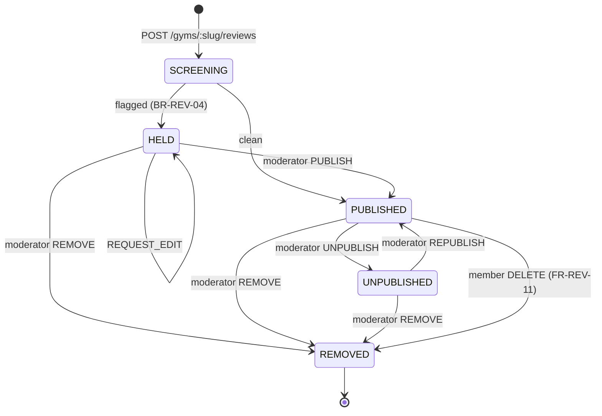

# `Reviews.md` — the `API-REV` contract

**Module** `REV` (`B5.16`) · **API group** `API-REV` · **Surfaces** `web`, `dash`, `admin`
**Status** Phase 1, priority **M** · **Owner** Engineering

---

## 0. Document control

| Field | Value |
| :--- | :--- |
| Purpose | The complete wire contract for review submission, editing, gym response, reporting and moderation |
| Depends on | `README.md` (contract law), `API_Catalog.md` (endpoint index), `Schema.md` (tables), `BusinessRules.md` (enforcement map) |
| Governs | `FR-REV-01` … `FR-REV-11`, `BR-REV-01` … `BR-REV-07` |
| Never contradicts | `PROJECT_CONSTITUTION.md`, `MASTER_PRD.md` |

### 0.1 What this document is not

It is not the moderation **queue mechanics** — assignment, SLA, workload distribution and the
moderator console live in `Admin.md`. This document specifies the review-specific semantics of the
moderation endpoints: what a moderation action *means* to a review, and what it does to the
aggregate.

---

## 1. Why this module is specified more heavily than its size warrants

`A1` states the commercial position plainly: *"the commercial risk to manage is not technical. It is
trust: a marketplace that lists unverified gyms, tolerates fake reviews, or mishandles a refund loses
consumers permanently and cheaply."* `OBJ-03` makes trust the only durable moat. `RSK-02` scores fake
reviews at **16** — joint second-highest in the register.

So the design principle for this surface is not *"validate the input"*. It is:

> **Make a fake review structurally difficult, not merely against the rules.**

Three mechanisms deliver that, and they are structural rather than procedural:

| Mechanism | Effect |
| :--- | :--- |
| `reviews.membership_id` is `NOT NULL` | **An unverified review cannot be represented.** `BR-REV-03`'s *"Verified member"* marker is derivable from the schema and can never go stale or be forgotten |
| `uq_reviews__user_id_membership_id` | `BR-REV-02` is a unique index, not a use-case check — so it holds under concurrency |
| No `UPDATE`/`DELETE` grant on `reviews` for the tenant role | `BR-REV-05`'s *"a gym may never edit or delete a member's review"* holds even against a compromised tenant credential |

**None of the three can be bypassed by an application bug.** That is the difference between a rule and
an invariant, and it is why `Constraints.md` §13.7 grades `BR-REV-02`, `-03` and `-05` as `FULL` or
`STRUCTURAL` while grading `BR-REV-01` as `NONE`.

### 1.2 The one rule the database cannot hold

`BR-REV-01` — *only a user with at least one recorded check-in at the gym may review it* — is an
`EXISTS` over `attendance` in a different table. `Constraints.md` §12.7 explains why no constraint
reaches it, and why the obvious fix is wrong:

> A foreign key from `reviews` to a specific `attendance` row would tie the review to **one visit**.
> `BR-CHK-09` immutability plus partition archival mean that visit's row may be detached to cold
> storage while the review remains published for years. The eligibility question has a correct answer
> only against the attendance history *as it stands* — which is what a job re-asks and a constraint
> cannot.

So `BR-REV-01` is `L6-UC` authoritative, backed by a weekly re-audit (§9.3). This document is where
that enforcement is specified, which makes §3.1 and §4.2 the two most important sections here.

---

## 2. Cross-cutting contracts on this surface

| # | Property | Consequence |
| :-: | :--- | :--- |
| **RV1** | **Three distinct tenant scopes appear in one document.** `public` (reading reviews on a gym page — `Marketplace.md` owns that endpoint), `user` (a member's own reviews), `tenant` (a gym's inbox), `platform` (moderation). Each endpoint states its scope explicitly | The `user`-scope endpoints are the subtle ones: a member may hold reviews across **many** tenants, so these routes are **not** tenant-scoped and must not set `app.tenant_id` |
| **RV2** | **Idempotency is required on submission, editing, response and moderation** | All change published content and therefore the public rating. A double-submitted review would violate `BR-REV-02` at the index rather than gracefully — the key makes it a clean replay |
| **RV3** | **The displayed rating and the ranking rating are different numbers** | `FR-REV-08`. The plain mean with count is public; the Bayesian figure ranks and **never appears in a response body**. `Search.md` §4.2 states the same from the other side |
| **RV4** | **A moderation action is never silent** | Every publish, unpublish, request-edit and removal writes an `audit_log` row with actor and reason (`FR-ADMN-02`), and notifies the affected parties |
| **RV5** | **Nothing on this surface is flag-disableable** | `Constraints.md` §13 classes review integrity alongside money and tenancy: rules that must never be switched off. A flag that could disable check-in-gating would make `OBJ-03` a preference |

---

## 3. `GET /v1/gyms/:slug/reviews/eligibility`

**Purpose** tell the client whether the compose UI may be reached at all · **Surfaces** `web`
(`SCR-WEB-003` gym detail, `SCR-WEB-013` write-review) · **Auth** `access` **required** ·
**Permission** `reviews.review.create` — held by `MEMBER` only (`B3.2`: *Submit review* is `▪` for
`MEMBER`, `—` for everyone else) · **Scope** `user` · **Idempotency** N/A · **RL** `RL-READ` ·
**Cache** `private, no-store`.

### 3.1 Why this endpoint exists

`FR-REV-01` requires eligibility to be *"computed server-side; the compose UI is unreachable
otherwise."* Without this endpoint the client would have to guess — and a client that guesses wrong
either hides the action from an eligible member (lost `KPI-13` review submissions) or shows it to an
ineligible one, who writes 800 words and then gets a `403`. Both are bad; the second is worse.

```jsonc
// illustrative — not committed code
{
  "eligible": false,
  "reason": "NO_CHECKIN_RECORDED",
  "message": "You can review a gym after your first visit.",
  "existing_review": null,
  "membership": { "id": "0192f3c2-...", "status": "ACTIVE", "plan_name": "3 Month Unlimited" }
}
```

| `reason` | Meaning | Client behaviour |
| :--- | :--- | :--- |
| `null` (eligible) | ≥1 `ALLOWED` check-in, no review this term | Show the compose action |
| `NO_MEMBERSHIP` | Never held a membership here | Hide entirely |
| `NO_CHECKIN_RECORDED` | Membership held, **no allowed check-in** | Show the explanation of `SCR-WEB-013`'s *ineligible* state |
| `ALREADY_REVIEWED_THIS_TERM` | `BR-REV-02` | Offer edit if within 7 days, else read-only |
| `EDIT_WINDOW_CLOSED` | Reviewed, >7 days | Read-only |
| `REVIEW_UNDER_MODERATION` | Held by screening | Show status, no edit |

### 3.2 The eligibility test, stated exactly

```sql
-- illustrative — not committed code
SELECT EXISTS (
  SELECT 1 FROM attendance
  WHERE  user_id = $me
    AND  gym_id  = $gym
    AND  result  = 'ALLOWED'          -- ← the clause that matters
);
```

**`result = 'ALLOWED'` is load-bearing.** `BR-CHK-10` records **denied** attempts as attendance rows
too. A member who turned up with an expired membership, was refused at the door and left has an
`attendance` row — and has not attended. Omitting this predicate would let anyone who ever stood in a
gym's doorway review it, which is precisely the hole `BR-REV-01` exists to close.

A `MANUAL` or `OVERRIDE` check-in **does** confer eligibility: the member was physically admitted, and
`BR-CHK-08` marks the method for reporting, not for entitlement.

| Errors | `401` · `403 PERMISSION_DENIED` · `404 GYM_NOT_FOUND` |
| :--- | :--- |
| **Rules** | `FR-REV-01` (`L6-UC` authoritative); `BR-REV-01`; `BR-REV-02` |
| **Side effects** | None |
| **Compatibility** | Additive `reason` values. A client must treat an unknown `reason` as *not eligible* and render the supplied `message` — the safe default |

---

## 4. `POST /v1/gyms/:slug/reviews`

**Purpose** submit a review · **Surfaces** `web` (`SCR-WEB-013`) · **Auth** `access` ·
**Permission** `reviews.review.create` · **Scope** `user` · **Idempotency** **required** ·
**RL** `RL-WRITE` · **Cache** `no-store`.

```jsonc
// illustrative — not committed code
POST /v1/gyms/iron-works-indiranagar/reviews
Idempotency-Key: 0192f3d4-8a11-7c02-b6e9-14f7c3a25d80
{
  "rating": 4,
  "sub_ratings": { "equipment": 5, "cleanliness": 3, "staff": 5, "crowd": 3, "value": 4 },
  "body": "Good free-weights section and the 6 am crowd is manageable. Showers could be cleaner.",
  "media_ids": ["0192f3d5-..."]
}
```

| Field | Type | Required | Constraint |
| :--- | :--- | :-: | :--- |
| `rating` | integer | ✔ | 1…5. `ck_reviews__rating_range` |
| `sub_ratings` | object | ✗ | Five optional keys, each 1…5 (`FR-REV-02`) |
| `body` | string | ✔ | **20…2,000 characters** (`FR-REV-02`). The 20-char floor exists because *"good"* is not a review and dilutes the signal `OBJ-03` depends on |
| `media_ids` | UUID[] | ✗ | ≤ 6, pre-uploaded, owned by the caller |

### 4.1 `201 Created` — and why a held review is still `201`

```jsonc
// illustrative — not committed code
{
  "id": "0192f3d6-...",
  "status": "HELD",
  "published_at": null,
  "screening": { "outcome": "FLAGGED", "signals": ["CONTACT_DETAILS"] },
  "message": "Thanks — we're checking this one before it goes live. Usually under a day.",
  "editable_until": "2026-08-13T16:20:00+05:30"
}
```

**A review that fails automated screening returns `201` with `status: "HELD"`, not a `422`.**

`FR-REV-03` is explicit: *"failures queue for moderation rather than rejecting outright."* The
reasoning is worth stating because it is counter-intuitive to a reviewer reading the code:

- A `422` tells an honest member their genuine review was **refused**, with no recourse. Screening is
  heuristic; false positives are certain. A member whose review mentioned *"call the front desk"* is
  not a spammer.
- The content **is accepted and stored**. It simply is not public yet.
- A spammer learns nothing from `HELD` that helps them iterate — the response does not enumerate
  which pattern tripped in a form precise enough to tune against. `signals` carries a coarse
  category, not the matched substring.

| `status` | When | Public? |
| :--- | :--- | :-: |
| `PUBLISHED` | Screening clean | ✔ Immediately |
| `HELD` | Screening flagged, or `FR-REV-09` anomaly | ✗ Pending moderation |

### 4.2 The eligibility gate — `AC-REV-02.1`

> *Given a user has never checked in at a gym, when they attempt to submit a review by direct API
> call, then it is refused with **403**.*

The compose UI being unreachable is not the control. **This endpoint re-checks §3.2 on every
submission**, because the UI is a convenience and the API is the boundary (`FR-RBAC-02`). A client
that skipped `/eligibility` gets the same answer here.

`403`, not `422`, because the caller is not permitted to perform the action — this is an
authorisation failure, and `README.md` §9 reserves `422` for a well-formed request that violates a
business rule.

### 4.3 The membership binding

`membership_id` is **not** a request field. The server resolves it: the membership under which the
qualifying check-in occurred. `BR-REV-02` scopes one review per **membership term**, so the binding
determines whether this is a first review or a duplicate.

A member with two sequential memberships who reviewed under the first may review again under the
second — they are describing a different period, which is what *per term* means. A member who lapsed
and returned is a legitimate second reviewer.

| Errors | Code | HTTP | When |
| :--- | :--- | :-: | :--- |
| | `REVIEW_NOT_ELIGIBLE` | **403** | No `ALLOWED` check-in (`AC-REV-02.1`) |
| | `REVIEW_ALREADY_EXISTS` | 409 | `BR-REV-02`, this term. Returns the existing review |
| | `VALIDATION_FAILED` | 400 | Body outside 20…2,000, rating out of range, >6 media |
| | `MEDIA_NOT_OWNED` | 403 | A `media_id` the caller did not upload |
| | `GYM_NOT_FOUND` | 404 | |
| | `IDEMPOTENCY_FINGERPRINT_MISMATCH` | 409 | Same key, different body |

| **Rules** | `BR-REV-01` (`L6-UC`, §4.2); `BR-REV-02` (**FULL** at `L1-DB`); `BR-REV-03` (**STRUCTURAL** — `membership_id NOT NULL`); `BR-REV-04` (`L6-UC` screening); `FR-REV-02`; `FR-REV-09` |
| :--- | :--- |
| **Validation** | `.strict()`. Body length **after** trimming and Unicode normalisation, so 2,000 whitespace characters is not a review |
| **Side effects** | One `reviews` row. Outbox `reviews.submitted`. On `PUBLISHED`, outbox `reviews.published` → `review.aggregate` recomputes `gyms.rating_avg`/`rating_count`, and the owner is notified (*New review received*). On `HELD`, the moderation queue is notified, **the gym is not** — a gym learning about a held review before a moderator sees it invites pressure on the member |
| **Compatibility** | Additive sub-rating keys. Changing the 20-char floor is a **breaking** validation change and needs a version bump |

---

## 5. `PATCH /v1/reviews/:id`

**Purpose** edit within the 7-day window · **Auth** `access` · **Permission**
`reviews.review.update` · **Scope** `user` — **own review only**, `FR-RBAC-03` evaluated against the
`user_id` on the resource · **Idempotency** required · **RL** `RL-WRITE`.

`BR-REV-02`: *"Editing is permitted for 7 days; the edit history is retained."*

| Rule | Detail |
| :--- | :--- |
| Window | 7 days from `created_at`, **not** from `published_at` — a review held two days for moderation does not get a nine-day window |
| History | Every prior version appended to `edit_history jsonb`. **Nothing is overwritten** |
| Re-screening | An edit re-runs screening. An edit can move a `PUBLISHED` review to `HELD` — which is the point, since otherwise the edit window is a bypass |
| Aggregate | If `rating` changed, `review.aggregate` recomputes |

| Errors | `403 NOT_REVIEW_OWNER` · `404` · `422 EDIT_WINDOW_CLOSED` (states the expiry) · `409 REVIEW_UNDER_MODERATION` (a `HELD` review cannot be edited into publication) |
| :--- | :--- |
| **Rules** | `BR-REV-02`; `BR-REV-04`; `FR-REV-04` |
| **Side effects** | `reviews` row updated, `edit_history` appended, `edited_at` set. Outbox `reviews.edited`. `audit_log` row — the member is acting on their own content, but the content is public and the change affects a gym's rating |
| **Compatibility** | Additive |

---

## 6. `DELETE /v1/reviews/:id`

**Purpose** a member deletes their own review · **Auth** `access` · **Permission**
`reviews.review.delete` · **Scope** `user`, own review only · **Idempotency** required.

`FR-REV-11`: *"Members may delete their own review; the aggregate updates and the deletion is
retained in audit."*

**No time limit.** `BR-REV-02`'s 7-day window governs *editing*. A member may withdraw their words at
any time — the alternative is a platform that holds someone's opinion hostage, which is not
defensible under `NFR-PRV-02`'s revocable-consent principle.

Soft delete (`SD3`). The row persists with `status = 'REMOVED'` and a `deleted_at`, so:

- the aggregate recomputes **without** it (`FR-REV-11`),
- `BR-REV-02`'s unique index still occupies the term — a member cannot delete and re-review to
  refresh a rating, which would be a trivially exploitable loophole,
- the audit trail survives (`BR-DAT-01`).

| Errors | `403 NOT_REVIEW_OWNER` · `404` · `409 ALREADY_DELETED` |
| :--- | :--- |
| **Rules** | `FR-REV-11`; `BR-REV-02`; `BR-DAT-01`; `SD3` |
| **Side effects** | Soft delete. Outbox `reviews.deleted` → aggregate recompute within 60 s. `audit_log` row |

---

## 7. `GET /v1/me/reviews`

**Purpose** the member's own reviews across every gym · **Surfaces** `web` (`SCR-WEB-013`,
account) · **Auth** `access` · **Permission** `reviews.review.list_own` · **Scope** **`user`** —
explicitly **not** tenant-scoped (`RV1`) · **RL** `RL-READ` · **Cache** `private, no-store`.

Returns the member's reviews **including `HELD` and `REMOVED` ones**, which no other reader sees. A
member must be able to see that their review is under moderation; the alternative is a review that
silently vanished.

Query: `status` (repeated), `gym_id`, `limit`, `cursor`.

| **Rules** | `FR-REV-04`; `BR-REV-06` (a held review is visible **to its author**, not to the public) |
| :--- | :--- |
| **Side effects** | None |

---

## 8. Tenant-facing — the gym's side

### 8.1 `GET /v1/tenant/reviews`

**Purpose** the gym's review inbox · **Surfaces** `dash` (`SCR-DASH-019`) · **Auth** `access` ·
**Permission** `reviews.review.list` · **Scope** `tenant` · **RL** `RL-READ`.

Query: `rating` (repeated), `has_response` (boolean), `from`/`to`, `gym_id`, `limit`, `cursor`, plus
`sort` from the allowlist `created_at:desc` (default) · `created_at:asc` · `rating:desc` ·
`rating:asc`.

Returns **`PUBLISHED` and `UNPUBLISHED` reviews only**. A gym never sees a `HELD` review — see §4.3's
side-effect note. Each row carries the member's display name, membership tenure band (*"Member for
4 months"*), rating, sub-ratings, body, media, date, and the gym's response if any.

Also returns `response_rate_pct`, the metric `SCR-DASH-019` displays and the one that makes
responding feel like a scored activity rather than a chore.

### 8.2 `POST /v1/tenant/reviews/:id/respond`

**Purpose** the gym's single public response · **Permission** `reviews.response.create` — `●` for
`GYM_MANAGER` and `GYM_OWNER`, `—` for `RECEPTIONIST` and `TRAINER` (`B3.2`) · **Scope** `tenant` ·
**Idempotency** required.

`BR-REV-05`: *"A gym may publicly respond **once** per review."*

Enforced by `uq_review_responses__review_id`, a unique index — so two managers responding
simultaneously produce one response and one `409`, not two.

Body: `body`, 10…1,000 characters. Screened **identically** to a review (`FR-REV-05`) — a gym cannot
put a phone number in a response to route the member off-platform, which is `RSK-07`
disintermediation wearing a different hat.

| Errors | `403 PERMISSION_DENIED` · `404` · `409 RESPONSE_ALREADY_EXISTS` · `422 REVIEW_NOT_PUBLISHED` (no responding to a held or removed review) |
| :--- | :--- |
| **Rules** | `BR-REV-05` (**FULL** at `L1-DB`); `FR-REV-05`; `BR-REV-04` (screening applies to responses) |
| **Side effects** | One `review_responses` row. Outbox → member notified. `audit_log` row |

### 8.3 `POST /v1/tenant/reviews/:id/report`

**Purpose** the gym flags a review it believes is fraudulent · **Permission**
`reviews.review.report` · **Scope** `tenant` · **Idempotency** required.

Body: `reason_code` (from the `C4.8` moderation taxonomy), `notes` (≤ 1,000, optional).

> **`AC-REV-01.3`: the review stays published.** Reporting opens a moderation case. It does not hide,
> demote or de-weight the review, and the gym is told so in the response — because a report that
> quietly suppressed content would be a takedown mechanism, and `BR-REV-05` exists specifically to
> deny gyms one.

The single exception is `BR-REV-06`: content requiring **immediate removal** — personal data or
threats — is hidden pending review. That decision is made by the automated screen on the
`PERSONAL_INFORMATION` and `THREAT` reason codes, not by the reporting gym's assertion.

| Errors | `403` · `404` · `409 ALREADY_REPORTED` (by this tenant) · `422 INVALID_REASON_CODE` |
| :--- | :--- |
| **Rules** | `BR-REV-05`; `BR-REV-06`; `FR-REV-06`; `AC-REV-01.3` |
| **Side effects** | One `review_reports` row. Moderation queue notified. **The review's `status` is unchanged** except under the `BR-REV-06` immediate-removal categories. The reporting gym is notified of the outcome (`AC-REV-01.3`) |

### 8.4 What does not exist, and must not

> **`AC-REV-01.2`: given a published review, when the gym looks for a delete or edit action, then
> none exists anywhere in the interface or API.**

There is **no** `DELETE /v1/tenant/reviews/:id` and **no** `PATCH`. This is not an omission from this
document; it is the contract. Three layers make it true:

| Layer | Control |
| :--- | :--- |
| API | The routes do not exist. A request returns `404`, not `403` — the capability is not merely denied, it is absent |
| Permission | `B3.2` grants *Moderate / unpublish review* to `MODERATOR` and `SUPER_ADMIN` only. No tenant role holds it |
| Database | **No `UPDATE`/`DELETE` grant on `reviews` for the tenant role** (`Constraints.md` §9.4) — so even a compromised tenant credential executing raw SQL cannot do it |

A future engineer asked to *"let gyms remove abusive reviews"* must change all three, and will hit
this section on the way.

---

## 9. Moderation — review semantics

`Admin.md` owns the queue. This section owns what an action **means**.

### 9.1 `POST /v1/admin/moderation/reviews/:id/decide`

**Auth** `access` + MFA · **Permission** `reviews.review.moderate` — `MODERATOR`, `SUPER_ADMIN` ·
**Scope** `platform` · **Idempotency** required.

Body: `action`, `reason_code`, `notes`. **`reason_code` is required on every action**, including
`PUBLISH` — `FR-ADMN-02` admits no exception, and *"why did this get published"* is as much an audit
question as *"why was it removed"*.

| Action | From | To | Effect |
| :--- | :--- | :--- | :--- |
| `PUBLISH` | `HELD` | `PUBLISHED` | Enters the aggregate. Gym notified |
| `UNPUBLISH` | `PUBLISHED` | `UNPUBLISHED` | **Leaves the aggregate within 60 s** (`AC-REV-02.3`). Reversible |
| `REPUBLISH` | `UNPUBLISHED` | `PUBLISHED` | Re-enters |
| `REQUEST_EDIT` | `HELD` | `HELD` | Member notified with the reason; the 7-day edit window **restarts** |
| `REMOVE` | any | `REMOVED` | **Terminal** (`C4.6`). Leaves the aggregate permanently |

`REMOVE` is terminal by design. `C4.6` gives `REMOVED` no outbound edge, and `Constraints.md` §10.3's
immutability trigger enforces it. Reinstating a removed review would require a new row, which would
be a different review — and that honesty is the point.

### 9.2 The aggregate contract — `AC-REV-02.3`

> *Given a review is unpublished by a moderator, when the gym's rating renders, then the aggregate
> recalculates without it **within one minute**.*

| Property | Value |
| :--- | :--- |
| Mechanism | Outbox → `review.aggregate` (`§C5`) |
| Budget | **≤ 60 s** from decision to `gyms.rating_avg` reflecting it |
| Displayed | Plain mean of `PUBLISHED` reviews, with count (`FR-REV-08`, `BR-REV-07`) |
| Below 3 | **No numeric rating at all** (`BR-REV-07`) — the API returns `null`, it is not a client-side hide |
| Ranking | `rating_bayes`, recomputed in the same pass, **never in a response body** (`RV3`) |
| Excluded | `HELD`, `UNPUBLISHED`, `REMOVED`, and `FR-REV-09` anomalies pending clearance |

**The `BR-REV-07` floor has a sharp edge.** A gym at exactly three reviews that loses one to
moderation drops to two and its numeric rating **disappears** from every surface. That is correct —
two reviews do not support a number — but it is visible and will generate a support ticket. It is
documented here so the answer is *"working as specified"* rather than an investigation.

### 9.3 `FR-REV-09` anomaly detection and the eligibility re-audit

Two background controls, both queueing to moderation rather than acting autonomously:

| Control | Signal | Action |
| :--- | :--- | :--- |
| `review.anomaly-scan` (hourly) | Rating velocity, reviewer account age, text clustering | Hold, **exclude from the aggregate until cleared** (`AC-REV-02.2`) |
| `reviews.audit-eligibility` (weekly) | Re-runs the §3.2 `EXISTS` test over every published review | Any that would fail today is **unpublished pending investigation, not deleted** |

The re-audit exists because `BR-REV-01` is `L6-UC`-enforced rather than structural. If a code path
ever creates a review without the check, this is what finds it. Unpublish rather than delete, because
`BR-REV-05`'s principle — a member's review is not casually destroyed — binds the platform too, not
only the gym.

`AC-REV-02.2` in full: *given a gym receives an unusual burst of 5-star reviews from accounts created
within the same period, those reviews are held for moderation and excluded from the aggregate until
cleared.* Note **excluded while held** — a burst of fakes must not inflate a rating for the hours
before a human looks.

---

## 10. The review state machine — `C4.6`



| Invariant | |
| :--- | :--- |
| **I1** | Only `PUBLISHED` contributes to `rating_avg` and `rating_count` |
| **I2** | `REMOVED` is terminal — no outbound edge, enforced by trigger |
| **I3** | Every transition writes an `audit_log` row with actor and reason |
| **I4** | `membership_id` is never `NULL` in any state — `BR-REV-03` holds from creation |
| **I5** | No transition is reachable by a tenant role. Gyms respond and report; they do not move state |

**Illegal transitions** — `SCREENING → REMOVED` directly (a review is held first, so a human sees
what the screen caught); `REMOVED → anything`; any transition initiated by a `GYM_OWNER`.

---

## 11. Moderation reason codes — `C4.8`

| Code | Use | Typical action |
| :--- | :--- | :--- |
| `ABUSIVE_LANGUAGE` | Slurs, harassment | `REMOVE` |
| `PERSONAL_INFORMATION` | Names staff, phone numbers, addresses | **Immediate hide** (`BR-REV-06`), then `REMOVE` or `REQUEST_EDIT` |
| `SPAM` | Repetitive, automated | `REMOVE` |
| `IRRELEVANT` | Not about this gym | `REMOVE` |
| `CONFLICT_OF_INTEREST` | Competitor or staff member | `REMOVE` |
| `SUSPECTED_FAKE` | `FR-REV-09` anomaly | Hold, investigate |
| `PROMOTIONAL` | Advertises another business | `REMOVE` |
| `THREAT` | Threat of harm | **Immediate hide**, `REMOVE`, escalate |
| `OTHER` | Requires `notes` | Any |

`PERSONAL_INFORMATION` and `THREAT` are the only two carrying immediate hide. `BR-REV-06` names
exactly those categories, and the list is closed — a moderator cannot invent a third.

---

## 12. Error registry

| Code | HTTP | Retryable | User-facing message |
| :--- | :-: | :-: | :--- |
| `REVIEW_NOT_ELIGIBLE` | **403** | ✗ | *"You can review a gym after your first visit."* |
| `REVIEW_ALREADY_EXISTS` | 409 | ✗ | *"You've already reviewed this gym for this membership."* — with a link |
| `EDIT_WINDOW_CLOSED` | 422 | ✗ | *"Reviews can be edited for 7 days after posting."* |
| `REVIEW_UNDER_MODERATION` | 409 | ✗ | *"This review is being checked. You'll hear from us shortly."* |
| `NOT_REVIEW_OWNER` | 403 | ✗ | Generic — **never confirms the review exists** |
| `RESPONSE_ALREADY_EXISTS` | 409 | ✗ | *"You've already responded to this review."* |
| `REVIEW_NOT_PUBLISHED` | 422 | ✗ | *"You can only respond to published reviews."* |
| `ALREADY_REPORTED` | 409 | ✗ | *"You've already reported this. We'll let you know the outcome."* |
| `INVALID_REASON_CODE` | 422 | ✗ | Developer-facing |
| `MEDIA_NOT_OWNED` | 403 | ✗ | Generic |
| `ALREADY_DELETED` | 409 | ✗ | — |
| `VALIDATION_FAILED` | 400 | ✗ | Names the field; body-length messages state both bounds |

---

## 13. Traceability

| Requirement | Section |
| :--- | :--- |
| `FR-REV-01` eligibility | §3, §4.2 |
| `FR-REV-02` content | §4 |
| `FR-REV-03` screening | §4.1 |
| `FR-REV-04` one per term, 7-day edit | §4.3, §5 |
| `FR-REV-05` gym response | §8.2 |
| `FR-REV-06` gym report | §8.3 |
| `FR-REV-07` moderation queue | §9.1 |
| `FR-REV-08` Bayesian vs mean | §9.2, `RV3` |
| `FR-REV-09` anomaly detection | §9.3 |
| `FR-REV-10` review prompts | `Notifications.md` |
| `FR-REV-11` member delete | §6 |
| `BR-REV-01` … `BR-REV-07` | §1.2, §4.2, §4.3, §8.2, §8.3, §8.4, §9.2 |
| `US-REV-01`, `US-REV-02` | §8.2, §8.4, §4.2, §9.3 |
| `AC-REV-01.1/.2/.3` · `AC-REV-02.1/.2/.3` | §8.2, §8.4, §8.3, §4.2, §9.3, §9.2 |
| `SCR-WEB-013` · `SCR-DASH-019` · `SCR-ADM-012` | §3, §8.1, §9 |
| `E2E-09` | §4, §8.2, §8.3, §9.1, §9.2 |
| `OBJ-03` · `RSK-02` · `KPI-13` | §1 |

## 14. Open items

| # | Item | Owner |
| :-: | :--- | :--- |
| **OI-R1** | `OQ-10` (minimum reviews before a numeric rating) is built to the default of **3**. Configurable, so a change is data | Client |
| **OI-R2** | `FR-REV-09`'s anomaly thresholds — velocity window, account-age floor, clustering similarity — are unspecified. Tuning them needs real review traffic; launch values are placeholders and must be revisited at the first city's 30-day mark | Operations |
| **OI-R3** | The §9.2 three-review edge (a gym dropping below the floor and losing its number) needs support-facing copy so agents answer consistently | Support |
| **OI-R4** | `reviews.audit-eligibility` (§9.3) is specified here but is **not** in the `§C5` job catalogue | Engineering |
| **OI-R5** | Screening (`FR-REV-03`) names the categories but not the implementation. Whether it is a rules engine or a hosted classifier is undecided, and it affects the `HELD` rate materially | Engineering |

---

*End of Reviews.md.*
