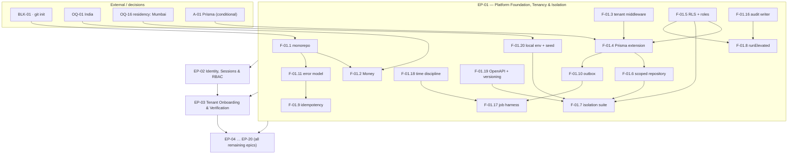

# EP-01 — Platform Foundation, Tenancy & Isolation

> **Source of truth.** `MASTER_PRD.md` §C1.3 (module structure), §C1.4 (multi-tenancy), §C1.5
> (cross-cutting mechanisms), §C2 (data model), §C5 (background jobs), §C7 (pipeline), §C8.1/§C8.2
> (test layers and seed).
> **Detailed expansion of** `ENGINEERING_PLAN.md` §2 (epic row EP-01) and §3 (features F-01.1 …
> F-01.20). **Scheduled by** `SprintPlanning.md` Sprint 0.
> **Never contradicts** `PROJECT_CONSTITUTION.md` §23 (Definition of Ready / Definition of Done),
> which governs every generic completion criterion referenced below.

---

## 1. Metadata

| Field | Value |
| :--- | :--- |
| **Epic id** | `EP-01` |
| **Name** | Platform Foundation, Tenancy & Isolation |
| **Priority (MoSCoW)** | **M** — Must. Nothing in `EP-02` … `EP-20` may start before this epic lands (`SprintPlanning.md` Sprint 0 → *Unblocks: every other sprint*). |
| **Complexity** | **XL**. Composed of two `ENGINEERING_PLAN.md` §13.1 modules: `common/` rated **High** (55 pts) and `tenancy/` rated **Extreme** (34 pts). `tenancy/` is one of only four modules in the programme rated Extreme. |
| **Story points** | **89** (Fibonacci; 1 point ≈ 0.5 engineer-day per §2 calibration). Reconciles exactly with §13.1 `common/` 55 + `tenancy/` 34. |
| **Target sprint(s)** | **Sprint 0** (2026-09-07 → 2026-09-18, milestone **M0**) for all 20 features. Two permitted spillovers into **Sprint 1** per the Sprint-0 capacity mitigation: F-01.13 tracing detail and F-01.15 percentage targeting (4.5 ed). |
| **Owning modules** | `common/`, `tenancy/`, `audit/` (writer + interceptor only; the explorer UI is `EP-19`), plus `packages/config`, `packages/types`, `packages/utils`, `packages/ui` skeleton and `infra/` |
| **Surfaces** | `apps/server` (NestJS 10), `apps/customer-web` (shell), `apps/gym-dashboard` (shell), `apps/admin-dashboard` (shell), CI (`pr.yml`), Terraform `development` (Mumbai) |
| **Owner** | Technical Lead (accountable for `TR-01`, `TR-34`, `TR-37`); DevOps for the pipeline and IaC tasks |
| **PRD modules covered** | None of the 24 `B5` modules — this epic is cross-cutting by construction |
| **Depends on** | Pre-Sprint-0 gate (`ENGINEERING_PLAN.md` §14.2); `BLK-01` closed by task `T-01.01` |
| **Status** | **Ready for Sprint 0**, conditional on `BLK-01` (no Git repository) being closed at the pre-Sprint-0 gate — see §13 |

**Sizing note.** The epic is XL not because the code volume is large — `tenancy/` is a few hundred
lines — but because the **blast radius** is total. `§13.1` states it plainly: *"Getting `Money`,
idempotency and the outbox wrong is not a local defect — it is a systemic one."* and for `tenancy/`,
*"Small code volume, maximum consequence."*

---

## 2. Business Goal

This epic exists to make **`BR-TEN-01`** — *"Every data record other than platform-global reference
data belongs to exactly one tenant and is inaccessible to any other tenant by any code path,
including reporting and support tooling"* — a **structural property of the database** rather than a
promise made by developers. `OBJ-07` states the objective in commercial terms: *"Operate a defensible
multi-tenant architecture in which no tenant can ever read or write another tenant's data"*, and
adds the reason it is `M`-priority rather than a hygiene item — it is *"Legal and reputational
necessity; also a sales objection to pre-empt."* A gym chain will not list its member book, its
revenue and its attendance beside a competitor's on the same deployment unless isolation is
demonstrable, and `BAC-10` makes the demonstration a **business** acceptance criterion: *"An
automated isolation test suite proves that a user of tenant A cannot read or write any record of
tenant B through any exposed endpoint."* Under the DPDP Act 2023 (`LAUNCH_MARKET_INDIA.md` §9) a
single cross-tenant read is not a degraded feature, it is a reportable personal-data breach. That is
why `§C1.4` names `BR-TEN-01` *"both a legal obligation and the thing most likely to be violated by
an ordinary coding mistake"*, and why the enforcement chain has **five layers** rather than one.

The second outcome is **financial correctness before the first rupee moves**. `OBJ-04` requires
*"every rupee attributable to a member, a plan, an invoice and a settlement"*, and `KPI-26` sets
settlement accuracy at **100%** — a target that is unreachable if money is ever represented as a
floating-point number or if a payment endpoint can be replayed. `BR-PAY-01` (integer minor units
with an explicit ISO-4217 code, floats prohibited) and `BR-PAY-03` (idempotency on a client-supplied
key) are therefore built **here**, in Sprint 0, not in Sprint 5 when payments arrive. The
`SprintPlanning.md` Sprint 5–6 risk note is explicit: *"Idempotency (`BR-PAY-03`) must be in place
before the first payment path ships, not retrofitted."* For India this also means the `Money` type
carries paise as `bigint`, renders with lakh/crore grouping (`₹2,50,000`, never `₹250,000`) and
rounds `round_half_even` per `A6.3` — one formatter in `packages/utils`, never hand-rolled per
surface.

The third outcome is **operability and accountability as defaults**. `BR-DAT-01` requires an
append-only audit log for every create, update and delete on the seven audited entity classes, and
`BAC-13` requires those logs to be queryable by entity and by actor. `BR-DAT-06` requires that
personal data never reaches a log, a trace or an analytics event — a requirement that is trivially
cheap to satisfy with a central Pino redaction list configured in Sprint 0, and expensive to satisfy
by auditing 200 log statements in Sprint 16. `NFR-MNT-04`, `NFR-MNT-05` and `NFR-MNT-06` (structured
logs with correlation id, distributed tracing, alerting) are what make `KPI-22` (≥ 99.9% API
availability), `KPI-23` (search p95 ≤ 500 ms) and `KPI-24` (check-in p95 ≤ 2 s) *measurable* rather
than aspirational — you cannot hold an SLO you cannot observe. Finally, `OBJ-09` ("country-agnostic
from day one: currency, tax and KYC as configuration rather than code") is served by the time
discipline in F-01.18: `Asia/Kolkata` is **+05:30 with no DST**, so midnight gym-time is 18:30 UTC
the previous day, and a naive hourly UTC cron fires at the wrong local moment for every one of the
24 `§C5` jobs. Building that discipline into the harness now is what stops `TR-07` and `TR-24` from
becoming a Sprint-7 membership-expiry incident.

---

## 3. Scope

### 3.1 In scope — explicit

| # | Item | Anchor |
| :-: | :--- | :--- |
| 1 | pnpm workspaces + Turborepo build graph; `packages/config` as the single lint/format/test/tsconfig source | `§C1.3`, A-05 |
| 2 | The 23-folder backend module tree of `§C1.3` created as empty, documented, boundary-enforced folders | `§C1.3`, `ENGINEERING_PLAN.md` §1.4 |
| 3 | `Money` value type (`{ amountMinor: bigint, currency: string }`) with arithmetic only through its methods, plus the ESLint rule banning `number` on amount-named fields | `BR-PAY-01`, `NFR-DQ-02`, `§C1.5` |
| 4 | Indian money formatting: `₹` prefix, lakh/crore digit grouping, `round_half_even` | `LAUNCH_MARKET_INDIA.md` §2, `A6.3` |
| 5 | `TenantContextMiddleware` resolving tenant from principal or resource — **never** from header or body | `§C1.4` step 1, `BR-TEN-01` |
| 6 | Mandatory Prisma tenant-context client extension wrapping every operation in an interactive transaction that sets `app.tenant_id` first | `§C1.4` step 2, A-01 approval condition, `ADR-0005` |
| 7 | RLS policy generator + migration convention; `app_rw` holds no `BYPASSRLS` | `§C1.4` step 3, `NFR-SEC-09`, `ADR-0006` |
| 8 | `TenantScopedRepository` base that refuses to build a query with no active context | `§C1.4` step 4 |
| 9 | Generated cross-tenant isolation suite + the CI rule failing any tenant-scoped endpoint without a spec | `§C1.4` step 5, `BAC-10`, `E2E-11`, `ENGINEERING_PLAN.md` §17.4 |
| 10 | Platform-scope elevation as a named, audited `runElevated()` function on the `app_platform` role | `§C1.4` platform-scope |
| 11 | Idempotency middleware and store: key + request fingerprint + response, 24 h, `409` on fingerprint mismatch | `BR-PAY-03`, `§C1.5`, `ADR-0016` |
| 12 | Transactional outbox table + `SKIP LOCKED` dispatcher worker | `§C1.5` Events, `ADR-0017` |
| 13 | Error taxonomy, stable machine-readable `code` registry, `correlation_id`, standard envelope | `§C1.5` Error model, `NFR-USE-05`, `§C3.1` |
| 14 | Pino structured logging with the reviewed redaction field list | `NFR-MNT-04`, `BR-DAT-06`, A-14 |
| 15 | OpenTelemetry traces and metrics with the `§19.4` span-naming convention | `NFR-MNT-05`, `NFR-MNT-06` |
| 16 | Redis token-bucket rate limiting across the eleven `§6.2` endpoint classes | `NFR-SEC-06`, `§C1.5`, A-13 |
| 17 | Feature-flag service with tenant / role / percentage targeting, evaluated server-side | `FR-ADMN-08`, `NFR-MNT-07`, `ADR-0026` |
| 18 | Audit interceptor + append-only `AuditWriter` on a role with no `UPDATE`/`DELETE` grant | `BR-DAT-01`, `NFR-SEC-13` |
| 19 | BullMQ job harness: queue registry, distributed locks, start/end/outcome records, duration alerts | `§C5` (all 24 jobs) |
| 20 | Time discipline: UTC storage, explicit IANA timezone arguments, lint rule on bare `new Date()` | `NFR-DQ-03`, `BR-MEM-03`, `TR-07`, `TR-24` |
| 21 | API versioning (`/v1`) and `@nestjs/swagger` OpenAPI generation with a CI drift gate | `NFR-MNT-02`, `NFR-MNT-03`, A-16 |
| 22 | Docker Compose local environment (Postgres 16 + PostGIS, Redis 7, MinIO, Mailpit) and the deterministic seed v1 | `§C7` Local, `§C8.2`, A-28 |
| 23 | `GET /v1/tenant/ping` — the trivial tenant-scoped endpoint the Sprint-0 exit condition names | `C9.1` Sprint 0 |
| 24 | Design tokens, `packages/ui` skeleton, three app shells, TanStack Query provider | A-03, A-04, `§C1.1` |
| 25 | `pr.yml` with all 15 merge gates; Terraform `development` in **Mumbai** | `§C7`, `NFR-MNT-08`, A-26, A-27, `OQ-16` |

### 3.2 Out of scope — explicit, with destination

| Item | Why not here | Where it goes |
| :--- | :--- | :--- |
| Authentication, tokens, MFA, the twelve-role permission matrix | EP-01 provides the guard *slots* and the `FR-RBAC-01` CI check; the matrix itself is identity work | **EP-02** (F-02.1 … F-02.18) |
| Tenant onboarding, the application state machine (`C4.4`), KYC storage | EP-01 creates `tenants` as an RLS anchor only | **EP-03** |
| The audit **explorer** UI, `/admin/audit`, retention/partition policy screens | EP-01 ships the writer and the interceptor; the reader surface is admin work | **EP-19** (`FR-ADMN-09`, `SCR-ADM-015`) |
| Feature-flag **admin UI** and the flag catalogue content | EP-01 ships evaluation and targeting; the console is admin work | **EP-19** (`FR-ADMN-08`, `SCR-ADM-011`) |
| The 24 concrete `§C5` jobs | EP-01 ships the harness they all run on; each job ships with its owning epic | EP-08 … EP-19 |
| Notification channel **adapters** (vendor) | Blocked on A-19; the four **ports** are defined in Sprint 0 under EP-17 | **EP-17** (F-17.1 ports in Sprint 0; adapters Sprint 14) |
| `PaymentProvider` port and the Razorpay Route adapter | Idempotency is the only payment prerequisite EP-01 owns | **EP-08** |
| Read replicas, partitioning of `attendance`, OpenSearch | Not needed at Sprint-0 volume; `§C1.1` forbids a search cluster before ~50k listings | EP-11 / EP-18 / deferred |
| Socket.IO / WebSocket transport | A-08 ruled polling for Phase 1 | Phase 2, flag `release.attendance.realtime_transport` |
| Schema-per-tenant | `§C1.4` selects shared-schema RLS with a documented migration path; STACK_ADDITIONS Part 3 rejects day-one schema-per-tenant | Deferred; migration path preserved by design |
| Production and staging Terraform | Sprint 0 provisions `development` only | Sprint 1 (staging, task 1.28), Sprint 16–18 (production) |

---

## 4. Features

Points sum to the epic's **89**. Sprint column is the sprint in which the feature is *complete*, not
merely started.

| Feature | Description | Satisfies | Pri | Pts | Sprint |
| :--- | :--- | :--- | :-: | :-: | :-: |
| **F-01.1** | Monorepo, pnpm workspaces, Turborepo build graph, `packages/config` single configuration source, the 23-folder `§C1.3` module tree | `§C1.3`, A-05, A-21, A-22 | M | 3 | 0 |
| **F-01.2** | Shared kernel `Money` value type — `bigint` minor units + ISO-4217, method-only arithmetic, `round_half_even`, Indian lakh/crore formatter, ESLint ban on `number` for amount-named fields | `BR-PAY-01`, `NFR-DQ-02`, `§C1.5`, `LAUNCH_MARKET_INDIA.md` §2 | M | 5 | 0 |
| **F-01.3** | Tenant context resolution middleware — principal-derived for `dash`/`admin`, resource-derived for public reads, never client-supplied | `BR-TEN-01`, `BR-TEN-02`, `§C1.4` step 1, `§C3.1` | M | 5 | 0 |
| **F-01.4** | Prisma tenant-context client extension: every operation inside an interactive transaction that first runs `set_config('app.tenant_id', …, true)`; throws when `AsyncLocalStorage` holds no tenant | `§C1.4` step 2, A-01 condition, `ADR-0005`, `TR-01` | M | 8 | 0 |
| **F-01.5** | RLS policy generator and migration convention — `USING` + `WITH CHECK` on every tenant-owned table; three DB roles; `app_rw` without `BYPASSRLS` | `§C1.4` step 3, `NFR-SEC-09`, `ADR-0006` | M | 5 | 0 |
| **F-01.6** | `TenantScopedRepository` base class — refuses to construct a query with no active tenant context; loud failure, never a silent full-table read | `§C1.4` step 4 | M | 3 | 0 |
| **F-01.7** | Generated cross-tenant isolation suite with the seven `§17.4` per-route assertions, plus the CI rule failing an uncovered tenant-scoped endpoint | `§C1.4` step 5, `BAC-10`, `E2E-11`, `NFR-SEC-09` | M | 8 | 0 |
| **F-01.8** | Platform-scope elevation — `runElevated(reason, actor)` named function on `app_platform`; never an ambient capability; every use audited | `§C1.4` platform-scope, `BR-DAT-01` | M | 3 | 0 |
| **F-01.9** | Idempotency middleware and store — `Idempotency-Key`, request fingerprint, stored response, 24 h TTL, `409` on same key + different fingerprint | `BR-PAY-03`, `§C1.5`, `ADR-0016`, `TR-36` | M | 5 | 0 |
| **F-01.10** | Transactional outbox table written in the same transaction as the state change, plus a `SKIP LOCKED` dispatcher worker with retry and DLQ | `§C1.5` Events, `ADR-0017`, `TR-08`, `TR-20` | M | 5 | 0 |
| **F-01.11** | Error taxonomy — stable `code` registry, human `message`, `details[]`, `correlation_id`; the `§C3.1` status-code mapping | `§C1.5`, `NFR-USE-05`, `§C3.1` | M | 3 | 0 |
| **F-01.12** | Structured logging with central redaction — Pino + `nestjs-pino` + `AsyncLocalStorage`; the reviewed redaction field list is a signed-off artefact | `NFR-MNT-04`, `BR-DAT-06`, A-14 | M | 2 | 0 |
| **F-01.13** | OpenTelemetry traces and metrics — span naming per `ENGINEERING_PLAN.md` §19.4, the §19.2 metric catalogue, Sentry error tracking with PII off | `NFR-MNT-05`, `NFR-MNT-06`, A-15 | M | 3 | 0 → detail may spill to 1 |
| **F-01.14** | Redis token-bucket rate limiting across the eleven `§6.2` classes (`RL-OTP` … `RL-WEBHOOK`) | `NFR-SEC-06`, `§C1.5`, A-13 | M | 2 | 0 |
| **F-01.15** | Feature-flag service — server-side evaluation, tenant / role / percentage targeting, resolved set delivered to the client, kill-switch semantics | `FR-ADMN-08`, `NFR-MNT-07`, `ADR-0026` | M | 5 | 0 → percentage targeting may spill to 1 |
| **F-01.16** | Audit interceptor + append-only `AuditWriter` — before/after for `@Audited()` entities, on a connection whose role holds no `UPDATE`/`DELETE`; jobs use the same primitive | `BR-DAT-01`, `NFR-SEC-13`, `BAC-13` | M | 5 | 0 |
| **F-01.17** | Job runner harness — BullMQ queue registry, distributed locks, start/end/outcome records, duration and failure alerts; all 24 `§C5` jobs consume it | `§C5`, `NFR-SCAL-05`, `NFR-MNT-06`, `TR-25` | M | 5 | 0 |
| **F-01.18** | Time discipline — UTC storage, explicit IANA timezone argument on every business-date computation, `Asia/Kolkata` +05:30 no-DST fixtures, lint rule on bare `new Date()` | `NFR-DQ-03`, `BR-MEM-03`, `TR-07`, `TR-24` | M | 3 | 0 |
| **F-01.19** | API versioning and OpenAPI generation with a CI drift gate; `permission-declared` CI job | `NFR-MNT-02`, `NFR-MNT-03`, `FR-RBAC-01`, A-16 | M | 3 | 0 |
| **F-01.20** | Local environment and deterministic seed — Docker Compose (Postgres 16 + PostGIS, Redis 7, MinIO, Mailpit), seed v1 (3 tenants, 12 plans, 200 members, 5,000 attendance rows, three timezones) | `§C7` Local, `§C8.2`, A-28, `TR-33` | M | 8 | 0 |
| | | | | **89** | |

**Cross-epic collaborations declared here so they are not lost.** `F-01.19`'s
`permission-declared` CI job is the *gate*; the twelve-role matrix it polices is `EP-02` F-02.13.
`F-01.15`'s flag service is consumed by `EP-19` F-19.x for the admin UI. `F-01.16`'s writer is read
by `EP-19`'s audit explorer. `F-01.17`'s harness is consumed by every one of the 24 `§C5` jobs.

---

## 5. User Stories

`MASTER_PRD.md` §B5 writes `US-` identifiers only for the 24 functional modules. EP-01 owns no `B5`
module, so the PRD writes no user story for it — yet `§C1.4` and `§C1.5` describe behaviour that is
demanded, testable and blocking. The stories below are therefore **new**, created by this backlog,
numbered in a reserved `US-FND-` range that collides with nothing in the PRD. Two PRD acceptance
criteria that belong to this epic's behaviour (`AC-AUTH-02.3`, `AC-ADMN-02.3`) are restated verbatim
in their proper place rather than paraphrased.

### US-FND-01 *(new)* — Tenant isolation holds at the database, not in application code

> *As the platform owner, I want tenant isolation enforced by PostgreSQL row-level security, so that
> a single forgotten `where` clause in any of 23 modules cannot leak a tenant's member book.*

- **AC-FND-01.1** — **Given** a tenant-owned table exists, **when** the migration that creates it is
  applied, **then** the table has `tenant_id uuid NOT NULL`, `ENABLE ROW LEVEL SECURITY`, a `USING`
  policy and a matching `WITH CHECK` policy on `current_setting('app.tenant_id')::uuid`, and a
  migration that omits any of these fails the RLS-convention CI check.
- **AC-FND-01.2** — **Given** the application connects as `app_rw`, **when** the role's attributes
  are inspected in local, CI and `development`, **then** `rolbypassrls` is false, asserted
  automatically rather than by inspection.
- **AC-FND-01.3** — **Given** a session with tenant A's context, **when** any repository issues a
  read against any tenant-owned table, **then** only tenant A's rows are returned, proven against a
  real Postgres through Testcontainers and not a mocked repository (`BR-TEN-01-P1`).
- **AC-FND-01.4** — **Given** a parameterised query into which `OR 1=1` has been injected as a
  *value*, **when** it executes under tenant A's context, **then** only tenant A's rows are returned
  (`BR-TEN-01-N2`, `SEC-A03-002`).
- **AC-FND-01.5** — **Given** the RLS policy is deliberately dropped on a scratch branch, **when**
  the isolation suite runs in CI, **then** the suite is **red** — proving the suite exercises RLS
  and not application-level filtering (`E0.4`, `§17.4` assertion 7).

### US-FND-02 *(new)* — The tenant variable is set on the same connection as the query

> *As the Technical Lead, I want the tenant GUC set inside the same interactive transaction as every
> query, so that Prisma's connection pool cannot hand a query a connection where no tenant is set.*

- **AC-FND-02.1** — **Given** any tenant-scoped operation, **when** it executes, **then** an
  integration test asserts that `current_setting('app.tenant_id')` inside that transaction equals
  the resolved tenant id (`E0.6`, `§17.4` assertion 6).
- **AC-FND-02.2** — **Given** `AsyncLocalStorage` holds no tenant, **when** a tenant-scoped
  operation is attempted, **then** the extension **throws** rather than executing unfiltered
  (`BR-TEN-01-N3`), and the thrown error carries the `TENANT_CONTEXT_MISSING` registry code.
- **AC-FND-02.3** — **Given** a developer imports `PrismaClient` anywhere outside `common/prisma`,
  **when** CI runs, **then** `dependency-cruiser` (A-23) fails the build (`E0.7`).
- **AC-FND-02.4** — **Given** a raw-SQL escape hatch (`$queryRaw`, `$executeRaw`) is used, **when**
  CI runs, **then** it fails unless the call site is on the reviewed allow-list with a comment and a
  `DECISION_LOG.md` entry (`TR-34`).
- **AC-FND-02.5** — **Given** the isolation suite runs, **then** every route also asserts the
  **positive** case returns a non-empty result, so a globally-broken tenant variable that returns
  nothing everywhere cannot produce a green suite (`E0.5`, `§17.4` assertion 4).

### US-FND-03 *(new)* — Cross-tenant access is refused without disclosing existence

> *As a security reviewer, I want a cross-tenant read to return 404 rather than 403, so that the API
> never confirms that another tenant's record exists.*

- **AC-FND-03.1** — **Given** I hold tenant A's token, **when** I request a known tenant-B resource
  id on any tenant-scoped route, **then** the response is **404**, never 403 and never 200
  (`E0.3`, `§17.4` assertion 1, `RSK-08`).
- **AC-FND-03.2** — **Given** I hold tenant A's token, **when** I attempt a **write** to a tenant-B
  resource, **then** the response is 404 **and** tenant B's row is byte-identical afterwards,
  verified by a checksum taken before and after (`§17.4` assertion 2).
- **AC-FND-03.3** — **Given** a list endpoint, **when** it is called under tenant A, **then** the
  returned row count equals the count from a direct tenant-scoped query — filtering is asserted, not
  merely per-row checks (`§17.4` assertion 3).
- **AC-FND-03.4** *(restated verbatim from the PRD as `AC-AUTH-02.3`)* — **Given** I am in tenant A,
  **when** any request is made, **then** no data belonging to tenant B is returned under any
  circumstance, including search, reports and exports.

### US-FND-04 *(new)* — A new endpoint cannot ship without isolation coverage

> *As the QA Lead, I want isolation coverage generated from the route table, so that coverage cannot
> silently lapse when someone adds an endpoint on a Friday.*

- **AC-FND-04.1** — **Given** a controller route carries `@TenantScoped()`, **when** the suite
  generator runs, **then** a spec is produced for it from metadata without anyone authoring it
  (`§17.4` "generation, not authorship").
- **AC-FND-04.2** — **Given** a new tenant-scoped route exists with no generated spec, **when** CI
  runs, **then** the build fails (`E0.8` sibling, constitution DoD #16).
- **AC-FND-04.3** — **Given** a platform-scope `/admin/*` route, **when** the inverted suite runs,
  **then** the route must succeed across tenants **and** must write an `audit_log` row with actor
  and reason for every cross-tenant read (`§17.4` platform-scope).
- **AC-FND-04.4** — **Given** search, report and export routes exist, **when** the suite runs,
  **then** they are included **by name**, because `E2E-11` names them explicitly.

### US-FND-05 *(new)* — Platform-scope access is a named, audited call

> *As the Super Admin, I want cross-tenant access to require an explicit elevation with a reason, so
> that legitimate platform operations are distinguishable from a leak.*

- **AC-FND-05.1** — **Given** a platform operation needs to read across tenants, **when** it does
  so, **then** it calls `runElevated(reason, actor)` on the `app_platform` role — there is no
  ambient capability to elevate.
- **AC-FND-05.2** — **Given** `runElevated()` executes, **then** an `audit_log` row records the
  actor, the stated reason, the correlation id and the scope of the elevation (`§C1.4`).
- **AC-FND-05.3** — **Given** `PlatformPrismaService` is injected outside `admin/`, `reporting/`,
  `settlements/` or `audit/`, **when** CI runs, **then** `dependency-cruiser` fails the build.

### US-FND-06 *(new)* — Money cannot be represented as a float

> *As the Finance stakeholder, I want money to be integer minor units with an explicit currency
> everywhere, so that `KPI-26` settlement accuracy of 100% is arithmetically achievable.*

- **AC-FND-06.1** — **Given** any monetary field, **when** it is persisted, **then** it is `bigint`
  minor units with an adjacent explicit `currency char(3)` column (`BR-PAY-01`, `NFR-DQ-02`).
- **AC-FND-06.2** — **Given** a field named like an amount (`*_minor`, `amount`, `price`, `fee`,
  `total`), **when** it is typed as `number`, **then** the ESLint rule fails the build (`§C1.5`).
- **AC-FND-06.3** — **Given** two `Money` values in different currencies, **when** addition is
  attempted, **then** it throws `CURRENCY_MISMATCH` rather than coercing.
- **AC-FND-06.4** — **Given** an amount of 250000 paise in `INR`, **when** it is formatted for
  display, **then** it renders `₹2,500.00` and a value of 25,000,000 paise renders `₹2,50,000.00`
  with lakh grouping, from one formatter in `packages/utils`
  (`LAUNCH_MARKET_INDIA.md` §2).
- **AC-FND-06.5** — **Given** a half-way rounding case, **when** it is rounded, **then**
  `round_half_even` is applied, per `A6.3`.
- **AC-FND-06.6** — **Given** a `Money` value crosses the API boundary, **when** it is serialised,
  **then** it is emitted as a string or a structured object — never a JavaScript `number` — and a
  contract test proves no precision is lost (`TR-38`).

### US-FND-07 *(new)* — A repeated mutating request produces one effect

> *As a member on a flaky mobile connection, I want a retried request to have the same effect as one
> request, so that I am never charged twice for one membership.*

- **AC-FND-07.1** — **Given** a mutating endpoint that `§6.1`/`§14.2.1` marks **REQ**, **when** it is
  called without an `Idempotency-Key`, **then** it returns `400` with the
  `IDEMPOTENCY_KEY_REQUIRED` code.
- **AC-FND-07.2** — **Given** the same key and the same request fingerprint, **when** the request is
  repeated within 24 hours, **then** the stored response is returned with no side effects
  (`BR-PAY-03`).
- **AC-FND-07.3** — **Given** the same key with a **different** fingerprint, **when** the request is
  made, **then** the response is `409` with the `IDEMPOTENCY_KEY_REUSED` code (`§C1.5`).
- **AC-FND-07.4** — **Given** two concurrent requests carrying the same key, **when** they race,
  **then** exactly one executes and the other waits for and returns the stored result — proven by a
  concurrency test, not a sequential one.
- **AC-FND-07.5** — **Given** the retention window is configured, **then** it is stated as
  configuration and is **≥** the payment provider's retry window, with the comparison recorded
  (`TR-36`).

### US-FND-08 *(new)* — A notification is never sent for a rolled-back transaction

> *As the Technical Lead, I want domain events written to an outbox in the same transaction as the
> state change, so that side effects and state can never disagree.*

- **AC-FND-08.1** — **Given** a state change publishes a domain event, **when** the transaction
  commits, **then** the `outbox` row committed with it and the dispatcher will deliver it
  (`§C1.5` Events).
- **AC-FND-08.2** — **Given** the transaction rolls back, **when** the dispatcher next runs,
  **then** no event is dispatched, because the outbox row rolled back too.
- **AC-FND-08.3** — **Given** multiple dispatcher workers run, **when** they poll, **then**
  `FOR UPDATE SKIP LOCKED` guarantees each row is claimed exactly once (`TR-08`).
- **AC-FND-08.4** — **Given** a dispatch fails repeatedly, **when** the attempt count exceeds the
  configured maximum, **then** the row moves to a dead-letter state, an alert fires, and the
  dispatcher does not stall behind it.
- **AC-FND-08.5** — **Given** published rows accumulate, **when** the retention sweep runs, **then**
  dispatched rows older than the configured window are removed so the table cannot grow without
  bound (`TR-20`).

### US-FND-09 *(new)* — Every failure is explainable and correlatable

> *As a support agent, I want every error to carry a stable code and a correlation id, so that I can
> find the exact request in the logs without asking engineering.*

- **AC-FND-09.1** — **Given** any error response, **then** the body is
  `{ error: { code, message, details[], correlation_id } }` exactly as `§C3.1` specifies.
- **AC-FND-09.2** — **Given** an error `code`, **then** it exists in the central registry; a code
  used in source but absent from the registry fails CI.
- **AC-FND-09.3** — **Given** a validation failure, **then** the status is `400`; a business-rule
  violation is `422`; a state or idempotency conflict is `409`; an authorisation failure is `403`;
  an expired order is `410` (`§C3.1`, `BusinessRules.md` §3).
- **AC-FND-09.4** — **Given** an error message, **then** it states what happened, why, and what to
  do next, and it is an externalised string key (`NFR-USE-05`, `NFR-USE-08`).
- **AC-FND-09.5** — **Given** a request that triggers a background job, **then** the correlation id
  propagates into the job's logs and spans (`NFR-MNT-04`, constitution DoD #29).
- **AC-FND-09.6** — **Given** an error response, **then** it never echoes raw user input
  (`SEC-A03-005`, `BR-DAT-06-N2`).

### US-FND-10 *(new)* — Personal data never reaches a log, a trace or an analytics event

> *As the Data Protection owner, I want redaction configured centrally in Sprint 0, so that DPDP
> exposure is not created one log statement at a time.*

- **AC-FND-10.1** — **Given** the central Pino configuration, **then** the redaction list covers at
  minimum `token`, `authorization`, `cookie`, `password`, `otp`, `email`, `phone`, `name`, `dob`,
  `address`, `card`, `cvv`, `aadhaar`, `pan`, `health_notes` (`BR-DAT-06`).
- **AC-FND-10.2** — **Given** a synthetic PII corpus is driven through every logging, tracing and
  error path, **when** the `pii-redaction` CI job inspects the sinks, **then** zero personal data is
  present (`BR-DAT-06-P1`).
- **AC-FND-10.3** — **Given** a log message built by string concatenation, **when** CI runs,
  **then** the ESLint rule fails it, because redaction can only reach structured fields.
- **AC-FND-10.4** — **Given** Sentry is configured, **then** `sendDefaultPii` is disabled (A-15).
- **AC-FND-10.5** — **Given** the redaction list changes, **then** the change is an audited
  configuration change with a named reviewer.

### US-FND-11 *(new)* — Every audited write is reconstructable

> *As a Super Admin resolving a dispute, I want who, when, from what, to what and why for every
> audited change, so that the platform can answer the three questions that decide any dispute.*

- **AC-FND-11.1** — **Given** a create, update or delete on a member, membership, payment, plan,
  gym, staff or configuration record, **then** an `audit_log` row is written with `actor_id`,
  `actor_type`, `impersonated_by`, `tenant_id`, `entity_type`, `entity_id`, `action`, `before`,
  `after`, `ip`, `user_agent`, `correlation_id`, `reason`, `occurred_at` (`BR-DAT-01`, `§C2.2`).
- **AC-FND-11.2** — **Given** a background job writes to an audited entity, **then** it produces an
  audit row through the same `AuditWriter` primitive — coverage is not HTTP-shaped
  (`BR-DAT-01-N2`).
- **AC-FND-11.3** *(restated verbatim from the PRD as `AC-ADMN-02.3`)* — **Given** an audit record
  exists, **when** modification is attempted, **then** no interface, API or role permits it.
- **AC-FND-11.4** — **Given** the audit connection's role, **then** it holds no `UPDATE` and no
  `DELETE` grant on `audit_log`, and an attempt raises `permission denied` from Postgres
  (`BR-DAT-01-N1`, `NFR-SEC-13`).
- **AC-FND-11.5** — **Given** audit rows exist, **then** they are queryable by entity and by actor
  through the `(entity_type, entity_id, occurred_at)` and `(actor_id, occurred_at)` indexes
  (`BAC-13`).
- **AC-FND-11.6** — **Given** audit writes occur on a hot path, **then** the before-state capture
  does not add a second read to that path (`TR-32`).

### US-FND-12 *(new)* — Background work runs exactly once, on time, in the right timezone

> *As the on-call engineer, I want a job harness with locks, outcome records and duration alerts, so
> that a Redis failover cannot silently double-charge or double-expire.*

- **AC-FND-12.1** — **Given** a `§C5` job runs on more than one worker, **when** its schedule fires,
  **then** a distributed lock ensures a single execution (`§C5`, `TR-25`).
- **AC-FND-12.2** — **Given** a job executes, **then** start, end and outcome are recorded, metrics
  are emitted, and an alert fires on failure or on exceeding its expected duration (`§C5`,
  `NFR-MNT-06`).
- **AC-FND-12.3** — **Given** a job is retried after a partial failure, **then** it is idempotent by
  construction — every one of the 24 `§C5` jobs is marked *Idempotent: Yes*.
- **AC-FND-12.4** — **Given** a job is scheduled "per gym timezone", **when** the gym timezone is
  `Asia/Kolkata`, **then** it fires at the correct local moment despite the **+05:30** offset —
  midnight gym-time is 18:30 UTC the previous day (`TR-24`, `LAUNCH_MARKET_INDIA.md` §3).
- **AC-FND-12.5** — **Given** the worker tier, **then** it is separate from the request tier and
  cannot starve request handling (`NFR-SCAL-05`).

### US-FND-13 *(new)* — Time is UTC in storage and explicit at every boundary

> *As a backend engineer, I want no implicit server timezone anywhere, so that membership validity
> and expiry are correct in every market.*

- **AC-FND-13.1** — **Given** a timestamp is stored, **then** it is UTC, with the applicable IANA
  timezone stored alongside wherever local interpretation matters (`NFR-DQ-03`).
- **AC-FND-13.2** — **Given** any business-date computation, **then** the function signature takes an
  explicit IANA timezone argument; there is no default (`§C1.5` Time, `BR-MEM-03`).
- **AC-FND-13.3** — **Given** a bare `new Date()` or `Date.now()` in domain code, **when** CI runs,
  **then** the lint rule fails it; a `Clock` port is injected instead, making time testable.
- **AC-FND-13.4** — **Given** the deterministic seed, **then** at least three distinct timezones are
  represented so that a UTC-assumption bug is caught by the seed rather than by a customer
  (`TR-07`, Sprint-0 task 0.31).
- **AC-FND-13.5** — **Given** worker hosts, **then** clock skew is bounded and monitored (`TR-21`).

### US-FND-14 *(new)* — The pipeline refuses work that violates the constitution

> *As the Technical Lead, I want the fifteen merge gates live before the first feature, so that the
> standards in the constitution are enforced by machines rather than by reviewers' memory.*

- **AC-FND-14.1** — **Given** a pull request, **then** all fifteen `pr.yml` gates run: lint,
  typecheck, architecture, unit, integration, contract, isolation, coverage, OpenAPI drift,
  permission declaration, secret scan, dependency scan, bundle size, a11y, migration and commit lint
  (`ENGINEERING_PLAN.md` §16.3, constitution DoD #36).
- **AC-FND-14.2** — **Given** a deliberate violation of any single gate, **when** it is pushed,
  **then** that gate — and only that gate — fails the build (`E0.11`).
- **AC-FND-14.3** — **Given** the generated OpenAPI document drifts from the code, **then** CI fails
  (`NFR-MNT-03`, A-16).
- **AC-FND-14.4** — **Given** an endpoint with no declared permission, **then** the
  `permission-declared` job fails the build (`FR-RBAC-01`).
- **AC-FND-14.5** — **Given** `terraform plan` for `development`, **then** it is clean and the region
  is **India (Mumbai)** (`OQ-16`, `E0.10`).
- **AC-FND-14.6** — **Given** `docker compose up`, **then** Postgres 16 + PostGIS, Redis 7, MinIO and
  Mailpit come up healthy and the seed loads with no manual steps (`E0.9`).

---

## 6. Acceptance Criteria for the Epic

The epic is **not done** until every one of the following passes. Each is testable as written and
each names its evidence. These are the epic-level gate; they subsume but do not replace the
constitution's §23.2 Definition of Done.

| # | Criterion | Evidence |
| :-: | :--- | :--- |
| **AC-EP01-01** | `GET /v1/tenant/ping` exists, declares a permission and appears in the generated OpenAPI document. | `E0.1` |
| **AC-EP01-02** | Called with tenant A's token it returns tenant A's row; called with tenant B's token for tenant A's resource it returns **404**, and the body contains no tenant-A identifier. | `E0.2`, `E0.3` |
| **AC-EP01-03** | The generated isolation suite runs in `pr.yml`, covers 100% of tenant-scoped routes, and applies all seven `§17.4` assertions to each. | `BAC-10`, `E2E-11` |
| **AC-EP01-04** | On a scratch branch with the RLS policy dropped, the isolation suite is **red**. | `E0.4` |
| **AC-EP01-05** | The isolation suite asserts the positive case returns a non-empty result on every route. | `E0.5`, `TR-01` |
| **AC-EP01-06** | A Testcontainers test proves `app.tenant_id` is set **inside the same transaction** as the query. | `E0.6` |
| **AC-EP01-07** | `dependency-cruiser` fails the build on any import of `PrismaClient` outside `common/prisma`, and on `PlatformPrismaService` outside `admin/`, `reporting/`, `settlements/`, `audit/`. | `E0.7` |
| **AC-EP01-08** | The application role has no `BYPASSRLS` in local, CI and `development`, asserted automatically. | `E0.8` |
| **AC-EP01-09** | Every tenant-owned table created in this epic has `tenant_id NOT NULL`, RLS enabled, and both `USING` and `WITH CHECK` policies; the RLS-convention check fails a migration that omits any. | `BR-TEN-01` |
| **AC-EP01-10** | An operation attempted with no tenant in `AsyncLocalStorage` throws `TENANT_CONTEXT_MISSING`; an attempt to re-enter with a different tenant throws `TENANT_CONTEXT_ALREADY_SET`. | `BR-TEN-01-N3`, `BR-TEN-02-N1` |
| **AC-EP01-11** | `runElevated()` is the only cross-tenant path, is on `app_platform`, and writes an audit row with actor and reason on every call. | `§C1.4` |
| **AC-EP01-12** | `Money` is `bigint` minor units plus currency; the ESLint amount-name rule fails a `number`; property-based tests on `packages/utils/money` reach **100% line and branch** coverage with no exemptions. | `§17.5`, `BR-PAY-01` |
| **AC-EP01-13** | Indian formatting is correct: `₹2,50,000.00` for 25,000,000 paise, from a single formatter; a hand-rolled formatter elsewhere fails review. | `LAUNCH_MARKET_INDIA.md` §2 |
| **AC-EP01-14** | Idempotency: missing key on a REQ endpoint → `400`; same key + same fingerprint → stored response, no side effect; same key + different fingerprint → `409`; concurrent duplicates → exactly one execution. | `BR-PAY-03` |
| **AC-EP01-15** | The outbox commits with its transaction, dispatches under `SKIP LOCKED`, dead-letters after the configured attempts, alerts on backlog, and prunes dispatched rows. | `TR-08`, `TR-20` |
| **AC-EP01-16** | Every error response uses the `§C3.1` envelope with a registry `code` and a `correlation_id`; a code absent from the registry fails CI. | `NFR-USE-05` |
| **AC-EP01-17** | The `pii-redaction` CI job drives a synthetic PII corpus through logs, traces, Sentry and analytics and finds zero personal data. | `BR-DAT-06` |
| **AC-EP01-18** | `BR-DAT-01` audit rows are written by both HTTP and job paths, are queryable by entity and by actor, and `UPDATE`/`DELETE` on `audit_log` raise `permission denied`. | `BAC-13`, `NFR-SEC-13` |
| **AC-EP01-19** | The BullMQ harness enforces a distributed lock, records start/end/outcome, emits metrics, and alerts on failure and on duration overrun — demonstrated with a deliberate double-trigger. | `§C5`, `TR-25` |
| **AC-EP01-20** | Rate limiting is active for all eleven `§6.2` classes with the stated budgets, and a burst test proves each class's ceiling. | `NFR-SEC-06` |
| **AC-EP01-21** | Feature flags evaluate server-side, target by tenant, role and percentage, deliver a resolved set to the client, and a flag flip takes effect without deployment. | `FR-ADMN-08`, `NFR-MNT-07` |
| **AC-EP01-22** | Bare `new Date()` in domain code fails lint; every business-date function takes an explicit IANA timezone; the seed represents three timezones including `Asia/Kolkata`. | `NFR-DQ-03`, `TR-07`, `TR-24` |
| **AC-EP01-23** | The OpenAPI document is generated from code, the drift gate fails on divergence, and the `permission-declared` job fails an endpoint with no declared permission. | `NFR-MNT-03`, `FR-RBAC-01` |
| **AC-EP01-24** | `docker compose up` yields Postgres+PostGIS, Redis, MinIO and Mailpit healthy; the deterministic seed loads with no manual steps and produces 3 tenants, 12 plans, 200 members and 5,000 attendance rows. | `E0.9`, `§C8.2` |
| **AC-EP01-25** | `terraform plan` is clean for `development` in the **Mumbai** region; secrets come from the managed store and none appear in source. | `E0.10`, `NFR-SEC-07`, `OQ-16` |
| **AC-EP01-26** | All fifteen `pr.yml` gates run, and a deliberate violation of each one fails the build individually. | `E0.11` |
| **AC-EP01-27** | Adding a new tenant-scoped endpoint with no isolation spec is refused by CI. | Sprint-0 demo step 8 |
| **AC-EP01-28** | Coverage gates are configured and enforced: overall ≥ 80%/75%, `tenancy/` ≥ 95%/95%, `packages/utils/money` 100%/100%. | `§17.5`, `NFR-MNT-01` |
| **AC-EP01-29** | `M0` evidence is complete: approval matrix signed; `OQ-01`, `OQ-16`, `OQ-18`, `OQ-20` recorded as answered. | `E0.12` |
| **AC-EP01-30** | A production-shaped cross-tenant canary probe is defined and wired into the `§16.7` rollback triggers. | `§17.4` production canary |

---

## 7. Business Rules Enforced

Full enforcement detail — every layer, failure mode, positive and negative test id — lives in
`BusinessRules.md`. This table names only **which rule this epic owns** and **the enforcement point
EP-01 builds**. It does not duplicate `BusinessRules.md`; where the two differ,
`BusinessRules.md` wins.

| BR | Priority | Owner module | Enforcement point built in EP-01 | Layer(s) | Test ids |
| :--- | :-: | :--- | :--- | :--- | :--- |
| **BR-TEN-01** | M | `tenancy/` | RLS policy on every tenant-owned table (**authoritative**, `L2-RLS`); the Prisma tenant-context extension (F-01.4); `TenantContextMiddleware` (F-01.3); `TenantScopedRepository` (F-01.6); the generated isolation suite (F-01.7); `dependency-cruiser` rules | `L1-DB`, **`L2-RLS`**, `L4-EXT`, `L7-GUARD`, `L3-GRANT`, `L12-CI` | `BR-TEN-01-P1`, `-N1`, `-N2`, `-N3` |
| **BR-TEN-02** | M | `tenancy/` | The extension's single-tenant-per-request invariant, throwing `TENANT_CONTEXT_ALREADY_SET` (**authoritative**, `L4-EXT`). The *switch endpoint*, its audit row and the UI switcher belong to **EP-02** F-02.9 | **`L4-EXT`**, `L2-RLS` | `BR-TEN-02-N1` (EP-01 half); `-P1` completed by EP-02 |
| **BR-TEN-04** | M | `tenancy/` + `audit/` | The `L3-GRANT` half only: `audit_log` created with no `UPDATE`/`DELETE` grant to the application role, and the `append-only-grants` CI check that asserts the absence. Tenant soft-delete semantics belong to **EP-19** | **`L3-GRANT`**, `L12-CI` | `BR-TEN-04-N1` (audit-log clause) |
| **BR-PAY-01** | M | `common/` + `ledger/` | The `Money` value type, the amount-name ESLint rule, the `bigint`-plus-currency column convention in the migration template (**authoritative for the `common/` half**) | `L5-DOM`, `L1-DB`, `L12-CI` | `BR-PAY-01-P1`, `-N1` |
| **BR-PAY-03** | M | `common/` + `payments/` | `IdempotencyInterceptor` + `idempotency_keys` store: key, endpoint, request hash, response status and body, `expires_at` (**authoritative for the `common/` half**) | **`L9-INT`**, `L1-DB` | `BR-PAY-03-P1`, `-N1` |
| **BR-DAT-01** | M | `audit/` | `AuditInterceptor` + `AuditWriter` on a role with no `UPDATE`/`DELETE`; `@Audited()` decorator; the CI check that every entity in the seven named classes carries the annotation (**authoritative**) | **`L9-INT`**, `L3-GRANT`, `L5-DOM`, `L1-DB`, `L12-CI` | `BR-DAT-01-P1`, `-N1`, `-N2` |
| **BR-DAT-06** | M | `common/` | Central Pino redaction over the named field list; Sentry `sendDefaultPii` off; the `pii-redaction` CI job; the ESLint ban on concatenated log messages (**authoritative**) | **`L9-INT`**, `L12-CI`, `L8-PIPE` | `BR-DAT-06-P1`, `-N1`, `-N2` |
| **BR-MEM-03** | M | `memberships/` | *Enabling only.* EP-01 supplies the `Clock` port, the explicit-IANA-timezone convention and the bare-`new Date()` lint rule that make gym-timezone validity expressible. The rule itself is enforced in **EP-10** | `L5-DOM` (value objects), `L12-CI` | Enabling; `BR-MEM-03-*` land in EP-10 |
| **BR-GYM-01** | M | `catalog/` + `discovery/` | *Enabling only.* EP-01 supplies the outbox that carries approval to the search projection inside the `BAC-02` 60-second window. The predicate is **EP-04**/**EP-06** | `L10-JOB` harness | Enabling; `BR-GYM-01-*` land in EP-04/EP-06 |

**Rules deliberately not owned here.** Every other `BR-` in the 95-rule catalogue is owned by a
feature epic. EP-01 supplies the primitives (Money, idempotency, outbox, audit, jobs, tenancy) that
those epics' enforcement points are built from; supplying a primitive is not owning a rule, and this
backlog does not claim it as coverage.

---

## 8. Dependencies

### 8.1 Upstream — what must exist first

| Dependency | Type | Detail |
| :--- | :--- | :--- |
| **Pre-Sprint-0 gate** | Process | `ENGINEERING_PLAN.md` §14.2 — Phases 0–7 + G marked `DONE`; Phase 8 unlock signed |
| **`BLK-01`** | **Blocking** | No Git repository exists. `LAUNCH_MARKET_INDIA.md` §12 closed it as *deliberately deferred*; it becomes blocking at Phase 8. Sprint 0 **cannot start** until `git init` runs (task `T-01.01`). This is a hard gate, not a risk to manage |
| **`OQ-01`** | External decision | Launch country — **answered: India** (`LAUNCH_MARKET_INDIA.md` §1). Determines currency, timezone, region, formatter |
| **`OQ-16`** | External decision | Data residency — **answered: India region, mandatory**. Fixes the Terraform region to Mumbai |
| **`OQ-18`** | External decision | Year-1 capacity targets — **answered** via `KPI-01`/`KPI-08`; drives connection-pool and instance sizing |
| **`OQ-20`** | External decision | Deployment model — **answered: managed cloud** |
| **A-01, A-05, A-06, A-07, A-13, A-14, A-15, A-16, A-21 … A-30** | Stack approval | All `APPROVED` in `STACK_ADDITIONS.md`. A-01's approval is **conditional** on the tenant-context extension being built exactly as Part 4 specifies |
| **Cloud account + managed Postgres 16/PostGIS, Redis 7, S3-compatible storage in an Indian region** | Vendor | Required before `terraform apply`; `DEP-` class dependency on the cloud provider |
| **Secret store** | Vendor | `NFR-SEC-07` — secrets never in source control or repository environment files |

No **epic** is upstream of EP-01. It is the root of the graph.

### 8.2 Downstream — what this unblocks

| Consumer | What it consumes |
| :--- | :--- |
| **EP-02** Identity, Sessions & RBAC | Guard slots, error envelope, audit writer, rate-limit classes `RL-AUTH`/`RL-OTP`, the `permission-declared` CI gate, tenant context for `BR-TEN-02` |
| **EP-03** Tenant Onboarding & Verification | Outbox (60-second listing publication, `BAC-02`), audit writer (override records), job harness (pre-checks), idempotency (`POST /tenant/applications`) |
| **EP-04** … **EP-06** | Tenant-scoped repository, media job harness, search reindex job harness |
| **EP-07** … **EP-09** | `Money`, idempotency (mandatory before the first payment path), outbox, error taxonomy, tax-profile configuration shape |
| **EP-10**, **EP-11** | `Clock` port and explicit-timezone discipline; job harness for the four membership jobs and the two attendance jobs |
| **EP-15**, **EP-16** | `Money` arithmetic and rounding, append-only grant pattern, `runElevated()` for cross-tenant finance reads |
| **EP-17** | Outbox → `notification.dispatch`; the four channel ports are defined in Sprint 0 alongside EP-01 |
| **EP-18** | `runElevated()` and the isolation coverage of export routes (`E2E-11`, `IS5`) |
| **EP-19** | Flag service, audit writer, configuration patterns |
| **Every sprint 1–18** | `SprintPlanning.md` Sprint 0: *"Nothing in sprints 1–18 may start before EP-01 lands."* |

### 8.3 External dependencies and open questions

| Ref | Item | Status |
| :--- | :--- | :--- |
| `OQ-01`, `OQ-16`, `OQ-18`, `OQ-20` | Country, residency, capacity, deployment model | **Answered** — `LAUNCH_MARKET_INDIA.md` |
| `BLK-01` | Git repository | **Open** — must close at the pre-Sprint-0 gate |
| A-19 | Notification vendors | `DEFERRED`. EP-01 is unaffected: only the **ports** exist in Sprint 0 (EP-17 F-17.1) with a Mailpit local adapter |
| `DEP-07` | Error tracking / APM vendor | Sentry selected (A-15), self-hostable, India-region deployment required by `OQ-16` |
| Cloud provider | Mumbai region availability for managed Postgres 16 + PostGIS and Redis 7 | Must be confirmed before `T-01.34` |

### 8.4 Dependency graph

---

## 9. Technical Tasks

Estimates are **engineer-days (ed)** and include implementation, its tests and review, per §13's
convention. Layer codes: **DB** · **API** · **worker** · **web** (customer site) · **dash** (gym
dashboard) · **admin** (admin console) · **infra** · **test** · **docs**. The `SprintPlanning.md`
Sprint-0 task ids (`0.x`) are cited where a task maps directly, so the two documents stay
reconcilable.

| Id | Task | Layer | ed | Depends on | Serves |
| :--- | :--- | :--- | :-: | :--- | :--- |
| **T-01.01** | `git init`, trunk protection, `CODEOWNERS` requiring two reviewers on `payments/`, `settlements/`, `ledger/`, `refunds/`, `billing/`, `tenancy/`; Husky + lint-staged + commitlint (Conventional Commits carrying PRD ids) | infra | 1.5 | — | `BLK-01`, A-24, constitution §20 · *(0.1)* |
| **T-01.02** | pnpm workspaces + Turborepo pipeline graph; `packages/config` exporting the single ESLint, Prettier, tsconfig and Jest configuration | infra | 2.0 | T-01.01 | F-01.1, A-05, A-21, A-22 · *(0.2)* |
| **T-01.03** | Scaffold the 23 `§C1.3` backend folders with the mandated per-module file set and a `README.md` each; add `dependency-cruiser` rules encoding the §4.5 allowed-dependency matrix | infra / docs | 1.5 | T-01.02 | `§C1.3`, A-23 |
| **T-01.04** | `Money` value type: `bigint` minor units, ISO-4217 currency, method-only arithmetic, `round_half_even`, `CURRENCY_MISMATCH` on mixed-currency operations | API | 1.5 | T-01.02 | F-01.2, `BR-PAY-01`, `NFR-DQ-02` · *(0.3)* |
| **T-01.05** | ESLint rule banning `number` on amount-named fields; property-based test suite on `Money` to 100% line and branch | test | 1.0 | T-01.04 | F-01.2, `§17.5` |
| **T-01.06** | Indian money formatter in `packages/utils`: `₹` prefix, lakh/crore grouping, negative and zero cases; `BigInt`-safe JSON serialisation contract across the API boundary | API | 1.0 | T-01.04 | `LAUNCH_MARKET_INDIA.md` §2, `TR-38` |
| **T-01.07** | Prisma schema bootstrap, `prisma migrate` conventions, forward-only backward-compatible migration template with the RLS block mandatory | DB | 1.5 | T-01.02 | A-07, `NFR-AVL-06` |
| **T-01.08** | Three database roles — `app_rw`, `app_ro`, `app_platform` — with grants; `app_rw` without `BYPASSRLS`; automated assertion of role attributes in every environment | DB | 1.5 | T-01.07 | F-01.5, `L3-GRANT`, `E0.8` |
| **T-01.09** | RLS policy generator and migration convention: `ENABLE ROW LEVEL SECURITY` + `USING` + `WITH CHECK` on `current_setting('app.tenant_id')::uuid`; CI check failing a tenant-owned table without all three | DB / test | 2.5 | T-01.08 | F-01.5, `BR-TEN-01`, `NFR-SEC-09`, `ADR-0006` · *(0.6)* |
| **T-01.10** | `TenantContextMiddleware`: resolve from the authenticated principal for `dash`/`admin`, from the requested resource for public reads; reject any client-supplied tenant header or body field | API | 2.0 | T-01.03 | F-01.3, `§C1.4` step 1 · *(0.4)* |
| **T-01.11** | **Prisma tenant-context client extension** — wrap every operation in an interactive transaction that first runs `set_config('app.tenant_id', $1, true)`; throw `TENANT_CONTEXT_MISSING` when `AsyncLocalStorage` is empty and `TENANT_CONTEXT_ALREADY_SET` on re-entry with a different tenant | API | 3.0 | T-01.09, T-01.10 | F-01.4, `TR-01`, A-01 condition, `ADR-0005` · *(0.5)* |
| **T-01.12** | Connection-pool sizing, transaction timeout and pool-exhaustion alerting for interactive transactions; documented pool arithmetic against `OQ-18` volumes | infra | 1.0 | T-01.11 | `TR-37` |
| **T-01.13** | `TenantScopedRepository` base class refusing a context-free query with a loud typed failure; `dependency-cruiser` rules banning `PrismaClient` outside `common/prisma` and `PlatformPrismaService` outside `admin/`, `reporting/`, `settlements/`, `audit/` | API | 1.5 | T-01.11 | F-01.6, `E0.7`, `TR-34` · *(0.7)* |
| **T-01.14** | Raw-SQL escape-hatch policy: allow-list, comment requirement, `DECISION_LOG.md` entry, CI enforcement | test / docs | 0.5 | T-01.13 | `TR-34` |
| **T-01.15** | `runElevated(reason, actor)` on `app_platform` — named function, never ambient; audit row on every call; the inverted `/admin/*` isolation expectations | API | 1.5 | T-01.08, T-01.24 | F-01.8, `§C1.4` platform-scope · *(0.9)* |
| **T-01.16** | Isolation-suite **generator**: reflect the route table, read `@TenantScoped()` and `@RequiresPermission()` metadata, emit one spec per route with all seven `§17.4` assertions | test | 3.0 | T-01.13, T-01.32 | F-01.7, `BAC-10`, `E2E-11` · *(0.8)* |
| **T-01.17** | CI rule failing any tenant-scoped route with no generated spec; the dropped-policy negative control job on a scratch database | test | 1.0 | T-01.16 | `E0.4`, `AC-EP01-27` |
| **T-01.18** | `GET /v1/tenant/ping` — the trivial tenant-scoped endpoint named by the Sprint-0 exit condition, with a declared permission and an OpenAPI entry | API | 0.5 | T-01.13, T-01.32 | `C9.1` Sprint 0 · *(0.23)* |
| **T-01.19** | Production cross-tenant canary probe definition and its wiring into the `§16.7` rollback triggers | infra / test | 0.5 | T-01.16 | `§17.4` production canary |
| **T-01.20** | `idempotency_keys` table (`key`, `endpoint`, `request_hash`, `response_status`, `response_body`, `expires_at`) with the uniqueness and TTL constraints | DB | 0.5 | T-01.07 | F-01.9, `§C2.2` |
| **T-01.21** | `IdempotencyInterceptor`: fingerprinting that neither over- nor under-matches, stored-response replay, `409` on fingerprint mismatch, concurrency-safe claim | API | 1.5 | T-01.20 | F-01.9, `BR-PAY-03`, `ADR-0016` · *(0.10)* |
| **T-01.22** | Idempotency retention configuration reconciled against the payment provider's retry window, with the comparison recorded | docs / API | 0.5 | T-01.21 | `TR-36` |
| **T-01.23** | `outbox` table + write-in-same-transaction helper; `SKIP LOCKED` dispatcher worker with retry, backoff, dead-letter state, backlog alert and a pruning sweep | worker / DB | 2.5 | T-01.11 | F-01.10, `TR-08`, `TR-20`, `ADR-0017` · *(0.11)* |
| **T-01.24** | Error taxonomy: registry of stable `code` values, the `§C3.1` status mapping, standard envelope, `correlation_id` interceptor and `AsyncLocalStorage` propagation; CI check for codes used but unregistered | API | 1.5 | T-01.02 | F-01.11, `NFR-USE-05` · *(0.12)* |
| **T-01.25** | Pino + `nestjs-pino` structured logging with the reviewed redaction field list; ESLint ban on concatenated log messages; Sentry init with `sendDefaultPii` disabled | API | 1.0 | T-01.24 | F-01.12, `BR-DAT-06`, A-14, A-15 · *(0.13)* |
| **T-01.26** | `pii-redaction` CI job: drive a synthetic PII corpus through logs, traces, Sentry and analytics sinks and fail on any leak | test | 1.0 | T-01.25 | `BR-DAT-06-P1` |
| **T-01.27** | OpenTelemetry SDK, span-naming convention per §19.4, the §19.2 metric catalogue, exporter configuration, trace/log correlation | API / infra | 1.5 | T-01.25 | F-01.13, `NFR-MNT-05`, `NFR-MNT-06` · *(0.14)* |
| **T-01.28** | Redis token-bucket rate limiting (`rate-limiter-flexible`) with the eleven `§6.2` classes as configuration, plus per-class burst tests | API / test | 1.0 | T-01.24 | F-01.14, `NFR-SEC-06`, A-13 · *(0.15)* |
| **T-01.29** | Feature-flag service: server-side evaluation, tenant / role / percentage targeting, resolved-set endpoint for clients, kill-switch semantics, cheap request-path evaluation | API | 2.0 | T-01.24 | F-01.15, `FR-ADMN-08`, `NFR-MNT-07`, `ADR-0026` · *(0.16)* |
| **T-01.30** | `audit_log` table (monthly partitions, the two `BAC-13` indexes) + `AuditWriter` on the no-`UPDATE`/no-`DELETE` role + `AuditInterceptor` + `@Audited()` decorator + the CI annotation check | DB / API | 2.0 | T-01.07, T-01.08 | F-01.16, `BR-DAT-01`, `NFR-SEC-13` · *(0.17)* |
| **T-01.31** | BullMQ harness: queue registry, distributed locks, run records (start/end/outcome), duration and failure alerts, worker-tier separation, `audit.partition-maintenance` as the harness's first consumer | worker | 2.0 | T-01.23 | F-01.17, `§C5`, `TR-25`, `TR-41` · *(0.18)* |
| **T-01.32** | API versioning (`/v1`), `@nestjs/swagger` OpenAPI generation, CI drift gate, and the `permission-declared` CI job | API / test | 1.5 | T-01.24 | F-01.19, `NFR-MNT-02`, `NFR-MNT-03`, `FR-RBAC-01`, A-16 · *(0.20)* |
| **T-01.33** | Time discipline: `Clock` port, UTC storage convention, explicit IANA timezone arguments, `Asia/Kolkata` +05:30 no-DST fixtures, lint rule on bare `new Date()`/`Date.now()`, worker clock-skew monitor | API / infra | 1.5 | T-01.02 | F-01.18, `NFR-DQ-03`, `TR-07`, `TR-21`, `TR-24` · *(0.19)* |
| **T-01.34** | Docker Compose local environment: Postgres 16 + PostGIS, Redis 7, MinIO, Mailpit, health checks, one-command bring-up | infra | 2.0 | T-01.02 | F-01.20, `§C7`, A-28 · *(0.28)* |
| **T-01.35** | Deterministic seed v1 — 3 tenants (single-branch, multi-branch, suspended), 12 plans, 200 members in mixed states, 5,000 attendance rows, **three timezones represented**; seed drift guard | test | 2.0 | T-01.34, T-01.09 | `§C8.2`, `TR-07`, `TR-33` · *(0.31)* |
| **T-01.36** | Terraform `development`: VPC, managed Postgres 16 + PostGIS, Redis 7, S3-compatible bucket, secret store, **Mumbai region**, remote state | infra | 3.0 | T-01.01 | `NFR-MNT-08`, `OQ-16`, A-27 · *(0.29)* |
| **T-01.37** | GitHub Actions `pr.yml` with all fifteen §16.3 gates, Turborepo affected-graph optimisation, and a deliberate-violation matrix job proving each gate bites | infra / test | 2.5 | T-01.02 … T-01.33 | `E0.11`, `§C7`, A-26 · *(0.30)* |
| **T-01.38** | Coverage gate configuration per `§17.5` (overall 80/75, `tenancy/` 95/95, `packages/utils/money` 100/100) and the `BAC-06` rule-to-test traceability report generator | test | 1.0 | T-01.37 | `NFR-MNT-01`, `BAC-06` |
| **T-01.39** | Design tokens as CSS custom properties: colour, type, spacing, radius, elevation, motion — one source driving all three surfaces | web / dash | 2.0 | T-01.02 | A-03, `§C1.1` · *(0.24)* |
| **T-01.40** | `packages/ui` skeleton with shadcn/ui primitives, tree-shakeable exports, no barrel re-export, Storybook, `size-limit` budget wiring | web / dash | 3.0 | T-01.39 | A-04, A-29, `TR-18` · *(0.25)* |
| **T-01.41** | Three app shells: `customer-web` (Next.js 14 App Router), `gym-dashboard` and `admin-dashboard` (React 18 + Vite), routing skeletons, security headers (`NFR-SEC-12`) | web / dash / admin | 3.0 | T-01.40 | `§C1.1`, `ADR-0019` · *(0.26)* |
| **T-01.42** | TanStack Query provider, error boundary, auth-token plumbing, generated OpenAPI client, the flag-resolved-set client hook | web / dash | 2.0 | T-01.41, T-01.29, T-01.32 | `§C1.1`, `ADR-0021` · *(0.27)* |
| **T-01.43** | Module runbooks for `common/`, `tenancy/`, `audit/` covering their top three failure modes each; `/docs/features/` entries; `PHASES.md` ticks | docs | 1.5 | T-01.31 | `NFR-MNT-09`, constitution DoD #22–28 |
| **T-01.44** | QA retro-audit of the Sprint-0 suite: assertion density, isolation completeness, false-pass hunt (QA joins in Sprint 2; this is `SprintPlanning.md` task 2.19) | test | 3.0 | T-01.37 | Sprint-0 risk mitigation *(2.19)* |
| | **Total** | | **73.5** | | |

**Task-count note.** 44 tasks, above the 15–40 guidance, because EP-01 is XL and because the
Sprint-0 board is itself 31 lines. Granularity here is deliberate: the constitution's DoR criterion
15 requires every item to be completable on a branch living ≤ 2 days, and each row above satisfies
it.

---

## 10. Estimated Time

### 10.1 Roll-up by role

| Role | Tasks | Engineer-days | Notes |
| :--- | :--- | :-: | :--- |
| **Backend (BE)** | T-01.04 … T-01.11, T-01.13 … T-01.18, T-01.20 … T-01.33, T-01.35, T-01.38, T-01.43 | **46.5** | Reconciles with `ENGINEERING_PLAN.md` §13.1: `common/` 28 ed + `tenancy/` 17 ed = 45 ed, plus 1.5 ed of runbooks the §13.1 module figures exclude |
| **FE — customer web** | Share of T-01.39 … T-01.42 | **4.5** | Tokens, `packages/ui` share, Next.js 14 shell, TanStack Query provider |
| **FE — dashboards** | Share of T-01.39 … T-01.42 | **5.5** | Two Vite shells (gym + admin), flag client hook, generated OpenAPI client |
| **QA** | T-01.44 | **3.0** | Executed in Sprint 2 — QA joins the team then (`C9.3`). Test authorship inside Sprint 0 sits in the BE and FE estimates |
| **DevOps** | T-01.01, T-01.02, T-01.03, T-01.12, T-01.19, T-01.34, T-01.36, T-01.37 | **14.0** | Sprint-0 board shows 9.0 ed because pool arithmetic (T-01.12) and folder scaffolding (T-01.03) are booked to BE there; the work is the same work |
| **Design** | Token system, component inventory, three surface style directions | **8.0** | From the Sprint-0 board; not itemised as engineering tasks above |
| | **Total** | **81.5** | |

### 10.2 Reconciliation with the plan of record

| View | Figure | Why it differs |
| :--- | :--- | :--- |
| §2 epic points | 89 pts → **44.5 ed** | The *feature* view: implementation only, at 1 pt ≈ 0.5 ed |
| §13.1 module view | `common/` 28 + `tenancy/` 17 = **45 ed** | Implementation + test + review for the two owning backend modules |
| This epic, engineering tasks | **73.5 ed** | Adds infra, IaC, pipeline, the three app shells, `packages/ui`, seed and the QA retro-audit — none of which is inside a §13.1 *module* figure |
| This epic, all roles | **81.5 ed** | Adds design |
| `SprintPlanning.md` Sprint 0 | BE 38.0 · FE 10.0 · DevOps 9.0 · Design 8.0 = **65.0 ed** | The sprint board is EP-01 **minus** the Sprint-1 spillovers (F-01.13 detail, F-01.15 percentage targeting, 4.5 ed), **minus** the Sprint-2 QA retro-audit (3.0 ed), **plus** EP-02 scaffolding (2.0 ed) and EP-17 ports (1.0 ed) that are not EP-01 |

### 10.3 Confidence range

| Scenario | Engineer-days | Drivers |
| :--- | :-: | :--- |
| **Optimistic (P10)** | **66** | `BLK-01` closes on day one; Mumbai region has managed Postgres 16 + PostGIS and Redis 7 available immediately; the Prisma extension works against the pooler at the first attempt; no rework on the RLS convention |
| **Expected (P50)** | **81.5** | The plan as written, including the three named Sprint-0 capacity mitigations |
| **Pessimistic (P90)** | **112** | `TR-01` needs a second design pass because the pooler behaves differently under load than in tests; `TR-37` forces a pool-sizing rework and a transaction-timeout redesign; the Mumbai region lacks a needed managed service and a substitute must be provisioned; the fifteen `pr.yml` gates need individual debugging against a monorepo affected-graph |

**Capacity reality.** `SprintPlanning.md` records Sprint 0 as **OVER** on backend (155%), DevOps
(257%) and design (114%), with three named mitigations: move 5.0 ed of BE work to the
under-loaded frontend pool; DevOps to 1.0 FTE for Sprint 0 only; defer 4.5 ed (F-01.13 tracing
detail, F-01.15 percentage targeting) to Sprint 1. This epic adopts those mitigations rather than
re-arguing them, and records the resulting **4.0 ed contingency drawdown of 86.4**.

---

## 11. Risks

Probability and impact use the `RiskAnalysis.md` §1.1 five-point scale; **Score = P × I**.

| Risk | P | I | Score | Description and mitigation | Register id |
| :--- | :-: | :-: | :-: | :--- | :--- |
| Prisma connection pooling defeats RLS | 3 | 5 | **15** | A naive `prisma.user.findMany()` can take a different pooled connection than the one `SET LOCAL app.tenant_id` ran on; RLS then sees no tenant and returns nothing — or, with a permissive policy, the wrong rows. **Mitigation:** tasks T-01.09 … T-01.17 run as one pair-programmed workstream (Tech Lead + one BE); `AC-FND-02.1` asserts the GUC inside the transaction; `AC-FND-02.5` asserts the positive case so a globally-empty result cannot pass; `dependency-cruiser` bans raw-client imports | **`TR-01`** |
| Raw-query escape hatches bypass the extension | 3 | 5 | **15** | `$queryRaw` in a hurry defeats the whole chain. **Mitigation:** T-01.14 — allow-list, mandatory comment, `DECISION_LOG.md` entry, CI enforcement; RLS still holds underneath because the policy is on the table, not the client | **`TR-34`** |
| Connection-pool exhaustion from interactive transactions | 4 | 4 | **16** | Wrapping *every* operation in an interactive transaction lengthens connection hold time; at `OQ-18` volumes the pool starves and the API stalls. **Mitigation:** T-01.12 — documented pool arithmetic, transaction timeout, saturation alert, and a k6 profile in Sprint 16 that specifically drives pool pressure | **`TR-37`** |
| Outbox dispatcher stalls or double-dispatches | 3 | 4 | **12** | A stuck poison row blocks the queue; a lost lock double-sends. **Mitigation:** `SKIP LOCKED`, bounded attempts, dead-letter state, backlog alert (T-01.23) | **`TR-08`** |
| Unbounded outbox table growth | 4 | 3 | **12** | Dispatched rows are never removed and the table becomes the largest in the database. **Mitigation:** pruning sweep in T-01.23 with a configured retention window and a size alert | **`TR-20`** |
| BullMQ duplicate execution under Redis failover | 3 | 5 | **15** | A failover can re-deliver a job; a duplicate `subscription.charge` or `membership.expire` is a customer-visible defect. **Mitigation:** distributed lock plus idempotent-by-construction jobs (T-01.31); every `§C5` job is marked *Idempotent: Yes* and the harness makes that cheap | **`TR-25`** |
| One Redis serving cache, queue, rate limiting and sessions | 3 | 4 | **12** | A queue backlog evicts cache entries and rate-limit counters at the same moment. **Mitigation:** logical separation by database index now, physical separation recorded as the escalation; documented in the `common/` runbook (T-01.43) | **`TR-35`** |
| Idempotency retention shorter than the provider's retry window | 3 | 4 | **12** | A provider retry after 24 h finds no stored response and executes twice. **Mitigation:** T-01.22 makes the window configuration and requires it to be reconciled against the Razorpay Route retry policy before EP-08 | **`TR-36`** |
| `BigInt` / minor-unit serialisation across the API boundary | 3 | 4 | **12** | `JSON.stringify` on a `BigInt` throws, and the naive fix — `Number()` — silently loses precision above 2^53. **Mitigation:** T-01.06 fixes the wire representation and a contract test asserts round-trip fidelity | **`TR-38`** |
| Zod ↔ OpenAPI ↔ Prisma schema drift | 3 | 3 | **9** | Three schema sources disagree and the contract tests pass against the wrong one. **Mitigation:** `packages/types` is the single Zod source, OpenAPI is generated, the drift gate fails CI (T-01.32) | **`TR-39`** |
| Timezone errors in validity computation | 3 | 4 | **12** | `Asia/Kolkata` is **+05:30 with no DST**; midnight gym-time is 18:30 UTC the previous day. A naive hourly UTC cron fires at the wrong local moment for every gym-timezone job. **Mitigation:** T-01.33 lint rule, `Clock` port, explicit IANA arguments, and a seed with three timezones | **`TR-07`**, **`TR-24`** |
| Clock skew across the worker tier | 3 | 4 | **12** | Two workers disagree about "today" and a daily job double-runs or skips. **Mitigation:** NTP requirement plus a skew monitor in T-01.33 | **`TR-21`** |
| The audit log becomes a write bottleneck | 3 | 4 | **12** | Capturing before-state adds a read to every hot-path write. **Mitigation:** capture from the already-loaded aggregate rather than re-reading; monthly partitions; measured in the Sprint-16 load profile | **`TR-32`** |
| Partition maintenance job failure | 3 | 5 | **15** | `audit.partition-maintenance` fails silently and writes hit a missing partition weeks later. **Mitigation:** it is the harness's first consumer (T-01.31) precisely so the alerting is proven before anything else depends on it | **`TR-41`** |
| Stale or poisoned Turborepo cache artefact | 2 | 4 | **8** | A cached build output from a different input hash ships. **Mitigation:** strict input hashing, cache scoped to CI, a nightly cold build | **`TR-42`** |
| Test-seed drift | 4 | 3 | **12** | The suite stays green while the seed stops resembling production. **Mitigation:** the seed is versioned and reviewed (T-01.35); Sprint-16 refreshes it against staging shapes | **`TR-33`** |
| Cross-tenant data leakage | 4 | 5 | **20** | The business risk this epic exists to hold down. **Mitigation:** the entire five-layer chain, plus the generated suite, plus the production canary. Residual is carried, not eliminated | **`RSK-08`** |
| No Git repository at Sprint start | 2 | 5 | **10** | `BLK-01`. Sprint 0 cannot start; the branch strategy and Conventional-Commit traceability are unenforceable. **Mitigation:** hard gate at the pre-Sprint-0 gate, escalated to the project owner — this is not a risk to manage during the sprint | **`DEL-06`** |
| Single part-time DevOps engineer against 14.0 ed of infra work | 4 | 3 | **12** | The Sprint-0 DevOps pool is 3.5 ed. **Mitigation:** the named Sprint-0 mitigation — DevOps to 1.0 FTE for Sprint 0 only, Tech Lead absorbs 2.0 ed of Terraform, approved as a §C10 **Minor** change at planning | **`DEL-07`** |
| No QA on the team until Sprint 2 — the isolation suite is written by the people it polices | 4 | 4 | **16** | **Mitigation:** the Tech Lead reviews every isolation spec personally; T-01.44 is a budgeted 3.0 ed QA audit of the Sprint-0 suite in Sprint 2, hunting false passes specifically | Sprint-0 risk row |
| Foundation over-engineering consumes the sprint | 4 | 3 | **12** | **Mitigation:** timebox — any EP-01 feature not delivering a cited `NFR-` or `BR-` is cut to Sprint 1; F-01.15 flags and F-01.13 tracing are the only two permitted spillovers | Sprint-0 risk row |
| Data residency constrains the DR topology | 3 | 4 | **12** | `NFR-AVL-04` (RPO ≤ 15 min, RTO ≤ 4 h) must be met using **Indian regions only**. **Mitigation:** EP-01 provisions `development` in Mumbai and records the second-Indian-region requirement for the Sprint-16/18 DR design | **`REG-06`**, **`REG-11`** |

---

## 12. Definition of Done

The generic criteria are `PROJECT_CONSTITUTION.md` §23.2 — all 38 of them, unamended. This epic
**adds** the following, and is not done until both sets pass.

### 12.1 Deferred to the constitution (not restated)

Code §23.2 #1–12 · Tests #13–21 · Documentation #22–28 · Operability #29–33 · Process #34–38.
Of particular weight for this epic: **#8** (tenant context server-derived, no repository calls the
raw Prisma client, every new tenant-owned table has an RLS policy), **#16** (isolation tests for
every new tenant-scoped endpoint — the build fails without them), **#17** (a negative-case test for
every M-priority rule touched) and **#35** (two approvals on tenancy and migration paths).

### 12.2 EP-01-specific

| # | Criterion |
| :-: | :--- |
| 1 | All thirty `AC-EP01-*` criteria in §6 pass, each with a named test id |
| 2 | The twelve Sprint-0 exit-checklist items `E0.1` … `E0.12` are ticked with evidence attached |
| 3 | The isolation suite is **generated**, not authored, and its generator has its own unit tests |
| 4 | The dropped-policy negative control has been executed at least once and demonstrated red |
| 5 | `BR-TEN-01`, `BR-PAY-01`, `BR-PAY-03`, `BR-DAT-01`, `BR-DAT-06` each have a passing positive **and** negative test registered in the `BAC-06` traceability report |
| 6 | Runbooks exist for `common/`, `tenancy/` and `audit/`, each covering its top three failure modes (`NFR-MNT-09`) |
| 7 | `ADR-0005` (tenant-context extension), `ADR-0006` (RLS convention), `ADR-0014` (Money), `ADR-0016` (idempotency), `ADR-0017` (outbox), `ADR-0026` (flags) and `ADR-0027` (OpenAPI drift) are written and accepted |
| 8 | `STACK_ADDITIONS.md` shows no dependency in any `package.json` without an approved `A-NN` row |
| 9 | `FEATURE_FLAGS.md` lists every flag created, with owner and kill-switch semantics |
| 10 | `TECH_DEBT.md` records the A-08 polling decision's known cost and the Sprint-1 spillovers as dated items |
| 11 | The Sprint-0 demo script runs end to end, unaided, including step 6 (drop the policy, watch CI go red) and step 8 (add an uncovered endpoint, watch CI refuse it) |
| 12 | The 4.0 ed contingency drawdown is recorded against the 86.4 ed budget |
| 13 | `M0` is declared: baseline frozen, approval matrix signed, `OQ-01`/`OQ-16`/`OQ-18`/`OQ-20` recorded as answered |
| 14 | Every one of the fifteen `pr.yml` gates has a corresponding deliberate-violation job proving it bites |
| 15 | A new engineer can go from clone to a passing local test run using only `README.md`, with no verbal instructions — tested with someone who has not seen the repository |

---

## 13. Open Questions

### 13.1 PRD open questions this epic depends on

| OQ | Question | Status for EP-01 |
| :--- | :--- | :--- |
| **`OQ-01`** | Launch country and city | **Answered — India.** Fixes `INR`/paise, `Asia/Kolkata`, the formatter and the KYC checklist consumer |
| **`OQ-16`** | Data residency | **Answered — India region, mandatory.** Terraform `development` is Mumbai; residency is no longer configurable in Phase 1 |
| **`OQ-18`** | Year-1 capacity targets | **Answered** via `KPI-01` (500 gyms) and `KPI-08` (25,000 active memberships), with `NFR-SCAL-01` as the sizing basis for T-01.12 pool arithmetic |
| **`OQ-20`** | On-premise or private cloud | **Answered — managed cloud** |
| **`BLK-01`** | Git repository | **Open and blocking.** Must close at the pre-Sprint-0 gate (task T-01.01) |

### 13.2 New questions this epic surfaces

| Id | Question | Owner | Needed by | Working default if undecided |
| :--- | :--- | :--- | :--- | :--- |
| **`OQ-EP01-01`** | What is the idempotency retention window, and does it exceed Razorpay Route's maximum webhook/retry window? | Backend (money) + Product Manager | Sprint 5 | 24 h per `§C1.5`, extended to 72 h if the provider's retry window is longer (`TR-36`) |
| **`OQ-EP01-02`** | What is the maximum interactive-transaction duration before the pool-saturation alert fires, and what is the pool size per instance at `NFR-SCAL-01` volume? | Technical Lead + DevOps | Sprint 0 exit | Transaction timeout 5 s; pool sized from the `OQ-18` arithmetic recorded in T-01.12 (`TR-37`) |
| **`OQ-EP01-03`** | Which entity classes carry `@Audited()` beyond the seven `BR-DAT-01` names — do configuration *reads* ever need auditing outside KYC and impersonation? | Technical Lead + Data Protection owner | Sprint 0 exit | The seven named classes only; KYC reads (`BR-DAT-07`) and impersonated actions (`BR-DAT-02`) are the two audited-read exceptions |
| **`OQ-EP01-04`** | Is the second Indian region for DR available with managed Postgres 16 + PostGIS and Redis 7, and at what RPO? | DevOps | Sprint 16 | Assume a second Indian region exists; verify before the `NFR-AVL-04` design (`REG-11`) |
| **`OQ-EP01-05`** | Does the feature-flag percentage bucket key on user, tenant or session — and is bucketing stable across a user's tenant switch? | Product Manager + Technical Lead | Sprint 1 | Bucket on `tenant_id` for tenant-targeted flags and on `user_id` otherwise; stable hashing, documented in `FEATURE_FLAGS.md` |
| **`OQ-EP01-06`** | Is the outbox retention window driven by analytics replay needs, or purely by table size? | Technical Lead + Product Manager | Sprint 3 | 30 days after dispatch, then pruned (`TR-20`) |
| **`OQ-EP01-07`** | Which Sentry deployment — vendor-hosted in an Indian region, or self-hosted — satisfies `OQ-16` for error payloads that may transit PII despite redaction? | DevOps + Data Protection owner | Sprint 0 exit | Self-hosted in the Mumbai region until vendor residency is confirmed (`REG-06`) |

---

## 14. Traceability

Every identifier this epic touches, and where it is discharged. `SCR-` coverage is deliberately thin
— EP-01 builds shells, not screens.

| Identifier | Type | Where discharged in EP-01 | Verified by |
| :--- | :--- | :--- | :--- |
| `OBJ-04` | Objective | F-01.2 `Money`, F-01.9 idempotency, F-01.16 audit | `AC-EP01-12`, `-14`, `-18` |
| `OBJ-07` | Objective | F-01.3 … F-01.8 (the whole tenancy chain) | `AC-EP01-02` … `-11`, `BAC-10` |
| `OBJ-09` | Objective | F-01.18 time discipline; currency and formatter as configuration | `AC-EP01-13`, `-22` |
| `OBJ-10` | Objective | F-01.11 error taxonomy, F-01.13 tracing — support can diagnose without engineering | `AC-EP01-16` |
| `KPI-22` | Metric | F-01.13 metrics and alerting make ≥ 99.9% observable | `AC-EP01-19` |
| `KPI-23`, `KPI-24` | Metric | Span and metric catalogue; latency budgets enforced later against these traces | `AC-EP01-19` |
| `KPI-26` | Metric | F-01.2 `Money` — 100% settlement accuracy is arithmetically impossible without integer minor units | `AC-EP01-12` |
| `BR-TEN-01` | Rule | F-01.3, F-01.4, F-01.5, F-01.6, F-01.7 | `BR-TEN-01-P1`, `-N1`, `-N2`, `-N3` |
| `BR-TEN-02` | Rule | F-01.4 single-tenant-per-request invariant (EP-01 half) | `BR-TEN-02-N1` |
| `BR-TEN-04` | Rule | F-01.16 append-only grants on `audit_log` (partial) | `BR-TEN-04-N1` |
| `BR-PAY-01` | Rule | F-01.2 | `BR-PAY-01-P1`, `-N1` |
| `BR-PAY-03` | Rule | F-01.9 | `BR-PAY-03-P1`, `-N1` |
| `BR-DAT-01` | Rule | F-01.16 | `BR-DAT-01-P1`, `-N1`, `-N2` |
| `BR-DAT-06` | Rule | F-01.12 | `BR-DAT-06-P1`, `-N1`, `-N2` |
| `BR-MEM-03` | Rule | F-01.18 — enabling only; enforced in EP-10 | Enabling |
| `FR-ADMN-08` | Requirement | F-01.15 feature-flag service (evaluation half; console in EP-19) | `AC-EP01-21` |
| `FR-RBAC-01` | Requirement | F-01.19 `permission-declared` CI job (the gate; the matrix is EP-02) | `AC-EP01-23` |
| `NFR-SEC-06` | NFR | F-01.14 rate limiting, eleven classes | `AC-EP01-20` |
| `NFR-SEC-07` | NFR | T-01.36 managed secret store | `AC-EP01-25` |
| `NFR-SEC-09` | NFR | F-01.5, F-01.7 | `AC-EP01-03` … `-09`, `BAC-10` |
| `NFR-SEC-12` | NFR | T-01.41 security headers on all three shells | `AC-EP01-26` |
| `NFR-SEC-13` | NFR | F-01.16 append-only audit on a role without `UPDATE`/`DELETE` | `AC-EP01-18` |
| `NFR-DQ-02` | NFR | F-01.2 | `AC-EP01-12` |
| `NFR-DQ-03` | NFR | F-01.18 | `AC-EP01-22` |
| `NFR-DQ-05` | NFR | T-01.07 migration template mandates `created_at`/`updated_at`/`created_by`/`updated_by` | Constitution DoD #33 |
| `NFR-MNT-01` | NFR | T-01.38 coverage gates | `AC-EP01-28` |
| `NFR-MNT-02` | NFR | F-01.19 `/v1` versioning | `AC-EP01-23` |
| `NFR-MNT-03` | NFR | F-01.19 OpenAPI generation + drift gate | `AC-EP01-23` |
| `NFR-MNT-04` | NFR | F-01.12 | `AC-EP01-17` |
| `NFR-MNT-05` | NFR | F-01.13 | `AC-EP01-19` |
| `NFR-MNT-06` | NFR | F-01.13, F-01.17 | `AC-EP01-19` |
| `NFR-MNT-07` | NFR | F-01.15 | `AC-EP01-21` |
| `NFR-MNT-08` | NFR | T-01.36 Terraform | `AC-EP01-25` |
| `NFR-MNT-09` | NFR | T-01.43 runbooks | DoD §12.2 #6 |
| `NFR-SCAL-03` | NFR | Stateless app tier — no session affinity, guaranteed by the A-08 polling decision | `AC-EP01-26` |
| `NFR-SCAL-05` | NFR | F-01.17 separate worker tier | `AC-EP01-19` |
| `NFR-AVL-06` | NFR | T-01.07 backward-compatible forward-only migration template | Constitution DoD #33 |
| `NFR-USE-05`, `NFR-USE-08` | NFR | F-01.11 error taxonomy with externalised strings | `AC-EP01-16` |
| `NFR-PRV-05` | NFR | Hardened to India-fixed by `OQ-16`; configurability retained in the architecture | `AC-EP01-25` |
| `SCR-` (all 55) | Screens | None owned. T-01.39 … T-01.42 supply the tokens, primitives and shells every `SCR-` is later built from | `M1` in Sprint 2 |
| `E2E-11` | Journey | F-01.7 — *"Tenant A user attempts to read tenant B members, orders, reports and exports by direct API call → all refused"* | `AC-EP01-03` |
| `BAC-06` | Business AC | T-01.38 rule-to-test traceability report generator | DoD §12.2 #5 |
| `BAC-10` | Business AC | F-01.7 | `AC-EP01-03` … `-05` |
| `BAC-13` | Business AC | F-01.16 — queryable by entity and by actor | `AC-EP01-18` |
| `TR-01`, `TR-07`, `TR-08`, `TR-20`, `TR-21`, `TR-24`, `TR-25`, `TR-32`, `TR-33`, `TR-34`, `TR-35`, `TR-36`, `TR-37`, `TR-38`, `TR-39`, `TR-41`, `TR-42` | Technical risks | §11 | Mitigations named per row |
| `RSK-08` | Business risk | The whole epic | `BAC-10` |
| `REG-06`, `REG-11` | Regulatory risk | T-01.36 Mumbai region; DR constraint recorded | `AC-EP01-25`, `OQ-EP01-04` |
| `DEL-06`, `DEL-07` | Delivery risk | §11; `BLK-01` gate and the DevOps FTE mitigation | §10.3 |
| A-01, A-03 … A-07, A-13 … A-16, A-21 … A-30 | Stack additions | Consumed throughout; A-01's conditional approval is discharged by F-01.4 | `AC-EP01-06`, DoD §12.2 #8 |

---

*End of Epic_01.*

