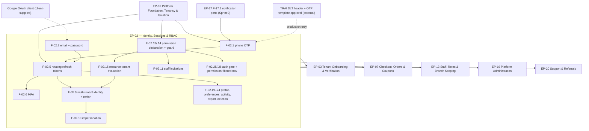

# EP-02 — Identity, Sessions & RBAC

> **Source of truth.** `MASTER_PRD.md` §B5.1 (`AUTH`), §B5.2 (`USER`), §B3.1–§B3.3 (roles,
> permission matrix, `FR-RBAC-01` … `FR-RBAC-07`), §B4.4 (`FR-NAV-01` … `FR-NAV-06`),
> `SCR-WEB-014`, `SCR-WEB-016`, `SCR-ADM-005`.
> **Detailed expansion of** `ENGINEERING_PLAN.md` §2 (epic row EP-02) and §3 (features F-02.1 …
> F-02.26). **Scheduled by** `SprintPlanning.md` Sprint 1, with two carry-ins to Sprint 2 and a
> scaffold in Sprint 0.
> **Never contradicts** `PROJECT_CONSTITUTION.md` §23.

---

## 1. Metadata

| Field | Value |
| :--- | :--- |
| **Epic id** | `EP-02` |
| **Name** | Identity, Sessions & RBAC |
| **Priority (MoSCoW)** | **M** — Must. `FR-AUTH-01` … `FR-AUTH-13` and `FR-RBAC-01` … `FR-RBAC-07` are all `M` except `FR-AUTH-03` (`S`), `FR-AUTH-09` (`S`), `FR-AUTH-14` (`C`), `FR-RBAC-04` (`S`), `FR-RBAC-05` (`S`) |
| **Complexity** | **L**. `ENGINEERING_PLAN.md` §13.1 rates `iam/` **High**: *"Twelve roles, three surfaces, multi-tenant identity, rotating refresh tokens with reuse detection, impersonation with financial-mutation refusal, MFA. Security-critical but well-trodden."* |
| **Story points** | **55**, reconciling exactly with §13.1 `iam/` = 55 pts / 28 ed |
| **Target sprint(s)** | **Sprint 0** — scaffold only (F-02.1 skeleton, F-02.5 skeleton, F-02.13 CI gate). **Sprint 1** (2026-09-21 → 2026-10-02) — the bulk: F-02.1 … F-02.11, F-02.13 … F-02.16, F-02.18 … F-02.26. **Sprint 2** — carry-in of F-02.12 (`FR-AUTH-14` merge) and F-02.17 (`FR-RBAC-05` inspector), deferred by the Sprint-1 capacity mitigation |
| **Owning modules** | `iam/` (auth, sessions, users, roles, permissions, impersonation) |
| **Surfaces** | `apps/customer-web` (`SCR-WEB-014`, `SCR-WEB-016`, auth gate), `apps/gym-dashboard` (shell, tenant switcher, permission-filtered navigation), `apps/admin-dashboard` (`SCR-ADM-005`, impersonation banner), `apps/server` |
| **PRD modules covered** | `AUTH` (B5.1, 14 `FR-`), `USER` (B5.2, 8 `FR-`), plus `B3.3` RBAC (7 `FR-`) and the four `B4.4` navigation requirements this epic owns |
| **Owner** | Backend Lead (IAM), with the Technical Lead accountable for the permission matrix encoding |
| **Depends on** | **EP-01** (all of it) |
| **Status** | **Ready** — no blocking `OQ-`; `FR-AUTH-03` Google login requires an OAuth client from the client (`OQ-17` brand/domain adjacency) |

---

## 2. Business Goal

This epic delivers the PRD's stated purpose for `AUTH` in one sentence: *"One identity system serving
three surfaces and twelve roles, with the property that a consumer never encounters enterprise-grade
friction and an admin never encounters consumer-grade laxity."* Those two halves pull in opposite
directions and the design has to hold both. On the consumer side, `KPI-11` requires **≥ 65%**
checkout completion, and `FR-NAV-01` places the auth gate at exactly one point — *"select plan →
checkout"* and nowhere earlier — because every screen of friction before that point costs
conversion. `FR-AUTH-01` therefore permits registration by mobile number and OTP alone: no password
to invent, no email to confirm before browsing. On the staff side, `NFR-SEC-11` and `FR-AUTH-07`
make MFA **mandatory** for all twelve platform-staff roles, and `FR-AUTH-12` caps support
impersonation at 30 minutes with a hard refusal on every financial mutation. The same codebase must
do both without either behaviour leaking into the other surface.

The second outcome is **authorisation that a UI-first implementation cannot subvert**. `FR-RBAC-02`
states it without ambiguity: *"Permission checks are enforced server-side. Client-side hiding of UI
is presentation only and never a security control."* `B3.2` is a matrix of 43 capabilities × 12
roles — 516 cells — and a single wrong cell is a security defect, not a cosmetic one. `FR-RBAC-03`
adds the subtlety that makes it hard: permissions are evaluated *"against the tenant on the resource,
never against the tenant on the session alone"*, which is the difference between an owner of two
gyms performing a legitimate action and the same owner accidentally acting across tenants. This is
where `BR-TEN-02` becomes user-visible: *"Tenant switching is explicit and audited; no cross-tenant
action occurs in a single request"*, and `AC-AUTH-02.3` closes it — *"no data belonging to tenant B
is returned under any circumstance, including search, reports and exports."* EP-01 made that true in
the database; EP-02 makes it true in the session.

The third outcome is **the consumer's rights over their own data**, which under the DPDP Act 2023 is
a statutory obligation rather than a feature. `FR-USER-04` requires per-channel, per-category
notification preferences where transactional messages cannot be disabled — and `AC-USER-01.1`
demands suppression **at send time**, not merely at list-build time, because a campaign built before
an unsubscribe and sent after it is still a breach. `FR-USER-06`/`BR-DAT-03` make data export
self-service, `FR-USER-07`/`BR-DAT-04` make deletion self-service with a 7-day grace period and an
honest disclosure of what is retained and why, and `BR-DAT-02` makes every impersonation visible to
the impersonated user in their own activity log. Together these serve `OBJ-10` — *"a support agent
can resolve the ten most common member and gym issues without engineering involvement"* — and they
do it by removing the need for a support agent at all in the cases where self-service is possible.

---

## 3. Scope

### 3.1 In scope — explicit

| # | Item | Anchor |
| :-: | :--- | :--- |
| 1 | Registration and login by mobile + 6-digit OTP, with an email fallback when the SMS provider is down | `FR-AUTH-01`, `FR-AUTH-05`, `AC-AUTH-01.5` |
| 2 | Registration and login by email + password, Argon2id hashing with recorded parameters, ≥ 10 characters, breached-password list check, verification link | `FR-AUTH-04`, A-12 |
| 3 | Google social login — **customer website only** | `FR-AUTH-03` |
| 4 | Purchase and invoice preconditions: verified mobile before any purchase, verified email before any invoice | `FR-AUTH-02` |
| 5 | 15-minute access tokens + 30-day rotating refresh tokens, httpOnly, with reuse detection and whole-family revocation | `FR-AUTH-06`, `ADR-0011` |
| 6 | TOTP MFA — mandatory for all platform staff roles, optional for `GYM_OWNER` | `FR-AUTH-07`, `NFR-SEC-11` |
| 7 | Lockout after 10 failures in 15 minutes, self-service unlock via a verified channel, password reset invalidating all sessions | `FR-AUTH-08`, `FR-AUTH-10` |
| 8 | Active session list with individual and bulk revocation | `FR-AUTH-09` |
| 9 | Multi-tenant identity, explicit tenant selection at sign-in, audited tenant switching, full client cache invalidation on switch | `FR-AUTH-11`, `BR-TEN-02`, `AC-AUTH-02.1`–`02.3` |
| 10 | Support impersonation: distinctly-typed token, 30-minute cap, refusal of every financial mutation, persistent banner, visibility in the user's activity log | `FR-AUTH-12`, `BR-DAT-02` |
| 11 | Staff invitation tokens — single-use, 7-day expiry, bound to the intended email, role and branches | `FR-AUTH-13`, `FR-RBAC-06` |
| 12 | Duplicate-account merge with explicit user confirmation | `FR-AUTH-14` |
| 13 | The `B3.2` permission matrix encoded as **data**, evaluated as `(role, scope, resource, action)` — never role alone | `B3.1`, `B3.2`, `FR-RBAC-02` |
| 14 | Resource-tenant permission evaluation | `FR-RBAC-03` |
| 15 | Role-change propagation within 60 seconds without re-authentication | `FR-RBAC-04` |
| 16 | Effective-permission inspector for Super Admin | `FR-RBAC-05` |
| 17 | Last-remaining-`GYM_OWNER` protection | `FR-RBAC-07` |
| 18 | Profile fields, optional fitness context, sensitive health handling with no marketing use | `FR-USER-01`, `FR-USER-02`, `FR-USER-03`, `NFR-PRV-07` |
| 19 | Notification preference matrix, channel × category, transactional non-disableable, one-click unsubscribe without login | `FR-USER-04`, `AC-USER-01.1`–`01.3` |
| 20 | Account activity log — logins, devices, impersonations, exports | `FR-USER-05` |
| 21 | Self-service data export | `FR-USER-06`, `BR-DAT-03` |
| 22 | Self-service deletion request, 7-day grace, retention disclosure, active-membership warning | `FR-USER-07`, `BR-DAT-04` |
| 23 | Verified change of mobile or email | `FR-USER-08` |
| 24 | Auth-gate placement and post-auth return to the exact point of interruption with prior state intact | `FR-NAV-01`, `FR-NAV-02` |
| 25 | Permission-filtered dashboard navigation and deep-link resolution after authentication | `FR-NAV-03`, `FR-NAV-06` |
| 26 | The `FR-RBAC-01` permission-declaration CI gate — wired in Sprint 0 by EP-01, **populated** here | `FR-RBAC-01` |

### 3.2 Out of scope — explicit, with destination

| Item | Why not here | Where it goes |
| :--- | :--- | :--- |
| Tenant-side staff CRUD, branch assignment, seat limits, staff activity attribution | EP-02 owns the *invitation token* and the RBAC engine; the staff management surface is its own module | **EP-13** (`STAF`, `FR-STAF-01` … `FR-STAF-10`, `SCR-DASH-018`) |
| Tenant creation and the onboarding wizard | EP-02 authenticates the owner; it does not onboard the business | **EP-03** |
| Notification **delivery** for OTP, verification links and invitations | EP-02 emits the events; the channels, templates and DLT approval state are notification work | **EP-17** (`NOTF`); Sprint 0 provides the ports and a Mailpit local adapter |
| The export **generator** (`export.generate` job, archive assembly, signed links) | EP-02 owns the self-service *request* and its activity-log entry | **EP-18** (`FR-RPT-03`) |
| The `data.retention-sweep` job that executes deletion and pseudonymisation | EP-02 owns the request, the grace period and the disclosure | **EP-19** / `§C5` job, consuming EP-01's harness |
| Platform staff **administration** (creating platform users, assigning platform roles) | `SCR-ADM-005` user *search and impersonation* is here; staff-account lifecycle is admin work | **EP-19** (`FR-ADMN-10`) |
| Wallet, referrals, support tickets on the account surface | Different modules | **EP-20** |
| RLS, tenant context middleware, the isolation suite | Built in EP-01; EP-02 consumes them | **EP-01** |
| Passkeys / WebAuthn, SSO / SAML, magic links | Not in the PRD; adding them would be a `§C10` change, not an addition | Out of Phase 1 |

---

## 4. Features

Points sum to the epic's **55**.

| Feature | Description | Satisfies | Pri | Pts | Sprint |
| :--- | :--- | :--- | :-: | :-: | :-: |
| **F-02.1** | Phone-OTP registration and login — 6 digits, 5-minute validity, max 5 attempts, max 3 resends / 30 min per number, per-IP and per-number limits, email fallback on provider outage | `FR-AUTH-01`, `FR-AUTH-05` | M | 3 | 0 (skeleton) → 1 |
| **F-02.2** | Email + password registration, verification link, Argon2id with recorded parameters, ≥ 10 chars, breached-password list | `FR-AUTH-01`, `FR-AUTH-04` | M | 3 | 1 |
| **F-02.3** | Google social login, customer website only | `FR-AUTH-03` | S | 1 | 1 |
| **F-02.4** | Purchase precondition (verified mobile) and invoice precondition (verified email), enforced server-side at the ordering and billing boundaries | `FR-AUTH-02` | M | 1 | 1 |
| **F-02.5** | Access + rotating refresh tokens: 15 min / 30 days, httpOnly, reuse detection, family revocation, user notification on detected theft | `FR-AUTH-06`, `ADR-0011` | M | 5 | 0 (skeleton) → 1 |
| **F-02.6** | TOTP MFA: mandatory for platform staff, optional for `GYM_OWNER`, enrolment and recovery codes | `FR-AUTH-07`, `NFR-SEC-11` | M | 3 | 1 |
| **F-02.7** | Lockout after 10 failures / 15 min, self-service unlock through a verified channel, password reset invalidating **all** sessions | `FR-AUTH-08`, `FR-AUTH-10` | M | 2 | 1 |
| **F-02.8** | Active session list with device, IP, last-seen; individual and bulk revocation | `FR-AUTH-09` | S | 2 | 1 |
| **F-02.9** | Multi-tenant identity, tenant selection at sign-in, audited switching, full TanStack Query cache invalidation on switch | `FR-AUTH-11`, `BR-TEN-02` | M | 3 | 1 |
| **F-02.10** | Support impersonation: typed token, 30-minute cap, `@FinancialMutation()` refusal, persistent banner on all three surfaces, entry in the user's own activity log | `FR-AUTH-12`, `BR-DAT-02` | M | 3 | 1 |
| **F-02.11** | Staff invitation tokens — single-use, 7-day expiry, bound to email + role + branches; accepting as an existing account adds the role rather than duplicating the identity | `FR-AUTH-13`, `FR-RBAC-06` | M | 2 | 1 |
| **F-02.12** | Duplicate-account merge (same person, phone and email registered separately) with explicit user confirmation | `FR-AUTH-14` | C | 2 | **2** (carry-in) |
| **F-02.13** | Permission declaration on every endpoint, plus the CI job that fails an undeclared one | `FR-RBAC-01` | M | 2 | 0 (gate) → 1 (population) |
| **F-02.14** | Server-side permission enforcement — `PermissionsGuard` + `@RequiredPermission()`; the `B3.2` matrix encoded as data with a generated test per cell | `FR-RBAC-02`, `B3.2` | M | 2 | 1 |
| **F-02.15** | Resource-tenant evaluation — permission resolved against the tenant on the resource, never the session tenant alone | `FR-RBAC-03` | M | 2 | 1 |
| **F-02.16** | Role-change propagation ≤ 60 s without re-authentication | `FR-RBAC-04` | S | 2 | 1 |
| **F-02.17** | Effective-permission inspector for Super Admin — resolved set with the source of each grant | `FR-RBAC-05` | S | 1 | **2** (carry-in) |
| **F-02.18** | Last-owner protection — the last remaining `GYM_OWNER` cannot be removed or demoted | `FR-RBAC-07`, `FR-STAF-09` | M | 1 | 1 |
| **F-02.19** | Profile fields, optional fitness context, health information as a restricted sensitive category with no marketing use | `FR-USER-01`, `FR-USER-02`, `FR-USER-03`, `NFR-PRV-07` | M | 2 | 1 |
| **F-02.20** | Notification preference matrix — three channels × three categories; transactional non-disableable; suppression evaluated **at send time**; unsubscribe link works without login | `FR-USER-04` | M | 2 | 1 |
| **F-02.21** | Account activity log — logins, devices, impersonations, data exports, visible to the user | `FR-USER-05` | S | 2 | 1 |
| **F-02.22** | Self-service data export request covering profile, memberships, orders, invoices, attendance, reviews and preferences | `FR-USER-06`, `BR-DAT-03` | M | 2 | 1 |
| **F-02.23** | Deletion request with a 7-day grace period, explicit retention disclosure, cancellation within grace, and an active-membership forfeiture warning | `FR-USER-07`, `BR-DAT-04` | M | 2 | 1 |
| **F-02.24** | Verified change of mobile or email — the new value is verified before it becomes effective; old and new retained in the audit trail | `FR-USER-08` | M | 1 | 1 |
| **F-02.25** | Auth-gate placement at "select plan → checkout" and post-auth return to the exact point of interruption with selected plan, filters and comparison set intact | `FR-NAV-01`, `FR-NAV-02` | M | 2 | 1 |
| **F-02.26** | Permission-filtered dashboard navigation and deep-link resolution after authentication | `FR-NAV-03`, `FR-NAV-06` | M | 2 | 1 |
| | | | | **55** | |

---

## 5. User Stories

The five PRD stories (`US-AUTH-01` … `US-AUTH-03`, `US-USER-01`, `US-USER-02`) are restated with
their acceptance criteria **verbatim**. Seven further stories are **new**: the PRD writes
`FR-RBAC-01` … `FR-RBAC-07`, `FR-AUTH-06` … `FR-AUTH-09`, `FR-AUTH-13`, `FR-USER-04` and
`FR-NAV-01`/`FR-NAV-02` as requirements without a narrative story, and the constitution's DoR
criterion 2 requires Given/When/Then acceptance criteria before work starts.

### US-AUTH-01 *(PRD)* — Register with just a phone number

> *As a visitor, I want to register with just my phone number so that I can buy a membership without
> inventing another password.*

- **AC-AUTH-01.1** — Given I am on the registration screen, when I enter a valid mobile number and
  request an OTP, then an OTP is delivered within 30 seconds and the screen advances to OTP entry
  with the number shown and an edit affordance.
- **AC-AUTH-01.2** — Given I entered the correct OTP, when I submit it, then an account is created,
  I am authenticated, and I return to whatever I was doing before registration was required.
- **AC-AUTH-01.3** — Given I entered an incorrect OTP, when I submit it, then I see the remaining
  attempt count and the OTP is not consumed by the failed attempt beyond the counter.
- **AC-AUTH-01.4** — Given I have requested 3 OTPs in 30 minutes, when I request a fourth, then I am
  told when I may retry, and no SMS is sent.
- **AC-AUTH-01.5** — Given the SMS provider is unavailable, when I request an OTP, then I am offered
  email verification as an alternative rather than a generic failure.

> **India note.** Every OTP template must carry a TRAI DLT-approved `dlt_template_id` before it can
> send (`LAUNCH_MARKET_INDIA.md` §8). The registration and approval lead time starts in Sprint 0 and
> is owned by EP-17; EP-02 must not assume an SMS can be sent on demand — `AC-AUTH-01.5` is the
> designed degradation, not a nicety.

### US-AUTH-02 *(PRD)* — Manage two gyms from one login

> *As a gym owner, I want to manage two gyms from one login so that I don't juggle accounts.*

- **AC-AUTH-02.1** — Given I own two tenants, when I sign in, then I choose a tenant before reaching
  the dashboard, and the choice is remembered for the session.
- **AC-AUTH-02.2** — Given I am working in tenant A, when I switch to tenant B, then all in-flight
  views reload scoped to tenant B and the switch is written to the audit log.
- **AC-AUTH-02.3** — Given I am in tenant A, when any request is made, then no data belonging to
  tenant B is returned under any circumstance, including search, reports and exports.

### US-AUTH-03 *(PRD)* — See what a member sees

> *As a support agent, I want to see what a member sees so that I can resolve their issue without a
> screenshare.*

- **AC-AUTH-03.1** — Given I have `SUPPORT_AGENT` and a stated reason, when I start impersonation,
  then the session is capped at 30 minutes and a banner is visible throughout.
- **AC-AUTH-03.2** — Given I am impersonating, when I attempt to initiate a payment, request a
  refund, or change a payout account, then the action is refused.
- **AC-AUTH-03.3** — Given impersonation ended, when the member next views their account activity,
  then the impersonation event is listed with the agent's name, timestamp and reason.

### US-USER-01 *(PRD)* — Control what the platform sends me

> *As a member, I want to control what the platform sends me so that I keep the reminders and lose
> the marketing.*

- **AC-USER-01.1** — Given I disable marketing email, when a campaign runs, then I receive nothing
  from it, verified by suppression at send time and not merely at list build time.
- **AC-USER-01.2** — Given I disable all optional channels, when my membership is 3 days from
  expiry, then I still receive the renewal reminder because it is transactional.
- **AC-USER-01.3** — Given I unsubscribe via an email link, when I do so, then the preference is
  applied without requiring me to log in.

### US-USER-02 *(PRD)* — Delete my account

> *As a member, I want to delete my account so that my data isn't held indefinitely.*

- **AC-USER-02.1** — Given I request deletion, when I confirm, then I see exactly which records are
  erased and which financial records are retained, with the retention period stated.
- **AC-USER-02.2** — Given deletion is scheduled, when I log in within 7 days, then I am offered
  cancellation of the deletion.
- **AC-USER-02.3** — Given deletion executes, when any surface queries my identity, then personal
  identifiers are irrecoverable and financial records reference a pseudonymous identifier only.
- **AC-USER-02.4** — Given I hold an active membership, when I request deletion, then I am warned
  that the membership will be forfeited and must confirm explicitly.

### US-AUTH-04 *(new)* — A stolen refresh token is detected and neutralised

> *As a member, I want a stolen session to be cut off automatically, so that a leaked token on a
> shared machine does not become permanent access to my account.*

- **AC-AUTH-04.1** — Given I authenticate, when tokens are issued, then the access token expires in
  15 minutes and the refresh token in 30 days, and the refresh token is set httpOnly and is absent
  from any JavaScript-readable storage (`FR-AUTH-06`).
- **AC-AUTH-04.2** — Given a refresh token is used, when it is exchanged, then it is rotated and the
  previous value is marked consumed.
- **AC-AUTH-04.3** — Given a consumed refresh token is presented a second time, when the exchange is
  attempted, then the **entire token family** is revoked, every device is signed out, and the user
  is notified (`B5.1` edge case, `E1.2`).
- **AC-AUTH-04.4** — Given two browser tabs refresh concurrently, when the rotation races, then
  exactly one rotation succeeds and the other retries against the new token without triggering
  false theft detection (`TR-28`).
- **AC-AUTH-04.5** — Given a password reset completes, when it does, then **all** existing sessions
  across all devices are invalidated (`FR-AUTH-10`).

### US-AUTH-05 *(new)* — Platform staff cannot sign in without a second factor

> *As the platform security owner, I want MFA to be non-optional for staff, so that a phished staff
> password is not sufficient to reach tenant data or money.*

- **AC-AUTH-05.1** — Given an account holds any of `SUPER_ADMIN`, `VERIFICATION_OFFICER`,
  `SUPPORT_AGENT`, `FINANCE` or `MODERATOR`, when it attempts to complete login without TOTP, then
  login is refused (`NFR-SEC-11`, `E1.3`).
- **AC-AUTH-05.2** — Given a staff account has not yet enrolled, when it first signs in, then it is
  forced through enrolment before reaching any staff surface, and no staff API call succeeds in the
  interim.
- **AC-AUTH-05.3** — Given a `GYM_OWNER`, when they choose to enable TOTP, then it is offered and
  optional (`FR-AUTH-07`).
- **AC-AUTH-05.4** — Given recovery codes are issued, when one is used, then it is single-use and
  the event appears in the account activity log.
- **AC-AUTH-05.5** — Given `POST /auth/impersonate`, then it requires Staff **plus** MFA per the
  `§6.14` auth column — impersonation is never reachable from a single factor.

### US-AUTH-06 *(new)* — I can see and end my own sessions

> *As a member who used a gym's tablet, I want to see and revoke my sessions, so that I can end
> access I no longer control.*

- **AC-AUTH-06.1** — Given I open `SCR-WEB-014`, then I see each active session with device, IP and
  last-seen time (`FR-AUTH-09`).
- **AC-AUTH-06.2** — Given I revoke one session, when I confirm, then that refresh-token family is
  revoked within 60 seconds and the other sessions continue.
- **AC-AUTH-06.3** — Given I choose "sign out everywhere", when I confirm, then every family
  including the current one is revoked.
- **AC-AUTH-06.4** — Given a lockout after 10 failed attempts in 15 minutes, when I use the
  self-service unlock through a verified channel, then access is restored without a support ticket
  (`FR-AUTH-08`).

### US-RBAC-01 *(new)* — A receptionist cannot change prices, whatever the UI shows

> *As a gym owner, I want server-side authorisation, so that delegating the front desk does not
> delegate the pricing.*

- **AC-RBAC-01.1** — Given a `RECEPTIONIST` token, when a plan-editor endpoint is called **directly
  by API**, then the response is `403` with a stable registry code — demonstrated by `curl`, never
  by clicking (`FR-RBAC-02`, `E1.5`).
- **AC-RBAC-01.2** — Given the `B3.2` matrix, then it is encoded as **data**, and a generated test
  asserts every one of its cells for all 43 capabilities × 12 roles.
- **AC-RBAC-01.3** — Given any endpoint, then it declares exactly one required permission; a
  deliberately undeclared endpoint fails the CI job (`FR-RBAC-01`, `E1.4`).
- **AC-RBAC-01.4** — Given a permission decision, then it is evaluated as `(role, scope, resource,
  action)` and never on role alone (`B3.1`).
- **AC-RBAC-01.5** — Given the dashboard hides a menu item, then that hiding is presentation only
  and the corresponding API still refuses the call.

### US-RBAC-02 *(new)* — Authorisation follows the resource, not the session

> *As the Technical Lead, I want the resource's tenant to decide, so that a legitimate owner of two
> tenants cannot act across them by accident.*

- **AC-RBAC-02.1** — Given a request carrying a resource id belonging to tenant B while the session
  context is tenant A, when permission is evaluated, then it is evaluated against tenant B's
  membership and refused; the response is `404`, matching `AC-FND-03.1` (`FR-RBAC-03`, `E1.6`).
- **AC-RBAC-02.2** — Given a branch-scoped role, when a list endpoint is called, then branch
  filtering is applied server-side and not by the client.
- **AC-RBAC-02.3** — Given a role change is made, when 60 seconds have elapsed, then the live
  session reflects it without re-authentication (`FR-RBAC-04`, `E1.7`).
- **AC-RBAC-02.4** — Given a Super Admin opens the effective-permission inspector for a user, then
  the resolved permission set is shown with the source of each grant (`FR-RBAC-05`).

### US-RBAC-03 *(new)* — A tenant can never be left without an owner

> *As a gym owner, I want the platform to refuse to remove my last owner account, so that a
> mis-click cannot orphan my business.*

- **AC-RBAC-03.1** — Given a tenant with exactly one `GYM_OWNER`, when removal of that owner is
  attempted, then it is refused at the service layer with a specific message (`FR-RBAC-07`).
- **AC-RBAC-03.2** — Given the same tenant, when demotion of that owner to `GYM_MANAGER` is
  attempted, then it is refused for the same reason.
- **AC-RBAC-03.3** — Given a second owner is added first, when the original owner is then removed,
  then it succeeds and the change is audited.
- **AC-RBAC-03.4** — Given the refusal, then it is enforced server-side and the UI states the
  consequence specifically, per `NFR-USE-06`.

### US-RBAC-04 *(new)* — Staff join with exactly the access they were invited to

> *As a gym manager, I want an invitation to carry the role and the branches, so that access is
> decided at invitation time rather than negotiated afterwards.*

- **AC-RBAC-04.1** — Given an invitation is created, then it is single-use, expires in 7 days, and
  binds the invited email to the intended role and branch set (`FR-AUTH-13`, `FR-RBAC-06`).
- **AC-RBAC-04.2** — Given an invitation is accepted by an email that already has an account, then
  the role is **added to the existing identity** rather than creating a duplicate (`B5.1` edge case).
- **AC-RBAC-04.3** — Given an invitation is used once, when the same link is opened again, then it
  is refused as consumed.
- **AC-RBAC-04.4** — Given an invitation expires, when it is opened on day 8, then it is refused and
  the inviter can reissue.

### US-USER-03 *(new)* — Changing my phone or email is verified before it takes effect

> *As a member, I want the new contact verified first, so that a typo does not lock me out of my own
> account.*

- **AC-USER-03.1** — Given I submit a new mobile number, when I submit it, then the old number
  remains effective until the new one is OTP-verified (`FR-USER-08`).
- **AC-USER-03.2** — Given I submit a new email, when I submit it, then the old address remains
  effective until the new one is link-verified.
- **AC-USER-03.3** — Given the change completes, then both the old and the new values are retained
  in the audit trail (`B5.1` edge case, `BR-DAT-01`).
- **AC-USER-03.4** — Given a phone number previously used by a deleted account, when it is
  registered again, then it is treated as new and no prior data is resurrected.

### US-USER-04 *(new)* — Health information is treated as sensitive

> *As a member disclosing a health note, I want it restricted, so that a fitness goal never becomes
> a marketing segment.*

- **AC-USER-04.1** — Given health notes are entered, then they are clearly labelled sensitive at the
  point of entry and are optional (`FR-USER-03`).
- **AC-USER-04.2** — Given a marketing segment is built, then health fields are not available as
  segmentation inputs — enforced server-side, not by the segment-builder UI (`NFR-PRV-07`).
- **AC-USER-04.3** — Given fitness context exists, then it is shared with a gym only **after**
  purchase (`FR-USER-02`).
- **AC-USER-04.4** — Given a log, trace or analytics event, then `health_notes` never appears in it
  — it is on the `BR-DAT-06` redaction list built in EP-01.

---

## 6. Acceptance Criteria for the Epic

| # | Criterion | Evidence |
| :-: | :--- | :--- |
| **AC-EP02-01** | A user registers by phone OTP, logs in, and receives a 15-minute access token plus an httpOnly 30-day rotating refresh token. | `E1.1` |
| **AC-EP02-02** | The refresh token is absent from JavaScript-readable storage, proven in developer tools during the demo. | Sprint-1 demo step 2 |
| **AC-EP02-03** | Replaying a used refresh token revokes the **entire family**, signs out every device and notifies the user. | `E1.2`, `AC-AUTH-04.3` |
| **AC-EP02-04** | Parallel-tab refresh rotation does not produce a false theft detection. | `TR-28` |
| **AC-EP02-05** | OTP limits hold exactly: 6 digits, 5-minute validity, 5 attempts, 3 resends per 30 minutes per number, plus per-IP limits under the `RL-OTP` class. | `FR-AUTH-05`, `§6.2` |
| **AC-EP02-06** | With the SMS provider stubbed down, OTP request offers email verification rather than a generic failure. | `AC-AUTH-01.5` |
| **AC-EP02-07** | Passwords are ≥ 10 characters, checked against a breached-password list, hashed with Argon2id, and the tuned parameters are recorded in `DECISION_LOG.md`. | `FR-AUTH-04`, A-12 |
| **AC-EP02-08** | A platform staff account cannot complete login without TOTP. | `E1.3` |
| **AC-EP02-09** | Lockout triggers at 10 failures in 15 minutes and self-service unlock works through a verified channel. | `FR-AUTH-08` |
| **AC-EP02-10** | A password reset invalidates every existing session on every device. | `FR-AUTH-10` |
| **AC-EP02-11** | The session list shows device, IP and last-seen, and supports individual and bulk revocation taking effect within 60 seconds. | `FR-AUTH-09` |
| **AC-EP02-12** | Every endpoint shipped by this epic declares a permission; a deliberately undeclared endpoint fails CI. | `E1.4`, `FR-RBAC-01` |
| **AC-EP02-13** | A `RECEPTIONIST` token calling a plan-editor endpoint by direct API call receives a server-side `403` with the standard envelope and a stable code. | `E1.5` |
| **AC-EP02-14** | The `B3.2` matrix is encoded as data and a generated test asserts every cell. | `AC-RBAC-01.2` |
| **AC-EP02-15** | Permission is evaluated against the **resource** tenant, proven with a cross-tenant resource id. | `E1.6` |
| **AC-EP02-16** | A role change propagates to a live session within 60 seconds without re-login. | `E1.7` |
| **AC-EP02-17** | An impersonation session cannot execute any financial mutation, and the banner is present on every screen of every surface. | `E1.8`, `AC-AUTH-03.2` |
| **AC-EP02-18** | The three endpoints an impersonation token may never call are refused: `POST /orders/:ref/payment-intent`, `POST /me/memberships/:id/refund-request`, `PUT /tenant/payout-account`. | `§6.11`, `FR-AUTH-12` |
| **AC-EP02-19** | Impersonation expires at exactly 30 minutes and appears in the impersonated user's own account activity with agent name, timestamp and reason. | `AC-AUTH-03.1`, `AC-AUTH-03.3` |
| **AC-EP02-20** | A tenant switch writes an audit row and invalidates every cached query from the previous tenant — the previous tenant's member list is not served from cache. | `E1.9`, `BR-TEN-02-P1` |
| **AC-EP02-21** | Isolation specs exist for 100% of the tenant-scoped endpoints added by this epic. | `E1.10`, `BAC-10` |
| **AC-EP02-22** | A staff invitation is single-use, expires in 7 days, binds email + role + branches, and adds the role to an existing identity rather than duplicating it. | `AC-RBAC-04.1`–`04.4` |
| **AC-EP02-23** | The last remaining `GYM_OWNER` cannot be removed or demoted. | `FR-RBAC-07` |
| **AC-EP02-24** | A purchase cannot be initiated without a verified mobile; an invoice cannot be issued without a verified email — both enforced server-side. | `FR-AUTH-02` |
| **AC-EP02-25** | Notification preferences are per channel × per category; transactional cannot be disabled; suppression is evaluated **at send time**; the unsubscribe link works without login. | `AC-USER-01.1`–`01.3` |
| **AC-EP02-26** | The account activity log shows logins, devices, impersonations and exports. | `FR-USER-05` |
| **AC-EP02-27** | A self-service export request is accepted, is visible in the activity log, and contains no other user's and no other tenant's data when fulfilled. | `BR-DAT-03-N1` |
| **AC-EP02-28** | A deletion request shows exactly what is erased and what is retained with the period; is cancellable within 7 days; warns explicitly when an active membership will be forfeited. | `AC-USER-02.1`, `02.2`, `02.4` |
| **AC-EP02-29** | Changing mobile or email requires verification of the new value before it becomes effective, and both values are retained in the audit trail. | `FR-USER-08` |
| **AC-EP02-30** | Health information cannot be selected as a marketing segmentation input, enforced server-side. | `NFR-PRV-07` |
| **AC-EP02-31** | The auth gate appears at "select plan → checkout" and nowhere earlier; after authentication the user returns to the exact point of interruption with the selected plan, filters and comparison set intact. | `FR-NAV-01`, `FR-NAV-02` |
| **AC-EP02-32** | Dashboard navigation is filtered by effective permission and deep links resolve correctly after authentication. | `FR-NAV-03`, `FR-NAV-06` |
| **AC-EP02-33** | Every `SCR-WEB-016` state is implemented and axe-core clean: login (phone and email), register, verify OTP, forgot, reset, MFA challenge, lockout, plus loading, empty, error and permission-denied. | `NFR-USE-01`, constitution DoR #7 |
| **AC-EP02-34** | `BR-TEN-02`, `BR-DAT-02`, `BR-DAT-03` and `BR-DAT-04` each have a passing positive **and** negative test registered in the `BAC-06` report. | `BAC-06` |
| **AC-EP02-35** | The `RL-AUTH` and `RL-OTP` rate-limit classes are enforced with the exact `§6.2` budgets and proven by burst tests. | `NFR-SEC-06` |

---

## 7. Business Rules Enforced

Enforcement detail — layers, failure modes, test ids — is in `BusinessRules.md` and is not repeated
here. This table states which rules EP-02 **owns** and the enforcement point it builds.

| BR | Priority | Owner module | Enforcement point built in EP-02 | Layer(s) | Test ids |
| :--- | :-: | :--- | :--- | :--- | :--- |
| **BR-TEN-02** | M | `tenancy/` (+ `iam/`) | The **session half**: `TenantGuard` resolving the active tenant from the session's selected-tenant claim and validating membership; the explicit switcher in `dash`; the audited switch endpoint `POST /auth/tenant-context`; full client cache invalidation. EP-01 owns the `L4-EXT` authoritative half | `L7-GUARD`, `L9-INT`, `L11-UI` | `BR-TEN-02-P1` (owned here), `-N1` (EP-01) |
| **BR-DAT-02** | M | `iam/` + `support/` | **Authoritative**: the impersonation token carries `typ: 'IMPERSONATION'`, a 30-minute expiry and the originating actor; `@FinancialMutation()` refuses every money-affecting operation under that token type; a stated reason is required to mint it; `audit_log.impersonated_by` is populated on every action; the user's own activity log surfaces it; impersonation **never elevates** | **`L7-GUARD`**, `L6-UC`, `L1-DB`, `L11-UI` | `BR-DAT-02-P1`, `-N1`, `-N2` |
| **BR-DAT-03** | M | `crm/` + `reporting/` | The **request half** owned here: self-service export request from `SCR-WEB-014` covering profile, memberships, orders, invoices, attendance, reviews and preferences; the activity-log entry; the RLS-scoped execution context. The `export.generate` job and signed-link delivery are **EP-18** | `L6-UC`, `L2-RLS` | `BR-DAT-03-P1` (request half), `-N1` |
| **BR-DAT-04** | M | `iam/` + `crm/` | The **request, grace and disclosure half**: request, 7-day grace, cancellation within grace, explicit statement of what is erased and what is retained, active-membership forfeiture warning, FK `ON DELETE RESTRICT` from financial records so hard deletion is impossible. The `data.retention-sweep` execution is **EP-19** | `L1-DB`, `L6-UC`, `L11-UI` | `BR-DAT-04-P1` (request half), `-N1` |
| **BR-DAT-01** | M | `audit/` | *Consumer, not owner.* Every EP-02 write on a user, staff or configuration record produces an audit row through EP-01's `AuditWriter`; tenant switch writes `entity_type = 'tenant_session'`, action `SWITCH` | `L9-INT` | `BR-DAT-01-P1` coverage extended |
| **BR-DAT-06** | M | `common/` | *Consumer, not owner.* OTP codes, passwords, tokens, email, phone, name, DOB and `health_notes` are all on EP-01's redaction list; EP-02 must not add a log statement that defeats it | `L9-INT`, `L12-CI` | `BR-DAT-06-P1` corpus extended with auth payloads |
| **BR-TEN-01** | M | `tenancy/` | *Consumer.* Every EP-02 tenant-scoped endpoint inherits the chain and gains a generated isolation spec | `L2-RLS`, `L12-CI` | `BR-TEN-01-N1` extended to EP-02 routes |
| **BR-GYM-06** | M | `catalog/` + `onboarding/` | *Partial contribution.* The `@FinancialMutation()` guard that refuses a payout bank-account change under impersonation is built here (`AC-AUTH-03.2`, `SEC-A01-007`); the material-change routing itself is **EP-03**/**EP-04** | `L7-GUARD` | `BR-GYM-06-N2` |

---

## 8. Dependencies

### 8.1 Upstream

| Dependency | Type | Detail |
| :--- | :--- | :--- |
| **EP-01** — all 20 features | Epic | Tenant middleware (F-01.3), tenant-scoped repository (F-01.6), isolation-suite harness (F-01.7), audit writer (F-01.16), error envelope (F-01.11), rate-limit classes (F-01.14), idempotency (F-01.9), OpenAPI + permission-declared gate (F-01.19), job harness (F-01.17) |
| **EP-17 F-17.1** (Sprint 0) | Epic (ports only) | The four notification channel **ports** with a Mailpit local adapter — OTP, verification links and staff invitations need a send path in Sprint 1 even though vendors are deferred (A-19) |
| Google OAuth client credentials | External | Required for `FR-AUTH-03`; adjacent to `OQ-17` (brand and domain owner). `S` priority — descopable |
| TRAI DLT sender header + OTP template approval | **External, long lead** | `LAUNCH_MARKET_INDIA.md` §8. Registration starts Sprint 0; approval is not in the team's control (`REG-08`). Sprint-1 development uses the local stub; production OTP cannot send without it |
| Breached-password corpus | External | A downloadable range-query source or a local hash set for `FR-AUTH-04`; must not transmit the password (k-anonymity) |
| Staging environment | Infra | Sprint-1 task 1.28 provisions it; secret-store wiring is needed for JWT signing keys and the OAuth client secret |

### 8.2 Downstream

| Consumer | What it consumes |
| :--- | :--- |
| **EP-03** Tenant Onboarding | An authenticated, verified owner; `tenant:create`; the RBAC engine for `VERIFICATION_OFFICER` and `SUPER_ADMIN`; the audit writer for approval decisions |
| **EP-04** … **EP-06** | Permission-filtered dashboard navigation; the public/authenticated split at the auth gate |
| **EP-07** Checkout | `FR-AUTH-02` verified-mobile precondition; `FR-NAV-01`/`FR-NAV-02` auth gate and return-to-interruption — directly load-bearing for `KPI-11` |
| **EP-09** Invoicing | `FR-AUTH-02` verified-email precondition before an invoice is issued |
| **EP-13** Staff, Roles & Branch Scoping | F-02.11 invitation tokens, the RBAC engine, branch scoping, `FR-RBAC-07` last-owner protection |
| **EP-16** Refunds | `@FinancialMutation()` refusal under impersonation |
| **EP-17** Notifications | F-02.20 preference matrix — suppression at send time is evaluated against it |
| **EP-18** Reporting & Exports | F-02.22 export request; the user-scoped execution context |
| **EP-19** Platform Administration | `SCR-ADM-005` user administration builds on F-02.10 and F-02.17; `FR-ADMN-10` platform staff administration extends the role model |
| **EP-20** Support | Impersonation is the support agent's primary tool; `KPI-25` depends on it working |

### 8.3 External dependencies and open questions

| Ref | Item | Status |
| :--- | :--- | :--- |
| `DEP-03`, `DEP-04` | Email and SMS providers | A-19 `DEFERRED`; ports only in Sprint 1 |
| `REG-08` | DLT template approval lead time | **Open** — external; starts Sprint 0, outside team control |
| `OQ-13` | Is SMS mandatory, or is email-only acceptable for cost control? | Default: SMS for OTP and expiry, email for everything else. Needed by Sprint 14, but the OTP half is exercised from Sprint 1 |
| `OQ-17` | Brand, domain and legal copy owner | Needed for the Google OAuth consent screen and the verification-email sender identity |

### 8.4 Dependency graph

---

## 9. Technical Tasks

Estimates in engineer-days, implementation + tests + review. `SprintPlanning.md` Sprint-1 task ids
are cited as *(1.x)* where a task maps directly.

| Id | Task | Layer | ed | Depends on | Serves |
| :--- | :--- | :--- | :-: | :--- | :--- |
| **T-02.01** | `users`, `user_roles`, `roles`, `permissions`, `sessions`, `refresh_token_families`, `otp_challenges`, `invitations`, `notification_preferences`, `account_activity` schema + indexes + RLS where tenant-owned | DB | 2.0 | EP-01 T-01.09 | F-02.1 … F-02.26 |
| **T-02.02** | Phone-OTP request and verify: 6 digits, 5-minute TTL, 5 attempts, 3 resends / 30 min per number, per-IP ceiling, constant-time comparison, single-use consumption | API | 1.5 | T-02.01 | `FR-AUTH-05` · *(1.1)* |
| **T-02.03** | Email fallback path when the SMS port reports unavailable, surfaced as a first-class alternative rather than an error | API | 0.5 | T-02.02 | `AC-AUTH-01.5` · *(1.1)* |
| **T-02.04** | Email + password registration: Argon2id with tuned and recorded parameters, ≥ 10-character policy, breached-password check by k-anonymity range query, verification link with single-use token | API | 2.0 | T-02.01 | `FR-AUTH-01`, `FR-AUTH-04`, A-12 · *(1.2)* |
| **T-02.05** | Google social login restricted to the customer website; account linking rules when the email already exists | API | 1.5 | T-02.04 | `FR-AUTH-03` · *(1.3)* |
| **T-02.06** | Access + rotating refresh tokens: 15 min / 30 days, httpOnly cookie, family model, rotation on use, reuse detection, whole-family revocation, user notification on detected reuse | API | 3.0 | T-02.01 | `FR-AUTH-06`, `ADR-0011` · *(1.4)* |
| **T-02.07** | Parallel-tab rotation race handling — a short grace on the immediately-previous token, or a rotation lock; explicitly tested with concurrent refreshes | API / test | 0.5 | T-02.06 | `TR-28` |
| **T-02.08** | TOTP MFA: enrolment, QR provisioning URI, verification, single-use recovery codes, mandatory gate for the five platform-staff roles, optional for `GYM_OWNER` | API | 2.0 | T-02.06 | `FR-AUTH-07`, `NFR-SEC-11` · *(1.5)* |
| **T-02.09** | Lockout (10 failures / 15 min), self-service unlock via a verified channel, password reset invalidating every session | API | 1.5 | T-02.06 | `FR-AUTH-08`, `FR-AUTH-10` · *(1.6)* |
| **T-02.10** | Session list with device, IP and last-seen; individual and bulk revocation propagating within 60 s | API | 1.0 | T-02.06 | `FR-AUTH-09` · *(1.7)* |
| **T-02.11** | Multi-tenant identity model; tenant selection at sign-in; `POST /auth/tenant-context` switch endpoint with the audited `tenant_session` `SWITCH` row | API | 2.0 | T-02.06, EP-01 T-01.30 | `FR-AUTH-11`, `BR-TEN-02` · *(1.8)* |
| **T-02.12** | Impersonation: `typ: 'IMPERSONATION'` token, mandatory reason, 30-minute hard cap, `@FinancialMutation()` guard, `audit_log.impersonated_by` propagation, no elevation of the agent's own permissions | API | 2.0 | T-02.11 | `FR-AUTH-12`, `BR-DAT-02` · *(1.9)* |
| **T-02.13** | Staff invitation tokens: single-use, 7-day expiry, bound to email + role + branch set; acceptance by an existing identity adds the role | API | 1.5 | T-02.01 | `FR-AUTH-13`, `FR-RBAC-06` · *(1.10)* |
| **T-02.14** | Duplicate-account merge with explicit user confirmation, conflict resolution rules and a full audit trail | API | 1.5 | T-02.01 | `FR-AUTH-14` · *(1.11, deferred to sprint 2)* |
| **T-02.15** | Encode the `B3.2` matrix as data — 43 capabilities × 12 roles — with a generator that emits one test per cell | API / test | 2.0 | T-02.01 | `B3.2`, `FR-RBAC-02` · *(1.12)* |
| **T-02.16** | `PermissionsGuard` + `@RequiredPermission()`; `(role, scope, resource, action)` evaluation; branch-scope resolution; deny-by-default | API | 1.0 | T-02.15 | `FR-RBAC-02` · *(1.12)* |
| **T-02.17** | Resource-tenant evaluation: load the resource's tenant before deciding; cross-tenant resource ids return `404`, consistent with the isolation suite | API | 1.0 | T-02.16 | `FR-RBAC-03`, `E1.6` · *(1.12)* |
| **T-02.18** | Role-change propagation ≤ 60 s without re-authentication — short-TTL permission cache with explicit invalidation on role change | API | 1.5 | T-02.16 | `FR-RBAC-04` · *(1.13)* |
| **T-02.19** | Effective-permission inspector for Super Admin, showing the resolved set and the source of each grant | API | 1.0 | T-02.16 | `FR-RBAC-05` · *(1.14, deferred to sprint 2)* |
| **T-02.20** | Last-owner protection at the service layer for both removal and demotion | API | 0.5 | T-02.16 | `FR-RBAC-07` · *(1.15)* |
| **T-02.21** | Purchase and invoice preconditions exposed as reusable domain predicates for `ordering/` and `billing/` | API | 0.5 | T-02.02, T-02.04 | `FR-AUTH-02` |
| **T-02.22** | Profile fields, fitness context, health information as a restricted sensitive category with a server-side block on segmentation use | API | 1.5 | T-02.01 | `FR-USER-01/02/03`, `NFR-PRV-07` · *(1.16)* |
| **T-02.23** | Notification preference matrix (3 channels × 3 categories), transactional non-disableable, the send-time suppression predicate, and a login-free unsubscribe token | API | 1.5 | T-02.01 | `FR-USER-04`, `AC-USER-01.1`–`01.3` · *(1.17)* |
| **T-02.24** | Account activity log — logins, devices, impersonations, exports — written from the same primitives as audit but scoped to the user's own view | API | 1.0 | T-02.12 | `FR-USER-05` · *(1.18)* |
| **T-02.25** | Self-service export **request** endpoint, activity-log entry, `RL-EXPORT` limits, and the handoff contract to EP-18's `export.generate` | API | 0.5 | T-02.24 | `FR-USER-06`, `BR-DAT-03` · *(1.18)* |
| **T-02.26** | Deletion request: 7-day grace, cancellation, retention disclosure content, active-membership warning, `ON DELETE RESTRICT` FKs verified | API / DB | 1.0 | T-02.24 | `FR-USER-07`, `BR-DAT-04` · *(1.18)* |
| **T-02.27** | Verified change of mobile and email — old value effective until the new one verifies; both retained in the audit trail | API | 1.0 | T-02.02, T-02.04 | `FR-USER-08` |
| **T-02.28** | Isolation specs for every tenant-scoped EP-02 endpoint; negative-case tests for `BR-TEN-02`, `BR-DAT-02`, `BR-DAT-03`, `BR-DAT-04` | test | 1.5 | T-02.11 | `E1.10`, `BAC-06`, `BAC-10` |
| **T-02.29** | Contract tests for all `API-AUTH` and `API-USER` routes against the generated OpenAPI document | test | 1.0 | T-02.06 | `§6.3`, `§6.4`, `NFR-MNT-03` |
| **T-02.30** | Auth screens, all states (`SCR-WEB-016`): login by phone and by email, register, verify OTP, forgot, reset, MFA challenge, lockout, plus loading, empty, error and permission-denied | web | 4.0 | T-02.04, T-02.08 | `SCR-WEB-016`, `NFR-USE-01` · *(1.20)* |
| **T-02.31** | Auth-gate placement and post-auth return to the exact point of interruption — selected plan, filters and comparison set preserved across the gate | web | 2.5 | T-02.30 | `FR-NAV-01`, `FR-NAV-02`, `KPI-11` · *(1.21)* |
| **T-02.32** | Profile & preferences screen (`SCR-WEB-014`) — personal details, contact verification state, fitness context, preference matrix, password and MFA, active sessions, activity, export, delete account | web | 2.5 | T-02.30 | `SCR-WEB-014` · *(1.22)* |
| **T-02.33** | Dashboard shell with permission-filtered navigation and deep-link resolution after authentication | dash | 3.0 | T-02.16 | `FR-NAV-03`, `FR-NAV-06` · *(1.23)* |
| **T-02.34** | Tenant switcher with **full** TanStack Query cache invalidation on switch — no query from the previous tenant survives | dash | 2.0 | T-02.11, T-02.33 | `AC-AUTH-02.2`, `BR-TEN-02` · *(1.24)* |
| **T-02.35** | Admin console shell and `SCR-ADM-005` user administration: platform-wide search by phone, email, name and order reference; user detail; impersonate with reason; force logout | admin | 2.5 | T-02.12, T-02.33 | `SCR-ADM-005` · *(1.25)* |
| **T-02.36** | Impersonation persistent banner across all three surfaces, with remaining time and a one-click end action | web / dash / admin | 1.5 | T-02.12 | `AC-AUTH-03.1` · *(1.26)* |
| **T-02.37** | axe-core and keyboard passes on `SCR-WEB-016` and `SCR-WEB-014`; screen-reader labelling on the OTP and MFA inputs | test | 1.0 | T-02.30, T-02.32 | `NFR-USE-01`, `NFR-USE-02` |
| **T-02.38** | Secret-store wiring for JWT signing keys (with rotation), the OAuth client secret and the Argon2id pepper; key rotation runbook | infra | 1.0 | EP-01 T-01.36 | `NFR-SEC-07` · *(part of 1.28)* |
| **T-02.39** | Module runbook for `iam/` — top three failure modes: OTP provider outage, refresh-family false positive, permission-cache staleness | docs | 0.5 | T-02.18 | `NFR-MNT-09` |
| | **Total** | | **59.5** | | |

---

## 10. Estimated Time

### 10.1 Roll-up by role

| Role | Tasks | Engineer-days | Notes |
| :--- | :--- | :-: | :--- |
| **Backend (BE)** | T-02.01 … T-02.29, T-02.39 | **39.5** | Against §13.1's `iam/` figure of 28 ed. The 11.5 ed difference is the contract and isolation test authorship (T-02.28, T-02.29), the runbook, and the fact that §13.1 module figures exclude cross-module predicates such as T-02.21 |
| **FE — customer web** | T-02.30, T-02.31, T-02.32, T-02.37, half of T-02.36 | **10.5** | `SCR-WEB-016` in all states is the largest single item; `SCR-WEB-014` is dense but conventional |
| **FE — dashboards** | T-02.33, T-02.34, T-02.35, half of T-02.36 | **8.5** | The tenant switcher's cache invalidation (T-02.34) is disproportionately risky for its size |
| **QA** | Retro-audit of Sprint 0–1 test quality (`SprintPlanning.md` task 2.19, shared with EP-01) | **1.5** | QA joins in Sprint 2; Sprint-1 test authorship sits inside the BE and FE estimates |
| **DevOps** | T-02.38 | **1.0** | Secret store for signing keys, OAuth secret and the Argon2id pepper. The rest of Sprint-1 task 1.28 (staging Terraform, 3.0 ed) is environment work, not EP-02 |
| **Design** | `SCR-WEB-014`, `SCR-WEB-016`, `SCR-ADM-005`, the impersonation banner, the tenant switcher, plus one-sprint-ahead work | **10.0** | From the Sprint-1 board. Design is **OVER** at 143% and is the binding constraint until `M1` |
| | **Total** | **71.0** | |

### 10.2 Reconciliation

| View | Figure | Why it differs |
| :--- | :--- | :--- |
| §2 epic points | 55 pts → **27.5 ed** | Feature view, implementation only |
| §13.1 module view | `iam/` = **28 ed** | Backend module: implementation + test + review |
| This epic, engineering tasks | **59.5 ed** | Adds the three front-end surfaces, contract and isolation tests, secret wiring and the runbook |
| This epic, all roles | **71.0 ed** | Adds design |
| `SprintPlanning.md` Sprint 1 | BE 28.0 · FE 20.0 · DevOps 4.0 · Design 10.0 = **62.0 ed** | The Sprint-1 board includes EP-03 task 1.19 (1.5 ed) and 1.27 (2.0 ed) which are **not** EP-02, and excludes the two carry-ins (T-02.14, T-02.19 = 2.5 ed) that land in Sprint 2 |

### 10.3 Confidence range

| Scenario | Engineer-days | Drivers |
| :--- | :-: | :--- |
| **Optimistic (P10)** | **58** | The `B3.2` matrix encodes cleanly as data at the first attempt; no rework on refresh rotation; the OAuth client arrives in week 1; design delivers `SCR-WEB-016` on time |
| **Expected (P50)** | **71.0** | The plan as written, with T-02.14 and T-02.19 carried into Sprint 2 |
| **Pessimistic (P90)** | **96** | The permission matrix needs a second modelling pass because branch scope and resource scope interact more than `B3.2` shows; refresh-token rotation produces false theft detections in the field and needs the grace-window redesign (`TR-28`); DLT approval slips and the OTP path must be demoed entirely on the stub; the auth-gate state restoration (`FR-NAV-02`) proves harder than estimated because checkout state is not yet built (EP-07) |

**Capacity reality.** `SprintPlanning.md` records Sprint 1 as **OVER** on backend (114%) and design
(143%), with the mitigation of moving T-02.14 (`FR-AUTH-14`) and T-02.19 (`FR-RBAC-05`) to Sprint 2 —
recovering 2.5 ed and bringing backend to 104%, **TIGHT**. This epic adopts that mitigation. Both
deferred items are the epic's only non-`M` backend features (`C` and `S` respectively), so the
deferral touches no `M`-priority requirement. **Contingency drawdown recorded: 3.0 ed; cumulative
7.0 of 86.4.**

---

## 11. Risks

| Risk | P | I | Score | Description and mitigation | Register id |
| :--- | :-: | :-: | :-: | :--- | :--- |
| Twelve roles × 43 capabilities × three surfaces — a missed cell is a security defect | 4 | 4 | **16** | 516 matrix cells cannot be verified by reading. **Mitigation:** T-02.15 encodes `B3.2` as **data** and generates one test per cell; T-02.19's inspector exists so the resolved set is *inspectable rather than inferred*; a matrix change is a two-approval review under constitution §20.5 | Sprint-1 risk row |
| `FR-RBAC-02` defeated by a UI-first implementation — "the menu is hidden, so it is safe" | 4 | 5 | **20** | The single most likely way this epic ships a hole. **Mitigation:** every front-end task in this epic carries a paired negative API test in its DoD; `AC-EP02-13` is demonstrated by `curl`, never by clicking; the permission-declared CI gate makes an undeclared endpoint unmergeable | `FR-RBAC-02`, Sprint-1 risk row |
| Refresh-token rotation race across parallel tabs produces false theft detections | 4 | 3 | **12** | A member with three tabs open gets signed out of all of them. **Mitigation:** T-02.07 — a bounded grace on the immediately-previous token or a rotation lock, with an explicit concurrent test; the alternative (widening the reuse window) would defeat `AC-AUTH-04.3` and is rejected | **`TR-28`** |
| No QA capacity in Sprint 1, and auth is the wrong place to have none | 4 | 4 | **16** | **Mitigation:** the Tech Lead reviews all auth tests personally; `SprintPlanning.md` task 2.19 budgets 3.0 ed in Sprint 2 for a false-pass hunt across Sprints 0–1 | Sprint-1 risk row |
| DLT template approval has not cleared when the OTP path is demonstrated | 4 | 3 | **12** | Production OTP cannot send without an approved `dlt_template_id`. **Mitigation:** Sprint-1 development and demo run on the local stub; `AC-AUTH-01.5` email fallback is a designed path, not a workaround; DLT registration starts Sprint 0 and is tracked as an external lead time | **`REG-08`**, **`REG-05`** |
| Impersonation scope widened later by a well-meaning feature | 3 | 5 | **15** | §13.1 names it: *"impersonation token type that cannot be widened by a later feature."* **Mitigation:** the refusal is a guard on the **token type**, not a list of endpoints; `AC-EP02-18` names the three endpoints explicitly and the test asserts each; impersonation never elevates the agent's own permissions | `TA-6`, `BR-DAT-02` |
| Permission cache staleness beyond the 60-second `FR-RBAC-04` window | 3 | 3 | **9** | A revoked role keeps working. **Mitigation:** T-02.18 uses a short TTL **plus** explicit invalidation on role change; the runbook (T-02.39) names cache staleness as a top-three failure mode | `FR-RBAC-04` |
| One Redis serving sessions, cache, queue and rate limiting | 3 | 4 | **12** | A queue backlog evicts session or rate-limit state. **Mitigation:** inherited from EP-01 — logical separation now, physical separation as the documented escalation | **`TR-35`** |
| A tenant switch leaves stale data in the client cache | 3 | 5 | **15** | The most plausible route to a user-visible `BR-TEN-01` appearance even though the server is correct. **Mitigation:** T-02.34 invalidates the **entire** TanStack Query cache on switch, not selected keys; `E1.9` demonstrates that the previous tenant's member list is not served from cache | `BR-TEN-02`, `RSK-08` |
| Personal data leaking into auth logs — OTP codes, phone numbers, tokens | 3 | 4 | **12** | Auth is the highest-volume producer of PII-adjacent log lines in the system. **Mitigation:** EP-01's central redaction list already covers `otp`, `phone`, `email`, `token`, `password`; T-02.28 extends the `pii-redaction` corpus with auth payloads | **`BR-DAT-06`** |
| Breached-password check leaks the password to a third party | 2 | 5 | **10** | **Mitigation:** k-anonymity range query only — the full password or its full hash never leaves the platform; the corpus source is recorded in `DECISION_LOG.md` | `FR-AUTH-04`, `NFR-SEC-*` |
| Account-takeover chain: password reset → payout bank change | 2 | 5 | **10** | `BR-GYM-06` exists because this chain is the attack. **Mitigation:** `FR-AUTH-10` invalidates all sessions on reset; the bank change is a `@FinancialMutation()` refused under impersonation and, per `BR-GYM-06`, suspends payouts until re-verification | `BR-GYM-06`, `TA-6` |
| Designer over-commitment delays `SCR-WEB-016` states | 4 | 3 | **12** | Design runs at 143% until `M1`. **Mitigation:** the one-sprint-ahead rule; Sprint-1 build uses the Phase-0 `/docs/ui/` specifications already written; 3.0 ed of contract design support approved as a §C10 **Minor** change | Sprint-1 risk row, `DEL-05` adjacency |
| `FR-NAV-02` state restoration built before checkout state exists | 3 | 3 | **9** | EP-07 has not yet defined the checkout state shape. **Mitigation:** T-02.31 restores an opaque, versioned pre-auth intent blob rather than a typed checkout state, so EP-07 can extend it without changing the gate | `FR-NAV-02`, `KPI-11` |

---

## 12. Definition of Done

### 12.1 Deferred to the constitution

`PROJECT_CONSTITUTION.md` §23.2 in full — Code #1–12, Tests #13–21, Documentation #22–28,
Operability #29–33, Process #34–38. Of particular weight here: **#9** (every new endpoint declares a
permission and applies idempotency where §14.2.1 requires it), **#16** (isolation tests for every new
tenant-scoped endpoint), **#17** (a negative-case test for every M-priority rule touched), **#20**
(axe-core clean, keyboard path verified on `customer-web`) and **#35** (two approvals — IAM is on
the two-approval list).

### 12.2 EP-02-specific

| # | Criterion |
| :-: | :--- |
| 1 | All thirty-five `AC-EP02-*` criteria in §6 pass, each with a named test id |
| 2 | Sprint-1 exit items `E1.1` … `E1.10` are ticked with evidence |
| 3 | The `B3.2` matrix is encoded as data and the generated per-cell test suite is green for all 43 × 12 cells |
| 4 | Every endpoint in `§6.3` `API-AUTH` and `§6.4` `API-USER` exists with its declared permission, idempotency setting and rate-limit class exactly as catalogued |
| 5 | Negative tests exist and pass for `BR-TEN-02`, `BR-DAT-02`, `BR-DAT-03`, `BR-DAT-04`, and are registered in the `BAC-06` traceability report |
| 6 | The three impersonation-forbidden endpoints are individually asserted |
| 7 | Argon2id parameters are tuned, benchmarked and recorded in `DECISION_LOG.md`; the pepper is in the secret store, never in source |
| 8 | JWT signing keys support rotation, and the rotation procedure is in the `iam/` runbook |
| 9 | `SCR-WEB-014`, `SCR-WEB-016` and `SCR-ADM-005` are documented in `/docs/ui/` with loading, empty, error and permission-denied states, and match the built screens |
| 10 | The `iam/` runbook covers its top three failure modes: OTP provider outage, refresh-family false positive, permission-cache staleness (`NFR-MNT-09`) |
| 11 | `FEATURE_FLAGS.md` records any flag gating social login or MFA enforcement, with kill-switch semantics |
| 12 | Deferred items T-02.14 (`FR-AUTH-14`, `C`) and T-02.19 (`FR-RBAC-05`, `S`) are explicitly scheduled into Sprint 2 and recorded, not silently dropped |
| 13 | Coverage on `iam/` meets the overall gate (≥ 80% line / ≥ 75% branch) and the domain-layer gate (≥ 95% / ≥ 90%) per `§17.5` |
| 14 | The Sprint-1 demo script runs end to end unaided, including step 3 (replay a stolen refresh token, watch the family revoke) and step 5 (`curl` as a receptionist, receive a 403) |
| 15 | No user-facing string is hard-coded; every one is externalised (`NFR-USE-08`) and states what happened, why and what next (`NFR-USE-05`) |

---

## 13. Open Questions

### 13.1 PRD open questions this epic depends on

| OQ | Question | Status for EP-02 |
| :--- | :--- | :--- |
| **`OQ-01`** | Launch country | **Answered — India.** Determines the SMS regime (TRAI DLT), the phone-number format and the DND treatment for OTP versus marketing |
| **`OQ-13`** | Is SMS mandatory, or is email-only acceptable for cost control? | Default: SMS for OTP and expiry, email for everything else. Needed by Sprint 14, but EP-02 exercises the OTP half from Sprint 1 and must not assume SMS is always available |
| **`OQ-17`** | Brand, domain and legal copy owner | Needed for the Google OAuth consent screen, the verification-email sender identity and the legal copy on the deletion-disclosure screen |

### 13.2 New questions this epic surfaces

| Id | Question | Owner | Needed by | Working default if undecided |
| :--- | :--- | :--- | :--- | :--- |
| **`OQ-EP02-01`** | Which breached-password corpus, and is a range-query API acceptable under `OQ-16` residency given that only a hash prefix leaves the platform? | Technical Lead + Data Protection owner | Sprint 1 | A locally-hosted hash set in the Mumbai region; k-anonymity range query only if residency review clears it |
| **`OQ-EP02-02`** | Does `GYM_OWNER` MFA become mandatory once a payout account is attached, or does it stay optional as `FR-AUTH-07` says? | Product Manager + project owner | Sprint 5 | Stays optional per `FR-AUTH-07`; making it mandatory would be a `§C10` change, and the account-takeover mitigation is `BR-GYM-06` payout suspension instead |
| **`OQ-EP02-03`** | What is the refresh-token grace window for parallel-tab rotation, and does it weaken `AC-AUTH-04.3` materially? | Technical Lead | Sprint 1 | A single-use grace of 10 seconds on the immediately-previous token, with the reuse counter still tripping on a third presentation (`TR-28`) |
| **`OQ-EP02-04`** | Can a `SUPPORT_AGENT` impersonate a `GYM_OWNER`, or only member-class identities? `B3.2` grants "Impersonate user" to `SUPPORT_AGENT` and `SUPER_ADMIN` without qualifying the target. | Product Manager + project owner | Sprint 1 | Support may impersonate `USER`/`MEMBER`; impersonating a tenant-scoped role requires `SUPER_ADMIN`, because a `GYM_OWNER` session reaches tenant financial data |
| **`OQ-EP02-05`** | On duplicate-account merge (`FR-AUTH-14`), which record wins for conflicting profile fields, and what happens to memberships held by both identities at the same gym given `BR-MEM-04`? | Product Manager + Backend Lead | Sprint 2 | The most recently verified value wins per field; conflicting same-gym memberships are surfaced to Support rather than auto-merged |
| **`OQ-EP02-06`** | Does the account activity log have its own retention, or does it inherit `NFR-PRV-04`'s "account active plus 12 months"? | Data Protection owner | Sprint 2 | Inherits `NFR-PRV-04`; the `audit_log` copy is retained 7 years independently |
| **`OQ-EP02-07`** | Is the OTP email fallback (`AC-AUTH-01.5`) available to accounts with no verified email — and if so, what does it verify? | Product Manager | Sprint 1 | Offered only where an email exists on the identity; otherwise the user is told when SMS will retry, with no silent failure |

---

## 14. Traceability

| Identifier | Type | Where discharged in EP-02 | Verified by |
| :--- | :--- | :--- | :--- |
| `OBJ-02` | Objective | F-02.25 auth gate placement — purchase entirely online with minimum friction | `AC-EP02-31` |
| `OBJ-07` | Objective | F-02.9, F-02.15 — tenant context in the session; resource-tenant evaluation | `AC-EP02-15`, `-20` |
| `OBJ-10` | Objective | F-02.10 impersonation, F-02.21–F-02.23 self-service | `AC-EP02-17`, `-27`, `-28` |
| `KPI-11` | Metric | F-02.25 — checkout completion ≥ 65% depends on the gate and the return-to-interruption | `AC-EP02-31` |
| `KPI-25` | Metric | F-02.10 — support first response ≤ 4 h is only achievable if the agent can see what the member sees | `AC-EP02-17` |
| `FR-AUTH-01` | Requirement | F-02.1, F-02.2 | `AC-EP02-01`, `-07` |
| `FR-AUTH-02` | Requirement | F-02.4 | `AC-EP02-24` |
| `FR-AUTH-03` | Requirement | F-02.3 | Contract test on `/auth/*` Google flow |
| `FR-AUTH-04` | Requirement | F-02.2 | `AC-EP02-07` |
| `FR-AUTH-05` | Requirement | F-02.1 | `AC-EP02-05`, `-06` |
| `FR-AUTH-06` | Requirement | F-02.5 | `AC-EP02-01` … `-04` |
| `FR-AUTH-07` | Requirement | F-02.6 | `AC-EP02-08` |
| `FR-AUTH-08` | Requirement | F-02.7 | `AC-EP02-09` |
| `FR-AUTH-09` | Requirement | F-02.8 | `AC-EP02-11` |
| `FR-AUTH-10` | Requirement | F-02.7 | `AC-EP02-10` |
| `FR-AUTH-11` | Requirement | F-02.9 | `AC-EP02-20` |
| `FR-AUTH-12` | Requirement | F-02.10 | `AC-EP02-17`, `-18`, `-19` |
| `FR-AUTH-13` | Requirement | F-02.11 | `AC-EP02-22` |
| `FR-AUTH-14` | Requirement | F-02.12 (Sprint 2) | `OQ-EP02-05` resolved, then contract test |
| `FR-USER-01`, `FR-USER-02`, `FR-USER-03` | Requirement | F-02.19 | `AC-EP02-30` |
| `FR-USER-04` | Requirement | F-02.20 | `AC-EP02-25` |
| `FR-USER-05` | Requirement | F-02.21 | `AC-EP02-26` |
| `FR-USER-06` | Requirement | F-02.22 | `AC-EP02-27` |
| `FR-USER-07` | Requirement | F-02.23 | `AC-EP02-28` |
| `FR-USER-08` | Requirement | F-02.24 | `AC-EP02-29` |
| `FR-RBAC-01` … `FR-RBAC-07` | Requirement | F-02.13 … F-02.18 | `AC-EP02-12` … `-16`, `-23` |
| `FR-NAV-01`, `FR-NAV-02` | Requirement | F-02.25 | `AC-EP02-31` |
| `FR-NAV-03`, `FR-NAV-06` | Requirement | F-02.26 | `AC-EP02-32` |
| `BR-TEN-02` | Rule | F-02.9 (session half) | `BR-TEN-02-P1` |
| `BR-DAT-02` | Rule | F-02.10 (authoritative) | `BR-DAT-02-P1`, `-N1`, `-N2` |
| `BR-DAT-03` | Rule | F-02.22 (request half) | `BR-DAT-03-P1`, `-N1` |
| `BR-DAT-04` | Rule | F-02.23 (request half) | `BR-DAT-04-P1`, `-N1` |
| `BR-GYM-06` | Rule | Partial — the impersonation refusal on payout-account change | `BR-GYM-06-N2` |
| `NFR-SEC-06` | NFR | `RL-AUTH`, `RL-OTP` classes applied | `AC-EP02-35` |
| `NFR-SEC-07` | NFR | T-02.38 secret store for signing keys, OAuth secret, pepper | DoD §12.2 #7, #8 |
| `NFR-SEC-11` | NFR | F-02.6 | `AC-EP02-08` |
| `NFR-SEC-12` | NFR | Security headers on the auth surfaces (shells from EP-01) | axe/header check in T-02.37 |
| `NFR-PRV-02`, `NFR-PRV-03` | NFR | F-02.20 granular revocable consent; F-02.22/F-02.23 subject rights | `AC-EP02-25`, `-27`, `-28` |
| `NFR-PRV-07` | NFR | F-02.19 | `AC-EP02-30` |
| `NFR-USE-01`, `NFR-USE-02` | NFR | T-02.37 axe-core and keyboard passes | `AC-EP02-33` |
| `NFR-USE-05`, `NFR-USE-06`, `NFR-USE-08` | NFR | Error copy, destructive-action confirmations (deletion), externalised strings | DoD §12.2 #15 |
| `NFR-MNT-03` | NFR | T-02.29 contract tests against the generated OpenAPI | DoD §12.2 #4 |
| `NFR-MNT-09` | NFR | T-02.39 `iam/` runbook | DoD §12.2 #10 |
| `SCR-WEB-014` | Screen | T-02.32 | `AC-EP02-33` |
| `SCR-WEB-016` | Screen | T-02.30 | `AC-EP02-33` |
| `SCR-ADM-005` | Screen | T-02.35 | `AC-EP02-17` |
| `SCR-DASH-*` (shell and navigation) | Screen | T-02.33, T-02.34 — the permission-filtered frame every dashboard screen renders inside | `AC-EP02-32` |
| `API-AUTH` (15 routes), `API-USER` (12 routes) | API | T-02.02 … T-02.27 | DoD §12.2 #4 |
| `E2E-01` | Journey | Contributes the authenticated owner at the start of the journey | Sprint-2 exit |
| `E2E-02` | Journey | Contributes registration at the auth gate and the return to the exact plan | Sprint-6 exit |
| `E2E-11` | Journey | Every EP-02 tenant-scoped route is in the generated isolation suite | `AC-EP02-21` |
| `BAC-06` | Business AC | Negative tests for the four owned `M`-priority rules | DoD §12.2 #5 |
| `BAC-10` | Business AC | `AC-EP02-21` | `E1.10` |
| `BAC-13` | Business AC | Tenant switch, impersonation and profile changes all audited | `AC-EP02-20`, `-19` |
| `TR-28`, `TR-35` | Technical risk | §11 | Mitigations named per row |
| `REG-05`, `REG-08` | Regulatory risk | §11 — DLT template approval | `AC-EP02-06` |
| `TA-6` | Threat actor | Malicious insider — impersonation refusal and audit are the controls | `AC-EP02-17`, `-18` |
| A-02, A-09, A-12, A-13, A-14 | Stack additions | Zod validation, React Hook Form on the auth screens, `argon2`, `rate-limiter-flexible`, Pino | DoD constitution #12 |

---

*End of Epic_02.*

