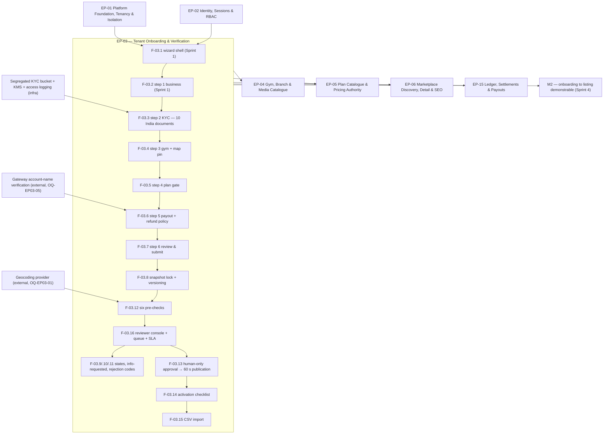

# EP-03 — Tenant Onboarding & Verification

> **Source of truth.** `MASTER_PRD.md` §B5.3 (`ONB`, `FR-ONB-01` … `FR-ONB-15`), §B5.24 (`ADMN`,
> the `FR-ADMN-06` and `FR-ADMN-11` slices this epic owns), §A8.1 (`BR-GYM-01` … `BR-GYM-09`),
> §A8.10 (`BR-DAT-07`), §C4.4 (tenant/application state machine), §C4.8 (the sixteen application
> rejection codes), `SCR-DASH-002`, `SCR-ADM-002`, `SCR-ADM-003`.
> **India KYC checklist:** `LAUNCH_MARKET_INDIA.md` §6 — **ten documents**, reproduced in §4.1 below.
> **Detailed expansion of** `ENGINEERING_PLAN.md` §2 (epic row EP-03) and §3 (F-03.1 … F-03.16).
> **Scheduled by** `SprintPlanning.md` Sprint 1 (F-03.1, F-03.2) and Sprint 2 (F-03.3 … F-03.16).
> **Never contradicts** `PROJECT_CONSTITUTION.md` §23.

---

## 1. Metadata

| Field | Value |
| :--- | :--- |
| **Epic id** | `EP-03` |
| **Name** | Tenant Onboarding & Verification |
| **Priority (MoSCoW)** | **M** — Must. `FR-ONB-01` … `FR-ONB-13` are all `M`; `FR-ONB-14` and `FR-ONB-15` are `S`. `BR-GYM-01` … `BR-GYM-08` are `M`; `BR-GYM-09` is `S` |
| **Complexity** | **L**. `ENGINEERING_PLAN.md` §13.1 rates `onboarding/` **High**: *"Six-step resumable wizard, versioned snapshots, six pre-checks, a seven-state machine, and the human-only approval guard that `RSK-01` depends on. Document handling adds encryption and access-logging obligations."* |
| **Story points** | **55**, reconciling exactly with §13.1 `onboarding/` = 55 pts / 28 ed |
| **Target sprint(s)** | **Sprint 1** — F-03.1 (wizard shell, resumable partial state) and F-03.2 (step 1 business identity). **Sprint 2** (2026-10-05 → 2026-10-16, milestone **M1**, QA joins) — F-03.3 … F-03.16, with `E2E-01` as the sprint exit condition |
| **Owning modules** | `onboarding/` (applications, KYC documents, verification workflow); the `FR-ADMN-06` (KYC checklist configuration) and `FR-ADMN-11` (verification queue, assignment, SLA) slices of `admin/` |
| **Surfaces** | `apps/gym-dashboard` (`SCR-DASH-002` six-step wizard, activation checklist), `apps/admin-dashboard` (`SCR-ADM-002` approval queue, `SCR-ADM-003` application review), `apps/customer-web` (`SCR-WEB-018` "For Gyms" acquisition landing — built alongside in Sprint 2), `apps/server` |
| **Personas** | **Rohan** (independent gym owner, B2.1) and **Anita** (verification officer, B2.4) |
| **PRD modules covered** | `ONB` (15 `FR-`) plus two `ADMN` requirements |
| **Owner** | Backend Lead (onboarding); Technical Lead accountable for KYC storage (`BR-DAT-07`, `NFR-SEC-02`) |
| **Depends on** | **EP-01** (all), **EP-02** (authenticated owner, RBAC, `VERIFICATION_OFFICER` role) |
| **Status** | **Ready** — the India KYC checklist is decided (`LAUNCH_MARKET_INDIA.md` §6); the geocoding provider and geo tolerance remain open (`OQ-EP03-01`, `OQ-EP03-02`) |

---

## 2. Business Goal

This epic is the whole of the supply-side trust apparatus. `B5.3` states the purpose in one line —
*"Convert an interested gym owner into a verified, listed, transacting tenant — and stop anyone
else"* — and `A3.4` principle 4 removes the escape hatch: *"Verification before visibility. No gym
appears in the marketplace before a human has approved it. Growth targets never justify relaxing
this."* `RSK-01` (fake or non-existent gyms listed) carries the **highest score in the register** —
likelihood 4, impact 5, exposure 20 — and `RiskAnalysis.md` explains why the mitigation cannot be
automated: *"A consumer who pays ₹5,000 for a gym that does not exist does not blame the gym; they
blame the marketplace, and they say so publicly."* `BR-GYM-03` is therefore absolute — *"Approval is
a human decision. No automated path may set `APPROVED`"* — and this epic implements it as a
**compile-time** constraint (`Application.approve(actor: HumanActor)` where a system actor cannot
construct the branded type) before it is a runtime one. `OBJ-03` is the objective this serves:
*"Guarantee that every listed gym is a real, verified business."*

The second outcome is **supply-side conversion**, which is the opposite pressure and must be
satisfied at the same time. `KPI-02` requires **≥ 70%** of gyms to reach a first published plan
within 7 days of signup; `KPI-03` requires a median of **≤ 48 hours** from signup to a
marketplace-visible listing; `BAC-01` requires an owner to *"complete signup, KYC submission, gym
setup and plan creation unaided, and reach 'submitted for review' in a single session."* Every one
of those is a statement about the wizard, and `FR-ONB-01`'s resumability is the concession to
reality — a gym owner is interrupted by a walk-in customer three times during signup. `US-ONB-01`
puts the requirement plainly: *"I want to know exactly what is missing so that I'm not guessing why
I'm not live."* `RSK-09` (poor gym-side adoption after signup) is the failure mode: a rejection that
says "does not meet our standards" costs the platform its largest early expense — supply
acquisition — and generates a support ticket that a structured reason code would have prevented.
That is why `FR-ONB-11` and `BR-GYM-04` require reason codes mapped to specific fields, and why
`FR-ONB-10`'s `INFO_REQUESTED` exists as a path that preserves the owner's progress rather than
resetting it.

The third outcome is **reviewer throughput and evidence quality**. `BAC-02` requires the approval
decision to reach marketplace visibility within **60 seconds**, which is an outbox-and-projection
requirement, not a UI one. `US-ONB-02` sets the reviewer's bar: *"I want every piece of evidence on
one screen so that I can decide in under three minutes"*, and the persona note for Anita assumes
**30–60 applications per day** — an assumption `SprintPlanning.md` flags as unvalidated until
`UAT-04`, which is why `FR-ADMN-11`'s SLA view ships in the same sprint so the assumption is
*measured, not assumed*. Underneath all of it sits `BR-DAT-07`: KYC documents hold PAN, bank proof
and government identity for every gym owner on the platform — asset **A4** in the threat model —
and a single bucket misconfiguration is an identity-theft dataset. Hence the sprint rule that no
upload endpoint ships until the segregated encrypted bucket, the separate key and the per-access
audit log exist.

---

## 3. Scope

### 3.1 In scope — explicit

| # | Item | Anchor |
| :-: | :--- | :--- |
| 1 | Guided, resumable, six-step wizard with visible progress; partial state persists indefinitely | `FR-ONB-01`, `SCR-DASH-002` |
| 2 | Step 1 — business identity: legal entity name, trading name, entity type, registration identifier, registered address, business contact | `FR-ONB-02` |
| 3 | Step 2 — KYC upload against the **India ten-document checklist**, each typed, with format and size validation and inline preview | `FR-ONB-03`, `LAUNCH_MARKET_INDIA.md` §6 |
| 4 | KYC storage: separate encrypted bucket, separate key, no CDN, no public access, per-access signed URL, per-access audit row | `BR-DAT-07`, `NFR-SEC-02`, `NFR-SEC-10` |
| 5 | Step 3 — gym profile capture with photographs (min 3, max 30), operating hours, gender policy, address and a drag-to-adjust map pin | `FR-ONB-04` |
| 6 | Step 4 — at-least-one-plan gate before submission | `FR-ONB-05` |
| 7 | Step 5 — payout account with gateway account-name verification and refund-policy confirmation | `FR-ONB-06` |
| 8 | Step 6 — read-only review with edit links, terms acceptance, submission | `FR-ONB-07` |
| 9 | Submission snapshot locking: the reviewer sees a fixed version while the owner continues editing non-material fields | `FR-ONB-08`, `BR-GYM-05` |
| 10 | The seven-state application surface: `DRAFT`, `SUBMITTED`, `UNDER_REVIEW`, `INFO_REQUESTED`, `APPROVED`, `REJECTED`, `SUSPENDED` | `FR-ONB-09`, `C4.4` |
| 11 | `INFO_REQUESTED` with a targeted checklist, preserving progress | `FR-ONB-10` |
| 12 | Structured rejection: ≥ 1 of the sixteen `C4.8` reason codes plus optional free text, mapped to the exact field or document | `FR-ONB-11`, `BR-GYM-04` |
| 13 | Six automated pre-checks at submission, persisted on the application and shown to the reviewer | `FR-ONB-12`, `BR-GYM-08`, `BR-GYM-09` |
| 14 | Approval publishes the listing within 60 seconds and notifies the owner on every enabled channel | `FR-ONB-13`, `BAC-02` |
| 15 | Human-only approval — a branded `HumanActor`, a database `CHECK`, a permission held by two roles, and an OpenAPI-absence assertion | `BR-GYM-03` |
| 16 | Approval readiness: the six `BR-GYM-02` conditions evaluated against the **submitted snapshot**, not live data | `BR-GYM-02` |
| 17 | Persistent activation checklist until approved + ≥ 1 plan + ≥ 1 staff + ≥ 1 member + ≥ 1 check-in | `FR-ONB-14`, `FR-NAV-04` |
| 18 | CSV bulk member import: column mapping, 20-row preview, dry-run validation, per-row error report, idempotent re-run | `FR-ONB-15`, A-20 |
| 19 | Reviewer console: split document viewer with zoom and rotate and **no download**, structured checklist, pre-check panel, version diff, override-with-reason | `SCR-ADM-002`, `SCR-ADM-003` |
| 20 | Verification queue management: assignment, SLA monitoring, workload distribution | `FR-ADMN-11` |
| 21 | KYC checklist as **configuration** per country: document types, mandatory flags, validity rules | `FR-ADMN-06`, `ADR-0028` |
| 22 | Resubmission as a new immutable version with the prior version retained and diffable | `BR-GYM-05` |

### 3.2 Out of scope — explicit, with destination

| Item | Why not here | Where it goes |
| :--- | :--- | :--- |
| Post-approval gym and branch editing, media pipeline, hours editor, amenity taxonomy, freshness score | The wizard *captures* the gym; managing it afterwards is catalogue work. The two epics run in the same sprint and share `SCR-DASH-003`/`SCR-DASH-004` | **EP-04** (`FR-GYM-01` … `FR-GYM-12`) |
| Material-change routing after approval (`BR-GYM-06`, `BR-GYM-07`) | EP-03 owns first-time verification; re-review triage on an approved listing is catalogue work | **EP-04** F-04.11 |
| Plan creation itself | Step 4 is a **gate** that requires ≥ 1 plan to exist; creating plans is the plan catalogue | **EP-05** |
| The marketplace projection the 60-second publication writes into | EP-03 emits the event through the outbox; the read model is discovery | **EP-06** |
| Payout account **use** — settlement, payouts, reserve, bank re-verification suspension | Step 5 captures and name-verifies the account; moving money is settlement | **EP-15**, with `BR-GYM-06` in EP-04 |
| Tenant suspension, reinstatement, tier and commission override, forced re-verification | `FR-ADMN-01` is platform administration | **EP-19** |
| Audit **explorer** UI | EP-03 writes audit rows through EP-01's writer | **EP-19** (`FR-ADMN-09`) |
| Automated KYC verification via a vendor (`DEP-08`) | Optional dependency; Phase 1 is **manual review only** | Deferred; the port is not built |
| Content moderation queues for photos and descriptions after approval | `FR-ADMN-12` | **EP-19** |
| Notification channel adapters for the approval message | EP-03 emits; EP-17 delivers | **EP-17** |

---

## 4. Features

Points sum to the epic's **55**.

| Feature | Description | Satisfies | Pri | Pts | Sprint |
| :--- | :--- | :--- | :-: | :-: | :-: |
| **F-03.1** | Resumable six-step wizard shell: per-step validation, visible progress, indefinite partial-state persistence, any step revisitable | `FR-ONB-01`, `SCR-DASH-002`, A-09 | M | 5 | 1 |
| **F-03.2** | Step 1 — business identity capture: legal entity name, trading name, entity type, registration identifier, registered address, business contact | `FR-ONB-02` | M | 2 | 1 |
| **F-03.3** | Step 2 — KYC upload against the country checklist: typed documents, format and size validation, content-inspection type check, virus scan, inline preview; segregated encrypted bucket with its own key and per-access audit | `FR-ONB-03`, `BR-DAT-07`, `NFR-SEC-02`, `NFR-SEC-10` | M | 8 | 2 |
| **F-03.4** | Step 3 — gym profile capture with photographs, hours, gender policy, address and drag-to-adjust map pin | `FR-ONB-04` | M | 3 | 2 |
| **F-03.5** | Step 4 — at-least-one-plan gate | `FR-ONB-05` | M | 1 | 2 |
| **F-03.6** | Step 5 — payout account: bank details, gateway account-name verification, refund-policy confirmation stored with the tenant | `FR-ONB-06`, `BR-REF-01` | M | 3 | 2 |
| **F-03.7** | Step 6 — read-only review summary with edit links, terms acceptance, submission | `FR-ONB-07` | M | 2 | 2 |
| **F-03.8** | Submission snapshot locking and application versioning — each submission is a new immutable `version` with a full `snapshot jsonb`; the owner may continue editing non-material fields | `FR-ONB-08`, `BR-GYM-05` | M | 3 | 2 |
| **F-03.9** | Application status surface across the seven `C4.4` states, with reviewer feedback, requested information and resubmission history | `FR-ONB-09`, `C4.4` | M | 2 | 2 |
| **F-03.10** | `INFO_REQUESTED` with a targeted checklist that preserves the owner's progress | `FR-ONB-10` | M | 2 | 2 |
| **F-03.11** | Structured rejection: ≥ 1 of the sixteen `C4.8` codes plus optional free text, each mapped to the specific field or document and its corrective action | `FR-ONB-11`, `BR-GYM-04`, `C4.8` | M | 2 | 2 |
| **F-03.12** | The six automated pre-checks — geo distance, duplicate address, duplicate registration identifier, duplicate bank account, image quality and duplicate-image detection, profanity screening — run at submission and **persisted** on the application | `FR-ONB-12`, `BR-GYM-08`, `BR-GYM-09` | M | 8 | 2 |
| **F-03.13** | Approval publishes the listing within 60 seconds through the outbox projection and notifies the owner on every enabled channel; human-only approval guard and the `BR-GYM-02` readiness check | `FR-ONB-13`, `BR-GYM-02`, `BR-GYM-03`, `BAC-02` | M | 2 | 2 |
| **F-03.14** | Persistent activation checklist until approved + ≥ 1 published plan + ≥ 1 staff + ≥ 1 member + ≥ 1 check-in; server-computed and non-dismissible | `FR-ONB-14`, `FR-NAV-04` | S | 2 | 2 |
| **F-03.15** | CSV bulk member import: column mapping, 20-row preview, dry-run validation, per-row error report, idempotent re-run, streamed parsing | `FR-ONB-15`, A-20 | S | 2 | 2 |
| **F-03.16** | Reviewer console: `SCR-ADM-002` queue with age, SLA state, assignee and submission type; `SCR-ADM-003` split document viewer with zoom/rotate and no download, structured checklist, pre-check panel, field-level version diff, approve / reject / request-info / reassign / note, and override-with-reason guards; plus `FR-ADMN-11` assignment and SLA and `FR-ADMN-06` checklist configuration | `SCR-ADM-002`, `SCR-ADM-003`, `FR-ADMN-06`, `FR-ADMN-11`, `BR-GYM-03`, `BR-GYM-05` | M | 8 | 2 |
| | | | | **55** | |

### 4.1 The India KYC checklist — the ten documents (`LAUNCH_MARKET_INDIA.md` §6)

This checklist is **configuration**, held in the platform-global `kyc_checklists` table keyed by
`country_code` (`§C2.3`, `FR-ADMN-06`, `ADR-0028`) — never a constant in code, because `OBJ-09`
requires the platform to be country-agnostic. F-03.3 renders it; F-03.16 lets Super Admin edit it.

| # | Document | Mandatory | Validates | Validation rule to implement |
| :-: | :--- | :--- | :--- | :--- |
| 1 | **PAN** (entity or proprietor) | ✅ Always | Tax identity | Format `AAAAA9999A`; the 4th character encodes entity type and must be consistent with `tenants.entity_type` |
| 2 | **GSTIN** | Conditional — above the registration threshold | Tax registration | 15 characters; embeds the state code and the PAN; the embedded PAN must equal document 1 |
| 3 | **Business registration proof** | ✅ | Legal existence | One of Certificate of Incorporation · Partnership Deed · Udyam/MSME certificate, selected by `entity_type` |
| 4 | **Shop & Establishment registration** | ✅ | Right to trade | **State-specific**, issued municipally — the accepted format varies by state, so validation is presence + legibility, not pattern |
| 5 | **Bank account proof** | ✅ | Payout destination | Cancelled cheque or bank statement showing the account name; the name must match the gateway account-name verification in F-03.6 |
| 6 | **Owner identity** | ✅ | Person behind the business | PAN **plus one of** Passport / Driving Licence / Voter ID. **Aadhaar is not offered by default** |
| 7 | **Address proof of premises** | ✅ | `BR-GYM-08` geo-match | Utility bill or rent agreement; the address on it feeds the reviewer's geo comparison |
| 8 | **Trade licence** (municipal) | Conditional — city-dependent | Local permission | Presence check driven by a city-level flag in the checklist configuration |
| 9 | **Fire safety NOC** | Conditional — floor-area threshold | Premises safety | Presence check driven by a declared floor area |
| 10 | **Music licence** (PPL / IPRS) | ❌ Advisory | Copyright | Flagged to the owner as advisory; **never blocking**, and never a rejection reason |

> **Aadhaar caution, carried forward verbatim in intent.** Aadhaar is subject to specific statutory
> handling restrictions. The **default position is PAN plus a non-Aadhaar identity document**, so the
> platform avoids Aadhaar handling obligations entirely. If Aadhaar is ever collected it must be
> masked at rest and must never appear in logs (`BR-DAT-06`; `aadhaar` is already on EP-01's
> redaction list), and its use requires legal review. This is recorded as pending legal sign-off, not
> as an engineering choice.

**Consequences the checklist imposes on the build.** Two documents (1, 2) carry machine-checkable
formats and one cross-field consistency rule between them. One (5) must reconcile with an external
gateway verification. Two (8, 9) are conditional on data the owner declares, so the checklist engine
must support **conditional mandatory** — a boolean flag is not sufficient. One (10) is advisory and
must be visibly excluded from the `BR-GYM-02` readiness computation, or a well-meaning
implementation will block approval on a music licence.

---

## 5. User Stories

The three PRD stories (`US-ONB-01` … `US-ONB-03`) are restated with their acceptance criteria
**verbatim**. Six further stories are **new**: `FR-ONB-03`, `FR-ONB-08`, `FR-ONB-09`, `FR-ONB-13`,
`FR-ONB-14`, `FR-ADMN-06` and `FR-ADMN-11` are written as requirements without a narrative story,
and DoR criterion 2 requires Given/When/Then before work starts.

### US-ONB-01 *(PRD)* — Know exactly what is missing

> *As a gym owner, I want to know exactly what is missing so that I'm not guessing why I'm not live.*

- **AC-ONB-01.1** — Given I am mid-application, when I open the dashboard, then I see a checklist of
  completed and outstanding items with a direct link to each outstanding item.
- **AC-ONB-01.2** — Given my application is rejected, when I open it, then each cited reason names
  the specific field or document and the corrective action.
- **AC-ONB-01.3** — Given I fix the cited items, when I resubmit, then the application returns to
  the queue with a marker indicating it is a resubmission, and the reviewer can see a diff against
  the prior version.

### US-ONB-02 *(PRD)* — Every piece of evidence on one screen

> *As a verification officer, I want every piece of evidence on one screen so that I can decide in
> under three minutes.*

- **AC-ONB-02.1** — Given an application in the queue, when I open it, then documents render in an
  inline viewer alongside the structured checklist without downloading.
- **AC-ONB-02.2** — Given automated pre-checks have run, when I open the application, then any
  failing check is visible at the top with its detail, and passing checks are collapsed.
- **AC-ONB-02.3** — Given the registered address geocodes more than the configured tolerance from
  the map pin, when I open the application, then this is flagged and approval requires an explicit
  override with a reason.
- **AC-ONB-02.4** — Given another approved gym exists at the same address, when I open the
  application, then I see a link to that gym and approval requires an explicit override.
- **AC-ONB-02.5** — Given I approve, when I confirm, then the listing is live within 60 seconds and
  the decision, my identity and timestamp are written to the audit log.

### US-ONB-03 *(PRD)* — Import 400 existing members rather than retype them

> *As a gym owner with 400 existing members, I want to import them rather than retype them.*

- **AC-ONB-03.1** — Given a CSV, when I upload it, then I map my columns to platform fields and see
  a preview of the first 20 mapped rows.
- **AC-ONB-03.2** — Given I run a validation pass, when it completes, then I see a per-row report of
  errors (invalid phone, missing name, unparseable date, duplicate) and can download it.
- **AC-ONB-03.3** — Given I proceed with import, when rows contain errors, then valid rows import
  and invalid rows are skipped and reported; the import is never partially applied to a single row.
- **AC-ONB-03.4** — Given I re-run the same file, when import executes, then no duplicate members
  are created.

### US-ONB-04 *(new)* — Upload the ten Indian documents without guessing

> *As Rohan, a sole proprietor in India, I want the platform to tell me exactly which documents my
> entity type needs, so that I do not submit the wrong ones and lose three days.*

- **AC-ONB-04.1** — Given my `country_code` is `IN`, when I reach step 2, then the checklist rendered
  is the ten-row India checklist from `kyc_checklists`, not a hard-coded list (`FR-ONB-03`,
  `FR-ADMN-06`).
- **AC-ONB-04.2** — Given I select `entity_type = sole_proprietor`, when the checklist renders, then
  the accepted business-registration proofs are filtered to those valid for that entity type.
- **AC-ONB-04.3** — Given I upload a PAN with a malformed number, when I submit the field, then it is
  rejected at the pipe with a message naming the expected `AAAAA9999A` format — not a generic
  "invalid file".
- **AC-ONB-04.4** — Given I upload a GSTIN, when it is validated, then its 15-character structure is
  checked **and** the PAN embedded within it is compared with document 1; a mismatch is flagged to
  the reviewer as `KYC_NAME_MISMATCH` rather than silently accepted.
- **AC-ONB-04.5** — Given my declared turnover is below the GST registration threshold, when the
  checklist renders, then GSTIN is shown as conditional and its absence does not block submission.
- **AC-ONB-04.6** — Given I upload a music licence or omit one, then neither state affects the
  `BR-GYM-02` readiness computation — it is advisory only.
- **AC-ONB-04.7** — Given any document upload, then it is content-inspected for true type, size
  limited, virus scanned, metadata stripped and stored in the segregated bucket (`NFR-SEC-10`).
- **AC-ONB-04.8** — Given Aadhaar is not on the default checklist, when the configuration is
  inspected, then no Aadhaar document type is enabled for `IN`, and enabling one requires a recorded
  legal sign-off (`LAUNCH_MARKET_INDIA.md` §6).

### US-ONB-05 *(new)* — KYC documents are readable only by the two roles entitled to read them

> *As the Data Protection owner, I want every KYC access logged and restricted, so that the platform's
> single largest identity-theft exposure is controlled and provable.*

- **AC-ONB-05.1** — Given a KYC document, then it is stored in a **separate encrypted bucket with its
  own key**, is not served through the CDN, and has no public access (`BR-DAT-07`, `NFR-SEC-02`).
- **AC-ONB-05.2** — Given a Verification Officer opens a document, then access is by a short-lived
  signed URL and the access writes an `audit_log` row with actor, document, tenant and IP —
  **reads are audited here**, which is deliberate and unusual (`BR-DAT-07-P1`).
- **AC-ONB-05.3** — Given a Support Agent, a Gym Owner or a Finance Analyst requests a KYC document,
  then each is refused with `403` (`BR-DAT-07-N1`, `SEC-A01-010`).
- **AC-ONB-05.4** — Given an unsigned request to the storage object URL, then the storage provider
  refuses it (`BR-DAT-07-N2`, `SEC-A02-005`), and the Terraform plan asserts
  `block_public_access = true`.
- **AC-ONB-05.5** — Given a document is uploaded, when the reviewer opens it moments later, then
  read-after-write consistency is handled explicitly rather than assumed (`TR-31`).
- **AC-ONB-05.6** — Given a document has a `valid_until` date that has passed, when the owner returns
  after a long absence, then the document is flagged for re-upload rather than silently accepted
  (`B5.3` edge case).

### US-ONB-06 *(new)* — Submission freezes what the reviewer sees

> *As Anita, I want the version I am reviewing to be immutable, so that the evidence cannot change
> underneath my decision.*

- **AC-ONB-06.1** — Given I submit an application, then a new `applications` row is inserted with
  `version = previous + 1` and a full `snapshot jsonb`; no prior row is updated in place
  (`BR-GYM-05`).
- **AC-ONB-06.2** — Given the application is submitted, when the owner edits a non-material field,
  then the live draft changes and the reviewer's snapshot does not (`FR-ONB-08`).
- **AC-ONB-06.3** — Given five successive rejections and resubmissions, then five versions are
  retained and each is diffable against its predecessor (`BR-GYM-05-P1`).
- **AC-ONB-06.4** — Given an attempt to mutate a submitted version's snapshot, then it is refused
  (`BR-GYM-05-N1`).
- **AC-ONB-06.5** — Given resubmission, then no submission-count ceiling exists; only a time-based
  rate limit protects the queue (`BR-GYM-05`).

### US-ONB-07 *(new)* — The application's state is never a mystery

> *As Rohan, I want to see exactly where my application stands, so that I stop emailing support to
> ask.*

- **AC-ONB-07.1** — Given any point in the process, then the dashboard shows one of the seven states
  — `DRAFT`, `SUBMITTED`, `UNDER_REVIEW`, `INFO_REQUESTED`, `APPROVED`, `REJECTED`, `SUSPENDED` —
  with the current reviewer feedback (`FR-ONB-09`, `SCR-DASH-002`).
- **AC-ONB-07.2** — Given the reviewer requests information, then the state becomes `INFO_REQUESTED`
  with a **targeted checklist** naming only the outstanding items, and my prior progress is intact
  (`FR-ONB-10`).
- **AC-ONB-07.3** — Given the state machine, then only the `C4.4` transitions are permitted, and an
  illegal transition is refused by the domain layer with a typed error.
- **AC-ONB-07.4** — Given rejection, then I see every cited reason code with its field-level
  correction and any free text, verbatim (`FR-ONB-11`, `BR-GYM-04`).
- **AC-ONB-07.5** — Given approval, then the wizard is replaced by a success state with next steps
  (`SCR-DASH-002`).

### US-ONB-08 *(new)* — Approval reaches the marketplace in under a minute, and only a human can grant it

> *As the platform owner, I want approval to be fast for the gym and impossible for a machine, so
> that `KPI-03` and `RSK-01` are both satisfied.*

- **AC-ONB-08.1** — Given a Verification Officer approves, then the listing is visible in search,
  detail, city and category surfaces within **60 seconds**, carried by the outbox projection
  (`FR-ONB-13`, `BAC-02`, `BR-GYM-01-P1`).
- **AC-ONB-08.2** — Given a system or job actor attempts approval, then it is refused with
  `GYM_APPROVAL_REQUIRES_HUMAN_ACTOR` (`BR-GYM-03-N1`, `SEC-A04-002`).
- **AC-ONB-08.3** — Given a direct `UPDATE gyms SET status='APPROVED'` with
  `applications.decided_by IS NULL`, then the database `CHECK` refuses it (`BR-GYM-03-N2`).
- **AC-ONB-08.4** — Given any of the six `BR-GYM-02` conditions is unmet, then approval returns
  `422 APPROVAL_PRECONDITION_UNMET` naming the failing condition, and the gym stays out of search
  (`BR-GYM-02-N1`).
- **AC-ONB-08.5** — Given approval, then the owner is notified across all enabled channels and the
  decision, actor, timestamp, application version and evidence snapshot are audited.
- **AC-ONB-08.6** — Given a failed pre-check, then approval requires a **recorded override with a
  reason**, and the override itself is audited (`AC-ONB-02.3`, `AC-ONB-02.4`).

### US-ONB-09 *(new)* — The queue is managed, not just displayed

> *As the verification team lead, I want assignment and SLA visibility, so that the 30–60
> applications a day assumption is measured rather than hoped for.*

- **AC-ONB-09.1** — Given the queue, then each row shows age, SLA state, assignee, tenant name, city,
  submission type (new or resubmission) and pre-check status, and is sortable and assignable
  (`SCR-ADM-002`, `FR-ADMN-11`).
- **AC-ONB-09.2** — Given an application approaching or breaching the review SLA, then it is visually
  distinguished.
- **AC-ONB-09.3** — Given an application is reassigned, then the reassignment is audited with a
  reason (`FR-ADMN-02`).
- **AC-ONB-09.4** — Given time-per-application is instrumented from day one, then the median and p90
  are reportable so `UAT-04` can validate or refute the 30–60/day assumption.
- **AC-ONB-09.5** — Given a Super Admin edits the KYC checklist for a country, then the change takes
  effect without deployment and is audited with a reason (`FR-ADMN-06`, `FR-ADMN-02`).

---

## 6. Acceptance Criteria for the Epic

| # | Criterion | Evidence |
| :-: | :--- | :--- |
| **AC-EP03-01** | An owner signs up by phone OTP, verifies email, completes all six wizard steps and submits — **in one session, unaided**. | `E2.1`, `BAC-01` |
| **AC-EP03-02** | The wizard resumes from any step after a browser close with partial state intact. | `E2.2`, `FR-ONB-01` |
| **AC-EP03-03** | All ten India KYC document types are offered, validated for format and size, and previewable inline. | `E2.3`, §4.1 |
| **AC-EP03-04** | PAN format `AAAAA9999A` is enforced; a malformed PAN is refused with a message naming the format. | `AC-ONB-04.3` |
| **AC-EP03-05** | GSTIN is 15 characters, its embedded PAN is cross-checked against document 1, and it is conditional below the registration threshold. | `AC-ONB-04.4`, `AC-ONB-04.5` |
| **AC-EP03-06** | No Aadhaar document type is enabled for `IN` by default. | `AC-ONB-04.8` |
| **AC-EP03-07** | The music licence is advisory and is excluded from the `BR-GYM-02` readiness computation. | `AC-ONB-04.6` |
| **AC-EP03-08** | KYC objects live in a separate encrypted bucket with their own key, no CDN and no public access; the Terraform plan asserts `block_public_access = true`. | `AC-ONB-05.1`, `AC-ONB-05.4` |
| **AC-EP03-09** | Every KYC **read** writes an audit row with actor, document, tenant and IP. | `BR-DAT-07-P1` |
| **AC-EP03-10** | A Support Agent, a Gym Owner and a Finance Analyst are each refused KYC access with `403`. | `BR-DAT-07-N1` |
| **AC-EP03-11** | Uploaded files are content-type inspected, size limited, virus scanned and metadata stripped. | `NFR-SEC-10` |
| **AC-EP03-12** | All six pre-checks run at submission and their results are **persisted on the application**. | `E2.4`, `AC-ONB-02.3` |
| **AC-EP03-13** | A deliberate geo mismatch is flagged, and approval with a failed pre-check forces a recorded override with a reason. | `E2.5`, `BR-GYM-08-N1` |
| **AC-EP03-14** | `→ APPROVED` is unreachable from any automated code path; the guard requires an authenticated `VERIFICATION_OFFICER` or `SUPER_ADMIN`, proven by a negative test. | `E2.6`, `BR-GYM-03-N1` |
| **AC-EP03-15** | A direct database `UPDATE` to `APPROVED` with `decided_by IS NULL` violates the `CHECK`. | `BR-GYM-03-N2` |
| **AC-EP03-16** | Approval makes the listing visible in the search projection within **60 seconds**, measured with a stopwatch in the demo. | `E2.7`, `BAC-02` |
| **AC-EP03-17** | A rejection carries at least one, and in the demo two, structured `C4.8` reason codes mapped to specific fields, and the owner sees field-level corrections. | `E2.8`, `BR-GYM-04-P1` |
| **AC-EP03-18** | Rejection with an empty `reason_codes` array is refused at the pipe with `400` and, if forced at the database, violates the `CHECK`. | `BR-GYM-04-N1` |
| **AC-EP03-19** | A second application at the same normalised physical address raises a `DUPLICATE_LISTING` candidate; approving it without dismissing the flag is refused. | `E2.9`, `BR-GYM-09-P1`, `-N1` |
| **AC-EP03-20** | Each of the six `BR-GYM-02` conditions, removed one at a time, produces `422 APPROVAL_PRECONDITION_UNMET` naming that condition. | `BR-GYM-02-N1` |
| **AC-EP03-21** | Five successive rejections and resubmissions produce five retained, diffable versions; the reviewer sees a field-level diff. | `BR-GYM-05-P1`, `AC-ONB-01.3` |
| **AC-EP03-22** | While an application is `SUBMITTED`, a non-material owner edit changes the draft and does not change the reviewer's snapshot. | `FR-ONB-08`, `AC-ONB-06.2` |
| **AC-EP03-23** | `INFO_REQUESTED` presents a targeted checklist and preserves all prior progress. | `FR-ONB-10` |
| **AC-EP03-24** | Only `C4.4` transitions are permitted; an illegal transition is refused by the domain layer. | `AC-ONB-07.3` |
| **AC-EP03-25** | The reviewer console renders documents inline with zoom and rotate and offers **no download control**. | `AC-ONB-02.1`, Sprint-2 demo step 4 |
| **AC-EP03-26** | Failing pre-checks are expanded at the top of the review screen and passing ones are collapsed. | `AC-ONB-02.2` |
| **AC-EP03-27** | The queue shows age, SLA state, assignee, tenant, city, submission type and pre-check status, and supports assignment and reassignment with an audited reason. | `FR-ADMN-11`, `AC-ONB-09.1`–`09.3` |
| **AC-EP03-28** | Time-per-application is instrumented and reportable from the first day of the sprint. | `AC-ONB-09.4` |
| **AC-EP03-29** | The KYC checklist is editable per country by Super Admin without deployment, and the edit is audited. | `FR-ADMN-06`, `AC-ONB-09.5` |
| **AC-EP03-30** | The activation checklist is server-computed, non-dismissible, and persists until approved + ≥ 1 published plan + ≥ 1 staff + ≥ 1 member + ≥ 1 check-in. | `FR-ONB-14`, `FR-NAV-04` |
| **AC-EP03-31** | A 400-row CSV import streams rather than buffers, previews 20 mapped rows, produces a downloadable per-row error report, imports valid rows only, and creates no duplicates on re-run. | `AC-ONB-03.1`–`03.4` |
| **AC-EP03-32** | Payout account name verification runs through the gateway and its result is stored with the application; a failure is a `BANK_VERIFICATION_FAILED` reason code, not a silent pass. | `FR-ONB-06`, `C4.8` |
| **AC-EP03-33** | The refund policy confirmed at step 5 is stored with the tenant and is the policy snapshot every future order copies. | `FR-ONB-06`, `BR-REF-01` |
| **AC-EP03-34** | Isolation specs exist for every tenant-scoped EP-03 endpoint, including the KYC routes. | `E2.21`, `BAC-10` |
| **AC-EP03-35** | `BR-GYM-02` … `BR-GYM-05`, `BR-GYM-08`, `BR-GYM-09` and `BR-DAT-07` each have a passing positive **and** negative test registered in the `BAC-06` report. | `BAC-06` |
| **AC-EP03-36** | `E2E-01` runs green in CI against the deterministic seed. | `E2.12` |

---

## 7. Business Rules Enforced

Enforcement detail is in `BusinessRules.md` §6 and §17; it is not repeated here. This table names
what EP-03 **owns** and the enforcement point it builds.

| BR | Priority | Owner module | Enforcement point built in EP-03 | Layer(s) | Test ids |
| :--- | :-: | :--- | :--- | :--- | :--- |
| **BR-GYM-02** | M | `onboarding/` | **Authoritative** `L6-UC`: `ApprovalReadinessCheck` evaluating the six conditions against the **submitted snapshot**, not live data; the approve use case refuses when any is unmet. `L5-DOM`: the checklist is data in `kyc_checklists` keyed by `country_code`, so India's ten documents are configuration (`ADR-0028`) | **`L6-UC`**, `L5-DOM`, `L10-JOB`, `L11-UI` | `BR-GYM-02-P1`, `-N1` (six parameterised cases) |
| **BR-GYM-03** | M | `onboarding/` | **Authoritative** `L5-DOM`: `Application.approve(actor: HumanActor, …)` with a branded type a system actor cannot construct — a compile-time error before a runtime one. `L1-DB`: `CHECK (status <> 'APPROVED' OR decided_by IS NOT NULL)` plus an FK to a platform staff user. `L7-GUARD`: `@RequiredPermission('onboarding.application.decide')`, two roles only. `L12-CI`: an OpenAPI-absence assertion that no endpoint sets `APPROVED` without a decision payload | **`L5-DOM`**, `L1-DB`, `L7-GUARD`, `L6-UC`, `L12-CI` | `BR-GYM-03-P1`, `-N1`, `-N2` |
| **BR-GYM-04** | M | `onboarding/` | **Authoritative** `L1-DB`: `CHECK (status <> 'REJECTED' OR array_length(reason_codes, 1) >= 1)`. `L8-PIPE`: the Zod schema types `reason_codes` as a non-empty array of the sixteen `C4.8` codes. `L11-UI`: codes plus free text shown verbatim with the field each maps to | **`L1-DB`**, `L8-PIPE`, `L11-UI` | `BR-GYM-04-P1`, `-N1` |
| **BR-GYM-05** | M | `onboarding/` | **Authoritative** `L1-DB`: `applications.version` with `UNIQUE (tenant_id, version)`; each submission inserts a new row holding a full `snapshot jsonb`; no row is updated in place. `L5-DOM`: `Application` is an immutable snapshot aggregate whose `resubmit()` produces `version + 1`. `L6-UC`: no submission ceiling; a time-based rate limit protects the queue | **`L1-DB`**, `L5-DOM`, `L6-UC`, `L11-UI` | `BR-GYM-05-P1`, `-N1` |
| **BR-GYM-08** | M | `onboarding/` | **Authoritative** `L6-UC`: the `FR-ONB-12` pre-check computes `ST_Distance(branches.location, geocode(address))` through the geocoding anti-corruption layer and writes the result into `applications.precheck_results`; approve refuses beyond the configured tolerance. `L1-DB`: `location geography(Point,4326) NOT NULL` with a GiST index. `L11-UI`: the reviewer sees pin, geocoded point and measured distance, and may override with a reason | **`L6-UC`**, `L1-DB`, `L11-UI` | `BR-GYM-08-P1`, `-N1` |
| **BR-GYM-09** | S | `onboarding/` | **Authoritative** `L6-UC`: a normalised-address plus `ST_DWithin` radius probe against all `APPROVED` gyms produces a candidate-duplicate list on `precheck_results`; the reviewer must dismiss or act on it — because "same physical address" is a human judgement normalisation cannot settle. `L1-DB`: a partial unique index on the normalised address hash `WHERE status = 'APPROVED'` exists as a backstop but is **advisory in Phase 1**, because shared premises are legitimate | **`L6-UC`**, `L1-DB`, `L11-UI` | `BR-GYM-09-P1`, `-N1` |
| **BR-DAT-07** | M | `onboarding/` | **Authoritative** `L7-GUARD`: `@RequiredPermission('onboarding.kyc.read')` granted to exactly two roles and to no tenant role, combined with a separate encrypted bucket with its own key, no CDN, no public access and a per-access signed URL. `L1-DB`: `kyc_documents.storage_key` points at that bucket only. `L9-INT`: every read writes an audit row. `L12-CI`: the Terraform plan asserts `block_public_access = true` | **`L7-GUARD`**, `L1-DB`, `L9-INT`, `L12-CI` | `BR-DAT-07-P1`, `-N1`, `-N2` |
| **BR-GYM-01** | M | `catalog/` + `discovery/` | *Contribution.* EP-03 supplies the transition to `APPROVED` and the outbox event that reaches the projection inside 60 seconds; the `PublicVisibilityPredicate` itself is **EP-04**/**EP-06** | `L10-JOB` | `BR-GYM-01-P1` (the publication half) |
| **BR-GYM-06** | M | `catalog/` + `onboarding/` | *Contribution.* EP-03 stores the payout account and its verification status; the material-change routing and payout suspension are **EP-04** F-04.11 and **EP-15** | `L1-DB` | `BR-GYM-06-P2` (payout-account precondition) |
| **BR-REF-01** | M | `refunds/` + `ordering/` | *Contribution.* Step 5 captures and stores the tenant's refund policy, which every order later snapshots | `L1-DB`, `L6-UC` | Enabling; `BR-REF-01-*` land in EP-16 |
| **BR-DAT-01** | M | `audit/` | *Consumer.* Every decision, override, reassignment, checklist edit and KYC **read** produces an audit row through EP-01's writer | `L9-INT` | `BR-DAT-01-P1` coverage extended |
| **BR-TEN-01** | M | `tenancy/` | *Consumer.* Every EP-03 tenant-scoped endpoint inherits the chain and gains a generated isolation spec — including the KYC routes, which are the highest-value target in the product | `L2-RLS`, `L12-CI` | `BR-TEN-01-N1` extended |

---

## 8. Dependencies

### 8.1 Upstream

| Dependency | Type | Detail |
| :--- | :--- | :--- |
| **EP-01** — all 20 features | Epic | Outbox (the 60-second publication), audit writer (override and decision records), job harness (pre-checks and freshness), idempotency (`POST /tenant/applications` is **REQ**), error envelope, tenant chain, object-storage client |
| **EP-02** — F-02.1 … F-02.11, F-02.13 … F-02.16 | Epic | An authenticated, verified owner; `tenant:create`; the RBAC engine granting `onboarding.application.decide` and `onboarding.kyc.read` to `VERIFICATION_OFFICER` and `SUPER_ADMIN` only; staff MFA on `/admin/*` |
| **EP-04** F-04.1 … F-04.9 | Epic (same sprint) | Step 3 captures gym profile, media and hours; the underlying entities and the media pipeline are EP-04's. The two epics are co-scheduled in Sprint 2 and share `SCR-DASH-003`/`SCR-DASH-004` |
| **EP-05** | Epic (Sprint 3) | Step 4 gates on ≥ 1 plan; in Sprint 2 the gate is satisfied by the minimal plan entity, with the full catalogue arriving in Sprint 3 |
| **Geocoding provider** | **External** | `BR-GYM-08` needs an address→coordinate service behind the anti-corruption layer (`PROJECT_CONSTITUTION.md` §4.5.2). Vendor unselected — `OQ-EP03-01` |
| **Payment gateway account-name verification** | **External** | `FR-ONB-06` needs Razorpay Route's account-validation capability. Availability and cost per call must be confirmed — `OQ-EP03-05` |
| **Virus scanning** | **External / infra** | `NFR-SEC-10` requires uploaded files to be virus-scanned |
| **Object storage + KMS** | Infra | Sprint-2 task 2.22: segregated KYC bucket, media bucket public-read via CDN, KMS keys, access logging. **Must land before any upload endpoint ships** |
| **`OQ-01` = India** | Decision | **Answered.** Determines the ten-document checklist, the PAN and GSTIN formats, and the state-specific Shop & Establishment handling |

### 8.2 Downstream

| Consumer | What it consumes |
| :--- | :--- |
| **EP-04** Gym, Branch & Media Catalogue | An approved gym to manage; the `pending_field_reviews` pattern for `BR-GYM-06`; the reviewer console pattern for re-review |
| **EP-05** Plan Catalogue | A tenant that may publish — a plan on an unapproved gym is not publicly sellable |
| **EP-06** Marketplace Discovery | Approved listings. Without EP-03 the marketplace has no inventory; `KPI-01` (500 verified active gyms) is entirely downstream of this epic |
| **EP-12** Member CRM | F-03.15's CSV import creates the first members |
| **EP-13** Staff | The activation checklist's "≥ 1 staff" condition |
| **EP-15** Settlements | The payout account captured and name-verified at step 5 |
| **EP-16** Refunds | The refund policy captured at step 5 and snapshotted onto every order |
| **EP-19** Platform Administration | `FR-ADMN-01` tenant lifecycle extends the `C4.4` machine; `FR-ADMN-06` checklist configuration is co-owned |
| **M2** (Sprint 4) | *"Gym onboarding and approval demonstrable end to end"* — this epic **is** M2 |

### 8.3 External dependencies and open questions

| Ref | Item | Status |
| :--- | :--- | :--- |
| `DEP-08` | Automated KYC verification vendor | **Optional; not used.** Phase 1 is manual review only. No port is built |
| Geocoding vendor | Address→coordinate for `BR-GYM-08` | **Open** — `OQ-EP03-01` |
| Razorpay Route account validation | Bank account-name verification for `FR-ONB-06` | **Open** — `OQ-EP03-05` |
| `OQ-01` | Launch country | **Answered — India** |
| `UAT-04` | Verification officer script: 10 applications including 3 rejections and 2 information requests | Sprint 17; the throughput assumption is unvalidated until then |

### 8.4 Dependency graph

---

## 9. Technical Tasks

Estimates in engineer-days, implementation + tests + review. `SprintPlanning.md` task ids are cited
as *(1.x)* or *(2.x)* where a task maps directly.

| Id | Task | Layer | ed | Depends on | Serves |
| :--- | :--- | :--- | :-: | :--- | :--- |
| **T-03.01** | Schema: `applications` (`version`, `snapshot jsonb`, `status`, `assigned_to`, `decided_by`, `decided_at`, `decision`, `reason_codes[]`, `reviewer_notes`, `precheck_results jsonb`), `kyc_documents`, `payout_accounts`, `application_events`; constraints, indexes, RLS | DB | 2.0 | EP-01 T-01.09 | `§C2.2`, `BR-GYM-04`, `BR-GYM-05` |
| **T-03.02** | `kyc_checklists` platform-global reference table + the **India ten-document seed**, including conditional-mandatory rules and per-entity-type filtering | DB | 1.0 | T-03.01 | `FR-ADMN-06`, §4.1, `ADR-0028` · *(2.2)* |
| **T-03.03** | Wizard shell service: resumable partial state, per-step validation, step completion tracking, indefinite persistence | API | 1.5 | T-03.01 | `FR-ONB-01` · *(1.19)* |
| **T-03.04** | Step 1 business identity capture and validation, including registration-identifier normalisation for duplicate detection | API | 1.0 | T-03.03 | `FR-ONB-02` · *(1.19)* |
| **T-03.05** | KYC checklist engine: renders the country checklist, resolves conditional-mandatory rules from declared data, filters business-registration proofs by `entity_type` | API | 1.5 | T-03.02 | `FR-ONB-03`, `AC-ONB-04.1`, `-04.2` · *(2.2)* |
| **T-03.06** | India document validators: PAN `AAAAA9999A` with the entity-type character consistency rule; GSTIN 15-character structure with the embedded-PAN cross-check | API | 1.0 | T-03.05 | `AC-ONB-04.3`, `-04.4` · *(2.2)* |
| **T-03.07** | **KYC storage**: segregated encrypted bucket, separate key, no CDN, per-access signed URL, per-access audit row, `block_public_access` assertion, read-after-write handling | API / infra | 2.5 | EP-01 T-01.30, T-03.01 | `BR-DAT-07`, `NFR-SEC-02`, `TR-31` · *(2.3)* |
| **T-03.08** | Upload pipeline: content-type inspection, size limits, virus scan, metadata stripping, inline preview rendition for the reviewer | API | 1.5 | T-03.07 | `NFR-SEC-10`, `FR-ONB-03` |
| **T-03.09** | Step 3 gym profile capture wiring into EP-04's entities, including the map pin and its coordinate persistence | API | 1.0 | T-03.03 | `FR-ONB-04` · *(2.1)* |
| **T-03.10** | Step 4 at-least-one-plan gate as a readiness predicate rather than a UI check | API | 0.5 | T-03.03 | `FR-ONB-05` · *(2.1)* |
| **T-03.11** | Step 5 payout account: capture, gateway account-name verification through the provider port, verification-status persistence, refund-policy confirmation stored on the tenant | API | 2.0 | T-03.01 | `FR-ONB-06`, `BR-REF-01`, `BR-GYM-06` · *(2.1)* |
| **T-03.12** | Step 6 review summary assembly, terms acceptance record, submission endpoint with `Idempotency-Key` **REQ** | API | 1.0 | T-03.03 … T-03.11 | `FR-ONB-07`, `§6.11` · *(2.1)* |
| **T-03.13** | Submission snapshot locking and versioning: insert-only `applications` rows, `UNIQUE (tenant_id, version)`, immutable `snapshot`, continued non-material draft editing | API / DB | 2.5 | T-03.12 | `FR-ONB-08`, `BR-GYM-05` · *(2.4)* |
| **T-03.14** | The `C4.4` seven-state application machine with typed illegal-transition errors and a full transition-table test including illegal transitions | API | 1.0 | T-03.13 | `FR-ONB-09`, `C4.4` · *(2.4)* |
| **T-03.15** | Pre-check 1 — geo distance: geocoding anti-corruption layer, `ST_Distance` against the pin, tolerance as configuration, result persisted | API | 1.0 | T-03.09 | `FR-ONB-12`, `BR-GYM-08` · *(2.5)* |
| **T-03.16** | Pre-check 2 — duplicate address: address normaliser tuned against **200 real Indian addresses including flat and floor variants**, plus an `ST_DWithin` radius probe against approved gyms | API | 1.5 | T-03.15 | `BR-GYM-09` · *(2.5)* |
| **T-03.17** | Pre-checks 3 and 4 — duplicate registration identifier and duplicate bank account across tenants, executed under `runElevated()` with an audited reason | API | 1.0 | T-03.04, T-03.11, EP-01 T-01.15 | `FR-ONB-12` · *(2.5)* |
| **T-03.18** | Pre-check 5 — image quality and duplicate-image detection (perceptual hashing) with resource limits on decode | API | 1.0 | T-03.08 | `FR-ONB-12`, `TR-40` · *(2.5)* |
| **T-03.19** | Pre-check 6 — profanity and prohibited-content screening on free text, including contact details and URLs | API | 0.5 | T-03.09 | `FR-ONB-12`, `BR-GYM-07` adjacency · *(2.5)* |
| **T-03.20** | Pre-check orchestration job on EP-01's harness: runs all six at submission, persists `precheck_results`, never auto-rejects — always flags | worker | 1.0 | T-03.15 … T-03.19 | `FR-ONB-12`, `E2.4` · *(2.5)* |
| **T-03.21** | `INFO_REQUESTED` targeted checklist: reviewer selects outstanding items, owner sees only those, prior progress preserved | API | 0.75 | T-03.14 | `FR-ONB-10` · *(2.6)* |
| **T-03.22** | Structured rejection: the sixteen `C4.8` codes as typed reference data, the non-empty `CHECK`, the field mapping table, and the owner-facing corrective-action text | API / DB | 0.75 | T-03.14 | `FR-ONB-11`, `BR-GYM-04` · *(2.6)* |
| **T-03.23** | `ApprovalReadinessCheck` — the six `BR-GYM-02` conditions evaluated against the submitted snapshot, each returning a named failing condition | API | 1.0 | T-03.13 | `BR-GYM-02` |
| **T-03.24** | Human-only approval: branded `HumanActor` type, the `decided_by` `CHECK`, the two-role permission, the override-with-reason path for failed pre-checks, and the OpenAPI-absence assertion | API / DB / test | 1.5 | T-03.23 | `BR-GYM-03`, `E2.6` |
| **T-03.25** | Approval publication: outbox event → search projection within 60 seconds; owner notification across enabled channels; full decision audit with actor, version and evidence snapshot | API / worker | 1.0 | T-03.24, EP-01 T-01.23 | `FR-ONB-13`, `BAC-02` · *(2.7)* |
| **T-03.26** | Activation checklist: server-computed against approved + ≥ 1 published plan + ≥ 1 staff + ≥ 1 member + ≥ 1 check-in; non-dismissible; exposed to the dashboard | API | 1.0 | T-03.25 | `FR-ONB-14`, `FR-NAV-04` · *(2.7)* |
| **T-03.27** | CSV bulk member import: `papaparse` stream mode, column mapping, 20-row preview, dry-run pass, per-row error report with download, idempotent re-run keyed on a natural identifier | API | 2.0 | T-03.26 | `FR-ONB-15`, A-20 |
| **T-03.28** | Verification queue API: assignment, reassignment with an audited reason, SLA computation, workload distribution, and time-per-application instrumentation | API | 1.5 | T-03.14 | `FR-ADMN-11`, `AC-ONB-09.1`–`09.4` |
| **T-03.29** | KYC checklist configuration API for Super Admin — edit per country without deployment, audited with a reason, with a preview of affected in-flight applications | API | 1.0 | T-03.02 | `FR-ADMN-06`, `FR-ADMN-02` |
| **T-03.30** | Isolation specs for every EP-03 tenant-scoped endpoint, with the KYC routes explicitly named; negative tests for `BR-GYM-02` … `BR-GYM-05`, `BR-GYM-08`, `BR-GYM-09`, `BR-DAT-07` | test | 3.0 | T-03.24 | `BAC-06`, `BAC-10`, `E2.21` · *(2.21)* |
| **T-03.31** | `E2E-01` Playwright automation against the deterministic seed: signup → KYC → gym → plan → payout → submit → approve → listing live | test | 6.0 | T-03.25 | `E2E-01`, `E2.12` · *(2.20)* |
| **T-03.32** | Wizard steps 2–6 UI: resumable, per-step validated, React Hook Form + Zod, document upload with inline preview, map pin drag-to-adjust | dash | 5.0 | T-03.12 | `SCR-DASH-002`, A-09, A-02 · *(2.14)* |
| **T-03.33** | Wizard shell UI and step 1 (Sprint 1): progress indicator, step navigation, resume-from-anywhere | dash | 2.0 | T-03.04 | `SCR-DASH-002` · *(1.27)* |
| **T-03.34** | Reviewer console UI: `SCR-ADM-002` queue with age, SLA, assignee and pre-check status; `SCR-ADM-003` split document viewer with zoom and rotate and **no download**, structured checklist with pass/fail/needs-info and notes, pre-check panel (failures expanded, passes collapsed), field-level version diff, and the override-with-reason modal | admin | 6.0 | T-03.28 | `SCR-ADM-002`, `SCR-ADM-003` · *(2.16)* |
| **T-03.35** | Application status panel and rejection-remediation list on the owner dashboard, showing codes, free text and per-field corrective actions | dash | 1.5 | T-03.22 | `FR-ONB-09`, `FR-ONB-11` |
| **T-03.36** | Activation checklist component and `SCR-DASH-001` skeleton | dash | 2.0 | T-03.26 | `FR-ONB-14`, `FR-NAV-04` · *(2.17)* |
| **T-03.37** | CSV import UI: upload, mapping, preview, dry-run report, error download | dash | 1.5 | T-03.27 | `FR-ONB-15` |
| **T-03.38** | Object-storage provisioning: KYC bucket segregated with its own KMS key and access logging; media bucket public-read via CDN; Terraform assertions | infra | 3.0 | EP-01 T-01.36 | `BR-DAT-07`, `NFR-SEC-02` · *(2.22)* |
| **T-03.39** | axe-core and keyboard passes on `SCR-DASH-002`, `SCR-ADM-002`, `SCR-ADM-003`; screen-reader labelling on the document viewer controls | test | 1.0 | T-03.32, T-03.34 | `NFR-USE-01`, `NFR-USE-02` |
| **T-03.40** | `onboarding/` runbook — top three failure modes: geocoder outage during submission, KYC bucket permission drift, pre-check false-positive storm | docs | 0.5 | T-03.20 | `NFR-MNT-09` |
| | **Total** | | **68.0** | | |

---

## 10. Estimated Time

### 10.1 Roll-up by role

| Role | Tasks | Engineer-days | Notes |
| :--- | :--- | :-: | :--- |
| **Backend (BE)** | T-03.01 … T-03.29, T-03.40 | **37.0** | Against §13.1's `onboarding/` figure of 28 ed. The 9 ed difference is the six pre-checks (T-03.15 … T-03.20 = 6.0 ed), which §13.1 names as a top-three risk but folds into the module estimate, plus the two `ADMN` slices (T-03.28, T-03.29 = 2.5 ed) that §13.1 books to `admin/` |
| **FE — dashboards** | T-03.32 … T-03.37 (gym dashboard **and** admin console) | **18.0** | The reviewer console (T-03.34, 6.0 ed) is the single largest front-end item in Sprints 0–2. `SCR-ADM-003`'s split viewer with zoom, rotate and **no download** is genuinely hard to get right |
| **FE — customer web** | — | **0** | `SCR-WEB-018` "For Gyms" acquisition landing (Sprint-2 task 2.18, 3.0 ed) is marketing acquisition and is **not** booked to EP-03, though it links into the wizard |
| **QA** | T-03.30, T-03.31, T-03.39 | **10.0** | QA joins in Sprint 2. `E2E-01` automation (T-03.31, 6.0 ed) is the sprint's exit condition and is the largest QA item before Sprint 11 |
| **DevOps** | T-03.38 | **3.0** | Segregated KYC bucket, KMS keys, access logging, CDN for media |
| **Design** | `SCR-DASH-002` six steps, `SCR-ADM-002`, `SCR-ADM-003`, activation checklist, rejection-remediation surface | **10.0** | From the Sprint-2 board. Design is **OVER** at 143% and is the milestone at genuine risk on capacity grounds (`M1`) |
| | **Total** | **68.0** | |

### 10.2 Reconciliation

| View | Figure | Why it differs |
| :--- | :--- | :--- |
| §2 epic points | 55 pts → **27.5 ed** | Feature view, implementation only |
| §13.1 module view | `onboarding/` = **28 ed** | Backend module: implementation + test + review |
| This epic, engineering tasks | **68.0 ed** | Adds the two dashboards, `E2E-01` automation, isolation and rule tests, and the storage infrastructure |
| This epic, all roles | **78.0 ed** | Adds design |
| `SprintPlanning.md` Sprint 2 | BE 26.0 · FE 21.0 · QA 12.0 · DevOps 3.0 · Design 10.0 = **72.0 ed** | The Sprint-2 board also carries EP-04 (12.5 ed of BE) and EP-02 carry-ins (2.5 ed), and excludes the Sprint-1 portion of EP-03 (T-03.03, T-03.04, T-03.33 = 4.5 ed) |

### 10.3 Confidence range

| Scenario | Engineer-days | Drivers |
| :--- | :-: | :--- |
| **Optimistic (P10)** | **62** | The geocoding vendor is selected in Sprint 1 and its accuracy on Indian addresses is adequate at the first tolerance setting; the address normaliser handles flat and floor variants without a second pass; `SCR-ADM-003`'s viewer is satisfied by a PDF/image renderer already in `packages/ui` |
| **Expected (P50)** | **78.0** | The plan as written |
| **Pessimistic (P90)** | **106** | Indian address geocoding is materially less accurate than assumed and the tolerance plus normaliser need two iterations against real data; the duplicate-address pre-check produces false positives that block legitimate gyms and needs re-tuning mid-sprint; the gateway's account-name verification is unavailable or expensive and step 5 needs a manual-review fallback; `SCR-ADM-003`'s no-download requirement forces a bespoke viewer rather than a library |

**Capacity reality.** `SprintPlanning.md` records Sprint 2 as **OVER** on backend (106%, marginal)
and design (143%), **TIGHT** on frontend (100%), and **CLEAR** on QA (86%). The mitigation moves
`FR-GYM-12`'s freshness-score job (EP-04) to Sprint 4 and hands QA's 2.0 ed of slack to the EP-04
isolation specs. **Contingency drawdown: 2.0 ed; cumulative 9.0 of 86.4.** Design remains the
binding constraint and `M1` is the one milestone the plan judges at genuine risk on capacity.

---

## 11. Risks

| Risk | P | I | Score | Description and mitigation | Register id |
| :--- | :-: | :-: | :-: | :--- | :--- |
| Fake or non-existent gyms listed | 4 | 5 | **20** | The highest-scoring risk in the register, and **this epic is the entire defence**. **Mitigation:** `AC-EP03-14`'s negative test proving no automated path reaches `APPROVED`; persisted pre-check results so a reviewer's decision is evidenced; the partial unique index on normalised address; `FR-DETL-06`'s report route stubbed to the moderation queue in Sprint 10 | **`RSK-01`** |
| KYC bucket misconfiguration exposes an identity-theft dataset | 3 | 5 | **15** | PAN, bank proof and government identity for every gym owner — asset **A4**. **Mitigation:** T-03.07 and T-03.38 land **before** any upload endpoint ships (the Sprint-2 sequencing rule); `block_public_access` asserted in Terraform; per-access audit; two-role permission; `BR-DAT-07-N2` proves an unsigned object URL is refused | **`BR-DAT-07`**, `TA-6`, asset `A4` |
| A false duplicate-address positive blocks a legitimate gym | 4 | 3 | **12** | Shared premises — two studios in one building — are legitimate in Indian cities. **Mitigation:** pre-checks **flag, never auto-reject**; every flag is overridable with a recorded reason; T-03.16 tunes the normaliser against **200 real Indian addresses including flat and floor variants**; `BR-GYM-09`'s partial unique index stays **advisory in Phase 1** | Sprint-2 risk row, `BR-GYM-09` |
| Indian address geocoding accuracy is worse than the tolerance assumes | 4 | 3 | **12** | If the geocoder is routinely 500 m out, every application flags and the reviewer stops reading the flag. **Mitigation:** tolerance is **configuration**, not a constant; the reviewer sees the measured distance, not a boolean; the geocoder sits behind an anti-corruption layer so it can be swapped; `OQ-EP03-02` fixes the initial tolerance from measured data, not a guess | `TR-06` adjacency, `OQ-EP03-01/02` |
| Reviewer throughput (30–60 applications/day) is unvalidated until `UAT-04` | 4 | 3 | **12** | The whole `KPI-03` ≤ 48 h median rests on it. **Mitigation:** T-03.28 instruments time-per-application from day one and the `FR-ADMN-11` SLA view ships in the same sprint, so the assumption is **measured, not assumed** | Sprint-2 risk row, `ASM-` adjacency |
| Approval does not reach the marketplace within 60 seconds | 3 | 4 | **12** | `BAC-02` is a business acceptance criterion, and the demo measures it with a stopwatch. **Mitigation:** publication rides EP-01's outbox rather than a synchronous call; backlog alerting on the dispatcher; the projection is idempotent so a retry is harmless | `TR-08`, `BAC-02` |
| S3 read-after-write on a freshly uploaded KYC document | 3 | 3 | **9** | The reviewer opens a document seconds after upload and gets a 404 or a stale object. **Mitigation:** T-03.07 handles consistency explicitly rather than assuming strong read-after-write | **`TR-31`** |
| Image-decode resource exhaustion on upload | 3 | 3 | **9** | A malicious or malformed image consumes the worker. **Mitigation:** T-03.18 sets decode pixel and memory limits; uploads are processed on the worker tier, which `NFR-SCAL-05` keeps from starving requests | **`TR-40`** |
| The snapshot lock leaks — a reviewer sees live data | 3 | 4 | **12** | The decision would then rest on evidence that changed. **Mitigation:** T-03.13 makes `applications` insert-only with an immutable `snapshot jsonb`; `BR-GYM-05-N1` proves mutation is refused; the reviewer console reads only the snapshot, never the live tenant | `BR-GYM-05` |
| The KYC checklist becomes code rather than configuration | 3 | 4 | **12** | Directly defeats `OBJ-09`, and makes the second market a rewrite. **Mitigation:** T-03.02 seeds `kyc_checklists`; T-03.29 makes it editable without deployment; a review rule refuses any hard-coded document list | `OBJ-09`, `ADR-0028` |
| The music licence blocks approval | 3 | 2 | **6** | A well-meaning implementation treats all ten rows as mandatory. **Mitigation:** `AC-EP03-07` is an explicit acceptance criterion with its own test; the advisory flag is a first-class column, not a comment | §4.1 row 10 |
| Aadhaar is collected by accident through the "owner identity" slot | 2 | 5 | **10** | Statutory handling obligations the platform has deliberately avoided. **Mitigation:** no Aadhaar type is enabled for `IN`; enabling one requires recorded legal sign-off; `aadhaar` is already on the `BR-DAT-06` redaction list | `LAUNCH_MARKET_INDIA.md` §6 |
| Bank account-name verification is unavailable or costly per call | 3 | 3 | **9** | Step 5 either blocks or degrades. **Mitigation:** `OQ-EP03-05`; the fallback is a manual reviewer check recorded as a checklist item, with `BANK_VERIFICATION_FAILED` remaining the rejection code either way | `DEP-01` adjacency |
| CSV import buffers a 400-row file and times out — or worse, half-applies | 3 | 3 | **9** | **Mitigation:** `papaparse` stream mode (A-20); dry-run before commit; per-row atomicity so a row is never partially applied; idempotent re-run keyed on a natural identifier (`AC-ONB-03.3`, `-03.4`) | `FR-ONB-15` |
| Cross-tenant leakage through the duplicate pre-checks | 3 | 5 | **15** | Pre-checks 3 and 4 deliberately read **across** tenants. **Mitigation:** they run only through `runElevated()` with an audited reason (T-03.17); the result surfaced to the reviewer is a boolean plus a link, never another tenant's data; the inverted `/admin/*` isolation suite asserts the audit row | **`RSK-08`**, `BR-TEN-01` |
| Design over-commitment delays `SCR-ADM-003` | 4 | 4 | **16** | The reviewer console is the most design-dependent screen in Sprints 0–2 and `M1` lands this sprint. **Mitigation:** designer runs one sprint ahead from Sprint 1; Sprint-2 build uses the Phase-0 `/docs/ui/` specifications; 3.0 ed of contract design support approved as a §C10 **Minor** change | Sprint-1/2 risk rows, `DEL-05` |

---

## 12. Definition of Done

### 12.1 Deferred to the constitution

`PROJECT_CONSTITUTION.md` §23.2 in full. Of particular weight here: **#8** (tenant context
server-derived; every new tenant-owned table has an RLS policy — `applications`, `kyc_documents` and
`payout_accounts` all are), **#16** (isolation tests for every new tenant-scoped endpoint, KYC routes
included), **#17** (a negative-case test for every M-priority rule touched — seven of them here),
**#18** (E2E updated where a `C8.3` journey is affected — `E2E-01` **is** this epic) and **#20**
(axe-core clean, keyboard verified).

### 12.2 EP-03-specific

| # | Criterion |
| :-: | :--- |
| 1 | All thirty-six `AC-EP03-*` criteria in §6 pass, each with a named test id |
| 2 | Sprint-2 exit items `E2.1` … `E2.12` are ticked with evidence, and `E2E-01` is green in CI |
| 3 | The India ten-document checklist exists **as data** in `kyc_checklists`, is editable without deployment, and no document list is hard-coded anywhere in the codebase |
| 4 | Conditional-mandatory logic is exercised by tests for all three conditional rows (GSTIN, trade licence, fire NOC) and the one advisory row (music licence) |
| 5 | No upload endpoint was merged before T-03.07 and T-03.38 completed — verifiable from the commit order |
| 6 | Negative tests exist and pass for `BR-GYM-02`, `BR-GYM-03`, `BR-GYM-04`, `BR-GYM-05`, `BR-GYM-08`, `BR-GYM-09` and `BR-DAT-07`, and are registered in the `BAC-06` report |
| 7 | The `C4.4` transition table is fully covered, **including illegal transitions** |
| 8 | Every pre-check writes its result to `applications.precheck_results` and **none of them can auto-reject** |
| 9 | The address normaliser has been tuned against a recorded corpus of 200 real Indian addresses, and the corpus is committed as a test fixture |
| 10 | The reviewer console offers no download control, proven by an automated DOM assertion as well as by demonstration |
| 11 | Time-per-application instrumentation emits a metric and appears on the verification dashboard (`§19.6`) |
| 12 | `/docs/ui/` documents `SCR-DASH-002`, `SCR-ADM-002` and `SCR-ADM-003` with loading, empty, error and permission-denied states plus the domain-specific states (`INFO_REQUESTED` checklist, override modal, version diff) |
| 13 | The `onboarding/` runbook covers geocoder outage, KYC bucket permission drift and pre-check false-positive storms (`NFR-MNT-09`) |
| 14 | `ADR-0028` (KYC checklist as configuration) and the geocoding anti-corruption-layer ADR are written and accepted |
| 15 | The Sprint-2 demo runs unaided end to end, including step 3 (drag the pin 4 km, see the flag), step 5 (forced override modal) and step 6 (stopwatch under 60 seconds) |
| 16 | Coverage on `onboarding/` meets the overall gate and the domain-layer gate (≥ 95% line / ≥ 90% branch on `onboarding/domain/**`) |

---

## 13. Open Questions

### 13.1 PRD open questions this epic depends on

| OQ | Question | Status for EP-03 |
| :--- | :--- | :--- |
| **`OQ-01`** | Launch country and city | **Answered — India.** Fixes the ten-document checklist, PAN and GSTIN validation, the state-specific Shop & Establishment handling, and the Aadhaar default position |
| **`OQ-16`** | Data residency | **Answered — India region, mandatory.** The KYC bucket and its KMS key are Mumbai-resident; this is an RBI/DPDP obligation, not a preference |
| **`OQ-17`** | Brand, domain and legal copy owner | Needed for the terms text accepted at step 6 and the refund-policy template offered at step 5 |
| **`OQ-05`** | Platform-level minimum refund policy, or entirely tenant-defined? | Default: tenant-defined with a platform-mandated minimum 7-day no-visit cooling-off. Step 5 must render whatever minimum is decided; needed by Sprint 12 but the capture UI is built now |
| **`OQ-12`** | Featured listings at launch | Adjacent — affects nothing in EP-03 directly, but the approval-to-visibility path must not assume a single ranking treatment |

### 13.2 New questions this epic surfaces

| Id | Question | Owner | Needed by | Working default if undecided |
| :--- | :--- | :--- | :--- | :--- |
| **`OQ-EP03-01`** | Which geocoding provider, and does its terms of service permit storing the returned coordinates? `CON-02` caps the third-party budget. | Technical Lead + Product Manager | Sprint 2 start | Select on measured accuracy against a 200-address Indian sample; the anti-corruption layer makes the choice reversible |
| **`OQ-EP03-02`** | What is the initial `BR-GYM-08` geo tolerance in metres, and is it per-city (dense urban versus suburban) or global? | Product Manager + Backend Lead (onboarding) | Sprint 2 | Global 300 m for the first cohort, measured and re-tuned after 100 real applications; held as configuration so re-tuning is a data change |
| **`OQ-EP03-03`** | Is Shop & Establishment registration genuinely mandatory in every launch state, or does it vary enough that it should be conditional? | Client + legal counsel | Sprint 2 | Mandatory per `LAUNCH_MARKET_INDIA.md` §6; the checklist supports making it conditional per state without a code change |
| **`OQ-EP03-04`** | What is the review SLA in hours, and does it differ for a resubmission versus a first submission? `KPI-03` implies ≤ 48 h end to end. | Product Manager | Sprint 2 | 24 h first response for a new submission, 12 h for a resubmission — chosen so the `KPI-03` 48 h median survives one rejection cycle |
| **`OQ-EP03-05`** | Does Razorpay Route expose bank account-name verification at an acceptable per-call cost, and what is the fallback if it does not? | Product Manager + Finance | Sprint 2 | Use it if available; otherwise the reviewer confirms the name against the cancelled cheque as a checklist item, with `BANK_VERIFICATION_FAILED` unchanged as the rejection code |
| **`OQ-EP03-06`** | Do KYC documents carry per-type validity periods (`kyc_documents.valid_until`), and who sets them — the checklist configuration or the reviewer? | Verification lead + Product Manager | Sprint 2 | Validity is a checklist-configuration property per document type; the reviewer may shorten it but not extend it |
| **`OQ-EP03-07`** | On `BR-GYM-09`, may two legitimately co-located studios both be approved, and what marks the linkage? `B5.3` says override with reason and *"both are retained with a linkage marker"* — what is the marker? | Product Manager | Sprint 2 | A `co_located_with` reference on the gym, set at override time, surfaced to the reviewer on any future application at that address |
| **`OQ-EP03-08`** | Does CSV import create members only, or also memberships? `FR-ONB-15` says "bulk member import"; a gym with 400 members has 400 *memberships* with dates and balances. | Product Manager + Backend Lead | Sprint 2 | Members only in Phase 1, with an explicit statement in the UI that existing memberships must be recorded separately — recorded in `KNOWN_LIMITATIONS.md` if it stands |

---

## 14. Traceability

| Identifier | Type | Where discharged in EP-03 | Verified by |
| :--- | :--- | :--- | :--- |
| `OBJ-03` | Objective | The whole epic — verified businesses only | `AC-EP03-14`, `BAC-02` |
| `OBJ-01` | Objective | F-03.15 CSV import and F-03.14 activation checklist start the operational digitisation | `AC-EP03-30`, `-31` |
| `OBJ-09` | Objective | F-03.3 / F-03.16 — the KYC checklist is configuration per country | `AC-EP03-29` |
| `OBJ-10` | Objective | F-03.11 structured rejection removes the support ticket a vague rejection creates | `AC-EP03-17` |
| `KPI-01` | Metric | 500 verified active gyms — entirely downstream of this epic | `AC-EP03-16` |
| `KPI-02` | Metric | ≥ 70% reach a first published plan within 7 days — F-03.1 resumability and F-03.14 checklist | `AC-EP03-02`, `-30` |
| `KPI-03` | Metric | ≤ 48 h median signup→listing — F-03.13 60-second publication plus `FR-ADMN-11` SLA management | `AC-EP03-16`, `-27` |
| `FR-ONB-01` | Requirement | F-03.1 | `AC-EP03-02` |
| `FR-ONB-02` | Requirement | F-03.2 | `AC-EP03-01` |
| `FR-ONB-03` | Requirement | F-03.3 | `AC-EP03-03` … `-11` |
| `FR-ONB-04` | Requirement | F-03.4 | `AC-EP03-01` |
| `FR-ONB-05` | Requirement | F-03.5 | `AC-EP03-20` |
| `FR-ONB-06` | Requirement | F-03.6 | `AC-EP03-32`, `-33` |
| `FR-ONB-07` | Requirement | F-03.7 | `AC-EP03-01` |
| `FR-ONB-08` | Requirement | F-03.8 | `AC-EP03-22` |
| `FR-ONB-09` | Requirement | F-03.9 | `AC-EP03-24` |
| `FR-ONB-10` | Requirement | F-03.10 | `AC-EP03-23` |
| `FR-ONB-11` | Requirement | F-03.11 | `AC-EP03-17`, `-18` |
| `FR-ONB-12` | Requirement | F-03.12 | `AC-EP03-12`, `-13`, `-19` |
| `FR-ONB-13` | Requirement | F-03.13 | `AC-EP03-16` |
| `FR-ONB-14` | Requirement | F-03.14 | `AC-EP03-30` |
| `FR-ONB-15` | Requirement | F-03.15 | `AC-EP03-31` |
| `FR-ADMN-06` | Requirement | F-03.16 (checklist configuration slice) | `AC-EP03-29` |
| `FR-ADMN-11` | Requirement | F-03.16 (queue, assignment, SLA slice) | `AC-EP03-27`, `-28` |
| `FR-ADMN-02` | Requirement | Every decision, override, reassignment and checklist edit carries a reason and is audited | `AC-EP03-27`, `-29` |
| `FR-NAV-04` | Requirement | F-03.14 persistent checklist | `AC-EP03-30` |
| `BR-GYM-01` | Rule | F-03.13 publication half | `BR-GYM-01-P1` |
| `BR-GYM-02` | Rule | F-03.13 `ApprovalReadinessCheck` | `BR-GYM-02-P1`, `-N1` |
| `BR-GYM-03` | Rule | F-03.13 human-only guard | `BR-GYM-03-P1`, `-N1`, `-N2` |
| `BR-GYM-04` | Rule | F-03.11 | `BR-GYM-04-P1`, `-N1` |
| `BR-GYM-05` | Rule | F-03.8 | `BR-GYM-05-P1`, `-N1` |
| `BR-GYM-06` | Rule | F-03.6 payout-account capture and verification status (contribution) | `BR-GYM-06-P2` |
| `BR-GYM-08` | Rule | F-03.12 pre-check 1 | `BR-GYM-08-P1`, `-N1` |
| `BR-GYM-09` | Rule | F-03.12 pre-check 2 | `BR-GYM-09-P1`, `-N1` |
| `BR-DAT-07` | Rule | F-03.3 KYC storage and access control | `BR-DAT-07-P1`, `-N1`, `-N2` |
| `BR-DAT-01` | Rule | Consumer — decisions, overrides, KYC reads | `BR-DAT-01-P1` extended |
| `BR-REF-01` | Rule | F-03.6 refund-policy capture (enabling) | Enabling; EP-16 |
| `NFR-SEC-02` | NFR | F-03.3 separate key, access logging | `AC-EP03-08`, `-09` |
| `NFR-SEC-10` | NFR | T-03.08 content inspection, size limits, virus scan, metadata strip, separate origin | `AC-EP03-11` |
| `NFR-SEC-06` | NFR | `RL-WRITE` on wizard mutations, `RL-EXPORT` on uploads and imports, `RL-ADMIN` on the reviewer console | Contract tests |
| `NFR-PRV-01` | NFR | Every KYC field has a documented purpose in the checklist configuration | `AC-EP03-29` |
| `NFR-PRV-04` | NFR | KYC documents retained for the statutory period after tenant closure | `OQ-EP03-06` |
| `NFR-USE-01`, `NFR-USE-02` | NFR | T-03.39 axe-core and keyboard passes | DoD §12.2 #12 |
| `NFR-USE-05` | NFR | Every rejection reason states what happened, why and what to do next | `AC-EP03-17` |
| `NFR-MNT-09` | NFR | T-03.40 `onboarding/` runbook | DoD §12.2 #13 |
| `SCR-DASH-002` | Screen | T-03.32, T-03.33, T-03.35 | `AC-EP03-01`, `-02`, `-24` |
| `SCR-ADM-002` | Screen | T-03.34 | `AC-EP03-27` |
| `SCR-ADM-003` | Screen | T-03.34 | `AC-EP03-25`, `-26` |
| `SCR-DASH-001` | Screen | T-03.36 skeleton plus the activation checklist component | `AC-EP03-30` |
| `API-TEN` (`/tenant/applications`, `/tenant/kyc-documents`, `/tenant/payout-account`, `/tenant/members/import`) | API | T-03.05 … T-03.27 | Contract tests |
| `API-ADM` (`/admin/applications/*`, `/admin/config/kyc-checklists`) | API | T-03.24, T-03.28, T-03.29 | Contract tests |
| `C4.4` | State machine | T-03.14 | `AC-EP03-24` |
| `C4.8` | Reason codes | T-03.22 — all sixteen application-rejection codes as typed reference data | `AC-EP03-17`, `-18` |
| `E2E-01` | Journey | T-03.31 — the epic's exit condition | `AC-EP03-36`, `E2.12` |
| `E2E-11` | Journey | T-03.30 — EP-03 routes in the generated isolation suite | `AC-EP03-34` |
| `BAC-01` | Business AC | `AC-EP03-01` — one session, unaided | `E2.1` |
| `BAC-02` | Business AC | `AC-EP03-16` — 60 seconds to marketplace visibility | `E2.7` |
| `BAC-06` | Business AC | Seven owned M-priority rules with negative tests | DoD §12.2 #6 |
| `BAC-10` | Business AC | `AC-EP03-34` | `E2.21` |
| `M1`, `M2` | Milestones | `M1` (design system + 55 screens) lands in this sprint; `M2` (onboarding to listing demonstrable) is this epic demonstrated in Sprint 4 | `E2.11` |
| `RSK-01`, `RSK-08`, `RSK-09` | Business risks | §11 | Mitigations named per row |
| `TR-31`, `TR-40`, `TR-08` | Technical risks | §11 | Mitigations named per row |
| `UAT-04` | UAT script | Verification officer: 10 applications, 3 rejections, 2 information requests | Sprint 17 |
| A-02, A-09, A-17, A-18, A-20 | Stack additions | Zod, React Hook Form, Sharp, AWS SDK v3 S3 client, `papaparse` | Constitution DoD #12 |

---

*End of Epic_03.*

