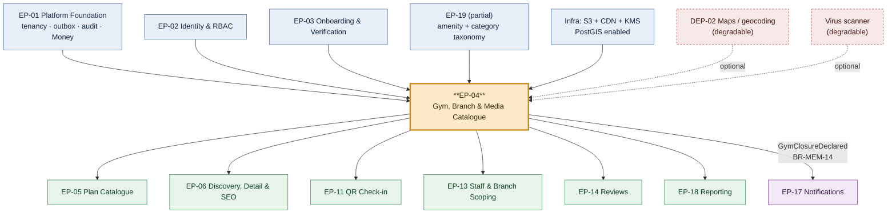

# EP-04 — Gym, Branch & Media Catalogue

> **Source of truth:** `docs/MASTER_PRD.md` §B5.4 (`GYM`), §B7 `SCR-DASH-003` / `SCR-DASH-004`, §C2.2
> `gyms` / `branches` / `branch_hours` / `branch_hour_exceptions` / `gym_amenities` / `gym_media`.
> **Detailed expansion of:** `docs/engineering/phase-0/ENGINEERING_PLAN.md` §2 (EP-04 row) and §3 (F-04.1 … F-04.12).
> **Governed by:** `docs/PROJECT_CONSTITUTION.md` §23 (DoR / DoD) — never contradicted, only extended.
> **Launch market:** India (`docs/LAUNCH_MARKET_INDIA.md`) — `Asia/Kolkata` (+05:30, no DST), INR/paise, India-only data residency.

---

## 1. Metadata

| Field | Value |
| :--- | :--- |
| **Epic id** | `EP-04` |
| **Epic name** | Gym, Branch & Media Catalogue |
| **Priority (MoSCoW)** | **M** — Must. `FR-GYM-09` (capacity) is `C` and `FR-GYM-10` / `FR-GYM-12` are `S` inside an `M` epic; see §3. |
| **Complexity** | **Moderate** per `ENGINEERING_PLAN.md` §13.1 (`catalog/`) — rich CRUD, media processing, hours-with-exceptions read on the `NFR-PERF-03` check-in path, and the material-change routing rule |
| **Size / story points** | **L / 55 points** (≈ 28 engineer-days of implementation + test + review, `§13.1`) |
| **Target sprint(s)** | **Sprint 2** (F-04.1 … F-04.11, tasks 2.8 – 2.12, 2.15, 2.21, 2.22) · **Sprint 4 carry-in** (F-04.12 freshness score feeding ranking, task 4.3) |
| **Milestone** | **M1** (Sprint 2, design system + screens approved) contributing to **M2** (Sprint 4, onboarding → live listing demonstrable end to end) |
| **Owning backend module** | `catalog/` (sole owner). Collaborates with `onboarding/` on `BR-GYM-06`, `discovery/` on projection refresh, `notifications/` on `BR-MEM-14`, `attendance/` on hours and branch entitlement |
| **Surfaces** | `dash` — `SCR-DASH-003` Gym Profile, `SCR-DASH-004` Branches, `SCR-DASH-001` activation checklist (`FR-NAV-04`) · `web` — consumes the catalogue via EP-06 (`SCR-WEB-002`, `SCR-WEB-003`) · `admin` — `SCR-ADM-012` media/description moderation queue |
| **API groups** | `API-TEN` — `/tenant/gyms`, `/tenant/gyms/:id/media`, `/tenant/branches`, `/tenant/branches/:id/hours` · `API-DISC` — `/amenities` (public reference read) |
| **Background jobs** | `gym.freshness-score` (nightly), `search.reindex` (on change + nightly), `media.process` renditions worker |
| **Feature flags** | `rel.catalog.temporary-closure`, `rel.catalog.branch-capacity-indicator`, `rel.catalog.freshness-demotion` |
| **Status** | **Ready for refinement** — Definition of Ready §23.1 items 5, 6 and 7 are satisfied by tasks T-04.01, T-04.02 and T-04.28 inside this epic (the epic explicitly includes designing its API, schema and UI-state contracts) |

---

## 2. Business Goal

EP-04 produces the artefact a stranger acts on. Everything upstream of it — identity (`EP-02`),
verification (`EP-03`) — establishes that a gym is *real*; everything downstream of it — discovery
(`EP-06`), checkout (`EP-07`) — assumes the listing is *accurate enough to buy from without
visiting*. `OBJ-01` ("digitise the end-to-end operations of an independent gym") begins here because
the gym's public identity and its physical footprint are the first records the owner ever creates
that are visible outside their own walls. `KPI-03` (median hours from signup to marketplace-visible
listing ≤ 48 h) is measured across `EP-03` and this epic jointly: an owner who cannot get photos,
hours and amenities in during one sitting does not come back the next day, and `KPI-02` (≥ 70% of
gyms publishing a plan within 7 days) collapses with it. The catalogue is therefore an
**acquisition-funnel asset**, not a CRUD screen, and it is scoped and estimated as one.

The second outcome is *trust that survives contact with reality*. `A3.4` principle 2 says never show
a price that cannot be bought; the catalogue extends that to never show a **fact** that cannot be
relied on. Operating hours with dated exceptions (`FR-GYM-04`), the gender policy including
scheduled women-only windows (`FR-GYM-05`), the geo-pin the distance filter is computed from
(`FR-GYM-06`) and the temporary-closure declaration (`FR-GYM-10`) are each a promise the platform
makes on the gym's behalf and then enforces at the door through `attendance/`. A member who travels
three kilometres at 06:00 to a gym the marketplace said was open, and finds a shutter, does not
blame the gym — they blame the platform, publish a one-star review, and request a refund. `RSK-11`
(price / stale-listing mismatch, inherent 12) is the register entry for exactly this, and
`FR-GYM-12`'s freshness score is its only structural mitigation: a listing that has not been touched
in months is demoted before it can mislead anyone, and the owner is prompted rather than silently
punished.

The third outcome is **containment of the takeover attack**. `BR-GYM-06` exists because the highest-
value exploit against a two-sided marketplace is not stealing data — it is changing where the money
goes. An attacker who reaches an owner's dashboard and edits the payout account collects the next
settlement. Routing material fields (legal name, address, geo-location, ownership, bank account) to
review while the listing stays live, and suspending payouts on a bank-account change until
re-verification, makes the takeover unprofitable without punishing the 99% of edits that are a new
photo or a corrected closing time. Getting the material/non-material split *right* — one registry,
one complement, no drift (`BR-GYM-07`) — is the single most consequential design decision in this
epic, and it is why a "Moderate" complexity rating still earns 55 points. Contributing objectives:
`OBJ-01`, `OBJ-03` (verification before visibility, sustained after approval), `OBJ-07` (every
catalogue write is tenant-scoped and RLS-proven). Contributing KPIs: `KPI-02`, `KPI-03`, `KPI-05`
(weekly active dashboard usage — the profile screen is the most-visited non-transactional screen in
`dash`), and indirectly `KPI-09` through listing completeness as a ranking component.

---

## 3. Scope

### 3.1 In scope — explicit

| # | Item | Requirement |
| :-: | :--- | :--- |
| 1 | Gym profile record: name, canonical slug unique per city, sanitised rich-text description, category, established year, contact, website, social links | `FR-GYM-01`, `FR-NAV-05` |
| 2 | Automated content screening of description and media captions for profanity, phone numbers, email addresses and URLs before publish | `BR-GYM-07`, `FR-ADMN-12` |
| 3 | Photo gallery: upload, drag-ordering, cover selection, captions, server-side rendition generation, EXIF stripping, content-type inspection, virus scan, CDN delivery from a separate origin | `FR-GYM-02`, `NFR-SEC-10`, A-17 (Sharp), A-18 (S3 SDK) |
| 4 | Amenity assignment from platform-managed taxonomy; free text structurally impossible | `FR-GYM-03`, `NFR-DQ-06` |
| 5 | Operating hours: multiple windows per weekday per branch, plus dated exceptions (closed / altered) with a reason | `FR-GYM-04`, `BR-CHK-05` |
| 6 | Gender policy: `MIXED`, `WOMEN_ONLY`, `MEN_ONLY`, `SCHEDULED` with reserved hour windows | `FR-GYM-05` |
| 7 | Location: structured address, `geography(Point,4326)` coordinates, manual pin adjustment, landmark text, parking note | `FR-GYM-06`, `BR-GYM-08` |
| 8 | Branch lifecycle: create, edit, activate, deactivate; per-branch address, hours, photos, capacity, staff assignment surface | `FR-GYM-07`, `BR-TEN-03` |
| 9 | Branch-level plan access: `plan_branches` rows, absence meaning all branches | `FR-GYM-08`, `BR-TEN-03`, `BR-CHK-03` |
| 10 | Capacity declaration per branch and the crowd indicator it feeds | `FR-GYM-09` (`C`) |
| 11 | Temporary closure: reason, date range, member notification, search demotion beyond a configurable consecutive-day threshold | `FR-GYM-10` (`S`), `BR-MEM-14` |
| 12 | Material-change routing with **pre-save** disclosure of the consequence; `pending_field_reviews`; payout-account change suspending payouts | `FR-GYM-11`, `BR-GYM-06`, `BR-GYM-07` |
| 13 | Listing freshness score (0–100) from last profile update, last plan update, photo age and check-in recency; nightly recompute; ranking demotion; owner prompt | `FR-GYM-12` (`S`), `RSK-11` |
| 14 | Persistent activation checklist in `dash` until `APPROVED` with ≥ 1 published plan | `FR-NAV-04` |
| 15 | Outbox events that invalidate the discovery projection within the 60-second staleness budget | `BAC-02`, `TR-30` |
| 16 | RLS policies, isolation specs and audit coverage for every table this epic creates | `BR-TEN-01`, `BR-DAT-01`, `BAC-10` |

### 3.2 Out of scope — explicit, with destination

| Item | Where it went instead | Why |
| :--- | :--- | :--- |
| The six-step onboarding wizard that first collects this data | **EP-03** (`FR-ONB-01` … `FR-ONB-07`, `SCR-DASH-002`) | The wizard is a *capture* surface over the same aggregate; EP-04 owns the aggregate and the steady-state editor |
| Human approval of a gym and the reviewer console | **EP-03** (`BR-GYM-02`, `BR-GYM-03`, `SCR-ADM-002`, `SCR-ADM-003`) | Approval is a judgement, not a catalogue operation |
| Geo/address pre-check, duplicate-address probe, KYC document handling | **EP-03** (`FR-ONB-12`, `BR-GYM-08`, `BR-GYM-09`, `BR-DAT-07`) | These run at *submission*, against the application snapshot, not against the live gym |
| Search ranking, the projection query itself, city and category pages | **EP-06** (`FR-SRCH-10`, `FR-SRCH-13`) | EP-04 emits the invalidation event and the `freshness_score`; EP-06 consumes them |
| Plan attributes, pricing, promotions, publish/archive | **EP-05** (`FR-PLAN-01` … `FR-PLAN-09`) | `plan_branches` is the one shared table; EP-04 owns the branch side, EP-05 the plan side |
| Amenity taxonomy **administration** (create/rename/merge amenity terms, category tree) | **EP-19** (`FR-ADMN-12`, `SCR-ADM-011`) | Reference data is platform-managed; EP-04 only consumes stable identifiers |
| Media **moderation decisions** and the moderation queue UI | **EP-19** (`SCR-ADM-012`) | EP-04 sets `gym_media.moderation_status` and gates display on it; the queue that resolves it is admin |
| Staff assignment to branches, seat limits, branch scoping of dashboards | **EP-13** (`FR-STAF-*`) | EP-04 exposes the branch as an assignable target only |
| Check-in evaluation of hours, access windows and branch entitlement | **EP-11** (`FR-CHK-04` steps 5–7) | EP-04 owns the *data shape* and the value objects; `attendance/` owns the decision |
| Closure notification content, channels, quiet hours, DLT template registration | **EP-17** (`FR-NOTF-*`, `BR-MEM-14`) | EP-04 raises the domain event; `notifications/` decides how it is delivered |
| Class booking / capacity enforcement at the door | **Phase 2** (`A11`) | `FR-GYM-09` declares capacity for indication only; capacity has never gated entry |
| Multi-language gym descriptions | **Phase 2** (`A11`) | `NFR-USE-08` externalises *product* strings, not tenant content |

---

## 4. Features

Points sum to the epic's 55. Sprint column follows `SprintPlanning.md` Sprint 2 and Sprint 4.

| Feature | Description | Satisfies | Pri | Pts | Sprint |
| :--- | :--- | :--- | :-: | :-: | :-: |
| **F-04.1** | Gym profile aggregate with sanitised rich text, canonical city-unique slug, category, established year, contact and social links | `FR-GYM-01`, `FR-NAV-05`, `BR-GYM-07` | M | 5 | 2 |
| **F-04.2** | Media pipeline: multipart upload, content-inspection type validation, virus scan, **EXIF stripping**, Sharp renditions (`thumb` 320w, `card` 640w, `hero` 1280w, `lightbox` 2048w, AVIF+WebP+JPEG), drag-ordering, cover selection, captions, CDN keys | `FR-GYM-02`, `NFR-SEC-10`, A-17, A-18 | M | 8 | 2 |
| **F-04.3** | Amenity selection from platform taxonomy with synonym support for search; free text refused at the pipe | `FR-GYM-03`, `NFR-DQ-06`, `BR-GYM-07` | M | 3 | 2 |
| **F-04.4** | Operating hours: N windows per weekday per branch, dated exceptions with reason, one `OperatingHours` value object evaluated in `Asia/Kolkata` | `FR-GYM-04`, `BR-CHK-05` | M | 8 | 2 |
| **F-04.5** | Gender policy with `SCHEDULED` reserved windows rendered on detail and enforced at check-in | `FR-GYM-05` | M | 3 | 2 |
| **F-04.6** | Location: structured address, PostGIS point, map-pin adjustment, landmark, parking note, GiST index | `FR-GYM-06`, `BR-GYM-08` | M | 5 | 2 |
| **F-04.7** | Branch CRUD with per-branch address, hours, photos, capacity; deactivation guarded by active-membership and future-order counts | `FR-GYM-07`, `BR-TEN-03` | M | 5 | 2 |
| **F-04.8** | Branch-level plan access: `plan_branches` composite-FK rows, `PlanBranchEntitlement` value object, "all branches" as absence of rows | `FR-GYM-08`, `BR-TEN-03`, `BR-CHK-03` | M | 3 | 2 |
| **F-04.9** | Capacity declaration per branch and the crowd indicator it feeds on `SCR-WEB-003` and `SCR-DASH-001` | `FR-GYM-09` | **C** | 2 | 2 |
| **F-04.10** | Temporary closure: reason, date range, automatic member notification, `GYM_CLOSED_EXCEPTION` denial reason, search demotion past the threshold | `FR-GYM-10`, `BR-MEM-14`, `§C4.8` | **S** | 5 | 2 |
| **F-04.11** | Material-change routing: `MaterialFieldRegistry`, `pending_field_reviews`, pre-save consequence disclosure, payout-account suspension | `FR-GYM-11`, `BR-GYM-06`, `BR-GYM-07` | M | 5 | 2 |
| **F-04.12** | Listing freshness score, nightly `gym.freshness-score` job, ranking demotion behind `rel.catalog.freshness-demotion`, owner prompt | `FR-GYM-12`, `FR-SRCH-10`, `RSK-11` | **S** | 3 | 4 |
| | **Total** | | | **55** | |

**Descope order.** `FR-GYM-09` (F-04.9) is on the pre-agreed descope list in `ENGINEERING_PLAN.md`
§13.3 and is the first item to go if Sprint 2 over-runs. `F-04.10` and `F-04.12` are `S` and each
ships behind a flag that is safe in the OFF position, so they may slip to Sprint 4 without changing
the Sprint 2 exit checklist. Nothing marked `M` in this table is descopable — `BAC-14` forbids it.

---

## 5. User Stories

Stories `US-GYM-01` and `US-GYM-02` are restated verbatim from `MASTER_PRD.md` §B5.4 with their
`AC-` identifiers unchanged. Stories `US-GYM-03` … `US-GYM-09` are **new**: the PRD's functional
requirements imply them but §B5.4 did not write them. New acceptance criteria are numbered inside
the new story's namespace and are marked **(NEW)** so that traceability against the PRD stays
honest.

### US-GYM-01 *(PRD)*

> *As an owner with two branches, I want members to buy a plan that works at both so that I don't
> have to sell twice.*

| AC | Given / When / Then |
| :--- | :--- |
| **AC-GYM-01.1** | **Given** I have two active branches, **when** I create a plan, **then** the editor requires me to choose "all branches" or an explicit named subset, and neither option is a silent default |
| **AC-GYM-01.2** | **Given** a member holds an all-branch plan (no `plan_branches` rows), **when** they check in at either branch, **then** check-in succeeds at both |
| **AC-GYM-01.3** | **Given** a member holds a branch-restricted plan, **when** they attempt check-in at an excluded branch, **then** check-in is denied with `WRONG_BRANCH`, the member-facing reason reads "not valid at this branch", and staff sees the list of branches at which it *is* valid |

### US-GYM-02 *(PRD)*

> *As an owner, I want to close for a festival without members thinking I've shut down.*

| AC | Given / When / Then |
| :--- | :--- |
| **AC-GYM-02.1** | **Given** I declare a closure for a date range with a reason, **when** a member views the gym detail page or their membership, **then** the closure dates and the reason are visible on both |
| **AC-GYM-02.2** | **Given** a closure is active, **when** a member attempts check-in, **then** it is denied with `GYM_CLOSED_EXCEPTION` carrying the closure reason, not a generic `OUTSIDE_OPERATING_HOURS` |
| **AC-GYM-02.3** | **Given** a closure exceeds the configurable consecutive-day threshold (default 7, `Asia/Kolkata` calendar days), **when** it is declared, **then** affected members are notified automatically within 24 h (`BR-MEM-14`) and the gym is temporarily demoted — not removed — in search |

### US-GYM-03 — Photo gallery *(NEW — implied by `FR-GYM-02`, `SCR-DASH-003`)*

> *As Rohan, I want to upload twelve photos from my phone, put the best one first, and know that the
> location metadata in them is not published.*

| AC | Given / When / Then |
| :--- | :--- |
| **AC-GYM-03.1** **(NEW)** | **Given** I upload a JPEG containing GPS EXIF tags, **when** processing completes, **then** every stored rendition and the original-size derivative contain **no** EXIF block, verified by reading the stored object, not by trusting the library |
| **AC-GYM-03.2** **(NEW)** | **Given** I drag photo #7 to position #1, **when** I release, **then** the new order persists optimistically, is confirmed by the server, and the same order renders on `SCR-WEB-003` after the next projection refresh |
| **AC-GYM-03.3** **(NEW)** | **Given** I mark a photo as cover, **when** I mark a different one as cover, **then** exactly one photo carries `is_cover = true` — enforced by a partial unique index, not by the UI |
| **AC-GYM-03.4** **(NEW)** | **Given** I upload a file whose extension is `.jpg` but whose magic bytes are a PDF, **when** the request is processed, **then** it is refused with `UNSUPPORTED_MEDIA_TYPE` before any decode is attempted (`NFR-SEC-10`, `TR-40`) |
| **AC-GYM-03.5** **(NEW)** | **Given** a photo is awaiting moderation, **when** the gym detail page renders, **then** that photo is absent from the public gallery while remaining visible to the owner with a "pending review" marker |

### US-GYM-04 — Amenities that actually filter *(NEW — implied by `FR-GYM-03`, `NFR-DQ-06`)*

> *As Priya, I want "steam room" to mean the same thing at every gym so that the filter is worth
> using.*

| AC | Given / When / Then |
| :--- | :--- |
| **AC-GYM-04.1** **(NEW)** | **Given** I am editing amenities, **when** I search the picker, **then** results come from the platform taxonomy including synonyms, and there is no path — API, form or import — to submit an amenity string that is not a taxonomy id |
| **AC-GYM-04.2** **(NEW)** | **Given** the platform renames an amenity term, **when** the change is published, **then** every gym referencing it renders the new label with no tenant action, because the reference is by stable identifier (`NFR-DQ-06`) |
| **AC-GYM-04.3** **(NEW)** | **Given** I select twelve amenities, **when** the result card renders on `SCR-WEB-002`, **then** exactly the top three by platform-defined display priority appear, and the detail page shows all twelve grouped by amenity category |

### US-GYM-05 — Split hours and a dated exception *(NEW — implied by `FR-GYM-04`, `BR-CHK-05`)*

> *As Rohan, I want to show that we close 14:00–16:00 on weekdays and are shut on Independence Day,
> without anyone having to phone us.*

| AC | Given / When / Then |
| :--- | :--- |
| **AC-GYM-05.1** **(NEW)** | **Given** a weekday with windows 06:00–14:00 and 16:00–22:00, **when** the detail page renders the timings table, **then** both windows appear on one row and the "open now" pill is computed against the union of them in `Asia/Kolkata` |
| **AC-GYM-05.2** **(NEW)** | **Given** a window crossing midnight (22:00–02:00), **when** hours are evaluated at 00:30, **then** the branch is open, and the evaluation does not depend on the server's local timezone (`TR-07`, `TR-24`) |
| **AC-GYM-05.3** **(NEW)** | **Given** a dated exception marks 15 August as closed with reason "Independence Day", **when** the marketplace renders on 15 August, **then** the gym shows "Closed today — Independence Day", and check-in on that date is denied with the exception reason |
| **AC-GYM-05.4** **(NEW)** | **Given** an exception and a regular window disagree, **when** hours are evaluated, **then** the exception wins, always, with no ambiguity in the resolution order |
| **AC-GYM-05.5** **(NEW)** | **Given** hours are evaluated on the check-in path, **when** 500 check-ins/minute are running (`NFR-PERF-08`), **then** evaluation adds no database round-trip beyond the branch row already loaded, because the hours are resolved from a cached per-branch structure |

### US-GYM-06 — Material change disclosed before saving *(NEW — implied by `FR-GYM-11`, `BR-GYM-06`)*

> *As Rohan, I want to be told **before** I hit save that changing my address will put my listing
> back under review, so that I can decide whether to do it now.*

| AC | Given / When / Then |
| :--- | :--- |
| **AC-GYM-06.1** **(NEW)** | **Given** I edit the address field, **when** I attempt to save, **then** a confirmation states specifically that the address field enters review, that the listing stays live at the currently approved coordinates, and roughly how long review takes — shown **before** the write, never after |
| **AC-GYM-06.2** **(NEW)** | **Given** the address change is submitted, **when** search runs, **then** the gym still appears at its **old approved** coordinates until the field review is decided (`BR-GYM-06-P1`) |
| **AC-GYM-06.3** **(NEW)** | **Given** I change the payout bank account, **when** the change is saved, **then** payouts are suspended, the next `settlement.build-batches` run holds the balance with reason `PAYOUT_ACCOUNT_UNVERIFIED`, and the owner is notified on every enabled channel |
| **AC-GYM-06.4** **(NEW)** | **Given** a support agent is impersonating the owner, **when** they attempt the bank-account change, **then** it is refused as a `@FinancialMutation()` (`AC-AUTH-03.2`, `SEC-A01-007`) |
| **AC-GYM-06.5** **(NEW)** | **Given** I change a photo, a description, an amenity or a timing, **when** I save, **then** it publishes immediately with no review step, subject only to automated screening (`BR-GYM-07`) |

### US-GYM-07 — The staleness prompt *(NEW — implied by `FR-GYM-12`, `RSK-11`)*

> *As Rohan, I want a nudge before my listing quietly stops getting traffic.*

| AC | Given / When / Then |
| :--- | :--- |
| **AC-GYM-07.1** **(NEW)** | **Given** my gym's `freshness_score` falls below the configured threshold, **when** I next open `dash`, **then** a prompt names the specific stale inputs — "no new photo in 11 months", "plan prices unchanged since March" — not a generic score |
| **AC-GYM-07.2** **(NEW)** | **Given** `rel.catalog.freshness-demotion` is OFF, **when** search ranks results, **then** `freshness_score` contributes exactly zero weight while the owner prompt still renders |
| **AC-GYM-07.3** **(NEW)** | **Given** I update my photos, **when** the nightly `gym.freshness-score` job next runs, **then** the score rises and any demotion is lifted within one reindex cycle |

### US-GYM-08 — Women-only hours *(NEW — implied by `FR-GYM-05`)*

> *As a women-only-hours gym, I want the marketplace to state exactly when those hours are, so that I
> stop turning people away at the door.*

| AC | Given / When / Then |
| :--- | :--- |
| **AC-GYM-08.1** **(NEW)** | **Given** gender policy `SCHEDULED` with women-only 10:00–13:00 on weekdays, **when** the detail page renders, **then** the policy and its exact windows are stated in the gender-policy region, not buried in the description |
| **AC-GYM-08.2** **(NEW)** | **Given** the same configuration, **when** a male member checks in at 11:00 on a Tuesday, **then** check-in is denied with the scheduled-policy reason and the next permitted time is shown to staff |
| **AC-GYM-08.3** **(NEW)** | **Given** the gender filter is applied on `SCR-WEB-002`, **when** a visitor filters "women-only", **then** both `WOMEN_ONLY` and `SCHEDULED` gyms appear, with `SCHEDULED` ones labelled as having reserved hours |

### US-GYM-09 — Branch deactivation without collateral damage *(NEW — implied by `FR-GYM-07`)*

> *As an owner closing one location, I want to deactivate it without breaking the memberships of the
> people who use my other one.*

| AC | Given / When / Then |
| :--- | :--- |
| **AC-GYM-09.1** **(NEW)** | **Given** a branch with 34 active memberships whose plans permit only that branch, **when** I attempt deactivation, **then** the confirmation states the exact affected count (`NFR-USE-06`) and requires an explicit reason |
| **AC-GYM-09.2** **(NEW)** | **Given** the branch is deactivated, **when** search runs, **then** that branch's location no longer contributes to radius matching, while gyms with another active branch remain listed |
| **AC-GYM-09.3** **(NEW)** | **Given** the branch was the gym's only active branch, **when** deactivation is attempted, **then** it is refused with `LAST_ACTIVE_BRANCH` and the owner is directed to the closure or tenant-closure flow instead |
| **AC-GYM-09.4** **(NEW)** | **Given** the branch is deactivated, **when** historical attendance and settlement records are read, **then** they still resolve the branch name and address — deactivation is a status change, never a delete (`NFR-DQ-04`) |

---

## 6. Acceptance Criteria for the Epic

The epic is **not done** until every numbered item below passes. Each is testable as written
(`PROJECT_CONSTITUTION.md` §23.1 item 2) and each names the evidence that proves it.

| # | Criterion | Evidence |
| :-: | :--- | :--- |
| **EAC-04.01** | A gym profile can be created, edited and read through `API-TEN` with every `FR-GYM-01` attribute round-tripping unchanged, including a rich-text description that survives sanitisation without losing legitimate formatting | Integration test + contract test against the generated OpenAPI document |
| **EAC-04.02** | The slug is canonical, human-readable, stable and unique per city; changing the gym name does **not** change an already-published slug without an explicit action that also emits a 301 mapping | `FR-NAV-05` unit + integration test |
| **EAC-04.03** | A description containing a phone number, an email address or a URL is held by screening and does not publish | `BR-GYM-07-N1` negative test |
| **EAC-04.04** | A free-text amenity is refused at the validation pipe with `400`, on every entry path including bulk edit | `BR-GYM-07-N2` negative test |
| **EAC-04.05** | Every uploaded image is type-validated by content inspection, size-limited, virus-scanned, EXIF-stripped and served from the CDN origin; a stored object is read back and asserted to contain no EXIF | `NFR-SEC-10` test, asserted on bytes |
| **EAC-04.06** | All four renditions in all three formats are produced for every accepted upload, and a failed rendition marks the media row degraded rather than losing the original | Worker integration test |
| **EAC-04.07** | Exactly one photo per gym carries `is_cover = true`, enforced by a partial unique index, proven by a concurrent double-set attempt | DB constraint test |
| **EAC-04.08** | Operating hours support ≥ 2 windows per weekday and dated exceptions; exception beats regular window; a midnight-crossing window evaluates correctly at 00:30 IST | Property-based unit tests over boundary instants (`TR-07`, `TR-24`) |
| **EAC-04.09** | Hours evaluation on the check-in path adds no additional database round-trip and is covered by the `NFR-PERF-03` budget | k6 profile + span assertion |
| **EAC-04.10** | Gender policy `SCHEDULED` renders its exact windows on `SCR-WEB-003` and produces a specific denial reason at check-in | E2E + `attendance/` contract test |
| **EAC-04.11** | Branch location is stored as `geography(Point,4326)` with a GiST index; `EXPLAIN` on the radius query shows an index scan | `EXPLAIN` baseline committed to CI (`TR-06` mitigation) |
| **EAC-04.12** | A plan with **no** `plan_branches` rows admits at every active branch; a plan with one row admits only there; the excluded branch denial names the valid branches | `BR-TEN-03-P1`, `BR-TEN-03-N1` |
| **EAC-04.13** | Deactivating the last active branch is refused; deactivating a non-last branch states the exact affected-membership count before proceeding | `AC-GYM-09.1`, `AC-GYM-09.3` |
| **EAC-04.14** | A temporary closure is visible on the gym page and on the member's membership, denies check-in with its own reason, and notifies affected members within 24 h when it exceeds the threshold | `AC-GYM-02.1` … `02.3`, `BR-MEM-14` |
| **EAC-04.15** | Changing address or geo-location places **that field** in review while the listing stays live at the approved coordinates | `BR-GYM-06-P1` |
| **EAC-04.16** | Changing the payout account suspends payouts and holds the next settlement batch with `PAYOUT_ACCOUNT_UNVERIFIED` | `BR-GYM-06-P2`, `BR-GYM-06-N1` |
| **EAC-04.17** | The material-change consequence is disclosed **before** the write; a test asserts the confirmation payload precedes the mutation, not merely that a banner exists | `FR-GYM-11` UI + API test |
| **EAC-04.18** | The material and non-material sets are complements of one `MaterialFieldRegistry`; a CI test enumerates every editable gym field and asserts each resolves to exactly one route | `BR-GYM-06` / `BR-GYM-07` drift test |
| **EAC-04.19** | Every non-material change publishes and appears in search within one reindex cycle, inside the 60-second staleness budget | `BR-GYM-07-P1`, `BAC-02`, `TR-30` |
| **EAC-04.20** | `gym.freshness-score` runs nightly, recomputes from the four documented inputs, and its ranking weight is zero when `rel.catalog.freshness-demotion` is OFF | Job test + flag matrix test |
| **EAC-04.21** | Every catalogue table is tenant-scoped with an RLS policy, and an isolation spec exists for **every** endpoint this epic adds — the build fails without them | `BAC-10`, `E2E-11`, constitution DoD item 16 |
| **EAC-04.22** | Every gym, branch, media and hours mutation writes an append-only `audit_log` row with before/after state and actor | `BR-DAT-01`, `BAC-13` |
| **EAC-04.23** | `SCR-DASH-003` and `SCR-DASH-004` are axe-core clean and fully keyboard operable, including the drag-order gallery which exposes a keyboard reorder alternative | `NFR-USE-01`, `NFR-USE-02` |
| **EAC-04.24** | Dashboard list views for branches and media return p95 ≤ 800 ms at 50 rows | `NFR-PERF-04` |
| **EAC-04.25** | Every user-facing string in this epic is externalised and every error states what happened, why and what to do next | `NFR-USE-05`, `NFR-USE-08` |
| **EAC-04.26** | No personal data appears in any catalogue log line, error trace or analytics event | `BR-DAT-06`, Pino redaction test |

---

## 7. Business Rules Enforced

Detail lives in `docs/engineering/BusinessRules.md` and is **not duplicated here**. This table names
the rules EP-04 owns or participates in, the enforcement point inside this epic, and the test ids
that must pass before the epic closes.

| BR | Ownership | Enforcement point inside EP-04 | Tests |
| :--- | :--- | :--- | :--- |
| **`BR-TEN-03`** | **Owned** (`catalog/`) | `plan_branches` composite FK carrying `tenant_id`; **absence of rows = all branches**; `PlanBranchEntitlement` value object is the only construct `attendance/` consults | `BR-TEN-03-P1`, `BR-TEN-03-N1` |
| **`BR-GYM-06`** | **Co-owned** with `onboarding/` | `MaterialFieldRegistry` + `Gym.applyChange()` routing to `IMMEDIATE` / `FIELD_REVIEW` / `PAYOUTS_SUSPENDED`; `pending_field_reviews` keyed `(gym_id, field_name)`; pre-save disclosure in `SCR-DASH-003` | `BR-GYM-06-P1`, `BR-GYM-06-P2`, `BR-GYM-06-N1`, `BR-GYM-06-N2` |
| **`BR-GYM-07`** | **Owned** (`catalog/`) | The **complement** of `MaterialFieldRegistry` — computed, never a second list; automated screening before publish; `gym_media.moderation_status` gates display; amenity taxonomy with no free text | `BR-GYM-07-P1`, `BR-GYM-07-N1`, `BR-GYM-07-N2` |
| **`BR-GYM-01`** | **Participates** (owner: `catalog/` + `discovery/`) | EP-04 emits the outbox event on every publishable change so the `PublicVisibilityPredicate` in EP-06 sees fresh data within 60 s; EP-04 never renders a public surface itself | `BR-GYM-01-P1` (shared with EP-06) |
| **`BR-TEN-05`** | **Participates** (owner: `tenancy/` + `discovery/`) | Suspension propagates through the same projection-invalidation path this epic builds; check-in deliberately does **not** consult tenant status | `BR-TEN-05-P1` |
| **`BR-CHK-03`** | **Participates** (owner: `attendance/`) | EP-04 supplies the branch entitlement value object and the branch-name list rendered in the denial | `BR-TEN-03-N1`, `BR-CHK-03-*` |
| **`BR-CHK-05`** | **Participates** (owner: `attendance/`) | EP-04 supplies `OperatingHours` (windows + exceptions) as the single evaluation source; the 24-hour-access override is a plan attribute owned by EP-05 | `BR-CHK-05-*` |
| **`BR-MEM-14`** | **Participates** (owner: `memberships/` + `notifications/` + `refunds/`) | `GymClosureDeclared` domain event carrying gym, branch set, range and reason; EP-17 owns delivery inside 24 h | `BR-MEM-14-P1` |
| **`BR-GYM-08`** | **Consumes** (owner: `onboarding/`) | EP-04 stores the pin the pre-check measures against and refuses a pin edit that would move the gym beyond tolerance without routing through `FIELD_REVIEW` | `BR-GYM-08-N1` |
| **`BR-TEN-01`** | **Inherits** (owner: `tenancy/`) | Every table added by this epic carries `tenant_id`, an RLS policy, and an isolation spec per endpoint | `BAC-10`, `E2E-11` |
| **`BR-DAT-01`** | **Inherits** (owner: `audit/`) | Gym, branch, media and hours are audited entity types; before/after captured on every field change including non-material ones | `BAC-13` |
| **`BR-DAT-06`** | **Inherits** | Owner contact details are never a log field or an analytics property; Pino redaction paths configured for `catalog/` | `BR-DAT-06-N1` |

**Rules explicitly *not* owned here, to prevent double-enforcement:** `BR-GYM-02` … `BR-GYM-05` and
`BR-GYM-09` belong to `onboarding/` (EP-03); `BR-PLN-*` belong to `plans/` (EP-05); `BR-CHK-01`,
`BR-CHK-04`, `BR-CHK-10` belong to `attendance/` (EP-11).

---

## 8. Dependencies

### 8.1 Upstream — must exist before EP-04 starts

| Dependency | From | What EP-04 needs from it |
| :--- | :--- | :--- |
| **EP-01** Platform Foundation, Tenancy & Isolation | Sprint 0 | The Prisma tenant-context extension, `SET LOCAL app.tenant_id` inside every transaction, the RLS policy template, the transactional outbox (`ADR-0017`), `Money`, the error registry, the audit writer, the shared Zod package |
| **EP-02** Identity, Sessions & RBAC | Sprint 1 | `GYM_OWNER` / `GYM_MANAGER` roles, `@RequiredPermission()` on every endpoint (`FR-RBAC-01`), impersonation token type so `@FinancialMutation()` can refuse it |
| **EP-03** Tenant Onboarding & Verification | Sprint 2 (parallel) | The `tenants` row and its `country_code` / `timezone` / `currency`; the gym record created by wizard step 3; `applications.precheck_results` for the geo tolerance EP-04 must not violate on later edits |
| **EP-19** (partial, pulled forward) | Sprint 0–2 | The amenity and category **taxonomy tables** as platform reference data with stable ids (`NFR-DQ-06`); the moderation queue's `gym_media.moderation_status` enum |
| **Infrastructure** | Sprint 0–2 | S3-compatible buckets with media public-read via CDN, KMS keys, access logging (Sprint 2 task 2.22); PostGIS extension enabled on PostgreSQL 16 |

### 8.2 Downstream — what EP-04 unblocks

| Unblocks | Why it cannot proceed without EP-04 |
| :--- | :--- |
| **EP-05** Plan Catalogue | `plan_branches` needs branches to exist; the plan editor's branch selector is EP-04 data |
| **EP-06** Marketplace Discovery | Radius search needs `branches.location`; the result card needs cover photo, amenities, hours and rating; the ranking formula needs `freshness_score` and profile completeness |
| **EP-11** QR Check-in | `FR-CHK-04` steps 5–7 evaluate operating hours, closures and branch entitlement — all EP-04 constructs |
| **EP-13** Staff & Branch Scoping | Staff are scoped to branches; the branch must be a first-class assignable entity first |
| **EP-14** Reviews | Reviews attach to a gym and render inside the detail page regions defined against this catalogue |
| **EP-18** Reporting | Attendance and revenue reports group by branch |
| **Marketing / SEO** | City landing pages and the sitemap are generated from approved gyms with resolvable locations |

### 8.3 External dependencies and open questions

| Type | Item | Impact if late |
| :--- | :--- | :--- |
| **Vendor** | `DEP-02` maps / geocoding provider — used for the pin-adjustment map and reverse geocoding of the landmark field | Pin adjustment degrades to manual lat/lng entry; **distance is unaffected** because it comes from PostGIS, per `ops.discovery.map-provider` |
| **Vendor** | Virus-scanning service for uploads (`NFR-SEC-10`) | Uploads queue in `PENDING_SCAN` rather than publishing; the gallery shows the owner a pending state |
| **Client decision** | Amenity taxonomy content — the actual list of amenity terms and their display priority for the top-three card slots | Search filters ship with a placeholder taxonomy; retrofitting terms is cheap, retrofitting *ids* is not, so the id scheme is fixed in Sprint 2 regardless |
| **Client decision** | Category tree for `SCR-WEB-001` category tiles (24-hour, women-only, budget, premium, CrossFit, yoga) | Category landing pages in EP-06 are blocked, not EP-04 |
| **`OQ-16`** | Data residency — **answered**: India region, mandatory. Media and CDN origin must be India-region | A non-India bucket is a compliance defect, not a performance one |
| **`OQ-12`** | Featured listings at launch — **answered**: yes, manually sold with an automated slot. `gyms.featured_until` is an EP-04 column consumed by EP-06 ranking | Column ships regardless; ranking weight is EP-06's problem |
| **`OQ-NEW-04.1`** | The consecutive-day closure threshold that triggers notification and demotion — default **7 days** proposed | Adopt the default and record it (`§23.1` item 10) |
| **`OQ-NEW-04.2`** | The `freshness_score` demotion threshold and the four input weights | Adopt a documented default; the flag keeps the risk at zero while OFF |
| **`OQ-NEW-04.3`** | Maximum photos per gym and per branch (proposed 30 / 15) and maximum upload size (proposed 12 MB) | Needed before the Sharp worker's resource envelope is set (`TR-40`) |

### 8.4 Dependency graph

---

## 9. Technical Tasks

Layers: **DB** · **API** · **worker** · **web** (`customer-web`) · **dash** (`gym-dashboard`) ·
**admin** (`admin-dashboard`) · **infra** · **test** · **docs**. Estimates are engineer-days (ed).

| # | Task | Layer | ed | Depends on | Serves |
| :--- | :--- | :--- | :-: | :--- | :--- |
| **T-04.01** | Author `/docs/apis/api-ten-catalog.md`: 11 endpoints with permission, Zod request/response, error codes, idempotency and rate class | docs | 1.0 | EP-01 | `§23.1`#5, `FR-RBAC-01` |
| **T-04.02** | Author `/docs/database/catalog.md`: `gyms`, `branches`, `branch_hours`, `branch_hour_exceptions`, `gym_amenities`, `gym_media`, `gym_closures`, `pending_field_reviews` — columns, indexes, constraints, RLS, retention | docs | 1.0 | EP-01 | `§23.1`#6, `NFR-DQ-01` |
| **T-04.03** | Prisma migration: `gyms` + `branches` with `geography(Point,4326)`, GiST index, `(city, status)` index, `(status, rating_avg DESC, freshness_score DESC)` partial index `WHERE status='APPROVED'` | DB | 1.0 | T-04.02 | `FR-GYM-01`, `FR-GYM-06`, `C2.4`, `TR-06` |
| **T-04.04** | Prisma migration: `branch_hours`, `branch_hour_exceptions`, `gym_amenities`, `gym_media` with partial unique index on `(gym_id) WHERE is_cover`, `gym_closures`, `pending_field_reviews` unique `(gym_id, field_name)` | DB | 1.0 | T-04.03 | `FR-GYM-02`, `FR-GYM-04`, `FR-GYM-10`, `BR-GYM-06` |
| **T-04.05** | RLS policies + `tenant_id` on every new table; isolation policy template applied; migration runs `CREATE INDEX CONCURRENTLY` and `ADD CONSTRAINT … NOT VALID` per `TR-29` | DB | 0.5 | T-04.04 | `BR-TEN-01`, `NFR-SEC-09`, `TR-29` |
| **T-04.06** | `Gym` aggregate: attributes, invariants, `applyChange()` routing entry point, slug generation and stability rule | API | 1.0 | T-04.03 | `FR-GYM-01`, `FR-NAV-05` |
| **T-04.07** | HTML sanitisation of the description (allow-list tags, no attributes beyond `href` with scheme allow-list) + automated content screening for phone/email/URL/profanity | API | 1.0 | T-04.06 | `BR-GYM-07`, `NFR-SEC-05`, `FR-ADMN-12` |
| **T-04.08** | Canonical slug service: transliteration, city scoping, uniqueness, immutability after first publish, 301 alias table on deliberate change | API | 0.5 | T-04.06 | `FR-NAV-05` |
| **T-04.09** | `MaterialFieldRegistry` + `Gym.applyChange()` routing to `IMMEDIATE` / `FIELD_REVIEW` / `PAYOUTS_SUSPENDED`; `pending_field_reviews` writer; drift test enumerating every editable field | API | 1.5 | T-04.06 | `FR-GYM-11`, `BR-GYM-06`, `BR-GYM-07` |
| **T-04.10** | `@FinancialMutation()` on the payout-account path so impersonation is refused; payout suspension signal consumed by `settlements/` | API | 0.5 | T-04.09, EP-02 | `BR-GYM-06`, `AC-AUTH-03.2` |
| **T-04.11** | Amenity assignment endpoint reading platform taxonomy; `.strict()` Zod schema making a free-text amenity a `400`; synonym table exposed to EP-06 | API | 0.5 | EP-19 partial | `FR-GYM-03`, `NFR-DQ-06` |
| **T-04.12** | `OperatingHours` value object: N windows/weekday, midnight-crossing, dated exceptions, exception-wins resolution, explicit IANA timezone argument, no implicit server TZ | API | 1.5 | T-04.04 | `FR-GYM-04`, `BR-CHK-05`, `TR-07`, `TR-24` |
| **T-04.13** | Per-branch hours cache structure (Redis, invalidated by outbox) so check-in adds no round-trip | API | 0.5 | T-04.12 | `NFR-PERF-03`, `NFR-PERF-08` |
| **T-04.14** | `GenderPolicy` value object incl. `SCHEDULED` windows; denial-reason contribution exported to `attendance/` | API | 0.5 | T-04.12 | `FR-GYM-05` |
| **T-04.15** | Branch CRUD use cases; deactivation guard (`LAST_ACTIVE_BRANCH`, affected-membership count, required reason); `is_primary` invariant | API | 1.0 | T-04.03 | `FR-GYM-07`, `NFR-USE-06` |
| **T-04.16** | `PlanBranchEntitlement` value object + `plan_branches` write path with composite tenant-carrying FK; refusal to link a branch of another gym | API | 0.5 | T-04.15 | `FR-GYM-08`, `BR-TEN-03` |
| **T-04.17** | Capacity field + crowd-indicator projection, gated by `rel.catalog.branch-capacity-indicator` | API | 0.5 | T-04.15 | `FR-GYM-09` |
| **T-04.18** | Temporary closure use case: range validation in `Asia/Kolkata`, overlap refusal, `GymClosureDeclared` outbox event, `GYM_CLOSED_EXCEPTION` reason export, demotion signal past the threshold | API | 1.0 | T-04.12 | `FR-GYM-10`, `BR-MEM-14`, `§C4.8` |
| **T-04.19** | Media upload endpoint: presigned direct-to-S3 flow, magic-byte content inspection, size cap, `PENDING_SCAN` state, per-gym and per-branch count caps | API | 1.0 | infra | `FR-GYM-02`, `NFR-SEC-10` |
| **T-04.20** | Sharp rendition worker: 4 sizes × 3 formats, **EXIF strip**, bounded concurrency and a decode memory cap (`TR-40`), failure marks the row degraded without losing the original | worker | 1.5 | T-04.19, A-17 | `FR-GYM-02`, `NFR-SEC-10`, `TR-40` |
| **T-04.21** | Media ordering + cover selection endpoints; partial unique index respected under concurrency; caption screening reuses T-04.07 | API | 0.5 | T-04.20 | `FR-GYM-02`, `BR-GYM-07` |
| **T-04.22** | Outbox emitters for every publishable catalogue change; `search.reindex` consumer contract; 60-second staleness budget assertion | API | 1.0 | EP-01 outbox | `BAC-02`, `TR-30`, `BR-GYM-07` |
| **T-04.23** | `gym.freshness-score` nightly job: four inputs, 0–100 output, configuration-driven weights, owner-prompt payload naming the specific stale inputs | worker | 1.5 | T-04.22 | `FR-GYM-12`, `RSK-11` |
| **T-04.24** | Audit integration: before/after capture for gym, branch, media, hours, closure; redaction config for `catalog/` | API | 0.5 | EP-01 audit | `BR-DAT-01`, `BR-DAT-06` |
| **T-04.25** | Observability: `gym.catalog.media.process.duration_ms`, `gym.catalog.material_change.count`, `gym.freshness.recomputed.count`, spans on the upload and hours paths, alert on rendition failure rate | API/infra | 0.5 | T-04.20 | `NFR-MNT-04` … `06`, `§23.1`#13 |
| **T-04.26** | Feature-flag wiring and kill-switch semantics for the three `rel.catalog.*` flags, incl. OFF-position behaviour tests | API | 0.5 | EP-01 flags | `NFR-MNT-07`, `§23.1`#16 |
| **T-04.27** | `SCR-DASH-003` Gym Profile: description editor, category, amenity picker, hours editor with exceptions, gender policy, address + map pin, contact/social | dash | 3.0 | T-04.06 … T-04.14 | `SCR-DASH-003`, `FR-GYM-01` … `06` |
| **T-04.28** | Author `/docs/ui/scr-dash-003.md` and `/docs/ui/scr-dash-004.md`: loading, empty, error, permission-denied plus domain states (pending-review field, pending-scan photo, closure active) | docs | 0.5 | design | `§23.1`#7, `§16.9` |
| **T-04.29** | Drag-order gallery with **keyboard reorder alternative**, cover selection, caption editing, upload progress and per-file error states | dash | 2.0 | T-04.19 … T-04.21 | `FR-GYM-02`, `NFR-USE-02` |
| **T-04.30** | Pre-save material-change confirmation dialog stating the specific consequence per field; "View as customer" preview link | dash | 1.0 | T-04.09 | `FR-GYM-11`, `NFR-USE-06`, `SCR-DASH-003` |
| **T-04.31** | `SCR-DASH-004` Branches: list with status/address/member count/today's check-ins, branch detail with hours, photos, capacity; create and deactivate flows with the affected-count confirmation | dash | 2.0 | T-04.15 | `SCR-DASH-004`, `FR-GYM-07` |
| **T-04.32** | Activation checklist component driven by real completion state, persistent until `APPROVED` + ≥1 published plan | dash | 1.0 | EP-03 | `FR-NAV-04`, `SCR-DASH-001` |
| **T-04.33** | Closure declaration UI with member-impact preview and reason; freshness prompt card | dash | 1.0 | T-04.18, T-04.23 | `FR-GYM-10`, `FR-GYM-12` |
| **T-04.34** | Isolation specs for all 11 EP-04 endpoints (cross-tenant read and write, by id and by list) | test | 1.5 | T-04.05 | `BAC-10`, `E2E-11` |
| **T-04.35** | Negative-case suite for every M-priority rule touched: `BR-TEN-03-N1`, `BR-GYM-06-N1/N2`, `BR-GYM-07-N1/N2` | test | 1.5 | all API tasks | `BAC-06` |
| **T-04.36** | Property-based hours tests over boundary instants incl. IST +05:30, midnight-crossing, exception precedence, DST-free assumption not relied upon | test | 1.0 | T-04.12 | `TR-07`, `TR-24` |
| **T-04.37** | Media security tests: EXIF assertion on stored bytes, magic-byte spoof refusal, oversize refusal, decompression-bomb refusal | test | 1.0 | T-04.20 | `NFR-SEC-10`, `TR-40` |
| **T-04.38** | axe-core + keyboard pass on `SCR-DASH-003` / `SCR-DASH-004` including the gallery reorder | test | 1.0 | T-04.27, T-04.29 | `NFR-USE-01`, `NFR-USE-02` |
| **T-04.39** | Object storage: media bucket (public-read via CDN, India region), KYC bucket segregation reaffirmed, KMS keys, access logging, lifecycle rules | infra | 1.5 | Sprint 0 | `NFR-SEC-10`, `OQ-16`, `NFR-PRV-05` |
| **T-04.40** | Deterministic seed extension: 2,000 gyms / 5 cities with realistic hours, amenities, photos and freshness spread, for EP-06's `NFR-PERF-01` gate | test | 1.0 | T-04.03 | `TR-33`, `NFR-PERF-09` |
| **T-04.41** | Module `README.md`, `/docs/features/gym-catalogue.md`, runbook covering the three failure modes (rendition backlog, projection staleness, screening false positive) | docs | 1.0 | all | DoD 22, 23, 27, `NFR-MNT-09` |

**Total: 41 tasks · 41.0 engineer-days of task-level effort.**

---

## 10. Estimated Time

### 10.1 Roll-up by role

| Role | Tasks | Engineer-days | Notes |
| :--- | :--- | :-: | :--- |
| **BE** (backend, `catalog/`) | T-04.03 … T-04.26 (API, DB, worker) | **17.5** | Includes the 3.0 ed of worker code (Sharp pipeline, freshness job) that is easy to under-estimate |
| **FE-dash** (`gym-dashboard`) | T-04.27, T-04.29 … T-04.33 | **10.0** | The drag-order gallery with a keyboard alternative and the hours-with-exceptions editor are the two expensive components |
| **FE-web** (`customer-web`) | — | **0.0** | EP-04 renders nothing on `web`; EP-06 consumes the catalogue |
| **QA** | T-04.34 … T-04.38, T-04.40 | **7.0** | Isolation specs are non-negotiable (DoD 16); the seed work is charged here because EP-06's perf gate depends on it |
| **DevOps** | T-04.39, part of T-04.25 | **2.0** | Buckets, CDN, KMS, access logging, alert wiring |
| **Design** | Gym profile, branches, gallery, hours editor, closure and freshness cards | **4.5** | Sprint 2 design allocation is 10.0 ed shared with EP-03 |
| **Docs** | T-04.01, T-04.02, T-04.28, T-04.41 | **3.5** | DoR items 5–7 and DoD items 22–27 |
| | **Total** | **44.5 ed** | |

### 10.2 Reconciliation with `ENGINEERING_PLAN.md` §13.1

§13.1 rates `catalog/` at 55 points / **28 engineer-days**, defined as *implementation + test +
review, excluding design and UAT*. The 44.5 ed above includes design (4.5), documentation (3.5) and
DevOps (2.0), which §13.1 excludes, and charges the 1.0 ed seed-extension task to this epic although
it serves EP-06. Removing those four gives **33.5 ed** of build-and-test effort against §13.1's 28 —
a 20% variance that is the itemisation tax the constitution imposes, consistent with the 317-point
gap §13.3 already makes visible. No re-baselining is implied.

### 10.3 Sprint fit

| Sprint | EP-04 demand | Sprint capacity (`SprintPlanning.md`) | Verdict |
| :-: | :--- | :--- | :--- |
| **2** | BE 16.0 · FE-dash 10.0 · QA 5.5 · DevOps 2.0 · Design 4.5 | BE 26.0 · FE 21.0 · QA 12.0 · DevOps 3.0 · Design 10.0 — **shared with EP-03** | **TIGHT.** EP-03 takes BE 10.0 and FE 11.0; the two epics together consume the sprint exactly. F-04.9 is the designated first carry-out |
| **4** | BE 1.5 (T-04.23) · FE-dash 1.0 (T-04.33) | Diwali-adjusted, already 101% committed | **AT RISK.** Freshness demotion ships behind an OFF flag, so slipping it costs nothing operationally |

### 10.4 Confidence

| Scenario | Engineer-days | Probability | Drivers |
| :--- | :-: | :-: | :--- |
| **Optimistic (P10)** | 36 | 10% | Amenity taxonomy delivered by the client in week 1; virus-scan vendor already provisioned; hours editor reuses a design-system pattern unchanged |
| **Expected (P50)** | **44.5** | 50% | The plan as written |
| **Pessimistic (P90)** | 58 | 90% | `TR-40` forces a rework of the rendition worker's resource model; the material/non-material split needs a second pass after review discovers an unclassified field; the hours editor fails accessibility review and is rebuilt; taxonomy arrives in Sprint 3 and amenity work is re-touched |

---

## 11. Risks

| Id | Risk | P | I | Score | Mitigation | Maps to |
| :--- | :--- | :-: | :-: | :---: | :--- | :--- |
| **R-04.1** | **Image-decode resource exhaustion.** A 20,000 × 20,000 px "decompression bomb" or a burst of 30 concurrent uploads exhausts worker memory and stalls the rendition queue for every tenant | 3 | 3 | **9** | Dimension and byte caps checked **before** decode; Sharp `limitInputPixels` set explicitly; bounded worker concurrency with a memory ceiling per job; the queue is separate from notification and expiry queues so a stall is contained; alert on rendition failure rate and queue depth | **`TR-40`** |
| **R-04.2** | **Material/non-material drift.** A field added in a later sprint is classified in neither set, so it either publishes when it should have been reviewed (takeover risk) or queues when it should not (owners stop editing) | 3 | 4 | **12** | `BR-GYM-07` is enforced as the *computed complement* of `MaterialFieldRegistry`, never as a second list; a CI test enumerates every editable field on the `Gym` aggregate and asserts exactly one route resolves; adding a field without classifying it fails the build | **`BR-GYM-06`** / **`BR-GYM-07`** |
| **R-04.3** | **Stale listing damages trust.** Hours, photos or amenities drift from reality; a member arrives at a closed gym | 3 | 4 | **12** | `gym.freshness-score` nightly with demotion; the owner prompt names specific stale inputs rather than a score; closure declaration is one action from the dashboard home; freshness feeds `FR-SRCH-10` ranking behind `rel.catalog.freshness-demotion` | **`RSK-11`** |
| **R-04.4** | **Projection staleness exceeds the 60-second budget**, so an edited listing shows old facts and — via EP-05's prices — produces a `422 PLAN_PRICE_CHANGED` in a member's face | 4 | 4 | **16** | Event-driven invalidation through the outbox rather than TTL expiry; TTLs are a backstop only; one stated 60-second budget for the whole chain; `gym.outbox.unpublished.age_s` alarmed above 300 s | **`TR-30`**, `TR-08` |
| **R-04.5** | **Hours evaluation on the check-in hot path** becomes a database round-trip per scan and eats the `NFR-PERF-03` budget at 500 scans/minute | 3 | 3 | **9** | Hours resolved from a per-branch cached structure invalidated by outbox; the value object takes data, not a repository; span assertion in CI that the check-in path issues no `branch_hours` query | `NFR-PERF-03`, `NFR-PERF-08` |
| **R-04.6** | **Timezone error in hours or closures.** A closure declared "15 August" is applied 18:30 UTC on 14 August, closing the gym half a day early | 3 | 4 | **12** | Containers run `TZ=UTC` and the application never reads it; every hours/closure function takes an explicit IANA argument; property-based tests over +05:30 boundary instants; the same functions serve the editor, the renderer and the check-in path | **`TR-07`**, **`TR-24`** |
| **R-04.7** | **Screening false positives** hold a legitimate description ("call us on the ground floor") and the owner concludes editing is broken | 3 | 2 | **6** | Screening explains *which* pattern matched and offers a one-click correction; held content is visible to the owner, never silently dropped; a moderator can release it from `SCR-ADM-012`; the false-positive rate is a monitored metric, not an assumption | `BR-GYM-07`, `RSK-09` |
| **R-04.8** | **Migration lock contention.** Adding the GiST index or the partial cover index without `CONCURRENTLY` locks `branches` during a deploy | 2 | 4 | **8** | `lock_timeout` 5 s on every migration; indexes built `CONCURRENTLY` outside a transaction; constraints added `NOT VALID` then validated; grep gate in CI | **`TR-29`** |
| **R-04.9** | **Amenity taxonomy arrives late** from the client, and gyms are entered against placeholder terms that must later be remapped | 4 | 2 | **8** | Identifier scheme fixed in Sprint 2 independent of content; terms are data; a remap job is a `UPDATE gym_amenities SET amenity_id = …` with an audit row, not a schema change | `NFR-DQ-06`, `DEL-*` |
| **R-04.10** | **Maps vendor outage during editing** blocks pin adjustment and owners cannot complete their profile | 3 | 2 | **6** | `ops.discovery.map-provider` kill-switch; pin adjustment degrades to numeric lat/lng entry with a warning; **distance and radius are PostGIS, never the vendor**, so search is unaffected | `DEP-02`, `NFR-AVL-03`, `NFR-AVL-07` |
| **R-04.11** | **Cross-tenant media leakage** through a guessable CDN key or a missing isolation spec on a media endpoint | 2 | 5 | **10** | Opaque, unguessable object keys; media served from a separate origin; RLS on `gym_media`; isolation spec mandatory per endpoint (DoD 16); the isolation suite probes media-by-id cross-tenant | **`RSK-08`**, `BAC-10` |
| **R-04.12** | **Sprint 2 is shared with EP-03** and EP-03 carries `E2E-01`, the sprint's exit condition; EP-04 work is the natural thing to squeeze | 4 | 3 | **12** | `E2E-01` itself requires ≥ 3 photos, resolvable geo and stated hours (`BR-GYM-02`) — EP-04 is not optional for the exit condition; F-04.9 is the pre-designated carry-out and is `C` priority | `SprintPlanning.md` §Sprint 2 |

---

## 12. Definition of Done

The generic checklist is `PROJECT_CONSTITUTION.md` §23.2 in full — all 33 items, unmodified. It is
not restated here. The following are **additional** and epic-specific; the epic is done only when
both sets pass.

### 12.1 Constitution deference

| §23.2 group | EP-04 note |
| :--- | :--- |
| Code 6 (money) | No money in this epic except `plans` joins owned by EP-05; the `Money` lint rule still applies to any price rendered in the "view as customer" preview |
| Code 7 (time) | **Every** hours, exception and closure computation takes an explicit IANA timezone; `Asia/Kolkata` is never a literal inside domain code |
| Code 8 (tenancy) | Eight new tenant-owned tables, eight RLS policies, zero raw-Prisma repository calls |
| Code 9 (permissions + idempotency) | 11 endpoints, 11 declared permissions; `Idempotency-Key` **REQ** on every catalogue mutation per `API-TEN` |
| Tests 16 (isolation) | 11 endpoints × cross-tenant read and write = 22 isolation specs minimum |
| Tests 17 (negative) | `BR-TEN-03`, `BR-GYM-06`, `BR-GYM-07` each carry a passing negative case (`BAC-06`) |
| Tests 20 (a11y) | `SCR-DASH-003`, `SCR-DASH-004` axe-clean; the gallery is keyboard-reorderable |
| Docs 24 | `/docs/apis/`, `/docs/database/`, `/docs/ui/` all updated by T-04.01, T-04.02, T-04.28 |
| Ops 32 | Three `rel.catalog.*` flags with documented OFF-position behaviour |

### 12.2 Epic-specific completion gates

- [ ] **D-04.1** Every one of `EAC-04.01` … `EAC-04.26` passes in CI, not by demonstration.
- [ ] **D-04.2** A stored image object is read back and asserted byte-wise to contain **no EXIF block** — the test reads the object, it does not trust the library's return value.
- [ ] **D-04.3** The `MaterialFieldRegistry` drift test enumerates every editable field on the `Gym` aggregate and every one resolves to exactly one route; adding an unclassified field fails the build.
- [ ] **D-04.4** `EXPLAIN (ANALYZE, BUFFERS)` on the branch radius query shows a GiST index scan, and the plan is committed as a CI baseline that a regression will fail against (`TR-06` pre-mitigation for EP-06).
- [ ] **D-04.5** A property-based test suite for `OperatingHours` covers ≥ 500 generated boundary instants across `Asia/Kolkata`, including midnight-crossing windows and exception precedence.
- [ ] **D-04.6** The 2,000-gym / 5-city deterministic seed exists, is reproducible from a committed fixture, and includes a realistic spread of hours, amenities, photos and freshness (`TR-33`).
- [ ] **D-04.7** A closure declared in the dashboard produces a `GymClosureDeclared` outbox event consumed by a stub notification handler within the 24-hour `BR-MEM-14` window in test, with the real handler owned by EP-17.
- [ ] **D-04.8** The runbook covers the three named failure modes with detection signal, first action and escalation: rendition-queue backlog, projection staleness above 60 s, screening false-positive surge (`NFR-MNT-09`).
- [ ] **D-04.9** `gym.catalog.*` metrics are emitted and at least one alert exists for a behaviour that could fail silently — rendition failure rate (`§18`).
- [ ] **D-04.10** All three `rel.catalog.*` flags are exercised in both positions by test, and the OFF position is proven safe (capacity hidden but stored; closures already declared remain in force; freshness computed but zero-weighted).
- [ ] **D-04.11** `/docs/PHASES.md` is ticked for every deliverable this epic completes, in the same change (Cross-Phase Rule 4).
- [ ] **D-04.12** No `TBD`, no unclassified field, no `any`, no `.skip`, no `.only` in anything this epic added.

---

## 13. Open Questions

### 13.1 Inherited from `MASTER_PRD.md` §C11

| OQ | Question | Status for EP-04 | Action |
| :--- | :--- | :--- | :--- |
| **`OQ-01`** | Launch country and city | **Answered — India** (`LAUNCH_MARKET_INDIA.md`). Fixes `Asia/Kolkata`, INR, India-region storage | Adopted; no EP-04 blocker |
| **`OQ-12`** | Featured listings at launch | **Answered — yes**, manually sold with an automated slot. EP-04 supplies `gyms.featured_until` | Column ships Sprint 2; ranking weight is EP-06 |
| **`OQ-16`** | Data residency | **Answered — India region, mandatory** | T-04.39 provisions the media bucket and CDN origin in-region |
| **`OQ-10`** | Minimum reviews before a numeric rating | Answered — 3. Affects the `rating_avg` EP-04 stores denormalised and EP-06 renders | No EP-04 action beyond keeping `rating_count` accurate |

### 13.2 New questions this epic surfaces

| OQ | Question | Proposed default | Needed by | Owner |
| :--- | :--- | :--- | :--- | :--- |
| **`OQ-NEW-04.1`** | Consecutive-day threshold at which a temporary closure triggers member notification and search demotion | **7 calendar days** in `Asia/Kolkata` | Sprint 2, before T-04.18 | Product Manager |
| **`OQ-NEW-04.2`** | `freshness_score` input weights and the demotion threshold | Last profile update 30% · last plan update 25% · photo age 25% · check-in recency 20%; demote below **40** | Sprint 4, before T-04.23 | Product Manager |
| **`OQ-NEW-04.3`** | Maximum photos per gym and per branch, and maximum upload byte size | **30 per gym · 15 per branch · 12 MB per file · 40 MP decode cap** | Sprint 2, before T-04.19 | Technical Lead |
| **`OQ-NEW-04.4`** | Rendition set — sizes and formats | `thumb` 320w · `card` 640w · `hero` 1280w · `lightbox` 2048w, each as AVIF + WebP + JPEG | Sprint 2, before T-04.20 | Frontend Lead (web) |
| **`OQ-NEW-04.5`** | Is a **branch**-level gender policy needed, or is gym-level sufficient? PRD models it at gym level only, but chains commonly run one women-only branch | Gym-level for Phase 1; record as a known limitation if a pilot tenant needs otherwise | Sprint 2 | Product Manager |
| **`OQ-NEW-04.6`** | Does a slug change after publication emit a permanent redirect, and for how long is the alias retained? | Yes, 301, alias retained **indefinitely** — SEO equity is an acquisition asset | Sprint 2, before T-04.08 | Product Manager |
| **`OQ-NEW-04.7`** | Who resolves a screening hold — the platform moderator only, or may a verified owner appeal in-product? | Moderator only in Phase 1; appeal is a support ticket (`EP-20`) | Sprint 2 | Verification lead |
| **`OQ-NEW-04.8`** | Does deactivating a branch that some plans exclusively target auto-archive those plans, or leave them unsellable? | Leave them **unsellable with an explicit dashboard warning**; auto-archiving destroys owner intent | Sprint 3, coordinate with EP-05 | Product Manager |

---

## 14. Traceability

### 14.1 Functional requirements

| FR | Feature | Story / AC | Task | Test |
| :--- | :--- | :--- | :--- | :--- |
| `FR-GYM-01` | F-04.1 | — | T-04.06, T-04.07, T-04.27 | `EAC-04.01`, `EAC-04.03` |
| `FR-GYM-02` | F-04.2 | US-GYM-03 / `AC-GYM-03.1` … `03.5` | T-04.19 … T-04.21, T-04.29 | `EAC-04.05` … `EAC-04.07` |
| `FR-GYM-03` | F-04.3 | US-GYM-04 / `AC-GYM-04.1` … `04.3` | T-04.11 | `EAC-04.04` |
| `FR-GYM-04` | F-04.4 | US-GYM-05 / `AC-GYM-05.1` … `05.5` | T-04.12, T-04.13, T-04.27 | `EAC-04.08`, `EAC-04.09` |
| `FR-GYM-05` | F-04.5 | US-GYM-08 / `AC-GYM-08.1` … `08.3` | T-04.14 | `EAC-04.10` |
| `FR-GYM-06` | F-04.6 | — | T-04.03, T-04.27 | `EAC-04.11` |
| `FR-GYM-07` | F-04.7 | US-GYM-09 / `AC-GYM-09.1` … `09.4` | T-04.15, T-04.31 | `EAC-04.13` |
| `FR-GYM-08` | F-04.8 | US-GYM-01 / `AC-GYM-01.1` … `01.3` | T-04.16 | `EAC-04.12` |
| `FR-GYM-09` | F-04.9 | — | T-04.17 | flag-matrix test |
| `FR-GYM-10` | F-04.10 | US-GYM-02 / `AC-GYM-02.1` … `02.3` | T-04.18, T-04.33 | `EAC-04.14` |
| `FR-GYM-11` | F-04.11 | US-GYM-06 / `AC-GYM-06.1` … `06.5` | T-04.09, T-04.10, T-04.30 | `EAC-04.15` … `EAC-04.18` |
| `FR-GYM-12` | F-04.12 | US-GYM-07 / `AC-GYM-07.1` … `07.3` | T-04.23, T-04.33 | `EAC-04.20` |
| `FR-NAV-04` | F-04.1 (support) | — | T-04.32 | activation-checklist test |
| `FR-NAV-05` | F-04.1 | — | T-04.08 | `EAC-04.02` |
| `FR-ADMN-12` (partial) | F-04.1, F-04.2 | — | T-04.07 | `EAC-04.03` |

### 14.2 Business rules

| BR | Owned / participates | Enforcement task | Positive | Negative |
| :--- | :--- | :--- | :--- | :--- |
| `BR-TEN-03` | Owned | T-04.16 | `BR-TEN-03-P1` | `BR-TEN-03-N1` |
| `BR-GYM-06` | Co-owned | T-04.09, T-04.10 | `BR-GYM-06-P1`, `-P2` | `BR-GYM-06-N1`, `-N2` |
| `BR-GYM-07` | Owned | T-04.07, T-04.09, T-04.11 | `BR-GYM-07-P1` | `BR-GYM-07-N1`, `-N2` |
| `BR-GYM-01` | Participates | T-04.22 | `BR-GYM-01-P1` | `BR-GYM-01-N1` (EP-06) |
| `BR-TEN-05` | Participates | T-04.22 | `BR-TEN-05-P1` | `BR-TEN-05-N1` (EP-06) |
| `BR-CHK-03` | Participates | T-04.16 | — | `BR-TEN-03-N1` |
| `BR-CHK-05` | Participates | T-04.12 | — | `BR-CHK-05-N1` (EP-11) |
| `BR-MEM-14` | Participates | T-04.18 | `BR-MEM-14-P1` | — |
| `BR-GYM-08` | Consumes | T-04.09 | `BR-GYM-08-P1` | `BR-GYM-08-N1` (EP-03) |
| `BR-TEN-01` | Inherits | T-04.05, T-04.34 | isolation suite | `E2E-11` |
| `BR-DAT-01` | Inherits | T-04.24 | `BAC-13` | — |
| `BR-DAT-06` | Inherits | T-04.24, T-04.25 | — | `BR-DAT-06-N1` |

### 14.3 Screens, journeys, NFRs and KPIs

| Id | Type | EP-04 relationship |
| :--- | :--- | :--- |
| `SCR-DASH-003` | Screen (owned) | Gym Profile — T-04.27, T-04.28, T-04.29, T-04.30 |
| `SCR-DASH-004` | Screen (owned) | Branches — T-04.31 |
| `SCR-DASH-001` | Screen (contributes) | Activation checklist (`FR-NAV-04`), crowd indicator from capacity |
| `SCR-WEB-003` | Screen (supplies data) | Gallery, amenities, timings, gender policy, closure banner — rendered by EP-06 |
| `SCR-WEB-002` | Screen (supplies data) | Cover photo, amenity chips, open/closed pill, distance from `branches.location` |
| `SCR-ADM-012` | Screen (supplies data) | Media and description moderation queue — decisions owned by EP-19 |
| `E2E-01` | Journey | EP-04 supplies photos, hours and geo without which `BR-GYM-02` cannot be satisfied and approval is impossible |
| `E2E-02` | Journey | Detail-page content the visitor reads before checkout |
| `E2E-03` / `E2E-04` | Journey | Hours, closures and branch entitlement consumed at check-in |
| `E2E-11` | Journey | Cross-tenant refusal across all 11 EP-04 endpoints |
| `BAC-01` | Business AC | Owner completes gym setup unaided in one session |
| `BAC-02` | Business AC | Catalogue change reflected in marketplace visibility within 60 seconds |
| `BAC-10` | Business AC | Isolation suite covers every EP-04 endpoint |
| `BAC-13` | Business AC | Audit rows for every catalogue mutation |
| `NFR-SEC-10` | NFR | Upload type inspection, size cap, virus scan, EXIF strip, separate origin |
| `NFR-DQ-06` | NFR | Amenities, categories and cities as platform reference data with stable ids |
| `NFR-PERF-04` | NFR | Branch and media list views p95 ≤ 800 ms |
| `NFR-PERF-03` / `08` | NFR | Hours evaluation adds no round-trip on the check-in path |
| `NFR-USE-01` / `02` / `06` | NFR | axe-clean dashboards; keyboard gallery reorder; destructive actions state their specific consequence |
| `NFR-DQ-04` / `05` | NFR | Soft deletion; `created_by` / `updated_by` on every table |
| `NFR-PRV-05` | NFR | India-region media storage (`OQ-16`) |
| `KPI-02` | KPI | Activation rate — the catalogue is the work between signup and first published plan |
| `KPI-03` | KPI | Time to first listing ≤ 48 h median |
| `KPI-05` | KPI | Weekly active dashboard usage — profile and branches are the most-visited non-transactional screens |
| `KPI-09` | KPI | Search-to-detail — completeness and freshness are ranking components |
| `TD-003` | Tech debt | The Postgres-only search position depends on the indexes this epic creates |
| `ADR-0005` / `0007` / `0017` / `0024` / `0025` | ADR | Public projection separation · PostGIS choice · transactional outbox · soft delete · UTC storage with explicit timezone |

---

*End of Epic_04.*

