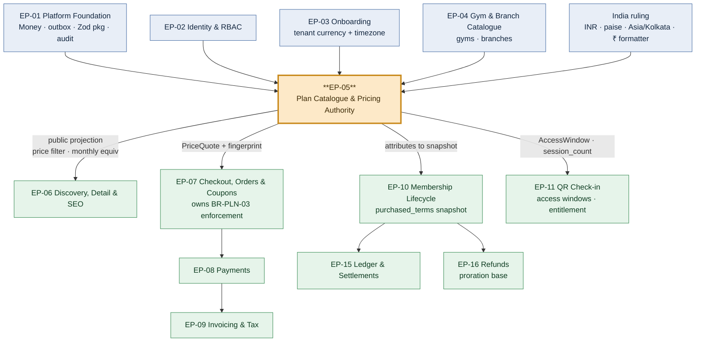

# EP-05 — Plan Catalogue & Pricing Authority

> **Source of truth:** `docs/MASTER_PRD.md` §B5.5 (`PLAN`), §B7 `SCR-DASH-005` / `SCR-DASH-006`, §C2.2 `plans` / `plan_branches`, §A8.2.
> **Detailed expansion of:** `docs/engineering/phase-0/ENGINEERING_PLAN.md` §2 (EP-05 row) and §3 (F-05.1 … F-05.10).
> **Governed by:** `docs/PROJECT_CONSTITUTION.md` §23 (DoR / DoD) and §10 (money and time rules) — never contradicted.
> **Launch market:** India — **INR, paise as `bigint`**, `round_half_even`, Indian digit grouping (**₹2,50,000**, not ₹250,000), `Asia/Kolkata` +05:30 no DST, GST 18% as CGST 9% + SGST 9% applied downstream by `billing/`.

---

## 1. Metadata

| Field | Value |
| :--- | :--- |
| **Epic id** | `EP-05` |
| **Epic name** | Plan Catalogue & Pricing Authority |
| **Priority (MoSCoW)** | **M** — Must. `FR-PLAN-09` (add-ons) is `C`; `FR-PLAN-02`, `03`, `04`, `06`, `07` are `S` inside an `M` epic; see §3. |
| **Complexity** | **Moderate** per `ENGINEERING_PLAN.md` §13.1 (`plans/`) — *"attribute-heavy but structurally simple; the complexity is that everything downstream trusts it"* |
| **Size / story points** | **M / 34 points** (≈ 17 engineer-days of implementation + test + review, `§13.1`) |
| **Target sprint(s)** | **Sprint 3** — all of F-05.1 … F-05.10 (tasks 3.1 – 3.5, 3.12, 3.19, part of 3.20) |
| **Milestone** | Contributes to **M2** (Sprint 4) and is a hard precondition of **M3** (Sprint 6, first real membership purchase in staging) |
| **Owning backend module** | `plans/` (sole owner). Collaborates with `memberships/` on `BR-PLN-02` / `BR-PLN-06`, `discovery/` on `BR-PLN-05`, `ordering/` on `BR-PLN-03`, `attendance/` on `FR-PLAN-02`, `catalog/` on `plan_branches` |
| **Surfaces** | `dash` — `SCR-DASH-005` Plan Catalogue, `SCR-DASH-006` Plan Editor · `web` — plan cards on `SCR-WEB-003` and `SCR-WEB-004` rendered by EP-06 from EP-05's **public projection** · `admin` — plan visibility appears in tenant detail (`SCR-ADM-004`) |
| **API groups** | `API-TEN` — `/tenant/plans`, `/tenant/plans/:id`, `/tenant/plans/:id/publish`, `/tenant/plans/:id/archive`, `/tenant/plans/:id/duplicate` · `API-DISC` — `GET /gyms/:slug/plans` (public projection only) |
| **Background jobs** | `plan.promotion-revert` (hourly boundary sweep, belt-and-braces to the query-time resolution), `search.reindex` consumer on plan change |
| **Feature flags** | `rel.plans.promotional-pricing`, `rel.plans.session-plans`, `rel.plans.off-peak-access-windows`, `rel.plans.add-ons` (sticky-journey) |
| **Status** | **Ready for refinement** — DoR §23.1 items 5–7 are satisfied by tasks T-05.01, T-05.02 and T-05.24 inside this epic |

---

## 2. Business Goal

EP-05 creates the **single price authority**. Every rupee the platform ever moves originates in a
`plans` row: the marketplace card, the detail page, the comparison column, the checkout summary, the
payment intent, the invoice line, the commission base, the settlement line and the refund proration
all resolve back to it. `ENGINEERING_PLAN.md` §2 states the epic's goal as making `BR-PLN-03` —
*"never show a price that cannot be bought"* — hold **at every surface**, and `A3.4` principle 2
elevates that from an engineering nicety to a product principle: *"stale pricing is a defect, not a
UX inconvenience."* The commercial consequence of getting this wrong runs in both directions.
Charging more than displayed is a deceptive-pricing complaint and a chargeback the platform loses.
Charging less is silent margin loss the gym discovers at settlement and never forgives. `INV-TRU-7`
makes the invariant non-negotiable and `RSK-11` scores the failure at 12.

The second outcome is **sellable inventory that reflects how Indian gyms actually price**. A single
`price` field would be a toy. Real catalogues carry a monsoon promotion that must end by itself
(`FR-PLAN-03`, `US-PLAN-01`), an off-peak plan valid 11:00–17:00 that is genuinely cheaper because
the floor is empty (`FR-PLAN-02`), a day pass that is a `SESSION` plan with a count of one
(`OQ-14`), a corporate rate that must never appear on a public surface (`BR-PLN-05`), a joining fee
that is disclosed rather than discovered, and branch restrictions on a two-location chain
(`FR-GYM-08`, `BR-TEN-03`). Modelling those as first-class attributes rather than as free text is
what lets `SRCH`'s price filter normalise to a monthly equivalent (`FR-SRCH-03`, `FR-DETL-03`) and
lets a stranger compare a 3-month plan at one gym against a 12-month plan at another honestly. That
comparison is `OBJ-02`'s entire premise, and it is the reason `KPI-10` (detail-to-checkout ≥ 8%) is
achievable at all.

The third outcome is **immutability of what was bought**. `BR-PLN-02` says a published plan's price
change never affects an already-purchased membership, and `BR-PLN-04` says a plan may be archived
but never hard-deleted while any membership references it. Together they make the plan a *living
catalogue entry* and the membership a *frozen contract*, and the boundary between them is enforced
structurally: `memberships.purchased_price_minor` and `purchased_terms jsonb` snapshot the plan at
purchase, and a `dependency-cruiser` rule forbids `memberships/domain` from importing
`plans/domain`. A gym that raises prices in April must not retroactively change what a member agreed
in January — that is a consumer-protection matter under Indian law, not a display bug, and when a
pro-rata refund is later computed against the wrong base it becomes a cash error the ledger cannot
reconcile. Contributing objectives: `OBJ-01`, `OBJ-02`, `OBJ-04` (every rupee attributable to a
plan), `OBJ-08` (commission computed on a base this epic defines). Contributing KPIs: `KPI-02`
(activation requires a published plan), `KPI-10`, `KPI-11`, `KPI-16` (take rate depends on a correct
commission base), `KPI-20` (refund rate rises when pricing surprises members).

---

## 3. Scope

### 3.1 In scope — explicit

| # | Item | Requirement |
| :-: | :--- | :--- |
| 1 | Complete plan attribute model as a **Zod discriminated union** on `plan_type` — `DURATION` (value + unit) and `SESSION` (count) | `FR-PLAN-01`, `BR-PLN-01`, `ADR-0022` |
| 2 | Money as `price_minor bigint` (paise) + `currency char(3)`, wrapped in `Money`; joining fee likewise | `BR-PAY-01`, `NFR-DQ-02`, `LAUNCH_MARKET_INDIA.md` §2 |
| 3 | Eligibility attributes: `min_age`, `gender_eligibility`; policy attributes: `freeze_allowed`, `freeze_max_days`, `transfer_allowed`, `stackable` | `FR-PLAN-01`, `BR-MEM-04`, `BR-MEM-05` |
| 4 | Access windows (`access_window jsonb` → `AccessWindow` value object) restricting permitted entry hours, evaluated at check-in | `FR-PLAN-02`, `§C4.8` `OUTSIDE_PLAN_ACCESS_WINDOW` |
| 5 | Promotional pricing with a validity window, automatic reversion, and **at most one active promotion per plan** enforced by a Postgres `EXCLUDE` constraint | `FR-PLAN-03`, `BR-PLN-07` |
| 6 | Owner-controlled catalogue ordering (`sort_order`) honoured on every public surface | `FR-PLAN-04` |
| 7 | Archive semantics: removed from sale, existing memberships retained and still valid at the door, blocked in new orders, no hard-delete path in code or API | `FR-PLAN-05`, `BR-PLN-04` |
| 8 | Duplicate-to-draft producing an editable copy with a distinct name and `DRAFT` status | `FR-PLAN-06` |
| 9 | Live marketplace card preview inside the editor, rendered from the **same** public projection the marketplace uses | `FR-PLAN-07`, `SCR-DASH-006` |
| 10 | Price-change confirmation stating explicitly that existing memberships are unaffected, and archive confirmation showing the affected membership count | `FR-PLAN-08`, `BR-PLN-02`, `NFR-USE-06` |
| 11 | Add-ons (locker, personal-training block, diet consultation) attachable with independent pricing | `FR-PLAN-09` (`C`) |
| 12 | `PUBLIC` / `STAFF_ONLY` visibility with a **separate public read model**, so a staff-only plan has no serialisation path to a public surface | `BR-PLN-05`, `ADR-0005` |
| 13 | `DRAFT` → `PUBLISHED` → `ARCHIVED` status machine with publish preconditions | `FR-PLAN-01`, `FR-PLAN-05` |
| 14 | Monthly-equivalent price computation as one function consumed by the editor preview, search, detail and comparison | `FR-DETL-03`, `FR-SRCH-03` |
| 15 | `PriceQuote` value object with a `price_fingerprint` (plan id + effective price + promo id + `updated_at`) that `ordering/` compares at checkout | `BR-PLN-03` (support), `INV-TRU-7` |
| 16 | Outbox invalidation on every price-affecting change, inside the 60-second staleness budget | `TR-30`, `BAC-02` |
| 17 | Branch entitlement selection in the editor: all branches or a named subset, never a silent default | `FR-GYM-08`, `BR-TEN-03`, `AC-GYM-01.1` |
| 18 | RLS, isolation specs, audit rows and negative tests for every plan mutation | `BR-TEN-01`, `BR-DAT-01`, `BAC-06`, `BAC-10` |

### 3.2 Out of scope — explicit, with destination

| Item | Where it went instead | Why |
| :--- | :--- | :--- |
| The checkout re-validation that **enforces** `BR-PLN-03` | **EP-07** (`ordering/`, `FR-CART-04`, `POST /orders/:ref/validate`) | The rule is owned where the money moves; EP-05 supplies the fingerprint and the authoritative price |
| Coupons, discounts, funding source and the commission base after discount | **EP-07** (`CPN`, `BR-CPN-*`) | A coupon modifies an order, never a plan |
| Tax computation, GST split, tax profiles, invoice lines | **EP-09** (`billing/`, `FR-INV-04`, `LAUNCH_MARKET_INDIA.md` §4) | Plans store **net** prices; tax is applied at invoicing per the India exclusive-tax treatment |
| `purchased_price_minor` / `purchased_terms` snapshot and everything that reads it | **EP-10** (`memberships/`) | EP-05 defines what is snapshotted; EP-10 owns the snapshot and the membership aggregate |
| Session decrement at check-in and expiry on exhaustion | **EP-11** + **EP-10** (`BR-PLN-06`, `FR-CHK-04` step 10) | EP-05 defines `session_count`; entitlement arithmetic is membership state |
| Access-window **evaluation** at the door | **EP-11** (`attendance/`, `FR-CHK-04`) | EP-05 owns the `AccessWindow` value object; `attendance/` owns the decision |
| Price filter, monthly-equivalent **rendering**, plan cards on `web` | **EP-06** (`FR-SRCH-03`, `FR-DETL-02`, `FR-DETL-03`) | EP-05 exports the computation; EP-06 renders it |
| Branch records themselves | **EP-04** (`FR-GYM-07`) | EP-05 references branches; it does not create them |
| Auto-renewal pricing and the reversion disclosure at renewal | **EP-10** (`FR-MEMB-08`, `BR-MEM-10`, `OQ-07`) | `AC-PLAN-01.3`'s renewal half is a membership behaviour |
| Subscription tier pricing for the **tenant's own** SaaS bill | **EP-09** (`A6.2`, `FR-INV-01`) | Different money, different payer, different epic |
| Dynamic or personalised pricing, A/B priced plans | **Phase 2** (`A11`) | Not in `A4.1`; would break `BR-PLN-03`'s "same plan at the same moment" wording |

---

## 4. Features

Points sum to the epic's 34. All features land in **Sprint 3**.

| Feature | Description | Satisfies | Pri | Pts | Sprint |
| :--- | :--- | :--- | :-: | :-: | :-: |
| **F-05.1** | Full plan attribute model: `DURATION` / `SESSION` discriminated union, INR/paise money, eligibility, policies, branches, visibility, status | `FR-PLAN-01`, `BR-PLN-01`, `BR-PLN-06` | M | 8 | 3 |
| **F-05.2** | Access windows as an `AccessWindow` value object, exported to `attendance/` for check-in evaluation | `FR-PLAN-02` | **S** | 3 | 3 |
| **F-05.3** | Promotional pricing: window, automatic reversion at the end instant, one active promotion per plan by `EXCLUDE USING gist` | `FR-PLAN-03`, `BR-PLN-07` | **S** | 5 | 3 |
| **F-05.4** | Owner-controlled catalogue ordering honoured on every public surface | `FR-PLAN-04` | **S** | 1 | 3 |
| **F-05.5** | Archive semantics: off sale, memberships retained, blocked in new orders, no delete path anywhere | `FR-PLAN-05`, `BR-PLN-04` | M | 3 | 3 |
| **F-05.6** | Duplicate a plan into an editable `DRAFT` copy | `FR-PLAN-06` | **S** | 2 | 3 |
| **F-05.7** | Live marketplace card preview in the editor, rendered from the public projection | `FR-PLAN-07`, `SCR-DASH-006` | **S** | 3 | 3 |
| **F-05.8** | Price-change confirmation stating existing memberships are unaffected; archive confirmation with affected count | `FR-PLAN-08`, `BR-PLN-02`, `NFR-USE-06` | M | 2 | 3 |
| **F-05.9** | Add-ons with independent pricing, attachable to a plan, surfaced at checkout | `FR-PLAN-09` | **C** | 5 | 3 |
| **F-05.10** | `STAFF_ONLY` visibility never returned by any public API, proven by a contract test that asserts **absence** | `BR-PLN-05`, `ADR-0005` | M | 2 | 3 |
| | **Total** | | | **34** | |

**Descope order.** `FR-PLAN-09` (F-05.9, add-ons, `C`) is on the pre-agreed descope list in
`ENGINEERING_PLAN.md` §13.3 and is the first item to go. Each of F-05.2, F-05.3 and F-05.9 ships
behind a flag whose OFF position is documented and safe in `FEATURE_FLAGS.md` §7, so descoping is a
flag decision rather than a code removal. Nothing marked `M` is descopable (`BAC-14`).

---

## 5. User Stories

`US-PLAN-01` and `US-PLAN-02` are restated verbatim from `MASTER_PRD.md` §B5.5 with their `AC-`
identifiers unchanged. `US-PLAN-03` … `US-PLAN-09` are **new**: the functional requirements imply
them but §B5.5 did not write them. New criteria are marked **(NEW)**.

### US-PLAN-01 *(PRD)*

> *As an owner, I want to run a monsoon offer that ends by itself so that I don't forget to reset the
> price.*

| AC | Given / When / Then |
| :--- | :--- |
| **AC-PLAN-01.1** | **Given** I set a promotional price with an end date, **when** the end date passes, **then** the plan reverts to list price automatically with no action from me — reversion is resolved at query time by `PromotionWindow`, and the hourly `plan.promotion-revert` sweep exists only as a belt-and-braces reconciliation |
| **AC-PLAN-01.2** | **Given** a promotion is active, **when** the plan renders on the marketplace, **then** both the struck-through list price and the promotional price are shown, together with the promotion's end date, in Indian digit grouping |
| **AC-PLAN-01.3** | **Given** a member purchased during the promotion, **when** the promotion ends, **then** their membership retains the purchased price for its full term, and any auto-renewal discloses the reversion price **before** charging (renewal half owned by EP-10) |

### US-PLAN-02 *(PRD)*

> *As a member, I want the price I saw to be the price I pay.*

| AC | Given / When / Then |
| :--- | :--- |
| **AC-PLAN-02.1** | **Given** I select a plan at price X, **when** I reach payment, **then** the server re-prices from server-held plan, promotion, coupon and tax data and the charge equals X |
| **AC-PLAN-02.2** | **Given** the gym changed the price between my page load and my payment attempt, **when** I attempt payment, **then** checkout halts with `422 PLAN_PRICE_CHANGED` showing the old and the new price, requires my re-confirmation, and **never silently charges either figure** |
| **AC-PLAN-02.3** | **Given** the plan was archived between my page load and my payment attempt, **when** I attempt payment, **then** checkout halts with `422 PLAN_UNAVAILABLE` and alternative plans from the same gym are offered |

### US-PLAN-03 — The corporate rate that must never leak *(NEW — implied by `FR-PLAN-01`, `BR-PLN-05`)*

> *As Rohan, I want a negotiated corporate rate my receptionist can sell, that no walk-in ever sees.*

| AC | Given / When / Then |
| :--- | :--- |
| **AC-PLAN-03.1** **(NEW)** | **Given** a plan with `visibility = STAFF_ONLY` and `status = PUBLISHED`, **when** any public endpoint is called — gym detail, plans list, search facets, the price filter's range computation, comparison, sitemap or server-rendered structured data — **then** the plan is absent from every one of them |
| **AC-PLAN-03.2** **(NEW)** | **Given** the same plan, **when** it is requested by id on a public route, **then** the response is `404`, not `403` — the existence of the plan is itself not disclosed |
| **AC-PLAN-03.3** **(NEW)** | **Given** the same plan, **when** a receptionist sells it in `dash`, **then** the sale succeeds and the plan name and price appear correctly on the resulting invoice and membership |
| **AC-PLAN-03.4** **(NEW)** | **Given** the gym's cheapest **public** plan is ₹2,500/month and a `STAFF_ONLY` plan is ₹1,200/month, **when** the search result card renders "lowest monthly-equivalent price", **then** it shows ₹2,500 |

### US-PLAN-04 — Archiving a plan people still hold *(NEW — implied by `FR-PLAN-05`, `BR-PLN-04`)*

> *As Rohan, I want to stop selling my old annual plan without cancelling the 34 people on it.*

| AC | Given / When / Then |
| :--- | :--- |
| **AC-PLAN-04.1** **(NEW)** | **Given** a plan held by 34 active memberships, **when** I click archive, **then** the confirmation states *"this will archive a plan held by 34 active members"* with the actual number, not a generic warning (`NFR-USE-06`) |
| **AC-PLAN-04.2** **(NEW)** | **Given** I confirm, **then** the plan disappears from the public catalogue immediately, those 34 memberships continue to display correctly and continue to permit check-in until their own end dates |
| **AC-PLAN-04.3** **(NEW)** | **Given** the plan is archived, **when** anyone attempts to select it in a new order, **then** the order is refused with `PLAN_UNAVAILABLE` |
| **AC-PLAN-04.4** **(NEW)** | **Given** the plan is archived, **when** a hard delete is attempted at the database, **then** the foreign key from `memberships.plan_id` raises a violation, and no API path offering deletion exists — proven by an OpenAPI-absence assertion |

### US-PLAN-05 — Duplicate rather than re-key *(NEW — implied by `FR-PLAN-06`)*

> *As Rohan with eleven plans, I want to create the twelfth by copying the eleventh.*

| AC | Given / When / Then |
| :--- | :--- |
| **AC-PLAN-05.1** **(NEW)** | **Given** I duplicate a published plan, **then** the copy is created in `DRAFT` with a distinguishable name, every attribute copied, and **no** promotion, **no** `sort_order` collision and **zero** memberships |
| **AC-PLAN-05.2** **(NEW)** | **Given** I duplicate a `STAFF_ONLY` plan, **then** the copy is also `STAFF_ONLY` — visibility is never widened by a copy operation |
| **AC-PLAN-05.3** **(NEW)** | **Given** I duplicate a branch-restricted plan, **then** the copy carries the same `plan_branches` rows, and a branch since deactivated is dropped from the copy with a visible note rather than silently retained |

### US-PLAN-06 — The day pass *(NEW — implied by `FR-PLAN-01`, `OQ-14`)*

> *As Priya, I want to try one session before committing to three months.*

| AC | Given / When / Then |
| :--- | :--- |
| **AC-PLAN-06.1** **(NEW)** | **Given** the owner creates a `SESSION` plan with `session_count = 1` (the `OQ-14` day-pass default), **then** it publishes, appears under the "trial available" filter on `SCR-WEB-002`, and is purchasable |
| **AC-PLAN-06.2** **(NEW)** | **Given** a `SESSION` plan is created with a null `session_count`, or a `DURATION` plan with a null `duration_value`, **then** both are refused at the validation pipe with `400`, and violate the table `CHECK` if forced directly |
| **AC-PLAN-06.3** **(NEW)** | **Given** `rel.plans.session-plans` is OFF, **then** `plan_type` is fixed to `DURATION` in the editor and no session plan can be created — while existing `SESSION` memberships keep decrementing and keep expiring on exhaustion, because the flag gates creation and sale, never entitlement enforcement |
| **AC-PLAN-06.4** **(NEW)** | **Given** a `SESSION` plan, **when** its monthly-equivalent price is computed for comparison, **then** the computation states its assumption explicitly and does not present a per-session product as if it were a monthly one |

### US-PLAN-07 — Off-peak pricing that holds at the door *(NEW — implied by `FR-PLAN-02`)*

> *As Rohan, I want a cheaper 11:00–17:00 plan that does not admit anyone at 19:00.*

| AC | Given / When / Then |
| :--- | :--- |
| **AC-PLAN-07.1** **(NEW)** | **Given** a plan with access window 11:00–17:00, **when** it renders on the detail page, **then** the restriction is stated on the plan card itself, not only in the fine print (`FR-DETL-02`) |
| **AC-PLAN-07.2** **(NEW)** | **Given** the same plan, **when** a member scans at 19:00, **then** check-in is denied with `OUTSIDE_PLAN_ACCESS_WINDOW`, and the denial names the permitted window |
| **AC-PLAN-07.3** **(NEW)** | **Given** the same plan, **when** a member scans at 11:00 sharp and at 16:59, **then** both are allowed — boundary inclusivity is defined once and tested, in `Asia/Kolkata`, never in server-local time |
| **AC-PLAN-07.4** **(NEW)** | **Given** `rel.plans.off-peak-access-windows` is OFF, **then** the editor hides the window control for **new** plans while check-in continues to evaluate windows on plans that already carry one — an existing off-peak member is never silently upgraded to access they did not buy |

### US-PLAN-08 — Add-ons priced independently *(NEW — implied by `FR-PLAN-09`)*

> *As Rohan, I want to sell a locker with the annual plan without inventing a second plan.*

| AC | Given / When / Then |
| :--- | :--- |
| **AC-PLAN-08.1** **(NEW)** | **Given** an add-on with its own price is attached to a plan, **when** the plan is purchased with the add-on selected, **then** the order breakdown shows the plan price and the add-on price as separate lines and the total is their sum plus joining fee, before tax |
| **AC-PLAN-08.2** **(NEW)** | **Given** `rel.plans.add-ons` is flipped OFF **after** an order was created with an add-on, **then** that order is still priced and invoiced with the add-on, because the flag is sticky-journey and resolved once at order creation |
| **AC-PLAN-08.3** **(NEW)** | **Given** an add-on is deactivated, **then** existing memberships that include it are unaffected and no new order may select it |

### US-PLAN-09 — The editor tells the truth before publishing *(NEW — implied by `FR-PLAN-04`, `FR-PLAN-07`)*

> *As Rohan, I want to see exactly what a customer will see, in the order I choose, before I publish.*

| AC | Given / When / Then |
| :--- | :--- |
| **AC-PLAN-09.1** **(NEW)** | **Given** I am editing a plan, **when** I change price, duration or inclusions, **then** the preview card beside the form updates within one interaction and is rendered from the **same public projection** the marketplace uses — not a bespoke preview component that can drift |
| **AC-PLAN-09.2** **(NEW)** | **Given** I reorder my catalogue in `SCR-DASH-005`, **when** a visitor views the gym detail page, **then** plans render in exactly that order |
| **AC-PLAN-09.3** **(NEW)** | **Given** a `DRAFT` plan, **when** the preview renders, **then** it is clearly labelled as a preview of an unpublished plan, and the plan is absent from every public surface until published |
| **AC-PLAN-09.4** **(NEW)** | **Given** every money field in the editor and the preview, **when** rendered, **then** amounts use Indian digit grouping via the single `packages/utils` formatter — **₹2,50,000**, never ₹250,000 |

---

## 6. Acceptance Criteria for the Epic

| # | Criterion | Evidence |
| :-: | :--- | :--- |
| **EAC-05.01** | A `DURATION` plan and a `SESSION` plan each round-trip through create → publish → public read → purchase with **every** `FR-PLAN-01` attribute preserved | `BR-PLN-01-P1` |
| **EAC-05.02** | A `SESSION` plan with a null `session_count` and a `DURATION` plan with a null `duration_value` are both refused at the pipe with `400`, and violate the `CHECK` if forced | `BR-PLN-01-N1` |
| **EAC-05.03** | One Zod discriminated union in `packages/types` is the single definition shared by API, dashboard form and tests; no second definition exists | `ADR-0022`, drift test |
| **EAC-05.04** | All money is `bigint` minor units plus an adjacent `currency`; no float appears anywhere in the plan path, enforced by the `Money` lint rule | `BR-PAY-01`, `NFR-DQ-02`, DoD 6 |
| **EAC-05.05** | Money crossing the API boundary serialises without precision loss and without a `BigInt` serialisation error | `TR-38` |
| **EAC-05.06** | Every money figure on `SCR-DASH-005`, `SCR-DASH-006` and the preview card renders with Indian digit grouping from the single shared formatter | `LAUNCH_MARKET_INDIA.md` §2, Sprint 3 exit `E3.9` |
| **EAC-05.07** | A promotion applies within its window and reverts automatically at its end instant, with displayed price equal to charged price throughout | `BR-PLN-07-P1`, `AC-PLAN-01.1` |
| **EAC-05.08** | Creating a promotion overlapping an existing one is refused with `422 PROMOTION_OVERLAPS`; two concurrent creations of overlapping windows produce exactly **one** success | `BR-PLN-07-N1` |
| **EAC-05.09** | Promotion boundaries are computed in the gym's IANA timezone; a promotion ending "31 August" ends at 23:59:59.999 IST, not 18:29 IST | `TR-07`, `TR-24` |
| **EAC-05.10** | Archiving a plan with live memberships succeeds; those memberships display and permit check-in; the plan leaves the public catalogue immediately | `BR-PLN-04-P1`, `AC-PLAN-04.2` |
| **EAC-05.11** | No hard-delete path exists for plans — asserted by an OpenAPI-absence test and by an FK violation at the database | `BR-PLN-04-N1` |
| **EAC-05.12** | Archive confirmation states the **actual** affected-membership count | `AC-PLAN-04.1`, `NFR-USE-06` |
| **EAC-05.13** | A `STAFF_ONLY` plan is absent from gym detail, the plans list, search facets, the price-filter range, comparison, the sitemap and SSR structured data; by-id on a public route returns `404` | `BR-PLN-05-N1`, Sprint 3 exit `E3.4` |
| **EAC-05.14** | A `STAFF_ONLY` plan is sellable in `dash` and appears correctly on the invoice and membership | `BR-PLN-05-P1` |
| **EAC-05.15** | The public plan DTO has **no field** capable of carrying a `STAFF_ONLY` row; the public and dashboard projections are separate read models | `ADR-0005` contract test |
| **EAC-05.16** | After a purchase, doubling the plan price leaves the membership detail, the invoice, the refund proration base and the settlement line all showing the purchased price | `BR-PLN-02-P1` |
| **EAC-05.17** | No read path returns the live plan price for an existing membership — asserted by mutating `plans.price_minor` directly and re-reading every membership-facing endpoint | `BR-PLN-02-N1` |
| **EAC-05.18** | A price change requires explicit confirmation whose text states that existing memberships are unaffected | `FR-PLAN-08`, `AC-PLAN-02.*` |
| **EAC-05.19** | `PriceQuote` carries a `price_fingerprint` and cannot be constructed from client input; `ordering/` compares it at payment initiation | `BR-PLN-03` support, `INV-TRU-7` |
| **EAC-05.20** | A price change is visible on every public surface within the **60-second** staleness budget, driven by outbox invalidation rather than TTL expiry | `TR-30`, `BAC-02` |
| **EAC-05.21** | Access windows are evaluated at check-in with boundary inclusivity defined once; 11:00 and 16:59 both allowed, 19:00 denied with `OUTSIDE_PLAN_ACCESS_WINDOW` | `AC-PLAN-07.2`, `AC-PLAN-07.3` |
| **EAC-05.22** | Duplicating a plan produces a `DRAFT` with no promotion, no memberships, unchanged visibility and a resolved `sort_order` | `AC-PLAN-05.1` … `05.3` |
| **EAC-05.23** | The editor preview renders from the public projection; a change to the marketplace card automatically changes the preview with no second implementation | `AC-PLAN-09.1` |
| **EAC-05.24** | Catalogue order set in `SCR-DASH-005` is honoured on the public detail page and in comparison columns | `AC-PLAN-09.2` |
| **EAC-05.25** | Monthly-equivalent price is one function used by the editor, search, detail and comparison, with `SESSION` plans handled explicitly rather than coerced | `FR-DETL-03`, `AC-PLAN-06.4` |
| **EAC-05.26** | The branch selector offers "all branches" or a named subset with no silent default; absence of `plan_branches` rows means all branches | `AC-GYM-01.1`, `BR-TEN-03` |
| **EAC-05.27** | Every plan mutation writes an append-only audit row with before/after and actor; visibility and promotional-price changes are audited field changes | `BR-DAT-01`, `BAC-13` |
| **EAC-05.28** | Isolation specs exist for all eight EP-05 endpoints; a tenant cannot read or mutate another tenant's plan by id or by list | `BAC-10`, `E2E-11` |
| **EAC-05.29** | `SCR-DASH-005` and `SCR-DASH-006` are axe-core clean and fully keyboard operable, including the drag-reorder catalogue | `NFR-USE-01`, `NFR-USE-02` |
| **EAC-05.30** | All four `rel.plans.*` flags behave as documented in both positions, and `rel.plans.add-ons` is proven sticky across an order | `NFR-MNT-07`, `FEATURE_FLAGS.md` §7 |

---

## 7. Business Rules Enforced

Detail lives in `docs/engineering/BusinessRules.md` §7 and is **not duplicated here**.

| BR | Ownership | Enforcement point inside EP-05 | Tests |
| :--- | :--- | :--- | :--- |
| **`BR-PLN-01`** | **Owned** (`plans/`) | `plans` table carries every named attribute with `CHECK ((plan_type='DURATION' AND duration_value IS NOT NULL) OR (plan_type='SESSION' AND session_count IS NOT NULL))`; one Zod discriminated union in `packages/types`; `Money` and `AccessWindow` parsed at the boundary | `BR-PLN-01-P1`, `BR-PLN-01-N1` |
| **`BR-PLN-02`** | **Co-owned** with `memberships/` | EP-05 defines what is snapshotted and refuses to expose a live price on any membership-facing read; EP-10 owns `purchased_price_minor` / `purchased_terms`; `dependency-cruiser` forbids `memberships/domain` importing `plans/domain` | `BR-PLN-02-P1`, `BR-PLN-02-N1` |
| **`BR-PLN-04`** | **Owned** (`plans/`) | `Plan.archive()` exists; `Plan.delete()` does not exist on the aggregate; FKs `ON DELETE RESTRICT`; OpenAPI-absence assertion for any hard-delete route | `BR-PLN-04-P1`, `BR-PLN-04-N1` |
| **`BR-PLN-05`** | **Co-owned** with `discovery/` | Separate **public plan projection**; `PublicVisibilityPredicate` includes `visibility='PUBLIC' AND status='PUBLISHED'`; index `(gym_id, status, visibility)`; `PublicPrismaService` may read only the public projection | `BR-PLN-05-P1`, `BR-PLN-05-N1` |
| **`BR-PLN-06`** | **Co-owned** with `memberships/` + `attendance/` | EP-05 defines `session_count` and the `CHECK` shape; the `Entitlement` value object and `consumeSession()` are EP-10; the `FOR UPDATE` concurrency guard is EP-11 | `BR-PLN-06-P1`, `BR-PLN-06-N1`, `-N2` |
| **`BR-PLN-07`** | **Owned** (`plans/`) | `EXCLUDE USING gist (plan_id WITH =, tstzrange(promo_starts_at, promo_ends_at) WITH &&)` — the overlap is refused by Postgres, not by a read-then-write check a concurrent request can defeat; `PromotionWindow` resolves `promo if now ∈ window else list` once | `BR-PLN-07-P1`, `BR-PLN-07-N1` |
| **`BR-PLN-03`** | **Participates** (owner: `ordering/`, EP-07) | EP-05 supplies the authoritative price, the `PriceQuote` value object and the `price_fingerprint`; EP-07 performs the re-price and the `422` abort inside the payment-intent transaction | `BR-PLN-03-P1`, `BR-PLN-03-N1`, `-N2` |
| **`BR-TEN-03`** | **Participates** (owner: `catalog/`, EP-04) | The plan editor requires an explicit all-branches or named-subset choice; EP-05 writes `plan_branches` rows and refuses a branch belonging to another gym | `BR-TEN-03-P1`, `BR-TEN-03-N1` |
| **`BR-GYM-07`** | **Participates** (owner: `catalog/`) | Plan pricing is explicitly a **non-material** change: it publishes immediately with no review step | `BR-GYM-07-P1` |
| **`BR-PAY-01`** | **Inherits** (owner: `common/` + `ledger/`) | `price_minor bigint` + `currency char(3)` adjacent, wrapped in `Money`; no float, no `number` for money | `BR-PAY-01-N1` |
| **`BR-TEN-01`** | **Inherits** (owner: `tenancy/`) | `plans` and `plan_addons` are tenant-owned with RLS; isolation spec per endpoint | `BAC-10`, `E2E-11` |
| **`BR-DAT-01`** | **Inherits** (owner: `audit/`) | Plan is an audited entity type; price, promotion, visibility, status and branch-entitlement changes all write before/after | `BAC-13` |

**Rules explicitly *not* owned here:** `BR-CPN-*` (coupons, EP-07), `BR-MEM-*` (membership lifecycle,
EP-10), `BR-PAY-04` / `BR-PAY-10` (no client-supplied amount, invoice immutability — EP-07/EP-09),
`BR-CHK-*` (check-in decisions, EP-11).

---

## 8. Dependencies

### 8.1 Upstream — must exist before EP-05 starts

| Dependency | From | What EP-05 needs from it |
| :--- | :--- | :--- |
| **EP-01** Platform Foundation | Sprint 0 | `Money` value object and the anti-float lint rule; the Prisma tenant extension; the transactional outbox; the error registry (`PLAN_UNAVAILABLE`, `PROMOTION_OVERLAPS`, `PLAN_PRICE_CHANGED`); the audit writer; `packages/types` for the shared Zod union |
| **EP-02** Identity & RBAC | Sprint 1 | `plan:create` / `read` / `update` / `publish` / `archive` / `duplicate` permissions; the `GYM_OWNER` vs `RECEPTIONIST` split that makes `BR-PLN-05` meaningful |
| **EP-03** Onboarding | Sprint 2 | The tenant's `currency`, `timezone` and `country_code`; the "at least one published plan" gate the wizard enforces (`BR-GYM-02`) |
| **EP-04** Gym, Branch & Media Catalogue | Sprint 2 | `gyms` and `branches` rows; `plan_branches` is written by EP-05 against EP-04's branch ids; the material/non-material registry that classifies plan pricing as non-material |
| **India ruling** | Pre-Sprint 0 | INR, paise, `round_half_even`, `Asia/Kolkata`, and the `packages/utils` lakh–crore formatter (Sprint 3 task 3.17) |

### 8.2 Downstream — what EP-05 unblocks

| Unblocks | Why it cannot proceed without EP-05 |
| :--- | :--- |
| **EP-06** Discovery, Detail & SEO | The price filter, the "lowest monthly-equivalent price" on every result card, the plan cards on detail, the price rows in comparison, and the `≥1 published public plan` half of the visibility gate |
| **EP-07** Checkout, Orders & Coupons | There is nothing to buy without a plan; `BR-PLN-03` re-validation compares against EP-05's fingerprint; coupon applicability lists reference plan ids |
| **EP-08** Payments | The amount charged derives from the plan through the order |
| **EP-09** Invoicing & Tax | The invoice line description and net amount come from the purchased plan snapshot |
| **EP-10** Membership Lifecycle | `purchased_terms` is a snapshot of the plan; freeze allowance, transfer allowance, stackability and session count are all plan attributes |
| **EP-11** QR Check-in | `FR-CHK-04` evaluates access windows, branch entitlement and session entitlement — all plan-derived |
| **EP-15** Ledger & Settlements | The commission base is the plan price after discount; historical price preservation matters at settlement |
| **EP-16** Refunds | Proration computes against `purchased_price_minor`, which exists only because `BR-PLN-02` was enforced here |

### 8.3 External dependencies and open questions

| Type | Item | Impact if late |
| :--- | :--- | :--- |
| **Client decision — `OQ-14`** | Trial or day-pass plans at launch — **answered: yes, as a `SESSION` plan with count 1**, due Sprint 3 | Adopted as the default; `rel.plans.session-plans` gates it if the answer reverses |
| **Client decision — `OQ-06`** | Membership freeze at launch — **answered: yes, plan-configurable, default off**, due Sprint 7 | `freeze_allowed` / `freeze_max_days` columns ship in Sprint 3 regardless; behaviour is EP-10 |
| **Client decision — `OQ-07`** | Auto-renewal at launch — **answered: yes, opt-in, off by default**, due Sprint 7 | Affects `AC-PLAN-01.3`'s renewal disclosure, owned by EP-10 |
| **Client decision — `OQ-02`** | Commission rates — **answered: 10% standard, 5% renewal** | EP-05 does not compute commission; it defines the base the resolver reads |
| **Tax advice** | GST SAC code for fitness services (`LAUNCH_MARKET_INDIA.md` §4, confidence "Medium — must be confirmed") | Plans store **net** prices, so a late SAC confirmation does not block EP-05; it blocks EP-09 |
| **`OQ-NEW-05.1` … `05.6`** | See §13.2 | Each has a proposed default so no item is blocked on an unanswered question (`§23.1` item 10) |

### 8.4 Dependency graph

---

## 9. Technical Tasks

Layers: **DB** · **API** · **worker** · **web** · **dash** · **admin** · **infra** · **test** ·
**docs**. Estimates are engineer-days (ed).

| # | Task | Layer | ed | Depends on | Serves |
| :--- | :--- | :--- | :-: | :--- | :--- |
| **T-05.01** | Author `/docs/apis/api-ten-plans.md` + the public `GET /gyms/:slug/plans` contract: permissions, Zod schemas, error codes, idempotency, rate class | docs | 0.5 | EP-01 | `§23.1`#5 |
| **T-05.02** | Author `/docs/database/plans.md`: `plans`, `plan_branches`, `plan_addons`, indexes, `CHECK`s, the `EXCLUDE` constraint, RLS, retention | docs | 0.5 | EP-01 | `§23.1`#6 |
| **T-05.03** | Prisma migration: `plans` with all `FR-PLAN-01` columns, `price_minor bigint`, `currency char(3)`, discriminated `CHECK`, index `(gym_id, status, visibility)` | DB | 1.0 | T-05.02 | `FR-PLAN-01`, `BR-PLN-01`, `C2.4` |
| **T-05.04** | Prisma migration: promotion columns + `EXCLUDE USING gist (plan_id WITH =, tstzrange(promo_starts_at, promo_ends_at) WITH &&)`, requires `btree_gist` | DB | 0.5 | T-05.03 | `BR-PLN-07` |
| **T-05.05** | Prisma migration: `plan_branches` composite tenant-carrying FK; `plan_addons`; FKs `ON DELETE RESTRICT` from `memberships` and `orders`; RLS on all three | DB | 0.5 | T-05.03, EP-04 | `BR-TEN-03`, `BR-PLN-04`, `BR-TEN-01` |
| **T-05.06** | Shared Zod discriminated union in `packages/types` consumed by API, dashboard form and tests; OpenAPI generation wired | API | 1.0 | T-05.03 | `BR-PLN-01`, `ADR-0022`, `A-02` |
| **T-05.07** | `Plan` aggregate: attributes, `publish()`, `archive()`, `duplicate()`; **`delete()` deliberately absent**; status machine `DRAFT → PUBLISHED → ARCHIVED` with publish preconditions | API | 1.0 | T-05.06 | `FR-PLAN-01`, `FR-PLAN-05`, `BR-PLN-04` |
| **T-05.08** | `Money` integration for `price_minor` and `joining_fee_minor`; `round_half_even`; BigInt-safe serialisation across the API boundary | API | 0.5 | EP-01 | `BR-PAY-01`, `NFR-DQ-02`, `TR-38` |
| **T-05.09** | `PromotionWindow` (`DateRange`) value object; effective-price resolution `promo if now ∈ window else list`, defined **once**, timezone-explicit | API | 1.0 | T-05.04 | `FR-PLAN-03`, `BR-PLN-07`, `TR-07` |
| **T-05.10** | Translate the Postgres exclusion violation into `422 PROMOTION_OVERLAPS`; concurrent-creation test proving exactly one success | API | 0.5 | T-05.09 | `BR-PLN-07-N1` |
| **T-05.11** | `plan.promotion-revert` hourly reconciliation job — belt-and-braces only; asserts that query-time resolution already reverted, alerts if it did not | worker | 0.5 | T-05.09 | `AC-PLAN-01.1` |
| **T-05.12** | `AccessWindow` value object parsed from `access_window jsonb` at the boundary, never handled as raw JSON in the domain; boundary inclusivity defined once; exported to `attendance/` | API | 1.0 | T-05.06 | `FR-PLAN-02`, `§C4.8` |
| **T-05.13** | `PlanBranchEntitlement` writer: all-branches as absence of rows, named subset as rows; refusal to reference a branch of another gym; deactivated-branch handling on duplicate | API | 0.5 | T-05.05, EP-04 | `FR-GYM-08`, `BR-TEN-03` |
| **T-05.14** | Archive use case: remove from sale, block new order selection, count affected memberships for the confirmation, retain everything | API | 0.5 | T-05.07 | `FR-PLAN-05`, `BR-PLN-04`, `AC-PLAN-04.1` |
| **T-05.15** | Duplicate use case: `DRAFT` copy, name disambiguation, promotion dropped, `sort_order` resolved, visibility preserved | API | 0.5 | T-05.07 | `FR-PLAN-06`, `AC-PLAN-05.*` |
| **T-05.16** | **Public plan projection** as a separate read model and DTO with no field able to carry a `STAFF_ONLY` row; `PublicPrismaService` restricted to it | API | 1.0 | T-05.03 | `BR-PLN-05`, `ADR-0005` |
| **T-05.17** | `PriceQuote` value object with `price_fingerprint` (plan id + effective price + promo id + `updated_at`), non-constructible from client input; exported to `ordering/` | API | 1.0 | T-05.09 | `BR-PLN-03`, `INV-TRU-7` |
| **T-05.18** | Monthly-equivalent price function, one implementation, explicit `SESSION` handling, exported to `discovery/` and the editor preview | API | 0.5 | T-05.06 | `FR-DETL-03`, `FR-SRCH-03` |
| **T-05.19** | `sort_order` maintenance with gap-tolerant reordering under concurrency | API | 0.5 | T-05.07 | `FR-PLAN-04` |
| **T-05.20** | `plan_addons`: CRUD, independent pricing, attach/detach, deactivate-without-affecting-existing; behind `rel.plans.add-ons` (sticky-journey) | API | 1.5 | T-05.05 | `FR-PLAN-09`, `AC-PLAN-08.*` |
| **T-05.21** | Outbox emitters on every price-affecting change (price, promotion, visibility, status, `sort_order`, branch set) feeding `search.reindex` and CDN/ISR invalidation inside the 60 s budget | API | 1.0 | EP-01 outbox | `TR-30`, `BAC-02` |
| **T-05.22** | Audit integration: before/after for price, promotion, visibility, status, branches; actor and reason captured | API | 0.5 | EP-01 audit | `BR-DAT-01` |
| **T-05.23** | Observability: `gym.plan.price_changed.count`, `gym.plan.promotion.active.gauge`, `gym.plan.projection.staleness_ms`, spans on publish and archive, alert on staleness above budget | API/infra | 0.5 | T-05.21 | `§18`, `TR-30` |
| **T-05.24** | Author `/docs/ui/scr-dash-005.md` and `/docs/ui/scr-dash-006.md`: loading, empty, error, permission-denied plus domain states (draft, promotion active, archived, staff-only, add-ons off) | docs | 0.5 | design | `§23.1`#7 |
| **T-05.25** | `SCR-DASH-005` Plan Catalogue: table with name, type, duration/sessions, price, promo price, branches, visibility, status, **active membership count**; create / edit / duplicate / publish / unpublish / archive / reorder | dash | 2.5 | T-05.07 | `SCR-DASH-005` |
| **T-05.26** | `SCR-DASH-006` Plan Editor: all attributes grouped as basics, pricing, promotion, eligibility, access, policies, branches, visibility; React Hook Form + Zod resolver sharing the API schema | dash | 3.0 | T-05.06, A-09 | `SCR-DASH-006`, `FR-PLAN-01` |
| **T-05.27** | Live marketplace preview beside the form, rendered from the **public projection component**, labelled for `DRAFT` | dash | 1.0 | T-05.16 | `FR-PLAN-07`, `AC-PLAN-09.1` |
| **T-05.28** | Guard dialogs: price-change confirmation stating memberships are unaffected; archive confirmation showing the affected count; promotion calendar showing existing windows | dash | 1.0 | T-05.14 | `FR-PLAN-08`, `NFR-USE-06` |
| **T-05.29** | Indian digit-grouping formatter applied to every money field in catalogue, editor and preview | dash | 0.5 | Sprint 3 task 3.17 | `LAUNCH_MARKET_INDIA.md` §2 |
| **T-05.30** | Pricing and promotion test matrix: reversion boundary instants, overlap refusal, concurrent creation, IST edge cases | test | 1.5 | T-05.09 … T-05.11 | `BR-PLN-07`, `TR-07`, `TR-24` |
| **T-05.31** | `BR-PLN-05` **absence** contract test across seven public surfaces plus by-id `404`; asserts absence, never inspection | test | 1.0 | T-05.16 | `BR-PLN-05-N1`, `E3.4` |
| **T-05.32** | `BR-PLN-02` immutability test: mutate `plans.price_minor` directly, re-read every membership-facing endpoint | test | 0.5 | T-05.07 | `BR-PLN-02-N1` |
| **T-05.33** | Isolation specs for all eight EP-05 endpoints, read and write, by id and by list | test | 1.0 | T-05.05 | `BAC-10`, `E2E-11` |
| **T-05.34** | Negative-case suite for every M-priority rule: `BR-PLN-01-N1`, `BR-PLN-02-N1`, `BR-PLN-04-N1`, `BR-PLN-05-N1` | test | 1.0 | all API tasks | `BAC-06` |
| **T-05.35** | axe-core + keyboard pass on `SCR-DASH-005` / `SCR-DASH-006` incl. drag reorder | test | 1.0 | T-05.25, T-05.26 | `NFR-USE-01`, `NFR-USE-02` |
| **T-05.36** | Flag matrix tests for all four `rel.plans.*` flags in both positions, incl. sticky-journey proof for add-ons | test | 1.0 | T-05.20 | `NFR-MNT-07` |
| **T-05.37** | Seed extension: realistic plan catalogues across the 2,000-gym seed — duration mix, promotions, staff-only plans, session plans — for EP-06's perf gate | test | 0.5 | EP-04 seed | `TR-33`, `NFR-PERF-09` |
| **T-05.38** | Module `README.md`, `/docs/features/plan-catalogue.md`, runbook for the three failure modes (stale projection, promotion not reverting, price-change abort rate rising) | docs | 1.0 | all | DoD 22, 23, 27, `NFR-MNT-09` |

**Total: 38 tasks · 32.5 engineer-days of task-level effort.**

---

## 10. Estimated Time

### 10.1 Roll-up by role

| Role | Tasks | Engineer-days | Notes |
| :--- | :--- | :-: | :--- |
| **BE** (backend, `plans/`) | T-05.03 … T-05.23 | **14.5** | Includes 0.5 ed of worker code (`plan.promotion-revert`) and 1.0 ed on the public projection, which is the single highest-leverage task in the epic |
| **FE-dash** (`gym-dashboard`) | T-05.25 … T-05.29 | **8.0** | The editor is the second-largest form in the product after the onboarding wizard; the live preview is deliberately *not* a bespoke component |
| **FE-web** (`customer-web`) | — | **0.0** | Plan cards on `web` are EP-06's rendering of EP-05's projection |
| **QA** | T-05.30 … T-05.37 | **7.5** | The `BR-PLN-05` absence test and the promotion boundary matrix are the two that must not be trimmed |
| **DevOps** | part of T-05.23 | **0.5** | Metrics and the staleness alert only; no new infrastructure |
| **Design** | Plan catalogue table, editor grouping, preview card, guard dialogs | **3.0** | Sprint 3 design allocation is 7.0 ed shared with EP-06 |
| **Docs** | T-05.01, T-05.02, T-05.24, T-05.38 | **2.5** | DoR items 5–7 and DoD items 22–27 |
| | **Total** | **36.0 ed** | |

### 10.2 Reconciliation with `ENGINEERING_PLAN.md` §13.1

§13.1 rates `plans/` at 34 points / **17 engineer-days** of implementation + test + review, excluding
design and UAT. Removing design (3.0), docs (2.5), DevOps (0.5) and the 0.5 ed seed task that serves
EP-06 leaves **29.5 ed**. The gap against 17 is larger in proportion than EP-04's because §13.1's
`plans/` rating explicitly excludes the **front-end** editor: `SCR-DASH-006` is counted inside
§13.2's `apps/gym-dashboard` line (89 points / 45 ed for 22 screens). Removing the 8.0 ed of
FE-dash work gives **21.5 ed** against 17 — a 26% itemisation tax, consistent with §13.3's stated
317-point difference between the feature view and the build view. No re-baselining is implied.

### 10.3 Sprint fit

| Sprint | EP-05 demand | Sprint 3 capacity | Verdict |
| :-: | :--- | :--- | :--- |
| **3** | BE 14.5 · FE-dash 8.0 · QA 7.5 · DevOps 0.5 · Design 3.0 | Sprint 3 committed at BE 22.0 · FE 26.0 · QA 13.0 · DevOps 3.0 · Design 7.0, **shared with EP-06 first half** | **CLEAR on backend, TIGHT on frontend.** EP-06 takes FE 18.0 of the 26.0; EP-05's 8.0 fits exactly with no slack. F-05.9 (add-ons, `C`) is the designated carry-out |

The Sprint 3 exit checklist items `E3.1` … `E3.4` and `E3.9` are all EP-05 criteria; `E3.5` … `E3.8`
belong to EP-06. EP-05 therefore cannot slip without the sprint failing its own gate.

### 10.4 Confidence

| Scenario | Engineer-days | Probability | Drivers |
| :--- | :-: | :-: | :--- |
| **Optimistic (P10)** | 29 | 10% | The shared Zod union works first time across API and form; `btree_gist` and the exclusion constraint behave as documented; add-ons descoped by decision rather than by over-run |
| **Expected (P50)** | **36.0** | 50% | The plan as written |
| **Pessimistic (P90)** | 47 | 90% | `TR-38` BigInt serialisation forces a boundary-wide change; promotion timezone boundaries need a second pass after `TR-24` review; the public projection is discovered to be leaking a field and the DTO is rebuilt; add-ons stay in scope and the sticky-journey semantics need order-side coordination with EP-07 before EP-07 exists |

---

## 11. Risks

| Id | Risk | P | I | Score | Mitigation | Maps to |
| :--- | :--- | :-: | :-: | :---: | :--- | :--- |
| **R-05.1** | **Stale price reaches checkout.** Four caches sit between the `plans` row and the number a member reads — Redis projection, Next.js ISR, CDN edge, TanStack Query. Every stale display that reaches checkout is a `422` in a member's face | 4 | 4 | **16** | **One** stated staleness budget of 60 s for the whole chain, achieved by outbox-driven invalidation rather than TTL expiry; price re-read from the **primary**, never a replica, at both checkout gates; the detail page renders price with the plan's `updated_at` so staleness is detectable; `staleTime: 0` for price-bearing client queries; alert when `422 PLAN_PRICE_CHANGED` exceeds 0.5% of checkout initiations | **`TR-30`**, `RSK-11`, `TR-10` |
| **R-05.2** | **`STAFF_ONLY` leak.** A corporate rate appears on a public surface and the gym's price discipline collapses overnight; the gym's rational response is to stop entering real prices, degrading the marketplace for everyone | 2 | 5 | **10** | A **separate public read model and DTO** with no field capable of carrying the row — leakage is not prevented by a filter that can be forgotten, it is structurally unrepresentable; `PublicPrismaService` restricted to the projection; a contract test asserting **absence** across seven surfaces plus a by-id `404`; the isolation suite probes plan-by-id on the public route | **`BR-PLN-05`**, `INV-TRU-8`, `ADR-0005` |
| **R-05.3** | **Overlapping promotions** make the effective price depend on evaluation order; the marketplace shows one figure and checkout computes another — a direct `BR-PLN-03` breach | 2 | 4 | **8** | A Postgres `EXCLUDE USING gist` constraint, not a read-then-write service check a concurrent request can defeat; the violation is translated to `422 PROMOTION_OVERLAPS`; effective-price resolution exists in exactly one function | **`BR-PLN-07`**, `RSK-11` |
| **R-05.4** | **Promotion boundary in the wrong timezone.** A promotion set to end "31 August" ends at 18:29 IST on 31 August because the boundary was computed in UTC | 3 | 4 | **12** | Containers run `TZ=UTC` and the application never reads it; every promotion function takes an explicit IANA argument; property-based tests over +05:30 boundary instants; the same `PromotionWindow` used by the editor, the projection and the checkout re-price | **`TR-07`**, **`TR-24`** |
| **R-05.5** | **Retroactive price change reaches an existing membership.** A gym raises prices and every existing member's app shows the new figure; refund proration then computes against a price nobody paid | 2 | 5 | **10** | The membership snapshot is structural, not conventional: `purchased_price_minor` + `purchased_terms jsonb`, no join to `plans` on any membership read path, and a `dependency-cruiser` rule forbidding the import; the negative test mutates the plan row directly and re-reads every membership-facing endpoint | **`BR-PLN-02`** |
| **R-05.6** | **`BigInt` serialisation across the API boundary** silently truncates paise or throws at `JSON.stringify` | 3 | 4 | **12** | Money crosses the boundary as a string minor-unit plus currency, never as a JS `number`; a serialiser registered once; a boundary test asserting a 9,999,999,999-paise value round-trips exactly | **`TR-38`**, `BR-PAY-01` |
| **R-05.7** | **Two implementations of effective price.** The editor preview computes one figure and the marketplace computes another, so the owner publishes something different from what they saw | 3 | 3 | **9** | The preview is rendered by the **same public-projection component** the marketplace uses (T-05.27); a bespoke preview component is explicitly forbidden; a test renders both and asserts byte equality of the price string | `FR-PLAN-07`, `AC-PLAN-09.1` |
| **R-05.8** | **Monthly-equivalent price misleads.** A `SESSION` plan is coerced into a monthly figure and a day pass appears to be the cheapest "monthly" option on the card | 3 | 3 | **9** | One function with explicit `SESSION` handling; the card states the basis; `SESSION` plans are surfaced under "trial available" rather than competing on the monthly-price axis | `FR-DETL-03`, `FR-SRCH-03`, `OQ-14` |
| **R-05.9** | **Archive with live memberships is mis-implemented as a soft delete**, orphaning member screens and refund proration | 2 | 5 | **10** | `Plan.delete()` does not exist on the aggregate; FKs `ON DELETE RESTRICT`; an OpenAPI-absence assertion proves no hard-delete route; `BR-PLN-04-P1` runs the live-membership case | **`BR-PLN-04`** |
| **R-05.10** | **The plan editor becomes the second onboarding wizard** — too many fields, abandoned mid-way, and owners publish incomplete catalogues, hurting `KPI-02` | 3 | 3 | **9** | Attributes grouped into eight named sections per `SCR-DASH-006`; sensible defaults for every optional attribute; the preview gives immediate feedback; `DRAFT` state means partial work is never lost; duplicate-to-draft removes most repeat data entry | `KPI-02`, `RSK-09` |
| **R-05.11** | **Add-ons half-land.** `FR-PLAN-09` is `C` and coordinates with EP-07's order breakdown, which does not exist in Sprint 3 | 3 | 2 | **6** | `rel.plans.add-ons` OFF by default and sticky-journey; the order-side contract is written in T-05.01 before EP-07 starts so EP-07 implements against a fixed shape; descoping is a flag decision, not code removal | `FR-PLAN-09`, `§13.3` descope list |
| **R-05.12** | **Plan pricing is misclassified as a material change** and every price edit queues for human review, so gyms stop updating prices and `RSK-11` materialises through the back door | 2 | 4 | **8** | `BR-GYM-07` names plan pricing explicitly as non-material; the `MaterialFieldRegistry` drift test in EP-04 covers it; `BR-GYM-07-P1` asserts a price change publishes without review and appears in search within one reindex cycle | **`BR-GYM-07`**, `RSK-11` |

---

## 12. Definition of Done

`PROJECT_CONSTITUTION.md` §23.2 applies in full, all 33 items, unmodified. The following are
**additional**.

### 12.1 Constitution deference

| §23.2 group | EP-05 note |
| :--- | :--- |
| Code 5 (`any`) | The `access_window jsonb` and `purchased_terms jsonb` boundaries are the two places `any` is tempting; both are parsed into value objects at the edge with Zod, so neither needs an escape hatch |
| Code 6 (money) | The defining rule of this epic. Integer paise plus adjacent currency, `round_half_even`, no recomputation at display, the `Money` lint rule green |
| Code 7 (time) | Promotion windows and access windows both take an explicit IANA timezone; `Asia/Kolkata` never appears as a literal in domain code |
| Code 8 (tenancy) | Three new tenant-owned tables, three RLS policies, no raw Prisma in any repository |
| Code 9 (permissions + idempotency) | Eight endpoints, eight declared permissions; `Idempotency-Key` **REQ** on create, update, publish, archive and duplicate |
| Code 10 (errors) | `PLAN_UNAVAILABLE`, `PROMOTION_OVERLAPS`, `PLAN_PRICE_CHANGED` registered in the error registry with the standard envelope |
| Tests 16 (isolation) | Eight endpoints × read and write = 16 isolation specs minimum |
| Tests 17 (negative) | `BR-PLN-01`, `BR-PLN-02`, `BR-PLN-04`, `BR-PLN-05` each carry a passing negative case (`BAC-06`) |
| Tests 20 (a11y) | `SCR-DASH-005`, `SCR-DASH-006` axe-clean and keyboard operable including drag reorder |
| Ops 32 | Four `rel.plans.*` flags with documented OFF-position behaviour, one of them sticky-journey |

### 12.2 Epic-specific completion gates

- [ ] **D-05.1** Every one of `EAC-05.01` … `EAC-05.30` passes in CI.
- [ ] **D-05.2** Sprint 3 exit items **E3.1, E3.2, E3.3, E3.4 and E3.9** are all green — these are EP-05's, and the sprint gate is not passable without them.
- [ ] **D-05.3** A grep of the codebase finds **exactly one** implementation of effective price, **exactly one** of monthly-equivalent price, and **exactly one** promotion-window resolution.
- [ ] **D-05.4** `Plan.delete()` does not exist on the aggregate and no HTTP route deletes a plan — asserted by an OpenAPI-absence test, not by inspection.
- [ ] **D-05.5** The public plan DTO is proven to have no field able to carry a `STAFF_ONLY` row, by type-level assertion and by the seven-surface absence test.
- [ ] **D-05.6** A 9,999,999,999-paise price round-trips exactly through create → read → public projection → order draft, with no precision loss (`TR-38`).
- [ ] **D-05.7** Property-based tests cover ≥ 500 generated instants around promotion start and end boundaries in `Asia/Kolkata`, including the 18:30-UTC-is-midnight-IST trap.
- [ ] **D-05.8** The editor preview and the marketplace card render the identical price string for the same plan, asserted by test rather than by eye.
- [ ] **D-05.9** `gym.plan.projection.staleness_ms` is emitted and alarmed above the 60-second budget (`TR-30`).
- [ ] **D-05.10** All four `rel.plans.*` flags are exercised in both positions; `rel.plans.add-ons` is proven sticky across an order created before the flip.
- [ ] **D-05.11** The runbook covers three failure modes with detection signal, first action and escalation: projection staleness, a promotion that did not revert, and a rising `PLAN_PRICE_CHANGED` abort rate.
- [ ] **D-05.12** `/docs/PHASES.md` ticked in the same change; `DECISION_LOG.md` carries the `OQ-NEW-05.*` defaults adopted.

---

## 13. Open Questions

### 13.1 Inherited from `MASTER_PRD.md` §C11

| OQ | Question | Status for EP-05 | Action |
| :--- | :--- | :--- | :--- |
| **`OQ-14`** | Trial or day-pass plans at launch? | **Answered — yes, as a `SESSION` plan with `session_count = 1`.** Due Sprint 3, which is this epic's sprint | Adopt; `rel.plans.session-plans` gates creation if the answer reverses |
| **`OQ-06`** | Membership freeze at launch? | **Answered — yes, plan-configurable, default off.** Columns ship here; behaviour is EP-10 | `freeze_allowed` default `false`, `freeze_max_days` nullable |
| **`OQ-07`** | Auto-renewal at launch? | **Answered — yes, opt-in, off by default.** Affects `AC-PLAN-01.3` renewal disclosure, owned by EP-10 | No EP-05 blocker |
| **`OQ-11`** | Gym-funded and platform-funded coupons both at launch? | **Answered — yes, both.** Coupons never modify a plan; they modify an order | EP-07 |
| **`OQ-01`** / **`OQ-02`** | Launch country; commission rates | **Answered — India; 10% / 5%.** Fixes INR, paise, `Asia/Kolkata`, and the commission base EP-05 defines | Adopted |

### 13.2 New questions this epic surfaces

| OQ | Question | Proposed default | Needed by | Owner |
| :--- | :--- | :--- | :--- | :--- |
| **`OQ-NEW-05.1`** | Is there a platform **maximum plan price** or a sanity ceiling that flags an obvious data-entry error (₹25,00,000 for a monthly plan)? | Soft warning above **₹1,00,000** for a monthly-equivalent price; no hard cap | Sprint 3, before T-05.26 | Product Manager |
| **`OQ-NEW-05.2`** | May a plan be **unpublished** back to `DRAFT`, or only archived? `SCR-DASH-005` lists "unpublish" as an action but `FR-PLAN-05` describes only archive | Allow `PUBLISHED → DRAFT` **only when zero memberships reference it**; otherwise archive is the only exit | Sprint 3, before T-05.07 | Product Manager |
| **`OQ-NEW-05.3`** | How is the monthly-equivalent price computed for a `SESSION` plan on the comparison grid? | Do **not** compute one; show "per session" and exclude the plan from the monthly-price row, with the absence explicit rather than blank (`AC-DETL-01.2`) | Sprint 3, coordinate with EP-06 | Product Manager |
| **`OQ-NEW-05.4`** | Maximum number of published plans per gym (catalogue bloat degrades the detail page and the comparison grid) | Soft limit **20**, hard limit **50**, both configurable | Sprint 3 | Product Manager |
| **`OQ-NEW-05.5`** | Are add-ons **per plan** or **per gym, attachable to many plans**? `FR-PLAN-09` says "attachable to a plan" but a locker is a gym-level product | Gym-level `plan_addons` with a many-to-many attachment; cheaper to build once than to migrate | Sprint 3, before T-05.20 | Technical Lead |
| **`OQ-NEW-05.6`** | Does a joining fee apply on **renewal** of the same plan? | **No** — joining fee applies only to a first purchase at that gym; renewal disclosure states it explicitly | Sprint 3, coordinate with EP-07 and EP-10 | Product Manager |

---

## 14. Traceability

### 14.1 Functional requirements

| FR | Feature | Story / AC | Task | Test |
| :--- | :--- | :--- | :--- | :--- |
| `FR-PLAN-01` | F-05.1 | US-PLAN-06 / `AC-PLAN-06.1`, `06.2` | T-05.03, T-05.06, T-05.07, T-05.26 | `EAC-05.01` … `EAC-05.03` |
| `FR-PLAN-02` | F-05.2 | US-PLAN-07 / `AC-PLAN-07.1` … `07.4` | T-05.12 | `EAC-05.21` |
| `FR-PLAN-03` | F-05.3 | US-PLAN-01 / `AC-PLAN-01.1` … `01.3` | T-05.04, T-05.09 … T-05.11 | `EAC-05.07` … `EAC-05.09` |
| `FR-PLAN-04` | F-05.4 | US-PLAN-09 / `AC-PLAN-09.2` | T-05.19, T-05.25 | `EAC-05.24` |
| `FR-PLAN-05` | F-05.5 | US-PLAN-04 / `AC-PLAN-04.1` … `04.4` | T-05.14 | `EAC-05.10` … `EAC-05.12` |
| `FR-PLAN-06` | F-05.6 | US-PLAN-05 / `AC-PLAN-05.1` … `05.3` | T-05.15 | `EAC-05.22` |
| `FR-PLAN-07` | F-05.7 | US-PLAN-09 / `AC-PLAN-09.1`, `09.3` | T-05.27 | `EAC-05.23` |
| `FR-PLAN-08` | F-05.8 | US-PLAN-02 / `AC-PLAN-02.1` … `02.3` | T-05.28 | `EAC-05.16` … `EAC-05.18` |
| `FR-PLAN-09` | F-05.9 | US-PLAN-08 / `AC-PLAN-08.1` … `08.3` | T-05.20 | flag-matrix test |
| `FR-DETL-03` (supplies) | F-05.1 | US-PLAN-06 / `AC-PLAN-06.4` | T-05.18 | `EAC-05.25` |
| `FR-SRCH-03` (supplies) | F-05.1, F-05.10 | US-PLAN-03 / `AC-PLAN-03.4` | T-05.16, T-05.18 | `EAC-05.13` |
| `FR-CART-04` (supplies) | F-05.1 | US-PLAN-02 | T-05.17 | `EAC-05.19` |
| `FR-GYM-08` (participates) | F-05.1 | US-GYM-01 / `AC-GYM-01.1` | T-05.13 | `EAC-05.26` |

### 14.2 Business rules

| BR | Owned / participates | Enforcement task | Positive | Negative |
| :--- | :--- | :--- | :--- | :--- |
| `BR-PLN-01` | Owned | T-05.03, T-05.06 | `BR-PLN-01-P1` | `BR-PLN-01-N1` |
| `BR-PLN-02` | Co-owned (EP-10) | T-05.07, T-05.28 | `BR-PLN-02-P1` | `BR-PLN-02-N1` |
| `BR-PLN-03` | Participates (EP-07) | T-05.17 | `BR-PLN-03-P1` | `BR-PLN-03-N1`, `-N2` |
| `BR-PLN-04` | Owned | T-05.07, T-05.14 | `BR-PLN-04-P1` | `BR-PLN-04-N1` |
| `BR-PLN-05` | Co-owned (EP-06) | T-05.16, T-05.31 | `BR-PLN-05-P1` | `BR-PLN-05-N1` |
| `BR-PLN-06` | Co-owned (EP-10, EP-11) | T-05.03 (`CHECK`) | `BR-PLN-06-P1` | `BR-PLN-06-N1`, `-N2` |
| `BR-PLN-07` | Owned | T-05.04, T-05.09, T-05.10 | `BR-PLN-07-P1` | `BR-PLN-07-N1` |
| `BR-TEN-03` | Participates (EP-04) | T-05.13 | `BR-TEN-03-P1` | `BR-TEN-03-N1` |
| `BR-GYM-07` | Participates (EP-04) | T-05.21 | `BR-GYM-07-P1` | — |
| `BR-PAY-01` | Inherits | T-05.08 | — | `BR-PAY-01-N1` |
| `BR-TEN-01` | Inherits | T-05.05, T-05.33 | isolation suite | `E2E-11` |
| `BR-DAT-01` | Inherits | T-05.22 | `BAC-13` | — |

### 14.3 Screens, journeys, NFRs and KPIs

| Id | Type | EP-05 relationship |
| :--- | :--- | :--- |
| `SCR-DASH-005` | Screen (owned) | Plan Catalogue — T-05.25 |
| `SCR-DASH-006` | Screen (owned) | Plan Editor with live preview and guards — T-05.26 … T-05.28 |
| `SCR-WEB-003` | Screen (supplies data) | Plan cards with price, monthly equivalent, joining fee, inclusions, access-window note |
| `SCR-WEB-004` | Screen (supplies data) | Price-by-duration rows and joining-fee row in comparison |
| `SCR-WEB-005` | Screen (supplies data) | Order summary and price breakdown are computed from the plan by EP-07 |
| `SCR-ADM-004` | Screen (supplies data) | Tenant detail shows published-plan counts |
| `E2E-01` | Journey | "At least one published plan" is a `BR-GYM-02` approval precondition |
| `E2E-02` | Journey | Search → detail → buy: every price on the path originates here |
| `E2E-06` | Journey | Coupon on the correct commission base — the base is the plan price EP-05 defines |
| `E2E-11` | Journey | Cross-tenant refusal across all eight EP-05 endpoints |
| `BAC-03` | Business AC | A consumer sees **real** plans and prices and can purchase |
| `BAC-06` | Business AC | Every A8.2 rule has a passing test; every `M` rule has a negative case |
| `BAC-10` / `BAC-13` | Business AC | Isolation and audit coverage |
| `NFR-DQ-02` | NFR | Monetary values as integers in minor units with an explicit adjacent currency |
| `NFR-DQ-06` | NFR | Duration units and plan types are enumerations, never free text |
| `NFR-SEC-05` | NFR | `.strict()` Zod schemas server-side; a client-submitted amount is a `400` |
| `NFR-USE-05` / `06` | NFR | Every error states what/why/next; archive states "held by 34 active members" |
| `NFR-PERF-04` | NFR | Plan catalogue list p95 ≤ 800 ms at 50 rows |
| `NFR-MNT-01` | NFR | ≥ 95% branch coverage applies to this code as pricing logic feeding payment and settlement |
| `INV-TRU-7` / `INV-TRU-8` | Invariant | Displayed = charged; staff-only never public |
| `KPI-02` | KPI | Activation requires a published plan |
| `KPI-10` / `KPI-11` | KPI | Detail-to-checkout and checkout completion both depend on honest, comparable pricing |
| `KPI-16` | KPI | Take rate depends on a correct commission base |
| `KPI-20` | KPI | Refund rate rises with pricing surprises |
| `TD-024` | Tech debt | Not this epic's, but the ranking formula consumes plan price ranges |
| `ADR-0005` / `0022` / `0024` / `0025` | ADR | Public projection separation · shared Zod as the single schema definition · soft delete · UTC with explicit timezone |

---

*End of Epic_05.*

