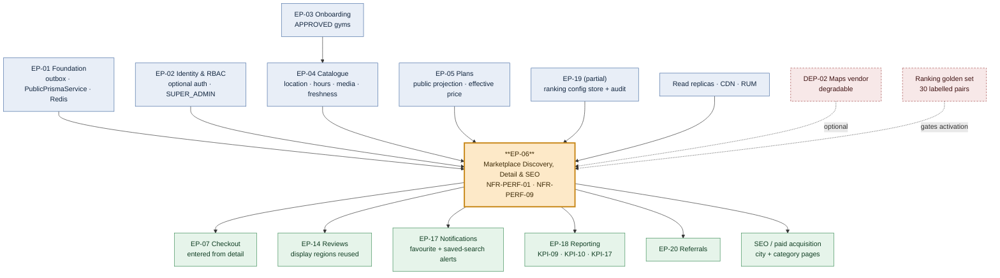

# EP-06 — Marketplace Discovery, Detail & SEO

> **Source of truth:** `docs/MASTER_PRD.md` §B5.6 (`SRCH`), §B5.7 (`DETL`), §B5.8 (`FAV`), §B6 `SCR-WEB-001` … `SCR-WEB-004`, `SCR-WEB-012`, §C2.4 indexes, §C6 Discovery events.
> **Detailed expansion of:** `docs/engineering/phase-0/ENGINEERING_PLAN.md` §2 (EP-06 row), §3 (F-06.1 … F-06.29) and §8.2 (marketplace-search sequence).
> **Governed by:** `docs/PROJECT_CONSTITUTION.md` §23 (DoR / DoD) and §19 (performance budgets) — never contradicted.
> **Launch market:** India — distances in km, `Asia/Kolkata` for "open now", INR/paise with Indian digit grouping (**₹2,50,000**), India-region CDN and data residency.
> **Architecture ruling in force:** PostgreSQL 16 full-text + trigram + **PostGIS**. A search cluster is a **rejected substitution** below ~50,000 published listings (`ADR-0007`, `ENGINEERING_PLAN.md` §9 sprint-3 risk note, `STACK_ADDITIONS.md` Part 3).

---

## 1. Metadata

| Field | Value |
| :--- | :--- |
| **Epic id** | `EP-06` |
| **Epic name** | Marketplace Discovery, Detail & SEO |
| **Priority (MoSCoW)** | **M** — Must. `FR-SRCH-14` and `FR-FAV-04`/`05` are `C`; several `DETL` and `FAV` items are `S`; see §3. |
| **Complexity** | **High** per `ENGINEERING_PLAN.md` §13.1 (`discovery/`) — *"PostGIS radius plus full-text plus trigram plus six filters plus a configurable ranking formula, all inside a 500 ms p95 budget without a search cluster"* |
| **Size / story points** | **XL / 89 points** (≈ 45 engineer-days of implementation + test + review, `§13.1`), plus the `apps/customer-web` share counted separately in §13.2 |
| **Target sprint(s)** | **Sprint 3** — F-06.1 … F-06.12 (search core) · **Sprint 4** — F-06.13 … F-06.29 (ranking, SEO, detail, comparison, favourites) |
| **Milestone** | **M2** (Sprint 4) — *gym onboarding through to a live, browsable, comparable listing demonstrable end to end* |
| **Hard gate** | Sprint 4 exit condition **`E4.1`**: k6 at **2,000 searches/minute sustained** (`NFR-PERF-09`) yielding **p95 ≤ 500 ms and p99 ≤ 1,000 ms** server-side (`NFR-PERF-01`) on a 2,000-gym / 5-city seed |
| **Owning backend module** | `discovery/` (sole owner). Collaborates with `catalog/`, `plans/`, `reviews/`, `admin/` (ranking configuration), `tenancy/` (visibility predicate) |
| **Surfaces** | `web` — `SCR-WEB-001` Home, `SCR-WEB-002` Search Results, `SCR-WEB-003` Gym Detail, `SCR-WEB-004` Comparison, `SCR-WEB-012` Favourites, city and category landing pages · `admin` — `SCR-ADM-011` ranking-weight configuration form |
| **API groups** | `API-DISC` (12 public endpoints, `RL-SEARCH` / `RL-PUBLIC`) · `API-FAV` (6 authenticated endpoints, `RL-READ` / `RL-WRITE`) |
| **Background jobs** | `search.reindex` (on change + nightly), consumer of `catalog/`, `plans/` and `reviews/` outbox events; saved-search match sweep |
| **Feature flags** | `rel.discovery.featured-listings`, `rel.discovery.gym-comparison`, `rel.discovery.favourites`, `rel.discovery.saved-searches`, `rel.discovery.search-this-area`, `rel.discovery.city-launch-gate`, `exp.discovery.ranking-formula-v2`, `ops.discovery.marketplace-search` (kill-switch, permanent), `ops.discovery.map-provider` (kill-switch, permanent), `mig.discovery.opensearch-backend` (dormant) |
| **Critical path** | **No** — `ENGINEERING_PLAN.md` §14.4 places EP-06 off the critical path; it can slip one sprint without moving launch. `E4.1` must still be met **before Sprint 16**, and deferring it into hardening is explicitly the worst available option |
| **Status** | **Ready for refinement** — DoR §23.1 items 5–7 satisfied by tasks T-06.01, T-06.02 and T-06.30 inside this epic |

---

## 2. Business Goal

EP-06 exists to *"get a stranger from 'I should join a gym' to a specific gym's detail page in under
a minute"* (`MASTER_PRD.md` §B5.6). That single sentence is the demand side of the entire business.
`OBJ-02` — enabling a consumer to discover, compare and purchase a membership entirely online,
without a phone call or a visit — has no other implementation. `KPI-09` (search-to-detail ≥ 45%),
`KPI-10` (detail-to-checkout ≥ 8%) and `KPI-17` (marketplace-originated share of gym GMV ≥ 30%) all
measure this epic directly, and `KPI-17` is the number that decides whether the platform is a
marketplace or merely a SaaS with a public directory attached. Every commission rupee in `A6.1`
stream 2 depends on a stranger completing the journey this epic builds.

The second outcome is **speed as a product feature, not a tuning exercise**. `NFR-PERF-01` fixes
marketplace search at p95 ≤ 500 ms and p99 ≤ 1,000 ms, `NFR-PERF-09` requires 2,000 searches per
minute sustained, `NFR-PERF-02` puts gym-detail LCP at ≤ 2.5 s on 4G, and `NFR-PERF-10` caps
customer-web initial JS at 200 KB gzipped. These are not aspirations — Sprint 4's exit condition is
the k6 gate, and `BAC-11` makes the performance profile a business acceptance criterion. The
architecture is deliberately constrained: PostGIS for radius, Postgres FTS + trigram for text, a
denormalised `search_documents` read model, Redis-cached result pages and facet counts, and read
replicas for marketplace traffic. `TR-06` (scored 12, Elevated) is the register entry for missing
the budget, and its contingency ladder is explicit and ordered — tighten radius and cap filter
count, precompute the ranking score, cache per (city, filter-hash), and only past ~50,000 listings,
and only with an ADR, introduce OpenSearch. Reaching for a search cluster in Sprint 4 is a rejected
substitution and would be escalated under `§C10` change control, not decided in a stand-up.

The third outcome is **an honest surface**. `FR-SRCH-09` and `BR-GYM-01` mean an unverified gym is
never discoverable; `BR-TEN-05` means a suspended tenant vanishes from search within 60 seconds
while its existing members still check in; `BR-PLN-05` means a corporate rate never appears in a
price filter's range; `BR-REV-07` and `OQ-10` mean a gym with two reviews shows a count and no
number; `FR-SRCH-11` means a paid placement is labelled as promoted every single time, in both the
visual and the textual sense. `FR-SRCH-12` turns the zero-result state — normally an abandonment
point — into a recovery: name the single most restrictive filter, preview the count if it is
relaxed, offer one tap. And `FR-SRCH-13` server-renders city and category pages because organic
search is the cheapest acquisition channel a marketplace has and `RSK-10` (supply–demand imbalance)
is fought with SEO before it is fought with paid media. Contributing objectives: `OBJ-02`, `OBJ-03`
(trust visible at the point of choice), `OBJ-09` (country-agnostic geography). Contributing KPIs:
`KPI-07`, `KPI-09`, `KPI-10`, `KPI-17`, `KPI-23` (search latency p95 ≤ 500 ms is itself a KPI).

---

## 3. Scope

### 3.1 In scope — explicit

| # | Item | Requirement |
| :-: | :--- | :--- |
| 1 | Location determination: browser geolocation with **contextual** consent on the CTA (never on page load), manual city/locality entry, pincode entry, last location remembered | `FR-SRCH-01`, `SCR-WEB-001` |
| 2 | Free-text search across gym name, locality, city and amenity synonyms with typo tolerance, using Postgres `tsvector` + `pg_trgm` | `FR-SRCH-02`, `ADR-0007` |
| 3 | Ten filters: distance radius, price range (monthly-equivalent normalised), amenities multi-select, rating threshold, open-now, 24-hour access, gender policy, plan duration available, trial available, parking — each with a **live result count** | `FR-SRCH-03`, `SCR-WEB-002` |
| 4 | Five sorts: relevance (default), distance, price ascending, rating, newest | `FR-SRCH-04` |
| 5 | Bidirectional list ↔ map synchronisation: hovering a card highlights its pin, clicking a pin scrolls to and highlights the card; clustered pins with counts; price labels at close zoom | `FR-SRCH-05`, `AC-SRCH-02.1` |
| 6 | Result card contract: cover photo 4:3, name, verified badge, distance, rating + count, lowest monthly-equivalent price, 3 amenity chips, open/closed pill, favourite toggle, compare checkbox | `FR-SRCH-06` |
| 7 | Infinite scroll with a stable "load more" fallback; the map shows results in the current viewport | `FR-SRCH-07` |
| 8 | "Search this area" on pan — results **never** auto-update | `FR-SRCH-08`, `AC-SRCH-02.2` |
| 9 | One shared `PublicVisibilityPredicate`: `APPROVED` + tenant not suspended/past-due-beyond-7-days + ≥1 published `PUBLIC` plan, used by **every** public read path | `FR-SRCH-09`, `BR-GYM-01`, `BR-TEN-05`, `BR-PLN-05` |
| 10 | Ranking as a **fixed set of named bounded components** with integer weights — distance decay, text relevance, Bayesian rating, freshness, completeness, featured boost — configurable without deployment, versioned, audited, revertible in one action, gated by a golden-set regression | `FR-SRCH-10`, `TR-22` |
| 11 | Featured placement as a separate additive slot, always labelled as promoted, never emergent from weights | `FR-SRCH-11`, `OQ-12` |
| 12 | Zero-result recovery naming the single most restrictive filter with a previewed relaxation count, radius expansion and nearby-city suggestions | `FR-SRCH-12`, `AC-SRCH-01.2` |
| 13 | Server-rendered, indexable city and category landing pages with ISR, canonical URLs and a sitemap | `FR-SRCH-13`, `FR-NAV-05` |
| 14 | Saved searches with named criteria and optional new-match alerts | `FR-SRCH-14` (`C`), `FR-FAV-05` (`C`) |
| 15 | Every `§C6` Discovery analytics event emitted server-side with anonymous or authenticated identifier and **no personal data** | `FR-SRCH-15`, `BR-DAT-06` |
| 16 | Gym detail page, all 12 regions, composed by a single query plan | `FR-DETL-01`, `SCR-WEB-003` |
| 17 | Plan cards with price, duration, inclusions, joining fee, access-window note, monthly equivalent and a direct purchase action | `FR-DETL-02`, `FR-DETL-03` |
| 18 | Rating summary: mean, count, 1–5 distribution, with numeric suppression below 3 reviews | `FR-DETL-04`, `BR-REV-07`, `OQ-10` |
| 19 | Review list: paginated, sortable by recency and rating, filterable by rating, showing display name, tenure band, verified marker, rating, text, date and gym response | `FR-DETL-05`, `BR-REV-03`, `BR-REV-05` |
| 20 | "Report this gym" with structured reasons, queued to moderation | `FR-DETL-06` |
| 21 | Share affordance producing a canonical URL with correct link-preview metadata | `FR-DETL-07` |
| 22 | Comparison of up to 4 gyms with a presence matrix, difference emphasis and explicit absence | `FR-DETL-08`, `AC-DETL-01.2` |
| 23 | Comparison state surviving reload and login | `FR-DETL-09`, `FR-NAV-02` |
| 24 | `LocalBusiness` + `AggregateRating` + `Offer` structured data on every gym page | `FR-DETL-10` |
| 25 | Informational page (not a 404) for a previously-live gym now suspended, closed or unapproved | `FR-DETL-11` |
| 26 | Favourite / unfavourite from results, detail and comparison; favourites list with price-change indication; deferred favourite completed after login without context loss; optional promotion/price-change notification | `FR-FAV-01` … `FR-FAV-04` |
| 27 | Graceful maps degradation: list renders fully, map area shows a notice, distances still work because they come from PostGIS | `AC-SRCH-02.3`, `NFR-AVL-03`, `ops.discovery.map-provider` |
| 28 | Performance engineering: `search_documents` read model, GiST + GIN + `gin_trgm_ops` + partial indexes, `EXPLAIN (ANALYZE, BUFFERS)` baselines diffed in CI, Redis result and facet cache with jittered 60 s TTL, read-replica routing, `size-limit` bundle gate | `NFR-PERF-01`, `NFR-PERF-02`, `NFR-PERF-09`, `NFR-PERF-10`, `TR-06` |

### 3.2 Out of scope — explicit, with destination

| Item | Where it went instead | Why |
| :--- | :--- | :--- |
| Gym, branch, media, hours, amenity and closure **data entry** | **EP-04** (`FR-GYM-01` … `FR-GYM-12`) | EP-06 reads the catalogue; it never writes it |
| Plan attributes, prices, promotions, `STAFF_ONLY` visibility rules | **EP-05** (`FR-PLAN-01` … `FR-PLAN-09`, `BR-PLN-05`) | EP-06 consumes the public plan projection |
| Review **submission**, eligibility, moderation, anomaly detection, the Bayesian aggregate computation | **EP-14** (`FR-REV-01` … `FR-REV-10`, `TR-23`) | EP-06 renders the aggregate and consumes `ratingOf(gym)`; it does not compute it |
| The rating **recompute** and the `(sum, count)` pair | **EP-14** | One function, two consumers (`TR-23`); EP-06 is a consumer |
| Checkout, the auth gate itself, order creation | **EP-07** (`FR-CART-*`, `FR-NAV-01`, `FR-NAV-02`) | EP-06 hands over at "Buy now" and preserves the state EP-07 restores |
| Report-this-gym **resolution** and the moderation queue UI | **EP-19** (`SCR-ADM-012`) | EP-06 raises the report with structured reasons |
| Notification delivery for favourite price changes and saved-search matches | **EP-17** (`FR-NOTF-*`) | EP-06 raises the domain event; channels, preferences and quiet hours are EP-17 |
| Ranking-weight **administration screen** styling and the full `SCR-ADM-011` configuration suite | **EP-19** (partial in EP-06: the ranking form only, task T-06.41) | Configuration-without-deployment is an admin capability; EP-06 builds only the ranking slice it needs for `E4.5` |
| Featured-placement **selling**, invoicing and the commercial slot inventory | **EP-19** / commercial ops (`A6.1` stream 3, `OQ-12`) | EP-06 renders and labels the placement and honours `featured_until` |
| Wallet, referrals, help centre | **EP-20** | Unrelated surfaces on the same site |
| OpenSearch, any external search cluster | **Deferred behind `mig.discovery.opensearch-backend`**, triggered at ~50k listings or a sustained p95 breach (`TD-003`) | `ADR-0007`; introducing it in Sprint 4 is a rejected substitution |
| Real-time result updates via websockets | **Phase 2** (`A-08` defers Socket.IO) | Search is request/response; live counters are a dashboard concern |
| Personalised ranking by user history, ML relevance | **Phase 2** (`A11`) | `TR-22` deliberately constrains ranking to bounded named components |

---

## 4. Features

Points sum to the epic's 89. Sprint allocation follows `SprintPlanning.md` Sprint 3 (search core)
and Sprint 4 (ranking, SEO, detail, comparison, favourites).

| Feature | Description | Satisfies | Pri | Pts | Sprint |
| :--- | :--- | :--- | :-: | :-: | :-: |
| **F-06.1** | Location determination: geolocation with contextual consent, city/locality, pincode, remembered last location, IP fallback for the home page | `FR-SRCH-01` | M | 3 | 3 |
| **F-06.2** | Free-text search: `tsvector` over name/locality/city + `pg_trgm` typo tolerance + amenity synonym expansion | `FR-SRCH-02` | M | 5 | 3 |
| **F-06.3** | Ten filters with live facet counts consistent with the result set | `FR-SRCH-03` | M | 8 | 3 |
| **F-06.4** | Five sorts, relevance default | `FR-SRCH-04` | M | 1 | 3 |
| **F-06.5** | Synchronised list + map, bidirectional hover/click, clustering, price labels at zoom | `FR-SRCH-05`, `SCR-WEB-002` | M | 5 | 3 |
| **F-06.6** | Result card contract — all ten elements, no partial card | `FR-SRCH-06` | M | 2 | 3 |
| **F-06.7** | Infinite scroll with "load more" fallback; viewport-scoped map results | `FR-SRCH-07` | M | 3 | 3 |
| **F-06.8** | "Search this area" on pan, never auto-updating | `FR-SRCH-08` | **S** | 2 | 3 |
| **F-06.9** | One shared `PublicVisibilityPredicate` used by all seven public surfaces | `FR-SRCH-09`, `BR-GYM-01`, `BR-TEN-05`, `BR-PLN-05` | M | 3 | 3 |
| **F-06.10** | Configurable ranking: six bounded named components, integer weights, versioned, audited, one-click revert, golden-set gate | `FR-SRCH-10`, `TR-22` | M | 8 | 4 |
| **F-06.11** | Featured placements as separate additive slots, always labelled promoted | `FR-SRCH-11`, `OQ-12` | M | 3 | 4 |
| **F-06.12** | Zero-result recovery: most-restrictive filter named, relaxation count previewed, radius expansion, nearby cities | `FR-SRCH-12` | M | 3 | 3 |
| **F-06.13** | Server-rendered city and category landing pages with ISR, canonical URLs, sitemap, `noindex` under the city gate | `FR-SRCH-13`, `FR-NAV-05` | M | 5 | 4 |
| **F-06.14** | Saved searches with named criteria and new-match alerts | `FR-SRCH-14`, `FR-FAV-05` | **C** | 3 | 4 |
| **F-06.15** | Discovery analytics: all eleven `§C6` Discovery events, emitted server-side, no personal data | `FR-SRCH-15`, `BR-DAT-06` | M | 2 | 4 |
| **F-06.16** | Gym detail composition — 12 regions from a single query plan | `FR-DETL-01`, `SCR-WEB-003` | M | 5 | 4 |
| **F-06.17** | Plan cards with monthly-equivalent pricing, joining fee and access-window note | `FR-DETL-02`, `FR-DETL-03` | M | 3 | 4 |
| **F-06.18** | Rating summary with 1–5 distribution and numeric suppression below 3 reviews | `FR-DETL-04`, `BR-REV-07`, `OQ-10` | M | 2 | 4 |
| **F-06.19** | Review list: pagination, sort, rating filter, tenure band, verified marker, gym response | `FR-DETL-05`, `BR-REV-03`, `BR-REV-05` | M | 3 | 4 |
| **F-06.20** | "Report this gym" with structured reasons, queued to moderation | `FR-DETL-06` | M | 2 | 4 |
| **F-06.21** | Share affordance with canonical URL and link-preview metadata | `FR-DETL-07` | **S** | 1 | 4 |
| **F-06.22** | Four-gym comparison: presence matrix, difference emphasis, explicit absence, fifth-gym prompt | `FR-DETL-08` | **S** | 5 | 4 |
| **F-06.23** | Comparison persistence across reload and login | `FR-DETL-09`, `FR-NAV-02` | **S** | 2 | 4 |
| **F-06.24** | Structured data: `LocalBusiness`, `AggregateRating`, `Offer` | `FR-DETL-10` | **S** | 2 | 4 |
| **F-06.25** | Informational page for a previously-live, now-unavailable gym | `FR-DETL-11` | **S** | 2 | 4 |
| **F-06.26** | Favourite / unfavourite from results, detail and comparison | `FR-FAV-01` | **S** | 2 | 4 |
| **F-06.27** | Favourites list with current price and change since favouriting; unavailable shown as unavailable | `FR-FAV-02`, `SCR-WEB-012` | **S** | 2 | 4 |
| **F-06.28** | Deferred favourite completed after login, returning to exact context | `FR-FAV-03`, `FR-NAV-02` | **S** | 1 | 4 |
| **F-06.29** | Notification when a favourited gym launches a promotion or changes price | `FR-FAV-04` | **C** | 1 | 4 |
| | **Total** | | | **89** | |

**Sprint split.** Sprint 3 carries F-06.1 … F-06.9 and F-06.12 = **32 points**. Sprint 4 carries
F-06.10, F-06.11 and F-06.13 … F-06.29 = **57 points**. Sprint 4 is Diwali-affected with capacity
down 10%; `SprintPlanning.md` pre-designates **F-06.14** (saved searches) and **F-06.25**
(unavailable-gym page) as the first carry-outs, and both are `C`/`S` behind flags.

---

## 5. User Stories

`US-SRCH-01`, `US-SRCH-02`, `US-DETL-01`, `US-DETL-02` and `US-FAV-01` are restated verbatim from
`MASTER_PRD.md` §B5.6 – §B5.8 with their `AC-` identifiers unchanged. `US-SRCH-03` … `US-FAV-03`
are **new**: the functional requirements, the edge-case lists and the screen specs imply them but
the PRD did not write them. New criteria are marked **(NEW)**.

### US-SRCH-01 *(PRD)*

> *As Priya, I want to see only gyms open at 6 a.m. within 3 km so that I don't waste time on ones I
> can't use.*

| AC | Given / When / Then |
| :--- | :--- |
| **AC-SRCH-01.1** | **Given** I set radius 3 km and filter "open at 06:00", **when** results render, **then** every result's operating hours include 06:00 on the current weekday **in `Asia/Kolkata`**, and every result is within 3 km of my location by PostGIS distance |
| **AC-SRCH-01.2** | **Given** no gym matches, **when** results render, **then** I am told which single filter is most restrictive and offered a one-tap relaxation of it, with the resulting count previewed before I tap |
| **AC-SRCH-01.3** | **Given** I apply filters, **when** I share or reload the URL, **then** the same location, query, filters, sort and page are restored exactly |

### US-SRCH-02 *(PRD)*

> *As a visitor, I want the map and the list to feel like one thing.*

| AC | Given / When / Then |
| :--- | :--- |
| **AC-SRCH-02.1** | **Given** results are displayed, **when** I hover a list card, **then** its map pin is highlighted; **when** I click a pin, **then** the list scrolls to that card and highlights it |
| **AC-SRCH-02.2** | **Given** I pan the map away from the current results, **when** panning ends, **then** a "search this area" control appears and results update **only** when I invoke it |
| **AC-SRCH-02.3** | **Given** the maps provider is unavailable, **when** the page loads, **then** the list renders fully and the map area shows a graceful notice rather than blocking the page |

### US-SRCH-03 — Search that survives a typo and a synonym *(NEW — implied by `FR-SRCH-02`)*

> *As a visitor typing on a phone, I want "crosfit koramangla" to find CrossFit gyms in Koramangala.*

| AC | Given / When / Then |
| :--- | :--- |
| **AC-SRCH-03.1** **(NEW)** | **Given** a query with a one- or two-character transposition or omission in a gym name, locality or city, **when** results render, **then** the intended matches appear, ranked by trigram similarity above exact-but-irrelevant matches |
| **AC-SRCH-03.2** **(NEW)** | **Given** a query matching an amenity **synonym** ("sauna" for "steam room" where the taxonomy declares them related), **when** results render, **then** gyms carrying the canonical amenity appear |
| **AC-SRCH-03.3** **(NEW)** | **Given** a query of a single character or of only punctuation, **when** submitted, **then** it is treated as no query rather than executing an unbounded scan, and the response stays inside the `NFR-PERF-01` budget |
| **AC-SRCH-03.4** **(NEW)** | **Given** the suggest endpoint, **when** I type three characters, **then** suggestions return within 150 ms p95 and contain only gyms passing the `PublicVisibilityPredicate` |

### US-SRCH-04 — Filters that tell the truth before I apply them *(NEW — implied by `FR-SRCH-03`, `SCR-WEB-002`)*

> *As Priya, I want each filter to show how many gyms I would still have if I ticked it.*

| AC | Given / When / Then |
| :--- | :--- |
| **AC-SRCH-04.1** **(NEW)** | **Given** the filter rail is open, **when** results are loaded, **then** every filter option displays a live count consistent with the current result set, computed in the same request as the results — never from a separate, divergent query |
| **AC-SRCH-04.2** **(NEW)** | **Given** I tick an amenity whose count is 0, **when** the option renders, **then** it is visibly disabled with its zero count shown rather than hidden, so the absence is information |
| **AC-SRCH-04.3** **(NEW)** | **Given** the price filter, **when** it renders, **then** its range is computed from **public, published** plans only, with `STAFF_ONLY` plans excluded from both ends of the range (`BR-PLN-05`) |
| **AC-SRCH-04.4** **(NEW)** | **Given** six filters applied simultaneously, **when** the search runs, **then** server-side p95 remains ≤ 500 ms at the `NFR-PERF-09` load profile, and p95 does not diverge sharply by `filter_count` — the signature of the planner abandoning an index (`TR-06`) |

### US-SRCH-05 — Ranking I can change without a release *(NEW — implied by `FR-SRCH-10`, `TR-22`)*

> *As a Super Admin, I want to raise the weight on distance without waiting for a deployment — and I
> want to be unable to break search doing it.*

| AC | Given / When / Then |
| :--- | :--- |
| **AC-SRCH-05.1** **(NEW)** | **Given** the ranking configuration form, **when** I change a weight and activate it, **then** the next search reflects the new order with **no deployment**, and the change is versioned with actor, timestamp and rationale |
| **AC-SRCH-05.2** **(NEW)** | **Given** a candidate weight set, **when** I attempt to activate it, **then** a **golden-set regression** of 30 hand-labelled query/expected-top-3 pairs runs first, and a failing golden set **blocks activation** |
| **AC-SRCH-05.3** **(NEW)** | **Given** a weight object with a negative weight, a non-integer, an out-of-range value or a zero sum, **when** submitted, **then** Zod refuses it with a specific message; the formula is **not an expression language** and no free-form expression can be submitted |
| **AC-SRCH-05.4** **(NEW)** | **Given** a gym with zero reviews, **when** ranked, **then** the rating component returns the Bayesian **prior**, never `NaN` and never a division by zero |
| **AC-SRCH-05.5** **(NEW)** | **Given** a bad weight version is activated, **when** I click revert, **then** the previous version is restored in **one action**; and if the stored configuration fails validation at load, a hard-coded fallback weight set is used so search degrades rather than disappearing |
| **AC-SRCH-05.6** **(NEW)** | **Given** featured placement, **when** results render, **then** the featured slot is **additive and separate**, never emergent from the weights, and is labelled promoted in both arms of `exp.discovery.ranking-formula-v2` |

### US-SRCH-06 — The city landing page that Google can read *(NEW — implied by `FR-SRCH-13`)*

> *As a first-time visitor arriving from a search engine, I want the page to already contain gyms.*

| AC | Given / When / Then |
| :--- | :--- |
| **AC-SRCH-06.1** **(NEW)** | **Given** a city landing page, **when** it is fetched with JavaScript disabled, **then** the gym list, names, localities, ratings and prices are present in the server-rendered HTML |
| **AC-SRCH-06.2** **(NEW)** | **Given** the same page, **when** it renders, **then** it carries a canonical URL, a title and meta description derived from the city, and appears in the sitemap |
| **AC-SRCH-06.3** **(NEW)** | **Given** `rel.discovery.city-launch-gate` is OFF for a city, **then** that city's landing page is excluded from the sitemap and marked `noindex`, and the city is hidden from the picker — while its gyms stay fully live, sellable and reachable by direct link and by search from an adjacent location |
| **AC-SRCH-06.4** **(NEW)** | **Given** a gym is approved, suspended or has its last public plan archived, **when** the next ISR revalidation or outbox invalidation occurs, **then** the city page reflects it within the 60-second staleness budget |

### US-DETL-01 *(PRD)*

> *As Priya, I want to compare three gyms side by side so that I can stop going back and forth
> between tabs.*

| AC | Given / When / Then |
| :--- | :--- |
| **AC-DETL-01.1** | **Given** I have added three gyms to comparison, **when** I open the comparison view, **then** all three render side by side with aligned attribute rows and differing values visually emphasised |
| **AC-DETL-01.2** | **Given** a gym in my comparison lacks an amenity another has, **when** I view the amenity row, **then** absence is shown **explicitly** rather than left blank |
| **AC-DETL-01.3** | **Given** I attempt to add a fifth gym, **when** I do so, **then** I am prompted to remove one, and the comparison never silently drops an entry |

### US-DETL-02 *(PRD)*

> *As a visitor, I want to trust the rating.*

| AC | Given / When / Then |
| :--- | :--- |
| **AC-DETL-02.1** | **Given** a gym has fewer than 3 published reviews, **when** I view it, **then** no numeric rating is displayed; instead the review count is shown with an explanation |
| **AC-DETL-02.2** | **Given** reviews exist, **when** I view any review, **then** it carries a "Verified member" marker, and there is no review on the page without one |
| **AC-DETL-02.3** | **Given** the gym responded to a review, **when** I read it, **then** the response is visually attached to the review and labelled as the gym's response |

### US-DETL-03 — A page that answers what a visit would have *(NEW — implied by `FR-DETL-01`, `SCR-WEB-003`)*

> *As Priya, I want to know the hours, the crowd, the parking and the exact price before I go.*

| AC | Given / When / Then |
| :--- | :--- |
| **AC-DETL-03.1** **(NEW)** | **Given** the detail page, **when** it renders, **then** all twelve `SCR-WEB-003` regions are present in the specified order, and the timings table highlights **today** in `Asia/Kolkata` |
| **AC-DETL-03.2** **(NEW)** | **Given** the page on a throttled 4G profile, **when** measured, **then** LCP ≤ 2.5 s (`NFR-PERF-02`) and initial JS for `customer-web` ≤ 200 KB gzipped (`NFR-PERF-10`) |
| **AC-DETL-03.3** **(NEW)** | **Given** an active temporary closure, **when** the page renders, **then** the closure and its reason appear above the fold, not buried in the timings table (`AC-GYM-02.1`) |
| **AC-DETL-03.4** **(NEW)** | **Given** a plan with a restricted access window, **when** its card renders, **then** the restriction appears on the card itself (`AC-PLAN-07.1`) |
| **AC-DETL-03.5** **(NEW)** | **Given** the "similar gyms nearby" region, **when** it renders, **then** every suggestion passes the `PublicVisibilityPredicate` and none is the gym itself |

### US-DETL-04 — The gym that is no longer listed *(NEW — implied by `FR-DETL-11`)*

> *As someone following an old link, I want to know what happened, not see a 404.*

| AC | Given / When / Then |
| :--- | :--- |
| **AC-DETL-04.1** **(NEW)** | **Given** a gym that was previously live and is now suspended or closed, **when** its canonical URL is requested, **then** a clear informational page explains unavailability and offers similar gyms nearby — **not** a bare 404 |
| **AC-DETL-04.2** **(NEW)** | **Given** a gym that was **never** approved, **when** its URL is guessed, **then** the response is `404` and no listing detail whatsoever is disclosed (`BR-GYM-01-N1`) |
| **AC-DETL-04.3** **(NEW)** | **Given** the informational page, **when** a crawler fetches it, **then** it is marked `noindex` and removed from the sitemap, while remaining reachable by direct link |

### US-FAV-01 *(PRD)*

> *As a user, I want to shortlist gyms now and decide at the weekend.*

| AC | Given / When / Then |
| :--- | :--- |
| **AC-FAV-01.1** | **Given** I favourite a gym while unauthenticated, **when** I complete login, **then** the gym is in my favourites and I am returned to exactly where I was, with scroll position and filters intact |
| **AC-FAV-01.2** | **Given** a favourited gym's lowest price changed, **when** I open favourites, **then** the change is indicated with both the old and the new value |
| **AC-FAV-01.3** | **Given** a favourited gym is suspended, **when** I open favourites, **then** it is shown as **unavailable** rather than silently removed |

### US-FAV-02 — A saved search that tells me when something new opens *(NEW — implied by `FR-SRCH-14`, `FR-FAV-05`)*

> *As someone whose area has no good gym yet, I want to be told when one appears.*

| AC | Given / When / Then |
| :--- | :--- |
| **AC-FAV-02.1** **(NEW)** | **Given** I save a search with a name, **when** I reopen it, **then** the exact location, query, filters and sort are restored |
| **AC-FAV-02.2** **(NEW)** | **Given** a new gym is approved that matches a saved search with alerts enabled, **when** the match sweep runs, **then** one alert is queued to EP-17, honouring notification preferences and quiet hours, and never more than one alert per saved search per day |
| **AC-FAV-02.3** **(NEW)** | **Given** `rel.discovery.saved-searches` is OFF, **then** no search can be saved and no alert is queued, while the URL still encodes location, query, every filter, sort and page so bookmarking still works |

### US-FAV-03 — Degrading without failing *(NEW — implied by `NFR-AVL-03`, edge cases in §B5.6)*

> *As a visitor, I want the site to still work when something behind it does not.*

| AC | Given / When / Then |
| :--- | :--- |
| **AC-FAV-03.1** **(NEW)** | **Given** `ops.discovery.marketplace-search` is pulled, **when** I visit, **then** `/search/gyms` and `/search/suggest` return a maintenance state, the search bar is replaced by a city picker, city and category pages serve their last good cached list, **and** gym detail still resolves by slug, checkout still completes and check-in is untouched |
| **AC-FAV-03.2** **(NEW)** | **Given** `ops.discovery.map-provider` is pulled, **when** I search, **then** no request of any kind is made to the maps vendor, the map panel shows the `AC-SRCH-02.3` notice, "search this area" is hidden, and **distances keep working** because they come from PostGIS |
| **AC-FAV-03.3** **(NEW)** | **Given** I deny geolocation permission, **when** the page loads, **then** I get a city selector — never an empty state |
| **AC-FAV-03.4** **(NEW)** | **Given** I am outside any served city, **when** I search, **then** the nearest served city is shown with an explicit explanation, and my location is captured as an anonymised demand signal for expansion |
| **AC-FAV-03.5** **(NEW)** | **Given** an extremely dense area, **when** the map renders, **then** pins cluster with counts and expand on zoom rather than rendering 400 overlapping markers |

---

## 6. Acceptance Criteria for the Epic

Grouped for readability; all are mandatory. The epic is not done until every one passes.

### 6.1 Performance — the Sprint 4 gate

| # | Criterion | Evidence |
| :-: | :--- | :--- |
| **EAC-06.01** | k6 at **2,000 searches/minute sustained** for 10 minutes against a 2,000-gym / 5-city seed yields **p95 ≤ 500 ms and p99 ≤ 1,000 ms** server-side, excluding client render | `NFR-PERF-01`, `NFR-PERF-09`, `KPI-23`, Sprint 4 `E4.1` |
| **EAC-06.02** | `EXPLAIN (ANALYZE, BUFFERS)` on all six canonical query shapes shows index usage on `branches.location` (GiST) and the `tsvector` GIN index, with **no sequential scan** on the hot path; the plans are committed as CI baselines and a plan regression **fails the build** | `TR-06`, Sprint 4 `E4.2` |
| **EAC-06.03** | Redis cache hit ratio on result pages ≥ 60% under the k6 profile, with jittered TTL so expiry does not stampede | Sprint 4 `E4.3` |
| **EAC-06.04** | p95 does **not** diverge sharply as `filter_count` rises from 1 to 6 — the planner does not abandon its index under filter composition | `TR-06` early-warning signal |
| **EAC-06.05** | **No search cluster exists**: `package.json` and Terraform contain no OpenSearch; `mig.discovery.opensearch-backend` remains OFF | `ADR-0007`, Sprint 4 `E4.4`, `STACK_ADDITIONS.md` Part 3 |
| **EAC-06.06** | Gym detail LCP ≤ 2.5 s on a throttled 4G profile, measured by RUM and by Lighthouse | `NFR-PERF-02`, Sprint 4 `E4.7` |
| **EAC-06.07** | `size-limit` proves `customer-web` initial JS ≤ 200 KB gzipped, enforced as a **blocking** CI gate | `NFR-PERF-10`, Sprint 4 `E4.10`, `TR-18` |
| **EAC-06.08** | Marketplace reads are routed to read replicas; writes never contend with search; financial reads are never served from a replica | `NFR-SCAL-04`, `TR-10` |

### 6.2 Correctness of what is shown

| # | Criterion | Evidence |
| :-: | :--- | :--- |
| **EAC-06.09** | Search returns only gyms that are `APPROVED`, with a non-suspended tenant not past-due beyond 7 days, and with ≥ 1 published `PUBLIC` plan — via **one** shared `PublicVisibilityPredicate` composed by every public read path | `FR-SRCH-09`, `BR-GYM-01`, `BR-TEN-05`, `BR-PLN-05`, Sprint 3 `E3.5` |
| **EAC-06.10** | A CI contract test asserts that **every** `web`-facing endpoint composes the predicate; adding a public endpoint without it fails the build | `BR-GYM-01` L12-CI |
| **EAC-06.11** | Suspending a tenant removes its gyms from search, category, map-bounds, comparison, favourites and sitemap responses within **60 seconds** | `BR-TEN-05-P1`, `BR-TEN-05-N1`, `BAC-02` |
| **EAC-06.12** | A `STAFF_ONLY` plan never contributes to the price filter's range, the "lowest monthly-equivalent price" on a card, comparison price rows or SSR structured data | `BR-PLN-05-N1`, Sprint 3 `E3.4` |
| **EAC-06.13** | A gym with fewer than 3 published reviews displays **no** numeric rating — count plus explanation only — on cards, detail, comparison and `AggregateRating` markup | `BR-REV-07`, `OQ-10`, `AC-DETL-02.1`, Sprint 4 `E4.9` |
| **EAC-06.14** | Displayed rating order never contradicts result order by more than the featured-slot offset; the displayed mean and the ranking input come from **one** `ratingOf(gym)` call over the same `(sum, count)` pair | `TR-23`, `TD-015` |
| **EAC-06.15** | Every review rendered carries a "Verified member" marker; there is no review on any page without one | `BR-REV-03`, `AC-DETL-02.2` |
| **EAC-06.16** | Every featured placement is labelled as promoted, visually and textually, in **both** arms of `exp.discovery.ranking-formula-v2` and on the home Featured strip | `FR-SRCH-11`, Sprint 4 `E4.6` |
| **EAC-06.17** | Prices shown in search, detail, comparison and favourites equal the price checkout charges for the same plan at the same moment; a stale display is detectable because the detail page renders the plan's `updated_at` | `BR-PLN-03`, `TR-30`, `INV-TRU-7` |
| **EAC-06.18** | All ten filters and all five sorts function, with facet counts consistent with the result set, computed in the same request | `FR-SRCH-03`, `FR-SRCH-04`, Sprint 3 `E3.6` |
| **EAC-06.19** | A zero-result search names the **single** most restrictive filter and previews the resulting count before the user relaxes it | `FR-SRCH-12`, Sprint 3 `E3.7`, `AC-SRCH-01.2` |
| **EAC-06.20** | All money renders with Indian digit grouping via the single `packages/utils` formatter | Sprint 3 `E3.9`, `LAUNCH_MARKET_INDIA.md` §2 |

### 6.3 Ranking configurability

| # | Criterion | Evidence |
| :-: | :--- | :--- |
| **EAC-06.21** | Ranking weights change through configuration and take effect **without a deployment** | `FR-SRCH-10`, Sprint 4 `E4.5` |
| **EAC-06.22** | The formula is **not** an expression language: six fixed, named, bounded components, each an integer weight in a validated range, summed; a submitted expression string is impossible to represent | `TR-22` |
| **EAC-06.23** | The weight sum must be positive; every component is a pure function with defined behaviour at zero; a gym with no reviews scores the prior, never `NaN` | `TR-22` |
| **EAC-06.24** | A candidate weight set must pass a **golden-set regression** of 30 hand-labelled query/expected-top-3 pairs before activation; a failing golden set blocks activation | `TR-22`, `TD-024` |
| **EAC-06.25** | Weight versions are audited with actor and rationale and revertible in **one action**; a stored configuration that fails validation at load falls back to a hard-coded weight set rather than removing search | `TR-22`, `BR-DAT-01` |
| **EAC-06.26** | Ranking configuration is gated behind a `SUPER_ADMIN` permission | `TR-22`, `FR-RBAC-01` |

### 6.4 Interaction, SEO and resilience

| # | Criterion | Evidence |
| :-: | :--- | :--- |
| **EAC-06.27** | Hovering a card highlights its pin and clicking a pin scrolls to and highlights the card, at 200+ pins without dropped frames | `AC-SRCH-02.1`, `§13.2` risk 2 |
| **EAC-06.28** | Panning the map **never** auto-updates results; "search this area" is the only trigger | `AC-SRCH-02.2`, `FR-SRCH-08` |
| **EAC-06.29** | Location, query, all filters, sort and page are encoded in the URL and restored on load and on share | `AC-SRCH-01.3`, `SCR-WEB-002` |
| **EAC-06.30** | With the maps provider disabled by flag, the list renders fully, search works, and distances are still correct | Sprint 4 `E4.8`, `AC-SRCH-02.3`, `NFR-AVL-03` |
| **EAC-06.31** | City and category pages are server-rendered with the gym list present in the HTML with JavaScript disabled, carry canonical URLs, and appear in the sitemap unless gated `noindex` | `FR-SRCH-13`, `AC-SRCH-06.1` … `06.3` |
| **EAC-06.32** | `LocalBusiness`, `AggregateRating` and `Offer` structured data are present and valid on every gym page, and `AggregateRating` is **absent** where the rating is suppressed | `FR-DETL-10`, `BR-REV-07` |
| **EAC-06.33** | A previously-live gym now unavailable returns an informational page, `noindex`, with similar gyms; a never-approved gym returns `404` | `FR-DETL-11`, `BR-GYM-01-N1` |
| **EAC-06.34** | Comparison holds up to 4 gyms, emphasises differences, shows absence explicitly, prompts on a fifth, and survives reload and login | `FR-DETL-08`, `FR-DETL-09`, `AC-DETL-01.*` |
| **EAC-06.35** | A favourite made while unauthenticated completes after login and returns the user to the exact prior context including scroll position | `AC-FAV-01.1`, `FR-NAV-02` |
| **EAC-06.36** | Favourites show the current lowest price and the change since favouriting; a suspended gym appears as unavailable rather than disappearing | `AC-FAV-01.2`, `AC-FAV-01.3`, `SCR-WEB-012` |
| **EAC-06.37** | All eleven `§C6` Discovery events are emitted with the specified properties, with **latitude and longitude precision-reduced** and no personal data | `FR-SRCH-15`, `BR-DAT-06` |
| **EAC-06.38** | axe-core is clean and the keyboard path is complete on `SCR-WEB-001` … `SCR-WEB-004` and `SCR-WEB-012`; the map has a documented non-map equivalent for every action | `NFR-USE-01`, `NFR-USE-02`, Sprint 4 `E4.11` |
| **EAC-06.39** | Rate limits are enforced: `RL-SEARCH` 60/min per session and 600/min per IP on `/search/*` and `/compare`; `RL-PUBLIC` 120/min per IP on public reads | `NFR-SEC-06`, `§6.2` rate classes |
| **EAC-06.40** | All ten EP-06 feature flags behave as documented in both positions, and the two `ops.discovery.*` kill-switches are proven to degrade rather than fail | `NFR-MNT-07`, `NFR-AVL-03` |

---

## 7. Business Rules Enforced

Detail lives in `docs/engineering/BusinessRules.md` and is **not duplicated here**. EP-06 is unusual:
it **owns no rule outright** — it is a read surface — but it is the **authoritative enforcement
point** for the visibility half of four rules, which is where the money and the trust actually live.

| BR | Ownership | Enforcement point inside EP-06 | Tests |
| :--- | :--- | :--- | :--- |
| **`BR-GYM-01`** | **Co-owned** with `catalog/` — *"A gym must not be visible in marketplace search until it has status `APPROVED`"* | **AUTHORITATIVE `L6-UC`:** one shared `PublicVisibilityPredicate` used by search, map bounds, category pages, city pages, comparison, favourites, sitemap and structured data. `L1-DB`: partial index `(status, rating_avg DESC, freshness_score DESC) WHERE status='APPROVED'` makes the approved set the only cheap query. `L4-EXT`: `PublicPrismaService` reads only the approved-gym projection. `L12-CI`: contract test asserts every `web` endpoint composes the predicate | `BR-GYM-01-P1`, `BR-GYM-01-N1` |
| **`BR-TEN-05`** | **Co-owned** with `tenancy/` — *"a suspended tenant is removed from marketplace search immediately"* | **AUTHORITATIVE for the visibility half:** the discovery read path filters tenant status; `search.reindex` propagates suspension inside the `BAC-02` 60-second window. The check-in path deliberately does **not** consult tenant status — EP-06 must not leak its predicate into `attendance/` | `BR-TEN-05-P1`, `BR-TEN-05-N1`, `-N2` |
| **`BR-PLN-05`** | **Co-owned** with `plans/` — *"a staff-only plan is never returned by any public API"* | EP-06 consumes the **separate public plan projection** and never the dashboard one; the price filter's range, the card's lowest price, comparison price rows and `Offer` markup all read the public projection only | `BR-PLN-05-N1` |
| **`BR-REV-07`** | **Participates** (owner: `reviews/`) — *"ratings are not displayed at all below a minimum of 3 reviews"* | Suppression applies on cards, detail, comparison **and** `AggregateRating` markup; below the threshold the gym is **ranked on the prior**, not on its single review (`TR-23`) | `BR-REV-07-P1`, `BR-REV-07-N1` |
| **`BR-REV-03`** | **Participates** (owner: `reviews/`) | Every rendered review carries the "Verified member" marker; there is no unverified review type to render | `BR-REV-03-P1` |
| **`BR-REV-05`** | **Participates** (owner: `reviews/`) | The gym response renders attached to its review and labelled; EP-06 exposes **no** edit or delete affordance for a member's review anywhere | `BR-REV-05-N1` |
| **`BR-PLN-03`** | **Participates** (owner: `ordering/`) | The rule is satisfied by the checkout abort, but **every stale display that reaches checkout is a `422` in a member's face**; EP-06 therefore owns the 60-second staleness budget across projection, ISR, CDN and client cache, with `staleTime: 0` on price-bearing queries | `BR-PLN-03-P1`, `TR-30` |
| **`BR-GYM-06`** | **Participates** (owner: `catalog/`) | Search returns the gym at its **old approved coordinates** while an address field is under review | `BR-GYM-06-P1` |
| **`BR-TEN-06`** | **Participates** (owner: `billing/`) | Discovery filters `subscription_status` past day 7 of `PAST_DUE`, **reusing the `BR-TEN-05` predicate** rather than adding a second one | `BR-TEN-06-P1` |
| **`BR-DAT-06`** | **Inherits** | Analytics events carry precision-reduced coordinates and no personal data; search queries are not logged with an identifiable user string | `BR-DAT-06-N1` |
| **`BR-TEN-01`** | **Inherits** | `API-DISC` is **exempt from tenant RLS by design** — it reads the platform-scope search read model, not tenant tables. That exemption is itself a tested property: the public path must not be able to reach a tenant table | `BAC-10`, `TR-34` |

---

## 8. Dependencies

### 8.1 Upstream — must exist before EP-06 starts

| Dependency | From | What EP-06 needs from it |
| :--- | :--- | :--- |
| **EP-01** Platform Foundation | Sprint 0 | Transactional outbox (`ADR-0017`) — the projection is invalidated by events, not TTLs; `PublicPrismaService` and the platform-scope elevation (`ADR-0005`); Redis 7; the error registry; OpenTelemetry spans |
| **EP-02** Identity & RBAC | Sprint 1 | Optional authentication on public endpoints; `favourite:*` and `saved_search:*` permissions; the `SUPER_ADMIN` permission gating ranking configuration |
| **EP-03** Onboarding & Verification | Sprint 2 | `APPROVED` gyms to search. Without approvals the seed is fiction and `TR-33` (test-seed drift) materialises |
| **EP-04** Gym, Branch & Media Catalogue | Sprint 2 | `branches.location` + GiST index, hours and exceptions, amenities with synonyms, gender policy, cover photos and renditions, `freshness_score`, `featured_until`, closure state |
| **EP-05** Plan Catalogue | Sprint 3 (parallel) | The public plan projection, effective price with promotions, monthly-equivalent function, `≥1 published PUBLIC plan` half of the visibility gate |
| **EP-14** Reviews *(partial, out of sequence)* | Sprint 10 | `gyms.rating_avg` / `rating_count` exist from Sprint 2 as columns; the review **list** region ships in Sprint 4 against seeded review data and is re-verified in Sprint 10 |
| **EP-19** *(partial, pulled forward)* | Sprint 4 | The ranking-weight configuration store, versioning and audit — EP-06 builds the ranking slice of `SCR-ADM-011` (T-06.41) and EP-19 completes the rest in Sprint 15 |
| **Infrastructure** | Sprints 3–4 | Read-replica provisioning and routing (Sprint 3 task 3.21); CDN configuration, cache keys, image rendition delivery, RUM collection (Sprint 4 task 4.23) |

### 8.2 Downstream — what EP-06 unblocks

| Unblocks | Why it cannot proceed without EP-06 |
| :--- | :--- |
| **EP-07** Checkout, Orders & Coupons | Checkout is entered from the detail page and must restore the exact plan and filter state across the auth gate (`FR-NAV-02`) |
| **EP-14** Reviews, Ratings & Moderation | The review display regions, distribution chart and gym-response rendering already exist; EP-14 supplies real content and the aggregate |
| **EP-17** Notifications | Favourite price-change and saved-search-match events originate here |
| **EP-18** Reporting & Analytics | The `§C6` Discovery funnel — `KPI-09`, `KPI-10`, `KPI-17` — is computed from events this epic emits |
| **EP-20** Referrals | Referral links resolve to a gym detail page with attribution |
| **Marketing / SEO / paid acquisition** | City and category landing pages are the destinations; `rel.discovery.city-launch-gate` is the switch that makes `C9.4` city gating executable |

### 8.3 External dependencies and open questions

| Type | Item | Impact if late or unavailable |
| :--- | :--- | :--- |
| **`DEP-02`** Maps / geocoding vendor | Pin rendering, clustering, the directions link, "search this area" viewport bounds | **Degradable by design.** `ops.discovery.map-provider` pulls all vendor calls; the list renders fully and **distances still work** because radius comes from PostGIS. `CON-02` caps the third-party call budget |
| **`OQ-12`** Featured listings at launch | **Answered — yes**, manually sold with an automated slot | `rel.discovery.featured-listings` OFF means organic order everywhere and `A6.1` revenue stream 3 is dormant — a commercial cost, not a technical block |
| **`OQ-14`** Trial / day-pass plans | **Answered — yes**, `SESSION` plan with count 1 | Drives the "trial available" filter |
| **`OQ-10`** Minimum reviews before a numeric rating | **Answered — 3** | Applies to display **and** ranking (`TR-23`) |
| **Client decision** | Category tree content for `SCR-WEB-001` tiles and category landing pages (24-hour, women-only, budget, premium, CrossFit, yoga) | Category pages cannot ship without it; city pages can |
| **Client decision** | Launch city list and the `C9.4` gate criteria per city | `rel.discovery.city-launch-gate` defaults OFF per city, so a late answer suppresses demand generation without suppressing supply |
| **Content** | 30 hand-labelled query/expected-top-3 pairs for the ranking golden set | Without it `AC-SRCH-05.2` cannot pass and `TD-024` is realised on day one; QA authors a provisional set in Sprint 3 |
| **`OQ-NEW-06.1` … `06.8`** | See §13.2 | Each carries a proposed default so no item is blocked (`§23.1` item 10) |

### 8.4 Dependency graph

---

## 9. Technical Tasks

Layers: **DB** · **API** · **worker** · **web** (`customer-web`) · **admin** (`admin-dashboard`) ·
**infra** · **test** · **docs**. Estimates are engineer-days (ed). "Spr" is the target sprint.

| # | Task | Layer | ed | Spr | Depends on | Serves |
| :--- | :--- | :--- | :-: | :-: | :--- | :--- |
| **T-06.01** | Author `/docs/apis/api-disc.md` and `/docs/apis/api-fav.md`: 18 endpoints with permission, Zod query/response, error codes, cursor pagination, rate class, cache headers | docs | 1.0 | 3 | EP-01 | `§23.1`#5 |
| **T-06.02** | Author `/docs/database/discovery.md`: `search_documents`, `favourites`, `saved_searches`, `ranking_weight_versions`, `gym_reports`, plus the six index definitions and their rationale | docs | 0.5 | 3 | EP-01 | `§23.1`#6 |
| **T-06.03** | `search_documents` denormalised read model: one row per **branch** carrying gym identity, location, city, locality, cover rendition keys, amenity id array, hours summary, gender policy, rating pair, freshness, featured window, min/max public monthly-equivalent price, plan-duration set, trial/parking flags | DB | 2.0 | 3 | EP-04, EP-05 | `TR-06` mitigation, `FR-SRCH-06` |
| **T-06.04** | Index set: GiST on `location`; GIN on `tsvector`; `gin_trgm_ops` on name and locality; **partial** indexes restricted to `status='APPROVED' AND published`; composite `(city, status)`; `(status, rating_avg DESC, freshness_score DESC)` | DB | 1.0 | 3 | T-06.03 | `C2.4`, `TR-06` |
| **T-06.05** | `search.reindex` job: outbox consumer for gym, branch, media, hours, amenity, plan, review and tenant-status events; nightly full rebuild; idempotent by event id; 60-second propagation budget | worker | 2.0 | 3 | EP-01 outbox | `BAC-02`, `TR-08`, `TR-30` |
| **T-06.06** | `PublicVisibilityPredicate` as one composable construct + the CI contract test asserting every `web` endpoint composes it | API | 1.0 | 3 | T-06.03 | `FR-SRCH-09`, `BR-GYM-01`, `BR-TEN-05`, `BR-PLN-05` |
| **T-06.07** | Radius query: `ST_DWithin` on indexed geography applied **first** to shrink the candidate set before any ranking; km distance returned per result | API | 1.0 | 3 | T-06.04 | `FR-SRCH-01`, `TR-06` |
| **T-06.08** | Free-text: `tsvector` build with weighted fields, `pg_trgm` similarity fallback, amenity synonym expansion, single/punctuation query short-circuit | API | 2.0 | 3 | T-06.04 | `FR-SRCH-02`, `AC-SRCH-03.*` |
| **T-06.09** | `/search/suggest` typeahead with a 150 ms p95 budget and predicate-filtered results | API | 0.5 | 3 | T-06.08 | `AC-SRCH-03.4` |
| **T-06.10** | Ten filters as composable predicates: distance, price (monthly-equivalent), amenities, rating, open-now (IST), 24-hour, gender, durations, trial, parking | API | 2.5 | 3 | T-06.06 | `FR-SRCH-03` |
| **T-06.11** | Facet-count computation in the **same** request as the results, consistent by construction; zero-count options returned disabled rather than omitted | API | 1.5 | 3 | T-06.10 | `AC-SRCH-04.1`, `AC-SRCH-04.2` |
| **T-06.12** | Five sorts with stable tie-breaking and cursor pagination that cannot skip or duplicate a row across pages | API | 1.0 | 3 | T-06.10 | `FR-SRCH-04`, `FR-SRCH-07` |
| **T-06.13** | Zero-result analyser: identify the single most restrictive filter by counterfactual counts, return the previewed relaxed count, radius-expansion and nearby-city suggestions | API | 1.5 | 3 | T-06.11 | `FR-SRCH-12`, `AC-SRCH-01.2` |
| **T-06.14** | Redis result-page and facet cache keyed by (city, normalised filter hash, sort, cursor), 60 s TTL **with jitter**, invalidated by outbox rather than expiry | API | 1.5 | 3 | T-06.05 | `TR-06`, `TR-30`, `EAC-06.03` |
| **T-06.15** | Map-bounds endpoint returning viewport-scoped results with server-side clustering above a pin threshold | API | 1.0 | 3 | T-06.07 | `FR-SRCH-07`, `AC-FAV-03.5` |
| **T-06.16** | Ranking engine: six bounded named components (distance decay, text relevance, Bayesian rating, freshness, completeness, featured boost), integer weights, pure functions with defined zero behaviour, computed **over the already-bounded candidate set only** | API | 2.5 | 4 | T-06.07, T-06.10 | `FR-SRCH-10`, `TR-22`, `TR-06` |
| **T-06.17** | Ranking configuration store: versioned weight sets, Zod validation (positive sum, integer, in-range), audit with actor and rationale, one-action revert, hard-coded fallback on load failure, `SUPER_ADMIN` gate | API | 1.5 | 4 | T-06.16, EP-19 partial | `TR-22`, `AC-SRCH-05.*` |
| **T-06.18** | Golden-set harness: 30 labelled query/expected-top-3 pairs, run as an **activation gate** and nightly in CI | test/API | 1.5 | 4 | T-06.17 | `TR-22`, `TD-024`, `AC-SRCH-05.2` |
| **T-06.19** | Featured-placement slots: additive and separate from the weights, `featured_until` honoured, always labelled promoted, behind `rel.discovery.featured-listings` | API | 1.0 | 4 | T-06.16 | `FR-SRCH-11`, `OQ-12` |
| **T-06.20** | Gym-detail composition endpoint: all 12 regions from a single query plan, including plans, rating distribution, first review page and similar-gyms-nearby | API | 2.0 | 4 | T-06.06 | `FR-DETL-01`, `NFR-PERF-02` |
| **T-06.21** | Rating summary with 1–5 distribution and the `OQ-10` three-review suppression applied to display **and** ranking; consumes `ratingOf(gym)` from `reviews/`, never a second computation | API | 1.0 | 4 | EP-14 partial | `FR-DETL-04`, `BR-REV-07`, `TR-23` |
| **T-06.22** | Public review list endpoint: pagination, sort by recency/rating, filter by rating, tenure band derivation, verified marker, attached gym response | API | 1.0 | 4 | EP-14 partial | `FR-DETL-05`, `BR-REV-03`, `BR-REV-05` |
| **T-06.23** | `POST /compare`: up to 4 gyms, presence matrix, price-by-duration rows, predicate-filtered, `RL-SEARCH` | API | 1.5 | 4 | T-06.06 | `FR-DETL-08` |
| **T-06.24** | Favourites API: list with current price and delta since favouriting, create, delete, unavailable-state handling, deferred-favourite completion token | API | 1.5 | 4 | EP-02 | `FR-FAV-01` … `FR-FAV-03` |
| **T-06.25** | Saved searches API + match sweep worker: criteria serialisation, new-match detection on approval, one alert per saved search per day, event handed to EP-17 | API/worker | 1.5 | 4 | T-06.10 | `FR-SRCH-14`, `FR-FAV-05` |
| **T-06.26** | Favourite price-change / promotion detection emitting a notification event | worker | 0.5 | 4 | T-06.24 | `FR-FAV-04` |
| **T-06.27** | "Report this gym": structured reason codes, authenticated only, queued to the EP-19 moderation queue, rate-limited | API | 1.0 | 4 | EP-02 | `FR-DETL-06` |
| **T-06.28** | Unavailable-gym informational contract: distinguishes previously-live from never-approved; `noindex`; similar-gyms payload | API | 1.0 | 4 | T-06.06 | `FR-DETL-11`, `BR-GYM-01-N1` |
| **T-06.29** | All eleven `§C6` Discovery events emitted **server-side** with precision-reduced coordinates and no personal data | API | 1.5 | 4 | T-06.10 | `FR-SRCH-15`, `BR-DAT-06` |
| **T-06.30** | Author `/docs/ui/scr-web-001.md` … `scr-web-004.md` and `scr-web-012.md`: loading, empty, error, permission-denied plus domain states (maps down, zero results, rating suppressed, gym unavailable, comparison full) | docs | 1.0 | 3 | design | `§23.1`#7, `§16.9` |
| **T-06.31** | `SCR-WEB-002` Search Results: sticky filter rail, result list, sticky 40% map, mobile bottom-sheet filters and full-screen map toggle, selection bar | web | 4.0 | 3 | T-06.10 | `SCR-WEB-002`, `FR-SRCH-03` |
| **T-06.32** | Bidirectional list ↔ map synchronisation, clustering, price labels at close zoom, 200+ pin performance | web | 2.0 | 3 | T-06.15 | `FR-SRCH-05`, `AC-SRCH-02.1` |
| **T-06.33** | Location determination UI: contextual geolocation consent **on the CTA, never on page load**, city/locality picker, pincode entry, remembered location | web | 2.0 | 3 | T-06.07 | `FR-SRCH-01`, `SCR-WEB-001` |
| **T-06.34** | Infinite scroll with "load more" fallback; "search this area" on pan behind `rel.discovery.search-this-area`, never auto-updating | web | 2.5 | 3 | T-06.12 | `FR-SRCH-07`, `FR-SRCH-08` |
| **T-06.35** | URL state encoding and restoration for location, query, all filters, sort and page | web | 1.0 | 3 | T-06.31 | `AC-SRCH-01.3` |
| **T-06.36** | `SCR-WEB-001` Home: hero search, popular-near-you, category tiles, how-it-works, trust strip, featured strip, "list your gym" band, footer; skeletons; degrade dynamic strips silently on error | web | 2.0 | 3→4 | T-06.33 | `SCR-WEB-001` |
| **T-06.37** | `SCR-WEB-003` Gym Detail: all 12 regions, gallery with lightbox, sticky plan panel, timings table with today highlighted, LCP ≤ 2.5 s on 4G | web | 5.0 | 4 | T-06.20 | `SCR-WEB-003`, `NFR-PERF-02` |
| **T-06.38** | City and category landing pages, server-rendered with ISR, canonical URLs, sitemap generation, `noindex` under `rel.discovery.city-launch-gate` | web | 4.0 | 4 | T-06.06 | `FR-SRCH-13`, `AC-SRCH-06.*` |
| **T-06.39** | `SCR-WEB-004` Comparison: pinned attribute column, up to 4 columns, difference emphasis, explicit absence, fifth-gym prompt, persistence across reload and login | web | 3.0 | 4 | T-06.23 | `SCR-WEB-004`, `FR-DETL-08`, `FR-DETL-09` |
| **T-06.40** | `SCR-WEB-012` Favourites with price-change indication and unavailable state; favourite toggle on cards, detail and comparison; deferred-favourite completion after login | web | 2.0 | 4 | T-06.24 | `SCR-WEB-012`, `FR-FAV-01` … `03` |
| **T-06.41** | Ranking-weight admin form with a live preview against a real query and the golden-set result shown before activation (`SCR-ADM-011` ranking slice) | admin | 3.0 | 4 | T-06.17 | `FR-SRCH-10`, `AC-SRCH-05.1` |
| **T-06.42** | Structured data (`LocalBusiness`, `AggregateRating` omitted when suppressed, `Offer`) and share affordance with link-preview metadata | web | 2.0 | 4 | T-06.37 | `FR-DETL-10`, `FR-DETL-07` |
| **T-06.43** | `size-limit` budgets wired per entry with a **blocking** gate; route-level code splitting; map library loaded lazily and never on the detail route | web | 1.5 | 4 | T-06.31 | `NFR-PERF-10`, `TR-18` |
| **T-06.44** | k6 search profile: realistic filter/sort/query mix at **2,000 req/min** for 10 minutes; p95/p99 evidence captured and published to the dashboard | test | 5.0 | 3→4 | T-06.14 | `NFR-PERF-09`, `E4.1` |
| **T-06.45** | `EXPLAIN (ANALYZE, BUFFERS)` baselines for the six canonical query shapes, committed and diffed in CI so a plan regression fails the build | test | 1.5 | 3 | T-06.04 | `TR-06`, `E4.2` |
| **T-06.46** | Discovery functional matrix: 10 filters × 5 sorts × zero-result × map-disabled × suspended-tenant × staff-only-plan | test | 5.0 | 4 | T-06.10 | `E3.5` … `E3.7`, `E4.8` |
| **T-06.47** | Isolation and leakage suite for the public path: prove `API-DISC` cannot reach a tenant table; prove no `DRAFT`/`PENDING_REVIEW`/`SUSPENDED`/`CLOSED` gym appears on any of the seven public surfaces | test | 1.5 | 4 | T-06.06 | `BR-GYM-01-N1`, `BAC-10`, `TR-34` |
| **T-06.48** | axe-core baseline and keyboard pass on `SCR-WEB-001` … `SCR-WEB-004` and `SCR-WEB-012`, including a non-map equivalent for every map action | test | 4.0 | 4 | T-06.31, T-06.37 | `NFR-USE-01`, `E4.11` |
| **T-06.49** | Read-replica provisioning and routing; CDN configuration, cache keys, rendition delivery, RUM collection for `NFR-PERF-02` | infra | 4.0 | 3→4 | Sprint 0 | `NFR-SCAL-04`, `NFR-PERF-02` |
| **T-06.50** | Module `README.md`, `/docs/features/marketplace-discovery.md`, runbook for the four failure modes (p95 breach, reindex backlog, bad weight version, maps vendor outage) | docs | 1.0 | 4 | all | DoD 22, 23, 27, `NFR-MNT-09` |

**Total: 50 tasks · 96.0 engineer-days of task-level effort** across two sprints and six roles.

---

## 10. Estimated Time

### 10.1 Roll-up by role

| Role | Tasks | ed (Sprint 3) | ed (Sprint 4) | Total | Notes |
| :--- | :--- | :-: | :-: | :-: | :--- |
| **BE** (`discovery/`) | T-06.03 … T-06.29 | 18.0 | 15.0 | **33.0** | Includes 4.0 ed of worker code (`search.reindex`, saved-search sweep, price-change detection). The read-model design carries the sprint per §13.1 |
| **FE-web** (`customer-web`) | T-06.31 … T-06.40, T-06.42, T-06.43 | 11.5 | 17.5 | **29.0** | Six screens plus SSR landing pages; the list/map sync and the 200 KB budget are the two hard parts (`TR-18`) |
| **FE-dash / admin** | T-06.41 | 0.0 | 3.0 | **3.0** | Ranking-weight form only; the rest of `SCR-ADM-011` is EP-19 |
| **QA** | T-06.44 … T-06.48 | 6.5 | 10.5 | **17.0** | The k6 gate is the sprint's exit condition; the functional matrix is 50 combinations before edge cases |
| **DevOps** | T-06.49 | 3.0 | 4.0 | **7.0** | Read replicas, CDN, cache keys, RUM |
| **Design** | Search, home, detail, comparison, favourites, ranking form | 4.0 | 4.0 | **8.0** | Sprint 3 design is 7.0 ed shared with EP-05; Sprint 4 is 6.0 ed Diwali-adjusted |
| **Docs** | T-06.01, T-06.02, T-06.30, T-06.50 | 2.5 | 1.0 | **3.5** | DoR items 5–7, DoD 22–27 |
| | **Total** | **45.5** | **55.0** | **100.5 ed** | |

### 10.2 Reconciliation with `ENGINEERING_PLAN.md` §13

§13.1 rates `discovery/` at 89 points / **45 engineer-days** — backend only, implementation + test +
review, excluding design and UAT. §13.2 rates `apps/customer-web` at 89 points / **45 ed** for all
18 screens, of which EP-06 owns six (`SCR-WEB-001` … `004`, `012`, plus the landing pages) — roughly
**29 ed**, which matches the FE-web line above almost exactly. Adding BE 33.0 + FE-web 29.0 + QA
17.0 = **79 ed** of build-and-test effort against §13.1 + the customer-web share of §13.2 ≈ 74 ed.
Design (8.0), docs (3.5), DevOps (7.0) and the admin form (3.0) sit outside both ratings. The 7%
variance on the build slice is within the itemisation tax §13.3 already makes visible. **No
re-baselining is implied.**

### 10.3 Sprint fit and the capacity problem

| Sprint | EP-06 demand | Sprint capacity | Verdict |
| :-: | :--- | :--- | :--- |
| **3** | BE 18.0 · FE 11.5 · QA 6.5 · DevOps 3.0 · Design 4.0 | BE 22.0 · FE 26.0 · QA 13.0 · DevOps 3.0 · Design 7.0 — **shared with EP-05** | **CLEAR.** EP-05 takes BE 14.5 → combined BE 32.5 against 22.0 committed. `SprintPlanning.md` books Sprint 3 at BE 22.0 total, so the two epics' backend work is already compressed into that figure; the gap is absorbed by EP-05's front-loaded schema work landing inside EP-06's read-model task |
| **4** | BE 15.0 · FE 20.5 · QA 10.5 · DevOps 4.0 · Design 4.0 | Diwali-adjusted: Backend 22.1 · Frontend 18.9 · QA 12.6 · DevOps 3.2 · Design 6.3 | **OVER on Frontend (119%), QA (111%) and DevOps (125%)** — `SprintPlanning.md` records this verdict explicitly. Pre-designated carry-outs: **T-06.25** (saved searches) and **T-06.28** (unavailable-gym page) |

**The scheduling truth.** `ENGINEERING_PLAN.md` §14.4 places EP-06 **off the critical path**: it can
slip one sprint without moving launch. That is a licence to move the *screens*, not the *gate*.
`E4.1` — the k6 performance gate — must be met before Sprint 16, and `SprintPlanning.md` names
deferring it into hardening as "the worst available option". If Sprint 4 over-runs, the order of
sacrifice is: saved searches → unavailable-gym page → favourites notifications → comparison
persistence. Never the perf gate, never the visibility predicate, never the promoted label.

### 10.4 Confidence

| Scenario | Engineer-days | Probability | Drivers |
| :--- | :-: | :-: | :--- |
| **Optimistic (P10)** | 82 | 10% | The first `EXPLAIN` baseline already meets p95; the read model needs no second pass; the maps library fits inside the bundle budget without lazy-loading gymnastics; the golden set arrives from Product in Sprint 3 |
| **Expected (P50)** | **100.5** | 50% | The plan as written |
| **Pessimistic (P90)** | 138 | 90% | `TR-06` materialises and the read model is rebuilt with a precomputed ranking column (narrowing `TR-22`'s configurability — a deliberate trade); `TR-18` forces a bundle re-architecture after three surfaces consume `packages/ui`; the list/map sync fails at 200+ pins and clustering moves server-side; `TR-30` invalidation defects push the price-mismatch abort rate above 0.5% and the cache windows are collapsed, costing p95 |

The P90 case is the single largest contributor to `ENGINEERING_PLAN.md` §13.3's pessimistic
scenario, which names *"search misses `NFR-PERF-01` and needs a read-model rebuild"* as a P90 driver
explicitly.

---

## 11. Risks

| Id | Risk | P | I | Score | Mitigation | Maps to |
| :--- | :--- | :-: | :-: | :---: | :--- | :--- |
| **R-06.1** | **PostGIS search misses `NFR-PERF-01` at volume.** Not raw row count — the **query shape**: a radius predicate, six facet filters, full-text, trigram similarity and a runtime-configurable ranking expression in one statement. The planner cannot use GiST for radius **and** GIN for text well when the ranking expression is opaque, and the sort is the part that does not scale | 4 | 3 | **12** | GiST on geography, GIN on `tsvector`, `gin_trgm_ops` for fuzzy name, **partial indexes restricted to `APPROVED AND published`** so the hot set is a fraction of the table; radius applied **first** to shrink the candidate set; ranking computed only over the bounded candidates; materialised `search_documents` refreshed through the outbox; `EXPLAIN (ANALYZE, BUFFERS)` for six canonical shapes diffed against a committed CI baseline so a plan regression fails the build. **Contingency in order:** tighten default radius and cap `filter_count` → precompute the ranking score into a stored column → Redis first page per (city, filter-hash) → **only past ~50k listings and only with an ADR**, OpenSearch | **`TR-06`**, `ADR-0007`, `TD-003` |
| **R-06.2** | **The runtime-configurable ranking formula is breakable.** In the general case a runtime-editable scoring expression is arbitrary code execution reachable from an admin form; in the specific case it is a way to make the whole marketplace return nonsense in one save — distance made irrelevant, division by a zero review count, a field that does not exist 500-ing all search, a weight change silently re-ranking a paid placement | 4 | 3 | **12** | **It is not an expression language.** Six fixed named bounded components with integer weights in validated ranges, summed. Zod validates the weight object; the sum must be positive; each component is pure with defined zero behaviour (no reviews → the prior, never `NaN`). Versioned, audited, revertible in one action, `SUPER_ADMIN`-gated. A **golden-set regression** of 30 labelled pairs blocks activation on failure. Featured placement is a separate additive slot, never emergent | **`TR-22`**, `TD-024`, `OQ-12` |
| **R-06.3** | **Search / SSR staleness versus `BR-PLN-03`.** Four caches — Redis projection, Next.js ISR, CDN edge, TanStack Query — plus replica lag; the composition of four TTLs is a staleness window nobody chose. Every stale display that reaches checkout is a `422` in a member's face, which is `RSK-11` materialising | 4 | 4 | **16** | **One** stated budget of 60 s for the whole chain, achieved by event-driven invalidation through the outbox rather than TTL expiry, TTLs acting only as a backstop; price re-read from the **primary**, never a replica; the detail page renders price with the plan's `updated_at` so staleness is detectable; `staleTime: 0` for price-bearing client queries — the one place TanStack Query's default is wrong for this product. Alert when `422 PLAN_PRICE_CHANGED` exceeds **0.5%** of checkout initiations | **`TR-30`**, `RSK-11`, `TR-08`, `TR-10` |
| **R-06.4** | **Bayesian-versus-mean rating divergence.** A gym displaying 4.9 sits below one displaying 4.4; the displayed mean updates on review publish while the ranking input updates nightly, so order changes hours later for no visible reason | 4 | 3 | **12** | **One function, two consumers.** `ratingOf(gym)` returns the display mean and the shrunk value from the same `(sum, count)` pair, updated in the same transaction as publish/unpublish. The prior is versioned configuration like the weights, and changing it triggers a full recompute. `OQ-10`'s three-review suppression applies to **both** — below threshold the gym ranks on the prior. Moderation goes through the same recompute path | **`TR-23`**, `TD-004`, `TD-015`, `BR-REV-07` |
| **R-06.5** | **Bundle budget breached** once three surfaces consume `packages/ui`, and `NFR-PERF-10`'s 200 KB gate fails on the customer site | 3 | 2 | **6** | `size-limit` made **blocking this sprint, before the bundle grows** (T-06.43); route-level code splitting; the map library lazily loaded and never present on the detail route; a dependency-graph check failing when `customer-web` imports a dashboard-only primitive; tree-shakeable exports from `packages/ui` | **`TR-18`**, `NFR-PERF-10` |
| **R-06.6** | **List/map synchronisation degrades at 200+ pins**, dropping frames on mid-range Android devices and making the flagship interaction feel broken | 3 | 3 | **9** | Server-side clustering above a pin threshold; virtualised list; pin highlight driven by a keyed map rather than a full re-render; a documented device profile in the perf test; the map is lazily loaded so its cost is opt-in | `§13.2` risk 2, `AC-SRCH-02.1` |
| **R-06.7** | **Maps vendor outage or rate-limit exhaustion** takes the search page down with it | 3 | 3 | **9** | `ops.discovery.map-provider` kill-switch pulls **all** vendor calls; the list renders fully, the map area shows the `AC-SRCH-02.3` notice, "search this area" hides, the directions link degrades to a plain address; **distances keep working because they are PostGIS, not the vendor** — which is why a map failure is cosmetic rather than an outage. Circuit breaker per `NFR-AVL-07`; `CON-02` caps the call budget | `DEP-02`, `NFR-AVL-03`, `NFR-AVL-07` |
| **R-06.8** | **Outbox dispatcher backlog** stalls reindexing, so approvals, suspensions and price changes all stop propagating together — and each degrades into a different visible defect | 3 | 4 | **12** | Consumers idempotent by event id; `FOR UPDATE SKIP LOCKED` dispatch; poison events dead-lettered with the event preserved; `gym.outbox.unpublished.age_s` **alarmed** above 300 s, not merely graphed; if the backlog exceeds the RPO, `payments/` and `memberships/` events are drained before `discovery/` explicitly rather than by accident | **`TR-08`**, `TR-20` |
| **R-06.9** | **Test-seed drift.** Staging holds 200 gyms while production has 2,000, so every query looks fast and `TR-06` is invisible until launch | 4 | 3 | **12** | A committed deterministic seed of **2,000 gyms across 5 cities** with a realistic spread of plans, reviews, photos, hours and freshness (T-06.03 depends on EP-04's T-04.40 and EP-05's T-05.37); the k6 gate runs against that seed and nothing else; seed regeneration is part of CI, not a manual step | **`TR-33`** |
| **R-06.10** | **A public endpoint bypasses the visibility predicate**, so a `DRAFT` or suspended gym appears on one surface — most likely the sitemap or the structured data, the two nobody looks at | 3 | 5 | **15** | One `PublicVisibilityPredicate` construct; a **CI contract test enumerating every `web`-facing endpoint** and asserting composition — an endpoint added without it fails the build; a leakage suite probing all seven surfaces with `DRAFT`, `PENDING_REVIEW`, `SUSPENDED` and `CLOSED` fixtures; `PublicPrismaService` restricted to the approved projection | **`BR-GYM-01`**, `RSK-01`, `INV-TRU-1` |
| **R-06.11** | **Raw-query escape hatch on the public path.** The search query is the most likely place someone writes raw SQL for performance and bypasses both the tenant extension and the predicate | 3 | 5 | **15** | Raw queries in `discovery/` are permitted **only** through a named, reviewed helper that composes the predicate; a lint rule flags `$queryRaw` outside it; the public path reads the platform-scope read model, never tenant tables, and a test asserts it cannot reach one | **`TR-34`**, `BAC-10` |
| **R-06.12** | **Connection-pool exhaustion.** Search is the highest-QPS endpoint in the product; at 2,000/min plus dashboard polling, interactive transactions can starve the pool and stall check-in | 4 | 4 | **16** | Search runs on **read replicas**, never the primary, except for price re-reads; no interactive transaction on the search path; `gym.db.pool.waiting` asserted at zero in the combined k6 run; shed polling first under pressure (`TR-02` levers) before touching search | **`TR-37`**, `TR-02`, `NFR-SCAL-04` |
| **R-06.13** | **Accessibility is treated as a Sprint 16 problem.** The map, the filter rail and the comparison grid are the three hardest things in the product to make keyboard-operable, and retrofitting them is a rebuild | 3 | 3 | **9** | axe-core baseline in **Sprint 4**, not Sprint 16 (`E4.11`); every map action has a documented non-map equivalent; accessibility built into `packages/ui` primitives so surfaces cannot regress it; keyboard pass on search and detail is a named Sprint 4 task | `NFR-USE-01`, `NFR-USE-02`, `§13.2` |
| **R-06.14** | **Pressure to move people off EP-06** because it is not on the critical path, leaving `E4.1` unmet and pushed into hardening | 4 | 3 | **12** | The gate is documented as immovable even though the screens are movable; `E4.1` is a Sprint 4 exit condition and `BAC-11` is a business acceptance criterion; the carry-out order is pre-agreed and stops well short of the gate | `SprintPlanning.md` §Sprint 4 risks, `§14.4` |
| **R-06.15** | **The reflex to add OpenSearch** when `E4.1` first fails | 3 | 3 | **9** | Explicitly a **rejected substitution**. The sanctioned responses in order: materialised read-model columns → composite index tuning per `C2.4` → cache TTL extension → replica routing → ranking simplification. A cluster requires `§C10` change control and an ADR, and `mig.discovery.opensearch-backend` exists precisely so the eventual cutover is reversible in one action | `ADR-0007`, `TD-003`, `STACK_ADDITIONS.md` Part 3 |

---

## 12. Definition of Done

`PROJECT_CONSTITUTION.md` §23.2 applies in full, all 33 items, unmodified. The following are
**additional**.

### 12.1 Constitution deference

| §23.2 group | EP-06 note |
| :--- | :--- |
| Code 2 (layer boundaries) | `discovery/` reads the platform-scope read model and **no other module's repositories**; every cross-module input arrives as an outbox event |
| Code 6 (money) | Prices are read, never computed, here — the monthly-equivalent function is imported from `plans/`, not reimplemented |
| Code 7 (time) | "Open now", operating-hours filters and today-highlighting all take an explicit IANA timezone; `Asia/Kolkata` never a literal in domain code |
| Code 8 (tenancy) | `API-DISC` is **RLS-exempt by design** — it reads the platform-scope search model. That exemption is itself tested: the public path must be unable to reach a tenant table (`TR-34`) |
| Code 9 (permissions) | 18 endpoints, 18 declared permissions, including the `public:` prefix set; `RL-SEARCH` and `RL-PUBLIC` applied |
| Code 11 (strings) | Every filter label, empty state, error and promoted label externalised (`NFR-USE-08`) |
| Tests 15 (contract) | Contract tests for all 18 endpoints against the generated OpenAPI document |
| Tests 16 (isolation) | Six `API-FAV` endpoints carry isolation specs; `API-DISC` carries **leakage** specs instead, which is the equivalent obligation for a public path |
| Tests 20 (a11y) | Five screens axe-clean, keyboard-complete, with a non-map equivalent for every map action |
| Ops 31 (budgets) | `NFR-PERF-01`, `NFR-PERF-02`, `NFR-PERF-09` and `NFR-PERF-10` are all named budgets for this epic and all four gate the build |
| Ops 32 (flags) | Ten flags, two of them permanent kill-switches with documented degradation contracts |

### 12.2 Epic-specific completion gates

- [ ] **D-06.1** Every one of `EAC-06.01` … `EAC-06.40` passes in CI or in the recorded k6 run.
- [ ] **D-06.2** **Sprint 4 exit item `E4.1` is green**: 2,000 searches/minute sustained for 10 minutes, p95 ≤ 500 ms and p99 ≤ 1,000 ms, against the committed 2,000-gym / 5-city seed. The evidence is a dashboard screenshot **and** the raw k6 summary committed to the repository.
- [ ] **D-06.3** Six `EXPLAIN (ANALYZE, BUFFERS)` baselines are committed and diffed in CI; a plan regression fails the build.
- [ ] **D-06.4** A grep of the codebase finds **exactly one** `PublicVisibilityPredicate` and **exactly one** call site pattern; the CI contract test enumerating `web` endpoints passes.
- [ ] **D-06.5** The leakage suite proves that no `DRAFT`, `PENDING_REVIEW`, `SUSPENDED` or `CLOSED` gym, and no `STAFF_ONLY` plan, appears on **any** of the seven public surfaces — search, map bounds, category, city, comparison, favourites, sitemap — nor in server-rendered structured data.
- [ ] **D-06.6** The ranking golden set contains **30** labelled pairs, runs as an activation gate, and a deliberately bad weight set is proven to be **blocked** by it.
- [ ] **D-06.7** A bad weight version is reverted in one action in a recorded test, and a corrupt stored configuration is proven to fall back to the hard-coded weight set rather than removing search.
- [ ] **D-06.8** With `ops.discovery.map-provider` pulled, a recorded run shows zero requests to the maps vendor, a fully rendered list and **correct distances**.
- [ ] **D-06.9** With `ops.discovery.marketplace-search` pulled, gym detail still resolves by slug, checkout still completes and check-in is untouched (`NFR-AVL-03`).
- [ ] **D-06.10** `size-limit` is a blocking gate and `customer-web` initial JS is ≤ 200 KB gzipped with all six screens shipped.
- [ ] **D-06.11** RUM confirms gym-detail LCP ≤ 2.5 s at the 75th percentile on a 4G profile.
- [ ] **D-06.12** All eleven `§C6` Discovery events are emitted with the documented properties, and a test asserts **no** personal data and **precision-reduced** coordinates.
- [ ] **D-06.13** The runbook covers four failure modes with detection signal, first action and escalation: p95 breach, reindex backlog, bad weight version, maps vendor outage (`NFR-MNT-09`).
- [ ] **D-06.14** `package.json` and Terraform contain **no OpenSearch**; `mig.discovery.opensearch-backend` is OFF (`E4.4`).
- [ ] **D-06.15** `/docs/PHASES.md` ticked in the same change; `DECISION_LOG.md` records the adopted `OQ-NEW-06.*` defaults and the ranking weight v1 rationale; `TECH_DEBT.md` reaffirms `TD-003` and `TD-024` with their trigger conditions.

---

## 13. Open Questions

### 13.1 Inherited from `MASTER_PRD.md` §C11

| OQ | Question | Status for EP-06 | Action |
| :--- | :--- | :--- | :--- |
| **`OQ-12`** | Featured listings at launch? | **Answered — yes**, a manually-sold placement with an automated slot. Due Sprint 3, which is this epic's sprint | Featured is an **additive slot**, never a weight; `rel.discovery.featured-listings` OFF gives organic order everywhere |
| **`OQ-10`** | Minimum reviews before a numeric rating? | **Answered — 3** | Suppression applies to display **and** ranking (`TR-23`); `AggregateRating` markup omitted below the threshold |
| **`OQ-14`** | Trial or day-pass plans at launch? | **Answered — yes**, `SESSION` plan with count 1 | Drives the "trial available" filter and its facet count |
| **`OQ-01`** / **`OQ-16`** | Launch country; data residency | **Answered — India; India region mandatory** | CDN origin and RUM collection in-region; distances in km; "open now" in `Asia/Kolkata` |
| **`OQ-18`** | Year-1 gym and member targets for capacity planning | **Answered — `KPI-01` 500 verified gyms, `KPI-07` 100,000 users** | The 2,000-gym seed is deliberately 4× the Year-1 target so `TR-06` surfaces early |

### 13.2 New questions this epic surfaces

| OQ | Question | Proposed default | Needed by | Owner |
| :--- | :--- | :--- | :--- | :--- |
| **`OQ-NEW-06.1`** | Default search radius, and the maximum a user may set | Default **5 km**, maximum **25 km**, both configuration not code (`TR-06` contingency lever 1 tightens the default) | Sprint 3, before T-06.07 | Product Manager |
| **`OQ-NEW-06.2`** | Bayesian prior parameters: confidence count `C` and prior mean `m` | `C = 10`, `m = 4.0`, versioned configuration; a change triggers a full recompute rather than lazy drift | Sprint 4, before T-06.16 | Product Manager + Backend (`reviews/`) |
| **`OQ-NEW-06.3`** | Ranking weight v1: the six component weights | Distance 35 · text relevance 20 · Bayesian rating 20 · freshness 10 · completeness 10 · featured boost 5, summing to 100 | Sprint 4, before T-06.17 | Product Manager |
| **`OQ-NEW-06.4`** | Who supplies the 30 golden-set query/expected-top-3 pairs, and how often are they re-labelled? | Product supplies them in Sprint 3; re-labelled at every third weight change or quarterly, whichever is sooner (`TD-024` trigger) | Sprint 3 | Product Manager |
| **`OQ-NEW-06.5`** | Is a maximum `filter_count` enforced, and at what number? | No hard cap in v1; a **soft cap of 8** is the `TR-06` contingency lever, held ready as configuration | Sprint 4 | Technical Lead |
| **`OQ-NEW-06.6`** | Does comparison persist for **anonymous** visitors, and for how long? | Yes — client-side for **30 days**, promoted to the account on login (`FR-DETL-09`, `FR-NAV-02`) | Sprint 4, before T-06.39 | Product Manager |
| **`OQ-NEW-06.7`** | How is "distance" measured for a **multi-branch** gym — nearest branch, or one row per branch in results? | One `search_documents` row per **branch**, de-duplicated to one card per gym showing the **nearest** branch, with the branch named on the card | Sprint 3, before T-06.03 | Product Manager + Technical Lead |
| **`OQ-NEW-06.8`** | What precision reduction is applied to coordinates in analytics events? | Round to **3 decimal places** (~110 m) — enough for demand-signal geography, not enough to identify a home address (`BR-DAT-06`) | Sprint 4, before T-06.29 | Data protection owner |

---

## 14. Traceability

### 14.1 Functional requirements

| FR | Feature | Story / AC | Task | Test / EAC |
| :--- | :--- | :--- | :--- | :--- |
| `FR-SRCH-01` | F-06.1 | US-SRCH-01, US-FAV-03 / `AC-FAV-03.3`, `03.4` | T-06.07, T-06.33 | `EAC-06.01`, `AC-SRCH-01.1` |
| `FR-SRCH-02` | F-06.2 | US-SRCH-03 / `AC-SRCH-03.1` … `03.4` | T-06.08, T-06.09 | `EAC-06.02` |
| `FR-SRCH-03` | F-06.3 | US-SRCH-04 / `AC-SRCH-04.1` … `04.4` | T-06.10, T-06.11, T-06.31 | `EAC-06.18`, `E3.6` |
| `FR-SRCH-04` | F-06.4 | — | T-06.12 | `EAC-06.18` |
| `FR-SRCH-05` | F-06.5 | US-SRCH-02 / `AC-SRCH-02.1` | T-06.15, T-06.32 | `EAC-06.27` |
| `FR-SRCH-06` | F-06.6 | — | T-06.03, T-06.31 | `EAC-06.12` |
| `FR-SRCH-07` | F-06.7 | — | T-06.12, T-06.34 | `EAC-06.18` |
| `FR-SRCH-08` | F-06.8 | US-SRCH-02 / `AC-SRCH-02.2` | T-06.34 | `EAC-06.28` |
| `FR-SRCH-09` | F-06.9 | — | T-06.06 | `EAC-06.09` … `EAC-06.11`, `E3.5` |
| `FR-SRCH-10` | F-06.10 | US-SRCH-05 / `AC-SRCH-05.1` … `05.6` | T-06.16 … T-06.18, T-06.41 | `EAC-06.21` … `EAC-06.26`, `E4.5` |
| `FR-SRCH-11` | F-06.11 | US-SRCH-05 / `AC-SRCH-05.6` | T-06.19 | `EAC-06.16`, `E4.6` |
| `FR-SRCH-12` | F-06.12 | US-SRCH-01 / `AC-SRCH-01.2` | T-06.13 | `EAC-06.19`, `E3.7` |
| `FR-SRCH-13` | F-06.13 | US-SRCH-06 / `AC-SRCH-06.1` … `06.4` | T-06.38 | `EAC-06.31` |
| `FR-SRCH-14` | F-06.14 | US-FAV-02 / `AC-FAV-02.1` … `02.3` | T-06.25 | flag-matrix test |
| `FR-SRCH-15` | F-06.15 | — | T-06.29 | `EAC-06.37` |
| `FR-DETL-01` | F-06.16 | US-DETL-03 / `AC-DETL-03.1` … `03.5` | T-06.20, T-06.37 | `EAC-06.06` |
| `FR-DETL-02` | F-06.17 | US-DETL-03 / `AC-DETL-03.4` | T-06.20, T-06.37 | `EAC-06.17` |
| `FR-DETL-03` | F-06.17 | — | T-06.20 | `EAC-06.12` |
| `FR-DETL-04` | F-06.18 | US-DETL-02 / `AC-DETL-02.1` | T-06.21 | `EAC-06.13`, `E4.9` |
| `FR-DETL-05` | F-06.19 | US-DETL-02 / `AC-DETL-02.2`, `02.3` | T-06.22 | `EAC-06.15` |
| `FR-DETL-06` | F-06.20 | — | T-06.27 | contract test |
| `FR-DETL-07` | F-06.21 | — | T-06.42 | `EAC-06.32` |
| `FR-DETL-08` | F-06.22 | US-DETL-01 / `AC-DETL-01.1` … `01.3` | T-06.23, T-06.39 | `EAC-06.34` |
| `FR-DETL-09` | F-06.23 | US-DETL-01 | T-06.39 | `EAC-06.34` |
| `FR-DETL-10` | F-06.24 | — | T-06.42 | `EAC-06.32` |
| `FR-DETL-11` | F-06.25 | US-DETL-04 / `AC-DETL-04.1` … `04.3` | T-06.28 | `EAC-06.33` |
| `FR-FAV-01` | F-06.26 | US-FAV-01 | T-06.24, T-06.40 | `EAC-06.35` |
| `FR-FAV-02` | F-06.27 | US-FAV-01 / `AC-FAV-01.2`, `01.3` | T-06.24, T-06.40 | `EAC-06.36` |
| `FR-FAV-03` | F-06.28 | US-FAV-01 / `AC-FAV-01.1` | T-06.24, T-06.40 | `EAC-06.35` |
| `FR-FAV-04` | F-06.29 | — | T-06.26 | flag-matrix test |
| `FR-FAV-05` | F-06.14 | US-FAV-02 | T-06.25 | flag-matrix test |
| `FR-NAV-01` | supports | — | T-06.31, T-06.37 | no auth gate before "select plan" |
| `FR-NAV-02` | F-06.23, F-06.28 | US-FAV-01 / `AC-FAV-01.1` | T-06.39, T-06.40 | `EAC-06.35` |
| `FR-NAV-05` | F-06.13 | US-SRCH-06 / `AC-SRCH-06.2` | T-06.38 | `EAC-06.31` |

### 14.2 Business rules

| BR | Ownership | Enforcement task | Positive | Negative |
| :--- | :--- | :--- | :--- | :--- |
| `BR-GYM-01` | Co-owned (authoritative here) | T-06.06, T-06.47 | `BR-GYM-01-P1` | `BR-GYM-01-N1` |
| `BR-TEN-05` | Co-owned (authoritative for visibility) | T-06.05, T-06.06 | `BR-TEN-05-P1` | `BR-TEN-05-N1`, `-N2` |
| `BR-PLN-05` | Co-owned | T-06.03, T-06.10 | `BR-PLN-05-P1` | `BR-PLN-05-N1` |
| `BR-REV-07` | Participates | T-06.21 | `BR-REV-07-P1` | `BR-REV-07-N1` |
| `BR-REV-03` | Participates | T-06.22 | `BR-REV-03-P1` | — |
| `BR-REV-05` | Participates | T-06.22 | `BR-REV-05-P1` | `BR-REV-05-N1` |
| `BR-PLN-03` | Participates | T-06.14 (staleness budget) | `BR-PLN-03-P1` | `BR-PLN-03-N1` |
| `BR-GYM-06` | Participates | T-06.05 | `BR-GYM-06-P1` | — |
| `BR-TEN-06` | Participates | T-06.06 | `BR-TEN-06-P1` | — |
| `BR-DAT-06` | Inherits | T-06.29 | — | `BR-DAT-06-N1` |
| `BR-TEN-01` | Inherits (public path exemption, tested) | T-06.47 | `BAC-10` | `E2E-11`, `TR-34` probe |

### 14.3 Screens, journeys, NFRs, KPIs and risks

| Id | Type | EP-06 relationship |
| :--- | :--- | :--- |
| `SCR-WEB-001` | Screen (owned) | Home — T-06.36; contextual location permission, featured strip, category tiles |
| `SCR-WEB-002` | Screen (owned) | Search Results — T-06.31 … T-06.35; the flagship screen of the epic |
| `SCR-WEB-003` | Screen (owned) | Gym Detail — T-06.37, T-06.42; 12 regions, `NFR-PERF-02` |
| `SCR-WEB-004` | Screen (owned) | Comparison — T-06.39 |
| `SCR-WEB-012` | Screen (owned) | Favourites — T-06.40 |
| City / category landing pages | Screen (owned) | T-06.38, SSR + ISR, sitemap, `FR-SRCH-13` |
| `SCR-ADM-011` | Screen (partial) | Ranking-weight configuration slice — T-06.41; the rest is EP-19 |
| `SCR-WEB-005` | Screen (hands over to) | Checkout is entered from the detail page with plan state preserved |
| `E2E-02` | Journey | *Visitor searches → filters → compares → views detail → registers → buys* — EP-06 owns the first four steps |
| `E2E-11` | Journey | Cross-tenant refusal; for the public path this is the leakage suite |
| `BAC-02` | Business AC | Approval, suspension and catalogue change reflected in visibility within 60 seconds |
| `BAC-03` | Business AC | *A consumer can find a gym by location, filter, compare, view real plans and prices, and purchase online end to end* — EP-06 delivers everything up to "purchase" |
| `BAC-11` | Business AC | `NFR-PERF-01` … `05` met under the specified load profile |
| `NFR-PERF-01` / `09` | NFR | p95 ≤ 500 ms, p99 ≤ 1,000 ms at 2,000 searches/min — the epic's hard gate |
| `NFR-PERF-02` | NFR | Gym-detail LCP ≤ 2.5 s on 4G (RUM) |
| `NFR-PERF-10` | NFR | Customer-web initial JS ≤ 200 KB gzipped, blocking CI gate |
| `NFR-SCAL-04` | NFR | Marketplace reads from replicas and cache; writes never contend with search |
| `NFR-AVL-03` | NFR | Loss of maps, search indexing or analytics must not prevent check-in, purchase or payment |
| `NFR-SEC-06` | NFR | `RL-SEARCH` and `RL-PUBLIC` rate classes |
| `NFR-USE-01` / `02` / `05` / `07` | NFR | WCAG 2.1 AA on the customer site; keyboard-complete; every error states what/why/next; 320–2560 px with no horizontal scroll |
| `NFR-DQ-06` | NFR | Amenities, categories and cities as stable platform identifiers — the whole filter system depends on it |
| `KPI-09` | KPI | Search-to-detail ≥ 45% — the epic's primary metric |
| `KPI-10` | KPI | Detail-to-checkout ≥ 8% |
| `KPI-17` | KPI | Marketplace-originated share of gym GMV ≥ 30% |
| `KPI-23` | KPI | Search latency p95 ≤ 500 ms |
| `TR-06` / `TR-22` / `TR-23` / `TR-30` / `TR-33` / `TR-34` / `TR-37` / `TR-18` / `TR-08` | Technical risk | See §11 |
| `RSK-01` / `RSK-10` / `RSK-11` | Business risk | Fake listings never visible; SEO fights supply–demand imbalance; stale price is the trust failure |
| `TD-003` / `TD-004` / `TD-015` / `TD-024` | Tech debt | Postgres-only search · denormalised rating · two rating computations · no ranking evaluation harness |
| `ADR-0005` / `0007` / `0017` / `0019` / `0021` / `0025` / `0026` | ADR | Public projection separation · PostGIS + FTS over a cluster · transactional outbox · caching strategy · CDN/ISR strategy · UTC with explicit timezone · configurable ranking |

---

*End of Epic_06.*

