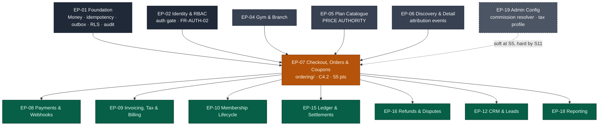

# EP-07 — Checkout, Orders & Coupons

> **Phase-0 delivery backlog.** This file is the detailed expansion of `ENGINEERING_PLAN.md` §2
> (epic row `EP-07`) and §3 (feature rows `F-07.1` … `F-07.20`). It contradicts neither
> `MASTER_PRD.md` nor `PROJECT_CONSTITUTION.md`; where those documents speak, they win. No
> application code exists yet and none is written here.

---

## 1. Metadata

| Field | Value |
| :--- | :--- |
| **Epic id** | `EP-07` |
| **Name** | Checkout, Orders & Coupons |
| **Priority (MoSCoW)** | **M** — Must. `KPI-11` (checkout completion ≥ 65%) and `BAC-03` both fail without it |
| **Complexity** | **L** (T-shirt, `ENGINEERING_PLAN.md` §2) · module rating **Very High** for `ordering/` (§13.1) |
| **Story points** | **55** (epic/feature view, §2) · `ordering/` module view **89 pts / 45 engineer-days** (§13.1) — see §10 for the reconciliation |
| **Target sprint(s)** | **Sprint 5** primary (`F-07.1` … `F-07.8`, `F-07.11`, `F-07.12`, `F-07.14`, `F-07.20`) · **Sprint 9** carry (`F-07.9` completion, `F-07.10`, order history) · **Sprint 10** coupon remainder (`F-07.13`, `F-07.15` … `F-07.19`) |
| **Owning PRD modules** | `CART` (`B5.9`), `CPN` (`B5.17`) |
| **Owning code module** | `ordering/` (`ENGINEERING_PLAN.md` §13.1; `ModuleDependency.md`) |
| **Surfaces** | `customer-web` — `SCR-WEB-005`, `SCR-WEB-006` (hand-off only), `SCR-WEB-007` (pending state), `SCR-WEB-011` · `gym-dashboard` — `SCR-DASH-011`, `SCR-DASH-012`, `SCR-DASH-016` · `admin-dashboard` — `SCR-ADM-006` (read side), `SCR-ADM-011` (platform coupon config) |
| **Primary APIs** | `API-ORD` (`POST /v1/orders`, `GET /v1/orders/:ref`, `POST|DELETE /v1/orders/:ref/coupon`, `POST /v1/orders/:ref/validate`, `POST /v1/orders/:ref/cancel`, `GET /v1/me/orders`), plus `/v1/tenant/coupons`, `/v1/tenant/orders`, `/v1/tenant/orders/offline`, `/v1/tenant/orders/:ref/collect-balance` |
| **State machines** | `C4.2` Order (`PENDING` · `AWAITING_PAYMENT` · `PAID` · `PARTIALLY_PAID` · `FAILED` · `EXPIRED` · `CANCELLED` · `REFUNDED`) |
| **Background jobs** | `order.expire` (every 5 min, `C5`) |
| **Launch market** | **India** — INR/paise, `Asia/Kolkata` (+05:30, no DST), GST 18% shown as **CGST 9% + SGST 9%** on the checkout breakdown, Indian lakh/crore digit grouping (`LAUNCH_MARKET_INDIA.md` §2, §4) |
| **Status** | `PLANNED` — Phase 0. Not started. Definition of Ready not yet satisfied for every item (see §12) |
| **Epic owner** | Backend Lead — money path (paired per `RSK-14`; `CODEOWNERS` requires two approvals on `ordering/`) |

---

## 2. Business Goal

**Convert intent into a paid membership with the minimum number of ways to fail.** The marketplace
spends `EP-06`'s entire budget getting a stranger from "I should join a gym" to a specific plan on a
specific detail page. Everything that follows is `EP-07`, and every avoidable friction point here is
a direct subtraction from `KPI-11` (checkout completion ≥ 65%) and, one step upstream, from
`KPI-10` (detail-to-checkout ≥ 8%). `OBJ-02` — *"enable a consumer to discover, compare and
purchase a gym membership entirely online, without a phone call or a visit"* — is only true if this
epic is true; a checkout that drops the selected plan at the auth gate, or that shows a price the
server will not honour, converts an acquisition into a support ticket and a refund.

**This epic is also where money enters the system, and therefore where trust is either established
structurally or lost permanently.** `BR-PAY-04` (server-side amounts) and `BR-PLN-03` (displayed
price equals charged price) are not conveniences — they are the two rules that make the marketplace
a credible commercial surface rather than a lead-generation form. The order is the object that
carries the eight `A6.3` figures forward into `EP-08` (payments), `EP-09` (invoicing) and `EP-15`
(settlement); `commission_base_minor` is decided *here*, at order time, by the coupon's
`funding_source` (`BR-CPN-05`), and is persisted rather than re-derived. Get it wrong here and
`BAC-07` — a settlement statement Finance reconciles to zero variance — is unreachable no matter how
good `EP-15` is. `OBJ-04` (*"every rupee attributable to a member, a plan, an invoice and a
settlement"*) begins at `POST /v1/orders`.

**Third, this epic is the platform's defence of its own revenue against disintermediation.**
`RSK-07` (score 16) is the gym that takes a marketplace-sourced lead and says *"come and pay at the
counter instead"*. The countermeasure is not a contract clause, it is `attributed_at` — written
server-side at the first authenticated view from a discovery surface, immutable, and visible to both
parties in a dispute (`A6.3` attribution, 30-day window). That single field decides `origin`
(`MARKETPLACE` vs `DIRECT`), which decides whether commission applies at all, which is
`KPI-17` (marketplace-originated share ≥ 30%) and a material slice of `KPI-15`. Coupons are the
other half of the commercial mechanism: `funding_source` decides who absorbs a discount, and
`OQ-11` has already ruled that **both** platform-funded and gym-funded coupons ship at launch
because the distinction is structural and expensive to retrofit.

---

## 3. Scope

### 3.1 In scope — explicit

| # | Item | Anchor |
| :-: | :--- | :--- |
| 1 | Single-plan checkout — no multi-gym basket, no cart entity | `FR-CART-01` |
| 2 | Checkout capture: start date (today or future, within a configurable horizon), optional add-ons, coupon code, refund-policy acceptance | `FR-CART-02`, `BR-REF-01` |
| 3 | Itemised order summary — plan price, joining fee, add-ons, discount, tax (**CGST + SGST as two lines for India**), total payable | `FR-CART-03`, `SCR-WEB-005`, `LAUNCH_MARKET_INDIA.md` §4 |
| 4 | Server-side amount computation; no money field exists in any request schema | `FR-CART-04`, `BR-PAY-04` |
| 5 | `C4.2` order state machine with `PENDING` + 30-minute expiry and coupon-hold release | `FR-CART-05`, `C4.2`, `C5 order.expire` |
| 6 | `BR-PLN-03` price re-validation as a **state-machine guard** on `PENDING → AWAITING_PAYMENT`, returning `422 PLAN_PRICE_CHANGED` with both figures | `BR-PLN-03`, `AC-PLAN-02.2` |
| 7 | Idempotency key per checkout attempt, honoured through payment initiation | `FR-CART-06`, `BR-PAY-03` |
| 8 | Eligibility validation: minimum age, gender eligibility, same-gym concurrency, plan availability/visibility | `FR-CART-07`, `BR-MEM-04`, `BR-PLN-05` |
| 9 | Guest-to-registered conversion at the auth gate with zero checkout-state loss | `FR-CART-08`, `FR-NAV-02` |
| 10 | Staff-initiated offline orders: `CASH` / `CARD` / `BANK_TRANSFER`, partial payment, `PARTIALLY_PAID` with a visible balance and a collect-balance action | `FR-CART-09`, `BR-PAY-09`, `SCR-DASH-012` |
| 11 | Abandoned-checkout recovery reminder, preference-aware, dispatched through the outbox | `FR-CART-10` |
| 12 | Two-sided order history — member sees their orders, tenant sees its orders, neither sees the other side's | `FR-CART-11`, `BR-TEN-01` |
| 13 | Coupon aggregate with every `BR-CPN-01` attribute including `funding_source` and a mandatory cap on percentage coupons | `FR-CPN-01`, `BR-CPN-01` |
| 14 | Platform-scope coupons (Super Admin) and tenant-scope coupons (owner), each validated against the correct plan/branch universe | `FR-CPN-02` |
| 15 | Double validation — at apply time and again inside the payment-initiation transaction under `SELECT … FOR UPDATE` | `FR-CPN-03`, `BR-CPN-03` |
| 16 | Usage tracking: total redemptions, per-user redemptions, value discounted, attributable revenue | `FR-CPN-04` |
| 17 | Bulk auto-generated single-use codes | `FR-CPN-05` |
| 18 | First-purchase-only evaluated against **platform-wide** order history, not tenant-scoped | `FR-CPN-06` |
| 19 | Pause / resume a coupon without deletion | `FR-CPN-07` |
| 20 | Coupon performance report: redemptions, discount cost, gross revenue influenced, net after discount | `FR-CPN-08`, `SCR-DASH-016` |
| 21 | No-stacking (one coupon per order, schema-level) and non-negative payable with discarded excess | `BR-CPN-02`, `BR-CPN-04` |
| 22 | `origin` / `attributed_at` written server-side, immutable, 30-day attribution window | `A6.3`, `RSK-07` |
| 23 | Order-time snapshots: `refund_policy_snapshot`, `tax_snapshot`, `purchased_terms`, `commission_base_minor` | `BR-REF-02`, `BR-PAY-11`, `BR-PLN-02`, `BR-CPN-05` |

### 3.2 Out of scope — explicit, with destination

| Item | Why it is not here | Where it went |
| :--- | :--- | :--- |
| Payment intent creation, gateway hand-off, webhooks, capture | The order stops at `AWAITING_PAYMENT`; the provider seam is a separate bounded context | **`EP-08`** (`F-08.1` … `F-08.19`) |
| Invoice generation, numbering, tax profile, PDF | An invoice is a consequence of a *payment*, not of an order | **`EP-09`** (`F-09.1` … `F-09.15`) |
| Membership creation and the `→ ACTIVE` transition | `BR-PAY-02` — activation is webhook-driven and has exactly one caller | **`EP-08`** `F-08.4`, **`EP-10`** `F-10.1` |
| Ledger entries, commission posting, settlement lines | The order *persists* the figures; the ledger *posts* them | **`EP-15`** (`ledger/`, `settlements/`) |
| Refund execution, credit notes, proration | Post-sale money movement | **`EP-16`** |
| Plan pricing, promotional prices, archive semantics | `plans/` is the price authority; `ordering/` only reads it | **`EP-05`** |
| Referral codes and wallet credit applied at checkout | `FR-REFR-06` is priority `C` and `BR-WAL-01` is Phase-1-optional | **`EP-20`** |
| Multi-gym basket, saved carts, gift purchases | `FR-CART-01` explicitly excludes them | Phase 2 (`A11`) |
| Corporate / bulk purchase orders | `A6.1` stream 5, Phase 2 | Phase 2 |
| Abandoned-checkout *campaign* orchestration (segments, A/B) | `EP-07` sends one preference-aware reminder; campaign tooling is CRM | **`EP-12`** |
| Auto-renewal charging | A mandate debit is a payment, not a checkout | **`EP-08`** `F-08.12`, `F-08.16` |
| Tier-based commission-rate resolution and overrides | One resolver, owned by admin config, consumed here | **`EP-19`** `F-19.x`, consumed by `EP-07` at order time |

---
## 4. Features

Feature ids are carried **unchanged** from `ENGINEERING_PLAN.md` §3. Rows marked *(new)* are
additions this backlog surfaces because the plan's feature list implies them without naming them;
each states the identifier that forces it.

| Feature | Description | Satisfies | Pri | Pts | Sprint |
| :--- | :--- | :--- | :-: | :-: | :-: |
| **F-07.1** | Single-plan checkout: one gym, one plan, one branch entitlement, no basket entity in the schema | `FR-CART-01` | M | 2 | 5 |
| **F-07.2** | Start date picker (today … configurable horizon), add-on selection, coupon field, refund-policy acceptance recorded with the order | `FR-CART-02`, `BR-REF-01` | M | 3 | 5 |
| **F-07.3** | Itemised order summary: plan price · joining fee · add-ons · discount · **CGST 9%** · **SGST 9%** · total payable, each a distinct visible line | `FR-CART-03`, `SCR-WEB-005` | M | 3 | 5 |
| **F-07.4** | Server-side amount computation; `PriceQuote` is unconstructable from a DTO; every order schema is Zod `.strict()` | `FR-CART-04`, `BR-PAY-04` | M | 5 | 5 |
| **F-07.5** | `C4.2` order aggregate, `PENDING` with a 30-minute `expires_at`, `order.expire` job releasing coupon holds every 5 minutes | `FR-CART-05`, `C4.2`, `C5` | M | 5 | 5 |
| **F-07.6** | Idempotency key per checkout attempt, carried through payment initiation; `UNIQUE (idempotency_key)` on `orders` | `FR-CART-06`, `BR-PAY-03` | M | 3 | 5 |
| **F-07.7** | Eligibility gate: `min_age`, `gender_eligibility`, same-gym concurrency unless `stackable`, plan `PUBLISHED` + `PUBLIC` | `FR-CART-07`, `BR-MEM-04`, `BR-PLN-05` | M | 3 | 5 |
| **F-07.8** | Guest-to-registered conversion returning to the exact plan and the exact entered state | `FR-CART-08`, `FR-NAV-02` | M | 3 | 5 |
| **F-07.9** | Staff-initiated offline orders: method enum, partial payment, `PARTIALLY_PAID`, collect-balance action | `FR-CART-09`, `BR-PAY-09` | M | 5 | 5 → 9 |
| **F-07.10** | Abandoned-checkout recovery reminder via the transactional outbox, preference-aware | `FR-CART-10` | S | 2 | 9 |
| **F-07.11** | Two-sided order history: `GET /v1/me/orders` and `GET /v1/tenant/orders`, each RLS-scoped | `FR-CART-11`, `BR-TEN-01` | M | 2 | 9 |
| **F-07.12** | Coupon attribute model: code, type, value, cap, window, total + per-user limits, applicable plans and branches, first-purchase-only, `funding_source` | `FR-CPN-01`, `BR-CPN-01`, `BR-CPN-05` | M | 5 | 5 |
| **F-07.13** | Platform-wide coupons (Super Admin) and tenant coupons (owner), each scope-validated | `FR-CPN-02` | M | 3 | 10 |
| **F-07.14** | Double validation — apply time and payment initiation — through one `Coupon.evaluate()` path | `FR-CPN-03`, `BR-CPN-03` | M | 5 | 5 |
| **F-07.15** | Usage tracking: `redemption_count`, per-user redemptions, value discounted, attributable revenue | `FR-CPN-04` | M | 2 | 10 |
| **F-07.16** | Bulk auto-generated single-use codes for win-back campaigns | `FR-CPN-05` | S | 2 | 10 |
| **F-07.17** | First-purchase-only evaluated against the user's **platform-wide** completed-order history | `FR-CPN-06` | M | 2 | 10 |
| **F-07.18** | Pause / resume a coupon without deletion; paused coupons refuse with a distinct reason | `FR-CPN-07` | S | 1 | 10 |
| **F-07.19** | Coupon performance report: redemptions, discount cost, gross influenced, net after discount | `FR-CPN-08`, `SCR-DASH-016` | S | 2 | 10 |
| **F-07.20** | No-stacking (single nullable `coupon_id` FK) and non-negative payable via `Money.subtractFloorZero()` with a reported discarded excess | `BR-CPN-02`, `BR-CPN-04` | M | 2 | 5 |
| **F-07.21** *(new)* | **Server-side attribution**: `attributed_at` + `origin` written at first authenticated view from a discovery surface, immutable, 30-day window, visible to both parties | `A6.3` attribution, `RSK-07`, `KPI-17` | M | 3 | 5 |
| **F-07.22** *(new)* | **Order-time snapshot set**: `refund_policy_snapshot`, `tax_snapshot`, `purchased_terms`, `commission_base_minor`, `commission_rate_bps` resolved at the moment of sale | `BR-REF-02`, `BR-PAY-11`, `BR-PLN-02`, `BR-FIN-05`, `BR-CPN-05` | M | 3 | 5 |
| **F-07.23** *(new)* | **Blocking price re-confirmation UX** on `422 PLAN_PRICE_CHANGED`: shows previous and current, charges neither silently | `BR-PLN-03`, `SCR-WEB-005` States row | M | 2 | 5 |
| **F-07.24** *(new)* | **India money presentation**: `₹` prefix, lakh/crore grouping from the single `packages/utils` formatter, paise-exact totals | `LAUNCH_MARKET_INDIA.md` §2, `BR-PAY-01` | M | 1 | 5 |

**Feature roll-up.** 24 features · 55 core points (`F-07.1` … `F-07.20`) + 9 points for the four
additions, absorbed inside the `ordering/` module estimate of 89 points (§13.1) rather than added on
top of the §2 epic figure. Priorities: 18 `M`, 6 `S`.

---

## 5. User Stories

Stories `US-CART-01`, `US-CART-02` and `US-CPN-01` are restated **verbatim in intent** from
`MASTER_PRD.md` §B5.9 / §B5.17 with their PRD acceptance criteria preserved. Stories numbered from
`US-CART-03` and `US-CPN-02` are **new** — the PRD's functional requirements and edge cases imply
them but never wrote them as stories, and `PROJECT_CONSTITUTION.md` §23.1 item 2 requires
Given/When/Then before an item is Ready.

### US-CART-01 — *As Priya, I want to start my membership on the 1st, not today.* **(PRD)**

- **AC-CART-01.1** — **Given** I select a future start date within the allowed horizon, **when** I
  pay, **then** the membership is created in `PENDING` and transitions to `ACTIVE` at 00:00 in the
  gym's timezone on the start date (for `Asia/Kolkata` that is **18:30 UTC the previous day**).
- **AC-CART-01.2** — **Given** my membership is `PENDING` with a future start, **when** I attempt
  check-in, **then** it is denied with `MEMBERSHIP_PENDING_START` and the message states the date it
  begins.
- **AC-CART-01.3** — **Given** my start date arrives, **when** the transition occurs, **then** I
  receive an activation notification and my QR becomes available.
- **AC-CART-01.4** *(new)* — **Given** I select a start date beyond the configured horizon, **when**
  I submit, **then** the order is refused `422 START_DATE_OUT_OF_HORIZON` naming the latest
  permitted date, and no order row is written.

### US-CART-02 — *As a receptionist, I want to sell a plan at the desk and take half now, half next week.* **(PRD)**

- **AC-CART-02.1** — **Given** I create an offline order and record a partial cash payment, **when**
  I save, **then** the order shows `PARTIALLY_PAID` with the outstanding amount, and the membership
  activates per the tenant's configuration for partial payments (`BR-MEM-02`).
- **AC-CART-02.2** — **Given** a balance is due, **when** I open the member's record, **then** the
  outstanding amount is prominent and a "collect balance" action is available.
- **AC-CART-02.3** — **Given** I collect the balance, **when** I record it, **then** the order moves
  to `PAID`, **one** consolidated invoice is issued, and both payments appear on it.
- **AC-CART-02.4** — **Given** a customer is purchasing online through the marketplace, **when** they
  reach payment, **then** partial payment is not offered — and the `PARTIALLY_PAID` transition is
  refused at the database `CHECK`, not merely hidden in the UI (`BR-PAY-09`).

### US-CART-03 — *As a member, I want the price I was shown to be the price I am charged.* **(new — implied by `BR-PLN-03`, `RSK-11`, `SCR-WEB-005` States)**

- **AC-CART-03.1** — **Given** the plan price changes between page load and my submit, **when** the
  `PENDING → AWAITING_PAYMENT` transition is attempted, **then** the guard refuses with
  `422 PLAN_PRICE_CHANGED` carrying `previous` and `current` in `details[]`, and **no payment intent
  is created at either price**.
- **AC-CART-03.2** — **Given** the refusal, **when** the client renders it, **then** a blocking modal
  shows both figures and requires an explicit re-confirmation; dismissing it does not charge.
- **AC-CART-03.3** — **Given** I re-confirm, **when** I proceed, **then** a fresh quote is computed
  server-side and the order breakdown is replaced in full, including tax.
- **AC-CART-03.4** — **Given** any code path attempts `PENDING → AWAITING_PAYMENT` without running
  re-validation, **when** the test suite runs, **then** the transition is refused — the check is a
  guard on the machine, not a callable step someone can forget.

### US-CART-04 — *As a member, I want a stale checkout to fail cleanly rather than charge me.* **(new — implied by `FR-CART-05`, `B5.9` edge cases)**

- **AC-CART-04.1** — **Given** a `PENDING` order older than 30 minutes, **when** `order.expire` runs,
  **then** the order becomes `EXPIRED`, any coupon hold is released, and `redemption_count` is
  decremented back.
- **AC-CART-04.2** — **Given** my payment page is open on an order that has expired, **when** I
  submit, **then** the attempt fails with `410 ORDER_EXPIRED` and a **new** order is offered with
  prices re-validated.
- **AC-CART-04.3** — **Given** the coupon expired between order creation and payment, **when** I
  proceed, **then** payment is halted, the discount is removed, the new total is shown, and explicit
  re-confirmation is required (`BR-CPN-03`).
- **AC-CART-04.4** — **Given** an expired order, **when** anything attempts to transition it to
  `AWAITING_PAYMENT` or `PAID`, **then** the machine refuses; `EXPIRED` is terminal in `C4.2`.

### US-CART-05 — *As a visitor, I want to register mid-checkout without losing what I chose.* **(new — implied by `FR-CART-08`, `FR-NAV-02`)**

- **AC-CART-05.1** — **Given** I am unauthenticated and reach the auth gate from checkout, **when** I
  register or sign in, **then** I return to the **exact** plan, start date, add-ons and coupon code I
  had entered.
- **AC-CART-05.2** — **Given** I registered during checkout, **when** the order is created, **then**
  the discovery event that attributes the sale as `MARKETPLACE` is recorded server-side and the
  attribution is not derived from any client parameter.
- **AC-CART-05.3** — **Given** I abandon at the auth gate and return within the attribution window,
  **when** I resume, **then** the same attribution applies and the order is still `MARKETPLACE`.
- **AC-CART-05.4** — **Given** an unverified mobile or email, **when** I attempt to proceed to
  payment, **then** I am blocked with the specific verification required (`FR-AUTH-02`).

### US-CART-06 — *As Priya, I want a nudge if I walked away from a checkout.* **(new — implied by `FR-CART-10`)**

- **AC-CART-06.1** — **Given** I authenticated and then abandoned an order that later expired,
  **when** the reminder job runs, **then** one reminder is dispatched through the outbox, subject to
  my notification preferences, and never more than one per abandoned order.
- **AC-CART-06.2** — **Given** I have opted out of operational reminders, **when** the job runs,
  **then** suppression happens **at send time** and the suppression is recorded with its reason.
- **AC-CART-06.3** — **Given** I completed the purchase before the reminder fires, **when** the job
  runs, **then** no reminder is sent.

### US-CART-07 — *As Rohan, I want to see every sale and its full breakdown without seeing anyone else's.* **(new — implied by `FR-CART-11`, `SCR-DASH-011`)**

- **AC-CART-07.1** — **Given** I am a gym owner, **when** I open Sales & Orders, **then** I see
  reference, date, member, plan, gross, discount, net, status, `origin` and payment method for **my
  tenant only**, and a direct API call for another tenant's order returns `404`.
- **AC-CART-07.2** — **Given** I open an order's detail drawer, **when** it renders, **then** it
  shows the full persisted breakdown, the invoice link, payment events and refund history — all read
  from stored figures, never recomputed at display (`BR-FIN-02`).
- **AC-CART-07.3** — **Given** I am a member, **when** I open Orders & Invoices, **then** I see my
  own orders across **all** gyms with their invoices and credit notes.

### US-CART-08 — *As the platform, I want a marketplace-sourced sale to stay a marketplace-sourced sale.* **(new — implied by `A6.3`, `RSK-07`)**

- **AC-CART-08.1** — **Given** a user's first authenticated view of a gym arrives from search,
  category, comparison, favourites or a platform campaign link, **when** the view is recorded,
  **then** `attributed_at` is written server-side and cannot be set, altered or cleared by any
  client-supplied value.
- **AC-CART-08.2** — **Given** an order is created within 30 days of `attributed_at`, **when**
  `origin` is resolved, **then** it is `MARKETPLACE` even if the checkout was reached from a direct
  link.
- **AC-CART-08.3** — **Given** an order is created by gym staff in the dashboard, **when** `origin`
  is resolved, **then** it is `DIRECT`, no commission accrues, and the gateway fee is still passed
  through (`A6.3`).
- **AC-CART-08.4** — **Given** an attribution dispute, **when** either party opens the record,
  **then** the qualifying discovery event and its timestamp are visible to both.

### US-CPN-01 — *As Rohan, I want a first-month discount that only new customers can use.* **(PRD)**

- **AC-CPN-01.1** — **Given** a coupon marked first-purchase-only, **when** a user with a prior
  completed order applies it, **then** it is refused with the specific reason
  (`422 COUPON_FIRST_PURCHASE_ONLY`), evaluated **platform-wide**.
- **AC-CPN-01.2** — **Given** a per-user limit of 1, **when** the same user applies it on a second
  order, **then** it is refused.
- **AC-CPN-01.3** — **Given** the total usage cap is reached, **when** any user applies it, **then**
  it is refused and the coupon is automatically marked exhausted in the dashboard.
- **AC-CPN-01.4** — **Given** the coupon is gym-funded, **when** settlement computes, **then** the
  commission base is the **post-discount** net amount; a platform-funded coupon yields the
  **pre-discount** net (`B = N + D`) and the platform absorbs the discount.

### US-CPN-02 — *As a Super Admin, I want a platform-wide campaign code that no tenant can edit.* **(new — implied by `FR-CPN-02`)**

- **AC-CPN-02.1** — **Given** I create a `PLATFORM`-scope coupon, **when** it is saved, **then** it
  is redeemable at any approved gym and no tenant user can view, edit, pause or delete it.
- **AC-CPN-02.2** — **Given** a tenant coupon naming another tenant's plan or branch, **when** it is
  saved, **then** it is refused.
- **AC-CPN-02.3** — **Given** a `PLATFORM`-funded coupon is redeemed, **when** the order persists,
  **then** `funding_source = PLATFORM` and `commission_base_minor = N + D`.

### US-CPN-03 — *As a marketer, I want 5,000 single-use win-back codes without creating them one by one.* **(new — implied by `FR-CPN-05`)**

- **AC-CPN-03.1** — **Given** I request bulk generation with a prefix, a count and a template,
  **when** it completes, **then** every code is unique, single-use, and downloadable as CSV.
- **AC-CPN-03.2** — **Given** two members redeem two different codes from the batch, **when** usage
  is reported, **then** each code shows one redemption and the batch shows two.
- **AC-CPN-03.3** — **Given** a code from the batch is redeemed, **when** it is presented again,
  **then** it is refused `422 COUPON_EXHAUSTED`.

### US-CPN-04 — *As Rohan, I want to stop a campaign that is costing too much, then restart it.* **(new — implied by `FR-CPN-07`)**

- **AC-CPN-04.1** — **Given** an active coupon, **when** I pause it, **then** new applications are
  refused with `422 COUPON_PAUSED` while existing `PENDING` orders that already hold it keep their
  discount until they expire or are paid.
- **AC-CPN-04.2** — **Given** a paused coupon, **when** I resume it, **then** it validates again with
  no change to `redemption_count`.
- **AC-CPN-04.3** — **Given** a coupon with `redemption_count > 0`, **when** I attempt to change
  `funding_source`, **then** it is refused `422 COUPON_FUNDING_IMMUTABLE` at the database trigger.

### US-CPN-05 — *As Rohan, I want to know whether the discount bought me anything.* **(new — implied by `FR-CPN-08`)**

- **AC-CPN-05.1** — **Given** a coupon with redemptions, **when** I open its performance view,
  **then** I see redemptions, total discount cost, gross revenue influenced and net after discount,
  with money in paise-exact INR using lakh grouping.
- **AC-CPN-05.2** — **Given** a gym-funded coupon, **when** the report renders, **then** the discount
  cost is shown as borne by the tenant; for a platform-funded coupon it is shown as borne by the
  platform.
- **AC-CPN-05.3** — **Given** a refunded order that used the coupon, **when** the report renders,
  **then** the redemption is shown as reversed and excluded from net revenue influenced.

---
## 6. Acceptance Criteria for the Epic

The epic is not done until **every** one of these passes in CI and is demonstrated in the sprint-5
and sprint-10 demo scripts. Each is testable as written.

| # | Criterion | Evidence |
| :-: | :--- | :--- |
| **AC-EP07-01** | No request schema anywhere in `ordering/` contains a money field. Posting `total_minor`, `discount_minor`, `net_minor` or `commission_minor` to `POST /v1/orders` returns `400 VALIDATION_FAILED` **naming the unknown field** | `BR-PAY-04-N1`, exit item `E5.1` |
| **AC-EP07-02** | Changing a plan price between page load and submit produces `422 PLAN_PRICE_CHANGED` with both figures, and **no charge occurs at either price** | `E5.2`, `BR-PLN-03-N1` |
| **AC-EP07-03** | The re-validation is a state-machine guard, proven by a test that attempts `PENDING → AWAITING_PAYMENT` without it and is refused | `E5.3` |
| **AC-EP07-04** | A duplicate `Idempotency-Key` with an identical fingerprint replays the stored response; the same key with a different fingerprint returns `409 IDEMPOTENCY_KEY_REUSE`; a money endpoint without the header returns `400 IDEMPOTENCY_KEY_REQUIRED` | `E5.4`, `BR-PAY-03-N1/N2` |
| **AC-EP07-05** | Two concurrent identical checkouts produce exactly **one** order, asserted against a real Postgres via Testcontainers, not a mock | `BR-PAY-03-N3` |
| **AC-EP07-06** | 50 concurrent checkouts for one tenant produce 50 distinct orders and zero double-applied coupons | `E5.11` |
| **AC-EP07-07** | 200 concurrent checkouts against a 100-limit coupon yield exactly 100 redemptions | `BR-CPN-03-N2`, `TR-27` |
| **AC-EP07-08** | No request shape accepts an array of coupon codes; applying a second code **replaces** the first and reports which was replaced | `BR-CPN-02-P1`, `BR-CPN-02-N1` |
| **AC-EP07-09** | A ₹1,000 fixed coupon against a ₹600 order produces a payable of exactly **0** and a discarded excess of ₹400 that creates no wallet entry and no ledger entry | `BR-CPN-04-P1`, `BR-CPN-04-N2` |
| **AC-EP07-10** | A percentage coupon saved without a cap is refused; a tenant coupon naming another tenant's plan or branch is refused | `BR-CPN-01-N1`, `BR-CPN-01-N2` |
| **AC-EP07-11** | Changing `funding_source` after the first redemption raises at the `BEFORE UPDATE` trigger and returns `422 COUPON_FUNDING_IMMUTABLE` | `BR-CPN-05-N1` |
| **AC-EP07-12** | A gym-funded coupon persists `commission_base_minor = N`; a platform-funded coupon persists `N + D`. Flipping the coupon directly in the database and rebuilding a settlement batch changes **nothing** | `BR-CPN-05-P1`, `BR-CPN-05-N2`, `E2E-06` |
| **AC-EP07-13** | A `PENDING` order expires at 30 minutes and releases its coupon hold; `EXPIRED` is terminal | `E5.6`, `AC-CART-04.1`, `AC-CART-04.4` |
| **AC-EP07-14** | A coupon that expires between apply and pay aborts checkout with `422 COUPON_EXPIRED` and **no payment intent is created** | `BR-CPN-03-N1` |
| **AC-EP07-15** | A first-purchase-only code is refused for a user with a prior completed order anywhere on the platform, not merely at this tenant | `BR-CPN-03-N4`, `FR-CPN-06` |
| **AC-EP07-16** | A web-channel order cannot reach `PARTIALLY_PAID`; the `CHECK (status <> 'PARTIALLY_PAID' OR channel = 'DASHBOARD')` constraint refuses it independently of the service layer | `BR-PAY-09-N1`, `AC-CART-02.4` |
| **AC-EP07-17** | An offline partial payment records `collected_by_staff_id` and the method, shows the balance on the member record, and collecting it yields **one** consolidated invoice | `BR-PAY-09-P1`, `E2E-10` |
| **AC-EP07-18** | `attributed_at` cannot be set, altered or cleared by any client-supplied value, on any endpoint | `E5.10`, `AC-CART-08.1` |
| **AC-EP07-19** | A staff-created order is `origin = DIRECT` and accrues no commission; the gateway fee is still passed through | `AC-CART-08.3`, `E2E-04` step 5 |
| **AC-EP07-20** | Every order persists `refund_policy_snapshot`, `tax_snapshot`, `purchased_terms`, `commission_rate_bps` and all eight `A6.3` figures; none is recomputed at display time | `BR-FIN-02`, `BR-REF-02`, `BR-PAY-11` |
| **AC-EP07-21** | The checkout breakdown renders **CGST 9% and SGST 9% as two separate lines** summing to 18%, in `₹` with lakh/crore grouping | `LAUNCH_MARKET_INDIA.md` §2, §4; `E2E-02` step 5 |
| **AC-EP07-22** | Eligibility refusals are distinct and specific: `422 AGE_BELOW_PLAN_MINIMUM`, `422 GENDER_NOT_ELIGIBLE`, `422 CONCURRENT_MEMBERSHIP_EXISTS`, `422 PLAN_NOT_AVAILABLE` — never one generic message | `FR-CART-07`, `NFR-USE-05` |
| **AC-EP07-23** | A `STAFF_ONLY` plan is not purchasable through any public endpoint and appears on no public surface | `BR-PLN-05`, `E2E-02` step 2 |
| **AC-EP07-24** | Cross-tenant access to any order or coupon endpoint returns `404` with no field of the other tenant's row in the body; an `X-Tenant-Id` header is rejected `400 TENANT_HEADER_NOT_ACCEPTED` | `E2E-11`, `BAC-10` |
| **AC-EP07-25** | Guest-to-registered conversion returns to the exact plan, start date, add-ons and coupon with no re-entry | `AC-CART-05.1`, `FR-NAV-02` |
| **AC-EP07-26** | Every order write produces an append-only `audit_log` row with actor, before-state and after-state; an idempotent replay writes **no second** audit row | `BR-DAT-01`, `BR-PAY-03` audit note |
| **AC-EP07-27** | Order-creation p95 within budget and payment-intent hand-off p95 ≤ 1.5 s excluding gateway | `NFR-PERF-05` |
| **AC-EP07-28** | `SCR-WEB-005`, `SCR-DASH-011`, `SCR-DASH-012` and `SCR-DASH-016` are axe-core clean and completable keyboard-only | `NFR-USE-01`, DoD item 20 |

---

## 7. Business Rules Enforced

Enforcement detail — layer, construct, failure mode, positive and negative test ids — lives in
`BusinessRules.md` and is **not duplicated here**. This table states which rules `EP-07` owns or
co-owns and the concrete point in this epic where enforcement lands.

| Rule | Ownership | Enforcement point in `EP-07` | Authoritative layer (per `BusinessRules.md`) |
| :--- | :--- | :--- | :--- |
| `BR-PAY-04` | **Owner** (`ordering/`) | Zod `.strict()` schemas in `packages/types` for every order and coupon request; `OrderPricingService` composes from server state; `PriceQuote` has no DTO constructor | `L8-PIPE` |
| `BR-PLN-03` | **Owner** (`ordering/`) | Guard on the `C4.2` `PENDING → AWAITING_PAYMENT` transition; `422 PLAN_PRICE_CHANGED` with `previous`/`current` | `L5-DOM` / `L6-UC` |
| `BR-PAY-03` | **Co-owner** with `common/`, `payments/` | `Idempotency-Key` required on `POST /v1/orders` and payment initiation; `UNIQUE (idempotency_key)` on `orders` | `L9-INT` |
| `BR-PAY-09` | **Co-owner** with `billing/` | `CHECK (status <> 'PARTIALLY_PAID' OR channel = 'DASHBOARD')`; offline use case requires a staff actor; `Order.balanceDue()` derived, never stored | `L1-DB` |
| `BR-MEM-04` | **Co-owner** with `memberships/` | Concurrency check inside the eligibility gate, before the order row is written, on freshly read state | `L6-UC` |
| `BR-REF-01` | **Co-owner** with `refunds/` | Refund policy rendered in full on `SCR-WEB-005` (not a link) and copied into `orders.refund_policy_snapshot` at creation | `L1-DB` snapshot |
| `BR-PAY-11` | **Contributor** (`billing/` owns) | `orders.tax_snapshot` written at order time from the tenant's tax profile as it stood | `L1-DB` |
| `BR-PLN-02` | **Contributor** (`plans/` owns) | `purchased_terms` snapshot on the order so a later price change cannot reach a sold membership | `L1-DB` |
| `BR-PLN-05` | **Contributor** (`plans/` owns) | Public order creation refuses a `STAFF_ONLY` plan; the plan is absent from every public read path | `L5-DOM` |
| `BR-CPN-01` | **Owner** (`ordering/`) | `coupons` table with all eleven attributes as `NOT NULL` enums plus `CHECK (discount_type <> 'PERCENT' OR max_discount_minor IS NOT NULL)` | `L1-DB` |
| `BR-CPN-02` | **Owner** | Single nullable `orders.coupon_id` FK — the schema cannot express two coupons; `UNIQUE (coupon_id, order_id)` on redemptions | `L1-DB` |
| `BR-CPN-03` | **Owner** | Same `Coupon.evaluate()` re-run inside the payment-initiation transaction after `SELECT … FOR UPDATE` on the coupon row; `order.expire` releases holds | `L6-UC` |
| `BR-CPN-04` | **Owner** | `Money.subtractFloorZero()`; `CHECK (total_minor >= 0 AND discount_minor >= 0 AND discount_minor <= gross_minor)` | `L5-DOM` |
| `BR-CPN-05` | **Co-owner** with `ledger/` | `BEFORE UPDATE` trigger on `coupons`; `CommissionBaseResolver` writes `orders.commission_base_minor` at order time | `L1-DB` |
| `BR-TEN-01` | **Inherited** from `EP-01` | Every `orders`, `coupons`, `coupon_redemptions` table carries `tenant_id` with an RLS policy; every repository goes through `TenantScopedRepository` | `L2-RLS` |
| `BR-PAY-01` | **Inherited** from `EP-01` | Every amount is `bigint` paise + `char(3) currency`; `Money` value object only; no `toNumber()` | `L5-DOM` |
| `BR-DAT-01` | **Inherited** from `EP-01` | `AuditInterceptor` on every order and coupon mutation, with before/after state | `L9-INT` |
| `BR-FIN-04` | **Contributor** (`ledger/` owns) | Commission base excludes tax at the point it is computed and persisted here | `L5-DOM` |
| `BR-FIN-05` | **Contributor** (`ledger/` owns) | `commission_rate_bps` resolved once at order time by the single resolver and persisted | `L1-DB` |

> **`BAC-06` obligation.** Every rule above is `M` priority except `BR-PAY-09` (`S`). Each therefore
> needs at least one `-P` test and, for the `M` ones, at least one `-N` test asserting the exact
> error code. The CI traceability report fails the build on any rule with zero tests.

---

## 8. Dependencies

### 8.1 Upstream — must exist first

| Epic | What `EP-07` needs from it | Hard or soft |
| :--- | :--- | :--- |
| **EP-01** | `Money` value object; idempotency interceptor + store; transactional outbox; error taxonomy and registry codes; tenant-context Prisma extension and RLS convention; audit interceptor; BullMQ job harness (for `order.expire`); `packages/utils` INR formatter | **Hard** — nothing in `EP-07` can be merged before these |
| **EP-02** | Auth gate, `FR-AUTH-02` purchase preconditions (verified mobile and email), return-to-point-of-interruption, `PermissionsGuard` for staff-created orders | **Hard** for `F-07.8`, `F-07.9` |
| **EP-04** | Gym, branch and operating-hours model — an order names a branch entitlement | **Hard** |
| **EP-05** | The **price authority**: plan attributes, promotional pricing, `PUBLISHED`/`ARCHIVED` status, `STAFF_ONLY` visibility, add-ons | **Hard** — `EP-07` reads, never owns, price |
| **EP-06** | Detail page as the checkout entry point; the discovery events that make `attributed_at` meaningful | **Hard** for `F-07.21`; soft otherwise |
| **EP-19** | Commission-rate resolver (global < tier < tenant) and the tax profile record; consumed at order time | **Soft at sprint 5** — a seeded default is acceptable; **hard by sprint 11** |
| **EP-03** | Tenant refund policy captured during onboarding, needed for `refund_policy_snapshot` | **Soft** — a tenant default is acceptable in sprint 5 |

### 8.2 Downstream — what this unblocks

| Epic | What it takes from `EP-07` |
| :--- | :--- |
| **EP-08** | The order in `AWAITING_PAYMENT` with a total, a currency and an idempotency key — the only legitimate input to payment-intent creation |
| **EP-09** | `orders.tax_snapshot`, the line-item breakdown and `refund_policy_snapshot` — an invoice is rendered from the order, not from live configuration |
| **EP-10** | `order_id`, `purchased_terms`, `start_date` and `origin` — the membership is created from the order |
| **EP-15** | All eight `A6.3` figures per order plus `commission_base_minor` and `commission_rate_bps`; without them a settlement line cannot be assembled without recomputation, which `BR-FIN-02` forbids |
| **EP-16** | `refund_policy_snapshot` (`BR-REF-02`) and the coupon redemption record for proportional reversal |
| **EP-12** | Order history and abandoned-checkout signals feeding lead and at-risk segments |
| **EP-18** | Revenue-by-plan, coupon-performance and marketplace-share reports read persisted order figures |

### 8.3 External dependencies and open questions

| Dependency | Type | Effect on `EP-07` |
| :--- | :--- | :--- |
| `OQ-02` — commission rate | **Resolved** (India §10): 10% standard, 5% renewal, tier deltas on the standard rate only | The rate must be **configuration**, defaulting to 1000 bps; the 0 bps floor is implemented even though unreachable at current values (`KL-006`) |
| `OQ-11` — are both coupon funding sources needed at launch | **Resolved**: yes, both | `funding_source` is a launch-day enum, not a Phase-2 field |
| `OQ-05` — platform minimum refund policy | **Open**, due sprint 12 | The snapshot mechanism must not assume the policy shape is fixed; store the whole `jsonb` |
| `OQ-14` — trial / day-pass plans | **Resolved**: session plan with count 1 | Checkout must handle a `SESSION` plan with `session_count = 1` including entitlement display |
| `OQ-03` — subscription tier prices | **Open**, due sprint 5 | Affects tier deltas on the commission rate, not checkout mechanics |
| `BLK-03` conflict 2 — GST on platform commission | **Open**, must be decided at sprint 5, implemented sprint 11 | The order-time commission snapshot written here **must already carry `commission_tax_minor`**, set to zero if undecided, or sprint 11 backfills historical orders (`REG-02` contingency) |
| Client legal copy — refund policy wording, terms | `ASM-05` | `SCR-WEB-005` region 5 renders the tenant's policy in full; placeholder copy is acceptable until UAT |

### 8.4 Dependency graph

---
## 9. Technical Tasks

Layers: `DB` · `API` · `worker` · `web` (customer-web) · `dash` (gym-dashboard) · `admin`
(admin-dashboard) · `infra` · `test` · `docs`. Estimates are **engineer-days** and include
implementation, its tests and review, per `ENGINEERING_PLAN.md` §13. Task ids map onto sprint-5
tasks `5.1`–`5.26` and sprint-10 tasks where the sprint plan already names them.

| # | Task | Layer | Est (ed) | Depends on | Serves |
| :--- | :--- | :--- | :-: | :--- | :--- |
| **T-07.01** | `orders`, `order_add_ons`, `coupons`, `coupon_redemptions` migrations: all money columns `bigint` + `char(3) currency`, `origin`/`channel`/`status` enums, `UNIQUE (idempotency_key)`, `UNIQUE (order_ref)` | DB | 1.5 | EP-01 | `BR-PAY-01`, `BR-PAY-03`, `C2.2` |
| **T-07.02** | RLS policies + `TenantScopedRepository` bindings for all four tables; generated isolation specs for every new endpoint | DB | 1.0 | T-07.01 | `BR-TEN-01`, `BAC-10` |
| **T-07.03** | Constraints: `CHECK (total_minor >= 0 AND discount_minor >= 0 AND discount_minor <= gross_minor)`, `CHECK (status <> 'PARTIALLY_PAID' OR channel = 'DASHBOARD')`, `CHECK (discount_type <> 'PERCENT' OR max_discount_minor IS NOT NULL)` | DB | 0.5 | T-07.01 | `BR-CPN-04`, `BR-PAY-09`, `BR-CPN-01` |
| **T-07.04** | `BEFORE UPDATE` trigger on `coupons` refusing a `funding_source` change when `redemption_count > 0` | DB | 0.5 | T-07.01 | `BR-CPN-05` |
| **T-07.05** | `Order` aggregate + `C4.2` state machine as a transition table; illegal transitions **refused**, never forced; `EXPIRED`/`CANCELLED` terminal | API | 3.0 | T-07.01 | `FR-CART-05`, `C4.2` |
| **T-07.06** | `OrderPricingService`: plan price or promo → joining fee → add-ons → coupon → tax profile; returns an immutable `PriceQuote`; **no DTO constructor** | API | 2.0 | EP-05, T-07.05 | `FR-CART-04`, `BR-PAY-04` |
| **T-07.07** | Zod `.strict()` schemas in `packages/types` for every order/coupon request; CI contract test enumerating every money field and asserting none is client-writable | API + test | 1.0 | T-07.06 | `BR-PAY-04-N1` |
| **T-07.08** | `BR-PLN-03` re-validation as a **guard** on `PENDING → AWAITING_PAYMENT`; `422 PLAN_PRICE_CHANGED` with `previous`/`current` in `details[]` | API | 2.0 | T-07.05, T-07.06 | `BR-PLN-03`, `AC-CART-03.1` |
| **T-07.09** | Eligibility gate: `min_age` from profile DOB, `gender_eligibility`, same-gym concurrency unless `stackable`, plan availability and visibility — each with its own error code | API | 2.0 | EP-02, EP-05 | `FR-CART-07`, `BR-MEM-04`, `AC-EP07-22` |
| **T-07.10** | Idempotency wiring: `Idempotency-Key` required on `POST /v1/orders`, coupon apply and payment initiation; fingerprint over the canonicalised body | API | 1.5 | EP-01 F-01.9 | `FR-CART-06`, `BR-PAY-03` |
| **T-07.11** | `Coupon` aggregate + `Coupon.evaluate(order)` as the **single** evaluation path; eleven attributes; typed refusal reasons | API | 2.0 | T-07.01 | `FR-CPN-01`, `BR-CPN-01` |
| **T-07.12** | Apply/remove coupon endpoints; replacement semantics returning the replaced code; `POST|DELETE /v1/orders/:ref/coupon` | API | 1.0 | T-07.11 | `BR-CPN-02`, `FR-CPN-03` |
| **T-07.13** | Payment-initiation re-validation: re-run `Coupon.evaluate()` inside the transaction after `SELECT … FOR UPDATE` on the coupon row; increment `redemption_count` there | API | 1.5 | T-07.11, T-07.08 | `BR-CPN-03`, `TR-27` |
| **T-07.14** | `Money.subtractFloorZero()` integration + discarded-excess reporting value; non-negative payable | API | 0.5 | EP-01 F-01.2 | `BR-CPN-04` |
| **T-07.15** | First-purchase-only evaluated over the user's **platform-wide** completed orders (platform-scope elevation, audited) | API | 1.0 | EP-01 F-01.8 | `FR-CPN-06`, `BR-CPN-03-N4` |
| **T-07.16** | `CommissionBaseResolver`: `GYM → B = N`, `PLATFORM → B = N + D`; persist `commission_base_minor`, `commission_rate_bps`, and **`commission_tax_minor` present-and-zero** pending `REG-02` | API | 1.5 | T-07.11, EP-19 | `BR-CPN-05`, `BR-FIN-04`, `REG-02` |
| **T-07.17** | Order-time snapshot writer: `refund_policy_snapshot`, `tax_snapshot`, `purchased_terms` | API | 1.0 | EP-03, EP-05, EP-09 tax profile | `BR-REF-02`, `BR-PAY-11`, `BR-PLN-02` |
| **T-07.18** | `attributed_at` + `origin` resolution: written server-side at first authenticated view from a discovery surface, immutable, 30-day window; no client input path | API | 1.5 | EP-06 | `A6.3`, `RSK-07`, `E5.10` |
| **T-07.19** | Staff-initiated offline order use case: staff actor required, `collected_by_staff_id`, method enum, `PARTIALLY_PAID`, `Order.balanceDue()` derived | API | 2.0 | EP-13 scoping, T-07.05 | `FR-CART-09`, `BR-PAY-09` |
| **T-07.20** | `POST /v1/tenant/orders/:ref/collect-balance` moving the order to `PAID` and emitting the single-consolidated-invoice event | API | 1.0 | T-07.19 | `AC-CART-02.3`, `E2E-10` |
| **T-07.21** | Guest-to-registered conversion: server-side checkout-state resume token, returning to the exact plan and entered state | API + web | 1.5 | EP-02 F-02.25 | `FR-CART-08`, `FR-NAV-02` |
| **T-07.22** | Two-sided order history endpoints `GET /v1/me/orders` and `GET /v1/tenant/orders` with filters, pagination and export hook | API | 1.5 | T-07.02 | `FR-CART-11` |
| **T-07.23** | Coupon CRUD: tenant scope and platform scope, pause/resume, scope validation against the correct plan/branch universe | API | 2.0 | T-07.11 | `FR-CPN-02`, `FR-CPN-07` |
| **T-07.24** | Bulk single-use code generation with prefix, count and CSV download; streamed, not buffered | API + worker | 1.5 | T-07.23 | `FR-CPN-05` |
| **T-07.25** | Coupon usage tracking and performance query: redemptions, discount cost, gross influenced, net after discount, reversal on refund | API | 1.5 | T-07.13 | `FR-CPN-04`, `FR-CPN-08` |
| **T-07.26** | `order.expire` BullMQ job every 5 min under a distributed lock: expire stale `PENDING`, release coupon holds, emit the abandoned-checkout event | worker | 1.5 | T-07.05, EP-01 F-01.17 | `FR-CART-05`, `C5` |
| **T-07.27** | Abandoned-checkout reminder consumer: one per order, preference-checked **at send time**, suppression reason recorded | worker | 1.0 | T-07.26, EP-17 | `FR-CART-10`, `AC-CART-06.2` |
| **T-07.28** | `SCR-WEB-005` Checkout: seven regions, start-date picker with horizon, add-ons, coupon field with inline reasons, full refund-policy text, terms acceptance | web | 5.0 | Design, T-07.06 | `FR-CART-02`, `FR-CART-03`, `SCR-WEB-005` |
| **T-07.29** | Blocking price re-confirmation modal on `422 PLAN_PRICE_CHANGED` showing previous and current; no silent charge | web | 2.0 | T-07.08, T-07.28 | `AC-CART-03.2` |
| **T-07.30** | INR presentation: `₹` prefix, lakh/crore grouping from the single `packages/utils` formatter; CGST/SGST as two lines in the breakdown | web + dash | 1.0 | EP-01 | `LAUNCH_MARKET_INDIA.md` §2, §4 |
| **T-07.31** | `SCR-WEB-011` Orders & Invoices list with statuses, invoice and credit-note links, refund status | web | 2.0 | T-07.22 | `FR-CART-11`, `SCR-WEB-011` |
| **T-07.32** | `SCR-DASH-012` Record Offline Sale: member select/create, plan, start date, coupon, breakdown, method, amount received, notes | dash | 4.0 | T-07.19 | `FR-CART-09`, `SCR-DASH-012` |
| **T-07.33** | `SCR-DASH-011` Sales & Orders table with filters, export and the detail drawer (full breakdown, invoice, payment events, refund history) | dash | 3.0 | T-07.22 | `SCR-DASH-011` |
| **T-07.34** | `SCR-DASH-016` Coupons: list with usage and performance, editor covering every `BR-CPN-01` attribute, pause/resume, bulk-code download | dash | 3.0 | T-07.23, T-07.24 | `FR-CPN-01`, `SCR-DASH-016` |
| **T-07.35** | Platform coupon administration inside `SCR-ADM-011` with reason-required writes and an affected-entity preview | admin | 1.5 | T-07.23, EP-19 | `FR-CPN-02`, `SCR-ADM-011` guard |
| **T-07.36** | Money-path property tests: discount allocation, `round_half_even`, non-negative payable, paise exactness across 10⁴ generated orders | test | 6.0 | T-07.06, T-07.14 | `TR-05`, `BR-PAY-01` |
| **T-07.37** | Coupon matrix suite: platform-funded × gym-funded × first-purchase × per-user cap × total cap × expiry × pause × plan/branch scope | test | 5.0 | T-07.11, T-07.23 | `FR-CPN-01` … `FR-CPN-07` |
| **T-07.38** | Concurrency suite on real Postgres: 50 concurrent checkouts → 50 orders; 200 concurrent redemptions of a 100-cap coupon → exactly 100; two identical idempotent requests → one order | test | 3.0 | T-07.10, T-07.13 | `E5.11`, `BR-CPN-03-N2`, `BR-PAY-03-N3` |
| **T-07.39** | Negative-case suite for every `M` rule this epic owns, each asserting the exact registry error code | test | 2.5 | all API tasks | `BAC-06` |
| **T-07.40** | `E2E-06` automation — coupon → re-validation → payment → correct commission base → statement ties out (the settlement half stubs until `EP-15`) | test | 2.5 | T-07.16 | `E2E-06` |
| **T-07.41** | axe-core and keyboard-only passes on `SCR-WEB-005`, `SCR-DASH-011`, `SCR-DASH-012`, `SCR-DASH-016` | test | 1.5 | T-07.28, T-07.32–34 | `NFR-USE-01` |
| **T-07.42** | Observability: `gym.order.created`, `gym.order.expired`, `gym.coupon.rejected{reason}`, `gym.checkout.abandoned` counters; spans on the pricing path; alert on order-creation error rate | infra | 1.0 | EP-01 F-01.13 | `NFR-MNT-05`, §18 |
| **T-07.43** | Rate-limit classes for checkout and coupon-apply endpoints (coupon brute-force is a real abuse vector) | infra | 0.5 | EP-01 F-01.14 | `NFR-SEC-06` |
| **T-07.44** | Docs: `/docs/apis/API-ORD.md`, `/docs/database/orders.md`, `/docs/ui/SCR-WEB-005.md`, `/docs/features/checkout.md`, `/docs/features/coupons.md`; module `README.md` for `ordering/` | docs | 2.0 | all | DoD 22–24 |
| **T-07.45** | `FEATURE_FLAGS.md` entries: `release.ordering.abandoned_checkout_reminder`, `release.coupons.bulk_codes`, `ops.ordering.order_expiry_minutes` | docs | 0.5 | T-07.26, T-07.24 | `NFR-MNT-07`, DoD 32 |

**Task roll-up.** 45 tasks · **83.0 engineer-days** of raw task estimate before the role
reconciliation in §10.

---

## 10. Estimated Time

### 10.1 Roll-up by role

| Role | Engineer-days | What it covers |
| :--- | :-: | :--- |
| **BE** (backend, `ordering/`) | 32.0 | T-07.01 … T-07.27, T-07.42, T-07.43 — the order aggregate, pricing, coupons, offline sales, attribution, expiry job |
| **FE-web** (`customer-web`) | 10.0 | T-07.28, T-07.29, T-07.30 (web half), T-07.31 |
| **FE-dash** (`gym-dashboard` + `admin-dashboard`) | 12.0 | T-07.32, T-07.33, T-07.34, T-07.35, T-07.30 (dash half) |
| **QA** | 20.5 | T-07.36 … T-07.41 — property tests, coupon matrix, concurrency, negatives, `E2E-06`, a11y |
| **DevOps** | 1.5 | T-07.42 infra half, T-07.43 |
| **Design** | 5.0 | `SCR-WEB-005` breakdown and error states, `SCR-DASH-012` desk ergonomics, `SCR-DASH-016` editor, the price re-confirmation modal |
| **Docs** | 2.5 | T-07.44, T-07.45 (authored by the implementing engineer, per the constitution) |
| **Total** | **83.5** | |

### 10.2 Reconciliation with the plan's two views

| View | Figure | Note |
| :--- | :--- | :--- |
| `ENGINEERING_PLAN.md` §2 — epic/feature view | **55 points ≈ 27.5 engineer-days** | Feature delivery only; excludes per-module test, migration, isolation-coverage, runbook and documentation work |
| `ENGINEERING_PLAN.md` §13.1 — `ordering/` module view | **89 points ≈ 45 engineer-days** | Backend build including its tests; the 34-point difference is §13.3's *"engineering tax the constitution imposes"* |
| This backlog — all roles | **83.5 engineer-days** | 45 backend-equivalent + 22 frontend + 20.5 QA + design/DevOps/docs, which §13.2 and §13.3 account for in separate pools rather than inside the epic number |

The three figures are consistent; they count different things. The §2 figure is what the sprint
board burns down, the §13.1 figure is what the backend engineer experiences, and §10.1 is what the
Delivery Manager staffs.

### 10.3 Confidence range

| Scenario | Engineer-days | Probability | Drivers |
| :--- | :-: | :-: | :--- |
| **Optimistic (P10)** | 68 | 10% | `EP-05` price authority lands clean; the commission resolver from `EP-19` is available as a seeded default; no rework on the `funding_source` commission base; design assets for `SCR-WEB-005` complete before sprint 5 |
| **Expected (P50)** | **83.5** | 50% | The plan as written, with `F-07.9` completion and `F-07.10`/`F-07.11` in sprint 9 and coupons finishing in sprint 10 |
| **Pessimistic (P90)** | 108 | 90% | `BLK-03` conflict 2 decided late, forcing a re-shape of the order-time commission snapshot; the coupon cap race (`TR-27`) needs a second design pass; offline partial payment interacts badly with consolidated invoicing and requires `EP-09` rework; checkout state restoration across the auth gate proves harder than `FR-NAV-02` implies |

**Sprint-5 capacity warning, carried forward from `SprintPlanning.md`.** Sprint 5 is the worst
over-commitment in the plan (backend 34.0 required against 24.5 available, **139%**). The agreed
structural mitigation is: the Stripe reference adapter moves to sprint 6, `F-07.10` and `F-07.11`
move to sprint 9, `FR-CPN-05` and `FR-CPN-08` were already in sprint 10, and the Technical Lead
runs at 100% build for sprints 5–6. `EP-07` must not absorb the residual by cutting `T-07.36`
(money-path property tests) — that is the single test asset protecting `TR-05`.

---
## 11. Risks

| Id | Risk | P | I | Score | Mitigation | Maps to |
| :--- | :--- | :-: | :-: | :-: | :--- | :--- |
| **R-07.1** | **Coupon race at the usage cap** — 200 concurrent checkouts redeem a 100-limit code 140 times; the difference is funded by whoever `funding_source` names | 4 | 3 | **12** | `SELECT … FOR UPDATE` on the coupon row inside the payment-initiation transaction, plus `CHECK (redemption_count <= total_limit)` as the race-safe backstop; T-07.38 asserts exactly 100 of 200 | `TR-27` |
| **R-07.2** | **`BR-PLN-03` re-validation implemented as a callable step** that a later code path forgets to call, so a stale price is charged | 3 | 5 | **15** | It is a **guard on the state-machine transition**, not a service method; `E5.3` proves the transition is refused without it; two approvals required on `ordering/` | `RSK-11`, `BR-PLN-03` |
| **R-07.3** | **Money rounding divergence** between the order breakdown, the invoice and the settlement line | 2 | 5 | **10** | One `Money` object, no `toNumber()`, `round_half_even` everywhere per `A6.3`; T-07.36 property tests over 10⁴ generated orders; the same rounding function used by discount allocation and by tax | `TR-05` |
| **R-07.4** | **Client-supplied amount slips into a schema** during a later feature, re-opening the "name your own price" attack | 2 | 5 | **10** | `L8-PIPE` `.strict()` everywhere plus a **CI contract test that enumerates every money field in every request schema** — a new writable money field fails the build, not the review | `SEC-A04-001`, `BR-PAY-04` |
| **R-07.5** | **Attribution leakage** — a gym persuades a marketplace-sourced lead to buy at the desk, and `origin` records `DIRECT` | 4 | 4 | **16** | Server-side `attributed_at`, immutable, 30-day window; the discovery event log is visible to both parties; commercial terms in the tenant agreement; renewal step-down so the gym keeps more over time | `RSK-07` |
| **R-07.6** | **`funding_source` changed after redemptions**, rewriting the commission base of already-settled sales | 2 | 5 | **10** | `BEFORE UPDATE` trigger, not a service check; the base is persisted on the order so settlement never re-derives it; `BR-CPN-05-N2` flips the coupon in the database and rebuilds the batch to prove nothing moves | `BR-CPN-05` |
| **R-07.7** | **Order-time commission snapshot lacks `commission_tax_minor`**, so sprint 11 must backfill historical orders through live money | 5 | 4 | **20** | Write the ninth figure **now, present and set to zero**, per the `REG-02` contingency; the decision itself is due at sprint 5 and is a Client Sponsor item, not an engineering one | `REG-02`, `BLK-03` c2 |
| **R-07.8** | **Offline partial payment breaks consolidated invoicing** — two payments produce two invoices, or the balance is stored as a mutable figure | 3 | 3 | **9** | `Order.balanceDue()` is derived from payments; the invoice event fires only on `→ PAID`; `E2E-10` step 5 asserts exactly one invoice | `BR-PAY-09`, `E2E-10` |
| **R-07.9** | **Checkout state lost at the auth gate**, silently destroying `KPI-11` | 3 | 4 | **12** | Server-side resume token rather than client storage; `AC-CART-05.1` is an explicit acceptance criterion and an `E2E-02` step, not a UX nicety | `FR-NAV-02`, `KPI-11` |
| **R-07.10** | **Coupon-code brute force** against `POST /v1/orders/:ref/coupon` enumerating valid platform codes | 3 | 2 | **6** | Dedicated rate-limit class, generic refusal text for unknown codes, analytics event `coupon_rejected{reason}` alarmed on a spike | `NFR-SEC-06` |
| **R-07.11** | **`order.expire` double-executes under Redis failover**, releasing a hold on an order that was paid in the same second | 3 | 5 | **15** | Distributed lock plus idempotent job body keyed on order id and status; the job only transitions `PENDING`, and `PAID` is unreachable from it | `TR-25` |
| **R-07.12** | **Sprint-5 over-commitment** (backend 139%) causes money-path tests to be deferred "to next sprint" | 4 | 4 | **16** | The descope order is agreed in advance and does **not** include T-07.36 or T-07.38; the Delivery Manager owns the capacity conversation, not the engineer under pressure | `DEL-*`, `RSK-14` |
| **R-07.13** | **Tax snapshot taken from the wrong profile** for a multi-state tenant, so CGST/SGST is applied where IGST was due | 2 | 4 | **8** | Place of supply is the **branch location** (`LAUNCH_MARKET_INDIA.md` §4); the snapshot is taken from the branch's state, not the tenant's registered address; a fixture covers an inter-state order | `BR-PAY-11`, `REG-02` neighbours |

---

## 12. Definition of Done

`PROJECT_CONSTITUTION.md` §23.2 applies in full — all 38 items, unmodified. This section adds only
what is **specific to `EP-07`** and states which generic items carry unusual weight here.

### 12.1 Constitution items that bite hardest in this epic

| Item | Why it matters here |
| :--- | :--- |
| §23.2 #6 — money is integer minor units; the eight `A6.3` figures are persisted and never recomputed at display | This epic is where those figures are first written. Every downstream epic trusts them |
| §23.2 #9 — every endpoint declares a permission and applies idempotency where §14.2.1 requires it | `POST /v1/orders` and coupon apply are both money-affecting |
| §23.2 #14 / #16 — Testcontainers integration tests including RLS assertions, and isolation tests for every new tenant-scoped endpoint | `orders`, `coupons` and `coupon_redemptions` are all tenant-scoped; the build fails without them |
| §23.2 #17 — a negative-case test for every `M`-priority rule touched | 14 `M` rules are touched; that is 14 `-N` tests minimum |
| §23.2 #35 — two approvals for money paths | `CODEOWNERS` enforces this on `ordering/` |

### 12.2 Epic-specific completion checklist

- [ ] **D-07.1** All 28 criteria in §6 pass in CI, not merely in a local run.
- [ ] **D-07.2** The `C4.2` state machine is expressed as a transition table in `StateMachines.md`, and every illegal transition is **refused with a typed error**, never ignored.
- [ ] **D-07.3** A repository-level guard test proves no order status is ever written outside the machine.
- [ ] **D-07.4** No money field is client-writable anywhere; the CI schema-enumeration contract test is green and would fail on a deliberately introduced field.
- [ ] **D-07.5** `commission_base_minor`, `commission_rate_bps` **and `commission_tax_minor`** exist on `orders` and are populated at order time — the last set to zero pending `REG-02`, with a `KNOWN_LIMITATIONS.md` entry saying so.
- [ ] **D-07.6** The four order-time snapshots (`refund_policy_snapshot`, `tax_snapshot`, `purchased_terms`, plus the coupon redemption record) are written in the same transaction as the order.
- [ ] **D-07.7** `attributed_at` has no write path from any request body, query parameter or header; a test attempts all three.
- [ ] **D-07.8** The checkout breakdown renders CGST and SGST as two lines with `₹` and lakh grouping, sourced from the single `packages/utils` formatter — no per-surface formatting exists.
- [ ] **D-07.9** `order.expire` runs under a distributed lock, records start/end/outcome, emits metrics and alerts on duration overrun (`C5` blanket requirement).
- [ ] **D-07.10** Every coupon refusal returns a **specific** reason code from the error registry; a generic "coupon invalid" is a defect.
- [ ] **D-07.11** `SCR-WEB-005`, `SCR-DASH-011`, `SCR-DASH-012` and `SCR-DASH-016` have documented loading, empty, error and permission-denied states in `/docs/ui/`, plus the domain states in the PRD's States row.
- [ ] **D-07.12** `E2E-06` passes end to end with the settlement assertion stubbed, and the stub is registered in `TECH_DEBT.md` with `EP-15` as its payoff trigger.
- [ ] **D-07.13** `E2E-10` (offline sale, partial payment, one consolidated invoice) passes.
- [ ] **D-07.14** The `BAC-06` traceability report lists a `-P` and a `-N` test against each of `BR-CPN-01` … `BR-CPN-05`, `BR-PAY-04`, `BR-PAY-09`, `BR-PLN-03`, `BR-MEM-04`, `BR-REF-01`.
- [ ] **D-07.15** Feature flags registered with kill-switch semantics: `release.ordering.abandoned_checkout_reminder`, `release.coupons.bulk_codes`, `ops.ordering.order_expiry_minutes`.
- [ ] **D-07.16** Runbook entries exist for: a stuck `order.expire` queue, a coupon exhausted earlier than expected, and a price-change storm producing mass `422 PLAN_PRICE_CHANGED`.

---

## 13. Open Questions

| Id | Question | Status | Due | Effect if unanswered |
| :--- | :--- | :--- | :--- | :--- |
| `OQ-02` | Standard commission rate and reduced renewal rate | **Resolved** — 10% / 5%, tier deltas on the standard rate only (`LAUNCH_MARKET_INDIA.md` §10) | Sprint 5 | None; the rate is configuration with a seeded default of 1000 bps |
| `OQ-03` | Subscription tier prices | Open | Sprint 5 | Tier deltas on the commission rate cannot be seeded realistically; checkout mechanics unaffected |
| `OQ-05` | Platform-level minimum refund policy, or entirely tenant-defined | Open | Sprint 12 | `refund_policy_snapshot` must store the whole `jsonb` rather than typed columns, which is the safe default already adopted |
| `OQ-11` | Are gym-funded and platform-funded coupons both needed at launch | **Resolved** — yes, both | Sprint 10 | None |
| `OQ-14` | Trial or day-pass plans at launch | **Resolved** — session plan with `session_count = 1` | Sprint 3 | Checkout must render session entitlement, not only a duration |
| **`OQ-07.a`** *(new)* | What is the **start-date horizon** — how far into the future may a member start a membership? `FR-CART-02` says *"a configurable horizon"* and names no default | Open | **Sprint 5** | A default of **60 days** is adopted and recorded, per constitution §23.1 item 10; the value is `ops.ordering.start_date_horizon_days` |
| **`OQ-07.b`** *(new)* | Does an **offline partial payment activate the membership immediately**, or only on full collection? `AC-CART-02.1` says *"per the tenant's configuration"* but no such setting is specified anywhere | Open | **Sprint 5** | Adopted default: **activate on first recorded payment**, matching `BR-MEM-02`; exposed as a tenant setting `ops.ordering.activate_on_partial_payment`, default `true` |
| **`OQ-07.c`** *(new)* | May a **platform-funded coupon** be combined with a `DIRECT`-origin sale, where the platform absorbs a discount on a sale it earns no commission on? | Open | **Sprint 10** | Adopted default: **no** — platform-funded coupons are refused on `DIRECT` orders with `422 COUPON_NOT_APPLICABLE_TO_DIRECT_SALE`; flag for client confirmation because it is a commercial decision |
| **`OQ-07.d`** *(new)* | How long is the **abandoned-checkout reminder delay**, and is one reminder or a ladder intended? `FR-CART-10` says only *"a reminder"* | Open | Sprint 9 | Adopted default: **one** reminder, 60 minutes after order expiry, operational category, opt-out honoured |
| **`OQ-07.e`** *(new)* | On an **upgrade** order (`BR-MEM-09` pro rata), is the commission base the pro-rata charge or the full new plan price? | Open | Sprint 7 | Adopted default: the **pro-rata charge**, being the actual net sale `N`; recorded because it changes `KPI-16` |
| `BLK-03` c2 | GST on platform commission — the ninth figure | **Blocking for `EP-15`**, shapes `EP-07` now | Decide sprint 5 | `commission_tax_minor` is written present-and-zero; see R-07.7 |

---

## 14. Traceability

### 14.1 Functional requirements

| `FR-` | Feature | Epic AC | Test id family |
| :--- | :--- | :--- | :--- |
| `FR-CART-01` | F-07.1 | AC-EP07-23 | `ORD-unit` |
| `FR-CART-02` | F-07.2 | AC-EP07-20, AC-EP07-21 | `AC-CART-01.*` |
| `FR-CART-03` | F-07.3 | AC-EP07-21 | `E2E-02` step 5 |
| `FR-CART-04` | F-07.4 | AC-EP07-01 | `BR-PAY-04-P1/N1` |
| `FR-CART-05` | F-07.5 | AC-EP07-13 | `AC-CART-04.*` |
| `FR-CART-06` | F-07.6 | AC-EP07-04, AC-EP07-05 | `BR-PAY-03-P1/N1/N2/N3` |
| `FR-CART-07` | F-07.7 | AC-EP07-22 | `BR-MEM-04-N*` |
| `FR-CART-08` | F-07.8 | AC-EP07-25 | `AC-CART-05.*`, `E2E-02` step 4 |
| `FR-CART-09` | F-07.9 | AC-EP07-16, AC-EP07-17 | `BR-PAY-09-P1/N1`, `E2E-10` |
| `FR-CART-10` | F-07.10 | — | `AC-CART-06.*` |
| `FR-CART-11` | F-07.11 | AC-EP07-24 | `AC-CART-07.*`, `E2E-11` |
| `FR-CPN-01` | F-07.12 | AC-EP07-10 | `BR-CPN-01-P1/N1/N2` |
| `FR-CPN-02` | F-07.13 | AC-EP07-10 | `AC-CPN-02.*` |
| `FR-CPN-03` | F-07.14 | AC-EP07-14, AC-EP07-07 | `BR-CPN-03-P1/N1..N4` |
| `FR-CPN-04` | F-07.15 | — | `AC-CPN-05.*` |
| `FR-CPN-05` | F-07.16 | — | `AC-CPN-03.*` |
| `FR-CPN-06` | F-07.17 | AC-EP07-15 | `BR-CPN-03-N4` |
| `FR-CPN-07` | F-07.18 | — | `AC-CPN-04.1`, `AC-CPN-04.2` |
| `FR-CPN-08` | F-07.19 | — | `AC-CPN-05.*` |
| `FR-NAV-02` | F-07.8 | AC-EP07-25 | `E2E-02` step 4 |
| `FR-AUTH-02` | F-07.8 | AC-EP07-25 | `AC-CART-05.4` |

### 14.2 Business rules, screens, journeys and metrics

| Identifier | Kind | Where it lands in `EP-07` |
| :--- | :--- | :--- |
| `BR-PAY-01` | Rule (inherited) | Every amount column and every `Money` operation in `ordering/` |
| `BR-PAY-03` | Rule (co-owned) | T-07.10; AC-EP07-04, AC-EP07-05 |
| `BR-PAY-04` | Rule (**owned**) | T-07.06, T-07.07; AC-EP07-01 |
| `BR-PAY-09` | Rule (co-owned) | T-07.03, T-07.19, T-07.20; AC-EP07-16, AC-EP07-17 |
| `BR-PAY-11` | Rule (contributor) | T-07.17 `tax_snapshot` |
| `BR-PLN-02` | Rule (contributor) | T-07.17 `purchased_terms` |
| `BR-PLN-03` | Rule (**owned**) | T-07.08; AC-EP07-02, AC-EP07-03 |
| `BR-PLN-05` | Rule (contributor) | T-07.09; AC-EP07-23 |
| `BR-MEM-04` | Rule (co-owned) | T-07.09; AC-EP07-22 |
| `BR-REF-01` | Rule (co-owned) | T-07.17, T-07.28 region 5 |
| `BR-CPN-01` … `BR-CPN-05` | Rules (**owned**) | T-07.03, T-07.04, T-07.11 … T-07.16; AC-EP07-07 … AC-EP07-12 |
| `BR-TEN-01` | Rule (inherited) | T-07.02; AC-EP07-24 |
| `BR-DAT-01` | Rule (inherited) | AC-EP07-26 |
| `BR-FIN-02`, `BR-FIN-04`, `BR-FIN-05` | Rules (contributor) | T-07.16; AC-EP07-20 |
| `SCR-WEB-005` | Screen | T-07.28, T-07.29, T-07.30 |
| `SCR-WEB-006` | Screen (hand-off only) | Order reaches `AWAITING_PAYMENT`; the screen itself is `EP-08` |
| `SCR-WEB-007` | Screen (pending state) | Order status polling contract defined here, rendered in `EP-08`/`EP-09` |
| `SCR-WEB-011` | Screen | T-07.31 |
| `SCR-DASH-011` | Screen | T-07.33 |
| `SCR-DASH-012` | Screen | T-07.32 |
| `SCR-DASH-016` | Screen | T-07.34 |
| `SCR-ADM-006` | Screen (read side) | Order data contract; the finance view is built in `EP-08` |
| `SCR-ADM-011` | Screen (partial) | T-07.35 platform coupon configuration |
| `E2E-02` | Journey | Steps 4–6 — register at the gate, return to the exact plan, breakdown with CGST/SGST |
| `E2E-06` | Journey | Owned by this epic through the commission-base assertion; T-07.40 |
| `E2E-10` | Journey | Steps 1–5 — offline partial sale to one consolidated invoice |
| `E2E-11` | Journey | Order and coupon endpoints included in the generated isolation suite |
| `C4.2` | State machine | T-07.05 |
| `C5 order.expire` | Job | T-07.26 |
| `API-ORD` | API group | T-07.05 … T-07.22 |
| `NFR-PERF-05` | NFR | AC-EP07-27 |
| `NFR-SEC-06` | NFR | T-07.43 |
| `NFR-USE-01`, `NFR-USE-05`, `NFR-USE-08` | NFRs | T-07.41; AC-EP07-22, AC-EP07-28 |
| `KPI-10`, `KPI-11` | Metrics | The epic's business case; instrumented by T-07.42 and `C6` checkout events |
| `KPI-16`, `KPI-17` | Metrics | Commission base and `origin` correctness |
| `OBJ-02`, `OBJ-04`, `OBJ-08` | Objectives | §2 |
| `BAC-03`, `BAC-06`, `BAC-10` | Business acceptance | AC-EP07-01 … AC-EP07-28 collectively |
| `RSK-04`, `RSK-07`, `RSK-11`, `RSK-14` | Business risks | §11 |
| `TR-05`, `TR-25`, `TR-27` | Technical risks | §11 |
| `REG-02` | Regulatory risk | R-07.7, D-07.5 |
| `ADR-0014`, `ADR-0016`, `ADR-0022`, `ADR-0028` | Decisions | `Money`, idempotency, strict Zod schemas, tax profile as configuration |

---

*End of Epic_07.*

