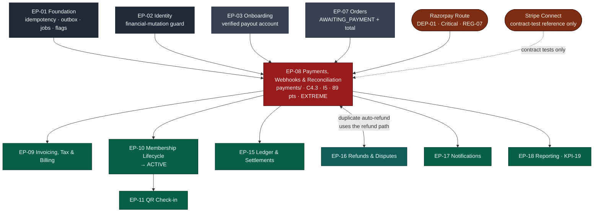

# EP-08 — Payments, Webhooks & Reconciliation

> **Phase-0 delivery backlog.** Detailed expansion of `ENGINEERING_PLAN.md` §2 (epic row `EP-08`)
> and §3 (`F-08.1` … `F-08.14`). **This is the highest-risk epic in the programme**: it is the only
> one rated **Extreme** on all four of money, concurrency, an external system and a
> launch-blocking acceptance criterion (§13.1, `payments/`). No application code exists yet.
>
> **India ruling in force.** `ENGINEERING_PLAN.md` §3 still names *"Stripe Connect reference
> adapter"* as `F-08.2`. That text predates `LAUNCH_MARKET_INDIA.md` (2026-08-06). The Phase-1
> production adapter for India is **Razorpay Route**; Stripe remains **only** as the reference
> implementation that proves the `PaymentProvider` port by running the same contract suite against a
> second adapter. This is the port working as designed, not a deviation (`ADR-0018`, `REG-01`).

---

## 1. Metadata

| Field | Value |
| :--- | :--- |
| **Epic id** | `EP-08` |
| **Name** | Payments, Webhooks & Reconciliation |
| **Priority (MoSCoW)** | **M** — Must. `BAC-04`, `KPI-19` (payment success ≥ 92%) and `M3` all fail without it |
| **Complexity** | **XL** (T-shirt, §2) · module rating **Extreme** for `payments/` (§13.1) — the joint-highest in the plan with `tenancy/`, `ledger/` and `settlements/` |
| **Story points** | **89** (epic/feature view, §2) · `payments/` module view **89 pts / 45 engineer-days** (§13.1) |
| **Target sprint(s)** | **Sprint 5** — first half (`F-08.1`, `F-08.2` Razorpay Route, `F-08.3`, `F-08.13`, `F-08.14`, `F-08.18`) · **Sprint 6** — second half (`F-08.4` … `F-08.12`, `F-08.15` … `F-08.19`), gated by **`E2E-02`** and milestone **`M3`** |
| **Owning PRD module** | `PAY` (`B5.10`) |
| **Owning code module** | `payments/`, with the provider adapters confined to `payments/infrastructure/` behind an anti-corruption layer |
| **Surfaces** | `customer-web` — `SCR-WEB-006`, `SCR-WEB-007` · `gym-dashboard` — `SCR-DASH-011` detail drawer (payment events) · `admin-dashboard` — `SCR-ADM-006`, `SCR-ADM-010` (reconciliation) |
| **Primary APIs** | `API-PAY`: `POST /v1/orders/:ref/payment-intent`, `GET /v1/payments/:id`, `POST /v1/payments/:id/retry`, `POST /v1/webhooks/payments/:provider` (unauthenticated, signature- and IP-guarded) |
| **State machines** | `C4.3` Payment (`CREATED` · `PENDING` · `AUTHORISED` · `CAPTURED` · `FAILED` · `CANCELLED` · `REFUNDED` · `PARTIALLY_REFUNDED`) |
| **Background jobs** | `payment.reconcile` (every 15 min), `payment.duplicate-detect` (every 15 min), `membership.auto-renew` (daily, mandate debits) — all `C5`, all idempotent, all under a distributed lock |
| **Launch market** | **India** — Razorpay Route; UPI is the dominant rail and is rendered first; RBI payment-aggregator, card-tokenisation and e-mandate regimes bind the design; payment system data stored **in India** |
| **Invariant carried** | **`I5`** — activation is webhook-driven; a client redirect never activates anything (`Architecture.md` §1, `BR-PAY-02`, `ADR-0013`) |
| **Status** | `PLANNED` — Phase 0. Not started |
| **Epic owner** | Backend Lead — money path. **Pair programming mandatory on every path in this epic** (`RSK-14`); `CODEOWNERS` requires two approvals on `payments/` |

---

## 2. Business Goal

**Move money correctly, once, and prove it later.** That is `B5.10`'s purpose statement and it is
exactly three obligations, in that order. *Correctly* means the amount the gateway captured equals
the amount the order says — an amount mismatch creates **no** membership and escalates, rather than
quietly activating something nobody agreed to. *Once* means idempotency at the request layer,
uniqueness at the database layer, and a duplicate detector that catches the case both of those
miss, refunding the second capture inside an hour before the member reaches for a chargeback.
*Prove it later* means a `payment_events` log that records every provider event before it is
interpreted, so that six months on, in a dispute, the platform can reconstruct what the provider
said and when. `OBJ-04` — *"membership revenue collection automatic, traceable and reconcilable"* —
is this epic's sentence, and `KPI-19` (payment success ≥ 92%) is its number.

**This epic is also where the platform's single most dangerous coupling lives: the seam with a
third party that can lie to us, go down, deliver out of order, or deliver nothing at all.** The
`PaymentProvider` port exists so that Razorpay Route's vocabulary — linked accounts, transfers,
on-hold transfers, settlement reports — never reaches domain code, and so that `REG-07` (a single
aggregator as a single point of dependency, score 15) is survivable rather than existential. But an
abstraction asserted by one implementation is not an abstraction; `TD-022` says so. That is why
Stripe Connect stays: **not** as a fallback anyone expects to switch to in a hurry, but as the
second implementation that makes the contract suite meaningful. `DEP-01` is rated Critical with the
failure mode *"no sales"*, and `NFR-AVL-03`'s degradation list deliberately excludes payments —
they either work or the marketplace stops selling.

**Third, this epic carries the invariant that most tempts a shortcut under schedule pressure.**
`BR-PAY-02` says activation is driven by the verified webhook, never by the client's redirect.
Under a deadline, with a browser that closed before redirect and a member on the phone to support,
the obvious fix is a "confirm payment" endpoint. `SEC-A04-004` names the consequence: anyone who can
`POST` to that route gets a free membership. The structural answer, and the one this epic is
committed to, is that **there is no client activation path to disable** — the activation command is
reachable only from the webhook handler and the reconciler, and a CI assertion over the generated
OpenAPI document proves no other endpoint exists. Sprint 6's demo proves it the honest way: close
the browser before the redirect and watch the membership become `ACTIVE` anyway.

---

## 3. Scope

### 3.1 In scope — explicit

| # | Item | Anchor |
| :-: | :--- | :--- |
| 1 | `PaymentProvider` port: create intent · capture · refund · fetch status · verify webhook · create connected account · initiate payout · **register mandate** · **debit mandate** · **revoke mandate** · **fetch settlement report** | `FR-PAY-01`, `REG-10`, `REG-07` |
| 2 | **Razorpay Route adapter** — Phase-1 India production adapter: order create, UPI / card / netbanking / wallet instruments, linked (connected) accounts, transfers, on-hold transfers, settlement report normalisation | `LAUNCH_MARKET_INDIA.md` §7, `REG-01`, `ADR-0018` |
| 3 | **Stripe Connect adapter** retained as the contract-test reference implementation only — never wired to production traffic | `§C1.1`, `TD-022`, `REG-01` |
| 4 | Anti-corruption layer: no Route or Stripe concept in any `payments/` domain type; provider-namespaced identifiers so two providers' references coexist | `PROJECT_CONSTITUTION.md` §4.5.1, `REG-07` |
| 5 | Provider-driven instrument rendering — the platform hardcodes no instrument list; **UPI first for India** | `FR-PAY-02`, `SCR-WEB-006` |
| 6 | Webhook receiver: HMAC over the **raw** body before parsing, bounded timestamp window, `UNIQUE (provider_event_id)`, `2xx` only after durable storage | `FR-PAY-04`, `BR-PAY-05` |
| 7 | Webhook-exclusive activation — the `C4.1 → ACTIVE` command has exactly one caller | `FR-PAY-03`, `BR-PAY-02`, `I5` |
| 8 | Order-independent, idempotent handlers; a causally premature event is **parked** and resolved by pulling provider truth; illegal `C4.3` transitions are refused, not forced | `TR-04` |
| 9 | `payment.reconcile` poller every 15 minutes with an escalation threshold; an indeterminate payment **never** auto-activates | `FR-PAY-05`, `BR-PAY-06` |
| 10 | `payment.duplicate-detect` every 15 minutes; keeps the earliest capture, auto-refunds the rest through the standard refund path with reason `DUPLICATE_PAYMENT`, notifies the payer | `FR-PAY-08`, `BR-PAY-07` |
| 11 | Retry against the same unexpired order with a **fresh** intent | `FR-PAY-06` |
| 12 | `payment_events` append-only log with provider identifiers, timestamps and **redacted** raw payloads | `FR-PAY-07` |
| 13 | Zero instrument data on platform infrastructure — no PAN, CVV, bank credential or full instrument identifier is stored, logged or transmitted; RBI network tokens only | `FR-PAY-09`, `BR-PAY-08`, `NFR-SEC-03` |
| 14 | Split settlement to Razorpay Route linked accounts, with the scheduled-platform-payout path retained for providers that do not support it | `FR-PAY-10` |
| 15 | **RBI e-mandate / UPI AutoPay**: mandate as an object with its own lifecycle (`REGISTERED → NOTIFIED → DEBITED / FAILED / REVOKED`), AFA at registration, a **required and recorded** pre-debit notification whose absence blocks the debit, and a per-transaction ceiling above which re-authentication is routed | `FR-PAY-11`, `BR-MEM-10`, `REG-10` |
| 16 | Sandbox mode with deterministic success / failure / timeout / duplicate outcomes | `FR-PAY-12`, `§C7` |
| 17 | Amount-mismatch block: gateway amount ≠ order amount creates **no** membership and raises an alert | `B5.10` edge cases, `BR-PAY-02-N2` |
| 18 | Normalised provider settlement-report ingest, so `EP-15`'s reconciliation reads one shape regardless of provider | `BR-FIN-07`, `REG-07` |
| 19 | Pull-only degradation mode behind a flag, for the case where the provider's webhook channel is down entirely | `TR-04` contingency |
| 20 | Payment surfaces: `SCR-WEB-006` hand-off with the non-dismissible processing state; `SCR-WEB-007` "confirming payment" pending state that never says "failed" before the reconciliation threshold | `AC-PAY-02.2`, `SCR-WEB-006`, `SCR-WEB-007` |

### 3.2 Out of scope — explicit, with destination

| Item | Why it is not here | Where it went |
| :--- | :--- | :--- |
| Order creation, pricing, coupons, eligibility | The order is an input to this epic, never an output of it | **`EP-07`** |
| Invoice generation, numbering, tax and PDF | An invoice is a consequence of a captured payment; the event is emitted here, consumed there | **`EP-09`** |
| Membership state beyond the single `→ ACTIVE` transition | `EP-08` fires activation; `EP-10` owns the rest of `C4.1` | **`EP-10`** |
| Ledger entries, commission posting, settlement batches, statements, payout approval | Payment posts the *event*; the ledger posts the *entries* | **`EP-15`** |
| Refund policy, proration, approval routing, credit notes, disputes and evidence packs | `EP-08` **calls** the refund path for duplicates; it does not own it | **`EP-16`** |
| Reconciliation of the settlement report against the ledger, and the variance alert | `EP-08` ingests and normalises the report; `EP-15` reconciles it | **`EP-15`**, `SCR-ADM-010` |
| Tenant subscription charging and `PAST_DUE` degradation | It is a charge, but a `billing/` one against the tenant, not a member sale | **`EP-09`** `F-09.11` (moved to sprint 15) |
| Wallet balance applied before the gateway charge | `BR-WAL-01` is priority `C` | **`EP-20`** |
| Payout execution, dual approval and payout failure handling | The port exposes `initiatePayout`; the orchestration is settlement's | **`EP-15`** |
| Chargeback intake and balance hold | A dispute webhook is received here and forwarded; the case is `refunds/` | **`EP-16`** |
| PCI-DSS certification work | Out of scope by architecture — the platform never receives instrument data, so it stays out of scope | `A4.3`, `BR-PAY-08` |

---
## 4. Features

`F-08.1` … `F-08.14` are carried from `ENGINEERING_PLAN.md` §3. **`F-08.2` is restated** to name
Razorpay Route as the Phase-1 India adapter; the Stripe reference implementation moves to its own
row so that both are separately trackable and the contract suite has two named targets. Rows marked
*(new)* are additions this backlog surfaces from `LAUNCH_MARKET_INDIA.md`, `RiskAnalysis.md` §4 and
`SprintPlanning.md` sprints 5–6.

| Feature | Description | Satisfies | Pri | Pts | Sprint |
| :--- | :--- | :--- | :-: | :-: | :-: |
| **F-08.1** | `PaymentProvider` port — intent, capture, refund, status, verify-webhook, connected account, payout; no domain code references a provider | `FR-PAY-01`, `§C1.1` | M | 5 | 5 |
| **F-08.2** | **Razorpay Route India adapter** *(restated — supersedes "Stripe Connect reference adapter")*: order create, UPI/card/netbanking/wallet, linked accounts, transfers, on-hold transfers | `FR-PAY-01`, `DEP-01`, `REG-01`, `LAUNCH_MARKET_INDIA.md` §7 | M | 8 | 5 |
| **F-08.3** | Provider-driven instrument rendering; nothing hardcoded; UPI ordered first for India | `FR-PAY-02`, `SCR-WEB-006` | M | 3 | 5 |
| **F-08.4** | Webhook-exclusive membership activation — one caller, structurally proven | `FR-PAY-03`, `BR-PAY-02`, `I5` | M | 5 | 6 |
| **F-08.5** | Signature verification over the raw body, `provider_event_id` deduplication, idempotent processing, bounded-window replay protection | `FR-PAY-04`, `BR-PAY-05` | M | 5 | 6 |
| **F-08.6** | Indeterminate-payment poller with escalation to Finance; never auto-activates | `FR-PAY-05`, `BR-PAY-06`, `C5` | M | 5 | 6 |
| **F-08.7** | Retry against the same unexpired order with a fresh intent | `FR-PAY-06` | M | 2 | 6 |
| **F-08.8** | `payment_events` log: provider identifiers, timestamps, redacted payloads, written **before** interpretation | `FR-PAY-07` | M | 3 | 6 |
| **F-08.9** | Duplicate detection within one hour and automatic refund with notification | `FR-PAY-08`, `BR-PAY-07` | M | 5 | 6 |
| **F-08.10** | Zero instrument data anywhere in platform storage, logs, traces, Sentry or analytics | `FR-PAY-09`, `BR-PAY-08`, `NFR-SEC-03` | M | 3 | 6 |
| **F-08.11** | Split settlement to linked accounts; scheduled platform payout retained where a provider lacks it | `FR-PAY-10` | M | 5 | 6 |
| **F-08.12** | Tokenised auto-renewal mandates with pre-debit notification | `FR-PAY-11`, `BR-MEM-10` | S | 5 | 6 |
| **F-08.13** | Sandbox mode with deterministic success / failure / timeout / duplicate outcomes | `FR-PAY-12`, `§C7` | M | 3 | 5 |
| **F-08.14** | Amount-mismatch block — no membership on a gateway/order amount difference | `B5.10` edge cases, `BR-PAY-02-N2` | M | 2 | 5 |
| **F-08.15** *(new)* | **Stripe Connect contract-test reference adapter** — proves the port by a second implementation; never carries production traffic | `§C1.1`, `TD-022`, `TD-028`, `REG-01` | M | 5 | 5 → 6 |
| **F-08.16** *(new)* | **RBI e-mandate lifecycle object** — `REGISTERED → NOTIFIED → DEBITED / FAILED / REVOKED`; AFA at registration; pre-debit notification **required and recorded**, its absence **blocks** the debit; per-transaction ceiling with a re-authentication route; lead time and ceiling as configuration | `FR-PAY-11`, `BR-MEM-10`, `REG-10`, `ADR-0028` | S | 5 | 6 |
| **F-08.17** *(new)* | **Normalised settlement-report ingest** — the adapter emits one report shape so `EP-15` reconciliation is provider-independent | `BR-FIN-06`, `BR-FIN-07`, `REG-07` | M | 3 | 6 |
| **F-08.18** *(new)* | **Provider anti-corruption layer** + provider-namespaced identifiers; `dependency-cruiser` rule forbidding a provider name outside `payments/infrastructure/` | `PROJECT_CONSTITUTION.md` §4.5.1, `REG-07`, `E5.8` | M | 3 | 5 |
| **F-08.19** *(new)* | **Pull-only degradation mode** behind `ops.payments.pull_only_mode` — activation still never comes from the client; the sweep interval tightens to 1 minute | `TR-04` contingency, `NFR-AVL-03` | S | 2 | 6 |
| **F-08.20** *(new)* | **RBI card tokenisation posture**: card entry only in the provider's hosted element; the platform stores network tokens and a last-four display string, nothing else; `pii-redaction` CI job and an instrument-pattern schema check | `BR-PAY-08`, `NFR-SEC-03`, `LAUNCH_MARKET_INDIA.md` §7 | M | 3 | 6 |

**Feature roll-up.** 20 features · 89 core points (`F-08.1` … `F-08.14`) + 21 points for the six
additions, absorbed inside the `payments/` module estimate rather than added to the §2 epic figure.
Priorities: 16 `M`, 4 `S`.

---

## 5. User Stories

`US-PAY-01` and `US-PAY-02` are restated from `MASTER_PRD.md` §B5.10 with their PRD acceptance
criteria preserved. `US-PAY-03` onward are **new** — the PRD's functional requirements, edge cases
and the India regulatory analysis imply them without writing them as stories.

### US-PAY-01 — *As a member, I want to not be charged twice, and if I am, I want it fixed without asking.* **(PRD)**

- **AC-PAY-01.1** — **Given** I submit payment twice for one order, **when** both reach the gateway,
  **then** exactly **one** membership is created.
- **AC-PAY-01.2** — **Given** two captures occurred, **when** the duplicate detector runs, **then**
  the second is refunded within one hour and I am notified with the refund reference.
- **AC-PAY-01.3** — **Given** a duplicate refund occurred, **when** the gym views settlement,
  **then** the duplicate and its reversal both appear and **net to zero** — visible, not silently
  corrected.
- **AC-PAY-01.4** *(new)* — **Given** the detector has already refunded a duplicate, **when** it runs
  again, **then** it issues no second refund; the job is idempotent on the order and the payment.
- **AC-PAY-01.5** *(new)* — **Given** a duplicate is refunded, **when** the first payment is
  inspected, **then** it and the membership are untouched.

### US-PAY-02 — *As a member, I want to know whether my payment worked even if the app crashed.* **(PRD)**

- **AC-PAY-02.1** — **Given** payment succeeded at the gateway but my browser closed before redirect,
  **when** I reopen the site, **then** my membership is `ACTIVE` because activation is webhook-driven.
- **AC-PAY-02.2** — **Given** the webhook has not yet arrived, **when** I check my order, **then** it
  shows *"confirming payment"* with an explicit expectation — **never** "failed" before the
  reconciliation threshold elapses.
- **AC-PAY-02.3** — **Given** the payment genuinely failed, **when** I view the order, **then** I see
  the failure reason in customer language and a retry option.
- **AC-PAY-02.4** *(new)* — **Given** the webhook arrives **before** my client redirect, **when** the
  redirect lands, **then** it finds an already-active membership and renders success, not a race.

### US-PAY-03 — *As the platform, I want a forged or replayed webhook to be harmless.* **(new — implied by `FR-PAY-04`, `BR-PAY-05`, `TA-8`)**

- **AC-PAY-03.1** — **Given** an event whose HMAC does not verify over the raw body, **when** it
  arrives, **then** it is logged at `warn` with provider, event id and reason, discarded with a
  `2xx` so the forger is not given a retry loop, and **no** state changes.
- **AC-PAY-03.2** — **Given** a correctly signed event outside the permitted timestamp window,
  **when** it arrives, **then** it is discarded.
- **AC-PAY-03.3** — **Given** the same `provider_event_id` delivered five times, **when** all five
  are processed, **then** there is **one** activation and four no-ops, enforced by the database
  uniqueness rather than by handler logic.
- **AC-PAY-03.4** — **Given** the webhook route, **when** the request is parsed, **then** the raw
  bytes survive for HMAC verification — JSON body parsing is disabled on that route specifically.
- **AC-PAY-03.5** — **Given** any event, **when** it is received, **then** it is persisted to
  `payment_events` **before** it is interpreted, so ordering is reconstructable afterwards.

### US-PAY-04 — *As Vikram in finance, I want an indeterminate payment resolved or escalated, never guessed.* **(new — implied by `FR-PAY-05`, `BR-PAY-06`)**

- **AC-PAY-04.1** — **Given** a payment left `PENDING` or `AUTHORISED` beyond the threshold, **when**
  `payment.reconcile` runs, **then** the provider is polled and a terminal state is applied through
  the **same** idempotent path the webhook uses.
- **AC-PAY-04.2** — **Given** the provider reports `CAPTURED`, **when** the reconciler applies it,
  **then** exactly one activation occurs even if the webhook arrives afterwards.
- **AC-PAY-04.3** — **Given** the provider cannot resolve it past the escalation threshold, **when**
  the job completes, **then** a Finance alert is raised, the case enters a manual queue, and the
  membership remains `PENDING`. **No code path activates it without a human decision.**
- **AC-PAY-04.4** — **Given** a human resolves the case, **when** they act, **then** a reason is
  required and the resolution is audited with their identity.

### US-PAY-05 — *As a member whose payment failed, I want to try again without starting over.* **(new — implied by `FR-PAY-06`)**

- **AC-PAY-05.1** — **Given** a failed payment on an unexpired order, **when** I retry, **then** a
  **fresh** intent is created against the same order and the previous intent is not reused.
- **AC-PAY-05.2** — **Given** the order has expired, **when** I retry, **then** I get
  `410 ORDER_EXPIRED` and a new order is offered with prices re-validated.
- **AC-PAY-05.3** — **Given** the coupon on the order has since expired or exhausted, **when** I
  retry, **then** re-validation aborts the attempt with the specific reason before any intent is
  created (`BR-CPN-03`).
- **AC-PAY-05.4** — **Given** two retries in flight, **when** both reach the gateway, **then** the
  duplicate detector treats the outcome as `US-PAY-01`.

### US-PAY-06 — *As Priya, I want auto-renewal that tells me before it takes my money.* **(new — implied by `FR-PAY-11`, `BR-MEM-10`, `REG-10`)**

- **AC-PAY-06.1** — **Given** I opt in to auto-renewal, **when** the mandate is registered, **then**
  additional-factor authentication is completed at registration and the mandate is stored as an
  object in state `REGISTERED` with its ceiling and its notification lead time.
- **AC-PAY-06.2** — **Given** a renewal is due, **when** the debit is attempted, **then** a
  **recorded** pre-debit notification must exist within the configured lead time; if it does not,
  the debit is **blocked**, not attempted.
- **AC-PAY-06.3** — **Given** the renewal amount exceeds the configured per-transaction ceiling,
  **when** the debit is prepared, **then** it routes to a re-authentication flow rather than failing
  silently.
- **AC-PAY-06.4** — **Given** I cancel auto-renewal at any time before the charge, **when** I
  confirm, **then** the mandate moves to `REVOKED` with no penalty and no further debit is possible.
- **AC-PAY-06.5** — **Given** the query *"debits with no recorded pre-debit notification"*, **when**
  it runs in any environment, **then** it returns **zero rows**.

### US-PAY-07 — *As a QA engineer, I want the gateway to behave the same way every time in test.* **(new — implied by `FR-PAY-12`)**

- **AC-PAY-07.1** — **Given** sandbox mode, **when** I request outcome `SUCCESS`, `FAILURE`,
  `TIMEOUT` or `DUPLICATE`, **then** the adapter produces exactly that outcome, deterministically,
  with a realistic event sequence.
- **AC-PAY-07.2** — **Given** sandbox mode, **when** the application starts in `production`, **then**
  it is impossible to enable — the sandbox is not a runtime toggle in production.
- **AC-PAY-07.3** — **Given** the webhook chaos suite, **when** it runs, **then** it can produce
  out-of-order, duplicated, delayed, missing, replayed and wrong-signature deliveries on demand.

### US-PAY-08 — *As Rohan, I want my share of a marketplace sale to reach my account without me chasing it.* **(new — implied by `FR-PAY-10`, `A6.4`)**

- **AC-PAY-08.1** — **Given** my payout account is verified, **when** a marketplace sale captures,
  **then** the split is configured so the platform commission is retained and my share is routed to
  my linked account.
- **AC-PAY-08.2** — **Given** my bank account changed and is pending re-verification, **when** a sale
  captures, **then** the transfer is held rather than routed to a stale destination (`BR-GYM-06`).
- **AC-PAY-08.3** — **Given** a provider that does not support split settlement, **when** a sale
  captures, **then** the platform's scheduled payout path is used instead and the same eight figures
  are persisted.
- **AC-PAY-08.4** — **Given** a linked-account identifier, **when** it is stored, **then** it is
  provider-namespaced so a second provider's identifiers can coexist rather than collide.

### US-PAY-09 — *As the platform, I want a gateway that reports an amount we did not ask for to change nothing.* **(new — implied by `B5.10` edge cases)**

- **AC-PAY-09.1** — **Given** a signed capture event whose amount differs from the order total,
  **when** it is processed, **then** it is refused with `PAYMENT_AMOUNT_MISMATCH`, **no** membership
  is created, and an alert is raised.
- **AC-PAY-09.2** — **Given** that refusal, **when** the case is reviewed, **then** the raw redacted
  event is available in `payment_events` for the escalation.
- **AC-PAY-09.3** — **Given** a currency other than the order's currency, **when** the event is
  processed, **then** it is refused with `CURRENCY_MISMATCH` and nothing is created.

### US-PAY-10 — *As an Indian member, I want to pay by UPI first, not to hunt for it.* **(new — implied by `FR-PAY-02`, `LAUNCH_MARKET_INDIA.md` §7)**

- **AC-PAY-10.1** — **Given** the payment screen, **when** instruments render, **then** they come
  from the provider's capability response, not from a hardcoded list, and UPI is ordered first for
  the India profile.
- **AC-PAY-10.2** — **Given** an instrument the provider withdraws, **when** the screen renders,
  **then** it disappears without a deployment.
- **AC-PAY-10.3** — **Given** the processing state, **when** it is shown, **then** it is
  non-dismissible, shows an elapsed indicator, and states explicitly that no second attempt should
  be made.

### US-PAY-11 — *As an on-call engineer, I want a webhook outage to degrade, not to stop sales.* **(new — implied by `TR-04` contingency, `REG-07`)**

- **AC-PAY-11.1** — **Given** the provider's webhook channel is down, **when** pull-only mode is
  enabled by flag, **then** the reconciliation sweep runs every minute and activation still occurs
  only from provider truth — never from the client.
- **AC-PAY-11.2** — **Given** pull-only mode, **when** webhooks resume, **then** the previously
  pulled events are deduplicated by `provider_event_id` and produce no second effect.
- **AC-PAY-11.3** — **Given** the aggregator is entirely unavailable, **when** a gym records an
  offline sale at the desk, **then** it succeeds — `DEP-01`'s mitigation is real, not decorative.

---
## 6. Acceptance Criteria for the Epic

The epic is not done until every criterion passes. Items marked **launch-blocking** gate milestone
`M3` and business acceptance `BAC-04`.

| # | Criterion | Evidence |
| :-: | :--- | :--- |
| **AC-EP08-01** | **Launch-blocking.** A member pays, **the browser is closed before the redirect**, and the membership is nonetheless `ACTIVE` when the site is reopened, with the invoice issued and the QR provisioned | `E6.2`, `AC-PAY-02.1`, `BR-PAY-02-P1`, `E2E-02` step 7–9 |
| **AC-EP08-02** | **Launch-blocking.** No endpoint exists anywhere that transitions a membership to `ACTIVE` from a client signal — asserted by a CI check over the generated OpenAPI document, not by inspection | `BR-PAY-02` `L12-CI`, `SEC-A04-004` |
| **AC-EP08-03** | A forged client success signal leaves the membership `PENDING` | `BR-PAY-02-N1` |
| **AC-EP08-04** | A webhook with an invalid signature is rejected and logged; a body-tampered event changes nothing | `E6.3`, `BR-PAY-05-N1` |
| **AC-EP08-05** | The same `provider_event_id` delivered five times produces one activation and four no-ops | `BR-PAY-05-N2` |
| **AC-EP08-06** | An event outside the timestamp window is discarded | `BR-PAY-05-N3` |
| **AC-EP08-07** | An out-of-order `refund.processed` arriving **before** its `payment.captured` does not corrupt state: it is parked, the capture is pulled from the provider, and both are applied in causal order | `E6.3`, `TR-04` matrix row 1 |
| **AC-EP08-08** | A `payment.failed` arriving **after** `payment.captured` is recorded in `payment_events` for forensics and does **not** transition the aggregate — terminal states are terminal | `TR-04` matrix row 3 |
| **AC-EP08-09** | **Launch-blocking.** A webhook with a valid signature but an amount differing from the order is refused `PAYMENT_AMOUNT_MISMATCH`, creates no membership, and raises an alert | `E5.9`, `BR-PAY-02-N2` |
| **AC-EP08-10** | An indeterminate payment escalates to Finance and **never** auto-activates; the membership stays `PENDING` | `E6.4`, `BR-PAY-06-N1` |
| **AC-EP08-11** | A payment left `AUTHORISED` past the threshold is polled, the provider reports `CAPTURED`, and exactly one activation results even if the webhook later arrives | `BR-PAY-06-P1` |
| **AC-EP08-12** | **Launch-blocking.** A duplicate capture is detected and auto-refunded **within one hour**, the payer is notified, and both lines appear on the settlement statement netting to zero | `E6.5`, `BR-PAY-07-P1`, `E2E-08`, `SR-5` |
| **AC-EP08-13** | Re-running `payment.duplicate-detect` issues no second refund, and the first payment and the membership are untouched | `BR-PAY-07-N1`, `BR-PAY-07-N2` |
| **AC-EP08-14** | **Launch-blocking.** No card number, CVV, bank credential or full instrument identifier exists anywhere in platform storage, logs, traces, Sentry events or analytics; only provider tokens and a last-four display string | `E6.11`, `BR-PAY-08-P1`, `NFR-SEC-03` |
| **AC-EP08-15** | A synthetic payload containing a PAN and CVV passed through the webhook handler is redacted in **every** sink; the assertion greps the captured log stream for the digits | `BR-PAY-08-N1` |
| **AC-EP08-16** | **Launch-blocking.** The `PaymentProvider` contract-test suite passes **identically** against the Razorpay Route adapter and the Stripe reference adapter | `E5.7`, `REG-01` |
| **AC-EP08-17** | No domain code outside `payments/infrastructure/` names a provider — enforced by `dependency-cruiser`, not by review | `E5.8`, `F-08.18` |
| **AC-EP08-18** | Contract-test coverage of the port is **100% of its methods**, including the mandate and settlement-report methods | `REG-01` early-warning signal |
| **AC-EP08-19** | Payment instruments render from the provider capability response; disabling one at the provider removes it from the screen with no deployment; UPI is first for India | `AC-PAY-10.1`, `AC-PAY-10.2` |
| **AC-EP08-20** | A retry against an unexpired order creates a **fresh** intent; against an expired order it returns `410 ORDER_EXPIRED` | `AC-PAY-05.1`, `AC-PAY-05.2` |
| **AC-EP08-21** | Every provider event is persisted to `payment_events` **before** interpretation, with the payload redacted and the provider identifiers intact | `FR-PAY-07`, `AC-PAY-03.5` |
| **AC-EP08-22** | The webhook endpoint returns `2xx` **only after** the event is durably stored, so the provider retries anything not stored | `E6.1` task note, `TR-04` mitigation |
| **AC-EP08-23** | A mandate debit with no recorded pre-debit notification inside the configured lead time is **blocked**; the query for such debits returns zero rows in every environment | `AC-PAY-06.2`, `AC-PAY-06.5`, `REG-10` |
| **AC-EP08-24** | A renewal amount above the configured per-transaction ceiling routes to re-authentication rather than being sent to the provider | `AC-PAY-06.3`, `REG-10` |
| **AC-EP08-25** | The e-mandate lead time and ceiling are **configuration**, not constants; changing them is a data change with no deployment | `ADR-0028`, `REG-10` |
| **AC-EP08-26** | Split settlement routes the gym's share to its linked account and retains commission; a pending re-verification of the payout account **holds** the transfer | `AC-PAY-08.1`, `AC-PAY-08.2` |
| **AC-EP08-27** | Sandbox mode produces deterministic success / failure / timeout / duplicate outcomes and cannot be enabled in `production` | `AC-PAY-07.1`, `AC-PAY-07.2` |
| **AC-EP08-28** | The webhook chaos suite covers all six scenarios — out-of-order, duplicated, delayed, missing, replayed, wrong-signature — and is not a happy-path test | Sprint-6 task 6.24 |
| **AC-EP08-29** | Payment intent creation p95 ≤ 1.5 s excluding gateway time | `NFR-PERF-05`, `E6.10` |
| **AC-EP08-30** | Webhook processing lag stays below 120 s; the metric is alarmed, not merely graphed | `TR-04` early-warning signal, `Monitoring.md` |
| **AC-EP08-31** | Pull-only mode can be enabled by flag; activation still comes only from provider truth, and resumed webhooks deduplicate cleanly | `AC-PAY-11.1`, `AC-PAY-11.2` |
| **AC-EP08-32** | The normalised settlement report shape is produced by the adapter, and `EP-15`'s reconciler consumes only that shape | `F-08.17`, `REG-07` |
| **AC-EP08-33** | `SCR-WEB-006` shows a non-dismissible processing state with an elapsed indicator; `SCR-WEB-007` never renders "failed" before the reconciliation threshold | `AC-PAY-02.2`, `AC-PAY-10.3` |
| **AC-EP08-34** | Every payment and refund mutation writes an append-only `audit_log` row; a deduplicated replay writes none | `BR-DAT-01`, `BR-PAY-05` audit note |
| **AC-EP08-35** | All payment data — including `payment_events` and provider tokens — is stored in an **Indian** region, verified in Terraform review | `REG-06`, RBI localisation |

---

## 7. Business Rules Enforced

Enforcement detail lives in `BusinessRules.md` §9 and is **not duplicated here**. This table names
the enforcement point inside `EP-08`.

| Rule | Ownership | Enforcement point in `EP-08` | Authoritative layer |
| :--- | :--- | :--- | :--- |
| `BR-PAY-02` | **Owner** (`payments/`) · invariant **I5** | Structural absence: no endpoint activates from a client signal, asserted over the generated OpenAPI document; `ActivationEvidence` cannot be constructed from a request body; the webhook handler verifies signature, checks event-id uniqueness, **re-validates the captured amount**, then activates | `L12-CI` |
| `BR-PAY-05` | **Owner** | HMAC over the raw body before parsing; bounded timestamp window; insert into `payment_events` where `UNIQUE (provider_event_id)` makes replay a database no-op; unverified events logged and discarded with `2xx` | `L6-UC` + `L1-DB` |
| `BR-PAY-06` | **Owner** | `payment.reconcile` every 15 min; the `C4.3` machine has no edge from an indeterminate state to `CAPTURED` except through applied provider truth; escalation never activates | `L10-JOB` |
| `BR-PAY-07` | **Co-owner** with `refunds/` | `payment.duplicate-detect` every 15 min keeps the earliest capture and refunds the rest through the **standard** refund path so commission reversal and the credit note happen correctly; `UNIQUE (provider, provider_intent_id)` on `payments` | `L10-JOB` |
| `BR-PAY-08` | **Owner** | Architectural: card entry happens in the provider's hosted element, so there is nothing to store; no instrument column exists; Pino redaction; `pii-redaction` CI job; instrument-pattern schema check. **India:** RBI tokenisation makes this a licensing condition | Structural / `ADR-0018` |
| `BR-PAY-03` | **Co-owner** with `common/`, `ordering/` | `Idempotency-Key` required on payment initiation and retry; the interceptor replays the stored response; `UNIQUE (idempotency_key)` upstream on `orders` | `L9-INT` |
| `BR-PAY-01` | **Inherited** from `EP-01` | Every amount crossing the provider seam is a `Money` in paise; the adapter converts at the boundary and nowhere else | `L5-DOM` |
| `BR-MEM-02` | **Contributor** (`memberships/` owns) | The webhook handler supplies the `ActivationEvidence` shape; the state change itself is `EP-10`'s | `L5-DOM` |
| `BR-MEM-10` | **Co-owner** with `memberships/` | Mandate object lifecycle; opt-in, disclosed at purchase, cancellable before the charge with no penalty; pre-debit notification blocks the debit when absent | `L5-DOM` + `L10-JOB` |
| `BR-REF-04` | **Contributor** (`refunds/` owns) | The duplicate auto-refund goes to the original instrument only; no endpoint accepts a destination | `L5-DOM` |
| `BR-REF-09` | **Contributor** | The duplicate detector is idempotent on the order, so a re-run issues no second refund | `L10-JOB` |
| `BR-FIN-06` | **Contributor** (`ledger/`, `settlements/` own) | Gateway fees are recorded **as reported by the provider**; the adapter never estimates one, and an unreported fee is surfaced as absent rather than filled in | `L5-DOM` |
| `BR-TEN-01` | **Inherited** | `payments` and `payment_events` are tenant-scoped with RLS; the webhook route resolves the tenant from the **payment record**, never from the payload | `L2-RLS` |
| `BR-DAT-01` | **Inherited** | Payment state transitions, escalations, human resolutions and refunds are audited | `L9-INT` |
| `BR-DAT-06` | **Inherited** | No personal data or instrument data in logs, traces or analytics | `L12-CI` |

> **`BAC-06` obligation.** `BR-PAY-02`, `BR-PAY-05`, `BR-PAY-06`, `BR-PAY-07` and `BR-PAY-08` are all
> `M`-priority and all in the money family, so a failing rule test here is **S1** under `C8.5` and
> blocks release outright.

---

## 8. Dependencies

### 8.1 Upstream — must exist first

| Epic | What `EP-08` needs from it | Hard or soft |
| :--- | :--- | :--- |
| **EP-01** | Idempotency interceptor and store; transactional outbox (activation and notification effects); `Money`; error registry; job harness with distributed locks; structured logging with redaction; OpenTelemetry spans; feature-flag service (for pull-only mode) | **Hard** |
| **EP-07** | An order in `AWAITING_PAYMENT` with a server-computed total, currency and idempotency key. Payment initiation has no other legitimate input | **Hard** |
| **EP-03** | The tenant's verified payout account and KYC state — a linked account cannot be created for an unverified tenant | **Hard** for `F-08.11` |
| **EP-02** | Authenticated principal for intent creation; `@FinancialMutation()` guard refusing impersonated financial writes | **Hard** |
| **EP-10** | The `C4.1 → ACTIVE` transition command that the webhook handler calls. Sprint 6 delivers `F-10.1` partial for exactly this | **Hard**, delivered jointly in sprint 6 |
| **EP-09** | The invoice-on-payment consumer; `EP-08` emits the event, `EP-09` issues the document | **Soft** — the event contract must be agreed in sprint 5 |
| **EP-16** | The refund execution path that duplicate detection calls. In sprint 6 this is a **minimal** refund path; the full epic is sprint 12 | **Hard, minimal slice** |
| **EP-19** | Provider credentials and webhook secrets as configuration, with rotation | **Soft** — environment configuration suffices at sprint 5 |

### 8.2 Downstream — what this unblocks

| Epic | What it takes from `EP-08` |
| :--- | :--- |
| **EP-09** | The `payment.captured` domain event that triggers invoice issuance; the payment reference and method that appear on the invoice |
| **EP-10** | Activation itself — `BR-MEM-02` has exactly two evidence shapes and one of them is produced here |
| **EP-11** | A QR credential exists only for an active membership, which exists only after capture |
| **EP-15** | `gateway_fee_minor` as reported, the normalised settlement report for reconciliation, and the payout initiation method on the port |
| **EP-16** | Refund execution at the gateway, dispute/chargeback webhooks, and the payment event trail that becomes evidence |
| **EP-17** | Payment-succeeded, payment-failed, duplicate-refunded and pre-debit notification events |
| **EP-18** | Payment success rate (`KPI-19`), failure-reason breakdown and method mix |

### 8.3 External dependencies and open questions

| Dependency | Type | Effect on `EP-08` |
| :--- | :--- | :--- |
| **Razorpay Route** merchant account, Route enablement, linked-account onboarding | `DEP-01`, **Critical** | Nothing ships without sandbox credentials. Sprint-5 task 5.26 owns credentials, webhook endpoint exposure and secret rotation. `REG-07` scores this 15 |
| **Stripe** test account for the reference adapter | `DEP-01` secondary | Needed only for the contract suite; no production traffic |
| `BLK-04` #5 — **current RBI e-mandate thresholds and pre-debit notification timing for UPI AutoPay** | Professional advice, not engineering judgement | Values ship as configuration behind `config/payments/emandate`; a wrong value is a data change, not a code change. Due **sprint 7** per `REG-10` |
| `BLK-04` #1, #2 — GST TCS / income-tax TDS for e-commerce operators | Professional advice | Does not block `EP-08`; the adapter must expose **all** provider-reported deductions so `EP-15` can model additional statutory ones |
| `OQ-07` — auto-renewal at launch | **Resolved**: yes, opt-in, off by default | `F-08.12` and `F-08.16` are in scope but their blast radius is small, which is also `REG-10`'s contingency |
| `REG-06` — data residency | **Resolved**: India, mandatory | Provider endpoints, Sentry, OTel exporters and any payment-data sink must be Indian; verified at Terraform plan review |
| `CON-03` | Constraint | Payment behaviour, refund timing and dispute windows are dictated by the gateway and the card networks, not by this platform — the product must state provider timings, not invent its own |

### 8.4 Dependency graph

---
## 9. Technical Tasks

Layers: `DB` · `API` · `worker` · `web` · `dash` · `admin` · `infra` · `test` · `docs`. Estimates
are **engineer-days** including implementation, tests and review. Ids align with
`SprintPlanning.md` sprint-5 tasks `5.12`–`5.16`, `5.19`, `5.25`, `5.26` and sprint-6 tasks
`6.1`–`6.10`, `6.24`.

| # | Task | Layer | Est (ed) | Depends on | Serves |
| :--- | :--- | :--- | :-: | :--- | :--- |
| **T-08.01** | `payments` and `payment_events` migrations: `bigint` + `char(3)` amounts, `C4.3` status enum, `method` enum incl. `UPI`, `UNIQUE (provider, provider_intent_id)`, `UNIQUE (provider_event_id)`, redacted `raw_payload jsonb` | DB | 1.5 | EP-01 | `C2.2`, `BR-PAY-05`, `BR-PAY-07` |
| **T-08.02** | RLS policies and generated isolation specs for every payment endpoint; the webhook route resolves tenant from the payment record, never from the payload | DB + test | 1.0 | T-08.01 | `BR-TEN-01`, `BAC-10` |
| **T-08.03** | Schema check asserting **no column name matches an instrument pattern** anywhere in the schema; fails the build if one is added | DB + infra | 0.5 | T-08.01 | `BR-PAY-08` |
| **T-08.04** | `PaymentProvider` port definition: `createIntent`, `capture`, `refund`, `fetchStatus`, `verifyWebhook`, `createConnectedAccount`, `initiatePayout`, `registerMandate`, `debitMandate`, `revokeMandate`, `fetchSettlementReport` — all in domain vocabulary | API | 2.5 | EP-01 | `FR-PAY-01`, `REG-10`, `F-08.17` |
| **T-08.05** | **Razorpay Route adapter** — order create, instrument capability response, capture, refund, status fetch | API | 2.0 | T-08.04, credentials | `F-08.2`, `REG-01` |
| **T-08.06** | **Razorpay Route adapter** — linked (connected) accounts, transfers, on-hold transfers, split configuration | API | 2.0 | T-08.05, EP-03 | `FR-PAY-10` |
| **T-08.07** | Anti-corruption layer mapping Route concepts to domain types; provider-namespaced identifier scheme; `dependency-cruiser` rule forbidding a provider name outside `payments/infrastructure/` | API + infra | 1.5 | T-08.04 | `F-08.18`, `E5.8` |
| **T-08.08** | **Stripe Connect reference adapter** implementing the full port, wired only to the contract suite and never to production configuration | API | 2.0 | T-08.04 | `F-08.15`, `TD-022` |
| **T-08.09** | Provider capability endpoint + instrument ordering policy (UPI first for the India profile) | API | 1.0 | T-08.05 | `FR-PAY-02` |
| **T-08.10** | `POST /v1/orders/:ref/payment-intent` with mandatory `Idempotency-Key`, `@FinancialMutation()` guard, and the `BR-PLN-03`/`BR-CPN-03` re-validation call before any provider call | API | 1.5 | EP-07 T-07.08/13 | `FR-PAY-01`, `BR-PAY-03` |
| **T-08.11** | `GET /v1/payments/:id` status contract used by the `SCR-WEB-007` pending poll, with an explicit "confirming" state distinct from "failed" | API | 0.5 | T-08.01 | `AC-PAY-02.2` |
| **T-08.12** | `POST /v1/payments/:id/retry` — fresh intent on the same unexpired order; refuses `410 ORDER_EXPIRED` otherwise | API | 1.0 | T-08.10 | `FR-PAY-06` |
| **T-08.13** | Sandbox mode: deterministic `SUCCESS` / `FAILURE` / `TIMEOUT` / `DUPLICATE` with realistic event sequences; hard-disabled in `production` | API | 1.5 | T-08.05 | `FR-PAY-12` |
| **T-08.14** | Amount- and currency-mismatch block: refuse `PAYMENT_AMOUNT_MISMATCH` / `CURRENCY_MISMATCH`, create nothing, raise an alert | API | 1.0 | T-08.10 | `F-08.14`, `AC-EP08-09` |
| **T-08.15** | Webhook receiver: raw-body preservation, HMAC verification before parsing, bounded timestamp window, IP guard, `2xx` **only after** durable storage | API | 3.0 | T-08.01, T-08.05 | `FR-PAY-04`, `BR-PAY-05` |
| **T-08.16** | `payment_events` writer: persist **before** interpretation, with redaction applied at write time | API | 1.0 | T-08.15 | `FR-PAY-07`, `AC-PAY-03.5` |
| **T-08.17** | `C4.3` payment state machine as a transition table; illegal transitions refused with a typed error; terminal states terminal | API | 1.5 | T-08.01 | `C4.3`, `TR-04` |
| **T-08.18** | **Webhook-exclusive activation command** with exactly one caller; `ActivationEvidence` unconstructable from a request body; CI assertion over the OpenAPI document proving no other route exists | API + test | 2.5 | T-08.15, EP-10 F-10.1 | `FR-PAY-03`, `BR-PAY-02`, `I5` |
| **T-08.19** | Order-independent idempotent handlers plus a **parking area** for causally premature events, with bounded retry and a pull-based resolution | API + worker | 2.5 | T-08.17 | `TR-04` matrix |
| **T-08.20** | `payment.reconcile` job every 15 min under a distributed lock: poll every non-terminal payment past the threshold, apply terminal truth through the **same** idempotent path, escalate past the escalation threshold | worker | 2.0 | T-08.17, EP-01 F-01.17 | `FR-PAY-05`, `BR-PAY-06` |
| **T-08.21** | Finance escalation queue and manual-resolution action requiring a reason, fully audited; **no** activation path from it | API + admin | 1.0 | T-08.20 | `AC-PAY-04.3`, `AC-PAY-04.4` |
| **T-08.22** | `payment.duplicate-detect` job every 15 min: find orders with more than one `CAPTURED` payment, keep the earliest, refund the rest via the standard refund path with reason `DUPLICATE_PAYMENT`, notify the payer | worker | 2.0 | T-08.20, EP-16 minimal | `FR-PAY-08`, `BR-PAY-07` |
| **T-08.23** | **RBI e-mandate object and lifecycle**: `REGISTERED → NOTIFIED → DEBITED / FAILED / REVOKED`; AFA at registration; ceiling and lead time as configuration; a debit with no recorded notification is **blocked** | API + worker | 2.5 | T-08.04, EP-17 | `FR-PAY-11`, `BR-MEM-10`, `REG-10` |
| **T-08.24** | Re-authentication route for a renewal amount above the ceiling; self-service revocation before the charge | API | 1.0 | T-08.23 | `AC-PAY-06.3`, `AC-PAY-06.4` |
| **T-08.25** | Instrument-data posture: no PAN/CVV path; Pino redaction list extended and reviewed; Sentry `sendDefaultPii` disabled; last-four display string only | API + infra | 1.0 | T-08.05 | `FR-PAY-09`, `BR-PAY-08`, `F-08.20` |
| **T-08.26** | Normalised settlement-report ingest: adapter produces one report shape, stored for `EP-15` reconciliation; unreported fees surfaced as **absent**, never estimated | API + worker | 1.5 | T-08.05 | `F-08.17`, `BR-FIN-06` |
| **T-08.27** | Pull-only degradation mode behind `ops.payments.pull_only_mode`, tightening the sweep to 1 minute; documented kill-switch semantics | API + infra | 1.0 | T-08.20 | `F-08.19`, `TR-04` contingency |
| **T-08.28** | Outbox events emitted on capture: `payment.captured` for `EP-09` invoice issuance, `EP-10` activation, `EP-15` ledger posting, `EP-17` notification | API | 1.0 | T-08.18, EP-01 F-01.10 | Downstream contracts |
| **T-08.29** | `SCR-WEB-006` Payment: provider element or redirect, amount payable, order reference, non-dismissible processing state with elapsed indicator, failure reason in customer language, "do not close this window" | web | 3.0 | T-08.09, Design | `SCR-WEB-006`, `FR-PAY-02` |
| **T-08.30** | `SCR-WEB-007` Order Confirmation with the **"confirming payment"** pending state, live polling, and no failure message before the reconciliation threshold | web | 2.0 | T-08.11 | `SCR-WEB-007`, `AC-PAY-02.2` |
| **T-08.31** | `SCR-DASH-011` detail-drawer payment-events region: provider references, state transitions, failure reasons | dash | 1.5 | T-08.16 | `SCR-DASH-011` |
| **T-08.32** | `SCR-ADM-006` Finance orders & payments: gateway state, provider references, failure reasons, filters, drill-down to raw **redacted** payloads | admin | 3.0 | T-08.16 | `SCR-ADM-006` |
| **T-08.33** | Finance escalation console surface for indeterminate payments, with the reason-required resolution action | admin | 1.5 | T-08.21 | `BR-PAY-06` |
| **T-08.34** | **Port contract-test suite** run against **both** adapters and against the sandbox; 100% method coverage; identical results asserted | test | 4.0 | T-08.05, T-08.08 | `E5.7`, `AC-EP08-16`, `TD-028` |
| **T-08.35** | **Webhook chaos suite**: out-of-order, duplicated, delayed, missing, replayed, wrong-signature — six scenarios, each asserting the correct behaviour from the `TR-04` matrix | test | 6.0 | T-08.15, T-08.19 | `E6.3`, `TR-04` |
| **T-08.36** | Browser-closed activation test: kill the client before redirect and assert `ACTIVE` on the webhook | test | 1.0 | T-08.18 | `E6.2`, `BR-PAY-02-P1` |
| **T-08.37** | Duplicate-payment suite: two captures → one membership, auto-refund inside the window, notification, idempotent re-run, first payment untouched | test | 2.5 | T-08.22 | `E2E-08`, `BR-PAY-07-*` |
| **T-08.38** | Instrument-leak suite: synthetic PAN/CVV through the webhook handler, grepping every sink — database, logs, traces, Sentry, analytics | test | 1.5 | T-08.25 | `BR-PAY-08-N1`, `E6.11` |
| **T-08.39** | Mandate suite: registration AFA, blocked debit without notification, ceiling routing, revocation, zero-row invariant query | test | 2.0 | T-08.23, T-08.24 | `REG-10`, `AC-EP08-23` |
| **T-08.40** | `E2E-02` automation (payment half) and `E2E-08` automation | test | 3.0 | T-08.36, T-08.37 | `E2E-02`, `E2E-08`, `M3` |
| **T-08.41** | `NFR-PERF-05` timing assertion on intent creation, excluding gateway time | test | 0.5 | T-08.10 | `E6.10` |
| **T-08.42** | Razorpay sandbox credentials, webhook endpoint exposure, IP allow-list, secret storage and rotation runbook | infra | 4.0 | — | Sprint-5 task 5.26 |
| **T-08.43** | Observability: `gym.webhook.processing.lag_s{provider}`, `gym.webhook.rejected.count{reason}`, `gym.payment.indeterminate.count`, `gym.payment.duplicate.count`, payment success rate; alerts on lag > 120 s and on any non-terminal payment past the escalation threshold | infra | 1.5 | T-08.15, T-08.20 | `TR-04`, `KPI-19`, `Monitoring.md` |
| **T-08.44** | Terraform review gate asserting every payment-data resource and every third-party endpoint is in an **Indian** region | infra | 1.0 | — | `REG-06`, RBI localisation |
| **T-08.45** | Runbooks: webhook channel down (pull-only), reconciler backlog, duplicate-detector false positive, provider incident, secret rotation, amount-mismatch escalation | docs | 2.0 | all | `NFR-MNT-09`, DoD 27 |
| **T-08.46** | Docs: `/docs/apis/API-PAY.md`, `/docs/database/payments.md`, `/docs/ui/SCR-WEB-006.md`, `/docs/ui/SCR-WEB-007.md`, `/docs/features/payments.md`, `payments/README.md`; `ADR-0018` adapter addendum recording the Razorpay Route ruling | docs | 2.0 | all | DoD 22–25 |

**Task roll-up.** 46 tasks · **93.0 engineer-days** of raw task estimate before the role
reconciliation in §10.

---

## 10. Estimated Time

### 10.1 Roll-up by role

| Role | Engineer-days | What it covers |
| :--- | :-: | :--- |
| **BE** (backend, `payments/`) | 42.5 | T-08.01 … T-08.28 — port, two adapters, ACL, webhook receiver, `C4.3`, activation, reconciler, duplicate detector, mandates, settlement-report ingest |
| **FE-web** (`customer-web`) | 5.0 | T-08.29, T-08.30 |
| **FE-dash** (`gym-dashboard` + `admin-dashboard`) | 6.0 | T-08.31, T-08.32, T-08.33 |
| **QA** | 20.5 | T-08.34 … T-08.41 — contract suite against two adapters, six-scenario chaos suite, duplicate suite, leak suite, mandate suite, `E2E-02`/`E2E-08` |
| **DevOps** | 6.5 | T-08.42, T-08.43, T-08.44 |
| **Design** | 4.0 | `SCR-WEB-006` processing and failure states, `SCR-WEB-007` pending state, `SCR-ADM-006` drill-down |
| **Docs** | 4.0 | T-08.45, T-08.46 |
| **Total** | **88.5** | |

### 10.2 Reconciliation with the plan's two views

| View | Figure | Note |
| :--- | :--- | :--- |
| `ENGINEERING_PLAN.md` §2 — epic/feature view | **89 points ≈ 45 engineer-days** | Feature delivery |
| `ENGINEERING_PLAN.md` §13.1 — `payments/` module view | **89 points / 45 engineer-days**, rated **Extreme** | Backend build including its tests. Unusually, the two views coincide here because §2 already sized this epic at the module's full weight |
| This backlog — all roles | **88.5 engineer-days** | 42.5 backend + 11 frontend + 20.5 QA + 6.5 DevOps + design and docs, which §13.2/§13.3 pool separately |

**The QA share is deliberately 23% of the epic.** In every other epic that would look heavy. Here it
is the mitigation: `TR-04` scores 12 and is the highest technical risk attached to a single
deliverable, and its contingency is a chaos suite, not a design change. Cutting T-08.35 to recover
schedule converts a managed risk into an unmanaged one.

### 10.3 Confidence range

| Scenario | Engineer-days | Probability | Drivers |
| :--- | :-: | :-: | :--- |
| **Optimistic (P10)** | 72 | 10% | Razorpay sandbox credentials available in sprint 4; Route's linked-account model maps cleanly to the port; no re-shaping of the mandate object after the RBI threshold answer; the six chaos scenarios pass on first implementation |
| **Expected (P50)** | **88.5** | 50% | The plan as written, with the Stripe reference adapter carried from sprint 5 into sprint 6 as `SprintPlanning.md` already mitigates |
| **Pessimistic (P90)** | 124 | 90% | Route's on-hold transfer and settlement-report semantics force a port change and therefore an ADR; the e-mandate answer arrives late and the mandate object is re-shaped after implementation; penetration-test criticals land in payments (the sprint-16 scenario with no schedule buffer after it); a second adapter becomes genuinely necessary rather than a contract-test reference |

**Sprint capacity warning.** Sprint 5 backend runs at 139% and sprint 6 at 114% — *"two consecutive
over-committed money sprints is how money defects are made"*. The agreed mitigations are already
recorded: the Stripe reference adapter moves to sprint 6, subscription billing moves out of sprint 6
to sprint 15, and the Technical Lead runs at 100% build for both sprints. **The tasks that must not
be traded away are T-08.34, T-08.35, T-08.36 and T-08.38** — they are the evidence for four
launch-blocking criteria.

---
## 11. Risks

`EP-08` inherits more registered risk than any other epic: `RSK-04`, `TR-04`, `TR-16`, `TR-25`,
`TR-36`, `REG-01`, `REG-06`, `REG-07`, `REG-10` and the STRIDE asset `TA-8` all land here.

| Id | Risk | P | I | Score | Mitigation | Maps to |
| :--- | :--- | :-: | :-: | :-: | :--- | :--- |
| **R-08.1** | **Webhook ordering and loss** — refund before capture, capture twice, failure after capture, or nothing at all | 3 | 4 | **12** | Signature verification before parsing; `provider_event_id` unique; every event persisted **before** interpretation; a parking area for causally premature events with bounded retry; a **pull-based** 15-minute sweep that asks the provider for truth; transitions expressed as a table where illegal moves are refused, not ignored. T-08.35 is a six-scenario chaos suite | **`TR-04`** (highest single-deliverable technical risk) |
| **R-08.2** | **`BR-PAY-02` shortcut under schedule pressure** — someone adds a "confirm payment" endpoint to unblock a support case | 3 | 5 | **15** | There is **no client activation path to disable**: the activation command is reachable only from the webhook handler and the reconciler, and a CI assertion over the generated OpenAPI proves no other route exists. Sprint 6 demonstrates it by closing the browser | `BR-PAY-02`, `SEC-A04-004`, `TA-8` |
| **R-08.3** | **No viable Stripe Connect adapter for India** — the PRD's named reference is not a usable India adapter | 5 | 4 | **20** | Razorpay Route is the Phase-1 adapter; Stripe stays as the port's contract-test reference so the abstraction is **proven by two implementations**, not asserted by one. Route vocabulary is confined to the ACL | **`REG-01`** (Severe) |
| **R-08.4** | **Razorpay Route as a single point of dependency** — one aggregator, one Route integration, one linked-account structure, one settlement report format, and a regulator that can suspend a licence | 3 | 5 | **15** | The port plus a second contract-tested adapter; provider-namespaced identifiers so a second provider coexists; normalised settlement report so a provider change does not rewrite `settlements/`; **offline sale recording works with no gateway at all** | **`REG-07`** |
| **R-08.5** | **RBI e-mandate thresholds and pre-debit timing are unverified** | 4 | 4 | **16** | Mandate modelled as an object with a lifecycle rather than a flag; the pre-debit notification is a **required, recorded step whose absence blocks the debit**; lead time and ceiling are configuration; auto-renewal is opt-in and off by default, so the contingency (disable it) has a small blast radius | **`REG-10`** |
| **R-08.6** | **Duplicate payment reaches the member before the platform catches it** and becomes a chargeback | 3 | 5 | **15** | `FR-PAY-08` sets detection at **one hour**, tighter than `BR-PAY-07`'s one business day; `UNIQUE (provider, provider_intent_id)` stops the same intent being recorded twice; the auto-refund goes through the standard refund path so commission reversal and the credit note are correct | `RSK-04`, `BR-PAY-07` |
| **R-08.7** | **Instrument data reaches a log line**, putting the platform in PCI scope and breaching RBI tokenisation | 2 | 5 | **10** | Structural: card entry happens in the provider's hosted element, so there is nothing to store. No instrument column exists; Pino redaction; a `pii-redaction` CI job; an instrument-pattern schema check; T-08.38 greps every sink for the digits | `BR-PAY-08`, `NFR-SEC-03` |
| **R-08.8** | **BullMQ duplicate execution under Redis failover** causes a double refund or a double activation | 3 | 5 | **15** | Every job is idempotent **by construction**, not merely locked: the reconciler applies terminal truth idempotently, and the duplicate detector is idempotent on the order and the payment. The distributed lock is defence in depth, not the mechanism | **`TR-25`** |
| **R-08.9** | **Amount mismatch handled as a warning** rather than a hard block, activating a membership that was underpaid | 2 | 5 | **10** | The capture handler re-validates the amount against the order **before** activation; a mismatch refuses with `PAYMENT_AMOUNT_MISMATCH`, creates nothing, and alerts. It is an acceptance criterion (`AC-EP08-09`) and a sprint-5 exit item (`E5.9`) |`B5.10` edge case |
| **R-08.10** | **Gateway fee estimated rather than reported**, which corrupts every settlement statement downstream | 2 | 5 | **10** | The adapter surfaces an unreported fee as **absent**; `EP-15` holds the line out of the batch rather than estimating. No default, no fallback percentage, anywhere in `payments/` | `BR-FIN-06`, `TR-05` |
| **R-08.11** | **A payment-data resource lands outside India** — an APM endpoint, a CDN cache, a notification provider | 5 | 2 | **10** | Region fixed in Terraform so a wrong-region resource fails `plan` review; every third-party assessed for data location **before** selection, recorded as a decision; Sentry and OTel exporters pointed at Indian endpoints or self-hosted | **`REG-06`** |
| **R-08.12** | **The contract suite is written against Razorpay's behaviour** rather than the port's contract, so Stripe passes only because the assertions were weakened | 3 | 4 | **12** | The suite is authored from the **port's** semantics before either adapter is complete; both adapters are run in the same CI job with results diffed; `TD-028` already records the absence of sandbox contract tests as High debt for exactly this reason | `TD-022`, `TD-028`, `TR-17` |
| **R-08.13** | **Two consecutive over-committed money sprints** (139% then 114%) produce the defects the whole epic exists to prevent | 4 | 5 | **20** | Pair programming mandatory; two approvals on `payments/`; the descope list is agreed in advance and excludes T-08.34/35/36/38; the Delivery Manager owns the capacity conversation | `RSK-14`, `DEL-*` |
| **R-08.14** | **Escalated indeterminate payments accumulate** with no operational owner, so members who genuinely paid stay `PENDING` | 3 | 4 | **12** | The Finance queue is a surface (T-08.33) with an age metric and an alert, not a database table someone remembers to query; the resolution action requires a reason and is audited | `BR-PAY-06` |

---

## 12. Definition of Done

`PROJECT_CONSTITUTION.md` §23.2 applies in full. This section adds only what is specific to
`EP-08`, and flags the generic items that carry the most weight here.

### 12.1 Constitution items that bite hardest in this epic

| Item | Why it matters here |
| :--- | :--- |
| §23.2 #2 — layer boundaries hold; cross-module communication is a port or an event | The provider seam **is** the port; a leak of Route vocabulary into domain code is an architecture failure, not a style issue |
| §23.2 #9 — every endpoint declares a permission and applies idempotency where required | The webhook route is unauthenticated by necessity, so its guards are signature, timestamp window and IP — and that exception must be explicit, documented and tested |
| §23.2 #15 — contract tests against the generated OpenAPI for every new or changed endpoint | One of them is a **negative** contract test: proving an endpoint does **not** exist |
| §23.2 #17 — a negative-case test for every `M`-priority rule touched | Five money-family rules; each failing test is `S1` and blocks release |
| §23.2 #30 — an alert exists if the behaviour can fail silently | A lost webhook is the definition of silent failure |
| §23.2 #35 — two approvals for money paths | Non-negotiable on every file in `payments/` |

### 12.2 Epic-specific completion checklist

- [ ] **D-08.1** All 35 criteria in §6 pass in CI; the six **launch-blocking** ones are additionally demonstrated live in the sprint-6 demo.
- [ ] **D-08.2** The `C4.3` machine is a transition table in `StateMachines.md`; a test proves every illegal transition is **refused with a typed error**, not silently ignored.
- [ ] **D-08.3** A CI assertion over the generated OpenAPI document proves **no endpoint exists** that activates a membership from a client signal, and the assertion fails when a deliberate decoy route is added on a scratch branch.
- [ ] **D-08.4** The `PaymentProvider` contract suite covers **100% of port methods** and runs green against Razorpay Route, Stripe and the sandbox in the same CI job.
- [ ] **D-08.5** `dependency-cruiser` fails the build if any provider name appears outside `payments/infrastructure/`; verified with a deliberate violation.
- [ ] **D-08.6** The webhook chaos suite covers all six scenarios and each asserts the behaviour named in the `TR-04` matrix.
- [ ] **D-08.7** Every provider event is written to `payment_events` before interpretation, with redaction applied at write time, and the redaction list is a reviewed artefact.
- [ ] **D-08.8** No instrument identifier exists in the schema, in logs, in traces, in Sentry or in analytics; T-08.38's grep is part of the pipeline, not a one-off.
- [ ] **D-08.9** The mandate zero-row invariant query — *debits with no recorded pre-debit notification* — is a **monitored** query, not only a test.
- [ ] **D-08.10** The e-mandate lead time and per-transaction ceiling are in `config/payments/emandate` with defaults recorded in `DECISION_LOG.md` as adopted-pending-verification, per `BLK-04` #5.
- [ ] **D-08.11** `ADR-0018` carries an addendum recording the Razorpay Route ruling and the Stripe-as-reference decision, cross-referenced to `LAUNCH_MARKET_INDIA.md` §7 and `REG-01`.
- [ ] **D-08.12** Feature flags registered with kill-switch semantics: `ops.payments.pull_only_mode`, `release.payments.auto_renewal_mandates`, `ops.payments.reconcile_interval_seconds`, `ops.payments.duplicate_detect_window_minutes`.
- [ ] **D-08.13** Runbooks exist and have been walked through for: webhook channel down, reconciler backlog, duplicate-detector false positive, provider incident, secret rotation, amount-mismatch escalation.
- [ ] **D-08.14** `gym.webhook.processing.lag_s` and `gym.payment.indeterminate.count` are alarmed, and the alert routes to a named on-call rotation.
- [ ] **D-08.15** Terraform review evidences that every payment-data resource and every third-party endpoint touching payment data is in an Indian region.
- [ ] **D-08.16** `E2E-02` and `E2E-08` pass; `E2E-02` runs in the PR smoke subset.
- [ ] **D-08.17** `M3` evidence recorded in `PHASES.md`: the first real online membership purchase completed in staging.
- [ ] **D-08.18** `TECH_DEBT.md` carries the residual items honestly: `TD-022` (port proven by two adapters — now closable), `TD-028` (sandbox contract tests — now closable), and any stub left behind by the minimal refund slice consumed by duplicate detection.

---

## 13. Open Questions

| Id | Question | Status | Due | Effect if unanswered |
| :--- | :--- | :--- | :--- | :--- |
| `OQ-01` | Launch country | **Resolved** — India | Sprint 0 | Unblocked the adapter choice, the residency requirement and the instrument mix |
| `OQ-07` | Auto-renewal at launch | **Resolved** — yes, opt-in, off by default | Sprint 7 | `F-08.12` and `F-08.16` are in scope with a small blast radius |
| `BLK-04` #5 | **Current RBI e-mandate thresholds and pre-debit notification timing for UPI AutoPay** | **Open** — needs professional advice | **Sprint 7** | Values ship as configuration with recorded defaults; a wrong value is a data change. If unanswered by sprint 7, auto-renewal ships disabled by flag |
| `BLK-04` #6 | Aadhaar handling confirmation | Open — legal | Sprint 2 | Not a payments item directly, but the KYC identity set feeds linked-account onboarding |
| **`OQ-08.a`** *(new)* | What is the **indeterminate-payment escalation threshold** — how long after the settlement window does a payment go to Finance? `BR-PAY-06` says *"after the gateway's settlement window"* and names no figure | Open | **Sprint 6** | Adopted default: poll from **15 minutes**, escalate at **6 hours**, both configuration. Recorded per constitution §23.1 item 10 |
| **`OQ-08.b`** *(new)* | What is the **webhook timestamp window** for replay protection? | Open | **Sprint 6** | Adopted default: **±5 minutes** against server time, configurable; device and provider clock skew beyond that is treated as suspicious |
| **`OQ-08.c`** *(new)* | Does the platform ever **retry a failed transfer** to a linked account automatically, or is it always a Finance action? | Open | Sprint 11 | Adopted default: automatic retry with backoff for transport failures; a **rejected** transfer is always a Finance action with a reason |
| **`OQ-08.d`** *(new)* | On a **duplicate refund**, who bears the two gateway fees — the platform or the tenant? `BR-REF-05` says non-reversed fees are borne per the tenant agreement, which does not exist yet | Open | **Sprint 12** | Adopted default: the **platform** bears both fees on a platform-detected duplicate, since the member did nothing wrong and the gym did not cause it. Commercial confirmation required |
| **`OQ-08.e`** *(new)* | Is a **second payment aggregator** to be onboarded before launch, or does the Stripe reference adapter satisfy `REG-07`'s structural mitigation? | Open | Sprint 12 | Adopted position: the reference adapter satisfies the **structural** mitigation; onboarding a second live aggregator is a `§C10` scope conversation with a cost, not a silent addition |
| `BLK-03` c1 | Stripe Connect is not viable for India | **Resolved** — Razorpay Route adapter, task 5.13 | Sprint 5 | None |
| `BLK-03` c3 | GST TCS / TDS for e-commerce operators | Open — needs a tax advisor | Sprint 11 | `EP-08` must expose **all** provider-reported deductions so `EP-15` can model additional statutory ones as a first-class extensible entry type |

---

## 14. Traceability

### 14.1 Functional requirements

| `FR-` | Feature | Epic AC | Test id family |
| :--- | :--- | :--- | :--- |
| `FR-PAY-01` | F-08.1, F-08.2, F-08.15, F-08.18 | AC-EP08-16, AC-EP08-17, AC-EP08-18 | port contract suite |
| `FR-PAY-02` | F-08.3 | AC-EP08-19 | `AC-PAY-10.*` |
| `FR-PAY-03` | F-08.4 | AC-EP08-01, AC-EP08-02, AC-EP08-03 | `BR-PAY-02-P1/N1` |
| `FR-PAY-04` | F-08.5 | AC-EP08-04 … AC-EP08-06, AC-EP08-22 | `BR-PAY-05-P1/N1/N2/N3` |
| `FR-PAY-05` | F-08.6 | AC-EP08-10, AC-EP08-11 | `BR-PAY-06-P1/N1` |
| `FR-PAY-06` | F-08.7 | AC-EP08-20 | `AC-PAY-05.*` |
| `FR-PAY-07` | F-08.8 | AC-EP08-21 | `AC-PAY-03.5` |
| `FR-PAY-08` | F-08.9 | AC-EP08-12, AC-EP08-13 | `BR-PAY-07-P1/N1/N2`, `E2E-08` |
| `FR-PAY-09` | F-08.10, F-08.20 | AC-EP08-14, AC-EP08-15 | `BR-PAY-08-P1/N1` |
| `FR-PAY-10` | F-08.11 | AC-EP08-26 | `AC-PAY-08.*` |
| `FR-PAY-11` | F-08.12, F-08.16 | AC-EP08-23 … AC-EP08-25 | `AC-PAY-06.*` |
| `FR-PAY-12` | F-08.13 | AC-EP08-27 | `AC-PAY-07.*` |

### 14.2 Business rules, screens, journeys and metrics

| Identifier | Kind | Where it lands in `EP-08` |
| :--- | :--- | :--- |
| `BR-PAY-02` | Rule (**owned**) · invariant `I5` | T-08.18; AC-EP08-01 … AC-EP08-03 |
| `BR-PAY-03` | Rule (co-owned) | T-08.10, T-08.12 |
| `BR-PAY-05` | Rule (**owned**) | T-08.15, T-08.16; AC-EP08-04 … AC-EP08-06 |
| `BR-PAY-06` | Rule (**owned**) | T-08.20, T-08.21; AC-EP08-10, AC-EP08-11 |
| `BR-PAY-07` | Rule (co-owned with `refunds/`) | T-08.22; AC-EP08-12, AC-EP08-13 |
| `BR-PAY-08` | Rule (**owned**) | T-08.03, T-08.25; AC-EP08-14, AC-EP08-15 |
| `BR-PAY-01` | Rule (inherited) | `Money` at the adapter boundary |
| `BR-MEM-02` | Rule (contributor) | T-08.18 supplies `ActivationEvidence` |
| `BR-MEM-10` | Rule (co-owned) | T-08.23, T-08.24; AC-EP08-23 … AC-EP08-25 |
| `BR-REF-04`, `BR-REF-09` | Rules (contributor) | T-08.22 duplicate auto-refund |
| `BR-FIN-06` | Rule (contributor) | T-08.26 — an unreported fee is absent, never estimated |
| `BR-TEN-01`, `BR-DAT-01`, `BR-DAT-06` | Rules (inherited) | T-08.02, T-08.16, T-08.25 |
| `SCR-WEB-006` | Screen | T-08.29 |
| `SCR-WEB-007` | Screen | T-08.30 |
| `SCR-DASH-011` | Screen (payment-events region) | T-08.31 |
| `SCR-ADM-006` | Screen | T-08.32 |
| `SCR-ADM-010` | Screen (data producer only) | T-08.26 normalised report; the reconciliation view is `EP-15` |
| `C4.3` | State machine | T-08.17 |
| `C5 payment.reconcile` | Job | T-08.20 |
| `C5 payment.duplicate-detect` | Job | T-08.22 |
| `C5 membership.auto-renew` | Job (mandate half) | T-08.23 |
| `API-PAY` | API group | T-08.10 … T-08.15 |
| `E2E-02` | Journey | Steps 6–11; **PR smoke** |
| `E2E-08` | Journey | Owned entirely by this epic (with the statement assertion completed in `EP-15`) |
| `E2E-06`, `E2E-07` | Journeys | Depend on `BR-PAY-02` activation delivered here |
| `E2E-11` | Journey | Payment endpoints included in the generated isolation suite |
| `NFR-PERF-05` | NFR | AC-EP08-29; T-08.41 |
| `NFR-SEC-03` | NFR | AC-EP08-14; T-08.25, T-08.38 |
| `NFR-AVL-03` | NFR | `F-08.19` pull-only mode; payments deliberately excluded from the degradation list |
| `KPI-19` | Metric | Payment success rate ≥ 92%; instrumented by T-08.43 |
| `KPI-21` | Metric | Dispute rate ≤ 0.5% — duplicate detection is the leading defence |
| `OBJ-04`, `OBJ-08` | Objectives | §2 |
| `BAC-04`, `BAC-06`, `BAC-14` | Business acceptance | The six launch-blocking criteria in §6 |
| `M3` | Milestone | First real online membership purchase in staging; D-08.17 |
| `RSK-04`, `RSK-13`, `RSK-14` | Business risks | §11 |
| `TR-04`, `TR-05`, `TR-16`, `TR-25`, `TR-36` | Technical risks | §11 |
| `REG-01`, `REG-06`, `REG-07`, `REG-10` | India regulatory risks | §11 |
| `TA-8`, `SEC-A04-004`, `SEC-A08-001`…`004` | Threats | R-08.2, R-08.7 |
| `TD-022`, `TD-028` | Tech debt | Closed by T-08.08 and T-08.34 |
| `ADR-0013`, `ADR-0014`, `ADR-0016`, `ADR-0017`, `ADR-0018`, `ADR-0028` | Decisions | Webhook-driven activation, `Money`, idempotency, outbox, `PaymentProvider` port, configuration-held regulatory parameters |
| `DEP-01`, `ASM-03`, `CON-03` | Dependencies, assumptions, constraints | §8.3 |

---

*End of Epic_08.*

