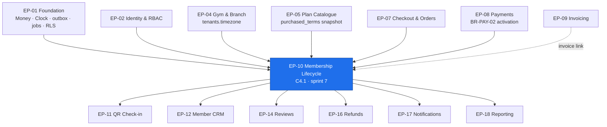

# EP-10 — Membership Lifecycle

> **Phase-0 delivery backlog.** Detailed expansion of `ENGINEERING_PLAN.md` §2 (epic row `EP-10`)
> and §3 (`F-10.1` … `F-10.15`). No application code exists yet.
>
> **The India ruling that governs this epic is the timezone, not the tax.** `BR-MEM-03` computes
> validity in the **gym's** timezone. `Asia/Kolkata` is **UTC+05:30 with no DST**, so midnight
> gym-time is **18:30 UTC the previous day**. Every job in this epic —
> `membership.activate-pending`, `membership.expire`, `membership.unfreeze-scheduled`,
> `membership.renewal-reminders`, `membership.auto-renew` — fires on a *local* boundary that a
> whole-hour UTC cron cannot express. That is `TR-24` (score **16**) compounding `TR-07` (score
> **12**), and between them they are the reason this epic exists as its own sprint
> (`LAUNCH_MARKET_INDIA.md` §3).
>
> Secondary India ruling: **RBI e-mandate** rules bind `FR-MEMB-08` auto-renewal — AFA at
> registration, **pre-debit notification in advance**, per-transaction ceilings. UPI AutoPay via
> **Razorpay Route** is the practical rail (`LAUNCH_MARKET_INDIA.md` §7).

---

## 1. Metadata

| Field | Value |
| :--- | :--- |
| **Epic id** | `EP-10` |
| **Name** | Membership Lifecycle |
| **Priority (MoSCoW)** | **M** — Must. The membership *is* the product (`B5.12` purpose statement). `BAC-04` requires capture to activate it; `BAC-14` requires every `M`-priority `FR-MEMB-*` delivered |
| **Complexity** | **L** (T-shirt, §2) · module rating **High** for `memberships/` (§13.1) |
| **Story points** | **55** (epic/feature view, §2) · `memberships/` module view **55 pts / 28 engineer-days** (§13.1) |
| **Target sprint(s)** | **Sprint 7** — 2026-12-14 → 2026-12-25, Christmas sprint at −10% capacity. `F-10.11` (transfer, MoSCoW `C`) is the pre-designated carry-out and descope item **D-05** |
| **Owning PRD module** | `MEMB` (`B5.12`) |
| **Owning code module** | `memberships/` |
| **Surfaces** | `customer-web` — `SCR-WEB-008`, **`SCR-WEB-009`** (membership detail & QR), `SCR-WEB-010` · `gym-dashboard` — `SCR-DASH-001` (expiring-this-week list), `SCR-DASH-007`, **`SCR-DASH-008`** (Member 360 membership region) |
| **Primary APIs** | `API-MEMB` — `GET /v1/me/memberships`, `GET /v1/me/memberships/:id`, `POST …/freeze`, `POST …/unfreeze`, `POST …/renew`, `PATCH …/auto-renew`, `GET /v1/tenant/memberships`, `POST /v1/tenant/memberships/:id/transfer`. `POST /v1/me/memberships/:id/qr` is **defined here, implemented in `EP-11`** |
| **Background jobs** | `membership.activate-pending` (hourly, gym tz) · `membership.expire` (hourly, gym tz) · `membership.unfreeze-scheduled` (hourly) · `membership.renewal-reminders` (daily 09:00 gym tz) · `membership.auto-renew` (daily) — all five from `C5` |
| **State machine** | `C4.1` — six states, eleven edges, `EXPIRED` terminal. Implemented once in `memberships/domain/state-machines/` per `ENGINEERING_PLAN.md` §7 |
| **Launch market** | **India** — `Asia/Kolkata` +05:30, **no DST**; INR/paise for proration; RBI e-mandate constraints on auto-renewal; renewal reminders are transactional/service SMS requiring **TRAI DLT** template pre-approval |
| **Status** | `PLANNED` — Phase 0. Not started. No blocking item; two `OQ-` due in this sprint |
| **Epic owner** | Backend Lead — `memberships/`. `NFR-MNT-01` puts membership-state code in the **≥95% coverage** group alongside payment, settlement and tenancy |

---

## 2. Business Goal

**A membership state that four different readers agree on, always.** The member reads it on
`SCR-WEB-009` to decide whether to travel to the gym. The receptionist reads it through the check-in
sequence at 07:00 with a queue behind. The ledger reads it to decide whether unconsumed value is
refundable. The reminder scheduler reads it to decide whether to spend an SMS. `FR-MEMB-12` states
the requirement in its strongest form — *"there is no separate gym-side status concept"* — and the
only way to honour that is a single column, mutated by a single state machine, with every transition
journalled. Everything else in this epic is a consequence of that sentence.

**Commercially, this epic is where `OBJ-05` — reduce churn by making expiry visible and renewal
frictionless — either happens or does not.** `KPI-12` commits to **≥55% of memberships renewed
within 15 days of expiry**, and the levers are all here: the `BR-MEM-11` reminder ladder at
T−15/−7/−3/−1 and expiry; the `AC-MEMB-02.1` expiring-this-week list on `SCR-DASH-001` with a
one-tap contact action; `FR-MEMB-06`'s one-action renewal that starts the new term *the day after*
the old one ends, with no gap for the member to fall through. `KPI-08` (25,000 active memberships at
period end) is literally a count of rows in one state of this machine, so an expiry job that runs at
the wrong local hour does not merely inconvenience members — it misreports the platform's headline
supply metric. Retention economics dominate acquisition economics in fitness (`OBJ-05` rationale),
which makes the reminder ladder the highest-leverage five notifications in the product.

**Third, this epic is the timezone epic, and that is not a technical footnote — it is the defect
class most likely to reach production undetected.** `BR-MEM-03` fixes validity as
`[start_date, end_date]` inclusive **in the gym's timezone**. At +05:30, a naive UTC computation is
wrong for five and a half hours either side of local midnight, every day, for every membership. A
membership that expires half an hour early denies a paying member at the door; one that expires half
an hour late gives away service and inflates `KPI-08`. Neither produces an error, an exception or a
failing request — they produce a support ticket weeks later that nobody can reproduce. `TR-24`
enumerates six distinct surfaces where the half-hour offset bites, and the mitigation is structural:
**no job is scheduled on a fixed UTC cron**; the scheduler asks *"what UTC instant is next 00:00 in
this gym's zone"*, which is correct for half-hour offsets, whole-hour offsets and DST alike. The
seed deliberately contains DST-observing tenants so the code cannot quietly depend on India's
simplicity (`OBJ-09`, `A11`).

---

## 3. Scope

### 3.1 In scope — explicit

| # | Item | Anchor |
| :-: | :--- | :--- |
| 1 | The `C4.1` state machine as a transition table plus guard functions, in `memberships/domain/state-machines/`; `Membership.transitionTo()` the **only** mutator of `status` | `FR-MEMB-01`, `BR-MEM-01`, `ENGINEERING_PLAN.md` §7.1 |
| 2 | `membership_events` journal — one row per transition with actor, timestamp, reason and, where financial, the order or refund reference | `FR-MEMB-02`, `INV-MEM-4` |
| 3 | Membership detail contract: gym, branch entitlement, plan, start, end, days remaining, sessions remaining, status, QR availability, invoice link, attendance summary, renewal action | `FR-MEMB-03`, `SCR-WEB-009` |
| 4 | Freeze: request, plan-gated permission, date-range validation, `end_date` extension by **exactly** the frozen duration, running total against the cap | `FR-MEMB-04`, `BR-MEM-05`, `BR-MEM-07` |
| 5 | Early unfreeze with the extension recalculated to **actual** frozen days from the closed `membership_freezes` range | `FR-MEMB-05`, `AC-MEMB-01.3` |
| 6 | One-action renewal defaulting to the same plan at **current** price, new term starting the day after the current `end_date` (or today if already expired) — a **new** membership row, never a reactivation | `FR-MEMB-06`, `C4.1` terminal rule |
| 7 | Pro-rata upgrade on the unused remainder; downgrade scheduled for the next term with **no** cash movement | `FR-MEMB-07`, `BR-MEM-09` |
| 8 | Auto-renewal opt-in at purchase, toggleable thereafter, pre-debit notification, self-service cancellation with **no** support contact and **no** fee | `FR-MEMB-08`, `BR-MEM-10`, RBI e-mandate |
| 9 | `membership.expire` and `membership.activate-pending` as **hourly, gym-timezone-bucketed** jobs | `FR-MEMB-09`, `BR-MEM-03`, `TR-24` |
| 10 | Reminder ladder T−15/−7/−3/−1 and expiry, **with per-tenant override of the schedule** | `FR-MEMB-10`, `BR-MEM-11` |
| 11 | Transfer to another person with gym approval, plan permission and dual-party audit — MoSCoW `C`, descope **D-05** | `FR-MEMB-11`, `BR-MEM-08` |
| 12 | One shared status concept: member and gym views read the same column | `FR-MEMB-12`, `INV-MEM-6` |
| 13 | Same-gym concurrency rule enforced as a **PostgreSQL exclusion constraint** with `is_stackable` snapshotted from the plan | `BR-MEM-04` |
| 14 | Indefinite historical visibility of `EXPIRED`, `CANCELLED` and `REFUNDED` memberships to both parties; no retention sweep touches `memberships` | `BR-MEM-12`, `BAC-12` |
| 15 | Sharing suspension as an **`under_review` marker orthogonal to `status`**, never a seventh state | `BR-MEM-13`, `CR-04` |
| 16 | `GymCeasedOperating` consumer marking affected memberships refund-eligible and triggering the 24-hour notification | `BR-MEM-14`, `RSK-06` |
| 17 | Cancellation without refund (member- or gym-initiated) from `PENDING`, `ACTIVE` or `FROZEN`, reason required, no ledger movement | `C4.1`, `FR-MEMB-02` |
| 18 | Entitlement exhaustion as an expiry trigger for `SESSION` plans (`sessions_used = sessions_total` → `EXPIRED`), co-owned with `plans/` | `BR-PLN-06`, `C4.1` |
| 19 | Expiring-this-week list on `SCR-DASH-001` with name, phone, plan, days remaining, one-tap contact, and **already-renewed members excluded** | `AC-MEMB-02.1`, `AC-MEMB-02.3` |
| 20 | Gym-timezone scheduling primitive — `nextLocalMidnightUtc(zone)` and `todayIn(zone)` — used by all five jobs and by every validity read | `TR-24` mitigation, `ADR-0025` |

### 3.2 Out of scope — explicit, with destination

| Item | Why it is not here | Where it went |
| :--- | :--- | :--- |
| Membership **creation** and the activation trigger | Activation is driven by the capture webhook (`BR-PAY-02`); `EP-10` owns the state *after* it exists | **`EP-08`** |
| Order creation for a renewal or an upgrade differential | `EP-10` raises the intent; `ordering/` prices and creates the order (`BR-PAY-04`) | **`EP-07`** |
| The proration **money arithmetic** primitives (`Money`, `round_half_even`) | `packages/utils/money`, built in sprint 0 | **`EP-01`** |
| The invoice and credit note produced by a renewal or upgrade | An invoice is a document; `EP-10` supplies the trigger | **`EP-09`** |
| **Check-in denial** for `FROZEN`, `EXPIRED`, `UNDER_REVIEW` | `BR-MEM-06` is owned by `attendance/`; `EP-10` supplies the state it reads | **`EP-11`** |
| QR **token minting, signing and rotation** | `FR-CHK-01`/`FR-CHK-02` are attendance concerns; `EP-10` only gates *whether* a QR renders | **`EP-11`** |
| Actually **sending** the five reminder notifications | `BR-MEM-11`'s owner is `notifications/`; `EP-10` owns the schedule, the selection and the send key | **`EP-17`** (ladder), **`EP-10`** (schedule) |
| The **charge** executed by `membership.auto-renew` | The mandate and the debit are `payments/` through the `PaymentProvider` port | **`EP-08`** |
| Refund eligibility computation, proration of unconsumed value, `→ REFUNDED` execution | `EP-10` exposes the transition; `refunds/` decides and executes | **`EP-16`** |
| Member 360's non-membership regions (payments, notes, communications) | Aggregation is CRM's job | **`EP-12`** |
| Retention and cohort **reporting** over membership states | Reading is reporting's job | **`EP-18`** |
| Class booking, PT session packages, corporate/family memberships | Phase 2 (`A11`) | Not in Phase 1 |

---
## 4. Features

`F-10.1` … `F-10.15` are carried verbatim from `ENGINEERING_PLAN.md` §3. Rows marked *(new)* are
additions this backlog surfaces from `C4.1`, `BusinessRules.md` §18.1 and `RiskAnalysis.md` §3.3.14.
Points are the epic-view Fibonacci scale (1 pt ≈ half an engineer-day).

| Feature | Description | Satisfies | Pri | Pts | Sprint |
| :--- | :--- | :--- | :-: | :-: | :-: |
| **F-10.1** | `C4.1` state machine as a transition table plus guards; no ad-hoc status update anywhere in the codebase | `FR-MEMB-01`, `BR-MEM-01` | M | 5 | 7 |
| **F-10.2** | Transition journal `membership_events` with actor, timestamp, reason, financial reference | `FR-MEMB-02`, `INV-MEM-4` | M | 3 | 7 |
| **F-10.3** | Membership detail contract driving `SCR-WEB-009` and the Member 360 membership region | `FR-MEMB-03`, `SCR-WEB-009`, `SCR-DASH-008` | M | 3 | 7 |
| **F-10.4** | Freeze: request, plan-gated approval, end-date extension, allowance accounting under `FOR UPDATE` | `FR-MEMB-04`, `BR-MEM-05`, `BR-MEM-07` | S | 6 | 7 |
| **F-10.5** | Early unfreeze with the extension recalculated to actual frozen days | `FR-MEMB-05`, `AC-MEMB-01.3` | S | 4 | 7 |
| **F-10.6** | One-action renewal with gapless term start; renewal creates a **new** membership | `FR-MEMB-06`, `AC-MEMB-02.2`, `C4.1` | M | 5 | 7 |
| **F-10.7** | Pro-rata upgrade; downgrade at next term with no cash refund | `FR-MEMB-07`, `BR-MEM-09` | S | 5 | 7 |
| **F-10.8** | Auto-renewal toggle, pre-debit notice, self-service cancellation, no fee | `FR-MEMB-08`, `BR-MEM-10`, `FR-PAY-11` | S | 3 | 7 |
| **F-10.9** | `membership.expire` and `membership.activate-pending` in the gym's timezone | `FR-MEMB-09`, `BR-MEM-03`, `C5` | M | 5 | 7 |
| **F-10.10** | Reminder ladder T−15/−7/−3/−1 and expiry with per-tenant schedule override | `FR-MEMB-10`, `BR-MEM-11` | M | 4 | 7 |
| **F-10.11** | Transfer with gym approval and dual-party audit — **descope D-05** | `FR-MEMB-11`, `BR-MEM-08` | C | 4 | 7 |
| **F-10.12** | Single shared status concept across member and gym views | `FR-MEMB-12`, `INV-MEM-6` | M | 2 | 7 |
| **F-10.13** | Same-gym concurrency as a GiST exclusion constraint with snapshotted `is_stackable` | `BR-MEM-04` | M | 3 | 7 |
| **F-10.14** | Indefinite historical visibility of non-active memberships | `BR-MEM-12`, `BAC-12` | M | 2 | 7 |
| **F-10.15** | Sharing suspension as an `under_review` marker, not a state change | `BR-MEM-13`, `CR-04` | M | 2 | 7 |
| **F-10.16** *(new)* | **Gym-timezone scheduling primitive** — `nextLocalMidnightUtc(zone)`, `todayIn(zone)`, zone bucketing for all five `C5` jobs | `TR-24`, `TR-07`, `ADR-0025` | M | 5 | 7 |
| **F-10.17** *(new)* | Expiring-this-week list with already-renewed exclusion and one-tap contact | `AC-MEMB-02.1`, `AC-MEMB-02.3`, `SCR-DASH-001` | M | 3 | 7 |
| **F-10.18** *(new)* | Cancellation without refund from `PENDING`/`ACTIVE`/`FROZEN`, reason required, no ledger movement | `C4.1`, `FR-MEMB-02` | M | 2 | 7 |
| **F-10.19** *(new)* | Entitlement exhaustion as an expiry trigger for `SESSION` plans | `BR-PLN-06`, `C4.1` | M | 2 | 7 |
| **F-10.20** *(new)* | State-dependent QR affordance on `SCR-WEB-009` — QR, "starts on", frozen notice, renew CTA, historical | `SCR-WEB-009` States row, `FR-MEMB-03` | M | 3 | 7 |
| **F-10.21** *(new)* | `GymCeasedOperating` consumer marking memberships refund-eligible within the 24-hour SLA | `BR-MEM-14`, `RSK-06` | M | 3 | 7 |
| | | | | **74** | |

> **Points reconciliation.** The §2 epic figure is **55**; the enumerated features total **74**. The
> difference is the six *(new)* rows, which §2 folded into the fifteen it named. §13.1's module view
> of `memberships/` at **55 pts / 28 engineer-days** is the estimate the sprint plan uses, and §10
> below reconciles all three.

---

## 5. User Stories

Two stories exist in the PRD (`US-MEMB-01`, `US-MEMB-02`). Eight more are written here because
`B5.12` states requirements the PRD never turned into stories — auto-renewal, upgrade, expiry
timing, concurrency, transfer, the under-review hold, historical visibility and closure.

### US-MEMB-01 — *As a member travelling for a month, I want to freeze rather than waste my membership.* **(PRD)**

- **AC-MEMB-01.1** *Given* my plan allows freezing and I have freeze days remaining, *when* I request a freeze for a future date range, *then* it is accepted and my `end_date` extends by **exactly** that many days.
- **AC-MEMB-01.2** *Given* my freeze is active, *when* I attempt check-in, *then* it is denied with the reason "membership frozen until \<date\>" (`MEMBERSHIP_FROZEN`).
- **AC-MEMB-01.3** *Given* I return early and unfreeze, *when* I do so, *then* my `end_date` is recalculated to the **actual** frozen days and my membership becomes `ACTIVE` immediately.
- **AC-MEMB-01.4** *Given* I have exhausted my freeze allowance, *when* I request another freeze, *then* I am told how many days I have used and what the cap is — the numbers, not a generic refusal.
- **AC-MEMB-01.5** *Given* my plan does not allow freezing, *when* I view my membership, *then* **no freeze action is offered at all** — it is absent, not disabled.
- **AC-MEMB-01.6** *(new)* *Given* my membership's `end_date` is today in the gym's timezone, *when* I request a freeze at 23:55 IST, *then* it is refused with `422 MEMBERSHIP_EXPIRED` even though the hourly expiry job has not yet run (`BusinessRules.md` §18.1).

### US-MEMB-02 — *As Rohan, I want to see who is expiring this week so that I can call them.* **(PRD)**

- **AC-MEMB-02.1** *Given* memberships expire within the next 7 days, *when* I open dashboard home, *then* they are listed with member name, phone, plan, days remaining and a one-tap contact action.
- **AC-MEMB-02.2** *Given* I renew a member from that list, *when* I complete it, *then* the new term starts the day after their current `end_date` with **no gap and no overlap**.
- **AC-MEMB-02.3** *Given* a member has already renewed, *when* I view the expiring list, *then* they are excluded — the exclusion is on the existence of a successor membership, not on a flag someone has to remember to set.
- **AC-MEMB-02.4** *(new)* *Given* I am a receptionist scoped to branch 1, *when* I open the expiring list, *then* it contains branch-1 memberships only, filtered server-side on `staff_branches` (`FR-STAF-03`).

### US-MEMB-03 — *As Priya, I want to turn auto-renewal off myself, at 11pm, without emailing anyone.* **(new — implied by `FR-MEMB-08`, `BR-MEM-10`)**

- **AC-MEMB-03.1** *Given* auto-renewal is on, *when* I open `SCR-WEB-009`, *then* the cancel control is visible on that screen and requires no support contact, no phone call and no reason.
- **AC-MEMB-03.2** *Given* I cancel before the charge date, *when* the `membership.auto-renew` job runs, *then* **no charge is taken and no fee is levied**; the flag is re-read **inside** the charging transaction, not at batch-selection time (`BR-MEM-10-N1`).
- **AC-MEMB-03.3** *Given* auto-renewal is on, *when* the charge is due, *then* a **pre-debit notification** has been dispatched in advance, as RBI e-mandate rules require.
- **AC-MEMB-03.4** *Given* a new purchase, *when* the checkout renders, *then* the auto-renew control defaults to **off** — the schema default is `false`, so opt-in is structural, not a UI convention.
- **AC-MEMB-03.5** *Given* I cancelled auto-renewal, *when* I look at my membership, *then* the renewal reminders (`BR-MEM-11`) still arrive — cancelling a mandate is not opting out of being told my membership ends.

### US-MEMB-04 — *As a member outgrowing my plan, I want to upgrade and pay only the difference.* **(new — implied by `FR-MEMB-07`, `BR-MEM-09`)**

- **AC-MEMB-04.1** *Given* 100 of 365 days are used, *when* I request an upgrade, *then* the quote shows unused days, the pro-rata credit and the amount payable **before** I confirm, in whole paise.
- **AC-MEMB-04.2** *Given* I confirm, *when* the differential order is paid, *then* the upgraded plan applies from today and the term end date is unchanged.
- **AC-MEMB-04.3** *Given* I request a **downgrade**, *when* it is accepted, *then* it takes effect at the next renewal, the current term is untouched, and **no** `REFUND` ledger entry and **no** gateway refund call is produced (`BR-MEM-09-N1`).
- **AC-MEMB-04.4** *Given* an upgrade quote, *when* two upgrades are submitted concurrently with the same `Idempotency-Key`, *then* exactly one differential order exists.

### US-MEMB-05 — *As the platform, I want a membership to expire at the gym's midnight, not the server's.* **(new — implied by `FR-MEMB-09`, `BR-MEM-03`, `TR-24`)**

- **AC-MEMB-05.1** *Given* a gym in `Asia/Kolkata` with a membership ending 31 March, *when* the clock reaches 23:00 IST on 31 March (17:30 UTC), *then* the membership is still `ACTIVE` and admits.
- **AC-MEMB-05.2** *Given* the same membership, *when* the clock reaches 00:30 IST on 1 April (19:00 UTC on 31 March), *then* it is `EXPIRED` and denies.
- **AC-MEMB-05.3** *Given* the member's device reports `America/New_York`, *when* they open `SCR-WEB-009`, *then* the dates and days-remaining shown are the **gym's**, and the screen states the timezone.
- **AC-MEMB-05.4** *Given* gyms in three timezones including one DST-observing zone, *when* the hourly expiry job runs, *then* each gym's memberships expire at that gym's own local midnight.
- **AC-MEMB-05.5** *Given* the expiry job, *when* it is inspected, *then* it is scheduled on a **UTC instant derived from each zone**, and no cron expression with a hard-coded minute field of `0` governs a local-time job.

### US-MEMB-06 — *As Rohan, I want to renew a walking-in member in one action with no gap in their term.* **(new — implied by `FR-MEMB-06`, `AC-MEMB-02.2`)**

- **AC-MEMB-06.1** *Given* a membership ending on the 20th, *when* I renew on the 18th, *then* the new term starts on the **21st**.
- **AC-MEMB-06.2** *Given* a membership that expired on the 10th and today is the 15th, *when* I renew, *then* the new term starts **today**, not the 11th.
- **AC-MEMB-06.3** *Given* the plan's price changed since purchase, *when* I renew, *then* the renewal is priced at the **current** published price and the change is shown before confirmation (`BR-PLN-03`).
- **AC-MEMB-06.4** *Given* the renewal completes, *when* I inspect the data, *then* a **new** membership row exists and the old one remains `EXPIRED` — no row was reactivated (`C4.1` terminal rule).

### US-MEMB-07 — *As a member wrongly flagged for sharing, I want a hold I can resolve, not a cancellation.* **(new — implied by `BR-MEM-13`, `CR-04`)**

- **AC-MEMB-07.1** *Given* `attendance.sharing-scan` flags my membership, *when* I present my QR, *then* it is denied `MEMBERSHIP_UNDER_REVIEW` while `status` remains `ACTIVE`.
- **AC-MEMB-07.2** *Given* the flag, *when* I open `SCR-WEB-009`, *then* I see the hold, its reason in plain language, and how to resolve it.
- **AC-MEMB-07.3** *Given* a reviewer with `memberships.membership.review` clears the flag, *when* they do, *then* my membership is fully restored with no data loss, no refund and no lost days.
- **AC-MEMB-07.4** *Given* any automated path, *when* the sharing scan runs, *then* **no** membership transitions to `CANCELLED` or `REFUNDED` — asserted by diffing `membership_events` (`BR-MEM-13-N1`).

### US-MEMB-08 — *As Rohan, I want to approve a genuine membership transfer without it becoming a resale market.* **(new — implied by `FR-MEMB-11`, `BR-MEM-08`) · MoSCoW `C`, descope D-05**

- **AC-MEMB-08.1** *Given* a plan with `transfer_allowed = true`, *when* I approve a transfer, *then* the membership moves and `membership_transfers` records `from_user_id`, `to_user_id`, `approved_by` and `occurred_at`.
- **AC-MEMB-08.2** *Given* a plan with `transfer_allowed = false`, *when* a transfer is attempted, *then* it is refused.
- **AC-MEMB-08.3** *Given* no gym approval, *when* a transfer is attempted through the API, *then* it is refused with `403`.
- **AC-MEMB-08.4** *Given* the flag `rel.memberships.transfer` is off, *when* the endpoint is called, *then* it returns **404** and the action is absent from Member 360.

### US-MEMB-09 — *As a member disputing a charge from last year, I want my old membership still visible.* **(new — implied by `BR-MEM-12`, `BAC-12`)**

- **AC-MEMB-09.1** *Given* a membership expired 18 months ago, *when* I open my account history, *then* the membership, its term, its attendance and its invoice are all still retrievable.
- **AC-MEMB-09.2** *Given* the same membership, *when* the gym opens Member 360, *then* they see the identical record — one status concept, one history.
- **AC-MEMB-09.3** *Given* `data.retention-sweep` has run, *when* the records are queried, *then* nothing in `memberships`, `attendance`, `orders` or `invoices` was removed (`BR-MEM-12-P1`).
- **AC-MEMB-09.4** *Given* any membership list endpoint, *when* it is called without a status filter, *then* it returns **all** statuses; the unfiltered count equals the sum of the per-status counts (`BR-MEM-12-N1`).

### US-MEMB-10 — *As a member, I want to hold memberships at two gyms — but not accidentally buy the same one twice.* **(new — implied by `BR-MEM-04`)**

- **AC-MEMB-10.1** *Given* memberships at two different gyms, *when* both are active, *then* both are permitted and both appear in `GET /me/memberships`.
- **AC-MEMB-10.2** *Given* an overlapping non-stackable membership at the **same** gym, *when* checkout is attempted, *then* it is refused `422 CONCURRENT_MEMBERSHIP_CONFLICT` naming the conflicting membership's dates.
- **AC-MEMB-10.3** *Given* two checkouts for the same plan submitted from two browser tabs, *when* both reach the database, *then* exactly **one** membership exists — enforced by the exclusion constraint, not by a service-layer check.
- **AC-MEMB-10.4** *Given* two **stackable** plans at the same gym, *when* both are purchased, *then* both coexist and entitlements are consumed in expiry order, earliest first (`B5.12` edge case).

### US-MEMB-11 — *As a member of a gym that just closed, I want to be told and refunded, not to find out at the door.* **(new — implied by `BR-MEM-14`, `RSK-06`)**

- **AC-MEMB-11.1** *Given* a gym is suspended for cause or closed, *when* the status change commits, *then* every member holding a `PENDING`, `ACTIVE` or `FROZEN` membership is notified **within 24 hours** on their enabled channels.
- **AC-MEMB-11.2** *Given* the same event, *when* it processes, *then* each affected membership is marked refund-eligible with its computed unconsumed pro-rata value (`BR-REF-07`).
- **AC-MEMB-11.3** *Given* the suspension transaction **rolls back**, *when* the outbox drains, *then* **no** notification is sent (`BR-MEM-14-N1`).
- **AC-MEMB-11.4** *Given* an ordinary arrears suspension under `BR-TEN-06`, *when* it applies, *then* **no** closure notification and **no** refund eligibility is produced — that gym is still open and its members still check in (`BusinessRules.md` §18.5).

---
## 6. Acceptance Criteria for the Epic

Numbered, testable, and binding. The epic is not done until every one passes. Rows marked **⛳** are
demonstrated live in the sprint-7 demo; rows marked **🚦** are launch-blocking through a `BAC-`.

| # | Criterion | Evidence |
| :-- | :--- | :--- |
| **AC-EP10-01** 🚦 | Each of the eleven `C4.1` transitions succeeds under its stated guard and writes **exactly one** `membership_events` row with actor, reason and timestamp | `BR-MEM-01-P1` |
| **AC-EP10-02** 🚦 | A table-driven case attempts **every** state pair not in `C4.1` — including `EXPIRED → ACTIVE` — and each returns `INVALID_MEMBERSHIP_TRANSITION` with no row written | `BR-MEM-01-N1` |
| **AC-EP10-03** ⛳ | No `status` write exists outside the state machine — proven by an ESLint rule, a `dependency-cruiser` rule and a repository-level guard test that attempts a direct write and is refused | `E7.6` |
| **AC-EP10-04** | A membership never has a `NULL` `end_date`; `CHECK (end_date >= start_date)` holds | `INV-MEM-3` |
| **AC-EP10-05** | `status = 'ACTIVE'` implies `start_date ≤ today(gym tz) ≤ end_date` — asserted as a property test across 10,000 generated instants | `INV-MEM-2` |
| **AC-EP10-06** ⛳🚦 | A 14-day freeze moves `end_date` forward by **exactly 14 days** and sets `freeze_days_used = 14` | `AC-MEMB-01.1`, `E7.1` |
| **AC-EP10-07** ⛳ | Unfreezing on day 6 recalculates the extension to **+6, not +14**, and debits the allowance by 6 | `AC-MEMB-01.3`, `E7.3` |
| **AC-EP10-08** | A freeze on a plan with `freeze_allowed = false` returns `422 FREEZE_NOT_PERMITTED`, and the freeze affordance is **absent** from the UI | `AC-MEMB-01.5`, `BR-MEM-05-N1` |
| **AC-EP10-09** ⛳ | A freeze exceeding the remaining allowance returns `422 FREEZE_ALLOWANCE_EXCEEDED` **with the exact days used and days remaining** | `AC-MEMB-01.4`, `E7.4` |
| **AC-EP10-10** | Two concurrent freezes that individually fit but jointly exceed the cap yield exactly one success and one refusal | `BR-MEM-05-N3` |
| **AC-EP10-11** | A freeze starting yesterday returns `422 FREEZE_RETROACTIVE`; one starting in 31 days returns `422 FREEZE_TOO_FAR_AHEAD`; the boundaries at 0 and 30 days are asserted **at the gym-timezone day boundary** | `BR-MEM-07-N1`, `BR-MEM-07-N2` |
| **AC-EP10-12** | A freeze requested at 23:55 IST on the membership's `end_date` is refused `422 MEMBERSHIP_EXPIRED` even before the hourly job has transitioned it | `BusinessRules.md` §18.1 |
| **AC-EP10-13** | A freeze applied concurrently with a running `membership.expire` produces exactly one outcome with no lost update — both paths take `SELECT … FOR UPDATE` and re-read `end_date` inside the transaction | Joint test `BR-X-01` |
| **AC-EP10-14** | A `FROZEN` membership whose extended `end_date` passes transitions to `EXPIRED` | `C4.1`, `E7.2` |
| **AC-EP10-15** ⛳🚦 | The expiry job fires at **midnight gym-time**; for `Asia/Kolkata` a test asserts the boundary at **18:30 UTC the previous day**, comparing 18:29:59Z and 18:30:00Z | `E7.5`, `TR-24` |
| **AC-EP10-16** ⛳ | Three seeded tenants in three zones, one DST-observing, each expire at their own local midnight in a single job run | `E7.5` |
| **AC-EP10-17** | No cron expression governing a local-time job has a hard-coded minute field; a scan finds no `5.5`, `19800` or `+0530` literal outside test fixtures | `TR-24` early-warning |
| **AC-EP10-18** ⛳ | Renewing one day before expiry starts the new term the **next day**, with no gap and no overlap | `AC-MEMB-02.2`, `E7.8` |
| **AC-EP10-19** | Renewing an already-expired membership starts the term **today** | `FR-MEMB-06` |
| **AC-EP10-20** | A renewal creates a **new** membership row; no code path sets an `EXPIRED` membership back to `ACTIVE` | `C4.1` terminal rule |
| **AC-EP10-21** ⛳ | A pro-rata upgrade with 100 of 365 days used charges exactly the differential on the 265 unused days, in integer paise, with `round_half_even` asserted | `BR-MEM-09-P1`, `E7.9` |
| **AC-EP10-22** 🚦 | A downgrade produces **no** `REFUND` ledger entry and **no** gateway refund call — asserted by diffing `ledger_entries` | `BR-MEM-09-N1` |
| **AC-EP10-23** | `memberships.auto_renew` defaults to `false` at the schema level; opting in records the disclosure; cancelling before the charge prevents it with no fee | `BR-MEM-10-P1` |
| **AC-EP10-24** | The auto-renew job re-reads `auto_renew` **inside** the charging transaction and does not charge a membership cancelled after batch selection | `BR-MEM-10-N1` |
| **AC-EP10-25** | A pre-debit notification is dispatched in advance of every auto-renewal charge | `FR-PAY-11`, RBI e-mandate |
| **AC-EP10-26** ⛳ | The reminder ladder fires **exactly five times** — T−15, T−7, T−3, T−1 and expiry — at 09:00 `Asia/Kolkata`, on enabled channels only | `BR-MEM-11-P1`, `E7.7` |
| **AC-EP10-27** | Re-running the reminder job for the same day sends nothing further; the send key `(membership_id, offset_days)` is unique | `BR-MEM-11-N1` |
| **AC-EP10-28** | A tenant override of the reminder schedule is honoured and is itself an audited configuration change | `FR-MEMB-10` |
| **AC-EP10-29** ⛳ | The expiring-this-week list shows name, phone, plan, days remaining and a one-tap contact action, and **excludes** members with a successor membership | `AC-MEMB-02.1`, `AC-MEMB-02.3` |
| **AC-EP10-30** 🚦 | A second overlapping non-stackable membership at the same gym is refused by a **database exclusion constraint**; two concurrent checkouts produce exactly one membership | `BR-MEM-04-N1`, `BR-MEM-04-N2` |
| **AC-EP10-31** | Two stackable plans at the same gym coexist, and entitlement is consumed in expiry order, earliest first | `BR-MEM-04-P2`, `B5.12` edge case |
| **AC-EP10-32** ⛳ | A sharing-flagged membership keeps `status = 'ACTIVE'`, denies at the door with `MEMBERSHIP_UNDER_REVIEW`, and is fully restorable by a human | `BR-MEM-13-P1`, `E7.10` |
| **AC-EP10-33** | The member's view and the gym's view of a membership read the **same column**; a contract test asserts field-for-field equality of the status projection | `FR-MEMB-12`, `INV-MEM-6` |
| **AC-EP10-34** | Every membership list endpoint defaults to all statuses; the unfiltered count equals the sum of per-status counts | `BR-MEM-12-N1` |
| **AC-EP10-35** | `GymCeasedOperating` notifies every affected member within 24 hours and marks each membership refund-eligible with its unconsumed value; a rolled-back suspension sends nothing | `BR-MEM-14-P1`, `BR-MEM-14-N1` |
| **AC-EP10-36** | An arrears `PAST_DUE` suspension produces **no** closure notification and **no** refund eligibility | `BR-MEM-14-N2`, §18.5 |
| **AC-EP10-37** | `SCR-WEB-009` renders the correct state-dependent surface for all six states: QR, "starts on \<date\>", frozen notice with unfreeze, renew CTA, historical view, hold notice | `SCR-WEB-009` States |
| **AC-EP10-38** | Freeze, unfreeze, transfer, plan change and auto-renew toggle each write an `audit_log` row with before/after | `BR-DAT-01` |
| **AC-EP10-39** | `E2E-05` — freeze → check-in denied → early unfreeze → end date recalculated → check-in succeeds — passes in CI | `E7.11`, `C8.3` |
| **AC-EP10-40** | Branch coverage on `memberships/` domain and state-machine code is **≥95%**, and mutation score meets the gate | `NFR-MNT-01`, `TR-17` |

---

## 7. Business Rules Enforced

Enforcement detail lives in `BusinessRules.md` §8 and is **not** duplicated here. This table names
the enforcement point and the epic artefact that carries it.

| Rule | Ownership | Enforcement point in this epic | Tasks |
| :--- | :--- | :--- | :--- |
| `BR-MEM-01` | **Owned** — `memberships/` | `L5-DOM` `MembershipStateMachine`; `L1-DB` six-label enum + `membership_events` trigger; `L12-CI` ESLint ban on `status` assignment | T-10.02, T-10.03, T-10.05 |
| `BR-MEM-02` | **Co-owned** with `payments/` (`EP-08`) | `L5-DOM` `ActivationEvidence` two-shape union; this epic supplies `Membership.activate()`, `EP-08` supplies the webhook caller | T-10.06 |
| `BR-MEM-03` | **Owned** | `L5-DOM` `DateRange.isValidOn(date, IanaTimeZone)` with a **required** zone argument; `L10-JOB` zone-bucketed hourly jobs | T-10.09, T-10.10, T-10.11 |
| `BR-MEM-04` | **Co-owned** with `ordering/` (`EP-07`) | `L1-DB` GiST exclusion on `(user_id, gym_id, daterange)` where not stackable; `L6-UC` pre-checkout eligibility | T-10.07 |
| `BR-MEM-05` | **Owned** | `L5-DOM` `Membership.freeze(range, purchasedTerms)` as one indivisible operation; `L1-DB` `membership_freezes` ranges | T-10.13, T-10.14 |
| `BR-MEM-06` | **Consumer** — owned by `attendance/` (`EP-11`) | This epic guarantees the `FROZEN` state; `EP-11` denies on it | — |
| `BR-MEM-07` | **Owned** | `L5-DOM` bounds from the injected `Clock` in the gym's zone; `L1-DB` `CHECK` against retroactive writes | T-10.13 |
| `BR-MEM-08` | **Owned** (`C`) | `L5-DOM` `Membership.transfer(toUser, approval)`; `L1-DB` append-only `membership_transfers`; `L7-GUARD` permission | T-10.20 |
| `BR-MEM-09` | **Co-owned** with `ordering/` | `L5-DOM` `ProrationCalculator` on `Money` and integer days; downgrade has **no** path to `refunds/`, enforced by `dependency-cruiser` | T-10.17, T-10.18 |
| `BR-MEM-10` | **Co-owned** with `payments/` | `L1-DB` `auto_renew DEFAULT false`; `L6-UC` flag re-read inside the charging transaction | T-10.19 |
| `BR-MEM-11` | **Scheduler here, dispatch in `EP-17`** | `L10-JOB` daily 09:00 gym-time selection with a unique `(membership_id, offset_days)` send key | T-10.21, T-10.22 |
| `BR-MEM-12` | **Co-owned** with `crm/` (`EP-12`) | `L6-UC` list queries default to all statuses; `L1-DB` retention allow-list excludes membership tables | T-10.08 |
| `BR-MEM-13` | **Co-owned** with `attendance/` (`EP-11`) | `L5-DOM` `under_review` marker orthogonal to `status` (`CR-04`); `L6-UC` human-only clearance | T-10.23 |
| `BR-MEM-14` | **Co-owned** with `notifications/`, `refunds/` | `L6-UC` `GymCeasedOperating` consumer in the same transaction as the status change, via the outbox | T-10.24 |
| `BR-PLN-06` | **Contributor** — owned by `plans/` | Entitlement exhaustion is an expiry trigger; the decrement itself is `EP-11`'s | T-10.12 |
| `BR-PLN-02` | **Consumer** | `purchased_terms` snapshot is read, never re-derived from the live plan | T-10.04 |
| `BR-PAY-01` | **Inherited** | All proration in integer paise through `Money` | T-10.17 |
| `BR-TEN-01` | **Inherited** | Every membership query is tenant-scoped; RLS policy on `memberships`, `membership_events`, `membership_freezes` | T-10.01 |
| `BR-DAT-01` | **Contributor** | Freeze, unfreeze, transfer, plan change, auto-renew toggle, under-review decisions all audited with before/after | T-10.25 |

---

## 8. Dependencies

### 8.1 Upstream — must exist first

| Epic | What this epic needs from it | Blocking? |
| :--- | :--- | :-: |
| **`EP-01`** Platform Foundation | `Money`, `Clock` injection, the mandatory Prisma tenant extension, RLS policies, the outbox, the BullMQ job harness with distributed locks, `packages/utils` timezone helpers | **Yes** |
| **`EP-02`** Identity & RBAC | `memberships.membership.*` permissions; `MEMBER` role; the actor identity written to `membership_events` | **Yes** |
| **`EP-05`** Plan Catalogue | `purchased_terms` snapshot shape: `freeze_allowed`, `freeze_max_days`, `transfer_allowed`, `stackable`, `plan_type`, `sessions_total`, access windows | **Yes** |
| **`EP-07`** Checkout & Orders | Order creation for renewal and upgrade differentials; `BR-MEM-04` eligibility check at checkout | **Yes** |
| **`EP-08`** Payments | `payment.captured` as the only activation trigger (`BR-PAY-02`); the `PaymentProvider` mandate operations for auto-renewal | **Yes** |
| **`EP-04`** Gym & Branch | `tenants.timezone` — the authoritative zone every validity computation reads | **Yes** |
| **`EP-09`** Invoicing | Invoice link on the membership detail contract | Partial |

### 8.2 Downstream — what this unblocks

| Epic | What it takes from here |
| :--- | :--- |
| **`EP-11`** QR Check-in | Steps 3, 4 and 10 of `FR-CHK-04` read membership existence, status and entitlement. Sprint 8 cannot start without sprint 7 |
| **`EP-12`** Member CRM | Member 360's membership region, the expiry-window filter, the "expiring in 7 days" saved segment |
| **`EP-14`** Reviews | `BR-REV-02` one review per member per gym **per membership term** — the term boundary is this epic's |
| **`EP-16`** Refunds | The `→ REFUNDED` transition, unconsumed-value proration input, `BR-REF-06` usage thresholds |
| **`EP-17`** Notifications | The five `BR-MEM-11` reminder templates and their DLT registrations |
| **`EP-18`** Reporting | Retention cohorts, churn, `KPI-08` active-membership counts, `KPI-12` renewal rate |

### 8.3 External dependencies and open questions

| Item | Nature | Effect if unresolved |
| :--- | :--- | :--- |
| `OQ-06` — freeze at launch? | Client decision, due **sprint 7** | Default adopted: **yes, plan-configurable, default off**, gated by `rel.memberships.freeze` |
| `OQ-07` — auto-renewal at launch? | Client decision, due **sprint 7** | Default adopted: **yes, opt-in, off by default**, gated by `rel.memberships.auto-renewal` |
| RBI e-mandate thresholds and pre-debit timing | **Requires professional advice** (`LAUNCH_MARKET_INDIA.md` §13 item 5) | `F-10.8` ships with the notification lead time as configuration, not a constant |
| TRAI DLT template approval for the five reminder SMS | External regulator, lead time starts **sprint 8** at the latest | Reminders degrade to email-only; `KPI-12` exposure recorded in `KNOWN_LIMITATIONS.md` |
| Razorpay Route mandate API for UPI AutoPay | Vendor, `TD-022` | `F-10.8` behind `rel.memberships.auto-renewal`, off at launch if the mandate rail is not ready |

### 8.4 Dependency graph

---
## 9. Technical Tasks

Estimates are **engineer-days** and include implementation, test and review, per §13's convention.
`SP-7.n` is the corresponding row in `SprintPlanning.md` sprint 7 where one exists.

| Id | Description | Layer | Est. | Depends on | Serves |
| :--- | :--- | :--- | :-: | :--- | :--- |
| **T-10.01** | Migration: `memberships`, `membership_events`, `membership_freezes`, `membership_transfers`. `status` as a six-label enum; `start_date`/`end_date` as `date` **not** `timestamptz`; `CHECK (end_date >= start_date)`; `end_date NOT NULL`; `auto_renew DEFAULT false`; `freeze_days_used >= 0`; `under_review` marker column; RLS policies on all four | DB | 1.5 | EP-01 | `BR-MEM-01`, `BR-MEM-03`, `INV-MEM-2/3` |
| **T-10.02** | `MembershipStateMachine`: the `C4.1` transition table **as data**, eleven edges, guard functions, `INVALID_MEMBERSHIP_TRANSITION` on any undefined edge | API/domain | 1.5 | T-10.01 | `FR-MEMB-01`, `BR-MEM-01` · SP-7.1 |
| **T-10.03** | `Membership` aggregate: `transitionTo()` as the sole `status` mutator; ESLint rule + `dependency-cruiser` rule + repository guard test forbidding assignment elsewhere | API/domain | 1.5 | T-10.02 | `AC-EP10-03` · SP-7.1 |
| **T-10.04** | `PurchasedTerms` value object read from the order snapshot — freeze allowance, transfer permission, stackability, plan type, session total, access windows — never re-derived from the live plan | API/domain | 0.5 | EP-05 | `BR-PLN-02` |
| **T-10.05** | `membership_events` journal: writer, database trigger asserting one row per status change, actor/reason/financial-reference columns, read API for Member 360 | DB/API | 1.5 | T-10.01 | `FR-MEMB-02`, `INV-MEM-4` · SP-7.2 |
| **T-10.06** | `Membership.activate(evidence)` with the two-shape `ActivationEvidence` union; consumer of `payment.captured`; offline-sale caller contract | API | 1.0 | EP-08 | `BR-MEM-02` |
| **T-10.07** | Same-gym concurrency: GiST exclusion constraint on `(user_id, gym_id, daterange(start,end,'[]'))` where `is_stackable = false`, with `is_stackable` snapshotted at purchase; `422 CONCURRENT_MEMBERSHIP_CONFLICT` mapping | DB/API | 1.0 | T-10.01 | `BR-MEM-04` · SP-7.10 |
| **T-10.08** | Membership queries default to **all** statuses; retention allow-list explicitly excludes `memberships`, `membership_events`, `attendance`; count-parity test | API | 0.5 | T-10.01 | `BR-MEM-12` · SP-7.10 |
| **T-10.09** | **Timezone primitive**: `todayIn(zone)`, `nextLocalMidnightUtc(zone)`, `daysBetweenInZone()`; required IANA argument on every signature; lint rule banning bare `new Date()`/`Date.now()` in `memberships/` | API/domain | 1.0 | EP-01 | `BR-MEM-03`, `TR-24` |
| **T-10.10** | `membership.expire` job: hourly, **bucketed by gym timezone**, selecting `status IN ('ACTIVE','FROZEN') AND end_date < todayIn(zone)`, `SELECT … FOR UPDATE` per membership with an `end_date` re-read inside the transaction, distributed lock, idempotent | worker | 2.0 | T-10.09 | `FR-MEMB-09`, `BR-MEM-03`, §18.1 · SP-7.7 |
| **T-10.11** | `membership.activate-pending` job: hourly, gym-timezone bucketed, guards on not-cancelled/not-refunded/tenant-not-closed | worker | 1.0 | T-10.09 | `C4.1`, `C5` · SP-7.7 |
| **T-10.12** | Entitlement-exhaustion expiry for `SESSION` plans: `sessions_used = sessions_total` → `EXPIRED`, evaluated on the decrement path and by the job | API/worker | 0.5 | T-10.02 | `BR-PLN-06` |
| **T-10.13** | `Membership.freeze(range, purchasedTerms)`: plan gate, allowance check, `end_date` extension — one indivisible operation under `SELECT … FOR UPDATE`; retroactive and 30-day-ahead bounds in the gym's zone; `membership_freezes` row | API/domain | 2.0 | T-10.09, T-10.04 | `FR-MEMB-04`, `BR-MEM-05`, `BR-MEM-07` · SP-7.3 |
| **T-10.14** | `Membership.unfreeze()`: closes the freeze range, recalculates the extension to **actual** frozen days, debits the allowance by the actual figure, returns to `ACTIVE` | API/domain | 1.5 | T-10.13 | `FR-MEMB-05`, `AC-MEMB-01.3` · SP-7.4 |
| **T-10.15** | `membership.unfreeze-scheduled` hourly job ending freezes whose range has closed; idempotent | worker | 0.5 | T-10.14 | `C5` |
| **T-10.16** | Renewal use case: default to the same plan at **current** price, term start = `end_date + 1 day` or today if expired, create a **new** membership, link `renewed_from_membership_id` | API | 1.5 | T-10.02, EP-07 | `FR-MEMB-06`, `AC-MEMB-02.2` · SP-7.5 |
| **T-10.17** | `ProrationCalculator`: integer-day and `Money` arithmetic, `round_half_even`, upgrade differential quote; property test that the credit plus the charge re-sums to the new plan price | API/domain | 1.5 | EP-01 | `FR-MEMB-07`, `BR-MEM-09` · SP-7.5 |
| **T-10.18** | Downgrade as a **scheduled plan change** applied at next renewal; a `dependency-cruiser` rule forbidding `memberships/ → refunds/`; ledger-diff test proving no `REFUND` entry | API | 1.0 | T-10.17 | `BR-MEM-09-N1` · SP-7.5 |
| **T-10.19** | Auto-renewal: `PATCH /me/memberships/:id/auto-renew`, disclosure record at purchase, `membership.auto-renew` daily job re-reading the flag **inside** the charging transaction, pre-debit notification emission, mandate cancellation through the `PaymentProvider` port | API/worker | 1.5 | EP-08 | `FR-MEMB-08`, `BR-MEM-10` · SP-7.6 |
| **T-10.20** | Transfer: `Membership.transfer(toUser, approval)`, `GymApproval` value object, append-only `membership_transfers`, permission guard, flag `rel.memberships.transfer` returning **404** when off — **descope D-05** | API | 2.0 | T-10.02 | `FR-MEMB-11`, `BR-MEM-08` · SP-7.9 |
| **T-10.21** | Reminder-ladder scheduler: daily 09:00 **gym time**, selection on `(tenant_id, status, end_date)`, unique send key `(membership_id, offset_days)`, five offsets, outbox emission for `EP-17` | worker | 1.5 | T-10.09 | `FR-MEMB-10`, `BR-MEM-11` · SP-7.8 |
| **T-10.22** | Per-tenant reminder-schedule override: configuration shape, validation, audited change, fallback to the platform ladder | API | 0.5 | T-10.21 | `FR-MEMB-10` |
| **T-10.23** | `under_review` marker: set by `attendance.sharing-scan`, cleared only by `memberships.membership.review`; **not** a `C4.1` state; membership-event rows for flag and clearance | API | 1.0 | T-10.02 | `BR-MEM-13`, `CR-04` · SP-7.11 |
| **T-10.24** | `GymCeasedOperating` consumer: mark refund eligibility with computed unconsumed value, emit member notifications, 24-hour SLA monitor; no-op for arrears suspension | API/worker | 1.0 | EP-01 outbox | `BR-MEM-14` |
| **T-10.25** | Audit wiring: `@Audited()` on `Membership`; before/after capture for freeze, unfreeze, transfer, plan change, auto-renew toggle, under-review decisions | API | 0.5 | EP-01 audit | `BR-DAT-01` |
| **T-10.26** | Membership detail contract + `GET /me/memberships`, `GET /me/memberships/:id`, `GET /tenant/memberships` with filters; **one** status projection shared by both surfaces | API | 1.5 | T-10.05 | `FR-MEMB-03`, `FR-MEMB-12` · SP-7.12 |
| **T-10.27** | Expiring-this-week query: 7-day window in gym time, successor-membership exclusion, branch scoping on `staff_branches`, one-tap contact payload | API | 1.0 | T-10.09 | `AC-MEMB-02.1`, `AC-MEMB-02.3` |
| **T-10.28** | `SCR-WEB-009` membership detail: status pill, dates, days/sessions remaining, timezone statement, invoice link, attendance summary, freeze/renew/cancel actions | web | 4.0 | T-10.26 | `SCR-WEB-009` · SP-7.13 |
| **T-10.29** | `SCR-WEB-009` **state-dependent surfaces**: QR slot for `ACTIVE`, "starts on \<date\>" for `PENDING`, frozen notice with unfreeze for `FROZEN`, renew CTA for `EXPIRED`, historical for `REFUNDED`/`CANCELLED`, hold notice for under-review | web | 1.5 | T-10.28 | `SCR-WEB-009` States |
| **T-10.30** | `SCR-WEB-008` account home + `SCR-WEB-010` visit-history shell (populated in `EP-11`) | web | 1.5 | T-10.26 | `SCR-WEB-008`, `SCR-WEB-010` · SP-7.14 |
| **T-10.31** | Freeze flow on web: bounded date picker (today … +30 days in gym time), **allowance arithmetic shown before confirming**, exhausted-allowance message with days used and cap | web | 2.0 | T-10.28 | `AC-MEMB-01.1`, `AC-MEMB-01.4` |
| **T-10.32** | Member 360 membership region on the dashboard with renew, freeze, upgrade and cancel controls | dash | 4.0 | T-10.26 | `SCR-DASH-008` · SP-7.15 |
| **T-10.33** | Renewal and freeze confirmation flows on the dashboard showing the **end-date arithmetic before** confirmation; upgrade quote with unused days, credit and payable | dash | 3.0 | T-10.32 | `NFR-USE-06` · SP-7.16 |
| **T-10.34** | Expiring-this-week card on `SCR-DASH-001` with one-tap contact and a renew action that opens the sale flow pre-filled | dash | 1.5 | T-10.27 | `AC-MEMB-02.1` |
| **T-10.35** | **Timezone property tests**: validity, freeze extension, expiry and reminder selection across `Asia/Kolkata` (+05:30, no DST) and two DST-observing seed zones; fixed instants at 18:29:59Z and 18:30:00Z | test | 5.0 | T-10.10 | `TR-24`, `TR-07` · SP-7.17 |
| **T-10.36** | **Freeze arithmetic matrix**: freeze, unfreeze early, re-freeze, allowance exhausted, freeze-then-expire, freeze concurrent with the expiry job (`BR-X-01`) | test | 4.0 | T-10.14 | `BR-MEM-05`, §18.1 · SP-7.18 |
| **T-10.37** | `E2E-05` automation: freeze → check-in denied → early unfreeze → end date recalculated → check-in succeeds (against the sprint-8 check-in stub, re-verified in sprint 8) | test | 4.0 | T-10.36 | `E2E-05` · SP-7.19 |
| **T-10.38** | State-machine exhaustive negative suite: every non-`C4.1` state pair, table-driven; plus the repository-level direct-write guard test | test | 1.5 | T-10.03 | `BR-MEM-01-N1` |
| **T-10.39** | Isolation specs for every new tenant-scoped endpoint in `API-MEMB`; concurrency test for the exclusion constraint from two connections | test | 1.5 | T-10.07 | `BAC-10`, `E2E-11` |
| **T-10.40** | Scheduled-job observability: duration alerts, **missed-run detection** per zone bucket, affected-row-count gauge with an alert when it clusters at `:00` rather than the expected local boundary | infra | 3.0 | T-10.10 | `NFR-MNT-06`, `TR-24` · SP-7.20 |
| **T-10.41** | Feature flags registered in `FEATURE_FLAGS.md`: `rel.memberships.freeze`, `rel.memberships.auto-renewal`, `rel.memberships.transfer` | docs | 0.5 | — | `OQ-06`, `OQ-07` |
| **T-10.42** | Module `README.md`, `RUNBOOK.md` (expiry job missed a zone; freeze/expire lost update; wrong-day expiry recovery), `/docs/features/membership-lifecycle.md`, `/docs/apis/`, `/docs/database/`, `/docs/ui/` updates | docs | 1.5 | all | `NFR-MNT-09`, DoD §23.2 #22–#28 |

**Task count: 42.** Backend/domain 24, frontend 7, test 5, infra 1, docs 2, DB folded into T-10.01.

---

## 10. Estimated Time

### 10.1 Roll-up by role

| Role | Engineer-days | Tasks |
| :--- | :-: | :--- |
| **BE** (API, domain, DB, worker) | **26.0** | T-10.01 … T-10.27 |
| **FE-web** (`customer-web`) | **9.0** | T-10.28 … T-10.31 |
| **FE-dash** (`gym-dashboard`) | **8.5** | T-10.32 … T-10.34 |
| **QA** | **16.0** | T-10.35 … T-10.39 |
| **DevOps** | **3.0** | T-10.40 |
| **Docs** (absorbed by BE, shown separately) | **2.0** | T-10.41, T-10.42 |
| **Design** | **4.0** | Freeze flow, confirmation arithmetic, six `SCR-WEB-009` states, expiring card |
| **Total** | **68.5** | |

### 10.2 Reconciliation with the plan's three views

| View | Figure | Why it differs |
| :--- | :-: | :--- |
| `ENGINEERING_PLAN.md` §2 epic points | **55 pts** | Feature view; excludes test, migration, runbook and isolation work |
| §13.1 `memberships/` module | **55 pts / 28 ed** | Backend only; excludes all three front-end surfaces and QA |
| `SprintPlanning.md` sprint 7 | BE 24.0 · FE 14.0 · QA 13.0 · DevOps 3.0 · Design 4.0 = **58.0 ed** | The committed sprint figure, after dropping T-10.20 (transfer, **D-05**) |
| **This epic, fully enumerated** | **68.5 ed** | Includes the six *(new)* features, the full timezone property suite and documentation |

The gap between 58.0 and 68.5 is **10.5 ed**, and it is deliberate rather than hidden: 2.0 ed is
T-10.20 (transfer, MoSCoW `C`, descope **D-05**), 2.0 ed is documentation the sprint table folds into
task rows, and the remaining 6.5 ed is the *(new)* feature work — principally T-10.09/T-10.35, the
timezone primitive and its property suite, which sprint 7 accounts for inside tasks 7.7 and 7.17.
Sprint 7 is the first genuinely comfortable sprint in the plan with **4.9 ed of deliberate frontend
slack**, and that slack is where this reconciles.

### 10.3 Confidence range

| Scenario | Engineer-days | Probability | Drivers |
| :--- | :-: | :-: | :--- |
| Optimistic (P10) | 55 | 10% | Transfer descoped; the timezone primitive lands from `EP-01` already complete; no freeze/expire race defect |
| **Expected (P50)** | **68.5** | 50% | The plan as written, transfer taken |
| Pessimistic (P90) | 92 | 90% | A `TR-24` defect found late forces a re-run of every date computation; freeze-versus-expire lost updates require a second locking design; RBI e-mandate ambiguity forces auto-renewal to be rebuilt against a different mandate rail |

**The single largest estimate risk is not the state machine — it is the property suite.** T-10.35 at
5.0 ed is the most expensive test task in the sprint, and it is the one most likely to be trimmed
under Christmas-sprint pressure. It must not be: `TR-24` scores **16**, and its failure mode is
silent.

---

## 11. Risks

| Id | Risk | P | I | Score | Mitigation | Maps to |
| :--- | :--- | :-: | :-: | :-: | :--- | :--- |
| **R-10.1** | **The +05:30 half-hour offset in scheduling.** An hourly UTC cron never fires at IST midnight; it fires at 23:30 or 00:30 local. Every membership expires half an hour early or late, every day | 4 | 4 | **16** | Jobs scheduled on a **UTC instant computed from the gym's zone**, never a fixed cron; all bucketing via `date_trunc('day', ts AT TIME ZONE zone)`; lint ban on numeric offset literals; tests at 18:29:59Z and 18:30:00Z; affected-row-count gauge alerting when counts cluster at `:00` | **`TR-24`** |
| **R-10.2** | **Implicit server timezone in a validity computation.** One function without an explicit zone argument shifts a whole class of dates | 3 | 4 | **12** | Required IANA parameter on every signature — no default; `TZ=UTC` in containers and the application never reads it; the same function used by job, scheduler and report so there is one implementation to be wrong; DST-observing tenants in the seed | **`TR-07`** |
| **R-10.3** | **Freeze racing the expiry job.** The job reads `end_date`, the freeze extends it, the job writes `EXPIRED` against the pre-freeze value — a paid extension silently lost | 3 | 4 | **12** | `SELECT … FOR UPDATE` in **both** paths with an `end_date` re-read inside the transaction; the domain's view of expiry **leads** the job's, so a freeze past `end_date` in gym time is refused before the job runs; joint test `BR-X-01` | `BusinessRules.md` §18.1 |
| **R-10.4** | **Unfreeze extension computed from planned rather than actual frozen days.** A systematic giveaway on every early unfreeze that only surfaces in an annual reconciliation | 3 | 3 | **9** | The extension is always derived from the **closed** `membership_freezes` range; `BR-MEM-05-P2` asserts it; the freeze arithmetic matrix (T-10.36) covers re-freeze and freeze-then-expire | `FR-MEMB-05` |
| **R-10.5** | **Clock skew across the worker tier.** Two workers give two different answers to "is today past `end_date`" | 3 | 4 | **12** | The **database clock** is the authority for anything durable — `now()` inside the transaction, not Node; NTP mandatory with an alert at 250 ms; monotonic clocks for durations only | **`TR-21`** |
| **R-10.6** | **BullMQ duplicate execution under Redis failover.** `membership.auto-renew` running twice is **money charged twice** | 3 | 5 | **15** | Deterministic job ids per business key; a Postgres advisory lock or unique row on the same key inside the transaction; the `auto_renew` flag and the period key re-read inside the charge; jobs are at-least-once by contract, never assumed exactly-once | **`TR-25`** |
| **R-10.7** | **A seventh membership state is invented to model "suspended".** It breaks `BR-MEM-01`, `C4.1` and every downstream count at once | 2 | 4 | **8** | `CR-04` is **adopted**: `under_review` is a marker orthogonal to `status`; the enum has exactly six labels at the database level so a seventh is unrepresentable without a migration and a review | `CR-04`, `BR-MEM-13` |
| **R-10.8** | **An ad-hoc status update slips in.** A well-meaning fix sets `status` directly and the journal loses a transition | 3 | 4 | **12** | ESLint ban on assignment to `status` outside the aggregate; `dependency-cruiser` rule; a database trigger that writes a `membership_events` row on **any** status change, so an out-of-band update is at least visible; the repository guard test | `BR-MEM-01`, `AC-EP10-03` |
| **R-10.9** | **Two-tab duplicate purchase at the same gym.** A service-layer-only concurrency check loses the race | 3 | 3 | **9** | The rule is a **GiST exclusion constraint**, not application logic; `BR-MEM-04-N2` runs two concurrent checkouts from two connections | `BR-MEM-04` |
| **R-10.10** | **RBI e-mandate requirements land late** and auto-renewal must be rebuilt against a different rail | 3 | 3 | **9** | `rel.memberships.auto-renewal` is **off** at launch by default (`OQ-07`); the mandate operations sit behind the `PaymentProvider` port so a rail change is an adapter; pre-debit lead time is configuration | `LAUNCH_MARKET_INDIA.md` §7, `TD-022` |
| **R-10.11** | **Christmas-sprint capacity.** Backend is 109% loaded before descope; QA is 103% | 3 | 2 | **6** | T-10.20 (transfer, MoSCoW `C`) is the pre-designated carry-out, **D-05**; taking it lands backend at 100%. The frontend's 4.9 ed slack is reserved for S5–S6 accessibility debt and is **not** refilled | `SprintPlanning.md` sprint 7 |
| **R-10.12** | **Coverage gates met by assertion-free tests** in exactly the module where `NFR-MNT-01` demands ≥95% | 3 | 4 | **12** | Per-path thresholds for `memberships/` separately from the global figure; **mutation testing** with a minimum score; `BAC-06` negative-case requirement per `M` rule; two reviewers on the state machine | **`TR-17`** |

---

## 12. Definition of Done

`PROJECT_CONSTITUTION.md` §23.2 applies **in full**. This section adds only what is specific to
`EP-10`.

### 12.1 Constitution items that bite hardest here

| Item | Why it matters in this epic |
| :--- | :--- |
| §23.2 #7 — time is UTC in storage; every business-date computation takes an explicit IANA timezone | This is the epic's central obligation. A single omission is `TR-24` materialised |
| §23.2 #6 — money is integer minor units | Proration on upgrade is the only money arithmetic here, and it must re-sum exactly |
| §23.2 #14 — integration tests against a real Postgres via Testcontainers | `BR-MEM-04`'s authoritative layer is a GiST exclusion constraint; a mocked repository proves nothing about it |
| §23.2 #17 — a negative-case test for every `M`-priority rule touched | Eleven of the fourteen `BR-MEM-*` rules are `M`. `BAC-06` is not satisfied by the positive path |
| §23.2 #10 — errors use registry codes and the standard envelope | `FREEZE_NOT_PERMITTED`, `FREEZE_ALLOWANCE_EXCEEDED`, `FREEZE_RETROACTIVE`, `FREEZE_TOO_FAR_AHEAD`, `MEMBERSHIP_EXPIRED`, `CONCURRENT_MEMBERSHIP_CONFLICT`, `INVALID_MEMBERSHIP_TRANSITION` all enter the registry here |
| §23.2 #16 — isolation tests for every new tenant-scoped endpoint | `API-MEMB` adds ten routes; the build fails without their isolation specs |
| §23.1 #8 — every configurable value identified with its default | Freeze cap source, reminder offsets, reminder hour, freeze forward bound (30 days), auto-renew pre-debit lead time |

### 12.2 Epic-specific completion checklist

- [ ] **D-10.1** All 40 criteria in §6 pass in CI; the eight **⛳** rows are demonstrated live in the sprint-7 demo.
- [ ] **D-10.2** `C4.1` exists **once**, as a transition table in `memberships/domain/state-machines/`; a scan proves no second copy of the state set exists anywhere.
- [ ] **D-10.3** The direct-`status`-write guard test exists and is demonstrated failing a deliberate violation, not merely passing.
- [ ] **D-10.4** Every date function in `memberships/` has an explicit IANA timezone parameter; a signature scan produces zero exceptions.
- [ ] **D-10.5** The **18:30 UTC boundary** is asserted by name in at least one test, and the seed contains gyms in three zones including one that observes DST.
- [ ] **D-10.6** All five `C5` jobs run under a distributed lock, are idempotent on re-run, record start/end/outcome, and have **missed-run** detection per zone bucket.
- [ ] **D-10.7** `BR-X-01` (freeze concurrent with the expiry job) passes with the clock injected and the job triggered explicitly.
- [ ] **D-10.8** The GiST exclusion constraint is verified in **every** environment, and the two-connection concurrency test is part of the standard suite.
- [ ] **D-10.9** `under_review` is proven **not** to be a `C4.1` state: the enum has six labels and a test asserts a flagged membership still reads `ACTIVE`.
- [ ] **D-10.10** The downgrade path is proven to have **no** route to `refunds/` — by `dependency-cruiser` and by a ledger diff.
- [ ] **D-10.11** Reminder sends are idempotent on `(membership_id, offset_days)`; a same-day re-run sends nothing.
- [ ] **D-10.12** `KNOWN_LIMITATIONS.md` records: transfer deferred if **D-05** is taken; auto-renewal off at launch pending the mandate rail; RBI pre-debit timing unverified.
- [ ] **D-10.13** `FEATURE_FLAGS.md` carries `rel.memberships.freeze`, `rel.memberships.auto-renewal` and `rel.memberships.transfer` with their off-behaviour described exactly as in §7 of that document.
- [ ] **D-10.14** `RUNBOOK.md` covers the three failure modes and has been walked through: (1) the expiry job missed a zone bucket; (2) a freeze/expire lost update; (3) memberships expired on the wrong day — recompute and **extend in the member's favour**, never shorten.
- [ ] **D-10.15** `E2E-05` runs green in CI and is re-verified against the real check-in path in sprint 8.
- [ ] **D-10.16** Coverage on `memberships/` is ≥95% branch with a passing mutation score; two reviewers approved the state machine.
- [ ] **D-10.17** If **D-05** is taken, `F-10.11` is explicitly recorded as deferred in `SprintPlanning.md` and `PHASES.md` — not silently dropped.

---

## 13. Open Questions

No blocking item. Two PRD open questions are **due in this sprint**, and six new ones are surfaced by
writing the epic out in detail.

| Id | Question | Status | Due | Adopted default / effect |
| :--- | :--- | :--- | :--- | :--- |
| `OQ-06` | Is membership freeze available at launch? | Open — decision due | **Sprint 7** | **Yes, plan-configurable, default off**, gated by `rel.memberships.freeze`. In-flight freezes survive the flag being turned off — a freeze is a commitment, not a feature |
| `OQ-07` | Auto-renewal at launch? | Open — decision due | **Sprint 7** | **Yes, opt-in, off by default**, gated by `rel.memberships.auto-renewal`. Existing mandates stay tokenised at the provider when the flag is off, so re-enabling does not force re-consent |
| `OQ-02` | Commission and renewal rates | **Resolved** — 10% / 5%, first renewal at standard | Sprint 5 | Affects which renewal is charged the reduced rate; the renewal sequence is persisted on the order (`CR-03`) |
| `OQ-14` | Trial or day-pass plans at launch | Resolved — yes, as a `SESSION` plan with count 1 | Sprint 3 | Makes `BR-PLN-06` entitlement exhaustion (T-10.12) reachable on day one |
| **`OQ-10.a`** *(new)* | Where does the **freeze cap** live — on the plan, on the tenant, or both with plan winning? `BR-MEM-05` says *"capped by plan configuration"* but `FR-MEMB-04` says *"a running total … against the cap"* without naming its owner | Open | **Sprint 7** | Adopted: **plan only**, snapshotted into `purchased_terms` at purchase, so a later plan edit cannot retroactively shrink an existing member's allowance |
| **`OQ-10.b`** *(new)* | Is the freeze allowance **per membership term** or **per membership**? `BR-MEM-05` says *"per membership term"*; a renewal creates a new membership, so the two coincide today — but an extended term would not | Open | **Sprint 7** | Adopted: **per membership row**, which equals per term because renewal always creates a new row (`C4.1`). Recorded so the equivalence is deliberate rather than accidental |
| **`OQ-10.c`** *(new)* | Can a member freeze **more than once** within a term while under the cap? Neither `FR-MEMB-04` nor `BR-MEM-05` forbids it | Open | **Sprint 7** | Adopted: **yes**, any number of freezes while `freeze_days_used + requested ≤ cap`. `membership_freezes` is already a table of ranges, so this is the natural reading |
| **`OQ-10.d`** *(new)* | On **upgrade**, does `end_date` move? `BR-MEM-09` prices the differential on unused days but does not say whether the term extends | Open | **Sprint 7** | Adopted: **no** — the term end is unchanged and only the plan and its entitlements change from today. Extending the term would double-count the unused days already credited |
| **`OQ-10.e`** *(new)* | Does the **expiring-this-week** list use 7 calendar days or 7 × 24 hours? At +05:30 the two differ by up to 5h30m | Open | **Sprint 7** | Adopted: **7 calendar days in the gym's timezone**, `end_date BETWEEN todayIn(zone) AND todayIn(zone) + 7`, so the list matches what the owner sees on a calendar |
| **`OQ-10.f`** *(new)* | Who may **cancel without refund** — member, gym, or both? `C4.1` says *"cancelled by member/gym"*; no `FR-` specifies the permission split | Open | **Sprint 7** | Adopted: **both**, each with a distinct reason list and each audited; a member-initiated cancellation does **not** imply a refund request, and the UI must say so explicitly (`NFR-USE-06`) |

---

## 14. Traceability

### 14.1 Functional requirements

| `FR-` | Feature | Epic AC | Test id family |
| :--- | :--- | :--- | :--- |
| `FR-MEMB-01` | F-10.1 | AC-EP10-01 … AC-EP10-03 | `BR-MEM-01-P1`, `BR-MEM-01-N1` |
| `FR-MEMB-02` | F-10.2, F-10.18 | AC-EP10-01, AC-EP10-38 | `BR-MEM-01-P1`, `BR-DAT-01-P1` |
| `FR-MEMB-03` | F-10.3, F-10.20 | AC-EP10-33, AC-EP10-37 | `SCR-WEB-009` UI states |
| `FR-MEMB-04` | F-10.4 | AC-EP10-06, AC-EP10-08 … AC-EP10-12 | `BR-MEM-05-P1`, `BR-MEM-05-N1/N2/N3`, `BR-MEM-07-N1/N2` |
| `FR-MEMB-05` | F-10.5 | AC-EP10-07 | `BR-MEM-05-P2`, `AC-MEMB-01.3` |
| `FR-MEMB-06` | F-10.6 | AC-EP10-18 … AC-EP10-20 | `AC-MEMB-02.2`, `E2E-04` |
| `FR-MEMB-07` | F-10.7 | AC-EP10-21, AC-EP10-22 | `BR-MEM-09-P1/P2`, `BR-MEM-09-N1` |
| `FR-MEMB-08` | F-10.8 | AC-EP10-23 … AC-EP10-25 | `BR-MEM-10-P1`, `BR-MEM-10-N1/N2` |
| `FR-MEMB-09` | F-10.9, F-10.16 | AC-EP10-15 … AC-EP10-17 | `BR-MEM-03-P1`, `E7.5` |
| `FR-MEMB-10` | F-10.10 | AC-EP10-26 … AC-EP10-28 | `BR-MEM-11-P1`, `BR-MEM-11-N1/N2` |
| `FR-MEMB-11` | F-10.11 | AC-EP10-38 (audit) | `BR-MEM-08-P1`, `BR-MEM-08-N1` |
| `FR-MEMB-12` | F-10.12 | AC-EP10-33 | `INV-MEM-6` contract test |
| `FR-PLAN-*` snapshot | F-10.3 (consumer) | AC-EP10-08 | `BR-PLN-02` |
| `FR-PAY-11` | F-10.8 (contributor) | AC-EP10-25 | RBI pre-debit assertion |

### 14.2 Business rules, screens, journeys and metrics

| Identifier | Kind | Where it lands in `EP-10` |
| :--- | :--- | :--- |
| `BR-MEM-01` | Rule (**owned**) | T-10.02, T-10.03, T-10.05; AC-EP10-01 … AC-EP10-03 |
| `BR-MEM-03` | Rule (**owned**) | T-10.09, T-10.10, T-10.11; AC-EP10-15 … AC-EP10-17 |
| `BR-MEM-04` | Rule (**owned**, co-owned `ordering/`) | T-10.07; AC-EP10-30, AC-EP10-31 |
| `BR-MEM-05`, `BR-MEM-07` | Rules (**owned**) | T-10.13, T-10.14; AC-EP10-06 … AC-EP10-13 |
| `BR-MEM-08` | Rule (**owned**, `C`) | T-10.20 |
| `BR-MEM-09` | Rule (**owned**, co-owned `ordering/`) | T-10.17, T-10.18; AC-EP10-21, AC-EP10-22 |
| `BR-MEM-10` | Rule (**owned**, co-owned `payments/`) | T-10.19; AC-EP10-23 … AC-EP10-25 |
| `BR-MEM-11` | Rule (scheduler owned here, dispatch `EP-17`) | T-10.21, T-10.22; AC-EP10-26 … AC-EP10-28 |
| `BR-MEM-12` | Rule (**owned**, co-owned `crm/`) | T-10.08; AC-EP10-34 |
| `BR-MEM-13` | Rule (**owned**, co-owned `attendance/`) | T-10.23; AC-EP10-32 |
| `BR-MEM-14` | Rule (**owned**, co-owned `notifications/`, `refunds/`) | T-10.24; AC-EP10-35, AC-EP10-36 |
| `BR-MEM-02` | Rule (co-owned with `payments/`) | T-10.06 |
| `BR-MEM-06` | Rule (consumed; owned by `EP-11`) | State guarantee only |
| `BR-PLN-06` | Rule (contributor) | T-10.12 |
| `BR-PLN-02` | Rule (consumer) | T-10.04 |
| `BR-DAT-01` | Rule (contributor) | T-10.25; AC-EP10-38 |
| `BR-TEN-01` | Rule (inherited) | T-10.01 RLS; T-10.39 isolation specs |
| `BR-PAY-01`, `BR-PAY-03` | Rules (inherited) | T-10.17 proration in paise; T-10.19 idempotent charge |
| `C4.1` | State machine | T-10.02; `ENGINEERING_PLAN.md` §7.1 |
| `C4.8` `MEMBERSHIP_UNDER_REVIEW` | Reason taxonomy | T-10.23 (marker), denial in `EP-11` |
| `C5` — five membership jobs | Jobs | T-10.10, T-10.11, T-10.15, T-10.19, T-10.21 |
| `SCR-WEB-009` | Screen | T-10.28, T-10.29, T-10.31 |
| `SCR-WEB-008`, `SCR-WEB-010` | Screens | T-10.30 |
| `SCR-DASH-008` | Screen (membership region) | T-10.32, T-10.33 |
| `SCR-DASH-001` | Screen (expiring card) | T-10.34 |
| `SCR-DASH-007` | Screen (status column) | T-10.26 |
| `E2E-05` | Journey (**exit condition**) | T-10.37 |
| `E2E-02` | Journey | Membership becomes `ACTIVE` on capture |
| `E2E-04` | Journey | Supplies `EXPIRED` state and the renewal path |
| `E2E-07` | Journey | Supplies the `→ REFUNDED` transition |
| `E2E-11` | Journey | `API-MEMB` routes in the generated isolation suite |
| `BAC-04`, `BAC-06`, `BAC-12`, `BAC-14` | Business acceptance | AC-EP10-01 … AC-EP10-40 |
| `KPI-08`, `KPI-12` | Metrics | Active-membership count; renewal within 15 days — the reminder ladder and gapless renewal are the levers |
| `OBJ-02`, `OBJ-05`, `OBJ-09` | Objectives | §2 |
| `NFR-MNT-01` | NFR | ≥95% coverage on membership-state code; D-10.16 |
| `NFR-DQ-03` | NFR | UTC storage with the applicable timezone stored alongside |
| `NFR-USE-05`, `NFR-USE-06` | NFRs | Allowance messages state the numbers; freeze and cancel confirmations state the consequence |
| `NFR-MNT-06`, `NFR-MNT-09` | NFRs | T-10.40 job alerting; T-10.42 runbook |
| `TR-07`, `TR-24`, `TR-21`, `TR-25`, `TR-17` | Technical risks | §11 |
| `RSK-03`, `RSK-06` | Business risks | R-10.7 under-review marker; T-10.24 closure path |
| `CR-04` | Rule conflict (**adopted**) | T-10.23, D-10.9 |
| `BR-X-01` | Joint test | T-10.36; AC-EP10-13 |
| `TD-016` | Tech debt (reason codes as reference data) | Freeze and cancellation reason lists |
| `ADR-0025`, `ADR-0017`, `ADR-0009`, `ADR-0014` | Decisions | Timezone authority, outbox, BullMQ, `Money` |
| `LAUNCH_MARKET_INDIA.md` §3, §7, §8 | India rulings | +05:30 no DST; RBI e-mandate; DLT-approved reminder templates |
| `D-05` | Descope item | T-10.20 / `F-10.11` |

---

*End of Epic_10.*

