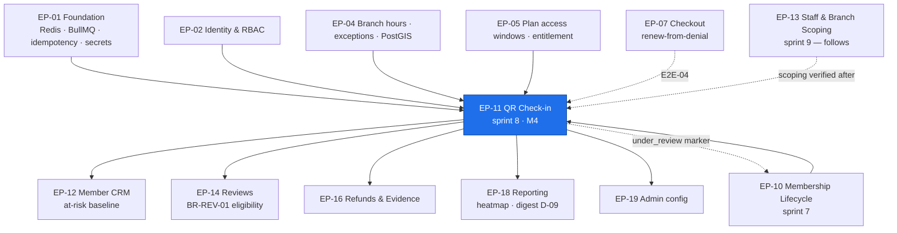

# EP-11 — QR Check-in & Attendance

> **Phase-0 delivery backlog.** Detailed expansion of `ENGINEERING_PLAN.md` §2 (epic row `EP-11`)
> and §3 (`F-11.1` … `F-11.17`). No application code exists yet.
>
> **Three locked decisions shape every line of this epic.**
> **(1) `A-11` — EdDSA (Ed25519)** detached signatures with a rotating key and a `kid` in the
> payload. Chosen for verification speed at 500 scans/minute (`NFR-PERF-08`), not for novelty.
> **(2) `A-10`** — `qrcode` renders, **`@zxing/browser`** decodes; there is no browser-native QR
> decode API with adequate support.
> **(3) `A-08`** — live figures are **TanStack Query polling at 10–15 s** behind one
> `useLiveCounters()` hook with a **mandatory "last updated" indicator**. Socket.IO is deferred to
> Phase 2 behind `release.attendance.realtime_transport`. **A stale figure presented as live is a
> defect** (`ADR-0010`, `E8.11`).
>
> **`NFR-PERF-03` is client-observed.** The 2-second p95 budget covers camera decode, network and
> server. A fast server does not pass this gate.

---

## 1. Metadata

| Field | Value |
| :--- | :--- |
| **Epic id** | `EP-11` |
| **Name** | QR Check-in & Attendance |
| **Priority (MoSCoW)** | **M** — Must. `BAC-05` is a business acceptance criterion; `KPI-06` (≥80% digital check-in adoption) and `KPI-24` (p95 ≤ 2 s) are both scored on this epic alone |
| **Complexity** | **L** (T-shirt, §2) · module rating **Very High** for `attendance/` (§13.1) |
| **Story points** | **55** (epic/feature view, §2) · `attendance/` module view **55 pts / 28 engineer-days** (§13.1) |
| **Target sprint(s)** | **Sprint 8** — 2026-12-28 → 2027-01-08, New Year sprint at −10% capacity. **Milestone `M4`** (first QR check-in in staging). `F-11.13`/`F-11.14` move to sprint 13 with reporting — descope **D-09** |
| **Owning PRD module** | `CHK` (`B5.13`) |
| **Owning code module** | `attendance/` |
| **Surfaces** | `gym-dashboard` — **`SCR-DASH-009`** (check-in desk), `SCR-DASH-010` (attendance log + heatmap), `SCR-DASH-001` (currently-in-gym counter) · `customer-web` — `SCR-WEB-009` (QR render + countdown), `SCR-WEB-010` (visit history, streak) |
| **Primary APIs** | `API-CHK` — `POST /v1/checkin/scan`, `POST /v1/checkin/manual`, `POST /v1/checkin/:id/checkout`, `POST /v1/checkin/override`, `GET /v1/tenant/attendance`, `GET /v1/tenant/attendance/heatmap`, `GET /v1/tenant/attendance/live` · plus `POST /v1/me/memberships/:id/qr` (declared in `API-MEMB`, **implemented here**) |
| **Background jobs** | `attendance.auto-checkout` (hourly) · `attendance.sharing-scan` (hourly) — both from `C5` |
| **Performance budgets** | `NFR-PERF-03` p95 ≤ **2 s** scan→confirmation, **client-observed** · `NFR-PERF-08` **500 check-ins/minute** platform-wide · `NFR-PERF-04` p95 ≤ 800 ms on the attendance log |
| **Accessibility** | `NFR-USE-01` **WCAG 2.1 AA** — the check-in desk is one of only two surfaces held to AA · `NFR-USE-09` operable **one-handed on a tablet at arm's length** · `NFR-USE-02` full keyboard operability |
| **Launch market** | **India** — attendance day-bucketing and monthly partition boundaries on **IST**, not UTC (`TR-24` failures 2 and 4); check-in denials must never be blocked by tenant arrears (`BusinessRules.md` §18.5) |
| **Status** | `PLANNED` — Phase 0. Not started. Two `OQ-` due in this sprint |
| **Epic owner** | Backend Lead — `attendance/`; the token design is **Technical Lead**, non-delegable (`TR-09`) |

---

## 2. Business Goal

**Check-in is the habit that makes the platform indispensable, and it is the only feature a gym
owner watches happen twenty times a minute.** Everything upstream — verification, listing, pricing,
payment, membership state — resolves at the door, on a receptionist's tablet, in front of a queue at
07:00. `KPI-06` commits to **≥80% of member visits recorded through the platform rather than
manually**, and that number is not won by features; it is won by the desk being *faster than a
paper register*. If the scan takes four seconds, the receptionist stops scanning and the platform
loses its daily touchpoint with both sides simultaneously — which is why `NFR-PERF-03` is stated as
a **client-observed** p95 rather than a server metric, and why `KPI-24` restates it as a headline
platform-health number.

**Second, this epic is the platform's primary defence against credential sharing (`RSK-03`, score
12).** A membership is a personal credential; without a control, one membership serves a household
and the gym's capacity model, its revenue per member and the platform's `KPI-08` figure are all
fiction. The defence is layered and each layer is cheap: a **60-second rotating Ed25519 token**
makes a screenshot worthless within a minute (`BR-CHK-02`, `AC-CHK-01.3`); the **member's photograph
on the success screen** (`FR-CHK-05`) is a human check that costs nothing and defeats the common
case; the **hourly implausible-travel scan** (`FR-CHK-12`, `BR-CHK-07`) catches the systematic case
statistically, off the latency path; and the outcome of detection is **review, never cancellation**
(`BR-MEM-13`, `CR-04`), because a false positive that cancels a paying member's membership is a
worse business outcome than the sharing it was meant to stop.

**Third, attendance is the evidence base for three separate high-stakes decisions elsewhere in the
product, which is why it is immutable.** Review eligibility is computed from it (`BR-REV-01`, and
`RSK-02`'s entire defence rests on that); refund usage thresholds are computed from it
(`BR-REF-06`); and the dispute evidence pack is assembled from it (`FR-RFND-09`). If attendance were
editable, a gym could manufacture review eligibility, suppress a refund, or fabricate a chargeback
defence. `BR-CHK-09` therefore removes the `UPDATE` and `DELETE` grants entirely — corrections are
linked reversal rows. That is not a data-hygiene preference; it is fraud prevention, and it is the
reason `BAC-05` can be stated as *"the visit appears in both the member's history and the gym's
attendance report immediately"* with no qualifier about corrections.

---

## 3. Scope

### 3.1 In scope — explicit

| # | Item | Anchor |
| :-: | :--- | :--- |
| 1 | Member-side rotating QR: 60 s TTL, visible countdown, automatic refresh, **paused when the tab is backgrounded** | `FR-CHK-01`, `BR-CHK-02`, `A-10`, `SCR-WEB-009` |
| 2 | Token payload `{ membershipId, memberId, tenantId, iat, exp, nonce, kid }` — **no personal data** | `FR-CHK-02`, `BR-DAT-06` |
| 3 | **Ed25519 detached signature**, rotating signing key, `kid` in payload, key material in the managed secret store, overlap window on rotation | `A-11`, `ADR-0012`, `TR-09`, `NFR-SEC-07` |
| 4 | Browser camera scanner with a **persistent full-screen desk mode**, usable on any device | `FR-CHK-03`, `SCR-DASH-009`, `A-10` |
| 5 | **Ten-step ordered validation returning the first failure**, exactly as `FR-CHK-04` enumerates | `FR-CHK-04`, `BR-CHK-01/03/04/05` |
| 6 | Success display: member **photo**, name, plan, days or sessions remaining, held for a configurable duration, auto-clearing, scanner immediately ready | `FR-CHK-05`, `AC-CHK-01.1` |
| 7 | Denial display: specific reason in **staff-appropriate language**, suggested action, contextual controls (Renew now / Unfreeze / Override) — and the denial is **recorded** | `FR-CHK-06`, `BR-CHK-10` |
| 8 | All **fifteen** `C4.8` denial reason codes reachable, each individually reproducible | `C4.8`, `BR-CHK-10-P1` |
| 9 | Manual check-in by member search (name, phone, member code), marked `MANUAL` with staff identity and reason | `FR-CHK-07`, `BR-CHK-08` |
| 10 | Staff override from the **seven** `C4.8` override reasons, fully audited, reportable separately | `FR-CHK-08`, `C4.8`, `OQ-09` |
| 11 | Token idempotency: `UNIQUE (token_nonce)` on `attendance`; a replay within TTL returns the **original** row | `BR-CHK-06`, `AC-CHK-01.4`, `AC-CHK-01.5` |
| 12 | Duplicate cooldown, default **60 minutes**, same branch only, recorded **without** decrementing entitlement | `BR-CHK-04`, `OQ-08` |
| 13 | Optional check-out with computed duration, plus a configurable hourly auto-checkout sweep | `FR-CHK-09`, `attendance.auto-checkout` |
| 14 | Attendance log with **six** filter dimensions: date, branch, member, staff, method, result — plus denial reason | `FR-CHK-10`, `SCR-DASH-010` |
| 15 | Member visit history with **streak indicator** and monthly visit count | `FR-CHK-11`, `SCR-WEB-010` |
| 16 | Implausible-travel detection via PostGIS `ST_Distance` against elapsed interval and a configurable implied-speed threshold, flagging the membership **under review** | `FR-CHK-12`, `BR-CHK-07`, `BR-MEM-13` |
| 17 | Weekday-by-hour peak heatmap — **moves to sprint 13, descope D-09** | `FR-CHK-13`, `US-CHK-02` |
| 18 | Optional daily attendance digest to the owner — **moves to sprint 13, descope D-09** | `FR-CHK-14` |
| 19 | Attendance **immutability**: no `UPDATE`/`DELETE` grant; corrections are linked reversal rows | `BR-CHK-09`, `L3-GRANT` |
| 20 | **Monthly range partitioning** on `attendance.checked_in_at` **from the first migration**, on IST month boundaries | `NFR-SCAL-06`, `TR-14`, `TR-24` failure 4 |
| 21 | `GET /tenant/attendance/live` over a **Redis projection**, ETag/`304`, feeding one `useLiveCounters()` hook with a mandatory staleness indicator | `A-08`, `TR-02`, `ADR-0010` |
| 22 | Server-time-only TTL evaluation — the scanning device clock is **never** trusted | `B5.13` edge case, `TR-21` |
| 23 | Multi-membership disambiguation at the desk, defaulting to the membership expiring soonest | `B5.13` edge case |
| 24 | Renew-from-the-denial-screen flow, pre-filled for that member | `AC-CHK-01.2`, `E2E-04` |
| 25 | Offline behaviour: a clear "no connection" state and **never a false success** | `SCR-DASH-009` Offline row, `TD-006` |

### 3.2 Out of scope — explicit, with destination

| Item | Why it is not here | Where it went |
| :--- | :--- | :--- |
| Membership state itself — `ACTIVE`, `FROZEN`, `EXPIRED`, the `under_review` marker | `EP-11` **reads** state at step 4; it never writes it | **`EP-10`** |
| Branch operating hours and dated closure exceptions | Step 7 reads `branch_hours` and `branch_hour_exceptions`; the model is catalogue's | **`EP-04`** |
| Plan access windows, branch entitlement, 24-hour access, session totals | Steps 6, 8 and 10 read `purchased_terms`; the model is plans' | **`EP-05`** |
| The **order** created by "Renew now" on the denial screen | `EP-11` opens the flow pre-filled; `ordering/` creates and prices it | **`EP-07`** |
| Staff roles, branch scoping enforcement, the staff activity log | `EP-11` records `staff_id` and method; scoping is `staff/`'s | **`EP-13`** |
| Review eligibility computed from attendance | `EP-11` supplies the immutable record; eligibility is reviews' | **`EP-14`** |
| Refund usage thresholds and the dispute evidence pack | Same — attendance is the input, not the decision | **`EP-16`** |
| Attendance **reports**, exports, drill-down, scheduled delivery | `EP-11` owns the operational log; the report catalogue is reporting's | **`EP-18`** |
| The peak heatmap and the daily digest | Moved with reporting under **D-09** | **`EP-18`**, sprint 13 |
| **Offline check-in queue** — recording scans while the network is down and syncing later | `TD-006` accepts its absence for Phase 1; the desk shows an honest "no connection" state instead | Not in Phase 1; `TD-006` revisit trigger: >2% of check-ins failing on network error in a rolling week |
| **Socket.IO / WebSocket** live transport | `A-08` deferred it to Phase 2 behind `release.attendance.realtime_transport` | Phase 2; `TD-002` |
| Turnstile, RFID, biometric or NFC hardware integration | No hardware in Phase 1 (`A4.3`) | Phase 2 (`A11`) |
| Class booking and capacity gating at the door | Capacity has **never** gated entry (`rel.catalog.branch-capacity-indicator` off-behaviour) | Phase 2 |

---
## 4. Features

`F-11.1` … `F-11.17` are carried verbatim from `ENGINEERING_PLAN.md` §3. Rows marked *(new)* are
additions this backlog surfaces from `B5.13`'s edge cases, `C4.8` and `RiskAnalysis.md` §3.3.11.

| Feature | Description | Satisfies | Pri | Pts | Sprint |
| :--- | :--- | :--- | :-: | :-: | :-: |
| **F-11.1** | Rotating signed QR: 60 s TTL, visible countdown, auto-refresh, background pause | `FR-CHK-01`, `BR-CHK-02`, `A-10`, `A-11` | M | 5 | 8 |
| **F-11.2** | Token payload contract — ids, `iat`, `exp`, nonce, `kid`; no personal data | `FR-CHK-02`, `BR-DAT-06` | M | 2 | 8 |
| **F-11.3** | Browser camera scanner with persistent full-screen desk mode | `FR-CHK-03`, `SCR-DASH-009`, `A-10` | M | 8 | 8 |
| **F-11.4** | **Ten-step ordered validation returning the first failure** | `FR-CHK-04`, `BR-CHK-01/03/04/05` | M | 7 | 8 |
| **F-11.5** | Success display with photo, plan and remaining entitlement | `FR-CHK-05` | M | 3 | 8 |
| **F-11.6** | Denial display with staff-language reason and suggested action, recorded | `FR-CHK-06`, `BR-CHK-10`, `C4.8` | M | 3 | 8 |
| **F-11.7** | Manual check-in by member search, marked `MANUAL` with staff and reason | `FR-CHK-07`, `BR-CHK-08` | M | 2 | 8 |
| **F-11.8** | Staff override with a fixed reason list, fully audited and reportable | `FR-CHK-08`, `C4.8`, `OQ-09` | M | 3 | 8 |
| **F-11.9** | Optional check-out with duration and configurable auto-checkout | `FR-CHK-09` | S | 3 | 8 |
| **F-11.10** | Attendance log with six filter dimensions | `FR-CHK-10`, `SCR-DASH-010` | M | 3 | 8 |
| **F-11.11** | Member visit history with streak and monthly count | `FR-CHK-11`, `SCR-WEB-010` | S | 3 | 8 |
| **F-11.12** | Implausible-travel detection flagging the membership under review | `FR-CHK-12`, `BR-CHK-07`, `RSK-03` | S | 4 | 8 |
| **F-11.13** | Weekday-by-hour peak heatmap — **D-09** | `FR-CHK-13`, `US-CHK-02` | S | 3 | **13** |
| **F-11.14** | Optional daily attendance digest — **D-09** | `FR-CHK-14` | C | 2 | **13** |
| **F-11.15** | Token idempotency: replay within TTL returns the original record | `BR-CHK-06`, `AC-CHK-01.4` | M | 3 | 8 |
| **F-11.16** | Attendance immutability with linked reversal records | `BR-CHK-09` | M | 3 | 8 |
| **F-11.17** | `useLiveCounters()` polling hook plus the mandatory "last updated" indicator | `A-08`, `SCR-DASH-001`, `SCR-DASH-009` | M | 4 | 8 |
| **F-11.18** *(new)* | **Duplicate cooldown**, default 60 minutes, same branch only, recorded without decrementing entitlement | `BR-CHK-04`, `OQ-08`, §18.4 | M | 3 | 8 |
| **F-11.19** *(new)* | **Ed25519 key rotation** with a `kid`-indexed verifier set and a defined overlap window; retired keys removed after it | `TR-09`, `SEC-A02-003`, `NFR-SEC-07` | M | 3 | 8 |
| **F-11.20** *(new)* | **Monthly range partitioning on IST month boundaries**, created in the first migration, with the cooldown-query indexes sized for the `NFR-PERF-03` path | `NFR-SCAL-06`, `TR-14`, `TR-24` | M | 3 | 8 |
| **F-11.21** *(new)* | **Server-time-only TTL**, with a documented grace margin larger than the NTP alert threshold | `TR-21`, `B5.13` edge case | M | 2 | 8 |
| **F-11.22** *(new)* | **Multi-membership disambiguation** at the desk, defaulting to the one expiring soonest | `B5.13` edge case, `BR-MEM-04` | S | 2 | 8 |
| **F-11.23** *(new)* | **Renew-from-denial** flow pre-filled for the member, and re-scan success immediately after | `AC-CHK-01.2`, `E2E-04` | M | 3 | 8 |
| **F-11.24** *(new)* | **Honest offline state** — a visible "no connection" state; no false success is ever shown | `SCR-DASH-009`, `TD-006` | M | 2 | 8 |
| | | | | **79** | |

> **Points reconciliation.** §2 carries **55**; the enumerated list totals **79**, of which **5**
> (`F-11.13`, `F-11.14`) leave the sprint under **D-09**. §13.1's `attendance/` module view of
> **55 pts / 28 ed** is backend only. §10 reconciles all of it.

---

## 5. User Stories

Two stories exist in the PRD (`US-CHK-01`, `US-CHK-02`). Seven more are written here because
`B5.13`'s functional requirements and edge cases imply stories the PRD did not write — token
security, manual check-in, override, sharing detection, the live counter, check-out and the offline
state.

### US-CHK-01 — *As Sameer at the desk, I want to check in a queue of ten people without anything going wrong.* **(PRD)**

- **AC-CHK-01.1** *Given* the scanner is open, *when* a valid QR is presented, *then* confirmation appears within **2 seconds at p95** and the scanner is immediately ready for the next person.
- **AC-CHK-01.2** *Given* a member's membership expired, *when* they present a QR, *then* the denial shows "Membership expired on \<date\>" with a **"Renew now"** action that opens the sale flow **pre-filled for that member**.
- **AC-CHK-01.3** *Given* a member presents a screenshot of an old QR, *when* it is scanned, *then* it is denied `TOKEN_EXPIRED`, because the TTL is 60 seconds evaluated against **server** time.
- **AC-CHK-01.4** *Given* the same valid token is scanned twice within its TTL, *when* the second scan occurs, *then* the **original** attendance record is returned and no second visit is recorded.
- **AC-CHK-01.5** *Given* the network drops mid-scan, *when* connectivity returns, *then* the operation either completed **exactly once or not at all** — never twice.
- **AC-CHK-01.6** *(new)* *Given* the tablet has no connection, *when* a QR is presented, *then* a clear "no connection" state is shown and **no success is displayed** under any circumstance.

### US-CHK-02 — *As Rohan, I want to know when my gym is busy so that I staff it properly.* **(PRD) · moves to sprint 13 under D-09**

- **AC-CHK-02.1** *Given* at least 14 days of attendance data, *when* I open the attendance report, *then* a weekday-by-hour heatmap renders with visit counts.
- **AC-CHK-02.2** *Given* I filter to one branch, *when* the filter applies, *then* the heatmap reflects that branch only.
- **AC-CHK-02.3** *Given* I export the report, *when* the export completes, *then* the CSV contains **one row per visit** with member id, timestamp, branch, method and result.
- **AC-CHK-02.4** *(new)* *Given* a gym in `Asia/Kolkata`, *when* the heatmap buckets by hour, *then* the buckets are **IST** hours; a visit at 00:15 IST appears in that day's 00:00 bucket, not the previous day's 18:00 UTC bucket.

### US-CHK-03 — *As a member, I want my QR to be useless to anyone I send a screenshot to.* **(new — implied by `FR-CHK-01`, `FR-CHK-02`, `BR-CHK-02`, `RSK-03`)**

- **AC-CHK-03.1** *Given* a token minted now, *when* it is presented 61 seconds later, *then* it is denied `TOKEN_EXPIRED`.
- **AC-CHK-03.2** *Given* a payload with a valid **shape** and an invalid signature, *when* it is scanned, *then* it is denied `TOKEN_INVALID` **and the attempt is recorded**.
- **AC-CHK-03.3** *Given* a token signed by a **retired** `kid`, *when* it is presented after the overlap window, *then* it is rejected.
- **AC-CHK-03.4** *Given* a token minted with `exp − iat = 3600`, *when* it is verified, *then* it is rejected regardless of signature validity — the TTL bound is checked, not just the expiry.
- **AC-CHK-03.5** *Given* a live token, *when* it is decoded in a test, *then* it contains **no name, no phone, no email and no photo URL** — ids, timestamps, nonce and `kid` only.
- **AC-CHK-03.6** *Given* a scanning tablet whose clock is 10 minutes fast, *when* a valid token is scanned, *then* it is **admitted** — the device clock is never consulted.

### US-CHK-04 — *As Sameer, I want to check in a member whose phone is dead.* **(new — implied by `FR-CHK-07`, `BR-CHK-08`)**

- **AC-CHK-04.1** *Given* the desk, *when* I search by phone number, name or member code, *then* matching members appear and I can select one.
- **AC-CHK-04.2** *Given* I confirm, *when* the record is written, *then* `method = 'MANUAL'`, `staff_id` is my identity and a reason is stored — a manual record without a staff identity **cannot exist** (`CHECK` constraint).
- **AC-CHK-04.3** *Given* a manual check-in, *when* the full validation sequence runs, *then* only the two token steps are replaced by member lookup; **steps 3 to 10 still apply**.
- **AC-CHK-04.4** *Given* I am scoped to branch 1, *when* I attempt a manual check-in at branch 2, *then* I receive **403**, not an empty result.
- **AC-CHK-04.5** *Given* the attendance log, *when* I filter by method, *then* `SCAN`, `MANUAL` and `OVERRIDE` are separately countable.

### US-CHK-05 — *As Rohan, I want to see which receptionist overrides denials, and how often.* **(new — implied by `FR-CHK-08`, `BR-CHK-08` failure mode)**

- **AC-CHK-05.1** *Given* a denial, *when* staff override it, *then* one of the **seven** `C4.8` override reasons is required; a free-text-only override is refused at the pipe.
- **AC-CHK-05.2** *Given* an override, *when* it is written, *then* `method = 'OVERRIDE'`, `staff_id` is set, and an `audit_log` row records actor, reason, IP and before/after.
- **AC-CHK-05.3** *Given* a week of activity, *when* I open the override report, *then* overrides are summarised per staff member and per reason.
- **AC-CHK-05.4** *Given* a `FROZEN` membership, *when* staff override the denial, *then* the record is `OVERRIDE`, **never** `SCAN` (`BR-MEM-06-N1`).

### US-CHK-06 — *As the platform, I want one membership serving five people to be detected without punishing a family.* **(new — implied by `FR-CHK-12`, `BR-CHK-07`, `BR-MEM-13`)**

- **AC-CHK-06.1** *Given* check-ins at branches 40 km apart 10 minutes apart, *when* the hourly scan runs, *then* the membership is flagged and both member and gym are notified.
- **AC-CHK-06.2** *Given* check-ins at branches 2 km apart 45 minutes apart, *when* the scan runs, *then* the membership is **not** flagged.
- **AC-CHK-06.3** *Given* a flagged membership, *when* the member presents a QR, *then* it is denied `MEMBERSHIP_UNDER_REVIEW` while `status` remains `ACTIVE`.
- **AC-CHK-06.4** *Given* any run of the scan, *when* `membership_events` is diffed, *then* **no** membership transitioned to `CANCELLED` or `REFUNDED`.
- **AC-CHK-06.5** *Given* the scan, *when* the check-in path is profiled, *then* the detection adds **zero** latency to it — it is a job, not an inline check.

### US-CHK-07 — *As Rohan, I want to know how many people are in my gym right now, and to know whether that number is stale.* **(new — implied by `A-08`, `SCR-DASH-001`, `SCR-DASH-009`)**

- **AC-CHK-07.1** *Given* the dashboard home, *when* it renders, *then* a currently-in-gym count is shown **with a "last updated" indicator**.
- **AC-CHK-07.2** *Given* the poll interval, *when* the tab is hidden, *then* polling **pauses**; when it becomes visible again, it resumes and refreshes.
- **AC-CHK-07.3** *Given* the projection has not changed, *when* the client polls, *then* the server returns **`304`** and the response costs almost nothing.
- **AC-CHK-07.4** *Given* every live figure in the product, *when* the code is inspected, *then* all of them read from **one** `useLiveCounters()` hook.
- **AC-CHK-07.5** *Given* `/tenant/attendance/live`, *when* it executes, *then* it reads a **Redis projection** and never the `attendance` table.

### US-CHK-08 — *As a member, I want to see my streak so that I keep coming.* **(new — implied by `FR-CHK-11`, `SCR-WEB-010`, `OBJ-05`)**

- **AC-CHK-08.1** *Given* visits, *when* I open visit history, *then* I see a chronological list with date, time, branch and duration where recorded.
- **AC-CHK-08.2** *Given* the same screen, *when* it renders, *then* a monthly summary and a **current streak** are shown, computed in the **gym's** timezone.
- **AC-CHK-08.3** *Given* no visits, *when* I open the screen, *then* the empty state offers the **QR shortcut**, not a dead end.
- **AC-CHK-08.4** *Given* a visit recorded a moment ago, *when* I refresh, *then* it is already present — the member's history and the gym's log are the same rows (`BAC-05`).

### US-CHK-09 — *As Sameer, I want a member's visit closed even if they leave without checking out.* **(new — implied by `FR-CHK-09`)**

- **AC-CHK-09.1** *Given* a recorded check-out, *when* it is written, *then* duration is computed and shown on both the log and the member's history.
- **AC-CHK-09.2** *Given* no check-out, *when* the configurable threshold passes, *then* `attendance.auto-checkout` closes the visit and marks it auto-closed, distinguishable from a real check-out.
- **AC-CHK-09.3** *Given* `rel.attendance.auto-checkout` is off, *when* the desk renders, *then* no check-out control appears, `checked_out_at` stays null and the duration column is hidden — and **check-in is entirely unaffected**, including its `NFR-PERF-03` budget.
- **AC-CHK-09.4** *Given* the immutability rule, *when* a check-out is recorded, *then* it is written through the single constrained transition or a companion row — **never** a free `UPDATE` (`BR-CHK-09`).

---
## 6. Acceptance Criteria for the Epic

**⛳** = demonstrated live in the sprint-8 demo · **🚦** = launch-blocking through a `BAC-` or an
`NFR-`.

| # | Criterion | Evidence |
| :-- | :--- | :--- |
| **AC-EP11-01** ⛳🚦 | Scan-to-confirmation **p95 ≤ 2 s, measured on the tablet**, including camera decode, network and server | `NFR-PERF-03`, `KPI-24`, `E8.1` |
| **AC-EP11-02** 🚦 | **500 check-ins/minute** platform-wide with no degradation, under the k6 profile | `NFR-PERF-08`, `E8.2` |
| **AC-EP11-03** | The camera decode budget is measured and reported **separately** from the server budget, so a regression is attributable | `E8.1` |
| **AC-EP11-04** ⛳ | A 90-second-old screenshot of a QR is denied `TOKEN_EXPIRED` | `AC-CHK-01.3`, `E8.3` |
| **AC-EP11-05** | An invalid signature is denied `TOKEN_INVALID` **and recorded**; a retired-`kid` token is rejected after the overlap window; a token with `exp − iat = 3600` is rejected regardless of signature | `BR-CHK-02-N1/N2/N3` |
| **AC-EP11-06** 🚦 | A live token decoded in a test contains **no personal data** — ids, `iat`, `exp`, nonce, `kid` only | `BR-DAT-06`, `E8.10` |
| **AC-EP11-07** | Key rotation is rehearsed with **both keys valid during the overlap**, and the runbook step is executed, not merely written | `TR-09`, T-11.36 |
| **AC-EP11-08** ⛳ | A device clock 10 minutes fast admits a valid token; a device clock 10 minutes slow does not admit an expired one — server time only | `TR-21`, `B5.13` edge case |
| **AC-EP11-09** 🚦 | The ten validation steps execute **in the order `FR-CHK-04` states** and return the **first** failure; a step-order test drives each step to failure with all later steps also failing and asserts the reason | `FR-CHK-04` |
| **AC-EP11-10** ⛳ | Expired, wrong-branch, frozen and outside-access-window denials each return the correct `C4.8` reason with staff-language text and a suggested action | `E8.6` |
| **AC-EP11-11** 🚦 | **All fifteen** `C4.8` denial reasons are individually reproducible and each writes a row with the correct code, branch, timestamp and membership where resolvable | `BR-CHK-10-P1` |
| **AC-EP11-12** 🚦 | **No** denial path returns without writing a row — asserted by driving every branch of the sequence and counting rows; `result = 'DENIED'` with a null reason violates the `CHECK` | `BR-CHK-10-N1/N2` |
| **AC-EP11-13** | A declared closure date denies `GYM_CLOSED_EXCEPTION`, **not** `OUTSIDE_OPERATING_HOURS`; the boundary minute is asserted in `Asia/Kolkata` | `BR-CHK-05-N1/N2` |
| **AC-EP11-14** | A cross-tenant token is denied `TOKEN_INVALID` — not `WRONG_BRANCH` — discloses nothing, and is recorded | `BR-CHK-03-N2`, `E2E-11` |
| **AC-EP11-15** | An all-branch plan admits at every active branch; a restricted plan admits only at its named branches, denying `WRONG_BRANCH` elsewhere | `BR-CHK-03-P1/N1` |
| **AC-EP11-16** ⛳🚦 | Scanning the same live token twice produces **one** attendance row and returns the original record | `BR-CHK-06-P1`, `E8.4` |
| **AC-EP11-17** ⛳🚦 | A network interruption mid-scan leaves the operation completed **exactly once or not at all**; two concurrent scans of one token produce one row | `AC-CHK-01.5`, `BR-CHK-06-N1/N2`, `E8.5` |
| **AC-EP11-18** | A second scan 30 minutes later at the **same** branch is a duplicate with `sessions_used` unchanged; at 61 minutes it is a normal check-in and decrements | `BR-CHK-04-P1`, `BR-CHK-04-N1` |
| **AC-EP11-19** | A scan at a **different** branch inside the cooldown is **not** a duplicate and feeds the sharing scan | `BR-CHK-04-N2` |
| **AC-EP11-20** | On a two-session plan: scan, re-scan at 30 min, scan at 61 min, scan at 90 min ⇒ `sessions_used = 2`, four rows, one duplicate, membership `EXPIRED` on exhaustion | Joint test `BR-X-04` |
| **AC-EP11-21** | Step 9 (cooldown) precedes step 10 (entitlement) — a member inside the cooldown with zero sessions left sees `DUPLICATE_WITHIN_COOLDOWN`, not `NO_SESSIONS_REMAINING` | §18.4 |
| **AC-EP11-22** | Two scanners, one member, one session remaining: `SELECT … FOR UPDATE` on the membership makes the second a duplicate; entitlement is never double-decremented | `BR-PLN-06-N2`, §18.4 |
| **AC-EP11-23** | The success screen shows member **photo**, name, plan and days/sessions remaining, holds for the configured duration, auto-clears, and the scanner is ready without an extra tap | `FR-CHK-05`, `AC-CHK-01.1` |
| **AC-EP11-24** ⛳ | Renewing from the denial screen makes an **immediate re-scan succeed** | `E2E-04`, `E8.8` |
| **AC-EP11-25** | A manual check-in records `MANUAL`, the staff id and a reason, and cannot exist without a staff identity; a branch-2 attempt by branch-1 staff returns **403** | `BR-CHK-08-P1`, `BR-CHK-08-N1/N3` |
| **AC-EP11-26** ⛳ | An override requires one of the **seven** `C4.8` reasons, is audited, and appears in the weekly owner report | `E8.7`, `OQ-09` |
| **AC-EP11-27** 🚦 | `UPDATE` and `DELETE` on `attendance` as the application role raise `permission denied`, and **no API path offers either** | `BR-CHK-09-N1` |
| **AC-EP11-28** | A mistaken check-in is corrected by a **linked reversal row**; both rows remain and the log shows the correction | `BR-CHK-09-P1` |
| **AC-EP11-29** 🚦 | `attendance` is **monthly-partitioned from its first migration**, on IST month boundaries, with `(tenant_id, branch_id, checked_in_at)` and `(membership_id, checked_in_at DESC)` present | `NFR-SCAL-06`, `TR-14`, `E8.12` |
| **AC-EP11-30** ⛳🚦 | Every live figure carries a **"last updated" indicator**; a stale figure presented as live fails this gate | `A-08`, `ADR-0010`, `E8.11` |
| **AC-EP11-31** | `/tenant/attendance/live` reads a Redis projection, returns `304` when unchanged, is rate-limited per branch, and its p95 stays below **300 ms** | `TR-02` |
| **AC-EP11-32** | Polling is **jittered ±20%** and paused on `document.hidden`; all live figures come from one `useLiveCounters()` hook | `TR-02`, `AC-CHK-07.4` |
| **AC-EP11-33** ⛳ | The sharing scan flags two check-ins 400 km apart within 20 minutes as **under review, not cancelled**; a 2 km / 45 min pair is not flagged | `BR-CHK-07-P1/N1/N2`, `E8.7` |
| **AC-EP11-34** | A member holding two active memberships at the gym is asked which to consume, defaulting to the one **expiring soonest** | `B5.13` edge case |
| **AC-EP11-35** | A session plan reaching zero mid-visit completes the visit; the **next** check-in is denied `NO_SESSIONS_REMAINING` with a top-up path | `B5.13` edge case |
| **AC-EP11-36** 🚦 | A tenant suspended for arrears (`PAST_DUE` day 8 and day 20) still **admits** at the door; only a gym with `access_permitted = false` denies `TENANT_SUSPENDED` | Joint test `BR-X-05`, §18.5 |
| **AC-EP11-37** 🚦 | The visit appears in **both** the member's history and the gym's log immediately | `BAC-05`, `E8.9` |
| **AC-EP11-38** | The desk is operable **one-handed on a tablet in portrait**, all primary actions reachable by keyboard, axe-core clean at **WCAG 2.1 AA** | `NFR-USE-01`, `NFR-USE-02`, `NFR-USE-09` |
| **AC-EP11-39** | A denied scan returns **`200` with `result: "DENIED"`**, never a 4xx — it is a successful evaluation with a negative result | `§C3.3`, DoD §23.2 #10 |
| **AC-EP11-40** | With the network down, the desk shows an explicit "no connection" state and **never** a success | `SCR-DASH-009`, `TD-006` |
| **AC-EP11-41** | Attendance day-bucketing and streak computation use `date_trunc('day', ts AT TIME ZONE gym_zone)`; a 00:15 IST visit buckets to that IST day | `TR-24` failure 2 |
| **AC-EP11-42** | Branch coverage on the validation sequence and token code is **≥95%**, with a passing mutation score | `NFR-MNT-01`, `TR-17` |
| **AC-EP11-43** | `E2E-03` and `E2E-04` pass in CI; **`M4`** — the first QR check-in completes in staging | `E8.13`, `M4` |

---

## 7. Business Rules Enforced

Enforcement detail lives in `BusinessRules.md` §11 and is **not** duplicated here.

| Rule | Ownership | Enforcement point in this epic | Tasks |
| :--- | :--- | :--- | :--- |
| `BR-CHK-01` | **Owned** | `L5-DOM` `CheckInValidationSequence` step 4, state read **inside** the check-in transaction; `L1-DB` `CHECK ((result='DENIED') = (denial_reason IS NOT NULL))` | T-11.06, T-11.10 |
| `BR-CHK-02` | **Owned** | `L5-DOM` Ed25519 detached signature; `exp − iat ≤ 60s` **and** `now ≤ exp` against **server** time; steps 1–2 run before any database read | T-11.02, T-11.03, T-11.05 |
| `BR-CHK-03` | **Owned** | `L5-DOM` steps 5–6: tenant match then `PlanBranchEntitlement.permits()`; `L2-RLS` makes a cross-tenant token resolve to nothing, so it is `TOKEN_INVALID` not `WRONG_BRANCH` | T-11.08 |
| `BR-CHK-04` | **Owned** | `L6-UC` step 9 queries `(membership_id, checked_in_at DESC)` for the last `ALLOWED` row at the same branch inside the cooldown; the row is written, the decrement is **skipped** | T-11.11, T-11.12 |
| `BR-CHK-05` | **Owned** | `L5-DOM` step 7 evaluates multi-window `branch_hours` then `branch_hour_exceptions`, which override; a 24-hour plan short-circuits | T-11.09 |
| `BR-CHK-06` | **Owned** | `L1-DB` `UNIQUE (token_nonce)`; insert attempted, unique violation translated to "return the existing row"; the endpoint also carries the standard idempotency mechanism | T-11.13 |
| `BR-CHK-07` | **Owned** | `L10-JOB` `attendance.sharing-scan` hourly with PostGIS `ST_Distance` against elapsed interval and an implied-speed threshold; sets the `BR-MEM-13` marker | T-11.20 |
| `BR-CHK-08` | **Owned**, co-owned `staff/` | `L1-DB` `method` enum plus `CHECK (method = 'SCAN' OR staff_id IS NOT NULL)`; `L7-GUARD` branch-scoped **refusal**, not filtering; `L8-PIPE` override reason from `C4.8` | T-11.15, T-11.16 |
| `BR-CHK-09` | **Owned** | `L3-GRANT` no `UPDATE`/`DELETE` grant on `attendance`; corrections are linked reversal rows; monthly partitioning makes historical partitions cheap to freeze | T-11.04, T-11.18 |
| `BR-CHK-10` | **Owned** | `L1-DB` denial-reason `CHECK` constrained to the fifteen `C4.8` codes; **every** exit from the sequence writes a row before returning | T-11.10, T-11.14 |
| `BR-MEM-06` | **Owned here** (state from `EP-10`) | Step 4 maps `FROZEN` to `MEMBERSHIP_FROZEN`; deliberately the same code path as `BR-CHK-01` so the two cannot diverge | T-11.06 |
| `BR-MEM-13` | **Co-owned** with `memberships/` | Step 4 treats the `under_review` marker as a denial with `MEMBERSHIP_UNDER_REVIEW` while `status` stays `ACTIVE` (`CR-04`) | T-11.06, T-11.20 |
| `BR-PLN-06` | **Contributor** — owned by `plans/` | Step 10 entitlement check and the decrement in the same transaction as the attendance insert | T-11.12 |
| `BR-TEN-05` / `BR-TEN-06` | **Consumer** | Check-in **never** consults tenant subscription status or arrears suspension; only `gyms.access_permitted = false` denies `TENANT_SUSPENDED` | T-11.07, §18.5 |
| `BR-DAT-06` | **Contributor** | The token payload carries ids only; the `checkin_recorded` analytics event carries no personal data | T-11.03 |
| `BR-DAT-01` | **Contributor** | Manual check-ins, overrides and reversals are audited staff actions with reason and IP | T-11.17 |
| `BR-TEN-01` | **Inherited** | RLS on `attendance` and its partitions; isolation specs on all seven `API-CHK` routes | T-11.04, T-11.34 |
| `BR-REV-01` | **Supplier** | Attendance is the sole eligibility source for `EP-14`; immutability is what makes it trustworthy | T-11.18 |

---

## 8. Dependencies

### 8.1 Upstream — must exist first

| Epic | What this epic needs from it | Blocking? |
| :--- | :--- | :-: |
| **`EP-01`** Foundation | Redis, BullMQ job harness with distributed locks, the outbox, the Prisma tenant extension, RLS, the idempotency mechanism, `Clock` injection, the managed secret store | **Yes** |
| **`EP-02`** Identity & RBAC | `attendance:scan`, `attendance:manual`, `attendance:checkout`, `attendance:override`, `tenant.attendance:*` permissions; staff session identity for `staff_id` | **Yes** |
| **`EP-04`** Gym & Branch | `branch_hours` with **multiple windows per day**, `branch_hour_exceptions`, branch PostGIS `location`, `gyms.access_permitted` | **Yes** |
| **`EP-05`** Plan Catalogue | Branch entitlement, plan access windows, 24-hour access flag, `plan_type` and `sessions_total` on `purchased_terms` | **Yes** |
| **`EP-10`** Membership Lifecycle | The state read at step 4 and the entitlement read at step 10; the `under_review` marker. **Sprint 8 cannot start without sprint 7** | **Yes** |
| **`EP-13`** Staff & Branch Scoping | Branch scoping of manual check-in and the attendance log. Sprint 9 **follows** sprint 8, so scoping arrives after; the desk must therefore be built to filter server-side from day one and be re-verified in sprint 9 | Partial — sequencing risk, see §11 |
| **`EP-07`** Checkout | The pre-filled offline sale opened by "Renew now" on the denial screen | For `E2E-04` |

### 8.2 Downstream — what this unblocks

| Epic | What it takes from here |
| :--- | :--- |
| **`EP-12`** Member CRM | Member 360's attendance region; the **at-risk baseline** is computed from attendance; the flag **auto-clears on check-in** (`AC-CRM-01.3`) |
| **`EP-14`** Reviews | `BR-REV-01` eligibility — `RSK-02`'s entire defence rests on attendance being real and immutable |
| **`EP-16`** Refunds | `BR-REF-06` usage thresholds; the `FR-RFND-09` evidence pack |
| **`EP-18`** Reporting | The attendance report, the peak heatmap and the daily digest (`F-11.13`/`F-11.14` arrive here under **D-09**) |
| **`EP-19`** Admin | Cooldown, auto-checkout threshold, implied-speed threshold and success-hold duration as platform configuration |
| **`EP-10`** (back-edge) | `BR-CHK-07` sets the `under_review` marker that `EP-10` owns |

### 8.3 External dependencies and open questions

| Item | Nature | Effect if unresolved |
| :--- | :--- | :--- |
| `OQ-08` — cooldown duration | Client decision, due **sprint 8** | Default adopted: **60 minutes**, per-tenant configurable |
| `OQ-09` — may staff override any denial, or only some? | Client decision, due **sprint 8** | Default adopted: **all denials overridable with a reason**, overrides reported weekly to the owner |
| Camera permission behaviour across tablet browsers | Device/browser matrix, `A-10` | The desk must degrade to manual check-in with a clear explanation, never a blank viewfinder |
| Ed25519 key custody in the managed secret store | DevOps + `NFR-SEC-07` | T-11.36 blocks; keys must never reach an environment file |
| NTP/chrony on every node with a 250 ms alert | DevOps, `TR-21` | Without it, a 3-second skew is 5% of the entire 60-second TTL window |

### 8.4 Dependency graph

---
## 9. Technical Tasks

Estimates are **engineer-days**, including implementation, test and review. `SP-8.n` names the
corresponding row in `SprintPlanning.md` sprint 8.

| Id | Description | Layer | Est. | Depends on | Serves |
| :--- | :--- | :--- | :-: | :--- | :--- |
| **T-11.01** | Migration: `attendance` **monthly range-partitioned from creation on IST month boundaries**; columns `tenant_id`, `branch_id`, `membership_id`, `member_id`, `staff_id`, `method` enum (`SCAN`/`MANUAL`/`OVERRIDE`), `result` enum, `denial_reason`, `token_nonce`, `checked_in_at`, `checked_out_at`, `duration_minutes`, `reversal_of_id`; `UNIQUE (token_nonce)`; `CHECK ((result='DENIED') = (denial_reason IS NOT NULL))`; `CHECK (method='SCAN' OR staff_id IS NOT NULL)`; indexes `(tenant_id, branch_id, checked_in_at)` and `(membership_id, checked_in_at DESC)` | DB | 2.0 | EP-01 | `NFR-SCAL-06`, `TR-14`, `BR-CHK-06/08/10` · SP-8.9 |
| **T-11.02** | Ed25519 signer: detached signature, key loaded from the managed secret store, `kid` emitted, no key material in environment files | API/domain | 1.5 | EP-01 secrets | `BR-CHK-02`, `A-11`, `TR-09` · SP-8.1 |
| **T-11.03** | Token payload contract and codec: `{ membershipId, memberId, tenantId, iat, exp, nonce, kid }`; a decode test asserting **no personal field is representable** | API/domain | 1.0 | T-11.02 | `FR-CHK-02`, `BR-DAT-06` · SP-8.2 |
| **T-11.04** | Append-only posture: `REVOKE UPDATE, DELETE ON attendance` for the application role in **every** environment; `append-only-grants` CI check; linked reversal-row model | DB/infra | 1.0 | T-11.01 | `BR-CHK-09` |
| **T-11.05** | Verifier: `kid`-indexed key set, `exp − iat ≤ 60s` **and** `now ≤ exp` against **server time**, documented grace margin above the NTP alert threshold, steps 1–2 before any database read | API/domain | 1.0 | T-11.02 | `BR-CHK-02`, `TR-21` |
| **T-11.06** | `CheckInValidationSequence` **steps 1–5**: signature, expiry, membership exists, `status = 'ACTIVE'` (with `FROZEN`/`PENDING`/`CANCELLED`/`REFUNDED`/`under_review` mapped to their `C4.8` reasons), tenant match | API/domain | 1.5 | T-11.05, EP-10 | `FR-CHK-04`, `BR-CHK-01`, `BR-MEM-06`, `BR-MEM-13` · SP-8.3 |
| **T-11.07** | `CheckInValidationSequence` **step 6**: branch entitlement from `purchased_terms`; `gyms.access_permitted` as the **only** tenant-level gate — a deliberate test proving arrears never deny | API/domain | 1.0 | EP-05 | `BR-CHK-03`, `CR-05`, §18.5 · SP-8.3 |
| **T-11.08** | Cross-tenant posture: a token from tenant A at tenant B's scanner resolves to nothing under RLS and returns `TOKEN_INVALID`, disclosing nothing | API | 0.5 | T-11.06 | `BR-CHK-03-N2`, `E2E-11` |
| **T-11.09** | `CheckInValidationSequence` **steps 7–8**: multi-window `branch_hours` for the weekday, `branch_hour_exceptions` overriding the date, 24-hour short-circuit, plan access window — all evaluated in the gym's zone and **cheaply** (this is on the 2 s path) | API/domain | 1.5 | EP-04 | `BR-CHK-05`, `FR-CHK-04` · SP-8.3 |
| **T-11.10** | `CheckInValidationSequence` **first-failure semantics** and the denial writer: every exit writes a row before returning; the fifteen `C4.8` codes as constrained reference data | API/domain | 1.0 | T-11.09 | `FR-CHK-04`, `BR-CHK-10` · SP-8.5 |
| **T-11.11** | **Step 9 cooldown**: last `ALLOWED` row at the same branch within the configurable window (default 60 min), written as `DUPLICATE_WITHIN_COOLDOWN` with the decrement **skipped** | API | 1.0 | T-11.01 | `BR-CHK-04`, `OQ-08` · SP-8.8 |
| **T-11.12** | **Step 10 entitlement** and the decrement: `SELECT … FOR UPDATE` on the membership, attendance insert and decrement in **one** transaction, exhaustion feeding `EP-10`'s expiry trigger | API | 1.0 | T-11.11 | `BR-PLN-06`, §18.4 |
| **T-11.13** | Token idempotency: insert-then-catch on `UNIQUE (token_nonce)` returning the existing row; participation in the standard `Idempotency-Key` mechanism as a second, independent guarantee | API | 1.5 | T-11.01 | `BR-CHK-06`, `AC-CHK-01.4/01.5` · SP-8.4 |
| **T-11.14** | `POST /checkin/scan` response contract: **`200` with `result`**, member name, photo URL, plan, days/sessions remaining, denial reason, staff-language message and `suggested_actions` | API | 1.0 | T-11.10 | `FR-CHK-05`, `FR-CHK-06`, `§C3.3` |
| **T-11.15** | `POST /checkin/manual`: member search by name, phone and member code; steps 3–10 still applied; `MANUAL` with staff id and reason; branch-scoped **refusal** | API | 1.0 | T-11.10 | `FR-CHK-07`, `BR-CHK-08` · SP-8.7 |
| **T-11.16** | `POST /checkin/override`: one of the seven `C4.8` override reasons required at the pipe; `OVERRIDE` method; weekly per-staff override report feed | API | 1.5 | T-11.15 | `FR-CHK-08`, `OQ-09` · SP-8.6 |
| **T-11.17** | Audit wiring for manual check-ins, overrides and reversals: actor, reason, IP, before/after | API | 0.5 | EP-01 audit | `BR-DAT-01`, `BR-CHK-08` |
| **T-11.18** | Reversal-row model and the correction use case; the attendance log renders both rows and the net | API | 1.0 | T-11.04 | `BR-CHK-09-P1` |
| **T-11.19** | `POST /checkin/:id/checkout` plus `attendance.auto-checkout` hourly sweep with a configurable threshold, behind `rel.attendance.auto-checkout` | API/worker | 1.5 | T-11.01 | `FR-CHK-09` · SP-8.8 |
| **T-11.20** | `attendance.sharing-scan` hourly: PostGIS `ST_Distance` between branches against elapsed interval and a configurable implied-speed threshold; sets the `under_review` marker; notifies member and gym; **never** transitions state | worker | 2.0 | T-11.01, EP-10 | `FR-CHK-12`, `BR-CHK-07`, `RSK-03` · SP-8.10 |
| **T-11.21** | `GET /tenant/attendance` with six filter dimensions plus denial reason, paginated, branch-scoped, p95 ≤ 800 ms | API | 1.0 | T-11.01 | `FR-CHK-10`, `NFR-PERF-04` · SP-8.11 |
| **T-11.22** | `GET /me/attendance`: visit history with **streak** and monthly count computed in the gym's zone via `date_trunc … AT TIME ZONE` | API | 0.5 | T-11.01 | `FR-CHK-11`, `TR-24` · SP-8.11 |
| **T-11.23** | **Redis live-counter projection** updated from the `CheckInRecorded` outbox event; `GET /tenant/attendance/live` returning currently-in-gym count, recent-check-ins strip and `generated_at`, with ETag/`304` and per-branch rate limiting; **never reads `attendance`** | API/infra | 2.0 | T-11.14 | `A-08`, `TR-02` · SP-8.13 |
| **T-11.24** | Peak heatmap aggregation `GET /tenant/attendance/heatmap` (weekday × IST hour) — **moves to sprint 13, D-09** | API | 1.0 | T-11.21 | `FR-CHK-13` · SP-8.12 |
| **T-11.25** | Daily attendance digest for the owner — **moves to sprint 13, D-09** | worker | 0.5 | T-11.24 | `FR-CHK-14` · SP-8.12 |
| **T-11.26** | **Member QR component**: `qrcode` render, visible countdown, auto-refresh at TTL, **pause on `document.hidden`**, brightness hint, state-dependent replacement for non-`ACTIVE` states | web | 3.5 | T-11.03 | `FR-CHK-01`, `SCR-WEB-009` · SP-8.14 |
| **T-11.27** | **Check-in desk** `SCR-DASH-009`: `@zxing/browser` scanner, large centre viewfinder, persistent full-screen mode, manual search field focused-on-keypress, result panel, recent-check-ins strip, one-handed tablet-portrait ergonomics | dash | 6.0 | T-11.14 | `FR-CHK-03`, `NFR-USE-09` · SP-8.15 |
| **T-11.28** | Success and denial states: large green confirmation with photo/name/plan/remaining, auto-clear; large red denial with reason, member details and contextual actions (Renew now / Unfreeze / Override) | dash | 3.0 | T-11.27 | `FR-CHK-05`, `FR-CHK-06` · SP-8.16 |
| **T-11.29** | **`useLiveCounters()`**: one hook, 10–15 s **jittered** poll, paused when hidden, ETag-aware, exposing `generated_at` as a **mandatory** "last updated" indicator | dash | 2.5 | T-11.23 | `A-08`, `ADR-0010` · SP-8.17 |
| **T-11.30** | Attendance log screen `SCR-DASH-010` with the six filters, denial-reason column and export hook; heatmap widget slot (populated in sprint 13) | dash | 3.0 | T-11.21 | `FR-CHK-10` · SP-8.18 |
| **T-11.31** | Renew-from-denial flow: opens the offline sale pre-filled for the member and returns to the scanner ready state | dash | 2.0 | T-11.28, EP-07 | `E2E-04` · SP-8.19 |
| **T-11.32** | Offline and permission states on the desk: explicit "no connection", camera-permission-denied with a manual fallback, **no false success in any state** | dash | 1.0 | T-11.27 | `SCR-DASH-009`, `TD-006` |
| **T-11.33** | Multi-membership disambiguation panel, defaulting to the membership expiring soonest | dash | 1.0 | T-11.28 | `B5.13` edge case |
| **T-11.34** | Visit-history screen `SCR-WEB-010` completion: list, monthly summary, streak, frequency chart, empty state with the QR shortcut | web | 1.5 | T-11.22 | `FR-CHK-11` · SP-8.20 |
| **T-11.35** | **k6 check-in profile at 500 scans/minute** plus client-observed `NFR-PERF-03` measurement on a real tablet, with the camera-decode budget reported separately | test | 5.0 | T-11.27 | `NFR-PERF-08`, `NFR-PERF-03` · SP-8.21 |
| **T-11.36** | **Token security suite**: forgery, replay inside and outside TTL, 90-second screenshot, device clock skew both directions, key rotation with overlap, retired-`kid` rejection, oversized-TTL rejection | test | 4.0 | T-11.05 | `TR-09`, `BR-CHK-02` · SP-8.23 |
| **T-11.37** | **Validation-order suite**: each of the ten steps driven to failure with all later steps also failing; asserts the **first** failure is returned; all fifteen `C4.8` codes individually reproduced with a row written | test | 2.0 | T-11.10 | `FR-CHK-04`, `BR-CHK-10-P1` |
| **T-11.38** | `E2E-03` and `E2E-04` automation; joint tests `BR-X-04` (cooldown × entitlement) and `BR-X-05` (suspension × check-in) | test | 5.0 | T-11.31 | `E2E-03`, `E2E-04`, §18.4, §18.5 · SP-8.22 |
| **T-11.39** | Isolation specs for all seven `API-CHK` routes; partition-aware RLS assertions | test | 1.5 | T-11.01 | `BAC-10`, `E2E-11` |
| **T-11.40** | Accessibility pass on the desk: axe-core clean at AA, keyboard path for every primary action, 44×44 px targets, contrast, one-handed portrait verification | test | 1.5 | T-11.28 | `NFR-USE-01/02/03/09` |
| **T-11.41** | Ed25519 key storage, **rotation runbook** and overlap-window procedure, rehearsed once | infra | 3.0 | T-11.02 | `TR-09`, `NFR-SEC-07` · SP-8.24 |
| **T-11.42** | Partition-maintenance wiring into `audit.partition-maintenance`, with a **failure alert** — `TR-41` scores 15 and an unnoticed failure stops writes | infra | 1.0 | T-11.01 | `TR-41`, `TD-014` |
| **T-11.43** | Observability: `gym.checkin.latency_ms` (client and server), `gym.checkin.result.count{reason}`, `gym.live.poll.share_pct`, `304` ratio, `QR_TOKEN_EXPIRED` per instance (a `TR-21` skew signal) | infra | 1.0 | T-11.23 | `NFR-MNT-06`, `TR-02`, `TR-21` |
| **T-11.44** | Feature flags registered: `rel.attendance.auto-checkout`, `rel.attendance.peak-hour-heatmap`, `rel.attendance.sharing-detection`; Phase-2 placeholder `release.attendance.realtime_transport` | docs | 0.5 | — | `FEATURE_FLAGS.md` |
| **T-11.45** | Module `README.md`, `RUNBOOK.md` (key rotation; live projection stale or lost; partition maintenance failed; camera unavailable at a branch), `/docs/features/qr-check-in.md`, `/docs/apis/`, `/docs/database/`, `/docs/ui/` | docs | 1.5 | all | `NFR-MNT-09`, DoD §23.2 #22–#28 |

**Task count: 45.** Backend/domain 23, frontend 8, test 6, infra 4, docs 2, DB folded into T-11.01
and T-11.04.

---

## 10. Estimated Time

### 10.1 Roll-up by role

| Role | Engineer-days | Tasks |
| :--- | :-: | :--- |
| **BE** (API, domain, DB, worker) | **25.0** | T-11.01 … T-11.25 |
| **FE-web** (`customer-web`) | **5.0** | T-11.26, T-11.34 |
| **FE-dash** (`gym-dashboard`) | **18.5** | T-11.27 … T-11.33 |
| **QA** | **19.0** | T-11.35 … T-11.40 |
| **DevOps / infra** | **5.0** | T-11.41 … T-11.43 |
| **Docs** | **2.0** | T-11.44, T-11.45 |
| **Design** | **5.0** | Desk layout, success/denial states, QR screen, offline and permission states, tablet ergonomics |
| **Total** | **79.5** | |

### 10.2 Reconciliation with the plan's three views

| View | Figure | Why it differs |
| :--- | :-: | :--- |
| `ENGINEERING_PLAN.md` §2 epic points | **55 pts** | Feature view; excludes partitioning, isolation coverage, accessibility and the performance harness |
| §13.1 `attendance/` module | **55 pts / 28 ed** | Backend only; excludes the desk, the QR screen and all QA |
| `SprintPlanning.md` sprint 8 | BE 23.5 · FE 21.5 · QA 14.0 · DevOps 3.0 · Design 5.0 = **67.0 ed** | The committed figure **before** its stated mitigation |
| **This epic, fully enumerated** | **79.5 ed** | Includes the six *(new)* features, the full token-security and validation-order suites, accessibility, partition maintenance and documentation |

**Sprint 8 is over capacity in three pools and the plan says so.** Its recorded mitigation is:
`F-11.13`/`F-11.14` (T-11.24, T-11.25, and 1.0 ed of T-11.30's heatmap widget) **move to sprint 13**
as descope **D-09**; the customer-web engineer takes T-11.28 for two days; QA overflow of 1.4 ed
draws on contingency. **T-11.20 (sharing scan) stays** — it is `RSK-03`'s only systematic defence.
That removes ~4.0 ed and leaves the remainder inside the sprint's contingency draw, at a cumulative
16.7 of 86.4.

### 10.3 Confidence range

| Scenario | Engineer-days | Probability | Drivers |
| :--- | :-: | :-: | :--- |
| Optimistic (P10) | 62 | 10% | `@zxing/browser` decodes fast on the target tablet first try; the Redis projection needs no tuning; no accessibility rework on the desk |
| **Expected (P50)** | **79.5** | 50% | The plan as written, with **D-09** taken |
| Pessimistic (P90) | 108 | 90% | `NFR-PERF-03` misses on real hardware and the decode path needs rework (worker offloading, resolution tuning, frame-rate throttling); polling load forces early edge caching; a token-security finding forces a payload or rotation redesign; the desk fails one-handed tablet ergonomics and is rebuilt |

**The single largest estimate risk is `NFR-PERF-03` on real hardware.** It is client-observed, the
budget includes camera decode, and no amount of server optimisation recovers a slow decode. T-11.35
must run on the **actual** tablet model in week one of the sprint, not in the last three days.

---

## 11. Risks

| Id | Risk | P | I | Score | Mitigation | Maps to |
| :--- | :--- | :-: | :-: | :-: | :--- | :--- |
| **R-11.1** | **`NFR-PERF-03` missed because the budget is client-observed.** Camera decode plus network plus server must fit 2 s at p95; a fast API is not sufficient | 3 | 5 | **15** | Ed25519 chosen for verification speed; steps 1–2 run before any database read so a forged token costs nothing; the cooldown lookup is index-served on `(membership_id, checked_in_at DESC)`; decode measured **separately** and budgeted; measurement on the real tablet in week 1; k6 at 500/min | `NFR-PERF-03`, `KPI-24`, `SprintPlanning.md` S8 |
| **R-11.2** | **QR token forgery or replay.** This token opens a door; a leaked key, a missing `kid` or an accepted replay turns sharing into a free-for-all | 2 | 5 | **10** | Ed25519 with rotating key and `kid`; key in the managed secret store, never an environment file; **server-time-only** TTL; `UNIQUE (token_nonce)` for `BR-CHK-06`; no personal data in the payload; rotation rehearsed with both keys valid; implausible travel as a second line | **`TR-09`**, `RSK-03` |
| **R-11.3** | **Polling load at scale.** 5,000 branches × 4–6 polls/minute is 20,000–30,000 req/min — up to fifty times real check-in traffic — contending with checkout for connections | 4 | 3 | **12** | One endpoint over a **Redis projection**, never the table; ETag/`304`; **jittered** intervals; paused when hidden; per-branch rate limiting; one `useLiveCounters()` hook so the Phase-2 swap touches one file; revisit trigger recorded at **5%** of API requests | **`TR-02`**, `TD-002` |
| **R-11.4** | **Attendance table growth.** ~18M rows/year at `NFR-SCAL-01`; unpartitioned it degrades the cooldown lookup, which sits on the 2 s path | 3 | 3 | **9** | Monthly range partitioning **in the first migration**, on IST boundaries; both cooldown indexes sized deliberately; retention sweep per `NFR-PRV-04` | **`TR-14`**, `NFR-SCAL-06` |
| **R-11.5** | **Partition maintenance fails silently** and writes stop at a month boundary | 3 | 5 | **15** | `audit.partition-maintenance` creates partitions **ahead** of need, not just-in-time; a failure alert that pages; a monthly check asserting the next two partitions exist | **`TR-41`**, `TD-014` |
| **R-11.6** | **Clock skew across nodes.** A 3-second skew is 5% of the entire 60-second TTL window; two nodes give two answers to "is this expired" | 3 | 4 | **12** | Server time only, from a single authority; NTP mandatory with a **250 ms** alert; a grace margin larger than the alert threshold; `QR_TOKEN_EXPIRED` clustering on one instance is the early-warning signal | **`TR-21`** |
| **R-11.7** | **A denial is returned as a 4xx.** The scanner then has no context, and the desk cannot offer Renew or Override | 3 | 3 | **9** | `§C3.3` and DoD §23.2 #10 make a denial **`200` with `result: "DENIED"`**; a contract test asserts the status code for every one of the fifteen reasons | `AC-EP11-39` |
| **R-11.8** | **Tenant arrears wrongly deny at the door.** The naive reading of `BR-TEN-05` — "suspended tenant, deny everything" — is wrong and is commercially the most consequential mistake in this epic | 3 | 4 | **12** | The check-in sequence tests **one explicit field**, `gyms.access_permitted`, and never a tenant status enum; joint test `BR-X-05` seeds four tenants and asserts three admit; `CR-05` recorded as adopted | §18.5, `CR-05` |
| **R-11.9** | **Over-aggressive sharing detection** denies a genuine member at the door — a false positive is a one-star review and a lost member | 3 | 3 | **9** | Detection is **statistical and offline**, never inline; the outcome is `under_review`, reversible by a human, never cancellation; thresholds are configuration tuned against the seed and recorded in `FEATURE_FLAGS.md`; `rel.attendance.sharing-detection` can be switched off deliberately and time-boxed | `BR-CHK-07`, `BR-MEM-13`, `RSK-03` |
| **R-11.10** | **Branch scoping arrives in sprint 9, after the desk ships in sprint 8.** A desk built to filter client-side is a `FR-RBAC-02` violation waiting to be discovered | 3 | 4 | **12** | The desk filters **server-side from day one**; T-11.15's branch check is a **refusal**, not a filter; sprint 9's task 9.26 negative suite re-attacks every branch-scoped attendance endpoint with another branch's id | `FR-STAF-03`, `FR-RBAC-02`, `E9.3` |
| **R-11.11** | **No offline queue.** A branch with flaky Wi-Fi loses visits, and the receptionist reverts to paper — directly attacking `KPI-06` | 3 | 3 | **9** | `TD-006` accepts this for Phase 1 with an explicit revisit trigger at **>2% of check-ins failing on network error in a rolling week**; the honest "no connection" state is mandatory, because a false success is worse than a visible failure; manual check-in remains available once connectivity returns | `TD-006`, `KPI-06` |
| **R-11.12** | **The desk fails one-handed tablet ergonomics** and the receptionist works around it | 3 | 3 | **9** | `NFR-USE-09` is an explicit acceptance criterion, not a design aspiration; T-11.40 verifies it physically; 44×44 px targets, keyboard reachability and portrait layout are in the DoD | `NFR-USE-09`, `AC-EP11-38` |
| **R-11.13** | **A stale live figure is presented as fresh**, and an owner staffs against a number that is ten minutes old | 3 | 3 | **9** | The "last updated" indicator is **mandatory** and is an exit-gate item (`E8.11`); the projection carries `generated_at` from the server, not from the client's render time | `ADR-0010`, `AC-EP11-30` |
| **R-11.14** | **New Year sprint capacity.** Backend 106%, frontend 114%, QA 111% before mitigation | 4 | 3 | **12** | **D-09** moves the heatmap and digest to sprint 13; the customer-web engineer takes T-11.28 for two days; QA overflow draws 1.4 ed of contingency. The sharing scan is explicitly **not** descoped | `SprintPlanning.md` S8 capacity verdict |

---

## 12. Definition of Done

`PROJECT_CONSTITUTION.md` §23.2 applies **in full**. This section adds only what is specific to
`EP-11`.

### 12.1 Constitution items that bite hardest here

| Item | Why it matters in this epic |
| :--- | :--- |
| §23.2 #10 — errors use registry codes; **a check-in denial is 200** | Stated explicitly in the constitution because it is the rule most likely to be "corrected" by a well-meaning reviewer |
| §23.2 #9 — every new endpoint declares a permission and applies idempotency where required | All four write routes in `API-CHK` require an `Idempotency-Key`; `/checkin/scan` uses `token_nonce` as the key |
| §23.2 #14 — integration tests against a real Postgres via Testcontainers | `BR-CHK-06`'s authoritative layer is a **unique index**, and `BR-CHK-09`'s is an **absent grant**; neither can be proven against a mock |
| §23.2 #16 — isolation tests for every new tenant-scoped endpoint | Seven `API-CHK` routes, and a partitioned table — the isolation specs must hold across partitions |
| §23.2 #20 — axe-core clean; keyboard path verified on the **check-in desk** by name | The desk is one of only two AA surfaces in the product |
| §23.2 #7 — every business-date computation takes an explicit IANA timezone | Day-bucketing, streaks, operating-hour evaluation and partition boundaries all interpret a date at +05:30 |
| §23.1 #8 — every configurable value identified with its default | Cooldown (60 min), success-hold duration, auto-checkout threshold, implied-speed threshold, poll interval (10–15 s), TTL grace margin |

### 12.2 Epic-specific completion checklist

- [ ] **D-11.1** All 43 criteria in §6 pass in CI; the eleven **⛳** rows are demonstrated live in the sprint-8 demo.
- [ ] **D-11.2** `NFR-PERF-03` is measured **on the tablet**, not from server logs, and the camera-decode component is reported separately.
- [ ] **D-11.3** The k6 profile at **500 scans/minute** runs in CI as a scheduled job, not as a one-off spike.
- [ ] **D-11.4** Ed25519 key material exists **only** in the managed secret store; a repository scan proves no key or seed is committed and no environment file references one.
- [ ] **D-11.5** Key rotation has been **rehearsed** with both keys valid during the overlap window, and the runbook step was executed by someone other than its author.
- [ ] **D-11.6** A live token has been decoded in a test and asserted to contain **no personal data**.
- [ ] **D-11.7** All **fifteen** `C4.8` denial reasons and all **seven** override reasons are individually reproducible; each denial writes exactly one row.
- [ ] **D-11.8** The validation-order test drives every step to failure and proves the **first** failure is the one returned.
- [ ] **D-11.9** `REVOKE UPDATE, DELETE ON attendance` is verified in **every** environment by the `append-only-grants` check, and no API route offers either verb.
- [ ] **D-11.10** `attendance` is monthly-partitioned **from its first migration** on **IST** boundaries; the next two partitions exist and their absence pages.
- [ ] **D-11.11** `/tenant/attendance/live` is proven **never** to read the `attendance` table — asserted by a query-log test, not by inspection.
- [ ] **D-11.12** Every live figure in `gym-dashboard` reads from **one** `useLiveCounters()` hook, and a "last updated" indicator is present on each.
- [ ] **D-11.13** Polling is jittered and paused when hidden; the `304` ratio and `gym.live.poll.share_pct` are both instrumented and alarmed at the `TD-002` thresholds.
- [ ] **D-11.14** The desk shows an explicit "no connection" state and a camera-permission-denied state; **no path shows a success without a server-confirmed record**.
- [ ] **D-11.15** Joint tests `BR-X-04` (cooldown × entitlement) and `BR-X-05` (suspension × check-in) pass.
- [ ] **D-11.16** The desk is verified **one-handed on a tablet in portrait**, axe-core clean at AA, with every primary action keyboard-reachable.
- [ ] **D-11.17** Coverage on the validation sequence and token code is ≥95% branch with a passing mutation score.
- [ ] **D-11.18** `KNOWN_LIMITATIONS.md` records: no offline check-in queue (`TD-006`); no hardware turnstile integration; live figures are polled, not pushed (`TD-002`).
- [ ] **D-11.19** `FEATURE_FLAGS.md` carries `rel.attendance.auto-checkout`, `rel.attendance.peak-hour-heatmap` and `rel.attendance.sharing-detection` with their off-behaviour described exactly.
- [ ] **D-11.20** `RUNBOOK.md` covers and has been walked through: key rotation; live projection lost or stale; partition maintenance failed; camera unavailable at a branch.
- [ ] **D-11.21** `E2E-03` and `E2E-04` run green; **`M4`** evidence recorded — the first QR check-in completed in staging with its latency measurement.
- [ ] **D-11.22** `F-11.13` and `F-11.14` are explicitly recorded as **deferred to sprint 13 under D-09** in `SprintPlanning.md` and `PHASES.md`, not silently dropped.

---

## 13. Open Questions

No blocking item. Two PRD open questions are **due in this sprint**; seven new ones are surfaced by
writing the epic out in detail.

| Id | Question | Status | Due | Adopted default / effect |
| :--- | :--- | :--- | :--- | :--- |
| `OQ-08` | Check-in cooldown duration | Open — decision due | **Sprint 8** | **60 minutes**, per-tenant configurable, same branch only |
| `OQ-09` | May staff override any denial, or only specific reasons? | Open — decision due | **Sprint 8** | **All denials overridable with a reason**; overrides reported weekly to the owner |
| `OQ-14` | Trial / day-pass plans at launch | Resolved — yes, `SESSION` plan with count 1 | Sprint 3 | Makes `NO_SESSIONS_REMAINING` reachable on day one |
| `OQ-15` | Trainer module scope | Resolved — assignment only | Sprint 9 | No trainer-led session check-in variant in Phase 1 |
| **`OQ-11.a`** *(new)* | Is a **denied** scan subject to rate limiting distinct from an allowed one? A forged-token campaign is fifteen denials a second and each writes a row | Open | **Sprint 8** | Adopted: **yes** — `RL-SCAN` applies per branch to all scans, and `TOKEN_INVALID` denials additionally carry a tighter per-branch burst limit; the row is still written because `BR-CHK-10` admits no exception |
| **`OQ-11.b`** *(new)* | What is the **success-hold duration** default? `FR-CHK-05` says *"a configurable duration"* and names none | Open | **Sprint 8** | Adopted: **3 seconds**, per-tenant configurable between 1 and 10 s; the scanner is ready for the next person **immediately**, so the hold never gates throughput (`AC-CHK-01.1`) |
| **`OQ-11.c`** *(new)* | What is the **auto-checkout threshold** default? `FR-CHK-09` says *"configurable"* | Open | **Sprint 8** | Adopted: **4 hours** after check-in, per-tenant configurable; auto-closed visits are marked distinguishably so duration statistics are not polluted |
| **`OQ-11.d`** *(new)* | What **implied speed** makes travel implausible? `BR-CHK-07` says *"a configurable distance within a configurable interval"* | Open | **Sprint 8** | Adopted: flag when implied speed **> 80 km/h** *and* distance **> 15 km**, tuned against the seeded distribution and recorded in `FEATURE_FLAGS.md`; the two-clause form avoids flagging two adjacent branches |
| **`OQ-11.e`** *(new)* | Does a **duplicate within cooldown** count toward `BR-REV-01` review eligibility and `BR-REF-06` usage thresholds? | Open | **Sprint 8** | Adopted: **no** — eligibility and usage count `ALLOWED` rows only. Recorded because a member could otherwise manufacture eligibility by re-scanning |
| **`OQ-11.f`** *(new)* | Is the member's **photo** on the success screen mandatory, and what shows when there is none? | Open | **Sprint 8** | Adopted: the photo is the `RSK-03` front-line deterrent, so the slot is always present; with no photo, an explicit "no photo on file" placeholder is shown — never a generic avatar that a staff member might mistake for a match |
| **`OQ-11.g`** *(new)* | Does a **staff override** decrement a session entitlement? | Open | **Sprint 8** | Adopted: **yes**, unless the override reason is `TRIAL_VISIT`. An override admits a person to the gym; the entitlement economics should follow, and the exception is the one reason that explicitly is not a member visit |

---

## 14. Traceability

### 14.1 Functional requirements

| `FR-` | Feature | Epic AC | Test id family |
| :--- | :--- | :--- | :--- |
| `FR-CHK-01` | F-11.1 | AC-EP11-04, AC-EP11-23 | `BR-CHK-02-P1`, `AC-CHK-01.3` |
| `FR-CHK-02` | F-11.2 | AC-EP11-06 | `BR-DAT-06-P1`, `E8.10` |
| `FR-CHK-03` | F-11.3 | AC-EP11-01, AC-EP11-38, AC-EP11-40 | `E8.1`, axe-core |
| `FR-CHK-04` | F-11.4, F-11.18, F-11.21 | AC-EP11-09 … AC-EP11-22 | `BR-CHK-01/03/04/05` P and N |
| `FR-CHK-05` | F-11.5 | AC-EP11-23 | `AC-CHK-01.1` |
| `FR-CHK-06` | F-11.6 | AC-EP11-10 … AC-EP11-12, AC-EP11-39 | `BR-CHK-10-P1/N1/N2` |
| `FR-CHK-07` | F-11.7 | AC-EP11-25 | `BR-CHK-08-P1`, `BR-CHK-08-N1/N3` |
| `FR-CHK-08` | F-11.8 | AC-EP11-26 | `BR-CHK-08-N2`, `E8.7` |
| `FR-CHK-09` | F-11.9 | AC-EP11-28 (immutability), `AC-CHK-09.*` | `rel.attendance.auto-checkout` off-path |
| `FR-CHK-10` | F-11.10 | AC-EP11-25 (method split) | `NFR-PERF-04` |
| `FR-CHK-11` | F-11.11 | AC-EP11-37, AC-EP11-41 | `AC-CHK-08.*` |
| `FR-CHK-12` | F-11.12 | AC-EP11-33 | `BR-CHK-07-P1/N1/N2` |
| `FR-CHK-13` | F-11.13 (**D-09** → sprint 13) | AC-CHK-02.1, AC-CHK-02.4 | `US-CHK-02` |
| `FR-CHK-14` | F-11.14 (**D-09** → sprint 13) | — | Digest opt-in |
| `FR-STAF-03` | Consumed | AC-EP11-25 | `E9.3` in sprint 9 |
| `FR-RFND-09` | Supplier | AC-EP11-27 | Evidence pack draws immutable rows |

### 14.2 Business rules, screens, journeys and metrics

| Identifier | Kind | Where it lands in `EP-11` |
| :--- | :--- | :--- |
| `BR-CHK-01` | Rule (**owned**) | T-11.06; AC-EP11-09, AC-EP11-11 |
| `BR-CHK-02` | Rule (**owned**) | T-11.02, T-11.03, T-11.05; AC-EP11-04 … AC-EP11-08 |
| `BR-CHK-03` | Rule (**owned**) | T-11.07, T-11.08; AC-EP11-14, AC-EP11-15 |
| `BR-CHK-04` | Rule (**owned**) | T-11.11; AC-EP11-18 … AC-EP11-21 |
| `BR-CHK-05` | Rule (**owned**) | T-11.09; AC-EP11-13 |
| `BR-CHK-06` | Rule (**owned**) | T-11.13; AC-EP11-16, AC-EP11-17 |
| `BR-CHK-07` | Rule (**owned**) | T-11.20; AC-EP11-33 |
| `BR-CHK-08` | Rule (**owned**, co-owned `staff/`) | T-11.15, T-11.16, T-11.17; AC-EP11-25, AC-EP11-26 |
| `BR-CHK-09` | Rule (**owned**) | T-11.04, T-11.18; AC-EP11-27, AC-EP11-28 |
| `BR-CHK-10` | Rule (**owned**) | T-11.10, T-11.14; AC-EP11-11, AC-EP11-12 |
| `BR-MEM-06` | Rule (**owned here**) | T-11.06; `BR-MEM-06-P1/N1` |
| `BR-MEM-13` | Rule (co-owned with `memberships/`) | T-11.06, T-11.20; `CR-04` |
| `BR-PLN-06` | Rule (contributor) | T-11.12; AC-EP11-20, AC-EP11-22 |
| `BR-TEN-05`, `BR-TEN-06` | Rules (consumed) | T-11.07; AC-EP11-36, `CR-05`, §18.5 |
| `BR-DAT-06` | Rule (contributor) | T-11.03; AC-EP11-06 |
| `BR-DAT-01` | Rule (contributor) | T-11.17 |
| `BR-TEN-01` | Rule (inherited) | T-11.01 RLS; T-11.39 isolation specs |
| `BR-REV-01` | Rule (supplied) | T-11.18 immutability is the eligibility guarantee |
| `C4.8` denial taxonomy (15 codes) | Reason taxonomy | T-11.10, T-11.37; AC-EP11-11 |
| `C4.8` override taxonomy (7 codes) | Reason taxonomy | T-11.16; AC-EP11-26 |
| `C5` `attendance.auto-checkout` | Job | T-11.19 |
| `C5` `attendance.sharing-scan` | Job | T-11.20 |
| `SCR-DASH-009` | Screen (**primary**) | T-11.27, T-11.28, T-11.32, T-11.33 |
| `SCR-DASH-010` | Screen | T-11.30 |
| `SCR-DASH-001` | Screen (live counter) | T-11.29 |
| `SCR-WEB-009` | Screen (QR + countdown) | T-11.26 |
| `SCR-WEB-010` | Screen (visit history, streak) | T-11.34 |
| `E2E-03` | Journey (**exit condition**) | T-11.38 |
| `E2E-04` | Journey (**exit condition**) | T-11.31, T-11.38 |
| `E2E-05` | Journey | Supplies the frozen denial for `EP-10`'s journey |
| `E2E-11` | Journey | Seven `API-CHK` routes in the isolation suite |
| `BR-X-04`, `BR-X-05` | Joint tests | T-11.38; AC-EP11-20, AC-EP11-36 |
| `NFR-PERF-03`, `NFR-PERF-08`, `NFR-PERF-04` | NFRs | T-11.35; AC-EP11-01 … AC-EP11-03 |
| `NFR-SCAL-06` | NFR | T-11.01, T-11.42; AC-EP11-29 |
| `NFR-USE-01/02/03/09` | NFRs | T-11.40; AC-EP11-38 |
| `NFR-AVL-02`, `NFR-AVL-03` | NFRs | Check-in degrades last; `PROFILE-DEGRADED` E2E includes `E2E-03` and `E2E-04` |
| `NFR-MNT-01`, `NFR-MNT-06`, `NFR-MNT-09` | NFRs | AC-EP11-42; T-11.43; T-11.45 |
| `NFR-SEC-07`, `NFR-SEC-13` | NFRs | T-11.41 key custody; append-only attendance |
| `BAC-05`, `BAC-06`, `BAC-10`, `BAC-11` | Business acceptance | AC-EP11-01 … AC-EP11-43 |
| `KPI-06`, `KPI-24` | Metrics | Digital check-in adoption ≥80%; p95 scan→confirmation ≤2 s |
| `OBJ-01`, `OBJ-03` | Objectives | §2 |
| `M4` | Milestone | D-11.21 |
| `TR-09`, `TR-02`, `TR-14`, `TR-21`, `TR-41`, `TR-17` | Technical risks | §11 |
| `RSK-03` | Business risk (score 12) | R-11.2, R-11.9; T-11.20, T-11.26 |
| `CR-04`, `CR-05` | Rule conflicts (**adopted**) | T-11.06, T-11.07 |
| `TD-002`, `TD-006`, `TD-014`, `TD-016` | Tech debt | D-11.13, D-11.14, T-11.42, reason codes as reference data |
| `A-08`, `A-10`, `A-11`, `A-30` | Stack additions | Polling, `qrcode` + `@zxing/browser`, Ed25519, Bull Board |
| `ADR-0010`, `ADR-0012`, `ADR-0016`, `ADR-0009`, `ADR-0007` | Decisions | Polling, token signing, idempotency, BullMQ, PostGIS |
| `LAUNCH_MARKET_INDIA.md` §3 | India ruling | IST day-bucketing and IST partition boundaries |
| `D-09` | Descope item | `F-11.13`, `F-11.14` → sprint 13 |

---

*End of Epic_11.*

