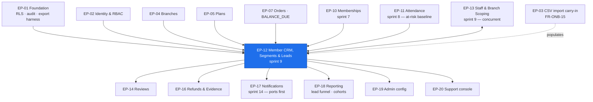

# EP-12 — Member CRM, Segments & Leads

> **Phase-0 delivery backlog.** Detailed expansion of `ENGINEERING_PLAN.md` §2 (epic row `EP-12`)
> and §3 (`F-12.1` … `F-12.11`). No application code exists yet.
>
> **This is the epic that turns a record-keeper into a management tool.** `B5.14`'s purpose
> statement is *"everything about a person in one place, and everything the gym should do about
> them"* — and the second half is the part with commercial value. `US-CRM-01` states the whole
> business case in one sentence: *"find people who have stopped coming before they stop paying."*
>
> **Two India constraints bind it.** **(1)** Bulk notification (`FR-CRM-07`) is the epic's only
> outbound channel, and every SMS template it uses needs **TRAI DLT pre-approval**; a bulk send to
> an at-risk segment is *marketing-adjacent* and must not be routed as transactional
> (`LAUNCH_MARKET_INDIA.md` §8). **(2)** The member export (`FR-CRM-08`) and the member record are
> the platform's largest concentration of personal data outside KYC, so **DPDP Act 2023** subject
> rights — export, correction, deletion — land here rather than in a privacy epic
> (`LAUNCH_MARKET_INDIA.md` §9).

---

## 1. Metadata

| Field | Value |
| :--- | :--- |
| **Epic id** | `EP-12` |
| **Name** | Member CRM, Segments & Leads |
| **Priority (MoSCoW)** | **M** — Must. `BAC-12` (self-service export without support) is a business acceptance criterion and lands here; `FR-CRM-01`, `-03`, `-04`, `-05`, `-08` are all `M` |
| **Complexity** | **M** (T-shirt, §2) · module rating **Moderate** for `crm/` (§13.1) — *"volume of surface, moderate depth"* |
| **Story points** | **34** (epic/feature view, §2) · `crm/` module view **34 pts / 17 engineer-days** (§13.1) |
| **Target sprint(s)** | **Sprint 9** — 2027-01-11 → 2027-01-22, shared with **`EP-13`** plus carry-in from `EP-03` and `EP-07`. `F-12.9` (merge, MoSCoW `C`) is descope item **D-04** and is **pre-agreed as taken at sprint 9** |
| **Owning PRD module** | `CRM` (`B5.14`) |
| **Owning code module** | `crm/` |
| **Surfaces** | `gym-dashboard` — **`SCR-DASH-007`** (member list), **`SCR-DASH-008`** (Member 360), **`SCR-DASH-017`** (leads board), `SCR-DASH-001` (action list) |
| **Primary APIs** | `API-TEN` — `GET|POST|PATCH /v1/tenant/members`, `/v1/tenant/members/:id`, `GET|POST /v1/tenant/members/:id/notes`, `GET|POST|PATCH /v1/tenant/leads`, `POST /v1/tenant/exports` (member export type), plus bulk-action and segment routes defined here |
| **Background jobs** | `crm.risk-flags` (nightly, `C5`) — recompute at-risk members |
| **Tier gating** | CRM and leads are a **Growth-tier and above** feature (`A6.2`); Starter tenants see the member list without segments, at-risk flags or the leads board |
| **Launch market** | **India** — DLT-approved templates for any SMS in a bulk send; DPDP subject rights on the member record; Indian digit grouping and `₹` in every money column of the member list and Member 360 |
| **Status** | `PLANNED` — Phase 0. Not started. One `OQ-` resolved, five new ones surfaced |
| **Epic owner** | Backend Lead — `crm/` |

---

## 2. Business Goal

**Retention is cheaper than acquisition, and the only retention signal a gym actually owns is
attendance.** `OBJ-05` commits the platform to reducing churn; `OBJ-06` commits it to giving the
owner decision-grade analytics rather than a filing cabinet. This epic is where those two meet:
`FR-CRM-06` flags a member whose visit frequency has fallen **below their own established
baseline** — not below a global average, because a member who trains twice a week and drops to once
is churning just as surely as one who trained six times and dropped to three. `AC-CRM-01.1` requires
the flag to show baseline, current frequency and last visit date together, because a flag without
its evidence is a number the owner does not trust. `AC-CRM-01.3` requires the flag to **clear
automatically on check-in**, because a stale at-risk list is worse than no list — it trains the
owner to ignore it. Together these feed `KPI-12` (≥55% renewal within 15 days) from the opposite
direction to `EP-10`'s reminder ladder: `EP-10` acts on the calendar, `EP-12` acts on behaviour.

**Second, this epic is where the gym's data is proven to belong to the gym.** Product principle 1 is
explicit: *"export is a right, not a retention lever"*, and `BAC-12` makes it a business acceptance
criterion — a tenant exports members, memberships, payments and attendance **without support
involvement**. `BR-DAT-05` names `reporting/` as the owner of the export mechanism, but the member
dataset, its field list and its tenant-ownership boundary are defined here. That boundary is also
the epic's largest isolation risk: exports are, by `TR-12`'s assessment, *"the highest-volume
cross-tenant leak risk in the product"*, and `E2E-11` names them explicitly as attack surface. A
member export that returns one row too many is not a bug; it is `RSK-08` materialised in a file the
tenant now holds.

**Third, `RSK-09` — poor gym-side adoption after signup, scored 16 — is fought on these three
screens.** A gym owner who signs up, imports 400 members and then finds the member list slow,
unsearchable or missing the one person they are looking for does not come back; `KPI-05` (≥60% of
tenants with three or more dashboard sessions a week) is measured almost entirely on `SCR-DASH-007`
and `SCR-DASH-008`. The Member 360 has **seven regions** by specification and must assemble in one
query plan, at `NFR-PERF-04`'s 800 ms p95, because a receptionist opens it while a member stands at
the counter. The leads board (`SCR-DASH-017`) closes the loop on the other side: an enquiry that
never becomes a sale is the most common thing a small gym loses, and a five-column pipeline with a
follow-up date and a one-click conversion into the sale flow is the cheapest possible fix.

---

## 3. Scope

### 3.1 In scope — explicit

| # | Item | Anchor |
| :-: | :--- | :--- |
| 1 | Member list with search by **name, phone, email and member code** | `FR-CRM-01`, `SCR-DASH-007` |
| 2 | **Nine filter dimensions**: status, plan, branch, expiry window, join date, attendance frequency, assigned trainer, at-risk flag, balance due | `FR-CRM-01` |
| 3 | Saved segments as list presets — "expiring in 7 days", "no visit in 21 days", "joined this month", "at risk", "balance due" — plus tenant-defined saved filters | `FR-CRM-02` |
| 4 | **Member 360**, all seven regions: identity header, memberships (current and historical) with actions, payments and invoices, attendance with frequency trend, internal notes, communications sent, trainer assignment | `FR-CRM-03`, `SCR-DASH-008` |
| 5 | Walk-in member creation with a **minimal required set** — name and phone — and everything else optional | `FR-CRM-04` |
| 6 | Internal notes: timestamped, attributed, **never visible to the member** on any surface or in any export the member can obtain | `FR-CRM-05` |
| 7 | **At-risk flag** from a per-member attendance baseline over a trailing 8 weeks, recomputed nightly by `crm.risk-flags`, **auto-clearing on check-in** | `FR-CRM-06`, `AC-CRM-01.1`, `AC-CRM-01.3` |
| 8 | Bulk actions on a filtered list — send notification, assign trainer, export — honouring **each member's** notification preferences | `FR-CRM-07` |
| 9 | **Suppression report** on every bulk send: how many sent, how many suppressed, and the reason for each suppression | `AC-CRM-01.2` |
| 10 | Member CSV export of **all fields the tenant owns**, with formula-injection neutralisation, delivered async above the size threshold | `FR-CRM-08`, `BR-DAT-05`, `BAC-12` |
| 11 | Duplicate member merge with explicit **field-level** resolution — MoSCoW `C`, **descope D-04, pre-agreed as taken** | `FR-CRM-09` |
| 12 | **Member code**: unique per tenant, human-readable, collision-safe under concurrency | `FR-CRM-10` |
| 13 | **Lead pipeline** — `NEW → CONTACTED → TRIAL → CONVERTED → LOST` — as a board or table, with source, assigned staff, follow-up date, and a conversion action that opens the sale flow pre-filled | `SCR-DASH-017` |
| 14 | Branch scoping of **every** member and lead list, filter and bulk action, applied server-side on `staff_branches` | `FR-STAF-03`, `FR-RBAC-02` |
| 15 | Non-active memberships **always visible** on the member record; no list silently filters to `ACTIVE` | `BR-MEM-12` |
| 16 | Dashboard-home **action list** driven by segments: expiring this week, at risk, balance due, unconverted leads past follow-up | `SCR-DASH-001`, `RSK-09` |
| 17 | Member-record display of `BALANCE_DUE` from a partially paid offline sale, with a collect-balance action | `BR-PAY-09`, `E2E-10` |
| 18 | DPDP subject-rights surfaces on the member record: correction of tenant-held fields, and the pseudonymisation outcome after a deletion request | `BR-DAT-03`, `BR-DAT-04`, `NFR-PRV-03` |

### 3.2 Out of scope — explicit, with destination

| Item | Why it is not here | Where it went |
| :--- | :--- | :--- |
| **CSV bulk member import** with dry run and idempotent re-run | It is `FR-ONB-15`, an onboarding feature; it lands in sprint 9 as a **carry-in** (`F-03.15`), not as an `EP-12` feature | **`EP-03`**, sprint 9 task 9.17 |
| Staff invitation, roles, branch assignment, seat limits, the staff activity log | `EP-12` **consumes** branch scoping; `EP-13` builds it | **`EP-13`**, same sprint |
| Trainer **sessions**, workout plans and scheduling | `OQ-15` default: assignment only, sessions deferred | **`EP-13`** (assignment), Phase 2 (sessions) |
| The **generic async export harness** and the export job | `EP-12` registers the member export type against it | **`EP-18`**, with `export.generate` from `EP-01` |
| Report catalogue, drill-down, scheduled report delivery | Reading and aggregation across entities is reporting's job | **`EP-18`** |
| **Sending** the bulk notification — channels, templates, quiet hours, rate limiting | `EP-12` builds the audience and the suppression report; `notifications/` dispatches | **`EP-17`** |
| Membership state, freeze, renewal, expiry | `EP-12` displays it; `EP-10` owns it | **`EP-10`** |
| Attendance records and the check-in that clears the at-risk flag | `EP-12` reads attendance; `EP-11` writes it | **`EP-11`** |
| Offline sale creation and balance collection | `EP-12` shows `BALANCE_DUE` on the record; `ordering/` collects | **`EP-07`**, sprint 9 task 9.18 |
| The **user account** — authentication, profile, notification preferences, self-service export | A *member* is a tenant-scoped record; a *user* is a platform identity | **`EP-02`** (identity), **`EP-20`** (support) |
| Marketing campaigns, email sequences, drip automation, lead scoring | Not in Phase 1 (`A4.2`); the platform is not a marketing automation tool | Phase 2 (`A11`) |
| Public lead capture from the marketplace (an "enquire" button on a gym page) | Not specified in `B5.7`; leads in Phase 1 are gym-entered or walk-in | Phase 2; see `OQ-12.d` |

---
## 4. Features

`F-12.1` … `F-12.11` are carried verbatim from `ENGINEERING_PLAN.md` §3. Rows marked *(new)* are
additions this backlog surfaces from `SCR-DASH-001`, `BR-DAT-03`/`BR-DAT-04` and `RiskAnalysis.md`
§3.3.20 / `TR-12`.

| Feature | Description | Satisfies | Pri | Pts | Sprint |
| :--- | :--- | :--- | :-: | :-: | :-: |
| **F-12.1** | Member list with search on four fields and nine filter dimensions | `FR-CRM-01`, `SCR-DASH-007` | M | 5 | 9 |
| **F-12.2** | Saved segments as list presets, platform-defined plus tenant-defined | `FR-CRM-02` | S | 3 | 9 |
| **F-12.3** | Member 360, seven regions, one query plan | `FR-CRM-03`, `SCR-DASH-008` | M | 5 | 9 |
| **F-12.4** | Walk-in member creation with a minimal required set | `FR-CRM-04` | M | 2 | 9 |
| **F-12.5** | Internal notes: timestamped, attributed, never member-visible | `FR-CRM-05` | M | 2 | 9 |
| **F-12.6** | Attendance-baseline at-risk flag with auto-clear on check-in | `FR-CRM-06`, `US-CRM-01` | S | 4 | 9 |
| **F-12.7** | Bulk actions honouring notification preferences, with a suppression report | `FR-CRM-07`, `AC-CRM-01.2` | S | 3 | 9 |
| **F-12.8** | Member CSV export of all tenant-owned fields | `FR-CRM-08`, `BR-DAT-05`, `BAC-12` | M | 3 | 9 |
| **F-12.9** | Duplicate member merge with field-level resolution — **descope D-04, taken** | `FR-CRM-09` | C | 4 | *(deferred)* |
| **F-12.10** | Human-readable member code, unique per tenant | `FR-CRM-10` | S | 2 | 9 |
| **F-12.11** | Lead pipeline board with source, assignee, follow-up and conversion | `SCR-DASH-017` | S | 4 | 9 |
| **F-12.12** *(new)* | **Branch scoping** of every member and lead list, filter, bulk action and export, filtered server-side on `staff_branches` | `FR-STAF-03`, `FR-RBAC-02`, `TR-12` | M | 3 | 9 |
| **F-12.13** *(new)* | **Dashboard-home action list** driven by segments — expiring, at risk, balance due, overdue lead follow-ups | `SCR-DASH-001`, `RSK-09`, `FR-NAV-04` | M | 3 | 9 |
| **F-12.14** *(new)* | **`BALANCE_DUE` on the member record** with a collect-balance action | `BR-PAY-09`, `E2E-10` | M | 2 | 9 |
| **F-12.15** *(new)* | **DPDP subject-rights surfaces**: correction of tenant-held fields; the pseudonymised state after a deletion request rendered honestly rather than as a broken record | `BR-DAT-03`, `BR-DAT-04`, `NFR-PRV-03` | M | 3 | 9 |
| **F-12.16** *(new)* | **Export leakage controls**: tenant-scoped row-count assertion, formula-injection neutralisation, audited actor and row count | `TR-12`, `BR-DAT-05-N1`, `SEC-A03-006` | M | 2 | 9 |
| | | | | **50** | |

> **Points reconciliation.** §2 carries **34**; the enumerated list totals **50**, of which **4**
> (`F-12.9`) leave the sprint under **D-04**. §13.1's `crm/` module view is **34 pts / 17 ed**,
> backend only. §10 reconciles all three against the sprint-9 figures.

---

## 5. User Stories

One story exists in the PRD (`US-CRM-01`). Eight more are written here because `B5.14` lists ten
functional requirements and `SCR-DASH-017` a whole screen with no story behind either.

### US-CRM-01 — *As Rohan, I want to find people who have stopped coming before they stop paying.* **(PRD)**

- **AC-CRM-01.1** *Given* a member's average weekly visits over the last 8 weeks dropped by more than the configured threshold, *when* I open the at-risk segment, *then* they appear **with their baseline, current frequency and last visit date**.
- **AC-CRM-01.2** *Given* I select the at-risk segment, *when* I send a bulk notification, *then* it respects **each member's** notification preferences and reports how many were sent and how many suppressed, **with reasons**.
- **AC-CRM-01.3** *Given* a flagged member checks in, *when* the check-in records, *then* the flag **clears automatically** — no nightly wait, no manual dismissal.
- **AC-CRM-01.4** *(new)* *Given* a member who has held a membership for under 8 weeks, *when* the nightly job runs, *then* they are **not** flagged — there is no baseline yet, and flagging on insufficient data is how an owner learns to distrust the list.
- **AC-CRM-01.5** *(new)* *Given* the baseline computation, *when* it runs, *then* it is **per-member**, not a tenant or platform average; two members with different habits produce different thresholds.

### US-CRM-02 — *As Sameer, I want to add a walk-in in ten seconds while they stand at the counter.* **(new — implied by `FR-CRM-04`, `FR-CRM-10`)**

- **AC-CRM-02.1** *Given* the member form, *when* it renders, *then* **only name and phone** are required; every other field is optional and clearly marked so.
- **AC-CRM-02.2** *Given* I submit, *when* the record is created, *then* a **member code** is generated, unique within the tenant, human-readable and speakable over a phone.
- **AC-CRM-02.3** *Given* two receptionists create members simultaneously, *when* both commit, *then* the two codes differ — uniqueness is a database constraint, not a read-then-write.
- **AC-CRM-02.4** *Given* the phone number already exists on another member in this tenant, *when* I submit, *then* I am warned and shown the existing member **before** a duplicate is created — a warning, not a hard block, because two family members can legitimately share a number.
- **AC-CRM-02.5** *Given* I created the member, *when* I open the sale flow, *then* it is pre-filled for them.

### US-CRM-03 — *As Sameer, I want everything about the person in front of me on one screen.* **(new — implied by `FR-CRM-03`, `SCR-DASH-008`)**

- **AC-CRM-03.1** *Given* a member, *when* I open Member 360, *then* all **seven** regions render: identity header, memberships current and historical, payments and invoices, attendance with a frequency trend, notes, communications sent, trainer assignment.
- **AC-CRM-03.2** *Given* the screen, *when* it loads, *then* p95 is **≤ 800 ms** and it assembles in one query plan, not seven sequential round trips.
- **AC-CRM-03.3** *Given* the memberships region, *when* it renders, *then* **historical** memberships are present with their terms, not only the current one (`BR-MEM-12`).
- **AC-CRM-03.4** *Given* the actions, *when* I use them, *then* edit, renew, collect balance, freeze, add note, message, assign trainer and request refund are all reachable from this screen.
- **AC-CRM-03.5** *Given* an outstanding balance from a partially paid offline sale, *when* the record renders, *then* `BALANCE_DUE` is shown with the amount in `₹` with Indian digit grouping, and a collect action.

### US-CRM-04 — *As a manager, I want notes on a member that the member never sees.* **(new — implied by `FR-CRM-05`)**

- **AC-CRM-04.1** *Given* I add a note, *when* it saves, *then* it is timestamped and attributed to me.
- **AC-CRM-04.2** *Given* any member-facing surface — the account area, an emailed document, the member's own DPDP export — *when* it renders, *then* internal notes are **absent**; a contract test asserts the field is not present in any member-scoped response.
- **AC-CRM-04.3** *Given* a note, *when* it is written, *then* it is an audited entity write with actor and timestamp (`BR-DAT-01`).
- **AC-CRM-04.4** *Given* a note containing personal or health information, *when* it is stored, *then* it is treated as a sensitive category — never logged, never in an analytics property (`BR-DAT-06`, `NFR-PRV-07`).

### US-CRM-05 — *As Rohan, I want to message a whole segment and know exactly who did not get it.* **(new — implied by `FR-CRM-07`, `AC-CRM-01.2`)**

- **AC-CRM-05.1** *Given* a filtered list of 180 members, *when* I send a bulk notification, *then* each recipient's per-channel, per-category preferences are evaluated **at send time**, not at list-build time.
- **AC-CRM-05.2** *Given* the send completes, *when* I view the result, *then* I see sent count, suppressed count and a **per-reason breakdown**: opted out of this category, no channel on file, quiet hours deferred, rate limit reached, invalid destination.
- **AC-CRM-05.3** *Given* an SMS in the send, *when* the template is not DLT-approved, *then* the send is **blocked for that channel** with an explicit reason, and the member is reached on another enabled channel if one exists.
- **AC-CRM-05.4** *Given* the same bulk action submitted twice with the same `Idempotency-Key`, *when* both arrive, *then* each member is messaged once.
- **AC-CRM-05.5** *Given* I am scoped to branch 1, *when* I bulk-send, *then* the audience contains branch-1 members only, filtered server-side.

### US-CRM-06 — *As Rohan, I want to take my data with me whenever I like.* **(new — implied by `FR-CRM-08`, `BR-DAT-05`, `BAC-12`)**

- **AC-CRM-06.1** *Given* the member list, *when* I export, *then* I receive **all fields the tenant owns**, in CSV, without contacting support and without an approval step.
- **AC-CRM-06.2** *Given* an export above the size threshold, *when* I request it, *then* it is generated asynchronously and delivered by notification with a time-limited signed link.
- **AC-CRM-06.3** *Given* a cell beginning `=`, `+`, `-`, `@`, tab or CR, *when* the CSV is written, *then* it is neutralised so a spreadsheet does not execute it.
- **AC-CRM-06.4** *Given* a tenant-A export, *when* its rows are counted, *then* **zero** rows belong to tenant B, asserted against the seeded multi-tenant dataset.
- **AC-CRM-06.5** *Given* any export, *when* it completes, *then* an audit row records the actor, the tenant, the entity and the **row count**.

### US-CRM-07 — *As Rohan, I want an enquiry to stop falling through the cracks.* **(new — implied by `SCR-DASH-017`)**

- **AC-CRM-07.1** *Given* an enquiry, *when* I record it, *then* it holds source, assigned staff and a follow-up date, and appears in `NEW`.
- **AC-CRM-07.2** *Given* the board, *when* I drag a lead, *then* it moves through `NEW → CONTACTED → TRIAL → CONVERTED → LOST`, and every transition is attributed and timestamped.
- **AC-CRM-07.3** *Given* a lead, *when* I click convert, *then* the sale flow opens **pre-filled** from the lead, and on completion the lead becomes `CONVERTED` and is linked to the resulting member.
- **AC-CRM-07.4** *Given* a follow-up date in the past and a lead not yet `CONVERTED` or `LOST`, *when* I open dashboard home, *then* it appears in the action list.
- **AC-CRM-07.5** *Given* a lead marked `LOST`, *when* I record it, *then* a reason is required so the lead funnel report has something to say.
- **AC-CRM-07.6** *Given* branch-scoped staff, *when* they open the board, *then* they see leads for their branches only.

### US-CRM-08 — *As Rohan, I want to see the one screen that tells me what to do today.* **(new — implied by `SCR-DASH-001`, `RSK-09`, `FR-NAV-04`)**

- **AC-CRM-08.1** *Given* dashboard home, *when* it renders, *then* an action list shows: expiring this week, at-risk members, balances due, and leads past follow-up — each with a count and a direct link into the filtered list.
- **AC-CRM-08.2** *Given* an empty category, *when* it renders, *then* it says so plainly rather than showing a zero that reads like a loading state.
- **AC-CRM-08.3** *Given* a Starter-tier tenant, *when* dashboard home renders, *then* at-risk and leads entries are absent with an upgrade path, and expiring and balances still work (`A6.2`).
- **AC-CRM-08.4** *Given* the counts, *when* they render, *then* they are branch-scoped for branch-scoped staff.

### US-CRM-09 — *As a member who asked to be deleted, I want the gym's record to reflect that honestly.* **(new — implied by `BR-DAT-04`, `NFR-PRV-03`)**

- **AC-CRM-09.1** *Given* a deletion request completed by `data.retention-sweep`, *when* the gym opens the member record, *then* personal identifiers are replaced by the stable pseudonym and the record states plainly that the member exercised a deletion right.
- **AC-CRM-09.2** *Given* the same record, *when* financial and attendance history is examined, *then* it is **intact** and still sums correctly — deletion pseudonymises, it does not destroy books of account (`CON-04`).
- **AC-CRM-09.3** *Given* a correction request on a tenant-held field, *when* the gym applies it, *then* the change is audited with before and after.
- **AC-CRM-09.4** *Given* a pseudonymised member, *when* a bulk send is built, *then* they are excluded and reported in the suppression breakdown as having no valid destination.

---
## 6. Acceptance Criteria for the Epic

**⛳** = demonstrated live in the sprint-9 demo · **🚦** = launch-blocking through a `BAC-`.

| # | Criterion | Evidence |
| :-- | :--- | :--- |
| **AC-EP12-01** | Member search matches on **name, phone, email and member code**, including partial phone and case-insensitive name, with trigram support for misspellings | `FR-CRM-01` |
| **AC-EP12-02** | All **nine** filter dimensions work independently and in combination, and the result count is consistent with the rows returned | `FR-CRM-01` |
| **AC-EP12-03** 🚦 | The member list p95 is **≤ 800 ms** for 50 rows against a tenant with 5,000 members, with virtualised scrolling | `NFR-PERF-04`, `SCR-DASH-007` |
| **AC-EP12-04** | Saved segments exist for at least: expiring in 7 days, no visit in 21 days, joined this month, at risk, balance due; a tenant can save its own filter as a segment | `FR-CRM-02` |
| **AC-EP12-05** ⛳ | Member 360 renders **all seven** regions, in one query plan, p95 ≤ 800 ms | `FR-CRM-03`, `SCR-DASH-008` |
| **AC-EP12-06** | Member 360 shows **historical** memberships with their terms alongside the current one | `BR-MEM-12`, `AC-CRM-03.3` |
| **AC-EP12-07** | Every Member 360 action is present and functional: edit, renew, collect balance, freeze, add note, message, assign trainer, request refund | `SCR-DASH-008` Actions |
| **AC-EP12-08** ⛳ | A walk-in member is created with **only name and phone**, and a member code is issued | `FR-CRM-04`, `FR-CRM-10` |
| **AC-EP12-09** 🚦 | Member codes are unique per tenant under concurrency — 100 simultaneous creations produce 100 distinct codes, enforced by a unique constraint | `FR-CRM-10`, `AC-CRM-02.3` |
| **AC-EP12-10** | Creating a member whose phone already exists in the tenant warns and shows the existing record **before** committing a duplicate | `AC-CRM-02.4` |
| **AC-EP12-11** 🚦 | Internal notes are **absent** from every member-facing response, asserted by a contract test over the member-scoped API surface and the member's own DPDP export | `FR-CRM-05`, `AC-CRM-04.2` |
| **AC-EP12-12** | Notes are timestamped, attributed and audited with actor and timestamp | `BR-DAT-01` |
| **AC-EP12-13** ⛳ | A member whose trailing-8-week visit frequency falls below **their own** baseline by the configured threshold appears in the at-risk segment **with baseline, current frequency and last visit date** | `AC-CRM-01.1` |
| **AC-EP12-14** | The baseline is per-member; two members with different habits produce different thresholds; a member with fewer than 8 weeks of history is **not** flagged | `AC-CRM-01.4`, `AC-CRM-01.5` |
| **AC-EP12-15** ⛳ | A flagged member who checks in has the flag cleared **immediately**, without waiting for the nightly job | `AC-CRM-01.3` |
| **AC-EP12-16** | `crm.risk-flags` is idempotent: two runs on the same night produce the same flag set and no duplicate rows | `C5` |
| **AC-EP12-17** ⛳🚦 | A bulk send honours **each** member's per-channel, per-category preferences **at send time** and produces an accurate suppression report with a per-reason breakdown | `AC-CRM-01.2`, `E9.9` |
| **AC-EP12-18** | An SMS whose template lacks DLT approval is blocked for that channel with an explicit reason; other enabled channels still deliver | `LAUNCH_MARKET_INDIA.md` §8 |
| **AC-EP12-19** | A bulk action replayed with the same `Idempotency-Key` messages each member once | `BR-PAY-03` pattern |
| **AC-EP12-20** ⛳🚦 | A tenant exports members, memberships, payments and attendance **without support involvement** | `BAC-12`, `BR-DAT-05-P1`, `E9.10` |
| **AC-EP12-21** 🚦 | A tenant-A export contains **zero** tenant-B rows; the exported row count is asserted against a tenant-scoped count | `BR-DAT-05-N1`, `TR-12`, `E2E-11` |
| **AC-EP12-22** | CSV cells beginning `=`, `+`, `-`, `@`, tab or CR are neutralised | `SEC-A03-006` |
| **AC-EP12-23** | Every export writes an audit row with actor, tenant, entity and row count, and emits `export_requested` | `BR-DAT-05`, `C6` |
| **AC-EP12-24** ⛳🚦 | A receptionist scoped to branch 1 sees **only** branch-1 members and leads in every list, filter, bulk audience, segment count and export | `FR-STAF-03`, `E9.1` |
| **AC-EP12-25** 🚦 | Sending another branch's id in a request body **does not widen scope** — the server filters on `staff_branches` and ignores the client value | `FR-RBAC-02`, `E9.3` |
| **AC-EP12-26** | A lead moves through all five pipeline states; every transition is attributed and timestamped; `LOST` requires a reason | `SCR-DASH-017` |
| **AC-EP12-27** ⛳ | Converting a lead opens the sale flow pre-filled, and on completion the lead is `CONVERTED` and linked to the member created | `SCR-DASH-017` |
| **AC-EP12-28** | A lead whose follow-up date has passed and which is neither `CONVERTED` nor `LOST` appears in the dashboard-home action list | `AC-CRM-07.4` |
| **AC-EP12-29** | The dashboard-home action list shows expiring, at risk, balance due and overdue leads with counts and direct links into the filtered list | `SCR-DASH-001`, `RSK-09` |
| **AC-EP12-30** | Every empty action-list category states its emptiness in words, never a bare zero | `NFR-USE-05` |
| **AC-EP12-31** | A Starter-tier tenant sees no at-risk segment and no leads board, with a stated upgrade path; expiring and balances still function | `A6.2` |
| **AC-EP12-32** | `BALANCE_DUE` appears on the member record with the amount in `₹` and Indian digit grouping, and a collect-balance action that completes into one consolidated invoice | `BR-PAY-09`, `E2E-10`, `E9.4` |
| **AC-EP12-33** | No member or membership list silently filters to `ACTIVE`; the unfiltered count equals the sum of per-status counts | `BR-MEM-12-N1` |
| **AC-EP12-34** | A pseudonymised member renders honestly on the record; financial and attendance history remains intact and still sums | `BR-DAT-04-P1`, `CON-04` |
| **AC-EP12-35** | A pseudonymised member is excluded from a bulk audience and reported in the suppression breakdown | `AC-CRM-09.4` |
| **AC-EP12-36** | A correction to a tenant-held member field is audited with before and after | `BR-DAT-03`, `BR-DAT-01` |
| **AC-EP12-37** | Every new tenant-scoped `crm/` endpoint has an isolation spec; the build fails without one | `BAC-10`, `E2E-11` |
| **AC-EP12-38** | Member-list, Member 360, leads board and every dialogue are axe-core clean and fully keyboard-operable | `NFR-USE-01`, `NFR-USE-02` |
| **AC-EP12-39** | No personal data reaches logs, traces or analytics from any `crm/` path — asserted by the PII corpus run | `BR-DAT-06-P1` |
| **AC-EP12-40** | `E2E-10` passes; the sprint-9 exit checklist items `E9.1`, `E9.3`, `E9.9` and `E9.10` are green | `E2E-10`, `SprintPlanning.md` S9 |

---

## 7. Business Rules Enforced

`EP-12` **owns no `BR-` family of its own** — `B5.14`'s "Enforces" line names `BR-TEN-01`,
`BR-DAT-01` and `BR-DAT-05`, all of which are owned elsewhere. That is precisely why this epic is
dangerous: it is the largest read surface over other modules' data, and `TR-12` names reporting and
exports as the code paths where `BR-TEN-01` is most likely to be violated. Enforcement detail lives
in `BusinessRules.md`; the table below names where each rule is exercised here.

| Rule | Ownership | Enforcement point in this epic | Tasks |
| :--- | :--- | :--- | :--- |
| `BR-TEN-01` | **Inherited** — owned by `tenancy/` | Every `crm/` query runs through the tenant-scoped repository; RLS on `members`, `member_notes`, `leads`, `member_segments`; the **export** path is covered explicitly by the isolation suite (`IS5`) | T-12.01, T-12.24, T-12.30 |
| `BR-DAT-05` | **Co-owned** with `reporting/` | The member export is self-service in `dash` with **no approval step and no support gate**; row-count parity asserted against a tenant-scoped count | T-12.18, T-12.19 |
| `BR-DAT-01` | **Contributor** — owned by `audit/` | Member create/update, note creation, lead transitions, trainer assignment, bulk sends and exports all audited with before/after | T-12.23 |
| `BR-DAT-03` | **Co-owned** with `reporting/` | The member's own DPDP export must **exclude** internal notes; the tenant's export includes them because the tenant owns them | T-12.11, T-12.19 |
| `BR-DAT-04` | **Co-owned** with `iam/` | The pseudonymised member state is rendered honestly rather than as a broken record; financial history remains joinable via the stable pseudonym | T-12.22 |
| `BR-DAT-06` | **Contributor** — owned by `common/` | No member name, phone, email or note content in logs, traces or analytics properties; the PII corpus run covers every `crm/` path | T-12.31 |
| `BR-MEM-12` | **Co-owned** with `memberships/` | Member list and Member 360 default to **all** statuses; no hidden `WHERE status = 'ACTIVE'` | T-12.06, T-12.33 |
| `BR-PAY-09` | **Consumer** — owned by `ordering/` + `billing/` | `BALANCE_DUE` surfaced on the member record with the collect action | T-12.21 |
| `BR-TEN-04` | **Inherited** | Tenant closure does not destroy member records; statutory retention overrides soft deletion | T-12.22 |
| `FR-RBAC-02` / `FR-STAF-03` | **Consumer** — owned by `staff/` (`EP-13`) | Branch scoping applied **server-side** to every list, filter, segment count, bulk audience and export; a client-sent branch id never widens scope | T-12.24 |
| `BR-NOTF` preference rules | **Consumer** — owned by `notifications/` | Preferences evaluated **at send time**, not at list-build time; suppression reasons enumerated | T-12.16, T-12.17 |

---

## 8. Dependencies

### 8.1 Upstream — must exist first

| Epic | What this epic needs from it | Blocking? |
| :--- | :--- | :-: |
| **`EP-01`** Foundation | Tenant-scoped repository, RLS, audit interceptor, the export job harness, `Money` formatting with Indian digit grouping, idempotency | **Yes** |
| **`EP-02`** Identity & RBAC | `tenant.member:*`, `tenant.lead:*`, `tenant.member.note:*` permissions; the actor identity on notes and lead transitions | **Yes** |
| **`EP-04`** Gym & Branch | Branch list for the branch filter and for branch scoping | **Yes** |
| **`EP-05`** Plan Catalogue | Plan filter dimension; plan names on Member 360 | **Yes** |
| **`EP-07`** Checkout & Orders | Payments/invoices region on Member 360; `BALANCE_DUE`; the pre-filled sale flow that lead conversion opens | **Yes** |
| **`EP-10`** Membership Lifecycle | Memberships region; status, plan and expiry-window filters; the "expiring in 7 days" segment | **Yes** |
| **`EP-11`** QR Check-in | Attendance region; the **at-risk baseline** is computed from attendance and the flag clears on check-in. Sprint 8 must land before sprint 9 | **Yes** |
| **`EP-13`** Staff & Roles | Trainer assignment; `staff_branches` for branch scoping. **Same sprint** — the two epics are co-delivered | **Yes**, concurrent |
| **`EP-17`** Notifications | The dispatch path and the preference model the bulk send honours. `EP-17` lands in sprint 14, so sprint 9 builds against the **ports** and the preference model, with the suppression report exercised against a stub | Partial — see §11 |
| **`EP-03`** Onboarding | CSV bulk member import (`FR-ONB-15`) arrives in the same sprint as a carry-in and populates the lists this epic renders | Adjacent |

### 8.2 Downstream — what this unblocks

| Epic | What it takes from here |
| :--- | :--- |
| **`EP-14`** Reviews | The member record surfaces a member's reviews; moderation needs the member context |
| **`EP-16`** Refunds | "Request refund" launches from Member 360; the dispute evidence pack draws the communications log |
| **`EP-17`** Notifications | The bulk audience builder and the suppression-report contract are the notification module's largest consumer |
| **`EP-18`** Reporting | The **lead funnel** report (enquiries, contacted, converted, conversion rate) and every member-cohort report read this epic's data |
| **`EP-19`** Admin | At-risk threshold, baseline window and member-code format as platform configuration |
| **`EP-20`** Support | An agent resolving a member issue opens Member 360 as their context surface (`OBJ-10`) |

### 8.3 External dependencies and open questions

| Item | Nature | Effect if unresolved |
| :--- | :--- | :--- |
| `OQ-15` — trainer module scope | **Resolved** — assignment only, sessions deferred | Trainer assignment is a field and a filter, not a scheduling subsystem |
| A-19 notification vendor / `OQ-01` | **Partially resolved** — India narrows candidates to MSG91 / Gupshup / Kaleyra / Airtel IQ | `F-12.7`'s suppression report is built against the port and a stub; real delivery arrives in sprint 14 (`TR-13`) |
| TRAI DLT template approval for bulk-send templates | External regulator; registration starts **sprint 8** at the latest | Bulk SMS is blocked per-template with an explicit reason; email and in-app are unaffected |
| DPDP applicability thresholds and Significant Data Fiduciary status | **Requires legal counsel** (`LAUNCH_MARKET_INDIA.md` §13 item 7) | The member record is designed for subject rights regardless; a threshold answer changes process, not schema |

### 8.4 Dependency graph

---
## 9. Technical Tasks

Estimates are **engineer-days**, including implementation, test and review. `SP-9.n` names the
corresponding row in `SprintPlanning.md` sprint 9.

| Id | Description | Layer | Est. | Depends on | Serves |
| :--- | :--- | :--- | :-: | :--- | :--- |
| **T-12.01** | Migration: `members`, `member_notes`, `member_segments`, `leads`, `lead_events`, `member_risk_baselines`. `UNIQUE (tenant_id, member_code)`; `UNIQUE (tenant_id, phone)` **not** applied (family sharing is legitimate) with a warning path instead; RLS on all six | DB | 1.5 | EP-01 | `FR-CRM-01/04/05/10`, `BR-TEN-01` |
| **T-12.02** | Member-code generator: human-readable, speakable, collision-safe under concurrency via a unique constraint plus retry, format configurable per tenant | API/domain | 1.0 | T-12.01 | `FR-CRM-10`, `AC-CRM-02.3` · SP-9.3 |
| **T-12.03** | Member search: trigram index on name, normalised-phone index, exact member-code lookup, email index; one query serving all four | DB/API | 1.0 | T-12.01 | `FR-CRM-01` · SP-9.1 |
| **T-12.04** | Nine filter dimensions as a composable predicate set — status, plan, branch, expiry window, join date, attendance frequency, trainer, at-risk, balance due — with facet counts consistent with the result set | API | 1.5 | T-12.03 | `FR-CRM-01` · SP-9.1 |
| **T-12.05** | Saved segments: five platform presets plus tenant-defined saved filters; a segment is a **stored predicate**, evaluated live, never a materialised member list that can go stale | API | 1.0 | T-12.04 | `FR-CRM-02` · SP-9.1 |
| **T-12.06** | Member 360 aggregation: seven regions in **one query plan**, p95 ≤ 800 ms, all membership statuses included | API | 2.5 | T-12.01, EP-10, EP-11 | `FR-CRM-03`, `BR-MEM-12` · SP-9.2 |
| **T-12.07** | Walk-in member creation: name and phone required, everything else optional; duplicate-phone warning returning the existing record; pre-fill handoff to the sale flow | API | 1.0 | T-12.02 | `FR-CRM-04` · SP-9.3 |
| **T-12.08** | Internal notes: create, list, timestamped, attributed; a contract test asserting the field is **absent** from every member-scoped response and from the member's DPDP export | API | 1.0 | T-12.01 | `FR-CRM-05` · SP-9.4 |
| **T-12.09** | `member_risk_baselines`: trailing-8-week per-member visit frequency, stored with its computation window so the flag can show its evidence | DB/API | 1.0 | EP-11 | `FR-CRM-06`, `AC-CRM-01.1` |
| **T-12.10** | `crm.risk-flags` nightly job: recompute baselines, apply the configurable drop threshold, skip members with under 8 weeks of history, idempotent per night, distributed lock | worker | 1.5 | T-12.09 | `FR-CRM-06`, `C5` · SP-9.5 |
| **T-12.11** | At-risk **auto-clear on check-in**: a `CheckInRecorded` consumer clearing the flag immediately, not on the next nightly run | API | 0.5 | T-12.10, EP-11 | `AC-CRM-01.3` · SP-9.5 |
| **T-12.12** | At-risk evidence payload: baseline, current frequency, last visit date, and the threshold applied — so the owner can see why | API | 0.5 | T-12.09 | `AC-CRM-01.1` |
| **T-12.13** | Bulk audience builder over a filtered list or a saved segment, branch-scoped, capped and paginated for large tenants | API | 1.0 | T-12.05 | `FR-CRM-07` · SP-9.6 |
| **T-12.14** | Bulk **assign trainer** and bulk **export** actions over the same audience builder | API | 0.5 | T-12.13 | `FR-CRM-07` |
| **T-12.15** | Bulk send against the `notifications/` **port** with a stub adapter; preferences evaluated **at send time**, per recipient, per channel, per category | API | 1.0 | T-12.13 | `AC-CRM-01.2`, `TR-13` · SP-9.6 |
| **T-12.16** | **Suppression report**: per-reason breakdown — opted out, no channel on file, quiet hours deferred, rate limited, invalid destination, pseudonymised, DLT template unapproved | API | 1.0 | T-12.15 | `AC-CRM-01.2` · SP-9.6 |
| **T-12.17** | Bulk-action idempotency on `Idempotency-Key` so a retried send messages each member once | API | 0.5 | T-12.15 | `BR-PAY-03` pattern |
| **T-12.18** | Member export type registered against the async export harness: the complete tenant-owned field list, CSV writer, size threshold, signed-link delivery | API | 1.5 | EP-01 export | `FR-CRM-08`, `BR-DAT-05` · SP-9.7 |
| **T-12.19** | **Export leakage controls**: tenant-scoped row-count assertion in the job itself, formula-injection neutralisation, audit row with actor/tenant/entity/row count, `export_requested` event | API | 1.0 | T-12.18 | `TR-12`, `SEC-A03-006` |
| **T-12.20** | Lead model and pipeline: five states, source, assignee, follow-up date, `lead_events` transition journal, `LOST` reason required, conversion linking to the created member | API | 2.0 | T-12.01 | `SCR-DASH-017` · SP-9.9 |
| **T-12.21** | `BALANCE_DUE` projection on the member record with the collect-balance handoff | API | 0.5 | EP-07 | `BR-PAY-09`, `E2E-10` |
| **T-12.22** | Pseudonymised-member rendering and the correction path for tenant-held fields; financial history remains joinable through the stable pseudonym | API | 1.0 | EP-02 | `BR-DAT-03`, `BR-DAT-04` |
| **T-12.23** | Audit wiring: member create/update, note create, lead transition, trainer assignment, bulk send, export | API | 0.5 | EP-01 audit | `BR-DAT-01` |
| **T-12.24** | **Branch scoping** applied server-side to every list, filter, facet count, segment evaluation, bulk audience and export; a client-sent branch id is **ignored**, not trusted | API | 1.5 | EP-13 | `FR-STAF-03`, `FR-RBAC-02` · SP-9.11 |
| **T-12.25** | Duplicate member merge with field-level resolution, surviving-record selection, and reference re-pointing for memberships, attendance, orders and notes — **descope D-04, taken at sprint 9** | API | 2.0 | T-12.01 | `FR-CRM-09` · SP-9.8 |
| **T-12.26** | Tier gating: at-risk segment and leads board are Growth-and-above; Starter sees an upgrade path, not a broken screen | API | 0.5 | EP-19 config | `A6.2` |
| **T-12.27** | `SCR-DASH-007` member list: dense virtualised table, 50 rows per page, nine filters, saved segments, bulk actions, export, `₹` with Indian digit grouping | dash | 4.0 | T-12.04 | `SCR-DASH-007` · SP-9.20 |
| **T-12.28** | `SCR-DASH-008` Member 360: all seven regions, eight actions, empty and permission-denied states for each region | dash | 5.0 | T-12.06 | `SCR-DASH-008` · SP-9.21 |
| **T-12.29** | `SCR-DASH-017` leads board: five-column drag board with a table alternative, source, assignee, follow-up date, `LOST` reason dialogue, one-click conversion | dash | 3.0 | T-12.20 | `SCR-DASH-017` · SP-9.23 |
| **T-12.30** | Dashboard-home action list: expiring, at risk, balance due, overdue lead follow-ups — counts, direct links into the filtered list, worded empty states, tier-aware | dash | 1.5 | T-12.05 | `SCR-DASH-001`, `RSK-09` |
| **T-12.31** | Bulk-send dialogue with audience preview, per-channel selection and the **suppression report** rendered after sending | dash | 1.5 | T-12.16 | `AC-CRM-01.2` |
| **T-12.32** | Walk-in member dialogue and the duplicate-phone warning surface | dash | 1.0 | T-12.07 | `FR-CRM-04` |
| **T-12.33** | **Branch-scoping negative suite** over every `crm/` endpoint: another branch's id in the body, in the query, and in a saved segment; `curl`-demonstrated, never click-demonstrated | test | 3.0 | T-12.24 | `E9.3`, `FR-RBAC-02` · SP-9.26 |
| **T-12.34** | **Export isolation suite**: tenant-A export against the seeded multi-tenant dataset, row-count parity, zero foreign rows, formula-injection cases | test | 1.5 | T-12.19 | `BR-DAT-05-N1`, `TR-12`, `E2E-11` · SP-9.28 |
| **T-12.35** | At-risk correctness suite: per-member baselines, the under-8-weeks exclusion, threshold boundary, auto-clear on check-in, idempotent re-run | test | 2.0 | T-12.11 | `AC-CRM-01.1`, `AC-CRM-01.3` |
| **T-12.36** | Bulk-send suite: preference matrix across channels and categories, every suppression reason reproduced, idempotent replay, DLT-unapproved template path | test | 2.0 | T-12.16 | `AC-CRM-01.2`, `E9.9` |
| **T-12.37** | Member-code concurrency test — 100 simultaneous creations, 100 distinct codes; notes-absence contract test across the member-facing surface | test | 1.0 | T-12.02, T-12.08 | `AC-EP12-09`, `AC-EP12-11` |
| **T-12.38** | Accessibility and performance pass: axe-core on the three screens, keyboard operability, `NFR-PERF-04` p95 on a 5,000-member tenant | test | 1.5 | T-12.29 | `NFR-USE-01/02`, `NFR-PERF-04` |
| **T-12.39** | Worker-tier capacity for `crm.risk-flags` and export jobs so they cannot starve request handling | infra | 1.0 | T-12.10 | `NFR-SCAL-05` · SP-9.29 |
| **T-12.40** | Observability: `gym.crm.risk_flags.count`, `gym.crm.bulk_send.suppressed{reason}`, `gym.export.rows`, member-list p95, Member-360 p95 | infra | 0.5 | T-12.27 | `NFR-MNT-06`, `TR-12` |
| **T-12.41** | Feature flag `rel.crm.at-risk-flagging` registered with its off-behaviour: nightly recompute skipped, at-risk column and segment hidden, action list falls back to "no visit in 21 days" | docs | 0.5 | — | `FEATURE_FLAGS.md` |
| **T-12.42** | Module `README.md`, `RUNBOOK.md` (baseline recompute failed; export produced an unexpected row count; bulk send partially suppressed), `/docs/features/member-crm.md`, `/docs/apis/`, `/docs/database/`, `/docs/ui/` | docs | 1.5 | all | `NFR-MNT-09`, DoD §23.2 #22–#28 |

**Task count: 42.** Backend/domain 26, frontend 6, test 6, infra 2, docs 2.

---

## 10. Estimated Time

### 10.1 Roll-up by role

| Role | Engineer-days | Tasks |
| :--- | :-: | :--- |
| **BE** (API, domain, DB, worker) | **26.0** | T-12.01 … T-12.26 |
| **FE-dash** (`gym-dashboard`) | **16.0** | T-12.27 … T-12.32 |
| **FE-web** | **0.0** | None — `EP-12` has no customer-web surface |
| **QA** | **11.0** | T-12.33 … T-12.38 |
| **DevOps** | **1.5** | T-12.39, T-12.40 |
| **Docs** | **2.0** | T-12.41, T-12.42 |
| **Design** | **3.0** | Member list density, Member 360 seven-region layout, leads board, suppression report |
| **Total** | **58.5** | |

### 10.2 Reconciliation with the plan's three views

| View | Figure | Why it differs |
| :--- | :-: | :--- |
| `ENGINEERING_PLAN.md` §2 epic points | **34 pts** | Feature view; excludes branch scoping, export leakage controls and the dashboard action list |
| §13.1 `crm/` module | **34 pts / 17 ed** | Backend only; excludes three dashboard screens and all QA |
| `SprintPlanning.md` sprint 9, **EP-12 share** | Tasks 9.1–9.9, 9.20, 9.21, 9.23, 9.24 (partly), 9.26–9.28 (shared) ≈ BE **16.5** · FE **12.0** · QA **7.0** ≈ **35.5 ed** | Sprint 9 also carries `EP-13`, `EP-03`'s CSV import and `EP-07` carry-in; the QA suites at 9.26–9.28 are **shared** with `EP-13` |
| **This epic, fully enumerated** | **58.5 ed** | Includes the five *(new)* features, the full negative suites, documentation and the share of QA attributable here |

**Sprint 9 is 129% loaded on backend before descope.** The recorded mitigation takes **D-03**
(roster, `EP-13`) and **D-04** (merge, **this epic's T-12.25**, 2.0 ed) and moves task 9.19 to sprint
10, landing backend at 104%. **`F-12.9` is therefore deferred, not delivered**, and D-10.14 below
requires that to be recorded rather than quietly dropped. Removing T-12.25 brings this epic's
enumerated figure to **56.5 ed**; the residual gap against the sprint share is QA and documentation
attributed jointly with `EP-13`.

### 10.3 Confidence range

| Scenario | Engineer-days | Probability | Drivers |
| :--- | :-: | :-: | :--- |
| Optimistic (P10) | 45 | 10% | Merge descoped; Member 360 assembles in one query plan first attempt; branch scoping arrives from `EP-13` cleanly and the negative suite finds nothing |
| **Expected (P50)** | **56.5** | 50% | The plan as written, with **D-04** taken |
| Pessimistic (P90) | 78 | 90% | The branch-scoping negative suite finds violations across several endpoints and each needs a fix plus a regression test; Member 360 misses `NFR-PERF-04` and needs a read model; the at-risk baseline produces so many false positives against seeded data that the algorithm is re-specified |

**The largest estimate risk is T-12.33, the branch-scoping negative suite.** `FR-RBAC-02` is, in the
plan's own words, *"the rule most likely to be violated by a UI-first implementation"*. If it finds
five violations, each is a fix plus a regression test plus a re-run — and it must find them in
sprint 9, not in the sprint-16 penetration test.

---

## 11. Risks

| Id | Risk | P | I | Score | Mitigation | Maps to |
| :--- | :--- | :-: | :-: | :-: | :--- | :--- |
| **R-12.1** | **Cross-tenant leakage through the member export.** Exports are the highest-volume leak surface in the product, and `E2E-11` names them explicitly | 3 | 5 | **15** | The export runs under the tenant's own RLS context, never an elevated one; the job asserts its **row count against a tenant-scoped count** before writing the file; the isolation suite covers `POST /tenant/exports` for the member entity; every export is audited with actor, tenant and row count | **`TR-12`**, `RSK-08`, `BR-DAT-05-N1` |
| **R-12.2** | **Branch scoping implemented in the UI rather than the server.** A hidden menu is not an access control | 3 | 4 | **12** | Every query filters on `staff_branches` server-side; a client-sent branch id is **ignored**; T-12.33 attacks every endpoint with `curl`; `E9.3` is demoed by `curl`, never by clicking | `FR-RBAC-02`, `E9.3` |
| **R-12.3** | **Bulk send evaluates preferences at list-build time rather than send time.** A member who opts out between the two is messaged anyway | 3 | 4 | **12** | `AC-USER-01.1`'s rule is explicit: suppression happens at **send** time. The audience builder emits candidates; the dispatcher decides. The suppression report is generated from the dispatcher's decisions, not the builder's | `AC-CRM-01.2`, `FR-NOTF-*` |
| **R-12.4** | **At-risk flag is noisy and the owner learns to ignore it.** Over-flagging destroys the feature's entire value | 3 | 3 | **9** | The baseline is **per member**, not global; members with under 8 weeks of history are excluded; the flag carries its evidence so the owner can judge it; the threshold is configuration tuned against the seed; `rel.crm.at-risk-flagging` degrades to a plain "no visit in 21 days" filter rather than disappearing | `FR-CRM-06`, `RSK-09` |
| **R-12.5** | **Member 360 misses `NFR-PERF-04`** because seven regions become seven sequential queries | 3 | 3 | **9** | One query plan by design; measured against a 5,000-member seeded tenant; the attendance region paginates rather than loading a full history; drill-down is a second request, not a bigger first one | `NFR-PERF-04`, `AC-EP12-05` |
| **R-12.6** | **Notification vendor undecided when the bulk send is built** (sprint 9 vs sprint 14) | 4 | 3 | **12** | Built against the **port** with a stub adapter and Mailpit locally; the suppression report is a `crm/` artefact and does not depend on a vendor; a decision deadline of sprint 12 already sits in the risk register | **`TR-13`**, `A-19` |
| **R-12.7** | **Internal notes leak to a member** through an export, an email, a support view or a DPDP subject-access response | 2 | 5 | **10** | Notes live in a separate table, never on the member projection; the contract test asserts absence across the member-scoped API surface **and** the DPDP export; `FR-CRM-05` is stated as *"never visible to the member"*, with no qualifier | `FR-CRM-05`, `BR-DAT-03` |
| **R-12.8** | **Member codes collide** under concurrent creation at a busy front desk | 3 | 3 | **9** | Uniqueness is `UNIQUE (tenant_id, member_code)` in the database with a bounded retry on violation — never a read-max-then-increment | `FR-CRM-10`, `AC-EP12-09` |
| **R-12.9** | **A duplicate member is created because the phone check is a hard block or absent.** Both failure directions are real: a hard block prevents legitimate family sharing; no check produces the duplicates `FR-CRM-09` then has to merge | 3 | 3 | **9** | A **warning** that shows the existing record before committing, never a block; merge (`F-12.9`) is the safety net — and since **D-04 defers it**, the warning carries more weight and is explicitly in scope | `FR-CRM-04`, `FR-CRM-09`, `D-04` |
| **R-12.10** | **Merge deferred (D-04) leaves duplicates unresolvable** for the whole of Phase 1 | 3 | 3 | **9** | Recorded in `KNOWN_LIMITATIONS.md` with its consequence stated: duplicates can be created and cannot be merged; the duplicate-phone warning and the CSV import's idempotent re-run are the compensating controls | `D-04`, `FR-CRM-09` |
| **R-12.11** | **A saved segment is materialised and goes stale**, so the owner acts on a list that no longer reflects reality | 2 | 3 | **6** | A segment is a **stored predicate evaluated live**, never a stored member list; the at-risk flag is the one exception and it carries its recomputation timestamp | `FR-CRM-02` |
| **R-12.12** | **Sprint 9 backend at 129%** with two MoSCoW `C` items inside it | 4 | 3 | **12** | **D-03** and **D-04** are pre-agreed and **taken at sprint 9**; task 9.19 moves to sprint 10. The descope order is exercised for the first time here and recorded as such | `SprintPlanning.md` S9 |
| **R-12.13** | **Personal data in logs or analytics** from the highest-PII-density module in the product | 3 | 4 | **12** | Central Pino redaction over the named field list; the `pii-redaction` CI job runs a corpus through every `crm/` path; ESLint bans string-concatenated log messages so redaction can always reach the value | `BR-DAT-06`, `TR-32` neighbours |

---

## 12. Definition of Done

`PROJECT_CONSTITUTION.md` §23.2 applies **in full**. This section adds only what is specific to
`EP-12`.

### 12.1 Constitution items that bite hardest here

| Item | Why it matters in this epic |
| :--- | :--- |
| §23.2 #8 — tenant context is server-derived; every tenant-owned table has an RLS policy | Six new tables, and the export path is the product's largest leak surface (`TR-12`) |
| §23.2 #16 — isolation tests for every new tenant-scoped endpoint | `crm/` adds more tenant-scoped routes than any other epic in sprint 9 |
| §23.2 #11 — every user-facing string externalised and stating what happened, why and what next | Suppression reasons, empty action-list categories and the duplicate-phone warning are all failure messages a non-technical owner reads |
| §23.2 #20 — axe-core clean; keyboard path verified | A dense virtualised 50-row table and a drag-based board are the two hardest accessibility problems in the dashboard |
| §23.2 #6 — money in integer minor units | Every `₹` figure on the member list and Member 360 uses the single Indian-grouping formatter, never a per-surface one |
| §23.1 #8 — every configurable value identified with its default | At-risk drop threshold, baseline window (8 weeks), minimum history (8 weeks), member-code format, export size threshold, bulk audience cap |

### 12.2 Epic-specific completion checklist

- [ ] **D-12.1** All 40 criteria in §6 pass in CI; the eight **⛳** rows are demonstrated live in the sprint-9 demo.
- [ ] **D-12.2** The branch-scoping negative suite (T-12.33) runs against **every** `crm/` endpoint and is demonstrated by `curl`, not by clicking.
- [ ] **D-12.3** A client-sent branch id is proven to be **ignored**, not merely unused — asserted by sending branch 2's id and observing branch-1 rows.
- [ ] **D-12.4** The member export asserts its **row count against a tenant-scoped count inside the job**, and the assertion is exercised by a deliberately-broken-predicate test.
- [ ] **D-12.5** Formula-injection neutralisation covers `=`, `+`, `-`, `@`, tab and CR, with a case per character.
- [ ] **D-12.6** Internal notes are proven absent from every member-facing response **and** from the member's own DPDP export.
- [ ] **D-12.7** The at-risk baseline is proven **per-member**; the under-8-weeks exclusion is tested; the flag clears on check-in **immediately**, not on the next nightly run.
- [ ] **D-12.8** `crm.risk-flags` is idempotent, runs under a distributed lock, and has missed-run detection.
- [ ] **D-12.9** Every suppression reason is individually reproducible, and the report's counts reconcile: audience = sent + suppressed, with no residue.
- [ ] **D-12.10** Member-code uniqueness is a **database constraint** and is proven under 100-way concurrency.
- [ ] **D-12.11** Member 360 meets `NFR-PERF-04` p95 ≤ 800 ms against a 5,000-member seeded tenant, in one query plan.
- [ ] **D-12.12** The member list, Member 360 and leads board are axe-core clean and fully keyboard-operable, including the board's drag interaction, which has a keyboard alternative.
- [ ] **D-12.13** The PII corpus run produces **zero** personal data in logs, traces, Sentry events and analytics from any `crm/` path.
- [ ] **D-12.14** **`F-12.9` (merge) is explicitly recorded as deferred under D-04** in `SprintPlanning.md`, `PHASES.md` and `KNOWN_LIMITATIONS.md`, with its consequence stated — duplicates can be created and cannot be merged in Phase 1.
- [ ] **D-12.15** `KNOWN_LIMITATIONS.md` also records: bulk send runs against a stub adapter until sprint 14; no public lead capture from the marketplace in Phase 1.
- [ ] **D-12.16** `FEATURE_FLAGS.md` carries `rel.crm.at-risk-flagging` with its off-behaviour described exactly as in §7 of that document.
- [ ] **D-12.17** `RUNBOOK.md` covers and has been walked through: baseline recompute failed; an export produced an unexpected row count (**treat as a potential isolation incident until proven otherwise**); a bulk send partially suppressed.
- [ ] **D-12.18** `E2E-10` passes, and sprint-9 exit items `E9.1`, `E9.3`, `E9.9` and `E9.10` are green.
- [ ] **D-12.19** Tier gating is verified: a Starter tenant sees no at-risk segment and no leads board, with an upgrade path rather than an error.

---

## 13. Open Questions

No blocking item. One PRD open question is resolved and relevant; six new ones are surfaced.

| Id | Question | Status | Due | Adopted default / effect |
| :--- | :--- | :--- | :--- | :--- |
| `OQ-15` | Is a trainer module needed beyond staff role and assignment? | **Resolved** — no; assignment only, sessions deferred | Sprint 9 | Trainer is a field, a filter and a bulk action here; scheduling is Phase 2 |
| `OQ-13` | Is SMS mandatory, or is email-only acceptable? | Open | Sprint 14 | Affects which channels a bulk send can actually use; the suppression report is channel-agnostic either way |
| `OQ-01` | Launch country | **Resolved** — India | Sprint 0 | DLT approval gates SMS in bulk sends; DPDP shapes the subject-rights surfaces |
| **`OQ-12.a`** *(new)* | What is the **at-risk drop threshold**? `FR-CRM-06` says *"below their own established baseline"* and `AC-CRM-01.1` says *"more than the configured threshold"* — neither names a value | Open | **Sprint 9** | Adopted: flag when trailing-**2-week** frequency is **≤ 50%** of the trailing-8-week baseline **and** the last visit was more than **10 days** ago. Two clauses, because either alone over-flags. Recorded in `FEATURE_FLAGS.md` and tuned against the seed |
| **`OQ-12.b`** *(new)* | What is the **member-code format**? `FR-CRM-10` says *"unique, human-readable, per tenant"* and names no shape | Open | **Sprint 9** | Adopted: `<TENANT_PREFIX>-<NNNNN>`, e.g. `IRON-00147`, five-digit zero-padded, prefix derived from the gym name and editable once; chosen because it is speakable over a phone, which is how a receptionist actually uses it |
| **`OQ-12.c`** *(new)* | Is a **member** the same entity as a **user**, or a tenant-scoped record that may or may not have an account? | Open | **Sprint 9** | Adopted: **a tenant-scoped record**, optionally linked to a platform `user`. A walk-in created with name and phone has no account; if that person later registers with the same phone, the link is offered to the gym, never made silently — an automatic link would expose the gym's internal notes' subject to the wrong person |
| **`OQ-12.d`** *(new)* | Can a lead be **captured from the marketplace** — an "enquire" button on a gym detail page? | Open | Post-launch | Adopted: **no** in Phase 1. `B5.7` specifies no enquiry affordance and `RSK-07` makes an off-platform enquiry channel commercially hazardous. Leads are gym-entered or walk-in. Recorded because the leads board's `source` field is designed to accept a `MARKETPLACE` value later |
| **`OQ-12.e`** *(new)* | Are **internal notes** included in the tenant's own member export? | Open | **Sprint 9** | Adopted: **yes** — the tenant owns them and `BR-DAT-05` says *"complete operational dataset"*. They remain absent from the **member's** DPDP export. The two exports have deliberately different field lists and a test asserts the difference |
| **`OQ-12.f`** *(new)* | What is the **bulk-send audience cap**, and what happens above it? | Open | **Sprint 9** | Adopted: **2,000 recipients** per action, above which the send is queued in batches with a single consolidated suppression report; the cap is configuration, and exceeding it is reported to the owner before sending, never silently truncated |

---

## 14. Traceability

### 14.1 Functional requirements

| `FR-` | Feature | Epic AC | Test id family |
| :--- | :--- | :--- | :--- |
| `FR-CRM-01` | F-12.1 | AC-EP12-01 … AC-EP12-03 | `NFR-PERF-04`, T-12.03 |
| `FR-CRM-02` | F-12.2 | AC-EP12-04 | Segment-as-predicate test |
| `FR-CRM-03` | F-12.3 | AC-EP12-05 … AC-EP12-07 | `SCR-DASH-008` region tests |
| `FR-CRM-04` | F-12.4 | AC-EP12-08, AC-EP12-10 | `AC-CRM-02.*` |
| `FR-CRM-05` | F-12.5 | AC-EP12-11, AC-EP12-12 | Notes-absence contract test |
| `FR-CRM-06` | F-12.6 | AC-EP12-13 … AC-EP12-16 | `AC-CRM-01.1`, `AC-CRM-01.3` |
| `FR-CRM-07` | F-12.7 | AC-EP12-17 … AC-EP12-19 | `AC-CRM-01.2`, `E9.9` |
| `FR-CRM-08` | F-12.8, F-12.16 | AC-EP12-20 … AC-EP12-23 | `BR-DAT-05-P1/N1`, `E9.10` |
| `FR-CRM-09` | F-12.9 (**D-04**) | — | Deferred; recorded in `KNOWN_LIMITATIONS.md` |
| `FR-CRM-10` | F-12.10 | AC-EP12-09 | `AC-CRM-02.3` |
| `FR-STAF-03` | F-12.12 (consumer) | AC-EP12-24, AC-EP12-25 | `E9.1`, `E9.3` |
| `FR-RBAC-02` | F-12.12 (consumer) | AC-EP12-25 | T-12.33 negative suite |
| `FR-NAV-04` | F-12.13 | AC-EP12-29, AC-EP12-30 | `RSK-09` activation checklist |
| `FR-USER-04` | Consumed | AC-EP12-17 | Preference evaluation at send time |
| `FR-RPT-03` | Consumed | AC-EP12-20 | Async export delivery |

### 14.2 Business rules, screens, journeys and metrics

| Identifier | Kind | Where it lands in `EP-12` |
| :--- | :--- | :--- |
| `BR-TEN-01` | Rule (inherited, **highest exposure**) | T-12.01 RLS; T-12.19, T-12.24, T-12.34 |
| `BR-DAT-05` | Rule (co-owned with `reporting/`) | T-12.18, T-12.19; AC-EP12-20 … AC-EP12-23 |
| `BR-DAT-01` | Rule (contributor) | T-12.23; AC-EP12-12, AC-EP12-36 |
| `BR-DAT-03` | Rule (co-owned) | T-12.19, T-12.22; `OQ-12.e` |
| `BR-DAT-04` | Rule (co-owned with `iam/`) | T-12.22; AC-EP12-34, AC-EP12-35 |
| `BR-DAT-06` | Rule (contributor) | T-12.31; AC-EP12-39 |
| `BR-MEM-12` | Rule (co-owned with `memberships/`) | T-12.06; AC-EP12-06, AC-EP12-33 |
| `BR-PAY-09` | Rule (consumer) | T-12.21; AC-EP12-32 |
| `BR-TEN-04` | Rule (inherited) | T-12.22 retention over deletion |
| `SCR-DASH-007` | Screen | T-12.27 |
| `SCR-DASH-008` | Screen | T-12.28 |
| `SCR-DASH-017` | Screen | T-12.29 |
| `SCR-DASH-001` | Screen (action list) | T-12.30 |
| `C5` `crm.risk-flags` | Job | T-12.10 |
| `C5` `export.generate` | Job (consumed) | T-12.18 |
| `C6` `export_requested` | Analytics event | T-12.19 |
| `E2E-10` | Journey (**sprint exit**) | AC-EP12-32, AC-EP12-40 |
| `E2E-11` | Journey | T-12.34 — exports are named attack surface |
| `US-CRM-01` | Story (PRD) | §5; T-12.09 … T-12.16 |
| `BAC-06`, `BAC-10`, `BAC-12`, `BAC-13` | Business acceptance | AC-EP12-01 … AC-EP12-40 |
| `KPI-05`, `KPI-12` | Metrics | Weekly dashboard usage; renewal within 15 days via behavioural intervention |
| `OBJ-01`, `OBJ-05`, `OBJ-06`, `OBJ-10` | Objectives | §2 |
| `NFR-PERF-04` | NFR | AC-EP12-03, AC-EP12-05; T-12.38 |
| `NFR-SCAL-05` | NFR | T-12.39 worker tier |
| `NFR-USE-01`, `NFR-USE-02`, `NFR-USE-05` | NFRs | T-12.38; AC-EP12-30, AC-EP12-38 |
| `NFR-PRV-03`, `NFR-PRV-07` | NFRs | T-12.22; AC-EP12-34, AC-EP12-36; note sensitivity |
| `NFR-MNT-06`, `NFR-MNT-09` | NFRs | T-12.40; T-12.42 |
| `TR-12`, `TR-13`, `TR-32`, `TR-33` | Technical risks | §11 |
| `RSK-08`, `RSK-09` | Business risks | R-12.1; R-12.4, T-12.30 |
| `TD-016`, `TD-021`, `TD-027` | Tech debt | Reason codes as reference data; reporting on the primary; hand-maintained traceability |
| `A-19`, `A-20` | Stack additions | Notification vendors (ports only here); papaparse used by the adjacent CSV import |
| `ADR-0028` | Decision | Country parameters as configuration — DLT and DPDP behaviour is data, not code |
| `LAUNCH_MARKET_INDIA.md` §2, §8, §9 | India rulings | `₹` with lakh/crore grouping; DLT-gated bulk SMS; DPDP subject rights |
| `A6.2` | Commercial model | Tier gating of CRM, segments and leads at Growth and above |
| `D-04` | Descope item | `F-12.9` / T-12.25, **taken at sprint 9** |

---

*End of Epic_12.*

