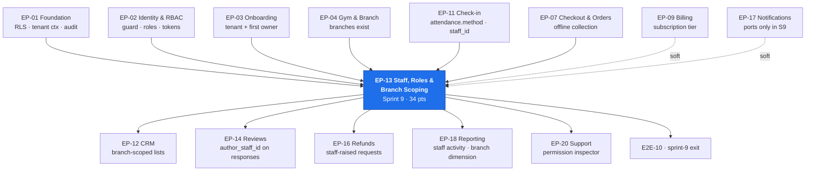

# EP-13 — Staff, Roles & Branch Scoping

> **Phase-0 delivery backlog.** Detailed expansion of `ENGINEERING_PLAN.md` §2 (epic row `EP-13`)
> and §3 (`F-13.1` … `F-13.9`). No application code exists yet.
>
> **The one sentence this epic must make true:** *a receptionist who can take money but cannot
> change prices* — and the refusal must come from the **server**, not from a hidden menu
> (`FR-RBAC-02`, `AC-STAF-01.2`, sprint-9 exit gate `E9.2`).
>
> **Architectural warning carried at the top on purpose.** `BR-TEN-01` tenant isolation is enforced
> by PostgreSQL RLS (`EP-01`). **Branch scoping is not.** A branch is not a tenant; there is no
> `app.branch_id` session variable in the `§C1.4` design, so every branch-scoped list, aggregate,
> mutation and export is protected by **application-layer predicates only**. That asymmetry is why
> `FR-STAF-03` is the requirement in this backlog most likely to be quietly wrong, and why sprint 9
> spends **6.0 engineer-days of QA on a negative suite alone** (task 9.26). See §3.3 and `OQ-EP13.a`.

---

## 1. Metadata

| Field | Value |
| :--- | :--- |
| **Epic id** | `EP-13` |
| **Name** | Staff, Roles & Branch Scoping |
| **Priority (MoSCoW)** | **M** — Must. `FR-STAF-01` … `FR-STAF-06` and `FR-STAF-09` are all `M`; only `FR-STAF-07` (`S`) and `FR-STAF-08` (`C`) are not. `E2E-10` cannot pass without a scoped receptionist |
| **Complexity** | **M** (T-shirt, §2) · module rating **Moderate** for `staff/` (§13.1) — *"straightforward once RBAC exists, but every query needs branch filtering"* |
| **Story points** | **34** (epic/feature view, §2) · `staff/` module view **34 pts / 17 engineer-days** (§13.1) |
| **Target sprint(s)** | **Sprint 9** — all of `F-13.1` … `F-13.9` (`SprintPlanning.md` §Sprint 9, tasks 9.10–9.16, 9.22, 9.26, 9.28). `F-13.8` is **descoped at sprint 9 as `D-03`** and has no replacement sprint. `F-13.7` sessions are deferred by `OQ-15` behind `rel.staff.trainer-sessions` |
| **Owning PRD module** | `STAF` (`B5.15`) |
| **Owning code module** | `staff/` |
| **Collaborating modules** | `iam/` (permission evaluation, invitation tokens), `attendance/` (`BR-CHK-08` manual/override attribution), `ordering/` (offline collection attribution), `audit/` (`BR-DAT-01`), `billing/` (seat limits read tier), `notifications/` (invitation delivery) |
| **Surfaces** | `gym-dashboard` — `SCR-DASH-018` (Staff, primary), `SCR-DASH-009` (Check-in Desk — attribution), `SCR-DASH-012` (Record Offline Sale — attribution), `SCR-DASH-010`, `SCR-DASH-011`, `SCR-DASH-007` (all branch-filtered) · `admin-dashboard` — `SCR-ADM-005` (User Administration, effective-permission inspector, `FR-RBAC-05`) |
| **Primary APIs** | `GET/POST /v1/tenant/staff` · `PATCH/DELETE /v1/tenant/staff/:id` · `GET /v1/tenant/staff/:id/activity` — permissions `staff.staff.list`, `staff.staff.invite`, `staff.staff.update`, `staff.staff.remove`, `staff.staff_activity.read` (`API_Catalog.md` §3.9) |
| **Background jobs** | None owned. **New**: `staff.invitation-expiry` (hourly, sweeps unaccepted invitations) and `staff.seat-reconcile` (nightly, asserts `ACTIVE` seats ≤ tier allowance) |
| **Launch market** | **India** — staff phone numbers stored E.164 `+91…`; the invitation SMS template requires **TRAI DLT pre-approval** with external lead time starting Sprint 0 (`LAUNCH_MARKET_INDIA.md` §8, `REG-05`); activity-log day buckets computed at `Asia/Kolkata` **UTC+05:30, no DST** — midnight IST is **18:30 UTC the previous day** (`TR-24`) |
| **Feature flags** | `rel.staff.trainer-sessions` (OFF for all of Phase 1 — the `OQ-15` switch), `rel.onboarding.bulk-member-import` (adjacent, sprint 9) |
| **Status** | `PLANNED` — Phase 0. Not started. **No blocking open question**; `OQ-15` is answered with a recorded default |
| **Epic owner** | Backend Lead — `staff/`. Reviewer pairing with the `iam/` owner is mandatory on every permission-touching PR (`PROJECT_CONSTITUTION.md` §20.5: two approvals on IAM paths) |

---

## 2. Business Goal

**Delegation without exposure.** A gym owner does not run the front desk. Rohan (`B2.1`) opens at
06:00 twice a week and is elsewhere the rest of the time; Sameer (`B2.3`) is the person actually
taking cash, admitting members and creating walk-in records. `OBJ-01` — digitise the end-to-end
operations of an independent gym — is unreachable if the only account that can do anything is the
owner's, because the practical outcome of that design is a shared password, which destroys
attribution, destroys `BR-DAT-01`, and makes `KPI-05` (≥60% of tenants with three or more dashboard
sessions a week) a measurement of one person instead of a team. This epic exists so that the gym can
put five people into the system and still be able to answer *who did this*.

**The commercial goal is `KPI-05` and `KPI-06`; the trust goal is that delegation never widens
blast radius.** A `RECEPTIONIST` at branch 1 must see branch 1 and only branch 1 — not because the
UI hides branch 2, but because the server will not return it and will not accept a write against it.
`FR-RBAC-02` states the rule in the negative precisely because the failure mode is a UI-first
implementation that filters a dropdown and forgets the endpoint. `FR-RBAC-03` states the companion
rule: the tenant is evaluated against the **resource**, never against the session alone. Together
they are the difference between a permission model and a permission *appearance*. `E2E-10` and the
sprint-9 exit gate demonstrate this by `curl`, never by clicking, and `E9.3` specifically sends
another branch's id in the request body to prove the server ignores it.

**The third goal is attribution that survives the employee.** `FR-STAF-04` requires that removal
revokes access *immediately* and preserves *all* historical attribution — a receptionist who left in
March must still be the named actor on March's check-ins, March's cash collections and March's
overrides. That is not a nicety; it is the evidentiary base for three separate downstream
mechanisms: `FR-STAF-05`'s activity log (which is how an owner detects a receptionist with a 40%
override rate, per `BR-CHK-08`'s failure-mode note), `BR-DAT-01`'s audit obligation, and the
chargeback evidence pack in `EP-16`. A staff record is therefore never deleted, only transitioned to
`REMOVED`; the `user` behind it keeps existing; and every foreign key that points at a staff id
points at a row that will still be there in seven years (`NFR-PRV-04`). Seat limits (`FR-STAF-06`)
sit on top of this as the commercial lever — `A6.2` gives Starter 3 seats, Growth 10, Professional
40 — and the upgrade path must be *clear*, because a blocked invitation with no explanation is a
support ticket against `KPI-25` and a churn signal against `KPI-04`.

---

## 3. Scope

### 3.1 In scope — explicit

| # | Item | Anchor |
| :-: | :--- | :--- |
| 1 | Staff invitation by **email or phone**, with role and branch assignment **fixed at the point of invitation** and not editable by the invitee | `FR-STAF-01`, `FR-RBAC-06` |
| 2 | The four tenant-assignable roles — `GYM_MANAGER`, `RECEPTIONIST`, `TRAINER`, and additional `GYM_OWNER` | `FR-STAF-02`, `B3.1` |
| 3 | Branch scoping of **visibility and action**: every list, aggregate, export and mutation filtered server-side on `staff_branches` | `FR-STAF-03`, `FR-RBAC-02`, `FR-RBAC-03` |
| 4 | Four-state staff lifecycle `INVITED → ACTIVE → SUSPENDED → REMOVED`, with immediate revocation and preserved historical attribution | `FR-STAF-04` |
| 5 | Staff activity log: check-ins performed, payments collected, members created, overrides used — with amount, member, timestamp and order reference | `FR-STAF-05`, `AC-STAF-01.3` |
| 6 | Seat limits per subscription tier with a **stated** upgrade path when exceeded | `FR-STAF-06`, `A6.2` |
| 7 | Trainer assignment: assigned-member list and workout-plan assignment. **Sessions deferred** per `OQ-15` | `FR-STAF-07`, `rel.staff.trainer-sessions` |
| 8 | Last-`GYM_OWNER` protection as an **aggregate invariant in `staff/`**, firing on `PATCH` (demotion) as well as `DELETE` (removal) | `FR-STAF-09`, `FR-RBAC-07`, `API_Catalog.md` AZ7 |
| 9 | Role-change propagation **within 60 seconds without re-authentication** | `FR-RBAC-04` |
| 10 | Effective-permission inspector for Super Admin support use | `FR-RBAC-05`, `SCR-ADM-005` |
| 11 | `SCR-DASH-018` Staff screen: list with name, role, branches, status, last activity; invite flow; detail with activity log and permission summary; seat-limit and last-owner guards rendered as **explanations**, not disabled buttons | `SCR-DASH-018` |
| 12 | Manual and override check-in attribution — the `staff/` half of `BR-CHK-08` | `BR-CHK-08`, `FR-CHK-07`, `FR-CHK-08` |
| 13 | Offline-collection attribution: every cash/UPI collection recorded at the desk carries the collecting staff id onto the order and the ledger reference | `AC-STAF-01.3`, `BR-PAY-09`, `E2E-10` |
| 14 | Invitation token lifecycle: single-use, expiring, bound to the invited identifier, and **re-issuable without widening scope** | `FR-AUTH-13`, `FR-RBAC-06` |
| 15 | India: invitation SMS through a **DLT-pre-approved template**, with email as the always-available fallback | `LAUNCH_MARKET_INDIA.md` §8, `REG-05`, `TR-16` |
| 16 | A **branch-scope negative suite** run against every branch-scoped endpoint, attacking each with another branch's id | Sprint 9 task 9.26, `E9.3` |
| 17 | Isolation specs for every new tenant-scoped endpoint this epic adds | `BAC-10`, `E2E-11`, sprint 9 task 9.28 |

### 3.2 Out of scope — explicit, with destination

| Item | Why it is not here | Where it went |
| :--- | :--- | :--- |
| The permission model itself — `(role, scope, resource, action)` evaluation, the guard, the permission registry | `EP-13` **consumes** RBAC; it does not build it | **`EP-02`**, sprints 0–1 |
| Session issue, JWT access tokens, rotating refresh, force-logout | `FR-RBAC-04`'s 60-second propagation needs a session mechanism `EP-02` owns | **`EP-02`** |
| Tenant switching for a user who holds staff records in two tenants | `BR-TEN-02`, an `iam/`+`tenancy/` concern | **`EP-02`**, `AC-AUTH-02.2` |
| RLS policies, the Prisma tenant-context extension | Tenant isolation is structural and precedes every feature | **`EP-01`**, `TR-01` |
| Platform staff administration — `SUPER_ADMIN`, `FINANCE`, `MODERATOR`, `VERIFICATION_OFFICER`, `SUPPORT_AGENT` | Those are platform-scope principals, not tenant staff; `POST /admin/staff` is a different endpoint family | **`EP-19`**, sprint 15 |
| Impersonation of a user by a support agent | `BR-DAT-02`, a support capability | **`EP-20`** |
| The check-in flow itself, the QR token, the ten-step validation | `EP-13` supplies the actor and the branch predicate; `attendance/` supplies the decision | **`EP-11`**, sprint 8 |
| Member CRM, member 360, walk-in creation, leads | Same sprint, different epic and different module | **`EP-12`** |
| Offline sale creation and balance collection mechanics | `ordering/` owns the money path; `staff/` owns who is attributed | **`EP-07`**, `E2E-10` |
| Staff **payroll**, salaries, commissions to trainers | Not a PRD requirement at any priority | **Not in Phase 1** |
| Personal-training **session scheduling and logging** | `OQ-15` answered: *"No; assignment only, sessions deferred"* | **Phase 2**, stub behind `rel.staff.trainer-sessions` |
| Shift / duty roster with staff self-attendance (`FR-STAF-08`, `C`) | **Descoped as `D-03` at sprint 9** to close a 129% backend load; pre-agreed in `ENGINEERING_PLAN.md` §13.3 descope order | **Deferred**, recorded in `KNOWN_LIMITATIONS.md` |
| Reporting *over* staff activity (leaderboards, override-rate trends) | Reading is reporting's job | **`EP-18`**, sprint 13 |

### 3.3 The scoping asymmetry, stated once so nobody rediscovers it in review

| Scope | Enforced by | Failure mode if the application layer is wrong |
| :--- | :--- | :--- |
| **Tenant** (`BR-TEN-01`) | PostgreSQL **RLS** + the mandatory Prisma tenant-context extension (`EP-01`, `TR-01`) | The database refuses. A forgotten predicate returns **zero rows**, not another tenant's rows |
| **Branch** (`FR-STAF-03`) | **Application predicate only** — `WHERE branch_id IN (SELECT branch_id FROM staff_branches WHERE staff_id = :me)` | The database happily returns **every branch of the tenant**. A forgotten predicate is a silent, plausible-looking widening that no test catches unless the test was written to catch it |

The consequence for delivery is that branch scoping cannot be assured by the same mechanism as
tenant isolation and must be assured by three separate things instead: a single `BranchScope` value
object resolved from the session and required by the repository signature (so omitting it does not
compile), a `dependency-cruiser` rule forbidding any `staff/`-adjacent repository from accepting a
branch id sourced from the request body, and the 6.0 engineer-day negative suite. Whether the
tenant-context extension should be **extended** to also `SET LOCAL app.branch_ids` and drive an RLS
predicate on branch-owned tables is a real architectural question and is raised as **`OQ-EP13.a`**
in §13 rather than decided here.

---
## 4. Features

`F-13.1` … `F-13.9` are carried verbatim from `ENGINEERING_PLAN.md` §3. Rows marked *(new)* are
additions this backlog surfaces from `B3.3`, `API_Catalog.md` §3.9/AZ7, `LAUNCH_MARKET_INDIA.md` §8
and the sprint-9 exit checklist.

| Feature | Description | Satisfies | Pri | Pts | Sprint |
| :--- | :--- | :--- | :-: | :-: | :-: |
| **F-13.1** | Invitation by email or phone, with **role and branch fixed at invitation**; single-use expiring token bound to the invited identifier | `FR-STAF-01`, `FR-RBAC-06`, `FR-AUTH-13` | M | 3 | 9 |
| **F-13.2** | The four tenant-assignable roles — `GYM_MANAGER`, `RECEPTIONIST`, `TRAINER`, additional `GYM_OWNER` — with the `B3.2` capability matrix as the single source | `FR-STAF-02`, `B3.1`, `B3.2` | M | 2 | 9 |
| **F-13.3** | **Branch scoping of visibility and action** on every list, aggregate, export and mutation, filtered on `staff_branches` server-side | `FR-STAF-03`, `FR-RBAC-02`, `FR-RBAC-03` | M | 8 | 9 |
| **F-13.4** | Status lifecycle `INVITED → ACTIVE → SUSPENDED → REMOVED` with immediate revocation and preserved historical attribution | `FR-STAF-04` | M | 3 | 9 |
| **F-13.5** | Staff activity log — check-ins performed, payments collected, members created, overrides used — with amount, member, timestamp and order reference | `FR-STAF-05`, `AC-STAF-01.3`, `BR-DAT-01` | M | 3 | 9 |
| **F-13.6** | Seat limits per subscription tier with a **stated** upgrade path when exceeded | `FR-STAF-06`, `A6.2` | M | 2 | 9 |
| **F-13.7** | Trainer assignment: assigned-member list and workout-plan assignment. **Sessions deferred** | `FR-STAF-07`, `OQ-15` | S | 2 | 9 (stub) |
| **F-13.8** | Shift / duty roster with staff self-attendance | `FR-STAF-08` | **C** | 3 | ⛔ **descoped `D-03`** |
| **F-13.9** | Last-`GYM_OWNER` protection at the service layer, firing on demotion as well as removal | `FR-STAF-09`, `FR-RBAC-07` | M | 2 | 9 |
| **F-13.10** *(new)* | **Role-change propagation within 60 seconds without re-authentication** — a permission epoch per `(user, tenant)` in Redis, bumped on any role, branch or status change, consulted by the guard on every request | `FR-RBAC-04` | S | 3 | 9 |
| **F-13.11** *(new)* | **Effective-permission inspector** — given a user and a tenant, return the resolved `(role, scope, resource, action)` set with the reason each entry is held | `FR-RBAC-05`, `SCR-ADM-005` | S | 2 | 9 |
| **F-13.12** *(new)* | **`BranchScope` value object** required by every branch-aware repository signature, resolved from the session, never constructible from a request body | `FR-STAF-03`, `FR-RBAC-02`, `PROJECT_CONSTITUTION.md` §5 | M | 3 | 9 |
| **F-13.13** *(new)* | **Manual / override check-in attribution** — the `staff/` half of `BR-CHK-08`: branch scope enforced as **refusal**, not filtering, and the seven `C4.8` override reasons surfaced per staff member | `BR-CHK-08`, `FR-CHK-07`, `FR-CHK-08`, `FR-STAF-05` | M | 2 | 9 |
| **F-13.14** *(new)* | **India invitation delivery** — SMS via a **DLT-pre-approved** template with `dlt_template_id` and approval state, email always available as fallback | `LAUNCH_MARKET_INDIA.md` §8, `REG-05`, `TR-16` | M | 2 | 9 |
| **F-13.15** *(new)* | **Seat accounting under concurrency** — the seat count is a `COUNT` taken under a row lock on the tenant inside the invitation transaction, never a stored counter | `FR-STAF-06`, `BR-FIN-01` principle applied to seats | M | 2 | 9 |
| **F-13.16** *(new)* | **Assurance jobs** — `staff.invitation-expiry` (hourly) and `staff.seat-reconcile` (nightly, asserts `ACTIVE` seats ≤ tier allowance and alerts on any excess) | `FR-STAF-01`, `FR-STAF-06` | S | 2 | 9 |

**Feature roll-up.** 16 features · 34 core points (`F-13.1` … `F-13.9`) + 16 points for the seven
additions, absorbed inside the `staff/` module estimate. Priorities: 11 `M`, 4 `S`, 1 `C`
(descoped). **Delivered in sprint 9: 15 of 16.**

---

## 5. User Stories

`US-STAF-01` is restated from `MASTER_PRD.md` §B5.15 with its four PRD acceptance criteria
preserved verbatim in Given/When/Then form. `US-STAF-02` onward are **new** — the PRD's functional
requirements imply them without writing them as stories.

### US-STAF-01 — *As Rohan, I want a receptionist who can take money but cannot change prices.* **(PRD)**

- **AC-STAF-01.1** — **Given** I invite a user as `RECEPTIONIST` at branch 1, **when** they sign in,
  **then** they see check-in, member management and sale recording **for branch 1 only**.
- **AC-STAF-01.2** — **Given** they are a `RECEPTIONIST`, **when** they attempt to open plan editing
  by direct URL, **then** the request is refused **server-side** with a permission error, not merely
  hidden in the UI.
- **AC-STAF-01.3** — **Given** they collected cash payments, **when** I open their activity log,
  **then** every collection is listed with **amount, member, timestamp and order reference**.
- **AC-STAF-01.4** — **Given** I remove them, **when** they next make any request, **then** it is
  refused, and their historical attributions **remain intact and attributed to them**.
- **AC-STAF-01.5** *(new)* — **Given** they send **branch 2's id in the request body** of any
  branch-scoped endpoint, **when** the server responds, **then** it returns branch-1 rows regardless
  and never widens scope (`E9.3`).
- **AC-STAF-01.6** *(new)* — **Given** they attempt a **manual check-in at branch 2**, **when** the
  request is evaluated, **then** it is refused with **`403`**, not an empty result
  (`BR-CHK-08-N3`, `SEC-A01-002`).

### US-STAF-02 — *As Rohan, I want to invite someone in under a minute and know exactly what they will be able to do.* **(new — implied by `FR-STAF-01`, `FR-RBAC-06`, `SCR-DASH-018`)**

- **AC-STAF-02.1** — **Given** I open the invite flow, **when** I choose a role, **then** the screen
  states in plain language what that role can and cannot do, derived from the `B3.2` matrix, not from
  hand-written copy that can drift.
- **AC-STAF-02.2** — **Given** I invite by phone, **when** the invitation sends, **then** it goes by
  **SMS through a DLT-approved template** and, if SMS delivery fails or the template is
  `PENDING_DLT_APPROVAL`, by email — and the failure is visible to me, not silent.
- **AC-STAF-02.3** — **Given** an invitation is outstanding, **when** I view the staff list, **then**
  the row shows `INVITED` with the sent time, the channel and a resend action.
- **AC-STAF-02.4** — **Given** the invitee accepts, **when** their account is created or linked,
  **then** the role and branches are **exactly** those fixed at invitation; nothing in the acceptance
  flow can alter them.
- **AC-STAF-02.5** — **Given** an invitation token, **when** it is used a second time or after
  expiry, **then** it is refused, and re-issuing produces a **new** token with the **same** scope.

### US-STAF-03 — *As Sameer, I want to do my job without seeing things that are not mine.* **(new — implied by `FR-STAF-03`, `B2.3`)**

- **AC-STAF-03.1** — **Given** I am scoped to branch 1, **when** I open members, attendance, sales or
  reports, **then** every figure, row and total is branch-1 only, and the branch selector does not
  offer branch 2 at all.
- **AC-STAF-03.2** — **Given** a member holds a membership at branch 2, **when** I search for them,
  **then** I find them only if my scope reaches them; the result set never leaks a branch-2 record as
  a "no access" placeholder that discloses its existence.
- **AC-STAF-03.3** — **Given** I export any list I am permitted to export, **when** the file is
  produced, **then** its row count equals the branch-scoped count, asserted in the test, and it
  contains **zero** rows from another branch (`TR-12` shape, applied to branch scope).
- **AC-STAF-03.4** — **Given** I am assigned to **two** branches, **when** I use any surface,
  **then** both appear, and a branch filter is offered rather than assumed.

### US-STAF-04 — *As Rohan, I want to see what my staff actually did.* **(new — implied by `FR-STAF-05`, `AC-STAF-01.3`, `BR-CHK-08`)**

- **AC-STAF-04.1** — **Given** a staff member's detail page, **when** I open the activity log,
  **then** I see check-ins performed, payments collected, members created and overrides used, each
  with timestamp, member and reference.
- **AC-STAF-04.2** — **Given** a cash collection, **when** it appears in the log, **then** it carries
  the **amount in ₹ with Indian digit grouping**, the member, the timestamp in `Asia/Kolkata` and the
  order reference.
- **AC-STAF-04.3** — **Given** a check-in they performed, **when** it appears, **then** its `method`
  is shown as `SCAN`, `MANUAL` or `OVERRIDE`, and an `OVERRIDE` additionally shows its `C4.8` reason
  code (`BR-CHK-08`).
- **AC-STAF-04.4** — **Given** a day boundary, **when** the log is bucketed by day, **then** the day
  runs **00:00–24:00 IST**, which is 18:30–18:30 UTC, and a test asserts an event at **18:29:59Z**
  and one at **18:30:00Z** fall in different days (`TR-24`).
- **AC-STAF-04.5** — **Given** a removed staff member, **when** I open their activity log, **then**
  it is fully readable and every historical row still names them.

### US-STAF-05 — *As Rohan, I want removing someone to be instant and total.* **(new — implied by `FR-STAF-04`, `AC-STAF-01.4`)**

- **AC-STAF-05.1** — **Given** I remove a staff member, **when** they make their **next** request
  with a still-valid access token, **then** it is refused **within 60 seconds** of the removal, with
  no re-authentication required of anyone (`FR-RBAC-04`).
- **AC-STAF-05.2** — **Given** removal, **when** the database is inspected, **then** the `staff` row
  is `REMOVED` with `removed_at` set — it is **not deleted** — and every foreign key pointing at it
  still resolves.
- **AC-STAF-05.3** — **Given** suspension rather than removal, **when** the staff member is
  reinstated, **then** their previous role and branches return unchanged and the gap is visible in
  the audit trail.
- **AC-STAF-05.4** — **Given** removal, **when** an invitation for that person is outstanding,
  **then** the invitation is invalidated in the same transaction.

### US-STAF-06 — *As Rohan, I want to be told I have run out of seats, not merely blocked.* **(new — implied by `FR-STAF-06`, `A6.2`, `KPI-25`)**

- **AC-STAF-06.1** — **Given** my tier allows 3 seats and I have 3 `ACTIVE` staff, **when** I invite a
  fourth, **then** I am refused with a message stating my tier, my current count, the allowance, and
  the tier that would permit it.
- **AC-STAF-06.2** — **Given** an outstanding `INVITED` row, **when** the seat count is computed,
  **then** `INVITED` **occupies a seat** so that an owner cannot over-invite and discover the problem
  at acceptance time; `SUSPENDED` also occupies a seat; `REMOVED` does not.
- **AC-STAF-06.3** — **Given** two invitations submitted **simultaneously** on the last free seat,
  **when** both are processed, **then** exactly one succeeds — enforced by a lock, not by a read-then-write.
- **AC-STAF-06.4** — **Given** I downgrade my tier below my current seat count, **when** the
  downgrade applies, **then** existing staff are **never** silently deactivated; the tenant is over
  allowance, is told so, and cannot invite again until under it.

### US-STAF-07 — *As the platform, I want the last owner to be un-removable by any path.* **(new — implied by `FR-STAF-09`, `FR-RBAC-07`, AZ7)**

- **AC-STAF-07.1** — **Given** a tenant with exactly one `GYM_OWNER`, **when** `DELETE /v1/tenant/staff/:id`
  targets them, **then** it is refused at the **service layer** with a stable error code.
- **AC-STAF-07.2** — **Given** the same tenant, **when** `PATCH /v1/tenant/staff/:id` attempts to
  change that owner's role to anything else, **then** it is refused identically — **demotion is the
  path people forget**.
- **AC-STAF-07.3** — **Given** two owners, **when** both are removed in **concurrent** requests,
  **then** exactly one succeeds and the tenant is never left ownerless.
- **AC-STAF-07.4** — **Given** the refusal, **when** it is presented, **then** it explains that
  another owner must be appointed first, and offers that action.

### US-STAF-08 — *As a Super Admin, I want to see exactly what a user can do before I answer their ticket.* **(new — implied by `FR-RBAC-05`, `SCR-ADM-005`)**

- **AC-STAF-08.1** — **Given** a user and a tenant, **when** I open the effective-permission
  inspector, **then** I see the resolved permission set with the role and scope that grants each one.
- **AC-STAF-08.2** — **Given** the inspector, **when** I use it, **then** it is **read-only** — it
  grants nothing, changes nothing, and is itself audited as an access to another person's data.
- **AC-STAF-08.3** — **Given** a permission the user does **not** hold, **when** I search for it,
  **then** the inspector says so explicitly rather than returning an empty list.

### US-STAF-09 — *As a Trainer, I want my assigned members, and nothing that pretends sessions exist.* **(new — implied by `FR-STAF-07`, `OQ-15`)**

- **AC-STAF-09.1** — **Given** I am a `TRAINER`, **when** I sign in, **then** I see my assigned member
  list and can assign a workout plan, within my branch scope.
- **AC-STAF-09.2** — **Given** `rel.staff.trainer-sessions` is **off**, **when** I navigate to
  `/trainers/sessions`, **then** I see a **stub page that states sessions are Phase 2**, not a broken
  route and not a half-working scheduler.
- **AC-STAF-09.3** — **Given** the flag is off, **when** any API for session scheduling is probed,
  **then** it does not exist in the generated OpenAPI document.

---
## 6. Acceptance Criteria for the Epic

The epic is not done until **every** row passes. Rows marked **launch-blocking** are gates on the
sprint-9 exit checklist or on a `BAC-` business acceptance criterion.

| # | Criterion | Evidence |
| :-: | :--- | :--- |
| **AC-EP13-01** | **Launch-blocking.** A `RECEPTIONIST` invited to branch 1 sees **only** branch-1 data in **every** list, report and export | `E9.1`, `AC-STAF-01.1`, T-13.09 |
| **AC-EP13-02** | **Launch-blocking.** That receptionist opening the plan editor by **direct URL** receives a **server-side 403**, demonstrated by `curl`, not by a hidden menu | `E9.2`, `AC-STAF-01.2`, `FR-RBAC-02` |
| **AC-EP13-03** | **Launch-blocking.** Sending **another branch's id in the request body** does not widen scope on **any** branch-scoped endpoint; the server filters on `staff_branches` | `E9.3`, `AC-STAF-01.5`, T-13.31 |
| **AC-EP13-04** | The branch-scope negative suite covers **every** branch-scoped endpoint enumerated from the generated OpenAPI document — coverage is derived, not hand-listed, so a new endpoint cannot be missed | T-13.31, `FR-RBAC-01` |
| **AC-EP13-05** | Every endpoint this epic adds **declares a permission**; the CI permission-declaration gate fails the build otherwise | `FR-RBAC-01`, `PROJECT_CONSTITUTION.md` §23.2 item 9 |
| **AC-EP13-06** | Isolation specs exist for every new tenant-scoped endpoint; the build fails without them | `BAC-10`, `E2E-11`, sprint-9 task 9.28 |
| **AC-EP13-07** | Role and branch assignment are **fixed at invitation** and cannot be altered by anything in the acceptance flow | `FR-RBAC-06`, `AC-STAF-02.4` |
| **AC-EP13-08** | An invitation token is **single-use and expiring**, bound to the invited identifier; reuse and post-expiry use are both refused | `AC-STAF-02.5`, `FR-AUTH-13` |
| **AC-EP13-09** | Invitation by phone sends through a **DLT-pre-approved** SMS template; a template in `PENDING_DLT_APPROVAL` falls back to email and the fallback is **visible**, never silent | `AC-STAF-02.2`, `REG-05` |
| **AC-EP13-10** | **Launch-blocking.** Removing a staff member revokes access **immediately** while every historical attribution remains intact and attributed to them | `E9.7`, `AC-STAF-01.4`, `AC-STAF-05.2` |
| **AC-EP13-11** | "Immediately" is measured: the revoked principal's **next** request fails **within 60 seconds** with **no re-authentication** required of anyone | `FR-RBAC-04`, `AC-STAF-05.1`, T-13.13 |
| **AC-EP13-12** | A `staff` row is **never deleted**; `REMOVED` is a state, `removed_at` is set, and every foreign key referencing it still resolves | `AC-STAF-05.2`, `FR-STAF-04` |
| **AC-EP13-13** | **Launch-blocking.** The **last remaining `GYM_OWNER`** cannot be removed **or demoted**; both `DELETE` and `PATCH` are refused at the service layer | `E9.8`, `FR-STAF-09`, `FR-RBAC-07`, AZ7 |
| **AC-EP13-14** | Two concurrent removals of the two remaining owners leave **exactly one** owner; proven with a concurrency test, not by reasoning | `AC-STAF-07.3` |
| **AC-EP13-15** | The last-owner refusal **explains** the remedy and offers the "appoint another owner" action | `AC-STAF-07.4`, `NFR-USE-05` |
| **AC-EP13-16** | The activity log shows check-ins, collections, member creations and overrides, each with **amount, member, timestamp and order reference** | `AC-STAF-01.3`, `FR-STAF-05` |
| **AC-EP13-17** | A check-in row in the log distinguishes `SCAN`, `MANUAL` and `OVERRIDE`, and an `OVERRIDE` carries one of the seven `C4.8` override reason codes | `BR-CHK-08`, `AC-STAF-04.3` |
| **AC-EP13-18** | A manual check-in **without a staff identity cannot exist** — refused by the `CHECK` constraint, not by application code | `BR-CHK-08-N1` |
| **AC-EP13-19** | A receptionist scoped to branch 1 attempting a manual check-in at branch 2 receives **`403`**, not an empty result — branch scope is **refusal** here, not filtering | `BR-CHK-08-N3`, `SEC-A01-002` |
| **AC-EP13-20** | Activity-log day buckets are `Asia/Kolkata` days; events at **18:29:59Z** and **18:30:00Z** fall in **different** days, asserted with those exact instants | `TR-24`, `AC-STAF-04.4` |
| **AC-EP13-21** | Money in the activity log renders as **₹ with Indian lakh/crore grouping** through the single `packages/utils` formatter | `LAUNCH_MARKET_INDIA.md` §2, `NFR-DQ-02` |
| **AC-EP13-22** | Seat limits are enforced per tier with the refusal stating **tier, current count, allowance and the qualifying tier** | `FR-STAF-06`, `AC-STAF-06.1` |
| **AC-EP13-23** | `INVITED` and `SUSPENDED` occupy seats; `REMOVED` does not — asserted for each state | `AC-STAF-06.2` |
| **AC-EP13-24** | Two simultaneous invitations on the last free seat produce **exactly one** success, enforced by a lock inside the transaction | `AC-STAF-06.3`, `F-13.15` |
| **AC-EP13-25** | A tier downgrade below the current seat count **never deactivates existing staff**; the tenant is over allowance, is told, and cannot invite until under it | `AC-STAF-06.4` |
| **AC-EP13-26** | The nightly `staff.seat-reconcile` job asserts `ACTIVE + INVITED + SUSPENDED ≤ allowance` per tenant and alerts on any excess; the gauge's only acceptable steady value is **0 tenants in excess** | `F-13.16`, `NFR-MNT-06` |
| **AC-EP13-27** | The effective-permission inspector is **read-only**, states the granting role and scope per permission, says so explicitly for permissions **not** held, and is itself audited | `FR-RBAC-05`, `AC-STAF-08.*` |
| **AC-EP13-28** | Every create, update and status change on a `staff` record writes a `BR-DAT-01` audit row with actor, timestamp, IP, before and after | `BR-DAT-01-P1` |
| **AC-EP13-29** | `rel.staff.trainer-sessions` **off** renders a Phase-2 stub, and **no** session-scheduling operation exists in the generated OpenAPI document | `AC-STAF-09.2`, `AC-STAF-09.3`, `OQ-15` |
| **AC-EP13-30** | The role-description copy on the invite screen is **derived from the `B3.2` matrix**, not hand-written, so it cannot drift from the guard | `AC-STAF-02.1`, `NFR-USE-08` |
| **AC-EP13-31** | `SCR-DASH-018` renders loading, empty, error and permission-denied states, is `axe-core` clean, and the invite flow is keyboard-completable | `PROJECT_CONSTITUTION.md` §16.9, `NFR-USE-01` |
| **AC-EP13-32** | `E2E-10` passes end to end with a branch-scoped receptionist as the acting principal | `E2E-10`, sprint-9 exit |

---

## 7. Business Rules Enforced

Detail lives in `BusinessRules.md`; this table records **ownership and the enforcement point** only,
per that document's instruction not to duplicate it.

| Rule | Ownership in `EP-13` | Enforcement point in this epic | Negative test required (`BAC-06`) |
| :--- | :--- | :--- | :-: |
| `BR-CHK-08` | **Co-owned** with `attendance/` (`BusinessRules.md` §11) | `staff/` supplies the branch predicate as a **guard refusal** and the override-reason attribution on `FR-STAF-05`; `attendance/` owns the `method` enum and its `CHECK` | ✅ `BR-CHK-08-N3` |
| `BR-DAT-01` | **Contributor** — `audit/` owns the rule; `staff` is one of the seven named entity classes | `@Audited()` on the `Staff` aggregate; every invite, role change, branch change, suspension and removal writes before/after | ✅ `BR-DAT-01-N2` |
| `BR-TEN-01` | **Inherited** from `EP-01` | Every `staff/` repository goes through the mandatory tenant-context Prisma extension; no raw client call exists in the module | ✅ `E2E-11` generated case per endpoint |
| `BR-TEN-02` | **Inherited** from `EP-02` | A user holding staff records in two tenants resolves scope from the **active tenant on the resource**, never the session alone (`FR-RBAC-03`) | ✅ |
| `BR-PAY-09` | **Contributor** — `ordering/` owns offline payments | The collecting staff id is attributed onto the order and appears in `FR-STAF-05` with the order reference | — |
| `BR-GYM-06` | **Adjacent, not owned** | A payout-account change is `GYM_OWNER`-only (`B3.2`); no staff role this epic creates may reach it — asserted as a **route-absence** test for `RECEPTIONIST`, `TRAINER` and `GYM_MANAGER` | ✅ |

**`FR-RBAC-01` … `FR-RBAC-07` are requirements, not `BR-` rules**, but they behave like rules in
this epic and are gated identically: `FR-RBAC-01` by the CI permission-declaration check,
`FR-RBAC-02` by task T-13.31's negative suite, `FR-RBAC-03` by resource-derived tenant evaluation,
`FR-RBAC-04` by the permission epoch (`F-13.10`), `FR-RBAC-05` by the inspector (`F-13.11`),
`FR-RBAC-06` by fixed-at-invitation scope (`F-13.1`) and `FR-RBAC-07` by aggregate invariant **AZ7**
(`F-13.9`).

---

## 8. Dependencies

### 8.1 Upstream — must exist first

| Epic | What `EP-13` needs from it | Hard or soft |
| :--- | :--- | :-- |
| **EP-01** | Tenant context extension, RLS, `Money`, outbox, audit writer, idempotency, the module skeleton | **Hard** — nothing compiles without it |
| **EP-02** | The permission model `(role, scope, resource, action)`, the guard, JWT + rotating refresh, invitation-token primitives (`FR-AUTH-13`), force-logout | **Hard** — `EP-13` assigns roles it does not define |
| **EP-03** | Tenants exist and are approved; the owner's own `GYM_OWNER` staff row is created at onboarding | **Hard** |
| **EP-04** | Branches exist — there is nothing to scope to otherwise | **Hard** |
| **EP-11** | Attendance rows with `method` and `staff_id` for the activity log's check-in and override sections | **Hard** for `F-13.5`, `F-13.13` |
| **EP-07** | Orders and offline collections for the "payments collected" section of the activity log | **Hard** for `F-13.5` |
| **EP-09** | Subscription tier on the tenant, so seat allowance is resolvable | **Soft** — a default tier suffices in dev |
| **EP-17** | Notification ports for invitation delivery. **Adapters arrive in sprint 14**, so sprint 9 sends through the local Mailpit/stub path | **Soft** — `TR-13` |

### 8.2 Downstream — what this unblocks

| Epic / item | Why it needs `EP-13` |
| :--- | :--- |
| **EP-14** (sprint 10) | Moderation and gym review **responses** are staff actions; `review_responses.author_staff_id` points here |
| **EP-12** (same sprint) | Member CRM lists are branch-scoped by the same predicate; walk-in creation is attributed to a staff id |
| **EP-18** (sprint 13) | Staff-activity reporting, override-rate trends and the branch dimension on every operational report |
| **EP-16** (sprint 12) | Refund requests raised by gym staff (`FR-RFND-01`) need a staff principal with delegated authority |
| **EP-20** (sprint 14) | Support agents answer "why can't my receptionist do X" using the `FR-RBAC-05` inspector |
| `UAT-02` | The receptionist UAT script is written against this epic's scoping behaviour |
| `E2E-10` | The sprint-9 exit journey acts as a branch-scoped receptionist throughout |

### 8.3 External dependencies and decisions

| Item | Nature | Status |
| :--- | :--- | :--- |
| `OQ-15` — trainer module scope in Phase 1 | Client decision, due **sprint 9** | **Answered**: *"No; assignment only, sessions deferred."* Encoded as `rel.staff.trainer-sessions` = OFF |
| **TRAI DLT template approval** for the staff-invitation SMS | External regulator/aggregator lead time, started **Sprint 0** | Pending vendor selection (`A-19`, blocked on nothing now that `OQ-01` = India); email fallback removes the delivery risk |
| **A-19** SMS vendor (MSG91 / Gupshup / Kaleyra / Airtel IQ) | Stack addition, `DEFERRED` | Sprint-12 decision deadline (`TR-13`); sprint 9 uses the stub adapter |
| `A6.2` seat allowances (3 / 10 / 40 / unlimited) | Configuration, not code | Adopted as defaults; `OQ-03` (tier prices) does not block seat counts |
| `BLK-01` — no git repository | Delivery | `CODEOWNERS` two-approval enforcement on IAM paths is **unenforceable** until it closes (`RSK-14`, `DEL-01`) |

### 8.4 Dependency graph

---
## 9. Technical Tasks

Estimates are **engineer-days**, consistent with `ENGINEERING_PLAN.md` §13 (1 point ≈ 0.5 ed).
`SprintPlanning.md` sprint-9 task numbers are given where a task maps onto one, so the two documents
stay reconcilable.

| Task | Description | Layer | Est. (ed) | Depends on | Serves |
| :--- | :--- | :--- | :-: | :--- | :--- |
| **T-13.01** | Migration: `staff` (`tenant_id`, `user_id`, `role`, `status`, `invited_at`, `joined_at`, `removed_at`, `invited_by`, `invited_identifier`, `invited_channel`) with `UNIQUE (tenant_id, user_id)` and RLS policy | DB | 0.5 | EP-01 | `C2.2` `staff`, `BR-TEN-01` |
| **T-13.02** | Migration: `staff_branches` (`staff_id`, `branch_id`) composite PK, FK to `branches`, index `(branch_id, staff_id)` for the reverse lookup, RLS via `staff` | DB | 0.3 | T-13.01 | `FR-STAF-03` |
| **T-13.03** | Migration: `staff_invitations` (`staff_id`, `token_hash`, `channel`, `identifier`, `expires_at`, `consumed_at`, `superseded_by`) — token **hashed**, never stored raw | DB | 0.4 | T-13.01 | `FR-STAF-01`, `NFR-SEC-07` |
| **T-13.04** | Constraint set: `CHECK (status <> 'REMOVED' OR removed_at IS NOT NULL)`, partial unique index preventing two `ACTIVE`/`INVITED` staff rows for one `(tenant_id, user_id)`, and `ON DELETE RESTRICT` on every FK that references `staff` so attribution can never be orphaned | DB | 0.4 | T-13.01 | `FR-STAF-04`, `AC-EP13-12` |
| **T-13.05** | `Staff` aggregate in `staff/domain`: the `INVITED → ACTIVE → SUSPENDED → REMOVED` transition table, illegal transitions rejected by the type, `removedAt` immutability | API | 0.7 | T-13.01 | `FR-STAF-04` |
| **T-13.06** | **`BranchScope` value object** — constructed only by the session resolver from `staff_branches`; no constructor accepts a request-sourced id; required positional argument on every branch-aware repository method | API | 0.8 | EP-02 | `F-13.12`, `FR-STAF-03` |
| **T-13.07** | `dependency-cruiser` rule (A-23) forbidding any repository from importing a request DTO, plus a custom ESLint rule flagging any query builder that references `branchId` without a `BranchScope` in scope | infra | 0.5 | T-13.06 | `FR-RBAC-02`, `AC-EP13-04` |
| **T-13.08** | Invitation use case: validate role against `FR-STAF-02`, validate branches belong to the tenant, take the tenant row `FOR UPDATE`, count occupied seats, write `staff` + `staff_branches` + `staff_invitations` + outbox event in **one** transaction | API | 1.0 | T-13.01…04, T-13.14 | `FR-STAF-01`, `FR-RBAC-06`, `F-13.15` · **9.10** |
| **T-13.09** | Apply `BranchScope` to **every** branch-aware read: members, attendance, orders, invoices, refunds, coupons-by-branch, reports and exports — a repository-by-repository sweep with a checklist derived from the OpenAPI document | API | 2.2 | T-13.06, EP-11, EP-12 | `FR-STAF-03` · **9.11** |
| **T-13.10** | Apply `BranchScope` to every branch-aware **mutation**, as a **guard refusal** (`403`) rather than a silent filter, because a write to an out-of-scope branch is an attack, not an empty result | API | 0.8 | T-13.09 | `BR-CHK-08-N3`, `SEC-A01-002` · **9.11** |
| **T-13.11** | Invitation acceptance: link an existing `user` or create one, bind to the invited identifier, mark the invitation consumed, transition `INVITED → ACTIVE`, **reject any attempt to alter role or branches** | API | 0.7 | T-13.08, EP-02 | `AC-STAF-02.4`, `AC-STAF-02.5` |
| **T-13.12** | Status transitions endpoint (`PATCH`): role change, branch change, suspend, reinstate — each with the last-owner guard, the seat guard and a mandatory audit reason | API | 0.8 | T-13.05, T-13.16 | `FR-STAF-04` · **9.12** |
| **T-13.13** | **Permission epoch**: `perm:v:{userId}:{tenantId}` in Redis, bumped on any role/branch/status write; the guard compares the token's embedded epoch and refuses on mismatch — giving ≤60 s propagation with **no** re-authentication | API | 1.0 | EP-02, T-13.12 | `FR-RBAC-04`, `F-13.10`, `AC-EP13-11` |
| **T-13.14** | Seat-allowance resolver: read the tenant's tier, map to the `A6.2` allowance, treat allowance as **configuration** with `NULL` meaning unlimited (Enterprise); no literal seat numbers in code | API | 0.5 | EP-09 | `FR-STAF-06`, `A6.2` · **9.14** |
| **T-13.15** | Seat-limit refusal payload: tier, current count, allowance, qualifying tier, and a deep link to the upgrade page — externalised strings | API | 0.4 | T-13.14 | `AC-STAF-06.1`, `NFR-USE-05`, `NFR-USE-08` |
| **T-13.16** | **AZ7 last-owner invariant** in the `Staff` aggregate: `countActiveOwners(tenant) > 1` asserted under a tenant row lock, fired identically from `DELETE` and from any `PATCH` that would change the role away from `GYM_OWNER` | API | 0.7 | T-13.05 | `FR-STAF-09`, `FR-RBAC-07`, AZ7 |
| **T-13.17** | Removal use case: transition to `REMOVED`, set `removed_at`, invalidate outstanding invitations, bump the permission epoch, revoke refresh-token family through the `iam/` port, write audit — **no row deleted** | API | 0.7 | T-13.13, T-13.16 | `FR-STAF-04`, `AC-STAF-01.4` · **9.12** |
| **T-13.18** | Staff activity read model: a union query over `attendance` (`staff_id`, `method`, override reason), `payments`/`orders` (collected_by), `members` (created_by) and `audit_log`, keyset-paginated, day-bucketed at `Asia/Kolkata` | API | 1.2 | EP-11, EP-07 | `FR-STAF-05`, `AC-STAF-04.*` · **9.13** |
| **T-13.19** | Activity-log day bucketing via `date_trunc('day', ts AT TIME ZONE 'Asia/Kolkata')`, with fixed-instant tests at `18:29:59Z` and `18:30:00Z` | API | 0.4 | T-13.18 | `TR-24`, `AC-EP13-20` |
| **T-13.20** | `BR-CHK-08` staff half: the manual/override check-in guard, the seven `C4.8` override reason codes surfaced per staff member, and the separate reporting of `MANUAL`/`OVERRIDE` from `SCAN` | API | 0.6 | EP-11, T-13.10 | `BR-CHK-08`, `F-13.13` |
| **T-13.21** | Trainer assignment: assigned-member list and workout-plan assignment, branch-scoped; `/trainers/sessions` stub behind `rel.staff.trainer-sessions` with **no** session routes in the OpenAPI document | API | 0.8 | T-13.09 | `FR-STAF-07`, `OQ-15` · **9.15** |
| **T-13.22** | Effective-permission inspector: resolve `(role, scope, resource, action)` for a `(user, tenant)` pair, annotate each entry with its granting role, return an explicit *not held* answer, audit the access | API | 0.7 | EP-02 | `FR-RBAC-05`, `F-13.11` |
| **T-13.23** | Invitation notification: email template plus SMS template carrying `dlt_template_id` and an approval state; `PENDING_DLT_APPROVAL` routes to email and records the substitution on the staff row | worker | 0.6 | EP-17 ports | `F-13.14`, `REG-05` |
| **T-13.24** | Job `staff.invitation-expiry` — hourly, expires unconsumed invitations past TTL, frees the seat, notifies the inviter, distributed-locked and idempotent per `C5` conventions | worker | 0.4 | T-13.03 | `F-13.16` |
| **T-13.25** | Job `staff.seat-reconcile` — nightly, asserts occupied seats ≤ allowance per tenant, emits `gym.staff.seats_over_allowance{tenant}` and alerts on any non-zero | worker | 0.4 | T-13.14 | `AC-EP13-26` |
| **T-13.26** | `SCR-DASH-018` list: name, role, branches, status, **last activity**, virtualised; loading / empty / error / permission-denied states | dash | 1.2 | T-13.09 | `SCR-DASH-018` · **9.22** |
| **T-13.27** | `SCR-DASH-018` invite flow: role picker whose descriptions are **generated from the `B3.2` matrix**, branch multi-select limited to the tenant's branches, channel choice, review-and-send step | dash | 1.0 | T-13.08 | `AC-STAF-02.1`, `AC-EP13-30` · **9.22** |
| **T-13.28** | `SCR-DASH-018` detail: permission summary, activity log with method and reason chips, ₹ amounts in Indian grouping, suspend / reinstate / remove with confirmation stating the consequence | dash | 0.8 | T-13.18 | `FR-STAF-05`, `AC-EP13-21` · **9.22** |
| **T-13.29** | Guard rendering: seat-limit and last-owner refusals shown as **explanations with a next action**, never as a disabled button with no reason | dash | 0.4 | T-13.15, T-13.16 | `AC-EP13-15`, `AC-EP13-22` |
| **T-13.30** | `SCR-ADM-005` effective-permission inspector panel, read-only, with a "permission not held" explicit result | admin | 0.6 | T-13.22 | `FR-RBAC-05` |
| **T-13.31** | **Branch-scope negative suite**: enumerate every branch-scoped operation from the generated OpenAPI document and attack each with (a) another branch's id in the body, (b) in a query parameter, (c) in a path segment, (d) as an array containing both branches — asserting refusal or correct filtering per operation class | test | 2.5 | T-13.09, T-13.10 | `E9.3`, `AC-EP13-03`, `AC-EP13-04` · **9.26** |
| **T-13.32** | Isolation specs for the five new endpoints, generated into the `E2E-11` suite | test | 0.6 | T-13.08…12 | `BAC-10` · **9.28** |
| **T-13.33** | Concurrency suite: two simultaneous last-seat invitations; two simultaneous last-owner removals; invitation accepted twice; removal racing an in-flight request | test | 0.8 | T-13.08, T-13.16 | `AC-EP13-14`, `AC-EP13-24` |
| **T-13.34** | Negative-case tests for every `M`-priority rule touched: `BR-CHK-08-N1/N3`, `BR-DAT-01-N2`, `FR-RBAC-07` demotion path, route-absence for payout-account change by non-owner roles | test | 0.7 | all | `BAC-06` |
| **T-13.35** | `E2E-10` automation contribution: the receptionist principal, branch-scoped, performing the offline sale and balance collection steps | test | 0.5 | EP-07 | `E2E-10` · **9.27** |
| **T-13.36** | Propagation timing test: change a role, then poll the affected principal's request until refusal, asserting **< 60 s** and no forced re-authentication anywhere | test | 0.4 | T-13.13 | `FR-RBAC-04` |
| **T-13.37** | `axe-core` pass and keyboard path over `SCR-DASH-018` including the invite flow | test | 0.4 | T-13.26…29 | `NFR-USE-01`, `AC-EP13-31` |
| **T-13.38** | Metrics, logs and alerts: `gym.staff.invitations_sent{channel}`, `gym.staff.invitation_expiry.count`, `gym.staff.seats_over_allowance`, `gym.staff.branch_scope_refusals{endpoint}` — the last one is the leading indicator that a scoping bug is being probed | infra | 0.5 | T-13.08…12 | §18 observability, `NFR-MNT-06` |
| **T-13.39** | Docs: `staff/README.md`, `/docs/features/staff-roles.md` (five sections), `/docs/apis/` for five endpoints, `/docs/database/` for three tables, `/docs/ui/` states for `SCR-DASH-018`, runbook for "a receptionist can see another branch" | docs | 0.8 | all | `PROJECT_CONSTITUTION.md` §23.2 items 22–28 |

**Task roll-up.** 39 tasks · **27.9 engineer-days**, against the sprint-9 allocation for `EP-13`
(tasks 9.10–9.16 = 10.5 BE ed, 9.22 = 3.0 FE ed, and a proportional share of 9.26/9.28 QA). The
excess over the sprint-9 line items is the constitutional tax `ENGINEERING_PLAN.md` §13.3 makes
explicit: migrations, negative tests, isolation specs, observability and documentation are itemised
here and folded into the module estimate there.

---

## 10. Estimated Time

### 10.1 By role

| Role | Tasks | Engineer-days | Notes |
| :--- | :--- | :-: | :--- |
| **BE** (backend, `staff/` + `iam/` touchpoints) | T-13.01 … T-13.25 | **17.1** | Includes 2.2 ed for the branch-scope sweep (T-13.09), the single largest item |
| **FE-dash** (gym dashboard) | T-13.26 … T-13.29 | **3.4** | `SCR-DASH-018` in full |
| **FE-admin** | T-13.30 | **0.6** | Inspector panel only |
| **FE-web** | — | **0.0** | This epic has **no** customer-site surface |
| **QA** | T-13.31 … T-13.37 | **5.9** | 2.5 ed of it is the branch-scope negative suite alone |
| **DevOps** | T-13.38 | **0.5** | Metrics, alert routing; jobs ride the existing BullMQ scheduler |
| **Design** | Invite flow, permission summary, guard-refusal copy | **1.5** | Sprint-9 design pool has 7.0 ed available against 5.0 required |
| **Docs** | T-13.39 | **0.8** | Counted against BE in sprint accounting |
| **Total** | 39 | **29.8** | |

### 10.2 Reconciliation with the plan of record

| Source | Figure | Comment |
| :--- | :--- | :--- |
| `ENGINEERING_PLAN.md` §2 epic points | **34 pts** ≈ 17 ed | Feature view; excludes tests, docs, observability |
| `ENGINEERING_PLAN.md` §13.1 `staff/` module | **34 pts / 17 ed** | Backend implementation + test + review |
| This backlog, backend only | **17.1 ed** | ✅ Matches §13.1 to within 0.1 ed |
| This backlog, all roles | **29.8 ed** | The additional 12.7 ed is FE, QA, DevOps, Design and docs, which §13.1 deliberately does not carry |
| `SprintPlanning.md` sprint-9 `EP-13` line items | 10.5 BE + 3.0 FE ed | Sprint tasks are coarser; T-13.31/32 are shared QA lines |

### 10.3 Confidence

| Scenario | Engineer-days | Probability | Drivers |
| :--- | :-: | :-: | :--- |
| Optimistic (P10) | 24 | 10% | The branch-scope sweep finds every read path already funnelled through two repositories; `D-03` and the trainer stub both stay cheap |
| **Expected (P50)** | **29.8** | 50% | The plan as written, with `F-13.8` descoped |
| Pessimistic (P90) | 41 | 90% | The sweep discovers branch-aware queries scattered across `crm/`, `reporting/` and `ordering/` written before `BranchScope` existed; T-13.09 doubles and T-13.31 finds real defects in `EP-11` and `EP-12` code delivered in the same or prior sprints |

**The P90 driver is a sequencing artefact and is worth naming.** `EP-11` (sprint 8) and `EP-12`
(sprint 9, concurrent) both write branch-aware queries **before or alongside** `BranchScope` being
available. The mitigation is to land T-13.06 and T-13.07 in the **first two days** of sprint 9 so
that `EP-12`'s repositories are written against the value object rather than retrofitted onto it.
This is recorded as a sequencing constraint, not a wish.

---
## 11. Risks

Epic-specific. Scores use the `RiskAnalysis.md` §1.1 scale (Probability × Impact, 1–5).

| # | Risk | P | I | Score | Mitigation | Maps to |
| :-: | :--- | :-: | :-: | :-: | :--- | :--- |
| **R-13.1** | **A branch-scope predicate is forgotten on a read path.** Unlike a tenant predicate, the database does not catch it — the query returns every branch of the tenant and looks entirely plausible in review | 4 | 4 | **16** | `BranchScope` as a **required argument** so omission does not compile (T-13.06); `dependency-cruiser` + ESLint rules (T-13.07); the 2.5 ed negative suite enumerating endpoints **from the OpenAPI document** so a new endpoint cannot be silently uncovered (T-13.31); `gym.staff.branch_scope_refusals` as a leading indicator | `FR-STAF-03`, `FR-RBAC-02`, `TR-12` shape, `E9.3` |
| **R-13.2** | **UI-first implementation.** The dropdown is filtered, the endpoint is not. This is the failure `FR-RBAC-02` was written in the negative to prevent, and it passes every click-through demo | 4 | 4 | **16** | The sprint-9 demo is scripted to use `curl`, never the UI (`E9.2`, `E9.3`); QA's suite is API-level; a route-absence contract test proves the receptionist cannot reach plan editing at all | `FR-RBAC-02`, `AC-STAF-01.2` |
| **R-13.3** | **Role change does not propagate.** A JWT access token minted before a demotion keeps working until it expires; "immediately" becomes "up to 15 minutes" | 3 | 4 | **12** | Permission epoch in Redis compared on every request (T-13.13); `< 60 s` asserted as a timed test (T-13.36); removal additionally revokes the refresh-token family through the `iam/` port | `FR-RBAC-04`, `AC-STAF-05.1` |
| **R-13.4** | **Attribution lost on removal.** A hard delete, or a nullable `staff_id` on attendance and orders, destroys the evidentiary base for `FR-STAF-05`, `BR-DAT-01` and `EP-16` evidence packs | 2 | 5 | **10** | `REMOVED` is a state, never a delete; `ON DELETE RESTRICT` on every referencing FK (T-13.04); a test asserts the activity log of a removed member is still complete | `FR-STAF-04`, `AC-STAF-01.4` |
| **R-13.5** | **Seat-limit race.** Two invitations on the last seat both succeed because the count was read before either wrote | 3 | 3 | **9** | Tenant row taken `FOR UPDATE` inside the invitation transaction; the seat count is a `COUNT`, never a stored counter (`F-13.15`); concurrency test T-13.33; nightly reconcile as the backstop | `FR-STAF-06`, `TR-27` shape |
| **R-13.6** | **Last-owner protection implemented only on `DELETE`.** Demotion via `PATCH` is the path people forget, and it produces an ownerless tenant — recoverable only by platform intervention | 3 | 4 | **12** | AZ7 is an **aggregate invariant**, not an endpoint check, so both verbs traverse it (T-13.16); explicit `PATCH` negative test; concurrency test for two simultaneous removals | `FR-STAF-09`, `FR-RBAC-07`, AZ7 |
| **R-13.7** | **`Asia/Kolkata` half-hour offset in activity-log bucketing.** A UTC day boundary puts 18:30–24:00 IST into the wrong day, and the owner's "today" disagrees with what they are looking at | 4 | 3 | **12** | `date_trunc AT TIME ZONE 'Asia/Kolkata'` everywhere (T-13.19); fixed-instant tests at `18:29:59Z` / `18:30:00Z`; the lint rule banning numeric offset literals | `TR-24` |
| **R-13.8** | **DLT template not approved in time**, so phone invitations cannot send at all in the launch window | 3 | 2 | **6** | Email is a first-class channel, not a fallback of last resort; `PENDING_DLT_APPROVAL` routes to email and **records the substitution**; DLT submission started Sprint 0 | `REG-05`, `TR-13`, `TR-16` |
| **R-13.9** | **`EP-12` and `EP-11` code written without `BranchScope`.** Concurrent and prior sprints create branch-aware queries the sweep must retrofit | 4 | 3 | **12** | T-13.06/07 land in the first two days of sprint 9 (§10.3); the sweep checklist is derived from the OpenAPI document, so retrofit targets are enumerable rather than remembered | §10.3 sequencing constraint |
| **R-13.10** | **`F-13.8` roster descoped as `D-03` and quietly forgotten.** A `C`-priority requirement disappearing without a record is exactly what `KNOWN_LIMITATIONS.md` exists to prevent | 3 | 2 | **6** | Descope recorded here, in `SprintPlanning.md` §Sprint 9 mitigation, and as a `KNOWN_LIMITATIONS.md` entry at the point it is taken; `FR-STAF-08` remains in the traceability matrix marked **deferred**, not removed | `ENGINEERING_PLAN.md` §13.3 descope order |
| **R-13.11** | **Sprint-9 backend is at 129% before mitigation.** `EP-13` shares the sprint with all of `EP-12` plus two carry-ins | 4 | 3 | **12** | The plan of record already takes `D-03` and `D-04` and moves task 9.19 to sprint 10, landing backend at 104%. `EP-13`'s own descope lever is `F-13.7` trainer assignment (`S`), which the `OQ-15` answer has already reduced to a stub | `SprintPlanning.md` sprint-9 capacity verdict |
| **R-13.12** | **Two-approval rule on IAM paths is unenforceable** while `BLK-01` (no repository) is open, so a permission change can merge on one pair of eyes | 3 | 3 | **9** | Recorded, not solved: `RSK-14` / `DEL-01`. Interim control is that every permission-touching PR names the `iam/` owner as reviewer in the item description, which is a convention and is honestly weaker than `CODEOWNERS` | `BLK-01`, `RSK-14`, `DEL-01` |

---

## 12. Definition of Done

Generic criteria are **not restated** — `PROJECT_CONSTITUTION.md` §23.2 applies in full and in
priority over anything here. The rows below are the `EP-13`-specific additions, and each is
verifiable.

### 12.1 Inherited, called out because this epic is where they bite

| Constitution ref | Why it matters here |
| :--- | :--- |
| §23.2 Code 8 | Tenant context server-derived; no repository calls the raw Prisma client; RLS policy on all three new tables |
| §23.2 Code 9 | **Every** new endpoint declares a permission — five endpoints, five declarations, CI-gated |
| §23.2 Tests 16 | **Isolation tests for every new tenant-scoped endpoint**; the build fails without them |
| §23.2 Tests 17 | A negative-case test for every `M`-priority rule touched — `BR-CHK-08`, `BR-DAT-01`, plus the `FR-RBAC-07` demotion path |
| §23.2 Process 35 | Two approvals on IAM paths — **conventionally** enforced until `BLK-01` closes (R-13.12) |
| §23.1 item 10 | No blocking `OQ-` open. `OQ-15` is answered; `OQ-EP13.a`–`.d` carry adopted defaults |

### 12.2 Epic-specific

| # | Done criterion |
| :-: | :--- |
| 1 | The branch-scope negative suite enumerates its targets **from the generated OpenAPI document** and reports coverage as a percentage of branch-scoped operations; anything below **100%** fails the build |
| 2 | `BranchScope` is a required argument on every branch-aware repository method; a compilation check proves no overload exists without it |
| 3 | No repository in any module accepts a branch id sourced from a request DTO — asserted by `dependency-cruiser` |
| 4 | `curl`-level evidence exists for `E9.2` and `E9.3`, captured in the sprint-9 demo record, not a screenshot of a UI |
| 5 | Role, branch and status changes propagate in **< 60 s** with no re-authentication, proven by a timed test in CI |
| 6 | No `staff` row is deleted anywhere in the codebase; `ON DELETE RESTRICT` holds on every referencing FK |
| 7 | The activity log of a `REMOVED` staff member renders completely, with them still named on every historical row |
| 8 | AZ7 fires from both `DELETE` and `PATCH`, and from concurrent requests, leaving exactly one owner |
| 9 | Seat accounting is a `COUNT` under a lock; a stored seat counter does not exist in the schema |
| 10 | The seat-limit refusal message contains tier, count, allowance and qualifying tier, and every string is externalised |
| 11 | Role descriptions on the invite screen are **generated** from the `B3.2` matrix; a test asserts the generated text changes when the matrix does |
| 12 | Activity-log day bucketing is IST, with the `18:29:59Z` / `18:30:00Z` pair asserted |
| 13 | ₹ amounts render through the single `packages/utils` Indian-grouping formatter — no local formatting |
| 14 | The invitation SMS template carries a `dlt_template_id` and an approval state; `PENDING_DLT_APPROVAL` routes to email and records the substitution |
| 15 | `rel.staff.trainer-sessions` off renders a stub and **no** session route exists in the OpenAPI document |
| 16 | `SCR-DASH-018` is `axe-core` clean with a completable keyboard path through the invite flow |
| 17 | `E2E-10` passes with a branch-scoped receptionist as the acting principal |
| 18 | `F-13.8` descope is recorded in `KNOWN_LIMITATIONS.md` with its trigger for reconsideration, and `FR-STAF-08` remains in §14 marked **deferred** |
| 19 | Runbook exists for *"a staff member can see a branch they are not assigned to"* — containment, blast-radius query, and the audit query that identifies what was seen |
| 20 | `PHASES.md` is ticked for the `EP-13` deliverable in the same change that completes it (Cross-Phase Rule 4) |

---

## 13. Open Questions

**Numbering note.** `Epic_09.md` uses the `OQ-09.x` form, which collides visually with the PRD's own
`OQ-09`. This epic uses **`OQ-EP13.x`** to remove the ambiguity; the same convention is used in
`Epic_14.md` and `Epic_15.md`.

### 13.1 Inherited, and their status

| Id | Question | Status | Effect on `EP-13` |
| :--- | :--- | :--- | :--- |
| `OQ-15` | Is a trainer module needed in Phase 1 beyond staff role and assignment? | **Answered** — *"No; assignment only, sessions deferred"* | `F-13.7` ships as assignment plus a flagged stub. **Not blocking** |
| `OQ-09` | May staff override any denial, or only specific reasons? | **Answered** — *"All denials overridable with a reason; overrides reported weekly to the owner"* | The weekly owner report is `EP-18`'s; `EP-13` supplies the per-staff override attribution it reads |
| `OQ-03` | Subscription tier prices | Open, due sprint 5 | Does **not** block: `EP-13` needs seat **allowances** (`A6.2`: 3/10/40/unlimited), not prices |
| `A-19` | SMS vendor | `DEFERRED`, decision deadline sprint 12 | Sprint 9 uses the stub adapter; email is a first-class channel |
| `BLK-01` | No git repository | Deferred by the owner | `CODEOWNERS` two-approval on IAM paths unenforceable (R-13.12) |

### 13.2 New questions this epic surfaces

| Id | Question | Why it matters | Adopted default (per §23.1 item 10) | Due |
| :--- | :--- | :--- | :--- | :--- |
| **`OQ-EP13.a`** | Should the tenant-context Prisma extension be **extended to set `app.branch_ids`** and drive an RLS predicate on branch-owned tables, making branch scope structural rather than application-level? | It converts R-13.1 from a 16 to a low single figure by making the database refuse instead of the code remembering. Against it: `staff/` is `Moderate` complexity today and this makes it structural; RLS predicates on high-traffic tables (`attendance`) carry a measurable cost on the `NFR-PERF-03` path; and a `GYM_OWNER` with tenant-wide scope needs a documented bypass, which is exactly the ambient-elevation shape `§C1.4` warns about | **No for Phase 1.** Application-level `BranchScope` plus the negative suite. Recorded so the option is a decision rather than an omission; revisit if the suite finds more than **two** real scoping defects | **Sprint 9**, day 2 |
| **`OQ-EP13.b`** | Does an **`INVITED`** staff row occupy a seat? | Determines whether an owner can over-invite and discover the problem at acceptance time, which is a worse experience than a refusal at invitation | **Yes** — `INVITED` and `SUSPENDED` occupy seats; `REMOVED` does not (`AC-STAF-06.2`) | Sprint 9 |
| **`OQ-EP13.c`** | What happens to existing staff when a tenant **downgrades** below its seat count? | The two candidate behaviours — auto-deactivate the newest, or allow over-allowance with a block on new invitations — differ enormously in how much they hurt | **Allow over-allowance, block new invitations, tell the tenant.** Never silently deactivate a person's access as a billing side effect (`AC-STAF-06.4`) | Sprint 9 |
| **`OQ-EP13.d`** | May a `GYM_MANAGER` invite staff, and if so with what ceiling? `B3.2` marks *Invite / manage staff* as **▪ own/assigned only** for `MANAGER` — which is under-specified | Without a ceiling, a manager could invite a second owner and escalate privilege laterally | **A `GYM_MANAGER` may invite `RECEPTIONIST` and `TRAINER`, into branches they are themselves assigned to, and may not invite `GYM_MANAGER` or `GYM_OWNER`.** No role may invite a role above itself | Sprint 9 |
| **`OQ-EP13.e`** | Can one human hold **two different roles** in the same tenant (for example `TRAINER` at branch 1 and `RECEPTIONIST` at branch 2)? | `B3.1` says roles are *"additive within a scope"*, which permits it; the `UNIQUE (tenant_id, user_id)` on `staff` forbids it | **One staff row, one role, one or more branches, per tenant.** The additive rule in `B3.1` is about holding `MEMBER` **and** a tenant role, not two tenant roles. Recorded because the constraint encodes the decision | Sprint 9 |
| **`OQ-EP13.f`** | Does staff removal in tenant A affect the same human's staff record in tenant B? | Multi-tenant staff are real (a manager working for two gym groups) | **No.** Staff records are per tenant and independent; only the `user` is shared. The permission epoch is keyed `(user, tenant)` for exactly this reason (T-13.13) | Sprint 9 |

---

## 14. Traceability

### 14.1 Functional requirements

| `FR-` | Feature | Epic AC | Task | Test / gate |
| :--- | :--- | :--- | :--- | :--- |
| `FR-STAF-01` | F-13.1, F-13.14 | AC-EP13-07, AC-EP13-08, AC-EP13-09 | T-13.03, T-13.08, T-13.23 | `AC-STAF-02.*` |
| `FR-STAF-02` | F-13.2 | AC-EP13-30 | T-13.05, T-13.27 | `B3.2` matrix generation test |
| `FR-STAF-03` | F-13.3, F-13.12 | AC-EP13-01 … AC-EP13-04, AC-EP13-19 | T-13.06, T-13.09, T-13.10 | `E9.1`, `E9.3`, T-13.31 |
| `FR-STAF-04` | F-13.4 | AC-EP13-10, AC-EP13-12 | T-13.05, T-13.12, T-13.17 | `E9.7`, `AC-STAF-05.*` |
| `FR-STAF-05` | F-13.5, F-13.13 | AC-EP13-16, AC-EP13-17, AC-EP13-20, AC-EP13-21 | T-13.18, T-13.19, T-13.20 | `AC-STAF-01.3`, `AC-STAF-04.*` |
| `FR-STAF-06` | F-13.6, F-13.15, F-13.16 | AC-EP13-22 … AC-EP13-26 | T-13.14, T-13.15, T-13.25 | `AC-STAF-06.*`, T-13.33 |
| `FR-STAF-07` | F-13.7 | AC-EP13-29 | T-13.21 | `AC-STAF-09.*`, `OQ-15` |
| `FR-STAF-08` | F-13.8 | — | — | ⛔ **Deferred — descoped `D-03` at sprint 9**; recorded in `KNOWN_LIMITATIONS.md` |
| `FR-STAF-09` | F-13.9 | AC-EP13-13, AC-EP13-14, AC-EP13-15 | T-13.16 | `E9.8`, `AC-STAF-07.*` |
| `FR-RBAC-01` | (inherited gate) | AC-EP13-05 | T-13.08…12 | CI permission-declaration check |
| `FR-RBAC-02` | F-13.3, F-13.12 | AC-EP13-02, AC-EP13-03 | T-13.07, T-13.10, T-13.31 | `E9.2`, `E9.3` |
| `FR-RBAC-03` | F-13.3 | AC-EP13-01 | T-13.06 | Tenant evaluated on the resource |
| `FR-RBAC-04` | F-13.10 | AC-EP13-11 | T-13.13 | T-13.36 timed test |
| `FR-RBAC-05` | F-13.11 | AC-EP13-27 | T-13.22, T-13.30 | `AC-STAF-08.*` |
| `FR-RBAC-06` | F-13.1 | AC-EP13-07 | T-13.08, T-13.11 | `AC-STAF-02.4` |
| `FR-RBAC-07` | F-13.9 | AC-EP13-13 | T-13.16 | AZ7, `E9.8` |
| `FR-AUTH-13` | F-13.1 | AC-EP13-08 | T-13.03, T-13.11 | Invitation token reuse test |
| `FR-CHK-07`, `FR-CHK-08` | F-13.13 | AC-EP13-17 … AC-EP13-19 | T-13.20 | `BR-CHK-08-N1/N3` |

### 14.2 Rules, screens, journeys, metrics and registers

| Identifier | Kind | Where it lands in `EP-13` |
| :--- | :--- | :--- |
| `BR-CHK-08` | Rule (**co-owned** with `attendance/`) | T-13.20; AC-EP13-17 … AC-EP13-19 |
| `BR-DAT-01` | Rule (contributor — `staff` is a named entity class) | T-13.12, T-13.17; AC-EP13-28 |
| `BR-TEN-01`, `BR-TEN-02` | Rules (inherited) | T-13.01, T-13.02 RLS; T-13.32 isolation specs |
| `BR-PAY-09` | Rule (contributor) | T-13.18 collection attribution with order reference |
| `BR-GYM-06` | Rule (adjacent) | Route-absence test: no staff role reaches `PUT /tenant/payout-account` |
| `SCR-DASH-018` | Screen (**primary**) | T-13.26, T-13.27, T-13.28, T-13.29 |
| `SCR-DASH-009`, `SCR-DASH-012` | Screens (attribution) | T-13.20; the acting staff id on manual check-in and cash collection |
| `SCR-DASH-007`, `SCR-DASH-010`, `SCR-DASH-011` | Screens (branch-filtered) | T-13.09 sweep |
| `SCR-ADM-005` | Screen (inspector) | T-13.30 |
| `staff.invitation-expiry`, `staff.seat-reconcile` | Jobs *(new)* | T-13.24, T-13.25 |
| `E2E-10` | Journey (**sprint-9 exit**) | T-13.35; the receptionist is the acting principal throughout |
| `E2E-11` | Journey | T-13.32 isolation specs for five endpoints |
| `E9.1`, `E9.2`, `E9.3`, `E9.7`, `E9.8` | Sprint-9 exit checks | AC-EP13-01, -02, -03, -10, -13 |
| `BAC-06` | Business acceptance | T-13.34 negative cases for every `M` rule touched |
| `BAC-10` | Business acceptance | T-13.32 |
| `KPI-05` | Metric — weekly active dashboard usage ≥60% | §2: multi-user tenants are the precondition |
| `KPI-06` | Metric — digital check-in adoption ≥80% | Staff perform the scans; branch scope must not obstruct them |
| `KPI-25` | Metric — support first response ≤4 h | AC-EP13-22: an explained seat refusal is a ticket that does not get raised |
| `OBJ-01`, `OBJ-07` | Objectives | §2 |
| `TR-24` | Technical risk | R-13.7; T-13.19 |
| `TR-12` | Technical risk (shape reused) | R-13.1; export row counts asserted against a branch-scoped count |
| `TR-13`, `TR-16` | Technical risks | R-13.8; email fallback and circuit-broken SMS |
| `TR-27` | Technical risk (shape reused) | R-13.5; seat race handled like the coupon-cap race |
| `RSK-14`, `DEL-01`, `BLK-01` | Delivery risks | R-13.12; two-approval unenforceable |
| `REG-05` | India regulatory risk | F-13.14; DLT approval state on the SMS template |
| `rel.staff.trainer-sessions` | Feature flag | T-13.21; AC-EP13-29; the `OQ-15` switch |
| `A6.2` | Business model | Seat allowances 3 / 10 / 40 / unlimited as configuration |
| `B3.1`, `B3.2`, `B3.3` | Role model | F-13.2; T-13.27 generates role copy from the matrix |
| `C4.8` override reasons | Taxonomy | T-13.20; seven reasons surfaced per staff member |
| `LAUNCH_MARKET_INDIA.md` §2, §3, §8 | India rulings | ₹ grouping, IST bucketing, DLT template approval |
| `KNOWN_LIMITATIONS.md` | Register | `F-13.8` descope entry (DoD item 18) |
| `A-19`, `A-20`, `A-23` | Stack additions | SMS vendor (deferred), CSV streaming (adjacent), `dependency-cruiser` |

---

*End of Epic_13.*

