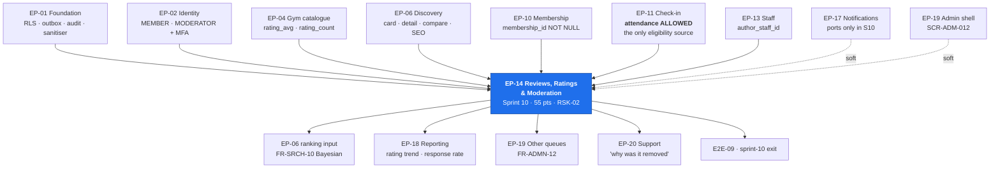

# EP-14 — Reviews, Ratings & Moderation

> **Phase-0 delivery backlog.** Detailed expansion of `ENGINEERING_PLAN.md` §2 (epic row `EP-14`)
> and §3 (`F-14.1` … `F-14.12`). No application code exists yet.
>
> **This epic is the entire engineering answer to `RSK-02` (score 16).** `SprintPlanning.md` sprint 10
> states it plainly: *"the entire defence against fake reviews lives in this one sprint."* The
> defence is **structural, not algorithmic** — a review requires a recorded check-in
> (`BR-REV-01`), there is no unverified review type (`BR-REV-03`), and a gym has **no mechanism at
> all** to edit or delete a member's review (`BR-REV-05`). The anomaly detector is the fourth line,
> not the first.
>
> **Two numbers exist and must never be confused.** The **displayed** rating is the plain mean of
> published reviews with its count, suppressed below three (`BR-REV-07`, `OQ-10` = 3). The
> **ranking** input is Bayesian-shrunk (`FR-REV-08`, `FR-SRCH-10`). `TR-23` (score 12) is the risk
> that these diverge visibly; `TD-004` and `TD-015` are the debt entries that already record the
> obligation to keep them in step. See §11 R-14.4.
>
> **India-specific screening gap, raised at the top because it is the one thing a generic
> implementation will get wrong.** `FR-REV-03` requires screening for profanity, contact details,
> URLs and competitor solicitation. In the launch market that means **Devanagari and transliterated
> Hinglish profanity**, **Indian mobile formats** (10 digits beginning 6–9, with or without `+91`),
> **`wa.me` / WhatsApp links** and — the one nobody lists — **UPI VPAs** of the form `name@okhdfc`,
> which are a complete off-platform payment instruction in eleven characters. See `OQ-EP14.a`.

---

## 1. Metadata

| Field | Value |
| :--- | :--- |
| **Epic id** | `EP-14` |
| **Name** | Reviews, Ratings & Moderation |
| **Priority (MoSCoW)** | **M** — Must. Nine of eleven `FR-REV-*` are `M`; `BAC-09` (*"only a member with a recorded check-in can publish a review, verified by attempting the negative case"*) is a business acceptance criterion in its own right |
| **Complexity** | **L** (T-shirt, §2) · module rating **High** for `reviews/` (§13.1) — *"`RSK-02` lives here"* |
| **Story points** | **55** (epic/feature view, §2) · `reviews/` module view **55 pts / 28 engineer-days** (§13.1) |
| **Target sprint(s)** | **Sprint 10** (2027-01-25 → 2027-02-05, Republic Day sprint, capacity −5%) — all of `F-14.1` … `F-14.12`, sprint tasks 10.1–10.9, 10.12–10.14, 10.17, 10.18, 10.20. Review **reporting** analytics moves to **sprint 13** with the report harness |
| **Owning PRD module** | `REV` (`B5.16`) |
| **Owning code module** | `reviews/` |
| **Collaborating modules** | `attendance/` (eligibility source — `BR-REV-01` reads it and nothing else), `discovery/` (`BR-REV-07` display suppression and `FR-SRCH-10` ranking input), `catalog/` (`gyms.rating_avg`, `rating_count`), `staff/` (`review_responses.author_staff_id`), `admin/` (`FR-ADMN-12` moderation queues), `notifications/` (prompts), `audit/` (`BR-DAT-01`) |
| **Surfaces** | `customer-web` — `SCR-WEB-013` (Write/Edit Review, primary), `SCR-WEB-003` (detail review section), `SCR-WEB-002` (rating on result cards), `SCR-WEB-004` (comparison), `SCR-WEB-008`/`/account/reviews` · `gym-dashboard` — `SCR-DASH-019` (Reviews received) · `admin-dashboard` — `SCR-ADM-012` (Moderation Queues) |
| **Primary APIs** | `GET /v1/gyms/:slug/reviews` (public, `CDN-300`) · `GET /v1/gyms/:slug/reviews/eligibility` (**200 either way**) · `POST /v1/gyms/:slug/reviews` · `PATCH|DELETE /v1/reviews/:id` · `POST /v1/reviews/:id/report` · `GET /v1/me/reviews` · `GET /v1/tenant/reviews` · `POST /v1/tenant/reviews/:id/respond` · `POST /v1/tenant/reviews/:id/report` · `GET /v1/admin/moderation/reviews` · `POST /v1/admin/moderation/reviews/:id/decide` |
| **Background jobs** | `review.aggregate` (on change + nightly rebuild, `C5`) · `review.anomaly-scan` (hourly, `C5`) · **new**: `review.prompt-scheduler` (daily — third check-in and day-45 prompts) · **new**: `review.aggregate-reconcile` (nightly — recomputes both figures from `reviews` and alerts on any correction, per `TR-23`) |
| **Feature flags** | `rel.reviews.anomaly-detection` (OFF at start, thresholds in `FEATURE_FLAGS.md`) · `rel.reviews.review-prompts` (OFF) · `exp.reviews.prompt-timing` (third vs seventh check-in) · `ops.reviews.publication` (kill-switch, ON — pulled during a coordinated attack: new reviews go `HELD`, **none rejected or lost**) |
| **Launch market** | **India** — screening must cover Devanagari + Hinglish profanity, `+91`/10-digit mobiles, `wa.me` links and **UPI VPAs**; review media stored in the India region (`OQ-16`); review text is personal data under **DPDP 2023**, so `BR-DAT-04` pseudonymisation must reach a published review's author attribution without destroying the review's evidentiary value |
| **Status** | `PLANNED` — Phase 0. Not started. **No blocking open question**; `OQ-10` is answered at **3** |
| **Epic owner** | Backend Engineer — `reviews/` (named as the engineering counterpart to Operations on `RSK-02`) |

---

## 2. Business Goal

**Reviews are the marketplace's only durable moat, and this epic decides whether that moat holds
water.** `OBJ-03` commits the platform to *"every published review comes from a member who actually
attended"*, and `A3.4` principle 5 — *"earned reviews only"* — makes it non-negotiable. The
competitive analysis in `A2.4` is blunt about why: public review platforms accept reviews from
anyone, so their ratings carry little signal, and a consumer who cannot distinguish a good gym from a
well-marketed one has no reason to prefer this marketplace to a maps search. The whole demand-side
proposition rests on a rating a stranger can act on. `KPI-13` (≥20% of members reviewing within 45
days) measures whether enough of them exist to matter; `BAC-09` measures whether the ones that exist
are real.

**The second goal is a rating that is fair in both directions.** A gym owner who receives an unfair
review must have a real remedy — one public response (`FR-REV-05`) and a structured report
(`FR-REV-06`) — and must have **no** remedy that consists of making the review disappear. `BR-REV-05`
is enforced by *structural absence*: an assertion over the generated OpenAPI document proving no
operation exists by which a tenant principal can mutate or delete a `reviews` row. That is a
deliberate design choice recorded in `BusinessRules.md`: *"'never' is only credible if the capability
does not exist"*, and it *"removes the conversation"* about a delete feature that will otherwise be
requested as customer success. Conversely, `BR-REV-06` refuses the symmetric abuse — if reporting hid
a review, every gym would report every negative one and ratings would become advisory — while
carving out exactly two categories, `PERSONAL_INFORMATION` and `THREAT`, where leaving content
published while a moderator works a queue is a genuine safety failure.

**The third goal is that the number on the card means something.** `BR-REV-07` suppresses any
numeric rating below three published reviews, because a single five-star review rendering as "5.0"
would outrank a gym with 4.7 from two hundred — the marketplace's ranking would become a function of
review scarcity, which is exactly backwards. `KL-037` records the honest cost: a newly approved gym
competes without a visible rating, and because reviews are check-in-gated it needs three members who
joined, attended and reviewed before a number appears. That cold-start penalty is accepted, and
mitigated by the Bayesian ranking input (`FR-REV-08`, `FR-SRCH-10`) which neither flatters nor buries
a thin-review gym, and by giving profile completeness and freshness their own ranking weight. The
epic therefore owns two figures with one source of truth, one recompute path, and a nightly
reconciliation that alerts on any correction — because `TR-23` is the risk that a gym displaying 4.9
sits below a gym displaying 4.4 and nobody can explain why.

---

## 3. Scope

### 3.1 In scope — explicit

| # | Item | Anchor |
| :-: | :--- | :--- |
| 1 | **Server-computed eligibility** gated on ≥1 recorded `ALLOWED` check-in at that gym; the compose UI is unreachable otherwise and the API refuses with `403 REVIEW_REQUIRES_CHECK_IN` | `FR-REV-01`, `BR-REV-01`, `AC-REV-02.1`, `BAC-09` |
| 2 | `GET /gyms/:slug/reviews/eligibility` answering **200 either way** with a reason code — the caller asked *whether*, not *to* | `API_Catalog.md` §3.10, `SCR-WEB-013` ineligible state |
| 3 | Review content model: 1–5 overall, optional sub-ratings (equipment, cleanliness, staff, crowd, value), body **20–2000 characters**, optional photos | `FR-REV-02` |
| 4 | Automated screening on submission — profanity, contact details, URLs, competitor solicitation, spam patterns — that **queues rather than rejects** | `FR-REV-03`, `BR-REV-04` |
| 5 | **India screening lexicons**: Devanagari and transliterated Hinglish profanity; `+91` and bare 10-digit mobiles beginning 6–9; `wa.me` and `api.whatsapp.com` links; **UPI VPAs** (`handle@bank`) | `LAUNCH_MARKET_INDIA.md` §1, `FR-REV-03`, `RSK-07` disintermediation |
| 6 | One review per member per gym **per membership term**, enforced by `UNIQUE (user_id, gym_id, membership_id)` | `FR-REV-04`, `BR-REV-02` |
| 7 | **7-day edit window** in the gym's timezone, with prior versions retained in `edit_history jsonb` and the review labelled as edited | `FR-REV-04`, `BR-REV-02` |
| 8 | **One gym response per review**, screened by the same pipeline, enforced by `UNIQUE (review_id)` on `review_responses` | `FR-REV-05`, `BR-REV-05` |
| 9 | Gym **report** flow with a structured `C4.8` moderation reason that **never** changes review status | `FR-REV-06`, `BR-REV-06` |
| 10 | Moderation queue with four actions — publish, unpublish, request edit, remove with reason — over the `C4.6` state machine | `FR-REV-07`, `SCR-ADM-012`, `FR-ADMN-12` |
| 11 | **Two rating figures from one `(sum, count)` pair**: displayed plain mean with count, and the Bayesian-shrunk ranking input | `FR-REV-08`, `FR-SRCH-10`, `TR-23` |
| 12 | Numeric rating **omitted entirely** (not `null`, not `0`) below three published reviews, on every surface including SEO structured data and the comparison table | `BR-REV-07`, `OQ-10` = 3, `AC-DETL-02.1` |
| 13 | Anomaly detection on **four independent signals, any two of which flag**: velocity above 4× the trailing 28-day mean; ≥3 reviewers whose only check-in is at that gym within 90 minutes of the review; rating distribution collapsing to one value; shared device fingerprint or `/24` source network across ≥3 reviewers | `FR-REV-09`, `RSK-02` countermeasure 3 |
| 14 | Flagged reviews **held, not deleted** — deletion destroys the evidence that distinguishes a campaign from a genuine burst — and excluded from the aggregate pending review | `FR-REV-09`, `RSK-02` countermeasure 4 |
| 15 | Review prompts after the **third check-in** and again at **day 45** if not submitted | `FR-REV-10`, `KPI-13` |
| 16 | Member **self-deletion** with aggregate update and the deletion retained in audit | `FR-REV-11`, `BR-DAT-01` |
| 17 | Aggregate recomputation **within one minute** of any moderation action | `AC-REV-02.3`, `C5 review.aggregate` |
| 18 | *"Verified member"* marker on every published review, as a render-time constant — because `BR-REV-01` makes every review verified by construction | `BR-REV-03`, `AC-DETL-02.2` |
| 19 | Media on reviews: EXIF stripped (A-17 Sharp), renditions generated, India-region storage | `FR-REV-02`, `NFR-PRV-*`, `OQ-16` |
| 20 | One shared sanitiser configuration across all four rich-text surfaces | `SEC-A03-004` |
| 21 | `ops.reviews.publication` kill-switch: new reviews accepted, screened and stored `HELD`; published reviews stay published; aggregates freeze; **nothing is rejected or lost** | `FEATURE_FLAGS.md`, `RSK-02` acute form |

### 3.2 Out of scope — explicit, with destination

| Item | Why it is not here | Where it went |
| :--- | :--- | :--- |
| Attendance capture, the QR token, the ten-step validation | `reviews/` **reads** attendance and writes nothing to it; `BR-CHK-09` makes attendance immutable precisely so it can be the eligibility evidence | **`EP-11`**, sprint 8 |
| The detail-page review **section layout**, similar-gyms, comparison table | `discovery/` owns the surfaces; `reviews/` owns the data and the suppression rule | **`EP-06`**, sprints 3–4 |
| The search **ranking formula** and its configurable weights | `FR-SRCH-10` is `discovery/`'s; `EP-14` supplies the Bayesian input and the contract that it never swaps with the display mean | **`EP-06`**, `TR-22` |
| Gym **photo and description** moderation queues | Different content class, different queue, same screen family | **`EP-19`**, `FR-ADMN-12` |
| User **reports of gyms** (as opposed to reports of reviews) | `FR-DETL-06`; a separate queue on `SCR-ADM-012` | **`EP-19`** |
| Notification **delivery** — channels, preferences, quiet hours, templates | `EP-14` raises the prompt event; `notifications/` decides whether and how it is delivered | **`EP-17`**, sprint 14 |
| Review and rating **reporting** — response-rate metrics, rating trend over time, per-gym review analytics | Reading is reporting's job | **`EP-18`**, sprint 13 |
| Moderator **role and platform-staff administration** | `MODERATOR` is a platform-scope principal | **`EP-19`**; the role itself comes from **`EP-02`** |
| **Incentivised-review commercial policy** — what the platform does to a complicit gym | `RSK-02`'s contingency routes to `BR-GYM-*` suspension and an `RSK-07` contractual path; that is Operations, not code | **Operations**, `RSK-02` contingency 4 |
| Machine-learning classification of review text | `FR-REV-03` and `FR-REV-09` are satisfiable with deterministic rules plus lexicons, and a model is not tunable in `FEATURE_FLAGS.md` | **Not in Phase 1** — recorded so it is a decision, not an oversight |
| Review **translation** across Indian languages | Not a PRD requirement; the screening lexicons must be multilingual, the display need not be | **Not in Phase 1** |

### 3.3 The two-figure contract, stated once

| Figure | Definition | Consumers | Suppression |
| :--- | :--- | :--- | :--- |
| **Display mean** | `sum(rating) / count` over `PUBLISHED` reviews only, to one decimal | `SCR-WEB-002` cards, `SCR-WEB-003` detail, `SCR-WEB-004` comparison, SEO structured data, `SCR-DASH-019` | **Omitted entirely** below 3 (`OQ-10`); the DTO does not carry the field, it does not send `null` or `0` |
| **Ranking input** | Bayesian shrinkage toward a platform prior `(m, C)` held as **versioned configuration**, from the **same** `(sum, count)` pair | `discovery/` ranking only (`FR-SRCH-10`) | Below 3, the gym is ranked **on the prior**, not on its one review |

Both are produced by **one function**, `ratingOf(gym)`, returning both values, updated in the **same
transaction** as a publish, unpublish, remove or member deletion, so they cannot be independently
stale (`TR-23` mitigation). A change to the prior triggers a **full recompute**, never a lazy drift.
`review.aggregate-reconcile` recomputes both nightly from `reviews` and alerts on any correction —
`TD-004`'s stated revisit trigger is a nightly rebuild correcting more than 0.05 on any gym.

---
## 4. Features

`F-14.1` … `F-14.12` are carried verbatim from `ENGINEERING_PLAN.md` §3. Rows marked *(new)* are
additions this backlog surfaces from `RiskAnalysis.md` §2.2 and §3.3.13, `FEATURE_FLAGS.md`,
`LAUNCH_MARKET_INDIA.md` and `API_Catalog.md` §3.10.

| Feature | Description | Satisfies | Pri | Pts | Sprint |
| :--- | :--- | :--- | :-: | :-: | :-: |
| **F-14.1** | Server-computed eligibility gated on ≥1 recorded `ALLOWED` check-in; `403 REVIEW_REQUIRES_CHECK_IN` by direct API call | `FR-REV-01`, `BR-REV-01`, `AC-REV-02.1`, `BAC-09` | M | 5 | 10 |
| **F-14.2** | Review content model: overall rating, five optional sub-ratings, 20–2000 character body, optional photos with EXIF stripped | `FR-REV-02` | M | 4 | 10 |
| **F-14.3** | Automated screening — profanity, contact details, URLs, solicitation, spam — **queueing rather than rejecting**; the same pipeline screens responses | `FR-REV-03`, `FR-REV-05`, `BR-REV-04` | M | 5 | 10 |
| **F-14.4** | One review per member per gym per term (DB constraint); **7-day edit window** with `edit_history` retained | `FR-REV-04`, `BR-REV-02` | M | 4 | 10 |
| **F-14.5** | One gym response per review, identically screened, `UNIQUE (review_id)` | `FR-REV-05`, `BR-REV-05` | M | 3 | 10 |
| **F-14.6** | Gym report flow with a structured `C4.8` reason that **never removes the review** | `FR-REV-06`, `BR-REV-06` | M | 3 | 10 |
| **F-14.7** | Moderation queue: publish, unpublish, request-edit, remove-with-reason, over the `C4.6` state machine | `FR-REV-07`, `SCR-ADM-012`, `FR-ADMN-12` | M | 5 | 10 |
| **F-14.8** | Bayesian ranking adjustment; plain mean displayed with count; both from one `(sum, count)` pair | `FR-REV-08`, `BR-REV-07`, `FR-SRCH-10` | M | 4 | 10 |
| **F-14.9** | Anomaly detection on four signals, any two of which flag; suspects **held and excluded** from the aggregate pending review | `FR-REV-09`, `RSK-02` | S | 6 | 10 |
| **F-14.10** | Review prompts at the third check-in and at day 45 | `FR-REV-10`, `KPI-13` | S | 3 | 10 |
| **F-14.11** | Member self-deletion with aggregate update and audit retention | `FR-REV-11`, `BR-DAT-01` | M | 3 | 10 |
| **F-14.12** | Aggregate recomputation **within one minute** of any moderation action | `AC-REV-02.3`, `C5 review.aggregate` | M | 4 | 10 |
| **F-14.13** *(new)* | **`ratingOf(gym)` — one function, two consumers**, both figures updated in the same transaction as the status change; the prior `(m, C)` as versioned configuration; a change to it triggers a **full recompute** | `TR-23`, `TD-004`, `TD-015`, `FR-REV-08` | M | 3 | 10 |
| **F-14.14** *(new)* | **Nightly `review.aggregate-reconcile`** recomputing both figures from `reviews` and alerting on any correction; alarm threshold **0.05** on any gym | `TD-004` revisit trigger, `TR-23` | M | 2 | 10 |
| **F-14.15** *(new)* | **India screening lexicons and patterns** — Devanagari + Hinglish profanity, `+91`/bare-10-digit mobiles, `wa.me` links, **UPI VPAs** — held as versioned data, not code, and tunable without deployment | `FR-REV-03`, `RSK-07`, `LAUNCH_MARKET_INDIA.md` | M | 3 | 10 |
| **F-14.16** *(new)* | **Structural-absence assurance**: a contract test over the generated OpenAPI document proving **no** operation lets a tenant principal mutate or delete a `reviews` row, plus a grant assertion that the tenant DB role holds no `UPDATE`/`DELETE` on `reviews` | `BR-REV-05`, `SEC-A04-003`, `AC-REV-01.2` | M | 2 | 10 |
| **F-14.17** *(new)* | **`ops.reviews.publication` kill-switch** — new reviews accepted, screened and stored `HELD`; published ones stay published; aggregates freeze; every held review flows into the queue on restore | `FEATURE_FLAGS.md`, `RSK-02` | M | 2 | 10 |
| **F-14.18** *(new)* | **Eligibility endpoint returning 200 either way** with a reason code, so `SCR-WEB-013` can *explain* rather than 403 the member's own browser | `API_Catalog.md` §3.10, `SCR-WEB-013` | M | 1 | 10 |
| **F-14.19** *(new)* | **False-positive gate**: the detector is tuned against `TestingStrategy.md` §5's seeded distribution and a genuine 20-review post-campaign burst must **pass**; thresholds recorded in `FEATURE_FLAGS.md`, not in code | `E10.7`, `RSK-02`, `KPI-13` | M | 2 | 10 |
| **F-14.20** *(new)* | **DPDP-compatible author pseudonymisation** — a `BR-DAT-04` deletion request pseudonymises the reviewer's identity while the review body and rating survive, because removing them would silently rewrite a gym's rating history | `BR-DAT-04`, `CON-04`, `LAUNCH_MARKET_INDIA.md` §9 | M | 2 | 10 |

**Feature roll-up.** 20 features · 49 core points (`F-14.1` … `F-14.12`) + 17 points for the eight
additions, absorbed inside the `reviews/` module estimate of 55 points. Priorities: 18 `M`, 2 `S`.

---

## 5. User Stories

`US-REV-01` and `US-REV-02` are restated from `MASTER_PRD.md` §B5.16 with their PRD acceptance
criteria preserved. `US-REV-03` onward are **new** — the PRD's functional requirements and the
`RSK-02` analysis imply them without writing them as stories.

### US-REV-01 — *As a gym owner, I want a fair chance to answer a bad review, and no ability to hide it.* **(PRD)**

- **AC-REV-01.1** — **Given** a review is published about my gym, **when** I open it, **then** I may
  post **one** public response.
- **AC-REV-01.2** — **Given** a published review, **when** I look for a delete or edit action on it,
  **then** **none exists anywhere in the interface or API**.
- **AC-REV-01.3** — **Given** I believe a review is fraudulent, **when** I report it with a reason,
  **then** it **remains published**, a moderation case opens, and I am notified of the outcome.
- **AC-REV-01.4** *(new)* — **Given** I attempt a second response to the same review, **when** it is
  submitted, **then** it is refused by a **database uniqueness constraint**, not by a UI check.
- **AC-REV-01.5** *(new)* — **Given** my response contains a phone number, **when** it is submitted,
  **then** it goes through the **same** screening pipeline as a member review and is held if it fails.

### US-REV-02 — *As a platform, I want fake reviews to be structurally difficult.* **(PRD)**

- **AC-REV-02.1** — **Given** a user has never checked in at a gym, **when** they attempt to submit a
  review by **direct API call**, **then** it is refused with **403**.
- **AC-REV-02.2** — **Given** a gym receives an unusual burst of 5-star reviews from accounts created
  within the same period, **when** the anomaly detector runs, **then** those reviews are **held for
  moderation and excluded from the aggregate** until cleared.
- **AC-REV-02.3** — **Given** a review is unpublished by a moderator, **when** the gym's rating
  renders, **then** the aggregate recalculates without it **within one minute**.
- **AC-REV-02.4** *(new)* — **Given** a user whose only attendance rows at that gym are `DENIED`,
  **when** they attempt to review, **then** they are refused — the gate is an `ALLOWED` check-in, not
  the presence of a row (`BR-REV-01-N2`).
- **AC-REV-02.5** *(new)* — **Given** a **genuine** 20-review burst following a legitimate campaign in
  the seeded distribution, **when** the detector runs, **then** it is **not** suppressed, and the
  false-positive rate is documented.

### US-REV-03 — *As Priya, I want to review the gym I actually go to, and be told plainly if I cannot.* **(new — implied by `FR-REV-01`, `SCR-WEB-013`)**

- **AC-REV-03.1** — **Given** I have never checked in, **when** I open the gym page, **then** the
  compose affordance is **absent**, and if I reach `SCR-WEB-013` directly I see an **explanation of
  the check-in requirement**, not a raw error.
- **AC-REV-03.2** — **Given** the eligibility endpoint, **when** my client calls it, **then** it
  returns **200** with `{ eligible, reason }` in both cases — a question is not a failure.
- **AC-REV-03.3** — **Given** I am eligible, **when** I write fewer than 20 or more than 2000
  characters, **then** the counter tells me before submission and the server validates independently.
- **AC-REV-03.4** — **Given** I have already reviewed this gym in this membership term, **when** I
  return, **then** I see my review with an **edit** action inside 7 days and read-only after.
- **AC-REV-03.5** — **Given** my review is held for moderation, **when** I view it, **then** I see a
  clear status message — it is not silently missing.

### US-REV-04 — *As Priya, I want my review to be mine — editable briefly, deletable always, and never rewritten by the gym.* **(new — implied by `FR-REV-04`, `FR-REV-11`, `BR-REV-05`)**

- **AC-REV-04.1** — **Given** day 6 after publication, **when** I edit, **then** it succeeds, the
  prior version is retained in `edit_history`, and the review is labelled as edited.
- **AC-REV-04.2** — **Given** day 8, **when** I edit, **then** it is refused with
  `REVIEW_EDIT_WINDOW_CLOSED` — the window is computed in the **gym's** timezone.
- **AC-REV-04.3** — **Given** I delete my own review, **when** it completes, **then** the gym's
  aggregate updates within one minute and the deletion is retained in audit.
- **AC-REV-04.4** — **Given** I later exercise a `BR-DAT-04` deletion request, **when** it is
  processed, **then** my identity is pseudonymised while the review body and rating **survive**,
  because removing them would silently rewrite the gym's rating history.
- **AC-REV-04.5** — **Given** an edit, **when** the aggregate is recomputed, **then** it reflects the
  **new** rating value, not the original.

### US-REV-05 — *As Anita in moderation, I want a queue that tells me why an item is here.* **(new — implied by `FR-REV-07`, `FR-REV-09`, `SCR-ADM-012`)**

- **AC-REV-05.1** — **Given** the queue, **when** I open an item, **then** I see the **triggering
  signal**, the review, the gym context and the reviewer's history — the four things `SCR-ADM-012`
  names.
- **AC-REV-05.2** — **Given** an item, **when** I act, **then** the four actions available are
  publish, unpublish, request edit and **remove with reason**, and a reason is mandatory on removal.
- **AC-REV-05.3** — **Given** any decision, **when** it is recorded, **then** it is audited with
  actor, reason and before/after status (`BR-DAT-01`).
- **AC-REV-05.4** — **Given** a decision, **when** it commits, **then** the gym's aggregate is
  recomputed **within one minute** and the CDN key for that gym's reviews is purged.
- **AC-REV-05.5** — **Given** an anomaly-flagged cohort, **when** I clear it as genuine, **then** all
  members of the cohort return to `PUBLISHED` in one action and re-enter the aggregate together.

### US-REV-06 — *As the platform, I want a coordinated attack to be survivable without losing a single genuine review.* **(new — implied by `RSK-02` contingency, `ops.reviews.publication`)**

- **AC-REV-06.1** — **Given** the kill-switch is pulled, **when** a review is submitted, **then** it
  is accepted, screened and stored `HELD` — **never rejected, never lost**.
- **AC-REV-06.2** — **Given** the switch is pulled, **when** published reviews render, **then** they
  stay published and aggregates freeze at their last computed value.
- **AC-REV-06.3** — **Given** the switch is restored, **when** the queue is worked, **then** every
  review held during the outage is present in it, in submission order.
- **AC-REV-06.4** — **Given** a flagged cohort, **when** Operations bulk-unpublishes it, **then**
  both rating figures recompute, affected members are notified that reviews were removed, and the
  action is audited with a reason.

### US-REV-07 — *As Rohan, I want to know how my reviews are trending and to respond quickly.* **(new — implied by `SCR-DASH-019`, `FR-REV-05`)**

- **AC-REV-07.1** — **Given** `SCR-DASH-019`, **when** I open it, **then** I see reviews received with
  rating, text, date, **member tenure band**, response state, a rating trend chart and my
  response-rate metric.
- **AC-REV-07.2** — **Given** any review row, **when** I inspect the available actions, **then**
  exactly two exist: **respond** (once) and **report**. No third action exists anywhere.
- **AC-REV-07.3** — **Given** a new review, **when** it publishes, **then** it appears in
  `SCR-DASH-001`'s alert region as *"unread reviews needing response"*.
- **AC-REV-07.4** — **Given** I report a review, **when** the moderator decides, **then** I am
  notified of the **outcome**, whatever it is.

### US-REV-08 — *As a visitor, I want a rating I can trust or an honest absence of one.* **(new — implied by `BR-REV-07`, `AC-DETL-02.1`, `KL-037`)**

- **AC-REV-08.1** — **Given** a gym with fewer than 3 published reviews, **when** I view it anywhere —
  card, detail, comparison, SEO structured data — **then** **no numeric rating field is present at
  all**, and the review **count** with an explanation is shown instead.
- **AC-REV-08.2** — **Given** a gym with 3 published reviews, **when** one is unpublished, **then**
  the count drops to 2 and the rating **disappears from every surface** within one minute.
- **AC-REV-08.3** — **Given** any published review, **when** it renders, **then** it carries the
  **"Verified member"** marker; there is no other kind of review to distinguish it from.
- **AC-REV-08.4** — **Given** two gyms in a result list, **when** their displayed ratings and their
  positions disagree, **then** the difference is explainable by the featured-slot offset and the
  Bayesian prior — and a monitoring query asserts it (`TR-23`).

### US-REV-09 — *As the platform, I want to ask for reviews without becoming a nuisance.* **(new — implied by `FR-REV-10`, `KPI-13`, `RSK-12`)**

- **AC-REV-09.1** — **Given** a member's third check-in, **when** the scheduler runs, **then** a
  review prompt is raised as an **operational-category** notification, subject to preferences and
  quiet hours.
- **AC-REV-09.2** — **Given** day 45 with no review submitted, **when** the scheduler runs, **then**
  exactly **one** further prompt is raised — never a third.
- **AC-REV-09.3** — **Given** `rel.reviews.review-prompts` is off, **when** the scheduler runs,
  **then** nothing is sent and **eligibility is untouched** — a member can still review by
  navigating to the gym.
- **AC-REV-09.4** — **Given** `exp.reviews.prompt-timing` is running, **when** results are read,
  **then** the experiment is measured on `KPI-13` **and** on mean rating, so an earlier prompt that
  skews positive is visible as a **loss on trust**, not only a win on volume.

---
## 6. Acceptance Criteria for the Epic

The epic is not done until **every** row passes. Rows marked **launch-blocking** are gates on the
sprint-10 exit checklist, on `E2E-09`, or on `BAC-09`.

| # | Criterion | Evidence |
| :-: | :--- | :--- |
| **AC-EP14-01** | **Launch-blocking.** A review submitted by **direct API call** from an account with **no recorded check-in** returns **403 `REVIEW_REQUIRES_CHECK_IN`** | `E10.1`, `AC-REV-02.1`, `BAC-09`, `BR-REV-01-N1`, `SEC-A01-008` |
| **AC-EP14-02** | A user whose only attendance rows at that gym are `DENIED` is refused identically — the gate is an **`ALLOWED`** check-in | `BR-REV-01-N2`, `AC-REV-02.4` |
| **AC-EP14-03** | Eligibility is evaluated **server-side inside the submission transaction**, not read from a client claim or a cached flag | `BR-REV-01` `L6-UC`, T-14.05 |
| **AC-EP14-04** | `reviews.membership_id` is `NOT NULL` with an FK, so a review is always anchored to a purchased membership | `BR-REV-01` `L1-DB` |
| **AC-EP14-05** | **Launch-blocking.** A second review for the same `(user, gym, membership)` is refused by a **database constraint**, returning `409` | `E10.2`, `BR-REV-02-N1` |
| **AC-EP14-06** | A **second membership term** at the same gym permits a second review | `BR-REV-02-P1` |
| **AC-EP14-07** | An edit on day 6 succeeds with the prior version retained; an edit on day 8 is refused with `REVIEW_EDIT_WINDOW_CLOSED`, computed in the **gym's** timezone | `BR-REV-02-N2`, `AC-REV-04.1`, `AC-REV-04.2` |
| **AC-EP14-08** | **Launch-blocking.** No operation exists — in the UI **or the API** — by which a tenant principal can edit or delete a member's review; proven by an assertion over the **generated OpenAPI document** | `E10.3`, `AC-REV-01.2`, `BR-REV-05-N1`, `SEC-A04-003` |
| **AC-EP14-09** | A direct `UPDATE reviews` as the tenant database role raises **`permission denied`** — the grant is absent, not merely unused | `BR-REV-05-N3` |
| **AC-EP14-10** | A second gym response to the same review is refused by `UNIQUE (review_id)` | `BR-REV-05-N2`, `AC-REV-01.4` |
| **AC-EP14-11** | A gym response goes through the **same screening pipeline** as a member review | `FR-REV-05`, `BR-REV-04`, `AC-REV-01.5` |
| **AC-EP14-12** | **Launch-blocking.** A gym report leaves the review **published**; only a moderator can unpublish | `E10.4`, `AC-REV-01.3`, `BR-REV-06-P1` |
| **AC-EP14-13** | Reporting with `SUSPECTED_FAKE`, `IRRELEVANT`, `SPAM`, `PROMOTIONAL`, `ABUSIVE_LANGUAGE`, `CONFLICT_OF_INTEREST` or `OTHER` changes **no** review status | `BR-REV-06-N1` |
| **AC-EP14-14** | Only `PERSONAL_INFORMATION` and `THREAT` auto-transition to `HELD`, and that classification is made by the **screening classifier**, not by the reporter's claim | `BR-REV-06`, `C4.8` |
| **AC-EP14-15** | The report endpoint has **no status parameter**; the gym sees *"reported, under review"*, never *"removed"* | `BR-REV-06` `L7-GUARD`, `L11-UI` |
| **AC-EP14-16** | No path publishes a review **without a screening result**; `screening_result jsonb` is retained for appeal | `BR-REV-04-N1`, `C4.6` |
| **AC-EP14-17** | Screening **queues rather than rejects** — no legitimate review is silently lost | `E10.8`, `BR-REV-04` |
| **AC-EP14-18** | A stored-XSS payload in a review body neither stores executable nor renders executable; all four rich-text surfaces share **one** sanitiser configuration | `BR-REV-04-N2`, `SEC-A03-004` |
| **AC-EP14-19** | Screening detects **Devanagari and transliterated Hinglish profanity**, `+91` and bare 10-digit Indian mobiles, `wa.me` links and **UPI VPAs**; each pattern has a positive and a negative fixture | `F-14.15`, `RSK-07` |
| **AC-EP14-20** | **Launch-blocking.** The rating recomputes **within one minute** of any moderation action, measured with a stopwatch in the demo and asserted in CI | `E10.5`, `AC-REV-02.3` |
| **AC-EP14-21** | **Launch-blocking.** A burst of 5-star reviews from same-period accounts is **held and excluded from the aggregate** pending review | `E10.6`, `AC-REV-02.2` |
| **AC-EP14-22** | **Launch-blocking (false-positive gate).** A genuine 20-review post-campaign burst in the seeded distribution is **not** suppressed, and the false-positive rate is documented | `E10.7`, `AC-REV-02.5`, `RSK-02` evidence |
| **AC-EP14-23** | The detector flags on **any two of four** independent signals; each signal has its own metric label `gym.review.anomaly_flagged.count{signal}` | `RSK-02` countermeasure 3 |
| **AC-EP14-24** | Flagged reviews are **held, never deleted** — the evidence that distinguishes a campaign from a genuine burst survives | `RSK-02` countermeasure 4 |
| **AC-EP14-25** | Anomaly thresholds live in `FEATURE_FLAGS.md` and are changeable **without deployment**; no threshold literal exists in `reviews/` | Sprint-10 risk note, `E10.7` |
| **AC-EP14-26** | **Launch-blocking.** A gym with 1 or 2 published reviews exposes **no rating field** on any public surface, including SEO structured data and the comparison table — not `null`, not `0`, **absent** | `BR-REV-07-N1`, `AC-DETL-02.1` |
| **AC-EP14-27** | `HELD`, `UNPUBLISHED` and `REMOVED` reviews are excluded from **both** the mean and the count | `BR-REV-07-N2` |
| **AC-EP14-28** | Display mean and Bayesian ranking input come from **one function and one `(sum, count)` pair**, updated in the **same transaction** as the status change | `TR-23` mitigation, `F-14.13` |
| **AC-EP14-29** | A change to the Bayesian prior triggers a **full recompute**, and the prior is versioned like the ranking weights | `TR-23`, `TR-22` |
| **AC-EP14-30** | Below the 3-review threshold, the gym is **ranked on the prior**, not on its one review | `TR-23`, `OQ-10` |
| **AC-EP14-31** | `review.aggregate-reconcile` runs nightly, recomputes both figures from `reviews`, and **alerts on any correction above 0.05** on any gym | `TD-004` revisit trigger, `F-14.14` |
| **AC-EP14-32** | Every published review carries the **"Verified member"** marker; `reviews` has **no** verification-status column and a schema check fails any migration adding one | `BR-REV-03-P1`, `BR-REV-03-N1` |
| **AC-EP14-33** | Member self-deletion updates the aggregate within one minute and the deletion is retained in audit | `FR-REV-11`, `AC-REV-04.3` |
| **AC-EP14-34** | A `BR-DAT-04` deletion request **pseudonymises the author** while the review body and rating survive; a test asserts the gym's rating is unchanged by the request | `F-14.20`, `CON-04` |
| **AC-EP14-35** | Prompts fire at the third check-in and once at day 45 — **never a third** — as operational-category notifications subject to preferences and quiet hours | `FR-REV-10`, `AC-REV-09.2` |
| **AC-EP14-36** | `rel.reviews.review-prompts` off sends nothing and **leaves eligibility untouched** | `AC-REV-09.3` |
| **AC-EP14-37** | `ops.reviews.publication` pulled stores new reviews `HELD`, freezes aggregates, keeps published reviews published, and **loses nothing**; restore delivers every held review into the queue | `F-14.17`, `AC-REV-06.*` |
| **AC-EP14-38** | A moderation decision purges the gym's reviews CDN key; a subsequent public read reflects the new state | `API_Catalog.md` §CDN-300 invalidation |
| **AC-EP14-39** | Review media has EXIF stripped before storage and is stored in the **India region** | `A-17`, `OQ-16` |
| **AC-EP14-40** | Every review submission, edit, response, report and moderation decision writes a `BR-DAT-01` audit row with actor and reason | `BR-REV-01`, `BR-REV-04`, `BR-REV-06` audit columns |
| **AC-EP14-41** | `SCR-WEB-013`, `SCR-DASH-019` and `SCR-ADM-012` each render loading, empty, error and permission-denied states, are `axe-core` clean and keyboard-completable | `PROJECT_CONSTITUTION.md` §16.9, `NFR-USE-01` |
| **AC-EP14-42** | **`E2E-09` passes end to end**: check-in → review → publish → gym responds → gym cannot delete → gym reports → moderator unpublishes → rating recalculates | `E2E-09`, sprint-10 exit |

---

## 7. Business Rules Enforced

Detail lives in `BusinessRules.md` §12; this table records **ownership and the enforcement point**
only. `EP-14` **owns all seven** `BR-REV-*` rules — the only epic in the programme that owns an
entire rule family outright.

| Rule | Ownership | Enforcement point in this epic | Authoritative layer | Negative test (`BAC-06`) |
| :--- | :--- | :--- | :--- | :-: |
| `BR-REV-01` | **Owned** · invariant `I4` | Eligibility `EXISTS` over `attendance … result = 'ALLOWED'`, evaluated **inside the submission transaction**; `membership_id NOT NULL`; `403 REVIEW_REQUIRES_CHECK_IN` | `L6-UC` | ✅ `-N1`, `-N2` |
| `BR-REV-02` | **Owned** | `UNIQUE (user_id, gym_id, membership_id)`; 7-day window checked in the **gym's** timezone; `edit_history jsonb` appended before write | `L1-DB` | ✅ `-N1`, `-N2` |
| `BR-REV-03` | **Owned** · invariant `I4` | **Structural**: no `is_verified` column, no unverified variant; the marker is a render-time constant; a schema check fails any migration adding a verification-status column | Structural | ✅ `-N1` |
| `BR-REV-04` | **Owned** | The `C4.6` state machine has **no** `SUBMITTED → PUBLISHED` path that bypasses screening; one sanitiser configuration across four surfaces; `screening_result` retained | `L5-DOM` | ✅ `-N1`, `-N2` |
| `BR-REV-05` | **Owned** · invariant `I4` | **Structural absence** asserted over the generated OpenAPI document; `UNIQUE (review_id)` on `review_responses`; tenant role holds no `UPDATE`/`DELETE` grant on `reviews` | `L12-CI` | ✅ `-N1`, `-N2`, `-N3` |
| `BR-REV-06` | **Owned** | Reporting writes a `review_reports` row and **does not touch** `reviews.status`; only the classifier — not the reporter — can trigger `HELD`, and only for `PERSONAL_INFORMATION` or `THREAT` | `L5-DOM` | ✅ `-N1`, `-N2` |
| `BR-REV-07` | **Owned** (with `discovery/`) · Pri `S` | The public gym DTO **omits** `rating_avg` below the threshold; display mean and ranking input are separate fields that must never be swapped | `L6-UC` | ✅ `-N1`, `-N2` |
| `BR-CHK-09` | **Inherited** from `attendance/` | Attendance immutability is what makes eligibility non-forgeable; `EP-14` reads and never writes it | — | — |
| `BR-DAT-01` | **Contributor** | Submission, each edit, responses, reports and **every** moderation action audited with actor and reason | `L9-INT` | ✅ |
| `BR-DAT-04` | **Contributor** | Author pseudonymisation that preserves the review body and rating (`F-14.20`) | — | ✅ |
| `BR-TEN-01` | **Inherited** from `EP-01` | `reviews`, `review_responses`, `review_reports` are tenant-owned and RLS-policied; the **public** read path is platform-scope and filters on `PUBLISHED` + approved gym | — | ✅ `E2E-11` |
| `BR-GYM-01` | **Inherited** | A review never renders for a gym that is not `APPROVED` and visible | — | — |

---

## 8. Dependencies

### 8.1 Upstream — must exist first

| Epic | What `EP-14` needs from it | Hard or soft |
| :--- | :--- | :--- |
| **EP-01** | Tenant context, RLS, outbox, audit writer, idempotency, sanitiser primitive | **Hard** |
| **EP-02** | Authenticated `MEMBER` principal; the `MODERATOR` platform role and its MFA-gated session | **Hard** |
| **EP-04** | Gyms and their slugs; `gyms.rating_avg` / `rating_count` columns | **Hard** |
| **EP-06** | Detail-page review section, result-card rating slot, comparison table, SEO structured data — the surfaces the suppression rule applies to | **Hard** for `BR-REV-07` |
| **EP-10** | `memberships` — `reviews.membership_id` is `NOT NULL` and *"per term"* means *per membership* | **Hard** |
| **EP-11** | `attendance` with `result = 'ALLOWED'` — **the single source of eligibility**. Without sprint 8, `BR-REV-01` cannot be evaluated at all | **Hard, absolute** |
| **EP-13** | Staff principals for `review_responses.author_staff_id`, and the moderation-adjacent roles | **Hard** |
| **EP-17** | Notification ports for prompts and outcome notices; adapters land in sprint 14 | **Soft** — prompts are flag-off at first |
| **EP-19** | `SCR-ADM-012` sits in the admin console shell; `FR-ADMN-12` owns the *other* two queues on the same screen | **Soft** — the review queue ships in sprint 10 |

### 8.2 Downstream — what this unblocks

| Epic / item | Why it needs `EP-14` |
| :--- | :--- |
| **EP-06** ranking (retrofit) | `FR-SRCH-10` consumes the Bayesian input; until sprint 10 it ranks on the prior for every gym |
| **EP-18** (sprint 13) | Review analytics, response-rate metrics, rating trend, moderation throughput |
| **EP-19** (sprint 15) | The remaining `FR-ADMN-12` queues reuse this epic's queue shell and decision audit shape |
| **EP-20** (sprint 14) | Support answers *"why was my review removed"* from the retained `screening_result` and moderation reason |
| `UAT-03`, `UAT-06` | Consumer trust and gym-owner review scripts |
| `E2E-09` | The sprint-10 exit journey **is** this epic |

### 8.3 External dependencies and decisions

| Item | Nature | Status |
| :--- | :--- | :--- |
| `OQ-10` — minimum reviews before a numeric rating | Client decision, due **sprint 10** | **Answered: 3.** Recorded as `KL-088`; the *behaviour* is hard-coded into `AC-DETL-02.1`, so a change touches a test as well as a config value |
| `OQ-11` — both coupon funding sources | Client decision, due sprint 10 | Answered *yes*; belongs to `EP-07`'s share of the sprint, not to `EP-14` |
| **Profanity / abuse lexicons for Indian languages** | Data, not code; needs a named owner | **New — `OQ-EP14.a`.** No vendor is named by the PRD or `STACK_ADDITIONS.md`; a bought list is a **dependency** requiring an `A-NN` row |
| **A-19** notification vendors | Stack addition, `DEFERRED` | Prompts ship flag-off; no delivery dependency in sprint 10 |
| `TestingStrategy.md` §5 seeded review distribution | Internal, but a hard input | The false-positive gate `E10.7` is meaningless without it; the seed is versioned like schema (`TR-33`) |
| Operations moderation staffing | Business capability | `RSK-02`'s leading indicator is *flag rate rising while clearance rate stays flat* — a detector with no moderator behind it is a metric, not a control |

### 8.4 Dependency graph

---
## 9. Technical Tasks

Estimates are **engineer-days** (1 point ≈ 0.5 ed). `SprintPlanning.md` sprint-10 task numbers are
given where a task maps onto one.

| Task | Description | Layer | Est. (ed) | Depends on | Serves |
| :--- | :--- | :--- | :-: | :--- | :--- |
| **T-14.01** | Migration: `reviews` (`tenant_id`, `gym_id`, `user_id`, `membership_id NOT NULL`, `rating`, `sub_ratings jsonb`, `body`, `media jsonb`, `status`, `screening_result jsonb`, `published_at`, `edited_at`, `edit_history jsonb`) with RLS and `CHECK (rating BETWEEN 1 AND 5)` | DB | 0.5 | EP-01 | `C2.2` `reviews` |
| **T-14.02** | Migration: `UNIQUE (user_id, gym_id, membership_id)`; index `(gym_id, status, published_at desc)` for the public list; index `(user_id, created_at desc)` for `/me/reviews` | DB | 0.3 | T-14.01 | `BR-REV-02`, `§C2.4` |
| **T-14.03** | Migration: `review_responses` (`review_id` **UNIQUE**, `tenant_id`, `body`, `author_staff_id`, `status`) and `review_reports` (`review_id`, `reporter_id`, `reporter_type`, `reason_code`, `notes`, `status`, `resolution`) — reports are a **separate table** so reporting cannot be an update to the review | DB | 0.4 | T-14.01 | `BR-REV-05`, `BR-REV-06` |
| **T-14.04** | **Grant configuration**: the tenant-scoped database role holds **no `UPDATE` and no `DELETE`** on `reviews`; asserted in local, CI, development, staging and production | DB | 0.4 | T-14.01 | `BR-REV-05-N3`, `AC-EP14-09` |
| **T-14.05** | Eligibility use case: `EXISTS (SELECT 1 FROM attendance WHERE user_id = :u AND gym_id = :g AND result = 'ALLOWED')` evaluated **inside** the submission transaction; `403 REVIEW_REQUIRES_CHECK_IN` | API | 1.0 | EP-11, T-14.01 | `BR-REV-01`, `BAC-09` · **10.1** |
| **T-14.06** | `GET /gyms/:slug/reviews/eligibility` returning **200 either way** with `{ eligible, reason }`; reason codes enumerated, not free text | API | 0.4 | T-14.05 | `F-14.18`, `SCR-WEB-013` |
| **T-14.07** | `Review` aggregate implementing the **`C4.6`** machine — `SUBMITTED → PUBLISHED \| HELD`, `PUBLISHED ⇄ UNPUBLISHED`, `→ REMOVED` terminal — with **no** transition bypassing screening | API | 0.8 | T-14.01 | `BR-REV-04` `L5-DOM` |
| **T-14.08** | Content model and validation: 1–5 overall, five optional sub-ratings, 20–2000 character body, media references; Zod schema shared with the web client (A-02) | API | 0.6 | T-14.01 | `FR-REV-02` · **10.2** |
| **T-14.09** | Media pipeline for review photos: EXIF strip, renditions, India-region bucket, virus/type checks | API | 0.6 | A-17, EP-04 | `FR-REV-02`, `AC-EP14-39` |
| **T-14.10** | **Screening pipeline** — rule engine over versioned lexicons and patterns, returning a structured `screening_result`; the **same** pipeline instance screens responses | API | 1.6 | T-14.07 | `FR-REV-03`, `FR-REV-05`, `BR-REV-04` · **10.3** |
| **T-14.11** | **India lexicons and patterns as versioned data**: Devanagari + Hinglish profanity, `+91`/bare-10-digit mobiles beginning 6–9, `wa.me`/`api.whatsapp.com`, **UPI VPA** `^[\w.\-]{3,}@[a-z]{3,}$` with a bank-handle allowlist to keep the false-positive rate low | API | 0.9 | T-14.10 | `F-14.15`, `AC-EP14-19` |
| **T-14.12** | Shared sanitiser configuration applied to all four rich-text surfaces; stored-XSS fixtures | API | 0.5 | T-14.10 | `SEC-A03-004` |
| **T-14.13** | Edit path: 7-day window in the **gym's** timezone, prior body appended to `edit_history`, `edited_at` set, `REVIEW_EDIT_WINDOW_CLOSED` past the window | API | 0.6 | T-14.07 | `BR-REV-02` · **10.2** |
| **T-14.14** | Gym response: one per review, screened, `author_staff_id` from the session, published on pass and held on fail | API | 0.6 | T-14.10, EP-13 | `FR-REV-05` · **10.4** |
| **T-14.15** | Report flow: writes `review_reports`, **no status parameter on the endpoint**, no write to `reviews.status`; only `PERSONAL_INFORMATION` / `THREAT` classified by the **classifier** trigger `HELD` | API | 0.7 | T-14.10 | `FR-REV-06`, `BR-REV-06` · **10.4** |
| **T-14.16** | Moderation queue read model: item with triggering signal, review, gym context and reviewer history; keyset pagination; MFA-gated platform scope | API | 0.9 | T-14.07 | `FR-REV-07`, `SCR-ADM-012` · **10.5** |
| **T-14.17** | Moderation decide endpoint: publish / unpublish / request-edit / remove-with-reason, mandatory reason on removal, audit with before/after, outbox event for recompute and CDN purge | API | 0.8 | T-14.16 | `FR-REV-07`, `BR-DAT-01` · **10.5** |
| **T-14.18** | **`ratingOf(gym)`** — one function returning display mean and Bayesian-shrunk value from one `(sum, count)` pair; prior `(m, C)` as versioned configuration; both written in the **same transaction** as the status change | API | 1.0 | T-14.07 | `F-14.13`, `TR-23` · **10.6** |
| **T-14.19** | Suppression rule: the public gym DTO **omits** `rating_avg` below 3 — not `null`, not `0` — on cards, detail, comparison and SEO structured data; below the threshold, ranking uses the prior | API | 0.6 | T-14.18, EP-06 | `BR-REV-07`, `AC-DETL-02.1` · **10.6** |
| **T-14.20** | Job `review.aggregate`: outbox-driven, **keyed on gym id with debounce**, plus a nightly full rebuild; duration alert at **30 s** to protect the 60 s criterion | worker | 1.0 | T-14.18 | `AC-REV-02.3`, `C5` · **10.8** |
| **T-14.21** | Job `review.anomaly-scan` (hourly): the four signals, any two flagging; writes a flag with its signal set; **holds** the review and excludes it from the aggregate; never deletes | worker | 1.8 | T-14.18 | `FR-REV-09`, `RSK-02` · **10.7** |
| **T-14.22** | Anomaly thresholds as flag-resolved configuration (`rel.reviews.anomaly-detection`), zero literals in `reviews/`; per-signal metrics `gym.review.anomaly_flagged.count{signal}` | worker | 0.5 | T-14.21 | `AC-EP14-25` · **10.20** |
| **T-14.23** | Job `review.aggregate-reconcile` (nightly): recompute both figures from `reviews`, compare, correct, and **alert on any correction > 0.05** on any gym | worker | 0.6 | T-14.18 | `F-14.14`, `TD-004` |
| **T-14.24** | Job `review.prompt-scheduler` (daily): third-check-in prompt and day-45 follow-up, exactly once each, as operational-category notifications behind `rel.reviews.review-prompts` | worker | 0.7 | EP-11, EP-17 ports | `FR-REV-10` · **10.9** |
| **T-14.25** | Member self-deletion: aggregate update, audit retention, and the `BR-DAT-04` **pseudonymisation** variant that preserves body and rating | API | 0.8 | T-14.18 | `FR-REV-11`, `F-14.20` · **10.9** |
| **T-14.26** | `ops.reviews.publication` kill-switch wiring: accept → screen → store `HELD`; published reviews untouched; aggregates frozen; restore drains into the queue in submission order | API | 0.5 | T-14.07 | `F-14.17`, `AC-REV-06.*` |
| **T-14.27** | Public read path: `GET /gyms/:slug/reviews` paginated, sortable, filterable, `CDN-300` cached, with **CDN key purge on any moderation decision** | API | 0.6 | T-14.17 | `FR-DETL-05`, `API_Catalog.md` §CDN |
| **T-14.28** | `SCR-WEB-013` Write/Edit Review: rating and sub-ratings, character counter, photo upload, guidelines summary; **ineligible**, **already-reviewed (edit ≤7 d / read-only after)** and **held-for-moderation** states | web | 1.6 | T-14.06, T-14.08 | `SCR-WEB-013` · **10.12** |
| **T-14.29** | Detail-page review list with tenure band and the **"Verified member"** marker on every review; "no numeric rating" presentation below 3 with the count and an explanation | web | 1.2 | T-14.19, EP-06 | `FR-DETL-05`, `AC-DETL-02.1`, `AC-DETL-02.2` · **10.12** |
| **T-14.30** | `/account/reviews`: own reviews with moderation state, edit affordance inside the window, delete action | web | 0.7 | T-14.13, T-14.25 | `GET /me/reviews` |
| **T-14.31** | `SCR-DASH-019`: reviews received with rating, text, date, tenure band, response state, rating-trend chart, response-rate metric — and **exactly two actions**, respond and report | dash | 1.4 | T-14.14, T-14.15 | `SCR-DASH-019` · **10.13** |
| **T-14.32** | `SCR-ADM-012` moderation queue screen: signal, review, gym context, reviewer history, four actions, reason capture, bulk clear for an anomaly cohort | admin | 1.6 | T-14.16, T-14.17 | `SCR-ADM-012` · **10.14** |
| **T-14.33** | **Route-absence contract test**: enumerate the generated OpenAPI document and assert **no** operation permits a tenant principal to mutate or delete a `reviews` row | test | 0.7 | T-14.03 | `BR-REV-05-N1`, `E10.3` · **10.18** |
| **T-14.34** | **`RSK-02` fraud suite**: burst injection, same-period account clustering, shared-fingerprint cohort, single-value distribution — each asserted to flag, hold and exclude from the aggregate | test | 2.0 | T-14.21 | `E10.6`, `AC-EP14-21` · **10.17** |
| **T-14.35** | **False-positive gate**: the genuine 20-review seeded burst must pass unflagged; the false-positive rate is computed and recorded | test | 1.0 | T-14.34 | `E10.7`, `AC-EP14-22` · **10.17** |
| **T-14.36** | `E2E-09` automation: check-in → review → publish → respond → cannot delete → report → moderator unpublishes → rating recalculates, with the **one-minute** assertion timed | test | 1.6 | all | `E2E-09` · **10.18** |
| **T-14.37** | Negative-case tests for all seven `M`/`S` `BR-REV-*` rules: `-N1`/`-N2`/`-N3` as enumerated in `BusinessRules.md` §12 | test | 1.2 | all | `BAC-06` |
| **T-14.38** | Isolation specs for every new tenant-scoped endpoint; plus a **public-path** test proving a review of a non-approved or suspended gym never renders | test | 0.7 | T-14.27 | `BAC-10`, `E2E-11`, `BR-GYM-01` |
| **T-14.39** | `axe-core` and keyboard paths across `SCR-WEB-013`, `SCR-DASH-019`, `SCR-ADM-012` | test | 0.6 | T-14.28…32 | `NFR-USE-01` |
| **T-14.40** | Metrics, logs, alerts: `gym.review.anomaly_flagged.count{signal}`, `gym.review.moderation_queue.depth`, `gym.review.rating_delta_7d{gym}`, `gym.review.per_reviewer_ratio{gym}`, `gym.review.aggregate_lag_seconds` | infra | 0.6 | T-14.20…23 | `RSK-02` tracking metrics · **10.20** |
| **T-14.41** | Docs: `reviews/README.md`, `/docs/features/reviews-moderation.md`, `/docs/apis/` for eleven endpoints, `/docs/database/` for three tables, `/docs/ui/` states for three screens, runbook for *"a coordinated review attack is under way"* | docs | 0.9 | all | Constitution §23.2 items 22–28 |

**Task roll-up.** 41 tasks · **33.9 engineer-days**. Sprint 10's `EP-14` line items total 20.5 BE +
11.5 FE + 10.0 QA + 3.0 DevOps; the difference is again the itemised migration, negative-test,
isolation, observability and documentation work that `ENGINEERING_PLAN.md` §13.3 calls the visible
engineering tax.

---

## 10. Estimated Time

### 10.1 By role

| Role | Tasks | Engineer-days | Notes |
| :--- | :--- | :-: | :--- |
| **BE** (backend, `reviews/`) | T-14.01 … T-14.27 | **18.4** | Screening (T-14.10/11) and the anomaly scan (T-14.21/22) are 4.8 ed between them |
| **FE-web** (customer site) | T-14.28, T-14.29, T-14.30 | **3.5** | `SCR-WEB-013` with four distinct states is the largest single screen |
| **FE-dash** (gym dashboard) | T-14.31 | **1.4** | `SCR-DASH-019` |
| **FE-admin** | T-14.32 | **1.6** | `SCR-ADM-012` |
| **QA** | T-14.33 … T-14.39 | **7.8** | 3.0 ed of it is the fraud suite plus its false-positive gate |
| **DevOps** | T-14.40 | **0.6** | Job scheduling, threshold configuration, alert routing |
| **Design** | Review compose, moderation queue, "no rating yet" treatment | **2.5** | Sprint-10 design pool: 6.7 available against 4.0 required |
| **Docs** | T-14.41 | **0.9** | Counted against BE in sprint accounting |
| **Total** | 41 | **36.7** | |

### 10.2 Reconciliation with the plan of record

| Source | Figure | Comment |
| :--- | :--- | :--- |
| `ENGINEERING_PLAN.md` §2 epic points | **55 pts** ≈ 28 ed | Feature view |
| `ENGINEERING_PLAN.md` §13.1 `reviews/` module | **55 pts / 28 ed** | Backend implementation + test + review |
| This backlog, backend + QA | **26.2 ed** | Within 1.8 ed of §13.1, which bundles module test effort into the module figure |
| This backlog, all roles | **36.7 ed** | The extra is FE across three surfaces, DevOps, Design and docs |
| `SprintPlanning.md` sprint-10 `EP-14` lines | 20.5 BE + 11.5 FE + 10.0 QA | Coarser; excludes migrations and docs as separate lines |

### 10.3 Confidence

| Scenario | Engineer-days | Probability | Drivers |
| :--- | :-: | :-: | :--- |
| Optimistic (P10) | 30 | 10% | Lexicons sourced rather than assembled; the detector's four signals tune cleanly against the seed on the first pass |
| **Expected (P50)** | **36.7** | 50% | The plan as written |
| Pessimistic (P90) | 49 | 90% | The detector needs three tuning cycles because the seeded distribution is not representative (`TR-33`); the Indian-language lexicon has no acceptable source and must be assembled and legally reviewed; `TR-23` divergence is discovered late and forces the recompute path to be rebuilt as a single transaction rather than two writes |

**Sprint-10 capacity note.** The sprint is Republic-Day-shortened (**−5%**) and backend is at
**107%** before mitigation. The plan of record closes the 1.7 ed gap by moving `FR-CPN-08` (coupon
performance report) to sprint 13 — an `EP-07` item, not an `EP-14` one. **`EP-14` has no internal
descope lever that does not damage `RSK-02`**: `F-14.9` and `F-14.10` are the only `S`-priority
features, and `F-14.9` **is** the anomaly detector. If further relief is needed it must come from
`F-14.10` (prompts, costing `KPI-13`) — never from the detector.

---
## 11. Risks

Epic-specific. Scores use the `RiskAnalysis.md` §1.1 scale.

| # | Risk | P | I | Score | Mitigation | Maps to |
| :-: | :--- | :-: | :-: | :-: | :--- | :--- |
| **R-14.1** | **`RSK-02` — fake or incentivised reviews.** The inherited business risk, whose *entire* defence lives in this sprint. Incentivised reviews are an economic activity, not a bug; the gate raises cost, it does not remove motive | 4 | 4 | **16** | Five layers, in order of load-bearing: (1) eligibility from `attendance` server-side, never a client claim; (2) **no unverified review type** — no lower-trust tier to game; (3) one review per membership term as a DB constraint; (4) four-signal anomaly detection that **holds rather than deletes**; (5) numeric rating suppressed below 3. Residual **P3 × I3 = 9** | `RSK-02`, `BR-REV-01`, `BR-REV-03`, `BAC-09` |
| **R-14.2** | **The detector is tuned too aggressively** and suppresses genuine post-campaign bursts, damaging `KPI-13` and punishing exactly the gyms doing the right thing | 4 | 3 | **12** | `E10.7` is a **false-positive gate**, not only a false-negative one; tuning is against `TestingStrategy.md` §5's seeded distribution rather than intuition; thresholds live in `FEATURE_FLAGS.md` and change without deployment; the documented false-positive rate is an exit artefact | Sprint-10 risk note, `AC-EP14-22` |
| **R-14.3** | **A "delete review" capability is added later** under customer-success pressure, because it was only prevented by convention | 3 | 5 | **15** | Prevented **structurally**: the tenant DB role has no `UPDATE`/`DELETE` grant on `reviews` (T-14.04), and a contract test over the generated OpenAPI document asserts no such operation exists (T-14.33). Adding one therefore requires deliberately changing a grant **and** deleting a test — visible in review, not accidental | `BR-REV-05`, `SEC-A04-003`, `INV-TRU-4` |
| **R-14.4** | **`TR-23` — Bayesian-versus-mean divergence.** A gym displaying 4.9 sits below a gym displaying 4.4; the display updates on write and the ranking on a nightly rebuild, so order changes hours later for no visible reason | 4 | 3 | **12** | **One function, two consumers**, both written in the **same transaction** as the status change (T-14.18); the prior is versioned configuration and a change triggers a full recompute; the 3-review threshold applies to **both** (below it, rank on the prior); nightly reconcile alerts on corrections > 0.05 | `TR-23`, `TD-004`, `TD-015`, `KL-037` |
| **R-14.5** | **Aggregate recomputation misses the one-minute window** under moderation churn, failing `AC-REV-02.3` — a launch-visible criterion demonstrated with a stopwatch | 3 | 4 | **12** | Recompute is an **outbox-driven job keyed on gym id with debounce**, never a synchronous write on the moderation request; job-duration alert at **30 s**; `gym.review.aggregate_lag_seconds` is a monitored gauge | Sprint-10 risk note, `AC-EP14-20` |
| **R-14.6** | **Screening misses Indian-language abuse and Indian contact formats.** A generic English lexicon passes Devanagari profanity, a bare 10-digit mobile and a UPI VPA — the last of which is a complete off-platform payment instruction | 4 | 4 | **16** | `F-14.15`: lexicons and patterns as **versioned data**, with a positive and a negative fixture per pattern (T-14.11); the UPI pattern uses a **bank-handle allowlist** so `priya@gmail` is not flagged as a VPA; `OQ-EP14.a` names the sourcing decision explicitly rather than assuming a library exists | `LAUNCH_MARKET_INDIA.md`, `RSK-07`, `AC-EP14-19` |
| **R-14.7** | **Disintermediation through the review section** — `RSK-07`: a gym publishes a phone number or WhatsApp link in a **response** and takes the transaction off-platform, costing commission and `KPI-17` | 3 | 4 | **12** | Responses go through the **same** screening pipeline as reviews (`BR-REV-04` enforcement note); a held response is not published; repeated attempts by one tenant are a moderation signal, not just a rejected string | `RSK-07`, `FR-REV-05`, `AC-REV-01.5` |
| **R-14.8** | **Reporting is treated as an update to the review** by an implementation that takes the shortest path, so a report hides the review and every gym reports every negative one | 2 | 5 | **10** | `review_reports` is a **separate table precisely so that reporting cannot be an update**; the report endpoint has **no status parameter**; only the classifier — never the reporter — can trigger `HELD`, and only for two reasons | `BR-REV-06`, `AC-EP14-13`, `AC-EP14-15` |
| **R-14.9** | **`0` or `null` sent instead of omitting the rating** below the threshold; the client renders zero stars for a gym with no reviews — *"the classic bug"* named in `BusinessRules.md` | 3 | 3 | **9** | The DTO **omits the field**; a contract test asserts absence, not falsiness, on every public surface **including SEO structured data and the comparison table** | `BR-REV-07-N1`, `AC-EP14-26` |
| **R-14.10** | **DPDP deletion request destroys rating history.** A member exercises `BR-DAT-04` and the naive implementation deletes their reviews, silently rewriting several gyms' ratings months after the fact | 3 | 4 | **12** | `F-14.20`: **pseudonymise the author, preserve the body and rating**; a test asserts the gym's aggregate is unchanged by a deletion request. Distinct from `FR-REV-11` self-deletion, which **is** intended to change the aggregate | `BR-DAT-04`, `CON-04`, `LAUNCH_MARKET_INDIA.md` §9 |
| **R-14.11** | **The detector runs without moderators behind it.** `RSK-02`'s own leading indicator is *flag rate rising while clearance rate stays flat* — a queue nobody works is a metric, not a control | 3 | 4 | **12** | `gym.review.moderation_queue.depth` is alerted, not merely graphed; the bulk-clear action for an anomaly cohort (T-14.32) makes clearing a genuine burst one action rather than twenty; staffing is an Operations dependency named in §8.3 | `RSK-02` leading indicator |
| **R-14.12** | **Seed drift** — the false-positive gate is only meaningful against a representative seeded distribution, and a changed seed can silently make the gate pass | 4 | 3 | **12** | `TR-33`: the seed is versioned and reviewed like schema; **a changed assertion and a changed seed in the same PR requires written justification** in the PR body | `TR-33`, `E10.7` |
| **R-14.13** | **`OQ-10`'s value is baked into an acceptance criterion.** `AC-DETL-02.1` hard-codes the behaviour at 3, so changing the threshold touches a test as well as a config value | 2 | 2 | **4** | The threshold is **configuration**; the test reads it from configuration and asserts behaviour at the configured value and at value ± 1, so a change is a config change plus a fixture, not a rewrite | `KL-088`, `OQ-10` |

---

## 12. Definition of Done

`PROJECT_CONSTITUTION.md` §23.2 applies in full and takes priority. The rows below are the
`EP-14`-specific additions.

### 12.1 Inherited, called out because this epic is where they bite

| Constitution ref | Why it matters here |
| :--- | :--- |
| §23.2 Tests 17 | A negative-case test for **every** `M`-priority rule touched — this epic touches seven `BR-REV-*` rules with eleven enumerated negative cases |
| §23.2 Tests 16 | Isolation tests for every new tenant-scoped endpoint, **plus** a public-path test that a suspended gym's reviews never render |
| §23.2 Code 10 | Errors use registry codes: `REVIEW_REQUIRES_CHECK_IN`, `REVIEW_EDIT_WINDOW_CLOSED`, `REVIEW_ALREADY_EXISTS`, `REVIEW_RESPONSE_ALREADY_EXISTS` |
| §23.2 Code 11 | Every user-facing string externalised and stating what happened, why and what next — the *ineligible* state on `SCR-WEB-013` is the canonical example |
| §23.2 Operability 32 | Kill-switch semantics for `ops.reviews.publication` documented, including that **nothing is lost** in the pulled position |
| §23.1 item 10 | No blocking `OQ-`. `OQ-10` = 3; `OQ-EP14.a`–`.f` carry adopted defaults |

### 12.2 Epic-specific

| # | Done criterion |
| :-: | :--- |
| 1 | Eligibility is evaluated **inside the submission transaction** from `attendance`, and the direct-API negative case is a CI test, not a manual check |
| 2 | The tenant database role holds **no `UPDATE` and no `DELETE`** grant on `reviews` in **every** environment, asserted automatically in each |
| 3 | A contract test over the **generated** OpenAPI document proves no tenant-principal mutation or deletion operation exists on a review; the test enumerates operations rather than checking a list |
| 4 | `reviews` has **no** verification-status column and a schema check fails any migration adding one |
| 5 | The report endpoint has **no status parameter**, and a test asserts that reporting with each of the seven non-carve-out reasons leaves `reviews.status` unchanged |
| 6 | Display mean and Bayesian ranking input are produced by **one function** and written in the **same transaction** as the status change; a test mutates status and asserts both figures move together |
| 7 | The public gym DTO **omits** the rating field below the threshold — asserted for absence, not falsiness — on cards, detail, comparison and SEO structured data |
| 8 | `review.aggregate-reconcile` runs nightly and alerts on any correction above 0.05 on any gym |
| 9 | Aggregate recomputation is demonstrated **within one minute** of a moderation action, with a timed CI assertion and a stopwatch in the demo |
| 10 | The anomaly detector flags on **any two of four** signals, each with its own metric label; thresholds are resolved from `FEATURE_FLAGS.md` with **zero** literals in `reviews/` |
| 11 | The **false-positive gate** passes: the seeded genuine burst is unflagged and the false-positive rate is recorded as a sprint artefact |
| 12 | Flagged reviews are **held**, never deleted, and the held cohort is bulk-clearable in one moderator action |
| 13 | Screening covers Devanagari + Hinglish profanity, `+91`/bare-10-digit mobiles, `wa.me` links and UPI VPAs, each with a positive **and** a negative fixture |
| 14 | Gym **responses** traverse the identical screening pipeline instance — not a copy of it |
| 15 | All four rich-text surfaces share one sanitiser configuration; stored-XSS fixtures pass |
| 16 | A `BR-DAT-04` deletion request pseudonymises the author and leaves the gym's aggregate **unchanged**; `FR-REV-11` self-deletion **does** change it — both asserted |
| 17 | A moderation decision purges the gym's `CDN-300` reviews key and a subsequent public read reflects the new state |
| 18 | `ops.reviews.publication` pulled loses nothing; restore drains held reviews into the queue in submission order |
| 19 | Review media has EXIF stripped and is stored in the India region |
| 20 | `SCR-WEB-013` renders all four specified states — ineligible, already reviewed (edit ≤ 7 d), read-only after, held for moderation — and is `axe-core` clean and keyboard-completable |
| 21 | `SCR-DASH-019` exposes **exactly two** actions per review; a UI test asserts no third control exists |
| 22 | `E2E-09` passes end to end, and every sprint-10 exit check `E10.1`–`E10.8` is green |
| 23 | Runbook exists for *"a coordinated review attack is under way"* — pull the kill-switch, retune, bulk-unpublish with reason, recompute both figures, notify affected members |
| 24 | `TD-004` and `TD-015` are re-assessed at the sprint-10 exit against their stated triggers, and the outcome is recorded in `TECH_DEBT.md` |
| 25 | `PHASES.md` is ticked for the `EP-14` deliverable in the same change that completes it |

---

## 13. Open Questions

**Numbering note.** `OQ-EP14.x` is used to avoid colliding with the PRD's own `OQ-14`.

### 13.1 Inherited, and their status

| Id | Question | Status | Effect on `EP-14` |
| :--- | :--- | :--- | :--- |
| `OQ-10` | Minimum published reviews before a numeric rating is displayed | **Answered: 3** (`KL-088`) | Configuration; `AC-DETL-02.1` encodes the behaviour, so a change touches a fixture too (R-14.13) |
| `OQ-13` | Is SMS mandatory, or is email-only acceptable? | Open, due sprint 14 | Prompts ship flag-off; delivery channel is `EP-17`'s problem, not this epic's |
| `A-19` | Notification vendors | `DEFERRED` | No sprint-10 dependency |
| `OQ-16` | Data residency | **Resolved** — India, mandatory | Review media and text stay in Indian regions |
| `TR-33` | Seed drift | Open risk | The false-positive gate depends on the seed being representative (R-14.12) |

### 13.2 New questions this epic surfaces

| Id | Question | Why it matters | Adopted default (per §23.1 item 10) | Due |
| :--- | :--- | :--- | :--- | :--- |
| **`OQ-EP14.a`** | **Where do the Indian-language profanity and abuse lexicons come from?** Bought list, open-source corpus, or assembled in-house? | A bought or open-source list is a **dependency** and needs an `A-NN` row in `STACK_ADDITIONS.md` before it may appear in the repository. An in-house list needs a named owner, a review process and — because it will contain slurs — a handling policy. Neither the PRD nor the stack register names anything for this slot | **Assemble in-house as versioned data under the `reviews/` owner, seeded from a permissively-licensed open corpus registered as `A-31`.** Reviewed by Operations, never edited without review. No lexicon ships in a deployment artefact that is not versioned | **Sprint 10, day 1** |
| **`OQ-EP14.b`** | Does the **7-day edit window** run from `published_at` or from `created_at`? A review held for four days in moderation then published would otherwise have only three editable days | `BR-REV-02` says *"editing is permitted for 7 days"* without naming the anchor. The difference is user-visible and unfair in one direction | **From `published_at`.** A member should not lose editing time to a moderation queue they did not cause | Sprint 10 |
| **`OQ-EP14.c`** | Does an **edit** re-enter screening, and does it re-enter the **anomaly** window? | An unscreened edit is a trivial bypass: publish something clean, edit in a phone number on day 6 | **Yes to both.** Every edit re-screens; a failed edit puts the review back to `HELD` with the **previous published version withdrawn**, and the edit timestamp counts for velocity | Sprint 10 |
| **`OQ-EP14.d`** | When a moderator selects **request edit**, what does the member see and what is the review's status meanwhile? | `FR-REV-07` names the action but not its semantics; `C4.6` has no `REQUESTED_EDIT` state | **The review moves to `HELD` with a member-visible reason and an edit affordance that ignores the 7-day window while in that state.** No new `C4.6` state is added; `HELD` plus a moderation note carries it | Sprint 10 |
| **`OQ-EP14.e`** | Is the **reviewer's identity** shown publicly, and at what granularity? | `SCR-DASH-019` mentions *member tenure*; the PRD never states what a public review shows about its author. Under DPDP this is a data-minimisation question, not a design preference | **First name plus tenure band** (for example *"Priya · member 8 months"*). No surname, no photo, no profile link. Recorded because it is currently unspecified and would otherwise be decided by whoever writes the card | Sprint 10 |
| **`OQ-EP14.f`** | Does a gym's **response** carry the responder's name, or only the gym's? | Naming the staff member exposes an employee publicly; naming only the gym is less accountable | **Gym name only**, with `author_staff_id` retained internally for `FR-STAF-05` attribution and audit | Sprint 10 |
| **`OQ-EP14.g`** | What happens to a gym's reviews when the tenant is **suspended** or the gym **delisted**? | `BR-GYM-01` hides the gym; the reviews are members' speech about a real experience | **Reviews are retained and hidden with the gym**, never deleted. If the gym returns, the reviews and the aggregate return with it. Recorded so a delisting is not a rating reset | Sprint 10 |

---

## 14. Traceability

### 14.1 Functional requirements

| `FR-` | Feature | Epic AC | Task | Test / gate |
| :--- | :--- | :--- | :--- | :--- |
| `FR-REV-01` | F-14.1, F-14.18 | AC-EP14-01 … AC-EP14-04 | T-14.05, T-14.06 | `E10.1`, `BR-REV-01-N1/N2`, `BAC-09` |
| `FR-REV-02` | F-14.2 | AC-EP14-39 | T-14.08, T-14.09 | `AC-REV-03.3` |
| `FR-REV-03` | F-14.3, F-14.15 | AC-EP14-16 … AC-EP14-19 | T-14.10, T-14.11, T-14.12 | `E10.8`, `BR-REV-04-N1/N2` |
| `FR-REV-04` | F-14.4 | AC-EP14-05 … AC-EP14-07 | T-14.02, T-14.13 | `E10.2`, `BR-REV-02-N1/N2` |
| `FR-REV-05` | F-14.5 | AC-EP14-10, AC-EP14-11 | T-14.14 | `BR-REV-05-N2`, `AC-REV-01.4` |
| `FR-REV-06` | F-14.6 | AC-EP14-12 … AC-EP14-15 | T-14.15 | `E10.4`, `BR-REV-06-N1/N2` |
| `FR-REV-07` | F-14.7 | AC-EP14-14, AC-EP14-40 | T-14.16, T-14.17 | `E2E-09`, `AC-REV-05.*` |
| `FR-REV-08` | F-14.8, F-14.13 | AC-EP14-26 … AC-EP14-30 | T-14.18, T-14.19 | `BR-REV-07-N1/N2`, `TR-23` |
| `FR-REV-09` | F-14.9, F-14.19 | AC-EP14-21 … AC-EP14-25 | T-14.21, T-14.22 | `E10.6`, `E10.7` |
| `FR-REV-10` | F-14.10 | AC-EP14-35, AC-EP14-36 | T-14.24 | `AC-REV-09.*`, `KPI-13` |
| `FR-REV-11` | F-14.11, F-14.20 | AC-EP14-33, AC-EP14-34 | T-14.25 | `AC-REV-04.3`, `AC-REV-04.4` |
| `FR-ADMN-12` | F-14.7 | AC-EP14-14 | T-14.16, T-14.32 | `SCR-ADM-012` |
| `FR-DETL-05`, `FR-DETL-06` | F-14.8 (display), F-14.6 (user report) | AC-EP14-26, AC-EP14-32 | T-14.27, T-14.29 | `AC-DETL-02.1`, `AC-DETL-02.2` |
| `FR-SRCH-06`, `FR-SRCH-10` | F-14.13 | AC-EP14-28 … AC-EP14-30 | T-14.18 | `TR-23`, `TR-22` |

### 14.2 Rules, screens, journeys, metrics and registers

| Identifier | Kind | Where it lands in `EP-14` |
| :--- | :--- | :--- |
| `BR-REV-01` … `BR-REV-07` | Rules (**all seven owned**) | §7; T-14.02 … T-14.21; AC-EP14-01 … AC-EP14-32 |
| `BR-CHK-09` | Rule (inherited) | Attendance immutability is what makes eligibility non-forgeable |
| `BR-DAT-01` | Rule (contributor) | T-14.17, T-14.25; AC-EP14-40 |
| `BR-DAT-04` | Rule (contributor) | T-14.25; F-14.20; AC-EP14-34 |
| `BR-TEN-01`, `BR-GYM-01` | Rules (inherited) | T-14.38 isolation and public-path specs |
| `SCR-WEB-013` | Screen (**primary consumer**) | T-14.28; four specified states |
| `SCR-WEB-003`, `SCR-WEB-002`, `SCR-WEB-004` | Screens (rating display + suppression) | T-14.19, T-14.29 |
| `SCR-DASH-019` | Screen | T-14.31; exactly two actions |
| `SCR-DASH-001` | Screen (alert region) | *"Unread reviews needing response"* |
| `SCR-ADM-012` | Screen | T-14.32 |
| `review.aggregate`, `review.anomaly-scan` | Jobs (`C5`) | T-14.20, T-14.21 |
| `review.prompt-scheduler`, `review.aggregate-reconcile` | Jobs *(new)* | T-14.24, T-14.23 |
| `C4.6` | State machine | T-14.07 |
| `C4.8` moderation reasons | Taxonomy | T-14.15, T-14.17; the two carve-outs in AC-EP14-14 |
| `E2E-09` | Journey (**sprint-10 exit**) | T-14.36 |
| `E2E-11` | Journey | T-14.38 |
| `E10.1` … `E10.8` | Sprint-10 exit checks | AC-EP14-01, -05, -08, -12, -17, -20, -21, -22 |
| `BAC-09` | Business acceptance (**this epic alone**) | AC-EP14-01 |
| `BAC-06`, `BAC-10` | Business acceptance | T-14.37, T-14.38 |
| `KPI-13` | Metric — review submission ≥20% in 45 days | F-14.10; `exp.reviews.prompt-timing` measured on rating too |
| `KPI-09`, `KPI-10` | Metrics (indirect) | A visible, trusted rating is an input to search-to-detail and detail-to-checkout |
| `OBJ-03` | Objective — trust | §2 |
| `RSK-02` | Business risk (**16, this epic is the whole defence**) | R-14.1; T-14.21, T-14.34, T-14.35 |
| `RSK-07` | Business risk — disintermediation | R-14.7; T-14.11 UPI/WhatsApp patterns |
| `TR-23` | Technical risk | R-14.4; T-14.18, T-14.23 |
| `TR-22` | Technical risk (adjacent) | The prior is versioned like the ranking weights |
| `TR-33` | Technical risk | R-14.12; the seed underpins the false-positive gate |
| `TD-004`, `TD-015` | Tech debt | Re-assessed at sprint-10 exit (DoD item 24) |
| `KL-037`, `KL-088` | Known limitations | Cold-start penalty of the 3-review threshold; `OQ-10` default |
| `SEC-A01-008`, `SEC-A03-004`, `SEC-A04-003` | Security cases | AC-EP14-01, AC-EP14-18, AC-EP14-08 |
| `rel.reviews.anomaly-detection`, `rel.reviews.review-prompts`, `exp.reviews.prompt-timing`, `ops.reviews.publication` | Feature flags | §1; T-14.22, T-14.24, T-14.26 |
| `A-17`, `A-02`, `A-31` *(proposed)* | Stack additions | Sharp for EXIF; Zod for the shared schema; the lexicon corpus (`OQ-EP14.a`) |
| `LAUNCH_MARKET_INDIA.md` §1, §9 | India rulings | Screening lexicons and patterns; DPDP author pseudonymisation |
| `INV-TRU-3` … `INV-TRU-6` | Invariants | Earned reviews, no unverified type, no gym mutation path, no rating below threshold |

---

*End of Epic_14.*

