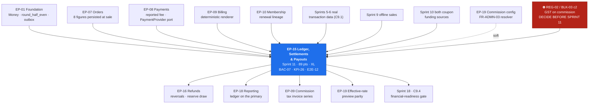

# EP-15 — Ledger, Settlements & Payouts

> **Phase-0 delivery backlog.** Detailed expansion of `ENGINEERING_PLAN.md` §2 (epic row `EP-15`)
> and §3 (`F-15.1` … `F-15.15`). No application code exists yet.
>
> **This is the epic Finance signs off.** `BAC-07` — *"a settlement run produces, for a period with
> mixed online sales, offline sales, coupons and one refund, a statement that Finance reconciles to
> **zero variance** against the gateway report"* — is a **business** acceptance criterion, and
> `KPI-26` makes zero unexplained variance a permanent operating metric at **100%**. `E2E-12` is the
> sprint-11 exit condition and it must pass **with zero variance**, not with a reconciliation plan.
>
> **Two modules, both rated Extreme.** `ledger/` (55 pts / 28 ed) and `settlements/` (89 pts / 45 ed)
> in `ENGINEERING_PLAN.md` §13.1 — the only epic that owns two Extreme modules. Pair coverage is
> **mandatory on every task** and `CODEOWNERS` requires two approvals (`SprintPlanning.md` sprint 11).
>
> ⛔ **`BLK-03` conflict 2 / `REG-02` is a Severe (20) blocking gate that must be decided *before*
> this sprint starts.** The `A6.3` formula persists **eight** figures; India needs a **ninth**,
> `commission_tax_minor`. `BR-FIN-02` (persist everything) and `BR-FIN-03` (sum exactly) cannot both
> hold once commission GST exists and is not modelled. See §13.1 — and note the **secondary finding**
> there: the countermeasure names a `COMMISSION_TAX` entry type but **not its reversal**, which
> `BR-REF-05` requires.

---

## 1. Metadata

| Field | Value |
| :--- | :--- |
| **Epic id** | `EP-15` |
| **Name** | Ledger, Settlements & Payouts |
| **Priority (MoSCoW)** | **M** — Must. Nine of ten `FR-SETL-*` are `M`; seven of eight `BR-FIN-*` are `M`. `BAC-07` is launch-blocking and `KPI-26` is permanent |
| **Complexity** | **XL** (T-shirt, §2) · module ratings **Extreme** for both `ledger/` and `settlements/` (§13.1) |
| **Story points** | **89** (epic/feature view, §2) · module view **`ledger/` 55 pts / 28 ed + `settlements/` 89 pts / 45 ed = 144 pts / 73 ed** (§13.1). The gap is discussed in §10.2 |
| **Target sprint(s)** | **Sprint 11** (2027-02-08 → 2027-02-19), *"the second-highest-consequence sprint"* — all of `F-15.1` … `F-15.15` plus the India ninth figure. Sprint tasks 11.1–11.19 |
| **Owning PRD module** | `SETL` (`B5.21`), with the ledger from `§C2.2` |
| **Owning code modules** | `ledger/` **and** `settlements/` |
| **Collaborating modules** | `payments/` (gateway fee as reported, payout execution through the `PaymentProvider` port), `ordering/` (the eight figures are computed **at sale** and persisted on the order), `billing/` (commission tax invoice series), `refunds/` (negative lines, `BR-REF-05` reversal, `BR-REF-07` closure), `admin/` (commission-rate resolution, `FR-ADMN-03`), `notifications/` (statement, payout, variance alerts), `audit/` (`BR-DAT-01` on every batch decision) |
| **Surfaces** | `gym-dashboard` — `SCR-DASH-014` (Settlements, primary), `SCR-DASH-001` (payout-failure alert region), `SCR-DASH-022` (payout account) · `admin-dashboard` — `SCR-ADM-007` (Finance: Settlements), `SCR-ADM-010` (Finance: Reconciliation), `SCR-ADM-001` (platform dashboard variance tile), `SCR-ADM-011` (commission configuration, **owned by `EP-19`**) |
| **Primary APIs** | `GET /v1/tenant/settlements` · `GET /v1/tenant/settlements/:id` · `GET /v1/admin/settlements` · `GET /v1/admin/settlements/:id` · `POST /v1/admin/settlements/:id/approve` (**MFA + idempotency required**) · `GET|PUT /v1/tenant/payout-account` (`RL-PAY`, *"the most dangerous endpoint in the group"*) |
| **Background jobs** | `settlement.build-batches` (daily 02:00) · `settlement.reconcile` (daily 04:00) · `reserve.release` (daily) — all `C5`. **New**: `settlement.negative-balance-review` (daily, escalates a second consecutive negative cycle) · `ledger.grant-assertion` (per environment, on deploy) · `ledger.projection-parity` (nightly, gated by `mig.ledger.balance-projection`) |
| **Feature flags** | `rel.settlements.auto-payout` (OFF) · `rel.settlements.dual-payout-approval` (OFF — **adds** a control; off is more restrictive) · `ops.settlements.auto-build` (ON, kill-switch, **co-owned by Finance and Engineering**) · `mig.ledger.balance-projection` (OFF) |
| **Launch market** | **India** — **Razorpay Route** payout adapter behind the `PaymentProvider` port (`REG-01`, `BLK-03` c1); **not** Stripe Connect, which stays only as the port's contract-test reference. INR/**paise** as `bigint`, `round_half_even`, ₹ with lakh/crore grouping. Cycle boundaries and the 02:00/04:00 jobs anchored to **`Asia/Kolkata` UTC+05:30, no DST** — 02:00 IST is **20:30 UTC the previous day** (`TR-24`). FY April–March for any statement carrying a financial-year label. GST 18% on the platform's commission is the `REG-02` gap |
| **Status** | `PLANNED` — Phase 0. Not started. ⛔ **One blocking gate open**: `BLK-03` c2 / `REG-02` |
| **Epic owner** | Backend Lead — settlements (money path). **Two approvals mandatory**; pair coverage on every task |

---

## 2. Business Goal

**A settlement statement a gym owner can read line by line, and a reconciliation Finance can close
at zero.** `OBJ-04` commits the platform to *"every rupee attributable to a member, a plan, an
invoice and a settlement"*, and `A3.4` principle 3 states the mechanism: *"money is append-only —
financial state is derived from an immutable ledger of events; nothing that has affected a balance is
ever edited or deleted; corrections are compensating entries."* `US-SETL-01` is the whole epic
compressed into one sentence: *"I want to understand exactly why I received the amount I received."*
`AC-SETL-01.1` requires that every transaction is listed with **all eight figures** and that the
arithmetic **visibly sums** to the payout. There is no tolerance in that requirement — `BR-FIN-03`
demands an exact sum and `BR-FIN-03-N1` requires that a batch with a **one-paise** injected
discrepancy refuses to close.

**The second goal is that the platform can prove its own commercial arrangement.** Commission is
revenue stream 2 of `A6.1` and half the business model. `A6.3` specifies its mechanics precisely
because they are the most commercially sensitive thing in the system: commission on the base only,
never on tax and never on gateway fees (`BR-FIN-04`); at the rate effective **at the moment of sale**
(`BR-FIN-05`), so a rate negotiated in June never reaches back to January; with the gateway fee taken
**as the provider reported it** and never estimated (`BR-FIN-06`), because an estimate is a figure
that will be wrong by a small amount on every transaction and those differences accumulate into
exactly the variance that blocks payouts. `KPI-16` targets a blended take rate of 8–12% and
`LAUNCH_MARKET_INDIA.md` §10 sets 10% standard / 5% renewal to land inside it. If any of this is
recomputed at display time, a statement issued in March renders differently in December and the gym
can neither reconcile its own books nor trust the next one.

**The third goal is that money stops rather than moves when something is wrong.** `BR-FIN-07`'s daily
reconciliation compares the provider report to the ledger and, on any variance, raises an alert and
blocks auto-payout **for that tenant only** — because blocking globally converts a one-tenant data
problem into a platform-wide payout outage, which is the availability failure `TA-1` would aim for.
`BR-FIN-08` requires two distinct approvers above a threshold, and its purpose is stated plainly in
`BusinessRules.md`: combined with a `BR-GYM-06` bank-account change, a single finance analyst who can
approve an arbitrary payout is the complete `TA-6` insider fraud, and dual approval is what makes the
fraud require collusion. `ops.settlements.auto-build` exists so that a human can stop the assembly of
batches entirely while nobody yet understands the variance — a kill-switch **towards** safety, which
`FEATURE_FLAGS.md` notes is the only correct direction for a money flag.

---

## 3. Scope

### 3.1 In scope — explicit

| # | Item | Anchor |
| :-: | :--- | :--- |
| 1 | **Append-only `ledger_entries`** with the **twelve** entry types and **no `UPDATE`, no `DELETE` grant** for any application role, in every environment | `BR-FIN-01`, `§C2.2`, `ADR-0015`, invariant `I2` |
| 2 | Balances **derived** by summation over the ledger; no `balance` column on any tenant-owned table; a schema check fails a migration adding one | `BR-FIN-01-N2` |
| 3 | Commission computation per `A6.3` in integer paise with **one** `round_half_even`, applied once | `BR-FIN-04`, `TR-05` |
| 4 | **All eight figures persisted per transaction** — gross, discount, net, tax, commission base, commission, gateway fee, payable — on the order at sale and denormalised onto the settlement line | `BR-FIN-02`, `FR-SETL-02` |
| 5 | The **ninth figure `commission_tax_minor`**, present and zero pending `REG-02`, with a `COMMISSION_TAX` entry type | `REG-02`, `BLK-03` c2, sprint task 11.3 |
| 6 | **Rate at the moment of sale** persisted on the order; resolution order `global default < tier < tenant override` on absolute basis points, clamped to a **0 bps floor** | `BR-FIN-05`, `FR-ADMN-03`, `KL-006`(a) |
| 7 | Renewal generation derived from the prior membership on the same `(user_id, gym_id)` and **persisted on the order**; first renewal at standard, second onward at the reduced rate | `A6.3`, `KL-006`(b), `OQ-02` |
| 8 | **Batch assembly per tenant per cycle**, default **T+7** from payment capture, over the `C4.7` state machine | `FR-SETL-01`, `OQ-04`, `C4.7` |
| 9 | Negative lines for **refunds and chargebacks** in the batch in which they are recognised | `FR-SETL-03`, `BR-REF-05` |
| 10 | **Reserve**: default **5%** withheld, released after **30 days**, both as separate visible lines with the scheduled release date stated | `FR-SETL-04`, `A6.4`, `AC-SETL-01.3` |
| 11 | **New-tenant hold**: the first **14 days** of trading held as fraud protection, then released on the normal cycle | `A6.4`, `F-15.15` |
| 12 | **Minimum-payout roll-forward** with the reason shown to the tenant | `FR-SETL-05` |
| 13 | **Negative-balance carry-forward** as an explicit **opening-balance line**, recovered from subsequent batches; a persistent negative balance triggers tenant review | `FR-SETL-10`, `AC-SETL-01.4`, `A6.4` |
| 14 | The **six-question ordered allocation function** of `TR-26` implemented explicitly, not implied | `TR-26`, `BR-FIN-03` |
| 15 | **Finance approval**, tenant auto-approval threshold, and **dual approval** above a threshold with two **distinct** approvers enforced by a `CHECK` | `FR-SETL-06`, `BR-FIN-08`, `TA-6` |
| 16 | Tenant-visible batches, lines, statuses and a **downloadable statement** in PDF and CSV | `FR-SETL-07`, `SCR-DASH-014` |
| 17 | **Payout execution via Razorpay Route** through the `PaymentProvider` port; failure returns the batch to `PENDING_APPROVAL` with the reason and notifies both tenant and Finance | `FR-SETL-08`, `REG-01` |
| 18 | **Daily reconciliation** against the provider settlement report, variance alert, and auto-payout block **scoped to the affected tenant only** | `FR-SETL-09`, `BR-FIN-07`, `KPI-26` |
| 19 | **Gateway fees as reported, never estimated**; a line with an unreported fee is **held out of the batch** and rolls into the next cycle with a visible reason | `BR-FIN-06`, `F-15.13` |
| 20 | **Statement arithmetic invariant** asserted at batch closure: `opening_balance + Σ(lines) + reserve_released − reserve_held = net_payable`, in integer minor units, **refusing to close** on any difference | `BR-FIN-03`, `F-15.14` |
| 21 | `ops.settlements.auto-build` kill-switch and `rel.settlements.auto-payout` / `rel.settlements.dual-payout-approval` release flags | `FEATURE_FLAGS.md` |
| 22 | Environment-by-environment **grant assertion** that no `UPDATE`/`DELETE` exists on `ledger_entries` — local, CI, development, staging, production | `E11.4`, sprint task 11.18 |

### 3.2 Out of scope — explicit, with destination

| Item | Why it is not here | Where it went |
| :--- | :--- | :--- |
| Payment capture, webhooks, duplicate detection, indeterminate-state polling | `EP-15` consumes `payment.captured` and the provider's **reported** fee | **`EP-08`**, sprints 5–6 |
| Order pricing, coupon validation, `funding_source` resolution and the commission **base** decision | `ordering/` resolves and **persists** `commission_base_minor` at sale; settlement reads the column and never re-derives it | **`EP-07`**, `BR-CPN-05`, §18.3 |
| Invoice and credit-note issuance, the deterministic PDF renderer, tax profiles | `EP-15` reuses the renderer for statements; the invoice series is `billing/`'s | **`EP-09`** |
| The **platform's commission tax invoice series** to the tenant | `EP-09` owns the second gapless per-FY sequence; `EP-15` posts the ledger entries and the statement line | **`EP-09`** `F-09.14`, blocked with `REG-02` |
| Refund **request, approval routing, proration and execution**; dispute intake and evidence packs | `EP-15` provides the ledger primitives those write into and the balance hold they draw on | **`EP-16`**, sprint 12 |
| Commission **configuration** — global, tier and tenant override screens with the effective-rate resolver | `EP-15` **consumes** the resolver; `admin/` owns the configuration surface | **`EP-19`**, `FR-ADMN-03`, `SCR-ADM-011` |
| Financial **reports** and drill-down over the ledger | Reading is reporting's job; `FR-RPT-02` additionally requires financial reads on the primary | **`EP-18`**, sprint 13, `TR-10` |
| Subscription charging of the tenant and `PAST_DUE` degradation | A separate money flow that never touches settlement | **`EP-09`**, `BR-TEN-06` |
| Payout **bank-account onboarding and verification** | `FR-ONB-06` and `BR-GYM-06`; `EP-15` consumes the verified account and honours the change-suspension window | **`EP-03`** |
| Wallet credit as ledger entries | Phase 2 (`C`); the entry types are reserved now so the addition is additive | **`EP-20`**, `BR-WAL-01` |
| **GST TCS / income-tax TDS** collection, remittance and returns | A liability question for a qualified Indian tax advisor, not an engineering judgement | **Out of Phase 1** — `REG-03`, `BLK-04` #1–#2 |
| Multi-currency settlement | India-only for Phase 1; `Money` carries currency so it is not precluded | **Not in Phase 1** |

### 3.3 The nine figures, and where each one comes from

`BR-FIN-02` names eight. India requires a ninth. All nine are **persisted at sale** and **never
recomputed at display**; the statement renderer performs no arithmetic beyond summation, and
`dependency-cruiser` forbids it importing any calculator.

| # | Figure | Column | Source | Rule |
| :-: | :--- | :--- | :--- | :--- |
| 1 | Gross `G` | `gross_minor` | Plan price at the purchased-terms snapshot | `BR-PLN-02` |
| 2 | Discount `D` | `discount_minor` | Coupon redemption | `BR-CPN-04` — never below zero |
| 3 | Net `N` | `net_minor` | `G − D` | `A6.3` |
| 4 | Tax `T` | `tax_minor` | Tax profile at order time, frozen | `BR-PAY-11`, GST 18% exclusive |
| 5 | Commission base `B` | `commission_base_minor` | `N` for a gym-funded coupon, `N + D` for a platform-funded one | `BR-CPN-05`, §18.3 |
| 6 | Commission `C` | `commission_minor` | `round_half_even(B × bps / 10000)` at the **rate at sale** | `BR-FIN-04`, `BR-FIN-05` |
| 7 | Gateway fee `F` | `gateway_fee_minor` | **Nullable** — as reported by the provider, never estimated | `BR-FIN-06` |
| 8 | Payable `P` | `payable_minor` | `(N + T) − C − F` | `A6.3` |
| **9** | **Commission tax** | **`commission_tax_minor`** | 18% GST on `C`, the platform's own supply to the tenant | ⛔ **`REG-02`** — present and **zero** until decided |

**The nullability of `F` is the load-bearing design detail.** It is what makes *"not yet reported"*
representable instead of guessable; a partial filtered index drives batch selection so an unreported
fee **cannot** be swept into a batch by accident (`BR-FIN-06` `L1-DB`).

### 3.4 `C4.7` states versus `FR-SETL-07`'s six — a mapping, because they differ

`C4.7` defines **eight** states. `FR-SETL-07` promises the tenant **six**. They are reconciled by
mapping, not by changing either.

| `C4.7` internal state | Shown to the tenant as | Meaning |
| :--- | :--- | :--- |
| `OPEN` | *(not shown as a batch)* | The current cycle is accruing; `SCR-DASH-014` shows it as *"current cycle, open"* |
| `CLOSED` | `PENDING` | Assembled, arithmetic asserted, awaiting decision |
| `PENDING_APPROVAL` | `PENDING` | Awaiting Finance or a second approver |
| `APPROVED` | `APPROVED` | Decision taken, payout not yet instructed |
| `PROCESSING` | `PROCESSING` | Instruction sent to Razorpay Route |
| `PAID` | `PAID` | Provider confirmed |
| `FAILED` | `FAILED` | Bank rejection; returns to `PENDING_APPROVAL` with the reason |
| `ON_HOLD` | `ON_HOLD` | Reconciliation variance or a manual hold; **auto-payout blocked** |

---
## 4. Features

`F-15.1` … `F-15.15` are carried verbatim from `ENGINEERING_PLAN.md` §3. Rows marked *(new)* are
additions this backlog surfaces from `RiskAnalysis.md` §3.3.16 (`TR-26`), §4.2 (`REG-02`),
`LAUNCH_MARKET_INDIA.md` §7 and §10, `FEATURE_FLAGS.md` and `API_Catalog.md` §3.9.

| Feature | Description | Satisfies | Pri | Pts | Sprint |
| :--- | :--- | :--- | :-: | :-: | :-: |
| **F-15.1** | **Append-only ledger** with the twelve entry types and **no `UPDATE`/`DELETE` grant** | `BR-FIN-01`, `§C2.2`, `ADR-0015` | M | 6 | 11 |
| **F-15.2** | Commission per `A6.3` with `round_half_even` and the **eight persisted figures** | `BR-FIN-02`, `BR-FIN-04`, `FR-SETL-02` | M | 6 | 11 |
| **F-15.3** | **Rate-at-moment-of-sale** capture; later overrides never touch history | `BR-FIN-05`, `AC-ADMN-01.4` | M | 3 | 11 |
| **F-15.4** | Batch assembly per tenant per cycle over `C4.7`; T+7 default | `FR-SETL-01`, `OQ-04` | M | 6 | 11 |
| **F-15.5** | Negative lines for refunds and chargebacks in the recognising batch | `FR-SETL-03` | M | 3 | 11 |
| **F-15.6** | Reserve withholding and scheduled release as **visible lines** with the release date | `FR-SETL-04`, `A6.4`, `AC-SETL-01.3` | M | 5 | 11 |
| **F-15.7** | Minimum-payout roll-forward with the reason shown | `FR-SETL-05` | M | 3 | 11 |
| **F-15.8** | Finance approval, auto-payout threshold, **dual approval** above a threshold | `FR-SETL-06`, `BR-FIN-08` | M | 5 | 11 |
| **F-15.9** | Tenant-visible batches, lines, the six statuses and downloadable statements | `FR-SETL-07`, `SCR-DASH-014` | M | 5 | 11 |
| **F-15.10** | Payout failure returning the batch to `PENDING_APPROVAL` with notification | `FR-SETL-08` | M | 3 | 11 |
| **F-15.11** | **Daily reconciliation** with variance alert and **per-tenant** auto-payout block | `FR-SETL-09`, `BR-FIN-07`, `KPI-26` | M | 6 | 11 |
| **F-15.12** | Negative-balance carry-forward and tenant-review trigger | `FR-SETL-10` | M | 4 | 11 |
| **F-15.13** | Gateway fees **as reported, never estimated**; unreported lines held out | `BR-FIN-06` | M | 3 | 11 |
| **F-15.14** | **Statement arithmetic invariant** — lines sum exactly to the payout, asserted at closure | `BR-FIN-03`, `AC-SETL-01.1` | M | 5 | 11 |
| **F-15.15** | New-tenant **14-day hold** period | `A6.4` | M | 2 | 11 |
| **F-15.16** *(new)* | **The ninth figure `commission_tax_minor`** and a `COMMISSION_TAX` entry type at 18% on the commission — **present and zero** until `REG-02` is decided | `REG-02`, `BLK-03` c2 | M | 5 | 11 (⛔ gated) |
| **F-15.17** *(new)* | **`COMMISSION_TAX_REVERSAL`** — a thirteenth entry type, because `BR-REF-05` requires the commission tax to be reversed **at the same rounding** and `REG-02`'s countermeasure names only the forward type. See §13.1 finding 2 | `BR-REF-05`, `REG-02`, `TR-05` | M | 2 | 11 (⛔ gated) |
| **F-15.18** *(new)* | **`allocate()` — the ordered six-question allocation function** of `TR-26`: current cycle first, then reserve, then negative balance; a scheduled release nets against a negative balance rather than paying out; **no payout is ever negative**; commission reversal nets at the original rounding; the reserve cannot go negative independently; a never-trading tenant's negative balance is written off by a **human** with a ledger entry | `TR-26`, `BR-FIN-03`, `FR-SETL-10` | M | 6 | 11 |
| **F-15.19** *(new)* | **Razorpay Route payout adapter** behind the existing `PaymentProvider` port, with Stripe retained only as the port's contract-test reference | `REG-01`, `BLK-03` c1, `FR-SETL-08` | M | 5 | 11 |
| **F-15.20** *(new)* | **Batch idempotency at the database**: `UNIQUE (tenant_id, period_start, period_end)` so a duplicated job execution under a Redis failover cannot build a second batch for one period | `TR-25`, `C5` | M | 2 | 11 |
| **F-15.21** *(new)* | **IST-anchored scheduling**: the cycle-due test and the 02:00 / 04:00 jobs are computed from `Asia/Kolkata`, not a fixed UTC cron — 02:00 IST is **20:30 UTC the previous day** | `TR-24`, `LAUNCH_MARKET_INDIA.md` §3 | M | 2 | 11 |
| **F-15.22** *(new)* | **`bigint` paise across the API boundary** — every money field serialised as a **string** with an adjacent currency field; no JSON number ever carries paise | `TR-38`, `NFR-DQ-02`, `BR-PAY-01` | M | 2 | 11 |
| **F-15.23** *(new)* | **Environment grant assertion job** — `ledger.grant-assertion` runs on every deploy in every environment and fails the deploy if an `UPDATE` or `DELETE` grant exists on `ledger_entries` | `E11.4`, `BR-FIN-01-N1` | M | 2 | 11 |
| **F-15.24** *(new)* | **`ops.settlements.auto-build` kill-switch** — the daily build assembles nothing, the ledger keeps accruing, tenants see the cycle as open with an explanatory status, and no payout instruction can exist because no batch does | `FEATURE_FLAGS.md`, `BR-FIN-07` | M | 2 | 11 |
| **F-15.25** *(new)* | **Statement rendering reuses the deterministic renderer** from `billing/` — pinned Chromium digest, embedded ₹ glyph, `TZ=UTC`, timestamps from the batch, byte-identical regeneration | `TR-15`, `FR-SETL-07`, `BR-FIN-02-P1` | M | 3 | 11 |

**Feature roll-up.** 25 features · 65 core points (`F-15.1` … `F-15.15`) + 31 points for the ten
additions. All 25 are `M`. **Two (`F-15.16`, `F-15.17`) are gated on `REG-02`** and ship as
zero-valued scaffolding if the decision is late.

---

## 5. User Stories

`US-SETL-01` is restated from `MASTER_PRD.md` §B5.21 with its four PRD acceptance criteria
preserved. `US-SETL-02` onward are **new**.

### US-SETL-01 — *As Rohan, I want to understand exactly why I received the amount I received.* **(PRD)**

- **AC-SETL-01.1** — **Given** a payout is made, **when** I open its statement, **then** every
  transaction is listed with **all eight figures** and the arithmetic **visibly sums** to the payout
  amount.
- **AC-SETL-01.2** — **Given** a refund occurred in the period, **when** I view the statement,
  **then** it appears as a **negative line** with a reference to the original sale.
- **AC-SETL-01.3** — **Given** reserve was withheld, **when** I view the statement, **then** the
  amount, the **reason** and the **scheduled release date** are stated.
- **AC-SETL-01.4** — **Given** my balance was negative, **when** the next batch runs, **then** the
  recovery is shown as an explicit **opening balance line**.
- **AC-SETL-01.5** *(new)* — **Given** the India ruling, **when** I open the statement, **then** the
  platform's **commission GST** appears as its own line and the statement **still** sums exactly.
- **AC-SETL-01.6** *(new)* — **Given** every amount, **when** it renders, **then** it is in **₹ with
  lakh/crore grouping** (`₹2,50,000`, not `₹250,000`) through the single shared formatter.
- **AC-SETL-01.7** *(new)* — **Given** the same statement downloaded twice, **when** the files are
  compared, **then** they are **byte-identical**.

### US-SETL-02 — *As Vikram in Finance, I want a reconciliation I can close at zero, every day.* **(new — implied by `FR-SETL-09`, `BR-FIN-07`, `KPI-26`, `BAC-07`)**

- **AC-SETL-02.1** — **Given** the daily reconciliation, **when** it runs at 04:00 IST, **then** it
  compares the provider settlement report **line by line** against `ledger_entries` and records the
  result whether or not there is a variance.
- **AC-SETL-02.2** — **Given** a variance, **when** it is detected, **then** a reconciliation record
  is written, an operational alert is raised, and auto-payout is blocked **for that tenant only** —
  every other tenant pays out normally.
- **AC-SETL-02.3** — **Given** a variance, **when** I open `SCR-ADM-010`, **then** I can drill from
  the variance to the specific ledger entries and provider lines that disagree, and record a
  resolution note.
- **AC-SETL-02.4** — **Given** a blocked tenant, **when** I approve manually, **then** I must supply a
  **reason**, and both the block and the override are audited.
- **AC-SETL-02.5** — **Given** the alert, **when** it fires, **then** it **cannot be silenced** —
  only resolved.
- **AC-SETL-02.6** — **Given** the historical trend on `SCR-ADM-010`, **when** I read it, **then**
  the target line is **zero** (`KPI-26`) and any non-zero day is annotated with its resolution.

### US-SETL-03 — *As Vikram, I want a large payout to require two people.* **(new — implied by `BR-FIN-08`, `TA-6`)**

- **AC-SETL-03.1** — **Given** a batch above the dual-approval threshold, **when** one approver
  approves, **then** it stays in `PENDING_APPROVAL` and cannot reach `PROCESSING`.
- **AC-SETL-03.2** — **Given** the same approver attempts the second approval, **when** it is
  submitted, **then** the **database `CHECK` refuses it** — distinctness is a constraint, not a
  convention.
- **AC-SETL-03.3** — **Given** two distinct approvers, **when** both have approved, **then** both
  identities, timestamps and IPs appear on the audit row **and on the statement**.
- **AC-SETL-03.4** — **Given** approval, **when** it is performed, **then** it required **MFA**
  (`NFR-SEC-11`) and carried an idempotency key.
- **AC-SETL-03.5** — **Given** the payout account was changed recently, **when** approval is
  attempted, **then** the `BR-GYM-06` suspension window applies — the two controls compose, and
  neither alone is the defence.

### US-SETL-04 — *As Rohan, I want a bank rejection to be explained, not silent.* **(new — implied by `FR-SETL-08`)**

- **AC-SETL-04.1** — **Given** a payout fails at the bank, **when** the provider reports it, **then**
  the batch returns to `PENDING_APPROVAL` carrying the **failure reason**.
- **AC-SETL-04.2** — **Given** the failure, **when** it is recorded, **then** **both** the tenant and
  Finance are notified, and the alert appears in `SCR-DASH-001`'s alert region.
- **AC-SETL-04.3** — **Given** a failed batch, **when** it is re-approved after I correct my bank
  details, **then** the **same** batch is paid — a new batch is never created to work around a
  failure.
- **AC-SETL-04.4** — **Given** repeated failures, **when** the third occurs, **then** the batch moves
  to `ON_HOLD` and a human is required, rather than the system retrying indefinitely.

### US-SETL-05 — *As Rohan, I want to know why I was not paid this week.* **(new — implied by `FR-SETL-05`, `FR-SETL-10`, `A6.4`)**

- **AC-SETL-05.1** — **Given** my balance is below the minimum payout floor, **when** the cycle runs,
  **then** the batch **rolls forward** and `SCR-DASH-014` states the floor, my balance and the
  shortfall.
- **AC-SETL-05.2** — **Given** I am within my first **14 days** of trading, **when** the cycle runs,
  **then** funds are held, and the hold, its reason and its end date are stated.
- **AC-SETL-05.3** — **Given** refunds exceeded sales, **when** the cycle runs, **then** there is
  **no payout and no debit instruction** — a carried-forward negative figure appears instead.
- **AC-SETL-05.4** — **Given** two consecutive negative cycles, **when** the review job runs, **then**
  the tenant is escalated to Finance with the `RSK-06` closure checklist attached.

### US-SETL-06 — *As the platform, I want a fee that has not been reported to stop a line, not to be guessed.* **(new — implied by `BR-FIN-06`)**

- **AC-SETL-06.1** — **Given** a transaction whose gateway fee is not yet reported, **when** the
  batch builds, **then** the line is **excluded** and rolls into a later cycle with a visible reason.
- **AC-SETL-06.2** — **Given** the fee is reported on day 2, **when** the day-3 batch builds, **then**
  the line settles with the **exact reported fee**.
- **AC-SETL-06.3** — **Given** the codebase, **when** it is scanned, **then** **no fee constant and
  no estimator exists** anywhere in `ledger/` or `settlements/`.
- **AC-SETL-06.4** — **Given** a held-out line, **when** the tenant views the current cycle, **then**
  they can see that it exists and why — an invisible exclusion is indistinguishable from a lost sale.

### US-SETL-07 — *As the platform, I want the ledger to be unfalsifiable.* **(new — implied by `BR-FIN-01`, `ADR-0015`, invariant `I2`)**

- **AC-SETL-07.1** — **Given** the application role, **when** `UPDATE ledger_entries` or
  `DELETE FROM ledger_entries` is attempted, **then** both raise **`permission denied`**, in every
  environment.
- **AC-SETL-07.2** — **Given** a migration adding a mutable `balance` column to a tenant-owned table,
  **when** CI runs, **then** the schema check **fails the build**.
- **AC-SETL-07.3** — **Given** a mixed cycle of sales, refunds, fees, reserve holds and a payout,
  **when** the derived balance is computed at **every intermediate point**, **then** it equals the
  arithmetic sum of ledger entries.
- **AC-SETL-07.4** — **Given** a correction is needed, **when** it is made, **then** it is a
  **compensating entry**, never an edit.
- **AC-SETL-07.5** — **Given** `mig.ledger.balance-projection` is on, **when** the nightly parity job
  runs, **then** projection equals aggregate **to the minor unit** and any difference alerts — the
  projection is a cache, never a source.

### US-SETL-08 — *As Rohan, I want a rate change to apply forward, never backward.* **(new — implied by `BR-FIN-05`, `KL-006`)**

- **AC-SETL-08.1** — **Given** a sale settled at 1000 bps, **when** my tenant rate is later changed to
  600 bps, **then** the original settlement **and its later re-render** both still show 1000 bps.
- **AC-SETL-08.2** — **Given** a tier delta that would drive my effective rate below zero, **when**
  the rate resolves, **then** it **clamps to 0 bps** and never produces a negative commission.
- **AC-SETL-08.3** — **Given** a renewal, **when** commission is computed, **then** the **first**
  renewal is at the standard rate and the **second onward** at the reduced rate, derived from the
  prior membership on the same `(user_id, gym_id)` and **persisted on the order**.
- **AC-SETL-08.4** — **Given** a commission-rate override, **when** it is made, **then** it is an
  `FR-ADMN-01` administrative action requiring a **reason** and is audited.

---
## 6. Acceptance Criteria for the Epic

Rows marked **launch-blocking** are gates on the sprint-11 exit checklist, on `BAC-07`, or on
`KPI-26`. Finance signs this list.

| # | Criterion | Evidence |
| :-: | :--- | :--- |
| **AC-EP15-01** | **Launch-blocking.** A cycle with **online sales, offline sales, a gym-funded coupon, a platform-funded coupon, one refund and one reserve hold** produces a statement whose lines **sum exactly** to the payout | `E11.1`, `BAC-07`, `BR-FIN-03-P1`, `E2E-12` |
| **AC-EP15-02** | **Launch-blocking.** A batch with a **one-paise injected discrepancy refuses to close** and raises the reconciliation alert instead of paying out | `BR-FIN-03-N1` |
| **AC-EP15-03** | The closure assertion is `opening_balance + Σ(lines) + reserve_released − reserve_held = net_payable`, evaluated in **integer minor units**, persisted componentwise so it is checkable after the fact | `BR-FIN-03` `L6-UC`, `L1-DB` |
| **AC-EP15-04** | **Launch-blocking.** Daily reconciliation against the gateway sandbox report shows **zero variance** | `E11.2`, `KPI-26` = 100% |
| **AC-EP15-05** | **Launch-blocking.** A deliberately corrupted fee figure raises the variance alert and blocks auto-payout **for that tenant only**; every other tenant pays out unaffected | `E11.3`, `BR-FIN-07-N1` |
| **AC-EP15-06** | A manual override of a block requires a **reason** and records actor, timestamp and IP; the alert cannot be silenced, only resolved | `BR-FIN-07` audit, `AC-SETL-02.4`, `AC-SETL-02.5` |
| **AC-EP15-07** | **Launch-blocking.** **No `UPDATE` and no `DELETE` grant** exists on `ledger_entries` in **local, CI, development, staging and production** — asserted automatically in each | `E11.4`, `BR-FIN-01-N1` |
| **AC-EP15-08** | A migration adding a mutable balance column to a tenant-owned table **fails CI** | `BR-FIN-01-N2` |
| **AC-EP15-09** | The derived balance equals the arithmetic sum of ledger entries at **every intermediate point** of a mixed cycle | `BR-FIN-01-P1` |
| **AC-EP15-10** | All **twelve** `C2.2` entry types are implemented, plus `COMMISSION_TAX` (and `COMMISSION_TAX_REVERSAL`, §13.1 finding 2) present and unused pending `REG-02` | `§C2.2`, `F-15.16`, `F-15.17` |
| **AC-EP15-11** | **Launch-blocking.** Commission is computed on the base **net of discount, excluding tax**, at **10% standard** and **5% from the second renewal** | `E11.5`, `BR-FIN-04-P1`, `OQ-02` |
| **AC-EP15-12** | The `A6.3` worked example reproduces **exactly** in paise: gross 5,000 · discount 1,000 · net 4,000 · tax 720 · base 4,000 · commission 400 · fee 94.40 · payable 4,225.60 | `BR-FIN-04-P1` |
| **AC-EP15-13** | No code path can pass `N + T` or `N + F` as the commission base — enforced by a **branded type** only `CommissionBaseResolver` can construct | `BR-FIN-04-N1` |
| **AC-EP15-14** | **Launch-blocking.** A tier delta cannot drive the effective rate below **0 bps** | `E11.9`, `BR-FIN-05-N2`, `KL-006`(a) |
| **AC-EP15-15** | **Launch-blocking.** Changing a tenant commission override alters **no** historical statement, settlement line or order | `E11.10`, `BR-FIN-05-N1` |
| **AC-EP15-16** | A historical statement re-rendered after a **commission-rate change, a tax-profile change and a rounding-configuration change** is **byte-identical** to the original | `BR-FIN-02-P1`, `TR-15` |
| **AC-EP15-17** | The statement renderer has **no dependency on any calculator** — asserted structurally by `dependency-cruiser` and behaviourally by mutating the live rate and re-rendering | `BR-FIN-02-N1` |
| **AC-EP15-18** | All **nine** figures are `bigint NOT NULL` on both `orders` and `settlement_lines`; the ninth is present and **zero** until `REG-02` | `BR-FIN-02` `L1-DB`, `REG-02` contingency |
| **AC-EP15-19** | **Launch-blocking.** GST at 18% on the platform commission is persisted as `commission_tax_minor` and appears as a `COMMISSION_TAX` statement line — **or**, if `REG-02` is undecided, the field is present, zero, and the statement still ties out | `E11.6`, `BLK-03` c2 |
| **AC-EP15-20** | **Launch-blocking.** A gateway fee that has not been reported is **held out of the batch, never estimated**; the line rolls forward with a visible reason | `E11.8`, `BR-FIN-06-N1` |
| **AC-EP15-21** | **No fee constant and no estimator exists** in `ledger/` or `settlements/`; asserted by a CI pattern check | `BR-FIN-06-N2`, `AC-SETL-06.3` |
| **AC-EP15-22** | **Launch-blocking.** The **opening-balance line** recovers a prior negative balance and is visible on the statement | `E11.7`, `AC-SETL-01.4` |
| **AC-EP15-23** | A negative balance produces **no payout and no debit instruction**; the payout adapter refuses a non-positive instruction as a **precondition**, not a validation | `TR-26` Q3, `AC-SETL-05.3` |
| **AC-EP15-24** | The allocation order is **current cycle → reserve → negative balance**, implemented as an explicit ordered function and property-tested including the **exhausted-reserve** and **never-trades-again** cases | `TR-26` Q1/Q5, `F-15.18` |
| **AC-EP15-25** | A scheduled reserve release while the balance is negative **nets against the negative balance** and is not also paid out | `TR-26` Q2 |
| **AC-EP15-26** | The reserve **cannot go negative independently** of the balance; over-draw flows to the balance | `TR-26` Q6 |
| **AC-EP15-27** | A commission reversal nets against a negative balance **at the same rounding as the original commission** | `TR-26` Q4, `BR-REF-05`, `TR-05` |
| **AC-EP15-28** | A never-trading tenant's negative balance is written off by a **human decision with a ledger entry**, never carried indefinitely | `TR-26` Q5 |
| **AC-EP15-29** | Two consecutive negative cycles escalate to Finance with the `RSK-06` closure checklist | `A6.4`, `FR-SETL-10`, `AC-SETL-05.4` |
| **AC-EP15-30** | Reserve is withheld at the configured rate (**5%** default) and released after the configured period (**30 days** default), each as a **separate visible line** with the release date stated | `FR-SETL-04`, `AC-SETL-01.3`, `OQ-04` |
| **AC-EP15-31** | A new tenant's first **14 days** of trading are held, and the hold, its reason and its end date are stated to the tenant | `A6.4`, `F-15.15`, `AC-SETL-05.2` |
| **AC-EP15-32** | A balance below the minimum payout floor rolls forward with the floor, the balance and the shortfall shown | `FR-SETL-05`, `AC-SETL-05.1` |
| **AC-EP15-33** | **Launch-blocking.** A payout above the dual-approval threshold requires **two distinct approvers**; the same approver cannot supply both — refused by the `CHECK`, not by application code | `BR-FIN-08-P1`, `BR-FIN-08-N1` |
| **AC-EP15-34** | A batch above the threshold with **one** approval cannot reach `PROCESSING`; the `C4.7` machine has no such path | `BR-FIN-08-N2` |
| **AC-EP15-35** | Approval requires **MFA** and an idempotency key; both approver identities appear on the audit row **and** the statement | `NFR-SEC-11`, `AC-SETL-03.3`, `AC-SETL-03.4` |
| **AC-EP15-36** | A payout failure returns the batch to `PENDING_APPROVAL` with the reason and notifies **both** tenant and Finance; re-approval pays the **same** batch | `FR-SETL-08`, `AC-SETL-04.1`, `AC-SETL-04.3` |
| **AC-EP15-37** | Payout executes through the `PaymentProvider` port against the **Razorpay Route** adapter; the port's contract tests still pass against the Stripe reference | `REG-01`, `F-15.19` |
| **AC-EP15-38** | A duplicated `settlement.build-batches` execution under a Redis failover **cannot** create a second batch for one period — refused by `UNIQUE (tenant_id, period_start, period_end)` | `TR-25`, `F-15.20` |
| **AC-EP15-39** | Cycle-due evaluation and the 02:00 / 04:00 jobs are anchored to `Asia/Kolkata`; a test asserts the 02:00 IST job fires at **20:30 UTC the previous day** | `TR-24`, `F-15.21` |
| **AC-EP15-40** | Every money field crossing the API boundary is a **string** with an adjacent currency field; a contract test asserts no JSON number carries paise | `TR-38`, `F-15.22` |
| **AC-EP15-41** | All money arithmetic goes through `Money` and the single `round_half_even`; a lint rule bans `Math.round`, `toFixed` and floating-point arithmetic on money | `TR-05`, `NFR-DQ-02` |
| **AC-EP15-42** | Property-based tests assert that allocating a total across **N** lines **re-sums to the total exactly**, for randomised N and randomised amounts | `TR-05`, sprint task 11.16 |
| **AC-EP15-43** | `ops.settlements.auto-build` pulled assembles nothing, leaves the ledger accruing, shows the tenant an explanatory open-cycle status, and makes a payout instruction **impossible** because no batch exists | `F-15.24` |
| **AC-EP15-44** | `rel.settlements.auto-payout` **off** sends every batch to explicit approval; on, it can only ever **reduce** manual work below the threshold and can never remove an approval `BR-FIN-08` requires | `FEATURE_FLAGS.md` §6.1 row 4 |
| **AC-EP15-45** | Statements render through the **deterministic** renderer and regenerate byte-identically; the renderer digest is recorded on the batch | `TR-15`, `AC-SETL-01.7` |
| **AC-EP15-46** | ₹ amounts use lakh/crore grouping through the single shared formatter on every surface and in every export | `LAUNCH_MARKET_INDIA.md` §2, `AC-SETL-01.6` |
| **AC-EP15-47** | Batch closure, approval, payout, hold and manual override each write a `BR-DAT-01` audit row with actor | `BR-FIN-03`, `BR-FIN-07`, `BR-FIN-08` audit columns |
| **AC-EP15-48** | `SCR-DASH-014`, `SCR-ADM-007` and `SCR-ADM-010` render loading, empty, error and permission-denied states, are `axe-core` clean, and money columns are right-aligned and screen-reader-labelled with the currency | `PROJECT_CONSTITUTION.md` §16.9, `NFR-USE-01` |
| **AC-EP15-49** | Isolation specs exist for all six new endpoints; a tenant cannot read another tenant's batch, line or statement by any path | `BAC-10`, `E2E-11` |
| **AC-EP15-50** | **Launch-blocking.** `E2E-12` passes **with zero variance** | `E2E-12`, sprint-11 exit condition |

---

## 7. Business Rules Enforced

`EP-15` **owns the entire `BR-FIN` family** — all eight rules. Detail lives in `BusinessRules.md`
§16; this table records ownership and the enforcement point only.

| Rule | Ownership | Enforcement point in this epic | Authoritative layer | Negative test |
| :--- | :--- | :--- | :--- | :-: |
| `BR-FIN-01` | **Owned** (`ledger/`) · invariant `I2` | No `UPDATE`/`DELETE` grant; balances derived by summation; `TenantBalance` a computed value object with no setter; CI bans any `balance` column on a tenant-owned table | `L3-GRANT` | ✅ `-N1`, `-N2` |
| `BR-FIN-02` | **Owned** (`ledger/` + `settlements/`) | Eight (nine) `bigint NOT NULL` columns on `orders` and `settlement_lines`; the renderer performs **no arithmetic beyond summation**; `dependency-cruiser` forbids it importing `CommissionCalculator` | `L1-DB` | ✅ `-N1` |
| `BR-FIN-03` | **Owned** (`settlements/`) | Closure assertion in integer minor units that **refuses to close** on any difference; components persisted so the identity is checkable afterwards | `L6-UC` | ✅ `-N1` |
| `BR-FIN-04` | **Owned** (`ledger/`) | Branded `CommissionBase` type constructible only by `CommissionBaseResolver`; `BasisPoints` integer arithmetic; the `A6.3` worked example as a unit test to the paise | `L5-DOM` | ✅ `-N1` |
| `BR-FIN-05` | **Owned** (`ledger/`) | Rate persisted on the order at sale; resolution `global < tier < tenant override` on absolute bps with a **0 bps floor**; renewal generation derived from lineage and **persisted** | `L1-DB` | ✅ `-N1`, `-N2` |
| `BR-FIN-06` | **Owned** (`ledger/` + `settlements/`) | `gateway_fee_minor` **nullable**; a partial filtered index drives batch selection; **no estimator and no fee constant exists**; unreported lines roll forward with a visible reason | `L1-DB` | ✅ `-N1`, `-N2` |
| `BR-FIN-07` | **Owned** (`settlements/`) | `settlement.reconcile` at 04:00 comparing the provider report line by line; variance writes a record, alerts, and sets a **per-tenant** auto-payout block | `L10-JOB` | ✅ `-N1` |
| `BR-FIN-08` | **Owned** (`settlements/`) · Pri `S` | `CHECK (net_payable_minor <= threshold OR (approver_1 IS NOT NULL AND approver_2 IS NOT NULL AND approver_1 <> approver_2))`; MFA on the second approval; the `C4.7` machine has no bypass path | `L1-DB` | ✅ `-N1`, `-N2` |
| `BR-REF-05` | **Contributor** (`ledger/` co-owns) | Reversal is a **proportion of the persisted commission**, never a rate multiplication; `COMMISSION_REVERSAL` and `GATEWAY_FEE` are distinct types so a non-reversed fee is a visible line. §18.2 | `L5-DOM` | ✅ `-N1` |
| `BR-REF-07` | **Contributor** (`settlements/` co-owns) | A gym-closure pro-rata refund draws on the balance and then the reserve; the **empty-reserve** path is a named negative test | — | ✅ |
| `BR-REF-08` | **Contributor** | A disputed amount is held against the tenant balance from case opening — a ledger hold, released on a favourable outcome | — | ✅ |
| `BR-CPN-05` | **Contributor** | `commission_base_minor` is read from the order, never re-derived from the coupon's current `funding_source`. §18.3 | — | ✅ `-N2` |
| `BR-PAY-01` | **Inherited** · invariant `I2` | Integer paise plus explicit currency on every amount in both modules | — | ✅ |
| `BR-GYM-06` | **Adjacent, composes** | A payout-account change suspends payouts for its window; with `BR-FIN-08` this is the two-control `TA-6` defence | — | ✅ |
| `BR-TEN-01` | **Inherited** | `ledger_entries`, `settlement_batches`, `settlement_lines` are tenant-owned and RLS-policied; admin cross-tenant reads use the **named, audited** elevation | — | ✅ `E2E-11` |
| `BR-DAT-01` | **Contributor** | Batch closure, approval, payout, hold and override audited with actor; the ledger itself is append-only and needs no separate audit | — | ✅ |

---

## 8. Dependencies

### 8.1 Upstream — must exist first

| Epic | What `EP-15` needs from it | Hard or soft |
| :--- | :--- | :--- |
| **EP-01** | `Money`, the single `round_half_even`, tenant context, RLS, outbox, idempotency, audit writer, the `BigInt` serialisation convention | **Hard** |
| **EP-07** | Orders carrying the **eight persisted figures**, `commission_base_minor` resolved from `funding_source`, `origin` and `attributed_at`, offline sales | **Hard** |
| **EP-08** | `payment.captured`, the **provider-reported** gateway fee, the `PaymentProvider` port, and the payout capability on it | **Hard** |
| **EP-09** | The deterministic PDF renderer for statements; the second invoice series that `REG-02` needs | **Hard** for `F-15.25`, gated for the series |
| **EP-19** | The commission-rate resolver (`FR-ADMN-03`) and its configuration surface | **Soft** — sprint 11 uses seeded configuration; `SCR-ADM-011` lands in sprint 15 |
| **EP-10** | Membership lineage so renewal generation is derivable | **Hard** for `AC-SETL-08.3` |
| **EP-17** | Notification ports for statements, payout notices and variance alerts | **Soft** — Finance alerts route through the ops channel in sprint 11 |
| **Sprints 5–6 transaction data** | `C9.1` sequences settlement here **deliberately** so reconciliation is tested against realistic ledger shapes rather than synthetic ones | **Hard, by design** |
| **Sprint 9** | Offline sales, so the cycle contains both channels | **Hard** for `E11.1` |
| **Sprint 10** | **Both** coupon funding sources, so the commission-base distinction is exercised | **Hard** for `E11.1` |

### 8.2 Downstream — what this unblocks

| Epic / item | Why it needs `EP-15` |
| :--- | :--- |
| **EP-16** (sprint 12) | Refunds write **reversal entries** into this ledger and draw on **this** reserve; `BR-REF-07`'s empty-reserve path is tested against `EP-15`'s allocation function |
| **EP-18** (sprint 13) | Financial reports read the ledger live, on the **primary** (`FR-RPT-02`, `TR-10`) |
| **EP-09** | The platform's commission tax invoice series issues against `COMMISSION_TAX` entries |
| **EP-19** (sprint 15) | The commission configuration screen's *effective-rate resolver* preview must match what settlement actually applies — one resolver, two consumers |
| **EP-20** | Support answers *"why was I paid this amount"* from the statement, without engineering |
| **Sprint 18** | The `C9.4` **financial-readiness gate** for launch |
| `BAC-07`, `KPI-26` | Both are satisfied here or nowhere |

### 8.3 External dependencies and decisions

| Item | Nature | Status |
| :--- | :--- | :--- |
| ⛔ **`BLK-03` c2 / `REG-02`** — GST on platform commission | **Blocking gate**, Severe (20), owner Client Sponsor | **Open.** *"Must be decided before this sprint starts."* Contingency in §13.1 |
| `BLK-03` c3 / `REG-03` — GST TCS / income-tax TDS | Tax-advisor liability question, High (15) | **Open.** May add entry types, statement lines and a filing report **after** launch; a late answer is a `§C10` **Major** change, not a quiet absorption |
| `BLK-03` c1 / `REG-01` — Razorpay Route adapter | Technical, Severe (20), owner Technical Lead | Decided: Razorpay Route behind the port; Stripe retained as contract-test reference |
| `OQ-04` — settlement cycle and reserve | Client decision, due **sprint 11** | **Answered**: T+7 cycle, 5% reserve released at 30 days |
| `OQ-02` — commission rates | Client decision | **Answered**: 10% standard, 5% renewal from the second renewal; tier deltas on the **standard rate only** (working assumption, flagged for confirmation **before sprint 11**) |
| `KL-006` residual | Known limitation | Whether tier deltas apply to the **renewal** rate is still unconfirmed; adopted reading is *"flat 5% across tiers"* |
| **Razorpay Route sandbox** with realistic settlement reports | Vendor | Required by sprint 10 or the reconciliation is tested against a fixture, not a report |
| `BLK-01` — no repository | Delivery | `CODEOWNERS` two-approval on money paths **unenforceable**; pair coverage is a convention until it closes (`RSK-14`, `DEL-01`) |

### 8.4 Dependency graph

---
## 9. Technical Tasks

Estimates are **engineer-days** (1 point ≈ 0.5 ed). `SprintPlanning.md` sprint-11 task numbers are
given where a task maps onto one. **Every task in this epic is paired** (`RSK-14`, sprint-11
standing instruction) — the estimates below are for the **pair's output**, not for two people
working separately.

| Task | Description | Layer | Est. (ed) | Depends on | Serves |
| :--- | :--- | :--- | :-: | :--- | :--- |
| **T-15.01** | Migration: `ledger_entries` (`tenant_id`, `entry_type`, `direction`, `amount_minor bigint`, `currency`, `reference_type`, `reference_id`, `settlement_batch_id` nullable, `occurred_at`) with the **twelve** entry types, RLS, and indexes `(tenant_id, occurred_at)` and `(settlement_batch_id)` | DB | 0.6 | EP-01 | `§C2.2`, `BR-FIN-01` · **11.1** |
| **T-15.02** | **Grant configuration**: application roles receive `INSERT` and `SELECT` only on `ledger_entries`; **no `UPDATE`, no `DELETE`**, in every environment's IaC | DB | 0.5 | T-15.01 | `BR-FIN-01-N1`, `E11.4` · **11.1** |
| **T-15.03** | CI schema checks: `append-only-grants`, plus a check banning any column named `balance` on a tenant-owned table | infra | 0.4 | T-15.02 | `BR-FIN-01-N2` |
| **T-15.04** | Migration: `settlement_batches` (`tenant_id`, `period_start`, `period_end`, `opening_balance_minor`, `gross_minor`, `commission_minor`, `commission_tax_minor`, `fees_minor`, `refunds_minor`, `reserve_held_minor`, `reserve_released_minor`, `net_payable_minor`, `status`, `payout_reference`, `statement_url`, `approver_1_id`, `approver_2_id`, `renderer_digest`) | DB | 0.6 | T-15.01 | `§C2.2`, `FR-SETL-07` |
| **T-15.05** | Migration: `settlement_lines` — one row per contributing ledger entry with **all nine** figures denormalised, `bigint NOT NULL`, plus the source `ledger_entry_id` | DB | 0.5 | T-15.04 | `BR-FIN-02` `L1-DB` |
| **T-15.06** | Constraints: `UNIQUE (tenant_id, period_start, period_end)` (`TR-25` idempotency); the `BR-FIN-08` dual-approval `CHECK` with **distinct** approvers; `CHECK (net_payable_minor >= 0)` | DB | 0.5 | T-15.04 | `F-15.20`, `BR-FIN-08`, `TR-26` Q3 |
| **T-15.07** | Partial filtered index driving batch selection: eligible lines are those with `gateway_fee_minor IS NOT NULL` and `settlement_batch_id IS NULL` | DB | 0.3 | T-15.01 | `BR-FIN-06` `L1-DB` |
| **T-15.08** | `LedgerEntry` domain type and `LedgerWriter`: append-only by construction, no mutators, entry written in the **same transaction** as the state change that caused it | API | 0.8 | T-15.01 | `BR-FIN-01` · **11.1** |
| **T-15.09** | `TenantBalance` computed value object: `SUM(CASE direction WHEN 'CREDIT' THEN amount_minor ELSE -amount_minor END)`; no setter, no stored figure | API | 0.5 | T-15.08 | `BR-FIN-01-P1` |
| **T-15.10** | `CommissionBaseResolver` + branded `CommissionBase`: `GYM → B = N`, `PLATFORM → B = N + D`; only this resolver can construct the branded type | API | 0.7 | EP-07 | `BR-FIN-04`, `BR-CPN-05` · **11.2** |
| **T-15.11** | `CommissionCalculator`: `C = round_half_even(B × bps / 10000)` in integer arithmetic; the `A6.3` worked example as a to-the-paise unit test | API | 0.8 | T-15.10 | `BR-FIN-04-P1` · **11.2** |
| **T-15.12** | Rate resolution `global < tier < tenant override` on **absolute bps**, with tier percentage-point deltas converted at resolution and the result **clamped to 0 bps**; result persisted on the order | API | 0.9 | EP-19 resolver | `BR-FIN-05`, `KL-006`(a) · **11.4** |
| **T-15.13** | Renewal-generation derivation from the prior membership on `(user_id, gym_id)`, **persisted on the order**; first renewal standard, second onward reduced | API | 0.7 | EP-10 | `A6.3`, `KL-006`(b), `OQ-02` |
| **T-15.14** | ⛔ **`commission_tax_minor` + `COMMISSION_TAX` entry type**, computed at the tax-profile rate on `C`, **present and zero** until `REG-02` | API | 1.2 | T-15.11, `REG-02` | `F-15.16` · **11.3** |
| **T-15.15** | ⛔ **`COMMISSION_TAX_REVERSAL` entry type**, reversing at the **same rounding** as the original — §13.1 finding 2 | API | 0.4 | T-15.14 | `F-15.17`, `BR-REF-05` |
| **T-15.16** | Batch assembly: select eligible entries for a tenant whose cycle is due, write `settlement_lines` with all nine figures, apply the ordered allocation, transition `OPEN → CLOSED` | API | 1.6 | T-15.05, T-15.18 | `FR-SETL-01` · **11.5** |
| **T-15.17** | `C4.7` state machine with all eight states and the exact legal transitions, including `FAILED → PENDING_APPROVAL` and `CLOSED → ON_HOLD`; the tenant-facing mapping of §3.4 | API | 0.8 | T-15.16 | `C4.7`, `FR-SETL-07` · **11.5** |
| **T-15.18** | **`allocate()`** — the ordered `TR-26` function: current cycle → reserve → negative balance; release nets against negative; **no negative payout**; reversal at original rounding; reserve bounded; write-off is human | API | 1.6 | T-15.09 | `F-15.18`, `TR-26` |
| **T-15.19** | Reserve: withhold at the configured rate as a `RESERVE_HOLD` entry and a **visible line**; `reserve.release` daily job releasing matured holds as `RESERVE_RELEASE` with the scheduled date shown | API/worker | 1.2 | T-15.18 | `FR-SETL-04`, `A6.4` · **11.7** |
| **T-15.20** | New-tenant **14-day hold**: cycle eligibility suppressed until 14 days from first trade, with the reason and end date surfaced | API | 0.5 | T-15.16 | `F-15.15`, `A6.4` · **11.7** |
| **T-15.21** | Negative lines for refunds and chargebacks in the recognising batch, each referencing the original sale | API | 0.7 | T-15.16, EP-16 ports | `FR-SETL-03`, `AC-SETL-01.2` · **11.6** |
| **T-15.22** | Minimum-payout roll-forward with the floor, balance and shortfall persisted as the batch's stated reason | API | 0.6 | T-15.18 | `FR-SETL-05` · **11.8** |
| **T-15.23** | Negative-balance carry-forward as an explicit **opening-balance line**; `settlement.negative-balance-review` daily job escalating a second consecutive negative cycle with the `RSK-06` checklist | API/worker | 1.0 | T-15.18 | `FR-SETL-10`, `AC-SETL-01.4` · **11.8** |
| **T-15.24** | **`BR-FIN-03` closure assertion**: `opening_balance + Σ(lines) + reserve_released − reserve_held = net_payable` in integer minor units, **refusing to close** on any difference, with each component persisted | API | 1.2 | T-15.16 | `F-15.14`, `E11.1` · **11.12** |
| **T-15.25** | Approval flow: tenant auto-approval threshold, `rel.settlements.auto-payout`, single approval, and the **second** approval as a separate MFA-enforced authenticated action | API | 1.2 | T-15.06 | `FR-SETL-06`, `BR-FIN-08` · **11.9** |
| **T-15.26** | **Razorpay Route payout adapter** behind the `PaymentProvider` port; the port's contract tests continue to pass against the Stripe reference | API | 1.4 | EP-08 port | `F-15.19`, `REG-01` · **11.10** |
| **T-15.27** | Payout instruction precondition: the adapter **refuses a non-positive amount** as a precondition, not a validation | API | 0.3 | T-15.26 | `TR-26` Q3, `AC-EP15-23` |
| **T-15.28** | Payout result handling: `PAID` on confirmation; `FAILED → PENDING_APPROVAL` with the bank reason, notifying tenant and Finance; `ON_HOLD` on the third consecutive failure | API | 0.8 | T-15.26 | `FR-SETL-08` · **11.10** |
| **T-15.29** | `settlement.reconcile` (04:00 IST): ingest the provider settlement report, compare **line by line** against `ledger_entries`, write a reconciliation record either way | worker | 1.6 | T-15.26 | `FR-SETL-09`, `BR-FIN-07` · **11.11** |
| **T-15.30** | Variance handling: alert, reconciliation record, and a **per-tenant** auto-payout block that leaves every other tenant unaffected; manual override requires a reason and is audited | worker | 0.9 | T-15.29 | `BR-FIN-07-N1`, `E11.3` · **11.11** |
| **T-15.31** | `settlement.build-batches` (02:00 IST) scheduling: the next UTC instant corresponding to 02:00 in the tenant's timezone, **not** a fixed UTC cron; distributed lock plus the T-15.06 database idempotency | worker | 0.8 | T-15.16 | `F-15.21`, `TR-24`, `TR-25` |
| **T-15.32** | `ledger.grant-assertion` — runs on every deploy in every environment and **fails the deploy** if an `UPDATE`/`DELETE` grant exists on `ledger_entries` | infra | 0.5 | T-15.02 | `F-15.23`, `E11.4` · **11.18** |
| **T-15.33** | `ledger.projection-parity` nightly job behind `mig.ledger.balance-projection`: projection equals aggregate **to the minor unit**, alert on any difference; the settlement build **never** reads the projection | worker | 0.6 | T-15.09 | `AC-SETL-07.5` |
| **T-15.34** | Statement generation: PDF and CSV through the `billing/` deterministic renderer, digest recorded on the batch, byte-identical regeneration | API | 1.0 | EP-09 | `F-15.25`, `TR-15` |
| **T-15.35** | Money serialisation across the API boundary: `bigint` paise as **strings** with an adjacent currency field, applied to every settlement DTO; a contract test asserts no JSON number carries paise | API | 0.6 | EP-01 | `F-15.22`, `TR-38` |
| **T-15.36** | `SCR-DASH-014`: batch list with period, gross, commission, fees, reserve, net payable, status, payout date; statement download | dash | 2.0 | T-15.34 | `SCR-DASH-014` · **11.14** |
| **T-15.37** | `SCR-DASH-014` detail: line-by-line with all nine figures, opening balance, reserve hold and release lines, refund lines, and a visible running total that **ties to the payout** | dash | 2.4 | T-15.36 | `AC-SETL-01.1` · **11.14** |
| **T-15.38** | `SCR-ADM-007` Finance settlements: runs by cycle with tenant, batch total, status; approve with the dual-control affordance above threshold; payout execution status and failure handling | admin | 2.6 | T-15.25 | `SCR-ADM-007` · **11.15** |
| **T-15.39** | `SCR-ADM-010` Reconciliation: daily comparison, variance list with drill-down to disagreeing entries, resolution notes, historical trend against a **zero** target | admin | 2.4 | T-15.30 | `SCR-ADM-010`, `KPI-26` · **11.15** |
| **T-15.40** | `SCR-DASH-001` alert-region integration for payout failures and holds | dash | 0.4 | T-15.28 | `SCR-DASH-001` |
| **T-15.41** | **Money property suite**: allocation across N lines re-sums exactly; rounding parity across commission, tax, proration and reversal; randomised amounts and line counts | test | 3.0 | T-15.11, T-15.18 | `TR-05`, `AC-EP15-42` · **11.16** |
| **T-15.42** | **`E2E-12` automation**: mixed online + offline + gym-funded coupon + platform-funded coupon + refund + reserve hold + negative opening balance, asserted at **zero variance** | test | 3.0 | all | `E2E-12`, `BAC-07` · **11.17** |
| **T-15.43** | Ledger grant assertions in every environment; **negative-balance** and **empty-reserve** paths as named tests | test | 2.0 | T-15.18, T-15.32 | `E11.4`, `TR-26` · **11.18** |
| **T-15.44** | Negative-case tests for all eight `BR-FIN-*` rules as enumerated in `BusinessRules.md` §16, plus `BR-REF-05-N1` rate-change-between-sale-and-refund | test | 1.4 | all | `BAC-06` |
| **T-15.45** | Concurrency and failure suite: duplicated build job under a simulated Redis failover; same-approver double approval; payout webhook arriving twice; batch closure racing a late fee report | test | 1.2 | T-15.06, T-15.29 | `TR-25`, `TR-04` shape |
| **T-15.46** | Isolation specs for all six endpoints, plus a cross-tenant statement-download attempt | test | 0.7 | T-15.36…39 | `BAC-10`, `E2E-11` |
| **T-15.47** | `axe-core` and keyboard paths across `SCR-DASH-014`, `SCR-ADM-007`, `SCR-ADM-010`; money columns right-aligned and screen-reader-labelled with the currency | test | 0.7 | T-15.36…39 | `NFR-USE-01`, `AC-EP15-48` |
| **T-15.48** | Payout credential handling in the secret store, reconciliation report ingestion pipeline, alert routing to Finance's channel | DevOps | 2.5 | T-15.26, T-15.29 | `NFR-SEC-07` · **11.19** |
| **T-15.49** | Metrics, logs, alerts: `gym.settlement.variance.count`, `gym.settlement.batch_close_failures`, `gym.settlement.negative_balance_tenants`, `gym.settlement.fee_unreported_lines`, `gym.settlement.payout_failures`, `gym.ledger.grant_violation` (**only acceptable value 0**) | infra | 1.0 | all | §18, `TR-26` early warnings |
| **T-15.50** | Docs: `ledger/README.md`, `settlements/README.md`, `/docs/features/settlements.md`, `/docs/apis/` for six endpoints, `/docs/database/` for three tables, `/docs/ui/` for three screens, and **three runbooks** — *reconciliation variance*, *payout failure*, *persistent negative balance* | docs | 1.4 | all | Constitution §23.2 items 22–28, `NFR-MNT-09` |

**Task roll-up.** 50 tasks · **56.6 engineer-days**. Sprint 11's line items total 29.5 BE + 11.0 FE +
16.0 QA + 4.0 DevOps = 60.5 ed before mitigation; this backlog's 56.6 sits inside it because
several sprint lines bundle work itemised separately here.

---

## 10. Estimated Time

### 10.1 By role

| Role | Tasks | Engineer-days | Notes |
| :--- | :--- | :-: | :--- |
| **BE** (`ledger/` + `settlements/`) | T-15.01 … T-15.35 (less infra rows) | **27.4** | Paired throughout. Largest items: `allocate()` 1.6, batch assembly 1.6, reconcile 1.6, Razorpay adapter 1.4 |
| **FE-dash** (gym dashboard) | T-15.36, T-15.37, T-15.40 | **4.8** | The statement detail (T-15.37) is the single largest FE item in the epic |
| **FE-admin** | T-15.38, T-15.39 | **5.0** | Approval with dual control, and reconciliation drill-down |
| **FE-web** | — | **0.0** | No customer-site surface |
| **QA** | T-15.41 … T-15.47 | **12.0** | The money property suite and `E2E-12` are 6.0 ed between them |
| **DevOps** | T-15.03, T-15.32, T-15.48, T-15.49 | **4.4** | Credentials, report ingestion, alert routing, grant assertion in every environment |
| **Design** | Statement layout, reconciliation drill-down, dual-approval affordance | **3.0** | Sprint-11 design pool: 7.0 available against 3.0 required |
| **Docs** | T-15.50 | **1.4** | Three runbooks, counted against BE in sprint accounting |
| **Total** | 50 | **58.0** | |

### 10.2 Reconciliation with the plan of record — and the honest gap

| Source | Figure | Comment |
| :--- | :--- | :--- |
| `ENGINEERING_PLAN.md` §2 epic points | **89 pts** ≈ 45 ed | The **feature** view |
| `ENGINEERING_PLAN.md` §13.1 `ledger/` | 55 pts / **28 ed** | Extreme |
| `ENGINEERING_PLAN.md` §13.1 `settlements/` | 89 pts / **45 ed** | Extreme |
| §13.1 combined | **144 pts / 73 ed** | **The two modules together are 62% larger than the epic's 89 points** |
| This backlog, backend + QA + DevOps | **43.8 ed** | Below §13.1's 73 ed because §13.1's module figures include per-module runbook, migration and isolation work that sprint 11 shares with `EP-16` |
| This backlog, all roles | **58.0 ed** | |
| `SprintPlanning.md` sprint 11 | 60.5 ed required vs 45.5 dev + 14 QA + 3.5 DevOps available | **120% backend before mitigation** |

**The gap is real and is named rather than smoothed.** `EP-15` is a **single-sprint** epic in the
plan of record, yet it owns the two modules `ENGINEERING_PLAN.md` rates Extreme, and their combined
module estimate is 73 engineer-days against a sprint that supplies roughly 45. The plan closes it
three ways — Tech Lead to 100% build for the sprint (+3.5 ed, the third and **final** such request),
2.0 ed of Postgres-capable frontend capacity crossing to backend, and QA/DevOps overflow from
contingency — landing backend at **98%**. That works only if **nothing slips into sprint 11 from
sprint 10**, and there is no descope lever: every one of the 25 features is `M`, and the two that
are gated (`F-15.16`, `F-15.17`) are gated on a **decision**, not on effort.

### 10.3 Confidence

| Scenario | Engineer-days | Probability | Drivers |
| :--- | :-: | :-: | :--- |
| Optimistic (P10) | 47 | 10% | `REG-02` decided before the sprint; the Razorpay sandbox produces realistic settlement reports on the first attempt; the property suite finds no rounding divergence |
| **Expected (P50)** | **58.0** | 50% | The plan as written, with the ninth figure present and zero |
| Pessimistic (P90) | 78 | 90% | `REG-02` arrives mid-sprint and the ninth figure must be threaded through assembly, statement, reversal and reconciliation while they are being written; the Razorpay report format differs materially from the fixture and reconciliation is rebuilt; `TR-05` rounding divergence is found by the property suite late and forces `refunds/` (sprint 12) to change too |

---
## 11. Risks

Epic-specific. Scores use the `RiskAnalysis.md` §1.1 scale.

| # | Risk | P | I | Score | Mitigation | Maps to |
| :-: | :--- | :-: | :-: | :-: | :--- | :--- |
| **R-15.1** | ⛔ **`REG-02` — GST on the platform's commission is unmodelled.** `A6.3` computes `P = (N + T) − C − F` with no tax on `C`. `BR-FIN-02` (persist everything) and `BR-FIN-03` (sum exactly) **cannot both hold** once commission GST exists. This is arithmetic, not opinion | 5 | 4 | **20** | The ninth figure is written **present and zero** in sprint 11 (T-15.14), so a late "yes" is a configuration change plus a backfill rather than a schema migration through settled money. The **reversal** type is added too (§13.1 finding 2). Decision owner: Client Sponsor; deadline: **before sprint 11 starts** | `REG-02`, `BLK-03` c2 |
| **R-15.2** | **`TR-05` — money rounding divergence.** Commission, tax, proration and reversal are computed in several places; any divergence stops statements summing and fails `BR-FIN-03`, which is launch-blocking through `BAC-07` | 3 | 5 | **15** | **One** `round_half_even` in `packages/utils/money`; a lint rule banning `Math.round`, `toFixed` and float arithmetic on money; `Money` with arithmetic only through its methods; **property tests** that allocation across N lines re-sums exactly (T-15.41); all nine figures persisted at sale | `TR-05`, `BR-FIN-03` |
| **R-15.3** | **`BR-FIN-06` is softened under delivery pressure** — "estimate the fee and reconcile later" is the most plausible shortcut in the sprint, and it feels harmless | 3 | 5 | **15** | Nullability makes *unreported* representable; the filtered index makes an unreported line **unselectable**; a CI check bans any fee-rate constant; the sprint contract **explicitly refuses** the shortcut; `E11.8` is a hard gate. Estimating does not smooth the process — it stops it, because the accumulated difference is exactly what `BR-FIN-07` blocks on | `BR-FIN-06`, sprint-11 risk note |
| **R-15.4** | **`TR-26` — reserve arithmetic under a negative balance.** Six unanswered questions in one sentence of `A6.4`; answering any of them wrongly produces a statement that does not reconcile | 3 | 4 | **12** | All six implemented as an **explicit ordered allocation function** (T-15.18), property-tested including the exhausted-reserve and never-trades-again cases; the **empty-reserve path is a named negative test**; the payout adapter refuses a non-positive instruction as a **precondition** | `TR-26`, `F-15.18` |
| **R-15.5** | **`TR-25` — BullMQ duplicate execution under a Redis failover.** A managed failover can lose the last fraction of a second of writes; `settlement.build-batches` running twice would build two batches for one period and could pay twice | 3 | 5 | **15** | The distributed lock is **not** the control. `UNIQUE (tenant_id, period_start, period_end)` at the **database** is (T-15.06); the payout instruction additionally carries an idempotency key derived from the batch id | `TR-25`, `F-15.20` |
| **R-15.6** | **`TR-24` — the +05:30 half-hour offset.** A `0 2 * * *` UTC cron never fires at 02:00 IST; cycle-due tests bucketed on UTC boundaries put 18:30–24:00 IST in the wrong period, so a T+7 cycle is systematically off | 4 | 4 | **16** | Jobs scheduled on a **UTC instant computed from the tenant's timezone**, never a fixed cron (T-15.31); period boundaries via `date_trunc AT TIME ZONE 'Asia/Kolkata'`; a lint rule bans numeric offset literals (`5.5`, `19800`, `+0530`); a test asserts the 02:00 IST job fires at **20:30 UTC the previous day** | `TR-24`, `F-15.21` |
| **R-15.7** | **`TR-38` — `bigint` paise across the API boundary.** JSON has no bigint; a ₹1,00,00,000 payout is 1,000,000,000 paise, and a client that parses it as a JavaScript number is fine today and wrong at 90,071,992,547,409 paise — but the **real** failure is a serialiser that silently drops precision or emits `{"s":1,"e":9,"c":[...]}` | 3 | 4 | **12** | Every money field is a **string** with an adjacent currency field (T-15.35); a contract test asserts no JSON number carries paise; the shared formatter is the only thing that turns it into `₹` text | `TR-38`, `F-15.22` |
| **R-15.8** | **`TR-37` — connection-pool exhaustion from interactive transactions.** Batch assembly holds long interactive transactions with `SET LOCAL app.tenant_id`; a slow provider report call inside one is how the pool empties and checkout starts failing | 3 | 4 | **12** | No third-party call inside a transaction — the provider report is fetched, persisted, **then** compared; batch assembly is chunked per tenant with bounded transaction duration; the worker tier has its own pool so it cannot starve request handling (`NFR-SCAL-05`) | `TR-37`, `TR-01` |
| **R-15.9** | **`TA-6` — malicious insider.** A single approver plus a `BR-GYM-06` bank-account change is the **complete** fraud | 2 | 5 | **10** | Dual approval with **distinct** approvers as a database `CHECK` (not a convention); MFA on approval (`NFR-SEC-11`); the payout-account change window suspends payouts; both approver identities on the audit row **and** the statement; `PUT /tenant/payout-account` is `RL-PAY`-limited and idempotency-required | `TA-6`, `BR-FIN-08`, `BR-GYM-06` |
| **R-15.10** | **A global block instead of a per-tenant one.** The instinctive response to a variance is to stop all payouts, which converts a one-tenant data problem into a platform-wide payout outage | 3 | 4 | **12** | `BR-FIN-07`'s scope is **explicitly per tenant**; `BR-FIN-07-N1` asserts other tenants are unaffected; the global stop exists separately and deliberately as `ops.settlements.auto-build`, pulled by a human | `BR-FIN-07`, `TA-1` |
| **R-15.11** | **Reconciliation tested against a fixture, not a report.** If the Razorpay sandbox is unavailable, the team will build against an invented report shape and discover the real one in production | 4 | 4 | **16** | Sandbox access is a **sprint-10** dependency, named in §8.3; the report parser sits behind an anti-corruption layer so a format difference is a parser change, not a redesign; a sample **real** report is required as a test fixture before `E11.2` can be signed | `REG-01`, `BR-FIN-07` |
| **R-15.12** | **`REG-03` — TCS/TDS discovered late.** A marketplace collecting on a merchant's behalf may have statutory collect-and-remit duties that add entry types, statement lines and a filing report | 3 | 5 | **15** | The ledger's entry-type enum and the statement's line model are **extensible by addition**, and the ledger being append-only makes a retrospective liability **computable**. A late answer is a `§C10` **Major** change with a re-baselining conversation, **not** a quiet absorption | `REG-03`, `BLK-04` #1–#2 |
| **R-15.13** | **`RSK-06` — a gym closes with prepaid members** and a negative balance the platform cannot recover | 3 | 5 | **15** | Reserve plus the 14-day new-tenant hold are the financial buffer; `BR-REF-07` pro-rata refunds draw on balance then reserve; two consecutive negative cycles escalate with the closure checklist (T-15.23); the write-off is a **human** decision with a ledger entry, never a silently carried number | `RSK-06`, `TR-26` Q5 |
| **R-15.14** | **Statement re-render drift.** `BR-FIN-02-P1` requires a historical statement to be byte-identical after rate, tax-profile and rounding-configuration changes — which is `TR-15`'s determinism problem applied to a second document type | 3 | 3 | **9** | Reuse `billing/`'s pinned renderer, digest recorded on the batch (T-15.34); the renderer reads **persisted columns only** and `dependency-cruiser` forbids it importing a calculator | `TR-15`, `BR-FIN-02-N1` |
| **R-15.15** | **Sprint 11 is 120% on backend with no descope lever.** Every feature is `M`; the two gated ones are gated on a decision, not effort | 4 | 4 | **16** | The plan's three mitigations (§10.2) land backend at 98% — with **zero** slack. The only genuine relief if it slips is to move **`F-15.11` reconciliation** to sprint 12, which would move `E2E-12` with it and therefore move the sprint's **exit condition** — a `§C10` conversation, not a delivery decision | `SprintPlanning.md` sprint-11 capacity verdict |
| **R-15.16** | **`KL-006` residual** — whether tier deltas apply to the **renewal** rate is unconfirmed; the adopted reading is *"flat 5% across tiers"* | 3 | 3 | **9** | The rate is configuration and is persisted at sale, so a different answer changes **future** commission only and never rewrites history (`BR-FIN-05`). Flagged for client confirmation **before sprint 11** in `LAUNCH_MARKET_INDIA.md` §10 | `KL-006`, `OQ-02` |
| **R-15.17** | **Pair coverage and two approvals are unenforceable** while `BLK-01` is open — on the two Extreme modules where `RSK-14` matters most | 3 | 4 | **12** | Recorded, not solved. Interim: pairing is a standing sprint-11 instruction and is tracked in the daily; every money PR names its second reviewer explicitly. This is honestly weaker than `CODEOWNERS` | `BLK-01`, `RSK-14`, `DEL-01` |

---

## 12. Definition of Done

`PROJECT_CONSTITUTION.md` §23.2 applies in full and takes priority. **Finance signs §12.2 before
this epic is Done** — that signature is the `BAC-07` evidence.

### 12.1 Inherited, called out because this epic is where they bite hardest

| Constitution ref | Why it matters here |
| :--- | :--- |
| §23.2 Code 6 | *"Money is integer minor units plus currency; the eight `A6.3` figures are persisted and never recomputed at display"* — this epic is the clause's subject |
| §23.2 Code 7 | Every business-date computation takes an explicit IANA timezone — cycle boundaries, reserve maturity, the 14-day hold, the job schedule |
| §23.2 Tests 13 | Coverage floor is **≥95%** on settlement and payment code, not the 80% global figure (`NFR-MNT-01`) |
| §23.2 Tests 17 | A negative-case test for every `M`-priority rule — eight `BR-FIN-*` rules with eleven enumerated negative cases |
| §23.2 Process 35 | **Two approvals** on money paths — a standing convention until `BLK-01` closes (R-15.17) |
| §17 mutation testing | Mutation score gates apply to `ledger/`, `settlements/` and `payments/` — a percentage-coverage gate is gameable on exactly this code (`TR-17`) |
| §23.1 item 10 | ⛔ **Not satisfiable for `F-15.16`/`F-15.17` until `REG-02` is decided.** Only the zero-valued scaffolding is Ready |

### 12.2 Epic-specific — the Finance sign-off list

| # | Done criterion |
| :-: | :--- |
| 1 | A settlement cycle over the seeded period containing **online sales, offline sales, a gym-funded coupon, a platform-funded coupon, one refund, one reserve hold, one reserve release and a negative opening balance** produces a statement that ties out **exactly** |
| 2 | A **one-paise** injected discrepancy causes the batch to **refuse to close** and raises the alert |
| 3 | Daily reconciliation against a **real** Razorpay Route sandbox settlement report shows **zero variance** |
| 4 | A corrupted fee figure blocks auto-payout for **that tenant only**, demonstrated with a second tenant paying out normally in the same run |
| 5 | `UPDATE` and `DELETE` on `ledger_entries` raise `permission denied` in **all five** environments, asserted automatically on deploy |
| 6 | All nine figures are persisted `bigint NOT NULL`; the ninth is present and zero, or populated if `REG-02` has been decided |
| 7 | The statement renderer imports **no calculator**, asserted structurally and behaviourally |
| 8 | A historical statement re-renders **byte-identically** after rate, tax-profile and rounding-configuration changes, with the renderer digest recorded |
| 9 | No fee constant and no estimator exists in `ledger/` or `settlements/`; an unreported fee holds the line out with a visible reason |
| 10 | The `TR-26` allocation function implements all **six** ordered rules and is property-tested including the exhausted-reserve and never-trades-again cases |
| 11 | No payout instruction with a non-positive amount can reach the provider — refused as a **precondition** |
| 12 | A scheduled reserve release during a negative balance **nets** and does not also pay out |
| 13 | Two consecutive negative cycles escalate to Finance with the `RSK-06` checklist attached |
| 14 | Dual approval requires **two distinct approvers**, enforced by the database `CHECK`; the same person cannot supply both; MFA is enforced on both |
| 15 | Both approver identities appear on the audit row **and** on the statement |
| 16 | A duplicated build-job execution cannot create a second batch for one period |
| 17 | The 02:00 and 04:00 jobs are IST-anchored, asserted by a test at the 20:30 UTC instant |
| 18 | Every money field crossing the API boundary is a string with a currency field; no JSON number carries paise |
| 19 | ₹ renders with lakh/crore grouping on every surface, every export and every PDF |
| 20 | `ops.settlements.auto-build` pulled leaves the ledger accruing, shows an explanatory open-cycle status, and makes a payout instruction impossible |
| 21 | Property tests prove allocation across N lines re-sums exactly, for randomised N and amounts |
| 22 | Mutation-score gates pass on `ledger/` and `settlements/` |
| 23 | Isolation specs pass for all six endpoints, including a cross-tenant statement-download attempt |
| 24 | Three runbooks exist and have been walked through with Finance: **reconciliation variance**, **payout failure**, **persistent negative balance** |
| 25 | `E2E-12` passes **with zero variance**, and every sprint-11 exit check `E11.1`–`E11.10` is green |
| 26 | **Finance has signed** that the demo statement is reconcilable and that the reconciliation screen is sufficient to work a variance without engineering |
| 27 | `PHASES.md` is ticked for the `EP-15` deliverable in the same change that completes it |

---

## 13. Open Questions

**Numbering note.** The PRD's own `OQ-15` is *"is a trainer module needed in Phase 1"*. To avoid a
collision, this epic's new questions are numbered **`OQ-EP15.x`**.

### 13.1 ⛔ The blocking gate, and a second finding inside it

> **`BLK-03` conflict 2 / `REG-02` — GST on the platform's commission. Score 20 (Severe) · Owner:
> Client Sponsor · Decision required BEFORE Sprint 11 starts.**
>
> **The question.** `A6.3` computes `payable_to_gym = (N + T) − C − F` with **no GST on the
> commission `C`**. The platform supplies marketplace intermediation to the tenant; in India that
> service attracts **18% GST on the commission amount**, split CGST 9% + SGST 9% intra-state.
> `LAUNCH_MARKET_INDIA.md` §4 identifies **two taxable supplies** where the PRD models one.
>
> **Why it blocks *this* epic specifically.** `BR-FIN-02` requires every figure to be persisted and
> `BR-FIN-03` requires the statement to sum **exactly**. As the formula stands, both cannot hold once
> commission GST exists. Sprint 11 is where the statement is built and where `BAC-07` is first
> demonstrable. **A statement that reconciles only because a real liability is absent from it is not
> a passing `BAC-07`; it is a deferred failure**, and `E11.6` makes the `COMMISSION_TAX` line an
> explicit exit check.
>
> **What must be decided.** (1) Whether the platform charges GST on its commission — a **liability**
> question for a qualified Indian tax advisor, not an engineering judgement. (2) If so, whether the
> commission is quoted GST-**inclusive** or GST-**exclusive** to the tenant, because that changes
> `payable_to_gym` and therefore every tenant's economics. (3) Whether the platform must register for
> GST in every state where a tenant operates or only where it has a place of business (`BLK-04` #4),
> because that decides CGST+SGST versus IGST on the commission invoice.
>
> **What `EP-15` does regardless.** T-15.14 writes `commission_tax_minor` **present and set to zero**
> and adds the `COMMISSION_TAX` entry type unused. This is `REG-02`'s stated contingency and it
> converts a late "yes" from a schema migration **through settled money** into a configuration change
> plus a backfill.
>
> **⛔ Finding 2 — the countermeasure is incomplete.** `REG-02` names a **`COMMISSION_TAX` entry
> type** and requires that `BR-REF-05`'s proportional commission reversal *"reverse the tax with the
> same rounding"*. But a reversal in an **append-only** ledger is a new entry, and there is no type
> for it: `COMMISSION_REVERSAL` reverses `COMMISSION`, and nothing reverses `COMMISSION_TAX`. Two
> options exist — a signed `COMMISSION_TAX` entry with `direction = DEBIT`, or an explicit
> **`COMMISSION_TAX_REVERSAL`** thirteenth type. **This backlog adopts the explicit type**
> (`F-15.17`, T-15.15), because `BR-FIN-06`'s own reasoning applies: a distinct type makes a
> non-reversed tax a **visible ledger line** rather than an unexplained difference. Raised here so
> `EP-16` (sprint 12) does not discover it while writing reversals.

### 13.2 Inherited, and their status

| Id | Question | Status | Effect on `EP-15` |
| :--- | :--- | :--- | :--- |
| `OQ-04` | Settlement cycle and reserve | **Answered** — T+7, 5% released at 30 days | Configuration per tenant; `BR-FIN-03` must still sum exactly at any value |
| `OQ-02` | Commission rates | **Answered** — 10% standard, 5% renewal from the second | Persisted at sale; a later change never rewrites history |
| `KL-006` (b) | Do tier deltas apply to the **renewal** rate? | **Open**, working assumption *flat 5% across tiers* | Configuration-only impact (R-15.16); confirm before sprint 11 |
| `BLK-03` c3 / `REG-03` | GST TCS / income-tax TDS | **Open** — tax advisor | May add entry types, lines and a filing report; a late answer is a `§C10` **Major** change |
| `BLK-04` #4 | GST registration per state or per place of business | **Open** — tax advisor | Decides CGST+SGST versus IGST on the commission invoice; blocks issuance with `REG-02` |
| `BLK-04` #5 | RBI e-mandate thresholds | Open | Affects auto-renewal in `EP-10`, not settlement |
| `BLK-01` | No repository | Deferred | Two approvals on money paths unenforceable (R-15.17) |

### 13.3 New questions this epic surfaces

| Id | Question | Why it matters | Adopted default (per §23.1 item 10) | Due |
| :--- | :--- | :--- | :--- | :--- |
| **`OQ-EP15.a`** | **Is the reserve withheld on `payable` or on `net`?** `A6.4` says *"a configurable rolling reserve (default 5%)"* and names no base | 5% of `P` and 5% of `N` differ by the tax and the commission, which on the `A6.3` worked example is ₹320 on a ₹5,000 sale — material at volume, and the tenant will notice | **On `payable_minor` (`P`)** — the reserve exists to cover refunds and chargebacks against **money already paid to the gym**, and that is `P`, not `N` | **Sprint 11, day 1** |
| **`OQ-EP15.b`** | **Does the reserve release on a per-transaction 30-day clock or a per-batch one?** | A per-batch clock is far simpler; a per-transaction clock is what *"released after 30 days"* literally says, and it matters for a tenant with uneven volume | **Per transaction**, matured holds swept daily by `reserve.release`. Simpler is not more correct here, and the tenant can see which hold matured on which date (`AC-SETL-01.3`) | Sprint 11 |
| **`OQ-EP15.c`** | **What is the minimum payout floor, and the dual-approval and auto-approval thresholds?** `A6.4` and `BR-FIN-08` both say *"configurable"* and name no value | Every one of the three is a commercial decision with a fraud-exposure consequence, and all three are needed to demo | **Minimum payout ₹500 · auto-approval ceiling ₹50,000 · dual approval above ₹2,00,000.** Adopted as seeded configuration for sprint 11, explicitly marked *provisional*, and put to Finance at the sprint-11 review | Sprint 11 |
| **`OQ-EP15.d`** | **Does the 14-day new-tenant hold run from tenant approval or from the first captured payment?** | A gym approved in January that first trades in March would otherwise have its hold already expired — which defeats the fraud protection entirely | **From the first captured payment** (*"the first 14 days of trading"*, `A6.4`), not from approval | Sprint 11 |
| **`OQ-EP15.e`** | **Who may write an `ADJUSTMENT` entry, and under what control?** `§C2.2` lists the type; nothing says who can create one | An unconstrained `ADJUSTMENT` is a hole straight through `BR-FIN-01` — it is append-only, but an arbitrary appendable correction is functionally an edit | **`FINANCE` or `SUPER_ADMIN` only, MFA-enforced, mandatory reason, dual approval above the same threshold as a payout, and every adjustment appears as its own visible statement line.** Never written by a job | **Sprint 11, day 1** |
| **`OQ-EP15.f`** | **Which timezone defines a tenant's settlement period boundary — the tenant's, or the platform's?** | All Phase-1 tenants are in `Asia/Kolkata`, so the two coincide and the bug is invisible until the second market | **The tenant's**, resolved per tenant from the gym timezone, exactly as `BR-MEM-03` does. Recorded so the design does not silently depend on one country (`OBJ-09`) | Sprint 11 |
| **`OQ-EP15.g`** | **What happens to an open cycle when a tenant is suspended?** | `BR-TEN-*` suspension stops trading; it does not obviously stop money the tenant has already earned | **Accrual continues, batch assembly continues, payout is held (`ON_HOLD`) pending a human decision.** Withholding earned money automatically is a commercial and possibly legal act, not an operational one | Sprint 11 |
| **`OQ-EP15.h`** | **Is a statement issued for a zero or rolled-forward cycle?** | A tenant below the minimum payout receives nothing; if they also receive no statement, the roll-forward reason (`FR-SETL-05`) has nowhere to appear | **Yes** — a statement is produced for every closed cycle including a zero or rolled-forward one, stating the reason. `SCR-DASH-014` shows it with a `PENDING` status and a ₹0 payout | Sprint 11 |

---

## 14. Traceability

### 14.1 Functional requirements

| `FR-` | Feature | Epic AC | Task | Test / gate |
| :--- | :--- | :--- | :--- | :--- |
| `FR-SETL-01` | F-15.4, F-15.20, F-15.21 | AC-EP15-38, AC-EP15-39 | T-15.16, T-15.31 | `E2E-12`, `TR-25` |
| `FR-SETL-02` | F-15.2, F-15.16 | AC-EP15-11 … AC-EP15-19 | T-15.05, T-15.10, T-15.11, T-15.14 | `BR-FIN-02-P1`, `BR-FIN-04-P1` |
| `FR-SETL-03` | F-15.5 | AC-EP15-01 | T-15.21 | `AC-SETL-01.2` |
| `FR-SETL-04` | F-15.6, F-15.18 | AC-EP15-24 … AC-EP15-30 | T-15.18, T-15.19 | `TR-26`, `AC-SETL-01.3` |
| `FR-SETL-05` | F-15.7 | AC-EP15-32 | T-15.22 | `AC-SETL-05.1` |
| `FR-SETL-06` | F-15.8 | AC-EP15-33 … AC-EP15-35 | T-15.25 | `BR-FIN-08-P1/N1/N2` |
| `FR-SETL-07` | F-15.9, F-15.25 | AC-EP15-45, AC-EP15-48 | T-15.34, T-15.36, T-15.37 | `SCR-DASH-014`, §3.4 mapping |
| `FR-SETL-08` | F-15.10, F-15.19 | AC-EP15-36, AC-EP15-37 | T-15.26, T-15.28 | `AC-SETL-04.*` |
| `FR-SETL-09` | F-15.11 | AC-EP15-04 … AC-EP15-06 | T-15.29, T-15.30 | `E11.2`, `E11.3`, `KPI-26` |
| `FR-SETL-10` | F-15.12, F-15.18 | AC-EP15-22, AC-EP15-28, AC-EP15-29 | T-15.23 | `AC-SETL-01.4`, `AC-SETL-05.*` |
| `FR-ADMN-03` | F-15.3 (consumer) | AC-EP15-14, AC-EP15-15 | T-15.12 | `BR-FIN-05-N1/N2`, one resolver two consumers |
| `FR-ONB-06` | (consumer) | AC-EP15-35 | T-15.26 | `BR-GYM-06` payout-account window |
| `FR-RPT-02` | (downstream) | — | — | Financial reads on the primary (`TR-10`), `EP-18` |

### 14.2 Rules, screens, journeys, metrics and registers

| Identifier | Kind | Where it lands in `EP-15` |
| :--- | :--- | :--- |
| `BR-FIN-01` … `BR-FIN-08` | Rules (**all eight owned**) | §7; T-15.01 … T-15.32; AC-EP15-02 … AC-EP15-35 |
| `BR-REF-05`, `BR-REF-07`, `BR-REF-08` | Rules (contributor) | T-15.15, T-15.18, T-15.21; the reversal, the reserve draw, the dispute hold |
| `BR-CPN-05` | Rule (contributor) | T-15.10; the base is read from the order, never re-derived |
| `BR-PAY-01` | Rule (inherited) · invariant `I2` | Integer paise plus currency on every amount |
| `BR-GYM-06` | Rule (composes with `BR-FIN-08`) | T-15.25; the two-control `TA-6` defence |
| `BR-TEN-01`, `BR-DAT-01` | Rules (inherited / contributor) | T-15.46 isolation; every batch decision audited |
| `A6.3` | Business model | §3.3 the nine figures; T-15.10, T-15.11; `AC-EP15-12` worked example |
| `A6.4` | Business model | Cycle, hold, minimum payout, reserve, negative balance, reconciliation |
| `C4.7` | State machine | T-15.17; §3.4 tenant mapping |
| `C2.2 ledger_entries` | Schema | T-15.01, T-15.02; twelve types + two proposed |
| `C2.2 settlement_batches` / `settlement_lines` | Schema | T-15.04, T-15.05 |
| `settlement.build-batches`, `settlement.reconcile`, `reserve.release` | Jobs (`C5`) | T-15.31, T-15.29, T-15.19 |
| `settlement.negative-balance-review`, `ledger.grant-assertion`, `ledger.projection-parity` | Jobs *(new)* | T-15.23, T-15.32, T-15.33 |
| `SCR-DASH-014` | Screen (**primary**) | T-15.36, T-15.37 |
| `SCR-ADM-007`, `SCR-ADM-010` | Screens | T-15.38, T-15.39 |
| `SCR-DASH-001`, `SCR-ADM-001` | Screens (alert / variance tile) | T-15.40, T-15.49 |
| `SCR-ADM-011` | Screen (commission config, **`EP-19` owns**) | Effective-rate preview must match settlement — one resolver |
| `E2E-12` | Journey (**sprint-11 exit, zero variance**) | T-15.42 |
| `E2E-06`, `E2E-07`, `E2E-08` | Journeys (consumers) | Coupon commission base; refund reducing the next payout; duplicate netting to zero |
| `E2E-11` | Journey | T-15.46 |
| `E11.1` … `E11.10` | Sprint-11 exit checks | AC-EP15-01, -04, -05, -07, -11, -19, -20, -22, and -14, -15 |
| `BAC-07` | Business acceptance (**Finance signs**) | §12.2; AC-EP15-01, AC-EP15-04 |
| `BAC-06`, `BAC-08`, `BAC-10` | Business acceptance | T-15.44, `EP-16` interface, T-15.46 |
| `KPI-26` | Metric — settlement accuracy **100%** | AC-EP15-04; `gym.settlement.variance.count` |
| `KPI-14`, `KPI-15`, `KPI-16`, `KPI-18` | Metrics | GMV, net platform revenue, take rate 8–12%, ARPT — all computed from this ledger |
| `OBJ-04`, `OBJ-08`, `OBJ-09` | Objectives | §2; two independently tunable revenue streams; country-agnostic rates and cycles |
| `INV-FIN-1` … `INV-FIN-8` | Invariants | Money as an append-only ledger of integer minor units; persisted figures; exact sum; base excludes tax; rate at sale; fees as reported |
| `TR-05`, `TR-24`, `TR-25`, `TR-26`, `TR-37`, `TR-38`, `TR-15`, `TR-17`, `TR-21` | Technical risks | §11 R-15.2, R-15.6, R-15.5, R-15.4, R-15.8, R-15.7, R-15.14, DoD §12.1, T-15.31 |
| `RSK-04`, `RSK-05`, `RSK-06` | Business risks | Duplicate payment netting; reserve against refund abuse; closure with prepaid members |
| `TA-1`, `TA-6` | Threat actors | R-15.10 (availability), R-15.9 (insider) |
| `REG-01`, `REG-02`, `REG-03`, `REG-04` | India regulatory risks | Razorpay adapter; the ninth figure; TCS/TDS; FY label on statements |
| `BLK-03` c1/c2/c3, `BLK-04` #1/#2/#4 | Blockers | §8.3, §13.1, §13.2 |
| `KL-006`, `KL-080` | Known limitations | 0 bps floor; renewal lineage; `OQ-02` default |
| `rel.settlements.auto-payout`, `rel.settlements.dual-payout-approval`, `ops.settlements.auto-build`, `mig.ledger.balance-projection` | Feature flags | §1; T-15.25, T-15.33; AC-EP15-43, AC-EP15-44 |
| `ADR-0014`, `ADR-0015`, `ADR-0028` | Decisions | `Money`; the append-only ledger; regulatory parameters as configuration |
| `NFR-SEC-11`, `NFR-SEC-07`, `NFR-MNT-01`, `NFR-MNT-09`, `NFR-SCAL-05`, `NFR-DQ-02` | NFRs | MFA on approval; payout credentials in the secret store; ≥95% coverage; runbooks; worker-tier isolation; integer minor units |
| `LAUNCH_MARKET_INDIA.md` §2, §3, §7, §10, §11 | India rulings | Paise and ₹ grouping; IST scheduling; Razorpay Route; 10%/5%; the six conflicts |
| `PROJECT_CONSTITUTION.md` §10, §17, §20.5, §23 | Constitution | Money discipline; mutation testing; two approvals; DoR/DoD |

---

*End of Epic_15.*

