# EP-16 — Refunds, Disputes & Evidence

> **Phase-0 delivery backlog.** Detailed expansion of `ENGINEERING_PLAN.md` §2 (epic row `EP-16`)
> and §3 (`F-16.1` … `F-16.13`), and of `SprintPlanning.md` sprint 12 (tasks `12.1` – `12.19`).
> No application code exists yet.
>
> **This is the only epic in the plan whose whole job is money leaving the system.** Every other
> money epic adds a figure; this one subtracts one, reverses a commission, revokes an access
> credential, issues a credit note and reduces somebody's payout — from a single member click.
> `BR-REF-09` says the operation is idempotent on the order because the realistic failure is not
> fraud, it is a support agent clicking twice.
>
> **Three India rulings govern it.** **(1)** The refund executes through the **Razorpay Route**
> adapter, which means a refund is *two* provider operations — a refund against the captured
> payment and a **reversal of the Route transfer** to the tenant's linked account — normalised by
> the adapter behind the one `PaymentProvider.refund()` port signature (`LAUNCH_MARKET_INDIA.md`
> §7, `ADR-0018`, `REG-07`). **(2)** Every policy window is evaluated in the **gym's** timezone,
> `Asia/Kolkata`, whose midnight is **18:30 UTC the previous day** — an off-by-one here is an
> off-by-one in somebody's refund entitlement (`TR-24`). **(3)** The credit note apportions
> **CGST 9% + SGST 9%** as two components at the invoice's frozen rounding, and — pending
> `REG-02` — a proportional reversal of `commission_tax_minor` that is currently zero.

---

## 1. Metadata

| Field | Value |
| :--- | :--- |
| **Epic id** | `EP-16` |
| **Name** | Refunds, Disputes & Evidence |
| **Priority (MoSCoW)** | **M** — Must. `BAC-08` is a named business acceptance criterion: *"a refund flows from request through approval to gateway execution, credit note and ledger reversal, with the gym's next payout correctly reduced"*. `E2E-07` and `E2E-08` are the sprint-12 exit gate |
| **Complexity** | **L** (T-shirt, §2) · module rating **High** for `refunds/` — it writes to `payments/`, `memberships/`, `billing/`, `ledger/` and `settlements/` through ports in one logical operation |
| **Story points** | **55** (§2) · sprint-12 task estimate **59.5 engineer-days** across five roles (§10) |
| **Target sprint(s)** | **Sprint 12** — `2027-02-22 → 2027-03-05`, entire epic, `F-16.1` … `F-16.19`. Exit gate `E2E-07` **and** `E2E-08` |
| **Owning PRD module** | `RFND` (`B5.22`) |
| **Owning code module** | `refunds/` |
| **Surfaces** | `customer-web` — `SCR-WEB-009` (refund request from membership), `SCR-WEB-011` (refund status, credit-note download), `SCR-WEB-017` (support-originated request) · `gym-dashboard` — `SCR-DASH-015` (Refunds), `SCR-DASH-022` (refund-policy editor section) · `admin-dashboard` — `SCR-ADM-008` (Finance: Refund Approval), `SCR-ADM-009` (Finance: Disputes) |
| **Primary APIs** | `GET /me/memberships/:id/refund-preview` · `POST /me/memberships/:id/refund-request` · `GET /me/refunds`, `GET /me/refunds/:id` · `GET|POST /tenant/refunds` · `GET /admin/refunds`, `POST /admin/refunds/:id/decide` · `GET /admin/disputes`, `GET /admin/disputes/:id`, `POST /admin/disputes/:id/evidence` · provider webhook ingress (shared with `EP-08`) |
| **Background jobs** | Consumes `payment.duplicate-detect` (`C5`) · **new**: `refunds.gateway-status-poll` (every 15 min) · **new**: `refunds.dispute-deadline-watch` (hourly) · **new**: `refunds.closure-bulk-run` (on demand) · suspends `reserve.release` for a tenant under a `BR-REF-07` claim |
| **State machines** | `C4.5` Refund — `REQUESTED`, `AUTO_APPROVED`, `PENDING_APPROVAL`, `PROCESSING`, `COMPLETED`, `REJECTED`, `FAILED` · Dispute case lifecycle *(new, §5 US-RFND-06)* · consumes `C4.1` `→ REFUNDED` and `C4.7` `→ ON_HOLD` |
| **Reason taxonomy** | `C4.8` **refund reasons**, all ten: `WITHIN_COOLING_OFF`, `SERVICE_NOT_AS_DESCRIBED`, `GYM_CLOSED`, `MEDICAL`, `RELOCATION`, `DUPLICATE_PAYMENT`, `PRICING_ERROR`, `GOODWILL`, `FRAUD`, `OTHER` |
| **Launch market** | **India** — Razorpay Route refund **plus transfer reversal**; refunds to the original instrument only (card → same card, UPI → same VPA, cash → cash with staff attribution); windows evaluated in `Asia/Kolkata`; INR/paise `round_half_even`; credit note carries CGST 9% + SGST 9% apportioned; evidence packs stored in the Mumbai region only (`REG-06`) |
| **Status** | `PLANNED` — Phase 0. Not started. **One inherited blocking item** (`REG-02`, owned by `EP-09`/`EP-15`) affects the commission-tax half of the reversal only |
| **Epic owner** | Backend Lead — refunds. **Two approvals required** on every `refunds/` change (money path, `PROJECT_CONSTITUTION.md` §20.5) |

---

## 2. Business Goal

**Money back within the stated window without an argument, and a chargeback that is never a
surprise.** Those two sentences are the epic, and they point at two different balance sheets. The
first is the consumer's: `US-RFND-01` asks for the money back *without an argument*, which in
practice means the decision must be made from evidence the platform already holds — the policy
snapshot on the order (`BR-REF-02`), the elapsed days in the gym's timezone, and the count of
`ALLOWED` attendance rows (`BR-REF-06`) — and not from a conversation. `KPI-20` caps refunded value
at **≤ 3% of GMV** and `KPI-25` caps first support response at **≤ 4 h**; a refund that requires a
human conversation fails both at once, because the conversation *is* the support ticket. `OBJ-10`'s
promise — that a support agent resolves the ten most common issues without engineering — is only
true if refund eligibility is computable and the computation is visible to every party
(`FR-RFND-04`).

**The second balance sheet is the platform's, and it is the reason this epic sits after `EP-15`
rather than beside `EP-08`.** A refund is not a negative payment; it is a set of reversals that must
tie out. `BR-REF-05` requires the commission to be reversed **proportionally at the rate stored on
the original order**, with the same `round_half_even` rounding, or `BR-FIN-03`'s *"lines sum exactly
to the payout"* stops holding and `KPI-26` (settlement accuracy, target **100%**) fails on the first
refunded cycle. `BR-FIN-06` forbids estimating the gateway-fee reversal: where Razorpay reverses no
fee, the borne fee is its own labelled statement line, not an unexplained difference. And when a
refund lands against a sale that has **already been paid out**, the money comes from the tenant's
current balance, then the `A6.4` rolling reserve, then a negative balance carried forward
(`FR-SETL-10`) — the path that most implementations never test and that `TR-26` scores at **12**.

**Third, disputes are where the platform's unusual evidence position is either used or wasted.**
Most marketplaces defending a chargeback have an order and an invoice. This one also has
**attendance records** — first-hand, immutable (`BR-CHK-09`), timestamped proof that the member
physically attended the gym they are now claiming they never received service from. That evidence
wins disputes, and it is worth nothing if it is assembled by hand at hour 70 of a 72-hour window.
`FR-RFND-09` therefore assembles the pack **at case creation**, not on demand, and `BR-REF-08` puts
the disputed amount in hold in the **same transaction** as the case insert so a settlement batch can
never pay out money that is already contested. `KPI-21` caps the dispute rate at **≤ 0.5%**;
`RSK-05` (refund and chargeback abuse, score **12**) and `RSK-06` (gym closes with prepaid members,
score **15**) are the two risks whose entire engineering defence lives in this epic.

---

## 3. Scope

### 3.1 In scope — explicit

| # | Item | Anchor |
| :-: | :--- | :--- |
| 1 | **Three-origin** refund request: member self-service, gym staff on the member's behalf, platform staff | `FR-RFND-01`, `F-16.1` |
| 2 | Display of the **order-snapshot** policy — window, proration method, cancellation fee — with its capture date, on every surface that shows the request | `FR-RFND-02`, `BR-REF-01`, `BR-REF-02`, `F-16.2` |
| 3 | The `RefundPolicy` **value object** (exactly three components) and the tenant-facing policy editor section on `SCR-DASH-022`; an unparseable policy blocks checkout rather than defaulting | `BR-REF-01`, `SCR-DASH-022` |
| 4 | `RefundApprovalPolicy` domain service: four inputs — days since purchase against the **snapshot** window, requested amount against the value threshold, `ALLOWED` check-in count against the usage threshold, reason code — returning `AUTO_APPROVED` or `PENDING_APPROVAL` | `FR-RFND-03`, `BR-REF-03`, `BR-REF-06`, `F-16.3` |
| 5 | The **platform-mandated 7-day no-visit cooling-off floor** that no tenant policy may undercut (`OQ-05` resolution) | `OQ-05`, `RSK-05` countermeasure 3 |
| 6 | Amount computation — **full**, **pro-rata on unconsumed days**, **pro-rata on unused sessions**, less any stated cancellation fee — computed once and shown **identically** to member, tenant and Finance | `FR-RFND-04`, `AC-RFND-01.2`, `F-16.4` |
| 7 | Execution to the **original instrument only**, through `PaymentProvider.refund()` which has no destination parameter; Razorpay Route **transfer reversal** normalised inside the adapter | `FR-RFND-05`, `BR-REF-04`, `ADR-0018`, `F-16.5` |
| 8 | Idempotency on the **order**: a partial unique index permitting one live refund, `SELECT … FOR UPDATE` on the order, and the request-level idempotency interceptor | `BR-REF-09`, `F-16.12` |
| 9 | Membership → `REFUNDED` on full refund (terminal in `C4.1`) or entitlement adjustment on partial, with **immediate QR revocation** | `FR-RFND-06`, `F-16.6` |
| 10 | Credit note issued through `billing/` and ledger reversal written in the **same transaction** as the refund, including **proportional commission reversal at the original rate and rounding** | `FR-RFND-07`, `BR-REF-05`, `F-16.7` |
| 11 | Gateway-fee reversal recorded **only** to the extent the provider reports reversing it; a non-reversed fee is a labelled statement line | `BR-REF-05`, `BR-FIN-06` |
| 12 | Refund of an already-paid-out sale drawing on **balance → reserve → negative carry-forward**, tested against an **empty** reserve | `A6.4`, `FR-SETL-10`, `TR-26` |
| 13 | Chargeback intake from the provider webhook creating a case with `evidence_due_at` and a checklist, unique on `provider_dispute_id` | `FR-RFND-08`, `BR-REF-08`, `F-16.8` |
| 14 | **Automatic evidence-pack assembly at case creation**: order, invoice, payment record, attendance records, accepted terms with the policy snapshot, and the communication log | `FR-RFND-09`, `F-16.9` |
| 15 | Balance hold from case opening, excluded from settlement batch construction, released on favourable resolution | `FR-RFND-10`, `AC-RFND-02.3`, `F-16.10` |
| 16 | Dispute **deadline countdown** with escalating reminders and a breach alarm | `BR-REF-08`, `SCR-ADM-009`, `F-16.15` |
| 17 | Gym-closure **bulk** pro-rata refund run driven by `GymCeasedOperating`, recovered from balance and reserve, with `reserve.release` suspended while a claim is open | `BR-REF-07`, `BR-MEM-14`, `RSK-06`, `F-16.13` |
| 18 | Consumption of `payment.duplicate-detect`: the duplicate is refunded through the **standard** path so commission reversal and the credit note happen correctly | `BR-PAY-07`, `FR-PAY-08`, `E2E-08`, `F-16.16` |
| 19 | `FAILED` handling and retry per `C4.5`, driven by `refunds.gateway-status-poll` | `C4.5`, `F-16.14` |
| 20 | Refund and dispute history on the **member record**, the **order**, and the tenant's financial views | `FR-RFND-11`, `F-16.11` |
| 21 | The ten `C4.8` refund reason codes as a constrained enum, `NOT NULL` where check-ins exist | `BR-REF-06`, `C4.8`, `F-16.18` |
| 22 | `RSK-05` leading-indicator metrics: auto-approved percentage, per-tenant refund rate against the platform median, repeat-refund member counter, disputes with < 24 h remaining and no pack | `RSK-05`, `F-16.19` |
| 23 | Screens `SCR-DASH-015`, `SCR-ADM-008`, `SCR-ADM-009` complete with loading, empty, error and permission-denied states | `PROJECT_CONSTITUTION.md` §16.9 |
| 24 | `E2E-07` and `E2E-08` automation, plus the refund-arithmetic parity suite asserting reversal rounding to the paise | `E2E-07`, `E2E-08`, `BAC-08` |

### 3.2 Out of scope — explicit, with destination

| Item | Why it is not here | Where it went |
| :--- | :--- | :--- |
| Writing `orders.refund_policy_snapshot` at order creation | `ordering/` snapshots; `refunds/` only ever reads the snapshot and may not reach the live tenant record | **`EP-07`**, enforced by a `dependency-cruiser` rule |
| Payment capture, the provider webhook **ingress**, signature verification and event parking | One webhook pipeline for the whole platform; `refunds/` subscribes to normalised dispute and refund events | **`EP-08`** |
| Credit-note **numbering, rendering and immutability** | A credit note is a document in its own gapless per-financial-year series | **`EP-09`** T-09.18 |
| The **ledger primitives** — entry types, append-only grants, derived balances, reserve mechanics, statement lines | `refunds/` posts entries through the `ledger/` port; it does not own the ledger | **`EP-15`** |
| Settlement batch construction, the negative-line placement, statement arithmetic | `EP-16` produces the reversal; `EP-15` presents it | **`EP-15`** F-15.5 |
| `commission_tax_minor` **reversal semantics** | The ninth figure does not exist until `REG-02` resolves; `EP-16` reverses it proportionally at zero and the code path is present | **`EP-09`** / **`EP-15`**, blocked on `REG-02` |
| Membership state machine, entitlement model, freeze arithmetic | `EP-16` triggers `→ REFUNDED`; it does not own `C4.1` | **`EP-10`** |
| QR token issuance and the check-in validation sequence | `EP-16` revokes; `EP-11` decides | **`EP-11`** |
| Attendance record creation and immutability | `EP-16` **reads** attendance as eligibility input and as dispute evidence | **`EP-11`** |
| Support ticket lifecycle, agent console, canned responses | A support-originated refund enters through the same three-origin API | **`EP-20`** |
| Refund and dispute **reports** (rate, value, reasons, by tenant) | Reading is reporting's job; `EP-16` emits the data and the metrics | **`EP-18`** platform catalogue |
| Configuration surfaces for the value threshold, usage threshold and reserve percentage | `EP-16` reads configuration; `EP-19` provides the reason-required admin write | **`EP-19`** `SCR-ADM-011` |
| Tenant **suspension** and gym-closure detection heuristics | `EP-16` consumes `GymCeasedOperating`; it does not decide that a gym has closed | **`EP-19`** decision, **`EP-18`** detection signals |
| Card-network dispute **representment strategy** and win-rate optimisation | Commercial and Finance process, not a code path | Finance runbook, out of Phase 1 |

---
## 4. Features

`F-16.1` … `F-16.13` are carried verbatim from `ENGINEERING_PLAN.md` §3. Rows marked *(new)* are
additions this backlog surfaces from `SprintPlanning.md` sprint 12, `BusinessRules.md` §A8.5,
`RiskAnalysis.md` §2.5–2.6 and `API_Catalog.md` §6.12.

| Feature | Description | Satisfies | Pri | Pts | Sprint |
| :--- | :--- | :--- | :-: | :-: | :-: |
| **F-16.1** | Three-origin refund request — member, gym staff, platform staff — through one use case with three entry points and one audit shape | `FR-RFND-01` | M | 3 | 12 |
| **F-16.2** | Order-snapshot policy display with capture date, byte-identical to what checkout showed | `FR-RFND-02`, `BR-REF-02` | M | 2 | 12 |
| **F-16.3** | Auto-approve / route evaluation on window **and** value **and** recorded usage **and** reason code | `FR-RFND-03`, `BR-REF-03`, `BR-REF-06` | M | 5 | 12 |
| **F-16.4** | Amount computation — full, pro-rata days, pro-rata sessions, less cancellation fee — shown identically to all parties | `FR-RFND-04` | M | 5 | 12 |
| **F-16.5** | Original-instrument-only execution with the provider reference retained; Route transfer reversal inside the adapter | `FR-RFND-05`, `BR-REF-04` | M | 3 | 12 |
| **F-16.6** | Membership `REFUNDED` (full) or adjusted (partial), with **immediate** QR revocation | `FR-RFND-06` | M | 3 | 12 |
| **F-16.7** | Credit note plus ledger reversal including **proportional commission reversal at the original rate and rounding** | `FR-RFND-07`, `BR-REF-05` | M | 5 | 12 |
| **F-16.8** | Chargeback intake from the webhook with an evidence deadline and a checklist, unique on `provider_dispute_id` | `FR-RFND-08`, `BR-REF-08` | M | 3 | 12 |
| **F-16.9** | Automatic evidence-pack assembly **at case creation**: order, invoice, payment, attendance, accepted terms, communication log | `FR-RFND-09` | S | 5 | 12 |
| **F-16.10** | Balance hold from case opening; excluded from batch construction; released on favourable resolution | `FR-RFND-10`, `AC-RFND-02.3` | M | 3 | 12 |
| **F-16.11** | Refund and dispute history on member, order and tenant financial views | `FR-RFND-11` | M | 2 | 12 |
| **F-16.12** | Idempotent refunds; never twice on one order; concurrent requests produce exactly one | `BR-REF-09` | M | 3 | 12 |
| **F-16.13** | Gym-closure bulk pro-rata refund run recovered from balance and reserve | `BR-REF-07`, `RSK-06` | M | 5 | 12 |
| **F-16.14** *(new)* | `FAILED` state handling and retry per `C4.5`, driven by `refunds.gateway-status-poll`; an indeterminate provider response never leaves a member without an answer | `C4.5`, `TR-04` | M | 2 | 12 |
| **F-16.15** *(new)* | Dispute deadline countdown, escalating reminders at T−48 h / T−24 h / T−6 h, and a breach alarm | `BR-REF-08`, `SCR-ADM-009` | M | 2 | 12 |
| **F-16.16** *(new)* | Duplicate-payment auto-refund consumer: `payment.duplicate-detect` refunds through the **standard** path within one hour | `BR-PAY-07`, `FR-PAY-08`, `E2E-08` | M | 2 | 12 |
| **F-16.17** *(new)* | Platform-mandated **7-day no-visit cooling-off floor** that a tenant policy cannot undercut | `OQ-05`, `RSK-05` | M | 2 | 12 |
| **F-16.18** *(new)* | The ten `C4.8` refund reason codes as a constrained enum with a reason mandatory where check-ins exist | `BR-REF-06`, `C4.8` | M | 1 | 12 |
| **F-16.19** *(new)* | `RSK-05` abuse telemetry: auto-approved share, per-tenant refund rate versus platform median, repeat-refund member counter, disputes < 24 h with no pack | `RSK-05` leading indicators | S | 2 | 12 |

**Roll-up.** 19 features · **58 raw points**, normalised to the **55** carried in `ENGINEERING_PLAN.md`
§2 by absorbing `F-16.18` into `F-16.3` at planning time. All land in **sprint 12**; there is no
partial-epic option, because a refund that reaches the gateway without a credit note or a ledger
reversal is a `BAC-08` failure, not a partial delivery.

---

## 5. User Stories

Two `US-RFND-` stories exist in `B5.22`. Seven more are written here for behaviour the PRD requires
but never phrased as a story — the requirement identifier that implies each one is named.

### US-RFND-01 — *As a member, I want my money back within the stated window without an argument.* **(PRD)**

| AC | Given / When / Then |
| :--- | :--- |
| **AC-RFND-01.1** | **Given** I am within the gym's stated no-questions window with **no** check-ins, **when** I request a refund, **then** it **auto-approves** and the gateway refund initiates within one business day |
| **AC-RFND-01.2** | **Given** I have checked in **8 times of a 30-day plan**, **when** I request a refund, **then** the pro-rata computation is shown to me **before I confirm**, and approval routes to platform review |
| **AC-RFND-01.3** | **Given** my refund completes, **when** I open my account, **then** the membership shows `REFUNDED`, the credit note is downloadable, and my QR **no longer generates** |
| **AC-RFND-01.4** *(new)* | **Given** the tenant tightened its refund window from 14 days to 3 after I bought, **when** I request on day 10, **then** I am evaluated against the **14-day** window stored on my order, and the screen shows that policy with its capture date (`BR-REF-02`) |
| **AC-RFND-01.5** *(new)* | **Given** the gym's policy states a 0-day window, **when** I request within 7 days with no recorded visit, **then** the platform-mandated cooling-off floor applies and the request is still evaluated as within window (`OQ-05`) |
| **AC-RFND-01.6** *(new)* | **Given** my request is routed for approval, **when** I see the response, **then** it is presented as *routed*, not *rejected*, with the expected timescale (`REFUND_REQUIRES_APPROVAL`, 422) |

### US-RFND-02 — *As Vikram, I want a chargeback to not become a surprise.* **(PRD)**

| AC | Given / When / Then |
| :--- | :--- |
| **AC-RFND-02.1** | **Given** a chargeback webhook arrives, **when** it processes, **then** a case is created, the amount is **held against the tenant balance**, and both Finance and the tenant are notified with the deadline |
| **AC-RFND-02.2** | **Given** a case is open, **when** I open it, **then** the evidence pack is **pre-assembled** and downloadable |
| **AC-RFND-02.3** | **Given** the case resolves in the tenant's favour, **when** the resolution webhook arrives, **then** the hold releases and the amount returns to the next settlement |
| **AC-RFND-02.4** *(new)* | **Given** the same dispute webhook is delivered twice, **when** the second arrives, **then** no second hold is placed and no second case is created (`BR-REF-08-N2`, unique on `provider_dispute_id`) |
| **AC-RFND-02.5** *(new)* | **Given** a settlement batch is built while a dispute is open, **when** I inspect the batch, **then** the disputed amount is **absent** from it, with the hold visible as its own line (`BR-REF-08-N1`) |

### US-RFND-03 — *As Rohan, I want to give a member their money back myself, without asking the platform.* **(new — implied by `FR-RFND-01`, `SCR-DASH-015`)**

| AC | Given / When / Then |
| :--- | :--- |
| **AC-RFND-03.1** | **Given** I hold `refunds.refund.create`, **when** I raise a refund on a member's order from `SCR-DASH-015`, **then** the same eligibility evaluation runs as for a member-originated request, with the origin recorded as `TENANT_STAFF` and my identity on the audit row |
| **AC-RFND-03.2** | **Given** the request is above the value threshold, **when** I submit it, **then** it moves to `PENDING_APPROVAL` and I **cannot** approve it myself — a Gym Owner attempting `refunds.refund.decide` receives `403` (`BR-REF-03-N2`) |
| **AC-RFND-03.3** | **Given** the member has 12 recorded check-ins, **when** I submit without a reason code, **then** the request is refused at the pipe with `REFUND_REASON_REQUIRED` and the ten `C4.8` reasons are offered (`BR-REF-06-N1`) |
| **AC-RFND-03.4** | **Given** the refund completes, **when** I open my next settlement statement, **then** the reversal appears as a **negative line referencing the original sale**, and the commission reversal is a separate visible line (`AC-SETL-01.2`) |

### US-RFND-04 — *As Vikram, I want to approve an out-of-policy refund on evidence, not on assertion.* **(new — implied by `FR-RFND-03`, `SCR-ADM-008`)**

| AC | Given / When / Then |
| :--- | :--- |
| **AC-RFND-04.1** | **Given** a queue of requests on `SCR-ADM-008`, **when** I open one, **then** I see request age, amount, **recorded usage**, the position against the **stored** policy, the tenant, the requester and the full computation |
| **AC-RFND-04.2** | **Given** I approve, **when** the decision commits, **then** the approver identity, the reason and the applied policy snapshot are written to the audit log and the refund advances `PENDING_APPROVAL → PROCESSING` |
| **AC-RFND-04.3** | **Given** I reject, **when** the requester views it, **then** the state is `REJECTED` with the stated reason, and no gateway call was ever made |
| **AC-RFND-04.4** | **Given** MFA has not been satisfied on my session, **when** I attempt a decision, **then** the request is refused — `POST /admin/refunds/:id/decide` requires `access(mfa)` |

### US-RFND-05 — *As a member of a gym that shut down, I want the unused part of my money back without chasing anyone.* **(new — implied by `BR-REF-07`, `BR-MEM-14`, `RSK-06`)**

| AC | Given / When / Then |
| :--- | :--- |
| **AC-RFND-05.1** | **Given** a gym is closed or suspended for cause, **when** `GymCeasedOperating` is emitted, **then** every `PENDING`, `ACTIVE` and `FROZEN` membership is marked refund-eligible with its computed unconsumed value within 24 hours (`BR-MEM-14-P1`) |
| **AC-RFND-05.2** | **Given** a membership is 80% elapsed, **when** the bulk run computes, **then** only the **unconsumed 20%** is refunded — consumed value is not refunded (`BR-REF-07-N2`) |
| **AC-RFND-05.3** | **Given** the tenant's balance is insufficient, **when** recovery runs, **then** it draws on the rolling reserve, and where the reserve is exhausted a **negative balance carries forward** with a tenant-review trigger — not a failed run (`FR-SETL-10`, `TR-26`) |
| **AC-RFND-05.4** | **Given** a closure claim is open, **when** `reserve.release` next runs for that tenant, **then** it is **suspended** and no maturing reserve is released (`BR-REF-07-N1`) |
| **AC-RFND-05.5** | **Given** 400 affected memberships, **when** the run executes, **then** it completes as a **batch** with per-membership idempotency, resumable after a worker restart |

### US-RFND-06 — *As Vikram, I want the evidence for a dispute assembled before I know the dispute exists.* **(new — implied by `FR-RFND-09`, `BR-REF-08`)**

| AC | Given / When / Then |
| :--- | :--- |
| **AC-RFND-06.1** | **Given** a case is created, **when** the same transaction commits, **then** the pack contains the order, the invoice PDF, the payment record with the provider reference, **every attendance row for the membership**, the accepted terms including the policy snapshot, and the communication log |
| **AC-RFND-06.2** | **Given** a checklist item cannot be assembled — no invoice, no attendance — **when** I open the case, **then** the missing item is **named**, not silently omitted (`DISPUTE_EVIDENCE_INCOMPLETE`, 422 on submission) |
| **AC-RFND-06.3** | **Given** the deadline is 24 hours away and no submission has been made, **when** the watcher runs, **then** Finance is alerted and the case appears at the top of `SCR-ADM-009` with a red countdown |
| **AC-RFND-06.4** | **Given** the deadline has passed, **when** I attempt submission, **then** it is refused with `DISPUTE_EVIDENCE_DEADLINE_PASSED` (410) stating the deadline and the outcome |
| **AC-RFND-06.5** | **Given** the case is already resolved, **when** a late submission arrives, **then** it is refused with `DISPUTE_ALREADY_RESOLVED` (409) showing the resolution |

### US-RFND-07 — *As a support agent, I want my double-click to be harmless.* **(new — implied by `BR-REF-09`, `INV-FIN-13`)**

| AC | Given / When / Then |
| :--- | :--- |
| **AC-RFND-07.1** | **Given** I submit the same refund request twice with the same idempotency key, **when** the second arrives, **then** the **original refund record** is returned, with no second gateway call and no second ledger entry (`BR-REF-09-P1`) |
| **AC-RFND-07.2** | **Given** an order is already fully refunded, **when** a new request arrives, **then** it is refused with `409 ORDER_ALREADY_REFUNDED` (`BR-REF-09-N1`) |
| **AC-RFND-07.3** | **Given** two refund requests on one order arrive concurrently, **when** both are processed, **then** exactly one refund exists (`BR-REF-09-N2`) |
| **AC-RFND-07.4** | **Given** the sum of approved partial refunds would exceed `orders.total_minor`, **when** the last one is evaluated, **then** it is refused with `REFUND_EXCEEDS_PAID_AMOUNT` (422) |

### US-RFND-08 — *As Priya, I want the money to come back the way it went out.* **(new — implied by `FR-RFND-05`, `BR-REF-04`)**

| AC | Given / When / Then |
| :--- | :--- |
| **AC-RFND-08.1** | **Given** I paid by UPI, **when** the refund executes, **then** it credits the **same VPA**; a card payment credits the same card; a recorded cash sale refunds as cash with staff attribution (`BR-REF-04-P1`) |
| **AC-RFND-08.2** | **Given** I supply a destination account, VPA or card in the request body, **when** it is validated, **then** the request is refused at the **strict schema** with `400` — no API accepts a refund destination (`BR-REF-04-N1`, `SEC-A04-007`) |
| **AC-RFND-08.3** | **Given** the original instrument can no longer be credited, **when** execution attempts, **then** `REFUND_INSTRUMENT_UNAVAILABLE` (422) explains that refunds go only to the original instrument, and the case escalates to Finance rather than offering an alternative destination |

### US-RFND-09 — *As Priya, I want to be told I was charged twice before I notice.* **(new — implied by `BR-PAY-07`, `FR-PAY-08`, `E2E-08`)**

| AC | Given / When / Then |
| :--- | :--- |
| **AC-RFND-09.1** | **Given** two `CAPTURED` payments exist on one order, **when** `payment.duplicate-detect` runs, **then** the **earliest** is kept and the rest are refunded in full through the standard refund path within one hour |
| **AC-RFND-09.2** | **Given** the duplicate is auto-refunded, **when** the settlement statement is produced, **then** the charge and the reversal appear as two lines **netting to zero**, including the commission and its reversal (`E2E-08`) |
| **AC-RFND-09.3** | **Given** the auto-refund executes, **when** it completes, **then** the payer is notified without having contacted support, and the reason code recorded is `DUPLICATE_PAYMENT` |
| **AC-RFND-09.4** | **Given** the duplicate refund path runs, **when** the membership is inspected, **then** exactly **one** membership exists and it is unaffected |

---
## 6. Acceptance Criteria for the Epic

The epic is not done until **every** one of these passes in CI or is demonstrated on staging. They
are the sprint-12 exit checklist `E12.1` – `E12.9` expanded to the granularity a tester can execute.

| # | Criterion | Evidence |
| :--- | :--- | :--- |
| **AC-EP16-01** | A refund inside the stored window with **zero** check-ins and below the value threshold **auto-approves** with no human action and initiates at the gateway within one business day | `E12.1`, `BR-REF-03-P1`, `AC-RFND-01.1` |
| **AC-EP16-02** | The policy displayed on the refund request is **byte-identical** to `orders.refund_policy_snapshot` and to what checkout displayed, and carries its capture date | `BR-REF-01-P1` |
| **AC-EP16-03** | Mutating `tenants.refund_policy` directly and re-running eligibility for an existing order produces an **unchanged** result; no refund code path reads the live tenant record | `BR-REF-02-N1`, `dependency-cruiser` rule |
| **AC-EP16-04** | A request outside the window, or above the value threshold, or above the usage threshold, moves to `PENDING_APPROVAL` and **cannot** reach the gateway until an approver acts | `E12.2`, `BR-REF-03-N1` |
| **AC-EP16-05** | A Gym Owner attempting to approve a refund requiring Super Admin approval receives `403` | `BR-REF-03-N2` |
| **AC-EP16-06** | A refund after **8 of 30 days** used shows the pro-rata figure **before confirmation** on all three surfaces, and the three renderings are identical to the paise | `E12.2`, `AC-RFND-01.2` |
| **AC-EP16-07** | A **session-plan** refund pro-rates on unused sessions at purchased-price ÷ purchased-sessions, and a **duration-plan** refund pro-rates on unconsumed days computed in the **gym's** timezone | `FR-RFND-04`, `TR-24` |
| **AC-EP16-08** | A stated cancellation fee is deducted and shown as its own line in the computation; the fee **cannot** apply inside the platform-mandated 7-day no-visit cooling-off window | `OQ-05`, `OQ-16.d` |
| **AC-EP16-09** | Proportional commission reversal uses the **rate stored on the original order** and the **same rounding** as the original commission; changing the tenant's current rate between sale and refund leaves the reversal unchanged | `E12.3`, `BR-REF-05-N1`, `TR-05` |
| **AC-EP16-10** | Where the provider reverses **no** gateway fee, **no** `GATEWAY_FEE` reversal entry is written and the statement shows the borne fee as its own labelled line | `BR-REF-05-N2`, `BR-FIN-06` |
| **AC-EP16-11** | After any refund, the affected settlement statement still **ties out exactly** — lines sum to the payout | `BR-FIN-03`, `E2E-12` re-run |
| **AC-EP16-12** | A refund of an **already-paid-out** sale draws on balance, then reserve; with an **empty** reserve it produces a negative balance carried forward, not a failure | `E12.5`, `TR-26` |
| **AC-EP16-13** | Refunds execute to the **original instrument only**; no request schema anywhere accepts a destination, proven by an OpenAPI-absence assertion | `E12.9`, `BR-REF-04-N1`, `SEC-A04-007` |
| **AC-EP16-14** | On **full** refund the membership becomes `REFUNDED` (terminal) and the QR **stops generating immediately**; a scan attempt is denied with `MEMBERSHIP_REFUNDED` | `AC-RFND-01.3`, `C4.8` |
| **AC-EP16-15** | On **partial** refund the membership entitlement is adjusted and check-in continues to work for the retained entitlement | `FR-RFND-06` |
| **AC-EP16-16** | A completed refund produces a **credit note** in its own gapless series, referencing the original invoice, with CGST and SGST apportioned at the invoice's frozen rounding | `FR-RFND-07`, `EP-09` T-09.18 |
| **AC-EP16-17** | Replaying a refund request with the same idempotency key returns the original record with **no** second gateway call and **no** second ledger entry | `E12.6`, `BR-REF-09-P1` |
| **AC-EP16-18** | Two concurrent refund requests on one order produce **exactly one** refund | `BR-REF-09-N2` |
| **AC-EP16-19** | A duplicate payment produces **one** membership, the duplicate auto-refunded **within the hour**, and both statement lines **netting to zero** | `E12.4`, `E2E-08` |
| **AC-EP16-20** | A chargeback webhook opens a case, writes the `CHARGEBACK` ledger hold and the `disputes` row **in the same transaction**, and notifies Finance and the tenant with the deadline | `E12.7`, `BR-REF-08-P1` |
| **AC-EP16-21** | A duplicate dispute webhook does **not** double-hold and does **not** create a second case | `BR-REF-08-N2`, `AC-RFND-02.4` |
| **AC-EP16-22** | The evidence pack is present and downloadable the moment the case exists — never assembled on demand | `E12.7`, `AC-RFND-02.2` |
| **AC-EP16-23** | A settlement batch built while a dispute is open **excludes** the disputed amount | `BR-REF-08-N1`, `AC-RFND-02.5` |
| **AC-EP16-24** | A favourable resolution **releases the hold** and the amount returns to the next settlement | `E12.8`, `AC-RFND-02.3` |
| **AC-EP16-25** | A gym closure produces one pro-rata refund per affected membership, recovery lines against balance and reserve, and a statement that ties out including the negative carry-forward | `BR-REF-07-P1`, `AC-SETL-01.4` |
| **AC-EP16-26** | `reserve.release` is **suspended** for any tenant with an open closure claim | `BR-REF-07-N1` |
| **AC-EP16-27** | A refund with recorded check-ins and **no** reason code is refused at the pipe; the ten `C4.8` reasons are the only accepted values | `BR-REF-06-N1`, `REFUND_REASON_REQUIRED` |
| **AC-EP16-28** | A `FAILED` gateway refund is retried per `C4.5` and never leaves the member without a state; `refunds.gateway-status-poll` resolves every indeterminate refund within 15 minutes | `C4.5`, `TR-04` |
| **AC-EP16-29** | Refund and dispute history is visible on the member record, the order and the tenant's financial views, with the same figures on each | `FR-RFND-11` |
| **AC-EP16-30** | Every refund and dispute state change writes an audit row with actor, reason, applied policy snapshot and before/after state | `BR-DAT-01` |
| **AC-EP16-31** | Cross-tenant access to `/tenant/refunds`, `/admin/refunds`, `/admin/disputes` and the evidence-pack download is refused, covered by the generated isolation suite | `E2E-11`, `BAC-10` |
| **AC-EP16-32** | `E2E-07` and `E2E-08` pass end to end on staging with the Razorpay sandbox | `BAC-08`, sprint-12 exit |
| **AC-EP16-33** | axe-core is clean and the keyboard path is complete on `SCR-DASH-015`, `SCR-ADM-008` and `SCR-ADM-009` | `NFR-USE-01` |
| **AC-EP16-34** | `gym.refund.auto_approved_pct`, `gym.refund.rate_by_tenant`, `gym.refund.repeat_member.count`, `gym.dispute.open.count` and `gym.dispute.deadline_hours_remaining` are emitted, with an alert on any dispute under 24 hours with no attached pack | `RSK-05` leading indicators |

---

## 7. Business Rules Enforced

Detail lives in `BusinessRules.md` §A8.5 — enforcement layer, failure mode, positive and negative
test, and audit obligation. This table states **what `EP-16` owns** and **where the enforcement
point sits in this epic's code**. It does not restate the rule text.

| `BR-` | Ownership | Enforcement point in `EP-16` | Task |
| :--- | :--- | :--- | :--- |
| `BR-REF-01` | **Co-owned** with `ordering/` (`EP-07`) | `RefundPolicy` value object with exactly three components; the `SCR-DASH-022` policy editor; an unparseable policy blocks checkout rather than defaulting | T-16.03, T-16.28 |
| `BR-REF-02` | **Owned** | The eligibility evaluator takes `RefundPolicy` **as an argument** built only from `orders.refund_policy_snapshot`; it has no repository dependency and a `dependency-cruiser` rule forbids `refunds/domain` importing the tenant repository | T-16.05, T-16.06 |
| `BR-REF-03` | **Owned** | `RefundApprovalPolicy` domain service; `C4.5` has **no edge** from `REQUESTED` to `PROCESSING`; `CHECK (status <> 'PROCESSING' OR approver_id IS NOT NULL OR auto_approved = true)`; `@RequiredPermission('refunds.refund.approve')` | T-16.06, T-16.02, T-16.13 |
| `BR-REF-04` | **Owned** | `Refund.execute()` takes only the originating `paymentId`; the `PaymentProvider.refund()` signature accepts **no destination**; no destination column exists on `refunds` | T-16.09, T-16.10 |
| `BR-REF-05` | **Co-owned** with `ledger/` (`EP-15`) | `CommissionReversalCalculator` — `round_half_even(original_commission × refunded / original_net)` at the **order's** stored rate; `GatewayFeeReversal` records only what the provider reported | T-16.11, T-16.12 |
| `BR-REF-06` | **Owned** | Eligibility counts `attendance` rows with `result = 'ALLOWED'`; above the threshold the outcome is forced to `PENDING_APPROVAL`; `CHECK (reason_code IS NOT NULL)` constrained to the ten `C4.8` reasons | T-16.06, T-16.07 |
| `BR-REF-07` | **Co-owned** with `settlements/` (`EP-15`) | `refunds.closure-bulk-run` driven by `GymCeasedOperating`; recovery order balance → reserve → negative carry-forward; `reserve.release` suspended while a claim is open | T-16.22, T-16.23 |
| `BR-REF-08` | **Owned** | The dispute webhook handler writes the `CHARGEBACK` ledger entry and the `disputes` row in **one** transaction; `UNIQUE (provider_dispute_id)`; `evidence_due_at NOT NULL` | T-16.17, T-16.18 |
| `BR-REF-09` | **Owned** | Partial unique index on `refunds (order_id)` for live statuses; `SELECT … FOR UPDATE` on the order; the idempotency interceptor keyed on the **order** | T-16.02, T-16.14 |
| `BR-PAY-07` | **Consumer** (owner `EP-08`) | `payment.duplicate-detect` calls the standard refund use case with reason `DUPLICATE_PAYMENT`, so commission reversal and the credit note happen correctly | T-16.21 |
| `BR-MEM-14` | **Consumer** (owner `EP-10`/`EP-17`) | `GymCeasedOperating` opens `BR-REF-07` eligibility on each affected membership | T-16.22 |
| `BR-FIN-03` | **Contributor** (owner `EP-15`) | Every reversal is a persisted figure; the statement re-verification runs after each refund in `E2E-12` | T-16.12, T-16.33 |
| `BR-FIN-05` | **Contributor** (owner `EP-15`) | The reversal uses the rate effective at the moment of sale, never today's | T-16.11 |
| `BR-FIN-06` | **Contributor** (owner `EP-15`) | Gateway-fee reversal is recorded as reported, never estimated | T-16.12 |
| `BR-CHK-09` | **Consumer** (owner `EP-11`) | Attendance is read as immutable evidence for both eligibility and the dispute pack; `EP-16` never writes it | T-16.06, T-16.19 |
| `BR-DAT-01` | **Inherited** | Refund request, decision, execution, dispute creation, evidence submission and outcome each write an audit row | T-16.30 |
| `BR-TEN-01` | **Inherited** | RLS on `refunds`, `disputes`, `dispute_evidence`; generated isolation specs on every endpoint | T-16.04 |

---

## 8. Dependencies

### 8.1 Upstream — must exist first

| Dep | What `EP-16` needs from it | Sprint | Hard or soft |
| :--- | :--- | :-: | :--- |
| **`EP-01`** | Tenant context, the Prisma tenant extension, `Money` in paise, the transactional outbox, RLS convention | 0 | **Hard** |
| **`EP-02`** | `refunds.refund.request` / `.create` / `.approve` / `.decide` / `.list_all` permissions; MFA on platform staff sessions | 1 | **Hard** |
| **`EP-07`** | `orders.refund_policy_snapshot` written at order creation; `orders.total_minor`; the coupon `funding_source` that determines the commission base being reversed | 5 | **Hard** |
| **`EP-08`** | `PaymentProvider.refund()`, the Razorpay Route adapter, webhook ingress with signature verification and event parking, `payments` with the provider reference, `payment.duplicate-detect` | 5–6 | **Hard** |
| **`EP-09`** | Credit-note series, immutable invoices (an invoice is evidence-pack content), tax apportionment at frozen rounding | 6 | **Hard** |
| **`EP-10`** | `C4.1` with `REFUNDED` terminal, entitlement model for partial adjustment, `purchased_terms` for pro-rata | 7 | **Hard** |
| **`EP-11`** | `attendance` rows with `result = 'ALLOWED'` — the eligibility input **and** the strongest dispute evidence; QR revocation hook | 8 | **Hard** |
| **`EP-15`** | Ledger entry types (`REFUND`, `COMMISSION_REVERSAL`, `GATEWAY_FEE`, `CHARGEBACK`, `RESERVE_HOLD`, `RESERVE_RELEASE`, `ADJUSTMENT`), derived balance, reserve mechanics, batch construction that can exclude a held amount | 11 | **Hard** — this is why `EP-16` is sprint 12, not sprint 9 |
| **`EP-19`** | Configuration surfaces for the value threshold, usage threshold, cooling-off floor and reserve percentage | 15 | **Soft** — sprint 12 reads the seeded defaults; the admin write lands later |
| **`EP-17`** | Notification templates for *Refund initiated / completed*, *Refund awaiting approval*, *Gym closure notice* | 14 | **Soft** — sprint 12 emits outbox events; delivery lands sprint 14 |

### 8.2 Downstream — what this unblocks

| Consumer | What it takes from `EP-16` |
| :--- | :--- |
| **`EP-15`** (returns) | Negative lines in the recognising batch (`F-15.5`); `E2E-12` re-run with a refund in the period |
| **`EP-18`** | The *Refunds and disputes* platform report (rate, value, reasons, by tenant) and the tenant's refund history views |
| **`EP-20`** | Support-originated refund requests with the order auto-attached (`FR-SUP-02`) |
| **`EP-17`** | The four refund and dispute events in the `B5.19` baseline catalogue |
| **Sprint 17** | `UAT-05` — Finance runs a full settlement cycle **with refund and dispute** |
| **Sprint 18** | `BAC-08` in production; `RSK-06` closure runbook rehearsed |

### 8.3 External dependencies and open questions

| Dependency | Kind | Owner | Needed by | Effect if late |
| :--- | :--- | :--- | :--- | :--- |
| **Razorpay Route refund + transfer-reversal semantics** confirmed in sandbox | Vendor (`DEP-01`, `REG-07`) | Backend Lead | Sprint 12 start | Refunds against already-transferred funds cannot be exercised; `AC-EP16-12` becomes untestable |
| **Dispute webhook event names and payload shape** for the chosen aggregator | Vendor (`DEP-01`) | Backend Lead | Sprint 12 start | `F-16.8` built against a guess; `AC-EP16-20` cannot be demonstrated |
| **Provider gateway-fee reversal behaviour** — which fees come back and which do not | Vendor + Commercial | Finance | Sprint 12 | `BR-FIN-06` cannot be honoured without estimating, which the rule forbids |
| **`OQ-05`** — platform minimum refund policy | Client decision | Client Sponsor | **Sprint 12** | Documented default adopted: tenant-defined **with a platform-mandated 7-day no-visit cooling-off floor** |
| **`ASM-05`** — client-supplied refund policy legal copy and the tenant agreement clause on borne gateway fees | Client | Client Sponsor | Sprint 12 | `BR-REF-05`'s *"borne per the tenant agreement"* has no agreement to point at; `OQ-16.c` default applies |
| **`REG-02`** — GST on platform commission | Tax advisor | Client Sponsor | Sprint 11 (decided by 5) | The commission-tax reversal path exists and reverses **zero**; a late "yes" needs a retrospective reversal at the same rounding |
| **`BLK-04` #1–#2** — GST TCS / income-tax TDS | Tax advisor | Client Sponsor | Sprint 11 | If a collection obligation exists, a refund must also reverse the collected amount — an unmodelled reversal line |

### 8.4 Dependency graph

```mermaid
graph TD
  EP01["EP-01 Foundation & Tenancy<br/>outbox · Money · RLS"] --> EP16
  EP02["EP-02 Identity & RBAC<br/>refunds.* permissions · MFA"] --> EP16
  EP07["EP-07 Checkout & Orders<br/>refund_policy_snapshot"] --> EP16
  EP08["EP-08 Payments & Webhooks<br/>PaymentProvider.refund · dispute webhooks"] --> EP16
  EP09["EP-09 Invoicing<br/>credit-note series · invoice as evidence"] --> EP16
  EP10["EP-10 Membership Lifecycle<br/>C4.1 REFUNDED · purchased_terms"] --> EP16
  EP11["EP-11 Check-in & Attendance<br/>ALLOWED rows · QR revocation"] --> EP16
  EP15["EP-15 Ledger & Settlements<br/>entry types · reserve · batch exclusion"] --> EP16

  EP16["<b>EP-16 Refunds, Disputes & Evidence</b><br/>Sprint 12 · 55 pts"]

  EP16 --> EP15b["EP-15 (return)<br/>negative lines · E2E-12 re-run"]
  EP16 --> EP18["EP-18 Reporting<br/>refunds & disputes report"]
  EP16 --> EP17["EP-17 Notifications<br/>4 refund/dispute events"]
  EP16 --> EP20["EP-20 Support<br/>ticket-originated refunds"]
  EP16 --> BAC08["BAC-08 · E2E-07 · E2E-08<br/>UAT-05"]

  RZP(["Razorpay Route<br/>refund + transfer reversal<br/>DEP-01 · REG-07"]) -.-> EP16
  OQ05(["OQ-05 minimum refund policy<br/>due Sprint 12"]) -.-> EP16
  REG02(["REG-02 commission GST<br/>reversal path present, value zero"]) -.-> EP16

  classDef epic fill:#1f6feb,stroke:#0b3d91,color:#fff
  classDef ext fill:#fff4d6,stroke:#b8860b,color:#333
  class EP16 epic
  class RZP,OQ05,REG02 ext
```

---
## 9. Technical Tasks

Layers: `DB` · `API` · `worker` · `web` · `dash` · `admin` · `infra` · `test` · `docs`. Estimates
are **engineer-days** including implementation, tests and review. Ids map to `SprintPlanning.md`
sprint-12 tasks `12.1` – `12.19`, which they decompose.

| # | Task | Layer | Est (ed) | Depends on | Serves |
| :--- | :--- | :--- | :-: | :--- | :--- |
| **T-16.01** | `refunds` migration: `tenant_id`, `order_id`, `payment_id`, `membership_id`, `origin` (`MEMBER`/`TENANT_STAFF`/`PLATFORM_STAFF`), `reason_code`, `requested_amount_minor`, `approved_amount_minor`, `currency`, `computation jsonb`, `applied_policy_snapshot jsonb`, `status`, `auto_approved`, `approver_id`, `provider_refund_ref`, `failure_code`, timestamps — **no destination column** | DB | 1.0 | EP-01, EP-07 | `C2.2`, `BR-REF-04` |
| **T-16.02** | Constraints: partial `UNIQUE (order_id) WHERE status IN ('AUTO_APPROVED','PENDING_APPROVAL','PROCESSING','COMPLETED')`; `CHECK (status <> 'PROCESSING' OR approver_id IS NOT NULL OR auto_approved = true)`; `CHECK (reason_code IS NOT NULL)` constrained to the ten `C4.8` values | DB | 0.5 | T-16.01 | `BR-REF-09`, `BR-REF-03`, `BR-REF-06` |
| **T-16.03** | `disputes` and `dispute_evidence` migrations: `provider_dispute_id UNIQUE`, `payment_id`, `amount_minor`, `reason`, `evidence_due_at NOT NULL`, `status`, `outcome` (immutable once set), evidence rows with kind, object key and SHA-256 | DB | 1.0 | T-16.01, EP-08 | `FR-RFND-08`, `BR-REF-08` |
| **T-16.04** | RLS policies on all three tables plus **generated isolation specs** for all ten refund and dispute endpoints and the evidence download | DB + test | 1.0 | T-16.01, T-16.03 | `BR-TEN-01`, `BAC-10`, `E2E-11` |
| **T-16.05** | `RefundPolicy` value object — window days, proration method (`DAYS`/`SESSIONS`/`NONE`), cancellation fee — parsed **only** from the order snapshot; unparseable input raises rather than defaulting | API | 1.0 | EP-07 | `BR-REF-01`, `BR-REF-02` |
| **T-16.06** | `RefundApprovalPolicy` domain service: four inputs, two outcomes; **no repository dependency**; the platform 7-day no-visit floor applied as a lower bound on the tenant window | API | 2.0 | T-16.05, EP-11 | `FR-RFND-03`, `BR-REF-03`, `BR-REF-06`, `OQ-05` |
| **T-16.07** | `dependency-cruiser` rule forbidding `refunds/domain` from importing the tenant repository, plus the mutate-and-re-evaluate test that proves it | infra + test | 0.5 | T-16.06 | `BR-REF-02-N1` |
| **T-16.08** | `RefundAmountCalculator`: full · pro-rata unconsumed **days** in the gym's IANA timezone · pro-rata unused **sessions** at purchased-price ÷ purchased-sessions · less cancellation fee; emits a `computation` document rendered identically on all three surfaces | API | 2.5 | T-16.05, EP-10 | `FR-RFND-04`, `TR-24`, `AC-EP16-06`, `AC-EP16-07` |
| **T-16.09** | `Refund` aggregate and the `C4.5` state machine with the seven states and no `REQUESTED → PROCESSING` edge; `execute()` takes only the originating `paymentId` | API | 1.5 | T-16.06, T-16.08 | `C4.5`, `BR-REF-04` |
| **T-16.10** | Execution through `PaymentProvider.refund()`; the **Razorpay Route adapter** performs refund **and transfer reversal** and normalises both into one result; provider reference retained; cash sales refunded as recorded cash with staff attribution | API | 2.0 | T-16.09, EP-08 | `FR-RFND-05`, `BR-REF-04`, `REG-07` |
| **T-16.11** | `CommissionReversalCalculator`: `round_half_even(original_commission × refunded_amount / original_net)` at the **order's** stored `commission_rate_bps`; the proportional `commission_tax_minor` reversal path present and reversing zero pending `REG-02` | API | 2.0 | EP-15 | `BR-REF-05`, `BR-FIN-05`, `REG-02` |
| **T-16.12** | Ledger reversal posting in the **same transaction** as the refund: `REFUND`, `COMMISSION_REVERSAL`, and `GATEWAY_FEE` **only** where the provider reported a reversal; a non-reversed fee becomes a labelled borne-fee line | API | 2.0 | T-16.11, EP-15 | `FR-RFND-07`, `BR-FIN-06` |
| **T-16.13** | Three-origin request endpoints — `POST /me/memberships/:id/refund-request`, `POST /tenant/refunds`, platform-staff origin — plus `GET /me/memberships/:id/refund-preview` returning the same computation without creating anything | API | 2.0 | T-16.08 | `FR-RFND-01`, `FR-RFND-02` |
| **T-16.14** | Idempotency: interceptor keyed on the **order**, `SELECT … FOR UPDATE` on the order row, partial-sum guard against `orders.total_minor`, and the `409 ORDER_ALREADY_REFUNDED` / `422 REFUND_EXCEEDS_PAID_AMOUNT` paths | API | 1.5 | T-16.02, T-16.09 | `BR-REF-09`, `TR-36` |
| **T-16.15** | Approval endpoints `GET /admin/refunds` and `POST /admin/refunds/:id/decide` with `access(mfa)`, reason capture, and the applied policy snapshot persisted on the decision | API | 1.0 | T-16.09 | `FR-RFND-03`, `SCR-ADM-008` |
| **T-16.16** | Membership effect: `→ REFUNDED` on full (terminal in `C4.1`), entitlement adjustment on partial, **immediate QR revocation** through the `memberships/` port | API | 1.5 | T-16.09, EP-10, EP-11 | `FR-RFND-06`, `AC-EP16-14` |
| **T-16.17** | Dispute intake: normalised provider dispute event → `disputes` row + `CHARGEBACK` ledger hold in **one** transaction; duplicate-safe on `provider_dispute_id`; parks an event whose payment has not yet arrived | API | 2.0 | T-16.03, EP-08 | `FR-RFND-08`, `BR-REF-08`, `TR-04` W7 |
| **T-16.18** | Balance hold semantics: `settlement.build-batches` excludes held amounts; favourable resolution writes the release entry and the amount returns to the next batch | API | 1.5 | T-16.17, EP-15 | `FR-RFND-10`, `AC-RFND-02.3` |
| **T-16.19** | **Evidence-pack assembler** invoked at case creation: order, invoice PDF, payment record, **every** attendance row, accepted terms with the policy snapshot, communication log; missing items **named**, never silently omitted | API + worker | 2.5 | T-16.17, EP-09, EP-11 | `FR-RFND-09`, `AC-EP16-22` |
| **T-16.20** | `POST /admin/disputes/:id/evidence` submission with the deadline and resolved-state guards (`410`, `409`) and the provider submission call | API | 1.0 | T-16.19 | `FR-RFND-09`, `API_Catalog` §6.12 |
| **T-16.21** | `payment.duplicate-detect` consumer: refund every non-earliest `CAPTURED` payment through the **standard** use case with reason `DUPLICATE_PAYMENT`; payer notified through the outbox | worker | 1.0 | T-16.09, EP-08 | `BR-PAY-07`, `E2E-08` |
| **T-16.22** | `refunds.closure-bulk-run`: consumes `GymCeasedOperating`, computes unconsumed pro-rata per membership, batches with per-membership idempotency, resumable after restart | worker | 2.0 | T-16.08, EP-10 | `BR-REF-07`, `BR-MEM-14`, `RSK-06` |
| **T-16.23** | Recovery ordering balance → reserve → negative carry-forward; `reserve.release` **suspended** for a tenant with an open claim | worker | 1.5 | T-16.22, EP-15 | `A6.4`, `FR-SETL-10`, `TR-26` |
| **T-16.24** | `refunds.gateway-status-poll` every 15 min resolving `PROCESSING` and indeterminate refunds; `FAILED` → retry per `C4.5` with backoff and a give-up state that alerts Finance | worker | 1.5 | T-16.10 | `C4.5`, `F-16.14` |
| **T-16.25** | `refunds.dispute-deadline-watch` hourly: escalating reminders at T−48 h / T−24 h / T−6 h, breach alarm, and the `SCR-ADM-009` ordering signal | worker | 1.0 | T-16.17 | `F-16.15`, `BR-REF-08` |
| **T-16.26** | `SCR-DASH-015` Refunds: request list (member, order, amount, reason, status, requester) and detail (policy with capture date, usage, computation, approval state, history); **computation shown before confirmation** | dash | 4.0 | T-16.13, Design | `SCR-DASH-015`, `AC-RFND-01.2` |
| **T-16.27** | `SCR-ADM-008` approval queue with age, amount, usage, policy position, tenant, requester; detail with the full computation and evidence; approve/reject with reason. `SCR-ADM-009` case list with deadline countdown, evidence-pack viewer, submission action, outcome and hold status | admin | 6.0 | T-16.15, T-16.19, T-16.20 | `SCR-ADM-008`, `SCR-ADM-009` |
| **T-16.28** | `SCR-DASH-022` refund-policy editor section: window, proration method, cancellation fee, with the **platform floor shown as a non-editable lower bound** and a preview of what a member will see at checkout | dash | 1.5 | T-16.05 | `BR-REF-01`, `SCR-DASH-022` |
| **T-16.29** | Member refund flow on `SCR-WEB-009` and status on `SCR-WEB-011`: stored policy with capture date, preview before confirm, credit-note download, routed-not-rejected messaging | web | 3.0 | T-16.13, T-16.26 | `FR-RFND-02`, `FR-RFND-11`, `AC-RFND-01.6` |
| **T-16.30** | Audit wiring on request, decision, execution, dispute creation, evidence submission and outcome, each with actor, reason, applied snapshot and before/after | API | 1.0 | T-16.09, T-16.17 | `BR-DAT-01`, `AC-EP16-30` |
| **T-16.31** | Error registry implementation for the ten `refunds` codes in `API_Catalog.md` §6.12 with user-facing message guidance, including *routed, not rejected* for `REFUND_REQUIRES_APPROVAL` | API | 0.5 | T-16.13 | §13 error contract |
| **T-16.32** | `E2E-07` automation: request inside window → auto-approve → gateway refund → credit note → membership `REFUNDED` → QR revoked → tenant balance reduced | test | 3.0 | T-16.16, T-16.12 | `E2E-07`, `BAC-08` |
| **T-16.33** | **Refund arithmetic parity suite**: commission reversal rounding matched to the original **to the paise** across percentage grid, partial refunds, coupon-discounted orders (both funding sources) and renewal-rate sales; statement re-tie after each | test | 5.0 | T-16.11, EP-15 | `E12.3`, `BR-REF-05-P1`, `TR-05` |
| **T-16.34** | `E2E-08` automation plus the **empty-reserve negative path**: refund an already-paid-out sale with an exhausted reserve and assert a negative carry-forward, not a failure | test | 3.0 | T-16.21, T-16.23 | `E2E-08`, `E12.4`, `E12.5`, `TR-26` |
| **T-16.35** | Chargeback lifecycle suite: open · hold · evidence assembled · duplicate webhook · batch exclusion · win with hold release · loss with credit note · deadline breach | test | 4.0 | T-16.17 – T-16.20 | `AC-EP16-20` … `AC-EP16-24` |
| **T-16.36** | Negative-case suite for all nine `BR-REF-*` rules (`BAC-06`), including the destination-absence OpenAPI assertion and the Gym-Owner-cannot-approve `403` | test | 3.0 | all API tasks | `BAC-06`, `SEC-A04-007` |
| **T-16.37** | Dispute webhook routing, Finance alert channel, and the deadline-breach page in the on-call rotation | infra | 3.0 | T-16.17, T-16.25 | Sprint-12 task `12.19` |
| **T-16.38** | Observability: `gym.refund.auto_approved_pct`, `gym.refund.rate_by_tenant`, `gym.refund.repeat_member.count`, `gym.dispute.open.count`, `gym.dispute.deadline_hours_remaining`, `gym.refund.cluster_by_branch.count`; alert on a dispute < 24 h with no pack and on a tenant refund rate above 3× median | infra | 1.0 | T-16.34, T-16.35 | `RSK-05`, `RSK-06` leading indicators |
| **T-16.39** | axe-core and keyboard passes on `SCR-DASH-015`, `SCR-ADM-008`, `SCR-ADM-009` and the member refund flow | test | 1.0 | T-16.26, T-16.27, T-16.29 | `NFR-USE-01` |
| **T-16.40** | Runbooks: gateway refund stuck in `PROCESSING`; dispute deadline missed; empty reserve on a closure run; provider reversed no fee; duplicate-detect false positive; **a dispute lost on an order already refunded** | docs | 1.5 | all | `NFR-MNT-09`, `OQ-16.g` |
| **T-16.41** | Docs: `/docs/apis/API-RFND.md`, `/docs/database/refunds.md`, `/docs/database/disputes.md`, `/docs/ui/SCR-DASH-015.md`, `/docs/ui/SCR-ADM-008.md`, `/docs/ui/SCR-ADM-009.md`, `/docs/features/refunds.md`, `/docs/features/disputes.md`, `refunds/README.md`; `KNOWN_LIMITATIONS.md` for the zero commission-tax reversal | docs | 1.5 | all | DoD 22–25 |

**Task roll-up.** 41 tasks · **77.5 engineer-days** of raw task estimate, reconciled to the
**59.5 ed** sprint-12 allocation in §10.2.

---

## 10. Estimated Time

### 10.1 Roll-up by role

| Role | Engineer-days | What it covers |
| :--- | :-: | :--- |
| **Backend (BE)** | **25.5** | T-16.01 – T-16.25, T-16.30, T-16.31 — schema, the two domain services, the calculator, execution, ledger reversal, disputes, evidence, four workers |
| **Frontend — dashboards (FE-dash / admin)** | **11.5** | T-16.26, T-16.27, T-16.28 — `SCR-DASH-015`, `SCR-ADM-008`, `SCR-ADM-009`, the policy editor |
| **Frontend — customer web (FE-web)** | **3.0** | T-16.29 — member request flow, status and credit-note download |
| **QA** | **15.0** | T-16.32 – T-16.36, T-16.39 — `E2E-07`, `E2E-08`, the arithmetic parity suite, chargeback lifecycle, nine negative-case families, a11y |
| **DevOps** | **3.0** | T-16.37, T-16.38 — webhook routing, Finance alerting, abuse telemetry |
| **Design** | **3.0** | The computation-disclosure pattern, the deadline countdown, the evidence-pack viewer, the *routed-not-rejected* messaging |
| **Docs** | **3.0** | T-16.40, T-16.41 — absorbed into BE and QA capacity per `SprintPlanning.md` convention |
| **Total** | **59.5 ed** | Against sprint-12 availability of BE 24.5 · FE 21.0 · QA 14.0 · DevOps 3.5 · Design 7.0 |

### 10.2 Reconciliation with the sprint plan

`SprintPlanning.md` sprint 12 records **BE 25.5 · FE 13.0 · QA 15.0 · DevOps 3.0 · Design 3.0**, a
capacity verdict of **Backend 104% TIGHT** and **QA 107% OVER**, with the stated mitigation that
frontend's 8.0 ed of slack builds sprint-13 report screens ahead and **the backend pair authors the
chargeback lifecycle fixtures** to absorb QA's 1.0 ed overflow. This epic's 41 tasks decompose those
19 sprint tasks; the raw 77.5 ed compresses to 59.5 ed because T-16.01 – T-16.04 (3.5 ed of schema)
and T-16.30 – T-16.31 (1.5 ed) are carried inside the sprint's task 12.1 – 12.12 estimates rather
than counted twice, and because T-16.40 – T-16.41 (3.0 ed of docs) are DoD obligations inside every
other task rather than a separate line.

### 10.3 Confidence range

| Scenario | Total (ed) | Driver |
| :--- | :-: | :--- |
| **Optimistic (−15%)** | **50.6** | Razorpay Route refund and transfer reversal behave exactly as the sandbox documents; no gateway-fee surprise; the arithmetic parity suite passes on first construction |
| **Planned** | **59.5** | The sprint-12 allocation |
| **Pessimistic (+30%)** | **77.4** | Route transfer reversal turns out to have its own settlement timing, so a refund against transferred funds needs a two-phase path (+4 ed); the provider reverses fees inconsistently, forcing per-fee-type handling (+3 ed); `REG-02` resolves *yes* late and the commission-tax reversal must be built and backfilled (+6 ed); the empty-reserve path exposes a `TR-26` arithmetic gap in `EP-15` (+5 ed) |

**Confidence: Medium.** The domain logic is well specified — nine business rules with positive and
negative tests already written in `BusinessRules.md`. The variance is entirely on the **provider
side**: `REG-07` rates Razorpay as a single point of dependency at **15**, and refunds exercise the
least-documented corner of Route.

---

## 11. Risks

| Id | Risk | P | I | Score | Mitigation | Owner |
| :--- | :--- | :-: | :-: | :-: | :--- | :--- |
| `RSK-05` | **Refund and chargeback abuse.** Auto-approval becomes an open till, or a member refunds across gyms repeatedly | 3 | 4 | **12** | Policy is a snapshot on the order so neither side can rewrite it; eligibility evaluates window **and** value **and** usage; the reserve absorbs post-settlement refunds; evidence assembles automatically; T-16.38's four leading indicators alarm before the pattern is expensive. Residual **6** | Finance / BE-refunds |
| `RSK-06` | **Gym closes with prepaid members** and the platform funds the refunds | 3 | 5 | **15** | `BR-REF-07` bulk run is batch-capable and resumable (T-16.22); recovery draws balance → reserve → negative carry-forward; `reserve.release` suspended while a claim is open; the runbook is rehearsed, not written on the day. Residual **12** — probability does not fall, because gyms close | Finance / BE-settlements |
| `TR-05` | **Money rounding divergence** — the reversal rounds differently from the original commission and statements stop tying out | 3 | 4 | **10** | The reversal calls the **same** `A6.3` function with the original persisted figures as input; T-16.33 asserts parity to the paise across a percentage grid; `BR-FIN-03` re-verified after every refund in `E2E-12` | BE-money |
| `TR-26` | **Reserve arithmetic under a negative balance** — the untested path in most implementations | 3 | 4 | **12** | `E12.5` is a sprint exit gate, not a nice-to-have; the seed includes a tenant with an exhausted reserve; T-16.34 automates it | BE-money |
| `TR-04` | **Webhook ordering and loss** — a dispute or refund event arrives before the capture it references | 3 | 4 | **12** | Handlers are order-independent and keyed on provider identifiers; an event whose predecessor has not arrived is **parked**, not failed; `refunds.gateway-status-poll` is the reconciliation sweep | BE-money |
| `TR-36` | **Idempotency retention shorter than the provider's retry window**, so a replayed refund executes twice | 3 | 4 | **12** | Idempotency keyed on the **order** and enforced by a database index, not only by a cache TTL; the partial unique index survives any retention setting | BE-money |
| `TR-24` | **The +05:30 half-hour offset** miscomputes "days since purchase", moving a member in or out of the window by a day | 4 | 4 | **16** | Every window computation takes an explicit IANA timezone argument; property tests across the 18:30 UTC boundary; a refund at 23:30 IST on day 7 and 00:30 IST on day 8 are separate test cases | BE |
| `REG-07` | **Razorpay Route as a single point of dependency** — refund plus transfer reversal is the least-exercised part of the integration | 3 | 5 | **15** | The `PaymentProvider` port keeps Route vocabulary out of the domain; the ACL normalises refund + reversal into one result; contract tests run against both the Stripe reference and the Route adapter | Technical Lead |
| `REG-02` | **GST on platform commission** — a refund must reverse the commission tax proportionally, and the figure does not exist yet | 4 | 5 | **20** | T-16.11 builds the proportional path now and reverses **zero**; a late "yes" becomes a configuration change plus a backfill rather than a schema migration through settled money. **Owned by `EP-09`/`EP-15`; `EP-16` carries the reversal half** | Client Sponsor |
| `SR-02` | **Tampering** — a refund redirected to an attacker's instrument, the classic account-takeover cash-out | 2 | 5 | **10** | There is **no destination parameter** anywhere in the API, the domain or the schema; T-16.36 asserts its absence from the generated OpenAPI document; `A4.3`'s "platform never holds funds" stays true | Technical Lead |
| **EP16-R1** | *(epic-specific)* **A dispute is lost on an order that was already refunded**, producing a double debit against the tenant | 3 | 4 | **12** | Netting rule: a dispute resolution checks for a completed refund on the same payment and posts an offsetting `ADJUSTMENT` rather than a second debit; `OQ-16.g` records the decision; T-16.40 runbook | BE-refunds |
| **EP16-R2** | *(epic-specific)* **The evidence pack contains personal data and is downloadable**, so an export becomes a privacy surface | 3 | 4 | **12** | Pack downloads are `access(mfa)`, audited per access like `BR-DAT-07` KYC objects, stored in the Mumbai region only (`REG-06`), served by short-lived single-purpose pre-signed URLs, and excluded from the CDN | Technical Lead |
| **EP16-R3** | *(epic-specific)* **The cancellation fee swallows the cooling-off refund**, making the platform floor decorative | 3 | 3 | **9** | `AC-EP16-08` forbids a cancellation fee inside the platform-mandated cooling-off window; the policy editor (T-16.28) shows the floor as a non-editable lower bound; `OQ-16.d` | Product Manager |
| **EP16-R4** | *(epic-specific)* **Sprint-12 QA is already at 107%** and the arithmetic parity suite is the single most valuable test asset in the epic | 3 | 4 | **12** | T-16.33 is protected work; the backend pair authors the chargeback fixtures (T-16.35 support) per the sprint's own mitigation; nothing in this epic is a descope candidate — there is no `D-` item against `EP-16` | Delivery Manager |

---

## 12. Definition of Done

### 12.1 Constitution items that bite hardest here

`PROJECT_CONSTITUTION.md` §23.2 applies in full and is **not** restated. Six items dominate this
epic and are called out because they are the ones a delivery-pressure shortcut would take:

| DoD # | Why it bites here |
| :-: | :--- |
| **6** | *Money is integer minor units; the eight `A6.3` figures are persisted and never recomputed at display.* A reversal that recomputes rather than reads the persisted original is exactly `TR-05` |
| **7** | *Every business-date computation takes an explicit IANA timezone.* The refund window is a business date and `Asia/Kolkata` is +05:30 (`TR-24`) |
| **9** | *Every new endpoint declares a permission and applies idempotency where §14.2.1 requires it.* All three refund-creating endpoints are money-affecting and idempotency is **REQ** |
| **17** | *A negative-case test for every M-priority business rule touched.* Nine `BR-REF-*` rules, each with its `-N` case already specified in `BusinessRules.md` |
| **25** | `KNOWN_LIMITATIONS.md` must record the zero-valued commission-tax reversal, and `DECISION_LOG.md` the `OQ-16.a` – `OQ-16.g` defaults adopted |
| **35** | *Two approvals for money paths.* Every `refunds/` PR, without exception |

### 12.2 Epic-specific completion checklist

- [ ] All **34** epic acceptance criteria in §6 pass.
- [ ] `E2E-07` and `E2E-08` are green in CI against the Razorpay sandbox — the sprint-12 exit gate.
- [ ] `E2E-12` is **re-run with a refund in the period** and still reconciles to zero variance.
- [ ] The arithmetic parity suite (T-16.33) passes across the full percentage grid, both coupon funding sources, and renewal-rate sales.
- [ ] The **empty-reserve** negative path is automated and green (`E12.5`).
- [ ] The generated isolation suite covers all ten refund and dispute endpoints plus the evidence download (`E2E-11`).
- [ ] An OpenAPI-absence assertion proves **no** request schema accepts a refund destination.
- [ ] Every `BR-REF-*` rule has a passing positive **and** negative test (`BAC-06`).
- [ ] `SCR-DASH-015`, `SCR-ADM-008` and `SCR-ADM-009` have loading, empty, error and permission-denied states specified in `/docs/ui/` and implemented.
- [ ] axe-core clean and keyboard-complete on all four affected surfaces.
- [ ] Six runbooks exist and the closure runbook has been **rehearsed** against the seeded 400-member tenant.
- [ ] The six `RSK-05`/`RSK-06` metrics emit and their two alerts have fired at least once in a drill.
- [ ] `KNOWN_LIMITATIONS.md`, `DECISION_LOG.md` and `FEATURE_FLAGS.md` entries exist for the `REG-02` zero reversal, the seven adopted defaults, and the auto-approval kill switch.
- [ ] `PHASES.md` is ticked for the `EP-16` deliverable in the same change (Cross-Phase Rule 4).

---

## 13. Open Questions

| Id | Question | Status | Due | Adopted default / effect if unanswered |
| :--- | :--- | :--- | :--- | :--- |
| **`OQ-05`** | Platform-level minimum refund policy, or entirely tenant-defined? | **Answered** — tenant-defined **with a platform-mandated 7-day no-visit cooling-off floor** | Sprint 12 | Implemented as a lower bound in `RefundApprovalPolicy` (T-16.06), not as a tenant default that can be edited away |
| **`REG-02`** / `BLK-03` c2 | GST on platform commission — does a refund also reverse a commission tax? | **Open** — tax advisor; owned by `EP-09`/`EP-15` | Decide Sprint 5, implement Sprint 11 | `EP-16` reverses `commission_tax_minor` proportionally and it is **zero**. A late *yes* needs retrospective reversal at the same rounding |
| **`BLK-04` #1–#2** | GST TCS / income-tax TDS for e-commerce operators | Open — tax advisor | Sprint 11 | If a collection obligation exists, a refund must reverse the collected amount too — an unmodelled reversal line, `§C10` Major |
| **`ASM-05`** | Client-supplied refund policy legal copy and the tenant-agreement clause on borne gateway fees | Open | Sprint 12 | `BR-REF-05`'s *"borne per the tenant agreement"* points at nothing; `OQ-16.c` default applies |
| **`OQ-16.a`** *(new)* | What is the **auto-approval value threshold**? `BR-REF-03` says *"a configurable value threshold"* and names none | Open | **Sprint 12** | Adopted default **₹5,000 (500,000 paise)** per request, platform-global, tenant-overridable downward only. Recorded per constitution §23.1 item 10 |
| **`OQ-16.b`** *(new)* | What is the **usage threshold** above which `BR-REF-06` forces Super Admin approval? | Open | **Sprint 12** | Adopted default: **3 `ALLOWED` check-ins, or 20% of the purchased term elapsed, whichever occurs first** |
| **`OQ-16.c`** *(new)* | Who bears a **gateway fee the provider does not reverse** — tenant or platform? | Open — commercial | **Sprint 12** | Adopted default: **the tenant**, shown as its own labelled statement line, never netted silently. `BR-REF-05` requires it be explicit either way |
| **`OQ-16.d`** *(new)* | May a tenant charge a **cancellation fee inside the platform-mandated cooling-off window**? | Open | **Sprint 12** | Adopted default: **no.** A fee inside the floor would make `OQ-05`'s floor decorative (`EP16-R3`) |
| **`OQ-16.e`** *(new)* | Who **submits** dispute evidence to the provider — platform Finance or the tenant? | Open | **Sprint 12** | Adopted default: **platform Finance submits**; the tenant may attach additional evidence to the case until T−6 h. The provider relationship is the platform's |
| **`OQ-16.f`** *(new)* | How is a **session plan** pro-rated — unused sessions at purchased-price ÷ purchased-sessions, or at a notional per-session list price? | Open | **Sprint 12** | Adopted default: **purchased-price ÷ purchased-sessions × unused sessions**, because it is the only method that cannot return more than was paid |
| **`OQ-16.g`** *(new)* | What happens when a **dispute is lost on an order already refunded** — is the tenant debited twice? | Open | **Sprint 12** | Adopted default: **net, do not double-debit.** Resolution checks for a completed refund on the same payment and posts an offsetting `ADJUSTMENT`. Runbook T-16.40 (`EP16-R1`) |
| **`OQ-16.h`** *(new)* | Is there a **platform-side maximum refund age** beyond which no refund executes regardless of policy, given the provider's own refund window? | Open — vendor-constrained | **Sprint 12** | Adopted default: the **provider's** stated refund window is a hard ceiling; beyond it the case escalates to Finance for an out-of-band settlement adjustment rather than a gateway refund |

---

## 14. Traceability

### 14.1 Functional requirements

| `FR-` | Feature | Epic AC | Test id family |
| :--- | :--- | :--- | :--- |
| `FR-RFND-01` | F-16.1 | AC-EP16-01, AC-EP16-04 | `BR-REF-03-P1`, `AC-RFND-03.1` |
| `FR-RFND-02` | F-16.2 | AC-EP16-02, AC-EP16-03 | `BR-REF-01-P1`, `BR-REF-02-P1/N1` |
| `FR-RFND-03` | F-16.3, F-16.17, F-16.18 | AC-EP16-01, AC-EP16-04, AC-EP16-05, AC-EP16-27 | `BR-REF-03-P1/N1/N2`, `BR-REF-06-N2` |
| `FR-RFND-04` | F-16.4 | AC-EP16-06, AC-EP16-07, AC-EP16-08 | `BR-REF-06-P1`, `AC-RFND-01.2` |
| `FR-RFND-05` | F-16.5, F-16.12 | AC-EP16-13, AC-EP16-17, AC-EP16-18 | `BR-REF-04-P1/N1`, `BR-REF-09-P1/N1/N2` |
| `FR-RFND-06` | F-16.6 | AC-EP16-14, AC-EP16-15 | `AC-RFND-01.3`, `C4.8` `MEMBERSHIP_REFUNDED` |
| `FR-RFND-07` | F-16.7 | AC-EP16-09, AC-EP16-10, AC-EP16-11, AC-EP16-16 | `BR-REF-05-P1/N1/N2`, T-16.33 |
| `FR-RFND-08` | F-16.8, F-16.15 | AC-EP16-20, AC-EP16-21 | `BR-REF-08-P1/N2`, `AC-RFND-02.1` |
| `FR-RFND-09` | F-16.9 | AC-EP16-22 | `AC-RFND-02.2`, `AC-RFND-06.1` … `06.5` |
| `FR-RFND-10` | F-16.10 | AC-EP16-23, AC-EP16-24 | `BR-REF-08-N1`, `AC-RFND-02.3` |
| `FR-RFND-11` | F-16.11 | AC-EP16-29 | `AC-RFND-03.4` |
| `FR-PAY-08` | F-16.16 | AC-EP16-19 | `E2E-08`, `BR-PAY-07` |
| `FR-SETL-10` | F-16.13 *(contributor)* | AC-EP16-12, AC-EP16-25 | `BR-REF-07-P1`, `AC-SETL-01.4` |

### 14.2 Business rules, screens, journeys and metrics

| Identifier | Kind | Where it lands in `EP-16` |
| :--- | :--- | :--- |
| `BR-REF-01` | Rule (**co-owned** with `EP-07`) | T-16.05, T-16.28; AC-EP16-02 |
| `BR-REF-02` | Rule (**owned**) | T-16.05, T-16.06, T-16.07; AC-EP16-03 |
| `BR-REF-03` | Rule (**owned**) | T-16.02, T-16.06, T-16.15; AC-EP16-01, AC-EP16-04, AC-EP16-05 |
| `BR-REF-04` | Rule (**owned**) | T-16.09, T-16.10; AC-EP16-13 |
| `BR-REF-05` | Rule (**co-owned** with `EP-15`) | T-16.11, T-16.12, T-16.33; AC-EP16-09, AC-EP16-10, AC-EP16-11 |
| `BR-REF-06` | Rule (**owned**) | T-16.06, T-16.08; AC-EP16-06, AC-EP16-27 |
| `BR-REF-07` | Rule (**co-owned** with `EP-15`) | T-16.22, T-16.23; AC-EP16-25, AC-EP16-26 |
| `BR-REF-08` | Rule (**owned**) | T-16.17, T-16.18, T-16.25; AC-EP16-20 … AC-EP16-24 |
| `BR-REF-09` | Rule (**owned**) | T-16.02, T-16.14; AC-EP16-17, AC-EP16-18 |
| `BR-PAY-07` | Rule (consumer) | T-16.21; AC-EP16-19 |
| `BR-MEM-14` | Rule (consumer) | T-16.22; AC-EP16-25 |
| `BR-FIN-03`, `BR-FIN-05`, `BR-FIN-06` | Rules (contributor) | T-16.11, T-16.12; AC-EP16-09 … AC-EP16-11 |
| `BR-CHK-09` | Rule (consumer) | T-16.06 eligibility input, T-16.19 evidence |
| `BR-DAT-01` | Rule (inherited) | T-16.30; AC-EP16-30 |
| `BR-TEN-01` | Rule (inherited) | T-16.04; AC-EP16-31 |
| `SCR-DASH-015` | Screen (**owned**) | T-16.26 |
| `SCR-ADM-008` | Screen (**owned**) | T-16.27 |
| `SCR-ADM-009` | Screen (**owned**) | T-16.27 |
| `SCR-DASH-022` | Screen (refund-policy section) | T-16.28 |
| `SCR-WEB-009`, `SCR-WEB-011` | Screens (contributor) | T-16.29 |
| `C4.5` | State machine (**owned**) | T-16.09, T-16.24 |
| `C4.1` `→ REFUNDED` | State machine (consumer) | T-16.16 |
| `C4.7` `→ ON_HOLD` | State machine (contributor) | T-16.18 |
| `C4.8` refund reasons | Taxonomy (**owned**) | T-16.02, F-16.18 |
| `C5 payment.duplicate-detect` | Job (consumer) | T-16.21 |
| `refunds.gateway-status-poll` | Job *(new)* | T-16.24 |
| `refunds.dispute-deadline-watch` | Job *(new)* | T-16.25 |
| `refunds.closure-bulk-run` | Job *(new)* | T-16.22 |
| `E2E-07` | Journey (**owned**) | T-16.32 — the whole journey |
| `E2E-08` | Journey (**owned**) | T-16.34 — duplicate payment netting to zero |
| `E2E-12` | Journey (contributor) | Re-run with a refund in the period; AC-EP16-11 |
| `E2E-11` | Journey (contributor) | T-16.04 isolation specs |
| `KPI-20` | Metric | Refund rate ≤ 3% of GMV — measured from the data this epic writes |
| `KPI-21` | Metric | Dispute rate ≤ 0.5% — `gym.dispute.open.count` |
| `KPI-26` | Metric | Settlement accuracy 100% — depends on `BR-REF-05` rounding parity |
| `KPI-25` | Metric | Support first response ≤ 4 h — auto-approval removes the ticket entirely |
| `OBJ-04`, `OBJ-05`, `OBJ-10` | Objectives | §2 |
| `BAC-06`, `BAC-08`, `BAC-10`, `BAC-13`, `BAC-14` | Business acceptance | §6, §12.2 |
| `UAT-03`, `UAT-05` | UAT scripts | Member refund leg; Finance settlement cycle with refund and dispute |
| `RSK-05`, `RSK-06` | Business risks | §11 |
| `TR-04`, `TR-05`, `TR-24`, `TR-26`, `TR-36` | Technical risks | §11 |
| `REG-02`, `REG-06`, `REG-07` | India regulatory risks | §11, §13 |
| `SR-02`, `SR-04` | Security risks | §11; evidence-pack access control |
| `SEC-A04-007` | Security test | AC-EP16-13 destination-absence assertion |
| `ADR-0016`, `ADR-0018` | Decisions | Idempotency on the order; `PaymentProvider` port with no refund destination |
| `NFR-USE-01`, `NFR-USE-05`, `NFR-MNT-09` | NFRs | T-16.39; *routed, not rejected* messaging; six runbooks |
| `LAUNCH_MARKET_INDIA.md` §3, §7, §9 | India rulings | `Asia/Kolkata` windows, Route refund + transfer reversal, evidence-pack residency |

---

*End of Epic_16.*

