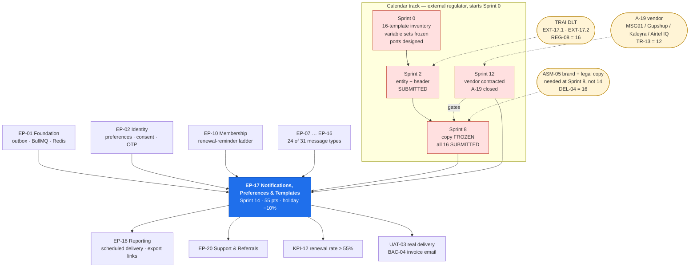

# EP-17 — Notifications, Preferences & Templates

> **Phase-0 delivery backlog.** Detailed expansion of `ENGINEERING_PLAN.md` §2 (epic row `EP-17`)
> and §3 (`F-17.1` … `F-17.9`), and of `SprintPlanning.md` sprint 14 (tasks `14.1` – `14.8`,
> `14.13` – `14.15`, `14.17`, `14.20`). No application code exists yet.
>
> ⏱ **This epic has a task that starts in Sprint 0 and cannot be moved.** `FR-NOTF-03` requires
> templates to be *"editable by Super Admin **without deployment**"*. For **SMS in India that is
> not achievable**: TRAI DLT requires the sender header **and every individual message template**
> to be registered and approved by an external body before a single message can send. Approval is
> **calendar time**, granted on somebody else's timetable, and no amount of engineering capacity
> shortens it. `REG-08` scores the lead-time risk at **16 (High)** and `REG-05` scores the
> editability conflict at **15 (High)**.
>
> **Two resolutions, both honest degradations rather than pretences.** **(1)** SMS templates carry
> a `dlt_template_id` and an **approval state machine**; editing creates a new version in
> `PENDING_DLT_APPROVAL` while **the previously approved version keeps sending**. Email and in-app
> stay instantly editable exactly as the PRD intends. **(2)** *Tenant-level template overrides*
> — also promised by `FR-NOTF-03` — are available on **email and in-app only**, because a
> per-tenant SMS body is a separate DLT registration per tenant and does not scale past the first
> dozen. See §5 `US-NOTF-04` and §13 `OQ-17.d`.
>
> **The DLT programme therefore begins in Sprint 0**, sixteen sprints before the code that uses it
> (`T-17.01`, `T-17.02`, `EXT-17.1`). Early submission costs nothing. Late submission cannot be
> recovered.

---

## 1. Metadata

| Field | Value |
| :--- | :--- |
| **Epic id** | `EP-17` |
| **Name** | Notifications, Preferences & Templates |
| **Priority (MoSCoW)** | **M** — Must. Eleven of the 24 baseline events are **transactional and non-opt-out**; `BAC-04` requires the invoice to reach the member; `BR-MEM-11` renewal reminders carry `KPI-12` (renewal rate ≥ 55%) |
| **Complexity** | **L** (T-shirt, §2) · module rating **Medium** for `notifications/` in isolation, **High** once the DLT state machine, four adapters and the 24-event wiring are counted |
| **Story points** | **55** (§2) · sprint-14 engineering slice **43.0 engineer-days**, plus **4.5 ed** on the Sprint 0 / 2 / 8 DLT calendar track (§10) |
| **Target sprint(s)** | **Sprint 0** — `T-17.01`, `T-17.02` (template inventory, DLT programme opened, ports designed) · **Sprint 2** — header registration submitted (`REG-08` early-warning bound) · **Sprint 8** — SMS copy frozen and **all 16 templates submitted for DLT approval** · **Sprint 12** — vendor contracted, closing `A-19` (`TR-13` deadline) · **Sprint 14** — `2027-03-22 → 2027-04-02`, holiday-adjusted **−10%**, the whole build |
| **Owning PRD module** | `NOTF` (`B5.19`) |
| **Owning code module** | `notifications/` |
| **Surfaces** | `customer-web` — `SCR-WEB-014` (preference matrix), notification centre, logged-out unsubscribe page · `gym-dashboard` — `SCR-DASH-021` (Notifications), notification centre, `SCR-DASH-022` (notification defaults) · `admin-dashboard` — `SCR-ADM-011` (notification templates, with **DLT approval state**), notification centre, `GET /admin/notifications/costs` |
| **Primary APIs** | `GET|PUT /me/preferences` · `GET /me/notifications`, `POST /me/notifications/:id/read`, `POST /me/notifications/read-all` · `GET /tenant/notifications`, `POST /tenant/notifications/:id/read` · `POST|DELETE /me/push-subscriptions` · `GET /admin/notifications/costs` · **new**: `GET|PUT /admin/notifications/templates`, `POST /admin/notifications/templates/:id/preview`, `GET /unsubscribe/:token` (**unauthenticated**, `AC-USER-01.3`) |
| **Background jobs** | `notification.dispatch` (continuous, `C5`) · **new**: `notification.dlt-approval-poll` (daily) · **new**: `notification.quiet-hours-release` (hourly) · **new**: `notification.cost-rollup` (daily) · **new**: `notification.cap-window-reset` (monthly). Consumes `membership.renewal-reminders` (`EP-10`) |
| **Data** | `notification_templates` (**GLOBAL**, versioned, locale-keyed, `dlt_template_id`, `dlt_approval_status`, `supersedes_version_id`, `routing_class`) · `notification_log` (**HYBRID** RLS class, `~200 M` rows at year 1) · `notification_preferences` (identity-scoped, timestamped consent) · `push_subscriptions` |
| **Launch market** | **India** — TRAI DLT entity, header and per-template pre-approval; DND applies to promotional but not to service messages; renewal reminders are **service/transactional** and may reach DND numbers **only while the wording stays transactional**; quiet hours and the 09:00 send window in `Asia/Kolkata` (+05:30, no DST); vendor candidates MSG91 / Gupshup / Kaleyra / Airtel IQ (`A-19`); message content must not be processed outside India (`REG-06`) |
| **Status** | `PLANNED` — Phase 0. Not started. **`A-19` is the only open Tier-2 addition slot in the plan** |
| **Epic owner** | Backend Lead — platform services. **DLT programme owner: Product Manager** — it is a procurement and compliance track, not an engineering one |

---

## 2. Business Goal

**Reach the right person on the right channel without breaking unit economics.** Notifications are
the only module in the platform whose marginal cost is paid per message, and the only one where
being *correct* and being *affordable* pull in opposite directions. `RSK-12` scores the cost
escalation at **9**, and `A6.5`'s unit-economics reference carries *"less: SMS/notification cost —
variable per active member"* as a line item that scales with `KPI-08` (25,000 active memberships)
rather than with revenue. `FR-NOTF-08` therefore demands a **per-channel cost report for Finance**
built on `cost_minor` recorded **at send time from the adapter** — first-hand, never estimated. That
is `BR-FIN-06`'s discipline applied outside the money path, and it is what makes the four cost
levers (channel routing, email-first defaults, per-tenant caps, batching) tunable from data instead
of from argument.

**Second, this epic is where the member's consent is either honoured mechanically or honoured
rhetorically.** `FR-USER-04` and `FR-NOTF-02` split every message into three categories:
transactional (never opt-out), operational reminders (opt-out) and marketing (opt-in). The hard part
is `AC-USER-01.1` — suppression **at send time, not at list-build time**. A campaign that built its
list at 09:00 and sends at 11:00 will mail a member who unsubscribed at 10:00, and every consent
regime that matters, including India's **DPDP Act 2023** (`REG-09`), treats that as a breach rather
than a timing quirk. The mirror requirement, `AC-USER-01.2`, is just as sharp in the other
direction: a member who disables **every** optional channel must still receive the T−3 renewal
reminder, because it is transactional. Preference is not a global mute; it is a matrix of channel ×
category, and the dispatcher consults it per message, per recipient, per send.

**Third — and this is the part the PRD could not have anticipated — India makes one of this epic's
own requirements partly unlawful, and the correct engineering response is to degrade visibly rather
than to report the requirement met.** `FR-NOTF-03`'s *"editable without deployment"* cannot hold for
SMS under TRAI DLT. The approval-state machine (`REG-05`) preserves the requirement's **intent** for
email and in-app, keeps SMS sending on the last approved version while a new one clears, and states
the approval state in the admin UI so a Super Admin is never surprised by a template that looks
saved and is not sending. This is recorded in `KNOWN_LIMITATIONS.md` as *a requirement partially
unmet by law, not by design* — and the accompanying `REG-08` lead-time risk is why the registration
programme opens in **Sprint 0** rather than in the sprint that needs it. `OBJ-05` (reduce churn by
making expiry visible) and `KPI-12` both route through `BR-MEM-11`'s reminder ladder; if those four
SMS templates are not approved on launch day, the ladder degrades to email and `KPI-12` degrades
with it.

---

## 3. Scope

### 3.1 In scope — explicit

| # | Item | Anchor |
| :-: | :--- | :--- |
| 1 | **Four channel adapters behind one port** — email, SMS, in-app, web push — with the port designed in Sprint 0 and exercised against **Mailpit** and a CI stub long before a vendor exists | `FR-NOTF-01`, `A-19`, `DEP-03`, `DEP-04`, `DEP-06` |
| 2 | Three categories — **transactional (never opt-out)**, operational reminders (opt-out), marketing (opt-in) — evaluated per message per recipient | `FR-NOTF-02`, `FR-USER-04` |
| 3 | Versioned, previewable templates editable by Super Admin **without deployment**, for **email and in-app** | `FR-NOTF-03` |
| 4 | **DLT approval-state machine** on SMS templates: `dlt_template_id`, `dlt_approval_status` ∈ {`NOT_REQUIRED`, `PENDING_DLT_APPROVAL`, `APPROVED`, `REJECTED`}, `supersedes_version_id`; the dispatcher resolves the **latest `APPROVED`** version, not the latest version | `REG-05`, `ERD.md` §12.5, `BLK-03` c5 |
| 5 | **Variable-set validation**: a template save whose placeholder set differs from the registered DLT variable set is **refused**, because it would fail at the operator | `REG-05` countermeasure |
| 6 | `routing_class` (`TRANSACTIONAL` / `PROMOTIONAL`) as a property of the **template**, distinct from `notification_log.category` which is a property of the **send** | `ERD.md` §12.5, TRAI DND routing |
| 7 | **The Sprint 0 DLT programme**: the complete 16-template SMS inventory enumerated at design time, entity and header registration opened, copy frozen at Sprint 8, all templates submitted at Sprint 8 | `REG-08`, `SprintPlanning.md` §26.3 |
| 8 | Tenant-level template overrides **on email and in-app only**, gated by subscription tier | `FR-NOTF-03`, `A6.2`, `OQ-17.d` |
| 9 | Outbox-driven queued delivery with exponential backoff and **per-attempt** provider-response logging | `FR-NOTF-04`, `C1.5`, `ADR-0017` |
| 10 | **Suppression at send time**, not at list-build time | `AC-USER-01.1` |
| 11 | **Unsubscribe from an email link without logging in**, through a signed single-purpose token | `AC-USER-01.3` |
| 12 | Per-user per-channel **quiet hours in the recipient's timezone** for non-transactional messages, with deferral rather than suppression | `FR-NOTF-05` |
| 13 | Per-recipient per-category **rate limiting** to prevent notification storms — a limiter distinct from HTTP rate limiting | `FR-NOTF-06`, `API_Catalog.md` §3.13 note |
| 14 | **Per-tenant monthly caps** that **degrade the channel** (SMS → email) rather than drop the message | `RSK-12` countermeasure 3 |
| 15 | In-app notification centre with read/unread state on **all three surfaces**, polled at 10–15 s through the single `useLiveCounters()` hook with a "last updated" indicator | `FR-NOTF-07`, `A-08`, `ADR-0010` |
| 16 | Web-push subscription registry and lifecycle | `FR-NOTF-01`, `DEP-06` |
| 17 | **Per-channel cost report for Finance** from `cost_minor` recorded at send by the adapter | `FR-NOTF-08`, `RSK-12` |
| 18 | The **24 baseline events** of `B5.19` — expanding to **31 distinct message types** — wired to real triggers through the transactional outbox | `B5.19`, `F-17.9` |
| 19 | `BR-MEM-11` renewal reminders batched **per tenant per day** at 09:00 gym-time, the highest-volume recurring send | `BR-MEM-11`, `RSK-12` countermeasure 4 |
| 20 | OTP send-path rate limiting per phone, per IP and per tenant, with the `AC-AUTH-01.5` email fallback available from day one | `RSK-12` India amplifier, `FR-AUTH-05` |
| 21 | `SCR-DASH-021`, the `SCR-WEB-014` preference matrix, and the `SCR-ADM-011` template editor with **DLT approval state visible** | `SCR-DASH-021`, `SCR-WEB-014`, `SCR-ADM-011` |
| 22 | Delivery log with per-message status on the tenant surface | `SCR-DASH-021`, `FR-NOTF-04` |
| 23 | **No personal data in logs, traces or analytics events** anywhere in the dispatch path | `BR-DAT-06`, `NFR-PRV-01` |
| 24 | `notification_log` as a **HYBRID** RLS class — member-addressed rows have no tenant and are reachable only through the user-scoped path | `ERD.md` line 540, `BR-TEN-01` |

### 3.2 Out of scope — explicit, with destination

| Item | Why it is not here | Where it went |
| :--- | :--- | :--- |
| The **events themselves** — order captured, membership expired, payout initiated, KYC decided | Each owning module emits its own outbox event; `notifications/` subscribes. Wiring is in scope; *causing* is not | **`EP-07` … `EP-16`, `EP-19`** |
| `membership.renewal-reminders` **scheduling** at T−15/−7/−3/−1 | The ladder is `memberships/`'s job; `notifications/` renders and delivers | **`EP-10`** |
| OTP **generation, verification and lockout** | `iam/` owns the credential; `notifications/` is the transport | **`EP-02`** |
| The **preference data model owner** and the `SCR-WEB-014` screen shell | `USER`/`iam` owns the profile screen; `EP-17` owns the matrix behaviour and the send-time evaluation | **`EP-02`** co-owned |
| Marketing **campaign composition, segmentation and scheduling** | `crm/` builds segments; `notifications/` suppresses and sends | **`EP-12`** |
| Support ticket notifications and the agent console | Same sprint, different epic | **`EP-20`** |
| **Feature-flag and taxonomy configuration surfaces** on `SCR-ADM-011` | `EP-17` contributes the templates panel to a screen `EP-19` owns | **`EP-19`** |
| The **cost report as a report** — charting, drill-down, scheduled delivery | `EP-17` produces the figures and one Finance view; the report harness is elsewhere | **`EP-18`** |
| **Socket.IO / WebSocket** live delivery of in-app notifications | Deferred by `A-08`; Phase 1 polls at 10–15 s | Phase 2, `ADR-0010` |
| **Multi-language** message bodies | `NFR-USE-08` externalises strings; a Hindi SMS variant is a **separate DLT registration** and a separate cost line | Out of Phase 1, `OQ-17.e` |
| WhatsApp Business as a channel | A fifth adapter with its own template-approval regime; the port makes it addable, the plan does not fund it | Phase 2 |
| Choosing the SMS vendor | A procurement decision with a Sprint-12 deadline | `A-19`, `TR-13`, Product Manager |

---
## 4. Features

`F-17.1` … `F-17.9` are carried from `ENGINEERING_PLAN.md` §3. Rows marked *(new)* come from
`LAUNCH_MARKET_INDIA.md` §8, `RiskAnalysis.md` §4.5 and §4.8, `ERD.md` §12.5 and
`SprintPlanning.md` §26.3.

| Feature | Description | Satisfies | Pri | Pts | Sprint |
| :--- | :--- | :--- | :-: | :-: | :-: |
| **F-17.1** | Four channel adapters behind one port — email, SMS, in-app, web push; ports in Sprint 0, vendors at Sprint 12 | `FR-NOTF-01`, `A-19` | M | 5 | 0 / 14 |
| **F-17.2** | Three categories with **transactional non-opt-out**, evaluated per message per recipient | `FR-NOTF-02`, `FR-USER-04` | M | 3 | 14 |
| **F-17.3** | Versioned, previewable templates editable without deployment; tenant overrides by tier | `FR-NOTF-03` | M | 5 | 14 |
| **F-17.4** | Queued delivery with backoff and **per-attempt** provider logging | `FR-NOTF-04`, `DEP-03`, `DEP-04` | M | 5 | 14 |
| **F-17.5** | Quiet hours in the **recipient's** timezone for non-transactional messages | `FR-NOTF-05` | S | 3 | 14 |
| **F-17.6** | Per-recipient per-category rate limiting | `FR-NOTF-06` | M | 3 | 14 |
| **F-17.7** | In-app notification centre with read state on all three surfaces | `FR-NOTF-07`, `A-08` | S | 3 | 14 |
| **F-17.8** | Per-channel cost report for Finance from **recorded** cost | `FR-NOTF-08`, `RSK-12` | S | 3 | 14 |
| **F-17.9** | The **24-event** baseline catalogue — 31 distinct message types — wired to real triggers | `B5.19` | M | 8 | 14 |
| **F-17.10** *(new)* | **DLT approval-state machine** on SMS templates; the dispatcher resolves the latest `APPROVED` version, never the latest version | `REG-05`, `BLK-03` c5, `ERD.md` §12.5 | M | 5 | 14 |
| **F-17.11** *(new)* | **The DLT registration programme** — inventory, entity, header, copy freeze, submission — as a **Sprint 0 calendar track** with an external owner | `REG-08`, `SprintPlanning.md` §26.3 | M | 3 | **0 / 2 / 8** |
| **F-17.12** *(new)* | Variable-set validation against the registered DLT template, plus `routing_class` guarding the DND classification | `REG-05`, TRAI routing | M | 2 | 14 |
| **F-17.13** *(new)* | **Suppression at send time** and logged-out unsubscribe by signed token | `AC-USER-01.1`, `AC-USER-01.3` | M | 3 | 14 |
| **F-17.14** *(new)* | **Per-tenant monthly caps** that degrade the channel rather than drop the message; email-first routing policy as a table, not a branch | `RSK-12` | M | 3 | 14 |
| **F-17.15** *(new)* | Outbox-driven, **idempotent** dispatch surviving worker restart and Redis failover, with a poison-message path | `TR-08`, `TR-20`, `TR-25` | M | 3 | 14 |
| **F-17.16** *(new)* | OTP send-path limiting per phone / IP / tenant, with `otp_per_registration_ratio` telemetry and the email fallback | `RSK-12` India amplifier | M | 2 | 14 |

**Roll-up.** 16 features · **58 raw points**, normalised to the **55** carried in `ENGINEERING_PLAN.md`
§2. `F-17.11` is the only feature in the entire backlog whose delivery date is set by an external
regulator rather than by capacity.

### 4.1 The 16 SMS templates requiring DLT approval

Enumerated **now**, at design time, so nothing is discovered in Sprint 14. Fourteen come from the
`B5.19` catalogue's SMS-bearing rows; two — marked † — come from `SprintPlanning.md` §26.3, which
names copy the catalogue does not. Every row is one DLT registration. A locale variant would be a
**second** registration (`OQ-17.e`).

| # | Template key | Trigger | Recipient | Category | `routing_class` | Sent at launch? |
| :-: | :--- | :--- | :--- | :--- | :--- | :--- |
| 1 | `sms.auth.otp` | OTP request | User | Transactional | `TRANSACTIONAL` | **Yes** (`OQ-13`) |
| 2 | `sms.payment.failed` | Payment failure | Member | Transactional | `TRANSACTIONAL` | Registered, email-routed |
| 3 | `sms.membership.activated` | Membership activation | Member | Transactional | `TRANSACTIONAL` | Registered, email-routed |
| 4 | `sms.membership.starts_today` | Future-dated start reaches its date | Member | Transactional | `TRANSACTIONAL` | Registered, email-routed |
| 5 | `sms.membership.renewal_t15` | `BR-MEM-11` T−15 | Member | Operational | `TRANSACTIONAL` | Registered |
| 6 | `sms.membership.renewal_t7` | `BR-MEM-11` T−7 | Member | Operational | `TRANSACTIONAL` | Registered |
| 7 | `sms.membership.renewal_t3` | `BR-MEM-11` T−3 | Member | Operational | `TRANSACTIONAL` | Registered |
| 8 | `sms.membership.renewal_t1` | `BR-MEM-11` T−1 | Member | Operational | `TRANSACTIONAL` | Registered |
| 9 | `sms.membership.expired` | Expiry | Member | Transactional | `TRANSACTIONAL` | **Yes** (`OQ-13`) |
| 10 | `sms.gym.closure_notice` | `GymCeasedOperating` | Member | Transactional | `TRANSACTIONAL` | **Yes** — `BR-MEM-14` 24 h SLA |
| 11 | `sms.onboarding.kyc_approved` | Application approved | Owner | Transactional | `TRANSACTIONAL` | Registered |
| 12 | `sms.onboarding.kyc_rejected` | Application rejected | Owner | Transactional | `TRANSACTIONAL` | Registered |
| 13 | `sms.onboarding.kyc_info_requested` | Information requested | Owner | Transactional | `TRANSACTIONAL` | Registered |
| 14 | `sms.billing.subscription_failed` | Tenant subscription charge fails | Owner | Transactional | `TRANSACTIONAL` | Registered |
| 15 † | `sms.refund.completed` | Refund reaches `COMPLETED` | Member | Transactional | `TRANSACTIONAL` | Registered |
| 16 † | `sms.checkin.denial_followup` | Denial with a remediable reason | Member | Operational | `TRANSACTIONAL` | Registered |

**Why register templates that `OQ-13` will not route at launch.** `OQ-13`'s answer — *SMS for OTP
and expiry, email for everything else* — is a **cost** decision, and cost decisions change. DLT
registration is free of engineering cost and bounded by calendar; a template that was never
registered cannot be switched on when Finance decides SMS is worth it for renewals. Registering all
sixteen converts a future channel change from a six-week external dependency into a routing-policy
row. This is the same argument `REG-08` makes for starting in Sprint 0.

---

## 5. User Stories

`B5.19` contains a requirements table and a 24-event catalogue but **no user stories at all** — the
only functional module in Part B with none. All nine below are written here; the requirement or
acceptance criterion that implies each one is named. `US-USER-01` is restated because its three
acceptance criteria are enforced entirely inside `notifications/`.

### US-USER-01 — *As a member, I want to control what the platform sends me so that I keep the reminders and lose the marketing.* **(PRD — `B5.2`, enforced here)**

| AC | Given / When / Then |
| :--- | :--- |
| **AC-USER-01.1** | **Given** I disable marketing email, **when** a campaign runs, **then** I receive nothing from it — verified by suppression **at send time** and not merely at list build |
| **AC-USER-01.2** | **Given** I disable all optional channels, **when** my membership is 3 days from expiry, **then** I still receive the renewal reminder because it is transactional |
| **AC-USER-01.3** | **Given** I unsubscribe via an email link, **when** I do so, **then** the preference is applied **without requiring me to log in** |
| **AC-USER-01.4** *(new)* | **Given** I attempt to disable a **transactional** category through the API, **when** it validates, **then** it is refused with `TRANSACTIONAL_OPT_OUT_NOT_PERMITTED` (422) naming the categories that **can** be disabled |
| **AC-USER-01.5** *(new)* | **Given** I change a preference, **when** it is stored, **then** the change is **timestamped** as consent evidence and appears in my account activity (`NFR-PRV-02`, `FR-USER-05`) |

### US-NOTF-01 — *As a Super Admin, I want to fix a typo in a message without waiting for a release.* **(new — implied by `FR-NOTF-03`)**

| AC | Given / When / Then |
| :--- | :--- |
| **AC-NOTF-01.1** | **Given** I edit an **email** or **in-app** template, **when** I save, **then** a new version is created, is previewable with sample data, and is live on the next send with **no deployment** |
| **AC-NOTF-01.2** | **Given** I open version history, **when** I compare two versions, **then** I see what changed and who changed it, and I can revert to any prior version |
| **AC-NOTF-01.3** | **Given** two admins edit the same template concurrently, **when** the second saves, **then** it is refused with `TEMPLATE_VERSION_CONFLICT` (409) showing both versions |
| **AC-NOTF-01.4** | **Given** a delivery is disputed months later, **when** I open its log row, **then** the **exact template version rendered** is still resolvable (`ERD.md` `notification_templates → notification_log` RESTRICT) |

### US-NOTF-02 — *As a Super Admin, I want to edit an SMS template and understand exactly what will happen, because in India the answer is not "it sends".* **(new — implied by `FR-NOTF-03`, `REG-05`, `BLK-03` c5)**

| AC | Given / When / Then |
| :--- | :--- |
| **AC-NOTF-02.1** | **Given** I edit an SMS template, **when** I save, **then** a new version is created in `PENDING_DLT_APPROVAL` and the response is `TEMPLATE_PENDING_DLT_APPROVAL` (409) **stating that the previous approved version keeps sending** |
| **AC-NOTF-02.2** | **Given** a version is pending, **when** the dispatcher sends that message type, **then** it resolves the **latest `APPROVED`** version via `supersedes_version_id` — never the pending one |
| **AC-NOTF-02.3** | **Given** I edit the template so the **variable placeholder set differs** from the registered DLT variable set, **when** I save, **then** the save is **refused** before submission, because it would be rejected at the operator |
| **AC-NOTF-02.4** | **Given** no version of an SMS template has ever been approved, **when** a send is attempted, **then** **no SMS is dispatched** and the message falls back to the configured alternate channel — proven by a negative test (`E14.7`) |
| **AC-NOTF-02.5** | **Given** a template has been `PENDING_DLT_APPROVAL` longer than the provider's stated lead time, **when** the watcher runs, **then** the Product Manager is alerted, because that is `REG-05`'s early-warning signal |
| **AC-NOTF-02.6** | **Given** approval is refused, **when** the state becomes `REJECTED`, **then** the operator's rejection reason is stored against the version and shown in the editor |
| **AC-NOTF-02.7** | **Given** I open the template list, **when** it renders, **then** every SMS row shows its approval state, its `dlt_template_id` and the expected lead time, so I am never surprised by a template that looks saved and is not sending |

### US-NOTF-03 — *As the Product Manager, I want the DLT registration finished long before the code that needs it exists.* **(new — implied by `REG-08`, `SprintPlanning.md` §26.3)**

| AC | Given / When / Then |
| :--- | :--- |
| **AC-NOTF-03.1** | **Given** Sprint 0 planning, **when** it completes, **then** the **complete 16-template SMS inventory** (§4.1) exists, with final variable sets, and the DLT track is on the risk board with a named owner |
| **AC-NOTF-03.2** | **Given** the end of Sprint 2, **when** the risk board is reviewed, **then** **entity and sender-header registration are submitted** — not submitting by then is `REG-08`'s stated early-warning signal |
| **AC-NOTF-03.3** | **Given** Sprint 8, **when** it closes, **then** **every** SMS template's final copy is frozen and **all sixteen are submitted** for DLT approval — four sprints of lead time before Sprint 14 needs them |
| **AC-NOTF-03.4** | **Given** templates are submitted, **when** the copy is later tweaked, **then** it restarts approval — which is why copy is frozen at Sprint 8 and why placeholders are deliberately **generous** |
| **AC-NOTF-03.5** | **Given** Sprint 12, **when** it closes, **then** the SMS vendor is contracted, closing `A-19` and `TR-13` — vendor selection **gates** DLT submission on the brand's behalf |
| **AC-NOTF-03.6** | **Given** approvals have not landed by Sprint 14, **when** launch planning runs, **then** the contingency executes: **email-only for every category except OTP**, with `AC-AUTH-01.5`'s email OTP carrying registration and login. A city launch may still proceed, because `§C9.4` gates on supply density, not on SMS |

### US-NOTF-04 — *As Rohan, I want my gym's name and voice in the message my member receives.* **(new — implied by `FR-NOTF-03` tenant overrides, `A6.2`)**

| AC | Given / When / Then |
| :--- | :--- |
| **AC-NOTF-04.1** | **Given** my tier permits overrides, **when** I edit an **email** or **in-app** template, **then** my override applies to my tenant's sends only, and the platform default is unchanged for everyone else |
| **AC-NOTF-04.2** | **Given** my tier does **not** permit overrides, **when** I open the panel, **then** it is visibly gated with the tier required, not silently absent |
| **AC-NOTF-04.3** | **Given** I attempt to override an **SMS** template, **then** the capability does not exist — SMS bodies are platform-global and my gym's name reaches the member as a **variable**, not as a bespoke body, because a per-tenant SMS body is a per-tenant DLT registration (`OQ-17.d`) |
| **AC-NOTF-04.4** | **Given** my override contains an unknown variable, **when** I save, **then** it is refused with the available variable set enumerated |

### US-NOTF-05 — *As Priya, I do not want a marketing message at 23:00.* **(new — implied by `FR-NOTF-05`, `FR-NOTF-06`)**

| AC | Given / When / Then |
| :--- | :--- |
| **AC-NOTF-05.1** | **Given** quiet hours of 22:00–08:00 and my timezone is `Asia/Kolkata`, **when** a **non-transactional** message is dispatched at 23:00 IST, **then** it is **deferred** to 08:00 IST — deferred, not dropped |
| **AC-NOTF-05.2** | **Given** a **transactional** message — a payment failure — **when** it is dispatched at 23:00 IST, **then** it sends immediately; quiet hours never apply to transactional |
| **AC-NOTF-05.3** | **Given** my timezone differs from the gym's, **when** quiet hours are evaluated, **then** the **recipient's** timezone governs, taken as an explicit IANA argument |
| **AC-NOTF-05.4** | **Given** eleven events fire for me in one minute — a bulk operation — **when** the limiter evaluates, **then** the per-recipient per-category cap collapses them rather than sending eleven messages |
| **AC-NOTF-05.5** | **Given** deferred messages accumulate overnight, **when** the release job runs at 08:00, **then** they are released in trigger order and de-duplicated by message type |

### US-NOTF-06 — *As Vikram, I want to know what notifications cost before the invoice tells me.* **(new — implied by `FR-NOTF-08`, `RSK-12`)**

| AC | Given / When / Then |
| :--- | :--- |
| **AC-NOTF-06.1** | **Given** sends have occurred, **when** I open `GET /admin/notifications/costs`, **then** I see cost per channel per period built from `cost_minor` **recorded by the adapter at send**, not estimated |
| **AC-NOTF-06.2** | **Given** SMS unit cost rises, **when** I compare periods, **then** the change is visible per channel and per provider, because the provider is a dimension on every log row |
| **AC-NOTF-06.3** | **Given** a tenant exceeds its monthly cap, **when** the next SMS is dispatched for it, **then** the channel **degrades to email** and the degradation is counted — the message is never dropped |
| **AC-NOTF-06.4** | **Given** OTP volume rises, **when** I check `otp_per_registration_ratio`, **then** a value above 1.4 alerts, because an enumeration campaign is simultaneously a security event and a cost event |
| **AC-NOTF-06.5** | **Given** notification cost per active membership exceeds its `A6.5` budget line, **when** the monthly review runs, **then** the routing policy can be flipped to email-only for non-urgent categories **with no deploy** |

### US-NOTF-07 — *As a member, I want the notification centre to be the same thing everywhere.* **(new — implied by `FR-NOTF-07`, `A-08`)**

| AC | Given / When / Then |
| :--- | :--- |
| **AC-NOTF-07.1** | **Given** I am on `customer-web`, the gym dashboard or the admin console, **when** I open the notification centre, **then** the same component shows my unread count and read/unread state for that surface's audience |
| **AC-NOTF-07.2** | **Given** the centre is open, **when** 10–15 s elapse, **then** it refreshes through the **single** `useLiveCounters()` hook and displays a **"last updated"** indicator — no second polling implementation exists |
| **AC-NOTF-07.3** | **Given** I mark all as read on one device, **when** I open another, **then** the state agrees within one poll interval |
| **AC-NOTF-07.4** | **Given** the email provider is down, **when** a transactional message is generated, **then** the **in-app centre still carries it**, per `DEP-04`'s stated mitigation |

### US-NOTF-08 — *As the platform, I want a notification storm to be impossible rather than unlikely.* **(new — implied by `FR-NOTF-06`, `TR-08`, `TR-25`)**

| AC | Given / When / Then |
| :--- | :--- |
| **AC-NOTF-08.1** | **Given** no HTTP endpoint sends a notification directly, **when** the API surface is reviewed, **then** sending exists only as the outbox plus `notification.dispatch` — a storm is never one compromised token away |
| **AC-NOTF-08.2** | **Given** a gym closure affects 400 members, **when** the closure notice is dispatched, **then** it is emitted as one bulk run, respects per-recipient limits, and completes inside `BR-MEM-14`'s 24-hour SLA |
| **AC-NOTF-08.3** | **Given** a worker restarts mid-drain, **when** it resumes, **then** no message is sent twice and none is lost — dispatch is idempotent on the outbox event id |
| **AC-NOTF-08.4** | **Given** Redis fails over, **when** BullMQ recovers, **then** duplicate execution does not produce duplicate sends (`TR-25`) |
| **AC-NOTF-08.5** | **Given** a message fails permanently at the provider, **when** retries are exhausted, **then** it lands in a poison path with the provider response retained, and alerts — it does not silently disappear |
| **AC-NOTF-08.6** | **Given** any dispatch log line, trace or analytics event, **when** it is inspected, **then** it contains **no personal data** — no phone number, no email address, no message body (`BR-DAT-06`) |

---
## 6. Acceptance Criteria for the Epic

The sprint-14 exit checklist `E14.1` – `E14.8` and `E14.10` expanded to executable granularity.
(`E14.9` belongs to `EP-20`, `E14.11` to `EP-09`.)

| # | Criterion | Evidence |
| :--- | :--- | :--- |
| **AC-EP17-01** | All **24 baseline events** — **31 distinct message types** — fire on **real triggers** across all four channels | `E14.1`, `B5.19` |
| **AC-EP17-02** | Disabling marketing email and running a campaign suppresses **at send time**; a member who unsubscribes after list build receives nothing | `E14.2`, `AC-USER-01.1` |
| **AC-EP17-03** | With **every** optional channel disabled, the T−3 renewal reminder still arrives because it is transactional | `E14.3`, `AC-USER-01.2` |
| **AC-EP17-04** | An API attempt to disable a transactional category is refused with `TRANSACTIONAL_OPT_OUT_NOT_PERMITTED` (422) | `AC-USER-01.4` |
| **AC-EP17-05** | Unsubscribe from an email footer link works in a **logged-out** browser, through a signed single-purpose token that cannot be replayed for another user | `E14.5`, `AC-USER-01.3` |
| **AC-EP17-06** | Quiet hours **defer** a non-transactional message in the **recipient's** timezone and release it in trigger order | `E14.4`, `AC-NOTF-05.1`, `AC-NOTF-05.5` |
| **AC-EP17-07** | A transactional message is never deferred by quiet hours | `AC-NOTF-05.2` |
| **AC-EP17-08** | **Every India SMS template carries a `dlt_template_id` and an approval state**; editing one moves it to `PENDING_DLT_APPROVAL` while **the previous approved version continues to send** | `E14.6`, `BLK-03` c5 |
| **AC-EP17-09** | **No SMS is dispatched on an unapproved template** — proven by a negative test, with the fallback channel used instead | `E14.7`, `AC-NOTF-02.4` |
| **AC-EP17-10** | The dispatcher resolves the latest `APPROVED` version, **not** the latest version, asserted with a pending version present | `AC-NOTF-02.2` |
| **AC-EP17-11** | A template save whose variable set diverges from the registered DLT set is **refused before submission** | `AC-NOTF-02.3` |
| **AC-EP17-12** | An SMS template pending beyond the provider's stated lead time raises an alert | `AC-NOTF-02.5`, `REG-05` |
| **AC-EP17-13** | The admin template list shows approval state, `dlt_template_id` and expected lead time on every SMS row | `AC-NOTF-02.7` |
| **AC-EP17-14** | `routing_class` is a property of the **template** and `category` a property of the **send**; a template whose wording is classed `PROMOTIONAL` cannot be used for a `TRANSACTIONAL` send | `ERD.md` §12.5 |
| **AC-EP17-15** | Email and in-app templates are editable **without deployment** and live on the next send | `AC-NOTF-01.1`, `FR-NOTF-03` |
| **AC-EP17-16** | The **exact template version rendered** remains resolvable from any historical `notification_log` row | `AC-NOTF-01.4` |
| **AC-EP17-17** | Tenant overrides work on email and in-app, are tier-gated with a visible gate, and **do not exist** for SMS | `AC-NOTF-04.1` … `04.3`, `OQ-17.d` |
| **AC-EP17-18** | Every delivery attempt is logged with provider, status, provider response and `cost_minor`; retries use exponential backoff | `FR-NOTF-04` |
| **AC-EP17-19** | The per-channel cost report shows **recorded** cost per send, not an estimate, dimensioned by channel and provider | `E14.8`, `AC-NOTF-06.1` |
| **AC-EP17-20** | A tenant exceeding its monthly cap has the channel **degraded to email**, counted, and the message still delivered | `AC-NOTF-06.3`, `RSK-12` |
| **AC-EP17-21** | Per-recipient per-category rate limiting collapses a burst rather than sending each message | `FR-NOTF-06`, `AC-NOTF-05.4` |
| **AC-EP17-22** | The in-app centre works on all three surfaces with read/unread state, polls at 10–15 s through **one** `useLiveCounters()` hook, and shows a "last updated" indicator | `FR-NOTF-07`, `A-08` |
| **AC-EP17-23** | With the email provider down, the in-app centre still carries transactional messages | `DEP-04`, `AC-NOTF-07.4` |
| **AC-EP17-24** | Web-push subscriptions register and unregister; an invalid subscription triggers silent re-registration (`PUSH_SUBSCRIPTION_INVALID`) | `FR-NOTF-01`, `DEP-06` |
| **AC-EP17-25** | **No HTTP endpoint sends a notification directly**; sending exists only through the outbox and `notification.dispatch` | `AC-NOTF-08.1` |
| **AC-EP17-26** | Dispatch is **idempotent** on the outbox event id and survives a worker restart and a Redis failover with no duplicate and no loss | `AC-NOTF-08.3`, `AC-NOTF-08.4`, `TR-25` |
| **AC-EP17-27** | A permanently failing message lands in a poison path with the provider response retained, and alerts | `AC-NOTF-08.5` |
| **AC-EP17-28** | A 400-member closure notice completes inside `BR-MEM-14`'s 24-hour SLA and respects per-recipient limits | `AC-NOTF-08.2`, `BR-MEM-14-P1` |
| **AC-EP17-29** | `BR-MEM-11` fires exactly five notifications — T−15, T−7, T−3, T−1 and expiry — at **09:00 `Asia/Kolkata`**, on enabled channels only; re-running the job the same day sends nothing further | `BR-MEM-11-P1`, `BR-MEM-11-N1` |
| **AC-EP17-30** | A member opted out of operational reminders on SMS receives none on SMS while still receiving transactional messages | `BR-MEM-11-N2` |
| **AC-EP17-31** | **No personal data** appears in any dispatch log line, span or analytics event | `AC-NOTF-08.6`, `BR-DAT-06` |
| **AC-EP17-32** | `notification_log` obeys its **HYBRID** policy — member-addressed rows carry no tenant and are unreachable from any tenant-scoped path; cross-tenant reads of `/tenant/notifications` are refused | `ERD.md` line 540, `E2E-11` |
| **AC-EP17-33** | OTP sends are limited per phone, per IP and per tenant; `otp_per_registration_ratio` above 1.4 alerts | `AC-NOTF-06.4`, `RSK-12` |
| **AC-EP17-34** | The **Sprint 0** DLT deliverables exist: the 16-template inventory, frozen variable sets, named owner, risk-board entry | `AC-NOTF-03.1`, `REG-08` |
| **AC-EP17-35** | Entity and header registration are **submitted by the end of Sprint 2**; all sixteen templates are **submitted by the end of Sprint 8** | `AC-NOTF-03.2`, `AC-NOTF-03.3` |
| **AC-EP17-36** | `KNOWN_LIMITATIONS.md` records `FR-NOTF-03` as **partially unmet by law, not by design**, naming both the SMS editability limit and the absent SMS tenant override | `REG-05`, `OQ-17.d` |
| **AC-EP17-37** | axe-core clean and keyboard-complete on `SCR-DASH-021`, `SCR-WEB-014`, the `SCR-ADM-011` template panel and the notification centre on all three surfaces | `NFR-USE-01` |

---

## 7. Business Rules Enforced

Detail lives in `BusinessRules.md`. This table states **what `EP-17` owns** and the enforcement
point inside this epic. `notifications/` owns comparatively few rules and **consumes** many, which
is exactly right for a delivery layer.

| `BR-` | Ownership | Enforcement point in `EP-17` | Task |
| :--- | :--- | :--- | :--- |
| `BR-MEM-11` | **Owned** (`BusinessRules.md` names `notifications/` as owner) | The reminder renderer and dispatcher: five sends at T−15/−7/−3/−1 and expiry, at **09:00 `Asia/Kolkata`**, on enabled channels only, idempotent per membership per day, **batched per tenant per day** | T-17.19, T-17.20 |
| `BR-MEM-14` | **Co-owned** with `memberships/` and `refunds/` | `GymCeasedOperating` drains through `notification.dispatch` with a 24-hour SLA monitor alerting on any undelivered member | T-17.21 |
| `BR-TEN-06` | **Contributor** (owner `billing/`) | The `PAST_DUE` and staged-degradation notices to the owner; check-in is never mentioned because it is never blocked | T-17.18 |
| `BR-DAT-06` | **Owned in this path** | No personal data in logs, traces or analytics: the dispatcher logs recipient **ids**, never addresses, and never the rendered body | T-17.26 |
| `BR-TEN-01` | **Inherited, with a twist** | `notification_log` is the platform's only **HYBRID** RLS class: `tenant_id IS NULL OR tenant_id = current_setting(...)`, with member-addressed rows reachable only through the user-scoped path | T-17.04 |
| `BR-DAT-01` | **Inherited** | Template create, edit, version publish, DLT state transition and tenant override are each audited with actor and reason | T-17.25 |
| `BR-PAY-07` | **Consumer** (owner `payments/`) | Proactive duplicate-payment notification to the payer | T-17.22 |
| `BR-REF-08` | **Consumer** (owner `refunds/`) | Dispute deadline reminders to Finance and the tenant | T-17.22 |
| `BR-GYM-06` | **Consumer** (owner `catalog/`) | Bank-account-change alert to the owner — a security notification that must never be suppressible | T-17.22 |
| `BR-RFL-01` | **Consumer** (owner `EP-20`) | Referral reward notification only after the refund window clears | T-17.22 |

**Two `FR-` obligations behave like rules here and are enforced structurally, not by convention.**
`FR-NOTF-02`'s *transactional cannot be disabled* is a **database-level** category constraint plus a
pipe-level refusal, not a UI omission (`AC-EP17-04`). `FR-NOTF-06`'s limiter is a **separate
concern** from HTTP rate limiting and lives in the dispatcher, because a storm generated by a bulk
domain operation never passes through an HTTP endpoint at all.

---

## 8. Dependencies

### 8.1 Upstream — must exist first

| Dep | What `EP-17` needs from it | Sprint | Hard or soft |
| :--- | :--- | :-: | :--- |
| **`EP-01`** | The **transactional outbox** (`C1.5`, `ADR-0017`), BullMQ workers, Redis, tenant context, the `notification.dispatch` job shell — all Sprint 0 | 0 | **Hard** |
| **`EP-02`** | `notification_preferences` shape, timestamped consent, the identity a message is addressed to, `notifications.preference.*` permissions, the OTP send path | 1 | **Hard** |
| **`EP-19`** | `SCR-ADM-011` configuration shell into which the template panel mounts; reason-required audited config writes | 15 | **Soft** — sprint 14 builds the panel; the shell arrives later and the panel is mounted then |
| **`EP-07` … `EP-16`** | The domain events behind 24 of the 31 message types — each owning module emits, `notifications/` subscribes | 5–12 | **Hard** for wiring; sprint 14 is deliberately late so the events already exist |
| **`EP-10`** | `membership.renewal-reminders` scheduling the `BR-MEM-11` ladder | 7 | **Hard** |
| **`A-19` vendor** | Concrete email, SMS and web-push adapters | **12** | **Hard** — `TR-13`'s decision deadline |
| **DLT approvals** | Sixteen approved templates and one approved header | **8 submitted** | **Hard, external** — `REG-08` |

### 8.2 Downstream — what this unblocks

| Consumer | What it takes from `EP-17` |
| :--- | :--- |
| **`EP-18`** | Scheduled report delivery by email (`FR-RPT-04`) and the async-export "your file is ready" notification with a time-limited link (`FR-RPT-03`) |
| **`EP-20`** | Ticket notifications, SLA breach alerts, referral reward notices |
| **`EP-09`** | *Order confirmation + invoice* and *Payout initiated + statement* delivery |
| **`EP-16`** | *Refund initiated / completed*, *Refund awaiting approval*, dispute deadline reminders |
| **Sprint 17** | `UAT-03` — the member script needs **real** delivery, not a stub |
| **Sprint 18** | `BAC-04` invoice email; hypercare alerting |
| **`KPI-12`** | Renewal rate ≥ 55% is mechanically dependent on the `BR-MEM-11` ladder arriving |

### 8.3 External dependencies and open questions

| Dependency | Kind | Owner | Needed by | Effect if late |
| :--- | :--- | :--- | :--- | :--- |
| **`EXT-17.1` — TRAI DLT entity + sender-header registration** | **Regulator, calendar time** | **Product Manager** | Submitted **Sprint 2** | Header registration precedes template registration; a late header pushes every one of the sixteen approvals |
| **`EXT-17.2` — DLT approval of all 16 templates** | **Regulator, calendar time** | **Product Manager** | Submitted **Sprint 8**, approved before Sprint 14 | `REG-08` (**16**) realises: launch on **email-only except OTP**, with the `AC-AUTH-01.5` email OTP fallback. `KPI-12` degrades |
| **`A-19` — SMS / email / push vendor selection** | Procurement (`DEP-03`, `DEP-04`, `DEP-06`) | Product Manager | **Sprint 12** | `TR-13` (**12**). The vendor performs DLT registration on the brand's behalf, so vendor choice **gates** `EXT-17.2` |
| **`ASM-05` / `OQ-17` — brand, domain, legal copy, sender identity** | Client | Client Sponsor | **Sprint 14** — but SMS copy is needed at **Sprint 8** | `DEL-04` (**16**). SMS copy cannot be frozen without the brand voice and the legal footer; this pulls `ASM-05`'s effective deadline **six sprints earlier** than the plan's headline date |
| **`REG-06` — vendor data-processing location** | Compliance | DevOps | Vendor selection | A provider processing message content outside India breaches RBI/DPDP residency; every candidate is assessed **before** selection, as a recorded decision |
| **`OQ-13`** | Client decision | Client Sponsor | Sprint 14 | Answered: **SMS for OTP and expiry, email for everything else**. All sixteen templates are still registered (§4.1) |
| **`OQ-19`** | Client decision | Client Sponsor | Sprint 14 | Support hours shape the SLA-breach notifications `EP-20` consumes |

### 8.4 Dependency graph

---
## 9. Technical Tasks

Layers: `DB` · `API` · `worker` · `web` · `dash` · `admin` · `infra` · `test` · `docs` · **`ext`**
(external / non-engineering calendar work). Estimates are **engineer-days**. Ids map to
`SprintPlanning.md` sprint-14 tasks `14.1` – `14.8`, `14.13` – `14.15`, `14.17`, `14.20`, plus the
§26.3 calendar ladder.

| # | Task | Layer | Sprint | Est (ed) | Depends on | Serves |
| :--- | :--- | :--- | :-: | :-: | :--- | :--- |
| **T-17.01** | **Enumerate the complete SMS template inventory** — the 16 rows of §4.1 — from the `FR-NOTF` catalogue; fix each template's **variable placeholder set deliberately generously** so later wording tweaks do not restart approval; publish it as `/docs/features/notification-catalogue.md` | `ext` + docs | **0** | 1.5 | `B5.19`, `§26.3` | `REG-08`, `AC-NOTF-03.1` |
| **T-17.02** | **Open the DLT programme**: name the Product Manager owner, add `EXT-17.1`/`EXT-17.2` to the risk board with the Sprint 2 and Sprint 8 gates, and assemble the entity-registration prerequisites (legal entity name, PAN, GSTIN, authorised signatory, brand name) | `ext` | **0** | 1.0 | T-17.01 | `REG-08`, `AC-NOTF-03.1` |
| **T-17.03** | **Design the four channel ports** in Sprint 0 — `send`, `statusCallback`, `recordCost` — and wire the local **Mailpit** and CI stub adapters, so nine sprints of feature work exercise the port before any vendor exists | API | **0** | 1.0 | EP-01 | `FR-NOTF-01`, `A-19` |
| **T-17.04** | Submit **entity and sender-header registration** | `ext` | **2** | 0.5 | T-17.02 | `AC-NOTF-03.2`, `REG-08` early-warning |
| **T-17.05** | **Freeze final SMS copy** for all sixteen templates with the Designer and the client's legal copy, and **submit every template for DLT approval** — four sprints of lead time | `ext` | **8** | 1.5 | T-17.01, T-17.04, `ASM-05` | `AC-NOTF-03.3`, `REG-08` |
| **T-17.06** | `notification_templates` migration: **GLOBAL** scope, `key`, `channel`, `locale`, `version`, `body`, `variables jsonb`, `routing_class`, `dlt_template_id`, `dlt_approval_status`, `supersedes_version_id`, `published_at`, plus `notification_template_overrides` keyed by tenant for **email and in-app only** | DB | 14 | 1.0 | EP-01 | `FR-NOTF-03`, `ERD.md` §12.5 |
| **T-17.07** | `notification_log` migration with the **HYBRID** RLS policy `tenant_id IS NULL OR tenant_id = current_setting(...)`; columns for channel, provider, category, `template_version_id` (RESTRICT), status, attempt count, provider response, `cost_minor`, `currency`; dated retention sweep, monthly partitioning **pre-planned** at 100 M rows | DB | 14 | 1.5 | EP-01 | `FR-NOTF-04`, `ERD.md` line 1659 |
| **T-17.08** | `notification_preferences` and `push_subscriptions` migrations; RLS and generated isolation specs for all eleven notification endpoints | DB + test | 14 | 1.0 | T-17.07, EP-02 | `FR-USER-04`, `BAC-10`, `E2E-11` |
| **T-17.09** | Concrete adapters behind the Sprint-0 ports: **email**, **India SMS** (`A-19`), **in-app**, **web push**; each records `cost_minor` at send and normalises provider status callbacks | API | 14 | 3.0 | T-17.03, `A-19` | `FR-NOTF-01`, sprint task 14.1 |
| **T-17.10** | **DLT approval-state machine**: `PENDING_DLT_APPROVAL → APPROVED / REJECTED`; version resolution returns the latest `APPROVED` via `supersedes_version_id`; `TEMPLATE_PENDING_DLT_APPROVAL` (409) on save with the *previous version keeps sending* message; `TEMPLATE_VERSION_CONFLICT` (409) on concurrent edit | API | 14 | 2.5 | T-17.06 | `REG-05`, `BLK-03` c5, sprint task 14.2 |
| **T-17.11** | **Variable-set validator** comparing a template save against the registered DLT variable set and refusing a divergent save; `routing_class` guard refusing a `PROMOTIONAL`-classed body for a `TRANSACTIONAL` send | API | 14 | 1.0 | T-17.10 | `AC-EP17-11`, `AC-EP17-14` |
| **T-17.12** | `notification.dlt-approval-poll` daily job: reconcile approval state with the vendor, store operator rejection reasons, **alert on any template pending beyond the stated lead time** | worker | 14 | 1.0 | T-17.10, T-17.09 | `REG-05` early-warning |
| **T-17.13** | Category engine: three categories, **transactional non-opt-out** enforced at the pipe and by constraint; versioned previewable templates with sample-data rendering and revert | API | 14 | 2.5 | T-17.06 | `FR-NOTF-02`, `FR-NOTF-03`, sprint task 14.3 |
| **T-17.14** | Tier-gated **tenant overrides** on email and in-app; no SMS override capability exists anywhere in the API or the UI | API | 14 | 1.0 | T-17.13 | `AC-NOTF-04.1` … `04.3`, `OQ-17.d` |
| **T-17.15** | `notification.dispatch` hardening: outbox drain, exponential backoff, **per-attempt** provider logging, idempotency on the outbox event id, restart and Redis-failover safety, poison path with alert | worker | 14 | 2.5 | T-17.07, T-17.09 | `FR-NOTF-04`, `TR-08`, `TR-20`, `TR-25`, sprint task 14.4 |
| **T-17.16** | **Send-time suppression**: preference evaluated per message at dispatch, never at list build; plus the signed single-purpose **logged-out unsubscribe** token and `GET /unsubscribe/:token` | API | 14 | 1.5 | T-17.13 | `AC-USER-01.1`, `AC-USER-01.3` |
| **T-17.17** | **Quiet hours** in the recipient's IANA timezone with **deferral** (not suppression) plus `notification.quiet-hours-release`; per-recipient per-category **rate limiting** in the dispatcher | API + worker | 14 | 2.0 | T-17.15 | `FR-NOTF-05`, `FR-NOTF-06`, sprint task 14.5 |
| **T-17.18** | **Per-tenant monthly caps** with channel **degradation** to email; the routing policy as a **configuration table** so cost levers move without a deploy; `notification.cap-window-reset` | API + worker | 14 | 1.5 | T-17.15 | `RSK-12`, `AC-EP17-20` |
| **T-17.19** | In-app notification centre API on all three surfaces with read/unread and read-all; served through the single `useLiveCounters()` polling hook | API | 14 | 1.5 | T-17.07 | `FR-NOTF-07`, `A-08`, sprint task 14.6 |
| **T-17.20** | **Wire all 24 baseline events / 31 message types** to real triggers through the outbox, each with its channel set, category and template key; `BR-MEM-11` reminders **batched per tenant per day** at 09:00 gym-time | API + worker | 14 | 3.0 | T-17.15, EP-07…EP-16 | `B5.19`, `BR-MEM-11`, sprint task 14.8 |
| **T-17.21** | Bulk-send path for `GymCeasedOperating`: 400 recipients inside the `BR-MEM-14` 24-hour SLA, per-recipient limits respected, SLA monitor alerting on any undelivered member | worker | 14 | 1.0 | T-17.20 | `BR-MEM-14`, `AC-NOTF-08.2` |
| **T-17.22** | Consumer wiring for the security- and money-critical notices that must never be suppressible: duplicate payment, dispute deadline, bank-account change, payout initiated, KYC decision | API | 14 | 1.0 | T-17.20 | `BR-PAY-07`, `BR-REF-08`, `BR-GYM-06` |
| **T-17.23** | **Cost report**: `notification.cost-rollup` daily, `GET /admin/notifications/costs` per channel per provider per period from recorded `cost_minor` | API + worker | 14 | 1.5 | T-17.09 | `FR-NOTF-08`, sprint task 14.7 |
| **T-17.24** | **OTP send-path limiting** per phone, per IP and per tenant via `rate-limiter-flexible`; `otp_per_registration_ratio` metric; the `AC-AUTH-01.5` email fallback wired as the degradation | API | 14 | 1.0 | T-17.15, EP-02 | `RSK-12` India amplifier |
| **T-17.25** | Audit wiring: template create, edit, publish, DLT transition, tenant override and preference change — actor, reason, before/after | API | 14 | 0.5 | T-17.10, T-17.13 | `BR-DAT-01`, `NFR-PRV-02` |
| **T-17.26** | **`BR-DAT-06` scrubbing**: recipient ids only in logs and spans, never addresses, never rendered bodies; a CI check greping the dispatch path for address-shaped literals | API + infra | 14 | 0.5 | T-17.15 | `BR-DAT-06`, `AC-EP17-31` |
| **T-17.27** | `SCR-WEB-014` **preference matrix** (channel × category) with transactional rows visibly non-editable and explained; notification-centre component shared across the three surfaces | web | 14 | 3.5 | T-17.16, T-17.19 | `SCR-WEB-014`, sprint task 14.13 |
| **T-17.28** | **Template editor** with preview, version history, diff and revert; **DLT approval state, `dlt_template_id` and expected lead time visible on every SMS row**; the pending-versus-sending distinction made explicit | admin | 14 | 4.0 | T-17.10, T-17.13 | `SCR-ADM-011`, `AC-NOTF-02.7`, sprint task 14.14 |
| **T-17.29** | `SCR-DASH-021`: tenant notification centre, tier-gated override panel, **delivery log with per-message status** | dash | 14 | 3.0 | T-17.14, T-17.19 | `SCR-DASH-021`, sprint task 14.15 |
| **T-17.30** | Finance cost view on the admin console reading `GET /admin/notifications/costs` | admin | 14 | 1.0 | T-17.23 | `FR-NOTF-08` |
| **T-17.31** | Logged-out unsubscribe page with confirmation and a re-subscribe affordance | web | 14 | 1.0 | T-17.16 | `AC-USER-01.3` |
| **T-17.32** | **The notification matrix suite**: 24 events × 4 channels × 3 categories × preference states × quiet hours — table-driven, one fixture per message type | test | 14 | 6.0 | T-17.20 | `E14.1` – `E14.4`, sprint task 14.17 |
| **T-17.33** | **DLT negative suite**: no send on an unapproved template; latest-`APPROVED` resolution with a pending version present; divergent variable set refused; `PROMOTIONAL` body refused for a transactional send | test | 14 | 1.5 | T-17.10, T-17.11 | `E14.6`, `E14.7` |
| **T-17.34** | Dispatcher resilience suite: worker restart mid-drain, Redis failover, duplicate outbox delivery, poison message, 400-recipient bulk run | test | 14 | 1.5 | T-17.15, T-17.21 | `TR-08`, `TR-25`, `AC-EP17-26` |
| **T-17.35** | `BR-MEM-11` suite: five sends at 09:00 IST, same-day re-run sends nothing, SMS-opted-out member still receives transactional | test | 14 | 1.0 | T-17.20 | `BR-MEM-11-P1/N1/N2` |
| **T-17.36** | Privacy suite: assert no address, phone or body in any log line, span or analytics event on the whole dispatch path | test | 14 | 0.5 | T-17.26 | `BR-DAT-06` |
| **T-17.37** | Vendor credentials in the managed secret store, **DLT header registration evidence filed**, cost attribution wired, provider status-callback ingress with signature verification | infra | 14 | 4.0 | T-17.09, T-17.04 | sprint task 14.20 |
| **T-17.38** | Observability: `gym.notification.sent.count{channel,category,provider}`, `.failed.count`, `.cost_minor{channel}`, `.deferred.count`, `.cap_degraded.count`, `otp_per_registration_ratio`, `dlt.templates_pending.count`; alerts on cost-per-active-membership above budget, SMS share rising, any template pending beyond lead time | infra | 14 | 1.0 | T-17.23, T-17.12 | `RSK-12`, `REG-05` |
| **T-17.39** | axe-core and keyboard passes on `SCR-WEB-014`, `SCR-DASH-021`, the `SCR-ADM-011` panel and the notification centre on all three surfaces | test | 14 | 1.0 | T-17.27 – T-17.29 | `NFR-USE-01` |
| **T-17.40** | Runbooks: template stuck in `PENDING_DLT_APPROVAL`; operator rejection; SMS provider outage (fall back to email); notification storm detected; `notification_log` growth crossing 100 M; a tenant hitting its cap twice in a week | docs | 14 | 1.0 | all | `NFR-MNT-09`, `RSK-12` |
| **T-17.41** | Docs: `/docs/apis/API-NOTF.md`, `/docs/database/notification_templates.md`, `/docs/database/notification_log.md`, `/docs/ui/SCR-DASH-021.md`, `/docs/ui/SCR-WEB-014.md`, `/docs/features/notifications.md`, `/docs/features/dlt-approval.md`, `notifications/README.md`; **`KNOWN_LIMITATIONS.md` for `FR-NOTF-03` partially unmet by law**; `FEATURE_FLAGS.md` for the channel routing policy | docs | 14 | 1.0 | all | DoD 22–25, `AC-EP17-36` |

**Task roll-up.** 41 tasks · **4.5 ed** on the Sprint 0 / 2 / 8 calendar track + **62.0 ed** of
Sprint-14 raw estimate, reconciled to the **43.0 ed** sprint-14 allocation in §10.2.

---

## 10. Estimated Time

### 10.1 Roll-up by role

| Role | Engineer-days | What it covers |
| :--- | :-: | :--- |
| **Product Manager / external (`ext`)** | **4.5** | T-17.01, T-17.02, T-17.04, T-17.05 — the DLT calendar track across Sprints 0, 2 and 8. **This is not engineering capacity and must not be planned against it** |
| **Backend (BE)** | **18.5** | T-17.06 – T-17.26 in Sprint 14 (T-17.03's 1.0 ed sits in Sprint 0's EP-01 allocation) — adapters, the DLT state machine, dispatcher, suppression, quiet hours, caps, the 31-message wiring, cost rollup |
| **Frontend — customer web (FE-web)** | **4.5** | T-17.27, T-17.31 — preference matrix, notification centre, logged-out unsubscribe |
| **Frontend — dashboards (FE-dash / admin)** | **8.0** | T-17.28, T-17.29, T-17.30 — template editor with DLT state, `SCR-DASH-021`, the Finance cost view |
| **QA** | **6.0** | T-17.32 – T-17.36, T-17.39 — the 24 × 4 × 3 matrix plus the DLT, resilience, `BR-MEM-11` and privacy suites |
| **DevOps** | **4.0** | T-17.37, T-17.38 — vendor credentials, DLT evidence, callback ingress, telemetry |
| **Design** | **2.0** | Preference-matrix pattern, notification-centre component, the *pending versus sending* disclosure in the template editor |
| **Docs** | **2.0** | T-17.40, T-17.41 — absorbed into BE capacity per the plan's convention |
| **Sprint-14 engineering total** | **43.0 ed** | Against holiday-adjusted availability of BE 22.1 · FE 18.9 · QA 12.6 · DevOps 3.2 · Design 3.2 |
| **Epic total including the calendar track** | **47.5 ed** | |

### 10.2 Reconciliation with the sprint plan

`SprintPlanning.md` sprint 14 records **BE 28.5 · FE 16.5 · QA 13.0 · DevOps 4.0 · Design 3.0** for
`EP-17` **and** `EP-20` together, with verdicts of **Backend 129% OVER**, **Dev total 110% OVER**,
**DevOps 125% OVER** and **QA 103% TIGHT** — the worst capacity position in the eighteen-sprint
plan, in a sprint carrying **Holi and Good Friday** at −10%. The plan's mitigation is **descope
`D-02`**: `EP-20`'s referrals and wallet (tasks 14.11, 14.12, 5.0 ed, MoSCoW `S`/`C`) move
post-launch, leaving backend at 106% with the residual drawn from contingency.

Splitting that allocation by epic: `EP-20` owns tasks 14.9 – 14.12 and 14.16 and 14.19; **`EP-17`
owns 18.5 BE · 12.5 FE · 6.0 QA · 4.0 DevOps ≈ 43.0 ed**. Task 14.18 (2.0 ed, the 1 April FY
rollover test) belongs to `EP-09`, not here. The 62.0 ed of raw task estimate compresses to 43.0
because the schema tasks T-17.06 – T-17.08 are carried inside sprint tasks 14.3 and 14.4, and
because T-17.40 – T-17.41 are DoD obligations of every other task.

### 10.3 Confidence range

| Scenario | Total (ed) | Driver |
| :--- | :-: | :--- |
| **Optimistic (−15%)** | **36.6** | All sixteen DLT templates approved before Sprint 14; the chosen vendor's API is close to the port shape; web push descoped to Phase 2 (`OQ-17.f`) |
| **Planned** | **43.0** | The sprint-14 slice |
| **Pessimistic (+35%)** | **58.1** | Templates rejected on first submission and resubmitted with new copy (+2 ed engineering, weeks of calendar); the vendor's status-callback model does not match the port and needs a reconciliation poller (+3 ed); the 24 × 4 × 3 matrix uncovers per-channel rendering defects at a rate the 6.0 ed QA allocation cannot absorb (+6 ed); `ASM-05` legal copy arrives after Sprint 8, forcing a second DLT submission round (+4 ed) |

**Confidence: Low–Medium — and the variance is almost entirely non-engineering.** The code is
well-understood: adapters, a queue, a state machine and a preference matrix. What is uncertain is
whether an external regulator and an unselected vendor deliver on the project's timeline. That is
why `F-17.11` is a Sprint 0 task and why the contingency (`AC-NOTF-03.6`) is written before it is
needed.

---

## 11. Risks

| Id | Risk | P | I | Score | Mitigation | Owner |
| :--- | :--- | :-: | :-: | :-: | :--- | :--- |
| `REG-08` | **DLT template approval lead time delays launch.** Header and per-template approval are calendar time outside the project's control | 4 | 4 | **16** | The registration path starts in **Sprint 0** (T-17.01, T-17.02), header submitted by Sprint 2, all sixteen templates submitted by Sprint 8 with **generous placeholders** so tweaks do not restart approval. Vendor decision deadline Sprint 12 is the *outer* bound. Contingency: **email-only except OTP**, with the `AC-AUTH-01.5` email fallback; a city launch still proceeds because `§C9.4` gates on supply density. Residual **4** | **Product Manager** |
| `REG-05` | **DLT pre-approval breaks *"editable without deployment"*** — and the requirement will be reported as met if nobody checks | 5 | 3 | **15** | The approval-state machine with the previous approved version still sending; the admin UI states approval state and lead time; the variable-set validator refuses a save that would fail at the operator; `E14.6`/`E14.7` are **exit gates**, and `KNOWN_LIMITATIONS.md` records the requirement as partially unmet **by law, not by design**. Residual **4** | Technical Lead |
| `TR-13` | **Notification vendor undecided (`A-19`)** — the only open Tier-2 slot in the plan | 3 | 4 | **12** | `OQ-01` is answered, so the candidate set is fixed at MSG91 / Gupshup / Kaleyra / Airtel IQ. The port is exercised against Mailpit and a CI stub from **Sprint 0**, and the adapter surface is deliberately small — send, status callback, cost record. Contract deadline **Sprint 12** | Product Manager |
| `RSK-12` | **Notification cost escalates beyond unit economics** | 3 | 3 | **9** | Routing by cost is a **policy table**, not a code branch; `cost_minor` recorded first-hand at send; per-tenant caps **degrade** rather than drop; `BR-MEM-11` reminders batched per tenant per day; OTP behind per-phone / per-IP / per-tenant limiters. Contingency flips non-urgent categories to email-only **with no deploy**. Residual **4** | Finance |
| `DEL-04` | **`ASM-05` client-supplied brand, legal copy and sender identity arrive late** — and this epic needs SMS copy at **Sprint 8**, six sprints before the plan's headline `ASM-05` date | 4 | 4 | **16** | The Sprint-8 copy-freeze gate is raised explicitly at Sprint 0 so the client's deadline is understood as Sprint 8, not Sprint 14; placeholder copy is drafted by the Product Manager and Designer for client approval rather than from scratch; a late change means a **second submission round**, which is calendar, not effort | Client Sponsor |
| `TR-08` | **Outbox dispatcher backlog or duplicate dispatch** | 3 | 4 | **12** | Idempotency on the outbox event id; bounded per-tenant queue concurrency; backlog-depth alert; poison path with the provider response retained | Technical Lead |
| `TR-20` | **Unbounded outbox / `notification_log` growth** — `~200 M` rows at year 1 | 4 | 3 | **12** | `R-OPS` retention satisfied by a dated `DELETE` sweep; monthly partitioning **pre-planned** and triggered at 100 M rows; growth is a dashboard metric with an alert, not a discovery | DevOps |
| `TR-25` | **BullMQ duplicate execution under Redis failover** produces duplicate sends | 3 | 5 | **15** | Distributed lock per job; idempotent dispatch keyed on the event id; T-17.34 exercises a failover explicitly | Technical Lead |
| `TR-24` | **The +05:30 half-hour offset** puts a 09:00 gym-time reminder or a 22:00 quiet-hours boundary in the wrong local moment | 4 | 4 | **16** | Every schedule and boundary takes an explicit IANA timezone argument; the 09:00 IST send and the 22:00–08:00 quiet window are property-tested across the 18:30 UTC boundary | Backend |
| `TR-21` | **Clock skew across the worker tier** double-fires or misses a scheduled reminder | 3 | 4 | **12** | Reminder idempotency is per membership **per calendar day in the gym's timezone**, not per invocation; NTP-monitored workers | DevOps |
| `TR-35` | **One Redis for cache, queue, rate limiting and sessions** — a notification storm evicts session data | 3 | 4 | **12** | Logical separation by database index and key prefix now, with a documented split path; the notification limiter has its own budget | DevOps |
| `REG-06` | **Vendor processes message content outside India**, breaching RBI/DPDP residency | 3 | 4 | **12** | Every candidate's data-processing location is assessed **before** selection as a recorded decision, not an assumption; Terraform pins the region; content never traverses a non-Indian CDN | DevOps |
| `REG-09` | **DPDP consent obligations** on marketing sends | 3 | 4 | **12** | Consent is explicit, granular, **timestamped** and revocable (`NFR-PRV-02`); suppression is evaluated at send; the logged-out unsubscribe path is a subject right, not a courtesy | Legal / Technical Lead |
| **EP17-R1** | *(epic-specific)* **Sprint 14 is the worst capacity position in the plan** — BE 129%, DevOps 125%, Dev total 110%, in a −10% holiday sprint | 4 | 4 | **16** | `D-02` descopes `EP-20`'s referrals and wallet **first**; nothing in `EP-17` is a descope candidate because `FR-NOTF-01` … `FR-NOTF-04` are `M`. `OQ-17.f` (web push) is the only `EP-17` lever, worth ~2.0 ed | Delivery Manager |
| **EP17-R2** | *(epic-specific)* **QA gets 6.0 ed for a 24 × 4 × 3 matrix** — the thinnest coverage-to-surface ratio in the plan | 4 | 3 | **12** | The matrix is **table-driven** with one fixture per message type, so the cost is in the harness (T-17.32) rather than per case; the DLT negative suite (T-17.33) is separated so it cannot be squeezed out by matrix overruns | QA Lead |
| **EP17-R3** | *(epic-specific)* **A bulk domain operation becomes a storm** — a closure notice to 400 members, or a bulk membership expiry at month end | 3 | 4 | **12** | No HTTP endpoint sends directly; per-recipient per-category limits apply to bulk runs identically; bulk paths are explicit (T-17.21) and load-tested at 400 recipients | Backend Lead |
| **EP17-R4** | *(epic-specific)* **A renewal reminder is reworded into something promotional** and the whole SMS ladder stops being deliverable to DND numbers | 3 | 4 | **12** | `routing_class` is a property of the **template** and is guarded (T-17.11); copy is frozen at Sprint 8; `SprintPlanning.md` §26.3 names this a **content** risk owned by the Product Manager, not an engineering one | Product Manager |

---

## 12. Definition of Done

### 12.1 Constitution items that bite hardest here

`PROJECT_CONSTITUTION.md` §23.2 applies in full. Six items dominate:

| DoD # | Why it bites here |
| :-: | :--- |
| **7** | *Every business-date computation takes an explicit IANA timezone.* Quiet hours use the **recipient's** zone; the `BR-MEM-11` ladder uses the **gym's**; both are +05:30 (`TR-24`) |
| **11** | *Every user-facing string is externalised and states what happened, why, and what next.* This epic **is** the user-facing strings; `TEMPLATE_PENDING_DLT_APPROVAL` must say *the previous approved version keeps sending*, not *save failed* |
| **12** | *No unapproved dependency was added.* `A-19` is the only open Tier-2 slot; the vendor SDK requires an approved `A-NN` row before a line of adapter code |
| **25** | `KNOWN_LIMITATIONS.md` must record **both** DLT degradations — SMS editability **and** the absent SMS tenant override — and `FEATURE_FLAGS.md` the channel routing policy |
| **30** | *An alert exists if the behaviour can fail silently.* A notification that is never sent is the definition of silent failure: the poison path, the pending-template alarm and the 24-hour `BR-MEM-14` monitor all exist for this |
| **32** | *Feature-flagged with kill-switch semantics.* Every channel is independently killable, because `DEP-03` and `DEP-06` are third parties that will have a bad day |

### 12.2 Epic-specific completion checklist

- [ ] All **37** epic acceptance criteria in §6 pass.
- [ ] The sprint-14 exit condition is met: **all 24 baseline events across four channels**.
- [ ] **`E14.6` and `E14.7` pass** — the DLT approval-state machine, and **no send on an unapproved template**.
- [ ] The **Sprint 0** deliverables exist and are dated: 16-template inventory, frozen variable sets, named owner, risk-board entries `EXT-17.1`/`EXT-17.2`.
- [ ] Entity and header registration were **submitted in Sprint 2**; all sixteen templates were **submitted in Sprint 8**. Evidence is filed by DevOps (T-17.37).
- [ ] The approved `dlt_template_id` for every routed template is present in the seeded configuration; every unrouted template's registration is filed even though `OQ-13` does not route it.
- [ ] The 24 × 4 × 3 matrix suite is green, table-driven, with one fixture per message type.
- [ ] Dispatch survives a worker restart and a **Redis failover** with no duplicate and no loss.
- [ ] A 400-recipient closure run completes inside the `BR-MEM-14` 24-hour SLA.
- [ ] The privacy suite proves **no** address, phone or body in any log, span or analytics event.
- [ ] `notification_log`'s **HYBRID** RLS policy is asserted in both directions by the isolation suite.
- [ ] The per-channel cost report shows **recorded** cost and is reviewed by Finance against the `A6.5` budget line.
- [ ] axe-core clean and keyboard-complete on all four affected surfaces.
- [ ] Six runbooks exist, including *template stuck in `PENDING_DLT_APPROVAL`* and *SMS provider outage*.
- [ ] `KNOWN_LIMITATIONS.md`, `DECISION_LOG.md`, `FEATURE_FLAGS.md` and `STACK_ADDITIONS.md` (`A-19`) entries all exist.
- [ ] `PHASES.md` is ticked for the `EP-17` deliverable in the same change.

---

## 13. Open Questions

| Id | Question | Status | Due | Adopted default / effect if unanswered |
| :--- | :--- | :--- | :--- | :--- |
| **`OQ-13`** | Is SMS mandatory, or is email-only acceptable for cost control? | **Answered** — **SMS for OTP and expiry, email for everything else** | Sprint 14 | Bounds the `REG-05` blast radius. All sixteen templates are still **registered** (§4.1), because registration is calendar-bound and routing is not |
| **`OQ-17`** | Brand, domain and legal copy owner and delivery date | Open (`ASM-05`, `DEL-04`) | Plan says Sprint 14 — **this epic needs SMS copy at Sprint 8** | Late copy forces a second DLT submission round. The Sprint-8 gate must be communicated to the Client Sponsor at Sprint 0 |
| **`OQ-19`** | Support hours and staffing model | Open | Sprint 14 | Business hours, 4-hour first response. Shapes the SLA-breach notifications `EP-20` consumes |
| **`A-19`** | Which SMS / email / push vendor? | **Open** — the only open Tier-2 slot | **Sprint 12** (`TR-13`) | Candidate set MSG91 / Gupshup / Kaleyra / Airtel IQ. The vendor performs DLT registration on the brand's behalf, so this **gates** `EXT-17.2` |
| **`OQ-17.a`** *(new)* | What are the **default quiet hours**, and are they per-user only or also a platform default? | Open | **Sprint 14** | Adopted default: platform default **22:00–08:00 in the recipient's timezone**, user-overridable, applying to non-transactional categories only |
| **`OQ-17.b`** *(new)* | What is the **per-tenant monthly SMS cap** and what is the per-recipient per-category rate limit? | Open | **Sprint 14** | Adopted defaults: **tenant cap derived from the `A6.5` budget line per active membership**, and **3 messages per recipient per category per 24 h** outside transactional. Both configuration, both alarmed |
| **`OQ-17.c`** *(new)* | On exceeding a cap, does the channel **degrade** or does the message **drop**? | Open | **Sprint 14** | Adopted default: **degrade to email**. `RSK-12`'s countermeasure says so explicitly; a dropped transactional message is a `BAC-04` failure |
| **`OQ-17.d`** *(new)* | **Do tenant-level template overrides apply to SMS?** `FR-NOTF-03` promises overrides *"where the tier permits"*, but each per-tenant SMS body is a **separate DLT registration** | Open | **Sprint 14** | Adopted default: **no.** SMS bodies are platform-global; the gym's name reaches the member as a **variable**. This is a **second DLT conflict beyond `BLK-03` c5** and is recorded in `KNOWN_LIMITATIONS.md` alongside it |
| **`OQ-17.e`** *(new)* | Are **Hindi or regional-language** message bodies in Phase 1? | Open | **Sprint 8** (it changes the submission set) | Adopted default: **English only.** Each locale variant is a separate DLT registration and a separate cost line; `notification_templates` is already locale-keyed so adding one later is data, not schema |
| **`OQ-17.f`** *(new)* | Is **web push** in Phase 1, given `DEP-06` is *Optional P1 / Low*? | Open | **Sprint 14** | Adopted default: **yes, but it is the epic's only descope lever** (~2.0 ed) if `EP17-R1` capacity fails. Email substitution is `DEP-06`'s stated mitigation |
| **`OQ-17.g`** *(new)* | What is the **retention period** for `notification_log`, given ~200 M rows at year 1? | Open | **Sprint 14** | Adopted default: `R-OPS` — account-active plus 12 months (`NFR-PRV-04`), by dated sweep, with monthly partitioning triggered at 100 M rows |
| **`OQ-17.h`** *(new)* | Do **quiet hours** apply to `BR-MEM-11` renewal reminders, which are classed *Operational* in `B5.19` but **transactional** under Indian routing rules? | Open | **Sprint 14** | Adopted default: the ladder sends at **09:00 gym-time** and therefore never collides with quiet hours in practice; the classification stays `TRANSACTIONAL` for routing, so DND numbers are reachable. If the send window ever moves, quiet hours must be re-evaluated |
| **`OQ-17.i`** *(new)* | Who signs off that a **reworded SMS template is still transactional** rather than promotional? | Open | **Sprint 8** | Adopted default: the **Product Manager**, per `SprintPlanning.md` §26.3's classification note. The `routing_class` field records the judgement; the guard enforces it (`EP17-R4`) |

---

## 14. Traceability

### 14.1 Functional requirements

| `FR-` | Feature | Epic AC | Test id family |
| :--- | :--- | :--- | :--- |
| `FR-NOTF-01` | F-17.1 | AC-EP17-22, AC-EP17-24 | T-17.32, `CHANNEL_NOT_AVAILABLE`, `PUSH_SUBSCRIPTION_INVALID` |
| `FR-NOTF-02` | F-17.2 | AC-EP17-03, AC-EP17-04 | `E14.3`, `TRANSACTIONAL_OPT_OUT_NOT_PERMITTED` |
| `FR-NOTF-03` | F-17.3, **F-17.10**, F-17.12 | AC-EP17-08 … AC-EP17-17, AC-EP17-36 | `E14.6`, `E14.7`, `TEMPLATE_PENDING_DLT_APPROVAL`, `TEMPLATE_VERSION_CONFLICT` |
| `FR-NOTF-04` | F-17.4, F-17.15 | AC-EP17-18, AC-EP17-25 … AC-EP17-27 | T-17.34 |
| `FR-NOTF-05` | F-17.5 | AC-EP17-06, AC-EP17-07 | `E14.4`, `AC-NOTF-05.*` |
| `FR-NOTF-06` | F-17.6, F-17.14 | AC-EP17-20, AC-EP17-21 | T-17.32, `AC-NOTF-05.4` |
| `FR-NOTF-07` | F-17.7 | AC-EP17-22, AC-EP17-23 | `AC-NOTF-07.*` |
| `FR-NOTF-08` | F-17.8 | AC-EP17-19 | `E14.8`, `AC-NOTF-06.*` |
| `FR-USER-04` | F-17.2, F-17.13 | AC-EP17-02 … AC-EP17-05 | `AC-USER-01.1` … `01.5` |
| `FR-AUTH-05` | F-17.16 *(contributor)* | AC-EP17-33 | `AC-AUTH-01.5` email fallback |
| `FR-RPT-03`, `FR-RPT-04` | F-17.4 *(contributor)* | — | Consumed by `EP-18` |

### 14.2 Business rules, screens, journeys and metrics

| Identifier | Kind | Where it lands in `EP-17` |
| :--- | :--- | :--- |
| `BR-MEM-11` | Rule (**owned**) | T-17.20, T-17.35; AC-EP17-29, AC-EP17-30 |
| `BR-MEM-14` | Rule (**co-owned**) | T-17.21; AC-EP17-28 |
| `BR-DAT-06` | Rule (**owned in this path**) | T-17.26, T-17.36; AC-EP17-31 |
| `BR-TEN-06` | Rule (contributor) | T-17.18 arrears notices |
| `BR-TEN-01` | Rule (inherited, HYBRID class) | T-17.07, T-17.08; AC-EP17-32 |
| `BR-DAT-01` | Rule (inherited) | T-17.25 |
| `BR-PAY-07`, `BR-REF-08`, `BR-GYM-06`, `BR-RFL-01` | Rules (consumer) | T-17.22 |
| `SCR-DASH-021` | Screen (**owned**) | T-17.29 |
| `SCR-WEB-014` | Screen (co-owned with `EP-02`) | T-17.27 |
| `SCR-ADM-011` | Screen (templates panel; shell owned by `EP-19`) | T-17.28 |
| `SCR-DASH-022` | Screen (notification defaults section) | T-17.29 |
| `C5 notification.dispatch` | Job (**owned**) | T-17.15 |
| `notification.dlt-approval-poll` | Job *(new)* | T-17.12 |
| `notification.quiet-hours-release` | Job *(new)* | T-17.17 |
| `notification.cost-rollup` | Job *(new)* | T-17.23 |
| `notification.cap-window-reset` | Job *(new)* | T-17.18 |
| `C5 membership.renewal-reminders` | Job (consumer, owner `EP-10`) | T-17.20 |
| `B5.19` catalogue | 24 events → **31 message types** | T-17.20; AC-EP17-01 |
| §4.1 SMS inventory | **16 DLT registrations** | T-17.01, T-17.05; AC-EP17-34, AC-EP17-35 |
| `E2E-11` | Journey (contributor) | T-17.08 isolation specs; AC-EP17-32 |
| `E2E-02`, `E2E-07`, `E2E-12` | Journeys (contributor) | Order confirmation, refund notices, payout statement delivery |
| `UAT-03` | UAT script | Needs real delivery, not a stub |
| `KPI-12` | Metric | Renewal rate ≥ 55% — mechanically dependent on the `BR-MEM-11` ladder |
| `KPI-25` | Metric | Support first response ≤ 4 h — depends on SLA-breach alerting |
| `A6.5` | Unit economics | The notification cost line the cost report measures |
| `OBJ-05`, `OBJ-10` | Objectives | §2 |
| `BAC-04`, `BAC-06`, `BAC-10`, `BAC-13`, `BAC-14` | Business acceptance | §6, §12.2 |
| `RSK-12` | Business risk | §11 |
| `TR-08`, `TR-13`, `TR-20`, `TR-21`, `TR-24`, `TR-25`, `TR-35` | Technical risks | §11 |
| `REG-05`, `REG-06`, `REG-08`, `REG-09` | India regulatory risks | §11, §13 |
| `DEL-04` | Delivery risk | §11 — `ASM-05` effectively due at Sprint 8 |
| `DEP-03`, `DEP-04`, `DEP-06` | External dependencies | §8.3 |
| `A-08`, `A-19` | Stack additions | Polling via `useLiveCounters()`; the open vendor slot |
| `ADR-0010`, `ADR-0017` | Decisions | Polling over sockets; the transactional outbox |
| `NFR-PRV-02`, `NFR-PRV-03`, `NFR-PRV-04`, `NFR-USE-01`, `NFR-USE-08`, `NFR-MNT-09` | NFRs | Timestamped consent, subject rights, retention, a11y, externalised strings, runbooks |
| `LAUNCH_MARKET_INDIA.md` §3, §8, §9, §11 c5 | India rulings | `Asia/Kolkata` scheduling, TRAI DLT in full, residency, the editability conflict |

---

*End of Epic_17.*

