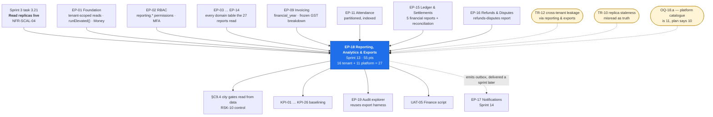

# EP-18 — Reporting, Analytics & Exports

> **Phase-0 delivery backlog.** Detailed expansion of `ENGINEERING_PLAN.md` §2 (epic row `EP-18`)
> and §3 (`F-18.1` … `F-18.9`), and of `SprintPlanning.md` sprint 13 (tasks `13.1` – `13.18`).
> No application code exists yet.
>
> ⚠ **A counting discrepancy this backlog corrects.** `ENGINEERING_PLAN.md` §3 `F-18.7` says *"the
> 10-report platform catalogue"* and `SprintPlanning.md` sprint 13 exits on *"16 tenant reports and
> 10 platform reports"* — twenty-six. **`B5.20`'s platform table contains eleven rows**: GMV and
> take rate · Tenant funnel · Tenant cohort retention · Marketplace funnel · City performance ·
> Payment health · Refunds and disputes · Reconciliation · Review integrity · Support load ·
> **Verification SLA**. The catalogue is **27 reports, not 26**, and building ten would leave
> *Verification SLA* — the report that measures `KPI-03` and the `§C9.4` operational-readiness gate
> — unbuilt while the sprint still exits green. This epic carries **11** throughout. See §13
> `OQ-18.a`.
>
> **Two India rulings shape the period logic.** The financial year runs **1 April – 31 March**, so
> every period preset and the Tax report bucket on the April boundary, which in `Asia/Kolkata` is
> **31 March 18:30 UTC** (`LAUNCH_MARKET_INDIA.md` §5, `TR-19`, `TR-24`). And money renders as
> **₹2,50,000** with Indian lakh grouping **on screen** — but as a plain `250000` beside a separate
> `currency` column **in CSV**, because a grouped string is not a number to a spreadsheet.

---

## 1. Metadata

| Field | Value |
| :--- | :--- |
| **Epic id** | `EP-18` |
| **Name** | Reporting, Analytics & Exports |
| **Priority (MoSCoW)** | **M** — Must. `BAC-12` (*"a tenant can export members, memberships, payments and attendance without support involvement"*) and `BR-DAT-05` make data portability a **right**, not a feature. `OBJ-06` is what justifies the subscription price |
| **Complexity** | **L** (T-shirt, §2) · module rating **Medium** for `reporting/` in isolation; the difficulty is breadth — 27 reports — and the read-path discipline, not depth |
| **Story points** | **55** (§2) · sprint-13 allocation **66.0 engineer-days** across five roles (§10) |
| **Target sprint(s)** | **Sprint 13** — `2027-03-08 → 2027-03-19`, entire epic. Exit condition: **report catalogue complete**. Depends on read replicas from **sprint 3** task `3.21` |
| **Owning PRD module** | `RPT` (`B5.20`) |
| **Owning code module** | `reporting/` — **no write path exists in this module at all** |
| **Surfaces** | `gym-dashboard` — `SCR-DASH-020` (Reports) · `admin-dashboard` — `SCR-ADM-014` (Platform Analytics) · `customer-web` — `SCR-WEB-010`, `SCR-WEB-011` polish (member's own history) · export queue UX on both dashboards |
| **Primary APIs** | `GET /tenant/reports/:reportKey` · `GET /admin/analytics/:reportKey` · `POST /tenant/exports` (`202`) · `GET /tenant/exports/:id` · `POST /me/export` (`202`, personal archive) · **new**: `GET /tenant/reports/:reportKey/drill/:cell`, `GET /admin/analytics/:reportKey/drill/:cell` |
| **Background jobs** | `report.scheduled-delivery` (per configuration, `C5`) · `export.generate` (on demand, `C5`) · **new**: `report.materialise` (every 10 min, backing the ≤15-minute freshness contract) · **new**: `export.link-expiry-sweep` (hourly) |
| **Catalogue** | **16 tenant reports + 11 platform reports = 27** · **49 distinct analytics event names** across the four `§C6` groups · **2 derived funnels** |
| **Rate limiting** | `RL-EXPORT` — tier 4, **3/day and 5/hour**, concurrency 1 (`API_Catalog.md` §RL) |
| **Launch market** | **India** — FY **1 April – 31 March** period presets and Tax-report buckets; day/week/month buckets computed in the **gym's** timezone (`Asia/Kolkata`, +05:30, no DST); `₹` lakh grouping on screen, plain minor-unit-derived numbers in CSV; export artefacts stored in the Mumbai region only (`REG-06`); exports are a DPDP data-egress surface (`REG-09`) |
| **Status** | `PLANNED` — Phase 0. Not started. **One catalogue-count correction open** (`OQ-18.a`) |
| **Epic owner** | Backend Lead — reporting. Read-replica routing co-owned with DevOps |

---

## 2. Business Goal

**Decision-grade analytics for the owner and the platform; data portability as a right.** `OBJ-06`
is the objective that converts the product *"from a record-keeper into a management tool, which is
what justifies subscription price"* — the PRD's own words, and the reason `A6.2`'s tier ladder can
charge anything at all. `US-RPT-01` states the test bluntly: *"I want to know which plan actually
makes me money."* A revenue-by-plan report that shows units and gross but not discounts, net and
share of total does not answer that question; a report whose net figure cannot be clicked through to
the orders composing it does not earn the owner's trust the first time it disagrees with their own
spreadsheet. `FR-RPT-05` drill-down is therefore not a convenience feature — it is the mechanism by
which a number becomes believable, and `AC-RPT-01.2` makes it an acceptance criterion.

**Second, this epic is where the platform's honesty about *when* a number is true gets encoded.**
`FR-RPT-02` draws a hard line: operational reports may be up to **15 minutes stale**, and financial
reports **read the ledger and are always current**. Those are different data paths, not different
cache settings. Financial reads go to the **primary**; operational reads go to a **replica** with a
visible freshness stamp. `TR-10` — read-replica staleness misread as truth — is exactly the failure
where a settlement figure and a revenue report disagree by one replication lag and Finance spends a
day proving which one lied. Sprint 13's DevOps task `13.18` exists to **assert the routing by test**,
which is the only way a read preference stays correct after the sixth person touches the query.

**Third, exports are simultaneously a promise and an attack surface, and the epic must treat them as
both.** `BR-DAT-05` gives every tenant the right to export its complete operational dataset *"at any
time without contacting support"*, and `BAC-12` makes that a launch gate — it is the anti-lock-in
commitment that makes a small gym willing to put its whole member book in someone else's database.
At the same time `TR-12` (cross-tenant leakage through reporting and exports) and `SR-04`
(*"one tenant reads another's revenue, commission rate or payout schedule — competitive
intelligence, not just a privacy breach"*) name reporting as the single most likely leakage path in
the system, because reporting is where joins get wide and where `runElevated()` is legitimately
needed for the platform catalogue. `E2E-11` names reports and exports explicitly. So every export is
**audited with actor, tenant and row count**, rate-limited under `RL-EXPORT`, and covered by an
isolation spec **per report key** — and `reporting/` contains no write path at all, so the worst
case is a read defect rather than a corruption.

---

## 3. Scope

### 3.1 In scope — explicit

| # | Item | Anchor |
| :-: | :--- | :--- |
| 1 | **Report harness**: date range, branch filter, on-screen render, CSV export and a chart where meaningful — one harness every report registers against | `FR-RPT-01`, `F-18.1` |
| 2 | **Report-key registry** with a declared permission, scope (tenant / platform), data source (primary / replica) and freshness class per key | `FR-RPT-01`, `REPORT_KEY_UNKNOWN` |
| 3 | **Freshness contract**: operational reports ≤ 15 minutes stale with a visible stamp; **financial reports read the ledger live from the primary** | `FR-RPT-02`, `TR-10`, `F-18.2` |
| 4 | **Asynchronous generation** above the size threshold, with a notification and a **time-limited** download link | `FR-RPT-03`, `NFR-PERF-06`, `F-18.3` |
| 5 | Scheduled report delivery by email — daily, weekly, monthly | `FR-RPT-04`, `F-18.4` — **descope candidate `D-10`** |
| 6 | **Drill-down from any total to its constituent records**, cursor-paginated and indexed, reading the **same source** as the total it came from | `FR-RPT-05`, `AC-RPT-01.2`, `ADR-0023`, `C2.4`, `F-18.5` |
| 7 | The **16-report tenant catalogue** of `B5.20` | `B5.20`, `F-18.6` |
| 8 | The **11-report platform catalogue** of `B5.20` — eleven, not ten (§13 `OQ-18.a`) | `B5.20`, `F-18.7` |
| 9 | The **City performance** report encoding all five `§C9.4` launch gates as columns | `§C9.4`, `RSK-10` |
| 10 | **Tenant full-dataset export** — members, memberships, payments, attendance — without support involvement | `BR-DAT-05`, `BAC-12`, `F-18.8` |
| 11 | **CSV contract**: human-readable headers, money as a plain number beside a **separate currency column**, ISO-8601 timestamps with the offset, UTF-8 with BOM | `AC-RPT-01.3`, `E13.5` |
| 12 | Every export **audited** with actor, tenant, report key and row count, and **rate-limited** under `RL-EXPORT` (3/day, 5/hour, concurrency 1) | `TR-12`, `E13.6`, `BR-DAT-01` |
| 13 | **Analytics event emission** for all four `§C6` groups — **49 distinct event names** — and both derived funnels | `§C6`, `F-18.9` |
| 14 | `BR-DAT-06` enforcement on every event: **personal data is never a property**, lat/lng precision-reduced | `BR-DAT-06`, `§C6` preamble |
| 15 | **Read-preference routing** verified by test: financial to primary, operational to replica, lag alert at 2 s, automatic fallback to primary above 5 s | `TR-10`, `NFR-SCAL-04`, sprint task `13.18` |
| 16 | **Carry-ins** from earlier sprints that belong to the report harness: peak-hour heatmap (`FR-CHK-13`), daily attendance digest (`FR-CHK-14`), coupon performance (`FR-CPN-08`), invoice bulk export (`FR-INV-10`), member CSV export (`FR-CRM-08`) | `SprintPlanning.md` sprint 13 scope |
| 17 | **FY April–March period presets** — *This FY*, *Last FY*, *FY to date* — and the Tax report bucketing on the April boundary | `LAUNCH_MARKET_INDIA.md` §5, `TR-19` |
| 18 | Day, week and month buckets computed in the **gym's** IANA timezone, so a 23:45 IST check-in is not tomorrow's visit | `TR-24`, `NFR-DQ-03` |
| 19 | `SCR-DASH-020` with catalogue cards, chart, table, drill-through and export; `SCR-ADM-014` with city, tier and cohort dimensions | `SCR-DASH-020`, `SCR-ADM-014` |
| 20 | **Async export UX** on both dashboards: queued state, notification, time-limited download, `EXPORT_LINK_EXPIRED` recovery | `FR-RPT-03`, `E13.4` |
| 21 | `SCR-WEB-010` and `SCR-WEB-011` polish — the member's own visit history and orders | sprint task `13.14` |
| 22 | **Isolation specs per report key and per export endpoint**, in both directions | `TR-12`, `E2E-11`, `E13.7` |
| 23 | Personal-data archive `POST /me/export` sharing the same async harness | `FR-USER-06`, `BR-DAT-03` |
| 24 | `NFR-PERF-06` timing: a 12-month range either renders **≤ 5 s** synchronously or goes asynchronous — never a slow synchronous render | `NFR-PERF-06`, `E13.4` |

### 3.2 Out of scope — explicit, with destination

| Item | Why it is not here | Where it went |
| :--- | :--- | :--- |
| Any **write** to a domain table | `reporting/` has no write path; that is the security property that makes wide joins survivable | Structural — enforced by `dependency-cruiser` |
| The **ledger, settlement statements and payout figures themselves** | `EP-18` renders and drills; `EP-15` computes and persists. A report never recomputes an `A6.3` figure | **`EP-15`** |
| The **settlement statement document** a tenant downloads per payout | That is a statement, not a report; it exists before this epic | **`EP-15`** `FR-SETL-07` |
| **Invoice and credit-note PDFs** | Documents, not reports; `EP-18` provides the bulk-export harness they register against | **`EP-09`** |
| Analytics **event definition and instrumentation inside other modules' code paths** | Each module emits; `EP-18` owns the taxonomy, the transport and the funnels | Owning epics, with the contract from here |
| A **BI warehouse, OLAP cubes or a semantic layer** | Phase 1 reports read Postgres replicas; `NFR-SCAL-02`'s 10× headroom is the trigger to revisit | Phase 2 |
| **Read-replica provisioning** | Sprint 3 task `3.21`; `EP-18` verifies the routing but does not build the infrastructure | **`EP-01`** / sprint 3 |
| **Scheduled report *composition*** beyond daily/weekly/monthly | `FR-RPT-04` is `S` and is `D-10`, the sprint's declared descope | Post-launch |
| Notification **delivery** of scheduled reports and export links | `EP-18` emits; `notifications/` delivers | **`EP-17`**, sprint 14 |
| **Audit log explorer** and its export | An audit surface with its own permission model and range limits | **`EP-19`** `FR-ADMN-09` |
| **Member CSV import** | `RL-EXPORT` tier is shared, the direction is not | **`EP-03`** `FR-ONB-15` |
| Predictive churn scoring or recommendations | `crm/` computes risk flags; `EP-18` reports them | **`EP-12`**, Phase 2 for prediction |

---
## 4. Features

`F-18.1` … `F-18.9` are carried from `ENGINEERING_PLAN.md` §3, with `F-18.7`'s count corrected from
ten to **eleven**. Rows marked *(new)* come from `SprintPlanning.md` sprint 13, `API_Catalog.md`
§RL and §6.13, and `LAUNCH_MARKET_INDIA.md` §2 and §5.

| Feature | Description | Satisfies | Pri | Pts | Sprint |
| :--- | :--- | :--- | :-: | :-: | :-: |
| **F-18.1** | Report harness: date range, branch filter, on-screen render, CSV export, chart | `FR-RPT-01` | M | 5 | 13 |
| **F-18.2** | Freshness contract — ≤ 15 min staleness; financial reports read the ledger live from the **primary** | `FR-RPT-02`, `TR-10` | M | 5 | 13 |
| **F-18.3** | Async generation above a size threshold with a time-limited link | `FR-RPT-03`, `NFR-PERF-06` | S | 3 | 13 |
| **F-18.4** | Scheduled email delivery — daily, weekly, monthly | `FR-RPT-04` | S | 2 | 13 — **`D-10`** |
| **F-18.5** | Drill-down from any total to its constituent records | `FR-RPT-05`, `AC-RPT-01.2` | S | 5 | 13 |
| **F-18.6** | The **16-report tenant catalogue** | `B5.20` tenant table | M | 8 | 13 |
| **F-18.7** | The **11-report platform catalogue** *(corrected from 10)* | `B5.20` platform table, `OQ-18.a` | M | 8 | 13 |
| **F-18.8** | Tenant full-dataset export without support involvement | `BR-DAT-05`, `BAC-12` | M | 3 | 13 |
| **F-18.9** | Analytics event emission — **49 event names**, four `§C6` groups, two derived funnels | `§C6` | M | 3 | 13 |
| **F-18.10** *(new)* | **CSV contract**: human-readable headers, money as a plain number beside a separate currency column, ISO-8601 with offset, UTF-8 BOM | `AC-RPT-01.3`, `E13.5` | M | 2 | 13 |
| **F-18.11** *(new)* | **Export governance**: every export audited with actor, tenant, key and row count; `RL-EXPORT` at 3/day, 5/hour, concurrency 1; per-tenant row cap | `TR-12`, `SR-11`, `E13.6` | M | 3 | 13 |
| **F-18.12** *(new)* | **Read-preference routing asserted by test**, with a 2 s lag alert and automatic fallback to primary above 5 s | `TR-10`, `NFR-SCAL-04` | M | 3 | 13 |
| **F-18.13** *(new)* | **City performance** report encoding the five `§C9.4` launch gates as columns, so the launch decision reads from data rather than assertion | `§C9.4`, `RSK-10` | M | 2 | 13 |
| **F-18.14** *(new)* | **Carry-in registrations**: peak-hour heatmap, daily attendance digest, coupon performance, invoice bulk export, member CSV export | `FR-CHK-13`, `FR-CHK-14`, `FR-CPN-08`, `FR-INV-10`, `FR-CRM-08` | S | 3 | 13 |
| **F-18.15** *(new)* | **FY April–March period presets** and Tax-report FY bucketing at the 31 March 18:30 UTC boundary | `LAUNCH_MARKET_INDIA.md` §5, `TR-19`, `TR-24` | M | 2 | 13 |
| **F-18.16** *(new)* | **Report-key registry** — permission, scope, source and freshness class declared per key; an unknown key returns `REPORT_KEY_UNKNOWN` (404) listing the available reports | `FR-RPT-01`, `FR-RBAC-01` | M | 2 | 13 |

**Roll-up.** 16 features · **59 raw points**, normalised to the **55** carried in `ENGINEERING_PLAN.md`
§2. `F-18.4` is the sprint's declared descope `D-10` — the report still exports on demand.

### 4.1 The 27-report catalogue

Every row is one registration against the `F-18.1` harness with a declared permission, source and
freshness class. **Source** `P` = primary (financial, always current per `FR-RPT-02`), `R` = replica
(operational, ≤ 15 min stale with a visible stamp).

**Tenant catalogue — 16 reports, `GET /tenant/reports/:reportKey`**

| # | Report key | Contents (`B5.20`) | Src | Drill-down target |
| :-: | :--- | :--- | :-: | :--- |
| 1 | `revenue-summary` | Gross, discounts, tax, net, commission, payable, by day/week/month, split online vs offline | **P** | Orders composing the cell |
| 2 | `revenue-by-plan` | Units sold, gross, net, average selling price, share of revenue | **P** | Orders for that plan — `AC-RPT-01.2` |
| 3 | `new-members` | Count and value by period, by source (marketplace vs direct) | **P** | Memberships created |
| 4 | `renewals` | Due, renewed, lapsed, renewal rate, by plan | R | Memberships in each bucket |
| 5 | `churn-cohort` | Retention by joining month across subsequent months | R | Members in the cohort cell |
| 6 | `attendance-summary` | Visits by day, unique members, average visits per member | R | Attendance rows |
| 7 | `peak-hours` | Weekday-by-hour heatmap *(carry-in `FR-CHK-13`)* | R | Attendance rows in the hour cell |
| 8 | `member-activity` | Per member: visits, last visit, frequency trend, risk flag | R | That member's attendance |
| 9 | `expiring-memberships` | Next 7 / 15 / 30 days with contact details | R | Membership records |
| 10 | `outstanding-balances` | Orders with `BALANCE_DUE` | **P** | The orders |
| 11 | `staff-activity` | Check-ins, sales, collections, overrides by staff | R | The underlying actions |
| 12 | `coupon-performance` | Redemptions, discount cost, influenced revenue *(carry-in `FR-CPN-08`)* | **P** | Redemption records |
| 13 | `review-summary` | Rating trend, volume, response rate, sub-rating breakdown | R | The reviews |
| 14 | `settlement-statement` | Per payout: transactions and all eight computed figures, net | **P** | Batch lines — never recomputed (`BR-FIN-02`) |
| 15 | `tax-report` | Taxable value and tax by rate by period, **FY April–March** | **P** | Invoices, with CGST/SGST components |
| 16 | `lead-funnel` | Enquiries, contacted, converted, conversion rate | R | Lead records |

**Platform catalogue — 11 reports, `GET /admin/analytics/:reportKey`, `access(mfa)`**

| # | Report key | Contents (`B5.20`) | Src | Notes |
| :-: | :--- | :--- | :-: | :--- |
| 1 | `gmv-take-rate` | By period, city, tier | **P** | `KPI-14`, `KPI-16` band 8–12% |
| 2 | `tenant-funnel` | Signups → submitted → approved → activated → transacting | R | The `§C6` tenant-activation derived funnel |
| 3 | `tenant-cohort-retention` | By signup month | R | `KPI-04` |
| 4 | `marketplace-funnel` | Search → detail → checkout → paid, with drop-off at each step | R | The `§C6` marketplace derived funnel; `KPI-09` … `KPI-11` |
| 5 | `city-performance` | Supply, demand, GMV, conversion by city | R | **Encodes the five `§C9.4` gates as columns** (`F-18.13`) |
| 6 | `payment-health` | Success rate, failure reasons, retry recovery | **P** | `KPI-19` ≥ 92% |
| 7 | `refunds-disputes` | Rate, value, reasons, by tenant | **P** | `KPI-20` ≤ 3%, `KPI-21` ≤ 0.5%, `RSK-05` indicators |
| 8 | `reconciliation` | Gateway vs ledger variance by day | **P** | `KPI-26` = 100%; feeds `SCR-ADM-010` |
| 9 | `review-integrity` | Volume, moderation rate, anomaly flags | R | `RSK-02` |
| 10 | `support-load` | Tickets per tenant, per category, resolution time | R | `KPI-25` |
| 11 | **`verification-sla`** | Queue depth, time to decision, rejection-reason distribution | R | **The eleventh report the plan's count omits** — `KPI-03`, `FR-ADMN-11`, `§C9.4` operational gate |

---

## 5. User Stories

`B5.20` contains one story, `US-RPT-01`. Seven more are written here for behaviour the module's five
functional requirements imply but never phrase; the requirement implying each is named.

### US-RPT-01 — *As Rohan, I want to know which plan actually makes me money.* **(PRD)**

| AC | Given / When / Then |
| :--- | :--- |
| **AC-RPT-01.1** | **Given** sales exist across several plans, **when** I open revenue by plan, **then** each plan shows units, gross, discounts, net and **share of total** |
| **AC-RPT-01.2** | **Given** I click a plan's net figure, **when** the drill-down opens, **then** I see the **individual orders composing it** |
| **AC-RPT-01.3** | **Given** I export, **when** the CSV opens, **then** column headers are human-readable and every monetary column is a **plain number with a separate currency column** |
| **AC-RPT-01.4** *(new)* | **Given** I sum the drill-down rows myself, **when** I compare to the total, **then** they are **equal** — the drill-down reads the same source and the same filters as the total |
| **AC-RPT-01.5** *(new)* | **Given** I switch the branch filter, **when** the report re-renders, **then** every figure and every drill-down honours the filter, including the share-of-total denominator |

### US-RPT-02 — *As Rohan, I want to know whether the number I am looking at is current.* **(new — implied by `FR-RPT-02`, `TR-10`)**

| AC | Given / When / Then |
| :--- | :--- |
| **AC-RPT-02.1** | **Given** I open an **operational** report, **when** it renders, **then** it carries a **"last updated"** stamp and that stamp is never more than **15 minutes** old |
| **AC-RPT-02.2** | **Given** I open a **financial** report, **when** it renders, **then** it reads the ledger from the **primary** and is current as of the request — asserted by test, not by comment |
| **AC-RPT-02.3** | **Given** replica lag exceeds **2 s**, **when** the monitor evaluates, **then** it alerts; **given** lag exceeds **5 s**, **then** operational reads fall back to the primary automatically |
| **AC-RPT-02.4** | **Given** I take a payment and immediately open the revenue summary, **when** it renders, **then** the payment is present — financial reads are read-your-writes |

### US-RPT-03 — *As Rohan, I want twelve months of data without the page hanging.* **(new — implied by `FR-RPT-03`, `NFR-PERF-06`)**

| AC | Given / When / Then |
| :--- | :--- |
| **AC-RPT-03.1** | **Given** a range within the synchronous threshold, **when** I render, **then** it completes in **≤ 5 s** server-side |
| **AC-RPT-03.2** | **Given** a range beyond the threshold, **when** I request it, **then** I receive `REPORT_RANGE_TOO_LARGE` (422) **offering an asynchronous export**, not a spinner |
| **AC-RPT-03.3** | **Given** I request the export, **when** it is accepted, **then** I get `202`, a queued state on screen, and a **notification** when it is ready |
| **AC-RPT-03.4** | **Given** the download link has expired, **when** I use it, **then** `EXPORT_LINK_EXPIRED` (410) offers regeneration rather than a dead page |
| **AC-RPT-03.5** | **Given** an identical export is already running, **when** I request it again, **then** `EXPORT_ALREADY_IN_PROGRESS` (409) points at the running job |

### US-RPT-04 — *As Rohan, I want my data out of the platform whenever I like.* **(new — implied by `BR-DAT-05`, `BAC-12`)**

| AC | Given / When / Then |
| :--- | :--- |
| **AC-RPT-04.1** | **Given** I hold `reporting.export.create`, **when** I request a full-dataset export, **then** I receive **members, memberships, payments and attendance** without contacting support |
| **AC-RPT-04.2** | **Given** the export completes, **when** I open it, **then** the row counts match a tenant-scoped count of each table, and no row belongs to another tenant |
| **AC-RPT-04.3** | **Given** my tenant is `PAST_DUE` with dashboard write access withdrawn, **when** I request an export, **then** it **still works** — `BR-TEN-06` withdraws write, never portability |
| **AC-RPT-04.4** | **Given** I attempt a fourth export in a day, **when** the limiter evaluates, **then** `RL-EXPORT` refuses with the retry window stated |
| **AC-RPT-04.5** | **Given** any export completes, **when** the audit log is queried, **then** a row exists with actor, tenant, report key, row count and timestamp |

### US-RPT-05 — *As Vikram, I want the platform reports to answer questions about the platform, not about one gym.* **(new — implied by `B5.20` platform table, `FR-ADMN-*`)**

| AC | Given / When / Then |
| :--- | :--- |
| **AC-RPT-05.1** | **Given** I hold a platform role with MFA satisfied, **when** I open `SCR-ADM-014`, **then** all **eleven** platform reports are available with city, tier and cohort dimensions |
| **AC-RPT-05.2** | **Given** a platform report reads across tenants, **when** it executes, **then** it does so through the **named audited elevation**, and the elevation is recorded before the work |
| **AC-RPT-05.3** | **Given** I hold only a tenant role, **when** I request any `admin/analytics` key, **then** it is refused — not filtered to my tenant |
| **AC-RPT-05.4** | **Given** the **Verification SLA** report, **when** I open it, **then** I see queue depth, time to decision and the rejection-reason distribution across the sixteen `C4.8` application-rejection reasons |

### US-RPT-06 — *As the Commercial lead, I want the launch decision for a city to be read from data.* **(new — implied by `§C9.4`, `RSK-10`)**

| AC | Given / When / Then |
| :--- | :--- |
| **AC-RPT-06.1** | **Given** the City performance report, **when** I open it for a city, **then** all five `§C9.4` gates appear as columns: verified activated gyms ≥ 25 · localities ≥ 5 · complete profiles ≥ 90% · verification SLA met 2 consecutive weeks · one settlement cycle at zero variance |
| **AC-RPT-06.2** | **Given** a city fails a gate, **when** I view the row, **then** the failing gate is identified specifically, not as an aggregate pass/fail |
| **AC-RPT-06.3** | **Given** the financial-readiness gate, **when** it is evaluated, **then** it reads the `reconciliation` report's variance figure from the **primary**, because a gate that reads a stale replica is not a gate |

### US-RPT-07 — *As the Product Manager, I want the funnels to exist before I need to explain a conversion drop.* **(new — implied by `§C6`, `KPI-09` … `KPI-11`)**

| AC | Given / When / Then |
| :--- | :--- |
| **AC-RPT-07.1** | **Given** the four `§C6` groups, **when** instrumentation is reviewed, **then** all **49 event names** emit with their specified properties from the surfaces that own them |
| **AC-RPT-07.2** | **Given** the marketplace funnel, **when** I open it, **then** `search_performed → search_result_clicked → gym_detail_viewed → checkout_started → payment_succeeded` shows drop-off at **each** step |
| **AC-RPT-07.3** | **Given** the tenant-activation funnel, **when** I open it, **then** `owner_signup_started → application_submitted → application_approved → first_plan_published → first_member_added → first_checkin_recorded` shows the same |
| **AC-RPT-07.4** | **Given** any emitted event, **when** its properties are inspected, **then** **no personal data** is present and lat/lng is precision-reduced (`BR-DAT-06`) |

### US-RPT-08 — *As the Technical Lead, I want reporting to be the least dangerous module in the system.* **(new — implied by `TR-12`, `SR-04`, `SR-11`, `E2E-11`)**

| AC | Given / When / Then |
| :--- | :--- |
| **AC-RPT-08.1** | **Given** `reporting/`, **when** its dependency graph is analysed, **then** it has **no write path** to any domain table, enforced in CI |
| **AC-RPT-08.2** | **Given** tenant B's token, **when** **every** report key and **every** export endpoint is attempted against tenant A's data, **then** all are refused, and the suite covers 100% of keys |
| **AC-RPT-08.3** | **Given** one tenant runs a very large export, **when** other tenants use the platform, **then** they are unaffected — queue concurrency is bounded per tenant and reports above 5 s are asynchronous (`SR-11`) |
| **AC-RPT-08.4** | **Given** a new report key is added, **when** CI runs, **then** the build **fails** without an isolation spec for it |

---
## 6. Acceptance Criteria for the Epic

The sprint-13 exit checklist `E13.1` – `E13.9` expanded to executable granularity.

| # | Criterion | Evidence |
| :--- | :--- | :--- |
| **AC-EP18-01** | All **16 tenant reports** render, filter by date range **and** branch, chart where meaningful, and export to CSV | `E13.1` |
| **AC-EP18-02** | All **11 platform reports** render with city, tier and cohort dimensions — including **`verification-sla`**, which the plan's count of ten omits | `E13.1` corrected, `OQ-18.a` |
| **AC-EP18-03** | Every total **drills through** to the exact records composing it, and the row set **re-sums to the total** | `E13.2`, `AC-RPT-01.2`, `AC-RPT-01.4` |
| **AC-EP18-04** | Drill-down reads the **same source and filters** as the total; a drill-through from a financial total also reads the primary | `AC-RPT-01.4`, `OQ-18.h` |
| **AC-EP18-05** | Financial reports read the **primary**, asserted by test; operational reports carry a **≤ 15-minute** freshness stamp | `E13.3`, `FR-RPT-02` |
| **AC-EP18-06** | Replica lag above 2 s alerts; above 5 s operational reads fall back to the primary automatically | `AC-RPT-02.3`, `TR-10` |
| **AC-EP18-07** | A payment taken and immediately reported on appears in the financial report (read-your-writes) | `AC-RPT-02.4` |
| **AC-EP18-08** | A 12-month range renders **≤ 5 s** synchronously or goes asynchronous with a notification and a **time-limited** link | `E13.4`, `NFR-PERF-06` |
| **AC-EP18-09** | An expired link returns `EXPORT_LINK_EXPIRED` (410) and offers regeneration; a duplicate request returns `EXPORT_ALREADY_IN_PROGRESS` (409) | `AC-RPT-03.4`, `AC-RPT-03.5` |
| **AC-EP18-10** | CSV exports carry **human-readable headers**, money as a plain number, a **separate currency column**, ISO-8601 timestamps with offset, and a UTF-8 BOM | `E13.5`, `AC-RPT-01.3` |
| **AC-EP18-11** | Money renders with **Indian lakh grouping (₹2,50,000)** on screen and as a plain ungrouped number in CSV, from the **one** shared formatter | `LAUNCH_MARKET_INDIA.md` §2 |
| **AC-EP18-12** | Every export is **audited** with actor, tenant, report key and row count, and is **rate-limited** under `RL-EXPORT` at 3/day, 5/hour, concurrency 1 | `E13.6`, `AC-RPT-04.4`, `AC-RPT-04.5` |
| **AC-EP18-13** | Cross-tenant attempts on **every** report key and **every** export endpoint are refused, in both directions | `E13.7`, `E2E-11`, `TR-12` |
| **AC-EP18-14** | Adding a report key **without** an isolation spec **fails the build** | `AC-RPT-08.4`, `BAC-10` |
| **AC-EP18-15** | `reporting/` has **no write path** to any domain table, enforced by `dependency-cruiser` in CI | `AC-RPT-08.1` |
| **AC-EP18-16** | Platform cross-tenant reads happen only through the **named audited elevation**, recorded before the work | `AC-RPT-05.2`, `SR-10` |
| **AC-EP18-17** | A tenant-role token is **refused** — not silently scoped — on any `admin/analytics` key | `AC-RPT-05.3` |
| **AC-EP18-18** | A tenant exports **members, memberships, payments and attendance** unaided, with row counts matching a tenant-scoped count | `E13.8`, `BAC-12`, `AC-RPT-04.2` |
| **AC-EP18-19** | Export continues to work for a `PAST_DUE` tenant whose dashboard write access is withdrawn | `AC-RPT-04.3`, `BR-TEN-06` |
| **AC-EP18-20** | The **City performance** report exposes all five `§C9.4` gates as columns, naming the specific failing gate | `E13.9`, `AC-RPT-06.1`, `AC-RPT-06.2` |
| **AC-EP18-21** | The financial-readiness gate reads the reconciliation variance from the **primary** | `AC-RPT-06.3` |
| **AC-EP18-22** | All **49 `§C6` event names** emit with their specified properties, and both derived funnels render with per-step drop-off | `AC-RPT-07.1` … `07.3` |
| **AC-EP18-23** | **No personal data** appears in any analytics event property; lat/lng is precision-reduced | `AC-RPT-07.4`, `BR-DAT-06` |
| **AC-EP18-24** | Day, week and month buckets are computed in the **gym's** timezone — a 23:45 IST check-in is not counted on the following day | `TR-24`, `NFR-DQ-03` |
| **AC-EP18-25** | **FY presets** (*This FY*, *Last FY*, *FY to date*) bucket on **1 April** in `Asia/Kolkata`, and the Tax report agrees with the invoice `financial_year` label for every invoice in the range | `TR-19`, `AC-INV-01.3` |
| **AC-EP18-26** | The Tax report shows **CGST and SGST as separate components**, matching the frozen invoice tax breakdown, never a combined 18% | `LAUNCH_MARKET_INDIA.md` §4 |
| **AC-EP18-27** | The `settlement-statement` report renders **persisted** figures only and never recomputes an `A6.3` value | `BR-FIN-02` |
| **AC-EP18-28** | One tenant's large export does not degrade another tenant — bounded per-tenant queue concurrency and export row caps, proven under load | `AC-RPT-08.3`, `SR-11` |
| **AC-EP18-29** | The five carry-in reports are registered and render: peak-hour heatmap, daily attendance digest, coupon performance, invoice bulk export, member CSV export | `F-18.14` |
| **AC-EP18-30** | Every report key declares a **permission**; an unknown key returns `REPORT_KEY_UNKNOWN` (404) listing the available reports | `FR-RBAC-01`, `F-18.16` |
| **AC-EP18-31** | Money crossing the API boundary in any report payload survives as an exact integer — no `BigInt` precision loss | `TR-38`, `NFR-DQ-02` |
| **AC-EP18-32** | axe-core clean and keyboard-complete on `SCR-DASH-020`, `SCR-ADM-014` and the async-export UX, including chart alternatives for screen readers | `NFR-USE-01` |

---

## 7. Business Rules Enforced

`reporting/` **owns exactly one** business rule and inherits the rest — which is the correct shape
for a module with no write path. Detail lives in `BusinessRules.md`; this table names the
enforcement point inside `EP-18`.

| `BR-` | Ownership | Enforcement point in `EP-18` | Task |
| :--- | :--- | :--- | :--- |
| `BR-DAT-05` | **Owned** — tenant self-service full-dataset export | `POST /tenant/exports` with the four entity families, no support path, no `PAST_DUE` gate, row counts asserted against tenant-scoped counts | T-18.18, T-18.19 |
| `BR-DAT-06` | **Owned in this path** | Analytics event schemas reject personal-data properties at construction; lat/lng precision-reduced at emission; a CI schema check over all 49 events | T-18.24, T-18.25 |
| `BR-DAT-01` | **Contributor** | Every export writes an audit row with actor, tenant, report key and row count; report *views* emit `report_viewed` rather than an audit row | T-18.20 |
| `BR-DAT-03` | **Contributor** (owner `EP-02`) | `POST /me/export` shares the async harness for the personal-data archive | T-18.19 |
| `BR-TEN-01` | **Inherited — the highest-stakes inheritance in the epic** | Every report query runs through a tenant-scoped read interface; platform reads use the named audited elevation; an isolation spec exists **per report key** and the build fails without one | T-18.06, T-18.21, T-18.31 |
| `BR-TEN-06` | **Inherited** | Export remains available to a `PAST_DUE` tenant; only write actions are withdrawn | T-18.19 |
| `BR-FIN-01` | **Inherited** | All balances shown are **derived from the ledger**; no report stores or caches a balance | T-18.09 |
| `BR-FIN-02` | **Inherited** | The settlement-statement report renders the eight persisted figures and recomputes none | T-18.12 |
| `BR-PAY-01` | **Inherited** | Money is integer minor units plus currency all the way to the CSV cell and the chart axis | T-18.16, T-18.17 |
| `BR-CHK-09` | **Consumer** | Attendance is read immutably for the attendance, peak-hours and member-activity reports | T-18.11 |
| `BR-REV-07` | **Consumer** | The review-summary report respects the minimum-review display rule when it surfaces a rating | T-18.11 |

---

## 8. Dependencies

### 8.1 Upstream — must exist first

| Dep | What `EP-18` needs from it | Sprint | Hard or soft |
| :--- | :--- | :-: | :--- |
| **Every prior epic** | Reporting is *"the last consumer of every domain"*. Each of the 27 reports reads tables another epic owns | 0–12 | **Hard** — the reason `EP-18` is sprint 13 |
| **`EP-01`** | Tenant-scoped read interfaces, the audited `runElevated()`, `Money`, the shared Indian-grouping formatter, `dependency-cruiser` | 0 | **Hard** |
| **Read replicas** — sprint 3 task `3.21` | `NFR-SCAL-04`. **Must be live before this sprint or reporting queries contend with checkout** | 3 | **Hard** — named explicitly in the sprint-13 dependency row |
| **`EP-02`** | `reporting.report.read`, `reporting.export.create`, `reporting.export.read`; MFA on platform analytics | 1 | **Hard** |
| **`EP-11`** | `attendance` partitioned and indexed for the four attendance-derived reports | 8 | **Hard** |
| **`EP-15`** | The ledger and settlement batches behind the five financial reports and `reconciliation` | 11 | **Hard** |
| **`EP-16`** | Refund and dispute data behind `refunds-disputes` | 12 | **Hard** |
| **`EP-17`** | Notification delivery for scheduled reports and export-ready links | 14 | **Soft — and inverted.** `EP-18` ships in 13 and its notifications are delivered in 14; sprint 13 emits outbox events that dispatch a sprint later |
| **`EP-09`** | `invoices.financial_year` and the frozen tax breakdown behind the Tax report | 6 | **Hard** |
| **`EP-19`** | `SCR-ADM-011` config for scheduled-delivery settings | 15 | **Soft** — `D-10` descopes this anyway |

### 8.2 Downstream — what this unblocks

| Consumer | What it takes from `EP-18` |
| :--- | :--- |
| **Sprint 18 launch** | The `§C9.4` city gates read **from data, not assertion** — `RSK-10`'s primary control |
| **`UAT-05`** | Finance's settlement-cycle script reads the reconciliation and settlement reports |
| **Post-launch KPI baselining** | `KPI-01` … `KPI-26` are computed from the catalogue and the 49 events; the first 30 days establish baselines |
| **`EP-19`** | The audit explorer reuses the async export harness and the CSV contract |
| **`EP-20`** | `support-load` measures `KPI-25` |
| **`RSK-05`, `RSK-06`, `RSK-07`, `RSK-11` monitoring** | Refund clustering, branch check-in ratio, attribution ratio and freshness signals are all report-borne |

### 8.3 External dependencies and open questions

| Dependency | Kind | Owner | Needed by | Effect if late |
| :--- | :--- | :--- | :--- | :--- |
| **Read-replica provisioning and routing** | Infrastructure (`NFR-SCAL-04`) | DevOps | **Before sprint 13** | Reporting queries contend with checkout; `NFR-PERF-05` regresses during business hours. Sprint 13's DevOps pool is already **143% OVER** with only 3.5 ed available |
| **`OQ-18.a` — the platform catalogue count** | Internal correction | Technical Lead | **Sprint 13 planning** | Ten reports get built, `verification-sla` is missed, the sprint exits green and `BAC-14` is breached quietly |
| **`ASM-05` — client confirmation of report semantics** ("new member", "churn", "lapsed") | Client | Client Sponsor | Sprint 13 | Definitions are adopted from `B5.20` verbatim; a later redefinition changes historical figures and every screenshot Finance has taken |
| **`BLK-04` #3 — SAC code and 18% confirmation** | Tax advisor | Client Sponsor | Before the first Tax report is filed against | The Tax report faithfully reports whatever the frozen invoice snapshots say; if the rate was wrong, the report is wrong in the same way |
| **`REG-06` — export artefact residency** | Compliance | DevOps | Sprint 13 | Export objects and their pre-signed URLs must stay in the Mumbai region and must not traverse a non-Indian CDN |
| **`REG-09` — DPDP** | Legal | Legal | Sprint 13 | Exports are personal-data egress; the audit row, the row cap and the link TTL are the controls |

### 8.4 Dependency graph

---
## 9. Technical Tasks

Layers: `DB` · `API` · `worker` · `web` · `dash` · `admin` · `infra` · `test` · `docs`. Estimates
are **engineer-days**. Ids map to `SprintPlanning.md` sprint-13 tasks `13.1` – `13.18`, which they
decompose.

| # | Task | Layer | Est (ed) | Depends on | Serves |
| :--- | :--- | :--- | :-: | :--- | :--- |
| **T-18.01** | **Report harness**: a `ReportDefinition` contract — key, permission, scope, source (`primary`/`replica`), freshness class, parameter schema (date range, branch), column metadata, chart hint — with one execution pipeline every report registers against | API | 3.0 | EP-01 | `FR-RPT-01`, `F-18.1`, sprint task 13.1 |
| **T-18.02** | **Report-key registry** with permission declaration per key and `REPORT_KEY_UNKNOWN` (404) listing available keys; CI check that every key declares a permission | API + infra | 1.0 | T-18.01 | `F-18.16`, `FR-RBAC-01` |
| **T-18.03** | **Read-preference resolver**: `source` on the definition selects primary or replica per query; a `financial` class **cannot** be routed to a replica by construction | API | 1.5 | T-18.01 | `FR-RPT-02`, `TR-10`, sprint task 13.2 |
| **T-18.04** | **Freshness stamp**: `report.materialise` every 10 min for replica-class reports, with the stamp surfaced in the payload and never older than 15 minutes | worker + API | 1.0 | T-18.03 | `FR-RPT-02`, `AC-RPT-02.1` |
| **T-18.05** | **Drill-down contract**: every numeric cell carries a `drillRef`; `GET .../drill/:cell` re-executes with the **same source and filters**, cursor-paginated | API | 3.0 | T-18.01 | `FR-RPT-05`, `ADR-0023`, sprint task 13.4 |
| **T-18.06** | **Generated isolation specs per report key** and per export endpoint, in both directions; the build fails on a key without one | test + infra | 1.5 | T-18.02 | `TR-12`, `E2E-11`, `AC-EP18-14` |
| **T-18.07** | Tenant catalogue part 1 — the five **financial** reports: `revenue-summary`, `revenue-by-plan`, `outstanding-balances`, `settlement-statement`, `tax-report`, all primary-sourced | API | 2.5 | T-18.03, EP-15, EP-09 | `B5.20`, sprint task 13.5 |
| **T-18.08** | Tenant catalogue part 2 — membership and retention: `new-members`, `renewals`, `churn-cohort`, `expiring-memberships`, `member-activity` | API | 1.5 | T-18.01, EP-10 | `B5.20` |
| **T-18.09** | Tenant catalogue part 3 — operations: `attendance-summary`, `peak-hours`, `staff-activity`, `coupon-performance`, `review-summary`, `lead-funnel` | API | 1.5 | T-18.01, EP-11, EP-12 | `B5.20`, `FR-CHK-13`, `FR-CPN-08` |
| **T-18.10** | Platform catalogue part 1 — commercial: `gmv-take-rate`, `city-performance` (**with the five `§C9.4` gate columns**), `payment-health`, `refunds-disputes`, `reconciliation` | API | 2.5 | T-18.03, EP-15, EP-16 | `B5.20`, `§C9.4`, sprint task 13.6 |
| **T-18.11** | Platform catalogue part 2 — funnels and integrity: `tenant-funnel`, `tenant-cohort-retention`, `marketplace-funnel`, `review-integrity`, `support-load`, **`verification-sla`** | API | 2.0 | T-18.24, EP-03, EP-14 | `B5.20`, `OQ-18.a`, `AC-EP18-02` |
| **T-18.12** | `runElevated()` wrapper for all eleven platform reports, audited **before** the work, with a tenant-role token **refused** rather than scoped | API | 1.0 | T-18.10, EP-01 | `SR-10`, `AC-RPT-05.2`, `AC-RPT-05.3` |
| **T-18.13** | **`dependency-cruiser` rule**: `reporting/` may import no repository write method and no domain command handler; asserted in CI | infra | 0.5 | T-18.01 | `AC-RPT-08.1` |
| **T-18.14** | **FY period presets** — *This FY*, *Last FY*, *FY to date* — using the shared `financialYearOf(instant, timezone, fyStartMonth)`; Tax-report buckets agree with `invoices.financial_year` | API | 1.0 | EP-09 T-09.06 | `TR-19`, `AC-EP18-25` |
| **T-18.15** | **Timezone-correct bucketing**: day, week, month and weekday-hour buckets computed in the gym's IANA zone, property-tested across the 18:30 UTC boundary | API + test | 1.0 | T-18.01 | `TR-24`, `AC-EP18-24` |
| **T-18.16** | **CSV serialiser**: human-readable headers from column metadata, money as a plain integer-derived number **plus a separate currency column**, ISO-8601 with offset, UTF-8 BOM | API | 1.0 | T-18.01 | `AC-RPT-01.3`, `E13.5` |
| **T-18.17** | **Money boundary safety**: minor units serialised as strings or safe integers across the API boundary, with a round-trip property test | API + test | 0.5 | T-18.16 | `TR-38`, `AC-EP18-31` |
| **T-18.18** | **Async export harness**: threshold evaluation, `202`, `export.generate` job, object storage in the Mumbai region, `export.link-expiry-sweep`, `EXPORT_LINK_EXPIRED` / `EXPORT_ALREADY_IN_PROGRESS` | API + worker | 2.5 | T-18.01 | `FR-RPT-03`, `NFR-PERF-06`, sprint task 13.3 |
| **T-18.19** | **Tenant full-dataset export** — members, memberships, payments, attendance — plus `POST /me/export`; available to a `PAST_DUE` tenant; row counts asserted against tenant-scoped counts | API | 2.0 | T-18.18 | `BR-DAT-05`, `BAC-12`, sprint task 13.7 |
| **T-18.20** | **Export governance**: audit row with actor, tenant, key and row count; `RL-EXPORT` at 3/day, 5/hour, concurrency 1; per-tenant row cap; bounded per-tenant queue concurrency | API + infra | 1.0 | T-18.18 | `TR-12`, `SR-11`, `E13.6` |
| **T-18.21** | Carry-in registrations: attendance heatmap (`FR-CHK-13`), daily attendance digest (`FR-CHK-14`), coupon performance (`FR-CPN-08`), invoice bulk export (`FR-INV-10`), member CSV export (`FR-CRM-08`) | API | 2.5 | T-18.09, T-18.18 | sprint task 13.10 |
| **T-18.22** | Scheduled email delivery — daily, weekly, monthly — through `report.scheduled-delivery` | worker | 1.5 | T-18.18, EP-17 | `FR-RPT-04`, sprint task 13.8 — **`D-10`** |
| **T-18.23** | **Analytics event schemas** for all **49** `§C6` event names with typed properties, and a **CI schema check refusing any personal-data property** | API + infra | 1.5 | EP-01 | `§C6`, `BR-DAT-06`, sprint task 13.9 |
| **T-18.24** | Both **derived funnels** — marketplace and tenant activation — with per-step drop-off and lat/lng precision reduction at emission | API | 0.5 | T-18.23 | `AC-RPT-07.2`, `AC-RPT-07.3` |
| **T-18.25** | `SCR-DASH-020`: catalogue cards, date range and branch filter, chart, table, **drill-through** and export; empty, loading, error and permission-denied states | dash | 6.0 | T-18.05, T-18.16, Design | `SCR-DASH-020`, sprint task 13.11 |
| **T-18.26** | `SCR-ADM-014`: the eleven platform reports with city, tier and cohort dimensions, including the **city-gate view** | admin | 5.0 | T-18.10, T-18.11 | `SCR-ADM-014`, sprint task 13.12 |
| **T-18.27** | **Async export UX** on both dashboards: queued state, progress, notification, time-limited download, expiry recovery | dash | 3.0 | T-18.18 | `E13.4`, sprint task 13.13 |
| **T-18.28** | `SCR-WEB-010` visit history and `SCR-WEB-011` orders polish for the member's own data | web | 2.0 | T-18.09 | sprint task 13.14 |
| **T-18.29** | Accessible chart components: keyboard-navigable, with a table alternative and text summary for every chart | dash | 1.5 | Design | `NFR-USE-01`, `AC-EP18-32` |
| **T-18.30** | **Report accuracy suite**: every total reconciles to its drill-through row set, across all 27 reports, on the seeded dataset | test | 6.0 | T-18.05 – T-18.11 | `E13.2`, sprint task 13.15 |
| **T-18.31** | **Export leakage suite**: every report key and every export endpoint attempted cross-tenant, both directions, plus a row-count assertion against a tenant-scoped count | test | 5.0 | T-18.06, T-18.19 | `E13.7`, `TR-12`, sprint task 13.16 |
| **T-18.32** | `NFR-PERF-06` timing suite: 12-month ranges either ≤ 5 s synchronous or asynchronous, measured server-side across the ten heaviest reports | test | 3.0 | T-18.18 | `E13.4`, sprint task 13.17 |
| **T-18.33** | **Read-replica routing verification**: financial reports asserted to read the **primary**; lag injection proving the 2 s alert and the 5 s fallback | infra + test | 5.0 | T-18.03 | `E13.3`, `TR-10`, sprint task 13.18 |
| **T-18.34** | Noisy-neighbour load test: one tenant's maximal export running while another tenant's checkout and search are measured against `NFR-PERF-01` and `NFR-PERF-05` | test | 1.0 | T-18.20 | `SR-11`, `AC-EP18-28` |
| **T-18.35** | FY-boundary and timezone suite: an invoice at 19:00 UTC on 31 March appears in the new FY in the Tax report; a 23:45 IST check-in counts on the correct local day | test | 1.0 | T-18.14, T-18.15 | `TR-19`, `TR-24` |
| **T-18.36** | Observability: `gym.report.render_ms{report_key}`, `gym.report.rows{report_key}`, `gym.export.rows{tenant_id}`, `gym.export.rejected_by_limit.count`, `gym.replica.lag_seconds`, `gym.report.freshness_age_seconds`; alerts on lag > 2 s, freshness > 15 min, and export rows above the cap | infra | 1.0 | T-18.33 | `TR-10`, `SR-04` |
| **T-18.37** | axe-core and keyboard passes on `SCR-DASH-020`, `SCR-ADM-014`, the export UX and every chart | test | 1.0 | T-18.25 – T-18.29 | `NFR-USE-01` |
| **T-18.38** | Runbooks: replica lag sustained above threshold; an export stuck in the queue; a report total disagreeing with its drill-through; a report key added without an isolation spec; export row cap reached by a legitimate large tenant | docs | 1.0 | all | `NFR-MNT-09` |
| **T-18.39** | Docs: `/docs/apis/API-RPT.md`, `/docs/features/report-catalogue.md` (all 27 with keys, sources and permissions), `/docs/features/analytics-events.md` (all 49), `/docs/ui/SCR-DASH-020.md`, `/docs/ui/SCR-ADM-014.md`, `reporting/README.md`; **`DECISION_LOG.md` entry for the 11-vs-10 correction** | docs | 1.5 | all | DoD 22–25, `OQ-18.a` |

**Task roll-up.** 39 tasks · **80.5 engineer-days** of raw estimate, reconciled to the **66.0 ed**
sprint-13 allocation in §10.2.

---

## 10. Estimated Time

### 10.1 Roll-up by role

| Role | Engineer-days | What it covers |
| :--- | :-: | :--- |
| **Backend (BE)** | **28.0** | T-18.01 – T-18.24 — harness, registry, read-preference resolver, drill-down, 27 report implementations, export harness, governance, 49 event schemas |
| **Frontend — dashboards (FE-dash / admin)** | **14.0** | T-18.25, T-18.26, T-18.27, T-18.29 — `SCR-DASH-020`, `SCR-ADM-014`, export UX, accessible charts |
| **Frontend — customer web (FE-web)** | **2.0** | T-18.28 — visit history and orders polish |
| **QA** | **14.0** | T-18.30 – T-18.32, T-18.34, T-18.35, T-18.37 — accuracy, leakage, timing, noisy-neighbour, FY/timezone, a11y |
| **DevOps** | **5.0** | T-18.33, T-18.36 — replica routing verification and telemetry |
| **Design** | **3.0** | Report card pattern, drill-through interaction, chart set with accessible alternatives, freshness-stamp treatment |
| **Docs** | **2.5** | T-18.38, T-18.39 — absorbed into BE and QA capacity |
| **Total** | **66.0 ed** | Against sprint-13 availability of BE 24.5 · FE 21.0 · QA 14.0 · DevOps 3.5 · Design 3.5 |

### 10.2 Reconciliation with the sprint plan

`SprintPlanning.md` sprint 13 records **BE 28.0 · FE 16.0 · QA 14.0 · DevOps 5.0 · Design 3.0** with
verdicts of **Backend 114% OVER**, **DevOps 143% OVER** and **QA 100% TIGHT**. Its mitigation: take
**`D-10`** (task `13.8` scheduled report email, 1.5 ed, MoSCoW `S` — the report still exports on
demand); frontend absorbs task `13.13` in full plus 2.0 ed of chart components counted against
`13.5`; backend then lands at **24.5/24.5 = 100%**; DevOps' 1.5 ed overflow is drawn from
contingency because **replica routing is not deferrable**.

Applying that here: **T-18.22 is descoped**, and 2.0 ed of T-18.29's chart components move from the
backend line to frontend. Net sprint-13 commitment **62.5 ed**. The 80.5 ed of raw task estimate
compresses because T-18.02, T-18.06, T-18.13 and T-18.17 (3.5 ed) are carried inside sprint tasks
`13.1`, `13.4` and `13.16`, and T-18.38 – T-18.39 (2.5 ed) are DoD obligations of every other task.

**Note on the corrected catalogue count.** Building **11** platform reports rather than 10 adds
approximately **0.4 ed** to T-18.11 — `verification-sla` reads `applications` and the `C4.8`
rejection taxonomy, both of which `EP-03` already exposes. The correction is cheap now and is a
`BAC-14` breach if it is found after launch.

### 10.3 Confidence range

| Scenario | Total (ed) | Driver |
| :--- | :-: | :--- |
| **Optimistic (−15%)** | **53.1** | Replicas are already routed correctly from sprint 3; the seeded dataset is realistic enough that the accuracy suite passes on first construction; `D-10` taken |
| **Planned** | **62.5** | Sprint-13 commitment after `D-10` and the frontend shift |
| **Pessimistic (+35%)** | **84.4** | Drill-down on 12-month ranges misses `NFR-PERF-06` and needs materialised intermediates (+5 ed); `TR-33` test-seed drift means report totals cannot be asserted against known values and the seed must be rebuilt (+4 ed); the accuracy suite finds upstream defects that surface as "reporting bugs" and are triaged here (+6 ed); replica routing is not in place and DevOps must provision it inside the sprint (+7 ed) |

**Confidence: Medium.** The individual reports are shallow; the risk is **breadth × correctness**.
Twenty-seven reports each needing a total that survives a drill-through is 27 opportunities for an
off-by-one in a date bucket, and `EP18-R4` records the structural reality that reporting is where
every upstream data defect finally becomes visible.

---

## 11. Risks

| Id | Risk | P | I | Score | Mitigation | Owner |
| :--- | :--- | :-: | :-: | :-: | :--- | :--- |
| `TR-12` | **Cross-tenant leakage through reporting and exports.** `E2E-11` names these explicitly as attack surface; scored **10** in the register and **15** in the sprint-13 view after STRIDE decomposition | 3 | 5 | **10–15** | `reporting/` has **no write path**; reads go only through tenant-scoped interfaces; platform reads use the named audited elevation; T-18.06 generates an isolation spec **per report key** and the build fails without one; T-18.31 attempts every key and every export in both directions; export row counts asserted against tenant-scoped counts | Technical Lead |
| `SR-04` | **Information disclosure** — one tenant reads another's revenue, commission rate or payout schedule. Competitive intelligence, not merely privacy | 2 | 4 | **8** | RLS on every money table; `gym.export.rows` monitored; the same per-key isolation suite; commission rate is never a column on a tenant-scoped report | Technical Lead |
| `SR-11` | **Noisy neighbour** — one tenant's export or report saturates shared capacity | 3 | 3 | **9** | Per-tenant rate limits and export **row caps**; reports above 5 s run asynchronously; bounded per-tenant queue concurrency; T-18.34 measures another tenant's checkout during a maximal export | DevOps |
| `TR-10` | **Read-replica staleness misread as truth** — a settlement figure and a revenue report disagree by one replication lag | 3 | 3 | **9** | Explicit read preference **per query**, not per connection; primary for financial reads and read-your-writes; lag alert at 2 s, automatic fallback above 5 s; **T-18.33 asserts the routing by test**, 5.0 ed of DevOps effort that is explicitly *not deferrable* | DevOps |
| `TR-38` | **Minor-unit / `BigInt` serialisation** across the API boundary silently rounds a large money figure in a report payload | 3 | 4 | **12** | Money crosses as a string or a safe integer with a round-trip property test (T-18.17); the same `Money` type from `packages/utils` all the way to the CSV cell | Backend |
| `TR-24` | **The +05:30 half-hour offset** puts a 23:45 IST visit in the wrong day bucket, so every daily report is subtly wrong | 4 | 4 | **16** | Every bucket takes an explicit IANA timezone; T-18.15's property tests span the 18:30 UTC boundary; the weekday-hour heatmap is bucketed in gym-local hours | Backend |
| `TR-19` | **FY boundary** — the Tax report and the invoice `financial_year` label disagree across 31 March | 4 | 4 | **16** | Both call the **same** `financialYearOf()` from `packages/utils`; T-18.35 asserts agreement for an invoice issued at 19:00 UTC on 31 March | Backend (money) |
| `TR-33` | **Test-seed drift** — the accuracy suite is green because the data stopped resembling production, not because the reports are right | 4 | 3 | **12** | Report totals are asserted against **independently computed** expected values in the seed, not against the report's own prior output; the seed is versioned and reviewed when a domain schema changes | QA Lead |
| `TR-14` | **Attendance and audit table growth** makes the four attendance-derived reports the slowest in the catalogue | 3 | 4 | **12** | Attendance is partitioned by time (`NFR-SCAL-06`); the peak-hours and attendance-summary queries are the sizing case for T-18.32; indexes per `C2.4` | DevOps |
| `REG-06` | **Export artefacts leave the Indian region** through object storage or a CDN | 3 | 4 | **12** | Storage region pinned in Terraform; pre-signed URLs short-lived and single-purpose; export objects never cached by the CDN | DevOps |
| `REG-09` | **DPDP** — every export is a personal-data egress event | 3 | 4 | **12** | Audit row per export, row caps, link TTL, `RL-EXPORT`; `POST /me/export` implements the subject's own access right (`BR-DAT-03`) | Legal / Technical Lead |
| `RSK-10` | **Supply–demand imbalance at launch** — the risk the City performance report exists to control | 4 | 4 | **16** | `F-18.13` encodes all five `§C9.4` gates as **columns**, so the launch decision is read rather than argued; the financial-readiness gate reads the primary | Commercial |
| `DEL-07` | **A single part-time DevOps engineer** and sprint 13 needs **5.0 ed** from a 3.5 ed pool — **143% OVER** | 4 | 4 | **16** | The 1.5 ed overflow is drawn from contingency because replica routing is not deferrable; the routing work is specified now (T-18.33) so it is not designed under time pressure | Delivery Manager |
| **EP18-R1** | *(epic-specific)* **The plan's platform catalogue count of 10 is wrong; `B5.20` has 11.** `verification-sla` is silently dropped and the sprint still exits green | 4 | 3 | **12** | This backlog carries **11** everywhere: §4.1 row 11, `AC-EP18-02`, T-18.11, `OQ-18.a`, and a `DECISION_LOG.md` entry in T-18.39. The sprint-13 exit checklist item `E13.1` must be amended before planning | Technical Lead |
| **EP18-R2** | *(epic-specific)* **Drill-down is what makes reports trustworthy and is also what makes them slow** | 4 | 3 | **12** | Drill-through queries are cursor-paginated (`ADR-0023`) and indexed per `C2.4`; 12-month ranges are the sizing case in T-18.32; a drill-through that would exceed the threshold offers an export instead | Backend Lead |
| **EP18-R3** | *(epic-specific)* **Backend is 114% OVER and `D-10` is the only descope lever** — worth 1.5 ed against a 3.5 ed gap | 4 | 3 | **12** | `D-10` plus the 2.0 ed chart-component shift to frontend closes it exactly. There is no second lever: `FR-RPT-01`, `FR-RPT-02` and the catalogues are `M` and `BAC-12` is a launch gate | Delivery Manager |
| **EP18-R4** | *(epic-specific)* **Reporting is the last consumer of every domain**, so every upstream data defect surfaces here and gets triaged as a "reporting bug" in the second-to-last feature sprint | 4 | 4 | **16** | The accuracy suite (T-18.30) asserts totals against **independently computed** seed values, so a mismatch identifies *which* domain is wrong rather than blaming the report; defects are routed to the owning epic, and sprint 13 has no slack to absorb them | QA Lead |

---

## 12. Definition of Done

### 12.1 Constitution items that bite hardest here

`PROJECT_CONSTITUTION.md` §23.2 applies in full. Six items dominate:

| DoD # | Why it bites here |
| :-: | :--- |
| **6** | *The eight `A6.3` figures are persisted and never recomputed at display.* A report **is** display; the settlement-statement report renders persisted figures or it is a second, divergent source of truth |
| **7** | *Every business-date computation takes an explicit IANA timezone.* Every bucket in 27 reports is a business-date computation (`TR-24`) |
| **8** | *Tenant context is server-derived; no repository calls the raw Prisma client.* Reporting is where the temptation to hand-write a wide raw join is strongest (`TR-34`) |
| **16** | *Isolation tests for every new tenant-scoped endpoint — the build fails without them.* Here that means **per report key**, not per controller |
| **20** | *axe-core clean; keyboard path verified.* Charts are the least accessible thing this project builds; each needs a table alternative and a text summary |
| **31** | *Performance budgets respected.* `NFR-PERF-06` is a hard gate: ≤ 5 s synchronous or asynchronous, never a slow synchronous render |

### 12.2 Epic-specific completion checklist

- [ ] All **32** epic acceptance criteria in §6 pass.
- [ ] The sprint-13 exit condition is met with the **corrected count**: **16 tenant + 11 platform = 27** reports render, filter, chart and export.
- [ ] `verification-sla` exists and is demonstrated, and `E13.1` has been amended from "10 platform reports" to eleven.
- [ ] Every total drills through and the row set **re-sums to the total**, across all 27 reports.
- [ ] Financial reports are **asserted by test** to read the primary; operational reports carry a ≤ 15-minute stamp.
- [ ] Replica lag injection proves the 2 s alert and the 5 s automatic fallback.
- [ ] Every report key and every export endpoint has an isolation spec, in **both** directions, and a new key without one **fails the build**.
- [ ] `reporting/` is proven by `dependency-cruiser` to have **no write path**.
- [ ] A 12-month range on the ten heaviest reports either renders ≤ 5 s or goes asynchronous.
- [ ] CSV output is validated against the contract: headers, plain-number money, separate currency column, ISO-8601 with offset, UTF-8 BOM.
- [ ] A tenant exports members, memberships, payments and attendance unaided, with row counts matching (`BAC-12`), including while `PAST_DUE`.
- [ ] Every export produces an audit row and honours `RL-EXPORT`.
- [ ] All **49** `§C6` events emit, both derived funnels render, and the CI schema check proves **no personal-data property** on any of them.
- [ ] The FY-boundary and timezone suite passes for 31 March 18:30 UTC and 23:45 IST.
- [ ] The noisy-neighbour load test shows no `NFR-PERF-01` or `NFR-PERF-05` regression during a maximal export.
- [ ] axe-core clean and keyboard-complete, with a table alternative and text summary for every chart.
- [ ] Five runbooks exist; `DECISION_LOG.md` records the 11-vs-10 correction; `TECH_DEBT.md` records `D-10`.
- [ ] `PHASES.md` is ticked for the `EP-18` deliverable in the same change.

---

## 13. Open Questions

| Id | Question | Status | Due | Adopted default / effect if unanswered |
| :--- | :--- | :--- | :--- | :--- |
| **`OQ-18.a`** *(new — **raise before sprint-13 planning**)* | **Is the platform catalogue 10 reports or 11?** `ENGINEERING_PLAN.md` `F-18.7` and the sprint-13 exit say ten; **`B5.20` lists eleven** | **Open — a plan defect, not a client question** | **Sprint 13 planning** | Adopted: **eleven.** `verification-sla` measures `KPI-03` and the `§C9.4` operational gate. Cost ≈ 0.4 ed now; a `BAC-14` breach if found after launch |
| **`OQ-18.b`** *(new)* | What is the **asynchronous threshold** — a date range, a row count, or both? | Open | **Sprint 13** | Adopted default: **either** a range beyond 12 months **or** an estimated row count above 50,000, whichever trips first; both configurable, both alarmed |
| **`OQ-18.c`** *(new)* | What is the **download-link TTL**, and is the link single-use? | Open | **Sprint 13** | Adopted default: **24 hours, single-use, pre-signed, single-purpose**, regenerable by the requester. Exports are personal-data egress (`REG-09`) |
| **`OQ-18.d`** *(new)* | What is the **per-tenant export row cap**, and what happens to a legitimately large tenant that exceeds it? | Open | **Sprint 13** | Adopted default: no hard cap on the `BR-DAT-05` full-dataset export — it is a **right** — but the job is chunked, queue-concurrency-bounded and monitored; ad-hoc report exports cap at 500,000 rows |
| **`OQ-18.e`** *(new)* | Does the tenant full-dataset export include **soft-deleted and pseudonymised** records? `BR-DAT-05` (export everything) and `BR-DAT-04` (erase or pseudonymise on request) pull in opposite directions | Open — **needs legal input** | **Sprint 13** | Adopted default: soft-deleted operational rows **are** included with their `deleted_at`; records **pseudonymised** under a `BR-DAT-04` request are included in de-identified form only, and never re-identified by an export |
| **`OQ-18.f`** *(new)* | Do financial reports default to **financial-year** periods or calendar periods? | Open | **Sprint 13** | Adopted default: **FY presets are offered first** and the Tax report defaults to *This FY*; calendar presets remain available. India's FY starts 1 April (`LAUNCH_MARKET_INDIA.md` §5) |
| **`OQ-18.g`** *(new)* | May a **platform** report expose per-tenant figures — commission rate, payout schedule — and to which roles? | Open | **Sprint 13** | Adopted default: **yes, to platform roles with MFA only**, through the named audited elevation. No tenant-scoped report ever exposes another tenant's figures, and `SR-04` treats a leak here as competitive-intelligence loss, not merely privacy |
| **`OQ-18.h`** *(new)* | Must a **drill-down honour the same freshness contract** as the total it drills from? | Open | **Sprint 13** | Adopted default: **yes, mandatorily** — the drill-through re-executes against the **same source** with the **same filters**. A total from the replica whose drill-through reads the primary will disagree with itself, which is worse than being stale |
| **`OQ-18.i`** *(new)* | Are the `B5.20` metric definitions — *new member*, *churn*, *lapsed*, *renewal within 15 days* — final? | Open (`ASM-05`) | **Sprint 13** | Adopted default: **`B5.20` and `KPI-12` verbatim.** A later redefinition changes historical figures and every screenshot Finance has already taken; it is a `§C10` **Major** change |
| **`OQ-13`** | SMS versus email for notification | **Answered** | Sprint 14 | Determines the channel for scheduled report delivery and export-ready links — **email**, which suits `D-10` being descoped |
| **`BLK-04` #3** | SAC code and confirmation of the 18% rate | Open — tax advisor | Before first filing | The Tax report faithfully reports the frozen invoice snapshots; a wrong rate makes the report wrong in exactly the same way |

---

## 14. Traceability

### 14.1 Functional requirements

| `FR-` | Feature | Epic AC | Test id family |
| :--- | :--- | :--- | :--- |
| `FR-RPT-01` | F-18.1, F-18.16 | AC-EP18-01, AC-EP18-02, AC-EP18-30 | `E13.1`, T-18.30 |
| `FR-RPT-02` | F-18.2, F-18.12 | AC-EP18-05, AC-EP18-06, AC-EP18-07 | `E13.3`, T-18.33 |
| `FR-RPT-03` | F-18.3, F-18.11 | AC-EP18-08, AC-EP18-09, AC-EP18-12 | `E13.4`, `E13.6`, T-18.32 |
| `FR-RPT-04` | F-18.4 (**`D-10`**) | — | T-18.22, descoped |
| `FR-RPT-05` | F-18.5 | AC-EP18-03, AC-EP18-04 | `E13.2`, `AC-RPT-01.2`, `AC-RPT-01.4` |
| `FR-CHK-13` | F-18.14 carry-in | AC-EP18-29 | `peak-hours` accuracy case |
| `FR-CHK-14` | F-18.14 carry-in | AC-EP18-29 | Digest delivery via `EP-17` |
| `FR-CPN-08` | F-18.14 carry-in | AC-EP18-29 | `coupon-performance` accuracy case |
| `FR-INV-10` | F-18.14 carry-in | AC-EP18-08 | Bulk invoice export via the async harness |
| `FR-CRM-08` | F-18.14 carry-in | AC-EP18-18 | Member CSV export |
| `FR-USER-06` | F-18.8 *(shared harness)* | AC-EP18-18 | `POST /me/export`, `BR-DAT-03` |
| `FR-ADMN-11` | F-18.7 row 11 | AC-EP18-02 | `verification-sla` |

### 14.2 Business rules, screens, journeys and metrics

| Identifier | Kind | Where it lands in `EP-18` |
| :--- | :--- | :--- |
| `BR-DAT-05` | Rule (**owned**) | T-18.19; AC-EP18-18, AC-EP18-19 |
| `BR-DAT-06` | Rule (**owned in this path**) | T-18.23; AC-EP18-23 |
| `BR-DAT-01`, `BR-DAT-03` | Rules (contributor) | T-18.19, T-18.20; AC-EP18-12 |
| `BR-TEN-01` | Rule (inherited — highest stakes) | T-18.06, T-18.12, T-18.31; AC-EP18-13 … AC-EP18-17 |
| `BR-TEN-06` | Rule (inherited) | T-18.19; AC-EP18-19 |
| `BR-FIN-01`, `BR-FIN-02` | Rules (inherited) | T-18.07; AC-EP18-27 |
| `BR-PAY-01` | Rule (inherited) | T-18.16, T-18.17; AC-EP18-10, AC-EP18-11, AC-EP18-31 |
| `BR-CHK-09`, `BR-REV-07` | Rules (consumer) | T-18.09 |
| `SCR-DASH-020` | Screen (**owned**) | T-18.25 |
| `SCR-ADM-014` | Screen (**owned**) | T-18.26 |
| `SCR-WEB-010`, `SCR-WEB-011` | Screens (contributor) | T-18.28 |
| `SCR-ADM-010` | Screen (data source) | `reconciliation` report feeds it |
| `C5 report.scheduled-delivery` | Job | T-18.22 — **`D-10`** |
| `C5 export.generate` | Job (**owned**) | T-18.18 |
| `report.materialise` | Job *(new)* | T-18.04 |
| `export.link-expiry-sweep` | Job *(new)* | T-18.18 |
| `§C6` four groups | **49 event names** | T-18.23; AC-EP18-22 |
| `§C6` derived funnels | Marketplace + tenant activation | T-18.24 |
| `§C9.4` | Launch gates | T-18.10 `city-performance`; AC-EP18-20, AC-EP18-21 |
| `E2E-11` | Journey (**major contributor**) | T-18.06, T-18.31; AC-EP18-13, AC-EP18-14 |
| `E2E-12` | Journey (consumer) | `reconciliation` and `settlement-statement` read its output |
| `UAT-05` | UAT script | Finance reads the reconciliation and settlement reports |
| `KPI-01` … `KPI-26` | Metrics | Every KPI is computed from this catalogue or these events; `KPI-03`, `KPI-09` … `KPI-11`, `KPI-16`, `KPI-19` … `KPI-21`, `KPI-25`, `KPI-26` are report-borne |
| `RL-EXPORT` | Rate-limit tier | T-18.20; 3/day, 5/hour, concurrency 1 |
| `OBJ-06`, `OBJ-08`, `OBJ-09` | Objectives | §2 |
| `BAC-06`, `BAC-10`, `BAC-11`, `BAC-12`, `BAC-13`, `BAC-14` | Business acceptance | §6, §12.2 |
| `TR-10`, `TR-12`, `TR-14`, `TR-19`, `TR-24`, `TR-33`, `TR-34`, `TR-38` | Technical risks | §11 |
| `SR-04`, `SR-10`, `SR-11` | Security risks | §11 |
| `REG-06`, `REG-09` | India regulatory risks | §11 |
| `RSK-10`, `DEL-07` | Business and delivery risks | §11 |
| `D-10` | Descope taken | T-18.22, `FR-RPT-04` |
| `NFR-PERF-01`, `NFR-PERF-05`, `NFR-PERF-06`, `NFR-SCAL-04`, `NFR-SCAL-06`, `NFR-DQ-02`, `NFR-DQ-03`, `NFR-USE-01`, `NFR-PRV-04`, `NFR-MNT-09` | NFRs | Timing gates, replica routing, partitioning, money typing, timezone storage, a11y, retention, runbooks |
| `ADR-0023` | Decision | Cursor pagination on drill-through |
| `LAUNCH_MARKET_INDIA.md` §2, §5, §9 | India rulings | Lakh grouping on screen and plain numbers in CSV; FY April–March presets; export artefact residency |

---

*End of Epic_18.*

