# EP-19 — Platform Administration, Config, Flags & Audit

> **Phase-0 delivery backlog.** Detailed expansion of `ENGINEERING_PLAN.md` §2 (epic row `EP-19`)
> and §3 (`F-19.1` … `F-19.13`), and of `SprintPlanning.md` sprint 15 (tasks `15.1` – `15.20`,
> milestone **M5**). No application code exists yet.
>
> ⚠ **This epic owns the arithmetic that decides platform revenue, and the PRD does not finish
> writing it.** `FR-ADMN-03` fixes the precedence — *global default < tier < tenant override* — but
> `KL-006` records two junctions the source leaves open, and both are resolved here:
>
> **(a) `A6.2` states tier benefits as percentage-point deltas** (*Standard − 2pp*, *Standard − 4pp*)
> while `C2.2` `tenants.commission_rate_bps` stores an **absolute** basis-point rate. Per `CR-02`,
> deltas are converted to **absolute** rates at resolution time, precedence is applied to absolute
> rates only, and the effective rate is **clamped to a floor of 0 bps** by a `BasisPoints` value
> object that cannot hold a negative. At the India launch values the hazard is unreachable
> (10% standard → Starter **10%**, Growth **8%**, Professional **6%**) — `A6.2` says values are
> configurable, so **the floor ships regardless**, and a clamp is chosen over an error because a
> misconfiguration must not stop sales.
>
> **(b) `A6.3` reduces the rate from the *second* renewal onward, and `memberships` carries no
> renewal-sequence column** — only `origin` and `attributed_at`. Per `CR-03`, the generation is
> derived from the immediately prior membership on the same `(user_id, gym_id)` regardless of plan,
> a gap in cover does **not** reset it, and the derived integer is **persisted on the order** so it
> is never recomputed. **`CR-03` is an owner ruling required before Sprint 11**, and the column it
> needs must be in the **Sprint-5** order migration or Sprint 11 backfills history — see §13
> `OQ-19.b` and §11 `EP19-R2`.
>
> **India rates, `OQ-02` answered:** **10% standard (1000 bps)**, **5% renewal (500 bps)**, first
> renewal at the standard rate, deltas applied to the standard rate only so **renewal is flat 5%
> across tiers** (`LAUNCH_MARKET_INDIA.md` §10 — working assumption, flag for confirmation before
> Sprint 11). Commission base excludes tax. GST at 18% on the platform's own commission is the
> **ninth** persisted figure, `commission_tax_minor`, and belongs to `EP-15`.

---

## 1. Metadata

| Field | Value |
| :--- | :--- |
| **Epic id** | `EP-19` |
| **Name** | Platform Administration, Config, Flags & Audit |
| **Priority (MoSCoW)** | **M** — Must. All thirteen `FR-ADMN-*` are `M` except `FR-ADMN-13` (`S`). `BAC-13` (audit queryable by entity and by actor) and `AC-ADMN-02.3` (no interface can modify an audit record) are launch gates, and §24.1 of the sprint plan lists **audit immutability** among the things that may **never** be descoped |
| **Complexity** | **L** (T-shirt, §2). Module rating for `admin/` is Medium in isolation; the size is **breadth × blast radius** — this epic can change the behaviour of every other module at runtime |
| **Story points** | **55** (§2) · sprint-15 allocation **61.0 engineer-days** across five roles (§10) |
| **Target sprint(s)** | **Sprint 15** — `2027-04-05 → 2027-04-16` · **Milestone M5, feature-complete** · Ambedkar Jayanti, capacity −5% · **the only sprint in the plan CLEAR across every pool** (97%) |
| **Owning PRD module** | `ADMN` (`B5.24`), plus the tenant-facing slice of `SCR-DASH-022` |
| **Owning code modules** | `admin/` (configuration, tenants, staff, flags, taxonomy, system health) · `audit/` (the append-only log, the explorer, the seal, partition maintenance) |
| **Surfaces** | `admin-dashboard` — `SCR-ADM-001`, `SCR-ADM-004`, `SCR-ADM-011`, `SCR-ADM-015` **owned**; `SCR-ADM-002`, `SCR-ADM-003`, `SCR-ADM-012` queue-management overlay; all 15 admin screens permission-gated server-side (`E15.1`) · `gym-dashboard` — `SCR-DASH-022` Settings |
| **Primary APIs** | `GET/PATCH /admin/tenants[/:id]` · `POST /admin/tenants/:id/{suspend,reinstate,commission-override,tier,force-reverification}` · `GET/PUT /admin/config/{commission,subscription-tiers,tax-profiles,kyc-checklists,taxonomy,flags,templates}` · `GET /admin/audit` · `GET/POST/PATCH /admin/staff[/:id]` · `GET /admin/moderation/{reviews,content,reports}` · `GET /admin/system/{health,queues}` · `GET /tenant/audit` |
| **Background jobs** | `audit.partition-maintenance` (monthly, `C5`) · `subscription.charge` (daily, `C5` — carry-in `F-09.11`) · **new**: `commission.override-expire` (daily) · **new**: `audit.daily-seal` (daily, `Security.md` §12.4) · **new**: `config.cache-invalidate` (event-driven, ≤ 60 s propagation) |
| **Reference tables owned** | `commission_rules`, `subscription_tiers`, `tax_profiles`, `kyc_checklists`, `reason_codes`, `feature_flags`, `audit_log` (class **DUAL**), `platform_staff` view over `users` |
| **Rate limiting** | `RL-ADMIN` on every `/admin/*` route; `NO-STORE!` cache class throughout (`API_Catalog.md` §3.12) |
| **Launch market** | **India** — tax profile carries **FY start month = April** as a *field, not a constant* (`BLK-03` conflict 4); GST 18% as **CGST 9% + SGST 9%** intra-state, IGST 18% inter-state, exclusive, `round_half_even`, SAC code, place of supply = branch location; KYC checklist is the ten-row India list of `LAUNCH_MARKET_INDIA.md` §6 with the **Aadhaar-avoidance default**; commission 1000/500 bps; audit and configuration data resident in the Mumbai region (`REG-06`) |
| **Status** | `PLANNED` — Phase 0. Not started. **Two corrections open**: `OQ-19.a` (resolver must exist by Sprint 5, not 15) and `OQ-19.b` (`orders.renewal_sequence` must be in the Sprint-5 migration) |
| **Epic owner** | Backend Lead (admin) · commission resolver co-owned with Backend Lead (money) · audit immutability co-owned with the Technical Lead |

---

## 2. Business Goal

**Configuration becomes a production capability rather than a deployment.** `NFR-MNT-07` and
`FR-ADMN-08` both demand it, and `OBJ-09` (*country-agnostic*) is unachievable without it: a tax
rate, a KYC document list, a rejection reason code, a subscription tier price and a commission rate
are all **data**, and the moment any one of them is a constant in a TypeScript file the platform
needs an engineer and a release to enter a second market or respond to a GST notification. Sprint
15's exit item `E15.6` states the test in the harshest available form — *every* configurable value
changes **without a deployment** — and `E15.7` makes the Indian financial year the proof case: set
the FY start month to January, then back to April, and watch the invoice sequence behaviour follow
(`BLK-03` conflict 4, `AC-INV-01.3`). That is the difference between a platform that ships to India
and a platform that was built for India and can never leave.

**Second, this epic owns the single most commercially sensitive computation in the system, and it
must exist exactly once.** `FR-ADMN-03` gives commission three levels with a stated precedence, and
`AC-ADMN-01.2` demands that the effective rate be shown *with its source* — "tenant override, set by
\<actor\> on \<date\>, reason: \<reason\>". `BR-FIN-05` then freezes that rate at the moment of sale
so that `AC-ADMN-01.4` holds: a statement rendered in December still shows the rate that applied in
March. The failure this guards against is not arithmetic, it is **divergence** — a rate displayed by
the admin console and a rate charged by settlement, computed by two pieces of code that agree until
the day they do not. `E15.5` therefore asserts a *single* resolver by mocking one caller and
observing both, and `dependency-cruiser` forbids `settlements/` from computing precedence itself.
`OBJ-08` (dual revenue: subscription **and** commission) is the objective this mechanism carries,
and `KPI-16`'s 8–12% take-rate band is the number it must land inside.

**Third, and least glamorously, this epic is the platform's memory.** `BR-DAT-01` requires an
append-only before/after record of every governed write with actor, timestamp, IP and reason;
`FR-ADMN-02` requires a **reason** on every administrative action with no incident exemption;
`BR-DAT-02` requires that a support impersonation be reconstructable in full, marked as
impersonated, and incapable of moving money. `AC-ADMN-02.3` is the sharpest requirement in the PRD
because it is phrased as an *absence*: *"Given I attempt to modify or delete an audit record through
any interface, then no such capability exists."* You cannot test for a capability that is absent by
calling it — `E15.9` and `T-19.28` prove absence by route-absence tests, by an OpenAPI assertion,
and by connecting as `gm_app` and watching Postgres refuse the `UPDATE`. `SR-03` (repudiation) and
`SR-09` name this log as the only defence when a tenant disputes a commission deduction or a staff
member denies an override, and `TA-6` — the malicious insider — is the actor whose behaviour looks
perfectly normal in the request log by definition. `OBJ-10` and `UAT-06` close the loop: a super
admin must be able to suspend a tenant, override a commission, moderate a review and **reconstruct
an audit trail** inside a 60-minute UAT script.

---

## 3. Scope

### 3.1 In scope — explicit

| # | Item | Anchor |
| :-: | :--- | :--- |
| 1 | **Tenant administration**: search, detail, suspend, reinstate, tier change, commission override, settlement-cycle adjustment, reserve adjustment, forced re-verification | `FR-ADMN-01`, `SCR-ADM-004`, `F-19.1` |
| 2 | **Reason-required, audited administrative actions** with a **blast-radius preview** counting affected entities before the change commits | `FR-ADMN-02`, `SCR-ADM-011` guard, `F-19.2` |
| 3 | **One commission resolver** — `global default < tier < tenant override` — returning `{ rate_bps, source, rule_id, effective_from, effective_to, actor, reason }`, used by **display and settlement alike** | `FR-ADMN-03`, `AC-ADMN-01.2`, `E15.5`, `F-19.3` |
| 4 | **`CR-02` — absolute-rate resolution and the 0 bps floor.** `A6.2` deltas convert to absolute rates at resolution; `BasisPoints` is an integer value object that cannot hold a negative; the clamp is observable and alerts | `KL-006`(a), `BR-FIN-05-N2`, `E11.9` |
| 5 | **`CR-03` — renewal-sequence derivation**, from the immediately prior membership on `(user_id, gym_id)`, gap-in-cover non-resetting, **persisted on the order**; sequence 0 and 1 charge standard, ≥ 2 charge the renewal rate | `KL-006`(b), `A6.3`, `OQ-19.b` |
| 6 | **Commission-override validity window** with automatic reversion on expiry and notification to the tenant and Finance | `AC-ADMN-01.3`, `E15.3`, `F-19.15` |
| 7 | **Subscription tier configuration**: branch limits, active-member limits, staff seats, feature inclusions, prices, commission deltas | `FR-ADMN-04`, `A6.2`, `F-19.4` |
| 8 | **Subscription charging carry-in** — `BR-TEN-06` degradation ladder: `PAST_DUE` at day 0, delisting at day 7, dashboard read-only at day 14, **check-in never blocked** | `F-09.11` carry-in, `BR-TEN-06`, sprint task `15.4` |
| 9 | **Tax profile configuration per country**: components and rates, inclusive/exclusive, rounding mode, place-of-supply rule, invoice field requirements, SAC/HSN, **and FY start month as a field** | `FR-ADMN-05`, `BLK-03` c4, `E15.7`, `F-19.5` |
| 10 | **KYC checklist configuration per country**: document types, mandatory and conditional flags, validity rules, format validators | `FR-ADMN-06`, `LAUNCH_MARKET_INDIA.md` §6, `F-19.6` |
| 11 | **Taxonomy management**: amenities, categories, cities and localities, **and all five `C4.8` reason-code families** — check-in denial (15), application rejection (16), refund reason (10), moderation (9), check-in override (7) | `FR-ADMN-07`, `C4.8`, `F-19.7` |
| 12 | **Feature flags** with tenant, role and percentage targeting, **extended to city** for the `§C9.4` launch gates, changeable without deployment with ≤ 60 s propagation | `FR-ADMN-08`, `RSK-10`, `FEATURE_FLAGS.md` §5.2, `F-19.8` |
| 13 | **Audit explorer**: filter by actor, entity type, entity id, action, date range and **impersonation flag**; field-level before/after diff; export through the `EP-18` async harness | `FR-ADMN-09`, `AC-ADMN-02.1`, `SCR-ADM-015`, `F-19.9` |
| 14 | **Audit immutability proven as an absence** — no `PATCH`, no `DELETE`, no bulk edit, no migration path; `gm_audit_writer` holds `INSERT` only; `gm_app` holds `SELECT` only | `AC-ADMN-02.3`, `INV-DAT-2`, `E15.9` |
| 15 | **Audit partition maintenance**: monthly range partitions on `occurred_at`, three months pre-created, grants and RLS re-applied per partition, detach beyond 24 months, `R-AUD` 7 years | `ERD.md` §11.3, `TR-41`, `NFR-SEC-13` |
| 16 | **Daily hash-chain seal** over the previous day's partition so tampering by anyone holding database credentials is detectable | `Security.md` §12.4, `SR-03` |
| 17 | **Platform staff administration**: invite, role assignment from the five platform roles, **MFA enforcement**, session revocation | `FR-ADMN-10`, `B3.1`, `F-19.10` |
| 18 | **Verification queue management**: assignment, SLA monitoring, workload distribution, reassignment | `FR-ADMN-11`, `SCR-ADM-002`, `KPI-03`, `F-19.11` |
| 19 | **Content moderation queues**: reviews, gym photos and descriptions, user reports — queue mechanics, assignment and threshold alerting | `FR-ADMN-12`, `SCR-ADM-012`, `F-19.12` |
| 20 | **Read-only system health**: queue depths, webhook failure counts, reconciliation status, job failures, outbox lag; **Bull Board behind RBAC** (A-30) | `FR-ADMN-13`, `F-19.13` |
| 21 | **`SCR-ADM-001` Platform Dashboard**: GMV today/MTD, active tenants, pending approvals with SLA, payment success rate, reconciliation status, open refunds and disputes, moderation depth, health strip, tenant funnel, city leaderboard | `SCR-ADM-001`, sprint task `15.13` |
| 22 | **`SCR-DASH-022` Settings** on the gym dashboard: tenant profile, timezone and locale, tax profile, refund policy editor, check-in configuration, notification defaults, subscription and billing, payout account, data export, danger zone | `SCR-DASH-022`, sprint task `15.16` |
| 23 | **Configuration registry**: every configurable value declared in one place with its type, default, owner, blast radius and validation schema; a CI check that no constant duplicates a registry key | `NFR-MNT-07`, `E15.6`, `F-19.21` |
| 24 | **Config-change alerting**: configuration changes route to the same alert channel as deployments, because that is what they are | sprint-15 risk row, `NFR-MNT-06` |
| 25 | **Tenant-facing audit view** `GET /tenant/audit` — the owner's own log, RLS-scoped, no platform rows | `B3.2`, `audit_log` class **DUAL** |
| 26 | **Impersonation reconstruction**: reason, duration, `impersonated_by` on every action, visible in the impersonated user's own activity, and a `@FinancialMutation()` refusal proven | `BR-DAT-02`, `E15.8`, `SR-06` |
| 27 | **All 15 admin screens permission-gated server-side**, with UI hiding treated as presentation only | `E15.1`, `FR-RBAC-02` |

### 3.2 Out of scope — explicit, with destination

| Item | Why it is not here | Where it went |
| :--- | :--- | :--- |
| **The `AuditInterceptor` primitive itself** and the `@Audited()` decorator | A sprint-0 foundation; `EP-19` builds the **explorer, the seal, the partitioning and the immutability proof** over a log that has been written since sprint 0 | **`EP-01`** (`C1.5`) |
| **Writing audit rows from each module** | Every module audits its own governed entities; `EP-19` owns the log, not the callers | Owning epics |
| **Impersonation token minting, `typ` claim and the `@FinancialMutation()` guard** | An identity concern | **`EP-02`** `FR-AUTH-12`, `AC-AUTH-03.*` |
| **Applying the resolved commission** to an order, and persisting the eight-plus-one `A6.3` figures | The resolver returns a rate; `ordering/` applies it and `ledger/` settles it | **`EP-07`** (sale-time snapshot), **`EP-15`** (settlement) |
| **`commission_tax_minor`** — 18% GST on the platform's own commission | The ninth persisted figure, a settlement-statement line | **`EP-15`**, sprint 11 task `11.3` (`BLK-03` c2) |
| **Application review itself** — the split view, the checklist, the pre-checks, the approve/reject decision | `EP-19` manages the **queue**; `EP-03` owns the **review** | **`EP-03`** `SCR-ADM-003` |
| **Moderation decisions** — the review lifecycle, the rating recomputation, the author notification | `EP-19` owns queue mechanics and thresholds; `EP-14` owns the decision and its consequences | **`EP-14`** `FR-REV-07`, `BR-REV-04`…`06` |
| **The 11-report platform analytics catalogue** and the async export harness | `EP-19`'s audit export **reuses** the harness rather than building a second one | **`EP-18`** `SCR-ADM-014` |
| **Finance admin screens** `SCR-ADM-006` … `SCR-ADM-010` | Settlement, refund, dispute and reconciliation surfaces | **`EP-08`**, **`EP-15`**, **`EP-16`** |
| **`SCR-ADM-013` Support Console** | Ticketing has its own aggregate, SLA timers and lifecycle | **`EP-20`** |
| **`SCR-ADM-005` User Administration** including impersonation launch and force logout | An identity and CRM surface | **`EP-02`**, **`EP-12`** |
| **Notification template editing** `PUT /admin/config/templates` and the **DLT approval-state machine** | Template versioning belongs with the channel adapters that send them | **`EP-17`**, sprint 14 tasks `14.2`, `14.14` |
| **The flag *evaluator*, bucketing and the resolved-set contract** | Built with the first flag in sprint 0; `EP-19` builds the **administration surface and the city dimension** | **`EP-01`**, `ADR-0026`, `FEATURE_FLAGS.md` §5 |
| **Ranking-weight configuration values** | Owned by discovery; exposed through the same registry | **`EP-06`** `FR-SRCH-11`, `TR-22` |
| **Tenant self-service settings that are not platform configuration** — refund policy text, check-in cooldown, notification defaults | Tenant-scoped configuration written by the owner; `EP-19` builds the screen, the owning epics define the fields | `SCR-DASH-022` here; semantics in **`EP-10`**, **`EP-11`**, **`EP-16`**, **`EP-17`** |
| **A generic admin CRUD scaffold over arbitrary tables** | Every administrative capability is a named, permissioned, audited API. `B1.1`: *"anything the admin console can do is expressible as an authorised, audited API call"* | Structural — refused by the OpenAPI gate |
| **Any admin write that bypasses the API** | Same rule; the console has no private back door | Structural |

---
## 4. Features

`F-19.1` … `F-19.13` are carried verbatim from `ENGINEERING_PLAN.md` §3. Rows marked *(new)* come
from `SprintPlanning.md` sprint 15, `BusinessRules.md` §21 (`CR-02`, `CR-03`), `FEATURE_FLAGS.md`
§5.2 and §5.4, `ERD.md` §11.3, `Security.md` §12.4 and `LAUNCH_MARKET_INDIA.md` §5, §6 and §10.

| Feature | Description | Satisfies | Pri | Pts | Sprint |
| :--- | :--- | :--- | :-: | :-: | :-: |
| **F-19.1** | Tenant administration: search, suspend, reinstate, tier change, commission override, cycle adjustment, reserve adjustment, forced re-verification | `FR-ADMN-01`, `BR-TEN-05` | M | 5 | 15 |
| **F-19.2** | Reason-required, audited administrative actions with a blast-radius preview | `FR-ADMN-02`, `BR-DAT-01` | M | 3 | 15 |
| **F-19.3** | **Three-level commission precedence with one effective-rate resolver and a source string** | `FR-ADMN-03`, `AC-ADMN-01.2`, `E15.5` | M | 5 | 15 |
| **F-19.4** | Subscription tier configuration: limits, features, prices, commission deltas | `FR-ADMN-04`, `A6.2` | M | 3 | 15 |
| **F-19.5** | Tax profile configuration per country | `FR-ADMN-05`, `BR-PAY-11` | M | 3 | 15 |
| **F-19.6** | KYC checklist configuration per country | `FR-ADMN-06`, `FR-ONB-03` | M | 2 | 15 |
| **F-19.7** | Taxonomy management including **all five `C4.8` reason-code families** | `FR-ADMN-07`, `C4.8` | M | 3 | 15 |
| **F-19.8** | Feature flags with tenant, role and percentage targeting | `FR-ADMN-08` | M | 3 | 15 |
| **F-19.9** | Audit explorer with before/after diff and export | `FR-ADMN-09`, `AC-ADMN-02.1` | M | 5 | 15 |
| **F-19.10** | Platform staff administration with MFA enforcement and session revocation | `FR-ADMN-10` | M | 2 | 15 |
| **F-19.11** | Verification queue management: assignment, SLA, workload | `FR-ADMN-11`, `KPI-03` | M | 2 | 15 |
| **F-19.12** | Content moderation queues for reviews, media and user reports | `FR-ADMN-12` | M | 2 | 15 |
| **F-19.13** | Read-only system health: queue depths, webhook failures, reconciliation status, job failures | `FR-ADMN-13`, A-30 | S | 2 | 15 |
| **F-19.14** *(new)* | **`CR-02` — absolute-rate resolution with a 0 bps floor.** `A6.2` pp-deltas convert to absolute at resolution; `BasisPoints` cannot hold a negative; the clamp emits a metric and alerts | `KL-006`(a), `BR-FIN-05-N2`, `E11.9` | M | 3 | 15 |
| **F-19.15** *(new)* | **`CR-03` — renewal-sequence derivation and persistence.** Derived from the prior membership on `(user_id, gym_id)`, gap-non-resetting, written to the order at sale | `KL-006`(b), `A6.3`, `OQ-19.b` | M | 3 | **5** (column) / 15 (admin) |
| **F-19.16** *(new)* | **Override validity window with automatic reversion** via `commission.override-expire`, notifying the tenant and Finance | `AC-ADMN-01.3`, `E15.3` | M | 2 | 15 |
| **F-19.17** *(new)* | **FY start month as tax-profile configuration**, not a constant; setting it to April produces the Indian behaviour | `BLK-03` c4, `E15.7`, `AC-INV-01.3` | M | 2 | 15 |
| **F-19.18** *(new)* | **City as a fourth flag-targeting dimension** for the `§C9.4` launch gates; until the extension is approved the gate runs as a static allowlist | `RSK-10`, `FEATURE_FLAGS.md` §5.2, §9.1 | M | 2 | 15 |
| **F-19.19** *(new)* | **Configuration registry** — one declaration per configurable value with type, default, owner, blast radius and Zod schema; CI fails on a constant that duplicates a registry key | `NFR-MNT-07`, `E15.6` | M | 3 | 15 |
| **F-19.20** *(new)* | **Audit partition maintenance and the daily hash-chain seal**: monthly partitions, three months pre-created, grants and RLS re-applied per partition, detach at 24 months, seal the prior day | `ERD.md` §11.3, `Security.md` §12.4, `TR-41`, `SR-03` | M | 3 | 15 |
| **F-19.21** *(new)* | **Audit immutability proven as an absence**: no route, no OpenAPI operation, no grant, no migration path | `AC-ADMN-02.3`, `INV-DAT-2`, `E15.9` | M | 2 | 15 |
| **F-19.22** *(new)* | **`SCR-DASH-022` Settings** on the gym dashboard, including the danger zone and the self-service data export entry point | `SCR-DASH-022`, sprint task `15.16` | M | 3 | 15 |
| **F-19.23** *(new)* | **Subscription charging carry-in** and the `BR-TEN-06` degradation ladder, with check-in never blocked by arrears | `F-09.11`, `BR-TEN-06` | M | 3 | 15 |
| **F-19.24** *(new)* | **Config-change alerting** into the deployment alert channel, with the actor, the key, the before/after and the affected-entity count | sprint-15 risk row, `NFR-MNT-06` | M | 1 | 15 |

**Roll-up.** 24 features · **63 raw points**, normalised to the **55** carried in
`ENGINEERING_PLAN.md` §2. There is **no descope item in the pre-agreed register that touches
`EP-19`** — `D-01` … `D-12` name no `FR-ADMN-*`. The only `S`-priority row is `F-19.13`, and it is
also the row `A-30` (Bull Board) makes cheap. **M5 is declared in this sprint**, so anything not
delivered here enters hardening as debt and sprint 16 has no feature capacity.

### 4.1 The commission resolver, specified

One function. Two callers that matter — the admin console (`FR-ADMN-03` display) and settlement
(`BR-FIN-05` application) — and `E15.5` proves they are the same function by mocking one and
observing both.

```
resolveCommission(tenantId, at: Instant, kind: STANDARD | RENEWAL) -> EffectiveRate
```

| Step | Rule | Anchor |
| :-: | :--- | :--- |
| **1** | Read the **global default** row from `commission_rules` whose validity window contains `at`. India: `standard = 1000 bps`, `renewal = 500 bps` | `OQ-02`, `LAUNCH_MARKET_INDIA.md` §10 |
| **2** | Read the **tier** row for the tenant's tier at `at`. If it declares an absolute rate, take it. If it declares a `delta_bps`, compute `global − |delta|` — **conversion to absolute happens here, once** | `CR-02`, `A6.2` |
| **3** | Read the **tenant override** whose validity window contains `at`. An override is an **absolute** rate and **replaces**; it never stacks on the tier delta | `FR-ADMN-03`, `AC-ADMN-01.1` |
| **4** | **Clamp to `[0, 10000]`.** `BasisPoints` is an integer value object that cannot be constructed negative; a clamp increments `gym.commission.rate_clamped.count` and raises an alert, because a clamp means the configuration is wrong | `CR-02`, `KL-006`(a) |
| **5** | For `kind = RENEWAL`, **tier deltas do not apply** — the renewal rate is flat across tiers. Working assumption; confirm before Sprint 11 | `LAUNCH_MARKET_INDIA.md` §10, `OQ-19.c` |
| **6** | Return `{ rate_bps, source ∈ {global, tier, tenant_override}, rule_id, effective_from, effective_to, set_by_actor, reason }` — the tuple `AC-ADMN-01.2`'s source string is rendered from | `AC-ADMN-01.2` |
| **7** | At sale, `ordering/` persists `rate_bps` **and** `commission_rule_id` on the order. Nothing downstream ever reads a live rate | `BR-FIN-05`, `ERD.md` §9 |

**Which rate applies to which sale** — the `A6.3` renewal step-down, made executable by `CR-03`:

| `orders.renewal_sequence` | Meaning | Rate applied | India |
| :-: | :--- | :--- | :--- |
| `0` | First purchase at this gym by this user | Standard | 1000 bps, less tier delta |
| `1` | **First** renewal | **Standard** — *"the platform earned the acquisition once"* applies from the second | 1000 bps, less tier delta |
| `≥ 2` | Second and subsequent renewals | **Renewal rate**, flat across tiers | 500 bps |
| any, `origin = DIRECT` | Staff-created sale, or the gym's own tracked link outside the 30-day window | **No commission**; gateway cost passed through | 0 bps |

**Effective standard rate by tier at the India launch values** (`LAUNCH_MARKET_INDIA.md` §10):

| Tier | `A6.2` delta | Resolved absolute | Floor reachable? |
| :--- | :--- | ---: | :--- |
| Starter | — | **1000 bps** (10.0%) | No |
| Growth | − 2pp | **800 bps** (8.0%) | No |
| Professional | − 4pp | **600 bps** (6.0%) | No |
| Enterprise | Negotiated | Absolute, per contract | Only by misconfiguration |
| *(hypothetical 3% standard)* | − 4pp | **0 bps**, clamped from −100 bps | **Yes — this is why the floor ships** |

---

## 5. User Stories

`B5.24` contains two stories, `US-ADMN-01` and `US-ADMN-02`, both restated here in full. Eleven more
are written for behaviour the thirteen functional requirements imply but never phrase; the
requirement implying each is named.

### US-ADMN-01 — *As a super admin, I want to give one tenant a promotional commission rate without touching anyone else.* **(PRD)**

- **AC-ADMN-01.1** *Given* a tenant on the Growth tier, *when* I set a tenant-level commission
  override with a reason, *then* their effective rate reflects the override and the tier rate is
  unchanged for every other tenant on that tier.
- **AC-ADMN-01.2** *Given* the override exists, *when* I view the tenant, *then* the effective rate
  is shown together with its source — *"tenant override, set by \<actor\> on \<date\>, reason:
  \<reason\>"*.
- **AC-ADMN-01.3** *Given* the override has an end date, *when* it passes, *then* the rate reverts
  to the tier rate automatically and both the tenant and Finance are notified.
- **AC-ADMN-01.4** *Given* settlements ran during the override, *when* I view historical statements,
  *then* they show the rate that applied at the time, not the current rate.
- **AC-ADMN-01.5** *(new — `CR-02`)* *Given* a tier delta that would drive the effective rate below
  zero, *when* the resolver runs, *then* the rate is **0 bps**, never negative, a clamp metric is
  emitted and an alert fires.
- **AC-ADMN-01.6** *(new — `E15.5`)* *Given* the admin console displays a rate, *when* settlement
  computes commission for the same tenant at the same instant, *then* both obtain the value from the
  **same** resolver — proven by mocking one and observing both.

### US-ADMN-02 — *As an auditor, I want to reconstruct who changed what.* **(PRD)**

- **AC-ADMN-02.1** *Given* any entity id, *when* I query the audit log, *then* I see every change in
  chronological order with actor, timestamp, IP, before-state and after-state.
- **AC-ADMN-02.2** *Given* a support agent impersonated a user, *when* I query that user's audit
  trail, *then* the impersonation, its reason, its duration and every action taken during it are
  visible and marked as impersonated.
- **AC-ADMN-02.3** *Given* I attempt to modify or delete an audit record through any interface,
  *then* **no such capability exists**.
- **AC-ADMN-02.4** *(new — `BAC-13`)* *Given* an actor id, *when* I query by actor across a date
  range, *then* the result returns within the `NFR-PERF-04` budget because
  `(actor_id, occurred_at)` is indexed per partition.
- **AC-ADMN-02.5** *(new — `SR-03`)* *Given* someone with database credentials altered a historical
  audit row, *when* the daily seal is verified, *then* the tampering is **detected** and the sealed
  chain identifies the affected day.

### US-ADMN-03 — *As a super admin, I want to change a tax rate, a reason code and a KYC requirement without waiting for a release.* **(new — implied by `FR-ADMN-05`, `FR-ADMN-06`, `FR-ADMN-07`, `NFR-MNT-07`)**

- **AC-ADMN-03.1** *Given* any value in the configuration registry, *when* I change it through
  `SCR-ADM-011`, *then* the change takes effect within **60 seconds** with no deployment.
- **AC-ADMN-03.2** *Given* I am about to commit a change, *when* the preview renders, *then* it
  states **how many entities are affected** and which surfaces change.
- **AC-ADMN-03.3** *Given* I submit without a reason, *then* the change is refused with
  `REASON_REQUIRED` (422) — there is no incident exemption.
- **AC-ADMN-03.4** *Given* a change commits, *then* the `feature_flags` / config row and the
  `audit_log` row are written in **one transaction** — either both land or neither does — and the
  Redis evaluation-cache entry is invalidated on commit.
- **AC-ADMN-03.5** *Given* a developer adds a constant that duplicates a registry key, *then* **CI
  fails**.

### US-ADMN-04 — *As Vikram in finance, I want a rate change to be a forward-looking decision, never a retroactive one.* **(new — implied by `BR-FIN-05`, `AC-ADMN-01.4`)**

- **AC-ADMN-04.1** *Given* a sale settled at 1000 bps, *when* the tenant is later moved to 600 bps,
  *then* the original settlement and every later re-render of it still show **1000 bps**.
- **AC-ADMN-04.2** *Given* I change `commission_rules`, *then* **no** existing order, settlement line
  or statement is altered — asserted by `BR-FIN-05-N1`.
- **AC-ADMN-04.3** *Given* a statement is disputed, *when* I open the order, *then* the persisted
  rate **and** the `commission_rule_id` that produced it are both present, so the figure is
  *explicable*, not merely correct.
- **AC-ADMN-04.4** *Given* an override expires mid-cycle, *then* sales before the expiry carry the
  override rate and sales after carry the tier rate, in the same statement, each line stating its
  own rate.

### US-ADMN-05 — *As Anita, the verification officer's lead, I want work distributed and the SLA visible before it is breached.* **(new — implied by `FR-ADMN-11`, `KPI-03`)**

- **AC-ADMN-05.1** *Given* the approval queue, *when* I open it, *then* each application shows age,
  SLA state, assignee, city and submission type, and is sortable and assignable.
- **AC-ADMN-05.2** *Given* an application approaches the review SLA, *then* it is visually flagged
  **before** breach and the officer receives the `B5.19` *"application awaiting review > SLA"*
  notification.
- **AC-ADMN-05.3** *Given* an officer is unavailable, *when* I reassign their queue, *then* the
  reassignment is audited with a reason and the SLA clock **does not reset**.
- **AC-ADMN-05.4** *Given* the workload view, *then* it shows decisions per officer per day and
  median time to decision, feeding `KPI-03`.

### US-ADMN-06 — *As a moderator, I want one queue that tells me what needs a human and how urgently.* **(new — implied by `FR-ADMN-12`)**

- **AC-ADMN-06.1** *Given* three queues — reviews, gym content, user reports — *when* I open the
  moderation surface, *then* each shows depth, oldest item age and the triggering signal.
- **AC-ADMN-06.2** *Given* a queue exceeds its configured threshold, *then* the `B5.19`
  *"moderation queue over threshold"* notification fires to the moderator role.
- **AC-ADMN-06.3** *Given* I decide an item, *then* a structured `C4.8` moderation reason code is
  required, free text is optional, and the decision is audited.

### US-ADMN-07 — *As the on-call engineer, I want to know whether the platform is healthy without a deploy or a database session.* **(new — implied by `FR-ADMN-13`, A-30)**

- **AC-ADMN-07.1** *Given* `GET /admin/system/health`, *then* it returns queue depths, webhook
  failure counts, reconciliation status, failed job counts and outbox lag — **read-only**.
- **AC-ADMN-07.2** *Given* Bull Board, *then* it is reachable **only** behind `RL-ADMIN`, MFA and
  `admin.system_queue.read`; it is never publicly routable.
- **AC-ADMN-07.3** *Given* a subsystem is degraded, *then* the health strip on `SCR-ADM-001` shows
  it, and the corresponding `ops.*` kill-switch is one click away with a fixed reason-code taxonomy.

### US-ADMN-08 — *As the technical lead, I want platform staff to be a small, MFA-enforced, revocable set.* **(new — implied by `FR-ADMN-10`, `FR-AUTH-07`, `FR-AUTH-13`)**

- **AC-ADMN-08.1** *Given* I invite platform staff, *then* MFA enrolment is **mandatory** before the
  first privileged action, not optional.
- **AC-ADMN-08.2** *Given* a staff member leaves, *when* I revoke their sessions, *then* every
  refresh-token family is invalidated and the change propagates within **60 seconds**
  (`FR-RBAC-04`).
- **AC-ADMN-08.3** *Given* a role change, *then* effective permissions are inspectable through
  `GET /admin/users/:id/permissions` (`FR-RBAC-05`) and the change is audited.
- **AC-ADMN-08.4** *Given* a platform role, *then* KYC document access is granted to
  `VERIFICATION_OFFICER` and `SUPER_ADMIN` **only** — a `SUPPORT_AGENT` is refused with `403`
  (`BR-DAT-07`, `SEC-A01-010`).

### US-ADMN-09 — *As the product manager, I want to open a city to consumer marketing when the data says it is ready, not when the release train arrives.* **(new — implied by `FR-ADMN-08`, `§C9.4`, `RSK-10`)**

- **AC-ADMN-09.1** *Given* a flag, *when* I target it by tenant, by role, by percentage **or by
  city**, *then* the targeting resolves server-side with `{ value, source, rule_id }` logged against
  the correlation id.
- **AC-ADMN-09.2** *Given* the `§C9.4` city gate, *when* a city has not met the five launch gates,
  *then* consumer surfaces for that city stay closed and the gate is a configuration change, not a
  deploy.
- **AC-ADMN-09.3** *Given* a percentage rollout is raised from 10% to 25%, *then* nobody already
  included is re-bucketed (`bucket < rollout_bps` is monotonic).
- **AC-ADMN-09.4** *Given* an `ops.*` kill-switch, *then* it carries **no targeting** and a build
  that attaches one **fails** (`FF-CI-07`).

### US-ADMN-10 — *As a super admin entering a second market, I want tax to be data.* **(new — implied by `FR-ADMN-05`, `OBJ-09`, `BLK-03` c4)**

- **AC-ADMN-10.1** *Given* a tax profile, *then* it carries components (CGST 9% + SGST 9% for
  intra-state India, IGST 18% inter-state), inclusive/exclusive treatment, rounding mode, place of
  supply, SAC/HSN and required invoice fields.
- **AC-ADMN-10.2** *Given* the **FY start month** field, *when* I set it to January and back to
  April, *then* the invoice-sequence restart behaviour follows the field, with no code change
  (`E15.7`, `AC-INV-01.3`).
- **AC-ADMN-10.3** *Given* a profile change, *then* **no issued invoice is altered** — the invoice
  carries a snapshot (`BR-PAY-11`, `FR-INV-06`).
- **AC-ADMN-10.4** *Given* a profile is superseded, *then* the old version is retained with its
  validity window; profiles are **never edited in place** (`ADR-0028`).

### US-ADMN-11 — *As Anita, I want the checklist I review against to match the country I am reviewing.* **(new — implied by `FR-ADMN-06`, `LAUNCH_MARKET_INDIA.md` §6)**

- **AC-ADMN-11.1** *Given* the India checklist, *then* it contains the ten documents of
  `LAUNCH_MARKET_INDIA.md` §6 with the correct mandatory / conditional / advisory flags.
- **AC-ADMN-11.2** *Given* the identity requirement, *then* the default is **PAN plus a non-Aadhaar
  document**; if Aadhaar is configured as acceptable, the checklist row carries the masking and
  no-logging obligation.
- **AC-ADMN-11.3** *Given* a format validator — PAN `AAAAA9999A`, GSTIN 15 characters embedding a
  state code — *then* it is **configuration on the checklist row**, not a hardcoded regex in
  `onboarding/`.
- **AC-ADMN-11.4** *Given* I change the checklist, *then* in-flight applications keep the checklist
  version they were submitted against.

### US-ADMN-12 — *As an operations lead, I want reason codes to be a fixed taxonomy I can extend, not prose someone types.* **(new — implied by `FR-ADMN-07`, `C4.8`, `NFR-DQ-06`)**

- **AC-ADMN-12.1** *Given* the five `C4.8` families, *then* all of them are administrable:
  check-in denial (15 codes), application rejection (16), refund reason (10), moderation (9),
  check-in override (7).
- **AC-ADMN-12.2** *Given* a code is in use, *when* I attempt to delete it, *then* it is **retired**
  rather than deleted, and historical records keep their code.
- **AC-ADMN-12.3** *Given* a taxonomy write — amenity, category, city, locality, reason code —
  *then* the public CDN caches for `/amenities`, `/categories` and `/cities` are purged.
- **AC-ADMN-12.4** *Given* a new city, *then* it becomes available to search facets and city landing
  pages without a deploy.

### US-ADMN-13 — *As Rohan, I want to see the rate I am actually paying and where it came from.* **(new — implied by `AC-ADMN-01.2`, `RSK-07`)**

- **AC-ADMN-13.1** *Given* my tenant settings, *then* my effective commission rate is displayed with
  its source in plain language, and the renewal rate is shown separately.
- **AC-ADMN-13.2** *Given* a promotional override on my account, *then* I see its **end date** before
  it expires and I am notified when it does.
- **AC-ADMN-13.3** *Given* I dispute a settlement line, *then* the statement shows the rate applied
  to **that** sale and the renewal sequence that selected it.

---
## 6. Acceptance Criteria for the Epic

The sprint-15 exit checklist `E15.1` – `E15.10` expanded to executable granularity. The epic is not
done until every row passes.

| # | Criterion | Evidence |
| :--- | :--- | :--- |
| **AC-EP19-01** | **All 15 admin screens exist and are permission-gated server-side**; UI hiding is presentation only and a direct URL to a screen the role lacks is refused, not rendered empty | `E15.1`, `FR-RBAC-02`, `SR-12` |
| **AC-EP19-02** | A tenant-level commission override with a reason and an end date takes effect; the effective rate displays **with its source string**; **no other tenant on the tier changes** | `E15.2`, `AC-ADMN-01.1`, `AC-ADMN-01.2` |
| **AC-EP19-03** | When the end date passes, the rate **reverts automatically** and the tenant and Finance are both notified | `E15.3`, `AC-ADMN-01.3` |
| **AC-EP19-04** | A historical statement still carries the rate that applied at the time; changing `commission_rules` alters no order, settlement line or statement | `E15.4`, `AC-ADMN-01.4`, `BR-FIN-05-N1` |
| **AC-EP19-05** | **Display and settlement call the same resolver** — proven by a test that mocks one and observes both; `dependency-cruiser` forbids `settlements/` computing precedence itself | `E15.5`, `AC-ADMN-01.6` |
| **AC-EP19-06** | A tier delta that would drive the effective rate below zero **clamps to 0 bps**, never negative; the clamp emits `gym.commission.rate_clamped.count` and alerts | `E11.9`, `AC-ADMN-01.5`, `KL-006`(a) |
| **AC-EP19-07** | The **India tier ladder resolves to 1000 / 800 / 600 bps** for Starter / Growth / Professional, and the renewal rate resolves to **500 bps flat across tiers** | `LAUNCH_MARKET_INDIA.md` §10 |
| **AC-EP19-08** | `renewal_sequence` is **derived from the prior membership on `(user_id, gym_id)`**, is not reset by a gap in cover, is not reset by a plan change or a gym-side re-creation, and is **persisted on the order** | `CR-03`, `OQ-19.b` |
| **AC-EP19-09** | Sequence `0` and `1` attract the **standard** rate; `≥ 2` attracts the renewal rate; `origin = DIRECT` attracts **no** commission | `A6.3`, §4.1 |
| **AC-EP19-10** | **Every configurable value changes without a deployment** — tax profile, KYC checklist, taxonomy, tiers, flags, ranking weights, thresholds, reason codes — and propagates within 60 seconds | `E15.6`, `NFR-MNT-07` |
| **AC-EP19-11** | The **FY start month is configuration**; setting it to April produces the Indian behaviour and the invoice-sequence restart follows the field | `E15.7`, `BLK-03` c4, `AC-INV-01.3` |
| **AC-EP19-12** | Every administrative action **requires a reason**; a submission without one is refused `422 REASON_REQUIRED`, with **no incident exemption** including kill-switch pulls | `FR-ADMN-02`, `FEATURE_FLAGS.md` §2.3 |
| **AC-EP19-13** | Every configuration change shows a **blast-radius preview** counting affected entities before it commits | `SCR-ADM-011` guard, `AC-ADMN-03.2` |
| **AC-EP19-14** | The configuration row and its `audit_log` row are written in **one transaction**; the Redis evaluation-cache entry is invalidated on commit | `AC-ADMN-03.4`, `FEATURE_FLAGS.md` §5.4 |
| **AC-EP19-15** | A **support impersonation is fully reconstructable**: reason, duration, and every action marked `impersonated_by`, visible in the impersonated user's own activity | `E15.8`, `AC-ADMN-02.2`, `BR-DAT-02` |
| **AC-EP19-16** | An impersonation token **cannot** initiate a payment, approve a refund or change a payout account — refused by the `@FinancialMutation()` guard | `SR-06`, `SEC-A01-006`, `SEC-A01-007` |
| **AC-EP19-17** | **No interface anywhere can modify an audit record** — no route, no OpenAPI operation, no bulk edit, no migration; `UPDATE`/`DELETE` on `audit_log` raise `permission denied` for `gm_app` | `E15.9`, `AC-ADMN-02.3`, `INV-DAT-2` |
| **AC-EP19-18** | The audit explorer filters by actor, entity type, entity id, action, date range **and impersonation flag**, renders a **field-level before/after diff**, and exports | `FR-ADMN-09`, `AC-ADMN-02.1`, `SCR-ADM-015` |
| **AC-EP19-19** | Deep audit pagination is **capped at 100 pages**; history beyond that is served by export, not by paging | `API_Catalog.md` §4 row 2 |
| **AC-EP19-20** | `audit_log` partitions are pre-created **three months ahead**, and each new partition carries `ENABLE`+`FORCE ROW LEVEL SECURITY`, the tenant policy, and the §10.3 grant set — `INSERT` to `gm_audit_writer`, `SELECT` to `gm_app`/`gm_platform`, **nothing else** | `ERD.md` §11.3, `TR-41` |
| **AC-EP19-21** | The **daily seal** over the prior day's partition verifies, and a row altered by direct database access is **detected** by seal verification | `Security.md` §12.4, `AC-ADMN-02.5`, `SR-03` |
| **AC-EP19-22** | Suspending a tenant removes its gyms from search, category pages, map bounds, comparison and sitemap **within 60 seconds**, while an `ACTIVE` membership at that gym **still scans successfully** | `BR-TEN-05-P1`, `BR-TEN-05-N1`, `BR-TEN-05-N2` |
| **AC-EP19-23** | The `BR-TEN-06` ladder applies from `subscription.charge`: `PAST_DUE` at day 0, delisted at day 7, dashboard read-only at day 14, full restoration on payment — and at day 30 past due a member **still checks in** | `BR-TEN-06-P1`, `BR-TEN-06-N1`, `F-09.11` |
| **AC-EP19-24** | Platform staff invite **enforces MFA** before the first privileged action; session revocation invalidates every refresh-token family within 60 seconds | `FR-ADMN-10`, `AC-ADMN-08.1`, `AC-ADMN-08.2` |
| **AC-EP19-25** | KYC document access is granted to **exactly two roles**; a Support Agent, a Gym Owner and a Finance Analyst are each refused `403`, and every successful read writes an audit row | `BR-DAT-07`, `SEC-A01-010`, `SR-15` |
| **AC-EP19-26** | The verification queue supports assignment, reassignment with reason, SLA flagging **before** breach, and a workload view feeding `KPI-03`; reassignment **does not reset** the SLA clock | `FR-ADMN-11`, `AC-ADMN-05.3` |
| **AC-EP19-27** | The three moderation queues show depth, oldest-item age and triggering signal, and fire the over-threshold notification | `FR-ADMN-12`, `AC-ADMN-06.2` |
| **AC-EP19-28** | All five `C4.8` reason-code families are administrable; a code in use is **retired, not deleted**; historical records keep their code | `FR-ADMN-07`, `AC-ADMN-12.2` |
| **AC-EP19-29** | A taxonomy write **purges** the `/amenities`, `/categories` and `/cities` CDN caches | `CDN-3600`, `AC-ADMN-12.3` |
| **AC-EP19-30** | Feature flags target by tenant, role, percentage **and city**; precedence is tenant → role → percentage → default, first match wins; an `OFF` tenant override beats a 100% rollout | `FR-ADMN-08`, `FEATURE_FLAGS.md` §5.2 |
| **AC-EP19-31** | An `ops.*` key with a targeting rule **fails the build**; every `ops.*` flag has a recorded game-day drill within 90 days | `FF-CI-07`, `FEATURE_FLAGS.md` §2.3 |
| **AC-EP19-32** | The system-health view is **read-only** and returns queue depths, webhook failures, reconciliation status, job failures and outbox lag; Bull Board is unreachable without MFA and `admin.system_queue.read` | `FR-ADMN-13`, A-30 |
| **AC-EP19-33** | `SCR-ADM-001` renders GMV today/MTD, active tenants, pending approvals with SLA, payment success rate, reconciliation status, open refunds and disputes, moderation depth, the health strip, the tenant funnel and the city leaderboard | `SCR-ADM-001` |
| **AC-EP19-34** | `SCR-DASH-022` renders all ten Settings sections including the danger zone, and the data-export entry point works for a `PAST_DUE` tenant | `SCR-DASH-022`, `BR-DAT-05`, `BR-TEN-06` |
| **AC-EP19-35** | A configuration change raises an alert on the **same channel as a deployment**, carrying actor, key, before/after and affected-entity count | `NFR-MNT-06`, sprint-15 risk row |
| **AC-EP19-36** | A developer adding a constant that duplicates a configuration-registry key **fails CI** | `AC-ADMN-03.5`, `E15.6` |
| **AC-EP19-37** | Every `/admin/*` route declares a permission, sits behind `access(mfa)`, is rate-limited under `RL-ADMIN` and is served `NO-STORE!`; **no admin write bypasses the API** | `API_Catalog.md` §3.12, `B1.1` |
| **AC-EP19-38** | Cross-tenant isolation holds on `GET /tenant/audit` in **both** directions; the platform explorer reaches other tenants only through the **named audited elevation**, recorded before the work | `BR-TEN-01`, `SR-10`, `C1.4` |
| **AC-EP19-39** | axe-core clean and keyboard-complete on `SCR-ADM-001`, `SCR-ADM-004`, `SCR-ADM-011`, `SCR-ADM-015` and `SCR-DASH-022`, including the diff viewer | `NFR-USE-01`, `BAC-11` |
| **AC-EP19-40** | **M5 is declared**: a feature-complete build in staging, with every `M`-priority `FR-` delivered or explicitly descoped and recorded under `§C10` | `E15.10`, `BAC-14` |

---

## 7. Business Rules Enforced

Detail lives in `BusinessRules.md`; this table names the ownership and the enforcement point inside
`EP-19`. `EP-19` is unusual: it **owns two rules outright and is the enforcement surface for the
`BR-DAT` family**, which is why the sprint-15 exit checklist is dominated by absence proofs.

| `BR-` | Ownership | Enforcement point in `EP-19` | Task |
| :--- | :--- | :--- | :--- |
| `BR-DAT-01` | **Owned** — `audit/` is the owning module | The explorer, the partition maintenance with per-partition grants and RLS, the daily seal, and the **structural absence** of any mutation path. The `AuditInterceptor` itself is `EP-01`; the log's integrity, retention and searchability are here | T-19.24 – T-19.29 |
| `BR-DAT-02` | **Co-owned with `EP-02`** (`iam/` + `support/`) | `EP-19` provides the **reconstruction**: `impersonated_by` filter, session start/end with reason and duration, every action marked, and the negative proof that a financial mutation was refused | T-19.27, T-19.36 |
| `BR-DAT-07` | **Contributor** (owner `EP-03`) | `FR-ADMN-06` configures the checklist; `EP-19` enforces that KYC read permission is granted to two roles only and that every read is audited | T-19.11, T-19.37 |
| `BR-TEN-05` | **Co-owned with `EP-06`** (`tenancy/` + `discovery/`) | The **suspend/reinstate action** with its mandatory reason and its 60-second delisting, and the negative case that check-in is not denied merely because the tenant is suspended | T-19.02, T-19.34 |
| `BR-TEN-06` | **Owned in this sprint** (carry-in `F-09.11`, owner `billing/`) | `subscription.charge` applies the ladder; `SubscriptionDegradation` maps days-past-due to a capability set **once**, as configuration; the `WriteAccessGuard` returns `403 TENANT_WRITE_SUSPENDED` past day 14 | T-19.09, T-19.35 |
| `BR-FIN-05` | **Resolver owned here, application owned by `EP-15`** | The three-level resolution, the absolute-rate conversion, the **0 bps floor** and the source tuple. `EP-07` persists the resolved rate and `commission_rule_id` on the order; `EP-15` never reads a live rate | T-19.04 – T-19.08 |
| `BR-PAY-11` | **Contributor** (owner `EP-09`) | Tax profiles are versioned by validity window and superseded, never edited; a profile change never alters an issued invoice | T-19.10 |
| `BR-DAT-05` | **Contributor** (owner `EP-18`) | The `SCR-DASH-022` data-export entry point, available to a `PAST_DUE` tenant | T-19.23 |
| `BR-GYM-06` | **Contributor** (owner `EP-04`) | Forced re-verification is an administrative action with a reason; payout-account access remains audited | T-19.02 |
| `BR-GYM-03` | **Guarded here** | `POST /admin/applications/:id/approve` refuses a service-account principal with `422 GYM_APPROVAL_REQUIRES_HUMAN_ACTOR`; the queue may assign work but may never decide it | T-19.19 |
| `BR-REV-04`, `BR-REV-06` | **Consumer** (owner `EP-14`) | Queue mechanics and threshold alerting only; the decision, the reason code and the rating recomputation belong to `EP-14` | T-19.20 |
| `BR-TEN-01` | **Inherited — and inverted** | `admin/` is the module that legitimately reads across tenants. Every such read goes through the **named audited elevation** of `C1.4`, recorded before the work; `GET /tenant/audit` remains strictly RLS-scoped | T-19.29, T-19.38 |
| `BR-DAT-03`, `BR-DAT-04` | **Consumer** | Configuration of retention windows and the pseudonymisation policy lives in the registry; the operations belong to `EP-02` and `EP-12` | T-19.13 |

---

## 8. Dependencies

### 8.1 Upstream — must exist first

| Dep | What `EP-19` needs from it | Sprint | Hard or soft |
| :--- | :--- | :-: | :--- |
| **`EP-01`** | The `AuditInterceptor` and `@Audited()`, the `gm_audit_writer` role with `INSERT`-only grants, the tenant extension, the audited `runElevated()`, the outbox, the flag **evaluator** and `BasisPoints`/`Money` | 0 | **Hard** — `EP-19` is the surface over these primitives, not their author |
| **`EP-02`** | The five platform roles, MFA enforcement, `perm_ver` 60-second propagation, impersonation token minting with `typ` and the `@FinancialMutation()` guard, `GET /admin/users/:id/permissions` | 1 | **Hard** |
| **`EP-03`** | `applications`, the `C4.8` rejection taxonomy, the KYC document store and the review screen the queue feeds | 2 | **Hard** for `FR-ADMN-11`, `FR-ADMN-06` |
| **`EP-07`** | `orders` — the table that must carry `commission_rate_bps`, `commission_rule_id` **and `renewal_sequence`** from the **Sprint-5** migration | **5** | **Hard, and early — see `OQ-19.b`** |
| **`EP-08`** | Webhook failure counts and payment health for `FR-ADMN-13` and `SCR-ADM-001` | 6 | Soft |
| **`EP-09`** | `tax_profiles` consumers: the invoice snapshot, `financial_year`, and `financialYearOf()` | 6 | **Hard** for `E15.7` |
| **`EP-10`** | `memberships` on `(user_id, gym_id)` — the lineage `CR-03` derives the renewal sequence from | 7 | **Hard** for `F-19.15` |
| **`EP-14`** | The review moderation decision path the queue feeds | 10 | **Hard** for `FR-ADMN-12` |
| **`EP-15`** | The settlement path that must consume — never re-derive — the resolver; the reconciliation status for `FR-ADMN-13`; `E11.9`'s floor assertion already lands in sprint 11 | 11 | **Hard** — the sprint-15 dependency row names sprint 11 explicitly |
| **`EP-16`** | Open refunds and disputes for `SCR-ADM-001` | 12 | Soft |
| **`EP-18`** | The async export harness, the CSV contract and the read-preference resolver the audit export reuses | 13 | **Hard** for `FR-ADMN-09` export |
| **`EP-17`** | Delivery of override-expiry, SLA-breach and queue-threshold notifications | 14 | **Hard** — and `EP-19` is the sprint after, so this ordering is correct |
| **`EP-20`** | The support console shares the `SCR-ADM-*` shell and the impersonation entry point `EP-19` audits | 14 | Soft |

### 8.2 Downstream — what this unblocks

| Consumer | What it takes from `EP-19` |
| :--- | :--- |
| **Sprint 16 hardening** | Flags gate every hardening rollout; the kill-switches are the rollback mechanism |
| **Sprint 18 launch** | **City-level flags gate consumer surfaces per `§C9.4`** — the `RSK-10` control in its executable form |
| **`UAT-06`** | The 60-minute super-admin script: suspend a tenant, override a commission, moderate a review, reconstruct an audit trail |
| **`BAC-13`** | Audit logs queryable by entity **and** by actor — a launch gate |
| **`BAC-14`** | **M5** declares feature completeness; anything unfinished here becomes recorded debt, not silent carry |
| **`EP-15` re-runs and disputes** | Every statement's rate is explicable through `commission_rule_id` |
| **Second-market entry (`OBJ-09`)** | Tax profile, KYC checklist and taxonomy are the three things a new country needs, and all three are data |
| **Finance operations** | The override-expiry notification is how Finance learns a promotional rate ended before the statement surprises them |

### 8.3 External dependencies and open questions

| Dependency | Kind | Owner | Needed by | Effect if late |
| :--- | :--- | :--- | :--- | :--- |
| **`OQ-02` — commission rates** | Client | **Answered** — 10% / 5% (`LAUNCH_MARKET_INDIA.md` §10) | Sprint 5 | None. Rates are `commission_rules` rows; a change is configuration, and `BR-FIN-05` protects history |
| **`OQ-03` — subscription tier prices** | Client | Client Sponsor | **Sprint 5** | Tiers ship at the `A6.2` reference model; a later price is a `subscription_tiers` row with a new validity window |
| **`CR-03` owner ruling — gap-in-cover renewal sequence** | Client / commercial | Client Sponsor + Finance | **Before Sprint 11** | The interim reading — a gap does **not** reset the sequence — is implemented and flagged. Reversing it after sprint 11 means recomputing `renewal_sequence` on historical orders, which `BR-FIN-05` says must never move |
| **Tier deltas on the renewal rate** | Commercial | Client Sponsor | **Before Sprint 11** | Working assumption: deltas apply to the **standard rate only**; renewal is flat 5%. If reversed, Growth renews at 3% and Professional at 1%, which changes `KPI-16` |
| **`BLK-04` #3 — SAC code and 18% confirmation** | Tax advisor | Client Sponsor | Before the first filing | The tax profile faithfully applies whatever is configured; a wrong rate is a wrong configuration, correctable forward but not backward |
| **City-targeting extension approval** | Project owner | Project Owner | **Sprint 15** | `FEATURE_FLAGS.md` §9.1 requires approval for the fourth dimension. Until granted, the `§C9.4` gate runs as a **static allowlist in configuration** — functional, less ergonomic |
| **A-30 Bull Board** | Stack addition | Technical Lead | Sprint 15 | `FR-ADMN-13` is `S`; without it the health view reports queue depth from metrics rather than a queue UI |
| **`REG-11` — DR topology inside Indian regions** | Compliance | DevOps | **Sprint 15** | Named in `RiskAnalysis.md` as resolve-by sprint 15; audit and configuration are the datasets whose residency is least negotiable |
| **`OQ-19.a` / `OQ-19.b`** | Internal corrections | Technical Lead | **Sprint 5 planning** | See §13. Both are cheap now and expensive after sprint 11 |

### 8.4 Dependency graph

```mermaid
graph TD
  EP01["EP-01 Foundation<br/>AuditInterceptor · gm_audit_writer<br/>runElevated() · flag evaluator · BasisPoints"] --> EP19
  EP02["EP-02 Identity & RBAC<br/>platform roles · MFA · impersonation typ<br/>@FinancialMutation()"] --> EP19
  EP03["EP-03 Onboarding<br/>applications · C4.8 rejection codes · KYC store"] --> EP19
  EP07["EP-07 Orders — Sprint 5<br/><b>must carry renewal_sequence</b><br/>+ commission_rate_bps + commission_rule_id"] --> EP19
  EP09["EP-09 Invoicing<br/>tax profile consumers · financialYearOf()"] --> EP19
  EP10["EP-10 Memberships<br/>(user_id, gym_id) lineage for CR-03"] --> EP19
  EP14["EP-14 Reviews<br/>moderation decision path"] --> EP19
  EP15["EP-15 Ledger & Settlements<br/>consumes the resolver · reconciliation status"] --> EP19
  EP17["EP-17 Notifications<br/>override expiry · SLA breach · queue threshold"] --> EP19
  EP18["EP-18 Reporting<br/>async export harness · CSV contract"] --> EP19

  EP19["<b>EP-19 Platform Admin, Config, Flags & Audit</b><br/>Sprint 15 · 55 pts · <b>Milestone M5</b><br/>one resolver · config without deploy · immutable audit"]

  EP19 --> S16["Sprint 16 hardening<br/>flags gate every rollout"]
  EP19 --> S18["Sprint 18 launch<br/>city flags gate consumer surfaces §C9.4"]
  EP19 --> UAT6["UAT-06 super-admin script"]
  EP19 --> BAC13["BAC-13 audit queryable<br/>by entity and by actor"]
  EP19 --> OBJ9["OBJ-09 second market<br/>tax · KYC · taxonomy are data"]

  KL6(["KL-006 (a) pp-delta vs bps → 0 bps floor<br/>(b) no renewal-sequence column"]) -.-> EP19
  CR3(["CR-03 owner ruling<br/>due before Sprint 11"]) -.-> EP19
  OQA(["OQ-19.a resolver needed at Sprint 5<br/>not Sprint 15"]) -.-> EP19
  OQB(["OQ-19.b orders.renewal_sequence<br/>in the Sprint-5 migration"]) -.-> EP07
  REG11(["REG-11 DR inside Indian regions"]) -.-> EP19

  classDef epic fill:#1f6feb,stroke:#0b3d91,color:#fff
  classDef ext fill:#fff4d6,stroke:#b8860b,color:#333
  class EP19 epic
  class KL6,CR3,OQA,OQB,REG11 ext
```



---
## 9. Technical Tasks

Layers: `DB` · `API` · `worker` · `web` · `dash` · `admin` · `infra` · `test` · `docs`. Estimates are
**engineer-days**. Ids decompose `SprintPlanning.md` sprint-15 tasks `15.1` – `15.20`. Two tasks
(`T-19.05`, `T-19.06`) are marked **↰ Sprint 5** — they are `EP-19`'s specification landing in
another epic's migration, and the reason `OQ-19.b` must be raised at sprint-5 planning.

| # | Task | Layer | Est (ed) | Depends on | Serves |
| :--- | :--- | :--- | :-: | :--- | :--- |
| **T-19.01** | `commission_rules` schema: `(level ∈ GLOBAL\|TIER\|TENANT, tier_id?, tenant_id?, kind ∈ STANDARD\|RENEWAL, rate_bps?, delta_bps?, valid_from, valid_to, actor_id, reason)` — **append-only, superseded never edited**, with an exclusion constraint preventing overlapping windows at the same level | DB | 1.0 | EP-01 | `FR-ADMN-03`, `BR-FIN-05`, `ERD.md` §4.8 |
| **T-19.02** | Tenant administration commands: search, detail, suspend, reinstate, tier change, settlement-cycle adjustment, reserve adjustment, forced re-verification — each reason-required and audited | API | 3.0 | T-19.15, EP-02 | `FR-ADMN-01`, `BR-TEN-05`, `BR-GYM-06`, sprint task `15.1` |
| **T-19.03** | **`BasisPoints` value object** — integer, `[0, 10000]`, cannot be constructed negative, arithmetic returns `BasisPoints`; shared from `packages/utils` so `ledger/` and `admin/` cannot hold two definitions | API | 0.5 | EP-01 | `CR-02`, `KL-006`(a) |
| **T-19.04** | **`resolveCommission(tenantId, at, kind)`** — the single resolver: global → tier (delta converted to absolute here) → tenant override (absolute, replaces), clamped to the 0 bps floor, returning `{ rate_bps, source, rule_id, effective_from, effective_to, set_by_actor, reason }` | API | 2.5 | T-19.01, T-19.03 | `FR-ADMN-03`, `AC-ADMN-01.2`, `E15.5`, sprint task `15.3` |
| **T-19.05** | **↰ Sprint 5 — `orders.renewal_sequence int NOT NULL`** plus `commission_rate_bps` and `commission_rule_id` in the order migration. Raised as `OQ-19.b`; adding it in sprint 15 means backfilling every historical order, which `BR-FIN-05` forbids moving | DB | 0.5 | EP-07 | `CR-03`, `KL-006`(b), `OQ-19.b` |
| **T-19.06** | **↰ Sprint 5 — renewal-sequence derivation**: `priorMembershipOn(user_id, gym_id)` ordered by `start_date`, gap-non-resetting, plan-change-insensitive, re-creation-insensitive; the derived integer is written at order creation and **never recomputed** | API | 1.0 | T-19.05, EP-10 | `CR-03`, `A6.3`, `AC-EP19-08` |
| **T-19.07** | **Clamp observability**: `gym.commission.rate_clamped.count{tenant_id, tier}` with an alert, because a clamp means the configuration is wrong rather than the sale being wrong | infra | 0.5 | T-19.04 | `CR-02`, `AC-EP19-06` |
| **T-19.08** | `commission.override-expire` daily job: reverts expired tenant overrides, emits the outbox events notifying the tenant and Finance, and audits the reversion with the **system** actor and the expiry as the reason | worker | 1.0 | T-19.04, EP-17 | `AC-ADMN-01.3`, `E15.3` |
| **T-19.09** | **Subscription tier configuration** — limits (branches, active members, staff seats), feature inclusions, prices, commission deltas — versioned by validity window; plus the **`F-09.11` subscription-charging carry-in** and the `SubscriptionDegradation` capability map | API + worker | 3.0 | T-19.01, EP-09 | `FR-ADMN-04`, `BR-TEN-06`, sprint task `15.4` |
| **T-19.10** | **Tax profile configuration per country**: components and rates, inclusive/exclusive, rounding mode, place of supply, SAC/HSN, required invoice fields, **and `fy_start_month` as a field**; versioned, superseded never edited | API | 2.0 | EP-09 | `FR-ADMN-05`, `BR-PAY-11`, `BLK-03` c4, sprint task `15.5` |
| **T-19.11** | **KYC checklist configuration per country**: document types, mandatory/conditional/advisory flags, validity rules, **format validators as configuration** (PAN `AAAAA9999A`, GSTIN state code), and the India ten-row seed with the Aadhaar-avoidance default | API | 1.0 | EP-03 | `FR-ADMN-06`, `LAUNCH_MARKET_INDIA.md` §6, sprint task `15.6` |
| **T-19.12** | **Taxonomy management**: amenities, categories, cities, localities and **all five `C4.8` reason-code families** with retire-not-delete semantics and CDN purge on write | API | 2.0 | EP-01 | `FR-ADMN-07`, `C4.8`, sprint task `15.7` |
| **T-19.13** | **Configuration registry**: one declaration per configurable value — key, type, default, owner role, blast-radius query, Zod schema, surface list — backing both `SCR-ADM-011` and the CI duplicate-constant check | API | 1.5 | T-19.10 – T-19.12 | `NFR-MNT-07`, `E15.6`, `F-19.19` |
| **T-19.14** | **CI check: no constant duplicates a registry key**, and every registry key has an owner and a schema | infra | 0.5 | T-19.13 | `AC-ADMN-03.5`, `AC-EP19-36` |
| **T-19.15** | **Reason-required guard + blast-radius preview**: a `@RequiresReason()` decorator refusing `422 REASON_REQUIRED`, and a `previewImpact(key, newValue)` returning the affected-entity count per surface | API | 2.0 | T-19.13 | `FR-ADMN-02`, `AC-ADMN-03.2`, sprint task `15.2` |
| **T-19.16** | **Transactional config write**: the config row and its `audit_log` row commit together, then the Redis evaluation-cache entry is invalidated; propagation bounded at **60 s** by TTL | API | 1.0 | T-19.15 | `AC-ADMN-03.4`, `FEATURE_FLAGS.md` §5.4 |
| **T-19.17** | **Feature-flag administration**: targeting by tenant, role, percentage (**bps**) and **city**; precedence tenant → role → percentage → default, first match wins; monotonic rollout; `ops.*` targeting refused | API | 2.0 | T-19.16, EP-01 | `FR-ADMN-08`, `RSK-10`, sprint task `15.8` |
| **T-19.18** | **Platform staff administration**: invite with mandatory MFA enrolment, role assignment across the five platform roles, session revocation with 60-second propagation, effective-permission inspection | API | 1.0 | EP-02 | `FR-ADMN-10`, sprint task `15.10` |
| **T-19.19** | **Verification queue management**: assignment, reassignment with reason and **non-resetting SLA**, SLA state computation, workload view; the human-actor guard on approval remains `EP-03`'s | API | 1.0 | EP-03 | `FR-ADMN-11`, `KPI-03`, sprint task `15.11` |
| **T-19.20** | **Moderation queue mechanics**: three queues with depth, oldest-item age, triggering signal, assignment and threshold alerting; decisions delegate to `EP-14` and `EP-04` | API | 1.0 | EP-14 | `FR-ADMN-12`, sprint task `15.11` |
| **T-19.21** | **System health read model**: queue depths, webhook failure counts, reconciliation status, failed job counts, outbox lag — assembled from metrics and the operational tables, never a live scan | API | 1.0 | EP-08, EP-15 | `FR-ADMN-13`, sprint task `15.12` |
| **T-19.22** | **Bull Board behind RBAC** (A-30): mounted only under `access(mfa)` + `admin.system_queue.read`, never publicly routable, asserted by a route test | infra | 0.5 | T-19.21 | `FR-ADMN-13`, A-30 |
| **T-19.23** | Tenant settings service backing `SCR-DASH-022` — profile, timezone/locale, tax profile selection, refund policy, check-in configuration, notification defaults, subscription, payout account, export, danger zone | API | 1.0 | T-19.13 | `SCR-DASH-022`, sprint task `15.16` |
| **T-19.24** | **Audit explorer query surface**: filter by actor, entity type, entity id, action, date range and **impersonation flag**; cursor pagination with the **100-page cap**; export via the `EP-18` harness | API | 2.0 | EP-18 | `FR-ADMN-09`, `AC-ADMN-02.1`, sprint task `15.9` |
| **T-19.25** | **Field-level before/after diff** computation: structural diff over the JSON snapshots with redaction of `C4`-classified values, so a KYC value never appears in a diff | API | 1.0 | T-19.24 | `SCR-ADM-015`, `SR-16`, `BR-DAT-06` |
| **T-19.26** | **`audit.partition-maintenance`**: monthly partitions on `occurred_at` (UTC), three months pre-created, `ENABLE`+`FORCE ROW LEVEL SECURITY` and the tenant policy applied per partition, the §10.3 grant set applied per partition, detach beyond 24 months to cold storage, re-attachable as foreign tables | worker + DB | 1.5 | T-19.24 | `ERD.md` §11.3, `TR-41`, `R-AUD` |
| **T-19.27** | **Impersonation reconstruction**: `impersonated_by` on every action, session start/end with reason and duration as audited events, surfaced in the impersonated user's own activity log | API | 1.0 | EP-02 | `BR-DAT-02`, `E15.8`, `FR-USER-05` |
| **T-19.28** | **Audit immutability, proven as an absence**: no `PATCH`/`DELETE` route, an OpenAPI assertion that no mutating operation targets `audit_log`, grant verification (`gm_audit_writer` = `INSERT` only, `gm_app` = `SELECT` only), and a migration-lint rule refusing DDL that would add an update path | infra + test | 1.0 | T-19.24 | `AC-ADMN-02.3`, `INV-DAT-2`, `E15.9` |
| **T-19.29** | **`audit.daily-seal`**: a hash chain over the prior day's partition, stored separately, verifiable on demand; detects alteration by anyone holding database credentials | worker | 1.0 | T-19.26 | `Security.md` §12.4, `SR-03`, `AC-EP19-21` |
| **T-19.30** | **Tenant-facing `GET /tenant/audit`** — the owner's own log, strictly RLS-scoped, with no platform rows and no other tenant's rows in either direction | API | 0.5 | T-19.24 | `B3.2`, `BR-TEN-01`, `AC-EP19-38` |
| **T-19.31** | `SCR-ADM-001` Platform Dashboard: GMV today/MTD, active tenants, approvals with SLA, payment success rate, reconciliation status, open refunds and disputes, moderation depth, health strip, tenant funnel, city leaderboard — with the `useLiveCounters()` **10–15 s polling** hook and a *"last updated"* indicator (A-08) | admin | 2.5 | T-19.21, EP-18 | `SCR-ADM-001`, A-08, sprint task `15.13` |
| **T-19.32** | `SCR-ADM-004` Tenant List / Detail: list columns, eight detail tabs, and the nine actions — each with the reason dialog, the impact preview and the **effective-rate panel showing source, actor, date, reason and expiry** | admin | 2.5 | T-19.02, T-19.04 | `SCR-ADM-004`, `AC-ADMN-01.2`, sprint task `15.13` |
| **T-19.33** | `SCR-ADM-011` Configuration Screens — seven surfaces (commission, tiers, tax profiles, KYC checklists, taxonomy, flags, templates) over one registry-driven form harness, with the **reason-required guard and impact preview** on every one | admin | 6.0 | T-19.13, T-19.15, Design | `SCR-ADM-011`, `E15.6`, sprint task `15.14` |
| **T-19.34** | `SCR-ADM-015` Audit Log Explorer with the **field-level diff viewer**, impersonation filter, saved filters and export; empty, loading, error and permission-denied states | admin | 5.0 | T-19.24, T-19.25 | `SCR-ADM-015`, sprint task `15.15` |
| **T-19.35** | `SCR-DASH-022` Settings on the gym dashboard: ten sections including the danger zone, the arrears banner and the read-only degradation state past day 14 | dash | 3.0 | T-19.23, T-19.09 | `SCR-DASH-022`, `BR-TEN-06`, sprint task `15.16` |
| **T-19.36** | **Configuration-without-deployment suite**: every registry key changed at runtime and verified on its surfaces within 60 seconds, including the FY-start-month January↔April round trip | test | 5.0 | T-19.13 – T-19.17 | `E15.6`, `E15.7`, sprint task `15.17` |
| **T-19.37** | **Commission precedence suite**: the full matrix — global only, tier delta, tenant override, expired override, overlapping windows, negative-delta clamp, renewal sequence 0/1/2/n, `DIRECT` origin — and the **mock-one-observe-both** assertion that display and settlement share the resolver | test | 4.0 | T-19.04 – T-19.08 | `E15.5`, `E11.9`, sprint task `15.18` |
| **T-19.38** | **Audit immutability suite**: attempt modification through the UI, the REST API, the OpenAPI surface, a direct grant check and a crafted migration; prove no capability exists in any of the five; plus seal-verification tamper detection | test | 4.0 | T-19.28, T-19.29 | `E15.9`, `AC-ADMN-02.3`, sprint task `15.19` |
| **T-19.39** | **Flag rollout mechanics, kill-switch verification and config-change audit routing**: bucket stability across a raise, `OFF`-override precedence over a 100% rollout, `ops.*` targeting build failure, a live kill-switch pull with its reason code, and config alerts landing on the deploy channel | infra + test | 3.0 | T-19.17, T-19.16 | `FF-CI-07`, `NFR-MNT-06`, sprint task `15.20` |
| **T-19.40** | **Impersonation and platform-staff security suite**: reason required, 30-minute expiry, `impersonated_by` on every action, financial mutation refused, KYC read refused for four roles and permitted for two with an audit row | test | 2.0 | T-19.18, T-19.27 | `BR-DAT-02`, `BR-DAT-07`, `SEC-A01-006`/`007`/`010` |
| **T-19.41** | **Tenant lifecycle suite**: suspension delists within 60 s while an `ACTIVE` membership still scans; the `BR-TEN-06` ladder at days 0/7/14/30 with check-in unaffected; reinstatement restores fully | test | 2.0 | T-19.02, T-19.09 | `BR-TEN-05-P1/N1/N2`, `BR-TEN-06-P1/N1` |
| **T-19.42** | axe-core and keyboard passes on `SCR-ADM-001`, `SCR-ADM-004`, `SCR-ADM-011`, `SCR-ADM-015`, `SCR-DASH-022` and the diff viewer; plus an `E15.1` sweep proving all 15 admin screens are **server-side** permission-gated | test | 2.0 | T-19.31 – T-19.35 | `NFR-USE-01`, `E15.1`, `BAC-11` |
| **T-19.43** | Observability: `gym.config.change.count{key, actor}`, `gym.commission.rate_clamped.count`, `gym.audit.rows_written`, `gym.audit.seal_verified`, `gym.audit.partition_lead_months`, `gym.flag.evaluation{key, source}`, `gym.verification.sla_state`, `gym.moderation.queue_depth`; alerts on partition lead below 1 month, seal verification failure, and any clamp | infra | 1.0 | T-19.26, T-19.29 | `TR-41`, `NFR-MNT-06`, `SR-03` |
| **T-19.44** | Runbooks: partition maintenance failed · seal verification failed · a commission override applied to the wrong tenant · a configuration change with a larger blast radius than previewed · a kill-switch pulled and not restored · audit query timeout on a detached partition | docs | 1.0 | all | `NFR-MNT-09`, DoD 27 |
| **T-19.45** | Docs: `/docs/apis/API-ADM.md`, `/docs/features/commission-precedence.md` (the resolver, the floor, the renewal sequence, worked India examples), `/docs/features/configuration-registry.md`, `/docs/features/audit-log.md`, `/docs/ui/SCR-ADM-001.md`, `SCR-ADM-004`, `SCR-ADM-011`, `SCR-ADM-015`, `SCR-DASH-022`, `admin/README.md`, `audit/README.md`; **`DECISION_LOG.md` entries for `CR-02` and `CR-03`** and a `KNOWN_LIMITATIONS.md` update closing `KL-006` | docs | 1.5 | all | DoD 22–26, `KL-006` |

**Task roll-up.** 45 tasks · **77.0 engineer-days** of raw estimate, of which **1.5 ed lands in
sprint 5** (`T-19.05`, `T-19.06`), reconciled to the **61.0 ed** sprint-15 allocation in §10.2.

---

## 10. Estimated Time

### 10.1 Roll-up by role

| Role | Engineer-days | What it covers |
| :--- | :-: | :--- |
| **Backend (BE)** | **23.0** | T-19.01 – T-19.30 — the resolver and its floor, the renewal-sequence contract, tenant administration, five configuration domains, the registry, the reason guard and impact preview, flags, staff, queues, health, the audit explorer, diff, partitioning and seal |
| **Frontend — admin (FE-dash)** | **16.0** | T-19.31 – T-19.34 — `SCR-ADM-001`, `SCR-ADM-004`, `SCR-ADM-011` (seven configuration surfaces over one harness), `SCR-ADM-015` with the diff viewer |
| **Frontend — gym dashboard (FE-dash)** | **3.0** | T-19.35 — `SCR-DASH-022` Settings |
| **QA** | **13.0** | T-19.36 – T-19.38, T-19.40 – T-19.42 — configuration-without-deployment, commission precedence, audit immutability, impersonation and staff security, tenant lifecycle, a11y and the 15-screen permission sweep |
| **DevOps** | **3.0** | T-19.22, T-19.39, T-19.43 — Bull Board behind RBAC, flag rollout mechanics and kill-switch drills, telemetry and alerts |
| **Design** | **3.0** | The configuration-form pattern with its reason-and-preview guard, the effective-rate panel, the diff-viewer treatment, the health strip, the danger-zone pattern |
| **Docs** | **2.5** | T-19.44, T-19.45 — absorbed into BE and QA capacity |
| **Total** | **61.0 ed** | Against sprint-15 availability of BE 23.3 · FE 20.0 · QA 13.3 · DevOps 3.3 · Design 3.3 |

### 10.2 Reconciliation with the sprint plan

`SprintPlanning.md` sprint 15 records **BE 23.0 · FE 19.0 · QA 13.0 · DevOps 3.0 · Design 3.0 =
61.0 ed** against holiday-adjusted availability of **BE 23.3 · FE 20.0 · QA 13.3 · DevOps 3.3 ·
Design 3.3**, and returns **CLEAR on every pool** at 97% dev utilisation — *"the only sprint in the
plan for which that is true"*. That is deliberate: sprint 15 is where accumulated carry-ins land and
**M5** is declared, so it is planned with headroom precisely so that M5 is declared on a build that
is actually finished. **Contingency drawdown 0; cumulative 23.9 of 86.4.**

Applying that here: the 77.0 ed of raw task estimate compresses to 61.0 because **1.5 ed moves to
sprint 5** (`T-19.05`, `T-19.06` — the `renewal_sequence` column and its derivation, which belong in
the order migration), **4.5 ed** is carried inside larger sprint tasks (`T-19.03`, `T-19.07`,
`T-19.14`, `T-19.16`, `T-19.22`, `T-19.30` sit inside `15.3`, `15.2`, `15.8` and `15.12`), **2.5 ed**
of documentation is a DoD obligation of every other task, and **the remainder is the same work
counted at a finer grain**.

**There is no descope lever in this sprint.** `D-01` … `D-12` name no `FR-ADMN-*`, twelve of the
thirteen requirements are `M`, and §24.1 lists audit immutability among the items that may **never**
be descoped. The only elastic row is `F-19.13` (`S`), worth about 1.5 ed, and `A-30` makes it the
cheapest row in the epic. If sprint 15 slips, the correct response is **not** to descope but to
declare M5 late — because M5 declared on an unfinished build is the failure the 97% plan exists to
prevent.

### 10.3 Confidence range

| Scenario | Total (ed) | Driver |
| :--- | :-: | :--- |
| **Optimistic (−15%)** | **51.9** | The resolver already exists as a sprint-5 domain service against this specification, so `15.3` is administration only; `SCR-ADM-011`'s seven surfaces genuinely collapse onto one registry-driven harness; the audit interceptor and partitioning have been running correctly since sprint 0 |
| **Planned** | **61.0** | The sprint-15 commitment |
| **Pessimistic (+35%)** | **82.4** | The resolver was **not** built in sprint 5, so sprints 5–14 hardcoded a rate and sprint 15 must retro-fit it into `ordering/` and `ledger/` and re-verify eleven sprints of fixtures (+8 ed, `OQ-19.a`); `orders.renewal_sequence` is missing and history must be backfilled (+4 ed, `OQ-19.b`); the seven configuration surfaces resist the shared harness because each carries a bespoke validation shape (+5 ed); audit queries against detached partitions miss `NFR-PERF-04` and need a cold-storage query path (+4 ed) |

**Confidence: Medium-high** for the sprint-15 scope as written, **Low** for the two sequencing
corrections in §13. The work in sprint 15 is broad but shallow and the pools are clear; the risk is
almost entirely that `OQ-19.a` and `OQ-19.b` are not raised at **sprint-5** planning, in which case
this epic inherits a retro-fit into the money path at milestone M5, which is the worst possible
place to discover it.

---
## 11. Risks

| Id | Risk | P | I | Score | Mitigation | Owner |
| :--- | :--- | :-: | :-: | :-: | :--- | :--- |
| `SR-03` | **Repudiation** — a tenant disputes a commission deduction or denies authorising a refund and the platform cannot prove who did what | 2 | 4 | **8** | Append-only `audit_log` with actor, `impersonated_by` and correlation id; the **daily hash-chain seal** (T-19.29); every settlement figure persisted (`BR-FIN-02`) so a statement is reproducible from the ledger; `commission_rule_id` on the order makes the rate *explicable*, not merely correct | Technical Lead |
| `SR-09` | **Repudiation, staff-side** — a staff member denies deleting a member or overriding a check-in denial | 2 | 3 | **6** | `A8.10` audit coverage on eight entity families; structured `C4.8` override reasons reported weekly; `BAC-13`'s two query modes indexed per partition (T-19.24) | Backend Lead (admin) |
| `SR-06` | **Elevation of privilege** — a `SUPPORT_AGENT` initiates a payment or changes a payout account while impersonating a `GYM_OWNER` | 1 | 5 | **5** | `typ: 'IMPERSONATION'` plus the `@FinancialMutation()` guard refusing every money-affecting operation; 30-minute expiry; T-19.40 asserts refusal on payment initiation, refund approval and bank-account change | Technical Lead |
| `SR-18` | **Elevation of privilege, KYC** — a support agent or impersonating actor opens a KYC document they have no business seeing | 1 | 5 | **5** | Permission granted to **two roles only** with a separate storage credential the support role does not hold; every read audited; T-19.40 refuses four roles and permits two | Technical Lead |
| `SR-10` | **Information disclosure** — `admin/` is the one module that legitimately reads across tenants, so a mistake here is a cross-tenant read by design rather than by defect | 2 | 5 | **10** | Every platform-scope read goes through the **named audited elevation** of `C1.4`, recorded **before** the work; `GET /tenant/audit` is strictly RLS-scoped and isolation-tested in both directions (T-19.30, T-19.38) | Technical Lead |
| `TR-41` | **Partition maintenance job failure** — a missing `audit_log` partition means writes fail, and a partition created without RLS and grants is a `BR-TEN-01` hole no application test finds | 3 | 5 | **15** | Three months of pre-creation; the job re-applies `ENABLE`+`FORCE ROW LEVEL SECURITY`, the tenant policy and the §10.3 grant set **per partition**; `gym.audit.partition_lead_months` alerts below 1; idempotent under the BullMQ distributed lock (T-19.26, T-19.43) | DevOps |
| `TR-32` | **The audit log as a write bottleneck** — every governed write carries an audit write, so audit latency becomes transaction latency | 3 | 4 | **12** | A dedicated `gm_audit_writer` connection; monthly partitioning keeps indexes small; the seal runs on the previous day's closed partition, never the live one; `gym.audit.rows_written` is a capacity signal | Technical Lead |
| `TR-14` | **Audit table growth** — ~250,000 rows/day, ~91 M at Year 1, 7-year `R-AUD` retention | 3 | 4 | **12** | Detach beyond 24 months to cold storage, re-attachable as foreign tables for the explorer's rare deep queries; the **100-page cap** pushes deep history to export rather than to paging | DevOps |
| `REG-04` | **Financial year is April–March, not calendar** — and `FR-INV-02` assumes calendar | 4 | 4 | **16** | `fy_start_month` is a **tax-profile field** (T-19.10); `E15.7` proves January↔April round-trips; the same `financialYearOf()` serves invoicing, reporting and this configuration | Backend (money) |
| `REG-11` | **Data residency constrains the DR topology** against `NFR-AVL-04`, and audit plus configuration are the least negotiable datasets | 3 | 4 | **12** | Mumbai primary with a second Indian region for DR; cold-storage audit partitions stay in-region; the residency assertion is in Terraform, not in a policy document | DevOps |
| `RSK-10` | **Supply–demand imbalance at launch** — the risk city-level flags exist to control | 4 | 4 | **16** | `F-19.18` adds city targeting so the `§C9.4` gate is a configuration change; until the extension is approved the gate runs as a static allowlist; the gate reads `EP-18`'s city-performance columns rather than an opinion | Commercial |
| `RSK-07` | **Gym disintermediation** — the commercial pressure the renewal step-down and the 30-day attribution window exist to relieve | 4 | 4 | **16** | `CR-03` derives the sequence from `(user_id, gym_id)` rather than from an explicit renewal link, precisely so a **gym-side re-creation cannot reset the sequence** and hand the gym the standard rate forever; the derivation is persisted so the argument is settled at sale time | Commercial |
| `DEL-03` | **Sixteen open questions on documented defaults**, three of which land in this epic's arithmetic | 4 | 3 | **12** | Every default is implemented as **configuration**, so a late answer is a data change; `OQ-03` (tier prices) and the `CR-03` ruling both have named sprints and named owners | Client Sponsor |
| **EP19-R1** | *(epic-specific, and the most important row here)* **The sprint plan builds "one commission resolver" in sprint 15, but a rate must be resolvable at *sale time* from sprint 5** — `BR-FIN-05` persists it on the order. If sprints 5–14 hardcode a rate, sprint 15 introduces a **second** implementation, which is exactly the divergence `E15.5` forbids | 4 | 5 | **20** | `EP-19` **specifies** the resolver in Phase 0 (§4.1) and `EP-07`/`EP-15` **implement it against that specification in sprint 5**; sprint 11 asserts the 0 bps floor (`E11.9`); sprint 15 adds only the tier/tenant administration, the source string and the expiry job. Raised as `OQ-19.a` at **sprint-5 planning**, not sprint-15 planning | Technical Lead |
| **EP19-R2** | *(epic-specific)* **`orders.renewal_sequence` does not exist in `C2.2`.** If it is added in sprint 15, every historical order must be backfilled — and `BR-FIN-05` says a figure that determines money is stored, not re-derived | 4 | 4 | **16** | The column ships in the **sprint-5** order migration (T-19.05), exactly as `commission_tax_minor` was decided in sprint 5 for sprint-11 implementation (`BLK-03` c2 precedent). Raised as `OQ-19.b` | Backend Lead (money) |
| **EP19-R3** | *(epic-specific)* **Configuration without deployment makes configuration a production-change surface** — a wrong GST rate typed at 16:45 on a Friday is a production incident with no rollback pipeline | 4 | 4 | **16** | Reason required with no exemption; **blast-radius preview** before commit; config row and audit row in one transaction; changes routed to the **deploy alert channel**; every registry key carries a Zod schema validated server-side; superseded-not-edited versioning means a bad value is reverted by a new row, and the old one is still visible | Technical Lead |
| **EP19-R4** | *(epic-specific)* **Commission precedence resolved in two places** means the displayed rate and the charged rate diverge silently for as long as nobody compares them | 4 | 5 | **20** | `E15.5`'s mock-one-observe-both assertion (T-19.37); `dependency-cruiser` forbids `settlements/` computing precedence; the resolver returns a **source tuple**, so a divergence is visible in the UI rather than only in the ledger | Backend Lead (admin) |
| **EP19-R5** | *(epic-specific)* **`AC-ADMN-02.3` is an absence, and absences are not testable by calling them.** A team can build a perfect explorer and still ship an `UPDATE` path through an ORM convenience method or a migration | 3 | 5 | **15** | Five independent proofs in T-19.28 and T-19.38: no route, no OpenAPI operation, no grant, no ORM model with a writable mapping, and a migration-lint rule; plus the seal, which detects the case where all five were bypassed at the database level | QA Lead |
| **EP19-R6** | *(epic-specific)* **M5 is declared in this sprint, and sprint 16 has no feature capacity.** Anything unfinished here becomes debt inside a hardening sprint | 3 | 4 | **12** | The descope register is reviewed at sprint-15 planning **and** at review; anything unfinished is descoped explicitly with a `§C10` record, never carried silently; the sprint is planned at 97% so the headroom exists to finish rather than to add | Product Manager |
| **EP19-R7** | *(epic-specific)* **The seven `SCR-ADM-011` surfaces are 6.0 ed of frontend on one harness.** If the harness does not hold, seven bespoke forms cost roughly double | 3 | 3 | **9** | The **configuration registry** (T-19.13) is built first and drives the forms from declarations — type, schema, blast-radius query, owner — so a new configuration domain is a registry entry, not a screen; Design delivers one form pattern with the reason-and-preview guard baked in | Frontend Lead |

---

## 12. Definition of Done

### 12.1 Constitution items that bite hardest here

`PROJECT_CONSTITUTION.md` §23.2 applies in full. Seven items dominate:

| DoD # | Why it bites here |
| :-: | :--- |
| **6** | *Money is integer minor units; the `A6.3` figures are persisted and never recomputed.* A commission rate is not money but it **determines** money; `BasisPoints` is an integer value object and the resolved rate is persisted on the order with the rule id that produced it |
| **7** | *Every business-date computation takes an explicit IANA timezone.* Override validity windows, tier validity windows and `fy_start_month` are all business dates, and `Asia/Kolkata` is +05:30 with no DST |
| **8** | *Tenant context is server-derived; every new tenant-owned table has an RLS policy.* `audit_log` is class **DUAL** — RLS for the owner's own log, a platform read path behind the named audited elevation — and **every new partition must carry the policy and the grants** |
| **9** | *Every new endpoint declares a permission.* Thirty-plus `/admin/*` routes, all `access(mfa)`, all `RL-ADMIN`, all `NO-STORE!` |
| **17** | *A negative-case test for every `M`-priority business rule touched.* `BR-DAT-01-N1`, `BR-DAT-02-N1`/`N2`, `BR-DAT-07-N1`/`N2`, `BR-TEN-05-N1`/`N2`, `BR-TEN-06-N1`, `BR-FIN-05-N1`/`N2` — ten negatives, and the last of them is the 0 bps floor |
| **25** | *`DECISION_LOG.md` where a decision was taken; `KNOWN_LIMITATIONS.md` where a requirement is unmet; `FEATURE_FLAGS.md` where a flag was added.* `CR-02` and `CR-03` are decisions; `KL-006` closes here; the city dimension is a `FEATURE_FLAGS.md` §9.1 amendment |
| **32** | *Feature-flagged where `NFR-MNT-07` applies, with kill-switch semantics documented.* This epic **is** `NFR-MNT-07`; every `ops.*` switch needs a recorded drill |

### 12.2 Epic-specific completion checklist

- [ ] All **40** epic acceptance criteria in §6 pass.
- [ ] The sprint-15 exit condition is met: **all 15 admin screens exist and are permission-gated server-side**.
- [ ] A tenant-level override with a reason and an end date takes effect, displays **with its source string**, changes no other tenant, and reverts automatically on expiry with notification.
- [ ] A historical statement carries the historical rate; changing `commission_rules` alters no order, line or statement.
- [ ] **Display and settlement are proven to call the same resolver** by mocking one and observing both.
- [ ] The **0 bps floor** is demonstrated with a synthetic 3% standard rate and a −4pp tier delta; the clamp emits a metric and alerts.
- [ ] The India ladder resolves to **1000 / 800 / 600 bps** and renewal to **500 bps flat**.
- [ ] `renewal_sequence` is persisted on the order, derived from `(user_id, gym_id)` lineage, and is demonstrated to survive a plan change, a gap in cover and a gym-side re-creation.
- [ ] **Every registry key changes without a deployment** and propagates within 60 seconds; the FY start month round-trips January↔April and the invoice-sequence behaviour follows.
- [ ] Every administrative action refuses without a reason, previews its blast radius, and writes its config row and audit row **in one transaction**.
- [ ] A support impersonation is reconstructed end to end from the explorer, and a financial mutation under an impersonation token is **refused**.
- [ ] **Audit immutability is proven five ways** — route, OpenAPI, grant, ORM mapping, migration lint — and the daily seal detects a row altered by direct database access.
- [ ] Audit partitions exist three months ahead, each carrying `FORCE ROW LEVEL SECURITY`, the tenant policy and the §10.3 grant set.
- [ ] Suspension delists within 60 seconds while an `ACTIVE` membership still scans; the `BR-TEN-06` ladder holds at days 0/7/14/30 with **check-in never blocked**.
- [ ] Flags target by tenant, role, percentage and city; `ops.*` targeting **fails the build**; every kill-switch has a recorded drill.
- [ ] The system-health view is read-only and Bull Board is unreachable without MFA and its permission.
- [ ] axe-core clean and keyboard-complete on all five owned screens including the diff viewer.
- [ ] Six runbooks exist; `DECISION_LOG.md` records `CR-02` and `CR-03`; `KNOWN_LIMITATIONS.md` closes `KL-006`; `FEATURE_FLAGS.md` records the city dimension.
- [ ] **`M5` is declared** on a build in staging where every `M`-priority `FR-` is delivered or explicitly descoped with a `§C10` record — and `PHASES.md` is ticked in the same change.

---

## 13. Open Questions

| Id | Question | Status | Due | Adopted default / effect if unanswered |
| :--- | :--- | :--- | :--- | :--- |
| **`OQ-19.a`** *(new — **raise at sprint-5 planning, not sprint-15**)* | **When is the commission resolver built?** `SprintPlanning.md` task `15.3` builds it in sprint 15, but `BR-FIN-05` requires a resolved rate persisted on the order from **sprint 5**, and `E11.9` asserts the floor in **sprint 11** | **Open — a plan sequencing defect, not a client question** | **Sprint 5 planning** | Adopted: the resolver is **specified here** (§4.1) and **implemented as a domain service in sprint 5**; sprint 11 asserts the floor; sprint 15 delivers administration, the source string and the expiry job. Cost now ≈ 0; cost if discovered at sprint 15 ≈ 8 ed plus a retro-fit into the money path at M5 |
| **`OQ-19.b`** *(new — **raise at sprint-5 planning**)* | **Where does `orders.renewal_sequence` come from?** `C2.2` has no renewal-sequence column anywhere | **Open — `KL-006`(b)** | **Sprint 5 planning** | Adopted: the column ships in the **sprint-5 order migration** and is written at order creation. This follows the `BLK-03` c2 precedent — `commission_tax_minor` was decided in sprint 5 and implemented in sprint 11 rather than backfilled |
| **`OQ-19.c`** *(new)* | **Do `A6.2` tier deltas apply to the renewal rate as well as the standard rate?** | Open — commercial | **Before Sprint 11** | Adopted: **no.** Deltas apply to the standard rate only; renewal is **flat 5% across tiers** (`LAUNCH_MARKET_INDIA.md` §10). If reversed, Growth renews at 3% and Professional at 1%, which moves `KPI-16` out of its 8–12% band |
| **`OQ-19.d`** *(new — `CR-03`)* | **Does a gap in cover reset the renewal sequence?** A member lapses for two months and returns | **Owner ruling required** | **Before Sprint 11** | Adopted: **no reset.** The platform's acquisition claim is against the member–gym relationship, not the continuity of a date range. Reversing this after sprint 11 means recomputing a persisted figure, which `BR-FIN-05` forbids |
| **`OQ-19.e`** *(new)* | **May a tenant-level override be *higher* than the tier rate**, and is there a ceiling? | Open | **Sprint 15** | Adopted: **yes, up to 10000 bps**, because a negotiated Enterprise arrangement or a remedial rate after a `RSK-05` refund pattern is legitimate. Any override above the tier rate requires the reason field to be non-generic and raises a Finance notification |
| **`OQ-19.f`** *(new)* | **What is the retention and query path for audit partitions beyond 24 months?** `R-AUD` is 7 years | Open | **Sprint 15** | Adopted: detach to cold storage, **re-attachable as foreign tables** for the explorer's rare deep queries, which may be slow; the 100-page cap and the export path keep interactive queries off cold storage |
| **`OQ-19.g`** *(new)* | **Is the audit export subject to `RL-EXPORT` or to `RL-ADMIN`?** It reuses `EP-18`'s harness but is a platform-scope read | Open | **Sprint 15** | Adopted: **both** — `RL-ADMIN` on the request and `RL-EXPORT`'s concurrency-1 discipline on the job, because an unbounded audit export is the cheapest way for an insider to exfiltrate the whole change history |
| **`OQ-19.h`** *(new)* | **Which configuration changes require dual control?** A GST rate and an amenity label are not the same risk | Open | **Sprint 15** | Adopted: dual control on **commission rules, tax profiles and tier prices**; single control with reason and preview on taxonomy, KYC checklists, flags and thresholds. The registry carries the control level as a declaration, so the answer is data |
| **`OQ-19.i`** *(new)* | **What is the SLA on the verification queue that `FR-ADMN-11` monitors?** `KPI-03` measures it but does not set it | Open | **Sprint 15** | Adopted: the `C9.4` operational-readiness figure, flagged **before** breach rather than on it, with reassignment not resetting the clock |
| **`OQ-03`** | **Subscription tier prices** | Open — client | **Sprint 5** | `A6.2` reference tiers, priced at client instruction. Tiers ship as `subscription_tiers` rows with validity windows, so a price is a data change |
| **`OQ-02`** | Standard and renewal commission rates | **Answered** | Sprint 5 | 10% / 5% (`LAUNCH_MARKET_INDIA.md` §10). Stored as `commission_rules` rows; `BR-FIN-05` protects history from any later change |
| **`BLK-03` c4** | Financial year April–March versus `FR-INV-02` | **Resolved into this epic** | Sprint 15 | `fy_start_month` becomes tax-profile configuration; `E15.7` is the proof |
| **`FEATURE_FLAGS.md` §9.1** | City as a fourth targeting dimension | Open — project owner | **Sprint 15** | Until approved, the `§C9.4` gate is a **static allowlist in configuration**. Functional; less ergonomic; no impact on `RSK-10` control strength |

---

## 14. Traceability

### 14.1 Functional requirements

| `FR-` | Feature | Epic AC | Test id family |
| :--- | :--- | :--- | :--- |
| `FR-ADMN-01` | F-19.1 | AC-EP19-22, AC-EP19-23 | `E15.1`, T-19.41, `BR-TEN-05-*` |
| `FR-ADMN-02` | F-19.2, F-19.24 | AC-EP19-12, AC-EP19-13, AC-EP19-14, AC-EP19-35 | T-19.36, `SCR-ADM-011` guard |
| `FR-ADMN-03` | F-19.3, F-19.14, F-19.15, F-19.16 | AC-EP19-02 … AC-EP19-09 | `E15.2` … `E15.5`, `E11.9`, T-19.37 |
| `FR-ADMN-04` | F-19.4, F-19.23 | AC-EP19-23 | `BR-TEN-06-P1`, `BR-TEN-06-N1` |
| `FR-ADMN-05` | F-19.5, F-19.17 | AC-EP19-10, AC-EP19-11 | `E15.7`, T-19.36 |
| `FR-ADMN-06` | F-19.6 | AC-EP19-10, AC-EP19-25 | `AC-ADMN-11.*`, T-19.36 |
| `FR-ADMN-07` | F-19.7 | AC-EP19-28, AC-EP19-29 | `AC-ADMN-12.*`, T-19.36 |
| `FR-ADMN-08` | F-19.8, F-19.18 | AC-EP19-30, AC-EP19-31 | `FF-CI-07`, T-19.39 |
| `FR-ADMN-09` | F-19.9, F-19.20, F-19.21 | AC-EP19-17 … AC-EP19-21 | `E15.9`, `BAC-13`, T-19.38 |
| `FR-ADMN-10` | F-19.10 | AC-EP19-24, AC-EP19-25 | T-19.40, `SEC-A01-010` |
| `FR-ADMN-11` | F-19.11 | AC-EP19-26 | `KPI-03`, `AC-ADMN-05.*` |
| `FR-ADMN-12` | F-19.12 | AC-EP19-27 | `AC-ADMN-06.*` |
| `FR-ADMN-13` | F-19.13 | AC-EP19-32, AC-EP19-33 | A-30 route test, T-19.22 |
| `FR-RBAC-02`, `FR-RBAC-04`, `FR-RBAC-05` | F-19.10 | AC-EP19-01, AC-EP19-24 | `E15.1` sweep, T-19.42 |
| `FR-AUTH-07`, `FR-AUTH-12`, `FR-AUTH-13` | F-19.10, impersonation reconstruction | AC-EP19-15, AC-EP19-16 | `AC-AUTH-03.*`, T-19.40 |
| `FR-USER-05` | Impersonation visible in the user's own activity | AC-EP19-15 | `BR-DAT-02-P1` |
| `FR-INV-02`, `FR-INV-05`, `FR-INV-06` | F-19.5, F-19.17 | AC-EP19-11 | `AC-INV-01.3`, `E15.7` |
| `FR-ONB-03` | F-19.6 | AC-EP19-10 | India checklist seed |
| `FR-SRCH-11` | Ranking weights via the registry | AC-EP19-10 | `TR-22`, `E15.6` |

### 14.2 Business rules, screens, journeys and metrics

| Identifier | Kind | Where it lands in `EP-19` |
| :--- | :--- | :--- |
| `BR-DAT-01` | Rule (**owned**) | T-19.24 – T-19.29; AC-EP19-17 … AC-EP19-21 |
| `BR-DAT-02` | Rule (**co-owned with `EP-02`**) | T-19.27, T-19.40; AC-EP19-15, AC-EP19-16 |
| `BR-DAT-07` | Rule (contributor) | T-19.11, T-19.40; AC-EP19-25 |
| `BR-TEN-05` | Rule (**co-owned with `EP-06`**) | T-19.02, T-19.41; AC-EP19-22 |
| `BR-TEN-06` | Rule (**owned this sprint**, carry-in `F-09.11`) | T-19.09, T-19.41; AC-EP19-23 |
| `BR-FIN-05` | Rule (**resolver owned here**) | T-19.01 – T-19.08, T-19.37; AC-EP19-02 … AC-EP19-09 |
| `BR-PAY-11` | Rule (contributor) | T-19.10; AC-EP19-11 |
| `BR-DAT-05` | Rule (contributor) | T-19.23, T-19.35; AC-EP19-34 |
| `BR-GYM-03`, `BR-GYM-06` | Rules (guarded / contributor) | T-19.02, T-19.19 |
| `BR-REV-04`, `BR-REV-06` | Rules (consumer) | T-19.20; AC-EP19-27 |
| `BR-TEN-01` | Rule (inherited, inverted) | T-19.29, T-19.30, T-19.38; AC-EP19-38 |
| `SCR-ADM-001` | Screen (**owned**) | T-19.31; AC-EP19-33 |
| `SCR-ADM-004` | Screen (**owned**) | T-19.32; AC-EP19-02 |
| `SCR-ADM-011` | Screen (**owned**, seven surfaces) | T-19.33; AC-EP19-10, AC-EP19-13 |
| `SCR-ADM-015` | Screen (**owned**) | T-19.34; AC-EP19-18, AC-EP19-19 |
| `SCR-DASH-022` | Screen (**owned**) | T-19.35; AC-EP19-34 |
| `SCR-ADM-002`, `SCR-ADM-003`, `SCR-ADM-012` | Screens (queue overlay only) | T-19.19, T-19.20 |
| `SCR-ADM-005` … `SCR-ADM-010`, `SCR-ADM-013`, `SCR-ADM-014` | Screens (permission-gate sweep only) | T-19.42; AC-EP19-01 |
| `C5 audit.partition-maintenance` | Job (**owned**) | T-19.26 |
| `C5 subscription.charge` | Job (carry-in) | T-19.09 |
| `commission.override-expire` | Job *(new)* | T-19.08 |
| `audit.daily-seal` | Job *(new)* | T-19.29 |
| `config.cache-invalidate` | Job *(new, event-driven)* | T-19.16 |
| `C4.8` five families | Reason-code taxonomies | T-19.12; AC-EP19-28 |
| `A6.2`, `A6.3` | Business model | §4.1; AC-EP19-06 … AC-EP19-09 |
| `KL-006` (a) and (b) | Known limitation — **closed here** | T-19.03 – T-19.06, T-19.45 |
| `CR-02`, `CR-03` | Cross-rule resolutions | §4.1, `DECISION_LOG.md` entries in T-19.45 |
| `E2E-01` | Journey (contributor) | Admin approval and listing-live path |
| `E2E-09` | Journey (contributor) | Moderator unpublishes; rating recalculates |
| `E2E-12` | Journey (upstream consumer) | Settlement consumes the resolver's persisted rate |
| `UAT-06` | UAT script (**primary**) | Suspend, override, moderate, reconstruct — 60 minutes |
| `BAC-13`, `BAC-14` | Business acceptance | AC-EP19-18, AC-EP19-40 |
| `BAC-10`, `BAC-11` | Business acceptance | AC-EP19-38, AC-EP19-39 |
| `KPI-03`, `KPI-16`, `KPI-25`, `KPI-26` | Metrics | Verification SLA, take-rate band, queue-fed support load, reconciliation status on `SCR-ADM-001` |
| `OBJ-03`, `OBJ-08`, `OBJ-09`, `OBJ-10` | Objectives | §2 |
| `TR-14`, `TR-32`, `TR-41` | Technical risks | §11 |
| `SR-03`, `SR-06`, `SR-09`, `SR-10`, `SR-18` | Security risks | §11 |
| `REG-04`, `REG-06`, `REG-11` | India regulatory risks | §11 |
| `RSK-07`, `RSK-10`, `DEL-03` | Business and delivery risks | §11 |
| `NFR-MNT-06`, `NFR-MNT-07`, `NFR-MNT-09`, `NFR-PERF-04`, `NFR-SEC-13`, `NFR-USE-01`, `NFR-PRV-05`, `NFR-AVL-03` | NFRs | Config alerting, configuration-not-code, runbooks, admin list timing, audit integrity, a11y, residency, kill-switch degradation |
| `ADR-0026`, `ADR-0028`, `ADR-0009`, `ADR-0017` | Decisions | Server-side flags, versioned reference data, BullMQ locking, outbox-with-audit in one transaction |
| `A-08`, `A-30` | Stack additions | Polling counters on `SCR-ADM-001`; Bull Board behind RBAC |
| `LAUNCH_MARKET_INDIA.md` §4, §5, §6, §9, §10 | India rulings | GST components, FY start month, KYC checklist, residency, commission ladder |
| `RL-ADMIN`, `NO-STORE!`, `CDN-3600` | API policies | Every `/admin/*` route; taxonomy purge on write |
| **No `D-` item** | Descope register | **`EP-19` has no pre-agreed descope lever** — see §10.2 |

---

*End of Epic_19.*

