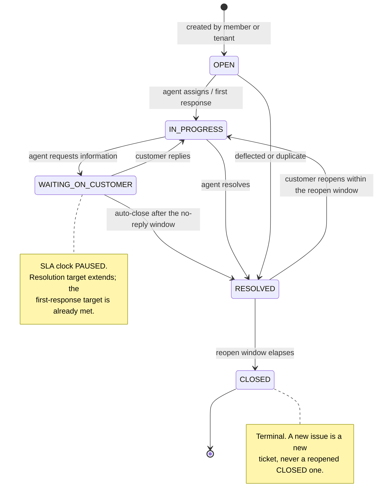

# EP-20 — Support, Help Centre, Referrals & Wallet

> **Phase-0 delivery backlog.** Detailed expansion of `ENGINEERING_PLAN.md` §2 (epic row `EP-20`)
> and §3 (`F-20.1` … `F-20.14`), and of `SprintPlanning.md` sprint 14 (tasks `14.9` – `14.12`,
> `14.15`, `14.16`, `14.19`). No application code exists yet.
>
> ⚠ **This is the only `S`-priority epic in the plan, and half of it is already descoped.**
> `SprintPlanning.md` §24 lists **`D-02` — referrals and wallet in full** with status
> **`TAKEN at S14`**, because sprint 14's capacity verdict is **Backend 129% OVER** and `D-02` is the
> 5.0 ed that closes the gap. The sprint-14 scope table still reads *"EP-20 (all) · F-20.1 …
> F-20.14"*, and both statements cannot be true. **This backlog resolves the contradiction
> explicitly**: `EP-20` plans, specifies and estimates all fourteen features so that reinstatement is
> a scheduling decision rather than a design exercise — and §3.3 states, in order, exactly what is
> dropped first, what it costs to reinstate, and what is lost meanwhile. See §11 `EP20-R1`.
>
> ⚠ **A second contradiction, and `ERD.md` wins it.** Sprint-14 task `14.12` builds *"wallet as
> ledger entries"*. `ERD.md` §13.3 rules the opposite: in Phase 1 the wallet is a **named absence**,
> `wallet_entries` does not exist, and a referral reward is delivered as a **coupon**
> (`referrals.reward_type enum('COUPON')` with a `CHECK`), because `coupons` already carries
> `funding_source`, per-user limits and validity windows — everything a referral discount needs.
> `BR-WAL-01` is priority **`C`** and `B6.1` routes `/account/wallet` to **Phase 2**. This epic
> follows the ERD, and records the wallet's *ordering rule* (§4.2) precisely so that a future
> implementation cannot get it wrong.
>
> **India context.** Support hours, channels and the first-response target are `OQ-19`, due
> **sprint 14**, defaulting to business hours in `Asia/Kolkata`, email and in-app, **4-hour first
> response** (`KPI-25`). `BR-WAL-01`'s non-encashable and non-transferable clauses are an **RBI
> licensing condition**, not a product preference: encashable wallet credit would make the platform
> a stored-value issuer, contradicting `A4.3` (*"the platform does not hold funds in its own
> name"*). Any SMS in a support or referral flow needs a TRAI DLT-approved template
> (`LAUNCH_MARKET_INDIA.md` §8) — which is why this epic's notifications are **email and in-app**.

---

## 1. Metadata

| Field | Value |
| :--- | :--- |
| **Epic id** | `EP-20` |
| **Name** | Support, Help Centre, Referrals & Wallet |
| **Priority (MoSCoW)** | **S** — Should. The **only** `S`-priority epic in the plan. `FR-SUP-01` … `FR-SUP-06` are `S`, `FR-SUP-07` is `C`, `FR-REFR-01` … `FR-REFR-05` and `FR-REFR-07` are `S`, `FR-REFR-06` (wallet) is `C`. `OBJ-10` is an `S` objective; `KPI-25` is an operating metric, not a launch gate |
| **Complexity** | **M** (T-shirt, §2). Two unrelated domains in one epic: a ticketing workflow with time semantics, and a fraud-resistant attribution loop with a money-adjacent reward |
| **Story points** | **34** (§2) · sprint-14 allocation **24.0 engineer-days** raw, of which **8.5 ed is `D-02`, already taken** — committed **15.5 ed** (§10) |
| **Target sprint(s)** | **Sprint 14** — `2027-03-22 → 2027-04-02` · Holi + Good Friday, **capacity −10%** · shares the sprint with `EP-17` (notifications) and contains the **1 April FY rollover** |
| **Owning PRD modules** | `SUP` (`B5.23`) and `REFR` (`B5.18`) |
| **Owning code modules** | `support/` (tickets, messages, help articles, SLA) · `crm/` (referral attribution and qualification) · `ledger/` (the wallet's future scope — **not built in Phase 1**) |
| **Surfaces** | `customer-web` — `SCR-WEB-015` (Referrals), `SCR-WEB-017` (Support and help centre) · `admin-dashboard` — `SCR-ADM-013` (Support console) · `gym-dashboard` — tenant-side ticket creation and list · help centre reachable **logged out** |
| **Primary APIs** | `GET/POST /support/tickets` · `GET /support/tickets/:id` · `POST /support/tickets/:id/messages` · `POST /support/tickets/:id/rating` † · `GET /help/articles` and `/help/articles/:slug` (**public**, `RL-PUBLIC`, `CDN-3600`) · `GET /me/referrals` · `GET /me/wallet` (**Phase 2**) · agent operations served by the same `/support/tickets*` resources under agent permissions |
| **Background jobs** | **new**: `support.sla-evaluate` (every 5 min — breach detection and escalation) · **new**: `referral.qualify` (daily — `BR-RFL-01` evaluation, **not** an activation event handler) · **new**: `referral.expire-attribution` (daily — closes the attribution window) · *(Phase 2)* `data.retention-sweep` writes wallet expiry debits |
| **Entities** | `support_tickets` (RLS with **nullable** `tenant_id`), `ticket_messages` (immutable, `SupportTicket`-owned), `help_articles` (GLOBAL reference), `referrals` (**IDENTITY** tenancy class, `R-FIN` retention) · **not** `wallet_entries` (`ERD.md` §13.3) |
| **Rate limiting** | `RL-WRITE` on ticket and message creation · `RL-READ` on ticket and referral reads · **`RL-PUBLIC`** on the help centre, which is one of the endpoints that must remain reachable by a **locked-out** user |
| **Launch market** | **India** — support hours and channels per `OQ-19` (business hours `Asia/Kolkata`, email + in-app, 4 h first response); notifications avoid SMS because every SMS template needs TRAI DLT pre-approval; `BR-WAL-01`'s clauses are an **RBI licensing condition**; ticket attachments and referral data resident in the Mumbai region (`REG-06`); tickets and their attachments are personal data under DPDP (`REG-09`) |
| **Status** | `PLANNED` — Phase 0. Not started. **`D-02` is pre-taken**: referrals and wallet are planned here and delivered post-launch unless capacity is recovered |
| **Epic owner** | Backend Lead (admin) for `support/` · Backend Lead (money) consulted on `referrals` because the reward is money-adjacent · Delivery Manager owns the descope decision |

---

## 2. Business Goal

**Support cost is the variable most likely to break the unit economics, and this epic is the lever.**
`A6.5` models contribution per tenant per month and names support explicitly — *cost per ticket ×
tickets per tenant, **target ≤ 0.8 per month by month 6***. `OBJ-10` states the operating model in
one sentence: *a support agent can resolve the ten most common member and gym issues without
engineering involvement*. Both of those are statements about **deflection and self-sufficiency**,
not about a ticketing tool. A help centre that answers the ten commonest questions
(`FR-SUP-06`) removes tickets before they are created; an agent console that carries the customer's
full context, the linked order, the linked membership and the payment state (`FR-SUP-02`,
`FR-SUP-03`) removes the escalation to engineering that is the actual cost. `KPI-25` measures the
outcome — median time to first human response ≤ 4 hours — and `UAT-06` is where a real super admin
proves the loop closes.

**Second, referrals are the only organic growth mechanism in Phase 1, and the only one whose failure
mode is fraud.** `FR-REFR-01` … `FR-REFR-07` describe a loop: a member shares a code, a friend
joins, both are rewarded. `BR-RFL-01` is the rule that keeps the loop from being an arbitrage —
*the reward credits only after the referred member's first membership passes the refund window*.
The failure the rule prevents is precise and profitable if left open: buy, get the referrer
credited, refund, repeat. `BusinessRules.md` therefore makes qualification a **scheduled evaluation
rather than an event handler on activation**, and the window comes from the **order's stored
policy** (`BR-REF-02`), not the tenant's current one — because a tenant who shortens their refund
policy after the sale must not thereby accelerate a reward. `FR-REFR-07` closes the other two
holes, self-referral and circular referral, and `AC-REFR-01.3` makes the first of them an
acceptance criterion.

**Third, this epic is the plan's declared shock absorber, and saying so plainly is part of the
design.** It is the only `S`-priority epic; it shares sprint 14 with `EP-17`, a sprint that loses
10% of its capacity to Holi and Good Friday, carries the 1 April FY-rollover test, and is already
**129% OVER on backend** before anything goes wrong. `SprintPlanning.md` §24 pre-agrees the order:
**`D-02`** (referrals and wallet in full, 5.0 ed) goes first and is recorded as **TAKEN**; **`D-01`**
(help-centre depth beyond the ten articles, plus the satisfaction rating, 1.5 ed) is next and remains
available. What survives in every scenario is the ticketing spine — creation, context, the five-state
lifecycle and the SLA timers — because that is the part `OBJ-10` and `KPI-25` actually rest on, and
because a launch without a support channel is not a launch. §3.3 makes the order, the cost and the
loss explicit so that the decision, when it is taken under pressure, is a lookup rather than an
argument.

---

## 3. Scope

### 3.1 In scope — explicit

| # | Item | Anchor |
| :-: | :--- | :--- |
| 1 | **Ticket creation** by members and by tenants, with category, description, priority and **attachments** | `FR-SUP-01`, `F-20.1` |
| 2 | **Contextual creation** from an order, membership, payment or check-in, auto-attaching the relevant references so the agent does not have to ask | `FR-SUP-02`, `F-20.2`, `E14.9` |
| 3 | **Eleven ticket categories**, each mapped to a default priority and a routing queue | `FR-SUP-01`, §4.3 |
| 4 | **Five-state lifecycle** — `OPEN`, `IN_PROGRESS`, `WAITING_ON_CUSTOMER`, `RESOLVED`, `CLOSED` — with a guarded transition table | `FR-SUP-04`, `F-20.4` |
| 5 | **SLA timers per priority** with first-response and resolution targets, breach alerting, and a **clock that pauses in `WAITING_ON_CUSTOMER`** | `FR-SUP-05`, `KPI-25`, `F-20.5` |
| 6 | **SLA timers that survive a worker restart** — computed from stored timestamps, never held in memory | `E14.9` |
| 7 | **Agent console** `SCR-ADM-013`: queue, assignment, priority, internal notes, canned responses, and full customer context in one view | `FR-SUP-03`, `F-20.3` |
| 8 | **Internal notes** distinguished from customer-visible messages at the data layer, never by a UI flag | `FR-SUP-03` |
| 9 | **Help centre**: search, article view, and articles for **the ten most common issues**, enumerated in §4.4 | `FR-SUP-06`, `OBJ-10`, `F-20.6` |
| 10 | **Help centre reachable logged out** and unauthenticated — a locked-out user is exactly the user who needs it | `API_Catalog.md` §5 rows 20–21, `RL-PUBLIC` |
| 11 | **Reason-code → article deep links**, so a `C4.8` check-in denial or application rejection carries a link to the article that explains it | `ERD.md` `help_articles`, `C4.8` |
| 12 | **Ticket deflection**: help-article search presented **before** the ticket form, with the deflection rate measured | `OBJ-10`, `A6.5` ≤ 0.8 tickets/tenant/month |
| 13 | **Satisfaction rating on resolution** (`C`) | `FR-SUP-07`, `F-20.7` — **descope `D-01`** |
| 14 | **Nullable-tenant RLS** on `support_tickets`: a member's ticket about the platform has **no** tenant; the policy is `tenant_id IS NULL OR tenant_id = current_setting(...)`, and tenant-null rows are additionally gated by the requester's own user id | `ERD.md` §4.7 note 7 |
| 15 | **Referral code and shareable link** per member, stable and collision-free | `FR-REFR-01`, `F-20.8` — **descope `D-02`** |
| 16 | **Attribution** at registration **or** first purchase, whichever occurs first, within a **configurable window** | `FR-REFR-02`, `F-20.9` — **`D-02`** |
| 17 | **Reward configuration**: value to referrer and referee, form (**coupon** in Phase 1), funder (platform or tenant) | `FR-REFR-03`, `F-20.10` — **`D-02`** |
| 18 | **`BR-RFL-01` qualification** as a **scheduled evaluation**, using the **order's stored** refund window, crediting only when the membership is still not `REFUNDED` or `CANCELLED` | `FR-REFR-04`, `BR-RFL-01`, `F-20.11` — **`D-02`** |
| 19 | **Referral state machine** `PENDING → QUALIFIED → CREDITED`, with `VOIDED` reachable from `PENDING` and `QUALIFIED`, and `UNIQUE (referrer_id, referred_user_id)` so one pair cannot credit twice | `BR-RFL-01`, `ERD.md` §4.7 |
| 20 | **Member referral dashboard** `SCR-WEB-015`: code, link, share affordances, invited list with status, rewards earned and **pending with the qualification explanation** | `FR-REFR-05`, `F-20.12` — **`D-02`** |
| 21 | **Self-referral and circular-referral prevention**, with the refusal recorded rather than silent | `FR-REFR-07`, `AC-REFR-01.3`, `F-20.14` — **`D-02`** |
| 22 | **The wallet's ordering rule, specified but not built** — wallet credit is a **tender**, not a discount; it reduces the amount charged without reducing `N`, `B`, `C` or `T` (§4.2) | `BR-WAL-01`, `ERD.md` §13.3, `F-20.13` — **`D-02`/Phase 2** |
| 23 | `SCR-WEB-017` Support: help search, article view, ticket list, new ticket with contextual attachment | `SCR-WEB-017`, sprint task `14.16` |
| 24 | Tenant-side ticket creation and list on `gym-dashboard`, sharing the same aggregate | `FR-SUP-01` (*"by members and by tenants"*) |
| 25 | **Support-load telemetry** feeding `EP-18`'s `support-load` report: tickets per tenant, per category, resolution time, deflection rate | `KPI-25`, `B5.20` platform table |
| 26 | **Attachment handling**: type allow-list, size cap, virus scan, storage in the Mumbai region, signed short-lived retrieval | `REG-06`, `SR-17`, `NFR-SEC-*` |

### 3.2 Out of scope — explicit, with destination

| Item | Why it is not here | Where it went |
| :--- | :--- | :--- |
| **Impersonation token minting**, the `typ` claim, the 30-minute expiry and the `@FinancialMutation()` guard | The agent's most powerful tool, and an identity concern | **`EP-02`** `FR-AUTH-12`, `AC-AUTH-03.*` |
| **Impersonation audit and reconstruction** | The audit surface belongs with the log | **`EP-19`** `BR-DAT-02`, `E15.8` |
| **`SCR-ADM-005` User Administration** — platform-wide user search, force logout, delete-request handling | An identity and CRM surface the agent *uses* but does not own | **`EP-02`**, **`EP-12`** |
| **The refund decision itself** — eligibility, computation, approval, execution, credit note | A support ticket may *lead* to a refund; it never performs one | **`EP-16`** `FR-RFND-*`, `BR-REF-*` |
| **The refund *window*** the referral qualification reads | `EP-20` reads `orders.refund_policy_snapshot`; it does not define it | **`EP-16`** `BR-REF-02` |
| **Coupon issuance mechanics** the referral reward uses | `EP-20` requests a coupon; `ordering/` mints and validates it | **`EP-07`** `FR-CPN-*`, `BR-CPN-05` |
| **`wallet_entries` as a table** | `ERD.md` §13.3: *"It would be a second money system"*; `INV-FIN-7` forbids a stored balance, so a wallet is **a second ledger scope**, not a table with a balance | **Phase 2**, as `ledger_entries.scope` — the seam is named, not half-built |
| **Wallet endpoints** `/account/wallet` | `B6.1` routes it to Phase 2; `GET /me/wallet` exists in the catalogue as a Phase-2 row | **Phase 2** |
| **Notification delivery** of ticket updates, SLA breaches and referral rewards | `EP-20` emits through the outbox; `notifications/` delivers | **`EP-17`**, same sprint |
| **SMS on any support or referral path** | Every India SMS template needs TRAI DLT pre-approval with weeks of external lead time; this epic's messages are email and in-app | **`EP-17`**, `REG-05`, `REG-08` |
| **The `support-load` report itself** | `EP-20` emits the data; `EP-18` renders the report | **`EP-18`** `B5.20` platform row 10 |
| **A public status page, live chat, telephony or a third-party helpdesk** | None is named in `B5.23`; adding one is a `§C10` change and a `STACK_ADDITIONS.md` entry | Not in Phase 1 |
| **Knowledge-base authoring workflow with review and approval** | `help_articles` is platform-authored reference data, mutable with soft delete | `EP-19`'s configuration surface if it is ever needed |
| **Tenant-authored help articles** | `help_articles` is `GLOBAL` — platform-authored only | Not in Phase 1 |
| **Referral leaderboards, tiered rewards, campaign codes** | Growth mechanics beyond `FR-REFR-01` … `FR-REFR-07` | Phase 2 |

### 3.3 The descope protocol — what goes first, and what it costs

`SprintPlanning.md` §24 pre-agrees the order **before the first line of code**, so that a capacity
failure in sprint 14 is a decision already taken rather than an argument under pressure. Items are
taken **strictly in order**. Taking one requires the Delivery Manager to record it in `PHASES.md`
and `KNOWN_LIMITATIONS.md`.

| Order | Item | Features | `FR-` | MoSCoW | ed recovered | Status | What is actually lost | Reinstatement cost |
| :-: | :--- | :--- | :--- | :-: | :-: | :--- | :--- | :--- |
| **1** | **`D-02` — referrals and wallet in full** | F-20.8 … F-20.14 | `FR-REFR-01` … `FR-REFR-07`, `BR-RFL-01`, `BR-WAL-01`, `SCR-WEB-015` | **S / C** | **5.0** | **TAKEN at S14** | A growth loop, not a launch capability. No member is blocked, no gym is unpaid, no rule is unenforced — `BR-RFL-01` and `BR-WAL-01` simply have nothing to govern | **≈ 5.5 ed post-launch.** The only entanglement is wallet-at-checkout, and it is **additive**: `ledger_entries.entry_type` gains three values by migration and the pricing sequence gains one step. The `referrals` table is fully modelled now (`ERD.md` §4.7) so the schema does not move |
| **2** | **`D-01` — help-centre depth and the satisfaction rating** | F-20.6 (partial), F-20.7 | `FR-SUP-06` (partial), `FR-SUP-07` | **S** | **1.5** | **Available** | Self-service *depth* beyond the ten articles, and the CSAT signal. **`OBJ-10` is still met by the ten articles** — that is the requirement's own wording | **≈ 1.5 ed.** Articles are content, not code; the rating is one endpoint and one field |
| **3** | *(not pre-agreed — would require a `§C10` **Major** change)* | Anything in the ticketing spine | `FR-SUP-01` … `FR-SUP-05` | **S** | — | **Refused** | A launch with no support channel. `KPI-25` becomes unmeasurable and `UAT-06` cannot run | n/a |

**What survives every scenario.** Ticket creation with attachments, contextual creation with
auto-attached references, the eleven categories, the five-state lifecycle, restart-safe SLA timers
with breach alerting, the agent console, the ten help articles, and the nullable-tenant RLS policy.
That set is `FR-SUP-01` … `FR-SUP-06`, it is what `OBJ-10` and `KPI-25` rest on, and it is **15.5
ed** of the epic's 24.0 (§10.2).

---
## 4. Features

`F-20.1` … `F-20.14` are carried verbatim from `ENGINEERING_PLAN.md` §3. Rows marked *(new)* come
from `SprintPlanning.md` sprint 14, `ERD.md` §4.7 and §13.3, `BusinessRules.md` `BR-RFL-01` and
`BR-WAL-01`, and `API_Catalog.md` §3.14 and §5. The **D** column names the descope item that removes
the row.

| Feature | Description | Satisfies | Pri | Pts | Sprint | D |
| :--- | :--- | :--- | :-: | :-: | :-: | :-: |
| **F-20.1** | Ticket creation by members and tenants with category, description, priority and attachments | `FR-SUP-01` | S | 3 | 14 | — |
| **F-20.2** | Contextual creation from an order, membership, payment or check-in, auto-attaching references | `FR-SUP-02` | S | 2 | 14 | — |
| **F-20.3** | Agent console: queue, assignment, priority, internal notes, canned responses, full context | `FR-SUP-03`, `SCR-ADM-013` | S | 5 | 14 | — |
| **F-20.4** | Five-state ticket lifecycle with a guarded transition table | `FR-SUP-04` | S | 2 | 14 | — |
| **F-20.5** | SLA timers per priority with breach alerting | `FR-SUP-05`, `KPI-25` | S | 3 | 14 | — |
| **F-20.6** | Help centre with articles for **the ten most common issues** | `FR-SUP-06`, `OBJ-10` | S | 2 | 14 | `D-01` (depth only) |
| **F-20.7** | Satisfaction rating on resolution | `FR-SUP-07` | C | 1 | 14 | **`D-01`** |
| **F-20.8** | Referral code and shareable link per member | `FR-REFR-01` | S | 2 | 14 | **`D-02`** |
| **F-20.9** | Attribution at registration or first purchase within a configurable window | `FR-REFR-02` | S | 3 | 14 | **`D-02`** |
| **F-20.10** | Reward configuration: value, form, funder | `FR-REFR-03` | S | 2 | 14 | **`D-02`** |
| **F-20.11** | Reward credited only after the refund window clears | `FR-REFR-04`, `BR-RFL-01` | S | 3 | 14 | **`D-02`** |
| **F-20.12** | Member referral dashboard | `FR-REFR-05`, `SCR-WEB-015` | S | 2 | 14 | **`D-02`** |
| **F-20.13** | Wallet balance, history, expiry, checkout application before the gateway charge | `FR-REFR-06`, `BR-WAL-01` | C | 3 | **Phase 2** | **`D-02`** |
| **F-20.14** | Self-referral and circular-referral prevention | `FR-REFR-07` | S | 2 | 14 | **`D-02`** |
| **F-20.15** *(new)* | **Nullable-tenant RLS** on `support_tickets` and `ticket_messages`: `tenant_id IS NULL OR tenant_id = current_setting(...)`, with tenant-null rows gated by the requester's user id | `ERD.md` §4.7 n7, `BR-TEN-01` | S | 2 | 14 | — |
| **F-20.16** *(new)* | **Restart-safe SLA**: every timer derived from stored timestamps, evaluated by `support.sla-evaluate` every 5 minutes, with the clock **paused in `WAITING_ON_CUSTOMER`** and business-hours arithmetic in `Asia/Kolkata` | `E14.9`, `FR-SUP-05`, `TR-21` | S | 3 | 14 | — |
| **F-20.17** *(new)* | **Eleven ticket categories** with default priority and routing queue per category | `FR-SUP-01`, §4.3 | S | 1 | 14 | — |
| **F-20.18** *(new)* | **Reason-code → article deep links** from the five `C4.8` families, so a denial or a rejection carries its own explanation | `C4.8`, `ERD.md` `help_articles` | S | 2 | 14 | — |
| **F-20.19** *(new)* | **Deflection-first support entry**: article search before the ticket form, with the deflection rate measured against the `A6.5` ≤ 0.8 tickets/tenant/month target | `OBJ-10`, `A6.5` | S | 2 | 14 | — |
| **F-20.20** *(new)* | **Impersonation as the agent's context tool**, consumed not owned: banner, reason, 30-minute box, financial mutations refused | `BR-DAT-02`, `SR-06` | S | 1 | 14 | — |
| **F-20.21** *(new)* | **Referral reward is a `COUPON` in Phase 1**, per `ERD.md` §13.3 — `referrals.reward_type enum('COUPON')` with a `CHECK`; wallet credit is a Phase-2 widening | `ERD.md` §13.3, `BR-CPN-05` | S | 2 | 14 | **`D-02`** |
| **F-20.22** *(new)* | **The wallet ordering rule, specified now and built never in Phase 1**: wallet is a **tender**, not a discount (§4.2) | `BR-WAL-01`, `ERD.md` §13.3 | C | 1 | doc only | — |
| **F-20.23** *(new)* | **Support-load telemetry**: tickets per tenant, per category, first-response and resolution times, deflection rate — emitted for `EP-18`'s `support-load` report | `KPI-25`, `B5.20` | S | 1 | 14 | — |

**Roll-up.** 23 features · **50 raw points**, normalised to the **34** carried in
`ENGINEERING_PLAN.md` §2. **`D-02` removes 19 of those points** (F-20.8 … F-20.14, F-20.21);
`D-01` removes a further 2 (F-20.7 and the depth half of F-20.6). The committed sprint-14 scope is
therefore **31 of the 50 raw points / 15.5 ed** (§10.2).

### 4.1 The ticket lifecycle and its SLA

`FR-SUP-04` names five states. The transitions are guarded, and the SLA clock behaviour differs per
state — which is the part a naive implementation gets wrong and the part `E14.9` tests.

| Priority | First response | Resolution | Breach action |
| :--- | :--- | :--- | :--- |
| **P1** — service down for a tenant, money missing, member locked out of a paid membership | **1 business hour** | 4 business hours | Immediate escalation notification to the support lead **and** the on-call engineer |
| **P2** — a member cannot check in, a payment state is indeterminate, a payout is late | **4 business hours** (`KPI-25`) | 1 business day | Escalation notification to the support lead |
| **P3** — an invoice correction, a plan question, a listing edit | 1 business day | 3 business days | Queue-age flag on `SCR-ADM-013` |
| **P4** — feedback, a feature request, a general question | 2 business days | 5 business days | Queue-age flag only |

| Rule | Detail |
| :--- | :--- |
| **Business hours** | `OQ-19` default: business hours in **`Asia/Kolkata`**, no DST. Arithmetic uses the same explicit-IANA discipline as every other business-date computation (`TR-24`, constitution DoD 7) |
| **The clock pauses** | Time in `WAITING_ON_CUSTOMER` does not count toward the resolution target. It **never** rewinds the first-response target, which is already met by definition |
| **Restart safety** | Timers are **derived from `created_at`, `first_responded_at`, and the `WAITING_ON_CUSTOMER` interval log** — never held in memory or in a delayed job payload. A worker restart loses nothing (`E14.9`) |
| **Evaluation** | `support.sla-evaluate` every 5 minutes, idempotent, under the BullMQ distributed lock; a breach is recorded once, not once per evaluation |
| **Escalation is a notification, not a state** | Breach does not change the ticket state. Conflating the two makes the breach metric unrecoverable after the ticket resolves |

### 4.2 The wallet ordering rule — specified, not built

`ERD.md` §13.3 calls this *"the single most important thing to record about the wallet seam"*, and
it is recorded here because a future implementer will read this epic, not the ERD appendix.

| | Rule |
| :--- | :--- |
| **What wallet credit is** | A **tender** — a means of payment — not a discount |
| **What that means arithmetically** | It reduces the amount charged to the gateway. It does **not** reduce `N` (net sale), `B` (commission base), `C` (commission) or `T` (tax). Only the residual charged to the card changes |
| **Why it matters** | Treating wallet credit as a discount silently reduces the platform's own commission on every wallet-funded sale, because `B = N` and `N` would have moved |
| **The fixed sequence** | **coupon → wallet → gateway.** The gateway charge is always the residual (`BusinessRules.md` `BR-WAL-01`) |
| **Balance** | **Derived**, never stored (`BR-FIN-01`, `INV-FIN-7`). Expiry is a **debit entry**, not a deletion |
| **Structural prohibitions** | No transfer endpoint and no withdrawal endpoint **exist** — asserted against the OpenAPI document (`BR-WAL-01-N1`). This is an **RBI licensing condition**, not a product choice |
| **The Phase-1 position** | The wallet is not built. `referrals.reward_type` is `enum('COUPON')` with a `CHECK`; `ledger_entries.entry_type` gains `WALLET_CREDIT`, `WALLET_DEBIT` and `WALLET_EXPIRY` by migration when Phase 2 arrives |
| **The hazard the seam prevents** | *"a partially-built wallet that a developer wires into the discount path"* — which is why nothing is half-built |

### 4.3 Ticket categories, priorities and routing

`FR-SUP-01` requires a category. Eleven exist; each carries a default priority and a routing queue,
both configurable through `EP-19`'s registry so that a re-routing is a data change.

| Category | Default | Routes to | Auto-attaches |
| :--- | :-: | :--- | :--- |
| `CHECK_IN` | P2 | Support | Membership, last attendance row, denial reason code |
| `PAYMENT` | P2 | Support → Finance on escalation | Order, payment, provider reference, payment state |
| `REFUND` | P2 | Finance | Order, `refund_policy_snapshot`, usage to date, any open refund |
| `MEMBERSHIP` | P3 | Support | Membership, plan, entitlement remaining |
| `INVOICE_TAX` | P3 | Finance | Invoice, GSTIN on file, tax snapshot |
| `ACCOUNT_ACCESS` | **P1** | Support | User, active sessions, recent OTP attempts — **no credentials, ever** |
| `LISTING_CONTENT` | P3 | Moderation | Gym, branch, the flagged media or text |
| `PAYOUT_SETTLEMENT` | P2 | Finance | Settlement batch, statement, payout state, reserve held |
| `REVIEW_MODERATION` | P3 | Moderation | Review, gym, reviewer check-in history |
| `DATA_PRIVACY` | P2 | Support → Legal | The subject's export or deletion request state (`BR-DAT-03`, `BR-DAT-04`) |
| `OTHER` | P4 | Support | Nothing |

### 4.4 The ten help-centre articles

`FR-SUP-06` says *"articles mapped to the ten most common issues"* and `OBJ-10` names the same ten
as the agent's resolution set. Enumerated, so that "ten articles" cannot be met by ten placeholders.
Each is deep-linked from the reason code or state that produces the question (`F-20.18`).

| # | Article | Answers | Linked from |
| :-: | :--- | :--- | :--- |
| 1 | **My QR code will not scan, or my check-in was denied** | The fifteen `C4.8` denial reasons in plain language, and what to do about each | Every check-in denial response |
| 2 | **I paid but my membership is not active yet** | Activation is webhook-driven (`BR-PAY-02`); what an indeterminate payment means; the 15-minute reconcile sweep | Payment pending screen, `PAYMENT` tickets |
| 3 | **I think I was charged twice** | `BR-PAY-07` duplicate detection and automatic refund; how to confirm; what the timeline is | Order history, `PAYMENT` tickets |
| 4 | **Can I get a refund, how much, and when?** | The policy **stored on the order** (`BR-REF-02`), usage-aware computation (`BR-REF-06`), the cooling-off minimum, refund to the original instrument (`BR-REF-04`) | Membership detail, `REFUND` tickets |
| 5 | **Freezing, extending or cancelling my membership** | Freeze extends `end_date`; plan-configurable; what cancellation does and does not refund | Membership detail |
| 6 | **My GST invoice — details, corrections and copies** | Why an issued invoice is never edited, how a credit note works, where the GSTIN goes, CGST/SGST on the document | Invoice screen, `INVOICE_TAX` tickets |
| 7 | **Why can I not review this gym?** | `BR-REV-01` check-in-gated reviews; one review per term; the edit window | Gym detail, review CTA |
| 8 | **The gym closed, was suspended, or changed its timings** | `BR-MEM-14` closure handling, refund eligibility, and why an existing membership still scans at a tenant suspended for arrears (`BR-TEN-05`) | Closure notice, `MEMBERSHIP` tickets |
| 9 | **Owner: when do I get paid, and why does the amount differ from my sales?** | The `A6.3` eight-plus-one figures, the T+7 default cycle, the hold period, the reserve, negative balance recovery | Statement, `PAYOUT_SETTLEMENT` tickets |
| 10 | **Owner: my gym is not appearing in search** | Verification before visibility (`BR-GYM-01`), freshness, arrears delisting at day 7 (`BR-TEN-06`), suspension (`BR-TEN-05`) | Dashboard alerts, `LISTING_CONTENT` tickets |
| *11* | *Owner: my KYC was rejected — what do I fix?* | *The sixteen `C4.8` rejection codes and their remedies* | ***`D-01` territory** — the eleventh article is exactly what "depth beyond the ten" means* |

---

## 5. User Stories

`B5.18` contains one story, `US-REFR-01`, restated in full. `B5.23` contains **none** — seven
functional requirements and no story at all — so eight are written here for behaviour the
requirements imply; the requirement implying each is named.

### US-REFR-01 — *As a member, I want credit for bringing a friend, and I want to see where it is.* **(PRD)**

- **AC-REFR-01.1** *Given* my friend registers via my link and buys a membership, *when* the refund
  window on their purchase closes, *then* my reward is credited and I am notified.
- **AC-REFR-01.2** *Given* their purchase is refunded within the window, *when* the refund completes,
  *then* no reward is credited and my dashboard shows the referral as **not qualified with the
  reason**.
- **AC-REFR-01.3** *Given* I attempt to use my own referral link, *when* I register, *then* no
  attribution is created.
- **AC-REFR-01.4** *(new — `BR-RFL-01`)* *Given* the tenant shortens its refund policy after my
  friend's purchase, *when* qualification runs, *then* it uses the window **stored on the order**,
  not the tenant's current one.
- **AC-REFR-01.5** *(new — `BR-RFL-01-N2`)* *Given* the same referrer/referee pair, *when*
  qualification runs twice, *then* the reward credits **once** — `UNIQUE (referrer_id,
  referred_user_id)` refuses the second.
- **AC-REFR-01.6** *(new — `FR-REFR-07`)* *Given* A referred B and B attempts to refer A, *then* the
  circular attribution is refused and the refusal is recorded, not silently dropped.

### US-SUP-01 — *As Priya, I want to raise a problem from the thing that is broken, not from a blank form.* **(new — implied by `FR-SUP-01`, `FR-SUP-02`)**

- **AC-SUP-01.1** *Given* an order, a membership, a payment or a check-in, *when* I open a ticket
  from it, *then* the relevant references are **auto-attached** and I do not have to quote an id.
- **AC-SUP-01.2** *Given* the new-ticket form, *when* I type my problem, *then* **matching help
  articles are shown before the submit button** and choosing one records a deflection.
- **AC-SUP-01.3** *Given* I attach a file, *then* the type is on the allow-list, the size is capped,
  it is scanned, and it is stored in the Mumbai region behind a short-lived signed URL.
- **AC-SUP-01.4** *Given* I am logged out and locked out, *then* I can still read the help centre
  (`RL-PUBLIC`, no authentication).

### US-SUP-02 — *As a support agent, I want the whole customer in one screen so I do not ask them to repeat themselves.* **(new — implied by `FR-SUP-03`, `SCR-ADM-013`)**

- **AC-SUP-02.1** *Given* a ticket, *when* I open it, *then* I see the requester's memberships,
  orders, payments, reviews, tickets and sessions **without leaving the console**.
- **AC-SUP-02.2** *Given* an internal note, *then* it is stored as an internal message and is
  **never** returned by the customer-facing endpoint — the distinction is at the data layer, not a
  UI flag.
- **AC-SUP-02.3** *Given* a canned response, *when* I insert it, *then* placeholders resolve from the
  ticket context and I can edit before sending.
- **AC-SUP-02.4** *Given* I need to see what the member sees, *when* I impersonate, *then* a reason
  is required, the session is time-boxed at 30 minutes, a banner is visible, and **no financial
  mutation is possible** (`BR-DAT-02`, `SR-06`).

### US-SUP-03 — *As the support lead, I want to know a promise is about to be broken before it is.* **(new — implied by `FR-SUP-05`, `KPI-25`)**

- **AC-SUP-03.1** *Given* a P2 ticket, *then* the **4-hour** first-response target is displayed on
  the queue row with time remaining, in business hours.
- **AC-SUP-03.2** *Given* a target is approaching, *then* the row is flagged **before** breach, not
  on it.
- **AC-SUP-03.3** *Given* a breach, *then* an escalation notification fires **once**, the ticket
  state is unchanged, and the breach is retained for `KPI-25` even after resolution.
- **AC-SUP-03.4** *Given* the worker restarts, *then* every timer is unchanged, because it is
  derived from stored timestamps (`E14.9`).
- **AC-SUP-03.5** *Given* a ticket sits in `WAITING_ON_CUSTOMER` for two days, *then* those two days
  do **not** count toward the resolution target.

### US-SUP-04 — *As Rohan, I want to raise a payout question and have it treated as a money question.* **(new — implied by `FR-SUP-01`, `FR-SUP-02`)**

- **AC-SUP-04.1** *Given* I open a `PAYOUT_SETTLEMENT` ticket from a statement, *then* the batch,
  the statement, the payout state and any reserve held are attached and it routes to Finance.
- **AC-SUP-04.2** *Given* my tenant is `PAST_DUE`, *then* I can still open a ticket — support is not
  a write action withdrawn by `BR-TEN-06`.
- **AC-SUP-04.3** *Given* my ticket concerns my own tenant, *then* no other tenant's data is
  reachable from it, in either direction.

### US-SUP-05 — *As the platform, I want most questions never to become tickets.* **(new — implied by `FR-SUP-06`, `OBJ-10`, `A6.5`)**

- **AC-SUP-05.1** *Given* the ten articles of §4.4, *then* each exists, is searchable, and is
  reachable unauthenticated.
- **AC-SUP-05.2** *Given* a `C4.8` reason code appears in any response or screen, *then* it carries
  a link to the article that explains it.
- **AC-SUP-05.3** *Given* a month of operation, *then* tickets per tenant per month is measurable
  against the `A6.5` ≤ 0.8 target and the deflection rate is reported.
- **AC-SUP-05.4** *Given* an article changes, *then* the CDN cache for `/help/articles` is purged
  and the change is audited as configuration.

### US-SUP-06 — *As a member, I want to know my ticket is not lost.* **(new — implied by `FR-SUP-04`)**

- **AC-SUP-06.1** *Given* my ticket, *then* its state is one of the five and is visible to me with a
  plain-language label.
- **AC-SUP-06.2** *Given* an agent replies, *then* I am notified by **email and in-app** — not SMS,
  because every India SMS template needs DLT pre-approval.
- **AC-SUP-06.3** *Given* my ticket is `RESOLVED`, *then* I may reopen it within the reopen window;
  once `CLOSED`, a new issue is a **new ticket**.
- **AC-SUP-06.4** *Given* a state transition, *then* it obeys the §4.1 transition table; an
  unsupported transition is refused, not silently ignored.

### US-SUP-07 — *As the platform, I want a member's ticket about the platform itself to belong to no tenant, safely.* **(new — implied by `ERD.md` §4.7 note 7, `BR-TEN-01`)**

- **AC-SUP-07.1** *Given* a member's ticket about the platform, *then* `tenant_id` is `NULL` and the
  ticket is visible to the requester and to platform support only.
- **AC-SUP-07.2** *Given* a tenant user, *when* they query tickets, *then* the RLS policy
  `tenant_id IS NULL OR tenant_id = current_setting(...)` combined with the requester gate returns
  **their own** tenant-null tickets and no one else's.
- **AC-SUP-07.3** *Given* the isolation suite, *then* both directions are asserted for every
  `/support/*` route, and a nullable-tenant table does **not** get a weaker test.

### US-SUP-08 — *As Vikram, I want the satisfaction signal, and I want to know when we stopped collecting it.* **(new — implied by `FR-SUP-07`, `D-01`)**

- **AC-SUP-08.1** *Given* a ticket resolves, *then* the requester may rate the resolution.
- **AC-SUP-08.2** *Given* `D-01` is taken, *then* the rating is absent, the absence is recorded in
  `KNOWN_LIMITATIONS.md`, and `KPI-25` — which measures **response time**, not satisfaction —
  remains fully measurable.

### US-REFR-02 — *As a member, I want to understand why a reward is pending rather than paid.* **(new — implied by `FR-REFR-05`, `BR-RFL-01`)**

- **AC-REFR-02.1** *Given* `SCR-WEB-015`, *then* each invited person shows a state — invited,
  joined, purchased, **qualified**, credited, or not qualified — with a date.
- **AC-REFR-02.2** *Given* a pending reward, *then* the screen states **why** and **when** it will
  qualify: *"credits on \<date\>, once \<friend\>'s refund window closes"*.
- **AC-REFR-02.3** *Given* a voided referral, *then* the reason is shown — refunded within the
  window, cancelled, self-referral, or circular.
- **AC-REFR-02.4** *Given* a credited reward, *then* the resulting **coupon** is visible with its
  value, its validity window and its usage state.

### US-REFR-03 — *As the platform, I want the referral loop to be unattractive to abuse.* **(new — implied by `FR-REFR-07`, `BR-RFL-01`)**

- **AC-REFR-03.1** *Given* a self-referral by the same user id, phone or email, *then* no attribution
  is created and the attempt is recorded.
- **AC-REFR-03.2** *Given* a cycle of any length in the referral graph, *then* the attribution that
  would close the cycle is refused.
- **AC-REFR-03.3** *Given* a refund inside the stored window, *then* the referral moves to `VOIDED`
  and **nothing** is credited (`BR-RFL-01-N1`).
- **AC-REFR-03.4** *Given* qualification runs, *then* it is a **scheduled evaluation**, not an
  activation event handler — so a membership that is refunded an hour after activation never reaches
  `QUALIFIED`.
- **AC-REFR-03.5** *Given* an unusual referral velocity from one referrer, *then* it is visible in
  the platform's referral telemetry for manual review.

### US-REFR-04 — *As the platform, I want the reward to be a coupon in Phase 1 and a wallet credit later, without rework.* **(new — implied by `ERD.md` §13.3, `FR-REFR-03`)**

- **AC-REFR-04.1** *Given* a qualified referral, *then* the reward is issued as a **coupon** with the
  configured value, funder (`funding_source`) and validity window.
- **AC-REFR-04.2** *Given* the coupon is platform-funded, *then* the commission base is the
  **pre-discount** net and the platform absorbs the discount (`A6.3`, `BR-CPN-05`).
- **AC-REFR-04.3** *Given* Phase 2, *then* widening `referrals.reward_type` and adding three
  `ledger_entries.entry_type` values is **additive** — no table moves and no figure is recomputed.
- **AC-REFR-04.4** *Given* any Phase-1 code path, *then* **no wallet balance column exists anywhere**
  and no endpoint transfers or withdraws credit.

---
## 6. Acceptance Criteria for the Epic

Sprint-14 exit items `E14.9` and `E14.10` expanded to executable granularity, plus the criteria the
exit checklist does not carry because `EP-20` shares its sprint with `EP-17`. Rows marked **`D-02`**
or **`D-01`** are **not required for launch if the descope is taken** — they become the reinstatement
acceptance criteria and are recorded in `KNOWN_LIMITATIONS.md`.

| # | Criterion | Evidence | Survives descope? |
| :--- | :--- | :--- | :--- |
| **AC-EP20-01** | A ticket opened **from an order** carries the auto-attached order, invoice and payment references, and the SLA timer is running | `E14.9`, `FR-SUP-02` | ✅ |
| **AC-EP20-02** | Contextual creation works from all four sources — order, membership, payment, check-in — each attaching its documented reference set (§4.3) | `FR-SUP-02` | ✅ |
| **AC-EP20-03** | Attachments are type-restricted, size-capped, scanned, stored **in the Mumbai region**, and retrieved through short-lived signed URLs | `REG-06`, `SR-17` | ✅ |
| **AC-EP20-04** | All **eleven categories** exist with their default priority and routing queue, and both are **configuration**, not constants | `FR-SUP-01`, §4.3 | ✅ |
| **AC-EP20-05** | The **five-state lifecycle** enforces the §4.1 transition table; an unsupported transition is refused with a registry error code, not ignored | `FR-SUP-04` | ✅ |
| **AC-EP20-06** | `CLOSED` is terminal; a new issue is a new ticket | `FR-SUP-04`, `AC-SUP-06.3` | ✅ |
| **AC-EP20-07** | **SLA timers survive a worker restart** — proven by restarting the worker mid-ticket and asserting the remaining time is unchanged | `E14.9`, `F-20.16` | ✅ |
| **AC-EP20-08** | Time in `WAITING_ON_CUSTOMER` **does not count** toward the resolution target, and never rewinds the first-response target | `AC-SUP-03.5` | ✅ |
| **AC-EP20-09** | Business-hours arithmetic uses an explicit IANA timezone (`Asia/Kolkata`, +05:30, no DST); a ticket raised at 19:00 IST has its first-response target computed from the next business hour | `TR-24`, DoD 7 | ✅ |
| **AC-EP20-10** | A breach fires an escalation notification **once**, leaves the ticket state unchanged, and is retained for `KPI-25` after resolution | `FR-SUP-05`, `AC-SUP-03.3` | ✅ |
| **AC-EP20-11** | `SCR-ADM-013` shows the queue with assignment, priority and SLA, and ticket detail with full customer context, linked entities, internal notes and canned responses | `FR-SUP-03`, `SCR-ADM-013` | ✅ |
| **AC-EP20-12** | **Internal notes are never returned by the customer-facing endpoint** — asserted by a contract test, not by inspection | `AC-SUP-02.2` | ✅ |
| **AC-EP20-13** | An agent impersonating a member sees a banner, has given a reason, expires at 30 minutes, and is **refused** on payment initiation, refund approval and payout bank-account change | `BR-DAT-02`, `SR-06`, `SEC-A01-006`/`007` | ✅ |
| **AC-EP20-14** | All **ten help articles** of §4.4 exist, are searchable, and are reachable **unauthenticated and logged out** | `FR-SUP-06`, `OBJ-10` | ✅ (depth is `D-01`) |
| **AC-EP20-15** | Every `C4.8` reason code surfaced anywhere carries a deep link to its explaining article | `F-20.18` | ✅ |
| **AC-EP20-16** | The new-ticket flow shows **matching articles before the submit button**, and a deflection is recorded when one is chosen | `AC-SUP-01.2`, `OBJ-10` | ✅ |
| **AC-EP20-17** | An article change **purges** the `/help/articles` CDN cache and is audited as a configuration change | `CDN-3600`, `BR-DAT-01` | ✅ |
| **AC-EP20-18** | A **member's ticket about the platform** has `tenant_id = NULL`, is visible to the requester and platform support only, and the RLS policy is asserted in **both** directions | `ERD.md` §4.7 n7, `BR-TEN-01`, `BAC-10` | ✅ |
| **AC-EP20-19** | A `PAST_DUE` tenant can still open and read tickets — support is not withdrawn by the `BR-TEN-06` write suspension | `AC-SUP-04.2`, `BR-TEN-06` | ✅ |
| **AC-EP20-20** | Support-load telemetry emits tickets per tenant, per category, first-response time, resolution time and deflection rate for `EP-18`'s `support-load` report | `KPI-25`, `B5.20` | ✅ |
| **AC-EP20-21** | Tickets, messages and attachments contain **no personal data in logs or analytics events** | `BR-DAT-06`, `REG-09` | ✅ |
| **AC-EP20-22** | Satisfaction rating is collected on resolution | `FR-SUP-07` | ❌ **`D-01`** |
| **AC-EP20-23** | Help-centre depth beyond the ten articles — including the KYC-rejection article | `FR-SUP-06` (full) | ❌ **`D-01`** |
| **AC-EP20-24** | Every member has a **unique referral code and shareable link**, collision-free and stable across sessions | `FR-REFR-01` | ❌ **`D-02`** |
| **AC-EP20-25** | Attribution occurs at **registration or first purchase, whichever is first**, within the configured window; the window is configuration | `FR-REFR-02` | ❌ **`D-02`** |
| **AC-EP20-26** | **A referral reward credits only after the refund window closes** — using the window **stored on the order**, and only if the membership is not `REFUNDED` or `CANCELLED` | `E14.10`, `BR-RFL-01-P1`, `AC-REFR-01.4` | ❌ **`D-02`** |
| **AC-EP20-27** | A refund inside the window **voids** the referral and credits nothing; the dashboard shows *not qualified* with the reason | `BR-RFL-01-N1`, `AC-REFR-01.2` | ❌ **`D-02`** |
| **AC-EP20-28** | The same referrer/referee pair **cannot be credited twice** — enforced by `UNIQUE (referrer_id, referred_user_id)`, not by application logic alone | `BR-RFL-01-N2` | ❌ **`D-02`** |
| **AC-EP20-29** | Qualification is a **scheduled evaluation**, not an activation event handler — proven by refunding an hour after activation and observing that `QUALIFIED` is never reached | `BR-RFL-01`, `AC-REFR-03.4` | ❌ **`D-02`** |
| **AC-EP20-30** | **Self-referral and circular referral are refused** and the refusal is recorded | `E14.10`, `AC-REFR-01.3`, `FR-REFR-07` | ❌ **`D-02`** |
| **AC-EP20-31** | `SCR-WEB-015` shows the code, the link, share affordances, the invited list with state, and rewards earned **and pending with the qualification explanation and date** | `FR-REFR-05`, `AC-REFR-02.2` | ❌ **`D-02`** |
| **AC-EP20-32** | The reward is issued as a **coupon** with the configured value, funder and validity; a platform-funded coupon leaves the commission base **pre-discount** | `ERD.md` §13.3, `A6.3`, `BR-CPN-05` | ❌ **`D-02`** |
| **AC-EP20-33** | **No wallet balance column exists anywhere**, and **no transfer or withdrawal endpoint exists** — asserted against the OpenAPI document | `BR-WAL-01-N1`, `INV-FIN-7` | ✅ *(an absence, so it survives)* |
| **AC-EP20-34** | If wallet is ever built, the **coupon → wallet → gateway** sequence holds and wallet reduces the charge without moving `N`, `B`, `C` or `T` | `BR-WAL-01`, §4.2 | Phase 2 |
| **AC-EP20-35** | Every `/support/*` and `/me/referrals` route declares a permission, is rate-limited, and has an isolation spec in **both** directions | `FR-RBAC-01`, `BAC-10`, DoD 16 | ✅ |
| **AC-EP20-36** | axe-core clean and keyboard-complete on `SCR-WEB-017`, `SCR-WEB-015` and `SCR-ADM-013`, including the attachment control and the queue table | `NFR-USE-01`, `BAC-11` | ✅ (015 is `D-02`) |
| **AC-EP20-37** | Any descope taken is recorded in `PHASES.md` and `KNOWN_LIMITATIONS.md` **at the moment it is taken**, naming the `FR-` identifiers left unmet | §24, `§C10` | ✅ — mandatory |

---

## 7. Business Rules Enforced

`EP-20` owns exactly two rules and one of them is deferred — which is the honest shape of an
`S`-priority epic. Detail lives in `BusinessRules.md`; this table names the enforcement point.

| `BR-` | Ownership | Enforcement point in `EP-20` | Task |
| :--- | :--- | :--- | :--- |
| `BR-RFL-01` | **Owned** (`ordering/` + `crm/`) | `referral.qualify` as a **scheduled evaluation**; the window read from `orders.refund_policy_snapshot`; the `PENDING → QUALIFIED → CREDITED` / `VOIDED` aggregate; `UNIQUE (referrer_id, referred_user_id)` at the database layer | T-20.14 – T-20.17 — **`D-02`** |
| `BR-WAL-01` | **Owned, and deliberately unbuilt** (`ordering/` + `ledger/`) | **Structural absence**: no transfer endpoint, no withdrawal endpoint, no balance column, asserted against the OpenAPI document. The ordering rule is specified in §4.2 so a Phase-2 implementation cannot invert it. `BAC-06` requires only the positive case for a `C` rule; the negatives are specified because the rule is a **licensing condition** | T-20.20 — absence test survives descope |
| `BR-DAT-02` | **Consumer** (owners `EP-02` + `EP-19`) | The agent console is *where impersonation is used*: reason prompt, banner, 30-minute box, financial-mutation refusal surfaced as a disabled affordance with an explanation rather than a silent 403 | T-20.09, T-20.22 |
| `BR-TEN-01` | **Inherited — with a twist** | `support_tickets.tenant_id` is **nullable**, so the RLS policy is `tenant_id IS NULL OR tenant_id = current_setting(...)` **plus** a requester gate. A nullable-tenant table is the easiest place in the system to write a policy that silently returns everything | T-20.02, T-20.21 |
| `BR-TEN-06` | **Inherited** | Support remains available to a `PAST_DUE` tenant; the `WriteAccessGuard` does not cover ticket creation | T-20.03 |
| `BR-REF-02` | **Consumer** (owner `EP-16`) | Qualification reads the **order's stored** policy, never the tenant's current one — the rule that stops a policy edit accelerating a reward | T-20.16 — **`D-02`** |
| `BR-CPN-05` | **Consumer** (owner `EP-07`) | The referral coupon's `funding_source` determines the commission base and is **immutable after first use** | T-20.18 — **`D-02`** |
| `BR-FIN-01` | **Inherited** | Any future wallet balance is **derived**, never stored — which is why the wallet is a ledger scope and not a table | §4.2 |
| `BR-DAT-01` | **Contributor** | Ticket state transitions, agent assignment, impersonation use and help-article edits are audited; message bodies are **not** copied into `audit_log` | T-20.05, T-20.23 |
| `BR-DAT-06` | **Contributor** | No personal data in logs or analytics events from ticket or referral paths; attachment filenames are treated as user content | T-20.23 |
| `BR-DAT-03`, `BR-DAT-04` | **Consumer** | A `DATA_PRIVACY` ticket routes to the export and deletion machinery; it does not implement it | §4.3 |

---

## 8. Dependencies

### 8.1 Upstream — must exist first

| Dep | What `EP-20` needs from it | Sprint | Hard or soft |
| :--- | :--- | :-: | :--- |
| **`EP-01`** | Outbox, BullMQ with the distributed lock, the tenant extension, object storage in the Mumbai region, the error registry | 0 | **Hard** |
| **`EP-02`** | `SUPPORT_AGENT` and the platform roles, MFA, **impersonation token minting with `typ` and the `@FinancialMutation()` guard**, `perm_ver` propagation | 1 | **Hard** — the agent console is unusable without impersonation |
| **`EP-07`** | `orders`, and the coupon machinery the referral reward is issued through | 5 | **Hard** for `D-02` scope |
| **`EP-08`** | Payment state and provider references for `PAYMENT` tickets | 6 | **Hard** |
| **`EP-09`** | Invoices for `INVOICE_TAX` tickets and article 6 | 6 | Soft |
| **`EP-10`** | `memberships` — the entity qualification watches and `MEMBERSHIP` tickets attach | 7 | **Hard** for `D-02` scope |
| **`EP-11`** | Attendance and the `C4.8` denial codes behind article 1 and `CHECK_IN` tickets | 8 | **Hard** |
| **`EP-14`** | Reviews for `REVIEW_MODERATION` tickets and article 7 | 10 | Soft |
| **`EP-15`** | Statements and payout state for `PAYOUT_SETTLEMENT` tickets and article 9 | 11 | Soft |
| **`EP-16`** | **`orders.refund_policy_snapshot`** — the window `BR-RFL-01` reads — and the refund state that voids a referral | 12 | **Hard** for `D-02` scope |
| **`EP-17`** | Email and in-app delivery of ticket updates, SLA escalations and reward notifications. **Same sprint** — `EP-20` emits through the outbox and `EP-17` drains it | **14** | **Hard, and concurrent** |
| **`EP-19`** | Configuration for categories, priorities, SLA targets, reopen window, attribution window and reward values; the audit surface for impersonation | 15 | **Soft — and inverted.** `EP-20` ships in 14 and its configuration surface arrives in 15; sprint-14 values are seeded and become administrable a sprint later |

### 8.2 Downstream — what this unblocks

| Consumer | What it takes from `EP-20` |
| :--- | :--- |
| **`UAT-06`** | The super-admin script's moderation and support legs |
| **`OBJ-10` / `KPI-25`** | The only measurement surface for support first response and support cost per tenant |
| **`EP-18` `support-load`** | Tickets per tenant, per category and resolution time — the report exists but has nothing to read without this epic |
| **Sprint 18 hypercare** | The pilot cohort's channel for everything the runbooks do not cover; the ten articles are the first line during hypercare |
| **`A6.5` unit economics** | Support cost per tenant is measurable only once tickets are attributed to tenants |
| **Post-launch growth** | The referral loop, **when `D-02` is reinstated** |

### 8.3 External dependencies and open questions

| Dependency | Kind | Owner | Needed by | Effect if late |
| :--- | :--- | :--- | :--- | :--- |
| **`OQ-19` — support hours and staffing model** | Client | Client Sponsor | **Sprint 14** | Default adopted: business hours, email and in-app, **4-hour first response**. SLA targets are configuration, so a change is data — but the *staffing* to meet them is not, and an unstaffed 4-hour target breaches `KPI-25` on day one |
| **`OQ-17` — brand and legal copy owner** | Client | Client Sponsor | **Sprint 14** | The ten articles are copy. Engineering can build the surface and seed placeholders; **placeholders shipped as articles do not satisfy `OBJ-10`** and must be recorded as unmet |
| **`OQ-13` — SMS mandatory or email-only** | Client | **Answered by default** | Sprint 14 | SMS for OTP and expiry only; support and referral notifications are **email and in-app**, which conveniently avoids DLT lead time entirely |
| **Reward values and funder** | Commercial | Client Sponsor | Before `D-02` reinstatement | `FR-REFR-03` values are configuration; a platform-funded reward is a `A6.3` commission-base decision, not a marketing one |
| **Attribution window length** | Commercial | Client Sponsor | Before `D-02` reinstatement | Default: the `A6.3` **30-day** window, reused so the platform has one number rather than two |
| **`REG-09` — DPDP** | Legal | Client Sponsor | Sprint 14 | Tickets and attachments are personal data; retention, export and deletion follow `BR-DAT-03`/`BR-DAT-04`, and `R-OPS` retention applies to `support_tickets` |
| **Attachment scanning capability** | Infrastructure | DevOps | Sprint 14 | Without it, attachments are refused rather than accepted unscanned — degrade, do not fail |
| **The `D-02` decision itself** | Delivery | **Delivery Manager** | **Sprint-14 planning** | Already taken. The risk is not the decision; it is the decision being *forgotten* and the epic being reported as complete |

### 8.4 Dependency graph

```mermaid
graph TD
  EP01["EP-01 Foundation<br/>outbox · BullMQ lock · storage · error registry"] --> EP20
  EP02["EP-02 Identity & RBAC<br/>SUPPORT_AGENT · impersonation typ<br/>@FinancialMutation()"] --> EP20
  EP07["EP-07 Orders & Coupons<br/>the coupon the reward is issued as"] --> EP20
  EP08["EP-08 Payments<br/>payment state for PAYMENT tickets"] --> EP20
  EP11["EP-11 Check-in<br/>C4.8 denial codes → article 1"] --> EP20
  EP16["EP-16 Refunds<br/><b>orders.refund_policy_snapshot</b><br/>the window BR-RFL-01 reads"] --> EP20
  EP17["EP-17 Notifications — same sprint<br/>email + in-app delivery"] <--> EP20

  EP20["<b>EP-20 Support, Help Centre, Referrals & Wallet</b><br/>Sprint 14 · 34 pts · <b>the only S epic</b><br/>D-02 pre-taken: referrals + wallet post-launch"]

  EP20 --> UAT6["UAT-06 support leg"]
  EP20 --> KPI25["KPI-25 first response ≤ 4 h<br/>A6.5 ≤ 0.8 tickets/tenant/month"]
  EP20 --> RPT["EP-18 support-load report<br/>has nothing to read without this"]
  EP20 --> S18["Sprint 18 hypercare<br/>the pilot cohort's channel"]
  EP20 -.reinstated post-launch.-> GROWTH["Referral growth loop<br/>FR-REFR-01 … 07"]

  EP19["EP-19 Admin config — Sprint 15<br/>categories · SLA targets · reward values"] -.arrives a sprint later.-> EP20

  D02(["<b>D-02 TAKEN at S14</b><br/>referrals + wallet · 5.0 ed<br/>S / C priority"]) -.-> EP20
  D01(["D-01 available<br/>article depth + CSAT · 1.5 ed"]) -.-> EP20
  ERD(["ERD §13.3 — wallet is a named absence<br/>reward is a COUPON in Phase 1"]) -.-> EP20
  OQ19(["OQ-19 support hours<br/>due Sprint 14"]) -.-> EP20

  classDef epic fill:#1f6feb,stroke:#0b3d91,color:#fff
  classDef ext fill:#fff4d6,stroke:#b8860b,color:#333
  classDef cut fill:#ffe0e0,stroke:#b00020,color:#333
  class EP20 epic
  class ERD,OQ19 ext
  class D02,D01 cut
```

---
## 9. Technical Tasks

Layers: `DB` · `API` · `worker` · `web` · `dash` · `admin` · `infra` · `test` · `docs`. Estimates are
**engineer-days**. Ids decompose `SprintPlanning.md` sprint-14 tasks `14.9` – `14.12`, `14.15`,
`14.16` and `14.19`. **Rows marked `D-02` are pre-descoped**; they are estimated and specified so
that reinstatement is scheduling, not design.

| # | Task | Layer | Est (ed) | Depends on | Serves | D |
| :--- | :--- | :--- | :-: | :--- | :--- | :-: |
| **T-20.01** | `support_tickets` and `ticket_messages` schema: category, priority, five-state status, `first_responded_at`, `resolved_at`, the `WAITING_ON_CUSTOMER` interval log, linked-entity references, **nullable `tenant_id`**; messages immutable and `SupportTicket`-owned | DB | 0.5 | EP-01 | `FR-SUP-01`, `FR-SUP-04`, `ERD.md` §4.7 | — |
| **T-20.02** | **Nullable-tenant RLS policy**: `tenant_id IS NULL OR tenant_id = current_setting('app.tenant_id')::uuid`, **plus** a requester gate on tenant-null rows, applied to both tables | DB | 0.5 | T-20.01 | `BR-TEN-01`, `ERD.md` §4.7 n7, `F-20.15` | — |
| **T-20.03** | Ticket creation for members and tenants: category, description, priority defaulting per §4.3, `RL-WRITE`, available to a `PAST_DUE` tenant | API | 1.0 | T-20.02 | `FR-SUP-01`, sprint task `14.9` | — |
| **T-20.04** | **Contextual creation** from order, membership, payment and check-in, auto-attaching each source's documented reference set; the reference set is **configuration**, not a switch statement | API | 1.0 | T-20.03, EP-08, EP-10, EP-11 | `FR-SUP-02`, `E14.9` | — |
| **T-20.05** | **Five-state lifecycle** with a guarded transition table, registry error codes on refusal, audited transitions, and a terminal `CLOSED` | API | 0.5 | T-20.03 | `FR-SUP-04`, `AC-EP20-05` | — |
| **T-20.06** | **SLA model**: per-priority first-response and resolution targets as configuration; business-hours arithmetic in an explicit IANA zone; the clock **paused** across `WAITING_ON_CUSTOMER` intervals; everything derived from stored timestamps | API | 1.0 | T-20.05 | `FR-SUP-05`, `F-20.16`, `TR-24` | — |
| **T-20.07** | `support.sla-evaluate` every 5 minutes: breach detection, **once-only** escalation through the outbox, no state change on breach; idempotent under the distributed lock | worker | 0.5 | T-20.06, EP-17 | `FR-SUP-05`, `KPI-25`, `AC-EP20-10` | — |
| **T-20.08** | **Attachments**: type allow-list, size cap, virus scan, Mumbai-region storage, short-lived signed retrieval, filename treated as untrusted user content | API + infra | 0.5 | T-20.03 | `REG-06`, `SR-17`, `BR-DAT-06` | — |
| **T-20.09** | **Agent operations** over the same `/support/tickets*` resources under agent permissions: assignment, reassignment, priority change, **internal notes as a distinct message kind**, canned responses with context-resolved placeholders | API | 1.0 | T-20.05, EP-02 | `FR-SUP-03`, `AC-EP20-12` | — |
| **T-20.10** | **Customer-context aggregation** for the console: memberships, orders, payments, reviews, tickets and sessions for one requester, assembled through the named audited elevation, never a raw cross-tenant join | API | 0.5 | T-20.09, EP-01 | `FR-SUP-03`, `SR-10` | — |
| **T-20.11** | `help_articles` schema and the **public** endpoints `GET /help/articles` and `/help/articles/:slug` — unauthenticated, `RL-PUBLIC`, `CDN-3600`, purged on write | API | 0.5 | EP-01 | `FR-SUP-06`, `API_Catalog.md` §5 | — |
| **T-20.12** | **The ten articles of §4.4** authored and seeded, plus **reason-code → article deep links** for the five `C4.8` families | API + docs | 1.0 | T-20.11 | `FR-SUP-06`, `OBJ-10`, `F-20.18` | depth = `D-01` |
| **T-20.13** | **Deflection-first entry**: article search rendered before the ticket form, deflection recorded as an analytics event with no personal data | API + web | 0.5 | T-20.11 | `OBJ-10`, `A6.5`, `F-20.19` | — |
| **T-20.14** | `POST /support/tickets/:id/rating` and the CSAT field | API | 0.5 | T-20.05 | `FR-SUP-07` | **`D-01`** |
| **T-20.15** | `referrals` schema: referrer, referee (nullable until acceptance), `qualifying_membership_id`, `reward_type enum('COUPON')` with a `CHECK`, state, **`UNIQUE (referrer_id, referred_user_id)`**; `IDENTITY` tenancy class, `R-FIN` retention | DB | 0.5 | EP-01 | `BR-RFL-01`, `ERD.md` §4.7 | **`D-02`** |
| **T-20.16** | **Referral code and link**: collision-free generation, stable per user, shareable link with the tracking parameter that does **not** collide with the gym's own `DIRECT` parameter (`A6.3`) | API | 0.5 | T-20.15 | `FR-REFR-01`, `RSK-07` | **`D-02`** |
| **T-20.17** | **Attribution**: at registration **or** first purchase, whichever is first, within a configurable window; `referral.expire-attribution` daily closes the window | API + worker | 1.0 | T-20.16 | `FR-REFR-02` | **`D-02`** |
| **T-20.18** | **`referral.qualify` daily job**: a **scheduled evaluation**, reading the window from `orders.refund_policy_snapshot`, crediting only when the membership is not `REFUNDED` or `CANCELLED`; `PENDING → QUALIFIED → CREDITED`, and `VOIDED` on a refund inside the window | worker | 1.0 | T-20.15, EP-16 | `FR-REFR-04`, `BR-RFL-01`, `E14.10` | **`D-02`** |
| **T-20.19** | **Reward issuance as a coupon**: value, funder (`funding_source`), validity window; platform-funded leaves the commission base pre-discount | API | 0.5 | T-20.18, EP-07 | `FR-REFR-03`, `ERD.md` §13.3, `BR-CPN-05` | **`D-02`** |
| **T-20.20** | **Self- and circular-referral prevention**: same user id, phone or email refused; cycle detection of any length in the referral graph; refusals **recorded**, not dropped | API | 0.5 | T-20.17 | `FR-REFR-07`, `AC-REFR-01.3` | **`D-02`** |
| **T-20.21** | **Wallet absence assertions**: no balance column, no transfer endpoint, no withdrawal endpoint, asserted against the generated OpenAPI document; `ledger_entries.entry_type` reserves `WALLET_CREDIT`/`WALLET_DEBIT`/`WALLET_EXPIRY` **as documentation only** | test + docs | 0.5 | EP-15 | `BR-WAL-01-N1`, `ERD.md` §13.3 | **survives** |
| **T-20.22** | `SCR-ADM-013` Support Console: queue with assignment, priority and SLA countdown; detail with full context, linked entities, internal notes, canned responses; the impersonation entry point with its reason prompt and banner | admin | 3.0 | T-20.09, T-20.10, Design | `SCR-ADM-013`, sprint task `14.15` | — |
| **T-20.23** | `SCR-WEB-017` Support: help search, article view, ticket list, new-ticket form with **contextual attachment** and deflection-first article suggestions; empty, loading, error and permission-denied states | web | 2.5 | T-20.04, T-20.13 | `SCR-WEB-017`, sprint task `14.16` | — |
| **T-20.24** | `SCR-WEB-015` Referrals: code, link, share affordances, invited list with state, rewards earned and **pending with the qualification explanation and date** | web | 1.5 | T-20.17, T-20.18 | `SCR-WEB-015`, `FR-REFR-05` | **`D-02`** |
| **T-20.25** | Tenant-side ticket creation and list on `gym-dashboard`, reusing the member components with tenant context | dash | 0.5 | T-20.03 | `FR-SUP-01` | — |
| **T-20.26** | **Support SLA suite**: timers across a worker restart, across the +05:30 business-hour boundary, across `WAITING_ON_CUSTOMER` pauses, and across the five-state transition table including refused transitions | test | 2.0 | T-20.06, T-20.07 | `E14.9`, sprint task `14.19` | — |
| **T-20.27** | **Support isolation and context suite**: both-direction isolation on every `/support/*` route including the **tenant-null** case; internal notes never returned to a customer; impersonation refused on a financial mutation | test | 1.0 | T-20.02, T-20.09 | `BAC-10`, `AC-EP20-18`, `SR-06` | — |
| **T-20.28** | **Referral fraud suite**: self-referral by id, phone and email; a 2-cycle and a 4-cycle; double-credit attempt on one pair; refund one hour after activation; refund on the last day of the window; a tenant that shortens its policy after the sale | test | 2.0 | T-20.18, T-20.20 | `E14.10`, `BR-RFL-01-N1`/`N2`, sprint task `14.19` | **`D-02`** |
| **T-20.29** | axe-core and keyboard passes on `SCR-WEB-017`, `SCR-ADM-013` and `SCR-WEB-015`, including the attachment control, the queue table and the SLA countdown's non-visual equivalent | test | 0.5 | T-20.22 – T-20.24 | `NFR-USE-01`, `BAC-11` | — |
| **T-20.30** | Observability: `gym.support.tickets_created{category, tenant_id}`, `gym.support.first_response_minutes`, `gym.support.sla_breach.count{priority}`, `gym.support.deflection_rate`, `gym.referral.attributed.count`, `gym.referral.voided.count{reason}`, `gym.referral.velocity{referrer_id}`; alerts on P1 breach and on referral velocity above threshold | infra | 0.5 | T-20.07, T-20.18 | `KPI-25`, `A6.5`, `AC-REFR-03.5` | partial `D-02` |
| **T-20.31** | Runbooks: SLA evaluator stalled · a ticket stuck in `WAITING_ON_CUSTOMER` past the auto-close window · an attachment that fails scanning · a referral credited in error · a referral velocity alert · the help-centre CDN serving a stale article | docs | 0.5 | all | `NFR-MNT-09`, DoD 27 | — |
| **T-20.32** | Docs: `/docs/apis/API-SUP.md`, `/docs/features/support-ticketing.md` (lifecycle, SLA, categories), `/docs/features/help-centre.md` (the ten articles and their deep links), `/docs/features/referrals.md` (attribution, qualification, fraud cases), `/docs/features/wallet-seam.md` (**the §4.2 ordering rule**), `/docs/ui/SCR-WEB-017.md`, `SCR-WEB-015`, `SCR-ADM-013`, `support/README.md`; **`KNOWN_LIMITATIONS.md` entry the moment `D-02` is taken** | docs | 0.5 | all | DoD 22–26, §24 | — |

**Task roll-up.** 32 tasks · **24.0 engineer-days** raw. **`D-02` removes 8.5 ed** (see §10.2) leaving
a committed **15.5 ed**; `D-01` would remove a further **1.5 ed**.

---

## 10. Estimated Time

### 10.1 Roll-up by role

| Role | Raw (ed) | Of which `D-02` | Committed (ed) | What it covers |
| :--- | :-: | :-: | :-: | :--- |
| **Backend (BE)** | **10.0** | 5.0 | **5.0** | T-20.01 – T-20.21 — ticket aggregate, nullable-tenant RLS, contextual creation, lifecycle, SLA model and evaluator, attachments, agent operations, context aggregation, help centre; **descoped**: referral schema, code, attribution, qualification, reward issuance, fraud prevention, wallet |
| **Frontend — customer web (FE-web)** | **4.0** | 1.5 | **2.5** | T-20.23 `SCR-WEB-017`; **descoped**: T-20.24 `SCR-WEB-015` |
| **Frontend — admin (FE-dash)** | **3.0** | 0 | **3.0** | T-20.22 `SCR-ADM-013` — the share of sprint task `14.15` that is not `SCR-DASH-021` |
| **QA** | **5.0** | 2.0 | **3.0** | T-20.26, T-20.27, T-20.29 — SLA across restarts and timezones, isolation including the tenant-null case, a11y; **descoped**: T-20.28 referral fraud suite |
| **DevOps** | **0.5** | 0 | **0.5** | T-20.08 attachment scanning and regional storage; T-20.30 telemetry |
| **Design** | **1.5** | 0.5 | **1.0** | Ticket and console patterns, deflection-first entry, SLA countdown treatment; **descoped**: the referral share pattern |
| **Docs** | **1.0** | 0 | **1.0** | T-20.31, T-20.32 — absorbed into BE and QA capacity |
| **Raw total** | **24.0** | **8.5** | **15.5** | Committed after `D-02`; **14.0** if `D-01` is also taken |

### 10.2 Reconciliation with the sprint plan

`SprintPlanning.md` sprint 14 records **BE 28.5 · FE 16.5 · QA 13.0 · DevOps 4.0 · Design 3.0** for
`EP-17` **and** `EP-20` together, against holiday-adjusted availability of **BE 22.1 · FE 18.9 · QA
12.6 · DevOps 3.2 · Design 3.2** — a −10% sprint for Holi and Good Friday. The verdicts are
**Backend 129% OVER**, **DevOps 125% OVER**, **QA 103% TIGHT**, frontend and design CLEAR.

The plan's mitigation is exact: take **`D-02`** — tasks `14.11` and `14.12`, **5.0 ed of backend** —
and backend lands at **23.5/22.1 = 106%**, with the residual 1.4 ed and DevOps' 0.8 ed drawn from
contingency. Cumulative drawdown **23.9 of 86.4**; descope taken **10.0 ed of the 90 ed pool**.

**Two observations this backlog adds.**

1. **`D-02`'s real relief is 8.5 ed, not 5.0.** The plan counts only the backend rows because
   backend is the binding constraint. Removing referrals also removes `SCR-WEB-015` (**1.5 ed
   FE-web**) and the referral fraud suite (**2.0 ed QA**). Frontend was CLEAR anyway, but **QA was
   TIGHT at 103%** — so `D-02` quietly fixes the QA pool too, and that should be recorded rather
   than discovered.
2. **After `D-02`, `EP-20` is 15.5 ed of a 45.0 ed sprint.** The remaining pressure in sprint 14 is
   `EP-17`'s, not this epic's — twenty-four notification events, four channel adapters, the DLT
   approval-state machine and the live 1 April FY-rollover test. If sprint 14 slips further, the
   next lever is **`D-01`** at 1.5 ed, and after that there is **no pre-agreed lever in this
   epic** — `FR-SUP-01` … `FR-SUP-05` would require a `§C10` **Major** change.

### 10.3 Confidence range

| Scenario | Total (ed) | Driver |
| :--- | :-: | :--- |
| **Optimistic (−15%)** | **13.2** | `D-01` also taken; the ten articles arrive as finished copy from the client (`OQ-17`) rather than being drafted by the team; the agent console reuses the `SCR-ADM-*` shell and the list/detail pattern wholesale |
| **Planned** | **15.5** | Committed sprint-14 scope after `D-02` |
| **Pessimistic (+40%)** | **21.7** | `OQ-17` copy does not arrive and the team drafts ten articles (+2 ed, and they are still not the client's words); business-hours SLA arithmetic across the +05:30 boundary needs a proper calendar rather than a duration (+1.5 ed); the nullable-tenant RLS policy fails isolation review and needs a rethink (+1 ed); the customer-context aggregation needs a `runElevated()` design review because it crosses tenants by nature (+1.7 ed) |

**Confidence: High** for the committed scope, which is a well-understood ticketing workflow with two
genuinely tricky parts — restart-safe business-hours SLA arithmetic and the nullable-tenant RLS
policy. **Confidence: Medium** for the descoped half, whose estimate has never been pressure-tested
because it is not being built. The largest non-engineering risk is `OQ-17`: **ten placeholder
articles satisfy the task and fail the requirement**, and nobody notices until `KPI-25` and the
`A6.5` ticket-rate target both miss.

---
## 11. Risks

| Id | Risk | P | I | Score | Mitigation | Owner |
| :--- | :--- | :-: | :-: | :-: | :--- | :--- |
| **EP20-R1** | *(epic-specific, and the defining risk)* **`EP-20` is the plan's shock absorber and `D-02` is already taken, but the sprint-14 scope table still reads *"EP-20 (all) · F-20.1 … F-20.14"*.** An epic can therefore be reported complete while seven of its fourteen features were never built | 4 | 4 | **16** | §3.3 states the order, the recovery, the loss and the reinstatement cost; §6 marks each acceptance criterion **survives / `D-02` / `D-01`**; T-20.32 writes the `KNOWN_LIMITATIONS.md` entry **at the moment the descope is taken**, naming the unmet `FR-` ids; the sprint-14 exit checklist item `E14.10` must be struck through, not silently passed | Delivery Manager |
| **EP20-R2** | *(epic-specific)* **`SprintPlanning.md` task `14.12` builds a wallet that `ERD.md` §13.3 says must not exist in Phase 1.** Building it half-way is worse than either extreme — *"a partially-built wallet that a developer wires into the discount path"* | 3 | 5 | **15** | The ERD wins. The reward is a **coupon** (`referrals.reward_type enum('COUPON')` with a `CHECK`); no `wallet_entries` table, no balance column, no transfer or withdrawal endpoint, asserted against the OpenAPI document (T-20.21). §4.2 records the tender-not-discount ordering rule so a Phase-2 implementation cannot invert it | Backend Lead (money) |
| **EP20-R3** | *(epic-specific)* **Crediting on activation makes refund-farming profitable**: buy, credit the referrer, refund, repeat — and the reward is stored value the platform must honour | 3 | 4 | **12** | `BR-RFL-01` qualification is a **scheduled evaluation**, never an activation handler; the window is read from the **order's stored** policy; `UNIQUE (referrer_id, referred_user_id)` is a database constraint, not application logic; T-20.28 tests six fraud cases including a refund on the window's last day | Backend Lead (money) |
| **EP20-R4** | *(epic-specific)* **SLA timers held in memory or in a delayed-job payload silently reset on a worker restart**, and the breach metric quietly under-reports for the rest of the sprint | 4 | 3 | **12** | Every timer is **derived from stored timestamps** and re-evaluated every 5 minutes; `E14.9` and T-20.26 restart the worker mid-ticket and assert the remaining time is unchanged; a breach is recorded **once**, on the ticket, not in the job | Backend Lead (admin) |
| **EP20-R5** | *(epic-specific)* **`support_tickets.tenant_id` is nullable, which makes it the easiest table in the system on which to write an RLS policy that silently returns everything** | 3 | 5 | **15** | The policy is `tenant_id IS NULL OR tenant_id = current_setting(...)` **plus** a requester gate on the tenant-null branch (T-20.02); T-20.27 asserts both directions **including the tenant-null case**, which a generic isolation generator would otherwise treat as out of scope | Technical Lead |
| **EP20-R6** | *(epic-specific)* **`OQ-17` copy does not arrive and ten placeholders ship as ten articles.** The task passes, `FR-SUP-06` does not, and nobody finds out until support load is measured | 4 | 3 | **12** | §4.4 enumerates the ten by **question**, not by title, so a placeholder is visibly a placeholder; the deflection metric (`T-20.30`) is the leading indicator; if copy is late the articles ship as engineering drafts and the gap is a `KNOWN_LIMITATIONS.md` entry, not a green tick | Product Manager |
| `SR-06` | **Elevation of privilege** — a support agent initiates a payment or changes a payout account while impersonating an owner. The agent console is where this is attempted | 1 | 5 | **5** | Impersonation tokens are distinctly typed and refused by `@FinancialMutation()`; the console renders the refusal as a **disabled affordance with an explanation** rather than a 403 the agent will try to route around; T-20.27 asserts the refusal on three operations | Technical Lead |
| `SR-10` | **Information disclosure** — the console's customer-context view crosses tenants by nature, because a member belongs to several | 2 | 5 | **10** | Assembled through the **named audited elevation** of `C1.4`, recorded before the work; never a raw cross-tenant join; the aggregation is one reviewed use case (T-20.10) rather than a query per widget | Technical Lead |
| `SR-17` | **Denial of service through attachments** — upload flooding or a decompression bomb in a ticket | 2 | 2 | **4** | Type allow-list, size cap, pre-decode limits, scanning in the worker tier, per-requester upload limits, direct-to-storage pre-signed uploads so the API tier never buffers | DevOps |
| `REG-09` | **DPDP** — tickets, messages and attachments are personal data, and a ticket often contains more of it than the record it is about | 3 | 4 | **12** | `R-OPS` retention on `support_tickets`; `BR-DAT-06` keeps content out of logs and analytics; export and deletion route through `BR-DAT-03`/`BR-DAT-04`; attachments are region-pinned and signed | Client Sponsor |
| `REG-05` | **DLT pre-approval** would apply to any SMS in a support or referral flow, with weeks of external lead time | 3 | 3 | **9** | This epic sends **email and in-app only** (`OQ-13` default). No support or referral message is on the SMS path, so `REG-05` and `REG-08` do not gate it | Product Manager |
| `TR-21` | **Clock skew across the worker tier** distorts SLA arithmetic and referral window evaluation | 3 | 4 | **12** | Business-date computations take an explicit IANA zone; the SLA evaluator compares stored timestamps rather than trusting a worker's local clock; the qualification job is date-based and idempotent, so a skewed run credits nothing twice | DevOps |
| `TR-24` | **The +05:30 half-hour offset** puts a 19:00 IST ticket's first-response deadline in the wrong business hour | 4 | 4 | **16** | Business-hours arithmetic uses the same `Asia/Kolkata` discipline as every other date computation; T-20.26 spans the 18:30 UTC boundary and the start and end of the business day | Backend |
| `RSK-07` | **Gym disintermediation** — the referral link's tracking parameter must not be confusable with the gym's own `DIRECT` parameter, or a marketplace referral becomes a commission-free direct sale | 3 | 4 | **12** | T-20.16 gives the member referral link a **distinct** parameter namespace; attribution writes a server-side `attribution_events` row, which `A6.3` makes evidence in a commission dispute | Commercial |
| `RSK-12` | **Support cost escalating beyond unit economics** — the risk `A6.5` names and `OBJ-10` exists to control | 3 | 3 | **9** | Deflection-first entry, the ten articles, reason-code deep links, and the `A6.5` ≤ 0.8 tickets/tenant/month measurement from month one rather than from the first bad quarter | Finance |
| `DEL-04` | **`ASM-05` client-supplied dependencies arrive late** — here, the article copy and the support staffing model | 4 | 4 | **16** | `OQ-17` and `OQ-19` both fall due in sprint 14 with recorded defaults; the surfaces are built against seeded content so a late answer is a content change, not a code change | Client Sponsor |

---

## 12. Definition of Done

### 12.1 Constitution items that bite hardest here

`PROJECT_CONSTITUTION.md` §23.2 applies in full. Six items dominate:

| DoD # | Why it bites here |
| :-: | :--- |
| **7** | *Every business-date computation takes an explicit IANA timezone.* An SLA target is a business-date computation, in business hours, at +05:30 with no DST (`TR-24`) |
| **8** | *Tenant context is server-derived; every new tenant-owned table has an RLS policy.* `support_tickets` is the one table in the system whose `tenant_id` is **nullable**, so its policy is bespoke and its isolation test must be written by hand, not generated |
| **11** | *Every user-facing string states what happened, why, and what next.* A support product whose own error messages fail this test generates the tickets it exists to resolve |
| **16** | *Isolation tests for every new tenant-scoped endpoint — the build fails without them.* Including the tenant-null branch, which a generator will otherwise skip |
| **17** | *A negative-case test for every `M`-priority business rule touched.* `EP-20`'s own rules are `S` and `C`, so `BAC-06` requires only the positive case — **but the `BR-WAL-01` negatives are written anyway**, because the rule is a licensing condition |
| **25** | *`KNOWN_LIMITATIONS.md` where a requirement is unmet.* This epic's most important documentation obligation: **the moment `D-02` or `D-01` is taken, the unmet `FR-` ids are recorded** |

### 12.2 Epic-specific completion checklist

**The committed scope — required in every scenario:**

- [ ] All acceptance criteria in §6 marked **survives** pass — 24 of the 37.
- [ ] A ticket opened from an order carries the auto-attached order, invoice and payment references, and the SLA timer is running (`E14.9`).
- [ ] Contextual creation works from all four sources with the §4.3 reference sets.
- [ ] All eleven categories exist with configurable default priority and routing.
- [ ] The five-state transition table is enforced; an unsupported transition is **refused with a registry code**; `CLOSED` is terminal.
- [ ] **SLA timers survive a worker restart**, pause in `WAITING_ON_CUSTOMER`, and compute in `Asia/Kolkata` business hours.
- [ ] A breach escalates **once**, changes no state, and is retained for `KPI-25` after resolution.
- [ ] `SCR-ADM-013` shows queue, assignment, priority, SLA, full context, internal notes and canned responses; **internal notes are never returned by the customer endpoint**, proven by contract test.
- [ ] Impersonation from the console requires a reason, shows a banner, expires at 30 minutes, and is refused on three financial mutations.
- [ ] **All ten §4.4 articles exist**, are searchable, and are reachable **logged out**; each `C4.8` reason code deep-links to its article.
- [ ] Deflection-first entry is live and the deflection rate is measured.
- [ ] The **nullable-tenant RLS policy** passes isolation in both directions, including the tenant-null branch.
- [ ] A `PAST_DUE` tenant can still open and read tickets.
- [ ] **No wallet balance column, no transfer endpoint, no withdrawal endpoint** — asserted against the OpenAPI document.
- [ ] Support-load telemetry feeds `EP-18`'s `support-load` report.
- [ ] axe-core clean and keyboard-complete on `SCR-WEB-017` and `SCR-ADM-013`.
- [ ] Six runbooks exist; `/docs/features/wallet-seam.md` records the §4.2 ordering rule.

**If `D-02` is taken — mandatory, and this is the checklist item most likely to be skipped:**

- [ ] `PHASES.md` and `KNOWN_LIMITATIONS.md` record the descope, naming `FR-REFR-01` … `FR-REFR-07`, `BR-RFL-01` and `BR-WAL-01` as **unmet**, with the §3.3 reinstatement cost.
- [ ] Sprint-14 exit item **`E14.10` is struck through, not passed**.
- [ ] `SCR-WEB-015` is absent from the navigation, not present and empty.
- [ ] The `referrals` schema is **not** created half-way; either the whole feature or none of it.

**If `D-01` is also taken:**

- [ ] The satisfaction rating is absent and recorded as unmet (`FR-SUP-07`); `KPI-25` remains fully measurable because it measures **response time**, not satisfaction.
- [ ] The ten articles are still present — `D-01` removes **depth beyond** them, never the ten.

**Always:**

- [ ] `PHASES.md` is ticked for the `EP-20` deliverable in the same change, with the descope state recorded on the tick.

---

## 13. Open Questions

| Id | Question | Status | Due | Adopted default / effect if unanswered |
| :--- | :--- | :--- | :--- | :--- |
| **`OQ-19`** | **Support hours and staffing model** | Open — client | **Sprint 14** | Default: **business hours in `Asia/Kolkata`, email and in-app, 4-hour first response**. The targets are configuration; the **staffing** to meet them is not, and an unstaffed target breaches `KPI-25` from day one |
| **`OQ-17`** | **Brand and legal copy owner and delivery date** — here, the ten help articles | Open — client | **Sprint 14** | Default: client-supplied by sprint 14. If late, articles ship as engineering drafts and the gap is recorded; **ten placeholders are not ten articles** (`EP20-R6`) |
| **`OQ-13`** | SMS mandatory or email-only | **Answered by default** | Sprint 14 | SMS for OTP and expiry only. Support and referral notifications are **email and in-app**, which removes `REG-05`/`REG-08` from this epic's critical path entirely |
| **`OQ-20.a`** *(new)* | **Is `D-02` reinstated post-launch, and in which release?** | **Open — the epic's central question** | **Sprint-14 review** | Adopted: reinstated post-launch as a single 5.5 ed item, not trickled in. Referrals half-built is a fraud surface with no growth benefit |
| **`OQ-20.b`** *(new)* | **What is the reopen window on a `RESOLVED` ticket, and what auto-closes a `WAITING_ON_CUSTOMER` ticket?** | Open | **Sprint 14** | Adopted: reopen within **7 days** of `RESOLVED`; auto-resolve after **7 days** with no customer reply, with a warning at day 5. Both configuration |
| **`OQ-20.c`** *(new)* | **Who may see a tenant's tickets — the owner only, or every tenant staff member with a support permission?** | Open | **Sprint 14** | Adopted: **the ticket's requester and any tenant principal holding `support.ticket.list` for that tenant**. A receptionist's ticket about a check-in denial is operationally the manager's business |
| **`OQ-20.d`** *(new)* | **Does an SLA target run in business hours or wall-clock hours for a P1?** | Open | **Sprint 14** | Adopted: **P1 runs wall-clock**, P2–P4 run business hours. A member locked out of a paid membership at 22:00 IST is not a next-business-day problem, and `NFR-AVL-02` ranks payment-adjacent failures highest |
| **`OQ-20.e`** *(new)* | **What is the attribution window for a referral, and is it the same 30 days as `A6.3`?** | Open — commercial | Before `D-02` reinstatement | Adopted: **the same 30 days**, reused deliberately so the platform has one attribution number rather than two that drift |
| **`OQ-20.f`** *(new)* | **Is the referral reward platform-funded or tenant-funded by default?** | Open — commercial | Before `D-02` reinstatement | Adopted: **platform-funded**, so the commission base stays **pre-discount** and no gym is charged for the platform's growth loop (`A6.3`, `BR-CPN-05`). A tenant-funded variant remains configurable |
| **`OQ-20.g`** *(new)* | **May a support agent create a ticket on a customer's behalf?** | Open | **Sprint 14** | Adopted: **yes**, with the agent recorded as the creator and the customer as the requester — because the alternative is agents impersonating in order to file, which pollutes the `BR-DAT-02` record |
| **`OQ-20.h`** *(new)* | **Retention on ticket attachments — do they follow `R-OPS` with the ticket, or a shorter window?** | Open — legal | **Sprint 14** | Adopted: attachments follow the ticket's `R-OPS` retention, with a **shorter** window than the ticket body available as configuration, because attachments carry the most incidental personal data (`REG-09`) |
| **`ERD.md` §13.3 vs sprint task `14.12`** | Is the wallet built in Phase 1? | **Resolved here** | Sprint 14 | **No.** The ERD wins; `BR-WAL-01` is `C`, `B6.1` routes `/account/wallet` to Phase 2, and `D-02` removes it regardless. §4.2 records the ordering rule for whoever builds it |

---

## 14. Traceability

### 14.1 Functional requirements

| `FR-` | Feature | Epic AC | Test id family | Descope |
| :--- | :--- | :--- | :--- | :--- |
| `FR-SUP-01` | F-20.1, F-20.17 | AC-EP20-01 … AC-EP20-04, AC-EP20-19 | T-20.26, T-20.27 | — |
| `FR-SUP-02` | F-20.2 | AC-EP20-01, AC-EP20-02 | `E14.9` | — |
| `FR-SUP-03` | F-20.3, F-20.20 | AC-EP20-11, AC-EP20-12, AC-EP20-13 | T-20.27 | — |
| `FR-SUP-04` | F-20.4 | AC-EP20-05, AC-EP20-06 | T-20.26 transition table | — |
| `FR-SUP-05` | F-20.5, F-20.16 | AC-EP20-07 … AC-EP20-10 | `E14.9`, T-20.26, `KPI-25` | — |
| `FR-SUP-06` | F-20.6, F-20.18, F-20.19 | AC-EP20-14 … AC-EP20-17 | T-20.12, T-20.13 | depth = **`D-01`** |
| `FR-SUP-07` | F-20.7 | AC-EP20-22 | T-20.14 | **`D-01`** |
| `FR-REFR-01` | F-20.8 | AC-EP20-24 | T-20.16 | **`D-02`** |
| `FR-REFR-02` | F-20.9 | AC-EP20-25 | T-20.17 | **`D-02`** |
| `FR-REFR-03` | F-20.10, F-20.21 | AC-EP20-32 | T-20.19 | **`D-02`** |
| `FR-REFR-04` | F-20.11 | AC-EP20-26, AC-EP20-27, AC-EP20-29 | `E14.10`, `BR-RFL-01-P1`/`N1`, T-20.28 | **`D-02`** |
| `FR-REFR-05` | F-20.12 | AC-EP20-31 | T-20.24 | **`D-02`** |
| `FR-REFR-06` | F-20.13, F-20.22 | AC-EP20-33, AC-EP20-34 | `BR-WAL-01-N1`, T-20.21 | **Phase 2** |
| `FR-REFR-07` | F-20.14 | AC-EP20-30 | `AC-REFR-01.3`, T-20.28 | **`D-02`** |
| `FR-RBAC-01` | All routes | AC-EP20-35 | CI permission-declaration gate | — |
| `FR-AUTH-12`, `FR-USER-05` | F-20.20 (consumer) | AC-EP20-13 | `AC-AUTH-03.*`, `BR-DAT-02-P1` | — |

### 14.2 Business rules, screens, journeys and metrics

| Identifier | Kind | Where it lands in `EP-20` |
| :--- | :--- | :--- |
| `BR-RFL-01` | Rule (**owned**) | T-20.15 – T-20.18; AC-EP20-26 … AC-EP20-29 — **`D-02`** |
| `BR-WAL-01` | Rule (**owned, deliberately unbuilt**) | §4.2, T-20.21; AC-EP20-33, AC-EP20-34 |
| `BR-DAT-02` | Rule (consumer; owners `EP-02`, `EP-19`) | T-20.09, T-20.22, T-20.27; AC-EP20-13 |
| `BR-TEN-01` | Rule (inherited, **nullable-tenant variant**) | T-20.02, T-20.27; AC-EP20-18 |
| `BR-TEN-06` | Rule (inherited) | T-20.03; AC-EP20-19 |
| `BR-REF-02` | Rule (consumer; owner `EP-16`) | T-20.18; AC-REFR-01.4 — **`D-02`** |
| `BR-CPN-05` | Rule (consumer; owner `EP-07`) | T-20.19; AC-EP20-32 — **`D-02`** |
| `BR-FIN-01` | Rule (inherited) | §4.2 — a wallet balance would be derived, never stored |
| `BR-DAT-01`, `BR-DAT-06` | Rules (contributor) | T-20.05, T-20.23 (docs), T-20.30; AC-EP20-21 |
| `BR-DAT-03`, `BR-DAT-04` | Rules (consumer) | §4.3 `DATA_PRIVACY` routing |
| `SCR-WEB-017` | Screen (**owned**) | T-20.23; AC-EP20-14, AC-EP20-16 |
| `SCR-WEB-015` | Screen (**owned**) | T-20.24; AC-EP20-31 — **`D-02`** |
| `SCR-ADM-013` | Screen (**owned**) | T-20.22; AC-EP20-11 |
| `SCR-DASH-*` ticket entry | Screen (contributor) | T-20.25 |
| `support_tickets`, `ticket_messages` | Entities (**owned**) | T-20.01, T-20.02 |
| `help_articles` | Entity (**owned**, GLOBAL) | T-20.11, T-20.12 |
| `referrals` | Entity (**owned**, IDENTITY, `R-FIN`) | T-20.15 — **`D-02`** |
| `wallet_entries` | Entity (**deliberately absent**) | `ERD.md` §13.3; T-20.21 asserts the absence |
| `support.sla-evaluate` | Job *(new)* | T-20.07 |
| `referral.qualify` | Job *(new)* | T-20.18 — **`D-02`** |
| `referral.expire-attribution` | Job *(new)* | T-20.17 — **`D-02`** |
| `C4.8` five families | Reason codes | T-20.12 article deep links; §4.3 auto-attachment |
| `A6.3` | Attribution and commission base | T-20.16 link namespace; T-20.19 funder |
| `A6.5` | Unit economics | ≤ 0.8 tickets/tenant/month; T-20.30 deflection rate |
| `UAT-06` | UAT script (contributor) | The support and moderation legs |
| `BAC-06`, `BAC-10`, `BAC-11` | Business acceptance | Positive case for `C` rules; both-direction isolation; a11y |
| `KPI-25` | Metric (**primary**) | Median first response ≤ 4 h — T-20.06, T-20.07, T-20.30 |
| `OBJ-10` | Objective (**primary**) | §2, §4.4, AC-EP20-14 … AC-EP20-16 |
| `E14.9`, `E14.10` | Sprint-14 exit items | `E14.9` survives; **`E14.10` is struck through if `D-02` is taken** |
| `D-01`, `D-02` | Descope items | §3.3 — **`D-02` is `TAKEN at S14`** |
| `EP20-R1` … `EP20-R6` | Epic-specific risks | §11 |
| `SR-06`, `SR-10`, `SR-17` | Security risks | §11 |
| `REG-05`, `REG-06`, `REG-09` | India regulatory risks | §11 |
| `TR-21`, `TR-24` | Technical risks | §11 |
| `RSK-07`, `RSK-12`, `DEL-04` | Business and delivery risks | §11 |
| `NFR-USE-01`, `NFR-USE-05`, `NFR-USE-08`, `NFR-MNT-09`, `NFR-AVL-02` | NFRs | a11y, error copy, externalised strings, runbooks, P1 wall-clock rationale |
| `RL-PUBLIC`, `RL-READ`, `RL-WRITE`, `CDN-3600` | API policies | Help centre public and cached; tickets read/write limited |
| `LAUNCH_MARKET_INDIA.md` §8, §9 | India rulings | No SMS on this epic's paths; Mumbai-region attachments and DPDP |
| `ERD.md` §4.7, §13.3 | Data rulings | Nullable-tenant note 7; the wallet seam and the coupon reward |

---

*End of Epic_20.*

