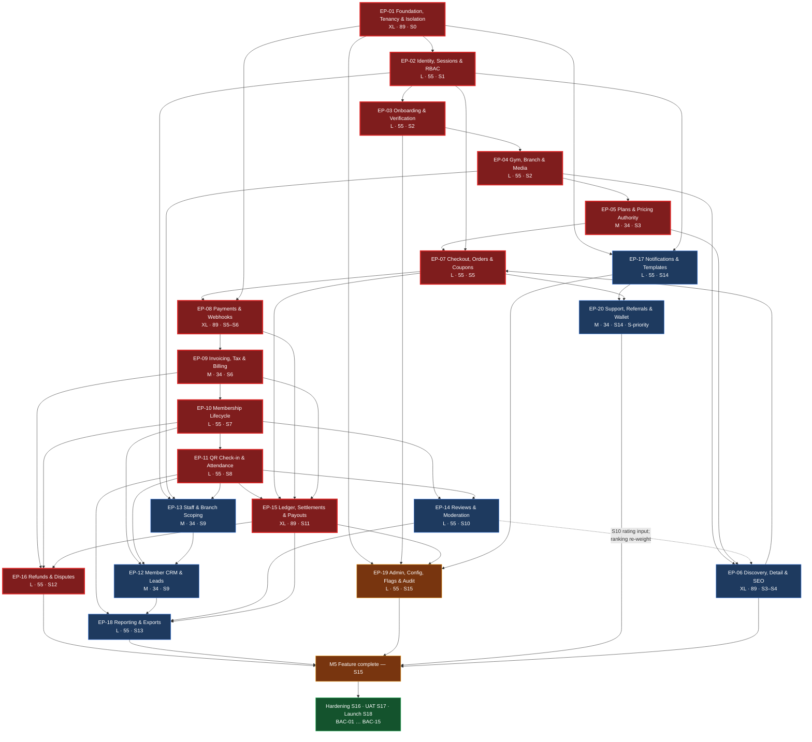

# Delivery Backlog — Index

**Gym Marketplace & Multi-Tenant Gym Management SaaS**

> **This directory is Phase 3 of the documentation programme** (`docs/README.md` directory map:
> *"`docs/backlog/` — Epics → features → user stories → technical tasks"*). It is the **detailed
> expansion** of `ENGINEERING_PLAN.md` §2 (Epic Breakdown) and §3 (Feature Breakdown), scheduled by
> `engineering/SprintPlanning.md`, and governed by `PROJECT_CONSTITUTION.md` §23.
>
> **Precedence.** `PROJECT_CONSTITUTION.md` → `MASTER_PRD.md` → `engineering/` design detail →
> **`backlog/`** → code. Where a document above this one speaks, it wins. A conflict **halts work**
> and is resolved in `DECISION_LOG.md`, never in a backlog file and never in code.
>
> **Launch market: India** (`LAUNCH_MARKET_INDIA.md`, 2026-08-06). INR / paise as `bigint`,
> `Asia/Kolkata` +05:30 with no DST, GST 18% as **CGST 9% + SGST 9%**, financial year **1 April –
> 31 March**, India-only data residency, **Razorpay Route** as the Phase-1 `PaymentProvider` adapter.
>
> **No application code exists.** Every estimate in this directory is a pre-implementation estimate.

| Field | Value |
| :--- | :--- |
| Document | `/docs/backlog/README.md` |
| Phase | 3 — Backlog |
| Epics | **20** (`EP-01` … `EP-20`) |
| Story points | **1,131** (sum of the twenty `ENGINEERING_PLAN.md` §2 rows — see §3.1 for the one-point discrepancy with the §2 stated roll-up of 1,130) |
| Programme estimate | **854 engineer-days P50** dev (`ENGINEERING_PLAN.md` §13.3), range **690 (P10) / 854 (P50) / 1,110 (P90)**; **1,230 engineer-days** all-role (`SprintPlanning.md` §23.1) |
| Sprints | **19** — Sprint 0 … Sprint 18, two weeks each, 2026-09-07 → 2027-05-28 |
| Launch | **M8**, declared **2027-06-14** after the §23.3 launch-window buffer |
| PRD coverage | 24 / 24 `B5` modules · 261 / 261 `FR-` · 95 `BR-` · 55 `SCR-` · 12 `E2E-` |
| Status | **Phase 0 planning artefact.** No epic started. `EP-01` is Ready for Sprint 0 |

---

## Table of contents

| § | Section |
| :-: | :--- |
| 1 | [Purpose, and how to use the backlog](#1-purpose-and-how-to-use-the-backlog) |
| 2 | [The epic index](#2-the-epic-index) |
| 3 | [Roll-up totals and reconciliation](#3-roll-up-totals-and-reconciliation) |
| 4 | [The estimation scale](#4-the-estimation-scale) |
| 5 | [Definition of Ready and Definition of Done](#5-definition-of-ready-and-definition-of-done) |
| 6 | [Prioritisation model](#6-prioritisation-model) |
| 7 | [The epic dependency graph](#7-the-epic-dependency-graph) |
| 8 | [Sprint-to-epic map](#8-sprint-to-epic-map) |
| 9 | [Coverage attestation](#9-coverage-attestation) |
| 10 | [The descope order](#10-the-descope-order) |
| 11 | [Open questions and blockers](#11-open-questions-and-blockers) |
| 12 | [How to add a new epic or story](#12-how-to-add-a-new-epic-or-story) |

---

## 1. Purpose, and how to use the backlog

### 1.1 What this directory is

The backlog is the **work view** of Phase 1. It answers a different question from every other
document in `/docs`:

| Document | Answers |
| :--- | :--- |
| `MASTER_PRD.md` | *What must the product do?* |
| `MASTER_PRD_CHECKLIST.md` | *Which of those requirements are done?* |
| `PROJECT_CONSTITUTION.md` | *How is anything allowed to be built?* |
| `engineering/*.md` | *How is it designed — schema, API, states, sequences, risk, tests?* |
| **`backlog/*.md`** | ***Who does what, in which order, at what cost, and when is it finished?*** |
| `PHASES.md` | *Where is the programme right now?* |

Each of the twenty epic files decomposes one epic into: business goal → scope → features (`F-NN.x`)
→ user stories with Given/When/Then acceptance criteria → epic-level acceptance criteria →
business rules enforced → dependencies → **technical tasks with engineer-day estimates** → a
role-level time roll-up → risks → Definition of Done → open questions → traceability.

### 1.2 The relationship to `MASTER_PRD_CHECKLIST.md`

These two documents are deliberately **not** the same list, and conflating them is the fastest way
to lose traceability.

| | `MASTER_PRD_CHECKLIST.md` | `backlog/` |
| :--- | :--- | :--- |
| **Unit** | One tickable **requirement** | One estimable **work item** |
| **Count** | **1,648** tickable items | 20 epics · ~320 features · ~600 technical tasks |
| **Ordering** | PRD document order — `A1` … `C13` | Dependency and sprint order — `EP-01` … `EP-20` |
| **Cardinality** | Exactly one row per PRD requirement, never grouped | Many-to-many: one task may satisfy several `FR-`; one `FR-` may need several tasks |
| **Tick meaning** | Implemented **and** tested **and** documented (the three-gate rule, §1.2 of that file) | Definition of Done, all 38 boxes (`PROJECT_CONSTITUTION.md` §23.2) |
| **Owner** | Product Manager | Delivery Manager |
| **Changes when** | The PRD changes (via `§C10`) | The plan changes (sprint planning, descope, re-estimate) |

**The rule that keeps them aligned:** *the checklist tracks requirements; the backlog tracks work.*
A backlog item is finished only when the requirements it cites can be ticked in the checklist, and
**no backlog item may exist that does not cite at least one PRD identifier** (§12). The checklist is
the auditable record of *what the client bought*; the backlog is the auditable record of *what the
team is doing about it*. They meet in the traceability table (§14) of every epic file.

### 1.3 How to use it, by role

| Role | Entry point | What you do with it |
| :--- | :--- | :--- |
| **Product Manager** | §2 epic index, then each epic's §5 User Stories | Refine stories to the 16 Ready criteria on the Wednesday of the preceding sprint |
| **Delivery Manager** | §3 roll-ups, §8 sprint map, §10 descope order | Track drawdown against the 86.4 ed contingency; take descope items **in order** |
| **Technical Lead** | Each epic's §8 Dependencies and §9 Technical Tasks | Confirm no cross-module repository access is implied; assign pair coverage on money and tenancy |
| **Backend / Frontend engineer** | Your epic's §9 task table, then §6 epic acceptance criteria | Every task cites the `FR-`/`BR-` it serves; the Conventional Commit carries that identifier |
| **QA** | Each epic's §6 Acceptance Criteria and §14 Traceability | Every `AC-` gets a test; every `M`-priority rule gets a **negative-case** test (`BAC-06`) |
| **Client sponsor** | §2, §6 prioritisation, §10 descope order, §11 blockers | Approve descope in advance; answer the `OQ-` on the sprint they are due |

### 1.4 Reading order for a new joiner, and file naming

`PROJECT_CONSTITUTION.md` §23 → `MASTER_PRD.md` §B5.x for **your** module in full →
`LAUNCH_MARKET_INDIA.md` in full (it overrides six PRD baselines) → this index §2 and §7 → your epic
file, all fourteen sections → `engineering/BusinessRules.md` for the `BR-` you own and
`engineering/RiskAnalysis.md` for the `TR-`/`RSK-` you inherit.

Files are `Epic_NN.md`, zero-padded, one per epic, matching the `EP-NN` id exactly. Every file ends
with `*End of Epic_NN.*` so that truncation is detectable by inspection.

---

## 2. The epic index

Twenty epics cover **100%** of the PRD: all 24 `B5` modules, all 261 `FR-` identifiers, the seven
`C4` state machines, the 24 `C5` background jobs, the 55 `SCR-` screens, and the cross-cutting
concerns of `§C1.4` (multi-tenancy) and `§C1.5` (cross-cutting mechanisms).

Priority is MoSCoW as the PRD defines it (`MASTER_PRD.md` "Priority scale"). Complexity is the
T-shirt from `ENGINEERING_PLAN.md` §2. Points are Fibonacci, calibrated so **1 point ≈ 0.5
engineer-day**.

| Epic | Name | Pri | Cx | Pts | Target sprint(s) | Owning modules | Upstream deps | Status |
| :--- | :--- | :-: | :-: | :-: | :--- | :--- | :--- | :--- |
| **EP-01** | Platform Foundation, Tenancy & Isolation | **M** | XL | 89 | **0** (F-01.13, F-01.15 spill to 1) | `common/`, `tenancy/`, `audit/` (writer), `packages/*`, `infra/` | — (pre-Sprint-0 gate) | Ready for Sprint 0, conditional on `BLK-01` |
| **EP-02** | Identity, Sessions & RBAC | **M** | L | 55 | 0 (scaffold) · **1** · 2 (carry-in) | `iam/` | EP-01 | Ready |
| **EP-03** | Tenant Onboarding & Verification | **M** | L | 55 | 1 (F-03.1–.2) · **2** | `onboarding/`, `admin/` (`FR-ADMN-06`, `FR-ADMN-11`) | EP-01, EP-02 | Ready |
| **EP-04** | Gym, Branch & Media Catalogue | **M** | L | 55 | **2** · 4 (F-04.12 carry-in) | `catalog/` | EP-01, EP-02, EP-03 | Ready for refinement |
| **EP-05** | Plan Catalogue & Pricing Authority | **M** | M | 34 | **3** | `plans/` | EP-01, EP-04 | Ready for refinement |
| **EP-06** | Marketplace Discovery, Detail & SEO | **M** | XL | 89 | **3** (search core) · **4** (detail, SEO, favourites) | `discovery/` | EP-04, EP-05 (`EP-14` ratings arrive S10 as a ranking input) | Ready for refinement |
| **EP-07** | Checkout, Orders & Coupons | **M** | L | 55 | **5** · 9 (offline carry) · 10 (coupons) | `ordering/` | EP-02, EP-05, EP-06 | `PLANNED` |
| **EP-08** | Payments, Webhooks & Reconciliation | **M** | XL | 89 | **5** (port, Razorpay) · **6** (webhooks) | `payments/` | EP-01, EP-07 | `PLANNED` · `BLK-03` #1 gate at S5 |
| **EP-09** | Invoicing, Tax & Subscription Billing | **M** | M | 34 | **6** · 13 (bulk export) · 15 (F-09.11 subscriptions) | `billing/` | EP-07, EP-08 | `PLANNED` · ⛔ `BLK-03` #2 / `REG-02` |
| **EP-10** | Membership Lifecycle | **M** | L | 55 | **7** (Christmas, −10%) | `memberships/` | EP-05, EP-08, EP-09 | `PLANNED` · D-05 pre-designated carry-out |
| **EP-11** | QR Check-in & Attendance | **M** | L | 55 | **8** (New Year, −10%) · 13 (D-09) | `attendance/` | EP-02, EP-04, EP-10 | `PLANNED` |
| **EP-12** | Member CRM, Segments & Leads | **M** | M | 34 | **9** | `crm/` | EP-10, EP-11, EP-13 | `PLANNED` · D-04 taken at S9 |
| **EP-13** | Staff, Roles & Branch Scoping | **M** | M | 34 | **9** | `staff/` | EP-02, EP-04, EP-11 (attribution) | `PLANNED` · D-03 taken at S9 |
| **EP-14** | Reviews, Ratings & Moderation | **M** | L | 55 | **10** (Republic Day, −5%) · 13 (analytics) | `reviews/` | EP-10, EP-11 | `PLANNED` |
| **EP-15** | Ledger, Settlements & Payouts | **M** | XL | 89 | **11** | `ledger/`, `settlements/` | EP-07, EP-08, EP-09 | `PLANNED` · ⛔ `BLK-03` #2 blocking |
| **EP-16** | Refunds, Disputes & Evidence | **M** | L | 55 | **12** | `refunds/` | EP-09, EP-10, EP-15 | `PLANNED` · inherits `REG-02` |
| **EP-17** | Notifications, Preferences & Templates | **M** | L | 55 | 0 (ports, DLT opened) · 2 · 8 (DLT submit) · 12 (vendor) · **14** (−10%) | `notifications/` | EP-01, EP-02 | `PLANNED` · `A-19` is the last open Tier-2 slot |
| **EP-18** | Reporting, Analytics & Exports | **M** | L | 55 | **13** | `reporting/` | EP-11, EP-12, EP-14, EP-15 | `PLANNED` |
| **EP-19** | Platform Administration, Config, Flags & Audit | **M** | L | 55 | **15** (M5 gate, −5%) | `admin/`, `audit/` (explorer) | EP-01, EP-03, EP-15, EP-17 | `PLANNED` |
| **EP-20** | Support, Help Centre, Referrals & Wallet | **S** | M | 34 | **14** (−10%) | `support/`, `referrals/` | EP-02, EP-07, EP-17 | `PLANNED` · **D-01 / D-02 first out** |

**Nineteen `M`, one `S`.** `EP-20` is the only non-`M` epic in the programme and is therefore the
first two entries of the descope order (§10).

### 2.1 Module ownership — sole, never shared

Every one of the 24 `B5` modules has **exactly one** owning epic, so that "who changes this table"
is never ambiguous. Collaboration is recorded in each epic's §3 Scope, never by co-ownership. The
full module → epic map with surfaces and priorities is the coverage attestation in **§9.1**; the
per-epic `FR-` counts are in **§9.2**.

**Three `ADMN` requirements are owned outside `EP-19` by design**, because the mechanism ships with
the epic that first needs it, not with the console that configures it:

| `FR-` | Owned by | Why |
| :--- | :--- | :--- |
| `FR-ADMN-06` KYC checklist configuration per country | **EP-03** | The India ten-document checklist is what onboarding validates against in Sprint 2; a Sprint-15 console cannot be a Sprint-2 dependency |
| `FR-ADMN-08` Feature flags with tenant / role / percentage targeting | **EP-01** | `NFR-MNT-07` requires every risky path flagged from Sprint 0; the flag **service** is foundation, the flag **admin UI** is EP-19 |
| `FR-ADMN-11` Verification queue, assignment, SLA monitoring | **EP-03** | `SCR-ADM-002` is the verification officer's queue and is the `E2E-01` exit gate in Sprint 2 |

---

## 3. Roll-up totals and reconciliation

### 3.1 Story points — and a one-point discrepancy stated rather than hidden

| Complexity | Points each | Epics | Count | Subtotal |
| :-: | :-: | :--- | :-: | :-: |
| **XL** | 89 | EP-01, EP-06, EP-08, EP-15 | 4 | **356** |
| **L** | 55 | EP-02, EP-03, EP-04, EP-07, EP-10, EP-11, EP-14, EP-16, EP-17, EP-18, EP-19 | 11 | **605** |
| **M** | 34 | EP-05, EP-09, EP-12, EP-13, EP-20 | 5 | **170** |
| | | **Total** | **20** | **1,131** |

> **Discrepancy, declared.** `ENGINEERING_PLAN.md` §2 states the epic roll-up as **1,130 points**,
> and its §9 sprint-capacity table also lands on a cumulative 1,130. **The arithmetic sum of the
> twenty §2 rows is 1,131.** The difference arises because §9 books `EP-19` at **50** points in
> Sprint 15 while §2 sizes it at **55**. Nothing is adjusted here: this index reports **1,131** as
> the sum of the epic rows and notes that the plan's own two totals disagree by one point.
> **Materiality: none** — one point is 0.5 engineer-day, well inside the estimation noise of a
> Fibonacci scale whose adjacent values differ by 34. It is recorded because an unexplained
> one-point drift is how a hundred-point drift starts. Raise as a `§C10` **Clarification** at the
> first backlog refinement; correct `ENGINEERING_PLAN.md` §2 or §9, not this file.

### 3.2 Engineer-days by role

Two independent views exist and they measure different things. Both are reproduced; neither is
silently reconciled into the other.

**View A — `ENGINEERING_PLAN.md` §13.3, the *estimate*.** Build effort derived as `points × 0.5`,
covering implementation + test + review, excluding design and UAT. It counts **development only**.

| Category | Points | Engineer-days |
| :--- | :-: | :-: |
| Backend — 23 modules (§13.1) | 1,180 | 590 |
| Frontend — 3 surfaces + `packages/ui` (§13.2) | 267 | 134 |
| **Sub-total, build** | **1,447** | **724** |
| Hardening (Sprint 16) — performance, a11y, security remediation | 110 | 55 |
| UAT support and defect resolution (Sprint 17) | 90 | 45 |
| Launch, cutover and hypercare (Sprint 18) | 60 | 30 |
| **Total (P50)** | **1,707** | **854** |

**View B — `SprintPlanning.md` §22–§23.1, the *schedule*.** Demand summed from the nineteen sprint
task tables, across **all five build pools**, net of descope items already taken.

| Role / pool | Engineer-days | Available over 19 sprints | Load | Source |
| :--- | :-: | :-: | :-: | :--- |
| **Backend** (3 BE + 0.5 TL) | **480.5** | ~453 holiday-adjusted | **106%** | §22 |
| **Frontend — total** (1 web + 2 dash) | **321.5** | ~388 holiday-adjusted | **83%** | §22 |
| ├ FE-web (`apps/customer-web`) | ~107.2 | ~129 | 83% | Derived, 1:2 pool ratio |
| └ FE-dash (`gym-dashboard` + `admin-dashboard`) | ~214.3 | ~259 | 83% | Derived, 1:2 pool ratio |
| **QA** (2, from Sprint 2) | **250.0** | 238 (17 sprints) | **105%** | §22 |
| **DevOps** (0.5 FTE) | **88.0** | 66.5 | **132%** | §22 |
| **Design** (1, part from Sprint 13) | **90.0** | 112 | 80% | §22 |
| **Programme total** | **1,230.0** | — | — | §23.1 |

> The FE-web / FE-dash split is **derived**, not sourced: `SprintPlanning.md` models one frontend
> pool of 1 web + 2 dashboard engineers, so the 1:2 headcount ratio is applied to the 321.5 ed
> demand. Individual epics give the true split in their §10 roll-ups; use those for a single epic
> and this only for a programme-level sanity check.

### 3.3 Reconciling View A against View B

| Step | Engineer-days | Note |
| :--- | :-: | :--- |
| View A total (P50, dev only) | **854.0** | The figure this backlog adopts as authoritative |
| View B dev only (480.5 BE + 321.5 FE) | **802.0** | |
| **Gap** | **−52.0** | View B is 6.1% lower |

The gap is explained, not averaged away:

| # | Cause | ed |
| :-: | :--- | :-: |
| 1 | **Five descope items are already taken in View B.** `D-02` (5.0), `D-03` (1.5), `D-04` (2.0), `D-05` (2.0), `D-10` (1.5) are removed from the sprint task tables; View A estimates the **full** scope | **−12.0** |
| 2 | **Pool reassignment.** Work View A counts as build — test authoring, runbooks, IaC, migration rehearsal, seed maintenance — is booked in View B against the **QA (250 ed)** and **DevOps (88 ed)** pools, which View A does not model at all | **≈ −25** |
| 3 | **Sprints 16–18 are reserves, not demand.** View A books 130 ed for hardening + UAT + launch; View B books the *known* work and deliberately holds 8.5 / 17.5 / 27.5 ed as pen-test, defect and hypercare reserve (§23.3), which appears as headroom rather than demand | **≈ −15** |
| | Residual, unexplained | ≈ 0 |

**Ruling.** This backlog uses **854 engineer-days P50** as the programme estimate and
**690 / 854 / 1,110** as the P10 / P50 / P90 range. The all-role figure of **1,230 ed** is quoted
whenever QA, DevOps or Design capacity is under discussion — for example in §23.1's honest caveat
that the 86.4 ed contingency pool is 10% of the dev baseline but only **7.0%** of the full
programme. Neither figure is wrong; using the wrong one for the wrong question is.

### 3.4 The confidence range

| Scenario | Engineer-days | P | Drivers |
| :--- | :-: | :-: | :--- |
| Optimistic | **690** | P10 | `OQ-01` answered at Sprint 0 (**it is** — India, 2026-08-06); no penetration-test criticals; Razorpay sandbox behaves; no vendor delay on `A-19` |
| **Expected** | **854** | **P50** | The plan as written |
| Pessimistic | **1,110** | P90 | A second payment adapter required; pen-test criticals in `payments/` or `tenancy/`; polling load forces early Socket.IO work (`A-08`); search misses `NFR-PERF-01` and needs a read-model rebuild; `BLK-03` #3 (GST TCS/TDS) turns out to apply |

**The P90 case exceeds capacity by ~245 engineer-days — about four sprints.** The stated response is
**scope, not heroics**: the descope order in §10 recovers ~90 engineer-days before any `M`-priority
item is touched. Beyond that it is a `§C10` **re-baselining conversation**, not a delivery decision.

### 3.5 Capacity check

The `§C9.3` team is 3 backend + 3 frontend + a Technical Lead at ~50% build = **6.5 FTE**. Over 19
sprints × 10 working days that is `6.5 × 190 =` **1,235 nominal engineer-days**; at a **70% focus
factor** (ceremony, review, support, interruption) it is **~865 effective engineer-days** against a
P50 estimate of **854**. `SprintPlanning.md` §2.1 reaches **864.5** from the same inputs — the two
documents do not invent different capacity bases.

**Headroom: 11 engineer-days, or 1.3%.** Eleven engineer-days across nineteen sprints is not a plan
with slack in it. It is a
plan that **depends on the descope order and the 86.4 ed contingency pool being real instruments**,
which is why both are agreed in §10 and §11 before the first line of code.

---

## 4. The estimation scale

### 4.1 Points, days and T-shirts

Story points are **Fibonacci**, calibrated so that **1 point ≈ 0.5 engineer-day** for the `§C9.3`
team shape. An engineer-day is *implementation plus test plus review*, and excludes design and UAT.

| T-shirt | Points | Engineer-days | Meaning | Example |
| :-: | :-: | :-: | :--- | :--- |
| **XS** | 1 – 5 | 0.5 – 2.5 | One entity, one endpoint, no cross-module effect, no new state | A reference-data read endpoint (`GET /amenities`) |
| **S** | 8 – 13 | 4 – 6.5 | A small feature with its own validation and one screen state | `FR-FAV-01` favourite / unfavourite with optimistic UI |
| **M** | 21 – 34 | 10.5 – 17 | Several entities, real business rules, one integration | **EP-05** plan catalogue · **EP-12** CRM · **EP-13** staff |
| **L** | 55 | 27.5 – 28 | A state machine **or** money, several collaborators, non-trivial concurrency | **EP-10** membership lifecycle · **EP-11** check-in |
| **XL** | 89 | 44.5 – 45 | Money **and** concurrency **and** an external system, with a launch-blocking `BAC-` | **EP-08** payments · **EP-15** settlements |
| **>XL** | 144+ | 72+ | **Not permitted.** Must be split | — |

### 4.2 The Fibonacci ladder, and what each step buys

`1 · 2 · 3 · 5 · 8 · 13 · 21 · 34 · 55 · 89` — and then it stops.

| Points | Reads as |
| :-: | :--- |
| 1 | Trivial. A config value, a copy change, a single validation rule |
| 2 | Understood completely; no unknowns |
| 3 | Understood; one small unknown |
| 5 | A day's work with a test suite |
| 8 | Two or three days; touches two layers |
| 13 | A week; touches three layers or introduces a new table |
| 21 | Two weeks of one engineer; a small subsystem |
| 34 | A module of moderate complexity (`plans/`, `crm/`, `staff/`, `audit/`) |
| 55 | A module rated **High** (`iam/`, `billing/`, `memberships/`, `reviews/`, `reporting/`) |
| 89 | A module rated **Very High** or **Extreme** (`discovery/`, `ordering/`, `payments/`, `settlements/`) |

**Never use 21 and 34 interchangeably to avoid a conversation.** The gap between them is 6.5
engineer-days — most of a sprint week. If the estimate genuinely sits between the two, the item is
not refined enough and fails Definition of Ready criterion 1.

### 4.3 The split rule

> **Anything above XL must be split.** There is no `XXL`. An item estimated at 144 points is not an
> item; it is an unrefined epic wearing a story's clothes.

Three independent splitting obligations, all binding:

| # | Rule | Source | Consequence |
| :-: | :--- | :--- | :--- |
| 1 | **No epic above 89 points.** If decomposition produces more, split it into two epics with a named seam | `ENGINEERING_PLAN.md` §2 | `EP-01` is at the ceiling and is itself two `§13.1` modules (`common/` 55 + `tenancy/` 34) |
| 2 | **No feature above 21 points.** A feature larger than that is two features | This index | Applied when building each epic's §4 feature table |
| 3 | **No task above 3.0 engineer-days.** A branch may not live longer than **2 days** (`§20.1 G2`), and 3.0 ed of task is about 2 days of branch after review latency | `PROJECT_CONSTITUTION.md` §23.1 item 15 | Split at refinement, *before* estimation is accepted. The sprint task estimates are **task** estimates, not branch estimates |

### 4.4 What is not in an estimate

Four exclusions, named because they are what teams re-discover in Sprint 12: **product design**
(the 90 ed Design pool) · **UAT execution by the client's people** (Sprint 17, 45 ed) ·
**infrastructure, IaC, replicas, cutover** (the 88 ed DevOps pool) · **ceremony, review,
interruption and support** (the 70% focus factor, not the estimate). Everything else *is* in the
estimate — isolation tests, negative-case tests, migrations, runbooks and documentation included —
because `PROJECT_CONSTITUTION.md` §23.2 makes all of them Definition of Done, and an estimate that
excludes the Definition of Done is not an estimate.

---

## 5. Definition of Ready and Definition of Done

> **`PROJECT_CONSTITUTION.md` §23 is the sole authority.** §23.1 holds **16 Ready criteria**; §23.2
> holds **38 Done criteria** across Code, Tests, Documentation, Operability and Process. They are
> immutable in ordinary work (§24.1) and change **only** by numbered amendment. Nothing in this
> directory may define, relax, extend or "adapt for this epic" either list. What follows is a
> **restatement for convenience**. If it disagrees with the constitution, the constitution wins and
> this section is defective.

### 5.1 Definition of Ready — the 16 boxes (`§23.1`)

A work item may not be started until every box is ticked.

| # | Ready criterion |
| :-: | :--- |
| 1 | Cites the PRD identifiers it delivers — `OBJ-` `KPI-` `BR-` `FR-` `NFR-` `US-` `AC-` `SCR-` `API-` `BAC-` `E2E-` — and each **actually exists** in `MASTER_PRD.md` |
| 2 | Acceptance criteria are in **Given/When/Then** form and testable as written |
| 3 | **Negative cases enumerated**, not implied, for every `M`-priority rule involved (`BAC-06`) |
| 4 | Affected modules named; module boundaries hold — no cross-module repository access implied (§3.4) |
| 5 | API contract specified in `/docs/apis/` — endpoint, permission, validation, request, response, error codes, idempotency, rate-limit tier — **or** the item explicitly includes designing it |
| 6 | Data-model change specified in `/docs/database/` — tables, columns, indexes, constraints, RLS, retention — **or** the item explicitly includes designing it |
| 7 | UI states specified in `/docs/ui/` for every affected `SCR-`: loading, empty, error, permission-denied, plus domain-specific states (§16.9) |
| 8 | Every configurable value identified and its default stated; **no `OQ-` default is hardcoded** |
| 9 | Dependencies on other items named, and either done or scheduled earlier |
| 10 | No blocking `OQ-` unanswered, **or** the documented default is explicitly adopted and recorded |
| 11 | The **Ten Questions** (§2) have preliminary answers; any anticipated "no" flagged now |
| 12 | No new technology required, **or** an approved `A-NN` row already exists (§22) |
| 13 | Observability specified: what will be logged, measured, traced and alerted (§18) |
| 14 | The applicable performance budget is named, if any (§19) |
| 15 | Small enough for a branch living **≤ 2 days** (§20.1 G2). If not, **it is split** |
| 16 | Rollback approach known: which feature flag gates it, or why none is needed |

**Where the backlog satisfies Ready on the epic's behalf.** Several epics (notably `EP-04`, `EP-05`,
`EP-06`) carry a first task that *is* the API / schema / UI-state design — that is criterion 5, 6
and 7 being satisfied by the escape clause "*or the item explicitly includes designing it*", and it
is recorded as such in each epic's §1 Metadata **Status** row. It is not a waiver.

### 5.2 Definition of Done — the 38 boxes (`§23.2`), grouped

| Group | Boxes | The ones this backlog most often has to argue for |
| :--- | :-: | :--- |
| **Code** | 1 – 12 | 6 — money as integer minor units, the **nine** persisted `A6.3` figures (eight in the PRD, plus `commission_tax_minor` for India) never recomputed at display · 7 — UTC storage, explicit IANA timezone on every business-date computation · 8 — server-derived tenant context, no repository touches the raw Prisma client, RLS on every new tenant-owned table |
| **Tests** | 13 – 21 | **16 — an isolation test for every new tenant-scoped endpoint; the build fails without it** (`BAC-10`, `E2E-11`) · **17 — a negative-case test for every `M`-priority business rule touched** (`BAC-06`) · 20 — axe-core clean, keyboard path verified on `customer-web` and the check-in desk |
| **Documentation** | 22 – 28 | 25 — the five living documents (`DECISION_LOG` · `TECH_DEBT` · `KNOWN_LIMITATIONS` · `FEATURE_FLAGS` · `STACK_ADDITIONS`) updated **in the same change** · 28 — `PHASES.md` ticked in the same change (Cross-Phase Rule 4) |
| **Operability** | 29 – 33 | 30 — an alert exists if the behaviour can fail silently · 33 — migration forward-only, backward-compatible, applied and verified against the seeded database |
| **Process** | 34 – 38 | 35 — **two approvals** for money, tenancy, IAM and migration paths · 36 — the full pipeline green including architecture, isolation, OpenAPI drift, permission-declaration, a11y and migration gates |

### 5.3 The sprint- and milestone-level wrapper (`SprintPlanning.md` §25)

The constitution defines Ready and Done for a **work item**. The plan adds only the levels above it.

| Level | Ready when | Done when |
| :--- | :--- | :--- |
| **Work item** | All 16 boxes of §23.1, at refinement on the Wednesday of the preceding sprint | All 38 boxes of §23.2 |
| **Epic** | Every feature in its §4 table is Ready | Every numbered criterion in its §6 passes, **and** its §12 epic-specific DoD checklist is clean |
| **Sprint** | Every committed item is Ready; the capacity verdict is recorded; the demo script is written **before** the sprint | Every exit-checklist item ticked or **explicitly failed with an owner and a date**; the demo ran on `staging` against the deterministic seed; **no item is "carried at 80%"** — unfinished items return to the backlog and are re-estimated |
| **Milestone** | Entry criteria in `ENGINEERING_PLAN.md` §10 met | Every evidence artefact exists and is linked from `PHASES.md` |

**"Done except the tests" is not done. "Done, the docs are next" is not done.** There is no partial
state and no epic-specific variant.

---

## 6. Prioritisation model

### 6.1 MoSCoW, as the PRD defines it

| Code | Meaning | Contract implication | Backlog treatment |
| :-: | :--- | :--- | :--- |
| **M** | Must have | Phase 1 scope. **Absence blocks launch** | Scheduled in sprints 0–15. Never descoped without a `§C10` **Major** change |
| **S** | Should have | Phase 1 scope if capacity allows; **first candidate** to move to Phase 2 | Scheduled, but every `S` item is a named descope candidate in §10 |
| **C** | Could have | Phase 2. Documented now to prevent architectural dead ends | Built only if a sprint under-runs; the **data model must still accommodate it** |
| **W** | Won't have (this time) | Explicitly out of scope | Listed in `MASTER_PRD.md` §A4.2 to prevent scope creep. Not in this backlog at all |

There are **no `W`-priority functional requirements** in the 261: the distribution is **182 M · 67 S
· 12 C**. `W` items live in §A4.2 and §A11 (Future Scope) and were never given `FR-` identifiers.

### 6.2 The launch-blocking set

Launch is `BAC-01` … `BAC-15` being demonstrably true **in production** (`MASTER_PRD.md` §A12).
The launch-blocking set is therefore:

> **All `M`-priority requirements** + **`BAC-01` … `BAC-15`.**

`MASTER_PRD_CHECKLIST.md` sizes this at **286 items** — 271 `M`-priority tickable rows across
`FR-`, `BR-` and `NFR-`, plus the 15 `BAC-`. Measured on functional requirements alone the figure is
**182 `M`-priority `FR-`**; the two counts differ because the checklist decomposes `BR-` and `NFR-`
into tickable rows as well. Both are correct for their denominator; quote the denominator.

| `BAC-` | Criterion, abbreviated | Proven by |
| :--- | :--- | :--- |
| **BAC-01** | Owner completes signup → KYC → gym → plan → "submitted" unaided **in one session** | EP-02, EP-03, EP-04, EP-05 · `E2E-01` · `UAT-01` |
| **BAC-02** | Review / approve / reject with structured reasons; marketplace visibility **within 60 s** | EP-03, EP-06 · `E2E-01` |
| **BAC-03** | Consumer finds → filters → compares → sees real prices → purchases end to end | EP-06, EP-07, EP-08 · `E2E-02` |
| **BAC-04** | Capture activates membership, issues a compliant invoice, provisions a QR — **no manual step** | EP-08, EP-09, EP-10, EP-11 · `E2E-02`, `E2E-06` |
| **BAC-05** | QR check-in appears in member history **and** gym attendance report immediately | EP-11 · `E2E-03`, `E2E-04` |
| **BAC-06** | Every `A8` rule has a passing test; **every `M` rule also proves the negative case** | All epics · `§23.2` box 17 |
| **BAC-07** | A settlement run over mixed online / offline / coupon / refund reconciles to **zero variance** | EP-15 · `E2E-12` · `KPI-26` |
| **BAC-08** | Refund: request → approval → gateway → credit note → ledger reversal → reduced next payout | EP-16 · `E2E-07` |
| **BAC-09** | **Only** a member with a recorded check-in can publish a review — negative case attempted | EP-14 · `E2E-09` |
| **BAC-10** | Automated isolation suite proves tenant A cannot read or write tenant B **through any endpoint** | EP-01 · `E2E-11` |
| **BAC-11** | `NFR-PERF-01` … `NFR-PERF-05` met under the specified load profile | EP-06, EP-11 · Sprint 16 |
| **BAC-12** | A tenant exports members, memberships, payments and attendance **without support** | EP-18 · `BR-DAT-05` |
| **BAC-13** | Audit logs exist for every `A8.10` rule, queryable by entity **and** by actor | EP-01, EP-19 |
| **BAC-14** | All `M`-priority `FR-` delivered; **no open S1 or S2 `M`-priority defect** | All epics · Sprint 17 |
| **BAC-15** | UAT sign-off recorded from the client sponsor against the `§C8.4` scripts | Sprint 17 · `M7` |

### 6.3 The five invariants that outrank MoSCoW

Below `M` there is a shorter list that priority cannot touch at all. These are not "very important
Musts" — they are properties the system either has structurally or does not have.

| # | Invariant | Rule | Owning epic |
| :-: | :--- | :--- | :--- |
| **I1** | A tenant can never read or write another tenant's row, through any code path | `BR-TEN-01`, `NFR-SEC-09`, `BAC-10` | **EP-01** |
| **I2** | Money is an append-only ledger of integer minor units; balances are derived, never stored mutable | `BR-PAY-01`, `BR-FIN-01`, `BR-FIN-02` | **EP-15** |
| **I3** | The price displayed is the price charged; the server re-validates as a state-machine **guard** | `BR-PLN-03`, `AC-PLAN-02.2` | **EP-05**, **EP-07** |
| **I4** | Listings and reviews are trustworthy: human-only gym approval, check-in-gated reviews | `BR-GYM-03`, `BR-REV-01`, `BAC-09` | **EP-03**, **EP-14** |
| **I5** | A membership activates on a **webhook**, never on a client redirect | `BR-PAY-02` | **EP-08** |

§10.1 lists what may never be descoped. Every entry on that list traces to one of these five.

### 6.4 Ordering rule within a sprint

When a sprint is over capacity, items are dropped in this order — and only in this order:

1. `C`-priority items in the sprint (they are Phase 2 already).
2. `S`-priority items that appear in the §10 descope register, **taken by `D-` number, in order**.
3. `S`-priority items not in the register — requires the Delivery Manager to add them to the
   register first, with the "what is actually lost" column filled in.
4. **Stop.** Anything further is a `§C10` **Major** change requiring written client approval.

Never dropped, at any capacity: isolation tests, negative-case tests for `M` rules, accessibility
gates, audit immutability, idempotency on money endpoints (§10.1).

---

## 7. The epic dependency graph

### 7.1 The graph

Red = on the critical path (`ENGINEERING_PLAN.md` §14.4). Blue = carries float; may slip one sprint
without moving `M8`, provided it lands before Sprint 15. Amber = a **milestone gate** rather than a
dependency: `EP-19` is not on the dependency chain, but `M5` (feature complete) is, because Sprint
16 cannot harden a build that is still changing.

### 7.2 The critical path, stated

> `EP-01` → `EP-02` → `EP-03` → `EP-04` → `EP-05` → `EP-07` → `EP-08` → `EP-09` → `EP-10` →
> `EP-11` → `EP-15` → `EP-16` → hardening → UAT → launch

Twelve of the twenty epics. Two observations from `ENGINEERING_PLAN.md` §14.4 that this backlog
inherits verbatim:

1. **`EP-06` discovery is *not* on the critical path.** It can slip one sprint without moving
   launch, which is exactly why it sits in Sprints 3–4 alongside plans rather than blocking the
   transaction core. Its `NFR-PERF-01` gate must nonetheless be met **before Sprint 16**; deferring
   it into hardening is explicitly the worst available option.
2. **`EP-15` settlements cannot be pulled earlier.** `§C9.1` deliberately places it after a full
   sprint of real transaction data so reconciliation is tested against realistic ledger shapes.
   Parallelising it into Sprint 7 would produce a settlement engine validated only against synthetic
   data — precisely the failure mode `BAC-07` exists to prevent.

### 7.3 Where slippage hurts most

| Rank | Epic / sprint | Why one sprint of slip costs more than one sprint | Recovery |
| :-: | :--- | :--- | :--- |
| **1** | **EP-01 / Sprint 0** | All eighteen later sprints inherit the tenant extension, idempotency store, outbox, audit writer, `Money` type and job harness. The slip is **1:1 to launch and cannot be parallelised** — the tenancy tasks are one coherent design. A *partial* Sprint 0 (endpoint without isolation suite) creates a false green from which `BR-TEN-01` gets retrofitted, which is exactly what `TR-01` and `ADR-0006` exist to prevent | **None.** The only lever is cutting Sprint 0 to its exit condition and pushing `F-01.13`/`F-01.15` to Sprint 1 — already done |
| **2** | **EP-08 + EP-09 / Sprint 6** | Carries **two of the five invariants** (`I5` webhook activation, `I2` the money trail beginning at the invoice) and milestone `M3`. It gates Sprints 7, 8, 11 and 12 | Partial. Sprint 7 lifecycle work can run on stubbed activation for ~3 days; beyond that the slip propagates |
| **3** | **EP-15 / Sprint 11** | `BAC-07` is launch-blocking, `KPI-26` demands 100% reconciliation, and Sprint 12 immediately reverses its entries and draws on its reserve. A slip compresses the two hardest money sprints into one window with the same two engineers — the exact condition under which `TR-05` rounding divergence appears | Very little. The only lever is descoping `BR-REF-07` gym-closure and `FR-RFND-09` evidence automation in `EP-16`, neither comfortable |
| **4** | **Sprint 16 hardening** | Not third because it is less important — **not third because a slip there is visible immediately**. It has the least recovery time after it: penetration-test remediation has no buffer, and a critical finding in `payments/` or `tenancy/` consumes the launch-window buffer directly | The 2.5-week launch-window buffer (`SprintPlanning.md` §23.3) — and nothing else |

### 7.4 External dependencies that are not epics

Seven inputs sit outside the graph and can stop it. Each has a named owner and a deadline, not a
hope: the **Git repository** (`BLK-01`, Project Owner, **pre-Sprint-0 gate**) · a **Razorpay Route
merchant account and sandbox** (Client Sponsor, Sprint 5 planning) · **TRAI DLT header plus 16 SMS
template approvals** (Delivery Manager, programme opened Sprint 0, templates submitted Sprint 8) ·
**`A-19` email / SMS / push vendor selection** (Client Sponsor, Sprint 12, `TR-13` outer bound) · a
**qualified Indian tax advisor** (`BLK-04`, seven items, answers by Sprint 5, implementation by
Sprint 11) · **client brand, domain, legal copy, terms, privacy and refund policy** (`ASM-05`,
`OQ-17`, Sprint 14, or `UAT-03` cannot complete) · a **maps / geocoding provider account** (DevOps,
Sprint 2, for `EP-03` pre-checks, the `EP-04` pin and the `EP-06` map).

---

## 8. Sprint-to-epic map

Nineteen sprints of two weeks. Dates and milestones from `SprintPlanning.md` §2.3; points from
`ENGINEERING_PLAN.md` §9. Holiday deductions are already applied to the pool figures and must not be
double-counted.

| Sprint | Dates | Epics active | Pts | Exit condition | Milestone | Capacity note |
| :-: | :--- | :--- | :-: | :--- | :-: | :--- |
| **0** | 2026-09-07 → 09-18 | **EP-01** (all) · EP-02 (scaffold) · EP-17 (ports, DLT opened) | 95 | *A trivial tenant-scoped endpoint exists and the isolation suite proves it* | **M0** | Highest single-sprint load. Backend 155%, DevOps 257% |
| **1** | 09-21 → 10-02 | **EP-02** (bulk) · EP-03 (F-03.1, F-03.2) | 75 | Interim gate — the `C9.1` pair condition lands in Sprint 2 | — | Design at 143%; QA has not joined |
| **2** | 10-05 → 10-16 | **EP-03** (bulk) · **EP-04** · EP-02 (carry-in) · EP-17 (DLT header) | 75 | **`E2E-01` passes** | **M1** | QA joins. Design 143% |
| **3** | 10-19 → 10-30 | **EP-05** · **EP-06a** (search core) | 68 | Interim gate — the `NFR-PERF-01` gate lands in Sprint 4 | — | Frontend 124%. Read replicas provisioned (task 3.21) |
| **4** | 11-02 → 11-13 | **EP-06b** (detail, SEO, comparison, favourites) · EP-04 (F-04.12) | 55 | **Search meets `NFR-PERF-01`** — p95 ≤ 500 ms, p99 ≤ 1,000 ms at 2,000 req/min | **M2** | **Diwali −10%** |
| **5** | 11-16 → 11-27 | **EP-07** · **EP-08a** (port + Razorpay Route) | 89 | Interim gate — `E2E-02` lands in Sprint 6 | — | Backend 139%. **`BLK-03` #1/#2/#3 gate** |
| **6** | 11-30 → 12-11 | **EP-08b** (webhooks, activation) · **EP-09** (GST invoice, FY April) | 89 | **`E2E-02` passes** | **M3** | Two backend engineers paired on money code (`RSK-14`) |
| **7** | 12-14 → 12-25 | **EP-10** | 55 | **`E2E-05` passes** | — | **Christmas −10%.** `F-10.11` transfer = **D-05**, pre-designated carry-out |
| **8** | 12-28 → 01-08 | **EP-11** · EP-17 (16 DLT templates submitted) | 55 | **`E2E-03` + `E2E-04` pass; `NFR-PERF-03` met** (scan → confirmation p95 ≤ 2 s) | **M4** | **New Year −10%.** `A-08` polling starts here |
| **9** | 01-11 → 01-22 | **EP-12** · **EP-13** · EP-07 (offline sales carry) | 68 | **`E2E-10` passes** | — | Backend 129%. **D-03 and D-04 taken** |
| **10** | 01-25 → 02-05 | **EP-14** · EP-07 (coupon remainder) | 68 | **`E2E-09` passes** | — | **Republic Day −5%** |
| **11** | 02-08 → 02-19 | **EP-15** | 89 | **`E2E-12` passes with zero variance** | — | Pair coverage mandatory. **`commission_tax_minor` ships here** |
| **12** | 02-22 → 03-05 | **EP-16** · EP-17 (vendor contracted, `A-19` closed) | 55 | **`E2E-07` + `E2E-08` pass** | — | Follows S11 immediately — the compression risk in §7.3 |
| **13** | 03-08 → 03-19 | **EP-18** · EP-09 (bulk export) · EP-11 (D-09 heatmap) · EP-14 (review analytics) | 55 | **Report catalogue complete** — 16 tenant + 10 platform reports | — | DevOps 143%. **D-10 taken** |
| **14** | 03-22 → 04-02 | **EP-17** (full build) · **EP-20** | 89 | **Notification catalogue delivered** — 24 baseline events × 4 channels | — | **Holi + Good Friday −10%.** **D-02 taken.** Contains 1 April, the FY boundary |
| **15** | 04-05 → 04-16 | **EP-19** · EP-09 (F-09.11 subscription billing) | 50 | **Admin console complete** — `SCR-ADM-001` … `SCR-ADM-015` | **M5** | **Ambedkar Jayanti −5%.** M5 declared: no feature capacity after this |
| **16** | 04-19 → 04-30 | Cross-cutting — **no new features** | 0 | **All NFR targets met** — `NFR-PERF-*`, `NFR-USE-*`, `NFR-SEC-*` | **M6** | QA 143%, DevOps 229%. Pen-test remediation reserve 8.5 ed |
| **17** | 05-03 → 05-14 | Defect burn-down only | 0 | **UAT exit** — `UAT-01` … `UAT-06`, zero S1/S2 open, all S3 triaged, sign-off recorded | **M7** | QA 157%. Defect reserve 17.5 ed. **`§C10` freeze in force** |
| **18** | 05-17 → 05-28 | Operational readiness | 0 | **`BAC-01` … `BAC-15` satisfied** | **M8** | Hypercare reserve 27.5 ed. Launch declared **2027-06-14** after the buffer |

**Cumulative points:** 95 · 170 · 245 · 313 · 368 · 457 · 546 · 601 · 656 · 724 · 792 · 881 · 936 ·
991 · 1,080 · 1,130 — then flat. The plan books **no new feature points after Sprint 15**, and
filling the Sprints 16–18 reserves with features is the single most common way a launch sprint
fails.

### 8.1 Epics spanning more than one sprint

Nine epics are not contained in a single sprint. Each split has a **named seam**, not a spillover:
`EP-01` (S0, minus tracing and percentage targeting deferred to S1) · `EP-02` (S0 scaffold → S1 bulk
→ S2 carry-in of `F-02.12` and `F-02.17`) · `EP-03` (S1 wizard shell → S2 KYC and review) · `EP-04`
(S2, with `F-04.12` freshness moving to S4 because it feeds `EP-06` ranking) · `EP-06` (S3 search
core → S4 ranking, SEO, detail, the `NFR-PERF-01` gate) · `EP-07` (S5 orders → S9 offline sale →
S10 coupons) · `EP-08` (S5 port + Razorpay adapter → S6 webhooks and activation) · `EP-09` (S6
invoice and GST → S13 bulk export → S15 subscription billing) · `EP-17` (four calendar-driven
touchpoints at S0, S2, S8 and S12 ahead of the S14 build, because **TRAI DLT approval is calendar
time and cannot be compressed by effort**).

---

## 9. Coverage attestation

This section exists so that "did we cover everything?" is answerable by counting, not by assertion.

### 9.1 Module coverage — 24 of 24 claimed

Every one of the PRD's 24 `B5` functional modules is claimed by **exactly one** owning epic. No
module is unclaimed; no module has two owners.

| # | Module | Code | Surfaces (`B1.3`) | Pri | Owning epic | Claimed |
| :-: | :--- | :--- | :--- | :-: | :--- | :-: |
| 1 | Authentication & Identity | `AUTH` | web, dash, admin | M | EP-02 | ✅ |
| 2 | User Profile & Account | `USER` | web, dash | M | EP-02 | ✅ |
| 3 | Tenant Onboarding & KYC | `ONB` | dash, admin | M | EP-03 | ✅ |
| 4 | Gym & Branch Management | `GYM` | dash, admin | M | EP-04 | ✅ |
| 5 | Membership Plan Catalogue | `PLAN` | dash, web | M | EP-05 | ✅ |
| 6 | Marketplace Search & Discovery | `SRCH` | web | M | EP-06 | ✅ |
| 7 | Gym Detail & Comparison | `DETL` | web | M | EP-06 | ✅ |
| 8 | Favourites & Saved Searches | `FAV` | web | S | EP-06 | ✅ |
| 9 | Checkout & Orders | `CART` | web, dash | M | EP-07 | ✅ |
| 10 | Payments & Gateway | `PAY` | web, dash, admin | M | EP-08 | ✅ |
| 11 | Invoicing & Tax | `INV` | web, dash, admin | M | EP-09 | ✅ |
| 12 | Membership Lifecycle | `MEMB` | web, dash | M | EP-10 | ✅ |
| 13 | QR Check-in & Attendance | `CHK` | web, dash | M | EP-11 | ✅ |
| 14 | Member CRM | `CRM` | dash | M | EP-12 | ✅ |
| 15 | Staff, Roles & Permissions | `STAF` | dash, admin | M | EP-13 | ✅ |
| 16 | Reviews & Ratings | `REV` | web, dash, admin | M | EP-14 | ✅ |
| 17 | Coupons & Promotions | `CPN` | dash, admin | S | EP-07 | ✅ |
| 18 | Referrals & Wallet | `REFR` | web, dash | S / C | EP-20 | ✅ |
| 19 | Notifications | `NOTF` | all | M | EP-17 | ✅ |
| 20 | Reports & Analytics | `RPT` | dash, admin | M | EP-18 | ✅ |
| 21 | Settlements & Payouts | `SETL` | dash, admin | M | EP-15 | ✅ |
| 22 | Refunds & Disputes | `RFND` | web, dash, admin | M | EP-16 | ✅ |
| 23 | Support & Ticketing | `SUP` | web, dash, admin | S | EP-20 | ✅ |
| 24 | Platform Administration & Audit | `ADMN` | admin | M | EP-19 (+ EP-01, EP-03 for 3 `FR-`) | ✅ |

**Count: 24 claimed / 24 total = 100%.**

Two `FR-` families are **not** `B5` modules and would fall through a module-only attestation:
`FR-RBAC-01` … `FR-RBAC-07` (`B3.3` permission requirements, 7) and `FR-NAV-01` … `FR-NAV-06`
(`B4.4` navigation rules, 6). Both are claimed by **EP-02**. `EP-01` claims no `B5` module at all —
it is cross-cutting by construction, covering `§C1.3`, `§C1.4` and `§C1.5`.

### 9.2 Functional-requirement coverage — 261 of 261, 182 of 182 `M`

| Epic | `FR-` claimed | of which `M` | Families |
| :--- | :-: | :-: | :--- |
| EP-01 | 1 | 1 | `ADMN` (`FR-ADMN-08` only) |
| EP-02 | 35 | 27 | `AUTH` 14 · `USER` 8 · `RBAC` 7 · `NAV` 6 |
| EP-03 | 17 | 15 | `ONB` 15 · `ADMN` 2 (`-06`, `-11`) |
| EP-04 | 12 | 9 | `GYM` |
| EP-05 | 9 | 3 | `PLAN` |
| EP-06 | 31 | 18 | `SRCH` 15 · `DETL` 11 · `FAV` 5 |
| EP-07 | 19 | 15 | `CART` 11 · `CPN` 8 |
| EP-08 | 12 | 11 | `PAY` |
| EP-09 | 11 | 10 | `INV` |
| EP-10 | 12 | 7 | `MEMB` |
| EP-11 | 14 | 9 | `CHK` |
| EP-12 | 10 | 5 | `CRM` |
| EP-13 | 9 | 7 | `STAF` |
| EP-14 | 11 | 9 | `REV` |
| EP-15 | 10 | 10 | `SETL` — **every `SETL` requirement is `M`** |
| EP-16 | 11 | 10 | `RFND` |
| EP-17 | 8 | 5 | `NOTF` |
| EP-18 | 5 | 2 | `RPT` |
| EP-19 | 10 | 9 | `ADMN` (13 − 3 owned elsewhere) |
| EP-20 | 14 | 0 | `SUP` 7 · `REFR` 7 — **no `M` requirement in the whole epic** |
| **Total** | **261** | **182** | 26 families |

**Attestation.** Every one of the **261** functional requirements is claimed by exactly one epic as
a **primary** assignment, and appears in that epic's §4 feature table with its `F-NN.x` id. Every
one of the **182** `M`-priority functional requirements is therefore claimed. The MoSCoW
distribution across all 261 is **182 M · 67 S · 12 C · 0 W**.

Independently derivable: `grep` the twenty-six `FR-` families in `MASTER_PRD.md` §B5, §B3.3 and
§B4.4 and sum the `Pri` column. The counts above were produced that way, not by hand.

### 9.3 Other identifier families

| Family | In the PRD | Claimed by an epic | Where the count comes from |
| :--- | :-: | :-: | :--- |
| `OBJ-` business objectives | 10 | 10 | Every epic §2 Business Goal cites at least one |
| `KPI-` success metrics | 26 | 26 | Every epic §14 Traceability |
| `BR-` business rules | 95 | 95 | Each epic §7, cross-referencing `engineering/BusinessRules.md` |
| `FR-` functional requirements | 261 | 261 | §9.2 above |
| `NFR-` non-functional | 68 | 68 | Distributed: `PERF` 10 · `SCAL` 6 · `AVL` 8 · `SEC` 13 · `PRV` 7 · `USE` 9 · `MNT` 9 · `DQ` 6 |
| `US-` user stories in the PRD | 39 | 39 | Each epic §5 restates every relevant `US-`, and adds new ones where the PRD implies a story it did not write |
| `SCR-` screens | 55 | 55 | `SCR-WEB-001…018` (18) · `SCR-DASH-001…022` (22) · `SCR-ADM-001…015` (15) |
| `E2E-` journeys | 12 | 12 | Sprint exit conditions; see §9.4 |
| `BAC-` business acceptance | 15 | 15 | §6.2 |
| `C4` state machines | 7 | 7 | EP-03 · EP-07 · EP-08 · EP-10 · EP-15 · EP-16 · EP-17 (DLT approval state, India addition) |
| `C5` background jobs | 24 | 24 | All run on the `EP-01` `F-01.17` BullMQ harness |

`BR-` families and their owning epics: `BR-TEN` 6 → EP-01 · `BR-GYM` 9 → EP-03/EP-04 · `BR-PLN` 7 →
EP-05 · `BR-PAY` 11 → EP-08 · `BR-MEM` 14 → EP-10 · `BR-CHK` 10 → EP-11 · `BR-REV` 7 → EP-14 ·
`BR-CPN` 5 → EP-07 · `BR-FIN` 8 → EP-15 · `BR-REF` 9 → EP-16 · `BR-DAT` 7 → EP-01/EP-19 ·
`BR-RFL` 1 and `BR-WAL` 1 → EP-20. **Total 95.**

### 9.4 `E2E-` journey to epic and sprint

| `E2E-` | Journey | Epics | Sprint gate |
| :--- | :--- | :--- | :-: |
| `E2E-01` | Owner signup → KYC → approval → live listing | EP-02, EP-03, EP-04 | **2** |
| `E2E-02` | Discovery → checkout → payment → activation → invoice | EP-06, EP-07, EP-08, EP-09 | **6** |
| `E2E-03` | Member QR check-in, happy path | EP-10, EP-11 | **8** |
| `E2E-04` | Check-in denial and staff override | EP-11 | **8** |
| `E2E-05` | Membership freeze, unfreeze, renewal, expiry | EP-10 | **7** |
| `E2E-06` | Payment capture → invoice → ledger | EP-08, EP-09, EP-15 | 6 / 11 |
| `E2E-07` | Refund request → approval → gateway → credit note → ledger | EP-16 | **12** |
| `E2E-08` | Duplicate payment auto-refund; chargeback with evidence pack | EP-08, EP-16 | **12** |
| `E2E-09` | Check-in-gated review → publish → moderate → aggregate | EP-14 | **10** |
| `E2E-10` | Branch-scoped staff, offline sale, balance collection, CSV import | EP-12, EP-13, EP-07 | **9** |
| `E2E-11` | **Cross-tenant isolation across every exposed endpoint** | EP-01 | **0**, re-run every sprint |
| `E2E-12` | Settlement cycle → statement → payout → reconciliation at zero variance | EP-15 | **11** |

### 9.5 What coverage does *not* claim

Five honest limits. **(1) Coverage is claim, not completion** — an `FR-` claimed by `EP-11` means
someone is accountable, and the checklist, not this table, records whether it is done.
**(2) `C`-priority requirements are claimed but may never be built** — twelve `C` items sit inside
`M` epics and five are descope entries `D-03` … `D-07`; claimed ≠ scheduled ≠ shipped.
**(3) `EP-20` claims 14 `FR-` and zero `M`** — it is claimed, scheduled in Sprint 14, and
simultaneously the first two items of the descope order. **(4) Three `ADMN` requirements have a
split personality** (§2.1): the mechanism ships early, the admin UI ships in `EP-19`; both halves
are claimed, neither twice. **(5) `W`-priority scope is not in this backlog at all** and must not be
added to it — it lives in `MASTER_PRD.md` §A4.2 and §A11.

---

## 10. The descope order

> Agreed **now**, before the first line of code, so that a capacity failure in Sprint 14 is a
> decision already taken rather than an argument under pressure. This section is a restatement of
> `SprintPlanning.md` §24, which is authoritative. Items are taken **strictly in order**.

### 10.1 The register

Taking an item requires the Delivery Manager to record it in `PHASES.md` **and**
`KNOWN_LIMITATIONS.md`. Taking any item below `D-12` requires a `§C10` **Major** change with written
client approval.

| # | Item | `FR-` / epic | MoSCoW | ed | Sprint | What is actually lost | Status |
| :-: | :--- | :--- | :-: | :-: | :-: | :--- | :--- |
| **D-01** | Help-centre articles beyond the ten most common issues; satisfaction rating | `FR-SUP-06` (partial), `FR-SUP-07` · **EP-20** | **S** | 1.5 | 14 | Self-service depth. `OBJ-10` is still met by the ten articles | Available |
| **D-02** | **Referrals and wallet in full** | `FR-REFR-01` … `-07`, `BR-RFL-01`, `BR-WAL-01`, `SCR-WEB-015` · **EP-20** | **S / C** | 5.0 | 14 | A growth loop, not a launch capability. Wallet-at-checkout is the only entanglement and it is additive | **TAKEN at S14** |
| **D-03** | Shift / duty roster with staff attendance | `FR-STAF-08` · **EP-13** | **C** | 1.5 | 9 | Rostering. Roles, scoping and activity logs unaffected | **TAKEN at S9** |
| **D-04** | Duplicate member merge with field-level resolution | `FR-CRM-09` · **EP-12** | **C** | 2.0 | 9 | Data-hygiene tooling. Duplicates stay visible and manually resolvable | **TAKEN at S9** |
| **D-05** | Membership transfer between members | `FR-MEMB-11`, `BR-MEM-08` · **EP-10** | **C** | 2.0 | 7 | A rare operation, handled by refund-and-repurchase | **TAKEN at S7** |
| **D-06** | Capacity declaration and crowd indicator | `FR-GYM-09` · **EP-04** | **C** | 1.5 | 2 | A discovery nicety. No check-in or membership dependency | Available |
| **D-07** | Plan add-ons with independent pricing | `FR-PLAN-09` · **EP-05** | **C** | 2.0 | 3 | Upsell at checkout. **Caution:** the order-line model must still support add-ons or reinstatement is expensive | Available |
| **D-08** | Saved searches with new-match alerts | `FR-SRCH-14`, `FR-FAV-05` · **EP-06** | **S** | 2.5 | 4 | A consumer retention loop. Favourites themselves remain | Available |
| **D-09** | Attendance peak heatmap and daily digest | `FR-CHK-13`, `FR-CHK-14` · **EP-11** | **S** | 2.5 | 8 → 13 | Owner insight. Raw attendance log and exports unaffected | Deferred to S13 |
| **D-10** | Scheduled email delivery of reports | `FR-RPT-04` · **EP-18** | **S** | 1.5 | 13 | Push reporting. Every report still exports on demand | **TAKEN at S13** |
| **D-11** | Bulk auto-generated single-use coupon codes + coupon performance report | `FR-CPN-05`, `FR-CPN-08` · **EP-07** | **S** | 3.0 | 10 | Campaign tooling. Single-code coupons unaffected | Available |
| **D-12** | Tier-gated tenant invoice branding | `FR-INV-11` · **EP-09** | **S** | 1.5 | 6 | A tier differentiator. Invoice **compliance** is unaffected | Available |
| | **Pool** | | | **26.5 ed remaining of 90.0** | | `ENGINEERING_PLAN.md` §13.3 sizes the full pre-agreed pool at ~180 points / 90 ed | |

**Five items are already taken in the plan as written** — `D-02`, `D-03`, `D-04`, `D-05`, `D-10`,
totalling **12.0 ed**. That is not pessimism; it is the plan being honest that Sprints 7, 9, 13 and
14 do not fit without them. The remaining pool is **26.5 ed of nominally available items** against a
P90 overshoot of ~245 ed — which is precisely why §3.4 says the P90 case is a re-baselining
conversation and not a descope exercise.

### 10.2 Consistency with MoSCoW

The register is ordered by **loss, not by size**, but it never violates MoSCoW:

| Band | `D-` items | MoSCoW | Rule |
| :--- | :--- | :-: | :--- |
| First out | `D-01`, `D-02` | `S` / `C` | The only `S`-priority **epic** (`EP-20`). No `M` requirement anywhere in it |
| Second | `D-03` … `D-07` | **`C`** | Phase 2 already, per the PRD. Removing them changes nothing the client bought for Phase 1 |
| Third | `D-08` … `D-12` | **`S`** | Phase 1 "if capacity allows". Each names its loss explicitly |
| Never | — | **`M`** | Requires a `§C10` **Major** change and re-baselining. `BAC-14` fails without every `M` `FR-` |

### 10.3 What may never be descoped

No amount of schedule pressure justifies taking any of these. Each is a load-bearing invariant, a
`BAC-` acceptance criterion, or a rule whose absence makes the platform unsafe to operate.

| Never descope | Because | Epic |
| :--- | :--- | :--- |
| RLS, the Prisma tenant extension, the isolation suite | `I1` · `BR-TEN-01`, `BAC-10`, `E2E-11`, `NFR-SEC-09` | EP-01 |
| Append-only ledger, integer minor units, the nine persisted `A6.3` figures | `I2` · `BR-PAY-01`, `BR-FIN-01`, `BR-FIN-02` | EP-15 |
| Server-side price re-validation as a state-machine **guard** | `I3` · `BR-PLN-03`, `AC-PLAN-02.2` | EP-05, EP-07 |
| Human-only gym approval; check-in-gated reviews | `I4` · `BR-GYM-03`, `BR-REV-01`, `BAC-09`, `RSK-01`, `RSK-02` | EP-03, EP-14 |
| Webhook-driven activation | `I5` · `BR-PAY-02` | EP-08 |
| Idempotency on every money-affecting endpoint | `BR-PAY-03`, `RSK-04` | EP-01, EP-07, EP-08 |
| Gapless per-tenant per-**financial-year** invoice numbering | `FR-INV-02`, `AC-INV-01.1/.2/.3` — **a statutory obligation in India** | EP-09 |
| GST correctness: CGST/SGST split, `commission_tax_minor` | Indian tax law, not a feature | EP-09, EP-15 |
| Reconciliation at zero variance | `BAC-07`, `KPI-26` | EP-15 |
| Refund execution to the **original instrument** | `BR-REF-04` | EP-16 |
| Any negative-case test for an `M`-priority rule | `BAC-06` | All |
| Accessibility gates | `NFR-USE-01` … `NFR-USE-09`, `BAC-11` | All |
| Audit immutability | `BR-DAT-01`, `AC-ADMN-02.3`, `BAC-13` | EP-01, EP-19 |

### 10.4 Contingency, separately from descope

| Aspect | Rule |
| :--- | :--- |
| Pool | **86.4 engineer-days** — 10% of the 864.5 ed dev baseline — held by the Delivery Manager, **not distributed into sprints** |
| Honest caveat | Against the full **1,230 ed** all-role programme the same pool is only **7.0%**, below what `§C10` intends. The gap is closed by the descope order, which is why it is agreed now |
| Drawdown authority | Delivery Manager for **Minor** (≤ 2 person-days); Client Sponsor in writing for **Major** |
| Replenishment | **None.** An under-spent sprint banks schedule, not budget |
| Planned consumption | **27.4 ed — 32%** across the nineteen sprints; the remaining 59.0 ed is the reserve against the P50 → P90 range |
| Exhaustion trigger | At **70% consumed (60.5 ed)** the Delivery Manager raises a formal `§C10` notice with the projected shortfall and **the next three descope items by name** |

---

## 11. Open questions and blockers

### 11.1 Resolved

| Id | Question | Resolution | Where |
| :--- | :--- | :--- | :--- |
| **`OQ-01`** | Launch country and city | **India.** The PRD's only *Blocking* question, answered 2026-08-06 | `LAUNCH_MARKET_INDIA.md` §1 |
| **`OQ-02`** | Standard and renewal commission rate | **10% standard / 5% renewal** from the second renewal; tier deltas on the standard rate only; **0 bps floor implemented anyway** | §10 |
| **`OQ-16`** | Data residency | **India region, mandatory** — RBI payment-data localisation, not a preference | §9 |
| **`OQ-20`** | On-premise or private cloud | **Managed cloud**, Mumbai primary + a second Indian region for DR | §1 |
| **`BLK-01`** | No Git repository | **Closed as deliberately deferred** by the project owner — but see §11.3, it re-opens as a hard Sprint-0 gate | §12 |

### 11.2 The sixteen `OQ-` still on documented defaults (`BLK-02`)

`PROJECT_CONSTITUTION.md` §23.1 item 10 forbids hardcoding an unanswered `OQ-` default. **Every one
of these must therefore be configuration**, so that a late answer is a data change and not a code
change. That obligation is a Definition of Ready criterion on the owning epic, not an aspiration.

| Id | Question | Default if undecided | Due | Owning epic |
| :--- | :--- | :--- | :-: | :--- |
| `OQ-03` | Subscription tier prices | A6.2 reference tiers, priced at client instruction | S5 | EP-09, EP-19 |
| `OQ-04` | Settlement cycle and reserve | **T+7, 5% reserve** released at 30 days | S11 | EP-15 |
| `OQ-05` | Platform minimum refund policy, or entirely tenant-defined | Tenant-defined with a platform-mandated **7-day no-visit cooling-off** | S12 | EP-16 |
| `OQ-06` | Membership freeze at launch | **Yes**, plan-configurable, default off | S7 | EP-10 |
| `OQ-07` | Auto-renewal at launch | **Yes**, opt-in, off by default | S7 | EP-10 |
| `OQ-08` | Check-in cooldown duration | **60 minutes** | S8 | EP-11 |
| `OQ-09` | May staff override any denial, or only specific reasons | All denials overridable with a reason; overrides reported weekly to the owner | S8 | EP-11 |
| `OQ-10` | Minimum reviews before a numeric rating is displayed | **3** | S10 | EP-14 |
| `OQ-11` | Both gym-funded and platform-funded coupons at launch | **Yes, both** — the distinction is structural and expensive to retrofit | S10 | EP-07 |
| `OQ-12` | Featured listings at launch | **Yes**, a manually-sold placement with an automated slot | S3 | EP-06 |
| `OQ-13` | Is SMS mandatory, or is email-only acceptable for cost control | SMS for OTP and expiry; email for everything else | S14 | EP-17 |
| `OQ-14` | Trial or day-pass plans at launch | **Yes**, as a session-type plan with a session count of 1 | S3 | EP-05 |
| `OQ-15` | Trainer module beyond staff role and assignment | **No** — assignment only, sessions deferred behind `rel.staff.trainer-sessions` | S9 | EP-13 |
| `OQ-17` | Brand, domain and legal copy owner and delivery date | Client-supplied by Sprint 14 (`ASM-05`) | S14 | EP-17, EP-20 |
| `OQ-18` | Year-1 gym and member targets for capacity planning | `KPI-01` and `KPI-08` figures | S0 | EP-01, EP-18 |
| `OQ-19` | Support hours and staffing model | Business hours, email and in-app, 4-hour first response | S14 | EP-20 |

**Sixteen open, all with recorded defaults, none blocking.** Each is due in the sprint shown and is
raised at that sprint's planning by the Product Manager. Individual epics also surface their own
`OQ-EPnn-xx` questions in their §13 — those are epic-local and do not appear here.

### 11.3 `BLK-01` — no Git repository

**Closed as deliberately deferred by the project owner (2026-08-06), and re-opens as a hard gate.**

| Consequence | Detail |
| :--- | :--- |
| Unenforceable documents | `PROJECT_CONSTITUTION.md` §20 (Git strategy) and `ENGINEERING_PLAN.md` §15–§16 (branch strategy, CI/CD) are **written but unenforceable** until a repository exists |
| No version history | ~24,000 lines of documentation have no history. An accidental overwrite is unrecoverable |
| No traceability accrual | Conventional Commits carrying PRD identifiers — the mechanism the constitution's traceability depends on — cannot start |
| `RSK-14` unenforceable | Pair coverage on money and tenancy is enforced by `CODEOWNERS`, which cannot exist without a repository. The mitigation is currently **on paper only** |

**Backlog impact.** `EP-01` task `T-01.01` is `git init` + trunk protection + `CODEOWNERS` + Husky +
commitlint, 1.5 ed, and it is the **first task in the programme**. `SprintPlanning.md` Sprint 0
states it plainly: if `BLK-01` re-opens at the pre-Sprint-0 gate, *"Sprint 0 cannot start. This is a
hard gate, not a risk to manage."* Escalate to the project owner at the gate.

### 11.4 `BLK-03` — the six India conflicts

`LAUNCH_MARKET_INDIA.md` §11. Three are **High** and gate Sprint 5.

| # | Conflict | PRD clause | Severity | Resolve by | Owner | If unresolved |
| :-: | :--- | :--- | :-: | :--- | :--- | :--- |
| **1** | Stripe Connect is not a viable India split-settlement adapter | `C1.1`, `ASM-03` | **High** | **Sprint 5 planning** | Client Sponsor | Sprint 5 ships no working payment path. **Hard stop.** Resolution: a **Razorpay Route** adapter behind the existing `PaymentProvider` port — the port working as designed, not a deviation |
| **2** | **GST on platform commission is unmodelled.** `A6.3` computes `payable_to_gym = (N + T) − C − F` with no tax on `C`, but the platform owes **18% GST on its own commission service** | `A6.3`, `BR-FIN-02` | **High** | **Decide by S5, implement S11** | Client Sponsor + tax advisor | A **ninth persisted figure `commission_tax_minor`** plus a `COMMISSION_TAX` ledger entry type. Deciding late means backfilling historical orders and changing a settlement statement Finance has already seen. ⛔ **Currently blocking `EP-15`, inherited by `EP-16`** |
| **3** | **GST TCS / income-tax TDS for e-commerce operators entirely unmodelled** | `A6.4`, `A4.3` | **High** | **S5 for the answer, S11 for any implementation** | **Qualified Indian tax advisor** (`BLK-04`) | If it applies and arrives late it adds ledger entry types, settlement lines and a filing report — a `§C10` **Major** change, not an absorption |
| **4** | Financial year is **April–March**, not calendar | `FR-INV-02`, `AC-INV-01.3` | Medium | **Sprint 6** | Engineering | FY start month becomes tax-profile **configuration** (exposed in S15). Cheap now, painful in April. The boundary is **31 March 18:30 UTC** |
| **5** | TRAI **DLT pre-approval** breaks `FR-NOTF-03` *"editable without deployment"* for SMS | `FR-NOTF-03` | Medium | **Sprint 14** | Engineering | An approval-state machine: editing moves a template to `PENDING_DLT_APPROVAL` and **the previous approved version keeps sending**. Email and in-app are unaffected. Recorded in `KNOWN_LIMITATIONS.md` |
| **6** | Data residency is **mandatory**, not configurable | `NFR-PRV-05` | Medium | **Sprint 0** | DevOps | Terraform pinned to Mumbai; configurability retained in the architecture for later markets. Constrains the `NFR-AVL-04` DR design (RPO ≤ 15 min / RTO ≤ 4 h using Indian regions only) |

### 11.5 `BLK-04` — seven items needing a tax advisor, not an engineer

> *"I can specify mechanisms. I cannot determine liability."* Every one of these is held as
> **configuration**, so resolution is a data task rather than a code change. The Delivery Manager
> tracks all seven on the risk board **from Sprint 0** and escalates any still open at **Sprint 9**.

| # | Item | Affects | Needed by |
| :-: | :--- | :--- | :-: |
| 1 | Is the platform an **e-commerce operator** for GST **TCS**, and at what rate | EP-15 ledger entry types, settlement lines, a filing report | S5 answer / S11 build |
| 2 | Does **TDS** on e-commerce participant payments apply, and at what rate | EP-15, EP-09 | S5 / S11 |
| 3 | The correct **SAC code** for gym membership services, and confirmation of **18%** | EP-09 tax profile, invoice template | S6 |
| 4 | **Multi-state GST registration** — every state a tenant operates in, or only a place of business | EP-09, EP-19 tax-profile configuration | S6 |
| 5 | Current **RBI e-mandate** thresholds and pre-debit notification timing for UPI AutoPay | EP-08 `FR-PAY-11`, EP-10 `BR-MEM-10` | S6 |
| 6 | **Aadhaar handling** — confirmation that PAN + a non-Aadhaar ID avoids Aadhaar obligations entirely | EP-03 KYC checklist | S2 |
| 7 | **DPDP** applicability thresholds and whether the platform becomes a *Significant Data Fiduciary* at the `NFR-SCAL-01` Year-1 volume of 500,000 users | EP-01, EP-02, EP-18, EP-19 | S9 |

### 11.6 Backlog-level open questions raised here

| Id | Question | Default adopted | Needed by | Owner |
| :--- | :--- | :--- | :-: | :--- |
| **`OQ-BL-01`** | `ENGINEERING_PLAN.md` §2 totals 1,130 points; the twenty rows sum to **1,131**, and §9 books `EP-19` at 50 rather than 55. Which is corrected? | Report **1,131** as the row sum; treat the difference as a `§C10` **Clarification** | First backlog refinement | Delivery Manager |
| **`OQ-BL-02`** | Is the FE-web / FE-dash split of the 321.5 ed frontend demand ever needed at programme level, or only per epic? | Use the per-epic §10 roll-ups; the 1:2 derived split in §3.2 is a sanity check only | S1 | Delivery Manager |
| **`OQ-BL-03`** | Does a fourth backend engineer get approved? Backend demand is **480.5 ed against ~453 ed** (106%) across nineteen sprints, and it is the plan's single largest relief | No. Cross-pool transfer in twelve of nineteen sprints, plus the descope order | **Pre-Sprint-0 gate** | Client Sponsor |
| **`OQ-BL-04`** | Does QA join at Sprint 1 instead of Sprint 2 (+14 ed, exactly where the Sprint-0/1 test-quality debt is created)? | No — requires a `§C10` assessment | Sprint 0 | Client Sponsor |
| **`OQ-BL-05`** | Does DevOps go to 1.0 FTE for Sprints 0, 13, 16 and 18 (+14 ed, a `§C10` **Minor**)? Those four sprints run at 257% / 143% / 229% / 171% | No; the sprint blocks show the plan working without it, at contingency cost | Sprint 0 | Client Sponsor |

---

## 12. How to add a new epic or story

### 12.1 The gate rule

> **Nothing enters this backlog without a PRD identifier, or a recorded change request under
> `MASTER_PRD.md` §C10.**

There are exactly two lawful origins for a backlog item:

| Origin | What it looks like | Evidence required |
| :--- | :--- | :--- |
| **A** — It already exists in the PRD | The item cites `FR-`, `BR-`, `NFR-`, `US-`, `AC-`, `SCR-`, `API-`, `BAC-` or `E2E-` identifiers that **actually exist** in `MASTER_PRD.md` | Definition of Ready criterion 1. Cite the identifier verbatim; a mistyped id fails the gate |
| **B** — It is new work | A `§C10` change request: the requirement, the reason, the desired timing; assessed within **3 working days** with affected identifier ids, effort, schedule impact, cost and invalidated decisions; approved **in writing by the client sponsor** | The `CR-` reference, the classification, and the incremented PRD version |

Anything with neither is not a backlog item. It is an idea, and ideas live in the change-request
queue until they acquire an identifier. **"We noticed we need this" is origin B, not origin A** — a
gap discovered during build is still a change to the baseline, even when it is obviously correct.

`§C10` classification governs what happens next:

| Class | Threshold | Effect on the backlog |
| :--- | :--- | :--- |
| **Clarification** | No scope change | Absorbed. Edit the existing item; no new item, no re-estimate |
| **Minor** | ≤ 2 person-days | Absorbed within the **86.4 ed contingency** at the delivery team's discretion, and **logged** in the drawdown ledger |
| **Major** | > 2 person-days **or any schedule impact** | Written client approval, PRD version increment, **re-baselining**, and a new or re-sized epic here |

### 12.2 Adding a **story** to an existing epic

1. **Find the owning epic** (§9.1, by module). If two could own it, it belongs to the one owning the
   module the story's *write path* touches — never both.
2. **Confirm the origin** (§12.1) and cite the `FR-`/`US-` or the `CR-`.
3. **Write the story** into that epic's §5 in the PRD's voice — *As a `<persona from B2>`, I want
   `<capability>` so that `<outcome>`* — using the PRD's `US-` id where one exists. Where the PRD
   implies a story it did not write, mint `US-<EPIC>-NN` and mark it **(new — implied by `FR-xxx`)**.
4. **Write every acceptance criterion in Given/When/Then**, numbered `AC-<story>.N`, enumerating the
   **negative cases** for every `M`-priority rule involved (`BAC-06`, DoR criterion 3).
5. **Attach it to a feature** in §4, or add an `F-NN.x` row with its `FR-`, priority, points, sprint.
6. **Add the technical tasks** to §9 — id, description, layer, engineer-days, dependencies, `FR-`/
   `BR-` served. **Nothing above 3.0 ed**; split it (§4.3).
7. **Update** the epic's §10 roll-up, §11 risks, §14 traceability, and this index's §3 and §9 counts
   if identifier coverage changed. Update `MASTER_PRD_CHECKLIST.md` **only** if origin B added a
   requirement — origin A items already have their rows.
8. **Run the Ready gate**: all 16 boxes of `§23.1` before the story is estimable.

### 12.3 Adding a **new epic**

An epic is added only when a `§C10` **Major** change introduces a body of work that no existing epic
can own without exceeding its 89-point ceiling, or when an existing epic must be split (§4.3 rule 1).

| Step | Action | Artefact |
| :-: | :--- | :--- |
| 1 | Obtain the `§C10` **Major** approval in writing, with the re-baselined schedule | `CR-nn`, `DECISION_LOG.md` |
| 2 | Allocate the next free id — **`EP-21`** onward. **Ids are never reused**, even if an epic is withdrawn; a withdrawn epic keeps its id and is marked `[WITHDRAWN]` | This index §2 |
| 3 | Create `Epic_21.md` with **all fourteen mandatory sections in order**: Metadata · Business Goal · Scope · Features · User Stories · Epic Acceptance Criteria · Business Rules Enforced · Dependencies (+ mermaid) · Technical Tasks · Estimated Time · Risks · Definition of Done · Open Questions · Traceability | `docs/backlog/Epic_21.md` |
| 4 | End the file with `*End of Epic_21.*` so truncation is detectable | — |
| 5 | Size it: T-shirt + Fibonacci points, **≤ 89**. Above that, it is two epics with a named seam | §4 |
| 6 | Name the owning module. **One epic owns one module.** If it needs a module another epic owns, it is a collaboration recorded in §3 Scope, not co-ownership | §2.1 |
| 7 | Place it in the dependency graph (§7) and state whether it is on the critical path | §7.1, §7.2 |
| 8 | Place it in a sprint (§8) and re-run that sprint's capacity verdict — **CLEAR / TIGHT / OVER** | `SprintPlanning.md` |
| 9 | Add its descope candidates to the register in order, with the "what is actually lost" column filled in | §10.1 |
| 10 | Update this index: §2 table, §2.1 ownership, §3 roll-ups, §7 graph, §8 map, **§9 coverage counts** | This file |
| 11 | Update `PHASES.md` in the same change (Cross-Phase Rule 4) | `PHASES.md` |

### 12.4 Changing an estimate

| Situation | Action |
| :--- | :--- |
| Refinement reveals the item is one Fibonacci step larger | Re-estimate; record it in the sprint block. No approval needed |
| Two or more steps larger, or the epic crosses its T-shirt band | Delivery Manager re-runs the sprint capacity verdict; if it goes **OVER**, a named mitigation is required **before commitment** |
| The epic exceeds 89 points | **Split it.** There is no `XXL` (§4.3) |
| Cumulative re-estimates push the programme past the P50 | Take descope items **in order** (§10). At **70% contingency consumed** the Delivery Manager raises a formal `§C10` notice naming the next three items |

### 12.5 Withdrawing an item

Identifiers are never reused. A withdrawn story keeps its id, is marked `[WITHDRAWN]` in place, and
records who withdrew it, when, and why. The corresponding `MASTER_PRD_CHECKLIST.md` row is set to
`[-]` (deliberately deferred) with a link to the `KNOWN_LIMITATIONS.md` entry. **Deleting a row
destroys traceability and is not permitted.**

### 12.6 The five living documents, and the ten questions

Any backlog change that takes a decision, a shortcut, an unmet requirement, a flag or a dependency
updates the corresponding living document **in the same change** (`§23.2` box 25): `DECISION_LOG.md`
(a decision, including adopting an `OQ-` default) · `TECH_DEBT.md` (a shortcut) ·
`KNOWN_LIMITATIONS.md` (a requirement unmet, deferred or descoped) · `FEATURE_FLAGS.md` (a flag or
threshold) · `STACK_ADDITIONS.md` (a dependency, which needs an approved `A-NN` row first).

Ten questions before adding anything — cheap now, expensive in Sprint 12: (1) which PRD identifier,
or which `CR-`? (2) which single module owns the write path? (3) does it touch money — integer minor
units, the nine `A6.3` figures, two approvals? (4) does it touch tenant data — RLS policy and
isolation test, or the build fails? (5) does it need idempotency (every money endpoint does)? (6)
what is the negative case and where is its test? (7) which timezone — `Asia/Kolkata` is +05:30 with
no DST, so midnight gym-time is **18:30 UTC the previous day**? (8) which flag gates the rollback?
(9) which performance budget applies? (10) which screen states — loading, empty, error,
permission-denied, and which domain-specific ones?

---

## Appendix A — Identifier prefixes used across the backlog

| Prefix | Meaning | Owned by |
| :--- | :--- | :--- |
| `EP-NN` | Epic | This directory |
| `F-NN.x` | Feature within epic `NN` | Epic §4 |
| `T-NN.xx` | Technical task within epic `NN` | Epic §9 |
| `D-NN` | Descope register entry | `SprintPlanning.md` §24 |
| `OBJ-` `KPI-` `BR-` `FR-` `NFR-` `US-` `AC-` `SCR-` `API-` `RSK-` `OQ-` | PRD identifiers — **never minted here** | `MASTER_PRD.md` |
| `BAC-` | Business acceptance criterion | `MASTER_PRD.md` §A12 |
| `E2E-` `UAT-` | Test journeys and UAT scripts | `MASTER_PRD.md` §C8 |
| `TR-` `REG-` `DEL-` `SR-` | Technical / regulatory / delivery / security risks | `engineering/RiskAnalysis.md` |
| `A-NN` | Approved stack addition | `engineering/STACK_ADDITIONS.md` |
| `ADR-nnnn` | Architecture decision record | `../adr/`, `DECISION_LOG.md` |
| `BLK-nn` | Programme blocker | `PHASES.md`, `LAUNCH_MARKET_INDIA.md` |
| `KL-nnn` `TD-nnn` | Known limitation · technical debt | `KNOWN_LIMITATIONS.md` · `TECH_DEBT.md` |
| `M0` … `M8` | Milestone | `ENGINEERING_PLAN.md` §10 |
| `I1` … `I5` | The five invariants | §6.3 |

## Appendix B — Epic file inventory

Twenty files, `Epic_01.md` … `Epic_20.md`, one per row of the §2 index, summing to **1,131 points**
across Sprints 0–15. Each carries the fourteen mandatory sections in order and ends with
`*End of Epic_NN.*`; a file without that closing line is truncated and must not be refined from.

---

*End of `docs/backlog/README.md`.*

