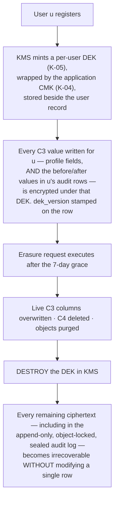
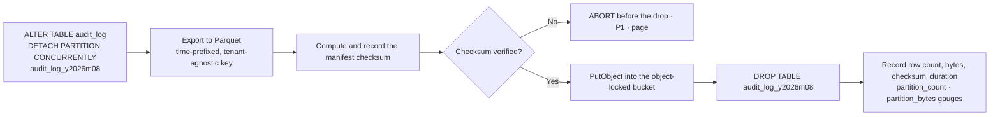

# Audit Strategy — Physical Design

**Phase 4 · Database Design · Companion to `SoftDeleteStrategy.md`**
**Status:** Draft for review · **Owner:** Technical Lead / Architect
**Implements:** `BR-DAT-01`, `BR-DAT-02`, `NFR-SEC-13`, `NFR-PRV-04`, `FR-ADMN-09`, `PROJECT_CONSTITUTION.md` §12.9 `AU1`–`AU7` and §15.7 `AP1`–`AP4`
**Depends on:** `Schema.md` §13.3 (`audit_log`), `Security.md` §12 and §1.3, `Scalability.md` §5.7, `RiskAnalysis.md` `TR-32` / `TR-41`
**Launch market:** India · `Asia/Kolkata` (UTC+05:30, no DST) · INR/paise · FY April–March

---

## 0. Document control

### 0.1 What this document is for

`Schema.md` §13.3 specifies the `audit_log` table in fourteen rows and one grant block. `Security.md` §12 specifies the *policy* — what is audited, who may read it, and how it is sealed. `PROJECT_CONSTITUTION.md` §12.9 gives seven rules.

Four things none of them does, and this document does:

| # | Gap | Section |
| :-: | :--- | :--- |
| 1 | `Schema.md` §2.5 says `audit_entity_type_enum` has *"one value per governed entity — 31 at Phase 1, **enumerated in `AuditStrategy.md`**"*. **The enumeration does not exist anywhere until this document.** | §1.3 |
| 2 | `PROJECT_CONSTITUTION.md` §15.7 `AP4` says the `attendance` check-out column write is *"documented in `/docs/database/AuditStrategy.md`"*. It is not, until now | §1.5 |
| 3 | `Schema.md` §13.3 says the two `SC-R02` exceptions are *"enumerated in `AuditStrategy.md`"* | §1.5 |
| 4 | Nobody has written down **how the audit row and the business write end up in the same transaction when the audit writer is a different database role.** `Security.md` §12.2 `AU-2` and `RiskAnalysis.md` `TR-32` state requirements that, taken literally, cannot both hold | §4.7 — **the central finding of this document** |

### 0.2 On illustrative code

**Every fenced block is labelled `illustrative — not committed code`.** No schema file, no migration and no application code exists. The blocks fix names, shapes and grants so Phase 8 has a specification. They do not fix formatting.

### 0.3 Rank

Rank 4. Where this document appears to contradict `MASTER_PRD.md` or `PROJECT_CONSTITUTION.md`, the higher-ranked document wins and this document has a defect. **Four discrepancies against rank-3 documents are recorded in §14.2 as findings, not decisions.**

---

## 1. What `BR-DAT-01` actually demands

### 1.1 The sentence, decomposed

> **`BR-DAT-01` (Must):** *"Every create, update and delete on a member, membership, payment, plan, gym, staff or configuration record is written to an append-only audit log capturing actor, timestamp, IP, entity, before-state and after-state."*

Eleven obligations hide in that sentence. Each becomes a physical decision.

| # | Clause | Obligation | Physical consequence |
| :-: | :--- | :--- | :--- |
| 1 | *"Every"* | **Completeness.** No governed mutation may lack a row | The capture mechanism must be declarative (`AU5`), not per-call. §4 |
| 2 | *"create, update and delete"* | Three verbs, and **delete means soft delete** in this system | `audit_action_enum` carries `CREATE`, `UPDATE`, `DELETE`; the soft-delete `UPDATE` is recorded as `DELETE`, not `UPDATE`, because that is what happened in the domain. §1.4 |
| 3 | *"a member, membership, payment, plan, gym, staff or configuration record"* | A **closed governed-entity set** | `audit_entity_type_enum`, 31 values. §1.3 |
| 4 | *"append-only"* | No `UPDATE`, no `DELETE`, ever, by anyone reachable from the application | Grant class `G-AUDIT` + a trigger + a WORM archive + a daily seal. §3 |
| 5 | *"audit log"* | Singular. **One table, not one per module** | §2.1's rationale |
| 6 | *"actor"* | Who. Including *which* system actor, and including the impersonator behind a support session | `actor_id`, `actor_type`, `impersonated_by`. §6 |
| 7 | *"timestamp"* | When, server-generated, UTC | `occurred_at timestamptz`, and it is the **partition key**. §2.3 |
| 8 | *"IP"* | From where | `ip inet`, taken from the edge-rewritten forwarded header |
| 9 | *"entity"* | On what | `entity_type` + `entity_id`, with **no foreign key**. §2.5 |
| 10 | *"before-state"* | What it was | `before jsonb`, changed fields only, classified. §5 |
| 11 | *"after-state"* | What it became | `after jsonb`, same rules |

**Two things `BR-DAT-01` does not demand, and which this design adds anyway:**

| Addition | Required by |
| :--- | :--- |
| `reason` — mandatory for every administrative action, elevation, impersonation, override, KYC access and out-of-policy approval | `FR-ADMN-02`, `PE2`, `BR-DAT-02`, `BR-GYM-04`, `FR-CHK-08` |
| `correlation_id` — ties the row to the request's logs, traces and outbox events | `NFR-MNT-04` |

### 1.2 What `BR-DAT-01` demands that `NFR-DQ-05` does not

`AC7` is the rule that stops the two being confused, and it is worth restating because a reviewer *will* ask why both exist:

| | `created_by` / `updated_by` / `created_at` / `updated_at` | `audit_log` |
| :--- | :--- | :--- |
| Answers | *"When and by whom was this row last touched?"* | *"What changed, from what, to what, why, from where, and under whose authority?"* |
| Cardinality | One row, overwritten | One row per change, forever |
| Mutability | Overwritten on every write | Append-only |
| Survives the row | No | **Yes** — that is why `entity_id` carries no FK |
| Source | `NFR-DQ-05`, `AC1`–`AC6` | `BR-DAT-01`, `AU1`–`AU7` |

**Both are required.** `updated_by` is a cheap index-friendly answer to the common question; `audit_log` is the evidential answer to the rare one.

### 1.3 `audit_entity_type_enum` — the 31 values

`Schema.md` §2.5 defers the enumeration here. A PostgreSQL enum rather than free text, *"so that a typo in an entity type does not silently create a category nobody can query"* — and `CI-12` fails the build if a value present in a previous release disappears (`MG9`).

| # | Value | Backing table(s) | `BR-DAT-01` clause | Notes |
| :-: | :--- | :--- | :--- | :--- |
| 1 | `TENANT` | `tenants` | configuration | Suspension, reinstatement, closure, subscription state (`BR-TEN-04`–`06`) |
| 2 | `APPLICATION` | `applications` | configuration | Submission and decision, with reason codes (`BR-GYM-03`, `BR-GYM-04`) |
| 3 | `KYC_DOCUMENT` | `kyc_documents` | configuration | **Reads are audited too**, uniquely — `BR-DAT-07`, written *before* the signed URL is minted |
| 4 | `PAYOUT_ACCOUNT` | `payout_accounts` | configuration | `BR-GYM-06` re-verification; a bank-account change notifies the owner on all channels |
| 5 | `USER` | `users`, `notification_preferences`, `data_subject_requests` | member | Profile, consent, deletion request, erasure completion |
| 6 | `USER_ROLE` | `user_roles` | staff | Grant and revoke (`FR-RBAC-05`) |
| 7 | `AUTH_SESSION` | `auth_sessions`, `refresh_tokens` | staff / member | Login **failure**, lockout, unlock, MFA, password change, session revocation, refresh-token reuse detection. **Login success is excluded — §11.3** |
| 8 | `TENANT_SESSION` | — (no table) | staff | The `FR-AUTH-11` tenant-context switch. `BusinessRules.md` names this entity type verbatim; it has no row of its own, and `entity_id` is the target tenant |
| 9 | `STAFF` | `staff`, `staff_branches` | staff | Invite, accept, role change, branch scoping, removal |
| 10 | `STAFF_INVITATION` | `staff_invitations` | staff | Issue, revoke, expire |
| 11 | `GYM` | `gyms`, `gym_amenities` | gym | Amenity changes fold here — a `G-CRUD-D` join table's history lives on its parent (`SoftDeleteStrategy.md` §3.4.3) |
| 12 | `BRANCH` | `branches`, `branch_hours`, `branch_hour_exceptions` | gym | Hours fold into the branch |
| 13 | `GYM_MEDIA` | `gym_media` | gym | Upload, moderation decision, replacement, deletion |
| 14 | `PLAN` | `plans`, `plan_branches` | plan | Price change, visibility change, archive, branch entitlement |
| 15 | `ADD_ON` | `add_ons` | plan | |
| 16 | `COUPON` | `coupons` | configuration | `funding_source` is immutable after first use; the attempt is still audited |
| 17 | `ORDER` | `orders` | payment | **At `PAID` and at any post-`PAID` transition only** — an abandoned checkout writes no audit row (`BusinessRules.md`, `BR-CART-*`) |
| 18 | `PAYMENT` | `payments` | payment | Attempt creation and manual intervention. Provider callbacks live in `payment_events` and are `SC-R02`-exempt |
| 19 | `INVOICE` | `invoices` | payment | Issuance. `BR-PAY-10` makes it immutable, so there is exactly one row per invoice |
| 20 | `CREDIT_NOTE` | `credit_notes` | payment | |
| 21 | `REFUND` | `refunds` | payment | Request, decision, execution — three rows, three actors |
| 22 | `DISPUTE` | `disputes`, `dispute_evidence` | payment | |
| 23 | `SETTLEMENT_BATCH` | `settlement_batches`, `reserves` | payment | Including **both** approver identities where `BR-FIN-08` dual approval applies |
| 24 | `MEMBERSHIP` | `memberships`, `freezes` | membership | Freeze and unfreeze fold here — a freeze **is** a membership state change |
| 25 | `ATTENDANCE` | `attendance` | membership | **Two actions only** — §1.5. Ordinary check-ins are `SC-R02`-exempt |
| 26 | `CRM_MEMBER` | `crm_members` | member | Including `FR-CRM-09` duplicate merges |
| 27 | `MEMBER_NOTE` | `member_notes` | member | `is_sensitive_category` notes record **that** the body changed, never the body (§5.2) |
| 28 | `LEAD` | `leads` | member | |
| 29 | `REVIEW` | `reviews`, `review_responses`, `review_reports` | configuration | Moderation decisions; a gym's single response; reports |
| 30 | `EXPORT_JOB` | `export_jobs` | configuration | Every tenant export (`BR-DAT-05`), subject export (`BR-DAT-03`) and audit-log export (`FR-ADMN-09`) |
| 31 | `PLATFORM_CONFIG` | `amenities`, `gym_categories`, `reason_codes`, `help_articles`, `cities`, `localities`, `countries`, `feature_flags`, `notification_templates`, `tax_profiles`, `subscription_tiers`, `kyc_checklists`, `commission_rules`, `segments`, `report_definitions` | **configuration** | One value, fifteen tables. `entity_id` is the row's uuid and `before`/`after` carry `__table` as their first key after `schema_version`. §1.6 explains why this is one value and not fifteen |

**Deliberately absent, each with a reason:**

| Not an entity type | Why |
| :--- | :--- |
| `LEDGER_ENTRY`, `MEMBERSHIP_EVENT`, `PAYMENT_EVENT`, `SETTLEMENT_LINE`, `COUPON_REDEMPTION`, `ORDER_ITEM`, `ATTRIBUTION_EVENT`, `TICKET_MESSAGE` | Append-only. **An append-only table is its own audit record** (`SC-R02`) |
| `FAVOURITE`, `SAVED_SEARCH` | User preference with no rule attached. `G-CRUD-D`; no `BR-` requires it |
| `IMPERSONATION` | Not an entity. It is `action = IMPERSONATE_START` / `IMPERSONATE_END` on entity `USER` (§6.3) |
| `NOTIFICATION_LOG` | A delivery record is already a log; auditing a log is a second copy |
| `OUTBOX`, `IDEMPOTENCY_KEY`, `SEARCH_DOCUMENT`, `DOCUMENT_NUMBER_COUNTER` | Infrastructure. **The counter is the interesting refusal**: an audit row per invoice-number allocation would double the audit volume of the money path and tell an auditor nothing that `invoices.invoice_number` does not |

### 1.4 `audit_action_enum` — the 13 values, and the one that is missing

`Schema.md` §2.5 fixes: `CREATE`, `UPDATE`, `DELETE`, `LOGIN`, `LOGOUT`, `IMPERSONATE_START`, `IMPERSONATE_END`, `EXPORT`, `APPROVE`, `REJECT`, `ELEVATE`, `CONFIG_CHANGE`, `RETENTION_PURGE`.

| Rule | Statement |
| :--- | :--- |
| **AA-1** | A **soft delete** is `DELETE`, not `UPDATE`. The physical statement is an `UPDATE`; the domain fact is a deletion, and the audit log records domain facts |
| **AA-2** | The domain verbs of `SoftDeleteStrategy.md` §1.4 — *archive*, *suspend*, *close*, *remove*, *unpublish*, *delist* — are **not** enum values. They are `DELETE` or `UPDATE` plus the entity type plus the `before`/`after` diff, and the explorer renders the verb from that triple. Seven near-synonyms in an enum is seven ways to filter for the same thing and miss two of them |
| **AA-3** | `CONFIG_CHANGE` applies to `PLATFORM_CONFIG` and to tenant-level settings; `UPDATE` applies to business entities. The split exists because `FR-ADMN-02`'s mandatory-reason rule keys on it |
| **AA-4** | `ELEVATE` is written by `runElevated()` **before** the work begins (`PE2`, `EL2`), and is a *separate row* from whatever the elevated work then does |

> **Finding `AUR-01`: `RESTORE` is missing and should be added.** `SoftDeleteStrategy.md` §8.4 requires every restore to write an audit row. Under `AA-2` that row would be `UPDATE`, which makes the auditor's natural query — *"show me everything that was deleted and everything that was brought back"* — unanswerable without parsing `before`/`after` JSON for a `deleted_at` transition. `RESTORE` is the exact inverse of `DELETE` and deserves the same standing. `MG9` permits adding an enum value; nothing is removed. **Recommended before Sprint 8.**

### 1.5 What is **not** audited — rule `SC-R02` and its two exceptions

> **`SC-R02` (`Schema.md` §13.3): an append-only table is its own audit record, so an insert into `ledger_entries`, `membership_events`, `payment_events` or `attendance` does not produce an `audit_log` row.**

The rule is sound because each of those tables already carries what `BR-DAT-01` requires: `membership_events` has `actor_type`, `reason`, `from_status`, `to_status` and `occurred_at`; `payment_events` has `provider_event_id` and the raw callback; `ledger_entries` has direction, type, amount and reference; `attendance` has method, result, denial reason and branch. **A parallel `audit_log` row would be a lossy copy of a better record**, and `Schema.md` prices the rule at 1.8 TB over the retention window.

**The two exceptions, enumerated here as `Schema.md` §13.3 requires.** Both exist because they record an **actor's decision**, not a system fact — and neither `attendance` nor any other append-only table has a column for *why a human overrode the machine*.

| # | Exception | Entity / action | Columns captured | Rule |
| :-: | :--- | :--- | :--- | :--- |
| **E-1** | **Staff override of a check-in denial** | `ATTENDANCE` / `UPDATE` | `actor_id` (the staff member), `reason` (**mandatory**, from the `check_in_denial_reason` vocabulary plus free text), `before` = the denial that was overridden, `after` = the admitted attendance row's id and `method = 'OVERRIDE'` | `FR-CHK-08`. A receptionist admitting a member whose membership the system refused is the single most abusable action at the desk (`RSK-*` shared-credential path), and the attendance row alone cannot say *who decided* or *why* |
| **E-2** | **Check-out correction** | `ATTENDANCE` / `UPDATE` | `before` = `{checked_out_at, duration_minutes}` as they stood, `after` = the corrected pair, `actor_id`, `reason` | `AP4`. §1.6 below |

### 1.6 `AP4`, discharged — the `attendance` check-out column write

`PROJECT_CONSTITUTION.md` §15.7 `AP4` names this document as the place this is recorded. It is recorded here in full.

**The rule.** `attendance` is append-only (`BR-CHK-09`: *"attendance records are immutable once written; corrections are separate reversal records"*), with **one** exception: `checked_out_at` and `duration_minutes` are *"a later fact about the same visit"* (`FR-CHK-09`), written by the check-out scan or by the `attendance.auto-checkout` job.

**The physical form.** A narrowly-scoped column grant, grant class `G-COMPLETE`:

```sql
-- illustrative — not committed code
GRANT SELECT, INSERT                            ON attendance TO app_rw;
GRANT UPDATE (checked_out_at, duration_minutes) ON attendance TO app_rw;
-- No other column is updatable. No DELETE, ever. Re-applied to every new partition
-- by audit.partition-maintenance, because grants are NOT inherited (Schema.md §2.11).
```

| Property | Ruling |
| :--- | :--- |
| **Which columns** | Exactly two. A grant is per-column, so the guarantee is enforced by PostgreSQL, not by review |
| **How many times** | Once. A second write is a *correction*, and corrections are exception `E-2` above with a mandatory reason |
| **Audit** | The **first** write — the ordinary check-out — produces **no** `audit_log` row (`SC-R02`). The **second and subsequent** writes produce one each (`E-2`) |
| **Test** | `AP4` requires a test that **no other column of a written attendance row can change.** Attempting `UPDATE attendance SET result = 'ALLOWED'` as `app_rw` must raise `42501` |
| **Actor when the job writes it** | `attendance.auto-checkout` writes `updated_by = NULL` and, where a row is produced, `actor_type = 'JOB'` naming the job (`AC2`) |

**The alternative that was available, recorded because `Scalability.md` §5.8.3 asks for it.** Check-out could have been a **second append-only row** — a `visit_closed` fact — eliminating the update path entirely and taking `attendance` to purely insert-only. The cost is one extra row per visit: **+18.25 M rows/year at Y1**, +12,775 M over the 24-month hot window at 10×, and a two-row join on the `NFR-PERF-03` hot path to render a visit's duration. The benefit is zero update bloat, no `fillfactor = 85` compromise, and no monthly `REINDEX CONCURRENTLY` of the two hot indexes. **`AP4` has ruled and this document does not propose a change**; the option and its price are recorded so the trade is visible if the bloat measurements come in worse than `Scalability.md` §5.8.3 predicts.

---

## 2. The `audit_log` physical design

### 2.1 One table

| Alternative considered | Why rejected |
| :--- | :--- |
| One audit table per module (`audit_iam`, `audit_money`, …) | `FR-ADMN-09`'s explorer filters *by actor across everything*. Twenty-three unions per query, twenty-three seals, twenty-three retention jobs, and a cross-module reconstruction (§12) becomes a distributed join |
| An append-only column-store or an external SIEM as the system of record | `NFR-SEC-13` requires the log *"where application credentials cannot alter them"* — satisfied by grants + WORM archive (§3.3) — but `FR-ADMN-09` requires an interactive, filterable, exportable explorer with `NFR-PERF-04`'s 800 ms budget, and `B3.2` requires a **tenant-scoped** view through RLS. A SIEM gives neither. **The SIEM is a downstream consumer, not the store** |
| A per-tenant partition | 20,000 partitions at 10×, planning-time explosion on every cross-tenant admin query, and no help at all with `R-AUD`, whose axis is time. **Tenant isolation is RLS's job, not the partitioner's** (`Schema.md` §13.3) |

### 2.2 Columns

Tenancy class **DUAL** — `tenant_id` present **and** a platform read path exists behind the audited elevation. Grant class **G-AUDIT**. Retention **R-AUD, 7 years**. **Monthly range-partitioned** on `occurred_at`.

The four universal columns of `Schema.md` §1.2 apply, with two notes: `updated_at`/`updated_by` are written once at insert and can never change (there is no `UPDATE` grant), and `deleted_at` is **absent** — `SD4`.

| Column | Type | Null | Class | Description | Source |
| :--- | :--- | :-: | :-: | :--- | :--- |
| `id` | `uuid` | no | C1 | UUIDv7, part of the PK | `ERD.md` §11.5 |
| `occurred_at` | `timestamptz` | no | C1 | **Partition key**, part of the PK. Server-generated, UTC, **never client-supplied** | `NFR-SCAL-06`, `DB4` |
| `tenant_id` | `uuid` | **yes** | C1 | Nullable: a platform action has no tenant. This is why the class is DUAL and not RLS | `ERD.md` §1.2 |
| `actor_id` | `uuid` | yes | C1 | `NULL` for `SYSTEM`/`JOB`/`WEBHOOK`. **No FK** — the row must outlive the actor (`CON-04`) | `BR-DAT-01`, `AC2` |
| `actor_type` | `actor_type_enum` | no | C1 | `USER`, `STAFF`, `SYSTEM`, `JOB`, `WEBHOOK`, `SUPPORT_IMPERSONATION`, `PLATFORM_ADMIN` | `BR-DAT-01` |
| `actor_label` | `text` | yes | C1 | For `JOB` and `WEBHOOK`: the job name or provider. **Not the person's name** — that is C3 and belongs nowhere here | `AC2` |
| `impersonated_by` | `uuid` | yes | C1 | The agent's id when `typ = 'IMPERSONATION'`. Present on **every** row written during the session | `BR-DAT-02`, `AC-ADMN-02.2` |
| `entity_type` | `audit_entity_type_enum` | no | C1 | 31 values, §1.3 | `BR-DAT-01` |
| `entity_id` | `uuid` | no | C1 | **No FK.** §2.5 | `BR-DAT-01` |
| `action` | `audit_action_enum` | no | C1 | 13 values, §1.4 | `BR-DAT-01` |
| `before` | `jsonb` | yes | mixed | Changed fields only, classified. `NULL` on `CREATE` | `BR-DAT-01`, §5 |
| `after` | `jsonb` | yes | mixed | Changed fields only, classified. `NULL` on a pure read-audit (`KYC_DOCUMENT`) | `BR-DAT-01`, §5 |
| `reason` | `text` | yes | C2 | **Mandatory** for administrative actions, elevations, impersonation, overrides, KYC access and out-of-policy approvals. Minimum 20 characters where `BR-DAT-02` applies | `FR-ADMN-02`, `PE2`, `IM-3` |
| `reason_code` | `text` | yes | C1 | The structured half, from `reason_codes` where a vocabulary exists (`§C4.8`). Free text alone is unqueryable at 7-year scale | `BR-GYM-04` |
| `permission` | `text` | yes | C1 | The permission string the actor exercised | `PE2` |
| `elevation_scope` | `text` | yes | C1 | Written by `runElevated()` before the work | `PE2`, `EL2` |
| `ip` | `inet` | yes | C2 | Edge-rewritten forwarded header. `inet`, not `text`, so subnet queries are possible in an incident | `BR-DAT-01` |
| `user_agent` | `text` | yes | C2 | Truncated to 512 bytes | `BR-DAT-01` |
| `correlation_id` | `uuid` | **no** | C1 | §8 | `NFR-MNT-04` |
| `request_id` | `uuid` | yes | C1 | The single HTTP request, where `correlation_id` may span a chain | `NFR-MNT-04` |
| `dek_version` | `smallint` | yes | C1 | Which per-user DEK generation encrypted the C3 values in `before`/`after`. **Without it, key rotation makes old rows undecryptable** | `Security.md` §13.4, `K-05` |

```sql
-- illustrative — not committed code
CREATE TABLE audit_log (
  id               uuid                     NOT NULL,
  occurred_at      timestamptz              NOT NULL DEFAULT now(),
  tenant_id        uuid                             ,
  actor_id         uuid                             ,
  actor_type       actor_type_enum          NOT NULL,
  actor_label      text                             ,
  impersonated_by  uuid                             ,
  entity_type      audit_entity_type_enum   NOT NULL,
  entity_id        uuid                     NOT NULL,
  action           audit_action_enum        NOT NULL,
  before           jsonb                            ,
  after            jsonb                            ,
  reason           text                             ,
  reason_code      text                             ,
  permission       text                             ,
  elevation_scope  text                             ,
  ip               inet                             ,
  user_agent       text                             ,
  correlation_id   uuid                     NOT NULL,
  request_id       uuid                             ,
  dek_version      smallint                         ,
  created_at       timestamptz              NOT NULL DEFAULT now(),
  updated_at       timestamptz              NOT NULL DEFAULT now(),
  created_by       uuid                             ,
  updated_by       uuid                             ,
  PRIMARY KEY (occurred_at, id),
  CONSTRAINT ck_audit_log__reason_required_for_admin
    CHECK (action NOT IN ('APPROVE','REJECT','ELEVATE','CONFIG_CHANGE','IMPERSONATE_START','EXPORT','RETENTION_PURGE')
           OR (reason IS NOT NULL AND length(reason) >= 10)),
  CONSTRAINT ck_audit_log__impersonation_actor
    CHECK (impersonated_by IS NULL OR actor_type = 'SUPPORT_IMPERSONATION'),
  CONSTRAINT ck_audit_log__system_actor_has_label
    CHECK (actor_type NOT IN ('SYSTEM','JOB','WEBHOOK') OR actor_label IS NOT NULL)
) PARTITION BY RANGE (occurred_at);
```

> **`ck_audit_log__reason_required_for_admin` is the one business rule this document puts in a `CHECK`.** `FR-ADMN-02`'s *"a reason is required on every administrative action"* is otherwise enforceable only in application code, and application code is precisely what an insider bypasses. A `CHECK` on an append-only table is enforced against every path including a migration.

### 2.3 Partitioning

| Property | Value | Rationale |
| :--- | :--- | :--- |
| Strategy | `PARTITION BY RANGE (occurred_at)`, **monthly** | `NFR-SCAL-06` |
| Boundaries | **UTC month boundaries, not `Asia/Kolkata`** | Storage is UTC (`NFR-DQ-03`). A `+05:30` boundary would make the partition key a local-time concept and break pruning for every UTC-written query — which is every query, because `TM4` forbids an implicit server timezone. **An Indian month therefore spans two partitions by 5½ hours at each edge**; the explorer resolves the month in the tenant's timezone and issues a UTC range touching two partitions. Correct and cheap |
| Naming | `audit_log_y2026m08` | `PROJECT_CONSTITUTION.md` §8.7 |
| Primary key | `(occurred_at, id)` | PostgreSQL requires the partition key in every unique constraint |
| Pre-creation | **N+1, N+2, N+3** by `audit.partition-maintenance` | `Scalability.md` §5.7.4 step 1. Two consecutive job failures are survivable |
| `DEFAULT` partition | **Present**, and must always be empty | `Scalability.md` §5.7.3 — a row landing in `DEFAULT` means a partition was missing. `partition_default_rows` is a must-be-zero gauge and any non-zero value is **P1**. *(This document adopts `Scalability.md`'s position over `Schema.md` §2.11's "no default partition" — finding `AUR-02`, §14.2)* |
| Hot window | **13 months** online | `Scalability.md` §5.7.5 |
| Then | Detached, exported to object storage with **object lock**, checksum-verified before drop | `NFR-SEC-13` |
| Total retention | **7 years** = 84 monthly generations | `NFR-PRV-04` |
| Freeze | `VACUUM (FREEZE, ANALYZE)` at partition close, month N−1 | Rule `SC-R09`: freeze once, then never again |

**The three things a new partition does not inherit, and which the maintenance job must apply.** This is `Schema.md` §2.3.3 obligation 7 and it is a `BR-TEN-01` hole if forgotten, because `app_rw` can name a partition directly:

```sql
-- illustrative — not committed code
CREATE TABLE audit_log_y2026m11 PARTITION OF audit_log
  FOR VALUES FROM ('2026-11-01T00:00:00Z') TO ('2026-12-01T00:00:00Z');

-- 1 · RLS is NOT inherited when a partition is queried by name.
ALTER TABLE audit_log_y2026m11 ENABLE ROW LEVEL SECURITY;
ALTER TABLE audit_log_y2026m11 FORCE  ROW LEVEL SECURITY;
CREATE POLICY rls_audit_log_y2026m11__tenant_isolation ON audit_log_y2026m11
  FOR SELECT TO app_rw
  USING (tenant_id = current_setting('app.tenant_id')::uuid);
CREATE POLICY rls_audit_log_y2026m11__platform_read ON audit_log_y2026m11
  FOR SELECT TO app_platform_ro USING (true);

-- 2 · Grants are NOT inherited. The write role and the read role are different roles.
GRANT INSERT ON audit_log_y2026m11 TO app_append;
GRANT SELECT ON audit_log_y2026m11 TO app_rw, app_platform_ro;

-- 3 · The append-only trigger is NOT inherited (§3.2).
CREATE TRIGGER trg_audit_log_y2026m11__append_only
  BEFORE UPDATE OR DELETE ON audit_log_y2026m11
  FOR EACH ROW EXECUTE FUNCTION fn_reject_mutation();

-- Indexes declared on the parent DO propagate. IX5: every index is declared on the parent.
```

> **The RLS policy on `audit_log` is `FOR SELECT` only, not `FOR ALL`** — unlike the `P-STD` template. `app_rw` has no `INSERT` on this table, so an `INSERT` policy would be dead text, and `WITH CHECK` has nothing to check. This is the one tenant-owned table where the deviation from `P-STD` is correct, and `CI-01` must know about it.

**`CI-10` is the test that matters:** create next month's partition, then read it **by name** as tenant A and assert tenant B's rows are not returned. An application test would never find this, because the application never names a partition.

### 2.4 Indexes

Four on the parent, so every future partition inherits them (`IX5`). Every one names the query it serves (`IX1`).

| Index | Columns | Serves | Source |
| :--- | :--- | :--- | :--- |
| `pk_audit_log` | `(occurred_at, id)` | Keyset pagination in the explorer (§10.4); partition routing | — |
| `idx_audit_log__entity_type_entity_id_occurred_at` | `(entity_type, entity_id, occurred_at DESC)` | **`AC-ADMN-02.1`**: *"given any entity id … every change in chronological order"*. The single most important audit query in the system | `§C2.4`, `FR-ADMN-09` |
| `idx_audit_log__actor_id_occurred_at` | `(actor_id, occurred_at DESC)` | *"What did this person do?"* — the insider-threat and impersonation query | `§C2.4`, `AC-ADMN-02.2` |
| `idx_audit_log__tenant_id_occurred_at` | `(tenant_id, occurred_at DESC)` | The tenant-scoped owner-facing log (`B3.2` `audit.audit_log.read_tenant`). **Leads with `tenant_id` per `SC-R06`** | `B3.2` |
| `idx_audit_log__impersonated_by_occurred_at` | `(impersonated_by, occurred_at DESC) WHERE impersonated_by IS NOT NULL` | `SCR-ADM-015`'s *impersonation flag* filter and `FR-USER-05`'s member-visible activity. **Partial**, because well under 0.2% of rows carry it | `BR-DAT-02`, `AC-AUTH-03.3` |
| `brin_audit_log__occurred_at` | BRIN on `occurred_at`, `pages_per_range = 32` | `TR-32`'s recommendation. Rows arrive in `occurred_at` order, so BRIN correlation is near-perfect; a 530 MB partition's BRIN is a few dozen kilobytes against a B-tree's tens of megabytes | `TR-32` |

**Deliberately absent:** any index on `action`, `reason_code` or a GIN on `before`/`after`. `action` has 13 values and is never selective on its own; `reason_code` is only ever queried *within* an entity or actor filter; and a GIN on the JSONB payloads would be **larger than the table** and would serve `FR-ADMN-09`'s diff *view*, which is a render, not a filter. §10.7 records the queries this deliberately does not support.

### 2.5 Why `entity_id` carries no foreign key

`Schema.md` §13.3 states it; the reasoning is worth having in one place because it is counter-intuitive.

| Reason | Detail |
| :--- | :--- |
| **Polymorphism** | One column pointing at 31 different tables. PostgreSQL has no polymorphic FK |
| **The audit row must outlive its subject** | `CON-04`. When the retention sweep removes a soft-deleted `crm_member` at *active + 12 months*, the audit rows about that member survive for the remaining six years. A `RESTRICT` would block the sweep; a `SET NULL` would destroy the very thing the row exists to record |
| **It would make erasure impossible** | `BR-DAT-04` pseudonymisation must complete. An FK from `actor_id` to `users` would give the same problem for the actor |
| **`entity_id` is not always a row** | `TENANT_SESSION` has no table (§1.3 #8) |
| Cost | Orphan references are possible. Accepted, and detected by `ops.orphan-scan` rather than by the planner — the same ruling `Schema.md` §1.2 makes for `created_by`/`updated_by` |

### 2.6 Storage

`Schema.md` §13.3 gives ~1,270 B/row. The composition, so the number can be challenged:

| Component | Bytes | Note |
| :--- | ---: | :--- |
| Heap tuple header + fixed columns (5 uuids, 3 enums, 2 timestamps, `inet`, `smallint`) | ~150 | |
| `before` + `after` JSONB | ~600 | **Changed fields only** (§5.1). A whole-entity dump would be 3–6 KB and would take the table from 2.3 GB/yr to ~12 GB/yr |
| `reason`, `reason_code`, `permission`, `elevation_scope`, `user_agent` | ~250 | `user_agent` truncated to 512 B is the largest single contributor |
| Index entries (6 indexes, ~5 of them B-tree) | ~270 | |
| **Total** | **~1,270** | |

**The single most effective storage lever is §5.1's changed-fields-only rule**, and it is worth roughly 10 GB/year at Y1 and 100 GB/year at 10×.

---

## 3. The append-only guarantee

`AC-ADMN-02.3`: *"Given I attempt to modify or delete an audit record through any interface, then no such capability exists."* `NFR-SEC-13`: *"Audit logs are append-only and stored where application credentials cannot alter them."*

Those are two different requirements. The first is about **capability**; the second is about **custody**. Four layers, each defeating a different attacker.

### 3.1 Layer 1 — grants

```sql
-- illustrative — not committed code
GRANT INSERT ON audit_log TO app_append;              -- the writer. No SELECT.
GRANT SELECT ON audit_log TO app_rw, app_platform_ro; -- the readers. No INSERT.
REVOKE UPDATE, DELETE, TRUNCATE ON audit_log FROM app_rw, app_platform_ro, app_append, PUBLIC;

-- Asserted absent by CI-02 (Schema.md §2.9) and behaviourally by CI-09:
--   connecting as app_rw, `DELETE FROM audit_log` must FAIL.
```

| Property | Why it is exactly this |
| :--- | :--- |
| `app_append` has **`INSERT` and no `SELECT`** | A path that writes audit rows cannot read, correlate or suppress them. A SQL injection in the audit-write path cannot become an exfiltration |
| `app_rw` has **`SELECT` and no `INSERT`** | The business path cannot forge a row directly. §4.7 is how it writes one anyway, without holding the privilege |
| No `TRUNCATE` anywhere | `TRUNCATE` is a separate privilege from `DELETE` and is the one people forget. It is also the one an attacker reaches for |
| `PUBLIC` explicitly revoked | New objects inherit `PUBLIC` grants in some configurations. Defence against a misconfiguration, not against a person |

**Why a grant and not a trigger as the primary control.** A trigger can be disabled by the table owner, and the maintenance job runs as the owner. Code review is a control a reviewer must *notice*. **A privilege the role does not hold cannot be exercised by any statement it can write** — including `$queryRaw`, including a compromised code path, including a migration written by a tired engineer at 2 a.m.

### 3.2 Layer 2 — the trigger, as a second line

```sql
-- illustrative — not committed code
CREATE OR REPLACE FUNCTION fn_reject_mutation() RETURNS trigger AS $$
BEGIN
  RAISE EXCEPTION 'GM_APPEND_ONLY: % on % is forbidden; this table is append-only',
    TG_OP, TG_TABLE_NAME USING ERRCODE = 'insufficient_privilege';
END; $$ LANGUAGE plpgsql;

CREATE TRIGGER trg_audit_log__append_only
  BEFORE UPDATE OR DELETE ON audit_log
  FOR EACH ROW EXECUTE FUNCTION fn_reject_mutation();
```

**It exists for exactly one failure mode:** `Schema.md` §2.11 shows that a **new partition arrives without inherited grants**, so a defect in `audit.partition-maintenance` would open a window in which `app_rw`'s table-level privileges — or a default privilege — apply to the new child. The trigger converts *"the job forgot the grant"* from a silent hole into an error. **It cannot be the only control, because the owner can disable it**, and it is not presented as one.

### 3.3 Layer 3 — custody: `NFR-SEC-13`'s *"where application credentials cannot alter them"*

Grants stop the application. They do not stop the platform, and `NFR-SEC-13`'s wording is about **storage location**, not privileges.

| Window | Storage | Alterable by |
| :--- | :--- | :--- |
| Months 0–13 | The primary PostgreSQL cluster (India region, `DR-1`) | A database **superuser** only. `L-01` states this limit honestly: *"no application-tier control survives it"* |
| Month 14 onward | Object storage with **object lock (WORM)** enabled, written by a principal holding `PutObject` and nothing else | **Nobody**, including the platform team, without a separate break-glass. `SEC-A05-004` |
| Every day, from day 1 | The **audit seal** — a signed daily hash-chain root in a separate object-locked bucket, signed by `K-15`, a KMS key usable **only** by the sealing job's role | Nobody. Forging a seal requires `K-15` |

### 3.4 Layer 4 — the daily seal makes tampering *evident*

`Security.md` §12.4 specifies it. The properties this document depends on:

| Rule | Statement |
| :--- | :--- |
| **SL-2** | Each day's record carries the **previous day's root**, so a single-day substitution is visible |
| **SL-4** | A verification failure is **S1** and triggers IR-P6, *"because the only innocent explanation is a canonicalisation bug — and that must be proven, not assumed"* |
| **SL-5** | The same seal covers `ledger_entries`, because `BR-FIN-01` gives it the same evidential standing |
| **SL-6** | **The seal proves integrity, not completeness.** It cannot show that a row was never written. Completeness comes from the capture mechanism being declarative (§4) and from `BAC-13`. **Both statements belong in the same sentence whenever this control is described** |

**Why a daily seal and not a per-row hash chain.** `TR-32`: a naive chain in which each row hashes its predecessor **serialises every insert platform-wide onto one chain-head row**. At 8,000 audit inserts a day that is survivable; at 10× it is a single-row lock on the hottest write path in the system, taken inside every business transaction. **The daily seal gives the same tamper-evidence with no ordering dependency on the write path**, and it is computed by a job that reads a closed partition.

### 3.5 What none of this covers

| Limit | Source | Response |
| :--- | :--- | :--- |
| A compromised database **superuser** can rewrite anything | `L-01` | Detection, not prevention: the seal is written where the database role cannot reach. Superuser credentials are break-glass only and page on use |
| The seal cannot prove a row was **never written** | `SL-6` | The declarative interceptor (§4) plus `BAC-13`'s per-rule coverage requirement |
| **Reads** of ordinary records are not logged | `Security.md` §12.5 | Deliberate — logging every read of every member record is a second copy of the database. Only KYC access (`BR-DAT-07`) and elevated cross-tenant reads (`PE2`) are logged. `L-04` records the gap: real-time detection of slow, low-volume exfiltration by a legitimate `SUPPORT_AGENT` is a Phase-2 item |

---

## 4. The capture mechanism

### 4.1 The three candidates

| | **A · NestJS interceptor on annotated entities** | **B · Database triggers** | **C · Logical decoding / CDC** |
| :--- | :--- | :--- | :--- |
| Where | `L9-INT`, an interceptor plus a repository-level hook | `AFTER INSERT/UPDATE/DELETE` per table | A replication slot consumed by a worker |
| Declaration | `@Audited({ entity: 'PLAN' })` on the aggregate | `CREATE TRIGGER` per table in a migration | Table allowlist in the consumer |

### 4.2 The honest comparison

| # | Criterion | **A · Interceptor** | **B · Trigger** | **C · CDC** |
| :-: | :--- | :--- | :--- | :--- |
| 1 | **Completeness against application defects** — a code path that forgets | Good. Declarative on the aggregate, applied by the repository base class; a new entity is a declaration | **Best.** Fires on every statement including a raw `UPDATE` | **Best.** Reads WAL |
| 2 | **Completeness against `$queryRaw`** (`P7`) | **Weak** — raw SQL bypasses the ORM hook | **Strong** | **Strong** |
| 3 | **Actor identity** (`BR-DAT-01`) | **Native.** From `AsyncLocalStorage` | **Poor.** A trigger sees `current_user` = `app_rw` for every request on earth. The real actor must be pushed in as a session GUC and read back — a second channel with its own failure mode | **Poor.** WAL carries no actor at all. The same GUC hack, or a join to `updated_by`, which cannot express *"who approved"* |
| 4 | **Reason** (`FR-ADMN-02`) | **Native** | Same GUC problem | Impossible without a side channel |
| 5 | **IP, user agent, correlation id** | **Native** | GUC | Impossible |
| 6 | **Impersonation** (`impersonated_by`) | **Native** — it is a token claim | GUC | Impossible |
| 7 | **Data classification** (C0–C5, `Security.md` §1.3) | **Native** — the annotation carries the class per field, and C4/C5 never leave the process | **Poor.** A trigger sees `OLD`/`NEW` as whole rows. Filtering by class means encoding the classification **in the database**, in 79 trigger functions, kept in step with `packages/types` by hand | Same, worse |
| 8 | **C3 envelope encryption** (§5.3) | **Native** — the per-user DEK is a KMS call the process can make | **Impossible.** A trigger cannot call KMS. This alone disqualifies B | Possible but async |
| 9 | **Domain semantics** — `APPROVE` vs `UPDATE`, `DELETE` vs a `deleted_at` write | **Native** | **Impossible.** A trigger sees an `UPDATE` and cannot know it was an approval | Impossible |
| 10 | **Same transaction as the business write** | **Yes** — §4.7 | **Yes**, trivially | **No.** Asynchronous by construction |
| 11 | **Survives a bypass of the application** | No | **Yes** | **Yes** |
| 12 | **Maintenance cost** | One interceptor, one base class, one annotation per entity | **79 trigger functions**, each a place to drift | One consumer, plus slot management, plus lag monitoring |
| 13 | **Failure mode** | A forgotten annotation → a silent gap, caught by `BAC-13` and the §13 test | A dropped trigger → a silent gap, caught by a `pg_trigger` CI check | **Slot lag or a full slot stalls the primary's WAL recycling** — an availability risk, and `TR-41`'s sibling |
| 14 | **`NFR-SEC-13` "asynchronous is a log an attacker can outrun"** | Synchronous | Synchronous | **Asynchronous.** `TR-32`'s contingency says this explicitly: *"an asynchronous audit log is a log an attacker can outrun"* |

### 4.3 The recommendation

> **Adopt A — the declarative NestJS interceptor plus a repository-level hook — with B as a narrow, non-primary backstop on exactly four tables, and reject C outright.**

**Why A, in one paragraph.** Seven of `BR-DAT-01`'s eleven obligations (§1.1) are about **context the database does not have**: who, why, from where, under what permission, on whose behalf, correlated with what, and at what data classification. A trigger can capture the *diff* perfectly and the *context* not at all — and `AC-ADMN-02.1`'s reconstruction (*"actor, timestamp, IP, before-state and after-state"*) is 60% context. Criterion 8 is decisive on its own: **the C3 envelope encryption that makes `BR-DAT-04` and `NFR-SEC-13` compatible requires a KMS call, and a PL/pgSQL trigger cannot make one.** Without it the audit log becomes an un-erasable seven-year copy of every personal value in the system, and the privacy design collapses.

**Why C is rejected outright.** Criterion 14. An asynchronous audit log is a log an attacker can outrun, and `TR-32`'s contingency forbids trading synchronicity for throughput in exactly these words. Criterion 13 adds an availability risk to a compliance control, which is the wrong direction.

**What B is kept for.** The `fn_reject_mutation()` trigger of §3.2 on the four append-only tables. **That is a *refusal* trigger, not a *capture* trigger** — it writes nothing and knows nothing about the domain. Keeping the distinction sharp matters, because "we already have audit triggers" is how a capture trigger gets added later.

### 4.4 The four gaps A leaves, and how each is closed

| # | Gap | Closure |
| :-: | :--- | :--- |
| 1 | **`$queryRaw` bypasses the ORM hook** | `P7` restricts raw SQL to the owning module's repository with a mandatory comment. The three legitimate raw paths — PostGIS radius, full-text ranking, the reconciliation aggregate — are all **reads**. A raw *write* to a governed entity is a review rejection, and `dependency-cruiser` plus a `CODEOWNERS` rule on `common/database` are the mechanism |
| 2 | **Background jobs are not HTTP requests**, so an HTTP interceptor never runs. `BusinessRules.md` `L9-INT` states the limit: *"non-HTTP writes (jobs), unless the job wraps the same primitive"* | Every BullMQ processor is wrapped in the **same** `AsyncLocalStorage` context primitive as an HTTP request, establishing `actor_type = 'JOB'`, `actor_label = <job name>`, a fresh `correlation_id` and — where the job is tenant-scoped — the tenant context. **The audit hook lives on the repository, not on the HTTP interceptor**, which is why this works |
| 3 | **Webhooks** — a Razorpay callback activating a membership has no user | `actor_type = 'WEBHOOK'`, `actor_label = 'razorpay'`, `correlation_id` from the `payment_events.provider_event_id`. `BR-GYM-03`'s prohibition on a `SYSTEM` actor for an approval is a `CHECK`-adjacent rule enforced in the approval use case |
| 4 | **Migrations** run outside the application entirely | A migration that mutates a governed entity's data is a **data backfill**, and `MG6` says backfills are jobs, not migrations. A migration that changes *schema* is audited by the migration history itself, which is version-controlled and reviewed (`MG8`) |

### 4.5 The annotation

```ts
// illustrative — not committed code
// Field classes come from Security.md §1.3 and are the SAME source the Pino
// redaction list is generated from — CI job `pii-redaction` keeps them in step.

@Audited({
  entity: 'PLAN',
  fields: {
    name:            'C0',
    priceMinor:      'C0',
    currency:        'C0',
    visibility:      'C0',
    status:          'C1',
    freezeMaxDays:   'C1',
    // a field absent from this map is NOT recorded — fail closed, §5.2
  },
  actions: { archive: 'DELETE', restore: 'RESTORE', publish: 'UPDATE' },
  reasonRequired: ['archive'],
})
export class Plan { /* … */ }
```

| Rule | Statement |
| :--- | :--- |
| **AU-A1** | `AU5`: adding an audited entity is **a declaration**, not a scattering of calls |
| **AU-A2** | **Fail closed.** A field with no declared class is **not recorded**, and a CI check fails the build if a column exists in `information_schema` with no class in the annotation or the schema register. A field that silently defaults to "record it verbatim" is how a C4 value reaches a seven-year log |
| **AU-A3** | The `actions` map is what gives §1.4 `AA-2` its domain verbs without adding enum values |
| **AU-A4** | `reasonRequired` is checked in the use case **and** by `ck_audit_log__reason_required_for_admin`. Two layers, because `FR-ADMN-02` is the rule an insider most wants to skip |

### 4.6 One audit row per business change

| Rule | Statement |
| :--- | :--- |
| **AU-B1** | **Exactly one** row per governed mutation. `SEC-A09-001`'s test: *"for each audited entity type, a mutation produces exactly one audit row with before and after."* Two rows for one change makes a reconstruction ambiguous |
| **AU-B2** | A use case touching three entities writes **three** rows, sharing one `correlation_id`. Not one composite row — an auditor asking *"what happened to this gym"* must find the gym's own row (§7.4 of `SoftDeleteStrategy.md` makes the same ruling for tenant closure) |
| **AU-B3** | An `ELEVATE` row is written **before** the work and is separate from the work's own rows (`EL2`). An audit row written after the fact records only the elevations that succeeded |
| **AU-B4** | A **failed** mutation writes no audit row — the transaction rolled back and the audit insert with it. Failed *authentication* and failed *authorisation* are different: they are events in their own right and are audited (§1.3 #7) |

### 4.7 **The central problem: same transaction, different role**

Two requirements, both stated as non-negotiable by rank-3 documents:

> `Security.md` §12.2 **AU-2**: *"Audit writes go through a **separate connection under a separate role** (`app_append`) that cannot modify existing rows in **any** table — so a SQL injection in the audit path cannot become a write elsewhere either."*

> `RiskAnalysis.md` `TR-32`: *"The audit row is written in the **same transaction** as the business change — this is non-negotiable for non-repudiation and is not traded away for throughput."*

**A separate connection cannot be in the same transaction.** PostgreSQL transactions are per-connection; joining two connections into one atomic unit requires two-phase commit, which nobody is proposing. **The two requirements as written are incompatible, and neither document notices.** This is finding **`AUR-03`** and it must be resolved before Sprint 3, because it determines the shape of the audit repository.

**Why it matters, concretely.** If the audit write is on a different connection, then:

| Failure | Consequence |
| :--- | :--- |
| Business transaction commits, audit insert fails | **A governed mutation with no audit row.** `BR-DAT-01` breached silently. `SL-6` says the seal cannot detect a row that was never written |
| Audit insert commits, business transaction rolls back | **An audit row for a change that never happened.** An auditor reconstructs a state the system was never in |
| Both succeed but out of order | Harmless, but the `occurred_at` ordering within a request becomes unreliable, and §12's reconstruction depends on it |

**Three resolutions.**

| | **R1 · `SECURITY DEFINER` function** | **R2 · `SET LOCAL ROLE`** | **R3 · Accept the separate connection** |
| :--- | :--- | :--- | :--- |
| Mechanism | `app_rw` calls `audit.append_entry(...)`, a `SECURITY DEFINER` function owned by `app_append`, which holds the `INSERT`. `EXECUTE` granted to `app_rw` | `GRANT app_append TO app_rw`; the audit write does `SET LOCAL ROLE app_append`, inserts, then `RESET ROLE`, all inside the business transaction | Keep two connections; add a transactional outbox row on the business connection and have the audit writer drain it |
| Same transaction? | **Yes** | **Yes** | **No** — eventually consistent |
| Does `app_rw` gain `INSERT` on `audit_log`? | **No.** It gains `EXECUTE` on one function whose body it cannot change | **Yes**, transiently — and permanently in principle, since it may `SET ROLE` at will | No |
| Can `app_rw` forge a row? | Only through the function, which stamps `occurred_at = clock_timestamp()`, rejects a null `correlation_id`, and enforces the reason rule | **Yes** — arbitrary `occurred_at`, arbitrary `actor_id` | No, but see below |
| Does it satisfy `AU-2`'s intent (*"a SQL injection in the audit path cannot become a write elsewhere"*)? | **Yes** — the function's owner holds `INSERT` on `audit_log` and nothing else | **No.** `SET LOCAL ROLE` inside a transaction changes `current_user`, which changes **which RLS policies apply** for the rest of that transaction. Forgetting `RESET ROLE` is a tenancy hazard | Yes |
| Extra hazard | A `SECURITY DEFINER` function needs `SET search_path = pg_catalog, audit` pinned, or it is a privilege-escalation vector | Policy-role confusion, as above | **`TR-32`'s "a log an attacker can outrun"**, plus a second outbox to monitor |
| Verdict | **Recommended** | Rejected | Rejected |

```sql
-- illustrative — not committed code
-- R1, the recommended resolution. Owned by app_append, which owns nothing else.
CREATE FUNCTION audit.append_entry(
  p_tenant_id uuid, p_actor_id uuid, p_actor_type actor_type_enum, p_actor_label text,
  p_impersonated_by uuid, p_entity_type audit_entity_type_enum, p_entity_id uuid,
  p_action audit_action_enum, p_before jsonb, p_after jsonb,
  p_reason text, p_reason_code text, p_permission text, p_elevation_scope text,
  p_ip inet, p_user_agent text, p_correlation_id uuid, p_request_id uuid, p_dek_version smallint
) RETURNS uuid
LANGUAGE plpgsql
SECURITY DEFINER
SET search_path = pg_catalog, audit, public
AS $$
DECLARE v_id uuid := gen_uuid_v7();
BEGIN
  IF p_correlation_id IS NULL THEN
    RAISE EXCEPTION 'GM_AUDIT_CORRELATION_REQUIRED' USING ERRCODE = 'not_null_violation';
  END IF;
  INSERT INTO audit_log (id, occurred_at, tenant_id, actor_id, actor_type, actor_label,
    impersonated_by, entity_type, entity_id, action, before, after, reason, reason_code,
    permission, elevation_scope, ip, user_agent, correlation_id, request_id, dek_version,
    created_at, updated_at)
  VALUES (v_id, clock_timestamp(), p_tenant_id, p_actor_id, p_actor_type, p_actor_label,
    p_impersonated_by, p_entity_type, p_entity_id, p_action, p_before, p_after, p_reason,
    p_reason_code, p_permission, p_elevation_scope, p_ip, p_user_agent, p_correlation_id,
    p_request_id, p_dek_version, clock_timestamp(), clock_timestamp());
  RETURN v_id;
END; $$;

REVOKE ALL     ON FUNCTION audit.append_entry FROM PUBLIC;
GRANT  EXECUTE ON FUNCTION audit.append_entry TO app_rw;
-- app_rw still holds NO INSERT, NO UPDATE, NO DELETE on audit_log itself. CI-02 unchanged.
```

| Property of R1 | Detail |
| :--- | :--- |
| **`occurred_at` is `clock_timestamp()`, not `now()`** | `now()` is the transaction start. Three audit rows in one transaction would share an instant and their order would be undefined — which §12's reconstruction depends on. `clock_timestamp()` is the wall clock at the moment of the insert |
| **The function is the only write path** | So the reason rule, the correlation rule and the classification contract have exactly one enforcement point in the database, matching the one enforcement point in the application (`SD-X1`'s discipline, applied to audit) |
| **`app_append` owns the function and nothing else** | Not the tables, not a schema anyone writes to. Its blast radius is `INSERT INTO audit_log` and `INSERT INTO ledger_entries`, both append-only |
| **`ledger_entries` takes the identical treatment** | `audit.append_ledger_entry(...)`. Same conflict, same resolution — and `BR-FIN-01` requires the ledger entry to be in the same transaction as the money movement for the same reason |
| **`AU-2`'s intent is preserved and its letter is amended** | *"A separate role that cannot modify existing rows in any table"* — true of `app_append`. *"A separate connection"* — replaced by *"a separate role reached through a `SECURITY DEFINER` boundary on the same connection"*, which is strictly stronger, because it also gives atomicity |

**Recommendation to the owners of `Security.md` and `RiskAnalysis.md`:** amend `AU-2` to say *role*, not *connection*, and cross-reference this section. Recorded as `AUR-03`.

---

## 5. Before-state and after-state

### 5.1 Changed fields only

> **`AU-P1`. `before` and `after` contain the fields that changed, and nothing else. A whole-entity dump is a review rejection.**

| Reason | Size |
| :--- | :--- |
| **Storage.** A `memberships` row serialised whole is ~3 KB with `purchased_terms`; an `orders` row with `refund_policy_snapshot` and `tax_snapshot` is ~6 KB. At 8,000 rows/day the difference between changed-fields (~600 B) and whole-entity (~4 KB) is **9.9 GB/year at Y1 and 99 GB/year at 10×** | Decisive |
| **Privacy.** A whole-entity dump of `users` records `phone`, `email`, `date_of_birth` and `health_notes` on *every* change, including a change to `city`. `Security.md` §1.3 forbids C4 outright and requires C3 to be encrypted; dumping the whole row makes the classification filter something you must remember rather than something the shape prevents | Decisive |
| **Readability.** `FR-ADMN-09`'s diff view renders `before`/`after`. A two-field diff renders itself; a 40-field dump needs a diff algorithm at render time | Strong |

**The shape.** Both objects carry the same key set — the changed fields — so the explorer can render them side by side without a null-safe merge.

```json
// illustrative — not committed code
// before
{ "schema_version": 1, "price_minor": "400000", "currency": "INR", "status": "PUBLISHED" }
// after
{ "schema_version": 1, "price_minor": "450000", "currency": "INR", "status": "PUBLISHED" }
```

`status` is present in both and unchanged because it is **contextual** — the annotation may mark up to three fields as `alwaysInclude`, so the diff is readable without a second query. `plans.status`, `memberships.status` and `orders.status` are the three.

### 5.2 The classification filter

`Security.md` §1.3 is the authority. Applied to `before`/`after`:

| Class | Examples | In `before`/`after` |
| :-: | :--- | :--- |
| **C0** Public | `gyms.slug`, `gyms.name`, published `plans.price_minor` | **Verbatim** |
| **C1** Internal | `orders.status`, `memberships.state`, correlation ids | **Verbatim** |
| **C2** Tenant-confidential | member counts, `plans` in `DRAFT`, `commission_rate_bps` overrides | **Verbatim** |
| **C3** Personal | `users.name`, `email`, `phone`, `date_of_birth`, `gender`, `city`, `photo_key`, `emergency_contact_*` | **Envelope-encrypted under the per-user erasure key**, with `dek_version` on the row |
| **C4** Sensitive personal | `fitness_goals`, `experience_level`, `health_notes`, KYC content, identity images, member photographs | **Never recorded.** The row states only that the field changed |
| **C5** Secret | password hashes, TOTP secrets, recovery codes, refresh-token hashes, provider API keys | **Never recorded.** Only *"credential changed"*, with the credential type |

```json
// illustrative — not committed code
// A member updates their phone (C3), their health notes (C4) and their password (C5)
// in one profile save. One audit row, entity USER, action UPDATE.
{
  "schema_version": 1,
  "phone":         { "enc": "v1:AQICAHh…", "alg": "AES-256-GCM", "dek": 3 },
  "health_notes":  { "changed": true },
  "password_hash": { "credential_changed": "PASSWORD" }
}
```

| Rule | Statement |
| :--- | :--- |
| **AU-P2** | **Fail closed** (`AU-A2`). An unclassified field is not recorded. The `pii-redaction` CI job's runtime sibling asserts that no audit row contains a C3 value in plaintext or any C4/C5 value at all — `TR-32`'s early-warning signal names exactly this |
| **AU-P3** | The C4 marker is `{"changed": true}`, never `{"from": "…", "to": "…"}` with lengths, hashes or prefixes. **A hash of a health note is a health note to anyone with a candidate list** |
| **AU-P4** | The C5 marker names the credential *type*, never a version, a prefix or a timestamp of the old value |
| **AU-P5** | Rules `S1`–`S7` of `Schema.md` §2.13 apply. In particular **`S6`: money inside the payload is integer minor units with an adjacent currency, serialised as a JSON string** so a `bigint` survives `JSON.parse`. `"price_minor": "450000"` — a string, in paise, not `450000` and never `4500.00` |

### 5.3 The C3 envelope encryption, and why it is the keystone

This is the mechanism that makes `BR-DAT-04` and `NFR-SEC-13` compatible. Without it they are simply incompatible.



| Rule | Statement |
| :--- | :--- |
| **AU-E1** | **Whose key?** The **data subject's**, not the actor's. A support agent changing a member's phone number encrypts the value under the **member's** DEK, because it is the member's personal data and the member's erasure must destroy it |
| **AU-E2** | Where a row touches two subjects — an account merge (`FR-USER-*`) — **two rows are written**, one per subject, each under that subject's key. One row with two subjects' data would be erasable by neither |
| **AU-E3** | `dek_version` is mandatory whenever any value is encrypted. **Without it, `K-05` rotation makes every prior row undecryptable** — which is not erasure, it is data loss with the same symptoms |
| **AU-E4** | The seal (§3.4) is computed over the **canonical row including ciphertext**. Destroying a DEK therefore does **not** break the chain: the bytes are unchanged, only their meaning is gone. **This is the property that lets crypto-shredding coexist with tamper-evidence**, and it must not be undone by a "helpful" future change that nulls the column instead |
| **AU-E5** | `CS-9`: a restore from a backup predating the erasure resurrects **ciphertext, not plaintext**, because KMS is not restored from a database backup |

### 5.4 The `BR-DAT-06` tension, stated honestly

> **`BR-DAT-06`: *"Personal data is never included in application logs, error traces, or analytics events."***

An audit log is not an application log, an error trace or an analytics event — so `BR-DAT-06` does not, on its face, apply. But the tension is real and pretending otherwise is how it gets resolved badly:

| The tension | The resolution |
| :--- | :--- |
| **An audit log legitimately needs to record what changed, even when the field is personal.** *"Who changed this member's phone number, and to what?"* is a fraud question, and answering it requires the value | C3 values **are** recorded, and encrypted. The forensic value is preserved for as long as the subject exists; it disappears the moment the subject exercises erasure. **That is the correct trade and it is `BR-DAT-04`'s trade, not a compromise** |
| **C4 values are needed for the same forensic reason** — *"who edited this member's health notes to embarrass them?"* is `Security.md`'s own STRIDE tampering scenario for asset A5 | **Not recorded, at all.** `Security.md` §5 resolves it: *"C4 fields record only 'changed', never the value, so the audit trail proves the change without becoming a second copy of the sensitive data."* The row proves *that*, *who* and *when* — which is enough to act on — and `NFR-PRV-07`'s categorical prohibition outweighs the marginal forensic value of a second copy |
| **The audit log is where personal data is most likely to leak by accident**, because "record everything" is the intuitive default | `AU-A2`/`AU-P2` invert the default: an unclassified field is **not** recorded, and the build fails if a column has no class. **The safe behaviour is the one you get by forgetting** |

**What an auditor loses, stated so the log is not over-claimed** (`Security.md` §12.5): the **values** of C4 fields before a change, and the values of C3 fields **after** that user is erased. Both are intended.

### 5.5 Worked: a member changes their phone number

`B5.1`'s edge case: a phone change requires OTP on the **new** number and is retained in the audit trail.

| Field | Value |
| :--- | :--- |
| `occurred_at` | `2027-02-14T11:42:07.318Z` (17:12 IST) |
| `tenant_id` | `NULL` — `users` is `IDENTITY`, not tenant-owned. A profile change belongs to no tenant |
| `actor_id` / `actor_type` | The member / `USER` |
| `entity_type` / `entity_id` / `action` | `USER` / the member's id / `UPDATE` |
| `before` | `{"schema_version":1,"phone":{"enc":"v1:AQICAHh…","alg":"AES-256-GCM","dek":2}}` |
| `after` | `{"schema_version":1,"phone":{"enc":"v1:AQICAHj…","alg":"AES-256-GCM","dek":2}}` |
| `dek_version` | `2` |
| `reason` | `NULL` — a self-service profile change requires none |
| `ip` / `user_agent` | `49.36.x.x` / truncated |
| `correlation_id` | Shared with the OTP verification's own row and with the `notification_log` entry that told the old number |

**Three things this row does that a naive design would not.** It is `tenant_id`-null, so it does not leak a member's profile change into a gym's tenant-scoped audit view. It carries `dek_version`, so it survives key rotation. And it records the **old** value, which is what makes an account-takeover investigation possible — `SEC-A07-009`'s SIM-swap scenario is exactly this row read backwards.

---

## 6. Impersonation

### 6.1 What is required

| Requirement | Text |
| :--- | :--- |
| `BR-DAT-02` | *"Support impersonation of a user requires a stated reason, is time-boxed, is visible to the impersonated user in their account activity, and is fully audited."* |
| `FR-AUTH-12` | *"Issues a distinctly-typed token, is capped at 30 minutes, cannot perform financial mutations, and surfaces a persistent banner in the impersonated session."* |
| `AC-ADMN-02.2` | Every audit row written during the session is marked |
| `AC-AUTH-03.3` | The impersonated user sees it |

### 6.2 `impersonated_by`

| Rule | Statement |
| :--- | :--- |
| **IMP-1** | `impersonated_by` holds the **agent's** user id. `actor_id` holds the **member's** id — the identity the action was taken *as*. Getting this round the wrong way makes every impersonated action look like the agent acting on their own account, and the member's own activity view (`FR-USER-05`) would show nothing |
| **IMP-2** | `actor_type = 'SUPPORT_IMPERSONATION'` on every such row, enforced by `ck_audit_log__impersonation_actor` |
| **IMP-3** | Present on **every** row written during the session, not only on the bracketing rows. `IM-11` |
| **IMP-4** | The value comes from the token's `act.sub` claim (`ADR-0011`, `TK6`), which the request context carries. It is never a parameter |
| **IMP-5** | `idx_audit_log__impersonated_by_occurred_at` is **partial** on `impersonated_by IS NOT NULL` — well under 0.2% of rows carry it, and a full index would be 99.8% dead entries |

### 6.3 The session brackets

Impersonation is not an entity type (§1.3); it is two actions on entity `USER`.

| Row | `action` | `entity_id` | Carries |
| :--- | :--- | :--- | :--- |
| Start | `IMPERSONATE_START` | The impersonated member | `reason` (**≥20 characters**, `IM-3`), `actor_id` = the member, `impersonated_by` = the agent, the ticket reference in `reason_code`, `elevation_scope` = the granted capability set |
| …every action in between | its own | its own | `impersonated_by` set |
| End | `IMPERSONATE_END` | The impersonated member | The **duration**, and whether it ended explicitly (`POST /auth/impersonate/end`) or at `exp`. `IM-13` |

`IM-9` — *"an agent may hold at most one active impersonation; starting a second ends the first"* — is what makes the audit trail **linear**: `impersonated_by = <agent>` ordered by `occurred_at` partitions cleanly into sessions bracketed by START/END pairs, with no interleaving to disentangle.

### 6.4 The member-visible view

`AC-AUTH-03.3` and `FR-USER-05` require the member to see it. The query is a **tenant-agnostic, user-scoped** read — `audit_log.tenant_id` may be null or may name any tenant the member dealt with, so the filter is on `actor_id`, not `tenant_id`:

```sql
-- illustrative — not committed code
-- GET /me/activity, impersonation section. Served through the elevation-free
-- user-scoped path: the caller IS the subject, so authorisation is ownership.
SELECT occurred_at, action, entity_type, reason, impersonated_by
  FROM audit_log
 WHERE actor_id = $1                          -- the member themself
   AND impersonated_by IS NOT NULL
   AND occurred_at >= now() - interval '13 months'   -- the hot window; older is an async export
 ORDER BY occurred_at DESC
 LIMIT 50;
```

> **This query is why `audit_log` is class DUAL and not RLS.** A member holding memberships at three gyms has audit rows carrying three different `tenant_id`s plus some with none. Filtering by `tenant_id` would show them a third of their own history. `SoftDeleteStrategy.md` §4.2 makes the analogous argument for `users`; it is the same trap in a different table, and `Schema.md` §1.3 names it: *"user-owned, cross-tenant data is scoped by `user_id`, not by `tenant_id`."*

**The agent's identity is shown to the member.** `impersonated_by` resolves to a **role and a team**, not a personal name and email — *"a support agent (ticket SUP-4471)"*. The member is entitled to know it happened and to have it investigated; they are not entitled to a named individual to harass. `BR-DAT-02` requires visibility, not attribution to a person.

### 6.5 The financial-mutation prohibition, proven from the log

`FR-AUTH-12`: an impersonation session *"cannot perform financial mutations"*. The **enforcement** is the permission set attached to the impersonation token. The **proof** is a standing query:

```sql
-- illustrative — not committed code
-- Runs nightly. A non-empty result is S1.
SELECT id, occurred_at, actor_id, impersonated_by, entity_type, action
  FROM audit_log
 WHERE impersonated_by IS NOT NULL
   AND entity_type IN ('ORDER','PAYMENT','INVOICE','CREDIT_NOTE','REFUND',
                       'DISPUTE','SETTLEMENT_BATCH','PAYOUT_ACCOUNT')
   AND action IN ('CREATE','UPDATE','DELETE','APPROVE');
```

**A control that is enforced but not monitored is a control nobody can prove held.** The query is cheap because the partial impersonation index selects ~0.2% of rows before the entity filter runs.

---

## 7. Platform elevation

### 7.1 Audit before work

`PE2` / `EL2`: *"the `audit_log` row is written **before** the work begins, so an elevation that crashes mid-way is still on the record. An audit row written after the fact records only the elevations that succeeded."*

| Column | Written by `runElevated()` |
| :--- | :--- |
| `action` | `ELEVATE` |
| `actor_id` / `actor_type` | The platform staff member / `PLATFORM_ADMIN` |
| `tenant_id` | The tenant being reached into, or `NULL` for a genuinely platform-wide operation |
| `entity_type` / `entity_id` | The target, where there is one; otherwise the tenant |
| `permission` | The permission string exercised — e.g. `audit.audit_log.read_all` |
| `elevation_scope` | The named call site from `EL9`'s closed list |
| `reason` | **Mandatory**, and enforced by `ck_audit_log__reason_required_for_admin` |

### 7.2 The closed elevation set

`EL9` enumerates nine legitimate elevations, and *"a tenth requires a `DECISION_LOG.md` entry"*: the approval queue (`SCR-ADM-002`), tenant administration (`FR-ADMN-01`), platform user search (`SCR-ADM-005`), all-orders and all-payments finance views (`SCR-ADM-006`), settlement runs (`SCR-ADM-007`), daily reconciliation (`FR-SETL-09`), moderation queues (`FR-ADMN-12`), **the audit explorer (`FR-ADMN-09`)**, and platform analytics (`SCR-ADM-014`).

`elevation_scope` takes one of those nine values, which makes *"how often is each elevation used, by whom, and is any of them growing?"* a `GROUP BY`, not an investigation.

### 7.3 Reading the audit log is itself audited

`Security.md` §12.6: `SUPPORT_AGENT`, `VERIFICATION_OFFICER`, `FINANCE` and `MODERATOR` read all-tenant audit rows *"through `runElevated()` — so reading the audit log is itself audited."*

| Reader | Path | Writes an `ELEVATE` row? |
| :--- | :--- | :---: |
| `GYM_OWNER` — own tenant | `app_rw`, RLS policy `rls_audit_log__tenant_isolation` | **No.** Ordinary tenant-scoped access, no elevation |
| Platform staff — all tenants | `app_platform_ro` inside `runElevated()` | **Yes**, one per elevation |
| `SUPER_ADMIN` — export | `runElevated()`, plus an `EXPORT` row on `EXPORT_JOB` | **Yes**, two rows |
| The subject themself (`FR-USER-05`) | User-scoped ownership | **No** |

### 7.4 The recursion, and why it terminates

Reading the audit log writes an audit row. Reading *that* row writes another. **The chain does not diverge**, and the reason is worth stating because it is the first objection anyone raises:

1. One elevation produces **one** row, regardless of how many rows it reads. It is *"agent X ran the explorer with filter F at time T"*, not one row per result.
2. Reading that row is a **later** action by a **different** actor, so it is a chain in time, not a loop.
3. The chain terminates because nobody reads every audit row they generate. In practice the depth is 1, occasionally 2 during an investigation of an investigator.
4. `L-04` records the honest gap: volumetric anomaly detection over `audit_log` — *"is this agent reading far more than their peers?"* — is **Phase 2**, in `TECH_DEBT.md`. The evidence exists; the alarm does not yet.

---

## 8. Correlation

### 8.1 What `correlation_id` ties together

`NFR-MNT-04`. One id, five artefacts:

| Artefact | Where the id appears | What it gives an investigator |
| :--- | :--- | :--- |
| **Structured logs** (Pino) | Every line of the request | The code path, timings, and the errors — with **no personal data** (`PII2`, `BR-DAT-06`) |
| **Traces** (OpenTelemetry) | The root span | Latency attribution across API → DB → provider |
| **`audit_log`** | `correlation_id` | *What changed, by whom, why* |
| **`outbox`** | The event payload's envelope | Which downstream effects the change triggered — notifications, search reindex, projections |
| **`notification_log`** | The dispatch record | What the member was actually told, and when |

**`request_id` versus `correlation_id`.** `request_id` is one HTTP request. `correlation_id` may span several: a checkout begins on the client's request, continues in a Razorpay webhook minutes later, and finishes in `membership.activate-pending` hours after that. **All three carry the same `correlation_id`**, seeded at checkout and propagated through `orders.id` → the payment intent's `notes` → `payment_events` → the outbox envelope → the job's context. Without the chain, the disputed-refund reconstruction of §12 is three unrelated islands.

### 8.2 The propagation rules

| Rule | Statement |
| :--- | :--- |
| **CR-1** | Generated at the edge if absent; **never accepted from an untrusted client as authoritative**. A client-supplied value is recorded as `client_correlation_id` in the log line, never in `audit_log` |
| **CR-2** | Carried in `AsyncLocalStorage` alongside the tenant context (`P5`), so the audit hook never takes it as a parameter |
| **CR-3** | A BullMQ job inherits the `correlation_id` of the event that enqueued it. A **scheduled** job mints a fresh one per run and records it in the job-run record |
| **CR-4** | A provider webhook adopts the `correlation_id` stored on the payment intent, so the callback joins the checkout that created it |
| **CR-5** | `NOT NULL` on `audit_log`. An audit row that cannot be joined to its request is evidence with no context, and `AUR-03`'s `audit.append_entry` rejects a null |

---

## 9. Retention and archival

### 9.1 Seven years, and what that means physically

`NFR-PRV-04`: *"audit logs 7 years."* Retention class **R-AUD**: *"7 years, immovable. Never deleted, never modified."*

| Window | Location | Query path | Cost |
| :--- | :--- | :--- | :--- |
| **Months 0–13** | Live partitions on the primary | `FR-ADMN-09` explorer, interactive, `NFR-PERF-04`'s 800 ms | 13 partitions × ~250 MB at Y1 ≈ **3.2 GB** |
| **Months 14–84** | Detached, exported to object storage as Parquet under an **object-locked** prefix, checksum-verified, then dropped from the primary | **Asynchronous only.** A deep query is an `export_jobs` run against the archive, re-attachable as a foreign table (`postgres_fdw` / `parquet_fdw`) into a scratch instance | 71 generations at Parquet compression ≈ **3–4 GB total** |
| **Beyond 84 months** | Deleted from the archive by lifecycle rule, **only after the object lock's retention period expires** | — | — |

**Why 13 months hot and not 24.** `attendance` gets 24 because the *Churn cohort* report needs the prior year online (`Scalability.md` §5.7.5). Audit has no such report: `AC-ADMN-02.1`'s reconstruction is *"given any entity id"*, and an entity older than 13 months is being investigated deliberately, by someone who can wait for an async export. **The asymmetry is a deliberate cost decision and is worth stating**, because "audit is 7 years" invites the assumption that 7 years is online.

### 9.2 The archival path

`audit.partition-maintenance` step 6 (`Scalability.md` §5.7.4):



| Rule | Statement |
| :--- | :--- |
| **AR-1** | **Data is never dropped on an unverified export.** A checksum mismatch aborts before the `DROP` and raises `P1` |
| **AR-2** | The archive bucket has **object lock** with a retention period matching `NFR-PRV-04`, written by a principal holding `PutObject` and nothing else. `NFR-SEC-13`'s *"where application credentials cannot alter them"* is satisfied here, not by the grants |
| **AR-3** | The archive is **India-resident** (`OQ-16`, RBI). `DR-3`'s cross-region tension applies: a durability copy must stay in-jurisdiction or be disabled, with the reduction recorded in `KNOWN_LIMITATIONS.md` |
| **AR-4** | The **seal** for every archived day is retained independently of the partition, in its own object-locked bucket. **An archived partition whose seal was archived with it proves nothing** — the seal must be reachable when the partition is not |
| **AR-5** | `AP3`: partition **archival** is permitted; **row deletion within the 7-year retention is not.** There is no path, no job and no migration that deletes an audit row inside the window |

### 9.3 Erasure does not delete audit rows

`SoftDeleteStrategy.md` §9.2 gives the resolution; the audit-side statement is:

> **A `BR-DAT-04` erasure destroys the per-user DEK and touches **not one byte** of `audit_log`. The rows survive, the seal still verifies (`AU-E4`), the actor id survives as the pseudonym (`CS-1`), and the C3 ciphertexts become permanently undecryptable. `data_subject_requests.retained_categories[]` records this to the subject as *"audit records, 7 years, personal values cryptographically shredded"*.**

**The one thing to check at implementation time:** a partition **already archived to Parquet** contains ciphertext encrypted under a DEK that may be destroyed later. That is correct and intended — the ciphertext is unreadable wherever it lives. What must **not** happen is a "helpful" archival step that decrypts before writing Parquet for queryability. `AR-6`: **the Parquet export preserves ciphertext verbatim.**

### 9.4 India — is 7 years enough?

| Obligation | Period | Longer than 7 years? |
| :--- | :--- | :--- |
| `NFR-PRV-04` audit logs | 7 years | — |
| Books of account (Companies Act / Income-tax) | **8 financial years** from the end of the relevant FY | **Yes, by up to ~1 year 9 months** |
| GST records | **72 months** (6 years) from the annual return due date | No |

> **Finding `AUR-04`.** An audit row evidencing an invoice issued in FY 2026-27 is destroyed at 7 years — **before** the underlying invoice's 8-financial-year retention expires. For most audit rows this is harmless: the *financial record* is what the statute requires, and `invoices`, `ledger_entries` and `settlement_lines` are `R-FIN` and retained the full period. But the audit row is what proves **who issued it and on what authority**, which is exactly what is contested in a tax assessment. **Two options:** (a) extend `R-AUD` to 8 financial years for audit rows whose `entity_type` is in the money set — a partition-selective retention rule, cheap because the archive is already time-partitioned; or (b) accept the gap and record it in `KNOWN_LIMITATIONS.md`. **This document recommends (a)**, and refers the question to the same Indian tax advisor who owns `Schema.md` open items `O-2` and `O-3`.

---

## 10. The audit explorer — `FR-ADMN-09` / `SCR-ADM-015`

### 10.1 The specification

`FR-ADMN-09`: *"Audit log explorer: filter by actor, entity type, entity id, action, date range; view before/after state; export."* `SCR-ADM-015` adds an **impersonation flag** filter.

### 10.2 Six filters, six query shapes, and the index each uses

| # | Filter | Query shape | Index | Selectivity at Y1 |
| :-: | :--- | :--- | :--- | ---: |
| 1 | **Entity** — *"everything that happened to this plan"* (`AC-ADMN-02.1`) | `WHERE entity_type=$1 AND entity_id=$2 ORDER BY occurred_at DESC` | `idx_audit_log__entity_type_entity_id_occurred_at` | 1–200 rows |
| 2 | **Actor** — *"everything this person did"* | `WHERE actor_id=$1 AND occurred_at BETWEEN $2 AND $3 ORDER BY occurred_at DESC` | `idx_audit_log__actor_id_occurred_at` | 10–10,000 |
| 3 | **Tenant** — the owner-facing log (`B3.2` `▪`) | `WHERE tenant_id=$1 AND occurred_at BETWEEN …` — **and RLS adds the same predicate**, so the index leads with `tenant_id` per `SC-R06` | `idx_audit_log__tenant_id_occurred_at` | ~1,500/tenant/yr |
| 4 | **Date range alone** — platform-wide review | `WHERE occurred_at BETWEEN $1 AND $2` | Partition pruning + **BRIN** | Whole partitions |
| 5 | **Impersonation flag** | `WHERE impersonated_by IS NOT NULL AND occurred_at BETWEEN …` | `idx_audit_log__impersonated_by_occurred_at` (partial) | <0.2% |
| 6 | **Action / entity type as *secondary* filters** | Appended to any of 1–5 | **No index** — applied as a filter after the primary index scan | — |

**Filter 6 is a deliberate refusal.** `action` has 13 values and `entity_type` 31; neither is selective alone, and an index on either would be a large object serving no query that is not already served. `IX1`: *"an index without a named query is either dead or undocumented; both are defects."*

### 10.3 Partition pruning is the primary performance mechanism

**Every explorer query carries a date range, and the UI defaults it to the last 30 days rather than leaving it open.** That default is a performance feature, not a UX preference:

| Query | Partitions touched | Rows scanned at Y1 |
| :--- | ---: | ---: |
| Default (30 days), any filter | 1–2 | ≤ 480,000 before the index |
| Explicit 13 months | 13–14 | ~2.9 M |
| No date range | **All 13, plus a foreign-table read of up to 71 archived generations** | Refused — see below |

**An unbounded query is refused, not slow.** The explorer requires a date range; omitting one returns `422` with a message naming the constraint. `FR-ADMN-09` does not require an unbounded search, and offering one that times out at 84 partitions is worse than not offering it.

**The `Asia/Kolkata` consequence.** A platform operator filtering *"14 February 2027"* means IST. The API takes an IST-local date plus the tenant's or the operator's timezone and converts to a UTC range — `2027-02-13T18:30:00Z` to `2027-02-14T18:30:00Z` — which touches **two** UTC partitions at month boundaries. Correct, cheap, and the reason partition boundaries are UTC (§2.3).

### 10.4 Pagination

**Keyset, on `(occurred_at, id)` — the primary key — never `OFFSET`.**

```sql
-- illustrative — not committed code
SELECT id, occurred_at, actor_id, actor_type, impersonated_by,
       entity_type, entity_id, action, reason, reason_code, ip
  FROM audit_log
 WHERE entity_type = $1 AND entity_id = $2
   AND occurred_at BETWEEN $3 AND $4
   AND (occurred_at, id) < ($5, $6)          -- the cursor
 ORDER BY occurred_at DESC, id DESC
 LIMIT 50;
```

| Reason | Detail |
| :--- | :--- |
| `OFFSET 10000` scans and discards 10,000 rows **per page** | On a partitioned table it does so in every partition the range touches |
| The cursor is the PK, so it is **stable** even as new rows arrive | An `OFFSET` cursor shifts under a live insert stream, and this table is always receiving inserts |
| ADR-0023 already fixes cursor pagination as the platform convention | `CursorSchema` in `packages/types` |

**`before` and `after` are excluded from the list query and fetched per row on expand.** They are ~600 B each; fifty rows would be 60 KB of JSONB the operator has not asked to see. The diff view is a second request by `id`.

### 10.5 Export

`FR-ADMN-09` requires export. It is:

| Property | Value |
| :--- | :--- |
| **Asynchronous**, through `export_jobs` | A synchronous export of 2.9 M rows is a timeout |
| **Audited** — an `EXPORT` row on entity `EXPORT_JOB`, plus the `ELEVATE` row that authorised it | `Security.md` §12.1 *"every audit-log export"* |
| **Rate-limited** and `SUPER_ADMIN`-only | `Security.md` §12.6 |
| **Redaction-preserving** | C3 values export as ciphertext, C4/C5 as markers. **An export must not be a decryption oracle**; a decrypted export would recreate the un-erasable copy that §5.3 exists to prevent |
| Delivered by | A signed, single-use, 24-hour link, notified on verified channels — the `BR-DAT-03` mechanism reused |

### 10.6 The tenant-scoped view

`B3.2` gives `GYM_OWNER` `audit.audit_log.read_tenant` (`▪`). It is served by the **ordinary RLS path** — `app_rw`, `rls_audit_log__tenant_isolation`, no elevation — which means:

| Consequence | Detail |
| :--- | :--- |
| An owner sees rows with **their** `tenant_id` and no others | Including rows written by platform staff acting on their tenant, which is the point: `Security.md` §5 lists *"a tenant claims a member record was altered by the platform"* as a repudiation scenario, and this view is the answer |
| An owner does **not** see `tenant_id IS NULL` rows | A member's profile change (§5.5) is not the gym's business |
| An owner does not see `permission` or `elevation_scope` | Rendered only in the platform explorer. Exposing the platform's internal permission strings to tenants is an information-disclosure gift with no benefit |
| The `reason` on a platform action **is** shown | An owner is entitled to know why their tenant was suspended. That is `FR-ADMN-02`'s purpose |

### 10.7 Queries this design deliberately does not support

| Query | Why not | What to do instead |
| :--- | :--- | :--- |
| Free-text search across `reason` | A GIN/trigram index on a text column in a 2.9 M-row/yr partitioned table, serving an occasional query | Filter by entity or actor first, then read |
| *"Every row where field X changed"* across all entities | Requires a GIN index on `before`/`after` that would exceed the table's own size | Async export + offline analysis. `FR-ADMN-09` does not require it |
| Aggregations over the full 7 years | The archive is Parquet | An analytics job over the archive, not the explorer |
| *"Who **read** this member's record?"* | Ordinary reads are not logged (§3.5, `L-04`) | Only KYC access and elevated cross-tenant reads are answerable. **Stated in the UI**, so an investigator does not conclude from an empty result that nobody looked |

---

## 11. Write volume, and `TR-32`

### 11.1 The arithmetic

`Schema.md` §13.3 asserts **5,000 audit rows/day** at Y1 under rule `SC-R02`. The figure is not derived anywhere. Deriving it from `NFR-SCAL-01` and `Scalability.md` §2.8:

| # | Source | Basis | Rows/day | Assumption |
| :-: | :--- | :--- | ---: | :--- |
| 1 | `ORDER` at `PAID` and post-`PAID` transitions | 300,000 paid orders/yr (`Scalability.md` §2.8: 822/day) + ~3% cancelled after payment | **847** | **A1** — an abandoned checkout writes no audit row (`BusinessRules.md`, `BR-CART-*`) |
| 2 | `PAYMENT` attempt creation | 300,000/yr | **822** | **A2** — provider callbacks are `payment_events` and `SC-R02`-exempt |
| 3 | `INVOICE` issuance | 300,000/yr | **822** | **A3** — `BR-PAY-10` immutability ⇒ exactly one row per invoice |
| 4 | `MEMBERSHIP` | 300,000 created + ~900,000 transitions | **0** | **A4** — `SC-R02`: `membership_events` **is** the audit record. §11.2 contests this |
| 5 | `CRM_MEMBER` create + edit | 250,000 created in Y1 + ~0.5 edits each | **1,027** | **A5** |
| 6 | `ATTENDANCE` — overrides and check-out corrections only | 50,000 check-ins/day × ~1% override rate | **500** | **A6** — the two `SC-R02` exceptions (§1.5) |
| 7 | `AUTH_SESSION` — **failures, lockouts, MFA, credential and session events only** | 25,000 logins/day × ~10% failure | **2,500** | **A7** — login **success** excluded. §11.3 |
| 8 | Catalogue, plan, staff and tenant-config edits | 2,000 tenants × ~2 edits/week | **571** | **A8** |
| 9 | `SETTLEMENT_BATCH` | 104,000 batches/yr, ~1 audited transition each | **285** | **A9** |
| 10 | Platform `ELEVATE` rows | ~300 platform-staff elevated actions/day | **300** | **A10** |
| 11 | `KYC_DOCUMENT` reads | 2,000 tenants × ~10 documents, reviewed ~1.5× in Y1 | **82** | **A11** — `BR-DAT-07`, reads audited |
| 12 | `REVIEW` submission + moderation | 20,000 reviews/yr × 2 | **110** | **A12** |
| 13 | `REFUND` + `DISPUTE` | 9,000 refunds × 3 rows + 600 disputes × 4 | **81** | **A13** |
| 14 | `EXPORT_JOB` | 24,000/yr | **66** | **A14** |
| 15 | Impersonation brackets + in-session actions | ~10 sessions/day × 5 rows | **50** | **A15** |
| | **Total** | | **≈ 8,063/day** | **≈ 2.94 M rows/yr** |

| | Y1 | 10× (`NFR-SCAL-02`) |
| :--- | ---: | ---: |
| Rows/day | 8,063 | 80,630 |
| Rows/year | **2.94 M** | **29.4 M** |
| Bytes/row (§2.6) | 1,270 | 1,270 |
| **GB/year** | **3.7** | **37** |
| Largest monthly partition | ~250,000 rows, ~310 MB | ~2.5 M rows, ~3.1 GB |
| 13-month hot set | **4.0 GB** | **40 GB** |
| Peak insert rate (assuming a 4× diurnal peak against a 12-hour active window) | **~0.6/s** | **~6/s** |

### 11.2 The discrepancy, and the two readings it comes from

**`Schema.md` §13.3 says 5,000/day. This derivation says 8,063/day — 1.6× higher.** The gap is dominated by rows 5 and 7, neither of which `SC-R02` addresses. But there is a larger, structural disagreement underneath it:

| Reading | Row 4 (`MEMBERSHIP`) | Total/day | Source |
| :--- | ---: | ---: | :--- |
| **X — `SC-R02` literal** | 0. `membership_events` is the audit record | 8,063 | `Schema.md` §13.3 |
| **Y — `BusinessRules.md` literal** | 3,288. *"membership is an audited entity; `membership_events` is the domain log and `audit_log` the compliance log, and **both are written**"* | **11,351** | `BusinessRules.md`, `BR-MEM-*` |

> **Finding `AUR-05`: `SC-R02` (`Schema.md` §13.3) and `BusinessRules.md`'s per-rule *"both are written"* directly contradict each other, and the difference is 1.2 M audit rows a year at Y1 and 12 M at 10×.**
>
> **This document recommends reading X**, for three reasons. (1) `membership_events` already carries `actor_type`, `reason`, `from_status`, `to_status` and `occurred_at` — it satisfies `BR-DAT-01`'s obligations 6, 7, 9, 10 and 11 natively, and it is append-only under the same grant discipline. (2) A parallel `audit_log` row would be a **lossier** copy, because `audit_log.before`/`after` would carry `{"status": "ACTIVE" → "FROZEN"}` while `membership_events` carries the reason *code*, the actor *type* and the financial reference. (3) `SC-R02` is priced at 1.8 TB over the retention window and `Schema.md` warns it *"must not be quietly dropped."*
>
> **What reading X costs, stated honestly:** the explorer's *"everything that happened to this membership"* query must **union** `audit_log` and `membership_events`. §12's reconstruction does exactly that, and it is a small price for not maintaining two copies of the same fact. The union is a documented explorer behaviour, not an implementation detail.
>
> **Recommendation:** adopt X, amend `BusinessRules.md`'s `BR-MEM-*` rows to say *"`membership_events`, not `audit_log`"*, and **re-baseline `Schema.md` §13.3's volume line to ≈8,000/day, 2.9 M rows/yr, 3.7 GB/yr.** The current 5,000/day understates storage by 60% and understates the `TR-32` write rate by the same.

### 11.3 Login success — the single largest exclusion, and its justification

At 500,000 users and a 5% daily-active rate, **login success alone is ~25,000 rows/day — three times the entire rest of the audit log.** `Security.md` §12.1 lists *"login success and failure"* under *Identity and authority*.

**This document excludes login success, and the justification comes from `Security.md` itself.** Its STRIDE analysis for asset A1 answers the repudiation scenario *"that login was not me"* with: *"`sessions` records device, IP and `created_at`; `FR-USER-05` exposes the login history to the user; `audit_log` records **every credential change** with IP and user agent."* **The repudiation control for a successful login is `auth_sessions`, not `audit_log`** — it already carries device, IP, timestamp and status, it is already exposed to the user by `FR-USER-05`, and it is already swept on a bounded `R-EPH` schedule instead of being kept for seven years.

| Audited in `audit_log` | Recorded in `auth_sessions` only |
| :--- | :--- |
| Login **failure**, lockout, unlock | Login **success** |
| MFA enrol, reset, use, recovery-code use | Session creation and normal expiry |
| Password change, email change, phone change | |
| Session revocation, **refresh-token reuse detection** | |
| Tenant-context switch (`FR-AUTH-11`) | |
| Impersonation start and end | |

**Recorded as a narrowing of `Security.md` §12.1, finding `AUR-06`**, requiring sign-off. If it is rejected, the Y1 volume is **33,063/day, 12.1 M rows/yr, 15.3 GB/yr** — a 4× increase that changes the partition sizing, the archive cost and `TR-32`'s residual score, and that must be decided deliberately rather than discovered.

### 11.4 `TR-32` — the audit log as a write bottleneck

`RiskAnalysis.md` §3.3.20 · P 3 × I 4 = **12 (Elevated)** · residual P 2 × I 3 = 6.

**Why it is a real risk despite the modest absolute rate.** 0.6 inserts/second is nothing. The risk is not throughput; it is that **every audit insert is on the critical path of a business transaction**, so its latency is added to the p95 of the endpoint that caused it, and its locks are held for the business transaction's duration. Three specific hazards, all named by `TR-32`:

| Hazard | Present in this design? |
| :--- | :--- |
| Audit latency on the request path | **Yes, by design and non-negotiably.** §4.7 R1 keeps it in the same transaction |
| A per-row hash chain serialising every insert onto one row | **No.** Daily seal, §3.4 |
| *"Log the whole entity"* being simultaneously a bottleneck and a privacy breach | **No.** `AU-P1` changed-fields-only + `AU-A2` fail-closed classification |

**The five levers, in the order they are pulled** — throughput is bought by making rows smaller and partitions hotter, never by deferring the write:

| # | Lever | Effect | Already applied? |
| :-: | :--- | :--- | :---: |
| 1 | Monthly partitioning keeps the hot partition and its indexes small | The B-tree the insert maintains is ~250,000 entries, not 2.9 M | ✔ |
| 2 | **BRIN on `occurred_at`** instead of a sixth B-tree | A BRIN insert is nearly free; a B-tree insert on a 3 GB partition is a page split | ✔ §2.4 |
| 3 | Changed-fields-only payloads | ~600 B instead of ~4 KB ⇒ fewer TOAST writes and 6× less WAL | ✔ `AU-P1` |
| 4 | Narrow the payload further under pressure — drop `user_agent`, truncate `reason` | `TR-32`'s short-term contingency | On demand |
| 5 | Move `audit_log` to its own tablespace, or bring the partition rollover forward to weekly | `TR-32`'s short-term contingency | On demand |

**What must never be done**, quoting `TR-32` because the wording is the control: *"If audit writes are genuinely saturating, the correct response is **more write capacity or narrower payloads**, never dropping or deferring audit rows — an asynchronous audit log is a log an attacker can outrun."*

### 11.5 The signals

| Metric | Threshold | Meaning |
| :--- | :--- | :--- |
| `audit_insert_duration_seconds` p95 | > 5 ms | The insert is becoming visible in unrelated endpoints' p95 — `TR-32`'s named early-warning signal |
| `audit_rows_written_total{entity_type}` | Any entity type deviating >3× from its §11.1 model | Either a runaway loop writing duplicate rows, or a real behaviour change |
| `audit_row_bytes` p99 | > 4 KB | Somebody is dumping a whole entity (`AU-P1` breached) |
| `audit_unclassified_field_total` | **Must be zero** | `AU-A2` breached — a field is being recorded with no class. `P1` |
| `audit_c4_value_present_total` | **Must be zero** | A C4 value in an audit payload. **`S1`, page security** — this is `NFR-PRV-07` breached into a seven-year store |
| `partition_default_rows{table="audit_log"}` | **Must be zero** | A partition was missing. `P1`, `TR-41` |
| `audit_seal_verification_failures_total` | **Must be zero** | `SL-4`: `S1`, IR-P6 |
| `audit_gap_check_failures_total` | **Must be zero** | §13's completeness probe found a governed mutation with no row |

---

## 12. What an auditor can reconstruct — a disputed refund, end to end

`AC-ADMN-02.1`: *"Given any entity id, when I query the audit log, then I see every change in chronological order with actor, timestamp, IP, before-state and after-state."* **A capability nobody has walked through is a capability nobody has.** This section walks one.

### 12.1 The scenario

| | |
| :--- | :--- |
| **Tenant** | Iron Temple Fitness Pvt Ltd · GSTIN `27AABCI1234F1Z5` (state code 27, Maharashtra) · `timezone = Asia/Kolkata` |
| **Gym / branch** | Iron Temple Bandra / Bandra West |
| **Member** | Priya Nair, `user_id = u-9f2a…` |
| **Plan** | *Quarterly Unlimited*, 90 days, `price_minor = 500000` (₹5,000.00), `currency = INR` |
| **Coupon** | `NEWYEAR20`, **gym-funded**, `discount_minor = 100000` (₹1,000.00) |
| **The dispute** | Priya buys on 5 Jan 2027, visits four times, and on 26 Jan requests a full refund claiming the equipment was misrepresented. The gym refuses under its own policy. She escalates to platform support, then files a card chargeback. The platform overrides the gym under `BR-REF-07` and issues a **pro-rata** refund; the chargeback is subsequently **won** on the evidence pack. |
| **The auditor's question, eleven months later** | *"₹3,671.11 was refunded on a ₹4,720.00 sale that the gym had refused to refund and whose chargeback we won. Who decided, on what authority, on what evidence, and does the money reconcile?"* |

**The `A6.3` figures on the order, in paise, frozen at `PAID` by `trg_orders__freeze_money_after_paid`:**

| Figure | Paise | ₹ |
| :--- | ---: | ---: |
| Gross `G` | 500000 | 5,000.00 |
| Discount `D` (gym-funded) | −100000 | −1,000.00 |
| Net `N` | 400000 | 4,000.00 |
| Tax `T` @1800 bps — **CGST 9% = 36000 + SGST 9% = 36000** | 72000 | 720.00 |
| Customer pays `N + T` | **472000** | **4,720.00** |
| Commission base `B` (gym-funded discount ⇒ base is `N`) | 400000 | 4,000.00 |
| Commission `C` @1000 bps | 40000 | 400.00 |
| Commission GST `Cₜ` @1800 bps of `C` — **`NULL`, pending open item `O-1`** | *(7200)* | *(72.00)* |
| Gateway fee `F` @2% of 472000 | 9440 | 94.40 |
| Payable to gym `P = (N+T) − C − F` | **422560** | **4,225.60** |

### 12.2 Every row, in order

`actor_type` abbreviations: `U` user · `S` staff · `P` platform admin · `J` job · `W` webhook · `I` support impersonation. Times are UTC with IST alongside, because `Asia/Kolkata` is `+05:30` and an auditor reading a tenant's account thinks in IST.

| # | UTC | IST | Actor | Type | Entity / id | Action | `before` → `after` (abridged) | Reason / code | Corr |
| :-: | :--- | :--- | :--- | :-: | :--- | :--- | :--- | :--- | :-: |
| 1 | 05 Jan 09:12:41 | 14:42 | Priya | `U` | `PAYMENT` `pay-3d8` | `CREATE` | → `{provider:"razorpay", amount_minor:"472000", currency:"INR", status:"INITIATED"}` | — | **A** |
| 2 | 05 Jan 09:14:22 | 14:44 | razorpay | `W` | `ORDER` `ord-7c1` | `UPDATE` | `{status:"PENDING"}` → `{status:"PAID", gross_minor:"500000", discount_minor:"100000", net_minor:"400000", tax_minor:"72000", commission_minor:"40000", commission_tax_minor:null, gateway_fee_minor:null, payable_to_gym_minor:null}` | — | **A** |
| 3 | 05 Jan 09:14:23 | 14:44 | `invoice.issue` | `J` | `INVOICE` `inv-a41` | `CREATE` | → `{invoice_number:"INV/2026-27/00417", financial_year:"2026-27", totals:{...}, tax_breakdown:[{component:"CGST", rate_bps:900, amount_minor:"36000"},{component:"SGST", rate_bps:900, amount_minor:"36000"}]}` | — | **A** |
| — | 05 Jan 09:14:23 | 14:44 | — | — | `membership_events` `mev-…` | *(not `audit_log`)* | `null` → `PENDING` → `ACTIVE`, `reason = PAYMENT_CAPTURED`, `start_date 2027-01-05`, `end_date 2027-04-04` | `SC-R02` | **A** |
| — | 05 Jan 09:14:24 | 14:44 | — | — | `ledger_entries` ×4 | *(not `audit_log`)* | `SALE +472000` · `TAX −72000` · `COMMISSION −40000` · `GATEWAY_FEE −9440` | `SC-R02` | **A** |
| — | 07–24 Jan | — | Priya | — | `attendance` ×4 | *(not `audit_log`)* | `method = QR`, `result = ALLOWED`, branch Bandra West | `SC-R02` | — |
| 4 | 26 Jan 06:03:11 | 11:33 | Priya | `U` | `REFUND` `ref-51c` | `CREATE` | → `{status:"REQUESTED", requested_amount_minor:"472000", currency:"INR", member_reason:"equipment not as described"}` | member-supplied | **B** |
| 5 | 27 Jan 04:48:02 | 10:18 | Rohan (owner) | `S` | `REFUND` `ref-51c` | `REJECT` | `{status:"REQUESTED"}` → `{status:"REJECTED"}` | `TENANT_POLICY_NO_REFUND_AFTER_VISITS` · *"4 recorded visits; our policy allows no refund once the facility has been used"* | **B** |
| 6 | 28 Jan 05:31:09 | 11:01 | Priya *(as)* | `I` | `USER` `u-9f2a` | `IMPERSONATE_START` | — | `SUP-4471` · *"Member disputes refund rejection; reviewing order, policy snapshot and visit history"* · `impersonated_by = agent-Meera` · `elevation_scope = support.impersonate` | **C** |
| 7 | 28 Jan 05:47:33 | 11:17 | Priya *(as)* | `I` | `USER` `u-9f2a` | `IMPERSONATE_END` | → `{duration_seconds:984, ended:"EXPLICIT"}` | — | **C** |
| 8 | 29 Jan 07:20:44 | 12:50 | Vikram (finance) | `P` | `ORDER` `ord-7c1` | `ELEVATE` | — | `permission = finance.payments.read_all` · `elevation_scope = admin.finance_payments` · *"SUP-4471: verifying settled amount and reserve position before escalation"* | **C** |
| 9 | 02 Feb 11:02:18 | 16:32 | razorpay | `W` | `DISPUTE` `dsp-0b7` | `CREATE` | → `{status:"OPEN", provider_reason:"SERVICE_NOT_AS_DESCRIBED", amount_minor:"472000", respond_by:"2027-02-05T11:02:18Z"}` | — | **D** |
| 10 | 02 Feb 11:02:51 | 16:32 | `dispute.assemble-evidence` | `J` | `DISPUTE` `dsp-0b7` | `UPDATE` | → `{evidence:{order_id, refund_policy_snapshot_hash, attendance_ids:[4], notification_log_ids:[3], invoice_id}}` | — | **D** |
| 11 | 04 Feb 06:20:07 | 11:50 | Rohan (owner) | `S` | `DISPUTE` `dsp-0b7` | `UPDATE` | `{status:"OPEN"}` → `{status:"EVIDENCE_SUBMITTED"}` | *"Four recorded visits between 7 and 24 Jan; policy snapshot on the order shows pro-rata after the 7-day window"* | **D** |
| 12 | 09 Feb 08:15:02 | 13:45 | Anita (`SUPER_ADMIN`) | `P` | `REFUND` `ref-51c` | `ELEVATE` | — | `permission = refunds.override` · `elevation_scope = admin.refund_override` · *"Tenant policy conflicts with the platform pro-rata floor; applying `BR-REF-07`"* | **E** |
| 13 | 09 Feb 08:16:40 | 13:46 | Anita | `P` | `REFUND` `ref-51c` | `APPROVE` | `{status:"REJECTED"}` → `{status:"PENDING_SECOND_APPROVAL", amount_minor:"367111", currency:"INR", computation:{term_days:90, elapsed_days:20, remaining_days:70, net_refund_minor:"311111", cgst_minor:"28000", sgst_minor:"28000", rounding:"HALF_EVEN"}}` | `PLATFORM_POLICY_FLOOR` · approver 1 of 2 (`BR-FIN-08`) | **E** |
| 14 | 09 Feb 09:02:11 | 14:32 | Vikram (finance) | `P` | `REFUND` `ref-51c` | `APPROVE` | `{status:"PENDING_SECOND_APPROVAL"}` → `{status:"APPROVED"}` | approver 2 of 2 (`BR-FIN-08`) · *"Reserve position confirmed sufficient; sale settled 12 Jan, reserve releases 11 Feb"* | **E** |
| 15 | 09 Feb 09:04:29 | 14:34 | `refund.execute` | `J` | `REFUND` `ref-51c` | `UPDATE` | `{status:"APPROVED"}` → `{status:"PROCESSED", provider_refund_id:"rfnd_MvQ…"}` | — | **E** |
| 16 | 09 Feb 09:04:31 | 14:34 | `refund.execute` | `J` | `CREDIT_NOTE` `cn-19f` | `CREATE` | → `{credit_note_number:"CN/2026-27/00031", financial_year:"2026-27", against_invoice:"INV/2026-27/00417", tax_breakdown:[{component:"CGST", amount_minor:"28000"},{component:"SGST", amount_minor:"28000"}], total_minor:"367111"}` | — | **E** |
| — | 09 Feb 09:04:31 | 14:34 | — | — | `ledger_entries` ×2 | *(not `audit_log`)* | `REFUND −367111` · `COMMISSION_REVERSAL +31111` | `SC-R02`, `BR-REF-05` | **E** |
| — | 09 Feb 09:04:32 | 14:34 | — | — | `membership_events` | *(not `audit_log`)* | `ACTIVE` → `CANCELLED`, `reason = REFUNDED` | `SC-R02` | **E** |
| 17 | 25 Feb 14:40:55 | 20:10 | razorpay | `W` | `DISPUTE` `dsp-0b7` | `UPDATE` | `{status:"EVIDENCE_SUBMITTED"}` → `{status:"WON"}` | — | **D** |
| 18 | 26 Feb 20:31:00 | 02:01+1 | `settlement.build-batches` | `J` | `SETTLEMENT_BATCH` `bat-77e` | `UPDATE` | `{status:"OPEN"}` → `{status:"CLOSED", adjustments_minor:"-336000"}` | — | **F** |

### 12.3 The four questions, and the query that answers each

| Question | Query | Rows |
| :--- | :--- | :--- |
| *"Everything that happened to this refund"* | `WHERE entity_type='REFUND' AND entity_id='ref-51c' ORDER BY occurred_at` — index `idx_audit_log__entity_type_entity_id_occurred_at`, one partition per month touched | 4, 5, 12, 13, 14, 15 |
| *"Everything that happened in this episode"* | `WHERE correlation_id IN (A,B,C,D,E,F)` — **plus** the `SC-R02` union over `membership_events`, `ledger_entries`, `payment_events` and `attendance` on the same correlation | all 18 + the 11 exempt rows |
| *"Who authorised the override, and were there two of them?"* | `WHERE entity_id='ref-51c' AND action IN ('ELEVATE','APPROVE')` | 12, 13, 14 — **two distinct `actor_id`s**, which is `BR-FIN-08` proven, not asserted |
| *"What did the support agent do while impersonating?"* | `WHERE impersonated_by='agent-Meera' AND occurred_at BETWEEN …` — partial index | 6, 7 **only** — see §12.6 |

### 12.4 The reconciliation the auditor performs

The audit log gives the decisions; `ledger_entries` and `settlement_lines` give the money. Together:

| Line | Paise | ₹ | Evidence |
| :--- | ---: | ---: | :--- |
| Customer paid | 472000 | 4,720.00 | Row 2 `after`, `payments`, `payment_events` |
| Refunded | −367111 | −3,671.11 | Rows 13 (computation), 15, 16 |
| **Retained by the system** | **104889** | **1,048.89** | |
| — of which the gym keeps | 86560 | 865.60 | `422560 − 367111 + 31111` — settled, refunded, commission reversed |
| — of which the platform keeps as commission | 8889 | 88.89 | `40000 − 31111` = commission on the 20 days consumed |
| — of which the gateway keeps | 9440 | 94.40 | **Not reversed.** `BR-FIN-06`: the fee is as reported by the provider |
| **Sum** | **104889** | **1,048.89** | ✔ reconciles |

**Under open item `O-1`, if `commission_tax_minor` is adopted**, the same episode reconciles with one more line and no change to the audit trail's shape:

| Line | Paise | ₹ |
| :--- | ---: | ---: |
| Payable to gym at sale `P = (N+T) − C − F − Cₜ` | 415360 | 4,153.60 |
| Gym keeps `415360 − 367111 + 31111 + 5600` | 84960 | 849.60 |
| Platform commission `40000 − 31111` | 8889 | 88.89 |
| Platform commission GST remitted `7200 − 5600` | 1600 | 16.00 |
| Gateway | 9440 | 94.40 |
| **Sum** | **104889** | **1,048.89** ✔ |

> **The audit trail is unchanged by `O-1` in every respect except one JSON key.** Row 2's `after` already carries `commission_tax_minor: null`, and a `COMMISSION_TAX_REVERSAL` ledger entry would join at the same correlation id. **That is the practical proof that `Schema.md` §14.3's "no DDL changes on adoption" holds for the audit layer too**, and it is why the null column exists now rather than later.

### 12.5 What the auditor concludes

| Finding | Evidence |
| :--- | :--- |
| The refund was **not** the gym's decision, and the gym's refusal is on the record | Rows 5 and 12: an explicit `REJECT` by the owner, then a platform `ELEVATE` with a stated reason overriding it |
| The override was **authorised**, not unilateral | Row 12's `permission` and `elevation_scope`, from `EL9`'s closed set |
| **Dual approval held** (`BR-FIN-08`) | Rows 13 and 14, two distinct `actor_id`s, 46 minutes apart |
| The amount was **computed, not negotiated** | Row 13's `computation` object: 90-day term, 20 elapsed, 70 remaining, `HALF_EVEN` rounding, tax split into CGST and SGST components — reproducible from the row alone |
| The member was **not** double-compensated | Row 17 shows the chargeback `WON` **after** the refund. Row 18's batch carries the net adjustment. The reconciliation in §12.4 sums to the amount paid |
| The evidence submitted was **real and contemporaneous** | Row 10's `evidence` object names four `attendance` ids and a hash of the `refund_policy_snapshot` **frozen on the order at purchase** (`BR-REF-02`) — the gym could not have retroactively tightened its policy |
| The tax was handled correctly for India | Row 3 and row 16: CGST and SGST as **separate components**, both in FY `2026-27`, the credit note issued against the named invoice number from the same gapless per-FY sequence |
| Support did **not** touch the money | Rows 6–7 bracket an impersonation session containing no mutation rows at all — consistent with `FR-AUTH-12`'s prohibition, and provable by §6.5's standing query returning empty for `agent-Meera` |

### 12.6 What the auditor cannot see, stated so the log is not over-claimed

| Limit | Why | Recorded where |
| :--- | :--- | :--- |
| **What the support agent looked at** during rows 6–7 | Ordinary reads are not audited (§3.5). The session is bracketed and reason-bearing, but its 16 minutes are opaque | `L-04`; disclosed in the explorer UI so an empty result is not read as *"nobody looked"* |
| **The support conversation** | `support_tickets` and `ticket_messages` are not audited entity types (§1.3). A ticket **is** its own record — the messages are the evidence, and they are append-only | Joined by `SUP-4471` appearing in row 6's `reason_code` |
| **The member's stated grievance in her own words**, beyond row 4's short field | Free text in the refund request is C2 and is recorded; the fuller account lives in the ticket | — |
| **Whether the equipment actually was misrepresented** | The audit log records decisions, not truth | `gym_media` moderation rows and the review corpus are adjacent evidence, not proof |
| **Priya's phone number as it was on 5 Jan 2027**, if she has since exercised `BR-DAT-04` | Crypto-shredded (§5.3). The rows, actors, timestamps, decisions and every figure survive; the personal values do not | Intended. `AC-USER-02.3` |
| **Actions by a database superuser** | `L-01` | The daily seal makes tampering detectable even here (§3.4) |

---

## 13. Testing

| # | Test | Layer | Asserts | Gate |
| :-: | :--- | :--- | :--- | :--- |
| **AU-T1** | For **every** one of the 31 entity types: perform a governed mutation | Integration, Testcontainers | **Exactly one** audit row, with `before`, `after`, actor, correlation id and — where `reasonRequired` — a reason. `SEC-A09-001` | **Launch gate**, `BAC-13` |
| **AU-T2** | Connect as `app_rw`; `UPDATE audit_log`, `DELETE FROM audit_log`, `TRUNCATE audit_log` | Integration | All three raise `42501`. `CI-09` | **Launch gate** |
| **AU-T3** | Connect as `app_append`; `SELECT FROM audit_log` | Integration | Raises. The writer cannot read | **Launch gate** |
| **AU-T4** | Create next month's partition, then `SELECT` **by partition name** as tenant A | Integration | Tenant B's rows are not returned. `CI-10` | **Launch gate** |
| **AU-T5** | Mutate a C4 field; mutate a C5 field | Integration | `after` contains `{"changed":true}` / `{"credential_changed":"…"}` and **no value, no hash, no length**. `AU-P3`, `AU-P4` | **Launch gate** |
| **AU-T6** | Mutate a C3 field, then erase the user | Integration | The audit row survives byte-identical; the ciphertext no longer decrypts; **the day's seal still verifies**. `AU-E4` | **Launch gate** |
| **AU-T7** | A field with no declared class | Unit + CI | Build fails. `AU-A2` | Build |
| **AU-T8** | Business transaction rolls back after the audit write | Integration | **No audit row exists.** This is the `AUR-03` R1 test and it fails outright under a separate-connection design | **Launch gate** |
| **AU-T9** | `INSERT` an `APPROVE` row with `reason = NULL` | Integration | `ck_audit_log__reason_required_for_admin` raises | Build |
| **AU-T10** | An impersonated mutation | Integration | Every row carries `impersonated_by`; the member's `GET /me/activity` returns it. `AC-ADMN-02.2`, `AC-AUTH-03.3` | **Launch gate** |
| **AU-T11** | An impersonated attempt at a financial mutation | Integration | Refused, **and** §6.5's standing query returns empty. `FR-AUTH-12` | **Launch gate** |
| **AU-T12** | `runElevated()` that throws mid-work | Integration | The `ELEVATE` row exists anyway. `EL2` | **Launch gate** |
| **AU-T13** | Tamper with one archived row, re-run verification | Integration | The day's chain breaks; `S1`; IR-P6. `SEC-A08-006` | Release |
| **AU-T14** | The §12 scenario, seeded end to end | Integration | All 18 rows present, in order, with the stated actors; §12.4's arithmetic reconciles to the paise | **Launch gate** |
| **AU-T15** | Explorer keyset pagination across a partition boundary with concurrent inserts | Integration | No duplicates, no skips, stable cursor | Release |
| **AU-T16** | Explorer query with no date range | Contract | `422`, not a slow query. §10.3 | Release |
| **AU-T17** | Audit-log export | Integration | C3 exports as ciphertext; C4/C5 as markers; an `EXPORT` row and an `ELEVATE` row are written | **Launch gate** |
| **AU-T18** | **Completeness probe** — a nightly job that samples recent mutations on governed entities from `updated_at` and asserts a matching audit row exists | Production | `audit_gap_check_failures_total` must be zero. **This is the only control that catches a forgotten annotation in production**, and `SL-6` says the seal cannot | Release |

**AU-T18 deserves emphasis.** `SL-6` is explicit that the seal proves integrity, not completeness. `AU-T1` proves completeness for entities somebody remembered to test. The nightly probe is the only mechanism that notices a governed mutation with no audit row **after** the code shipped.

---

## 14. Findings, deviations and open items

### 14.1 Deviations

| # | Deviation | Upstream | This document | Justification |
| :-: | :--- | :--- | :--- | :--- |
| **AU-D01** | The `audit_log` RLS policy is `FOR SELECT`, not `FOR ALL` | `P-STD` template, `Schema.md` §2.6 | `FOR SELECT TO app_rw` only | `app_rw` holds no `INSERT`; an `INSERT`/`UPDATE`/`DELETE` policy would be dead text and a `WITH CHECK` would have nothing to check. `CI-01` must know about the exception |
| **AU-D02** | `audit_log` gains six columns beyond `Schema.md` §13.3's list: `actor_label`, `reason_code`, `request_id`, `dek_version`, and the three `CHECK` constraints | `Schema.md` §13.3 | §2.2 | `dek_version` is **required for correctness** — without it, `K-05` rotation makes prior rows undecryptable, which is data loss wearing erasure's clothes. `reason_code` makes `FR-ADMN-02`'s reason queryable at 7-year scale. `actor_label` discharges `AC2`'s *"the audit row records which system actor"* |

### 14.2 Findings against rank-3 documents

| # | Finding | Detail | Recommendation |
| :-: | :--- | :--- | :--- |
| **AUR-01** | `audit_action_enum` has no `RESTORE` | `SoftDeleteStrategy.md` §8.4 requires a restore to write an audit row; under `AA-2` it would be `UPDATE`, making *"what was deleted and what came back"* unanswerable without parsing JSON | Add `RESTORE`. `MG9` permits it. **Before Sprint 8** |
| **AUR-02** | `Schema.md` §2.11 says **no** `DEFAULT` partition; `Scalability.md` §5.7.3 says a `DEFAULT` partition **exists** on both tables as a must-be-empty safety net | Directly contradictory, and the consequence is either a failed insert (no default) or a silent misfile (default) | **Adopt `Scalability.md`'s position**: a `DEFAULT` partition with `partition_default_rows` as a must-be-zero `P1` gauge. A failed audit insert rolls back the business transaction it is attached to (`TR-41`), which turns a partition-maintenance miss into a **customer-facing outage**. A default plus a page is strictly better than an outage |
| **AUR-03** | **`Security.md` §12.2 `AU-2` (*"a separate connection"*) and `RiskAnalysis.md` `TR-32` (*"the same transaction"*) cannot both hold** | A separate connection cannot share a transaction without 2PC. As written, one of the two Must-have properties is silently unmet | Adopt §4.7's **R1**: a `SECURITY DEFINER` function `audit.append_entry` owned by `app_append`, `EXECUTE` to `app_rw`, `search_path` pinned. Amend `AU-2` to say *role*, not *connection*. **Before Sprint 3** — it determines the audit repository's shape |
| **AUR-04** | `NFR-PRV-04`'s 7-year audit retention **expires before** the 8-financial-year retention of the financial records those rows evidence | An audit row proving *who issued* an FY 2026-27 invoice is destroyed up to ~1 year 9 months before the invoice itself | Extend `R-AUD` to 8 financial years for rows whose `entity_type` is in the money set — cheap, because the archive is already time-partitioned. Refer to the Indian tax advisor with `Schema.md` `O-2`/`O-3` |
| **AUR-05** | `SC-R02` and `BusinessRules.md`'s per-rule *"both are written"* contradict each other on `membership_events` | 1.2 M rows/yr at Y1, 12 M at 10× | Adopt `SC-R02`; amend `BusinessRules.md`'s `BR-MEM-*` rows; document the explorer's union behaviour. §11.2 |
| **AUR-06** | `Security.md` §12.1 audits *"login success and failure"*; this document audits **failure only** | Login success is ~25,000 rows/day — 3× the entire rest of the log. `Security.md`'s own STRIDE analysis names `auth_sessions` + `FR-USER-05` as the repudiation control for logins | Adopt the narrowing. **If rejected, Y1 volume is 33,063/day / 12.1 M rows/yr / 15.3 GB/yr** and the partition, archive and `TR-32` figures must all be re-baselined |
| **AUR-07** | `Schema.md` §13.3's Y1 volume line — 5,000/day, 1.825 M/yr, 2.3 GB/yr — is not derived and is 1.6× low against §11.1 | Understates storage by 60% and the `TR-32` write rate by the same | Re-baseline to **≈8,000/day, 2.94 M rows/yr, 3.7 GB/yr** (Y1) and **29.4 M rows/yr, 37 GB/yr** (10×), with §11.1's assumption table `A1`–`A15` as the derivation |

### 14.3 Open items

| # | Item | Owner | Gate |
| :-: | :--- | :--- | :--- |
| **AU-O1** | Ruling on `AUR-03` — `SECURITY DEFINER` function versus `SET LOCAL ROLE` versus accepting a separate connection | Technical Lead + Engineering Lead | **Before Sprint 3** |
| **AU-O2** | Sign-off on `AUR-06`, the login-success exclusion, and the volume re-baseline of `AUR-07` | Technical Lead, DevOps | Before Sprint 5 |
| **AU-O3** | Ruling on `AUR-05`, `SC-R02` versus `BusinessRules.md` | Technical Lead | Before Sprint 5 |
| **AU-O4** | `AUR-04` — is 7 years sufficient for audit rows evidencing Indian books of account? | Qualified Indian tax advisor | Before Sprint 11, with `Schema.md` `O-2`/`O-3` |
| **AU-O5** | Whether the archive is queryable as a foreign table in place, or requires restore-to-scratch. Affects the runbook for a deep `FR-ADMN-09` query and the residency posture of the scratch instance | DevOps | Before month 13, the first detach |
| **AU-O6** | Whether `audit_log` should be sealed **hourly** rather than daily once volume crosses a threshold, shortening the window in which superuser tampering is undetectable from 24 h to 1 h | Technical Lead, Security | Phase 2 |
| **AU-O7** | Volumetric anomaly detection over `audit_log` — *"is this agent reading far more than their peers?"* — currently in `TECH_DEBT.md` under `L-04` | Security | Phase 2 |

---

## 15. Document control

| Field | Value |
| :--- | :--- |
| Implements | `BR-DAT-01`, `BR-DAT-02`, `BR-DAT-06`, `BR-DAT-07`, `NFR-SEC-13`, `NFR-PRV-04`, `FR-ADMN-09`, `FR-AUTH-12`, `AC-ADMN-02.1`–`.3`, `AC-AUTH-03.3` |
| Discharges | `Schema.md` §2.5 (the 31 entity types, §1.3) · `Schema.md` §13.3 (the two `SC-R02` exceptions, §1.5) · `PROJECT_CONSTITUTION.md` §15.7 `AP4` (the `attendance` check-out write, §1.6) |
| Companion | `docs/database/SoftDeleteStrategy.md` — they share `audit_log`, the retention classes and the erasure design, and must be reviewed together |
| Depends on | `Schema.md` §2.5 / §2.7 / §2.11 / §13.3, `Security.md` §1.3 / §4.5 / §12 / §13.4, `Scalability.md` §5.7 / §8, `RiskAnalysis.md` `TR-32` / `TR-41`, `BusinessRules.md` (the per-rule `BR-DAT-01 audit` column) |
| New rules introduced | `AU-A1`–`AU-A4`, `AU-B1`–`AU-B4`, `AU-P1`–`AU-P5`, `AU-E1`–`AU-E5`, `IMP-1`–`IMP-5`, `CR-1`–`CR-5`, `AR-1`–`AR-6`, `AA-1`–`AA-4` |
| Deviations | `AU-D01`, `AU-D02` |
| Findings raised | `AUR-01` … `AUR-07` — **`AUR-03` is the blocking one** |
| Open items | `AU-O1` … `AU-O7` |
| Review required from | Technical Lead / Architect (owner) · Engineering Lead / CTO (`AUR-03`) · Security owner of `Security.md` (`AUR-03`, `AUR-06`) · DevOps (`AUR-02`, `AUR-07`) · Backend money lead (§12) · QA Lead (§13) |

*End of AuditStrategy.md.*


