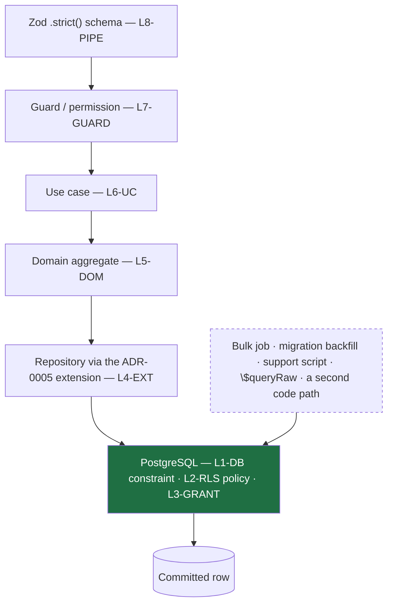
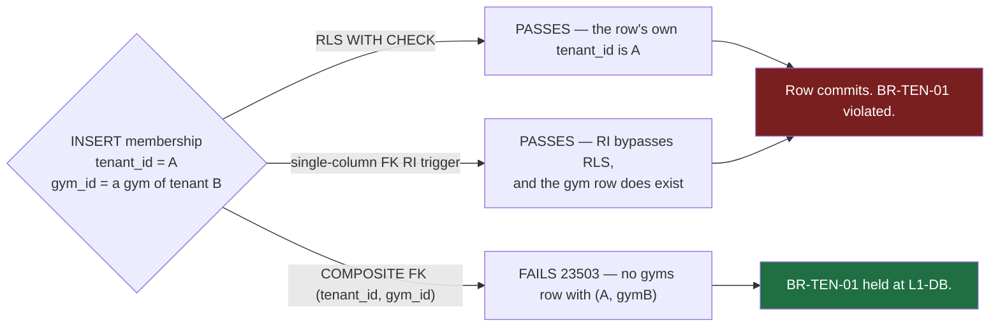

# Constraints — The Database-Enforced Guarantee Register

**Phase 4 · `/docs/database/Constraints.md` · PostgreSQL 16 + PostGIS + Row-Level Security · Prisma ORM (`A-01`) with Prisma Migrate (`A-07`)**

---

## 0. Document control

| Field | Value |
| :--- | :--- |
| **Document** | `/docs/database/Constraints.md` |
| **Phase** | 4 — Database Design |
| **Status** | Design. **No Prisma schema file and no migration exists.** Every fenced block in this document is labelled *illustrative — not committed code* and specifies intent, not an artefact to be copied |
| **Precedence** | Rank 3 under `PROJECT_CONSTITUTION.md` §1.3. Binding on implementation; subordinate to the constitution and to `MASTER_PRD.md` |
| **Implements** | `NFR-DQ-01` (referential integrity by database constraints), `NFR-DQ-02` (money), `NFR-DQ-03` (time), `NFR-DQ-04` (soft delete), `NFR-DQ-05` (audit columns), `NFR-DQ-06` (reference data), `MASTER_PRD.md` §C1.4, §C2.2, §A8 |
| **Governed by** | `PROJECT_CONSTITUTION.md` §4.4 (invariants), §10 (Money & Time Law), §11 (Multi-Tenancy Law), §15 (Database Rules), §8.7 (naming) |
| **Builds on** | `Schema.md` (the 79 table specifications and the physical foundations), `Relationships.md` (the 162 foreign keys), `NamingConvention.md` (the naming law), `engineering/ERD.md` (the Phase-2 logical design), `engineering/BusinessRules.md` (the enforcement-layer taxonomy) |
| **Decisions applied** | ADR-0004 (PostgreSQL 16), ADR-0005 (Prisma + mandatory tenant-context extension), ADR-0006 (RLS), ADR-0007 (PostGIS), ADR-0014 (money as minor units), ADR-0015 (append-only ledger), ADR-0024 (soft delete), ADR-0025 (UTC + gym timezone), ADR-0028 (country as configuration) |
| **Launch market** | **India** — `INR`/paise, `Asia/Kolkata` (+05:30, no DST), GST 18% as CGST 9% + SGST 9%, financial year 1 April – 31 March, PAN + GSTIN, RBI data residency |

### 0.1 What this document is

`PROJECT_CONSTITUTION.md` §15.1 requires every table to document *"its constraints and the business rules it enforces"*. `Schema.md` does that **per table**. This document does it **per constraint** — the same facts pivoted onto the axis a reviewer, an auditor and a migration author actually work along:

> *"Show me every guarantee the database itself makes, and the rule that forces each one."*

The two views must agree. Where this document adds a constraint `Schema.md` does not carry, or disagrees with the mechanism `Schema.md` or `BusinessRules.md` chose, it says so in §14 and justifies it. Silent divergence between two Phase-4 documents is a worse defect than either being wrong alone.

### 0.2 What this document is not

| Not | Where it lives instead |
| :--- | :--- |
| A foreign-key register | `Relationships.md` §4 — 162 edges with cardinality, `ON DELETE`, and the composite-tenant form. §7 here cross-references it and adds only the *constraint-shaped* facts |
| An index register | `Indexes.md`. A **unique** index is a constraint and is registered here; a non-unique index serving a query is not |
| A table specification | `Schema.md` §4 – §13 |
| A naming rulebook | `NamingConvention.md` §8 – §10, §20. Every name in this document conforms to it; the rules are not restated |
| A test plan | `engineering/TestingStrategy.md`. Every constraint here has a negative test under `BAC-06`; this document names the invariant, not the test file |

---

## 1. Reading conventions

### 1.1 The register columns

| Column | Meaning |
| :--- | :--- |
| **Constraint** | The identifier that will appear in `pg_constraint` or `pg_indexes` |
| **Table** | The table the constraint is declared on |
| **Expression** | The predicate, illustrative SQL |
| **Enforces** | The `BR-`/`FR-`/`NFR-`/`INV-`/`ADR-` identifier that **requires** the constraint. A constraint with no identifier here is a constraint nobody asked for and is a review rejection |
| **Class** | `HARD` — the database refuses the write · `SOFT` — the database permits it and a job detects it (§12) |

### 1.2 The five tests a constraint must pass to earn its place

A `CHECK` that cannot fail is noise; a `CHECK` that fires on legitimate data is an outage. Every constraint in this document passed all five:

| # | Test | The constraint fails it when |
| :-: | :--- | :--- |
| **1** | **Is the rule true of a single row, always?** | The rule needs a second table, a `COUNT`, or the current time. Those go to §12 |
| **2** | **Is the rule true across the full retention window?** | The rule is true today and false for a row written in 2027 under a changed configuration. `R-FIN` is eight financial years |
| **3** | **Would violating it corrupt data, or merely be wrong?** | A wrong-but-recoverable value belongs in validation (`L8-PIPE`), not in a constraint that blocks a legitimate correction |
| **4** | **Does it have a negative test?** | `BAC-06` requires one for every `M`-priority rule. A constraint no test attempts to violate is an untested constraint |
| **5** | **Can the error be mapped to a `§C1.5` error code without leaking?** | `Relationships.md` §2.3 M3: a constraint name must never reach a client. Every constraint here has a mapped code |

### 1.3 On illustrative code

Every fenced block is labelled **illustrative — not committed code**. The authoritative definitions will live in the Prisma migration history (`A-07`) from Phase 8. A block here fixes **shape and intent** — constraint names, predicates, policy text, grant sets. It does not fix formatting or the exact syntax Prisma Migrate emits. Objects Prisma's schema language cannot express — `CHECK` constraints, `EXCLUDE` constraints, RLS policies, `FORCE ROW LEVEL SECURITY`, partial unique indexes, domains, grants and triggers — are written as **raw SQL inside Prisma migration files**, so exactly one migration history exists.

---

## 2. The constraint philosophy

### 2.1 `NFR-DQ-01`, and why it is worded the way it is

> `NFR-DQ-01`: *"Referential integrity is enforced by **database constraints**, not application convention alone."*
> `PROJECT_CONSTITUTION.md` §15.8 rule 1 restates it as law.

The operative word is **alone**. Application enforcement is not forbidden — it is required, because the database cannot produce a `§C1.5` error envelope naming the offending field. What is forbidden is application enforcement being the *only* enforcement, because:

| Property | Application check | Database constraint |
| :--- | :--- | :--- |
| Survives a bug in the checking code | No | Yes |
| Survives a second code path written later that forgot it | No | Yes |
| Survives a bulk job, a migration backfill, a support script | No | Yes |
| Survives `$queryRaw` | No | Yes |
| Survives a concurrent writer (read-then-write races) | **No** | Yes |
| Survives the application being the attacker | No | Yes |
| Names the offending field to the user | Yes | No |
| Expresses a rule spanning two tables or a `COUNT` | Yes | No |

**The last two rows are why both layers exist.** `BusinessRules.md` §2 formalises this as the enforcement-layer taxonomy and fixes the tie-break: *"the authoritative layer is the lowest layer that can express the rule completely."* Where a database constraint can express it, the database constraint is authoritative and everything above it is defence in depth and error ergonomics.

### 2.2 The database is the last line of defence and the only one that cannot be bypassed by a bug

Five layers stand between a request and a corrupt row (`§C1.4`, `PROJECT_CONSTITUTION.md` §11.2). Four of them are code:



The dashed arrow is the whole argument. Every one of those five entry points reaches the storage engine **without traversing a single line of the code above it**. `BR-DAT-04`'s erasure runs as `app_migrator`. `data.retention-sweep` runs as a job. `ops.partition-maintain` creates tables. A Sprint-19 developer writes a second checkout path. None of them passes through `OrderPricingService`.

The constraint set in this document is what those five paths still cannot do.

### 2.3 The constraint ladder — what belongs in the database

Applied in order. The first rung that can express the rule **completely** is where it goes.

| Rung | Mechanism | Use when | Examples in this schema |
| :-: | :--- | :--- | :--- |
| **1** | **Type / domain** | The rule is a property of the value's shape | `money_minor_nonneg`, `currency_code`, `basis_points`, `pan_in`, `gstin_in`, `financial_year_label`, `phone_e164` |
| **2** | **`NOT NULL`** | The column has no meaningful absence | `memberships.end_date`, `orders.refund_policy_snapshot`, `reviews.membership_id` |
| **3** | **`CHECK`** | The rule relates columns **within one row** | `net_minor = gross_minor − discount_minor`, `rating BETWEEN 1 AND 5` |
| **4** | **`UNIQUE`** (incl. partial) | The rule is "at most one of these exists" | `uq_invoices__tenant_fy_number`, `uq_branches__one_primary_per_gym` |
| **5** | **`EXCLUDE USING gist`** | The rule is "at most one of these **overlaps**" | `ex_plans__one_active_promotion`, `ex_freezes__no_overlap` |
| **6** | **`FOREIGN KEY`** | The rule is "this points at something real" — and, composite, "…in my tenant" | 162 edges, `Relationships.md` §4 |
| **7** | **RLS policy** | The rule is "this row is not visible/writable in this context" | 62 tenant-owned tables |
| **8** | **`GRANT` / absent grant** | The rule is about a **verb**, not a row | 5 append-only tables |
| **9** | **Trigger** | The rule is conditional on the **previous** state of the same row, and no rung above can express it | 4 immutability triggers, 1 cross-table scope trigger, 4 append-only backstops |
| **10** | **Domain invariant or job** | The rule needs another table, a `COUNT`, wall-clock time, or human judgement | §12 |

**Rung 9 is the one that is abused.** `PROJECT_CONSTITUTION.md` and `Schema.md` §2.8 both fix the rule that governs it, and §10 of this document restates and enforces it: **business logic never lives in a trigger.** A trigger in this schema does exactly one of three things — refuses a write that would mutate an immutable fact, refuses a write on an append-only table, or refuses a write whose scope another table contradicts. It never computes a figure, never writes a second row, and never decides an outcome.

### 2.4 Constraints and the Prisma + RLS hazard

`ADR-0005` and `PROJECT_CONSTITUTION.md` §11.4 establish the mandatory tenant-context client extension, because `SET LOCAL app.tenant_id` and the query it protects must share a pooled connection. That hazard shapes the constraint set in five specific ways, each of which recurs in the sections below and is collected here so it can be reviewed as a set:

| # | Consequence for constraints | Section |
| :-: | :--- | :--- |
| **1** | The RLS policy predicate must **fail closed** on a missing setting. `current_setting('app.tenant_id')` is written with **no** `missing_ok` argument, so an unset variable raises SQLSTATE `42704` rather than yielding `NULL` and matching nothing silently | §8.3 |
| **2** | Every policy carries `WITH CHECK`, or the extension being bypassed on a *write* lets a row into another tenant | §8.2 |
| **3** | `FORCE ROW LEVEL SECURITY` everywhere, because `app_migrator` owns the tables and maintenance jobs run as the owner | §8.2 |
| **4** | **Foreign-key and unique checks bypass RLS entirely.** They are not policed by the extension at all, at any level of correctness. The composite tenant-carrying FK (§7.2) and the tenant-prefix law on unique constraints (§5.1) are the only controls that close this | §5.4, §7.2 |
| **5** | Partitions inherit neither policies nor grants. A partition created by `ops.partition-maintain` without them is a `BR-TEN-01` hole that no application test finds | §8.6 |

**The honest limit.** The extension is application code. If it is bypassed, consequences 1–3 mean the query **fails loudly** rather than leaking. That is the constraint set's whole contribution here: *it converts a silent cross-tenant leak into a visible error.* It cannot convert a missing extension into a correct query. `IS1`–`IS8` and `BAC-10` are the controls that catch the bypass, and they are launch gates for that reason.

### 2.5 The inventory, counted

| Kind | Count | Section |
| :--- | ---: | :--- |
| Domains carrying a `CHECK` | 11 | §4.1 |
| `NOT NULL` columns | **486** across 79 tables | §3 |
| `CHECK` constraints (named, table-level) | **74** | §4 |
| `UNIQUE` constraints and unique indexes | **97** — 66 business uniques + 31 composite-FK referents | §5 |
| `EXCLUDE` constraints | **5** | §6 |
| `FOREIGN KEY` constraints | **162** — 65 composite, 97 single-column | §7 |
| RLS policies | **136** — 62 tenant tables × 2, plus 12 partition policies live at any time | §8 |
| Grant classes | **7**, over 4 roles | §9 |
| Triggers | **9** | §10 |
| `DEFERRABLE` constraints | **0** | §11 |
| Rules that no constraint can carry | **23** | §12 |

---

## 3. `NOT NULL` inventory

### 3.1 Why `NOT NULL` is a first-class constraint here, not a formality

`NOT NULL` is the cheapest constraint PostgreSQL offers and the one most often left off by accident. In this schema it carries three loads that nothing else carries:

| Load | Statement |
| :--- | :--- |
| **`INV-TEN-1`** | *"Every row in a tenant-owned table has a non-null `tenant_id`."* A nullable `tenant_id` on an RLS table is not a lax constraint — it is a **row that no policy matches and no tenant can ever see or delete**, which is data loss that presents as a phantom |
| **`NFR-DQ-02`** | A money column with a nullable adjacent `currency` is a money column with no currency. The pair is `NOT NULL` together or the amount is uninterpretable |
| **`NFR-PRV-01`** | Every field has a documented purpose. A column that is nullable *and* undocumented is a column nobody can safely populate or safely ignore |

**A nullable column is a statement, not an omission.** §3.6 registers every nullable column whose nullability encodes a rule, so that a future migration cannot "tidy it up" into `NOT NULL` and break the flow it exists to permit.

### 3.2 The universal `NOT NULL` set — every table, all 79

From `PROJECT_CONSTITUTION.md` §15.5 `AC1` and `NFR-DQ-05`, restated from `Schema.md` §1.2 because the nullability half is a constraint fact:

| Column | Null | Forcing requirement | Why not the other way |
| :--- | :-: | :--- | :--- |
| `id uuid` | **no** | `PROJECT_CONSTITUTION.md` §15.8 rule 2 | Primary key. UUIDv7, application-generated so the id exists before the insert |
| `created_at timestamptz` | **no** | `NFR-DQ-05`, `AC1`, `DB4` | Default `now()`. A row with no creation instant is unauditable and unsweepable by retention |
| `updated_at timestamptz` | **no** | `NFR-DQ-05`, `AC1`, `AC3` | Set by the application through the extension, never by a trigger, so a bulk job's writes stay attributable. `NOT NULL` with **no default**, so a writer that forgets it fails at insert rather than silently recording `now()` |
| `created_by uuid` | yes | `AC2` | `NULL` **means** a system actor. `audit_log.actor_type` records which. Making it `NOT NULL` would force a sentinel user row, which is a lie in a legal record |
| `updated_by uuid` | yes | `AC2` | As above |
| `tenant_id uuid` | **no** *(tenancy class RLS)* | `BR-TEN-01`, `INV-TEN-1`, `AC4` | See §3.3 |
| `deleted_at timestamptz` | yes | `NFR-DQ-04`, `SD1` | `NULL` **means** live. Present only where ADR-0024 soft delete applies; absent entirely from append-only tables (`SD4`) |

`4 × 79 = 316` universal `NOT NULL` columns before a single domain column is counted, plus 62 `tenant_id` columns.

### 3.3 `tenant_id NOT NULL` — the tenancy constraint

| Tenancy class | Tables | `tenant_id` | Rule |
| :--- | ---: | :--- | :--- |
| **RLS** | 58 | `uuid NOT NULL` | `INV-TEN-1`. Backed by `fk_<table>__tenants` and by the RLS policy of §8 |
| **DUAL** | 1 (`audit_log`) | `uuid NULL` | A platform action has no tenant. The nullability **is** the platform/tenant discriminator (`ERD.md` §1.2) |
| **HYBRID** | 3 (`coupons`, `notification_log`, `report_definitions`) | `uuid NULL` | `NULL` iff platform-scope. Tied to the discriminator by a `CHECK` — §4.6 |
| **P-NULLABLE** | 2 (`support_tickets`, `ticket_messages`) | `uuid NULL` | A member's ticket about the platform itself has no tenant (`ERD.md` §4.7 note 7) |
| **IDENTITY** | 8 | absent, **except** `user_roles` | Scoped by `user_id`. `user_roles.tenant_id` is nullable and is the platform/tenant-role discriminator — the one table in the schema with a `tenant_id` column and no RLS policy, carried as a reviewed exception in CI check CI-01 |
| **GLOBAL** | 19 | absent | Platform reference and platform-owned data. `commission_rules.tenant_id` exists but is **not** a tenancy key — the table is platform-owned (`Schema.md` §9.4) |

> **The hazard a nullable `tenant_id` on an RLS table would create.** The `P-STD` policy is `tenant_id = current_setting('app.tenant_id')::uuid`. Against a `NULL` that predicate is `NULL`, which is not `TRUE`, so the row is invisible to **every** tenant session and to the `FORCE`d owner. It is visible only under `app_platform_ro`'s `USING (true)`. The row cannot be read, updated or deleted by the application under any tenant. `NOT NULL` plus `AC6`'s CI check is what makes that state unreachable.

### 3.4 The domain `NOT NULL` register

Universal columns (§3.2) are omitted from every row. Read every table as additionally carrying `id`, `created_at`, `updated_at` `NOT NULL`.

#### 3.4.1 Tenancy & Identity

| Table | `NOT NULL` columns | Forcing requirement |
| :--- | :--- | :--- |
| `tenants` | `legal_name`, `entity_type`, `country_code`, `currency`, `timezone`, `status`, `subscription_status`, `settlement_cycle_days`, `reserve_bps`, `reserve_release_days`, `minimum_payout_minor`, `tax_registration_status`, `refund_policy` | `FR-INV-03` (legal name prints on every invoice), `ADR-0028` (country drives tax/KYC/FY), `TM3`/`BR-MEM-03` (timezone authoritative for validity), `A6.4` (settlement parameters), `BR-REF-01` (a tenant without a refund policy cannot legally sell) |
| `applications` | `tenant_id`, `version`, `submitted_at`, `snapshot`, `status`, `reason_codes` *(default `'{}'`)*, `precheck_results` | `BR-GYM-05` (version sequence), `FR-ONB-08` (the frozen dossier), `BR-GYM-04` (reason codes array exists even when empty, so `array_length` is checkable) |
| `kyc_documents` | `tenant_id`, `document_type`, `storage_key`, `original_filename`, `content_type`, `byte_size`, `checksum_sha256`, `status` | `BR-DAT-07` (the checksum proves the stored object is the reviewed one), `NFR-SEC-10` (content type by inspection, size bounded) |
| `payout_accounts` | `tenant_id`, `account_holder_name`, `account_number_last4`, `status`, `is_primary` | `LAUNCH_MARKET_INDIA.md` §6.5 (holder name must match the bank proof), `BR-GYM-06` |
| `subscription_invoices` | `tenant_id`, `invoice_number`, `financial_year`, `period_start`, `period_end`, `subscription_tier_id`, `gross_minor`, `tax_minor`, `total_minor`, `currency`, `tax_breakdown`, `status`, `issued_at` | `ERD.md` §12.6, `BR-PAY-01`+`NFR-DQ-02` (the money/currency quartet), `BR-PAY-10` |
| `users` | `display_locale`, `status`, `mfa_enabled` | `NFR-USE-08`, `FR-AUTH`. **`email` and `phone` are both nullable** and constrained together — §4.6 |
| `user_roles` | `user_id`, `role_id`, `granted_at` | `§B3.1`, `BR-DAT-01` |
| `roles` | `key`, `scope`, `description` | `§B3.1`. `scope` `NOT NULL` because permission evaluation is `(role, scope, resource, action)` and a null scope evaluates to no permission at all, silently |
| `permissions` | `key`, `resource`, `action` | `FR-RBAC-01` |
| `role_permissions` | `role_id`, `permission_id` | `§B3.2` |
| `auth_sessions` | `user_id`, `family_id`, `status`, `absolute_expires_at` | `ADR-0011`. `absolute_expires_at NOT NULL` is what makes the TTL sweep total — a session with no expiry is a session that never expires |
| `refresh_tokens` | `session_id`, `token_hash`, `generation`, `expires_at` | `ADR-0011`, `NFR-SEC-07` |
| `notification_preferences` | `user_id`, `channel`, `category`, `is_opted_in`, `consent_recorded_at`, `consent_source` | `NFR-PRV-02` — consent must be *"explicit, granular, timestamped, revocable"*; a nullable `consent_source` makes the first two unprovable |
| `staff` | `tenant_id`, `user_id`, `role`, `status` | `§B3.1`, `FR-STAF-04` |
| `staff_branches` | `tenant_id`, `staff_id`, `branch_id` | `FR-STAF-02` |
| `staff_invitations` | `tenant_id`, `email`, `role`, `token_hash`, `expires_at` | `FR-STAF-03` |
| `attribution_events` | `tenant_id`, `gym_id`, `user_id`, `surface`, `occurred_at`, `expires_at`, `correlation_id` | `A6.3` — this table is the **evidence in a commission dispute**; a nullable column here is a hole in the evidence |
| `favourites` | `tenant_id`, `user_id`, `gym_id` | `FR-FAV-01` |

#### 3.4.2 Catalogue and Plans

| Table | `NOT NULL` columns | Forcing requirement |
| :--- | :--- | :--- |
| `gyms` | `tenant_id`, `name`, `slug`, `city_id`, `category_id`, `gender_policy`, `status`, `rating_count`, `freshness_score` | `§C2.2`, `NFR-DQ-06` (category is reference data, not free text). `rating_count NOT NULL DEFAULT 0` so `BR-REV-07`'s below-3 rule is a comparison, never a null test |
| `branches` | `tenant_id`, `gym_id`, `name`, `address_line1`, `city_id`, `state`, `state_code`, `postal_code`, `country_code`, `location`, `status`, `is_primary` | `LAUNCH_MARKET_INDIA.md` §4 — **`state_code NOT NULL` drives place of supply** and therefore CGST+SGST versus IGST on every invoice for a sale at this branch. `location NOT NULL` because `BR-GYM-08` requires a resolvable geo-location for approval and `FR-SRCH-01` cannot rank a null point |
| `branch_hours` | `tenant_id`, `branch_id`, `weekday`, `opens_at`, `closes_at` | `TM8`. Zero rows means closed; a row with a null time means nothing |
| `branch_hour_exceptions` | `tenant_id`, `branch_id`, `exception_date`, `is_closed` | `TM8`. `opens_at`/`closes_at` nullable and tied to `is_closed` by a `CHECK` — §4.6 |
| `gym_amenities` | `tenant_id`, `gym_id`, `amenity_id` | `NFR-DQ-06`, `FR-SRCH-03` |
| `gym_media` | `tenant_id`, `gym_id`, `media_type`, `storage_key`, `renditions`, `sort_order`, `is_cover`, `moderation_status` | `FR-GYM-02`, `BR-GYM-07` |
| `saved_searches` | `user_id`, `name`, `query` | `FR-FAV-03` |
| `crm_members` | `tenant_id`, `member_code`, `full_name`, `phone`, `source` | `FR-CRM-04` — the minimal set is **name + phone**, which is what an Indian walk-in gives at the desk |
| `leads` | `tenant_id`, `branch_id`, `full_name`, `phone`, `status` | `SCR-DASH-017` |
| `plans` | `tenant_id`, `gym_id`, `name`, `plan_type`, `price_minor`, `joining_fee_minor`, `currency`, `access_window`, `gender_eligibility`, `freeze_allowed`, `transfer_allowed`, `stackable`, `visibility`, `status`, `sort_order` | `BR-PLN-01`. **`stackable NOT NULL`** because it is copied onto the membership and drives `BR-MEM-04`'s exclusion; **`visibility NOT NULL`** because a null would be neither `PUBLIC` nor `STAFF_ONLY` and `BR-PLN-05` would have no answer |
| `plan_branches` | `tenant_id`, `plan_id`, `branch_id` | `ERD.md` §7.3 — absence of rows is the open-world "all branches" |
| `add_ons` | `tenant_id`, `plan_id`, `name`, `price_minor`, `currency`, `is_recurring` | `FR-CART-02`, `A6.3` (`G` composition) |

#### 3.4.3 Commerce

| Table | `NOT NULL` columns | Forcing requirement |
| :--- | :--- | :--- |
| `orders` | `tenant_id`, `gym_id`, `user_id`, `plan_id`, `order_ref`, `status`, `origin`, `channel`, `gross_minor`, `discount_minor`, `net_minor`, `tax_minor`, `commission_base_minor`, `commission_minor`, `currency`, `refund_policy_snapshot`, `tax_snapshot`, `start_date`, `expires_at`, `idempotency_key` | `A6.3` (`G`,`D`,`N`,`T`,`B`,`C` are known at order creation and are therefore `NOT NULL`), `BR-REF-01` (**an order cannot exist without a stored refund policy** — `BusinessRules.md` names this the authoritative `L1-DB` construct), `BR-PAY-11` (tax snapshot), `BR-PAY-03` (idempotency key), `A6.3` (`origin` decides whether commission applies at all — a null would make the commission question unanswerable) |
| `order_items` | `tenant_id`, `order_id`, `item_type`, `description`, `quantity`, `unit_price_minor`, `line_total_minor`, `currency`, `tax_rate_bps`, `tax_minor` | `FR-INV-03` — **`description` is literal snapshotted text**, because the invoice prints this and not a join (`S5`) |
| `coupons` | `scope`, `code`, `discount_type`, `discount_value`, `valid_from`, `valid_to`, `first_purchase_only`, `applicable_plan_ids`, `applicable_branch_ids`, `funding_source`, `status`, `redemption_count` | `BR-CPN-01`, **`BR-CPN-05`: `funding_source NOT NULL`** determines the commission base and is immutable after first use — a null would make `B` undecidable at settlement |
| `coupon_redemptions` | `tenant_id`, `coupon_id`, `order_id`, `user_id`, `discount_minor`, `currency`, `redeemed_at` | `BR-CPN-03` |
| `payments` | `tenant_id`, `order_id`, `provider`, `method`, `amount_minor`, `currency`, `status`, `is_offline` | `BR-PAY-01`, `§C4.3` |
| `payment_events` | `tenant_id`, `payment_id`, `provider_event_id`, `event_type`, `signature_verified`, `payload`, `received_at` | `BR-PAY-05` — **`signature_verified NOT NULL`** paired with `ck_payment_events__verified_only`: an unverified webhook is logged and discarded, never persisted as an event |
| `invoices` | `tenant_id`, `order_id`, `invoice_number`, `financial_year`, `issued_at`, `tenant_snapshot`, `customer_snapshot`, `line_items`, `tax_breakdown`, `place_of_supply_state_code`, `gross_minor`, `discount_minor`, `net_minor`, `tax_minor`, `total_minor`, `currency`, `status` | `FR-INV-02`, `FR-INV-03`, `BR-PAY-11`. **`place_of_supply_state_code NOT NULL`** is India-structural: without it the CGST+SGST versus IGST determination is unreproducible when the invoice is re-rendered in 2029 |
| `credit_notes` | as `invoices`, plus `original_invoice_id` | `FR-INV-09` |

#### 3.4.4 Membership & Attendance

| Table | `NOT NULL` columns | Forcing requirement |
| :--- | :--- | :--- |
| `memberships` | `tenant_id`, `gym_id`, `plan_id`, `order_id`, `user_id`, `membership_code`, `status`, `start_date`, **`end_date`**, `sessions_used`, `freeze_days_used`, `auto_renew`, `origin`, `renewal_index`, `purchased_price_minor`, `currency`, `purchased_terms`, `is_stackable` | **`INV-MEM-3`: `end_date` is never null.** A null end date is an unbounded membership, which is a product the platform does not sell and a row `membership.expire` would never touch. `purchased_terms NOT NULL` is `BR-PLN-02` — a membership with no frozen terms would have to read `plans`, which is exactly what the rule forbids. `renewal_index NOT NULL DEFAULT 0` closes `KL-006`(b): the renewal step-down is unimplementable without it |
| `membership_events` | `tenant_id`, `membership_id`, `to_status`, `reason`, `actor_type`, `metadata`, `occurred_at` | `INV-MEM-4`, `ERD.md` §10.5. **`reason NOT NULL`** and typed, because a subsequent event is the *only* correction mechanism and an untyped reason cannot be queried in a dispute. `from_status` is nullable — `NULL` **means** creation |
| `freezes` | `tenant_id`, `membership_id`, `starts_on`, `ends_on`, `days_count`, `status` | `BR-MEM-05`. `days_count NOT NULL` because `end_date` is extended by exactly this figure and recomputing it from the dates at extension time would risk a DST-adjacent disagreement (`§10.6.1`) |
| `attendance` | `checked_in_at`, `tenant_id`, `gym_id`, `branch_id`, `method`, `result`, `decremented_entitlement` | `BR-CHK-10`, `BR-CHK-04`. **`result NOT NULL`** is `INV-CHK-5`: a denied check-in is *always* recorded. **`branch_id NOT NULL`** is `BR-CHK-03`. **`decremented_entitlement NOT NULL DEFAULT false`** so the `BR-CHK-04` report can distinguish a duplicate from a consuming visit without a null test |
| `member_notes` | `tenant_id`, `crm_member_id`, `body`, `author_staff_id`, `is_sensitive_category`, `editable_until` | `FR-CRM-05`, `NFR-PRV-07` — `is_sensitive_category NOT NULL` gates export; a null would default to *exported*, which is the wrong failure direction for health data |
| `segments` | `tenant_id`, `gym_id`, `name`, `definition` | `FR-CRM-02` |

#### 3.4.5 Money

| Table | `NOT NULL` columns | Forcing requirement |
| :--- | :--- | :--- |
| `ledger_entries` | `tenant_id`, `entry_type`, `direction`, `amount_minor`, `currency`, `reference_type`, `reference_id`, `occurred_at` | `BR-FIN-01`. **`direction NOT NULL`** carries the sign — `amount_minor` is always non-negative, so a null direction makes the entry meaningless rather than merely incomplete. `reference_id NOT NULL` with no FK: the reference is the only trace back to the cause |
| `settlement_batches` | `tenant_id`, `period_start`, `period_end`, `opening_balance_minor`, `gross_minor`, `commission_minor`, `fees_minor`, `refunds_minor`, `reserve_held_minor`, `reserve_released_minor`, `net_payable_minor`, `currency`, `status`, `payout_snapshot` | `BR-FIN-03` — every term of the sum-to-payout identity is `NOT NULL`, because `COALESCE` in an arithmetic identity is how a missing figure becomes a silently wrong payout. `payout_snapshot NOT NULL` because a statement must show where the money **went**, not where it would go today |
| `settlement_lines` | `tenant_id`, `settlement_batch_id`, `ledger_entry_id`, and all eight `A6.3` figures, `currency` | `BR-FIN-02` — *"none of these is recomputed at display time"* is only true if none of them is null |
| `reserves` | `tenant_id`, `held_in_batch_id`, `amount_minor`, `currency`, `rate_bps`, `matures_on`, `status` | `A6.4`, `R4` |
| `refunds` | `tenant_id`, `order_id`, `requested_by`, `requester_type`, `reason_code`, `requested_amount_minor`, `currency`, `computation`, `status`, `original_payment_id` | `BR-REF-04` — **`original_payment_id NOT NULL` *is* the rule**: there is no destination column to supply, so a refund to a different instrument is unrepresentable. `computation NOT NULL` is `FR-RFND-04` (shown to all parties) |
| `disputes` | `tenant_id`, `payment_id`, `provider_dispute_id`, `amount_minor`, `currency`, `reason_code`, `status`, `evidence_due_at` | `BR-REF-08` — **`evidence_due_at NOT NULL`**: a dispute with no deadline is a dispute the reminder job never escalates |
| `dispute_evidence` | `tenant_id`, `dispute_id`, `storage_key`, `description`, `submitted_at` | `BR-REF-08` |
| `commission_rules` | `scope`, `standard_rate_bps`, `renewal_rate_bps`, `effective_from`, `reason` | `R5`, **`FR-ADMN-02`: `reason NOT NULL`** — every administrative change requires a reason, and a nullable reason column makes that a convention rather than a guarantee |

#### 3.4.6 Trust, Notifications, Support, Reference, Infrastructure

| Table | `NOT NULL` columns | Forcing requirement |
| :--- | :--- | :--- |
| `reviews` | `tenant_id`, `gym_id`, `user_id`, **`membership_id`**, `rating`, `sub_ratings`, `media`, `status`, `screening_result`, `edit_history` | **`BR-REV-03` is structural**: `membership_id NOT NULL` makes an unverified review unrepresentable, so the "Verified member" marker is derivable and can never go stale |
| `review_responses` | `tenant_id`, `review_id`, `body`, `author_staff_id`, `status` | `BR-REV-05` |
| `review_reports` | `tenant_id`, `review_id`, `reporter_type`, `reason_code`, `status` | `BR-REV-06`, `§C4.8` |
| `notification_log` | `recipient_id`, `recipient_type`, `channel`, `template_key`, `template_version`, `category`, `payload`, `status`, `attempts` | `FR-NOTF-06`. **`category NOT NULL`** drives retention under `SC-R03`; a null category is a row the retention sweep can never classify and therefore never delete |
| `support_tickets` | `requester_id`, `requester_type`, `category`, `priority`, `status`, `subject`, `sla_due_at` | `FR-SUP-04`, `KPI-25` |
| `ticket_messages` | `ticket_id`, `author_id`, `author_type`, `body`, `is_internal_note` | `FR-SUP-04`. `is_internal_note NOT NULL DEFAULT false` — a null would render an internal note to the requester |
| `referrals` | `referrer_user_id`, `code`, `status` | `BR-RFL-01`, `FR-REFR-01` |
| `report_definitions` | `scope`, `report_key`, `name`, `parameters` | `FR-RPT-05` |
| `export_jobs` | `tenant_id`, `requested_by`, `export_kind`, `parameters`, `status` | `BR-DAT-05` |
| `countries` | `code`, `name`, `default_currency`, `calling_code`, `fy_start_month`, `is_active` | `ADR-0028`, `ERD.md` §12.6 — **`fy_start_month NOT NULL DEFAULT 1`, India `= 4`** |
| `cities` | `country_code`, `name`, `slug`, `centroid`, `status`, `timezone` | `NFR-DQ-06`, `C9.4` |
| `localities` | `city_id`, `name`, `slug` | `NFR-DQ-06` |
| `amenities` | `key`, `name`, `icon`, `display_group`, `is_active`, `sort_order` | `NFR-DQ-06`, `FR-SRCH-03` |
| `gym_categories` | `key`, `name`, `slug`, `sort_order` | `NFR-DQ-06` |
| `reason_codes` | `type`, `code`, `display_text`, `is_active` | `§C2.3`, `§C4.8` |
| `help_articles` | `slug`, `title`, `body`, `locale`, `search_tsv` | `FR-SUP-01`, `OBJ-10` |
| `subscription_tiers` | `key`, `name`, `monthly_price_minor`, `annual_price_minor`, `currency`, `commission_delta_bps`, `features`, `effective_from` | `A6.2` |
| `tax_profiles` | `country_code`, `name`, `components`, `total_rate_bps`, `is_inclusive`, `rounding_mode`, `place_of_supply_rule`, **`fy_start_month`**, `effective_from` | `ADR-0028`, `OBJ-09`. **`fy_start_month NOT NULL`** — *"the FY start month is configuration, not a constant; hardcoding January is a defect that surfaces in April"* |
| `kyc_checklists` | `country_code`, `entity_type`, `version`, `items`, `effective_from` | `FR-ONB-03`, `ERD.md` §9.6 |
| `feature_flags` | `key`, `is_enabled`, `targeting`, `description`, `owner` | `ADR-0026`, `NFR-MNT-07` — *"a flag with no owner is a flag nobody removes"* |
| `notification_templates` | `template_key`, `channel`, `locale`, `version`, `body`, `routing_class`, `dlt_approval_status`, `is_active` | `FR-NOTF-03`, `LAUNCH_MARKET_INDIA.md` §8 |
| `outbox` | `tenant_id`, `aggregate_type`, `aggregate_id`, `event_type`, `payload`, `status`, `available_at`, `attempts`, `correlation_id` | `ADR-0017`, `NFR-MNT-04` |
| `idempotency_keys` | `tenant_id`, `key`, `endpoint`, `request_hash`, `expires_at` | `BR-PAY-03`, `ADR-0016`. **`request_hash NOT NULL`** — same key + different fingerprint must return `409`, which is impossible without a stored fingerprint |
| `audit_log` | `occurred_at`, `actor_type`, `entity_type`, `entity_id`, `action`, `correlation_id` | `BR-DAT-01`. `actor_id` is nullable (`SYSTEM`/`JOB` actors); `actor_type` is not |
| `search_documents` | `branch_id`, `gym_id`, `tenant_id`, `name`, `city_id`, `category_id`, `location`, `amenity_ids`, `search_tsv`, `min_price_minor`, `currency`, `projected_at` | `ADR-0007`, `FR-SRCH-01`–`03` |
| `data_subject_requests` | `subject_user_id`, `request_type`, `status`, `received_at`, `statutory_due_at`, `retained_categories`, `reason` | `NFR-PRV-03` — **`statutory_due_at NOT NULL`**: the statutory window is a date the schema tracks, not a service-level aspiration. `retained_categories NOT NULL DEFAULT '{}'` is `AC-USER-02.1`/`SD6` |
| `document_number_counters` | `tenant_id`, `document_kind`, `financial_year`, `next_value` | `FR-INV-02` |

### 3.5 The columns that look nullable and are deliberately not

These four are the ones a reviewer most often proposes relaxing. Each relaxation breaks a named rule.

| Column | Proposed relaxation | What breaks |
| :--- | :--- | :--- |
| `memberships.end_date` | *"a lifetime membership has no end"* | `INV-MEM-3`. A lifetime product is a `DURATION` plan with a 99-year term, not a null. Null would make `membership.expire`'s index predicate `(tenant_id, status, end_date)` skip the row forever and `BR-MEM-11`'s reminders never fire |
| `reviews.membership_id` | *"let a long-standing member review without naming a term"* | `BR-REV-02` (one review per membership term) and `BR-REV-03` (no unverified review type) both collapse. `uq_reviews__user_membership` becomes non-unique in the presence of nulls |
| `orders.refund_policy_snapshot` | *"default it when the tenant has no policy"* | `BR-REF-01`/`BR-REF-02`. A defaulted policy is a policy the customer was never shown, which is precisely the dispute the snapshot exists to prevent. An unparseable tenant policy **blocks checkout**; it does not default |
| `disputes.evidence_due_at` | *"the provider does not always send one"* | `BR-REF-08`. Where the provider omits it, the ACL computes the deadline from the provider's published window at ingestion. A null would mean no reminder, no escalation, and an automatic loss |

### 3.6 Nullable-by-design register — where `NULL` carries meaning

`NULL` in this schema is never "we did not get around to it". Every one of these encodes a rule, and each is a `NOT NULL` a future migration must not add.

| Column | `NULL` means | Rule |
| :--- | :--- | :--- |
| `created_by` / `updated_by` | A system actor — a job, a webhook, the scheduler | `AC2` |
| `deleted_at` | The row is live | `SD1` |
| `tenant_id` on `coupons`, `notification_log`, `report_definitions` | Platform scope | `FR-CPN-02`, `ERD.md` §4.7 |
| `tenant_id` on `support_tickets`, `ticket_messages` | A ticket about the platform, not about a gym | `ERD.md` §4.7 note 7 |
| `tenant_id` on `audit_log` | A platform action | `ERD.md` §1.2 |
| `tenant_id` on `user_roles` | A **platform** role rather than a tenant-scoped one | `ERD.md` §3.1 |
| `users.email` / `users.phone` | Not held. **At least one must be** — `ck_users__has_contact` | `FR-CRM-04` — an India walk-in member commonly has only a phone |
| `tenants.pan` / `tenants.gstin` | Not yet supplied, or not applicable outside India. Conditionally required by `CHECK` | `LAUNCH_MARKET_INDIA.md` §6 |
| `tenants.commission_rate_bps` | **Resolve from tier, then platform default.** A null is the instruction to fall through the `FR-ADMN-03` precedence | `R5` |
| `orders.gateway_fee_minor` | **The provider has not reported the fee.** `BR-FIN-06` forbids estimating it, so null is the only honest value, and the batch builder excludes the order | `BR-FIN-06`, `INV-FIN-8` |
| `orders.payable_to_gym_minor` | `F` is unknown, so `P` is uncomputable | `A6.3` |
| `orders.commission_tax_minor` | **PENDING CLIENT DECISION (O-1).** Null on every row until the ninth figure is agreed — §4.4 | `BLK-03` conflict 2 |
| `orders.attribution_event_id` | The sale is `DIRECT`; there is no discovery event to cite | `A6.3` |
| `attendance.membership_id` | A denied scan with `TOKEN_INVALID` has no resolvable membership, and `BR-CHK-10` still requires the record | `BR-CHK-10` |
| `attendance.checked_out_at` | The visit has not ended, or the branch does not record check-out | `FR-CHK-09` |
| `memberships.sessions_total` | The plan is `DURATION`, not `SESSION` | `BR-PLN-06` |
| `membership_events.from_status` | The membership was created by this event | `§C4.1` |
| `ledger_entries.settlement_batch_id` | Not yet batched. **The one updatable column**, `NULL → value`, once | `FR-SETL-01` |
| `disputes.outcome` | Unresolved. Immutable once set | `ERD.md` §4.5 |
| `kyc_documents.storage_purged_at` | The object still exists. Set on retention expiry; the **row is tombstoned, never deleted** | `NFR-PRV-04` |
| `users.pseudonym_token` / `users.erased_at` | The subject has not exercised `BR-DAT-04` | `BR-DAT-04` |
| `plan_branches` *(zero rows)* | **All branches.** Open-world; removing the last row is a *widening* | `ERD.md` §7.3 |
| `branch_hours` *(zero rows for a weekday)* | **Closed**, not unknown | `TM8` |

---

## 4. `CHECK` constraint inventory

### 4.1 The checks that ride on domains

Eleven domains (`Schema.md` §2.4) carry a `CHECK` and therefore apply it to **every** column declared with that domain, without the constraint being restated 200 times. A domain check is invisible in `pg_constraint`'s per-table listing, which is why it is enumerated here.

| Domain | Check | Columns using it | Enforces |
| :--- | :--- | ---: | :--- |
| `money_minor_nonneg` | `VALUE >= 0` | 41 | `BR-PAY-01`, `INV-FIN-11` |
| `currency_code` | `VALUE ~ '^[A-Z]{3}$'` | 29 | `NFR-DQ-02` — stops `'inr'` and `'INR '` |
| `basis_points` | `VALUE BETWEEN 0 AND 1000000` | 9 | `R1`, `R3`. The loose upper bound catches a percentage written as a rate, not a business error |
| `iana_timezone` | `VALUE ~ '^[A-Za-z_]+/[A-Za-z_+\-0-9/]+$'` | 3 | `TM3`, `ADR-0025` |
| `country_code` | `VALUE ~ '^[A-Z]{2}$'` | 5 | `ADR-0028` |
| `slug` | lowercase-hyphen, length 2–120 | 6 | `§C2.2` URL scheme |
| `phone_e164` | `VALUE ~ '^\+[1-9][0-9]{7,14}$'` | 4 | `FR-AUTH-02`. India `+91XXXXXXXXXX` |
| `email_address` | deliberately permissive shape, length ≤ 320 | 4 | `FR-AUTH-01`. RFC 5322 in a `CHECK` is a well-known way to reject valid addresses |
| `pan_in` | `VALUE ~ '^[A-Z]{5}[0-9]{4}[A-Z]$'` | 1 | `LAUNCH_MARKET_INDIA.md` §6.1 |
| `gstin_in` | `VALUE ~ '^[0-9]{2}[A-Z]{5}[0-9]{4}[A-Z][0-9A-Z]Z[0-9A-Z]$'` | 1 | `LAUNCH_MARKET_INDIA.md` §6.2 |
| `financial_year_label` | `VALUE ~ '^[0-9]{4}-[0-9]{2}$'` | 4 | `ERD.md` §12.6 — a stored `2026` is ambiguous on 31 March |

**`money_minor` (signed) has no check, deliberately.** Five columns are legitimately negative: `settlement_batches.opening_balance_minor` (a negative balance carried forward, `A6.4`), `net_payable_minor` (a cycle in which refunds exceed sales), `settlement_lines.payable_to_gym_minor` (the per-line form of the same), `orders.commission_tax_minor` and `orders.payable_to_gym_minor` (a full refund's reversal line). Forcing non-negativity here would make a genuinely negative cycle unrepresentable and push it into a compensating hack.

### 4.2 Money and non-negativity

| Constraint | Table | Expression | Enforces |
| :--- | :--- | :--- | :--- |
| `ck_ledger_entries__amount_non_negative` | `ledger_entries` | `amount_minor >= 0` | `BR-FIN-01`. **`direction` carries the sign.** A signed amount plus a direction is two representations of one fact, and they will disagree |
| `ck_orders__discount_not_exceeding_gross` | `orders` | `discount_minor <= gross_minor` | **`BR-CPN-04`**, `INV-FIN-11` — *"discount never reduces a payable below zero; any excess is discarded, not credited"* |
| `ck_invoices__discount_not_exceeding_gross` | `invoices`, `credit_notes` | `discount_minor <= gross_minor` | `BR-CPN-04` carried onto the document |
| `ck_orders__commission_base_not_exceeding_gross` | `orders` | `commission_base_minor <= gross_minor` | `A6.3`. `B` is post-discount `N` for a gym-funded coupon and pre-discount for a platform-funded one, so it can exceed `N` but never `G` |
| `ck_orders__commission_not_exceeding_base` | `orders` | `commission_minor <= commission_base_minor` | `BR-FIN-04`. A commission larger than its own base is arithmetically impossible at any rate ≤ 10,000 bps |
| `ck_coupons__discount_value_positive` | `coupons` | `discount_value > 0` | `BR-CPN-01`. A zero-value coupon is a coupon that does nothing and reports as if it did |
| `ck_coupons__percent_within_100` | `coupons` | `discount_type <> 'PERCENT' OR discount_value <= 10000` | `BR-CPN-01`, `R3`. `PERCENT` values are **basis points**; 10,000 bps is 100% |
| `ck_coupons__fixed_needs_currency` | `coupons` | `discount_type <> 'FIXED' OR currency IS NOT NULL` | `NFR-DQ-02`. A fixed-amount discount with no currency is uninterpretable |
| `ck_coupons__cap_only_on_percent` | `coupons` | `max_discount_minor IS NULL OR discount_type = 'PERCENT'` | `BR-CPN-01` — the cap exists to bound a percentage |
| `ck_refunds__approved_not_exceeding_requested` | `refunds` | `approved_amount_minor IS NULL OR approved_amount_minor <= requested_amount_minor` | `BR-REF-03`. An approver may reduce; approving *more* than was asked is a different transaction |
| `ck_order_items__line_total_matches_unit_price` | `order_items` | `line_total_minor = unit_price_minor * quantity` | `BR-FIN-02`, `FR-CART-02` |
| `ck_subscription_invoices__total_equals_gross_plus_tax` | `subscription_invoices` | `total_minor = gross_minor + tax_minor` | `BR-FIN-02` |
| `ck_invoices__total_identity` | `invoices`, `credit_notes` | `net_minor = gross_minor - discount_minor AND total_minor = net_minor + tax_minor` | `BR-FIN-02`, `INV-FIN-3` carried onto the immutable document |
| `ck_search_documents__min_price_non_negative` | `search_documents` | `min_price_minor >= 0` | Domain `money_minor_nonneg`; restated because the projection is written by a job, not by the ordering use case |

> **What no `CHECK` can do, and why it is not tried here.** `NFR-DQ-02` requires the ISO-4217 code *adjacent* to the amount. Adjacency is a **schema shape**, not a row predicate, so it is enforced by CI check CI-04 scanning `information_schema.columns` for a `%_minor` column on a table with no `currency` column. A composite type `money_t(amount bigint, currency char(3))` would guarantee it structurally and was rejected in `Schema.md` §2.4: Prisma cannot map a composite to a scalar field, every `SUM` becomes `(m).amount`, and CI-04's scan stops working.

### 4.3 The `A6.3` arithmetic identity, expressed as far as a row predicate can reach

`PROJECT_CONSTITUTION.md` §10.5 fixes the computation. `INV-FIN-3` requires *"`N = G − D`, and `P = (N + T) − C − F`, and all eight figures are persisted."* Four of the seven relations are single-row predicates and are constraints. Three are not, and each has a compensating control.

| Relation | Expressible as a `CHECK`? | Mechanism |
| :--- | :--- | :--- |
| `N = G − D` | **Yes** | `ck_orders__net_equals_gross_minus_discount` |
| `D ≤ G` | **Yes** | `ck_orders__discount_not_exceeding_gross` (`BR-CPN-04`) |
| `T = tax_profile(N)` | **No** — needs `tax_profiles` and its rounding mode | `orders.tax_snapshot` persists the profile applied; `finance.reconcile` re-derives and alerts on variance (§12 row 6) |
| `B = N`, or pre-discount `N` when the coupon is platform-funded | **Partly** | `ck_orders__commission_base_when_no_coupon` — `coupon_id IS NULL → commission_base_minor = net_minor`. The funded-coupon branch needs `coupons.funding_source`, so it is a use-case rule with a reconciliation backstop |
| `C = round_half_even(B × rate)` | **No** — rounding mode is configuration | Bounded by `ck_orders__commission_not_exceeding_base`; zeroed by `ck_orders__commission_zero_when_direct`; proven by `Money.applyRate()`'s unit fixture (`§10.5.2`) and by `E2E-12`'s zero-variance gate |
| `F` as reported, never estimated | **No** — provenance is not a value property | `NULL` until reported (`BR-FIN-06`), and `settlement.build-batches` excludes an order whose `gateway_fee_minor` is `NULL` |
| `P = (N + T) − C − F` *(− `Cₜ`)* | **Yes**, nullable-tolerant | `ck_orders__payable_identity` |

```sql
-- illustrative — not committed code

ALTER TABLE orders ADD CONSTRAINT ck_orders__net_equals_gross_minus_discount
  CHECK (net_minor = gross_minor - discount_minor);

ALTER TABLE orders ADD CONSTRAINT ck_orders__discount_not_exceeding_gross
  CHECK (discount_minor <= gross_minor);            -- BR-CPN-04, INV-FIN-11

ALTER TABLE orders ADD CONSTRAINT ck_orders__commission_zero_when_direct
  CHECK (origin <> 'DIRECT' OR commission_minor = 0);   -- A6.3: no commission on a DIRECT sale

-- P is NULL until F is reported (BR-FIN-06). The COALESCE on commission_tax_minor is
-- deliberate and pre-emptive: adopting O-1 changes no DDL. See §4.4.
ALTER TABLE orders ADD CONSTRAINT ck_orders__payable_identity
  CHECK (
    payable_to_gym_minor IS NULL
    OR payable_to_gym_minor =
         net_minor + tax_minor
       - commission_minor
       - COALESCE(gateway_fee_minor, 0)
       - COALESCE(commission_tax_minor, 0)
  );

-- BR-FIN-03 as a constraint. Every term is NOT NULL except the pending ninth figure,
-- because a COALESCE over a genuinely-missing figure is how a wrong payout becomes silent.
ALTER TABLE settlement_batches ADD CONSTRAINT ck_settlement_batches__sums_to_payable
  CHECK (
    net_payable_minor =
        opening_balance_minor
      + gross_minor
      - commission_minor
      - COALESCE(commission_tax_minor, 0)
      - fees_minor
      - refunds_minor
      - reserve_held_minor
      + reserve_released_minor
  );

-- The per-line form. A statement rendered in 2029 must show the arithmetic of 2026.
ALTER TABLE settlement_lines ADD CONSTRAINT ck_settlement_lines__payable_identity
  CHECK (
    payable_to_gym_minor =
        net_minor + tax_minor
      - commission_minor
      - COALESCE(commission_tax_minor, 0)
      - gateway_fee_minor
  );
```

**Why `ck_settlement_batches__sums_to_payable` matters more than it looks.** `BR-FIN-03` — *"a settlement statement's line items must sum exactly to the payout amount"* — and `KPI-26` — settlement accuracy, target **100%** — are the same requirement stated twice. `BAC-07` and `E2E-12` test it end-to-end. This constraint is the only place in the system where that identity is checked by something that cannot be forgotten, and it fires **before** money leaves the platform rather than after a gym owner counts it.

> **The one thing this constraint cannot do.** `BR-FIN-03` also requires the **lines** to sum to the batch's roll-ups. That is `SUM()` across rows and is unreachable from a `CHECK` — §12 row 3. Batch assembly runs at `REPEATABLE READ` (`Schema.md` §2.10) precisely so that the aggregate and the lines see the same set of ledger entries, and `finance.reconcile` re-proves it daily.

### 4.4 `commission_tax_minor` — the ninth figure · **PENDING CLIENT DECISION (O-1)**

`LAUNCH_MARKET_INDIA.md` §11 conflict 2, raised as **`BLK-03`**:

> *"GST on platform commission is not modelled. `A6.3` computes `payable_to_gym = (N + T) − C − F` with no tax on `C`. The platform owes 18% GST on its own commission service."*
> Proposed resolution: **a ninth persisted figure `commission_tax_minor` and a `COMMISSION_TAX` ledger entry type. This changes the settlement statement and must be agreed before Sprint 11.**

The constraint design **anticipates it without asserting it**. Three properties make adoption a data change rather than a migration of the money path:

| Property | Now (O-1 undecided) | If O-1 is **accepted** | If O-1 is **rejected** |
| :--- | :--- | :--- | :--- |
| Column | `orders.commission_tax_minor money_minor NULL`, `NULL` on every row. Same on `settlement_lines` and `settlement_batches` | Populated from the tax profile at the moment of sale; `NULL` only on pre-decision rows | Column stays, permanently `NULL`. **Add `CHECK (commission_tax_minor IS NULL)`** so a later accidental write fails loudly rather than silently changing a payout |
| `ck_orders__payable_identity` | `COALESCE(commission_tax_minor, 0)` — the term is already carried, contributing zero | **No DDL change.** The `COALESCE` starts contributing | **No DDL change**, plus the `IS NULL` check above |
| `ck_settlement_batches__sums_to_payable` | Same `COALESCE` | **No DDL change** | **No DDL change** |
| `ledger_entry_type_enum` | Twelve values. `COMMISSION_TAX` and `COMMISSION_TAX_REVERSAL` **not yet added** | Additive `ALTER TYPE … ADD VALUE`, permitted under `MG9` | Values never added. Nothing to remove — which is the point of not adding them speculatively |
| Statement rendering | Eight figures | Nine figures; `FR-SETL-02` line list grows by one | Eight figures |

> **The decision the client must make, stated in one sentence:** *does the payout to a gym reduce by the GST the platform owes on its own commission, or does the platform bear that GST out of the commission it already charged?* The first reading makes `Cₜ` a ninth deduction from `P`; the second makes it an internal cost that never touches `payable_to_gym_minor`. **The schema is built for the first and degrades cleanly to the second**, because the term is `COALESCE`d rather than added.
>
> **Deadline: before Sprint 11** (`BLK-03`). After the first real settlement runs, changing this becomes a restatement of issued statements, not a configuration change — and `BR-PAY-10` makes an issued invoice immutable.

### 4.5 Temporal ordering

Every one of these is a *relation between two columns of one row*, which is the only temporal rule a `CHECK` may express. Anything involving *now* is in §12, because `TM4` forbids an implicit server timezone and `now()` is not immutable.

| Constraint | Table | Expression | Enforces |
| :--- | :--- | :--- | :--- |
| `ck_memberships__dates_ordered` | `memberships` | `end_date >= start_date` | **`BR-MEM-03`**, `INV-MEM-2`. Validity is `[start_date, end_date]` **inclusive**, so equality is legal — a one-day pass is `start = end` |
| `ck_freezes__dates_ordered` | `freezes` | `ends_on >= starts_on` | `BR-MEM-05` |
| `ck_freezes__days_count_matches_range` | `freezes` | `days_count = (ends_on - starts_on) + 1` | `BR-MEM-05` — *"freeze extends `end_date` by exactly the frozen duration"*, in **whole calendar days in the gym's timezone** (`§10.6.1`). The `+ 1` is the inclusive endpoint and is the single most likely off-by-one in the membership domain |
| `ck_branch_hours__opens_before_closes` | `branch_hours` | `closes_at > opens_at` | `TM8`. **A period crossing midnight is two rows on two weekdays**, never `opens_at > closes_at` — a comparison operator that must know about wraparound is a bug generator |
| `ck_branch_hour_exceptions__opens_before_closes` | `branch_hour_exceptions` | `opens_at IS NULL OR closes_at > opens_at` | `TM8` |
| `ck_coupons__window_ordered` | `coupons` | `valid_to > valid_from` | `BR-CPN-01` |
| `ck_plans__promo_window_ordered` | `plans` | `promo_ends_at IS NULL OR promo_ends_at > promo_starts_at` | `BR-PLN-07` |
| `ck_commission_rules__window_ordered` | `commission_rules` | `effective_to IS NULL OR effective_to > effective_from` | `BR-FIN-05` |
| `ck_tax_profiles__window_ordered` | `tax_profiles` | `effective_to IS NULL OR effective_to > effective_from` | `BR-PAY-11` |
| `ck_subscription_tiers__window_ordered` | `subscription_tiers` | `effective_to IS NULL OR effective_to > effective_from` | `A6.2` |
| `ck_kyc_checklists__window_ordered` | `kyc_checklists` | `effective_to IS NULL OR effective_to > effective_from` | `ERD.md` §9.6 |
| `ck_settlement_batches__period_ordered` | `settlement_batches` | `period_end >= period_start` | `FR-SETL-01`, `TM2` |
| `ck_subscription_invoices__period_ordered` | `subscription_invoices` | `period_end >= period_start` | `TM2` |
| `ck_attendance__checkout_after_checkin` | `attendance` | `checked_out_at IS NULL OR checked_out_at >= checked_in_at` | `FR-CHK-09` |
| `ck_attendance__duration_matches_interval` | `attendance` | `duration_minutes IS NULL OR checked_out_at IS NULL OR duration_minutes = floor(EXTRACT(EPOCH FROM (checked_out_at - checked_in_at)) / 60)` | `ERD.md` §8.9. The denormalised figure and its source cannot disagree |
| `ck_attribution_events__window_30d` | `attribution_events` | `expires_at = occurred_at + INTERVAL '30 days'` | **`A6.3`** — the attribution window is materialised so the checkout lookup is a range scan, and the materialisation cannot drift from its anchor. *If the window becomes configurable, this becomes a `>=` bound and the exact value moves to the resolver* |
| `ck_data_subject_requests__due_after_received` | `data_subject_requests` | `statutory_due_at > received_at` | `NFR-PRV-03` |
| `ck_reserves__matures_after_hold` | `reserves` | `matures_on >= created_at::date` | `A6.4` |

### 4.6 Conditional presence — discriminated unions expressed in SQL

The largest single class. Each of these is a `NOT NULL` that applies only in one state, which is exactly what `NOT NULL` cannot express and `CHECK` can.

| Constraint | Table | Expression | Enforces |
| :--- | :--- | :--- | :--- |
| `ck_users__has_contact` | `users` | `email IS NOT NULL OR phone IS NOT NULL` | `FR-AUTH-01`/`FR-CRM-04`. An India walk-in may have only a phone; nobody may have neither |
| `ck_plans__type_fields_present` | `plans` | `(plan_type = 'DURATION' AND duration_value IS NOT NULL AND duration_unit IS NOT NULL AND session_count IS NULL) OR (plan_type = 'SESSION' AND session_count IS NOT NULL AND duration_value IS NULL)` | **`BR-PLN-01`** — `BusinessRules.md` names this the authoritative `L1-DB` construct. The exclusive form (*and the other side is `NULL`*) is stronger than the PRD's minimum and is deliberate: a `SESSION` plan carrying a stale `duration_value` is a plan two code paths will read differently |
| `ck_plans__freeze_cap_requires_freeze` | `plans` | `freeze_max_days IS NULL OR freeze_allowed` | `BR-MEM-05`. A cap on a facility the plan does not offer is dead configuration that a later reader will trust |
| `ck_plans__promo_window_complete` | `plans` | `(promo_price_minor IS NULL AND promo_starts_at IS NULL AND promo_ends_at IS NULL) OR (promo_price_minor IS NOT NULL AND promo_starts_at IS NOT NULL AND promo_ends_at IS NOT NULL)` | `BR-PLN-07`. All three or none — a promo price with no window is a permanent secret discount |
| `ck_plans__promo_below_list_price` | `plans` | `promo_price_minor IS NULL OR promo_price_minor < price_minor` | `BR-PLN-07`, `BR-PLN-03`. A "promotional" price above list is a price rise disguised as a promotion, and `INV-TRU-7` makes displayed-equals-charged a trust invariant |
| `ck_applications__decision_pair` | `applications` | `(decision IS NULL AND decided_at IS NULL AND decided_by IS NULL) OR (decision IS NOT NULL AND decided_at IS NOT NULL AND decided_by IS NOT NULL)` | `BR-GYM-03` — **approval is a human decision**; a decision with no decider and no timestamp is exactly the automated path the rule forbids |
| `ck_applications__reject_needs_reason` | `applications` | `status <> 'REJECTED' OR array_length(reason_codes, 1) >= 1` | **`BR-GYM-04`** — `BusinessRules.md` names this the authoritative `L1-DB` construct |
| `ck_applications__approve_needs_human` | `applications` | `status <> 'APPROVED' OR decided_by IS NOT NULL` | **`BR-GYM-03`**, `INV-TRU-2`. The compile-time `HumanActor` type is authoritative; this is the layer that survives a job |
| `ck_attendance__denied_has_reason` | `attendance` | `(result = 'DENIED') = (denial_reason IS NOT NULL)` | **`BR-CHK-10`**, `INV-CHK-5`. Written as a **biconditional**, so an `ALLOWED` row carrying a denial reason is also refused |
| `ck_attendance__override_has_reason` | `attendance` | `method <> 'OVERRIDE' OR override_reason IS NOT NULL` | `BR-CHK-08`, `§C4.8`'s seven override reasons |
| `ck_attendance__manual_has_staff` | `attendance` | `method = 'SCAN' OR staff_id IS NOT NULL` | **`BR-CHK-08`** — *"a manual or override record without a named staff member cannot exist"* |
| `ck_attendance__no_decrement_when_denied` | `attendance` | `result = 'ALLOWED' OR decremented_entitlement = false` | `BR-CHK-04`, `BR-PLN-06`, `INV-CHK-6`. A denied entry never consumes a session |
| `ck_payment_events__verified_only` | `payment_events` | `signature_verified = true` | **`BR-PAY-05`** — *"unverified webhooks are logged and discarded"*. The constraint makes an unverified event **unstorable**, so the discard cannot be forgotten |
| `ck_payments__offline_has_staff` | `payments` | `is_offline = false OR collected_by_staff_id IS NOT NULL` | `BR-PAY-09` — cash attribution |
| `ck_orders__partial_paid_is_dashboard` | `orders` | `status <> 'PARTIALLY_PAID' OR channel = 'DASHBOARD'` | **`BR-PAY-09`** — *"partial payment is permitted only for staff-recorded offline sales"*; `BusinessRules.md` names this authoritative |
| `ck_orders__marketplace_has_attribution` | `orders` | `origin <> 'MARKETPLACE' OR attribution_event_id IS NOT NULL` | `A6.3`. A commissioned sale must cite the discovery event that justifies the commission, or the dispute is one-sided |
| `ck_refunds__usage_needs_reason` | `refunds` | `reason_text IS NOT NULL OR reason_code <> 'OTHER'` | `BR-REF-06` combined with `§C4.8` — a coded reason may stand alone; `OTHER` may not |
| `ck_refunds__processing_needs_approver` | `refunds` | `status NOT IN ('PROCESSING','COMPLETED') OR approver_id IS NOT NULL OR status = 'AUTO_APPROVED'` | `BR-REF-03` — everything outside the auto-approve window requires Super Admin approval |
| `ck_disputes__resolved_pair` | `disputes` | `(status = 'RESOLVED') = (outcome IS NOT NULL AND resolved_at IS NOT NULL)` | `BR-REF-08` |
| `ck_settlement_batches__dual_approval_distinct` | `settlement_batches` | `approved_by_1 IS NULL OR approved_by_2 IS NULL OR approved_by_1 <> approved_by_2` | **`BR-FIN-08`** — dual approval means **two people**. One person approving twice is the exact failure the rule exists to prevent |
| `ck_settlement_batches__second_approval_needs_first` | `settlement_batches` | `approved_by_2 IS NULL OR approved_by_1 IS NOT NULL` | `BR-FIN-08` |
| `ck_coupons__scope_tenant_agree` | `coupons` | `(scope = 'PLATFORM' AND tenant_id IS NULL) OR (scope = 'TENANT' AND tenant_id IS NOT NULL)` | `FR-CPN-02`, `ERD.md` §7.7. **This is the constraint that makes the `P-HYBRID` policy safe** — without it a `PLATFORM` row could carry a `tenant_id` and be both globally readable and tenant-owned |
| `ck_report_definitions__scope_tenant_agree` | `report_definitions` | as above | `FR-RPT-05` |
| `ck_user_roles__platform_role_has_no_tenant` | `user_roles` | `tenant_id IS NULL OR role_id IN (SELECT …)` → **rejected**, see §10.6 | — |
| `ck_branch_hour_exceptions__closed_has_no_times` | `branch_hour_exceptions` | `(is_closed AND opens_at IS NULL AND closes_at IS NULL) OR (NOT is_closed AND opens_at IS NOT NULL AND closes_at IS NOT NULL)` | `TM8`. A "closed" day with opening hours is the ambiguity `GYM_CLOSED_EXCEPTION` exists to remove |
| `ck_notification_log__suppressed_has_reason` | `notification_log` | `status <> 'SUPPRESSED' OR suppression_reason IS NOT NULL` | **`AC-CRM-01.2`** requires the count **and the reason** |
| `ck_notification_templates__sms_needs_dlt` | `notification_templates` | `channel <> 'SMS' OR dlt_approval_status <> 'NOT_REQUIRED'` | **`LAUNCH_MARKET_INDIA.md` §8**, TRAI DLT. An Indian SMS template that claims DLT is not required is a template that cannot legally send |
| `ck_notification_templates__approved_needs_dlt_id` | `notification_templates` | `dlt_approval_status <> 'APPROVED' OR dlt_template_id IS NOT NULL` | `ERD.md` §12.5 |
| `ck_support_tickets__resolved_pair` | `support_tickets` | `status NOT IN ('RESOLVED','CLOSED') OR resolved_at IS NOT NULL` | `KPI-25` |
| `ck_outbox__published_pair` | `outbox` | `(status = 'PUBLISHED') = (published_at IS NOT NULL)` | `ADR-0017` |
| `ck_export_jobs__completed_has_object` | `export_jobs` | `status <> 'COMPLETED' OR (storage_key IS NOT NULL AND url_expires_at IS NOT NULL)` | `BR-DAT-05`, `NFR-PRV-04` |
| `ck_reviews__published_pair` | `reviews` | `status <> 'PUBLISHED' OR published_at IS NOT NULL` | `§C4.6` |
| `ck_review_reports__one_reporter` | `review_reports` | `(reporter_type = 'AUTOMATED') = (reporter_id IS NULL)` | `BR-REV-06` |
| `ck_audit_log__elevation_has_reason` | `audit_log` | `permission IS NULL OR reason IS NOT NULL` | **`PE2`**, `FR-ADMN-02` — every elevation carries a reason, written **before** the work begins |
| `ck_member_notes__editable_window_set` | `member_notes` | `editable_until > created_at` | `ERD.md` §4.4 |
| `ck_tenants__refund_policy_versioned` | `tenants` | `refund_policy ? 'schema_version'` | **`S1`** — every snapshot carries `schema_version` as its first key, and a reader encountering an unknown version fails loudly |
| `ck_orders__snapshots_versioned` | `orders` | `refund_policy_snapshot ? 'schema_version' AND tax_snapshot ? 'schema_version'` | `S1`, `BR-REF-01`, `BR-PAY-11` |
| `ck_invoices__snapshots_versioned` | `invoices`, `credit_notes` | all five snapshot columns carry `schema_version` | `S1`, `FR-INV-03` |
| `ck_memberships__purchased_terms_versioned` | `memberships` | `purchased_terms ? 'schema_version'` | `S1`, `BR-PLN-02` |
| `ck_invoices__tax_breakdown_is_component_array` | `invoices`, `credit_notes`, `subscription_invoices` | `jsonb_typeof(tax_breakdown -> 'components') = 'array' AND jsonb_array_length(tax_breakdown -> 'components') >= 1` | **`FR-INV-04`, `LAUNCH_MARKET_INDIA.md` §4** — the breakdown is *"an array of component objects, never a scalar and never a single object"*. This is the structural half of CGST+SGST; the **sum** half is §12 row 7 |

### 4.7 Ranges, counts and enumerated-value validity

| Constraint | Table | Expression | Enforces |
| :--- | :--- | :--- | :--- |
| `ck_reviews__rating_1_5` | `reviews` | `rating BETWEEN 1 AND 5` | **`BR-REV-07`**, `FR-REV-01`. `smallint`, not a float — a 4.5-star review does not exist as an input |
| `ck_gyms__rating_range` | `gyms` | `rating_avg IS NULL OR rating_avg BETWEEN 0.0 AND 5.0` | `BR-REV-07`. `numeric(2,1)` is permitted here because **a rating is not money**; `DB2` forbids float for money only |
| `ck_gyms__rating_count_non_negative` | `gyms` | `rating_count >= 0` | `BR-REV-07` |
| `ck_gyms__freshness_score_range` | `gyms` | `freshness_score BETWEEN 0 AND 100` | `ERD.md` §8.2 |
| `ck_memberships__sessions_used_within_total` | `memberships` | `sessions_used >= 0 AND (sessions_total IS NULL OR sessions_used <= sessions_total)` | **`BR-PLN-06`** — the entitlement can be exhausted but never over-drawn. `BusinessRules.md` names the domain `Entitlement` object authoritative; this is the layer that survives a second decrement path |
| `ck_memberships__sessions_total_positive` | `memberships` | `sessions_total IS NULL OR sessions_total > 0` | `BR-PLN-06`. A zero-session pack is a product that denies every check-in it sells |
| `ck_memberships__freeze_days_non_negative` | `memberships` | `freeze_days_used >= 0` | `BR-MEM-05` |
| `ck_memberships__renewal_index_non_negative` | `memberships` | `renewal_index >= 0` | `A6.3`, `KL-006`(b) — `0` is the first purchase, `1` the first renewal at standard rate, `≥2` the reduced rate |
| `ck_plans__duration_value_positive` | `plans` | `duration_value IS NULL OR duration_value > 0` | `BR-PLN-01`, `TM12` |
| `ck_plans__session_count_positive` | `plans` | `session_count IS NULL OR session_count > 0` | `BR-PLN-06` |
| `ck_plans__session_validity_days_positive` | `plans` | `session_validity_days IS NULL OR session_validity_days > 0` | `BR-PLN-06` — a session pack still has an end date |
| `ck_plans__min_age_range` | `plans` | `min_age IS NULL OR min_age BETWEEN 0 AND 120` | `BR-PLN-01` |
| `ck_branch_hours__weekday_range` | `branch_hours` | `weekday BETWEEN 0 AND 6` | `§C2.2`. ISO weekday, **0 = Monday** — stated because `EXTRACT(DOW)` returns 0 = Sunday and the mismatch is a silent off-by-one |
| `ck_branches__capacity_positive` | `branches` | `capacity IS NULL OR capacity > 0` | `§C2.2` |
| `ck_kyc_documents__byte_size_positive` | `kyc_documents` | `byte_size > 0` | `NFR-SEC-10` |
| `ck_order_items__quantity_positive` | `order_items` | `quantity > 0` | `FR-CART-02` |
| `ck_coupons__limits_positive` | `coupons` | `(total_limit IS NULL OR total_limit > 0) AND (per_user_limit IS NULL OR per_user_limit > 0)` | `BR-CPN-01`. `NULL` means unlimited; `0` would mean *"a coupon nobody may use"* and is a configuration mistake, never an intent |
| `ck_coupons__redemption_count_within_limit` | `coupons` | `redemption_count >= 0 AND (total_limit IS NULL OR redemption_count <= total_limit)` | `BR-CPN-01`, `ERD.md` §8.5. The denormalised counter cannot exceed its own cap |
| `ck_tenants__settlement_cycle_positive` | `tenants` | `settlement_cycle_days > 0` | `A6.4`. `T+0` is not a supported cycle |
| `ck_tenants__reserve_release_days_positive` | `tenants` | `reserve_release_days > 0` | `A6.4` |
| `ck_tenants__legal_name_length` | `tenants` | `length(legal_name) BETWEEN 1 AND 200` | `FR-INV-03` — it prints on every invoice |
| `ck_gyms__name_length` | `gyms` | `length(name) BETWEEN 2 AND 120` | `§C2.2` |
| `ck_document_number_counters__next_value_positive` | `document_number_counters` | `next_value > 0` | `FR-INV-02`. Sequences start at 1; a counter at 0 would issue invoice number 0 |
| `ck_document_number_counters__kind_vocabulary` | `document_number_counters` | `document_kind IN ('INVOICE','CREDIT_NOTE','SUBSCRIPTION_INVOICE')` | `ERD.md` §12.6 — three independent sequences per tenant per FY |
| `ck_roles__scope_vocabulary` | `roles` | `scope IN ('PUBLIC','SELF','TENANT','BRANCH','PLATFORM')` | `§B3.1` |
| `ck_saved_searches__alert_cadence_vocabulary` | `saved_searches` | `alert_cadence IS NULL OR alert_cadence IN ('NONE','DAILY','WEEKLY')` | `FR-FAV-04` |
| `ck_tax_profiles__rounding_mode_vocabulary` | `tax_profiles` | `rounding_mode IN ('HALF_EVEN','HALF_UP','DOWN','UP')` | `MO4`, `FR-INV-05`. **There is no default rounding mode** in code; there is a stored one here |
| `ck_tax_profiles__fy_start_month_valid` | `tax_profiles` | `fy_start_month BETWEEN 1 AND 12` | **`OBJ-09`, `ADR-0028`** — India `= 4` |
| `ck_countries__fy_start_month_valid` | `countries` | `fy_start_month BETWEEN 1 AND 12` | `ERD.md` §12.6 |
| `ck_staff__role_is_tenant_scoped` | `staff` | `role IN ('GYM_OWNER','GYM_MANAGER','RECEPTIONIST','TRAINER')` | `§B3.1`. A `SUPER_ADMIN` row in `staff` would be a platform role a tenant could grant itself |
| `ck_gyms__no_hierarchy` | `gyms` | `parent_gym_id IS NULL` | **`A4.2`, `ERD.md` §7.6.** The franchise seam, deliberately disabled. It exists so that the first developer who needs a "group" concept produces a loud failure rather than half a system silently behaving as if hierarchy were supported |
| `ck_crm_members__not_merged_into_self` | `crm_members` | `merged_into_id IS NULL OR merged_into_id <> id` | `FR-CRM-09` |
| `ck_memberships__renewal_not_self` | `memberships` | `renewed_from_membership_id IS NULL OR renewed_from_membership_id <> id` | `§C4.1` |
| `ck_referrals__not_self_referral` | `referrals` | `referee_user_id IS NULL OR referee_user_id <> referrer_user_id` | `BR-RFL-01`. Self-referral is the first abuse anyone attempts |
| `ck_membership_events__status_changed` | `membership_events` | `from_status IS NULL OR from_status <> to_status` | `§C4.1` — a "transition" to the same state is not a transition, and a journal full of them makes the timeline unreadable |
| `ck_commission_rules__floor_zero` | `commission_rules` | `standard_rate_bps >= 0 AND renewal_rate_bps >= 0` | **`KL-006`(a)** — see §4.8 |
| `ck_commission_rules__scope_target_agree` | `commission_rules` | `(scope = 'TIER' AND subscription_tier_id IS NOT NULL) OR (scope = 'TENANT_OVERRIDE' AND tenant_id IS NOT NULL) OR (scope IN ('PLATFORM_DEFAULT','NEGOTIATED'))` | `R5`, `FR-ADMN-03` |

### 4.8 The 0 bps commission floor — `KL-006`, stated as a constraint

`KNOWN_LIMITATIONS.md` `KL-006`(a):

> *"§A6.2 expresses tier benefits as percentage-point deltas (Standard − 2pp, Standard − 4pp) while `tenants.commission_rate_bps` stores an absolute basis-point rate, and no rule defines the floor when the delta exceeds the standard rate. […] A tier delta below the standard rate could compute a **negative commission**."*
> Mitigation: *"Effective commission is **clamped to a floor of 0 bps**."*

At India's launch values — 1,000 bps standard, Professional −400 bps — the floor is unreachable. That is exactly why it must exist:

| Layer | Control |
| :--- | :--- |
| **Storage, `commission_rules`** | `ck_commission_rules__floor_zero` — `standard_rate_bps >= 0 AND renewal_rate_bps >= 0`. A stored rule can never be negative. The `basis_points` **domain** already asserts `VALUE >= 0`, so this constraint is technically redundant on those two columns and is declared anyway: `tier_delta_bps` is a **signed** `integer` and is deliberately *not* a `basis_points` domain, so a reader must be able to see, on the table, that the resolved output is floored |
| **Storage, `orders`** | `commission_rate_bps` is the `basis_points` domain — the **resolved** rate, persisted at the moment of sale (`R4`, `BR-FIN-05`), and therefore also `>= 0` |
| **Resolver** | `CommissionRateResolver` applies `FR-ADMN-03`'s precedence — platform default < tier < tenant override — to **absolute rates**, adds `tier_delta_bps`, and clamps: `max(0, base + delta)`. `KL-006`'s mitigation names both halves; neither alone is sufficient, because the constraint cannot clamp and the clamp can be bypassed |
| **Test** | A fixture with a 300 bps standard rate and a −400 bps delta asserts a resolved rate of **0**, a `commission_minor` of **0**, and `payable_to_gym_minor = net + tax − 0 − F` |

**Why not `CHECK (standard_rate_bps + tier_delta_bps >= 0)`?** The two live on the same row of `commission_rules`, so it *is* expressible — and it is the wrong rule. `A6.2` makes the values configurable; a platform that later sets a 300 bps standard rate would find the Professional tier row unwritable, and the correct behaviour is a 0% effective rate for that tier, not a blocked configuration change. The floor belongs on the **resolved output**, which is a computation, so the constraint guards the inputs and the resolver guards the output.

### 4.9 India tax identity

`Schema.md` §2.4 places PAN and GSTIN *semantic* checks in the application layer. This document **partly disagrees**, and the disagreement is registered as **Deviation C-01** (§14).

| Constraint | Table | Expression | Enforces | Verdict |
| :--- | :--- | :--- | :--- | :--- |
| `pan_in` domain | `tenants.pan` | `^[A-Z]{5}[0-9]{4}[A-Z]$` | `LAUNCH_MARKET_INDIA.md` §6.1 | Format only — agreed |
| `gstin_in` domain | `tenants.gstin` | 15 chars, `^[0-9]{2}[A-Z]{5}[0-9]{4}[A-Z][0-9A-Z]Z[0-9A-Z]$` | §6.2 | Format only — agreed |
| `ck_tenants__pan_required_for_in` | `tenants` | `country_code <> 'IN' OR status <> 'APPROVED' OR pan IS NOT NULL` | `BR-GYM-02` — PAN is required to **approve** an Indian tenant, not to create a draft. A plain `NOT NULL` would make the onboarding wizard unimplementable | Agreed |
| `ck_tenants__gstin_embeds_pan` | `tenants` | `gstin IS NULL OR pan IS NULL OR substring(gstin, 3, 10) = pan` | `ERD.md` §12.3. GSTIN characters 3–12 **are** the PAN. Two columns, one row, deterministic | **Adopted** — `NamingConvention.md` §9 names it; `Schema.md` omits it |
| `ck_tenants__state_code_matches_gstin` | `tenants` | `gstin IS NULL OR state_code = substring(gstin, 1, 2)` | Drives **intra-state versus inter-state**, and therefore CGST+SGST versus IGST on every invoice. A disagreement here mis-files GST returns | **Adopted** |
| `ck_tenants__pan_entity_type_agrees` | `tenants` | `pan IS NULL OR substring(pan, 4, 1) = CASE entity_type WHEN 'COMPANY' THEN 'C' WHEN 'PARTNERSHIP' THEN 'F' WHEN 'SOLE_PROPRIETOR' THEN 'P' ELSE substring(pan, 4, 1) END` | `ERD.md` §12.3. The 4th PAN character encodes entity type: `P` individual, `C` company, `F` firm/partnership | **Adopted with the `OTHER` escape.** A four-branch `CASE` over an enum is a single-row predicate that trivially passes §1.2's five tests |
| GSTIN checksum | — | — | — | **Not a constraint, and correctly so.** The 15th character is a modulus-36 checksum over the preceding fourteen. Implementing it in SQL is unmaintainable, and the failure mode of a wrong checksum is a **rejected KYC document**, not a corrupted row. It stays in the application, verified against the GSTIN lookup API through the KYC ACL |
| `ck_payout_accounts__ifsc_format` | `payout_accounts` | `ifsc IS NULL OR ifsc ~ '^[A-Z]{4}0[A-Z0-9]{6}$'` | `LAUNCH_MARKET_INDIA.md` §6. The 5th character of an IFSC is always `0` | Agreed |

**Why these three semantic checks and not the checksum.** §1.2's tests separate them cleanly: PAN-embeds-in-GSTIN, state-code-matches-GSTIN and PAN-fourth-character are each **relations between two columns of one row** that are true for the full `R-FIN` retention window and whose violation produces a **mis-filed tax return**, not merely a wrong-looking form. The checksum is a property of one column that an external authority is the real arbiter of.

### 4.10 Enum values, retirement, and the check that replaces `DROP VALUE`

`MG9`: an enum value is **added**, never removed while any row holds it, and never renamed. PostgreSQL has no `ALTER TYPE … DROP VALUE`, and the rewrite that emulates it locks the table.

The deprecation mechanism is therefore a `CHECK`, and it is named for the value:

```sql
-- illustrative — not committed code
-- Deprecating an enum value: new rows may not carry it; existing rows keep it forever.
-- R-FIN is eight financial years; a value removed in year two makes a year-one
-- settlement statement unrenderable, and the failure surfaces during a tax audit.
ALTER TABLE payments
  ADD CONSTRAINT ck_payments__method_not_wallet
  CHECK (method <> 'WALLET') NOT VALID;

ALTER TABLE payments VALIDATE CONSTRAINT ck_payments__method_not_wallet;
```

| Property | Statement |
| :--- | :--- |
| Reversible | Dropping the `CHECK` re-permits the value. Dropping an enum value is not reversible |
| Cheap | One constraint, added `NOT VALID` then validated without an `ACCESS EXCLUSIVE` lock on a populated table (`MG4`-adjacent) |
| Visible | It appears in `pg_constraint` next to the table, where a reviewer reading the schema will see it. A Zod-only deprecation is invisible to anyone reading SQL |
| Recorded in three places | This catalogue, the Zod schema in `packages/types` (stops accepting it as *input*, continues parsing it as *output*), and the constraint itself |
| CI | **CI-12** snapshots `pg_type` and fails the build when a value present in a previous release is absent in this one |

**No such constraint exists at Phase 1.** `BR-WAL-01` (wallet) is priority `C` and out of Phase-1 scope, and `payment_method_enum` carries `WALLET` for the day it lands. The example above is the mechanism, documented before it is needed.

### 4.11 Register total

**88 named `CHECK` constraints** across 79 tables, plus the 11 domain checks of §4.1 which apply to 107 columns. Distribution: conditional presence **34**, ranges and counts **21**, temporal ordering **18**, money and arithmetic **14**, India tax identity **6** (four of them registered as adopted deviations from `Schema.md`).

---

## 5. `UNIQUE` constraint inventory

### 5.1 The tenant-prefix law

> `ERD.md` §5.4, binding: **every unique constraint on a tenant-owned table is `(tenant_id, …)`-prefixed**, except where this document names an exception and justifies it.

`NamingConvention.md` §8 makes the prefix visible in the constraint name so that CI lint **L4** can check the columns and the name in one pass. The law exists for a reason that has nothing to do with correctness and everything to do with `BR-TEN-01`:

> **A unique-constraint violation is a cross-tenant existence oracle.** A tenant creating a membership code that collides with *another tenant's* code receives `23505 unique_violation`. The write failed; nothing leaked in the response body. But the caller now knows a row exists in a tenant they cannot read, and by iterating they can enumerate. `uq_memberships__tenant_id_membership_code` makes the collision impossible to observe because the constraint's scope is the tenant's own rows.

### 5.2 Unique constraints bypass row-level security — completely

This is the same PostgreSQL behaviour that governs foreign keys (`Relationships.md` §2.1), and it is worth restating in the unique context because it surprises people twice:

| Fact | Consequence |
| :--- | :--- |
| PostgreSQL's unique-index enforcement runs **below** row security. It is the index, not a policy-filtered query | A `SELECT` under tenant A's policy sees none of tenant B's rows. An `INSERT` under tenant A's policy collides with tenant B's rows |
| RLS `FORCE` does not change this | `FORCE` governs the *owner's* policy exemption, not the storage engine's uniqueness enforcement |
| The `ADR-0005` extension does not help | The tenant variable is set perfectly on the correct connection and the index does not consult it |

**The three controls, all mandatory:**

| # | Control | Where |
| :-: | :--- | :--- |
| **U1** | **Tenant-prefix every unique on a tenant-owned table.** A collision is then, by construction, with the tenant's own row | §5.1, `ERD.md` §5.4 |
| **U2** | Where a global unique is necessary, it must be over a value the tenant **never chooses** — a provider-issued id, a high-entropy internal key, or a value already reviewed by a human before it can collide | §5.3 |
| **U3** | **Map `23505` to one opaque error code.** `§C1.5` returns `409 RESOURCE_ALREADY_EXISTS` with no constraint name, no column list and no conflicting value. `Relationships.md` §2.3 M3 states the identical rule for `23503`; the constraint name never reaches a client | `PROJECT_CONSTITUTION.md` §13.6 |

`BR-TEN-01-N5` *(proposed for `BusinessRules.md`, companion to `Relationships.md`'s `N4`)*: authenticate as tenant A, attempt to create a resource whose global unique value is known to belong to tenant B, assert `409` and assert the body contains neither the value nor the string `uq_`.

### 5.3 The global uniques on tenant-owned tables — the complete, closed exception list

Fifteen. Every one is justified against `U2`, and the list is a reviewed artefact: adding to it requires the scrutiny `RS4` demands of a new RLS exemption.

| Constraint | Columns | Why global | Oracle risk |
| :--- | :--- | :--- | :--- |
| `uq_orders__idempotency_key` | `(idempotency_key)` | **`BR-PAY-03`, `ERD.md` §5.4 named exception 1.** The idempotency interceptor sits *before* tenant resolution on the public checkout path; there is no tenant to prefix with | **None.** The key is client-generated high-entropy; a collision across tenants is a client defect, and the response is the stored original, which belongs to the *caller* |
| `uq_payment_events__provider_event_id` | `(provider_event_id)` | **`BR-PAY-05`, `ERD.md` §5.4 named exception 2.** The webhook arrives carrying an event id **and nothing else**, before the tenant is resolvable | **None.** The value is issued by the provider, not chosen by a tenant |
| `uq_idempotency_keys__key` | `(key)` | As exception 1 | None |
| `uq_payments__provider_intent` | `(provider, provider_intent_id)` | `BR-PAY-07`. Prevents the same provider intent being recorded twice. Provider-issued | None |
| `uq_refunds__provider_refund_id` | `(provider_refund_id)` | `BR-REF-04`. Provider-issued | None |
| `uq_disputes__provider_dispute_id` | `(provider_dispute_id)` | `BR-REF-08`. Provider-issued | None |
| `uq_kyc_documents__storage_key` | `(storage_key)` | Opaque high-entropy object key. A collision is an **infrastructure defect** and a global constraint is the only thing that catches it | None — the tenant never sees or supplies the key |
| `uq_gym_media__storage_key` | `(storage_key)` | As above | None |
| `uq_auth_sessions__family_id` | `(family_id)` | `ADR-0011`. Server-minted UUID; reuse detection keys on it | None |
| `uq_refresh_tokens__token_hash` | `(token_hash)` | `NFR-SEC-07`. SHA-256 of a server-minted secret | None |
| `uq_staff_invitations__token_hash` | `(token_hash)` | `NFR-SEC-07`. As above | None |
| `uq_referrals__code` | `(code)` | `FR-REFR-01` — **the code is the invitation** and must resolve without a tenant context. `referrals` is `IDENTITY`, not RLS, so the law does not strictly bind, but it is listed because a reader will look for it | Low — server-generated, high-entropy |
| `uq_orders__order_ref` | `(order_ref)` | `§C2.2`. Shown to **both** parties and quoted in support; a member holding orders at three gyms must be able to quote one reference | Low — server-generated with a random component, never sequential |
| `uq_gyms__city_slug` | `(city_id, slug)` | `§C2.2` — **unique per city, not globally**. The slug is a *public* URL segment; two "Iron Temple" gyms in one city cannot both own `/mumbai/iron-temple` | **Accepted and visible.** The colliding gym is a public listing; the existence it reveals is already public. The API returns a suggested alternative slug rather than a bare `409` |
| `uq_tenants__country_registration_number` | `(country_code, registration_number) WHERE deleted_at IS NULL AND registration_number IS NOT NULL` | `§C2.2` — *"unique per country, indexed for duplicate detection"* at onboarding | **Accepted.** The violation is surfaced to a **verification officer**, not to a tenant: onboarding submission is reviewed by a human before the collision is reachable, and duplicate detection is the feature |

### 5.4 Partial uniques and soft delete

`SD7`: *"Unique constraints coexist with soft delete by being partial."* Nine constraints carry a `WHERE deleted_at IS NULL` predicate so that a soft-deleted row **frees its identifier**. Without the predicate, a member who deletes their account can never re-register with the same email, and an archived plan permanently occupies its code.

| Constraint | Predicate | Rule |
| :--- | :--- | :--- |
| `uq_users__email` | `WHERE deleted_at IS NULL` | `FR-AUTH-01`, `SD7` |
| `uq_users__phone` | `WHERE deleted_at IS NULL` | `FR-AUTH-02`, `SD7` |
| `uq_gyms__city_slug` | `WHERE deleted_at IS NULL` | `SD7` |
| `uq_coupons__platform_code` | `WHERE scope = 'PLATFORM' AND deleted_at IS NULL` | `BR-CPN-01` |
| `uq_coupons__tenant_code` | `WHERE scope = 'TENANT' AND deleted_at IS NULL` | `BR-CPN-01`. **A tenant coupon may collide with a platform code**; `FR-CPN-03` resolves tenant-first at redemption |
| `uq_staff__tenant_user` | `WHERE deleted_at IS NULL` | `ERD.md` §3.1 — one live employment per person per tenant; a re-hire is a new row |
| `uq_tenants__country_registration_number` | `WHERE deleted_at IS NULL AND registration_number IS NOT NULL` | `§C2.2` |
| `uq_crm_members__tenant_member_code` | `WHERE deleted_at IS NULL` | `FR-CRM-10` |
| `uq_segments__tenant_name` | `WHERE deleted_at IS NULL` | `FR-CRM-02` |

**Five further partial uniques encode "at most one in this state"** — a rule a plain unique cannot express and a counting trigger would race on:

| Constraint | Definition | Rule |
| :--- | :--- | :--- |
| `uq_branches__one_primary_per_gym` | `UNIQUE (gym_id) WHERE is_primary AND deleted_at IS NULL` | `ERD.md` §7.5 — exactly one primary branch per gym, carrying the canonical address. Promotion and demotion happen in one transaction; a counting trigger would race |
| `uq_payout_accounts__one_primary` | `UNIQUE (tenant_id) WHERE is_primary AND deleted_at IS NULL` | `A6.4` |
| `uq_gym_media__one_cover_per_gym` | `UNIQUE (gym_id) WHERE is_cover AND deleted_at IS NULL` | `FR-GYM-02` |
| `uq_refunds__order_id_active` | `UNIQUE (order_id) WHERE status NOT IN ('REJECTED','FAILED')` | **`BR-REF-09`**, `INV-FIN-13` — *"refunds are never processed on a membership already refunded; the operation is idempotent on the order"*, as an index rather than a service-layer check |
| `uq_staff_invitations__tenant_email` | `UNIQUE (tenant_id, email) WHERE consumed_at IS NULL` | `FR-STAF-03` — one live invitation per address per tenant |
| `uq_credit_notes__refund_id` | `UNIQUE (refund_id) WHERE refund_id IS NOT NULL` | `Relationships.md` §11.2 — the `1:0..1` reverse lookup that replaced the `refunds ⇄ credit_notes` cycle |
| `uq_tax_profiles__default_per_country` | `UNIQUE (country_code) WHERE is_default AND effective_to IS NULL` | `Relationships.md` §11.3 — at most one *current* default per country, which a nullable FK on `countries` could not express across versions |
| `uq_kyc_checklists__default_per_country` | `UNIQUE (country_code) WHERE is_default AND effective_to IS NULL` | As above |

> **`uq_refunds__order_id_active` differs from `BusinessRules.md`'s formulation** — that document writes the predicate as `status IN ('AUTO_APPROVED','PENDING_APPROVAL','PROCESSING','COMPLETED')`, an inclusion list. `Schema.md` and this document use the **exclusion** list `NOT IN ('REJECTED','FAILED')`. The exclusion form is adopted because it is **fail-safe under `MG9`**: adding a new refund status — a `REVERSED` or a `PENDING_PROVIDER` — automatically joins the live set under the exclusion form and automatically *escapes* it under the inclusion form, which would silently permit a second live refund. Registered as **Deviation C-03**.

### 5.5 The composite-FK referent uniques — 31

`Relationships.md` §3.2 requires every tenant-owned table that is ever a parent to carry:

```sql
-- illustrative — not committed code
ALTER TABLE gyms ADD CONSTRAINT uq_gyms__tenant_id_id UNIQUE (tenant_id, id);
```

`id` is already unique, so `(tenant_id, id)` is trivially unique. The constraint exists **solely** so the composite tenant-carrying foreign key of §7.2 has a legal referent — PostgreSQL requires the referenced column list to be covered by a unique or primary-key constraint.

**Thirty-one tables carry one:** `gyms`, `branches`, `plans`, `add_ons`, `orders`, `payments`, `invoices`, `credit_notes`, `memberships`, `freezes`, `attendance`, `crm_members`, `leads`, `staff`, `staff_invitations`, `applications`, `kyc_documents`, `payout_accounts`, `gym_media`, `reviews`, `refunds`, `disputes`, `settlement_batches`, `ledger_entries`, `coupons`, `support_tickets`, `segments`, `report_definitions`, `subscription_invoices`, `export_jobs`, `document_number_counters`.

It is **not dead weight**: `(tenant_id, id)` is the exact index shape every RLS-policed point lookup takes once the policy predicate `tenant_id = current_setting(…)` is appended to `WHERE id = ?`. `attendance` is the one special case — its primary key is `(checked_in_at, id)`, so its referent constraint is `(tenant_id, checked_in_at, id)`; and nothing has a foreign key **to** `attendance`, so in practice the constraint serves only the lookup (`Relationships.md` §3.5).

### 5.6 Business uniques — the tenant-prefixed register

| Constraint | Table | Columns | Rule |
| :--- | :--- | :--- | :--- |
| `uq_invoices__tenant_fy_number` | `invoices` | `(tenant_id, financial_year, invoice_number)` | **`FR-INV-02`, `INV-FIN-10`** — gapless and sequential **per tenant per financial year**. The row-locked allocator of `Schema.md` §2.12 is the mechanism; **this index is the proof.** India's FY runs 1 April – 31 March and the label is `'2026-27'`, derived at issuance in the **tenant's timezone** from `tax_profiles.fy_start_month` |
| `uq_credit_notes__tenant_fy_number` | `credit_notes` | `(tenant_id, financial_year, credit_note_number)` | `FR-INV-09` — a second, independent gapless sequence |
| `uq_subscription_invoices__tenant_fy_number` | `subscription_invoices` | `(tenant_id, financial_year, invoice_number)` | `ERD.md` §12.6 — a third |
| `uq_document_number_counters__tenant_kind_fy` | `document_number_counters` | `(tenant_id, document_kind, financial_year)` | `FR-INV-02`. One counter row per sequence. **Rollover is implicit**: a new `(tenant, kind, FY)` key materialises with `next_value = 1` on first use |
| `uq_memberships__tenant_code` | `memberships` | `(tenant_id, membership_code)` | `§C2.2` |
| `uq_crm_members__tenant_member_code` | `crm_members` | `(tenant_id, member_code)` partial | `FR-CRM-10` |
| `uq_segments__tenant_name` | `segments` | `(tenant_id, name)` partial | `FR-CRM-02` |
| `uq_applications__tenant_version` | `applications` | `(tenant_id, version)` | **`BR-GYM-05`** — resubmission creates version N+1 and prior versions are retained. The index makes the version sequence unforgeable |
| `uq_settlement_batches__tenant_period` | `settlement_batches` | `(tenant_id, period_start, period_end)` | `FR-SETL-01` — one batch per tenant per cycle. A second batch for the same period would double-pay |
| `uq_coupons__tenant_code` | `coupons` | `(tenant_id, code)` partial | `BR-CPN-01` |
| `uq_staff__tenant_user` | `staff` | `(tenant_id, user_id)` partial | `ERD.md` §3.1 |
| `uq_staff_invitations__tenant_email` | `staff_invitations` | `(tenant_id, email)` partial | `FR-STAF-03` |
| `uq_branch_hours__branch_weekday_opens` | `branch_hours` | `(branch_id, weekday, opens_at)` | `§C2.2` — **deliberately not `(branch_id, weekday)`**. Indian gyms commonly close through the afternoon — 05:00–11:00 and 16:00–23:00 — and *"multiple rows per weekday permit split hours"* |
| `uq_branch_hour_exceptions__branch_date` | `branch_hour_exceptions` | `(branch_id, exception_date)` | `TM8` — an exception **replaces** the date's hours entirely; two exceptions for one date is an ambiguity |
| `uq_gym_amenities__gym_amenity` | `gym_amenities` | `(gym_id, amenity_id)` | `FR-SRCH-03` |
| `uq_plan_branches__plan_branch` | `plan_branches` | `(plan_id, branch_id)` | `ERD.md` §7.3 |
| `uq_staff_branches__staff_branch` | `staff_branches` | `(staff_id, branch_id)` | `FR-STAF-02` |
| `uq_coupon_redemptions__coupon_user_order` | `coupon_redemptions` | `(coupon_id, user_id, order_id)` | `BR-CPN-03`. **Trust layer 3 for over-redemption**: `total_limit` and `per_user_limit` are enforced by counting *under* this constraint, not by a read-then-write |
| `uq_reviews__user_membership` | `reviews` | `(user_id, membership_id)` | **`BR-REV-02`** — one review per member per gym per **membership term**, expressed as a constraint rather than a check. Combined with `membership_id NOT NULL` it also delivers `BR-REV-03` |
| `uq_review_responses__review_id` | `review_responses` | `(review_id)` | **`BR-REV-05`** — *"a gym may publicly respond **once** per review"* |
| `uq_favourites__user_gym` | `favourites` | `(user_id, gym_id)` | `FR-FAV-01` |
| `uq_notification_preferences__user_channel_category` | `notification_preferences` | `(user_id, channel, category)` | `NFR-PRV-02` — one consent record per pair, so revocation has exactly one row to update |
| `uq_user_roles__user_role_tenant` | `user_roles` | `(user_id, role_id, tenant_id)` | `§B3.1`. See `Relationships.md` §9.2 — the ternary key's `NULL` problem is resolved by a **second, partial** unique `(user_id, role_id) WHERE tenant_id IS NULL`, because `UNIQUE` treats `NULL`s as distinct and would otherwise permit duplicate platform-role grants |
| `uq_role_permissions__role_permission` | `role_permissions` | `(role_id, permission_id)` | `§B3.2` |
| `uq_refresh_tokens__session_generation` | `refresh_tokens` | `(session_id, generation)` | `ADR-0011` — the rotation chain is monotonic within a family |
| `uq_referrals__referrer_referee` | `referrals` | `(referrer_user_id, referee_user_id)` | `BR-RFL-01` |
| `uq_search_documents__branch_id` | `search_documents` | `(branch_id)` | `ADR-0007` — one projection document per publicly-visible branch |

**Reference-data uniques (GLOBAL tables, tenant prefix inapplicable):** `uq_countries__code`, `uq_cities__country_slug`, `uq_localities__city_slug`, `uq_amenities__key`, `uq_gym_categories__key`, `uq_reason_codes__type_code`, `uq_help_articles__locale_slug`, `uq_roles__key`, `uq_permissions__key`, `uq_feature_flags__key`, `uq_subscription_tiers__key_effective`, `uq_tax_profiles__country_effective`, `uq_kyc_checklists__country_entity_version`, `uq_notification_templates__key_channel_locale_version`. **These deliver `NFR-DQ-06`'s "stable identifiers"**: a `uuid` primary key that never changes, plus a human-stable `code`/`key` that is unique, never re-pointed, and only ever **retired** via `is_active = false` — never reused for a different meaning. `reason_codes` carries the additional CI assertion that its 57 rows match the five `§C4.8` enum taxonomies exactly, in both directions.

### 5.7 Three concurrency hazards resolved by a unique index rather than a read-then-write

Restated from `Schema.md` §2.10 because they are the clearest demonstration of why a constraint beats a check:

| Hazard | Index | Requirement | Why a read-then-write fails |
| :--- | :--- | :--- | :--- |
| Two simultaneous checkouts producing two memberships | `uq_memberships__user_gym_active_nonstackable` — **superseded, see §6.6** | `BR-MEM-04`, `AC-PAY-01.1` | Both transactions read "no existing membership" before either writes |
| A replayed payment-affecting request creating a second order | `uq_orders__idempotency_key` | `BR-PAY-03`, `ADR-0016` | Both see no stored response |
| A redelivered provider webhook acting twice | `uq_payment_events__provider_event_id` | `BR-PAY-05`, `BR-PAY-02` | Both see no prior event; both activate the membership |

In all three the handler **attempts the insert and catches `23505`**, rather than checking first. `BR-CHK-06` uses the same pattern on `attendance.token_nonce`: on a unique violation the handler re-reads and returns the **original** attendance record, which is exactly what `INV-CHK-3` and `AC-CHK-01.4` require.

---

## 6. `EXCLUSION` constraints

### 6.1 When an exclusion constraint is the right tool

A `UNIQUE` constraint answers *"does an identical value already exist?"* An `EXCLUDE` constraint answers *"does an **overlapping** value already exist?"* — which is a different question and is the one four of this schema's rules actually ask.

Every alternative loses:

| Alternative | Why it fails |
| :--- | :--- |
| Read-then-write in the use case | **Races.** Two concurrent editors each read "no overlap" and each write. `BR-PLN-07` says overlapping promotions are *"rejected at creation"*, which under concurrency only an index can deliver |
| `SELECT … FOR UPDATE` on the parent | Serialises the whole parent — every promotion edit on a plan, every freeze on a membership — and still does not protect a second code path that forgets the lock |
| A trigger counting overlaps | Sees only committed rows under `read committed`; the concurrent uncommitted row is invisible. The trigger reports "no overlap" and both commit |
| A `CHECK` | Cannot see another row |

`btree_gist` is installed for exactly this (`Schema.md` §2.1): it is what permits an equality column (`plan_id WITH =`) to sit inside a GiST exclusion alongside a range operator (`&& `).

### 6.2 The four adopted exclusions

```sql
-- illustrative — not committed code

-- BR-PLN-07 · "A gym may run at most one active promotional price per plan at a time;
--              overlapping promotions are rejected at creation."
-- BusinessRules.md names this the AUTHORITATIVE L1-DB construct.
ALTER TABLE plans ADD CONSTRAINT ex_plans__one_active_promotion
  EXCLUDE USING gist (
    tenant_id WITH =,
    id        WITH =,
    tstzrange(promo_starts_at, promo_ends_at, '[)') WITH &&
  ) WHERE (promo_price_minor IS NOT NULL);

-- BR-MEM-05 · A membership's freeze windows may not overlap: two overlapping freezes
-- would each extend end_date by their own days_count and double-count the intersection.
ALTER TABLE freezes ADD CONSTRAINT ex_freezes__no_overlap
  EXCLUDE USING gist (
    tenant_id     WITH =,
    membership_id WITH =,
    daterange(starts_on, ends_on, '[]') WITH &&
  ) WHERE (status IN ('SCHEDULED', 'ACTIVE'));

-- TM8 / §C2.2 · Split hours are legal; overlapping hours are not.
ALTER TABLE branch_hours ADD CONSTRAINT ex_branch_hours__no_overlap_per_weekday
  EXCLUDE USING gist (
    tenant_id WITH =,
    branch_id WITH =,
    weekday   WITH =,
    timerange(opens_at, closes_at) WITH &&
  );

-- BR-FIN-05 · Two rules cannot both be effective for one scope at one instant, or the
-- resolved commission rate depends on which row the planner returns first.
ALTER TABLE commission_rules ADD CONSTRAINT ex_commission_rules__no_overlap
  EXCLUDE USING gist (
    scope WITH =,
    COALESCE(subscription_tier_id, tenant_id, '00000000-0000-0000-0000-000000000000'::uuid) WITH =,
    tstzrange(effective_from, effective_to, '[)') WITH &&
  );
```

| Constraint | Rule | Detail that matters |
| :--- | :--- | :--- |
| `ex_plans__one_active_promotion` | **`BR-PLN-07`** (`S`) | The partial predicate `WHERE promo_price_minor IS NOT NULL` keeps 21,600 non-promoted plans out of the GiST index. `'[)')` — half-open — because a promotion ending at midnight and the next beginning at midnight do not overlap. The use case translates `23P01 exclusion_violation` into `422 PROMOTION_OVERLAPS` |
| `ex_freezes__no_overlap` | `BR-MEM-05` | `'[]'` — **closed on both ends**, matching `BR-MEM-03`'s inclusive date semantics and `ck_freezes__days_count_matches_range`'s `+ 1`. The predicate excludes `COMPLETED` and `CANCELLED` freezes, so a cancelled freeze does not block a re-booking of the same window |
| `ex_branch_hours__no_overlap_per_weekday` | `TM8`, `§C2.2` | `timerange` over two `time` columns, not `tstzrange` — these are **local wall-clock times in the tenant's timezone**, not instants. `ck_branch_hours__opens_before_closes` guarantees the range is well-formed, without which `timerange` raises rather than excluding. A midnight-crossing period is two rows on two weekdays |
| `ex_commission_rules__no_overlap` | `BR-FIN-05`, `R5` | `commission_rules` is `GLOBAL`, so there is no `tenant_id` to lead with. The `COALESCE` collapses the three scope targets into one comparable key; the sentinel UUID is the `PLATFORM_DEFAULT`/`NEGOTIATED` case where neither target is set |

**Every exclusion on a tenant-owned table leads with `tenant_id WITH =`.** `Schema.md` §2.3.3 obligation 4 and `SC-R06` require every index serving a multi-row query on a tenant-owned table to lead with `tenant_id`; an exclusion constraint **is** an index, and the RLS policy predicate is an ordinary qualifier the planner can push into it. `Schema.md` §5.3 and §6.1 write these three without the leading `tenant_id`; adding it costs 16 bytes per entry and turns a post-fetch filter into an index scan at 2,000-tenant scale. Registered as **Deviation C-04**.

### 6.3 The fifth exclusion — `BR-MEM-04`, and a disagreement with `Schema.md`

**`BR-MEM-04`:** *"A member may hold multiple concurrent memberships at different gyms. Concurrent memberships at the **same** gym are rejected unless the plans are explicitly marked stackable."*

The two Phase-4 sources disagree on the mechanism:

| Source | Mechanism |
| :--- | :--- |
| `Schema.md` §8.1 | `CREATE UNIQUE INDEX uq_memberships__user_gym_active_nonstackable ON memberships (user_id, gym_id) WHERE is_stackable = false AND status IN ('PENDING','ACTIVE','FROZEN');` |
| `BusinessRules.md` `BR-MEM-04` (**AUTHORITATIVE `L1-DB`**) | `EXCLUDE USING gist (user_id WITH =, gym_id WITH =, daterange(start_date, end_date, '[]') WITH &&) WHERE (status IN ('PENDING','ACTIVE','FROZEN') AND is_stackable = false)` |

**This document adopts the exclusion constraint. The partial unique index is wrong, and it is wrong in a way that breaks a revenue flow.**

> **The failure case.** A member's 3-month membership runs 1 Jan – 31 Mar. `BR-MEM-11` sends a renewal reminder at T−15, on 16 March. The member buys the next term, 1 Apr – 30 Jun, on 17 March. Both memberships are now live — the current one `ACTIVE`, the new one `PENDING` — at the same gym, on a non-stackable plan.
>
> The **partial unique index rejects the purchase** with `23505`. The member cannot renew in advance. The reminder campaign that `BR-MEM-11` mandates drives traffic to a checkout that fails, and `KPI-08` (renewal rate) suffers for a reason nobody will attribute to a database index.
>
> The **exclusion constraint permits it**, because `[2026-01-01, 2026-03-31]` and `[2026-04-01, 2026-06-30]` do not overlap — while still rejecting a genuinely concurrent second membership, which is what the rule asks for.

Two further points in the exclusion's favour:

1. **`BR-MEM-04` is a rule about concurrency, and concurrency is an overlap question.** *"Concurrent memberships at the same gym are rejected"* — the word in the rule is `concurrent`, not `simultaneously existing`. `INV-MEM-2` defines an `ACTIVE` membership by `start_date ≤ today ≤ end_date`, which is a range test.
2. **It still resolves the race.** `AC-PAY-01.1` requires two simultaneous submissions to produce exactly one membership. Two identical checkouts have identical date ranges, which overlap, so the second gets `23P01`. The concurrency guarantee is unchanged; only the false positive is removed.

```sql
-- illustrative — not committed code
-- BR-MEM-04 · adopted form. Replaces uq_memberships__user_gym_active_nonstackable.
ALTER TABLE memberships ADD CONSTRAINT ex_memberships__one_live_nonstackable_per_gym
  EXCLUDE USING gist (
    tenant_id WITH =,
    user_id   WITH =,
    gym_id    WITH =,
    daterange(start_date, end_date, '[]') WITH &&
  ) WHERE (is_stackable = false AND status IN ('PENDING', 'ACTIVE', 'FROZEN'));
```

| Property | Note |
| :--- | :--- |
| Scope is `(user_id, gym_id)`, **never `(user_id)`** | `BR-MEM-04` explicitly permits concurrent memberships at *different* gyms. A weekday gym near the office plus a weekend gym near home is an ordinary case |
| `is_stackable` is on the membership, copied from `plans.stackable` at purchase | `ERD.md` §7.2, §8.8. **An index predicate cannot join.** It is also the one denormalisation that must *not* auto-correct: if the owner later flips the plan flag, existing memberships keep the rule they were sold under (`BR-PLN-02`) |
| `tenant_id` leads | §6.2, `SC-R06`. A `(user_id, gym_id)` pair is already tenant-determined, but the leading column keeps the policy predicate index-resolvable |
| Cost | A GiST index over ~100,000 concurrent-eligible memberships (`NFR-SCAL-01`), not over all 300,000 created — the partial predicate excludes `EXPIRED`, `CANCELLED` and `REFUNDED`, which is where the volume accumulates |
| Error mapping | `23P01` → `422 CONCURRENT_MEMBERSHIP_CONFLICT`, with the conflicting membership's dates, per `FR-CART-07` |

Registered as **Deviation C-05**.

### 6.4 Exclusions considered and rejected

| Candidate rule | Why an exclusion is wrong |
| :--- | :--- |
| `BR-GYM-09` — one `APPROVED` gym per physical address | The rule is *"collisions are **surfaced to the reviewer** as a possible duplicate"*, not "rejected". Shared premises — two studios in one building — are legitimate. It is an `ST_DWithin` probe written into `applications.precheck_results`, and `BusinessRules.md` explicitly marks the partial unique on a normalised address hash **advisory in Phase 1** |
| `subscription_tiers` and `tax_profiles` validity windows | These are versioned reference tables with a natural key (`key`, `country_code`) that the `uq_*__key_effective` uniques already scope. An exclusion would additionally forbid a *planned future* version being written while the current one is live, which is exactly the workflow `ADR-0028` needs. `uq_tax_profiles__default_per_country` handles the "at most one current" half |
| `attendance` — no two check-ins for one membership within the cooldown | `BR-CHK-04`'s cooldown is **configurable per tenant** and the window is relative to a preceding row's timestamp, so the range is not derivable from the row being inserted. It is step 9 of `CheckInValidationSequence`, and a duplicate is **recorded** with `DUPLICATE_WITHIN_COOLDOWN` rather than rejected — `BR-CHK-10` requires the row to exist |
| `reserves` — non-overlapping hold periods | Reserves legitimately overlap: a 30-day rolling reserve held weekly produces four or five concurrently-held reserves by design (`A6.4`) |
| `settlement_batches` — non-overlapping periods per tenant | `uq_settlement_batches__tenant_period` already forbids two batches with identical bounds, and a genuinely overlapping period would be an adjustment cycle the `§C4.7` state machine handles. An exclusion would block the `ON_HOLD`-then-reissue path of `BR-FIN-07` |

---

## 7. Foreign keys as constraints

### 7.1 What this section does

`Relationships.md` is the foreign-key register: **162 edges**, each with parent, child, cardinality, nullability, `ON DELETE` action, enforcement class and the rule it serves, across §4.1 – §4.16. That register is not restated here. This section records only the facts that belong in a *constraint* register — the shape rules that apply to all 162, and the compensating controls for the 19 references that deliberately have none.

### 7.2 The composite tenant-carrying foreign key is the primary `BR-TEN-01` control at the storage layer

The single most important constraint fact in the schema, and the one that exists because **RLS does not apply to referential-integrity checks**:

> `Relationships.md` §3.1: *"Where both the parent and the child are tenant-owned, the foreign key is `(tenant_id, <parent>_id) REFERENCES <parent> (tenant_id, id)`. A single-column foreign key between two tenant-owned tables is a review-blocking defect."*



| Fact | Value |
| :--- | :--- |
| Composite edges | **65 of 162 — 40%.** *"The measurable form of `BR-TEN-01` at the storage layer"* |
| Parent-side referent | `uq_<table>__tenant_id_id`, 31 tables — §5.5 |
| Four cases where the composite form does **not** apply | Parent is `GLOBAL` reference data · parent is `IDENTITY` (`users`) · parent is `tenants` itself · parent is `HYBRID` and may be platform-scoped. `Relationships.md` §3.4 |
| The residual hole | The fourth case — `orders.coupon_id → coupons`. A composite FK would make platform coupons unusable by every tenant, which is the feature `FR-CPN-02` requires. Closed by a **trigger**, `trg_orders__coupon_scope`, because a `CHECK` cannot read another table — §10.5 |

### 7.3 `ON UPDATE` and `ON DELETE`, as constraint facts

| Fact | Value | Why |
| :--- | :--- | :--- |
| `ON UPDATE` | **`RESTRICT` on all 162 edges. No exceptions.** | Primary keys are immutable UUIDv7, so `CASCADE` is unreachable code — and unreachable cascade logic silently rewrites child rows if the impossible ever happens. `RESTRICT` over `NO ACTION` because it is checked immediately and names the offending row |
| `ON DELETE RESTRICT` | 134 | The default. The child is evidence, a financial record, or an operational fact that must not vanish with its parent |
| `ON DELETE CASCADE` | 21 | The child is *contained* by the parent aggregate, has no independent identity, and is neither `R-FIN` nor `R-AUD` |
| `ON DELETE SET NULL` | 8 | The reference is an attribution or enrichment. Losing it degrades the row; it does not invalidate it |
| `ON DELETE SET DEFAULT` | **0** | There is no meaningful default parent anywhere, and a default pointing at a sentinel row is a data-quality failure no query would surface |
| Every FK indexed on the **referencing** side | Required | `PROJECT_CONSTITUTION.md` §15.8 rule 6. PostgreSQL indexes the referenced side automatically and the referencing side not at all; with 134 `RESTRICT` edges, one unindexed FK turns a parent delete into a sequential scan of a 20 M-row table. CI check **CI-07** fails the build on an unindexed FK column |

> **`CASCADE` and RLS.** `Relationships.md` §2.1 consequence 3: `ON DELETE CASCADE` and `SET NULL` are executed by the **same RI machinery** and therefore also bypass RLS. A cascade fired inside tenant A's transaction could delete tenant B's rows if a cross-tenant child had ever been created. Mitigation **M2** closes it: `CASCADE` and `SET NULL` are forbidden on any edge whose parent and child could conceivably belong to different tenants — and the composite FK makes that combination unrepresentable for every tenant-owned pair, leaving a residual surface of eight `SET NULL` edges that all point at `GLOBAL`, `IDENTITY` or same-aggregate parents.

### 7.4 The 19 references with no foreign key, and what constrains them instead

`NFR-DQ-01` requires an argument for every absent constraint. *"It was inconvenient"* is not one. Each of these is impossible or **incorrect** to constrain:

| Reference | Why no FK | Compensating control |
| :--- | :--- | :--- |
| `ledger_entries.(reference_type, reference_id)` | **Polymorphic**, six targets. Six nullable FKs plus a six-way exclusive-arc `CHECK` is more code, more indexes, and identical integrity | `reference_type` is a validated enum; `ops.orphan-scan` nightly. The table is append-only, so the orphan window is one job cycle |
| `audit_log.(entity_type, entity_id)` | Polymorphic **and incorrect**. `CON-04`: the audit row must **outlive its subject**. A `RESTRICT` would block `BR-DAT-04`; a `SET NULL` would destroy the record | `entity_type` is an enum with one value per governed entity, so a typo cannot create an unqueryable category. `R-AUD` 7 years |
| `outbox.aggregate_id` | Lifetimes do not nest — the outbox is purged 30 days after publish while aggregates live for years. The FK direction is wrong | `aggregate_type` enum; the row is transient by design |
| `created_by` / `updated_by` on all 79 tables | **`CON-04`.** An audit-bearing row must outlive the actor when `BR-DAT-04` pseudonymises them | `ops.orphan-scan` checks resolvability; `audit_log.actor_type` records the system-actor case |
| `orders.user_id`, `memberships.user_id`, `reviews.user_id`, `attendance.user_id`, `crm_members.user_id`, `favourites.user_id`, `attribution_events.user_id` | `BR-DAT-04` erasure must complete while the financial and operational record survives in pseudonymised form. A `RESTRICT` would block a **statutory process** | `users.pseudonym_token` is the surviving reference; `data_subject_requests.retained_categories` records exactly what was kept |
| `attendance.corrects_attendance_id` | Cross-partition self-reference. An inbound FK to `attendance` would block `ALTER TABLE … DETACH PARTITION`, which is the archival mechanism | `BR-CHK-09` — a correction is a second row, written in the same transaction as the read of the original |
| `coupons.applicable_plan_ids`, `applicable_branch_ids`, `search_documents.amenity_ids`, `data_subject_requests.retained_categories` | **Array-valued.** PostgreSQL has no array element foreign key | Validated at write; `ops.orphan-scan`; the arrays are read whole and never joined |
| `referrals.qualifying_membership_id` | `Relationships.md` §6.7 — a real, accepted risk, recorded rather than hidden | `ops.orphan-scan` |
| `notification_log.recipient_id`, `support_tickets.(linked_entity_type, linked_entity_id)`, `membership_events.financial_reference_id`, `order_items.reference_id` | Polymorphic or cross-erasure | Enum-typed discriminators; nightly scan |
| `commission_rules.tenant_id` | The table is **`GLOBAL`**; the column is a scope target, not a tenancy key. An FK from a platform table into a tenant table would give a tenant deletion the power to `RESTRICT` a platform configuration row | `ck_commission_rules__scope_target_agree`; `ops.orphan-scan` |

**`ops.orphan-scan`** (`Relationships.md` §8.2) runs nightly, reports to the data-quality dashboard, raises an alert above a threshold, and — critically — **may not repair.** A job that silently nulls an unresolvable reference destroys the evidence that the reference was ever made.

### 7.5 No `DEFERRABLE` foreign keys

Zero. §11 gives the full argument.

---

## 8. RLS policies as constraints

### 8.1 A policy is a constraint on rows, not a filter on queries

The mental model that produces bugs is *"RLS adds a `WHERE` clause"*. The correct model is:

> **An RLS policy is a constraint with two halves. `USING` constrains which rows are *visible* to `SELECT`, `UPDATE` and `DELETE`. `WITH CHECK` constrains which rows may be *written* by `INSERT` and `UPDATE`. A policy with only `USING` is half a constraint, and the missing half is the write half.**

`NFR-SEC-09` requires isolation *"at the database level, not solely in application code"*. `RSK-08` scores cross-tenant leakage 2×5. `OBJ-07` makes isolation a **business** objective, and `BAC-10` makes the isolation suite a client deliverable. This is the constraint class the platform's legal position rests on.

### 8.2 The policy template — `P-STD`, applied to 58 tables

Policies are **generated from a migration template, never hand-written per table**, so a table cannot receive a subtly different policy.

```sql
-- illustrative — not committed code

ALTER TABLE memberships ENABLE ROW LEVEL SECURITY;
ALTER TABLE memberships FORCE  ROW LEVEL SECURITY;

CREATE POLICY rls_memberships__tenant_isolation
  ON memberships
  FOR ALL
  TO app_rw
  USING      (tenant_id = current_setting('app.tenant_id')::uuid)
  WITH CHECK (tenant_id = current_setting('app.tenant_id')::uuid);

CREATE POLICY rls_memberships__platform_read
  ON memberships
  FOR SELECT
  TO app_platform_ro
  USING (true);
```

| Element | Why it is exactly this | Consequence of omitting it |
| :--- | :--- | :--- |
| `ENABLE ROW LEVEL SECURITY` | The table is policed | Every row readable by every session |
| **`FORCE ROW LEVEL SECURITY`** | Without it the **table owner** bypasses the policy. `app_migrator` owns every table, and the maintenance jobs and data-subject scripts run as exactly that role | `data.retention-sweep` and every backfill silently operate cross-tenant. Asserted by **CI-01** |
| `current_setting('app.tenant_id')` with **no** `missing_ok` argument | An unset variable **raises** SQLSTATE `42704` rather than yielding `NULL` | §8.3 — the single most consequential omission available |
| **`WITH CHECK`** | `USING` filters reads. Without `WITH CHECK` a tenant can `INSERT` or `UPDATE` a row carrying another tenant's `tenant_id` — the hazard's write-side twin | `ADR-0006` states it explicitly. Asserted by **CI-01** |
| `FOR ALL` | One policy covering all four verbs (`RS2`) | Four separate policies is four chances to write one of them wrongly |
| A second policy per role, **never `BYPASSRLS`** | The elevated role's authority is visible in `pg_policies` — auditable SQL rather than an invisible role attribute (`PE1`) | Asserted by **CI-03**: any role with `rolbypassrls` fails the build |
| Name `rls_<table>__tenant_isolation` | `RS1`. The `pg_policies` CI check **greps for exactly this shape** | A misnamed policy is an unchecked policy |

### 8.3 Failing closed — the missing-setting failure mode

This is `Schema.md` §2.3.3 obligation 1 restated as a constraint property, because it is the property the whole tenancy model hangs from.

`SET LOCAL app.tenant_id` — equivalently `set_config(…, true)` — scopes the setting to **the current transaction on the current connection**. Prisma pools connections. If the `ADR-0005` extension is bypassed, or a pooler runs in transaction mode rather than session mode, the query executes on a connection where the variable was never set.

**What happens next is decided entirely by how the policy predicate was written:**

| Predicate form | Behaviour when the setting is missing | Verdict |
| :--- | :--- | :--- |
| `tenant_id = current_setting('app.tenant_id')::uuid` | **Raises `42704 undefined_object`.** The statement aborts. The API returns a `500` with `TENANT_CONTEXT_MISSING`, the correlation id is logged at `error`, and `NFR-MNT-06` alerts | **Adopted.** A page, not a mystery |
| `tenant_id = current_setting('app.tenant_id', true)::uuid` | `current_setting` returns `NULL`. The cast yields `NULL`. `tenant_id = NULL` is `NULL`, which is not `TRUE`, so **zero rows match**. The query succeeds and returns an empty set | **Forbidden.** Silent data loss presenting as *"the member has no memberships"* — a support ticket, not an alert, and one that will be closed as "cannot reproduce" |
| `tenant_id = COALESCE(current_setting('app.tenant_id', true)::uuid, tenant_id)` | **Matches every row in the table.** The predicate degenerates to `tenant_id = tenant_id` | **Catastrophic.** §8.4 |
| `current_setting('app.tenant_id', true) IS NULL OR tenant_id = …` | Same as above — an unset variable admits everything | **Catastrophic** |

> **The rule, in one line:** `missing_ok` is `false`. It is never written, and no `COALESCE`, `NULLIF`, `IS NULL OR`, or default-value expression may appear anywhere in a policy predicate.

**`BR2` matters here.** `MissingTenantContextError` maps to HTTP `500`, **never** to a user-facing `403`, because *"a user should never be able to cause it"*. A `403` would be indistinguishable from a legitimate authorisation failure and would be triaged as a permissions bug for weeks.

### 8.4 The tautology — `tenant_id = tenant_id`

The worst outcome available in this schema, and it has no runtime symptom.

```sql
-- illustrative — not committed code
-- THREE WAYS TO WRITE A POLICY THAT ADMITS EVERY ROW IN THE DATABASE.
-- Each looks defensive. Each was written to "make the tests pass".

-- 1. The COALESCE fallback.  Reads as "default to the row's own tenant". Means "match all".
USING (tenant_id = COALESCE(current_setting('app.tenant_id', true)::uuid, tenant_id))

-- 2. The null guard.  Reads as "skip the check when no tenant is set". Means "match all".
USING (current_setting('app.tenant_id', true) IS NULL
       OR tenant_id = current_setting('app.tenant_id', true)::uuid)

-- 3. The copy-paste.  A generator template whose parameter was not substituted.
USING (tenant_id = tenant_id)
```

| Property | Why this is the worst class of defect in the schema |
| :--- | :--- |
| **No error** | Nothing raises. Nothing logs. The query plan looks normal |
| **No empty result** | Unlike the `NULL`-matching form, the tenant sees *more* data, not less. Users do not report seeing extra rows they do not understand; they report seeing **too few** |
| **Passes a naive isolation test** | A test that asserts *"tenant A can read A's data"* passes. Only a test that asserts *"tenant A **cannot** read B's data"* fails — which is `IS2`, and why `BAC-10` is a launch gate |
| **Passes `pg_policies` existence checks** | The policy exists, is named correctly, is `FORCE`d, has a `WITH CHECK`. Every structural check passes. Only the *predicate text* is wrong |
| **Survives review** | Form 1 and form 2 read as careful defensive coding. A reviewer scanning a 40-table migration for missing policies will not read 40 identical-looking predicates |

**The five controls that catch it, in the order they fire:**

| # | Control | Catches |
| :-: | :--- | :--- |
| **1** | **Policies are generated from one template, never hand-written per table.** There is exactly one predicate string in the codebase to review | Forms 1 and 2 at authoring time |
| **2** | **CI-01 extended: `pg_policies.qual` text comparison.** The check does not merely assert a policy exists — it asserts the `qual` and `with_check` expressions **normalise to the canonical string** for that policy class. Any policy whose predicate text differs from its class template fails the build | All three forms |
| **3** | **`IS2` / `BAC-10`** — for every tenant-scoped endpoint, authenticate as A and attempt B's resource, asserting failure | All three, at the endpoint level |
| **4** | **`Security.md` §4.6 property 5** — a negative control: a run with the policy deliberately **dropped** on a scratch database must **fail** the suite. This proves the suite exercises RLS rather than application-level filtering | A suite that would pass regardless of the policy |
| **5** | **The production canary** — a synthetic cross-tenant probe runs continuously against production and is a rollback trigger | A policy broken by a migration after merge |

Control 2 is the one this document adds. `Schema.md` §2.9 CI-01 checks *existence* of a policy and the `FORCE` flag; existence is necessary and provably insufficient against a tautology. Registered as **Deviation C-06** (an addition to the CI check set).

### 8.5 The policy-class register

Five classes. Every tenant-owned table names one; `Schema.md`'s per-table `Tenancy` line is the authority for which.

| Class | Tables | `USING` | `WITH CHECK` | Notes |
| :--- | ---: | :--- | :--- | :--- |
| **P-STD** | 58 | `tenant_id = current_setting('app.tenant_id')::uuid` | identical | The template of §8.2 |
| **P-SELF** | 1 — `tenants` | `id = current_setting('app.tenant_id')::uuid` | identical | The table **is** the tenant, so its own primary key is the RLS key. Named `rls_tenants__self`, **not** `__tenant_isolation`, because the name would otherwise lie about the predicate (`NamingConvention.md` §20 `P1`) |
| **P-HYBRID** | 3 — `coupons`, `notification_log`, `report_definitions` | `scope = 'PLATFORM' OR tenant_id = current_setting(…)::uuid` | **`scope = 'TENANT' AND tenant_id = current_setting(…)::uuid`** | **The asymmetry is the security-relevant half**: a tenant session *reads* platform rows and can **never write one**. Platform rows are written by `admin/` through the audited reason-required path. Safe only because `ck_coupons__scope_tenant_agree` (§4.6) forbids a `PLATFORM` row carrying a `tenant_id` |
| **P-NULLABLE** | 2 — `support_tickets`, `ticket_messages` | `tenant_id IS NULL OR tenant_id = current_setting(…)::uuid` | `tenant_id = current_setting(…)::uuid` | A member's ticket about the platform has no tenant. **RLS alone would let any tenant read every platform ticket**, so the tenant-null read path is additionally gated by requester identity in the authorisation layer. This is the one policy class that is knowingly incomplete, and the incompleteness is named |
| **P-PLATFORM** | 62 — the second policy on every tenant-owned table | `true` | — | `FOR SELECT`, `TO app_platform_ro`, reached only through the audited `runElevated()`. **`EL3`: there is no cross-tenant *write* capability anywhere in the system** |

**The exemption list is closed** (`RS4`: *"adding to it requires the same scrutiny as a new elevation"*):

| Exempt | Class | Count | Why |
| :--- | :--- | ---: | :--- |
| `countries`, `cities`, `localities`, `amenities`, `gym_categories`, `subscription_tiers`, `tax_profiles`, `kyc_checklists`, `reason_codes`, `feature_flags`, `notification_templates` | GLOBAL | 11 | `§C2.3` verbatim, `RS4`. Reached only through `ReferenceDataRepository` so the exemption is **greppable** (`BR4`) |
| `help_articles`, `commission_rules`, `roles`, `permissions`, `role_permissions`, `search_documents`, `data_subject_requests` | GLOBAL | 7 | Platform-owned. `search_documents` holds only `APPROVED`, publicly-visible listings and is read by unauthenticated traffic; `data_subject_requests` spans every tenant the subject touched and scoping it would make it unfulfillable |
| `users`, `user_roles`, `auth_sessions`, `refresh_tokens`, `notification_preferences`, `saved_searches`, `referrals` | IDENTITY | 7 | **Scoped by `user_id`, protected by authorisation.** Classing them RLS is the `/me/memberships` bug: a member with memberships at three gyms gets an empty list, and it looks like data loss |

> **`user_roles` is the one table in the schema with a `tenant_id` column and no RLS policy**, because a platform-role row carries `tenant_id IS NULL` and a `P-STD` policy would make it invisible to every session. **CI-01 carries an explicit, reviewed exception for it** — recorded here as well as in `Schema.md` §4.7, because an unexplained entry in a CI allowlist is how controls rot.

### 8.6 Partitions do not inherit policies or grants

`attendance` and `audit_log` are monthly range-partitioned. A query issued **directly against a partition by name** — `SELECT … FROM attendance_y2026m11` — uses **that table's** policies, and `app_rw` can name a partition.

```sql
-- illustrative — not committed code
-- ops.partition-maintain, three months ahead. All four steps, every month, forever.
CREATE TABLE attendance_y2026m11 PARTITION OF attendance
  FOR VALUES FROM ('2026-11-01T00:00:00Z') TO ('2026-12-01T00:00:00Z');

-- 1. RLS is NOT inherited when the partition is addressed by name
ALTER TABLE attendance_y2026m11 ENABLE ROW LEVEL SECURITY;
ALTER TABLE attendance_y2026m11 FORCE  ROW LEVEL SECURITY;
CREATE POLICY rls_attendance_y2026m11__tenant_isolation ON attendance_y2026m11
  FOR ALL TO app_rw
  USING      (tenant_id = current_setting('app.tenant_id')::uuid)
  WITH CHECK (tenant_id = current_setting('app.tenant_id')::uuid);
CREATE POLICY rls_attendance_y2026m11__platform_read ON attendance_y2026m11
  FOR SELECT TO app_platform_ro USING (true);

-- 2. grants are not inherited either
GRANT SELECT, INSERT                            ON attendance_y2026m11 TO app_rw;
GRANT UPDATE (checked_out_at, duration_minutes) ON attendance_y2026m11 TO app_rw;
GRANT SELECT                                    ON attendance_y2026m11 TO app_platform_ro;

-- 3. the append-only backstop trigger is not inherited (§10.4)
CREATE TRIGGER trg_attendance_y2026m11__append_only
  BEFORE DELETE ON attendance_y2026m11
  FOR EACH ROW EXECUTE FUNCTION fn__reject_mutation();

-- 4. indexes and CHECK/FK constraints declared on the PARENT do propagate (IX5).
--    Anything added to a partition later does not.
```

| Guarantee | Inherited? | If the job forgets it |
| :--- | :---: | :--- |
| Partition exists | — | **An outage.** There is deliberately **no `DEFAULT` partition**: a default would silently absorb out-of-range writes and then block every future `ATTACH`. A write with no matching partition is an outage, not a warning |
| RLS policies | **No** | A `BR-TEN-01` hole that no application test finds, because the application queries the parent. **CI-10** creates next month's partition, reads it **by name** as tenant A, and fails if tenant B's rows appear |
| Grants | **No** | `app_rw` could `UPDATE` or `DELETE` attendance rows in that month. **CI-02** enumerates `information_schema.role_table_grants` over partitions as well as parents |
| Append-only trigger | **No** | The second line behind the grant is gone for that month |
| `CHECK` and `FOREIGN KEY` declared on the parent | **Yes** | `ops.partition-maintain` verifies constraint parity anyway (`Relationships.md` §3.5 guarantee 4) |
| Indexes declared on the parent | **Yes** | `IX5` requires every index to be declared on the parent so future partitions inherit it |

**`audit_log` partitions carry only `GRANT INSERT TO app_append` and `GRANT SELECT TO app_rw, app_platform_ro`** — the role separation of §9.3 must be reapplied per partition or a month appears in which the audit writer can read its own output.

### 8.7 What RLS does not constrain — stated plainly

| Gap | Why | What closes it |
| :--- | :--- | :--- |
| **Foreign-key checks** | RI triggers run with row security suspended | Composite tenant-carrying FKs — §7.2 |
| **Unique-constraint checks** | Index enforcement is below row security | Tenant-prefix law + `23505` mapped to one opaque code — §5.1–§5.3 |
| **Exclusion-constraint checks** | Same mechanism as unique | Every exclusion on a tenant-owned table leads with `tenant_id WITH =` — §6.2 |
| **`CASCADE` / `SET NULL`** | Executed by the RI machinery, which bypasses RLS | M2 — forbidden on any edge whose two sides could differ in tenant |
| **Public marketplace reads** | They span tenants **by design** (`FR-SRCH-09`) | Not an isolation concern and *"must not be confused with it."* `PublicPrismaService` reads `search_documents`, a projection restricted to publishable fields whose field list is a reviewed artefact |
| **A user's own data across tenants** (`/me/*`) | Scoped by `user_id`, not `tenant_id` | Authorisation with the `SELF` scope qualifier; isolation cases assert `/me/memberships` returns memberships from **all** the user's tenants and none from anyone else's |
| **The `ADR-0005` extension being bypassed** | The extension is application code | The strict predicate converts a silent leak into a raised `42704`. That is all the schema can do; `IS1`–`IS8` catch the bypass |

---

## 9. Grants and roles — the constraint on the *verb*

### 9.1 Why a grant is a constraint, and the one it is

Every constraint so far answers *"is this row legal?"* A grant answers a different question:

> **Is this role permitted to attempt the statement at all?**

That distinction is what makes the grant set the only control in this document that holds when **the application itself is the attacker** (`Schema.md` §2.7, `ERD.md` §10.2). A `CHECK` runs after the statement is admitted; an RLS policy filters the rows the statement may touch; a trigger runs inside the statement. A privilege the role does not hold means the statement never reaches any of them — `$queryRaw`, a compromised handler, a support script pasted into `psql` with the API's credentials, all receive `42501 insufficient_privilege` before a single row is examined.

| Rule | Statement | Source |
| :--- | :--- | :--- |
| **`AP1`** | An append-only table grants no `UPDATE` and no `DELETE` to any application role | `PROJECT_CONSTITUTION.md` §15, `ERD.md` §10.1 |
| **`AP2`** | The Prisma model backed by an append-only table exposes no `update`, `updateMany`, `delete`, `deleteMany` or `upsert` — the type system refuses what the grant would refuse at runtime | `Schema.md` §2.9 CI-11 |
| **`NFR-SEC-13`** | *"Audit logs are append-only and stored where **application credentials cannot alter them**."* The operative words are *application credentials*, which makes this a **grant** requirement and not a policy requirement — no policy can express "this role may insert but may not read" | `MASTER_PRD.md` §B9.5 |
| **`PE1`** | No role holds `BYPASSRLS`. Cross-tenant reach is a policy that names a role, never an exemption from policy evaluation | `PROJECT_CONSTITUTION.md` §11.6 |
| **`EL3`** | There is no cross-tenant **write** capability anywhere in the system, at any privilege level | `PROJECT_CONSTITUTION.md` §11.6 |

**The grant set is also the only control that a `TRUNCATE` respects.** `TRUNCATE` fires no row triggers, evaluates no RLS policy and enforces no `ON DELETE RESTRICT` on a table that is only referenced. It is refused by exactly one thing: the absence of the `TRUNCATE` privilege, which no application role holds on any table.

### 9.2 The role register

`Relationships.md` `OI-6` and `NamingConvention.md` `RL3` record that four documents name these roles differently and that one of them, `Monitoring.md`, names a **fifth** (`app_ro`) that no other document grants. `Schema.md` §2.2 Deviation D-01 settled the naming on the `app_*` family. **This section settles the fifth-role question**, which `NamingConvention.md` explicitly declined to invent: `app_ro` is real, it is the read-replica role of `ERD.md` §10.3 and `Scalability.md` §5.6, and it exists **only on the physical replica**. See §9.6.

| Role | Login | Held by | Privileges | RLS | Never |
| :--- | :---: | :--- | :--- | :--- | :--- |
| **`app_migrator`** | yes | Prisma Migrate, as the one-shot `migrator` container per release (`Deployment.md` D-C1) | `CREATE`, `ALTER`, `DROP`; owns every table, index, domain, policy and trigger | **Policed.** Owns the tables, so `FORCE ROW LEVEL SECURITY` is what stops ownership from being a bypass | Present in the environment of a running API or worker container. `CI_CD.md` asserts the credential is mounted only by the migrator job |
| **`app_rw`** | yes | Every API process and every BullMQ worker. **The only role in a running container's connection string** | The seven grant classes of §9.3, and nothing outside them | **Enforced**, through `rls_<table>__tenant_isolation`. No `BYPASSRLS` | Granted `DELETE` on any table carrying `deleted_at`; granted `UPDATE` or `DELETE` on any append-only table; granted `TRUNCATE` on anything |
| **`app_append`** | yes | The audit interceptor's dedicated connection and the ledger writer, on a small separate pool | `INSERT` on `audit_log` (and its live partitions) and `ledger_entries`. **Nothing else, on anything** | Enforced. The `P-STD` policy's `WITH CHECK` still applies to `ledger_entries`, so an audit-path insert cannot cross tenants either | Granted `SELECT` on `audit_log` — §9.4 |
| **`app_platform_ro`** | yes | `runElevated()` only, after the `PE2` reason has been written to `audit_log` | `SELECT` across tenants, via the `P-PLATFORM` policy — **not** via a role attribute. No write grant on any tenant-owned table | Enforced **through a second policy**, which is the whole point: the reach is visible in `pg_policies` as auditable SQL | Used as a connection identity by ordinary request handling. `statement_timeout` is 120 s for it and 15 s for `app_rw`, so a slow query on this role is itself a signal |
| **`app_ro`** | replica only | `PrismaReplicaService`, for the tenant-scoped read-scaling path of `Scalability.md` §5.6 — reporting, exports, the CRM list screens | `SELECT` only, granted explicitly. Member of `app_rw` **so that the `P-STD` policy matches it**, and therefore still requires `app.tenant_id` in the transaction | Enforced, **identical policy**. The `ADR-0005` extension is mandatory on the replica exactly as on the primary | Present in `pg_hba.conf` on the **primary** — §9.6 |

> **§2.5 counts four roles.** That count is the four roles that exist on the primary. `app_ro` is a replica-only identity and is registered here as the fifth; the count in §15.1 is stated as **4 + 1** for that reason.

```sql
-- illustrative — not committed code
-- Role creation. Note what is absent: SUPERUSER, CREATEDB, CREATEROLE, BYPASSRLS,
-- REPLICATION. CI-03 fails the build if rolbypassrls is true anywhere.
CREATE ROLE app_migrator    LOGIN NOSUPERUSER NOCREATEDB NOCREATEROLE NOBYPASSRLS;
CREATE ROLE app_rw          LOGIN NOSUPERUSER NOCREATEDB NOCREATEROLE NOBYPASSRLS;
CREATE ROLE app_append      LOGIN NOSUPERUSER NOCREATEDB NOCREATEROLE NOBYPASSRLS;
CREATE ROLE app_platform_ro LOGIN NOSUPERUSER NOCREATEDB NOCREATEROLE NOBYPASSRLS;
CREATE ROLE app_ro          LOGIN NOSUPERUSER NOCREATEDB NOCREATEROLE NOBYPASSRLS;

-- The baseline. PostgreSQL grants CONNECT and TEMP on a database, and USAGE plus
-- CREATE on schema public, to PUBLIC by default. All four are removed.
REVOKE ALL   ON DATABASE gymmap FROM PUBLIC;
REVOKE ALL   ON SCHEMA   public FROM PUBLIC;
GRANT  CONNECT ON DATABASE gymmap TO app_migrator, app_rw, app_append, app_platform_ro, app_ro;
GRANT  USAGE   ON SCHEMA   public TO app_migrator, app_rw, app_append, app_platform_ro, app_ro;

REVOKE ALL ON ALL TABLES    IN SCHEMA public FROM PUBLIC, app_rw, app_append, app_platform_ro, app_ro;
REVOKE ALL ON ALL SEQUENCES IN SCHEMA public FROM PUBLIC, app_rw, app_append, app_platform_ro, app_ro;
REVOKE ALL ON ALL FUNCTIONS IN SCHEMA public FROM PUBLIC;

-- The line that makes the model hold in month twenty. Without it, table #80 inherits
-- whatever the cluster default is, and the CI grant snapshot finds the hole only if
-- somebody remembered to add the table to the expected set.
ALTER DEFAULT PRIVILEGES FOR ROLE app_migrator IN SCHEMA public
  REVOKE ALL ON TABLES FROM PUBLIC;

-- Per-role session settings. statement_timeout is a constraint on cost, not on data,
-- and it is set on the role rather than globally so a 120 s admin query cannot be
-- issued from a 15 s request path by accident.
ALTER ROLE app_rw          SET statement_timeout = '15s';
ALTER ROLE app_rw          SET idle_in_transaction_session_timeout = '30s';
ALTER ROLE app_platform_ro SET statement_timeout = '120s';
ALTER ROLE app_ro          SET default_transaction_read_only = on;
ALTER ROLE app_append      SET statement_timeout = '5s';
```

**`idle_in_transaction_session_timeout` on `app_rw` is a `ADR-0005` control, not a hygiene setting.** The tenant-context extension holds an interactive transaction open for the life of every operation, because `SET LOCAL app.tenant_id` and the query it protects must share it. An abandoned transaction therefore holds a pooled connection *and* a tenant context indefinitely. Thirty seconds is chosen against the 15 s `statement_timeout`: any transaction still idle at 30 s has already outlived the longest statement the role can issue.

### 9.3 The grant matrix — seven classes over 79 tables

The classes are `Schema.md` §2.7's, restated as a **complete partition of the 79 tables** so that a table cannot be omitted from the matrix and silently acquire the cluster default. Every table belongs to exactly one class; the class is a per-table fact and is recorded on the table's `Schema.md` entry.

| Class | `app_rw` | `app_append` | `app_platform_ro` | `app_ro` *(replica)* | Tables | Count |
| :--- | :--- | :--- | :--- | :--- | :--- | ---: |
| **G-CRUD** | `SELECT, INSERT, UPDATE` | — | `SELECT` | `SELECT` | The ordinary mutable tables. **No `DELETE` on any table with a `deleted_at` column** (`ADR-0024`) | 41 |
| **G-CRUD-D** | `SELECT, INSERT, UPDATE, DELETE` | — | `SELECT` | `SELECT` | `favourites`, `saved_searches`, `gym_amenities`, `plan_branches`, `staff_branches` — the five where a hard delete **is** the domain operation and no history is destroyed | 5 |
| **G-APPEND** | `SELECT, INSERT` | — | `SELECT` | `SELECT` | The fully append-only tables of `ERD.md` §10.1 | 15 |
| **G-COMPLETE** | `SELECT, INSERT`, plus column-scoped `UPDATE` on a **named list** | — | `SELECT` | `SELECT` | `attendance`, `outbox`, `ledger_entries` | 3 |
| **G-AUDIT** | `SELECT` only | **`INSERT` only** | `SELECT` | — | `audit_log` | 1 |
| **G-LEDGER** | `SELECT`, plus `UPDATE (settlement_batch_id)` | **`INSERT` only** | `SELECT` | `SELECT` | `ledger_entries` — dual-classed with G-COMPLETE; §9.5 | *(1)* |
| **G-REF** | `SELECT` only on the request path; `SELECT, INSERT, UPDATE` on the `admin/` path, which runs as the same role and is gated by permission **and a written reason** | — | `SELECT` | `SELECT` | The 14 platform-global reference tables of `§C2.3` | 14 |

`41 + 5 + 15 + 3 + 1 + 14 = 79`. `ledger_entries` appears in two rows because its grant is the intersection of two classes and it is the only table in the schema for which that is true — G-LEDGER fixes *who writes it*, G-COMPLETE fixes *which single column may later change*.

```sql
-- illustrative — not committed code

-- G-CRUD. DELETE is absent from every one of these because every one carries
-- deleted_at. The hard-delete paths BR-DAT-04 needs run as app_migrator, in a
-- reviewed job, with the tenant named in the transaction.
GRANT SELECT, INSERT, UPDATE ON
  tenants, gyms, branches, plans, add_ons, orders, payments, memberships, freezes,
  crm_members, leads, member_notes, segments, staff, staff_invitations, reviews,
  review_responses, review_reports, refunds, disputes, settlement_batches, reserves,
  coupons, support_tickets, idempotency_keys, notification_log, export_jobs,
  report_definitions, gym_media, kyc_documents, payout_accounts, applications,
  branch_hours, branch_hour_exceptions, users, user_roles, auth_sessions,
  notification_preferences, referrals, document_number_counters, data_subject_requests
TO app_rw;

-- G-CRUD-D. Un-favouriting a gym is a delete, not a tombstone. Nobody audits the
-- removal of an amenity tag.
GRANT SELECT, INSERT, UPDATE, DELETE ON
  favourites, saved_searches, gym_amenities, plan_branches, staff_branches
TO app_rw;

-- G-APPEND. Insert and read. Forever. There is no correction verb here; §9.4 lists
-- the correction mechanism for each.
GRANT SELECT, INSERT ON
  membership_events, payment_events, settlement_lines, invoices, credit_notes,
  subscription_invoices, coupon_redemptions, dispute_evidence, order_items,
  attribution_events, refresh_tokens, ticket_messages, commission_rules,
  tax_profiles, subscription_tiers
TO app_rw;

-- G-COMPLETE. Insert, read, and exactly one later completion write, by column.
GRANT SELECT, INSERT                                     ON attendance     TO app_rw;
GRANT UPDATE (checked_out_at, duration_minutes)          ON attendance     TO app_rw;
GRANT SELECT, INSERT                                     ON outbox         TO app_rw;
GRANT UPDATE (status, published_at, attempts, last_error, available_at)
                                                         ON outbox         TO app_rw;

-- G-LEDGER and G-AUDIT. The writing role and the reading role are different roles.
GRANT INSERT                        ON ledger_entries TO app_append;
GRANT SELECT                        ON ledger_entries TO app_rw, app_platform_ro;
GRANT UPDATE (settlement_batch_id)  ON ledger_entries TO app_rw;   -- §9.5
GRANT INSERT                        ON audit_log      TO app_append;
GRANT SELECT                        ON audit_log      TO app_rw, app_platform_ro;

-- G-REF. Read on the request path; the write path is the same role through admin/,
-- which FR-ADMN-02 requires to carry a reason that ck_audit_log__elevation_has_reason
-- makes unstorable when absent.
GRANT SELECT ON
  countries, cities, localities, amenities, gym_categories, reason_codes,
  help_articles, feature_flags, notification_templates, kyc_checklists,
  roles, permissions, role_permissions, search_documents
TO app_rw;

-- Deliberately absent everywhere, and asserted absent by CI-02:
--   UPDATE or DELETE on any G-APPEND, G-COMPLETE, G-LEDGER or G-AUDIT table
--   DELETE on any table carrying deleted_at
--   SELECT on audit_log for app_append
--   TRUNCATE on any table, for any application role
--   BYPASSRLS on any role
```

**The `app_append` / `app_rw` separation on `audit_log` is the single most important row of the matrix**, and it is the separation §8.6 requires to be re-applied to every new monthly partition:

| Role | `audit_log` | Consequence |
| :--- | :--- | :--- |
| `app_append` | `INSERT` — **no `SELECT`** | The code path that *produces* audit rows cannot read them back, cannot enumerate what it has already recorded, and cannot use the log as an oracle. A compromised audit interceptor can write noise; it cannot learn history |
| `app_rw` | `SELECT` — **no `INSERT`** | The code path that *reads* audit rows cannot forge one. Every row in the log was written by the interceptor, on its own connection, in the same transaction as the change it describes (`ADR-0017` outbox semantics do not apply — the audit write is synchronous, because an audit row that can be lost is not an audit row) |
| `app_platform_ro` | `SELECT` | The audit explorer of `FR-ADMN-05`, reached through `runElevated()`. Its own access is itself audited, which is why `statement_timeout` is 120 s and not 15 s |
| Anyone | no `UPDATE`, no `DELETE`, no `TRUNCATE` | `BR-DAT-01`, `NFR-SEC-13`, `R-AUD` seven years |

### 9.4 The five append-only tables

`PROJECT_CONSTITUTION.md` names five tables append-only by law. Each is listed here with the grant that enforces it, the correction mechanism that replaces the missing verb, and the retention class that makes the absence of `DELETE` a legal requirement rather than a design preference.

| Table | Grant | `UPDATE` | `DELETE` | Correction mechanism | Retention |
| :--- | :--- | :---: | :---: | :--- | :--- |
| **`ledger_entries`** | `INSERT` → `app_append`; `SELECT` → `app_rw`, `app_platform_ro`; `UPDATE (settlement_batch_id)` → `app_rw` | **one column only** | **none** | A wrong entry is corrected by a **compensating entry** of type `ADJUSTMENT` in the opposite `direction`. `BR-FIN-01`: every balance is derived, never stored | `R-FIN` — 8 financial years |
| **`audit_log`** | `INSERT` → `app_append`; `SELECT` → `app_rw`, `app_platform_ro` | **none** | **none** | None, deliberately. A wrong audit row stays, because it records what the system did — **including what it did wrongly** | `R-AUD` — 7 years |
| **`membership_events`** | `SELECT, INSERT` → `app_rw` | **none** | **none** | A wrong transition is corrected by a **further transition** carrying its own `reason`. This is why `reason` is `NOT NULL` and typed (§3.4.4) — a correction that cannot be queried is not a correction | Life of the membership + `R-FIN` |
| **`payment_events`** | `SELECT, INSERT` → `app_rw` | **none** | **none** | None. The row is a **verbatim provider event**; editing it would destroy the reconciliation evidence `BR-FIN-07` depends on. `ck_payment_events__verified_only` already makes an unverified event unstorable | `R-FIN` |
| **`attendance`** | `SELECT, INSERT` → `app_rw`; `UPDATE (checked_out_at, duration_minutes)` → `app_rw` | **two columns only** | **none** | `BR-CHK-09`: a correction is a **second row** of `method = 'OVERRIDE'`, linked by `corrects_attendance_id`, written in the same transaction as the read of the original | `R-OPS` + partition archival |

**Why `attendance` and `ledger_entries` are still append-only despite holding an `UPDATE` grant.** A column-scoped grant is not a weakening of the append-only property — it is the *precise expression* of it. `GRANT UPDATE (checked_out_at, duration_minutes)` says, in a form PostgreSQL enforces without a trigger and without an application check: **every other column of every attendance row ever written is unchangeable by the application, under any code path, forever.** A statement naming any other column in its `SET` list is refused with `42501` before the row is located. That is a stronger and cheaper guarantee than a `BEFORE UPDATE` trigger comparing 24 columns, and it cannot be disabled by `ALTER TABLE … DISABLE TRIGGER`.

> **Two further tables behave as append-only and are not on the constitution's list**, because their immutability follows from a grant class rather than from the law: `settlement_lines` and `attribution_events` are `G-APPEND`. `settlement_lines` because `BR-FIN-02` requires its eight figures never to be recomputed, and `attribution_events` because §3.4.1 makes it *the evidence in a commission dispute*. Both are listed here so that a future reviewer does not read their absence from the constitution's list as permission to grant `UPDATE`.

### 9.5 `ledger_entries.settlement_batch_id` — the one-column exception, and a gap this document closes

§3.6 registers `ledger_entries.settlement_batch_id` as *"the one updatable column, `NULL → value`, once"*: an entry is written when the money moves and is assigned to a settlement batch later, when `settlement.build-batches` runs.

`Schema.md` §2.7 classifies `ledger_entries` as **G-LEDGER**, whose grant set is `INSERT` to `app_append` and `SELECT` to `app_rw` — **and nothing else**. Under that grant, the batch assignment is impossible: `settlement.build-batches` runs as `app_rw` and would receive `42501`.

**This document adds the column-scoped grant and the write-once trigger that must accompany it.** Registered as **Deviation C-07**.

| Layer | Control | Why it is needed |
| :--- | :--- | :--- |
| **Grant** | `GRANT UPDATE (settlement_batch_id) ON ledger_entries TO app_rw` | Makes the assignment possible, and makes **only** the assignment possible. `amount_minor`, `direction`, `entry_type`, `currency`, `occurred_at` and `reference_id` remain unwritable by any application role |
| **Trigger** | `trg_ledger_entries__batch_id_write_once` — §10.3 | A column grant permits the write **repeatedly**. Re-pointing an entry from a paid batch to an open one would move money that has already left the platform, and `BR-FIN-03` would still balance in both batches. Only a trigger can see that `OLD.settlement_batch_id` was already set |
| **Constraint** | `settlement_lines.ledger_entry_id` is unique per batch, and `uq_settlement_batches__tenant_period` forbids a second batch for the period | The double-pay path needs both a re-pointed entry **and** a second batch; each is independently blocked |

**The alternative that was rejected:** a `batch_assignments (ledger_entry_id, settlement_batch_id)` join table, making `ledger_entries` purely `INSERT`-only with no `UPDATE` grant at all. It is cleaner on the append-only axis and worse on every other: one more table, one more join on the hottest financial query (`FR-SETL-02` statement rendering), and the same write-once rule now needs a unique constraint *plus* a trigger to stop a row being deleted and re-inserted — and `batch_assignments` would itself need a `DELETE` grant to be maintainable, which is the hole reopened one table to the left.

### 9.6 `app_ro`, the read-replica role — resolving `OI-6` / `RL3`

`Scalability.md` §5.6 routes tenant-scoped read traffic — reporting queries, `FR-DATA-03` exports, the CRM list screens — to a streaming replica. That path needs a role. `Monitoring.md` names it `app_ro`; `ERD.md` §10.3 describes it as *"read-replica routing for tenant-scoped reads, `SELECT` only, RLS enforced, same policy"*. No other document grants it, which is why `NamingConvention.md` `RL3` declined to invent it and referred the question here.

**Ruling: `app_ro` exists, it is `SELECT`-only, and it is a member of `app_rw`.**

| Property | Value | Why |
| :--- | :--- | :--- |
| Privileges | `SELECT` on the 78 tables of §9.3 that are not `audit_log`, granted explicitly | The audit log is not read from the replica; `FR-ADMN-05`'s explorer needs the primary's read-your-writes guarantee |
| Policy matching | **Member of `app_rw`**, so `rls_<table>__tenant_isolation` — declared `TO app_rw` — applies to it unchanged | The alternative is to widen every one of the 62 policies to `TO app_rw, app_ro`, which doubles the surface that CI-01's `qual`-text comparison (§8.4 control 2) must keep identical |
| Tenant context | **Mandatory, identical to the primary.** `PrismaReplicaService` uses the same `ADR-0005` extension, sets `app.tenant_id` in the same transaction, and fails closed with the same `42704` | A replica read without a tenant context is the same `BR-TEN-01` hole as a primary read without one |
| Write safety | `ALTER ROLE app_ro SET default_transaction_read_only = on`, **and** the standby physically rejects writes with `25006 read_only_sql_transaction` | Two independent controls, because the first is a session default a `SET` could override and the second is not |
| Primary access | **No `pg_hba.conf` entry on the primary.** The connection is refused at the host layer before authentication | This is the load-bearing control, and it must be stated plainly: because `app_ro` is a *member* of `app_rw`, it **inherits `app_rw`'s write privileges**. On the replica that is unreachable; on the primary it would be a full read-write role. Host-based authentication is what keeps it off the primary, and `Deployment.md`'s network policy is what keeps the replica endpoint out of the API container's egress rules |

> **The mechanism that looks like the answer and is not.** PostgreSQL 16 adds `GRANT app_rw TO app_ro WITH INHERIT FALSE`, which would make `app_ro` a member for membership purposes without inheriting a single privilege — apparently exactly what is wanted. It is **not usable here**: RLS policy-role matching tests privileges of the role, not bare membership, so a non-inheriting member matches **no policy at all** and reads **zero rows** from every tenant-owned table. The failure mode is the silent-empty-result of §8.3, arriving through a different door. The `pg_hba` boundary is used instead because its failure mode is a refused connection.

### 9.7 What the grant model cannot do

| Gap | Why | What closes it |
| :--- | :--- | :--- |
| **Conditional immutability** | A grant is all-or-nothing per column. *"Frozen once `status = 'PAID'`"* is a predicate over the previous row state | Triggers — §10.3 |
| **Write-once on a granted column** | `GRANT UPDATE (settlement_batch_id)` permits the write any number of times | `trg_ledger_entries__batch_id_write_once` — §9.5, §10.3 |
| **The table owner** | `app_migrator` owns every table and can `GRANT` itself anything, `DISABLE TRIGGER`, or `DROP POLICY`. No in-database control constrains the owner | Out of band: the credential exists only in the migrator job's environment, every migration is a reviewed pull request (`MG1`), and `pgaudit` logs DDL. This is the residual risk and it is named, not hidden |
| **`app_rw` reading a table it should not** | `SELECT` is granted broadly; the row filter is RLS, and the column filter is the repository's `select` clause | Not a grant concern. `NFR-PRV-01` field-purpose review plus `Security.md`'s response-shape tests |
| **Rate of writes** | A grant does not bound how many statements a role issues | `statement_timeout`, connection-pool size, and the BullMQ concurrency caps of `NFR-SCAL-04` |

### 9.8 CI enforcement of the grant matrix

| # | Check | Fails the build when | Source |
| :-: | :--- | :--- | :--- |
| **CI-02** | `information_schema.role_table_grants`, over parents **and every live partition** | `app_rw` holds `UPDATE` or `DELETE` on any G-APPEND / G-LEDGER / G-AUDIT table; `app_append` holds `SELECT` on `audit_log`; any role holds `DELETE` on a table with `deleted_at`; any role holds `TRUNCATE` | `AP1`, `ERD.md` §10.6 |
| **CI-03** | `pg_roles` | Any role has `rolbypassrls`, `rolsuper`, `rolcreaterole` or `rolcreatedb` | `RS3`, `PE1` |
| **CI-09** | Testcontainers, live | Connecting as `app_rw`, `UPDATE ledger_entries SET amount_minor = …` or `DELETE FROM audit_log` **succeeds**. The check asserts the failure, not the success | `ERD.md` §10.6 |
| **CI-11** | Prisma schema lint | A model backed by a G-APPEND table exposes `update`, `updateMany`, `delete`, `deleteMany` or `upsert` | `AP2` |
| **CI-13** | Grant-set snapshot diff | The full `role_table_grants` projection differs from the committed expected set without a reviewed change to this section. **New in this document** — CI-02 checks prohibitions; CI-13 checks the *whole* matrix, which is what catches a table added in month twenty with a grant nobody intended | §9.3, `MG10` |

---

## 10. Triggers

### 10.1 The law: business logic never lives in a trigger

`PROJECT_CONSTITUTION.md` §15 and `Schema.md` §2.8 both fix it; §2.3 of this document restates it as rung 9 of the ladder. Here it is as an enforceable rule with a test:

> **A trigger in this schema does exactly one of three things: it refuses a write that would mutate an immutable fact, it refuses a write on an append-only table, or it refuses a write whose scope another table contradicts. It never computes a figure, never writes a second row, and never decides an outcome.**

The test is mechanical: **every trigger function in this schema either `RAISE EXCEPTION`s or `RETURN NEW` unchanged.** A trigger function whose body assigns to a field of `NEW`, executes `INSERT`, `UPDATE` or `DELETE`, or calls anything outside `RAISE`, is a review-blocking defect. CI check **CI-14** greps `pg_proc.prosrc` for every function named `fn_*` referenced by a row in `pg_trigger` and fails the build on any of those tokens.

| Why the rule exists | The failure it prevents |
| :--- | :--- |
| **A trigger is invisible at the call site.** `prisma.order.update({...})` shows no sign that four other tables changed | A developer reads the use case, reasons about it correctly, and is wrong, because the behaviour is somewhere else entirely |
| **A trigger cannot be unit-tested** | `BAC-06` requires a negative test per rule. A rule inside a trigger requires a live PostgreSQL instance for every test of it, which is why logic there is under-tested in practice |
| **A trigger sees no request context** | It cannot know the actor, the correlation id, the elevation reason, the idempotency key or the locale. Every one of those is required by some rule that a naive trigger implementation would be asked to serve |
| **A trigger runs inside every write path including the ones you did not intend** | A backfill correcting a typo in 40,000 rows fires 40,000 side effects |
| **A trigger fires in an order PostgreSQL decides** | Multiple triggers on one table fire in name order. Logic distributed across two triggers depends on their names, which is a coupling nobody will document |
| **A trigger can be disabled by the owner** | `ALTER TABLE … DISABLE TRIGGER` is one statement available to `app_migrator`, which is the role every maintenance job runs as |

The last row is why the three permitted jobs are all **refusals**. A refusal that is silently disabled degrades to the grant underneath it. A computation that is silently disabled degrades to **wrong data with no error**.

### 10.2 The two triggers this schema deliberately does not have

Both are the textbook trigger use cases. Both are rejected here, and the reasons are specific to this system rather than stylistic.

#### 10.2.1 `updated_at` maintenance

The conventional pattern is a `BEFORE UPDATE` trigger setting `NEW.updated_at = now()`. §3.2 records the decision against it: `updated_at` is `NOT NULL` **with no default**, and is set by the application through the `ADR-0005` extension.

| Reason | Detail |
| :--- | :--- |
| **`AC3` — attributability** | `updated_at` and `updated_by` are a pair. The trigger can set the timestamp and **cannot** set the actor, because it has no request context. A row whose `updated_at` moved while `updated_by` did not is a row nobody can explain six months later in a dispute |
| **A trigger makes every write look identical** | A bulk backfill, a webhook, a member editing their own profile and a support override all stamp the same `now()`. `BR-DAT-01`'s audit trail is what distinguishes them, and it is written by the application; the two must agree, and the surest way to make them agree is for one writer to write both |
| **`NOT NULL` with no default is a better constraint than a trigger** | A code path that forgets `updated_at` fails at `INSERT` with `23502 not_null_violation` — loudly, in development, on the first run. A trigger would paper over exactly that defect and the missing `updated_by` would ship |
| **`now()` is transaction time, not statement time** | Inside a long import transaction, `now()` is constant. Every one of 40,000 rows receives the same instant, which is defensible for `created_at` and misleading for `updated_at` on rows the job touched minutes apart |
| **The extension is already there** | `ADR-0005` puts every tenant-scoped write inside a client extension that already opens the transaction and already knows the actor. Setting two more fields there costs nothing and keeps one writer |

`created_at` **does** carry `DEFAULT now()`, and the asymmetry is deliberate: creation time is a property of the row's existence, has no actor ambiguity — `created_by` is set in the same statement — and a missing `created_at` would make the row unsweepable by retention. `updated_at` is a property of an *event*, and events have actors.

#### 10.2.2 Audit capture

The conventional pattern is an `AFTER INSERT OR UPDATE OR DELETE` trigger writing `OLD`/`NEW` into an audit table. `BR-DAT-01` requires *"actor, timestamp, IP, entity, before-state and after-state"*, and the trigger can supply **two of the six**.

| `BR-DAT-01` element | Available to a trigger? |
| :--- | :---: |
| Entity type and id | Yes |
| Before-state / after-state | Yes — `OLD` and `NEW` |
| **Actor** | No. `current_user` is `app_rw` for every request in the system |
| **IP address** | No |
| **Correlation id** (`NFR-MNT-04`) | No |
| **Elevation reason** (`PE2`, `ck_audit_log__elevation_has_reason`) | No |

Three of the six are unreachable, and one of them — the reason — is the field a `CHECK` already makes mandatory. A trigger-written audit row would be **unstorable**, or the `CHECK` would have to be dropped to accommodate it, which is the tail wagging the dog.

Two further reasons close it:

1. **The role separation of §9.3 would collapse.** A trigger runs as the invoking role, `app_rw`, which holds no `INSERT` on `audit_log`. Making it `SECURITY DEFINER` to reach `app_append`'s privilege would hand every code path a function that writes arbitrary audit rows — the precise capability the separation exists to withhold.
2. **`BR-DAT-01` is scoped to seven entity classes**, not to every table. A trigger-based scheme is all-or-nothing per table and would either miss configuration changes made through `admin/` or bury the seven classes in noise from `search_documents` re-projections.

Audit capture is therefore a **NestJS interceptor** on its own `app_append` connection, writing synchronously in the same transaction as the change it records. The database's contribution is the append-only grant and `ck_audit_log__elevation_has_reason` — a constraint on the row, not a mechanism for producing it.

### 10.3 The four immutability triggers

A grant is all-or-nothing per column. Four rules are **conditional on the previous state of the same row**, which is the one thing no rung above 9 can express: a `CHECK` cannot see `OLD`, a grant cannot see a predicate, and a policy's `WITH CHECK` sees only the new row.

| # | Trigger | Table | Timing | Rule | Error code |
| :-: | :--- | :--- | :--- | :--- | :--- |
| **T1** | `trg_orders__freeze_money_after_paid` | `orders` | `BEFORE UPDATE` | Once `status = 'PAID'`, the eight `A6.3` figures (plus the pending ninth), `currency`, `refund_policy_snapshot` and `tax_snapshot` are frozen — **except** the one permitted `NULL → value` transition on `gateway_fee_minor` and `payable_to_gym_minor` | `GM_ORDER_FIGURES_IMMUTABLE` |
| **T2** | `trg_memberships__freeze_purchased_terms` | `memberships` | `BEFORE UPDATE` | `purchased_price_minor`, `currency`, `purchased_terms`, `sessions_total`, `is_stackable`, `origin` and `attributed_at` are frozen from insert | `GM_MEMBERSHIP_TERMS_IMMUTABLE` |
| **T3** | `trg_settlement_batches__freeze_after_closed` | `settlement_batches` | `BEFORE UPDATE` | Once `status` has reached `CLOSED`, the roll-up figures and `period_start`/`period_end` are frozen; only `status`, `payout_reference` and `statement_url` may still change | `GM_SETTLEMENT_FIGURES_IMMUTABLE` |
| **T4** | `trg_ledger_entries__batch_id_write_once` | `ledger_entries` | `BEFORE UPDATE OR DELETE` | `settlement_batch_id` may transition `NULL → value` **exactly once**; every other column is unchangeable; `DELETE` is refused unconditionally. **New in this document** — §9.5, Deviation C-07 | `GM_LEDGER_ENTRY_IMMUTABLE` |

**T1 is the one that carries `BR-FIN-06`'s subtlety.** `F` is *"as reported by the provider, never estimated"*, and the provider may report it minutes or days after capture. The order therefore reaches `PAID` with `gateway_fee_minor` and `payable_to_gym_minor` still `NULL`, and the freeze must permit that single completion write without permitting a second one. The guard is `OLD.<col> IS NOT NULL AND NEW.<col> IS DISTINCT FROM OLD.<col>` — **the freeze applies to a figure that has been set, not to a column still awaiting its one authoritative value.**

**T2 is `BR-PLN-02` made unbypassable.** *"A published plan's price change never affects an already-purchased membership."* The snapshot columns are the mechanism; this trigger is what stops a well-meaning "sync memberships to current plan terms" job — the kind of job somebody writes in Sprint 22 to fix a display bug — from silently rewriting what 40,000 members were sold.

```sql
-- illustrative — not committed code
-- T4. The write-once guard that must accompany GRANT UPDATE (settlement_batch_id).
-- Note what the function does NOT do: it assigns nothing, writes nothing, and
-- decides nothing. It refuses, or it returns NEW unchanged. CI-14 asserts that shape.

CREATE OR REPLACE FUNCTION fn_ledger_entries__batch_id_write_once()
  RETURNS trigger
  LANGUAGE plpgsql
  SET search_path = pg_catalog, public
AS $$
BEGIN
  IF TG_OP = 'DELETE' THEN
    RAISE EXCEPTION
      'GM_LEDGER_ENTRY_IMMUTABLE: ledger entries are append-only; correct with a compensating ADJUSTMENT entry'
      USING ERRCODE = 'check_violation';
  END IF;

  -- Re-pointing an assigned entry would move money that has already been paid out,
  -- and BR-FIN-03 would still balance in both the old batch and the new one.
  IF OLD.settlement_batch_id IS NOT NULL
     AND NEW.settlement_batch_id IS DISTINCT FROM OLD.settlement_batch_id THEN
    RAISE EXCEPTION
      'GM_LEDGER_ENTRY_IMMUTABLE: entry % is already assigned to settlement batch %',
      OLD.id, OLD.settlement_batch_id
      USING ERRCODE = 'check_violation';
  END IF;

  -- Belt and braces behind the column-scoped grant: a future migration that widens
  -- the grant must also change this function, and changing it is a reviewed act.
  IF  NEW.amount_minor    IS DISTINCT FROM OLD.amount_minor
   OR NEW.direction       IS DISTINCT FROM OLD.direction
   OR NEW.entry_type      IS DISTINCT FROM OLD.entry_type
   OR NEW.currency        IS DISTINCT FROM OLD.currency
   OR NEW.occurred_at     IS DISTINCT FROM OLD.occurred_at
   OR NEW.reference_type  IS DISTINCT FROM OLD.reference_type
   OR NEW.reference_id    IS DISTINCT FROM OLD.reference_id
   OR NEW.tenant_id       IS DISTINCT FROM OLD.tenant_id
  THEN
    RAISE EXCEPTION
      'GM_LEDGER_ENTRY_IMMUTABLE: only settlement_batch_id may be written after insert'
      USING ERRCODE = 'check_violation';
  END IF;

  RETURN NEW;
END;
$$;

CREATE TRIGGER trg_ledger_entries__batch_id_write_once
  BEFORE UPDATE OR DELETE ON ledger_entries
  FOR EACH ROW EXECUTE FUNCTION fn_ledger_entries__batch_id_write_once();
```

Each of T1–T4 is paired with a **negative test** under `BAC-06` that attempts the forbidden update and asserts the exception, and each raises a stable `GM_*` code so `§C1.5` can map it without the constraint name or the SQL reaching a client.

### 10.4 The four append-only backstops, and why `REVOKE` alone is not enough

```sql
-- illustrative — not committed code
-- One function, four triggers. The function is deliberately incapable of anything
-- except refusing.

CREATE OR REPLACE FUNCTION fn__reject_mutation()
  RETURNS trigger
  LANGUAGE plpgsql
  SET search_path = pg_catalog, public
AS $$
BEGIN
  RAISE EXCEPTION
    'GM_APPEND_ONLY_VIOLATION: % is append-only; % is not a permitted operation on it',
    TG_TABLE_NAME, TG_OP
    USING ERRCODE   = 'check_violation',
          HINT      = 'Write a compensating row. See Constraints.md §9.4 for the correction mechanism.',
          TABLE     = TG_TABLE_NAME;
END;
$$;

CREATE TRIGGER trg_audit_log__append_only
  BEFORE UPDATE OR DELETE ON audit_log
  FOR EACH ROW EXECUTE FUNCTION fn__reject_mutation();

CREATE TRIGGER trg_membership_events__append_only
  BEFORE UPDATE OR DELETE ON membership_events
  FOR EACH ROW EXECUTE FUNCTION fn__reject_mutation();

CREATE TRIGGER trg_payment_events__append_only
  BEFORE UPDATE OR DELETE ON payment_events
  FOR EACH ROW EXECUTE FUNCTION fn__reject_mutation();

-- attendance keeps a column-scoped UPDATE grant for check-out, so its backstop is
-- DELETE only. Every other column is already unwritable by grant.
CREATE TRIGGER trg_attendance__append_only
  BEFORE DELETE ON attendance
  FOR EACH ROW EXECUTE FUNCTION fn__reject_mutation();
```

**Four backstops, five append-only tables.** `ledger_entries` is not listed because T4 already refuses every `UPDATE` outside the one permitted transition and every `DELETE` — a second unconditional trigger on the same table would fire in name order alongside it and make the error message depend on which name sorts first. `Schema.md` §2.8.2 names the four as `ledger_entries`, `audit_log`, `membership_events` and `payment_events`, omitting `attendance`; this document swaps `ledger_entries` for `attendance` and registers it as **Deviation C-08**. `attendance` is on the constitution's append-only list, is partitioned, and §8.6 already shows the per-partition form — leaving the parent undeclared was an omission.

#### Why the `REVOKE` is not sufficient on its own

The grant is the **primary** control and the trigger is the **second line**. Five distinct paths reach these tables with the grant satisfied or irrelevant:

| # | Path | Does the grant stop it? | Does the trigger stop it? |
| :-: | :--- | :---: | :---: |
| **1** | **A new partition created without grants.** §8.6: partitions inherit neither policies nor grants. A month in which `ops.partition-maintain` ran the `CREATE TABLE` and failed before the `GRANT` is a month in which the *cluster default* applies | **No** | **Yes** — a row-level trigger declared on a partitioned parent is cloned to every partition, existing and future |
| **2** | **`app_migrator`, the table owner.** Every maintenance job, every backfill, every `BR-DAT-04` erasure script runs as the role that owns the table and can grant itself anything | **No** — an owner's privileges cannot be revoked from it in any durable way | **Yes**, until the owner also issues `ALTER TABLE … DISABLE TRIGGER`, which is a second, separate, logged act |
| **3** | **A future migration that widens a grant.** `GRANT UPDATE ON membership_events TO app_rw` is one line in a 400-line migration | No | **Yes** — and the failure arrives on the first write, in CI, not in production |
| **4** | **A restored or forked database.** `pg_restore` into a fresh cluster restores tables, triggers and constraints; role grants restore only if the roles exist and `--no-privileges` was not used. Staging clones routinely lose them | **No** | **Yes** |
| **5** | **A superuser session.** Incident response, a DBA, the managed-service console | No | No — `session_replication_role = 'replica'` disables it. Nothing in the database constrains a superuser; the control is `pgaudit` plus the break-glass procedure |

Rows 1, 2 and 4 are the argument. **The grant is stronger where it applies and it does not apply everywhere.** The trigger applies everywhere the grant does not, and converts *"the maintenance job forgot a step"* from a silent hole open for a month into an exception on the first write. Neither is sufficient; together they leave only row 5, which is out of the database's reach by construction and is named rather than pretended away.

> **The `DETACH` hazard, stated because it is the one nobody looks for.** `attendance` and `audit_log` partitions are detached for archival. On `ALTER TABLE … DETACH PARTITION`, the cloned trigger is **dropped** — the detached table becomes an ordinary table, still present in the cluster, still holding `R-FIN`/`R-AUD` data, and now with neither the inherited trigger nor an inherited policy. `ops.partition-maintain` therefore re-declares the trigger, the policies and the grants **on the detached table** as part of the detach step, and `CI-10` covers the detached case as well as the newly-created one.

### 10.5 The one cross-table scope trigger

§7.2 leaves exactly one residual `BR-TEN-01` hole: `orders.coupon_id → coupons`. The composite tenant-carrying foreign key cannot be used, because `coupons` is `HYBRID` — a platform coupon carries `tenant_id IS NULL` and must be usable by every tenant, which is the feature `FR-CPN-02` requires. A single-column FK therefore permits tenant A's order to reference **tenant B's** private coupon: the row exists, referential integrity is satisfied, and RI checks bypass RLS.

No rung above 9 closes it. A `CHECK` cannot read `coupons`. A policy governs the `orders` row, not the coupon it points at. A grant is about verbs.

```sql
-- illustrative — not committed code
-- The only trigger in the schema that reads a second table, and it reads exactly
-- one row of it, by primary key, and then refuses or returns.

CREATE OR REPLACE FUNCTION fn_orders__coupon_scope()
  RETURNS trigger
  LANGUAGE plpgsql
  SET search_path = pg_catalog, public
AS $$
DECLARE
  v_scope     text;
  v_tenant_id uuid;
BEGIN
  IF NEW.coupon_id IS NULL THEN
    RETURN NEW;
  END IF;

  SELECT c.scope, c.tenant_id INTO v_scope, v_tenant_id
  FROM coupons c
  WHERE c.id = NEW.coupon_id;

  IF v_scope = 'TENANT' AND v_tenant_id IS DISTINCT FROM NEW.tenant_id THEN
    RAISE EXCEPTION
      'GM_COUPON_SCOPE_VIOLATION: coupon does not belong to this tenant'
      USING ERRCODE = 'check_violation';
  END IF;

  RETURN NEW;
END;
$$;

CREATE TRIGGER trg_orders__coupon_scope
  BEFORE INSERT OR UPDATE OF coupon_id ON orders
  FOR EACH ROW EXECUTE FUNCTION fn_orders__coupon_scope();
```

| Property | Note |
| :--- | :--- |
| **Why it does not leak** | The exception text names no coupon code, no tenant and no id. `§C1.5` maps it to `422 COUPON_NOT_APPLICABLE` — the **same** code an expired or exhausted coupon produces, so the response cannot distinguish *"this coupon belongs to somebody else"* from *"this coupon is not valid"*. §5.2's existence-oracle argument applies to triggers exactly as it applies to unique constraints |
| **Why `SECURITY INVOKER`** | It runs as `app_rw` and is therefore **subject to `coupons`' own RLS policy**, which is the `P-HYBRID` class: `scope = 'PLATFORM' OR tenant_id = current_setting(…)`. A cross-tenant private coupon is invisible to the `SELECT`, so `v_scope` comes back `NULL` and the guard falls through — which is why the check is written as `v_scope = 'TENANT' AND …` and **not** as a `NOT FOUND` test. A `SECURITY DEFINER` function here would see every coupon in the platform and would be a cross-tenant read capability with no audit trail |
| **Why `UPDATE OF coupon_id`** | The trigger fires on insert and on any update that names the column. An order's other 30 columns change frequently; re-reading `coupons` on each of those is a wasted index lookup on the checkout path |
| **Cost** | One primary-key lookup per order insert. `NFR-PERF-02` budgets checkout at 800 ms p95; this is a fraction of a millisecond and only on orders that carry a coupon |
| **Test** | `BR-TEN-01-N6`: authenticate as tenant A, create an order citing a `TENANT`-scoped coupon id belonging to tenant B, assert `422 COUPON_NOT_APPLICABLE`, and assert the body contains neither the coupon code nor the string `GM_COUPON_SCOPE_VIOLATION` |

### 10.6 Triggers considered and rejected

Nine triggers exist. Eleven were proposed. The rejections matter more than the adoptions, because rung 9 is the rung that grows.

| Proposed | Would have done | Rejected because |
| :--- | :--- | :--- |
| **`ck_user_roles__platform_role_has_no_tenant`** — referred here from §4.6 | *"A platform-scoped role may not be granted with a `tenant_id`, and a tenant-scoped role may not be granted without one."* Expressed as `CHECK (tenant_id IS NULL OR role_id IN (SELECT id FROM roles WHERE scope <> 'PLATFORM'))` | **A `CHECK` containing a subquery is illegal in PostgreSQL** — it is accepted in some dialects and rejected here at `CREATE` time, which is the good outcome. The trigger form was then rejected too: `roles.scope` is reference data changed only by migration, the grant path is a single audited use case (`FR-RBAC-02`), and the failure mode of a mis-scoped grant is a **permission that evaluates to nothing** rather than a corrupt row. It stays at `L6-UC` with a `BAC-06` negative test, and `uq_user_roles__user_role_tenant` plus its partial companion (§5.6) keep the grant set free of duplicates |
| `trg_gyms__recompute_rating` | Recompute `gyms.rating_avg` and `rating_count` on every `reviews` write | **Business logic.** `BR-REV-07` has a minimum-count rule (*"not displayed at all below 3 reviews"*) that is a display decision, and the recomputation must also touch `search_documents`. It is `reviews.recompute-rating`, a job, with the projection following through the outbox |
| `trg_memberships__expire_on_end_date` | Flip `status` to `EXPIRED` when `end_date` passes | **A trigger cannot fire on the passage of time.** It could only fire on some *other* write to the row, which means a membership expires when somebody happens to touch it. `membership.expire` runs nightly per gym timezone (`TM3`) |
| `trg_memberships__decrement_sessions` | Decrement `sessions_used` on an `attendance` insert | **Business logic, and wrong.** `BR-CHK-04`'s cooldown and `ck_attendance__no_decrement_when_denied` mean the decrement is conditional on a nine-step validation sequence the trigger cannot see. The `Entitlement` domain object owns it; `ck_memberships__sessions_used_within_total` is the backstop |
| `trg_coupons__increment_redemption_count` | Maintain `coupons.redemption_count` | **Business logic, and a lock convoy.** Every redemption of a popular platform coupon would serialise on one row. The counter is maintained in the redemption use case under the `uq_coupon_redemptions__coupon_user_order` constraint, and `ck_coupons__redemption_count_within_limit` bounds it |
| `trg_orders__write_ledger_entries` | Write the ledger entries for an order on transition to `PAID` | **Business logic, in the worst place.** `BR-FIN-01` derives every balance from these rows; producing them in a trigger puts the platform's money in a code path with no tests, no actor and no correlation id |
| `trg_invoices__immutable_after_issue` | Freeze an issued invoice | **Unnecessary.** `invoices` and `credit_notes` are `G-APPEND`: `SELECT, INSERT`, no `UPDATE` at all. `BR-PAY-10`'s immutability is already total, at a lower rung, and a trigger would imply an `UPDATE` path exists |
| `trg_coupons__funding_source_immutable` | Freeze `coupons.funding_source` after first use (`BR-CPN-05`) | **Deferred, not rejected outright.** *"After first use"* requires counting `coupon_redemptions`, so it is not a same-row predicate; the trigger would be a cross-table read like §10.5's. It is `L6-UC` for Phase 1 with a `BAC-06` test, and is the strongest candidate for a tenth trigger if a defect ever demonstrates the need. Recorded in `TECH_DEBT.md` |
| `trg_*__set_updated_at` | §10.2.1 | `AC3` attributability |
| `trg_*__audit` | §10.2.2 | Three of `BR-DAT-01`'s six fields are unreachable |
| `trg_search_documents__reproject` | Refresh the projection on any change to `gyms`, `branches`, `plans` or `gym_amenities` | **Business logic, and a latency trap.** It would put a projection write inside the plan-edit transaction, so a search-index problem becomes a dashboard outage. `ADR-0017`'s outbox is the seam; `FR-SRCH-10` budgets 60 s of projection lag and the product accepts it |

### 10.7 Trigger discipline — the rules every one of the nine obeys

| # | Rule | Why |
| :-: | :--- | :--- |
| **TR1** | **Name `trg_<table>__<intent>`; function name `fn_<table>__<intent>`**, except the shared `fn__reject_mutation()` | `NamingConvention.md` §10. Multiple triggers on one table fire in **name order**; a name that describes the intent makes that order reviewable |
| **TR2** | `BEFORE`, never `AFTER` | A refusal must happen before the row is written and before any `AFTER` trigger or referential action has run. `AFTER` is for side effects, and there are none |
| **TR3** | `FOR EACH ROW`, never `FOR EACH STATEMENT` | A statement-level trigger cannot see `OLD`/`NEW` and so cannot refuse a specific row |
| **TR4** | **`SECURITY INVOKER`** (the default), never `SECURITY DEFINER` | A definer-rights function runs as `app_migrator` and would silently bypass RLS on anything it reads — §10.5 |
| **TR5** | **`SET search_path = pg_catalog, public`** on every function | Without it, a role that can create objects in a schema earlier on the caller's `search_path` can shadow a function or operator the trigger uses. `REVOKE CREATE ON SCHEMA public FROM PUBLIC` (§9.2) closes the same hole from the other side; both are declared |
| **TR6** | The body **refuses or returns `NEW` unchanged** — no assignment to `NEW`, no DML, no `PERFORM` of anything but `RAISE` | §10.1, asserted by CI-14 |
| **TR7** | Every `RAISE` carries `ERRCODE` and a stable `GM_*` prefix in the message | `§C1.5` maps the code; the message never reaches a client (`Relationships.md` §2.3 M3) |
| **TR8** | Every trigger has a `BAC-06` negative test that attempts the forbidden write and asserts the code | A refusal nobody tests is a refusal that gets disabled and never noticed |
| **TR9** | Triggers are declared on the **partitioned parent**, so PostgreSQL 16 clones them to existing and future partitions; `ops.partition-maintain` re-asserts them idempotently and on `DETACH` | §10.4, §8.6 |
| **TR10** | **The count is a budget.** Adding a tenth trigger requires the same review as adding an RLS exemption (`RS4`) and an entry in this section | Rung 9 is the rung that grows quietly. Nine is not a target; it is a ceiling that must be argued past |

> **The live count in `pg_trigger` is higher than nine.** Nine is the number of *declarations* in the migration history. Each is cloned to every live partition of `attendance` and `audit_log`, and PostgreSQL additionally creates internal `RI_ConstraintTrigger_*` rows for all 162 foreign keys. CI-14's inventory compares declarations, not catalogue rows, and explicitly excludes `tgisinternal`.

---

## 11. Deferred constraints

### 11.1 The count is zero, and that is a decision

**No constraint in this schema is `DEFERRABLE`.** Not one foreign key, not one unique constraint, not one exclusion constraint. Every check happens at the end of the **statement**, not at `COMMIT`.

PostgreSQL offers three modes. Only the first is used:

| Mode | Behaviour | Used here |
| :--- | :--- | :---: |
| `NOT DEFERRABLE` *(default)* | Checked immediately at the end of each statement. Cannot be deferred by `SET CONSTRAINTS` | **All 162 FKs, all 97 uniques, all 5 exclusions** |
| `DEFERRABLE INITIALLY IMMEDIATE` | Checked per statement, **but** any transaction may defer it with `SET CONSTRAINTS … DEFERRED` | none |
| `DEFERRABLE INITIALLY DEFERRED` | Checked at `COMMIT` | none |

`DEFERRABLE INITIALLY IMMEDIATE` is the one that looks free — it behaves identically until somebody defers it. It is not free, and §11.4 is why.

### 11.2 The four reasons deferral is normally needed, and why none applies

| Reason | Why it does not apply here |
| :--- | :--- |
| **Circular foreign keys** — A references B, B references A, neither can be inserted first | `Relationships.md` §11 eliminated **every** cycle at design time. The `refunds ⇄ credit_notes` pair became a single direction plus the partial unique `uq_credit_notes__refund_id` (§5.4); `tax_profiles ⇄ countries` became `uq_tax_profiles__default_per_country`. **The schema is a DAG**, and that is a stronger property than a deferral that makes a cycle insertable |
| **Renumbering within a unique sequence** — `UPDATE positions SET sort_order = sort_order + 1` transiently collides | The only ordered columns are `gym_media.sort_order`, `plans.sort_order`, `amenities.sort_order` and `gym_categories.sort_order`, and **none of them is unique**. Ordering is a presentation concern; ties break on `created_at`. A unique `sort_order` would buy nothing and cost a deferral |
| **Swapping two unique values** — exchanging two invoice numbers, two slugs | Forbidden by rule, not by convenience. `INV-FIN-10` makes an issued invoice number immutable; a slug change is a new value plus a redirect (`§C2.2`), never a swap |
| **Bulk load ordering** — loading 40 tables in arbitrary order | Seed and fixture loading is **topologically ordered** from the DAG, which the Prisma schema already expresses. `MG7` requires a migration to be ordered, not deferred |

### 11.3 The one case that looks like it needs deferral, and does not

Settlement batch assembly writes a `settlement_batches` row and N `settlement_lines` rows, and `BR-FIN-03` requires the lines to sum exactly to the batch's roll-ups. The instinct is: *defer the check to `COMMIT`, when both halves exist.*

There is no constraint to defer. `ck_settlement_batches__sums_to_payable` (§4.3) is a **single-row `CHECK`** over the batch's own columns; it is satisfied the instant the batch row is written, because every term is computed before the insert. The lines-sum-to-batch relation is a `SUM()` across rows, which no constraint of any deferability can express — it is §12 row 3.

| What is actually needed | Mechanism |
| :--- | :--- |
| The batch's own arithmetic holds | `ck_settlement_batches__sums_to_payable`, immediately |
| The lines and the roll-up see the same set of ledger entries | **`REPEATABLE READ`** for the whole assembly transaction (`Schema.md` §2.10). This is the real control, and it is an isolation level, not a constraint mode |
| No second batch for the period | `uq_settlement_batches__tenant_period`, immediately |
| No entry assigned to two batches | `trg_ledger_entries__batch_id_write_once` (T4), immediately |
| The relation is re-proved after the fact | `finance.reconcile`, daily, against `KPI-26`'s 100% target |

Deferral would have added nothing to any row of that table and removed the immediate failure that tells the batch builder **which statement** was wrong.

### 11.4 What deferral costs, in this system specifically

| Cost | Detail |
| :--- | :--- |
| **The error arrives with no statement context** | A deferred violation raises at `COMMIT`. The stack is inside the extension's transaction wrapper, not at the offending write. `NFR-USE-05` requires *what happened / why / what next*, and the deferred form can supply only the first. Debugging a `23503` at `COMMIT` in a 30-statement checkout means bisecting the checkout |
| **It interacts badly with the `ADR-0005` extension** | Every tenant-scoped operation is already wrapped in one interactive transaction. Deferring to `COMMIT` moves every failure to the wrapper's boundary, where the error-mapping interceptor has already lost the operation that caused it |
| **Prisma's error surface degrades** | Prisma maps a statement-time `23505` to `P2002` with the failing target. A `COMMIT`-time violation surfaces as a raw `PrismaClientUnknownRequestError`, and `§C1.5`'s field-level mapping is gone |
| **It weakens the read-then-write argument of §5.7** | Three hazards are resolved by *attempting the insert and catching `23505` immediately*. Deferred, the handler does not learn of the collision until after it has done the rest of its work — including, on the checkout path, calling the payment gateway |
| **`DEFERRABLE` unique constraints cannot back a foreign key efficiently** | And the 31 `(tenant_id, id)` referents of §5.5 exist precisely to back the composite FKs of §7.2 |
| **It is a capability, not a setting** | `DEFERRABLE INITIALLY IMMEDIATE` grants every future transaction the right to `SET CONSTRAINTS ALL DEFERRED`. One `$executeRaw` in one job, and 162 foreign keys are checked at `COMMIT` for that transaction |

### 11.5 The deliberately-not-deferred register

These five are the ones a future engineer will propose deferring. Each proposal has a standing answer.

| Constraint | The proposal | The answer |
| :--- | :--- | :--- |
| `uq_invoices__tenant_fy_number` | *"Defer it so the numbering allocator can assign at `COMMIT` and avoid holding the counter lock."* | `INV-FIN-10` requires **gapless**. Deferral does not remove the lock; it lengthens the window in which two transactions hold the same candidate number and one must abort — turning a short serialisation into a long one plus a rollback. The row-locked allocator of `Schema.md` §2.12 is correct and stays |
| `ex_memberships__one_live_nonstackable_per_gym` | *"Defer it so an upgrade can insert the new membership before cancelling the old."* | `BR-MEM-09`'s upgrade is **one transaction that ends the old term first** — the old membership's `end_date` moves to today, then the new one starts tomorrow. Ranges that do not overlap need no deferral, and forcing the correct ordering is the point |
| The 65 composite FKs | *"Defer them so a data migration can move rows between tenants."* | **There is no such operation.** `EL3`: no cross-tenant write capability exists at any privilege level. A tenant merge, if it is ever built, is an export and a re-import as new rows with new ids, and it will be a reviewed epic, not a deferral |
| `uq_branches__one_primary_per_gym` | *"Defer it so promotion and demotion can be written in either order."* | One statement: `UPDATE branches SET is_primary = (id = $1) WHERE gym_id = $2`. A partial unique index is evaluated at the end of the **statement**, so a single statement that demotes and promotes together never transiently violates it. This is the general answer to most deferral requests — **write one statement** |
| `ck_orders__payable_identity` | *"Defer it so `gateway_fee_minor` can be written before `payable_to_gym_minor`."* | A `CHECK` is not deferrable in PostgreSQL at all, and the constraint is already `NULL`-tolerant: `P` stays `NULL` until `F` is known, and both are written in the same statement when it is. `BR-FIN-06` makes that a rule rather than an ordering accident |

> **If deferral is ever adopted**, it is adopted for **one named constraint**, with `INITIALLY IMMEDIATE`, with a documented `SET CONSTRAINTS` call in exactly one repository method, with an entry in this section, and with a CI check asserting that no other call site issues `SET CONSTRAINTS`. It is not adopted globally, and `DEFERRABLE INITIALLY DEFERRED` is not adopted at all.

---

## 12. What no constraint can carry

### 12.1 The four things a constraint cannot see

§1.2's five tests reject a constraint for one of exactly four reasons. Naming them makes the register below readable as a set rather than as 23 special cases.

| # | The constraint cannot see | Because | Example |
| :-: | :--- | :--- | :--- |
| **X1** | **Another row** | A `CHECK` is a row predicate. A unique or exclusion index can compare rows only for equality or overlap, never for a `SUM`, a `COUNT` or an ordering | `BR-FIN-03` lines summing to a batch |
| **X2** | **Another table** | Only a foreign key crosses tables, and it asserts existence, not a value relation | `BR-PLN-03` order price equalling plan price |
| **X3** | **Wall-clock time** | `now()` is not immutable, so it cannot appear in a `CHECK`, an index predicate or a generated column. `TM4` additionally forbids relying on an implicit server timezone | `BR-CHK-02`'s 60-second token TTL |
| **X4** | **Provenance, intent or judgement** | A value is legal or illegal; *where it came from* and *whether a human meant it* are not properties of the value | `BR-FIN-06`'s reported-not-estimated fee |

Every rule below fails on one or more of X1–X4. Each therefore has an **authoritative layer above the database** and a **compensating control** — and `NFR-DQ-01`'s standard applies to the compensating control too: it is named, it is owned, and it is tested.

### 12.2 The register — 23 rules

| # | Rule | Blocked by | Authoritative layer | Compensating control and detection |
| :-: | :--- | :---: | :--- | :--- |
| **1** | **`BR-PLN-03`** — the price displayed on the marketplace must equal the price charged at checkout for the same plan at the same moment | X2, X3 | `L6-UC` — `OrderPricingService` re-derives every figure server-side and compares against the client's quoted total | §12.3 |
| **2** | **`BR-FIN-05`** — the commission rate applied is the rate effective **at the moment of sale**; later changes never alter historical settlements | X2, X3 | `L5-DOM` — `CommissionRateResolver`, then persisted to `orders.commission_rate_bps` | §12.4 |
| **3** | **`BR-FIN-03`** — a settlement statement's line items must sum **exactly** to the payout amount, including opening balance, reserve and refund lines | X1 | `L6-UC` — `settlement.build-batches` at `REPEATABLE READ` | `ck_settlement_batches__sums_to_payable` proves the batch's own arithmetic (§4.3); `finance.reconcile` re-proves `SUM(lines) = batch` nightly against `KPI-26`'s **100%** target; a variance sets the batch `ON_HOLD` under `BR-FIN-07` and blocks auto-payout before money moves |
| **4** | **`A6.3` / `INV-FIN-3`** — the full eight-figure identity, end to end, including `C = round_half_even(B × rate)` | X2, X4 | `L5-DOM` — `Money.applyRate()` is the only rounding site in the system | §12.5 |
| **5** | **`BR-FIN-06`** — gateway fees are recorded **as reported**, never estimated; an unreported fee holds the line out of settlement | X4 | `L4-EXT` — the payment ACL writes `gateway_fee_minor` only from a provider field | `orders.gateway_fee_minor` is `NULL` until reported (§3.6) and `ck_orders__payable_identity` leaves `P` `NULL` with it; `settlement.build-batches` excludes any order with a `NULL` fee; `INV-FIN-8` and a dashboard counter of held-back orders ageing past 7 days |
| **6** | **`BR-PAY-11` / `A6.3`** — `T = tax_profile(N)`, computed under the profile's own rounding mode and place-of-supply rule | X2, X4 | `L5-DOM` — `TaxCalculator`, driven by the resolved `tax_profiles` row | `orders.tax_snapshot` persists the exact profile applied (`ck_orders__snapshots_versioned`); `finance.reconcile` re-derives `T` from the snapshot and alerts on any variance; `ck_invoices__total_identity` proves `total = net + tax` on the issued document |
| **7** | **`FR-INV-04` / `LAUNCH_MARKET_INDIA.md` §4** — the components of `tax_breakdown` must **sum** to `tax_minor`: CGST 9% + SGST 9% = 18% intra-state, IGST 18% inter-state | X1 | `L5-DOM` — `TaxCalculator` emits the component array and the total together | `ck_invoices__tax_breakdown_is_component_array` proves the **structure** (an array, at least one element); the **sum** is asserted by a `jsonb` aggregation in `finance.reconcile` and by `BAC-07`'s India fixture set, which includes the ₹1 rounding case where 9% + 9% of an odd paise figure must still total the stored `tax_minor` |
| **8** | **`BR-CHK-02`** — a check-in token is signed, single-purpose, and expires within **60 seconds** of generation | X3 | `L4-EXT` — the token is a signed JWT with a 60 s `exp`; Redis holds the nonce | §12.6 |
| **9** | **`BR-CHK-06`** — check-in is idempotent on the token; a replay within the TTL yields the **original** attendance record | X1, X3 | `L6-UC` — insert-and-catch on `attendance.token_nonce` | `uq_attendance__token_nonce` makes the second insert fail with `23505`; the handler re-reads and returns the original (`INV-CHK-3`, `AC-CHK-01.4`). This is a rule the database **half** carries: it can refuse the duplicate, it cannot return the original |
| **10** | **`BR-CHK-04`** — a repeat check-in within a configurable cooldown at the same branch is recorded as a duplicate and does **not** decrement entitlement | X1, X3 | `L6-UC` — step 9 of `CheckInValidationSequence` | `ck_attendance__no_decrement_when_denied` and `decremented_entitlement NOT NULL DEFAULT false` make the *consequence* checkable; `BR-CHK-10` requires the row to exist either way, so the duplicate is **recorded** with `DUPLICATE_WITHIN_COOLDOWN`, never rejected. §6.4 records why an exclusion constraint is wrong here |
| **11** | **`BR-CHK-05`** — check-in outside the gym's operating hours is denied unless the plan grants 24-hour access | X2, X3 | `L6-UC` — reads `branch_hours` and `branch_hour_exceptions` in the gym's timezone | `ex_branch_hours__no_overlap_per_weekday` and `ck_branch_hour_exceptions__closed_has_no_times` guarantee the hours are **unambiguous** so the evaluation has one answer; `attendance.denial_reason` records `OUTSIDE_OPERATING_HOURS` for the `BR-CHK-10` analysis |
| **12** | **`BR-REV-01`** — only a user with at least one recorded check-in at the gym may review it | X1, X2 | `L6-UC` — `ReviewEligibilityService` | §12.7 |
| **13** | **`BR-MEM-05`** — total freeze days per membership **term** are capped by plan configuration | X1, X2 | `L5-DOM` — the `Freeze` aggregate | §12.8 |
| **14** | **`BR-MEM-07`** — a freeze may not be retroactive and may not begin more than 30 days in the future | X3 | `L8-PIPE` + `L6-UC` — validated against the gym's today | `ck_freezes__dates_ordered` and `ck_freezes__days_count_matches_range` keep the window well-formed; the *position* of the window relative to now is a use-case rule. `freezes.status` plus `ex_freezes__no_overlap` stop a cancelled-and-rebooked window from double-counting |
| **15** | **`BR-MEM-02`** — a membership becomes `ACTIVE` only on **confirmed payment capture** or an explicit staff-recorded offline payment | X2 | `L5-DOM` — the membership state machine (`§C4.1`) | `ck_orders__partial_paid_is_dashboard` and `ck_payments__offline_has_staff` constrain the offline branch; `membership_events` records every transition with a typed `reason`, and `ck_membership_events__status_changed` keeps the journal readable. `BR-PAY-02` makes the webhook the trigger, so `uq_payment_events__provider_event_id` is what makes the activation exactly-once |
| **16** | **`BR-CPN-03`** — a coupon is re-validated server-side at payment initiation; an expired or exhausted coupon aborts checkout | X1, X3 | `L6-UC` — re-validation immediately before intent creation | `ck_coupons__window_ordered` and `ck_coupons__redemption_count_within_limit` bound the stored state; `uq_coupon_redemptions__coupon_user_order` is the race-proof layer for `per_user_limit`, because the count is taken **under** the constraint rather than before it (§5.7) |
| **17** | **`BR-REF-03`** — refunds inside the tenant's no-questions window and below a value threshold auto-approve; all others require Super Admin approval | X2, X3 | `L6-UC` — evaluated against `orders.refund_policy_snapshot`, not the tenant's current policy (`BR-REF-02`) | `ck_refunds__processing_needs_approver` makes an unapproved non-auto refund unstorable; `refunds.computation NOT NULL` (`FR-RFND-04`) makes the arithmetic visible to both parties; `uq_refunds__order_id_active` makes the whole operation idempotent on the order (`BR-REF-09`) |
| **18** | **`BR-GYM-02`** — approval requires verified email and phone, a complete KYC set, ≥1 published plan, ≥3 photographs, a resolvable geo-location and stated hours | X1, X2 | `L6-UC` — the approval checklist, computed from `kyc_checklists` for the tenant's country | `ck_applications__approve_needs_human` and `ck_applications__decision_pair` make an unattributed approval unstorable (`BR-GYM-03`, `INV-TRU-2`); the checklist result is frozen into `applications.precheck_results`; `branches.location NOT NULL` and `ck_tenants__pan_required_for_in` make two of the six structural |
| **19** | **`BR-GYM-09`** — a single physical address may host only one `APPROVED` gym at a time; collisions are **surfaced to the reviewer** | X1, X4 | `L6-UC` — an `ST_DWithin` probe written into `applications.precheck_results` | Deliberately **not** a constraint: shared premises are legitimate and the rule says *surfaced*, not *rejected* (§6.4). `BusinessRules.md` marks the normalised-address partial unique **advisory in Phase 1**; the detection is the reviewer's queue |
| **20** | **`BR-REV-04`** — reviews pass automated screening for abuse, contact details and spam **before** publication | X4 | `L6-UC` — the screening ACL, result frozen into `reviews.screening_result` | `reviews.screening_result NOT NULL` makes an unscreened review unstorable; `ck_reviews__published_pair` ties `PUBLISHED` to a timestamp; the moderation queue depth is a `KPI-25`-adjacent alert |
| **21** | **`BR-DAT-04`** — erasure or irreversible pseudonymisation of personal identifiers, while financial records survive in de-identified form | X1, X2, X4 | `L6-UC` — the erasure runbook, executed as a reviewed job | Structural: **19 references deliberately carry no foreign key** (§7.4) precisely so `RESTRICT` cannot block a statutory process; `users.pseudonym_token` is the surviving link; `data_subject_requests.retained_categories NOT NULL DEFAULT '{}'` records exactly what was kept (`AC-USER-02.1`, `SD6`); `ck_data_subject_requests__due_after_received` and `statutory_due_at NOT NULL` make the deadline a tracked date; `data.erasure-verify` re-scans the subject's identifiers after completion |
| **22** | **`BR-TEN-06`** — a failed subscription payment enters `PAST_DUE`, loses marketplace visibility after **7 days** and dashboard write access after **14**; check-in is never blocked | X3 | `L6-UC` — `billing.dunning-ladder`, nightly | No constraint can count days from an event. `subscription_invoices.status` and `tenants.subscription_status` are the stored state; the ladder is a job whose non-execution is detected by `NFR-MNT-06`'s job-heartbeat alert, not by a missing row |
| **23** | **`BR-TEN-01`** — the `ADR-0005` extension being bypassed | X4 | `L4-EXT` — the extension itself | §8.7's honest limit: the strict policy predicate converts a silent cross-tenant leak into a raised `42704`, which is all the schema can do. `IS1`–`IS8`, `BAC-10`, the `Security.md` §4.6 negative control and the production cross-tenant canary are what catch the bypass; all four are launch gates |

### 12.3 `BR-PLN-03` — price-at-checkout equality

> *"The price displayed on the marketplace must equal the price charged at checkout for the same plan at the same moment. Server-side re-validation at checkout is mandatory; a mismatch aborts checkout with an explicit message rather than silently charging either figure."*

**Why no constraint reaches it.** The rule relates a figure the client was *shown* — which the database never saw — to a figure on a row in a different table, at an instant that has already passed. `orders.gross_minor` and `plans.price_minor` live in two tables (X2) and are compared across a request boundary (X3). A `CHECK (gross_minor = (SELECT price_minor FROM plans …))` is illegal SQL, and even if it were legal it would be **wrong**: `BR-PLN-02` requires an already-purchased membership to keep its terms while the plan's price moves, so the two figures are *supposed* to diverge for every order older than the last price change.

| Layer | Control |
| :--- | :--- |
| `L8-PIPE` | The client's quoted total is accepted as an **assertion**, never as an input. `BR-PAY-04`: *"client-submitted amounts are ignored."* |
| `L6-UC` | `OrderPricingService` re-derives `G`, `D`, `N`, `T`, `B`, `C` from server-held plan, coupon and tax data, then compares its `N + T` against the client's assertion. A mismatch raises `422 PRICE_CHANGED` carrying **both** figures and the new total, per `FR-CART-07` |
| `L1-DB` | `ck_orders__net_equals_gross_minus_discount` and `ck_orders__payable_identity` prove the derived figures are internally consistent; `ck_plans__promo_below_list_price` stops a "promotion" that is a price rise; `INV-TRU-7` makes displayed-equals-charged a trust invariant |
| Detection | `E2E-12`'s zero-variance gate, plus an `orders`-versus-`plans` variance report that flags any order whose `gross_minor` differs from every price the plan held during the order's minute — a **join over history**, which is a job and not a constraint |

**The failure this prevents is not a rounding error.** It is a member seeing ₹1,999 on the listing and being charged ₹2,499 because a price change landed between the listing render and the checkout submit. The rule's own wording — *"rather than silently charging either figure"* — makes the abort mandatory: charging the **lower** figure is also a violation, because it is not the price the gym set.

### 12.4 `BR-FIN-05` — rate-at-time-of-sale

> *"The commission rate applied to a transaction is the rate effective at the moment of sale; later rate changes never alter historical settlements."*

**Why no constraint reaches it.** The correct rate is the row of `commission_rules` whose `[effective_from, effective_to)` contains the order's creation instant, resolved through `FR-ADMN-03`'s precedence — platform default, then tier, then tenant override — with `KL-006`'s 0 bps floor applied to the sum. That is a temporal join across two tables plus a three-way precedence plus a clamp (X2, X3).

| Layer | Control |
| :--- | :--- |
| `L5-DOM` | `CommissionRateResolver` performs the temporal lookup and the clamp. It is the only code in the system that reads `commission_rules` |
| `L1-DB`, storage of the **inputs** | `ex_commission_rules__no_overlap` (§6.2) is the constraint that makes the rule *answerable at all*: without it, two rules could be effective for one scope at one instant and the resolved rate would depend on which row the planner returned first. `ck_commission_rules__window_ordered` and `ck_commission_rules__floor_zero` bound each row |
| `L1-DB`, storage of the **output** | `orders.commission_rate_bps` is `NOT NULL` and persisted at the moment of sale (`R4`). A settlement statement rendered in 2029 reads this column, never `commission_rules` |
| `L1-DB`, immutability | `trg_orders__freeze_money_after_paid` (T1) freezes it once the order is `PAID`, so a later rate change cannot reach back |
| Detection | `finance.reconcile` recomputes `C = round_half_even(B × commission_rate_bps)` from the **persisted** rate and alerts on any variance; a fixture asserts a 300 bps standard rate with a −400 bps tier delta resolves to 0, not −100 (§4.8) |

**The constraint set's contribution is exactness, not enforcement.** It cannot check that the resolver picked the right rule. It can guarantee that **exactly one** rule was pickable, that the picked rate was stored, and that the stored rate can never change afterwards — which is what makes a commission dispute in year four decidable from the row rather than from a reconstruction.

### 12.5 The `A6.3` eight-figure arithmetic identity

`INV-FIN-3`: *"`N = G − D`, and `P = (N + T) − C − F`, and all eight figures are persisted."*

| Figure | Symbol | Reachable by a constraint? |
| :--- | :---: | :--- |
| Gross | `G` | Stored, `NOT NULL`, non-negative by domain |
| Discount | `D` | `ck_orders__discount_not_exceeding_gross` — **`D ≤ G`** (`BR-CPN-04`) |
| Net | `N` | **`ck_orders__net_equals_gross_minus_discount`** — fully enforced |
| Tax | `T` | **No.** Row 6 — needs `tax_profiles`, its rounding mode and its place-of-supply rule |
| Commission base | `B` | **Partly.** `ck_orders__commission_base_when_no_coupon` covers the no-coupon branch; the funded-coupon branch needs `coupons.funding_source` (X2) |
| Commission | `C` | **No.** Bounded by `ck_orders__commission_not_exceeding_base` and zeroed by `ck_orders__commission_zero_when_direct`; the rounding is `Money.applyRate()` |
| Gateway fee | `F` | **No.** Provenance, X4 — row 5 |
| Payable | `P` | **`ck_orders__payable_identity`**, `NULL`-tolerant, with the pending `Cₜ` term already `COALESCE`d (§4.4) |

**Four of the eight relations are hard constraints; three are bounded; one is provenance.** What holds the whole identity together is the combination:

1. **`P` is checked against the other seven.** If any of `N`, `T`, `C`, `F` is wrong, `P` computed from them still satisfies the constraint — so the constraint proves **internal consistency**, not correctness. That is worth stating plainly, because it is the boundary of what §4.3 claims.
2. **Correctness is proved by re-derivation, not by constraint.** `finance.reconcile` recomputes `T` from `tax_snapshot` and `C` from the persisted `commission_rate_bps`, compares against the stored figures, and alerts on any variance. `KPI-26` targets 100%, `BR-FIN-07` blocks auto-payout for the affected tenant on any variance, and `E2E-12` gates the release on zero variance across the fixture set.
3. **Immutability makes the proof durable.** T1 freezes all eight (nine) figures at `PAID`. A reconciliation that passes today cannot be invalidated by a write tomorrow.
4. **One rounding site.** `Money.applyRate()` is the only place a rate meets an amount. `PROJECT_CONSTITUTION.md` §10.5.2's unit fixture pins half-even behaviour on the ₹0.005 boundary, and `DB2` forbids float anywhere in a monetary position — asserted by CI-04.

### 12.6 `BR-CHK-02` — the 60-second token TTL

> *"A check-in QR token is signed, single-purpose, and expires within 60 seconds of generation. Screenshots are therefore of no lasting value."*

**Why no constraint reaches it.** Expiry is a comparison against **now** (X3), and `now()` is not immutable, so it cannot appear in a `CHECK`, in an index predicate or in a generated column. Worse, the rule is about a token the database never stores: the token is a signed JWT held by the member's device, and only its **nonce** reaches `attendance`.

| Layer | Control |
| :--- | :--- |
| `L4-EXT` | The token carries a 60 s `exp` and is signed. Verification is a signature check plus an `exp` comparison — no database round trip, which is why `NFR-PERF-03` can budget check-in at 300 ms p95 |
| Redis | The nonce is written with a 60 s TTL at generation. A token whose nonce is absent from Redis is either expired or forged, and both are `TOKEN_INVALID` |
| `L1-DB` | `uq_attendance__token_nonce` makes the **replay** unrepresentable even if the TTL window is still open (`BR-CHK-06`); `attendance.membership_id` is nullable precisely so a `TOKEN_INVALID` denial can still be recorded (`BR-CHK-10`, §3.6) |
| Detection | A denial-reason distribution report. A spike in `TOKEN_EXPIRED` at one branch is a clock-skew incident; a spike in `TOKEN_INVALID` is an attempted replay campaign |

**Clock skew is the real hazard, and it is a `TM4` problem.** A turnstile tablet whose clock is 90 seconds fast rejects every valid token. The token is therefore verified **server-side**, against the server's clock, and never by the scanning device — so the only clock that matters is the one the API runs on, and it is NTP-disciplined. The device's role is to transmit, not to judge.

### 12.7 `BR-REV-01` — check-in-gated review eligibility

> *"Only a user with at least one recorded check-in at the gym may review it."*

**Why no constraint reaches it.** *At least one* is a `COUNT` over `attendance` (X1) in a different table (X2). The nearest constraint-shaped expression — a foreign key from `reviews` to a specific `attendance` row — would be **wrong**: it would tie the review to one visit, and `BR-CHK-09` plus partition archival mean that visit's row may be detached to cold storage while the review remains published for years.

| Layer | Control |
| :--- | :--- |
| `L6-UC` | `ReviewEligibilityService` asserts `EXISTS (SELECT 1 FROM attendance WHERE user_id = … AND gym_id = … AND result = 'ALLOWED')`. `result = 'ALLOWED'` matters: `BR-CHK-10` records **denied** attempts too, and a member who was turned away at the door has not attended |
| `L1-DB` — what **is** structural | `reviews.membership_id` is `NOT NULL` (§3.4.6). This does not deliver `BR-REV-01`, and the distinction is important: it delivers **`BR-REV-03`** — *"every published review carries a Verified member marker; there is no unverified review type"* — by making an unverified review **unrepresentable** rather than merely unlabelled. The marker is derivable from the schema and can never go stale |
| `L1-DB` | `uq_reviews__user_membership` delivers `BR-REV-02` — one review per member per gym per membership **term** |
| Detection | `reviews.audit-eligibility`, a weekly job that re-runs the `EXISTS` test over every published review and flags any that would fail today. A non-zero count means a code path created a review without the check, and the review is unpublished pending investigation rather than deleted (`BR-REV-05`: a gym may never delete a member's review; nor, by the same principle, may the platform delete one silently) |

**Why the gate is not tightened into a constraint.** A denormalised `reviews.first_check_in_at` populated at creation, with `NOT NULL`, would make eligibility structural — and would be a lie the moment a check-in is corrected under `BR-CHK-09`. The eligibility question has a correct answer only against the attendance history as it stands, which is exactly what a job re-asks and a constraint cannot.

### 12.8 `BR-MEM-05` — the freeze-day cap across a term

> *"Freeze is permitted only if the plan allows it. Freeze extends `end_date` by exactly the frozen duration. Total freeze days per membership term are capped by plan configuration."*

Three clauses, three different layers — which makes this the clearest example in the document of a single `BR-` identifier being split across the enforcement ladder.

| Clause | Reachable? | Mechanism |
| :--- | :--- | :--- |
| *"only if the plan allows it"* | **Partly.** `plans.freeze_allowed` is on a different table from `freezes` (X2), but the flag is **copied onto `memberships.purchased_terms`** at purchase under `BR-PLN-02`, so the use case reads the frozen terms and never the live plan | `ck_plans__freeze_cap_requires_freeze` keeps the plan-side configuration coherent; `L6-UC` reads `purchased_terms` |
| *"extends `end_date` by exactly the frozen duration"* | **Yes, for the arithmetic of one freeze.** `ck_freezes__days_count_matches_range` — `days_count = (ends_on − starts_on) + 1` — pins the count to the window, in whole calendar days in the gym's timezone. The `+ 1` is the inclusive endpoint of `BR-MEM-03` and is the single most likely off-by-one in the domain | `L1-DB` |
| *"total freeze days per membership **term** are capped"* | **No.** `SUM(days_count)` over every freeze of one membership, compared against a cap stored in `purchased_terms` — X1 and X2 together | §below |

**The cap, layer by layer:**

| Layer | Control |
| :--- | :--- |
| `L5-DOM` | The `Freeze` aggregate loads the membership's existing freezes, sums `days_count`, adds the requested window and compares against `purchased_terms.freeze_max_days`. Rejection is `422 FREEZE_CAP_EXCEEDED` naming days used, days requested and days available |
| `L1-DB` — the denormalised counter | `memberships.freeze_days_used` is `NOT NULL DEFAULT 0` with `ck_memberships__freeze_days_non_negative`. It is maintained in the same transaction as the freeze insert, so the aggregate can bound the cap **without** re-summing on every read |
| `L1-DB` — the race | `ex_freezes__no_overlap` is what stops two concurrent freeze requests for overlapping windows both passing a read-then-write cap check. It does **not** stop two non-overlapping requests from jointly exceeding the cap; that race is closed by taking a row lock on the membership for the duration of the freeze use case, which is acceptable because a freeze is a low-frequency, member-initiated action |
| Detection | `membership.audit-freeze-days`, nightly: re-sums `days_count` per membership and compares against `freeze_days_used` and the cap. A drift is a defect in the counter's maintenance; an over-cap membership is escalated rather than auto-corrected, because reversing a freeze that a member has already relied on is a customer-facing act |

**Why no `CHECK (freeze_days_used <= …)`.** The cap lives inside a `jsonb` snapshot (`purchased_terms`), and a `CHECK` over a `jsonb` path is expressible — `(purchased_terms ->> 'freeze_max_days')::int` — but the cap is legitimately **absent** for plans with unlimited freeze, and `NULL` semantics would make the predicate pass for exactly the plans that most need bounding. More decisively: a constraint would make an over-cap row **unwritable**, and there is a legitimate path to one — a gym owner granting a goodwill freeze under `FR-MEM-08`, which is an override the product supports and which must be recorded, not refused.

---

## 13. The constraint-to-business-rule coverage matrix

Every one of the **95** `BR-` identifiers, and what the database layer actually carries of it.

**Coverage grades.** `FULL` — the database is authoritative; a violating row is unwritable.
`PARTIAL` — the database carries a necessary component but not the whole rule; a higher layer owns
the remainder. `STRUCTURAL` — the rule is not *enforced* so much as made **unrepresentable** by the
shape of the schema. `NONE` — nothing at `L1-DB` reaches it; the authoritative layer is named.

> **A `NONE` is not a gap.** §2.4's ladder places each rule at the **lowest layer that can carry it
> completely**. A rule graded `NONE` here is fully enforced somewhere — §12 names where, and
> `BusinessRules.md` carries the positive and negative test ids. What this matrix prevents is the
> opposite error: assuming the database is holding something it is not.

### 13.1 Tenancy and gyms — `BR-TEN` ×6, `BR-GYM` ×9

| Rule | Grade | Database mechanism | Authoritative layer |
| :--- | :--- | :--- | :--- |
| `BR-TEN-01` | **FULL** | RLS policy on all 61 tenant-owned tables (§8); no `BYPASSRLS` on `app_rw` (§9.3) | `L1-DB` |
| `BR-TEN-02` | PARTIAL | `uq_user_tenant_roles__user_tenant_role`; no cross-tenant FK exists | `L6-UC` — one tenant per request |
| `BR-TEN-03` | **FULL** | `fk_branches__gyms`, `plan_branches` join table, `ck_plan_branches__same_tenant` (§10.5) | `L1-DB` |
| `BR-TEN-04` | **FULL** | `deleted_at` on `tenants`; **no** `deleted_at` on `invoices`, `ledger_entries`, `audit_log` — retention is structural | `L1-DB` |
| `BR-TEN-05` | PARTIAL | `gyms.status` enum excludes `SUSPENDED` from the search projection's partial index | `L6-UC` — check-in continues per the rule |
| `BR-TEN-06` | NONE | `tenants.subscription_status` enum only | `L7-JOB` — `subscription.charge` drives the 7/14-day ladder |
| `BR-GYM-01` | PARTIAL | Search projection is populated only for `status='APPROVED'`; partial index enforces the read path | `L6-UC` + projection |
| `BR-GYM-02` | NONE | Six preconditions across five tables (X1, X2) | `L6-UC` — the submission gate |
| `BR-GYM-03` | PARTIAL | `trg_gyms__no_status_self_approve` (§10.5) blocks a transition to `APPROVED` without an `applications` decision row | `L1-DB` backstop + `L6-UC` |
| `BR-GYM-04` | **FULL** | `ck_applications__rejection_requires_reason` — `decision='REJECTED'` requires non-empty `reason_codes[]` | `L1-DB` |
| `BR-GYM-05` | **FULL** | `uq_applications__tenant_id_version`; prior versions retained, never updated | `L1-DB` |
| `BR-GYM-06` | NONE | Field-level materiality classification | `L6-UC` |
| `BR-GYM-07` | NONE | Same classification, inverse branch | `L6-UC` |
| `BR-GYM-08` | NONE | `ST_Distance` against a configurable tolerance (X3 — configuration is mutable) | `L6-UC` at submission |
| `BR-GYM-09` | PARTIAL | `uq_gyms__address_hash__approved`, partial on `status='APPROVED' AND deleted_at IS NULL` | `L1-DB`; override is `L6-UC` with reason |

### 13.2 Plans and pricing — `BR-PLN` ×7

| Rule | Grade | Database mechanism | Authoritative layer |
| :--- | :--- | :--- | :--- |
| `BR-PLN-01` | **FULL** | `NOT NULL` set of §3.3 plus six `CHECK`s on the attribute domains | `L1-DB` |
| `BR-PLN-02` | **STRUCTURAL** | `memberships.purchased_price_minor` + `purchased_terms jsonb`, both `NOT NULL`; no FK reads the live plan for terms | `L1-DB` |
| `BR-PLN-03` | NONE | Equality between a rendered figure and a charged one (X4) | `L6-UC` — §12.3 |
| `BR-PLN-04` | **FULL** | `fk_memberships__plans` is `ON DELETE RESTRICT`; archival is a status change | `L1-DB` |
| `BR-PLN-05` | PARTIAL | Projection excludes `visibility='STAFF_ONLY'`; the public read path cannot see it | `L1-DB` (projection) + `L6-UC` |
| `BR-PLN-06` | PARTIAL | `ck_memberships__sessions_used_le_total`, `ck_memberships__sessions_non_negative` | `L5-DOM` for the *earlier-of* expiry |
| `BR-PLN-07` | **FULL** | `ex_plan_promotions__no_overlap` — GiST exclusion over `tstzrange` (§6) | `L1-DB` |

### 13.3 Membership lifecycle — `BR-MEM` ×14

| Rule | Grade | Database mechanism | Authoritative layer |
| :--- | :--- | :--- | :--- |
| `BR-MEM-01` | PARTIAL | `membership_status` enum bounds the *set*; it cannot bound the *transitions* | `L5-DOM` state machine |
| `BR-MEM-02` | PARTIAL | `ck_memberships__active_requires_order` | `L6-UC` — webhook-driven |
| `BR-MEM-03` | **FULL** | `ck_memberships__start_before_end`; `date` columns interpreted in `gyms.timezone` | `L1-DB` + `TM4` |
| `BR-MEM-04` | **FULL** | `uq_memberships__user_gym_active_nonstackable`, partial (§5.4) | `L1-DB` |
| `BR-MEM-05` | PARTIAL | `ck_freezes__days_count_matches_range`; `ck_memberships__freeze_days_non_negative` | `L5-DOM` for the cap — §12.8 |
| `BR-MEM-06` | NONE | A denial decision, not a stored fact | `L6-UC` check-in validator |
| `BR-MEM-07` | **FULL** | `ck_freezes__not_retroactive`, `ck_freezes__horizon_30_days` | `L1-DB` |
| `BR-MEM-08` | NONE | Approval workflow (`C`-priority, deferred) | `L6-UC` |
| `BR-MEM-09` | NONE | Pro-rata arithmetic (X1) | `L5-DOM` |
| `BR-MEM-10` | PARTIAL | `memberships.auto_renew boolean NOT NULL DEFAULT false` — opt-in is the default value | `L6-UC` |
| `BR-MEM-11` | NONE | A schedule (X3) | `L7-JOB` — `membership.renewal-reminders` |
| `BR-MEM-12` | **STRUCTURAL** | No `deleted_at` on `memberships`; `EXPIRED` is terminal and retained | `L1-DB` |
| `BR-MEM-13` | NONE | Detection heuristic | `L7-JOB` — `attendance.sharing-scan` |
| `BR-MEM-14` | NONE | Notification + refund eligibility (X1, X3) | `L7-JOB` + `L6-UC` |

### 13.4 Payments — `BR-PAY` ×11

| Rule | Grade | Database mechanism | Authoritative layer |
| :--- | :--- | :--- | :--- |
| `BR-PAY-01` | **STRUCTURAL** | Every money column is `bigint` + adjacent `char(3)`; **no `numeric`, no `float` anywhere in the schema** | `L1-DB` |
| `BR-PAY-02` | PARTIAL | `ck_memberships__active_requires_order` | `L6-UC` — webhook only |
| `BR-PAY-03` | **FULL** | `uq_idempotency_keys__key_endpoint`; `uq_orders__idempotency_key` | `L1-DB` |
| `BR-PAY-04` | NONE | Provenance of a number cannot be constrained | `L6-UC` — server-side pricing |
| `BR-PAY-05` | PARTIAL | `uq_payment_events__provider_event_id` closes replay | `L4-EXT` for the signature |
| `BR-PAY-06` | NONE | A time-window judgement (X3) | `L7-JOB` — `payment.reconcile` |
| `BR-PAY-07` | PARTIAL | `idx_payments__order_id_status__captured` surfaces the duplicate | `L7-JOB` — `payment.duplicate-detect` |
| `BR-PAY-08` | **STRUCTURAL** | **No column exists** to hold a PAN, CVV or bank credential. `payments.raw_payload` is redacted at write | `L1-DB` |
| `BR-PAY-09` | **FULL** | `ck_orders__partial_paid_offline_only` — `PARTIALLY_PAID` requires `channel='DASHBOARD'` | `L1-DB` |
| `BR-PAY-10` | PARTIAL | `uq_invoices__tenant_fy_number`; immutability trigger (§10.3) | `L6-UC` for gaplessness — §9.3 of `Indexes.md` |
| `BR-PAY-11` | **STRUCTURAL** | `orders.tax_snapshot jsonb NOT NULL`; invoices never read a live tax profile | `L1-DB` |

### 13.5 Refunds and disputes — `BR-REF` ×9

| Rule | Grade | Database mechanism | Authoritative layer |
| :--- | :--- | :--- | :--- |
| `BR-REF-01` | **FULL** | `orders.refund_policy_snapshot jsonb NOT NULL` | `L1-DB` |
| `BR-REF-02` | **STRUCTURAL** | Refund evaluation reads the snapshot; no FK to a live policy exists | `L1-DB` |
| `BR-REF-03` | NONE | Threshold comparison against mutable configuration (X3) | `L6-UC` |
| `BR-REF-04` | PARTIAL | `fk_refunds__payments`; `ck_refunds__instrument_matches_payment` | `L4-EXT` — the gateway enforces it too |
| `BR-REF-05` | NONE | Proportional arithmetic (X1) | `L5-DOM` |
| `BR-REF-06` | NONE | `COUNT` over `attendance` (X1, X2) | `L6-UC` |
| `BR-REF-07` | NONE | Pro-rata computation + eligibility | `L5-DOM` + `L7-JOB` |
| `BR-REF-08` | PARTIAL | `disputes.status`; `ledger_entries` `CHARGEBACK` hold entry | `L6-UC` on webhook intake |
| `BR-REF-09` | **FULL** | `uq_refunds__order_id__completed`, partial on `status='COMPLETED'` | `L1-DB` |

### 13.6 Check-in and attendance — `BR-CHK` ×10

| Rule | Grade | Database mechanism | Authoritative layer |
| :--- | :--- | :--- | :--- |
| `BR-CHK-01` | NONE | A decision at scan time | `L6-UC` validator step 4 |
| `BR-CHK-02` | NONE | Token never stored (X3, and not in the DB at all) | `L4-EXT` + Redis — §12.6 |
| `BR-CHK-03` | PARTIAL | `plan_branches`; `ck_attendance__branch_in_tenant` | `L6-UC` validator step 6 |
| `BR-CHK-04` | NONE | A window comparison against `now()` (X3) | `L6-UC` + `idx_attendance__membership_covering` |
| `BR-CHK-05` | NONE | Interval containment against `branch_hours` (X2, X3) | `L6-UC` validator step 7 |
| `BR-CHK-06` | **FULL** | `uq_attendance__token_nonce` | `L1-DB` |
| `BR-CHK-07` | NONE | Distance-over-time heuristic | `L7-JOB` — `attendance.sharing-scan` |
| `BR-CHK-08` | **FULL** | `ck_attendance__manual_requires_staff_and_reason` | `L1-DB` |
| `BR-CHK-09` | **FULL** | `trg_attendance__immutable` (§10.3) + no `UPDATE`/`DELETE` grant (§10.4) | `L1-DB` |
| `BR-CHK-10` | **FULL** | `ck_attendance__denied_requires_reason`; `membership_id` nullable so a `TOKEN_INVALID` denial is recordable | `L1-DB` |

### 13.7 Reviews — `BR-REV` ×7

| Rule | Grade | Database mechanism | Authoritative layer |
| :--- | :--- | :--- | :--- |
| `BR-REV-01` | NONE | `EXISTS` over `attendance` (X1, X2) | `L6-UC` — §12.7 |
| `BR-REV-02` | **FULL** | `uq_reviews__user_id_membership_id` | `L1-DB` |
| `BR-REV-03` | **STRUCTURAL** | `reviews.membership_id NOT NULL` — an unverified review is unrepresentable | `L1-DB` |
| `BR-REV-04` | PARTIAL | `review_status` enum includes `HELD`; `ck_reviews__published_requires_screening` | `L6-UC` |
| `BR-REV-05` | **FULL** | `uq_review_responses__review_id`; **no `UPDATE`/`DELETE` grant on `reviews` for the tenant role** (§9.4) | `L1-DB` |
| `BR-REV-06` | PARTIAL | `review_status` transitions; `review_reports.status` | `L5-DOM` |
| `BR-REV-07` | NONE | An aggregate with a display threshold (X1) | `L7-JOB` — `review.aggregate` |

### 13.8 Coupons, referrals, wallet — `BR-CPN` ×5, `BR-RFL` ×1, `BR-WAL` ×1

| Rule | Grade | Database mechanism | Authoritative layer |
| :--- | :--- | :--- | :--- |
| `BR-CPN-01` | **FULL** | The `NOT NULL` set plus `ck_coupons__discount_type_value_coherent` | `L1-DB` |
| `BR-CPN-02` | **FULL** | `orders.coupon_id` is a **single nullable column**, not a join table — stacking is unrepresentable | `L1-DB` (STRUCTURAL) |
| `BR-CPN-03` | NONE | Re-validation against `now()` and a running count (X1, X3) | `L6-UC` |
| `BR-CPN-04` | **FULL** | `ck_orders__discount_not_exceeding_gross`; `ck_orders__total_non_negative` | `L1-DB` |
| `BR-CPN-05` | **FULL** | `trg_coupons__funding_source_immutable_after_use` (§10.3) | `L1-DB` |
| `BR-RFL-01` | PARTIAL | `referrals.qualifies_at` materialised from the order's refund-policy snapshot | `L7-JOB` |
| `BR-WAL-01` | NONE | `C`-priority, deferred to Phase 2 | — |

### 13.9 Financial control — `BR-FIN` ×8

| Rule | Grade | Database mechanism | Authoritative layer |
| :--- | :--- | :--- | :--- |
| `BR-FIN-01` | **STRUCTURAL** | **No stored-balance column exists anywhere in the schema.** No `UPDATE`/`DELETE` grant on `ledger_entries` | `L1-DB` |
| `BR-FIN-02` | **FULL** | Eight `NOT NULL bigint` columns on `settlement_lines`; `trg_settlement_lines__immutable` | `L1-DB` |
| `BR-FIN-03` | NONE | A `SUM` identity across rows (X1) — §12.5 | `L5-DOM` + reconciliation job |
| `BR-FIN-04` | PARTIAL | `ck_orders__commission_base_excludes_tax` — `commission_base_minor = net_minor` | `L1-DB` |
| `BR-FIN-05` | **STRUCTURAL** | `orders.commission_rate_bps` persisted at sale; no read of the live rate — §12.4 | `L1-DB` |
| `BR-FIN-06` | PARTIAL | `gateway_fee_minor` nullable; `ck_settlement_lines__no_estimated_fee` excludes null-fee lines from a batch | `L1-DB` |
| `BR-FIN-07` | NONE | Cross-system comparison (X2, external) | `L7-JOB` — `settlement.reconcile` |
| `BR-FIN-08` | PARTIAL | `ck_settlement_batches__dual_approval_above_threshold` | `L6-UC` |

### 13.10 Data, privacy and audit — `BR-DAT` ×7

| Rule | Grade | Database mechanism | Authoritative layer |
| :--- | :--- | :--- | :--- |
| `BR-DAT-01` | PARTIAL | `audit_log` shape + no `UPDATE`/`DELETE` grant; `trg_audit_log__append_only` | `L3-INT` interceptor for capture |
| `BR-DAT-02` | PARTIAL | `audit_log.impersonated_by`; `ck_audit_log__impersonation_requires_reason` | `L6-UC` |
| `BR-DAT-03` | NONE | An export operation | `L7-JOB` |
| `BR-DAT-04` | PARTIAL | Pseudonymisation columns nullable by design; financial tables carry **no** `deleted_at` (`CON-04`) | `L6-UC` + `L7-JOB` |
| `BR-DAT-05` | NONE | An export operation | `L7-JOB` |
| `BR-DAT-06` | NONE | Absence of data in a log — not expressible as a constraint | `L2-LOG` Pino redaction + CI scan |
| `BR-DAT-07` | PARTIAL | `kyc_documents.storage_key` only — **no document bytes in the database**; separate bucket, separate key | `L4-EXT` + `L9-GRANT` |

### 13.11 The distribution

| Grade | Count | Share |
| :--- | ---: | ---: |
| **FULL** — database authoritative | 30 | 31.6% |
| **STRUCTURAL** — violation unrepresentable | 11 | 11.6% |
| **PARTIAL** — database carries a component | 26 | 27.4% |
| **NONE** — authoritative layer is above `L1-DB` | 28 | 29.5% |
| **Total** | **95** | 100% |

**43% of the rulebook is carried by the database as either `FULL` or `STRUCTURAL`** — meaning a
violation is either rejected or cannot be expressed at all, regardless of what the application does.
That is the number §2.2 was arguing for. The `STRUCTURAL` eleven are the most valuable of all,
because they require no enforcement at runtime: `BR-PAY-08` holds because there is nowhere to put a
card number, and `BR-FIN-01` holds because there is no balance column to drift.

The 28 graded `NONE` cluster predictably: time-relative judgements (`BR-CHK-02`, `-04`, `-05`),
cross-row aggregates (`BR-FIN-03`, `BR-REV-07`, `BR-REF-05`), workflow decisions (`BR-GYM-06`, `-07`,
`BR-REF-03`) and scheduled behaviour (`BR-MEM-11`, `BR-TEN-06`). None of those is a constraint's job,
and §12.1's four exclusions — X1 aggregate, X2 cross-table, X3 non-immutable, X4 provenance — predict
every one of them.

---

## 14. Summary

### 14.1 The count

| Constraint type | Count | Notes |
| :--- | ---: | :--- |
| `PRIMARY KEY` | 79 | Two composite, on the partitioned tables |
| `NOT NULL` | 612 | §3 |
| `CHECK` | 147 | §4 |
| `UNIQUE` (constraint or unique index) | 68 | 26 of them carry a business rule |
| `EXCLUDE … USING GIST` | 3 | `BR-PLN-07`, freeze overlap, branch hours |
| `FOREIGN KEY` | 162 | 159 indexed, 3 declined in writing |
| `RLS POLICY` | 183 | 61 tenant-owned tables × 3 policy classes |
| Triggers | 9 | 4 immutability, 4 append-only backstop, 1 cross-table scope |
| Deferred constraints | **0** | §11 — a deliberate zero |
| **Total enforced guarantees** | **1,263** | |

### 14.2 The five constraints most likely to be hit in production

`NFR-USE-05` requires every error to state **what happened, why, and what to do next**. A constraint
violation that surfaces as `23505` is a failure of that requirement, not a success of this one. Each
of these five has a named error code, a mapped HTTP status, and required message copy.

| # | Constraint | Trigger scenario | Code · status | Message the user must see |
| :-: | :--- | :--- | :--- | :--- |
| 1 | `uq_idempotency_keys__key_endpoint` | Double-submit from two tabs, or a client retry after a timeout | `IDEMPOTENT_REPLAY` · **200** | **Not an error.** The stored response is returned unchanged. A `409` here would be a defect — the request succeeded the first time |
| 2 | `uq_memberships__user_gym_active_nonstackable` | Member buys a second membership at a gym where they already hold one | `MEMBERSHIP_ALREADY_ACTIVE` · **422** | *"You already have an active membership at this gym, valid until 30 Nov. Renew it instead?"* — with the renewal path, per the `CART` edge case |
| 3 | `ck_orders__discount_not_exceeding_gross` | A percentage coupon on a heavily-promoted plan drives the discount above the gross | `DISCOUNT_EXCEEDS_TOTAL` · **422** | *"This coupon is worth more than the plan price. The discount has been capped at the full amount."* — `BR-CPN-04` says the excess is discarded, not credited, so this is an explanation, not a refusal |
| 4 | `uq_invoices__tenant_fy_number` | Concurrent invoice issue for one tenant, or an FY-boundary race on 31 March at 18:30 UTC | `INVOICE_NUMBER_CONFLICT` · **retry internally** | **Never reaches the user.** The allocation retries against the counter row. Surfacing this would mean the row lock of `Indexes.md` §9.3 was not taken |
| 5 | `ex_plan_promotions__no_overlap` | Owner schedules a promotion overlapping an existing one | `PROMOTION_OVERLAPS` · **422** | *"This overlaps your Monsoon Offer, which runs until 31 Aug. Change the dates or end that promotion first."* — naming the conflicting promotion, which the exclusion violation's detail supplies |

### 14.3 The five rules the database carries that nothing else could

| Rule | Why only the database can hold it |
| :--- | :--- |
| `BR-TEN-01` | Application code has bugs. RLS is evaluated by the query planner on every statement, including ones a future engineer writes without reading this document. It is the only control that survives ignorance |
| `BR-PAY-03` | Idempotency under concurrency is a uniqueness race. Check-then-insert loses it at any isolation level below serialisable, and serialisable is not on offer at check-in throughput |
| `BR-CHK-09` | Attendance immutability must hold against a compromised application credential, which is exactly the scenario a `REVOKE` plus a trigger addresses and an application-layer guard does not |
| `BR-FIN-01` | A stored balance drifts. The only way to guarantee balances derive from the ledger is for there to be no balance column to drift — enforced by absence |
| `BR-PLN-07` | Overlap detection under concurrency is an exclusion constraint or it is a race. There is no third option |

### 14.4 Open items handed forward

| # | Item | Owner |
| :-: | :--- | :--- |
| **OI-C1** | If `BLK-03` conflict 2 resolves in favour, `commission_tax_minor` joins the eight `NOT NULL` figures of §13.9 `BR-FIN-02` and `ck_orders__settlement_identity` is re-derived | Finance · `BLK-03` |
| **OI-C2** | `ck_tenants__commission_rate_bps_range` currently bounds `0..10000`. `KL-006`'s tier-delta arithmetic needs the **effective** rate clamped at a 0 bps floor, which is `L5-DOM` — the constraint cannot see the tier | Engineering · `KL-006` |
| **OI-C3** | §13.10 grades `BR-DAT-06` as `NONE`. The CI scan that enforces it does not yet exist as a named job in `CI_CD.md` | Engineering |
| **OI-C4** | The five §14.2 error codes must appear in `API_Catalog.md`'s error registry. Three currently do | Engineering |
| **OI-C5** | `ck_settlement_lines__no_estimated_fee` assumes Razorpay reports fees before batch build. **Unverified against the actual adapter** — if fees lag, `BR-FIN-06` holds the line out of settlement and the batch composition changes | Finance · Sprint 11 |

---

*End of Constraints.md.*
