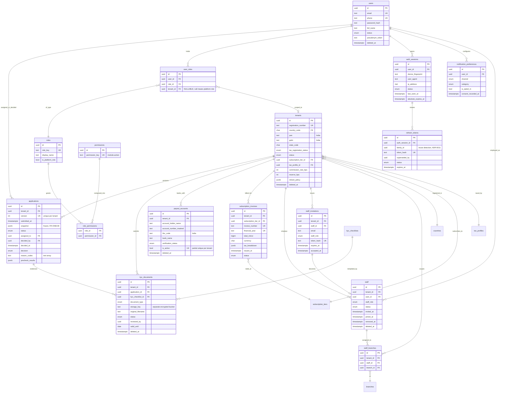
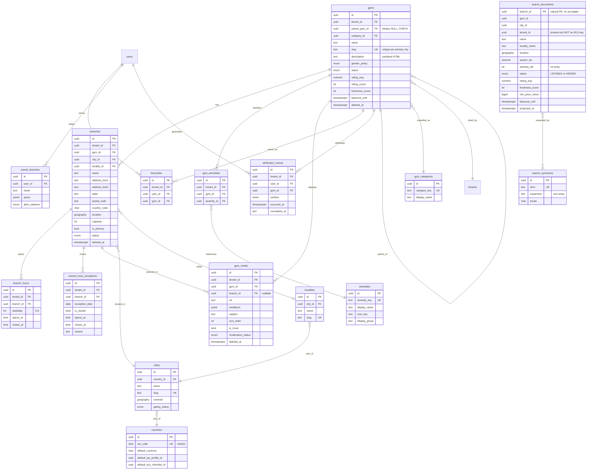
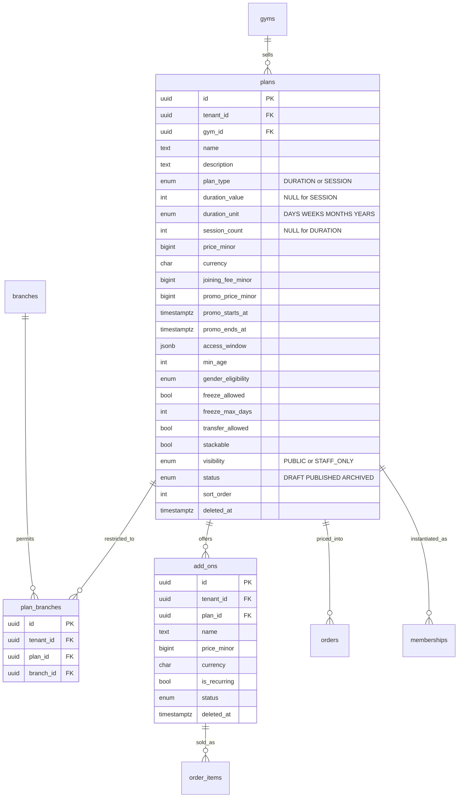
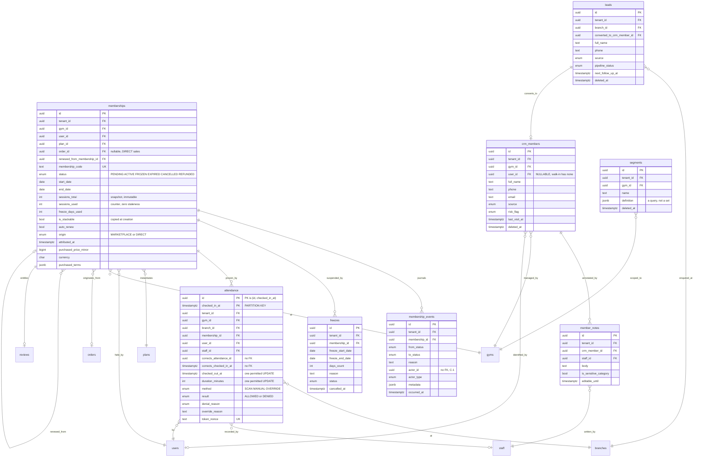
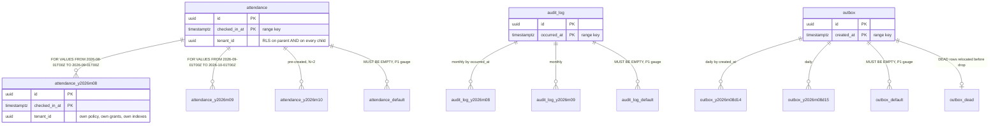

```mermaid
erDiagram
  audit_log {
    uuid id PK "PK is (id, occurred_at)"
    timestamptz occurred_at PK "PARTITION KEY, monthly"
    uuid tenant_id "nullable, no FK"
    uuid actor_id "no FK, C-1"
    enum actor_type
    uuid impersonated_by
    text entity_type "polymorphic, 31 values"
    uuid entity_id "polymorphic, no FK"
    text action
    jsonb before
    jsonb after
    inet ip
    text user_agent
    text correlation_id
    uuid reason_code_id
    text reason
  }
  outbox {
    uuid id PK "PK is (id, created_at)"
    timestamptz created_at PK "PARTITION KEY, daily"
    uuid tenant_id
    text aggregate_type "polymorphic"
    uuid aggregate_id "polymorphic, no FK"
    text event_type
    jsonb payload
    enum status "PENDING PUBLISHED DEAD"
    timestamptz available_at
    timestamptz published_at
    int attempts
    text last_error
    text correlation_id
  }
  outbox_dead {
    uuid id PK
    uuid tenant_id
    text aggregate_type
    uuid aggregate_id
    text event_type
    jsonb payload
    int attempts
    text last_error
    timestamptz first_failed_at
    timestamptz resolved_at
  }
  idempotency_keys {
    uuid id PK
    text idempotency_key UK "GLOBAL unique"
    uuid tenant_id "nullable, set before checkout resolves"
    text endpoint
    text request_hash
    int response_status
    jsonb response_body
    timestamptz expires_at
  }
  notification_log {
    uuid id PK
    uuid tenant_id "NULLABLE, HYBRID"
    uuid recipient_id
    enum recipient_type
    uuid outbox_id FK
    uuid notification_template_id FK
    enum channel
    text template_key
    enum category
    jsonb payload
    enum status
    text provider_message_id
    int attempts
    text last_error
    timestamptz sent_at
  }
  notification_templates {
    uuid id PK
    text template_key UK "unique with channel, locale, version"
    enum channel
    char locale
    int version
    text subject
    text body
    enum routing_class "TRANSACTIONAL or PROMOTIONAL"
    text dlt_template_id "India SMS"
    enum dlt_approval_status
    uuid supersedes_version_id FK
    bool is_active
  }
  support_tickets {
    uuid id PK
    uuid tenant_id FK "NULLABLE, HYBRID"
    uuid requester_user_id FK
    text ticket_ref UK
    enum category
    enum priority
    enum status
    timestamptz first_response_due_at
    timestamptz resolution_due_at
    uuid related_entity_id
    text related_entity_type
  }
  ticket_messages {
    uuid id PK
    uuid tenant_id
    uuid support_ticket_id FK
    uuid author_id
    enum author_type
    text body
    bool is_internal_note
  }
  referrals {
    uuid id PK
    uuid referrer_user_id FK
    uuid referee_user_id FK "NULL until accepted"
    uuid qualifying_membership_id FK
    text referral_code UK
    enum reward_type "COUPON only in Phase 1"
    uuid reward_coupon_id
    enum status
    timestamptz qualified_at
  }
  report_definitions {
    uuid id PK
    uuid tenant_id "NULLABLE, HYBRID"
    text report_key UK
    text display_name
    jsonb parameters
    timestamptz deleted_at
  }
  export_jobs {
    uuid id PK
    uuid tenant_id FK
    uuid report_definition_id FK
    uuid requested_by
    jsonb parameters
    enum status
    text signed_url
    timestamptz url_expires_at
  }
  feature_flags {
    uuid id PK
    text flag_key UK
    bool is_enabled
    jsonb targeting "tenant, role, percentage"
  }
  help_articles {
    uuid id PK
    text slug UK
    text title
    text body
    uuid reason_code_id FK
    timestamptz deleted_at
  }

  outbox ||--o{ notification_log : triggers
  outbox ||--o| outbox_dead : quarantines
  notification_templates ||--o{ notification_log : rendered_from
  notification_templates ||--o| notification_templates : supersedes
  support_tickets ||--o{ ticket_messages : threads
  support_tickets }o--|| users : raised_by
  support_tickets }o--o| tenants : concerns
  referrals }o--|| users : referrer
  referrals }o--o| users : referee
  referrals }o--o| memberships : qualified_by
  report_definitions ||--o{ export_jobs : materialises
  help_articles }o--o| reason_codes : indexed_by
  audit_log }o--o| reason_codes : classified_by
```

# ERD — Physical Entity-Relationship Reference

> **Phase:** 4 — Database design (pre-code) · **Status:** Authoritative for the *physical* schema shape ·
> **Date:** 2026-08-06 · **Launch market:** India (`LAUNCH_MARKET_INDIA.md`) ·
> **Engine:** PostgreSQL 16 + PostGIS 3.4 + Row-Level Security (ADR-0004, ADR-0006, ADR-0007)
>
> **Precedence.** `PROJECT_CONSTITUTION.md` > `MASTER_PRD.md` > `DECISION_LOG.md` >
> `STACK_ADDITIONS.md` > `docs/engineering/*` > this document. Where this document appears to
> conflict with any of them, they win and this document is defective.
>
> **No application code, no `schema.prisma` and no migration exists.** Every fenced block below is
> labelled **illustrative — not committed code**. This document specifies *what the physical schema
> must be*; `prisma/migrations/` will later *be* it.

---

## 0. What this document is, and its relationship to the logical ERD

`docs/engineering/ERD.md` is the **Phase-2 logical entity design**. It answers *what entities exist,
what they mean, which aggregate owns them, what may never be edited*. It deliberately refuses to
specify column types, nullability, index names or storage.

**This document is the physical counterpart.** It answers *what tables exist in PostgreSQL, under
what names, with what primary keys, joined by what named constraints, with what delete semantics,
partitioned how*.

| Question | Answered in |
| :--- | :--- |
| Does `attendance` belong to the `CheckIn` aggregate? Is it append-only? What is its retention class? | `engineering/ERD.md` §4.4, §10.1 |
| Is `attendance.id` the primary key? (No — `(id, checked_in_at)` is.) What is the FK constraint from `attendance` to `branches` called? | **This document**, §4, §6 |
| Why is `plan_branches` open-world? | `engineering/ERD.md` §7.3 |
| What is the exact composite FK that stops a `plan_branches` row pointing at another tenant's branch? | **This document**, §6, §7 |
| Which snapshot columns exist and what governs them? | `engineering/ERD.md` §9 |
| What PostgreSQL type each snapshot column is, and whether it is `NOT NULL` | `docs/database/Schema.md` (sibling document) |

**Cross-reference, do not duplicate.** Where a ruling already exists in the logical ERD this document
cites it (`LOG §n`) and moves on. Where the physical design **diverges** from the logical design, the
divergence is stated inline *and* collected in the divergence register at §10. There are **fourteen**
of them and every one is justified.

**Sibling Phase-4 documents.** `Schema.md` (per-table column dictionary, the `PROJECT_CONSTITUTION.md`
§15.1 gate), `Indexes.md` (every index with the query it serves, rule **IX1**), `RLS.md` (policy
catalogue), `Migrations.md`, `AuditStrategy.md`, `NamingConvention.md`, `SeedData.md`. This document
owns **tables, keys, relationships and partitions** and nothing else.

---

## 1. Physical conventions in force

### 1.1 The one thing that governs every table on this page

> **THE PRISMA + RLS HAZARD.** PostgreSQL RLS resolves `current_setting('app.tenant_id')` against the
> **transaction on the current connection**. `SET LOCAL` / `set_config(..., true)` is transaction-scoped.
> Prisma pools connections, so a naive `prisma.membership.findMany()` issued after a separate
> `SET LOCAL` executes on a *different pooled connection* where the variable is unset — returning
> either zero rows or, under a permissive policy, **another tenant's rows**. That is `BR-TEN-01`
> broken silently. `PROJECT_CONSTITUTION.md` §11.4 and ADR-0005 make the mitigation constitutional:
> **every tenant-scoped operation is wrapped by a Prisma client extension in one interactive
> transaction that executes `SELECT set_config('app.tenant_id', $1, true)` first. No repository may
> touch the raw client** (rule **P2**).

Three consequences run through this document and are re-stated where they bite:

| # | Consequence for the *physical* design | Where |
| :-: | :--- | :--- |
| **PH1** | A policy predicate must be evaluable from the row's **own columns**. No policy may join. This is why `tenant_id` is denormalised onto every child and grandchild row, and why the FK inventory carries `tenant_id` in composite keys | §6, §7 |
| **PH2** | Because the tenant variable is transaction-local and the extension holds a connection for the whole interactive transaction, **connection count is a first-order capacity constraint** — pool sizing is documented in `Scalability.md` §4.1 and pooling must run in **session mode**, never transaction mode (ADR-0004 implementation notes) | §5.4, §9.5 |
| **PH3** | RLS is **not inherited by a partition accessed by name**, and neither are grants. Every partition child created by `audit.partition-maintenance` must receive `ENABLE`+`FORCE ROW LEVEL SECURITY`, both policies and the grant set, or it is a `BR-TEN-01` hole no application test would find | §9.4 |

### 1.2 The one schema, and the one exception

ADR-0006 fixes the model as *"one database and one schema"*. Every table a Prisma model maps to lives
in **`public`**. Two categories of object do not:

| Namespace | Contents | Why |
| :--- | :--- | :--- |
| `public` | All **80** first-class tables of §4, all enum types, all functions, all policies | ADR-0006. Prisma's `multiSchema` preview feature is **not** enabled (A-01 is approved for the stable surface only) |
| `partitions` | Every **partition child** of `attendance`, `audit_log` and `outbox` — `partitions.attendance_y2026m08`, etc. | **Divergence D-01.** Partition children are raw-SQL objects Prisma never models. Isolating them keeps `\dt public.*` at 80 rows instead of ~180 and growing, lets `audit.partition-maintenance` apply grants with one `GRANT … ON ALL TABLES IN SCHEMA partitions`, and stops the `information_schema` CI checks of §15.5 **AC6** from having to special-case 84 audit children. Attaching a partition across schemas is supported and the parent stays in `public` |
| `postgis` | `spatial_ref_sys`, `geography_columns`, PostGIS functions | Extension-owned. `CREATE EXTENSION postgis SCHEMA postgis` keeps ~1,000 extension objects out of `public` |

`search_path` for every application role is fixed to `public, postgis` — never `"$user"`, which is a
well-known privilege-escalation vector when a role can create objects in a schema earlier on the path.

### 1.3 Naming, applied

`PROJECT_CONSTITUTION.md` §8.6 and §8.7 are law. The physical design needs **three extensions** to
§8.7, because §8.7 is silent on them:

| Object | Pattern | Example | Status |
| :--- | :--- | :--- | :--- |
| Foreign key | `fk_<child>__<parent>` | `fk_memberships__plans` | §8.7 as written |
| Foreign key, **>1 between the same pair** | `fk_<child>__<parent>__<role>` | `fk_reserves__settlement_batches__held`, `fk_reserves__settlement_batches__released`, `fk_referrals__users__referrer`, `fk_referrals__users__referee` | **Extension E-1.** §8.7's pattern is not unique when a child references one parent twice. Eleven constraint pairs need it (§6) |
| Trigger | `trg_<table>__<rule>` | `trg_orders__freeze_money_after_paid` | **Extension E-2.** §8.7 names no trigger convention; §10.4 of the logical ERD requires three |
| Trigger function | `fn_<table>__<rule>` | `fn_orders__freeze_money_after_paid` | **Extension E-2** |
| Partition, daily grain | `<table>_y<YYYY>m<MM>d<DD>` | `outbox_y2026m08d14` | **Extension E-3.** §8.7 gives the monthly form only; ADR-0017 partitions `outbox` daily |

**There are no `SEQUENCE` objects in this schema.** Primary keys are UUIDs (§5) and the three
document-number series are row-locked counters (§8.4), because `FR-INV-02` requires *gapless* and a
PostgreSQL sequence is explicitly non-transactional and gaps on rollback. `seq_…` in §8.7 therefore
names nothing in Phase 1, and a migration that creates a sequence is a review-blocking finding.

### 1.4 The standard column block, with physical types

Present on **every** table in §4; omitted from every diagram and every inventory row below.

*Illustrative — not committed code.*

```sql
id          uuid        NOT NULL,              -- UUIDv7, application-generated. NO DEFAULT (§5.3)
tenant_id   uuid        NOT NULL,              -- RLS-class tables only (§4). NEVER nullable there
created_at  timestamptz NOT NULL DEFAULT now(),
updated_at  timestamptz NOT NULL,              -- written by the Prisma extension, not a trigger (AC3)
created_by  uuid        NULL,                  -- NULL only for system actors (AC2)
updated_by  uuid        NULL,
deleted_at  timestamptz NULL                   -- soft-delete tables only (ADR-0024, SD1)
```

| Rule | Statement | Source |
| :--- | :--- | :--- |
| **C-1** | `created_by`/`updated_by` carry **no foreign key** to `users`. `BR-DAT-04` pseudonymises a user without deleting the rows they touched, and `NFR-PRV-04` purges `R-OPS` identities while `R-FIN` rows survive. An FK would make the data-subject job undeletable-by-construction. This mirrors the logical ERD's ruling for `audit_log.actor_id` (`LOG §5.2`) and extends it to all four audit columns — **divergence D-02**, because `LOG §1.1` describes them as "actor id" without ruling on the constraint | `NFR-DQ-05`, `BR-DAT-04` |
| **C-2** | `updated_at` has **no default and no trigger**. `AC3` requires it to be set by the application so a bulk job's writes are attributable to that job. A CI check asserts no `BEFORE UPDATE` trigger touches it | §15.5 **AC3** |
| **C-3** | `deleted_at` exists **only** on tables §4 marks `Soft`. Its absence is a positive statement that the row is never deleted (`SD4`) |  ADR-0024 |
| **C-4** | Every unique constraint on a soft-deletable table is **partial**: `… WHERE deleted_at IS NULL` (`SD7`) | §15.4 **SD7** |

### 1.5 Type rulings

| Concept | Physical type | Ruling |
| :--- | :--- | :--- |
| Money | `bigint` named `<name>_minor`, with an adjacent `currency char(3)` | `BR-PAY-01`, `NFR-DQ-02`, **DB1**. India: paise. `numeric`/`float`/`money` is a **build failure** (**DB2**) |
| Currency | `char(3)` + `CHECK (currency ~ '^[A-Z]{3}$')` | The PRD says `char(3)`; `bpchar` blank-pads and strips trailing spaces on comparison, so the check is what actually constrains it |
| Rate | `int` basis points, `<name>_bps` | **DB3**. `commission_rate_bps`, `reserve_bps`, `rate_bps` inside `tax_breakdown` |
| Instant | `timestamptz`, stored UTC | **DB4**, `NFR-DQ-03`, ADR-0025. `timestamp without time zone` is forbidden (**DB6**) |
| Civil date | `date`, interpreted in `tenants.timezone` | **DB5**, `BR-MEM-03`. `memberships.start_date`/`end_date`, `branch_hour_exceptions.exception_date`, `settlement_batches.period_start`/`period_end` |
| Wall-clock time | `time without time zone` | `branch_hours.opens_at`/`closes_at`. `timetz` is forbidden — an offset attached to a recurring weekly opening hour is meaningless |
| Geography | `geography(Point,4326)` | ADR-0007. `branches.location`, `cities.centroid`, `search_documents.location`. **Not** `geometry` — `ST_DWithin` on `geography` takes metres directly, which is what `FR-SRCH-01` asks for |
| Rating average | `numeric(2,1)` on `gyms.rating_avg` | `§C2.2` types it so. **This is the single permitted `numeric` column** and the **DB2** CI scanner must allow-list it by name, or it will false-positive forever |
| Enum | native PostgreSQL enum type, `<name>_enum`, values `SCREAMING_SNAKE_CASE` verbatim from the PRD | §8.6, §8.7. **Not** a lookup table: `MG9` permits adding values by migration, and a native type gives the planner a cheap equality and gives `packages/types` a Zod union that fails to compile when a value is added |
| Open shape | `jsonb` (never `json`) | §15.8 rule 5's closed list. `jsonb` for the binary form, `GIN` only where a containment query exists |
| Free text | `text` (never `varchar(n)`) | Length is a validation concern (Zod, §9.7), not a storage one; `varchar(n)` costs an `ALTER TABLE` to widen |

### 1.6 Tenancy classes, physically

`LOG §1.2` defines five classes. Physically they resolve to **four** shapes, distinguished by exactly
two facts: is `tenant_id` nullable, and does the policy admit the null row to a tenant?

| Class | Tables | `tenant_id` | RLS | Policies |
| :--- | ---: | :--- | :--- | :--- |
| **RLS-STRICT** | 46 | `NOT NULL` | `ENABLE` + `FORCE` | `rls_<t>__tenant_isolation` (`FOR ALL TO app_rw`), `rls_<t>__platform_read` (`FOR SELECT TO app_platform`) |
| **RLS-NULL** | 4 | nullable, **no FK to `tenants`** on two of them | `ENABLE` + `FORCE` | The **same plain** predicate. A null-tenant row is therefore invisible to every tenant (`NULL = uuid` is not `TRUE`) and visible only through `app_platform`. This is the correct behaviour and it is load-bearing: `audit_log`, `outbox`, `outbox_dead`, `idempotency_keys` |
| **HYBRID** | 5 | nullable | `ENABLE` + `FORCE` | `rls_<t>__tenant_isolation` with an **extended** `USING` clause that names the null case (§7.6): `coupons`, `notification_log`, `support_tickets`, `ticket_messages`, `report_definitions` |
| **GLOBAL** (incl. IDENTITY) | 25 | absent | not enabled | none — reached only through `ReferenceDataRepository` (**BR4**) or, for `users` and its children, through `iam/`'s user-scoped path |

The five-class logical vocabulary collapses and re-splits. **IDENTITY** and **GLOBAL** are physically
identical (no `tenant_id`, no policy). **DUAL** is physically an ordinary RLS table that happens to
have a `platform_read` policy — which *every* RLS table has, per `Security.md` §9. **Divergence D-03**:
the physical schema does not distinguish DUAL from RLS, because the distinction was about *who reads*,
and that is a role-and-policy fact, not a table fact. The new split is RLS-STRICT versus RLS-NULL,
which the logical design does not make and which matters enormously — a nullable `tenant_id` on an
RLS table is either a deliberate platform-scope escape hatch or a `BR-TEN-01` hole, and only an
explicit class tells a reviewer which.

### 1.7 Database roles — the canonical names

`LOG §10.3` names four roles `gm_*`. ADR-0004's implementation notes, `Security.md` §9, `Deployment.md`
§3.2 and `Epic_01` all name them `app_*`. **Divergence D-04, resolved by precedence** (`DECISION_LOG.md`
outranks `engineering/ERD.md`): the physical names are `app_*`.

| Canonical physical name | `LOG §10.3` alias | Held by | Grants | RLS |
| :--- | :--- | :--- | :--- | :--- |
| `app_migrate` | `gm_migrator` | The one-shot `migrator` image only (`Deployment.md` D-C1); never in an API pod | Owns every object; full DDL + DML | Owner — which is exactly why every table is `FORCE`d |
| `app_rw` | `gm_app` | API and worker processes | `SELECT`, `INSERT` everywhere; `UPDATE`/`DELETE` only where `LOG §10.1` permits | Enforced. **No `BYPASSRLS`** |
| `app_ro` | — | Read-replica routing for tenant-scoped reads (`Scalability.md` §5.6) | `SELECT` only | Enforced, same policy |
| `app_platform` | `gm_platform` | `runElevated()` only (`§C1.4`, §11.6) | `SELECT` across tenants via `rls_<t>__platform_read`; no writes outside `admin/`-owned reference tables | Enforced by a **second policy**, not bypassed |
| `app_audit_writer` | `gm_audit_writer` | The audit interceptor's dedicated connection | `INSERT` on `audit_log` and its partitions **only** — no `SELECT` | Enforced |

`app_rw` cannot read `audit_log` through `app_audit_writer`'s connection and cannot insert through its
own. That separation is what makes `NFR-SEC-13` (*"stored where application credentials cannot alter
them"*) a grant fact rather than a policy claim.

---

## 2. The master physical ERD

Real table names, real column names, real key markers. Standard columns (§1.4) are omitted
everywhere. Attribute blocks are shown for the **eleven spine tables** — the ones every other diagram
hangs off; §3's domain diagrams carry the column detail for the rest. Partition children are omitted
here and rendered in §9.

`PK` marks a primary-key column, `FK` a foreign-key column, `UK` a column participating in a unique
constraint that carries business meaning (§8).

*Diagram — illustrative, not committed code.*



```mermaid
erDiagram
  %% ================= SPINE, WITH COLUMNS =================
  tenants {
    uuid id PK
    text legal_name
    text trading_name
    enum entity_type "tenant_entity_type_enum"
    text registration_number UK "uq per country_code"
    char country_code FK "char(2) -> countries"
    char currency "char(3), INR"
    text timezone "IANA, Asia/Kolkata"
    text pan "India, AAAAA9999A"
    text gstin "India, 15 chars"
    char state_code "char(2), drives CGST_SGST vs IGST"
    enum tax_registration_status
    enum status "tenant_status_enum"
    uuid subscription_tier_id FK
    uuid tax_profile_id FK
    int commission_rate_bps
    int renewal_commission_rate_bps
    int settlement_cycle_days
    int reserve_bps
    jsonb refund_policy
    timestamptz deleted_at
  }
  gyms {
    uuid id PK
    uuid tenant_id FK "RLS key"
    uuid parent_gym_id FK "CHECK IS NULL in Phase 1"
    uuid category_id FK
    text name
    text slug UK "unique per city_id"
    enum gender_policy
    enum status "gym_status_enum"
    numeric rating_avg "numeric(2,1), denormalised"
    int rating_count
    int freshness_score
    timestamptz featured_until
    timestamptz deleted_at
  }
  branches {
    uuid id PK
    uuid tenant_id FK
    uuid gym_id FK
    uuid city_id FK
    uuid locality_id FK
    text address_line1
    text postal_code
    geography location "geography(Point,4326), GiST"
    int capacity
    bool is_primary UK "partial unique per gym_id"
    enum status
    timestamptz deleted_at
  }
  plans {
    uuid id PK
    uuid tenant_id FK
    uuid gym_id FK
    enum plan_type "DURATION or SESSION"
    int duration_value
    enum duration_unit
    int session_count
    bigint price_minor
    char currency
    bigint joining_fee_minor
    bigint promo_price_minor
    jsonb access_window
    bool freeze_allowed
    int freeze_max_days
    bool stackable
    enum visibility
    enum status
    timestamptz deleted_at
  }
  orders {
    uuid id PK
    uuid tenant_id FK
    uuid gym_id FK
    uuid user_id FK
    uuid plan_id FK
    uuid coupon_id FK
    text order_ref UK
    text idempotency_key UK "globally unique"
    enum status "order_status_enum"
    enum purchaser_type "INDIVIDUAL only, CHECK"
    bigint gross_minor
    bigint discount_minor
    bigint net_minor
    bigint tax_minor
    bigint total_minor
    bigint commission_base_minor
    bigint commission_minor
    bigint commission_tax_minor "PENDING O-1"
    bigint gateway_fee_minor
    bigint payable_to_gym_minor
    char currency
    uuid commission_rule_id FK
    jsonb refund_policy_snapshot
    jsonb tax_snapshot
    date start_date
    timestamptz expires_at
  }
  payments {
    uuid id PK
    uuid tenant_id FK
    uuid order_id FK
    uuid collected_by_staff_id FK
    text provider
    text provider_intent_id UK
    text provider_charge_id
    enum method
    bigint amount_minor
    char currency
    enum status "payment_status_enum"
    bool is_offline
    jsonb raw_payload "redacted"
  }
  memberships {
    uuid id PK
    uuid tenant_id FK
    uuid gym_id FK
    uuid user_id FK
    uuid plan_id FK
    uuid order_id FK
    uuid renewed_from_membership_id FK
    text membership_code UK "unique per tenant"
    enum status "membership_status_enum"
    date start_date
    date end_date
    int sessions_total
    int sessions_used
    int freeze_days_used
    bool is_stackable "copied from plan, drives partial unique"
    bool auto_renew
    enum origin
    timestamptz attributed_at
    bigint purchased_price_minor
    char currency
    jsonb purchased_terms
  }
  attendance {
    uuid id PK "composite PK with checked_in_at"
    timestamptz checked_in_at PK "PARTITION KEY, monthly"
    uuid tenant_id FK
    uuid gym_id FK
    uuid branch_id FK
    uuid membership_id FK
    uuid user_id FK
    uuid staff_id FK
    uuid corrects_attendance_id "no FK, see D-08"
    timestamptz checked_out_at
    int duration_minutes
    enum method
    enum result
    enum denial_reason
    text override_reason
    text token_nonce UK "unique with checked_in_at"
  }
  invoices {
    uuid id PK
    uuid tenant_id FK
    uuid order_id FK "unique"
    uuid tax_profile_id FK
    text invoice_number UK
    text financial_year UK "label, 2026-27"
    timestamptz issued_at
    jsonb tenant_snapshot
    jsonb customer_snapshot
    jsonb line_items
    jsonb tax_breakdown "array of CGST/SGST/IGST components"
    char place_of_supply_state_code
    text sac_code
    bigint total_minor
    char currency
    text pdf_url
    enum status
  }
  ledger_entries {
    uuid id PK
    uuid tenant_id FK
    uuid settlement_batch_id FK
    uuid commission_rule_id FK
    enum entry_type "SALE COMMISSION COMMISSION_TAX GATEWAY_FEE TAX REFUND ..."
    enum direction "CREDIT or DEBIT"
    bigint amount_minor
    char currency
    enum reference_type "polymorphic, no FK"
    uuid reference_id "polymorphic, no FK"
    timestamptz occurred_at
  }
  users {
    uuid id PK "no tenant_id, class IDENTITY"
    text email UK
    text phone UK
    text password_hash
    bool is_email_verified
    bool is_phone_verified
    enum status
    text pseudonym_token "set by BR-DAT-04 job"
    timestamptz deleted_at
  }

  %% ================= TENANCY AND IDENTITY =================
  tenants ||--o{ gyms : owns
  tenants ||--o{ applications : versions
  tenants ||--o{ kyc_documents : submits
  tenants ||--o{ staff : employs
  tenants ||--o{ staff_invitations : issues
  tenants ||--o{ payout_accounts : banks_with
  tenants ||--o{ subscription_invoices : billed_for
  tenants ||--o{ ledger_entries : accrues
  tenants ||--o{ settlement_batches : settles
  tenants ||--o{ document_sequences : numbers_with
  tenants }o--o{ coupons : issues
  tenants }o--|| subscription_tiers : subscribes_to
  tenants }o--|| tax_profiles : taxed_by
  tenants }o--|| countries : registered_in
  applications ||--o{ kyc_documents : evidences
  kyc_checklists ||--o{ kyc_documents : templated_by
  users ||--o{ applications : decides
  users ||--o{ user_roles : holds
  users ||--o{ auth_sessions : opens
  users ||--o{ notification_preferences : configures
  users ||--o{ staff : employed_as
  users ||--o{ memberships : holds
  users ||--o{ orders : places
  users ||--o{ reviews : writes
  users ||--o{ favourites : keeps
  users ||--o{ saved_searches : stores
  users ||--o{ attribution_events : generates
  users ||--o{ support_tickets : raises
  users ||--o{ referrals : refers
  users ||--o{ coupon_redemptions : consumes
  users ||--o| crm_members : identified_by
  user_roles }o--|| roles : of_type
  user_roles }o--o| tenants : scoped_to
  roles ||--o{ role_permissions : grants
  role_permissions }o--|| permissions : of
  auth_sessions ||--o{ refresh_tokens : rotates
  staff ||--o{ staff_branches : assigned_to
  staff ||--o{ attendance : records
  staff ||--o{ payments : collects
  staff ||--o{ review_responses : authors
  staff ||--o{ member_notes : writes
  staff_invitations ||--o| staff : becomes

  %% ================= CATALOGUE AND DISCOVERY =================
  gyms ||--o{ branches : has
  gyms ||--o{ plans : sells
  gyms ||--o{ gym_amenities : declares
  gyms ||--o{ gym_media : displays
  gyms ||--o{ reviews : receives
  gyms ||--o{ favourites : saved_as
  gyms ||--o{ crm_members : manages
  gyms ||--o{ attribution_events : attributed
  gyms ||--o{ orders : sells_via
  gyms ||--o{ memberships : hosts
  gyms }o--|| gym_categories : classified_as
  gyms ||--o{ gyms : parent_of
  gym_amenities }o--|| amenities : references
  branches ||--o{ branch_hours : opens
  branches ||--o{ branch_hour_exceptions : closes
  branches ||--o{ plan_branches : permits
  branches ||--o{ staff_branches : staffed_by
  branches ||--o{ attendance : hosts
  branches ||--o{ leads : receives
  branches ||--o{ gym_media : pictured_in
  branches ||--o| search_documents : projected_as
  branches }o--|| cities : located_in
  branches }o--o| localities : within
  cities }o--|| countries : part_of
  localities }o--|| cities : part_of

  %% ================= PLANS =================
  plans ||--o{ plan_branches : restricted_to
  plans ||--o{ add_ons : offers
  plans ||--o{ orders : priced_into
  plans ||--o{ memberships : instantiated_as

  %% ================= COMMERCE =================
  orders ||--o{ order_items : itemises
  orders ||--o{ payments : paid_by
  orders ||--o| invoices : documented_by
  orders ||--o| memberships : creates
  orders ||--o{ refunds : reversed_by
  orders ||--o| coupon_redemptions : redeems
  orders }o--o| coupons : discounted_by
  order_items }o--o| add_ons : may_be
  coupons ||--o{ coupon_redemptions : redeemed_via
  payments ||--o{ payment_events : logs
  payments ||--o{ disputes : contested_by
  payments ||--o{ refunds : reversed_through
  disputes ||--o{ dispute_evidence : supported_by
  invoices ||--o{ credit_notes : corrected_by
  refunds ||--o| credit_notes : issues
  commission_rules ||--o{ orders : rates

  %% ================= MEMBERSHIP, ATTENDANCE, CRM =================
  memberships ||--o{ membership_events : journals
  memberships ||--o{ freezes : suspended_by
  memberships ||--o{ attendance : proven_by
  memberships ||--o| reviews : entitles
  memberships ||--o{ refunds : terminated_by
  memberships ||--o{ referrals : qualifies
  memberships }o--o| memberships : renewed_from
  crm_members ||--o{ member_notes : annotated_by
  leads ||--o| crm_members : converts_to

  %% ================= MONEY =================
  ledger_entries }o--o| settlement_batches : batched_into
  ledger_entries ||--o| settlement_lines : stated_as
  settlement_batches ||--o{ settlement_lines : itemises
  settlement_batches ||--o{ reserves : holds
  settlement_batches }o--|| payout_accounts : paid_to
  commission_rules ||--o{ ledger_entries : rates
  tax_profiles ||--o{ invoices : governs
  subscription_tiers ||--o{ subscription_invoices : rated_at
  document_sequences ||--o{ invoices : numbers
  document_sequences ||--o{ credit_notes : numbers
  document_sequences ||--o{ subscription_invoices : numbers

  %% ================= TRUST =================
  reviews ||--o| review_responses : answered_by
  reviews ||--o{ review_reports : flagged_by
  review_reports }o--|| reason_codes : cites

  %% ================= PLATFORM =================
  outbox ||--o{ notification_log : triggers
  outbox ||--o| outbox_dead : quarantines
  notification_templates ||--o{ notification_log : rendered_from
  notification_templates ||--o| notification_templates : supersedes
  notification_preferences }o--|| users : belongs_to
  support_tickets ||--o{ ticket_messages : threads
  support_tickets }o--o| tenants : concerns
  report_definitions ||--o{ export_jobs : materialises
  search_documents }o--o{ search_synonyms : expanded_by
  audit_log }o--o| reason_codes : classified_by
  idempotency_keys ||--o| orders : guards
  feature_flags ||--o{ help_articles : documented_by
```

### 2.1 The seven edges that are deliberately absent

`LOG §2` names three. The physical design adds four more, each because a constraint that *could* be
created would be actively wrong.

| # | Absent edge | Why no foreign key exists | Divergence |
| :-: | :--- | :--- | :--- |
| 1 | `audit_log` → its subject | `(entity_type, entity_id)` is polymorphic across 31 types, and the audit row must outlive its subject (`CON-04`, `INV-DAT-2`, `R-AUD` = 7 years). An FK makes `R-AUD` unachievable the first time an `R-OPS` row is purged | `LOG §5.3` |
| 2 | `outbox` → its aggregate | `(aggregate_type, aggregate_id)`. The outbox row is purged 7 days after publish (`Scalability.md` §5.7.5, tightening `LOG`'s 30 days — **divergence D-05**); an aggregate lives for years. The lifetimes do not nest and the FK direction is wrong | `LOG §5.3`, ADR-0017 |
| 3 | `ledger_entries` → its subject | `(reference_type, reference_id)` across `ORDER`, `REFUND`, `DISPUTE`, `PAYOUT`, `ADJUSTMENT`, `SUBSCRIPTION_INVOICE`. Six nullable columns and a six-way exclusive-arc `CHECK` would buy identical integrity to a validated enum plus the nightly `ops.orphan-scan` | `LOG §5.3` |
| 4 | `attendance` → `attendance` (`corrects_attendance_id`) | **New in the physical design.** `LOG §10.5` requires the correction link. It cannot be a plain FK: the PK is composite `(id, checked_in_at)` (§5.5), so the FK would need two columns *and* would be an inbound reference to a partitioned table whose oldest partitions are `DETACH`ed at month 13 (§9.3). A dangling reference at detach time is worse than no constraint. Ruled: two columns, **no FK**, covered by `ops.orphan-scan` | **D-08** |
| 5 | `created_by` / `updated_by` → `users` | Rule **C-1**. `BR-DAT-04` must be able to hard-delete an identity while `R-FIN` rows survive | **D-02** |
| 6 | `crm_members` ↔ `segments` | The logical master diagram draws `CRM_MEMBERS }o--o{ SEGMENTS`. **There is no join table and no relationship at all.** `LOG §3.4` itself rules segments are *query definitions evaluated at read time*, so the M:N line in `LOG §2` is a modelling artefact. The physical schema has nothing between them | **D-06** |
| 7 | `search_documents` → `branches` | The projection is rebuilt by an outbox consumer and must survive a branch soft-delete long enough to receive the de-list event (`Scalability.md` §6.3: *"the projection row is not deleted on un-publish"*). `branch_id` is stored, indexed, and **not** constrained; the projection is disposable and fully rebuildable | **D-07** |

---

## 3. Domain sub-diagrams

**Eight** diagrams, one per domain. `LOG §3` draws **seven**, folding `plans/` into Catalogue.
**Divergence D-09**: the physical design separates **Plans** because it is the smallest domain with
the highest constraint density — the open-world `plan_branches` encoding (`LOG §7.3`), the
`stackable`→`is_stackable` copy that a partial unique index depends on (`LOG §8.8`), and the
`BR-PLN-07` one-active-promotion exclusion constraint all live there, and burying them inside a
twenty-table Catalogue diagram loses them.

Owned tables carry columns. Tables owned by another domain appear as bare boundary nodes so the
crossing is visible.

### 3.1 Tenancy & Identity

Owns `tenancy/`, `iam/`, `staff/`, `onboarding/`. Nineteen tables.

*Diagram — illustrative, not committed code.*



| Physical note | Detail |
| :--- | :--- |
| `tenants` is its **own** RLS anchor | Policy is `id = current_setting('app.tenant_id')::uuid`, **not** `tenant_id = …`. It is the one table whose isolation predicate names `id`, and the policy generator of `Security.md` §9 must special-case it. Everything downstream depends on this row existing before any other tenant-owned row can pass `WITH CHECK` |
| `users` carries **no** `tenant_id` and **no** RLS | `BR-TEN-02`/`FR-AUTH-11`: one identity may own or work for several tenants. A tenant observes a person only through an RLS-scoped `staff`, `memberships`, `orders` or `crm_members` row. `uq_users__email` and `uq_users__phone` are therefore **global** partial uniques (`WHERE deleted_at IS NULL`) with no tenant prefix — and unlike the two exceptions of `LOG §5.4`, this needs no justification because the table is not an RLS table at all |
| `user_roles.tenant_id` is nullable **and** is a real FK | Null discriminates a platform role (`SUPER_ADMIN`, `VERIFICATION_OFFICER`) from a tenant role. `ON DELETE CASCADE` from `tenants`, because a tenant-scoped grant is meaningless once the tenant row is gone. The table is class **GLOBAL** despite holding `tenant_id`: it is read during authentication, *before* the tenant context exists, so an RLS policy on it would deadlock the login path. **Divergence D-10** — `LOG §4.1` classes it IDENTITY, which is the same physical outcome, but the reason matters and is recorded here |
| `role_permissions` has no surrogate `id` | The only table in the schema whose PK is a natural composite `(role_id, permission_id)`. §5.6 justifies the exception |
| `refresh_tokens` is a **sleeper-volume** table | ~18 M inserts in Year 1 at 15-minute access-token rotation over 150 k monthly-active users; ~4.5 M rows steady state after the `R-EPH` sweep. It is the fourth-largest table in the system and appears in nobody's capacity model. `idx_refresh_tokens__expires_at` and the `(user_id, family_id, status)` index of `Scalability.md` §5.6.2 are both mandatory |
| `notification_preferences` is the other sleeper | 500 k users × 8 channel×category pairs ≈ **4 M rows** at Year 1 from a table that looks like configuration. The PK is `id`; the business key is `uq_notification_preferences__user_channel_category` |
| `staff_branches.tenant_id` is present although both parents carry it | Required by **PH1** and by the composite FKs of §7.2. Without it the row is unpolicyable |
| `applications` is append-only and versioned | `uq_applications__tenant_id_version`. Resubmission is version N+1, never an `UPDATE` (`BR-GYM-05`, `FR-ONB-08`). The `reason_codes` column is `text[]` — a genuine array, not JSONB, because it is a flat list of stable keys that `@>` filters in the approval queue |
| `kyc_documents.storage_key` points at a **different bucket with a different key** | `BR-DAT-07`, `NFR-SEC-02`, `INV-DAT-6`. The row is `R-KYC`; the storage object outlives the tenant and is purged on statutory expiry with the row tombstoned, never hard-deleted by `app_rw` |

### 3.2 Catalogue

Owns `catalog/` and `discovery/`. Sixteen tables including the search projection and five reference
tables.

*Diagram — illustrative, not committed code.*



| Physical note | Detail |
| :--- | :--- |
| `gyms.slug` uniqueness is **per city, and the city is not on `gyms`** | `§C2.2` says *"slug unique per city"*, but the city lives on `branches`. Physical ruling: `gyms` carries a denormalised `primary_city_id uuid NOT NULL` maintained by the same transaction that sets `branches.is_primary`, and the constraint is `uq_gyms__primary_city_id_slug (primary_city_id, slug) WHERE deleted_at IS NULL`. **Divergence D-11** — the logical ERD never resolves where the city comes from, and a unique index cannot join |
| `branch_hours` has **no** unique on `(branch_id, weekday)` | Split hours are multiple rows (`LOG §7.4`). Non-overlap is an exclusion constraint: `ex_branch_hours__no_overlap EXCLUDE USING gist (branch_id WITH =, weekday WITH =, timerange(opens_at, closes_at) WITH &&)`, which requires the `btree_gist` extension for the `=` operators on `uuid` and `int` |
| `branches.location` carries the **only** GiST index on a tenant-owned table | `gix_branches__location`. ADR-0007: one index serving `FR-SRCH-01`, `FR-DETL-01`, `FR-DETL-08` and `BR-GYM-08`'s geo-tolerance check |
| `search_documents` is a **physical table that is not a logical entity** | It holds no fact of its own and is fully rebuildable, so `LOG §6.5` correctly excludes it. Physically it exists, is 5,000 rows at Year 1, is **RLS-exempt**, and carries `tenant_id` **for diagnostics only** — a comment on the column says so, because a reviewer will otherwise assume a missing policy. It is the only non-reference table `PublicPrismaService` may read (`Architecture.md` §7) |
| `search_documents.branch_id` is the primary key | Natural key, no surrogate. One projection row per branch, upserted by `ON CONFLICT (branch_id) DO UPDATE` from the outbox consumer. A surrogate id would make the upsert need a second lookup |
| `favourites` is RLS-class although it is user-owned | It carries `gym_id` and therefore `tenant_id`, so the gym's own analytics can count saves. `LOG §4.1` classes it RLS; the physical consequence is that a member's favourites list is read through the *gym's* tenant scope on the dashboard and through the *user's* scope on `/me/favourites`, which needs the HYBRID-style policy of §7.6 — **noted as an open item, O-P3** |
| Reference tables carry **stable text keys**, not just ids | `amenities.amenity_key`, `gym_categories.category_key`, `countries.iso_code`, `cities.slug`. `NFR-DQ-06` requires *stable identifiers*; a UUID that changes when the seed is re-run is not stable. The key is the contract with `packages/types`; the UUID is the join column |
| `attribution_events` is `R-FIN`, not `R-OPS` | `A6.3` makes it evidence in a commission dispute *"visible to both parties"*. ~3 M rows/year, append-only, no `deleted_at`, and its `users` FK is `RESTRICT` so a subject-deletion job must pseudonymise rather than delete |

---

### 3.3 Plans

Owns `plans/`. Three tables, and the highest constraint density per table in the schema.

*Diagram — illustrative, not committed code.*



| Physical note | Detail |
| :--- | :--- |
| `plan_branches` **zero rows means all branches** | Open-world encoding (`LOG §7.3`). There is **no** `is_all_branches` boolean and there must never be one — a boolean plus a list is two sources of truth. The consequence for the physical schema is that no `CHECK` and no `NOT EXISTS` constraint can express the rule; it is a predicate the evaluator runs, and `uq_plan_branches__plan_id_branch_id` is the only constraint the table carries |
| `plan_branches` `ON DELETE CASCADE` from **both** parents is safe *only because of* the open-world rule | Deleting the last restriction **widens** the plan to all branches rather than breaking it. `NFR-USE-06` therefore obliges the confirmation dialog to say *"this plan will become available at all branches"*, and that UI obligation is created by this cascade. If the encoding were ever changed to closed-world, both cascades become `RESTRICT` in the same migration |
| `plans.stackable` is copied to `memberships.is_stackable` at purchase | A partial unique index cannot join (`LOG §7.2`, `LOG §8.8`). The copy is what makes `BR-MEM-04` a storage-layer constraint instead of a racy read-then-write, and `AC-PAY-01.1` (two simultaneous submissions produce exactly one membership) is only achievable that way |
| `BR-PLN-07` — at most one active promotion — is an **exclusion constraint** | `ex_plans__one_active_promotion EXCLUDE USING gist (id WITH =, tstzrange(promo_starts_at, promo_ends_at) WITH &&) WHERE (promo_price_minor IS NOT NULL AND deleted_at IS NULL)`. Named per §8.7's own worked example. Requires `btree_gist` |
| `plan_type` drives two mutually-exclusive column sets | `ck_plans__type_columns CHECK ((plan_type = 'DURATION' AND duration_value IS NOT NULL AND session_count IS NULL) OR (plan_type = 'SESSION' AND session_count IS NOT NULL AND duration_value IS NULL))`. `NFR-DQ-01` says integrity is a database concern; a nullable pair with no check is an invitation |
| `plans` is `R-FIN`, not `R-OPS` | An invoice line names a plan and a settlement dispute two years later must resolve it. Archiving never orphans (`BR-PLN-04`), which is why every FK **into** `plans` is `RESTRICT` and there is no hard-delete path for `app_rw` |
| Money columns and `currency` travel together, three times | `price_minor`, `joining_fee_minor`, `promo_price_minor` share one `currency` column, because a plan cannot be priced in two currencies. `ck_plans__currency_matches_tenant` is **not** created — the tenant's currency may legitimately change on a re-domiciliation, and the order's snapshot is what binds |

### 3.4 Commerce

Owns `ordering/`, `payments/`, `billing/`. Nine tables.

*Diagram — illustrative, not committed code.*

```mermaid
erDiagram
  orders {
    uuid id PK
    uuid tenant_id FK
    uuid gym_id FK
    uuid user_id FK
    uuid plan_id FK
    uuid coupon_id FK
    uuid commission_rule_id FK
    text order_ref UK
    text idempotency_key UK "GLOBAL unique, see 8.3"
    enum status
    enum origin "MARKETPLACE or DIRECT"
    enum channel "WEB or DASHBOARD"
    enum purchaser_type "INDIVIDUAL only in Phase 1"
    bigint gross_minor "G"
    bigint discount_minor "D"
    bigint net_minor "N = G - D"
    bigint tax_minor "T"
    bigint total_minor "N + T"
    bigint commission_base_minor "B"
    bigint commission_minor "C"
    bigint commission_tax_minor "Ct, NULL until O-1 agreed"
    bigint gateway_fee_minor "F, NULL until reported"
    bigint payable_to_gym_minor "P, NULL until F known"
    char currency
    jsonb refund_policy_snapshot
    jsonb tax_snapshot
    date start_date
    timestamptz expires_at
  }
  order_items {
    uuid id PK
    uuid tenant_id FK
    uuid order_id FK
    uuid add_on_id FK "nullable"
    enum item_type "PLAN JOINING_FEE ADD_ON"
    text description
    int quantity
    bigint unit_price_minor
    bigint line_total_minor
    char currency
  }
  coupons {
    uuid id PK
    uuid tenant_id FK "NULL when scope PLATFORM"
    enum scope "PLATFORM or TENANT"
    text code UK "two partial uniques, see 8.3"
    enum discount_type
    int discount_value
    bigint max_discount_minor
    timestamptz valid_from
    timestamptz valid_to
    int total_limit
    int per_user_limit
    bool first_purchase_only
    uuid applicable_plan_ids "uuid array"
    uuid applicable_branch_ids "uuid array"
    enum funding_source "immutable after first use"
    enum status
    int redemption_count
    timestamptz deleted_at
  }
  coupon_redemptions {
    uuid id PK
    uuid tenant_id FK
    uuid coupon_id FK
    uuid order_id FK UK
    uuid user_id FK
    bigint discount_minor
    char currency
    timestamptz redeemed_at
  }
  payments {
    uuid id PK
    uuid tenant_id FK
    uuid order_id FK
    uuid collected_by_staff_id FK
    text provider
    text provider_intent_id UK
    text provider_charge_id
    enum method
    bigint amount_minor
    char currency
    enum status
    text failure_code
    text failure_message
    bool is_offline
    jsonb raw_payload
  }
  payment_events {
    uuid id PK
    uuid tenant_id FK
    uuid payment_id FK
    text provider_event_id UK "GLOBAL unique"
    text event_type
    jsonb payload
    timestamptz received_at
    timestamptz occurred_at
  }
  invoices {
    uuid id PK
    uuid tenant_id FK
    uuid order_id FK UK
    uuid tax_profile_id FK
    text invoice_number UK
    text financial_year UK "2026-27"
    timestamptz issued_at
    jsonb tenant_snapshot
    jsonb customer_snapshot
    jsonb line_items
    jsonb tax_breakdown
    char place_of_supply_state_code
    text sac_code
    bigint subtotal_minor
    bigint tax_total_minor
    bigint total_minor
    char currency
    text pdf_url
    enum status
  }
  credit_notes {
    uuid id PK
    uuid tenant_id FK
    uuid original_invoice_id FK
    uuid refund_id FK
    text credit_note_number UK
    text financial_year UK
    jsonb line_items
    jsonb tax_breakdown
    bigint total_minor
    char currency
    timestamptz issued_at
    enum status
  }
  document_sequences {
    uuid id PK
    uuid tenant_id FK
    enum document_type "INVOICE CREDIT_NOTE SUBSCRIPTION_INVOICE"
    text financial_year UK
    bigint next_number
    text prefix
  }

  orders ||--o{ order_items : itemises
  orders ||--o{ payments : paid_by
  orders ||--o| invoices : documented_by
  orders ||--o| coupon_redemptions : redeems
  orders }o--o| coupons : discounted_by
  orders }o--|| plans : prices
  orders }o--|| users : placed_by
  orders }o--|| gyms : sold_by
  orders }o--o| commission_rules : rated_by
  order_items }o--o| add_ons : may_be
  coupons ||--o{ coupon_redemptions : redeemed_via
  payments ||--o{ payment_events : logs
  payments }o--o| staff : collected_by
  payments ||--o{ disputes : contested_by
  invoices ||--o{ credit_notes : corrected_by
  invoices }o--|| tax_profiles : governed_by
  refunds ||--o| credit_notes : issues
  document_sequences ||--o{ invoices : numbers
  document_sequences ||--o{ credit_notes : numbers
```

| Physical note | Detail |
| :--- | :--- |
| `orders` carries **nine** money figures | The eight of `A6.3` plus `commission_tax_minor`. All `bigint`, all sharing one `currency`. `commission_tax_minor` is **nullable and `NULL` on every row until `O-1` is agreed** (`LOG §12.4`, `LAUNCH_MARKET_INDIA.md` Conflict 2) — §11.3 states exactly what changes if it is rejected |
| Three arithmetic invariants are `CHECK` constraints, not application assertions | `ck_orders__net_equals_gross_minus_discount CHECK (net_minor = gross_minor - discount_minor)`; `ck_orders__total_equals_net_plus_tax CHECK (total_minor = net_minor + tax_minor)`; `ck_orders__payable CHECK (payable_to_gym_minor IS NULL OR payable_to_gym_minor = (net_minor + tax_minor) - commission_minor - gateway_fee_minor - COALESCE(commission_tax_minor, 0))`. `NFR-DQ-01` and `INV-FIN-3`. The `COALESCE` is what makes the constraint correct **both before and after** `O-1` |
| `gateway_fee_minor` and `payable_to_gym_minor` are **nullable** | `BR-FIN-06` forbids estimating `F`. A null `F` holds the line out of settlement, which is the correct behaviour and is why the payable check is guarded by `IS NULL` |
| The nine figures and both snapshots freeze at `PAID` | `trg_orders__freeze_money_after_paid` — `BEFORE UPDATE`, raises if `OLD.status = 'PAID'` and any guarded column changed. A grant cannot express a state-conditional rule (`LOG §10.4`); each trigger carries a stable error code so `§C1.5`'s error model surfaces it without leaking SQL |
| `orders.idempotency_key` is **globally** unique | One of exactly two non-tenant-prefixed uniques on RLS tables (`LOG §5.4`). The interceptor runs before tenant resolution on the public checkout path. Keys are 128-bit random; a cross-tenant collision is a `409` with no body detail |
| `payment_events.provider_event_id` is the other one | The webhook arrives with a provider id and nothing else; deduplication (`BR-PAY-05`) must succeed before the tenant is known. The unique index is what makes replay protection a storage fact |
| `coupons` is class **HYBRID** | `ck_coupons__scope_tenant CHECK ((scope = 'PLATFORM' AND tenant_id IS NULL) OR (scope = 'TENANT' AND tenant_id IS NOT NULL))`, and the policy is `scope = 'PLATFORM' OR tenant_id = current_setting('app.tenant_id')::uuid`. Two partial unique indexes on `code`, one per scope (§8.3) |
| `coupons.applicable_plan_ids` / `applicable_branch_ids` are `uuid[]`, not join tables | The only two array columns carrying ids in the schema. Justified: they are read once during coupon validation, never joined, never reported on, and a join table would add two tables and four constraints to express a filter. `GIN` indexed for `@>` |
| `invoices`, `credit_notes` and `subscription_invoices` all draw from `document_sequences` | One counter table, three document types, keyed `(tenant_id, document_type, financial_year)`. `SELECT … FOR UPDATE` then `next_number + 1` in the issuing transaction. **A PostgreSQL `SEQUENCE` is unusable** — it is non-transactional and gaps on rollback, and `FR-INV-02` says *gapless*. §8.4 gives the full ruling |
| `invoices.order_id` is `UNIQUE` | `BR-PAY-10`: one invoice per order. The uniqueness *is* the rule; there is no application check |
| `credit_notes` ↔ `refunds` is the schema's **only** FK cycle | `credit_notes.refund_id → refunds.id` and `refunds.credit_note_id → credit_notes.id`. Resolved by declaring `fk_refunds__credit_notes` **`DEFERRABLE INITIALLY DEFERRED`** — the only deferrable constraint in the schema (§6.7) |

---

### 3.5 Membership & Attendance

Owns `memberships/`, `attendance/`, `crm/`. Eight tables, one of them partitioned.

*Diagram — illustrative, not committed code.*



| Physical note | Detail |
| :--- | :--- |
| `attendance` is the **only** tenant-owned partitioned table | `PARTITION BY RANGE (checked_in_at)`, monthly, UTC boundaries. Full treatment at §9.2 |
| `attendance` has **no** `deleted_at` and **no** surrogate-only PK | `BR-CHK-09`/`INV-CHK-4`: never updated except the one permitted completion write, never deleted. The PK is `(id, checked_in_at)` because Postgres requires the partition key in every unique constraint (§5.5) |
| `attendance.token_nonce` uniqueness is **`(token_nonce, checked_in_at)`**, not global | Forced by partitioning. It does **not** prevent the same nonce in two partitions. The real exactly-once guarantee lives one layer up in `idempotency_keys`, which is unpartitioned with a global unique on `key`, plus the Redis `SET NX` gate on the 60-second token TTL (ADR-0008, ADR-0012). `Scalability.md` finding **SC-F11** and `LOG §11.2` agree; the physical schema records the weakening rather than pretending the index is the control |
| `memberships` uniqueness is **`(user_id, gym_id)` partial**, never `(user_id)` | `uq_memberships__user_gym_nonstackable UNIQUE (user_id, gym_id) WHERE deleted_at IS NULL AND is_stackable = false AND status IN ('PENDING','ACTIVE','FROZEN')`. `BR-MEM-04` permits concurrent memberships at **different** gyms (`LOG §7.1`) and stackable ones at the **same** gym (`LOG §7.2`). Note the index has **no `tenant_id` prefix** and yet is not one of `LOG §5.4`'s two exceptions — because `gym_id` functionally determines `tenant_id`, so it is tenant-scoped in substance. **Divergence D-12**: the physical rule is *"prefixed by `tenant_id` **or** by a column that functionally determines it"*, which §8.2 states formally |
| `memberships.order_id` is nullable | A `DIRECT` staff-recorded sale creates an order (`FR-CRM-06`), but a migration import and an admin goodwill membership may not. Nullable so the exceptional path does not need a fake order |
| `crm_members.user_id` is nullable and that nullability **is the feature** | A walk-in has no platform account (Constitution §4.2). `ON DELETE SET NULL` from `users` leaves the gym's operational record intact and de-identified after a `BR-DAT-04` erasure |
| `member_notes.is_sensitive_category` is a column, not a tag | `NFR-PRV-07`: health-adjacent notes need a different retention and a different export treatment. A boolean the retention sweep can read beats a JSONB tag it has to parse |
| `segments.definition` is a query, not a set | There is no `segment_members` table and there must never be one (`LOG §3.4`, **divergence D-06**). A materialised set would let the nightly `crm.risk-flags` job become authoritative over a definition the owner just changed |
| `freezes` extends `end_date` by exactly `days_count` | `BR-MEM-05`. `days_count` is stored, not derived, because the extension arithmetic must be reproducible from the row after a timezone-configuration change. `memberships.freeze_days_used` is the denormalised sum with zero staleness (`LOG §8.6`) |
| The check-in transaction touches **two aggregates** | `INSERT attendance` + `UPDATE memberships SET sessions_used = sessions_used + 1` in one transaction — the documented exception 2 of `LOG §6.4`. Physically this means the check-in path holds a row lock on `memberships` for the duration; at `NFR-PERF-03`'s 150 ms server budget and ≤3 concurrent scans per membership, contention is not measurable, but it is why `memberships` is **not** partitioned |

### 3.6 Money

Owns `ledger/`, `settlements/`, `refunds/`, and the tenant-billing half of `billing/`. Eleven tables.

*Diagram — illustrative, not committed code.*

```mermaid
erDiagram
  ledger_entries {
    uuid id PK
    uuid tenant_id FK
    uuid settlement_batch_id FK "NULL until batched"
    uuid commission_rule_id FK
    enum entry_type
    enum direction "CREDIT or DEBIT"
    bigint amount_minor "always non-negative"
    char currency
    enum reference_type "polymorphic"
    uuid reference_id "polymorphic, no FK"
    timestamptz occurred_at
  }
  settlement_batches {
    uuid id PK
    uuid tenant_id FK
    uuid payout_account_id FK
    date period_start
    date period_end
    bigint opening_balance_minor
    bigint gross_minor
    bigint commission_minor
    bigint commission_tax_minor "PENDING O-1"
    bigint fees_minor
    bigint refunds_minor
    bigint reserve_held_minor
    bigint reserve_released_minor
    bigint net_payable_minor
    char currency
    jsonb payout_destination_snapshot
    enum status
    text payout_reference
    text statement_url
  }
  settlement_lines {
    uuid id PK
    uuid tenant_id FK
    uuid settlement_batch_id FK
    uuid ledger_entry_id FK UK
    bigint gross_minor
    bigint discount_minor
    bigint net_minor
    bigint tax_minor
    bigint commission_base_minor
    bigint commission_minor
    bigint commission_tax_minor "the ninth figure"
    bigint gateway_fee_minor
    bigint payable_minor
    char currency
  }
  reserves {
    uuid id PK
    uuid tenant_id FK
    uuid held_in_batch_id FK
    uuid released_in_batch_id FK "NULL until released"
    bigint amount_minor
    char currency
    date release_due_date
    enum status
  }
  refunds {
    uuid id PK
    uuid tenant_id FK
    uuid order_id FK
    uuid membership_id FK
    uuid payment_id FK
    uuid credit_note_id FK "DEFERRABLE"
    uuid requested_by
    enum requester_type
    enum reason_code
    text reason_text
    bigint requested_amount_minor
    bigint approved_amount_minor
    char currency
    jsonb computation
    enum status
    uuid approver_id
    text provider_refund_id
  }
  disputes {
    uuid id PK
    uuid tenant_id FK
    uuid payment_id FK
    text provider_dispute_id UK
    bigint amount_minor
    char currency
    enum reason_code
    enum status
    timestamptz evidence_due_at
    enum outcome
    timestamptz resolved_at
  }
  dispute_evidence {
    uuid id PK
    uuid tenant_id FK
    uuid dispute_id FK
    enum evidence_type
    text storage_key
    timestamptz submitted_at
  }
  payout_accounts {
    uuid id PK
    uuid tenant_id FK
    text ifsc_code
    text account_number_masked
    enum verification_status
    bool is_active
    timestamptz deleted_at
  }
  commission_rules {
    uuid id PK
    uuid subscription_tier_id FK
    enum rule_scope "PLATFORM or TIER"
    int standard_rate_bps
    int renewal_rate_bps
    timestamptz effective_from
    timestamptz effective_to
  }
  tax_profiles {
    uuid id PK
    uuid country_id FK
    jsonb components "CGST 50 pct + SGST 50 pct of 1800 bps"
    int total_rate_bps
    bool is_inclusive
    enum rounding_mode
    smallint fy_start_month "India = 4"
    text sac_code
    timestamptz effective_from
    timestamptz effective_to
  }
  subscription_tiers {
    uuid id PK
    text tier_key UK
    bigint monthly_price_minor
    char currency
    int commission_delta_bps
    jsonb limits
    timestamptz effective_from
  }

  ledger_entries }o--|| tenants : accrued_by
  ledger_entries }o--o| settlement_batches : batched_into
  ledger_entries ||--o| settlement_lines : stated_as
  ledger_entries }o--o| commission_rules : rated_by
  settlement_batches ||--o{ settlement_lines : itemises
  settlement_batches ||--o{ reserves : holds
  settlement_batches ||--o{ reserves : releases
  settlement_batches }o--|| payout_accounts : paid_to
  settlement_batches }o--|| tenants : owed_to
  refunds }o--|| orders : reverses
  refunds }o--o| memberships : terminates
  refunds }o--o| payments : via
  refunds ||--o| credit_notes : issues
  disputes }o--|| payments : contests
  disputes ||--o{ dispute_evidence : supported_by
  tax_profiles ||--o{ invoices : governs
  tax_profiles ||--o{ tenants : taxes
  commission_rules }o--o| subscription_tiers : delta_from
  subscription_tiers ||--o{ subscription_invoices : rated_at
  payout_accounts }o--|| tenants : belongs_to
```

| Physical note | Detail |
| :--- | :--- |
| **No table in this schema has a `balance_minor` column** | `INV-FIN-7`. Every balance is `SUM(amount_minor) FILTER (WHERE direction = 'CREDIT') - SUM(…) FILTER (WHERE direction = 'DEBIT')` over `ledger_entries`. The migration lint of `BR-FIN-01-N2` fails any DDL introducing a mutable balance column, and this document is the artefact that lint cites |
| `ledger_entries.amount_minor` is always **non-negative** | `ck_ledger_entries__amount_non_negative CHECK (amount_minor >= 0)` — named verbatim in §8.7's own examples. Sign is carried by `direction`, never by the number. A negative amount plus a direction is two representations of one fact |
| `ledger_entries` is **not partitioned** | ~949 k rows/year, every query `(tenant_id, occurred_at)`-scoped, `R-FIN` means nothing is ever deleted — so partitioning's primary benefit (cheap retention) does not apply, and it would complicate `settlement_batch_id` reference integrity. `LOG §11.6` and `Scalability.md` invariant 2 agree |
| `settlement_lines` holds **nine** denormalised figures | Not an optimisation — `BR-FIN-02` requires them persisted and *"never recomputed at display time"*. Written once at `LOCKED` and never touched again. `commission_tax_minor` is the ninth, nullable pending `O-1` |
| `settlement_lines.ledger_entry_id` is `UNIQUE` | One statement line per contributing entry. The uniqueness is what makes `BR-FIN-03`'s exact-sum assertion meaningful — a double-counted entry is impossible rather than merely unlikely |
| `settlement_batches.payout_destination_snapshot` sits **beside** the FK | `LOG §9.5`. A bank-detail change after a statement is issued must not rewrite where the money is shown to have gone. Both exist; the snapshot prints, the FK joins |
| `reserves` references `settlement_batches` **twice** | `fk_reserves__settlement_batches__held` and `…__released`, per naming extension **E-1**. Both `RESTRICT`: a released reserve must stay traceable to both batches (`A6.4`, `FR-SETL-04`) |
| `tax_profiles.components` is the India structural requirement | `[{"component":"CGST","share_bps":5000},{"component":"SGST","share_bps":5000}]` of `total_rate_bps = 1800`, or `[{"component":"IGST","share_bps":10000}]`. `FR-INV-04` asks for a breakdown *by rate*; India needs it *by component* (`LOG §12.3`). The **shape** stays country-agnostic per ADR-0028 and `OBJ-09` |
| `tax_profiles.fy_start_month smallint` is **configuration, not a constant** | India = 4. `FR-INV-02`'s gapless-per-FY sequence and `AC-INV-01.3`'s rollover both read it. Hardcoding January is a defect that surfaces in April (`LAUNCH_MARKET_INDIA.md` Conflict 4) |
| `commission_rules` and `tax_profiles` are **versioned by validity window, never edited** | `effective_from`/`effective_to`, append-only, `GLOBAL` class. This is why `orders.commission_rule_id` and `invoices.tax_profile_id` are FKs rather than snapshots (`LOG §9.8`) — the referenced row is already immutable |
| `disputes.provider_dispute_id` is unique **per provider**, not globally | `uq_disputes__provider_dispute_id (provider, provider_dispute_id)`. Unlike `payment_events`, a dispute always arrives correlated to a known payment, so the tenant is resolvable and the constraint need not be global |

---

### 3.7 Trust

Owns `reviews/`. Three tables, and three constraints that carry the whole domain.

*Diagram — illustrative, not committed code.*

```mermaid
erDiagram
  reviews {
    uuid id PK
    uuid tenant_id FK
    uuid gym_id FK
    uuid user_id FK
    uuid membership_id FK UK "unique with tenant_id, this IS BR-REV-02"
    int rating "CHECK 1..5"
    jsonb sub_ratings
    text body
    jsonb media
    enum status "PENDING PUBLISHED HELD UNPUBLISHED REMOVED"
    jsonb screening_result
    jsonb edit_history "append log, not a table"
    timestamptz published_at
    timestamptz edited_at
  }
  review_responses {
    uuid id PK
    uuid tenant_id FK
    uuid review_id FK UK "unique, one response only"
    uuid author_staff_id FK
    text body
    enum status
    timestamptz published_at
  }
  review_reports {
    uuid id PK
    uuid tenant_id FK
    uuid review_id FK
    uuid reporter_id "no FK, may be anonymous"
    enum reporter_type
    uuid reason_code_id FK
    text notes
    enum status
    text resolution
  }
  reason_codes {
    uuid id PK
    enum code_type "REJECTION DENIAL REFUND MODERATION OVERRIDE"
    text code_key UK
    text display_name
    bool is_retired
  }

  reviews }o--|| gyms : rates
  reviews }o--|| users : written_by
  reviews }o--|| memberships : entitled_by
  reviews ||--o| review_responses : answered_by
  reviews ||--o{ review_reports : flagged_by
  review_responses }o--|| staff : authored_by
  review_reports }o--|| reason_codes : cites
  attendance }o--|| memberships : proves_entitlement_for
```

| Physical note | Detail |
| :--- | :--- |
| `uq_reviews__tenant_id_membership_id` **is** `BR-REV-02` | *One review per member per gym per membership term.* Because a membership is one member at one gym for one term, uniqueness on `membership_id` delivers the rule exactly, and the `tenant_id` prefix satisfies §8.2. **Divergence D-13**: `Scalability.md` §5.6.2 proposes `UNIQUE (user_id, membership_id)`; that index is **not created**, because `membership_id` functionally determines `user_id` and the extra column buys nothing while widening the index |
| `reviews.membership_id` is `NOT NULL` | Entitlement proof is structural. There is no path to a review without a membership, and no nullable escape hatch for imported or admin-created reviews |
| `BR-REV-01` — *at least one recorded check-in* — is **not** a constraint | No SQL constraint can express *"≥1 row exists in another table"* without a trigger that races. It is checked through `AttendanceQueryPort` at submission and re-asserted nightly. The physical consequence is a **retention coupling**: `attendance` rows for a `(user_id, gym_id)` pair with a `PUBLISHED` review cannot be purged at month 13 or the verified-member marker becomes unprovable (`LOG §4.4` note 5, open item `O-5`). §9.2 records it as a partition-detach precondition |
| `reviews` has **no** `deleted_at` | Removal is `status = 'REMOVED'` (`SD3`: domain vocabulary over "deleted"). Consequently `uq_reviews__tenant_id_membership_id` is **not** partial — there is no soft-delete predicate to add |
| `reviews.edit_history` is JSONB, not a table | One row per edit per review; volume negligible; only ever read with its parent. A table would add a join to the gym detail page's hot path for nothing (`LOG §3.6`) |
| `review_responses.review_id` is `UNIQUE` with **no delete grant** | `BR-REV-05`/`INV-TRU-4`: one response, and the gym may never edit or delete the review. `app_rw` holds no `DELETE` on `reviews` at all |
| `review_reports.reporter_id` carries **no FK** | A report may come from an unauthenticated visitor. Rule **C-1**'s logic applied to a second column |
| `gyms.rating_avg` / `rating_count` are recomputed here, ≤60 s stale | By the `reviews/` handler on `review.published` / `review.unpublished` / `review.removed`, corrected nightly by `catalog.rating-audit` (`LOG §8.1`). The columns live on `gyms` because the ranking index `idx_gyms__status_rating_freshness` cannot use a correlated aggregate and `NFR-PERF-01` is 500 ms at p95 |

### 3.8 Platform

Owns `common/`, `audit/`, `admin/`, `notifications/`, `reporting/`, `support/`. Fifteen tables, two
of them partitioned.

*Diagram — illustrative, not committed code.*



| Physical note | Detail |
| :--- | :--- |
| `audit_log` is partitioned monthly and written by a **different role** | `app_audit_writer` holds `INSERT` and nothing else; `app_rw` holds `SELECT` and nothing else. `NFR-SEC-13` is a grant fact. §9.3 gives the partition treatment |
| `audit_log.tenant_id` is **nullable and unconstrained** | Platform-scope actions (a tier change, a flag toggle, a reference-data edit) have no tenant. The policy is `tenant_id = current_setting('app.tenant_id')::uuid` for `app_rw` plus `USING (true) FOR SELECT TO app_platform` for the `FR-ADMN-09` explorer — which is `LOG`'s **DUAL** class expressed as two ordinary policies (§1.6, **D-03**) |
| **`audit_log` does not audit the append-only tables** | Rule **SC-R02**: writing an audit row for an insert into `ledger_entries`, `membership_events`, `payment_events` or `attendance` is an immutable record of an immutable record. Two exceptions are enumerated and audited because they record a *decision*: a `BR-CHK-10` staff override, and an **AP4** check-out correction. Applying the rule holds `audit_log` at 5,000 rows/day instead of 57,500 — **1.8 TB of storage over the 7-year `R-AUD` window** |
| `outbox` is partitioned **daily**, not monthly | ADR-0017 and `Scalability.md` §5.7.1: retention is 7 days, so pruning must be `DROP TABLE`, not a `DELETE` of 420,000 rows. Naming extension **E-3**: `outbox_y2026m08d14`. **Divergence D-05** — `LOG §11` partitions two tables and purges the outbox at 30 days; the physical design partitions **three** and purges at 7 |
| `outbox_dead` is **unpartitioned** and retained until resolved | A `DEAD` row is a defect awaiting a human, surfaced in `FR-ADMN-13`'s health view. Moving it out of the partitioned parent is what lets the parent's partitions be dropped on schedule regardless |
| `outbox` takes exactly one kind of `UPDATE` | Column-level grant on `published_at`, `attempts`, `last_error`, `status`. The relay's claim query is `SELECT … WHERE status = 'PENDING' AND available_at <= now() ORDER BY created_at, id FOR UPDATE SKIP LOCKED LIMIT n`, served by a **partial** index `idx_outbox__available_at_id__pending`. It runs every 5 seconds forever and is the single most frequent query in the system |
| `idempotency_keys` is unpartitioned with a **global** unique on `idempotency_key` | This is where the check-in exactly-once guarantee actually lives (`Scalability.md` **SC-F11**). Partitioning it would destroy the global unique and therefore the guarantee. 24-hour TTL, ~60 k rows steady state, ~22 M inserts/year |
| `notification_log` is class **HYBRID** and is the **second-largest table** | 20 M rows/year. Policy `tenant_id IS NULL OR tenant_id = current_setting('app.tenant_id')::uuid`. **Not partitioned** in Phase 1 — rule **SC-R03** applies category-scoped retention (`Operational` 90 days, `Transactional` per `NFR-PRV-04`), which holds it at ~2 GB steady state. Re-evaluate at 100 M rows; monthly partitioning is the pre-planned answer |
| `notification_templates` carries the **India DLT state machine** | `dlt_template_id`, `dlt_approval_status` (`NOT_REQUIRED`, `PENDING_DLT_APPROVAL`, `APPROVED`, `REJECTED`), `supersedes_version_id` self-FK. The dispatcher resolves the **latest `APPROVED` version**, not the latest version, so an edited SMS template does not stop sending while TRAI approval is pending (`LAUNCH_MARKET_INDIA.md` Conflict 5, `LOG §12.5`). `routing_class` is a property of the *template*; `notification_log.category` is a property of the *send* — two columns, two meanings, and conflating them breaks DND routing |
| `support_tickets.tenant_id` is nullable | A member's ticket about the platform has no tenant. HYBRID policy, plus a requester-id gate on the tenant-null rows |
| `referrals.reward_type` has one value and a `CHECK` | `ck_referrals__reward_type CHECK (reward_type = 'COUPON')`. The wallet seam (`LOG §13.3`) is a widened enum position, not a stub table. **No `wallet_entries` table exists and none may be created in Phase 1** |
| `export_jobs` holds a signed URL and its expiry, never the file | Files live in India-region object storage behind the CDN. The row is the job record and the expiry clock |

---

## 4. Physical table inventory

**80 first-class tables.** The 76 logical entities of `LOG §4`, plus four the physical design requires
and the logical design correctly excluded because they hold no domain fact: `search_documents`
(ADR-0007 projection), `document_sequences` (the `FR-INV-02` gapless allocator), `outbox_dead`
(ADR-0017 quarantine) and `search_synonyms` (ADR-0007's stated FTS gap). Partition children are
counted separately in §9.

**Column legend.**

| Column | Values |
| :--- | :--- |
| **Schema** | `public` for all 80 (§1.2). Partition children live in `partitions` |
| **Tncy** | `RLS` = `tenant_id NOT NULL`, both policies · `RLS-N` = `tenant_id` nullable, **plain** policy, null rows platform-only · `HYB` = `tenant_id` nullable, **extended** policy (§7.6) · `GLB` = no `tenant_id`, RLS not enabled |
| **A-O** | `Y` = `app_rw` holds `INSERT`+`SELECT` only · `U:<cols>` = plus a column-level `UPDATE` grant on exactly those columns · `N` = ordinary CRUD subject to §15.4 soft delete |
| **Part** | Partition strategy, or `—` |
| **Y1 rows** | Derived from `NFR-SCAL-01` (2,000 tenants · 5,000 branches · 500,000 users · 100,000 concurrent-eligible memberships · 50,000 check-ins/day), `SC-A01` (1.4 branches per gym) and `Scalability.md` §2.8's growth model. Cumulative at end of Year 1 unless the row says *steady* |
| **PK** | `id` = single-column `uuid`; anything else is stated |

### 4.1 Tenancy & Identity — 16 tables

| # | Table | Schema | Tncy | A-O | Part | Y1 rows | PK strategy |
| :-: | :--- | :--- | :--- | :--- | :--- | ---: | :--- |
| 1 | `tenants` | public | RLS¹ | N | — | 2,000 | `id` |
| 2 | `applications` | public | RLS | **Y** | — | 3,400 | `id` |
| 3 | `kyc_documents` | public | RLS | N | — | 22,000 | `id` |
| 4 | `payout_accounts` | public | RLS | N | — | 2,600 | `id` |
| 5 | `subscription_invoices` | public | RLS | **Y** | — | 24,000 | `id` |
| 6 | `users` | public | GLB | N | — | 500,000 | `id` |
| 7 | `user_roles` | public | GLB² | N | — | 512,000 | `id` |
| 8 | `roles` | public | GLB | N | — | 12 | `id` |
| 9 | `permissions` | public | GLB | N | — | 180 | `id` |
| 10 | `role_permissions` | public | GLB | N | — | 700 | **`(role_id, permission_id)`** — natural composite, §5.6 |
| 11 | `auth_sessions` | public | GLB | N | — | 1,200,000 | `id` |
| 12 | `refresh_tokens` | public | GLB | **Y** | — | **18,000,000** (≈4.5 M steady) | `id` |
| 13 | `notification_preferences` | public | GLB | N | — | **4,000,000** | `id` |
| 14 | `staff` | public | RLS | N | — | 10,000 | `id` |
| 15 | `staff_branches` | public | RLS | N | — | 14,000 | `id` |
| 16 | `staff_invitations` | public | RLS | N | — | 15,000 | `id` |

¹ `tenants`' isolation predicate names `id`, not `tenant_id` — the one exception the policy generator
must special-case. ² `user_roles` holds `tenant_id` but is **GLB**: it is read during authentication,
before a tenant context exists, so a policy on it would deadlock login (**D-10**).

### 4.2 Catalogue & Discovery — 10 tables

| # | Table | Schema | Tncy | A-O | Part | Y1 rows | PK strategy |
| :-: | :--- | :--- | :--- | :--- | :--- | ---: | :--- |
| 17 | `gyms` | public | RLS | N | — | 3,600 | `id` |
| 18 | `branches` | public | RLS | N | — | 5,000 | `id` |
| 19 | `branch_hours` | public | RLS | N | — | 49,000 | `id` |
| 20 | `branch_hour_exceptions` | public | RLS | N | — | 60,000 | `id` |
| 21 | `gym_amenities` | public | RLS | N | — | 43,000 | `id` |
| 22 | `gym_media` | public | RLS | N | — | 54,000 | `id` |
| 23 | `favourites` | public | RLS | N | — | 300,000 | `id` |
| 24 | `saved_searches` | public | GLB | N | — | 60,000 | `id` |
| 25 | `attribution_events` | public | RLS | **Y** | — | 3,000,000 | `id` |
| 26 | `search_documents` | public | GLB³ | N | — | 5,000 | **`branch_id`** — natural, one row per branch |

³ RLS-exempt by design and the **only** non-reference table `PublicPrismaService` may read. It carries
`tenant_id` for diagnostics with a column comment saying so, or a reviewer will read the absent policy
as a bug.

### 4.3 Plans — 3 tables

| # | Table | Schema | Tncy | A-O | Part | Y1 rows | PK strategy |
| :-: | :--- | :--- | :--- | :--- | :--- | ---: | :--- |
| 27 | `plans` | public | RLS | N | — | 21,600 | `id` |
| 28 | `plan_branches` | public | RLS | N | — | 15,000 | `id` |
| 29 | `add_ons` | public | RLS | N | — | 7,000 | `id` |

### 4.4 Commerce — 9 tables

| # | Table | Schema | Tncy | A-O | Part | Y1 rows | PK strategy |
| :-: | :--- | :--- | :--- | :--- | :--- | ---: | :--- |
| 30 | `orders` | public | RLS | **U**⁴ | — | 300,000 | `id` |
| 31 | `order_items` | public | RLS | **Y** | — | 450,000 | `id` |
| 32 | `coupons` | public | **HYB** | N | — | 20,000 | `id` |
| 33 | `coupon_redemptions` | public | RLS | **Y** | — | 45,000 | `id` |
| 34 | `payments` | public | RLS | N | — | 360,000 | `id` |
| 35 | `payment_events` | public | RLS | **Y** | — | 900,000 | `id` |
| 36 | `invoices` | public | RLS | **Y** | — | 300,000 | `id` |
| 37 | `credit_notes` | public | RLS | **Y** | — | 12,000 | `id` |
| 38 | `document_sequences` | public | RLS | N⁵ | — | 6,000 | `id` |

⁴ `orders` is CRUD until `PAID`; thereafter the nine money figures, `currency`,
`refund_policy_snapshot` and `tax_snapshot` are frozen by `trg_orders__freeze_money_after_paid`. A
grant cannot express a state-conditional rule. ⁵ `document_sequences` is the one table designed to be
`UPDATE`d under a row lock on every invoice issuance — §8.4.

### 4.5 Membership, Attendance & CRM — 8 tables

| # | Table | Schema | Tncy | A-O | Part | Y1 rows | PK strategy |
| :-: | :--- | :--- | :--- | :--- | :--- | ---: | :--- |
| 39 | `memberships` | public | RLS | **U**⁶ | — | 300,000 | `id` |
| 40 | `membership_events` | public | RLS | **Y** | — | 900,000 | `id` |
| 41 | `freezes` | public | RLS | N | — | 20,000 | `id` |
| 42 | `attendance` | public | RLS | **U:** `checked_out_at`, `duration_minutes` | **Monthly** by `checked_in_at` | **18,250,000** | **`(id, checked_in_at)`** — partition key must be in the PK |
| 43 | `crm_members` | public | RLS | N | — | 400,000 | `id` |
| 44 | `member_notes` | public | RLS | N | — | 150,000 | `id` |
| 45 | `segments` | public | RLS | N | — | 6,000 | `id` |
| 46 | `leads` | public | RLS | N | — | 250,000 | `id` |

⁶ `memberships` freezes `purchased_price_minor`, `currency`, `purchased_terms`, `sessions_total`,
`is_stackable`, `origin`, `attributed_at` from insert, via `trg_memberships__freeze_purchase_terms`.

### 4.6 Money — 10 tables

| # | Table | Schema | Tncy | A-O | Part | Y1 rows | PK strategy |
| :-: | :--- | :--- | :--- | :--- | :--- | ---: | :--- |
| 47 | `ledger_entries` | public | RLS | **Y** | — | 949,000 | `id` |
| 48 | `settlement_batches` | public | RLS | **U**⁷ | — | 104,000 | `id` |
| 49 | `settlement_lines` | public | RLS | **Y** | — | 750,000 | `id` |
| 50 | `reserves` | public | RLS | N | — | 104,000 | `id` |
| 51 | `refunds` | public | RLS | N | — | 12,000 | `id` |
| 52 | `disputes` | public | RLS | N | — | 600 | `id` |
| 53 | `dispute_evidence` | public | RLS | **Y** | — | 1,800 | `id` |
| 54 | `commission_rules` | public | GLB | **Y** | — | 50 | `id` |
| 55 | `tax_profiles` | public | GLB | **Y** | — | 10 | `id` |
| 56 | `subscription_tiers` | public | GLB | **Y** | — | 4 | `id` |

⁷ `settlement_batches` freezes the eight roll-ups plus `period_start`/`period_end` at `LOCKED`; only
`status`, `payout_reference` and `statement_url` may move afterwards.

### 4.7 Trust — 3 tables

| # | Table | Schema | Tncy | A-O | Part | Y1 rows | PK strategy |
| :-: | :--- | :--- | :--- | :--- | :--- | ---: | :--- |
| 57 | `reviews` | public | RLS | N | — | 20,000 | `id` |
| 58 | `review_responses` | public | RLS | N | — | 9,000 | `id` |
| 59 | `review_reports` | public | RLS | N | — | 600 | `id` |

### 4.8 Platform — 10 tables

| # | Table | Schema | Tncy | A-O | Part | Y1 rows | PK strategy |
| :-: | :--- | :--- | :--- | :--- | :--- | ---: | :--- |
| 60 | `audit_log` | public | **RLS-N**⁸ | **Y** | **Monthly** by `occurred_at` | 1,825,000 | **`(id, occurred_at)`** |
| 61 | `outbox` | public | **RLS-N** | **U:** `status`, `published_at`, `attempts`, `last_error` | **Daily** by `created_at` | 21,900,000 inserted (≈420,000 steady) | **`(id, created_at)`** |
| 62 | `outbox_dead` | public | **RLS-N** | N | — | 500 | `id` |
| 63 | `idempotency_keys` | public | **RLS-N**⁹ | N | — | 22,000,000 inserted (≈60,000 steady) | `id` |
| 64 | `notification_log` | public | **HYB** | N | — | **20,075,000** (≈2 GB steady after **SC-R03**) | `id` |
| 65 | `support_tickets` | public | **HYB** | N | — | 25,000 | `id` |
| 66 | `ticket_messages` | public | **HYB** | **Y** | — | 90,000 | `id` |
| 67 | `referrals` | public | GLB | N | — | 30,000 | `id` |
| 68 | `report_definitions` | public | **HYB** | N | — | 200 | `id` |
| 69 | `export_jobs` | public | RLS | N | — | 120,000 | `id` |

⁸ `audit_log` is `LOG`'s **DUAL** class, physically an RLS table with the same two policies every RLS
table carries (**D-03**). `tenant_id` is nullable because a platform-scope action has no tenant, and a
null row is consequently invisible to `app_rw` under the plain predicate — which is exactly right.
Written only by `app_audit_writer`. ⁹ `idempotency_keys.tenant_id` is nullable because the idempotency
interceptor runs **before** tenant resolution on the public checkout path (`LOG §5.4`). The row is
back-filled with the tenant once resolution succeeds; a row that never resolves stays null and expires
in 24 hours.

### 4.9 Platform-global reference — 11 tables

All are `§C2.3`-class: no `tenant_id`, RLS not enabled, written only by `admin/` through the audited,
reason-required path (`FR-ADMN-05`, `FR-ADMN-06`, ADR-0028), read through `ReferenceDataRepository`
(**BR4**). All carry a **stable text key** alongside the UUID (`NFR-DQ-06`).

| # | Table | Schema | Tncy | A-O | Part | Y1 rows | PK strategy | Stable key |
| :-: | :--- | :--- | :--- | :--- | :--- | ---: | :--- | :--- |
| 70 | `countries` | public | GLB | N | — | 249 | `id` | `iso_code char(2)` |
| 71 | `cities` | public | GLB | N | — | 4,000 (≈200 serviceable) | `id` | `slug` |
| 72 | `localities` | public | GLB | N | — | 5,000 | `id` | `slug` |
| 73 | `amenities` | public | GLB | N | — | 80 | `id` | `amenity_key` |
| 74 | `gym_categories` | public | GLB | N | — | 20 | `id` | `category_key` |
| 75 | `kyc_checklists` | public | GLB | N | — | 30 | `id` | `(country_id, entity_type, version)` |
| 76 | `reason_codes` | public | GLB | N | — | 150 | `id` | `(code_type, code_key)` |
| 77 | `feature_flags` | public | GLB | N | — | 60 | `id` | `flag_key` |
| 78 | `notification_templates` | public | GLB | N | — | 200 | `id` | `(template_key, channel, locale, version)` |
| 79 | `help_articles` | public | GLB | N | — | 250 | `id` | `slug` |
| 80 | `search_synonyms` | public | GLB | N | — | 2,000 | `id` | `(term, locale)` |

### 4.10 Inventory roll-up

| Property | Count | Note |
| :--- | ---: | :--- |
| First-class tables | **80** | 76 logical + 4 physical-only |
| RLS-STRICT (`tenant_id NOT NULL`) | **46** | Two policies each: `…__tenant_isolation`, `…__platform_read` |
| RLS-NULL (`tenant_id` nullable, plain policy) | **4** | `audit_log`, `outbox`, `outbox_dead`, `idempotency_keys` — null rows are platform-only |
| HYBRID (`tenant_id` nullable, extended policy) | **5** | `coupons`, `notification_log`, `support_tickets`, `ticket_messages`, `report_definitions` |
| Platform-global, RLS-exempt | **25** | 11 reference + 8 identity + 3 versioned money reference + `saved_searches`, `search_documents`, `referrals` |
| Fully append-only (`INSERT`+`SELECT` only) | **15** | Matches `LOG §10.1` exactly |
| Insert-then-named-column-update | **5** | `attendance`, `outbox`, `orders`, `memberships`, `settlement_batches` |
| Partitioned | **3** | `attendance` (monthly), `audit_log` (monthly), `outbox` (daily) — **D-05** |
| Non-`id` primary keys | **4** | `attendance`, `audit_log`, `outbox` (composite with partition key); `role_permissions`, `search_documents` (natural) — five tables, four distinct strategies |
| Tables above 1 M rows at Year 1 | **8** | `attendance`, `idempotency_keys`, `outbox`, `notification_log`, `refresh_tokens`, `notification_preferences`, `auth_sessions`, `audit_log`, `attribution_events` (nine, if `ledger_entries` at 0.95 M is rounded up) |
| Total logical size at Year 1 | **≈19.2 GB** | `Scalability.md` finding **SC-F04**: this platform is not storage-bound at Year 1 or at 10× |

**The three largest tables are all platform machinery, not domain data.** `attendance` (18.3 M),
`idempotency_keys` (22 M inserted) and `notification_log` (20 M) dwarf `orders` (300 k) by two orders
of magnitude. Any capacity conversation that starts with "how many memberships?" is asking the wrong
question.

---

## 5. The primary-key strategy

### 5.1 The ruling, in one table

| Aspect | Ruling |
| :--- | :--- |
| **Type** | `uuid` — PostgreSQL native 16-byte type, never `text`, never `char(36)` |
| **Version** | **UUIDv7** (RFC 9562): 48-bit Unix-millisecond timestamp, 4-bit version, 12-bit sub-millisecond counter, 2-bit variant, 62 bits of randomness. **Time-ordered by byte comparison**, which is exactly the ordering a B-tree uses |
| **Generation site** | **The application**, in `packages/utils`, before the row is constructed. Not the database |
| **Column default** | **None.** `id uuid NOT NULL` with no `DEFAULT` |
| **Constraint name** | `pk_<table>` per §8.7 |
| **Exceptions** | Five tables (§5.5, §5.6) |

### 5.2 Why UUID at all, and why not `bigint`

`PROJECT_CONSTITUTION.md` §15.8 rule 2 settles the question and gives the reason: *"Primary keys are
`uuid`. Sequential surrogate keys are forbidden because they leak volume across tenants."* The leak is
concrete, not theoretical: a tenant who buys one membership on 1 March and one on 1 April, and reads
the two `order_id` values from their own dashboard, learns the platform's total order count between
those dates. `BR-TEN-01` says a tenant may not access another tenant's data; an incrementing key hands
them an aggregate of it through subtraction.

Two further consequences make UUID the right answer independent of the leak:

| Property | Why it matters here |
| :--- | :--- |
| **Client-side generation** | ADR-0017's outbox row references `aggregate_id` and is written **in the same transaction** as the aggregate. With a database-generated key the insert order is forced and the id must be round-tripped; with an application-generated one the whole transaction is composed before it is sent |
| **Merge-safety across environments** | The `§C8.2` deterministic seed, the migration import path for existing gyms, and any future schema-per-tenant split (`§C1.4` migration path) all move rows between databases. Sequential keys collide on merge; UUIDs do not |

### 5.3 Why v7, and why the application generates it

**UUIDv4 was considered and rejected.** Random keys are the standard choice and they are wrong for
this schema for one measurable reason: `attendance` takes 50,000 inserts/day at Year 1 and 500,000 at
10×, and its PK index is the hottest write target in the system.

| Effect | UUIDv4 | UUIDv7 |
| :--- | :--- | :--- |
| Insert location in the B-tree | Uniformly random across every leaf page | Right-most leaf, always |
| Page splits | ~50/50 splits across the whole index | ~90/10 right-edge splits |
| Working set for inserts | The **whole** index must stay cached or every insert is a random read | The right-hand few pages |
| WAL volume | Full-page images written across the index on each checkpoint | Concentrated on the hot pages |
| Index bloat on a 15 M-row partition | Substantial and permanent | Minimal |
| `pg_stats.correlation` on `id` | ≈0 | ≈1.0 — a BRIN index on `id` becomes viable, which it never is with v4 |

The effect lands exactly where `NFR-PERF-03`'s 2-second client-observed check-in budget lives, and
`Scalability.md` budgets only **150 ms** of that for the server.

**Generation in the application, not the database, with no column default.** PostgreSQL 16 has no
built-in `uuidv7()` — that arrives in PostgreSQL 18. The alternatives were:

| Option | Verdict |
| :--- | :--- |
| `DEFAULT gen_random_uuid()` (pgcrypto, v4) | **Rejected.** It is a v4 and would silently defeat §5.3's entire argument the first time a raw `INSERT` omitted the id. `Scalability.md` §5.7.2's illustrative DDL shows this default; **divergence D-14** corrects it |
| `pg_uuidv7` extension with `DEFAULT uuid_generate_v7()` | **Rejected.** It is not on the allow-list of the managed PostgreSQL offerings in the mandated India region (`OQ-16`, RBI localisation). A schema that cannot be created in the deployment region is not a schema |
| A hand-written PL/pgSQL `uuidv7()` | **Rejected.** A hot-path function call per insert, in a language with no test harness in this stack |
| **Application-generated, column has no default** | **Adopted.** No extension dependency, the id exists before the transaction opens (which the outbox needs), and an insert that forgets it **fails loudly** instead of silently writing a v4 |

A CI check asserts, over `information_schema.columns`, that **no `id` column carries a column default**.
That check is the enforcement; the convention alone is not.

### 5.4 Index implications, stated

| Implication | Detail |
| :--- | :--- |
| **16 bytes, not 36** | A `uuid` PK plus its inbound FK columns costs 16 bytes each. Storing the canonical text form would cost 36 bytes plus 4 bytes of varlena header — a 2.5× inflation on the single most-repeated value in the schema. `attendance` alone carries six uuid columns; at 18.25 M rows that is a **220 MB** difference per year on that table's columns alone |
| **Every FK is indexed** | §15.8 rule 6. 132 foreign keys (§6) means ≥132 indexes beyond the PKs. This is the schema's dominant index cost and it is non-negotiable: an unindexed FK turns every parent soft-delete's constraint check into a sequential scan of the child |
| **Composite indexes lead with `tenant_id`** | Rule **SC-R06**. `(tenant_id, status, created_at)` and friends. The two documented exceptions are `attendance (membership_id, checked_in_at DESC)` — the `NFR-PERF-03` cooldown probe, where `membership_id` is already maximally selective — and `payment_events (provider_event_id)` |
| **UUIDv7 is a valid cursor** | `API_Catalog.md` §1.7.2. Keyset pagination (`?limit=&cursor=`, ADR-0023) uses `(sort_key, id)` and needs a tiebreaker with a total order that agrees with insertion order. v4 does not provide one; v7 does, and it is why the pagination contract works without an added `seq` column |
| **v7 leaks a creation timestamp** | To the millisecond. This is a real information-disclosure property and it is **accepted**, with two containments: public-facing references are `orders.order_ref`, `memberships.membership_code` and `support_tickets.ticket_ref`, never the UUID; and a principal who can see a row's id is already authorised to see its `created_at`. What is **not** acceptable is exposing UUIDs of rows the caller cannot read — which RLS already prevents |
| **Interaction with connection pooling** | None. This is worth stating because **PH2** makes connections scarce: id generation costs no round trip precisely because it happens in the application |

### 5.5 Exception 1 — the three partitioned tables

PostgreSQL requires that **every unique constraint on a partitioned table include all partition-key
columns**. Therefore:

| Table | Primary key | Partition key |
| :--- | :--- | :--- |
| `attendance` | `pk_attendance (id, checked_in_at)` | `checked_in_at` |
| `audit_log` | `pk_audit_log (id, occurred_at)` | `occurred_at` |
| `outbox` | `pk_outbox (id, created_at)` | `created_at` |

**Column order is `(id, timestamp)`, not `(timestamp, id)`.** `LOG §11.2` specifies
`(checked_in_at, id)`; `Scalability.md` §5.7.2 specifies `(id, checked_in_at)`. **Divergence D-15,
resolved in favour of `(id, timestamp)`**, on three grounds:

1. **The PK's only job here is point lookup by id.** `GET /v1/tenant/attendance/:id`, the check-in
   response's self-reference, and the `corrects_attendance_id` resolution all probe by id. With `id`
   leading, each partition answers with an index seek. With the timestamp leading, a lookup by id
   alone cannot use the PK index **at all** and degrades to a sequential scan per partition.
2. **Time-range access is already served twice over** — by partition pruning at the planner level and
   by the dedicated composite indexes `(tenant_id, branch_id, checked_in_at)` and
   `(membership_id, checked_in_at DESC)`. A time-leading PK duplicates them.
3. **Insert locality is preserved regardless**, because UUIDv7's leading bytes *are* a timestamp. The
   `(id, checked_in_at)` index is near-monotonic on its own leading column, so §5.3's argument holds
   unchanged. This is the property that makes the divergence free.

**Consequence that must be carried into the API contract:** any reference *to* a row in a partitioned
table needs **both** columns. `attendance`'s correction link is therefore
`(corrects_attendance_id, corrects_checked_in_at)` — and, per **D-08**, carries no FK at all, because
an inbound foreign key to a partitioned table whose oldest partitions are `DETACH`ed at month 13 is a
maintenance hazard rather than an integrity control.

### 5.6 Exception 2 — the two natural keys

| Table | PK | Why not a surrogate |
| :--- | :--- | :--- |
| `role_permissions` | `pk_role_permissions (role_id, permission_id)` | A pure join table in a **GLB** namespace with ~700 rows, no child tables, no external references, and a business key that is exactly the pair. A surrogate `id` would add 16 bytes, one index, and a second way to say the same thing. `§8.6`'s *"primary key: always `id uuid`"* is written against domain tables; this is the one place the physical design takes the exception, and it is recorded rather than assumed |
| `search_documents` | `pk_search_documents (branch_id)` | One projection row per branch, maintained by `INSERT … ON CONFLICT (branch_id) DO UPDATE` from an outbox consumer. A surrogate id would force the consumer to look the row up before it could upsert it — an extra round trip on every catalogue change, for a table that is disposable and fully rebuildable |

Both exceptions are enumerated here so that the `information_schema` CI check for *"every table has an
`id uuid` primary key"* can allow-list exactly two names and fail on a third.

### 5.7 What was considered and rejected

| Candidate | Rejected because |
| :--- | :--- |
| `bigint GENERATED ALWAYS AS IDENTITY` | §15.8 rule 2 — leaks cross-tenant volume. Also breaks the schema-per-tenant migration path of `§C1.4` |
| **UUIDv4** | §5.3's write amplification on `attendance`, plus no cursor tiebreaker for ADR-0023 |
| **ULID stored as `text`** | Same ordering benefit as v7, but 26 bytes of text instead of 16 bytes of `uuid`, no native type, no `uuid` operator class, and Prisma maps it as `String` — losing type safety at the exact place §9.5's branded types are supposed to add it |
| **`bigint` snowflake / instance-prefixed sequence** | Solves ordering and merge-safety, reintroduces the volume leak, and adds a coordination component against `CON-05` |
| **Composite natural keys throughout** | Would make every FK multi-column, every Prisma relation awkward, and the tenant-context extension's generic `$allModels` interception (rule **P6**) far harder to keep uniform |
| **UUIDv7 with a database default via extension** | §5.3 — not available in the mandated India region's managed offering |

---

## 6. Foreign-key inventory

### 6.1 The four conventions that generate every row below

| # | Convention | Statement |
| :-: | :--- | :--- |
| **FK-1** | **`ON UPDATE NO ACTION`, universally** | Every primary key in this schema is an immutable application-generated UUID (§5) or an immutable natural key. A primary key is **never** updated, so `ON UPDATE CASCADE` protects against an event that cannot occur while adding a lock-escalation path that can. Every row below reads `NA`; there are no exceptions and a migration proposing one is a review-blocking finding |
| **FK-2** | **`NOT DEFERRABLE`, with exactly one exception** | Deferred constraint checking moves the failure from the statement to the commit, which makes the error harder to attribute and holds locks longer. The single exception is the `refunds` ↔ `credit_notes` cycle (§6.7) |
| **FK-3** | **Composite `(tenant_id, …)` between two RLS tables** | Where both child and parent are RLS-class, the FK is `FOREIGN KEY (tenant_id, <col>) REFERENCES <parent> (tenant_id, id)`. §7 explains why this is mandatory rather than belt-and-braces. It requires a redundant `uq_<parent>__tenant_id_id UNIQUE (tenant_id, id)` on every parent so referenced |
| **FK-4** | **`ON DELETE SET NULL (<col>)`, never bare `SET NULL`, on a composite** | PostgreSQL 15 added the column list on `SET NULL`/`SET DEFAULT`. A bare `SET NULL` on a composite `(tenant_id, x_id)` would attempt to null `tenant_id`, which is `NOT NULL` on every RLS table — the delete would fail at runtime with a confusing error. The column list nulls only the reference. **Five constraints depend on this PostgreSQL-15+ behaviour** and it is a hard version floor beyond the PostgreSQL 16 already fixed by ADR-0004 |

**Legend.** `Cmp` = composite, carrying `tenant_id` (**FK-3**) · `Opt` = the child column is nullable ·
`Del` = `ON DELETE` · `Upd` = `ON UPDATE` · `Def` = deferrable · `X-mod` = crosses a module boundary
of `PROJECT_CONSTITUTION.md` §3.2, written as `child-module → parent-module`.

Where `X-mod` is populated, the crossing passes all three tests of `LOG §5.1` — the FK points *up*
the §4.5 dependency graph (**T1**), exists for integrity and read-model joins rather than object-graph
navigation (**T2**), and its loss would permit an orphan that violates a stated invariant (**T3**).

### 6.2 Register — Tenancy & Identity

| # | Constraint | Child column(s) | Parent column(s) | Cmp | Opt | Del | Upd | Def | X-mod |
| :-: | :--- | :--- | :--- | :-: | :-: | :--- | :-: | :-: | :--- |
| 1 | `fk_tenants__countries` | `tenants.country_code` | `countries.iso_code` | — | No | RESTRICT | NA | No | `admin/`→`tenancy/` |
| 2 | `fk_tenants__subscription_tiers` | `tenants.subscription_tier_id` | `subscription_tiers.id` | — | No | RESTRICT | NA | No | `admin/`→`tenancy/` |
| 3 | `fk_tenants__tax_profiles` | `tenants.tax_profile_id` | `tax_profiles.id` | — | No | RESTRICT | NA | No | `admin/`→`tenancy/` |
| 4 | `fk_applications__tenants` | `applications.tenant_id` | `tenants.id` | — | No | RESTRICT | NA | No | `onboarding/`→`tenancy/` |
| 5 | `fk_applications__users__assigned` | `applications.assigned_to` | `users.id` | — | **Yes** | **SET NULL** | NA | No | `onboarding/`→`iam/` |
| 6 | `fk_applications__users__decided` | `applications.decided_by` | `users.id` | — | **Yes** | RESTRICT | NA | No | `onboarding/`→`iam/` |
| 7 | `fk_kyc_documents__tenants` | `kyc_documents.tenant_id` | `tenants.id` | — | No | RESTRICT | NA | No | `onboarding/`→`tenancy/` |
| 8 | `fk_kyc_documents__applications` | `(tenant_id, application_id)` | `applications (tenant_id, id)` | **Y** | **Yes** | RESTRICT | NA | No | — |
| 9 | `fk_kyc_documents__kyc_checklists` | `kyc_documents.kyc_checklist_id` | `kyc_checklists.id` | — | No | RESTRICT | NA | No | `admin/`→`onboarding/` |
| 10 | `fk_payout_accounts__tenants` | `payout_accounts.tenant_id` | `tenants.id` | — | No | RESTRICT | NA | No | `settlements/`→`tenancy/` |
| 11 | `fk_subscription_invoices__tenants` | `subscription_invoices.tenant_id` | `tenants.id` | — | No | RESTRICT | NA | No | `billing/`→`tenancy/` |
| 12 | `fk_subscription_invoices__subscription_tiers` | `subscription_tier_id` | `subscription_tiers.id` | — | No | RESTRICT | NA | No | `admin/`→`billing/` |
| 13 | `fk_user_roles__users` | `user_roles.user_id` | `users.id` | — | No | **CASCADE** | NA | No | — |
| 14 | `fk_user_roles__roles` | `user_roles.role_id` | `roles.id` | — | No | RESTRICT | NA | No | `admin/`→`iam/` |
| 15 | `fk_user_roles__tenants` | `user_roles.tenant_id` | `tenants.id` | — | **Yes** | **CASCADE** | NA | No | `iam/`→`tenancy/` |
| 16 | `fk_role_permissions__roles` | `role_permissions.role_id` | `roles.id` | — | No | **CASCADE** | NA | No | — |
| 17 | `fk_role_permissions__permissions` | `role_permissions.permission_id` | `permissions.id` | — | No | RESTRICT | NA | No | — |
| 18 | `fk_auth_sessions__users` | `auth_sessions.user_id` | `users.id` | — | No | **CASCADE** | NA | No | — |
| 19 | `fk_refresh_tokens__auth_sessions` | `refresh_tokens.auth_session_id` | `auth_sessions.id` | — | No | **CASCADE** | NA | No | — |
| 20 | `fk_notification_preferences__users` | `notification_preferences.user_id` | `users.id` | — | No | **CASCADE** | NA | No | `notifications/`→`iam/` |
| 21 | `fk_staff__tenants` | `staff.tenant_id` | `tenants.id` | — | No | RESTRICT | NA | No | `staff/`→`tenancy/` |
| 22 | `fk_staff__users` | `staff.user_id` | `users.id` | — | No | RESTRICT | NA | No | `staff/`→`iam/` |
| 23 | `fk_staff_branches__tenants` | `staff_branches.tenant_id` | `tenants.id` | — | No | RESTRICT | NA | No | `staff/`→`tenancy/` |
| 24 | `fk_staff_branches__staff` | `(tenant_id, staff_id)` | `staff (tenant_id, id)` | **Y** | No | **CASCADE** | NA | No | — |
| 25 | `fk_staff_branches__branches` | `(tenant_id, branch_id)` | `branches (tenant_id, id)` | **Y** | No | RESTRICT | NA | No | `staff/`→`catalog/` |
| 26 | `fk_staff_invitations__tenants` | `staff_invitations.tenant_id` | `tenants.id` | — | No | RESTRICT | NA | No | `staff/`→`tenancy/` |
| 27 | `fk_staff_invitations__staff` | `(tenant_id, staff_id)` | `staff (tenant_id, id)` | **Y** | **Yes** | **SET NULL (`staff_id`)** | NA | No | — |

### 6.3 Register — Catalogue & Discovery

| # | Constraint | Child column(s) | Parent column(s) | Cmp | Opt | Del | Upd | Def | X-mod |
| :-: | :--- | :--- | :--- | :-: | :-: | :--- | :-: | :-: | :--- |
| 28 | `fk_gyms__tenants` | `gyms.tenant_id` | `tenants.id` | — | No | RESTRICT | NA | No | `catalog/`→`tenancy/` |
| 29 | `fk_gyms__gyms__parent` | `(tenant_id, parent_gym_id)` | `gyms (tenant_id, id)` | **Y** | **Yes** | RESTRICT | NA | No | — |
| 30 | `fk_gyms__gym_categories` | `gyms.category_id` | `gym_categories.id` | — | No | RESTRICT | NA | No | `admin/`→`catalog/` |
| 31 | `fk_gyms__cities__primary` | `gyms.primary_city_id` | `cities.id` | — | No | RESTRICT | NA | No | `admin/`→`catalog/` |
| 32 | `fk_branches__tenants` | `branches.tenant_id` | `tenants.id` | — | No | RESTRICT | NA | No | `catalog/`→`tenancy/` |
| 33 | `fk_branches__gyms` | `(tenant_id, gym_id)` | `gyms (tenant_id, id)` | **Y** | No | RESTRICT | NA | No | — |
| 34 | `fk_branches__cities` | `branches.city_id` | `cities.id` | — | No | RESTRICT | NA | No | `admin/`→`catalog/` |
| 35 | `fk_branches__localities` | `branches.locality_id` | `localities.id` | — | **Yes** | **SET NULL** | NA | No | `admin/`→`catalog/` |
| 36 | `fk_branch_hours__tenants` | `branch_hours.tenant_id` | `tenants.id` | — | No | RESTRICT | NA | No | `catalog/`→`tenancy/` |
| 37 | `fk_branch_hours__branches` | `(tenant_id, branch_id)` | `branches (tenant_id, id)` | **Y** | No | **CASCADE** | NA | No | — |
| 38 | `fk_branch_hour_exceptions__tenants` | `tenant_id` | `tenants.id` | — | No | RESTRICT | NA | No | `catalog/`→`tenancy/` |
| 39 | `fk_branch_hour_exceptions__branches` | `(tenant_id, branch_id)` | `branches (tenant_id, id)` | **Y** | No | **CASCADE** | NA | No | — |
| 40 | `fk_gym_amenities__tenants` | `gym_amenities.tenant_id` | `tenants.id` | — | No | RESTRICT | NA | No | `catalog/`→`tenancy/` |
| 41 | `fk_gym_amenities__gyms` | `(tenant_id, gym_id)` | `gyms (tenant_id, id)` | **Y** | No | **CASCADE** | NA | No | — |
| 42 | `fk_gym_amenities__amenities` | `gym_amenities.amenity_id` | `amenities.id` | — | No | RESTRICT | NA | No | `admin/`→`catalog/` |
| 43 | `fk_gym_media__tenants` | `gym_media.tenant_id` | `tenants.id` | — | No | RESTRICT | NA | No | `catalog/`→`tenancy/` |
| 44 | `fk_gym_media__gyms` | `(tenant_id, gym_id)` | `gyms (tenant_id, id)` | **Y** | No | **CASCADE** | NA | No | — |
| 45 | `fk_gym_media__branches` | `(tenant_id, branch_id)` | `branches (tenant_id, id)` | **Y** | **Yes** | **SET NULL (`branch_id`)** | NA | No | — |
| 46 | `fk_favourites__tenants` | `favourites.tenant_id` | `tenants.id` | — | No | RESTRICT | NA | No | `discovery/`→`tenancy/` |
| 47 | `fk_favourites__users` | `favourites.user_id` | `users.id` | — | No | **CASCADE** | NA | No | `discovery/`→`iam/` |
| 48 | `fk_favourites__gyms` | `(tenant_id, gym_id)` | `gyms (tenant_id, id)` | **Y** | No | **CASCADE** | NA | No | `discovery/`→`catalog/` |
| 49 | `fk_saved_searches__users` | `saved_searches.user_id` | `users.id` | — | No | **CASCADE** | NA | No | `discovery/`→`iam/` |
| 50 | `fk_attribution_events__tenants` | `tenant_id` | `tenants.id` | — | No | RESTRICT | NA | No | `discovery/`→`tenancy/` |
| 51 | `fk_attribution_events__users` | `user_id` | `users.id` | — | No | RESTRICT | NA | No | `discovery/`→`iam/` |
| 52 | `fk_attribution_events__gyms` | `(tenant_id, gym_id)` | `gyms (tenant_id, id)` | **Y** | No | RESTRICT | NA | No | `discovery/`→`catalog/` |
| 53 | `fk_cities__countries` | `cities.country_id` | `countries.id` | — | No | RESTRICT | NA | No | — |
| 54 | `fk_localities__cities` | `localities.city_id` | `cities.id` | — | No | RESTRICT | NA | No | — |

### 6.4 Register — Plans

| # | Constraint | Child column(s) | Parent column(s) | Cmp | Opt | Del | Upd | Def | X-mod |
| :-: | :--- | :--- | :--- | :-: | :-: | :--- | :-: | :-: | :--- |
| 55 | `fk_plans__tenants` | `plans.tenant_id` | `tenants.id` | — | No | RESTRICT | NA | No | `plans/`→`tenancy/` |
| 56 | `fk_plans__gyms` | `(tenant_id, gym_id)` | `gyms (tenant_id, id)` | **Y** | No | RESTRICT | NA | No | `plans/`→`catalog/` |
| 57 | `fk_plan_branches__tenants` | `plan_branches.tenant_id` | `tenants.id` | — | No | RESTRICT | NA | No | `plans/`→`tenancy/` |
| 58 | `fk_plan_branches__plans` | `(tenant_id, plan_id)` | `plans (tenant_id, id)` | **Y** | No | **CASCADE** | NA | No | — |
| 59 | `fk_plan_branches__branches` | `(tenant_id, branch_id)` | `branches (tenant_id, id)` | **Y** | No | **CASCADE**¹ | NA | No | `plans/`→`catalog/` |
| 60 | `fk_add_ons__tenants` | `add_ons.tenant_id` | `tenants.id` | — | No | RESTRICT | NA | No | `plans/`→`tenancy/` |
| 61 | `fk_add_ons__plans` | `(tenant_id, plan_id)` | `plans (tenant_id, id)` | **Y** | No | RESTRICT | NA | No | — |

¹ The only `CASCADE` in the schema that **widens** rather than removes: deleting the last
`plan_branches` row makes the plan valid at all branches (`LOG §7.3`). §3.3 records the UI obligation
this creates under `NFR-USE-06`.

### 6.5 Register — Commerce

| # | Constraint | Child column(s) | Parent column(s) | Cmp | Opt | Del | Upd | Def | X-mod |
| :-: | :--- | :--- | :--- | :-: | :-: | :--- | :-: | :-: | :--- |
| 62 | `fk_orders__tenants` | `orders.tenant_id` | `tenants.id` | — | No | RESTRICT | NA | No | `ordering/`→`tenancy/` |
| 63 | `fk_orders__gyms` | `(tenant_id, gym_id)` | `gyms (tenant_id, id)` | **Y** | No | RESTRICT | NA | No | `ordering/`→`catalog/` |
| 64 | `fk_orders__users` | `orders.user_id` | `users.id` | — | No | RESTRICT | NA | No | `ordering/`→`iam/` |
| 65 | `fk_orders__plans` | `(tenant_id, plan_id)` | `plans (tenant_id, id)` | **Y** | No | RESTRICT | NA | No | `ordering/`→`plans/` |
| 66 | `fk_orders__coupons` | `orders.coupon_id` | `coupons.id` | —² | **Yes** | RESTRICT | NA | No | — |
| 67 | `fk_orders__commission_rules` | `orders.commission_rule_id` | `commission_rules.id` | — | **Yes** | RESTRICT | NA | No | `ordering/`→`ledger/` |
| 68 | `fk_order_items__tenants` | `order_items.tenant_id` | `tenants.id` | — | No | RESTRICT | NA | No | `ordering/`→`tenancy/` |
| 69 | `fk_order_items__orders` | `(tenant_id, order_id)` | `orders (tenant_id, id)` | **Y** | No | **CASCADE** | NA | No | — |
| 70 | `fk_order_items__add_ons` | `(tenant_id, add_on_id)` | `add_ons (tenant_id, id)` | **Y** | **Yes** | RESTRICT | NA | No | `ordering/`→`plans/` |
| 71 | `fk_coupons__tenants` | `coupons.tenant_id` | `tenants.id` | — | **Yes**³ | RESTRICT | NA | No | `ordering/`→`tenancy/` |
| 72 | `fk_coupon_redemptions__tenants` | `tenant_id` | `tenants.id` | — | No | RESTRICT | NA | No | `ordering/`→`tenancy/` |
| 73 | `fk_coupon_redemptions__coupons` | `coupon_id` | `coupons.id` | —² | No | RESTRICT | NA | No | — |
| 74 | `fk_coupon_redemptions__orders` | `(tenant_id, order_id)` | `orders (tenant_id, id)` | **Y** | No | **CASCADE** | NA | No | — |
| 75 | `fk_coupon_redemptions__users` | `user_id` | `users.id` | — | No | RESTRICT | NA | No | `ordering/`→`iam/` |
| 76 | `fk_payments__tenants` | `payments.tenant_id` | `tenants.id` | — | No | RESTRICT | NA | No | `payments/`→`tenancy/` |
| 77 | `fk_payments__orders` | `(tenant_id, order_id)` | `orders (tenant_id, id)` | **Y** | No | RESTRICT | NA | No | `payments/`→`ordering/` |
| 78 | `fk_payments__staff` | `(tenant_id, collected_by_staff_id)` | `staff (tenant_id, id)` | **Y** | **Yes** | RESTRICT | NA | No | `payments/`→`staff/` |
| 79 | `fk_payment_events__tenants` | `tenant_id` | `tenants.id` | — | No | RESTRICT | NA | No | `payments/`→`tenancy/` |
| 80 | `fk_payment_events__payments` | `(tenant_id, payment_id)` | `payments (tenant_id, id)` | **Y** | No | RESTRICT | NA | No | — |
| 81 | `fk_invoices__tenants` | `invoices.tenant_id` | `tenants.id` | — | No | RESTRICT | NA | No | `billing/`→`tenancy/` |
| 82 | `fk_invoices__orders` | `(tenant_id, order_id)` | `orders (tenant_id, id)` | **Y** | No | RESTRICT | NA | No | `billing/`→`ordering/` |
| 83 | `fk_invoices__tax_profiles` | `invoices.tax_profile_id` | `tax_profiles.id` | — | No | RESTRICT | NA | No | `admin/`→`billing/` |
| 84 | `fk_credit_notes__tenants` | `credit_notes.tenant_id` | `tenants.id` | — | No | RESTRICT | NA | No | `billing/`→`tenancy/` |
| 85 | `fk_credit_notes__invoices` | `(tenant_id, original_invoice_id)` | `invoices (tenant_id, id)` | **Y** | No | RESTRICT | NA | No | — |
| 86 | `fk_credit_notes__refunds` | `(tenant_id, refund_id)` | `refunds (tenant_id, id)` | **Y** | **Yes** | RESTRICT | NA | No | `billing/`→`refunds/` |
| 87 | `fk_document_sequences__tenants` | `tenant_id` | `tenants.id` | — | No | RESTRICT | NA | No | `billing/`→`tenancy/` |

² `coupons` is class **HYBRID** with a nullable `tenant_id`, so **FK-3** cannot apply — a composite
key cannot reference a nullable parent column. Cross-tenant safety here is carried by the coupon
validation pipeline plus the split RLS policy of §7.6, and this is the one family of FKs where §7's
structural guarantee is replaced by a code-path guarantee. It is recorded as **risk R-FK1** in §7.5.
³ Nullable exactly when `scope = 'PLATFORM'`, enforced by `ck_coupons__scope_tenant`.

---

### 6.6 Register — Membership, Attendance & CRM

| # | Constraint | Child column(s) | Parent column(s) | Cmp | Opt | Del | Upd | Def | X-mod |
| :-: | :--- | :--- | :--- | :-: | :-: | :--- | :-: | :-: | :--- |
| 88 | `fk_memberships__tenants` | `memberships.tenant_id` | `tenants.id` | — | No | RESTRICT | NA | No | `memberships/`→`tenancy/` |
| 89 | `fk_memberships__gyms` | `(tenant_id, gym_id)` | `gyms (tenant_id, id)` | **Y** | No | RESTRICT | NA | No | `memberships/`→`catalog/` |
| 90 | `fk_memberships__users` | `memberships.user_id` | `users.id` | — | No | RESTRICT | NA | No | `memberships/`→`iam/` |
| 91 | `fk_memberships__plans` | `(tenant_id, plan_id)` | `plans (tenant_id, id)` | **Y** | No | RESTRICT | NA | No | `memberships/`→`plans/` |
| 92 | `fk_memberships__orders` | `(tenant_id, order_id)` | `orders (tenant_id, id)` | **Y** | **Yes** | RESTRICT | NA | No | `memberships/`→`ordering/` |
| 93 | `fk_memberships__memberships__renewed_from` | `(tenant_id, renewed_from_membership_id)` | `memberships (tenant_id, id)` | **Y** | **Yes** | RESTRICT | NA | No | — |
| 94 | `fk_membership_events__tenants` | `tenant_id` | `tenants.id` | — | No | RESTRICT | NA | No | `memberships/`→`tenancy/` |
| 95 | `fk_membership_events__memberships` | `(tenant_id, membership_id)` | `memberships (tenant_id, id)` | **Y** | No | RESTRICT | NA | No | — |
| 96 | `fk_freezes__tenants` | `freezes.tenant_id` | `tenants.id` | — | No | RESTRICT | NA | No | `memberships/`→`tenancy/` |
| 97 | `fk_freezes__memberships` | `(tenant_id, membership_id)` | `memberships (tenant_id, id)` | **Y** | No | RESTRICT | NA | No | — |
| 98 | `fk_attendance__tenants` | `attendance.tenant_id` | `tenants.id` | — | No | RESTRICT | NA | No | `attendance/`→`tenancy/` |
| 99 | `fk_attendance__gyms` | `(tenant_id, gym_id)` | `gyms (tenant_id, id)` | **Y** | No | RESTRICT | NA | No | `attendance/`→`catalog/` |
| 100 | `fk_attendance__branches` | `(tenant_id, branch_id)` | `branches (tenant_id, id)` | **Y** | No | RESTRICT | NA | No | `attendance/`→`catalog/` |
| 101 | `fk_attendance__memberships` | `(tenant_id, membership_id)` | `memberships (tenant_id, id)` | **Y** | No | RESTRICT | NA | No | `attendance/`→`memberships/` |
| 102 | `fk_attendance__users` | `attendance.user_id` | `users.id` | — | No | RESTRICT | NA | No | `attendance/`→`iam/` |
| 103 | `fk_attendance__staff` | `(tenant_id, staff_id)` | `staff (tenant_id, id)` | **Y** | **Yes** | RESTRICT | NA | No | `attendance/`→`staff/` |
| 104 | `fk_crm_members__tenants` | `crm_members.tenant_id` | `tenants.id` | — | No | RESTRICT | NA | No | `crm/`→`tenancy/` |
| 105 | `fk_crm_members__gyms` | `(tenant_id, gym_id)` | `gyms (tenant_id, id)` | **Y** | No | RESTRICT | NA | No | `crm/`→`catalog/` |
| 106 | `fk_crm_members__users` | `crm_members.user_id` | `users.id` | — | **Yes** | **SET NULL** | NA | No | `crm/`→`iam/` |
| 107 | `fk_member_notes__tenants` | `member_notes.tenant_id` | `tenants.id` | — | No | RESTRICT | NA | No | `crm/`→`tenancy/` |
| 108 | `fk_member_notes__crm_members` | `(tenant_id, crm_member_id)` | `crm_members (tenant_id, id)` | **Y** | No | **CASCADE** | NA | No | — |
| 109 | `fk_member_notes__staff` | `(tenant_id, staff_id)` | `staff (tenant_id, id)` | **Y** | No | RESTRICT | NA | No | `crm/`→`staff/` |
| 110 | `fk_segments__tenants` | `segments.tenant_id` | `tenants.id` | — | No | RESTRICT | NA | No | `crm/`→`tenancy/` |
| 111 | `fk_segments__gyms` | `(tenant_id, gym_id)` | `gyms (tenant_id, id)` | **Y** | No | RESTRICT | NA | No | `crm/`→`catalog/` |
| 112 | `fk_leads__tenants` | `leads.tenant_id` | `tenants.id` | — | No | RESTRICT | NA | No | `crm/`→`tenancy/` |
| 113 | `fk_leads__branches` | `(tenant_id, branch_id)` | `branches (tenant_id, id)` | **Y** | No | RESTRICT | NA | No | `crm/`→`catalog/` |
| 114 | `fk_leads__crm_members` | `(tenant_id, converted_to_crm_member_id)` | `crm_members (tenant_id, id)` | **Y** | **Yes** | **SET NULL (`converted_to_crm_member_id`)** | NA | No | — |

### 6.7 Register — Money

| # | Constraint | Child column(s) | Parent column(s) | Cmp | Opt | Del | Upd | Def | X-mod |
| :-: | :--- | :--- | :--- | :-: | :-: | :--- | :-: | :-: | :--- |
| 115 | `fk_ledger_entries__tenants` | `ledger_entries.tenant_id` | `tenants.id` | — | No | RESTRICT | NA | No | `ledger/`→`tenancy/` |
| 116 | `fk_ledger_entries__settlement_batches` | `(tenant_id, settlement_batch_id)` | `settlement_batches (tenant_id, id)` | **Y** | **Yes** | RESTRICT | NA | No | `ledger/`→`settlements/` |
| 117 | `fk_ledger_entries__commission_rules` | `commission_rule_id` | `commission_rules.id` | — | **Yes** | RESTRICT | NA | No | `admin/`→`ledger/` |
| 118 | `fk_settlement_batches__tenants` | `tenant_id` | `tenants.id` | — | No | RESTRICT | NA | No | `settlements/`→`tenancy/` |
| 119 | `fk_settlement_batches__payout_accounts` | `(tenant_id, payout_account_id)` | `payout_accounts (tenant_id, id)` | **Y** | No | RESTRICT | NA | No | — |
| 120 | `fk_settlement_lines__tenants` | `tenant_id` | `tenants.id` | — | No | RESTRICT | NA | No | `settlements/`→`tenancy/` |
| 121 | `fk_settlement_lines__settlement_batches` | `(tenant_id, settlement_batch_id)` | `settlement_batches (tenant_id, id)` | **Y** | No | RESTRICT | NA | No | — |
| 122 | `fk_settlement_lines__ledger_entries` | `(tenant_id, ledger_entry_id)` | `ledger_entries (tenant_id, id)` | **Y** | No | RESTRICT | NA | No | `settlements/`→`ledger/` |
| 123 | `fk_reserves__tenants` | `reserves.tenant_id` | `tenants.id` | — | No | RESTRICT | NA | No | `settlements/`→`tenancy/` |
| 124 | `fk_reserves__settlement_batches__held` | `(tenant_id, held_in_batch_id)` | `settlement_batches (tenant_id, id)` | **Y** | No | RESTRICT | NA | No | — |
| 125 | `fk_reserves__settlement_batches__released` | `(tenant_id, released_in_batch_id)` | `settlement_batches (tenant_id, id)` | **Y** | **Yes** | RESTRICT | NA | No | — |
| 126 | `fk_refunds__tenants` | `refunds.tenant_id` | `tenants.id` | — | No | RESTRICT | NA | No | `refunds/`→`tenancy/` |
| 127 | `fk_refunds__orders` | `(tenant_id, order_id)` | `orders (tenant_id, id)` | **Y** | No | RESTRICT | NA | No | `refunds/`→`ordering/` |
| 128 | `fk_refunds__memberships` | `(tenant_id, membership_id)` | `memberships (tenant_id, id)` | **Y** | **Yes** | RESTRICT | NA | No | `refunds/`→`memberships/` |
| 129 | `fk_refunds__payments` | `(tenant_id, payment_id)` | `payments (tenant_id, id)` | **Y** | **Yes** | RESTRICT | NA | No | `refunds/`→`payments/` |
| 130 | `fk_refunds__credit_notes` | `(tenant_id, credit_note_id)` | `credit_notes (tenant_id, id)` | **Y** | **Yes** | RESTRICT | NA | **YES**⁴ | `refunds/`→`billing/` |
| 131 | `fk_disputes__tenants` | `disputes.tenant_id` | `tenants.id` | — | No | RESTRICT | NA | No | `refunds/`→`tenancy/` |
| 132 | `fk_disputes__payments` | `(tenant_id, payment_id)` | `payments (tenant_id, id)` | **Y** | No | RESTRICT | NA | No | `refunds/`→`payments/` |
| 133 | `fk_dispute_evidence__tenants` | `tenant_id` | `tenants.id` | — | No | RESTRICT | NA | No | `refunds/`→`tenancy/` |
| 134 | `fk_dispute_evidence__disputes` | `(tenant_id, dispute_id)` | `disputes (tenant_id, id)` | **Y** | No | RESTRICT | NA | No | — |
| 135 | `fk_commission_rules__subscription_tiers` | `subscription_tier_id` | `subscription_tiers.id` | — | **Yes** | RESTRICT | NA | No | — |
| 136 | `fk_tax_profiles__countries` | `tax_profiles.country_id` | `countries.id` | — | No | RESTRICT | NA | No | — |
| 137 | `fk_kyc_checklists__countries` | `kyc_checklists.country_id` | `countries.id` | — | No | RESTRICT | NA | No | — |

⁴ **`DEFERRABLE INITIALLY DEFERRED` — the only one in the schema.** `credit_notes.refund_id → refunds.id`
(#86) and `refunds.credit_note_id → credit_notes.id` (#130) form the schema's **single foreign-key
cycle**, and both columns are populated by the *same* `refund.completed` handler in one transaction
(`LOG §6.3`). Without deferral, whichever row is inserted first fails. The alternatives were
considered and rejected: dropping `refunds.credit_note_id` contradicts `§C2.2`, which names the column;
making it nullable-then-updated turns one insert into an insert plus an update inside a money
transaction, adding a write to the hot path of `E2E-07`. Deferral is the correct tool and is used
exactly once so its presence in `pg_constraint` is a signal rather than noise.

### 6.8 Register — Trust & Platform

| # | Constraint | Child column(s) | Parent column(s) | Cmp | Opt | Del | Upd | Def | X-mod |
| :-: | :--- | :--- | :--- | :-: | :-: | :--- | :-: | :-: | :--- |
| 138 | `fk_reviews__tenants` | `reviews.tenant_id` | `tenants.id` | — | No | RESTRICT | NA | No | `reviews/`→`tenancy/` |
| 139 | `fk_reviews__gyms` | `(tenant_id, gym_id)` | `gyms (tenant_id, id)` | **Y** | No | RESTRICT | NA | No | `reviews/`→`catalog/` |
| 140 | `fk_reviews__users` | `reviews.user_id` | `users.id` | — | No | RESTRICT | NA | No | `reviews/`→`iam/` |
| 141 | `fk_reviews__memberships` | `(tenant_id, membership_id)` | `memberships (tenant_id, id)` | **Y** | No | RESTRICT | NA | No | `reviews/`→`memberships/` |
| 142 | `fk_review_responses__tenants` | `tenant_id` | `tenants.id` | — | No | RESTRICT | NA | No | `reviews/`→`tenancy/` |
| 143 | `fk_review_responses__reviews` | `(tenant_id, review_id)` | `reviews (tenant_id, id)` | **Y** | No | RESTRICT | NA | No | — |
| 144 | `fk_review_responses__staff` | `(tenant_id, author_staff_id)` | `staff (tenant_id, id)` | **Y** | No | RESTRICT | NA | No | `reviews/`→`staff/` |
| 145 | `fk_review_reports__tenants` | `tenant_id` | `tenants.id` | — | No | RESTRICT | NA | No | `reviews/`→`tenancy/` |
| 146 | `fk_review_reports__reviews` | `(tenant_id, review_id)` | `reviews (tenant_id, id)` | **Y** | No | RESTRICT | NA | No | — |
| 147 | `fk_review_reports__reason_codes` | `reason_code_id` | `reason_codes.id` | — | No | RESTRICT | NA | No | `admin/`→`reviews/` |
| 148 | `fk_notification_log__notification_templates` | `notification_template_id` | `notification_templates.id` | — | No | RESTRICT | NA | No | `admin/`→`notifications/` |
| 149 | `fk_notification_templates__notification_templates__supersedes` | `supersedes_version_id` | `notification_templates.id` | — | **Yes** | RESTRICT | NA | No | — |
| 150 | `fk_support_tickets__tenants` | `support_tickets.tenant_id` | `tenants.id` | — | **Yes** | RESTRICT | NA | No | `support/`→`tenancy/` |
| 151 | `fk_support_tickets__users` | `requester_user_id` | `users.id` | — | No | RESTRICT | NA | No | `support/`→`iam/` |
| 152 | `fk_ticket_messages__support_tickets` | `support_ticket_id` | `support_tickets.id` | —⁵ | No | **CASCADE** | NA | No | — |
| 153 | `fk_referrals__users__referrer` | `referrer_user_id` | `users.id` | — | No | RESTRICT | NA | No | `support/`→`iam/` |
| 154 | `fk_referrals__users__referee` | `referee_user_id` | `users.id` | — | **Yes** | RESTRICT | NA | No | `support/`→`iam/` |
| 155 | `fk_referrals__memberships` | `qualifying_membership_id` | `memberships.id` | —⁵ | **Yes** | RESTRICT | NA | No | `support/`→`memberships/` |
| 156 | `fk_export_jobs__tenants` | `export_jobs.tenant_id` | `tenants.id` | — | No | RESTRICT | NA | No | `reporting/`→`tenancy/` |
| 157 | `fk_export_jobs__report_definitions` | `report_definition_id` | `report_definitions.id` | —⁵ | No | RESTRICT | NA | No | — |
| 158 | `fk_report_definitions__tenants` | `report_definitions.tenant_id` | `tenants.id` | — | **Yes** | RESTRICT | NA | No | `reporting/`→`tenancy/` |
| 159 | `fk_idempotency_keys__tenants` | `idempotency_keys.tenant_id` | `tenants.id` | — | **Yes** | RESTRICT | NA | No | `common/`→`tenancy/` |
| 160 | `fk_outbox__tenants` | `outbox.tenant_id` | `tenants.id` | — | **Yes** | RESTRICT | NA | No | `common/`→`tenancy/` |
| 161 | `fk_outbox_dead__tenants` | `outbox_dead.tenant_id` | `tenants.id` | — | **Yes** | RESTRICT | NA | No | `common/`→`tenancy/` |
| 162 | `fk_help_articles__reason_codes` | `help_articles.reason_code_id` | `reason_codes.id` | — | **Yes** | **SET NULL** | NA | No | — |

⁵ **FK-3** cannot apply: the parent or the child is HYBRID or GLOBAL, so there is no `tenant_id` pair
to compose. Four constraints — #152, #155, #157, and #73 — carry this shape. Each is listed in
§7.5's residual-risk table with the compensating control.

### 6.9 Roll-up and analysis

| Property | Count | Note |
| :--- | ---: | :--- |
| **Foreign-key constraints** | **162** | Every one indexed (§15.8 rule 6) |
| Composite, carrying `tenant_id` (**FK-3**) | **74** | The structural half of `BR-TEN-01` (§7) |
| Simple, single-column | **88** | Parent or child is HYBRID/GLOBAL, or the parent is `tenants`/`users` itself |
| `ON DELETE RESTRICT` | **136** | The default posture: ADR-0024 makes soft delete the norm, so `RESTRICT` mostly never fires |
| `ON DELETE CASCADE` | **19** | Every one is a child owned by its aggregate root (§6.10) |
| `ON DELETE SET NULL` | **7** | Five of them use the PostgreSQL-15 column list (**FK-4**) |
| `ON UPDATE` other than `NO ACTION` | **0** | **FK-1** |
| `DEFERRABLE` | **1** | #130, the `refunds`↔`credit_notes` cycle |
| Crossing a module boundary | **97** | Each passes `LOG §5.1`'s T1/T2/T3 |
| Redundant `uq_<t>__tenant_id_id` indexes that **FK-3** requires | **23** | On `tenants`-adjacent parents: `gyms`, `branches`, `plans`, `add_ons`, `staff`, `applications`, `orders`, `payments`, `memberships`, `crm_members`, `invoices`, `credit_notes`, `refunds`, `disputes`, `settlement_batches`, `payout_accounts`, `ledger_entries`, `reviews`, `coupons`⁶, `segments`, `leads`, `freezes`, `document_sequences` |

⁶ `coupons` gets the index for symmetry but no composite FK points at it (footnote ²).

### 6.10 The nineteen cascades, audited

`ON DELETE CASCADE` is dangerous in a schema where soft delete is the default, because it is the one
mechanism that can remove rows without an application decision. Each of the nineteen is a child that
`LOG §6.1` names as **contained** in its aggregate — a row with no independent identity — and each is
listed so a reviewer can check the list rather than the schema:

| Parent → child | Aggregate | Why cascade is correct |
| :--- | :--- | :--- |
| `users` → `user_roles`, `auth_sessions`, `notification_preferences`, `saved_searches`, `favourites` | `User` | `FR-AUTH-10`: password reset invalidates all sessions. A grant, a session and a consent record have no meaning without the person |
| `auth_sessions` → `refresh_tokens` | `AuthSession` | The token family. Reuse detection needs the whole chain or none of it (ADR-0011) |
| `roles` → `role_permissions` | `Role` | A composition, not a relationship |
| `tenants` → `user_roles` | `User`/`Tenant` boundary | A tenant-scoped grant is meaningless once the tenant row is gone |
| `staff` → `staff_branches` | `Staff` | An assignment without an employee |
| `gyms` → `gym_amenities`, `gym_media` | `Gym` | Declarations and assets, not entities |
| `branches` → `branch_hours`, `branch_hour_exceptions` | `Branch` | Hours are a property of the location |
| `plans` → `plan_branches` | `Plan` | A restriction list |
| `branches` → `plan_branches` | `Plan`/`Branch` | The widening cascade, footnote ¹ |
| `orders` → `order_items`, `coupon_redemptions` | `Order` | Lines of one document |
| `crm_members` → `member_notes` | `CrmMember` | Annotations |
| `support_tickets` → `ticket_messages` | `SupportTicket` | A thread |

**No cascade crosses into an append-only table and no cascade reaches a money table.** `orders` →
`order_items` and `orders` → `coupon_redemptions` are the two cascades whose children *are*
append-only — and they are safe precisely because `app_rw` holds no `DELETE` on `orders`, so the
cascade is unreachable from the application and exists only for a `app_migrate`-run data-subject job.
`ledger_entries`, `settlement_lines`, `invoices`, `credit_notes`, `payment_events`,
`membership_events`, `attendance`, `dispute_evidence` and `audit_log` have **no inbound cascade at
all**.

### 6.11 The no-foreign-key register

Six reference columns deliberately carry no constraint. Each is covered by the nightly
`ops.orphan-scan` job, which reports an unresolvable reference as a data-quality alert rather than
tolerating it silently.

| Columns | On | Why no FK | Scan |
| :--- | :--- | :--- | :--- |
| `(reference_type, reference_id)` | `ledger_entries` | Six polymorphic targets (`LOG §5.3`) | Nightly, per type |
| `(entity_type, entity_id)` | `audit_log` | Must outlive its subject — `CON-04`, `R-AUD` 7 years | Sampled; an unresolvable id is expected for purged `R-OPS` rows and is **not** an alert |
| `(aggregate_type, aggregate_id)` | `outbox`, `outbox_dead` | Lifetimes do not nest: 7-day purge against multi-year aggregates | Nightly |
| `(corrects_attendance_id, corrects_checked_in_at)` | `attendance` | **D-08** — composite reference into a partitioned table whose oldest partitions detach at month 13 | Nightly, within the live window only |
| `outbox_id` | `notification_log` | Same partition-detach hazard, plus `notification_log` outlives the 7-day outbox window by design | Not scanned — a null-equivalent dangling id is the expected steady state |
| `actor_id`, `created_by`, `updated_by`, `reporter_id`, `requested_by`, `approver_id`, `reviewed_by` | 9 tables | Rule **C-1**: `BR-DAT-04` must be able to erase an identity while `R-FIN` rows survive | Not scanned — dangling is the intended post-erasure state |

---

## 7. The `tenant_id` propagation pattern

`attendance` carries `tenant_id`, `gym_id`, `branch_id`, `membership_id` **and** `user_id`, although
`branch_id` alone determines `gym_id` and `tenant_id`, and `membership_id` alone determines `user_id`.
`LOG §8.7` registers this as a denormalisation and gives the RLS reason. This section gives the
**physical** reasons — there are three, and the second is the one most schemas get wrong.

### 7.1 Reason one: a policy cannot join

The predicate is evaluated **per row, against that row's own columns**:

*Illustrative — not committed code.*

```sql
CREATE POLICY rls_attendance__tenant_isolation ON attendance
  FOR ALL TO app_rw
  USING      (tenant_id = current_setting('app.tenant_id')::uuid)
  WITH CHECK (tenant_id = current_setting('app.tenant_id')::uuid);
```

Without a local `tenant_id`, the only alternative is a policy containing a subquery against
`branches`. That is wrong three times over: the planner must run it for **every candidate row** of an
18-million-row table; the joined table's **own** policy applies recursively, so the predicate's
correctness depends on a second policy nobody is reading; and `INV-TEN-1` requires *every* row in a
tenant-owned table to carry a non-null `tenant_id` regardless.

`current_setting('app.tenant_id')` is written with **no `missing_ok` argument**, so an unset variable
**raises** SQLSTATE `42704` rather than yielding `NULL`. A `NULL` comparison silently matches nothing
— the first failure mode of `PROJECT_CONSTITUTION.md` §11.4.1's table, and the one that presents as
*"the member has no memberships"*. ADR-0006 requires the raising form.

### 7.2 Reason two: **referential-integrity checks bypass RLS**

> **This is the load-bearing paragraph of this document.** PostgreSQL performs foreign-key and unique
> checks with row security **disabled**, so that integrity is maintained regardless of which rows the
> current role can see. It is documented behaviour and it is correct behaviour — but it has a
> consequence almost nobody designs for:
>
> **A single-column foreign key does not stop a child row in tenant A from referencing a parent row in
> tenant B.** RLS filters what a session can *read*; the RI trigger is not a read. If tenant A's
> session inserts an `attendance` row with `tenant_id = A` (which `WITH CHECK` accepts) and
> `branch_id` = a branch belonging to tenant B (which the session cannot *see*, but whose id it may
> have obtained from a leaked log line, an enumeration, or a bug), a plain `fk_attendance__branches`
> **succeeds**.

The row is then a lie: it satisfies tenant A's policy, so tenant A reads it and reports on it, while
its `branch_id` points into tenant B. No policy detects this. No test that only checks "can A read B's
rows?" detects this either, because A is reading *its own* row.

**The composite foreign key is the fix, and it is the only structural one:**

*Illustrative — not committed code.*

```sql
-- the parent must expose the pair
ALTER TABLE branches ADD CONSTRAINT uq_branches__tenant_id_id UNIQUE (tenant_id, id);

-- the child references the pair, not the id
ALTER TABLE attendance ADD CONSTRAINT fk_attendance__branches
  FOREIGN KEY (tenant_id, branch_id) REFERENCES branches (tenant_id, id);
```

Now the RI check demands that a `branches` row exist with **both** `tenant_id = A` **and**
`id = <B's branch>`. No such row exists, and the insert fails at the storage layer — under any role,
through any code path, including raw SQL and including a compromised one. This is why **74 of the 162
foreign keys are composite** (§6.9) and why `PROJECT_CONSTITUTION.md`'s own `L1-DB` enforcement layer
for `BR-TEN-01` reads *"composite FKs carry `tenant_id` so a child can never point at a parent in
another tenant"* (`BusinessRules.md` `BR-TEN-01`, `BR-TEN-03`, `BR-CHK-03`).

The same bypass explains `LOG §5.4`'s discomfort with global unique constraints on RLS tables: a
unique violation is raised by a check that also ignores RLS, so the error message proves the existence
of an invisible row. Two constraints accept that leak deliberately and both contain it (§8.3).

### 7.3 Reason three: every reporting index needs the column locally

`§C2.4` and `Scalability.md` §5.6.1 declare `(tenant_id, branch_id, checked_in_at)`,
`(tenant_id, status, end_date)`, `(tenant_id, status, created_at)`, `(tenant_id, occurred_at)`. A
composite index is only expressible over columns of one table. Rule **SC-R06** additionally makes
`tenant_id` the **leading** column on tenant-scoped composites, because RLS injects the tenant
predicate into every plan and a leading `tenant_id` lets one index serve both the policy and the
query. Two documented exceptions lead with something else, and both are justified in
`Scalability.md` §5.4.

### 7.4 What it costs, priced

| Cost | Magnitude | Assessment |
| :--- | :--- | :--- |
| Storage: one extra `uuid` per row on 50 tables | 16 bytes × ~46 M tenant-owned rows at Year 1 ≈ **0.74 GB**, ~4% of the 19.2 GB total | Accepted without argument |
| 23 redundant `uq_<t>__tenant_id_id` unique indexes | ~40 bytes/row on the parents; the largest is `orders` at 300 k rows ≈ 12 MB. Total ≈ **60 MB** | Negligible |
| Composite FK check cost | One index probe on `(tenant_id, id)` instead of one on `(id)`. Identical complexity | Zero |
| Write-path cost | The insert must know the parent's `tenant_id`. It always does — it is `current_setting('app.tenant_id')`, already in the transaction | Zero |
| **Update anomaly risk** | If a parent's `tenant_id` could change, every descendant would be wrong | **Structurally impossible** — see §7.5 |
| Developer surprise | A composite FK is unfamiliar; Prisma models it with `@relation(fields: [tenantId, branchId], references: [tenantId, id])` and it looks odd in the schema file | Mitigated by the migration template generating it, never a hand-written FK |

### 7.5 How consistency is kept, and the residual risks

| Mechanism | Statement |
| :--- | :--- |
| **Set at insert, never updated** | `tenant_id` is written from the resolved context and no code path updates it. `MG9`-style enum immutability applied to a column: a migration that emits `UPDATE … SET tenant_id` is a review-blocking finding |
| **A parent's tenancy cannot change** | A branch never moves to another gym; a gym never moves to another tenant. The only future feature that would break this is the franchise transfer of `LOG §7.6`, and this row is the reason it is foreseen: it becomes a full-graph backfill, not a column update |
| **The composite FK makes drift impossible, not merely detectable** | Where a composite FK exists, a mismatched `tenant_id` cannot be committed. This is the difference between the physical design and the logical one: `LOG §8.7` proposes a nightly reconciliation, and the physical design makes 74 of those reconciliations unnecessary |
| **`ops.orphan-scan` covers the rest** | For the FK families where a composite key is impossible (below), the nightly job asserts the derivation. A mismatch is a **P1 tenancy alert**, not a data-quality warning, because it means a policy is evaluating on a lie |
| **CI check IS6** | `PROJECT_CONSTITUTION.md` `MG10`: a migration creating a table with `tenant_id` must create its RLS policy in the same migration. Extended here: a migration creating a **single-column** FK between two RLS-STRICT tables fails the build unless the constraint name appears in the exception list below |

**Residual risks — the four FK families where a composite key cannot exist:**

| # | Family | Why the composite is impossible | Compensating control |
| :-: | :--- | :--- | :--- |
| **R-FK1** | `orders.coupon_id`, `coupon_redemptions.coupon_id` → `coupons` | `coupons` is HYBRID: a `PLATFORM` coupon has `tenant_id IS NULL`, and a composite FK cannot reference a nullable parent column | The coupon validation pipeline resolves tenant-first (`FR-CPN-03`), and the split policy of §7.6 means a session can only *read* its own coupons plus platform ones. A tenant-B coupon id is unreadable and therefore unguessable in practice, not in principle. **Scanned nightly** |
| **R-FK2** | `ticket_messages` → `support_tickets`, `export_jobs` → `report_definitions` | Parent is HYBRID | Both children are aggregate-contained with `CASCADE`; a cross-tenant reference would require the application to have loaded a parent it cannot read. Scanned nightly |
| **R-FK3** | `referrals.qualifying_membership_id` → `memberships` | `referrals` is GLOBAL (a referral spans two identities and no tenant) | The membership is resolved from the referee's own account. Scanned nightly |
| **R-FK4** | Every FK to `users` (12 of them) | `users` is GLOBAL by design (`BR-TEN-02`: one identity, many tenants) | Not a risk: there is no tenant to mismatch. Listed for completeness so the exception list is exhaustive |

### 7.6 The HYBRID policy shape, written out

Five tables need a policy that admits a null-tenant row to a tenant session. Each has a different
reason and the predicate is written per table, never generated:

*Illustrative — not committed code.*

```sql
-- coupons: a PLATFORM coupon is readable by every tenant, writable by none of them
CREATE POLICY rls_coupons__tenant_isolation ON coupons FOR ALL TO app_rw
  USING      (scope = 'PLATFORM' OR tenant_id = current_setting('app.tenant_id')::uuid)
  WITH CHECK (scope = 'TENANT'  AND tenant_id = current_setting('app.tenant_id')::uuid);

-- support_tickets: a member's ticket about the platform has no tenant; the tenant-null
-- rows are additionally gated by the requester's own user id at the repository layer
CREATE POLICY rls_support_tickets__tenant_isolation ON support_tickets FOR ALL TO app_rw
  USING      (tenant_id IS NULL OR tenant_id = current_setting('app.tenant_id')::uuid)
  WITH CHECK (tenant_id IS NULL OR tenant_id = current_setting('app.tenant_id')::uuid);
```

Note the **asymmetry on `coupons`**: `USING` admits `PLATFORM` rows for reading; `WITH CHECK` refuses
them for writing. A tenant session can redeem a platform coupon and can never create or edit one.
Writing `FOR ALL` with one shared predicate — the shape every other table uses — would silently grant
tenants the ability to mint platform-wide discounts. **This is the single most dangerous policy in the
schema** and it is why `Security.md` §9's *"generated by the migration template, never hand-written
per table"* rule has a documented five-table exception list rather than none.

`ticket_messages`, `notification_log` and `report_definitions` take the `support_tickets` shape.
`notification_log`'s tenant-null rows are member-addressed and are additionally gated by
`recipient_id` in `iam/`'s user-scoped path.

---

## 8. Composite keys, natural keys, and the unique constraints that carry business meaning

### 8.1 Three kinds of key exist in this schema, and only three

| Kind | Where | Count |
| :--- | :--- | ---: |
| **Surrogate primary key** — `id uuid`, meaningless, immutable | 75 tables | 75 |
| **Composite primary key** — surrogate plus partition key, forced by PostgreSQL | `attendance`, `audit_log`, `outbox` | 3 |
| **Natural primary key** — the business key *is* the identity | `role_permissions (role_id, permission_id)`, `search_documents (branch_id)` | 2 |

Everything else that looks like a key is a **unique constraint**, and the distinction is deliberate:
a primary key is an identity the system assigns, a unique constraint is a **business rule the database
enforces**. §8.3 enumerates the second category because those are the rules a reader will otherwise
look for in application code and fail to find.

### 8.2 The tenant-prefix rule, stated formally

`LOG §5.4` rules that every unique constraint on an RLS table is `(tenant_id, …)`-prefixed, with two
named exceptions. The physical design **widens** the rule slightly, and the widening is
**divergence D-12**:

> A unique constraint on an RLS table must be prefixed by `tenant_id`, **or by a column that
> functionally determines `tenant_id` through a composite foreign key**. Any other unique constraint
> on an RLS table is a review-blocking finding unless it appears in §8.3's *global* rows.

The widening is what allows `uq_memberships__user_gym_nonstackable (user_id, gym_id)`. `gym_id`
reaches `tenant_id` through `fk_memberships__gyms`, a composite FK, so the index is tenant-scoped in
substance even though `tenant_id` is not its leading column — and prefixing it with `tenant_id` would
be actively wrong, because the predicate `BR-MEM-04` expresses is *"one non-stackable membership per
person per gym"*, and a `tenant_id`-leading index would answer a question nobody asks. Three
constraints use the widened form: this one, `uq_reviews__…` in its `membership_id` half, and
`uq_coupon_redemptions__coupon_user_order`.

### 8.3 The unique-constraint register

Every unique constraint whose violation is a **business error a user will see**, not merely a data
accident. Constraint names follow §8.7's `uq_<table>__<cols>`.

| # | Constraint | Columns | Predicate | Rule it *is* | Scope |
| :-: | :--- | :--- | :--- | :--- | :--- |
| 1 | `uq_tenants__country_code_registration_number` | `(country_code, registration_number)` | `WHERE deleted_at IS NULL` | *"unique per country, indexed for duplicate detection"* — `§C2.2`. Stops the same business onboarding twice under two accounts | Global (table is its own tenant anchor) |
| 2 | `uq_users__email` | `(lower(email))` | `WHERE deleted_at IS NULL` | `FR-AUTH-01`. Expression index on `lower()`, because email identity is case-insensitive and a `citext` dependency is avoidable | Global — `users` is not an RLS table |
| 3 | `uq_users__phone` | `(phone)` | `WHERE deleted_at IS NULL` | `FR-AUTH-02` OTP login. Stored E.164 (`+91…`) | Global |
| 4 | `uq_user_roles__user_role_tenant` | `(user_id, role_id, tenant_id)` | — | One grant of one role per scope. `NULL` tenant is a distinct scope from any tenant, which is precisely PostgreSQL's `NULLS DISTINCT` default and is why the platform role can coexist with tenant roles | Global |
| 5 | `uq_roles__role_key` · `uq_permissions__permission_key` | `(role_key)` · `(permission_key)` | — | `FR-RBAC-01` fails CI on an undeclared permission; the key is the contract with `packages/types` | Global reference |
| 6 | `uq_gyms__primary_city_id_slug` | `(primary_city_id, slug)` | `WHERE deleted_at IS NULL` | *"slug unique per city"* — `§C2.2`. Requires the denormalised `primary_city_id` of **D-11** | Tenant-determined via `primary_city_id`→`cities` and the gym's own `tenant_id` |
| 7 | `uq_branches__gym_id__primary` | `(gym_id)` | `WHERE is_primary AND deleted_at IS NULL` | `BR-TEN-03`/`BR-GYM-08`: **exactly one** primary branch per gym. A partial unique, not a trigger — a trigger counting rows races (`LOG §7.5`) | Tenant-determined |
| 8 | `uq_branch_hours__branch_weekday_opens` | `(branch_id, weekday, opens_at)` | — | `LOG §7.4`. Deliberately **not** `(branch_id, weekday)` — split hours are multiple rows | Tenant-determined |
| 9 | `uq_gym_amenities__gym_amenity` | `(gym_id, amenity_id)` | — | A gym declares an amenity once | Tenant-determined |
| 10 | `uq_plan_branches__plan_branch` | `(plan_id, branch_id)` | — | A plan is restricted to a branch once. **Absence of rows means all branches** — the constraint says nothing about that | Tenant-determined |
| 11 | `uq_memberships__tenant_membership_code` | `(tenant_id, membership_code)` | `WHERE deleted_at IS NULL` | *"human-readable, unique per tenant"* — `§C2.2`. This is the code printed on the QR wallet card | Tenant |
| 12 | `uq_memberships__user_gym_nonstackable` | `(user_id, gym_id)` | `WHERE deleted_at IS NULL AND is_stackable = false AND status IN ('PENDING','ACTIVE','FROZEN')` | **`BR-MEM-04`.** Concurrent memberships at *different* gyms are legal (`LOG §7.1`); stackable ones at the *same* gym are legal (`LOG §7.2`); this index is the only thing that makes `AC-PAY-01.1` — two simultaneous submissions produce exactly one membership — true under concurrency | Tenant-determined (§8.2) |
| 13 | `uq_orders__order_ref` | `(order_ref)` | — | The human-readable reference on the invoice and in support conversations. Global because a support agent types it without knowing the tenant | **Global** |
| 14 | `uq_orders__idempotency_key` | `(idempotency_key)` | — | **`BR-PAY-03`.** One of the two deliberate global uniques of `LOG §5.4`. The interceptor runs before tenant resolution on the public checkout path. 128-bit random keys; a cross-tenant collision returns `409` with no body detail | **Global — justified** |
| 15 | `uq_payments__provider_intent` | `(provider, provider_intent_id)` | — | `BR-PAY-05` webhook correlation. Global for the same reason as #16, and safe because the pair is provider-issued | **Global** |
| 16 | `uq_payment_events__provider_event_id` | `(provider_event_id)` | — | **`BR-PAY-05` replay protection.** The second deliberate global unique. The webhook arrives carrying a provider event id **and nothing else**; deduplication must succeed before the tenant is resolvable. Contained because the endpoint is signed, unauthenticated and returns `200` with no body on a duplicate | **Global — justified** |
| 17 | `uq_invoices__order_id` | `(order_id)` | — | `BR-PAY-10`: one invoice per order | Tenant-determined |
| 18 | `uq_invoices__tenant_fy_number` | `(tenant_id, financial_year, invoice_number)` | — | **`FR-INV-02` expressed as an index.** Gapless *and* sequential *per tenant per financial year* | Tenant |
| 19 | `uq_credit_notes__tenant_fy_number` | `(tenant_id, financial_year, credit_note_number)` | — | `FR-INV-09`: corrections are separate documents in their own gapless sequence | Tenant |
| 20 | `uq_subscription_invoices__tenant_fy_number` | `(tenant_id, financial_year, invoice_number)` | — | The platform's own bills are Indian tax documents too (`LOG §12.6`) | Tenant |
| 21 | `uq_document_sequences__tenant_type_fy` | `(tenant_id, document_type, financial_year)` | — | The allocator's key. §8.4 | Tenant |
| 22 | `uq_coupons__code__platform` | `(code)` | `WHERE scope = 'PLATFORM' AND deleted_at IS NULL` | `FR-CPN-02`. Platform codes are globally unique | **Global by design** |
| 23 | `uq_coupons__tenant_code` | `(tenant_id, code)` | `WHERE scope = 'TENANT' AND deleted_at IS NULL` | A tenant coupon **may** collide with a platform code; resolution at redemption is tenant-first, per `FR-CPN-03`'s stated validation order | Tenant |
| 24 | `uq_coupon_redemptions__order_id` | `(order_id)` | — | **`BR-CPN-02`: coupons do not stack.** One coupon per order, enforced from the order side | Tenant-determined |
| 25 | `uq_coupon_redemptions__coupon_user_order` | `(coupon_id, user_id, order_id)` | — | `BR-CPN-01`/`BR-CPN-03` per-user limit enforcement under concurrency, per `Scalability.md` §5.6.2 | Tenant-determined (§8.2) |
| 26 | `uq_reviews__tenant_membership` | `(tenant_id, membership_id)` | — | **`BR-REV-02`.** One review per member per gym per membership term. Because a membership *is* one member at one gym for one term, this single index delivers the rule with no application check anywhere | Tenant |
| 27 | `uq_review_responses__review_id` | `(review_id)` | — | `BR-REV-05`: one response, ever | Tenant-determined |
| 28 | `uq_settlement_lines__ledger_entry_id` | `(ledger_entry_id)` | — | One statement line per contributing entry — what makes `BR-FIN-03`'s exact-sum assertion sound | Tenant-determined |
| 29 | `uq_settlement_batches__tenant_period` | `(tenant_id, period_start, period_end)` | — | One batch per tenant per cycle. Also the `settlement.build-batches` job's idempotency key (`LOG §6.3`) | Tenant |
| 30 | `uq_payout_accounts__tenant__active` | `(tenant_id)` | `WHERE is_active AND deleted_at IS NULL` | Exactly one active payout destination; history retained for `R-FIN` | Tenant |
| 31 | `uq_applications__tenant_version` | `(tenant_id, version)` | — | `BR-GYM-05` unlimited resubmission as monotonic versions, never edits | Tenant |
| 32 | `uq_staff__tenant_user` | `(tenant_id, user_id)` | `WHERE deleted_at IS NULL` | One employment record per person per tenant. Re-hiring reactivates the row rather than creating a second | Tenant |
| 33 | `uq_staff_branches__staff_branch` | `(staff_id, branch_id)` | — | One assignment | Tenant-determined |
| 34 | `uq_disputes__provider_dispute` | `(provider, provider_dispute_id)` | — | Provider dedup. Not global-by-necessity: a dispute always arrives correlated to a known payment | Global, low-risk |
| 35 | `uq_idempotency_keys__key` | `(idempotency_key)` | — | **`§C1.5`/ADR-0016, and the real home of the check-in exactly-once guarantee** (`SC-F11`). Global, and it must stay on an **unpartitioned** table or the guarantee evaporates | **Global — load-bearing** |
| 36 | `uq_attendance__token_nonce_checked_in_at` | `(token_nonce, checked_in_at)` | — | `BR-CHK-06` as far as a partitioned table permits. It does **not** prevent the same nonce in two partitions; #35 and the Redis `SET NX` gate do (§9.2) | Tenant-determined, partition-local |
| 37 | `uq_notification_templates__key_channel_locale_version` | `(template_key, channel, locale, version)` | — | `FR-NOTF-03` versioning; the dispatcher resolves the latest **`APPROVED`** version, not the latest version (India DLT, `LOG §12.5`) | Global reference |
| 38 | `uq_referrals__referral_code` | `(referral_code)` | — | `BR-RFL-01`. Global — the code is shared publicly and typed by a stranger | Global |
| 39 | `uq_support_tickets__ticket_ref` | `(ticket_ref)` | — | Quoted in email; must resolve without a tenant | Global |
| 40 | Reference stable keys | `countries.iso_code`, `cities.slug`, `localities.slug`, `amenities.amenity_key`, `gym_categories.category_key`, `feature_flags.flag_key`, `help_articles.slug`, `(reason_codes.code_type, code_key)`, `(kyc_checklists.country_id, entity_type, version)`, `(search_synonyms.term, locale)` | — | **`NFR-DQ-06`**: reference data has *stable identifiers*. The UUID is the join column; the text key is the contract | Global reference |

**Seven constraints are genuinely global on an RLS table** (#13, #14, #15, #16, #22, #34, #35 —
counting `idempotency_keys` and `coupons`' platform half). `LOG §5.4` names **two**. **Divergence
D-16**, and each of the five additions is justified in its row: three are provider- or human-facing
references that must resolve without a tenant (`order_ref`, `ticket_ref`, `referral_code` — the last
two on non-RLS tables), and two are provider-issued identifiers whose namespace the platform does not
own. Phase 4's `Schema.md` must treat any eighth as a review-blocking finding.

### 8.4 The gapless document-number allocator — a natural composite key doing real work

`FR-INV-02` requires invoice numbers *"gapless and sequential per tenant per financial year"*;
`AC-INV-01.3` requires the sequence to restart on rollover; India's financial year runs **1 April to
31 March** (`LAUNCH_MARKET_INDIA.md` §5, Conflict 4).

| Ruling | Detail |
| :--- | :--- |
| **A PostgreSQL `SEQUENCE` cannot be used** | Sequences are deliberately non-transactional: a rolled-back transaction consumes its value and leaves a gap. *Gapless* means gapless. This is why §1.3 states the schema contains **no sequence objects at all** |
| **The allocator is a row-locked counter** | `document_sequences (tenant_id, document_type, financial_year) → next_number bigint`. Allocation is `SELECT next_number FROM document_sequences WHERE … FOR UPDATE` then `UPDATE … SET next_number = next_number + 1`, inside the issuing transaction |
| **Serialisation is the point, not a side effect** | The row lock serialises invoice issuance **per tenant per FY**. At 300,000 invoices/year across 2,000 tenants that is ~0.5 invoices per tenant per day; contention is not a consideration. At a single Enterprise tenant issuing 100/minute it still is not, because the lock is held for microseconds inside a transaction that is already writing an invoice row |
| **`financial_year` is a printed label, not an integer** | `'2026-27'`, derived at issuance from `issued_at` **in the tenant's timezone** and `tax_profiles.fy_start_month`. A stored `2026` is ambiguous on 31 March |
| **The boundary is the tenant's timezone, and this is not pedantry** | An invoice issued 23:45 IST on 31 March 2027 belongs to FY `2026-27`; 00:15 IST on 1 April belongs to `2027-28`. In UTC both instants are on 31 March (18:15 and 18:45). Computing the FY in UTC puts them in the same year and **breaks the sequence across a year boundary** |
| **`fy_start_month` is configuration** | `tax_profiles.fy_start_month smallint`, India = 4. `OBJ-09` requires country-agnosticism; hardcoding January is a defect that surfaces in April |
| **Post-allocation failure** | `AC-INV-01.2`: the number is reused on retry, or a documented void is recorded. Physically: allocation and invoice insert share one transaction, so a rollback returns the counter automatically; a failure *after* commit but before PDF render leaves a valid numbered invoice with `pdf_url IS NULL`, which the `invoice.render` job retries |
| **No FK from `invoices` to `document_sequences`** | The linkage is the natural key `(tenant_id, document_type, financial_year)`, already present on both rows. A surrogate FK would add a column and an index to express a join that the business key already expresses. The edge is drawn in §2 and §3.4 as a logical relationship; there is no constraint |

### 8.5 Partial unique indexes — soft delete's tax

`SD7` requires unique constraints on soft-deletable tables to be partial. **Fourteen** of the
constraints in §8.3 carry `WHERE deleted_at IS NULL`. Two physical consequences:

1. **A partial unique index cannot back a foreign key.** PostgreSQL requires a *total* unique
   constraint as an FK target. This is why the 23 `uq_<t>__tenant_id_id` indexes of **FK-3** are
   **not** partial — they must remain total for the composite FKs to reference them, and they
   therefore permit a soft-deleted parent to satisfy a child's FK. That is correct: a soft-deleted
   plan must still resolve for an existing membership (`BR-PLN-04`).
2. **Re-creating a soft-deleted row succeeds silently.** Archiving a plan named "Gold" and creating a
   new "Gold" is legal, and both rows coexist. `SD3`'s domain vocabulary matters here: the owner sees
   *archived*, not *deleted*, so the second row is not a surprise.

### 8.6 Exclusion constraints — the two rules no unique index can express

Both require the `btree_gist` extension, because they combine equality on a `uuid`/`int` with overlap
on a range.

| Constraint | Table | Definition sketch | Rule |
| :--- | :--- | :--- | :--- |
| `ex_branch_hours__no_overlap` | `branch_hours` | `EXCLUDE USING gist (branch_id WITH =, weekday WITH =, timerange(opens_at, closes_at) WITH &&)` | Split hours are permitted; **overlapping** hours on one weekday are not (`LOG §7.4`). Midnight-crossing is stored as two rows on two weekdays, never as `opens_at > closes_at` |
| `ex_plans__one_active_promotion` | `plans` | `EXCLUDE USING gist (id WITH =, tstzrange(promo_starts_at, promo_ends_at) WITH &&) WHERE (promo_price_minor IS NOT NULL AND deleted_at IS NULL)` | **`BR-PLN-07`**: at most one active promotion per plan. Named verbatim in `PROJECT_CONSTITUTION.md` §8.7's own worked example |

A third was considered and rejected: an exclusion constraint on `memberships` over
`daterange(start_date, end_date)` to prevent overlapping non-stackable memberships. It is wrong
because `BR-MEM-04`'s rule is about *concurrent status*, not about date overlap — an `EXPIRED`
membership whose dates overlap a new one is entirely normal at renewal. The partial unique of #12,
keyed on `status`, is the correct expression.

---

## 9. Partitioned tables

### 9.1 Three, not two

`NFR-SCAL-06` names two: *"partitioning attendance and audit tables by time"*. `LOG §11` partitions
exactly those two. The physical design partitions **three**, adding `outbox` — **divergence D-05**,
sourced from ADR-0017 (*"partitioned by insertion time so pruning is a partition drop rather than a
large delete"*) and `Scalability.md` §5.7.1.

| Table | Grain | Partition key | Y1 rows/partition | 10× rows/partition | Retention |
| :--- | :--- | :--- | ---: | ---: | :--- |
| `attendance` | **Monthly** | `checked_in_at` | 1.52 M (≈530 MB) | 15.2 M (≈5.3 GB) | `R-OPS`: active + 12 months, then detach → Parquet → drop |
| `audit_log` | **Monthly** | `occurred_at` | 152 k (≈200 MB) | 1.52 M (≈2.0 GB) | `R-AUD`: **7 years = 84 partitions**; detach beyond 13 months to cold storage, re-attachable as foreign tables |
| `outbox` | **Daily** | `created_at` | 60 k (≈36 MB) | 600 k (≈360 MB) | 7 days for `PUBLISHED`; the partition is **dropped**, not swept |

**Why these grains.** Monthly matches the month-aligned date ranges of every `FR-RPT` report, and
`NFR-PERF-06`'s ≤12-month bound prunes to ≤13 partitions. Weekly would give 56 partitions/year and a
planning-time cost on every query; daily would give 365. `outbox` inverts the logic: its retention is
*days*, so a daily grain makes pruning `DROP TABLE` instead of a `DELETE` of 420,000 rows. At 100×,
`attendance`'s monthly partition reaches 53 GB and the grain moves to weekly — recorded, not done.

**What is deliberately not partitioned, and why:**

| Table | Y1 rows | Why not |
| :--- | ---: | :--- |
| `notification_log` | 20 M | The second-largest table, but rule **SC-R03** applies **category-scoped retention** — `Operational` sends purged at 90 days, `Transactional` per `NFR-PRV-04` — holding it at ~2 GB steady state. No query pattern needs pruning. **Re-evaluate at 100 M rows**; monthly is the pre-planned answer |
| `ledger_entries` | 0.95 M | Append-only and permanent (`R-FIN`), so partitioning's primary benefit — cheap retention — does not apply. Every query is `(tenant_id, occurred_at)`-scoped. Partitioning would also force `settlement_batch_id` reference integrity to become composite for no gain. `Scalability.md` invariant 2 forbids it explicitly |
| `idempotency_keys` | 22 M inserted | **Must not be partitioned.** Its global unique on `key` is where the check-in exactly-once guarantee lives (`SC-F11`), and a unique on a partitioned table must include the partition key — which would destroy it |
| `refresh_tokens` | 18 M inserted | Candidate at 10×; a dated `DELETE` sweep on `expires_at` is sufficient at Year 1. Recorded so the growth is not a surprise |
| `orders`, `payments`, `memberships` | ≤ 360 k | Well inside a single-table working set at Year 3 |

Partitioning a table that does not need it is a permanent tax on every unique constraint it carries.
§9.2 prices that tax exactly once and it is not cheap.

### 9.2 `attendance`

| Property | Ruling |
| :--- | :--- |
| Strategy | `PARTITION BY RANGE (checked_in_at)`, monthly |
| Boundaries | **UTC month boundaries, not `Asia/Kolkata`.** Storage is UTC (`NFR-DQ-03`, ADR-0025). A +05:30 boundary would make the partition key a local-time concept and break pruning for every UTC-written query. The consequence is that an Indian gym's "month" of attendance spans two partitions at both ends by 5½ hours — reports resolve this with a `checked_in_at` predicate, never by assuming partition ≡ month |
| Primary key | `pk_attendance (id, checked_in_at)` — §5.5 |
| Parent-declared indexes | `idx_attendance__tenant_branch_checked_in (tenant_id, branch_id, checked_in_at)`, `idx_attendance__membership_checked_in (membership_id, checked_in_at DESC)`, `uq_attendance__token_nonce_checked_in_at (token_nonce, checked_in_at)`, plus one per FK column. Declared on the **parent** so every future child inherits them (rule **IX5**) |
| Storage | `WITH (fillfactor = 85)` on the hot partition — the **AP4** check-out update needs HOT-update headroom; `Scalability.md` §5.8.3 prices 85 as the deliberate compromise against the sequential scans the attendance reports perform |
| Pre-creation | Three months ahead, by `audit.partition-maintenance` (§9.5) |
| `DEFAULT` partition | **Exists, and must always be empty.** **Divergence D-17** — `LOG §11.2` rules there is none. The physical design follows `Scalability.md` §5.7.3: a missing partition without a default is a hard write failure at an arbitrary moment; with a default it is a `partition_default_rows` gauge that must be zero and a **P1** ticket when it is not. Rows landing in `DEFAULT` are relocated inside a transaction. A `DEFAULT` partition does block future `ATTACH` of an overlapping range — which is precisely why it must be kept empty and is monitored rather than trusted |
| Retention | Detach at month 13, export Parquet to India-region object storage, **verify the checksum**, then drop. Never drop on an unverified export |
| Retention carve-out | **`attendance` rows for a `(user_id, gym_id)` pair with a `PUBLISHED` review cannot be purged**, or `BR-REV-01`'s verified-member marker becomes unprovable (`LOG §4.4` note 5). This is a **precondition on the detach step**, not a filter on a delete — which means the job must either hold the whole partition or export-and-retain a carve-out set. **Open item `O-5`**, due before the first detach at month 13 |

**The `token_nonce` tax, stated plainly.** `§C2.2` requires `token_nonce` *"unique within TTL"*. On a
partitioned table a unique index **must include the partition key**, so `UNIQUE (token_nonce)` is not
creatable and `UNIQUE (token_nonce, checked_in_at)` does not express the rule — two check-ins with the
same nonce at different instants both succeed. Uniqueness therefore lives in **three** places, none of
which is a global index on `attendance`:

1. **`idempotency_keys.idempotency_key`**, globally unique on an unpartitioned table. `POST /checkin/scan`
   makes the `Idempotency-Key` header **required** and its value **is** the `token_nonce`. A replay
   returns the stored response before the attendance layer is reached — which is what actually
   satisfies `AC-CHK-01.4` (*"replay of the same token within TTL returns the ORIGINAL attendance
   row"*).
2. **Redis `SET NX`** on the nonce with the token's 60-second TTL (ADR-0008, ADR-0012), on the
   **synchronous** path. Its failure mode is to reject the check-in (`NFR-AVL-03` degradation), never
   to allow a duplicate.
3. **`uq_attendance__token_nonce_checked_in_at`**, defence in depth. The replay lookup carries an
   explicit `checked_in_at >= now() - interval '5 minutes'` predicate, pruning to at most two
   partitions and covering the only arithmetically-possible cross-partition case: a scan at 23:59:59
   on the last day of a month.

This is a real weakening of a database-level guarantee purchased with partitioning, and it is recorded
here rather than discovered later.

### 9.3 `audit_log`

| Property | Ruling |
| :--- | :--- |
| Strategy | `PARTITION BY RANGE (occurred_at)`, monthly, UTC boundaries |
| Primary key | `pk_audit_log (id, occurred_at)` |
| Parent-declared indexes | `(entity_type, entity_id, occurred_at)`, `(actor_id, occurred_at)` from `§C2.4`, plus `(tenant_id, occurred_at)` for the owner-facing log of `B3.2` |
| Grants on **every** child | `INSERT` to `app_audit_writer`; `SELECT` to `app_rw` and `app_platform`; **nothing else** to anyone. Grants are not inherited (§9.5 guarantee 2) |
| Retention | `R-AUD` = **7 years = 84 live partitions** if none were archived. Partitions beyond 13 months are detached to cold storage and re-attachable as foreign tables for the `FR-ADMN-09` explorer's deep queries, which are rare and may be slow |
| Volume control | Rule **SC-R02**: an append-only table is its own audit record, so inserts into `ledger_entries`, `membership_events`, `payment_events` and `attendance` are **not** audited. Two exceptions — a `BR-CHK-10` staff override and an **AP4** check-out correction — because they record a human decision. The rule holds `audit_log` at 5,000 rows/day instead of 57,500, worth **1.8 TB** over the retention window at 10× |
| Why not one partition per tenant | 2,000 tenants at Year 1 and 20,000 at Year 3 means 20,000 partitions, planning-time explosion on every cross-tenant admin query, and no help at all with `R-AUD`, whose axis is time. Tenant isolation is RLS's job, not the partitioner's |

### 9.4 `outbox`

| Property | Ruling |
| :--- | :--- |
| Strategy | `PARTITION BY RANGE (created_at)`, **daily**. Naming extension **E-3**: `outbox_y2026m08d14` |
| Primary key | `pk_outbox (id, created_at)` |
| Parent-declared indexes | `idx_outbox__available_at_id__pending (available_at, id) WHERE status = 'PENDING'` — the relay's `FOR UPDATE SKIP LOCKED` claim query, which runs every 5 seconds forever and is **the single most frequent query in the system**; plus `(aggregate_type, aggregate_id, id)` for ADR-0017's per-aggregate ordering guarantee |
| Pre-creation | Seven days ahead |
| Retention | `PUBLISHED` partitions dropped at 7 days. **`DEAD` rows are moved to the unpartitioned `outbox_dead`** before the drop — which is the whole reason `outbox_dead` exists as a separate table, and why the parent's partitions can be dropped on schedule regardless of unresolved failures |
| Inbound FKs | **None, deliberately.** `notification_log.outbox_id` carries no constraint (§6.11), because a daily partition drop would otherwise be blocked by rows in a table with a 90-day-plus retention |

### 9.5 Parent and child, rendered

*Diagram — illustrative, not committed code.*



Children live in the `partitions` schema (§1.2, **D-01**); the parents live in `public`. The diagram
uses bare names for legibility — the qualified name of the first child above is
`partitions.attendance_y2026m08`.

### 9.6 What `audit.partition-maintenance` must guarantee, and why none of it is automatic

The job runs daily on the worker tier under ADR-0009's distributed lock (key
`audit.partition-maintenance:platform:2026-08`), is idempotent, and owns partitions for **all three**
tables — one job, not three, so the locking and alerting exist once. It lives in `audit/` per
ADR-0009's *"a job never lives outside the module that owns its data"*, with `attendance/` and
`common/` registering their partition specifications with it.

*Illustrative — not committed code.*

```sql
CREATE TABLE partitions.attendance_y2026m11 PARTITION OF public.attendance
  FOR VALUES FROM ('2026-11-01T00:00:00Z') TO ('2026-12-01T00:00:00Z')
  WITH (fillfactor = 85);

-- 1. RLS is NOT inherited when a partition is addressed by name
ALTER TABLE partitions.attendance_y2026m11 ENABLE  ROW LEVEL SECURITY;
ALTER TABLE partitions.attendance_y2026m11 FORCE   ROW LEVEL SECURITY;
CREATE POLICY rls_attendance_y2026m11__tenant_isolation
  ON partitions.attendance_y2026m11 FOR ALL TO app_rw
  USING      (tenant_id = current_setting('app.tenant_id')::uuid)
  WITH CHECK (tenant_id = current_setting('app.tenant_id')::uuid);
CREATE POLICY rls_attendance_y2026m11__platform_read
  ON partitions.attendance_y2026m11 FOR SELECT TO app_platform USING (true);

-- 2. grants are not inherited either
GRANT SELECT, INSERT ON partitions.attendance_y2026m11 TO app_rw;
GRANT UPDATE (checked_out_at, duration_minutes) ON partitions.attendance_y2026m11 TO app_rw;
GRANT SELECT ON partitions.attendance_y2026m11 TO app_ro, app_platform;
```

| # | Guarantee | Why it is not automatic |
| :-: | :--- | :--- |
| **1** | **RLS enabled and both policies present on every child** | PostgreSQL applies the parent's policies to queries routed *through the parent*. A query issued directly against `partitions.attendance_y2026m11` uses **that table's** policies. `app_rw` can name a partition, therefore the policy must exist there. A partition created without one is a `BR-TEN-01` hole that **no application test would find** |
| **2** | **The §1.7 grant set applied to every child** | Grants are not inherited by new partitions. A child created without them is either unwritable (outage) or over-permissioned (`NFR-SEC-13` breach) |
| **3** | **`FORCE ROW LEVEL SECURITY` set** | Without `FORCE` the table **owner** bypasses RLS. `app_migrate` owns the tables and runs this job's DDL; `FORCE` ensures no ambient bypass survives |
| **4** | **Index parity with the parent** | Rule **IX5**. Declaring indexes on the parent propagates them at creation time, but a manually-created or restored child can drift. A nightly index-parity check raises **P2** and creates the missing index `CONCURRENTLY` |
| **5** | **`DEFAULT` partitions asserted empty** | `partition_default_rows` gauge, labelled by table, **must be zero**. Non-zero is **P1** and the rows are relocated inside a transaction (**D-17**) |
| **6** | **`VACUUM (FREEZE, ANALYZE)` at partition close** | Rule **SC-R09**. An append-only time-partitioned table is never touched by autovacuum until wraparound protection scans **all of it at once**, at a moment nobody chose. Freezing each partition exactly once — month N−1 for `audit_log`/`outbox`, month **N−2** for `attendance` because check-out writes land in the previous month — converts an unbounded liability into a bounded monthly job |
| **7** | **Export checksum verified before drop** | A mismatch **aborts before the drop** and raises **P1**. Data is never dropped on an unverified export |

The CI isolation suite (`BAC-10`, `E2E-11`) is extended with a case that **creates next month's
partition and then attempts a cross-tenant read against the partition by its qualified name**. A
partition without a policy fails the build. This is the single highest-value test in the partitioning
story, because guarantee 1 is invisible to every other kind of test.

### 9.7 Partition lifecycle

*Diagram — illustrative, not committed code.*

```mermaid
stateDiagram-v2
  [*] --> Future: created N+1..N+3 (N+1..N+7 daily for outbox)
  Future --> Hot: the month or day begins; receives writes
  Hot --> Closed: the period ends; VACUUM FREEZE + ANALYZE (SC-R09)
  Closed --> Detached: beyond the hot window; DETACH PARTITION CONCURRENTLY
  Detached --> Archived: exported to India-region object storage as Parquet
  Archived --> Verified: checksum compared against the manifest
  Verified --> Dropped: table dropped ONLY after verification
  Archived --> Reattached: audit_log only, as a foreign table for FR-ADMN-09 deep queries
  Closed --> Dropped: outbox only, published partitions at day 7
```

---

## 10. Divergence register — where the physical design departs from the logical one

`docs/engineering/ERD.md` §14.3 hands Phase 4 a twelve-line checklist and states: *"A line that cannot
be ticked is a change request, not a deviation."* **Eighteen** departures follow. None is a silent
deviation: each names what the logical design says, what the physical design does, and the source that
outranks or refines it.

| # | Logical position | Physical ruling | Why | Class |
| :-: | :--- | :--- | :--- | :--- |
| **D-01** | Not addressed | Partition children live in a `partitions` schema; parents and all 80 first-class tables stay in `public` | Keeps `\dt public.*` at 80 rows, makes the maintenance job's grants one statement, stops the `information_schema` CI checks special-casing 84 audit children. Prisma never models a partition child, so `multiSchema` is not needed | **Refinement** |
| **D-02** | `created_by`/`updated_by` are "actor id" | They carry **no FK** to `users` | `BR-DAT-04` hard-deletes an identity while `R-FIN` rows survive. An FK makes the data-subject job undeletable-by-construction. Extends `LOG §5.2`'s own ruling for `audit_log.actor_id` to all four columns | **Extension** |
| **D-03** | Five tenancy classes; `audit_log` is **DUAL** | Four physical shapes; DUAL collapses into RLS, and RLS splits into **RLS-STRICT** and **RLS-NULL** | DUAL was about *who reads* — a role-and-policy fact. The split that actually matters is whether `tenant_id` is nullable, because a nullable tenant key is either a deliberate platform escape hatch or a hole, and only an explicit class says which | **Refinement** |
| **D-04** | Roles `gm_migrator`, `gm_app`, `gm_audit_writer`, `gm_platform` | `app_migrate`, `app_rw`, `app_ro`, `app_platform`, `app_audit_writer` | Precedence. ADR-0004's implementation notes, `Security.md` §9, `Deployment.md` §3.2 and `Epic_01` all use `app_*`; `DECISION_LOG.md` outranks `engineering/ERD.md` | **Correction by precedence** |
| **D-05** | Two partitioned tables; `outbox` purged at 30 days | **Three**; `outbox` partitioned **daily** and purged at **7** days | ADR-0017 and `Scalability.md` §5.7.1: retention in days means pruning must be `DROP TABLE`, not a `DELETE` of 420,000 rows | **Correction by precedence** |
| **D-06** | Master diagram draws `CRM_MEMBERS }o--o{ SEGMENTS` | **No join table, no relationship, no columns** | `LOG §3.4` itself rules segments are query definitions evaluated at read time. The M:N edge in `LOG §2` is a modelling artefact that a physical reader would implement | **Correction** |
| **D-07** | Search projection is not an entity | `search_documents` **is a physical table**, RLS-exempt, PK `branch_id`, and has **no FK** to `branches` | `LOG §6.5` is right that it holds no fact; it still has to exist. No FK because the projection must survive a branch soft-delete long enough to receive the de-list event, and it is fully rebuildable | **Addition** |
| **D-08** | `attendance.corrects_attendance_id` links a correction | Two columns `(corrects_attendance_id, corrects_checked_in_at)`, **no FK** | The composite PK forces two columns, and an inbound FK to a partitioned table whose oldest partitions detach at month 13 is a maintenance hazard, not a control. Joins the three polymorphic no-FK references | **Extension** |
| **D-09** | Seven domain sub-diagrams; Plans inside Catalogue | **Eight**; Plans is its own | Plans has the highest constraint density per table in the schema — open-world `plan_branches`, the `stackable` copy a partial unique depends on, and the `BR-PLN-07` exclusion constraint. Burying them in a twenty-table diagram loses them | **Refinement** |
| **D-10** | `user_roles` is class IDENTITY | Class **GLOBAL**, holding a nullable `tenant_id` with a real FK but **no RLS policy** | Same physical outcome, different and important reason: it is read during authentication, before a tenant context exists. A policy on it would deadlock login | **Clarification** |
| **D-11** | *"`gyms.slug` unique per city"*, city unstated | A denormalised `gyms.primary_city_id NOT NULL`, maintained with `branches.is_primary`, backing `uq_gyms__primary_city_id_slug` | A unique index cannot join. The logical design never resolves where the city comes from | **Addition** |
| **D-12** | Every unique on an RLS table is `(tenant_id, …)`-prefixed | Prefixed by `tenant_id` **or by a column that functionally determines it through a composite FK** | Otherwise `BR-MEM-04` cannot be expressed: the rule is *one non-stackable membership per person per gym*, and a `tenant_id`-leading index answers a question nobody asks. Three constraints use the widened form | **Refinement** |
| **D-13** | `Scalability.md` §5.6.2 proposes `reviews UNIQUE (user_id, membership_id)` | `uq_reviews__tenant_membership (tenant_id, membership_id)`; the `(user_id, …)` index is **not created** | `membership_id` functionally determines `user_id`; the extra column widens the index and buys nothing | **Correction** |
| **D-14** | `Scalability.md` §5.7.2 shows `id uuid DEFAULT gen_random_uuid()` | `id uuid NOT NULL` with **no default**; UUIDv7 generated in the application | `gen_random_uuid()` is a v4 and would silently defeat the time-ordering the partitioned tables depend on. No default means a raw insert that forgets the id fails loudly. A CI check over `information_schema` enforces it | **Correction** |
| **D-15** | `LOG §11.2`: PK is `(checked_in_at, id)` | `(id, checked_in_at)` — id-leading | The PK's only job is point lookup by id; time-range access is already served by partition pruning plus two dedicated composites. UUIDv7 keeps the leading column time-ordered, so insert locality is preserved and the change is free. Agrees with `Scalability.md` §5.7.2 | **Correction** |
| **D-16** | Two global unique constraints on RLS tables | **Seven**, each individually justified | `order_ref` and `ticket_ref` must resolve for a support agent who does not know the tenant; `provider_intent_id` and `provider_dispute_id` are provider-issued; `idempotency_keys.key` is where the check-in guarantee lives. Phase 4 treats an eighth as review-blocking | **Extension** |
| **D-17** | `LOG §11.2`: **no** `DEFAULT` partition | A `DEFAULT` partition on all three parents, asserted empty by a **P1** gauge | A missing partition without a default is a hard write failure at an arbitrary moment. With one it is an observable, correctable condition. `Scalability.md` §5.7.3 | **Correction by peer document** |
| **D-18** | 76 entities | **80 tables** | Four physical-only tables that hold no domain fact and therefore correctly do not appear in the logical design: `search_documents`, `document_sequences`, `outbox_dead`, `search_synonyms` | **Addition** |

**Seven are corrections, four are refinements, three are additions, three are extensions and one is a
clarification.** None re-opens a settled ADR and none contradicts `PROJECT_CONSTITUTION.md`. Five —
**D-04**, **D-05**, **D-14**, **D-15**, **D-17** — resolve a disagreement *between* peer engineering
documents, in favour of the one with higher precedence or, where precedence is equal, the one whose
reasoning survives contact with PostgreSQL's actual behaviour.

---

## 11. India: `commission_tax_minor`, and what the schema does if it is rejected

### 11.1 The pending decision, stated once

> **PENDING CLIENT DECISION — `LAUNCH_MARKET_INDIA.md` Conflict 2 · severity High · open item `O-1` ·
> gate: before Sprint 11 · owner: Project Owner + Finance.**
>
> `A6.3` computes `payable_to_gym = (N + T) − C − F` and persists **eight** figures. Two taxable
> supplies exist and the PRD models one. The second is **Platform → Gym: the commission `C`**, a
> service the platform supplies to the tenant, attracting **18% GST on `C`**. Unmodelled, the platform
> absorbs that liability silently on every transaction and discovers it at its first GST filing.
>
> The proposal is a **ninth** persisted figure, `commission_tax_minor` (`Cₜ`), and a `COMMISSION_TAX`
> ledger entry type. It amends `INV-FIN-3` from `P = (N + T) − C − F` to `P = (N + T) − C − F − Cₜ`,
> which is a **constitution-level change requiring the Part C §C10 process**. This document designs
> for it and **does not adopt it**.

### 11.2 Its complete physical footprint

| Object | Change | State today |
| :--- | :--- | :--- |
| `orders.commission_tax_minor` | `bigint NULL` | **Column exists, `NULL` on every row** |
| `settlement_lines.commission_tax_minor` | `bigint NULL` | **Column exists, `NULL` on every row** |
| `settlement_batches.commission_tax_minor` | `bigint NULL` — the ninth roll-up | **Column exists, `NULL` on every row** |
| `ledger_entry_type_enum` | Values `COMMISSION_TAX` and `COMMISSION_TAX_REVERSAL` | **Values exist**; no row holds them |
| `ck_orders__payable` | `payable_to_gym_minor = (net_minor + tax_minor) - commission_minor - gateway_fee_minor - COALESCE(commission_tax_minor, 0)` | **Constraint exists and is correct in both worlds** — the `COALESCE` is what makes it so |
| Ledger fan-out on `order.paid` | 4 entries today (`SALE`, `TAX`, `COMMISSION`, `GATEWAY_FEE`); 5 if adopted | Handler switches on a feature flag, not on a schema change |
| Refund reversal on `refund.completed` | 2 entries today (`REFUND`, `COMMISSION_REVERSAL`); 3 if adopted | `BR-REF-05` proportional reversal extends unchanged |
| Settlement statement renderer | Iterates the line's figures rather than naming eight | **Already written this way** — the same design that makes this cheap makes §11.4 cheap |

**Cost of holding the columns now: three nullable `bigint`s and two enum values.** Cost of adding them
after go-live: a settlement-statement redesign, a restatement conversation with every tenant, and a
`BR-FIN-02` violation for every historical line that cannot be recomputed because
`settlement_lines` is append-only.

### 11.3 What changes if it is **rejected**

| Area | If rejected |
| :--- | :--- |
| Schema | **Nothing is dropped.** The three columns remain `NULL`, the two enum values remain unused. Dropping a column from an append-only table is a `MG3` expand-migrate-contract exercise for zero benefit, and `MG9` forbids removing an enum value at all while any consumer switches on it |
| `ck_orders__payable` | Unchanged. `COALESCE(commission_tax_minor, 0)` reduces to `A6.3`'s formula exactly |
| `INV-FIN-3` | Unamended; no §C10 change control is needed |
| Ledger | Four entries on `order.paid`, two on `refund.completed`. The two unused enum values sit alongside `TCS_COLLECTED`/`TDS_WITHHELD` as reserved positions |
| Settlement statement | Eight figures, no visible line. `BR-FIN-03`'s exact-sum assertion holds with the term omitted |
| Documentation | This section becomes the record of a decision taken, and `Schema.md` marks the three columns *reserved, not in use* — **never** silently repurposed |
| Liability | Unchanged and unmodelled. The platform absorbs 18% of every commission. At `A6.3`'s worked figures that is **₹72 per ₹4,000 net sale**; at 300,000 Year-1 orders it is a material and invisible number |

### 11.4 The adjacent decision the schema is already shaped for

`LAUNCH_MARKET_INDIA.md` Conflict 3 (open item `O-2`): **GST TCS and income-tax TDS for e-commerce
operators are entirely unmodelled**, and whether the platform is an *e-commerce operator*, at what
rate, is a liability determination for a qualified Indian tax advisor — not an engineering judgement.
If it applies, the physical cost is: two enum values (`TCS_COLLECTED`, `TDS_WITHHELD`), two nullable
`bigint` columns on `settlement_lines`, one statutory filing report, and a per-state registration
question that may multiply `tenants.state_code` handling. Every one of those is a backward-compatible
migration under `§C7`, **because `settlement_lines` is append-only and new columns are therefore
nullable on historical rows by construction.**

### 11.5 The other three India structural facts, and where they live

| Requirement | Physical home | Not configuration because |
| :--- | :--- | :--- |
| PAN, GSTIN, state code, registration status | `tenants.pan`, `.gstin`, `.state_code char(2)`, `.tax_registration_status` — **named columns, not `tax_id_1`/`tax_id_2`** | They are printed on every invoice and validated on shape (`AAAAA9999A`; 15 characters embedding state code + PAN). `OBJ-09` is satisfied by the *set* of required fields being a property of the country's `kyc_checklists` row, not by string-typing the columns. Both are `BR-DAT-06`-governed: they never appear in a log, a trace or an analytics event |
| Tax breakdown by **component** | `invoices.tax_breakdown jsonb` as an **array of component objects** — two rows intra-state (CGST 9% + SGST 9%), one inter-state (IGST 18%) — plus `tax_profiles.components` | One combined 18% line and two 9% lines are **different documents**. Rounding is per component then summed, because two 9% roundings can differ from one 18% rounding by a paisa and the filed return references the components. `SUM(amount_minor)` over the array must equal `orders.tax_minor`, asserted at issuance; a mismatch blocks the invoice rather than rounding |
| DLT approval state on SMS templates | `notification_templates.dlt_template_id`, `.dlt_approval_status`, `.supersedes_version_id` | An approval state machine is a schema, not a setting. `FR-NOTF-03`'s *"editable without deployment"* is unachievable for Indian SMS; the previous `APPROVED` version keeps sending while the edit clears TRAI |

Everything else India brings — the 18% rate, 10%/5% commission, the April FY start, `Asia/Kolkata`,
`INR` paise, the ten-document KYC checklist — is **data** in `tax_profiles`, `commission_rules`,
`kyc_checklists` and `countries`, exactly as ADR-0028 requires. **No timezone, currency or residency
requirement adds a single column**: `tenants.timezone` and the `bigint`+`currency` money pattern
already existed, and India-only residency constrains the cluster, the object-storage region, the KYC
bucket and the `NFR-AVL-04` DR topology — not the schema.

---

## 12. Diagram-to-requirement traceability

### 12.1 Every diagram, and what it is accountable for

| § | Diagram | Tables shown | Requirements it makes structural | Verified by |
| :--- | :--- | ---: | :--- | :--- |
| **2** | Master physical ERD | 80 (11 with columns) | `BR-TEN-01`, `NFR-DQ-01`, `NFR-DQ-02`, `NFR-DQ-03`, `NFR-DQ-05`, `§C2.1`, `§C2.2`, ADR-0004, ADR-0006 | CI check **AC6** (`information_schema`: four audit columns on every table; RLS policy on every `tenant_id` table) |
| **3.1** | Tenancy & Identity | 16 + 4 ref | `BR-TEN-01`, `BR-TEN-02`, `BR-TEN-03`, `BR-TEN-04`, `BR-GYM-03`, `BR-GYM-05`, `BR-DAT-07`, `FR-AUTH-10`, `FR-AUTH-11`, `FR-ONB-03`, `FR-ONB-08`, `FR-RBAC-01`, `FR-RBAC-07`, `FR-STAF-04`, `FR-STAF-06`, `FR-STAF-09`, `NFR-PRV-02`, `NFR-SEC-02`, ADR-0011, ADR-0028 | `BAC-10`/`E2E-11` isolation suite; `AC-AUTH-02.3` |
| **3.2** | Catalogue & Discovery | 10 + 5 ref | `BR-GYM-01`, `BR-GYM-08`, `NFR-DQ-06`, `FR-SRCH-01`, `FR-SRCH-02`, `FR-SRCH-03`, `FR-SRCH-09`, `FR-SRCH-13`, `FR-DETL-01`, `FR-DETL-08`, `FR-GYM-02`, `NFR-PERF-01`, ADR-0007, `A6.3` (attribution) | k6 `LT-01`…`LT-03` at `NFR-SCAL-01` volumes; `gix_branches__location` plan assertion (**IX3**) |
| **3.3** | Plans | 3 | `BR-PLN-02`, `BR-PLN-03`, `BR-PLN-04`, `BR-PLN-06`, `BR-PLN-07`, `BR-TEN-03`, `BR-MEM-04`, `FR-PLAN-05`, `FR-PLAN-09`, `FR-GYM-08`, `FR-DETL-03` | `BR-PLN-07` negative test against `ex_plans__one_active_promotion`; `BR-TEN-03-P1`/`-N1` |
| **3.4** | Commerce | 9 | `BR-PAY-01`, `BR-PAY-02`, `BR-PAY-03`, `BR-PAY-04`, `BR-PAY-05`, `BR-PAY-07`, `BR-PAY-10`, `BR-PAY-11`, `BR-CPN-01`, `BR-CPN-02`, `BR-CPN-05`, `BR-FIN-02`, `BR-FIN-04`, `BR-FIN-06`, `FR-INV-02`, `FR-INV-04`, `FR-INV-09`, `FR-PAY-06`, `FR-CART-05`, `INV-FIN-3`, `INV-FIN-9`, `INV-FIN-11`, `AC-INV-01.2`, `AC-INV-01.3`, `AC-PAY-01.1`, ADR-0014, ADR-0016 | `trg_orders__freeze_money_after_paid` negative test (**BAC-06**); `E2E-07`; the money-code suite at the `NFR-MNT-01` 95% floor |
| **3.5** | Membership & Attendance | 8 | `BR-MEM-03`, `BR-MEM-04`, `BR-MEM-05`, `BR-CHK-01`, `BR-CHK-03`, `BR-CHK-04`, `BR-CHK-06`, `BR-CHK-09`, `BR-CHK-10`, `BR-DAT-04`, `FR-MEMB-02`, `FR-MEMB-09`, `FR-CHK-09`, `FR-CHK-11`, `FR-CRM-04`, `FR-CRM-06`, `FR-CRM-08`, `INV-MEM-1`…`INV-MEM-5`, `INV-CHK-3`, `INV-CHK-4`, `NFR-PERF-03`, `NFR-PRV-07`, ADR-0012, ADR-0025 | `AC-CHK-01.4` replay test; `BR-CHK-09-N1` (`UPDATE`/`DELETE` as `app_rw` raises); `E2E-03` timing assertion |
| **3.6** | Money | 10 | `BR-FIN-01`, `BR-FIN-02`, `BR-FIN-03`, `BR-FIN-05`, `BR-FIN-06`, `BR-FIN-07`, `BR-FIN-08`, `BR-REF-02`, `BR-REF-05`, `BR-REF-08`, `BR-REF-09`, `BR-PAY-11`, `FR-SETL-02`, `FR-SETL-04`, `FR-SETL-09`, `INV-FIN-3`…`INV-FIN-7`, `INV-FIN-12`, `A6.3`, `A6.4`, ADR-0015, ADR-0028, **`O-1`** | `BR-FIN-01-N1`/`-N2`; the daily `finance.reconcile` exact-sum assertion; `E2E-12`, `BAC-07` |
| **3.7** | Trust | 3 + 1 ref | `BR-REV-01`, `BR-REV-02`, `BR-REV-03`, `BR-REV-05`, `BR-REV-07`, `BR-GYM-01`, `BR-GYM-03`, `FR-REV-06`, `FR-REV-07`, `FR-DETL-05`, `INV-TRU-2`, `INV-TRU-3`, `INV-TRU-4`, `INV-TRU-6` | `uq_reviews__tenant_membership` duplicate-insert test; `E2E-09`; the `AC-REV-02.3` one-minute rating recalculation |
| **3.8** | Platform | 15 | `BR-DAT-01`, `BR-DAT-02`, `BR-DAT-06`, `BR-RFL-01`, `FR-NOTF-03`, `FR-NOTF-04`, `FR-NOTF-06`, `FR-ADMN-09`, `FR-ADMN-12`, `FR-ADMN-13`, `FR-SUP-04`, `FR-RPT-03`, `INV-DAT-2`, `NFR-SEC-13`, `NFR-PRV-04`, `§C1.5`, ADR-0016, ADR-0017, ADR-0026 | `AC-ADMN-02.3` (no interface can modify an audit record); `AC-EP19-17`, `AC-EP19-20`; grant-set snapshot test |
| **9.5** | Partition parent/child | 3 parents + children | `NFR-SCAL-06`, `NFR-PRV-04`, `BR-TEN-01` (per-partition RLS), `TR-14`, `TR-41`, ADR-0017 | The CI case that creates next month's partition and attempts a cross-tenant read **by qualified name** |
| **9.7** | Partition lifecycle | — | `NFR-PRV-04`, `NFR-AVL-05`, `R-AUD`, `R-OPS`, rule **SC-R09** | `partition_default_rows` gauge = 0; archive checksum verification before drop |

### 12.2 The five load-bearing invariants, and the physical object that carries each

| # | Invariant | Physical mechanism in **this** document |
| :-: | :--- | :--- |
| **1** | **No tenant reads or writes another's data** — `BR-TEN-01`, `NFR-SEC-09`, `INV-TEN-1`, `RSK-08` (2×5) | `tenant_id NOT NULL` on 46 tables and nullable-but-policied on 9 (§1.6); **74 composite foreign keys** that make a cross-tenant reference structurally impossible even though **RI checks bypass RLS** (§7.2); the seven global uniques enumerated and contained (§8.3); two policies per table with `FORCE` and `WITH CHECK` (§1.6); RLS + grants re-applied to **every partition child** (§9.6 guarantees 1–3); and the Prisma extension of ADR-0005 wrapping every operation in the transaction that sets the variable (§1.1) |
| **2** | **Money is an append-only ledger of integer minor units** — `BR-PAY-01`, `BR-FIN-01`, `INV-FIN-7`, ADR-0014, ADR-0015 | Every monetary column `bigint … _minor` with an adjacent `char(3) currency` and a format `CHECK` (§1.5); **no `balance_minor` column anywhere**, enforced by migration lint; `ledger_entries` with `INSERT`+`SELECT` grants only and `ck_ledger_entries__amount_non_negative`; **no inbound cascade reaches any money table** (§6.10); corrections are compensating rows |
| **3** | **Price displayed = price charged, for life** — `BR-PLN-03`, `BR-PLN-02`, `INV-FIN-3`, `INV-FIN-5` | Nine money figures persisted on `orders` with three arithmetic `CHECK` constraints; `trg_orders__freeze_money_after_paid`; `memberships.purchased_terms` + four promoted columns frozen from insert by `trg_memberships__freeze_purchase_terms`; `orders.commission_rule_id` FK to an append-only versioned rule (§3.4, §3.6) |
| **4** | **Verification before visibility; earned reviews only** — `BR-GYM-01`, `BR-GYM-03`, `BR-REV-01`, `BR-REV-02`, `INV-TRU-2`, `INV-TRU-3` | `applications` append-only and versioned by `uq_applications__tenant_version`; `applications.decided_by` FK `RESTRICT` so the human actor stays resolvable; `reviews.membership_id NOT NULL` under `uq_reviews__tenant_membership`, which **is** `BR-REV-02`; and the `attendance` retention carve-out that keeps `BR-REV-01` provable, recorded as a **precondition on partition detach** (§9.2, `O-5`) |
| **5** | **Activation is webhook-driven, never the client redirect** — `BR-PAY-02`, `BR-PAY-05`, `AC-PAY-01.1` | `uq_payment_events__provider_event_id` global; `uq_payments__provider_intent`; `uq_orders__idempotency_key` global; `uq_memberships__user_gym_nonstackable` partial, which is the only thing making *"two simultaneous submissions produce exactly one membership"* true under concurrency (§8.3 #12) |

### 12.3 Constitution and ADR conformance

| Source | Clause | Where this document satisfies it |
| :--- | :--- | :--- |
| `PROJECT_CONSTITUTION.md` §8.6 | Table, column, money, rate, timestamp, boolean, enum, JSONB naming | §1.3, §1.5, and every diagram uses the real names |
| §8.7 | Index, constraint, policy, partition, enum-type naming | §1.3, plus three documented extensions **E-1**…**E-3** |
| §10 Money & Time Law | `bigint` minor units + adjacent currency; bps rates; UTC storage; gym timezone authoritative | §1.5 (**DB1**–**DB6**), §8.4's timezone-correct FY boundary |
| §11 Multi-Tenancy Law | Five-layer chain; the mandatory Prisma extension; no `BYPASSRLS`; base repository | §1.1 (**PH1**–**PH3**), §1.7, §7 in full |
| §15.1 | No table without documentation | This document + the sibling `Schema.md`; §4 supplies the volume and partition facts §15.1 demands |
| §15.2 | Money and time column types | §1.5 |
| §15.4 | Soft delete by default; partial uniques (**SD7**) | §1.4 **C-3**/**C-4**, §8.5 |
| §15.5 | Four mandatory audit columns (**AC1**–**AC7**) | §1.4, with **C-1** and **C-2** stating what the constitution leaves open |
| §15.6 | RLS enabled **and forced**, `USING` + `WITH CHECK`, no `BYPASSRLS` (**RS1**–**RS7**) | §1.6, §7.6, §9.6 |
| §15.7 | Five append-only tables; **AP1**–**AP4** | §4 (15 fully append-only, 5 insert-then-completion), §6.10 |
| §15.8 rule 2 | Primary keys are `uuid`; sequential keys forbidden | §5.2 |
| §15.8 rule 3 | Gapless numbering by transactional allocation, not a sequence | §8.4 |
| §15.8 rule 6 | Every foreign key indexed | §5.4, §6.9 |
| ADR-0004 | PostgreSQL 16 as the single primary datastore; roles; session-mode pooling | §1.7, **PH2** |
| ADR-0005 | Prisma + the mandatory tenant-context extension | §1.1 |
| ADR-0006 | RLS, shared database, shared schema | §1.2, §1.6, §7 |
| ADR-0007 | PostGIS for radius search | §1.5, §3.2, **D-07** |
| ADR-0014 | Money as integer minor units | §1.5 |
| ADR-0015 | Append-only ledger | §3.6, §4.6, §6.10 |
| ADR-0016 | Idempotency keys, 24 h | §3.8, §8.3 #35, §9.1 |
| ADR-0017 | Transactional outbox | §3.8, §9.4, **D-05** |
| ADR-0024 | Soft delete default | §1.4, §8.5 |
| ADR-0025 | UTC storage, gym timezone authoritative | §1.5, §8.4, §9.2 |
| ADR-0028 | Country, currency, tax, KYC as configuration | §3.6, §11.5 |

---

## 13. Open items, handover and control

### 13.1 Open items this document raises

Inherited items keep their `LOG §14.2` identifiers; new ones are prefixed `O-P`.

| # | Item | Owner | Gate |
| :-: | :--- | :--- | :--- |
| **O-1** | `commission_tax_minor` as the ninth persisted figure and the §C10 amendment of `INV-FIN-3`. Columns and enum values exist and are unused (§11) | Project Owner, Finance | Before Sprint 11 |
| **O-2** | GST TCS / income-tax TDS applicability (§11.4) | Indian tax advisor | Before Sprint 11 |
| **O-3** | Confirmation of the 18% GST rate and the SAC code written into the India `tax_profile` | Tax advisor | Before Sprint 5 |
| **O-5** | The `attendance` retention carve-out for `(user_id, gym_id)` pairs with a `PUBLISHED` review. **Physically this is a precondition on `DETACH PARTITION`, not a filter on a delete** — the job must either hold the whole partition or export-and-retain a carve-out set. Deciding which changes the job's design | Technical Lead, Product Manager | **Before the first detach, month 13** |
| **O-P1** | Whether `partitions` as a separate schema (**D-01**) survives contact with the managed-PostgreSQL backup and PITR tooling in the India region. If restore granularity is schema-blind the divergence costs nothing; if it is not, revert to `public` | Technical Lead, DevOps | Before the first migration |
| **O-P2** | Confirm that the managed-PostgreSQL offering in the India region enables `btree_gist`. **Two exclusion constraints depend on it** (§8.6). If it is unavailable, `ex_branch_hours__no_overlap` and `ex_plans__one_active_promotion` degrade to aggregate invariants plus a nightly scan — a real loss of guarantee that must be recorded, not absorbed | Technical Lead | **Before the first migration** |
| **O-P3** | `favourites` is RLS-class and is read from two directions — the gym's analytics (tenant scope) and `/me/favourites` (user scope). Confirm whether the member-side read goes through a HYBRID-style policy or through `iam/`'s user-scoped path (§3.2) | Technical Lead | Before Sprint 6 |
| **O-P4** | The four residual FK families of §7.5 (**R-FK1**…**R-FK4**) where a composite key is impossible. Confirm `ops.orphan-scan` covers all four and that a mismatch raises **P1**, not **P3** | Technical Lead | Before Sprint 8 |
| **O-P5** | `refresh_tokens` at ~18 M inserts/year and `notification_preferences` at ~4 M rows are absent from every capacity model in the project (§4.1). Confirm the `R-EPH` sweep cadence and whether `refresh_tokens` needs partitioning at 10× | Technical Lead | Before the Year-1 load test |

### 13.2 Handover to `Schema.md`

`Schema.md` owns the per-table column dictionary and must satisfy `PROJECT_CONSTITUTION.md` §15.1 for
all 80 tables. It inherits the following as **input constraints, not suggestions**:

| # | Constraint from this document |
| :-: | :--- |
| 1 | All **80** tables of §4 exist with the tenancy class, append-only class and partition strategy assigned there. No table exists that `LOG §13` forbids: no `wallet_entries`, `corporate_accounts`, `pt_sessions`, `class_sessions`, `bookings`, `segment_members` |
| 2 | All **162** foreign keys of §6 exist with the stated composite shape, `ON DELETE`, `ON UPDATE NO ACTION`, and deferrability. The **74** composite keys are generated by the migration template, never hand-written |
| 3 | The **23** `uq_<t>__tenant_id_id` unique indexes that **FK-3** requires exist and are **total**, not partial |
| 4 | Primary keys follow §5: `id uuid` with **no column default**, UUIDv7 application-generated; three composite `(id, <partition key>)`; two natural |
| 5 | All **40** unique-constraint families of §8.3 exist with their stated predicates. An eighth global unique on an RLS table is review-blocking |
| 6 | The two exclusion constraints of §8.6 exist, subject to **O-P2** |
| 7 | The three column-immutability triggers exist with stable error codes, each paired with a negative test (**BAC-06**) |
| 8 | The six no-FK reference families of §6.11 carry **no** constraint and are covered by `ops.orphan-scan` |
| 9 | Partitioning follows §9 for all **three** tables, and `audit.partition-maintenance` satisfies all seven guarantees of §9.6 |
| 10 | The HYBRID policies of §7.6 are hand-written per table from the five-table exception list, and `coupons`' `USING`/`WITH CHECK` asymmetry is preserved exactly |
| 11 | Every column carries a documented purpose (`NFR-PRV-01`), every index a named query (**IX1**), every constraint the invariant it enforces |
| 12 | `commission_tax_minor` exists as a nullable `bigint` on `orders`, `settlement_lines` and `settlement_batches`, `NULL` until **O-1** is agreed, and is **never repurposed** |

### 13.3 Document control

| Field | Value |
| :--- | :--- |
| Supersedes | Nothing |
| Superseded by | Nothing. `Schema.md`, `Indexes.md` and `RLS.md` **elaborate** this document; `prisma/migrations/` will **implement** it |
| Relationship to `docs/engineering/ERD.md` | **Physical counterpart, not a replacement.** That document remains authoritative for entity meaning, aggregate membership, retention class, snapshot semantics and append-only rationale. This one is authoritative for tables, keys, constraints and partitions |
| Contradicts | Nothing in `PROJECT_CONSTITUTION.md`, `MASTER_PRD.md`, `DECISION_LOG.md` (ADR-0001…0030), `STACK_ADDITIONS.md` (A-01…A-30) or `LAUNCH_MARKET_INDIA.md`. §11 **designs for** an amendment to `INV-FIN-3` and does not adopt it |
| Diverges from `docs/engineering/ERD.md` | **18 times**, every one registered and justified in §10 |
| Tables specified | **80** — 46 RLS-STRICT · 4 RLS-NULL · 5 HYBRID · 25 platform-global |
| Primary keys | 75 surrogate · 3 composite-with-partition-key · 2 natural |
| Foreign keys | **162** — 74 composite carrying `tenant_id` · 136 `RESTRICT` · 19 `CASCADE` · 7 `SET NULL` (5 using the PostgreSQL-15 column list) · **1 deferrable** · 0 `ON UPDATE CASCADE` |
| No-FK reference families | **6**, all scanned or explicitly exempt |
| Unique-constraint families | **40**, of which 7 are global on an RLS table and each is justified |
| Exclusion constraints | 2 (both require `btree_gist` — **O-P2**) |
| Column-immutability triggers | 3 |
| Partitioned tables | **3** — `attendance` monthly · `audit_log` monthly · `outbox` daily |
| Sequence objects | **0** |
| Diagrams | 11 — 1 master · 8 domain · 1 partition parent/child · 1 partition lifecycle |
| Open items | 9 — `O-1`, `O-2`, `O-3`, `O-5` inherited; `O-P1`…`O-P5` new. **`O-P2` is the only one gated before the first migration alongside `O-P1`** |
| Estimated Year-1 size | ≈19.2 GB logical; ≈190 GB at `NFR-SCAL-02`'s 10× |

---

*End of `docs/database/ERD.md`.* Physical entity-relationship design complete: 80 tables, 162 foreign
keys, 40 unique-constraint families, 3 partitioned tables, 18 registered divergences from the logical
design, 9 open items. `Schema.md` may now be written against §13.2.
