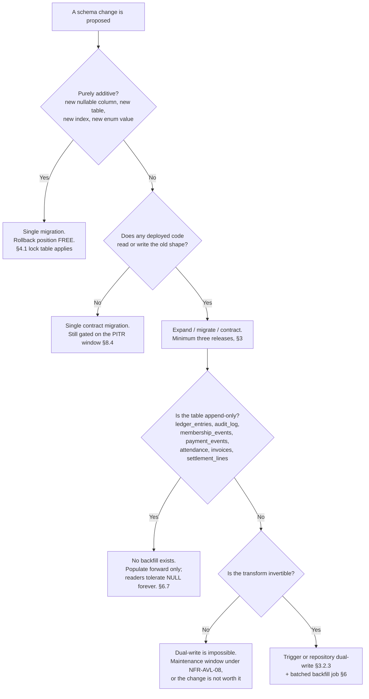
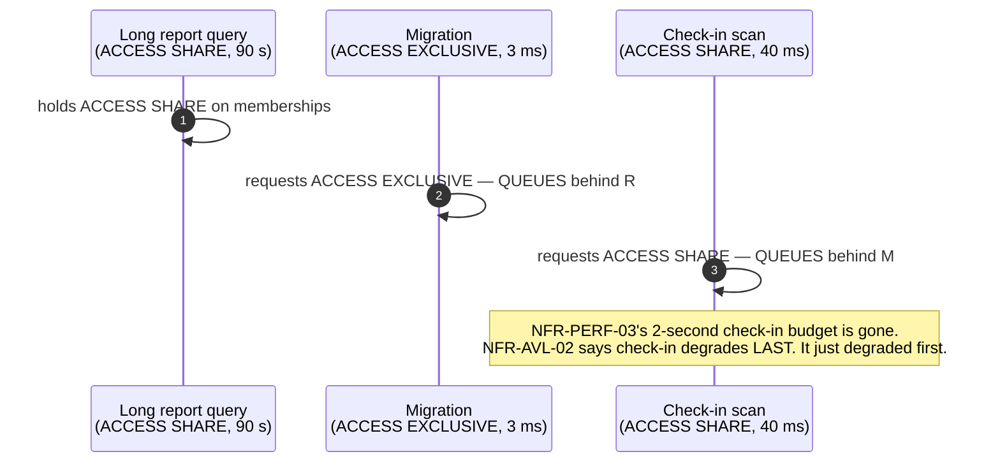

# Migration Strategy — How This Schema Changes Over Its Lifetime

**Phase 4 · `/docs/database/MigrationStrategy.md` · PostgreSQL 16 + PostGIS + Row-Level Security · Prisma ORM (`A-01`) with Prisma Migrate (`A-07`)**

---

## 0. Document control

| Field | Value |
| :--- | :--- |
| **Document** | `/docs/database/MigrationStrategy.md` |
| **Phase** | 4 — Database Design |
| **Status** | Design. **No `schema.prisma`, no `prisma/migrations/` directory and no migration file exists.** Every fenced block in this document is labelled *illustrative — not committed code* |
| **Precedence** | Rank 3 under `PROJECT_CONSTITUTION.md` §1.3. Subordinate to the constitution and to `MASTER_PRD.md`; binding on implementation |
| **Implements** | `NFR-AVL-06` (zero-downtime deployment; migrations backward-compatible within a release window), `NFR-AVL-04` (RPO ≤ 15 min, RTO ≤ 4 h), `NFR-AVL-08` (maintenance windows), `NFR-DQ-01` … `NFR-DQ-06`, `NFR-MNT-08` (IaC, no manual production changes), `§C7` (environments and pipeline) |
| **Governed by** | `PROJECT_CONSTITUTION.md` **§15.3 `MG1`–`MG11`** (the migration law), §15.1 (no table without documentation), §15.5 (`AC1`–`AC7`), §15.6 (`RS1`–`RS7`), §15.7 (`AP1`–`AP4`), §11.4 (`P1`–`P8`, the Prisma tenant-context extension), §10 (Money & Time Law), §8.6/§8.7 (naming), §20 (Git strategy), §23.2 (Definition of Done) |
| **Decisions applied** | ADR-0004 (PostgreSQL 16), **ADR-0005 (Prisma + the mandatory tenant-context extension)**, ADR-0006 (RLS, shared schema), ADR-0007 (PostGIS), ADR-0014 (money as minor units), ADR-0015 (append-only ledger), ADR-0024 (soft delete), ADR-0025 (UTC + gym timezone), ADR-0028 (country as configuration) |
| **Launch market** | **India** — `LAUNCH_MARKET_INDIA.md`. `INR`/paise, `Asia/Kolkata` (+05:30, no DST), GST 18% as **CGST 9% + SGST 9%**, financial year **1 April – 31 March**, PAN + GSTIN, **RBI data residency: India only** |
| **Sibling documents** | `Schema.md` (the physical design this document evolves), `ERD.md`, `Relationships.md`, `Indexes.md`, `Constraints.md`, `NamingConvention.md` §24/§25, `SeedStrategy.md`, `SoftDeleteStrategy.md`, `AuditStrategy.md` |
| **Upstream operational documents** | `/docs/engineering/Deployment.md` §7 and §8 (the release ladder), `/docs/engineering/CI_CD.md` §7 (migrations in CI), `/docs/engineering/Scalability.md` §5 and §8 (index and job classes), `/docs/engineering/Security.md` §4 (roles and policies) |

### 0.1 What this document is, and what it is not

**It is** the database layer's account of schema evolution: the DDL, the locks each statement takes, the policies and grants a migration must not forget, the shape of a backfill, the mechanics of Prisma Migrate against a schema that contains objects Prisma cannot describe, and the checklist a reviewer works through.

**It is not** the release process. `Deployment.md` §7 owns the release ladder and the worked `memberships` rename as an *operational* narrative; `CI_CD.md` §7 owns the pipeline jobs that gate a migration. Where this document and those two touch the same fact, **they are authoritative for the release and pipeline half and this document is authoritative for the SQL half.** Every such seam is named explicitly in §13.

**It is also not** a licence to write migrations now. `PHASES.md` Phase 4 acceptance includes *"Zero Prisma schema or migration files written yet."* This document specifies how they will be written when Phase 8 begins.

### 0.2 Division of labour with the three documents that overlap it

| Question | Answered by |
| :--- | :--- |
| Which release does a phase land in, and what does the rollout ladder look like? | `Deployment.md` §7.3.2, §6 |
| Which CI job gates it, with what budget and what failure behaviour? | `CI_CD.md` §7.2 – §7.7, job 11 `migration-safety` |
| What lock does this exact statement take on PostgreSQL 16, and what breaks if it queues? | **This document, §4** |
| How does a migration behave against a table with `FORCE ROW LEVEL SECURITY` and a policy scoped `TO app_rw`? | **This document, §5.6** — and it is the single most surprising thing in this file |
| How is a backfill written so that it honours ADR-0005's tenant-context discipline? | **This document, §6.3** |
| What is the review checklist? | **This document, §10** |
| Is reference data a migration or a load? | **This document, §11** |
| What happens the day one tenant moves to a dedicated schema? | **This document, §12** |

### 0.3 The eleven constitutional rules, and where each is discharged

`PROJECT_CONSTITUTION.md` §15.3 states `MG1`–`MG11`. They are not restated as prose anywhere below; each section discharges the rules named here.

| Rule | Statement (abbreviated) | Discharged in |
| :--- | :--- | :--- |
| **MG1** | Forward-only. No `down` migration is written, tested or trusted | §1.1, §8 |
| **MG2** | Backward-compatible with the currently-deployed application version | §1.2, §7 |
| **MG3** | Expand-migrate-contract mandatory for anything not purely additive | §3 |
| **MG4** | `CREATE INDEX CONCURRENTLY` on populated tables, outside the migration transaction | §2.6, §4.3 |
| **MG5** | `NOT NULL` on a populated column: nullable → backfill → `NOT VALID` check → `VALIDATE` → `SET NOT NULL` | §4.5 |
| **MG6** | Long-running data backfills are **jobs**, not migrations | §6 |
| **MG7** | A migration is never edited after it has been applied beyond `local` | §2.3, §2.8 |
| **MG8** | Reviewed by a second engineer, with the schema documentation update in the same PR | §2.8, §10 |
| **MG9** | Enum values are added, never removed while any row holds them, never renamed | §4.6 |
| **MG10** | A migration creating a `tenant_id` table creates its RLS policy in the **same** migration | §5.6, §10 |
| **MG11** | Tested in CI against the `§C8.2` seed; duration measured; over budget fails the build | §9 |

### 0.4 The two facts that shape everything below

1. **Two application versions run against one database during every rolling deploy.** That is not an edge case; it is every single release (`MG2`, `NFR-AVL-06`, `Deployment.md` §6). A migration is therefore never evaluated against "the code", but against **the set of code versions that will run while it is in effect** — which is at minimum `{N−1, N}`, and during a slow rollout or a paused canary is `{N−1, N}` for hours.
2. **The database is subject to point-in-time recovery for 35 days** (`Deployment.md` §10.2, `NFR-AVL-04`). A migration is therefore also evaluated against **the set of database states a restore could produce**. This is what makes `MX-2` — the contract-drop gate — a database rule and not a scheduling preference, and it is developed in §3.2.6 and §8.4.

---

## 1. Principles

Twelve rules. `P1`–`P12` are this document's own identifiers; where a rule restates a constitutional one, the constitutional identifier is given and wins on any difference (§1.3 precedence).

### 1.1 P1 — Forward-only, without exception

> **A migration history moves in one direction. There is no `down`. Recovery from a bad migration is a new forward migration, and in the worst case a point-in-time restore.**

`MG1` and `Deployment.md` `DP4`. The argument is not that reversal is impossible in principle; it is that a reversal path which has never executed under load, against real data, with real concurrency, is a **fiction that gets executed under pressure at 02:00 by the person least equipped to evaluate it**. `CI_CD.md` correction C-2 removed the "forward and backward" phrasing from the pipeline for exactly this reason and replaced it with the `N−1` compatibility run, which measures the property that actually matters.

A concrete consequence: **`prisma migrate dev` must never be run against any database other than a developer's own or the ephemeral shadow database**, because it is willing to reset. §2.1 makes this a tooling rule rather than a discipline rule.

### 1.2 P2 — Backward-compatible within a release window

> **Every migration in release `N` is compatible with the application image of release `N−1`.**

`MG2`. "Compatible" is defined operationally, not aesthetically: the `N−1` image's full integration and contract suites pass against the `N`-migrated schema (`CI_CD.md` §7.4, `Deployment.md` §8.4). Three things break this and are therefore the three things `migration-lint` hunts for: a dropped or renamed object the old code still names; a new `NOT NULL` column with no default that the old code's `INSERT` does not supply; a tightened constraint the old code can violate.

### 1.3 P3 — Never destructive in the same release as the code that stops using the object

> **The release that stops writing a column and the release that drops it are different releases, separated by at least one full soak and by the PITR window.**

This is `MG3`'s contract phase and `CI_CD.md` §7.2's hardest static rule: *"a `contract` migration may not appear in the same pull request as the code that stopped using the old shape."* The reason is not tidiness. If the two ship together, then for the whole rollout window `N−1` pods query a column that no longer exists — every statement against that table fails, not merely the ones that read the column, because the failure is at parse time.

### 1.4 P4 — Reversible in effect, not in form

> **Every migration must have a stated recovery, and that recovery must be executable with the schema in the state the migration left it.**

This is the rule that replaces `down`. A migration's header (§2.4) declares its **rollback position** as one of four values:

| Rollback position | Meaning | Typical phase |
| :--- | :--- | :--- |
| `FREE` | Roll back the application image; the schema change is inert. Nothing to undo | Expand |
| `BOUNDED(vX.Y.Z)` | Roll back to any image ≥ `vX.Y.Z`. Below that, the code reads an object this release stopped maintaining | Migrate, Contract step 1 |
| `FORWARD_ONLY` | No image rollback recovers the data this removed. Recovery is PITR | Contract step 2 |
| `DATA_DESTRUCTIVE` | The migration removed data that no other row reproduces. Requires a named approver and a pre-migration logical export | Reserved; see §4.7 |

`Deployment.md` `MX-4` encodes the same idea as `min_rollback_target` and makes the deploy tooling refuse a rollback below it. The header value is the input to that computation; §8.4 gives the derivation.

### 1.5 P5 — One logical change per migration

`MF1` (`NamingConvention.md` §24). A migration that creates a table *and* alters another is two migrations. The reason is the recovery path in §8.5: a partially-applied release is diagnosed by reading the migration names in `_prisma_migrations`, and a migration named for two things tells the on-call engineer nothing about which half committed.

### 1.6 P6 — A migration performs DDL; a job performs DML

`MG6`. The boundary is absolute and is enforced statically (`CI_CD.md` §7.2: no `UPDATE` or `INSERT … SELECT` above a declared row threshold). §6.1 gives the five reasons, of which duration is the least important one.

**The one permitted exception, stated precisely:** a migration may `INSERT` into a **platform-global reference table** (`§C2.3`, tenancy class `GLOBAL`) a bounded, enumerated set of rows keyed by stable identifier — because those rows are schema-adjacent (a `CHECK` or a code path names them), the tables carry no RLS, and the row count is a constant known at authoring time. The boundary is drawn precisely in §11.

### 1.7 P7 — The lock is the budget, not the clock

A migration that takes 40 milliseconds while holding `ACCESS EXCLUSIVE` behind a 90-second analytics query has stalled every writer on that table for 90 seconds. §4.2 develops this; §4.4 gives the guard and the retry. **Duration is measured (`MG11`); lock level is designed.**

### 1.8 P8 — Deployment does not move money

`Deployment.md` `DP9`. No migration and no backfill charges, refunds, settles, pays out, issues an invoice, or writes a `ledger_entries` row. The ledger has no `UPDATE` grant (`AP1`, `G-LEDGER`) and no migration may grant itself one. Financial catch-up after any deploy or restore happens through the existing idempotent jobs — `payment.reconcile`, `payment.duplicate-detect`, `settlement.reconcile` (`§C5`). §3.4.6 applies this to the hardest case in the product: the `commission_tax_minor` decision arriving after money has already settled.

### 1.9 P9 — A migration on a tenant-owned table records its RLS posture, always

Every migration touching a table with a `tenant_id` column states, in its header, one of: `RLS: unchanged`, `RLS: policy added`, `RLS: policy replaced (expand-only)`, or `RLS: new table, policy in this migration (MG10)`. **"Unchanged" is an acceptable answer only when it is written down** (`Deployment.md` §7.3.3 makes the same demand). CI check `CI-01` proves the end state; the header proves someone thought about it.

### 1.10 P10 — A migration never disables a protection, even briefly

No migration contains `ALTER TABLE … DISABLE ROW LEVEL SECURITY`, `ALTER TABLE … NO FORCE ROW LEVEL SECURITY`, `ALTER TABLE … DISABLE TRIGGER`, `SET session_replication_role = replica`, or a `GRANT` that would give any application role `UPDATE` or `DELETE` on an append-only table. There is no instant during which `BR-TEN-01` is not enforced, and there is no instant during which `ledger_entries` is mutable. §5.7 gives the expand-only technique for tightening a policy without a window of exposure.

### 1.11 P11 — Reference data changes are versioned, never overwritten

A rate, a rule or a checklist that a historical record snapshotted is never edited in place. §11.5 develops this; India's GST rate is the live example, and `R4` (`PROJECT_CONSTITUTION.md` §10.4) is the governing rule: *"the rate applied to a transaction is the rate effective at the moment of sale and is persisted with the transaction."*

### 1.12 P12 — The migration and its documentation ship together

`MG8` and §15.1: *"A table does not exist until `/docs/database/Schema.md` documents it."* A pull request containing `prisma/migrations/**` and no diff to `Schema.md`, `Indexes.md`, `Constraints.md` or `Relationships.md` is blocked by `CODEOWNERS` routing plus a check in §10's checklist. This applies to the fiftieth table in month twenty, not only to the initial schema.

### 1.13 The principles as a decision aid



---

## 2. The Prisma Migrate workflow

`A-07` selects Prisma Migrate. This section is what that choice actually costs and how it is operated against a schema whose most important objects — RLS policies, grants, partitions, domains, triggers, GiST and trigram indexes, partial unique indexes, exclusion constraints — **cannot be expressed in `schema.prisma` at all** (ADR-0004 implementation notes, `Schema.md` §1.6).

### 2.1 `migrate dev` versus `migrate deploy` — two commands, two worlds

| Property | `prisma migrate dev` | `prisma migrate deploy` |
| :--- | :--- | :--- |
| **Purpose** | Author a migration from a `schema.prisma` diff | Apply already-authored migrations |
| **Permitted environments** | A developer's own database, and CI's throwaway containers | `development`, `staging`, `production`, and CI verification runs |
| **Uses a shadow database** | **Yes** — creates, replays history into, diffs against, drops | No |
| **Can reset the target** | **Yes.** On detecting drift it offers to reset, and in a non-interactive shell it can take that path | No. Never resets, never rolls back, never generates |
| **Generates the Prisma Client** | Yes | No — the client is generated at build time in the image |
| **Runs the seed** | Yes, after a reset | No |
| **Runs as** | The developer's local superuser-equivalent | **`app_migrator`**, from the one-shot `migrator` image (`Deployment.md` `D-C1`) |
| **Concurrency control** | None needed | A Postgres **advisory lock** held for the whole run (`Deployment.md` §8.2) |

> **Rule PM-1 — the `migrator` image contains no path to `migrate dev`.** The image's entrypoint is fixed (`Deployment.md` §3.2: `node node_modules/prisma/build/index.js migrate deploy`), the image is distroless and shell-less, and the credential it holds is `app_migrator`. An engineer cannot accidentally run `migrate dev` in production because there is no shell in which to type it.

> **Rule PM-2 — `prisma db push` is forbidden everywhere except a throwaway local database, and `prisma migrate reset` everywhere except `local` and the scheduled weekly `development` reset** (`Deployment.md` §2, weekly development reset). `db push` mutates a database with no migration record, which is `MG7` violated silently: the next `migrate dev` sees drift and offers a reset.

> **Rule PM-3 — `prisma migrate resolve` is the *only* lawful way to write to `_prisma_migrations`,** and it is a two-person operation recorded in the incident timeline. §8.6 gives the two situations that justify it.

### 2.2 The shadow database

The shadow database is a second, temporary database that `migrate dev` creates, replays the entire committed migration history into, and compares against `schema.prisma` in order to compute the next migration's SQL — and against the developer's database in order to detect drift. It is then dropped.

| Requirement | Ruling for this project | Why |
| :--- | :--- | :--- |
| **Where it lives** | On the **same cluster** as the developer's database (local Docker Compose, `A-28`), created and dropped by Prisma. `shadowDatabaseUrl` is set explicitly rather than relying on implicit creation | Roles in PostgreSQL are **cluster-scoped, not database-scoped**. Our migrations contain `GRANT … TO app_rw` and `CREATE POLICY … TO app_platform_ro`; those statements fail on a shadow database whose cluster does not know the roles. Same cluster ⇒ the roles exist for free |
| **Extensions** | `postgis`, `pg_trgm`, `btree_gist`, `pgcrypto`, `unaccent` must be installable in the shadow database (`Schema.md` §2.1) | Migration `0_init` and every later spatial or trigram index depends on them. A shadow database without PostGIS fails on the first `geography(Point,4326)` column |
| **Roles** | The four roles (`app_migrator`, `app_rw`, `app_append`, `app_platform_ro`) are created at **cluster init** by the Compose stack locally and by **Terraform** in every managed environment — *not* by a migration. See reconciliation **R-04** (§13) | A role is a cluster object shared by the primary, the replicas, the DR cluster and the monthly restore-drill namespace. Creating it in a migration means it exists in some of those places and not others |
| **Privileges** | The `migrate dev` connection needs `CREATEDB` on the local cluster only | Never needed in a managed environment, because `migrate dev` never runs there |
| **What it proves** | That the committed migration history, replayed from zero into an empty database, produces a schema that matches `schema.prisma` for every object Prisma can describe | This is the drift check, and it is genuinely valuable |
| **What it does not prove** | Anything at all about RLS policies, grants, partitions, triggers, domains or raw-SQL indexes | Prisma cannot introspect them, so it cannot detect their absence. §2.7 is the whole mitigation |

**The subtle false-negative, stated so nobody relies on the shadow check for the wrong thing.** Because the raw-SQL objects come from the *same migration files* in both the developer's database and the shadow database, the two agree — and Prisma reports "no drift" — even if a policy is missing from both. The shadow database detects **divergence between the migration history and `schema.prisma`**. It cannot detect **divergence between the migration history and the design**. That second job belongs to the `Schema.md` CI checks `CI-01` … `CI-12` (§9.3), which query the live catalogue.

### 2.3 The migrations directory

```text
illustrative — not committed code

prisma/
  schema.prisma                     # models, enums, datasource, generator. NOT policies, grants, partitions
  migration_lock.toml               # provider = "postgresql". Committed. Changing it is a build failure
  migrations/
    0_init/
      migration.sql                 # extensions ASSERTED, domains, enums, 79 tables, FKs, indexes,
                                    # RLS policies, grants, partition parents + first 3 partitions
    20261102093000_add_commission_tax_reserved_columns/
      migration.sql
    20261115140000_expand_add_valid_until_date_to_memberships/
      migration.sql
      concurrent.sql                # non-transactional steps only. §2.6
    20261129090000_migrate_set_not_null_memberships_valid_until/
      migration.sql
  seed/                             # §C8.2 deterministic seed. NOT reference data — see §11
  reference/                        # idempotent reference-data payloads, versioned. §11.3
```

| Rule | Statement |
| :--- | :--- |
| **PM-4** | The directory is **append-only**. `MG7`'s checksum manifest is committed on `main` and CI compares against it (`CI_CD.md` §7.2). A modified file fails the build with the message *"a correction is a new migration"* |
| **PM-5** | `migration_lock.toml` is committed and never edited. A change to it means someone pointed Prisma at a different engine, which is an ADR-0004 change requiring the §24 amendment process |
| **PM-6** | The migration folder name is the migration's identity in `_prisma_migrations` and therefore in every release record, every incident timeline and every rollback conversation. It is chosen with that in mind (§2.4) |
| **PM-7** | `0_init` is one migration, not seventy-nine. It is the only migration ever permitted to create more than one table, and it exists because "one logical change" for the initial schema is *the initial schema* |

### 2.4 Migration naming and the mandatory header

Naming follows `NamingConvention.md` §24 (`<UTC timestamp>_<verb>_<subject>`, closed verb list `create · add · drop · rename · alter · backfill · enable · grant · revoke · partition · index · seed`, and `MF3`'s phase infix). This document adds the **header block**, which is what a reviewer reads first and what `migration-lint` parses.

```sql
-- illustrative — not committed code
-- migration: 20261115140000_expand_add_valid_until_date_to_memberships
-- phase:            expand                     -- expand | migrate | contract   (MG3, CI_CD §7.2)
-- requirement:      BR-MEM-03, ADR-0025, §C2.2 -- the PRD identifiers this serves
-- tables:           memberships                -- every table this statement set touches
-- rls:              unchanged                  -- P9. unchanged | policy added | policy replaced | new table (MG10)
-- grants:           unchanged                  -- P10. any grant delta, or 'unchanged'
-- append_only:      no                         -- AP1. 'yes' requires the §6.7 forward-only ruling
-- partitioned:      no                         -- §5. 'yes' requires the §5.1 propagation analysis
-- max_lock:         ACCESS EXCLUSIVE (catalogue only, no rewrite)   -- §4.1
-- rewrite:          none                       -- none | full | index-only
-- est_duration:     < 50 ms at Y1 volume (350k rows)                -- measured in CI, MG11
-- backfill_job:     membership.backfill-valid-until                 -- MG6. or 'none'
-- rollback:         FREE                       -- P4
-- concurrent_steps: concurrent.sql (1 index)   -- §2.6. or 'none'
-- reviewers:        two, one schema owner      -- MG8
-- docs:             Schema.md §8.1, Indexes.md IX-MEM-04

SET LOCAL lock_timeout       = '5s';    -- PM-8. first statement, always
SET LOCAL statement_timeout  = '300s';  -- PM-8. second statement, always

ALTER TABLE memberships ADD COLUMN IF NOT EXISTS valid_until_date date NULL;

COMMENT ON COLUMN memberships.valid_until_date IS
  'Last day on which check-in is permitted, INCLUSIVE, in the gym timezone (BR-MEM-03, ADR-0025). Replaces end_date.';
```

> **Rule PM-8 — every migration file's first two statements are `SET LOCAL lock_timeout` and `SET LOCAL statement_timeout`.** Prisma Migrate wraps each migration file in a single transaction, so `SET LOCAL` is scoped exactly to that migration and cannot leak to another. `migration-lint` fails a file that lacks them, and fails a file whose values exceed the ceilings of §4.4. This is deliberately per-file rather than per-role: the ceiling is a property of the change, and a `VALIDATE CONSTRAINT` legitimately wants a different one from an `ADD COLUMN`.

> **Rule PM-9 — every DDL statement that can be written idempotently is written idempotently.** `ADD COLUMN IF NOT EXISTS`, `CREATE INDEX IF NOT EXISTS`, `DROP … IF EXISTS`, `CREATE OR REPLACE FUNCTION`. This is not defensive habit: it is what makes the retry pattern of §4.4 and the concurrent-step runner of §2.6 safe to re-enter.

### 2.5 Authoring the raw SQL Prisma cannot generate

The workflow is `--create-only`, and it is the normal case for this schema, not the exception.

```bash
# illustrative — not committed code
pnpm prisma migrate dev --create-only --name expand_add_valid_until_date_to_memberships
#   -> writes prisma/migrations/<ts>_expand_add_valid_until_date_to_memberships/migration.sql
#      containing ONLY what Prisma inferred from the schema.prisma diff
#   -> the engineer then adds the header block, the SET LOCALs, the COMMENT ON,
#      the RLS policy if this is a new table (MG10), the grants, the trigger, and
#      moves any CONCURRENTLY statement into concurrent.sql
pnpm prisma migrate dev            # now applies it locally and regenerates the client
```

| Object class | Expressible in `schema.prisma`? | Consequence |
| :--- | :---: | :--- |
| Table, column, type, nullability, default, FK, plain B-tree index, unique index | Yes | Prisma generates it; the engineer reviews it |
| Enum type and its values | Yes | Prisma generates `ALTER TYPE … ADD VALUE`. See the removal trap in §4.6 |
| **RLS policy, `ENABLE`/`FORCE ROW LEVEL SECURITY`** | **No** | Hand-written into the same migration. `MG10` + `CI-01` |
| **`GRANT` / `REVOKE`** | **No** | Hand-written. `CI-02` proves the end state |
| **Partitioned parent, `PARTITION OF`, `ATTACH`/`DETACH`** | **No** | Hand-written. §5 |
| **GiST / GIN / trigram indexes, partial indexes, exclusion constraints** | Partial (`@@index(type: Gist)` exists but does not cover our predicates) | Hand-written. `gix_branches__location`, `gin_gyms__name_trgm`, `ex_plans__one_active_promotion`, every `WHERE deleted_at IS NULL` partial unique index |
| **Domains** (`money_minor`, `gstin_in`, `financial_year_label`, …) | **No** | Hand-written in `0_init`. Prisma sees the base type |
| **Triggers and functions** | **No** | Hand-written. `Schema.md` §2.8's three immutability triggers, plus migration scaffolding triggers |
| **`COMMENT ON`** | No | Hand-written. `NFR-PRV-01` requires every field to have a documented purpose; the comment is that documentation *in the database*, where a DBA reads it |

> **The trap this creates, stated once.** Prisma's diff engine does not know these objects exist. If a future `migrate dev` regenerates a table (because someone changed a `@@map`, or Prisma decided a change was easier as a drop-and-create), the generated SQL will **omit the policy, the grants and the partition scheme**. The controls are three: `migration-lint` rejects `DROP TABLE` outside a contract migration; `CI-01`/`CI-02` query the live catalogue after every migration run and fail on a missing policy or a wrong grant set; and §10's checklist requires the reviewer to read the generated SQL rather than trust it.

> **Rule PM-10 — a `@map` or `@@map` string change is a rename, and renames are `MG3` changes.** A one-character edit to `@@map("memberships")` makes Prisma emit `ALTER TABLE … RENAME`. A dedicated Prisma-schema lint flags any `@map`/`@@map` diff in a pull request and requires the three-release plan in the description. This is the cheapest possible way to cause the outage described in `Deployment.md` §7.3.6 row 1.

### 2.6 Non-transactional steps: `CREATE INDEX CONCURRENTLY` and friends

**Prisma Migrate executes each migration file inside a single transaction.** `CREATE INDEX CONCURRENTLY`, `DROP INDEX CONCURRENTLY`, `REINDEX CONCURRENTLY` and `ALTER TABLE … DETACH PARTITION CONCURRENTLY` cannot run inside a transaction block. `MG4` nevertheless requires concurrent index creation on populated tables. Both facts are true, so the workflow must resolve them rather than wish them away.

> **Ruling (reconciliation R-03, §13).** `Deployment.md` §7.3.3 and `CI_CD.md` §7.2 describe this as *"a migration file marked as non-transactional"*. Prisma has no such marker. The mechanism that implements their intent is a **sibling file plus a second entrypoint phase**:
>
> 1. Non-transactional statements live in `concurrent.sql` **inside the migration's own directory**, so the migration remains one reviewable unit and `MF4`'s "exactly one migration history" property is preserved.
> 2. The `migrator` Job's entrypoint is two phases: `prisma migrate deploy`, then `apply-concurrent-steps`.
> 3. `apply-concurrent-steps` walks every `concurrent.sql` in timestamp order on **every** deploy, on a connection with autocommit, and is idempotent by construction.

```ts
// illustrative — not committed code
// The concurrent-step runner. Idempotent, re-entrant, and self-healing for INVALID indexes.
for (const step of orderedConcurrentSteps()) {           // deterministic, by migration timestamp
  for (const index of step.indexes) {
    const state = await catalogue.indexState(index.name); // absent | valid | invalid
    if (state === 'invalid') {
      // A previous CREATE INDEX CONCURRENTLY failed. The index is in the catalogue,
      // invisible to the planner, and blocks recreation under the same name.
      await sql.autocommit(`DROP INDEX CONCURRENTLY IF EXISTS ${index.name}`);
    }
    if (state !== 'valid') {
      await sql.autocommit(index.createStatement);        // CREATE INDEX CONCURRENTLY IF NOT EXISTS …
    }
  }
}
await assertNoInvalidIndexes();  // pg_index.indisvalid = false anywhere -> Job exits non-zero
```

| Property | Ruling |
| :--- | :--- |
| Ordering | Concurrent steps run **after** all transactional migrations of the release, in migration-timestamp order. An index cannot be built on a column that a later migration in the same release creates, so authoring must respect this — `migration-lint` checks it |
| Idempotency | `IF NOT EXISTS` plus the invalid-index heal above. Re-running the whole set on every deploy is a catalogue lookup per index and costs milliseconds |
| Bookkeeping table | **None.** A `concurrent_migration_steps` ledger was considered and rejected: the catalogue *is* the state, a second record of it can disagree with it, and disagreement between a bookkeeping table and `pg_index` at 02:00 is worse than no bookkeeping table |
| Failure | The Job exits non-zero, the release aborts, and no rollout occurs (`Deployment.md` §6 step 1). The transactional migrations have already committed and are backward-compatible by construction (`MG2`), so the previous release keeps serving |
| Detection of the silent case | An **invalid index is invisible**: queries still work, just slowly. A nightly check and a CI check both query `pg_index WHERE indisvalid = false` and alert (`Deployment.md` §8.3) |
| Timeouts | `lock_timeout` applies to the brief `SHARE UPDATE EXCLUSIVE` acquisition, not to the build. `statement_timeout` is **disabled** for concurrent steps — an index build on 18 million `attendance` rows legitimately takes many minutes and is not on the critical path of any user request |

### 2.7 The drift ledger: what Prisma does not know

Because `schema.prisma` describes perhaps 70% of the real schema, this project keeps an explicit register of the remainder, and CI proves the register against the live catalogue rather than against a document.

| Register | Content | Proven by |
| :--- | :--- | :--- |
| `Schema.md` §2.6 policy classes + the closed exemption list | Which tables have which policy, and which are lawfully exempt | `CI-01` |
| `Schema.md` §2.7 grant classes | The complete grant set per role | `CI-02` (grant-set **snapshot** test — the expected set is a committed fixture) |
| `Schema.md` §2.11 partitioning | Parents, key, naming, pre-creation window | `CI-10` |
| `Schema.md` §2.4 domains | Every domain and its `CHECK` | `CI-04`, `CI-05` |
| `Schema.md` §2.8 triggers | The three immutability triggers, plus the append-only backstops | `BAC-06` negative tests |
| `Indexes.md` | Every index and the query it serves | `CI-07` |
| **`MigrationScaffolding.md`** | Every temporary object — sync triggers, transitional columns, one-shot jobs, feature flags — with its removal release | §14, and a CI check that fails on an entry past its expiry |

### 2.8 The review requirement

`MG8`: *"Every migration is reviewed by a second engineer with the schema documentation update in the same pull request."*

| Control | Mechanism |
| :--- | :--- |
| Two reviewers | `CODEOWNERS` routes `prisma/migrations/**` to two reviewers, **one of whom owns the schema** (`CI_CD.md` §7.2, `PROJECT_CONSTITUTION.md` §20.7 protection 4) |
| Documentation in the same PR | The checklist item in §10 is blocking; a PR touching `prisma/migrations/**` with no diff under `docs/database/` is flagged by a path-pair check |
| Money and tenancy | A migration touching a `%_minor` column, `orders`, `ledger_entries`, `settlement_*`, `invoices`, `credit_notes`, or any RLS policy additionally routes to the money/tenancy owners (`RSK-14`, `DEL-01`) |
| The generated SQL is read, not skimmed | §10's checklist requires the reviewer to state the max lock level and the rewrite verdict for each statement. A reviewer who cannot state them has not reviewed the migration |
| Re-review after edit | Because `MG7` forbids editing an applied migration, an edit during review is only possible before the first `migrate dev` on a shared branch; after that it is a new migration and a new review |

### 2.9 The local loop, and the weekly `development` reset

| Environment | Migration behaviour |
| :--- | :--- |
| A developer's machine | `migrate dev` freely. The database is disposable. `A-28` Docker Compose provides the cluster, the four roles and the five extensions |
| CI pull-request run | `migrate deploy` three times, against three databases (§9.1). Never `migrate dev` |
| `development` | `migrate deploy` on every merge to `main`. **Weekly**, a scheduled pipeline drops and recreates the database and replays the entire history from zero (`Deployment.md` §2) — the only place full-history replay is exercised routinely, and therefore the fastest detector of an `MG7` violation or of a migration that depends on data a later migration removed |
| `staging`, `production` | `migrate deploy` from the `migrator` Job, expand phase only, under the advisory lock |

---

## 3. Expand / migrate / contract

### 3.0 The pattern, and the cost stated before the examples

`MG3`: *"Three releases: **expand** (add the new shape, dual-write), **migrate** (backfill, switch reads), **contract** (stop writing the old shape, then drop it in a later release)."* In practice contract is two steps, so the ladder is **four releases**.

| Phase | Release | Schema | Application | Rollback position |
| :--- | :---: | :--- | :--- | :--- |
| **Expand** | `N` | New shape added, nullable, inert. Dual-write mechanism installed | Reads and writes the **old** shape | `FREE` |
| **Migrate** | `N+1` | Constraints tightened on the new shape (`MG5` ladder) | Reads and writes the **new** shape; the dual-write keeps the old one current for `N` pods | `FREE` |
| **Contract 1** | `N+2` | Dual-write mechanism removed | New shape only. Old shape becomes stale-but-present | `BOUNDED(N+1)` |
| **Contract 2** | `N+3` | Old shape dropped | Unchanged | `FORWARD_ONLY` |

**The honest price**, restated from `Deployment.md` §7.1 because a reader of this document must not meet it as a surprise: *a one-line rename becomes four releases spread over five to seven weeks, three migrations, one temporary database trigger, one one-shot backfill job, one divergence monitor, and a deprecation cycle on the public API.* That is the cost of `NFR-AVL-06` in a system where two application versions run against one database on every release and where any moment in the last 35 days is a restorable database state.

### 3.1 Change taxonomy — the database layer's version

`Deployment.md` §7.2 gives the release-count taxonomy. This is the same taxonomy with the two columns a schema reviewer actually needs: **the lock taken** and **whether the table is rewritten**. Lock levels are PostgreSQL 16 (§4.1).

| # | Change | Class | Max lock | Rewrite | Releases |
| :-: | :--- | :--- | :--- | :--- | :-: |
| 1 | Add nullable column, no default | Additive | `ACCESS EXCLUSIVE`, catalogue only | None | 1 |
| 2 | Add column with a **non-volatile** default | Additive | `ACCESS EXCLUSIVE`, catalogue only (PG 11+) | None | 1 |
| 3 | Add column with a **volatile** default (`gen_random_uuid()`) | **Breaking in effect** | `ACCESS EXCLUSIVE` for the whole rewrite | **Full** | Forbidden as a single migration — see §4.5 |
| 4 | Add table (+ its RLS policy, `MG10`) | Additive | None on existing tables | None | 1 |
| 5 | Add B-tree / GiST / GIN index | Additive | `SHARE UPDATE EXCLUSIVE` with `CONCURRENTLY` | None | 1 |
| 6 | Add enum value | Additive | Brief lock on the type | None | 1, **own migration** (§4.6) |
| 7 | Widen `varchar(n)` → `text`, or `varchar(n)` → `varchar(m>n)` | Additive | `ACCESS EXCLUSIVE`, catalogue only | None | 1 |
| 8 | Add `CHECK … NOT VALID`, then `VALIDATE` | Additive-safe | `ACCESS EXCLUSIVE` (brief) then `SHARE UPDATE EXCLUSIVE` | None | 1 or 2 |
| 9 | Add foreign key `NOT VALID`, then `VALIDATE` | Additive-safe | `SHARE ROW EXCLUSIVE` **on both tables**, then `SHARE UPDATE EXCLUSIVE` | None | 1 or 2 |
| 10 | Add `NOT NULL` to a populated column | Breaking | `MG5` ladder (§4.5) | None | 2 |
| 11 | Change a column default | Additive | `ACCESS EXCLUSIVE`, catalogue only | None | 1 |
| 12 | **Rename a column** | Breaking | `ACCESS EXCLUSIVE`, catalogue only — *and that is exactly why it is dangerous* | None | **4** |
| 13 | Narrow a column or change its type non-binary-coercibly | Breaking | `ACCESS EXCLUSIVE` for the rewrite | **Full**, plus every index rebuilt | **4** |
| 14 | Split one column into two | Breaking | Per statement | None | **4** |
| 15 | Change the shape of a JSONB snapshot | **Breaking, special** | None (no DDL) | None | **4**, and on an append-only table **no backfill exists** — §3.3 |
| 16 | Drop a column | Breaking | `ACCESS EXCLUSIVE`, catalogue only | None | Contract only |
| 17 | Rename / repurpose an enum value | **Breaking, worst** | — | — | 3 + the old value survives **permanently** (`MG9`) |
| 18 | Change an RLS policy | Breaking, special | `ACCESS EXCLUSIVE` on the table for `CREATE POLICY` | None | **2, expand-only** (§5.7) |
| 19 | Change a grant | Additive or breaking depending on direction | Row-level lock on `pg_class` ACL | None | 1 widening · 2 narrowing |
| 20 | Add a column to a **partitioned** table | Additive but heavy | `ACCESS EXCLUSIVE` on parent **and every partition** | None | 1, with the §5.1 analysis |
| 21 | Add an index to a **partitioned** table | Additive but three-step | See §5.1 — `ON ONLY` + per-partition `CONCURRENTLY` + `ATTACH` | None | 1 |
| 22 | Add a `CHECK` to a **domain** | Breaking | Validates every column of that domain in **every** table | None | 2 (`NOT VALID` + `VALIDATE`) |
| 23 | Convert a flat table to partitioned | Breaking, largest | — | Effectively full | 4+, behind `mig.attendance.partitioned-reads` |
| 24 | Add a column to an **append-only** table | Additive, one-way | `ACCESS EXCLUSIVE`, catalogue only | None | 1, **populated forward only** (§6.7) |

> **The single most counter-intuitive row is 12.** A column rename is *cheap* for the database — a catalogue update measured in single-digit milliseconds, no rewrite, no scan. It is the most expensive change in the table for the *system*, because the moment it commits, every statement issued by every `N−1` pod against that table fails at parse time. **Lock cost and blast radius are unrelated quantities**, and confusing them is how a "trivial" rename takes down check-in.

### 3.2 Worked example A — renaming `memberships.end_date` without downtime

> **Relationship to `Deployment.md` §7.3.** That section narrates this same change as a *release* story: four releases, the gantt chart, the API deprecation schedule, the CSV-header contract, `MX-1` … `MX-4`. **It is authoritative for the release numbering and the operational rules.** This section is the *database* story for the same change: the exact statements, the exact locks, why the trigger is shaped as it is, how it survives RLS, what the backfill does about tenant context, and which CI check catches which mistake. Nothing here contradicts §7.3; where a fact appears in both, §7.3 wins.

#### 3.2.1 The change

`memberships.end_date date` means *the last day on which check-in is permitted, inclusive, in the gym's timezone* (`BR-MEM-03`, ADR-0025). Three neighbouring columns use `end`-shaped names with **exclusive** or **period** semantics — `freezes.freeze_ends_at`, `settlement_batches.period_end`, `plans.promo_ends_at` — so the name is actively misleading on the `NFR-AVL-02` check-in path. Renaming to **`valid_until_date`** forces every call site to be re-read, which is the point.

**Facts that shape the plan.** `memberships` holds ≈ 350,000 rows at Year 1 (`Scalability.md` §2.8: ≈ 300,000 membership starts/year), is **not partitioned**, is tenancy class **RLS** with policy class `P-STD` (`Schema.md` §8.1), is grant class **G-CRUD** (`SELECT, INSERT, UPDATE`, no `DELETE` — it carries `deleted_at`), and takes ≈ 822 inserts and a few thousand updates a day. It is a **low-write table**, which is the fact that makes a row trigger affordable (see the ≥ 5,000 writes/day threshold in §3.5).

#### 3.2.2 Phase E — Expand: the DDL

```sql
-- illustrative — not committed code
-- migration: 20270315090000_expand_add_valid_until_date_to_memberships
-- phase: expand · rls: unchanged · grants: unchanged · append_only: no · partitioned: no
-- max_lock: ACCESS EXCLUSIVE (catalogue only) · rewrite: none · est_duration: < 50 ms
-- backfill_job: membership.backfill-valid-until · rollback: FREE
-- concurrent_steps: concurrent.sql (1 index)

SET LOCAL lock_timeout      = '5s';
SET LOCAL statement_timeout = '300s';

-- 1. The column. Nullable, no default: catalogue-only in PostgreSQL 16, no rewrite.
ALTER TABLE memberships ADD COLUMN IF NOT EXISTS valid_until_date date NULL;

COMMENT ON COLUMN memberships.valid_until_date IS
  'Last day on which check-in is permitted, INCLUSIVE, interpreted in the gym timezone '
  '(BR-MEM-03, ADR-0025). Replaces end_date; end_date dropped in v1.17.0.';
```

**Why `date` and not `timestamptz`.** `TM2` and `DB5`: a calendar date that carries business meaning is a `date` interpreted in an explicitly-stored timezone, and `tenants.timezone` is authoritative (`TM3`). The rename does not relitigate that.

#### 3.2.3 Phase E — the sync trigger, and the four things about it that are not obvious

```sql
-- illustrative — not committed code
-- TEMPORARY MIGRATION SCAFFOLDING. Registered in MigrationScaffolding.md, removal release v1.16.0.

CREATE OR REPLACE FUNCTION fn_memberships__sync_valid_until() RETURNS trigger
  LANGUAGE plpgsql
  SECURITY INVOKER                        -- (1) deliberate. see below
  SET search_path = pg_catalog, public    -- (2) pinned
AS $$
BEGIN
  IF TG_OP = 'INSERT' THEN
    NEW.valid_until_date := COALESCE(NEW.valid_until_date, NEW.end_date);
    NEW.end_date         := COALESCE(NEW.end_date, NEW.valid_until_date);
  ELSE
    IF   NEW.valid_until_date IS DISTINCT FROM OLD.valid_until_date THEN
      NEW.end_date         := NEW.valid_until_date;    -- N+1 code wrote the new column
    ELSIF NEW.end_date      IS DISTINCT FROM OLD.end_date THEN
      NEW.valid_until_date := NEW.end_date;            -- N code wrote the old column
    END IF;
  END IF;
  RETURN NEW;
END $$;

CREATE TRIGGER trg_memberships__sync_valid_until
  BEFORE INSERT OR UPDATE OF end_date, valid_until_date ON memberships
  FOR EACH ROW EXECUTE FUNCTION fn_memberships__sync_valid_until();
```

| # | Property | Why it is exactly this |
| :-: | :--- | :--- |
| **1** | **`SECURITY INVOKER`**, which is the default and is stated explicitly anyway | The trigger runs as `app_rw`, inside the tenant-context transaction the ADR-0005 extension opened, so `current_setting('app.tenant_id')` is set and RLS still applies to anything the function touches. A `SECURITY DEFINER` trigger owned by `app_migrator` would execute with the owner's rights — and because `FORCE ROW LEVEL SECURITY` policies are written `TO app_rw`, the owner matches **no** policy, so the function would either see nothing or, if a permissive `USING (true)` policy existed for it, would be **a tenant-isolation bypass wearing a migration costume** (`Deployment.md` §7.3.3 phrases it identically). `P10` |
| **2** | **Pinned `search_path`** | An unpinned `search_path` in a function that any role can cause to execute is a classic privilege-escalation vector. `pg_catalog` first, then `public`, and nothing else |
| **3** | **`BEFORE` and `FOR EACH ROW`, not `AFTER`** | A `BEFORE` trigger mutates `NEW` in place, so the sync costs no second write, produces no second WAL record and no extra dead tuple. An `AFTER … UPDATE` trigger issuing a second `UPDATE` would double the write amplification on a table that also feeds `membership_events` |
| **4** | **`UPDATE OF end_date, valid_until_date`** | Column-scoped. An update to `status`, `sessions_used` or `freeze_days_used` — the overwhelming majority of writes to this table — does not fire the trigger at all |

**Two things the trigger deliberately does not do.** It does not touch `updated_at`/`updated_by` (`AC1`, `AC3`: those columns answer *"when and by whom was this row last touched"*, and a sync trigger is neither a when nor a whom). And it does not write a `membership_events` row: a rename is not a membership transition (`FR-MEMB-02`, `INV-MEM-4`), and manufacturing 350,000 fictitious transitions would corrupt the one table the product uses to explain itself to a member.

#### 3.2.4 Phase E — the replacement index

```sql
-- illustrative — not committed code
-- prisma/migrations/20270315090000_expand_add_valid_until_date_to_memberships/concurrent.sql
-- Runs in the migrator Job's phase 2, autocommit, after every transactional migration. §2.6

CREATE INDEX CONCURRENTLY IF NOT EXISTS idx_memberships__tenant_id_status_valid_until_date
  ON memberships (tenant_id, status, valid_until_date);
```

Leading with `tenant_id` is not optional: `SC-R06` and `Schema.md` §2.3.3 obligation 4. The RLS predicate `tenant_id = current_setting('app.tenant_id')::uuid` is an ordinary qualifier, and an index that cannot accept it as a leading column converts an index scan into a post-fetch Filter — at 2,000 tenants that is a read amplification of roughly three orders of magnitude on the expiry and renewal queries this index exists for (`§C2.4`).

The old index `idx_memberships__tenant_id_status_end_date` **stays until contract step 2**. Both are maintained during the transition; the write cost of a second three-column index on a 822-inserts/day table is not measurable.

#### 3.2.5 Phase E — the backfill, and phase M

The trigger populates rows that are *written*. The 350,000 that already exist are untouched, and `MG6` puts that work in a job. The job's full specification — tenant-context loop, batching, idempotency, progress, throttling — is §6, and `membership.backfill-valid-until` is used there as the running example. Its exit criteria (`unbackfilled = 0` **and** `divergent = 0` continuously for 10 days, plus a flat divergence gauge) are `Deployment.md` §7.3.3's and are not restated.

Phase M is `MG5`'s ladder, and is the only part of the whole exercise where a wrong choice costs an outage measured in minutes rather than milliseconds:

```sql
-- illustrative — not committed code
-- migration: 20270329090000_migrate_set_not_null_memberships_valid_until
-- phase: migrate · max_lock: SHARE UPDATE EXCLUSIVE (step 2) · rewrite: none
-- est_duration: ~4 s validate at 350k rows · rollback: FREE

SET LOCAL lock_timeout      = '5s';
SET LOCAL statement_timeout = '300s';

-- 1. NOT VALID. ACCESS EXCLUSIVE, but no scan: milliseconds. Applies to new rows immediately.
ALTER TABLE memberships
  ADD CONSTRAINT ck_memberships__valid_until_date_present
  CHECK (valid_until_date IS NOT NULL) NOT VALID;

-- 2. VALIDATE. SHARE UPDATE EXCLUSIVE — concurrent SELECT, INSERT, UPDATE and DELETE all proceed.
--    This is the whole reason the ladder exists.
ALTER TABLE memberships VALIDATE CONSTRAINT ck_memberships__valid_until_date_present;

-- 3. SET NOT NULL. PostgreSQL 12+ proves it from the now-valid CHECK and skips the full scan.
--    ACCESS EXCLUSIVE, milliseconds.
ALTER TABLE memberships ALTER COLUMN valid_until_date SET NOT NULL;
```

**The trigger stays through phase M.** During the `N+1` rollout, `N` pods still read `end_date`, and once `N+1` pods start writing `valid_until_date` the *only* thing keeping `end_date` current is the trigger. Removing it here is the single most likely mistake in the whole ladder, and it produces stale expiry dates on the check-in path — non-deterministic, tenant-visible, and dependent on which pod the request lands on.

#### 3.2.6 Phase C — the two contract steps, and the PITR gate

```sql
-- illustrative — not committed code
-- migration: 20270412090000_contract_drop_memberships_sync_trigger   (release v1.16.0)
-- phase: contract · rollback: BOUNDED(v1.15.0)
DROP TRIGGER IF EXISTS trg_memberships__sync_valid_until ON memberships;
DROP FUNCTION IF EXISTS fn_memberships__sync_valid_until();
```

```sql
-- illustrative — not committed code
-- migration: 20270503090000_contract_drop_memberships_end_date      (release v1.17.0)
-- phase: contract · rollback: FORWARD_ONLY · pitr_gate: backfill_completed_at + 35d
SET LOCAL lock_timeout = '5s';
ALTER TABLE memberships DROP CONSTRAINT IF EXISTS ck_memberships__valid_until_date_present;
ALTER TABLE memberships DROP COLUMN IF EXISTS end_date;                 -- catalogue only
```

```sql
-- concurrent.sql for the same migration
DROP INDEX CONCURRENTLY IF EXISTS idx_memberships__tenant_id_status_end_date;
```

> **`MX-2` restated as a database rule, because this is the part a schema reviewer owns.** A point-in-time restore to any instant **before the backfill completed** produces a database in which `valid_until_date` is `NULL` for most rows. The application running after that restore is `v1.17.0`, which has no `end_date` to fall back to. Every membership would be left without an expiry date: check-in evaluation broken, `membership.expire` broken, renewal reminders broken, and `NFR-AVL-04`'s 4-hour RTO blown by an emergency re-derivation nobody has rehearsed.
> **Therefore: a contract-drop migration may not be applied until `backfill_completed_at + pitr_retention_days` has elapsed.** With a 35-day window and backfill completion on 17 March, the earliest lawful date is 21 April. §8.4 gives the mechanical derivation and where the pipeline enforces it.

#### 3.2.7 The CI checks that catch each mistake

| Mistake | Caught by |
| :--- | :--- |
| Rename in one migration | `migration-lint`: `RENAME` outside a contract migration (`CI_CD.md` §7.2) |
| `CREATE INDEX` without `CONCURRENTLY` on a populated table | `migration-lint` (`MG4`) |
| `SET NOT NULL` without the `NOT VALID` ladder | `migration-lint` (`MG5`) |
| The backfill written as an `UPDATE` in the migration | `migration-lint` row-threshold rule (`MG6`) |
| The new index without a leading `tenant_id` | `CI-08` (`SC-R06`) |
| The new index absent from `Indexes.md` | `CI-07` |
| Trigger declared `SECURITY DEFINER` | `migration-lint` — `SECURITY DEFINER` is forbidden outright in a migration |
| Contract shipped with the code that stopped reading | `migration-lint` same-PR rule + the `N−2` assertion job (`Deployment.md` §8.4) |
| Contract shipped inside the PITR window | The pipeline's `pitr_gate` computation, §8.4 |
| `N−1` code broken by the `NOT NULL` | The `N−1` compatibility job (`CI_CD.md` §7.4) |

### 3.3 Worked example B — splitting the combined GST rate into CGST + SGST components on `invoices.tax_breakdown`

#### 3.3.1 Why this example is fundamentally different from example A

`invoices` is:

- **append-only** — grant class `G-APPEND` (`SELECT, INSERT`, plus a narrow `UPDATE (status, pdf_url)`). There is no `UPDATE` grant on `tax_breakdown`, so **there is no backfill**;
- **an immutable tax document** — `BR-PAY-10`, `INV-FIN-9`. Editing an issued invoice is not a migration, it is a forgery;
- **retention class R-FIN** — India: 8 financial years from the end of the relevant FY, GST records 72 months. A `V1` row is readable for the better part of a decade;
- **required to re-render byte-identically** — `Schema.md` §7.5: *"a 2026 invoice re-rendered in 2029 must be byte-comparable"*.

So the expand/contract ladder still applies, but **contract never fully completes**: the reader keeps `V1` support for the whole `R-FIN` period. That is not a failure of the pattern; it is the pattern applied honestly to immutable data.

#### 3.3.2 The change

An early implementation (`EP-09`, sprint 6) wrote a **single combined rate** into `invoices.tax_breakdown`, because `FR-INV-04` asks for a *"tax breakdown by rate"* and 18% is one rate:

```json
// illustrative — not committed code — schema_version 1, the WRONG shape for India
{ "schema_version": 1, "rate_bps": 1800, "taxable_value_minor": "400000", "amount_minor": "72000" }
```

India requires **components**. `LAUNCH_MARKET_INDIA.md` §4: intra-state supply is **CGST 9% + SGST 9%**, inter-state is **IGST 18%**, and place of supply for a performance-based service is the **branch location** — so intra-state is the normal case. `ERD.md` §12.3 is blunt about the consequence: *"One combined 18% line and two 9% lines are **different documents**."* A filed GST return references the components; a combined line cannot be reconciled against it.

```json
// illustrative — not committed code — schema_version 2, the required shape (Schema.md §7.5)
{ "schema_version": 2,
  "place_of_supply_state_code": "MH",
  "components": [
    { "component": "CGST", "rate_bps": 900, "taxable_value_minor": "400000", "amount_minor": "36000" },
    { "component": "SGST", "rate_bps": 900, "taxable_value_minor": "400000", "amount_minor": "36000" }
  ] }
```

**And the arithmetic is not a reformatting.** Rounding is applied **per component and then summed**, not computed on 18% and split: two 9% roundings can differ from one 18% rounding by one paisa, and `round_half_even` (`A6.3`, `MO4`) is applied at each component. On a ₹4,000.00 net sale the two shapes agree; on a net sale of ₹4,000.05 they need not. **`V1` → `V2` is therefore not a pure transform, which is precisely why it cannot be backfilled even if the grant existed.**

#### 3.3.3 The four releases

| Phase | Release | Migration | Application | Reference data |
| :--- | :---: | :--- | :--- | :--- |
| **Expand** | `N` | Add `tax_breakdown_version smallint NOT NULL DEFAULT 1` to `invoices` and `credit_notes`; add `place_of_supply_state_code char(2)` if absent; add the `V2` Zod schema in `packages/types` (`S2`) | **Reads both**, writes `V1`. The `V2` reader is deployed and exercised by contract tests before anything emits `V2` | `tax_profiles` gains a `V2` row for `IN-GST-18` with `components: [CGST 900, SGST 900]` / `[IGST 1800]`, `effective_from` in the **future** |
| **Migrate** | `N+1` | None | **Writes `V2`** for invoices issued from the profile's `effective_from`. Reads both | The `V2` `tax_profiles` row becomes effective |
| **Contract 1** | `N+2` | Add `CHECK (tax_breakdown_version >= 2) NOT VALID` — *deliberately never validated* | The `V1` **writer** is deleted. The `V1` reader stays | The `V1` profile row gets `effective_to` |
| **Contract 2** | — | **Never.** The `V1` reader and the `V1` renderer survive for the full `R-FIN` retention period | — | — |

> **The `NOT VALID` check that is never validated is the interesting object here.** It enforces the new rule on every **new** row — an insert with `tax_breakdown_version = 1` is refused — while leaving the historical rows lawful. `VALIDATE CONSTRAINT` would fail against the `V1` rows and, more importantly, *should* fail: those rows are correct for the documents they represent. This is a general technique for immutable tables and is stated as a rule in §3.5.

#### 3.3.4 The migration itself

```sql
-- illustrative — not committed code
-- migration: 20270215090000_expand_add_tax_breakdown_version_to_invoices
-- phase: expand · rls: unchanged · grants: unchanged · append_only: YES (populated forward only, §6.7)
-- max_lock: ACCESS EXCLUSIVE (catalogue only; DEFAULT 1 is a constant, no rewrite in PG 11+)
-- rewrite: none · est_duration: < 30 ms · backfill_job: none · rollback: FREE

SET LOCAL lock_timeout      = '5s';
SET LOCAL statement_timeout = '300s';

ALTER TABLE invoices
  ADD COLUMN IF NOT EXISTS tax_breakdown_version smallint NOT NULL DEFAULT 1;
ALTER TABLE credit_notes
  ADD COLUMN IF NOT EXISTS tax_breakdown_version smallint NOT NULL DEFAULT 1;

COMMENT ON COLUMN invoices.tax_breakdown_version IS
  'Shape of tax_breakdown. 1 = single combined rate (pre-India-GST-components). '
  '2 = array of components, CGST+SGST intra-state / IGST inter-state (LAUNCH_MARKET_INDIA.md §4, '
  'ERD.md §12.3). Populated forward only: historical rows are immutable tax documents (BR-PAY-10).';
```

**`DEFAULT 1` is doing real work.** It is a *constant*, so PostgreSQL 11+ stores it in the catalogue and rewrites nothing — a 300,000-row table gets a `NOT NULL` column in under 30 milliseconds. It also means every historical row is correctly labelled `V1` without a single byte being written, which is the closest thing to a backfill that an append-only table can lawfully have. Compare row 3 of §3.1: had the default been volatile, this would have been a full rewrite of the largest financial table in the schema, holding `ACCESS EXCLUSIVE` throughout.

**Why the version lives in a column and not only inside the JSONB.** `S1` already requires `schema_version` as the first key of every snapshot, and it is still there. The column duplicates it because a **planner-visible, indexable** discriminator is needed for three things the JSONB cannot serve cheaply: the `NOT VALID` check above, the `finance.reconcile` assertion below, and the GST-filing report's partition of a financial year's invoices by shape. This is a deliberate, documented denormalisation of one field, not a general licence.

#### 3.3.5 The assertion that must hold in both worlds

`Schema.md` §7.5: *"`SUM(amount_minor)` over the array must equal `tax_minor`. Asserted at issuance and by `finance.reconcile`; a mismatch **blocks the invoice, it does not round**."* The assertion is version-aware and is the one piece of logic that must handle both shapes for the next eight years:

```sql
-- illustrative — not committed code
-- Run by finance.reconcile (§C5, daily 04:00 IST = 22:30 UTC previous day) under the audited
-- platform read-only elevation (PE1: SELECT only). Cross-tenant by design; this is what
-- runElevated() exists for.
SELECT i.id, i.tenant_id, i.financial_year, i.invoice_number,
       i.tax_minor,
       CASE i.tax_breakdown_version
         WHEN 1 THEN (i.tax_breakdown ->> 'amount_minor')::bigint
         WHEN 2 THEN (SELECT COALESCE(SUM((c ->> 'amount_minor')::bigint), 0)
                        FROM jsonb_array_elements(i.tax_breakdown -> 'components') AS c)
       END AS breakdown_sum
FROM invoices i
WHERE i.issued_at >= $1 AND i.issued_at < $2
  AND i.tax_minor IS DISTINCT FROM (CASE i.tax_breakdown_version
         WHEN 1 THEN (i.tax_breakdown ->> 'amount_minor')::bigint
         WHEN 2 THEN (SELECT COALESCE(SUM((c ->> 'amount_minor')::bigint), 0)
                        FROM jsonb_array_elements(i.tax_breakdown -> 'components') AS c)
       END);
-- Any row returned is KPI-26 variance and raises an operational alert. Expected count: zero.
```

Two details matter. Money inside JSONB is a **string** (`S6`, `MO5`) — `"36000"`, not `36000` — so the cast is explicit and a `bigint` survives every hop including `JSON.parse` in a browser. And the query reads `orders`-derived figures from the invoice's own snapshot, never recomputing tax: `BR-FIN-02` and §10.5.1's no-recomputation rule apply to the reconciler exactly as they apply to a screen.

#### 3.3.6 What this example teaches that example A does not

| Lesson | Statement |
| :--- | :--- |
| **Contract can be permanent** | On an `R-FIN` table the reader never contracts. `S3` already says snapshot schemas are additive-only and `V1` support is retained for the full retention period; this is what that costs in practice |
| **A default can be a backfill** | A constant `DEFAULT` on an append-only table labels history correctly at zero write cost. There is no other lawful way to give an immutable row a new fact |
| **A `NOT VALID` check can be a permanent boundary** | Not every `NOT VALID` constraint is a step towards `VALIDATE`. Some exist precisely to divide "lawful history" from "lawful future" |
| **The renderer is part of the schema's contract** | Byte-comparable re-rendering in 2029 means the `V1` template, the `V1` number formatter and the `V1` component labels are as immutable as the row. They belong in the scaffolding register (§14) with **no** removal release, which is the register's one permitted null |
| **Getting the shape right the first time is worth a great deal** | `Schema.md` §7.5 now specifies the component array from day one, so this migration should never actually be needed. It is worked here because the *class* of change — a snapshot shape change on immutable financial data — will recur: `BLK-03` c3 (GST TCS / TDS) is the next candidate, and it lands on the same tables |

### 3.4 Worked example C — adding `commission_tax_minor` to `orders` and `settlement_lines`

> ⛔ **PENDING CLIENT DECISION.** `BLK-03` conflict 2 / `REG-02`, severity **High**, risk score **20 (Severe)**, owner **Client Sponsor + Finance**, gate **before Sprint 11**. Open item `O-1` in `ERD.md` §11.1 and `Schema.md` §17. **This section designs for the decision. It does not take it.** §3.4.7 states exactly what changes if it is rejected.

#### 3.4.1 The gap, in one paragraph

`A6.3` computes `payable_to_gym = (N + T) − C − F` and persists **eight** figures. Two taxable supplies exist and the PRD models one. The second is **Platform → Gym: the commission `C`** — a service the platform supplies to the tenant, attracting **18% GST on `C`**. Unmodelled, the platform absorbs that liability silently on every transaction and discovers it at its first GST filing. At `A6.3`'s worked figures that is **₹72 per ₹4,000 net sale**; at 300,000 Year-1 orders it is a material and invisible number. The proposal is a **ninth** persisted figure, `commission_tax_minor` (`Cₜ`), with `COMMISSION_TAX` and `COMMISSION_TAX_REVERSAL` ledger entry types (`Epic_15.md` F-15.16, F-15.17), amending `INV-FIN-3` to `P = (N + T) − C − F − Cₜ` — a constitution-level change requiring the Part C §C10 process.

#### 3.4.2 The decisive design fact: the columns already exist

`ERD.md` §11.2 and `Schema.md` §7.1 / §9.2 already provision the shape, and this is the whole reason the change is affordable:

| Object | Present today | Value today |
| :--- | :--- | :--- |
| `orders.commission_tax_minor` | **Yes**, `bigint NULL` | `NULL` on every row |
| `settlement_lines.commission_tax_minor` | **Yes**, `bigint NULL` | `NULL` on every row |
| `settlement_batches.commission_tax_minor` | **Yes**, `bigint NULL` — the ninth roll-up | `NULL` on every row |
| `ledger_entry_type_enum` values `COMMISSION_TAX`, `COMMISSION_TAX_REVERSAL` | **Yes** | No row holds them |
| `ck_orders__payable` | **Yes**, written with `COALESCE(commission_tax_minor, 0)` | Correct in both worlds |
| `document_number_counters.document_kind` | **Yes**, three kinds today | A fourth kind is a reference row, not a schema change |

**Cost of holding this now: three nullable `bigint`s and two enum values.** Cost of adding them after go-live: a `MG3` expand/contract through *settled money*, a settlement-statement redesign, a restatement conversation with every tenant, and a `BR-FIN-02` violation for every historical `settlement_lines` row that cannot be recomputed because the table is append-only. `Epic_07.md` R-07.7 scores that risk 20 and its mitigation is exactly the pre-provisioning above.

**Consequence for this document: the "migration" is almost entirely a configuration and forward-population exercise.** That is the correct outcome of good schema design, and it is worth naming, because the instinct on reading "add a ninth figure" is to reach for `ALTER TABLE`.

#### 3.4.3 The four releases, if the decision is in favour

| Phase | Release | Migration | Application | Ledger |
| :--- | :---: | :--- | :--- | :--- |
| **Expand** | `N` | Reference data: a `tax_profiles` row `IN-GST-COMMISSION-18` with `effective_from` in the future and components `[CGST 900, SGST 900]` / `[IGST 1800]`; a `document_number_counters` seed for `document_kind = 'COMMISSION_TAX_INVOICE'` | **Reads** `commission_tax_minor` everywhere, tolerating `NULL`. Statement renderer already iterates the line's figures rather than naming eight (`ERD.md` §11.2) | Handler switches on the flag `rel.settlements.commission-gst`; still emits 4 entries on `order.paid` |
| **Migrate** | `N+1` | None | The flag flips **per tenant, then globally**. From the profile's `effective_from`, order creation computes and persists `Cₜ`, and `payable_to_gym_minor` subtracts it | 5 entries on `order.paid` (`SALE`, `TAX`, `COMMISSION`, `COMMISSION_TAX`, `GATEWAY_FEE`); 3 on `refund.completed` (`REFUND`, `COMMISSION_REVERSAL`, `COMMISSION_TAX_REVERSAL`) |
| **Contract 1** | `N+2` | `CHECK (created_at < $switch_instant OR commission_tax_minor IS NOT NULL) NOT VALID`, then `VALIDATE` | The pre-decision code path is deleted | — |
| **Contract 2** | — | **Never.** `commission_tax_minor` stays nullable in the column definition forever, because pre-switch orders legitimately have no ninth figure | — | — |

#### 3.4.4 The date-bounded check constraint

```sql
-- illustrative — not committed code
-- migration: 2027xxxxxxxxxx_contract_require_commission_tax_on_orders_after_switch
-- phase: contract · rls: unchanged · grants: unchanged · append_only: no
-- max_lock: ACCESS EXCLUSIVE (brief) then SHARE UPDATE EXCLUSIVE · rewrite: none
-- rollback: BOUNDED — the constraint is droppable, the data is not

SET LOCAL lock_timeout      = '5s';
SET LOCAL statement_timeout = '300s';

-- $switch_instant is the exact UTC instant the flag reached 100%, taken from the release record.
-- It is written as a literal, not as a parameter: a constraint that reads a table is not a constraint.
ALTER TABLE orders
  ADD CONSTRAINT ck_orders__commission_tax_present_after_switch
  CHECK (created_at < TIMESTAMPTZ '2027-06-01 00:00:00+00' OR commission_tax_minor IS NOT NULL)
  NOT VALID;

ALTER TABLE orders VALIDATE CONSTRAINT ck_orders__commission_tax_present_after_switch;
```

This is the shape that a partially-adopted rule requires, and it generalises to every "we started doing X on date D" rule in a financial schema: **the boundary is a literal instant in the constraint, and the constraint is validated once the boundary is in the past.** The alternative — `SET NOT NULL` — is unavailable and would be wrong: a 2026 order genuinely has no commission GST, and asserting otherwise falsifies history.

`ck_orders__payable` needs **no change at all**, which is the payoff of having written it with `COALESCE` from the start:

```sql
-- unchanged in both worlds
payable_to_gym_minor = (net_minor + tax_minor)
                       - commission_minor
                       - gateway_fee_minor
                       - COALESCE(commission_tax_minor, 0)
```

#### 3.4.5 What is emphatically *not* done: a retrospective backfill

Suppose the decision arrives **after** orders have settled, and the tax authority's position is that GST was due from the start. The instinct is to backfill `commission_tax_minor` on historical orders. **That is forbidden, three times over:**

| Barrier | Rule |
| :--- | :--- |
| `orders` money figures are frozen once `status = 'PAID'` | Trigger `trg_orders__freeze_money_after_paid` raises `GM_ORDER_FIGURES_IMMUTABLE` (`Schema.md` §2.8.1). The trigger names `commission_tax_minor` explicitly |
| `settlement_lines` is append-only | Grant class `G-APPEND`. `app_rw` holds no `UPDATE`. `app_migrator` could in principle, and `P10` forbids the migration that would let it |
| `ledger_entries` is append-only and is the source of truth for all balances | `BR-FIN-01`, ADR-0015, `AP1`. There is no `UPDATE` grant and no migration may create one |

> **The lawful answer, and it is not a migration at all.** A retrospective liability is a **financial correction**, executed by the ordinary domain mechanisms that already exist for corrections (`ERD.md` §10.5, `Schema.md` §2.7):
>
> 1. The platform issues a **commission tax invoice** to the tenant in the current financial year, in the second gapless series (`document_kind = 'COMMISSION_TAX_INVOICE'`, `FR-INV-02` applies identically), covering the historical period as line items.
> 2. `COMMISSION_TAX` **ledger entries dated at the correction**, not at the original sale, with `reference_type`/`reference_id` pointing at the original orders.
> 3. Those entries flow into the **next** settlement batch as ordinary lines; `A6.4`'s negative-balance rule already handles the case where they exceed the cycle's sales.
> 4. The original orders, invoices, settlement lines and batches are **untouched**. They remain a true record of what was computed at the time, which is exactly what `BR-FIN-02` and `INV-FIN-9` require.
>
> `DP9` — *"deployment does not move money"* — is the rule this respects. A backfill that inserted ledger rows would be a deployment moving money, and it would do so with no invoice, no approval, no reason code and no statement line.

#### 3.4.6 The one genuine schema migration the decision does force

The **settlement statement** is a rendered document with a `renderer_digest` (`Epic_15.md` T-15.04). Adding a ninth line changes the digest and therefore changes every future statement. The migration is a reference-data one:

```sql
-- illustrative — not committed code
-- Reference data, GLOBAL tenancy class, no RLS. Idempotent upsert by stable identifier. §11.3
INSERT INTO report_definitions (id, key, version, parameters, created_at, updated_at)
VALUES (uuid_v5_of('report_definition:settlement_statement:v3'),
        'settlement_statement', 3,
        '{"figures":["gross","discount","net","tax","commission","commission_tax",
                     "gateway_fee","payable_to_gym"],"schema_version":3}'::jsonb,
        now(), now())
ON CONFLICT (key, version) DO UPDATE SET parameters = EXCLUDED.parameters, updated_at = now();
```

`v2` is **not** deleted. A statement issued in 2026 re-renders through `v2` for the whole `R-FIN` period, for the same reason invoice `V1` survives in §3.3.

#### 3.4.7 If the decision is **rejected**

| Area | Consequence |
| :--- | :--- |
| **Schema** | **Nothing is dropped.** The three columns stay `NULL`; the two enum values stay unused. Dropping a column from an append-only table is an `MG3` exercise for zero benefit, and `MG9` forbids removing an enum value at all while any consumer switches on it |
| `ck_orders__payable` | Unchanged. `COALESCE(commission_tax_minor, 0)` reduces to `A6.3`'s eight-figure formula exactly |
| `INV-FIN-3` | Unamended; no `§C10` change control needed |
| Ledger | Four entries on `order.paid`, two on `refund.completed`. `COMMISSION_TAX` and `COMMISSION_TAX_REVERSAL` sit alongside `TCS_COLLECTED` and `TDS_WITHHELD` as **reserved positions** for `BLK-03` c3 |
| Settlement statement | Eight figures, no ninth line. `BR-FIN-03`'s exact-sum assertion holds with the term omitted |
| Documentation | `Schema.md` marks the three columns **reserved, not in use** — and they are **never silently repurposed**. A future engineer who finds a nullable `bigint` on `orders` and decides it would make a good place for something else has created a financial defect that no test will find |
| Liability | Unchanged and unmodelled. Recorded in `KNOWN_LIMITATIONS.md` with the arithmetic, so that it is a decision rather than an oversight |

#### 3.4.8 The adjacent decision this shape already accommodates

`BLK-03` c3 / `REG-02`'s sibling — **GST TCS and income-tax TDS for e-commerce operators** — is entirely unmodelled and is a liability determination for a qualified Indian tax advisor. If it applies, the physical cost is: two enum values already reserved (`TCS_COLLECTED`, `TDS_WITHHELD`), two nullable `bigint` columns on `settlement_lines`, one statutory filing report, and a per-state registration question that may multiply `tenants.state_code` handling. **Every one of those is a single additive migration**, because `settlement_lines` is append-only and new columns are therefore nullable on historical rows by construction (`ERD.md` §11.4). The same design property that makes §3.4 cheap makes §3.4.8 cheap.

### 3.5 What the three examples have in common

| Dimension | A — `memberships` rename | B — GST components | C — ninth figure |
| :--- | :--- | :--- | :--- |
| Table class | Mutable, RLS, `G-CRUD` | Append-only, `R-FIN`, `G-APPEND` | Mutable (`orders`) + append-only (`settlement_lines`) |
| Dual-write mechanism | `BEFORE` row trigger | Reader tolerance — no dual-write possible | Feature flag on the computation |
| Backfill | Yes, batched job, tenant-scoped | **Impossible and unlawful** | **Impossible and unlawful** |
| History rewritten | No — copied forward | No | No |
| Contract completes | Yes, at `N+3` | **Never** (`R-FIN` reader retention) | **Never** (column stays nullable) |
| Gated by | PITR window (`MX-2`) | Nothing — nothing is dropped | The client decision |
| Rollback position at the end | `FORWARD_ONLY` | `FREE` throughout | `BOUNDED` |

Four rules generalise out of them, and they are the rules to apply to the next change rather than re-deriving from first principles:

| # | Rule |
| :-: | :--- |
| **EC1** | **Row triggers for dual-write are permitted below ~5,000 writes/day and forbidden above it.** Above the threshold — `attendance` at 50,000 check-ins/day on the `NFR-PERF-03` hot path — dual-write moves into the repository, with a nightly shadow-comparison job reporting divergence (`Deployment.md` §7.3.7) |
| **EC2** | **If the transform is not invertible, dual-write is impossible**, and the change requires either reader tolerance forever (§3.3) or a maintenance window under `NFR-AVL-08` — which is the honest test of whether the change is necessary |
| **EC3** | **On an append-only table there is no backfill.** The only lawful pattern is a new column populated forward from the expand release, with readers handling `NULL` for historical rows forever. A "backfilled" append-only table is a rewritten history |
| **EC4** | **A `NOT VALID` constraint bounded by a literal instant is the correct expression of "the rule started applying on date D."** It enforces the future without falsifying the past, and it is validated once D is behind the whole live dataset |

---

## 4. Zero-downtime rules: locks, timeouts and retries

### 4.1 The PostgreSQL 16 lock matrix, for the statements this schema actually issues

Lock modes, weakest to strongest, with what each blocks:

| Lock mode | Blocks | Taken by |
| :--- | :--- | :--- |
| `ACCESS SHARE` | `ACCESS EXCLUSIVE` only | `SELECT` |
| `ROW SHARE` | `EXCLUSIVE`, `ACCESS EXCLUSIVE` | `SELECT … FOR UPDATE/SHARE` |
| `ROW EXCLUSIVE` | `SHARE` and above | `INSERT`, `UPDATE`, `DELETE`, `COPY FROM` |
| `SHARE UPDATE EXCLUSIVE` | Itself and above. **DML proceeds** | `CREATE/DROP/REINDEX INDEX CONCURRENTLY`, `VALIDATE CONSTRAINT`, `VACUUM`, `ANALYZE`, `ALTER TABLE SET STATISTICS`, `ATTACH PARTITION` (on the parent), `DETACH PARTITION CONCURRENTLY` |
| `SHARE` | `ROW EXCLUSIVE` and above — **writes blocked, reads proceed** | `CREATE INDEX` (non-concurrent) |
| `SHARE ROW EXCLUSIVE` | `ROW EXCLUSIVE` and above | `CREATE TRIGGER`, `ALTER TABLE … ADD FOREIGN KEY` (**on both tables**) |
| `EXCLUSIVE` | Everything except `ACCESS SHARE` | `REFRESH MATERIALIZED VIEW CONCURRENTLY` |
| `ACCESS EXCLUSIVE` | **Everything, including `SELECT`** | Most `ALTER TABLE` forms, `DROP TABLE`, `TRUNCATE`, `REINDEX`, `CLUSTER`, `VACUUM FULL`, `CREATE POLICY`, `ALTER TABLE … ENABLE/FORCE ROW LEVEL SECURITY` |

Applied to the statements a migration in this project will actually contain:

| Statement | Lock | Duration | Rewrite | Verdict |
| :--- | :--- | :--- | :--- | :--- |
| `ADD COLUMN … NULL` | `ACCESS EXCLUSIVE` | Catalogue only, ms | No | ✅ Safe |
| `ADD COLUMN … NOT NULL DEFAULT <constant>` | `ACCESS EXCLUSIVE` | Catalogue only, ms (PG 11+) | No | ✅ Safe |
| `ADD COLUMN … DEFAULT gen_random_uuid()` | `ACCESS EXCLUSIVE` | **Whole-table rewrite** | **Yes** | ⛔ Forbidden in a deploy |
| `ADD COLUMN … GENERATED ALWAYS AS (…) STORED` | `ACCESS EXCLUSIVE` | **Whole-table rewrite** | **Yes** | ⛔ Forbidden in a deploy |
| `DROP COLUMN` | `ACCESS EXCLUSIVE` | Catalogue only, ms | No | ✅ Safe **mechanically**; contract-phase only (`P3`) |
| `RENAME COLUMN` / `RENAME TABLE` / `RENAME CONSTRAINT` | `ACCESS EXCLUSIVE` | Catalogue only, ms | No | ⛔ Never as a single migration (§3.1 row 12) |
| `ALTER COLUMN … SET DEFAULT` / `DROP DEFAULT` | `ACCESS EXCLUSIVE` | ms | No | ✅ Safe |
| `ALTER COLUMN … SET NOT NULL` **without** a valid `CHECK` | `ACCESS EXCLUSIVE` | **Full table scan while blocking everything** | No | ⛔ Forbidden — use `MG5` |
| `ALTER COLUMN … SET NOT NULL` **with** a valid `CHECK` | `ACCESS EXCLUSIVE` | ms (PG 12+ proves it from the constraint) | No | ✅ Safe |
| `ALTER COLUMN … DROP NOT NULL` | `ACCESS EXCLUSIVE` | ms | No | ✅ Safe |
| `ALTER COLUMN … TYPE`, binary-coercible (`varchar(n)`→`text`) | `ACCESS EXCLUSIVE` | ms | No | ✅ Safe |
| `ALTER COLUMN … TYPE`, non-coercible | `ACCESS EXCLUSIVE` | **Rewrite + every index rebuilt + every FK revalidated** | **Yes** | ⛔ Forbidden in a deploy |
| `ADD CONSTRAINT … CHECK … NOT VALID` | `ACCESS EXCLUSIVE` | ms, **no scan** | No | ✅ Safe |
| `VALIDATE CONSTRAINT` | `SHARE UPDATE EXCLUSIVE` | Full scan, **DML proceeds** | No | ✅ Safe |
| `ADD CONSTRAINT … FOREIGN KEY … NOT VALID` | `SHARE ROW EXCLUSIVE` on **both** tables | ms | No | ✅ Safe — but it blocks writes on the *referenced* table too |
| `DROP CONSTRAINT` | `ACCESS EXCLUSIVE` | ms | No | ✅ Safe |
| `CREATE INDEX` | `SHARE` — **writes blocked for the whole build** | Minutes on a large table | No | ⛔ Forbidden on any populated table (`MG4`) |
| `CREATE INDEX CONCURRENTLY` | `SHARE UPDATE EXCLUSIVE` | Two passes, minutes; DML proceeds | No | ✅ Required. Outside the transaction (§2.6) |
| `DROP INDEX` | `ACCESS EXCLUSIVE` | ms | No | ⚠️ Acceptable only for a small table; prefer `CONCURRENTLY` |
| `DROP INDEX CONCURRENTLY` | `SHARE UPDATE EXCLUSIVE` | ms | No | ✅ Preferred |
| `CREATE POLICY` / `DROP POLICY` / `ALTER TABLE … ENABLE\|FORCE ROW LEVEL SECURITY` | `ACCESS EXCLUSIVE` | ms | No | ✅ Safe; expand-only semantics (§5.7) |
| `GRANT` / `REVOKE` | Row lock on the `pg_class` entry | ms | No | ✅ Safe |
| `CREATE TRIGGER` | `SHARE ROW EXCLUSIVE` | ms | No | ✅ Safe — **blocks writes**, not reads |
| `CREATE OR REPLACE FUNCTION` | None on tables | ms | No | ✅ Safe |
| `ALTER TYPE … ADD VALUE` | Brief lock on the type | ms | No | ✅ Safe, own migration (§4.6) |
| `ALTER DOMAIN … ADD CONSTRAINT … NOT VALID` | Locks every table with a column of that domain | ms | No | ⚠️ Wide blast radius; §4.8 |
| `TRUNCATE` | `ACCESS EXCLUSIVE` | ms | Yes, destructively | ⛔ Never. No application role holds the privilege |
| `CLUSTER`, `VACUUM FULL`, `REINDEX` (non-concurrent) | `ACCESS EXCLUSIVE` | Minutes to hours | Yes | ⛔ Never in a migration. Maintenance window only |

### 4.2 The queue is the hazard, not the lock

A statement waiting for `ACCESS EXCLUSIVE` **blocks every lock request that arrives behind it**, including the `ACCESS SHARE` of a plain `SELECT`. So a catalogue-only `ADD COLUMN` — nominally three milliseconds — stalls every reader and writer of `memberships` for as long as the *pre-existing* transaction it is queued behind runs.



`TR-29` — *migration lock contention during a zero-downtime deploy* — is this, scored 12, and it is a **distinct failure from `TR-11`'s incompatibility**. A perfectly backward-compatible migration can still take the platform down.

### 4.3 Two guards, applied together

**Guard 1 — `lock_timeout`.** Bounds how long the migration waits. On timeout the statement aborts *before acquiring*, so there is no partial effect and no queue is ever built.

**Guard 2 — the pre-flight blocker check.** `lock_timeout` limits the damage; it does not avoid it. Three seconds of stalled check-in is still three seconds. So the migration runner refuses to start when a long-running transaction already holds a conflicting lock on any table the release's migrations name:

```sql
-- illustrative — not committed code
-- Pre-flight, run by the migrator Job before `prisma migrate deploy`.
-- The table list is parsed from the `-- tables:` headers of the pending migrations (§2.4).
SELECT a.pid,
       a.state,
       now() - a.xact_start AS xact_age,
       l.relation::regclass  AS blocking_table,
       left(a.query, 120)    AS query
FROM pg_stat_activity a
JOIN pg_locks l ON l.pid = a.pid AND l.granted
WHERE l.relation::regclass::text = ANY($1)          -- the declared table list
  AND a.xact_start < now() - interval '10 seconds'
  AND a.pid <> pg_backend_pid();
-- Any row -> the Job exits non-zero BEFORE taking a lock. The release aborts with a schema
-- that was never touched, which is the cheapest possible failure (Deployment.md §8.3 row 1).
```

### 4.4 The two timeout values, reconciled

`CI_CD.md` §7.6 and `Deployment.md` §8.2 state different numbers. They are reconciled here as **two different ceilings for two different purposes**, and the reconciliation is registered as `R-01`/`R-02` in §13.

| Setting | CI (job 11, `migration-safety`) | Production `migrator` Job | Rationale for the difference |
| :--- | :--- | :--- | :--- |
| `lock_timeout` | **3 s** | **5 s** | CI must fail **earlier** than production, never later. A migration that needs more than 3 s of lock wait against the production-shaped snapshot fails the build rather than discovering the same thing at 10% traffic |
| `statement_timeout` (DDL) | **30 s** | **300 s** | 30 s is the *design budget* a statement must meet in CI. 300 s is the *backstop* that stops a runaway from holding locks indefinitely on real hardware, where a `VALIDATE CONSTRAINT` measured at 4 s on the snapshot may legitimately take 40 s under production I/O |
| Total expand-phase wall clock | **≤ 60 s**, measured, fails the build (`MG11`) | Alerted, not enforced | The budget is a CI gate; production only reports it into the release record |
| `idle_in_transaction_session_timeout` | 30 s | 30 s | A migrator that dies mid-transaction must not hold locks until someone notices |
| Concurrent steps (§2.6) | `statement_timeout` **disabled** | disabled | An index build on 18 M `attendance` rows is minutes and is not on any request's critical path |

### 4.5 Adding a `NOT NULL` column, and the three cases

| Case | Statement | Lock cost | Verdict |
| :--- | :--- | :--- | :--- |
| **New column, constant default** | `ADD COLUMN status_v2 text NOT NULL DEFAULT 'PENDING'` | Catalogue only. PostgreSQL stores the default in `pg_attribute.attmissingval` and materialises it lazily | ✅ **One migration.** This is the cheapest way to add a mandatory fact |
| **New column, non-volatile function default** | `ADD COLUMN migrated_at timestamptz NOT NULL DEFAULT now()` | Catalogue only — `now()` is `STABLE`, so it is evaluated **once** and stored as a constant | ✅ One migration. Note that every existing row gets the *same* instant, which is usually what is wanted and must be what is intended |
| **New column, volatile default** | `ADD COLUMN token uuid NOT NULL DEFAULT gen_random_uuid()` | **Full rewrite** under `ACCESS EXCLUSIVE` | ⛔ Forbidden. Split into: add nullable → backfill job → `MG5` ladder → set the default for future rows |
| **Existing populated column** | `ALTER COLUMN x SET NOT NULL` | Full scan under `ACCESS EXCLUSIVE` | ⛔ Forbidden. `MG5`'s five steps, worked in §3.2.5 |

`MG5`'s ladder in one line, for reference: **nullable → backfill in batches → `ADD CHECK (x IS NOT NULL) NOT VALID` → `VALIDATE CONSTRAINT` → `SET NOT NULL` → (optionally) drop the now-redundant check.**

### 4.6 Enum values

| Rule | Statement |
| :--- | :--- |
| **EN1** | `ALTER TYPE … ADD VALUE` is permitted and cheap. `MG9` |
| **EN2** | **An enum value addition gets its own migration file.** PostgreSQL 12+ allows `ADD VALUE` inside a transaction block, but **the new value cannot be used in the same transaction** — and Prisma wraps every migration file in one transaction. A migration that adds `COMMISSION_TAX` and then references it fails with *"unsafe use of new value"* |
| **EN3** | A value is **never removed while any row holds it**, and in practice never removed at all. `CI-12` snapshots `pg_type` and fails the build on a disappearing value |
| **EN4** | A value is **never renamed**. `ALTER TYPE … RENAME VALUE` exists; `MG9` and `RN3` forbid it. Renaming a value silently changes the meaning of every historical row that holds it |
| **EN5** | Prisma's generated SQL for an enum **removal** is a full type recreate — `CREATE TYPE … _new`, `ALTER TABLE … TYPE … USING`, `DROP TYPE` — which is an `ACCESS EXCLUSIVE` **table rewrite** on every table using the type. `migration-lint` rejects `DROP TYPE` outright. This is the concrete reason `MG9` is phrased as a prohibition rather than a preference |
| **EN6** | Where an enum's value set is genuinely open — `§C4.8`'s five reason-code taxonomies — the values live in the **`reason_codes` reference table**, not in a PostgreSQL enum, precisely so that adding one is a reference-data load and not a migration (§11) |

### 4.7 Operations that never appear in a deploy migration

| Operation | Why | Where it may happen instead |
| :--- | :--- | :--- |
| `VACUUM FULL`, `CLUSTER`, non-concurrent `REINDEX` | `ACCESS EXCLUSIVE` for minutes to hours | Announced maintenance window (`NFR-AVL-08`), never during peak gym hours in **any** served timezone |
| Whole-table rewrites (`ALTER COLUMN TYPE`, volatile defaults, `GENERATED … STORED`) | Same | Expand/contract with a new column, always |
| `TRUNCATE` | Destructive, and no application role holds the privilege | Nowhere |
| `DISABLE ROW LEVEL SECURITY`, `NO FORCE`, `DISABLE TRIGGER`, `SET session_replication_role` | `P10` | Nowhere |
| `GRANT UPDATE`/`DELETE` on an append-only table | `AP1`, `CI-02` | Nowhere |
| `CREATE ROLE`, `ALTER ROLE … WITH BYPASSRLS`, `CREATE EXTENSION` | Cluster-scoped objects belong to Terraform (`NFR-MNT-08`); `RS3`/`CI-03` forbid `BYPASSRLS` outright | Terraform (`R-04`, §13) |
| Any statement against `_prisma_migrations` | §8.6 | `prisma migrate resolve`, two-person |
| A backfill `UPDATE` above the declared row threshold | `MG6` | A BullMQ job, §6 |
| `pg_dump`/`pg_restore` of production data into a lower environment | `NFR-PRV-05` residency, DPDP Act, `Deployment.md` §2 | The pseudonymised rehearsal dataset, §9.4 |

**`DATA_DESTRUCTIVE` (the fourth rollback position, §1.4) is reserved and currently unused.** Nothing in the Phase-1 schema requires it. If a future change does, it needs a named approver, a pre-migration logical export of the affected rows to the encrypted bucket, and an entry in `KNOWN_LIMITATIONS.md` — the same ceremony as a hard delete under `BR-DAT-04`.

### 4.8 The retry pattern

`lock_timeout` turns a lock wait into a failed migration, and `backoffLimit: 0` turns a failed migration into an aborted release (`Deployment.md` §8.2). For a genuinely transient blocker — a nightly report, a long `export.generate` — aborting a release is an over-reaction. The retry therefore lives **inside the SQL**, because Prisma Migrate cannot retry a statement.

```sql
-- illustrative — not committed code
-- Bounded retry with exponential backoff. Permitted ONLY around statements that are
-- idempotent (PM-9) and that fail atomically on lock timeout.
DO $$
DECLARE
  attempt      int := 0;
  max_attempts int := 5;
BEGIN
  LOOP
    BEGIN
      SET LOCAL lock_timeout = '3s';
      ALTER TABLE memberships ADD COLUMN IF NOT EXISTS valid_until_date date NULL;
      EXIT;                                   -- acquired and applied
    EXCEPTION WHEN lock_not_available THEN     -- SQLSTATE 55P03
      attempt := attempt + 1;
      IF attempt >= max_attempts THEN
        RAISE NOTICE 'GM_MIGRATION_LOCK_EXHAUSTED: memberships after % attempts', attempt;
        RAISE;                                 -- fail the migration; the release aborts
      END IF;
      PERFORM pg_sleep(power(2, attempt));     -- 2 s, 4 s, 8 s, 16 s
    END;
  END LOOP;
END $$;
```

| Property | Ruling |
| :--- | :--- |
| **Where it is permitted** | Around a **single** idempotent DDL statement. Never around a multi-statement block, because the `EXCEPTION` handler rolls back to a subtransaction savepoint and re-running a partially-applied block is how a schema ends up half-changed |
| **Why `IF NOT EXISTS` is mandatory inside the loop** | The `EXCEPTION` block catches only `lock_not_available`. Any other error propagates. But a retry after a *successful* acquisition that then failed for another reason must not re-add the column |
| **Total budget** | 2+4+8+16 = 30 s of sleep plus 5 × 3 s of lock wait = **45 s worst case**, which alone consumes three quarters of the 60 s expand-phase budget (`MG11`). One retried statement per migration, maximum, and the header's `est_duration` must state the worst case |
| **`pg_sleep` holds the transaction open** | Accepted, because the transaction holds no lock while sleeping — the failed acquisition released nothing because it acquired nothing. `idle_in_transaction_session_timeout` is 30 s, so the sleep is issued from an *active* statement, not an idle one, and does not trip it |
| **Not usable for concurrent steps** | `CREATE INDEX CONCURRENTLY` cannot run inside a `DO` block. Its retry is the runner's invalid-index heal (§2.6) |
| **Interaction with the pre-flight check** | The pre-flight (§4.3) makes the retry rarely necessary. Both exist because the pre-flight is a snapshot and a blocker can start one millisecond after it runs |

### 4.9 Bloat, autovacuum, and why a rewrite is banned on four tables

A whole-table rewrite doubles the table's disk footprint for the duration and leaves the old heap to be reclaimed. At Year-1 volumes (`Schema.md` §15) that is tolerable for most tables and intolerable for four:

| Table | Y1 rows | Why a rewrite is unacceptable |
| :--- | ---: | :--- |
| `attendance` | 18.25 M/yr, partitioned | 50,000 writes/day on the `NFR-PERF-03` 2-second path. `NFR-AVL-02`: check-in degrades **last** |
| `audit_log` | ~40 M/yr, partitioned | `NFR-SEC-13`: append-only and untouchable. A rewrite is performed by the owner, which is exactly the role the design spends §2.2 keeping out of the data |
| `orders` | 300 k/yr | Every money column is frozen by trigger once `PAID`; a rewrite would have to be reasoned about against that trigger, and the answer is "don't" |
| `ledger_entries` | ~1.2 M/yr | ADR-0015 source of truth for all balances |

For all four, a type or shape change is an expand/contract onto a **new column**, never an `ALTER COLUMN TYPE`. The partitioned pair have a cheaper option that the others do not: a change can be applied **going forward from the next partition** (§5.5).

---

## 5. Migrating partitioned tables, and migrating under RLS

Two tables are partitioned in Phase 1 and no others: **`attendance`** (`PARTITION BY RANGE (checked_in_at)`, monthly) and **`audit_log`** (`PARTITION BY RANGE (occurred_at)`, monthly), both on **UTC** boundaries, both with no `DEFAULT` partition, both pre-created three months ahead by `ops.partition-maintain` / `audit.partition-maintenance` (`Schema.md` §2.11, `NFR-SCAL-06`). Sixty-two tables are tenant-owned and carry `ENABLE` + `FORCE ROW LEVEL SECURITY`.

### 5.1 What propagates from a partitioned parent, and what does not

This table is the whole of §5 compressed; the rest of the section elaborates the three "No" rows.

| Object | Declared on the parent → present on existing partitions? | → present on **future** partitions? |
| :--- | :---: | :---: |
| Column | **Yes** — recursively, under `ACCESS EXCLUSIVE` on parent **and every child** | Yes |
| `NOT NULL`, `DEFAULT`, `CHECK` constraint | Yes | Yes |
| Primary key / unique index (must include the partition key) | Yes | Yes |
| Index declared on the parent | Yes | **Yes** — this is `IX5`'s reason for declaring every index on the parent |
| Foreign key **out** of the partitioned table | Yes | Yes |
| Foreign key **into** the partitioned table | n/a — PostgreSQL 16 still does not support an FK **referencing** a partitioned table's non-key column set | n/a. `attendance` and `audit_log` are referenced by nothing; this is a design constraint, not an oversight |
| Row-level trigger | Yes (cloned to partitions) | Yes |
| **RLS policy** | Enabled on the parent applies to access **through** the parent. Access **by partition name** uses that partition's own policies | **No** |
| **`GRANT`** | **No** | **No** |
| **Index added to one partition after the fact** | n/a | **No** |

> **The `BR-TEN-01` hole this creates, stated once.** `app_rw` can name `attendance_y2026m11` directly. If that partition was created without its own policy, the query is unpoliced. No application test would find it, because the application never names a partition. `Schema.md` §2.3.3 obligation 7 and `CI-10` exist for exactly this, and `CI-10`'s test is written the hard way: *create next month's partition, then read it **by qualified name** as tenant A and assert tenant B's rows are absent.*

### 5.2 Adding a column to a partitioned table

```sql
-- illustrative — not committed code
-- migration: 2027xxxxxxxxxx_add_device_fingerprint_to_attendance
-- phase: expand · partitioned: YES · append_only: YES (populated forward only, §6.7)
-- max_lock: ACCESS EXCLUSIVE on attendance AND all 14 live partitions, acquired atomically
-- rewrite: none · est_duration: < 200 ms · rollback: FREE

SET LOCAL lock_timeout      = '5s';   -- one timeout for the whole recursive acquisition
SET LOCAL statement_timeout = '300s';

ALTER TABLE attendance ADD COLUMN IF NOT EXISTS device_fingerprint text NULL;
```

| Fact | Consequence |
| :--- | :--- |
| The lock is taken on the parent **and every partition**, in one transaction | With 14 live `attendance` partitions and 84 live `audit_log` partitions (`R-AUD`, 7 years), that is 15 and 85 `ACCESS EXCLUSIVE` locks acquired atomically. **A single busy partition blocks the whole statement**, and the current month's partition is the busy one by definition |
| It is catalogue-only per partition, so it is still milliseconds *once acquired* | The risk is entirely §4.2's queue, multiplied by the partition count |
| The 5 s `lock_timeout` covers the whole acquisition, not each lock | Correct behaviour: partial acquisition would be worse |
| Detached cold-storage partitions (`audit_log` beyond 24 months) do **not** receive the column | They are foreign tables or detached relations. Re-attaching one later fails on column mismatch. **The re-attach runbook must add the column to the archived partition first** — recorded in §14's register alongside the partition-maintenance job |

**Practical rule for `audit_log`:** at 84 live partitions, prefer **not** adding columns at all. `audit_log` already carries `before jsonb` and `after jsonb`; a new fact about an audit row belongs in the JSONB (`S1`'s `schema_version` handles the shape change) rather than in an 85-lock `ALTER TABLE`.

### 5.3 Adding an index to a partitioned table

`CREATE INDEX CONCURRENTLY` is **not supported on a partitioned table**. The three-step dance is the only zero-downtime path, and it must be split across the transactional migration and the concurrent-step file:

```sql
-- illustrative — not committed code
-- migration.sql  (transactional)
SET LOCAL lock_timeout = '5s';
-- ON ONLY: creates an INVALID index on the parent that touches no partition.
CREATE INDEX IF NOT EXISTS idx_attendance__tenant_id_branch_id_result
  ON ONLY attendance (tenant_id, branch_id, result);
```

```sql
-- concurrent.sql  (autocommit, one statement at a time, §2.6)
CREATE INDEX CONCURRENTLY IF NOT EXISTS idx_attendance_y2026m08__tenant_id_branch_id_result
  ON attendance_y2026m08 (tenant_id, branch_id, result);
ALTER INDEX idx_attendance__tenant_id_branch_id_result
  ATTACH PARTITION idx_attendance_y2026m08__tenant_id_branch_id_result;
-- … repeated per live partition, generated from pg_inherits rather than hand-listed …
-- When every partition's index is attached, the parent index becomes VALID automatically.
```

| Rule | Statement |
| :--- | :--- |
| **PT1** | The per-partition statements are **generated** from `pg_inherits` by the concurrent-step runner, never hand-listed. A hand-listed set is stale the moment `ops.partition-maintain` creates next month's partition |
| **PT2** | The parent index stays `indisvalid = false` until the last child is attached. The runner's final `assertNoInvalidIndexes()` (§2.6) therefore runs **after** the attach loop, not between iterations |
| **PT3** | `ops.partition-maintain` creates each new partition **with the full parent index set** — because indexes declared on the parent do propagate to *future* partitions (§5.1). So this dance is needed once, for existing partitions only |
| **PT4** | A unique index on a partitioned table **must include every partition-key column**. This is why `attendance.token_nonce` cannot have a global unique index, and why `Schema.md` §2.11's ruling puts the primary idempotency gate in Redis (`SET NX`, 60 s TTL) with a per-partition unique index as the second line |

### 5.4 Partition creation: a job, not a migration

| Object | Created by | Why |
| :--- | :--- | :--- |
| The partitioned **parent**, its key, its indexes, its policies, its grants | Migration `0_init` (or a later migration for a new partitioned table) | It is schema |
| The **first three** partitions | The same migration | So that a freshly created environment can accept a write before the job has ever run |
| Every subsequent monthly partition | **`ops.partition-maintain`** / `audit.partition-maintenance` (`§C5`, monthly), three months ahead | A partition is a *routine, calendar-driven* object. Putting 84 `audit_log` partitions in the migration history would mean a release every month whose only content is the passage of time |
| Detach and archive beyond retention | The same job, with checksum verification before drop (`SC-R09`, `ERD.md` §9.7) | `NFR-PRV-04` |

**The job's migration-shaped obligations**, because none of them is automatic (`Schema.md` §2.11):

```sql
-- illustrative — not committed code
CREATE TABLE IF NOT EXISTS attendance_y2026m11 PARTITION OF attendance
  FOR VALUES FROM ('2026-11-01T00:00:00Z') TO ('2026-12-01T00:00:00Z');

-- 1. RLS is NOT inherited for access by partition name
ALTER TABLE attendance_y2026m11 ENABLE ROW LEVEL SECURITY;
ALTER TABLE attendance_y2026m11 FORCE  ROW LEVEL SECURITY;
CREATE POLICY rls_attendance_y2026m11__tenant_isolation ON attendance_y2026m11
  FOR ALL TO app_rw
  USING      (tenant_id = current_setting('app.tenant_id')::uuid)
  WITH CHECK (tenant_id = current_setting('app.tenant_id')::uuid);
CREATE POLICY rls_attendance_y2026m11__platform_read ON attendance_y2026m11
  FOR SELECT TO app_platform_ro USING (true);

-- 2. Grants are not inherited either. G-COMPLETE: insert, read, one later completion write.
GRANT SELECT, INSERT                            ON attendance_y2026m11 TO app_rw;
GRANT UPDATE (checked_out_at, duration_minutes) ON attendance_y2026m11 TO app_rw;
GRANT SELECT                                    ON attendance_y2026m11 TO app_platform_ro;

-- 3. Indexes declared on the parent DO propagate to a partition created this way.
```

The job runs under the **`app_migrator`** credential from the same `migrator` image, because it issues DDL and `app_rw` cannot. It is the only scheduled job that does, and it is therefore the only scheduled job with a two-person runbook entry.

### 5.5 Converting a flat table to a partitioned one

Not required in Phase 1 — `attendance` and `audit_log` are partitioned from `0_init`. It is documented because `FEATURE_FLAGS.md` already reserves `mig.attendance.partitioned-reads` for it and because the flag's existence implies a plan.

| Phase | Action |
| :--- | :--- |
| **Expand** | Create the partitioned parent under a new name with the same columns, indexes, policies and grants. Create partitions covering the full historical range plus three months ahead. Application **dual-writes** at the repository layer (`EC1`: 50,000 writes/day is far above the trigger threshold) |
| **Backfill** | Copy history in batches, oldest partition first, under tenant context (§6.3), throttled to P4 `BULK` |
| **Shadow** | `mig.attendance.partitioned-reads` at 0%: a nightly comparison job asserts row counts and checksums per tenant per month, logging divergence rather than failing a user request |
| **Migrate** | The flag ramps per tenant, then by percentage. Reads move; writes stay dual |
| **Contract 1** | Writes stop going to the flat table |
| **Contract 2** | The flat table is dropped, gated on `backfill_completed_at + 35 days` (`MX-2`) and renamed-not-dropped for one further release if the volume permits |

### 5.6 Migrating under Row-Level Security — the part that surprises people

> **`FORCE ROW LEVEL SECURITY` means the table owner is policed too.** `app_migrator` owns every table. The `P-STD` policies are written `TO app_rw` and `TO app_platform_ro`. **`app_migrator` matches no policy at all.**

The consequences, stated exactly:

| Operation as `app_migrator` | Result | Why |
| :--- | :--- | :--- |
| Any **DDL** — `ALTER TABLE`, `CREATE INDEX`, `CREATE POLICY`, `GRANT` | ✅ Works normally | **RLS governs DML, not DDL.** This is why ordinary migrations are unaffected, and it is the single most useful fact in this section |
| `VALIDATE CONSTRAINT`, `CREATE INDEX`, `REINDEX` | ✅ Works, sees **all** rows | Constraint validation and index builds are system-level scans, not policy-evaluated queries. An index built by the owner is complete; it does not contain "only the rows the owner could see" |
| `SELECT` from a tenant-owned table | ⚠️ Returns **zero rows** | No policy admits `app_migrator` |
| `UPDATE` / `DELETE` on a tenant-owned table | ⚠️ Affects **zero rows, silently** | Same. `UPDATE … 0` is not an error |
| `INSERT` into a tenant-owned table | ❌ Fails with `42501 new row violates row-level security policy` | No `WITH CHECK` admits it |
| `SELECT`/`INSERT` on a **GLOBAL** reference table | ✅ Works | Those tables have no RLS (`RS4`, `Schema.md` §2.6's closed exemption list) |

> **Therefore: `UPDATE memberships SET valid_until_date = end_date` inside a migration does not fail — it silently updates nothing.** A migration that "worked" and changed no rows is the worst available outcome, because the deploy goes green and the defect surfaces days later as missing data. This is, independently of `MG6`, a second and sufficient reason why **backfills are jobs**.

**The three ways out, and which one this project takes:**

| Option | Mechanism | Verdict |
| :--- | :--- | :--- |
| **A** | Run the DML through the **backfill job**, under tenant context, as `app_rw`, via the ADR-0005 extension | ✅ **Adopted.** §6.3. It is the only option that also gives per-tenant checkpointing, throttling, attribution and a blast radius of one tenant |
| **B** | Create a temporary maintenance policy `FOR ALL TO app_migrator USING (true) WITH CHECK (true)`, do the DML, drop the policy in the same migration | ⛔ Rejected. It creates a window — inside one transaction, but a real one — in which a role with `CREATE`/`DROP` can read every tenant's rows. `P10`; and `CI-01`'s policy inventory would have to learn to tolerate a policy shape that exists for minutes, which weakens the check permanently |
| **C** | `ALTER TABLE … NO FORCE ROW LEVEL SECURITY` for the duration | ⛔ Rejected outright. `P10`, `RS1` |

**The one lawful DML in a migration** remains `P6`'s exception: bounded, enumerated inserts into **GLOBAL** reference tables, which have no RLS. §11 draws that boundary.

### 5.7 Changing an RLS policy: expand-only, always

Multiple **permissive** policies for the same command are combined with `OR`. Two consequences follow, and they point in opposite directions:

- **Widening is trivially safe.** `CREATE POLICY` the new one; both apply; drop the old one a release later. There is no instant of exposure and no instant of over-restriction.
- **Narrowing by adding a policy does nothing at all.** A new, stricter permissive policy is `OR`-ed with the old permissive one, so the union is exactly as wide as before. Narrowing requires **dropping** the old policy — which, between the drop and the create, would leave the table with no policy and therefore (under `FORCE`, with no policy matching) deny everything to `app_rw`. That is a self-inflicted outage, not a leak, but it is still an outage.

> **Ruling.** Tighten with a **`RESTRICTIVE`** policy, never by dropping and recreating a permissive one. Restrictive policies are `AND`-ed with the permissive union, so adding one narrows access immediately and atomically, with no window in either direction.

```sql
-- illustrative — not committed code
-- Tightening: a hypothetical rule that a suspended tenant's staff may not read member notes.
-- ADDITIVE. The existing rls_member_notes__tenant_isolation policy is untouched.
CREATE POLICY rls_member_notes__deny_when_tenant_suspended
  ON member_notes
  AS RESTRICTIVE
  FOR SELECT
  TO app_rw
  USING (current_setting('app.tenant_suspended', true) IS DISTINCT FROM 'true');
```

| Rule | Statement |
| :--- | :--- |
| **RP1** | `ALTER POLICY` in place is **forbidden**. It is atomic, but it produces no reviewable diff of the before-state and no rollback position. Add, verify, drop one release later |
| **RP2** | Widening: `CREATE POLICY` new → isolation suite green for one full soak → `DROP POLICY` old. Two releases |
| **RP3** | Narrowing: `CREATE POLICY … AS RESTRICTIVE`. One release, additive, no window |
| **RP4** | Every policy migration runs the **full CI isolation suite** (`IS1`–`IS8`, `BAC-10`), not the affected-file subset. `CI_CD.md` job 13 is already unconditional for this reason |
| **RP5** | A policy change on a **partitioned parent** must be applied to every existing partition in the same migration and added to `ops.partition-maintain`'s template in the same PR. `CI-10` proves the future case; the migration must handle the present one |
| **RP6** | `IS7` — *the negative of the negative* — applies: after a narrowing, assert that the **platform-elevated** path still succeeds where the tenant-scoped path now fails. A policy tightened into uselessness must fail the build too |

### 5.8 Grants are schema, and grant changes are migrations

The grant set is the only control that holds when the application is the attacker (`ERD.md` §10.2, `Schema.md` §2.7). It therefore lives in the migration history, is reviewed like DDL, and is proven by a **snapshot** test rather than a spot check.

| Rule | Statement |
| :--- | :--- |
| **GR1** | Every `GRANT`/`REVOKE` is in a migration, never applied by hand, never in Terraform (roles are Terraform; **privileges on application objects are migrations**, because they change with the schema) |
| **GR2** | `ALTER DEFAULT PRIVILEGES FOR ROLE app_migrator … REVOKE ALL ON TABLES FROM PUBLIC` is in `0_init` and is what makes the model hold for the fiftieth table in month twenty (`Schema.md` §2.2) |
| **GR3** | `CI-02` compares `information_schema.role_table_grants` against a committed fixture. **A new table with no grant row in the fixture fails the build**, which is the property that catches the omission rather than the mistake |
| **GR4** | Widening a grant is one migration. **Narrowing** one is two: revoke in release `N+1` only after the code that used it is gone in `N` — a grant is an interface, and `MG2` applies to it |
| **GR5** | A new partition's grants are the job's responsibility (§5.4) and are asserted by `CI-10` |

---
## 6. Data backfills

### 6.1 A backfill is not a migration, and conflating them causes outages

| | Schema migration | Data backfill |
| :--- | :--- | :--- |
| Duration | Milliseconds to seconds | Minutes to hours |
| Transaction | One | Thousands |
| Holds a lock | Briefly, by design | **Never, by design** |
| Fails how | Atomically — nothing applied | Partially — half the rows moved |
| Reruns | Not applicable | **Must be idempotent and resumable** |
| Blocks deploy | Yes | **No** |
| Lives in | `prisma/migrations/` | A BullMQ job (`§C5`) |

> **`BF1`.** A `UPDATE` without a `WHERE` bound, inside a Prisma migration, against a table above
> 100,000 rows, is a **release blocker**. `CI-07` greps migration SQL for unbounded DML and fails the
> build. The 100,000 threshold is not arbitrary: at Year-1 volumes it is the point where a single
> statement's lock duration exceeds `NFR-AVL-06`'s zero-downtime budget.

The migration adds the column, nullable, with no default. The backfill populates it. A **later**
migration adds the `NOT NULL` once the backfill is verified complete. Three releases, and each one is
individually safe — §3's expand/migrate/contract applied to data rather than to shape.

### 6.2 The batched-backfill job pattern

```ts
// illustrative — not committed code
// apps/server/src/admin/jobs/backfill.job.ts
async function runBatch(job: BackfillJob): Promise<BatchResult> {
  const rows = await elevated.$queryRaw`
    SELECT id FROM memberships
    WHERE  ${job.predicate}                 -- the "not yet done" test, indexed
      AND  id > ${job.cursor}               -- keyset, never OFFSET
    ORDER  BY id
    LIMIT  ${job.batchSize}
    FOR UPDATE SKIP LOCKED`;                -- never block live traffic

  if (rows.length === 0) return { done: true };
  await applyTo(rows);                      // one transaction per batch
  await job.advance(rows.at(-1)!.id);       // cursor persisted before ack
  return { done: false, cursor: rows.at(-1)!.id };
}
```

| Rule | Statement |
| :--- | :--- |
| **`BF2`** | **Keyset pagination, never `OFFSET`.** `OFFSET 500000` re-scans half a million rows every batch; the job gets quadratically slower and appears to hang near the end |
| **`BF3`** | **The predicate is the progress marker.** *"Rows where the new column is null"* is self-describing and needs no external state. A backfill tracked only by a cursor cannot answer *"is it finished?"* after a restart |
| **`BF4`** | **Idempotent per row.** Re-processing a row is a no-op. This is what makes `SKIP LOCKED` plus at-least-once delivery safe |
| **`BF5`** | **Resumable.** The cursor is persisted before the batch is acknowledged. A worker killed mid-batch resumes at the last committed cursor and re-does at most one batch |
| **`BF6`** | **Throttled.** Batch size and inter-batch delay are runtime configuration, not constants. A backfill that starts degrading `NFR-PERF-01` is slowed from the dashboard, not redeployed |
| **`BF7`** | **Observable.** Rows remaining, rate, and projected completion are metrics. A backfill you cannot watch is a backfill you will cancel out of anxiety |
| **`BF8`** | **Bounded by a deadline.** Every backfill declares an expected completion. Exceeding it by 2× raises an alert — a backfill that will take three weeks needs to be discovered on day one, not day nineteen |

### 6.3 Backfills and the tenant-context extension — the part that is genuinely awkward

ADR-0005 requires **every** tenant-scoped operation to run inside a transaction that has first
executed `SET LOCAL app.tenant_id`. A backfill crosses every tenant by definition. Three approaches,
and only one is acceptable:

| Approach | Verdict |
| :--- | :--- |
| Run the backfill with `BYPASSRLS` | **Forbidden.** `app_rw` has no `BYPASSRLS` and adding it for a job would create a credential that defeats `BR-TEN-01` for the lifetime of the job |
| Loop tenants, set context per tenant, backfill within | **Correct for tenant-scoped data.** Naturally batched, naturally attributable, and every statement runs under the same RLS the application runs under. Cost: 2,000 context switches per pass, which is negligible against hours of work |
| Use the platform-elevation role | **Correct for platform-global data**, and only for it. The elevation is a named, audited function call (`§C1.4`), not an ambient capability, and the job records actor and reason like any other elevated operation |

> **`BF9`.** A backfill declares its scope as `TENANT_LOOP` or `PLATFORM_ELEVATED` in its job
> definition. There is no third value, and the default is `TENANT_LOOP`. A `PLATFORM_ELEVATED`
> backfill requires the same written justification as any other elevation and appears in the audit
> log with it.

The tenant-loop shape has a second benefit that is easy to miss: it makes the backfill **naturally
restartable per tenant**, so a failure affecting one tenant's data does not require re-running the
other 1,999.

### 6.4 The three backfills already foreseen

| Backfill | Trigger | Scope | Est. rows | Notes |
| :--- | :--- | :--- | ---: | :--- |
| `memberships.is_stackable` | Denormalisation for `uq_memberships__user_gym_active_nonstackable` (`Indexes.md` §9.4) | `TENANT_LOOP` | 300,000 | Must complete before the partial unique index is created, or the index build fails on existing duplicates |
| `invoices.financial_year` | India April–March semantics applied to any invoice issued before the localisation migration | `TENANT_LOOP` | 0 at launch | Zero rows at launch because no invoice predates it. Written now because it is **not** zero if the platform ever backdates a market entry |
| `orders.commission_tax_minor` | `BLK-03` conflict 2, **if** resolved in favour | `TENANT_LOOP` | 500,000 | §13.3. The value is *not* recomputable from the live tax profile — `BR-PAY-11` — so it must be derived from each order's own `tax_snapshot` |

---

## 7. Migration ordering versus code deployment

There are four possible orderings and only two are safe. This is the table that decides what CI is
allowed to do.

| # | Ordering | Window | Safe? | When it applies |
| :-: | :--- | :--- | :-: | :--- |
| 1 | **Migrate, then deploy** | Old code runs against new schema | ✅ **Default** | Every additive change. Requires the schema to be backward-compatible with code that has not shipped yet — which `MG2` already demands |
| 2 | **Deploy, then migrate** | New code runs against old schema | ⚠️ Only with a flag | New code must tolerate the column's absence. Used only for a `CONCURRENTLY` index build the code will use once present |
| 3 | **Simultaneous** | Indeterminate | ❌ **Forbidden** | There is no such thing during a rolling deploy — old and new pods coexist for minutes. "Simultaneous" means "both windows at once, unhandled" |
| 4 | **Migrate, then roll back code** | New schema, old code | ✅ By construction | This is the rollback path, and it is safe **only because** ordering 1 already proved old code tolerates the new schema |

> **`DO1`.** The project uses **ordering 1** universally. Ordering 2 requires a written exception in
> the PR and a feature flag guarding the new code path.

**The rolling-deploy consequence.** During any deploy, release `N` and `N+1` are both serving traffic
against **one** database. The schema must satisfy both, simultaneously, for the deploy's duration —
typically five to fifteen minutes, and unboundedly longer if a deploy stalls. This is the actual
reason `MG2` exists, and it is why ordering 4 is free: if the schema was compatible with old code on
the way up, it is compatible on the way down.

| Rule | Statement |
| :--- | :--- |
| **`DO2`** | Migrations run **once per release**, from a dedicated CI job as `app_migrator`, before the first new pod starts. Never from application startup — N pods starting concurrently would race, and the advisory lock that prevents corruption would instead produce N−1 crash-looping pods |
| **`DO3`** | The migration job holds a **PostgreSQL advisory lock** for its duration. A second concurrent run blocks rather than interleaves |
| **`DO4`** | Migration failure **aborts the deploy**. No pod of release `N+1` starts. The system stays wholly on `N`, which is a known-good state |
| **`DO5`** | A release containing a contract-phase migration declares the release number of the expand phase it completes. `CI-08` fails if that release is not already in production — the mechanism that makes it impossible to ship expand and contract together by accident |

---

## 8. Rollback

### 8.1 Forward-fix is the default, and this is not a slogan

> **`RB1`.** The rollback plan for a schema migration is **the next migration**. A down-migration is
> not written, not stored, and not run in production.

Prisma Migrate has no down-migrations, and this is a feature rather than a limitation. A down-migration
is code that is written once, never tested, and executed exactly when the system is already broken and
everyone is under pressure. The failure mode is not theoretical: a down-migration that drops a column
destroys every row written since the up-migration.

The three-phase discipline of §3 is what makes forward-fix sufficient. Because expand is additive and
contract is deferred by at least one release, **the schema at any moment is compatible with the
previous release's code**. Rolling code back is therefore always available, and rolling *schema* back
is almost never needed.

### 8.2 What is and is not reversible

| Change | Reversible? | How |
| :--- | :--- | :--- |
| `ADD COLUMN` nullable | ✅ Trivially | Leave it. An unused nullable column costs nothing |
| `CREATE INDEX CONCURRENTLY` | ✅ | `DROP INDEX CONCURRENTLY` |
| `CREATE TABLE` | ✅ | Leave it, or drop when demonstrably unreferenced |
| `ADD CONSTRAINT … NOT VALID` | ✅ | `DROP CONSTRAINT` |
| `VALIDATE CONSTRAINT` | ✅ | `DROP CONSTRAINT` |
| Widening a type (`varchar(50)`→`text`) | ✅ Logically | The narrower type may no longer fit the data |
| **`DROP COLUMN`** | ❌ **Never** | Data is gone. PITR only, which means losing every write since |
| **`DROP TABLE`** | ❌ **Never** | As above |
| Narrowing a type | ❌ Practically | Rows written under the wider type may not fit |
| `UPDATE` without a recorded before-state | ❌ | Unless the table is audited — which the governed ones are |

> **`RB2`.** Every irreversible operation is confined to the **contract** phase, which by `MG3` runs
> at least one release after its expand phase and only after a soak. By the time anything is dropped,
> it has been demonstrably unused in production for days.

### 8.3 Rollback and the append-only tables

`ledger_entries`, `audit_log`, `attendance`, `membership_events` and `payment_events` have no
`UPDATE` or `DELETE` grant. **A rollback cannot remove rows from them, by design.**

This is correct and must not be treated as an obstacle. A ledger entry written by a defective release
is a fact: money moved, or the system believed it did. `BR-FIN-01` and `A3.4` principle 3 require the
correction to be a **compensating entry**, never a deletion — so the rollback for bad ledger data is
a `ADJUSTMENT` entry with a reason, authored by Finance, and the original stays visible.

> **`RB3`.** A defect that wrote incorrect ledger entries is corrected forward with compensating
> entries and a Finance-authored reason. Any proposal to delete ledger rows is escalated to the
> Technical Lead and Finance jointly, and the answer is no.

### 8.4 The rollback runbook

| Step | Action | Owner |
| :-: | :--- | :--- |
| 1 | **Stop the bleed.** Kill-switch flag first (`ADR-0026`) — a flag pull is seconds, a deploy is minutes | On-call |
| 2 | Decide: code rollback, forward-fix, or both. If the schema is additive-only since the last good release, code rollback is safe by `DO4` | On-call + Tech Lead |
| 3 | Roll code to `N−1`. **The schema stays at `N`** | On-call |
| 4 | Verify: smoke tests, error rate, the twelve hot-path queries | On-call |
| 5 | If data was corrupted, assess scope from `audit_log` before touching anything | Tech Lead |
| 6 | Write the corrective migration or backfill. Review as normal — **the incident is not an excuse to skip §10** | Author + reviewer |
| 7 | Postmortem, and a CI check that would have caught it | Tech Lead |

**Step 3 is the one people get wrong under pressure.** The instinct is to roll the schema back too.
Do not. The schema at `N` is compatible with the code at `N−1` — that is what `MG2` bought — and a
panicked down-migration is how a bad hour becomes a bad quarter.

---

## 9. Testing migrations

| Gate | Where | What it proves |
| :--- | :--- | :--- |
| **`MT1` Shadow-database check** | `prisma migrate dev`, locally and in CI | The migration history replays cleanly from empty and matches `schema.prisma`. Catches hand-edited migrations and drift |
| **`MT2` Forward replay from empty** | CI, every PR | Every migration from `0_init` applies in order on a blank PostgreSQL 16 + PostGIS container. Catches a migration that only works against *your* database |
| **`MT3` Replay against a production-shaped snapshot** | CI nightly, and mandatory pre-release | The migration applies against realistic volume and distribution. Catches the index build that takes four hours |
| **`MT4` Lock-acquisition timing** | CI, on migrations touching tables >100k rows | Instruments `pg_locks` during the migration and asserts no `ACCESS EXCLUSIVE` is held longer than `LK3`'s budget. **The check that would have caught the naive partitioned-parent `CREATE INDEX` of §5.5** |
| **`MT5` Isolation suite, unconditional** | CI, every PR (`CI_CD.md` job 13) | `IS1`–`IS8`. A migration that adds a table without RLS, or weakens a policy, fails here (`BAC-10`) |
| **`MT6` Grant snapshot** | CI (`CI-02`) | `role_table_grants` matches the committed fixture. A new table with no grant row fails |
| **`MT7` Backward-compatibility soak** | Staging, one release | Release `N−1` code against release `N` schema, under synthetic load, for the soak duration. **The only test that actually proves `MG2`** |
| **`MT8` Rehearsal** | Staging, pre-release | The exact production migration sequence against a restored production-sized dataset, timed. Produces the expected-duration figure the release plan carries |

> **`MT9`.** A migration touching a table above 1,000,000 rows **may not merge** without an `MT3`
> result and an `MT4` result attached to the PR. At Year-1 volume that is `attendance`, `audit_log`,
> `notification_log`, `outbox` and `idempotency_keys` — the five tables where a careless migration
> is an outage rather than a delay.

**Testcontainers, not a shared database.** Every test spins a real PostgreSQL 16 + PostGIS container.
A shared test database accumulates state, and a migration test against accumulated state proves
nothing about a clean apply. The container cost is roughly three seconds per suite and buys a
guarantee that a shared instance cannot offer at any price.

---

## 10. The migration review checklist

A reviewer works through this in order. Any `No` blocks the merge.

**Shape**
- [ ] One logical change per migration; the name says what it does
- [ ] Generated by Prisma Migrate, not hand-authored, and `schema.prisma` matches
- [ ] `MT1` shadow check passes; no drift
- [ ] Additive-only, or the contract phase names the expand release it completes (`DO5`)

**Compatibility**
- [ ] Release `N−1` code runs unmodified against this schema (`MG2`)
- [ ] No `DROP COLUMN` / `DROP TABLE` outside a contract phase with a recorded soak (`RB2`)
- [ ] No narrowing type change; no new `NOT NULL` on an existing column without a completed backfill
- [ ] Every new `NOT NULL` column has a default **or** the three-release sequence is documented

**Locking**
- [ ] Every index on an existing table is `CONCURRENTLY`
- [ ] `lock_timeout` and `statement_timeout` set per `LK2`
- [ ] `MT4` attached for any table above 100,000 rows
- [ ] Partitioned-table index follows §5.5's per-partition attach, not a parent-level build

**Tenancy and security**
- [ ] Every new table is classified tenant-owned or platform-global, explicitly
- [ ] RLS enabled and all three policy classes present on every new tenant-owned table
- [ ] `tenant_id` is `NOT NULL` on every tenant-owned table
- [ ] Grants declared and the `CI-02` fixture updated (`GR3`)
- [ ] `MT5` isolation suite green

**Data**
- [ ] No unbounded DML (`BF1`)
- [ ] Any backfill is a separate job with scope declared (`BF9`), idempotent (`BF4`) and resumable (`BF5`)
- [ ] Money columns are `bigint` minor units with an adjacent currency column
- [ ] Timestamps are `timestamptz`; any business-date column carries its timezone source

**Indexes and constraints**
- [ ] Every new FK is indexed, or declined in writing in `Indexes.md` §4.11
- [ ] Every new index has a catalogue row with a named query
- [ ] New constraints added `NOT VALID` then validated separately if the table is large
- [ ] Partial-index predicates match the query form the repository actually emits (`Indexes.md` §7.1)

**Documentation**
- [ ] `Schema.md`, `ERD.md`, `Indexes.md`, `Constraints.md` updated **in this PR**
- [ ] `CHANGELOG.md` entry with a PRD identifier
- [ ] An ADR if this changes a decision

**India**
- [ ] Nothing touches `invoices` inside the FY freeze window (§13.1) without a written exception
- [ ] Tax-profile changes are new rows with `effective_from`, never updates to existing rows (`BR-PAY-11`)

---

## 11. Where seed data ends and migrations begin

`SeedStrategy.md` owns the content. This section owns only the boundary, because getting it wrong is
how a test fixture reaches production.

| Class | Mechanism | Runs in production? | Example |
| :--- | :--- | :-: | :--- |
| **Structural reference data** | **Migration** | ✅ Yes | Currencies, the India tax profile, the ten-document KYC checklist, the five `§C4.8` reason-code taxonomies, subscription tiers |
| **Operational reference data** | Migration, or an admin screen once one exists | ✅ Yes | Amenities, gym categories, cities and localities |
| **Development fixtures** | Seed script | ❌ Never | Three tenants, twelve plans |
| **Deterministic test seed** | Seed script | ❌ Never | The full `§C8.2` dataset |

> **`SB1`.** If the application would **break** without the row, it is a migration. If the row merely
> makes development pleasant, it is a seed. The test is *"would production start correctly on an
> empty database with only migrations applied?"* — and it must.

| Rule | Statement |
| :--- | :--- |
| **`SB2`** | Reference rows carry **stable, deterministic ids** (`NFR-DQ-06`) — derived, never random — so the same amenity has the same id in every environment and a historical FK never dangles |
| **`SB3`** | Reference data is **never deleted**, only deprecated. A reason code from 2027 must still render in 2032 (`Constraints.md` §13.2) |
| **`SB4`** | A reference-data migration is `INSERT … ON CONFLICT (id) DO UPDATE`, so it is idempotent and re-appliable |
| **`SB5`** | Seed scripts are **not runnable against production**. The script asserts `NODE_ENV !== 'production'` and the production database role has no privileges the seed needs |
| **`SB6`** | Tax profiles are **append-only in effect**: a rate change is a new row with a new `effective_from`, never an update. `BR-PAY-11` requires the profile in force at the moment of sale to remain retrievable forever |

---

## 12. The schema-per-tenant migration point

ADR-0006 chose shared-database, shared-schema with RLS, and committed to keeping a migration path
open. This section is that path, written now while the reasoning is fresh — not because it is planned.

### 12.1 What would trigger it

| Trigger | Threshold |
| :--- | :--- |
| A single tenant's row count in `attendance` or `audit_log` | > 15% of the table |
| A contractual data-residency or physical-isolation requirement | Any Enterprise contract requiring it (`A6.2` names *"data residency options"* as an Enterprise inclusion) |
| Per-tenant restore | A tenant needing PITR without affecting others |
| RLS planning overhead | Measurably degrading `NFR-PERF-01` at scale |
| Regulatory | An Indian regulator requiring segregation for a class of tenant |

**None is expected within Year 1.** `NFR-SCAL-01`'s 2,000 tenants at even distribution puts the
largest at well under 1% of any table, and `NFR-SCAL-02`'s 10× headroom is a scale-up of the same
shape.

### 12.2 Why the door is open

| Property already true | Why it matters at extraction |
| :--- | :--- |
| Every tenant-owned table carries `tenant_id` | The extraction predicate exists on every row already |
| **No cross-tenant joins exist in tenant-scope code paths** (`§C1.4`) | The single most important one. A cross-tenant join would have to be rewritten; there are none to rewrite |
| All access is through the tenant-context extension | The connection-routing change is **one layer**, and no repository changes |
| Platform-global reference data is already a separate, RLS-exempt class | It stays shared. Only tenant-owned tables move |
| Migrations are ordered and replayable from `0_init` | A new tenant schema is built by replaying history, not by copying a live one |

### 12.3 What the migration would actually involve

| Phase | Work | Est. |
| :-: | :--- | :--- |
| 1 | Extend the tenant-context extension to resolve a **schema** as well as a tenant id; add `search_path` handling | 5–8 d |
| 2 | Per-tenant schema provisioning: replay migrations into `tenant_<id>`, apply grants | 3–5 d |
| 3 | Migration runner iterates schemas — **the permanent tax, not the one-off cost** | 5–8 d |
| 4 | Copy-and-verify tooling per table with a checksum reconciliation | 8–13 d |
| 5 | Cutover: freeze the tenant's writes, final delta copy, verify, switch routing, unfreeze | 5–8 d |
| 6 | Reporting and admin paths that legitimately cross tenants must now UNION across schemas — **the genuinely hard part** | 13–21 d |
| | **Total** | **39–63 engineer-days**, plus per-tenant cutover |

### 12.4 The honest assessment

Phase 6 is where the estimate is least reliable and where the real cost sits. Every platform-scope
report in `FR-ADMN` and the `RPT` platform catalogue currently reads one set of tables with an
elevated role. Under schema-per-tenant they must query N schemas and union the results — which is
not a rewrite of one query but a rethink of the reporting layer, and the natural answer is a separate
analytical store fed from all schemas, which is its own project.

> **The recommendation this document stands behind:** do **not** migrate for scale. Migrate only for
> a contractual or regulatory isolation requirement that shared-schema RLS genuinely cannot satisfy.
> For scale, partitioning (`§5`), read replicas (`Scalability.md` §4) and archival exhaust long before
> RLS does. `TECH_DEBT.md` carries this as a structural item with no scheduled repayment, which is
> the correct status: it is a door, not a plan.

---

## 13. India-specific migration considerations

### 13.1 The financial-year freeze window

India's financial year runs **1 April – 31 March**. `FR-INV-02` requires gapless sequential invoice
numbering per tenant per financial year, and `AC-INV-01.3` requires the sequence to restart cleanly
at the boundary.

> **`IN1`.** No migration touching `invoices`, `credit_notes`, or the invoice-number counter may
> deploy between **25 March and 7 April**. Exceptions require Finance sign-off and a rehearsal
> against a production-sized dataset.

The boundary itself falls at **18:30 UTC on 31 March**, because `Asia/Kolkata` is UTC+05:30. A
migration scheduled for "midnight UTC on 1 April" would land **five and a half hours after** the
Indian financial year has already turned over — with invoices already issued into the new sequence.

| Risk at the boundary | Consequence |
| :--- | :--- |
| Counter row not provisioned for the new FY | First invoice of the year fails. A gapless sequence cannot be repaired by inserting later |
| Migration holding a lock on `invoices` across 18:30 UTC | Invoice issue blocks at the worst possible moment |
| FY-start month read from a constant rather than the tax profile | Sequence restarts on 1 January — silently wrong for an entire year, and discovered at audit |

**Provisioning is a scheduled job, not a migration.** `billing.provision-fy-counters` runs on 1 March
and creates the next year's counter row for every tenant, giving a month of margin and an alert if
any tenant is missing one.

### 13.2 Tax profiles are append-only

GST rates change by notification. `BR-PAY-11` requires the treatment stored on an issued invoice to
survive any later change.

> **`IN2`.** A GST rate change is an `INSERT` of a new `tax_profiles` row with a new `effective_from`.
> **Never an `UPDATE`.** `SB6` and `Constraints.md` §13.4 both carry this; it is repeated here because
> a rate change arrives as an operational request that feels like an edit.

The CGST/SGST component split matters structurally: `invoices.tax_breakdown` stores components, not a
single 18% figure. A migration that "simplified" it to one rate would make every historical Indian
invoice non-compliant, and invoices are immutable — so it could not be repaired.

### 13.3 The `commission_tax_minor` ninth figure — a worked pending example

`BLK-03` conflict 2: `A6.3` computes `payable_to_gym = (N + T) − C − F` with no GST on the platform's
own commission. Under Indian GST the commission is a service the platform supplies to the tenant and
attracts 18%. **This is unresolved and must not be assumed.**

Were it resolved in favour, the change is a textbook expand/migrate/contract:

| Release | Phase | Change |
| :-: | :--- | :--- |
| `N` | **Expand** | `ADD COLUMN commission_tax_minor bigint NULL` on `orders` and `settlement_lines`. Add `COMMISSION_TAX` to the ledger entry-type enum (additive — enum values are never removed). Nothing reads it |
| `N` | Backfill | `TENANT_LOOP`, ~500,000 orders. Derived from each order's **own `tax_snapshot`**, never the live profile (`BR-PAY-11`). Idempotent on `commission_tax_minor IS NULL` |
| `N+1` | **Migrate** | New settlement code writes and reads it. Statement template gains a line. `BR-FIN-03`'s sum identity is re-derived to nine figures |
| `N+2` | **Contract** | `SET NOT NULL`. Re-derive `ck_orders__settlement_identity`. Old eight-figure statement renderer deleted |

**If it resolves against**, the expand column is dropped in a contract-phase migration and the enum
value is deprecated rather than removed. Cost of having designed for it: one nullable column that was
never populated. Cost of *not* having designed for it and being wrong: a schema change to the money
tables after go-live, against live settlement data.

That asymmetry is the whole argument for `MG1`'s expand-first discipline, and this is the clearest
example of it in the system.

### 13.4 Data residency constrains where a migration can even run

RBI payment-data localisation fixes the database to Indian regions. Consequences that are migration
concerns rather than deployment concerns:

- **The `MT3` production-shaped snapshot must live in an Indian region.** An anonymised snapshot
  restored to a convenient region for testing would move payment data out of India.
- **`MT8` rehearsal environments are India-region**, which is a cost line, not a preference.
- **The DR topology has fewer options.** `NFR-AVL-04`'s RPO ≤ 15 min / RTO ≤ 4 h must be met with
  Indian regions only, and a migration is exactly when replication lag matters most.

---

## 14. Summary — the principles, in the order they matter

1. **Expand, migrate, contract — always three phases, never one.** The asymmetry between designing
   for a change and retrofitting one is the largest single lever in this document.
2. **The schema must be compatible with the previous release's code** (`MG2`). Everything else
   follows: safe deploys, free code rollback, and no down-migrations.
3. **Forward-fix. The rollback plan is the next migration** (`RB1`).
4. **A backfill is not a migration** (`BF1`). Batched, keyset-paginated, idempotent, resumable,
   throttled, observable, deadlined.
5. **Backfills loop tenants; they do not bypass RLS** (`BF9`).
6. **Migrate, then deploy** (`DO1`), once per release, under an advisory lock, aborting the deploy on
   failure.
7. **Every index on an existing table is `CONCURRENTLY`**; partitioned parents are built
   partition-by-partition and attached (§5.5).
8. **Grants are schema** (`GR1`) and are proven by a snapshot fixture, not a spot check.
9. **Nothing irreversible outside a contract phase that has soaked** (`RB2`).
10. **Append-only tables are corrected forward with compensating entries, never deleted** (`RB3`).
11. **Test against production shape and time the locks** (`MT3`, `MT4`) before touching a table above
    a million rows.
12. **If production would not start without the row, it is a migration, not a seed** (`SB1`).
13. **Tax profiles and reference data are append-only** (`SB6`, `IN2`).
14. **Do not touch `invoices` between 25 March and 7 April** (`IN1`), and remember the boundary is
    18:30 UTC.

### 14.1 Open items handed forward

| # | Item | Owner |
| :-: | :--- | :--- |
| **OI-M1** | `billing.provision-fy-counters` is specified here but is not yet in the `§C5` job catalogue | Engineering |
| **OI-M2** | `MT7`'s backward-compatibility soak needs a synthetic load profile that exercises the money paths; `TestingStrategy.md` defines the profile but not its use here | QA |
| **OI-M3** | The `MT3` production-shaped snapshot requires an India-region environment and an anonymisation pipeline. Neither is provisioned, and `BLK-01` means there is no repository to hold the tooling | DevOps · `BLK-01` |
| **OI-M4** | §13.3's sequence is fully specified but **blocked on `BLK-03` conflict 2**. It must resolve before Sprint 11, not during it | Finance · `BLK-03` |
| **OI-M5** | `CI-07`'s unbounded-DML grep is specified in `BF1` but not yet listed in `CI_CD.md`'s job table | Engineering |

---

*End of MigrationStrategy.md.*
