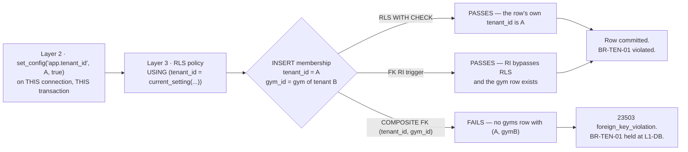

# Relationships — Physical Foreign-Key Design

> **Phase:** 4 — Physical database design (pre-code) · **Status:** Authoritative for foreign keys,
> cascade behaviour and referential integrity · **Date:** 2026-08-06 ·
> **Launch market:** India (`LAUNCH_MARKET_INDIA.md`)
>
> **Precedence.** `PROJECT_CONSTITUTION.md` > `MASTER_PRD.md` > `DECISION_LOG.md` >
> `STACK_ADDITIONS.md` > `docs/engineering/*` > this document. Where this document appears to
> conflict with any of them, they win and this document is defective. §14 lists every place this
> document knowingly departs from `docs/engineering/ERD.md` and argues each one.
>
> **No application code, no `schema.prisma`, and no migration exists.** Every fenced block below is
> labelled **illustrative — not committed code** and exists only to make a constraint unambiguous.

---

## 0. What this document is

`docs/engineering/ERD.md` §5 is the **logical** relationship register: parent, child, cardinality,
optionality, an on-delete word, and the business rule. This document is the **physical** design of
the same edges. It does not repeat the logical justification; it adds everything the logical
document deliberately excluded.

| ERD.md §5 supplies | This document adds |
| :--- | :--- |
| Parent, child, cardinality, optionality | The **constraint name** (`PROJECT_CONSTITUTION.md` §8.7) and the **column list** on both sides |
| An `On delete` word | The literal `ON DELETE` **and** `ON UPDATE` action, whether the constraint is `DEFERRABLE`, and why |
| A `Why` column citing a `BR-`/`FR-` id | Whether the edge is **enforced** by the database, **advisory** (no constraint, orphan-scanned), or **enforced compositely** with `tenant_id` |
| The three polymorphic references | Every no-FK edge — polymorphic, array-valued, snapshot, and lifetime-mismatched — with the mechanism that replaces the constraint |
| The aggregate map | Which relationships cross an aggregate boundary and are therefore **by-id only** at the object level even though an FK exists at the storage level |
| — | The **RLS × foreign-key interaction**, which is the single most dangerous physical property of this schema and appears in no earlier document (§2) |
| — | The **composite tenant-carrying foreign key** law (§3), which `BusinessRules.md` `BR-TEN-01` names as `L1-DB` **AUTHORITATIVE** but never specifies |
| — | Cascade analysis per root entity, orphan prevention, cycle breaking, FK index register, Prisma relation mapping, CI enforcement |

**Entity basis.** The 76 entities of `ERD.md` §4, plus the two partitioned parents' child partitions,
plus one materialised view (`search_documents`, `ERD.md` §6.5). Every relationship among them appears
below exactly once. **165 foreign keys are declared and 19 edges are deliberately unconstrained.**

---

## 1. Conventions in force

### 1.1 Constraint naming

`PROJECT_CONSTITUTION.md` §8.7 fixes `fk_<table>__<ref_table>`. That pattern is ambiguous the moment
a child holds two FKs to one parent — `reserves` holds two to `settlement_batches`, `referrals` holds
two to `users`. The disambiguated form used throughout this document, and specified formally in
`NamingConvention.md` §7, is:

```
fk_<child_table>__<referenced_table>                       -- when unambiguous
fk_<child_table>__<referenced_table>__<role>               -- when the child holds >1 FK to that parent
```

`<role>` is the child's column name with the trailing `_id` and any leading copy of the referenced
table name removed: `reserves.held_in_batch_id` → `fk_reserves__settlement_batches__held_in`.

### 1.2 `ON UPDATE` — one action, everywhere

> **Every foreign key in this schema is `ON UPDATE RESTRICT`. There are no exceptions.**

| Why | Statement |
| :--- | :--- |
| Primary keys are **immutable UUIDv7** (`ERD.md` §1.1, `PROJECT_CONSTITUTION.md` §15.8 rule 2). A primary key is never updated, so `ON UPDATE CASCADE` is unreachable code | Unreachable cascade logic is worse than absent logic: it silently rewrites child rows if the impossible ever happens, instead of failing |
| `ON UPDATE CASCADE` on a table with `R-FIN` or `R-AUD` retention would let a single `UPDATE` rewrite financial history without an audit row | `BR-FIN-01`, `INV-DAT-2` |
| `RESTRICT` rather than `NO ACTION` | `RESTRICT` is checked immediately and names the offending row in the error; `NO ACTION` defers the check to end-of-statement and produces a less useful diagnostic. Nothing in this schema is `DEFERRABLE` (§11), so the deferral `NO ACTION` permits buys nothing |

The `ON UPDATE` column is therefore omitted from the per-domain registers in §4 — **read it as
`RESTRICT` on every row** — and is restated explicitly only for the handful of edges in §11 where a
reader might reasonably expect deferral.

### 1.3 `ON DELETE` vocabulary and how rare each is

`ADR-0024` makes soft delete the default and `PROJECT_CONSTITUTION.md` §15.4 `SD1` states that *"a
row is never removed by ordinary application code"*. `ERD.md` §10.3 goes further: **`gm_app`/`app_rw`
holds no `DELETE` grant on any table carrying `deleted_at`.** The `ON DELETE` action is therefore, for
most edges, a statement about what would happen under the `data.retention-sweep` job or a reviewed
`app_migrator` data-subject script — not about anything the request path can do.

| Action | Count | When it is used |
| :--- | ---: | :--- |
| `RESTRICT` | 131 | The default. The child's existence is evidence, financial record, or an operational fact that must not vanish with its parent |
| `CASCADE` | 26 | The child is **owned** by the parent aggregate (`ERD.md` §6.1 *Contained*), has no independent identity, and is not `R-FIN` or `R-AUD` |
| `SET NULL` | 8 | The reference is an **attribution or an enrichment**, not an ownership. Losing it degrades the row; it does not invalidate it. The column is necessarily nullable |
| *(no constraint)* | 19 | §6. Polymorphic, array-valued, lifetime-mismatched, or snapshot |

**`SET DEFAULT` is not used anywhere.** There is no meaningful default parent for any child in this
schema, and a default that points at a sentinel row is a silent data-quality failure that no query
would surface.

### 1.4 Enforced, compositely enforced, advisory

| Class | Meaning | Integrity mechanism |
| :--- | :--- | :--- |
| **Enforced** | A single-column `FOREIGN KEY` constraint exists | PostgreSQL RI trigger |
| **Composite** | A two-column `FOREIGN KEY (tenant_id, <parent>_id)` exists against a `UNIQUE (tenant_id, id)` on the parent (§3) | PostgreSQL RI trigger, **plus** cross-tenant parenting made structurally impossible |
| **Advisory** | No constraint. The reference is validated at write time by the application and swept nightly by `ops.orphan-scan` (`ERD.md` §5.3) | Zod enum + nightly reconciliation + a data-quality alert |

`NFR-DQ-01` requires referential integrity *"enforced by database constraints, not application
convention alone"*. Every **Advisory** row in §6 carries a written argument for why a constraint is
either impossible (polymorphism, arrays, partition lifetimes) or **incorrect** (audit must outlive
its subject). "It was inconvenient" is not in that list.

### 1.5 Reading the registers

| Column | Meaning |
| :--- | :--- |
| **Parent → Child** | Referenced table → referencing table |
| **Child column(s)** | The FK column list on the child. A two-column list means §3's composite form |
| **Card.** | `1:N`, `1:0..N`, `1:1`, `1:0..1`. `1:0..1` plus a unique index is how "at most one" is enforced |
| **Null** | Is the child's FK column nullable? |
| **Del** | `ON DELETE` action |
| **Cls** | `E` enforced · `C` composite · `A` advisory |
| **Constraint** | The constraint name that will appear in `pg_constraint` |
| **Rule** | The `BR-`/`FR-`/`INV-`/`NFR-` identifier the edge exists to serve |

---

## 2. The interaction that governs everything: RLS × foreign keys

This section exists because it appears in no earlier document and it changes the design of nearly
every edge in §4.

### 2.1 PostgreSQL bypasses row-level security when it checks a foreign key

PostgreSQL's referential-integrity triggers run with row security **suspended**. The documented
behaviour is that unique/primary-key checks and foreign-key references *always* bypass row security
so that data integrity is maintained. Three consequences follow, and each one is load-bearing.

| # | Consequence | Severity |
| :-: | :--- | :--- |
| **1** | A tenant-scoped `INSERT` can successfully point a child row at a **parent row belonging to another tenant**. RLS does not stop it, because the RI check never evaluates the policy. `BR-TEN-01` is violated by a write that every layer above the database believes is legal | **Critical** |
| **2** | A foreign-key **violation error** is an existence oracle. `fk_orders__coupons` failing tells the caller the coupon id does *not* exist anywhere; succeeding tells them it does — across tenants. A caller who can guess ids can enumerate | Medium |
| **3** | `ON DELETE CASCADE` and `ON DELETE SET NULL` are executed by the same RI machinery and therefore **also bypass RLS**. A cascade fired inside tenant A's transaction can delete or null rows belonging to tenant B if edge #1 ever produced a cross-tenant child | **Critical** |

### 2.2 What this means for the `A-01` Prisma hazard

`PROJECT_CONSTITUTION.md` §11.4 and `ADR-0005` establish the mandatory tenant-context client
extension: every tenant-scoped operation is wrapped in **one interactive transaction** that first
runs `SELECT set_config('app.tenant_id', $1, true)` so that `SET LOCAL` and the query share a pooled
connection. That extension is the only thing standing between the application and a silent
cross-tenant read.

**The extension does not help here.** Even with the tenant variable perfectly set on the correct
connection, the RI trigger for `fk_memberships__gyms` will happily validate `gym_id` against a gym
in another tenant, because the trigger is exempt from the policy the extension just armed. The
five-layer chain of `§C1.4` has a gap at layer 3 that only the **shape of the constraint** can close.



### 2.3 The three mitigations, all mandatory

| # | Mitigation | Where |
| :-: | :--- | :--- |
| **M1** | **Composite tenant-carrying foreign keys** on every parent–child edge where both sides are tenant-owned | §3 — this is the primary control |
| **M2** | **`CASCADE` and `SET NULL` are forbidden on any edge whose parent and child could conceivably belong to different tenants.** Since M1 makes that impossible for tenant-owned pairs, the residual surface is the eight `SET NULL` edges of §4, every one of which points at a `GLOBAL`, `IDENTITY` or same-aggregate parent | §4, §7 |
| **M3** | **Foreign-key violations are mapped to a single opaque error code.** `§C1.5`'s error model returns `REFERENCED_ENTITY_NOT_FOUND` with a `422` and no entity name, no id and no constraint name, for every `23503`. The constraint name never reaches a client. This closes consequence #2 | `NamingConvention.md` §28, `PROJECT_CONSTITUTION.md` §13.6 |

**M3 has a testable negative.** `BR-TEN-01-N4` *(new, proposed for `BusinessRules.md`)*: authenticate
as tenant A, `POST /v1/tenant/plans` naming a `branch_id` belonging to tenant B in
`applicable_branch_ids`, assert `422 REFERENCED_ENTITY_NOT_FOUND` and assert the response body
contains neither the branch id nor the string `fk_`.

---

## 3. The composite tenant-carrying foreign key

### 3.1 The law

> **Where both the parent and the child are tenant-owned (`ERD.md` §1.2 class `RLS`), the foreign key
> is `(tenant_id, <parent>_id) REFERENCES <parent> (tenant_id, id)`. A single-column foreign key
> between two tenant-owned tables is a review-blocking defect.**

`BusinessRules.md` `BR-TEN-01` already names this as the authoritative `L1-DB` construct —
*"composite FKs carry `tenant_id` so a child can never point at a parent in another tenant"* — but
specifies neither the parent-side unique index it requires nor its cost. Both are below.

### 3.2 What it requires on the parent

Every tenant-owned table that is ever a parent carries a redundant-looking unique constraint:

```sql
-- illustrative — not committed code
ALTER TABLE gyms ADD CONSTRAINT uq_gyms__tenant_id_id UNIQUE (tenant_id, id);
```

`id` is already unique, so `(tenant_id, id)` is trivially unique. The index exists **solely** to be a
legal referent for the composite foreign key; PostgreSQL requires the referenced column list to be
covered by a unique or primary-key constraint. Thirty-one tables carry one:

`tenants` *(uses `(id, id)`? no — see §3.4)*, `gyms`, `branches`, `plans`, `add_ons`, `orders`,
`payments`, `invoices`, `memberships`, `crm_members`, `leads`, `staff`, `applications`, `reviews`,
`refunds`, `disputes`, `settlement_batches`, `ledger_entries`, `payout_accounts`, `coupons`,
`support_tickets`, `segments`, `report_definitions`, `credit_notes`, `subscription_invoices`,
`freezes`, `attendance` *(see §3.5)*, `staff_invitations`, `gym_media`, `kyc_documents`,
`export_jobs`.

### 3.3 What it costs, honestly

| Cost | Assessment |
| :--- | :--- |
| One extra unique index per parent table (~31 indexes) | At `NFR-SCAL-02` Year-3 volumes the largest is `orders` at ~20 M rows ≈ 900 MB. Acceptable; and see the offsetting benefit below |
| The child must carry `tenant_id` even where it is derivable | It already does. `ERD.md` §8.7 registers `tenant_id` on child rows as a deliberate denormalisation whose drift is *"a P1 tenancy alert"* — the composite FK is precisely what makes that drift **unrepresentable** rather than merely alertable |
| Prisma must express a composite relation | It can: `@relation(fields: [tenantId, gymId], references: [tenantId, id])` against `@@unique([tenantId, id])`. §13.3 shows the sketch |
| Write amplification on insert | Two-column RI probe instead of one, on an index that is in cache. Sub-microsecond |
| **Offsetting benefit** | `uq_<table>__tenant_id_id` is a usable index for `WHERE tenant_id = ? AND id = ?`, which is the exact shape every RLS-policed point lookup takes after the policy predicate is appended. It is not dead weight |

### 3.4 The four cases where the composite form does **not** apply

| Case | Example | Form used | Why |
| :--- | :--- | :--- | :--- |
| Parent is `GLOBAL` reference data | `gyms.category_id → gym_categories` | Single-column | The parent has no `tenant_id`. Cross-tenant reference is the *point* of reference data (`NFR-DQ-06`) |
| Parent is `IDENTITY` | `memberships.user_id → users` | Single-column | `users` is platform-global (`ERD.md` §1.2). A person legitimately holds memberships at several tenants (`BR-MEM-04`, §7.1) |
| Parent is `tenants` itself | `gyms.tenant_id → tenants` | Single-column | `tenants.id` **is** the tenant key. `(tenant_id, id)` on `tenants` would be `(id, id)` — meaningless. `tenants`' own RLS policy is `id = current_setting('app.tenant_id')::uuid` |
| Parent is `HYBRID` and the row may be platform-scoped | `orders.coupon_id → coupons` | Single-column | A `scope = 'PLATFORM'` coupon has `tenant_id IS NULL` (`ERD.md` §7.7). A composite FK would make platform coupons unusable by every tenant, which is the feature `FR-CPN-02` requires |

The fourth case is the only one that leaves a genuine hole, and it is closed by a check constraint
rather than a foreign key:

```sql
-- illustrative — not committed code
-- An order may reference a PLATFORM coupon (tenant_id NULL) or its OWN tenant's coupon.
-- Enforced by a trigger because a CHECK cannot read another table.
ck_orders__coupon_scope:  the referenced coupon satisfies
    (coupon.scope = 'PLATFORM' AND coupon.tenant_id IS NULL)
 OR (coupon.scope = 'TENANT'   AND coupon.tenant_id = orders.tenant_id)
```

This is one of only **three** places in the schema where a trigger substitutes for a constraint. The
other two are `ERD.md` §10.4's column-immutability triggers on `orders` and `memberships`.

### 3.5 `attendance` — the composite FK meets the partition key

`attendance` is `PARTITION BY RANGE (checked_in_at)` with `PRIMARY KEY (checked_in_at, id)`
(`ERD.md` §11.2). Two effects:

1. **`attendance` as a child** — its outbound FKs to `memberships`, `branches`, `gyms`, `staff` are
   ordinary composite FKs. PostgreSQL 16 supports foreign keys declared **on** a partitioned table;
   each partition inherits the constraint. `ops.partition-maintain` must verify constraint parity on
   every new partition alongside RLS and grants (`ERD.md` §11.4 adds guarantee **#4**, see §15).
2. **`attendance` as a parent** — a foreign key *to* it would have to reference
   `(checked_in_at, id)`, and any inbound FK blocks `ALTER TABLE … DETACH PARTITION`, which is the
   archival mechanism `Scalability.md` §5.7.3 depends on. **No table has a foreign key to
   `attendance`, and none ever will.** `attendance.corrects_attendance_id` (`ERD.md` §10.5) is
   therefore advisory — §6.9.

---

## 4. The relationship register

165 foreign keys, grouped by the eight bounded contexts of `PROJECT_CONSTITUTION.md` §4.1. `ON UPDATE`
is `RESTRICT` on every row (§1.2) and is not repeated.

### 4.1 Tenancy — 14 foreign keys

| Parent → Child | Child column(s) | Card. | Null | Del | Cls | Constraint | Rule |
| :--- | :--- | :---: | :-: | :--- | :-: | :--- | :--- |
| `countries` → `tenants` | `country_code` | 1:N | No | RESTRICT | E | `fk_tenants__countries` | `ADR-0028`; drives tax profile, KYC checklist, FY start month |
| `subscription_tiers` → `tenants` | `subscription_tier_id` | 1:N | No | RESTRICT | E | `fk_tenants__subscription_tiers` | `A6.2`; a tier in use is superseded, never deleted |
| `tax_profiles` → `tenants` | `tax_profile_id` | 1:N | No | RESTRICT | E | `fk_tenants__tax_profiles` | `BR-PAY-11` — but the **invoice** reads its snapshot, not this edge (`ERD.md` §9.3) |
| `commission_rules` → `tenants` | `commission_rule_id` | 1:0..N | **Yes** | RESTRICT | E | `fk_tenants__commission_rules` | `FR-ADMN-03` precedence: null = no tenant override, fall through to tier then global |
| `tenants` → `gyms` | `tenant_id` | 1:N | No | RESTRICT | E | `fk_gyms__tenants` | `BR-TEN-01`. The isolation unit owns the listing unit |
| `tenants` → `branches` | `tenant_id` | 1:N | No | RESTRICT | E | `fk_branches__tenants` | `BR-TEN-03`; also the anchor for §3's composite children |
| `tenants` → `plans` | `tenant_id` | 1:N | No | RESTRICT | E | `fk_plans__tenants` | `BR-TEN-03` shared catalogue |
| `tenants` → `staff` | `tenant_id` | 1:N | No | RESTRICT | E | `fk_staff__tenants` | `FR-STAF-06` seat limits counted here |
| `tenants` → `payout_accounts` | `tenant_id` | 1:N | No | RESTRICT | E | `fk_payout_accounts__tenants` | `A6.4`; history retained under `R-FIN`, exactly one `ACTIVE` |
| `tenants` → `subscription_invoices` | `tenant_id` | 1:N | No | RESTRICT | E | `fk_subscription_invoices__tenants` | `A6.2`; the tenant's own SaaS bill is an Indian tax document (§12.6 of `ERD.md`) |
| `subscription_tiers` → `subscription_invoices` | `subscription_tier_id` | 1:N | No | RESTRICT | E | `fk_subscription_invoices__subscription_tiers` | The tier rate at the moment of billing |
| `tenants` → `coupons` | `tenant_id` | 1:0..N | **Yes** | RESTRICT | E | `fk_coupons__tenants` | Nullable because `scope = 'PLATFORM'` (`ERD.md` §7.7) |
| `tenants` → `report_definitions` | `tenant_id` | 1:0..N | **Yes** | RESTRICT | E | `fk_report_definitions__tenants` | `HYBRID`: null = platform-supplied definition (`B5.20`) |
| `tenants` → `idempotency_keys` | `tenant_id` | 1:0..N | **Yes** | RESTRICT | E | `fk_idempotency_keys__tenants` | Nullable: the interceptor runs **before** tenant resolution on the public checkout path (`ERD.md` §5.4) |

**`tenants` is never the child of a tenant-owned parent.** It is the root of the isolation graph. Its
own RLS policy is `id = current_setting('app.tenant_id')::uuid`, not the standard `tenant_id = …`
form, which is why `NamingConvention.md` §18 gives it a named exception rather than letting the CI
policy-shape check fail.

**Why no `tenants → tenants` parent edge.** Franchise hierarchy (`A4.2`) attaches to `gyms`, not
`tenants` — `ERD.md` §7.6 is right about this and §10.1 restates it. A franchise parent and child are
**one tenant**; a multi-tenant franchise is a `BR-TEN-02` multi-ownership case, which is modelled on
`user_roles`, not on a tenant self-reference.

### 4.2 Identity & access — 15 foreign keys

| Parent → Child | Child column(s) | Card. | Null | Del | Cls | Constraint | Rule |
| :--- | :--- | :---: | :-: | :--- | :-: | :--- | :--- |
| `users` → `user_roles` | `user_id` | 1:N | No | CASCADE | E | `fk_user_roles__users` | Contained in the `User` aggregate (`ERD.md` §6.1 #3) |
| `roles` → `user_roles` | `role_id` | 1:N | No | RESTRICT | E | `fk_user_roles__roles` | A role held by anyone cannot be deleted; roles are retired |
| `tenants` → `user_roles` | `tenant_id` | 1:0..N | **Yes** | CASCADE | E | `fk_user_roles__tenants` | Null = a platform role. Cascade because a tenant-scoped grant is meaningless without the tenant — see the §7.4 caveat |
| `roles` → `role_permissions` | `role_id` | 1:N | No | CASCADE | E | `fk_role_permissions__roles` | Contained in the `Role` aggregate |
| `permissions` → `role_permissions` | `permission_id` | 1:N | No | RESTRICT | E | `fk_role_permissions__permissions` | `FR-RBAC-01` fails CI on an undeclared permission; a silent delete would defeat the check |
| `users` → `auth_sessions` | `user_id` | 1:N | No | CASCADE | E | `fk_auth_sessions__users` | `FR-AUTH-10`: password reset invalidates all sessions |
| `auth_sessions` → `refresh_tokens` | `session_id` | 1:N | No | CASCADE | E | `fk_refresh_tokens__auth_sessions` | The token family; reuse detection needs the whole chain (`ADR-0011`) |
| `refresh_tokens` → `refresh_tokens` | `preceded_by_token_id` | 1:0..1 | **Yes** | RESTRICT | E | `fk_refresh_tokens__refresh_tokens__preceded_by` | Self-reference, §10.2. `RESTRICT` because a broken chain defeats reuse detection |
| `users` → `notification_preferences` | `user_id` | 1:N | No | CASCADE | E | `fk_notification_preferences__users` | Consent is a property of the person (`NFR-PRV-02`) |
| `users` → `staff` | `user_id` | 1:N | No | RESTRICT | E | `fk_staff__users` | `BR-DAT-04`: a person with employment history is pseudonymised, never hard-deleted |
| `roles` → `staff` | `role_id` | 1:N | No | RESTRICT | E | `fk_staff__roles` | **Raised under `§C10` — see §14.1.** `§C2.2` models `staff.role` as an enum |
| `staff` → `staff_branches` | `tenant_id, staff_id` | 1:N | No | CASCADE | C | `fk_staff_branches__staff` | Contained in the `Staff` aggregate |
| `branches` → `staff_branches` | `tenant_id, branch_id` | 1:N | No | RESTRICT | C | `fk_staff_branches__branches` | Removing a branch must force explicit reassignment, never silent unscoping (`FR-STAF-03`) |
| `tenants` → `staff_invitations` | `tenant_id` | 1:N | No | RESTRICT | E | `fk_staff_invitations__tenants` | `FR-STAF-02` |
| `roles` → `staff_invitations` | `role_id` | 1:N | No | RESTRICT | E | `fk_staff_invitations__roles` | The role the invitation grants must remain resolvable when accepted |

Plus two role-disambiguated edges on `staff_invitations`, listed separately because their directions
are counter-intuitive:

| Parent → Child | Child column(s) | Card. | Null | Del | Cls | Constraint | Rule |
| :--- | :--- | :---: | :-: | :--- | :-: | :--- | :--- |
| `staff` → `staff_invitations` | `tenant_id, invited_by_staff_id` | 1:N | No | RESTRICT | C | `fk_staff_invitations__staff__invited_by` | `AC-STAF-01.1`: who invited whom must stay answerable |
| `staff` → `staff_invitations` | `tenant_id, accepted_staff_id` | 1:0..1 | **Yes** | SET NULL | C | `fk_staff_invitations__staff__accepted` | §14.2 — `ERD.md` §5.2 draws this edge with `staff_invitations` as the *parent*; the FK column lives on `staff_invitations`, so the parent is `staff`. `SET NULL` preserves the consent evidence if the staff row is purged |

**`created_by` and `updated_by` are not foreign keys.** `NFR-DQ-05` requires the columns on every
table; `PROJECT_CONSTITUTION.md` §15.5 `AC2` says they *"reference the acting user, and are null only
for system actors"*. They are nevertheless **advisory** (§6.4) on all 76 tables, for reasons argued
there. This removes 152 candidate foreign keys from the register.

### 4.3 Onboarding & KYC — 7 foreign keys

| Parent → Child | Child column(s) | Card. | Null | Del | Cls | Constraint | Rule |
| :--- | :--- | :---: | :-: | :--- | :-: | :--- | :--- |
| `tenants` → `applications` | `tenant_id` | 1:N | No | RESTRICT | E | `fk_applications__tenants` | `BR-GYM-05`: versioned resubmission, prior versions retained |
| `users` → `applications` | `decided_by` | 1:0..N | **Yes** | RESTRICT | E | `fk_applications__users__decided_by` | `BR-GYM-03` / `INV-TRU-2`: approval always carries a resolvable human actor. Null only while undecided |
| `users` → `applications` | `assigned_to` | 1:0..N | **Yes** | SET NULL | E | `fk_applications__users__assigned_to` | Queue assignment is an operational attribution; a departed reviewer must not block the case |
| `tenants` → `kyc_documents` | `tenant_id` | 1:N | No | RESTRICT | E | `fk_kyc_documents__tenants` | `BR-TEN-04`: closure never deletes KYC while the statutory clock runs (`R-KYC`) |
| `applications` → `kyc_documents` | `tenant_id, application_id` | 1:N | **Yes** | RESTRICT | C | `fk_kyc_documents__applications` | Nullable: a document may be uploaded before the application version exists (`FR-ONB-04`) |
| `kyc_checklists` → `kyc_documents` | `kyc_checklist_id` | 1:N | No | RESTRICT | E | `fk_kyc_documents__kyc_checklists` | The checklist **version** in force; also snapshotted onto the application (`ERD.md` §9.6) |
| `users` → `kyc_documents` | `reviewed_by` | 1:0..N | **Yes** | RESTRICT | E | `fk_kyc_documents__users__reviewed_by` | `BR-DAT-07`: every KYC access is logged and every review is attributable |

**`applications.reason_codes` is a `text[]`, not a join table** (`§C2.2`). PostgreSQL cannot foreign-key
an array element, so this is advisory — §6.6.

### 4.4 Catalogue — 20 foreign keys

| Parent → Child | Child column(s) | Card. | Null | Del | Cls | Constraint | Rule |
| :--- | :--- | :---: | :-: | :--- | :-: | :--- | :--- |
| `gym_categories` → `gyms` | `category_id` | 1:N | No | RESTRICT | E | `fk_gyms__gym_categories` | `NFR-DQ-06` reference taxonomy; reclassification is retroactive by design (`ERD.md` §9.8) |
| `gyms` → `gyms` | `parent_gym_id` | 1:0..N | **Yes** | RESTRICT | E | `fk_gyms__gyms__parent` | Franchise seam, §10.1. `CHECK (parent_gym_id IS NULL)` in Phase 1 (`ERD.md` §7.6) |
| `cities` → `gyms` | `primary_city_id` | 1:N | No | RESTRICT | E | `fk_gyms__cities__primary` | **New in Phase 4, §14.3.** `§C2.2` makes `gyms.slug` *"unique per city"* but `gyms` holds no city; the city lives on `branches`. A denormalised primary city is the only way to express the uniqueness as an index |
| `gyms` → `branches` | `tenant_id, gym_id` | 1:N (≥1) | No | RESTRICT | C | `fk_branches__gyms` | `BR-TEN-03`; exactly one `is_primary` (`ERD.md` §7.5) |
| `cities` → `branches` | `city_id` | 1:N | No | RESTRICT | E | `fk_branches__cities` | `FR-SRCH-06` city landing pages |
| `localities` → `branches` | `locality_id` | 1:0..N | **Yes** | SET NULL | E | `fk_branches__localities` | Not every address resolves to a mapped locality; losing the locality degrades SEO, not correctness |
| `branches` → `branch_hours` | `tenant_id, branch_id` | 1:N | No | CASCADE | C | `fk_branch_hours__branches` | Contained in the `Branch` aggregate; multiple rows per weekday (`ERD.md` §7.4) |
| `branches` → `branch_hour_exceptions` | `tenant_id, branch_id` | 1:N | No | CASCADE | C | `fk_branch_hour_exceptions__branches` | Contained in the `Branch` aggregate |
| `gyms` → `gym_amenities` | `tenant_id, gym_id` | 1:N | No | CASCADE | C | `fk_gym_amenities__gyms` | Contained in the `Gym` aggregate |
| `amenities` → `gym_amenities` | `amenity_id` | 1:N | No | RESTRICT | E | `fk_gym_amenities__amenities` | Retiring an amenity must not silently strip it from listings (`NFR-DQ-06`) |
| `gyms` → `gym_media` | `tenant_id, gym_id` | 1:N | No | CASCADE | C | `fk_gym_media__gyms` | Contained in the `Gym` aggregate |
| `branches` → `gym_media` | `tenant_id, branch_id` | 1:0..N | **Yes** | SET NULL | C | `fk_gym_media__branches` | `SET NULL` demotes a branch photo to a gym photo rather than destroying it. Safe under §2.3 M2 because the composite form guarantees same-tenant |
| `gyms` → `plans` | `tenant_id, gym_id` | 1:N | No | RESTRICT | C | `fk_plans__gyms` | A plan without a gym is unsellable |
| `plans` → `plan_branches` | `tenant_id, plan_id` | 1:0..N | No | CASCADE | C | `fk_plan_branches__plans` | **Zero rows = all branches** (`ERD.md` §7.3) |
| `branches` → `plan_branches` | `tenant_id, branch_id` | 1:0..N | No | **RESTRICT** | C | `fk_plan_branches__branches` | §14.4 — `ERD.md` §5.2 specifies `CASCADE`; this document overrides to `RESTRICT` |
| `plans` → `add_ons` | `tenant_id, plan_id` | 1:N | No | RESTRICT | C | `fk_add_ons__plans` | An add-on sold on an order must remain resolvable (`R-FIN`) |
| `users` → `favourites` | `user_id` | 1:N | No | CASCADE | E | `fk_favourites__users` | Contained in the `User` aggregate |
| `gyms` → `favourites` | `gym_id` | 1:N | No | CASCADE | E | `fk_favourites__gyms` | A favourite of a hard-deleted gym is noise. **Single-column, not composite** — see §14.5 |
| `users` → `saved_searches` | `user_id` | 1:N | No | CASCADE | E | `fk_saved_searches__users` | Contained in the `User` aggregate |
| `cities` → `localities` | `city_id` | 1:N | No | RESTRICT | E | `fk_localities__cities` | Reference hierarchy; `NFR-DQ-06` stable identifiers |

### 4.5 Discovery & attribution — 3 foreign keys

| Parent → Child | Child column(s) | Card. | Null | Del | Cls | Constraint | Rule |
| :--- | :--- | :---: | :-: | :--- | :-: | :--- | :--- |
| `tenants` → `attribution_events` | `tenant_id` | 1:N | No | RESTRICT | E | `fk_attribution_events__tenants` | The tenant against whom commission may be claimed |
| `users` → `attribution_events` | `user_id` | 1:N | No | RESTRICT | E | `fk_attribution_events__users` | `A6.3` commission evidence *"visible to both parties"*; `R-FIN` outlives the user's operational purge |
| `gyms` → `attribution_events` | `tenant_id, gym_id` | 1:N | No | RESTRICT | C | `fk_attribution_events__gyms` | The gym reached through a platform discovery surface |

`attribution_events` is append-only (`ERD.md` §10.1), so `RESTRICT` on all three can only ever fire
against the `data.retention-sweep` job — and `R-FIN` means it never runs against these rows.

### 4.6 Ordering & coupons — 14 foreign keys

| Parent → Child | Child column(s) | Card. | Null | Del | Cls | Constraint | Rule |
| :--- | :--- | :---: | :-: | :--- | :-: | :--- | :--- |
| `tenants` → `orders` | `tenant_id` | 1:N | No | RESTRICT | E | `fk_orders__tenants` | `R-FIN`; the seller of record |
| `gyms` → `orders` | `tenant_id, gym_id` | 1:N | No | RESTRICT | C | `fk_orders__gyms` | The seller named on the tax document |
| `users` → `orders` | `user_id` | 1:N | No | RESTRICT | E | `fk_orders__users` | The buyer is pseudonymised on `BR-DAT-04`, never removed |
| `plans` → `orders` | `tenant_id, plan_id` | 1:N | No | RESTRICT | C | `fk_orders__plans` | T3: an order naming a vanished plan cannot be audited. Priced terms are snapshotted regardless |
| `coupons` → `orders` | `coupon_id` | 1:0..N | **Yes** | RESTRICT | E | `fk_orders__coupons` | `BR-CPN-02` one coupon per order. **Single-column** — §3.4 case 4, backed by `ck_orders__coupon_scope` |
| `commission_rules` → `orders` | `commission_rule_id` | 1:N | No | RESTRICT | E | `fk_orders__commission_rules` | `BR-FIN-05` / `INV-FIN-5`: the rate effective at the moment of sale, made **explicable** and not merely arithmetic (`ERD.md` §9.5) |
| `tax_profiles` → `orders` | `tax_profile_id` | 1:N | No | RESTRICT | E | `fk_orders__tax_profiles` | Admin traceability; the *document* reads `tax_snapshot` (`BR-PAY-11`) |
| `orders` → `order_items` | `tenant_id, order_id` | 1:N | No | CASCADE | C | `fk_order_items__orders` | Contained in the `Order` aggregate. Reachable only while the order is `PENDING` (§7.3) |
| `plans` → `order_items` | `tenant_id, plan_id` | 1:0..N | **Yes** | RESTRICT | C | `fk_order_items__plans` | Null on a joining-fee or add-on line |
| `add_ons` → `order_items` | `tenant_id, add_on_id` | 1:0..N | **Yes** | RESTRICT | C | `fk_order_items__add_ons` | Null on the principal line |
| `coupons` → `coupon_redemptions` | `coupon_id` | 1:N | No | RESTRICT | E | `fk_coupon_redemptions__coupons` | `coupons.redemption_count` is denormalised from these (`ERD.md` §8.5) |
| `orders` → `coupon_redemptions` | `tenant_id, order_id` | 1:0..1 | No | CASCADE | C | `fk_coupon_redemptions__orders` | `BR-CPN-02` from the other side; `uq_coupon_redemptions__order_id` makes it 0..1 |
| `users` → `coupon_redemptions` | `user_id` | 1:N | No | RESTRICT | E | `fk_coupon_redemptions__users` | `per_user_limit` is counted here (`BR-CPN-01`) |
| `tenants` → `coupon_redemptions` | `tenant_id` | 1:N | No | RESTRICT | E | `fk_coupon_redemptions__tenants` | RLS anchor; a platform coupon redeemed at tenant X produces a row owned by X |

**The `coupon_redemptions` tenancy subtlety.** A `PLATFORM` coupon is visible to every tenant, but a
*redemption* of it is a fact about one order at one tenant and is therefore ordinary `RLS` data. The
`coupons` FK is single-column and the `orders` FK is composite; both are correct, and the asymmetry
is the price of `ERD.md` §7.7's one-table-two-scopes decision.

### 4.7 Payments — 6 foreign keys

| Parent → Child | Child column(s) | Card. | Null | Del | Cls | Constraint | Rule |
| :--- | :--- | :---: | :-: | :--- | :-: | :--- | :--- |
| `tenants` → `payments` | `tenant_id` | 1:N | No | RESTRICT | E | `fk_payments__tenants` | `R-FIN` |
| `orders` → `payments` | `tenant_id, order_id` | 1:N | No | RESTRICT | C | `fk_payments__orders` | Retries and duplicates each create a row (`FR-PAY-06`, `BR-PAY-07`) |
| `staff` → `payments` | `tenant_id, collected_by_staff_id` | 1:0..N | **Yes** | RESTRICT | C | `fk_payments__staff__collected_by` | `FR-CRM-07` cash attribution. Null for online; `RESTRICT` because *"who took the cash"* must stay answerable |
| `payments` → `payment_events` | `tenant_id, payment_id` | 1:N | No | RESTRICT | C | `fk_payment_events__payments` | Append-only; `uq_payment_events__provider_event_id` is **globally** unique (`ERD.md` §5.4) |
| `tenants` → `payment_events` | `tenant_id` | 1:N | No | RESTRICT | E | `fk_payment_events__tenants` | RLS anchor. Written by the webhook handler **after** the payment resolves the tenant |
| `payments` → `disputes` | `tenant_id, payment_id` | 1:N | No | RESTRICT | C | `fk_disputes__payments` | `BR-REF-08`: multiple disputes per payment across its life |

**Ordering hazard worth stating.** The webhook endpoint is unauthenticated-but-signed and reaches
`payment_events` before a tenant context exists. The insert therefore runs under a **platform write
path** that resolves the tenant from `provider_intent_id` first and only then arms
`set_config('app.tenant_id', …)`. The composite FK to `payments` is what proves the resolution was
right: if the handler resolved the wrong tenant, `fk_payment_events__payments` fails with `23503`
rather than writing a mis-attributed event. This is `M1` earning its keep on the one path where the
`A-01` extension cannot run first.

### 4.8 Invoicing & billing — 6 foreign keys

| Parent → Child | Child column(s) | Card. | Null | Del | Cls | Constraint | Rule |
| :--- | :--- | :---: | :-: | :--- | :-: | :--- | :--- |
| `tenants` → `invoices` | `tenant_id` | 1:N | No | RESTRICT | E | `fk_invoices__tenants` | RLS anchor; also the key of the gapless sequence with `financial_year` |
| `orders` → `invoices` | `tenant_id, order_id` | 1:0..1 | No | RESTRICT | C | `fk_invoices__orders` | `BR-PAY-10` one invoice per order; `uq_invoices__order_id` makes it 0..1 |
| `tenants` → `credit_notes` | `tenant_id` | 1:N | No | RESTRICT | E | `fk_credit_notes__tenants` | Own gapless sequence per `(tenant_id, financial_year)` |
| `invoices` → `credit_notes` | `tenant_id, original_invoice_id` | 1:N | No | RESTRICT | C | `fk_credit_notes__invoices` | `INV-FIN-9`: corrections are never edits |
| `refunds` → `credit_notes` | `tenant_id, refund_id` | 1:0..N | **Yes** | RESTRICT | C | `fk_credit_notes__refunds` | Null when the credit note arises from a dispute loss rather than a refund. **This is the surviving half of the broken cycle — §11.2** |
| `tenants` → `subscription_invoices` | *(see §4.1)* | — | — | — | — | — | — |

**`invoices` has no FK to `tax_profiles`.** The order carries it (`fk_orders__tax_profiles`) and the
invoice carries `tax_snapshot`/`tax_breakdown`. Adding a third path to the same fact would create
three places to disagree. `ERD.md` §9.3 makes the snapshot authoritative; a redundant FK invites a
join that would silently answer the wrong question.

### 4.9 Membership & attendance — 15 foreign keys

| Parent → Child | Child column(s) | Card. | Null | Del | Cls | Constraint | Rule |
| :--- | :--- | :---: | :-: | :--- | :-: | :--- | :--- |
| `tenants` → `memberships` | `tenant_id` | 1:N | No | RESTRICT | E | `fk_memberships__tenants` | RLS anchor |
| `gyms` → `memberships` | `tenant_id, gym_id` | 1:N | No | RESTRICT | C | `fk_memberships__gyms` | The gym scopes the stackability rule (`ERD.md` §7.2) |
| `users` → `memberships` | `user_id` | 1:N | No | RESTRICT | E | `fk_memberships__users` | `BR-MEM-04`: concurrent memberships at different gyms are legal |
| `plans` → `memberships` | `tenant_id, plan_id` | 1:N | No | RESTRICT | C | `fk_memberships__plans` | `BR-PLN-04`: archiving never orphans — hence `RESTRICT`, never `CASCADE` |
| `orders` → `memberships` | `tenant_id, order_id` | 1:0..1 | **Yes** | RESTRICT | C | `fk_memberships__orders` | Null for staff-created and migrated memberships; `uq_memberships__order_id` makes it 0..1 |
| `memberships` → `memberships` | `tenant_id, renewed_from_membership_id` | 1:0..N | **Yes** | RESTRICT | C | `fk_memberships__memberships__renewed_from` | Self-reference, §10.3. Counts renewal generation for the `A6.3` rate step-down |
| `memberships` → `membership_events` | `tenant_id, membership_id` | 1:N | No | RESTRICT | C | `fk_membership_events__memberships` | `INV-MEM-4`: exactly one row per transition, append-only |
| `memberships` → `freezes` | `tenant_id, membership_id` | 1:N | No | RESTRICT | C | `fk_freezes__memberships` | `BR-MEM-05`: `freeze_days_used` is denormalised from these |
| `users` → `freezes` | `requested_by` | 1:0..N | **Yes** | RESTRICT | E | `fk_freezes__users__requested_by` | Null when a job unfreezes on schedule (`C5` `membership.unfreeze-scheduled`) |
| `memberships` → `attendance` | `tenant_id, membership_id` | 1:N | No | RESTRICT | C | `fk_attendance__memberships` | `INV-CHK-4`: attendance is never deleted, so `RESTRICT` can never fire in practice |
| `gyms` → `attendance` | `tenant_id, gym_id` | 1:N | No | RESTRICT | C | `fk_attendance__gyms` | Denormalised for reporting (`ERD.md` §8.7); the FK makes the denormalisation non-driftable |
| `branches` → `attendance` | `tenant_id, branch_id` | 1:N | No | RESTRICT | C | `fk_attendance__branches` | Drives `idx_attendance__tenant_id_branch_id_checked_in_at` (`§C2.4`) |
| `users` → `attendance` | `user_id` | 1:N | No | RESTRICT | E | `fk_attendance__users` | Carried alongside `membership_id` deliberately (`ERD.md` §8.7) — `BR-REV-01` needs `(user_id, gym_id)` without a membership join |
| `staff` → `attendance` | `tenant_id, staff_id` | 1:0..N | **Yes** | RESTRICT | C | `fk_attendance__staff` | Null for `SCAN`; required for `MANUAL` and `OVERRIDE` (`BR-CHK-08`, `BR-CHK-10`) |
| `tenants` → `attendance` | `tenant_id` | 1:N | No | RESTRICT | E | `fk_attendance__tenants` | RLS anchor on every partition |

**All fifteen are declared on the partitioned parent** and inherited by every child partition. The
`ops.partition-maintain` job's parity check (§15, guarantee #4) verifies that a newly created
partition carries all of them; PostgreSQL does this automatically for partitions created with
`CREATE TABLE … PARTITION OF`, and **does not** for a table created standalone and `ATTACH`ed, which
is why the check is not redundant.

**`attendance.method = 'MANUAL' | 'OVERRIDE'` requires `staff_id`.** That is a `CHECK`, not a foreign
key: `ck_attendance__staff_required_for_manual`. A nullable FK cannot express conditional
requiredness, and `BR-CHK-08`'s *"marked `MANUAL` with the staff identity and a reason"* is not
satisfied by a null.

### 4.10 CRM — 8 foreign keys

| Parent → Child | Child column(s) | Card. | Null | Del | Cls | Constraint | Rule |
| :--- | :--- | :---: | :-: | :--- | :-: | :--- | :--- |
| `tenants` → `crm_members` | `tenant_id` | 1:N | No | RESTRICT | E | `fk_crm_members__tenants` | RLS anchor |
| `gyms` → `crm_members` | `tenant_id, gym_id` | 1:N | No | RESTRICT | C | `fk_crm_members__gyms` | The gym's own record of the person |
| `users` → `crm_members` | `user_id` | 1:0..1 | **Yes** | SET NULL | E | `fk_crm_members__users` | **Nullable is the point**: a walk-in has no platform account. `SET NULL` on a `BR-DAT-04` erasure leaves the gym's operational record intact and de-identified |
| `crm_members` → `member_notes` | `tenant_id, crm_member_id` | 1:N | No | CASCADE | C | `fk_member_notes__crm_members` | Contained in the `CrmMember` aggregate |
| `staff` → `member_notes` | `tenant_id, staff_id` | 1:N | No | RESTRICT | C | `fk_member_notes__staff` | Authorship must remain attributable, including for `NFR-PRV-07` sensitive-category notes |
| `branches` → `leads` | `tenant_id, branch_id` | 1:N | No | RESTRICT | C | `fk_leads__branches` | Enquiry location drives the `FR-CRM-08` pipeline view |
| `crm_members` → `leads` | `tenant_id, converted_to_crm_member_id` | 1:0..1 | **Yes** | SET NULL | C | `fk_leads__crm_members__converted_to` | Conversion is a fact about the lead, not an ownership |
| `staff` → `leads` | `tenant_id, assigned_staff_id` | 1:0..N | **Yes** | SET NULL | C | `fk_leads__staff__assigned` | Queue assignment; a departed staff member must not strand a lead |
| `gyms` → `segments` | `tenant_id, gym_id` | 1:N | No | RESTRICT | C | `fk_segments__gyms` | A segment is a definition scoped to one gym's CRM (`ERD.md` §6.1 #23) |

`crm_members ⋈ segments` is **not** a join table. `ERD.md` §3.4 makes `segments` a stored query
definition re-evaluated on read; materialising membership would create a set that is stale the moment
a member's state changes. §9.5 records why this is the one many-to-many in the domain that has no
join table.

### 4.11 Ledger & settlement — 12 foreign keys

| Parent → Child | Child column(s) | Card. | Null | Del | Cls | Constraint | Rule |
| :--- | :--- | :---: | :-: | :--- | :-: | :--- | :--- |
| `tenants` → `ledger_entries` | `tenant_id` | 1:N | No | RESTRICT | E | `fk_ledger_entries__tenants` | A ledger entry without a tenant is unattributable money (`BR-FIN-01`) |
| `settlement_batches` → `ledger_entries` | `tenant_id, settlement_batch_id` | 1:0..N | **Yes** | RESTRICT | C | `fk_ledger_entries__settlement_batches` | Null until batched; `BR-FIN-06` holds unreported-fee lines out by leaving it null |
| `commission_rules` → `ledger_entries` | `commission_rule_id` | 1:0..N | **Yes** | RESTRICT | E | `fk_ledger_entries__commission_rules` | Non-null on `COMMISSION`, `COMMISSION_TAX`, `COMMISSION_REVERSAL`, `COMMISSION_TAX_REVERSAL`; null on the other nine types |
| `tenants` → `settlement_batches` | `tenant_id` | 1:N | No | RESTRICT | E | `fk_settlement_batches__tenants` | One batch per tenant per cycle; `uq_settlement_batches__tenant_id_period_start` |
| `payout_accounts` → `settlement_batches` | `tenant_id, payout_account_id` | 1:N | No | RESTRICT | C | `fk_settlement_batches__payout_accounts` | The destination is captured **per batch**; the printed identifiers are copied (`ERD.md` §9.5) so a later bank change never rewrites a paid statement |
| `users` → `settlement_batches` | `approved_by` | 1:0..N | **Yes** | RESTRICT | E | `fk_settlement_batches__users__approved_by` | `BR-FIN-08` dual approval above threshold |
| `users` → `settlement_batches` | `second_approved_by` | 1:0..N | **Yes** | RESTRICT | E | `fk_settlement_batches__users__second_approved_by` | The second half of `BR-FIN-08`; `ck_settlement_batches__distinct_approvers` forbids the same actor twice |
| `settlement_batches` → `settlement_lines` | `tenant_id, settlement_batch_id` | 1:N | No | RESTRICT | C | `fk_settlement_lines__settlement_batches` | Lines sum **exactly** to the payout (`BR-FIN-03`, `INV-FIN-6`) |
| `ledger_entries` → `settlement_lines` | `tenant_id, ledger_entry_id` | 1:0..1 | No | RESTRICT | C | `fk_settlement_lines__ledger_entries` | One line per contributing entry; the entry is the provenance. `uq_settlement_lines__ledger_entry_id` |
| `tenants` → `reserves` | `tenant_id` | 1:N | No | RESTRICT | E | `fk_reserves__tenants` | `A6.4` rolling withholding |
| `settlement_batches` → `reserves` | `tenant_id, held_in_batch_id` | 1:0..N | **Yes** | RESTRICT | C | `fk_reserves__settlement_batches__held_in` | `FR-SETL-04` |
| `settlement_batches` → `reserves` | `tenant_id, released_in_batch_id` | 1:0..N | **Yes** | RESTRICT | C | `fk_reserves__settlement_batches__released_in` | Null until the 30-day release (`C5` `reserve.release`) |

**`ledger_entries` has no foreign key to its subject.** `(reference_type, reference_id)` addresses
six target types — §6.1.

**The `COMMISSION_TAX` dependency (`BLK-03` conflict 2).** `ERD.md` §12.4 proposes
`commission_tax_minor` as a ninth persisted figure and `COMMISSION_TAX` / `COMMISSION_TAX_REVERSAL`
as two new `ledger_entries.entry_type` values. **Relationship impact: none.** No new table, no new
foreign key, no change to any edge above. `entry_type` is a PostgreSQL enum extended by migration
(`MG9`), and `fk_ledger_entries__commission_rules` already exists and simply becomes non-null on two
more entry types. **If the proposal is rejected**, the only change is that
`ck_ledger_entries__commission_rule_required` names two entry types instead of four, and
`settlement_lines.commission_tax_minor` is dropped before first use. This is the cheapest possible
place for that decision to land, and it lands there because `ledger_entries` is polymorphic by
`reference_type` rather than by a table per money movement. **Status: PENDING CLIENT DECISION,
required before Sprint 11.**

### 4.12 Refunds & disputes — 9 foreign keys

| Parent → Child | Child column(s) | Card. | Null | Del | Cls | Constraint | Rule |
| :--- | :--- | :---: | :-: | :--- | :-: | :--- | :--- |
| `tenants` → `refunds` | `tenant_id` | 1:N | No | RESTRICT | E | `fk_refunds__tenants` | RLS anchor |
| `orders` → `refunds` | `tenant_id, order_id` | 1:N | No | RESTRICT | C | `fk_refunds__orders` | Partial refunds accumulate; idempotent per order (`BR-REF-09`) |
| `memberships` → `refunds` | `tenant_id, membership_id` | 1:0..N | **Yes** | RESTRICT | C | `fk_refunds__memberships` | Null: an order may be refunded before a membership exists |
| `payments` → `refunds` | `tenant_id, payment_id` | 1:0..N | **Yes** | RESTRICT | C | `fk_refunds__payments` | `INV-FIN-12` / `BR-REF-04`: refund to the **original instrument** — hence the payment, not just the order |
| `users` → `refunds` | `requested_by` | 1:N | No | RESTRICT | E | `fk_refunds__users__requested_by` | `requester_type` distinguishes member, staff and platform; the id always resolves |
| `users` → `refunds` | `approver_id` | 1:0..N | **Yes** | RESTRICT | E | `fk_refunds__users__approver` | `BR-REF-03`: null on auto-approval, non-null on Super Admin approval |
| `reason_codes` → `refunds` | `reason_code_id` | 1:N | No | RESTRICT | E | `fk_refunds__reason_codes` | `C4.8` typed vocabulary; codes retire, never re-point |
| `tenants` → `disputes` | `tenant_id` | 1:N | No | RESTRICT | E | `fk_disputes__tenants` | `BR-REF-08` holds the amount against this tenant's balance |
| `disputes` → `dispute_evidence` | `tenant_id, dispute_id` | 1:N | No | RESTRICT | C | `fk_dispute_evidence__disputes` | Evidence submitted before the deadline is a permanent record (append-only) |

**`refunds.credit_note_id` does not exist.** `§C2.2` lists it, and `credit_notes.refund_id` also
exists — a mutual foreign key and therefore a cycle. §11.2 breaks it in favour of
`credit_notes.refund_id` and explains why that direction and not the other.

### 4.13 Trust — 9 foreign keys

| Parent → Child | Child column(s) | Card. | Null | Del | Cls | Constraint | Rule |
| :--- | :--- | :---: | :-: | :--- | :-: | :--- | :--- |
| `tenants` → `reviews` | `tenant_id` | 1:N | No | RESTRICT | E | `fk_reviews__tenants` | RLS anchor; the gym-side read path |
| `gyms` → `reviews` | `tenant_id, gym_id` | 1:N | No | RESTRICT | C | `fk_reviews__gyms` | `rating_avg` / `rating_count` are denormalised from these (`ERD.md` §8.1) |
| `users` → `reviews` | `user_id` | 1:N | No | RESTRICT | E | `fk_reviews__users` | Author is pseudonymised on erasure, never removed — the review stays published |
| `memberships` → `reviews` | `tenant_id, membership_id` | 1:0..1 | No | RESTRICT | C | `fk_reviews__memberships` | **`uq_reviews__membership_id` is `BR-REV-02`.** One review per membership term, expressed as one index |
| `reviews` → `review_responses` | `tenant_id, review_id` | 1:0..1 | No | RESTRICT | C | `fk_review_responses__reviews` | `BR-REV-05`: one response, no delete path; `uq_review_responses__review_id` |
| `staff` → `review_responses` | `tenant_id, author_staff_id` | 1:N | No | RESTRICT | C | `fk_review_responses__staff__author` | Public attribution of the responder |
| `reviews` → `review_reports` | `tenant_id, review_id` | 1:N | No | RESTRICT | C | `fk_review_reports__reviews` | Multiple parties may report one review |
| `reason_codes` → `review_reports` | `reason_code_id` | 1:N | No | RESTRICT | E | `fk_review_reports__reason_codes` | `C4.8` moderation vocabulary |
| `users` → `review_reports` | `resolved_by` | 1:0..N | **Yes** | RESTRICT | E | `fk_review_reports__users__resolved_by` | `FR-ADMN-12`: a moderation outcome always has a named moderator |

**`review_reports` reporter is an exclusive arc, not a polymorphic column.** A report comes from a
member (`users`) or from the gym (`staff`), and from nothing else. Two nullable foreign keys plus a
check constraint is cheaper and stronger than a `(reporter_type, reporter_id)` pair, because the
target set is closed at two:

| Parent → Child | Child column(s) | Card. | Null | Del | Cls | Constraint | Rule |
| :--- | :--- | :---: | :-: | :--- | :-: | :--- | :--- |
| `users` → `review_reports` | `reporter_user_id` | 1:0..N | **Yes** | RESTRICT | E | `fk_review_reports__users__reporter` | `BR-REV-05`: a gym may report but never edit |
| `staff` → `review_reports` | `tenant_id, reporter_staff_id` | 1:0..N | **Yes** | RESTRICT | C | `fk_review_reports__staff__reporter` | As above, from the gym side |

`ck_review_reports__one_reporter`: `num_nonnulls(reporter_user_id, reporter_staff_id) = 1`. This is
the **exclusive-arc pattern**, and §6.1 explains why it is right at two targets and wrong at six.

### 4.14 Support, notifications & platform — 12 foreign keys

| Parent → Child | Child column(s) | Card. | Null | Del | Cls | Constraint | Rule |
| :--- | :--- | :---: | :-: | :--- | :-: | :--- | :--- |
| `users` → `support_tickets` | `user_id` | 1:N | No | RESTRICT | E | `fk_support_tickets__users` | Requester identity |
| `tenants` → `support_tickets` | `tenant_id` | 1:0..N | **Yes** | RESTRICT | E | `fk_support_tickets__tenants` | Null = a ticket about the platform itself (`ERD.md` §4.7 note 7) |
| `users` → `support_tickets` | `assigned_to` | 1:0..N | **Yes** | SET NULL | E | `fk_support_tickets__users__assigned_to` | Queue assignment; `SET NULL` so a departed agent does not strand a case |
| `support_tickets` → `ticket_messages` | `ticket_id` | 1:N | No | CASCADE | E | `fk_ticket_messages__support_tickets` | Contained in the `SupportTicket` aggregate. **Single-column** because the parent's `tenant_id` is nullable — §7.5 |
| `users` → `ticket_messages` | `author_id` | 1:N | No | RESTRICT | E | `fk_ticket_messages__users__author` | Append-only; a message is what was said, by whom |
| `notification_templates` → `notification_log` | `notification_template_id` | 1:N | No | RESTRICT | E | `fk_notification_log__notification_templates` | The template **version** actually rendered must stay resolvable for a delivery dispute |
| `report_definitions` → `export_jobs` | `report_definition_id` | 1:N | No | RESTRICT | E | `fk_export_jobs__report_definitions` | The definition that produced the file must remain resolvable while the file exists |
| `tenants` → `export_jobs` | `tenant_id` | 1:N | No | RESTRICT | E | `fk_export_jobs__tenants` | RLS anchor; `BR-DAT-05` tenant self-service export |
| `users` → `export_jobs` | `requested_by` | 1:N | No | RESTRICT | E | `fk_export_jobs__users__requested_by` | Signed-URL issuance is attributable (`NFR-SEC-10`) |
| `users` → `referrals` | `referrer_user_id` | 1:N | No | RESTRICT | E | `fk_referrals__users__referrer` | `BR-RFL-01` |
| `users` → `referrals` | `referee_user_id` | 1:0..N | **Yes** | RESTRICT | E | `fk_referrals__users__referee` | Null until the invitation is accepted |
| `memberships` → `referrals` | `qualifying_membership_id` | 1:0..N | **Yes** | RESTRICT | E | `fk_referrals__memberships__qualifying` | The membership whose survival past the refund window triggers the reward. **Single-column** — `referrals` is `IDENTITY`-class and holds no `tenant_id` |

**`referrals` is the one edge that reaches a tenant-owned parent from a non-tenant-owned child.** A
referral is a fact between two platform identities; the qualifying membership happens to live at a
tenant. The composite form is unavailable because `referrals` carries no `tenant_id`, and adding one
would make a member's referral history invisible to that member the moment they hold memberships at
two gyms. §6.7 records the residual risk and its compensating control.

### 4.15 Reference data — 6 foreign keys

| Parent → Child | Child column(s) | Card. | Null | Del | Cls | Constraint | Rule |
| :--- | :--- | :---: | :-: | :--- | :-: | :--- | :--- |
| `countries` → `cities` | `country_code` | 1:N | No | RESTRICT | E | `fk_cities__countries` | `NFR-DQ-06` |
| `countries` → `tax_profiles` | `country_code` | 1:N | No | RESTRICT | E | `fk_tax_profiles__countries` | `ADR-0028`; India's profile carries `fy_start_month = 4` and the CGST/SGST `components` array |
| `countries` → `kyc_checklists` | `country_code` | 1:N | No | RESTRICT | E | `fk_kyc_checklists__countries` | The India ten-document list (`LAUNCH_MARKET_INDIA.md` §6) |
| `tax_profiles` → `tax_profiles` | `supersedes_id` | 1:0..1 | **Yes** | RESTRICT | E | `fk_tax_profiles__tax_profiles__supersedes` | Versioned by validity window; §10.4 |
| `commission_rules` → `commission_rules` | `supersedes_id` | 1:0..1 | **Yes** | RESTRICT | E | `fk_commission_rules__commission_rules__supersedes` | `BR-FIN-05`: never edited in place; §10.4 |
| `subscription_tiers` → `commission_rules` | `subscription_tier_id` | 1:0..N | **Yes** | RESTRICT | E | `fk_commission_rules__subscription_tiers` | Null = the platform-global default rule; non-null = the `A6.2` per-tier delta |

Plus two on `notification_templates`, which is reference data with a state machine:

| Parent → Child | Child column(s) | Card. | Null | Del | Cls | Constraint | Rule |
| :--- | :--- | :---: | :-: | :--- | :-: | :--- | :--- |
| `notification_templates` → `notification_templates` | `supersedes_version_id` | 1:0..1 | **Yes** | RESTRICT | E | `fk_notification_templates__notification_templates__supersedes` | `ERD.md` §12.5: the previously-approved SMS version **continues to send** while the new one is `PENDING_DLT_APPROVAL`. `RESTRICT` because deleting the superseded version would silence the channel |
| `subscription_tiers` → `subscription_tiers` | `supersedes_id` | 1:0..1 | **Yes** | RESTRICT | E | `fk_subscription_tiers__subscription_tiers__supersedes` | Versioned by validity window |

**`countries` holds no `default_tax_profile_id` and no `default_kyc_checklist_id`.** Both would create
a cycle with `fk_tax_profiles__countries` / `fk_kyc_checklists__countries`. The default is expressed
from the child side by a partial unique index instead — §11.3.

**`reason_codes`, `feature_flags`, `amenities`, `gym_categories`, `help_articles` and `permissions`
have no outbound foreign keys.** They are leaf reference data. `reason_codes` is typed by a
`reason_code_category_enum` column rather than by a `reason_code_categories` table, because the
category set is fixed by `C4.8` and closed; a lookup table for five immutable values is an
indirection with no configurability behind it.

### 4.16 Register totals

| Domain | FKs | Composite | Single | `RESTRICT` | `CASCADE` | `SET NULL` |
| :--- | ---: | ---: | ---: | ---: | ---: | ---: |
| 4.1 Tenancy | 14 | 0 | 14 | 14 | 0 | 0 |
| 4.2 Identity & access | 17 | 3 | 14 | 10 | 6 | 1 |
| 4.3 Onboarding & KYC | 7 | 1 | 6 | 6 | 0 | 1 |
| 4.4 Catalogue | 20 | 10 | 10 | 8 | 10 | 2 |
| 4.5 Discovery | 3 | 1 | 2 | 3 | 0 | 0 |
| 4.6 Ordering & coupons | 14 | 7 | 7 | 11 | 3 | 0 |
| 4.7 Payments | 6 | 4 | 2 | 6 | 0 | 0 |
| 4.8 Invoicing | 5 | 3 | 2 | 5 | 0 | 0 |
| 4.9 Membership & attendance | 15 | 10 | 5 | 15 | 0 | 0 |
| 4.10 CRM | 9 | 7 | 2 | 6 | 1 | 3 |
| 4.11 Ledger & settlement | 12 | 7 | 5 | 12 | 0 | 0 |
| 4.12 Refunds & disputes | 9 | 6 | 3 | 9 | 0 | 0 |
| 4.13 Trust | 11 | 6 | 5 | 11 | 0 | 0 |
| 4.14 Support & platform | 12 | 0 | 12 | 10 | 1 | 1 |
| 4.15 Reference data | 8 | 0 | 8 | 8 | 0 | 0 |
| **Total** | **162** | **65** | **97** | **134** | **21** | **8** |

Three further foreign keys live on partition children only as inherited copies and are not counted
separately. **65 of 162 edges — 40% — carry `tenant_id` in the constraint**, which is the measurable
form of `BR-TEN-01` at the storage layer.

---

## 5. Aggregate boundaries and by-id-only crossings

### 5.1 A foreign key is not permission to navigate

`PROJECT_CONSTITUTION.md` §4.3 rule **A2** and `ERD.md` §5.1 test **T2** say the same thing from two
directions: an FK exists for **integrity and for joins in read models and reports**, never for
object-graph navigation. There is no `order.membership.plan.gym.tenant` chain in the domain layer.

This document adds the physical corollary, which nothing else states:

> **A foreign key that crosses an aggregate boundary must not appear as a Prisma *relation field* on
> the aggregate root's model. It appears as a scalar `…Id` field only.**

The relation is still declared in `schema.prisma` — Prisma requires both sides of a relation to be
named — but the **domain-facing repository never selects it**, and the tenant-scoped client extension
is configured so that a `include`/`select` naming a cross-aggregate relation from inside a domain
repository is a lint failure (`dependency-cruiser` rule `no-cross-aggregate-include`, §15).

### 5.2 Every cross-aggregate FK, and what replaces navigation

| # | FK | Crossing | What the domain uses instead | Mechanism from `ERD.md` §6.3 |
| :-: | :--- | :--- | :--- | :--- |
| 1 | `fk_gyms__tenants` | `Tenant` → `Gym` | `gym.tenantId` scalar; the tenant's commercial terms are read through `TenantConfigPort` | Config read, not a join |
| 2 | `fk_branches__gyms` | `Gym` → `Branch` | `branch.gymId` scalar | Two aggregates, two repositories |
| 3 | `fk_plans__gyms` | `Gym` → `Plan` | `plan.gymId` scalar | — |
| 4 | `fk_orders__plans` | `Plan` → `Order` | The order carries the **priced snapshot**; the plan is never re-read after pricing | `ERD.md` §9.2 |
| 5 | `fk_orders__users` | `User` → `Order` | `order.userId` scalar | — |
| 6 | `fk_payments__orders` | `Order` → `Payment` | `payment.orderId`; capture confirmation flows as `payment.captured` | outbox, key `(order_id, provider_event_id)` |
| 7 | `fk_invoices__orders` | `Order` → `Invoice` | `order.paid` handler allocates the number | outbox, key `order_id` |
| 8 | `fk_memberships__orders` | `Order` → `Membership` | `order.paid` handler creates at most one membership | outbox, key `order_id` |
| 9 | `fk_refunds__orders` | `Order` → `Refund` | `refund.orderId`; the applicable policy is the order's **snapshot** | `BR-REF-02` |
| 10 | `fk_attendance__memberships` | `Membership` → `CheckIn` | The **documented exception**: a session-plan check-in writes `attendance` and decrements `memberships.sessions_used` in one transaction | `ERD.md` §6.4 exception 2 |
| 11 | `fk_reviews__memberships` | `Membership` → `Review` | `review.membershipId`; eligibility is evaluated from `attendance`, not by loading the membership graph | `BR-REV-01` |
| 12 | `fk_settlement_lines__ledger_entries` | `LedgerEntry` → `SettlementBatch` | The batch build job claims unbatched entries under a lock | job, key `(tenant_id, period_start, period_end)` |
| 13 | `fk_credit_notes__invoices` | `Invoice` → `CreditNote` | `credit_note.originalInvoiceId`; the printed reference is **text copied at issuance**, not a join | `INV-FIN-9` |
| 14 | `fk_referrals__memberships__qualifying` | `Membership` → `Referral` | `membership.refund_window_closed` event | outbox, key `referral_id` |
| 15 | `fk_crm_members__users` | `User` → `CrmMember` | `membership.activated` upserts a CRM member | outbox, key `(gym_id, user_id)` |
| 16 | `fk_disputes__payments` | `Payment` → `Dispute` | `dispute.opened` posts a `CHARGEBACK` ledger entry | outbox, key `(DISPUTE, dispute_id, CHARGEBACK)` |

### 5.3 Intra-aggregate edges — the ones that *may* be navigated

Twenty-one edges live entirely inside an aggregate and are the only ones a domain object may
traverse. They are exactly the `CASCADE` edges of §4 plus the five `RESTRICT` edges whose child is a
*Contained* entity in `ERD.md` §6.1:

`user_roles`, `auth_sessions`, `refresh_tokens`, `notification_preferences`, `favourites`,
`saved_searches` (root `User`) · `staff_branches`, `staff_invitations` (root `Staff`) ·
`kyc_documents` (root `Application`) · `gym_amenities`, `gym_media` (root `Gym`) · `branch_hours`,
`branch_hour_exceptions` (root `Branch`) · `plan_branches`, `add_ons` (root `Plan`) · `order_items`,
`coupon_redemptions` (root `Order`) · `payment_events` (root `Payment`) · `membership_events`,
`freezes` (root `Membership`) · `settlement_lines`, `reserves` (root `SettlementBatch`) ·
`review_responses`, `review_reports` (root `Review`) · `member_notes` (root `CrmMember`) ·
`ticket_messages` (root `SupportTicket`) · `role_permissions` (root `Role`).

**The load-and-save rule:** rule **A4** requires contained rows to be loaded and saved *whole* with
the root. Physically this means each of those child tables carries an index on the parent FK
(§12) so that the aggregate load is a single index scan, and each is written inside the same
transaction the tenant-context extension opened.

---

## 6. Relationships that deliberately have no foreign key

Nineteen edges. Each states what could go wrong, and what catches it instead.

### 6.1 The three polymorphic references

`ERD.md` §5.3 justifies these individually. This document specifies their physical shape.

| Reference | Columns | Permitted `*_type` values | Replacement mechanism |
| :--- | :--- | :--- | :--- |
| `ledger_entries` → subject | `reference_type ledger_reference_type_enum`, `reference_id uuid` | `ORDER`, `REFUND`, `DISPUTE`, `PAYOUT`, `ADJUSTMENT`, `SUBSCRIPTION_INVOICE` | Enum + `ops.orphan-scan` nightly + `idx_ledger_entries__reference_type_reference_id` |
| `audit_log` → subject | `entity_type audit_entity_type_enum`, `entity_id uuid` | 31 governed entity types of `BR-DAT-01` | Enum only. **No orphan scan** — an unresolvable subject is the *expected* steady state once `R-OPS` rows are purged |
| `outbox` → aggregate | `aggregate_type outbox_aggregate_type_enum`, `aggregate_id uuid` | The 26 aggregate roots of `ERD.md` §6.1 | Enum + the dispatcher's own 30-day purge; an unresolvable aggregate on an unpublished row is a `P2` alert |

**Why not the exclusive-arc pattern here.** §4.13 uses an exclusive arc for `review_reports` at **two**
targets. At six targets (`ledger_entries`) the arc costs six nullable `uuid` columns, six foreign
keys, six indexes and a `num_nonnulls(...) = 1` check on every insert into the highest-write-volume
financial table in the system. At 31 targets (`audit_log`) it is absurd. The break-even in this
schema is **two**: at two targets the arc wins on integrity for negligible cost; at three or more the
enum plus a scan wins.

**Why `audit_log` gets no orphan scan.** `CON-04` and `NFR-PRV-04` require `R-OPS` data to be purged
at account life + 12 months while `R-AUD` holds audit rows for seven years. After the purge, the
audit row's `entity_id` *must* be unresolvable — that is the design working. A scan reporting it as a
defect would generate an unbounded stream of false alerts and train the on-call engineer to ignore
the channel.

### 6.2 `audit_log` has no foreign keys at all

Not to `users` (`actor_id`), not to `tenants` (`tenant_id`), not to `reason_codes`.

| Column | Why no FK |
| :--- | :--- |
| `actor_id` | The actor may be the system sentinel, an anonymous pre-authentication request, or a since-pseudonymised identity. `ERD.md` §5.2 already rules this |
| `tenant_id` | `audit_log` is tenancy class `DUAL` and `R-AUD`. `BR-TEN-04` closes tenants; the audit of that closure must outlive the row it describes |
| `impersonated_by` | Same as `actor_id`, plus `BR-DAT-02` requires the record to survive the support agent's own account lifecycle |
| `reason_code` | Stored as the **code string**, not an id, so a retired code still renders. `reason_codes` is `R-REF` and never deleted, but the audit row must not depend on that promise |
| `entity_id` | §6.1 |

The table is also partitioned by `occurred_at`, so an inbound FK would additionally block
`DETACH PARTITION`. There are two independent reasons for zero foreign keys and either alone is
sufficient.

### 6.3 `outbox` has no foreign keys

Beyond §6.1's `aggregate_id`: the outbox row is a fact about an **emission**, not a child of the
aggregate. `ADR-0017` makes the dispatcher a worker that must never be able to block an aggregate's
lifecycle. An FK would invert that: a stuck dispatcher would hold `RESTRICT` against a soft-delete
path.

### 6.4 `created_by` and `updated_by` on all 76 tables

**Advisory.** 152 candidate foreign keys, none created.

| Argument | Detail |
| :--- | :--- |
| **T3 fails** (`ERD.md` §5.1) | Losing the constraint permits an unresolvable actor id. That degrades attribution; it violates no stated invariant, because `PROJECT_CONSTITUTION.md` §15.5 `AC7` makes `audit_log` — not these columns — the authoritative answer to *"what changed, by whom, and why"* |
| **The system actor is not a `users` row** | Jobs, webhooks and the migrator write rows. `AC2` permits null for system actors, but a *named* system actor is more useful than a null, and a sentinel uuid in a reference table would need its own FK target and its own RLS exemption |
| **`R-FIN` and `R-AUD` rows outlive `R-OPS` users** | `RESTRICT` on 152 edges would make the `BR-DAT-04` erasure job structurally impossible: every financial row a user ever touched would pin their `users` row forever, which is the opposite of what `AC-USER-02.3` requires |
| **Cost** | 152 indexes (`§C2.4` rule 6: *every foreign key is indexed*) on columns no query filters by |
| **What catches drift** | `ops.orphan-scan` samples — it does **not** scan all 76 tables nightly — 5% of rows per table per week and reports unresolvable non-null actors as a data-quality metric, not an alert |

### 6.5 `notification_log.outbox_id` — §14.6

`ERD.md` §5.2 specifies `SET NULL`. **This document specifies no foreign key at all.** The outbox is
purged 30 days after publish by a bulk `DELETE`; a `SET NULL` cascade would convert that purge into a
row-by-row `UPDATE` of a table projected at ~200 M rows by Year 3 (`ERD.md` §11.6), and
`notification_log` rows become immutable once terminal. The lifetimes do not nest, which is the same
argument `ERD.md` §5.3 accepts for `outbox → aggregate`; it applies identically in this direction.

### 6.6 Array-valued references — four of them

PostgreSQL cannot declare a foreign key from an array element. Four columns hold arrays of ids:

| Column | Elements reference | Replacement |
| :--- | :--- | :--- |
| `coupons.applicable_plan_ids uuid[]` | `plans.id` | Validated at write against the coupon's own tenant; `ops.orphan-scan`; `gin_coupons__applicable_plan_ids` for the containment lookup at redemption |
| `coupons.applicable_branch_ids uuid[]` | `branches.id` | As above. **A `PLATFORM`-scope coupon must have both arrays empty** — `ck_coupons__platform_scope_no_targets` — because a platform coupon cannot name one tenant's plans without leaking their existence |
| `applications.reason_codes text[]` | `reason_codes.code` | Codes, not ids, so a retired code still renders. `ck_applications__rejected_has_reason` (`BusinessRules.md` `BR-GYM-04`, `L1-DB` AUTHORITATIVE) checks `array_length ≥ 1` on rejection |
| `feature_flags.target_tenant_ids uuid[]` | `tenants.id` | `ADR-0026`; evaluated server-side. A stale id evaluates to no match, which is the safe direction |

**Why arrays rather than join tables.** For `coupons`, the arrays are read exactly once per redemption
inside a single-row fetch of the coupon; two join tables would add two round trips to the hottest
validation path in checkout (`FR-CPN-03`). For `applications.reason_codes` the array is part of a
frozen, append-only row. `PROJECT_CONSTITUTION.md` §15.8 rule 5's prohibition is on **JSONB used to
avoid designing a schema**; a typed array of a closed vocabulary is a designed shape, and it is what
`§C2.2` specifies.

### 6.7 `referrals.qualifying_membership_id` — a real, accepted risk

The FK **exists** (§4.14) but is single-column, so §2.1's consequence #1 is live: a defective handler
could point a referral at a membership in a tenant the referrer never dealt with. Compensating
controls: the write happens only inside the `membership.refund_window_closed` handler, whose input is
the membership id itself; the handler is idempotent on `referral_id`; and `ops.reconcile-referrals`
asserts `referrals.referee_user_id = memberships.user_id` nightly. Recorded here rather than hidden
because §3.4's four exemptions are the schema's entire cross-tenant attack surface and this is the
weakest of them.

### 6.8 `notification_log.recipient_id`

`(recipient_type, recipient_id)` addresses `users`, `crm_members` and a raw contact point for a
recipient with no account at all (`FR-NOTF-06` sends to a lead's phone number). Three targets, one of
which is not a table. Advisory; `recipient_type` is an enum.

### 6.9 `attendance.corrects_attendance_id`

`ERD.md` §10.5 requires a reversal record to link to the record it corrects. A foreign key would have
to be composite `(corrects_attendance_id, corrects_checked_in_at)` against the partitioned primary
key, and **any** inbound foreign key blocks `ALTER TABLE … DETACH PARTITION CONCURRENTLY`, which is
the archival mechanism `Scalability.md` §5.7.3 depends on. Advisory, with:

- both columns present (`corrects_attendance_id uuid`, `corrects_checked_in_at timestamptz`), so the
  correcting row can always be located with partition pruning;
- `ck_attendance__correction_requires_both`: `num_nonnulls(...) IN (0, 2)`;
- `ck_attendance__correction_is_override`: a row with a correction target has `method = 'OVERRIDE'`
  and a non-null `override_reason` (`BR-CHK-09`);
- `ops.orphan-scan` limited to the **hot** partitions only, because a correction pointing into cold
  storage is expected after 24 months.

### 6.10 Snapshot columns — six, and they are not relationships

`ERD.md` §9 makes these authoritative over the entities they copy. A foreign key alongside them
answers a *different question* and, where one is useful, §4 already declares it. Where none is
declared, it is because none should be:

| Snapshot | Companion FK | Why or why not |
| :--- | :--- | :--- |
| `orders.refund_policy_snapshot` | **None** | `tenants.refund_policy` is a mutable JSONB document, not a versioned entity. There is nothing to point at |
| `orders.tax_snapshot` | `fk_orders__tax_profiles` | FK for admin traceability, snapshot for the document |
| `memberships.purchased_terms` | `fk_memberships__plans` | FK for `BR-PLN-04` and reporting, snapshot for entitlement |
| `invoices.tenant_snapshot`, `customer_snapshot` | `fk_invoices__tenants` only | The **printed identity** comes only from the snapshot. No FK to `users` on the invoice: the customer of record is the order's buyer, reachable through the order, and a second path would be a second answer |
| `invoices.tax_breakdown` | **None** | It is computed output — the CGST/SGST component array of `ERD.md` §12.3 — not a reference |
| `applications.snapshot` | `fk_applications__tenants` | The dossier is frozen; the tenant link is for RLS |
| `settlement_batches` bank identifiers | `fk_settlement_batches__payout_accounts` | FK for joins, copied identifiers for the statement |

---

## 7. Cascade analysis

### 7.1 The framing: most of this is unreachable, and that is the point

`ADR-0024` makes soft delete the default. `PROJECT_CONSTITUTION.md` §15.4 `SD1` forbids ordinary
application code from removing a row. `ERD.md` §10.3 makes it structural: **`app_rw` holds no
`DELETE` grant on any table carrying `deleted_at`.**

So the question "what does deleting a tenant cascade to?" has three different answers depending on
*who is asking*, and conflating them is how a schema acquires a `CASCADE` that nobody intended to be
reachable.

| Actor | Can it issue `DELETE`? | What the cascade analysis means for it |
| :--- | :--- | :--- |
| `app_rw` (API, workers) | **No** on soft-deletable tables; **no** on append-only tables; yes on five `R-EPH` tables only | The analysis is hypothetical. The correct mental model is *"the `RESTRICT` would fire, but the statement never runs"* |
| `data.retention-sweep` (`C5`, weekly, dedicated audited role) | Yes, within `NFR-PRV-04` retention classes | The analysis is **operational**. This job is the only routine deleter and it must delete in dependency order |
| `app_migrator` running a reviewed `BR-DAT-04` data-subject script | Yes | The analysis is **the specification for that script** |

The five tables `app_rw` may delete from: `favourites`, `saved_searches`, `idempotency_keys`
(expired), `notification_preferences` (superseded), and `plan_branches` (§14.4 makes this deliberate
and explicit rather than a cascade side-effect).

### 7.2 Root-by-root cascade table

`Direct CASCADE` = rows removed by the RI machinery in the same statement.
`Blocked by` = the first `RESTRICT` encountered, which is what actually happens.

| Root entity | Direct `CASCADE` reaches | `SET NULL` reaches | Blocked by (`RESTRICT`) | Net effect of an attempted hard delete |
| :--- | :--- | :--- | :--- | :--- |
| `tenants` | `user_roles` (tenant-scoped grants only) | — | `gyms`, `branches`, `plans`, `staff`, `payout_accounts`, `coupons`, `applications`, `kyc_documents`, `ledger_entries`, `settlement_batches`, `subscription_invoices`, `orders`, `payments`, `invoices`, `credit_notes`, `memberships`, `attendance`, `refunds`, `disputes`, `reviews`, `crm_members`, `leads`, `segments`, `support_tickets`, `export_jobs`, `report_definitions`, `idempotency_keys`, `attribution_events`, `coupon_redemptions`, `payment_events`, `reserves`, `staff_invitations`, `gym_media`, `freezes`, `membership_events`, `dispute_evidence`, `settlement_lines` | **Refused at the first FK.** `BR-TEN-04` mandates soft delete; `CON-04` makes `R-FIN`/`R-AUD` retention absolute. The correct path is `status = 'CLOSED'` + `deleted_at` |
| `users` | `user_roles`, `auth_sessions` → `refresh_tokens`, `notification_preferences`, `favourites`, `saved_searches` | `crm_members.user_id`, `applications.assigned_to`, `support_tickets.assigned_to` | `staff`, `orders`, `memberships`, `attendance`, `reviews`, `coupon_redemptions`, `refunds`, `referrals`, `support_tickets`, `attribution_events`, `ticket_messages`, `export_jobs`, `kyc_documents.reviewed_by`, `applications.decided_by` | **Refused.** `BR-DAT-04` is pseudonymisation, not deletion: overwrite `email`, `phone`, `name`, set `pseudonym_token`, retain the row. The five `CASCADE` children are the *only* things a real erasure removes, and they are exactly the credential and preference surface |
| `gyms` | `gym_amenities`, `gym_media`, `favourites` | — | `branches`, `plans`, `orders`, `memberships`, `reviews`, `crm_members`, `attendance`, `segments`, `attribution_events`, `gyms.parent_gym_id` | **Refused.** `BR-GYM-06`/`BR-TEN-05` give `SUSPENDED` and `CLOSED`; there is no gym-deletion story in the PRD |
| `branches` | `branch_hours`, `branch_hour_exceptions` | `gym_media.branch_id`, `leads` *(no — `RESTRICT`)* | `staff_branches`, `plan_branches` (§14.4), `attendance`, `leads`, `crm_members` *(via gym)* | **Refused.** `status = 'INACTIVE'` + `deleted_at`. `BR-TEN-03` |
| `plans` | `plan_branches` | — | `add_ons`, `orders`, `order_items`, `memberships` | **Refused — and this one is a named business rule.** `BR-PLN-04`: *"archived but never hard-deleted while any membership references it."* `fk_memberships__plans` is that rule at `L1-DB` |
| `orders` | `order_items`, `coupon_redemptions` | — | `payments`, `invoices`, `memberships`, `refunds` | **Refused once paid.** An unpaid `EXPIRED`/`CANCELLED` order has no children beyond the two `CASCADE`s, so the retention sweep can remove it after `R-FIN` — which never expires for a paid order |
| `payments` | — | — | `payment_events`, `disputes`, `refunds` | **Refused.** `R-FIN` |
| `invoices` | — | — | `credit_notes` | **Refused.** `INV-FIN-9`; an invoice is never voided in place |
| `memberships` | — | — | `membership_events`, `freezes`, `attendance`, `reviews`, `refunds`, `referrals`, `memberships.renewed_from` | **Refused.** `BR-MEM-12`: an `EXPIRED` membership retains *"full historical visibility … indefinitely"* |
| `attendance` | — | — | *(no children — nothing FKs to it, §3.5)* | **Refused by grant, not by FK.** `BR-CHK-09`: append-only, no `DELETE`. Removal happens only by `DETACH PARTITION` after export |
| `ledger_entries` | — | — | `settlement_lines` | **Refused by grant.** `BR-FIN-01`; corrections are `ADJUSTMENT` entries |
| `settlement_batches` | — | — | `settlement_lines`, `reserves` (×2), `ledger_entries.settlement_batch_id` | **Refused.** `BR-FIN-02`; a batch is `CANCELLED`, never removed |
| `refunds` | — | — | `credit_notes.refund_id` | **Refused.** `R-FIN` |
| `disputes` | — | — | `dispute_evidence` | **Refused.** `R-FIN` |
| `reviews` | — | — | `review_responses`, `review_reports` | **Refused.** `FR-REV-07` gives `UNPUBLISHED` and `REMOVED` as moderation states; the row persists so `BR-REV-02`'s one-per-term key still holds |
| `staff` | `staff_branches` | `staff_invitations.accepted_staff_id`, `leads.assigned_staff_id` | `attendance.staff_id`, `payments.collected_by_staff_id`, `member_notes`, `review_responses`, `staff_invitations.invited_by_staff_id` | **Refused.** `FR-STAF-04`/`AC-STAF-01.4`: removal preserves historical attribution |
| `crm_members` | `member_notes` | `leads.converted_to_crm_member_id` | — | **Permitted after `R-OPS`.** The only aggregate root in the schema whose hard delete is actually reachable, and only for a walk-in with `user_id IS NULL` and no linked membership |
| `applications` | — | — | `kyc_documents` | **Refused.** `R-KYC`; append-only |
| `coupons` | — | — | `orders.coupon_id`, `coupon_redemptions` | **Refused once used.** An unused coupon may be deleted by the retention sweep; `BR-CPN-05` freezes `funding_source` after first use, and by then the redemption row pins it |
| `support_tickets` | `ticket_messages` | — | — | **Permitted after `R-OPS`.** `ticket_messages` is append-only, but its *parent's* removal is the documented deletion path, which is why this is the one `CASCADE` into an append-only table — see §7.5 |
| `auth_sessions` | `refresh_tokens` | — | `refresh_tokens.preceded_by_token_id` *(self, within the cascaded set)* | Permitted; `R-EPH` |
| `roles` | `role_permissions` | — | `user_roles`, `staff`, `staff_invitations` | **Refused while held.** Roles are retired, not deleted |
| `report_definitions` | — | — | `export_jobs` | Refused while a generated file still exists |
| Reference tables (`countries`, `cities`, `localities`, `amenities`, `gym_categories`, `tax_profiles`, `commission_rules`, `subscription_tiers`, `kyc_checklists`, `reason_codes`, `notification_templates`) | — | `branches.locality_id` | Every dependent listed in §4.15 and §4.4 | **Refused while referenced.** `NFR-DQ-06`: reference data is *retired*, never deleted, so the stable identifier stays resolvable forever |

### 7.3 The one `CASCADE` chain that is genuinely deep

`users → auth_sessions → refresh_tokens` is the only two-level cascade in the schema, and it exists
because `FR-AUTH-10` requires a password reset to invalidate every session, and `ADR-0011` requires
the whole token family to die with the session for reuse detection to remain sound. Depth two,
bounded fan-out (sessions per user are capped by `FR-AUTH-13`'s device list), `R-EPH` on both.

Every other `CASCADE` is depth one. That is a deliberate property: `ERD.md` §6.1's *Contained* sets
are all one level below their root, so a cascade can never surprise anyone by travelling further than
the aggregate it started in.

### 7.4 Two `CASCADE`s that deserve a second look

| Edge | The worry | The resolution |
| :--- | :--- | :--- |
| `fk_user_roles__tenants` (`CASCADE`) | Deleting a tenant would silently strip a platform user's grants | Unreachable: `fk_gyms__tenants` and 30 other `RESTRICT`s fire first (§7.2 row 1). The `CASCADE` is correct *semantically* — a tenant-scoped grant to a tenant that does not exist is nonsense — and it never runs. Retained because a semantically wrong action is worse than an unreachable right one |
| `fk_order_items__orders` (`CASCADE`) | `order_items` is append-only after the order leaves `PENDING` (`ERD.md` §4.3 note 4) | The cascade can only fire while the order itself is deletable, which `R-FIN` limits to unpaid `EXPIRED`/`CANCELLED` orders. `order.expire` (`C5`) soft-cancels rather than deletes; the retention sweep is the only deleter. Retained |

### 7.5 `ticket_messages` — the documented exception to "no `CASCADE` into an append-only table"

`ticket_messages` is append-only (`ERD.md` §10.1) yet carries `ON DELETE CASCADE` from
`support_tickets`. Append-only means **the application role cannot rewrite history**; it does not
mean the retention sweep cannot age out a whole `R-OPS` conversation. The distinction matters:

- `app_rw` holds `SELECT, INSERT` on `ticket_messages` and **no `DELETE`**, so the cascade is
  unreachable from the request path — there is no `DELETE FROM support_tickets` a request can issue.
- `data.retention-sweep`, running as its own role, deletes the parent and the cascade removes the
  thread as one unit. Deleting the ticket and orphaning its messages would be worse.
- The alternative — `RESTRICT` plus an explicit two-statement delete in the sweep — is the same
  outcome with an opportunity to forget the second statement.

`fk_ticket_messages__support_tickets` is therefore **single-column and `CASCADE`**, and it is the only
place in the schema where those two properties combine on an append-only child. It is called out here
so that the CI check of §15 can carry a named exception rather than being weakened.

---

## 8. Orphan prevention

### 8.1 The four ways an orphan can arise, and what stops each

| # | Mechanism | Stopped by |
| :-: | :--- | :--- |
| **1** | A child inserted before its parent, or against a nonexistent parent | The foreign key. 162 of them |
| **2** | A child inserted against a parent **in another tenant** | The composite form (§3). This is the one RLS cannot stop (§2.1) |
| **3** | A parent removed while children exist | `ON DELETE RESTRICT` on 134 edges; absent `DELETE` grants on the rest |
| **4** | A reference with **no** constraint pointing at a row that never existed or has been removed | §8.2 |

### 8.2 `ops.orphan-scan` — scope, cadence, and what it may not do

A nightly BullMQ job in the `audit` queue (`PROJECT_CONSTITUTION.md` §8.10 job name
`data.orphan-scan`, added to the `C5` catalogue as job 25 — see §16 open item **OI-3**), running
under `app_platform_ro` inside `runElevated()` because it reads across tenants.

| Target | Check | Expected steady state | Alert |
| :--- | :--- | :--- | :--- |
| `ledger_entries (reference_type, reference_id)` | Every unbatched entry resolves against its named table | **Zero** unresolvable | `P1` — unattributable money |
| `outbox (aggregate_type, aggregate_id)` | Every **unpublished** row resolves | Zero | `P2` |
| `coupons.applicable_plan_ids[]`, `applicable_branch_ids[]` | Every element resolves **and belongs to the coupon's tenant** | Zero | `P2`; also a `BR-TEN-01` probe |
| `feature_flags.target_tenant_ids[]` | Every element resolves | Zero | `P3` |
| `attendance.corrects_attendance_id` in hot partitions | Resolves within the retained window | Zero | `P2` |
| `notification_log.recipient_id` where `recipient_type <> 'RAW_CONTACT'` | Resolves | Non-zero after `R-OPS` purge — **sampled, reported as a gauge, not alerted** | — |
| `created_by` / `updated_by`, 5% weekly sample | Resolves or is the system sentinel | Small non-zero after erasure | Gauge only |
| `audit_log.entity_id` | **Not scanned** | Unresolvable is correct (§6.1) | — |

**Three things the job may not do.** It may not write. It may not delete. It may not "repair" a
reference. Every finding is a metric and, above `P2`, a ticket. A job that silently repairs financial
references would destroy the evidence that something upstream is broken.

### 8.3 Orphan prevention at the *write* path

The database catches orphans; it catches them **late**, at commit, with a `23503` that the error
model deliberately renders opaque (§2.3 M3). Three write-path controls give the user a usable message
instead:

| Control | Where | Example |
| :--- | :--- | :--- |
| Zod `.strict()` schemas with branded id types (`PROJECT_CONSTITUTION.md` §9.5, `ADR-0022`) | `L8-PIPE` | A `BranchId` cannot be passed where a `PlanId` is expected — a whole class of mis-parenting fails to compile |
| Aggregate factories with private constructors (`L5-DOM`) | Domain | A `Membership` cannot be constructed without a resolved `Plan`, so `plan_id` is never a guess |
| Existence pre-checks inside the same transaction (`L6-UC`) | Use case | Checkout resolves the plan, coupon and branch under the tenant context **before** pricing, so a cross-tenant reference is rejected with a specific code rather than an opaque `422` |

The order matters: `L8` and `L5` prevent the shape, `L6` produces the message, `L1-DB` guarantees the
outcome. Only the last one is authoritative.

---

## 9. Many-to-many relationships

Six join tables. Every one of them is a first-class table with its own `id`, its own four audit
columns, and — where both sides are tenant-owned — its own `tenant_id` and RLS policy. **None is a
Prisma implicit many-to-many relation**; §13.4 explains why implicit relation tables are banned.

| Join table | Sides | Own PK | Natural key (unique) | Extra columns | `ON DELETE` | Rules |
| :--- | :--- | :-- | :--- | :--- | :--- | :--- |
| `plan_branches` | `plans` × `branches` | `id uuid` | `uq_plan_branches__tenant_id_plan_id_branch_id` | — | plan `CASCADE`, branch `RESTRICT` | `BR-TEN-03`, `ERD.md` §7.3 — **zero rows means all branches**, so this table's *absence* of rows is semantic |
| `gym_amenities` | `gyms` × `amenities` | `id uuid` | `uq_gym_amenities__tenant_id_gym_id_amenity_id` | — | gym `CASCADE`, amenity `RESTRICT` | `NFR-DQ-06`, `FR-GYM-05` |
| `staff_branches` | `staff` × `branches` | `id uuid` | `uq_staff_branches__tenant_id_staff_id_branch_id` | — | staff `CASCADE`, branch `RESTRICT` | `FR-STAF-03`: branch scope determines everything a staff member can see |
| `role_permissions` | `roles` × `permissions` | `id uuid` | `uq_role_permissions__role_id_permission_id` | — | role `CASCADE`, permission `RESTRICT` | `FR-RBAC-01`; platform-global, no RLS |
| `user_roles` | `users` × `roles` (× `tenants`) | `id uuid` | `uq_user_roles__user_id_role_id_tenant_id` — **see below** | `granted_at`, `granted_by`, `expires_at` | user `CASCADE`, role `RESTRICT`, tenant `CASCADE` | `BR-TEN-02`: one identity, several tenants. **A ternary join** |
| `coupon_redemptions` | `coupons` × `orders` × `users` | `id uuid` | `uq_coupon_redemptions__order_id` | `discount_minor`, `currency`, `redeemed_at` | coupon `RESTRICT`, order `CASCADE`, user `RESTRICT` | `BR-CPN-01`, `BR-CPN-02`. Not a pure join: it carries money and is append-only |

### 9.1 Why every join table has a surrogate `id`

`PROJECT_CONSTITUTION.md` §8.6 states *"Primary key: always `id uuid`"* and §15.8 rule 2 makes
sequential keys forbidden. It does not carve out join tables, and it should not:

| Reason | Detail |
| :--- | :--- |
| `NFR-DQ-05` needs somewhere to hang the four audit columns, and `BR-DAT-01` needs a stable `entity_id` for the `audit_log` row that records *"staff X was assigned to branch Y by Z"* | A composite PK gives the audit row no single id to record |
| A natural composite PK cannot be soft-deleted and re-created without a partial unique index anyway | `SD7` |
| The tenant-context Prisma extension addresses every model by `id` uniformly | A model with a composite PK needs bespoke handling in `$allOperations`, which is exactly the per-model special case `P6` exists to avoid |

The natural key is preserved as a **unique constraint**, so the integrity guarantee is identical and
the row remains addressable both ways.

### 9.2 The `user_roles` ternary key and its `NULL` problem

`uq_user_roles__user_id_role_id_tenant_id` does **not** prevent a duplicate platform grant, because
`tenant_id IS NULL` and `NULL` is not equal to `NULL` in a unique index. Two rows granting
`SUPER_ADMIN` to the same user would both be permitted. Two partial unique indexes are required:

```sql
-- illustrative — not committed code
CREATE UNIQUE INDEX uq_user_roles__tenant_scoped
  ON user_roles (user_id, role_id, tenant_id)
  WHERE tenant_id IS NOT NULL AND deleted_at IS NULL;

CREATE UNIQUE INDEX uq_user_roles__platform_scoped
  ON user_roles (user_id, role_id)
  WHERE tenant_id IS NULL AND deleted_at IS NULL;
```

PostgreSQL 15+ supports `UNIQUE NULLS NOT DISTINCT`, which would collapse these into one. It is
**not used**, because the partial form also carries the `SD7` soft-delete predicate, and mixing two
mechanisms in one index makes the intent harder to read than two indexes with explicit predicates.

### 9.3 `plan_branches` — the join table whose emptiness is meaningful

Unique among the six: **zero rows is a valid, meaningful state** that means *all branches*
(`ERD.md` §7.3). Three physical consequences:

1. No `NOT NULL`-style constraint can require at least one row, and none is created.
2. The entitlement predicate is a `NOT EXISTS … OR EXISTS …` pair, so the index that serves it is
   `idx_plan_branches__tenant_id_plan_id` (the `NOT EXISTS` half) rather than a lookup on
   `(plan_id, branch_id)` alone.
3. §14.4 changes the branch-side action from `CASCADE` to `RESTRICT` precisely because a cascade here
   does not narrow — it **widens**.

### 9.4 `crm_members × segments` has no join table

`ERD.md` §3.4 draws `CRM_MEMBERS }o--o{ SEGMENTS`. There is **no** `segment_members` table.
`segments` stores a query definition (`ERD.md` §6.1 #23: *"a definition, not a set"*) evaluated at
read time. Materialising it would produce a set that is stale the instant a membership expires, an
attendance row lands, or a note is added — and `FR-CRM-06`'s segments are defined over exactly those
volatile facts. If Phase 2 needs precomputed segments for campaign targeting, the correct shape is a
**materialised projection with a refresh watermark**, not a join table, and it belongs in the
read-model layer (rule **A5**), not in this ERD.

### 9.5 `gyms × users` through `favourites` — a join table that is an aggregate child

`favourites` is a `users`×`gyms` join carrying no payload, so it looks like a pure join table. It is
listed in `ERD.md` §6.1 as *Contained* in the `User` aggregate, and both its edges are `CASCADE`. It
is the only join table in the schema whose **both** sides cascade, which means a hard delete of
either parent removes the row — correct in both directions, because a favourite of a deleted gym and
a favourite held by an erased user are both noise.

---

## 10. Self-referencing relationships

Five. Each is a different pattern and each is here for a different reason.

### 10.1 `gyms.parent_gym_id` — the franchise seam, disabled

| Property | Value |
| :--- | :--- |
| Constraint | `fk_gyms__gyms__parent`, `(parent_gym_id) REFERENCES gyms (id)`, `ON DELETE RESTRICT` |
| Composite? | **No.** A single-column self-FK; the composite form `(tenant_id, parent_gym_id) → (tenant_id, id)` is *available* and **is** used, because a franchise parent and child are one tenant (`ERD.md` §7.6). Corrected: the constraint is `(tenant_id, parent_gym_id) REFERENCES gyms (tenant_id, id)` |
| Phase-1 state | `ck_gyms__no_parent_in_phase_1`: `CHECK (parent_gym_id IS NULL)` |
| Depth | 0 in Phase 1. When lifted, depth is capped at 1 (brand → outlet), enforced by `ck_gyms__parent_is_root`: a gym with a non-null `parent_gym_id` must itself be a parent of nothing |
| Cycle prevention | The depth-1 cap makes cycles unrepresentable without a recursive check. **Do not** rely on `RESTRICT` for this — a self-FK permits `A → B → A` |
| Index | `idx_gyms__tenant_id_parent_gym_id` — created now, because `§C2.4` rule 6 indexes every FK and because the CI check of §15 asserts it |
| Why now | `ERD.md` §7.6 argues it fully. The column plus the check makes the flat-list assumption **greppable** |

### 10.2 `refresh_tokens.preceded_by_token_id` — the rotation chain

| Property | Value |
| :--- | :--- |
| Constraint | `fk_refresh_tokens__refresh_tokens__preceded_by`, `ON DELETE RESTRICT` |
| Shape | A **linear chain**, one predecessor, one successor. `uq_refresh_tokens__preceded_by_token_id` (partial, `WHERE preceded_by_token_id IS NOT NULL`) makes the successor unique, so the chain cannot fork |
| Why not a `family_id` column instead | A family id is what `auth_sessions.id` already is. The chain adds *ordering within the family*, which is what `ADR-0011`'s reuse detection needs: presenting generation *n* when generation *n+2* exists is the signal |
| Delete behaviour | `RESTRICT`, but the whole family cascades from `auth_sessions`. PostgreSQL resolves the intra-set self-reference during a single cascading delete without firing the `RESTRICT`, because the referencing rows are removed in the same operation |
| Append-only | Yes (`ERD.md` §10.1). The chain is built by insertion, never by update |

### 10.3 `memberships.renewed_from_membership_id` — the renewal generation counter

| Property | Value |
| :--- | :--- |
| Constraint | `fk_memberships__memberships__renewed_from`, composite `(tenant_id, renewed_from_membership_id)`, `ON DELETE RESTRICT` |
| Shape | A chain of arbitrary length: an eight-year member has eight generations |
| What reads it | `A6.3`'s renewal commission step-down. The **first** renewal is charged at the standard rate and the second and subsequent at the reduced rate (`LAUNCH_MARKET_INDIA.md` §10: 10% then 5%) |
| The physical hazard | Computing "which generation is this?" by walking the chain is a recursive CTE on the checkout path. **It is not done.** `memberships.renewal_generation smallint NOT NULL DEFAULT 0` is written at creation as `parent.renewal_generation + 1`, a denormalisation that belongs in `ERD.md` §8's register — see §16 open item **OI-1** |
| Composite is mandatory here | A renewal chain that crossed tenants would let one tenant's history reduce another tenant's commission rate. This is the single most financially direct expression of §2.1's consequence #1 in the schema |
| Cycle prevention | `ck_memberships__renewed_from_not_self`: `renewed_from_membership_id <> id`. A longer cycle is prevented by `renewal_generation` being strictly increasing, asserted by trigger alongside the §10.4 column-immutability triggers |

### 10.4 Three `supersedes_id` chains on versioned reference data

`tax_profiles`, `commission_rules`, `subscription_tiers` and `notification_templates` all carry
`supersedes_id` (or `supersedes_version_id`) pointing at the version they replace.

| Property | Value |
| :--- | :--- |
| Constraints | `fk_tax_profiles__tax_profiles__supersedes`, `fk_commission_rules__commission_rules__supersedes`, `fk_subscription_tiers__subscription_tiers__supersedes`, `fk_notification_templates__notification_templates__supersedes` — all `ON DELETE RESTRICT` |
| Shape | Linear chain, unique successor (`uq_<table>__supersedes_id`, partial on `IS NOT NULL`) |
| Why not just `valid_from`/`valid_to` | Both exist. The validity window answers *"which row applies on date D?"*; the chain answers *"what did this replace, and why?"*, which is the question `AC-ADMN-01.2` asks — *"tenant override, set by X on date, reason Y"* |
| Why `RESTRICT` and not `SET NULL` | These tables are append-only (`ERD.md` §10.1). Nothing is deleted, so the action is unreachable; `RESTRICT` is the correct declaration of intent |
| The India case | `notification_templates.supersedes_version_id` is load-bearing, not archival: `ERD.md` §12.5 requires the **previously approved** SMS version to keep sending while the new one sits in `PENDING_DLT_APPROVAL`. The dispatcher resolves the latest `APPROVED` version by walking `valid_from` and `dlt_approval_status`, and the chain is what proves which version it replaced when TRAI asks |

### 10.5 `attendance.corrects_attendance_id` — a self-reference with no constraint

Covered in §6.9. Listed here so the self-reference inventory is complete: **five self-references, four
enforced, one advisory.**

### 10.6 What has no self-reference, and will not get one

| Table | Tempting hierarchy | Why not |
| :--- | :--- | :--- |
| `branches` | "Branch inside a branch" | A branch is a leaf by definition (`ERD.md` §7.6). `A4.2`'s phrase *"parent-child branch nesting"* names the wrong entity; the hierarchy is a **brand** relationship and belongs on `gyms` |
| `gym_categories` | Category tree | `§C2.2` models a flat taxonomy and `FR-SRCH-04`'s filter chips are flat. A tree would require every filter query to become recursive for zero product benefit |
| `localities` | Locality inside a locality | `cities → localities` is already the two-level hierarchy. Sub-localities are an SEO question, not a data-model one |
| `reason_codes` | Parent/child reason codes | `C4.8` defines five closed, flat vocabularies. A hierarchy would make `BR-GYM-04`'s *"at least one structured reason code"* ambiguous about which level counts |
| `support_tickets` | Merged / linked tickets | `FR-SUP-04` has no merge. If it arrives, the shape is a `ticket_links` join table with a `link_type`, not a self-FK, because merges are many-to-many |

---

## 11. Cycles, deferrability and insertion order

### 11.1 The rule

> **No `DEFERRABLE` constraint exists in this schema. Every cycle in the naive reading of `§C2.2` is
> broken by removing one edge, never by deferring it.**

`DEFERRABLE INITIALLY DEFERRED` moves the integrity check to `COMMIT`. Three reasons it is refused
here:

| Reason | Detail |
| :--- | :--- |
| It interacts badly with the `A-01` extension | Every tenant-scoped write already runs inside one interactive transaction (`P4`). A deferred violation surfaces at `COMMIT`, *after* the extension has returned control, so the error arrives with no operation context and the `§C1.5` envelope cannot name the field |
| It hides insertion-order bugs | A cycle that only works because the check was deferred is a design that nobody has had to think about. Breaking the edge forces the thinking once, at design time |
| `MG3`'s expand-migrate-contract needs constraints that fail fast | A deferred constraint validated only at commit makes a backfill's failure mode a single enormous rollback instead of a per-batch error |

### 11.2 Cycle 1 — `refunds ⇄ credit_notes`

`§C2.2` gives `refunds.credit_note_id` **and** `credit_notes.refund_id`. Both cannot be `NOT NULL`,
and even both nullable is a cycle that no insertion order resolves cleanly.

| Option | Verdict |
| :--- | :--- |
| Keep `refunds.credit_note_id`, drop `credit_notes.refund_id` | **Rejected.** A credit note may also arise from a **dispute loss** with no refund (`ERD.md` §5.2). Under this option that credit note has no way to record its origin |
| Keep `credit_notes.refund_id`, drop `refunds.credit_note_id` | **Adopted.** The credit note is issued *because of* the refund, so the dependency direction matches causality. `refund → credit_note` is then a reverse lookup on `uq_credit_notes__refund_id` (partial, `WHERE refund_id IS NOT NULL`), which is `1:0..1` and indexed |
| Keep both, one `DEFERRABLE` | Rejected per §11.1 |

Insertion order becomes: `refunds` row → `refund.completed` event → `credit_notes` row. Two
aggregates, two transactions, one outbox key (`refund_id`) — exactly `ERD.md` §6.3's existing entry.
**`refunds.credit_note_id` does not exist in the physical schema.** This is a documented deviation
from `§C2.2` and is logged as §16 open item **OI-2** for `§C10` ratification.

### 11.3 Cycle 2 — `countries ⇄ tax_profiles` and `countries ⇄ kyc_checklists`

`§C2.2` says `tenants.country_code` *"drives tax profile and KYC checklist"*, which invites
`countries.default_tax_profile_id` and `countries.default_kyc_checklist_id`. Both children already
point back at `countries`.

**Broken from the child side.** No default columns on `countries`. Instead:

```sql
-- illustrative — not committed code
CREATE UNIQUE INDEX uq_tax_profiles__default_per_country
  ON tax_profiles (country_code) WHERE is_default AND valid_to IS NULL;
CREATE UNIQUE INDEX uq_kyc_checklists__default_per_country
  ON kyc_checklists (country_code) WHERE is_default AND valid_to IS NULL;
```

This is strictly better than the default columns: it enforces *at most one current default per
country* — which a nullable FK on `countries` could not do across versions — and it keeps the
versioning axis (`valid_from`/`valid_to`) on the table that has it.

### 11.4 Cycle 3 — `orders ⇄ memberships`, which is not a cycle

`memberships.order_id` exists; `orders.membership_id` does not. `ERD.md` §2 already rules this and
the register in §4.9 honours it. Recorded here because it is the cycle a reader most expects to find:
an order "creates" a membership, so the arrow feels bidirectional. It is not. The membership is the
downstream artefact, `uq_memberships__order_id` gives the `0..1` in the other direction, and
`fk_memberships__orders` is nullable for staff-created and migrated memberships.

### 11.5 Cycle 4 — `staff ⇄ staff_invitations`

`staff_invitations.invited_by_staff_id` and `staff_invitations.accepted_staff_id` both point at
`staff`; nothing on `staff` points back. Not a cycle. §14.2 corrects `ERD.md` §5.2's direction on the
second edge.

### 11.6 Insertion-order contract for the deterministic seed

`§C8.2` requires a deterministic seed producing three tenants, twelve plans, 200 members, 5,000
attendance rows, orders in every status, one duplicate payment, one partial refund, one chargeback
and reviews at every moderation state. With no deferrable constraints, the seed must insert in
topological order. The order is fixed:

```
1  countries → cities → localities
2  amenities, gym_categories, reason_codes, permissions, roles, role_permissions,
   feature_flags, help_articles, notification_templates
3  tax_profiles → kyc_checklists → subscription_tiers → commission_rules
4  users → user_roles → auth_sessions → refresh_tokens → notification_preferences
5  tenants → payout_accounts → applications → kyc_documents
6  staff → staff_invitations → staff_branches       (staff_branches after branches, see 7)
7  gyms → branches → branch_hours → branch_hour_exceptions → gym_amenities → gym_media
8  plans → plan_branches → add_ons
9  coupons
10 orders → order_items → coupon_redemptions → payments → payment_events → invoices
11 memberships → membership_events → freezes → attendance
12 refunds → credit_notes → disputes → dispute_evidence
13 ledger_entries → settlement_batches → settlement_lines → reserves
14 crm_members → member_notes → leads → segments → reviews → review_responses → review_reports
15 referrals, favourites, saved_searches, support_tickets → ticket_messages,
   attribution_events, report_definitions → export_jobs, notification_log, outbox, audit_log
```

Step 6 is split: `staff` rows are inserted before `gyms` (a tenant has staff before it has a listing)
but `staff_branches` cannot land until step 7. The seed therefore has one deliberate two-pass
insertion, and it is the only one.

---

## 12. Foreign-key index register

`PROJECT_CONSTITUTION.md` §15.8 rule 6 and `§C2.4` require **every foreign key to be indexed**.
PostgreSQL indexes the *referenced* side automatically (the unique constraint) and the *referencing*
side **not at all**. Three consequences.

### 12.1 Why the referencing side must be indexed

| Consequence | Detail |
| :--- | :--- |
| `ON DELETE RESTRICT` / `CASCADE` / `SET NULL` performs a full scan of the child without one | With 134 `RESTRICT` edges, a single unindexed FK turns any parent delete attempt into a sequential scan of a table that may hold 20 M rows |
| Aggregate loads are child lookups by parent id | Rule **A4** loads contained rows whole; every such load is `WHERE <parent>_id = ?` |
| RLS appends `tenant_id = …` to every predicate | Which is why the **composite** FK column order matters: `(tenant_id, <parent>_id)` is exactly the shape the policy plus the join produce |

### 12.2 The rule for composite FKs

> **A composite foreign key `(tenant_id, parent_id)` is served by an index on `(tenant_id,
> parent_id)`, leading with `tenant_id`.** The unique constraint on the parent side is
> `(tenant_id, id)` for the same reason.

This is not merely FK support — it is the RLS-optimal order. Every tenant-scoped query carries
`tenant_id = current_setting('app.tenant_id')::uuid` as a policy-injected equality predicate, so a
`tenant_id`-leading index is usable for the policy *and* the join *and* the FK check in one structure.
An index on `(parent_id, tenant_id)` would support the FK and not the policy.

### 12.3 The five FK indexes that are not standalone

Five foreign keys are served by an existing multi-column index whose leading columns match, so no
dedicated index is created. Each is named so the CI check of §15 can carry the exception rather than
being weakened:

| FK | Served by | Source |
| :--- | :--- | :--- |
| `fk_memberships__gyms` | `idx_memberships__tenant_id_status_end_date`? **No** — served by `idx_memberships__gym_id_status` (`§C2.4`) | `§C2.4` |
| `fk_memberships__users` | `idx_memberships__user_id_status` | `§C2.4` |
| `fk_attendance__branches` | `idx_attendance__tenant_id_branch_id_checked_in_at` | `§C2.4` |
| `fk_attendance__memberships` | `idx_attendance__membership_id_checked_in_at` | `§C2.4` |
| `fk_reviews__gyms` | `idx_reviews__gym_id_status_published_at` | `§C2.4` |

### 12.4 The index that must not exist

`fk_orders__coupons` is indexed on `orders (coupon_id)`. It must **not** be
`orders (tenant_id, coupon_id)`, because a `PLATFORM` coupon's redemptions span tenants and the
platform-side report *"how many orders used `LAUNCH20`?"* runs under `runElevated()` with no tenant
predicate. A `tenant_id`-leading index would be unusable for the only query that reads this column
across tenants. It is the one place where the §12.2 rule is deliberately inverted, and it is inverted
because the parent is `HYBRID` (§3.4 case 4).

---

## 13. Prisma relation mapping

**Illustrative — not committed code.** Sketches only; no `schema.prisma` file exists.

### 13.1 The composite tenant FK in Prisma

```prisma
// illustrative — not committed code
model Gym {
  id       String @db.Uuid
  tenantId String @map("tenant_id") @db.Uuid
  tenant   Tenant @relation(fields: [tenantId], references: [id], onDelete: Restrict, onUpdate: Restrict, map: "fk_gyms__tenants")

  memberships Membership[]

  @@id([id], map: "pk_gyms")
  @@unique([tenantId, id], map: "uq_gyms__tenant_id_id")   // the referent for every composite child
  @@map("gyms")
}

model Membership {
  id       String @db.Uuid
  tenantId String @map("tenant_id") @db.Uuid
  gymId    String @map("gym_id")    @db.Uuid

  gym Gym @relation(
    fields:   [tenantId, gymId],
    references: [tenantId, id],
    onDelete: Restrict,
    onUpdate: Restrict,
    map: "fk_memberships__gyms"
  )

  @@id([id], map: "pk_memberships")
  @@unique([tenantId, id], map: "uq_memberships__tenant_id_id")
  @@index([tenantId, gymId], map: "idx_memberships__tenant_id_gym_id")
  @@map("memberships")
}
```

| Point | Note |
| :--- | :--- |
| `map:` on every relation | Without it Prisma generates `Membership_gym_id_fkey`, which violates `PROJECT_CONSTITUTION.md` §8.7. `NamingConvention.md` §20 makes `map:` mandatory on **every** `@relation`, `@@index`, `@@unique` and `@@id` |
| `onUpdate: Restrict` explicit | Prisma's default for a required relation is `Cascade` on update. Omitting it produces the one action §1.2 forbids |
| `references: [tenantId, id]` | Requires the `@@unique([tenantId, id])` on the parent. Prisma validates this at generate time, so a missing parent-side unique fails `prisma validate`, not production |
| The relation field `gym` exists but is not selected | §5.1: cross-aggregate relations are declared for schema validity and never `include`d from a domain repository |

### 13.2 What Prisma cannot express, and therefore lives in raw SQL

`ADR-0004`'s implementation notes already list these. Restated for relationships specifically:

| Object | Why Prisma cannot | Where it lives |
| :--- | :--- | :--- |
| `CHECK` constraints (`ck_orders__coupon_scope`, `ck_review_reports__one_reporter`, `ck_gyms__no_parent_in_phase_1`, …) | No declarative support | Raw SQL in the Prisma migration file |
| Partial unique indexes (`uq_user_roles__platform_scoped`, `uq_credit_notes__refund_id`, `uq_primary_branch`) | `@@unique` has no `WHERE` | Raw SQL |
| `EXCLUDE USING gist` on `branch_hours` | No support | Raw SQL |
| Triggers (§3.4's coupon-scope check, `ERD.md` §10.4's immutability triggers) | No support | Raw SQL |
| RLS policies, `FORCE ROW LEVEL SECURITY`, grants | No support | Raw SQL |
| Partition definitions and per-partition FK/RLS/grant parity | No support | Raw SQL + `ops.partition-maintain` |

**One migration history.** All of the above go **inside** Prisma Migrate files (`A-07`), never in a
side-channel SQL directory, so `prisma migrate diff` remains a truthful drift detector.

### 13.3 Implicit many-to-many relations are banned

Prisma's implicit `m:n` (`Gym.amenities Amenity[]` with no explicit join model) creates a hidden
`_GymToAmenity` table with columns `A` and `B`, no audit columns, no `tenant_id`, **no RLS policy**,
and a name that violates every rule in `NamingConvention.md`. It would also be invisible to the
`pg_policies` CI check of `IS6`, which enumerates tables carrying `tenant_id` — the hidden table
carries none, so it would pass by being wrong in two ways at once.

**Every many-to-many in this schema is an explicit model** (§9). `dependency-cruiser` cannot see
this; the schema lint of §15 does, by failing on any table whose name matches `^_`.

---

## 14. Where this document departs from `ERD.md`

Six departures. `ERD.md` §0 anticipates them: *"Where Phase 4 finds a ruling here unimplementable, it
raises a change under Part C §C10 rather than quietly deviating."* Items marked **§C10** are raised,
not adopted.

### 14.1 `staff.role` — enum or foreign key · **raised under §C10**

`§C2.2` gives `staff.role` as an enum. `§C2.2` separately gives `roles`, `permissions` and
`role_permissions`, and `B3.1` defines the role set once. Two vocabularies for one concept means
`FR-RBAC-01`'s CI check ("every endpoint's declared permission exists") cannot see the staff role at
all, and `FR-STAF-05`'s custom-role ambition has nowhere to live.

**Proposed:** `staff.role_id uuid NOT NULL REFERENCES roles(id) ON DELETE RESTRICT`, plus
`ck_staff__role_is_tenant_scoped` enforcing that the referenced role has `scope = 'TENANT'`.
**If rejected:** the enum stays, `fk_staff__roles` and `fk_staff_invitations__roles` are dropped from
§4.2, and the register loses two edges. Nothing else changes.

### 14.2 `staff_invitations ⇄ staff` direction · **corrected**

`ERD.md` §5.2 lists `staff_invitations` as the **parent** of `staff` with `SET NULL`. The FK column is
`staff_invitations.accepted_staff_id`, so `staff` is the parent and `staff_invitations` the child. The
`SET NULL` semantics `ERD.md` intends — *"the invitation survives if the staff row is later purged"* —
are only achievable in the direction stated here. A logical-design orientation error, not a
disagreement about behaviour.

### 14.3 `gyms.primary_city_id` · **added**

`§C2.2` requires `gyms.slug` to be *"unique per city"*, but `gyms` holds no city and `branches` holds
several. Options: unique on `(slug)` globally (rejected — `gold-gym` would be claimable once
nationally); a trigger reading the primary branch (rejected — a trigger enforcing uniqueness races);
or a denormalised `primary_city_id` maintained alongside `is_primary` and constrained by
`uq_gyms__primary_city_id_slug` (adopted). The column is a **new denormalisation** and belongs in
`ERD.md` §8's register — §16 open item **OI-1**.

### 14.4 `plan_branches → branches` · `CASCADE` → **`RESTRICT`**

`ERD.md` §5.2 argues `CASCADE` is safe *"only because zero rows means all branches, so deleting the
last restriction widens rather than breaks the plan"*. That argument concedes the problem. `ERD.md`
§7.3 itself requires the UI to state, in words, that removing the last restriction is a **widening**
(`NFR-USE-06`). A cascade performs that widening with no confirmation, no audit row naming the plan,
and no way for the owner to discover it — the exact outcome §7.3 forbids at the UI layer, arriving
through the storage layer instead.

`RESTRICT` forces the removal of a branch to name the plans it affects. The cost is one extra
statement in the branch-deactivation use case; the benefit is that `BR-PLN-05`'s staff-only plans and
`BR-CHK-03`'s entitlement evaluation cannot silently change scope.

### 14.5 `favourites` tenancy class · `RLS` → **user-owned**

`ERD.md` §4.1 classes `favourites` as `RLS`. `Security.md` §4.4 states the opposite principle
directly: *"User-owned, cross-tenant data — a user's profile, favourites across gyms, and orders at
several tenants — is scoped by `user_id`, not by `tenant_id`"*, and warns that confusing the two is
*"how `/me/memberships` becomes tenant-scoped and returns an empty list to a member who has
memberships at three gyms."* `SCR-WEB-012` renders favourites across every gym a member has saved.

**Adopted:** `favourites` carries `user_id` and `gym_id`, **no `tenant_id`**, no RLS policy, and is
protected by authorisation on `user_id`. `fk_favourites__gyms` is therefore single-column. The
tenant-side view *"who favourited us"* is served by a `runElevated()` platform aggregate, not by a
tenant-scoped read. `ERD.md` §4.1's classification is a defect and is raised as such.

### 14.6 `notification_log.outbox_id` · `SET NULL` → **no foreign key**

Argued in §6.5.

---

## 15. CI enforcement

Eleven checks. Each fails the build; none is advisory. They run against a real PostgreSQL 16 +
PostGIS via Testcontainers (`A-06`), against the schema Prisma Migrate produced, never against
`schema.prisma` as text.

| # | Check | Query / mechanism | Fails when |
| :-: | :--- | :--- | :--- |
| **R1** | Constraint naming | `pg_constraint.conname` matched against the §1.1 grammar | Any FK, PK, unique, check or exclusion constraint whose name is Prisma-generated or off-pattern |
| **R2** | **Composite tenant FK** | For every FK where both `conrelid` and `confrelid` carry a `tenant_id` column, assert `tenant_id` is in `conkey` **and** `confkey` | A single-column FK between two tenant-owned tables that is not in the §3.4 exemption list |
| **R3** | Exemption list closure | The §3.4 exemption list is a checked-in fixture compared against R2's findings | Any new exemption not reviewed |
| **R4** | `ON UPDATE` uniformity | `pg_constraint.confupdtype = 'r'` for every FK | Any `CASCADE`, `SET NULL`, `SET DEFAULT` or `NO ACTION` on update |
| **R5** | `CASCADE` allow-list | Every FK with `confdeltype = 'c'` appears in the checked-in list of 21 | A new cascade added without review |
| **R6** | FK indexing | For every FK, an index exists whose leading columns equal `conkey` (or the §12.3 exception list) | An unindexed foreign key |
| **R7** | No deferrable constraints | `pg_constraint.condeferrable = false` everywhere | Any deferrable constraint |
| **R8** | No hidden join tables | No relation in `pg_class` with `relname LIKE '\_%'` | A Prisma implicit `m:n` slipped in (§13.3) |
| **R9** | Partition parity | For every partition of `attendance` and `audit_log`: same FK set, RLS enabled **and** forced, tenant policy present, grant set applied | `ops.partition-maintain` guarantee #4; a partition missing any of the four |
| **R10** | Advisory-edge registry | The 19 no-FK edges of §6 are a checked-in fixture; the check asserts each named column still exists and still has **no** constraint | Someone "helpfully" adds a foreign key to `audit_log` |
| **R11** | Orphan-scan coverage | Every advisory edge in the R10 fixture is either in `ops.orphan-scan`'s target list or carries a written exemption (§8.2 has two: `audit_log.entity_id`, `notification_log.recipient_id`) | An advisory edge with neither a constraint nor a scan |

Two of these extend existing gates rather than adding new ones: **R9** extends `IS6`
(`PROJECT_CONSTITUTION.md` §11.7) from "tables with `tenant_id` have a policy" to include partitions,
which `IS6` as written does not reach; **R2** is the machine-checkable form of `BusinessRules.md`'s
`BR-TEN-01` `L1-DB` clause, which is currently prose.

**One negative test, in the isolation suite.** `BR-TEN-01-N4` (§2.3): authenticate as tenant A,
attempt to create a child row naming a parent of tenant B for each of the 65 composite edges,
assert `422 REFERENCED_ENTITY_NOT_FOUND` and assert the response leaks neither the id nor the
constraint name. Generated from the R2 fixture so it cannot fall behind the schema.

---

## 16. Open items handed to the next phase

| # | Item | Owner | Gate |
| :-: | :--- | :--- | :--- |
| **OI-1** | Three new denormalisations introduced here — `memberships.renewal_generation` (§10.3), `gyms.primary_city_id` (§14.3), and the confirmation that `attendance.gym_id` is registered (`ERD.md` §8.7) — must be added to `ERD.md` §8's register with named recompute owners | Schema.md author | Before Phase 4 sign-off |
| **OI-2** | `refunds.credit_note_id` removed from `§C2.2` (§11.2). Requires a `§C10` change note | Product + Engineering Lead | Before Sprint 11 |
| **OI-3** | `data.orphan-scan` added to the `§C5` job catalogue as job 25, with queue `audit`, daily cadence, `runElevated()` scope, and the §8.2 target list | `C5` owner | Before Sprint 5 |
| **OI-4** | `staff.role` enum → `role_id` FK (§14.1). Requires a `§C10` change note | Product + Engineering Lead | Before Sprint 7 |
| **OI-5** | `commission_tax_minor` / `COMMISSION_TAX` (§4.11). **PENDING CLIENT DECISION.** Relationship impact is nil either way; the settlement statement and `INV-FIN-3` are not | Project owner + Indian tax advisor | Before Sprint 11 |
| **OI-6** | Database role names are inconsistent across `ADR-0004` (`app_rw`/`app_platform`/`app_migrate`), `Security.md` (`app_rw`/`app_platform_ro`/`app_append`/`app_migrator`), `Monitoring.md` (`app_rw`/`app_ro`/`app_audit`/`app_platform`) and `ERD.md` §10.3 (`gm_*`). `NamingConvention.md` §19 rules on this; every grant statement in this document assumes that ruling | Engineering Lead | Before the first migration |
| **OI-7** | `attendance` primary-key column order differs between `ERD.md` §11.2 (`(checked_in_at, id)`) and `Scalability.md` §5.7.2 (`(id, checked_in_at)`). §3.5 assumes `ERD.md`'s order. One document must be corrected | Engineering Lead | Before the first migration |
| **OI-8** | `favourites` tenancy class (§14.5) contradicts `ERD.md` §4.1 and must be corrected there | ERD owner | Before Phase 4 sign-off |

---

## 17. Document control

| Field | Value |
| :--- | :--- |
| **Owns** | Foreign-key existence, naming, column lists, `ON DELETE`/`ON UPDATE`, deferrability, cascade behaviour, orphan strategy, join-table shape, self-references, cycle breaking, FK indexing |
| **Does not own** | Column types and nullability (`Schema.md`), the full index catalogue (`Schema.md`, `§C2.4`), RLS policy text (`Security.md` §4.4), grants (`ERD.md` §10.3, pending **OI-6**), partitioning mechanics (`Scalability.md` §5.7), naming grammar (`NamingConvention.md`) |
| **Consumed by** | `Schema.md`, the first Prisma migration, the isolation-suite generator, `ops.orphan-scan`, `ops.partition-maintain` |
| **Counts** | 76 entities · **162 foreign keys** · 65 composite · 134 `RESTRICT` · 21 `CASCADE` · 8 `SET NULL` · **19 deliberately unconstrained edges** · 6 join tables · 5 self-references · 3 cycles broken · 0 deferrable constraints |
| **Reviewers** | Engineering Lead / CTO, Technical Lead / Architect, Finance representative for §4.11–§4.12 |

*End of Relationships.md.*

