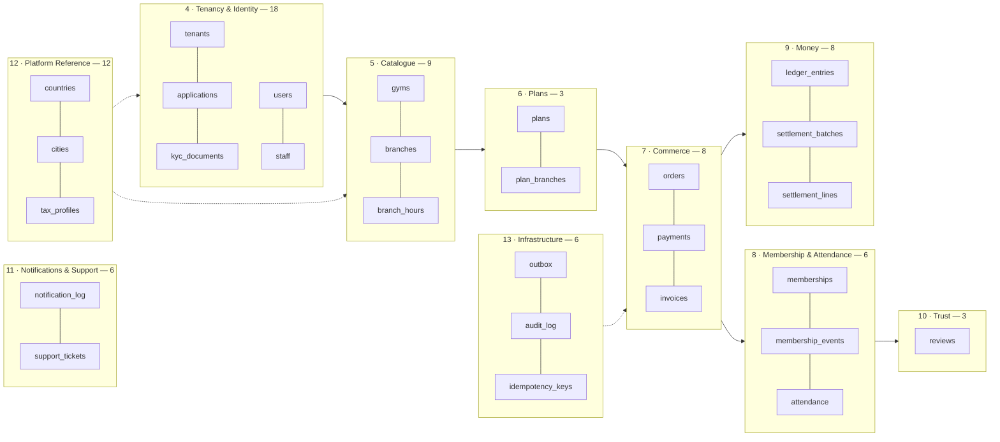

# Schema — Physical Database Design

**Phase 4 · `/docs/database/Schema.md` · PostgreSQL 16 + PostGIS + Row-Level Security · Prisma ORM (`A-01`) with Prisma Migrate (`A-07`)**

---

## 0. Document control

| Field | Value |
| :--- | :--- |
| **Document** | `/docs/database/Schema.md` |
| **Phase** | 4 — Database Design |
| **Status** | Design. **No Prisma schema file and no migration exists.** Every fenced block in this document is labelled *illustrative — not committed code* and is a specification of intent, not an artefact to be copied verbatim |
| **Precedence** | Rank 3 under `PROJECT_CONSTITUTION.md` §1.3. Binding on implementation; subordinate to the constitution and to `MASTER_PRD.md` |
| **Implements** | `MASTER_PRD.md` §C2.2, §C2.3, §C2.4 (data model), §C1.4 (multi-tenancy), §A8 (business rules), §B9.8 (data quality) |
| **Builds on** | `/docs/engineering/ERD.md` — the Phase-2 **logical** entity design (76 entities, 26 aggregates, 111 relationships). This document is the **physical** design: types, nullability, defaults, constraints, indexes, policies, grants, partitions and volumes. It does not restate ERD reasoning; it cites it |
| **Governed by** | `PROJECT_CONSTITUTION.md` §8.6 / §8.7 (naming), §10 (Money & Time Law), §11 (Multi-Tenancy Law), §15 (Database Rules) |
| **Decisions applied** | ADR-0004 (PostgreSQL 16), ADR-0005 (Prisma + mandatory tenant-context extension), ADR-0006 (RLS), ADR-0007 (PostGIS), ADR-0014 (money as minor units), ADR-0015 (append-only ledger), ADR-0024 (soft delete), ADR-0025 (UTC + gym timezone), ADR-0028 (country as configuration) |
| **Launch market** | **India** — `LAUNCH_MARKET_INDIA.md`. `INR`/paise, `Asia/Kolkata` (+05:30, no DST), GST 18% as CGST 9% + SGST 9%, financial year 1 April – 31 March, PAN + GSTIN tax identity, RBI data residency |
| **Tables specified** | **79** — 76 from `ERD.md` §4, plus three Phase-4 additions justified in §16.3 |
| **Sibling documents** | `Indexes.md` (index register), `Constraints.md` (constraint register), `Relationships.md` (FK register), `NamingConvention.md`, `MigrationStrategy.md`, `SeedStrategy.md`, `SoftDeleteStrategy.md`, `AuditStrategy.md` |

### 0.1 The gate this document exists to satisfy

`PROJECT_CONSTITUTION.md` §15.1 states it without qualification:

> **A table does not exist until `/docs/database/Schema.md` documents its purpose, its relationships, its indexes, its constraints and the business rules it enforces.**

`PHASES.md` Phase 4 acceptance adds four conditions, each of which this document must be readable against:

| # | Acceptance condition | Where satisfied |
| :-: | :--- | :--- |
| 1 | Every table documents purpose, relationships, indexes, constraints, business rules | §4 – §13, one specification per table, 79 in total |
| 2 | RLS policy defined for every tenant-owned table | §2.6 (the template), and a per-table `RLS` line naming the policy class |
| 3 | Money columns are integer minor units with an adjacent currency column, everywhere | §2.4 (the `money_minor` domain), and every money column in this document |
| 4 | Zero Prisma schema or migration files written | This document contains **model sketches only**; no `schema.prisma` and no `migrations/` directory is created by Phase 4 |

### 0.2 What this document adds that `ERD.md` deliberately did not

| `ERD.md` gave | This document gives |
| :--- | :--- |
| Entity, purpose, tenancy class, lifecycle, retention class | Every **column**: PostgreSQL type, nullability, default, constraint, purpose, and the PRD identifier that requires it |
| Relationship cardinality and on-delete vocabulary | Named foreign-key constraints, named unique/check/exclusion constraints, and the indexes that back them |
| "RLS applies" | The **policy text**, the policy class, the `WITH CHECK` half, and the per-partition re-application obligation |
| "Append-only" | The **grant set**, expressed as SQL, per grant class, with the CI assertion that proves its absence |
| A partitioning plan | The partition naming scheme, the pre-creation window, the primary-key consequence and the `token_nonce` ruling |
| Volume basis for two tables | A Year-1 and 10× row estimate and a storage footprint **for every table**, summing to a stated total |
| Six open items | Those six, restated where they touch a column, plus the physical shape that makes each cheap to resolve |

---

## 1. Reading conventions

### 1.1 The shape of every table specification

Each table is specified with the same eight parts, in the same order. A part is never omitted; where it is trivially satisfied it says so in one line.

| Part | Content |
| :--- | :--- |
| **Purpose** | One precise sentence. Not a restatement of the table name |
| **Tenancy** | The tenancy class of §1.3, and for tenant-owned tables the RLS policy class of §2.6 |
| **Columns** | A table of `column · type · null · default · constraint · description · source`. `source` is the PRD/BR/FR/NFR/ADR identifier that **requires** the column to exist. `NFR-PRV-01` requires every field to have a documented purpose; the `description` and `source` columns together are that documentation |
| **Prisma model sketch** | Illustrative. Small related tables share one fenced block |
| **RLS policy** | The policy class, and explicit SQL wherever the policy is not the standard template of §2.6 |
| **Grants** | The grant class of §2.7, and explicit SQL for every append-only table |
| **Volume** | Row count at `NFR-SCAL-01` Year-1 and at `NFR-SCAL-02`'s 10×, with the arithmetic named |
| **Notes** | Indexes with the query each serves, constraints with the invariant each enforces, and anything non-obvious |

### 1.2 The universal column set

`NFR-DQ-05` and `PROJECT_CONSTITUTION.md` §15.5 mandate four columns on **every** table. They are **omitted from every column table in this document**; assume them present with exactly these definitions.

| Column | Type | Null | Default | Rule |
| :--- | :--- | :-: | :--- | :--- |
| `id` | `uuid` | no | *application-supplied* | Primary key, **UUIDv7** (time-ordered). Generated in the application, not by `gen_random_uuid()`, so that the id is available before the insert and ordering is monotonic (`ERD.md` §11.5). Sequential integer keys are forbidden — they leak volume across tenants (`PROJECT_CONSTITUTION.md` §15.8 rule 2) |
| `created_at` | `timestamptz` | no | `now()` | UTC (`NFR-DQ-03`, ADR-0025, `DB4`) |
| `updated_at` | `timestamptz` | no | `now()` | Maintained by the **application** through the Prisma extension, never by a trigger, so a bulk job's writes stay attributable to that job (`AC3`) |
| `created_by` | `uuid` | yes | — | Acting user. `NULL` only for system actors, where `audit_log.actor_type` records which (`AC2`) |
| `updated_by` | `uuid` | yes | — | As above |

Two further columns appear conditionally and **are** listed in each table's column specification, because their presence is a statement:

| Column | Present when | Meaning of absence |
| :--- | :--- | :--- |
| `tenant_id uuid NOT NULL` | The table is tenancy class **RLS**, **HYBRID** or **DUAL** | The table is not tenant-owned. There is no such thing as an accidental omission: `AC6` fails the build for a `tenant_id` column with no policy, and `IS6` fails it for a table created without one |
| `deleted_at timestamptz NULL` | ADR-0024 soft delete applies | **The row is never deleted.** Append-only tables have no soft-delete column because they have no delete concept at all (`SD4`) |

`created_by` and `updated_by` carry **no foreign key to `users`**. The reason is `CON-04`: an audit-bearing row must outlive the actor when `BR-DAT-04` pseudonymises that actor, and a `RESTRICT` would then block the data-subject process while a `SET NULL` would destroy attribution. The column holds the id; the resolvability of that id is checked by `ops.orphan-scan`, not by the planner.

### 1.3 Tenancy classes

Carried forward from `ERD.md` §1.2 unchanged, because the physical design must not silently reclassify a table.

| Class | Meaning | Physical consequence |
| :--- | :--- | :--- |
| **RLS** | Tenant-owned | `tenant_id uuid NOT NULL`; `ENABLE` + `FORCE ROW LEVEL SECURITY`; policy class `P-STD` |
| **GLOBAL** | Platform reference or platform-owned | No `tenant_id`; RLS not enabled; reached only through `ReferenceDataRepository` (`BR4`) |
| **HYBRID** | A row-level discriminator decides scope | `tenant_id` nullable; policy class `P-HYBRID`; a `CHECK` ties the discriminator to the nullability |
| **IDENTITY** | Platform-global identity, tenant-scoped *exposure* | No `tenant_id`; a tenant observes the row only through an RLS-scoped join row; protected by authorisation, **not** by RLS (`Security.md` §4.4) |
| **DUAL** | `tenant_id` present **and** a platform read path exists behind the audited elevation | Two policies: `P-STD` for `app_rw`, `P-PLATFORM` for `app_platform_ro` |

**The trap this classification exists to prevent**, restated from `Security.md` §4.4 because it is the most expensive mistake available here: *user-owned, cross-tenant data — a user's profile, favourites across gyms, orders at several tenants — is scoped by `user_id`, not by `tenant_id`.* Classing `users` as RLS would make `/me/memberships` return an empty list to a member who holds memberships at three gyms, and the bug would look like data loss.

### 1.4 Retention classes

From `ERD.md` §1.3 (`NFR-PRV-04`, `CON-04`, DPDP Act 2023). Each table states its class; the class determines what `data.retention-sweep` (`§C5`) may do to it.

| Class | Rule | On a `BR-DAT-04` deletion request |
| :--- | :--- | :--- |
| **R-OPS** | Account life + 12 months | Hard-deleted or pseudonymised |
| **R-FIN** | Statutory. India: 8 financial years from the end of the relevant FY; GST records 72 months | **Never deleted.** Personal identifiers replaced by the pseudonym token; figures untouched |
| **R-AUD** | 7 years, immovable | Never deleted, never modified. Actor id pseudonymised in place by a privileged migration only |
| **R-KYC** | Statutory period after tenant closure; separate encrypted bucket, separate key | Never deleted while the obligation runs; storage object purged on expiry, row tombstoned |
| **R-EPH** | Ephemeral, bounded by an explicit TTL stated per table | Swept; not part of subject-access exports |
| **R-REF** | Reference data, indefinite, version-retained | Not personal data; unaffected |

### 1.5 Volume notation

Year-1 figures derive from `NFR-SCAL-01` — 2,000 tenants, 5,000 branches, 500,000 users, 100,000 concurrent-eligible memberships, 50,000 check-ins/day — and from the demand model of `Scalability.md` §2.3 and §2.8, whose two derived rates are used throughout:

| Derived rate | Value | Origin |
| :--- | ---: | :--- |
| Membership starts (= orders reaching `PAID`) | **822 / day**, 300,000 / year | `Scalability.md` §2.8 |
| Check-ins | **50,000 / day**, 18,250,000 / year | `NFR-SCAL-01` verbatim |

The 10× column is `NFR-SCAL-02`'s *"Year-3 headroom without re-architecture"*. Where a table's growth is not linear in the 10× dimension — reference data, for instance — the note says so rather than multiplying by ten.

### 1.6 On illustrative code

Every fenced block is labelled **illustrative — not committed code**. The authoritative definitions will live in the Prisma migration history (`A-07`) once Phase 8 begins. A block here fixes **shape and intent**: column names, types, constraint names, policy text. It does not fix formatting, ordering, or the exact syntax Prisma Migrate will emit.

Objects Prisma's schema language cannot express — RLS policies and `FORCE ROW LEVEL SECURITY`, partitioned parents and their monthly children, GiST and trigram indexes, partial unique indexes, exclusion constraints, domains, role grants, and the column-immutability triggers — are written as **raw SQL inside Prisma migration files** (ADR-0004 implementation notes), so that exactly one migration history exists.

---

## 2. Physical foundations

Everything in §4 – §13 assumes this section. It is written once so that no table specification has to repeat it, and so that a reviewer can check the foundation independently of the 78 tables built on it.

### 2.1 Server, extensions and cluster settings

| Item | Value | Why |
| :--- | :--- | :--- |
| Engine | **PostgreSQL 16** | ADR-0004. Managed offering, India region (Mumbai primary, second Indian region for DR) per `LAUNCH_MARKET_INDIA.md` §9 |
| `postgis` | Required | `branches.location geography(Point,4326)` and `ST_DWithin` radius search (ADR-0007, `FR-SRCH-01`) |
| `pg_trgm` | Required | Trigram indexes for `FR-SRCH-02` typo tolerance on `search_documents` |
| `btree_gist` | Required | The `branch_hours` non-overlap exclusion constraint (§5.3) mixes an equality column with a range operator; `btree_gist` is what permits `branch_id WITH =` inside a GiST exclusion |
| `pgcrypto` | Required | `digest()` for request-fingerprint hashing on `idempotency_keys`; **not** used for money, ids or passwords |
| `unaccent` | Required | Search normalisation for the `search_documents` tsvector |
| `uuid-ossp` | **Not installed** | Ids are UUIDv7 generated in the application (§1.2). A server-side v4 generator would defeat the time-ordering that `ERD.md` §11.5 relies on |
| `TimeZone` | `UTC` | Server-side. `TM4`: server processes run with `TZ=UTC` and the code must not care |
| `lc_monetary` | Irrelevant by construction | No column in this schema is of type `money`; `DB2` forbids it and a CI check asserts its absence |
| `default_transaction_isolation` | `read committed` | With the two explicit exceptions of §2.10 |
| `statement_timeout` | Set per role, not globally | `app_rw` 15 s; `app_platform_ro` 120 s (the audit explorer's deep queries); `app_migrator` unlimited |
| `idle_in_transaction_session_timeout` | 30 s on `app_rw` | The tenant-context extension (§2.3) holds a transaction open for the life of every operation. An abandoned one must not hold a pooled connection indefinitely |

**One schema, `public`.** Schema-per-tenant was rejected at day one (`PROJECT_CONSTITUTION.md` §11.1). The migration path to it stays open only because `RS6` forbids cross-tenant joins in tenant-scope code paths; nothing in this document assumes a single physical schema beyond the `search_path`.

### 2.2 Database roles

`ERD.md` §10.3 names four roles as `gm_migrator` / `gm_app` / `gm_audit_writer` / `gm_platform`. `Security.md` §4.5, `Deployment.md` §D-C1 and `DECISION_LOG.md` ADR-0004 name them as `app_migrator` / `app_rw` / `app_append` / `app_platform_ro`.

> **Deviation D-01 from `ERD.md` §10.3 — role naming.** This document adopts the **`app_*`** names. `ERD.md`'s `gm_*` names appear in exactly one section of one document; the `app_*` names appear in ADR-0004's implementation notes, in `Security.md` §4.4/§4.5's policy SQL, in `Deployment.md`'s workload-identity mapping (`SEC-3`) and in `CI_CD.md`'s credential handling. Renaming three operational documents to match one design document is the wrong direction of travel, and a role name that appears differently in the runbook and the migration is an operational hazard during an incident. The **capability model of `ERD.md` §10.3 is adopted unchanged**; only the identifiers differ.

| Role | Held by | Capabilities | RLS |
| :--- | :--- | :--- | :--- |
| `app_migrator` | Prisma Migrate, run as the one-shot `migrator` image per release (`Deployment.md` D-C1). **Never present in a running API or worker container** | `CREATE`, `ALTER`, `DROP`, full DML. Owns every table | Owner — but `FORCE ROW LEVEL SECURITY` means even this role is policed on tenant tables |
| `app_rw` | The API and worker processes | `SELECT`, `INSERT` broadly; `UPDATE`/`DELETE` only where the grant classes of §2.7 permit | **Enforced. No `BYPASSRLS`** |
| `app_append` | The audit interceptor's dedicated connection, and the ledger writer | `INSERT` on `audit_log` and `ledger_entries` only. **No `SELECT` on `audit_log`** | Enforced |
| `app_platform_ro` | Super-admin and cross-tenant reporting, entered only through the named audited elevation of `PROJECT_CONSTITUTION.md` §11.6 | `SELECT` across tenants via policy class `P-PLATFORM`; no write grants beyond `admin/`-owned reference tables | Enforced **via a second policy, not bypassed** |

Two properties are load-bearing and must not be relaxed:

1. **`app_append` can write `audit_log` but cannot read it; `app_rw` can read it but cannot write it.** A code path that produces audit rows cannot read them back, edit them, or suppress them. `NFR-SEC-13` — *"audit logs are append-only and stored where application credentials cannot alter them"* — is a **grant** requirement, not a policy requirement.
2. **No role in the system holds `BYPASSRLS`.** Cross-tenant reads are expressed as a policy that admits a specific role, not as an exemption from policy evaluation. This is what makes `PE1` implementable without a superuser-adjacent capability, and it is what makes the elevation visible in `pg_policies` rather than invisible in `pg_roles`.

```sql
-- illustrative — not committed code
CREATE ROLE app_migrator     LOGIN;   -- CI/CD one-shot job only
CREATE ROLE app_rw           LOGIN;   -- request path and workers; NO BYPASSRLS
CREATE ROLE app_append       LOGIN;   -- audit + ledger writer; INSERT only
CREATE ROLE app_platform_ro  LOGIN;   -- runElevated() only; SELECT only; NO BYPASSRLS

-- nothing is granted implicitly, on any table, to anyone
REVOKE ALL ON ALL TABLES    IN SCHEMA public FROM PUBLIC, app_rw, app_append, app_platform_ro;
REVOKE ALL ON ALL SEQUENCES IN SCHEMA public FROM PUBLIC, app_rw, app_append, app_platform_ro;
ALTER DEFAULT PRIVILEGES FOR ROLE app_migrator IN SCHEMA public REVOKE ALL ON TABLES FROM PUBLIC;
```

`ALTER DEFAULT PRIVILEGES` is the line that makes the model hold over time: without it, a table added in month twenty inherits whatever the cluster default happens to be, and the grant-set snapshot test of §2.7 discovers the hole only if someone remembered to add the table to the expected set.

### 2.3 The Prisma + RLS hazard, and what every table in this document owes it

This is the single most important thing in Phase 4, and it is a **schema** concern, not only an application concern.

#### 2.3.1 The failure mode

PostgreSQL RLS evaluates `current_setting('app.tenant_id')`. `SET LOCAL` — equivalently `set_config(..., true)` — scopes that setting to **the current transaction on the current connection**. Prisma pools connections. Therefore:

```text
illustrative — not committed code

tx:  SET LOCAL app.tenant_id = 'tenant-A'     ->  pooled connection #3
     prisma.membership.findMany()             ->  pooled connection #7   <-- different connection
                                                  current_setting('app.tenant_id') is UNSET here
```

Two outcomes, both catastrophic, and which one occurs is decided by how the **policy** is written:

| If the policy is written strictly | If the policy is written permissively |
| :--- | :--- |
| `current_setting` raises `42704`, the statement aborts or matches nothing, and the query returns **zero rows** — silent data loss that presents as *"the member has no memberships"* | The policy admits rows it should not and returns **another tenant's rows** — `BR-TEN-01` violated, `RSK-08` realised |

This is a property of **pooling plus RLS**, not of Prisma; TypeORM has the identical issue. `A-01` was approved *conditional* on the mitigation below (`STACK_ADDITIONS.md` Part 4).

#### 2.3.2 The mandatory mitigation, restated

> **All tenant-scoped data access goes through a Prisma client extension that wraps every operation in an interactive transaction which first executes `set_config('app.tenant_id', $1, true)`. No repository may touch the raw client.** (`PROJECT_CONSTITUTION.md` §11.4.2, ADR-0005)

#### 2.3.3 The seven physical-design obligations this creates

Every one of these is a decision made in *this* document because of the hazard. They are listed together so that a reviewer can check them as a set.

| # | Obligation | Where it lands in the schema |
| :-: | :--- | :--- |
| **1** | **The policy must be strict, not permissive.** `current_setting('app.tenant_id')` is written with **no** `missing_ok` argument, so an unset variable **raises** `42704` rather than yielding `NULL`. A `NULL` comparison matches nothing *silently*; a raise is a page | §2.6 policy template, applied to all 62 tenant-owned tables |
| **2** | **`FORCE ROW LEVEL SECURITY` on every tenant-owned table.** Without it the table owner (`app_migrator`) bypasses the policy, and the migrator role is exactly the role a maintenance job runs as | §2.6; asserted by CI check `IS6` |
| **3** | **`WITH CHECK` on every policy.** `USING` filters reads. Without `WITH CHECK` a tenant can `INSERT` or `UPDATE` a row carrying another tenant's `tenant_id` — the hazard's write-side twin | §2.6 |
| **4** | **Every index on a tenant-owned table that serves a multi-row query leads with `tenant_id`.** Because the policy predicate is an ordinary qualifier, an index that cannot accept it turns an index scan into a post-fetch Filter — a 2,000× read amplification at Year-1 tenant count (`Scalability.md` §5.4, rule `SC-R06`) | Every `Notes` block in §4 – §13; the two documented exceptions are enumerated in §2.9 |
| **5** | **Session-mode pooling only.** A transaction-mode pooler may hand the `SET LOCAL` and the query to different server connections, which is the hazard with a different actor. ADR-0004 implementation notes fix this: *"Connection pooling runs in session mode, not transaction mode, wherever a pooler sits between the application and Postgres"* | An infrastructure constraint recorded here because a schema reviewer must know the schema is not self-defending against it |
| **6** | **Connection budget accounts for interactive transactions.** Every guarded read holds a connection for its whole duration, not just its statement. Pool sizing is `Scalability.md` §5.3's problem; the schema's contribution is to keep guarded statements short — no unbounded `IN` lists, no cross-tenant fan-out, no report query on the request path | §2.10, and the `search_documents` projection of §13.4 which exists partly to keep the hottest read off the guarded path |
| **7** | **Partitions do not inherit policies or grants.** A query issued directly against `attendance_y2026m11` uses **that table's** policies, and `app_rw` can name a partition. A partition created without a policy is a `BR-TEN-01` hole that no application test would find | §2.11, and the three guarantees the maintenance job must provide |

#### 2.3.4 What the schema cannot defend against, stated honestly

The extension is application code. If it is bypassed, obligations 1–3 mean the query **fails loudly** rather than leaking — the strict policy raises. That is the schema's whole contribution: **it converts a silent leak into a visible error.** It cannot convert a missing extension into a correct query. The CI isolation suite (`IS1`–`IS8`, `BAC-10`) is the control that catches the bypass, and it is a launch gate for that reason.

### 2.4 Custom domains and types

Domains are used where a rule is stable, checkable in the database, and would otherwise be restated on 200 columns. They are **not** used to alias a type for readability — a domain that adds no constraint adds only indirection.

```sql
-- illustrative — not committed code

-- Money. BR-PAY-01, NFR-DQ-02, ADR-0014, PROJECT_CONSTITUTION.md §10.1, DB1/DB2.
-- Integer minor units. For India: paise. bigint, never numeric, never money, never float.
CREATE DOMAIN money_minor AS bigint;

-- Money that may not be negative. Prices, fees, gross amounts, tax components.
CREATE DOMAIN money_minor_nonneg AS bigint CHECK (VALUE >= 0);

-- ISO-4217. Always adjacent to a money_minor column. Uppercase, three letters.
CREATE DOMAIN currency_code AS char(3) CHECK (VALUE ~ '^[A-Z]{3}$');

-- Rates are integer basis points. 1 bps = 0.01%. R1/R3, §10.4. Never a decimal fraction.
CREATE DOMAIN basis_points AS integer CHECK (VALUE >= 0 AND VALUE <= 1000000);

-- IANA timezone identifier. TM3: authoritative for all validity computation.
CREATE DOMAIN iana_timezone AS text CHECK (VALUE ~ '^[A-Za-z_]+/[A-Za-z_+\-0-9/]+$');

-- ISO-3166-1 alpha-2.
CREATE DOMAIN country_code AS char(2) CHECK (VALUE ~ '^[A-Z]{2}$');

-- URL-safe slug. Lowercase, hyphenated, no leading or trailing hyphen.
CREATE DOMAIN slug AS text CHECK (VALUE ~ '^[a-z0-9]+(-[a-z0-9]+)*$' AND length(VALUE) BETWEEN 2 AND 120);

-- E.164 telephone. India: +91XXXXXXXXXX. Stored normalised; never a display format.
CREATE DOMAIN phone_e164 AS text CHECK (VALUE ~ '^\+[1-9][0-9]{7,14}$');

-- Email, normalised to lowercase before write. Deliberately permissive: RFC 5322 in a CHECK
-- constraint is a well-known way to reject valid addresses.
CREATE DOMAIN email_address AS text CHECK (VALUE ~ '^[^@[:space:]]+@[^@[:space:]]+\.[^@[:space:]]+$' AND length(VALUE) <= 320);

-- India tax identity. LAUNCH_MARKET_INDIA.md §6, ERD.md §12.3.
CREATE DOMAIN pan_in   AS text CHECK (VALUE ~ '^[A-Z]{5}[0-9]{4}[A-Z]$');
CREATE DOMAIN gstin_in AS text CHECK (VALUE ~ '^[0-9]{2}[A-Z]{5}[0-9]{4}[A-Z][0-9A-Z]Z[0-9A-Z]$');

-- Financial-year label. ERD.md §12.6: '2026-27', never the integer 2026.
CREATE DOMAIN financial_year_label AS text CHECK (VALUE ~ '^[0-9]{4}-[0-9]{2}$');
```

| Domain | Rationale, and the alternative rejected |
| :--- | :--- |
| `money_minor` / `money_minor_nonneg` | `DB2`'s CI check scans `information_schema.columns` for `%_minor` columns whose type is not `bigint`. A domain over `bigint` reports its base type, so the check still passes, **and** the schema now says *why* the column is a `bigint`. Rejected alternative: raw `bigint` everywhere, which loses the signal that a reviewer needs to notice a missing adjacent `currency` |
| `currency_code` | `NFR-DQ-02` requires the currency *adjacent*. The domain cannot enforce adjacency — that is a review and CI rule (§2.9 CI-04) — but it does stop `'inr'` and `'INR '` |
| `basis_points` | `R3` forbids `0.10` and `10.0`. The upper bound of 1,000,000 bps (10,000%) is deliberately loose: it catches a percentage written as a rate, not a business error |
| `pan_in` / `gstin_in` | Format only. **The semantic checks are application-layer**: PAN's 4th character encodes entity type and must agree with `tenants.entity_type`; GSTIN embeds the state code and the PAN and carries a checksum. A `CHECK` constraint that implemented the GSTIN checksum would be unmaintainable SQL, and the failure mode of a wrong checksum is a rejected KYC document, not a corrupted row |
| `financial_year_label` | `ERD.md` §12.6: *"a stored `2026` is ambiguous on 31 March"*. The domain makes the ambiguity unrepresentable |
| **Branded ids** | **Not** a database domain. `PROJECT_CONSTITUTION.md` §9.5 puts branded types (`TenantId`, `OrderRef`, `MembershipId`, `Money`) in TypeScript, where they prevent passing a `GymId` where a `TenantId` belongs. A per-entity uuid domain in Postgres would add 78 domains, would not be enforced across a join, and would give the planner nothing. **The brand lives in `packages/types`; the column is `uuid`.** This is a deliberate split and is recorded so nobody "completes" it later |

**Two representations that are deliberately *not* domains:**

| Value | Representation | Why not a domain |
| :--- | :--- | :--- |
| A membership's validity | Two `date` columns, `start_date` and `end_date`, interpreted in the gym's timezone | A `daterange` would be tidier and would support an exclusion constraint — but `BR-MEM-03` makes validity **inclusive of both endpoints in a named timezone**, and `daterange`'s canonical form is `[)`. Storing `[start, end+1)` to satisfy the type would put an off-by-one into the most-read pair of columns in the system. Two `date` columns and `TM2` are the safer shape |
| A money amount | Two adjacent columns, `<name>_minor` + `currency` | A composite type `money_t (amount bigint, currency char(3))` is expressible and would guarantee adjacency. It is rejected because Prisma cannot map a composite type to a scalar field, every index and every `SUM` becomes `(m).amount`, and `DB2`'s `information_schema` scan stops working. The pair-of-columns convention is enforced by CI check CI-04 instead |

### 2.5 The enum catalogue

`PROJECT_CONSTITUTION.md` §8.7: enum type names are `snake_case` singular with an `_enum` suffix; **values are `SCREAMING_SNAKE_CASE` matching the PRD verbatim**.

> **The never-remove rule (`MG9`).** An enum value is **added**, never removed while any row holds it, and **never renamed**. A value that is no longer offered is **deprecated**, which is a fact recorded in three places and in no other way:
> 1. this catalogue, in the `Status` column;
> 2. the Zod schema in `packages/types`, which stops accepting it as *input* while continuing to parse it as *output*;
> 3. a `CHECK` constraint added by the deprecating migration if new rows must not carry it — `CHECK (status <> 'OLD_VALUE')` costs one constraint and is reversible, whereas `ALTER TYPE ... DROP VALUE` does not exist in PostgreSQL and the rewrite that emulates it locks the table.
>
> The rule exists because `R-FIN` retention is eight financial years and `R-AUD` is seven years. A value removed in year two makes a year-one settlement statement unrenderable, and the failure surfaces during a tax audit.

#### 2.5.1 Tenancy, identity and onboarding

| Type | Values | Source |
| :--- | :--- | :--- |
| `tenant_status_enum` | `DRAFT`, `SUBMITTED`, `UNDER_REVIEW`, `INFO_REQUESTED`, `APPROVED`, `REJECTED`, `SUSPENDED`, `CLOSED` | §C2.2, §C4.4 |
| `entity_type_enum` | `SOLE_PROPRIETOR`, `PARTNERSHIP`, `COMPANY`, `OTHER` | §C2.2. India's LLP and Udyam-registered entities map to `COMPANY` and `SOLE_PROPRIETOR` via the KYC checklist; adding `LLP` later is an additive migration under `MG9` |
| `subscription_status_enum` | `TRIAL`, `ACTIVE`, `PAST_DUE`, `CANCELLED` | §C2.2, `BR-TEN-06` |
| `tax_registration_status_enum` | `NOT_REGISTERED`, `REGISTERED`, `COMPOSITION`, `PENDING` | `ERD.md` §12.3 |
| `application_status_enum` | `SUBMITTED`, `UNDER_REVIEW`, `INFO_REQUESTED`, `APPROVED`, `REJECTED` | §C4.4. **No `DRAFT`** — a draft is a tenant state, not a submitted application version (`FR-ONB-08`) |
| `application_decision_enum` | `APPROVED`, `REJECTED`, `INFO_REQUESTED` | `BR-GYM-03`, `BR-GYM-04` |
| `kyc_document_type_enum` | `PAN`, `GSTIN`, `BUSINESS_REGISTRATION`, `SHOP_ESTABLISHMENT`, `BANK_PROOF`, `OWNER_IDENTITY`, `PREMISES_ADDRESS_PROOF`, `TRADE_LICENCE`, `FIRE_SAFETY_NOC`, `MUSIC_LICENCE`, `OTHER` | `LAUNCH_MARKET_INDIA.md` §6, the ten-document India checklist, plus `OTHER` for a second market |
| `kyc_document_status_enum` | `PENDING`, `UNDER_REVIEW`, `ACCEPTED`, `REJECTED`, `EXPIRED`, `SUPERSEDED` | `FR-ONB-03`, `BR-GYM-02` |
| `payout_account_status_enum` | `PENDING_VERIFICATION`, `VERIFIED`, `FAILED_VERIFICATION`, `SUSPENDED`, `REPLACED` | `BR-GYM-06` — a bank-account change suspends payouts until re-verified |
| `user_status_enum` | `PENDING_VERIFICATION`, `ACTIVE`, `SUSPENDED`, `DEACTIVATED`, `ERASED` | `FR-AUTH`, `BR-DAT-04`. `ERASED` is the terminal pseudonymised state |
| `actor_type_enum` | `USER`, `STAFF`, `SYSTEM`, `JOB`, `WEBHOOK`, `SUPPORT_IMPERSONATION`, `PLATFORM_ADMIN` | `BR-DAT-01`, `BR-DAT-02`, `AC2` |
| `platform_role_enum` | `VISITOR`, `USER`, `MEMBER`, `GYM_OWNER`, `GYM_MANAGER`, `RECEPTIONIST`, `TRAINER`, `SUPER_ADMIN`, `VERIFICATION_OFFICER`, `SUPPORT_AGENT`, `FINANCE`, `MODERATOR` | §B3.1, verbatim. `roles.key` is constrained to this type so a role row cannot invent a scope |
| `staff_status_enum` | `INVITED`, `ACTIVE`, `SUSPENDED`, `REMOVED` | `FR-STAF-04`, `AC-STAF-01.4` |
| `auth_session_status_enum` | `ACTIVE`, `REVOKED`, `EXPIRED` | `FR-AUTH-09`, `FR-AUTH-10`, ADR-0011 |
| `attribution_surface_enum` | `SEARCH`, `CATEGORY`, `GYM_DETAIL`, `COMPARISON`, `FAVOURITES`, `CAMPAIGN_LINK`, `GYM_OWN_LINK` | `A6.3` attribution. `GYM_OWN_LINK` is the value that makes a sale `DIRECT`, and it must be recordable or the dispute evidence is one-sided |

#### 2.5.2 Catalogue and plans

| Type | Values | Source |
| :--- | :--- | :--- |
| `gym_status_enum` | `DRAFT`, `PENDING_REVIEW`, `APPROVED`, `SUSPENDED`, `CLOSED` | §C2.2, `BR-GYM-01` |
| `gender_policy_enum` | `MIXED`, `WOMEN_ONLY`, `MEN_ONLY`, `SCHEDULED` | §C2.2 |
| `branch_status_enum` | `ACTIVE`, `INACTIVE` | §C2.2 |
| `media_type_enum` | `IMAGE`, `VIDEO` | `FR-GYM-02` |
| `media_moderation_status_enum` | `PENDING`, `APPROVED`, `REJECTED`, `REMOVED` | `BR-GYM-07`, `FR-ADMN-12` |
| `plan_type_enum` | `DURATION`, `SESSION` | §C2.2, `BR-PLN-06` |
| `duration_unit_enum` | `DAY`, `WEEK`, `MONTH`, `YEAR` | §C2.2, `TM12` |
| `plan_status_enum` | `DRAFT`, `PUBLISHED`, `ARCHIVED` | §C2.2, `BR-PLN-04` |
| `plan_visibility_enum` | `PUBLIC`, `STAFF_ONLY` | `BR-PLN-05` |
| `gender_eligibility_enum` | `ANY`, `FEMALE`, `MALE` | `BR-PLN-01` |
| `lead_status_enum` | `NEW`, `CONTACTED`, `TRIAL`, `CONVERTED`, `LOST` | `SCR-DASH-017`, verbatim |
| `crm_member_source_enum` | `MARKETPLACE`, `WALK_IN`, `REFERRAL`, `IMPORT`, `STAFF_CREATED` | `FR-CRM-04`, `FR-CRM-09` |

#### 2.5.3 Commerce

| Type | Values | Source |
| :--- | :--- | :--- |
| `order_status_enum` | `PENDING`, `AWAITING_PAYMENT`, `PAID`, `PARTIALLY_PAID`, `FAILED`, `EXPIRED`, `CANCELLED`, `REFUNDED` | §C2.2, §C4.2 |
| `sale_origin_enum` | `MARKETPLACE`, `DIRECT` | `A6.3`. **One type, used by `orders.origin` and `memberships.origin`** — the values must not be able to drift apart, because the commission decision reads one and the attribution dispute reads the other |
| `sale_channel_enum` | `WEB`, `DASHBOARD` | §C2.2 |
| `order_item_type_enum` | `PLAN`, `JOINING_FEE`, `ADD_ON` | `A6.3` `G` composition, `FR-CART-02` |
| `coupon_scope_enum` | `PLATFORM`, `TENANT` | §C2.2, `FR-CPN-02` |
| `discount_type_enum` | `PERCENT`, `FIXED` | `BR-CPN-01` |
| `coupon_funding_source_enum` | `PLATFORM`, `GYM` | `BR-CPN-05` — determines the commission base per `A6.3`; immutable after first use |
| `coupon_status_enum` | `DRAFT`, `ACTIVE`, `PAUSED`, `EXHAUSTED`, `EXPIRED`, `ARCHIVED` | `BR-CPN-03`, `FR-CPN-05` |
| `payment_method_enum` | `CARD`, `UPI`, `NETBANKING`, `WALLET`, `CASH`, `BANK_TRANSFER`, `OTHER` | §C2.2. `UPI` is expected to dominate in India (`LAUNCH_MARKET_INDIA.md` §7) |
| `payment_status_enum` | `CREATED`, `PENDING`, `AUTHORISED`, `CAPTURED`, `FAILED`, `CANCELLED`, `REFUNDED`, `PARTIALLY_REFUNDED` | §C2.2, §C4.3 |
| `invoice_status_enum` | `ISSUED`, `PARTIALLY_CREDITED`, `FULLY_CREDITED` | `BR-PAY-10`. There is deliberately **no `VOID` and no `CANCELLED`**: an issued invoice is never voided in place, only credited (`INV-FIN-9`, `ERD.md` §10.5) |
| `credit_note_status_enum` | `ISSUED` | Single-valued today. An enum rather than nothing because `MG9` makes adding a value cheap and adding a column later is not |
| `tax_component_enum` | `CGST`, `SGST`, `IGST`, `UTGST`, `CESS`, `VAT`, `GST`, `SALES_TAX` | `ERD.md` §12.3. India uses `CGST`+`SGST` intra-state, `IGST` inter-state; the remainder exist so a second market is a `tax_profiles` row, not a migration (`OBJ-09`, ADR-0028) |

#### 2.5.4 Membership and attendance

| Type | Values | Source |
| :--- | :--- | :--- |
| `membership_status_enum` | `PENDING`, `ACTIVE`, `FROZEN`, `EXPIRED`, `CANCELLED`, `REFUNDED` | `BR-MEM-01`, §C4.1 |
| `freeze_status_enum` | `SCHEDULED`, `ACTIVE`, `COMPLETED`, `CANCELLED` | `BR-MEM-05`, `BR-MEM-07` |
| `attendance_method_enum` | `SCAN`, `MANUAL`, `OVERRIDE` | §C2.2, `BR-CHK-08` |
| `attendance_result_enum` | `ALLOWED`, `DENIED` | `BR-CHK-10` |
| `check_in_denial_reason_enum` | `MEMBERSHIP_EXPIRED`, `MEMBERSHIP_FROZEN`, `MEMBERSHIP_PENDING_START`, `MEMBERSHIP_CANCELLED`, `MEMBERSHIP_REFUNDED`, `WRONG_BRANCH`, `OUTSIDE_OPERATING_HOURS`, `OUTSIDE_PLAN_ACCESS_WINDOW`, `GYM_CLOSED_EXCEPTION`, `NO_SESSIONS_REMAINING`, `DUPLICATE_WITHIN_COOLDOWN`, `TOKEN_EXPIRED`, `TOKEN_INVALID`, `MEMBERSHIP_UNDER_REVIEW`, `TENANT_SUSPENDED` | §C4.8, all fifteen, verbatim |
| `check_in_override_reason_enum` | `MEMBER_PHONE_UNAVAILABLE`, `TECHNICAL_ISSUE`, `GRACE_PERIOD_GRANTED`, `PAYMENT_PENDING_CONFIRMED`, `TRIAL_VISIT`, `MANAGEMENT_APPROVAL`, `OTHER` | §C4.8, all seven, verbatim |
| `membership_event_reason_enum` | `PAYMENT_CAPTURED`, `OFFLINE_PAYMENT_RECORDED`, `START_DATE_REACHED`, `FREEZE_REQUESTED`, `FREEZE_ENDED`, `END_DATE_REACHED`, `ENTITLEMENT_EXHAUSTED`, `CANCELLED_BY_MEMBER`, `CANCELLED_BY_GYM`, `ORDER_CANCELLED`, `PAYMENT_FAILED`, `REFUND_COMPLETED`, `SHARING_REVIEW`, `TRANSFERRED`, `GYM_CLOSED`, `ADMIN_CORRECTION` | §C4.1's trigger column, made a typed vocabulary because `ERD.md` §10.5 makes a subsequent event the only correction mechanism, and a free-text reason cannot be queried in a dispute |

#### 2.5.5 Money

| Type | Values | Source |
| :--- | :--- | :--- |
| `ledger_entry_type_enum` | `SALE`, `COMMISSION`, `GATEWAY_FEE`, `TAX`, `REFUND`, `COMMISSION_REVERSAL`, `CHARGEBACK`, `CHARGEBACK_REVERSAL`, `RESERVE_HOLD`, `RESERVE_RELEASE`, `PAYOUT`, `ADJUSTMENT` · **pending O-1:** `COMMISSION_TAX`, `COMMISSION_TAX_REVERSAL` | §C2.2 (twelve, verbatim); the two `COMMISSION_TAX` values are `ERD.md` §12.4 and are **PENDING CLIENT DECISION** — see §14.3 |
| `ledger_direction_enum` | `CREDIT`, `DEBIT` | §C2.2, `BR-FIN-01` |
| `ledger_reference_type_enum` | `ORDER`, `REFUND`, `DISPUTE`, `PAYOUT`, `ADJUSTMENT`, `SUBSCRIPTION_INVOICE` | `ERD.md` §5.3 — the six targets of the polymorphic reference that deliberately carries no FK |
| `settlement_batch_status_enum` | `OPEN`, `CLOSED`, `PENDING_APPROVAL`, `APPROVED`, `PROCESSING`, `PAID`, `ON_HOLD`, `FAILED` | §C4.7, all eight, verbatim. See **Deviation D-02**, §16.1 |
| `reserve_status_enum` | `HELD`, `RELEASED`, `CONSUMED` | `A6.4` rolling reserve |
| `refund_status_enum` | `REQUESTED`, `PENDING_APPROVAL`, `AUTO_APPROVED`, `PROCESSING`, `COMPLETED`, `REJECTED`, `FAILED` | §C4.5, verbatim |
| `refund_reason_enum` | `WITHIN_COOLING_OFF`, `SERVICE_NOT_AS_DESCRIBED`, `GYM_CLOSED`, `MEDICAL`, `RELOCATION`, `DUPLICATE_PAYMENT`, `PRICING_ERROR`, `GOODWILL`, `FRAUD`, `OTHER` | §C4.8, all ten, verbatim |
| `requester_type_enum` | `MEMBER`, `GYM_STAFF`, `PLATFORM_ADMIN`, `SYSTEM` | `BR-REF-03`, `FR-RFND-02` |
| `dispute_status_enum` | `OPEN`, `EVIDENCE_REQUIRED`, `EVIDENCE_SUBMITTED`, `UNDER_REVIEW`, `RESOLVED`, `EXPIRED` | `BR-REF-08` |
| `dispute_outcome_enum` | `WON`, `LOST`, `PARTIAL`, `WITHDRAWN` | `BR-REF-08`. Nullable until resolution, immutable after |
| `commission_rate_source_enum` | `PLATFORM_DEFAULT`, `TIER`, `TENANT_OVERRIDE`, `NEGOTIATED` | `R5` — `AC-ADMN-01.2` requires the resolved rate **and its source** to be answerable from data |

#### 2.5.6 Trust, notifications, support and platform

| Type | Values | Source |
| :--- | :--- | :--- |
| `review_status_enum` | `PENDING`, `PUBLISHED`, `HELD`, `UNPUBLISHED`, `REMOVED` | §C2.2, §C4.6 |
| `review_response_status_enum` | `DRAFT`, `PUBLISHED`, `REMOVED` | `BR-REV-05` |
| `review_report_status_enum` | `OPEN`, `UNDER_REVIEW`, `UPHELD`, `DISMISSED` | `BR-REV-06` |
| `moderation_reason_enum` | `ABUSIVE_LANGUAGE`, `PERSONAL_INFORMATION`, `SPAM`, `IRRELEVANT`, `CONFLICT_OF_INTEREST`, `SUSPECTED_FAKE`, `PROMOTIONAL`, `THREAT`, `OTHER` | §C4.8, all nine, verbatim |
| `reporter_type_enum` | `MEMBER`, `TENANT`, `PLATFORM`, `AUTOMATED` | `BR-REV-05`, `BR-REV-06` |
| `application_rejection_reason_enum` | `KYC_DOCUMENT_MISSING`, `KYC_DOCUMENT_ILLEGIBLE`, `KYC_DOCUMENT_EXPIRED`, `KYC_NAME_MISMATCH`, `ADDRESS_UNVERIFIABLE`, `GEO_ADDRESS_MISMATCH`, `DUPLICATE_LISTING`, `INSUFFICIENT_PHOTOS`, `PHOTO_QUALITY`, `PHOTO_NOT_OF_PREMISES`, `INCOMPLETE_PROFILE`, `NO_PUBLISHED_PLAN`, `BANK_VERIFICATION_FAILED`, `PROHIBITED_CONTENT`, `SUSPECTED_FRAUD`, `OTHER` | §C4.8, all sixteen, verbatim |
| `reason_code_type_enum` | `APPLICATION_REJECTION`, `CHECK_IN_DENIAL`, `REFUND`, `MODERATION`, `CHECK_IN_OVERRIDE` | §C2.3 — the five typed taxonomies |
| `notification_channel_enum` | `EMAIL`, `SMS`, `PUSH`, `IN_APP`, `WHATSAPP` | `B5.19`, `FR-NOTF-01` |
| `notification_category_enum` | `TRANSACTIONAL`, `OPERATIONAL`, `MARKETING`, `SECURITY` | `B5.19`; `SC-R03` retention is keyed on this value |
| `notification_status_enum` | `QUEUED`, `SENDING`, `SENT`, `DELIVERED`, `FAILED`, `BOUNCED`, `SUPPRESSED` | `FR-NOTF-06`. `SUPPRESSED` records a send that preference or DND blocked — `AC-CRM-01.2` requires the count and the reason |
| `dlt_approval_status_enum` | `NOT_REQUIRED`, `PENDING_DLT_APPROVAL`, `APPROVED`, `REJECTED` | `ERD.md` §12.5, TRAI DLT |
| `routing_class_enum` | `TRANSACTIONAL`, `PROMOTIONAL` | `ERD.md` §12.5 — a property of the **template**, distinct from `notification_log.category` which is a property of the send |
| `ticket_status_enum` | `OPEN`, `PENDING_CUSTOMER`, `PENDING_INTERNAL`, `RESOLVED`, `CLOSED` | `FR-SUP-04` |
| `ticket_priority_enum` | `LOW`, `NORMAL`, `HIGH`, `URGENT` | `FR-SUP-04`, `KPI-25` |
| `ticket_category_enum` | `ACCOUNT`, `PAYMENT`, `MEMBERSHIP`, `CHECK_IN`, `REFUND`, `LISTING`, `TECHNICAL`, `OTHER` | `B5.23` |
| `referral_status_enum` | `PENDING`, `QUALIFIED`, `REWARDED`, `VOID` | `BR-RFL-01` |
| `export_job_status_enum` | `QUEUED`, `RUNNING`, `COMPLETED`, `FAILED`, `EXPIRED` | `BR-DAT-05`, `FR-RPT-07` |
| `data_subject_request_type_enum` | `ACCESS`, `EXPORT`, `CORRECTION`, `DELETION` | `BR-DAT-03`, `BR-DAT-04`, `NFR-PRV-03` |
| `data_subject_request_status_enum` | `RECEIVED`, `IDENTITY_VERIFICATION`, `IN_PROGRESS`, `COMPLETED`, `PARTIALLY_FULFILLED`, `REJECTED` | `NFR-PRV-03`. `PARTIALLY_FULFILLED` is the `CON-04` outcome: identifiers erased, financial records retained |
| `city_status_enum` | `PLANNED`, `GATED`, `LIVE`, `PAUSED` | `C9.4` city gating |
| `outbox_status_enum` | `PENDING`, `PUBLISHED`, `FAILED`, `DEAD` | ADR-0017 |
| `audit_action_enum` | `CREATE`, `UPDATE`, `DELETE`, `LOGIN`, `LOGOUT`, `IMPERSONATE_START`, `IMPERSONATE_END`, `EXPORT`, `APPROVE`, `REJECT`, `ELEVATE`, `CONFIG_CHANGE`, `RETENTION_PURGE` | `BR-DAT-01`, `BR-DAT-02`, `PE2`, `SD8` |
| `audit_entity_type_enum` | One value per governed entity — 31 at Phase 1, enumerated in `AuditStrategy.md` | `BR-DAT-01`, `ERD.md` §5.3. A Postgres enum rather than free text so that a typo in an entity type does not silently create a category nobody can query |
| `outbox_aggregate_type_enum` | One value per aggregate root of `ERD.md` §6 — 26 at Phase 1 | ADR-0017, `ERD.md` §5.3 |

**Enum count: 59.** Two of the 59 (`ledger_entry_type_enum`, `settlement_batch_status_enum`) carry values or omissions that are open items; both are flagged at their catalogue row.

### 2.6 RLS policy classes

Every tenant-owned table gets **two** policies: one for `app_rw`, one for `app_platform_ro`. Policies are generated from a migration template, **never hand-written per table**, so that a table cannot receive a subtly different policy (`Security.md` §4.4).

Four classes exist. Each table's `Tenancy` line names its class; explicit SQL appears in this document only where a table's policy is not `P-STD`.

| Class | Applies to | `USING` predicate |
| :--- | :--- | :--- |
| **P-STD** | 58 tenant-owned tables | `tenant_id = current_setting('app.tenant_id')::uuid` |
| **P-SELF** | `tenants` only | `id = current_setting('app.tenant_id')::uuid` — the table *is* the tenant, so its own primary key is the RLS key |
| **P-HYBRID** | `coupons`, `notification_log`, `report_definitions` | A discriminator admits platform-scope rows alongside the tenant's own |
| **P-NULLABLE** | `support_tickets`, `ticket_messages` | `tenant_id IS NULL OR tenant_id = current_setting(...)` — a member's ticket about the platform itself has no tenant; tenant-null rows are additionally gated by requester identity in the authorisation layer |
| **P-PLATFORM** | Every tenant-owned table, as the **second** policy | `SELECT`-only, `TO app_platform_ro`, `USING (true)` |

```sql
-- illustrative — not committed code
-- The P-STD template. Applied identically to 58 tables by the migration generator.

ALTER TABLE memberships ENABLE ROW LEVEL SECURITY;
ALTER TABLE memberships FORCE  ROW LEVEL SECURITY;   -- the owner is NOT exempt (obligation 2, §2.3.3)

CREATE POLICY rls_memberships__tenant_isolation
  ON memberships
  FOR ALL                                            -- one policy, four verbs (RS2)
  TO app_rw
  USING      (tenant_id = current_setting('app.tenant_id')::uuid)
  WITH CHECK (tenant_id = current_setting('app.tenant_id')::uuid);

CREATE POLICY rls_memberships__platform_read
  ON memberships
  FOR SELECT
  TO app_platform_ro
  USING (true);
```

| Element | Why it is exactly this |
| :--- | :--- |
| `current_setting('app.tenant_id')` with **no** `missing_ok` argument | An unset variable **raises** SQLSTATE `42704` rather than yielding `NULL`. This is obligation 1 of §2.3.3 and it is the difference between a page and a silent empty result |
| `WITH CHECK` | Mandatory. `USING` filters reads; without `WITH CHECK` a tenant can write a row carrying another tenant's `tenant_id` |
| `FOR ALL` | One policy covering all four verbs. Four separate policies is four chances to write one of them wrongly |
| A separate policy per role rather than `BYPASSRLS` | The elevated role's authority is visible in `pg_policies` — auditable SQL rather than an invisible role attribute |
| Policy naming `rls_<table>__tenant_isolation` | `PROJECT_CONSTITUTION.md` §15.6 `RS1`. The `pg_policies` CI check greps for exactly this shape |

**The exemption list is closed and is this.** The only tables without RLS are the platform-global reference tables of §C2.3, plus the two `GLOBAL` tables the ERD adds and the four `IDENTITY` tables that are scoped by `user_id` instead:

| Exempt table | Class | Why |
| :--- | :--- | :--- |
| `countries`, `cities`, `localities`, `amenities`, `gym_categories`, `subscription_tiers`, `tax_profiles`, `kyc_checklists`, `reason_codes`, `feature_flags`, `notification_templates` | GLOBAL | §C2.3 verbatim, `RS4`. Written only by `admin/` through the audited reason-required path |
| `help_articles`, `commission_rules`, `roles`, `permissions`, `role_permissions` | GLOBAL | `ERD.md` §4.7/§4.8. Platform-owned; no tenant may write them |
| `users`, `user_roles`, `auth_sessions`, `refresh_tokens`, `notification_preferences`, `saved_searches`, `referrals` | IDENTITY | Scoped by `user_id`, protected by authorisation. Classing them RLS is the `/me/memberships` bug of §1.3 |
| `data_subject_requests` | GLOBAL | A subject request spans every tenant the subject touched; scoping it to one would make it unfulfillable |

`RS4`: *"adding to it requires the same scrutiny as a new elevation."* The list above is that reviewed artefact.

### 2.7 Grant classes

A grant is the only control that holds when the application is the attacker (`ERD.md` §10.2). A privilege the role does not hold cannot be exercised by any statement it can write — including `$queryRaw`, including a compromised code path.

| Class | Grants to `app_rw` | Tables |
| :--- | :--- | :--- |
| **G-CRUD** | `SELECT, INSERT, UPDATE` | The ordinary mutable tables. **`DELETE` is granted on no table that has a `deleted_at` column** (ADR-0024); the hard-delete paths of `BR-DAT-04` run as `app_migrator` in a reviewed, audited job |
| **G-CRUD-D** | `SELECT, INSERT, UPDATE, DELETE` | The five tables where a hard delete is the correct domain operation and no history is destroyed: `favourites`, `saved_searches`, `gym_amenities`, `plan_branches`, `staff_branches` |
| **G-APPEND** | `SELECT, INSERT` | The 15 fully append-only tables of `ERD.md` §10.1 |
| **G-COMPLETE** | `SELECT, INSERT`, plus column-scoped `UPDATE` on named columns | `attendance`, `outbox` |
| **G-AUDIT** | `SELECT` only to `app_rw`; `INSERT` only to `app_append` | `audit_log` |
| **G-LEDGER** | `SELECT` only to `app_rw`; `INSERT` only to `app_append` | `ledger_entries` |
| **G-REF** | `SELECT` only to `app_rw`; `SELECT, INSERT, UPDATE` to the `admin/` path, which also runs as `app_rw` but is gated by permission and reason | The platform-global reference tables |

```sql
-- illustrative — not committed code
-- G-APPEND: insert and read, nothing else, forever.
GRANT SELECT, INSERT ON
  membership_events, payment_events, settlement_lines, invoices, credit_notes,
  subscription_invoices, coupon_redemptions, dispute_evidence, applications,
  attribution_events, refresh_tokens, ticket_messages, order_items,
  commission_rules, tax_profiles, subscription_tiers
TO app_rw;

-- G-COMPLETE: insert, read, and exactly one later completion write.
GRANT SELECT, INSERT                                  ON attendance TO app_rw;
GRANT UPDATE (checked_out_at, duration_minutes)       ON attendance TO app_rw;
GRANT SELECT, INSERT                                  ON outbox     TO app_rw;
GRANT UPDATE (status, published_at, attempts, last_error, available_at) ON outbox TO app_rw;

-- G-LEDGER and G-AUDIT: the write role and the read role are different roles.
GRANT INSERT ON ledger_entries TO app_append;
GRANT SELECT ON ledger_entries TO app_rw;
GRANT INSERT ON audit_log      TO app_append;
GRANT SELECT ON audit_log      TO app_rw, app_platform_ro;

-- Deliberately absent, and asserted absent by CI:
--   UPDATE or DELETE on any G-APPEND / G-LEDGER / G-AUDIT table, for any application role
--   DELETE on any table carrying deleted_at
--   BYPASSRLS on any role
```

Why grants and not a trigger, restated from `ERD.md` §10.2 because it is the question every reviewer asks: a trigger can be disabled by the table owner, and the maintenance job runs as the owner. Code review is a control a reviewer must *notice*, and `RSK-08` scores this failure mode 2×5. A grant is the only mechanism in the list that survives the application being wrong.

**Corrections when nothing can be edited** (`ERD.md` §10.5, restated in one line each because a reader of this document will need it): a wrong ledger entry gets a compensating `ADJUSTMENT`; a wrong invoice gets a credit note and a new invoice; a wrong attendance row gets a second row of method `OVERRIDE` linked by `corrects_attendance_id`; a wrong membership transition gets a further transition; a wrong settlement batch is not edited but carried as adjustment lines into the next batch's opening balance; a wrong audit row stays, because it records what the system did, including what it did wrongly.

### 2.8 Triggers

Triggers are used for exactly two purposes. Everything else that could be a trigger is application code, because `AC3` requires `updated_at` to be attributable to the writing job and a trigger would make every write look identical.

#### 2.8.1 Conditional column immutability

A grant is all-or-nothing per column, but three rules are **conditional on state**, which only a trigger can express (`ERD.md` §10.4).

| Table | Rule | Trigger | Error code |
| :--- | :--- | :--- | :--- |
| `orders` | Once `status = 'PAID'`, the nine money figures, `currency`, `refund_policy_snapshot` and `tax_snapshot` are frozen | `trg_orders__freeze_money_after_paid` `BEFORE UPDATE` | `GM_ORDER_FIGURES_IMMUTABLE` |
| `memberships` | `purchased_price_minor`, `currency`, `purchased_terms`, `sessions_total`, `is_stackable`, `origin`, `attributed_at` are frozen from insert | `trg_memberships__freeze_purchased_terms` `BEFORE UPDATE` | `GM_MEMBERSHIP_TERMS_IMMUTABLE` |
| `settlement_batches` | Once `status` has reached `CLOSED`, the roll-up figures and `period_start`/`period_end` are frozen; only `status`, `payout_reference` and `statement_url` may still change | `trg_settlement_batches__freeze_after_closed` `BEFORE UPDATE` | `GM_SETTLEMENT_FIGURES_IMMUTABLE` |

```sql
-- illustrative — not committed code
CREATE OR REPLACE FUNCTION fn_orders__freeze_money_after_paid() RETURNS trigger AS $$
BEGIN
  IF OLD.status = 'PAID' AND (
       NEW.gross_minor            IS DISTINCT FROM OLD.gross_minor
    OR NEW.discount_minor         IS DISTINCT FROM OLD.discount_minor
    OR NEW.net_minor              IS DISTINCT FROM OLD.net_minor
    OR NEW.tax_minor              IS DISTINCT FROM OLD.tax_minor
    OR NEW.commission_base_minor  IS DISTINCT FROM OLD.commission_base_minor
    OR NEW.commission_minor       IS DISTINCT FROM OLD.commission_minor
    OR NEW.commission_tax_minor   IS DISTINCT FROM OLD.commission_tax_minor
    OR NEW.gateway_fee_minor      IS DISTINCT FROM OLD.gateway_fee_minor
    OR NEW.payable_to_gym_minor   IS DISTINCT FROM OLD.payable_to_gym_minor
    OR NEW.currency               IS DISTINCT FROM OLD.currency
    OR NEW.refund_policy_snapshot IS DISTINCT FROM OLD.refund_policy_snapshot
    OR NEW.tax_snapshot           IS DISTINCT FROM OLD.tax_snapshot
  ) THEN
    RAISE EXCEPTION 'GM_ORDER_FIGURES_IMMUTABLE: order % is PAID; money figures and snapshots are frozen', OLD.id
      USING ERRCODE = 'check_violation';
  END IF;
  RETURN NEW;
END;
$$ LANGUAGE plpgsql;
```

Each trigger is paired with a **negative test** (`BAC-06`) that attempts the forbidden update and asserts the exception, and each exception carries a stable error code so the `§C1.5` error model can surface it without leaking SQL.

**`gateway_fee_minor` is the subtle one.** `F` is *"as reported by the provider, never estimated"* (`BR-FIN-06`), and the provider may report it after capture. The order therefore reaches `PAID` with `gateway_fee_minor` and `payable_to_gym_minor` **`NULL`**, and the trigger's `IS DISTINCT FROM` permits `NULL -> value` exactly once because the guard additionally tests `OLD.<col> IS NOT NULL`. That refinement is elided from the sketch above for readability and is stated here so it is not lost: **the freeze applies to a figure that has been set, not to a column that is still awaiting its one authoritative value.**

#### 2.8.2 Append-only enforcement on partitions

`REVOKE`/`GRANT` is the primary control (§2.7). A `BEFORE UPDATE OR DELETE` trigger raising unconditionally is added on `ledger_entries`, `audit_log`, `membership_events` and `payment_events` as a **second** line, because `ERD.md` §11.4 shows that a new partition arrives without inherited grants and a maintenance-job defect would otherwise open a window. The trigger cannot be the only control — the owner can disable it — but it converts "the job forgot the grant" from a silent hole into an error.

### 2.9 CI checks this schema is designed to satisfy

Every one of these queries the live database, not the source. A schema that cannot be checked mechanically is a schema that drifts.

| # | Check | Fails the build when | Source |
| :-: | :--- | :--- | :--- |
| **CI-01** | `pg_policies` vs `information_schema.columns` | Any table with a `tenant_id` column has no `rls_<table>__tenant_isolation` policy, or has RLS enabled without `FORCE` | `IS6`, `AC6`, `MG10` |
| **CI-02** | `information_schema.role_table_grants` | `app_rw` holds `UPDATE` or `DELETE` on any G-APPEND, G-LEDGER or G-AUDIT table; or `app_append` holds `SELECT` on `audit_log`; or any role holds `DELETE` on a table with `deleted_at` | `AP1`, `ERD.md` §10.6 |
| **CI-03** | `pg_roles` | Any role has `rolbypassrls` | `RS3`, `PE1` |
| **CI-04** | `information_schema.columns` | A `%_minor` column is not `bigint`; any column is of type `money`, `numeric`, `real` or `double precision` in a monetary position; **a `%_minor` column exists on a table with no `currency` column** | `DB2`, `NFR-DQ-02` |
| **CI-05** | `information_schema.columns` | Any column is `timestamp without time zone` | `DB6` |
| **CI-06** | `information_schema.columns` | Any table lacks `created_at`, `updated_at`, `created_by`, `updated_by` | `AC6`, `NFR-DQ-05` |
| **CI-07** | `pg_indexes` + the register in `Indexes.md` | An index exists with no row in `Indexes.md` naming the query it serves; or a foreign-key column has no index | `IX1`, §15.8 rule 6 |
| **CI-08** | `pg_indexes` on tenant-owned tables | A multi-row-serving index does not lead with `tenant_id` and is not in the closed exception list below | `SC-R06` |
| **CI-09** | Testcontainers integration | Connecting as `app_rw`, `UPDATE ledger_entries` or `DELETE FROM audit_log` **succeeds** | `ERD.md` §10.6 |
| **CI-10** | Testcontainers integration | Creating next month's partition and then reading it **by name** as tenant A returns tenant B's rows | `ERD.md` §11.4 |
| **CI-11** | Prisma schema lint | A model backed by a G-APPEND table exposes `update`, `updateMany`, `delete`, `deleteMany` or `upsert` | `AP2` |
| **CI-12** | `pg_type` snapshot | An enum value present in a previous release is absent in this one | `MG9` |

**The `SC-R06` exception list is closed and is these five indexes**, each because its leading column is already unique or near-unique across the whole table, so a leading `tenant_id` would only enlarge the index without improving selectivity: `uq_orders__idempotency_key`, `uq_payments__provider_provider_intent_id`, `uq_payment_events__provider_event_id`, `uq_idempotency_keys__key`, and `idx_attendance__membership_id_checked_in_at` (§C2.4 declares this one without a leading `tenant_id`, and it is the hot path of `NFR-PERF-03`; a membership belongs to exactly one tenant, so the policy predicate is applied to that member's own rows only).

### 2.10 Transactions, isolation and concurrency

`read committed` is the default. Two operations require more, and both are named here so that a reviewer does not discover them in a bug report.

| Operation | Level / mechanism | Why |
| :--- | :--- | :--- |
| Invoice and credit-note number allocation (§2.12) | `SELECT ... FOR UPDATE` on the counter row, inside the issuing transaction | `FR-INV-02` requires **gapless**. A row lock serialises allocation for one `(tenant, financial_year)` pair without serialising the database |
| Settlement batch assembly (`settlement.build-batches`) | `REPEATABLE READ` | The batch's roll-ups must be computed over exactly the set of ledger entries the lines are built from. Under `read committed`, a concurrent capture could land between the aggregate and the line query, and `BR-FIN-03` — *"line items must sum exactly to the payout"* — would fail intermittently |

Three concurrency hazards are resolved by a **unique index**, not by a read-then-write, because a read-then-write races:

| Hazard | Index | Requirement |
| :--- | :--- | :--- |
| Two simultaneous checkouts producing two memberships | `uq_memberships__user_gym_active_nonstackable` (partial) | `BR-MEM-04`, `AC-PAY-01.1` |
| A replayed payment-affecting request creating a second order | `uq_orders__idempotency_key` | `BR-PAY-03`, ADR-0016 |
| A redelivered provider webhook acting twice | `uq_payment_events__provider_event_id` | `BR-PAY-05`, `BR-PAY-02` |

### 2.11 Partitioning

`NFR-SCAL-06`: *"Database growth is bounded by partitioning attendance and audit tables by time."* **Two tables are partitioned in Phase 1 and no others** (`ERD.md` §11.6 enumerates what is deliberately not partitioned and why).

| Property | `attendance` | `audit_log` |
| :--- | :--- | :--- |
| Strategy | `PARTITION BY RANGE (checked_in_at)`, monthly | `PARTITION BY RANGE (occurred_at)`, monthly |
| Boundaries | **UTC month boundaries, not `Asia/Kolkata`** | UTC, same reason |
| Naming | `attendance_y2026m08` (`PROJECT_CONSTITUTION.md` §8.7) | `audit_log_y2026m08` |
| Primary key | `(checked_in_at, id)` | `(occurred_at, id)` |
| Pre-creation | Three months ahead by `ops.partition-maintain` | Same job |
| Default partition | **None** | **None** |
| Retention | R-OPS, active + 12 months, subject to the review carve-out below | R-AUD, 7 years = 84 live partitions; beyond 24 months detached to cold storage, re-attachable as foreign tables |

**Why UTC boundaries and not local ones.** Storage is UTC (`NFR-DQ-03`). A `+05:30` partition boundary would make the partition key a local-time concept and break pruning for every query written in UTC — which is every query, because `TM4` forbids an implicit server timezone. The consequence is that an Indian gym's "August" spans two partitions at the edges by 5½ hours; the reporting layer resolves the month in the tenant's timezone and issues a UTC range that touches two partitions. That is correct and cheap. The alternative is incorrect and looks cheap.

**Why no `DEFAULT` partition.** A default would silently absorb out-of-range writes and then block every future `ATTACH`. The maintenance job's failure alarm is the correct behaviour: a write with no matching partition is an outage, not a warning.

**The three guarantees the maintenance job must provide**, because none of them is automatic:

```sql
-- illustrative — not committed code
CREATE TABLE attendance_y2026m11 PARTITION OF attendance
  FOR VALUES FROM ('2026-11-01T00:00:00Z') TO ('2026-12-01T00:00:00Z');

-- 1. RLS is NOT inherited when a partition is queried by name
ALTER TABLE attendance_y2026m11 ENABLE ROW LEVEL SECURITY;
ALTER TABLE attendance_y2026m11 FORCE  ROW LEVEL SECURITY;
CREATE POLICY rls_attendance_y2026m11__tenant_isolation ON attendance_y2026m11
  FOR ALL TO app_rw
  USING      (tenant_id = current_setting('app.tenant_id')::uuid)
  WITH CHECK (tenant_id = current_setting('app.tenant_id')::uuid);
CREATE POLICY rls_attendance_y2026m11__platform_read ON attendance_y2026m11
  FOR SELECT TO app_platform_ro USING (true);

-- 2. grants are not inherited either
GRANT SELECT, INSERT                            ON attendance_y2026m11 TO app_rw;
GRANT UPDATE (checked_out_at, duration_minutes) ON attendance_y2026m11 TO app_rw;
GRANT SELECT                                    ON attendance_y2026m11 TO app_platform_ro;

-- 3. indexes declared on the parent DO propagate; indexes added later to a partition do not.
--    IX5: every index is declared on the parent so future partitions inherit it.
```

**The `token_nonce` consequence, restated because it is a real weakening.** §C2.2 requires `token_nonce` *"unique within TTL for idempotency (BR-CHK-06)"*. On a partitioned table a unique index must include the partition key, so a global `UNIQUE (token_nonce)` is not creatable and `UNIQUE (checked_in_at, token_nonce)` does not express the rule. The ruling (`ERD.md` §11.2) stands and is implemented as: **Redis `SET NX` on the nonce with the token's 60-second TTL as the primary, synchronous gate**, returning the *original* attendance record on collision; **plus** a per-partition unique index as the second line. The only arithmetically possible cross-partition replay window is the 60 seconds astride a month boundary, and the Redis gate covers it. The compensating property is that the Redis gate is synchronous and fails closed — it rejects the check-in rather than allowing a duplicate.

### 2.12 The gapless invoice-number allocator

`FR-INV-02` requires invoice numbers *"gapless and sequential per tenant per financial year"*, `AC-INV-01.3` requires the sequence to restart on rollover, and `BR-PAY-10` makes the issued invoice immutable.

> **A PostgreSQL `SEQUENCE` cannot be used.** Sequences are non-transactional by design: a rollback consumes the number and leaves a gap. Gapless means gapless. (`PROJECT_CONSTITUTION.md` §15.8 rule 3.)

The allocator is a **row-locked counter table**, `document_number_counters`, keyed `(tenant_id, document_kind, financial_year)`:

```sql
-- illustrative — not committed code
-- Inside the invoice-issuing transaction, after the invoice row is fully built.
UPDATE document_number_counters
   SET next_value = next_value + 1,
       updated_at = now()
 WHERE tenant_id = $1 AND document_kind = 'INVOICE' AND financial_year = $2
RETURNING next_value - 1 AS allocated_number;
```

| Property | Ruling |
| :--- | :--- |
| **Key** | `(tenant_id, document_kind, financial_year)`. `document_kind` is `INVOICE`, `CREDIT_NOTE` or `SUBSCRIPTION_INVOICE` — three independent sequences per tenant per FY (`ERD.md` §12.6) |
| **FY boundary** | Derived at issuance from `issued_at` **in the tenant's timezone** and the tax profile's `fy_start_month`. An invoice issued 23:45 IST on 31 March 2027 is FY `2026-27`; 00:15 IST on 1 April is `2027-28`. In UTC those instants are 18:15 and 18:45 on the *same* UTC day — computing the FY in UTC would put both in one year and break the sequence |
| **Rollover** | Implicit. A new `(tenant, kind, FY)` key materialises with `next_value = 1` on first use |
| **Lock scope** | One row. Two tenants issuing simultaneously do not contend; one tenant issuing two invoices simultaneously serialises for the duration of the issuing transaction, which is bounded by `NFR-PERF-07`'s 3-second PDF budget being **outside** this transaction |
| **Failure after allocation** | `AC-INV-01.2` governs: the number is reused on retry (the transaction rolled back, so the counter did too) or, where the transaction committed and a downstream step failed, a documented void row is recorded. The counter is never manually advanced |
| **Uniqueness backstop** | `UNIQUE (tenant_id, financial_year, invoice_number)` on `invoices`. The allocator is the mechanism; the index is the proof |
| **Why not one counter table per document type** | Three tables, three code paths, three chances for one of them to use a sequence. One table with a `document_kind` discriminator is one code path |

### 2.13 JSONB snapshot rules

`PROJECT_CONSTITUTION.md` §15.8 rule 5 closes the list of legitimate JSONB columns. `ERD.md` §9.7 fixes the contract, restated here as the seven rules this schema's JSONB columns obey:

| # | Rule |
| :-: | :--- |
| **S1** | Every snapshot column carries `schema_version` as its first key. A reader encountering an unknown version **fails loudly** |
| **S2** | Every snapshot shape is a Zod schema in `packages/types` — `RefundPolicySnapshotV1`, `PurchasedTermsV1`, `TaxSnapshotV1`, `InvoicePartySnapshotV1`, `ApplicationSnapshotV1`. Writers validate on write, readers on read |
| **S3** | Snapshot schemas are **additive only**. A breaking change mints `V2`; `V1` support is retained for the full `R-FIN` period |
| **S4** | A snapshot column is **never updated** — enforced by the §2.8.1 triggers on `orders` and `memberships` |
| **S5** | A snapshot never contains a reference that must be resolved to be understood. Ids may be present for traceability; every value needed to render or compute is a literal |
| **S6** | Money inside a snapshot obeys `BR-PAY-01`: integer minor units with an adjacent ISO-4217 code, serialised as a JSON **string** so a `bigint` survives `JSON.parse` |
| **S7** | No snapshot contains card data, bank credentials or full instrument identifiers, and none contains an `NFR-PRV-07` sensitive field unless the document it produces legally requires it |

The complete inventory of JSONB columns in this schema is: `tenants.refund_policy`, `orders.refund_policy_snapshot`, `orders.tax_snapshot`, `memberships.purchased_terms`, `plans.access_window`, `applications.snapshot`, `applications.precheck_results`, `reviews.screening_result`, `reviews.sub_ratings`, `reviews.edit_history`, `invoices.line_items`, `invoices.tax_breakdown`, `invoices.totals`, `invoices.tenant_snapshot`, `invoices.customer_snapshot`, the same five on `credit_notes`, `gym_media.renditions`, `refunds.computation`, `disputes.evidence`, `payments.raw_payload`, `audit_log.before`, `audit_log.after`, `outbox.payload`, `notification_log.payload`, `settlement_batches.payout_snapshot`, `segments.definition`, `saved_searches.query`, `report_definitions.parameters`, `feature_flags.targeting`, `tax_profiles.components`, `kyc_checklists.items`. **Thirty-one columns. A JSONB column used to avoid designing a schema is a review rejection.**

## 3. The domain map

Ten groups. The grouping is the module map of `PROJECT_CONSTITUTION.md` §3.2 collapsed to the granularity a schema reviewer needs, and it is the order §4 – §13 follow. *(Diagram — illustrative, not committed code; it names representative tables per group, not all 79.)*



| # | Group | Tables | Dominant tenancy | Dominant retention |
| :-: | :--- | :-: | :--- | :--- |
| 4 | Tenancy & Identity | 18 | RLS (11), IDENTITY (6), GLOBAL (1 group of 3 counted in §12) | R-FIN / R-OPS / R-KYC |
| 5 | Catalogue | 9 | RLS (8), IDENTITY (1) | R-OPS |
| 6 | Plans | 3 | RLS | R-FIN |
| 7 | Commerce | 8 | RLS (7), HYBRID (1) | R-FIN |
| 8 | Membership & Attendance | 6 | RLS | R-FIN / R-OPS |
| 9 | Money | 8 | RLS (7), GLOBAL (1) | R-FIN |
| 10 | Trust | 3 | RLS | R-OPS |
| 11 | Notifications & Support | 6 | RLS (3), HYBRID (2), IDENTITY (1) | R-OPS / R-FIN |
| 12 | Platform Reference | 12 | GLOBAL | R-REF / R-FIN |
| 13 | Infrastructure | 6 | RLS (3), DUAL (1), GLOBAL (2) | R-AUD / R-EPH |

**Total: 79 tables.** From §4.6 onward the specifications are written in the compact form of §1.1 — the same eight parts, with `Tenancy`, `RLS`, `Grants` and `Volume` collapsed onto one line where the table takes the standard classes, and one Prisma block per group rather than per table. Nothing is omitted; the classes carry the detail.

---

## 4. Tenancy & Identity

Answers *who is asking*, *what they may do*, and *which tenant the request belongs to* — never *what they own*.

### 4.1 `tenants`

**Purpose.** The gym business that is the unit of data isolation, commercial contract, tax identity and settlement.

**Tenancy.** RLS · policy class **P-SELF** · retention **R-FIN** · grants **G-CRUD** · soft delete.

| Column | Type | Null | Default | Constraint | Description | Source |
| :--- | :--- | :-: | :--- | :--- | :--- | :--- |
| `legal_name` | `text` | no | — | `ck_tenants__legal_name_length` (1–200) | The registered legal name, printed on every invoice | §C2.2, `FR-INV-03` |
| `trading_name` | `text` | yes | — | length 1–200 | The name customers know, where it differs | §C2.2 |
| `entity_type` | `entity_type_enum` | no | — | — | Drives the KYC checklist branch and the PAN 4th-character check | §C2.2, `LAUNCH_MARKET_INDIA.md` §6 |
| `registration_number` | `text` | yes | — | `uq_tenants__country_registration_number` | Company/partnership registration. **Unique per country**, indexed for duplicate detection | §C2.2 |
| `country_code` | `country_code` | no | `'IN'` | `fk_tenants__countries` | Drives tax profile, KYC checklist, FY start month, currency default | §C2.2, ADR-0028 |
| `currency` | `currency_code` | no | `'INR'` | — | ISO-4217. Adjacent to no money column on this table but authoritative for every child that has one | `BR-PAY-01` |
| `timezone` | `iana_timezone` | no | `'Asia/Kolkata'` | — | **Authoritative for all validity computation** — membership start/end, operating hours, FY boundary, job scheduling | `BR-MEM-03`, `TM3`, ADR-0025 |
| `status` | `tenant_status_enum` | no | `'DRAFT'` | — | §C4.4 state machine | §C2.2 |
| `subscription_tier_id` | `uuid` | yes | — | `fk_tenants__subscription_tiers` | Current SaaS tier. FK only, not a snapshot — the question asked is always "which tier today" (`ERD.md` §9.8) | §A6.2 |
| `subscription_status` | `subscription_status_enum` | no | `'TRIAL'` | — | `TRIAL`/`ACTIVE`/`PAST_DUE`/`CANCELLED`; drives the `BR-TEN-06` degradation schedule | §C2.2 |
| `subscription_past_due_since` | `timestamptz` | yes | — | — | Anchors the 7-day visibility loss and 14-day write-access loss. Without it the schedule is unimplementable | `BR-TEN-06`, `TL3` |
| `commission_rate_bps` | `basis_points` | yes | — | — | Tenant **override**, basis points. `NULL` means resolve from tier then platform default | §C2.2, `R5` |
| `renewal_commission_rate_bps` | `basis_points` | yes | — | — | Override for second and subsequent renewals | §C2.2, `A6.3` |
| `settlement_cycle_days` | `integer` | no | `7` | `ck_tenants__settlement_cycle_positive` | T+N from capture | §C2.2, `A6.4` |
| `reserve_bps` | `basis_points` | no | `500` | — | Rolling reserve, default 5% | §C2.2, `A6.4` |
| `reserve_release_days` | `integer` | no | `30` | `> 0` | Reserve matures after N days | `A6.4` |
| `payout_hold_until` | `date` | yes | — | — | New-tenant 14-day fraud hold; also set when a bank change re-triggers verification | `A6.4`, `BR-GYM-06` |
| `minimum_payout_minor` | `money_minor_nonneg` | no | `0` | adjacent `currency` | Balances below the floor roll forward | `A6.4` |
| `tax_profile_id` | `uuid` | yes | — | `fk_tenants__tax_profiles` | The profile **in force now**. The profile at the moment of sale is snapshotted onto the order | §C2.2, `BR-PAY-11` |
| `pan` | `pan_in` | yes | — | `ck_tenants__pan_required_for_in` | **India.** Permanent account number, `AAAAA9999A`. Printed on every invoice. Mandatory for an Indian tenant; the 4th character encodes entity type and must agree with `entity_type` (validated in the application) | `LAUNCH_MARKET_INDIA.md` §6.1, `ERD.md` §12.3 |
| `gstin` | `gstin_in` | yes | — | `ck_tenants__gstin_state_matches` | **India.** 15 characters: state code + PAN + entity number + `Z` + checksum. **Conditionally mandatory** above the registration threshold | `LAUNCH_MARKET_INDIA.md` §6.2 |
| `state_code` | `char(2)` | yes | — | — | Derived from `gstin` when present, otherwise from the registered address. **Drives intra-state vs inter-state**, and therefore CGST+SGST vs IGST | `ERD.md` §12.3 |
| `tax_registration_status` | `tax_registration_status_enum` | no | `'NOT_REGISTERED'` | — | An unregistered tenant below the threshold issues a different document | `ERD.md` §12.3 |
| `registered_address_line1` | `text` | yes | — | — | Printed on the invoice header | `FR-INV-03` |
| `registered_address_line2` | `text` | yes | — | — | | `FR-INV-03` |
| `registered_city` | `text` | yes | — | — | | `FR-INV-03` |
| `registered_state` | `text` | yes | — | — | | `FR-INV-03` |
| `registered_postal_code` | `text` | yes | — | — | | `FR-INV-03` |
| `refund_policy` | `jsonb` | no | `'{"schema_version":1}'` | `ck_tenants__refund_policy_versioned` | Window days, proration method, cancellation fee, free text. **Snapshotted onto every order** | `BR-REF-01`, `ERD.md` §9.1 |
| `deleted_at` | `timestamptz` | yes | — | — | Soft delete. Financial, invoice and audit records are retained regardless | `BR-TEN-04`, `TL1` |

```prisma
// illustrative — not committed code
model Tenant {
  id                       String    @id @db.Uuid
  legalName                String    @map("legal_name")
  tradingName              String?   @map("trading_name")
  entityType               EntityType @map("entity_type")
  registrationNumber       String?   @map("registration_number")
  countryCode              String    @default("IN") @map("country_code") @db.Char(2)
  currency                 String    @default("INR") @db.Char(3)
  timezone                 String    @default("Asia/Kolkata")
  status                   TenantStatus @default(DRAFT)
  subscriptionTierId       String?   @map("subscription_tier_id") @db.Uuid
  subscriptionStatus       SubscriptionStatus @default(TRIAL) @map("subscription_status")
  commissionRateBps        Int?      @map("commission_rate_bps")
  renewalCommissionRateBps Int?      @map("renewal_commission_rate_bps")
  settlementCycleDays      Int       @default(7)  @map("settlement_cycle_days")
  reserveBps               Int       @default(500) @map("reserve_bps")
  minimumPayoutMinor       BigInt    @default(0)  @map("minimum_payout_minor")
  taxProfileId             String?   @map("tax_profile_id") @db.Uuid
  pan                      String?
  gstin                    String?
  stateCode                String?   @map("state_code") @db.Char(2)
  taxRegistrationStatus    TaxRegistrationStatus @default(NOT_REGISTERED) @map("tax_registration_status")
  refundPolicy             Json      @map("refund_policy")
  deletedAt                DateTime? @map("deleted_at") @db.Timestamptz
  createdAt                DateTime  @default(now()) @map("created_at") @db.Timestamptz
  updatedAt                DateTime  @map("updated_at") @db.Timestamptz
  createdBy                String?   @map("created_by") @db.Uuid
  updatedBy                String?   @map("updated_by") @db.Uuid
  @@map("tenants")
}
```

**RLS** — the one table whose policy is not `P-STD`, because the table *is* the tenant:

```sql
-- illustrative — not committed code
ALTER TABLE tenants ENABLE ROW LEVEL SECURITY;
ALTER TABLE tenants FORCE  ROW LEVEL SECURITY;

CREATE POLICY rls_tenants__tenant_isolation ON tenants
  FOR ALL TO app_rw
  USING      (id = current_setting('app.tenant_id')::uuid)
  WITH CHECK (id = current_setting('app.tenant_id')::uuid);

CREATE POLICY rls_tenants__platform_read ON tenants
  FOR SELECT TO app_platform_ro USING (true);
```

The approval queue (`SCR-ADM-002`) and tenant administration (`FR-ADMN-01`) read across tenants, and they do so through `runElevated()` under `app_platform_ro` — **not** by relaxing this policy.

**Volume.** Year-1 **2,000** rows (`NFR-SCAL-01`). 10× **20,000**. Negligible storage; the table is small, hot and almost entirely cached.

**Notes.**
- Indexes: `uq_tenants__country_registration_number (country_code, registration_number) WHERE deleted_at IS NULL AND registration_number IS NOT NULL` — duplicate detection at onboarding, per §C2.2's *"unique per country, indexed for duplicate detection"*. This is one of the very few unique indexes on an RLS table that is not `tenant_id`-prefixed, and it is safe because `country_code` is not tenant data and the constraint-violation error is surfaced to a **reviewer**, not to a tenant.
- `idx_tenants__subscription_status_past_due (subscription_status, subscription_past_due_since) WHERE subscription_status = 'PAST_DUE'` serves `subscription.charge`'s degradation sweep (`BR-TEN-06`).
- **No balance column exists on this table and none may be added.** `BR-FIN-01`: all balances derive from `ledger_entries`. A `current_balance_minor` here would be the single most tempting and most damaging denormalisation in the schema.
- `pan` and `gstin` are `BR-DAT-06`-governed: they never appear in an application log, an error trace or an analytics event. `NFR-PRV-07`-adjacent handling applies.
- `ck_tenants__pan_required_for_in` is written as `CHECK (country_code <> 'IN' OR status NOT IN ('APPROVED') OR pan IS NOT NULL)` — the PAN is required to *approve* an Indian tenant, not to create a draft one. Encoding it as a plain `NOT NULL` would make the onboarding wizard unimplementable.

### 4.2 `applications`

**Purpose.** An immutable submitted version of a tenant's verification dossier, awaiting a human decision.

**Tenancy.** RLS · **P-STD** · retention **R-KYC** · grants **G-APPEND** (append-only) · no soft delete.

| Column | Type | Null | Default | Constraint | Description | Source |
| :--- | :--- | :-: | :--- | :--- | :--- | :--- |
| `tenant_id` | `uuid` | no | — | `fk_applications__tenants` | RLS key | `BR-TEN-01` |
| `version` | `integer` | no | — | `uq_applications__tenant_version` | 1-based. Resubmission creates N+1; prior versions retained | `BR-GYM-05` |
| `submitted_at` | `timestamptz` | no | `now()` | — | Freezes the row | `FR-ONB-08` |
| `snapshot` | `jsonb` | no | — | S1–S7 | The complete submitted dossier: tenant details, gym and branch data, declared amenities, the **KYC checklist version in force**, the document set, pre-check results | `FR-ONB-08`, `ERD.md` §9.4, §9.6 |
| `status` | `application_status_enum` | no | `'SUBMITTED'` | — | §C4.4 | §C2.2 |
| `assigned_to` | `uuid` | yes | — | no FK (`CON-04`) | Reviewing officer | `FR-ADMN-11` |
| `decided_by` | `uuid` | yes | — | no FK | Deciding officer. **A human, always** | `BR-GYM-03` |
| `decided_at` | `timestamptz` | yes | — | `ck_applications__decision_pair` | Set with `decision` or with neither | `BR-GYM-03` |
| `decision` | `application_decision_enum` | yes | — | as above | | `BR-GYM-03` |
| `reason_codes` | `application_rejection_reason_enum[]` | no | `'{}'` | `ck_applications__reject_needs_reason` | **At least one on rejection.** An array, not a join table: the set is small, fixed, read whole and never queried by code alone | `BR-GYM-04` |
| `reviewer_notes` | `text` | yes | — | — | Free text shown to the owner alongside the codes | `BR-GYM-04` |
| `precheck_results` | `jsonb` | no | `'{"schema_version":1}'` | — | Automated results: geo-tolerance (`BR-GYM-08`), duplicate-address scan (`BR-GYM-09`), photo count, published-plan count | `BR-GYM-02`, `BR-GYM-08` |

**Grants.** `GRANT SELECT, INSERT ON applications TO app_rw;` — no `UPDATE`, no `DELETE`.

> **Design tension, resolved and recorded.** `status`, `assigned_to`, `decided_by`, `decided_at`, `decision` and `reviewer_notes` all change *after* insert, yet `ERD.md` §10.1 lists `applications` as fully append-only. The resolution: **the submitted dossier is what is frozen, and it lives entirely in `snapshot`.** The decision columns are the reviewer's verdict *about* that frozen artefact. Two shapes were considered — (a) split the verdict into an `application_decisions` child table so the parent is truly insert-only, or (b) grant column-scoped `UPDATE` on the six verdict columns. **(b) is adopted**: a decision is one-to-one with an application, a child table would be a one-row join on every queue query, and the columns needed are enumerable. The grant is therefore `SELECT, INSERT` plus `UPDATE (status, assigned_to, decided_by, decided_at, decision, reason_codes, reviewer_notes)` — grant class **G-COMPLETE**, not G-APPEND. **This is Deviation D-03 from `ERD.md` §10.1** and is registered in §16.1.

**Volume.** Year-1 **2,600** — 2,000 tenants at a 1.3 average submission count (`BR-GYM-05` permits unlimited resubmission; the pre-check catches most defects before submit). 10× **26,000**. `snapshot` averages ~8 KB, so ~21 MB at Year-1.

**Notes.**
- `idx_applications__status_submitted_at (status, submitted_at)` serves the verification queue and its SLA age metric (`FR-ADMN-11`). Not `tenant_id`-leading, and correctly so: the queue is a **platform** surface read under elevation, where every tenant's rows are in scope.
- `uq_applications__tenant_version (tenant_id, version)` makes the version sequence unforgeable.
- The KYC checklist version is inside `snapshot`, not a FK. Without it, adding a tenth required document in March would retroactively make every February application incomplete (`ERD.md` §9.6).

### 4.3 `kyc_documents`

**Purpose.** A single uploaded verification artefact, held in a separate encrypted bucket under its own key, with its review state.

**Tenancy.** RLS · **P-STD** · retention **R-KYC** · grants **G-CRUD** · no soft delete (tombstoned instead).

| Column | Type | Null | Default | Constraint | Description | Source |
| :--- | :--- | :-: | :--- | :--- | :--- | :--- |
| `tenant_id` | `uuid` | no | — | `fk_kyc_documents__tenants` | RLS key | `BR-TEN-01` |
| `application_id` | `uuid` | yes | — | `fk_kyc_documents__applications` | The submission this evidences. Nullable while the tenant is still assembling a draft | `FR-ONB-03` |
| `document_type` | `kyc_document_type_enum` | no | — | — | One of the India ten-document checklist values | `LAUNCH_MARKET_INDIA.md` §6 |
| `storage_key` | `text` | no | — | `uq_kyc_documents__storage_key` | Object key in the **separate encrypted bucket**, distinct key, India region | `BR-DAT-07`, `NFR-SEC-02` |
| `original_filename` | `text` | no | — | — | As uploaded; sanitised for display | `FR-ONB-03` |
| `content_type` | `text` | no | — | — | Determined by **content inspection**, not by the client's claim | `NFR-SEC-10` |
| `byte_size` | `bigint` | no | — | `> 0` | Size limit enforced before write | `NFR-SEC-10` |
| `checksum_sha256` | `char(64)` | no | — | — | Detects a re-upload of an identical artefact and proves the stored object is the reviewed one | `BR-DAT-07` |
| `status` | `kyc_document_status_enum` | no | `'PENDING'` | — | | `FR-ONB-03` |
| `reviewed_by` | `uuid` | yes | — | no FK | | `BR-DAT-07` |
| `reviewed_at` | `timestamptz` | yes | — | — | | `BR-DAT-07` |
| `review_notes` | `text` | yes | — | — | | `BR-GYM-04` |
| `valid_until` | `date` | yes | — | — | Expiry, where the document type has one. Drives `KYC_DOCUMENT_EXPIRED` | §C4.8 |
| `storage_purged_at` | `timestamptz` | yes | — | — | Set when the object is purged on retention expiry; the **row is tombstoned, never deleted** | `NFR-PRV-04`, `ERD.md` §1.3 |

**Volume.** Year-1 **~20,000** — 2,000 tenants × ~10 documents. 10× **200,000**. Row size is small; the **objects** live in object storage and are not counted in the database footprint.

**Notes.**
- `idx_kyc_documents__tenant_type_status (tenant_id, document_type, status)` serves the checklist-completeness check at `BR-GYM-02`.
- **Every access is logged** (`BR-DAT-07`). The signed-URL issuance path writes an `audit_log` row with action `EXPORT` before returning the URL. Read access is restricted to `VERIFICATION_OFFICER` and `SUPER_ADMIN`.
- `storage_key` is globally unique rather than tenant-prefixed-unique. Keys are opaque high-entropy strings; a collision is an infrastructure defect, and a global constraint catches it. It is **not** in the §5.4 exception register of `ERD.md` because it constrains an internal identifier the tenant never sees or supplies.
- No `deleted_at`. `R-KYC` means the row outlives the tenant; the tombstone column records the object's fate, and deleting the row would destroy the evidence that a legally-required document once existed.

### 4.4 `payout_accounts`

**Purpose.** The tenant's verified bank destination for settlement payouts.

**Tenancy.** RLS · **P-STD** · retention **R-FIN** · grants **G-CRUD** · soft delete.

| Column | Type | Null | Default | Constraint | Description | Source |
| :--- | :--- | :-: | :--- | :--- | :--- | :--- |
| `tenant_id` | `uuid` | no | — | `fk_payout_accounts__tenants` | RLS key | `BR-TEN-01` |
| `account_holder_name` | `text` | no | — | — | Must match the KYC bank proof | `LAUNCH_MARKET_INDIA.md` §6.5 |
| `account_number_last4` | `char(4)` | no | — | — | **Only the last four digits are stored.** The full number lives with the payment provider, tokenised | `BR-PAY-08`, `S7` |
| `provider_account_token` | `text` | yes | — | — | The provider's token for the destination. The only handle the platform holds | `BR-PAY-08` |
| `ifsc` | `text` | yes | — | `ck_payout_accounts__ifsc_format` (`^[A-Z]{4}0[A-Z0-9]{6}$`) | **India.** Indian Financial System Code. Nullable so a second market is a data change | `LAUNCH_MARKET_INDIA.md` §6 |
| `bank_name` | `text` | yes | — | — | Display only, resolved from IFSC | — |
| `status` | `payout_account_status_enum` | no | `'PENDING_VERIFICATION'` | — | Penny-drop verification state | `BR-GYM-06` |
| `verified_at` | `timestamptz` | yes | — | — | | `BR-GYM-06` |
| `is_primary` | `boolean` | no | `false` | `uq_payout_accounts__one_primary` | Exactly one primary per tenant | `A6.4` |
| `deleted_at` | `timestamptz` | yes | — | — | Soft delete; a replaced account is retained because a historical statement names it | `ERD.md` §9.5 |

**Volume.** Year-1 **~2,400** (2,000 tenants, some with a replacement). 10× **24,000**.

**Notes.**
- `uq_payout_accounts__one_primary` is a **partial unique index**: `CREATE UNIQUE INDEX ... ON payout_accounts (tenant_id) WHERE is_primary AND deleted_at IS NULL;`. A trigger counting rows would race.
- **A change here suspends payouts until re-verified** (`BR-GYM-06`). The mechanism is `tenants.payout_hold_until` being set by the same transaction that inserts the new account; the schema makes the hold a *date*, not a boolean, so the settlement job needs no second lookup.
- The identifiers a statement prints are **copied onto `settlement_batches.payout_snapshot`** at batch creation (`ERD.md` §9.5). A bank-detail change after a statement is issued must not rewrite where the money is shown to have gone.

### 4.5 `subscription_invoices`

**Purpose.** The tenant's own SaaS bill for its `subscription_tier`, distinct from the member invoices its customers receive.

**Tenancy.** RLS · **P-STD** · retention **R-FIN** · grants **G-APPEND** · no soft delete.

| Column | Type | Null | Default | Constraint | Description | Source |
| :--- | :--- | :-: | :--- | :--- | :--- | :--- |
| `tenant_id` | `uuid` | no | — | `fk_subscription_invoices__tenants` | RLS key | `BR-TEN-01` |
| `invoice_number` | `text` | no | — | `uq_subscription_invoices__tenant_fy_number` | Allocated by §2.12 with `document_kind = 'SUBSCRIPTION_INVOICE'` | `ERD.md` §12.6 |
| `financial_year` | `financial_year_label` | no | — | as above | `'2026-27'` — April–March for India | `ERD.md` §12.6 |
| `period_start` / `period_end` | `date` | no | — | `ck_..__period_ordered` | Billed period, interpreted in the tenant's timezone | `TM2` |
| `subscription_tier_id` | `uuid` | no | — | `fk_subscription_invoices__subscription_tiers` | The tier billed | `A6.2` |
| `gross_minor` | `money_minor_nonneg` | no | — | adjacent `currency` | Tier price | `BR-PAY-01` |
| `tax_minor` | `money_minor_nonneg` | no | — | | GST on the SaaS supply | `LAUNCH_MARKET_INDIA.md` §4 |
| `total_minor` | `money_minor_nonneg` | no | — | `ck_..__total_equals_gross_plus_tax` | | `BR-FIN-02` |
| `currency` | `currency_code` | no | — | — | | `NFR-DQ-02` |
| `tax_breakdown` | `jsonb` | no | — | S1–S7; sum equals `tax_minor` | CGST/SGST components, same shape as `invoices` | `ERD.md` §12.3 |
| `status` | `invoice_status_enum` | no | `'ISSUED'` | — | | `BR-PAY-10` |
| `issued_at` | `timestamptz` | no | `now()` | — | | `BR-PAY-10` |
| `paid_at` | `timestamptz` | yes | — | — | | `BR-TEN-06` |
| `payment_id` | `uuid` | yes | — | `fk_subscription_invoices__payments` | The charge that settled it | `A6.2` |
| `pdf_url` | `text` | yes | — | — | Deterministic re-render target | `NFR-PERF-07` |

**Grants.** `GRANT SELECT, INSERT ON subscription_invoices TO app_rw;` plus `GRANT UPDATE (status, paid_at, payment_id, pdf_url) ON subscription_invoices TO app_rw;` — the document is immutable; its **settlement state** is not part of the document.

**Volume.** Year-1 **24,000** — 2,000 tenants × 12 monthly bills. 10× **240,000**.

**Notes.** Subscription is charged independently of the settlement flow. A failed charge degrades the tenant per `BR-TEN-06` and **never** blocks a member check-in (`TL3`) — a rule the schema supports by putting nothing about subscription state on the check-in read path.

### 4.6 `users`

**Purpose.** A platform identity — a person with credentials, contact points and verification state.
**Tenancy.** **IDENTITY** — no `tenant_id`, **no RLS**, scoped by `user_id` and protected by authorisation · R-OPS · G-CRUD · soft delete. **Volume.** Y1 **500,000** (`NFR-SCAL-01`) / 10× **5,000,000**; ~500 B/row → 0.25 GB.

| Column | Type | Null | Default | Constraint | Description | Source |
| :--- | :--- | :-: | :--- | :--- | :--- | :--- |
| `email` | `email_address` | yes | — | `uq_users__email` partial `WHERE deleted_at IS NULL` | Lowercased before write. Nullable: an India walk-in member may have only a phone | `FR-AUTH-01`, `FR-CRM-04` |
| `email_verified_at` | `timestamptz` | yes | — | — | Verified owner email is an approval precondition | `BR-GYM-02` |
| `phone` | `phone_e164` | yes | — | `uq_users__phone` partial | E.164. The primary identifier in India | `FR-AUTH-02` |
| `phone_verified_at` | `timestamptz` | yes | — | — | | `BR-GYM-02` |
| `password_hash` | `text` | yes | — | — | Argon2id. `NULL` for OTP-only accounts. **Never logged, never exported** | `NFR-SEC-01`, `BR-DAT-06` |
| `full_name` | `text` | yes | — | — | | `FR-USER-01` |
| `display_locale` | `text` | no | `'en-IN'` | — | Presentation only | `NFR-USE-08` |
| `presentation_timezone` | `iana_timezone` | yes | — | — | **Presentation and quiet hours only.** Never used for a validity computation | `TM6`, `TM11` |
| `status` | `user_status_enum` | no | `'PENDING_VERIFICATION'` | — | | `FR-AUTH` |
| `mfa_enabled` | `boolean` | no | `false` | — | Mandatory for platform staff roles | `NFR-SEC-11` |
| `last_login_at` | `timestamptz` | yes | — | — | | `FR-AUTH-09` |
| `pseudonym_token` | `text` | yes | — | `uq_users__pseudonym_token` | The stable, irreversible token that replaces identifiers on erasure; financial records reference it | `BR-DAT-04`, `AC-USER-02.3` |
| `erased_at` | `timestamptz` | yes | — | — | Set by the data-subject process. Distinct from `deleted_at` | `BR-DAT-04` |
| `deleted_at` | `timestamptz` | yes | — | — | | `NFR-DQ-04` |

**Notes.** At least one of `email`/`phone` must be present: `ck_users__has_contact CHECK (email IS NOT NULL OR phone IS NOT NULL)`. Both unique indexes are **partial on `deleted_at IS NULL`** so a soft-deleted account frees its address (`SD7`). `idx_users__status_created_at` serves `SCR-ADM-005`. Erasure sets `email`, `phone`, `full_name`, `password_hash` to `NULL`, populates `pseudonym_token` and `erased_at`, and runs as `app_migrator` in the audited `data.retention-sweep` job — never as `app_rw` (`SD5`, `SD8`).

### 4.7 `user_roles`, `roles`, `permissions`, `role_permissions`

**Purpose.** `user_roles` grants one role to one user, optionally scoped to one tenant; `roles` is a named bundle from the §B3.1 matrix; `permissions` is an atomic capability an endpoint declares; `role_permissions` composes the two.
**Tenancy.** `user_roles` **IDENTITY**; the other three **GLOBAL** · R-OPS / R-REF · G-CRUD for `user_roles`, G-REF for the rest. **Volume.** Y1 `user_roles` **520,000**, `roles` **12**, `permissions` **~180**, `role_permissions` **~700** / 10× 5.2 M, 12, ~180, ~700.

| Table | Column | Type | Null | Default | Constraint | Description | Source |
| :--- | :--- | :--- | :-: | :--- | :--- | :--- | :--- |
| `user_roles` | `user_id` | `uuid` | no | — | `fk_user_roles__users` | The holder | §B3.1 |
| | `role_id` | `uuid` | no | — | `fk_user_roles__roles` | | §B3.1 |
| | `tenant_id` | `uuid` | **yes** | — | `fk_user_roles__tenants`, `uq_user_roles__user_role_tenant` | **Nullable is the discriminator**: a platform role has no tenant scope, a tenant role always does | `ERD.md` §3.1 |
| | `granted_at` | `timestamptz` | no | `now()` | — | Every change audited | `BR-DAT-01` |
| | `revoked_at` | `timestamptz` | yes | — | — | Revocation is a timestamp, not a delete — attribution survives | `AC-STAF-01.4` |
| `roles` | `key` | `platform_role_enum` | no | — | `uq_roles__key` | The twelve §B3.1 roles, typed so a row cannot invent a scope | §B3.1 |
| | `scope` | `text` | no | — | `CHECK IN ('PUBLIC','SELF','TENANT','BRANCH','PLATFORM')` | Permission evaluation is `(role, scope, resource, action)`, never role alone | §B3.1 |
| | `description` | `text` | no | — | — | | §B3.1 |
| `permissions` | `key` | `text` | no | — | `uq_permissions__key`, slug-like | e.g. `admin.settlements.read_all`. **`FR-RBAC-01` fails CI on an undeclared permission** | `FR-RBAC-01` |
| | `resource` / `action` | `text` | no | — | — | Decomposed for the matrix view | §B3.2 |
| `role_permissions` | `role_id` / `permission_id` | `uuid` | no | — | `uq_role_permissions__role_permission` | | §B3.2 |

**Notes.** `user_roles` is **IDENTITY, not RLS**, even though it carries a `tenant_id`: the row is the mechanism by which a tenant sees a person at all, and RLS on it would make a platform-role row (`tenant_id IS NULL`) invisible to every session. This is the one place in the schema where a `tenant_id` column exists on a table with no RLS policy, and CI check **CI-01 carries an explicit, reviewed exception for it** — recorded here because an unexplained exception in a CI allowlist is how controls rot. `INV-TEN-3` (no two tenant-scoped roles resolved in one request) is enforced in the authorisation layer, not by a constraint, because it is a property of a *request*, not of a row.

### 4.8 `auth_sessions`, `refresh_tokens`

**Purpose.** `auth_sessions` is one authenticated device session, listable and revocable by its owner; `refresh_tokens` is one rotation generation within a session's token family, retained so reuse is detectable.
**Tenancy.** IDENTITY · R-EPH (90 d / refresh TTL + 30 d) · `auth_sessions` G-CRUD, `refresh_tokens` **G-APPEND**. **Volume.** Y1 sessions **~1.5 M/yr**, tokens **~25 M/yr** (swept) / 10× ×10.

| Table | Column | Type | Null | Default | Constraint | Description | Source |
| :--- | :--- | :--- | :-: | :--- | :--- | :--- | :--- |
| `auth_sessions` | `user_id` | `uuid` | no | — | `fk_auth_sessions__users` | | `FR-AUTH-09` |
| | `family_id` | `uuid` | no | — | `uq_auth_sessions__family_id` | The token family root; reuse detection keys on it | ADR-0011 |
| | `device_label` / `user_agent` / `ip` | `text` / `text` / `inet` | yes | — | — | Shown on the sessions screen | `FR-AUTH-09` |
| | `status` | `auth_session_status_enum` | no | `'ACTIVE'` | — | | `FR-AUTH-10` |
| | `absolute_expires_at` | `timestamptz` | no | — | — | TTL sweep boundary | ADR-0011 |
| | `revoked_at` / `revoked_reason` | `timestamptz` / `text` | yes | — | — | Password reset invalidates all sessions | `FR-AUTH-10` |
| `refresh_tokens` | `session_id` | `uuid` | no | — | `fk_refresh_tokens__auth_sessions` | | ADR-0011 |
| | `token_hash` | `char(64)` | no | — | `uq_refresh_tokens__token_hash` | SHA-256 of the token. **The token itself is never stored** | `NFR-SEC-07` |
| | `generation` | `integer` | no | — | `uq_refresh_tokens__session_generation` | Monotonic within the family | ADR-0011 |
| | `superseded_by_id` | `uuid` | yes | — | self-FK | Set when rotated. **A write, not an update** — see note | ADR-0011 |
| | `used_at` / `expires_at` | `timestamptz` | yes / no | — | — | A second use of a used generation is the reuse signal | ADR-0011 |

**Notes.** `refresh_tokens` is append-only, yet `superseded_by_id` and `used_at` are set after insert. Resolved as grant class **G-COMPLETE** with `GRANT UPDATE (used_at, superseded_by_id) ON refresh_tokens TO app_rw` — a single-transition completion, exactly as `attendance` takes its check-out. **Deviation D-04** from `ERD.md` §10.1's "fully append-only" classification, registered in §16.1. Rotation must leave a chain: a rewritten generation defeats reuse detection, which is why nothing else is grantable.

### 4.9 `notification_preferences`

**Purpose.** One user's opt-in state for one channel × category pair, with timestamped, revocable consent.
**Tenancy.** IDENTITY · R-OPS · G-CRUD. **Volume.** Y1 **~10 M** (500,000 users × 5 channels × 4 categories, materialised lazily so the real figure is ~2 M) / 10× ×10.

| Column | Type | Null | Default | Constraint | Description | Source |
| :--- | :--- | :-: | :--- | :--- | :--- | :--- |
| `user_id` | `uuid` | no | — | `fk_notification_preferences__users`, `uq_..__user_channel_category` | | `FR-NOTF-05` |
| `channel` | `notification_channel_enum` | no | — | as above | | `FR-NOTF-01` |
| `category` | `notification_category_enum` | no | — | as above | | `B5.19` |
| `is_opted_in` | `boolean` | no | — | — | | `NFR-PRV-02` |
| `consent_recorded_at` | `timestamptz` | no | `now()` | — | **Explicit, granular, timestamped, revocable** | `NFR-PRV-02` |
| `consent_source` | `text` | no | — | — | Where the consent was given — signup, settings, checkout | `NFR-PRV-02` |

**Notes.** `TRANSACTIONAL` and `SECURITY` categories are **not suppressible**; the row may exist but the dispatcher ignores `is_opted_in = false` for them and records `SUPPRESSED` only for `OPERATIONAL` and `MARKETING`. Encoding that as a `CHECK` was rejected: the rule is about the *dispatcher*, and a constraint would make a legitimate audit record of a withdrawn consent unstorable.

### 4.10 `staff`, `staff_branches`, `staff_invitations`

**Purpose.** `staff` is the employment of a platform identity by a tenant, in a role, with a status; `staff_branches` scopes what that person can see; `staff_invitations` is a pending, expiring invitation.
**Tenancy.** RLS · P-STD · R-OPS · `staff` G-CRUD + soft delete, `staff_branches` **G-CRUD-D**, `staff_invitations` G-CRUD (TTL). **Volume.** Y1 staff **~16,000** (2,000 tenants × 8), staff_branches **~24,000**, invitations **~20,000/yr** / 10× ×10.

| Table | Column | Type | Null | Default | Constraint | Description | Source |
| :--- | :--- | :--- | :-: | :--- | :--- | :--- | :--- |
| `staff` | `tenant_id` | `uuid` | no | — | `fk_staff__tenants` | RLS key | `BR-TEN-01` |
| | `user_id` | `uuid` | no | — | `fk_staff__users`, `uq_staff__tenant_user` partial | The bridge from identity to tenant | `ERD.md` §3.1 |
| | `role` | `platform_role_enum` | no | — | `ck_staff__role_is_tenant_scoped` | `GYM_OWNER`, `GYM_MANAGER`, `RECEPTIONIST`, `TRAINER` only | §B3.1 |
| | `status` | `staff_status_enum` | no | `'INVITED'` | — | | `FR-STAF-04` |
| | `invited_at` / `joined_at` / `removed_at` | `timestamptz` | yes | — | — | Removal preserves historical attribution | `AC-STAF-01.4` |
| | `deleted_at` | `timestamptz` | yes | — | — | | `SD3` |
| `staff_branches` | `staff_id` / `branch_id` | `uuid` | no | — | `uq_staff_branches__staff_branch` | Branch scoping | `FR-STAF-02` |
| | `tenant_id` | `uuid` | no | — | `fk_staff_branches__tenants` | Carried redundantly so RLS applies without a join (`ERD.md` §8.7) | `BR-TEN-01` |
| `staff_invitations` | `tenant_id` / `email` / `role` | | no | — | `uq_staff_invitations__tenant_email` partial `WHERE consumed_at IS NULL` | One live invitation per address per tenant | `FR-STAF-03` |
| | `token_hash` | `char(64)` | no | — | `uq_staff_invitations__token_hash` | | `NFR-SEC-07` |
| | `expires_at` / `consumed_at` | `timestamptz` | no / yes | — | — | TTL; consumed once | `FR-STAF-03` |

**Notes.** **Last-owner protection** (`SCR-DASH-018`) — a tenant must always retain at least one `ACTIVE` `GYM_OWNER` — is an aggregate invariant checked in the `Staff` aggregate, **not** a constraint: it is a count over a filtered set, which no `CHECK` can express and which a trigger would evaluate under a race. The seat limit from `A6.2` is likewise a use-case guard reading `subscription_tiers.max_staff_seats`.

### 4.11 `attribution_events`

**Purpose.** The server-side record that a user reached a gym through a platform discovery surface, which is the evidence in a commission dispute.
**Tenancy.** RLS · P-STD · **R-FIN** (not R-OPS — it must outlive the operational window) · **G-APPEND**. **Volume.** Y1 **~2.4 M** (one per authenticated first view per gym per window) / 10× **24 M**.

| Column | Type | Null | Default | Constraint | Description | Source |
| :--- | :--- | :-: | :--- | :--- | :--- | :--- |
| `tenant_id` | `uuid` | no | — | `fk_attribution_events__tenants` | RLS key | `BR-TEN-01` |
| `gym_id` | `uuid` | no | — | `fk_attribution_events__gyms` | The attributed gym | `A6.3` |
| `user_id` | `uuid` | no | — | no FK (survives erasure) | The attributed user | `A6.3` |
| `surface` | `attribution_surface_enum` | no | — | — | Which discovery surface qualified — or `GYM_OWN_LINK`, which makes the sale `DIRECT` | `A6.3` |
| `occurred_at` | `timestamptz` | no | `now()` | — | **Window anchor.** The 30 days run from here | `A6.3` |
| `expires_at` | `timestamptz` | no | — | `ck_..__window_30d` | `occurred_at + 30 days`, materialised so the checkout lookup is a range scan, not an arithmetic filter | `A6.3` |
| `correlation_id` | `uuid` | no | — | — | Ties the event to the request that produced it | `NFR-MNT-04` |

**Grants.** `GRANT SELECT, INSERT ON attribution_events TO app_rw;`

**Notes.** `idx_attribution_events__user_gym_expires (user_id, gym_id, expires_at DESC)` is the checkout-time lookup that decides `orders.origin` and therefore whether commission applies — the single most commercially consequential index in the schema. `A6.3` requires the log to be *"visible to both parties"*, so the tenant reads it under P-STD and the member reads their own rows through a `user_id`-scoped endpoint. Retention is `R-FIN` for exactly that reason (`ERD.md` §4.1 note 2).

### 4.12 `favourites`

**Purpose.** A user's saved gym, used for the account surface and as a qualifying `MARKETPLACE` discovery surface.
**Tenancy.** RLS · P-STD · R-OPS · **G-CRUD-D** (un-favouriting is a real delete; no history is destroyed). **Volume.** Y1 **~400,000** / 10× **4 M**.

| Column | Type | Null | Default | Constraint | Description | Source |
| :--- | :--- | :-: | :--- | :--- | :--- | :--- |
| `tenant_id` | `uuid` | no | — | `fk_favourites__tenants` | RLS key | `BR-TEN-01` |
| `user_id` | `uuid` | no | — | no FK | | `FR-FAV-01` |
| `gym_id` | `uuid` | no | — | `fk_favourites__gyms`, `uq_favourites__user_gym` | | `FR-FAV-01` |

**Notes.** A favourite is tenant-owned because the gym is, and because favouriting is an attribution-qualifying surface (`A6.3`) that the tenant must be able to see in a dispute. The member's own list crosses tenants and is therefore served by a `user_id`-scoped endpoint running under platform read, not by a tenant session — the §1.3 trap in its mildest form.

```prisma
// illustrative — not committed code
// Group 4 · Tenancy & Identity. Standard columns (§1.2) omitted from every model.
model Application  { id String @id @db.Uuid  tenantId String @map("tenant_id") @db.Uuid  version Int  snapshot Json  status ApplicationStatus  reasonCodes ApplicationRejectionReason[] @map("reason_codes")  @@unique([tenantId, version])  @@map("applications") }
model KycDocument  { id String @id @db.Uuid  tenantId String @map("tenant_id") @db.Uuid  documentType KycDocumentType @map("document_type")  storageKey String @unique @map("storage_key")  status KycDocumentStatus  @@map("kyc_documents") }
model PayoutAccount{ id String @id @db.Uuid  tenantId String @map("tenant_id") @db.Uuid  accountNumberLast4 String @map("account_number_last4") @db.Char(4)  ifsc String?  status PayoutAccountStatus  isPrimary Boolean @map("is_primary")  @@map("payout_accounts") }
model SubscriptionInvoice { id String @id @db.Uuid  tenantId String @map("tenant_id") @db.Uuid  invoiceNumber String @map("invoice_number")  financialYear String @map("financial_year")  totalMinor BigInt @map("total_minor")  currency String @db.Char(3)  @@unique([tenantId, financialYear, invoiceNumber])  @@map("subscription_invoices") }
model User         { id String @id @db.Uuid  email String?  phone String?  passwordHash String? @map("password_hash")  status UserStatus  pseudonymToken String? @unique @map("pseudonym_token")  @@map("users") }
model UserRole     { id String @id @db.Uuid  userId String @map("user_id") @db.Uuid  roleId String @map("role_id") @db.Uuid  tenantId String? @map("tenant_id") @db.Uuid  @@unique([userId, roleId, tenantId])  @@map("user_roles") }
model Role         { id String @id @db.Uuid  key PlatformRole @unique  scope String  @@map("roles") }
model Permission   { id String @id @db.Uuid  key String @unique  resource String  action String  @@map("permissions") }
model RolePermission { id String @id @db.Uuid  roleId String @map("role_id") @db.Uuid  permissionId String @map("permission_id") @db.Uuid  @@unique([roleId, permissionId])  @@map("role_permissions") }
model AuthSession  { id String @id @db.Uuid  userId String @map("user_id") @db.Uuid  familyId String @unique @map("family_id")  status AuthSessionStatus  absoluteExpiresAt DateTime @map("absolute_expires_at") @db.Timestamptz  @@map("auth_sessions") }
model RefreshToken { id String @id @db.Uuid  sessionId String @map("session_id") @db.Uuid  tokenHash String @unique @map("token_hash")  generation Int  @@unique([sessionId, generation])  @@map("refresh_tokens") }
model NotificationPreference { id String @id @db.Uuid  userId String @map("user_id") @db.Uuid  channel NotificationChannel  category NotificationCategory  isOptedIn Boolean @map("is_opted_in")  @@unique([userId, channel, category])  @@map("notification_preferences") }
model Staff        { id String @id @db.Uuid  tenantId String @map("tenant_id") @db.Uuid  userId String @map("user_id") @db.Uuid  role PlatformRole  status StaffStatus  @@map("staff") }
model StaffBranch  { id String @id @db.Uuid  tenantId String @map("tenant_id") @db.Uuid  staffId String @map("staff_id") @db.Uuid  branchId String @map("branch_id") @db.Uuid  @@unique([staffId, branchId])  @@map("staff_branches") }
model StaffInvitation { id String @id @db.Uuid  tenantId String @map("tenant_id") @db.Uuid  email String  role PlatformRole  tokenHash String @unique @map("token_hash")  expiresAt DateTime @map("expires_at") @db.Timestamptz  @@map("staff_invitations") }
model AttributionEvent { id String @id @db.Uuid  tenantId String @map("tenant_id") @db.Uuid  gymId String @map("gym_id") @db.Uuid  userId String @map("user_id") @db.Uuid  surface AttributionSurface  expiresAt DateTime @map("expires_at") @db.Timestamptz  @@map("attribution_events") }
model Favourite    { id String @id @db.Uuid  tenantId String @map("tenant_id") @db.Uuid  userId String @map("user_id") @db.Uuid  gymId String @map("gym_id") @db.Uuid  @@unique([userId, gymId])  @@map("favourites") }
```

---

## 5. Catalogue

Turns an approved tenant into sellable, findable inventory.

### 5.1 `gyms`

**Purpose.** A tenant's public brand and listing identity, with slug, category, denormalised rating and listing status.
**Tenancy.** RLS · P-STD · R-OPS · G-CRUD · soft delete. **Volume.** Y1 **~3,600** (5,000 branches at 1.4 branches/gym, `SC-A01`) / 10× **36,000**.

| Column | Type | Null | Default | Constraint | Description | Source |
| :--- | :--- | :-: | :--- | :--- | :--- | :--- |
| `tenant_id` | `uuid` | no | — | `fk_gyms__tenants` | RLS key | `BR-TEN-01` |
| `name` | `text` | no | — | length 2–120 | | §C2.2 |
| `slug` | `slug` | no | — | `uq_gyms__city_slug` | **Unique per city**, not globally — two "Iron Temple" gyms in different cities are both legitimate | §C2.2 |
| `city_id` | `uuid` | no | — | `fk_gyms__cities` | Denormalised from the primary branch to make the slug scope enforceable by an index | §C2.2, `NFR-DQ-06` |
| `description` | `text` | yes | — | — | **Sanitised HTML.** Sanitisation happens on write; the column never holds raw input | `NFR-SEC-05` |
| `category_id` | `uuid` | no | — | `fk_gyms__gym_categories` | FK only, no snapshot: reclassification *should* apply retroactively | `ERD.md` §9.8 |
| `gender_policy` | `gender_policy_enum` | no | `'MIXED'` | — | | §C2.2 |
| `status` | `gym_status_enum` | no | `'DRAFT'` | — | **No automated path may set `APPROVED`** | `BR-GYM-01`, `BR-GYM-03` |
| `rating_avg` | `numeric(2,1)` | yes | — | `ck_gyms__rating_range` (0.0–5.0) | **Denormalised.** Owner: the `reviews/` event handler; staleness ≤ 60 s; rebuilt nightly. `numeric` is permitted here because a rating is not money | `BR-REV-07`, `ERD.md` §8.1 |
| `rating_count` | `integer` | no | `0` | `>= 0` | Displayed with the average; **the average is not displayed below 3** | `BR-REV-07` |
| `freshness_score` | `smallint` | no | `0` | `0–100` | Denormalised; recomputed nightly by `gym.freshness-score` | `ERD.md` §8.2 |
| `featured_until` | `timestamptz` | yes | — | — | Paid placement | `A6.1` stream 3 |
| `parent_gym_id` | `uuid` | yes | — | self-FK + **`ck_gyms__no_hierarchy CHECK (parent_gym_id IS NULL)`** | Reserved for the deferred franchise hierarchy. **Always `NULL` in Phase 1** | `A4.2`, `ERD.md` §7.6 |
| `deleted_at` | `timestamptz` | yes | — | — | | `NFR-DQ-04` |

**Notes.**
- `idx_gyms__status_rating_freshness (status, rating_avg DESC, freshness_score DESC)` is `§C2.4`'s ranking pre-sort. It does **not** lead with `tenant_id` and is the third `SC-R06`-adjacent case: the query is a **platform** ranking read served from the `search_documents` projection, not from a tenant session. Where a tenant session reads its own gyms, `idx_gyms__tenant_id_status` serves it.
- `ck_gyms__no_hierarchy` exists so that the first developer who needs a "group" concept produces a loud failure rather than half a system silently behaving as if hierarchy were supported. Lifting it in Phase 2 costs the list in `ERD.md` §7.6, which is considerably more than "add a column".
- `rating_avg` is `numeric(2,1)`, not a float and not an integer — `DB2` forbids float **for money**, and a rating is not money. Storing it as `rating_avg_x10 smallint` was considered and rejected as obscurity for no gain.

### 5.2 `branches`

**Purpose.** A physical location with an address, a PostGIS point, hours, capacity and assigned staff.
**Tenancy.** RLS · P-STD · R-OPS · G-CRUD · soft delete. **Volume.** Y1 **5,000** (`NFR-SCAL-01`) / 10× **50,000** — which is also the OpenSearch trigger (`SC-F05`).

| Column | Type | Null | Default | Constraint | Description | Source |
| :--- | :--- | :-: | :--- | :--- | :--- | :--- |
| `tenant_id` | `uuid` | no | — | `fk_branches__tenants` | RLS key | `BR-TEN-01` |
| `gym_id` | `uuid` | no | — | `fk_branches__gyms` | | §C2.2 |
| `name` | `text` | no | — | — | | §C2.2 |
| `address_line1` / `address_line2` | `text` | no / yes | — | — | | §C2.2 |
| `city_id` | `uuid` | no | — | `fk_branches__cities` | Reference data, not free text — filtering depends on it | `NFR-DQ-06` |
| `locality_id` | `uuid` | yes | — | `fk_branches__localities` | SEO landing pages and filter chips | `NFR-DQ-06` |
| `state` | `text` | no | — | — | | §C2.2 |
| `state_code` | `char(2)` | no | — | — | **India: drives place of supply** and therefore CGST+SGST vs IGST on every invoice for a sale at this branch | `LAUNCH_MARKET_INDIA.md` §4 |
| `postal_code` | `text` | no | — | — | Geocoded for the `BR-GYM-08` tolerance check | `BR-GYM-08` |
| `country_code` | `country_code` | no | `'IN'` | `fk_branches__countries` | | §C2.2 |
| `location` | `geography(Point,4326)` | no | — | **GiST** `gix_branches__location` | PostGIS. Radius search, nearby, comparison and the approval geo-check — **one index, four features** | ADR-0007, `FR-SRCH-01` |
| `geo_tolerance_metres` | `integer` | yes | — | — | Measured distance between `location` and the geocoded postal address at submission; a value beyond the configured tolerance blocks approval and is flagged to the reviewer | `BR-GYM-08` |
| `capacity` | `integer` | yes | — | `> 0` | | §C2.2 |
| `status` | `branch_status_enum` | no | `'ACTIVE'` | — | | §C2.2 |
| `is_primary` | `boolean` | no | `false` | `uq_branches__one_primary_per_gym` | Exactly one per gym; carries the canonical address | `ERD.md` §7.5 |
| `deleted_at` | `timestamptz` | yes | — | — | | `NFR-DQ-04` |

**Notes.**
- `uq_branches__one_primary_per_gym`: `CREATE UNIQUE INDEX ... ON branches (gym_id) WHERE is_primary AND deleted_at IS NULL;` — a partial unique index, not a trigger, because promotion and demotion happen in one transaction and a counting trigger would race. The *"at least one branch"* half cannot be an index; it is asserted at the `PENDING_REVIEW` transition.
- `idx_branches__city_status (city_id, status)` serves city landing pages (`§C2.4` row 2).
- `location` is `geography`, not `geometry`: distances are metres on a spheroid without a projection step, which is what `ST_DWithin(location, point, metres)` needs. The k-NN ordering trick of `Scalability.md` §6.2 uses the same index.
- **A single physical address may host only one `APPROVED` gym** (`BR-GYM-09`). This is *not* a unique index — addresses are free-text-adjacent and the rule is "surfaced to the reviewer as a possible duplicate", not "rejected". It is the `precheck_results` duplicate-address scan on `applications`.

### 5.3 `branch_hours`, `branch_hour_exceptions`

**Purpose.** `branch_hours` is one contiguous open period for one branch on one weekday; `branch_hour_exceptions` is a dated override, including full closure.
**Tenancy.** RLS · P-STD · R-OPS · G-CRUD. **Volume.** Y1 hours **~50,000** (5,000 branches × ~10 rows), exceptions **~60,000/yr** / 10× ×10.

| Table | Column | Type | Null | Default | Constraint | Description | Source |
| :--- | :--- | :--- | :-: | :--- | :--- | :--- | :--- |
| `branch_hours` | `tenant_id` / `branch_id` | `uuid` | no | — | `fk_branch_hours__branches` | | `BR-TEN-01` |
| | `weekday` | `smallint` | no | — | `CHECK 0–6`, `uq_branch_hours__branch_weekday_opens` | ISO weekday, 0 = Monday | §C2.2 |
| | `opens_at` / `closes_at` | `time` | no | — | `ck_branch_hours__opens_before_closes` | **Local wall-clock time in the tenant's timezone**, not an instant | `TM8` |
| `branch_hour_exceptions` | `tenant_id` / `branch_id` | `uuid` | no | — | `fk_..__branches` | | `BR-TEN-01` |
| | `exception_date` | `date` | no | — | `uq_..__branch_date` | Interpreted in the tenant's timezone | `TM2` |
| | `is_closed` | `boolean` | no | — | `ck_..__closed_has_no_times` | Full closure has null times | `TM8` |
| | `opens_at` / `closes_at` | `time` | yes | — | as above | | `TM8` |
| | `reason` | `text` | yes | — | — | Shown to members | `B5.13` |

**Notes.**
- **The key is `(branch_id, weekday, opens_at)`, and there is deliberately no unique on `(branch_id, weekday)`.** Indian gyms very commonly close through the afternoon — 05:00–11:00 and 16:00–23:00 — which §C2.2 anticipates: *"multiple rows per weekday permit split hours"*.
- **Zero rows for a weekday means closed**, not unknown. The evaluator denies with `OUTSIDE_OPERATING_HOURS`.
- Non-overlap is backed by an exclusion constraint as the second line behind the aggregate invariant: `ex_branch_hours__no_overlap EXCLUDE USING gist (branch_id WITH =, weekday WITH =, timerange(opens_at, closes_at) WITH &&)` — which is why `btree_gist` is installed (§2.1).
- **A period crossing midnight is two rows on two weekdays**, never `opens_at > closes_at`. A comparison operator that must know about wraparound is a bug generator. `Asia/Kolkata` has no DST, but the model must not depend on that.
- An exception **replaces** the date's hours entirely; it does not merge. `GYM_CLOSED_EXCEPTION` is returned in preference to `OUTSIDE_OPERATING_HOURS` when one applies (`TM8`).

### 5.4 `gym_amenities`, `gym_media`

**Purpose.** `gym_amenities` declares that a gym offers a platform-defined amenity; `gym_media` is one image or video for a gym or a specific branch, with renditions and moderation state.
**Tenancy.** RLS · P-STD · R-OPS · `gym_amenities` **G-CRUD-D**, `gym_media` G-CRUD + soft delete. **Volume.** Y1 amenities **~54,000** (3,600 gyms × 15), media **~36,000** (≥3 photographs required, ~10 typical) / 10× ×10.

| Table | Column | Type | Null | Default | Constraint | Description | Source |
| :--- | :--- | :--- | :-: | :--- | :--- | :--- | :--- |
| `gym_amenities` | `tenant_id` / `gym_id` / `amenity_id` | `uuid` | no | — | `uq_gym_amenities__gym_amenity` | Amenities are **platform reference data**; free text is not offered because filtering depends on the value | `NFR-DQ-06`, `FR-SRCH-03` |
| `gym_media` | `tenant_id` / `gym_id` | `uuid` | no | — | `fk_gym_media__gyms` | | `BR-TEN-01` |
| | `branch_id` | `uuid` | yes | — | `fk_gym_media__branches` | Null = gym-level asset | §C2.2 |
| | `media_type` | `media_type_enum` | no | `'IMAGE'` | — | | `FR-GYM-02` |
| | `storage_key` | `text` | no | — | `uq_gym_media__storage_key` | Served from a **separate origin** | `NFR-SEC-10` |
| | `renditions` | `jsonb` | no | `'{"schema_version":1}'` | — | Derived sizes and formats; each rendition object is immutable | `FR-GYM-02` |
| | `caption` / `sort_order` | `text` / `integer` | yes / no | — / `0` | — | Gallery ordering | `FR-GYM-02` |
| | `is_cover` | `boolean` | no | `false` | `uq_gym_media__one_cover_per_gym` partial | | `FR-GYM-02` |
| | `moderation_status` | `media_moderation_status_enum` | no | `'PENDING'` | — | Automated screening then human queue | `BR-GYM-07`, `FR-ADMN-12` |
| | `deleted_at` | `timestamptz` | yes | — | — | | `NFR-DQ-04` |

**Notes.** `idx_gym_media__gym_sort (gym_id, sort_order)` serves gallery ordering; `idx_gym_media__moderation_status (moderation_status) WHERE moderation_status = 'PENDING'` serves the moderation queue — a partial index because the queue is a tiny fraction of the table. `BR-GYM-02` requires **at least three photographs** to approve; that is a count over a filtered set, asserted at the `PENDING_REVIEW` transition and recorded in `applications.precheck_results`, not a constraint.

### 5.5 `saved_searches`, `crm_members`, `leads`

**Purpose.** `saved_searches` is a user's stored discovery query with an optional alert cadence; `crm_members` is the gym's own record of a person it manages, who may or may not hold a platform account; `leads` is an enquiry at a branch that has not yet become a member.
**Tenancy.** `saved_searches` **IDENTITY** · `crm_members` and `leads` RLS · P-STD · R-OPS · G-CRUD (+ **G-CRUD-D** for `saved_searches`) · soft delete on `crm_members` and `leads`. **Volume.** Y1 saved_searches **~50,000**, crm_members **~250,000**, leads **~120,000/yr** / 10× ×10.

| Table | Column | Type | Null | Default | Constraint | Description | Source |
| :--- | :--- | :--- | :-: | :--- | :--- | :--- | :--- |
| `saved_searches` | `user_id` | `uuid` | no | — | `fk_saved_searches__users` | | `FR-FAV-03` |
| | `name` / `query` | `text` / `jsonb` | no | — | S1–S7 | The stored filter set | `FR-FAV-03` |
| | `alert_cadence` | `text` | yes | — | `CHECK IN ('NONE','DAILY','WEEKLY')` | | `FR-FAV-04` |
| `crm_members` | `tenant_id` | `uuid` | no | — | `fk_crm_members__tenants` | RLS key | `BR-TEN-01` |
| | `user_id` | `uuid` | yes | — | no FK | Null for a walk-in with no platform account | `FR-CRM-04` |
| | `member_code` | `text` | no | — | `uq_crm_members__tenant_member_code` | Human-readable, **unique per tenant** | `FR-CRM-10` |
| | `full_name` / `phone` / `email` | | no / no / yes | — | — | `FR-CRM-04`'s minimal set is name + phone | `FR-CRM-04` |
| | `source` | `crm_member_source_enum` | no | — | — | | `FR-CRM-04` |
| | `assigned_trainer_staff_id` | `uuid` | yes | — | `fk_..__staff` | | `FR-CRM-01` |
| | `risk_flagged_at` | `timestamptz` | yes | — | — | Set by `crm.risk-flags`; **cleared automatically on check-in** | `AC-CRM-01.3` |
| | `attendance_baseline_per_week` | `numeric(4,2)` | yes | — | — | The member's own 8-week baseline, against which the drop is measured | `FR-CRM-06` |
| | `merged_into_id` | `uuid` | yes | — | self-FK | Duplicate resolution keeps both rows; the loser points at the winner | `FR-CRM-09` |
| | `deleted_at` | `timestamptz` | yes | — | — | | `NFR-DQ-04` |
| `leads` | `tenant_id` / `branch_id` | `uuid` | no | — | `fk_leads__branches` | | `BR-TEN-01` |
| | `full_name` / `phone` / `email` | | no / no / yes | — | — | | `SCR-DASH-017` |
| | `status` | `lead_status_enum` | no | `'NEW'` | — | `NEW → CONTACTED → TRIAL → CONVERTED / LOST` | `SCR-DASH-017` |
| | `source` / `assigned_staff_id` / `follow_up_on` | | yes | — | — | Board columns and the follow-up date | `SCR-DASH-017` |
| | `converted_order_id` | `uuid` | yes | — | `fk_leads__orders` | The sale the conversion produced | `SCR-DASH-017` |
| | `deleted_at` | `timestamptz` | yes | — | — | | `NFR-DQ-04` |

**Notes.** `crm_members.user_id` deliberately carries **no** foreign key: `BR-DAT-04` erasure must be able to complete while the tenant's operational record survives in pseudonymised form, and a `RESTRICT` would block the statutory process. `attendance_baseline_per_week` is `numeric`, not money, and is exempt from `DB2` by inspection. `idx_leads__tenant_status_follow_up (tenant_id, status, follow_up_on)` serves the pipeline board.

```prisma
// illustrative — not committed code
// Group 5 · Catalogue. Standard columns omitted.
model Gym    { id String @id @db.Uuid  tenantId String @map("tenant_id") @db.Uuid  name String  slug String  cityId String @map("city_id") @db.Uuid  categoryId String @map("category_id") @db.Uuid  status GymStatus  ratingAvg Decimal? @map("rating_avg") @db.Decimal(2,1)  ratingCount Int @map("rating_count")  freshnessScore Int @map("freshness_score")  parentGymId String? @map("parent_gym_id") @db.Uuid  @@unique([cityId, slug])  @@map("gyms") }
model Branch { id String @id @db.Uuid  tenantId String @map("tenant_id") @db.Uuid  gymId String @map("gym_id") @db.Uuid  cityId String @map("city_id") @db.Uuid  stateCode String @map("state_code") @db.Char(2)  capacity Int?  status BranchStatus  isPrimary Boolean @map("is_primary")  @@map("branches") }
// `location geography(Point,4326)` is declared in raw SQL: Prisma has no geography scalar (ADR-0007).
model BranchHour { id String @id @db.Uuid  tenantId String @map("tenant_id") @db.Uuid  branchId String @map("branch_id") @db.Uuid  weekday Int  opensAt DateTime @map("opens_at") @db.Time  closesAt DateTime @map("closes_at") @db.Time  @@unique([branchId, weekday, opensAt])  @@map("branch_hours") }
model BranchHourException { id String @id @db.Uuid  tenantId String @map("tenant_id") @db.Uuid  branchId String @map("branch_id") @db.Uuid  exceptionDate DateTime @map("exception_date") @db.Date  isClosed Boolean @map("is_closed")  @@unique([branchId, exceptionDate])  @@map("branch_hour_exceptions") }
model GymAmenity { id String @id @db.Uuid  tenantId String @map("tenant_id") @db.Uuid  gymId String @map("gym_id") @db.Uuid  amenityId String @map("amenity_id") @db.Uuid  @@unique([gymId, amenityId])  @@map("gym_amenities") }
model GymMedia { id String @id @db.Uuid  tenantId String @map("tenant_id") @db.Uuid  gymId String @map("gym_id") @db.Uuid  branchId String? @map("branch_id") @db.Uuid  storageKey String @unique @map("storage_key")  renditions Json  sortOrder Int @map("sort_order")  isCover Boolean @map("is_cover")  moderationStatus MediaModerationStatus @map("moderation_status")  @@map("gym_media") }
model SavedSearch { id String @id @db.Uuid  userId String @map("user_id") @db.Uuid  name String  query Json  @@map("saved_searches") }
model CrmMember { id String @id @db.Uuid  tenantId String @map("tenant_id") @db.Uuid  userId String? @map("user_id") @db.Uuid  memberCode String @map("member_code")  fullName String @map("full_name")  phone String  source CrmMemberSource  @@unique([tenantId, memberCode])  @@map("crm_members") }
model Lead { id String @id @db.Uuid  tenantId String @map("tenant_id") @db.Uuid  branchId String @map("branch_id") @db.Uuid  fullName String @map("full_name")  phone String  status LeadStatus  followUpOn DateTime? @map("follow_up_on") @db.Date  @@map("leads") }
```

---

## 6. Plans

### 6.1 `plans`

**Purpose.** Sellable inventory — a duration or session package with price, eligibility, access policy and lifecycle state.
**Tenancy.** RLS · P-STD · **R-FIN** (an invoice line names a plan; a dispute two years later must resolve it) · G-CRUD · soft delete. **Volume.** Y1 **~21,600** (3,600 gyms × 6 plans) / 10× **216,000**.

| Column | Type | Null | Default | Constraint | Description | Source |
| :--- | :--- | :-: | :--- | :--- | :--- | :--- |
| `tenant_id` / `gym_id` | `uuid` | no | — | `fk_plans__gyms` | RLS key and owner | `BR-TEN-01` |
| `name` / `description` | `text` | no / yes | — | — | | `BR-PLN-01` |
| `plan_type` | `plan_type_enum` | no | — | `ck_plans__type_fields_present` | `DURATION` or `SESSION` | `BR-PLN-01` |
| `duration_value` | `integer` | yes | — | as above, `> 0` | Required when `plan_type = 'DURATION'` | `BR-PLN-01` |
| `duration_unit` | `duration_unit_enum` | yes | — | as above | Integer + named unit, never a serialised interval | `TM12` |
| `session_count` | `integer` | yes | — | as above, `> 0` | Required when `plan_type = 'SESSION'`; the entitlement decremented per check-in | `BR-PLN-06` |
| `session_validity_days` | `integer` | yes | — | `> 0` | A session pack still has an end date; the membership expires on the **earlier** of exhaustion or validity end | `BR-PLN-06` |
| `price_minor` | `money_minor_nonneg` | no | — | adjacent `currency` | | `BR-PAY-01` |
| `joining_fee_minor` | `money_minor_nonneg` | no | `0` | | Part of `G` | `A6.3` |
| `currency` | `currency_code` | no | — | — | | `NFR-DQ-02` |
| `promo_price_minor` | `money_minor_nonneg` | yes | — | `ck_plans__promo_window_complete` | | `BR-PLN-07` |
| `promo_starts_at` / `promo_ends_at` | `timestamptz` | yes | — | as above; `ex_plans__one_active_promotion` | **At most one active promotion per plan** — an exclusion constraint, because overlapping promotions are *rejected at creation* | `BR-PLN-07` |
| `access_window` | `jsonb` | no | `'{"schema_version":1}'` | S1–S7 | Permitted entry windows; empty means 24-hour access | `BR-CHK-05` |
| `min_age` | `smallint` | yes | — | `0–120` | | `BR-PLN-01` |
| `gender_eligibility` | `gender_eligibility_enum` | no | `'ANY'` | — | | `BR-PLN-01` |
| `freeze_allowed` | `boolean` | no | `false` | — | | `BR-MEM-05` |
| `freeze_max_days` | `integer` | yes | — | `ck_plans__freeze_cap_requires_freeze` | Cap per membership term | `BR-MEM-05` |
| `transfer_allowed` | `boolean` | no | `false` | — | | `BR-MEM-08` |
| `stackable` | `boolean` | no | `false` | — | Permits a concurrent membership at the **same** gym. Copied onto the membership at purchase | `BR-MEM-04`, `ERD.md` §7.2 |
| `visibility` | `plan_visibility_enum` | no | `'PUBLIC'` | — | **`STAFF_ONLY` is never returned by a public API or rendered on a public surface** | `BR-PLN-05` |
| `status` | `plan_status_enum` | no | `'DRAFT'` | — | Archived, never hard-deleted while a membership references it | `BR-PLN-04` |
| `sort_order` | `integer` | no | `0` | — | | §C2.2 |
| `deleted_at` | `timestamptz` | yes | — | — | Domain vocabulary is **archive**, not delete (`SD3`) | `BR-PLN-04` |

**Notes.**
- `idx_plans__gym_status_visibility (gym_id, status, visibility)` is `§C2.4`'s public catalogue index and is the index `BR-PLN-05` depends on — the public query never has to filter `STAFF_ONLY` out after the fact.
- `ex_plans__one_active_promotion EXCLUDE USING gist (plan_id WITH =, tstzrange(promo_starts_at, promo_ends_at) WITH &&) WHERE (promo_price_minor IS NOT NULL)` is the physical form of `BR-PLN-07`. A read-then-write check races under two concurrent editors.
- **`BR-PLN-02` is not enforced here.** A price change on this row is legal and expected. What protects the existing member is `memberships.purchased_terms` (§8.1), which is authoritative over this table absolutely. The FK from `memberships` remains for reporting and `BR-PLN-04`.
- **`BR-PLN-03` is not enforced here either.** Price-displayed-equals-price-charged is a *checkout* rule: the server re-validates against this row at payment initiation and aborts on mismatch. The schema's contribution is that `orders` persists what was charged (§7.1), so a dispute is answerable.

### 6.2 `plan_branches`, `add_ons`

**Purpose.** `plan_branches` restricts a plan to named branches; `add_ons` is an optional priced extra attachable at checkout.
**Tenancy.** RLS · P-STD · R-FIN · `plan_branches` **G-CRUD-D**, `add_ons` G-CRUD + soft delete. **Volume.** Y1 plan_branches **~8,000** (only restricted plans have rows), add_ons **~4,000** / 10× ×10.

| Table | Column | Type | Null | Default | Constraint | Description | Source |
| :--- | :--- | :--- | :-: | :--- | :--- | :--- | :--- |
| `plan_branches` | `tenant_id` / `plan_id` / `branch_id` | `uuid` | no | — | `uq_plan_branches__plan_branch` | **Absence of rows means all branches** | §C2.2, `ERD.md` §7.3 |
| `add_ons` | `tenant_id` / `plan_id` | `uuid` | no | — | `fk_add_ons__plans` | | `BR-TEN-01` |
| | `name` | `text` | no | — | — | | `FR-CART-02` |
| | `price_minor` / `currency` | `money_minor_nonneg` / `currency_code` | no | — | adjacent pair | Contributes to `G` | `A6.3`, `BR-PAY-01` |
| | `is_recurring` | `boolean` | no | `false` | — | Charged once at purchase, or per renewal | `FR-CART-02` |
| | `deleted_at` | `timestamptz` | yes | — | — | | `NFR-DQ-04` |

**Notes.** **Open-world encoding, and there is no `is_all_branches` boolean.** Zero rows = unrestricted; one or more = restricted to exactly those. A boolean plus a list is two sources of truth, and under a closed-world reading *adding a new branch would silently un-sell every existing plan*. The consequence `NFR-USE-06` creates: removing the **last** `plan_branches` row is not a narrowing but a **widening to all branches**, and the confirmation dialogue must say so in those words. The entitled branch set is **resolved and snapshotted** into `memberships.purchased_terms` at purchase, so a branch opened next month does not widen an existing membership.

---

## 7. Commerce

Converts intent into a captured payment, exactly once.

### 7.1 `orders`

**Purpose.** The server-priced commercial record of one purchase attempt, carrying the persisted money figures of `A6.3` and two snapshots.
**Tenancy.** RLS · P-STD · **R-FIN** · G-CRUD + the §2.8.1 immutability trigger · **no soft delete** (an order is cancelled or expired, never deleted). **Volume.** Y1 **~450,000** created / **300,000** reaching `PAID` (`Scalability.md` §2.8; ~2/3 conversion at payment) / 10× **4.5 M**; ~800 B/row → 0.24 GB/yr.

| Column | Type | Null | Default | Constraint | Description | Source |
| :--- | :--- | :-: | :--- | :--- | :--- | :--- |
| `tenant_id` / `gym_id` / `user_id` / `plan_id` | `uuid` | no | — | `fk_orders__gyms`, `fk_orders__plans` | RLS key and the four parties to the sale. `user_id` carries **no FK** (erasure) | `BR-TEN-01` |
| `order_ref` | `text` | no | — | `uq_orders__order_ref` | Human-readable, shown to both parties | §C2.2 |
| `status` | `order_status_enum` | no | `'PENDING'` | — | §C4.2 | §C2.2 |
| `origin` | `sale_origin_enum` | no | — | — | **`MARKETPLACE` or `DIRECT` — this column decides whether commission applies at all** | `A6.3` |
| `attribution_event_id` | `uuid` | yes | — | `fk_orders__attribution_events` | The evidence for `origin`. Null on a `DIRECT` sale | `A6.3` |
| `channel` | `sale_channel_enum` | no | — | — | `WEB` or `DASHBOARD` | §C2.2 |
| `gross_minor` | `money_minor_nonneg` | no | — | `ck_orders__net_equals_gross_minus_discount` | **`G`** — plan price + joining fee + add-ons, before discount | `A6.3` |
| `discount_minor` | `money_minor_nonneg` | no | `0` | `ck_orders__discount_not_exceeding_gross` | **`D`** — never takes the payable below zero; excess is discarded, not credited | `BR-CPN-04` |
| `net_minor` | `money_minor_nonneg` | no | — | `= gross_minor - discount_minor` | **`N`** | `A6.3` |
| `tax_minor` | `money_minor_nonneg` | no | — | — | **`T`** — from the tax profile at the moment of sale | `BR-PAY-11` |
| `commission_base_minor` | `money_minor_nonneg` | no | — | — | **`B`** — `N` excluding tax. Post-discount when the coupon is gym-funded; pre-discount when platform-funded | `BR-CPN-05`, `BR-FIN-04` |
| `commission_minor` | `money_minor_nonneg` | no | `0` | `ck_orders__commission_zero_when_direct` | **`C`** — `round_half_even(B × rate)`. **Zero when `origin = 'DIRECT'`** | `A6.3`, `BR-FIN-04` |
| `commission_rate_bps` | `basis_points` | yes | — | — | The rate **effective at the moment of sale**, persisted so a later change never alters history | `BR-FIN-05`, `R4` |
| `commission_rule_id` | `uuid` | yes | — | `fk_orders__commission_rules` | Which rule produced the rate — makes `C` *explicable* in a dispute, not merely correct | `ERD.md` §9.5 |
| `commission_rate_source` | `commission_rate_source_enum` | yes | — | — | `PLATFORM_DEFAULT` / `TIER` / `TENANT_OVERRIDE` / `NEGOTIATED` | `R5`, `AC-ADMN-01.2` |
| `commission_tax_minor` | `money_minor` | **yes** | `NULL` | — | **`Cₜ` — PENDING CLIENT DECISION (O-1).** GST on the platform's own commission supply. `NULL` on every row until agreed. See §14.3 | `ERD.md` §12.4, `LAUNCH_MARKET_INDIA.md` Conflict 2 |
| `gateway_fee_minor` | `money_minor` | yes | — | — | **`F`** — as reported by the provider, **never estimated**. `NULL` until reported; the line is held out of settlement rather than estimated | `BR-FIN-06` |
| `payable_to_gym_minor` | `money_minor` | yes | — | `ck_orders__payable_identity` | **`P`** — `(N + T) − C − F`, and `− Cₜ` if O-1 is agreed. `NULL` until `F` is known | `A6.3` |
| `currency` | `currency_code` | no | — | — | Adjacent to all nine figures | `NFR-DQ-02` |
| `coupon_id` | `uuid` | yes | — | `fk_orders__coupons` | | `BR-CPN-02` — one coupon per order |
| `refund_policy_snapshot` | `jsonb` | no | — | S1–S7 | The tenant's policy **as it stood at order creation**, shown before payment and binding thereafter | `BR-REF-01`, `BR-REF-02` |
| `tax_snapshot` | `jsonb` | no | — | S1–S7 | The tax profile at the moment of sale: components, rates, inclusivity, rounding, place-of-supply rule, SAC code, profile version | `BR-PAY-11` |
| `start_date` | `date` | no | — | — | Requested membership start, in the gym's timezone | `BR-MEM-03` |
| `expires_at` | `timestamptz` | no | — | — | Order expiry; `order.expire` releases the coupon hold | §C5 |
| `idempotency_key` | `text` | no | — | `uq_orders__idempotency_key` | **Globally unique, not tenant-prefixed** — the interceptor sits before tenant resolution on the public checkout path | `BR-PAY-03`, `ERD.md` §5.4 |

**Notes.**
- **The nine figures are frozen once `status = 'PAID'`** by `trg_orders__freeze_money_after_paid` (§2.8.1), with the single exception that `gateway_fee_minor` and `payable_to_gym_minor` may transition once from `NULL` to a value. `BR-FIN-02` and `INV-FIN-3` are meaningless if a later write can change `C` or `T`.
- **No figure is recomputed at display time**, ever (`A6.3`, `BR-FIN-02`, §10.5.1). Reporting reads these columns; it has no commission function.
- `ck_orders__payable_identity` is written as a deferred, nullable-tolerant check: `CHECK (payable_to_gym_minor IS NULL OR payable_to_gym_minor = net_minor + tax_minor - commission_minor - COALESCE(gateway_fee_minor,0) - COALESCE(commission_tax_minor,0))`. **Adopting O-1 changes no DDL** — the `COALESCE` already carries the term. That is the whole point of adding the nullable column now.
- `idx_orders__tenant_status_created_at (tenant_id, status, created_at)` serves sales list views, the revenue report and `order.expire`'s candidate scan (`§C2.4` row 9).
- **`BR-PAY-04`**: amounts are computed server-side from server-held plan, coupon and tax data. Client-submitted amounts are ignored. The schema cannot enforce that; what it does is make the server's computation the *only* thing that was ever persisted.

### 7.2 `order_items`

**Purpose.** One priced line of an order — the plan, the joining fee, or an add-on.
**Tenancy.** RLS · P-STD · R-FIN · **G-APPEND** (immutable once the order leaves `PENDING`). **Volume.** Y1 **~700,000** (~1.5 lines/order) / 10× **7 M**.

| Column | Type | Null | Default | Constraint | Description | Source |
| :--- | :--- | :-: | :--- | :--- | :--- | :--- |
| `tenant_id` / `order_id` | `uuid` | no | — | `fk_order_items__orders` | | `BR-TEN-01` |
| `item_type` | `order_item_type_enum` | no | — | — | `PLAN` / `JOINING_FEE` / `ADD_ON` | `A6.3` |
| `reference_id` | `uuid` | yes | — | no FK (three targets) | The plan or add-on this line prices | — |
| `description` | `text` | no | — | — | **Literal text**, snapshotted — the invoice prints this, not a join | `S5`, `FR-INV-03` |
| `quantity` | `integer` | no | `1` | `> 0` | | `FR-CART-02` |
| `unit_price_minor` / `line_total_minor` | `money_minor_nonneg` | no | — | `= unit_price_minor * quantity` | | `BR-PAY-01` |
| `currency` | `currency_code` | no | — | — | | `NFR-DQ-02` |
| `tax_rate_bps` / `tax_minor` | `basis_points` / `money_minor_nonneg` | no | — | — | Per-line tax, so the invoice's component breakdown is derivable per line | `FR-INV-04` |

**Grants.** `GRANT SELECT, INSERT ON order_items TO app_rw;` — and `DELETE` is deliberately absent even while the order is `PENDING`: a removed line is a **new order**, not an edited one, because the idempotency key is on the order.

**Notes.** `SUM(line_total_minor)` over an order's items must equal `orders.gross_minor`; asserted at order creation and by `finance.reconcile`, **not** by a constraint — a cross-row sum is not expressible in a `CHECK`, and a trigger doing it would fire once per line during a multi-line insert.

### 7.3 `coupons`, `coupon_redemptions`

**Purpose.** `coupons` is a discount instrument with scope, limits, applicability and an immutable funding source; `coupon_redemptions` records the consumption of one coupon by one user on one order.
**Tenancy.** `coupons` **HYBRID · P-HYBRID**; `coupon_redemptions` RLS · P-STD · R-FIN · `coupons` G-CRUD + soft delete, `coupon_redemptions` **G-APPEND**. **Volume.** Y1 coupons **~6,000**, redemptions **~60,000** (20% of paid orders) / 10× ×10.

| Table | Column | Type | Null | Default | Constraint | Description | Source |
| :--- | :--- | :--- | :-: | :--- | :--- | :--- | :--- |
| `coupons` | `scope` | `coupon_scope_enum` | no | — | `ck_coupons__scope_tenant_agree` | `PLATFORM` or `TENANT` | `FR-CPN-02` |
| | `tenant_id` | `uuid` | **yes** | — | as above | Null iff `scope = 'PLATFORM'` | `ERD.md` §7.7 |
| | `code` | `text` | no | — | two partial uniques — see notes | Case-insensitive on read | `BR-CPN-01` |
| | `discount_type` / `discount_value` | `discount_type_enum` / `integer` | no | — | `> 0` | `PERCENT` value is **basis points**; `FIXED` value is **minor units** | `BR-CPN-01`, `R3` |
| | `max_discount_minor` | `money_minor_nonneg` | yes | — | adjacent `currency` | Cap on a percentage discount | `BR-CPN-01` |
| | `currency` | `currency_code` | yes | — | required when `FIXED` | | `NFR-DQ-02` |
| | `valid_from` / `valid_to` | `timestamptz` | no | — | `ck_coupons__window_ordered` | | `BR-CPN-01` |
| | `total_limit` / `per_user_limit` | `integer` | yes | — | `> 0` | | `BR-CPN-01` |
| | `first_purchase_only` | `boolean` | no | `false` | — | | `BR-CPN-01` |
| | `applicable_plan_ids` / `applicable_branch_ids` | `uuid[]` | no | `'{}'` | — | Empty means all. Arrays, not join tables: read whole, never joined | `BR-CPN-01` |
| | `funding_source` | `coupon_funding_source_enum` | no | — | — | **Determines the commission base per `A6.3`; immutable after first use** | `BR-CPN-05` |
| | `status` | `coupon_status_enum` | no | `'DRAFT'` | — | | `FR-CPN-05` |
| | `redemption_count` | `integer` | no | `0` | `>= 0` | **Denormalised**, written in the redemption transaction, staleness zero | `ERD.md` §8.5 |
| | `deleted_at` | `timestamptz` | yes | — | — | | `NFR-DQ-04` |
| `coupon_redemptions` | `tenant_id` / `coupon_id` / `order_id` / `user_id` | `uuid` | no | — | `uq_coupon_redemptions__coupon_user_order` | | `BR-CPN-03` |
| | `discount_minor` / `currency` | | no | — | adjacent pair | What was actually granted | `BR-PAY-01` |
| | `redeemed_at` | `timestamptz` | no | `now()` | — | | `BR-CPN-01` |

**RLS on `coupons`** — the discriminated policy of `ERD.md` §7.7:

```sql
-- illustrative — not committed code
CREATE POLICY rls_coupons__tenant_isolation ON coupons
  FOR ALL TO app_rw
  USING      (scope = 'PLATFORM' OR tenant_id = current_setting('app.tenant_id')::uuid)
  WITH CHECK (scope = 'TENANT'  AND tenant_id = current_setting('app.tenant_id')::uuid);
```

The asymmetry is deliberate and is the security-relevant half: a tenant session **reads** platform coupons and can **never write one**. Platform rows are written by `admin/` through the audited reason-required path.

**Notes.**
- Two partial unique indexes on `code`: `uq_coupons__platform_code (code) WHERE scope = 'PLATFORM' AND deleted_at IS NULL` and `uq_coupons__tenant_code (tenant_id, code) WHERE scope = 'TENANT' AND deleted_at IS NULL`. A tenant coupon **may** collide with a platform code; resolution order at redemption is tenant-first (`FR-CPN-03`).
- `uq_coupon_redemptions__coupon_user_order` plus `idx_coupon_redemptions__coupon_id` are trust layer 3 for over-redemption: `total_limit` and `per_user_limit` are enforced by counting under the unique constraint, not by a read-then-write.
- **`BR-CPN-02` — coupons do not stack — is `orders.coupon_id` being a single nullable column.** The rule is enforced by the *absence* of a join table, which is the cheapest enforcement available.
- `funding_source` immutability after first use is a use-case guard reading `redemption_count > 0`, not a trigger: the rule is *"after first use"*, and the trigger would need to read a second table.

### 7.4 `payments`, `payment_events`

**Purpose.** `payments` is one attempt to move money for an order through one provider; `payment_events` is the deduplicated, replay-protected log of that provider's callbacks.
**Tenancy.** RLS · P-STD · R-FIN · `payments` G-CRUD, `payment_events` **G-APPEND**. **Volume.** Y1 payments **300,000**, events **900,000** (~3 per payment) / 10× ×10; payments ~1.5 KB with redacted `raw_payload` → 0.45 GB/yr, events ~900 B → 0.81 GB/yr.

| Table | Column | Type | Null | Default | Constraint | Description | Source |
| :--- | :--- | :--- | :-: | :--- | :--- | :--- | :--- |
| `payments` | `tenant_id` / `order_id` | `uuid` | no | — | `fk_payments__orders` | | `BR-TEN-01` |
| | `provider` | `text` | no | — | part of unique | `razorpay`, `stripe`, `offline`. **Razorpay Route is the Phase-1 India adapter** | `LAUNCH_MARKET_INDIA.md` §7 |
| | `provider_intent_id` | `text` | yes | — | `uq_payments__provider_intent` | Webhook correlation key | `BR-PAY-05` |
| | `provider_charge_id` | `text` | yes | — | — | | `BR-PAY-05` |
| | `method` | `payment_method_enum` | no | — | — | UPI expected to dominate | §C2.2 |
| | `amount_minor` / `currency` | | no | — | adjacent pair, `>= 0` | | `BR-PAY-01` |
| | `status` | `payment_status_enum` | no | `'CREATED'` | — | §C4.3 | §C2.2 |
| | `failure_code` / `failure_message` | `text` | yes | — | — | | `FR-PAY-08` |
| | `is_offline` | `boolean` | no | `false` | — | Staff-recorded | `BR-PAY-09` |
| | `collected_by_staff_id` | `uuid` | yes | — | `fk_payments__staff` | Cash attribution | §C2.2 |
| | `raw_payload` | `jsonb` | yes | — | S7 | **Redacted.** No PAN, no card number, no bank credential ever enters this column | `BR-PAY-08`, `NFR-SEC-03` |
| | `captured_at` / `reconciled_at` | `timestamptz` | yes | — | — | `reconciled_at` null past the threshold is the `BR-PAY-06` escalation trigger | `BR-PAY-06` |
| `payment_events` | `tenant_id` / `payment_id` | `uuid` | no | — | `fk_payment_events__payments` | | `BR-TEN-01` |
| | `provider_event_id` | `text` | no | — | **`uq_payment_events__provider_event_id` — globally unique** | Replay protection. Global because the webhook arrives carrying an event id **and nothing else**, before the tenant is resolvable | `BR-PAY-05`, `ERD.md` §5.4 |
| | `event_type` | `text` | no | — | — | Provider's type string, stored verbatim | `BR-PAY-05` |
| | `signature_verified` | `boolean` | no | — | `ck_payment_events__verified_only` | **Unverified webhooks are logged and discarded, never persisted as events** | `BR-PAY-05` |
| | `payload` | `jsonb` | no | — | S7 | Redacted | `BR-PAY-08` |
| | `received_at` / `processed_at` | `timestamptz` | no / yes | `now()` / — | — | | `BR-PAY-06` |

**Grants.** `GRANT SELECT, INSERT ON payment_events TO app_rw;` plus `GRANT UPDATE (processed_at) ON payment_events TO app_rw` — one completion write, grant class G-COMPLETE.

**Notes.**
- **`BR-PAY-02` is structural here.** Membership activation is driven by a `payment_events` row, never by the client's redirect. The globally-unique `provider_event_id` is what makes the webhook exactly-once; the client-side success signal touches no column in this schema.
- **`BR-PAY-07` duplicate detection**: `idx_payments__order_status (order_id, status)` lets `payment.duplicate-detect` find two `CAPTURED` payments on one order in one index scan.
- Both unique indexes are `SC-R06` exception 1: looked up by exactly one value, returning at most one row, so a leading `tenant_id` would enlarge the index without improving selectivity.
- **No cardholder data touches this schema.** `NFR-SEC-03` scopes PCI DSS to SAQ-A, and RBI card-tokenisation rules bind independently (`LAUNCH_MARKET_INDIA.md` §7). Only provider tokens are retained.

### 7.5 `invoices`, `credit_notes`

**Purpose.** `invoices` is the immutable tax document for a paid order, numbered gaplessly per tenant per financial year; `credit_notes` is the immutable document reversing all or part of an invoice, in its own gapless sequence.
**Tenancy.** RLS · P-STD · **R-FIN** · **G-APPEND** · no soft delete, ever. **Volume.** Y1 invoices **300,000** (~3 KB/row → 0.90 GB), credit notes **~9,000** (3% refund rate) / 10× **3 M** and **90,000**.

| Column (both tables unless noted) | Type | Null | Default | Constraint | Description | Source |
| :--- | :--- | :-: | :--- | :--- | :--- | :--- |
| `tenant_id` / `order_id` | `uuid` | no | — | `fk_invoices__orders` | | `BR-TEN-01` |
| `invoice_number` *(`credit_note_number` on credit notes)* | `text` | no | — | `uq_invoices__tenant_fy_number` | **Gapless per tenant per FY**, allocated by §2.12's row-locked counter, never by a sequence | `BR-PAY-10`, `FR-INV-02` |
| `financial_year` | `financial_year_label` | no | — | as above | **`'2026-27'`** — derived at issuance from `issued_at` in the **tenant's timezone** and `tax_profiles.fy_start_month` (India = 4) | `ERD.md` §12.6 |
| `issued_at` | `timestamptz` | no | `now()` | — | UTC. The FY label is the local-time interpretation of this instant | `TM10` |
| `tenant_snapshot` | `jsonb` | no | — | S1–S7 | Legal name, trading name, registered address, **GSTIN**, **PAN**, entity type, state code, and the branch address that establishes place of supply | `BR-PAY-11`, `ERD.md` §9.3 |
| `customer_snapshot` | `jsonb` | no | — | S1–S7 | Name, contact, billing address and state as given at purchase | `BR-PAY-11` |
| `line_items` | `jsonb` | no | — | S1–S7 | The printed lines, as literals | `FR-INV-03` |
| `tax_breakdown` | `jsonb` | no | — | S1–S7, sum equals `tax_minor` | **An array of component objects, never a scalar and never a single object** — see below | `FR-INV-04`, `ERD.md` §12.3 |
| `place_of_supply_state_code` | `char(2)` | no | — | — | **The branch's state.** Decides CGST+SGST versus IGST | `LAUNCH_MARKET_INDIA.md` §4 |
| `sac_code` | `text` | yes | — | — | India service accounting code (9997xx). **Confirmation pending — open item O-3** | `LAUNCH_MARKET_INDIA.md` §13.3 |
| `gross_minor` / `discount_minor` / `net_minor` / `tax_minor` / `total_minor` | `money_minor_nonneg` | no | — | `ck_invoices__total_identity` | Copied from the order at issuance, never recomputed | `BR-FIN-02` |
| `currency` | `currency_code` | no | — | — | | `NFR-DQ-02` |
| `status` | `invoice_status_enum` | no | `'ISSUED'` | — | `ISSUED` / `PARTIALLY_CREDITED` / `FULLY_CREDITED`. **There is no `VOID`** | `BR-PAY-10` |
| `pdf_url` | `text` | yes | — | — | Deterministic re-render: a 2026 invoice re-rendered in 2029 must be byte-comparable, which is only possible because the renderer reads snapshots | `NFR-PERF-07`, `ERD.md` §9.3 |
| *credit notes only* `original_invoice_id` | `uuid` | no | — | `fk_credit_notes__invoices` | | `FR-INV-09` |
| *credit notes only* `refund_id` | `uuid` | yes | — | `fk_credit_notes__refunds` | | `BR-PAY-10` |

**Grants.** `GRANT SELECT, INSERT ON invoices, credit_notes TO app_rw;` plus `GRANT UPDATE (status, pdf_url) ON invoices TO app_rw` — the **document** is immutable; whether it has since been credited, and where its rendered PDF lives, are facts *about* the document.

**The India `tax_breakdown` shape** — components, not a rate (`ERD.md` §12.3):

```json
// illustrative — not committed code
{ "schema_version": 1,
  "components": [
    { "component": "CGST", "rate_bps": 900, "taxable_value_minor": "400000", "amount_minor": "36000" },
    { "component": "SGST", "rate_bps": 900, "taxable_value_minor": "400000", "amount_minor": "36000" }
  ] }
```

| Rule | Statement |
| :--- | :--- |
| Intra-state (the normal case — a gym is consumed at a physical location, so place of supply is the **branch**) | **Two** rows: CGST 9% + SGST 9% |
| Inter-state (rare) | **One** row: IGST 18%. Same shape, different population — no branching in the renderer |
| `SUM(amount_minor)` over the array | **Must equal `tax_minor`.** Asserted at issuance and by `finance.reconcile`; a mismatch **blocks the invoice, it does not round** |
| Rounding | Applied **per component, then summed**. Not: computed on 18% and split. Two 9% roundings can differ from one 18% rounding by one paisa, and the filed return references the components |
| Immutability | The array is part of the invoice snapshot. `BR-PAY-11` / `INV-FIN-9` |

**Notes.** `uq_invoices__tenant_fy_number (tenant_id, financial_year, invoice_number)` **is `FR-INV-02` expressed as an index** — the allocator is the mechanism, this is the proof. The FY boundary is the tenant's timezone: 23:45 IST on 31 March 2027 is FY `2026-27`, 00:15 IST on 1 April is `2027-28`, and in UTC both fall on 31 March — computing the FY in UTC would put both in one year and break the sequence.

```prisma
// illustrative — not committed code
// Groups 6 and 7 · Plans and Commerce. Standard columns omitted.
model Plan { id String @id @db.Uuid  tenantId String @map("tenant_id") @db.Uuid  gymId String @map("gym_id") @db.Uuid  planType PlanType @map("plan_type")  priceMinor BigInt @map("price_minor")  joiningFeeMinor BigInt @map("joining_fee_minor")  currency String @db.Char(3)  accessWindow Json @map("access_window")  stackable Boolean  visibility PlanVisibility  status PlanStatus  @@map("plans") }
model PlanBranch { id String @id @db.Uuid  tenantId String @map("tenant_id") @db.Uuid  planId String @map("plan_id") @db.Uuid  branchId String @map("branch_id") @db.Uuid  @@unique([planId, branchId])  @@map("plan_branches") }
model AddOn { id String @id @db.Uuid  tenantId String @map("tenant_id") @db.Uuid  planId String @map("plan_id") @db.Uuid  name String  priceMinor BigInt @map("price_minor")  currency String @db.Char(3)  @@map("add_ons") }
model Order { id String @id @db.Uuid  tenantId String @map("tenant_id") @db.Uuid  gymId String @map("gym_id") @db.Uuid  userId String @map("user_id") @db.Uuid  planId String @map("plan_id") @db.Uuid  orderRef String @unique @map("order_ref")  status OrderStatus  origin SaleOrigin  channel SaleChannel
  grossMinor BigInt @map("gross_minor")  discountMinor BigInt @map("discount_minor")  netMinor BigInt @map("net_minor")  taxMinor BigInt @map("tax_minor")
  commissionBaseMinor BigInt @map("commission_base_minor")  commissionMinor BigInt @map("commission_minor")  commissionTaxMinor BigInt? @map("commission_tax_minor") // O-1 pending
  gatewayFeeMinor BigInt? @map("gateway_fee_minor")  payableToGymMinor BigInt? @map("payable_to_gym_minor")  currency String @db.Char(3)
  refundPolicySnapshot Json @map("refund_policy_snapshot")  taxSnapshot Json @map("tax_snapshot")  idempotencyKey String @unique @map("idempotency_key")  @@map("orders") }
model OrderItem { id String @id @db.Uuid  tenantId String @map("tenant_id") @db.Uuid  orderId String @map("order_id") @db.Uuid  itemType OrderItemType @map("item_type")  description String  quantity Int  unitPriceMinor BigInt @map("unit_price_minor")  lineTotalMinor BigInt @map("line_total_minor")  currency String @db.Char(3)  @@map("order_items") }
model Coupon { id String @id @db.Uuid  scope CouponScope  tenantId String? @map("tenant_id") @db.Uuid  code String  discountType DiscountType @map("discount_type")  discountValue Int @map("discount_value")  fundingSource CouponFundingSource @map("funding_source")  redemptionCount Int @map("redemption_count")  status CouponStatus  @@map("coupons") }
model CouponRedemption { id String @id @db.Uuid  tenantId String @map("tenant_id") @db.Uuid  couponId String @map("coupon_id") @db.Uuid  orderId String @map("order_id") @db.Uuid  userId String @map("user_id") @db.Uuid  discountMinor BigInt @map("discount_minor")  currency String @db.Char(3)  @@unique([couponId, userId, orderId])  @@map("coupon_redemptions") }
model Payment { id String @id @db.Uuid  tenantId String @map("tenant_id") @db.Uuid  orderId String @map("order_id") @db.Uuid  provider String  providerIntentId String? @map("provider_intent_id")  method PaymentMethod  amountMinor BigInt @map("amount_minor")  currency String @db.Char(3)  status PaymentStatus  isOffline Boolean @map("is_offline")  rawPayload Json? @map("raw_payload")  @@unique([provider, providerIntentId])  @@map("payments") }
model PaymentEvent { id String @id @db.Uuid  tenantId String @map("tenant_id") @db.Uuid  paymentId String @map("payment_id") @db.Uuid  providerEventId String @unique @map("provider_event_id")  eventType String @map("event_type")  signatureVerified Boolean @map("signature_verified")  payload Json  @@map("payment_events") }
model Invoice { id String @id @db.Uuid  tenantId String @map("tenant_id") @db.Uuid  orderId String @map("order_id") @db.Uuid  invoiceNumber String @map("invoice_number")  financialYear String @map("financial_year")  tenantSnapshot Json @map("tenant_snapshot")  customerSnapshot Json @map("customer_snapshot")  lineItems Json @map("line_items")  taxBreakdown Json @map("tax_breakdown")  totalMinor BigInt @map("total_minor")  currency String @db.Char(3)  status InvoiceStatus  @@unique([tenantId, financialYear, invoiceNumber])  @@map("invoices") }
model CreditNote { id String @id @db.Uuid  tenantId String @map("tenant_id") @db.Uuid  originalInvoiceId String @map("original_invoice_id") @db.Uuid  refundId String? @map("refund_id") @db.Uuid  creditNoteNumber String @map("credit_note_number")  financialYear String @map("financial_year")  taxBreakdown Json @map("tax_breakdown")  totalMinor BigInt @map("total_minor")  currency String @db.Char(3)  @@unique([tenantId, financialYear, creditNoteNumber])  @@map("credit_notes") }
```

---

## 8. Membership & Attendance

### 8.1 `memberships`

**Purpose.** An instance of a plan held by a user at a gym — **the product** — in exactly one of six states, with its purchased terms frozen at creation.
**Tenancy.** RLS · P-STD · **R-FIN** · G-CRUD + the §2.8.1 immutability trigger · no soft delete (a membership is cancelled, never deleted). **Volume.** Y1 **300,000** created, **100,000** concurrent-eligible (`NFR-SCAL-01`) / 10× **3 M** / **1 M**.

| Column | Type | Null | Default | Constraint | Description | Source |
| :--- | :--- | :-: | :--- | :--- | :--- | :--- |
| `tenant_id` / `gym_id` / `plan_id` / `order_id` | `uuid` | no | — | `fk_memberships__plans`, `fk_memberships__orders` | | `BR-TEN-01` |
| `user_id` | `uuid` | no | — | no FK (erasure) | | `BR-DAT-04` |
| `crm_member_id` | `uuid` | yes | — | `fk_memberships__crm_members` | The tenant's own record of the person | `FR-CRM-03` |
| `membership_code` | `text` | no | — | `uq_memberships__tenant_code` | Human-readable, **unique per tenant** | §C2.2 |
| `status` | `membership_status_enum` | no | `'PENDING'` | — | `BR-MEM-01`; transitions only per §C4.1 | `BR-MEM-01` |
| `start_date` / `end_date` | `date` | no | — | `ck_memberships__dates_ordered` | **Inclusive `[start, end]`, computed in the gym's timezone, not the member's.** `end_date` is never `NULL` | `BR-MEM-03`, `TM2` |
| `sessions_total` | `integer` | yes | — | **frozen from insert** | `NULL` for a `DURATION` plan | `BR-PLN-06` |
| `sessions_used` | `integer` | no | `0` | `ck_..__sessions_used_within_total` | **Denormalised**, written in the check-in transaction, staleness zero. **Drift is an incident, not a nightly correction** | `ERD.md` §8.6 |
| `freeze_days_used` | `integer` | no | `0` | `<= plan cap` (application) | Denormalised, same regime | `BR-MEM-05` |
| `auto_renew` | `boolean` | no | `false` | — | **Opt-in**, disclosed at purchase, cancellable without penalty | `BR-MEM-10` |
| `origin` | `sale_origin_enum` | no | — | **frozen** | Copied from the order. Drives renewal commission | `A6.3` |
| `attributed_at` | `timestamptz` | yes | — | **frozen** | The discovery event that anchors the 30-day window | `A6.3` |
| `renewal_index` | `smallint` | no | `0` | `>= 0` | 0 = first purchase, 1 = first renewal (standard rate), ≥2 = reduced renewal rate. **Without this column the renewal step-down is unimplementable** | `A6.3` |
| `renewed_from_membership_id` | `uuid` | yes | — | self-FK | Renewal creates a **new** membership; a membership is never reactivated | §C4.1 |
| `purchased_price_minor` / `currency` | `money_minor_nonneg` / `currency_code` | no | — | **frozen**, adjacent pair | `BR-PLN-02` — terms are frozen at purchase | `BR-PLN-02` |
| `purchased_terms` | `jsonb` | no | — | S1–S7, **frozen** | The full sellable configuration **and the resolved entitled branch set**. Authoritative over `plans`, absolutely | `BR-PLN-02`, `ERD.md` §9.2 |
| `is_stackable` | `boolean` | no | — | **frozen** | Copied from `plans.stackable` at creation because **an index predicate cannot join** | `ERD.md` §7.2, §8.8 |
| `under_review_since` | `timestamptz` | yes | — | — | Set by the sharing scan; denies check-in with `MEMBERSHIP_UNDER_REVIEW` **without cancelling** | `BR-MEM-13` |

**Notes.**
- **The concurrency rule is a partial unique index, not a trigger** — a counting trigger races, and `AC-PAY-01.1` requires two simultaneous submissions to produce exactly one membership:
  `CREATE UNIQUE INDEX uq_memberships__user_gym_active_nonstackable ON memberships (user_id, gym_id) WHERE is_stackable = false AND status IN ('PENDING','ACTIVE','FROZEN');`
  The scope is `(user_id, gym_id)`, **never `(user_id)`** — `BR-MEM-04` explicitly permits concurrent memberships at *different* gyms, and a weekday gym near the office plus a weekend gym near home is an ordinary case.
- `idx_memberships__tenant_status_end_date (tenant_id, status, end_date)` serves `membership.expire`, `membership.renewal-reminders` and the expiring-memberships report; `idx_memberships__user_status (user_id, status)` serves the member's own account views. Both are `§C2.4` rows.
- **`is_stackable` is deliberately allowed to diverge from `plans.stackable`.** If the owner later flips the plan flag, existing memberships keep the rule they were sold under (`BR-PLN-02`). `ERD.md` §8.10 records this as the one denormalisation that must **not** auto-correct.
- `sessions_used` and `freeze_days_used` are denormalised counters with **zero permitted staleness**; a reconciliation difference against `attendance` or `freezes` is a P1 incident, not a nightly fix.
- `ACTIVE` invariant: `start_date <= today <= end_date` in the gym's timezone. Not a `CHECK` — `today` is not a database concept under `TM4`, and encoding it would require the server timezone the constitution forbids.

### 8.2 `membership_events`, `freezes`

**Purpose.** `membership_events` is the complete transition journal of a membership, one row per state change; `freezes` is one suspension window that extends `end_date` by exactly its duration.
**Tenancy.** RLS · P-STD · R-FIN · `membership_events` **G-APPEND**, `freezes` G-CRUD. **Volume.** Y1 events **~900,000** (~3 transitions/membership), freezes **~15,000** / 10× ×10.

| Table | Column | Type | Null | Default | Constraint | Description | Source |
| :--- | :--- | :--- | :-: | :--- | :--- | :--- | :--- |
| `membership_events` | `tenant_id` / `membership_id` | `uuid` | no | — | `fk_membership_events__memberships` | | `BR-TEN-01` |
| | `from_status` | `membership_status_enum` | yes | — | — | `NULL` on creation | §C4.1 |
| | `to_status` | `membership_status_enum` | no | — | — | | §C4.1 |
| | `reason` | `membership_event_reason_enum` | no | — | — | A typed vocabulary, because a subsequent event is the **only** correction mechanism and free text cannot be queried in a dispute | `ERD.md` §10.5 |
| | `actor_id` / `actor_type` | `uuid` / `actor_type_enum` | yes / no | — | — | | `BR-DAT-01` |
| | `financial_reference_id` | `uuid` | yes | — | no FK | The order, payment or refund that caused the transition | `FR-MEMB-02` |
| | `metadata` | `jsonb` | no | `'{"schema_version":1}'` | — | | `FR-MEMB-02` |
| | `occurred_at` | `timestamptz` | no | `now()` | — | | §C4.1 |
| `freezes` | `tenant_id` / `membership_id` | `uuid` | no | — | `fk_freezes__memberships` | | `BR-TEN-01` |
| | `starts_on` / `ends_on` | `date` | no | — | `ck_freezes__dates_ordered`; `ex_freezes__no_overlap` | Gym-timezone dates | `BR-MEM-05`, `TM2` |
| | `days_count` | `integer` | no | — | `> 0` | **Whole calendar days in the gym's timezone**, not 24-hour periods | `BR-MEM-05`, §10.6.1 |
| | `status` | `freeze_status_enum` | no | `'SCHEDULED'` | — | Cancellable only while future-dated | `BR-MEM-07` |
| | `reason` | `text` | yes | — | — | | `FR-MEMB-05` |

**Grants.** `GRANT SELECT, INSERT ON membership_events TO app_rw;` — no `UPDATE`, no `DELETE`.

**Notes.** `idx_membership_events__membership_occurred (membership_id, occurred_at)` serves the membership timeline. **Every §C4.1 transition writes a row** — the invariant is asserted in the aggregate and tested, not enforced by a trigger, because a trigger writing the journal would make the reason and actor unavailable to it. `BR-MEM-07`: a freeze may not be retroactive and may not begin more than 30 days ahead — a use-case guard against the gym's clock, not a `CHECK`, because both bounds are relative to *now* in a named timezone.

### 8.3 `attendance`

**Purpose.** One recorded entry attempt at a branch — allowed or denied — with its reason, immutable once written.
**Tenancy.** RLS · P-STD (**re-applied per partition**) · R-OPS with the review carve-out · **G-COMPLETE** · **monthly range-partitioned**. **Volume.** Y1 **18,250,000** (50,000/day, `NFR-SCAL-01`); ~325 B/row → **5.9 GB/yr**. 10× **182.5 M/yr**, 59 GB/yr, largest single monthly partition **~15.5 M rows**.

| Column | Type | Null | Default | Constraint | Description | Source |
| :--- | :--- | :-: | :--- | :--- | :--- | :--- |
| `checked_in_at` | `timestamptz` | no | `now()` | **partition key**, part of PK | UTC. Partition boundaries are **UTC months**, not `Asia/Kolkata` months | `NFR-SCAL-06`, `ERD.md` §11.2 |
| `tenant_id` / `gym_id` / `branch_id` | `uuid` | no | — | `fk_attendance__branches` | | `BR-TEN-01` |
| `membership_id` | `uuid` | yes | — | `fk_attendance__memberships` | **Nullable**: a denied scan with `TOKEN_INVALID` has no resolvable membership, and `BR-CHK-10` still requires the record | `BR-CHK-10` |
| `user_id` | `uuid` | yes | — | no FK | | `BR-DAT-04` |
| `method` | `attendance_method_enum` | no | — | — | `SCAN` / `MANUAL` / `OVERRIDE`; manual is separately reportable | `BR-CHK-08` |
| `result` | `attendance_result_enum` | no | — | `ck_attendance__denied_has_reason` | | `BR-CHK-10` |
| `denial_reason` | `check_in_denial_reason_enum` | yes | — | as above | Required iff `result = 'DENIED'`. One of the fifteen §C4.8 values | §C4.8 |
| `staff_id` | `uuid` | yes | — | `fk_attendance__staff` | Required for `MANUAL` and `OVERRIDE` | `BR-CHK-08` |
| `override_reason` | `check_in_override_reason_enum` | yes | — | `ck_attendance__override_has_reason` | One of the seven §C4.8 values | §C4.8 |
| `override_note` | `text` | yes | — | — | Free text beside the code | `BR-CHK-08` |
| `corrects_attendance_id` | `uuid` | yes | — | no FK (cross-partition) | **A correction is a second row**, never an edit | `BR-CHK-09`, `ERD.md` §10.5 |
| `token_nonce` | `text` | yes | — | `uq_attendance__checked_in_at_token_nonce` | Idempotency within TTL. **See the ruling below** | `BR-CHK-06` |
| `checked_out_at` | `timestamptz` | yes | — | **the one updatable column** | Written once by check-out or by `attendance.auto-checkout` | `FR-CHK-09` |
| `duration_minutes` | `integer` | yes | — | **the second updatable column** | Computed at check-out | `ERD.md` §8.9 |
| `decremented_entitlement` | `boolean` | no | `false` | — | Whether this row consumed a session. A duplicate within cooldown does **not** decrement, and the report must be able to tell them apart | `BR-CHK-04`, `BR-PLN-06` |

**Grants.**

```sql
-- illustrative — not committed code
GRANT SELECT, INSERT                            ON attendance TO app_rw;
GRANT UPDATE (checked_out_at, duration_minutes) ON attendance TO app_rw;
-- No other column is grantable. No DELETE, at any privilege the application can reach.
-- Re-applied by ops.partition-maintain to every new partition (§2.11).
```

**Notes.**
- **Primary key `(checked_in_at, id)`.** PostgreSQL requires the partition key to be part of every unique constraint on a partitioned table; `id` alone cannot be the PK. UUIDv7 makes the composite near-monotonic, so the PK index and the partition key agree on ordering rather than fighting (`ERD.md` §11.5).
- **The `token_nonce` weakening, stated plainly.** A global `UNIQUE (token_nonce)` is not creatable on a partitioned table, and `UNIQUE (checked_in_at, token_nonce)` does not express *"unique within TTL"*. Nonce uniqueness is therefore enforced in two places: **Redis `SET NX` with the token's 60-second TTL as the primary, synchronous gate** — returning the *original* attendance record on collision, which is what `BR-CHK-06` asks for — plus the per-partition unique index as the second line. The only arithmetically possible gap is the 60 seconds astride a month boundary, and the Redis gate covers it. This is a real reduction in a database-level guarantee traded for partitioning, and it is recorded here rather than discovered later.
- Indexes, both declared on the parent so every future partition inherits them (`IX5`): `idx_attendance__tenant_branch_checked_in (tenant_id, branch_id, checked_in_at)` for reports and the peak-hours heatmap; `idx_attendance__membership_id_checked_in_at (membership_id, checked_in_at DESC)` for the `BR-CHK-04` cooldown lookup and the visit history. The second is **deliberately not `tenant_id`-leading** — `SC-R06` exception 2, on the largest table in the system, where a leading `tenant_id` would double the index for no selectivity gain.
- **Retention carve-out (`ERD.md` §4.4 note 5, open item O-5).** Attendance rows a published review depends on cannot be purged, or `BR-REV-01`'s verified-member marker becomes unprovable. The purge job excludes `(user_id, gym_id)` pairs with a `PUBLISHED` review. This is a real coupling between the Trust and Attendance domains and it is cheaper to state here than to discover in year two.
- **Live counters** (`SCR-DASH-001`, `SCR-DASH-009`) touch **only the current partition**, which is what makes a 10–15 s poll affordable without a real-time transport (`A-08`).

### 8.4 `member_notes`, `segments`

**Purpose.** `member_notes` is a staff-authored note against a CRM member, including the sensitive-category flag; `segments` is a named, re-evaluated query definition over a gym's CRM members.
**Tenancy.** RLS · P-STD · R-OPS · G-CRUD · soft delete on `segments`. **Volume.** Y1 notes **~150,000**, segments **~8,000** / 10× ×10.

| Table | Column | Type | Null | Default | Constraint | Description | Source |
| :--- | :--- | :--- | :-: | :--- | :--- | :--- | :--- |
| `member_notes` | `tenant_id` / `crm_member_id` | `uuid` | no | — | `fk_member_notes__crm_members` | | `BR-TEN-01` |
| | `body` | `text` | no | — | — | **Never visible to the member** | `FR-CRM-05` |
| | `author_staff_id` | `uuid` | no | — | `fk_member_notes__staff` | Timestamped and attributed | `FR-CRM-05` |
| | `is_sensitive_category` | `boolean` | no | `false` | — | Health and fitness information is a **sensitive category** with restricted access and no marketing use | `NFR-PRV-07` |
| | `editable_until` | `timestamptz` | no | — | — | Mutable by the author within the window, immutable after | `ERD.md` §4.4 |
| `segments` | `tenant_id` / `gym_id` | `uuid` | no | — | `fk_segments__gyms` | | `BR-TEN-01` |
| | `name` | `text` | no | — | `uq_segments__tenant_name` | | `FR-CRM-02` |
| | `definition` | `jsonb` | no | — | S1–S7 | The filter set, re-evaluated on read — **never a materialised member list** | `FR-CRM-02` |
| | `deleted_at` | `timestamptz` | yes | — | — | | `NFR-DQ-04` |

**Notes.** `is_sensitive_category` gates read access at the authorisation layer and **excludes the note from every export** unless the requester holds the elevated permission. `segments.definition` is a definition, not a snapshot: a materialised list would go stale the moment a member checked in, and `AC-CRM-01.3` requires the at-risk flag to clear automatically on check-in.

```prisma
// illustrative — not committed code
// Group 8 · Membership & Attendance. Standard columns omitted.
model Membership { id String @id @db.Uuid  tenantId String @map("tenant_id") @db.Uuid  gymId String @map("gym_id") @db.Uuid  userId String @map("user_id") @db.Uuid  planId String @map("plan_id") @db.Uuid  orderId String @map("order_id") @db.Uuid
  membershipCode String @map("membership_code")  status MembershipStatus  startDate DateTime @map("start_date") @db.Date  endDate DateTime @map("end_date") @db.Date
  sessionsTotal Int? @map("sessions_total")  sessionsUsed Int @map("sessions_used")  freezeDaysUsed Int @map("freeze_days_used")  autoRenew Boolean @map("auto_renew")
  origin SaleOrigin  renewalIndex Int @map("renewal_index")  purchasedPriceMinor BigInt @map("purchased_price_minor")  currency String @db.Char(3)  purchasedTerms Json @map("purchased_terms")  isStackable Boolean @map("is_stackable")
  @@unique([tenantId, membershipCode])  @@map("memberships") }
model MembershipEvent { id String @id @db.Uuid  tenantId String @map("tenant_id") @db.Uuid  membershipId String @map("membership_id") @db.Uuid  fromStatus MembershipStatus? @map("from_status")  toStatus MembershipStatus @map("to_status")  reason MembershipEventReason  actorType ActorType @map("actor_type")  occurredAt DateTime @map("occurred_at") @db.Timestamptz  @@map("membership_events") }
model Freeze { id String @id @db.Uuid  tenantId String @map("tenant_id") @db.Uuid  membershipId String @map("membership_id") @db.Uuid  startsOn DateTime @map("starts_on") @db.Date  endsOn DateTime @map("ends_on") @db.Date  daysCount Int @map("days_count")  status FreezeStatus  @@map("freezes") }
// attendance is PARTITION BY RANGE (checked_in_at) — declared in raw SQL; Prisma maps the parent only.
model Attendance { id String @db.Uuid  tenantId String @map("tenant_id") @db.Uuid  branchId String @map("branch_id") @db.Uuid  membershipId String? @map("membership_id") @db.Uuid  checkedInAt DateTime @map("checked_in_at") @db.Timestamptz  method AttendanceMethod  result AttendanceResult  denialReason CheckInDenialReason? @map("denial_reason")  tokenNonce String? @map("token_nonce")  checkedOutAt DateTime? @map("checked_out_at") @db.Timestamptz  durationMinutes Int? @map("duration_minutes")  @@id([checkedInAt, id])  @@map("attendance") }
model MemberNote { id String @id @db.Uuid  tenantId String @map("tenant_id") @db.Uuid  crmMemberId String @map("crm_member_id") @db.Uuid  body String  authorStaffId String @map("author_staff_id") @db.Uuid  isSensitiveCategory Boolean @map("is_sensitive_category")  @@map("member_notes") }
model Segment { id String @id @db.Uuid  tenantId String @map("tenant_id") @db.Uuid  gymId String @map("gym_id") @db.Uuid  name String  definition Json  @@unique([tenantId, name])  @@map("segments") }
```

---

## 9. Money

Every balance in the system derives from §9.1. **No table in this schema carries a balance column, and none may be added** (`BR-FIN-01`).

### 9.1 `ledger_entries`

**Purpose.** One append-only financial fact; the sole source of every balance in the system.
**Tenancy.** RLS · P-STD · **R-FIN** · **G-LEDGER** — `INSERT` to `app_append`, `SELECT` to `app_rw`, and **no `UPDATE` or `DELETE` grant exists for any application role**. **Volume.** Y1 **949,000** (2,600/day: ~3.2 entries per paid order plus payouts and reserves); ~150 B/row → **0.14 GB/yr**. 10× **9.5 M/yr**. **Not partitioned** — every query is `(tenant_id, occurred_at)`-scoped and `R-FIN` means nothing is ever deleted, so partitioning's primary benefit does not apply.

| Column | Type | Null | Default | Constraint | Description | Source |
| :--- | :--- | :-: | :--- | :--- | :--- | :--- |
| `tenant_id` | `uuid` | no | — | `fk_ledger_entries__tenants` | RLS key | `BR-TEN-01` |
| `entry_type` | `ledger_entry_type_enum` | no | — | — | Twelve values today; `COMMISSION_TAX` and `COMMISSION_TAX_REVERSAL` **pending O-1** | §C2.2, `ERD.md` §12.4 |
| `direction` | `ledger_direction_enum` | no | — | — | `CREDIT` or `DEBIT` | §C2.2 |
| `amount_minor` | `money_minor_nonneg` | no | — | `ck_ledger_entries__amount_non_negative` | **Always non-negative; `direction` carries the sign.** A signed amount plus a direction is two representations of one fact and they will disagree | `BR-PAY-01` |
| `currency` | `currency_code` | no | — | — | | `NFR-DQ-02` |
| `reference_type` | `ledger_reference_type_enum` | no | — | — | One of six | `ERD.md` §5.3 |
| `reference_id` | `uuid` | no | — | **no FK, deliberately** | Six targets. Six nullable FKs plus a six-way exclusive-arc check is more code, more indexes and identical integrity to a validated enum plus a nightly `ops.orphan-scan`; the table is append-only, so the orphan window is one job cycle | `ERD.md` §5.3 |
| `settlement_batch_id` | `uuid` | yes | — | `fk_ledger_entries__settlement_batches` | `NULL` until batched. **The one updatable column** | `FR-SETL-01` |
| `occurred_at` | `timestamptz` | no | `now()` | — | The financial instant, which may differ from `created_at` | `BR-FIN-05` |
| `description` | `text` | yes | — | — | Human-readable, for the statement | `BR-FIN-02` |

**Grants.**

```sql
-- illustrative — not committed code
GRANT INSERT ON ledger_entries TO app_append;
GRANT SELECT ON ledger_entries TO app_rw, app_platform_ro;
GRANT UPDATE (settlement_batch_id) ON ledger_entries TO app_rw;  -- batching, once, NULL -> value
-- REVOKED and asserted absent by CI-02 / CI-09:
--   UPDATE on any other column, and DELETE, for every application role.
```

> **The one grant that is not in `ERD.md` §10.3, and why.** `settlement_batch_id` is *"nullable until batched"* (§C2.2), which means it is written after insert. `ERD.md` lists `ledger_entries` as fully append-only with `INSERT, SELECT` only, which would make batching impossible without a second table. **Deviation D-05**: a column-scoped `UPDATE` on `settlement_batch_id` alone, guarded by `ck_ledger_entries__batch_assign_once` (`OLD.settlement_batch_id IS NULL`) in a `BEFORE UPDATE` trigger. The alternative — a `ledger_entry_batch_assignments` join table — was considered and rejected: it doubles the row count on the second-largest financial table and adds a join to the balance query, which is the hottest financial read in the system. Registered in §16.1.

**Notes.**
- `idx_ledger_entries__tenant_occurred (tenant_id, occurred_at)` derives a tenant's balance for a cycle; `idx_ledger_entries__settlement_batch_id (settlement_batch_id)` assembles a batch's contributing entries. Both are `§C2.4` rows.
- `idx_ledger_entries__unbatched (tenant_id, occurred_at) WHERE settlement_batch_id IS NULL` is a partial index serving `settlement.build-batches`' candidate scan — the only query that runs across a tenant's whole ledger history, and the one that would otherwise degrade linearly forever.
- **Corrections are compensating entries.** A wrong amount gets an `ADJUSTMENT` with an explanatory reference; the original stays. This is not a policy, it is the only thing the grants permit.
- **`BR-FIN-06`**: where a gateway fee is not yet reported, the line is **held out of settlement** rather than estimated. Physically: no `GATEWAY_FEE` entry is written until the provider reports one, and the batch builder excludes an order whose `gateway_fee_minor` is `NULL`.

### 9.2 `settlement_batches`, `settlement_lines`, `reserves`

**Purpose.** `settlement_batches` is the periodic aggregate of eligible ledger entries for one tenant for one cycle; `settlement_lines` is one statement line per contributing entry with every figure denormalised; `reserves` is one rolling withholding with its hold and release batches.
**Tenancy.** RLS · P-STD · R-FIN · `settlement_batches` G-CRUD + the §2.8.1 freeze trigger, `settlement_lines` **G-APPEND**, `reserves` G-CRUD. **Volume.** Y1 batches **~104,000** (2,000 tenants × 52 weekly cycles), lines **~1.25 M**, reserves **~104,000** / 10× ×10.

| Table | Column | Type | Null | Default | Constraint | Description | Source |
| :--- | :--- | :--- | :-: | :--- | :--- | :--- | :--- |
| `settlement_batches` | `tenant_id` | `uuid` | no | — | `fk_settlement_batches__tenants` | | `BR-TEN-01` |
| | `period_start` / `period_end` | `date` | no | — | `uq_settlement_batches__tenant_period` | **Dates in the tenant's timezone**; the ledger query converts to UTC instants once | `TM2`, §10.6.1 |
| | `opening_balance_minor` | `money_minor` | no | — | signed — may be negative | Carries a negative balance forward from the previous cycle | `A6.4` |
| | `gross_minor` / `commission_minor` / `fees_minor` / `refunds_minor` / `reserve_held_minor` / `reserve_released_minor` / `net_payable_minor` | `money_minor` | no | — | `ck_settlement_batches__sums_to_payable` | The roll-ups. **Frozen once `status` reaches `CLOSED`** | `BR-FIN-02`, `BR-FIN-03` |
| | `commission_tax_minor` | `money_minor` | **yes** | `NULL` | — | **PENDING O-1** | `ERD.md` §12.4 |
| | `currency` | `currency_code` | no | — | — | | `NFR-DQ-02` |
| | `status` | `settlement_batch_status_enum` | no | `'OPEN'` | — | §C4.7 | §C4.7 |
| | `payout_reference` / `statement_url` | `text` | yes | — | — | Writable after `CLOSED` | §C2.2 |
| | `payout_snapshot` | `jsonb` | no | — | S1–S7 | Bank identifiers **copied at batch creation** — a bank-detail change must not rewrite where the money is shown to have gone | `ERD.md` §9.5 |
| | `approved_by_1` / `approved_by_2` | `uuid` | yes | — | `ck_..__dual_approval_distinct` | **Payouts above a configurable threshold require dual approval**, and the two approvers must differ | `BR-FIN-08` |
| `settlement_lines` | `tenant_id` / `settlement_batch_id` / `ledger_entry_id` | `uuid` | no | — | `fk_settlement_lines__settlement_batches` | | `BR-TEN-01` |
| | `order_id` | `uuid` | yes | — | `fk_settlement_lines__orders` | | `FR-SETL-05` |
| | `gross_minor` / `discount_minor` / `net_minor` / `tax_minor` / `commission_base_minor` / `commission_minor` / `gateway_fee_minor` / `payable_to_gym_minor` | `money_minor` | no | — | — | **All eight figures denormalised per line**, so a statement rendered in 2029 shows the arithmetic that applied in 2026 | `BR-FIN-02`, `§C2.2` |
| | `commission_tax_minor` | `money_minor` | **yes** | `NULL` | — | **The ninth figure — PENDING O-1** | `ERD.md` §12.4 |
| | `currency` | `currency_code` | no | — | — | | `NFR-DQ-02` |
| `reserves` | `tenant_id` | `uuid` | no | — | `fk_reserves__tenants` | | `BR-TEN-01` |
| | `held_in_batch_id` / `released_in_batch_id` | `uuid` | no / yes | — | `fk_reserves__settlement_batches` | | `A6.4` |
| | `amount_minor` / `currency` | | no | — | adjacent pair | | `BR-PAY-01` |
| | `rate_bps` | `basis_points` | no | — | — | The reserve rate applied, persisted | `R4` |
| | `matures_on` | `date` | no | — | — | Default 30 days | `A6.4` |
| | `status` | `reserve_status_enum` | no | `'HELD'` | — | | `A6.4` |

**Grants.** `GRANT SELECT, INSERT ON settlement_lines TO app_rw;` — a statement line is a financial document line.

**Notes.**
- **`ck_settlement_batches__sums_to_payable` is `BR-FIN-03` as a constraint**: `net_payable_minor = opening_balance_minor + gross_minor - commission_minor - COALESCE(commission_tax_minor,0) - fees_minor - refunds_minor - reserve_held_minor + reserve_released_minor`. Adopting O-1 requires **no DDL change** — the `COALESCE` already carries the term.
- Batch assembly runs at `REPEATABLE READ` (§2.10), because the roll-ups and the lines must see the same set of ledger entries or the sum-to-payout check fails intermittently.
- `idx_settlement_lines__batch (settlement_batch_id)` assembles the statement.
- **A wrong batch is never edited.** It is closed, paid or cancelled per §C4.7, and the correction appears as adjustment lines in the **next** batch, with the opening balance carrying the difference (`ERD.md` §10.5).
- `BR-FIN-07`: a daily reconciliation compares provider settlement reports to the ledger; a variance raises an alert and **blocks auto-payout for the affected tenant**. Physically, that is `settlement_batches.status = 'ON_HOLD'`, which is why `ON_HOLD` is in the enum and not a boolean.

### 9.3 `refunds`, `disputes`, `dispute_evidence`

**Purpose.** `refunds` is a request to reverse all or part of an order, with its policy computation and approval; `disputes` is a provider-raised chargeback case with an evidence deadline; `dispute_evidence` is one artefact submitted before that deadline.
**Tenancy.** RLS · P-STD · R-FIN · `refunds` and `disputes` G-CRUD, `dispute_evidence` **G-APPEND**. **Volume.** Y1 refunds **~9,000** (3%), disputes **~600** (0.2%), evidence **~1,800** / 10× ×10.

| Table | Column | Type | Null | Default | Constraint | Description | Source |
| :--- | :--- | :--- | :-: | :--- | :--- | :--- | :--- |
| `refunds` | `tenant_id` / `order_id` | `uuid` | no | — | `fk_refunds__orders`, `uq_refunds__order_id_active` | **Idempotent on the order** — a partial unique index prevents a second live refund | `BR-REF-09` |
| | `membership_id` | `uuid` | yes | — | `fk_refunds__memberships` | | `FR-RFND-01` |
| | `requested_by` / `requester_type` | `uuid` / `requester_type_enum` | no | — | — | | `FR-RFND-02` |
| | `reason_code` | `refund_reason_enum` | no | — | — | One of the ten §C4.8 values | §C4.8 |
| | `reason_text` | `text` | yes | — | `ck_refunds__usage_needs_reason` | **Required where check-ins are recorded** | `BR-REF-06` |
| | `requested_amount_minor` / `approved_amount_minor` / `currency` | | no / yes / no | — | adjacent | | `BR-PAY-01` |
| | `computation` | `jsonb` | no | — | S1–S7 | The full proration arithmetic, **shown to all parties** | `FR-RFND-04`, §10.5.1 |
| | `status` | `refund_status_enum` | no | `'REQUESTED'` | — | §C4.5 | §C4.5 |
| | `approver_id` / `approved_at` | | yes | — | — | `BR-REF-03`: auto-approve inside the window and below the threshold; otherwise Super Admin | `BR-REF-03` |
| | `provider_refund_id` | `text` | yes | — | `uq_refunds__provider_refund_id` | | `BR-REF-04` |
| | `credit_note_id` | `uuid` | yes | — | `fk_refunds__credit_notes` | | `BR-PAY-10` |
| | `original_payment_id` | `uuid` | no | — | `fk_refunds__payments` | **A refund is never issued to any instrument other than the original.** The FK is the enforcement | `BR-REF-04` |
| `disputes` | `tenant_id` / `payment_id` | `uuid` | no | — | `fk_disputes__payments` | | `BR-TEN-01` |
| | `provider_dispute_id` | `text` | no | — | `uq_disputes__provider_dispute_id` | | `BR-REF-08` |
| | `amount_minor` / `currency` | | no | — | adjacent | Placed in hold against the tenant's balance **immediately** | `BR-REF-08` |
| | `reason_code` | `text` | no | — | — | Provider's code, stored verbatim | `BR-REF-08` |
| | `status` | `dispute_status_enum` | no | `'OPEN'` | — | | `BR-REF-08` |
| | `evidence_due_at` | `timestamptz` | no | — | — | | `BR-REF-08` |
| | `outcome` | `dispute_outcome_enum` | yes | — | — | **Immutable once set** | `ERD.md` §4.5 |
| | `resolved_at` | `timestamptz` | yes | — | — | | `BR-REF-08` |
| `dispute_evidence` | `tenant_id` / `dispute_id` | `uuid` | no | — | `fk_dispute_evidence__disputes` | | `BR-TEN-01` |
| | `storage_key` / `description` | `text` | no | — | — | | `BR-REF-08` |
| | `submitted_at` | `timestamptz` | no | `now()` | — | Evidence submitted before a deadline cannot be revised after it | `ERD.md` §10.1 |

**Notes.**
- `uq_refunds__order_id_active`: `CREATE UNIQUE INDEX ... ON refunds (order_id) WHERE status NOT IN ('REJECTED','FAILED');` — `BR-REF-09` (*"refunds are never processed on a membership already refunded; the operation is idempotent on the order"*) as an index, not as a service-layer check.
- **`BR-REF-05` proportional commission reversal** is arithmetic, not schema: a partial refund writes a `REFUND` entry plus a proportional `COMMISSION_REVERSAL` entry, and — if O-1 is adopted — a proportional `COMMISSION_TAX_REVERSAL`. `Money.allocate()` guarantees the parts sum back exactly (`MO3`).
- Gateway fees are reversed **only to the extent the gateway reverses them**; any non-reversed fee is borne per the tenant agreement and appears **explicitly** on the statement as its own settlement line.
- `BR-REF-08`: a chargeback places the amount in hold immediately. Physically a `RESERVE_HOLD`-typed ledger entry referencing the dispute — not a column on `tenants`, because `BR-FIN-01` forbids a mutable balance anywhere.

### 9.4 `commission_rules`

**Purpose.** The platform-global and per-tier commission rates effective over a date range, versioned so a historical settlement is explicable.
**Tenancy.** **GLOBAL** — no `tenant_id`, RLS not enabled · R-FIN · **G-APPEND** (superseded, never edited). **Volume.** Y1 **~40** rows / 10× **~200**. Fully cached.

| Column | Type | Null | Default | Constraint | Description | Source |
| :--- | :--- | :-: | :--- | :--- | :--- | :--- |
| `scope` | `commission_rate_source_enum` | no | — | — | `PLATFORM_DEFAULT` / `TIER` / `TENANT_OVERRIDE` / `NEGOTIATED` | `R5`, `FR-ADMN-03` |
| `subscription_tier_id` | `uuid` | yes | — | `fk_commission_rules__subscription_tiers` | Set when `scope = 'TIER'` | `A6.2` |
| `tenant_id` | `uuid` | yes | — | no FK (global table) | Set when `scope = 'TENANT_OVERRIDE'`. **Present but not an RLS key** — the table is platform-owned | `FR-ADMN-03` |
| `standard_rate_bps` | `basis_points` | no | — | `ck_commission_rules__floor_zero` | **India: 1000 bps (10%)** | `LAUNCH_MARKET_INDIA.md` §10 |
| `renewal_rate_bps` | `basis_points` | no | — | as above | **India: 500 bps (5%)**, applied from the **second** renewal | `A6.3` |
| `tier_delta_bps` | `integer` | yes | — | — | Signed. Growth −200, Professional −400 | `A6.2` |
| `effective_from` / `effective_to` | `timestamptz` | no / yes | — | `ex_commission_rules__no_overlap` | Versioned by validity window; **never edited in place** | `BR-FIN-05` |
| `reason` | `text` | no | — | — | `FR-ADMN-02`: every administrative change requires a reason | `FR-ADMN-02` |

**Notes.**
- **The 0 bps floor must be implemented even though it is not currently reachable.** At a 10% standard rate no tier delta drives the effective rate negative — but the values are configurable (`A6.2`), and a future 3% standard with a −4pp delta would go negative. `ck_commission_rules__floor_zero` plus a resolver clamp is the pair (`KL-006`).
- **Open item O-4**: whether tier deltas apply to the **renewal** rate. Working assumption — deltas apply to the standard rate only; renewal is flat 5% across tiers. The column shape supports either reading without a migration.
- `ex_commission_rules__no_overlap` uses `EXCLUDE USING gist (scope WITH =, COALESCE(subscription_tier_id, tenant_id, '00000000-...'::uuid) WITH =, tstzrange(effective_from, effective_to) WITH &&)` so two rules cannot both be effective for one scope at one instant.

```prisma
// illustrative — not committed code
// Group 9 · Money. Standard columns omitted.
model LedgerEntry { id String @id @db.Uuid  tenantId String @map("tenant_id") @db.Uuid  entryType LedgerEntryType @map("entry_type")  direction LedgerDirection  amountMinor BigInt @map("amount_minor")  currency String @db.Char(3)  referenceType LedgerReferenceType @map("reference_type")  referenceId String @map("reference_id") @db.Uuid  settlementBatchId String? @map("settlement_batch_id") @db.Uuid  occurredAt DateTime @map("occurred_at") @db.Timestamptz  @@map("ledger_entries") }
model SettlementBatch { id String @id @db.Uuid  tenantId String @map("tenant_id") @db.Uuid  periodStart DateTime @map("period_start") @db.Date  periodEnd DateTime @map("period_end") @db.Date  openingBalanceMinor BigInt @map("opening_balance_minor")  netPayableMinor BigInt @map("net_payable_minor")  commissionTaxMinor BigInt? @map("commission_tax_minor")  currency String @db.Char(3)  status SettlementBatchStatus  payoutSnapshot Json @map("payout_snapshot")  @@unique([tenantId, periodStart, periodEnd])  @@map("settlement_batches") }
model SettlementLine { id String @id @db.Uuid  tenantId String @map("tenant_id") @db.Uuid  settlementBatchId String @map("settlement_batch_id") @db.Uuid  ledgerEntryId String @map("ledger_entry_id") @db.Uuid  grossMinor BigInt @map("gross_minor")  commissionMinor BigInt @map("commission_minor")  commissionTaxMinor BigInt? @map("commission_tax_minor")  gatewayFeeMinor BigInt @map("gateway_fee_minor")  payableToGymMinor BigInt @map("payable_to_gym_minor")  currency String @db.Char(3)  @@map("settlement_lines") }
model Reserve { id String @id @db.Uuid  tenantId String @map("tenant_id") @db.Uuid  heldInBatchId String @map("held_in_batch_id") @db.Uuid  amountMinor BigInt @map("amount_minor")  currency String @db.Char(3)  rateBps Int @map("rate_bps")  maturesOn DateTime @map("matures_on") @db.Date  status ReserveStatus  @@map("reserves") }
model Refund { id String @id @db.Uuid  tenantId String @map("tenant_id") @db.Uuid  orderId String @map("order_id") @db.Uuid  originalPaymentId String @map("original_payment_id") @db.Uuid  reasonCode RefundReason @map("reason_code")  requestedAmountMinor BigInt @map("requested_amount_minor")  approvedAmountMinor BigInt? @map("approved_amount_minor")  currency String @db.Char(3)  computation Json  status RefundStatus  @@map("refunds") }
model Dispute { id String @id @db.Uuid  tenantId String @map("tenant_id") @db.Uuid  paymentId String @map("payment_id") @db.Uuid  providerDisputeId String @unique @map("provider_dispute_id")  amountMinor BigInt @map("amount_minor")  currency String @db.Char(3)  status DisputeStatus  evidenceDueAt DateTime @map("evidence_due_at") @db.Timestamptz  outcome DisputeOutcome?  @@map("disputes") }
model DisputeEvidence { id String @id @db.Uuid  tenantId String @map("tenant_id") @db.Uuid  disputeId String @map("dispute_id") @db.Uuid  storageKey String @map("storage_key")  submittedAt DateTime @map("submitted_at") @db.Timestamptz  @@map("dispute_evidence") }
model CommissionRule { id String @id @db.Uuid  scope CommissionRateSource  subscriptionTierId String? @map("subscription_tier_id") @db.Uuid  tenantId String? @map("tenant_id") @db.Uuid  standardRateBps Int @map("standard_rate_bps")  renewalRateBps Int @map("renewal_rate_bps")  effectiveFrom DateTime @map("effective_from") @db.Timestamptz  reason String  @@map("commission_rules") }
```

---

## 10. Trust

### 10.1 `reviews`, `review_responses`, `review_reports`

**Purpose.** `reviews` is a verified member's rating and written account of one gym for one membership term; `review_responses` is the gym's single public reply; `review_reports` is a report that a review breaches policy.
**Tenancy.** RLS · P-STD · R-OPS · G-CRUD · soft delete on `reviews`. **Volume.** Y1 reviews **20,000** (~7% of memberships), responses **~8,000**, reports **~600**; ~1,200 B/row → 0.02 GB/yr / 10× ×10.

| Table | Column | Type | Null | Default | Constraint | Description | Source |
| :--- | :--- | :--- | :-: | :--- | :--- | :--- | :--- |
| `reviews` | `tenant_id` / `gym_id` | `uuid` | no | — | `fk_reviews__gyms` | | `BR-TEN-01` |
| | `user_id` | `uuid` | no | — | no FK | | `BR-DAT-04` |
| | `membership_id` | `uuid` | **no** | — | `uq_reviews__user_membership` | **`NOT NULL` and unique — this *is* `BR-REV-02`**, one review per member per gym per membership term, expressed as a constraint rather than a check | `BR-REV-02` |
| | `rating` | `smallint` | no | — | `ck_reviews__rating_1_5` | | `BR-REV-07` |
| | `sub_ratings` | `jsonb` | no | `'{"schema_version":1}'` | S1–S7 | Cleanliness, equipment, staff, value | `FR-REV-02` |
| | `body` | `text` | yes | — | — | Sanitised on write | `NFR-SEC-05` |
| | `media` | `jsonb` | no | `'{"schema_version":1}'` | S1–S7 | Attached images, with their own moderation state | `FR-REV-03` |
| | `status` | `review_status_enum` | no | `'PENDING'` | — | §C4.6 | §C4.6 |
| | `screening_result` | `jsonb` | no | `'{"schema_version":1}'` | S1–S7 | Automated abuse / contact-detail / spam screening, run **before** publication | `BR-REV-04` |
| | `published_at` / `edited_at` | `timestamptz` | yes | — | — | Editing permitted for **7 days** | `BR-REV-02` |
| | `edit_history` | `jsonb` | no | `'[]'` | S1–S7 | Edits **append**, never overwrite | `BR-REV-02` |
| | `deleted_at` | `timestamptz` | yes | — | — | Domain vocabulary is *unpublished* or *removed* (`SD3`) | `FR-REV-07` |
| `review_responses` | `tenant_id` / `review_id` | `uuid` | no | — | `uq_review_responses__review_id` | **One response per review** — a unique index, because `BR-REV-05` says *once* | `BR-REV-05` |
| | `body` / `author_staff_id` / `status` | | no | — | — | | `BR-REV-05` |
| `review_reports` | `tenant_id` / `review_id` | `uuid` | no | — | `fk_review_reports__reviews` | | `BR-TEN-01` |
| | `reporter_id` / `reporter_type` | `uuid` / `reporter_type_enum` | yes / no | — | — | | `BR-REV-05` |
| | `reason_code` | `moderation_reason_enum` | no | — | — | One of the nine §C4.8 values | §C4.8 |
| | `notes` / `status` / `resolution` | | yes / no / yes | — | — | | `BR-REV-06` |

**Notes.**
- **`BR-REV-01` — only a user with a recorded check-in may review — is not a constraint.** It is a cross-table existence test over a partitioned table, checked at submission. Its *durability* is the attendance retention carve-out of §8.3: purging the attendance rows would make the verified-member marker unprovable. That coupling is open item **O-5**.
- **`BR-REV-03` — every published review carries a "Verified member" marker, and there is no unverified review type** — is structural: `membership_id` is `NOT NULL`, so an unverified review is unrepresentable. No column stores the marker; it is derivable and therefore cannot go stale.
- `idx_reviews__gym_status_published (gym_id, status, published_at DESC)` serves the detail page's paginated review block (`§C2.4` row 14). Not `tenant_id`-leading: it serves a **public** read of an approved listing.
- `gyms.rating_avg` and `rating_count` are the denormalised projection of this table, owned by the `reviews/` event handler with ≤60 s staleness and a nightly full rebuild. `BR-REV-07` — no rating displayed below 3 reviews — is a **render** rule reading `rating_count`, not a stored flag.
- **A gym may never edit or delete a member's review**; it may only respond once and report. The grant model does not distinguish tenant sub-roles, so this is enforced at the authorisation layer — and `review_responses` being separate from `reviews` is what makes the boundary obvious in every query.

---

## 11. Notifications & Support

### 11.1 `notification_log`

**Purpose.** The delivery record of one templated message to one recipient on one channel.
**Tenancy.** **HYBRID · P-HYBRID** (`tenant_id` null for a platform-originated message) · R-OPS with **category-scoped retention** · G-CRUD. **Volume.** Y1 **20,075,000** (55,000/day) — the **largest table after `attendance`**; ~400 B/row. **Not partitioned**; held at ≈2.0 GB steady state by rule `SC-R03` rather than growing 8.0 GB/yr. 10× **200 M/yr** — *re-evaluate partitioning at 100 M rows*.

| Column | Type | Null | Default | Constraint | Description | Source |
| :--- | :--- | :-: | :--- | :--- | :--- | :--- |
| `tenant_id` | `uuid` | **yes** | — | — | Null for platform-originated messages | `ERD.md` §4.7 |
| `recipient_id` / `recipient_type` | `uuid` / `actor_type_enum` | no | — | — | | `FR-NOTF-04` |
| `channel` | `notification_channel_enum` | no | — | — | | `FR-NOTF-01` |
| `template_key` | `text` | no | — | `fk_notification_log__notification_templates` | | `FR-NOTF-03` |
| `template_version` | `integer` | no | — | — | **The version actually sent** — for SMS this is the latest **DLT-approved** version, not the latest version | `ERD.md` §12.5 |
| `category` | `notification_category_enum` | no | — | — | **Drives retention** under `SC-R03`: `TRANSACTIONAL` per `NFR-PRV-04`, `OPERATIONAL` **90 days** | `NFR-PRV-04` |
| `payload` | `jsonb` | no | — | S7 | Template variables. **Personal data is minimised and never logged elsewhere** | `BR-DAT-06` |
| `aggregate_id` | `uuid` | yes | — | — | The domain object the message is about; part of the consumer-idempotency key | ADR-0017 |
| `status` | `notification_status_enum` | no | `'QUEUED'` | — | | `FR-NOTF-06` |
| `suppression_reason` | `text` | yes | — | `ck_..__suppressed_has_reason` | Preference opt-out, DND, quiet hours, hard bounce. **`AC-CRM-01.2` requires the count and the reason** | `AC-CRM-01.2` |
| `provider_message_id` | `text` | yes | — | — | | `FR-NOTF-06` |
| `attempts` / `last_error` | `integer` / `text` | no / yes | `0` / — | — | | `FR-NOTF-06` |
| `sent_at` / `delivered_at` | `timestamptz` | yes | — | — | | `FR-NOTF-06` |

**Notes.** `idx_notification_log__recipient_template_aggregate (recipient_id, template_key, aggregate_id)` is ADR-0017's consumer-idempotency check *before dispatching* — without it every dispatch full-scans the second-largest table. `idx_notification_log__category_sent (category, sent_at)` serves the `SC-R03` retention sweep. **Quiet hours are evaluated in the recipient's timezone** (`TM11`) — the one place a member's timezone is authoritative, and it is a delivery concern, not a validity computation.

### 11.2 `support_tickets`, `ticket_messages`

**Purpose.** `support_tickets` is a user's or owner's support case with category, priority, SLA timers and linked entities; `ticket_messages` is one message or internal note in the thread.
**Tenancy.** RLS · **P-NULLABLE** · R-OPS · `support_tickets` G-CRUD, `ticket_messages` **G-APPEND**. **Volume.** Y1 tickets **~19,000** (2,000 tenants × 0.8/month, `KPI-10` target), messages **~76,000** / 10× ×10.

| Table | Column | Type | Null | Default | Constraint | Description | Source |
| :--- | :--- | :--- | :-: | :--- | :--- | :--- | :--- |
| `support_tickets` | `tenant_id` | `uuid` | **yes** | — | — | **Nullable**: a member's ticket about the platform itself has no tenant | `ERD.md` §4.7 note 7 |
| | `requester_id` / `requester_type` | `uuid` / `requester_type_enum` | no | — | — | Tenant-null rows are additionally gated by requester identity | `ERD.md` §4.7 |
| | `category` / `priority` / `status` | typed enums | no | — | — | | `FR-SUP-04` |
| | `subject` | `text` | no | — | — | | `FR-SUP-04` |
| | `linked_entity_type` / `linked_entity_id` | `audit_entity_type_enum` / `uuid` | yes | — | no FK | The order, membership or payment the case concerns | `FR-SUP-04` |
| | `first_response_at` / `resolved_at` / `sla_due_at` | `timestamptz` | yes / yes / no | — | — | `KPI-25` first response | `KPI-25` |
| | `assigned_agent_id` | `uuid` | yes | — | — | | `FR-SUP-04` |
| `ticket_messages` | `tenant_id` / `ticket_id` | `uuid` | yes / no | — | `fk_ticket_messages__support_tickets` | | `ERD.md` §4.7 |
| | `author_id` / `author_type` | `uuid` / `actor_type_enum` | no | — | — | | `FR-SUP-04` |
| | `body` | `text` | no | — | — | **A message in a thread is what was said** — immutable | `ERD.md` §10.1 |
| | `is_internal_note` | `boolean` | no | `false` | — | Never rendered to the requester | `FR-SUP-04` |

**RLS.** `USING (tenant_id IS NULL OR tenant_id = current_setting('app.tenant_id')::uuid)`, with `WITH CHECK (tenant_id = current_setting('app.tenant_id')::uuid)` — a tenant session may *read* a platform-scope ticket it is party to but may never *create* one outside its own scope. The tenant-null read path is additionally gated by requester identity in the authorisation layer, because RLS alone would let any tenant read every platform ticket.

### 11.3 `referrals`, `report_definitions`, `export_jobs`

**Purpose.** `referrals` links a referrer, a referee and the membership that qualifies the reward; `report_definitions` is a named parameterised report, platform-supplied or tenant-defined; `export_jobs` is one asynchronous export run with its signed URL and that URL's expiry.
**Tenancy.** `referrals` **IDENTITY**; `report_definitions` **HYBRID · P-HYBRID**; `export_jobs` RLS · P-STD · R-FIN / R-OPS / R-EPH (90 d) · G-CRUD. **Volume.** Y1 referrals **~30,000**, report_definitions **~400**, export_jobs **~24,000/yr** / 10× ×10.

| Table | Column | Type | Null | Default | Constraint | Description | Source |
| :--- | :--- | :--- | :-: | :--- | :--- | :--- | :--- |
| `referrals` | `referrer_user_id` / `referee_user_id` | `uuid` | no / yes | — | `uq_referrals__referrer_referee` | Referee null until the invitation is accepted | `BR-RFL-01` |
| | `code` | `text` | no | — | `uq_referrals__code` | Globally unique — the code is the invitation | `FR-REFR-01` |
| | `qualifying_membership_id` | `uuid` | yes | — | no FK | | `BR-RFL-01` |
| | `status` | `referral_status_enum` | no | `'PENDING'` | — | **`QUALIFIED` only after the referred user's first membership passes the tenant's refund window** | `BR-RFL-01` |
| | `qualifies_at` | `timestamptz` | yes | — | — | Materialised from the order's refund-policy snapshot, so the job needs no join | `BR-RFL-01`, `BR-REF-02` |
| | `reward_amount_minor` / `currency` | | yes | — | adjacent pair | | `BR-PAY-01` |
| `report_definitions` | `scope` / `tenant_id` | typed / `uuid` | no / yes | — | `ck_report_definitions__scope_tenant_agree` | Platform-supplied or tenant-defined | `FR-RPT-05` |
| | `report_key` / `name` / `parameters` | | no | — | S1–S7 on `parameters` | | `FR-RPT-05` |
| | `deleted_at` | `timestamptz` | yes | — | — | | `NFR-DQ-04` |
| `export_jobs` | `tenant_id` / `requested_by` | `uuid` | no | — | `fk_export_jobs__tenants` | | `BR-DAT-05` |
| | `export_kind` / `parameters` | | no | — | — | Members, memberships, payments, attendance — the four `BR-DAT-05` datasets | `BR-DAT-05` |
| | `status` | `export_job_status_enum` | no | `'QUEUED'` | — | | `FR-RPT-07` |
| | `storage_key` / `url_expires_at` | `text` / `timestamptz` | yes | — | — | Signed URL, TTL-bounded. **The row is retained 90 days for audit after the object expires** | `NFR-PRV-04` |
| | `row_count` / `byte_size` | `bigint` | yes | — | — | Proves what was exported, for `BR-DAT-01` | `BR-DAT-01` |

**Notes.** **`BR-DAT-05` requires a tenant to export its complete operational dataset at any time without contacting support** — which makes `export_jobs` a first-class table, not a queue artefact: the request, its parameters, its outcome and its size are all auditable facts. `referrals.qualifies_at` is materialised rather than computed because `BR-REF-02` makes the applicable refund window the one **on the order**, and a job that had to join through order → snapshot → policy on every sweep would read the whole table.

```prisma
// illustrative — not committed code
// Groups 10 and 11 · Trust, Notifications and Support. Standard columns omitted.
model Review { id String @id @db.Uuid  tenantId String @map("tenant_id") @db.Uuid  gymId String @map("gym_id") @db.Uuid  userId String @map("user_id") @db.Uuid  membershipId String @map("membership_id") @db.Uuid  rating Int  subRatings Json @map("sub_ratings")  body String?  status ReviewStatus  screeningResult Json @map("screening_result")  editHistory Json @map("edit_history")  @@unique([userId, membershipId])  @@map("reviews") }
model ReviewResponse { id String @id @db.Uuid  tenantId String @map("tenant_id") @db.Uuid  reviewId String @unique @map("review_id") @db.Uuid  body String  authorStaffId String @map("author_staff_id") @db.Uuid  status ReviewResponseStatus  @@map("review_responses") }
model ReviewReport { id String @id @db.Uuid  tenantId String @map("tenant_id") @db.Uuid  reviewId String @map("review_id") @db.Uuid  reporterType ReporterType @map("reporter_type")  reasonCode ModerationReason @map("reason_code")  status ReviewReportStatus  @@map("review_reports") }
model NotificationLog { id String @id @db.Uuid  tenantId String? @map("tenant_id") @db.Uuid  recipientId String @map("recipient_id") @db.Uuid  channel NotificationChannel  templateKey String @map("template_key")  templateVersion Int @map("template_version")  category NotificationCategory  payload Json  status NotificationStatus  attempts Int  @@map("notification_log") }
model SupportTicket { id String @id @db.Uuid  tenantId String? @map("tenant_id") @db.Uuid  requesterId String @map("requester_id") @db.Uuid  category TicketCategory  priority TicketPriority  status TicketStatus  subject String  slaDueAt DateTime @map("sla_due_at") @db.Timestamptz  @@map("support_tickets") }
model TicketMessage { id String @id @db.Uuid  tenantId String? @map("tenant_id") @db.Uuid  ticketId String @map("ticket_id") @db.Uuid  authorId String @map("author_id") @db.Uuid  body String  isInternalNote Boolean @map("is_internal_note")  @@map("ticket_messages") }
model Referral { id String @id @db.Uuid  referrerUserId String @map("referrer_user_id") @db.Uuid  refereeUserId String? @map("referee_user_id") @db.Uuid  code String @unique  status ReferralStatus  rewardAmountMinor BigInt? @map("reward_amount_minor")  currency String? @db.Char(3)  @@map("referrals") }
model ReportDefinition { id String @id @db.Uuid  tenantId String? @map("tenant_id") @db.Uuid  reportKey String @map("report_key")  name String  parameters Json  @@map("report_definitions") }
model ExportJob { id String @id @db.Uuid  tenantId String @map("tenant_id") @db.Uuid  requestedBy String @map("requested_by") @db.Uuid  exportKind String @map("export_kind")  status ExportJobStatus  storageKey String? @map("storage_key")  urlExpiresAt DateTime? @map("url_expires_at") @db.Timestamptz  @@map("export_jobs") }
```

---

## 12. Platform Reference

**Tenancy for all twelve: GLOBAL.** No `tenant_id`, **RLS not enabled**, reached only through `ReferenceDataRepository` so the exemption is greppable rather than implicit (`BR4`). Written **only** by `admin/` through the audited, reason-required path (`FR-ADMN-05`, `FR-ADMN-06`, ADR-0028). Grants: **G-REF**. Retention **R-REF**, except `tax_profiles`, `subscription_tiers` and `commission_rules` which are **R-FIN** because an issued document references the version in force.

`NFR-DQ-06`: *"Reference data is platform-managed with stable identifiers; free-text alternatives are not offered where filtering depends on the value."* **Stable identifier** here means two things the schema must provide: a `uuid` primary key that never changes, and a human-stable `code`/`key` that is unique, never re-pointed, and only ever **retired** — never reused for a different meaning.

### 12.1 Geography — `countries`, `cities`, `localities`

| Table | Column | Type | Null | Default | Constraint | Description | Source |
| :--- | :--- | :--- | :-: | :--- | :--- | :--- | :--- |
| `countries` | `code` | `country_code` | no | — | `uq_countries__code` | ISO-3166-1 alpha-2. India = `IN` | §C2.3 |
| | `name` / `default_currency` / `calling_code` | | no | — | — | | §C2.3 |
| | `default_tax_profile_id` / `default_kyc_checklist_id` | `uuid` | yes | — | FKs | Drives onboarding by country | ADR-0028 |
| | `fy_start_month` | `smallint` | no | `1` | `1–12` | **India = 4.** Denormalised from the tax profile for the case where a country has no profile yet | `ERD.md` §12.6 |
| | `is_active` | `boolean` | no | `false` | — | | `C9.4` |
| `cities` | `country_code` / `name` / `slug` | | no | — | `uq_cities__country_slug` | | `NFR-DQ-06` |
| | `centroid` | `geography(Point,4326)` | no | — | GiST `gix_cities__centroid` | Default map centre and distance fallback | ADR-0007 |
| | `status` | `city_status_enum` | no | `'PLANNED'` | — | `C9.4` city gating: `PLANNED` / `GATED` / `LIVE` / `PAUSED` | `C9.4` |
| | `timezone` | `iana_timezone` | no | — | — | Presentation default; **never authoritative** — the tenant's timezone is | `TM3` |
| `localities` | `city_id` / `name` / `slug` | | no | — | `uq_localities__city_slug` | SEO landing pages and filter chips | `NFR-DQ-06` |
| | `centroid` | `geography(Point,4326)` | yes | — | GiST | | ADR-0007 |

**Volume.** Y1 countries **~20**, cities **~120**, localities **~2,500** / 10× 20, 400, 12,000. Fully cached; `NFR-PERF-01` never touches these tables at request time.

### 12.2 Taxonomy — `amenities`, `gym_categories`, `reason_codes`, `help_articles`

| Table | Column | Type | Null | Default | Constraint | Description | Source |
| :--- | :--- | :--- | :-: | :--- | :--- | :--- | :--- |
| `amenities` | `key` / `name` / `icon` / `display_group` | `text` | no | — | `uq_amenities__key` | A gym declares these; **filtering depends on the value, so free text is not offered** | `NFR-DQ-06`, `FR-SRCH-03` |
| | `is_active` / `sort_order` | | no | — | — | Retired, never deleted | `NFR-DQ-06` |
| `gym_categories` | `key` / `name` / `slug` / `sort_order` | | no | — | `uq_gym_categories__key` | Browse and filter taxonomy | `NFR-DQ-06` |
| `reason_codes` | `type` | `reason_code_type_enum` | no | — | `uq_reason_codes__type_code` | The five typed vocabularies | §C2.3, §C4.8 |
| | `code` | `text` | no | — | as above | Matches the corresponding enum value verbatim | §C4.8 |
| | `display_text` / `member_facing_text` | `text` | no / yes | — | — | What the reviewer sees and what the owner or member sees | `BR-GYM-04` |
| | `help_article_id` | `uuid` | yes | — | `fk_reason_codes__help_articles` | **`NFR-USE-05`: every error states what, why and what next** — the link is the "what next" | `NFR-USE-05` |
| | `is_active` | `boolean` | no | `true` | — | **Codes are never re-pointed, only retired** | §C2.3 |
| `help_articles` | `slug` / `title` / `body` / `locale` | | no | — | `uq_help_articles__locale_slug` | Indexed for search, linkable from a reason code | `OBJ-10` |
| | `search_tsv` | `tsvector` | no | generated | GIN `gin_help_articles__search_tsv` | | `FR-SUP-01` |
| | `deleted_at` | `timestamptz` | yes | — | — | | `NFR-DQ-04` |

**Volume.** Y1 amenities **~60**, categories **~15**, reason_codes **~60** (15+16+10+9+7, matching the five §C4.8 taxonomies exactly), help_articles **~200** / 10× ×2–3. **The `reason_codes` count is a check on the enum catalogue**: a code in the table with no matching enum value, or the reverse, is a CI failure.

### 12.3 Commercial configuration — `subscription_tiers`, `tax_profiles`, `kyc_checklists`

| Table | Column | Type | Null | Default | Constraint | Description | Source |
| :--- | :--- | :--- | :-: | :--- | :--- | :--- | :--- |
| `subscription_tiers` | `key` / `name` | `text` | no | — | `uq_subscription_tiers__key_effective` | `STARTER`, `GROWTH`, `PROFESSIONAL`, `ENTERPRISE` | `A6.2` |
| | `max_branches` / `max_active_members` / `max_staff_seats` | `integer` | yes | — | — | `NULL` = unlimited (Enterprise) | `A6.2` |
| | `monthly_price_minor` / `annual_price_minor` / `currency` | | no | — | adjacent | | `BR-PAY-01` |
| | `commission_delta_bps` | `integer` | no | `0` | signed | Growth −200, Professional −400 | `A6.2` |
| | `features` | `text[]` | no | `'{}'` | — | Feature keys the tier includes | `A6.2` |
| | `effective_from` / `effective_to` | `timestamptz` | no / yes | — | — | **Versioned by validity window; superseded, never edited** | `ERD.md` §10.1 |
| `tax_profiles` | `country_code` / `name` | | no | — | `uq_tax_profiles__country_effective` | | ADR-0028 |
| | `components` | `jsonb` | no | — | S1–S7 | **`[{CGST,50%},{SGST,50%}]` of an 1800 bps total intra-state, or `[{IGST,100%}]` inter-state.** The split is configuration; the *shape* is country-agnostic | `ERD.md` §12.3 |
| | `total_rate_bps` | `basis_points` | no | — | — | India **1800** — pending confirmation, open item **O-3** | `LAUNCH_MARKET_INDIA.md` §4 |
| | `is_inclusive` | `boolean` | no | `false` | — | India: **exclusive** — tax added on top of net | `LAUNCH_MARKET_INDIA.md` §4 |
| | `rounding_mode` | `text` | no | `'HALF_EVEN'` | — | Applied **per component, then summed** | `MO4`, `ERD.md` §12.3 |
| | `place_of_supply_rule` | `text` | no | — | — | India: performance-based service → **the branch location** | `LAUNCH_MARKET_INDIA.md` §4 |
| | `service_code` | `text` | yes | — | — | SAC 9997xx — **O-3** | `LAUNCH_MARKET_INDIA.md` §13.3 |
| | **`fy_start_month`** | `smallint` | no | `1` | `1–12` | **India = 4.** The FY start month is **configuration, not a constant** — hardcoding January is a defect that surfaces in April | `ERD.md` §12.6, `OBJ-09` |
| | `effective_from` / `effective_to` | `timestamptz` | no / yes | — | — | Versioned; an issued invoice references the version, via its snapshot | `BR-PAY-11` |
| `kyc_checklists` | `country_code` / `entity_type` / `version` | | no | — | `uq_kyc_checklists__country_entity_version` | Per-country, per-entity-type | `FR-ONB-03` |
| | `items` | `jsonb` | no | — | S1–S7 | The ordered document list with mandatory/conditional flags — the India ten | `LAUNCH_MARKET_INDIA.md` §6 |
| | `effective_from` / `effective_to` | `timestamptz` | no / yes | — | — | **The version in force at submit is snapshotted onto the application** | `ERD.md` §9.6 |

**Volume.** Y1 tiers **~8** (4 tiers × 2 versions), tax_profiles **~4**, kyc_checklists **~8** / 10× ×3. **Grants: G-APPEND** on all three — versioned by validity window, superseded, never edited (`ERD.md` §10.1).

### 12.4 Runtime configuration — `feature_flags`, `notification_templates`

| Table | Column | Type | Null | Default | Constraint | Description | Source |
| :--- | :--- | :--- | :-: | :--- | :--- | :--- | :--- |
| `feature_flags` | `key` | `text` | no | — | `uq_feature_flags__key` | | ADR-0026, `NFR-MNT-07` |
| | `is_enabled` | `boolean` | no | `false` | — | Master switch | ADR-0026 |
| | `targeting` | `jsonb` | no | `'{"schema_version":1}'` | S1–S7 | Tenant, role and percentage targeting. **Evaluated server-side**; the client receives the resolved set | §C1.5 |
| | `description` / `owner` | `text` | no | — | — | A flag with no owner is a flag nobody removes | `NFR-MNT-07` |
| `notification_templates` | `template_key` / `channel` / `locale` / `version` | | no | — | `uq_notification_templates__key_channel_locale_version` | Versioned and previewable | `FR-NOTF-03` |
| | `subject` / `body` | `text` | yes / no | — | — | | `FR-NOTF-03` |
| | `routing_class` | `routing_class_enum` | no | — | — | **A property of the template**, distinct from `notification_log.category` which is a property of the send. `BR-MEM-11` renewal reminders must stay `TRANSACTIONAL` in wording or the routing classification breaks | `ERD.md` §12.5 |
| | `dlt_template_id` | `text` | yes | — | `ck_..__sms_needs_dlt` | **India, SMS only.** The registered TRAI DLT id that must accompany the send | `LAUNCH_MARKET_INDIA.md` §8 |
| | `dlt_approval_status` | `dlt_approval_status_enum` | no | `'NOT_REQUIRED'` | — | `NOT_REQUIRED` / `PENDING_DLT_APPROVAL` / `APPROVED` / `REJECTED` | `ERD.md` §12.5 |
| | `supersedes_version_id` | `uuid` | yes | — | self-FK | **The previously-approved version that continues to send while the new one is pending** | `ERD.md` §12.5 |
| | `is_active` | `boolean` | no | `false` | — | | `FR-NOTF-03` |

**Volume.** Y1 flags **~40**, templates **~350** (≈35 keys × 5 channels × 2 locales) / 10× ×2.

**Notes.** `FR-NOTF-03` requires templates *"editable by Super Admin without deployment"*. **For Indian SMS that is not achievable** — an edited template must clear DLT approval before it can send. The resolution is structural: editing an SMS template creates a new version in `PENDING_DLT_APPROVAL`, and **the dispatcher resolves the latest `APPROVED` version, not the latest version**. Email and in-app templates are `NOT_REQUIRED` and remain instantly editable exactly as the requirement intends. The requirement's intent is preserved where it is possible and degrades honestly where the law does not permit it.

---

## 13. Infrastructure

### 13.1 `outbox`

**Purpose.** The transactional record of a domain event, written in the **same transaction** as the state change and dispatched by a worker.
**Tenancy.** RLS · P-STD · R-EPH (purged 30 days after publish) · **G-COMPLETE**. **Volume.** Y1 **~22 M/yr** written, **≈0.5 GB steady state** after pruning; ~600 B/row / 10× 5 GB steady state.

| Column | Type | Null | Default | Constraint | Description | Source |
| :--- | :--- | :-: | :--- | :--- | :--- | :--- |
| `tenant_id` | `uuid` | no | — | — | RLS key — **ADR-0005's extension governs event handling exactly as it governs requests** | `BR-TEN-01` |
| `aggregate_type` | `outbox_aggregate_type_enum` | no | — | — | One of the 26 aggregate roots | ADR-0017 |
| `aggregate_id` | `uuid` | no | — | **no FK** | The outbox is purged 30 days after publish while aggregates live for years — the FK direction is wrong and the lifetimes do not nest | `ERD.md` §5.3 |
| `event_type` | `text` | no | — | — | | ADR-0017 |
| `payload` | `jsonb` | no | — | S1–S7 | | ADR-0017 |
| `status` | `outbox_status_enum` | no | `'PENDING'` | — | | ADR-0017 |
| `available_at` | `timestamptz` | no | `now()` | — | Delayed events and retry backoff | ADR-0017 |
| `published_at` | `timestamptz` | yes | — | — | **Set once** | §C1.5 |
| `attempts` / `last_error` | `integer` / `text` | no / yes | `0` / — | — | | ADR-0017 |
| `correlation_id` | `uuid` | no | — | — | Propagated into the job | `NFR-MNT-04` |

**Notes.** `idx_outbox__pending (available_at, id) WHERE status = 'PENDING'` serves the relay's `SELECT ... FOR UPDATE SKIP LOCKED LIMIT n` — **the most frequent query in the system**, running every five seconds forever, and a full scan here would be the first thing to fall over. `idx_outbox__aggregate (aggregate_type, aggregate_id, id)` provides ADR-0017's per-aggregate ordering guarantee. The outbox is what makes *"a notification is never sent for a transaction that rolled back, and never lost for one that committed"* true (§C1.5).

### 13.2 `idempotency_keys`

**Purpose.** A 24-hour cache of `(key, endpoint, request fingerprint, response)` that makes every money- or membership-affecting mutation exactly-once.
**Tenancy.** RLS · P-STD · R-EPH (24 h) · G-CRUD-D (the sweeper deletes). **Volume.** Steady state **~500,000** rows (24 h of mutations) / 10× **5 M**.

| Column | Type | Null | Default | Constraint | Description | Source |
| :--- | :--- | :-: | :--- | :--- | :--- | :--- |
| `tenant_id` | `uuid` | no | — | — | RLS key | `BR-TEN-01` |
| `key` | `text` | no | — | **`uq_idempotency_keys__key`** | Client-supplied. **Globally unique** — the interceptor sits before tenant resolution on the public checkout path | `BR-PAY-03`, ADR-0016 |
| `endpoint` | `text` | no | — | — | A key replayed against a different endpoint is a client defect, not a replay | §C1.5 |
| `request_hash` | `char(64)` | no | — | — | SHA-256 of the canonicalised body. **Same key + different fingerprint returns `409`** | §C1.5 |
| `response_status` | `smallint` | yes | — | — | | §C1.5 |
| `response_body` | `jsonb` | yes | — | — | Returned verbatim on replay, with no side effects | `BR-PAY-03` |
| `expires_at` | `timestamptz` | no | — | `idx_idempotency_keys__expires_at` | 24 hours | §C1.5 |

**Notes.** Both indexes are `SC-R06` exception 1. `DELETE` is granted here — one of only six tables where it is — because the row is a cache entry with an explicit TTL and no historical value; the sweeper is nonetheless the only writer of that verb, and it is audited under `SD8`.

### 13.3 `audit_log`

**Purpose.** The append-only before/after record of every mutation on a governed entity, with actor, reason and correlation.
**Tenancy.** **DUAL** — `tenant_id` present **and** a platform read path exists behind the audited elevation · **G-AUDIT** · **R-AUD, 7 years** · **monthly range-partitioned**. **Volume.** Y1 **1,825,000** (5,000/day under rule `SC-R02`); ~1,270 B/row → **2.3 GB/yr**. 10× **18.25 M/yr**, 23 GB/yr; **84 live partitions** at full retention, largest monthly partition at 10× ≈ **1.6 M rows**.

| Column | Type | Null | Default | Constraint | Description | Source |
| :--- | :--- | :-: | :--- | :--- | :--- | :--- |
| `occurred_at` | `timestamptz` | no | `now()` | **partition key**, part of PK | UTC month boundaries | `NFR-SCAL-06` |
| `tenant_id` | `uuid` | yes | — | — | Nullable: a platform action has no tenant | `ERD.md` §1.2 |
| `actor_id` / `actor_type` | `uuid` / `actor_type_enum` | yes / no | — | — | | `BR-DAT-01` |
| `impersonated_by` | `uuid` | yes | — | — | **Support impersonation is visible to the impersonated user in their account activity** | `BR-DAT-02` |
| `entity_type` | `audit_entity_type_enum` | no | — | **no FK** | The audit row must outlive its subject (`CON-04`) — an FK is not merely unhelpful, it is **incorrect** | `ERD.md` §5.3 |
| `entity_id` | `uuid` | no | — | no FK | | `BR-DAT-01` |
| `action` | `audit_action_enum` | no | — | — | | `BR-DAT-01` |
| `before` / `after` | `jsonb` | yes | — | S7 | Before-state and after-state. **No personal data beyond what the entity itself holds**, and never a credential | `BR-DAT-06` |
| `reason` | `text` | yes | — | — | Required for every administrative action and every elevation | `FR-ADMN-02`, `PE2` |
| `permission` / `elevation_scope` | `text` | yes | — | — | Written by `runElevated()` **before** the work begins | `PE2` |
| `ip` / `user_agent` | `inet` / `text` | yes | — | — | | `BR-DAT-01` |
| `correlation_id` | `uuid` | no | — | — | | `NFR-MNT-04` |

**Grants.**

```sql
-- illustrative — not committed code
GRANT INSERT ON audit_log TO app_append;          -- the audit interceptor's dedicated connection
GRANT SELECT ON audit_log TO app_rw, app_platform_ro;
-- app_append has NO SELECT; app_rw has NO INSERT. A path that writes audit rows
-- cannot read, edit or suppress them. NFR-SEC-13 is a grant requirement.
-- Re-applied to every new partition by ops.partition-maintain.
```

**Notes.**
- Primary key `(occurred_at, id)`. Indexes on the parent: `(entity_type, entity_id, occurred_at)` and `(actor_id, occurred_at)` — the `SCR-ADM-015` explorer's two primary filters — plus `(tenant_id, occurred_at)` for the owner-facing log of §B3.2. All three are partition-local, and the explorer's date range prunes partitions.
- **Rule `SC-R02` is worth 1.8 TB and must not be quietly dropped**: an append-only table is its own audit record, so an insert into `ledger_entries`, `membership_events`, `payment_events` or `attendance` does **not** produce an `audit_log` row. Two exceptions, both because they record an actor's *decision* rather than a system fact: a staff **override** of a check-in denial, and a **check-out correction** written under the narrow §2.7 grant. Both are enumerated in `AuditStrategy.md`.
- **Not one partition per tenant.** 20,000 partitions at 10× would mean planning-time explosion on every cross-tenant admin query and no help at all with `R-AUD`, whose axis is time. Tenant isolation is RLS's job, not the partitioner's.
- Partitions beyond 24 months are detached to cold storage and re-attachable as foreign tables for the rare deep query of `FR-ADMN-09`.

### 13.4 `search_documents` — Phase-4 addition

**Purpose.** The denormalised read model over gyms, branches, plans and amenities that serves marketplace search, so `NFR-PERF-01`'s 500 ms p95 is met without a guarded multi-table join on the request path.
**Tenancy.** **GLOBAL** — it contains only **`APPROVED`, publicly visible** listings, so it holds no tenant-private fact and is read by unauthenticated traffic · R-REF · G-REF (`SELECT` to `app_rw`; written only by the projection job). **Volume.** Y1 **5,000** rows (~4 KB each) → 0.02 GB / 10× **50,000** → 0.2 GB.

| Column | Type | Null | Default | Constraint | Description | Source |
| :--- | :--- | :-: | :--- | :--- | :--- | :--- |
| `branch_id` | `uuid` | no | — | `uq_search_documents__branch_id` | One document per publicly-visible branch | ADR-0007 |
| `gym_id` / `tenant_id` | `uuid` | no | — | — | Present for invalidation and for resolving the tenant on click-through. **Not an RLS key** | ADR-0007 |
| `name` / `locality` / `city_id` / `category_id` | | no | — | — | Denormalised | ADR-0007 |
| `location` | `geography(Point,4326)` | no | — | GiST `gix_search_documents__location` | `FR-SRCH-01` radius | ADR-0007 |
| `amenity_ids` | `uuid[]` | no | `'{}'` | GIN | `FR-SRCH-03` multi-select containment. **A join to `gym_amenities` at query time cannot hold `NFR-PERF-01`** | `FR-SRCH-03` |
| `search_tsv` | `tsvector` | no | generated | GIN | `FR-SRCH-02` free text across name, locality, city and amenity synonyms | `FR-SRCH-02` |
| `name_trgm` / `locality_trgm` | — | — | — | GIN `gin_trgm_ops` | `FR-SRCH-02` typo tolerance. **Trigram indexes are frequently larger than the data they index** and are budgeted | `IX4` |
| `min_price_minor` / `currency` | | no | — | adjacent pair | Price filter and the price shown on the card | `BR-PAY-01` |
| `rating_avg` / `rating_count` / `freshness_score` / `featured_until` | | | — | — | Ranking inputs | `FR-SRCH-10` |
| `projected_at` | `timestamptz` | no | — | — | Freshness of the projection; the price rule below reads it | ADR-0007 |

**Notes.** **`ERD.md` §3.2 deliberately excludes this from the entity model** — *"the search projection is a materialised read model; it is not an entity in this ERD because it holds no facts of its own."* That is correct as an *entity* statement and wrong as a *physical* one: it is a table, `PROJECT_CONSTITUTION.md` §15.1 says a table does not exist until this document documents it, and `Scalability.md` §5.6.2 already registers five indexes on it. **Deviation D-06**, registered in §16.1. **The price rule (`BR-PLN-03`) governs it absolutely**: `min_price_minor` is a *display* figure, and checkout re-validates against `plans` server-side. A projection that lags must never be the price charged — which is why `projected_at` exists and why a stale document is invalidated rather than served.

### 13.5 `data_subject_requests` — Phase-4 addition

**Purpose.** The tracked lifecycle of one data-subject access, export, correction or deletion request, and the record of exactly what was erased and what was retained.
**Tenancy.** **GLOBAL** — a subject request spans every tenant the subject touched; scoping it to one would make it unfulfillable · **R-AUD** · G-CRUD, no delete. **Volume.** Y1 **~2,000** / 10× **20,000**.

| Column | Type | Null | Default | Constraint | Description | Source |
| :--- | :--- | :-: | :--- | :--- | :--- | :--- |
| `subject_user_id` | `uuid` | no | — | no FK (must survive erasure) | | `BR-DAT-03` |
| `request_type` | `data_subject_request_type_enum` | no | — | — | `ACCESS` / `EXPORT` / `CORRECTION` / `DELETION` | `NFR-PRV-03` |
| `status` | `data_subject_request_status_enum` | no | `'RECEIVED'` | — | `PARTIALLY_FULFILLED` is the `CON-04` outcome | `CON-04` |
| `received_at` / `statutory_due_at` / `completed_at` | `timestamptz` | no / no / yes | — | — | The statutory window is a **date the schema tracks**, not a service-level aspiration | `NFR-PRV-03` |
| `identity_verified_at` | `timestamptz` | yes | — | — | An unverified deletion request is an attack | `NFR-PRV-03` |
| `export_job_id` | `uuid` | yes | — | `fk_..__export_jobs` | For `ACCESS` and `EXPORT` | `BR-DAT-03` |
| `pseudonym_token` | `text` | yes | — | — | The token written into `users` and referenced by retained financial records | `BR-DAT-04` |
| `retained_categories` | `text[]` | no | `'{}'` | — | **Exactly what was retained and under which obligation.** `AC-USER-02.1` requires the flow to state this; a promise made in a UI string and nowhere else is unauditable | `AC-USER-02.1`, `SD6` |
| `executed_by` / `reason` | `uuid` / `text` | yes / no | — | — | The privileged job run that performed the erasure | `SD5`, `SD8` |

**Notes.** `BR-DAT-04` erasure runs as **`app_migrator`** in the reviewed `data.retention-sweep` job, never as `app_rw` (`SD5`) — which is precisely why the request must be a row: the job needs an auditable work item, and `CON-04`'s partial fulfilment needs a place to record what could not be deleted and why. Without this table the most legally consequential process in the system leaves no trace but an audit line.

### 13.6 `document_number_counters` — Phase-4 addition

**Purpose.** The row-locked, transactional counter that makes invoice, credit-note and subscription-invoice numbering **gapless** per tenant per financial year.
**Tenancy.** RLS · P-STD · R-FIN · G-CRUD (no delete). **Volume.** Y1 **6,000** (2,000 tenants × 3 document kinds × 1 FY) / 10× **60,000**, growing by one row per tenant per kind per year.

| Column | Type | Null | Default | Constraint | Description | Source |
| :--- | :--- | :-: | :--- | :--- | :--- | :--- |
| `tenant_id` | `uuid` | no | — | `uq_document_number_counters__tenant_kind_fy` | RLS key | `BR-TEN-01` |
| `document_kind` | `text` | no | — | as above, `CHECK IN ('INVOICE','CREDIT_NOTE','SUBSCRIPTION_INVOICE')` | Three independent sequences per tenant per FY | `ERD.md` §12.6 |
| `financial_year` | `financial_year_label` | no | — | as above | `'2026-27'` | `ERD.md` §12.6 |
| `next_value` | `integer` | no | `1` | `> 0` | Incremented under `FOR UPDATE` inside the issuing transaction | `FR-INV-02` |
| `prefix` | `text` | yes | — | — | Tenant-configurable document prefix printed before the number | `FR-INV-03` |

**Notes.** **This table exists because a PostgreSQL `SEQUENCE` cannot deliver gapless numbering** — sequences are non-transactional and gap on rollback (`PROJECT_CONSTITUTION.md` §15.8 rule 3). `ERD.md` §12.6 specifies *"a row-locked counter"* without naming a table; naming it is the physical design's job. **Deviation D-07** (an addition, not a contradiction), registered in §16.1. Contention is one row per tenant per kind per year, held only for the duration of the issuing transaction — and PDF rendering, which owns `NFR-PERF-07`'s three-second budget, happens **outside** that transaction.

```prisma
// illustrative — not committed code
// Groups 12 and 13 · Platform Reference and Infrastructure. Standard columns omitted.
model Country { id String @id @db.Uuid  code String @unique @db.Char(2)  name String  defaultCurrency String @map("default_currency") @db.Char(3)  fyStartMonth Int @map("fy_start_month")  isActive Boolean @map("is_active")  @@map("countries") }
model City { id String @id @db.Uuid  countryCode String @map("country_code") @db.Char(2)  name String  slug String  status CityStatus  timezone String  @@unique([countryCode, slug])  @@map("cities") }
model Locality { id String @id @db.Uuid  cityId String @map("city_id") @db.Uuid  name String  slug String  @@unique([cityId, slug])  @@map("localities") }
model Amenity { id String @id @db.Uuid  key String @unique  name String  displayGroup String @map("display_group")  isActive Boolean @map("is_active")  @@map("amenities") }
model GymCategory { id String @id @db.Uuid  key String @unique  name String  slug String  sortOrder Int @map("sort_order")  @@map("gym_categories") }
model ReasonCode { id String @id @db.Uuid  type ReasonCodeType  code String  displayText String @map("display_text")  helpArticleId String? @map("help_article_id") @db.Uuid  isActive Boolean @map("is_active")  @@unique([type, code])  @@map("reason_codes") }
model HelpArticle { id String @id @db.Uuid  slug String  title String  body String  locale String  @@unique([locale, slug])  @@map("help_articles") }
model SubscriptionTier { id String @id @db.Uuid  key String  name String  maxBranches Int?  @map("max_branches")  monthlyPriceMinor BigInt @map("monthly_price_minor")  currency String @db.Char(3)  commissionDeltaBps Int @map("commission_delta_bps")  effectiveFrom DateTime @map("effective_from") @db.Timestamptz  @@map("subscription_tiers") }
model TaxProfile { id String @id @db.Uuid  countryCode String @map("country_code") @db.Char(2)  components Json  totalRateBps Int @map("total_rate_bps")  isInclusive Boolean @map("is_inclusive")  roundingMode String @map("rounding_mode")  fyStartMonth Int @map("fy_start_month")  effectiveFrom DateTime @map("effective_from") @db.Timestamptz  @@map("tax_profiles") }
model KycChecklist { id String @id @db.Uuid  countryCode String @map("country_code") @db.Char(2)  entityType EntityType @map("entity_type")  version Int  items Json  @@unique([countryCode, entityType, version])  @@map("kyc_checklists") }
model FeatureFlag { id String @id @db.Uuid  key String @unique  isEnabled Boolean @map("is_enabled")  targeting Json  owner String  @@map("feature_flags") }
model NotificationTemplate { id String @id @db.Uuid  templateKey String @map("template_key")  channel NotificationChannel  locale String  version Int  body String  routingClass RoutingClass @map("routing_class")  dltTemplateId String? @map("dlt_template_id")  dltApprovalStatus DltApprovalStatus @map("dlt_approval_status")  supersedesVersionId String? @map("supersedes_version_id") @db.Uuid  @@unique([templateKey, channel, locale, version])  @@map("notification_templates") }
model Outbox { id String @id @db.Uuid  tenantId String @map("tenant_id") @db.Uuid  aggregateType OutboxAggregateType @map("aggregate_type")  aggregateId String @map("aggregate_id") @db.Uuid  eventType String @map("event_type")  payload Json  status OutboxStatus  availableAt DateTime @map("available_at") @db.Timestamptz  publishedAt DateTime? @map("published_at") @db.Timestamptz  attempts Int  @@map("outbox") }
model IdempotencyKey { id String @id @db.Uuid  tenantId String @map("tenant_id") @db.Uuid  key String @unique  endpoint String  requestHash String @map("request_hash")  responseStatus Int? @map("response_status")  responseBody Json? @map("response_body")  expiresAt DateTime @map("expires_at") @db.Timestamptz  @@map("idempotency_keys") }
// audit_log is PARTITION BY RANGE (occurred_at) — declared in raw SQL; Prisma maps the parent only.
model AuditLog { id String @db.Uuid  occurredAt DateTime @map("occurred_at") @db.Timestamptz  tenantId String? @map("tenant_id") @db.Uuid  actorId String? @map("actor_id") @db.Uuid  actorType ActorType @map("actor_type")  entityType AuditEntityType @map("entity_type")  entityId String @map("entity_id") @db.Uuid  action AuditAction  before Json?  after Json?  reason String?  correlationId String @map("correlation_id") @db.Uuid  @@id([occurredAt, id])  @@map("audit_log") }
model SearchDocument { id String @id @db.Uuid  branchId String @unique @map("branch_id") @db.Uuid  gymId String @map("gym_id") @db.Uuid  name String  cityId String @map("city_id") @db.Uuid  amenityIds String[] @map("amenity_ids") @db.Uuid  minPriceMinor BigInt @map("min_price_minor")  currency String @db.Char(3)  ratingAvg Decimal? @map("rating_avg") @db.Decimal(2,1)  projectedAt DateTime @map("projected_at") @db.Timestamptz  @@map("search_documents") }
model DataSubjectRequest { id String @id @db.Uuid  subjectUserId String @map("subject_user_id") @db.Uuid  requestType DataSubjectRequestType @map("request_type")  status DataSubjectRequestStatus  statutoryDueAt DateTime @map("statutory_due_at") @db.Timestamptz  pseudonymToken String? @map("pseudonym_token")  retainedCategories String[] @map("retained_categories")  reason String  @@map("data_subject_requests") }
model DocumentNumberCounter { id String @id @db.Uuid  tenantId String @map("tenant_id") @db.Uuid  documentKind String @map("document_kind")  financialYear String @map("financial_year")  nextValue Int @map("next_value")  prefix String?  @@unique([tenantId, documentKind, financialYear])  @@map("document_number_counters") }
```

---

## 14. India additions, consolidated

`OBJ-09` requires country-agnosticism and ADR-0028 holds country, currency, tax and KYC as **configuration, not code**. That principle is honoured: the 18% rate, the 10%/5% commission, the April FY start, `Asia/Kolkata` and `INR` all live in `tax_profiles`, `commission_rules` and `countries` — not in a constant anywhere in this schema.

Four things India requires are **structural**, and a schema that lacks them cannot be configured into having them. This section is the single place they are gathered.

| # | Requirement | Physical form | Where |
| :-: | :--- | :--- | :--- |
| 1 | GSTIN and PAN on the tenant | `tenants.pan pan_in`, `tenants.gstin gstin_in`, `tenants.state_code char(2)`, `tenants.tax_registration_status` — **named columns, not generic `tax_id_1`/`tax_id_2`** | §4.1 |
| 2 | Tax breakdown by **component**, not by rate | `invoices.tax_breakdown jsonb` as an **array of component objects**, plus `tax_profiles.components` so the split is configuration and the shape stays country-agnostic | §7.5, §12.3 |
| 3 | A ninth money figure for GST on the platform's own commission | `orders.commission_tax_minor` and `settlement_lines.commission_tax_minor`, both **nullable and `NULL` on every row** pending O-1 | §7.1, §9.2, §14.3 |
| 4 | DLT approval state on SMS templates | `notification_templates.dlt_template_id`, `dlt_approval_status`, `supersedes_version_id`, `routing_class` | §12.4 |

### 14.1 What India changes and what it does not

| Property | Value | Schema effect |
| :--- | :--- | :--- |
| Currency | `INR`, minor unit **paise**, 100/rupee | **No new columns.** `BR-PAY-01` already mandates `bigint` minor units with an adjacent ISO-4217 code. Indian lakh/crore grouping (`₹2,50,000`) is a formatter in `packages/utils`, never a stored representation |
| Timezone | `Asia/Kolkata`, **UTC+05:30, no DST** | **No new columns.** `tenants.timezone` already exists and is authoritative. The half-hour offset means midnight gym-time is **18:30 UTC the previous day**, which is a job-scheduling concern (`TM7`), not a schema one. Partition boundaries stay UTC (§2.11) |
| Residency | India, **mandatory** (RBI) | **No new columns.** It constrains where the cluster, the object store, the KYC bucket and the DR replica run. `NFR-AVL-04`'s RPO ≤ 15 min / RTO ≤ 4 h must be met **using Indian regions only** |
| Financial year | 1 April – 31 March | `tax_profiles.fy_start_month` (India = 4) and `invoices.financial_year` as the **label `'2026-27'`**, derived in the tenant's timezone. §2.12 |
| Payment provider | **Razorpay Route** as the Phase-1 India adapter; Stripe retained as the port's reference | `payments.provider` is `text`, not an enum, precisely so a second adapter is data |

### 14.2 The `financial_year` boundary, stated once more because it is the easiest thing to get wrong

An invoice issued at **23:45 IST on 31 March 2027** belongs to FY `2026-27`. One issued at **00:15 IST on 1 April 2027** belongs to `2027-28`. In UTC those two instants are 18:15 and 18:45 **on the same UTC day**. Computing the financial year in UTC would place both in one year, break the gapless sequence, and the defect would surface exactly once a year, in April, in production, in a tax document.

### 14.3 `commission_tax_minor` — **PENDING CLIENT DECISION (open item O-1)**

> **Status: proposed, not adopted.** This is `LAUNCH_MARKET_INDIA.md` Conflict 2, severity **High**, and `ERD.md` §12.4. It must be agreed **before Sprint 11**. This document designs for it and does not assume it.

**The gap.** Two taxable supplies exist and `A6.3` models one:

| # | Supply | Modelled by `A6.3`? |
| :-: | :--- | :--- |
| 1 | Gym → Member: the membership sale, tax `T` | Yes |
| 2 | **Platform → Gym: the commission `C`** — a service the platform supplies to the tenant, attracting **18% GST on `C`** | **No** |

**The proposal.**

| Item | Ruling |
| :--- | :--- |
| New persisted figure | `commission_tax_minor` (`Cₜ`) on `orders` **and** `settlement_lines` and `settlement_batches`, taking the persisted count from eight to **nine** |
| Computation | `Cₜ = round_half_even(C × commission_tax_rate)`, where the rate comes from the **platform's own** tax profile, not the tenant's — it is the platform's supply |
| Revised payable | `P = (N + T) − C − F − Cₜ` |
| New ledger entry types | `COMMISSION_TAX` (direction `DEBIT` against the tenant) and `COMMISSION_TAX_REVERSAL`, mirroring `COMMISSION` / `COMMISSION_REVERSAL` for `BR-REF-05` proportional reversal |
| Where it does **not** go | `Cₜ` is **not** part of the commission base. `BR-FIN-04` — commission is charged on the base only, never on tax — applies to `Cₜ` exactly as to `T` |
| Invariant impact | `INV-FIN-3` is amended from `P = (N + T) − C − F`. **This is a constitution-level change requiring the §C10 process** and is not adopted here |

**Worked example**, extending `A6.3`'s own figures (paise, with rupees for readability):

| Line | Minor units | `A6.3` as written | With `Cₜ` |
| :--- | ---: | ---: | ---: |
| Gross `G` | 500000 | ₹5,000.00 | ₹5,000.00 |
| Discount `D` (gym-funded) | −100000 | −₹1,000.00 | −₹1,000.00 |
| Net `N` | 400000 | ₹4,000.00 | ₹4,000.00 |
| Tax `T` @1800 bps — CGST 36000 + SGST 36000 | 72000 | ₹720.00 | ₹720.00 |
| Customer pays `N + T` | 472000 | ₹4,720.00 | ₹4,720.00 |
| Commission base `B` | 400000 | ₹4,000.00 | ₹4,000.00 |
| Commission `C` @1000 bps | 40000 | ₹400.00 | ₹400.00 |
| **Commission GST `Cₜ` @1800 bps of `C`** | **7200** | — | **₹72.00** |
| Gateway fee `F` @2% of 472000 | 9440 | ₹94.40 | ₹94.40 |
| **Payable to gym `P`** | | **₹4,225.60** | **₹4,153.60** |

The ₹72.00 difference is a real liability that, unmodelled, the platform absorbs silently on **every** marketplace transaction and discovers at its first GST filing. At Year-1 volume — 300,000 paid orders, of which the marketplace share carries commission — the annual exposure is material by any reading.

**What the schema does today.** `orders.commission_tax_minor` and `settlement_lines.commission_tax_minor` **exist, are nullable, and are `NULL` on every row.** `P` is computed the `A6.3` way. The check constraints on both tables already carry the term inside a `COALESCE`, so it contributes zero.

**What changes if O-1 is ACCEPTED.**

| Change | Cost |
| :--- | :--- |
| Two enum values added: `COMMISSION_TAX`, `COMMISSION_TAX_REVERSAL` | One additive migration. `MG9` permits adding; nothing is removed |
| The order pricing service writes `Cₜ` and subtracts it from `P` | Application change. **No DDL** — the columns and the `COALESCE`d constraints already exist |
| The settlement statement renderer gains one visible line | The renderer iterates the line's figures rather than naming eight, so this is data, not template surgery |
| `INV-FIN-3` amended in `PROJECT_CONSTITUTION.md` §10.5 | The §C10 change-control process. **This is the expensive part, and it is governance, not engineering** |
| Backfill of historical rows | **None.** Rows written before adoption keep `NULL`, which is the correct historical statement: no commission tax was charged |

**What changes if O-1 is REJECTED.**

| Change | Cost |
| :--- | :--- |
| The two columns are dropped, or retained as documented dead columns | Dropping requires expand-migrate-contract (`MG3`) and is the tidier outcome; **retaining them costs one nullable `bigint` per row and nothing else** |
| The two enum values are never created | Nothing to undo |
| `INV-FIN-3` stands unamended | Nothing to undo |
| The platform absorbs the GST on its own commission | **A commercial decision, not a schema one.** If it is taken deliberately, the schema is already correct. The recommendation is that it be taken **deliberately** |

**Why the column is added now rather than later.** Adding a nullable `bigint` to `orders` and `settlement_lines` today costs a nullable column. Adding it after go-live costs a settlement-statement redesign, a restatement conversation with every tenant, and a `settlement_lines` table whose historical rows cannot distinguish *"no commission tax applied"* from *"commission tax was applied but not recorded"*. The asymmetry is why the proposal is designed for and not merely noted.

### 14.4 GST TCS and income-tax TDS — **not modelled** (open item O-2)

`LAUNCH_MARKET_INDIA.md` Conflict 3, severity High. Whether the platform is an *e-commerce operator* for GST TCS purposes, at what rate, and whether TDS on e-commerce participant payments applies, are **liability determinations requiring a qualified Indian tax advisor**. This document specifies the mechanism; it cannot determine the obligation.

**The seam that is left, and why it is genuinely cheap:** `ledger_entries.entry_type` is an enum extended by migration, not a lookup join, so adding `TCS_COLLECTED` and `TDS_WITHHELD` is a backward-compatible additive migration. `settlement_lines` is append-only, so new columns are nullable on historical rows **by construction**. The settlement statement renderer iterates a line's figures rather than naming eight. The same three properties that make §14.3 cheap make this cheap. What is **not** cheap is the per-state GST registration question, which may multiply `tenants.state_code` handling into a registration table — and that is precisely why the decision gate is before Sprint 11 and not after.

---

## 15. Summary — tables, rows and storage

### 15.1 Table count by group and tenancy class

| Group | Tables | RLS | GLOBAL | IDENTITY | HYBRID | DUAL |
| :--- | :-: | :-: | :-: | :-: | :-: | :-: |
| 4 · Tenancy & Identity | 18 | 10 | 3 | 5 | 0 | 0 |
| 5 · Catalogue | 9 | 8 | 0 | 1 | 0 | 0 |
| 6 · Plans | 3 | 3 | 0 | 0 | 0 | 0 |
| 7 · Commerce | 8 | 7 | 0 | 0 | 1 | 0 |
| 8 · Membership & Attendance | 6 | 6 | 0 | 0 | 0 | 0 |
| 9 · Money | 8 | 7 | 1 | 0 | 0 | 0 |
| 10 · Trust | 3 | 3 | 0 | 0 | 0 | 0 |
| 11 · Notifications & Support | 6 | 3 | 0 | 1 | 2 | 0 |
| 12 · Platform Reference | 12 | 0 | 12 | 0 | 0 | 0 |
| 13 · Infrastructure | 6 | 3 | 2 | 0 | 0 | 1 |
| **Total** | **79** | **50** | **18** | **7** | **3** | **1** |

**54 tables carry RLS policies** — the 50 RLS-class tables plus the 3 HYBRID and the 1 DUAL. **18 GLOBAL and 7 IDENTITY tables are exempt**, and that exemption list is closed and enumerated in §2.6.

| Other counts | Value |
| :--- | ---: |
| Enum types | **59** |
| Custom domains | **11** |
| Fully append-only tables (grant class G-APPEND) | **16** |
| Insert-then-single-completion tables (G-COMPLETE) | **7** |
| Tables with `deleted_at` | **26** |
| Tables with `DELETE` granted to `app_rw` | **6** |
| Partitioned tables | **2** |
| Column-immutability triggers | **3** |
| JSONB columns | **31** |
| Money columns (`*_minor`) | **68**, each with an adjacent `currency` |

### 15.2 Row counts and storage at Year 1 and 10×

Row sizes are heap + index, per `Scalability.md` §2.8's basis. Only tables above 100,000 rows at Year 1 are itemised; the remaining 60 tables total under 1.5 million rows and 0.4 GB combined.

| Table | Y1 rows/yr | Bytes/row | **Y1 GB/yr** | 10× rows/yr | 10× GB/yr |
| :--- | ---: | ---: | ---: | ---: | ---: |
| `attendance` | 18,250,000 | 325 | **5.9** | 182,500,000 | 59.0 |
| `notification_log` | 20,075,000 | 400 | **8.0** (held at **≈2.0** steady state by `SC-R03`) | 200,750,000 | 80.0 → 20.0 |
| `outbox` (pre-prune) | 22,000,000 | 600 | **0.5** steady state | 220,000,000 | 5.0 |
| `audit_log` | 1,825,000 | 1,270 | **2.3** | 18,250,000 | 23.0 |
| `invoices` | 300,000 | 3,000 | **0.90** | 3,000,000 | 9.0 |
| `payment_events` | 900,000 | 900 | **0.81** | 9,000,000 | 8.1 |
| `membership_events` | 900,000 | 450 | **0.41** | 9,000,000 | 4.1 |
| `order_items` | 700,000 | 300 | **0.21** | 7,000,000 | 2.1 |
| `payments` | 300,000 | 1,500 | **0.45** | 3,000,000 | 4.5 |
| `orders` | 450,000 | 800 | **0.36** | 4,500,000 | 3.6 |
| `memberships` | 300,000 | 450 | **0.14** | 3,000,000 | 1.4 |
| `ledger_entries` | 949,000 | 150 | **0.14** | 9,490,000 | 1.4 |
| `attribution_events` | 2,400,000 | 180 | **0.43** | 24,000,000 | 4.3 |
| `refresh_tokens` (swept) | 25,000,000 | 120 | **0.25** steady state | 250,000,000 | 2.5 |
| `settlement_lines` | 1,250,000 | 350 | **0.44** | 12,500,000 | 4.4 |
| `notification_preferences` | ~2,000,000 | 120 | **0.24** | 20,000,000 | 2.4 |
| `users` (one-off, not per year) | 500,000 | 500 | **0.25** | 5,000,000 | 2.5 |
| `crm_members` | 250,000 | 400 | **0.10** | 2,500,000 | 1.0 |
| `settlement_batches` | 104,000 | 700 | **0.07** | 1,040,000 | 0.7 |
| `favourites` | 400,000 | 100 | **0.04** | 4,000,000 | 0.4 |
| `idempotency_keys` (24 h steady state) | 500,000 | 900 | **0.45** steady state | 5,000,000 | 4.5 |
| All 58 remaining tables combined | ~1,500,000 | — | **≈0.35** | ~15,000,000 | ≈3.5 |
| **Total** | **≈100 M rows written in year 1** | | **≈19.2 GB/yr, ≈13 GB steady state after sweeps** | **≈1 B** | **≈190 GB/yr** |

> **This platform is not storage-bound at Year 1 or at 10×.** Nineteen gigabytes a year fits inside the smallest production-grade managed Postgres instance. The limits that actually bind are **connections** — made tighter by every guarded operation holding one for a whole interactive transaction (§2.3.3 obligation 6) — **peak write throughput** in the `settlement.build-batches` window, and **analytical query CPU**. Storage never appears in the bottleneck ordering, and a schema decision justified by "it saves space" should be treated with suspicion.

### 15.3 Where the volume actually lives

Four tables account for **93%** of all rows written in Year 1: `refresh_tokens` (25%), `outbox` (22%), `notification_log` (20%) and `attendance` (18%). Three of the four are swept or pruned to a bounded steady state; **only `attendance` grows monotonically**, which is exactly why it is one of the two tables `NFR-SCAL-06` names for partitioning. `audit_log`, the other, is 1.8% of rows but **17% of long-lived bytes** because `R-AUD` keeps it for seven years — which is why partitioning it is about `DETACH`, not about query speed.

---

## 16. Deviations, disagreements and additions

`ERD.md` §14.3 states the rule this section answers to: *"a line that cannot be ticked is a change request, not a deviation."* Each item below is therefore stated as a change request against the Phase-2 logical design, with its justification.

### 16.1 Deviations from `ERD.md`

| # | Deviation | `ERD.md` says | This document says | Justification |
| :-: | :--- | :--- | :--- | :--- |
| **D-01** | Database role names | §10.3: `gm_migrator`, `gm_app`, `gm_audit_writer`, `gm_platform` | `app_migrator`, `app_rw`, `app_append`, `app_platform_ro` | The `app_*` names appear in ADR-0004's implementation notes, `Security.md` §4.4–4.5's policy SQL, `Deployment.md`'s workload-identity mapping and `CI_CD.md`'s credential handling. Renaming four operational documents to match one design document is the wrong direction, and a role named differently in the runbook than in the migration is an incident-time hazard. **The capability model is adopted unchanged** |
| **D-02** | `settlement_batches` has no `LOCKED` status | §10.1/§10.4 reference `status = 'LOCKED'` as the freezing state | The enum takes §C4.7's **eight values verbatim**; the freeze trigger fires from **`CLOSED`** onward | §C4.7 is the PRD and outranks a derived document (`§1.3` rank 2 over rank 3). `CLOSED` already means *"the period is shut and the figures are final"*; adding a ninth value would create two states nobody can distinguish and a `PROJECT_CONSTITUTION.md` §8.7 enum value that the PRD never authorised |
| **D-03** | `applications` is G-COMPLETE, not G-APPEND | §10.1 lists it fully append-only | `SELECT, INSERT` plus column-scoped `UPDATE` on the six verdict columns | The **submitted dossier** is what `FR-ONB-08` freezes, and it lives entirely in `snapshot`. The reviewer's verdict is a fact *about* that frozen artefact. The alternative — an `application_decisions` child table — adds a one-row join to every approval-queue query for no integrity gain |
| **D-04** | `refresh_tokens` is G-COMPLETE, not G-APPEND | §10.1 lists it fully append-only | `UPDATE (used_at, superseded_by_id)` granted | Rotation must mark a generation used and link it to its successor. Without the grant, reuse detection requires a second table on the auth hot path. The chain — which is the security property — is preserved because nothing else is grantable |
| **D-05** | `ledger_entries` takes one column-scoped `UPDATE` | §10.1/§10.3: `INSERT, SELECT` only | `UPDATE (settlement_batch_id)` granted, guarded by a *assign-once* trigger | §C2.2 itself says `settlement_batch_id` is *"nullable until batched"*, which is unimplementable under `INSERT, SELECT` alone. The alternative join table doubles rows on the second-largest financial table and adds a join to the hottest financial read. **The amount, direction, type and reference remain ungrantable, which is what append-only is protecting** |
| **D-06** | `search_documents` is documented as a table | §3.2: *"not an entity in this ERD because it holds no facts of its own"* | Documented as a physical table with its indexes and volume | Correct as an *entity* statement, insufficient as a *physical* one. `PROJECT_CONSTITUTION.md` §15.1: a table does not exist until this document documents it. `Scalability.md` §5.6.2 already registers five indexes on it |
| **D-07** | `document_number_counters` exists | §12.6 specifies *"a row-locked counter"* without naming a table | Named, specified and RLS-policed | An addition, not a contradiction. The mechanism `FR-INV-02` requires has to be a relation, and an unnamed relation is an undocumented table |
| **D-08** | `data_subject_requests` exists | Not in §4 | Added as a GLOBAL, R-AUD table | `BR-DAT-03`, `BR-DAT-04` and `NFR-PRV-03` describe a tracked process with a statutory deadline and a `CON-04` partial-fulfilment outcome. Without a row, the most legally consequential process in the system leaves no work item and no record of what was retained |

**Deviations D-01 and D-02 are corrections. D-03 through D-05 are refinements of a grant class that the logical design stated at the wrong granularity. D-06 through D-08 are additions.** None weakens an invariant; D-03 to D-05 each narrow a grant that would otherwise have to be widened wholesale at implementation time, which is the failure mode the grant model exists to prevent.

### 16.2 Where this document declines to add something

| Not added | Why |
| :--- | :--- |
| A `tenants.current_balance_minor` column | `BR-FIN-01`: no balance is ever stored as a directly-mutable figure. This is the single most tempting denormalisation in the schema and it is forbidden |
| A per-entity uuid `DOMAIN` for branded ids | The brand belongs in TypeScript (`PROJECT_CONSTITUTION.md` §9.5), where it prevents passing a `GymId` where a `TenantId` belongs. Seventy-nine Postgres domains would give the planner nothing and would not survive a join |
| A `daterange` for membership validity | `BR-MEM-03` is inclusive of both endpoints; `daterange`'s canonical form is `[)`. Storing `[start, end+1)` puts an off-by-one into the most-read pair of columns in the system |
| A `money_t` composite type | Prisma cannot map it, every `SUM` becomes `(m).amount`, and `DB2`'s `information_schema` scan stops working |
| `wallet_entries`, `corporate_accounts`, `pt_sessions`, `class_sessions`, `bookings` | `ERD.md` §13 says these must not exist in Phase 1, and `A4.2` puts them out of scope. A stub table is not a seam |
| A `gyms.is_all_branches` boolean | A boolean plus a list is two sources of truth. `plan_branches` is open-world: zero rows means all branches |
| A `reviews.is_verified` column | `membership_id NOT NULL` makes an unverified review unrepresentable. A stored flag can go stale; a structural impossibility cannot |

---

## 17. Open items

Six carried forward from `ERD.md` §14.2, each restated in terms of what it touches in *this* document, plus one raised here.

| # | Item | Touches | Owner | Gate |
| :-: | :--- | :--- | :--- | :--- |
| **O-1** | **`commission_tax_minor` as the ninth persisted figure**, and the consequent amendment of `INV-FIN-3` | `orders`, `settlement_lines`, `settlement_batches`, `ledger_entry_type_enum`. Columns exist and are `NULL`; **no DDL changes on adoption** (§14.3) | Project Owner, Finance | **Before Sprint 11** |
| **O-2** | GST TCS / income-tax TDS applicability, rate and filing obligations | Would add two `ledger_entry_type_enum` values and two `settlement_lines` columns. The seam is real and costed (§14.4) | Qualified Indian tax advisor | Before Sprint 11 |
| **O-3** | Confirmation of the 18% GST rate and the SAC code (9997xx) | `tax_profiles.total_rate_bps`, `tax_profiles.service_code`, `invoices.sac_code`. **All three are data, not schema** | Tax advisor | Before Sprint 5 |
| **O-4** | Whether tier deltas apply to the **renewal** commission rate | `commission_rules.renewal_rate_bps` and `tier_delta_bps`. The column shape supports either reading without a migration | Project Owner | Before Sprint 11 |
| **O-5** | The `attendance` retention carve-out for gyms with published reviews | `attendance` partition detach vs `reviews.status = 'PUBLISHED'`. Confirm the rule **before the first detach**, month 13 | Technical Lead, Product Manager | Before month 13 |
| **O-6** | Whether a delivered PT session decrements `memberships.sessions_used` | Answer **before** any `pt_sessions` table is designed | Product Manager | Phase 2 scoping |
| **O-7** | *(raised here)* Whether `notification_log` is partitioned at launch or at the 100 M-row trigger | It is the largest table after `attendance` and the only unpartitioned one with a monotonic component. `SC-R03`'s category-scoped retention holds it at ≈2 GB, which is why the answer is currently *"at the trigger"* — but the trigger must be **instrumented**, not remembered | Technical Lead | Before Sprint 11 |

---

## 18. Handover checklist — `ERD.md` §14.3, ticked

| # | Constraint from `ERD.md` | Status | Where |
| :-: | :--- | :--- | :--- |
| 1 | All 76 entities exist with their tenancy, lifecycle and retention classes | **Met**, plus 3 additions | §4 – §13, §16.1 |
| 2 | Every §5.2 relationship exists; the three polymorphic references carry **no** FK | **Met** — `ledger_entries.reference_id`, `audit_log.entity_id`, `outbox.aggregate_id` all FK-free and justified | §9.1, §13.3, §13.1 |
| 3 | Only the two §5.4 unique constraints are non-`tenant_id`-prefixed on an RLS table | **Met with two additions, both declared**: `uq_orders__idempotency_key` and `uq_payment_events__provider_event_id` per §5.4, plus `uq_tenants__country_registration_number` (§C2.2 requires it, and `country_code` is not tenant data) and `uq_kyc_documents__storage_key` (an opaque internal identifier no tenant supplies or observes) | §4.1, §4.3, §7.1, §7.4 |
| 4 | The four partial/exclusion indexes of §7.2–§7.5 exist, and `CHECK (parent_gym_id IS NULL)` exists | **Met** — `uq_memberships__user_gym_active_nonstackable`, the `plan_branches` open-world encoding, `ex_branch_hours__no_overlap`, `uq_branches__one_primary_per_gym`, `ck_gyms__no_hierarchy` | §8.1, §6.2, §5.3, §5.2, §5.1 |
| 5 | The `coupons` split RLS policy and its `CHECK` exist | **Met**, with the write half deliberately narrower than the read half | §7.3 |
| 6 | Every denormalised field has one named writer and a scheduled reconciliation | **Met** — `gyms.rating_avg`/`rating_count`, `gyms.freshness_score`, `coupons.redemption_count`, `memberships.sessions_used`/`freeze_days_used`/`is_stackable`, `attendance.duration_minutes`, the nine figures on `orders`/`settlement_lines`/`settlement_batches` | §5.1, §7.1, §7.3, §8.1, §8.3, §9.2 |
| 7 | Every snapshot column is JSONB with `schema_version`, backed by a Zod schema, obeying S1–S7 | **Met** — 31 JSONB columns enumerated and closed | §2.13 |
| 8 | The grant set is applied, the triggers exist, and the CI checks fail the build on violation | **Met** — 7 grant classes, 3 immutability triggers, 12 CI checks | §2.7, §2.8, §2.9 |
| 9 | `attendance` and `audit_log` are monthly range-partitioned, and the maintenance job applies RLS, `FORCE` and grants to every new partition | **Met**, with the three non-automatic guarantees stated and CI-10 asserting them | §2.11, §8.3, §13.3 |
| 10 | The India fields, the `tax_breakdown` component array, `fy_start_month` and the `financial_year` label semantics exist | **Met** | §4.1, §7.5, §12.3, §14 |
| 11 | `commission_tax_minor` exists as a nullable column on `orders` and `settlement_lines`, `NULL` until O-1 | **Met**, and additionally on `settlement_batches` so the roll-up does not have to be re-derived on adoption | §7.1, §9.2, §14.3 |
| 12 | No table exists that §13 says must not exist | **Met** — no `wallet_entries`, no `corporate_accounts`, no `pt_sessions`, no `class_sessions`, no `bookings` | §16.2 |

---

## 19. Document control

| Field | Value |
| :--- | :--- |
| Supersedes | Nothing. **Implements** `ERD.md`, which remains the logical design of record |
| Superseded by | Nothing. The Prisma migration history (`A-07`) will become the *authoritative artefact* once Phase 8 begins; this document remains the *specification* it must satisfy, per `PROJECT_CONSTITUTION.md` §15.1 |
| Contradicts | Nothing in `PROJECT_CONSTITUTION.md`, `MASTER_PRD.md`, `DECISION_LOG.md` or `LAUNCH_MARKET_INDIA.md`. Eight deviations from `ERD.md` are registered in §16.1, of which two are corrections and three are additions |
| Tables specified | **79** — 50 RLS, 18 GLOBAL, 7 IDENTITY, 3 HYBRID, 1 DUAL |
| Tables carrying an RLS policy | **54** |
| Enum types | **59** · Custom domains **11** · Money columns **68** · JSONB columns **31** |
| Append-only tables | **16** fully, **7** insert-then-single-completion |
| Partitioned tables | **2** — `attendance`, `audit_log`, both monthly by UTC range |
| Estimated Year-1 volume | **≈100 M rows written**, **≈19.2 GB/year**, **≈13 GB steady state** after sweeps |
| Estimated 10× volume | **≈1 B rows/year**, **≈190 GB/year** |
| Open items | **7** — O-1 … O-7, of which **O-1 is the only one that changes an invariant** and the only one marked PENDING CLIENT DECISION |
| Sibling deliverables still to be written in Phase 4 | `Indexes.md`, `Constraints.md`, `Relationships.md`, `NamingConvention.md`, `MigrationStrategy.md`, `SeedStrategy.md`, `SoftDeleteStrategy.md`, `AuditStrategy.md` |
| Zero code produced | **No `schema.prisma`, no `migrations/` directory, no SQL file.** Every fenced block in this document is labelled *illustrative — not committed code* |

**The four sentences that matter most in this document, if nothing else is read:**

1. **Every tenant-owned table has a strict RLS policy with `FORCE` and `WITH CHECK`, and every index that serves a multi-row query leads with `tenant_id`** — because the Prisma connection-pooling hazard converts a policy mistake into either a silent empty result or a cross-tenant leak, and the schema's only contribution is to make the failure loud (§2.3).
2. **Money is `bigint` minor units with an adjacent ISO-4217 column, in 68 places, with no exceptions** — and a `numeric`, `real` or `money` column in a monetary position fails the build (§2.4, CI-04).
3. **`ledger_entries` and `audit_log` are written by a role that cannot read or amend them, and read by a role that cannot write them** — because `NFR-SEC-13` is a grant requirement, not a policy requirement (§2.7).
4. **`orders.commission_tax_minor` exists, is `NULL`, and is waiting for a decision** — and the cost of that decision arriving late is a settlement-statement redesign and a conversation with every tenant, which is why the column is there now (§14.3).

*End of Schema.md.*
