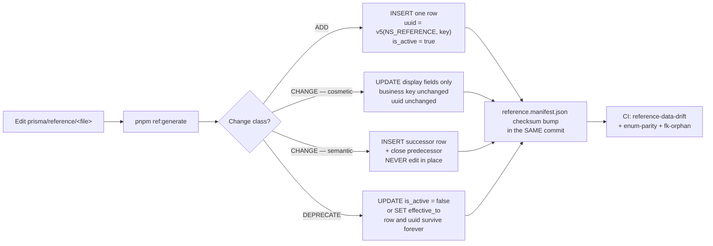
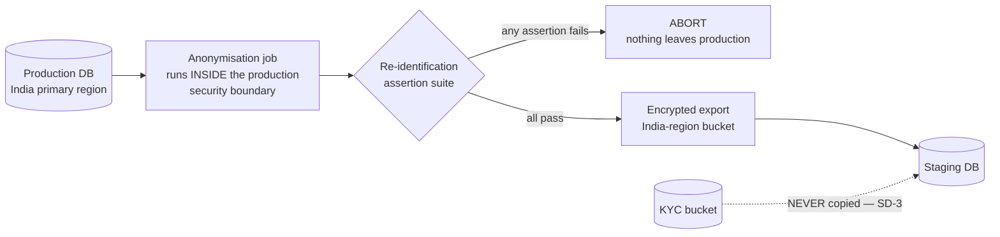

# SeedStrategy.md — Reference Data, Fixtures and the Deterministic Seed

**Phase 4 · Database Design · Physical layer**
**Status:** Binding derived specification · **Precedence rank 3** (`PROJECT_CONSTITUTION.md` §1.3)

---

## 0. Document control

| Field | Value |
| :--- | :--- |
| **Owner** | Data Architecture |
| **Applies to** | PostgreSQL 16 + PostGIS, Prisma ORM (`A-01`) with Prisma Migrate (`A-07`), Redis 7 + BullMQ, NestJS 10 |
| **Launch market** | **India** — `INR`/paise, `Asia/Kolkata`, GST 18% as CGST 9% + SGST 9%, financial year 1 April – 31 March (`LAUNCH_MARKET_INDIA.md`) |
| **Governing rules** | `PROJECT_CONSTITUTION.md` §10 (Money & Time), §11 (Multi-Tenancy), §15 (Database), §17.5 (The deterministic seed), §8 (Naming) |
| **Governing PRD clauses** | `§C2.3` (reference tables), `§C7` (environments), `§C8.2` (test data strategy), `§C4.8` (reason-code taxonomies), `§B9.8` (`NFR-DQ-01` … `NFR-DQ-06`), `NFR-SCAL-01` |
| **Governing ADRs** | ADR-0004 (PostgreSQL), ADR-0005 (Prisma + mandatory tenant-context extension), ADR-0006 (RLS), ADR-0007 (PostGIS), ADR-0014 (money), ADR-0015 (append-only ledger), ADR-0024 (soft delete), ADR-0025 (UTC + gym timezone), ADR-0028 (country configuration) |
| **Sibling documents** | `Schema.md`, `ERD.md`, `Relationships.md`, `Indexes.md`, `Constraints.md`, `NamingConvention.md`, `MigrationStrategy.md`, `SoftDeleteStrategy.md`, `AuditStrategy.md` |
| **Illustrative code** | Every fenced block in this document is labelled **illustrative — not committed code**. No application code, no `schema.prisma` and no migration exists at Phase 4, and this document creates none. |

### 0.1 The gate this document exists to satisfy

`PROJECT_CONSTITUTION.md` §15.8 rule 10:

> *"The seed is **deterministic** and produces exactly the `C8.2` fixture set: 3 tenants (single-branch, multi-branch, suspended), 12 plans across both types, 200 members in mixed states, 5,000 attendance records, orders in every status, one duplicate payment, one partial refund, one chargeback, reviews at every moderation state."*

and `NFR-DQ-06`:

> *"Reference data (amenities, categories, cities) is platform-managed with stable identifiers; free-text alternatives are not offered where filtering depends on the value."*

Those two sentences describe **two entirely different artefacts** that happen to be created by things people both call "seeds". Most of this document exists to keep them apart.

### 0.2 Division of labour — what this document adds, and what it does not repeat

Four documents already touch seeding. This one is the **physical/database** layer and it is the authority on how rows reach the database. It does not restate the others; where it corrects one, it says so in §11.

| Document | Its slice | This document's relationship |
| :--- | :--- | :--- |
| `engineering/TestingStrategy.md` §6 | The **test-layer contract**: what the seed must contain so every `§C8.3` journey runs without setup, the seeded principals, the determinism rules `DT1`–`DT12`, the seed self-test `SD-1`–`SD-5` | **Adopted verbatim as the functional contract.** This document specifies the *physical* execution: roles, RLS context, insertion order, `COPY` vs `INSERT`, partition pre-creation, counter priming, exact paise. It also records **five arithmetic and vocabulary corrections** to §6 in §11.1 |
| `engineering/Scalability.md` §10.2 | The **volume overlay** — 1,997 extra tenants, 18.25 M attendance rows, rules `LD1`–`LD6` | Adopted. §9 here specifies the physical generation and the artefact model, not the load-test plan |
| `engineering/Deployment.md` §2.4 | **Staging anonymisation** rules `SD-1`–`SD-7` | Adopted. §8 here adds the **per-column-class transform catalogue** and the re-identification risk analysis, which §2.4 asserts but does not derive |
| `database/MigrationStrategy.md` §1.11 `P11` | *"Reference data changes are versioned, never overwritten"* | Adopted. §2 here is the mechanism `P11` presumes: how a reference row is added, changed and deprecated without breaking a foreign key from a row written eight financial years ago |

### 0.3 Reading conventions

| Convention | Meaning |
| :--- | :--- |
| `K1` … `K5` | The five data kinds of §1.1. Every rule in this document names the kinds it binds |
| `SEP1` … `SEP12` | Separation rules — the rules that keep the kinds apart |
| `RD1` … `RD14` | Reference-data rules |
| `SX1` … `SX18` | Seed-execution rules (ordering, roles, RLS, performance) |
| `AN1` … `AN11` | Anonymisation rules for staging |
| **Money** | Always integer minor units. India: **paise**. `₹5,000.00` is written `500000` |
| **Instants** | Always UTC `timestamptz`. Where a local reading matters it is given as *"18:30 UTC = 00:00 IST"* |
| `(A)` | An assumption of this document, not a sourced fact. Every one is registered in §12 |

---

## 1. The three kinds of seed, and why conflating them causes production incidents

### 1.1 The taxonomy

There are three kinds the PRD asks for, plus two adjacent artefacts that are routinely mistaken for them. All five are enumerated because the failure mode is always a row from one kind arriving in the environment of another.

| Kind | Name | Lives in | Runs in | Owned by | Deleting it in production is |
| :-: | :--- | :--- | :--- | :--- | :--- |
| **K1** | **Reference data** — `countries`, `cities`, `localities`, `amenities`, `gym_categories`, `subscription_tiers`, `tax_profiles`, `kyc_checklists`, `reason_codes`, `feature_flags`, `notification_templates`, plus `help_articles`, `commission_rules`, `roles`, `permissions`, `role_permissions` | **Versioned Prisma migrations**, `prisma/migrations/**` | **Every environment including production** | Data Architecture + `admin/` module owners | **An outage.** A gym cannot be onboarded without a KYC checklist; an invoice cannot be issued without a tax profile |
| **K2** | **Development fixtures** — a demo tenant with pretty photos, a sandbox coupon, a throwaway support ticket | `apps/server/prisma/fixtures/**` | **`local` and `development` only** | Whoever wrote them | Harmless |
| **K3** | **The deterministic test seed** (`§C8.2`) — 3 tenants, 12 plans, 200 members, 5,000 attendance rows, the full financial fixture set | `apps/server/prisma/seed/**` | **`local`, `CI`, `development`** (`SE5`) | Backend + QA jointly | Catastrophic **if it ever reached production**, which is the point |
| **K4** | **The volume overlay** (`Scalability.md` §10.2) — 1,997 tenants, 499,800 users, 18.25 M attendance rows | **Not in the repository.** A generator plus a restorable base backup (§9) | Load-test environment only | Performance Engineering | n/a |
| **K5** | **Anonymised production-shaped data** (`§C7`) | **Never in the repository.** Produced by a job inside the production boundary | **Staging only** | Security + Data Architecture | n/a |

**The one-line test that distinguishes them.** *Would a real, paying tenant on the first day of production need this row to exist?* Yes → **K1**. No → K2/K3/K4/K5, and it must be **structurally incapable** of reaching production.

### 1.2 Four incidents that conflation causes, each stated as a mechanism rather than a warning

These are not hypotheticals; each is the predictable consequence of a specific, common shortcut.

| # | The shortcut | The mechanism | The production incident |
| :-: | :--- | :--- | :--- |
| **1** | One `prisma/seed.ts` that inserts both the GST tax profile and the 200 test members, gated by `if (process.env.NODE_ENV !== 'production')` | Prisma Migrate's `migrate deploy` does **not** run `seed.ts` — but `migrate dev` and `prisma migrate reset` do, and a runbook that says *"reset the database and re-seed"* is copied from the development runbook to the incident runbook. `NODE_ENV` is one misconfigured container away from `development` | **Test tenants appear in marketplace search.** `iron-house` is `APPROVED` and `LIVE`, so `FR-SRCH-01` returns it. A real consumer buys a membership at a gym that does not exist. This is simultaneously a `BR-TEN-01`-adjacent data incident, a payment that must be refunded, and a `KPI-16` corruption |
| **2** | Reference data inserted by the seed script instead of by a migration | The script is idempotent by `upsert` on a **generated** id, so a re-run mints a *new* `tax_profiles` row. `invoices.tax_snapshot` was captured against the old row. Two profiles now claim to be *the* India GST profile | **The invoice that cannot be reproduced.** `FR-INV-07` requires byte-reproducible PDF rendering. `AC-INV-01` requires the invoice to be immutable. A duplicated tax profile makes the *provenance* of an issued document unresolvable during a GST assessment |
| **3** | Test-seed rows created with `randomUUID()` "because they're only test data" | The isolation suite's `seedParams` (`TestingStrategy.md` §5.3 `IG-C`) bind to fixed ids. Random ids force each test to create its own tenant-B resource — which is `PROJECT_CONSTITUTION.md` §17.5's *"a test that seeds its own data is a test that will pass while production is broken"* | **`BAC-10` stops proving anything.** `E2E-11` passes against a resource the test itself created a moment earlier under the same RLS context. `RSK-08` (probability 2, impact 5) is now unguarded and the dashboard says green |
| **4** | Staging refreshed by restoring a production dump and running an `UPDATE users SET name = 'Test'` | The `UPDATE` touches `users`. It does not touch `audit_log.before/after`, `notification_log.payload`, `payments.raw_payload`, `invoices.customer_snapshot`, `reviews.body`, `member_notes.body`, `support_tickets` or the KYC bucket | **A DPDP Act 2023 personal-data breach.** Real names, real phone numbers and real KYC documents sit in an environment with team-plus-client access and sandbox-grade controls. `Deployment.md` `SD-1` exists precisely to make this structurally impossible |

> **Finding SEED-F01.** Every one of the four is a *packaging* defect, not a data defect. The rows themselves are fine; what fails is that one artefact was able to execute in an environment it was never designed for. The controls in §1.3 are therefore all packaging controls — different directories, different commands, different database roles, different CI jobs — and not review checklists.

### 1.3 The separation rules

| # | Rule | Binds | Enforced by |
| :-: | :--- | :--- | :--- |
| **SEP1** | **Reference data (`K1`) is only ever created by a versioned migration.** There is no reference-data seed *script*. `RD3` develops the mechanism | K1 | `reference-data-drift` CI check (§2.7) |
| **SEP2** | **`prisma/seed.ts` does not exist.** Prisma's `prisma.seed` key in `package.json` is deliberately **unset**, so `prisma migrate dev` and `prisma migrate reset` cannot invoke a seeder as a side effect. The `§C8.2` seed is invoked only by an explicit `pnpm db:seed` | K3 | `package.json` snapshot test; `MigrationStrategy.md` §2.1 |
| **SEP3** | **The test seed and the fixtures live behind an environment assertion that reads the *database*, not the process.** The first statement of the seeder asserts `SELECT current_setting('app.environment')` — a cluster-level setting written by Terraform, not by the container — is one of `local`, `ci`, `development`. A production cluster answers `production` and the seeder aborts before its first `INSERT` | K2, K3 | The seeder's own precondition (§10.2); `Deployment.md` environment provisioning |
| **SEP4** | **The production database role cannot execute the seed.** The seeder needs `app_migrator` for phases that write reference data and append-only tables (§6.2). Production's `app_migrator` credential exists only inside the one-shot migrator job's workload identity (`Deployment.md` `D-C1`) and is not issuable to a developer | K1, K3 | IAM; `Security.md` §8 |
| **SEP5** | **Test-seed rows are recognisable in a `SELECT`.** Every `K3` tenant slug is drawn from a closed list (`iron-house`, `pulse-fitness`, `apex-strength`) and every `K3` user email ends `@seed.gymmap.invalid` — a reserved TLD that cannot receive mail (RFC 2606). A production monitoring query counts rows matching the pattern; a non-zero count is an S1 alert | K2, K3 | Alert `SEED-1` (§7.3) |
| **SEP6** | **Fixtures (`K2`) may never be referenced by a test.** A test that imports from `prisma/fixtures/` fails lint. Fixtures exist for a human clicking around; the moment a test depends on one it has become `K3` and must move | K2 | ESLint `no-fixture-import` |
| **SEP7** | **The volume overlay (`K4`) is never committed.** 18.25 M attendance rows are a build artefact, not source. What is committed is the **generator** and its single PRNG seed | K4 | `.gitignore` plus a pre-commit file-size gate |
| **SEP8** | **No production data, anonymised or otherwise, enters `K1`–`K4`.** `LD6` states it for the load overlay; it is general. Anonymised production data has exactly one destination: staging | K5 | §8.5 |
| **SEP9** | **Reference data is identical in every environment.** The India GST profile in `local` is byte-identical to the one in production, because it arrived by the same migration. A divergence means a migration was skipped | K1 | `reference-data-drift` (§2.7) |
| **SEP10** | **A migration never inserts `K2`/`K3`/`K4`/`K5` rows.** `MigrationStrategy.md` `P6` already says a migration performs DDL and a job performs DML; the reference-data exception of `RD3` is **closed** and enumerated | all | `migration-lint`, table allow-list |
| **SEP11** | **The `§C8.2` seed and the fixtures use different tenants.** No fixture attaches a row to `iron-house`, `pulse-fitness` or `apex-strength`; a fixture that did would change the seed's row counts and break `SD-3` | K2, K3 | `SD-3` |
| **SEP12** | **Every kind declares its retention.** `K1` is `R-REF` (permanent) or `R-FIN` (eight financial years, for `tax_profiles`, `subscription_tiers`, `commission_rules`). `K2`/`K3` are destroyed on reset. `K4` is a quarterly artefact. `K5` is destroyed at the end of the UAT cycle and never later than 30 days | all | `Schema.md` §1.4 retention classes |

### 1.4 Where each kind lives

```text
illustrative — not committed code

apps/server/
  prisma/
    migrations/
      20260901T090000_p4_create_reference_geography/          K1  DDL + reference DML
      20260901T091500_p4_seed_reference_reason_codes/         K1  reference DML only
      20260901T093000_p4_seed_reference_tax_profile_in_gst/   K1  reference DML only
      ...
    reference/                     K1  the source-of-truth data files the migrations are generated FROM
      countries.csv                    16 columns, 20 rows
      india-states.csv                 38 GST state codes, incl. the retired 25
      cities.csv                       120 rows
      amenities.csv                    59 rows
      gym-categories.csv               15 rows
      reason-codes.csv                 57 rows — the five §C4.8 taxonomies
      subscription-tiers.csv           4 rows × validity window
      tax-profiles/in-gst-2017.json    components: CGST 900 bps + SGST 900 bps
      kyc-checklists/in-*.json         4 entity types × the India ten
      notification-templates/**        24 keys × channel × locale
      reference.manifest.json          checksum per file; the drift check's oracle
    seed/                          K3  the §C8.2 deterministic seed
      index.ts   ids.ts   epoch.ts   prng.ts   order.ts
      tenants.ts  plans.ts  members.ts  attendance.ts  commerce.ts  money.ts  trust.ts
      seed.manifest.json
      seed.int-spec.ts
    fixtures/                      K2  development only
      demo-tenant.ts  demo-media.ts  demo-tickets.ts
tools/
  loadgen/                         K4  the volume-overlay generator (output is never committed)
  anonymise/                       K5  runs inside the production boundary only
```

---

## 2. Reference data (`K1`) — versioned migrations, stable identifiers, safe deprecation

### 2.1 The sixteen reference tables and what each is authoritative for

`§C2.3` names eleven; `Schema.md` §2.6's closed exemption list adds five more that are equally platform-owned. All sixteen are **`GLOBAL` tenancy — no `tenant_id`, RLS not enabled** — and all sixteen are reached only through `ReferenceDataRepository` so the exemption is greppable rather than implicit (`PROJECT_CONSTITUTION.md` §11.5 `BR4`).

| # | Table | Stable identifier | Versioning style (§2.5) | Retention | Referenced by (historical rows that must keep resolving) |
| :-: | :--- | :--- | :--- | :--- | :--- |
| 1 | `countries` | `code` (ISO-3166-1 alpha-2) | Retire-in-place | `R-REF` | `tenants.country_code`, `branches.country_code`, `tax_profiles`, `kyc_checklists` |
| 2 | `cities` | `(country_code, slug)` | Retire-in-place | `R-REF` | `branches.city`, `search_documents.city_id`, saved searches, SEO routes |
| 3 | `localities` | `(city_id, slug)` | Retire-in-place | `R-REF` | `branches`, saved searches, SEO routes |
| 4 | `amenities` | `key` | Retire-in-place | `R-REF` | `gym_amenities`, `search_documents.amenity_ids`, `saved_searches.query` |
| 5 | `gym_categories` | `key` | Retire-in-place | `R-REF` | `gyms.category_id` |
| 6 | `reason_codes` | `(type, code)` | Retire-in-place | `R-REF` | `attendance.denial_reason`, `applications.reason_codes[]`, `refunds.reason_code`, `review_reports.reason_code`, `attendance.override_reason` |
| 7 | `help_articles` | `(locale, slug)` | Soft delete | `R-REF` | `reason_codes.help_article_id`, support surfaces |
| 8 | `subscription_tiers` | `key` + validity window | **Validity window** | `R-FIN` | `tenants.subscription_tier_id`, `subscription_invoices`, the commission-rate resolution chain |
| 9 | `tax_profiles` | `(country_code, name)` + validity window | **Validity window** | `R-FIN` | `tenants.tax_profile_id`, `orders.tax_snapshot`, `invoices.tax_breakdown` |
| 10 | `kyc_checklists` | `(country_code, entity_type, version)` | **Validity window** | `R-FIN` | `applications.snapshot`, `kyc_documents.document_type` |
| 11 | `commission_rules` | rule key + validity window | **Validity window** | `R-FIN` | `orders.commission_minor` provenance, `AC-ADMN-01.2`'s *"the resolved rate and its source"* |
| 12 | `feature_flags` | `key` | Retire-in-place | `R-REF` | Nothing persistent — a flag is evaluated, never stored on a business row |
| 13 | `notification_templates` | `(template_key, channel, locale, version)` | **Validity window** + DLT approval state | `R-OPS` | `notification_log.template_key` |
| 14 | `roles` | `key` (constrained to `platform_role_enum`) | Retire-in-place | `R-REF` | `user_roles`, `staff.role` |
| 15 | `permissions` | `key` (`<module>.<resource>.<action>`) | Retire-in-place | `R-REF` | `role_permissions`, the `B3.2` matrix, the OpenAPI permission declaration |
| 16 | `role_permissions` | `(role_id, permission_id)` | Retire-in-place | `R-REF` | The authorisation decision itself |

### 2.2 The stable-identifier rule (`NFR-DQ-06`) made physical

`Schema.md` §12 states the requirement; this is the mechanism.

| # | Rule | Statement |
| :-: | :--- | :--- |
| **RD1** | **Two identifiers, both stable, neither optional** | Every reference row carries a `uuid` primary key that **never changes**, and a human-stable business key (`code`, `key`, `slug`) that is unique, **never re-pointed to a different meaning**, and only ever **retired** |
| **RD2** | **The uuid is derived, not generated** | Reference-row uuids are **UUIDv5** over a dedicated namespace and the business key: `uuid_v5(NS_REFERENCE, '<table>:<business-key>')`. The same `amenities.key = 'SWIMMING_POOL'` therefore has the **same uuid in every environment and in every clone**, which is what makes `SEP9`'s drift check a simple set comparison rather than a semantic diff. Namespace `NS_REFERENCE = 3f8a2d10-0000-5000-b000-000000000000`, **distinct from** the `§C8.2` seed namespace of §5.1 so a reference id can never collide with a fixture id |
| **RD3** | **Reference DML lives in a migration, never in a script** | `MigrationStrategy.md` `P6` says a migration performs DDL and a job performs DML. Reference data is the **single closed exception**, and it is closed by an allow-list: a migration may `INSERT`/`UPDATE` only into the sixteen tables of §2.1. `migration-lint` fails on DML against any other table |
| **RD4** | **The migration is generated from the data file, not hand-written** | `prisma/reference/*.csv` and `*.json` are the source of truth a human edits. `pnpm ref:generate` emits the migration SQL. A hand-edited migration whose content does not match the data file fails `reference-data-drift` |
| **RD5** | **No `ON CONFLICT DO NOTHING` in a reference migration** | Silent no-op is how two environments diverge without anyone noticing. A reference migration is written as a plain `INSERT` and is allowed to fail loudly if the row already exists, because under forward-only migrations (`MG1`) it can only already exist if the migration ran twice — which is itself the defect |
| **RD6** | **Filtering never accepts free text** | `NFR-DQ-06`'s second clause. `FR-GYM-03` is explicit: *"free-text amenities are not permitted (they break filtering)"*. Physically: `gym_amenities.amenity_id` is a FK; there is no `gym_amenities.custom_label` column and no request will add one |
| **RD7** | **A business key is never reused for a different meaning** | Retiring `code = '25'` (Daman & Diu) and later assigning `'25'` to something else would silently rewrite the meaning of every historical invoice that carries it. The key is burned permanently on retirement |
| **RD8** | **Every reference table has an `is_active` (or an `effective_to`), and no reference table has a `DELETE` grant** | Grant class **G-REF** gives `app_rw` `SELECT` only, plus `SELECT, INSERT, UPDATE` on the `admin/` path gated by permission and reason (`FR-ADMN-05`, `FR-ADMN-07`). `DELETE` exists on no reference table for any application role. A row cannot be removed by an application defect |

### 2.3 Why migrations rather than an idempotent script

The alternative — a `reference-seed.ts` that upserts on every deploy — is common and is rejected. The reasons are specific.

| Property | Versioned migration | Idempotent upsert script |
| :--- | :--- | :--- |
| **Ordering with DDL** | The `NOT NULL` FK to `tax_profiles` and the row it points at are in the **same** deploy, in a known order | The script runs after all DDL, so a `NOT NULL` FK to reference data is impossible and every such column becomes nullable "temporarily" |
| **Auditability** | `_prisma_migrations` records exactly when the India GST profile entered each environment, with a checksum | Nothing records when the row changed, only what it is now |
| **Reproducibility of an issued document** | `FR-INV-07` requires a byte-reproducible invoice PDF. Reproducing an invoice from FY 2026-27 requires knowing the tax profile **in force then**. A migration history is that record | An upsert has overwritten it |
| **Rollback story** | `MG1` forward-only: a bad reference row is corrected by a **new** migration that supersedes it, leaving both visible | The upsert simply changes and the previous value is gone |
| **Divergence detection** | Two environments at the same migration head hold identical reference data by construction (`SEP9`) | Divergence is undetectable without a row-by-row diff |
| **`P11` compliance** | *"Reference data changes are versioned, never overwritten"* — satisfied structurally | Violated by the mechanism's own name |

**The one thing migrations do badly, stated honestly.** A 2,500-row `localities` insert inside a migration transaction is a large statement in a deploy window. The mitigation is `MigrationStrategy.md` §2.6: bulk reference loads are emitted as `COPY ... FROM STDIN` inside the migration, which for 2,500 rows completes in well under the 5-second `lock_timeout` budget and takes no lock any concurrent reader cares about (the table is new or is `GLOBAL` and read-mostly). Above ~50,000 rows the correct answer is a migration that creates the table plus a **job** that populates it, and `localities` is the only table remotely near that boundary at 10× scale (12,000 rows). It is not near it.

### 2.4 The three lifecycles: adding, changing, deprecating a reference row



#### 2.4.1 Adding

| Step | Detail |
| :--- | :--- |
| 1 | Append the row to the data file. The business key must not collide with a **retired** key (`RD7`) — the generator checks against the full historical key set, not the active set |
| 2 | `pnpm ref:generate` emits `INSERT` with an explicitly-written uuid computed by `RD2`, `is_active = true`, `created_by = NULL` (system actor, `AC2`), `created_at` = the migration's own `now()` |
| 3 | If the new row is a `reason_codes` row, the corresponding **enum value** must be added in the same migration. `Schema.md` §12.2: *"a code in the table with no matching enum value, or the reverse, is a CI failure"* |
| 4 | If the new row is an `amenities` row, `search_documents.amenity_ids` needs no change (it is a `uuid[]`), but the search **facet cache** key set changes and `Scalability.md` §7.8's invalidation map applies |
| 5 | Manifest checksum and `Schema.md` volume figure updated in the same pull request (`P12`) |

#### 2.4.2 Changing

The critical distinction, and the one that causes the incident of §1.2 case 2:

| Change class | Example | Mechanism | Why |
| :--- | :--- | :--- | :--- |
| **Cosmetic** — the row means the same thing | `amenities.name` `'AC'` → `'Air conditioning'`; a `reason_codes.display_text` reworded; a `help_articles.body` improved | **`UPDATE` in place.** uuid unchanged, business key unchanged | Nothing historical depends on the display string. `FR-ADMN-07` explicitly permits taxonomy management |
| **Semantic** — the row would now mean something different | GST 18% → 20%; the Growth tier's `commission_delta_bps` −200 → −300; a KYC checklist gaining an eleventh mandatory document | **Never `UPDATE`.** Insert a **successor** row with a new uuid and `effective_from`; set the predecessor's `effective_to` to the same instant | `R4` (`PROJECT_CONSTITUTION.md` §10.4): *"the rate applied to a transaction is the rate effective at the moment of sale and is persisted with the transaction."* An in-place edit rewrites history for every invoice that referenced the row |
| **Corrective** — the row was wrong from the start | A city centroid off by 4 km; a mistyped GSTIN state code | **`UPDATE` in place, plus an `audit_log` row with a reason.** This is the one place a semantic value is edited, and it is permitted only because the previous value was never *correct*, so no historical record legitimately depends on it | `FR-ADMN-02` requires a reason on every administrative action; the audit row is the evidence that this was a correction and not a policy change |

> **The test a reviewer applies.** *If an invoice issued last year re-rendered today under this change, would it differ?* If yes, the change is **semantic** and must be a successor row. `FR-INV-07`'s reproducibility requirement is the arbiter, and it is why `tax_profiles`, `subscription_tiers`, `commission_rules`, `kyc_checklists` and `notification_templates` are `R-FIN`/validity-window tables and the other eleven are not.

#### 2.4.3 Deprecating without breaking historical foreign keys

| # | Rule | Statement |
| :-: | :--- | :--- |
| **RD9** | **A reference row is never deleted.** `is_active = false` (retire-in-place tables) or `effective_to = <instant>` (validity-window tables). The row, its uuid and its business key survive for the life of the database | | 
| **RD10** | **The FK stays valid because the row stays present.** This is the whole reason deprecation is `is_active`, not `DELETE`: `gyms.category_id` from 2027 still resolves in 2035 |
| **RD11** | **Writes are refused; reads are not.** A `CHECK`-free application rule in the `admin/` path plus a partial index enforce that *new* references may only target active rows. The physical form is a `FOREIGN KEY ... ` to the table plus a validation in the writing use case; a partial FK is not expressible in PostgreSQL, and pretending otherwise with a trigger would fire on historical backfills too |
| **RD12** | **The read path filters explicitly.** `ReferenceDataRepository.listActive()` is the default and `listAll()` is the explicit opt-in used by exactly three surfaces: the audit explorer, the settlement-statement renderer and the invoice re-render path. A repository that returns retired rows to a *filter chip* is a defect (`NFR-DQ-06`) |
| **RD13** | **A reference row that a live row references cannot be retired without a report.** `pnpm ref:retire <table> <key>` refuses until it has printed the count of live (non-soft-deleted) referencing rows and the operator has confirmed. Retiring `amenities.key = 'SAUNA'` while 400 gyms declare it is a product decision, not a data-hygiene action |
| **RD14** | **Retirement is auditable.** Every retirement writes an `audit_log` row with `action = 'CONFIG_CHANGE'`, the actor, and a reason (`FR-ADMN-02`, `PE2`) |

**The worked example, and it is a real one.** India's GST state code **25** was *Daman and Diu*. In 2020 that territory merged with Dadra and Nagar Haveli under code **26**. Both codes appear on legitimate historical invoices.

| Time | State of the reference table |
| :--- | :--- |
| Before the merge | `('25','Daman and Diu', is_active = true)`, `('26','Dadra and Nagar Haveli', is_active = true)` |
| The deprecating migration | `UPDATE india_state_codes SET is_active = false, retired_on = '2020-01-26', superseded_by_code = '26' WHERE code = '25'` and `UPDATE ... SET name = 'Dadra and Nagar Haveli and Daman and Diu' WHERE code = '26'` (a **cosmetic** change to a name, plus a **deprecation** — two different classes in one migration, each labelled in the header) |
| After | A GSTIN beginning `25` on an invoice from 2019 still resolves to a named, present row. A tenant onboarding today cannot select `25`, because the onboarding query calls `listActive()`. Nothing about the historical invoice changes, and nothing about it becomes unrenderable |

`superseded_by_code` is a **nullable self-reference**, not a redirect the application follows automatically. `RD7` forbids re-pointing; the successor link exists so a human reading a 2019 invoice in 2031 can find out what happened, and so a migration that *chooses* to remap can do so explicitly and audibly.

### 2.5 The two versioning styles, and when each is correct

| Style | Tables | Physical shape | Uniqueness | Why not the other style |
| :--- | :--- | :--- | :--- | :--- |
| **Retire-in-place** | `countries`, `cities`, `localities`, `amenities`, `gym_categories`, `reason_codes`, `feature_flags`, `roles`, `permissions`, `role_permissions`, `help_articles` | `is_active boolean not null default true` | `UNIQUE (business_key)` — one row per key, forever | Nothing computes money from these. A validity window on `amenities` would add a temporal join to the hottest read in the product (search facets) to model a change that never needs to be reconstructed |
| **Validity window** | `subscription_tiers`, `tax_profiles`, `kyc_checklists`, `commission_rules`, `notification_templates` | `effective_from timestamptz not null`, `effective_to timestamptz null` | `EXCLUDE USING gist (business_key WITH =, tstzrange(effective_from, effective_to) WITH &&)` — no two versions of the same key overlap in time | `is_active` alone cannot answer *"what was in force on 14 March 2027?"*, and that is precisely the question a GST assessment asks. The exclusion constraint makes an overlapping pair unrepresentable rather than merely discouraged |

```sql
-- illustrative — not committed code
-- The validity-window guarantee, stated as a constraint rather than as a convention.
-- Constraints.md owns the canonical naming; this is the shape SeedStrategy depends on.
ALTER TABLE tax_profiles
  ADD CONSTRAINT ex_tax_profiles__no_overlapping_version
  EXCLUDE USING gist (
    country_code WITH =,
    name         WITH =,
    tstzrange(effective_from, effective_to) WITH &&
  );

-- Resolution at write time. The snapshot (BR-PAY-11) is taken from the row this returns,
-- and the ORDER + LIMIT is belt-and-braces given the exclusion constraint above.
SELECT * FROM tax_profiles
 WHERE country_code = 'IN'
   AND effective_from <= $1                      -- $1 = the order's created_at, UTC
   AND (effective_to IS NULL OR effective_to > $1)
 ORDER BY effective_from DESC
 LIMIT 1;
```

**The seed's obligation.** `SX16` (§6.6): the `§C8.2` seed must place `effective_from` on the India GST profile **strictly before** `SEED_EPOCH − 90 days`, because the earliest attendance row and the earliest order in the seed sit 90 days before the epoch (§4.6). A profile effective from the epoch would make the oldest seeded order unresolvable and the failure would look like a pricing bug.

### 2.6 Keeping the enum catalogue and `reason_codes` in agreement

`reason_codes` is the one reference table that **duplicates** information already held as a PostgreSQL enum. That duplication is deliberate — the enum gives the database a check on `attendance.denial_reason`, and the table gives the product a display string, a member-facing string and a help-article link (`NFR-USE-05`: every error states what, why and what next). Duplication without a check is drift, so:

| Check | Statement | Fails when |
| :--- | :--- | :--- |
| `enum-parity` (CI) | For each of the five `reason_code_type_enum` values, the set of `reason_codes.code` where `type = X` equals the value set of the corresponding enum type exactly | A code is added to one and not the other |
| `enum-parity` (CI) | Every `reason_codes` row has non-empty `display_text` | A new code ships without a reviewer-facing string |
| `help-link` (CI, warn) | Every **member-facing** reason code — the fifteen check-in denials and the ten refund reasons — has a `help_article_id` | `NFR-USE-05`'s *"what next"* is missing for a code a member will actually see |

### 2.7 The reference-data manifest and the drift check

| Element | Specification |
| :--- | :--- |
| **File** | `prisma/reference/reference.manifest.json` — `{ "version": <int>, "namespace": "3f8a2d10-…", "files": { "<path>": { "sha256": "<hex>", "rows": <n> } }, "tables": { "<table>": { "activeRows": <n>, "totalRows": <n>, "checksum": "<hex>" } } }` |
| **`reference-data-drift`** | A CI job that applies **all** migrations to an empty database, then computes, for each of the sixteen tables, an ordered hash over every column except `created_at`/`updated_at`, and compares it to the manifest. A mismatch fails with the first divergent table and row |
| **What it catches** | A hand-edited migration (`RD4`); a forgotten manifest bump; a migration applied in one environment and not another (run against a staging clone as a scheduled job, not only in PR CI); a semantic change smuggled in as an `UPDATE` |
| **What it deliberately does not catch** | A row that is *wrong* — the GST rate being 18% rather than 20% is a tax question, not a checksum question. `§12` open item **O-3** owns that, and the manifest's job is only to prove that what is deployed is what was reviewed |
| **Production posture** | The same hash is computed nightly against production by an elevated read (`PROJECT_CONSTITUTION.md` §11.6) and compared to the manifest at the deployed migration head. A mismatch is an S2: someone changed reference data outside the migration path |

---

## 3. India reference content, enumerated

Everything in this section is `K1` and ships in production. `OBJ-09` and ADR-0028 require country, currency, tax and KYC to be **configuration, not code**; this section is the configuration. Not one value below appears as a constant anywhere in the application.

### 3.1 `countries` — the India row

```sql
-- illustrative — not committed code
-- Migration 20260901T093000_p4_seed_reference_country_in
INSERT INTO countries (id, code, name, default_currency, calling_code,
                       fy_start_month, is_active, created_at, updated_at, created_by, updated_by)
VALUES (
  '<uuid_v5(NS_REFERENCE, ''countries:IN'')>',
  'IN', 'India', 'INR', '+91',
  4,          -- LAUNCH_MARKET_INDIA.md §5: the financial year starts 1 April. NOT a constant in code.
  true,
  now(), now(), NULL, NULL
);
```

| Column | Value | Source |
| :--- | :--- | :--- |
| `code` | `IN` | ISO-3166-1 alpha-2 |
| `default_currency` | `INR` — minor unit **paise**, 100/rupee | `LAUNCH_MARKET_INDIA.md` §2, `BR-PAY-01` |
| `calling_code` | `+91` — with `phone_e164` this fixes the normalised form `+91XXXXXXXXXX` | `Schema.md` §2.4 |
| `fy_start_month` | **4** | `LAUNCH_MARKET_INDIA.md` §5, `TM10` |
| `default_tax_profile_id` | → §3.2 | ADR-0028 |
| `default_kyc_checklist_id` | → §3.5 | `FR-ONB-03` |
| `is_active` | `true` | `C9.4` |

Seeded alongside `IN`: **19 further countries** as inactive rows (`is_active = false`) so that a second market is a one-column `UPDATE`, not a migration under time pressure. Their `fy_start_month` values are set correctly at seed time — Australia 7, United Kingdom 4, United States 1, Singapore 1, United Arab Emirates 1 — which is also what makes the `§C8.2` seed's non-India tenants (§4.2) representable at all.

### 3.2 `tax_profiles` — India GST, and why `components` is an array

The single most India-specific artefact in the reference set. `LAUNCH_MARKET_INDIA.md` §4: *"the tax profile must model CGST + SGST as two separate lines on the invoice, not one combined 18%"*, and `FR-INV-04`'s *"tax breakdown by rate"* becomes, for India, a breakdown by **component**.

```json
// illustrative — not committed code
// prisma/reference/tax-profiles/in-gst-intrastate.json
{
  "schema_version": 1,
  "country_code": "IN",
  "name": "IN-GST-SERVICES-18-INTRASTATE",
  "total_rate_bps": 1800,
  "is_inclusive": false,
  "rounding_mode": "HALF_EVEN",
  "place_of_supply_rule": "PERFORMANCE_LOCATION_BRANCH",
  "service_code": "999723",
  "fy_start_month": 4,
  "effective_from": "2017-07-01T00:00:00Z",
  "effective_to": null,
  "components": [
    { "code": "CGST", "label": "Central GST",     "rate_bps": 900, "share_of_total_bps": 5000 },
    { "code": "SGST", "label": "State GST",       "rate_bps": 900, "share_of_total_bps": 5000 }
  ]
}
```

| Property | Value | Why exactly this |
| :--- | :--- | :--- |
| `total_rate_bps` | **1800** | `R3`: rates are integer basis points, never `0.18` and never `18.0`. **Pending confirmation — open item O-3** |
| `is_inclusive` | `false` | India GST on services is **exclusive**; tax is added on top of net, matching the `A6.3` worked example |
| `components` | Two objects, 900 bps each | `LAUNCH_MARKET_INDIA.md` §4. **Two rows on the invoice, not one.** The array shape is country-agnostic: a single-component market is an array of one |
| `rounding_mode` | `HALF_EVEN`, applied **per component then summed** | `MO4`. On ₹4,000.00 net: CGST `round_half_even(400000 × 0.09) = 36000` paise, SGST `36000`, total `72000`. Rounding the ₹720 total and then splitting it would produce a different answer for odd net amounts, and the invoice would not add up |
| `place_of_supply_rule` | `PERFORMANCE_LOCATION_BRANCH` | A gym is consumed at a physical location, so supply is intra-state in almost every case |
| `service_code` | `999723` (SAC, physical well-being incl. fitness) | **Medium confidence — open item O-3.** Held as data precisely so confirming it is a reference-data migration, not a code change |
| `fy_start_month` | **4** | Duplicated from `countries` deliberately: the FY that governs an invoice is a property of the **tax profile in force**, and a country changing its FY start must not retroactively renumber issued invoices |
| `effective_from` | `2017-07-01Z` (GST commencement) | Must predate every order the system can ever hold, including the seed's oldest (`SX16`) |

A **second** profile, `IN-GST-SERVICES-18-INTERSTATE`, is seeded with a single `IGST` component at 1800 bps and `place_of_supply_rule = 'RECIPIENT_LOCATION'`. It is unused at launch and exists because the alternative — discovering the inter-state case in production and adding a tax profile under pressure — is the expensive path.

### 3.3 The commission tax profile — **PENDING CLIENT DECISION (O-1)**

`LAUNCH_MARKET_INDIA.md` Conflict 2, severity **High**, and `Schema.md` §14.3. Two taxable supplies exist and `A6.3` models one: gym→member (tax `T`, modelled) and **platform→gym, the commission (tax `Cₜ`, not modelled)**.

A **third** profile is seeded now, inactive in effect:

| Property | Value |
| :--- | :--- |
| `name` | `IN-GST-COMMISSION-18` |
| `total_rate_bps` | `1800`, components `[CGST 900, SGST 900]` |
| `effective_from` | **`9999-01-01T00:00:00Z`** — a far-future instant, so the resolution query of §2.5 returns **no row** today and the pricing service therefore computes `Cₜ = NULL` |
| Referenced by | Nothing yet. `orders.commission_tax_minor` and `settlement_lines.commission_tax_minor` exist, are nullable, and are `NULL` on every row (`Schema.md` §14.3) |

| If O-1 is **ACCEPTED** | If O-1 is **REJECTED** |
| :--- | :--- |
| One reference-data migration sets `effective_from` to the agreed commencement date. Two enum values (`COMMISSION_TAX`, `COMMISSION_TAX_REVERSAL`) are added by an additive migration under `MG9`. **No DDL on `orders` or `settlement_lines`** — the columns and their `COALESCE`d check constraints already exist. The `§C8.2` seed gains one ledger entry per `PAID` order and one per completed refund, and its manifest `version` bumps | The profile row is retired (`is_active`/`effective_to`), never deleted. The two enum values are never created. The seed is unchanged. `INV-FIN-3` (`P = (N + T) − C − F`) stands unamended. **The platform absorbs ₹72.00 of GST on every ₹400.00 of commission** — a commercial decision, and the recommendation is that it be taken deliberately rather than by omission |

**The seed's position today.** The `§C8.2` fixture set of §4.7 computes `P = (N + T) − C − F` and writes **four** ledger entries per `PAID` order. `TestingStrategy.md` §6.2 says five, listing `COMMISSION_TAX` among them while simultaneously stating that `commission_tax_minor` is `NULL` pending O-1. Those two statements cannot both hold — an entry of type `COMMISSION_TAX` cannot be written when the enum value does not exist. **Correction C-3 (§11.1) resolves it: four entries today, five on O-1 acceptance.**

### 3.4 `subscription_tiers`

`A6.2`'s reference model, seeded as configuration because `A6.2` says *"values are configurable"*.

| `key` | `max_branches` | `max_active_members` | `max_staff_seats` | `commission_delta_bps` | Effective standard rate (India) |
| :--- | ---: | ---: | ---: | ---: | ---: |
| `STARTER` | 1 | 150 | 3 | **0** | **1000 bps · 10.0%** |
| `GROWTH` | 3 | 750 | 10 | **−200** | **800 bps · 8.0%** |
| `PROFESSIONAL` | 10 | 3,000 | 40 | **−400** | **600 bps · 6.0%** |
| `ENTERPRISE` | `NULL` (unlimited) | `NULL` | `NULL` | **0**, negotiated per tenant via `tenants.commission_rate_bps` | per contract |

| Rule | Statement |
| :--- | :--- |
| Prices | `monthly_price_minor` / `annual_price_minor` in **paise** with `currency = 'INR'`. The actual figures are a commercial decision and are **open item O-4**; the seed carries placeholder values flagged in the manifest so that shipping them unreviewed is visible |
| `NULL` = unlimited | Not `0`, not `-1`, not `2147483647`. `A6.2` says *unlimited* and `NULL` is the only honest encoding; every consuming query writes `max_branches IS NULL OR count < max_branches` |
| The 0 bps floor | `KL-006`: at a 10% standard rate no tier delta drives the effective rate negative, so the hazard is not *reachable* — **but the floor rule is still implemented**, because a future 3% standard rate with a −4pp delta would go negative. The floor lives in `commission_rules` resolution, not in this table |
| Renewal rate | **Flat 500 bps across all tiers.** `LAUNCH_MARKET_INDIA.md` §10's adopted interpretation: deltas apply to the standard rate only. Flagged for client confirmation before Sprint 11 |

### 3.5 `kyc_checklists` — the India ten

`LAUNCH_MARKET_INDIA.md` §6, seeded as four rows — one per `entity_type_enum` value — because the required documents differ by entity type. The `items` array is ordered; the order is the order the onboarding wizard renders (`FR-ONB-03`, `SCR-DASH-002`).

| # | `document_type` | `SOLE_PROPRIETOR` | `PARTNERSHIP` | `COMPANY` | `OTHER` | Validates | Format check |
| :-: | :--- | :-: | :-: | :-: | :-: | :--- | :--- |
| 1 | `PAN` | **M** | **M** | **M** | **M** | Tax identity | `pan_in` domain `^[A-Z]{5}[0-9]{4}[A-Z]$`; **4th char encodes entity type and must agree with `tenants.entity_type`** — an application-layer semantic check, not a `CHECK` constraint |
| 2 | `GSTIN` | C | C | C | C | Tax registration | `gstin_in` domain, 15 chars; embeds the 2-digit state code + the PAN + an entity counter + `Z` + a checksum. Conditional on crossing the registration threshold |
| 3 | `BUSINESS_REGISTRATION` | **M** (Udyam/MSME) | **M** (Partnership Deed) | **M** (Certificate of Incorporation) | **M** | Legal existence | Document only |
| 4 | `SHOP_ESTABLISHMENT` | **M** | **M** | **M** | **M** | Right to trade | **State-specific, issued municipally** — the reason `tenants.state_code` exists as a named column |
| 5 | `BANK_PROOF` | **M** | **M** | **M** | **M** | Payout destination | Cancelled cheque or statement showing the account name; verified through the gateway's account-name check (`PCI-6`) |
| 6 | `OWNER_IDENTITY` | **M** | **M** | **M** | **M** | The person behind the business | PAN **plus one of** Passport / Driving Licence / Voter ID. **Aadhaar is deliberately not the default** — see below |
| 7 | `PREMISES_ADDRESS_PROOF` | **M** | **M** | **M** | **M** | `BR-GYM-08` geo-match | Utility bill or rent agreement |
| 8 | `TRADE_LICENCE` | C | C | C | C | Local permission | City-dependent |
| 9 | `FIRE_SAFETY_NOC` | C | C | C | C | Premises safety | Commonly required above a floor-area threshold |
| 10 | `MUSIC_LICENCE` | **A** | **A** | **A** | **A** | PPL / IPRS copyright | **Advisory, never blocking.** Flagged to the owner |

**M** mandatory · **C** conditional · **A** advisory.

> **Aadhaar.** `LAUNCH_MARKET_INDIA.md` §6 records the position: Aadhaar carries statutory handling restrictions, so the checklist offers **PAN + a non-Aadhaar identity document** and the platform avoids Aadhaar obligations entirely. The seed therefore contains **no Aadhaar option** in the `OWNER_IDENTITY` item's accepted-document list. If legal review later permits it, adding it is a successor `kyc_checklists` version (§2.5), and every application submitted before that version keeps its snapshot of the version in force at submit (`ERD.md` §9.6).

### 3.6 Indian geography — states, cities, localities

**GST state codes.** The 2-digit prefix of every GSTIN. All **38** codes are seeded, including the retired one, because a GSTIN captured from a historical document must remain parseable.

| Code | State / UT | Code | State / UT | Code | State / UT |
| :-- | :--- | :-- | :--- | :-- | :--- |
| 01 | Jammu and Kashmir | 14 | Manipur | 27 | **Maharashtra** |
| 02 | Himachal Pradesh | 15 | Mizoram | 29 | **Karnataka** |
| 03 | Punjab | 16 | Tripura | 30 | Goa |
| 04 | Chandigarh | 17 | Meghalaya | 31 | Lakshadweep |
| 05 | Uttarakhand | 18 | Assam | 32 | Kerala |
| 06 | Haryana | 19 | West Bengal | 33 | **Tamil Nadu** |
| 07 | **Delhi** | 20 | Jharkhand | 34 | Puducherry |
| 08 | Rajasthan | 21 | Odisha | 35 | Andaman and Nicobar Islands |
| 09 | Uttar Pradesh | 22 | Chhattisgarh | 36 | **Telangana** |
| 10 | Bihar | 23 | Madhya Pradesh | 37 | Andhra Pradesh |
| 11 | Sikkim | 24 | Gujarat | 38 | Ladakh |
| 12 | Arunachal Pradesh | **25** | ~~Daman and Diu~~ **retired 2020-01-26 → 26** | 97 | Other Territory |
| 13 | Nagaland | 26 | Dadra and Nagar Haveli and Daman and Diu | | |

Code **25** is the worked deprecation example of §2.4.3 and it is not hypothetical: it is the reason `india_state_codes` carries `is_active`, `retired_on` and `superseded_by_code`, and the reason the seed contains a retired row on day one so the retired-row read path is exercised before anything depends on it.

**Cities.** Twelve metros seeded with a PostGIS `centroid geography(Point,4326)`, `timezone = 'Asia/Kolkata'` (presentation default — **never authoritative**, `TM3`) and `status` per the `C9.4` gate:

| `slug` | State code | Initial `status` | `slug` | State code | Initial `status` |
| :--- | :-- | :--- | :--- | :-- | :--- |
| `mumbai` | 27 | `PLANNED` | `kolkata` | 19 | `PLANNED` |
| `delhi` | 07 | `PLANNED` | `ahmedabad` | 24 | `PLANNED` |
| `bengaluru` | 29 | `PLANNED` | `jaipur` | 08 | `PLANNED` |
| `hyderabad` | 36 | `PLANNED` | `surat` | 24 | `PLANNED` |
| `chennai` | 33 | `PLANNED` | `lucknow` | 09 | `PLANNED` |
| `pune` | 27 | `PLANNED` | `chandigarh` | 04 | `PLANNED` |

`OQ-01` fixed the launch **country**; the launch **city** is selected separately against the `C9.4` criteria. Until then every Indian city is `PLANNED`. Flipping the launch city to `GATED` and then `LIVE` is a two-line reference-data migration and is the canonical **cosmetic-to-semantic boundary case**: the status change alters what the marketplace returns, so it is reviewed as a product change, but it alters nothing historical, so it is an in-place `UPDATE`. This is registered as open item **O-5**.

**Localities.** ~120 rows at seed time (≈10 per metro), each with a nullable `centroid`. They exist for SEO landing pages and filter chips (`NFR-DQ-06`), and they grow by reference-data migration as cities go live.

### 3.7 `amenities` and `gym_categories`

`FR-GYM-03`: *"Amenity selection from a platform-controlled taxonomy; free-text amenities are not permitted (they break filtering)."* **59 amenities** in six display groups:

| `display_group` | `key` values |
| :--- | :--- |
| **Facilities** (16) | `PARKING_CAR`, `PARKING_TWO_WHEELER`, `LOCKER_ROOM`, `SHOWERS`, `STEAM_ROOM`, `SAUNA`, `SWIMMING_POOL`, `CAFE`, `JUICE_BAR`, `WIFI`, `AIR_CONDITIONING`, `POWER_BACKUP`, `DRINKING_WATER_RO`, `TOWEL_SERVICE`, `CHANGING_ROOM`, `PRO_SHOP` |
| **Equipment** (16) | `FREE_WEIGHTS`, `RESISTANCE_MACHINES`, `CARDIO_ZONE`, `FUNCTIONAL_TRAINING_ZONE`, `CROSSFIT_RIG`, `OLYMPIC_PLATFORM`, `SMITH_MACHINE`, `CABLE_CROSSOVER`, `TREADMILL`, `ELLIPTICAL`, `ROWING_MACHINE`, `SPIN_BIKES`, `BOXING_BAG`, `TURF_AREA`, `STRETCHING_ZONE`, `RECOVERY_ZONE` |
| **Classes** (12) | `YOGA`, `ZUMBA`, `AEROBICS`, `PILATES`, `SPINNING`, `CROSSFIT_CLASS`, `HIIT`, `MMA`, `KICKBOXING`, `DANCE_FITNESS`, `MEDITATION`, `STRENGTH_CLASS` |
| **Services** (6) | `PERSONAL_TRAINING`, `DIET_CONSULTATION`, `PHYSIOTHERAPY`, `BODY_COMPOSITION_ANALYSIS`, `GROUP_CLASSES_INCLUDED`, `TRIAL_SESSION` |
| **Accessibility** (6) | `WHEELCHAIR_ACCESS`, `LIFT_ACCESS`, `GROUND_FLOOR`, `WOMEN_ONLY_HOURS`, `WOMEN_TRAINER_AVAILABLE`, `CHILDCARE` |
| **Hours** (3) | `OPEN_24_HOURS`, `EARLY_MORNING_OPENING`, `LATE_NIGHT_CLOSING` |

Six of these are named directly by `FR-SRCH-03`'s filter list — `OPEN_24_HOURS`, `PARKING_CAR`, `PARKING_TWO_WHEELER`, `TRIAL_SESSION`, `WOMEN_ONLY_HOURS`, `SWIMMING_POOL` — and are marked `is_filterable = true`. A filter chip whose amenity key does not exist is a build failure, not a runtime empty result.

**15 `gym_categories`:** `GYM`, `FITNESS_STUDIO`, `CROSSFIT_BOX`, `YOGA_STUDIO`, `PILATES_STUDIO`, `MARTIAL_ARTS`, `BOXING_MMA`, `DANCE_STUDIO`, `SWIMMING_ACADEMY`, `SPORTS_COMPLEX`, `WOMEN_ONLY_GYM`, `PREMIUM_CLUB`, `BUDGET_GYM`, `PT_STUDIO`, `WELLNESS_CENTRE`.

### 3.8 `reason_codes` — the five `§C4.8` taxonomies, in full

**57 rows.** `Schema.md` §12.2 gives the count as *"~60 (15+16+10+9+7)"*; that sum is **57** and 57 is the binding number, asserted by `enum-parity`.

| `type` | Count | `code` values (verbatim from `§C4.8`) |
| :--- | :-: | :--- |
| `CHECK_IN_DENIAL` | **15** | `MEMBERSHIP_EXPIRED`, `MEMBERSHIP_FROZEN`, `MEMBERSHIP_PENDING_START`, `MEMBERSHIP_CANCELLED`, `MEMBERSHIP_REFUNDED`, `WRONG_BRANCH`, `OUTSIDE_OPERATING_HOURS`, `OUTSIDE_PLAN_ACCESS_WINDOW`, `GYM_CLOSED_EXCEPTION`, `NO_SESSIONS_REMAINING`, `DUPLICATE_WITHIN_COOLDOWN`, `TOKEN_EXPIRED`, `TOKEN_INVALID`, `MEMBERSHIP_UNDER_REVIEW`, `TENANT_SUSPENDED` |
| `APPLICATION_REJECTION` | **16** | `KYC_DOCUMENT_MISSING`, `KYC_DOCUMENT_ILLEGIBLE`, `KYC_DOCUMENT_EXPIRED`, `KYC_NAME_MISMATCH`, `ADDRESS_UNVERIFIABLE`, `GEO_ADDRESS_MISMATCH`, `DUPLICATE_LISTING`, `INSUFFICIENT_PHOTOS`, `PHOTO_QUALITY`, `PHOTO_NOT_OF_PREMISES`, `INCOMPLETE_PROFILE`, `NO_PUBLISHED_PLAN`, `BANK_VERIFICATION_FAILED`, `PROHIBITED_CONTENT`, `SUSPECTED_FRAUD`, `OTHER` |
| `REFUND` | **10** | `WITHIN_COOLING_OFF`, `SERVICE_NOT_AS_DESCRIBED`, `GYM_CLOSED`, `MEDICAL`, `RELOCATION`, `DUPLICATE_PAYMENT`, `PRICING_ERROR`, `GOODWILL`, `FRAUD`, `OTHER` |
| `MODERATION` | **9** | `ABUSIVE_LANGUAGE`, `PERSONAL_INFORMATION`, `SPAM`, `IRRELEVANT`, `CONFLICT_OF_INTEREST`, `SUSPECTED_FAKE`, `PROMOTIONAL`, `THREAT`, `OTHER` |
| `CHECK_IN_OVERRIDE` | **7** | `MEMBER_PHONE_UNAVAILABLE`, `TECHNICAL_ISSUE`, `GRACE_PERIOD_GRANTED`, `PAYMENT_PENDING_CONFIRMED`, `TRIAL_VISIT`, `MANAGEMENT_APPROVAL`, `OTHER` |

Each row carries `display_text` (what the reviewer or the desk sees), `member_facing_text` (nullable — populated for all 15 denials and all 10 refund reasons, `NULL` for the internal ones) and `help_article_id`. The distinction matters: a member denied entry is shown *"Your membership is on hold until 12 July"*, not `MEMBERSHIP_FROZEN`, and the desk is shown both.

`OTHER` appears in three taxonomies. It is seeded with `requires_free_text = true`, so selecting it forces `reason_text`; an `OTHER` with no explanation is the reason denial analytics degrade (`BR-CHK-10`).

### 3.9 `notification_templates` and TRAI DLT

The `§B5.19` baseline catalogue gives **24 notification events**. Expanded across the channels each event declares and the launch locales (`en-IN`, `hi-IN`), the seed produces the template rows the dispatcher resolves.

| Recipient | Template keys |
| :--- | :--- |
| **User / member** (13) | `auth.otp`, `auth.welcome`, `order.confirmation`, `payment.failed`, `membership.activated`, `membership.starts_today`, `checkin.confirmation`, `membership.renewal_reminder` (one template, four sends at T−15/−7/−3/−1), `membership.expired`, `membership.freeze_started`, `membership.freeze_ended`, `refund.initiated`, `refund.completed`, `review.request`, `gym.closure_notice` |
| **Owner** (7) | `sale.new`, `report.daily_summary`, `membership.expiring_this_week`, `review.new_received`, `payout.initiated`, `kyc.decision`, `subscription.payment_failed` |
| **Platform** (4) | `application.awaiting_review_sla`, `refund.awaiting_approval`, `settlement.reconciliation_variance`, `moderation.queue_over_threshold` |

| Rule | Statement |
| :--- | :--- |
| **DLT** | Every `channel = 'SMS'` row carries `dlt_template_id` and `dlt_approval_status`. At seed time the ids are **placeholders** flagged in the manifest, because a DLT id is issued by the registry against a real registered header and cannot be invented. Shipping a placeholder to production is blocked by a release check, not by hope |
| **Approval-state machine** | `FR-NOTF-03` requires templates *"editable by Super Admin without deployment"*; for Indian SMS that is not achievable. Editing an SMS template creates a **new version** in `PENDING_DLT_APPROVAL` with `supersedes_version_id` pointing at the previous approved row, and **the dispatcher resolves the latest `APPROVED` version, not the latest version** |
| **`routing_class`** | `TRANSACTIONAL` or `PROMOTIONAL`, a property of the **template**. `BR-MEM-11`'s renewal reminders are `TRANSACTIONAL` — they are service messages tied to an existing relationship and may reach DND numbers — **and the wording must stay transactional or the classification breaks**. That constraint is a `display_text` review rule, and it is why a "cosmetic" template edit is reviewed by someone who knows the rule |
| **Email / in-app / push** | `dlt_approval_status = 'NOT_REQUIRED'` and instantly editable, exactly as `FR-NOTF-03` intends |

### 3.10 `feature_flags`

`FEATURE_FLAGS.md` is the **authoritative register** — key, type, owner, default, targeting, retirement date, related PRD identifiers, lifecycle state. The seed does **not** restate it; the reference migration is **generated from it**, and a CI check asserts that the set of `feature_flags.key` in the database equals the set of `ACTIVE` and `PERMANENT` keys in the register. A flag in the register with no row, or a row with no register entry, fails the build.

| Property | Rule |
| :--- | :--- |
| Grammar | `<type>.<module>.<subject>` — `rel.*` release, `ops.*` operational, `exp.*` experiment, `mig.*` migration, `ent.*` entitlement (`FEATURE_FLAGS.md` §3) |
| Seeded default | **`is_enabled = false`** for `rel.*`, `exp.*` and `mig.*`; **`true`** for `ops.*`, because an operational switch is a kill switch and its safe resting position is *on* |
| `targeting` | `{"schema_version":1}` — no tenant or percentage targeting at seed time. Targeting is set operationally, never in a migration, because a migration that turns a flag on for 10% of tenants is a deploy that changes behaviour without a deploy |
| The `§C8.2` seed's dependency | Eight flags must be `true` in `local`/`CI` for the twelve `§C8.3` journeys to run: `rel.plans.session-plans`, `rel.memberships.freeze`, `rel.discovery.favourites`, `rel.discovery.gym-comparison`, `rel.ordering.offline-partial-payment`, `ops.payments.duplicate-auto-refund`, `ops.attendance.auto-checkout`, `rel.discovery.city-launch-gate`. They are switched on by the **test harness**, not by the reference migration — a test that needs a flag turns it on explicitly so the dependency is visible in the test file |

### 3.11 `roles`, `permissions`, `role_permissions`

`roles.key` is constrained to `platform_role_enum`, so a role row cannot invent a scope. Twelve rows, verbatim from `§B3.1`: `VISITOR`, `USER`, `MEMBER`, `GYM_OWNER`, `GYM_MANAGER`, `RECEPTIONIST`, `TRAINER`, `SUPER_ADMIN`, `VERIFICATION_OFFICER`, `SUPPORT_AGENT`, `FINANCE`, `MODERATOR`.

`permissions` is generated from the **declared permission on every endpoint** (`PROJECT_CONSTITUTION.md` §12.2.1: *"a declared permission on every new endpoint"* is a merge gate). `role_permissions` is generated from the `§B3.2` matrix. Both are therefore derived artefacts with a drift check against the OpenAPI document, which is what makes *"a new endpoint without a declared permission fails the build"* enforceable rather than aspirational.

### 3.12 `commission_rules`

The resolution chain `AC-ADMN-01.2` requires to be answerable from data — *the resolved rate **and its source***:

| Precedence | `commission_rate_source_enum` | Seeded value |
| :-: | :--- | :--- |
| 1 (highest) | `NEGOTIATED` | none at seed; Enterprise contracts only |
| 2 | `TENANT_OVERRIDE` | none at seed; `tenants.commission_rate_bps` |
| 3 | `TIER` | the `commission_delta_bps` of §3.4 |
| 4 (lowest) | `PLATFORM_DEFAULT` | **standard 1000 bps, renewal 500 bps** (`OQ-02`, `LAUNCH_MARKET_INDIA.md` §10) |

Plus the **floor rule**: `max(0, resolved_bps)`. Unreachable at current values and implemented anyway (`KL-006`).

### 3.13 What is deliberately **not** reference data

| Candidate | Why not | Where it lives instead |
| :--- | :--- | :--- |
| The 18% GST **rate** as a constant | `OBJ-09` country-agnosticism; a rate change is a data task | `tax_profiles.total_rate_bps` |
| The April FY start as a constant | Same. Hardcoding January is a defect that surfaces once a year, in April, in a tax document | `tax_profiles.fy_start_month` and `countries.fy_start_month` |
| The 10%/5% commission as constants | `A6.2`: *"values are configurable"* | `commission_rules` |
| Currency `'INR'` as a default in a column definition | A default currency is how a second market silently mints `INR`-denominated orders. Every money column has an **explicit adjacent** `currency` written by the caller | `orders.currency`, `plans.currency`, … (`NFR-DQ-02`) |
| A `payment_providers` table | `payments.provider` is `text`, deliberately, so adding Razorpay Route is data and not a migration (`Schema.md` §14.1) | — |
| Gym opening hours "defaults" | `branch_hours` is tenant data. A platform default would be wrong for every gym and would be silently inherited | `branch_hours` |
| The `§C8.2` tenants | They are `K3`. `SEP5` makes them recognisable and `SEP3` keeps them out of production | `prisma/seed/` |

---

## 4. The deterministic test seed (`§C8.2`) — the physical specification

### 4.1 What this section is, relative to `TestingStrategy.md` §6

`TestingStrategy.md` §6 fixes the **functional contract**: the three tenants, their timezones and currencies, the counts, the seeded principals, and rules `DT1`–`DT12`/`SD-1`–`SD-5`. **That contract is adopted here unchanged.** This section adds the physical layer it presumes and does not specify: the exact paise, the plan matrix, the corrected member distribution, the attendance generation algorithm, the insertion ordering under foreign-key and RLS constraints, and the counters and partitions that must exist before the first row lands.

It also records **five corrections** to §6, in §11.1. They are arithmetic and vocabulary errors, not design disagreements, and each would fail a CI check the moment the seed is written.

### 4.2 The three tenants, physically

| Property | **T1 `iron-house`** | **T2 `pulse-fitness`** | **T3 `apex-strength`** |
| :--- | :--- | :--- | :--- |
| `tenants.id` | `uuid_v5(NS_SEED,'tenant:iron-house')` | `…'tenant:pulse-fitness'` | `…'tenant:apex-strength'` |
| `legal_name` | Iron House Fitness Private Limited | Pulse Fitness Pty Ltd | Apex Strength LLC |
| `entity_type` | `COMPANY` | `COMPANY` | `COMPANY` |
| `status` | `APPROVED` | `APPROVED` | **`SUSPENDED`** |
| `country_code` | **`IN`** | `AU` | `US` |
| `currency` | **`INR`** — paise | `AUD` — cents | `USD` — cents |
| `timezone` | **`Asia/Kolkata`** +05:30, no DST | `Australia/Adelaide` +09:30/+10:30, half-hour **with** DST | `America/Los_Angeles` −08:00/−07:00, whole-hour DST, opposite hemisphere |
| `state_code` | **`27`** (Maharashtra) | — | — |
| `pan` | `AABCI1234H` — valid `pan_in`; 4th char `C` = Company, agreeing with `entity_type` | — | — |
| `gstin` | `27AABCI1234H1Z5` — valid `gstin_in`; embeds state `27` + the PAN | — | — |
| `tax_registration_status` | `REGISTERED` | `REGISTERED` | `NOT_REGISTERED` |
| `tax_profile` | `IN-GST-SERVICES-18-INTRASTATE` — **CGST 900 + SGST 900** | single-component 1000 bps | two-component 825 bps |
| `fy_start_month` (via profile) | **4** | 7 | **1** |
| FY label at `SEED_EPOCH` | **`2026-27`** | `2025-26` | **`2026-26`** ← see below |
| `subscription_tier` | `STARTER` | `PROFESSIONAL` | `GROWTH` |
| `commission_rate_bps` resolved | **1000** (`PLATFORM_DEFAULT`, delta 0) | **600** (`TIER`, −400) | **800** (`TIER`, −200) |
| `renewal_commission_rate_bps` | 500 | 500 | 500 |
| `settlement_cycle_days` / `reserve_bps` | 7 / 500 | 7 / 500 | 7 / **1000** (elevated on suspension) |
| Branches | **1** — `iron-house-andheri`, Mumbai | **3** — `pulse-adelaide-cbd`, `pulse-adelaide-north` (same city), `pulse-glenelg` (different city) | **1** — `apex-santa-monica` |
| Payout state | `VERIFIED` | `VERIFIED` | **payouts held** |
| Exists to prove | The launch market end to end: the half-hour offset, the two-line CGST/SGST invoice, the 1-April FY rollover, `pan_in`/`gstin_in`, the India KYC ten | `BR-TEN-03` plan sharing and `BR-CHK-03` branch restriction; the hardest time case in the system — a half-hour offset that also transitions twice a year; a non-April FY proving `TM10` configurability | `BR-TEN-05` — removed from search **immediately** while existing `ACTIVE` memberships still permit check-in. Two code paths, two tests (`TL2`) |

> **Finding SEED-F02 — the `financial_year_label` domain cannot express a calendar financial year.**
> `Schema.md` §2.4 defines `CREATE DOMAIN financial_year_label AS text CHECK (VALUE ~ '^[0-9]{4}-[0-9]{2}$')`, justified by `ERD.md` §12.6's *"a stored `2026` is ambiguous on 31 March"*. That justification holds for a **straddling** financial year. T3's financial year starts 1 January and does not straddle, so the only label the domain admits is the nonsensical `2026-26`.
> This is not a seed problem — it is a schema defect that the seed **surfaces**, and it would otherwise have been found by the first American or Singaporean tenant. **Recommended correction: relax the domain to `^[0-9]{4}(-[0-9]{2})?$`** and make the label-formatting rule *"straddling FY → `YYYY-YY`; calendar FY → `YYYY`"*, resolved from `tax_profiles.fy_start_month`. The uniqueness constraint `UNIQUE (tenant_id, financial_year, invoice_number)` is unaffected either way. Registered as **Deviation D-S1** (§11.2) and raised against `Schema.md` §2.4.

**Why three currencies when Phase 1 sells only in India.** `TD-013`: storage is currency-agnostic and the seed must prove it. A single-currency seed cannot catch a hard-coded `'INR'` literal, cannot exercise `CurrencyMismatchError` (`MO2`) and cannot prove that `Money` refuses cross-currency arithmetic. **No single order, invoice, ledger entry or settlement batch mixes currencies** — the isolation is per tenant, which is exactly the production constraint.

### 4.3 The plan matrix — all twelve

`§C8.2` requires *"12 plans across both plan types"*. Duration prices are in the tenant's own minor unit.

| # | Tenant | `name` | `plan_type` | Duration / sessions | `price_minor` | `joining_fee_minor` | `visibility` | `status` | Distinguishing attribute | Proves |
| :-: | :-- | :--- | :--- | :--- | ---: | ---: | :--- | :--- | :--- | :--- |
| 1 | T1 | Monthly | `DURATION` | 1 `MONTH` | **250000** (₹2,500) | 0 | `PUBLIC` | `PUBLISHED` | `freeze_allowed = true`, `freeze_max_days = 30` | The baseline sale; `BR-MEM-05` |
| 2 | T1 | Annual | `DURATION` | 12 `MONTH` | **2400000** (₹24,000) | **50000** (₹500) | `PUBLIC` | `PUBLISHED` | Carries a **joining fee** → `order_items` has two rows | `A6.3`'s `G` composition; `FR-CART-02` |
| 3 | T1 | 10-Session Pack | `SESSION` | 10 sessions, 90-day validity | **300000** (₹3,000) | 0 | `PUBLIC` | `PUBLISHED` | `freeze_allowed = false` | `BR-PLN-06` — expiry on the **earlier** of exhaustion or end date |
| 4 | T1 | 30-Session Pack | `SESSION` | 30 sessions, 180-day validity | **750000** (₹7,500) | 0 | `PUBLIC` | `PUBLISHED` | `promo_price_minor = 675000` active across `SEED_EPOCH` | `BR-PLN-07` promotional pricing |
| 5 | T2 | Monthly All-Branch | `DURATION` | 1 `MONTH` | 8900 (A$89.00) | 0 | `PUBLIC` | `PUBLISHED` | **No `plan_branches` rows** → all branches | `BR-TEN-03` default sharing |
| 6 | T2 | Quarterly All-Branch | `DURATION` | 3 `MONTH` | 24000 | 0 | `PUBLIC` | `PUBLISHED` | `stackable = true` | The only stackable plan; `BR-MEM-04` positive |
| 7 | T2 | CBD-Only Monthly | `DURATION` | 1 `MONTH` | 7500 | 0 | `PUBLIC` | `PUBLISHED` | **One `plan_branches` row** → `pulse-adelaide-cbd` | `BR-CHK-03` `WRONG_BRANCH` denial |
| 8 | T2 | Off-Peak Monthly | `DURATION` | 1 `MONTH` | 5900 | 0 | `PUBLIC` | `PUBLISHED` | `access_window` = Mon–Fri 10:00–16:00 **local** | `OUTSIDE_PLAN_ACCESS_WINDOW`; `TM8` |
| 9 | T2 | Corporate 12-Session | `SESSION` | 12 sessions | 18000 | 0 | **`STAFF_ONLY`** | `PUBLISHED` | Never appears in marketplace search | `BR-PLN-05` |
| 10 | T2 | Legacy Annual | `DURATION` | 12 `MONTH` | 79000 | 0 | `PUBLIC` | **`ARCHIVED`** | **Has live `ACTIVE` memberships** | `BR-PLN-04` — archived, never hard-deleted while referenced |
| 11 | T3 | Monthly | `DURATION` | 1 `MONTH` | 4900 (US$49.00) | 0 | `PUBLIC` | `PUBLISHED` | `min_age = 18` | `BR-PLN-01` age eligibility |
| 12 | T3 | Women's Monthly | `DURATION` | 1 `MONTH` | 4900 | 0 | `PUBLIC` | `PUBLISHED` | `gender_eligibility = FEMALE` | `BR-PLN-01` gender eligibility |

Across the twelve, the attribute coverage `TestingStrategy.md` §6.2 requires is satisfied exactly: **two allow freeze** (1, 5), **two forbid it** (3, 11), **one stackable** (6), **one 24-hour access window** (5 — `access_window` covering the full day), **one restricted access window** (8), **one joining fee** (2), **one minimum age** (11), **one gender-restricted** (12), **one staff-only** (9), **one archived-with-live-memberships** (10), **one branch-restricted** (7), **one promotional** (4). Six are `DURATION`-only tenants' bread and butter; **three are `SESSION`** (3, 4, 9), satisfying *"across both plan types"* with enough `SESSION` volume for the 20 session-based memberships of §4.4.

### 4.4 The 200 members — the corrected state distribution

> **Correction C-1 (§11.1).** `TestingStrategy.md` §6.4's rows sum to **206**, not 200: `96 + 18 + (12+10+6) + 14 + 26 + 8 + 6 + 10 = 206`. `SD-3` (*"row counts match exactly — 200 means 200"*) would fail on the first run. The table below is the corrected distribution: the `ACTIVE, not near expiry` cohort drops from 96 to **90**, which is the only cohort with no rule bound to its exact size. Every other count is preserved because each is load-bearing for a named rule.

| State | Count | T1 | T2 | T3 | Construction | Proves |
| :--- | :-: | :-: | :-: | :-: | :--- | :--- |
| `ACTIVE`, not near expiry | **90** | 40 | 42 | 8 | `end_date` between `SEED_EPOCH + 31 d` and `+ 340 d`, gym-local | The baseline; assertion `A4`'s positive control on every member-list route |
| `ACTIVE`, **expiring in 3 days** | **18** | 8 | 8 | 2 | `end_date = SEED_EPOCH + 3 d` **in the gym's timezone** | `BR-MEM-11` T−3 rung; "expiring this week"; `BR-MEM-03`'s gym-timezone computation |
| `ACTIVE`, expiring in 15 days | **12** | 5 | 6 | 1 | as above | `BR-MEM-11` T−15 rung |
| `ACTIVE`, expiring in 7 days | **10** | 4 | 5 | 1 | as above | `BR-MEM-11` T−7 rung |
| `ACTIVE`, expiring in 1 day | **6** | 3 | 3 | 0 | as above | `BR-MEM-11` T−1 rung; the **DST-sensitive** rung for T2 |
| `FROZEN` | **14** | 6 | 6 | 2 | 8 with a scheduled unfreeze, 6 indefinite, **2 with `freeze_days_used = freeze_max_days`** | `BR-MEM-05`, `BR-MEM-06` (check-in denied), `BR-MEM-07`, `E2E-05` |
| `EXPIRED` | **26** | 12 | 12 | 2 | 10 expired within 30 days (renewal-target segment), 16 older | `BR-MEM-12` indefinite visibility; `E2E-04` denial-then-renew |
| `CANCELLED` | **8** | 4 | 4 | 0 | 4 `PENDING → CANCELLED` (before start), 4 `ACTIVE → CANCELLED` | `§C4.1` transitions |
| `REFUNDED` | **6** | 4 | 2 | 0 | 1 partial-refund case, 1 chargeback case, 4 full | `BR-REF-09` idempotence; `E2E-07` |
| `PENDING` (future start) | **10** | 5 | 5 | 0 | `start_date = SEED_EPOCH + 2 d` gym-local | `membership.activate-pending`; `AC-CART-01.1` |
| **Total** | **200** | **91** | **93** | **16** | | `SD-3` |

**Overlays on the 200** — these do not add rows, they characterise rows already counted:

| Overlay | Count | Detail | Proves |
| :--- | :-: | :--- | :--- |
| Session-based | **20** | 6 entitlement exhausted (`sessions_used = sessions_total`), 6 with **1** remaining, 8 mid-way | `BR-PLN-06` — expiry on the earlier of exhaustion or end date |
| Multi-tenant member | **1** | `member.dual` holds an `ACTIVE` membership at **T1 and T2** | `BR-MEM-04`; the `/me` isolation case — `/me/memberships` must return **both** and no one else's |
| Same-gym duplicate blocker | **1** | Holds an `ACTIVE`, **non-stackable** T1 membership, so a second purchase must be refused | `BR-MEM-04` negative |
| Zero-attendance member | **1** | `member.nocheckin` — a T1 `ACTIVE` membership with **no** `attendance` row | `BR-REV-01-N1` / `BAC-09`: a review requires a check-in |
| On archived plan | **4** | Hold `ACTIVE` memberships on plan 10 (`ARCHIVED`) | `BR-PLN-04` |

**Users: 214.** `200` members + 3 owners + 6 staff (2 receptionists, 2 managers, 2 trainers) + 1 verification officer + 1 finance + 1 super admin + 1 support agent + **1 moderator** = 214. `TestingStrategy.md` §6.2 gives 214 but §6.6's principals table lists only ten platform and staff handles, omitting the moderator; `E2E-09` (*"moderator unpublishes → rating recalculates"*) and `FR-ADMN-12` both require one. **Correction C-2 (§11.1): the eleventh principal is `moderator`, and 214 is right.**

### 4.5 The 5,000 attendance records — the generation algorithm

`§C8.2` requires *"5,000 attendance records spanning peak and off-peak patterns"*. `DT11` forbids a uniform distribution: *"a uniform distribution makes every index look better than it is and every cache hit ratio look higher than it will be."* The curve is `Scalability.md` §2.4's, not an invented one.

#### 4.5.1 Allocation

| Tenant | Rows | Rationale |
| :--- | ---: | :--- |
| T1 `iron-house` (1 branch) | **2,400** | 48% — the launch-market tenant carries the heaviest reporting load |
| T2 `pulse-fitness` (3 branches) | **2,300** | 1,000 / 800 / 500 across CBD / North / Glenelg — an uneven branch split, because an even one hides branch-scoped index problems |
| T3 `apex-strength` (suspended, 1 branch) | **300** | **`BR-TEN-05`: a suspended tenant's `ACTIVE` memberships still permit check-in.** Zero rows here would make `TL2`'s second code path untestable |
| **Total** | **5,000** | `SD-3` |

#### 4.5.2 The algorithm

```ts
// illustrative — not committed code
// apps/server/prisma/seed/attendance.ts
// Deterministic given (SEED_EPOCH, PRNG_SEED). Consumed in a FIXED order — DT9.

const SPAN_DAYS = 90;                       // ends AT SEED_EPOCH; 12-week heatmap (FR-CHK-13)
                                            // and the 30/60/90-day at-risk baseline (FR-CRM-06)

// (1) Hour-of-day weights — Scalability.md §2.4, verbatim. Index = LOCAL hour.
const WEEKDAY_HOURS = [0.2,0.1,0.1,0.1,0.3,2.0,6.5,8.5,6.0,4.0,3.0,2.5,
                       3.5,3.5,2.5,2.5,4.0,7.5,12.0,14.0,9.5,5.0,2.0,0.7];  // sums to 100.0
// Weekend: flatter, later, single broad late-morning peak. Peak:trough falls from 140x to 26x.
const WEEKEND_HOURS = [0.3,0.2,0.1,0.1,0.2,0.8,2.6,4.2,6.0,7.8,8.6,8.0,
                       6.8,5.6,4.8,4.4,5.0,6.4,7.6,7.2,5.4,3.6,2.4,1.9];   // sums to 100.0

// (2) Day-of-week weights — Scalability.md §2.5's f_d = 1.20x Monday, normalised to mean 1.0.
const DOW = { MON:1.20, TUE:1.12, WED:1.10, THU:1.05, FRI:0.95, SAT:0.85, SUN:0.73 };

// (3) Intra-hour clustering — SC-A05's 2.50x burst is class starts at :00 and :30.
//     40% within +/-3 min of :00, 25% within +/-3 min of :30, 35% uniform across the hour.
function minuteWithinHour(rng: Prng): number { /* three-way branch, fixed order */ }

for (const tenant of [T1, T2, T3]) {                    // fixed order — DT9
  for (let i = 0; i < ALLOCATION[tenant.slug]; i++) {
    const dayOffset  = weightedDay(rng, SPAN_DAYS, DOW, tenant.timezone);
    const localDate  = plusDays(SEED_EPOCH, -dayOffset, tenant.timezone);   // gym-local calendar date
    const curve      = isWeekend(localDate, tenant.timezone) ? WEEKEND_HOURS : WEEKDAY_HOURS;
    const localHour  = weightedPick(rng, curve);
    const localMin   = minuteWithinHour(rng);

    // (4) THE STEP THAT MATTERS: local wall-clock -> UTC instant, via the TENANT's IANA zone.
    //     T1 19:00 IST is stored as 13:30 UTC. Storing 19:00 UTC would make every India-local
    //     report wrong while looking entirely plausible. For T2/T3 this call is DST-aware.
    const checkedInAt = zonedToUtc(localDate, localHour, localMin, tenant.timezone);

    const membership  = pickEligibleMembership(rng, tenant, checkedInAt);   // ACTIVE at that instant
    emit({ tenantId: tenant.id, branchId: pickBranch(rng, tenant, membership),
           membershipId: membership.id, userId: membership.userId,
           checkedInAt, ...methodAndResult(rng, i) });
  }
}
```

#### 4.5.3 The composition the algorithm must produce

| Property | Specification | Proves |
| :--- | :--- | :--- |
| **Peak visibility** | The 19:00-local hour must hold **14.0% ± 1.5pp** of each tenant's rows and the 01:00–03:00 hours **≤ 0.4%** combined. Asserted by the seed self-test, not left to the PRNG's mood | `DT11`; the peak/off-peak requirement of `§C8.2` |
| **Method mix** | **92% `SCAN`** (4,600) · **6% `MANUAL`** (300, each with `staff_id`) · **2% `OVERRIDE`** (100, each with a `check_in_override_reason_enum` value and, where it is a correction, `corrects_attendance_id`) | **Correction C-4 (§11.1):** `TestingStrategy.md` §6.5 writes `SCANNED` and treats the 2% as "reversal records" without a method. The enum is `SCAN` / `MANUAL` / `OVERRIDE` (`Schema.md` §2.5.4) and `Schema.md` §2.7 fixes corrections as *"a second row of method `OVERRIDE` linked by `corrects_attendance_id`"* |
| **Denials** | **180** rows with `result = 'DENIED'`, **12 per code across all fifteen** `§C4.8` codes. `TENANT_SUSPENDED` rows belong to T3; `WRONG_BRANCH` rows use T2's plan 7; `OUTSIDE_PLAN_ACCESS_WINDOW` rows use T2's plan 8 | `BR-CHK-10` analysability; the denial-reason report has content for **every** code |
| **Duplicates within cooldown** | **12 pairs** (24 rows) at the same branch inside the 60-minute default cooldown; the second of each pair is `DENIED / DUPLICATE_WITHIN_COOLDOWN` and **does not decrement entitlement** | `BR-CHK-04`; the cooldown index `(membership_id, checked_in_at desc)` |
| **Implausible travel** | **1 pair** at T2's `pulse-adelaide-cbd` and `pulse-glenelg` — different cities — **8 minutes apart** | `BR-CHK-07`; gives `attendance.sharing-scan` a positive case |
| **Open visits** | **6** rows with `checked_out_at IS NULL` and `checked_in_at` older than the auto-checkout threshold | `attendance.auto-checkout`; also the only rows that exercise the `G-COMPLETE` column-scoped `UPDATE` grant |
| **Checked-out visits** | The remainder carry `checked_out_at` and `duration_minutes`, sampled from a log-normal centred on 62 minutes | `FR-CHK-09`; realistic dwell-time reporting |
| **`token_nonce`** | Every `SCAN` row carries a distinct nonce derived as `hmac(PRNG_SEED, attendanceId)` — **never random** | `BR-CHK-06` idempotency; the per-partition unique index |
| **Zero-attendance member** | `member.nocheckin` is excluded from `pickEligibleMembership` | `BR-REV-01-N1` |

#### 4.5.4 Physical generation

| # | Rule | Statement |
| :-: | :--- | :--- |
| **SX1** | Rows are generated in full, sorted by `checked_in_at`, then written with **`COPY ... FROM STDIN`, one `COPY` per monthly partition** — never row-by-row `INSERT` (`LD2`). 5,000 rows is small, but the code path must be the same one the 18.25 M-row overlay uses, or the overlay's path is untested |
| **SX2** | The 90-day span ending `2026-06-15` touches **four** partitions: `attendance_y2026m03`, `_y2026m04`, `_y2026m05`, `_y2026m06`. **All four must exist before the first `COPY`.** There is no `DEFAULT` partition (`Schema.md` §2.11), so a missing partition is an error, which is the intended behaviour — see `SX12` |
| **SX3** | Partition boundaries are **UTC**, so T1's local-March rows straddle `_y2026m02`/`_y2026m03` by 5½ hours at the edge. The generator does not special-case this; it sorts by the UTC instant and lets the boundary fall where it falls, which is exactly what production does |
| **SX4** | `ANALYZE attendance` runs after the last `COPY`. Without it the planner's estimates for the seeded table are wrong and every integration test that asserts on a plan — the index-leading rule of `Scalability.md` §5.4 — measures the wrong thing |

### 4.6 The financial fixtures, in paise

Every figure below is exact. `A6.3` requires all eight persisted figures per transaction; **no figure on a settlement statement is ever recomputed at display time**.

#### 4.6.1 The canonical marketplace order — `ORD-T1-PAID-001`

This is `A6.3`'s worked example, expressed in the launch market's minor unit. It is the fixture `PROJECT_CONSTITUTION.md` §10.5.2 calls for.

| `A6.3` symbol | Figure | Paise | Rupees | Notes |
| :--- | :--- | ---: | ---: | :--- |
| `G` | `gross_minor` | **500000** | ₹5,000.00 | T1 plan 2 (Annual) discounted line, `origin = MARKETPLACE` |
| `D` | `discount_minor` | **100000** | ₹1,000.00 | Coupon `NEW20`, **`funding_source = GYM`** |
| `N` | `net_minor` | **400000** | ₹4,000.00 | `G − D` |
| `T` | `tax_minor` | **72000** | ₹720.00 | 1800 bps on `N`, **as two components** |
| — | `tax_breakdown[0]` CGST | **36000** | ₹360.00 | 900 bps, `round_half_even` **per component** |
| — | `tax_breakdown[1]` SGST | **36000** | ₹360.00 | 900 bps |
| — | `total_minor` (customer pays) | **472000** | ₹4,720.00 | `N + T` |
| `B` | `commission_base_minor` | **400000** | ₹4,000.00 | Post-discount because the coupon is **gym-funded** (`BR-CPN-05`). **Never includes tax** (`BR-FIN-04`) |
| `C` | `commission_minor` | **40000** | ₹400.00 | 1000 bps × `B`, `round_half_even` |
| `F` | `gateway_fee_minor` | **9440** | ₹94.40 | 200 bps of `total_minor`, provider-reported |
| `P` | `payable_to_gym_minor` | **422560** | ₹4,225.60 | `(N + T) − C − F` |
| `Cₜ` | `commission_tax_minor` | **`NULL`** | — | **PENDING O-1.** If accepted: `7200` (₹72.00) and `P` becomes `415360` (₹4,153.60) |

**Ledger entries written — four today, five on O-1 acceptance:**

| # | `entry_type` | `direction` | `amount_minor` | `reference_type` / `reference_id` |
| :-: | :--- | :--- | ---: | :--- |
| 1 | `SALE` | `CREDIT` | 400000 | `ORDER` / `ORD-T1-PAID-001` |
| 2 | `TAX` | `CREDIT` | 72000 | `ORDER` / same |
| 3 | `COMMISSION` | `DEBIT` | 40000 | `ORDER` / same |
| 4 | `GATEWAY_FEE` | `DEBIT` | 9440 | `ORDER` / same |
| *(5)* | *`COMMISSION_TAX`* | *`DEBIT`* | *7200* | *PENDING O-1 — the enum value does not exist today* |
| 6 | `RESERVE_HOLD` | `DEBIT` | 21128 | `ORDER` / same — 500 bps of `P`, released after 30 days (`A6.4`) |

Sum of 1–4 = **422560** = `P`. `INV-FIN-3` holds. **Correction C-3 (§11.1)** resolves `TestingStrategy.md` §6.2's *"five per `PAID` order (…, `COMMISSION_TAX`, …)"*, which cannot be written while the enum value is pending.

The **companion order** `ORD-T1-PAID-002` is the same plan **platform-funded** (`NEW20PLATFORM`, `funding_source = PLATFORM`): `B` becomes the **pre-discount** net `500000`, `C` becomes `50000`, and the platform absorbs the ₹1,000 discount. Two orders differing in one enum value and diverging by ₹100 of commission is the highest-value coupon fixture in the seed (`BR-CPN-05`).

#### 4.6.2 Orders in every status — 24 rows

Three per `§C4.2` status, distributed so that each tenant carries at least one of the money-bearing states.

| `order_status_enum` | Count | T1 / T2 / T3 | Invoice? | Membership? | Notes |
| :--- | :-: | :--- | :-: | :-: | :--- |
| `PENDING` | 3 | 1/1/1 | No | No | `expires_at = SEED_EPOCH + 20 min`, so `order.expire` has live work |
| `AWAITING_PAYMENT` | 3 | 1/1/1 | No | No | A payment intent exists in `CREATED` |
| `PAID` | 3 | 2/1/0 | **Yes** | **Yes** (`ACTIVE`) | Includes `ORD-T1-PAID-001` and `-002` |
| `PARTIALLY_PAID` | 3 | 2/1/0 | **Yes — one consolidated invoice** | Yes (`ACTIVE`) | Offline sale with a balance due (`E2E-10`); tests that a balance collection does **not** mint a second invoice |
| `FAILED` | 3 | 1/1/1 | No | No | Each carries a distinct `failure_code` |
| `EXPIRED` | 3 | 1/1/1 | No | No | Coupon holds released |
| `CANCELLED` | 3 | 1/1/1 | No | No | 1 cancelled before payment, 2 after `AWAITING_PAYMENT` |
| `REFUNDED` | 3 | 2/1/0 | **Yes + credit note** | Yes (`REFUNDED`) | The full-refund, partial-refund and chargeback cases below |
| **Total** | **24** | | 9 invoices | | |

**Invoice numbering.** T1's invoices are `IH/2026-27/00001` … `IH/2026-27/00005`, **gapless**, allocated from `document_number_counters (tenant_id, 'INVOICE', '2026-27')` with `next_value` left at `6` after the seed. `SX15` (§6.6) makes counter priming an explicit seed step: a seed that inserts invoices without advancing the counter produces a duplicate-key failure on the first invoice a test issues, and the failure looks like an application bug.

#### 4.6.3 The duplicate payment (`E2E-08`, `BR-PAY-07`)

Order `ORD-T1-DUP-001`, T1 plan 1: `G = 250000`, `D = 0`, `N = 250000`, `T = 45000` (CGST 22500 + SGST 22500), `total = 295000`, `B = 250000`, `C = 25000`, `F = 5900`, `P = 264100`.

| Row | Detail |
| :--- | :--- |
| `payments` #1 | `CAPTURED`, `295000`, `provider_charge_id = pay_seed_dup_a` |
| `payments` #2 | `CAPTURED`, `295000`, `provider_charge_id = pay_seed_dup_b`, captured **90 seconds later** — inside the duplicate-detection window |
| `memberships` | **Exactly one.** `§C8.2`'s *"single membership created"* |
| `refunds` | One, `reason_code = DUPLICATE_PAYMENT`, `status = COMPLETED`, `approved_amount_minor = 295000`, auto-approved by `payment.duplicate-detect` |
| Ledger for #1 | The normal four: `SALE` 250000 CR, `TAX` 45000 CR, `COMMISSION` 25000 DR, `GATEWAY_FEE` 5900 DR |
| Ledger for #2 | `ADJUSTMENT` **CREDIT 295000** (funds received against an already-settled order) then `REFUND` **DEBIT 295000**. **Net zero**, which is `§C8.2`'s *"both visible in settlement, netting to zero"* |
| The residue | `GATEWAY_FEE` **DEBIT 5900** for the duplicate's own processing cost. Gateways do not return the fee on a refund, so this cost is **real and non-zero** |

> **Open item O-6 — who bears the gateway fee on an auto-refunded duplicate.** `A6.3` passes gateway cost through to the gym. A duplicate is not the gym's doing, and charging the gym ₹59.00 because the platform's own detector took 90 seconds is not obviously right. The **schema** is indifferent — the entry exists either way and only its sign and counterparty change. The **policy** is a client decision. The seed writes it against the tenant today, matching `A6.3` as written, and flags it here so the decision is taken rather than inherited.

#### 4.6.4 The partial refund (`BR-REF-05`, `E2E-07`)

Against `ORD-T1-PAID-001`. **50% of the consumed-adjusted value**, computed by the refund engine and persisted in `refunds.computation` (JSONB, `schema_version` first key, `S6` money-as-string):

| Figure | Paise | Derivation |
| :--- | ---: | :--- |
| `requested_amount_minor` | 236000 | Member's request |
| `approved_amount_minor` | **236000** | 50% of `N + T` = 50% × 472000 |
| Commission reversal | **20000** | **Proportional** — 50% of `C`. `BR-REF-05` |
| Gateway fee reversal | **0** | The provider does not return `F`. Persisting a zero here is deliberate: an absent field would read as "not yet computed" |
| Net tenant impact | **−216000** | `−236000 + 20000` |

Ledger: `REFUND` **DEBIT 236000**, `COMMISSION_REVERSAL` **CREDIT 20000** *(plus `COMMISSION_TAX_REVERSAL` CREDIT 3600 if O-1 is accepted)*. The membership moves to `REFUNDED` and its QR is revoked; the credit note `IH/CN/2026-27/00001` is issued against invoice `IH/2026-27/00001`, which itself moves to `PARTIALLY_CREDITED`. **The invoice is never edited** — `invoice_status_enum` has no `VOID` (`INV-FIN-9`).

Two further refunds complete the set `TestingStrategy.md` §6.2 requires: one **full auto-approved** (`WITHIN_COOLING_OFF`, `status = AUTO_APPROVED → COMPLETED`) and one **awaiting Super Admin approval** (`GOODWILL` above the auto-approval threshold, `status = PENDING_APPROVAL`, giving `UAT-05` and `SCR-ADM-008` live content).

#### 4.6.5 The chargeback

One `disputes` row against a **`PAID`, non-refunded** T1 order (`ORD-T1-PAID-003`, `total = 295000`):

| Column | Value |
| :--- | :--- |
| `status` | **`EVIDENCE_REQUIRED`** |
| `evidence_due_at` | `SEED_EPOCH + 7 days` — **in the future**, so the evidence-submission journey is runnable and the SLA countdown renders |
| `amount_minor` / `currency` | `295000` / `INR` |
| `reason_code` | Provider-reported, mapped through the payment ACL |
| `outcome` | `NULL` — nullable until resolution, immutable after (`BR-REF-08`) |
| Ledger | `CHARGEBACK` **DEBIT 295000** at dispute open. `CHARGEBACK_REVERSAL` is **not** written — the dispute is unresolved, which is the state that makes `E2E-12`'s reconciliation interesting |

#### 4.6.6 Settlement

| Batch | Tenant | `status` | Contents |
| :--- | :--- | :--- | :--- |
| `SB-T1-001` | T1 | **`PAID`** | A historic closed cycle with `settlement_lines` carrying all eight (nine with O-1) figures **denormalised per line**, a `payout_reference` and a `statement_url`. Exists so the statement renderer has something to render on a cold database |
| `SB-T1-002` | T1 | **`OPEN`** | The current cycle. `E2E-12` closes it and asserts **zero variance**. Contains the canonical order, the platform-funded twin, the duplicate's netting pair, the partial refund and its commission reversal, one `RESERVE_HOLD` and one matured `RESERVE_RELEASE` |
| `SB-T3-001` | T3 | **`ON_HOLD`** | Suspended tenant; payouts held. Proves that a suspended tenant accrues ledger entries and produces a batch, but the batch does not pay |

`SB-T1-002` is constructed so the statement **ties out exactly**: `opening_balance + gross − commission − fees − refunds − reserve_held + reserve_released = net_payable`, with every term a stored `bigint`. `KPI-26` requires zero unexplained variance, and a seed whose own batch does not reconcile makes `E2E-12` untestable.

### 4.7 Reviews at every moderation state

| `review_status_enum` | Count | Detail |
| :--- | :-: | :--- |
| `PENDING` | 2 | Awaiting automated screening; `screening_result` is `NULL` |
| `PUBLISHED` | 2 | **One carries a gym response** (`review_responses`, `BR-REV-05`); **one carries an open report** (`review_reports`, `status = OPEN`, `BR-REV-06`) |
| `HELD` | 2 | Screening flagged; `screening_result` populated with a `MODERATION` reason code |
| `UNPUBLISHED` | 2 | Moderator-unpublished, with a reason code and an `audit_log` row |
| `REMOVED` | 2 | Terminal |
| **Total** | **10** | Every `§C4.6` state has content |

Every review is written by a member holding a membership **with at least one `ALLOWED` attendance row** at the reviewed gym (`BR-REV-01`). The gym with only **2** published reviews carries `rating_count = 2` and `rating_avg = NULL`, proving `BR-REV-07`'s *"no rating shown below 3 reviews"* — a denormalised `rating_avg` that is non-null at count 2 is a defect the seed catches without any test writing a review.

### 4.8 Insertion order — twenty waves

Foreign keys are database constraints (`NFR-DQ-01`), so order is not a preference. Each wave is a distinct transaction boundary; within a wave, rows are inserted in a fixed, sorted order so that byte-identity holds (`§5.4`).

| Wave | Contents | Role | Tenant context |
| :-: | :--- | :--- | :--- |
| 0 | **Precondition assertions** — environment (`SEP3`), migration head, reference-data checksum, `attendance` partitions present | `app_migrator` | none |
| 1 | `users` (214) — identity tables are `user_id`-scoped, not RLS-scoped | `app_rw` | none |
| 2 | `tenants` (3) | `app_migrator` | none — `P-SELF` policy makes a tenant's own insert a chicken-and-egg (§6.3) |
| 3 | `payout_accounts`, `applications`, `kyc_documents` (10 for T1) | `app_rw` | per tenant |
| 4 | `gyms` (3) | `app_rw` | per tenant |
| 5 | `branches` (5) + `branch_hours` (5 × 7) + `branch_hour_exceptions` (4) | `app_rw` | per tenant |
| 6 | `gym_amenities`, `gym_media` | `app_rw` | per tenant |
| 7 | `staff` (6) + `staff_branches`; `user_roles` for the 11 principals | `app_rw` | per tenant |
| 8 | `plans` (12) + `plan_branches` (1 row, T2 plan 7) | `app_rw` | per tenant |
| 9 | `coupons` (4) | `app_rw` | per tenant (+ 1 `PLATFORM`-scope row, elevated) |
| 10 | `document_number_counters` primed to their post-seed values | `app_rw` | per tenant |
| 11 | `orders` (24) + `order_items` | `app_rw` | per tenant |
| 12 | `payments` (26) + `payment_events` — **append-only** | `app_rw` (`G-APPEND`) | per tenant |
| 13 | `invoices` (9) + `credit_notes` (2) — **append-only** | `app_rw` (`G-APPEND`) | per tenant |
| 14 | `memberships` (200) | `app_rw` | per tenant |
| 15 | `membership_events` — **append-only**, ≥1 per membership, ordered by `occurred_at` | `app_rw` (`G-APPEND`) | per tenant |
| 16 | `freezes` (14) | `app_rw` | per tenant |
| 17 | **`attendance` (5,000)** — `COPY` per partition | `app_rw` (`G-COMPLETE`) | per tenant |
| 18 | `refunds` (3), `disputes` (1), `dispute_evidence` | `app_rw` | per tenant |
| 19 | **`ledger_entries`** — **append-only, `app_append` only** | **`app_append`** | per tenant |
| 20 | `settlement_batches` (3) + `settlement_lines`; `reserves`; `reviews` (10) + responses + reports; `notification_log`; `outbox` (drained state) | `app_rw` / `app_append` | per tenant |

Waves 11–20 run **per tenant, in tenant order T1 → T2 → T3**, each inside its own tenant context (§6.3). Interleaving tenants would produce identical rows in a different physical order and defeat the ordered-hash checksum of `SD-1`.

---

## 5. How determinism is guaranteed

> `SE1` (`PROJECT_CONSTITUTION.md` §17.5): *"The seed is **deterministic**: identical output for a given seed value, including ids, timestamps relative to a fixed reference instant, and generated codes."*

The operative standard is stronger than "the same rows appear". It is **byte-identical output on every run**, so that a test asserting on an id, a code, an invoice number or a checksum is stable across machines, across CI workers and across months. Four mechanisms, plus the ordering rule, plus an enumerated list of what defeats them.

### 5.1 Fixed identifiers — the namespace and the derivation

```ts
// illustrative — not committed code
// apps/server/prisma/seed/ids.ts
// UUIDv5: SHA-1 over (namespace || name), variant/version bits forced. Deterministic,
// collision-free across entity types because the kind is part of the name, and human-traceable:
// a uuid in a failing assertion can be regenerated from its name and identified.

const NS_SEED = '6f2b7c1e-0000-5000-a000-000000000000';   // the §C8.2 seed namespace — NEVER changed

export const id = (kind: string, key: string): string => uuidv5(`${kind}:${key}`, NS_SEED);

export const SEED_IDS = {
  tenantA: id('tenant', 'iron-house'),         // T1 — the launch-market tenant
  tenantB: id('tenant', 'pulse-fitness'),      // T2 — the isolation suite's "other" tenant
  tenantC: id('tenant', 'apex-strength'),      // T3 — suspended
  branch:      (slug: string)              => id('branch',     slug),
  plan:        (n: 1|2|3|4|5|6|7|8|9|10|11|12) => id('plan',   `p-${String(n).padStart(2,'0')}`),
  membership:  (n: number)                 => id('membership', `m-${String(n).padStart(3,'0')}`),
  attendance:  (n: number)                 => id('attendance', `a-${String(n).padStart(5,'0')}`),
  orderByStatus: (s: OrderStatus, n: 1|2|3)=> id('order',      `${s}-${n}`),
  duplicatePaymentOrder:                      id('order',      'DUP-001'),
} as const;
```

| # | Rule | Statement |
| :-: | :--- | :--- |
| **DT1** | No `randomUUID()`, no `cuid`, no exposed auto-increment. Every id a test can reference is derived by `id(kind, key)` |
| **DT2** | `NS_SEED` is **never changed**. Changing it invalidates every snapshot, every isolation `seedParams` binding and every committed expectation in a single commit |
| **DT2a** | `NS_SEED` ≠ `NS_REFERENCE` (§2.2 `RD2`). Two namespaces, so a fixture id and a reference id can never collide, and a `SELECT` can tell them apart by regeneration |
| **DT3** | Human-readable business codes — invoice numbers, `order_ref`, coupon codes, `membership_code`, settlement batch references — are generated from a **fixed counter per tenant per financial year**, never from a random source, so `FR-INV-02` gaplessness is assertable |
| **DT4** | The isolation suite's `seedParams` resolve through `SEED_IDS`, so a route's tenant-B resource is the same row on every run and on every developer's machine (`TestingStrategy.md` §5.3 `IG-C`) |
| **DT4a** | **UUIDv5, not UUIDv7.** v7 is time-ordered and would give better index locality — but its value depends on when it was generated, which is the opposite of what a seed needs. The index-locality argument applies to *production* ids and is settled in `Indexes.md`; it does not apply here |

### 5.2 The fixed clock

```ts
// illustrative — not committed code
// apps/server/prisma/seed/epoch.ts
// SE2: "Timestamps are relative to a fixed reference instant injected through the Clock port,
//       so 'expiring in 3 days' is true on every run in every timezone."
export const SEED_EPOCH = '2026-06-15T06:30:00.000Z';   // = 12:00, Monday 15 June 2026, Asia/Kolkata
```

| # | Rule | Statement |
| :-: | :--- | :--- |
| **DT5** | The epoch is **12:00 local on a Monday in `Asia/Kolkata`**, which is 06:30 UTC. The half-hour offset is therefore visible in every raw timestamp, so a test that accidentally compares a UTC instant to a local date fails loudly instead of passing by coincidence |
| **DT6** | Mid-June sits **between** both hemispheres' DST transitions, so T2's and T3's next transitions are both in the future and reachable by an offset-clock test |
| **DT7** | Tests that depend on "now" **advance the injected clock**; they never wait. `FL4` names real time as a structural flake cause |
| **DT8** | The database's own `now()` is **never** relied on for a seeded value. Where a column has `DEFAULT now()`, the seed supplies an explicit value. This is what makes the `SD-1` checksum coverable over `created_at`/`updated_at` rather than having to exclude them |
| **DT8a** | The seeder itself receives the `Clock` port. `TM5` forbids `new Date()` and `Date.now()` in layers 1 and 2; the seeder is held to the same rule, because a seeder that calls `Date.now()` once produces a database that differs by a microsecond on every run and no checksum can survive it |
| **DT8b** | `SEED_EPOCH` is in the **future** relative to authoring (2026-06-15 versus a Phase-4 date of 2026-08). This is deliberate for the 90-day attendance window ending at the epoch, and it means the seeded database is internally consistent regardless of the wall clock. Tests never compare a seeded instant to real time |

**The FY consequence worth stating.** `SEED_EPOCH` in `Asia/Kolkata` is 15 June 2026, which is FY **`2026-27`** under an April start. The same instant in `Australia/Adelaide` is 15 June 2026 12:00 IST = 16:00 ACST, still FY **`2025-26`** under a July start. **One instant, two financial years, both correct.** A seed that computed the financial year in UTC would give both tenants the same label and the defect would surface in April.

### 5.3 The seeded PRNG

Some content is legitimately distributional: 5,000 attendance rows must *look* like attendance, not be 5,000 identical timestamps.

| # | Rule | Statement |
| :-: | :--- | :--- |
| **DT9** | **One PRNG, one committed seed value, one instance, consumed in a fixed order.** Reordering the generation code changes the output, so the seeder's call order is part of its contract and a reorder is a manifest `version` bump |
| **DT10** | The PRNG is an **explicit counter-based generator** (SplitMix64 or PCG32 — a named, testable algorithm with a published reference vector), never `Math.random()`, which is not seedable, and never a library default whose algorithm can change in a minor version |
| **DT10a** | The PRNG implementation has its own unit test asserting the first sixteen outputs against the algorithm's published reference vector. A dependency upgrade that silently changes the generator is caught **there**, in one small test, rather than as a 40-table checksum diff nobody can read |
| **DT11** | The distributions are the **real** ones from `Scalability.md` §2.4/§2.5, not uniform. `LD1`: *"a uniform distribution makes every index look better than it is and every cache hit ratio look higher than it will be"* |
| **DT12** | Every PRNG-derived value a test asserts on is additionally pinned in the manifest, so a silent distributional change is caught even when no assertion happens to touch it |
| **DT12a** | **Sub-generators, not one shared stream.** Attendance, member-name selection and dwell-time sampling each get a stream derived as `split(PRNG_SEED, '<domain>')`. Without this, adding one PRNG call to the member generator shifts every attendance timestamp — a one-line change producing a 5,000-row diff, which is how a team learns to stop reading the diff |

### 5.4 Insertion ordering, and what byte-identity actually requires

Determinism of *content* is not determinism of *bytes*. Four further properties are needed:

| # | Rule | Statement |
| :-: | :--- | :--- |
| **SX5** | **Wave order is fixed** (§4.8) and **within-wave order is sorted** by the row's derived business key, not by iteration order over a `Map` or an object literal |
| **SX6** | **The checksum is order-independent by construction**: `SD-1` computes, per table, `md5(string_agg(row_to_json(t)::text, '' ORDER BY id))`. Physical row order is therefore not asserted — which is correct, because `COPY` into a partitioned table does not guarantee it and neither does a future `VACUUM FULL` |
| **SX7** | **No sequence is consumed.** `PROJECT_CONSTITUTION.md` §15.8 rule 2 makes every primary key a `uuid`; the only counters in the schema are `document_number_counters` rows, which the seed sets explicitly (`SX15`). A `bigserial` anywhere would make the seed non-idempotent across a reset |
| **SX8** | **Wall-clock-derived columns are supplied, never defaulted** (`DT8`). This includes `created_at`, `updated_at`, `occurred_at`, `issued_at`, `checked_in_at` and `expires_at` |
| **SX9** | **JSONB key order is fixed.** PostgreSQL's `jsonb` normalises key order on storage, so this costs nothing at rest — but the *generator* must emit keys in a fixed order anyway, because `schema_version` is required to be the first key by `S1` and because a `JSON.stringify` over an object built in varying order produces varying input to the validation step |
| **SX10** | **Floating point never enters the seed.** Money is `bigint` minor units (`DB1`). The one place a float is tempting — the log-normal dwell-time sample — is rounded to an integer minute **inside** the generator, before it can reach a column, so no platform's `Math.exp` rounding can vary the output |

### 5.5 Generated business codes

| Code | Grammar | Seeded values | Rule |
| :--- | :--- | :--- | :--- |
| `orders.order_ref` | `<TENANT_PREFIX>-<YYMM>-<00000>` | `IH-2606-00001` … | Deterministic from the wave counter, unique platform-wide |
| `invoices.invoice_number` | `<prefix>/<financial_year>/<00000>` | `IH/2026-27/00001` … `00005` | Gapless per tenant per FY (`FR-INV-02`); counter left at 6 |
| `credit_notes.credit_note_number` | `<prefix>/CN/<financial_year>/<00000>` | `IH/CN/2026-27/00001`, `00002` | An **independent** counter — three `document_kind` values, three sequences |
| `memberships.membership_code` | `<TENANT_PREFIX>-M-<00000>` | `IH-M-00001` … | Unique per tenant (`§C2.2`) |
| `coupons.code` | Uppercase alphanumeric | `NEW20`, `NEW20PLATFORM`, `SOLDOUT10`, `LASTYEAR25` | Human-readable on purpose: a failing assertion naming `SOLDOUT10` explains itself |
| `settlement_batches.payout_reference` | `PAYOUT-<tenant>-<nnn>` | `PAYOUT-IH-001` | — |
| `attendance.token_nonce` | `hmac_sha256(PRNG_SEED, attendance_id)`, hex | — | Deterministic, unique, and **not** guessable from the row's other columns |

### 5.6 The determinism test

`apps/server/prisma/seed/seed.int-spec.ts`, extending `TestingStrategy.md` §6.3.4 with four physical cases the test layer does not own:

| Case | Assertion |
| :--- | :--- |
| **SD-1** | Seeding **two fresh databases** produces identical content: a per-table ordered hash over **every** column, `created_at`/`updated_at` included (they are explicit — `DT8`) |
| **SD-2** | The checksum set matches `seed.manifest.json`. A drift fails with a diff naming the first divergent table and row |
| **SD-3** | Row counts match §4 exactly. **200 means 200** |
| **SD-4** | Every `§C4.2` order status, every `§C4.1` membership status, every `§C4.6` review status, every one of the fifteen `§C4.8` denial codes and every `ledger_entry_type_enum` value the seed claims to write has **at least one row** — asserted by `GROUP BY` against the enum, so adding a value without seeding it fails |
| **SD-5** | The seed applies in **under 20 seconds** against a cold container. It runs per Jest worker; a slow seed multiplies |
| **SD-6** | *(new)* **Money invariants hold on the seeded rows**: for every `PAID` order, `net = gross − discount`, `total = net + tax`, `tax = Σ tax_breakdown[].amount`, `payable = (net + tax) − commission − gateway_fee − COALESCE(commission_tax, 0)`, and `Σ ledger_entries` for the order equals `payable`. A seed that violates `INV-FIN-3` makes `E2E-12` prove nothing |
| **SD-7** | *(new)* **Timezone invariants hold**: for every attendance row, the local hour derived in the owning tenant's timezone matches the hour bucket the generator recorded; and for every `ACTIVE` membership marked *expiring in 3 days*, `end_date` is exactly 3 days after `SEED_EPOCH` **in the gym's timezone** — not in UTC |
| **SD-8** | *(new)* **Distribution invariants hold**: the 19:00-local bucket carries 14.0% ± 1.5pp of each tenant's attendance and 01:00–03:00 carries ≤ 0.4% (`DT11`, `DT12`) |
| **SD-9** | *(new)* **Referential completeness**: zero orphans across all foreign keys, and zero rows whose `tenant_id` disagrees with the `tenant_id` of any parent they reference — the composite-FK property `Relationships.md` relies on |

### 5.7 What defeats determinism — the enumerated hazards

Determinism fails quietly. Each of these has been the cause of a "works on my machine" seed somewhere:

| # | Hazard | Why it bites | Control |
| :-: | :--- | :--- | :--- |
| 1 | `now()` / `CURRENT_TIMESTAMP` as a column default | Differs by microseconds per run | `DT8`, `SX8`; `SD-1` covers those columns so it cannot be ignored |
| 2 | `gen_random_uuid()` in a default | Different id per run | `DT1`; CI check: no seeded table has a uuid default |
| 3 | `Math.random()` | Not seedable | `DT10` |
| 4 | Iteration over an unordered collection | V8's object key order is stable for string keys but **not** for integer-like keys, which is exactly what `{1: …, 2: …}` produces | `SX5` — sort explicitly, always |
| 5 | `Intl` / ICU version differences | Locale-dependent name casing and collation differ between Node images | The seed uses no locale-sensitive transform; names are literals |
| 6 | Timezone database (`tzdata`) version | A future IANA change to `Australia/Adelaide` would shift T2's stored instants | The container image pins the Node minor version (`Deployment.md` §2.5 parity). A `tzdata` change is caught by `SD-1` and is a **genuine** signal, not noise |
| 7 | Floating-point summation order | `0.1 + 0.2` | `SX10`, `DB2` — money is never a float anywhere |
| 8 | Parallel seeding | Two workers racing produces a different insertion order | The seeder is single-threaded by construction; parallelism is per **Jest worker**, each with its own database |
| 9 | `ON CONFLICT DO UPDATE` in the seed | Makes the output depend on prior state | The seed always runs against a **freshly reset** database (§10.2); it contains no upsert |
| 10 | A dependency's PRNG or hash changing in a minor version | Silent, total diff | `DT10a` reference-vector test |

---

## 6. Seeding under RLS and the tenant-context extension

This is where the seed meets the hazard ADR-0005 exists to contain, and it meets it harder than the application does — because the seeder writes for **three** tenants in one process.

### 6.1 The problem, stated for the seeder specifically

`PROJECT_CONSTITUTION.md` §11.4.1: `SET LOCAL app.tenant_id` scopes the setting to **the current transaction on the current connection**, and Prisma pools connections. `Schema.md` §2.3.3 obligation 1 makes the policy **strict** — `current_setting('app.tenant_id')` is written with **no** `missing_ok` argument, so an unset variable raises SQLSTATE `42704`.

For the seeder this has three consequences that a naive script gets wrong:

| # | Consequence | The naive failure |
| :-: | :--- | :--- |
| 1 | Any insert into a tenant-owned table **outside** a tenant context raises `42704` | The seeder appears to "randomly" fail on the first `gyms` insert. A developer "fixes" it by disabling RLS for the seed — which is `P10`'s prohibition (*"a migration never disables a protection, even briefly"*) applied to the seed, and it means the seeded database no longer proves anything about RLS |
| 2 | `WITH CHECK` means a row carrying tenant B's `tenant_id` **cannot** be written under tenant A's context | A seeder that sets the context once and loops over all three tenants fails on the first T2 row — and the error message names a policy, not the loop, so the diagnosis is slow |
| 3 | Every guarded write holds a pooled connection for the whole interactive transaction | A seeder that opens one transaction per row exhausts the pool and then blocks on itself |

> **The seed is the best available proof that the extension works.** It writes ~5,600 rows across three tenants through the same code path the request layer uses. If the extension is wrong, the seed fails *at seed time* — in every developer's first `pnpm db:reset` — rather than in production. `SX11` below makes that property deliberate rather than incidental.

### 6.2 Which role runs which phase

| Phase | Role | Why |
| :--- | :--- | :--- |
| Migrations, including all `K1` reference data | **`app_migrator`** | It owns the tables and reference tables have no RLS. This is the normal deploy path (`Deployment.md` `D-C1`) |
| Wave 0 preconditions, wave 2 (`tenants`) | **`app_migrator`** | See §6.3 — inserting the first row of a `P-SELF` table is a bootstrap problem |
| Waves 1, 3–18, 20 | **`app_rw`** | **Deliberately the application role**, under the tenant-context extension, with **no `BYPASSRLS`** |
| Wave 19 (`ledger_entries`) | **`app_append`** | `app_rw` holds `SELECT` only on `ledger_entries` (grant class `G-LEDGER`). A seeder that writes the ledger as `app_rw` would need a grant that must not exist |
| `audit_log` rows the seed writes | **`app_append`** | `G-AUDIT`: `app_append` can insert and cannot read; `app_rw` can read and cannot insert |

| # | Rule | Statement |
| :-: | :--- | :--- |
| **SX11** | **The seed never disables RLS and never uses `BYPASSRLS`.** No role has it (`RS3`). A seed that needed it would be evidence that the policies are wrong |
| **SX12** | **The seed never creates schema.** If a partition or a counter row is missing, the seed **fails** and names the missing object. Creating it would hide a defect in `ops.partition-maintain` |
| **SX13** | The seeder uses **exactly the same** tenant-scoped Prisma extension as the application, imported from `apps/server/src/tenancy/prisma/`. It does not construct its own `PrismaClient` — `P2`'s `no-raw-prisma-client` lint applies to `prisma/seed/**` with no exemption |

### 6.3 The per-tenant context loop, and the `tenants` bootstrap

```ts
// illustrative — not committed code
// apps/server/prisma/seed/index.ts

// Waves 11-20 run per tenant, in fixed order, each inside ONE interactive transaction
// per wave. Not one per row: SX14 sizes the batch so the connection is held for a bounded
// time and the pool is never the bottleneck.
for (const tenant of [T1, T2, T3]) {                       // fixed order — SX5
  await runInTenantContext(tenant.id, async (tx) => {      // sets app.tenant_id via set_config(..., true)
    await seedOrders(tx, tenant);                          // wave 11
    await seedOrderItems(tx, tenant);
  });
  await runInTenantContext(tenant.id, async (tx) => {
    await seedPayments(tx, tenant);                        // wave 12
  });
  // ... one call per wave, so a failure names the wave
}
```

**The `tenants` bootstrap.** `tenants` uses policy class **`P-SELF`**: `USING (id = current_setting('app.tenant_id')::uuid)`. Inserting the *first* row for a tenant under that tenant's own context is legal — the `WITH CHECK` clause evaluates `id = app.tenant_id`, and the seeder knows the id before it inserts, because the id is derived (`DT1`). Two options exist and the choice matters:

| Option | Mechanism | Verdict |
| :--- | :--- | :--- |
| **A** — set the context to the tenant's own derived id, then insert | Works, and exercises `P-SELF`'s `WITH CHECK` exactly as production does when a tenant is created | **Rejected for the seed.** Tenant creation in production happens in the **onboarding** flow under a platform-scope path, not under the not-yet-existing tenant's own context. Using option A in the seed would test a code path production does not have |
| **B** — insert the three `tenants` rows as `app_migrator` in wave 2, then run everything else as `app_rw` per tenant | Matches production: tenant creation is a platform operation; everything after it is tenant-scoped | **Adopted.** Wave 2 is the **only** wave that writes a tenant-owned table as `app_migrator`, and `FORCE ROW LEVEL SECURITY` means even the owner is policed — so wave 2 still sets a context, it simply sets it under the migrator role |

### 6.4 Platform elevation for reference data — and why the seed does not use it

Reference data (`K1`) is **exempt from RLS** (`RS4`) and is written by migrations as `app_migrator`. It therefore needs **no elevation at all**, and this is the point: `PROJECT_CONSTITUTION.md` §11.6's `runElevated()` is for *cross-tenant reads on the request path* — the approval queue, the settlement run, the audit explorer. Using it to insert an amenity would be an audit row with no meaning.

| Path | Mechanism | Audit |
| :--- | :--- | :--- |
| Reference data at deploy | `app_migrator` inside a migration | `_prisma_migrations` plus the pull request. **No `audit_log` row** — a migration is not an actor |
| Reference data changed at runtime by Super Admin (`FR-ADMN-05`, `FR-ADMN-07`) | `app_rw` through the `admin/` module's reference repository, gated by permission and a **required reason** | **`audit_log` row with `action = 'CONFIG_CHANGE'`**, actor, reason (`PE2`, `FR-ADMN-02`) |
| The **one** genuinely cross-tenant seed write | The `PLATFORM`-scope coupon of wave 9 (`coupons.scope = 'PLATFORM'`, `tenant_id IS NULL`, policy class `P-HYBRID`) | Written under an explicit platform-scope context, not under any tenant's. It is the only row in the seed with no tenant, and it exists so `P-HYBRID` is exercised |

### 6.5 Preconditions the seed asserts before its first write

Wave 0. Every one of these fails **loudly** with a named remedy rather than producing a partly-seeded database.

| # | Assertion | Failure message |
| :-: | :--- | :--- |
| 1 | `current_setting('app.environment')` ∈ {`local`,`ci`,`development`} | *"Refusing to seed: environment is `production`."* (`SEP3`) |
| 2 | The migration head matches `seed.manifest.json.migrationHead` | *"Seed vN expects migration `<id>`; database is at `<other>`. Run `pnpm db:migrate`."* |
| 3 | The reference-data checksum matches `reference.manifest.json` | *"Reference data drift; the seed's FKs would resolve to different rows."* |
| 4 | Every table the seed writes is empty | *"Database is not empty. Run `pnpm db:reset`."* — the seed is not idempotent and does not pretend to be (`SX9` hazard 9) |
| 5 | The four `attendance` partitions exist | *"Missing partition `attendance_y2026m03`. `ops.partition-maintain` has not run."* (`SX12`) |
| 6 | RLS is **enabled and forced** on every tenant-owned table, read from `pg_class.relrowsecurity`/`relforcerowsecurity` | *"RLS is disabled on `<table>`; seeding would produce a database that cannot prove isolation."* |
| 7 | No role holds `BYPASSRLS` | *"`<role>` holds BYPASSRLS."* — an S1 finding regardless of the seed |
| 8 | The tax profile resolving at `SEED_EPOCH − 90 days` for `IN` is the expected one | *"No tax profile in force at the seed's earliest order."* (`SX16`) |

### 6.6 Counters, partitions and the things a seed forgets

| # | Rule | Statement |
| :-: | :--- | :--- |
| **SX14** | **One transaction per wave per tenant**, not one per row and not one for everything. Per-row transactions exhaust the pool; one giant transaction holds a connection for the whole seed and makes a failure un-diagnosable |
| **SX15** | **`document_number_counters` are primed explicitly.** After seeding 5 invoices for T1 in FY `2026-27`, the counter row must read `next_value = 6`. A seed that inserts invoices and leaves the counter at 1 produces a unique-violation on the first invoice a test issues, and the failure looks like an application defect |
| **SX16** | **Validity windows must open before the seed's earliest row.** The India GST profile's `effective_from` (2017-07-01) predates `SEED_EPOCH − 90 days` by years; the assertion of §6.5 case 8 makes this a checked property rather than a happy accident |
| **SX17** | **`outbox` is seeded in its drained state** — rows with `status = 'PUBLISHED'` and a `published_at`. Seeding `PENDING` rows would make the worker fire notifications the moment a developer starts the app, which is how a test environment sends real SMS |
| **SX18** | **`idempotency_keys` is seeded empty.** Every seeded order was "created" before the seed's own clock, and a seeded idempotency key with a 24-hour TTL relative to `SEED_EPOCH` would be expired-or-not depending on the wall clock — the one place a seeded row would legitimately vary |

### 6.7 The seed's own isolation self-test

Run immediately after wave 20, before the seeder reports success:

| Case | Assertion |
| :--- | :--- |
| **IS-A** | Under T1's context, `SELECT count(*) FROM memberships` returns **91** — T1's exact count, not 200 |
| **IS-B** | Under T1's context, `SELECT * FROM memberships WHERE id = SEED_IDS.membership(<a T2 row>)` returns **zero rows** |
| **IS-C** | Under T1's context, `INSERT INTO memberships (tenant_id, …) VALUES (T2, …)` is **refused** by `WITH CHECK` |
| **IS-D** | With **no** context set, `SELECT count(*) FROM memberships` **raises `42704`** — not zero rows. This is `Schema.md` §2.3.3 obligation 1, and it is the single assertion that distinguishes a strict policy from a permissive one |
| **IS-E** | Under `app_platform_ro`, the same count returns **200** — the *"negative of the negative"* (`IS7`): a policy tightened into uselessness is caught too |
| **IS-F** | `app_rw` attempting `UPDATE ledger_entries` and `DELETE FROM attendance` both fail on **privilege**, not on policy — proving the grants of `G-LEDGER` and `G-COMPLETE`, not merely the RLS |

A seed that completes but fails `IS-D` has produced a database in which every subsequent isolation test passes vacuously. The self-test costs six queries.

---

## 7. Seed versioning, and the CI check that catches a breaking change

### 7.1 `seed.manifest.json`

```json
// illustrative — not committed code
{
  "version": 7,
  "namespace": "6f2b7c1e-0000-5000-a000-000000000000",
  "epoch": "2026-06-15T06:30:00.000Z",
  "prngSeed": "9e3779b97f4a7c15",
  "migrationHead": "20261104T101500_p6_add_settlement_line_indexes",
  "referenceManifestVersion": 4,
  "counts":    { "tenants": 3, "users": 214, "plans": 12, "memberships": 200,
                 "attendance": 5000, "orders": 24, "payments": 26, "refunds": 3,
                 "disputes": 1, "reviews": 10, "coupons": 4, "ledger_entries": 118 },
  "checksums": { "tenants": "sha256:…", "memberships": "sha256:…", "attendance": "sha256:…" },
  "pinned":    { "attendance.peakHourShare.T1": 0.1408,
                 "attendance.denialsByCode.MEMBERSHIP_EXPIRED": 12,
                 "orders.ORD-T1-PAID-001.payableToGymMinor": "422560" }
}
```

`pinned` is `DT12`: values a test may not assert on today but whose silent change would invalidate a conclusion. `payableToGymMinor` is pinned as a **string** (`S6`) because a `bigint` does not survive `JSON.parse`.

### 7.2 The bump rule

| Element | Specification |
| :--- | :--- |
| **When** | **Any** change to seed output — a new row, a changed count, a reordered PRNG consumption, a new column with a non-null seeded value, a changed epoch, a changed namespace — increments `version` and updates `counts`, `checksums` and `pinned` **in the same commit** |
| **When not** | A refactor with no output change does not bump. `SD-2` proves it: if the checksums still match, nothing changed |
| **Never** | `namespace` and `epoch` are **not** bumpable by an ordinary change. Changing either is a coordinated migration of every committed expectation in the repository and requires the same review as a schema change |

### 7.3 The CI checks

| Job | What it does | Fails when |
| :--- | :--- | :--- |
| **`seed-determinism`** | Seeds two fresh Testcontainers databases and diffs their checksums (`SD-1`) | Any non-determinism, from any of the ten hazards of §5.7 |
| **`seed-manifest`** | Compares the computed checksums to the manifest (`SD-2`) | A seed change without a manifest bump — **and** a manifest bump without a seed change, because the checksum would then match the old output |
| **`seed-contract`** | Runs `SD-3` … `SD-9` | A count drifting from `§C8.2`; a missing enum value; a broken money invariant; a broken timezone invariant; a distribution outside tolerance; an orphan |
| **`seed-isolation`** | Runs `IS-A` … `IS-F` (§6.7) | RLS or grants wrong in a way no application test would notice |
| **`seed-consumers`** | **The check the section title promises.** Greps the whole test tree for literal references to seeded identifiers, counts and codes — `SEED_IDS.*`, `SEED.tenantA.*`, `'IH/2026-27/00001'`, `422560`, `200` in a count assertion — and resolves each against the **new** manifest. A reference that no longer resolves fails **with the list of test files that depend on it** | A seed change that silently invalidates a test's assumption. This is the difference between *"the seed changed and 40 unrelated tests went red in someone else's PR"* and *"your PR names the 40 tests it will break"* |
| **`migration-safety`** (job 11, `CI_CD.md`) | Applies every migration to a database holding the seed and measures duration (`MG11`) | A migration incompatible with seeded data — for example a new `NOT NULL` column with no default, which the seed does not populate |
| **`reference-data-drift`** | §2.7 | Reference data diverging from the manifest |

### 7.4 The breaking-change protocol

When a seed change **must** invalidate existing assertions — a new `order_status_enum` value needs a seeded row, a rule change moves a member cohort:

| Step | Action |
| :--- | :--- |
| 1 | Make the seed change and bump `version` |
| 2 | Run `seed-consumers` **locally**. It prints every test file and line that depends on a changed value |
| 3 | Update those tests **in the same pull request**. A seed change and its consumers are one atomic change; splitting them means trunk is red between the two |
| 4 | The pull-request job summary surfaces the manifest diff — version, per-table count delta, per-table checksum change — so the change is **visible** rather than buried in a 400-line data file |
| 5 | If the change alters a `§C8.2` count, it is not a seed change at all: `§C8.2` is a **PRD clause** and changing it requires the `§C10` process, not a pull request |

### 7.5 Migration coupling

| Rule | Statement |
| :--- | :--- |
| A migration adding a column to a seeded table requires a seed change in the **same** pull request | Otherwise `SD-3`/`SD-4` or a `NOT NULL` violation fails |
| A migration adding an **enum value** to `order_status_enum`, `membership_status_enum` or `review_status_enum` requires a seeded row | `SD-4` asserts one row per value; `§C8.2` requires *"orders in every status"* and *"reviews at every moderation state"*, and an unseeded status is a status no journey covers |
| A migration adding a **table** with `tenant_id` requires either seeded rows or an explicit entry in the manifest's empty-table allow-list | So that "we forgot to seed it" and "it is deliberately empty" are distinguishable |
| The seed is applied to the migrated database **before** the E2E suite in every pipeline (`CI_CD.md` job ordering) | A migration that breaks the seed fails at job 11, not at job 12 where the diagnosis is forty times harder |

---

## 8. Staging (`K5`) — anonymised production-shaped data

`§C7` gives staging *"anonymised production-shaped"* data in three words. `Deployment.md` §2.4 turns them into rules `SD-1`–`SD-7`, which are adopted here unchanged. This section supplies the two things those rules assert but do not derive: **the transform per column class** and **the re-identification risk analysis**.

### 8.1 The pipeline, and the one-directional rule



`SD-1` is the load-bearing rule: **no production dump is ever restored into staging**. The job runs inside the production boundary and only its *output* crosses the boundary. The alternative — restore then scrub — has a window in which real personal data sits in a staging database, and under the DPDP Act 2023 that window is the breach.

### 8.2 The transform per column class

Classes are `Security.md` §1.3's. Every column in `Schema.md` already carries one, which is what makes this table executable rather than aspirational: the job is **generated from the classification**, so a new column is anonymised by default and an unclassified column fails the job.

| Class | Examples | Transform | Shape preserved | Why |
| :-: | :--- | :--- | :--- | :--- |
| **C0** Public | `gyms.slug`, `gyms.name`, published `plans.price_minor`, amenities | **Copied verbatim** | n/a | Already public. Scrubbing a public gym name makes staging useless for UAT and protects nothing |
| **C1** Internal | `orders.status`, `memberships.status`, ids, correlation ids, all `*_minor` amounts, all `*_bps` | **Copied verbatim** (`SD-4`: *"money is preserved exactly, identities are not"*) | Exact | `E2E-12` and `UAT-05` need realistic ledger shapes. **An amount is not personal data; the payer is** |
| **C2** Tenant-confidential | member counts, `crm_notes.body`, draft plans, `commission_rate_bps` overrides | **Free-text bodies regenerated**; numeric and structural values copied | Length distribution, row counts | A CRM note is tenant-confidential *and* usually contains a member's name. Regenerated, not copied |
| **C3** Personal | `users.name`, `email`, `phone`, `date_of_birth`, `gender`, `city`, `photo_key`, `emergency_contact*` | **Replaced from a locale-correct Indian corpus**, deterministically keyed on `users.id` so the *same* fake person appears on every row referencing that user | Name length band, email domain mix, `+91` E.164 shape, age band ±2 years, city (kept — see §8.3) | Referential consistency matters: a member whose name differs between the member list and the invoice makes UAT unusable |
| **C4** Sensitive personal | `fitness_goals`, `experience_level`, `health_notes`, KYC content, identity images, member photographs | **Dropped, then regenerated from a synthetic vocabulary.** KYC objects are **never copied** (`SD-3`) | Presence/absence and field length only | Health data has no UAT value that a synthetic string cannot supply |
| **C5** Secret | password hashes, TOTP secrets, recovery codes, refresh-token hashes, provider API keys | **Dropped and replaced with a fixed staging value.** Every session and refresh token is deleted; every staging user gets the same known staging password | Nothing | A production password hash in staging is an offline-cracking target on a lower-controlled host |

### 8.3 Per-table specifics the class table does not cover

| Table / column | Transform | Rationale |
| :--- | :--- | :--- |
| `payments.provider_intent_id`, `provider_charge_id`, `raw_payload`, webhook signatures | **Dropped**, replaced with sandbox-shaped synthetic values (`SD-5`) | A real Razorpay id in a sandbox environment invites a support agent to look it up against the live account |
| `disputes.evidence`, `dispute_evidence` | Dropped; a synthetic evidence bundle substituted | Contains member correspondence |
| `invoices.customer_snapshot`, `tenant_snapshot` | **Regenerated from the anonymised parties**, not copied | The single most-missed table in a naive scrub: a JSONB snapshot holds a full name and address that an `UPDATE users` never touches |
| `invoices.line_items`, `tax_breakdown`, `totals` | Copied verbatim | `SD-4`; and `FR-INV-07` reproducibility is a UAT subject |
| `audit_log.before` / `after` | C3 values are **already envelope-encrypted** under the per-user erasure key (`Security.md` §1.3); the **key is not exported**, so the values are unreadable in staging by construction. C4/C5 were never recorded | The cleanest column in the export, and only because the production design made it so |
| `notification_log.payload` | Dropped; `template_key`, `channel`, `status` and timings retained | The payload is a rendered message containing a name and often a phone number |
| `reviews.body`, `review_responses.body`, `member_notes.body`, `support_tickets`, `ticket_messages` | Regenerated from a synthetic corpus at the same length distribution | Free text is where re-identification lives. A review saying *"Rajesh at the Andheri desk was great"* is a name |
| `branches.location`, `address_line*` | Address lines regenerated; **`location` jittered by 100–300 m** | A branch is a public business location, but an exact pin plus a member's attendance times is a movement record |
| `users.city`, `date_of_birth` | City **kept**; DOB **generalised to an age band**, then a random in-band date | Preserves the (city, age-band) analytics shape that `UAT-05` needs while removing the exact date. See §8.4 |
| `kyc_documents` | Row metadata kept (`document_type`, `status`, `reviewed_by`, dates); `storage_key` **nulled**; **no object copied** (`SD-3`) | The staging workload identity cannot decrypt a production KYC object even if one were copied by mistake (`K-03`) — the control is structural, not procedural |
| `tenants.pan`, `gstin`, `registration_number` | Replaced with **format-valid synthetic values** that pass `pan_in` / `gstin_in` and whose embedded state code matches the (kept) `state_code` | Format validity is exactly what UAT exercises; the real identifier is a business identity |

### 8.4 Re-identification risk analysis

Anonymisation is not achieved by removing direct identifiers. It is achieved when the **quasi-identifier tuple** does not single anybody out.

| Vector | Mechanism | Residual risk | Control |
| :--- | :--- | :--- | :--- |
| **Direct identifiers surviving** | A column added after the job was written and never classified | Low → **zero** by construction | The job is generated from the classification; an unclassified column **fails the job**, and `SD-7`'s assertion suite re-checks all twelve C3/C4 direct identifiers on the output |
| **Quasi-identifier tuple** (city, gender, age-band, plan) | A 61-year-old woman on a premium plan in a small city may be unique | **The real risk.** Small cells are the failure mode | `SD-7`'s **k-anonymity spot check**: every cell of the tuple must have **k ≥ 5**. Cells below 5 have `gender` suppressed, then age-band widened; a cell still below 5 has the **rows dropped**, and the drop count is reported |
| **Attendance as a movement record** | 90 days of timestamps at one branch is a behavioural fingerprint; combined with a jittered but still-local branch pin it is a routine | **Material** | Timestamps are **jittered ±20 minutes** — enough to destroy a per-visit match, small enough to preserve the day-shape staging actually needs. Branch pins jittered 100–300 m |
| **Money as a fingerprint** | `SD-4` preserves amounts exactly; an unusual amount (a negotiated Enterprise price) identifies a tenant | **Accepted, with a carve-out.** Amounts are the reason staging exists for `UAT-05` | Tenant *identities* are anonymised, so an amount identifies an anonymous tenant. **Negotiated Enterprise commission rates are rounded to the nearest 50 bps**, because a rate of 437 bps names one contract |
| **Linkage to a public source** | A gym's name and address are public (`C0`), and a review's text can name staff | Low after free-text regeneration | Free text regenerated; gym names kept because they are genuinely public and UAT needs recognisable listings |
| **Small-tenant singling-out** | A tenant with 3 members is identifiable from its member count | **Real at launch**, when many tenants are small | Tenants with **< 20 members are excluded from the export entirely**. This costs a little shape and removes the sharpest edge |

> **The honest statement.** This is **pseudonymisation with quasi-identifier controls**, not formal anonymity. Under the DPDP Act 2023 the export is therefore treated as **personal data with reduced risk**, not as non-personal data: it stays inside India, it stays encrypted, staging access remains audited, and the export is **destroyed at the end of the UAT cycle and never later than 30 days** (`SEP12`). Claiming full anonymity would be the more comfortable statement and the wrong one.

### 8.5 The absolute prohibitions

| # | Rule | Statement |
| :-: | :--- | :--- |
| **AN1** | **No real KYC document, image or object leaves production.** Not anonymised, not redacted, not "just one for testing". The staging bucket has a different CMK and cannot decrypt one |
| **AN2** | **No real payment or provider reference exists in any non-production environment** — no `provider_intent_id`, no `provider_charge_id`, no webhook signature, no `raw_payload` |
| **AN3** | **No production data of any kind reaches `local`, `CI`, `development` or the load-test environment.** Staging is the **only** destination (`SEP8`, `LD6`) |
| **AN4** | **No production credential, hash or token is exported** (C5) |
| **AN5** | **The export is one-directional.** Nothing in staging is ever restored, merged or promoted into production |
| **AN6** | **Every refresh is audited and announced** — an `audit_log` row naming requester, approver and row counts, and a team announcement, because it destroys staging state (`SD-6`) |
| **AN7** | **Refresh cadence: on demand before a UAT cycle, otherwise not more than monthly** |
| **AN8** | **The anonymisation job is itself tested.** `SD-7`'s assertion suite runs *inside* the job; a failing assertion **aborts the export before anything leaves production** |
| **AN9** | **Staging payments are sandbox-only.** A live key in staging plus production-shaped orders is a live charge against a real card |
| **AN10** | **Staging notifications are sunk, not sent.** Anonymised phone numbers are format-valid `+91` numbers and some will belong to real people. Email and SMS adapters in staging write to a sink |
| **AN11** | **A developer never runs the job.** It is a scheduled, approved operation with a named approver from Security |

---

## 9. Performance-test data (`K4`) at `NFR-SCAL-01` volume

`NFR-SCAL-01`: 2,000 tenants, 5,000 branches, **500,000 users**, 100,000 concurrent-eligible memberships, **50,000 check-ins/day**. `Scalability.md` §10.2's rules `LD1`–`LD6` govern; this section is the physical generation.

### 9.1 Two layers, one artefact

| Layer | Contents | Determinism |
| :--- | :--- | :--- |
| **The `§C8.2` functional seed** | §4 of this document, unchanged | Fixed ids, committed |
| **The volume overlay** | **+1,997 tenants, +4,997 branches, +499,786 users, +100,000 memberships, +18.25 M attendance rows** *around* the functional seed, preserving T1/T2/T3 and their exact identifiers | **One committed PRNG seed.** Same seed → same counts, same key distributions, same skew |

18.25 M attendance rows = 50,000/day × 365. The functional seed's three tenants keep their ids, so **every `§C8.3` journey still runs against the volume snapshot** — which is the point of `PB6`'s linearity test and the reason the overlay is *around* the seed rather than instead of it.

### 9.2 Why it is not in the repository, and what is

| Not committed | Committed |
| :--- | :--- |
| The generated rows — ~18 GB of `COPY` files, ~19 GB of database (`Scalability.md` §2.8) | `tools/loadgen/` — the generator |
| The base backup | `loadgen.manifest.json` — the PRNG seed, the multiplier, the target counts, the distribution parameters and the expected per-table row counts |
| Any `.sql`, `.dump` or `.csv` over 1 MB | A `.gitignore` rule and a pre-commit file-size gate that make committing one impossible by accident |

`LD3`: the generated database is captured as a **restorable base backup**. A load run restores it in ≈5 minutes and starts from a byte-identical state, so two runs are comparable. Regenerating per run would inject variance into exactly the measurement that must be stable.

### 9.3 Generation

| # | Step | Detail |
| :-: | :--- | :--- |
| 1 | Apply migrations, then the `§C8.2` seed | The overlay never runs alone; the functional tenants must exist first |
| 2 | Pre-create **12 months** of `attendance` partitions and 12 of `audit_log` | `SX12`/`SX2` at scale. 18.25 M rows across 12 partitions is ~1.5 M each |
| 3 | Generate tenants → branches → plans → users → memberships, in FK order, using **§2.3's tier and branch-size mix** (`LD1`), not a uniform one | A uniform tenant-size distribution makes every tenant-leading index look better than it is |
| 4 | Generate attendance from **§2.4's hour-of-day curve** and §2.5's day-of-week and seasonal factors — the same generator as §4.5, with a different span and volume | Sharing the generator is what keeps the small seed's peak-shape honest |
| 5 | `COPY` **per partition, per table**, from generated files (`LD2`). Never row-by-row `INSERT` | 18.25 M rows completes in minutes rather than hours, which is the difference between a snapshot that is regenerated when the schema changes and one that quietly goes stale |
| 6 | Create indexes **after** the bulk load, `CONCURRENTLY` where the table is already populated | Building a GiST index on 5,000 branch points during the load costs more than building it once after |
| 7 | Apply RLS policies and grants **to every new partition** | `Schema.md` §2.11: partitions inherit **neither**. A partition without a policy is a `BR-TEN-01` hole no application test would find |
| 8 | **`ANALYZE` every table** (`LD4`) | A load test against stale planner statistics measures the wrong plans |
| 9 | Run the §6.7 isolation self-test at volume | Assertion `IS-D` at 2,000 tenants is the one that catches a partition created without a policy |
| 10 | Capture the base backup; record its digest in the manifest | `LD3` |

### 9.4 Cadence, cost and the 10× snapshot

| Property | Y1 snapshot | 10× snapshot (`PB6`, `NFR-SCAL-02`) |
| :--- | :--- | :--- |
| Scale | 2,000 tenants · 18.25 M attendance rows | 20,000 tenants · 50,000 branches · **182.5 M** attendance rows |
| Database size | ≈19 GB | ≈190 GB |
| Regenerated | Per release, or on any schema change affecting a generated table | **Once per quarter** — generation and storage are its dominant costs (`LD5`) |
| Contains production data | **No, ever** (`LD6`, `AN3`) — synthetic by construction, which keeps `NFR-PRV-01` and `BR-DAT-06` out of the load pipeline entirely | Same |

---

## 10. The seed runbook

### 10.1 Commands

| Command | Does | Environments |
| :--- | :--- | :--- |
| `pnpm db:up` | Starts the Postgres 16 + PostGIS and Redis 7 containers | local |
| `pnpm db:migrate` | `prisma migrate dev` — schema **and all `K1` reference data** | local |
| `pnpm db:seed` | Applies the `§C8.2` seed. **The only way to run it** — there is no `prisma.seed` hook (`SEP2`) | local, CI, development |
| `pnpm db:fixtures` | Applies `K2` development fixtures. Refuses outside `local`/`development` | local, development |
| **`pnpm db:reset`** | **Drop → create → extensions → migrate → partitions → seed → verify.** The one command a developer needs | local, CI, development |
| `pnpm db:verify` | Runs `SD-1` … `SD-9` and `IS-A` … `IS-F` against the current database without reseeding | any non-production |
| `pnpm ref:generate` | Regenerates reference migrations from `prisma/reference/**` and updates `reference.manifest.json` | local |
| `pnpm ref:retire <table> <key>` | Retires a reference row after printing the live referencing-row count (`RD13`) | local |
| `pnpm seed:manifest` | Recomputes `seed.manifest.json` after an intentional seed change | local |
| `pnpm seed:consumers` | Lists every test that depends on a value this change alters (§7.3) | local |

### 10.2 Reset to a known state

```bash
# illustrative — not committed code
pnpm db:reset          # ~45 s cold, ~25 s warm. Idempotent by destruction, not by upsert.
pnpm db:verify         # SD-1..SD-9 + IS-A..IS-F. Green means byte-identical to the manifest.
```

`db:reset` **drops and recreates** rather than truncating. Truncation leaves sequences, partitions, policies and grants in whatever state the last run produced, and the resulting database is *close* to the seed rather than *equal* to it — which is precisely the class of difference that produces a test passing locally and failing in CI. The seed is not idempotent and does not pretend to be (§6.5 case 4).

**Development environment.** Reset weekly, **Sunday 03:00 IST**, from the same seed plus whatever test traffic accumulated during the week (`Deployment.md` §2.2). The reset is announced; it destroys manual test state.

### 10.3 Troubleshooting

| Symptom | Cause | Fix |
| :--- | :--- | :--- |
| `42704 unrecognized configuration parameter "app.tenant_id"` during seeding | A write to a tenant-owned table outside a tenant context — **the strict policy working correctly** | Wrap the wave in `runInTenantContext`. **Never** disable RLS (`SX11`) |
| `new row violates row-level security policy` | Writing tenant B's row under tenant A's context — `WITH CHECK` firing | The per-tenant loop is wrong; check the wave's tenant argument |
| `no partition of relation "attendance" found for row` | Partitions not pre-created; there is no `DEFAULT` partition, deliberately | Run `pnpm db:reset`, which creates them. If it recurs in development, `ops.partition-maintain` is failing (`SX12`) |
| `duplicate key value violates unique constraint "uq_invoices__tenant_fy_number"` on the **first** invoice a test issues | `document_number_counters` not primed | `SX15` — the seed must leave `next_value` past its highest seeded number |
| `seed-determinism` red, everything else green | One of the ten hazards of §5.7 — usually a new `now()` default or an unsorted iteration | The job prints the first divergent table and row |
| `seed-manifest` red after a deliberate change | Manifest not bumped | `pnpm seed:manifest`, then `pnpm seed:consumers`, then fix the listed tests **in the same PR** |
| Forty unrelated tests red after someone else's merge | A seed change merged without running `seed-consumers` | The `seed-consumers` job exists to prevent this; if it passed, the tests were asserting on values not in the manifest — pin them (`DT12`) |
| `Refusing to seed: environment is production` | `SEP3` working | Nothing to fix. This message appearing is the control succeeding |

### 10.4 A new developer's first hour

| # | Step |
| :-: | :--- |
| 1 | `pnpm db:up && pnpm db:reset` |
| 2 | `pnpm db:verify` — green proves the machine matches CI byte for byte |
| 3 | Read §4.2 and §4.3. **The three tenants and twelve plans are the vocabulary of every test in the repository**; a developer who knows `iron-house` is single-branch India and `pulse-fitness` is multi-branch Adelaide can read a failing isolation test without opening the seed |
| 4 | Log in as `owner.t1` / `reception.t1` / `member.solo` with the harness's minted tokens. **Do not write a login flow to get to a subject that is not login** |
| 5 | Before changing the seed, run `pnpm seed:consumers` to see what depends on it |

---

## 11. Corrections, deviations and disagreements

### 11.1 Corrections to `TestingStrategy.md` §6

Each is an arithmetic or vocabulary error that a CI check would catch on the first run. None is a design disagreement.

| # | Location | Statement there | Correction | Would fail |
| :-: | :--- | :--- | :--- | :--- |
| **C-1** | §6.4 | The member-state rows sum to **206** while the total is stated as 200 | `ACTIVE, not near expiry` 96 → **90** (§4.4). It is the only cohort with no rule bound to its size | `SD-3` |
| **C-2** | §6.6 | Eleven principals are implied by the count of 214 but ten are listed | The eleventh is **`moderator`** (`MODERATOR`, platform), required by `E2E-09` and `FR-ADMN-12`. **214 is correct** | `SD-3`, and `E2E-09` having no actor |
| **C-3** | §6.2 | *"Five per `PAID` order (`SALE`, `TAX`, `COMMISSION`, `COMMISSION_TAX`, `GATEWAY_FEE`)"* — while also stating `commission_tax_minor` is `NULL` pending **O-1** | **Four** entries today; **five** on O-1 acceptance. The `COMMISSION_TAX` enum value does not exist (`Schema.md` §2.5.5) | `22P02` invalid enum input, at seed time |
| **C-4** | §6.5 | Method mix *"92% `SCANNED`, 6% `MANUAL` …, 2% reversal records"* | The enum is **`SCAN` / `MANUAL` / `OVERRIDE`**. Reversals are rows of method **`OVERRIDE`** with `corrects_attendance_id` (`Schema.md` §2.7). §4.5.3 restates the mix correctly | `22P02` |
| **C-5** | §6.6 | Handle `finance` is typed `FINANCE_ANALYST` | `platform_role_enum` has **`FINANCE`** (`Schema.md` §2.5.1, `§B3.1`) | `22P02` on `user_roles` |

### 11.2 Deviations and findings raised against sibling documents

| # | Target | Statement |
| :-: | :--- | :--- |
| **D-S1** | `Schema.md` §2.4 | **`financial_year_label`'s `^[0-9]{4}-[0-9]{2}$` cannot express a calendar financial year.** T3 (FY start January) can only be labelled `2026-26`. Recommend relaxing to `^[0-9]{4}(-[0-9]{2})?$` with the formatting rule resolved from `fy_start_month`. See Finding SEED-F02 (§4.2) |
| **D-S2** | `Schema.md` §12.2 | The `reason_codes` volume is given as *"~60 (15+16+10+9+7)"*; that sum is **57**, and 57 is the binding number asserted by `enum-parity` (§3.8) |
| **D-S3** | This document, on `§C8.2` | `§C8.2` says *"200 members"* and `TestingStrategy.md` §6.2 says *"Users 214"*. These are **not** in conflict — 200 members plus 14 non-member principals — but the two numbers appear in adjacent tables without the relationship stated, and a reader reasonably concludes one is wrong. Stated explicitly in §4.4 |

### 11.3 Where this document declines to add something

| Proposal | Why not |
| :--- | :--- |
| An idempotent seed (`upsert` everywhere) | Makes output depend on prior state and defeats `SD-1` (§5.7 hazard 9). **Destroy and recreate** is the correct primitive |
| A "small seed" for fast unit tests | Two seeds diverge. Unit tests should not touch a database at all (`TP1`); integration tests get the real one, applied per worker in under 20 seconds (`SD-5`) |
| Seeding through the public API instead of the database | Slower by two orders of magnitude, and it makes the seed depend on the correctness of the thing under test |
| A `--tenant=T1` flag to seed one tenant | Every count and checksum becomes conditional. Three tenants in 20 seconds is not a problem worth a flag |
| Committing the volume snapshot with Git LFS | 19 GB per release, and `SEP7`. The generator plus a seed value is 40 KB |

---

## 12. Open items

| # | Item | Owner | Needed by | Consequence if unresolved |
| :-: | :--- | :--- | :--- | :--- |
| **O-1** | **`commission_tax_minor` / `COMMISSION_TAX`** — GST on the platform's own commission (`LAUNCH_MARKET_INDIA.md` Conflict 2) | Client + tax advisor | **Sprint 11** | The seed writes four ledger entries per `PAID` order and `Cₜ = NULL`. On acceptance: one reference-data migration, one additive enum migration, **no DDL**, one manifest bump. On rejection: the platform absorbs ₹72.00 per ₹400.00 of commission — a decision that should be taken, not inherited |
| **O-2** | **GST TCS / income-tax TDS** for e-commerce operators (`LAUNCH_MARKET_INDIA.md` Conflict 3) | Indian tax advisor | Sprint 11 | Not modelled. Adding `TCS_COLLECTED` / `TDS_WITHHELD` is additive; per-state GST registration is not |
| **O-3** | **Confirmation of the 18% rate and the SAC code `999723`** | Indian tax advisor | Before first invoice | Seeded as data with `effective_from` versioning, so a correction is a reference-data migration, not a code change |
| **O-4** | **Subscription tier prices in paise** (`A6.2` says values are configurable; the figures are commercial) | Client | Sprint 12 | Seeded as flagged placeholders; a release check blocks shipping them unreviewed |
| **O-5** | **The launch city** (`OQ-01` fixed the country; `C9.4` gates the city) | Client | Before launch | All twelve Indian cities are `PLANNED`. Flipping one to `GATED` → `LIVE` is a two-line reference-data migration |
| **O-6** | **Who bears the gateway fee on an auto-refunded duplicate payment** (§4.6.3) | Client | Sprint 11 | The seed charges it to the tenant, matching `A6.3` as written. The schema is indifferent; only the sign and counterparty change |
| **O-7** | **`financial_year_label` domain relaxation** (Finding SEED-F02, Deviation D-S1) | Data Architecture | Before the first non-April-FY tenant | T3 is unrepresentable without an absurd label today |
| **O-8** | **DLT template ids** — issued by the registry against a registered header, not inventable | Ops + SMS provider | Before first SMS | Seeded as flagged placeholders; a release check blocks production |

### 12.1 Assumptions registered

| # | Assumption | Basis | If wrong |
| :-: | :--- | :--- | :--- |
| **SA-01** | The weekend hour-of-day curve of §4.5.2 *(A)* | Derived from `Scalability.md` §2.4's weekday curve by flattening and shifting later; §2.4 gives no weekend vector | Only the seed's weekend shape changes; `DT12`'s pinned peak share is weekday-based and unaffected |
| **SA-02** | Attendance allocation 2,400 / 2,300 / 300 across T1/T2/T3 *(A)* | Roughly proportional to each tenant's active memberships, with T3 deliberately non-zero for `TL2` | A count change; a manifest bump |
| **SA-03** | Gateway fee 200 bps of `total_minor` *(A)* | `A6.3`'s worked example uses 2% | The seed's `F` and `P` change; `A6.3`'s own arithmetic is preserved because the example uses the same figure |
| **SA-04** | Dwell time log-normal centred on 62 minutes *(A)* | A plausible urban-gym visit length; no PRD source | Only `duration_minutes` distribution |
| **SA-05** | k ≥ 5 as the k-anonymity threshold for staging *(A)* | `Deployment.md` `SD-7` requires a spot check without naming k | A stricter k drops more rows and preserves less shape |

---

## 13. Document control

| Field | Value |
| :--- | :--- |
| **Phase** | 4 — Database Design |
| **Precedence** | Rank 3. `PROJECT_CONSTITUTION.md` (rank 1) and `MASTER_PRD.md` (rank 2) override every statement here. Where this document appears to differ from either, **this document is defective** and is corrected by amendment |
| **Status** | Complete for Phase 4. No code, no `schema.prisma` and no migration exists; every fenced block is illustrative |
| **Depends on** | `Schema.md` (tables, enums, domains, policy classes, grant classes, partitions, counters), `Constraints.md` (the exclusion constraint of §2.5), `MigrationStrategy.md` (`P11`, the migration workflow reference migrations use) |
| **Depended on by** | `TestingStrategy.md` §6 (physical execution of its functional contract), `Scalability.md` §10 (the seed the overlay wraps), `Deployment.md` §2.4 (the transform catalogue behind `SD-2`/`SD-7`), `CI_CD.md` job 11 |
| **Change control** | A change to a `§C8.2` count is a **PRD change** requiring the `§C10` process. A change to a rule identifier (`SEP*`, `RD*`, `SX*`, `DT*`, `AN*`) requires review by Data Architecture. A change to `NS_SEED`, `NS_REFERENCE` or `SEED_EPOCH` requires coordinated update of every committed expectation in the repository |
| **Open items** | 8 (§12) · **Assumptions** 5 (§12.1) · **Corrections raised** 5 (§11.1) · **Deviations raised** 3 (§11.2) |

*End of SeedStrategy.md.*
