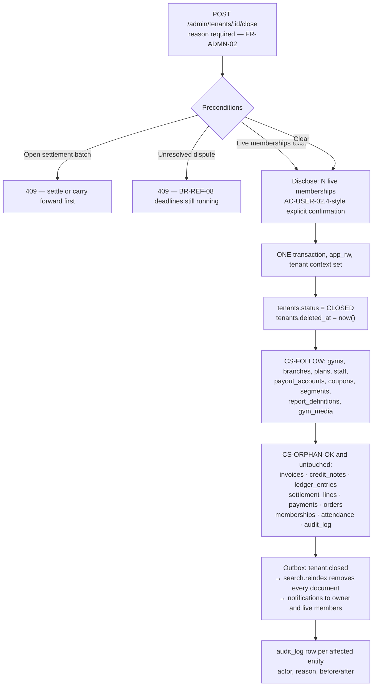
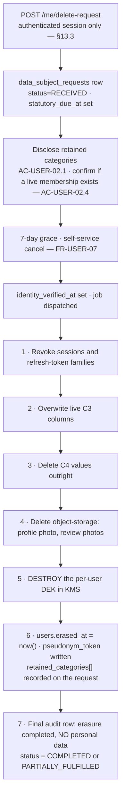

# Soft Delete Strategy — Physical Design

**Phase 4 · Database Design · Document 8 of 8**
**Status:** Draft for review · **Owner:** Technical Lead / Architect
**Implements:** ADR-0024 (soft delete), `NFR-DQ-04`, `PROJECT_CONSTITUTION.md` §15.4 rules `SD1`–`SD8`
**Depends on:** `docs/database/Schema.md`, `docs/database/Constraints.md`, `docs/database/Indexes.md`, `docs/engineering/ERD.md`, `docs/engineering/Security.md` §13.4
**Launch market:** India · `Asia/Kolkata` · INR/paise · FY April–March

---

## 0. Document control

### 0.1 The question this document answers

`NFR-DQ-04` is eleven words: *"Soft deletion for all business entities; hard deletion only through documented data-subject processes."* ADR-0024 turns that into a decision and enumerates six hard-delete paths. `PROJECT_CONSTITUTION.md` §15.4 turns the decision into eight rules, `SD1`–`SD8`.

**None of those artefacts says which columns exist on which tables, what happens to a unique index when the row it guards is soft-deleted, whether an RLS policy should hide deleted rows, or what a `DELETE FROM` in the retention sweep actually looks like.** That is this document's job. It is the **physical** design of soft delete: columns, indexes, policies, grants, jobs, and the failure modes each of them creates.

### 0.2 What this document adds that the upstream documents did not

| Upstream document | What it fixed | What it left open, and this document closes |
| :--- | :--- | :--- |
| `NFR-DQ-04` | The default | Which entities are "business entities" |
| ADR-0024 | The six hard-delete paths and the trade-off analysis | The physical form of each path — the role, the statement, the ordering |
| `PROJECT_CONSTITUTION.md` §15.4 `SD1`–`SD8` | Eight rules | `SD7` says unique constraints "become partial"; it does not say what happens when the *restore* collides |
| `ERD.md` §4, rule `C-3` | `deleted_at` exists only on tables marked `Soft` | The `Soft` marking is per-entity in a table this document turns into a **register with a CI check** |
| `Schema.md` §15.1 | *"Tables with `deleted_at`: 26"* | **A count with no enumeration cannot be checked.** §3 of this document enumerates it and finds a discrepancy |
| `Constraints.md` §  partial-unique section | Nine partial unique constraints | The three cases where a partial unique index is **not** sufficient, and what replaces it |
| `Security.md` §13.4 `CS-1`–`CS-10` | Crypto-shredding resolves `BR-DAT-04` vs `CON-04` | The column-level erasure inventory and the two-column `deleted_at` / `erased_at` split |
| `Scalability.md` §5 | Partition retention windows | The query-plan cost of `deleted_at IS NULL` on the hot reads, and which partial indexes pay for themselves |

### 0.3 On illustrative code

**Every fenced block in this document is labelled `illustrative — not committed code`.** No Prisma schema file, no migration and no application code exists yet, and this document does not create one. The blocks fix **shape and intent** — column names, index names, predicate text, policy text, job ordering — so that Phase 8's migrations have a specification to satisfy. They do not fix formatting or the exact SQL Prisma Migrate will emit.

### 0.4 Rank

`PROJECT_CONSTITUTION.md` §1.3 ranks documents. This document is rank 4 (engineering detail). Where it appears to contradict `MASTER_PRD.md` (rank 1), `PROJECT_CONSTITUTION.md` (rank 2) or `DECISION_LOG.md` (rank 2), the higher-ranked document wins and this document has a defect. **Two genuine discrepancies against rank-3 documents are recorded in §14 as findings, not as decisions.**

---

## 1. The default, and why it is the default

### 1.1 The five rules that make soft delete non-optional

ADR-0024 lists them; they are restated here because every physical decision in §3 traces back to one of them, and a reader who has not internalised them will read §3 as arbitrary.

| # | Rule | Text | What a hard delete would break |
| :-: | :--- | :--- | :--- |
| 1 | **`BR-TEN-04`** | *"Deleting a tenant is a soft delete. Financial, invoice and audit records are retained for the statutory retention period regardless of deletion."* | A cascade from `tenants` would take `invoices`, `ledger_entries` and `settlement_lines` with it — the exact rows `CON-04` forbids deleting |
| 2 | **`BR-PLN-04`** | *"A plan may be archived but never hard-deleted while any membership references it."* Plus `FR-PLAN-05`: archiving *"retains all existing memberships"* and `BR-PLN-02`: a purchased membership keeps its terms until expiry | An invoice line names a plan. Two years later, in a GST dispute, that name must resolve |
| 3 | **`FR-STAF-04`** / `AC-STAF-01.4` | Removal *"revokes access immediately and preserves all historical attribution"* — a removed receptionist's cash collections stay attributed to them | `attendance.created_by`, `member_notes.author_staff_id` and the offline-sale audit trail all become orphans |
| 4 | **`BR-MEM-12`** | *"An `EXPIRED` membership retains full historical visibility to both member and gym **indefinitely**."* | Indefinite visibility of a deleted row is a contradiction |
| 5 | **`CON-04`** | *"Financial and invoice records are subject to statutory retention and cannot be deleted on user request."* | The whole `R-FIN` retention class |

### 1.2 The one rule that pulls the other way

**`BR-DAT-04`**: *"A user may request deletion; the account and personal identifiers are erased or irreversibly pseudonymised, while financial records are retained in de-identified form."* `AC-USER-02.3` makes it testable: identifiers must be **irrecoverable**.

> **A `deleted_at` timestamp on a row that still contains a name and a phone number is not erasure.** This single sentence is why ADR-0024 could not stop at "soft delete everywhere", why §9 of this document exists, and why `users` carries **two** timestamp columns — `deleted_at` and `erased_at` — that mean genuinely different things (§9.5).

### 1.3 The three costs, accepted explicitly

ADR-0024's *Consequences · Negative* list is the honest account. Restated as the three engineering costs this document must physically mitigate:

| Cost | Physical mitigation | Section |
| :--- | :--- | :--- |
| **Unique constraints must be partial, and forgetting is a real bug** | Nine partial unique indexes registered in `Constraints.md`, extended here to a closed register of **eighteen**, plus CI check `CI-14` | §5 |
| **Every read must filter, and omission is silent** | The `deleted_at IS NULL` predicate is applied by the **same** Prisma client extension that sets `app.tenant_id` (ADR-0005), so a query that escapes one escapes both and fails loudly on the tenant half | §6 |
| **Storage grows monotonically; deleted rows still occupy index space, still cost the planner, still participate in policy evaluation** | Partial indexes on `WHERE deleted_at IS NULL` on the hot reads only, with the arithmetic for when they pay for themselves | §12 |

### 1.4 Vocabulary — `SD3` in the physical layer

`SD3`: *"Domain vocabulary is preferred over 'deleted' where the PRD supplies it."* The physical column is **always** `deleted_at`; the vocabulary difference lives in the API, the UI copy and the audit `action` value. This matters here because a reviewer reading `plans.deleted_at` must not conclude the schema disagrees with `FR-PLAN-05`.

| Entity | User-facing verb | Column written | `audit_log.action` | Source |
| :--- | :--- | :--- | :--- | :--- |
| `plans` | **Archive** | `deleted_at` | `ARCHIVE` | `FR-PLAN-05`, `BR-PLN-04` |
| `tenants` | **Suspend** (reversible) / **Close** (terminal) | `status` only / `status` **and** `deleted_at` | `SUSPEND` / `CLOSE` | `BR-TEN-04`, `BR-TEN-05` |
| `staff` | **Remove** | `deleted_at` + `removed_at` + `status` | `REMOVE` | `FR-STAF-04`, `AC-STAF-01.4` |
| `reviews` | **Unpublish** / **Remove** | `status` only / `status` **and** `deleted_at` | `MODERATE` | `FR-REV-07` |
| `gyms`, `branches` | **Delist** / **Delete** | `status` only / `deleted_at` | `DELIST` / `DELETE` | `FR-GYM-*` |
| `crm_members`, `leads`, `gym_media`, `coupons`, `add_ons`, `segments` | **Delete** | `deleted_at` | `DELETE` | `NFR-DQ-04` |

**`NFR-USE-06` consequence.** *"Destructive actions state their consequence specifically."* Six different verbs mean six different confirmation dialogues, not one generic one. Archiving a plan must say *"existing members keep this plan until their term ends"*; deleting an account must say *"your invoices are retained for eight financial years"*. That copy is a UI obligation, but it is **derived from this table**, so the table is its source of truth.

---

## 2. The column, exactly

```sql
-- illustrative — not committed code
deleted_at timestamptz NULL
```

| Property | Ruling | Why |
| :--- | :--- | :--- |
| Type | `timestamptz`, never `timestamp` | `DB6` forbids `timestamp without time zone`; `NFR-DQ-03` and ADR-0025 store UTC |
| Nullable | Always. `NULL` **means** live | A boolean `is_deleted` would answer *whether* but not *when*, and the retention sweep's anchor is a date arithmetic on the *when* |
| Default | None | An explicit default of `NULL` is noise; the absence of a default is the statement |
| Index | Never indexed **alone** | A single-column index on a column that is `NULL` for 95%+ of rows serves no query. It appears only as a **predicate** in partial indexes (§12.2) |
| Written by | The application, through the Prisma extension | `AC3`: a trigger would make a bulk job's writes indistinguishable from a user's |
| Companion writes | `updated_at`, `updated_by` in the same statement | A soft delete **is** an update. `NFR-DQ-05` applies to it like any other |
| Cleared by | Restore only (§8), never by ordinary code | |
| Interpretation timezone | UTC, always. **Not** the gym timezone | Deletion is a system event, not a membership-validity event. `BR-MEM-03`'s gym-timezone rule (`TM3`) governs `start_date`/`end_date`, not lifecycle timestamps. The retention sweep's *"active + 12 months"* arithmetic is therefore done in UTC and is off by at most 5½ hours at the boundary, which is immaterial against a 12-month window |

**Not `deleted_by`.** `NFR-DQ-05` already mandates `updated_by`, and a soft delete writes it. A separate `deleted_by` would be a fifth audit column that duplicates the fourth and could disagree with it. **Who deleted the row is `updated_by` on the row and the `actor_id` on the `audit_log` row; the audit row is authoritative** (`AC7`).

**Not `deletion_reason`.** `FR-ADMN-02` requires a reason for every administrative action, and that reason lives on the `audit_log` row where it can be long, structured and immutable. A `reason text` column on 22 tables would be 22 places to forget it, and it would be editable.

---

## 3. The register — which tables carry `deleted_at`, and which do not

### 3.1 The rule that decides

A table carries `deleted_at` **if and only if all four** of these hold:

| # | Test | If it fails |
| :-: | :--- | :--- |
| **T1** | The row is a **business entity** a user or staff member can remove from view | Not soft-deletable; it is a log, a projection, or infrastructure |
| **T2** | Removal must be **reversible** or must **preserve references** | If neither, hard delete under `G-CRUD-D` is correct |
| **T3** | The table is **not append-only** | `SD4`: an append-only table has no delete concept, so a soft-delete column would state a falsehood |
| **T4** | Removal is **not already expressed by a status enum** the PRD defines | An order is `CANCELLED`, a membership `CANCELLED`, a payment `FAILED`. A second removal concept alongside a state machine is two sources of truth |

### 3.2 Tier A — the sixteen tables `Schema.md` marks explicitly

Each of these is stated verbatim in a `Schema.md` **Tenancy** line or column table. Nothing here is inferred.

| # | Table | `Schema.md` § | Tenancy | Retention | Domain verb | Why soft, in one line |
| :-: | :--- | :--- | :--- | :--- | :--- | :--- |
| 1 | `tenants` | 4.1 | RLS · P-SELF | R-FIN | Close | `BR-TEN-04` names it explicitly; financial and audit rows survive regardless (`TL1`) |
| 2 | `payout_accounts` | 4.4 | RLS · P-STD | R-FIN | Delete | A settlement statement from 2027 names the account it paid; the row must resolve |
| 3 | `users` | 4.6 | IDENTITY | R-OPS | Delete | Frees `uq_users__email` / `uq_users__phone` for re-registration; **distinct from `erased_at`** (§9.5) |
| 4 | `staff` | 4.10 | RLS · P-STD | R-OPS | Remove | `FR-STAF-04` + `AC-STAF-01.4`: attribution must survive removal |
| 5 | `gyms` | 5.1 | RLS · P-STD | R-OPS | Delete | Reviews, memberships and invoices all reference the gym |
| 6 | `branches` | 5.2 | RLS · P-STD | R-OPS | Delete | Every `attendance` row names a branch; `BR-MEM-12` makes visit history indefinite |
| 7 | `gym_media` | 5.4 | RLS · P-STD | R-OPS | Delete | The object-storage sweep (ADR-0024 path 6) needs the row to know what to purge |
| 8 | `crm_members` | 5.5 | RLS · P-STD | R-OPS | Delete | An erased platform user's operational record survives pseudonymised for the tenant |
| 9 | `leads` | 5.5 | RLS · P-STD | R-OPS | Delete | `converted_order_id` may already point at a sale |
| 10 | `plans` | 6.1 | RLS · P-STD | **R-FIN** | **Archive** | `BR-PLN-04` verbatim; an invoice line names the plan |
| 11 | `add_ons` | 6.2 | RLS · P-STD | R-FIN | Delete | Same reason as `plans`: an order line names it |
| 12 | `coupons` | 7.3 | HYBRID · P-HYBRID | R-FIN | Delete | `coupon_redemptions` is append-only and references it |
| 13 | `segments` | 8.4 | RLS · P-STD | R-OPS | Delete | A scheduled report or campaign may still name the segment |
| 14 | `reviews` | 10.1 | RLS · P-STD | R-OPS | **Remove** | `FR-REV-07`; `gyms.rating_avg` recomputation must be able to see what was withdrawn |
| 15 | `report_definitions` | 11.3 | HYBRID · P-HYBRID | R-OPS | Delete | A delivered report references the definition that produced it |
| 16 | `help_articles` | 12.2 | GLOBAL | R-REF | Delete | Editorial content, not a controlled vocabulary — `reason_codes.help_article_id` may point at a retired article |

### 3.3 Tier B — six tables this document adds, and why they are structurally forced

These six carry grant class **G-CRUD** in `Schema.md`, which grants `SELECT, INSERT, UPDATE` and **no `DELETE`**. They also carry no `deleted_at` in `Schema.md`'s column tables and no status enum expressing removal.

> **A G-CRUD table with no `deleted_at` and no removal status is a table whose rows can never be removed by any means available to the application.** For a log or a counter that is correct. For each of the six below it is a defect, because the PRD names a user action that removes the row.

| # | Table | `Schema.md` § | The PRD action that requires removal | Ruling |
| :-: | :--- | :--- | :--- | :--- |
| 17 | `branch_hours` | 5.3 | `FR-GYM-05` — an owner editing opening hours removes a weekday row when the branch stops opening on Sundays | Add `deleted_at`. Not `G-CRUD-D`: `ex_branch_hours__no_overlap` is an exclusion constraint, and a hard delete during a bulk hours edit loses the previous schedule that an attendance dispute may need |
| 18 | `branch_hour_exceptions` | 5.3 | `FR-GYM-05` — a holiday override entered in error, or a closure that is cancelled | Add `deleted_at`. Same reason; the exception is evidence in a *"the gym was shut"* check-in denial dispute |
| 19 | `member_notes` | 8.4 | `FR-CRM-05` — a staff-authored note deleted by its author inside `editable_until` | Add `deleted_at`. **Never `G-CRUD-D`**: `is_sensitive_category` notes are exactly the rows a bad actor would want gone without trace |
| 20 | `review_responses` | 10.1 | `BR-REV-05` — a gym retracting its single public reply | Add `deleted_at`, **and** make `uq_review_responses__review_id` partial, so a retracted response does not permanently consume the one-response-per-review slot (§5.4) |
| 21 | `staff_invitations` | 4.10 | `FR-STAF-03` — *"the inviter may revoke before acceptance; revocation is immediate and audited"* (`Security.md` §2.11) | Add `deleted_at`. The existing partial unique is `WHERE consumed_at IS NULL`; revocation must free the address, so the predicate becomes `WHERE consumed_at IS NULL AND deleted_at IS NULL` |
| 22 | `user_roles` | 4.7 | `FR-RBAC-05` — a role grant revoked. `Security.md` §12.1 requires *"role grant/revoke"* to be audited, which presupposes revoke exists | Add `deleted_at`. A hard delete would destroy the *"this person held `FINANCE` in March"* fact that a settlement dispute needs |

**These six are registered as deviation `SD-D01` in §14.1.** Each is an *addition* to `Schema.md`, not a contradiction: `Schema.md` never states that these tables lack `deleted_at`, it simply does not list the column.

### 3.4 The tables that explicitly do **NOT** carry `deleted_at`

This is the more important half of the register. `ERD.md` rule `C-3`: *"its absence is a positive statement that the row is never deleted."* Grouped by the reason, because the reason is the reviewable artefact.

#### 3.4.1 Append-only — `SD4`, `AP1`, `AP2`

**Sixteen G-APPEND tables, plus `G-LEDGER`, `G-AUDIT` and the G-COMPLETE set.** These have no `UPDATE` and no `DELETE` grant at all, so a `deleted_at` column would be **unwritable** — a column that exists and can never change is worse than no column, because a reader assumes it is maintained.

| Table | Correction mechanism instead of deletion | Source |
| :--- | :--- | :--- |
| `ledger_entries` | A compensating entry: `COMMISSION_REVERSAL`, `CHARGEBACK_REVERSAL`, `ADJUSTMENT` | `BR-FIN-01`, ADR-0015 |
| `audit_log` | **Nothing.** History is history, including history of mistakes | `AC-ADMN-02.3`, `NFR-SEC-13` |
| `membership_events` | A subsequent transition | `FR-MEMB-02` |
| `payment_events` | A subsequent event; `provider_event_id` is unique | `BR-PAY-05` |
| `attendance` | A reversal row of `method = 'OVERRIDE'` linked by `corrects_attendance_id` | `BR-CHK-09` |
| `invoices`, `credit_notes` | A **credit note** plus a new invoice. `BR-PAY-10` makes an issued invoice immutable, and `FR-INV-02`'s gapless sequence makes a deleted invoice a *gap* — which is precisely the defect the allocator exists to prevent | `BR-PAY-10`, `FR-INV-02` |
| `order_items` | The order is `CANCELLED`; the lines stay | `Schema.md` §7.2 |
| `coupon_redemptions` | A reversal is a refund, recorded elsewhere | `BR-CPN-03` |
| `settlement_lines` | Adjustment lines carried into the next batch's opening balance | `BR-FIN-03` |
| `subscription_invoices` | Credit note | `A6.2` |
| `dispute_evidence` | Additional evidence | `BR-REF-08` |
| `applications` | A new submission; `snapshot` is the frozen dossier | `FR-ONB-08` |
| `attribution_events` | Nothing — it is the evidence in a commission dispute | `A6.3` |
| `refresh_tokens` | Rotation marks `used_at`; families are revoked, not deleted | ADR-0011 |
| `ticket_messages` | A subsequent message | `B5.23` |
| `commission_rules`, `tax_profiles`, `subscription_tiers` | **Effective-dating**: a new row supersedes; `BR-FIN-05` requires the rate in force at the moment of sale to remain resolvable forever | `BR-FIN-05` |
| `outbox` | Pruned by **partition drop** at `R-EPH` expiry, never row-deleted | ADR-0017 |
| `kyc_documents` | **Tombstoned**, not deleted: `R-KYC` means the row outlives the tenant and records that a legally-required document once existed. The *object* is purged; the row records its fate | `BR-DAT-07`, `NFR-SEC-02` |

#### 3.4.2 Reference data — `NFR-DQ-06`, `RS4`

Platform-managed vocabularies use **`is_active`**, not `deleted_at`, and the distinction is semantic, not cosmetic.

| Table | Removal expressed as | Why not `deleted_at` |
| :--- | :--- | :--- |
| `amenities` | `is_active = false` | *"Retired, never deleted"* (`Schema.md` §12.2). A retired amenity must still render on the 40,000 `gym_amenities` rows that reference it, and on every historical `search_documents` projection |
| `gym_categories` | `is_active = false` | A gym's `category_id` must resolve for the life of the listing |
| `reason_codes` | `is_active = false` | *"Codes are never re-pointed, only retired."* A 2026 rejection reason must render identically in 2033 |
| `countries` | `is_active = false` | |
| `cities` | `status` enum | `SCR-ADM-011` manages coverage; a city leaving coverage is not a deletion |
| `localities` | Superseded by a new row | |
| `notification_templates` | `supersedes_version_id` + version | A delivered notification names the template **version** it rendered; DLT approval state (India) makes a template a regulated artefact |
| `kyc_checklists` | `version` | `FR-ONB-04`: an application is judged against the checklist version in force when submitted |
| `feature_flags` | `is_enabled` + owner review | `FEATURE_FLAGS.md` governs the lifecycle; a flag is retired by removing its last reference, then dropped by migration |
| `roles`, `permissions`, `role_permissions` | Platform-owned; changed only by migration | A permission that disappears while a grant references it is a broken authorisation model, not a deleted row |

> **`help_articles` is the deliberate exception** (Tier A #16). It is *editorial content* with a `search_tsv`, an author and a lifecycle, not a controlled vocabulary whose identifiers other rows depend on. `NFR-DQ-06`'s *"stable identifiers"* rule governs the vocabularies, not the prose.

#### 3.4.3 Join tables where hard delete is correct — grant class `G-CRUD-D`

Five tables. `Schema.md` §2.7 already names them; the *reason each is safe* is recorded here because it is the reviewable part.

| Table | Why a hard delete destroys nothing | Source |
| :--- | :--- | :--- |
| `favourites` | Un-favouriting is the domain operation, not a deletion of a fact. No other row references a favourite | `FR-FAV-01` |
| `saved_searches` | Same. The user owns it and may discard it | `FR-FAV-03` |
| `gym_amenities` | A pure `(gym_id, amenity_id)` assertion. Removing it means *"we no longer offer this"*, and there is no historical query that needs the removed pair. **The audit row records the change** (`BR-DAT-01`: `gym` is an audited entity), so the fact is not lost | `FR-GYM-03` |
| `plan_branches` | **Open-world**: zero rows means *all branches*. A soft-deleted row would be indistinguishable from an absent one under the open-world reading, so `deleted_at` here is not merely unnecessary — it is **ambiguous**. The entitled branch set is snapshotted into `memberships.purchased_terms` at purchase, which is what preserves history | `Schema.md` §6.2 |
| `staff_branches` | Branch scoping is current-state. History lives on the `audit_log` row for the `staff` entity | `FR-STAF-02` |

**The common property:** each is a *set-membership assertion* with no dependent rows, and its history is preserved by the `audit_log` row on the **parent** entity. A join table whose removal is not audited on a parent would fail this test.

#### 3.4.4 Tables whose removal is a state, not a deletion — `T4`

| Table | State that means "gone" | Why a second mechanism would be wrong |
| :--- | :--- | :--- |
| `orders` | `CANCELLED`, `EXPIRED` (`§C4.2`) | `Schema.md` §7.1: *"an order is cancelled or expired, never deleted"*. An order carries nine money figures frozen by trigger; deletion would strand its `order_items` and its `payments` |
| `memberships` | `CANCELLED`, `EXPIRED` (`§C4.1`) | `BR-MEM-12` makes an `EXPIRED` membership **indefinitely visible** to both parties. Deletion contradicts the rule in one word |
| `payments` | `FAILED`, `CANCELLED` (`§C4.3`) | A failed payment is evidence in a duplicate-charge investigation (`payment.duplicate-detect`) |
| `refunds`, `disputes` | `§C4.5` states | Money paths are `R-FIN` |
| `settlement_batches` | `§C4.7`'s eight states; frozen at `CLOSED` | |
| `freezes` | `freeze_status_enum` — a scheduled freeze is `CANCELLED` | `BR-MEM-07` counts freeze days used; a deleted freeze would corrupt the count |
| `support_tickets` | `TicketStatus` | |
| `auth_sessions` | `revoked_at` | Revocation is a security event with its own timestamp and reason; `deleted_at` would blur it |
| `notification_log` | `NotificationStatus`; category-scoped retention under `SC-R03` | A delivery record is a log |
| `export_jobs` | `ExportJobStatus`; the row is retained 90 days after the object expires | The row **is** the audit of what was exported (`BR-DAT-01`) |

#### 3.4.5 Ephemeral, projection and infrastructure tables

| Table | Class | Removal |
| :--- | :--- | :--- |
| `idempotency_keys` | R-EPH, 24 h | `G-CRUD-D`; the sweeper hard-deletes. Nothing references a key |
| `outbox` | R-EPH, 30 d after publish | Partition drop |
| `search_documents` | Projection | The projection job replaces or removes documents; the source of truth is `gyms`/`branches`/`plans` |
| `document_number_counters` | R-FIN | Never removed — deleting a counter restarts a **gapless** sequence, which is the defect `FR-INV-02` exists to prevent |
| `data_subject_requests` | R-AUD | Never removed; it is the record of an erasure |
| `notification_preferences` | R-OPS | Upserted per `(user, channel, category)`; a preference is turned off, not deleted |
| `referrals` | R-OPS | Status-driven; the code is the invitation and must stay resolvable |
| `attendance`, `audit_log` | Partitioned | Archived, never row-deleted (`AP3`) |

### 3.5 Count reconciliation — finding `SDR-01`

| Source | Count |
| :--- | ---: |
| `Schema.md` §15.1, *"Tables with `deleted_at`"* | **26** |
| Tier A, evidenced verbatim in `Schema.md` (§3.2) | 16 |
| Tier B, adjudicated by this document (§3.3) | 6 |
| **This document's enumerated total** | **22** |
| **Unreconciled** | **4** |

> **`SDR-01` — the count in `Schema.md` §15.1 is not enumerated anywhere, and this document's enumeration falls four short.** A count is not a specification. Four tables are either (a) intended to carry `deleted_at` and are missing from every column table, or (b) the count is stale from an earlier draft. **The recommendation is that the count be replaced by a reference to §3.2 + §3.3 of this document**, and that the register be made mechanically checkable by CI check `CI-14` (§3.6) so that the two can never drift again.
>
> The four most likely intended candidates, for the reviewer to rule on, are: `notification_preferences` (if a preference row is ever removed rather than defaulted off), `freezes` (if a cancelled future freeze should vanish rather than sit `CANCELLED`), `export_jobs` (if the 90-day row is soft-deleted rather than swept), and `feature_flags` (if a retired flag is soft-deleted rather than dropped by migration). **This document recommends `NO` on all four**, on rule `T4`, and therefore recommends the count be corrected to **22**.

### 3.6 Making the register mechanically checkable

A register maintained by hand drifts. Two CI checks, added to `Schema.md` §2.9's twelve:

| # | Check | Fails the build when | Source |
| :-: | :--- | :--- | :--- |
| **CI-13** | `information_schema.columns` vs the committed register `docs/database/registers/soft-delete.json` | A table has `deleted_at` and is not in the register, or is in the register and has no `deleted_at` | `SD1`, §15.1 |
| **CI-14** | For every table in the register, every `UNIQUE` constraint or unique index in `pg_indexes` | A unique index on a registered table has no `deleted_at IS NULL` term in its predicate **and** is not in the closed exception list of §5.6 | `SD7` |

**`CI-02` already covers the third half of the rule** — *"any role holds `DELETE` on a table with `deleted_at`"* fails the build (`Schema.md` §2.9). Together the three checks make the soft-delete contract enforced rather than remembered.

---

## 4. Soft delete and Row-Level Security

### 4.1 The question, stated precisely

An RLS policy is a `USING` predicate the planner applies to every row. It would be trivially easy to write:

```sql
-- illustrative — not committed code — THIS IS THE DESIGN THAT IS REJECTED
CREATE POLICY rls_plans__tenant_isolation ON plans
  FOR ALL TO app_rw
  USING (tenant_id = current_setting('app.tenant_id')::uuid AND deleted_at IS NULL);
```

That single extra conjunct looks like defence in depth. **It is a defect, and it is the most attractive wrong answer in this document.**

### 4.2 Why the policy must not filter deleted rows

| # | Reason | Consequence of the rejected design |
| :-: | :--- | :--- |
| **1** | **A soft delete becomes impossible.** `SD2`'s soft delete is an `UPDATE plans SET deleted_at = now()`. RLS applies `USING` to the rows an `UPDATE` may *see*, and `WITH CHECK` to the row it *produces*. With `deleted_at IS NULL` in `WITH CHECK`, the produced row fails the policy and the statement errors | The application cannot delete anything. Discovered on day one, so at least it fails loudly |
| **2** | **A restore becomes impossible.** With `deleted_at IS NULL` in `USING`, the deleted row is invisible to the `UPDATE ... SET deleted_at = NULL` that restores it | §8 becomes unimplementable |
| **3** | **The audit surfaces go blind.** `SD2` explicitly permits *"including soft-deleted rows … used by audit, export and admin surfaces."* `FR-ADMN-09`'s explorer must render the before/after of a deletion against the row it deleted. A tenant-owner reading their own audit log (`audit.audit_log.read_tenant`, `B3.2`) reads through `app_rw` — the same role, the same policy | The most legally consequential read in the system returns nothing |
| **4** | **The retention sweep goes blind.** `data.retention-sweep` runs as `app_migrator`, and `FORCE ROW LEVEL SECURITY` means the owner is **not** exempt (`Schema.md` §2.3.3 obligation 2). Its whole job is to find rows where `deleted_at < now() - interval '12 months'` | ADR-0024 path 2 becomes unimplementable |
| **5** | **`BR-DAT-05` tenant export breaks.** *"A tenant may export its complete operational dataset."* Complete includes deleted members, or the export is a lie | `BAC-12` fails |
| **6** | **Two rules in one predicate cannot be independently changed.** Tenancy is a security boundary evaluated by the database; visibility is a business default applied by the application. Merging them means a visibility change requires a migration | `MG3` expand-migrate-contract on 22 policies to change a default |

### 4.3 The ruling

> **`RLS-SD-1`. The RLS policy filters by tenant and by nothing else. The `deleted_at IS NULL` predicate is applied by the Prisma client extension, in the same place and by the same mechanism as the tenant context, and is removable per-call by an explicit, permission-gated option.**

The two predicates therefore have different owners, different enforcement layers and different failure modes:

| Predicate | Owner | Layer | Removable? | Failure mode if bypassed |
| :--- | :--- | :--- | :--- | :--- |
| `tenant_id = current_setting('app.tenant_id')::uuid` | PostgreSQL RLS policy | `L2-RLS`, authoritative | **Never** by the application. Only `app_platform_ro` under `P-PLATFORM`, and only for `SELECT` | Cross-tenant leak — `BR-TEN-01`, `RSK-08`. The strict `current_setting` (no `missing_ok`) converts it into a raised `42704` |
| `deleted_at IS NULL` | Prisma client extension | `L4-REPO` | Yes, via `withDeleted()`, restricted to `admin/` and `audit/` | A deleted row appears in a list. **Embarrassing, not a breach** |

**The asymmetry is the design.** One predicate protects a legal boundary and is enforced where the application cannot reach; the other protects a user expectation and is enforced where the application can deliberately override it. Putting them in the same place would give the weaker rule the stronger enforcement and — via reasons 1 through 5 — would break the stronger one.

### 4.4 The policy, unchanged

`P-STD` applies to soft-deletable tenant-owned tables exactly as it applies to every other. **No table in the register gets a different policy because it is soft-deletable.**

```sql
-- illustrative — not committed code
-- plans is Tier A #10. The policy is byte-identical to the P-STD template
-- applied to the other 53 tenant-owned tables. Soft delete changes nothing here.

ALTER TABLE plans ENABLE ROW LEVEL SECURITY;
ALTER TABLE plans FORCE  ROW LEVEL SECURITY;

CREATE POLICY rls_plans__tenant_isolation ON plans
  FOR ALL TO app_rw
  USING      (tenant_id = current_setting('app.tenant_id')::uuid)
  WITH CHECK (tenant_id = current_setting('app.tenant_id')::uuid);

CREATE POLICY rls_plans__platform_read ON plans
  FOR SELECT TO app_platform_ro
  USING (true);
```

### 4.5 How the audit reader gets deleted rows

Three distinct readers need soft-deleted rows, and each reaches them by a different, individually auditable route:

| Reader | Route | RLS path | Authorisation gate | Audited? |
| :--- | :--- | :--- | :--- | :--- |
| **Gym owner** reading their own audit log or export | `app_rw` + `withDeleted()` | `P-STD` — their own tenant only | `audit.audit_log.read_tenant` (`B3.2` `▪`) / `BR-DAT-05` export | The export is audited; the read is not (`L-04`) |
| **Platform staff** in the audit explorer (`SCR-ADM-015`) | `app_platform_ro` inside `runElevated()` | `P-PLATFORM`, `SELECT`-only, `USING (true)` | `audit.audit_log.read_all` + a stated reason | **Yes** — `PE2` writes the audit row *before* the work |
| **`data.retention-sweep`** | `app_migrator` | `FORCE` applies; the job sets `app.tenant_id` per tenant, or runs the platform-wide pass under an explicit elevation | Job identity, not a user | **Yes** — `SD8`: every removal writes an audit row |

> **The recursion is bounded and is worth naming.** Reading the audit log is itself audited (`Security.md` §12.6), which writes an audit row, which is itself readable. The chain does not diverge because a read produces exactly one row and reading *that* row is a different action by a different actor at a later time. It is a chain, not a loop. `AuditStrategy.md` §7.4 carries the analysis.

### 4.6 The compound failure this creates with the Prisma + RLS hazard

`Schema.md` §2.3.1 describes the hazard: `SET LOCAL app.tenant_id` and the query landing on different pooled connections. Soft delete adds a **second** silent-empty-result path to the same symptom, and the two are indistinguishable from a log line that says *"the member has no memberships"*.

| Symptom | Cause A — tenancy | Cause B — soft delete | How to tell them apart |
| :--- | :--- | :--- | :--- |
| Query returns zero rows | The extension was bypassed; `current_setting('app.tenant_id')` is unset | The rows are all soft-deleted and the caller did not use `withDeleted()` | **Cause A raises `42704`, it does not return empty.** That is the entire purpose of obligation 1 in `Schema.md` §2.3.3 — the strict `current_setting` with no `missing_ok` argument |

> **This is the strongest argument for the strict policy that exists, and it is a soft-delete argument.** If the policy were written permissively — `current_setting('app.tenant_id', true)` yielding `NULL` — then a missing tenant context and a fully-soft-deleted result set would produce *identical* symptoms, and a real `BR-TEN-01` breach would be triaged as a data-visibility bug and closed. **The strict policy is what keeps the two failure modes distinguishable.** Every table in the register depends on it.

### 4.7 The `withDeleted()` escape and its blast radius

| Rule | Statement |
| :--- | :--- |
| **WD-1** | `withDeleted()` is a repository-level option, not a global flag, not a request header, and not an environment variable |
| **WD-2** | It removes **only** the `deleted_at IS NULL` predicate. It has no effect whatsoever on the tenant predicate, which is not the extension's to remove |
| **WD-3** | Its call sites are restricted by `dependency-cruiser` to `admin/`, `audit/` and the `data.retention-sweep` job module — the same mechanism that restricts `runElevated()` (`Security.md` §4.5 `EL9`). A call site outside those three fails the build |
| **WD-4** | The call-site inventory is **finite and shrinking**, and is listed in the module's `permissions.ts` beside the permission that gates it |
| **WD-5** | A `withDeleted()` read on a **tenant-owned** table by a platform actor still requires `runElevated()`, because the tenant predicate is the one that matters. `withDeleted()` is not an elevation and must never be mistaken for one |

---

## 5. Soft delete and UNIQUE constraints

### 5.1 The problem in one sentence

A soft-deleted row is still a row, so it still occupies its slot in every unique index — which means **a deleted record permanently blocks the legitimate re-creation of an identical one**.

ADR-0024's *Consequences · Negative* names the case: *"`gyms.slug` is unique per city; if a gym is soft-deleted and the owner recreates it with the same slug, a plain unique constraint blocks them."* `SD7` states the fix in one line: *"Unique constraints coexist with soft delete by being partial: `UNIQUE (tenant_id, code) WHERE deleted_at IS NULL`."*

The rest of this section is what `SD7` does not say.

### 5.2 The mechanism

PostgreSQL cannot express a partial `UNIQUE` **constraint** — `ALTER TABLE ... ADD CONSTRAINT ... UNIQUE (...) WHERE ...` is not valid SQL. It must be a partial **unique index**:

```sql
-- illustrative — not committed code
CREATE UNIQUE INDEX uq_gyms__city_id_slug
  ON gyms (city_id, slug)
  WHERE deleted_at IS NULL;
```

| Consequence of index-not-constraint | Detail |
| :--- | :--- |
| It does not appear in `information_schema.table_constraints` | CI check `CI-14` therefore reads `pg_indexes`, not `information_schema` |
| It **cannot be the referent of a foreign key** | PostgreSQL requires a FK's referenced column list to be covered by a *non-partial* unique index or primary key. This is the single most important consequence and §5.5 is about it |
| Prisma cannot express the predicate | `@@unique` emits a total unique. The partial form is **raw SQL inside the Prisma migration** (`Schema.md` §1.6), and the Prisma model carries `@@index` at most. `MG8` requires the migration and this document to move in the same pull request |
| `ON CONFLICT` must name the index inference predicate | An upsert against a partial unique writes `ON CONFLICT (city_id, slug) WHERE deleted_at IS NULL DO ...`. Omitting the `WHERE` raises `42P10` — a loud failure, which is the right one |

### 5.3 Worked: `gyms.slug`

`§C2.2` requires the slug *"unique per city"*. `FR-NAV-05` and `NX8` require the canonical URL `/gyms/:citySlug/:gymSlug` to be stable and human-readable, and it is resolved by SSR on every gym-detail page view — the highest-volume authenticated-optional read in the marketplace.

| Step | State | What the index does |
| :-: | :--- | :--- |
| 1 | Owner creates *Iron Temple, Bandra*. `city_id = <mumbai>`, `slug = 'iron-temple'`, `deleted_at IS NULL` | Row enters `uq_gyms__city_id_slug` |
| 2 | Owner soft-deletes it. `deleted_at = 2027-02-11T06:30:00Z`, `updated_by = <owner>` | **Row leaves the index.** The predicate no longer holds |
| 3 | Owner creates *Iron Temple, Bandra* again — a re-open after a refit | Insert succeeds. The slug is free |
| 4 | Both rows coexist: one live, one deleted, same `(city_id, slug)` | Legal. The index contains one entry |
| 5 | `GET /gyms/mumbai/iron-temple` resolves | The extension's `deleted_at IS NULL` predicate selects the live row. **Without that predicate the query returns two rows and the handler picks one arbitrarily** — the silent-omission failure of §6.6 |
| 6 | Owner attempts to **restore** the first gym | `UPDATE gyms SET deleted_at = NULL WHERE id = <first>` violates `uq_gyms__city_id_slug`. §8.3 governs |

**The two complications specific to `gyms`, both worth stating:**

1. **`§C2.2` says the slug is unique per city, and the city is not on `gyms`** — it lives on `branches`. `ERD.md` records this as divergence **D-11** and resolves it with a denormalised `gyms.primary_city_id` maintained by the same transaction that sets `branches.is_primary`. `Schema.md` §5.1 and `Indexes.md` both carry the column as `gyms.city_id`. **This document adopts `Schema.md`'s `city_id`** and notes that whichever name survives, the partial predicate is unchanged. What *is* affected is that a **soft-deleted primary branch** must not silently change the gym's `city_id` and therefore its canonical URL — the cascade ruling in §7.3 forbids it.

2. **A soft-deleted gym's slug is still reachable from Google.** The row leaves the unique index but the URL stays in the index of every crawler. `FR-NAV-05`'s stable-URL promise plus soft delete means the SSR handler must return `410 Gone` for a soft-deleted gym and `404` for one that never existed — two different codes for two different facts. That is an API contract point, recorded here because only this document knows the row still exists.

### 5.4 Worked: `plans`

`plans` is the more instructive case, because it demonstrates that **the answer is not always "make it partial"**.

`plans` carries three unique or exclusion objects. Each gets a different ruling:

| Object | Columns / expression | Partial on `deleted_at IS NULL`? | Ruling and why |
| :--- | :--- | :---: | :--- |
| `uq_plans__tenant_id_id` | `(tenant_id, id)` | **NO — must be total** | It is the **referent of the composite tenant-carrying foreign key** from `plan_branches`, `orders`, `memberships` and `add_ons` (`Relationships.md` §3.2). PostgreSQL will not accept a partial index as a FK referent, and even if it did, **archiving a plan would break the FK of every membership that references it** — which is exactly what `BR-PLN-04` forbids. §5.5 generalises this |
| **No natural key exists** | — | n/a | `plans` has no `code` and no unique `name`. Two live plans may both be called *"Monthly Unlimited"*; `FR-PLAN-*` never requires otherwise, and `sort_order` is what disambiguates them in the catalogue. **There is therefore no re-create collision on `plans` at all** — the ADR-0024 scenario that motivates `SD7` does not arise here |
| `ex_plans__one_active_promotion` | `EXCLUDE USING gist (… WITH =, tstzrange(promo_starts_at, promo_ends_at) WITH &&)` | **YES — and it currently is not** | `BR-PLN-07`: at most one active promotion. An **archived** plan's stale promotion window must not participate in the overlap test, or a re-created plan reusing the window is rejected for a reason the owner cannot see. `ERD.md` §7.4 writes the predicate as `WHERE (promo_price_minor IS NOT NULL AND deleted_at IS NULL)`; `Schema.md` §6.1 and `Indexes.md` both write it as `WHERE (promo_price_minor IS NOT NULL)`. **Finding `SDR-02`, §14.2** |

> **The lesson `plans` teaches is that `SD7` is a rule about *natural keys*, not about *unique indexes*.** Three unique-ish objects on one table, and only one of them takes the predicate. A blanket "add `WHERE deleted_at IS NULL` to every unique index" would have broken four foreign keys.

### 5.5 The rule that `SD7` omits — FK referents must stay total

> **`SD-U1`. A soft-deletable parent carries *two* unique indexes: a **total** one over the surrogate key that backs its foreign keys, and a **partial** one over its natural key that enforces the business rule. They are different indexes with different jobs and must never be merged.**

```sql
-- illustrative — not committed code
-- The pattern, on gyms. Every soft-deletable parent in the register follows it.

-- (a) TOTAL. The referent of every composite tenant-carrying FK pointing at gyms.
--     Not a query index. Never partial. A soft delete must not orphan a child.
ALTER TABLE gyms ADD CONSTRAINT uq_gyms__tenant_id_id UNIQUE (tenant_id, id);

-- (b) PARTIAL. The natural key. A soft delete frees the slug for re-use.
CREATE UNIQUE INDEX uq_gyms__city_id_slug ON gyms (city_id, slug) WHERE deleted_at IS NULL;
```

Three parents in the register are FK referents and therefore carry the pair: `gyms`, `branches`, `plans` (`Indexes.md` marks all three `‡`). `tenants` is the fourth, in the degenerate single-column form (`Relationships.md` §3.4: `tenants.id` *is* the tenant key).

**The corollary is uncomfortable and must be stated:** because the FK referent stays total, **a child row may legally reference a soft-deleted parent.** `memberships.plan_id` pointing at an archived plan is not corruption — it is `BR-PLN-04` working exactly as specified. §7.6 is about what that means for reads.

### 5.6 The closed register of partial unique objects

`Constraints.md` registers nine. Adding the three primary-flag enforcers it lists separately, the two `Indexes.md` adds, and the four this document's Tier B requires, the closed register is **eighteen**. `CI-14` checks this list against `pg_indexes`.

| # | Index | Table | Key | Predicate | Rule it enforces |
| :-: | :--- | :--- | :--- | :--- | :--- |
| 1 | `uq_users__email` | `users` | `email` | `deleted_at IS NULL` | `FR-AUTH-01`. **A deleted account must free its address, or `B5.1`'s reused-phone edge case is unimplementable** |
| 2 | `uq_users__phone` | `users` | `phone` | `deleted_at IS NULL` | `FR-AUTH-02`. The primary identifier in India |
| 3 | `uq_gyms__city_id_slug` | `gyms` | `city_id, slug` | `deleted_at IS NULL` | `FR-NAV-05`, §5.3 |
| 4 | `uq_tenants__country_code_registration_number` | `tenants` | `country_code, registration_number` | `deleted_at IS NULL AND registration_number IS NOT NULL` | `FR-ONB-04` duplicate-entity detection |
| 5 | `uq_tenants__gstin` | `tenants` | `gstin` | `gstin IS NOT NULL AND deleted_at IS NULL` | **India.** Two tenants cannot register one GSTIN; a closed tenant must not block the same proprietor re-onboarding |
| 6 | `uq_coupons__platform_code` | `coupons` | `code` | `scope = 'PLATFORM' AND deleted_at IS NULL` | `BR-CPN-01` |
| 7 | `uq_coupons__tenant_code` | `coupons` | `tenant_id, code` | `scope = 'TENANT' AND deleted_at IS NULL` | `BR-CPN-01`; tenant-first resolution per `FR-CPN-03` |
| 8 | `uq_staff__tenant_user` | `staff` | `tenant_id, user_id` | `deleted_at IS NULL` | One **live** employment per person per tenant; a re-hire is a new row, preserving `AC-STAF-01.4` attribution on the old one |
| 9 | `uq_crm_members__tenant_id_member_code` | `crm_members` | `tenant_id, member_code` | `deleted_at IS NULL` | `FR-CRM-10` |
| 10 | `uq_crm_members__tenant_id_user_id` | `crm_members` | `tenant_id, user_id` | `user_id IS NOT NULL AND deleted_at IS NULL` | `FR-CRM-03`; partial on `user_id` too, because an India walk-in has only a phone |
| 11 | `uq_segments__tenant_name` | `segments` | `tenant_id, name` | `deleted_at IS NULL` | `FR-CRM-02` |
| 12 | `uq_branches__gym_id__primary` | `branches` | `gym_id` | `is_primary AND deleted_at IS NULL` | Exactly one primary branch per gym. A counting trigger races a promote/demote pair |
| 13 | `uq_payout_accounts__tenant_id__primary` | `payout_accounts` | `tenant_id` | `is_primary AND deleted_at IS NULL` | `A6.4` |
| 14 | `uq_gym_media__gym_id__cover` | `gym_media` | `gym_id` | `is_cover AND deleted_at IS NULL` | `FR-GYM-02` |
| 15 | `ex_plans__one_active_promotion` | `plans` | GiST exclusion | `promo_price_minor IS NOT NULL AND deleted_at IS NULL` | `BR-PLN-07`. **Predicate corrected here — finding `SDR-02`** |
| 16 | `uq_review_responses__review_id` | `review_responses` | `review_id` | `deleted_at IS NULL` | **Tier B.** `BR-REV-05` says *once*; a retracted response must not consume the slot forever |
| 17 | `uq_staff_invitations__tenant_email` | `staff_invitations` | `tenant_id, email` | `consumed_at IS NULL AND deleted_at IS NULL` | **Tier B.** `FR-STAF-03` revocation must free the address |
| 18 | `uq_user_roles__user_role_scope` | `user_roles` | `user_id, role_id, scope_id` | `deleted_at IS NULL` | **Tier B.** A revoked-then-regranted role must be representable |

**The closed exception list — total unique indexes on registered tables that deliberately take no predicate:** `uq_gyms__tenant_id_id`, `uq_branches__tenant_id_id`, `uq_plans__tenant_id_id` (FK referents, `SD-U1`), and `uq_gym_media__storage_key` (an opaque internal key that must stay unique across live *and* deleted rows, because the object-storage sweep of ADR-0024 path 6 keys on it and two rows claiming one object is how a live image gets purged).

### 5.7 The three traps

| # | Trap | What happens | Resolution |
| :-: | :--- | :--- | :--- |
| **T-1** | **`NULL` does not conflict.** A partial unique on a nullable natural key admits unlimited `NULL`s | `users.email` is nullable (an India walk-in has only a phone). Ten thousand erased users all with `email IS NULL` coexist happily — which is correct, and is why erasure sets the column to `NULL` rather than to a placeholder string | Deliberate. `ck_users__has_contact CHECK (email IS NOT NULL OR phone IS NOT NULL)` is the guard that keeps a *live* row identifiable. **The check must be written to tolerate an erased row**, or `BR-DAT-04` fails against it — §9.5 |
| **T-2** | **The re-create-then-restore collision.** Steps 3–6 of §5.3. Two rows, one slot | The restore fails with `23505` against an index name the user cannot interpret | §8.3: the restore path **detects the collision before attempting the write** and offers the two legal outcomes |
| **T-3** | **The error surface leaks.** A raw `23505 duplicate key value violates unique constraint "uq_crm_members__tenant_id_member_code"` tells a tenant that *some* row holds that member code — including a soft-deleted one they cannot see | `§C1.5`'s error model maps every unique-violation `constraint_name` to a domain error code with owner-facing copy. **No `23505` reaches a response body.** `uq_tenants__country_code_registration_number` is the one violation deliberately surfaced to a human — and it is surfaced to a **verification officer**, never to the applicant (`Constraints.md`) |

### 5.8 What a partial unique index cannot do

| Requirement | Why partial fails | What is used instead |
| :--- | :--- | :--- |
| Uniqueness across live **and** deleted rows | The predicate excludes deleted rows by definition | A **total** unique index — `uq_gym_media__storage_key`, the three `‡` FK referents |
| *"At most one live X per Y, counting a deleted X within 30 days"* | An index predicate cannot reference `now()`; it must be immutable | Not required by any rule in this system. Recorded so nobody invents it |
| *"At least one live X per Y"* — e.g. a gym must retain at least one live branch, a tenant at least one `ACTIVE` `GYM_OWNER` | A unique index enforces *at most*, never *at least*. A count over a filtered set is not expressible as an index, and a trigger evaluates it under a race | An **aggregate invariant** checked in the domain aggregate at the transition (`Schema.md` §4.10, §5.2). Registered as a known limitation of the database layer, not hidden |

---

## 6. Applying the filter — the Prisma client extension

### 6.1 Middleware or extension?

Prisma's `$use` middleware is deprecated in favour of `$extends`. More importantly, **`PROJECT_CONSTITUTION.md` §11.4.2 already mandates a client extension for tenant context, and it hooks `$allModels` / `$allOperations`.** Adding a second interception mechanism for soft delete would mean two things that can be bypassed independently.

> **`SD-X1`. The soft-delete predicate is applied by the *same* extension, in the *same* `$allOperations` hook, as `set_config('app.tenant_id', …, true)`. There is exactly one interception point in the data path, and rule `P2`'s `no-raw-prisma-client` lint is what guarantees nothing goes around it.**

The consequence is the property §4.6 relies on: **a query that escapes the soft-delete filter has also escaped the tenant context, and the strict RLS policy raises `42704`.** The weaker rule inherits the stronger rule's enforcement, for free, because they share a chokepoint.

```ts
// illustrative — not committed code
// apps/server/src/tenancy/prisma/tenant-scoped-client.ts — the shape only.
// SOFT_DELETE_MODELS is generated from the register of §3.2 + §3.3 at build time,
// not hand-maintained; CI-13 asserts the generated set matches information_schema.

async $allOperations({ args, query, model, operation }) {
  const ctx = resolve();                                   // AsyncLocalStorage — P5
  if (ctx.kind === 'NONE') throw new MissingTenantContextError(model, operation);

  const soft = SOFT_DELETE_MODELS.has(model) && !args.__withDeleted;

  if (soft) {
    switch (operation) {
      case 'findMany': case 'findFirst': case 'count':
      case 'aggregate': case 'groupBy': case 'updateMany':
        args.where = { AND: [args.where ?? {}, { deletedAt: null }] };
        break;
      case 'findUnique': case 'findUniqueOrThrow':
        // findUnique accepts ONLY unique fields in `where`. It cannot take deletedAt.
        // Rewritten to findFirst. See §6.3 — this is the dangerous one.
        operation = 'findFirst';
        args.where = { AND: [args.where, { deletedAt: null }] };
        break;
      case 'delete': case 'deleteMany':
        // Never reaches the database as a DELETE. app_rw holds no DELETE grant
        // on any table carrying deleted_at (Schema.md §2.7 G-CRUD, CI-02).
        throw new HardDeleteForbiddenError(model);
      case 'upsert':
        throw new UpsertOnSoftDeletableModelError(model);  // §6.4
    }
  }

  if (ctx.kind === 'PLATFORM') return query(args);         // §11.6 elevation, already audited
  return base.$transaction(async (tx) => {
    await tx.$executeRaw`SELECT set_config('app.tenant_id', ${ctx.tenantId}, true)`;
    return query(args, { __tx: tx });
  });
}
```

### 6.2 The eight operation classes, each ruled separately

| Operation | Treatment | Why it is not the obvious one |
| :--- | :--- | :--- |
| `findMany`, `findFirst` | `AND deleted_at IS NULL` | — |
| `count`, `aggregate`, `groupBy` | Same predicate | **Easily forgotten.** `SCR-DASH-001`'s member count and the `A6.2` seat-limit check both read a `count`. A count that includes deleted members over-reports a tenant against their tier limit and blocks a legitimate invitation |
| `findUnique` | **Rewritten to `findFirst`** | §6.3 |
| `update`, `updateMany` | Predicate added — **you may not update a deleted row** | An update to a soft-deleted row is almost always a bug. The exception is the restore itself, which passes `withDeleted()` |
| `delete`, `deleteMany` | **Throws.** Never reaches the database | `app_rw` holds no `DELETE` grant on any table with `deleted_at` (`CI-02`), so the database would refuse anyway. Throwing in the extension turns a `42501 permission denied` at 3 a.m. into a typed error at development time |
| `upsert` | **Throws** for soft-deletable models | §6.4 |
| `create` | Untouched | A created row is live by construction |
| Nested reads (`include`, `select` with relations) | **The hard one** — §6.5 |

### 6.3 `findUnique` is the dangerous operation

Prisma's `findUnique` accepts only unique fields in `where`. `deletedAt` is not unique, so the predicate **cannot be added** — Prisma rejects the argument shape. Three options exist and only one is correct:

| Option | Behaviour | Verdict |
| :--- | :--- | :--- |
| Leave `findUnique` unfiltered | Every `getById` in the system silently returns soft-deleted rows | **Rejected.** This is the single most common read shape in the codebase |
| Post-filter in the extension: run the query, discard the row if deleted | Works, but the row has already crossed the process boundary and may already be in a log line | **Rejected.** `BR-DAT-06` forbids personal data in logs and this makes it easy to breach by accident |
| **Rewrite to `findFirst`** with a compound `where` | The predicate is applied by the planner. The primary-key lookup still uses the PK index; `deleted_at IS NULL` becomes a cheap filter on the single fetched row | **Adopted** |

**The residual cost of the rewrite is real and is accepted:** `findFirst` returns `T | null` where `findUnique` returned `T | null` too, so the type is unchanged — but `findUniqueOrThrow` becomes `findFirstOrThrow`, whose thrown error carries a different Prisma error code (`P2025` in both cases, but the message differs). `§C1.5`'s error mapper handles both. A **contract test asserts that `findUnique` on a soft-deleted row returns `null`** and is one of the launch gates in §13.

### 6.4 Why `upsert` throws

`upsert` on a soft-deletable model is ambiguous in a way the caller almost never intends:

> *"Update the row matching `(tenant_id, member_code)` or create it."* A soft-deleted row matches the natural key **but not the partial unique index**. Prisma's `upsert` compiles to `INSERT ... ON CONFLICT`, whose conflict target must be an index — and the partial index the deleted row is absent from. So the `INSERT` succeeds, producing a **second** row with the same natural key, one live and one deleted. The caller believed they had updated one row and in fact created a duplicate.

The extension therefore refuses, and the caller writes the intent explicitly: *find live → update*, or *find including deleted → restore*, or *create new*. Three different business decisions that `upsert` was hiding behind one call. `AP2`'s prohibition of `upsert` on append-only models is the same rule for a different reason; **the two prohibitions together mean `upsert` survives only on the small set of tables where it is unambiguous** — `notification_preferences`, `search_documents`, `document_number_counters`.

### 6.5 What the extension cannot cover

Five paths reach the data without passing through `$allOperations`. Each needs its own named control.

| # | Path | Why the extension misses it | Control |
| :-: | :--- | :--- | :--- |
| 1 | **`$queryRaw` / `$executeRaw`** — PostGIS `ST_DWithin`, full-text ranking, the reconciliation aggregate | Raw SQL is a string; the extension cannot parse it | `P7`: raw SQL only inside the owning module's repository, through the extension-provided transaction client, **with a comment naming the RLS policy and the soft-delete predicate that the author has written by hand**. Code review checks for the predicate |
| 2 | **Nested relation reads** — `include: { plans: true }` on a gym | Prisma applies nested filters from the relation's own `where`, which the extension does not rewrite for `include` in the general case | Repositories declare relation filters explicitly. **A `FindManyArgs` builder in `common/` composes the predicate for every relation on a registered model**, so the author opts *out* rather than opting in |
| 3 | **The search projection** (`search_documents`) | It is a `GLOBAL` table written by `search.reindex`, and it contains only `APPROVED`, publicly-visible listings | The projection's source query filters `deleted_at IS NULL` at projection time, and a soft delete **emits an outbox event that invalidates the document**. A deleted gym that remains searchable for five minutes is `TR-30`'s staleness budget; a deleted gym that remains searchable forever is a defect |
| 4 | **Reports and exports** (`FR-RPT-*`, `BR-DAT-05`) | Report SQL is generated from `report_definitions.parameters`, not from Prisma models | The report compiler injects the predicate for every registered table, and `IS5` names reports and exports as isolation-suite cases. **A tenant export *should* include deleted rows** (`BR-DAT-05` says *complete*) — so the export path uses `withDeleted()` deliberately and marks the rows, rather than accidentally |
| 5 | **The retention sweep and migrations** | They run as `app_migrator`, not through the extension at all | §11. The sweep's whole purpose is to see deleted rows |

### 6.6 The danger of forgetting, enumerated

ADR-0024: *"Every query must filter, and omission is silent."* The four shapes that omission actually takes, so a reviewer knows what to look for:

| Shape | Concrete example in this product | Severity |
| :--- | :--- | :--- |
| **A deleted row rendered in a list** | An archived plan appears in `SCR-WEB-003`'s public catalogue and is purchasable | **S1** — `BR-PLN-05` breached, and a member buys a plan the gym withdrew |
| **A deleted row counted** | A removed staff member counts against `subscription_tiers.max_staff_seats`, blocking a legitimate invitation with a message the owner cannot act on | S2 — a support ticket per occurrence |
| **A deleted row resolved by id** | `GET /gyms/mumbai/iron-temple` returns the deleted gym instead of the re-created one (§5.3 step 5) | **S1** — wrong entity, wrong prices, wrong branches |
| **A deleted row joined into an aggregate** | A soft-deleted `crm_member`'s attendance counted in the *Peak hours* report | S3 — a wrong number in a report nobody reconciles |

**None of these throws.** That is the whole problem, and it is why §13's test strategy requires a *negative* test per registered table rather than a positive one.

### 6.7 The database-side defence that was considered and rejected

A common pattern is to rename each table to `<name>_all` and create a view `<name>` as `SELECT * FROM <name>_all WHERE deleted_at IS NULL`, so that forgetting the predicate is impossible.

| Attraction | Why it is rejected here |
| :--- | :--- |
| The filter cannot be forgotten | **RLS on a view is not RLS on a table.** A view's rows are produced by the view owner's privileges unless it is declared `security_invoker` (PostgreSQL 15+). Getting that wrong silently disables tenant isolation on 22 tables — trading a visibility bug for `RSK-08` |
| It is transparent to Prisma | Prisma would need `@@map` to the view for reads and to the table for writes, which it cannot do for one model. Two models per table doubles the surface `AP2` and `CI-11` have to police |
| No application change needed | `MG3` expand-migrate-contract on 22 tables, each rename touching every FK, index and policy, before a single line of application code exists — for a defence the extension already provides at the one chokepoint `P2` guarantees |
| — | **It would make `withDeleted()` require a *different table name*, which means the audit and retention paths address different relations from the business paths.** `FR-ADMN-09`'s explorer would query `gyms_all` while the app queries `gyms`, and the two would drift |

**Recorded as considered-and-rejected so it is not re-proposed at implementation time.** The chosen defence is: one extension chokepoint (`SD-X1`), one lint rule (`P2`), one generated model register (`CI-13`), and a negative test per table (§13).

---

## 7. Cascade semantics

### 7.1 The rule

> **`SD-C1`. Soft delete does not cascade. There is no `ON DELETE CASCADE` equivalent for an `UPDATE ... SET deleted_at = now()`, and none is built. Every parent-child relationship in the register carries an explicit ruling, and that ruling is enforced by the use case, not by the database.**

Three reasons, in order of weight:

1. **A cascade would be unbounded and unauditable.** Soft-deleting a tenant with 2,000 members would touch `crm_members`, `memberships`, `orders`, `payments`, `invoices`, `attendance` and twenty more tables. `SD8` requires *every removal to write an audit row*; a cascade would write a hundred thousand of them in one transaction, and `TR-32` is already the audit write bottleneck.
2. **It would contradict `CON-04` immediately.** `invoices` and `ledger_entries` have no `deleted_at` and no `UPDATE` grant. A cascade would either skip them (making "cascade" a lie) or fail (making tenant closure impossible).
3. **The child's visibility is usually a *different question* from the parent's.** An archived plan's live memberships must keep working — that is `BR-PLN-04` and `FR-PLAN-05` in one sentence. A cascade would get it exactly backwards.

### 7.2 The four cascade classes

Every edge from a registered soft-deletable parent falls into one of four classes.

| Class | Meaning | Child's `deleted_at` | Enforcement |
| :--- | :--- | :--- | :--- |
| **CS-BLOCK** | The parent **cannot** be soft-deleted while live children exist | n/a | A precondition in the use case; a `409` with a specific message naming the blocking children |
| **CS-DETACH** | The child survives, fully live, and stops referencing the parent | untouched | An `UPDATE child SET <fk> = NULL` in the same transaction. Requires the FK to be nullable with `ON DELETE SET NULL` |
| **CS-FOLLOW** | The child is soft-deleted in the **same transaction**, explicitly and enumerably | set | Bounded list, small cardinality, one audit row per child |
| **CS-ORPHAN-OK** | The child stays live and keeps its reference to a now-deleted parent | untouched | Nothing. §7.6 governs how it reads |

### 7.3 Worked: soft-deleting a `gym`

`gyms` is the most connected registered table. Every outgoing edge, ruled:

| Child | Cardinality at Y1 | Class | Ruling and source |
| :--- | ---: | :--- | :--- |
| `branches` | ~1.4 | **CS-FOLLOW** | A branch of a deleted gym has no meaning. Bounded (≤ ~20 even for a chain). Each write is audited |
| `gym_amenities` | ~15 | **CS-ORPHAN-OK** | `G-CRUD-D`, no `deleted_at`. The rows persist and are unreachable, because every read starts from the gym. The `search.reindex` invalidation removes them from the projection |
| `gym_media` | ~10 | **CS-FOLLOW** | Needed so ADR-0024 path 6's object-storage sweep can find the objects to purge |
| `plans` | ~6 | **CS-FOLLOW**, as **archive** | The domain verb changes: the plans are *archived*, not deleted, and `BR-PLN-04`'s protection applies to each. `FR-PLAN-05`'s *"retains all existing memberships"* is why the cascade stops here and does not continue to `memberships` |
| `memberships` | ~85 live | **CS-ORPHAN-OK** | **`BR-MEM-12`: an `EXPIRED` membership retains full historical visibility indefinitely.** A live membership at a deleted gym is a *business incident* — `BR-TEN-04`'s closure flow refunds or transfers it — not a data-model event. The membership row is untouched by the delete |
| `reviews` | ~6 | **CS-ORPHAN-OK** | A member's review is the member's, not the gym's. `A3.4` principle: *"a gym may never edit or delete a member's review."* Hiding it because the gym left would let a gym erase criticism by delisting |
| `attendance` | thousands | **CS-ORPHAN-OK** | Append-only, no `deleted_at`, partitioned. `BR-REV-01`'s verified-member proof depends on it |
| `orders`, `invoices`, `payments`, `ledger_entries`, `settlement_lines` | thousands | **CS-ORPHAN-OK** | `CON-04`. Not negotiable, and not expressible — none of them has the column |
| `favourites` | ~110 | **CS-ORPHAN-OK** on soft delete | `fk_favourites__gyms` is `ON DELETE CASCADE`, which fires only on a *hard* delete. On soft delete the favourite persists and the UI renders *"this gym is no longer listed"* |
| `search_documents` | 1.4 | **CS-FOLLOW** as a **hard delete** | It is a projection with no history. The outbox event removes the document |

**The transaction.** All `CS-FOLLOW` writes happen in **one** interactive transaction with the parent write, through the `UnitOfWork` port (`P4`), with one `set_config('app.tenant_id', …)` at the top and one `audit_log` row per affected entity. The bound is ~40 rows for a typical single-gym tenant, which is well inside a request budget.

### 7.4 Worked: `tenants` — `BR-TEN-04`

Closing a tenant is the largest cascade in the system and the one where the rules pull hardest against each other.



| Rule | What closure does | What closure must **not** do |
| :--- | :--- | :--- |
| `BR-TEN-04` | Sets `status = CLOSED` **and** `deleted_at` | Touch any `R-FIN` or `R-AUD` row |
| `TL1` | Retains financial, invoice and audit records *"regardless of deletion"* | |
| `BR-TEN-05` / `TL2` | Removes the tenant from marketplace search **immediately** | Block check-in for existing `ACTIVE` memberships until natural expiry — *two different code paths, two different tests* |
| `CON-04` + India | Keeps books for **8 financial years** from the end of the relevant FY, and GST records for **72 months** | Anything else |
| `BR-DAT-01` | Writes an audit row per affected entity with actor, reason and before/after | Write one summary row — an auditor asking *"when was this gym delisted"* must find the gym's own row |

**The RLS consequence, which is easy to miss.** A closed tenant's rows still carry `tenant_id` and are still governed by `P-STD`. They are **not** globally readable; a Finance analyst pulling the closed tenant's ledger for the statutory period does so through `runElevated()` and `app_platform_ro`, exactly as for a live tenant. **Closure removes visibility from the marketplace, not from the isolation model.** A design that dropped the policy on closure would make eight years of retained financial data readable by whoever last held a session.

**`BR-TEN-04-P1` and `-N1`** (`BusinessRules.md`) are the tests: closure sets `status = CLOSED` and `deleted_at`, removes the tenant from discovery, and leaves every `ledger_entries`, `invoices` and `audit_log` row **byte-identical and queryable by Finance**; and a `DELETE` issued as `app_rw` against any of them raises `permission denied` from PostgreSQL.

### 7.5 How this interacts with the FK `ON DELETE` clauses

`Relationships.md` assigns every FK an `ON DELETE` action. **Those actions are dormant under soft delete** — they fire only on a physical `DELETE`, which `app_rw` cannot issue on any registered table. They matter in exactly two places:

| Place | Which actions fire | Consequence |
| :--- | :--- | :--- |
| `data.retention-sweep` running as `app_migrator` (§11) | All of them | The sweep must delete in **FK-topological order** or a `RESTRICT` aborts the batch. §11.4 |
| The `BR-DAT-04` erasure job | `SET NULL` on the handful of nullable FKs to `users` | Which is why `crm_members.user_id`, `reviews.user_id`, `audit_log.actor_id` and `created_by`/`updated_by` carry **no FK at all** — a `RESTRICT` would block the statutory process and a `SET NULL` would destroy attribution (`Schema.md` §1.2) |

> **The dormancy is worth stating explicitly because it is a trap in reverse.** A reviewer seeing `ON DELETE CASCADE` on `fk_favourites__gyms` may assume favourites disappear when a gym is deleted. They do not — soft delete is an `UPDATE`. The `CASCADE` exists for the sweep and for the erasure job, and the *soft*-delete behaviour is `CS-ORPHAN-OK` as ruled in §7.3.

### 7.6 The live child of a deleted parent

`CS-ORPHAN-OK` and `SD-U1` together guarantee this state exists. Four read patterns hit it, and each needs a ruling so the UI does not fall back to *"undefined"*:

| Pattern | Example | Ruling |
| :--- | :--- | :--- |
| **Join from child to parent for display** | Member's membership card naming an archived plan | The extension's predicate applies to the **join target** too. Use `withDeleted()` **deliberately** on the relation, and render the parent's name — the plan was real when it was bought. `memberships.purchased_terms` holds the snapshot precisely so the join is a convenience, not a dependency (`S5`) |
| **Join from child to parent for a rule** | Check-in resolving the branch's opening hours from a soft-deleted `branch_hours` row | **Never `withDeleted()`.** A deleted rule row must not govern. Absence of hours means the branch-level default applies |
| **Aggregate over children of a deleted parent** | Reporting revenue by gym, where one gym is deleted | Include it, labelled. Excluding it makes the tenant's total not add up, which is worse than a row labelled *(deleted)* |
| **Creating a new child under a deleted parent** | Adding a plan to a deleted gym | **Refused.** The create path resolves the parent through the ordinary filtered read, gets `null`, and returns `404`. This is the one place where the default filter is the enforcement |

---

## 8. Restore

### 8.1 Restore exists, and it is why soft delete is worth its cost

ADR-0024's *Consequences · Positive*: *"Accidental deletion by a gym owner or a support agent is recoverable, which materially reduces support severity — and `B2.1`'s Rohan, who fears being locked in and losing data, is the persona this reassures."* A soft-delete design with no restore path has paid every cost of §1.3 and collected none of the benefit.

### 8.2 Who may restore

| Actor | May restore | Mechanism | Reason required |
| :--- | :--- | :--- | :--- |
| `GYM_OWNER`, `GYM_MANAGER` | Their own tenant's `plans`, `gym_media`, `coupons`, `segments`, `crm_members`, `leads`, `branch_hours`, `branch_hour_exceptions`, `member_notes`, `review_responses` | `POST /tenant/<resource>/:id/restore`, from an *Archived* / *Recently deleted* filter on the list screen | No |
| `GYM_OWNER` only | `staff`, `staff_invitations`, `user_roles`, `payout_accounts`, `branches` | Same, gated on the owner permission | **Yes** — these are authority and money-adjacent |
| `SUPPORT_AGENT` | Nothing directly. May restore **on behalf of** a tenant only inside an impersonation session, which is time-boxed, reason-bearing and cannot perform financial mutations (`FR-AUTH-12`) | | Yes, ≥20 characters (`IM-3`) |
| `SUPER_ADMIN` | `tenants`, `gyms`, `users`, `reviews`, `help_articles` | `admin/` through `runElevated()` | **Yes**, always (`FR-ADMN-02`, `PE2`) |
| Anyone | `reviews` back to `PUBLISHED` after moderator removal | `FR-REV-07`'s moderation path, not a generic restore | Yes |
| Nobody | Anything erased under `BR-DAT-04`; anything hard-deleted by the sweep; any append-only row | | — |

### 8.3 The four preconditions of a legal restore

A restore is not `SET deleted_at = NULL`. It is a use case with preconditions, and the second one is the interesting one.

| # | Precondition | Failure behaviour |
| :-: | :--- | :--- |
| **1** | **The parent chain is live.** Restoring a plan whose gym is deleted produces a plan nobody can reach | `409 PARENT_DELETED`, naming the parent and offering to restore it first |
| **2** | **No live row holds the natural key** (trap `T-2`, §5.7) | See below |
| **3** | **The row is still within its restore window**, where one applies. Default: none — a soft-deleted row is restorable until the retention sweep removes it (§11). `users` is the exception: `FR-USER-07`'s **7-day grace** is the window, and after erasure runs there is nothing to restore | `410 RESTORE_WINDOW_EXPIRED` |
| **4** | **The tenant is live.** A row inside a `CLOSED` tenant is not individually restorable; the tenant is reinstated first | `409 TENANT_CLOSED` |

**Precondition 2, worked.** Steps 3–6 of §5.3 left two gyms with `(city_id, slug) = (mumbai, iron-temple)`, one live and one deleted. The restore path **checks before it writes**, inside the same transaction, and presents the owner with the two legal outcomes:

```sql
-- illustrative — not committed code
-- Inside the restore transaction, before the UPDATE. RLS applies; the row is the tenant's own.
SELECT id, name FROM gyms
 WHERE city_id = $1 AND slug = $2 AND deleted_at IS NULL AND id <> $3
 FOR UPDATE;
-- One row  → 409 SLUG_TAKEN, with { conflictingId, conflictingName } in the error detail
-- Zero rows→ proceed: UPDATE gyms SET deleted_at = NULL, updated_at = now(), updated_by = $4 WHERE id = $3
```

The two outcomes offered are **restore under a new slug** (the owner supplies one; the canonical URL changes and the old one keeps returning `410`), or **cancel**. What is *not* offered is silently renaming the live row — the live row is somebody's working listing.

**Why the check and not just catching `23505`.** Catching the constraint violation would work, but it cannot tell the owner *which* row conflicts, and the constraint name must never reach the response body (trap `T-3`). The explicit `SELECT ... FOR UPDATE` also closes the race between two concurrent restores of two rows claiming one slug.

### 8.4 What restore does not do

| It does not | Because |
| :--- | :--- |
| Cascade to children that were `CS-FOLLOW`ed | It **does** — restoring a gym restores the branches, plans and media the same transaction deleted, identified by `deleted_at` equal to the parent's to the microsecond plus the same `audit_log.correlation_id`. **That correlation is why the cascade must record it**; without it, restore is guesswork. A child deleted separately *before* the parent stays deleted, which is correct |
| Reinstate an erased user | Erasure destroys the DEK (`CS-9`). There is no ciphertext to recover |
| Restore a row the retention sweep removed | The row is gone from the primary. Recovery is a point-in-time restore (`NFR-AVL-04`, RPO ≤ 15 min) into a scratch instance — a documented runbook step, never an ad-hoc action |
| Revive external state | A deleted `gym_media` object may already have been purged by ADR-0024 path 6. The sweep runs at the **retention boundary**, not at delete time, precisely so this window is 12 months wide and not 12 seconds |
| Happen silently | Every restore writes an `audit_log` row with `action = 'RESTORE'`, actor, reason where required, and `before`/`after` showing `deleted_at` going non-null → null |

---

## 9. The hard-delete paths that do exist

### 9.1 Six paths, physically specified

ADR-0024 enumerates six and closes the list: *"There is no seventh path, and adding one requires an amendment here."* What ADR-0024 does not give is the **role**, the **statement shape** and the **audit obligation** of each. That is here.

| # | Path | Runs as | Trigger | Statement shape | Audit | `SD` rule |
| :-: | :--- | :--- | :--- | :--- | :--- | :--- |
| 1 | **Data-subject erasure** (`BR-DAT-04`) | **`app_migrator`** | `data_subject_requests` row + 7-day grace + `identity_verified_at` | Column-level `UPDATE` to `NULL`/tombstone, **not** `DELETE`, plus a KMS `ScheduleKeyDeletion` | One row per affected table + a final completion row carrying **no personal data** (`CS-4`) | `SD5` |
| 2 | **Retention sweep** (`NFR-PRV-04`) | **`app_migrator`** | `data.retention-sweep`, weekly (`§C5`) | `DELETE ... WHERE <retention predicate> LIMIT <batch>` in FK-topological order | One row per removal (`SD8`) | `SD8` |
| 3 | **KYC document expiry** | `app_migrator` + the KYC bucket principal | Statutory period elapses after tenant closure | Object purge in the separate bucket; the `kyc_documents` row is **tombstoned, not deleted** | The access history survives; the tombstone records the purge | `BR-DAT-07` |
| 4 | **Idempotency-key expiry** | `app_rw` | 24 h TTL (`§C1.5`, ADR-0016) | `DELETE FROM idempotency_keys WHERE expires_at < now()` — `G-CRUD-D`, the one hard delete the application role may issue on a schedule | **None.** Nothing references a key and the guarded effect is elsewhere | ADR-0016 |
| 5 | **Partition lifecycle** | `app_migrator` | `audit.partition-maintenance`, monthly | `ALTER TABLE … DETACH PARTITION CONCURRENTLY`, export to Parquet/object-lock, checksum verify, **then** `DROP TABLE` | The manifest and checksum are the record | `AP3` |
| 6 | **Orphaned object-storage sweep** | Object-store principal | Media replaced, or its owning record erased | `DeleteObject` on the object and its renditions | The `gym_media` row's audit trail survives | `FR-GYM-02` |

**The common properties, which are the controls:**

| Property | Why |
| :--- | :--- |
| **None of the six runs as `app_rw`.** | `app_rw` holds `DELETE` on exactly six tables (`Schema.md` §2.7 `G-CRUD-D`), none of which is in the soft-delete register, and `CI-02` fails the build if that changes. **The privilege the application does not hold cannot be exercised by any statement it can write** — including `$queryRaw`, including a compromised code path |
| **Every one is a named job or a named operation**, never an ad-hoc query | `PROJECT_CONSTITUTION.md` §15.4: a hard delete outside the data-subject process is a **REVIEW REJECT** |
| **Paths 1 and 2 run dry-run first** | `CS-10`: *"a dry-run mode and a report of what it would delete before it deletes anything"* |
| **Paths 3, 5 and 6 verify before destroying** | Checksum-before-drop (`Scalability.md` §5.7.4 step 6): *"data is never dropped on an unverified export"* |

### 9.2 `BR-DAT-04` versus `CON-04` — the tension and its resolution

Two Must-have rules point in opposite directions. `Security.md` §13.4 sets out the resolution; this section is the **column-level** consequence.

| Pulling toward erasure | Pulling toward retention |
| :--- | :--- |
| `BR-DAT-04`: identifiers *"erased or irreversibly pseudonymised"* | `CON-04`: financial and invoice records *"cannot be deleted on user request"* |
| `AC-USER-02.3`: identifiers **irrecoverable**; financial records reference *"a pseudonymous identifier only"* | `NFR-PRV-04`: financial for the statutory period; **audit logs 7 years** |
| `B5.1` edge case: a reused phone number is *"treated as new; no prior data is resurrected"* | `NFR-SEC-13` + `AC-ADMN-02.3`: `audit_log` is append-only and cannot be rewritten |
| **India:** DPDP Act 2023 data-principal rights | **India:** books of account retained **8 financial years**; GST records **72 months** — a statutory obligation that overrides a deletion request (`LAUNCH_MARKET_INDIA.md` §9) |

**The resolution is three mechanisms working together, and only the third is novel:**

| # | Mechanism | Applies to | Effect |
| :-: | :--- | :--- | :--- |
| 1 | **Column overwrite** | Live, mutable rows: `users`, `crm_members`, `leads`, `member_notes`, `reviews`, `notification_preferences`, `auth_sessions` | Identifier columns set to `NULL` or a tombstone. Ordinary `UPDATE`s, run as `app_migrator` |
| 2 | **Pseudonymous join key** | `R-FIN` rows that must survive: `orders`, `payments`, `invoices`, `credit_notes`, `ledger_entries`, `settlement_lines`, `coupon_redemptions`, `attribution_events`, `attendance` | **`users.id` itself is the pseudonym** (`CS-1`). Once every C3/C4 value mapping to it is destroyed, the uuid is not personal data on its own. **No FK is rewritten and no financial row is touched** — which is why `created_by`, `updated_by`, `reviews.user_id`, `crm_members.user_id` and `audit_log.actor_id` carry **no foreign key** |
| 3 | **Crypto-shredding** | Immutable rows that cannot be overwritten: `audit_log.before` / `audit_log.after` | C3 values inside them are envelope-encrypted under a per-user DEK. Destroying the DEK in KMS makes every remaining ciphertext irrecoverable **without modifying a single append-only row.** `Security.md` §13.4 |

> **Mechanism 3 is the one that makes the whole design legal.** An append-only 7-year audit log that recorded personal values in plaintext would be an un-erasable copy of exactly the data `BR-DAT-04` requires destroyed. `NFR-SEC-13` forbids editing it. Without crypto-shredding the two rules are simply incompatible and one of them must be broken. `AuditStrategy.md` §5.3 carries the encryption design; this document's contribution is the **inventory** in §9.3 that says which columns are which.

**`CS-9`, restated because it is the property that justifies the complexity:** a restore from a backup predating the erasure resurrects **ciphertext, not plaintext** — the DEK lives in KMS, and KMS is not restored from a database backup. Column overwrite alone would be undone by a restore; crypto-shredding survives it.

### 9.3 The erasure inventory

ADR-0024: *"A bug in the field inventory — one missed column containing a phone number — is a privacy defect that cannot be corrected after the fact, only prevented. The inventory is therefore derived from the schema and asserted by test, not maintained by hand."*

**Derived how.** Every column in `Schema.md` carries a **purpose** and a **classification** (`Security.md` §1.3 `PR-1`). The inventory is the projection *"all columns of class C3 or C4"*, generated from the schema documentation at build time. A column added without a class fails review; a column classified C3 that the erasure job does not touch fails the test.

| Table | Columns erased | Action | Class | Retained |
| :--- | :--- | :--- | :-: | :--- |
| `users` | `email`, `phone`, `full_name`, `date_of_birth`, `gender`, `city`, `photo_key`, `emergency_contact_name`, `emergency_contact_phone`, `password_hash` | `NULL` | C3 / C5 | `id` (the pseudonym), `created_at`, `status`, `erased_at`, `pseudonym_token` |
| `users` | `fitness_goals`, `experience_level`, `health_notes` | `NULL` | **C4** | Nothing |
| `crm_members` | `full_name`, `phone`, `email` | tombstone `'[erased]'` / `NULL` | C3 | `id`, `member_code`, `tenant_id`, `source`, aggregate counts — the gym keeps a de-identified operational record |
| `member_notes` | `body` where `is_sensitive_category` | `NULL` + a marker | C4 | The row, its author and its timestamp — `FR-CRM-05` attribution |
| `leads` | `full_name`, `phone`, `email` | `NULL` | C3 | Status and conversion outcome |
| `reviews` | Author display identity | Rendered as *"Former member"*; `user_id` retained as the pseudonym | C3 | `rating`, `body`, `membership_id` — **the review survives.** A gym's rating must not move because a member exercised a privacy right |
| `notification_preferences` | Row set | delete | C3 | A salted HMAC in the **unlinked** suppression list (`CS-3`) — the one deliberate surviving derivative |
| `auth_sessions`, `refresh_tokens` | All | revoke + sweep | C5 | Nothing |
| `audit_log` | Nothing | **DEK destroyed** | C3 in `before`/`after` | Every row, its actor, its timestamp, and *that* the change happened |
| `orders`, `payments`, `invoices`, `credit_notes`, `ledger_entries`, `settlement_lines`, `coupon_redemptions`, `attribution_events` | **Nothing** | — | C1/C2 | Everything. `CON-04` |
| `invoices.customer_snapshot` | The buyer's name and address inside the JSONB | **Nothing** | C3 | **Retained.** `S7` permits an `NFR-PRV-07` field in a snapshot *"where the document it produces legally requires it"* — and an Indian tax invoice legally requires the recipient's name. This is the one place erasure stops at a legal wall, and `AC-USER-02.1` requires it to be disclosed to the user **before** they confirm |
| `attendance` | Nothing | — | C1 | Rows keyed to the pseudonym; counts remain available for the gym's operational reporting (`CS-6`) |
| `kyc_documents` | Object purged at `R-KYC` expiry, not at subject erasure | — | C4 | The row, tombstoned. A tenant's KYC is the *tenant's* obligation, not the individual's request |

### 9.4 Ordering — erasure is a sequence, not a statement

`CS-4`: *"asynchronous, ordered and audited."* The order matters because a failure at step *n* must leave a resumable state, not a half-erased user.



**Why the DEK is destroyed at step 5 and not step 2.** Steps 2–4 must be able to *read* what they are erasing in order to log *that* a field changed (without its value) and to locate the object-storage keys. Destroying the key first makes step 4 impossible: the photo key is itself a C3 value.

**`PARTIALLY_FULFILLED` is a first-class outcome, not an error.** `CON-04` guarantees some data survives. `data_subject_requests.retained_categories[]` records exactly which categories and under which obligation — *"Indian books of account, 8 financial years from FY-end"*, *"GST records, 72 months"*, *"audit log, 7 years, values cryptographically shredded"*. `AC-USER-02.1` requires the flow to state this, and **a promise made in a UI string and nowhere else is unauditable** (`SD6`).

### 9.5 `deleted_at` and `erased_at` are different columns because they are different facts

`users` is the only table carrying both, and conflating them is the most likely implementation error in §9.

| | `deleted_at` | `erased_at` |
| :--- | :--- | :--- |
| Means | *"This account is closed and hidden"* | *"The personal data behind this id has been irreversibly destroyed"* |
| Set by | The user closing their account, or an admin | Only path 1, only as `app_migrator` |
| Reversible | **Yes**, within `FR-USER-07`'s 7-day grace | **Never** |
| Effect on `uq_users__email` | Frees the address | The address is already `NULL`; `NULL`s do not conflict (trap `T-1`) |
| Effect on financial rows | None | None — that is the point of mechanism 2 |
| Can both be set | **Yes**, and normally both are | |
| Can `erased_at` be set with `deleted_at` null | **No.** `ck_users__erased_implies_deleted CHECK (erased_at IS NULL OR deleted_at IS NOT NULL)` | |

**The `ck_users__has_contact` interaction, which is a real trap.** `Schema.md` §4.6 declares `CHECK (email IS NOT NULL OR phone IS NOT NULL)`. Erasure sets **both** to `NULL`. The check as written would abort the erasure job — the statutory process defeated by a data-quality constraint. The constraint must therefore be:

```sql
-- illustrative — not committed code
ALTER TABLE users ADD CONSTRAINT ck_users__has_contact
  CHECK (erased_at IS NOT NULL OR email IS NOT NULL OR phone IS NOT NULL);
```

**Finding `SDR-03`, §14.2.** A live user must be contactable; an erased user must not be. One clause, and it is easy to write the wrong way round.

### 9.6 The India layer on retention

| Obligation | Period | Anchor | What it binds |
| :--- | :--- | :--- | :--- |
| Books of account (Companies Act / Income-tax) | **8 financial years** | End of the relevant FY — **1 April to 31 March**, not the calendar year | `invoices`, `credit_notes`, `ledger_entries`, `orders`, `payments`, `settlement_lines`, `subscription_invoices` |
| GST records | **72 months** | From the due date of the annual return for the FY | The same set, plus `invoices.tax_breakdown`'s CGST/SGST components |
| Audit logs | **7 years** (`NFR-PRV-04`) | Row `occurred_at` | `audit_log` |
| Operational | Account active **+ 12 months** | Last activity | The `R-OPS` set |
| KYC | Statutory period **after tenant closure** | `tenants.deleted_at` | `kyc_documents` and its bucket objects |

> **The `R-FIN` anchor is a financial-year boundary, not a row timestamp, and the sweep must compute it in the tenant's timezone.** An invoice issued 23:45 IST on 31 March 2027 belongs to FY `2026-27` and is retained until 31 March 2035; one issued 00:15 IST on 1 April belongs to `2027-28` and is retained a year longer. **In UTC those two instants are 18:15 and 18:45 on the same UTC day.** A sweep predicate written against `issued_at` in UTC would delete a year of records twelve months early, once, in April, silently. The predicate reads `invoices.financial_year` — the stored `'2026-27'` label — precisely so this arithmetic is done once, at issuance, by the allocator (`Schema.md` §2.12), and never again.

**Residency (RBI, `OQ-16`).** Every copy is inside India: primary, replica, backups, the object-lock archive and the KYC bucket. This constrains *where* deleted data physically persists and therefore where the sweep must be proven to have run. `DR-3` records the live tension: cross-region backup copies for durability must stay inside the jurisdiction, or the copy is disabled and the durability reduction is recorded in `KNOWN_LIMITATIONS.md`.

---

## 10. Tenant closure, and the carve-out that survives it

§7.4 gives the cascade. This section gives the **retention** half of `BR-TEN-04`, because the two halves are usually described together and then implemented apart.

### 10.1 Three tenant lifecycle states, three different data outcomes

| State | `status` | `deleted_at` | Marketplace | Existing memberships | Data outcome | Source |
| :--- | :--- | :--- | :--- | :--- | :--- | :--- |
| **Suspended** | `SUSPENDED` | `NULL` | Removed **immediately** | Continue to permit check-in until natural expiry | Nothing removed; fully reversible | `BR-TEN-05`, `TL2` |
| **Past due** | `PAST_DUE` | `NULL` | Lost at 7 days | **Never blocked** | Nothing removed | `BR-TEN-06`, `TL3` |
| **Closed** | `CLOSED` | set | Removed | Refunded or transferred by the closure flow | §7.4's `CS-FOLLOW` set soft-deleted; `R-FIN` and `R-AUD` untouched | `BR-TEN-04`, `TL1` |

> **`TL2` is two code paths and two tests, and the schema is what keeps them separate.** Marketplace visibility is a `search_documents` projection concern driven by an outbox event. Check-in permission is `memberships.status` + `BR-MEM-03` validity, and it reads **nothing about the tenant**. A design that gated check-in on `tenants.status` would lock out paying members the moment a subscription payment failed — which `TL3` forbids in six words: *"and never block a member check-in."*

### 10.2 What survives closure, and for how long

| Class | Tables | Survives | Reachable by |
| :--- | :--- | :--- | :--- |
| **R-FIN** | `invoices`, `credit_notes`, `ledger_entries`, `orders`, `payments`, `settlement_lines`, `settlement_batches`, `reserves`, `coupon_redemptions`, `attribution_events`, `subscription_invoices`, `plans`, `add_ons`, `document_number_counters` | 8 FYs / 72 months (§9.6) | `FINANCE` and `SUPER_ADMIN` through `runElevated()` + `app_platform_ro` |
| **R-AUD** | `audit_log`, `data_subject_requests` | 7 years | The audit explorer, `FR-ADMN-09` |
| **R-KYC** | `kyc_documents` + bucket objects | Statutory period **after** closure — the clock starts at `tenants.deleted_at` | `VERIFICATION_OFFICER`, `SUPER_ADMIN` only, every access audited before the URL is minted (`BR-DAT-07`, `TB-5`) |
| **R-OPS** | `gyms`, `branches`, `staff`, `crm_members`, `leads`, `member_notes`, `segments`, `gym_media`, `reviews`, `attendance` | Soft-deleted; removed by the sweep at *active + 12 months*, anchored on `tenants.deleted_at` | `withDeleted()` in `admin/` until swept |

### 10.3 The closed tenant is still a tenant

Three consequences that a "closed means gone" reading gets wrong:

| Consequence | Detail |
| :--- | :--- |
| **RLS still applies** | `P-STD` and `P-SELF` are unchanged. Eight years of retained financial data is not globally readable; it is reachable only through the audited elevation (§7.4) |
| **`document_number_counters` is not reset or removed** | If the tenant is ever reinstated, the invoice sequence must continue where it stopped. A reset would produce duplicate invoice numbers inside one FY — a tax defect, and `FR-INV-02`'s gapless promise broken in the most visible possible place |
| **The GSTIN slot is freed, the PAN history is not** | `uq_tenants__gstin` is partial on `deleted_at IS NULL`, so the same proprietor may re-onboard. But the **closed** row keeps its GSTIN, so `FR-ONB-04`'s duplicate-entity detection — which reads `withDeleted()` — still surfaces the prior relationship to a verification officer. Freeing the constraint and hiding the history would be the wrong pair |

---

## 11. `data.retention-sweep` — the only job permitted to remove data

### 11.1 Authority

`SD8`: *"`data.retention-sweep` (`C5`, weekly) applies `NFR-PRV-04` retention. It is the **only** job permitted to remove data, it runs under a dedicated audited role, and every removal writes an audit row."*

| Property | Value | Source |
| :--- | :--- | :--- |
| Schedule | **Weekly**, priority `P4`, one concurrent run | `§C5`, `Scalability.md` §8.3 job 23 |
| Lock key | `data.retention-sweep:platform:{isoWeek}` | ADR-0009, §8.10 |
| Role | **`app_migrator`**. Never `app_rw`, which holds `DELETE` on none of the register (`CI-02`) | `SD5` |
| Mode | **Dry-run first, always.** A report of what it would delete is produced and reviewed before the live run | `CS-10` |
| Structure | A **parent job in `admin`** that fans out one child per owning module, each in its own queue under its own lock. ADR-0009 forbids a job living outside the module that owns its data | `Scalability.md` §8.2 |
| Duration budget | 30 min expected, 4 h alert threshold, `P3` after 7 days of failure — the weekly cadence has six days of slack | `Scalability.md` §8.5 |
| Audit | One row per removal (`SD8`). §11.5 |

**Why a parent-plus-children shape rather than one job.** Retention policy is `admin/` configuration (`NFR-PRV-04`, `FR-ADMN-07`), but the sweep touches data owned by many modules. The parent enforces dry-run, assembles the report and owns the schedule; the children do the deleting inside their own module's queue. This keeps ADR-0009's ownership rule intact and — the operationally important part — **makes a single module's retention failure independently visible** instead of failing one monolithic job.

### 11.2 The sweep matrix

Every action the sweep may take, with the predicate and the anchor. **Nothing not in this table may be removed by any job.**

| Owning module | Table | Retention | Predicate | Action | Anchor |
| :--- | :--- | :--- | :--- | :--- | :--- |
| `iam` | `users` | R-OPS | `deleted_at < now() - interval '12 months'` AND no `R-FIN` row references the id | **Erase** (path 1), not delete — the id is the pseudonym | `deleted_at` |
| `iam` | `auth_sessions` | R-EPH 90 d | `revoked_at < now() - interval '90 days' OR expires_at < now() - interval '90 days'` | `DELETE` | `revoked_at` |
| `iam` | `refresh_tokens` | R-EPH | `expires_at < now() - interval '30 days'` | `DELETE` — this is 25 M rows/yr and the largest single sweep by volume | `expires_at` |
| `iam` | `user_roles`, `staff_invitations` | R-OPS | `deleted_at < now() - interval '12 months'` | `DELETE` | `deleted_at` |
| `tenancy` | `tenants` and its `CS-FOLLOW` set | R-OPS for the operational half | `tenants.deleted_at < now() - interval '12 months'` | Soft-deleted operational rows deleted; **`R-FIN`/`R-AUD`/`R-KYC` skipped** | `tenants.deleted_at` |
| `catalogue` | `gyms`, `branches`, `gym_media`, `branch_hours`, `branch_hour_exceptions` | R-OPS | `deleted_at < now() - interval '12 months'` | `DELETE`, plus object-storage purge for `gym_media` (path 6) | `deleted_at` |
| `crm` | `crm_members`, `leads`, `member_notes`, `segments` | R-OPS | as above | `DELETE` | `deleted_at` |
| `reviews` | `reviews`, `review_responses`, `review_reports` | R-OPS | as above, **and** the gym is closed — a published review of a live gym is not swept | `DELETE` | `deleted_at` |
| `attendance` | `attendance` | R-OPS + carve-out | Partition age > 24 months | **Detach → Parquet → checksum → drop.** Never row-`DELETE` | `checked_in_at` |
| `notifications` | `notification_log` | **Category-scoped** (`SC-R03`) | `category = 'Operational' AND created_at < now() - interval '90 days'`; `Transactional` per `NFR-PRV-04` | `DELETE` | `created_at` |
| `common` | `outbox` | R-EPH 30 d | Partition age | Partition drop | `created_at` |
| `common` | `idempotency_keys` | R-EPH 24 h | `expires_at < now()` | `DELETE` (path 4, the one `app_rw` may issue) | `expires_at` |
| `reporting` | `export_jobs` | R-EPH 90 d | `created_at < now() - interval '90 days'` | `DELETE`, after the object has expired | `created_at` |
| `onboarding` | `kyc_documents` objects | R-KYC | Statutory period after `tenants.deleted_at` | Object purge; **row tombstoned, not deleted** | `tenants.deleted_at` |
| `audit` | `audit_log` | R-AUD 7 y | Partition age > 13 months | **Detach → object-lock archive.** Row deletion within 7 years is forbidden (`AP3`) | `occurred_at` |
| — | Everything `R-FIN` | 8 FYs / 72 months | — | **Nothing. The sweep does not touch `R-FIN` at all in Phase 1**, because the earliest expiry is FY 2026-27 + 8 years = 2035 | `financial_year` |

> **The `R-FIN` row is the important one and it is deliberately a no-op.** The sweep's `R-FIN` branch exists, is tested against a fixture with a synthetic 2018 financial year, and does nothing in production for eight years. Writing it now means the FY-boundary arithmetic of §9.6 is reviewed while the people who understand it are still on the project — rather than in 2035 by whoever is on call.

### 11.3 Two safety properties the sweep must have

| Property | Mechanism |
| :--- | :--- |
| **A soft-deleted row is never swept while a live row references it** | Before deleting a parent, the child job asserts zero live referencing rows. Where a composite FK exists this is redundant — `RESTRICT` would abort the statement — but the FK's error message names a constraint, and the sweep needs to name a *row* in its report |
| **The sweep is resumable** | `DELETE ... WHERE ctid IN (SELECT ctid FROM … LIMIT 5000)` in a loop, one transaction per batch, with the batch cursor recorded. A 25 M-row `refresh_tokens` sweep in one transaction would hold locks for minutes and bloat WAL; `MG6`'s *"long-running data backfills are jobs, not migrations"* applies to deletions identically |

### 11.4 Ordering

The sweep deletes in **FK-topological order**, children before parents, or a `RESTRICT` aborts a batch mid-way. The order is derived from `Relationships.md`'s edge list at build time and asserted by a test, not maintained by hand — the same discipline as the erasure inventory.

The one place the order is not derivable is the **cycle** between `crm_members.merged_into_id` (self-FK) and `leads.converted_order_id → orders`. Both are nullable; the sweep nulls the reference before deleting, inside the same batch transaction.

### 11.5 Every removal writes an audit row

`SD8` is unambiguous. The consequence at volume is the interesting part:

| Sweep target | Rows/week at Y1 | Audit rows written |
| :--- | ---: | ---: |
| `refresh_tokens` | ~480,000 | **One per batch, not per row** |
| `notification_log` Operational | ~385,000 | One per batch |
| `idempotency_keys` | ~3,500,000 | **Zero** — path 4, no audit obligation |
| Soft-deleted business entities | ~200 | **One per row** |

> **The batch-versus-row ruling.** `SD8`'s *"every removal writes an audit row"* is satisfied for bulk `R-EPH` sweeps by **one row per table per batch**, carrying `entity_type`, the predicate, the row count, the id range and the job run id — because an audit row per expired refresh token would add 25 million rows a year to a table that `TR-32` already identifies as a write bottleneck, and would tell an auditor nothing that the batch row does not. **One row per row is required for every table in the soft-delete register**, where the deleted entity is a business entity a human once created and a human may later ask about. The distinction is *"was this row a fact somebody cares about?"*, and it is recorded here rather than left to the implementer. **This is a narrowing of `SD8` and is registered as deviation `SD-D02`, §14.1.**

---

## 12. The cost of `deleted_at IS NULL`, and what pays for it

### 12.1 The three costs, quantified

Every read on a registered table now carries an extra predicate. ADR-0024 names the cost; here is its size.

| Cost | Mechanism | Size at `NFR-SCAL-01` |
| :--- | :--- | :--- |
| **Extra predicate evaluation** | One `IS NULL` test per candidate row | Negligible in isolation — nanoseconds per row. It matters only through the next two |
| **Index bloat and dead index entries** | A soft-deleted row remains in every **total** index. `uq_plans__tenant_id_id` and the three `‡` referents keep every archived plan forever | At Y1, ~21,600 plans of which perhaps 15% archived after two years → ~3,200 dead entries in a 0.71 MB index. **Immaterial** |
| **Planner mis-estimation** | The planner's selectivity estimate for `deleted_at IS NULL` comes from `pg_statistic`'s null fraction. It is usually accurate. **The danger is the *correlated* case**: a tenant who archived 90% of their plans while the table average is 5% | Real, and the reason for §12.3 |

**The honest summary: soft delete is not a performance problem in this system.** `Schema.md` §15.2 concludes the platform is not storage-bound at Y1 or 10×, and the registered tables are the *small* ones — the four tables holding 93% of rows (`refresh_tokens`, `outbox`, `notification_log`, `attendance`) carry no `deleted_at` at all. The largest registered table is `crm_members` at 250,000 rows. **The cost that matters is correctness (§6.6), not throughput.**

### 12.2 Where a partial index earns its keep

A partial index on `WHERE deleted_at IS NULL` is smaller and its statistics are computed over live rows only. It is worth having when **all three** hold:

| # | Condition | Why |
| :-: | :--- | :--- |
| **P1** | The query **always** filters `deleted_at IS NULL` | A partial index cannot serve a `withDeleted()` query, so an admin/audit path falls back to a sequential scan or a second index |
| **P2** | The deleted fraction is or will become **material** (>10%) | Below that, the partial index is the same size as the total one and the second index costs more than it saves |
| **P3** | The index is **read-hot** | An index that serves one query a day does not justify a second object to maintain, `REINDEX` and monitor |

**Applying the test to the register:**

| Index | P1 | P2 | P3 | Ruling |
| :--- | :-: | :-: | :-: | :--- |
| The 18 partial **unique** indexes of §5.6 | — | — | — | **Already partial, for correctness, not performance.** The predicate is `SD7`'s, and the size benefit is incidental |
| `idx_gym_media__gym_id_sort_order` | ✔ | ✔ — media is replaced often | ✔ — every gallery render | **Partial.** Already specified so in `Indexes.md` |
| `idx_plans__gym_id_status_visibility` | ✔ | ✔ — archived plans accumulate for `R-FIN` | ✔ — every gym-detail page | **Partial is justified**, and it is currently total. `status = 'ARCHIVED'` correlates with `deleted_at IS NOT NULL` but is not the same fact (`SD3`: archive is the *verb*, `status` is the state machine). **Recommended, low priority — §14.3** |
| `idx_plans__tenant_id_status_sort_order` | ✔ | ✔ | Moderate | Leave total. `status` is already the leading filter after `tenant_id` |
| `idx_crm_members__*` lookups | ✔ | ✖ — members are rarely deleted; they churn by membership status | ✔ | **Leave total.** P2 fails |
| `idx_leads__tenant_status_follow_up` | ✔ | ✖ — leads are `LOST`, not deleted (`T4` adjacent) | ✔ | Leave total |
| `idx_reviews__gym_status_published` | ✔ | ✖ — removal is `status = 'REMOVED'`, and the index already filters `status` | ✔ | **Leave total.** The status predicate already excludes removed reviews; adding `deleted_at IS NULL` would be a second predicate for the same fact |

> **The general finding is that partial-for-performance is rarely justified here, and partial-for-correctness is mandatory in eighteen places.** A reviewer tempted to add `WHERE deleted_at IS NULL` to every index should apply P1–P3 and will usually get *no*. `IX1` already forbids an index with no named query.

### 12.3 The correlated-tenant hazard

The planner's null-fraction statistic is a **table-wide** average. RLS adds `tenant_id = …` as an ordinary qualifier, so the planner estimates `selectivity(tenant) × selectivity(deleted_at IS NULL)` as if the two were independent. They are not: one tenant may have archived almost everything.

| Symptom | A plan chosen for 5% deleted when the tenant's rows are 90% deleted — typically a bitmap scan where a straight index scan on `(tenant_id, …)` was right |
| :--- | :--- |
| Blast radius | One tenant's dashboard is slow. `NFR-PERF-04`'s 800 ms p95 is a *platform* percentile, so a single tenant can be badly served without breaching it — which is exactly why it goes unnoticed |
| Mitigation 1 | **Every index on a tenant-owned table leads with `tenant_id`** (`SC-R06`, `Schema.md` §2.3.3 obligation 4). The tenant predicate is then an index condition, not a filter, and the compound estimate stops mattering |
| Mitigation 2 | **Extended statistics** where it is measured to matter: `CREATE STATISTICS st_plans__tenant_deleted (dependencies) ON tenant_id, deleted_at FROM plans;` Added on evidence, never speculatively — `IX1`'s discipline applies to statistics objects too |
| Mitigation 3 | The **archive-heavy tenant fixture** in the deterministic seed (`§C8.2`, `TR-33`): one tenant with 90% of its plans archived, so an `EXPLAIN` baseline exists for the pathological shape |

### 12.4 Index-only scans

`deleted_at` is not in any index's **key**, only in predicates. A query wanting an index-only scan must therefore either use a partial index (where the predicate is implied and the column need not be read) or fetch the heap. The three index-only-scan candidates in the system — the attendance cooldown probe, the coupon redemption count, the plan price roll-up for `search.reindex` — touch `attendance` and `coupon_redemptions`, **neither of which is in the register**. **No index-only scan in this schema is degraded by soft delete.** Stated so the question is not re-opened.

### 12.5 What is measured

| Metric | Threshold | Why |
| :--- | :--- | :--- |
| `soft_deleted_row_ratio{table}` — gauge, weekly | Alert above **40%** on any registered table | Above that the retention sweep is not running, or the entity is being misused as a scratch pad |
| `retention_sweep_rows_removed{table}` — counter | Zero for two consecutive weeks on a table with a non-zero eligible count is a **P3** | A silent sweep is `NFR-PRV-04` unapplied — a compliance exposure that grows slowly |
| `retention_sweep_dry_run_delta{table}` | Any table where the live run removes **more** than the dry-run predicted | The predicate is not deterministic, or something wrote between the two |
| `unique_violation_total{constraint}` on the 18 partial indexes | A spike on `uq_gyms__city_id_slug` or `uq_crm_members__tenant_id_member_code` | Trap `T-2` firing in production: users hitting the restore collision |

---

## 13. Testing

`BusinessRules.md` §1: *"a rule whose authoritative layer is `L1-DB` or `L2-RLS` must have at least one test that exercises the database directly (Testcontainers), not a mocked repository."* Soft delete's authoritative layer is `L4-REPO` for the filter and `L1-DB` for the constraints, so it needs both.

| # | Test | Layer | Asserts | Gate |
| :-: | :--- | :--- | :--- | :--- |
| **SD-T1** | For **every** table in the register: create, soft-delete, then `findMany`, `findUnique`, `count` and `aggregate` | Integration, Testcontainers | The row is absent from all four | **Launch gate.** Generated from the register, so a new table is covered the day it exists |
| **SD-T2** | For every table in the register: `prisma.<model>.delete()` | Unit | Throws `HardDeleteForbiddenError` and issues no SQL | Build |
| **SD-T3** | Connect as `app_rw`; `DELETE FROM <registered table>` | Integration | `42501 permission denied` from PostgreSQL — extends `CI-02` from a grant assertion to a behavioural one | **Launch gate** |
| **SD-T4** | The §5.3 sequence end to end: create → soft-delete → re-create same slug → resolve by slug → attempt restore | Integration | Re-create succeeds; resolve returns the **live** row; restore returns `409 SLUG_TAKEN` with the conflicting id | **Launch gate** |
| **SD-T5** | `upsert` on a registered model | Unit | Throws (§6.4) | Build |
| **SD-T6** | Soft-delete a gym | Integration | Exactly the §7.3 `CS-FOLLOW` set is deleted; `memberships`, `reviews`, `attendance` and every `R-FIN` row are byte-identical | **Launch gate** |
| **SD-T7** | `BR-TEN-04-P1` / `-N1` | Integration | Closure sets `status` and `deleted_at`, removes the tenant from discovery, leaves `ledger_entries`/`invoices`/`audit_log` byte-identical; `DELETE` as `app_rw` raises | **Launch gate** |
| **SD-T8** | Erasure inventory parity | Unit | Every column classified C3 or C4 in the schema register appears in the erasure job's field list. **A new C3 column with no erasure handling fails the build** | **Build** |
| **SD-T9** | `ck_users__has_contact` under erasure | Integration | The erasure job completes with `email` and `phone` both `NULL` (§9.5) | **Launch gate** |
| **SD-T10** | Retention sweep dry-run/live parity, against the fixture with a synthetic FY 2018 | Integration | Live removes exactly what dry-run predicted; `R-FIN` rows untouched; audit rows written per §11.5 | Release |
| **SD-T11** | RLS × soft delete: as tenant A, `withDeleted()` on tenant B's soft-deleted row | Integration, `IS2` case | Empty. **`withDeleted()` must not be mistaken for an elevation** (`WD-5`) | **Launch gate**, `IS8` S1 |
| **SD-T12** | `CI-13` / `CI-14` | CI | The register matches `information_schema`; every unique index on a registered table is partial or in the §5.6 exception list | Build |

**The shape that matters most is SD-T1**, because §6.6's four failure modes are all *silent*. A positive test — *"a live row is returned"* — passes with a completely broken filter. **Every soft-delete test must be a negative test.**

---

## 14. Findings, deviations and open items

### 14.1 Deviations from upstream documents

| # | Deviation | Upstream says | This document says | Justification |
| :-: | :--- | :--- | :--- | :--- |
| **SD-D01** | Six tables gain `deleted_at`: `branch_hours`, `branch_hour_exceptions`, `member_notes`, `review_responses`, `staff_invitations`, `user_roles` | `Schema.md` lists no `deleted_at` on them | They are `G-CRUD` (no `DELETE` grant) with no removal status, and each has a PRD-named user action that removes the row. **As specified, the row can never be removed by any means the application has** | §3.3. An *addition*, not a contradiction |
| **SD-D02** | `SD8`'s *"every removal writes an audit row"* is satisfied by **one row per batch** for bulk `R-EPH` sweeps | `SD8`, read literally, is one row per row | 25 M audit rows/yr for expired refresh tokens against a table `TR-32` already flags as a write bottleneck, telling an auditor nothing the batch row does not. **One row per row is retained for every table in the soft-delete register** | §11.5. A narrowing; requires Technical Lead sign-off |

### 14.2 Findings against rank-3 documents

| # | Finding | Detail | Recommendation |
| :-: | :--- | :--- | :--- |
| **SDR-01** | `Schema.md` §15.1 states **26** tables with `deleted_at`; this document enumerates **22** and can defend no more | A count with no enumeration cannot be CI-checked, and four tables are unaccounted for | Replace the count with a reference to §3.2 + §3.3; adopt `CI-13`. This document recommends the corrected figure **22** |
| **SDR-02** | `ex_plans__one_active_promotion` loses its `deleted_at IS NULL` term between `ERD.md` §7.4 and `Schema.md` §6.1 / `Indexes.md` | An archived plan's stale promotion window would participate in the overlap test | Restore `ERD.md`'s predicate: `WHERE (promo_price_minor IS NOT NULL AND deleted_at IS NULL)`. **Secondary observation:** the exclusion is written over `plan_id` on the `plans` table itself, which has no such column — the expression must be `id WITH =` (as `ERD.md` writes it) or the constraint belongs on a promotions child table. Referred to `Constraints.md` |
| **SDR-03** | `ck_users__has_contact CHECK (email IS NOT NULL OR phone IS NOT NULL)` aborts the `BR-DAT-04` erasure job, which sets both to `NULL` | A statutory process defeated by a data-quality constraint | Amend to `CHECK (erased_at IS NOT NULL OR email IS NOT NULL OR phone IS NOT NULL)`. §9.5 |

### 14.3 Recommendations, low priority

| # | Recommendation | Benefit | Cost |
| :-: | :--- | :--- | :--- |
| **SDX-01** | Make `idx_plans__gym_id_status_visibility` partial on `deleted_at IS NULL` | The public catalogue index stops carrying archived plans, which accumulate for the whole `R-FIN` period | One `CREATE INDEX CONCURRENTLY` (`MG4`). Do it on evidence from `soft_deleted_row_ratio{table="plans"}`, not speculatively |
| **SDX-02** | Add the **archive-heavy tenant** to the deterministic seed (`§C8.2`) — one tenant with 90% of plans archived and 40% of `crm_members` soft-deleted | Gives §12.3's correlated-tenant hazard an `EXPLAIN` baseline before it is a production incident | One seed fixture. `TR-33` already requires the seed to model the pathological cases |

### 14.4 Open items

| # | Item | Owner | Gate |
| :-: | :--- | :--- | :--- |
| **SD-O1** | Ruling on `SDR-01` — is the register 22 or 26, and if 26, which four? | Technical Lead | Before Sprint 5 (first migration) |
| **SD-O2** | Sign-off on deviation `SD-D02`, the batch-audit narrowing of `SD8` | Technical Lead + Engineering Lead | Before Sprint 11 |
| **SD-O3** | Confirmation of the Indian statutory retention periods — 8 financial years for books of account and 72 months for GST records — and whether DPDP Act 2023 imposes a *maximum* retention that conflicts with either | Qualified Indian tax and privacy advisor | Before Sprint 11, with `O-2`/`O-3` of `Schema.md` §17 |
| **SD-O4** | Whether the `attendance` retention carve-out (`Schema.md` open item `O-5`) extends to soft-deleted gyms: purging a deleted gym's attendance would make `BR-REV-01`'s verified-member marker unprovable for its published reviews | Technical Lead, Product Manager | Before month 13, the first detach |
| **SD-O5** | The `410 Gone` versus `404 Not Found` contract for a soft-deleted gym's canonical URL (§5.3 complication 2) | Backend + SEO | Before Sprint 8 |

---

## 15. Document control

| Field | Value |
| :--- | :--- |
| Implements | ADR-0024, `NFR-DQ-04`, `PROJECT_CONSTITUTION.md` §15.4 `SD1`–`SD8` |
| Supersedes | Nothing |
| Companion | `docs/database/AuditStrategy.md` — the two documents share `audit_log`, the retention classes and the erasure design, and must be reviewed together |
| Depends on | `Schema.md` (the register's source), `Constraints.md` (the partial-unique register), `Indexes.md` (predicates), `Relationships.md` (FK ordering for the sweep), `Security.md` §1.3 and §13.4 (classification, crypto-shredding) |
| New rules introduced | `RLS-SD-1`, `SD-U1`, `SD-X1`, `SD-C1`, `WD-1`–`WD-5`, `T1`–`T4`, `P1`–`P3`, `CS-BLOCK`/`CS-DETACH`/`CS-FOLLOW`/`CS-ORPHAN-OK` |
| New CI checks proposed | `CI-13` (register parity), `CI-14` (partial-unique parity) |
| Deviations | `SD-D01`, `SD-D02` |
| Findings raised | `SDR-01`, `SDR-02`, `SDR-03` |
| Open items | `SD-O1` … `SD-O5` |
| Review required from | Technical Lead / Architect (owner), Engineering Lead / CTO (`SD-D02`), Backend money lead (`R-FIN` no-op in §11.2), QA Lead (§13) |

*End of SoftDeleteStrategy.md.*


