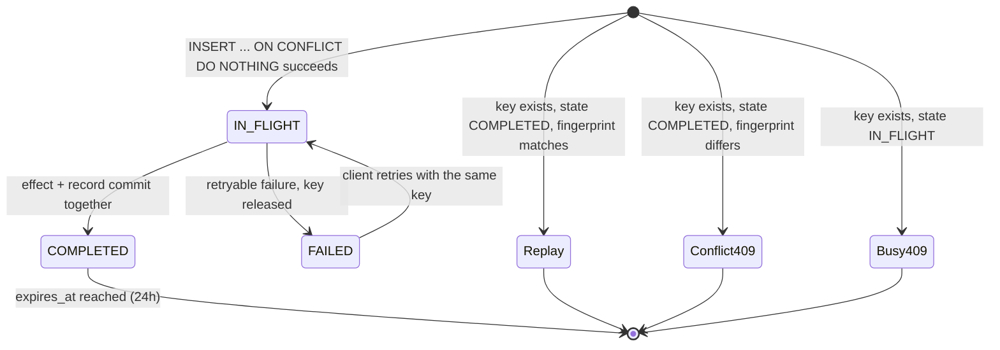
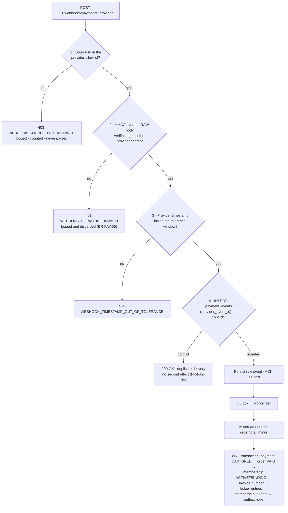
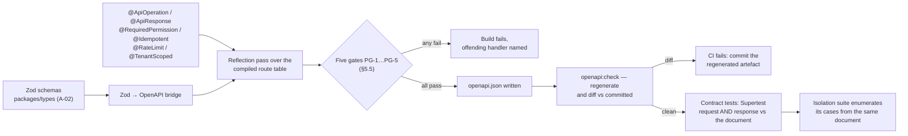

# API Catalog — Consolidated Index and Binding Conventions

> **Artefact rank 3** (`PROJECT_CONSTITUTION.md` §1.3): a binding derived specification. It is
> subordinate to `PROJECT_CONSTITUTION.md` (rank 1) and `MASTER_PRD.md` (rank 2), and it overrides
> the backlog, the roadmap and the code. Every statement here traces to a PRD identifier.
>
> **Status:** Phase-0 baseline · **Date:** 2026-08-06 · **Launch market:** India (`LAUNCH_MARKET_INDIA.md`)
> **Owner:** Technical Lead / Architect · **Scope:** all 14 `API-` groups of PRD `§C3.2`

---

## 0. What this document is, and what it is not

| | |
| :--- | :--- |
| **This document is** | The single consolidated index of every HTTP endpoint the Phase-1 platform exposes, plus the conventions that all of them obey without exception: versioning, representation, authentication, tenant derivation, idempotency, pagination, filtering, sorting, errors, rate limiting, caching, status codes, webhooks, deprecation and OpenAPI generation. |
| **This document is not** | The per-domain API specification. `PHASES.md` Phase 5 produces `/docs/apis/*.md` — one document per domain — carrying request and response schemas field by field, per-field validation rules, worked examples, and the acceptance criteria each endpoint satisfies. **This catalogue deliberately stops at the level above that.** Where a reader wants the shape of `POST /v1/orders`' response body, the answer is `/docs/apis/ordering.md`, not here. |
| **The relationship** | Phase 5 may add detail to a row in this catalogue. It may not add a row, remove a row, or contradict a column value. A Phase-5 document that needs a new endpoint amends §3 of this file in the same pull request. |
| **Relationship to `ENGINEERING_PLAN.md` §6** | `ENGINEERING_PLAN.md` is the CTO-level overview and lists 152 endpoint rows with four columns. This catalogue is the detailed version of that slice: eleven attribute columns, 233 rows, every convention specified rather than referenced, plus the error registry, the webhook contract and the deprecation procedure that the overview names but does not define. Where the two differ, §3.0 of this file records the correction and its authority. |

### 0.1 The five load-bearing invariants, restated as API obligations

Every row in §3 and every rule in §1 exists to keep one of these true. They are quoted here because
an API convention that quietly violates one of them is the most expensive kind of defect.

| # | Invariant | Source | The API-level obligation it creates |
| :-: | :--- | :--- | :--- |
| **1** | No tenant reads or writes another tenant's data — enforced in the **database** by RLS, not by application code | `BR-TEN-01`, `NFR-SEC-09`, `BAC-10`, `E2E-11` | The tenant is derived server-side only (§1.5); a cross-tenant read returns `404`, never `403` (§2.3); every tenant-scoped route appears in the isolation suite inventory (§5.5, §9.4) |
| **2** | Money is an append-only ledger of integer minor units | `BR-PAY-01`, `BR-FIN-01`, ADR-0014, ADR-0015 | No request schema anywhere contains a monetary field (§1.2.3); money in responses is `<name>_minor` with an adjacent `currency` (§1.2.3); `.strict()` makes sending an amount a `400`, not a silent drop |
| **3** | Price displayed = price charged; server re-validation aborts on mismatch | `BR-PLN-03`, `FR-CART-04` | `POST /v1/orders/:orderRef/validate` returns a **200 with `valid:false`**, not an error (§2.4); `POST /v1/orders/:orderRef/payment-intent` re-prices and fails `422 PLAN_PRICE_CHANGED` rather than charging either figure |
| **4** | Verification before visibility; earned reviews only | `BR-GYM-01`, `BR-GYM-03`, `BR-REV-01`, `BR-REV-03` | Every `API-DISC` endpoint filters on `APPROVED` + non-suspended + `visibility = PUBLIC` (§3.3); `POST /v1/gyms/:slug/reviews` returns `403 REVIEW_REQUIRES_CHECK_IN` even by direct API call |
| **5** | Activation is webhook-driven, never the client redirect | `BR-PAY-02`, `FR-PAY-03`, ADR-0013 | **No endpoint exists that activates a membership from a client signal.** Its absence from the generated OpenAPI document is itself a tested control (§9.4, `PROJECT_CONSTITUTION.md` §12.1 A04) |

---

## 1. Conventions

Expanding PRD `§C3.1`. Every convention below is binding on every endpoint in §3 and is emitted once
into the OpenAPI document as a shared component or reusable parameter (§9.3), never repeated per
endpoint.

### 1.1 Base URL, environments and versioning surface

| Aspect | Value | Source |
| :--- | :--- | :--- |
| Production base | `https://api.<domain>/v1` | `§C3.1` |
| Version segment | `/v1` — **URL-versioned**. Not a header, not a query parameter, not content negotiation | `§C3.1`, §14.1 V1 |
| Staging base | `https://api.staging.<domain>/v1` | `§C7` |
| Local base | `http://localhost:3000/v1` (Docker Compose, A-28) | `§C7` |
| Deployment region | **India** — Mumbai primary, second Indian region for DR. Not configurable in Phase 1 | `OQ-16`, RBI payment-data localisation, `LAUNCH_MARKET_INDIA.md` §9 |
| Health endpoints | `/healthz`, `/readyz` — **unversioned**, outside `/v1`, `@Public()`, no internal detail | `NFR-AVL-01`, §14.7 rule 12 |
| Internal endpoints | **None exist.** *"No surface has a private back door; anything the admin console can do is expressible as an authorised, audited API call"* | `B1.1`, §14.1 V7 |

**Why the version is in the path.** A header-versioned or content-negotiated API cannot be pinned by
a link, cannot be cached distinctly by a CDN under `NFR-SCAL-04`, and cannot be diffed as two
documents under `NFR-MNT-03`. `§C3.1` fixes the URL form and this catalogue does not reopen it.

**One version in Phase 1.** `v1` is the only version that exists at launch. §8 defines the procedure
by which a `v2` would come into being; nothing in Phase 1 triggers it.

### 1.2 Representation

#### 1.2.1 Format and casing

| Rule | Statement | Source |
| :--- | :--- | :--- |
| R1 | `Content-Type: application/json; charset=utf-8` on every request with a body and every response with a body. No form encoding, no XML, no multipart except the upload endpoints of §1.2.7 | `§C3.1` |
| R2 | **All** JSON field names are `snake_case`, in requests and responses alike. `payable_to_gym_minor`, never `payableToGymMinor` | `§C3.1`, §8.8 |
| R3 | Query parameter names are `snake_case` and match the response field they filter | §8.8 |
| R4 | Path parameters are declared `camelCase` in the route (`:orderRef`, `:gymId`, `:mediaId`, `:reportKey`) and match the DTO field | §8.8 |
| R5 | Resource path segments are plural, `kebab-case` nouns: `/tenant/kyc-documents`, `/tenant/saved-searches`, `/admin/subscription-tiers` | §8.8 |
| R6 | A non-CRUD action is a `POST` to a verb segment on the resource: `POST /v1/orders/:orderRef/validate`, `POST /v1/checkin/override`, `POST /v1/tenant/plans/:id/publish` | §8.8 |
| R7 | Audience prefixes are a **fixed set of five**: none (public), `/me` (self), `/tenant` (tenant-scoped), `/admin` (platform), `/webhooks` (provider inbound). `/owner`, `/dashboard`, `/staff`, `/api` and `/internal` are forbidden prefixes | §8.8 |
| R8 | Responses never include a `null` for a field that is simply absent; absent optional fields are omitted, and an explicit `null` means "cleared" | §14.7 rule 8 |

#### 1.2.2 Identifiers

| Kind | Wire form | Example | Note |
| :--- | :--- | :--- | :--- |
| Entity id | UUID v7 string | `"01932c7e-..."` | Time-ordered, so it is a valid cursor tiebreaker (§1.7.2) |
| Order reference | Human-quotable string, `ORD-<FY>-<seq>` | `"ORD-2026-000148"` | `§C3.3`. The path parameter is `:orderRef`, not the internal id — it is what a support agent reads back over the phone |
| Gym slug | Lowercase kebab slug, stable forever | `"iron-works-gym"` | `FR-NAV-05` requires a canonical, human-readable, stable URL |
| Invoice number | `<prefix>/<FY>/<seq>` per tenant per **Indian** financial year | `"IW/2026-27/000148"` | Gapless per `FR-INV-02`; FY starts **1 April** (`LAUNCH_MARKET_INDIA.md` §5) |
| Member code | Per-tenant human-readable code | `"IW-00412"` | `FR-CRM-10`. Treated as PII in logs (`BR-DAT-06`, §12.10 PII2) |
| Correlation id | ULID string | `"01J9Z7..."` | `§C1.5`, present on every response (§1.3.2) |

Identifiers are **opaque to clients**. A client that parses an order reference to extract the
financial year has coupled itself to a format that `FR-INV-02` allows a tenant to configure.

#### 1.2.3 Money — the wire contract

`BR-PAY-01` and §10 of the constitution govern this absolutely.

| Rule | Statement |
| :--- | :--- |
| M1 | Every monetary value on the wire is named `<subject>_minor` and is a **string** containing an integer count of minor units. A string, because `bigint` exceeds JSON's safe integer range and because a JSON number invites a client to do floating-point arithmetic on money |
| M2 | Every object carrying a `_minor` field carries an adjacent `currency` field with an ISO-4217 code. For India, `"INR"`, minor unit **paise**, 100 per rupee |
| M3 | **No request schema anywhere in the API contains a monetary field.** This is not "the server ignores it" — the field does not exist, and `.strict()` (§9.7 IV2) makes sending one a `400 UNKNOWN_FIELD`, so a compromised or buggy client fails loudly (`BR-PAY-04`, §14.4 CA1) |
| M4 | The one apparent exception is not one: `POST /v1/tenant/orders/offline` accepts `amount_received_minor`, which is **a record of cash handed over, not a price**. It is validated against the server-computed total and a shortfall becomes `BALANCE_DUE` (`FR-CART-09`, `BR-PAY-09`, §14.4 CA7) |
| M5 | Rates are never sent by a client either — not a commission rate, not a tax rate, not a discount value, not a reserve percentage (§14.4 CA6). Rates in **responses** are integer basis points, named `<subject>_bps` |
| M6 | Indian digit grouping (`₹2,50,000`, lakh/crore) is a **presentation** concern handled by one formatter in `packages/utils`. The wire never carries a formatted amount (`LAUNCH_MARKET_INDIA.md` §2) |

```json
// illustrative — not committed code
{
  "currency": "INR",
  "breakdown": {
    "plan_price_minor": "500000",
    "joining_fee_minor": "0",
    "add_ons_minor": "0",
    "discount_minor": "100000",
    "net_minor": "400000",
    "tax_minor": "72000",
    "tax_components": [
      { "component": "CGST", "rate_bps": 900, "amount_minor": "36000" },
      { "component": "SGST", "rate_bps": 900, "amount_minor": "36000" }
    ],
    "total_minor": "472000"
  }
}
```

`tax_components` is the India-specific consequence of `FR-INV-04`'s *"tax breakdown by rate"*: because
a gym is consumed at a physical location the supply is almost always intra-state, so 18% GST is
**CGST 9% + SGST 9% as two separate lines**, never one combined figure
(`LAUNCH_MARKET_INDIA.md` §4). The scalar `tax_minor` remains the sum, so a client that only renders
a total is unaffected. `component` is an **open enum** (§8.3) — `IGST` appears on the inter-state
edge case and clients must tolerate it.

#### 1.2.4 Time and dates

| Rule | Statement | Source |
| :--- | :--- | :--- |
| T1 | Timestamps are ISO-8601 **UTC with a literal `Z`**: `"2026-08-04T06:12:03Z"`. Never a local time, never an offset, never an epoch integer | §10.6, §14.7 rule 7 |
| T2 | Business dates are `YYYY-MM-DD` with the interpreting timezone **documented per field**. `membership.end_date` is interpreted in the **gym's** timezone, not the member's and not the server's | `BR-MEM-03`, `FR-MEMB-09` |
| T3 | The interpreting timezone for every Phase-1 tenant is `Asia/Kolkata`, **UTC+05:30, no DST**. Midnight gym-time is 18:30 UTC the previous day — an API consumer computing "days remaining" in UTC will be wrong by up to a day for five and a half hours out of every twenty-four | `LAUNCH_MARKET_INDIA.md` §3 |
| T4 | Durations are explicit integer fields with a unit in the name (`window_days`, `cooldown_minutes`, `ttl_seconds`). No ISO-8601 duration strings, no bare numbers | §10.6 |
| T5 | Financial-year-bounded resources (invoices, credit notes, settlement statements, financial reports) carry an explicit `financial_year` string of the form `"2026-27"`, because **the Indian FY starts 1 April** and a client cannot infer it from a date | `FR-INV-02`, `LAUNCH_MARKET_INDIA.md` §5 |

#### 1.2.5 Enums

Enum values are `SCREAMING_SNAKE_CASE` strings. Every enum in the catalogue is declared **closed** or
**open** in §8.3, and the declaration is part of the contract: a client is contractually required to
tolerate an unknown value on an open enum by falling back to a documented default (§14.1 V6). This
declaration is what makes it legitimate for §8.2 to classify "adding an enum value" as non-breaking.

#### 1.2.6 Collections

Every collection response, without exception:

```json
// illustrative — not committed code
{ "data": [ /* … */ ], "next_cursor": "eyJ2IjoxLC…", "limit": 50 }
```

`next_cursor: null` is **the only** signal that a traversal has ended. A client must not infer the
end from a short page, because a filtered page can legitimately be short (ADR-0023).

#### 1.2.7 Uploads

Four endpoint families accept binary: gym and branch photos (`FR-GYM-02`), KYC documents
(`FR-ONB-03`), review photos (`FR-REV-02`) and support-ticket attachments (`FR-SUP-01`). All four
obey §12.7:

| Rule | Statement |
| :--- | :--- |
| U1 | `multipart/form-data`. Type is validated by **magic-byte content inspection**, never by extension and never by the client-supplied MIME type (UP1) |
| U2 | Size limits are per upload class and are **configuration**, returned in the `413` body so the client can state the real limit (UP2) |
| U3 | Every upload is virus-scanned before it becomes retrievable (UP3), so an upload response is `202 Accepted` with a processing state, never `201` with a live URL |
| U4 | EXIF and all metadata are stripped by Sharp (A-17) — *"a privacy requirement, not an optimisation"* (UP4) |
| U5 | Filenames are never storage keys; the original filename is stored as data and encoded on display (UP7) |
| U6 | KYC uploads go to a **separate bucket with a separate encryption key**, are readable only by `VERIFICATION_OFFICER` and `SUPER_ADMIN`, are served by a short-lived signed URL issued per access, and **every access is logged** (UP6, `BR-DAT-07`, `NFR-SEC-02`) |
| U7 | Upload endpoints sit in the strictest write tier with an additional bytes-per-window budget (§4, `RL-UPLOAD`) and are permission-declared like every other endpoint (UP9) |
| U8 | There is **no** arbitrary-transform endpoint. Renditions are a fixed server-side set, because an arbitrary-transform endpoint is a denial-of-service amplifier (UP8) |

### 1.3 Headers

#### 1.3.1 Request headers

| Header | Required on | Meaning | Failure |
| :--- | :--- | :--- | :--- |
| `Authorization: Bearer <access_token>` | Every endpoint whose Auth column is not `none` or `signature` | The 15-minute access token (`FR-AUTH-06`, TK1) | `401 UNAUTHENTICATED` |
| `Idempotency-Key: <opaque>` | Every endpoint whose Idempotency column is **REQ** | Client-chosen, unique per logical operation (§1.6) | `400 IDEMPOTENCY_KEY_REQUIRED` |
| `Content-Type` | Every request with a body | `application/json; charset=utf-8`, or `multipart/form-data` on the four upload families | `415 UNSUPPORTED_MEDIA_TYPE` |
| `Accept-Language` | Optional, everywhere | Selects the i18n message catalogue for `error.message` (`NFR-USE-08`, EV3). Defaults to the account's language, then `en-IN` | — |
| `X-Correlation-Id` | Optional, everywhere | A client-supplied correlation id. Accepted, echoed and propagated; if absent the server generates one (`NFR-MNT-04`) | — |
| `X-Razorpay-Signature` | `POST /v1/webhooks/payments/razorpay` only | HMAC-SHA256 over the **raw** body (§7.4) | `401 WEBHOOK_SIGNATURE_INVALID` |
| **`X-Tenant-Id`** | **Never accepted** | Sending it is a client bug or an attack | `400 TENANT_HEADER_NOT_ACCEPTED` (§1.5) |

There is no `X-API-Key`, no `X-Client-Version` gate, and no header that alters authorisation. The
only headers that change server behaviour are the six accepted rows above.

#### 1.3.2 Response headers

| Header | Present on | Meaning |
| :--- | :--- | :--- |
| `X-Correlation-Id` | **Every** response, success and failure alike | The same id that appears in the structured log, the OpenTelemetry trace and, on errors, `error.correlation_id` (`NFR-MNT-04`, §14.7 rule 5, EV5) |
| `X-RateLimit-Limit` · `X-RateLimit-Remaining` · `X-RateLimit-Reset` | Every rate-limited response, **including successes** | The caller's budget in the applicable class (§4.4) |
| `Retry-After` | `429`, `503`, and `409 IDEMPOTENT_REQUEST_IN_PROGRESS` | Seconds until a retry is sensible (RL2, ID6) |
| `Cache-Control` | Every response | Explicit per §1.11. Never absent, never left to a default |
| `ETag` · `Last-Modified` | Public discovery reads and reference data | Enables `304` revalidation at the CDN (`NFR-SCAL-04`) |
| `Deprecation` · `Sunset` · `Link rel="deprecation"` | Any endpoint or field in its deprecation window | §8.4 |
| `Content-Security-Policy`, `Strict-Transport-Security`, `X-Content-Type-Options`, `Referrer-Policy`, `Permissions-Policy` | Every response | `NFR-SEC-12`, §12.11 control 1 |

### 1.4 Authentication modes

The Auth column of §3 takes exactly one of six values. They are different credentials with different
lifetimes and different failure modes, and conflating them is how `OWASP A07` happens.

| Value | Credential | Lifetime | Where it is presented | Notes |
| :--- | :--- | :--- | :--- | :--- |
| `none` | — | — | — | Only on the endpoints enumerated in §5.4. Every one carries `@Public()` and a compensating control |
| `access` | JWT access token | **15 minutes** | `Authorization: Bearer` | Carries `sub`, `tenant_context`, `session_id`, `token_type`, `iat`, `exp`, `jti`, `kid`. **No permission list and no personal data** (TK1) |
| `access(mfa)` | Access token whose session asserts a satisfied MFA challenge | 15 minutes | `Authorization: Bearer` | Mandatory for **all** platform staff roles (`NFR-SEC-11`, `FR-AUTH-07`). Every `/admin/*` row uses this |
| `refresh` | Opaque rotating refresh token | **30 days** | `httpOnly`, `Secure`, `SameSite=Strict` cookie, path-scoped to `/v1/auth` (TK2) | Rotates on every use; presenting a used token revokes **the entire family** and notifies the user (TK3, TK4, `FR-AUTH-06`) |
| `reset` | Single-use password-reset token | Short, configured | Request body | Consuming it invalidates **all** sessions (TK5, `FR-AUTH-10`) |
| `support` | Impersonation token, `token_type: 'IMPERSONATION'` | **30 minutes**, hard cap | `Authorization: Bearer` | Carries `impersonator_id` and `reason`; grants the impersonated user's permissions, **never** the agent's, and never platform elevation (TK6, §12.4) |
| `signature` | Provider HMAC over the raw body + source IP allowlist | Per-event | Provider-specific header | Webhooks only. Unauthenticated in the bearer sense, authenticated in every sense that matters (§7) |

**The three endpoints an impersonation token may never call**, enforced by a guard that inspects
`token_type` rather than by hiding a button (`AC-AUTH-03.2`, `FR-AUTH-12`):

1. `POST /v1/orders/:orderRef/payment-intent`
2. `POST /v1/me/memberships/:id/refund-request`
3. `PUT /v1/tenant/payout-account`

An attempt returns `403 IMPERSONATION_FORBIDS_FINANCIAL_MUTATION`.

### 1.5 Tenant derivation — never from the client

> `§C3.1`: *"**Tenant** — Derived from the token or the resource. **Never accepted from the client.**"*
> `§C1.4` step 1 and `PROJECT_CONSTITUTION.md` §11.3 make it a law rather than a convention.

This is invariant 1 expressed at the HTTP boundary, and it is the single rule in this document most
likely to be broken by an ordinary coding mistake, because accepting a tenant identifier is the
obvious way to write a multi-tenant endpoint and it is catastrophically wrong.

**The derivation decision table.** Exactly one row applies to any request; the resolver is
deterministic and has no fallback.

| # | Audience prefix | Tenant source | Mechanism | If it cannot be resolved |
| :-: | :--- | :--- | :--- | :--- |
| 1 | none (public) | **The resource** | The slug or id in the path resolves to exactly one gym, and the gym's `tenant_id` becomes the context — after the `APPROVED` + non-suspended + `visibility = PUBLIC` filter has already passed | `404` — an unapproved gym is indistinguishable from a nonexistent one |
| 2 | `/me` | **The principal, not a tenant** | These are user-scope routes. The RLS session variable is set to the *user* scope; tenant-owned rows are reachable only through an explicit ownership join (the membership the user holds) | `401` if unauthenticated |
| 3 | `/tenant` | **The access token's `tenant_context`** | Established at login or by `POST /v1/auth/tenant-context`, which is an explicit, audited switch (`BR-TEN-02`, `FR-AUTH-11`, `AC-AUTH-02.2`) | `403 TENANT_CONTEXT_REQUIRED` |
| 4 | `/admin` | **Platform scope, plus the resource where one is named** | Cross-tenant reads use the named, audited elevation function of §11.6 — an explicit call with actor and reason, never an ambient capability | `403 PERMISSION_DENIED`; a missing elevation is `500 TENANT_CONTEXT_MISSING`, which is a defect, not a user error |
| 5 | `/webhooks` | **The verified event payload** | The provider's payment or order reference resolves to a local record whose `tenant_id` is authoritative. The webhook body is data, not identity — the *signature* is the identity | The event is parked, alerted and retried; never guessed |

**Consequences that follow mechanically:**

| Rule | Statement |
| :--- | :--- |
| TD1 | An `X-Tenant-Id` header, a `tenant_id` body field or a `?tenant_id=` query parameter is **rejected with `400 TENANT_HEADER_NOT_ACCEPTED`**, not ignored. Because request schemas are `.strict()` (§9.7 IV2), the body case is automatic; the header and query cases are an explicit middleware check. Silence would hide the client bug that is trying to become a vulnerability |
| TD2 | `FR-RBAC-03` — a tenant-scoped role is evaluated against **the tenant on the resource**, never the tenant on the session alone. A `GYM_MANAGER` of tenant A holding a valid session who requests a resource of tenant B is refused by the *resource* check even before RLS refuses the row |
| TD3 | Every request that touches a tenant-owned table executes `SET LOCAL app.tenant_id = $1` **inside the same transaction**, through the mandatory Prisma client extension (A-01, ADR-0005, §11.4). No repository may call the raw client; the architecture fitness test (A-23) enforces it |
| TD4 | The application database role has **no `BYPASSRLS`** (`§C1.4` step 3). There is no application code path that can disable the policy |
| TD5 | A cross-tenant read returns **`404`, not `403`** (§2.3). Returning `403` confirms the resource exists, which is an information leak `BR-TEN-01` does not tolerate |
| TD6 | Every handler annotated `@TenantScoped()` must appear in the isolation suite's endpoint inventory. A handler that does not fails the build (§5.5 gate PG-4, `BAC-10`, `E2E-11`, ADR-0027) |

### 1.6 Idempotency

> `§C3.1`: *"`Idempotency-Key` required on all `POST`, `PUT`, `PATCH`, `DELETE` that affect money or
> membership state."*
> `§C1.5`: *"A key, its request fingerprint and its response are stored for 24 hours. A repeat with
> the same key and fingerprint returns the stored response; the same key with a different
> fingerprint returns 409."*
> ADR-0016 fixes the storage in **PostgreSQL**, committed in the same transaction as the effect.

#### 1.6.1 Which endpoint classes require a key

`§C3.1` states the principle; `PROJECT_CONSTITUTION.md` §14.2.1 enumerates the classes so that no
judgement call is left at implementation time. This catalogue reproduces the enumeration and binds
it to the Idempotency column of §3.

| Class | Column value | Endpoints |
| :--- | :-: | :--- |
| **Money-affecting** | **REQ** | `POST /orders` · `POST /orders/:orderRef/payment-intent` · `POST /payments/:id/retry` · `POST /tenant/orders/offline` · `POST /tenant/orders/:orderRef/collect-balance` · `POST /me/memberships/:id/refund-request` · `POST /tenant/refunds` · `POST /admin/refunds/:id/decide` · `POST /admin/settlements/:id/approve` · `POST /admin/disputes/:id/evidence` |
| **Membership-state-affecting** | **REQ** | `POST /me/memberships/:id/freeze` · `POST /me/memberships/:id/unfreeze` · `POST /me/memberships/:id/renew` · `PATCH /me/memberships/:id/auto-renew` · `POST /tenant/memberships/:id/transfer` |
| **Attendance-recording** | **REQ** — key is the `token_nonce` | `POST /checkin/scan` · `POST /checkin/manual` · `POST /checkin/:id/checkout` · `POST /checkin/override` |
| **Provider webhooks** | **REQ in effect** — deduplicated by `provider_event_id`, unique-indexed | `POST /webhooks/payments/:provider` |
| **Bulk and asynchronous** | **REQ** | `POST /tenant/members/import` · `POST /tenant/exports` · `POST /me/export` |
| **Coupon application** | **REQ** — a double tap must not double-count a redemption | `POST /orders/:orderRef/coupon` |
| **Other mutations** | **OPT** — accepted and honoured if supplied | Profile edits, plan edits, media uploads, note creation, staff invitations, lead updates |
| **Safe methods** | **N/A** | Every `GET` |

#### 1.6.2 The 24-hour store

| Property | Value |
| :--- | :--- |
| Table | `idempotency_keys` (`§C2.2`) — `key`, `endpoint`, `request_hash`, `state`, `response_status`, `response_body jsonb`, `expires_at` |
| Store | **PostgreSQL, not Redis.** The record must commit *atomically with the effect*. Writing to Redis before the effect and crashing marks a payment complete that never happened; writing after and crashing charges the customer twice. There is no safe ordering across two stores without a distributed transaction (ADR-0016) |
| Retention | `expires_at` = claim time + **24 hours**; swept weekly by `data.retention-sweep` (`§C5`) |
| Late retry | A retry after the window **executes again**. This is a real boundary, documented rather than hidden; no legitimate client retries a checkout a day later |
| Body storage | Response bodies are stored. They are already redacted by the serialisation layer, are covered by `BR-DAT-06`, and are excluded from analytics exports |

#### 1.6.3 The request fingerprint

A stable hash over **five** components. All five, because omitting any one of them makes a
different request replay a stored response:

1. HTTP method
2. The **resolved route pattern** (`POST /v1/orders/:orderRef/coupon`), not the concrete URL — plus the resolved path parameter values
3. The authenticated subject (`sub`)
4. The resolved tenant context (§1.5)
5. The **canonicalised** body — keys sorted, insignificant whitespace removed — so that a semantically identical retry from a different JSON serialiser produces an identical fingerprint

#### 1.6.4 The three states and the concurrency guarantee

The key is claimed with a single `INSERT … ON CONFLICT DO NOTHING`. If the insert affects zero rows,
another request already holds the key. This is one atomic statement, not a check-then-act, so two
simultaneous requests cannot both proceed.

| State | Meaning | Behaviour on a new request bearing this key |
| :--- | :--- | :--- |
| `IN_FLIGHT` | Claimed, not yet completed | **`409 IDEMPOTENT_REQUEST_IN_PROGRESS`** with a `Retry-After` hint. Never a second execution |
| `COMPLETED` | Effect committed, response stored | Fingerprint **matches** → replay the stored status and body byte-for-byte, with no side effects. Fingerprint **differs** → **`409 IDEMPOTENCY_KEY_MISMATCH`** |
| `FAILED` | The operation failed in a way that is safe to retry | The key is released so the client may retry with the **same** key |



#### 1.6.5 Key derivation per endpoint class

| Endpoint | Key source | Why |
| :--- | :--- | :--- |
| `POST /orders`, `POST /orders/:orderRef/payment-intent` | Client-generated UUID, **one per checkout attempt**, honoured through payment initiation | `FR-CART-06`. Additionally persisted on `orders.idempotency_key` with a unique index (`§C2.4`) |
| `POST /checkin/scan` | The QR token's **nonce** — `§C3.3` shows `Idempotency-Key: <token_nonce>` literally | `BR-CHK-06`: *"a token replayed within its TTL yields the original attendance record, not a second one"*. Persisted on `attendance.token_nonce` |
| `POST /me/memberships/:id/refund-request`, `POST /admin/refunds/:id/decide` | Derived from the **order** | `BR-REF-09`: *"idempotent on the order"* |
| `POST /tenant/members/import` | An import job id, with per-row natural keys inside it | `FR-ONB-15`, `AC-ONB-03.4`: re-running the same file creates no duplicate members |
| `POST /tenant/orders/offline`, `POST /tenant/orders/:orderRef/collect-balance` | Client-generated per desk action | A receptionist tapping twice on a slow tablet is the exact scenario |
| `POST /webhooks/payments/:provider` | `provider_event_id` from the verified payload | `FR-PAY-04`, `BR-PAY-05`; unique-indexed on `payment_events` (`§C2.4`) |

#### 1.6.6 Rules that keep it honest

| Rule | Statement |
| :--- | :--- |
| ID-A | Idempotency is **not a substitute for a uniqueness constraint**. The interceptor is the fast path; `orders.idempotency_key`, `payment_events.provider_event_id` and `attendance.token_nonce` unique indexes are the truth (§14.2.2 ID8) |
| ID-B | Client discipline cannot be enforced by the server. A client that generates a new key on every retry gets no protection. All three frontends generate the key **once per logical attempt** and reuse it across retries; this lives in `packages/types`' client helpers and the contract tests assert it |
| ID-C | A required-class endpoint lacking the `@Idempotent()` decorator **fails a CI check** that cross-references the compiled route table against §1.6.1 (§5.5 gate PG-2, ADR-0027) |
| ID-D | A **missing** `Idempotency-Key` on a REQ endpoint is `400 IDEMPOTENCY_KEY_REQUIRED`, never a silent execution |
| ID-E | Fingerprint-mismatch rate above **0.1% of keyed requests** is a client-bug alarm, not an acceptable background level (ADR-0016 revisit trigger 4) |

### 1.7 Pagination

ADR-0023 decides it: **cursor pagination is the default for every collection endpoint.** Offset
pagination is permitted only in the five enumerated exceptions of §1.7.4.

#### 1.7.1 Parameters and envelope

| Parameter | Type | Default | Maximum | Notes |
| :--- | :--- | :--- | :--- | :--- |
| `limit` | integer | **20** on public endpoints, **50** on dashboard and admin lists (`SCR-DASH-007`: *"50 per page with virtualised scrolling"*) | **100**, enforced server-side | `limit` is a denial-of-service parameter if unbounded. The applied value is echoed in the response so a client adapts rather than guesses |
| `cursor` | opaque string | absent = first page | — | Never constructed by a client |
| `sort` | `field:asc\|desc` | per endpoint | — | Part of the cursor; changing it starts a new scroll |

Response: `{ "data": [...], "next_cursor": string | null, "limit": number }`.

#### 1.7.2 The cursor's opaque encoding

```text
# illustrative — not committed code
cursor = base64url( JSON: { "v": 1, "sort": "checked_in_at:desc", "k": ["2026-08-05T18:22:11.482Z", "<uuid>"] } )
```

| Field | Purpose |
| :--- | :--- |
| `v` | Encoding version, so the encoding can change without breaking a client mid-scroll |
| `sort` | The sort that produced the cursor. Presenting it under a **different** `sort` returns `400 CURSOR_SORT_MISMATCH`, because silently continuing under a different ordering yields a result set that is neither |
| `k` | The ordering tuple, always ending in an **immutable** tiebreaker (the row id), so rows sharing a timestamp are deterministically ordered and none is skipped |

The cursor is opaque **not because it is secret** — it is base64, anyone can read it — but because a
client that parses it becomes a constraint on changing it. `/docs/apis/README.md` states this
contractually.

Failure handling: an invalid, corrupt or version-mismatched cursor returns **`400 CURSOR_INVALID`**,
never a `500` and **never a silent reset to page one** — a silent reset makes an infinite scroll
loop forever.

#### 1.7.3 Why not offset

| Concern | Detail |
| :--- | :--- |
| Correctness | `SCR-DASH-009`'s recent-check-ins strip is read while check-ins are being written. Under offset pagination a row inserted between page 1 and page 2 shifts everything down: the reader sees a duplicate at the top of page 2 and never sees the row that fell off the boundary. On `FR-SRCH-07`'s infinite scroll the same defect appears as repeated cards |
| Performance | `NFR-SCAL-01` sizes year one at **50,000 check-ins per day** and `attendance` is partitioned monthly (`NFR-SCAL-06`). `OFFSET 40000` scans and discards forty thousand rows before returning anything, while `NFR-PERF-04` holds the p95 at **800 ms regardless of page** |
| Index fit | Every list-serving index in `§C2.4` is a composite leading with the scope and ending in the sort column — `attendance (tenant_id, branch_id, checked_in_at)`, `orders (tenant_id, status, created_at)`, `reviews (gym_id, status, published_at desc)`. Those are cursor indexes already |

#### 1.7.4 The five offset exceptions, enumerated exhaustively

Adding a sixth requires an amendment to ADR-0023.

| # | Surface | Why permitted | Bound |
| :-: | :--- | :--- | :--- |
| 1 | `GET /admin/applications` (`SCR-ADM-002`) | Verification officers sort by SLA state and age and genuinely need to jump; the set is small (`B2.4`: 30–60 per day) and short-lived | Hard cap **100 pages**; beyond that the filter must be narrowed |
| 2 | `GET /admin/audit` (`SCR-ADM-015`) | Investigative use with arbitrary filters where jumping is useful | Hard cap **100 pages**; deep history is served by export |
| 3 | Reference data (`§C2.3`) — `/amenities`, `/categories`, `/cities`, reason codes, subscription tiers, tax profiles, KYC checklists, feature flags, notification templates | Bounded, small, cached | **Not paginated at all** — returned whole |
| 4 | `POST /compare` | `FR-DETL-08` caps the comparison at four gyms | Not paginated |
| 5 | `GET /tenant/reports/:reportKey`, `GET /admin/analytics/:reportKey` | Reports render whole or export; `FR-RPT-03` sends anything over the size threshold to asynchronous export | Not paginated |

#### 1.7.5 Total counts

**Not returned by default.** An exact count over a large tenant's attendance is expensive and
`NFR-PERF-01`/`NFR-PERF-04` do not budget for it. Where a count is a product requirement —
`SCR-WEB-002`'s filter rail requires *"each filter shows a live result count"* (`FR-SRCH-12`) — it is
a **separate, explicitly documented, cached facet call**, and the counts are **approximate for large
result sets**. The result list itself shows a relative indicator, not "page 3 of 47". This is a real
product compromise and it is recorded rather than concealed (ADR-0023).

#### 1.7.6 The mutable-sort hazard

A cursor breaks if its sort column mutates mid-scroll. Sorting `memberships` by `end_date` while a
freeze extends an end date (`BR-MEM-05`) can skip or repeat a row. The rule: **cursor-sortable
columns must be immutable or effectively stable.** Where a mutable sort is genuinely required — the
expiring-members list of `SCR-DASH-001` Region 3 — the set is small enough to return whole.

### 1.8 Filtering and sorting

| Aspect | Rule | Source |
| :--- | :--- | :--- |
| Filtering | **Explicit, named query parameters per endpoint.** A generic query language is forbidden: no `?filter={json}`, no `?q=status:ACTIVE`, no RSQL, no GraphQL-style selection. It is unbounded surface area and an injection risk | `§C3.1`, §14.3 |
| Naming | `snake_case`, matching the response field it filters: `?status=ACTIVE&branch_id=…&expiring_within_days=7` | §8.8 |
| Multi-value | Repeated parameters, not comma-joined strings: `?amenity_id=a&amenity_id=b`. Comma-joining invents an escaping problem | This catalogue |
| Unknown parameter | **`400 UNKNOWN_QUERY_PARAMETER`.** Query schemas are `.strict()` like body schemas, so a typo in a filter fails loudly instead of silently returning unfiltered data — which on a members list is a privacy event | §9.7 IV2 |
| Sorting | `?sort=<field>:asc\|desc`, restricted to a **per-endpoint allowlist**. An unlisted field returns `400 SORT_FIELD_NOT_ALLOWED` | `§C3.1` |
| Multi-sort | **Not supported in v1.** A second sort key changes cursor semantics | §14.3 |
| Search | Discovery search takes `lat`, `lng`, `radius`, `q`, the `FR-SRCH-03` filter set, `sort` and `cursor`, and is served from Postgres full-text + trigram + PostGIS. **No user string is ever concatenated into SQL** (§12.6 IV8) | `§C3.2`, `FR-SRCH-01`…`FR-SRCH-15` |
| Free text | `q` is parameterised into the FTS/trigram query. Reference data (amenities, categories, cities) is filtered by **stable identifier**, never by free text, which is a data-quality rule (`NFR-DQ-06`, `FR-GYM-03`) *and* a security control — it removes a free-text field from a filtered surface | §12.6 IV7 |

### 1.9 The error envelope

Every non-2xx response, without exception, has exactly this shape. A client parses **one** shape for
`400`, `401`, `403`, `404`, `409`, `410`, `413`, `415`, `422`, `429`, `500` and `503`.

```json
// illustrative — not committed code
{
  "error": {
    "code": "PLAN_PRICE_CHANGED",
    "message": "The price of this plan changed while you were checking out. It is now ₹5,500 instead of ₹5,000. Review the new price and confirm to continue.",
    "details": [
      { "field": "plan_price_minor", "previous": "500000", "current": "550000" }
    ],
    "correlation_id": "01J9Z7..."
  }
}
```

| Rule | Statement |
| :--- | :--- |
| EV1 | The envelope is produced by **one** NestJS exception filter in `common/`. No controller constructs an error response by hand |
| EV2 | `code` is a registry code from §6. A thrown domain error whose code is absent from the registry **fails CI** |
| EV3 | `message` is resolved from an i18n message key in the caller's language (`NFR-USE-08`). Never a raw exception message, never a stack fragment. Every key states **what happened, why, and what to do next** (`NFR-USE-05`, §13.7 UM1) |
| EV4 | `details` appears **only** for field-level problems: validation failures (one entry per field) and business rules with concrete comparanda. It never contains a database error, a query, a hostname, a file path, a library name or an internal identifier that is not already public (ER5) |
| EV5 | `correlation_id` is **always** present and is the same id in the structured log, the OpenTelemetry trace and the `X-Correlation-Id` response header, so a support agent quotes it and an engineer finds everything (`NFR-MNT-04`) |
| EV6 | The `500` and `503` messages surface the correlation id to the user, because `KPI-25` depends on support being able to act on it (UM6) |
| EV7 | A message never blames the user and never says "unexpected error". A `500` says what to do — retry, or contact support with the correlation id — even though it cannot say why (UM5) |

**Validation `details` shape**, used by every `400`:

```json
// illustrative — not committed code
{ "error": { "code": "VALIDATION_FAILED", "message": "…", "details": [
  { "field": "start_date", "rule": "iso_date", "message": "…" },
  { "field": "total_minor", "rule": "unknown_field", "message": "…" }
], "correlation_id": "01J9Z7..." } }
```

The second entry is `BR-PAY-04` made observable: an attempt to send a monetary field is a named
validation failure, not a silently stripped field (§14.4 CA1).

### 1.10 Rate-limit headers

| Header | On | Value |
| :--- | :--- | :--- |
| `X-RateLimit-Limit` | Every rate-limited response, success or failure | The class's budget for this principal in the current window |
| `X-RateLimit-Remaining` | Every rate-limited response | Tokens left. `0` on the response that consumed the last one, not only on the `429` |
| `X-RateLimit-Reset` | Every rate-limited response | **Unix epoch seconds** at which the bucket refills to full |
| `Retry-After` | `429` only | **Seconds** until the caller may retry |

A `429` carries the standard envelope with a class-specific code (§6.2) and a message that states
**when** the caller may retry (`RL2`, `NFR-USE-05`, `AC-AUTH-01.4`). "Too many requests" alone fails
review.

Where two classes apply to one request — a payment intent is both `RL-PAY` and a general
authenticated write — the **most restrictive remaining budget** is the one reported, and the headers
describe that class.

### 1.11 Cache policy

`NFR-SCAL-04`: *"Read-heavy marketplace traffic is served from read replicas and cache; writes never
contend with search."* §14.7 rule 10: public discovery responses are cacheable with an **explicit**
`Cache-Control`; authenticated responses are `private, no-store`.

The Cache column of §3 takes one of six tokens. No endpoint omits the header and no endpoint relies
on a framework default.

| Token | `Cache-Control` | Applies to | Rationale |
| :--- | :--- | :--- | :--- |
| `CDN-300` | `public, max-age=60, s-maxage=300, stale-while-revalidate=60` | Gym detail, plans, reviews, similar, city and category landing data | Serves `NFR-PERF-02`'s 2.5 s LCP through the CDN while keeping a price change visible within five minutes. `ETag` enables `304` |
| `CDN-60` | `public, max-age=15, s-maxage=60, stale-while-revalidate=30` | `/search/gyms`, `/search/suggest`, `/compare` | `NFR-PERF-09` sustains 2,000 searches/minute; a 60-second edge cache absorbs the repeated-query mass without making a newly approved gym invisible for long (`FR-ONB-13` publishes within 60 s) |
| `CDN-3600` | `public, max-age=600, s-maxage=3600, stale-while-revalidate=600` | Reference data: `/amenities`, `/categories`, `/cities`, `/help/articles` | Platform-managed, changes rarely, purged on taxonomy write (`FR-ADMN-07`) |
| `PRIVATE-30` | `private, max-age=30` | The single polled live-counters endpoint `GET /tenant/attendance/live` | The A-08 poll runs at 10–15 s; a 30-second private cache would defeat it, so this is deliberately **shorter than the poll** and exists only to collapse a double-render burst |
| `NO-STORE` | `private, no-store` | Every other authenticated read | The default for anything tenant- or user-scoped |
| `NO-STORE!` | `private, no-store` + `Pragma: no-cache` + `Vary: Authorization` | Auth, payments, KYC, invoices, settlements, payout account, audit, impersonation | Money, credentials and regulated documents. `Vary: Authorization` prevents an intermediary from ever keying a response on the URL alone |

**Invalidation.** Public caches are purged by key on the write that changes them: publishing or
archiving a plan purges the gym's detail and plans keys; approving an application purges the city
and category landing keys; a moderation decision purges the gym's reviews key; a taxonomy write
purges all `CDN-3600` keys. Cache invalidation is triggered from the **transactional outbox**
(`§C1.5`, ADR-0017), never inline, so a rolled-back write never purges and a committed write always
does.

### 1.12 `PATCH`, `PUT` and `DELETE` semantics

| Method | Semantics | Rule |
| :--- | :--- | :--- |
| `PATCH` | **Partial update.** An **absent** field is left unchanged; an explicit **`null`** clears the field. Documented per endpoint in `/docs/apis/` | §14.7 rule 8 |
| `PUT` | **Whole-resource replacement**, used only where the resource is a complete configuration object that is meaningless in fragments: `/me/preferences`, `/tenant/settings`, `/tenant/branches/:id/hours`, `/tenant/payout-account`, and the `/admin/config/*` family | This catalogue |
| `DELETE` | **Soft delete by default** (ADR-0024). Returns `204` with no body. The row is retained with `deleted_at`; financial, invoice and audit records are retained regardless (`BR-TEN-04`) | ADR-0024, §15.4 |
| Hard delete | Exists only on the documented paths of ADR-0024 and never through a `DELETE` verb on a business resource | ADR-0024 |

**Bulk endpoints** report **per-item outcomes** and never apply a row partially: `POST
/tenant/members/import` returns a per-row result array with a stable row index, and a row either
lands whole or is reported as failed (`FR-ONB-15`, `AC-ONB-03.3`, §14.7 rule 9). A dry-run mode is
required before the committing run (`FR-ONB-15`).

### 1.13 CORS, and what the API refuses to do

| Rule | Statement | Source |
| :--- | :--- | :--- |
| C1 | CORS is an **explicit allowlist per surface origin** — the customer site, the gym dashboard, the admin console. **No wildcard**, ever, including in staging | `NFR-SEC-12`, §14.7 rule 11 |
| C2 | Credentialed requests are permitted only from allowlisted origins, because the refresh cookie is `SameSite=Strict` and path-scoped to `/v1/auth` (TK2) | §12.3 |
| C3 | The API performs **no server-side fetch of a user-supplied URL**. Media is uploaded, never fetched by URL. A gym's "website" field is stored and rendered, never retrieved. This closes `OWASP A10` structurally rather than by allowlist | §12.1 A10 |
| C4 | There is no endpoint that accepts a callback URL, a redirect target, or a template that the server will render from client input | §12.1 A10 |

---

## 2. The status-code contract

`§C3.1` fixes the code set. `PROJECT_CONSTITUTION.md` §13.1 binds each code to a failure class so
that two engineers cannot choose differently for the same situation. This section is the complete,
binding table.

### 2.1 The complete table

| Status | Failure class (§13.1) | When | Canonical example in this product | Log level | Alerts | Retryable by the caller |
| :-: | :--- | :--- | :--- | :--- | :-: | :--- |
| `200` | — | Success, **including a successful evaluation with a negative result** | Check-in denial (§2.4); `POST /orders/:orderRef/validate` returning `valid:false` | `info` | No | n/a |
| `201` | — | A resource was created | `POST /v1/orders` | `info` | No | n/a |
| `202` | — | Accepted for asynchronous processing | `POST /tenant/exports` (`FR-RPT-03`); every upload, because virus scanning precedes retrievability (§1.2.7 U3) | `info` | No | n/a |
| `204` | — | Success with no body | `DELETE /me/favourites/:gymId` | `info` | No | n/a |
| `304` | — | Conditional GET satisfied | Gym detail with a matching `ETag` | `debug` | No | n/a |
| `400` | Validation | Schema or shape failure | Malformed `start_date`; an unknown body field; an attempt to send `total_minor`; a corrupt cursor; an unknown query parameter; an `X-Tenant-Id` header | `info` | No | Yes, after correction |
| `401` | Authentication | Not authenticated, or the credential is invalid or expired | Expired access token; reused refresh token (family revoked); **invalid webhook signature** | `info`, `warn` on reuse detection | On reuse-detection spikes | Yes, after re-authentication |
| `403` | Authorisation | Authenticated, but may not do this **to a resource that is theirs or public** | A `RECEPTIONIST` opening the plan editor by URL (`AC-STAF-01.2`); a review from a user with no check-in (`AC-REV-02.1`); an impersonation token attempting a financial mutation | `warn` | On anomalous rates | No |
| `404` | Not found | The resource does not exist, **or exists in another tenant and must not be disclosed** | Unknown order reference; tenant A requesting tenant B's membership | `info` | No | No |
| `409` | Conflict | A state conflict, **including an idempotency-key fingerprint mismatch** | `IDEMPOTENCY_KEY_MISMATCH`; `IDEMPOTENT_REQUEST_IN_PROGRESS`; publishing an already-published review; a concurrent-modification version clash | `info` | No | Depends; the code says |
| `410` | Gone | The resource existed and is permanently gone **in this form** | An expired order (`FR-CART-05`, 30-minute expiry); a retired API representation past its sunset (§8) | `info` | No | Yes, with a new order |
| `413` | Validation | Upload exceeds the configured class limit | A 40 MB KYC scan | `info` | No | Yes, smaller |
| `415` | Validation | Unsupported media type | `text/xml` posted to a JSON endpoint | `info` | No | Yes |
| `422` | Business-rule violation | Well-formed and permitted, but a **domain rule** refuses it | Plan price changed (`BR-PLN-03`); coupon exhausted (`BR-CPN-03`); freeze allowance exhausted (`BR-MEM-05`); non-stackable concurrent membership (`BR-MEM-04`) | `info` | No | Depends on the rule; the message says |
| `429` | Rate limited | A class budget is exhausted | Any of the twelve classes in §4 | `info`, `warn` on sustained | On sustained breach of `RL-OTP` / `RL-AUTH` | Yes, after `Retry-After` |
| `500` | System | An unexpected platform failure | `TENANT_CONTEXT_MISSING`; an unhandled exception | `error` | **Yes** | Yes, with backoff |
| `503` | Dependency | A dependency is unavailable and the operation cannot degrade | Database unreachable; the payment provider's circuit is open on a capture path | `error` | **Yes** | Yes, with backoff |

Codes deliberately **not** used anywhere in this API: `100`, `206`, `301`/`302` (the API never
redirects; the *provider* does, in the browser), `402`, `405` beyond the framework default, `418`,
`428`, `451`. Adding one requires an amendment to this section.

### 2.2 `422` versus `409` — the distinction, stated once

Both are "well-formed but refused". The line is:

- **`409`** — the refusal is about **the state of the resource or the request pipeline**: another
  writer got there first, the same idempotency key is in flight, the review is already published,
  the row was modified since it was read.
- **`422`** — the refusal is about **a domain rule evaluated against the request's content**: the
  coupon is exhausted, the price changed, the freeze allowance is spent, the plan does not allow
  transfer.

A useful test: if retrying the identical request later could succeed *without the caller changing
anything*, it is `409`. If it could only succeed after the world or the request changes, it is `422`.

### 2.3 The `403`-versus-`404` rule

> **When the caller is authenticated but the resource belongs to another tenant, respond `404`.**

Returning `403` confirms that the resource exists, which is an information leak `BR-TEN-01` does not
tolerate: an attacker enumerating order references could map another tenant's sales volume purely
from the difference between `403` and `404`.

`403` is reserved for *"this resource is yours or public, and you may not perform **this action** on
it"* — the receptionist and the plan editor, the member and someone else's review, the impersonation
token and a payout account.

This rule is tested, not merely stated: the isolation suite (`BAC-10`, `E2E-11`) authenticates as
tenant A, requests a known resource of tenant B on **every** tenant-scoped route, and asserts
`404` — asserting `403` would fail the test.

### 2.4 A check-in denial is `200`, not `4xx`

> `§C3.3`: *"A denial is **200, not 4xx** — it is a successful evaluation with a negative result, and
> the scanner needs the full context to act on it."*

This is the most counter-intuitive rule in the contract and the one most likely to be "corrected" by
a well-meaning engineer, so the reasoning is recorded in full.

| Reason | Detail |
| :--- | :--- |
| **It is a successful evaluation** | The ten-step validation sequence of `FR-CHK-04` — signature valid → not expired → membership exists → membership `ACTIVE` → tenant matches → branch permitted → within operating hours → within plan access window → sessions remaining → not a duplicate within cooldown — **ran to completion and produced an answer**. Nothing failed. A `4xx` would assert that the request was defective, and it was not |
| **The scanner needs the payload** | `SCR-DASH-009`'s denial state shows the member's name and photo, the **specific** denial reason from the fifteen-value `§C4.8` taxonomy, and contextual actions — *Renew now*, *Unfreeze*, *Override with reason* (`FR-CHK-06`, `FR-CHK-08`). A `4xx` body is an error envelope (§1.9), which carries none of that and structurally cannot |
| **It must be recorded** | `BR-CHK-10`: *"A denied check-in is recorded with its denial reason, so that disputes and access problems are analysable."* **A denial is a write, not a rejected request.** A `4xx` that nonetheless commits a row is a lie about what happened |
| **Client error handling would be wrong** | A `4xx` triggers generic error UI, TanStack Query retry logic and error-rate alerting. A member whose membership expired yesterday is not a system error. `AC-CHK-01.2` requires a specific, actionable screen — not a toast, not a retry, not a page in Sentry |
| **`E2E-04` depends on it** | *"Expired membership scanned → denial with reason → staff renews from the denial screen → immediate re-scan succeeds."* That journey requires the denial response to carry enough context to open a pre-filled sale flow |
| **The denial reason is not an error code** | §8.11 is explicit: the fifteen `§C4.8` denial reasons are **not** registry error codes. `MEMBERSHIP_FROZEN` appears as `{"result":"DENIED","denial_reason":"MEMBERSHIP_FROZEN"}` in a `200`, never as `{"error":{"code":"MEMBERSHIP_FROZEN"}}` with a `403` |

**The response shapes, both `200`:**

```json
// illustrative — not committed code
{ "result": "ALLOWED", "attendance_id": "…", "member": { "name": "Priya S.", "member_code": "IW-00412" },
  "membership": { "plan_name": "3 Month Unlimited", "status": "ACTIVE", "end_date": "2026-11-30",
                  "days_remaining": 118, "sessions_remaining": null },
  "checked_in_at": "2026-08-04T06:12:03Z" }
```

```json
// illustrative — not committed code
{ "result": "DENIED", "denial_reason": "MEMBERSHIP_EXPIRED",
  "message": "Membership expired on 31 July 2026. Offer renewal.",
  "member": { "name": "Priya S.", "member_code": "IW-00412" },
  "suggested_actions": ["RENEW", "OVERRIDE"] }
```

`result` is a **closed** enum (`ALLOWED` | `DENIED`); `denial_reason` is a **closed** enum of the
fifteen `§C4.8` values (§8.3). The two audiences get two different message keys for the same reason —
the desk sees *"Membership expired on 31 July. Offer renewal."*, the member's own screen sees a
member-appropriate phrasing (§13.7 UM3).

### 2.5 The generalisation, and its four other applications

> **An evaluation that ran correctly and returned "no" is a `200` with a typed negative result. A
> request to *do* something that could not be done is a `4xx`.**

| Endpoint | Negative result | Status | Why |
| :--- | :--- | :-: | :--- |
| `POST /checkin/scan` | `{ "result": "DENIED", "denial_reason": … }` | **200** | §2.4 |
| `GET /gyms/:slug/reviews/eligibility` | `{ "eligible": false, "reason": "NO_CHECK_IN_RECORDED" }` | **200** | The compose UI uses it to explain, per `SCR-WEB-013`'s ineligible state. The caller asked *whether*, not *to* |
| `POST /orders/:orderRef/validate` | `{ "valid": false, "changes": [ { "field": "plan_price_minor", "previous": "500000", "current": "550000" } ] }` | **200** | `AC-PLAN-02.2` requires showing old and new price and requiring re-confirmation, **not** an error. The endpoint's whole purpose is to evaluate |
| `GET /me/memberships/:id/refund-preview` | `{ "auto_approve": false, "requires_approval": true, "reason": "USAGE_ABOVE_THRESHOLD", "computed_amount_minor": "…" }` | **200** | `BR-REF-03`, `BR-REF-06`. A preview that returns an error cannot show the computation `FR-RFND-04` requires to be shown to all parties |
| `POST /orders/:orderRef/coupon` | — | **422** | **The exception that proves the rule.** The caller asked to *apply* a coupon and the coupon could not be applied. The request did not succeed. `AC-CPN-01.1` requires the specific reason in the envelope's `code` — `COUPON_EXPIRED`, `COUPON_EXHAUSTED`, `COUPON_FIRST_PURCHASE_ONLY`, `COUPON_NOT_APPLICABLE_TO_PLAN` |

The distinction is **"evaluate" versus "do"**, and it is decidable from the verb in the endpoint's
purpose. `validate`, `eligibility`, `preview`, `scan` evaluate. `apply`, `create`, `approve`,
`publish` do.

---

## 3. The master endpoint table

Every endpoint the Phase-1 platform exposes, across all fourteen `API-` groups of PRD `§C3.2`.
**233 rows.** Every row declares an authentication mode, a required permission, a tenant scope, an
idempotency posture, a rate-limit class, a cache policy, and the `FR-`/`BR-` identifiers it serves.
A row missing any of these cannot exist: the CI gates of §5.5 and §9.4 fail the build.

### 3.0 Reading the table

| Column | Values | Defined in |
| :--- | :--- | :--- |
| **Grp** | `AUTH` `USER` `DISC` `FAV` `ORD` `PAY` `MEMB` `CHK` `TEN` `REV` `RFND` `ADM` `NOTF` `SUP` | `§C3.2` |
| **Path** | Relative to `https://api.<domain>/v1` | §1.1 |
| **Auth** | `none` · `access` · `access(mfa)` · `refresh` · `reset` · `support` · `signature` | §1.4 |
| **Permission** | `<module>.<resource>.<action>` — the first segment is one of the 23 modules of `§C1.3`. `—` means the handler carries `@Public()` instead | §5.1 |
| **Scope** | `public` · `user` · `tenant` · `platform` | §1.5 |
| **Idem** | `REQ` (key required, `409` on fingerprint mismatch) · `OPT` (honoured if supplied) · `N/A` (safe method) | §1.6 |
| **RL** | One of the twelve classes | §4 |
| **Cache** | `CDN-3600` · `CDN-300` · `CDN-60` · `PRIVATE-30` · `NO-STORE` · `NO-STORE!` | §1.11 |
| **FR / BR** | The requirements the endpoint serves. Not exhaustive of everything it touches — the identifiers whose satisfaction depends on this endpoint existing | PRD B5, A8 |
| **†** | A row **derived** in this catalogue rather than listed verbatim in `§C3.2`. Every derived row names the `FR-` that makes it necessary; derived rows are listed per group in the note beneath each table | This catalogue |

### 3.0.1 Two corrections to `ENGINEERING_PLAN.md` §6, applied here under §1.3 precedence

`ENGINEERING_PLAN.md` is a rank-3 artefact; `PROJECT_CONSTITUTION.md` is rank 1. Two of its
permission-string conventions contradict the constitution and are corrected in this catalogue rather
than propagated. Both corrections are mechanical and lossless.

| # | `ENGINEERING_PLAN.md` §6 | Constitution | Correction applied here |
| :-: | :--- | :--- | :--- |
| 1 | Permission grammar `<resource>:<action>.<scope>`, e.g. `order:create.self`, `tenant.membership:list` | §12.2.1 AZ1 fixes it as **`<module>.<resource>.<action>`** — three dot-separated segments, no colon, no scope segment | `order:create.self` → **`ordering.order.create`**. Self-scope is expressed by the `/me` audience prefix and enforced by the ownership guard, not encoded in the string. Tenant scope is resolved from the resource (`FR-RBAC-03`), not from the string. **Benefit:** the first segment is now checkable against the 23-module list in CI (§5.5 gate PG-3) |
| 2 | Public endpoints carry pseudo-permissions such as `public:gym.search` | §12.2.1 AZ1: every handler carries **exactly one** of `@RequiredPermission(...)` **or** `@Public()`. *"There is no third state and no default"* | Public endpoints carry `@Public()` and **no** permission string. Their Permission column reads `—`. Every use of `@Public()` is enumerated in §5.4 with its compensating control |

Neither correction changes which caller may reach which endpoint. Both are recorded here so that the
Phase-5 documents and the `permissions.ts` constants are generated from one grammar.

### 3.1 `API-AUTH` — Authentication (module `iam`, `tenancy`)

| Grp | Method | Path | Purpose | Auth | Permission | Scope | Idem | RL | Cache | FR | BR |
| :-- | :-- | :--- | :--- | :-- | :--- | :-- | :-: | :-- | :-- | :--- | :--- |
| AUTH | POST | `/auth/otp/request` | Send a 6-digit OTP to a phone | none | — | public | OPT | `RL-OTP` | `NO-STORE!` | FR-AUTH-01, FR-AUTH-05 | — |
| AUTH | POST | `/auth/otp/verify` | Verify OTP, issue token pair | none | — | public | OPT | `RL-OTP` | `NO-STORE!` | FR-AUTH-01, FR-AUTH-05, FR-AUTH-06 | — |
| AUTH | POST | `/auth/register` | Email + password registration | none | — | public | REQ | `RL-AUTH` | `NO-STORE!` | FR-AUTH-01, FR-AUTH-04 | — |
| AUTH | POST | `/auth/login` | Email + password login | none | — | public | N/A | `RL-AUTH` | `NO-STORE!` | FR-AUTH-04, FR-AUTH-08 | — |
| AUTH | POST | `/auth/refresh` | Rotate the refresh token | refresh | `iam.session.refresh` | user | REQ | `RL-AUTH` | `NO-STORE!` | FR-AUTH-06 | — |
| AUTH | POST | `/auth/logout` | Revoke the current session | access | `iam.session.revoke` | user | OPT | `RL-WRITE` | `NO-STORE!` | FR-AUTH-09 | — |
| AUTH | POST | `/auth/password/forgot` | Begin a password reset | none | — | public | OPT | `RL-AUTH` | `NO-STORE!` | FR-AUTH-10 | — |
| AUTH | POST | `/auth/password/reset` | Complete reset, kill all sessions | reset | — | public | REQ | `RL-AUTH` | `NO-STORE!` | FR-AUTH-04, FR-AUTH-10 | — |
| AUTH | GET | `/auth/sessions` | List active sessions and devices | access | `iam.session.list` | user | N/A | `RL-READ` | `NO-STORE!` | FR-AUTH-09, FR-USER-05 | — |
| AUTH | DELETE | `/auth/sessions/:id` | Revoke one session | access | `iam.session.revoke` | user | REQ | `RL-WRITE` | `NO-STORE!` | FR-AUTH-09 | — |
| AUTH | POST | `/auth/mfa/enrol` | Begin TOTP enrolment | access | `iam.mfa.enrol` | user | REQ | `RL-AUTH` | `NO-STORE!` | FR-AUTH-07 | — |
| AUTH | POST | `/auth/mfa/verify` | Confirm a TOTP challenge | access | `iam.mfa.verify` | user | OPT | `RL-AUTH` | `NO-STORE!` | FR-AUTH-07 | — |
| AUTH | DELETE | `/auth/mfa` † | Disable optional TOTP (owner only) | access | `iam.mfa.disable` | user | REQ | `RL-AUTH` | `NO-STORE!` | FR-AUTH-07 | — |
| AUTH | POST | `/auth/impersonate` | Start an audited support session | access(mfa) | `iam.impersonation.start` | platform | REQ | `RL-ADMIN` | `NO-STORE!` | FR-AUTH-12 | BR-DAT-02 |
| AUTH | POST | `/auth/impersonate/end` | End the support session | support | `iam.impersonation.end` | platform | REQ | `RL-ADMIN` | `NO-STORE!` | FR-AUTH-12 | BR-DAT-02 |
| AUTH | GET | `/auth/tenant-contexts` † | List tenants this identity may act for | access | `tenancy.context.list` | user | N/A | `RL-READ` | `NO-STORE` | FR-AUTH-11 | BR-TEN-02 |
| AUTH | POST | `/auth/tenant-context` | Switch the active tenant, audited | access | `tenancy.context.switch` | user | REQ | `RL-WRITE` | `NO-STORE!` | FR-AUTH-11 | BR-TEN-02 |

**Derived rows.** `DELETE /auth/mfa` — `FR-AUTH-07` makes TOTP *optional* for `GYM_OWNER`, which is
meaningless without a disable path; the same handler **refuses** for every platform staff role,
because `NFR-SEC-11` makes MFA mandatory there. `GET /auth/tenant-contexts` — `FR-AUTH-11` requires
the tenant context to be *"explicit in every dashboard session"* and `AC-AUTH-02.2` requires an
audited switch; the switcher cannot render without an enumerable list.

**Notes.** `/auth/otp/*` is Tier-1 rate limited on **phone number and IP together** (§4.2).
`/auth/refresh` rotates on every use; presenting an already-used token revokes the whole family and
notifies the user — a revocation, not a warning (TK4). `/auth/impersonate` writes an `audit_log` row
visible to the impersonated user in `GET /me/activity` (`BR-DAT-02`, `AC-AUTH-03.3`) and issues a
token that cannot reach the three financial mutations of §1.4.

### 3.2 `API-USER` — Users (module `iam`, `notifications`)

| Grp | Method | Path | Purpose | Auth | Permission | Scope | Idem | RL | Cache | FR | BR |
| :-- | :-- | :--- | :--- | :-- | :--- | :-- | :-: | :-- | :-- | :--- | :--- |
| USER | GET | `/me` | Own profile | access | `iam.profile.read` | user | N/A | `RL-READ` | `NO-STORE` | FR-USER-01 | — |
| USER | PATCH | `/me` | Update own profile and fitness context | access | `iam.profile.update` | user | OPT | `RL-WRITE` | `NO-STORE` | FR-USER-01, FR-USER-02, FR-USER-03 | BR-DAT-06 |
| USER | GET | `/me/preferences` | Notification preferences by channel and category | access | `notifications.preference.read` | user | N/A | `RL-READ` | `NO-STORE` | FR-USER-04, FR-NOTF-02 | — |
| USER | PUT | `/me/preferences` | Replace preferences and quiet hours | access | `notifications.preference.update` | user | OPT | `RL-WRITE` | `NO-STORE` | FR-USER-04, FR-NOTF-05 | — |
| USER | GET | `/me/activity` | Logins, devices, impersonations, exports | access | `iam.activity.read` | user | N/A | `RL-READ` | `NO-STORE!` | FR-USER-05 | BR-DAT-02 |
| USER | POST | `/me/export` | Request a personal-data archive (`202`) | access | `iam.data_export.request` | user | REQ | `RL-EXPORT` | `NO-STORE!` | FR-USER-06 | BR-DAT-03 |
| USER | GET | `/me/export/:id` † | Export job status and time-limited link | access | `iam.data_export.read` | user | N/A | `RL-READ` | `NO-STORE!` | FR-USER-06, FR-RPT-03 | BR-DAT-03 |
| USER | POST | `/me/delete-request` | Request deletion, 7-day grace | access | `iam.account.request_deletion` | user | REQ | `RL-WRITE` | `NO-STORE!` | FR-USER-07 | BR-DAT-04 |
| USER | DELETE | `/me/delete-request` | Cancel a pending deletion | access | `iam.account.cancel_deletion` | user | REQ | `RL-WRITE` | `NO-STORE!` | FR-USER-07 | BR-DAT-04 |
| USER | POST | `/me/phone/change` | Begin phone change, OTP to the new number | access | `iam.contact.change` | user | REQ | `RL-OTP` | `NO-STORE!` | FR-USER-08, FR-AUTH-02 | — |
| USER | POST | `/me/phone/change/verify` † | Complete phone change | access | `iam.contact.verify` | user | REQ | `RL-OTP` | `NO-STORE!` | FR-USER-08 | — |
| USER | POST | `/me/email/change` | Begin email change, link to the new address | access | `iam.contact.change` | user | REQ | `RL-AUTH` | `NO-STORE!` | FR-USER-08, FR-AUTH-02 | — |
| USER | POST | `/me/email/change/verify` † | Complete email change | access | `iam.contact.verify` | user | REQ | `RL-AUTH` | `NO-STORE!` | FR-USER-08 | — |

**Derived rows.** The three `†` rows exist because `FR-USER-08` requires *"verification of the new
value **before** it becomes effective"* — a one-shot change endpoint cannot satisfy that — and
because `FR-USER-06`'s archive is asynchronous under `FR-RPT-03`, so a `202` needs a status resource.

**Notes.** `PATCH /me` accepts health and fitness fields that `FR-USER-03` classes as **sensitive**:
never logged, never an analytics property, never a segmentation input (§12.10 PII7).
`PUT /me/preferences` cannot disable the **transactional** category — `FR-NOTF-02` makes it
non-optional and the schema rejects the attempt with `422 TRANSACTIONAL_OPT_OUT_NOT_PERMITTED`.

### 3.3 `API-DISC` — Discovery, public (module `discovery`, `catalog`)

| Grp | Method | Path | Purpose | Auth | Permission | Scope | Idem | RL | Cache | FR | BR |
| :-- | :-- | :--- | :--- | :-- | :--- | :-- | :-: | :-- | :-- | :--- | :--- |
| DISC | GET | `/search/gyms` | Radius + text search with filters and sort | none | — | public | N/A | `RL-SEARCH` | `CDN-60` | FR-SRCH-01…FR-SRCH-07, FR-SRCH-09…FR-SRCH-12 | BR-GYM-01, BR-PLN-05, BR-TEN-05 |
| DISC | GET | `/search/suggest` | Locality and gym-name autocomplete | none | — | public | N/A | `RL-SEARCH` | `CDN-60` | FR-SRCH-02 | BR-GYM-01 |
| DISC | GET | `/gyms/:slug` | Gym detail with amenities, hours, rating | none | — | public | N/A | `RL-PUBLIC` | `CDN-300` | FR-DETL-01, FR-DETL-04, FR-DETL-07, FR-DETL-10, FR-DETL-11 | BR-GYM-01, BR-REV-07 |
| DISC | GET | `/gyms/:slug/plans` | Public plan catalogue with monthly equivalents | none | — | public | N/A | `RL-PUBLIC` | `CDN-300` | FR-DETL-02, FR-DETL-03 | BR-PLN-03, BR-PLN-05 |
| DISC | GET | `/gyms/:slug/reviews` | Paginated, sortable, filterable reviews | none | — | public | N/A | `RL-PUBLIC` | `CDN-300` | FR-DETL-05, FR-REV-08 | BR-REV-03, BR-REV-07 |
| DISC | GET | `/gyms/:slug/similar` | Similar nearby gyms | none | — | public | N/A | `RL-PUBLIC` | `CDN-300` | FR-DETL-01 | BR-GYM-01 |
| DISC | POST | `/compare` | Resolve a comparison set of ≤4 gyms | none | — | public | N/A | `RL-SEARCH` | `CDN-60` | FR-DETL-08, FR-DETL-09 | BR-GYM-01 |
| DISC | GET | `/cities` | City directory | none | — | public | N/A | `RL-PUBLIC` | `CDN-3600` | FR-SRCH-13 | NFR-DQ-06 |
| DISC | GET | `/cities/:slug` | City landing data and facets | none | — | public | N/A | `RL-PUBLIC` | `CDN-3600` | FR-SRCH-12, FR-SRCH-13 | NFR-DQ-06 |
| DISC | GET | `/categories` | Category directory | none | — | public | N/A | `RL-PUBLIC` | `CDN-3600` | FR-SRCH-13 | NFR-DQ-06 |
| DISC | GET | `/categories/:slug` | Category landing data | none | — | public | N/A | `RL-PUBLIC` | `CDN-3600` | FR-SRCH-13 | NFR-DQ-06 |
| DISC | GET | `/amenities` | Amenity reference taxonomy | none | — | public | N/A | `RL-PUBLIC` | `CDN-3600` | FR-GYM-03, FR-SRCH-03 | NFR-DQ-06 |
| DISC | POST | `/gyms/:slug/report` † | Report a gym with a structured reason | access | `discovery.gym.report` | user | OPT | `RL-WRITE` | `NO-STORE` | FR-DETL-06 | — |

**Derived row.** `POST /gyms/:slug/report` — `FR-DETL-06` requires *"'Report this gym' available to
any authenticated user with structured reasons"*; `§C3.2` lists the moderation queue that consumes
it but not the endpoint that feeds it.

**Notes.** Every row in this group applies the visibility filter **before** anything else:
`APPROVED` **and** non-suspended **and** at least one published public plan (`FR-SRCH-09`,
`BR-GYM-01`, `BR-PLN-05`, `BR-TEN-05`). This is invariant 4 at the HTTP boundary. The group reads the
platform-scope search read model, not tenant tables, and is therefore outside tenant RLS **by
design** — a fact that is asserted in the isolation suite rather than assumed. `GET /gyms/:slug`
returns a **`200` informational payload**, not a `404`, for a gym that was previously live and is now
suspended or closed (`FR-DETL-11`); a gym that was never approved is a `404`.

### 3.4 `API-FAV` — Favourites and saved searches (module `discovery`)

| Grp | Method | Path | Purpose | Auth | Permission | Scope | Idem | RL | Cache | FR | BR |
| :-- | :-- | :--- | :--- | :-- | :--- | :-- | :-: | :-- | :-- | :--- | :--- |
| FAV | GET | `/me/favourites` | Own favourites with current price and delta | access | `discovery.favourite.list` | user | N/A | `RL-READ` | `NO-STORE` | FR-FAV-01, FR-FAV-02 | — |
| FAV | POST | `/me/favourites` | Favourite a gym | access | `discovery.favourite.create` | user | OPT | `RL-WRITE` | `NO-STORE` | FR-FAV-01, FR-FAV-03 | — |
| FAV | DELETE | `/me/favourites/:gymId` | Unfavourite a gym | access | `discovery.favourite.delete` | user | OPT | `RL-WRITE` | `NO-STORE` | FR-FAV-01 | — |
| FAV | GET | `/me/saved-searches` | Own saved searches | access | `discovery.saved_search.list` | user | N/A | `RL-READ` | `NO-STORE` | FR-FAV-05, FR-SRCH-14 | — |
| FAV | POST | `/me/saved-searches` | Save named criteria with optional alerts | access | `discovery.saved_search.create` | user | OPT | `RL-WRITE` | `NO-STORE` | FR-FAV-05, FR-SRCH-14 | — |
| FAV | DELETE | `/me/saved-searches/:id` | Delete a saved search | access | `discovery.saved_search.delete` | user | OPT | `RL-WRITE` | `NO-STORE` | FR-FAV-05 | — |

**Note.** `FR-FAV-03` — a visitor's favourite action prompts authentication and **completes** after
login without losing context. That is a client-side deferred-intent mechanism (`FR-NAV-02`), not a
server endpoint: the API sees one ordinary `POST /me/favourites` after the auth gate.

### 3.5 `API-ORD` — Orders, checkout and member invoices (module `ordering`, `billing`)

| Grp | Method | Path | Purpose | Auth | Permission | Scope | Idem | RL | Cache | FR | BR |
| :-- | :-- | :--- | :--- | :-- | :--- | :-- | :-: | :-- | :-- | :--- | :--- |
| ORD | POST | `/orders` | Create an order — **the server prices it** (`201`) | access | `ordering.order.create` | user | **REQ** | `RL-PAY` | `NO-STORE!` | FR-CART-01…FR-CART-07 | BR-PAY-04, BR-PLN-03, BR-MEM-04, BR-REF-01 |
| ORD | GET | `/orders/:orderRef` | Order detail with stored refund policy | access | `ordering.order.read` | user | N/A | `RL-READ` | `NO-STORE!` | FR-CART-03, FR-CART-11 | BR-REF-01, BR-REF-02 |
| ORD | POST | `/orders/:orderRef/coupon` | Apply a coupon (`422` if it cannot apply) | access | `ordering.coupon.apply` | user | **REQ** | `RL-WRITE` | `NO-STORE!` | FR-CPN-03, FR-CPN-06 | BR-CPN-01…BR-CPN-04 |
| ORD | DELETE | `/orders/:orderRef/coupon` | Remove the applied coupon | access | `ordering.coupon.remove` | user | **REQ** | `RL-WRITE` | `NO-STORE!` | FR-CPN-03 | BR-CPN-02 |
| ORD | POST | `/orders/:orderRef/validate` | Re-price before payment — **`200` with `valid:false`** | access | `ordering.order.validate` | user | OPT | `RL-PAY` | `NO-STORE!` | FR-CART-04, FR-CART-07 | BR-PLN-03, BR-CPN-03 |
| ORD | POST | `/orders/:orderRef/cancel` | Cancel a pending order, release the coupon | access | `ordering.order.cancel` | user | **REQ** | `RL-WRITE` | `NO-STORE!` | FR-CART-05 | BR-CPN-01 |
| ORD | GET | `/me/orders` | Own order history | access | `ordering.order.list` | user | N/A | `RL-READ` | `NO-STORE!` | FR-CART-11 | — |
| ORD | GET | `/me/invoices` † | Own invoices | access | `billing.invoice.list` | user | N/A | `RL-READ` | `NO-STORE!` | FR-INV-08 | BR-PAY-10 |
| ORD | GET | `/me/invoices/:id/pdf` † | Download an immutable invoice PDF | access | `billing.invoice.download` | user | N/A | `RL-READ` | `NO-STORE!` | FR-INV-07, FR-INV-08 | BR-PAY-10, BR-PAY-11 |

**Derived rows.** `FR-INV-08` requires invoices to be *"downloadable by the member"* and
`SCR-WEB-011` is *"Orders & Invoices"*; `§C3.2` folds them into the order views without naming the
endpoints.

**Notes.** `POST /orders` accepts **`plan_id`, `branch_id`, `start_date`, `coupon_code`,
`add_on_ids` and nothing else** — `SCR-WEB-005` is binding: *"never a price"* (§14.4 CA2). Orders
are created `PENDING` with a **30-minute** expiry; an expired order is `410 ORDER_EXPIRED`
(`FR-CART-05`). The PDF endpoint streams a **byte-identical regeneration** — `FR-INV-07` makes
determinism a requirement, and the same bytes are what a tax authority may later ask for.

### 3.6 `API-PAY` — Payments (module `payments`)

| Grp | Method | Path | Purpose | Auth | Permission | Scope | Idem | RL | Cache | FR | BR |
| :-- | :-- | :--- | :--- | :-- | :--- | :-- | :-: | :-- | :-- | :--- | :--- |
| PAY | POST | `/orders/:orderRef/payment-intent` | Create a provider intent for the order | access | `payments.intent.create` | user | **REQ** | `RL-PAY` | `NO-STORE!` | FR-PAY-01, FR-PAY-02, FR-PAY-10, FR-PAY-12 | BR-PAY-03, BR-PAY-04, BR-PLN-03, BR-CPN-03 |
| PAY | GET | `/payments/:id` | Payment status and state history | access | `payments.payment.read` | user | N/A | `RL-READ` | `NO-STORE!` | FR-PAY-07 | BR-PAY-08 |
| PAY | POST | `/payments/:id/retry` | New intent against the same unexpired order | access | `payments.intent.retry` | user | **REQ** | `RL-PAY` | `NO-STORE!` | FR-PAY-06 | BR-PAY-03 |
| PAY | POST | `/webhooks/payments/:provider` | Inbound provider event — signature + IP guarded | signature | — | platform | **REQ** (provider event id) | `RL-WEBHOOK` | `NO-STORE!` | FR-PAY-03, FR-PAY-04, FR-PAY-05, FR-PAY-08, FR-RFND-08 | BR-PAY-02, BR-PAY-05, BR-PAY-07, BR-REF-08 |

**Notes.** These four rows carry invariant 5. **There is no fifth row**, and its absence is the
control: no endpoint exists that activates a membership from a client-side success signal
(`BR-PAY-02`, ADR-0013, §12.1 A04). The confirmation screen reads server state through
`GET /orders/:orderRef` and asserts nothing on its own. `:provider` is `razorpay` in Phase 1; the
generic contract and the Razorpay specifics are §7. The intent endpoint **re-prices** before calling
the provider and aborts with `422 PLAN_PRICE_CHANGED` or `422 COUPON_EXPIRED` rather than charging
either figure (`BR-PLN-03`, `BR-CPN-03`, `AC-PLAN-02.2`).

### 3.7 `API-MEMB` — Memberships (module `memberships`, `attendance`)

| Grp | Method | Path | Purpose | Auth | Permission | Scope | Idem | RL | Cache | FR | BR |
| :-- | :-- | :--- | :--- | :-- | :--- | :-- | :-: | :-- | :-- | :--- | :--- |
| MEMB | GET | `/me/memberships` | Own memberships, current and historical | access | `memberships.membership.list` | user | N/A | `RL-READ` | `NO-STORE` | FR-MEMB-03 | BR-MEM-12 |
| MEMB | GET | `/me/memberships/:id` | Membership detail with days/sessions remaining | access | `memberships.membership.read` | user | N/A | `RL-READ` | `NO-STORE` | FR-MEMB-03, FR-MEMB-12 | BR-MEM-03 |
| MEMB | POST | `/me/memberships/:id/freeze` | Freeze for a date range, extend `end_date` | access | `memberships.freeze.create` | user | **REQ** | `RL-WRITE` | `NO-STORE` | FR-MEMB-04 | BR-MEM-05, BR-MEM-06, BR-MEM-07 |
| MEMB | POST | `/me/memberships/:id/unfreeze` | End a freeze early, recompute the extension | access | `memberships.freeze.end` | user | **REQ** | `RL-WRITE` | `NO-STORE` | FR-MEMB-05 | BR-MEM-05 |
| MEMB | POST | `/me/memberships/:id/renew` | Create a renewal order at current price | access | `memberships.membership.renew` | user | **REQ** | `RL-PAY` | `NO-STORE!` | FR-MEMB-06 | BR-MEM-11, BR-PLN-02 |
| MEMB | PATCH | `/me/memberships/:id/auto-renew` | Toggle auto-renewal | access | `memberships.autorenew.update` | user | **REQ** | `RL-WRITE` | `NO-STORE!` | FR-MEMB-08, FR-PAY-11 | BR-MEM-10 |
| MEMB | POST | `/me/memberships/:id/qr` | Issue a 60-second signed check-in token | access | `memberships.checkin_token.issue` | user | OPT | `RL-WRITE` | `NO-STORE!` | FR-CHK-01, FR-CHK-02 | BR-CHK-02, BR-CHK-01 |
| MEMB | GET | `/me/memberships/:id/refund-preview` † | Preview eligibility and amount — **`200`** | access | `refunds.refund.preview` | user | N/A | `RL-READ` | `NO-STORE!` | FR-RFND-03, FR-RFND-04 | BR-REF-02, BR-REF-03, BR-REF-06 |
| MEMB | GET | `/me/attendance` | Own visit history with streak and counts | access | `attendance.attendance.list` | user | N/A | `RL-READ` | `NO-STORE` | FR-CHK-11 | BR-CHK-09 |
| MEMB | GET | `/tenant/memberships` | Tenant membership list with filters | access | `memberships.membership.list` | tenant | N/A | `RL-READ` | `NO-STORE` | FR-MEMB-12, FR-CRM-01 | BR-TEN-01 |
| MEMB | GET | `/tenant/memberships/:id` † | Tenant view of one membership | access | `memberships.membership.read` | tenant | N/A | `RL-READ` | `NO-STORE` | FR-MEMB-12 | BR-TEN-01 |
| MEMB | POST | `/tenant/memberships/:id/transfer` | Transfer to another person, where permitted | access | `memberships.membership.transfer` | tenant | **REQ** | `RL-WRITE` | `NO-STORE` | FR-MEMB-11 | BR-MEM-08 |

**Derived rows.** `GET …/refund-preview` — `FR-RFND-04` requires *"the computation shown to all
parties"* before a request is submitted, and §2.5 requires that evaluation to be a `200`.
`GET /tenant/memberships/:id` — `FR-MEMB-12` requires the gym's view to show **the same state** as
the member's; a list without a detail resource cannot demonstrate that.

**Notes.** `FR-MEMB-12` is a contract obligation as well as a product one: there is **no separate
gym-side status concept**, so `/me/memberships/:id` and `/tenant/memberships/:id` project the same
`status` field from the same state machine (`§C4.1`). `POST …/qr` mints a token with a **60-second**
TTL signed with **EdDSA Ed25519** carrying a `kid` (A-11, ADR-0012); the payload contains membership
id, member id, tenant id, issue time, expiry and nonce — **no personal data** (`FR-CHK-02`).
`PATCH …/auto-renew` is the cancellation path that `FR-MEMB-08` requires never to involve support,
and under RBI e-mandate rules it interacts with pre-debit notification (`FR-PAY-11`,
`LAUNCH_MARKET_INDIA.md` §7).

### 3.8 `API-CHK` — Check-in (module `attendance`)

| Grp | Method | Path | Purpose | Auth | Permission | Scope | Idem | RL | Cache | FR | BR |
| :-- | :-- | :--- | :--- | :-- | :--- | :-- | :-: | :-- | :-- | :--- | :--- |
| CHK | POST | `/checkin/scan` | Validate a token, record attendance — **denial is `200`** | access | `attendance.checkin.scan` | tenant | **REQ** (`token_nonce`) | `RL-SCAN` | `NO-STORE` | FR-CHK-03, FR-CHK-04, FR-CHK-05, FR-CHK-06 | BR-CHK-01…BR-CHK-07, BR-CHK-10 |
| CHK | POST | `/checkin/manual` | Staff check-in by member search | access | `attendance.checkin.manual` | tenant | **REQ** | `RL-SCAN` | `NO-STORE` | FR-CHK-07 | BR-CHK-08, BR-CHK-09 |
| CHK | POST | `/checkin/:id/checkout` | Record check-out, compute duration | access | `attendance.checkout.record` | tenant | **REQ** | `RL-SCAN` | `NO-STORE` | FR-CHK-09 | BR-CHK-09 |
| CHK | POST | `/checkin/override` | Override a denial with a fixed-list reason | access | `attendance.checkin.override` | tenant | **REQ** | `RL-SCAN` | `NO-STORE` | FR-CHK-08 | BR-CHK-10 |
| CHK | GET | `/tenant/attendance` | Attendance log with six filters | access | `attendance.attendance.list` | tenant | N/A | `RL-READ` | `NO-STORE` | FR-CHK-10 | BR-CHK-09, BR-TEN-01 |
| CHK | GET | `/tenant/attendance/heatmap` | Peak hours by weekday and hour | access | `attendance.attendance.aggregate` | tenant | N/A | `RL-READ` | `NO-STORE` | FR-CHK-13 | — |
| CHK | GET | `/tenant/attendance/live` † | Currently-in-gym count + recent strip + `generated_at` | access | `attendance.attendance.live` | tenant | N/A | `RL-READ` | `PRIVATE-30` | FR-CHK-05 | BR-CHK-09 |

**Derived row.** `GET /tenant/attendance/live` — `SCR-DASH-001` requires a *"currently-in-gym
count"* and `SCR-DASH-009` a live *"recent check-ins strip"*. Under **A-08** Phase 1 satisfies both
with **TanStack Query polling at 10–15 s** through a **single `useLiveCounters()` hook**, not with
Socket.IO, which is deferred to Phase 2 behind `release.attendance.realtime_transport`. This is the
**one** polled endpoint; adding a second would multiply poll traffic against `RL-READ` for no
product gain. The response **must** carry `generated_at`, which the UI renders as the mandatory
*"last updated"* indicator — **a stale figure presented as live is a defect**
(`STACK_ADDITIONS.md` Part 4). The app tier stays stateless (`NFR-SCAL-03`): no WebSocket layer, no
Redis adapter, no sticky sessions.

**Notes.** A denied scan is **`200` with `result: "DENIED"`** and one of the fifteen `§C4.8` denial
reasons (§2.4). `NFR-PERF-03` holds scan-to-confirmation at **p95 ≤ 2 s** — a request/response path
that polling does not touch. `NFR-PERF-08` requires **500 check-ins per minute** platform-wide
without degradation, which is why `RL-SCAN` is keyed per branch and per device rather than per user
(§4.2). Branch scoping is **authorisation, not filtering**: a `RECEPTIONIST` assigned to branch 1
scanning at branch 2 is **refused**, not shown an empty result (`FR-STAF-03`, `AC-STAF-01.1`,
§12.2.1 AZ8).

### 3.9 `API-TEN` — Tenant management (modules `tenancy`, `onboarding`, `catalog`, `plans`, `crm`, `staff`, `ordering`, `payments`, `billing`, `settlements`, `refunds`, `reviews`, `reporting`, `audit`)

The largest group. Every row is tenant-scoped, which means every row executes
`SET LOCAL app.tenant_id` inside its transaction (TD3), carries `@TenantScoped()`, and appears in
the isolation-suite inventory (TD6).

| Grp | Method | Path | Purpose | Auth | Permission | Scope | Idem | RL | Cache | FR | BR |
| :-- | :-- | :--- | :--- | :-- | :--- | :-- | :-: | :-- | :-- | :--- | :--- |
| TEN | POST | `/tenants` | Create a tenant at owner signup | access | `tenancy.tenant.create` | user | REQ | `RL-WRITE` | `NO-STORE` | FR-ONB-01, FR-AUTH-11 | BR-TEN-02 |
| TEN | GET | `/tenant` | Tenant profile and status | access | `tenancy.tenant.read` | tenant | N/A | `RL-READ` | `NO-STORE` | FR-ONB-02, FR-ONB-09 | BR-TEN-06 |
| TEN | PATCH | `/tenant` | Update tenant profile | access | `tenancy.tenant.update` | tenant | REQ | `RL-WRITE` | `NO-STORE` | FR-ONB-02, FR-GYM-11 | BR-GYM-06 |
| TEN | GET | `/tenant/settings` | Settings including the refund policy | access | `tenancy.settings.read` | tenant | N/A | `RL-READ` | `NO-STORE` | FR-RFND-02 | BR-REF-01 |
| TEN | PUT | `/tenant/settings` | Replace settings and refund policy | access | `tenancy.settings.update` | tenant | REQ | `RL-WRITE` | `NO-STORE` | FR-ONB-06 | BR-REF-01, BR-REF-02 |
| TEN | GET | `/tenant/subscription` † | Own tier, limits, seats and dunning state | access | `billing.subscription.read` | tenant | N/A | `RL-READ` | `NO-STORE!` | FR-ADMN-04, FR-STAF-06 | BR-TEN-06 |
| TEN | GET | `/tenant/applications` | Onboarding application and its status | access | `onboarding.application.read` | tenant | N/A | `RL-READ` | `NO-STORE` | FR-ONB-01, FR-ONB-09 | — |
| TEN | POST | `/tenant/applications` | Submit for review, run pre-checks | access | `onboarding.application.submit` | tenant | **REQ** | `RL-WRITE` | `NO-STORE` | FR-ONB-07, FR-ONB-08, FR-ONB-12 | BR-GYM-02, BR-GYM-05, BR-GYM-08 |
| TEN | GET | `/tenant/kyc-documents` | KYC set with per-document state | access | `onboarding.kyc_document.list` | tenant | N/A | `RL-READ` | `NO-STORE!` | FR-ONB-03 | BR-DAT-07 |
| TEN | POST | `/tenant/kyc-documents` | Upload a typed KYC document (`202`) | access | `onboarding.kyc_document.upload` | tenant | REQ | `RL-UPLOAD` | `NO-STORE!` | FR-ONB-03 | BR-DAT-07 |
| TEN | DELETE | `/tenant/kyc-documents/:id` | Remove an unsubmitted document | access | `onboarding.kyc_document.delete` | tenant | REQ | `RL-WRITE` | `NO-STORE!` | FR-ONB-03 | BR-DAT-07 |
| TEN | GET | `/tenant/gyms` | Gyms owned by the tenant | access | `catalog.gym.list` | tenant | N/A | `RL-READ` | `NO-STORE` | FR-GYM-01 | BR-TEN-01 |
| TEN | POST | `/tenant/gyms` | Create a gym profile | access | `catalog.gym.create` | tenant | REQ | `RL-WRITE` | `NO-STORE` | FR-GYM-01, FR-ONB-04 | — |
| TEN | GET | `/tenant/gyms/:id` | Gym profile detail | access | `catalog.gym.read` | tenant | N/A | `RL-READ` | `NO-STORE` | FR-GYM-01 | BR-TEN-01 |
| TEN | PATCH | `/tenant/gyms/:id` | Edit profile; material fields route to review | access | `catalog.gym.update` | tenant | REQ | `RL-WRITE` | `NO-STORE` | FR-GYM-01, FR-GYM-05, FR-GYM-06, FR-GYM-11 | BR-GYM-06, BR-GYM-07 |
| TEN | POST | `/tenant/gyms/:id/media` | Upload a photo (`202`, EXIF stripped) | access | `catalog.gym_media.create` | tenant | REQ | `RL-UPLOAD` | `NO-STORE` | FR-GYM-02 | BR-GYM-02 |
| TEN | PATCH | `/tenant/gyms/:id/media` † | Reorder gallery, set cover, edit captions | access | `catalog.gym_media.reorder` | tenant | REQ | `RL-WRITE` | `NO-STORE` | FR-GYM-02 | — |
| TEN | DELETE | `/tenant/gyms/:id/media/:mediaId` | Delete a photo | access | `catalog.gym_media.delete` | tenant | REQ | `RL-WRITE` | `NO-STORE` | FR-GYM-02 | BR-GYM-02 |
| TEN | GET | `/tenant/branches` | Branch list | access | `catalog.branch.list` | tenant | N/A | `RL-READ` | `NO-STORE` | FR-GYM-07 | BR-TEN-03 |
| TEN | POST | `/tenant/branches` | Create a branch | access | `catalog.branch.create` | tenant | REQ | `RL-WRITE` | `NO-STORE` | FR-GYM-07, FR-GYM-09 | BR-TEN-03 |
| TEN | GET | `/tenant/branches/:id` † | Branch detail | access | `catalog.branch.read` | tenant | N/A | `RL-READ` | `NO-STORE` | FR-GYM-07 | BR-TEN-01 |
| TEN | PATCH | `/tenant/branches/:id` | Edit a branch, declare temporary closure | access | `catalog.branch.update` | tenant | REQ | `RL-WRITE` | `NO-STORE` | FR-GYM-07, FR-GYM-10 | BR-GYM-06 |
| TEN | DELETE | `/tenant/branches/:id` | Deactivate a branch (soft) | access | `catalog.branch.deactivate` | tenant | REQ | `RL-WRITE` | `NO-STORE` | FR-GYM-07 | — |
| TEN | PUT | `/tenant/branches/:id/hours` | Replace weekly hours and dated exceptions | access | `catalog.branch_hours.update` | tenant | REQ | `RL-WRITE` | `NO-STORE` | FR-GYM-04 | BR-CHK-05 |
| TEN | GET | `/tenant/plans` | Plan catalogue | access | `plans.plan.list` | tenant | N/A | `RL-READ` | `NO-STORE` | FR-PLAN-01, FR-PLAN-04 | — |
| TEN | POST | `/tenant/plans` | Create a plan (draft) | access | `plans.plan.create` | tenant | REQ | `RL-WRITE` | `NO-STORE` | FR-PLAN-01, FR-PLAN-02, FR-PLAN-09 | BR-PLN-01, BR-PLN-06 |
| TEN | GET | `/tenant/plans/:id` | Plan detail with marketplace preview | access | `plans.plan.read` | tenant | N/A | `RL-READ` | `NO-STORE` | FR-PLAN-07 | BR-TEN-01 |
| TEN | PATCH | `/tenant/plans/:id` | Edit a plan or its promotional window | access | `plans.plan.update` | tenant | REQ | `RL-WRITE` | `NO-STORE` | FR-PLAN-01, FR-PLAN-03, FR-PLAN-08 | BR-PLN-02, BR-PLN-07 |
| TEN | POST | `/tenant/plans/:id/publish` | Publish to the marketplace | access | `plans.plan.publish` | tenant | REQ | `RL-WRITE` | `NO-STORE` | FR-PLAN-04 | BR-PLN-03, BR-PLN-05 |
| TEN | POST | `/tenant/plans/:id/archive` | Remove from sale, retain memberships | access | `plans.plan.archive` | tenant | REQ | `RL-WRITE` | `NO-STORE` | FR-PLAN-05 | BR-PLN-04 |
| TEN | POST | `/tenant/plans/:id/duplicate` | Produce an editable draft copy | access | `plans.plan.duplicate` | tenant | REQ | `RL-WRITE` | `NO-STORE` | FR-PLAN-06 | — |
| TEN | GET | `/tenant/members` | Member list with search, filters, segments | access | `crm.member.list` | tenant | N/A | `RL-READ` | `NO-STORE` | FR-CRM-01, FR-CRM-02, FR-CRM-06 | BR-TEN-01 |
| TEN | POST | `/tenant/members` | Create a walk-in member | access | `crm.member.create` | tenant | REQ | `RL-WRITE` | `NO-STORE` | FR-CRM-04, FR-CRM-10 | — |
| TEN | GET | `/tenant/members/:id` | Member 360 | access | `crm.member.read` | tenant | N/A | `RL-READ` | `NO-STORE` | FR-CRM-03 | BR-TEN-01, BR-DAT-06 |
| TEN | PATCH | `/tenant/members/:id` | Edit a member record | access | `crm.member.update` | tenant | REQ | `RL-WRITE` | `NO-STORE` | FR-CRM-03 | BR-DAT-01 |
| TEN | POST | `/tenant/members/import` | CSV import, dry-run and committing (`202`) | access | `crm.member.import` | tenant | **REQ** | `RL-EXPORT` | `NO-STORE` | FR-ONB-15 | — |
| TEN | GET | `/tenant/members/:id/notes` | Internal notes, never member-visible | access | `crm.member_note.list` | tenant | N/A | `RL-READ` | `NO-STORE` | FR-CRM-05 | — |
| TEN | POST | `/tenant/members/:id/notes` | Add an attributed internal note | access | `crm.member_note.create` | tenant | OPT | `RL-WRITE` | `NO-STORE` | FR-CRM-05 | BR-DAT-01 |
| TEN | GET | `/tenant/staff` | Staff with roles, branches and status | access | `staff.staff.list` | tenant | N/A | `RL-READ` | `NO-STORE` | FR-STAF-01…FR-STAF-04 | — |
| TEN | POST | `/tenant/staff` | Invite staff, role- and branch-scoped | access | `staff.staff.invite` | tenant | REQ | `RL-WRITE` | `NO-STORE` | FR-STAF-01, FR-STAF-06, FR-AUTH-13 | FR-RBAC-06 |
| TEN | PATCH | `/tenant/staff/:id` | Change role, branches or status | access | `staff.staff.update` | tenant | REQ | `RL-WRITE` | `NO-STORE` | FR-STAF-03, FR-STAF-04 | FR-RBAC-07, FR-STAF-09 |
| TEN | DELETE | `/tenant/staff/:id` | Remove staff, revoke access immediately | access | `staff.staff.remove` | tenant | REQ | `RL-WRITE` | `NO-STORE` | FR-STAF-04, FR-STAF-09 | FR-RBAC-07 |
| TEN | GET | `/tenant/staff/:id/activity` † | Check-ins, payments collected, overrides used | access | `staff.staff_activity.read` | tenant | N/A | `RL-READ` | `NO-STORE` | FR-STAF-05 | BR-DAT-01 |
| TEN | GET | `/tenant/coupons` | Coupons with redemption and cost figures | access | `ordering.coupon.list` | tenant | N/A | `RL-READ` | `NO-STORE` | FR-CPN-04, FR-CPN-08 | — |
| TEN | POST | `/tenant/coupons` | Create a coupon, optionally in bulk | access | `ordering.coupon.create` | tenant | REQ | `RL-WRITE` | `NO-STORE` | FR-CPN-01, FR-CPN-02, FR-CPN-05 | BR-CPN-01, BR-CPN-05 |
| TEN | PATCH | `/tenant/coupons/:id` | Edit, pause or resume a coupon | access | `ordering.coupon.update` | tenant | REQ | `RL-WRITE` | `NO-STORE` | FR-CPN-07 | BR-CPN-05 |
| TEN | GET | `/tenant/orders` | Sales and orders, the tenant's own side | access | `ordering.order.list` | tenant | N/A | `RL-READ` | `NO-STORE!` | FR-CART-11 | BR-TEN-01 |
| TEN | POST | `/tenant/orders/offline` | Record an offline sale with cash received | access | `ordering.order.create_offline` | tenant | **REQ** | `RL-PAY` | `NO-STORE!` | FR-CART-09 | BR-PAY-09, BR-MEM-02 |
| TEN | POST | `/tenant/orders/:orderRef/collect-balance` | Collect an outstanding `BALANCE_DUE` | access | `ordering.order.collect_balance` | tenant | **REQ** | `RL-PAY` | `NO-STORE!` | FR-CART-09 | BR-PAY-09 |
| TEN | GET | `/tenant/payments` | Payment log with provider references | access | `payments.payment.list` | tenant | N/A | `RL-READ` | `NO-STORE!` | FR-PAY-07 | BR-PAY-08, BR-TEN-01 |
| TEN | GET | `/tenant/invoices` | Invoice register for the financial year | access | `billing.invoice.list` | tenant | N/A | `RL-READ` | `NO-STORE!` | FR-INV-08, FR-INV-10 | BR-PAY-10 |
| TEN | GET | `/tenant/invoices/:id/pdf` † | Download an immutable invoice | access | `billing.invoice.download` | tenant | N/A | `RL-READ` | `NO-STORE!` | FR-INV-07, FR-INV-08 | BR-PAY-10, BR-PAY-11 |
| TEN | GET | `/tenant/settlements` | Settlement batches with status | access | `settlements.batch.list` | tenant | N/A | `RL-READ` | `NO-STORE!` | FR-SETL-05, FR-SETL-07 | BR-FIN-03 |
| TEN | GET | `/tenant/settlements/:id` | Statement lines, all nine figures persisted | access | `settlements.batch.read` | tenant | N/A | `RL-READ` | `NO-STORE!` | FR-SETL-02, FR-SETL-03, FR-SETL-04, FR-SETL-07 | BR-FIN-02, BR-FIN-03, BR-FIN-06 |
| TEN | GET | `/tenant/refunds` | Refund requests and their state | access | `refunds.refund.list` | tenant | N/A | `RL-READ` | `NO-STORE!` | FR-RFND-11 | BR-TEN-01 |
| TEN | POST | `/tenant/refunds` | Raise a refund on behalf of a member | access | `refunds.refund.create` | tenant | **REQ** | `RL-PAY` | `NO-STORE!` | FR-RFND-01, FR-RFND-03, FR-RFND-04 | BR-REF-02…BR-REF-06, BR-REF-09 |
| TEN | GET | `/tenant/reviews` | Reviews of the tenant's gyms | access | `reviews.review.list` | tenant | N/A | `RL-READ` | `NO-STORE` | FR-REV-05 | BR-REV-03 |
| TEN | POST | `/tenant/reviews/:id/respond` | Respond publicly, once per review | access | `reviews.response.create` | tenant | REQ | `RL-WRITE` | `NO-STORE` | FR-REV-05 | BR-REV-05 |
| TEN | POST | `/tenant/reviews/:id/report` | Report a review; never removes it | access | `reviews.review.report` | tenant | REQ | `RL-WRITE` | `NO-STORE` | FR-REV-06 | BR-REV-05, BR-REV-06 |
| TEN | GET | `/tenant/leads` | Lead pipeline | access | `crm.lead.list` | tenant | N/A | `RL-READ` | `NO-STORE` | FR-CRM-01 | BR-TEN-01 |
| TEN | POST | `/tenant/leads` | Capture a lead | access | `crm.lead.create` | tenant | REQ | `RL-WRITE` | `NO-STORE` | FR-CRM-01 | — |
| TEN | PATCH | `/tenant/leads/:id` | Advance or annotate a lead | access | `crm.lead.update` | tenant | REQ | `RL-WRITE` | `NO-STORE` | FR-CRM-01 | BR-DAT-01 |
| TEN | GET | `/tenant/reports/:reportKey` | Render a report from the tenant catalogue | access | `reporting.report.read` | tenant | N/A | `RL-READ` | `NO-STORE!` | FR-RPT-01, FR-RPT-02, FR-RPT-05 | BR-FIN-01 |
| TEN | POST | `/tenant/exports` | Request an async export (`202`) | access | `reporting.export.create` | tenant | **REQ** | `RL-EXPORT` | `NO-STORE!` | FR-RPT-03, FR-CRM-08, FR-INV-10 | BR-DAT-05 |
| TEN | GET | `/tenant/exports/:id` † | Export status and time-limited link | access | `reporting.export.read` | tenant | N/A | `RL-READ` | `NO-STORE!` | FR-RPT-03 | BR-DAT-05 |
| TEN | GET | `/tenant/payout-account` | Payout bank account, masked | access | `settlements.payout_account.read` | tenant | N/A | `RL-READ` | `NO-STORE!` | FR-ONB-06 | BR-DAT-06 |
| TEN | PUT | `/tenant/payout-account` | Replace the payout account | access | `settlements.payout_account.update` | tenant | **REQ** | `RL-PAY` | `NO-STORE!` | FR-ONB-06 | BR-GYM-06 |
| TEN | GET | `/tenant/audit` † | Own audit trail, read-only | access | `audit.audit_log.read` | tenant | N/A | `RL-READ` | `NO-STORE!` | FR-ADMN-09 | BR-DAT-01 |

**Derived rows.** `GET /tenant/subscription` (`BR-TEN-06` dunning states and `FR-STAF-06` seat limits
must be visible to the owner before they bite) · `PATCH /tenant/gyms/:id/media` (`FR-GYM-02` requires
drag-ordering and cover selection, which is a reorder operation, not an upload) · `GET
/tenant/branches/:id` (list without detail cannot serve `SCR-DASH-004`) · `GET
/tenant/staff/:id/activity` (`FR-STAF-05` names the log explicitly) · `GET /tenant/invoices/:id/pdf`
(`FR-INV-08`) · `GET /tenant/exports/:id` (`FR-RPT-03`'s asynchronous delivery) · `GET /tenant/audit`
(**`B3.2` grants `GYM_OWNER` "View audit log ▪" — own records only**; without an endpoint that
permission is unreachable).

**Notes.**

- **`PUT /tenant/payout-account` is the most dangerous endpoint in the group.** It suspends payouts
  until re-verification (`BR-GYM-06`), is one of the three endpoints an impersonation token may
  never call (§1.4), requires the strictest write treatment, and is audited with before/after state.
  A changed payout account is the classic account-takeover monetisation path.
- **Branch scoping is authorisation.** `FR-STAF-03` and `AC-STAF-01.1`: a `RECEPTIONIST` assigned to
  branch 1 is **refused** for branch 2, not shown an empty list. The `B3.2` `▪` marks — receptionist
  editing a member record, trainer viewing attendance, manager editing a gym profile — are
  own/assigned-records-only and are enforced by an ownership guard, never by a filter.
- **`POST /tenant/orders/offline` accepts `amount_received_minor`** and nothing else monetary. The
  price still comes from the plan; a shortfall becomes `BALANCE_DUE` (§14.4 CA7, `BR-PAY-09`).
- **KYC rows are `NO-STORE!` with `Vary: Authorization`** and are served by short-lived signed URLs
  issued per access, each access logged (`BR-DAT-07`, UP6). For India the checklist is the ten-row
  set of `LAUNCH_MARKET_INDIA.md` §6 — PAN, GSTIN, business registration, Shop & Establishment,
  bank proof, owner identity, premises address proof, trade licence, fire NOC, music licence —
  configured through `GET/PUT /admin/config/kyc-checklists`, never hardcoded (`FR-ADMN-06`,
  ADR-0028). **Aadhaar is not collected by default**; PAN plus a non-Aadhaar identity document is the
  recorded position.

### 3.10 `API-REV` — Reviews, member-facing (module `reviews`)

| Grp | Method | Path | Purpose | Auth | Permission | Scope | Idem | RL | Cache | FR | BR |
| :-- | :-- | :--- | :--- | :-- | :--- | :-- | :-: | :-- | :-- | :--- | :--- |
| REV | GET | `/me/reviews` | Own reviews and their moderation state | access | `reviews.review.list_own` | user | N/A | `RL-READ` | `NO-STORE` | FR-REV-04 | BR-REV-02 |
| REV | GET | `/gyms/:slug/reviews/eligibility` | May I review? — **`200` either way** | access | `reviews.review.check_eligibility` | user | N/A | `RL-READ` | `NO-STORE` | FR-REV-01 | BR-REV-01, BR-REV-02 |
| REV | POST | `/gyms/:slug/reviews` | Submit a review; screened before publication | access | `reviews.review.create` | user | REQ | `RL-WRITE` | `NO-STORE` | FR-REV-01, FR-REV-02, FR-REV-03 | BR-REV-01…BR-REV-04 |
| REV | PATCH | `/reviews/:id` | Edit within 7 days, history retained | access | `reviews.review.update` | user | REQ | `RL-WRITE` | `NO-STORE` | FR-REV-04 | BR-REV-02 |
| REV | DELETE | `/reviews/:id` | Delete own review, aggregate recomputes | access | `reviews.review.delete` | user | REQ | `RL-WRITE` | `NO-STORE` | FR-REV-11 | BR-REV-07 |
| REV | POST | `/reviews/:id/report` | Report a review with a structured reason | access | `reviews.review.report` | user | REQ | `RL-WRITE` | `NO-STORE` | FR-REV-06, FR-DETL-06 | BR-REV-06 |

**Notes.** `POST /gyms/:slug/reviews` returns **`403 REVIEW_REQUIRES_CHECK_IN`** when the caller has
no recorded check-in at that gym — **even by direct API call**, because `FR-REV-01` makes the compose
UI unreachable and `AC-REV-02.1` makes the server refusal a negative test. This is invariant 4. It is
a `403` and not a `422` because the caller is not permitted to act on this resource at all; the
eligibility *question*, by contrast, is a `200` (§2.5). `BR-REV-05` is enforced structurally: **there
is no endpoint by which a gym can edit or delete a member's review.** Its absence is the control.

### 3.11 `API-RFND` — Refunds, member-facing (module `refunds`)

| Grp | Method | Path | Purpose | Auth | Permission | Scope | Idem | RL | Cache | FR | BR |
| :-- | :-- | :--- | :--- | :-- | :--- | :-- | :-: | :-- | :-- | :--- | :--- |
| RFND | POST | `/me/memberships/:id/refund-request` | Request a refund against a membership | access | `refunds.refund.request` | user | **REQ** (on the order) | `RL-PAY` | `NO-STORE!` | FR-RFND-01, FR-RFND-03, FR-RFND-04 | BR-REF-02, BR-REF-03, BR-REF-06, BR-REF-09 |
| RFND | GET | `/me/refunds` | Own refund requests | access | `refunds.refund.list_own` | user | N/A | `RL-READ` | `NO-STORE!` | FR-RFND-11 | — |
| RFND | GET | `/me/refunds/:id` | Refund detail with the shown computation | access | `refunds.refund.read_own` | user | N/A | `RL-READ` | `NO-STORE!` | FR-RFND-04, FR-RFND-11 | BR-REF-05 |

**Notes.** The idempotency key is **derived from the order**, satisfying `BR-REF-09`'s *"idempotent on
the order"* — the same refund cannot be raised twice even from two devices. The applicable policy is
**the one stored on the order**, never the tenant's current policy (`BR-REF-02`), which is why
`GET /orders/:orderRef` returns `refund_policy` as stored data rather than a reference. An
impersonation token may **not** call the request endpoint (§1.4, `AC-AUTH-03.2`).

### 3.12 `API-ADM` — Platform administration (modules `admin`, `onboarding`, `settlements`, `refunds`, `reviews`, `reporting`, `notifications`, `audit`)

Every row is `access(mfa)` — `NFR-SEC-11` and `FR-AUTH-07` make MFA mandatory for **all** platform
staff roles. Every write requires a **stated reason** and is audited with before/after state
(`FR-ADMN-02`, `BR-DAT-01`). Cross-tenant reads use the named, audited elevation function of §11.6,
never an ambient capability.

| Grp | Method | Path | Purpose | Auth | Permission | Scope | Idem | RL | Cache | FR | BR |
| :-- | :-- | :--- | :--- | :-- | :--- | :-- | :-: | :-- | :-- | :--- | :--- |
| ADM | GET | `/admin/applications` | Approval queue with SLA state | access(mfa) | `onboarding.application.list_all` | platform | N/A | `RL-ADMIN` | `NO-STORE!` | FR-ONB-09, FR-ADMN-11 | — |
| ADM | GET | `/admin/applications/:id` | Application review with pre-check results | access(mfa) | `onboarding.application.review` | platform | N/A | `RL-ADMIN` | `NO-STORE!` | FR-ONB-12 | BR-GYM-08, BR-GYM-09, BR-DAT-07 |
| ADM | POST | `/admin/applications/:id/approve` | Approve — **human actors only** | access(mfa) | `onboarding.application.approve` | platform | **REQ** | `RL-ADMIN` | `NO-STORE!` | FR-ONB-13 | BR-GYM-02, BR-GYM-03 |
| ADM | POST | `/admin/applications/:id/reject` | Reject with structured reason codes | access(mfa) | `onboarding.application.reject` | platform | **REQ** | `RL-ADMIN` | `NO-STORE!` | FR-ONB-11 | BR-GYM-04, BR-GYM-05 |
| ADM | POST | `/admin/applications/:id/request-info` | Request specific extra information | access(mfa) | `onboarding.application.request_info` | platform | REQ | `RL-ADMIN` | `NO-STORE!` | FR-ONB-10 | — |
| ADM | POST | `/admin/applications/:id/assign` | Assign to a verification officer | access(mfa) | `onboarding.application.assign` | platform | REQ | `RL-ADMIN` | `NO-STORE!` | FR-ADMN-11 | — |
| ADM | GET | `/admin/tenants` | Tenant search | access(mfa) | `admin.tenant.list` | platform | N/A | `RL-ADMIN` | `NO-STORE!` | FR-ADMN-01 | — |
| ADM | GET | `/admin/tenants/:id` | Tenant detail with effective rates | access(mfa) | `admin.tenant.read` | platform | N/A | `RL-ADMIN` | `NO-STORE!` | FR-ADMN-01, FR-ADMN-03 | — |
| ADM | PATCH | `/admin/tenants/:id` | Edit tenant administrative fields | access(mfa) | `admin.tenant.update` | platform | REQ | `RL-ADMIN` | `NO-STORE!` | FR-ADMN-01, FR-ADMN-02 | BR-DAT-01 |
| ADM | POST | `/admin/tenants/:id/suspend` | Suspend — removes from search immediately | access(mfa) | `admin.tenant.suspend` | platform | **REQ** | `RL-ADMIN` | `NO-STORE!` | FR-ADMN-01, FR-ADMN-02 | BR-TEN-05, BR-MEM-14 |
| ADM | POST | `/admin/tenants/:id/reinstate` | Reinstate a suspended tenant | access(mfa) | `admin.tenant.reinstate` | platform | **REQ** | `RL-ADMIN` | `NO-STORE!` | FR-ADMN-01 | BR-TEN-05 |
| ADM | POST | `/admin/tenants/:id/commission-override` | Set a tenant-level commission rate | access(mfa) | `admin.tenant.commission_override` | platform | **REQ** | `RL-ADMIN` | `NO-STORE!` | FR-ADMN-03 | BR-FIN-05 |
| ADM | POST | `/admin/tenants/:id/tier` | Change subscription tier | access(mfa) | `admin.tenant.tier_change` | platform | **REQ** | `RL-ADMIN` | `NO-STORE!` | FR-ADMN-04 | BR-TEN-06 |
| ADM | POST | `/admin/tenants/:id/force-reverification` † | Force a gym back to review | access(mfa) | `admin.tenant.force_reverification` | platform | **REQ** | `RL-ADMIN` | `NO-STORE!` | FR-ADMN-01 | BR-GYM-06 |
| ADM | GET | `/admin/users` | User administration search | access(mfa) | `admin.user.list` | platform | N/A | `RL-ADMIN` | `NO-STORE!` | FR-ADMN-10 | BR-DAT-06 |
| ADM | GET | `/admin/users/:id` | User detail | access(mfa) | `admin.user.read` | platform | N/A | `RL-ADMIN` | `NO-STORE!` | FR-ADMN-10 | BR-DAT-06 |
| ADM | GET | `/admin/users/:id/permissions` † | Effective permissions, for support | access(mfa) | `admin.user.read_permissions` | platform | N/A | `RL-ADMIN` | `NO-STORE!` | FR-RBAC-05 | — |
| ADM | POST | `/admin/users/:id/merge` † | Merge duplicate accounts (`C` priority) | access(mfa) | `admin.user.merge` | platform | **REQ** | `RL-ADMIN` | `NO-STORE!` | FR-AUTH-14, FR-CRM-09 | BR-DAT-01 |
| ADM | GET | `/admin/orders` | Cross-tenant order oversight | access(mfa) | `admin.order.list` | platform | N/A | `RL-ADMIN` | `NO-STORE!` | FR-ADMN-01 | — |
| ADM | GET | `/admin/payments` | Cross-tenant payment oversight | access(mfa) | `admin.payment.list` | platform | N/A | `RL-ADMIN` | `NO-STORE!` | FR-PAY-07 | BR-PAY-08 |
| ADM | GET | `/admin/settlements` | Payout runs awaiting decision | access(mfa) | `settlements.batch.list_all` | platform | N/A | `RL-ADMIN` | `NO-STORE!` | FR-SETL-06 | BR-FIN-07 |
| ADM | GET | `/admin/settlements/:id` † | Batch detail before approval | access(mfa) | `settlements.batch.read_all` | platform | N/A | `RL-ADMIN` | `NO-STORE!` | FR-SETL-02 | BR-FIN-02, BR-FIN-03 |
| ADM | POST | `/admin/settlements/:id/approve` | Approve a payout run — dual above threshold | access(mfa) | `settlements.batch.approve` | platform | **REQ** | `RL-ADMIN` | `NO-STORE!` | FR-SETL-06 | BR-FIN-08, BR-FIN-07 |
| ADM | GET | `/admin/refunds` | Refunds awaiting approval | access(mfa) | `refunds.refund.list_all` | platform | N/A | `RL-ADMIN` | `NO-STORE!` | FR-RFND-03 | BR-REF-03 |
| ADM | POST | `/admin/refunds/:id/decide` | Approve or decline an out-of-policy refund | access(mfa) | `refunds.refund.decide` | platform | **REQ** | `RL-ADMIN` | `NO-STORE!` | FR-RFND-03 | BR-REF-03, BR-REF-06, BR-REF-09 |
| ADM | GET | `/admin/disputes` | Chargeback cases with deadlines | access(mfa) | `refunds.dispute.list` | platform | N/A | `RL-ADMIN` | `NO-STORE!` | FR-RFND-08 | BR-REF-08 |
| ADM | GET | `/admin/disputes/:id` † | Case detail with the evidence checklist | access(mfa) | `refunds.dispute.read` | platform | N/A | `RL-ADMIN` | `NO-STORE!` | FR-RFND-09 | BR-REF-08 |
| ADM | POST | `/admin/disputes/:id/evidence` | Submit the assembled evidence pack | access(mfa) | `refunds.dispute.submit_evidence` | platform | **REQ** | `RL-ADMIN` | `NO-STORE!` | FR-RFND-09 | BR-REF-08 |
| ADM | GET | `/admin/reconciliation` | Daily provider-vs-ledger variance | access(mfa) | `settlements.reconciliation.read` | platform | N/A | `RL-ADMIN` | `NO-STORE!` | FR-SETL-09 | BR-FIN-07 |
| ADM | GET | `/admin/config/commission` | Global and tier commission configuration | access(mfa) | `admin.config_commission.read` | platform | N/A | `RL-ADMIN` | `NO-STORE!` | FR-ADMN-03 | BR-FIN-04 |
| ADM | PUT | `/admin/config/commission` | Replace commission configuration | access(mfa) | `admin.config_commission.update` | platform | **REQ** | `RL-ADMIN` | `NO-STORE!` | FR-ADMN-03 | BR-FIN-05 |
| ADM | GET | `/admin/config/subscription-tiers` | Tier limits, features, prices | access(mfa) | `admin.config_tier.read` | platform | N/A | `RL-ADMIN` | `NO-STORE!` | FR-ADMN-04 | BR-TEN-06 |
| ADM | PUT | `/admin/config/subscription-tiers` | Replace tier configuration | access(mfa) | `admin.config_tier.update` | platform | **REQ** | `RL-ADMIN` | `NO-STORE!` | FR-ADMN-04, FR-STAF-06 | BR-TEN-06 |
| ADM | GET | `/admin/config/tax-profiles` | Country tax profiles | access(mfa) | `admin.config_tax.read` | platform | N/A | `RL-ADMIN` | `NO-STORE!` | FR-ADMN-05, FR-INV-05 | BR-PAY-11 |
| ADM | PUT | `/admin/config/tax-profiles` | Replace a tax profile | access(mfa) | `admin.config_tax.update` | platform | **REQ** | `RL-ADMIN` | `NO-STORE!` | FR-ADMN-05, FR-INV-05, FR-INV-06 | BR-PAY-11 |
| ADM | GET | `/admin/config/kyc-checklists` | Country KYC checklists | access(mfa) | `admin.config_kyc.read` | platform | N/A | `RL-ADMIN` | `NO-STORE!` | FR-ADMN-06, FR-ONB-03 | — |
| ADM | PUT | `/admin/config/kyc-checklists` | Replace a KYC checklist | access(mfa) | `admin.config_kyc.update` | platform | **REQ** | `RL-ADMIN` | `NO-STORE!` | FR-ADMN-06 | BR-GYM-02 |
| ADM | GET | `/admin/config/taxonomy` | Amenities, categories, cities, reason codes | access(mfa) | `admin.config_taxonomy.read` | platform | N/A | `RL-ADMIN` | `NO-STORE!` | FR-ADMN-07 | NFR-DQ-06 |
| ADM | PUT | `/admin/config/taxonomy` | Replace taxonomy; purges public caches | access(mfa) | `admin.config_taxonomy.update` | platform | **REQ** | `RL-ADMIN` | `NO-STORE!` | FR-ADMN-07, FR-GYM-03 | NFR-DQ-06 |
| ADM | GET | `/admin/config/flags` | Feature flags and their targeting | access(mfa) | `admin.config_flag.read` | platform | N/A | `RL-ADMIN` | `NO-STORE!` | FR-ADMN-08 | — |
| ADM | PUT | `/admin/config/flags` | Change targeting without deployment | access(mfa) | `admin.config_flag.update` | platform | **REQ** | `RL-ADMIN` | `NO-STORE!` | FR-ADMN-08 | — |
| ADM | GET | `/admin/config/templates` | Notification templates and versions | access(mfa) | `admin.config_template.read` | platform | N/A | `RL-ADMIN` | `NO-STORE!` | FR-NOTF-03 | — |
| ADM | PUT | `/admin/config/templates` | Edit a template — **SMS enters DLT approval** | access(mfa) | `admin.config_template.update` | platform | **REQ** | `RL-ADMIN` | `NO-STORE!` | FR-NOTF-03 | — |
| ADM | GET | `/admin/moderation/reviews` | Review moderation queue | access(mfa) | `reviews.moderation.list` | platform | N/A | `RL-ADMIN` | `NO-STORE!` | FR-REV-07, FR-REV-09, FR-ADMN-12 | BR-REV-04 |
| ADM | POST | `/admin/moderation/reviews/:id/decide` | Publish, unpublish, request edit, remove | access(mfa) | `reviews.moderation.decide` | platform | **REQ** | `RL-ADMIN` | `NO-STORE!` | FR-REV-07 | BR-REV-06 |
| ADM | GET | `/admin/moderation/content` | Gym photo and description moderation | access(mfa) | `admin.moderation_content.list` | platform | N/A | `RL-ADMIN` | `NO-STORE!` | FR-ADMN-12 | BR-GYM-07 |
| ADM | POST | `/admin/moderation/content/:id/decide` | Decide a content item | access(mfa) | `admin.moderation_content.decide` | platform | **REQ** | `RL-ADMIN` | `NO-STORE!` | FR-ADMN-12 | BR-GYM-07 |
| ADM | GET | `/admin/moderation/reports` | User reports of gyms and reviews | access(mfa) | `admin.moderation_report.list` | platform | N/A | `RL-ADMIN` | `NO-STORE!` | FR-ADMN-12, FR-DETL-06 | — |
| ADM | POST | `/admin/moderation/reports/:id/decide` | Decide a user report | access(mfa) | `admin.moderation_report.decide` | platform | **REQ** | `RL-ADMIN` | `NO-STORE!` | FR-ADMN-12 | — |
| ADM | GET | `/admin/audit` | Audit explorer with before/after state | access(mfa) | `audit.audit_log.search` | platform | N/A | `RL-ADMIN` | `NO-STORE!` | FR-ADMN-09 | BR-DAT-01, BR-DAT-02 |
| ADM | GET | `/admin/analytics/:reportKey` | Platform report catalogue | access(mfa) | `reporting.platform_report.read` | platform | N/A | `RL-ADMIN` | `NO-STORE!` | FR-RPT-01, FR-RPT-02 | BR-FIN-01 |
| ADM | GET | `/admin/staff` | Platform staff list | access(mfa) | `admin.staff.list` | platform | N/A | `RL-ADMIN` | `NO-STORE!` | FR-ADMN-10 | — |
| ADM | POST | `/admin/staff` | Invite platform staff; MFA enforced | access(mfa) | `admin.staff.invite` | platform | REQ | `RL-ADMIN` | `NO-STORE!` | FR-ADMN-10, FR-AUTH-07, FR-AUTH-13 | — |
| ADM | PATCH | `/admin/staff/:id` | Change role, or revoke sessions | access(mfa) | `admin.staff.update` | platform | REQ | `RL-ADMIN` | `NO-STORE!` | FR-ADMN-10 | — |
| ADM | GET | `/admin/system/health` | Queue depths, webhook failures, job failures | access(mfa) | `admin.system.read` | platform | N/A | `RL-ADMIN` | `NO-STORE!` | FR-ADMN-13 | — |
| ADM | GET | `/admin/system/queues` | Queue detail (Bull Board, A-30, behind RBAC) | access(mfa) | `admin.system_queue.read` | platform | N/A | `RL-ADMIN` | `NO-STORE!` | FR-ADMN-13 | — |
| ADM | GET | `/admin/notifications/costs` † | Cost per channel per period, for Finance | access(mfa) | `notifications.cost_report.read` | platform | N/A | `RL-ADMIN` | `NO-STORE!` | FR-NOTF-08 | — |

**Derived rows.** `POST /admin/tenants/:id/force-reverification` (`FR-ADMN-01` names *"force
re-verification"* among tenant actions) · `GET /admin/users/:id/permissions` (**`FR-RBAC-05` requires
effective permissions to be inspectable by Super Admin**; without an endpoint the requirement is
unimplementable) · `POST /admin/users/:id/merge` (`FR-AUTH-14`, `FR-CRM-09`, both `C` priority) ·
`GET /admin/settlements/:id` and `GET /admin/disputes/:id` (approval and evidence submission cannot
be made on a list row) · `GET /admin/notifications/costs` (`FR-NOTF-08`).

**Notes.**

- **`POST /admin/applications/:id/approve` may not be reached by a machine.** `BR-GYM-03`:
  *"Approval is a human decision. No automated path may set `APPROVED`."* Enforced by requiring an
  authenticated staff principal with a satisfied MFA challenge and by refusing service-account
  principals with `422 GYM_APPROVAL_REQUIRES_HUMAN_ACTOR`.
- **`PUT /admin/config/templates` behaves differently per channel in India.** `FR-NOTF-03` promises
  templates *"editable by Super Admin without deployment"*, which **TRAI DLT registration makes
  impossible for SMS**: an edited SMS template moves to `PENDING_DLT_APPROVAL` and **the previously
  approved version continues to send** until the new one clears. Email and in-app templates remain
  instantly editable, exactly as the PRD intends (`LAUNCH_MARKET_INDIA.md` §8, Conflict 5). The
  response carries the template's approval state so the console can say so honestly.
- **`PUT /admin/config/tax-profiles`** is where the Indian GST parameters live — 18% as CGST 9% +
  SGST 9% intra-state, IGST 18% inter-state, exclusive treatment, `round_half_even`, place of supply
  = the branch location, **financial year starting 1 April**, and the SAC code. All configuration,
  never constants (ADR-0028, `OBJ-09`). A change never alters an issued invoice (`BR-PAY-11`,
  `FR-INV-06`).
- **`PUT /admin/config/commission`** must enforce a **0 bps floor**: tier deltas are subtractive and
  a future configuration could otherwise drive an effective rate negative (`KL-006`,
  `LAUNCH_MARKET_INDIA.md` §10). At the launch values — 10% standard, 5% renewal, deltas of −2/−4pp
  — the hazard is not reachable, which is not a reason to omit the guard.
- **There is no admin write that bypasses the API.** `B1.1`: *"anything the admin console can do is
  expressible as an authorised, audited API call."* The console has no private back door, and its
  absence is checked by the OpenAPI gate (§9.4).
- **`GET /admin/audit` has no sibling.** There is no `PATCH`, no `DELETE`, no bulk edit and no
  migration that alters an audit row (`AC-ADMN-02.3`, §12.9 AU3). The append-only role has `INSERT`
  and `SELECT` grants only.

### 3.13 `API-NOTF` — Notifications (module `notifications`)

| Grp | Method | Path | Purpose | Auth | Permission | Scope | Idem | RL | Cache | FR | BR |
| :-- | :-- | :--- | :--- | :-- | :--- | :-- | :-: | :-- | :-- | :--- | :--- |
| NOTF | GET | `/me/notifications` | Own in-app notification centre | access | `notifications.notification.list` | user | N/A | `RL-READ` | `NO-STORE` | FR-NOTF-07 | — |
| NOTF | POST | `/me/notifications/:id/read` | Mark one as read | access | `notifications.notification.mark_read` | user | OPT | `RL-WRITE` | `NO-STORE` | FR-NOTF-07 | — |
| NOTF | POST | `/me/notifications/read-all` † | Mark all as read | access | `notifications.notification.mark_all_read` | user | OPT | `RL-WRITE` | `NO-STORE` | FR-NOTF-07 | — |
| NOTF | GET | `/tenant/notifications` † | Tenant notification centre (`SCR-DASH-021`) | access | `notifications.notification.list` | tenant | N/A | `RL-READ` | `NO-STORE` | FR-NOTF-07 | BR-TEN-01 |
| NOTF | POST | `/tenant/notifications/:id/read` † | Mark a tenant notification read | access | `notifications.notification.mark_read` | tenant | OPT | `RL-WRITE` | `NO-STORE` | FR-NOTF-07 | — |
| NOTF | POST | `/me/push-subscriptions` † | Register a web-push subscription | access | `notifications.push_subscription.create` | user | OPT | `RL-WRITE` | `NO-STORE!` | FR-NOTF-01 | — |
| NOTF | DELETE | `/me/push-subscriptions/:id` † | Unregister a web-push subscription | access | `notifications.push_subscription.delete` | user | REQ | `RL-WRITE` | `NO-STORE!` | FR-NOTF-01 | — |

**Derived rows.** `FR-NOTF-07` requires the in-app centre *"on all three surfaces"* — `§C3.2` lists
only the member endpoints, so the tenant pair and the read-all convenience are derived.
`FR-NOTF-01` names **web push** as a channel, which requires a subscription registry; without these
two endpoints the channel cannot exist.

**Note.** Notification **sending** is not an API surface. It is the outbox and the
`notification.dispatch` job (`§C1.5`, `§C5`), with a per-recipient, per-category limiter that is a
separate concern from HTTP rate limiting (`FR-NOTF-06`, RL3). No endpoint sends a notification
directly; that would make a notification storm one compromised token away.

### 3.14 `API-SUP` — Support, help centre, referrals and wallet (modules `support`, `crm`, `ledger`)

| Grp | Method | Path | Purpose | Auth | Permission | Scope | Idem | RL | Cache | FR | BR |
| :-- | :-- | :--- | :--- | :-- | :--- | :-- | :-: | :-- | :-- | :--- | :--- |
| SUP | GET | `/support/tickets` | Own tickets, member or tenant side | access | `support.ticket.list` | user | N/A | `RL-READ` | `NO-STORE` | FR-SUP-01, FR-SUP-04 | — |
| SUP | POST | `/support/tickets` | Create a ticket, optionally contextual | access | `support.ticket.create` | user | OPT | `RL-WRITE` | `NO-STORE` | FR-SUP-01, FR-SUP-02 | — |
| SUP | GET | `/support/tickets/:id` | Ticket detail with the message thread | access | `support.ticket.read` | user | N/A | `RL-READ` | `NO-STORE` | FR-SUP-03, FR-SUP-04 | — |
| SUP | POST | `/support/tickets/:id/messages` | Add a message or attachment | access | `support.ticket_message.create` | user | OPT | `RL-WRITE` | `NO-STORE` | FR-SUP-03 | — |
| SUP | POST | `/support/tickets/:id/rating` † | Rate satisfaction on resolution (`C`) | access | `support.ticket.rate` | user | OPT | `RL-WRITE` | `NO-STORE` | FR-SUP-07 | — |
| SUP | GET | `/help/articles` | Help-centre index | none | — | public | N/A | `RL-PUBLIC` | `CDN-3600` | FR-SUP-06 | — |
| SUP | GET | `/help/articles/:slug` | Help article | none | — | public | N/A | `RL-PUBLIC` | `CDN-3600` | FR-SUP-06 | — |
| SUP | GET | `/me/referrals` | Referral code, invitees, rewards | access | `crm.referral.read` | user | N/A | `RL-READ` | `NO-STORE` | FR-REFR-01, FR-REFR-05 | BR-RFL-01 |
| SUP | GET | `/me/wallet` | Wallet balance, history, expiry | access | `ledger.wallet.read` | user | N/A | `RL-READ` | `NO-STORE!` | FR-REFR-06 | BR-WAL-01, BR-FIN-01 |

**Derived row.** `POST /support/tickets/:id/rating` — `FR-SUP-07`, `C` priority.

**Note.** The support **agent** console is not a separate endpoint family. `FR-SUP-03`'s queue,
assignment, priority and internal notes are served by the same `/support/tickets*` resources under a
platform-scope permission plus the `SUPPORT_AGENT` role, which is why the Permission column names one
string per operation rather than two. `B1.1` forbids a private back door for the agent console just
as it does for the admin console.

### 3.15 Operational endpoints outside `/v1`

| Grp | Method | Path | Purpose | Auth | Permission | Scope | Idem | RL | Cache | FR | BR |
| :-- | :-- | :--- | :--- | :-- | :--- | :-- | :-: | :-- | :-- | :--- | :--- |
| — | GET | `/healthz` | Liveness — process is up | none | — | public | N/A | exempt | `NO-STORE` | NFR-AVL-01 | — |
| — | GET | `/readyz` | Readiness — dependencies reachable | none | — | public | N/A | exempt | `NO-STORE` | NFR-AVL-01 | — |

Both are `@Public()`, both **expose no internal detail** — no version string, no dependency
hostnames, no queue depths (§14.7 rule 12). Operators read that from `GET /admin/system/health`,
which is authenticated and audited.

### 3.16 Roll-up

| Group | Rows | Public rows | `access(mfa)` rows | `Idempotency: REQ` rows | Tenant-scoped rows |
| :--- | --: | --: | --: | --: | --: |
| `API-AUTH` | 17 | 5 | 1 | 9 | 0 |
| `API-USER` | 13 | 0 | 0 | 7 | 0 |
| `API-DISC` | 13 | 12 | 0 | 0 | 0 |
| `API-FAV` | 6 | 0 | 0 | 0 | 0 |
| `API-ORD` | 9 | 0 | 0 | 4 | 0 |
| `API-PAY` | 4 | 1 (signature-guarded) | 0 | 3 | 0 |
| `API-MEMB` | 12 | 0 | 0 | 5 | 3 |
| `API-CHK` | 7 | 0 | 0 | 4 | 7 |
| `API-TEN` | 68 | 0 | 0 | 37 | 67 |
| `API-REV` | 6 | 0 | 0 | 4 | 0 |
| `API-RFND` | 3 | 0 | 0 | 1 | 0 |
| `API-ADM` | 57 | 0 | 57 | 26 | 0 |
| `API-NOTF` | 7 | 0 | 0 | 1 | 2 |
| `API-SUP` | 9 | 2 | 0 | 0 | 0 |
| Outside `/v1` | 2 | 2 | 0 | 0 | 0 |
| **Total** | **233** | **22** | **58** | **101** | **79** |

---

## 4. Rate-limit classes

`NFR-SEC-06` requires limits **per IP, per user and per endpoint class**, stricter on auth, OTP and
payment. `§C1.5` fixes the mechanism: a **Redis token bucket, tiered by endpoint class — auth and
OTP strictest, then payments, then general writes, then reads.** `A-13` selects
`rate-limiter-flexible`. `PROJECT_CONSTITUTION.md` §12.8 enumerates eight tiers. This section binds
those tiers to the twelve named classes used in the RL column of §3 and gives concrete numbers.

### 4.1 Tier-to-class mapping, and one correction

| §12.8 tier | Strictness | Classes in this catalogue |
| :-: | :--- | :--- |
| **1** | Strictest | `RL-OTP` |
| **2** | Very strict | `RL-AUTH` |
| **3** | Strict | `RL-PAY` |
| **4** | Moderate | `RL-WRITE`, `RL-EXPORT`, `RL-SCAN` |
| **5** | Moderate + byte budget | `RL-UPLOAD` |
| **6** | Generous | `RL-READ`, `RL-ADMIN` |
| **7** | Generous, high ceiling | `RL-SEARCH`, `RL-PUBLIC` |
| **8** | Not user-rate-limited | `RL-WEBHOOK` |

> **Correction to `ENGINEERING_PLAN.md` §6.2 (rank 3, corrected under §1.3 precedence).** The
> overview lists eleven classes and has **no upload class**. `PROJECT_CONSTITUTION.md` §12.8 tier 5
> and §12.7 UP9 require one — uploads need a **bytes-per-window** budget in addition to a
> requests-per-window budget, because ten 40 MB KYC scans are a denial-of-service event that ten
> requests-per-minute happily permits. **`RL-UPLOAD` is added here** and applied to the three upload
> rows of §3 (`POST /tenant/kyc-documents`, `POST /tenant/gyms/:id/media`, and review/ticket
> attachments carried on their parent `POST`).

### 4.2 Concrete limits per class per principal type

Every class is evaluated against **all** of its listed keys simultaneously. The **first** bucket to
empty produces the `429`, and the response headers describe **that** bucket. Where a request could
be attributed to more than one principal — an authenticated search is both a user and an IP — both
buckets are consumed.

| Class | Tier | Per IP | Per identifier | Per user | Per tenant | Per other key | Burst | Anchor |
| :--- | :-: | :--- | :--- | :--- | :--- | :--- | :--- | :--- |
| `RL-OTP` | 1 | 20 / hour | **3 sends / 30 min per phone number**; **5 verify attempts per code** | — | — | — | 1 | `FR-AUTH-05` |
| `RL-AUTH` | 2 | 60 / hour | **10 / 15 min per account identifier**, then lockout | — | — | — | 3 | `FR-AUTH-08`, `NFR-SEC-06` |
| `RL-PAY` | 3 | 120 / hour | — | **10 / min** | 60 / min | 5 / min per order | 2 | `NFR-SEC-06`, `NFR-PERF-05` |
| `RL-SCAN` | 4 | — | — | — | — | **600 / min per branch**; 60 / min per staff device | 30 | `NFR-PERF-08` |
| `RL-WRITE` | 4 | 300 / hour | — | **60 / min** | 600 / min | — | 15 | `NFR-SEC-06` |
| `RL-UPLOAD` | 5 | 60 / hour | — | 20 / min **and 200 MB / hour** | 60 / min **and 2 GB / hour** | — | 5 | §12.7 UP9, §12.8 tier 5 |
| `RL-EXPORT` | 4 | — | — | **3 / day** | **5 / hour** | — | 1 | `FR-RPT-03`, `NFR-PERF-06` |
| `RL-READ` | 6 | 1,200 / hour | — | **300 / min** | 3,000 / min | — | 60 | `NFR-SEC-06`, A-08 |
| `RL-ADMIN` | 6 | — | — | **300 / min per staff user** | — | — | 60 | `NFR-SEC-06` |
| `RL-SEARCH` | 7 | **600 / min** | — | 60 / min per session | — | — | 30 | `NFR-PERF-09` |
| `RL-PUBLIC` | 7 | **120 / min** | — | — | — | crawler allowlist exempt | 30 | `CON-02` |
| `RL-WEBHOOK` | 8 | — | — | — | — | **3,000 / min per provider**, signature-gated **before** counting | 500 | `BR-PAY-05` |

**Reading the numbers.**

| Choice | Why it is that number |
| :--- | :--- |
| `RL-OTP` at 3 sends / 30 min per **number** | `FR-AUTH-05` states it verbatim. The per-IP ceiling of 20/hour exists separately because a single attacker rotating numbers is invisible to the per-number bucket, and an SMS cost of ₹0.15 × unbounded is a real financial exposure under `CON-02` |
| `RL-AUTH` at 10 / 15 min per identifier | Matches `FR-AUTH-08`'s lockout threshold exactly, so a caller never sees a `429` and a lockout for different counts of the same attempts — they arrive together, and the message says which |
| `RL-PAY` at 10 / min per user | Combined with idempotency (`BR-PAY-03`), a burst produces **one** payment. The limit exists to bound provider cost and fraud probing, not to prevent double-charge — that is idempotency's job (§12.8 tier 3 note) |
| `RL-SCAN` at 600 / min **per branch** | `NFR-PERF-08` requires **500 check-ins/minute platform-wide** without degradation. Keying per branch rather than per user is essential: a front desk scans many *different* members from **one** device and **one** staff session, so a per-user key would throttle the busiest gym at peak |
| `RL-READ` at 300 / min per user | Must accommodate the **A-08 dashboard poll at 10–15 s** without tripping (§12.8 tier 6). A dashboard open on three tabs polling `GET /tenant/attendance/live` every 10 s costs 18/min, leaving generous headroom for ordinary navigation |
| `RL-SEARCH` at 600 / min per IP | `NFR-PERF-09` requires **2,000 searches/minute sustained** platform-wide. A per-IP ceiling well below that permits a shared-NAT office or a campus to search freely while stopping a single scraper |
| `RL-EXPORT` at 3 / day per user | `NFR-PERF-06` sends anything over the size threshold to asynchronous generation; an export is minutes of worker time, and `NFR-SCAL-05` requires background work never to starve request handling |
| `RL-WEBHOOK` **not** user-rate-limited | *"A rate limit that drops a genuine capture webhook would break `BR-PAY-02`"* (§12.8 tier 8). The protection is signature verification, replay protection and a burst ceiling — and the ceiling is counted **after** the signature check, so a flood of forged payloads costs an HMAC and nothing else |

### 4.3 Mechanics

| Rule | Statement |
| :--- | :--- |
| RLM1 | **Redis token bucket** (`§C1.5`) via `rate-limiter-flexible` (A-13). Not a fixed window — a fixed window lets a caller spend two full budgets across a boundary, which on `RL-OTP` is six SMS in one second |
| RLM2 | Refill is continuous at `limit / window`; the **Burst** column is the bucket's depth above the steady rate |
| RLM3 | Redis is the store, and this is the one place Redis is the right choice — unlike idempotency (ADR-0016), a lost rate-limit token is a *slightly more permissive* limiter, not a duplicate charge. If Redis is unavailable the limiter **fails closed for tiers 1–3 and open for tiers 4–8**, because `NFR-AVL-02` ranks check-in and payment highest and `NFR-AVL-03` forbids a non-critical dependency from blocking a critical path |
| RLM4 | The limiter runs as a NestJS guard **before** the authentication guard for IP-keyed classes and **after** it for principal-keyed classes, so an unauthenticated flood is rejected without a token verification and an authenticated caller is charged to the right bucket |
| RLM5 | The class is **declared on the handler** by decorator, exactly like the permission. A handler with no declared class fails a CI gate (§5.5 gate PG-5) |
| RLM6 | **Limits are configuration**, per class, changeable without deployment (RL1, §2 Q6). The values in §4.2 are the seed configuration, not constants in code |
| RLM7 | Notification sending has its **own** per-recipient, per-category limiter (`FR-NOTF-06`, RL3) and third-party quotas — maps, geocoding, SMS — are budgeted **in the adapter** (`CON-02`, RL4). Neither is HTTP rate limiting and neither is in this table |

### 4.4 The `429` response

```json
// illustrative — not committed code
// HTTP/1.1 429  ·  X-RateLimit-Limit: 3  ·  X-RateLimit-Remaining: 0
//                  X-RateLimit-Reset: 1785000000  ·  Retry-After: 1140
{ "error": {
  "code": "OTP_RESEND_LIMIT_REACHED",
  "message": "You have requested three codes in the last 30 minutes. For security, wait 19 minutes before requesting another, or sign in with your email and password instead.",
  "correlation_id": "01J9Z7..."
} }
```

`RL2` and `NFR-USE-05` both require the message to state **when** the caller may retry and, where one
exists, **an alternative** — `AC-AUTH-01.4` and `AC-AUTH-01.5` name the email-OTP fallback when SMS
is unavailable. "Too many requests" alone fails review (§13.7 UM1).

### 4.5 Rate limiting is not lockout, and neither is a circuit breaker

Three different mechanisms produce a refusal and they must not be conflated:

| Mechanism | Trigger | Response | Cleared by |
| :--- | :--- | :--- | :--- |
| **Rate limit** | Too many requests in a window | `429` + `Retry-After` | Time |
| **Account lockout** (`FR-AUTH-08`) | 10 failed authentications in 15 minutes | **`403 ACCOUNT_LOCKED`** | Self-service unlock via a verified channel |
| **Circuit breaker** (`NFR-AVL-07`) | A third-party dependency is failing | **`503 DEPENDENCY_UNAVAILABLE`**, or a defined degraded fallback | The breaker's half-open probe |

A caller who is locked out sees `403`, not `429`, because the condition is about **this account**, not
about request volume, and the remedy is different. A caller hitting a degraded provider sees `503`
with a retry hint, because the request was valid and the platform failed.

### 4.6 Exemptions, enumerated

Only these. Adding one is an amendment to this section.

1. `/healthz` and `/readyz` — exempt entirely; a limiter that throttles the orchestrator's probe
   causes the outage it was meant to prevent.
2. `RL-PUBLIC` **crawler allowlist** — verified search-engine crawlers on `GET /gyms/:slug`,
   `/cities/*`, `/categories/*`, since `FR-SRCH-13` and `FR-DETL-10` require the marketplace to be
   indexable. Verified by reverse-DNS, not by user agent.
3. `RL-WEBHOOK` — counted only **after** signature verification (§4.2).
4. Internal service-to-service calls do not exist: the modular monolith calls in-process
   (`§C1.3`, ADR-0003), so there is no internal caller to exempt.

---

## 5. Permission enforcement

> **`FR-RBAC-01`** — *"Every API endpoint declares its required permission; an endpoint with no
> declared permission fails a CI check and cannot be merged."*

This is the only functional requirement in the PRD that specifies its own enforcement mechanism. It
is satisfied by a decorator plus a CI gate, and this section defines both.

### 5.1 The permission string

**Grammar:** `<module>.<resource>.<action>` — three dot-separated `snake_case` segments
(`PROJECT_CONSTITUTION.md` §12.2.1 AZ1).

| Segment | Constraint | Examples |
| :--- | :--- | :--- |
| `<module>` | **Must be one of the 23 modules of `§C1.3`**: `common` `tenancy` `iam` `onboarding` `catalog` `plans` `discovery` `ordering` `payments` `billing` `memberships` `attendance` `crm` `staff` `reviews` `ledger` `settlements` `refunds` `notifications` `reporting` `support` `admin` `audit` | `ordering`, `settlements`, `attendance` |
| `<resource>` | The aggregate or read model the action addresses, singular | `order`, `batch`, `checkin`, `payout_account` |
| `<action>` | A verb, or `verb_qualifier` where two variants of one verb exist | `create`, `read`, `list`, `list_all`, `approve`, `collect_balance` |

**Declaration.** Strings are declared as `as const` constants in the **owning module's**
`permissions.ts` (§7.3.1). They are never string literals in a controller, and they are the **same
strings** the admin console shows when inspecting a user's effective permissions through
`GET /admin/users/:id/permissions` (AZ3, `FR-RBAC-05`).

**Not in the string:** the scope. `self`, `tenant` and `platform` are *not* segments. Scope is
resolved from the audience prefix and, decisively, **from the resource** (`FR-RBAC-03`). Encoding it
in the string would invite the exact bug `FR-RBAC-03` exists to prevent: evaluating the session's
tenant instead of the resource's.

```ts
// illustrative — not committed code
// apps/server/src/modules/ordering/permissions.ts
export const OrderingPermissions = {
  ORDER_CREATE:  'ordering.order.create',
  ORDER_READ:    'ordering.order.read',
  ORDER_VALIDATE:'ordering.order.validate',
  COUPON_APPLY:  'ordering.coupon.apply',
} as const;

// apps/server/src/modules/ordering/ordering.controller.ts
@Post('orders')
@RequiredPermission(OrderingPermissions.ORDER_CREATE)
@Idempotent({ source: 'header' })
@RateLimit('RL-PAY')
@TenantScoped({ from: 'resource' })
@ApiOperation({ summary: 'Create an order. The server prices it; the client submits no amounts.' })
createOrder(/* … */) { /* … */ }
```

### 5.2 The guard chain, in order

Authentication and authorisation are different questions answered in different places, and
conflating them is how `OWASP A01` happens (§12.2).

```mermaid
flowchart LR
    A["1 · RateLimitGuard<br/>IP-keyed classes"] --> B["2 · JwtAuthGuard<br/>global, opt-out by @Public()"]
    B --> C["3 · RateLimitGuard<br/>principal-keyed classes"]
    C --> D["4 · TenantContextMiddleware<br/>resolve tenant, never from client"]
    D --> E["5 · PermissionsGuard<br/>reads @RequiredPermission metadata"]
    E --> F["6 · ImpersonationGuard<br/>inspects token_type"]
    F --> G["7 · ZodValidationPipe<br/>.strict() schemas"]
    G --> H["8 · IdempotencyInterceptor"]
    H --> I["9 · Handler → use case"]
    I --> J["10 · Prisma tenant-context extension<br/>SET LOCAL app.tenant_id inside the transaction"]
    J --> K["11 · PostgreSQL RLS policy"]
```



| Step | Failure | Code |
| :-: | :--- | :--- |
| 2 | Not authenticated, or token invalid or expired | `401 UNAUTHENTICATED` |
| 4 | Client attempted to supply a tenant | `400 TENANT_HEADER_NOT_ACCEPTED` |
| 4 | `/tenant` route with no active tenant context | `403 TENANT_CONTEXT_REQUIRED` |
| 5 | Permission not held for `(role, scope, resource, action)` | `403 PERMISSION_DENIED` |
| 5 | Resource belongs to another tenant | **`404`** (§2.3) |
| 6 | Impersonation token attempting a financial mutation | `403 IMPERSONATION_FORBIDS_FINANCIAL_MUTATION` |
| 7 | Schema violation, unknown field, monetary field | `400 VALIDATION_FAILED` |
| 10 | No tenant context resolved on a tenant-scoped path | `500 TENANT_CONTEXT_MISSING` — a defect, not a user error |
| 11 | RLS policy excludes the row | Empty result, which the repository turns into `404` |

**Steps 10 and 11 are the ones that actually enforce `BR-TEN-01`.** Steps 4–5 are defence in depth.
An engineer who deletes step 5 creates a bug; an engineer who bypasses step 10 creates a breach —
which is why the Prisma tenant-context extension is mandatory and the raw client is unreachable from
a repository (A-01, ADR-0005, §11.4, enforced by `dependency-cruiser`, A-23).

### 5.3 The eight authorisation rules that the decorator alone does not carry

| Rule | Statement | Source |
| :-: | :--- | :--- |
| AZ1 | Every controller method carries **exactly one** of `@RequiredPermission(...)` or `@Public()`. There is no third state and no default | §12.2.1 |
| AZ2 | A CI job walks the **compiled route table** and fails on any route lacking both. It is one of `§C7`'s non-negotiable merge gates | §12.2.1, `§C7` |
| AZ3 | Strings are constants in the owning module's `permissions.ts`, and are what `FR-RBAC-05` surfaces | §12.2.1 |
| AZ4 | `@Public()` is permitted **only** on the endpoints enumerated in §5.4 | §12.2.1 |
| AZ5 | Client-side hiding of UI is **presentation only and never a security control**. `FR-NAV-03` filters dashboard navigation by effective permission for usability; the server still refuses (`AC-STAF-01.2`) | `FR-RBAC-02` |
| AZ6 | Role changes take effect **within 60 seconds without re-authentication**, which means permissions are evaluated against current state **per request**. The access token carries identity and tenant context; **it does not carry a permission list** | `FR-RBAC-04`, TK1 |
| AZ7 | The **last `GYM_OWNER`** of a tenant can never be removed or demoted. This is an aggregate invariant in `staff/`, not a UI check, and it fires on `PATCH /tenant/staff/:id` as well as `DELETE` | `FR-RBAC-07`, `FR-STAF-09` |
| AZ8 | **Branch scoping is authorisation, not filtering.** A `RECEPTIONIST` assigned to branch 1 is **refused** for branch 2, not shown an empty list | `FR-STAF-03`, `AC-STAF-01.1` |

**AZ6 has a concrete design consequence.** Because permissions are not in the token, the
`PermissionsGuard` reads current role assignments on every request. That read is cached in Redis with
a **≤ 60-second** TTL and is invalidated eagerly on any role write, so `FR-RBAC-04` holds both by
invalidation (fast path) and by expiry (guaranteed bound).

### 5.4 The `@Public()` allowlist, enumerated exhaustively

Twenty-two endpoints. Every one is listed in `/docs/apis/README.md` with its compensating control
(AZ4). Any addition is an amendment to this section **and** a security review.

| # | Endpoint(s) | Why public | Compensating control |
| :-: | :--- | :--- | :--- |
| 1–12 | All twelve read endpoints of `API-DISC` | `FR-NAV-01`: *"the customer website is fully browsable without authentication; the auth gate appears at 'select plan → checkout' and nowhere earlier"* | `RL-SEARCH` / `RL-PUBLIC`; the `APPROVED` + non-suspended + public-plan filter; no tenant-owned table is read, only the platform-scope search read model |
| 13–17 | `POST /auth/otp/request`, `/auth/otp/verify`, `/auth/register`, `/auth/login`, `/auth/password/forgot` | A caller cannot authenticate before authenticating | `RL-OTP` / `RL-AUTH` (tiers 1–2); `FR-AUTH-08` lockout; Argon2id (`FR-AUTH-04`); breached-password check |
| 18 | `POST /auth/password/reset` | Presents a single-use `reset` token, which is a credential but not a session | Token single-use and short-lived; consuming it invalidates **all** sessions (`FR-AUTH-10`) |
| 19 | `POST /webhooks/payments/:provider` | The provider cannot hold a platform credential | **Signature verification over the raw body + IP allowlist + `provider_event_id` replay protection** (§7). *"An unverified webhook is logged and discarded"* (`BR-PAY-05`) |
| 20–21 | `GET /help/articles`, `GET /help/articles/:slug` | `FR-SUP-06`'s self-service help centre must be reachable by a locked-out user | `RL-PUBLIC`; static, platform-authored content only |
| 22 | `GET /healthz`, `GET /readyz` (counted as one row) | The orchestrator has no credential | Exposes **no** internal detail (§14.7 rule 12); limiter-exempt but network-restricted where the platform permits |

`POST /auth/refresh` is **not** on this list: it presents a refresh credential and is therefore
`refresh`-authenticated, not public. `POST /gyms/:slug/report` is **not** on this list either —
`FR-DETL-06` says *"any authenticated user"*, and an anonymous report endpoint is a spam vector.

### 5.5 The CI gates — one reflection pass, five assertions

ADR-0027's central insight: **the reflection pass that walks every controller to build the OpenAPI
document is the same pass that can assert every per-endpoint gate.** One mechanism, five gates. The
pass boots the Nest application context **without listening**, enumerates the compiled route table,
and fails the build naming the offending handler.

| Gate | Assertion | Fails with | Requirement |
| :--- | :--- | :--- | :--- |
| **PG-1** *permission-declared* | Every handler carries exactly one of `@RequiredPermission(...)` or `@Public()`; `@Public()` handlers appear in the §5.4 allowlist | `Handler OrderingController.createOrder declares neither @RequiredPermission nor @Public` | **`FR-RBAC-01`**, `§C7` |
| **PG-2** *idempotency-declared* | Every handler in a §1.6.1 required class carries `@Idempotent(...)` | `Handler … mutates money without @Idempotent` | `§C3.1`, `BR-PAY-03`, ADR-0016 ID7 |
| **PG-3** *permission-well-formed* | Every permission string has exactly three segments; segment 1 is one of the 23 `§C1.3` modules; the string is declared in **that module's** `permissions.ts`; no two handlers in different modules claim the same string | `Permission 'orders.order.create' — 'orders' is not one of the 23 modules` | §12.2.1 AZ3, `§C1.3` |
| **PG-4** *isolation-covered* | Every `@TenantScoped()` handler appears in the isolation suite's endpoint inventory | `Handler … is @TenantScoped but absent from the isolation inventory` | `§C1.4` step 5, `BAC-10`, `E2E-11`, `§C7` |
| **PG-5** *ratelimit- and error-declared* | Every handler declares a rate-limit class; every error code it can emit exists in the §6 registry; no two registry rows share a code | `Handler … emits COUPON_DEAD, absent from the error registry` | `§C1.5`, §13.2.1, `NFR-SEC-06` |

**Two properties make these gates trustworthy rather than decorative:**

1. **They run on the compiled route table, not on source text.** A grep-based check is defeated by a
   dynamically registered route, a mixin, or a controller composed from a base class. Reflection sees
   what Nest actually mounted.
2. **`openapi:check` is never cached in Turborepo**, for the same reason the isolation suite is never
   cached (ADR-0027). A cached "pass" on a changed route table is worse than no gate.

**What a failure looks like in practice.** A developer adds `POST /tenant/plans/:id/feature` and
forgets the decorator. The pull request's `pr.yml` run fails at the `api-gates` job in under a
minute with the handler named. There is no path to merge: `§C7` lists the permission gate among the
**non-negotiable** merge gates, and `§20.7` protects the trunk. The endpoint cannot reach production
undeclared. That is the whole of `FR-RBAC-01`.

### 5.6 Mapping `B3.2` to permission strings

The `B3.2` matrix is expressed as **capabilities by role**; the API is expressed as **permissions by
endpoint**. The join is `permissions.ts`, and it must be exact — a capability with no permission is
unreachable, and a permission with no capability row is an ungoverned grant. Representative rows:

| `B3.2` capability | Roles holding it | Permission string(s) | Endpoints |
| :--- | :--- | :--- | :--- |
| Generate own check-in QR | `MEMBER` ● | `memberships.checkin_token.issue` | `POST /me/memberships/:id/qr` |
| Scan / record check-in | `RECEPT` `TRAINER` `MANAGER` `OWNER` ● | `attendance.checkin.scan`, `attendance.checkin.manual`, `attendance.checkout.record` | `POST /checkin/scan`, `/checkin/manual`, `/checkin/:id/checkout` |
| Manual check-in override | `RECEPT` `MANAGER` `OWNER` `S.ADMIN` ● — **not `TRAINER`** | `attendance.checkin.override` | `POST /checkin/override` |
| View branch attendance | `RECEPT` ▪ `TRAINER` ▪ `MANAGER` ● `OWNER` ● `SUPPORT` ○ `S.ADMIN` ○ | `attendance.attendance.list` | `GET /tenant/attendance` — `▪` is enforced by the branch-assignment ownership guard (AZ8) |
| Publish plan to marketplace | `OWNER` ● `S.ADMIN` ● — **`MANAGER` has only `○` on create/edit** | `plans.plan.publish` | `POST /tenant/plans/:id/publish` |
| Change payout bank account | `OWNER` ● `S.ADMIN` ● | `settlements.payout_account.update` | `PUT /tenant/payout-account` |
| Approve / reject gym | `VERIF` ● `S.ADMIN` ● | `onboarding.application.approve`, `…reject` | `POST /admin/applications/:id/approve`, `/reject` |
| Approve payout run | `FINANCE` ● `S.ADMIN` ● | `settlements.batch.approve` | `POST /admin/settlements/:id/approve` |
| Impersonate user | `SUPPORT` ● `S.ADMIN` ● | `iam.impersonation.start` | `POST /auth/impersonate` |
| Moderate / unpublish review | `MODER` ● `S.ADMIN` ● — **no tenant role holds it** | `reviews.moderation.decide` | `POST /admin/moderation/reviews/:id/decide` |
| View audit log | `OWNER` ▪ `SUPPORT` ○ `VERIF` ○ `FINANCE` ○ `MODER` ○ `S.ADMIN` ● | `audit.audit_log.read` (tenant), `audit.audit_log.search` (platform) | `GET /tenant/audit`, `GET /admin/audit` |

**A capability with `—` for every role has no endpoint.** `BR-REV-05` — a gym may never edit or
delete a member's review — appears in `B3.2` as the *absence* of a row, and in this catalogue as the
absence of an endpoint. §9.4 asserts that absence against the generated document, because "we did not
build it" is a weaker guarantee than "the contract test proves it is not there".

---

## 6. The error-code registry

### 6.1 Registry rules

| Aspect | Rule |
| :--- | :--- |
| Format | Flat `SCREAMING_SNAKE_CASE`, **globally unique across the platform**. A namespaced form (`ORDERING.PLAN_PRICE_CHANGED`) was considered and **rejected** because `§C3.3`'s signed contract shows the flat form (§13.2.1) |
| Naming | The code names the **condition**, never the HTTP status and never the fix. `COUPON_EXHAUSTED`, not `BAD_REQUEST`, not `TRY_AGAIN` |
| Uniqueness | A code appears **once**. Two modules never share a code. Enforced by gate PG-5 |
| Stability | A code is **never renamed** and **never reused for a different meaning**. Retired codes stay in the registry marked `RETIRED` with the version in which they stopped being emitted |
| Location | `packages/types/src/errors/registry.ts` — a single `as const` object — plus the table generated into `/docs/apis/README.md` |
| Enforcement | CI fails if a thrown domain error maps to a code absent from the registry, or if two rows share a code (gate PG-5) |
| Denial reasons are **not** error codes | The fifteen `§C4.8` check-in denial reasons are returned inside a **`200`** (§2.4, §8.11). So are the `§C4.8` application-rejection, refund, moderation and override reason taxonomies — they are **data**, carried in success responses and audit rows |

### 6.2 Retryability semantics

The **Retry** column answers exactly one question: *may an automated client retry the identical
request unchanged and reasonably expect a different outcome?*

| Value | Meaning | Client behaviour |
| :--- | :--- | :--- |
| **No** | Retrying unchanged will always fail the same way | Surface the message; do not retry |
| **Fix** | Retry after the **caller** changes something | Surface the message with the field or action named |
| **Wait** | Retry unchanged after a stated delay | Honour `Retry-After`; exponential backoff with jitter (ER8) |
| **Same-key** | Retry **with the same `Idempotency-Key`** — this is the network-failure case | Backoff, reuse the key, never mint a new one |

`ER8` is binding: *"a retry of a non-idempotent operation is forbidden."* A **Wait** or **Same-key**
row on a mutating endpoint exists only because §1.6 makes that endpoint idempotent.

### 6.3 `common` — cross-cutting

| Code | HTTP | Meaning | User-facing message guidance | Retry | Enforces |
| :--- | :-: | :--- | :--- | :-- | :--- |
| `VALIDATION_FAILED` | 400 | One or more fields violate the schema | Name each field and what is expected; never echo the raw value | Fix | `NFR-SEC-05`, `A-02` |
| `UNSUPPORTED_MEDIA_TYPE` | 415 | `Content-Type` not accepted here | State the accepted type | Fix | §1.3.1 |
| `PAYLOAD_TOO_LARGE` | 413 | Upload exceeds the configured class limit | State the **actual** limit for this upload class | Fix | §12.7 UP2 |
| `CURSOR_INVALID` | 400 | Cursor is corrupt or of an unknown version | "Reload the list" — never silently reset to page one | Fix | ADR-0023 |
| `CURSOR_SORT_MISMATCH` | 400 | Cursor presented under a different `sort` | "The sort order changed; the list will restart" | Fix | ADR-0023 |
| `SORT_FIELD_NOT_ALLOWED` | 400 | Sort field is not on the endpoint allowlist | List the permitted fields | Fix | `§C3.1` |
| `UNKNOWN_QUERY_PARAMETER` | 400 | A query parameter is not recognised | Name it; a typo'd filter must not silently return unfiltered data | Fix | §9.7 IV2 |
| `LIMIT_EXCEEDS_MAXIMUM` | 400 | `limit` above the server cap | State the cap | Fix | ADR-0023 |
| `IDEMPOTENCY_KEY_REQUIRED` | 400 | A required-class endpoint received no key | Developer-facing; never shown to an end user | Fix | `§C3.1`, `BR-PAY-03` |
| `IDEMPOTENCY_KEY_MISMATCH` | 409 | Same key, different request fingerprint | Developer-facing; indicates a client bug, not a user error | No | `BR-PAY-03`, `§C1.5` |
| `IDEMPOTENT_REQUEST_IN_PROGRESS` | 409 | The same key is mid-flight | "Still processing — one moment"; never a second submission | Wait | ADR-0016, `AC-CHK-01.5` |
| `RESOURCE_NOT_FOUND` | 404 | Absent, **or in another tenant** | Never disclose which | No | `BR-TEN-01`, §2.3 |
| `RESOURCE_VERSION_CONFLICT` | 409 | The row changed since it was read | "Someone else changed this; review and retry" | Fix | §15 |
| `RATE_LIMIT_EXCEEDED` | 429 | A class budget is exhausted | State **when** they may retry, and any alternative | Wait | `NFR-SEC-06`, RL2 |
| `FEATURE_NOT_ENABLED` | 403 | A feature flag excludes this caller | Neutral; never hint at an unreleased capability | No | `FR-ADMN-08`, ADR-0026 |
| `REPRESENTATION_RETIRED` | 410 | This version's representation is past its sunset | Name the successor version and the migration note | Fix | §8.4, `NFR-MNT-02` |
| `DEPENDENCY_UNAVAILABLE` | 503 | A dependency failed and the operation cannot degrade | Say what to do next and give the correlation id | Wait | `NFR-AVL-03`, `NFR-AVL-07` |
| `INTERNAL_ERROR` | 500 | Unhandled platform failure | Never "unexpected error"; say retry or contact support with the correlation id | Wait | UM5, UM6 |

### 6.4 `tenancy`

| Code | HTTP | Meaning | User-facing message guidance | Retry | Enforces |
| :--- | :-: | :--- | :--- | :-- | :--- |
| `TENANT_HEADER_NOT_ACCEPTED` | 400 | Client tried to supply a tenant | Developer-facing; the attempt is logged as a signal | No | `§C1.4`, `§C3.1`, §11.3 |
| `TENANT_CONTEXT_REQUIRED` | 403 | A `/tenant` route with no active context | "Select a gym to continue" | Fix | `FR-AUTH-11`, `BR-TEN-02` |
| `TENANT_CONTEXT_MISSING` | 500 | Server failed to resolve context on a tenant path | Generic; **this is a defect**, and it alerts | Wait | `§C1.4` layer 4, §11.5 |
| `TENANT_SUSPENDED` | 403 | The tenant is suspended | Explain the effect and who to contact; existing memberships still permit check-in | No | `BR-TEN-05` |
| `TENANT_NOT_APPROVED` | 403 | The tenant has not reached `APPROVED` | Point at the onboarding checklist and the missing item | Fix | `BR-GYM-01`, `FR-NAV-04` |
| `TENANT_WRITE_BLOCKED_PAST_DUE` | 403 | Dashboard writes blocked after 14 days past due | State the amount owed and the payment path | Fix | `BR-TEN-06` |

### 6.5 `iam` — identity, sessions, authorisation

| Code | HTTP | Meaning | User-facing message guidance | Retry | Enforces |
| :--- | :-: | :--- | :--- | :-- | :--- |
| `UNAUTHENTICATED` | 401 | No valid credential presented | "Sign in to continue" | Fix | §12.2 |
| `ACCESS_TOKEN_EXPIRED` | 401 | Access token past its 15 minutes | Silent — the client refreshes and retries once | Fix | `FR-AUTH-06` |
| `REFRESH_TOKEN_INVALID` | 401 | Refresh token unknown or revoked | "Your session ended; sign in again" | Fix | `FR-AUTH-06` |
| `REFRESH_TOKEN_REUSE_DETECTED` | 401 | A used refresh token was presented — **the family is revoked** | State plainly that all sessions were ended for security, and that a notification was sent | Fix | `FR-AUTH-06`, TK4 |
| `PERMISSION_DENIED` | 403 | Authenticated, not permitted on this action | Say what role is needed and who can grant it | No | `FR-RBAC-01`, `FR-RBAC-02` |
| `ACCOUNT_LOCKED` | 403 | 10 failed attempts in 15 minutes | State the unlock path through a verified channel | Fix | `FR-AUTH-08` |
| `OTP_INVALID` | 401 | Wrong code | State attempts remaining | Fix | `FR-AUTH-05` |
| `OTP_EXPIRED` | 401 | Code older than 5 minutes | Offer a resend, subject to the resend budget | Fix | `FR-AUTH-05` |
| `OTP_ATTEMPTS_EXCEEDED` | 429 | More than 5 verify attempts on one code | State the wait and the email fallback | Wait | `FR-AUTH-05` |
| `OTP_RESEND_LIMIT_REACHED` | 429 | More than 3 sends in 30 minutes per number | State the wait and the email fallback | Wait | `FR-AUTH-05`, `AC-AUTH-01.4` |
| `PASSWORD_BREACHED` | 422 | Password appears in a breach corpus | Explain why, without shaming; suggest a passphrase | Fix | `FR-AUTH-04` |
| `EMAIL_ALREADY_REGISTERED` | 409 | Address already in use | Offer sign-in and password reset; **never** confirm account existence to an unauthenticated caller beyond this | Fix | `FR-AUTH-01` |
| `PHONE_NOT_VERIFIED` | 403 | Purchase attempted without a verified mobile | Name the step and link to it | Fix | `FR-AUTH-02` |
| `EMAIL_NOT_VERIFIED` | 403 | Invoice issuance requires a verified email | Name the step and link to it | Fix | `FR-AUTH-02` |
| `MFA_REQUIRED` | 403 | Platform staff without a satisfied MFA challenge | Route to enrolment | Fix | `FR-AUTH-07`, `NFR-SEC-11` |
| `MFA_CODE_INVALID` | 401 | Wrong TOTP code | State clock-drift as the common cause | Fix | `FR-AUTH-07` |
| `MFA_MANDATORY_FOR_ROLE` | 422 | Attempt to disable MFA on a platform staff account | State that it is mandatory for this role | No | `NFR-SEC-11` |
| `IMPERSONATION_REASON_REQUIRED` | 400 | Impersonation without a stated reason | Developer-facing; the console makes it a required field | Fix | `BR-DAT-02`, `AC-AUTH-03.3` |
| `IMPERSONATION_FORBIDS_FINANCIAL_MUTATION` | 403 | Support token attempted one of the three financial mutations | Tell the agent to have the user perform it | No | `AC-AUTH-03.2`, `FR-AUTH-12` |
| `IMPERSONATION_SESSION_EXPIRED` | 401 | Past the 30-minute cap | State the cap; a new session needs a new reason | Fix | `FR-AUTH-12`, `AC-AUTH-03.1` |
| `RESET_TOKEN_INVALID` | 401 | Reset token unknown, used or expired | Offer a fresh reset | Fix | `FR-AUTH-10` |

### 6.6 `onboarding`, `catalog`, `plans`, `discovery`

| Code | HTTP | Meaning | User-facing message guidance | Retry | Enforces |
| :--- | :-: | :--- | :--- | :-- | :--- |
| `APPLICATION_ALREADY_SUBMITTED` | 409 | A submitted version is under review | Show the status and the locked snapshot | No | `FR-ONB-08` |
| `APPLICATION_INCOMPLETE` | 422 | The `BR-GYM-02` set is not satisfied | **Enumerate exactly what is missing**, not "incomplete" | Fix | `BR-GYM-02`, `FR-ONB-07` |
| `REJECTION_REASON_REQUIRED` | 400 | Rejection without a structured reason code | Reviewer-facing; the code list is `§C4.8` | Fix | `BR-GYM-04`, `FR-ONB-11` |
| `GYM_APPROVAL_REQUIRES_HUMAN_ACTOR` | 422 | A non-human principal attempted approval | Reviewer-facing; approval is a human decision | No | `BR-GYM-03` |
| `APPLICATION_PRECHECK_OVERRIDE_REQUIRED` | 422 | A failed pre-check needs an explicit override | Name the pre-check and require a reason | Fix | `AC-ONB-02.3`, `AC-ONB-02.4` |
| `GEO_ADDRESS_MISMATCH` | 422 | Pin is outside tolerance of the geocoded address | State the measured distance and the tolerance | Fix | `BR-GYM-08`, `FR-ONB-12` |
| `DUPLICATE_APPROVED_ADDRESS` | 422 | Another approved gym occupies this address | Surface it to the reviewer as a possible duplicate | Fix | `BR-GYM-09` |
| `KYC_DOCUMENT_TYPE_NOT_IN_CHECKLIST` | 422 | Document type absent from the country checklist | List the accepted types for **India** | Fix | `FR-ONB-03`, `FR-ADMN-06` |
| `KYC_DOCUMENT_SCAN_PENDING` | 409 | Virus scan not yet complete | "Still checking your document" | Wait | `NFR-SEC-10` UP3 |
| `KYC_DOCUMENT_REJECTED_BY_SCAN` | 422 | The upload failed content or virus inspection | Neutral; do not describe the detection | No | `NFR-SEC-10` UP1, UP3 |
| `GYM_SLUG_TAKEN` | 409 | Slug already in use | Offer a suggestion; slugs are stable forever | Fix | `FR-NAV-05` |
| `MINIMUM_PHOTOS_NOT_MET` | 422 | Fewer than three photographs | State the count required and the count present | Fix | `BR-GYM-02`, `FR-ONB-04` |
| `MEDIA_LIMIT_REACHED` | 422 | More than thirty photographs | State the limit | Fix | `FR-ONB-04` |
| `AMENITY_NOT_IN_TAXONOMY` | 400 | Free-text amenity submitted | State that amenities come from the platform taxonomy | Fix | `FR-GYM-03`, `NFR-DQ-06` |
| `OPERATING_HOURS_OVERLAP` | 422 | Two windows on one weekday overlap | Name the day and the two windows | Fix | `FR-GYM-04` |
| `BRANCH_HAS_ACTIVE_MEMBERSHIPS` | 422 | Deactivation would strand members | **State the real count** — `NFR-USE-06` requires the number | Fix | `FR-GYM-07`, `BR-MEM-14` |
| `PLAN_ARCHIVED` | 422 | The plan is no longer on sale | Offer the gym's current plans | Fix | `FR-PLAN-05`, `AC-PLAN-02.3` |
| `PLAN_NOT_PUBLISHED` | 422 | Draft or staff-only plan in a public flow | Generic; do not disclose that a private plan exists | No | `BR-PLN-05` |
| `PLAN_HAS_ACTIVE_MEMBERSHIPS` | 422 | Hard delete attempted on a referenced plan | Explain that archive is the correct action, with the count | Fix | `BR-PLN-04` |
| `PLAN_PRICE_CONFIRMATION_REQUIRED` | 422 | Price change submitted without confirmation | State that existing memberships are unaffected | Fix | `FR-PLAN-08`, `BR-PLN-02` |
| `PROMOTION_OVERLAPS_EXISTING` | 422 | A second active promotion on one plan | Name the existing promotion and its window | Fix | `BR-PLN-07`, `FR-PLAN-03` |
| `PLAN_NOT_AVAILABLE_AT_BRANCH` | 422 | Plan excluded from the chosen branch | Name the branches where it is valid | Fix | `FR-GYM-08`, `BR-PLN-01` |
| `SEARCH_RADIUS_OUT_OF_RANGE` | 400 | Radius outside the permitted band | State the band | Fix | `FR-SRCH-03` |
| `COMPARE_SET_TOO_LARGE` | 422 | More than four gyms compared | State the limit of four | Fix | `FR-DETL-08` |
| `GEOCODING_UNAVAILABLE` | 503 | The maps provider is unreachable | **Degrade to list-only** and say so; never block the search | Wait | `AC-SRCH-02.3`, `NFR-AVL-03` |

### 6.7 `ordering` — checkout and coupons

| Code | HTTP | Meaning | User-facing message guidance | Retry | Enforces |
| :--- | :-: | :--- | :--- | :-- | :--- |
| `PLAN_PRICE_CHANGED` | 422 | Price moved between page load and checkout | **Show old and new**, require re-confirmation; never charge either silently | Fix | `BR-PLN-03`, `AC-PLAN-02.2` |
| `ORDER_EXPIRED` | 410 | Past the 30-minute `PENDING` window | Offer to start again; the coupon reservation is released | Fix | `FR-CART-05` |
| `ORDER_ALREADY_PAID` | 409 | A capture already landed for this order | Route to the confirmation, not to an error | No | `BR-PAY-02` |
| `ORDER_NOT_CANCELLABLE` | 422 | Cancellation attempted on a non-pending order | Explain the state and offer refund if applicable | No | `§C4.2` |
| `MEMBERSHIP_NOT_STACKABLE` | 422 | A concurrent membership at the same gym | Name the existing membership and its end date | Fix | `BR-MEM-04` |
| `AGE_REQUIREMENT_NOT_MET` | 422 | Below the plan's minimum age | State the minimum | No | `FR-CART-07`, `BR-PLN-01` |
| `GENDER_POLICY_EXCLUDES_PURCHASER` | 422 | Plan or gym gender policy excludes the buyer | State the policy neutrally | No | `FR-GYM-05`, `FR-CART-07` |
| `START_DATE_OUT_OF_HORIZON` | 400 | Start date beyond the configured horizon | State the furthest permitted date | Fix | `FR-CART-02` |
| `COUPON_NOT_FOUND` | 404 | Unknown code | "We could not find that code" | Fix | `FR-CPN-03` |
| `COUPON_EXPIRED` | 422 | Outside the validity window | State that it has expired | No | `BR-CPN-03` |
| `COUPON_EXHAUSTED` | 422 | Total redemption limit reached | State plainly; do not hint at the limit value | No | `AC-CPN-01.3`, `BR-CPN-01` |
| `COUPON_PER_USER_LIMIT_REACHED` | 422 | This user's redemption limit reached | State it | No | `BR-CPN-01` |
| `COUPON_FIRST_PURCHASE_ONLY` | 422 | The user has prior orders platform-wide | State the restriction | No | `BR-CPN-01`, `FR-CPN-06`, `AC-CPN-01.1` |
| `COUPON_NOT_APPLICABLE_TO_PLAN` | 422 | Plan or branch outside the coupon's scope | Name where it is valid | Fix | `BR-CPN-01` |
| `COUPON_ALREADY_APPLIED` | 409 | A coupon is already on the order | State that coupons do not stack | Fix | `BR-CPN-02` |

### 6.8 `payments`

| Code | HTTP | Meaning | User-facing message guidance | Retry | Enforces |
| :--- | :-: | :--- | :--- | :-- | :--- |
| `PAYMENT_AMOUNT_MISMATCH` | 422 | Gateway amount differs from the order total | Escalate; **no membership is created** | No | `B5.10` edge case, `BR-PAY-04` |
| `PARTIAL_PAYMENT_NOT_PERMITTED_ONLINE` | 422 | Partial payment attempted on a marketplace purchase | State that online purchases are paid in full | No | `BR-PAY-09`, `AC-CART-02.4` |
| `PAYMENT_ALREADY_CAPTURED` | 409 | A second intent on a captured order | Route to confirmation | No | `BR-PAY-07` |
| `PAYMENT_NOT_RETRYABLE` | 422 | Retry attempted on a terminal or expired order | Offer a new order | Fix | `FR-PAY-06` |
| `PAYMENT_PROVIDER_DECLINED` | 422 | The provider declined the instrument | **Translate the provider code into customer language** — never display it | Fix | `AC-PAY-02.3`, ER6 |
| `PAYMENT_PROVIDER_TIMEOUT` | 503 | No provider response within budget | Say **explicitly not to attempt a second payment**; the reconciler will resolve it | Wait | `SCR-WEB-006`, `BR-PAY-06` |
| `MANDATE_NOT_SUPPORTED` | 422 | Auto-renewal where the rail offers no mandate | Explain manual renewal and the reminder schedule | No | `FR-PAY-11`, `BR-MEM-10` |
| `PAYOUT_ACCOUNT_VERIFICATION_FAILED` | 422 | Account-name verification failed at the gateway | Name the mismatch category, not the returned name | Fix | `FR-ONB-06` |
| `WEBHOOK_SIGNATURE_INVALID` | 401 | HMAC did not verify over the raw body | Not user-facing; **logged, discarded, and alerted on spikes** | No | `BR-PAY-05`, `FR-PAY-04` |
| `WEBHOOK_TIMESTAMP_OUT_OF_TOLERANCE` | 401 | Event timestamp outside the replay window | Not user-facing | No | §14.5 W4 |
| `WEBHOOK_SOURCE_NOT_ALLOWED` | 403 | Source IP outside the provider allowlist | Not user-facing | No | `§C3.2`, §14.5 W5 |
| `WEBHOOK_PROVIDER_UNKNOWN` | 404 | `:provider` is not a configured adapter | Not user-facing | No | `FR-PAY-01` |

### 6.9 `billing`, `ledger`, `settlements`

| Code | HTTP | Meaning | User-facing message guidance | Retry | Enforces |
| :--- | :-: | :--- | :--- | :-- | :--- |
| `INVOICE_IMMUTABLE` | 409 | Edit attempted on an issued invoice | Explain that corrections are credit notes | No | `FR-INV-03`, `BR-PAY-10` |
| `CREDIT_NOTE_REQUIRES_INVOICE` | 422 | Credit note with no referenced invoice | Developer/finance-facing | Fix | `FR-INV-09` |
| `TAX_PROFILE_NOT_CONFIGURED` | 422 | No tax profile for the tenant's country | Finance-facing; **blocks sale rather than guessing GST** | Fix | `FR-INV-05`, `BR-PAY-11` |
| `FINANCIAL_YEAR_NOT_OPEN` | 422 | Document dated outside the open FY | State the FY boundary — **1 April for India** | Fix | `FR-INV-02`, `AC-INV-01.3` |
| `INVOICE_NUMBER_SEQUENCE_UNAVAILABLE` | 500 | Gapless allocation could not proceed | Generic; alerts — a gap is a compliance defect | Wait | `FR-INV-02` |
| `INVOICE_PDF_GENERATION_FAILED` | 503 | Headless Chromium render failed | Offer retry; the invoice record exists regardless | Wait | `FR-INV-07`, `NFR-PERF-07` |
| `LEDGER_ENTRY_IMMUTABLE` | 409 | Mutation attempted on the append-only ledger | Finance-facing; corrections are reversal entries | No | `BR-FIN-01`, §15.7 |
| `WALLET_INSUFFICIENT_BALANCE` | 422 | Wallet applied beyond its balance | State the balance | Fix | `BR-WAL-01`, `FR-REFR-06` |
| `WALLET_CREDIT_EXPIRED` | 422 | Credit past its expiry | State the expiry date and that credit is non-encashable | No | `BR-WAL-01` |
| `COMMISSION_RATE_NOT_CONFIGURED` | 422 | No effective rate at the moment of sale | Finance-facing; **blocks rather than defaulting to zero** | Fix | `BR-FIN-05`, `FR-ADMN-03` |
| `COMMISSION_RATE_BELOW_FLOOR` | 422 | Configuration would produce a negative rate | Name the tier delta that caused it | Fix | `KL-006`, `A6.2` |
| `GATEWAY_FEE_NOT_REPORTED` | 422 | Fee not yet reported by the provider | Explain that the line is **held, never estimated** | Wait | `BR-FIN-06` |
| `SETTLEMENT_BLOCKED_BY_VARIANCE` | 422 | Reconciliation variance is unresolved | Name the variance amount and the batch | Fix | `BR-FIN-07`, `FR-SETL-09` |
| `PAYOUT_REQUIRES_DUAL_APPROVAL` | 422 | Above the dual-approval threshold | Name the second approver role | Fix | `BR-FIN-08`, `FR-SETL-06` |
| `BATCH_BELOW_MINIMUM_PAYOUT` | 422 | Batch under the minimum, rolls forward | **Show the reason to the tenant** | No | `FR-SETL-05` |
| `BATCH_NOT_IN_APPROVABLE_STATE` | 422 | Approval attempted from the wrong state | Name the current state | No | `§C4.7` |
| `PAYOUT_ACCOUNT_UNVERIFIED` | 422 | Payout attempted after an account change | Explain the re-verification requirement | Fix | `BR-GYM-06` |
| `RESERVE_NOT_RELEASABLE_YET` | 422 | Reserve release before schedule | State the release date | No | `FR-SETL-04` |

### 6.10 `memberships`, `attendance`

| Code | HTTP | Meaning | User-facing message guidance | Retry | Enforces |
| :--- | :-: | :--- | :--- | :-- | :--- |
| `FREEZE_NOT_PERMITTED_BY_PLAN` | 422 | The plan does not allow freezing | State it and point at the gym's contact | No | `BR-MEM-05`, `AC-MEMB-01.5` |
| `FREEZE_ALLOWANCE_EXHAUSTED` | 422 | Freeze-day cap for the term is spent | **State days used and the cap** | No | `BR-MEM-05`, `AC-MEMB-01.4` |
| `FREEZE_RETROACTIVE_NOT_PERMITTED` | 422 | Freeze start is in the past | State that freezes start today or later | Fix | `BR-MEM-07` |
| `FREEZE_START_TOO_FAR_AHEAD` | 422 | Freeze start more than 30 days out | State the 30-day horizon | Fix | `BR-MEM-07` |
| `MEMBERSHIP_ALREADY_FROZEN` | 409 | Freeze on a frozen membership | Offer unfreeze instead | No | `§C4.1` |
| `MEMBERSHIP_NOT_FROZEN` | 409 | Unfreeze on a non-frozen membership | State the current status | No | `§C4.1` |
| `MEMBERSHIP_NOT_ACTIVE` | 422 | Action requires an `ACTIVE` membership | Name the status and the remedy | Fix | `BR-MEM-01`, `BR-CHK-01` |
| `MEMBERSHIP_UNDER_SHARING_REVIEW` | 403 | Suspended pending a sharing review | Explain the review, not the detection rule | No | `BR-MEM-13`, `BR-CHK-07` |
| `TRANSFER_NOT_PERMITTED_BY_PLAN` | 422 | The plan forbids transfer | State it | No | `BR-MEM-08` |
| `TRANSFER_REQUIRES_GYM_APPROVAL` | 422 | Transfer submitted without gym approval | Name the approval step | Fix | `BR-MEM-08`, `FR-MEMB-11` |
| `AUTO_RENEW_REQUIRES_MANDATE` | 422 | Auto-renew enabled with no active mandate | Route to mandate registration; **RBI AFA applies** | Fix | `BR-MEM-10`, `FR-PAY-11` |
| `BRANCH_NOT_ASSIGNED_TO_STAFF` | 403 | Staff acted outside their assigned branches | Name the branches they may act in | No | `FR-STAF-03`, `AC-STAF-01.1` |
| `ATTENDANCE_ALREADY_CHECKED_OUT` | 409 | Check-out on a closed visit | Show the recorded check-out time | No | `FR-CHK-09` |
| `ATTENDANCE_RECORD_IMMUTABLE` | 409 | Edit attempted on an attendance row | Explain that corrections are reversal records | No | `BR-CHK-09` |
| `CHECKOUT_WITHOUT_CHECKIN` | 404 | No open visit for this id | Generic | No | `FR-CHK-09` |
| `OVERRIDE_REASON_NOT_IN_TAXONOMY` | 400 | Override reason outside the fixed list | Present the seven `§C4.8` override reasons | Fix | `FR-CHK-08` |

### 6.11 `crm`, `staff`, `reviews`

| Code | HTTP | Meaning | User-facing message guidance | Retry | Enforces |
| :--- | :-: | :--- | :--- | :-- | :--- |
| `MEMBER_CODE_ALREADY_EXISTS` | 409 | Duplicate member code within the tenant | Offer the generated alternative | Fix | `FR-CRM-10` |
| `IMPORT_FILE_INVALID` | 400 | CSV unparseable or columns unmapped | Name the row and column | Fix | `FR-ONB-15` |
| `IMPORT_ROW_LIMIT_EXCEEDED` | 422 | File above the per-job row cap | State the cap and suggest splitting | Fix | `FR-ONB-15`, `NFR-PERF-06` |
| `IMPORT_DRY_RUN_REQUIRED` | 422 | Commit attempted with no prior dry run | Name the dry-run step | Fix | `FR-ONB-15`, `AC-ONB-03.3` |
| `MEMBER_MERGE_CONFLICT` | 409 | Field-level conflicts unresolved | List the conflicting fields | Fix | `FR-CRM-09` |
| `LAST_OWNER_CANNOT_BE_REMOVED` | 422 | Removing or demoting the last `GYM_OWNER` | State that another owner must be appointed first | Fix | `FR-RBAC-07`, `FR-STAF-09` |
| `STAFF_SEAT_LIMIT_REACHED` | 422 | Tier seat limit reached | State the limit and the upgrade path | Fix | `FR-STAF-06` |
| `STAFF_INVITATION_EXPIRED` | 410 | Invitation older than 7 days | Offer to resend | Fix | `FR-AUTH-13` |
| `STAFF_INVITATION_ALREADY_ACCEPTED` | 409 | Single-use invitation reused | Route to sign-in | No | `FR-AUTH-13` |
| `BRANCH_ASSIGNMENT_REQUIRED` | 400 | Branch-scoped role invited with no branch | Name the requirement | Fix | `FR-RBAC-06`, `FR-STAF-01` |
| `REVIEW_REQUIRES_CHECK_IN` | 403 | No recorded check-in at this gym | State the rule plainly — it is the platform's trust guarantee | No | `BR-REV-01`, `AC-REV-02.1` |
| `REVIEW_ALREADY_SUBMITTED_FOR_TERM` | 422 | One review per member per gym per term | Offer edit if within the window | Fix | `BR-REV-02`, `FR-REV-04` |
| `REVIEW_EDIT_WINDOW_CLOSED` | 422 | Past 7 days | State the window | No | `BR-REV-02` |
| `REVIEW_UNDER_MODERATION` | 409 | Edit or delete while queued | State that a decision is pending | Wait | `BR-REV-04`, `FR-REV-07` |
| `REVIEW_CONTENT_REJECTED` | 422 | Screening hard-fail (personal data, threat) | Say which category, not which detector | Fix | `BR-REV-06`, `FR-REV-03` |
| `RESPONSE_ALREADY_SUBMITTED` | 409 | A gym response already exists | State one response per review | No | `BR-REV-05`, `FR-REV-05` |
| `MODERATION_DECISION_REASON_REQUIRED` | 400 | Moderation without a `§C4.8` reason | Moderator-facing | Fix | `FR-REV-07`, `FR-ADMN-02` |

### 6.12 `refunds`

| Code | HTTP | Meaning | User-facing message guidance | Retry | Enforces |
| :--- | :-: | :--- | :--- | :-- | :--- |
| `REFUND_ALREADY_PROCESSED` | 422 | The order has already been refunded | Show the existing refund and its reference | No | `BR-REF-09` |
| `REFUND_REQUIRES_APPROVAL` | 422 | Outside window, or above value or usage threshold | **Not a rejection** — say it is routed for approval and give the expected timescale | Wait | `BR-REF-03`, `BR-REF-06` |
| `REFUND_WINDOW_CLOSED` | 422 | Past the policy window **stored on the order** | Quote the stored policy, never the current one | No | `BR-REF-01`, `BR-REF-02` |
| `REFUND_EXCEEDS_PAID_AMOUNT` | 422 | Requested amount above what was paid | Show the paid amount | Fix | `BR-FIN-03` |
| `REFUND_INSTRUMENT_UNAVAILABLE` | 422 | Original instrument cannot be credited | Explain that refunds go only to the original instrument | No | `BR-REF-04`, `FR-RFND-05` |
| `REFUND_REASON_REQUIRED` | 400 | Refund with recorded check-ins and no reason | Present the ten `§C4.8` refund reasons | Fix | `BR-REF-06` |
| `REFUND_ON_UNPAID_ORDER` | 422 | Refund against an unpaid order | State the order status | No | `§C4.5` |
| `DISPUTE_EVIDENCE_DEADLINE_PASSED` | 410 | Past the provider's evidence deadline | State the deadline and the outcome | No | `BR-REF-08`, `FR-RFND-08` |
| `DISPUTE_EVIDENCE_INCOMPLETE` | 422 | Required checklist items missing | **Enumerate the missing items** | Fix | `FR-RFND-09` |
| `DISPUTE_ALREADY_RESOLVED` | 409 | Submission after resolution | Show the resolution | No | `AC-RFND-02.3` |

### 6.13 `notifications`, `reporting`, `support`, `admin`, `audit`

| Code | HTTP | Meaning | User-facing message guidance | Retry | Enforces |
| :--- | :-: | :--- | :--- | :-- | :--- |
| `TRANSACTIONAL_OPT_OUT_NOT_PERMITTED` | 422 | Attempt to disable transactional messages | Explain which categories **can** be disabled | Fix | `FR-NOTF-02`, `FR-USER-04` |
| `TEMPLATE_PENDING_DLT_APPROVAL` | 409 | SMS template edited, awaiting TRAI DLT approval | State that the **previous approved version keeps sending** | Wait | `FR-NOTF-03`, `LAUNCH_MARKET_INDIA.md` §8 |
| `TEMPLATE_VERSION_CONFLICT` | 409 | Concurrent template edit | Show both versions | Fix | `FR-NOTF-03` |
| `CHANNEL_NOT_AVAILABLE` | 422 | The requested channel has no configured adapter | Name the available channels | No | `FR-NOTF-01`, `A-19` |
| `PUSH_SUBSCRIPTION_INVALID` | 400 | Malformed or expired push subscription | Silent re-registration | Fix | `FR-NOTF-01` |
| `REPORT_KEY_UNKNOWN` | 404 | `:reportKey` not in the catalogue | List the available reports | Fix | `FR-RPT-01` |
| `REPORT_RANGE_TOO_LARGE` | 422 | Range beyond the synchronous threshold | Offer asynchronous export | Fix | `FR-RPT-03`, `NFR-PERF-06` |
| `EXPORT_ALREADY_IN_PROGRESS` | 409 | An identical export is running | Point at the running job | Wait | `FR-RPT-03` |
| `EXPORT_LINK_EXPIRED` | 410 | Time-limited download link expired | Offer regeneration | Fix | `FR-RPT-03`, `BR-DAT-05` |
| `TICKET_CLOSED` | 422 | Message posted to a closed ticket | Offer to reopen or create a new ticket | Fix | `FR-SUP-04` |
| `TICKET_ATTACHMENT_REJECTED` | 422 | Attachment failed type, size or scan | State the accepted types and size | Fix | `FR-SUP-01`, `NFR-SEC-10` |
| `ADMIN_ACTION_REASON_REQUIRED` | 400 | Administrative write with no stated reason | Staff-facing; the reason is persisted on the audit row | Fix | `FR-ADMN-02`, `BR-DAT-01` |
| `CONFIG_VALIDATION_FAILED` | 422 | Configuration payload internally inconsistent | Name the inconsistency | Fix | `FR-ADMN-03`…`FR-ADMN-08` |
| `TENANT_ALREADY_SUSPENDED` | 409 | Suspend on a suspended tenant | Show the existing suspension and its reason | No | `FR-ADMN-01` |
| `AUDIT_EXPORT_RANGE_TOO_LARGE` | 422 | Audit export beyond the permitted range | Suggest narrowing; deep history is an archived export | Fix | `FR-ADMN-09` |

**Registry total: 173 codes, every one unique.** There is no `AUDIT_LOG_IMMUTABLE` code, because there is **no
endpoint** that could emit it: *"Given I attempt to modify or delete an audit record through any
interface, then no such capability exists"* (`AC-ADMN-02.3`, §12.9 AU3).

---

## 7. Webhook endpoints

One route: **`POST /v1/webhooks/payments/:provider`**. It is the only inbound integration surface in
Phase 1, and it carries invariant 5 — *activation is webhook-driven, never the client redirect*
(`BR-PAY-02`, `FR-PAY-03`, ADR-0013). There are **no outbound webhooks** in Phase 1; a partner
subscription API is Phase 2 (`§A6.1` stream 10).

### 7.1 The unauthenticated-but-guarded rule

> `§C3.2 API-PAY`: *"Provider webhook (signature-verified, **unauthenticated but IP- and
> signature-guarded**)."*

The endpoint is `@Public()` — item 19 of the §5.4 allowlist — because a payment provider cannot hold
a platform credential. It is nonetheless authenticated in every sense that matters, by four
independent gates applied **in this order**:



### 7.2 The ten binding rules

| # | Rule | Source |
| :-: | :--- | :--- |
| W1 | **Every** webhook is signature-verified before any parsing beyond what verification requires. An unverified webhook is *"logged and discarded"* — **logged**, because a spike in verification failures is a signal, not noise | `BR-PAY-05` |
| W2 | Verification uses the **raw request body**. The framework's JSON body parser is **disabled for this route**; a re-serialised body will not verify. This is the classic source of "signature always invalid" incidents | §14.5 W2, ADR-0013 |
| W3 | Replay protection is a **database constraint**: `payment_events.provider_event_id` is unique-indexed (`§C2.4`). Insert first, then process — a conflict means duplicate, and processing stops. Not a check-then-act race | `FR-PAY-04`, `BR-PAY-05` |
| W4 | **Timestamp tolerance** rejects an event whose provider timestamp is outside a configured window, independently of the event-id check — because an attacker replaying a captured-and-deleted event id would otherwise pass W3 | §14.5 W4 |
| W5 | The endpoint is `@Public()` but **IP- and signature-guarded**, and annotated so that gate PG-1 recognises it as deliberately unauthenticated rather than as a missing declaration | `§C3.2`, §5.4 |
| W6 | **Persist, acknowledge, then process.** Steps 1–3 are synchronous and fast; the effect runs in the worker tier through the outbox. A slow synchronous handler makes the provider time out and retry, turning one capture into many exactly when the system is already slow | §14.5 W6, ADR-0017 |
| W7 | **Out-of-order delivery is expected.** A refund event can arrive before the capture it refunds; the webhook can arrive **before** the client redirect. Handlers are order-independent, keyed on provider identifiers, and **park** an event whose predecessor has not arrived rather than failing it. A later state never regresses to an earlier one | `B5.10` edge cases, §14.5 W7 |
| W8 | **Activation is driven exclusively by the verified webhook.** No endpoint activates a membership from a client-side success signal (invariant 5) | `BR-PAY-02`, `FR-PAY-03` |
| W9 | An event that cannot be processed after its retry budget goes to `payments.dlq` **with an alert** — `NFR-MNT-06` names webhook failures explicitly | §14.5 W9 |
| W10 | Dispute and refund events follow **identical** rules; there is one verification and deduplication path for all provider-originated state | `FR-RFND-08`, `AC-RFND-02.1`, `AC-RFND-02.3` |

**The amount assertion (step 4 of §7.1) is not optional.** `B5.10`: *"the gateway reports success but
the amount differs from the order: activation is blocked and the case is escalated; **no membership
is created on an amount mismatch**"* — `PAYMENT_AMOUNT_MISMATCH`, which protects `BR-FIN-03`'s
exact-sum requirement upstream of the ledger rather than discovering the discrepancy at settlement.

### 7.3 The generic `PaymentProvider` port

`FR-PAY-01` requires a port exposing create intent, capture, refund, fetch status, **verify
webhook**, create connected account and initiate payout, with *"no domain code referencing a
provider"*. The webhook contract is the port's most important method, because it is the boundary at
which an untrusted payload becomes a domain fact.

```ts
// illustrative — not committed code
interface VerifiedProviderEvent {
  providerEventId: string;        // → payment_events.provider_event_id, unique-indexed (W3)
  type: PlatformEventType;        // translated to the PLATFORM taxonomy, never the provider's
  occurredAt: Date;               // provider timestamp, checked against tolerance (W4)
  providerPaymentRef?: string;
  providerOrderRef?: string;
  providerRefundRef?: string;
  providerDisputeRef?: string;
  amountMinor?: bigint;           // integer minor units — paise for INR
  currency?: string;
  feeMinor?: bigint;              // absent when not yet reported → BR-FIN-06 holds the line
  raw: unknown;                   // stored REDACTED (BR-DAT-06, PII6)
}

interface PaymentProvider {
  verifyWebhook(rawBody: Buffer, headers: Readonly<Record<string, string>>): VerifiedProviderEvent;
  // …createIntent, capture, refund, fetchStatus, createConnectedAccount, initiatePayout
}
```

The **anti-corruption layer** rule applies absolutely: `payments/` never lets a provider exception
type or a provider event name escape into the domain (§4.5.1, ER6). `type` is a platform enum —
`PAYMENT_CAPTURED`, `PAYMENT_FAILED`, `REFUND_SUCCEEDED`, `REFUND_FAILED`, `DISPUTE_OPENED`,
`DISPUTE_RESOLVED`, `TRANSFER_SETTLED` — and mapping the provider's vocabulary onto it is the
adapter's job.

`FakePaymentProvider` (`FR-PAY-12`) emits these events directly for the four deterministic sandbox
outcomes — success, failure, timeout, duplicate — so CI needs no tunnel and no provider account.

### 7.4 Razorpay specifics — the India adapter

`ASM-03` assumed a split-settlement gateway in every launch market and `§C1.1` named **Stripe
Connect** as the reference. **Stripe's domestic Indian marketplace split settlement is materially
more limited than in its primary markets**, so `LAUNCH_MARKET_INDIA.md` Conflict 1 selects
**Razorpay Route** as the Phase-1 India adapter, with Stripe retained as the reference
implementation for the port's contract tests. *This is not a deviation — it is the `PaymentProvider`
port working as designed*, and `§C1.1` already states a second adapter can be added *"without
touching domain code"*.

| Aspect | Razorpay Route |
| :--- | :--- |
| Path | `POST /v1/webhooks/payments/razorpay` |
| Signature header | **`X-Razorpay-Signature`** — hex HMAC-**SHA256** of the **raw** body under the per-endpoint webhook secret, compared in **constant time** |
| Secret scope | One secret **per configured webhook endpoint per environment**, held in the managed secret store, rotated on a documented runbook with an overlap window (SC5, SC6) |
| Event id | The provider event identifier is taken from the delivery header and cross-checked against the payload; it becomes `payment_events.provider_event_id` (W3) |
| Timestamp | The payload's `created_at` is **epoch seconds**; tolerance is configuration, seeded at ±5 minutes (W4) |
| Amounts | Integer **paise**, matching `BR-PAY-01` and the platform's `INR` minor unit exactly — no scaling, no rounding at the boundary |
| Capture path | `payment.captured` → `PAYMENT_CAPTURED`. `payment.authorized` is **not** an activation trigger; only capture moves money |
| Failure path | `payment.failed` → `PAYMENT_FAILED`; the provider's reason code is **translated** into customer language, never displayed (`AC-PAY-02.3`) |
| Refunds | `refund.processed` → `REFUND_SUCCEEDED`; `refund.failed` → `REFUND_FAILED` (`FR-RFND-05`) |
| Disputes | `payment.dispute.created` → `DISPUTE_OPENED`, opening a case with an evidence deadline and holding the amount against the tenant balance (`BR-REF-08`, `FR-RFND-08`, `FR-RFND-10`); the resolution events map to `DISPUTE_RESOLVED` (`AC-RFND-02.3`) |
| Route transfers | Transfer events map to `TRANSFER_SETTLED` and feed the settlement reconciliation (`FR-SETL-09`, `BR-FIN-07`). **The gateway fee is recorded only as reported, never estimated** (`BR-FIN-06`) — where a fee is absent the line is held out of settlement |
| Retry behaviour | The provider retries on any non-2xx, which is why W6's fast acknowledgement is a correctness requirement rather than a performance preference |
| IP allowlist | The provider's published source ranges, held as **configuration** and refreshed operationally — never hardcoded, because a stale range is an outage on the payment path |
| UPI | UPI is expected to dominate. `FR-PAY-02` keeps instruments **provider-driven and rendered dynamically**, so cards, UPI, netbanking and wallets need no platform enumeration |
| e-Mandate | UPI AutoPay is the practical recurring rail. RBI requires AFA at registration, **pre-debit notification in advance**, and per-transaction ceilings without re-authentication — which binds `BR-MEM-10` and `FR-PAY-11` |
| Funds custody | The platform **never holds funds in its own name** — an explicit non-goal (`A4.3`) that a licensed payment aggregator preserves |

> **Verification obligation.** Provider event names, header names and IP ranges are **implementation
> parameters, not architecture**. Every one must be confirmed against Razorpay's current
> documentation before Sprint 5, and `LAUNCH_MARKET_INDIA.md` §13 additionally lists the tax and
> regulatory items that need professional advice rather than engineering judgement. The port makes
> each of these a configuration or adapter change, not a domain change.

### 7.5 What the webhook route must never do

| Never | Because |
| :--- | :--- |
| Trust `:provider` to select a secret before the route is matched to a **configured** adapter | An unknown provider is `404 WEBHOOK_PROVIDER_UNKNOWN`, not a fallback secret |
| Read a tenant identifier from the payload as *identity* | The **signature** is the identity; the payload's references are resolved to local records whose `tenant_id` is authoritative (§1.5 row 5) |
| Perform the activation transaction inline | W6 |
| Return a non-2xx for a duplicate | W3 — a duplicate is a `200`, or the provider retries forever |
| Log the raw payload unredacted | `BR-DAT-06`, PII6 — redaction happens **in the adapter, before persistence**, not at read time |
| Be rate-limited before signature verification | §4.6 — a dropped capture webhook breaks `BR-PAY-02` |

---

## 8. Versioning and deprecation

### 8.1 The rules

| # | Rule | Source |
| :-: | :--- | :--- |
| V1 | URL-versioned at `https://api.<domain>/v1` | `§C3.1` |
| V2 | A breaking change requires a **new version**. Versions **coexist** | `NFR-MNT-02` |
| V3 | Deprecation is **≥ 6 months**, announced in the OpenAPI document, in `Deprecation` / `Sunset` / `Link` response headers, in `CHANGELOG.md`, and **in-product** for dashboard users | `§C3.1`, §14.1 V3 |
| V6 | Clients are **contractually required** to ignore unknown response fields and to handle unknown values on **open** enums by falling back to a documented default. Stated in `/docs/apis/README.md`, which is what makes V5's middle clause legitimate | §14.1 V6 |
| V7 | Internal, unversioned or private endpoints **do not exist** | `B1.1`, §14.1 V7 |

### 8.2 Breaking versus non-breaking

| Breaking — requires a new version | Non-breaking — ships within `v1` |
| :--- | :--- |
| Removing or renaming a field | Adding an **optional** request field |
| Narrowing a type (`string` → `enum`, nullable → non-nullable in a **request**) | Adding a response field |
| Adding a **required** request field | Adding a value to an enum **declared open** (§8.3) |
| Changing an enum's meaning | Adding an endpoint |
| Removing an enum value that clients may **receive** | Relaxing a validation rule |
| Changing the status code for an existing condition | Adding an optional query parameter |
| Changing pagination semantics | Adding a new error code for a **new** condition |
| Changing the error **code** for an existing condition | Widening a numeric range |
| **Invalidating an arithmetic invariant clients rely on** (§8.4) | Adding a response **header** |

The last left-hand row is this catalogue's addition to §14.1 V4, and §8.4 is why.

### 8.3 The open-enum register

An enum is **open** only if it is registered here. This register is part of the contract: it is what
lets §8.2 classify "adding an enum value" as non-breaking, and it must exist **from the first
commit**, because retro-fitting tolerance onto deployed clients is not possible.

| Enum | Open / Closed | Documented default for unknown values |
| :--- | :--- | :--- |
| `settlement_line.type` | **Open** | Render the line with its `label` and `amount_minor`; **include it in the sum** |
| `tax_component.component` (`CGST`, `SGST`, `IGST`) | **Open** | Render label and amount; include in the tax total |
| `payment.method` (`UPI`, `CARD`, `NETBANKING`, `WALLET`, `CASH`, `BANK_TRANSFER`) | **Open** | Display as "Other" |
| `notification.channel` | **Open** | Ignore the entry |
| `denial_reason` (the fifteen `§C4.8` values) | **Closed** | — |
| `membership.status`, `order.status`, `payment.status`, `refund.status`, `settlement_batch.status`, `review.status`, `application.status` | **Closed** — they are the `§C4` state machines | — |
| `result` (`ALLOWED` \| `DENIED`) | **Closed** | — |
| Reason-code taxonomies (rejection, refund, moderation, override) | **Open** — `FR-ADMN-07` makes them Super-Admin-managed | Display the server-supplied label |

**Closed state-machine enums are closed deliberately.** A client that silently ignored an unknown
membership status would render a refunded membership as if nothing were wrong. Adding a state to
`§C4.1` is a **breaking change** and always was.

### 8.4 Worked breaking-change example — GST on platform commission

This is a real change the launch market forces, not a hypothetical.

**The problem.** `LAUNCH_MARKET_INDIA.md` Conflict 2: *"GST on platform commission is not modelled.
`A6.3` computes `payable_to_gym = (N + T) − C − F` with no tax on `C`. The platform owes 18% GST on
its own commission service."* The fix adds a **ninth persisted figure**, `commission_tax_minor`, and
a `COMMISSION_TAX` ledger entry type. It changes the settlement statement, which is the API surface
of `GET /tenant/settlements/:id`.

**Step 1 — classify each sub-change.**

| Sub-change | Classification | Reasoning |
| :--- | :--- | :--- |
| Add `commission_tax_minor` to the statement summary | **Non-breaking** | Adding a response field (V5) |
| Add a `COMMISSION_TAX` line to `lines[]` | **Non-breaking — *only because* `settlement_line.type` is registered open** (§8.3) | V6's tolerance clause is doing the work. Had the enum been closed, this alone would force `v2` |
| `payable_to_gym_minor` becomes a smaller number | **Not an API change at all** | The field's *meaning* — "the amount we will pay you" — is unchanged. Its computed value changed, which is a business change governed by `§C10` change control, not by `NFR-MNT-02` |
| The identity `payable = net + tax − commission − fee` no longer holds | **BREAKING** | `BR-FIN-03` requires lines to sum exactly to the payout, and any client that **validated** that four-term identity now fails. The contract's arithmetic invariant changed |

**Step 2 — the decision.** Three of four sub-changes ship in `v1`. The fourth cannot, because a
finance integration that reconciles the four-term identity would start reporting a variance on every
statement and could not distinguish it from a genuine one — which is precisely the failure
`BR-FIN-07` exists to detect.

**Step 3 — how it is executed.**

| Phase | Duration | What happens |
| :--- | :--- | :--- |
| **T+0** | — | `v1` statements gain `commission_tax_minor` and the `COMMISSION_TAX` line. `v1` **also** gains `sum_invariant: "net + tax − commission − commission_tax − fee"` as an explicit, machine-readable string, so a conforming client reads the identity instead of assuming it. `/docs/apis/settlements.md`, `CHANGELOG.md` and the in-product dashboard notice all publish the change |
| **T+0** | — | `v2` is published with the four-term identity **removed** from the documented contract and `sum_invariant` promoted to a required field. `v1` and `v2` coexist (V2) |
| **T+0 → T+6 months** | ≥ 6 months (V3) | Every `v1` settlement response carries `Deprecation: true`, `Sunset: <RFC 9110 date>` and `Link: <…/docs/apis/migrations/settlement-v2>; rel="deprecation"`. The generated OpenAPI marks the operation deprecated with its sunset date (OA6). Dashboard users see an in-product notice |
| **T+6 months** | — | `v1` settlement endpoints return **`410 REPRESENTATION_RETIRED`** naming `v2` and the migration note. Historical batches remain readable **through `v2`**, because `BR-FIN-02` persists all figures and `FR-SETL-02` forbids recomputation at display time — the old numbers are data, not a rendering |

**Step 4 — what was explicitly rejected.**

| Rejected option | Why |
| :--- | :--- |
| Silently change `payable_to_gym_minor` and say nothing | Breaks reconciling clients invisibly. This is exactly the class of change `NFR-MNT-02` exists to prevent |
| Fold commission GST into the existing `commission_minor` | Destroys `BR-FIN-04`'s *"commission is charged on the commission base only, never on tax"* — the commission figure would silently include a tax, corrupting every historical comparison and the `KPI-16` take-rate calculation |
| Version the whole API to `v2` for one resource family | `NFR-MNT-02` requires a new **version**, not a new **platform**. Versions coexist per-URL; forcing every client to migrate every endpoint for a settlement change is a cost with no correctness benefit |
| Recompute historical statements under the new formula | Violates `BR-FIN-02` and `FR-SETL-02`. A settled statement is a financial record, not a view |

**The generalisable lesson.** The open-enum register (§8.3) and the explicit `sum_invariant` field
are both **cheap on day one and impossible to retro-fit**. Declaring which enums are open, and
publishing arithmetic identities as data rather than as documentation, is what turns a `v2` into a
`v1` addition. That is the single highest-leverage versioning decision in this catalogue.

---

## 9. OpenAPI generation and drift detection

> **`NFR-MNT-03`** — *"OpenAPI specification generated from code and published; **drift between code
> and specification fails CI**."*
> `A-16` fills the tooling slot: **`@nestjs/swagger` plus a CI diff gate.** ADR-0027 decides it.

### 9.1 Spec-first and code-first, reconciled

`PHASES.md` Phase 5 freezes the API contract *before* implementation and produces `/docs/apis/*.md`
with **zero controller code written**. `NFR-MNT-03` generates the specification *from* code. Both are
right about different artefacts, and conflating them would make the Phase-5 documents ceremonial or
the generated spec untrustworthy.

| Artefact | Role | Authority |
| :--- | :--- | :--- |
| `/docs/apis/*.md` (Phase 5) | The **design** contract: purpose, authorisation, validation, business rules, rate limits, future compatibility | Authoritative on **intent**. Frozen before implementation |
| **This catalogue** | The **index and the conventions** every endpoint obeys | Authoritative on the **shape of the whole**. A Phase-5 document may deepen a row; it may not add, remove or contradict one |
| `openapi.json` (committed, generated) | The **implemented** contract | Authoritative on **behaviour** |
| The CI diff | The **change** | A deliberate contract change appears as a reviewed diff in the pull request; an accidental one is caught before merge |

### 9.2 The pipeline



`openapi:generate` writes `openapi.json` at the repository root; `openapi:check` regenerates into a
temporary file and diffs. **Neither is cached in Turborepo** — for the same reason the isolation
suite is never cached: a cached "pass" over a changed route table is worse than no gate at all.

### 9.3 The Zod bridge — an honest open dependency

`@nestjs/swagger` reads **class metadata**; ADR-0022 chose **Zod** as the single validation source
with types inferred (`§9.7`, A-02). Bridging the two is a real dependency of this decision and
ADR-0027 records it plainly rather than assuming it away.

| Aspect | Position |
| :--- | :--- |
| Mechanism | A `ZodValidationPipe` validates at the boundary; a converter contributes each Zod schema to the document as a **named schema component** |
| Converter | Either a small in-repo converter, or a converter library registered as a **new `A-NN` addition** and approved before use. Under `STACK_ADDITIONS.md`'s standing rule, an unapproved dependency is a **review blocker** |
| Component naming | Components are named from the schema's **exported identifier**, never from an internal class name, so an internal rename does not produce a spec diff (ADR-0027 refactor-noise consequence) |
| Status | **Unresolved at Phase 0.** Until it is settled, `NFR-MNT-03`'s gate cannot be fully implemented. This is ADR-0022's first revisit trigger and is stated here so it is not discovered in Sprint 5 |
| Shared conventions | `§C3.1`'s conventions — `snake_case`, cursor parameters, `Idempotency-Key`, `X-RateLimit-*`, the error envelope, the documented status set — are emitted **once** as shared components and reusable parameters, then referenced by every operation |

### 9.4 What the document must contain, and what it must prove absent

**Per endpoint (OA3), all mandatory — a handler missing any of these fails generation:**

1. `@ApiOperation` summary stating the purpose
2. Authentication mode (§1.4)
3. **The required permission** — `FR-RBAC-01` made visible in the published contract
4. Validation rules, from the Zod schema
5. Request and at least one documented success response
6. The error codes it can emit, **from the §6 registry**
7. The business rules it enforces (`BR-`/`FR-` identifiers)
8. Its rate-limit class (§4)
9. Its idempotency behaviour and key derivation (§1.6)
10. Deprecation status and sunset date where applicable (OA6, §8.4)

**Four absence assertions**, run against the generated document. "We did not build it" is a weaker
guarantee than "the contract test proves it is not there":

| Assertion | Protects |
| :--- | :--- |
| No operation activates a membership from a client signal | Invariant 5 — `BR-PAY-02`, §12.1 A04 |
| No request schema anywhere contains a monetary field | Invariant 2 — `BR-PAY-04`, §14.4 CA1 |
| No operation accepts a tenant identifier in a header, path, query or body | Invariant 1 — `§C3.1`, §11.3 |
| No operation permits a gym to edit or delete a member's review | Invariant 4 — `BR-REV-05` |

### 9.5 Drift detection, and its known limit

| Property | Detail |
| :--- | :--- |
| Mechanism | The generated document is **committed**. CI regenerates and **fails on any diff** (OA2) |
| Effect | A contract change is always a visible, reviewed change: the spec diff sits next to the code diff in the pull request, which makes `NFR-MNT-02`'s versioning and six-month deprecation policy enforceable by **review** rather than by memory |
| Downstream | The three frontends consume **generated typed clients** (ADR-0019, ADR-0021), so a server contract change breaks the client build **in the same CI run** — the payoff the monorepo (ADR-0001) was chosen for |
| Contract tests | Supertest (A-06) validates **both request and response** against the generated document, for **every** endpoint (`§C8.1`) — closing the loop: the spec is generated from the code, and the code is then tested against the spec |
| Isolation tests | The isolation suite enumerates its cases **from the same document** (§11.7 IS1), so an endpoint cannot exist without both contract and isolation coverage |
| **The known limit** | **A generated specification documents accidents as faithfully as intentions.** A handler that returns an extra field by mistake makes the spec say so, and CI is satisfied. **The spec diff is therefore a mandatory review item, not a formality** — it is the only place that failure mode is caught |
| Publication | Internal in Phase 1. A Phase-2 partner API (`§A6.1`) needs its **own curated document**, because the internal one contains admin operations no partner should see |
| Performance budget | Generation exceeding **60 seconds** in CI is ADR-0027's revisit trigger 1 |

---

## 10. Traceability and closing

### 10.1 Requirement coverage of this catalogue

| Requirement | Where satisfied |
| :--- | :--- |
| `§C3.1` conventions | §1 in full, expanded from ten rows to thirteen subsections |
| `§C3.2` endpoint catalogue | §3 — all 14 groups, 233 rows, 11 attributes per row |
| `§C3.3` representative contracts | §1.2.3, §1.9, §2.4 (both check-in shapes) |
| `§C1.5` cross-cutting mechanisms | §1.6 (idempotency), §1.9 + §6 (error model), §4 (rate limiting) |
| `§C1.4` multi-tenancy | §1.5 derivation table, §2.3 the `403`/`404` rule, §5.2 guard chain |
| `FR-RBAC-01` | §5.1, §5.5 gate **PG-1** |
| `FR-RBAC-05` | §5.1 (one grammar), `GET /admin/users/:id/permissions` |
| `BR-PAY-03` | §1.6 in full, §5.5 gate **PG-2** |
| `BR-PAY-02`, `BR-PAY-05` | §3.6, §7, §9.4 absence assertion 1 |
| `BR-PAY-04` | §1.2.3 M3, §1.9 validation details, §9.4 absence assertion 2 |
| `BR-PLN-03` | §2.5, §3.5, `PLAN_PRICE_CHANGED` |
| `BR-REV-01`, `BR-REV-05` | §3.10, §9.4 absence assertion 4 |
| `BR-CHK-10` | §2.4 — a denial is a **write** returned as a `200` |
| `BR-TEN-01` | §1.5, §2.3, §5.2 steps 10–11, §5.5 gate **PG-4** |
| `NFR-SEC-06` | §4 — twelve classes, concrete limits per principal |
| `NFR-MNT-02` | §8 — breaking/non-breaking, open-enum register, worked example |
| `NFR-MNT-03` | §9 — generation, gates, drift, absence assertions |
| `NFR-SCAL-04` | §1.11 — six cache tokens, outbox-driven invalidation |
| India (`OQ-01`, `OQ-16`) | §1.1 residency · §1.2.3 paise + CGST/SGST · §1.2.4 `Asia/Kolkata` +05:30 · §1.2.2 FY `2026-27` · §3.9 KYC checklist · §3.12 DLT templates · §7.4 Razorpay Route · §8.4 commission GST |

### 10.2 Open items this catalogue depends on

Recorded honestly rather than assumed away. None blocks Phase 5; each blocks a specific sprint.

| # | Item | Blocks | Owner |
| :-: | :--- | :--- | :--- |
| 1 | **The Zod → OpenAPI bridge is unchosen** (§9.3). Either an in-repo converter or a new `A-NN` addition, approved before use | `NFR-MNT-03`'s gate — Sprint 0 | Technical Lead |
| 2 | **`A-19` notification vendors remain `DEFERRED`.** SMS provider selection determines DLT header and template registration | `POST /auth/otp/request`, `PUT /admin/config/templates` — Sprint 1 | Technical Lead |
| 3 | **Razorpay event names, header names and IP ranges must be confirmed** against current provider documentation (§7.4) | `POST /webhooks/payments/razorpay` — Sprint 5 | Technical Lead |
| 4 | **GST TCS / TDS obligations for e-commerce operators are unmodelled** (`LAUNCH_MARKET_INDIA.md` Conflict 3). If applicable they add ledger types, settlement lines and a filing report — and therefore settlement API fields | `GET /tenant/settlements/:id` — Sprint 11 | Indian tax advisor |
| 5 | **`commission_tax_minor` (Conflict 2) must be agreed** before the settlement statement is implemented; §8.4 is the execution plan, not the decision | Sprint 11 | Project Owner + Finance |
| 6 | **`BLK-01` — no Git repository exists.** The §5.5 CI gates, the §9.5 drift gate and the §8 deprecation procedure are **written but unenforceable** until one does | Phase 8 | Project Owner |

### 10.3 Standing rules from this point

1. **No endpoint exists that is not a row in §3.** Adding one amends §3 in the same pull request that
   adds the handler, and the five gates of §5.5 enforce the attributes.
2. **No error code is emitted that is not a row in §6.** Gate PG-5 fails the build otherwise.
3. **No convention in §1 is overridden per endpoint.** A Phase-5 document that needs an exception
   raises it under the Halt Rule (`PROJECT_CONSTITUTION.md` §1.4), not by writing a different rule.
4. **The five invariants of §0.1 are not negotiable at the API boundary.** Every gate, every status
   code and every absence assertion in this document exists to keep one of them true.

---

**End of `API_Catalog.md`.** 14 endpoint groups · 233 endpoint rows · 12 rate-limit classes ·
173 error codes · 22 `@Public()` endpoints · 5 CI gates · 4 absence assertions · 6 open items.
Document complete — if this line is absent, the file was truncated.

