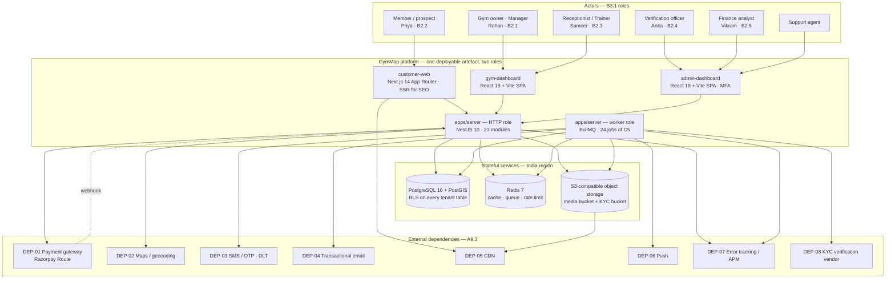
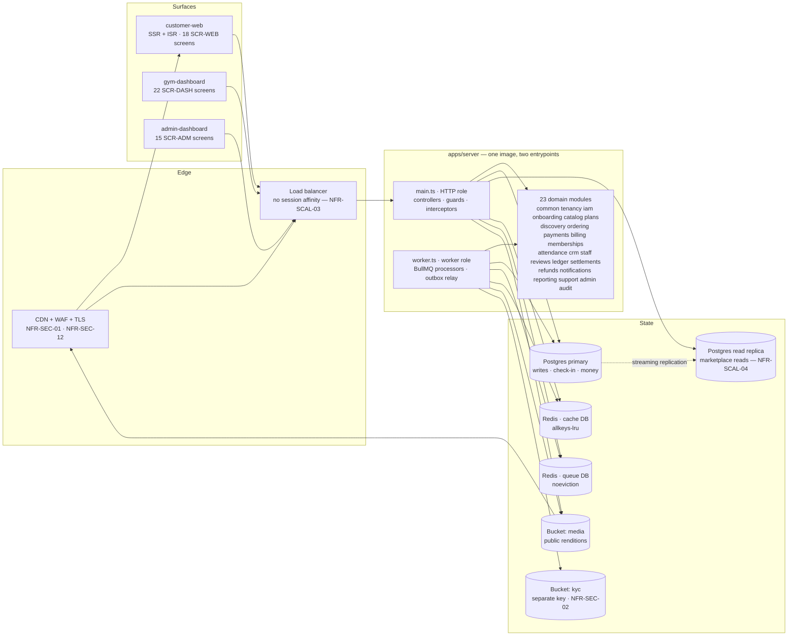
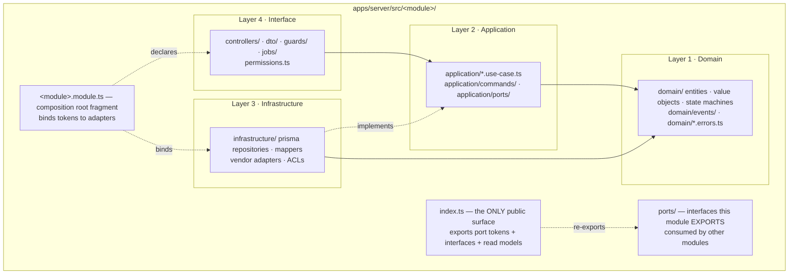
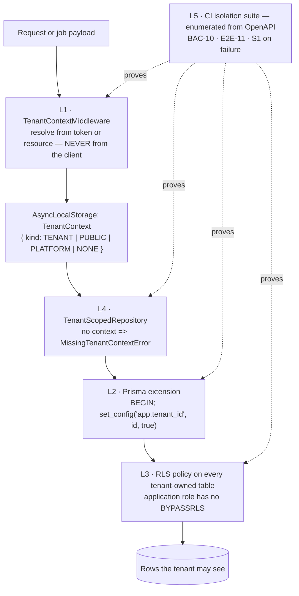
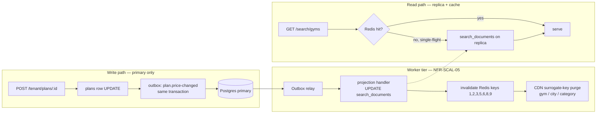
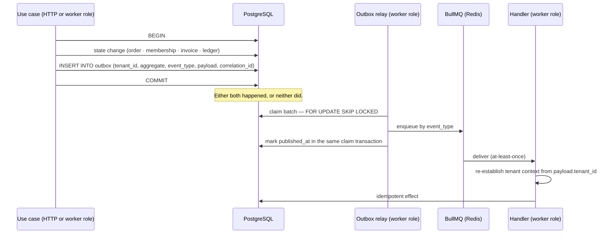
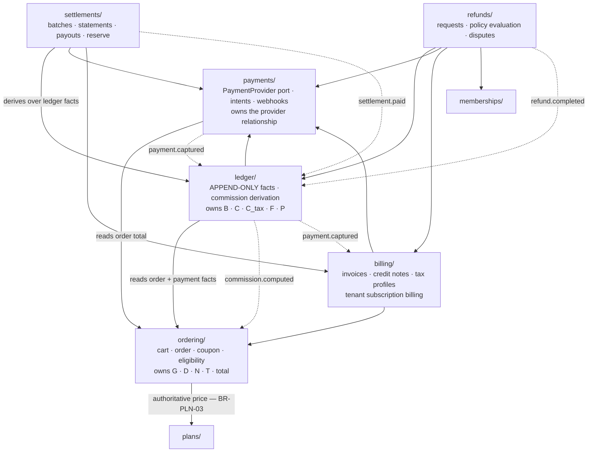

# Architecture — the complete structural design

| Field | Value |
| :--- | :--- |
| Document | `/docs/engineering/Architecture.md` |
| Rank | **3 — binding derived specification** (`PROJECT_CONSTITUTION.md` §1.3) |
| Version | 1.0 |
| Status | **IN FORCE** |
| Date | 2026-08-06 |
| Baseline | `MASTER_PRD.md` v2.0 §C1, §C2, §C5; `PROJECT_CONSTITUTION.md` §3, §5, §7, §11; `DECISION_LOG.md` ADR-0001 … ADR-0030; `STACK_ADDITIONS.md` A-01 … A-30; `LAUNCH_MARKET_INDIA.md` |
| Supersedes | Nothing. It is the detailed expansion of `ENGINEERING_PLAN.md` §1 and §4, which remain the CTO-level overview. |
| Phase | Phase 0. **Zero application code exists.** Every code block is labelled *illustrative — not committed code*. |
| Launch market | **India** (`OQ-01`). INR/paise, `Asia/Kolkata` (+05:30, no DST), GST 18% as CGST 9% + SGST 9%, financial year April–March, data residency India (mandatory, RBI). |

## What this document is, and what it is not

`ENGINEERING_PLAN.md` answers *what we are building and in what order*. This document answers **why
the system has the shape it has**, and it is written so that the month-nine engineer can predict
where a new piece of behaviour belongs without asking anyone.

It does not restate the folder tree (`PROJECT_CONSTITUTION.md` §7), the schema (`/docs/database/`),
the endpoint catalogue (`/docs/apis/`), the capacity model (`/docs/engineering/Scalability.md`) or
the control set (`/docs/engineering/Security.md`). Where those documents own a subject, this one
states the *architectural* rule and cites them.

### The five load-bearing invariants

Every section below exists to serve at least one of these. They are numbered here so the rest of the
document can refer to them by number.

| # | Invariant | Primary source | Structural mechanism |
| :-: | :--- | :--- | :--- |
| **I1** | No tenant reads or writes another tenant's data, and this is enforced **in the database**, not only in application code | `BR-TEN-01`, `NFR-SEC-09`, `C1.4` | §6 — five-layer chain, RLS, the Prisma tenant-context extension (ADR-0005, ADR-0006) |
| **I2** | Money is an append-only ledger of integer minor units; no balance is a mutable figure | `BR-PAY-01`, `BR-FIN-01`, `NFR-DQ-02` | §11 — `ledger_entries` with no `UPDATE`/`DELETE` grant (ADR-0014, ADR-0015) |
| **I3** | The price displayed is the price charged; server re-validation aborts checkout on mismatch | `BR-PLN-03`, `A3.4` principle 2 | §7 and §9 — read/write split, `PR1`…`PR6` cache price rules |
| **I4** | Verification before visibility; earned reviews only | `BR-GYM-01`, `BR-GYM-03`, `BR-REV-01`, `BR-REV-03` | §3.4 ports vs events; `onboarding/` → `discovery/` projection; `attendance/`→`reviews/` port |
| **I5** | Activation is webhook-driven; a client redirect never activates anything | `BR-PAY-02`, `FR-PAY-03`, `AC-PAY-02.1` | §8 and §11 — webhook ingest, outbox, worker-side activation transaction (ADR-0013, ADR-0017) |

---

# 1. Architecture at a glance

## 1.1 System context (C4 level 1)



**Reading the diagram.** Three browser surfaces, one API, one worker tier, three stateful services,
eight external dependencies. Every arrow into `Ext` leaves from an **adapter** in an owning module's
infrastructure layer, never from a use case (`PROJECT_CONSTITUTION.md` §5 layer 3). Every arrow into
`Ext` is wrapped in a circuit breaker with a declared fallback (`NFR-AVL-07`, §10 below).

Note the asymmetry that `NFR-AVL-03` forces: **`API` talks to DEP-01 and DEP-02 synchronously;
everything else is reached only from the worker tier.** A slow SMS provider therefore cannot consume
a request-handling thread, and a maps outage cannot reach the check-in path — which takes **zero**
third-party calls by design.

## 1.2 Container view (C4 level 2)



| Container | Runtime | Scaling unit | Statefulness | Governing requirement |
| :--- | :--- | :--- | :--- | :--- |
| `customer-web` | Node 20, Next.js 14 App Router | Horizontal, CPU-bound on SSR | ISR data cache only (regenerable) | `NFR-PERF-02` LCP ≤ 2.5 s, `FR-SRCH-13`, `FR-DETL-10` |
| `gym-dashboard` | Static bundle on the CDN | None — served from the edge | None | `NFR-PERF-10` ≤ 200 KB gzipped (customer site budget; dashboards tracked separately) |
| `admin-dashboard` | Static bundle on the CDN, MFA-gated | None | None | `NFR-SEC-11` |
| `apps/server` **HTTP role** (`main.ts`) | Node 20, NestJS 10 | Horizontal, **stateless** | None. No in-memory session, no sticky routing, no WebSocket state in Phase 1 | `NFR-SCAL-03`, §3.1 L6, A-08 |
| `apps/server` **worker role** (`worker.ts`) | Same image, different entrypoint | Horizontal, **separate scaling group** | Job state in Redis; distributed lock per job | `NFR-SCAL-05`, §3.1 L2, ADR-0009 |
| PostgreSQL 16 + PostGIS | Managed, India region | Vertical + read replicas | The system of record | `NFR-AVL-04` RPO ≤ 15 min / RTO ≤ 4 h, `OQ-16` |
| Redis 7 | Managed, India region | Vertical; logical DB split cache/queue | Cache is disposable; **queue and locks are not** | ADR-0008, TD-025 |
| Object storage + CDN | S3-compatible, two buckets | Managed | Durable | `NFR-SEC-02`, `BR-DAT-07`, `DEP-05` |

> **One artefact, two roles — and a naming note.** `PROJECT_CONSTITUTION.md` §3.1 L1 fixes exactly one
> deployable API artefact, `apps/server`, whose role is selected by configuration
> (`main.ts` vs `worker.ts`). Where ADR-0017's implementation notes say *"`apps/worker`"* they mean the
> **worker role of `apps/server`**, not a second application. Rank 1 wins (§1.3 precedence); this is
> recorded here so the discrepancy is not re-litigated in review.

## 1.3 External dependencies — DEP-01 … DEP-08, wired concretely

Each dependency is reached through exactly one port, implemented by exactly one adapter, owned by
exactly one module. That is what makes `NFR-AVL-07`'s circuit breaker a single object per dependency
rather than a scattering of `try/catch`.

| ID | Dependency | Owning module | Port (application layer) | Adapter (infrastructure layer) | Called from | Criticality | India specifics |
| :--- | :--- | :--- | :--- | :--- | :--- | :--- | :--- |
| **DEP-01** | Payment gateway with split settlement | `payments/` | `PaymentProvider` (ADR-0018) | `RazorpayRouteAdapter` **(Phase-1 India)**; `StripeConnectAdapter` retained as the PRD reference implementation for the port's contract tests | HTTP role (intent creation, webhook ingest); worker role (`payment.reconcile`, refunds, payouts) | **Critical** | Razorpay Route — Stripe Connect is not viable for domestic Indian split settlement (`LAUNCH_MARKET_INDIA.md` §7, conflict 1). RBI: platform never holds funds (`A4.3`); network tokens only (`BR-PAY-08`); UPI is the dominant rail |
| **DEP-02** | Maps and geocoding | `catalog/` (geocode), `discovery/` (client tiles) | `GeocodingPort` | `HttpGeocodingAdapter`, results cached 30 days | HTTP role, on address save only — **never on the search path** | High | Address-to-geo tolerance check for `BR-GYM-08` |
| **DEP-03** | SMS / OTP | `notifications/` | `SmsChannel` (one of four channels behind `NotificationChannel`) | Vendor adapter — **blocked on A-19**; candidates MSG91, Gupshup, Kaleyra, Airtel IQ | Worker role only | High | **TRAI DLT**: sender header and *every template* pre-approved. Template edits move to `PENDING_DLT_APPROVAL` while the previously approved version keeps sending (`LAUNCH_MARKET_INDIA.md` §8, conflict 5). DND applies to promotional, not transactional |
| **DEP-04** | Transactional email | `notifications/` | `EmailChannel` | Vendor adapter — **blocked on A-19** | Worker role only | High | Invoice delivery under `FR-INV-08` |
| **DEP-05** | Object storage / CDN | `catalog/` (media), `onboarding/` (KYC), `billing/` (PDFs) | `ObjectStoragePort`, `SignedUrlPort` | `S3Adapter` on AWS SDK v3 (`A-18`); Sharp rendition pipeline (`A-17`) | HTTP role (presigned URL issue); worker role (rendition, EXIF strip, virus scan) | High | Two buckets, two keys. KYC bucket access-logged (`NFR-SEC-02`, `BR-DAT-07`). India region |
| **DEP-06** | Push notification service | `notifications/` | `PushChannel` | Vendor adapter — **blocked on A-19** | Worker role only | Low (optional P1) | Email substitution on failure |
| **DEP-07** | Error tracking and APM | `common/` | `ErrorReporterPort`, OTel SDK | Sentry (`A-15`) + OpenTelemetry exporter | Both roles | Medium (ops) | Sub-processor disclosure under `NFR-PRV-06`; residency review under `OQ-16` |
| **DEP-08** | KYC / document verification vendor | `onboarding/` | `KycVerificationPort` | Vendor adapter, **optional**; the null adapter is the launch default | Worker role only | Medium | PAN + a non-Aadhaar identity document is the default position, so Aadhaar handling obligations are avoided entirely (`LAUNCH_MARKET_INDIA.md` §6) |

**Two rules that follow from this table and are enforced in review:**

| Rule | Statement | Why |
| :--- | :--- | :--- |
| **EXT-1** | **No external call is made inside an open database transaction.** Every hot path commits first and records the external result in a second, short transaction. | A slow third party inside a transaction converts a degraded peripheral into connection-pool exhaustion, which converts into a check-in outage — the cascade `NFR-AVL-03` forbids (`Scalability.md` §9.1). |
| **EXT-2** | **The check-in path calls nothing external.** `POST /checkin/scan` touches Postgres primary and Redis, and nothing else. | `NFR-AVL-02` makes check-in the last path to degrade; `NFR-PERF-03` gives it a 2-second p95 end-to-end budget which no third party may consume. |

## 1.4 The three surfaces, and why they are not one

| Surface | Rendering | Reason it differs | Screens | Locked by |
| :--- | :--- | :--- | :--- | :--- |
| `customer-web` | Next.js 14 App Router, **server-rendered** with ISR on four route families | Gym and city pages are an acquisition channel; the pages must be indexable | `SCR-WEB-001` … `SCR-WEB-018` | `C1.1`, ADR-0019, `FR-SRCH-13`, `FR-DETL-10` |
| `gym-dashboard` | React 18 + Vite **SPA** | SEO is irrelevant; interactivity is high; the check-in desk is a long-lived screen | `SCR-DASH-001` … `SCR-DASH-022` | `C1.1`, ADR-0019 |
| `admin-dashboard` | React 18 + Vite **SPA**, MFA mandatory | Same as above, plus platform-elevation surfaces that must never be adjacent to tenant code | `SCR-ADM-001` … `SCR-ADM-015` | `C1.1`, `NFR-SEC-11` |

All three consume `packages/ui` (design tokens + shadcn/ui primitives, `A-03`/`A-04`) and `packages/types`
(branded ids, `Money`, PRD enums, shared Zod schemas). All three access the server **only** through
TanStack Query hooks (ADR-0021, `PROJECT_CONSTITUTION.md` §16.2), and all three key their query cache
with `tenantId` first, clearing the entire cache on tenant switch (ADR-0006 client-side corollary).

**Phase-1 live figures are polled, not pushed** (`A-08`, ADR-0010, TD-002). `SCR-DASH-001`'s
currently-in-gym count and `SCR-DASH-009`'s recent-check-ins strip refresh through **one**
`useLiveCounters()` hook at a server-controlled 10–15 s interval, and both surfaces render a
mandatory *"last updated"* indicator — a stale figure presented as live is a defect. The hook is the
single seam through which Socket.IO replaces polling in Phase 2 behind
`release.attendance.realtime_transport`; no component changes when it does.

---

# 2. Architectural drivers — the requirements that produced the structure

An architecture is the set of decisions that are expensive to reverse. This section names the exact
requirement behind each one, so that a future change can be assessed against the driver rather than
against taste. **Every row is a requirement first and a structure second.** If a driver is ever
retired, the structure it produced becomes negotiable — and not before.

## 2.1 The primary drivers

| Driver | Requirement, quoted or paraphrased | Structural response | Where it lives | What breaks without it |
| :--- | :--- | :--- | :--- | :--- |
| **`BR-TEN-01` / `NFR-SEC-09`** | *"No tenant may read or write another tenant's data"*, enforced *"at the database level, not solely in application code"* | **Row-level security on every tenant-owned table**, plus the mandatory Prisma tenant-context client extension that guarantees `SET LOCAL app.tenant_id` runs on the same pooled connection as the query | `tenancy/` — §6 | `RSK-08` realised at probability 2 × impact 5. Under pooling, a naive ORM call takes a different connection than the one the variable was set on, and the query returns either **zero rows** or **another tenant's rows** (§6.3) |
| **`BR-FIN-01` / `BR-PAY-01`** | *"All balances are derived from the append-only ledger; no balance is ever stored as a directly-mutable figure"*; money is integer minor units with an explicit currency | **`ledger_entries` as an append-only table with no `UPDATE`/`DELETE` grant**, and four separate money modules (`ledger/`, `settlements/`, `refunds/`, `billing/`) so that no code path can grow an *"adjust the balance"* method | `ledger/` — §11 | A merged money module inevitably grows an adjustment path. `KPI-26` (zero unexplained reconciliation variance) has **no error budget**; a mutable balance makes it unachievable |
| **`BR-PAY-02`** | *"Membership activation is driven by the gateway webhook, not by the client's redirect. A client-side success signal never activates a membership."* | **Webhook ingest → transactional outbox → worker-side activation transaction.** The redirect updates the UI and reads server state; it asserts nothing | `payments/` + `common/outbox` — §8, §11.5 | A forgeable confirmation URL becomes a free gym membership (S1 under `C8.5`). `AC-PAY-02.1` — browser closed before redirect — fails |
| **`NFR-AVL-03` / `NFR-AVL-02`** | *"Loss of maps, search indexing, notifications or analytics must not prevent check-in, purchase or payment"*; check-in and payment *"degrade last"* | **A declared degradation model**: every dependency has a circuit breaker, a fallback and a documented user-visible consequence; external calls are pushed to the worker tier; the check-in path takes zero third-party calls | §10, and `EXT-1`/`EXT-2` above | A maps outage takes down search; an SMS backlog consumes request threads; a queue at the front desk during peak hours |
| **`NFR-SCAL-05`** | *"Background work … runs on a separate worker tier that cannot starve request handling"* | **Two entrypoints on one image** — `main.ts` and `worker.ts` — deployed as **separate scaling groups** with independent replica counts, CPU limits and rollout schedules | `apps/server` — §1.2 | A nightly reconciliation over 2,000 tenants competes with check-in for connections and CPU during the evening gym peak |
| **`NFR-SCAL-03` + `A-08` polling** | *"Application tier is stateless and horizontally scalable; no session affinity"*; Phase-1 live figures are polled | **No in-memory session, no in-process cache requiring coherence, no WebSocket state.** Shared state is in Postgres or Redis only; JWT access tokens carry the tenant context so any replica can serve any request | `iam/`, `tenancy/` — §3.1 L6 | Socket.IO in Phase 1 would need sticky sessions or a Redis adapter, both of which contradict `NFR-SCAL-03`; ADR-0010 rejected that trade for Phase 1 |
| **`NFR-SCAL-04`** | *"Read-heavy marketplace traffic is served from read replicas and cache; writes never contend with search"* | **A read path and a write path with different rules**: a denormalised `search_documents` projection, a `PublicPrismaService` for RLS-exempt public reads, replica routing, and a read-your-writes marker that pins a principal to the primary for 10 s after a write | `discovery/` — §7 | Search latency becomes a function of write volume; `NFR-PERF-01` (p95 ≤ 500 ms) fails on the busiest day of the month |
| **`BR-PLN-03`** | *"The price displayed is the price charged"*; server re-validation aborts on mismatch | **Checkout reads the primary and never a cache** for price; every price-affecting event purges its cache keys **in the same outbox handler** that updates the projection; no price-bearing cached artefact exceeds a 60-second TTL | `ordering/`, `plans/` — §9.4 | `RSK-11` — stale-listing mismatch damaging trust — becomes routine, and the caching layer is the only component in the system capable of causing it |
| **`BR-GYM-01` / `BR-GYM-03` / `BR-REV-01`** | Verification before visibility; approval requires a human actor id; only a member with a recorded check-in may review | **`onboarding/` owns the approval state machine and emits `gym.approved`**; `discovery/` maintains a projection whose `LISTABLE` status derives from it; `reviews/` calls an `AttendanceQueryPort` for **synchronous** eligibility truth rather than maintaining its own projection | §3.4, §8.3 | A gym self-lists before verification (`RSK-01`); a member who checked in ten seconds ago is told they are ineligible to review, contradicting `AC-REV-02.1` |
| **`C1.3`** | Modular monolith, boundaries *"enforced in code, so that any module can later be extracted into a service without a rewrite"* | **23 modules, two permitted communication mechanisms, `index.ts` as the only public surface, and 16 `dependency-cruiser` rules that fail the build** | §3, §4, §13 | Boundaries decay into convention; extraction becomes a rewrite; TD-001's payoff trigger becomes unactionable |
| **`NFR-SCAL-06`** | *"Database growth is bounded by partitioning attendance and audit tables by time"* | **Monthly range partitioning on `attendance.checked_in_at` and `audit_log.occurred_at` from the first migration**, with `audit.partition-maintenance` creating and archiving partitions | `attendance/`, `audit/` | 18M attendance rows/year at `NFR-SCAL-01` volume degrade the cooldown lookup that sits on the `NFR-PERF-03` critical path. Retrofitting partitioning to a live money-adjacent table is a multi-day outage (TD-014, launch gate) |
| **`OQ-16` / RBI localisation** | Payment system data must be stored **in India**; residency is mandatory, not configurable | **Single-region India deployment (Mumbai primary, second Indian region for DR)**, with residency retained as a *configuration* dimension in the architecture for later markets | `infra/terraform` | `NFR-AVL-04`'s RPO/RTO must be met with Indian regions only, which constrains DR topology (TD-007) |

## 2.2 Drivers that were considered and did **not** shape the structure

Recorded so that they are not reintroduced as justifications later.

| Non-driver | Why it does not shape Phase 1 | Settled by |
| :--- | :--- | :--- |
| Real-time push | The PRD never asks for real-time. It asks for two live figures, both satisfiable by 10–15 s polling | ADR-0010, `A-08`, TD-002 |
| Search scale | 5,000 branches at `NFR-SCAL-01` is two orders of magnitude below the ~50k-listing threshold at which OpenSearch is sanctioned | ADR-0007, `C1.1`, TD-003 |
| Multi-currency retail | Storage is currency-agnostic (`Money = { amountMinor, currency }`), but Phase 1 sells in INR only | TD-013, `OBJ-09` |
| Microservices | Explicitly rejected; the operational cost is not paid before there is a reason to pay it | ADR-0003, `C1.3`, `STACK_ADDITIONS.md` Part 3 |
| Native mobile | Out of scope; Phase 1 is web-only and mobile-responsive | `A4.2`, `CON-01` |
| An analytics warehouse | Reporting reads the OLTP primary in Phase 1, with a known ceiling | TD-021, `FR-RPT-02` |

## 2.3 The quality-attribute scenarios these drivers must satisfy

Architecture is judged by scenarios, not adjectives. These six are the ones the structure is
designed against; each has a load test or a CI gate that proves it.

| # | Stimulus | Environment | Required response | Measure | Proven by |
| :-: | :--- | :--- | :--- | :--- | :--- |
| **QAS-1** | A member scans a QR at the desk | 500 check-ins/minute platform-wide | Allowed or denied, with the reason, end to end | p95 ≤ 2 s (`NFR-PERF-03`), throughput ≥ 500/min (`NFR-PERF-08`) | k6 load gate, pre-release |
| **QAS-2** | An anonymous visitor searches gyms within 5 km with six filters | 2,000 searches/minute sustained | A ranked, faceted first page | p95 ≤ 500 ms, p99 ≤ 1000 ms (`NFR-PERF-01`, `NFR-PERF-09`) | k6 load gate; `EXPLAIN` review on the GiST index |
| **QAS-3** | Tenant A's owner requests tenant B's settlement statement by id | Authenticated, valid session | `404`, no disclosure of existence | Isolation suite passes for every OpenAPI path | `BAC-10`, `E2E-11`, Testcontainers with real RLS |
| **QAS-4** | The payment gateway is unreachable for 10 minutes | Peak evening hours | Check-in unaffected; new purchases fail fast with a retry affordance; offline sale recording continues | Circuit breaker opens; `checkin_allowed_rate` unchanged | Chaos drill in staging; §10 table row DEP-01 |
| **QAS-5** | A gym owner un-publishes a plan | Any time | The plan disappears from search, city pages, category pages and gym detail before it can be bought | ≤ 60 s (`PR1`, `PR5`); zero `PLAN_PRICE_CHANGED` aborts caused by invalidation lag | `price_revalidation_mismatch_total` < 0.1% of checkouts |
| **QAS-6** | An approved application is decided by a verification officer | Business hours | The listing is live on the marketplace | ≤ 60 s (`FR-ONB-13`, `AC-ONB-02.5`) | Outbox oldest-pending-age metric; E2E journey |

---

# 3. The modular monolith

## 3.1 What a module *is* in this codebase

A module is not a folder. It is the conjunction of six properties, all of which must hold, and any
one of which failing means the boundary is drawn in the wrong place.

| # | Property | Concretely |
| :-: | :--- | :--- |
| **M1** | **A consistency boundary** | One module owns one set of aggregates and the transaction that mutates them. Two modules never share a database transaction (`PROJECT_CONSTITUTION.md` §3.4.3). |
| **M2** | **A data-ownership boundary** | The module's tables are read and written by **its own repositories only**. `reviews/` does not `SELECT` from `attendance`; it calls `AttendanceQueryPort`. |
| **M3** | **A public-surface boundary** | Exactly one file — `index.ts` — is importable from outside. Everything else is internal, and `module-public-api-only` fails the build on a violation. |
| **M4** | **A deletability boundary** | Deleting the directory and its `AppModule` import leaves every other module compiling, with only its legitimate consumers losing features (§3.1 L5, Q4 of §2). |
| **M5** | **A NestJS `@Module()` boundary** | One directory, one `@Module()`, one boundary. No module spans two `@Module()` declarations and no `@Module()` spans two domain modules (L4). |
| **M6** | **A documentation and ownership boundary** | One `README.md` (§21.2), one runbook in `/docs/runbooks/` covering the module's top three failure modes (`NFR-MNT-09`), one `CODEOWNERS` entry. |

**The twenty-three are fixed** by `C1.3` and restated in `PROJECT_CONSTITUTION.md` §3.2. A
twenty-fourth requires a §24 amendment. ADR-0029 records why the PRD's 23-module structure was
adopted over an earlier 14-module engineering brief: the brief collapsed `ledger/`, `settlements/`,
`refunds/` and `billing/` into one `payments`, which is an unacceptable boundary under `BR-FIN-01`
because a merged money module inevitably grows an adjustment path.

## 3.2 Internal layering of a module

Every module has the same internal shape. This is what makes 23 modules navigable by one engineer.



The sentence every engineer must be able to recite (`PROJECT_CONSTITUTION.md` §3.3):

> **routes/controllers → use cases → domain ← repositories. The domain depends on nothing.**

Two directories are easy to confuse and are worth stating apart:

| Directory | Contains | Direction | Example |
| :--- | :--- | :--- | :--- |
| `application/ports/` | Interfaces this module **consumes** and expects someone to satisfy | Inbound to this module | `memberships/application/ports/membership-repository.port.ts` |
| `ports/` (module root) | Interfaces this module **exports** for other modules to consume | Outbound from this module | `attendance/ports/attendance-query.port.ts` |

## 3.3 The public surface: `index.ts` exports ports only

```ts
// illustrative — not committed code
// apps/server/src/attendance/index.ts
export { ATTENDANCE_QUERY_PORT } from './ports/attendance-query.port';
export type { AttendanceQueryPort } from './ports/attendance-query.port';
export type { CheckInSummaryReadModel } from './types/read-models';
export { AttendanceModule } from './attendance.module';
// NOT exported, ever: AttendanceRepository, the Attendance entity,
// any Prisma type, any DTO, any controller, any guard.
```

| Rule | Statement | Enforced by |
| :--- | :--- | :--- |
| **PS1** | `index.ts` exports **port tokens, port interfaces, read-model types and the NestJS module class**. Nothing else. | Review + `module-public-api-only` |
| **PS2** | A read model returned across a boundary is owned by the **provider** module and is a plain serialisable type — never a domain entity, never a Prisma model, never a `Prisma.$Result` | `no-cross-module-domain`, `no-cross-module-prisma` |
| **PS3** | The interface is declared by the provider, not the consumer. `attendance/` decides what "has this member checked in here" means | §3.4.1 X2 |
| **PS4** | The interface is the **smallest** set of operations the consumer needs. A `getEntity()` method is a design smell that usually means the boundary is wrong | §6.4 Interface Segregation |
| **PS5** | The cross-module graph is a **DAG**. `no-circular` fails the build at any depth | `dependency-cruiser` |

## 3.4 The two — and only two — cross-module mechanisms

| | **Exported provider port** (synchronous) | **Domain event via outbox** (asynchronous) |
| :--- | :--- | :--- |
| Use when | The caller needs an answer **now** to complete its own transaction | The caller does not need an answer, and the receiver must not be able to abort the caller's transaction |
| Direction | Downward only, along the layered module graph | Any direction, including "upward" |
| Consistency | Strong, inside the caller's request | Eventually consistent, bounded by the relay interval |
| Failure semantics | The caller fails | The caller succeeds; the handler retries, then dead-letters and alerts |
| Canonical example | `ordering/` asks `plans/` for the authoritative price to satisfy `BR-PLN-03` | `payments/` emits `payment.captured`; `memberships/`, `billing/` and `ledger/` react |
| Canonical **counter**-example | Using an event for review eligibility — a member who checked in ten seconds ago would be told they are ineligible, contradicting `AC-REV-02.1` | Using a port for the post-third-check-in review prompt (`FR-REV-10`) — the emitter would then depend on the notification system's availability |

> **The distinguishing question, from `PROJECT_CONSTITUTION.md` §2 Q5:**
> **synchronous truth needs a port; asynchronous reaction needs an event.** Using an event for the
> first is unnecessary latency; using a port for the second is unnecessary coupling.

### 3.4.1 Exhaustive list of what is forbidden across a module boundary

| Forbidden | Rule that catches it |
| :--- | :--- |
| Importing another module's repository class or interface | `no-cross-module-repository` |
| Importing another module's Prisma model type or delegate | `no-cross-module-prisma` |
| Querying another module's table in SQL or Prisma | Review + `no-raw-prisma-client` |
| Importing another module's domain entity, aggregate or value object | `no-cross-module-domain` |
| Importing another module's DTO, controller or guard | `no-cross-module-interface` |
| Reaching into another module's non-`index.ts` path | `no-cross-module-internal`, `module-public-api-only` |
| `@Global()` outside `common/` and `tenancy/` | `no-global-modules` |
| A cycle between modules at any depth | `no-circular` |
| Sharing one database transaction across two modules' repositories | Review — the unit of work belongs to one use case in one module |

## 3.5 The composition root

There is no service locator, no ambient container lookup, and no `require()` at runtime. Wiring
happens in exactly two kinds of file.

| File | Role | Rules |
| :--- | :--- | :--- |
| `apps/server/src/app.module.ts` | **The composition root.** Imports the 23 module classes and nothing else. It contains no providers of its own beyond the global `common/` and `tenancy/` modules | It is the only file that knows all 23 modules exist. Adding a 24th requires a §24 amendment |
| `apps/server/src/<module>/<module>.module.ts` | **A composition-root fragment.** The only file permitted to know all four layers at once, because binding a port to an adapter is exactly what it is for | Every port bound by **injection token**, never by concrete class as the token. `exports` lists only tokens. `forwardRef` requires a `DECISION_LOG.md` entry naming the cycle and the plan to remove it |

`main.ts` and `worker.ts` are the two **bootstraps**, not two composition roots. They build the same
`AppModule`; they differ only in what they start afterwards.

```ts
// illustrative — not committed code
// apps/server/src/main.ts        — HTTP role
const app = await NestFactory.create(AppModule);
app.useGlobalPipes(new ZodValidationPipe());          // A-02
app.useGlobalFilters(new DomainExceptionFilter());    // C3.1 envelope, §13.3
await app.listen(config.port);

// apps/server/src/worker.ts      — worker role (NFR-SCAL-05)
const ctx = await NestFactory.createApplicationContext(AppModule);
await ctx.get(WorkerRegistry).startAll();             // the 24 C5 processors + the outbox relay
// No HTTP listener is created. No controller is reachable.
```

The consequence worth stating: **a BullMQ processor and an HTTP controller are the same kind of
thing** — a layer-4 adapter that resolves context, calls one use case and maps the result
(`PROJECT_CONSTITUTION.md` §3.3 D7). A job that contains business logic is the same defect as a
controller that contains business logic.

## 3.6 How a module is later extracted to a service

Extraction is a Phase-2+ *possibility*, not a plan (TD-001). The procedure exists so the monolith's
promise is verifiable rather than aspirational.

| Step | Action | Precondition it proves | Already true today? |
| :-: | :--- | :--- | :--- |
| 1 | Confirm no inbound edges except through exported ports and events, from the CI-published `dependency-cruiser` graph | §3.4 was enforced | Yes — the graph is a build artefact on every run |
| 2 | Confirm the module's tables are referenced only by its own repositories. Cross-boundary foreign keys are replaced by an id column plus a port lookup, **in a prior release** | §15 boundary discipline | Partly — cross-boundary FKs exist where they are also referential-integrity requirements (`NFR-DQ-01`); each is listed in `/docs/database/Relationships.md` |
| 3 | Rebind each exported port to a **remote adapter** implementing the identical interface over HTTP or a queue. Consumers do not change | Dependency inversion (§6.6) | Yes — consumers already inject tokens, never classes |
| 4 | Move event publication from the in-process relay to a broker. At-least-once and handler idempotency already hold | `C1.5` outbox | Yes — ADR-0017 |
| 5 | Split the schema. All access is already tenant-scoped and no cross-tenant joins exist in tenant-scope paths | §11, §15 | Yes — `C1.4` migration path |
| 6 | Run the full contract suite and the isolation suite against the split deployment | `BAC-10`, `NFR-SEC-09` | Yes — the suites are OpenAPI-driven and deployment-agnostic |

**Extraction readiness is measured continuously, not at extraction time.** A module whose inbound
edge count increases without an amendment is flagged in review. The metric is published by CI as
part of the architecture job.

---

# 4. The layering contract

## 4.1 The import matrix

Rows import; columns are imported. **✅ permitted · ❌ build failure · ⚠️ permitted with a named
restriction.** This matrix is the human-readable form of `PROJECT_CONSTITUTION.md` §5 and is encoded
cell-for-cell in `.dependency-cruiser.cjs`.

| ↓ imports → | Own `domain/` | Own `application/` | Own `infrastructure/` | Own `controllers/` `dto/` `guards/` | Other module `index.ts` | Other module internals | `packages/types` | `packages/utils` | `@nestjs/*` | `@prisma/client` | `zod` | Vendor SDK | Raw `PrismaClient` |
| :--- | :-: | :-: | :-: | :-: | :-: | :-: | :-: | :-: | :-: | :-: | :-: | :-: | :-: |
| **1 · Domain** | ✅ | ❌ | ❌ | ❌ | ❌ | ❌ | ✅ | ✅ | ❌ | ❌ | ❌ | ❌ | ❌ |
| **2 · Application** | ✅ | ✅ | ❌ | ❌ | ✅ | ❌ | ✅ | ✅ | ⚠️ `@Injectable()` / `@Inject()` **only** | ❌ | ❌ | ❌ | ❌ |
| **3 · Infrastructure** | ✅ | ✅ | ✅ | ❌ | ✅ | ❌ | ✅ | ✅ | ⚠️ `@Injectable()` | ⚠️ types only, via the tenant-scoped client | ⚠️ where a vendor payload is parsed at an ACL | ✅ | ❌ — only `tenancy/prisma/**` |
| **4 · Interface** | ❌ entities | ✅ | ❌ | ✅ | ❌ | ❌ | ✅ | ✅ | ✅ | ❌ | ✅ | ❌ | ❌ |
| **`<module>.module.ts`** | ✅ | ✅ | ✅ | ✅ | ✅ | ❌ | ✅ | ✅ | ✅ | ❌ | ❌ | ❌ | ❌ |

Three cells deserve a sentence each, because they are the ones argued about:

- **Layer 4 → layer 1 is ❌.** A controller never touches an aggregate. It receives a validated
  command, calls one use case, and maps a **result type** to a response DTO. If a controller needs an
  entity's field, the use-case result is missing a field.
- **Layer 2 → `@nestjs/common` is ⚠️, not ❌.** `@Injectable()` and `@Inject()` are the DI
  vocabulary and carry no framework behaviour. Any other NestJS import in a use case — `Request`,
  `HttpException`, a decorator from `@nestjs/swagger` — is a build failure.
- **Layer 3 → raw `PrismaClient` is ❌.** This is `no-raw-prisma-client`, and it is the rule that
  makes I1 provable. Only `apps/server/src/tenancy/prisma/**` may construct or import the client
  (§6.3).

## 4.2 The dependency-cruiser rule set

`C1.3` requires that *"a lint rule and an architecture test fail the build on violation."* This is
that rule set (`A-23`), running in the required `architecture` CI job **before** tests. There is no
override path, no `--no-verify`, and no inline suppression comment.

| # | Rule | Forbids | Invariant / requirement it protects |
| :-: | :--- | :--- | :--- |
| 1 | `no-circular` | Any cycle in the module or file graph | `C1.3` extractability, TD-001 |
| 2 | `no-cross-module-internal` | `src/<a>/**` importing `src/<b>/**` other than `src/<b>/index.ts` | M3 |
| 3 | `no-cross-module-repository` | Importing another module's `**repository**` path | M2 |
| 4 | `no-cross-module-prisma` | Another module's Prisma types, or a `Prisma.*Delegate` outside `src/*/infrastructure/**` | M2, I1 |
| 5 | `no-cross-module-domain` | `src/<a>/**` importing `src/<b>/domain/**` | M1 |
| 6 | `no-cross-module-interface` | Importing another module's `controllers/`, `dto/`, `guards/` | Interface-layer coupling |
| 7 | `domain-is-pure` | `src/*/domain/**` importing `@nestjs/*`, `@prisma/client`, `zod`, `ioredis`, `bullmq`, `pino`, `@sentry/*`, `axios`, `node:fs`, `node:net`, `node:http` | Layer 1 purity; testability without infrastructure |
| 8 | `usecase-no-orm` | `src/*/application/**` importing `@prisma/client` or any `infrastructure/**` | Dependency inversion |
| 9 | `controller-no-repository` | `src/*/controllers/**` importing any `*.repository.ts` | D1 |
| 10 | `no-raw-prisma-client` | Any `PrismaClient` import or construction outside `src/tenancy/prisma/**` | **I1** — the single most important rule in the set |
| 11 | `orphan-modules` | A file reachable from nothing | Dead code |
| 12 | `no-deprecated-express` | Any import of `express`, Express-style middleware bypassing Nest, or a document naming Express as this project's framework | `C1.1`, ADR-0002 |
| 13 | `module-public-api-only` | A module without `index.ts`, or exporting from elsewhere | M3 |
| 14 | `no-global-modules` | `@Global()` outside `src/common` and `src/tenancy` | Explicit dependency declaration |
| 15 | `no-default-export` | `export default` in `apps/server` or `packages/*` | §9.9 — greppable names |
| 16 | `no-float-money` | `number` for any identifier matching `/(amount\|price\|fee\|total\|gross\|net\|tax\|commission\|discount\|payable\|balance\|reserve\|minor)/i` | **I2** — §10.3 |

**Rule 16 is the one that catches the 02:00-on-a-Friday defect.** It is a lint rule rather than a
type rule because the failure it prevents — someone declaring `const commission: number` — type-checks
perfectly. `packages/types`'s branded `Money` type is the positive form of the same rule; rule 16 is
the negative form, and both are needed.

---

# 5. Request lifecycle

## 5.1 The worked request

Everything below traces **one** real request:

```
POST /v1/tenant/memberships/{membershipId}/freeze
Authorization: Bearer <access token: sub, tenant_id, roles, perm_version>
Idempotency-Key: 01J9Z7Q4X2K8V3M0
Content-Type: application/json

{ "start_date": "2026-08-10", "end_date": "2026-08-24", "reason": "TRAVEL" }
```

It is chosen because it exercises every construct: it is authenticated, tenant-scoped,
permission-gated, resource-ownership-gated, schema-validated, idempotent, audited, subject to a
domain invariant that can refuse it (`BR-MEM-05` freeze allowance), timezone-sensitive (freeze dates
are interpreted in the **gym's** timezone, `Asia/Kolkata` at launch), and it emits a domain event.

Serving surface: `SCR-DASH-008` Member 360. Requirements: `FR-MEMB-04`, `BR-MEM-05`, `BR-MEM-06`,
`BR-MEM-07`, `C4.1`.

## 5.2 The ordered walkthrough

| # | Construct | Where it lives | Concern it owns | What happens to **this** request | Failure at this step |
| :-: | :--- | :--- | :--- | :--- | :--- |
| 1 | **TLS / WAF / edge** | Infrastructure | Transport security, gross abuse | TLS 1.2+ terminated; security headers policy applied (`NFR-SEC-01`, `NFR-SEC-12`) | Connection refused |
| 2 | **`CorrelationIdMiddleware`** | `common/` | `NFR-MNT-04` | Reads or mints a correlation id, puts it into `AsyncLocalStorage`, binds it to the Pino child logger and to the OTel span | — (cannot fail) |
| 3 | **`SecurityHeadersMiddleware`** | `common/` | `NFR-SEC-12` | HSTS, CSP, `X-Content-Type-Options`, `Referrer-Policy`, `Permissions-Policy` set on the eventual response | — |
| 4 | **`TenantHeaderRejectionMiddleware`** | `tenancy/` | §11.3 | Rejects any request carrying `X-Tenant-Id` with `400 TENANT_HEADER_NOT_ACCEPTED` and logs a **security event**. Our request carries none | `400` + security-event log |
| 5 | **IP-scoped rate limiter** | `common/`, `rate-limiter-flexible` on Redis (`A-13`) | `NFR-SEC-06` tiering | Tier for *general tenant writes* consumes one token against the caller IP | `429`, envelope `code: RATE_LIMITED` |
| 6 | **`TenantContextMiddleware`** | `tenancy/` | **I1 layer 1** | Resolves the tenant **from the verified access token's `tenant_id` claim** — never from the client — and writes a `TenantContext` of kind `TENANT` into `AsyncLocalStorage` | If unresolvable for a tenant-scoped route: request proceeds and fails loudly at step 14 |
| 7 | **`JwtAuthGuard`** | `iam/` | Authentication | Verifies signature, expiry and the token's `perm_version` against the Redis permission counter (`FR-RBAC-04`, 60-second propagation) | `401`; on refresh-token reuse the whole family is revoked and logged at `warn` |
| 8 | **User-scoped rate limiter guard** | `common/` | `NFR-SEC-06` | Consumes a token against `(userId, endpointClass)` now that the principal is known | `429` |
| 9 | **`PermissionsGuard`** | `iam/` | Authorisation (`FR-RBAC-01`) | Reads the mandatory `@RequiredPermission('memberships.freeze')` declared on the handler and evaluates it against the principal's compiled grant map. A route with **no** declaration fails a CI check, not runtime | `403 PERMISSION_DENIED` |
| 10 | **`TenantGuard`** | `tenancy/` | Resource-tenant match (`FR-RBAC-03`) | Asserts that the session tenant and the **resource** tenant agree. Evaluated against the resource, not the session alone | `404` — **not** `403`, so existence is not disclosed (§13.4) |
| 11 | **`MembershipOwnershipGuard`** | `memberships/guards/` | Module-specific authorisation | Asserts the membership belongs to this tenant's gym and, for staff, to a branch the staff member is assigned to | `404` |
| 12 | **`IdempotencyInterceptor`** (pre) | `common/` | `BR-PAY-03`, `C1.5` | Hashes `(method, path, body)` into a request fingerprint. Looks up `idempotency_keys`. **Same key + same fingerprint** → returns the stored response and short-circuits. **Same key + different fingerprint** → `409 IDEMPOTENCY_KEY_MISMATCH`. New key → reserves the row | `409` |
| 13 | **`AuditInterceptor`** (pre) | `audit/` | `BR-DAT-01`, `NFR-DQ-05` | Captures the *before* state for the annotated entity and the actor, actor type, impersonator, IP, user agent, correlation id and reason | — |
| 14 | **`ZodValidationPipe`** | `common/` (`A-02`) | `NFR-SEC-05` | Parses params and body against the **`.strict()`** schema shared from `packages/types`. Unknown fields are **rejected**, not stripped — which is also why a `tenant_id` in the body is a `400` rather than a silent ignore | `400`, one `details` entry per field |
| 15 | **Controller** `TenantMembershipController.freeze()` | `memberships/controllers/` | HTTP shape only | Maps the validated DTO to a plain `FreezeMembershipCommand` and calls **exactly one** use case. No conditionals, no `Money` arithmetic, no repository | — |
| 16 | **Use case** `FreezeMembershipUseCase.execute()` | `memberships/application/` | Orchestration | Opens **one** `UnitOfWork`; loads the aggregate through `MEMBERSHIP_REPOSITORY`; reads the plan's freeze policy through `PLAN_POLICY_PORT`; reads the gym timezone through `TenantSettingsPort`; invokes domain behaviour; persists; publishes the event into the outbox — all inside that one transaction | Domain error propagates as a typed error |
| 17 | **Domain** `Membership.freeze()` + `MembershipStatusStateMachine` | `memberships/domain/` | **Invariants** | Enforces `BR-MEM-05` (allowance not exhausted, plan permits freezing), `BR-MEM-06` (end date extends by exactly the frozen days, computed in the gym's timezone), `BR-MEM-07` (no retroactive freeze), and the `C4.1` transition `ACTIVE → FROZEN`. Uses the injected `Clock`, never `Date.now()` | Typed domain error → `422 FREEZE_ALLOWANCE_EXHAUSTED` / `FREEZE_NOT_PERMITTED_BY_PLAN` / `FREEZE_RETROACTIVE_NOT_PERMITTED` |
| 18 | **Repository** `PrismaMembershipRepository` | `memberships/infrastructure/` | Persistence | Maps aggregate → row and issues the write through the **tenant-scoped client** obtained from `tenancy/`. It never writes `where: { tenantId }` by hand and never accepts a `tenantId` parameter | — |
| 19 | **Prisma tenant-context extension** | `tenancy/prisma/` | **I1 layer 2** | Resolves the context from `AsyncLocalStorage`. Opens one interactive transaction and executes `SELECT set_config('app.tenant_id', $1, true)` **on that same connection** before the query runs | Context kind `NONE` → `MissingTenantContextError` → `500 TENANT_CONTEXT_MISSING`, alerted. It is a **defect**, never a user-facing 403 |
| 20 | **PostgreSQL RLS** | Database | **I1 layer 3** | The policy `USING (tenant_id = current_setting('app.tenant_id')::uuid)` filters the statement. The application role has **no** `BYPASSRLS` | Zero rows affected → the repository raises a not-found rather than reporting a phantom success |
| 21 | **Outbox write** | `common/` transactional helper | **At-least-once eventing** | `INSERT INTO outbox` for `membership.frozen` **inside the same transaction**. The use case has no queue client and physically cannot publish outside the transaction | Rolls back with everything else — which is the point |
| 22 | **`COMMIT`** | Database | Atomicity | State change, audit row, idempotency response and outbox row commit together, or none do | Serialisation failure → bounded retry at the use-case boundary |
| 23 | **`AuditInterceptor`** (post) | `audit/` | `BR-DAT-01` | Writes the `audit_log` row with before/after on a connection whose role **cannot** `UPDATE` or `DELETE` (`NFR-SEC-13`) | — |
| 24 | **`IdempotencyInterceptor`** (post) | `common/` | `BR-PAY-03` | Stores status and response body against the key with a 24-hour expiry (TD-019) | — |
| 25 | **`ResponseSerialisationInterceptor`** | `common/` | Contract fidelity | Maps the use-case result to the response DTO, applies the pagination envelope where relevant, and strips anything not in the declared schema | — |
| 26 | **`DomainExceptionFilter`** | `common/` | `C3.1` envelope | Only on the error path. Maps a typed error to its registry row (§13.2): code, i18n-resolved message, `details`, `correlation_id`. **No controller constructs an error response by hand** | — |
| 27 | **Response** | — | — | `200` with the updated membership read model, `X-Correlation-Id`, and no `Set-Cookie` | — |
| 28 | **Outbox relay** (worker role, asynchronous) | `common/` + `worker.ts` | Delivery | `SELECT … FOR UPDATE SKIP LOCKED`, enqueue to BullMQ by `event_type`, mark `published_at`. `notifications/` re-establishes tenant context from the event's `tenant_id` and sends the freeze-confirmation message | Attempts capped; exhausted events become `DEAD` and alert |

```mermaid
sequenceDiagram
    autonumber
    participant C as gym-dashboard
    participant MW as Middleware chain (2-6)
    participant G as Guards (7-11)
    participant I as Interceptors pre (12-13)
    participant P as ZodValidationPipe (14)
    participant CT as Controller (15)
    participant UC as Use case (16)
    participant D as Domain (17)
    participant R as Repository (18)
    participant X as Prisma extension (19)
    participant DB as Postgres + RLS (20-22)
    participant IP as Interceptors post (23-25)
    participant W as Worker / relay (28)

    C->>MW: POST /v1/tenant/memberships/:id/freeze
    MW->>MW: correlation id · reject X-Tenant-Id · rate limit · resolve TenantContext
    MW->>G: continue
    G->>G: JWT · permission · tenant match · ownership
    G->>I: continue
    I->>I: idempotency lookup · audit before-state
    I->>P: continue
    P->>CT: FreezeMembershipCommand (strict schema)
    CT->>UC: execute(command)
    UC->>R: load aggregate
    R->>X: query
    X->>DB: BEGIN; set_config('app.tenant_id', ..., true); SELECT
    DB-->>X: row (RLS-filtered)
    X-->>R: row
    R-->>UC: Membership aggregate
    UC->>D: freeze(range, clock, gymTimeZone)
    D-->>UC: FROZEN + FreezeApplied
    UC->>R: save + INSERT outbox (same tx)
    R->>DB: UPDATE · INSERT outbox · COMMIT
    UC-->>CT: FreezeMembershipResult
    CT-->>IP: result
    IP->>DB: audit_log row (append-only role)
    IP-->>C: 200 + response DTO + correlation id
    W->>DB: SELECT unpublished FOR UPDATE SKIP LOCKED
    W->>W: dispatch membership.frozen -> notifications/
```

## 5.3 Ordering rules that are easy to get wrong

| Rule | Statement | Why the order matters here |
| :--- | :--- | :--- |
| **RL-1** | Tenant context is established in **middleware**, before any guard | A guard that needs to compare a resource's tenant to the session's tenant (step 10) cannot do so if the context is resolved later |
| **RL-2** | The IP-scoped limiter runs **before** authentication; the user-scoped limiter runs **after** | An unauthenticated flood must be shed before JWT verification burns CPU; a per-user budget cannot exist before the user is known |
| **RL-3** | Idempotency runs **before** validation | A replayed request with a stored response must return that response without re-validating, so that a schema change between the original call and the replay cannot turn a stored `201` into a `400` |
| **RL-4** | Validation runs **after** authorisation | A caller who may not perform the action learns `403`, not a field-by-field description of the payload the endpoint expects |
| **RL-5** | The outbox write is **inside** the transaction; the dispatch is **outside** it | This is the entire content of ADR-0017. Publishing inside the transaction to Redis sends messages for rolled-back work; publishing after commit from application code loses messages on a crash |
| **RL-6** | The audit write uses a **different role** to the business write | `NFR-SEC-13` requires audit logs to be stored where application credentials cannot alter them |
| **RL-7** | Exactly **one** use case per handler | Two use cases in one controller method means two transactions in one request, which means a partially-applied request with no rollback story |

## 5.4 The same lifecycle for a BullMQ job

A job is the same pipeline with three substitutions, and no others:

| HTTP construct | Worker equivalent | Note |
| :--- | :--- | :--- |
| `TenantContextMiddleware` | The processor re-establishes context from the job payload's `tenant_id` | Handlers therefore obey I1 exactly as requests do (ADR-0017 implementation notes) |
| Guards | The distributed lock plus the job's own preconditions | Authorisation is not applicable; **double execution** is the equivalent threat, and the lock is the control (ADR-0009) |
| Controller | Processor (`jobs/*.processor.ts`) | Layer-4 discipline: resolve context, call one use case, map the result. No business logic (D7) |

Everything else — the use case, the domain, the repository, the extension, RLS, the outbox — is
byte-for-byte the same code. That is the property that makes `settlement.build-batches` and
`POST /tenant/settlements/:id/approve` incapable of disagreeing about what a batch is.

---

# 6. Multi-tenancy architecture

`C1.4` opens with the sentence that governs this whole section: *"This is the single most important
architectural decision in the system, because **BR-TEN-01** is both a legal obligation and the thing
most likely to be violated by an ordinary coding mistake."*

**Model:** shared database, shared schema, `tenant_id` on every tenant-owned table, enforced by
PostgreSQL row-level security (ADR-0006). Schema-per-tenant at day one was rejected; `C1.4` documents
a migration path for large accounts instead, and rule **TL5** keeps that path open by forbidding
cross-tenant joins in tenant-scope code.

## 6.1 The five-layer chain, and what each layer *fails to* catch

The chain exists because **each layer fails differently**. Any one of them alone is insufficient, and
the honest column in this table is the last one.

| Layer | Mechanism | Lives in | Catches | Does **not** catch |
| :-: | :--- | :--- | :--- | :--- |
| **1 · Request** | `TenantContextMiddleware` resolves the tenant from the authenticated principal (dashboard, admin) or from the requested resource (public marketplace reads) | `tenancy/` | A tenant-scoped handler reached with no context at all | A correctly-resolved context applied to the wrong query |
| **2 · Database session** | `SELECT set_config('app.tenant_id', $1, true)` executed **inside the same transaction, on the same connection** as every tenant-scoped query | `tenancy/prisma/` | The database not knowing who is asking | A query that runs outside a transaction or on a different pooled connection — **the A-01 failure mode, §6.3** |
| **3 · Database policy** | `ALTER TABLE … ENABLE ROW LEVEL SECURITY` + `USING (tenant_id = current_setting('app.tenant_id')::uuid)`; the application role has **no** `BYPASSRLS` | Migrations | A raw query, a forgotten predicate, an ORM mistake, a SQL injection that reaches the planner | A **missing policy on a newly created table** — caught by CI check `IS6` against `pg_policies` |
| **4 · Repository** | `TenantScopedRepository` refuses to construct a query without an active context, failing **loudly** rather than silently reading the whole table | Every `infrastructure/` | A developer bypassing the guard inside a service | A query written outside the base repository — caught by `no-raw-prisma-client` |
| **5 · Test** | The CI isolation suite: for every endpoint in the generated OpenAPI document, authenticate as tenant A and attempt to read and write tenant B's seeded resource, asserting failure | `apps/server/test/isolation/` | Any of the above wired up wrongly, and any new endpoint added without coverage | **Nothing.** This is the backstop, and it is why `BAC-10` is a launch gate |



## 6.2 Where the tenant id may come from — exhaustively

| Source | Permitted | Behaviour |
| :--- | :-: | :--- |
| The `tenant_id` claim in the verified access token, established at login or by `POST /auth/tenant-context` | ✅ | The normal dashboard and admin path. Switching issues a **new** token and is written to the audit log (`FR-AUTH-11`, `AC-AUTH-02.2`) |
| Derived server-side from the requested resource, for public marketplace reads (`GET /gyms/:citySlug/:gymSlug` → that gym's tenant) | ✅ | The resource lookup itself runs as `PUBLIC` scope against the published projection; the resolved tenant then scopes everything downstream |
| The `tenant_id` column on an `outbox` row, re-established by a worker before it touches tenant data | ✅ | The only path by which a background job obtains context |
| An `X-Tenant-Id` header | ❌ | `400 TENANT_HEADER_NOT_ACCEPTED`, logged as a security event (step 4 of §5.2) |
| A `tenant_id` field in a request body | ❌ | Every schema is `.strict()`, so it is a `400` rather than a silent ignore |
| A `?tenant_id=` query parameter | ❌ | Same |
| A subdomain | ❌ in Phase 1 | Not in the PRD's URL scheme (`B4.1`–`B4.3`); introducing one requires an amendment |
| A client-settable cookie | ❌ | The refresh token is `httpOnly`; the tenant context lives **inside** the signed token, not beside it |

`BR-TEN-02` fixes the hard boundary: *no cross-tenant action occurs in a single request*. There is
therefore no code path in which two tenant contexts are live at once, which makes `AC-AUTH-02.3`
("no data belonging to tenant B is returned under any circumstance, including search, reports and
exports") a **structural property** rather than a per-endpoint check.

## 6.3 The Prisma tenant-context extension

### 6.3.1 The failure mode, stated precisely

RLS reads `current_setting('app.tenant_id')`. `SET LOCAL` scopes that setting to the current
transaction **on the current connection**. Prisma pools connections. Therefore:

```
tx: SET LOCAL app.tenant_id = 'tenant-A'   ->  connection #3
    prisma.membership.findMany()           ->  connection #7   <-- different connection
                                               current_setting('app.tenant_id') is unset here
```

| If the policy is written strictly | If the policy is written permissively |
| :--- | :--- |
| `current_setting` yields empty, the policy matches nothing, the query returns **zero rows** — a silent data-loss bug that presents as *"the member has no memberships"* | The policy admits rows it should not and the query returns **another tenant's rows** — `BR-TEN-01` violated, `RSK-08` realised |

This is a property of **pooling plus RLS**, not of Prisma; TypeORM has the identical issue. It is
`TD-010`, category Security, interest **Compounding**, status `MITIGATED` — and the mitigation below
is the condition on which `A-01` was approved.

### 6.3.2 The mandatory mitigation

> **All tenant-scoped data access goes through a Prisma client extension that wraps every operation
> in an interactive transaction which first executes `set_config('app.tenant_id', …, true)`. No
> repository may call the raw client.**

```ts
// illustrative — not committed code
// apps/server/src/tenancy/prisma/tenant-scoped-client.ts
export function withTenantContext(base: PrismaClient, resolve: () => TenantContext): PrismaClient {
  return base.$extends({
    query: {
      $allModels: {
        async $allOperations({ args, query, model, operation }) {
          const ctx = resolve();                       // AsyncLocalStorage — never a parameter
          if (ctx.kind === 'NONE') {
            throw new MissingTenantContextError(model, operation);   // loud, never a silent read
          }
          if (ctx.kind === 'PLATFORM') {
            return query(args);                        // already audited by runElevated()
          }
          return base.$transaction(async (tx) => {
            await tx.$executeRaw`SELECT set_config('app.tenant_id', ${ctx.tenantId}, true)`;
            return query(args, { __tx: tx });          // same connection, same transaction
          });
        },
      },
    },
  });
}
```

| Rule | Statement | Rationale |
| :--- | :--- | :--- |
| **P1** | The extension lives in `apps/server/src/tenancy/prisma/` and is the **only** place `PrismaClient` is constructed | One choke point is auditable; twenty are not |
| **P2** | `no-raw-prisma-client` fails the build for any `PrismaClient` import or construction outside that directory | Rule 10 of §4.2 |
| **P3** | `set_config(..., true)` — the `true` is `is_local`. A session-level `SET` is **forbidden**, because a pooled connection returned to the pool would carry it to the next request | The `SET` variant turns a bug into a cross-tenant leak |
| **P4** | Multi-operation transactions use the `UnitOfWork` port, which opens **one** interactive transaction, sets the variable once, and hands the transaction client to the repositories. Nested `$transaction` is forbidden | Prevents connection-per-operation amplification |
| **P5** | Context is resolved from `AsyncLocalStorage`, never passed as a repository parameter. **A repository method never accepts a `tenantId`** | A parameter can be forgotten; an absent ALS context throws |
| **P6** | The extension hooks `$allModels` / `$allOperations`, so a **new table is protected the moment it exists**. It is not a per-model opt-in | Opt-in protection is protection that will be missed |
| **P7** | `$queryRaw` / `$executeRaw` outside `tenancy/` is forbidden. Where genuinely required — PostGIS radius search, full-text ranking, the reconciliation aggregate — it lives in the owning module's repository, uses the extension-provided transaction client, and carries a comment naming the reason and the RLS policy that still applies | Raw SQL is not an escape from RLS; it is a place RLS must be re-argued in writing |
| **P8** | Pool sizing accounts for interactive transactions holding a connection for their duration; load-tested against `NFR-PERF-01` and `NFR-PERF-08` | The cost of P4 is real and is budgeted in `Scalability.md` |

### 6.3.3 The three client flavours

There is no fourth, and the names are deliberately unattractive so that reaching for the wrong one
is visible in a diff.

| Flavour | Context kind | RLS | May be used by | Typical caller |
| :--- | :--- | :--- | :--- | :--- |
| `TenantPrismaService` | `TENANT` | **Enforced.** `app.tenant_id` set per transaction | Every `TenantScopedRepository` | All 55 dashboard and member-facing screens |
| `PublicPrismaService` | `PUBLIC` | **Not applicable by design.** Reads only RLS-exempt tables: the `C2.3` reference tables and the published `search_documents` projection | `ReferenceDataRepository`, `discovery/` read repositories | Anonymous marketplace search, city and category pages |
| `PlatformScopedClient` | `PLATFORM` | **Bypassed by role**, `SELECT`-only for `READ_ALL_TENANTS` | Only inside `PlatformElevation.runElevated()` | `SCR-ADM-002`, `SCR-ADM-006`, `SCR-ADM-007`, `SCR-ADM-010`, `FR-SETL-09` |

**Rule BR4:** the `C2.3` platform-global reference tables — `countries`, `cities`, `localities`,
`amenities`, `gym_categories`, `subscription_tiers`, `tax_profiles`, `kyc_checklists`,
`reason_codes`, `feature_flags`, `notification_templates` — are RLS-exempt **by design** and are
reached through a separate `ReferenceDataRepository` base class, so the exemption is explicit and
greppable rather than implicit.

## 6.4 The platform-elevation path

Legitimate cross-tenant work exists and is specified: the approval queue (`SCR-ADM-002`), tenant
administration (`FR-ADMN-01`), platform-wide user search (`SCR-ADM-005`), all-orders and all-payments
finance views (`SCR-ADM-006`), settlement runs (`SCR-ADM-007`), daily reconciliation (`FR-SETL-09`),
moderation queues (`FR-ADMN-12`), the audit explorer (`FR-ADMN-09`) and platform analytics
(`SCR-ADM-014`).

```ts
// illustrative — not committed code
// apps/server/src/tenancy/platform-elevation.ts
export interface PlatformElevation {
  /** The ONLY way to read across tenants. Writes an audit_log row BEFORE the work begins. */
  runElevated<T>(request: {
    readonly actorId: UserId;
    readonly permission: PlatformPermission;    // 'admin.settlements.read_all'
    readonly reason: string;                    // FR-ADMN-02 — every admin action carries a reason
    readonly scope: ElevationScope;             // READ_ALL_TENANTS | WRITE_SINGLE_TENANT
  }, fn: (client: PlatformScopedClient) => Promise<T>): Promise<T>;
}
```

| Rule | Statement |
| :--- | :--- |
| **PE1** | Elevation runs under a **distinct database role** with the narrowest grant that satisfies the use case. `READ_ALL_TENANTS` has `SELECT` only. **No role in the system has `BYPASSRLS` on a write path** |
| **PE2** | Every elevation writes an `audit_log` row **before** the work, carrying actor, permission, reason, scope, correlation id and IP |
| **PE3** | Elevation is unavailable to `SUPPORT_AGENT` for financial mutation, and is **never** available during impersonation (`FR-AUTH-12`, `AC-AUTH-03.2`) |
| **PE4** | Elevation is bounded to the single function call. **There is no elevated session** |
| **PE5** | Elevated paths are marked in the OpenAPI document and appear in a CI-published inventory whose size is a reviewed number — it should shrink, not grow |
| **PE6** | Cross-tenant **reporting** reads a **pre-aggregated platform projection** built by an elevated job. A user request never fans out across tenants synchronously |
| **PE7** | Every elevated function has an isolation test proving the **non**-elevated path cannot reach the same data (`IS7`) |

`WRITE_SINGLE_TENANT` deserves its own sentence: it exists for actions such as an admin suspending a
tenant or approving an application. It elevates the *actor*, not the *scope* — the write still runs
with `app.tenant_id` set to the single target tenant, so RLS still constrains it to one tenant's
rows. It is elevation of **authority**, not of **reach**.

## 6.5 Behaviour when context is missing

This is specified rather than left to chance, because the wrong behaviour here is silent.

| Situation | Context kind | Behaviour | Status / code | Log | Alert |
| :--- | :--- | :--- | :--- | :--- | :--- |
| Tenant-scoped repository reached with no context | `NONE` | `MissingTenantContextError` thrown by the extension **before any SQL is issued** | `500 TENANT_CONTEXT_MISSING` | `error`, with correlation id, module and operation | **Yes** (`NFR-MNT-06`) |
| A tenant-scoped route reached by a token with no `tenant_id` claim | `NONE` | Same. The user is **never** shown a 403 — a user must not be able to cause this | `500` | `error` | Yes |
| A public marketplace read | `PUBLIC` | Permitted. Only RLS-exempt tables and the published projection are reachable | `200` | `info` | No |
| A worker job whose payload has no `tenant_id` and whose handler touches tenant data | `NONE` | The job fails and retries; after the attempt cap it becomes `DEAD` and appears in `FR-ADMN-13` | Job failure | `error` | Yes |
| A platform read outside `runElevated()` | `NONE` | Throws. `PLATFORM` context can only be established by the elevation function, which has already audited itself | `500` | `error` | Yes |
| RLS matches zero rows on a read the caller believed existed | `TENANT` | The repository raises not-found; the controller renders `404` — **not** `403` | `404` | `info` | No |

> **Why `TENANT_CONTEXT_MISSING` is a `500` and not a `403`.** A 4xx says *"you did something
> wrong"*. Nothing a user can send produces this error; only a wiring defect does. Rendering it as a
> 403 would hide a systemic bug inside a plausible-looking permission denial, and it would be
> invisible in the error-rate alert that `NFR-MNT-06` requires.

## 6.6 The CI isolation suite

| Rule | Statement |
| :--- | :--- |
| **IS1** | The suite enumerates **every exposed endpoint from the generated OpenAPI document**, so it cannot miss one a developer forgot to register |
| **IS2** | For each tenant-scoped endpoint: authenticate as tenant A, attempt to read and write a known seeded resource of tenant B, assert failure — `403`, `404` or an empty result set per the endpoint's documented behaviour. The `C8.2` seed provides three tenants, one suspended |
| **IS3** | **A new endpoint without isolation coverage fails the build.** The suite diffs its case list against the OpenAPI path list |
| **IS4** | The suite runs against a **real** PostgreSQL with RLS enabled, via Testcontainers. Mocked repositories cannot prove RLS |
| **IS5** | Coverage extends past CRUD to where leakage is easiest and least noticed: **search**, **reports**, **exports**, the **audit explorer**, **notification delivery logs** and **settlement statements** |
| **IS6** | A migration creating a table with a `tenant_id` column but no RLS policy fails a dedicated check against `pg_policies` |
| **IS7** | The **negative of the negative**: a platform-elevated call must *succeed* where a tenant-scoped call fails, so a policy tightened into uselessness is caught too |
| **IS8** | Isolation failures are **S1** under `C8.5` and block release unconditionally |

---

# 7. Read path versus write path

`NFR-SCAL-04`: *"Read-heavy marketplace traffic is served from read replicas and cache; writes never
contend with search."* That sentence is two requirements, and they are met by two different
mechanisms. This section separates them.

## 7.1 The two paths side by side

| Property | **Marketplace read path** | **Tenant write path** |
| :--- | :--- | :--- |
| Typical route | `GET /v1/search/gyms`, `GET /v1/gyms/:citySlug/:gymSlug`, `GET /v1/cities/:citySlug` | `POST /v1/orders`, `POST /v1/checkin/scan`, `POST /v1/tenant/plans` |
| Caller | Usually anonymous | Always authenticated, always tenant-scoped |
| Tenant context kind | `PUBLIC` | `TENANT` |
| Prisma flavour | `PublicPrismaService` | `TenantPrismaService` |
| Tables touched | `search_documents` projection + `C2.3` reference tables — **both RLS-exempt** | The tenant's own tables, all RLS-enforced |
| Database target | **Read replica**, subject to §7.3's exceptions | **Primary**, always |
| Cacheable | Yes — CDN, ISR, Redis, ETag (§9) | **No.** Nothing on a write path is cached |
| Consistency | Eventual, bounded (§7.4) | Strong, transactional |
| Governing budget | `NFR-PERF-01` p95 ≤ 500 ms at 2,000 searches/min | `NFR-PERF-03` p95 ≤ 2 s at 500 check-ins/min; `NFR-PERF-05` p95 ≤ 1.5 s |
| What must never happen | A price that cannot be bought (I3) | A cross-tenant write (I1); a lost money fact (I2) |

## 7.2 Why marketplace reads are cacheable and replica-eligible at all

Three properties hold simultaneously on the read path, and it is their conjunction — not any one of
them — that makes the path safe to cache and to serve from a replica.

| # | Property | Consequence |
| :-: | :--- | :--- |
| **1** | The data is **public by definition**. A `search_documents` row exists only for a gym that is `APPROVED`, published and not suspended — invariant I4 applied to the read model | There is no tenant to isolate. A cache miss cannot leak, because there is nothing tenant-private in the payload. This is why `CK2`'s tenant-first key rule has no work to do here and why `PublicPrismaService` is safe |
| **2** | The data is a **projection**, not a join across tenant tables | The read path performs no join that could cross a tenant boundary, so `TL5` (keep the schema-per-tenant migration open) is preserved |
| **3** | The data has a **declared freshness bound** and a declared invalidation event for every field that can change | Staleness is a budget, not an accident, and I3 can be expressed as a TTL ceiling (§9.4) |

**The projection is the load-bearing element.** `discovery/` owns `search_documents`, a denormalised
row per publishable branch carrying: branch geography (`geography(Point,4326)` for the PostGIS GiST
index), the tsvector and trigram columns for `FR-SRCH-10`, the amenity and category id arrays for
faceting, `rating_avg` / `rating_count`, `freshness_score`, the lowest published plan price, and a
`status` enumerating whether the row is `LISTABLE`. It is rebuilt by `search.reindex` (`C5`,
on-change plus nightly) and updated field-wise by the outbox handlers of §8.3.

## 7.3 Replica routing rules

Read replicas are a Phase-1.x capability (TD-011, *"no read-replica routing at day one"*, payoff
trigger: primary CPU above 60% for a week, or `NFR-PERF-01` p95 above 400 ms). The routing rules are
designed now so that enabling them is a configuration change, not a refactor.

| Rule | Statement | Reason |
| :--- | :--- | :--- |
| **RR-1** | The **default** for an anonymous marketplace `GET` is the replica | It is the only traffic class large enough to matter and the only one that tolerates lag |
| **RR-2** | **Every write goes to the primary**, and every read inside a write transaction goes to the primary | Trivially — they are the same transaction |
| **RR-3** | **The entire check-in path reads and writes the primary.** The cooldown lookup (`BR-CHK-04`), the entitlement check and the attendance insert are all primary | `NFR-AVL-02` and `NFR-PERF-03`. A replica-lag-induced duplicate check-in decrements entitlement twice |
| **RR-4** | **Checkout price re-validation reads the primary** (`BR-PLN-03`). Comparing one stale copy against another is not a re-validation | I3 |
| **RR-5** | **Every money read is primary**: ledger, balances, settlement figures, invoice totals, payout amounts | I2 and `KPI-26`, which has no error budget |
| **RR-6** | **Read-your-writes**: after a tenant-scoped write, a marker `{env}:rw:{tenantId}:{principalId}` pins that principal's reads to the primary for 10 s. A Redis error routes to the **primary**, never to a replica | A gym owner who publishes a plan and immediately reloads must see it. Failing safe here means failing *to the primary* |
| **RR-7** | Reporting reads the primary in Phase 1 (TD-021), because there is no analytics store and `FR-RPT-02` requires financial reads to be current | Recorded as debt with a stated trigger, not as a design |
| **RR-8** | The **audit explorer** and the **isolation suite** read the primary | Both are evidence surfaces; a lagged answer is a wrong answer |

## 7.4 How writes avoid contending with search

Four mechanisms, in the order in which they take effect:

| # | Mechanism | Effect |
| :-: | :--- | :--- |
| **1** | **Write to the tenant tables; read from the projection.** A plan price update writes `plans`; search reads `search_documents`. The two tables are never locked by the same statement | A busy tenant editing their catalogue cannot slow another tenant's search, and cannot slow their own |
| **2** | **The projection is updated by an outbox handler in the worker tier**, not inline in the write transaction | The write commits at write speed. Projection maintenance is background work under `NFR-SCAL-05` and cannot extend a user-facing transaction |
| **3** | **Cache and CDN absorb the repeat traffic.** Search page 1, facet counts, gym detail, city and category payloads all have Redis entries with single-flight protection (§9) | The database sees one query per key per TTL window, not one per request |
| **4** | **Replica routing** removes the remaining read volume from the primary entirely (RR-1) | The primary's working set stays write-shaped |



**The freshness contract.** `PR2` requires invalidation and CDN purge to happen **in the same outbox
handler** that updates the projection — never as a separate job that can fall behind independently.
That single rule is what keeps the read path's staleness bounded by one number (the relay lag) rather
than by three uncorrelated ones.

## 7.5 The consistency budget, stated as numbers

| Surface | Maximum staleness | Bound by | Requirement |
| :--- | ---: | :--- | :--- |
| An approved listing appearing on the marketplace | **60 s** | Outbox relay + projection handler + CDN purge | `FR-ONB-13`, `AC-ONB-02.5` |
| A published rating recalculation | **60 s** | `review.aggregate` on change | `AC-REV-02.3` |
| Any cached artefact containing a **price** | **60 s** | `PR1` ceiling across CDN, ISR, Redis and TanStack `staleTime` | `BR-PLN-03` |
| An **un-published** plan disappearing | **Faster than publish** — keys are deleted, not expired; purge is prioritised | `PR5` | `BR-PLN-03` + I4 |
| Dashboard live counters | **10–15 s**, with a mandatory *"last updated"* indicator | `useLiveCounters()` poll interval | `A-08`, ADR-0010 |
| Anything on the money path | **0 s — no staleness is permitted** | `NC1`: money is never cached; `RR-5`: money reads are primary | `BR-FIN-01`, `KPI-26` |

---

# 8. Eventing

## 8.1 The transactional outbox

`C1.5` specifies both the pattern and the failure it prevents: *"Domain events published in-process
and persisted to an **outbox** table in the same transaction as the state change, then dispatched by
a worker. This guarantees that a notification is never sent for a transaction that rolled back, and
never lost for one that committed."* ADR-0017 accepts it and records the two rejected alternatives.



### 8.1.1 The table

`C2.2` gives `aggregate_type`, `aggregate_id`, `event_type`, `payload jsonb`, `published_at`,
`attempts`. ADR-0017 adds four columns, each for a stated reason:

| Column | Purpose | Requirement |
| :--- | :--- | :--- |
| `tenant_id` | Lets the handler re-establish tenant context (§6.2 row 3) so ADR-0005's extension governs event handling exactly as it governs requests | **I1** |
| `available_at` | Delayed events — renewal reminders at T−15/−7/−3/−1, reserve release at +30 days | `BR-MEM-11`, `A6.4` |
| `correlation_id` | The id travels from the originating request into the job and into the handler's logs | `NFR-MNT-04` |
| `status` | `PENDING` → `PUBLISHED` → `DEAD` | `FR-ADMN-13` system health view |

The table is **partitioned by insertion time**, so pruning published rows is a partition drop rather
than a large delete. `data.retention-sweep` (`C5`) performs the prune; `DEAD` rows are retained until
explicitly resolved.

### 8.1.2 The publish API — a use case cannot get this wrong

Writing an event is not optional plumbing a use case might forget. The transactional helper in
`common/` is the only way to obtain a transaction, and `publish` is the only way to emit:

```ts
// illustrative — not committed code
await this.uow.withTransaction(async (tx, publish) => {
  const membership = await this.memberships.load(command.membershipId, tx);
  const result = membership.freeze(range, this.clock, gymTimeZone);   // BR-MEM-05..07
  await this.memberships.save(membership, tx);
  publish(new MembershipFrozen({                                      // -> INSERT INTO outbox
    tenantId: ctx.tenantId, membershipId: membership.id,
    frozenFrom: range.start, frozenTo: range.end, occurredAt: this.clock.now(),
  }));
  return result;
});
// A use case cannot inject a queue client. There is no other publish path.
```

## 8.2 Event naming and payload rules

| Rule | Statement |
| :--- | :--- |
| **E1** | Any reaction that may be eventually consistent uses an event, not a port |
| **E2** | The `outbox` insert is **inside** the same interactive transaction as the state change. A publish outside it is a review blocker |
| **E3** | Every handler is idempotent. The dispatcher may deliver more than once |
| **E4** | Names are `<aggregate>.<past-tense-verb>`, lowercase, dot-separated |
| **E5** | A payload carries **ids, an occurrence timestamp in UTC, the tenant id and the minimum scalar facts** a handler needs. It never carries a name, phone number, email address or any other personal datum (`BR-DAT-06`, `C6`) |
| **E6** | A failing handler must not roll back the emitter. Retry with backoff, then dead-letter with an alert |
| **E7** | Because of E5, a handler **re-reads** the entities it needs. This also means an event can never carry stale content |

## 8.3 The event catalogue

Grouped by emitting module. "Ordering matters" marks the events where a consumer's correctness
depends on sequence, and §8.6 states what is guaranteed for them.

| Event | Emitter | Key payload facts | Consumers | Serves | Ordering matters |
| :--- | :--- | :--- | :--- | :--- | :-: |
| `application.submitted` | `onboarding/` | `applicationId`, `tenantId`, `submittedAt` | `notifications/` (officer SLA alert) | `B5.19`, `FR-ONB-11` | No |
| `application.approved` | `onboarding/` | `applicationId`, `tenantId`, `decidedBy` | `catalog/`, `notifications/` | `BR-GYM-03` (**human actor id required**) | Yes |
| `application.rejected` | `onboarding/` | `applicationId`, `reasonCodes[]` | `notifications/` | `FR-ONB-12` | No |
| `gym.approved` | `catalog/` | `gymId`, `tenantId`, `citySlug`, `categoryIds[]` | `discovery/` projection, `notifications/` | `FR-ONB-13`, `AC-ONB-02.5` — **live within 60 s** | Yes |
| `gym.profile-updated` | `catalog/` | `gymId`, changed field keys | `discovery/` projection | `FR-GYM-04` | Yes |
| `gym.suspended` · `gym.closed` | `catalog/` | `gymId`, `reasonCode` | `discovery/` (**de-list, highest priority**), `notifications/` | `BR-TEN-05`, I4 | Yes |
| `branch.location-changed` | `catalog/` | `branchId`, `lat`, `lng` | `discovery/` projection (PostGIS point) | `FR-GYM-07`, `BR-GYM-08` | Yes |
| `branch.hours-changed` | `catalog/` | `branchId`, hours bitmap | `discovery/` projection | `FR-GYM-09` | Yes |
| `media.approved` · `media.removed` | `catalog/` | `gymId`, `mediaId`, `isCover` | `discovery/` projection | `FR-GYM-02` | Yes |
| `plan.published` · `plan.unpublished` · `plan.archived` | `plans/` | `planId`, `gymId`, `status` | `discovery/` projection + **cache/CDN invalidation in the same handler** | `BR-PLN-03`, `PR2`, `PR5` | **Yes** |
| `plan.price-changed` · `plan.promo-started` · `plan.promo-ended` | `plans/` | `planId`, `pricePaiseMinor`, `currency`, effective window | Same | **I3** — elevated priority | **Yes** |
| `order.created` | `ordering/` | `orderId`, `planId`, `origin`, `totalMinor` | `crm/` (lead state), analytics (`C6`) | `FR-CART-01` | No |
| `order.expired` | `ordering/` | `orderId` | `ordering/` (release coupon hold), `notifications/` | `FR-CART-05`, `C5 order.expire` | No |
| `payment.captured` | `payments/` | `paymentId`, `orderId`, `amountMinor`, `providerChargeId`, `method` | `memberships/`, `billing/`, `ledger/` | **I5**, `BR-PAY-02`, `A6.3` | **Yes** |
| `payment.failed` | `payments/` | `paymentId`, `failureCode` | `notifications/`, `crm/` | `FR-PAY-06`, `KPI-19` | No |
| `commission.computed` | `ledger/` | `orderId`, `commissionBaseMinor`, `commissionMinor`, `commissionTaxMinor`, `gatewayFeeMinor`, `payableToGymMinor`, `rateBps` | `ordering/` (writes figures 5–9 onto the order, **write-once**) | `A6.3`, `BR-FIN-02`, `BR-FIN-05` — see §11.2 | **Yes** |
| `invoice.issued` | `billing/` | `invoiceId`, `invoiceNumber`, `financialYear` | `notifications/` (email on issue), object storage (PDF render) | `FR-INV-08`, `FR-INV-02` | No |
| `membership.activated` | `memberships/` | `membershipId`, `startDate`, `endDate`, `origin` | `notifications/`, `crm/`, live-counter invalidation | `BAC-04`, `B5.19` | No |
| `membership.frozen` · `membership.unfrozen` | `memberships/` | `membershipId`, freeze window | `notifications/` | `FR-MEMB-04`, `BR-MEM-06` | No |
| `membership.renewed` | `memberships/` | `membershipId`, `renewalIndex` | `ledger/` (**renewal commission rate step-down**), `notifications/` | `A6.3` — first renewal at standard rate, second onward at 5% | **Yes** |
| `membership.expiring` | `memberships/` | `membershipId`, `daysRemaining` | `notifications/` | `BR-MEM-11` T−15/−7/−3/−1 | No |
| `membership.expired` · `membership.cancelled` | `memberships/` | `membershipId`, `reasonCode` | `notifications/`, `crm/` risk flags | `C4.1` | No |
| `checkin.recorded` | `attendance/` | `attendanceId`, `branchId`, `result`, `denialReason?` | Live-counter invalidation, `reviews/` prompt eligibility, `crm/` | `FR-CHK-05`, `FR-REV-10` | No |
| `review.published` · `review.unpublished` · `review.responded` | `reviews/` | `reviewId`, `gymId`, `rating` | `reviews/` aggregation, `discovery/` projection, cache purge | `AC-REV-02.3` — **within one minute** | No |
| `review.aggregated` | `reviews/` | `gymId`, `ratingAvg`, `ratingCount` | `discovery/` projection, CDN purge | `FR-REV-08`, TD-004 | Yes |
| `refund.requested` · `refund.approved` | `refunds/` | `refundId`, `orderId`, `approvedAmountMinor` | `notifications/`, `settlements/` | `BR-REF-03`, `BR-REF-06` | Yes |
| `refund.completed` | `refunds/` | `refundId`, `amountMinor`, `providerRefundId` | `ledger/` (reversals), `billing/` (credit note), `memberships/`, `notifications/` | `FR-RFND-07`, `E2E-07` | **Yes** |
| `dispute.opened` · `dispute.resolved` | `refunds/` | `disputeId`, `paymentId`, `amountMinor`, `outcome` | `ledger/` (`CHARGEBACK` / `CHARGEBACK_REVERSAL`), `settlements/`, `notifications/` | `BR-REF-08`, `A6.4` reserve | **Yes** |
| `settlement.batch-built` | `settlements/` | `batchId`, `periodStart`, `periodEnd`, `netPayableMinor` | `notifications/`, `reporting/` | `FR-SETL-01` | Yes |
| `settlement.paid` | `settlements/` | `batchId`, `payoutReference`, `statementUrl` | `ledger/` (`PAYOUT` entry), `notifications/` | `FR-SETL-06`, `A6.4` | **Yes** |
| `reserve.released` | `settlements/` | `tenantId`, `amountMinor`, `maturedAt` | `ledger/` (`RESERVE_RELEASE`) | `A6.4` default 500 bps / 30 days | Yes |
| `tenant.past-due` · `tenant.suspended` · `tenant.reinstated` | `billing/`, `admin/` | `tenantId`, `stage` | `discovery/` (visibility at 7 days), `iam/` (write lock at 14 days), `notifications/` | `BR-TEN-05`, `BR-TEN-06` — **never blocks check-in** | **Yes** |
| `role.changed` · `staff.changed` | `iam/`, `staff/` | `userId`, `permVersion` | Permission-counter increment | `FR-RBAC-04` — 60-second propagation | Yes |
| `session.revoked` · `password.reset` | `iam/` | `familyId`, `userId` | Refresh-token revocation set | `FR-AUTH-09`, `FR-AUTH-10` | Yes |
| `flag.changed` · `taxonomy.changed` · `ranking-config.changed` | `admin/` | key, version | Cache version bump | `FR-ADMN-07`, `FR-ADMN-08`, ADR-0026 | No |

## 8.4 At-least-once semantics, stated plainly

> **The system delivers at-least-once. It does not deliver exactly-once. There is no configuration
> that makes it exactly-once.**

The duplicate window is concrete: the relay crashes after `enqueue` but before `published_at` is
marked. On restart the row is still `PENDING` and is dispatched again. Every consumer must therefore
be idempotent, and `C5` already asserts idempotency for all twenty-four jobs — ADR-0017 promotes that
from a property to a hard requirement.

| Delivery risk | Mitigation | Residual |
| :--- | :--- | :--- |
| Duplicate dispatch | Consumer idempotency (§8.5) | A non-idempotent handler sends a duplicate notification; `FR-NOTF-06`'s per-recipient rate limiting is the last line of defence against a storm |
| Poison event retried forever | `attempts` capped; exhausted rows move to `DEAD`, alert fires, row appears in `FR-ADMN-13` | A `DEAD` event is a **manual** decision. It is never silently dropped |
| Head-of-line blocking | `FOR UPDATE SKIP LOCKED` — one failing event does not stall the queue | The mirror risk: a permanently failing event retries unnoticed. The **oldest-pending-age** metric is what makes it visible |
| Redis outage | Events accumulate durably in Postgres and drain when Redis returns | Delay, never loss. This is the property ADR-0008 relies on when it says nothing that matters may exist only in Redis |

**Latency budget.** Two requirements have tight bounds — `FR-ONB-13`/`AC-ONB-02.5` (listing live
within 60 s) and `AC-REV-02.3` (rating recalculated within one minute). A 5-second relay interval
leaves ample headroom, but the budget is monitored, not assumed: **outbox drain lag p95 above 5
seconds is ADR-0017's first revisit trigger**, at which point `LISTEN`/`NOTIFY` replaces polling
before CDC is considered.

## 8.5 Consumer idempotency — by construction, not by convention

Every handler in the system uses exactly one of these four patterns. A handler that uses none of them
does not merge.

| Pattern | How it is idempotent | Used by |
| :--- | :--- | :--- |
| **Natural-key upsert** | The effect is `INSERT … ON CONFLICT DO UPDATE` on a key derived from the event | `discovery/` projection handlers; `search_documents` row maintenance |
| **Prior-effect check** | The handler looks for the effect before producing it: `notification_log` is checked for an existing send of the same `(recipient, template_key, aggregate_id)` | `notifications/` — every channel |
| **Recompute from source** | The handler recomputes rather than increments, so running it twice yields the same answer | `review.aggregate`, `gym.freshness-score`, `crm.risk-flags` |
| **Unique constraint as the arbiter** | The write carries a deterministic natural key and the database rejects the second attempt | `ledger_entries` `(reference_type, reference_id, entry_type)`; `payment_events.provider_event_id`; `attendance.token_nonce` (`BR-CHK-06`); `idempotency_keys.key` |

**Never used:** an increment (`balance = balance + x`), a counter bump without a guard, or an append
without a natural key. Those are the three shapes that make at-least-once delivery corrupt data
rather than merely repeat work — and in the money subsystem they are additionally forbidden by I2.

## 8.6 Ordering guarantees — and where there are none

| Scope | Guarantee | Mechanism | Consumer obligation |
| :--- | :--- | :--- | :--- |
| **Within one aggregate instance** | **Dispatch order equals insertion order** | The relay's claim query takes at most **one `PENDING` row per `aggregate_id` per batch** (`DISTINCT ON (aggregate_id) … ORDER BY aggregate_id, id`), so a second event for the same aggregate is never in flight while the first is unacknowledged | May assume the previous event for the same aggregate was dispatched first |
| **Across aggregates** | **None** | `SKIP LOCKED` and concurrent relay workers make interleaving arbitrary | Must not assume that `payment.captured` for order X precedes `plan.price-changed` for plan Y |
| **Across queues** | **None** | Different `event_type` values route to different BullMQ queues with different concurrency and priority | A handler on queue A may complete before a handler on queue B that was dispatched earlier |
| **Handler completion order** | **None, even within one aggregate** | Dispatch order is not completion order once the events are on different queues | Handlers must be commutative, or must re-read state (E7) rather than trusting the payload to be current |
| **Wall-clock ordering across tenants** | **None** | Tenants are independent; there is no global sequence | Nothing may derive a cross-tenant sequence from event order. Cross-tenant aggregation reads the pre-aggregated platform projection (PE6) |

> **The assumption this table exists to prevent.** "The membership must already be active by the time
> the invoice handler runs, because `membership.activated` was emitted first." It was *dispatched*
> first. It may not have *completed* first. The invoice handler re-reads the membership, and if the
> state it needs is absent, it retries rather than proceeding on an assumption. That is E7 in
> practice, and it is the difference between a system that is eventually consistent and one that is
> occasionally wrong.

---

# 9. Caching strategy

`/docs/engineering/Scalability.md` §7 owns the operational catalogue — per-entry sizing, hit-ratio
targets and the failure column. This section states the **architectural** rules: what layers exist,
how keys are named, what invalidates what, and the one rule that no cache may break.

## 9.1 The seven layers

| Layer | Technology | Scope | Invalidated by | On failure |
| :-: | :--- | :--- | :--- | :--- |
| **L0** | Browser HTTP cache | Hashed static assets, `immutable`, 1 year | Filename hash change | None — content-addressed |
| **L1** | CDN edge | Static assets, image renditions, anonymous SSR HTML for `/`, `/city/[citySlug]`, `/c/[categorySlug]`, `/gyms/[citySlug]/[gymSlug]`, `robots.txt`, `sitemap.xml` | **Surrogate-key purge issued by the same outbox handler that updates the projection** (`PR2`) | Fails **open** to origin |
| **L2** | Next.js 14 Data Cache / ISR | RSC data fetches on the four SEO route families | `revalidateTag()` on publish, price-change, un-publish and review-aggregate events | Fails **open** to a live fetch |
| **L3** | HTTP conditional requests (`ETag` / `If-None-Match`) | `GET /tenant/attendance/live` — the highest-volume route in the system — plus gym detail, plan catalogue and reference data | Content-hash change | Fails **open** to a `200` |
| **L4** | Redis 7 application cache (`allkeys-lru` database) | The twenty-two entries of `Scalability.md` §7.4 | Event-driven (§9.3) or TTL | Per-entry: open or closed, §9.5 |
| **L5** | Postgres `shared_buffers` + OS page cache | The whole working set | The database | — |
| **L6** | TanStack Query client cache | All server state on all three surfaces | Mutation-driven invalidation; **cleared entirely on tenant switch** | Fails **open** to a fetch |

**Deliberately absent: a Prisma-native query cache.** `cacheStrategy` requires Prisma Accelerate,
which is (i) an unapproved dependency under ADR-0030, (ii) a new sub-processor requiring disclosure
under `NFR-PRV-06`, (iii) a residency question under `OQ-16` and RBI localisation, and (iv) a
connection intermediary that ADR-0005 constrains to session mode. It is rejected, and this is
recorded so it is not proposed later as a quick fix.

## 9.2 Key grammar

```
{env} : v{n} : {concern} : {scope} : {id} [ : {qualifier} ]

  env        production | staging | development
  v{n}       concern-scoped version segment — bumping n invalidates a whole concern without SCAN
  concern    search | facets | suggest | gym | city | category | ref | flags | perm |
             revoked | live | geo | ratelimit | notif | lock | rw | config
  scope      tenant | user | gym | branch | phone | provider | platform
  id         the identifier, or a hash of a canonicalised form where the natural key is unbounded
  qualifier  page | etag | detail | plans | reviews | landing
```

| Rule | Statement |
| :--- | :--- |
| **CK1** | Every key carries `{env}` and a TTL. There are no immortal keys outside BullMQ's own structures |
| **CK2** | **Every key holding tenant-scoped data carries the tenant id.** A cache key that omits it is a `BR-TEN-01` violation waiting for its first hit — and unlike a query, **a cache has no RLS behind it**. This is the most important cache rule in the system |
| **CK3** | `KEYS` is forbidden in application code and `SCAN` is forbidden on unbounded patterns. Bulk expiry is a `v{n}` bump, never a scan |
| **CK4** | Unbounded natural keys (free-text queries, filter sets, addresses) use a hash of a **canonicalised** form produced by one shared, tested function in `packages/utils`. Two requests meaning the same thing must hash the same |
| **CK5** | A new cache entry requires a catalogue row **before** it is written: concern, key, TTL, invalidation event, stampede policy, price-bearing flag, Redis-failure behaviour. An entry with no row is removed at review |

## 9.3 What is cached, with TTL and trigger

Condensed from `Scalability.md` §7.4. **`P`** marks an entry containing a price, bound by `PR1`.

| # | Concern | Key shape | TTL | Invalidation trigger | Stampede | `P` |
| :-: | :--- | :--- | ---: | :--- | :--- | :-: |
| 1 | Search result page 1 | `…:search:page:{geohash6}:{band}:{filterhash}:{sort}` | 20 s fresh / 60 s stale | `plan.*`, `gym.*`, `branch.*` version bump for the city | Single-flight + SWR | **P** |
| 2 | Search facet counts | `…:facets:search:{geohash5}:{band}:{filterhash}` | 60 s ±25% | Same | Single-flight | — |
| 3 | Zero-result negative cache | `…:search:zero:{geohash5}:{band}:{filterhash}` | 60 s | Same | — | — |
| 4 | Suggest / autocomplete | `…:suggest:{prefixhash}` | 300 s | Nightly `search.reindex` | Single-flight | — |
| 5 | Gym detail payload | `…:gym:{gymId}:detail` | 20 s fresh / 60 s stale | `gym.*`, `media.*`, `review.aggregated` | Single-flight + SWR | **P** |
| 6 | Public plan catalogue | `…:gym:{gymId}:plans` | 60 s | `plan.published`, `plan.price-changed`, `plan.promo-*`, `plan.unpublished`, `plan.archived` | Single-flight | **P** |
| 7 | Published reviews, page 1 | `…:gym:{gymId}:reviews:p1` | 300 s | `review.published`, `review.unpublished`, `review.responded` | — | — |
| 8 | City landing payload | `…:city:{citySlug}:landing` | 20 s fresh / 60 s stale | Any listing change in the city | Single-flight + SWR | **P** |
| 9 | Category landing payload | `…:category:{categorySlug}:landing` | 20 s fresh / 60 s stale | Any listing change in the category | Single-flight + SWR | **P** |
| 10 | Platform reference data (`C2.3`) | `…:ref:{table}` | 3600 s | `taxonomy.changed` version bump | Single-flight | — |
| 11 | Resolved feature-flag set | `…:flags:tenant:{tenantId}` | 30 s | `flag.changed` version bump | — | — |
| 12 | Permission version counter | `…:perm:user:{userId}` | 60 s | `role.changed`, `staff.changed` | — | — |
| 13 | Refresh-token revocation set | `…:revoked:{familyId}` | Token TTL | `session.revoked`, `password.reset` | — | — |
| 14 | Rate-limit buckets, strict tiers (auth, OTP, payments) | `…:ratelimit:{tier}:{scope}:{id}` | Window | — | — | — |
| 15 | Rate-limit buckets, permissive tiers (reads, browse) | `…:ratelimit:{tier}:{scope}:{id}` | Window | — | — | — |
| 16 | Live-counter projection | `…:live:{tenantId}:{branchId}` | 20 s | `checkin.recorded`, offline sale, `membership.activated` | — | see `PR6` |
| 17 | Live-counter `ETag` | `…:live:{tenantId}:{branchId}:etag` | 20 s | Same | — | — |
| 18 | Third-party geocode responses | `…:geo:{addresshash}` | 30 days | Manual purge | Single-flight | — |
| 19 | Notification storm counters | `…:notif:{recipientId}:{category}` | Window | — | — | — |
| 20 | Distributed job locks | `…:lock:{jobName}:{scope}:{period}` | Job envelope | Released on completion | — | — |
| 21 | Read-your-writes marker | `…:rw:{tenantId}:{principalId}` | 10 s | Expiry | — | — |
| 22 | Ranking-weight configuration | `…:config:ranking` | 300 s | `ranking-config.changed` | Single-flight | — |

Entries **20** and **21** live on the `noeviction` Redis database, not the `allkeys-lru` one: a lock
evicted under memory pressure means two workers run the same job, and an evicted read-your-writes
marker means a gym owner does not see their own edit.

**Not in Redis, deliberately:** `idempotency_keys` (Postgres — the record must commit in the same
transaction as the effect it guards), `outbox` (Postgres — durability is the entire point of
ADR-0017), and every ledger entry and derived balance (rule `NC1`).

## 9.4 The price rule — invariant I3 expressed as cache policy

A cache is the only component in this architecture capable of violating I3, so the rule is stated as
policy rather than as intent.

| Rule | Statement |
| :--- | :--- |
| **PR1** | **No cached artefact containing a price may have a TTL above 60 seconds.** This binds L1 `s-maxage`, L2 `revalidate`, L4 entries 1/5/6/8/9 and L6 TanStack `staleTime` identically. For entries with a stale companion at 3× TTL, the fresh TTL is therefore 20 s so that 3 × 20 = 60 |
| **PR2** | Every price-affecting event invalidates its keys **and** issues the CDN surrogate-key purge **in the same outbox handler** that updates the projection. Invalidation is never a separate job that can fall behind independently |
| **PR3** | **The checkout path reads no cache for price.** `BR-PLN-03` re-validation reads the primary. Comparing one cached copy against another is not a re-validation |
| **PR4** | On mismatch, checkout **aborts** with `422 PLAN_PRICE_CHANGED`, shows the new price and requires explicit re-confirmation. `price_revalidation_mismatch_total` above 0.5% over a day is a **P2 ticket**: a non-zero rate is a cache-invalidation defect, not normal operation |
| **PR5** | **Un-publish propagates faster than publish.** Keys are deleted rather than allowed to expire, and the purge is prioritised, because showing a plan that cannot be bought breaches I4 as well as I3 |
| **PR6** | The live-counter *"revenue today"* figure is a **display aggregate over `orders`**, never over `ledger_entries`, is never a source for an invoice, statement or payout, and is always rendered beside its `generated_at` timestamp. It is the only cached figure denominated in money |

> **Rule NC1 — money is never cached.** No balance, no ledger entry, no settlement figure, no invoice
> total and no payout amount is ever read from a cache. A cached balance is indistinguishable from a
> correct one until a payout is wrong, by which point `KPI-26` — which has no error budget — has
> already failed. `PR6` is the single, exhaustively specified exception, and it is a display figure.

## 9.5 Stampede protection and failure posture

One read-through helper exists, in `packages/utils`, and no repository implements its own:

| Mechanism | Effect |
| :--- | :--- |
| **Single-flight lock** (`SET NX PX 5000`) | Exactly one replica recomputes a hot key; the rest wait briefly or serve stale. Converts an N-replica stampede into one query |
| **Serve-stale-while-revalidate** (companion key at 3× TTL) | A waiting caller gets a bounded-stale value. **Capped by `PR1` for price-bearing entries** |
| **Jittered TTL ±25%** | Prevents synchronised expiry across keys written in the same burst — the classic post-deploy failure |
| **Negative caching** | A zero-result search scanned everything and found nothing; caching the zero for 60 s removes the repeat cost as a user relaxes filters one at a time |
| **Warm-on-deploy** | The ten highest-traffic city and category keys are warmed before traffic shifts |
| **The lock is an optimisation, never a correctness mechanism** | If a load exceeds the lease, a second caller loads. Correct, merely wasteful — the same posture ADR-0009 takes toward job locks |

**Fail-open versus fail-closed** is decided per concern, and the decision is a security judgement, not
a performance one:

| Posture | Entries | Reasoning |
| :--- | :--- | :--- |
| **Open** — Redis miss falls through to the source | 1–10, 16–18, 22, and permissive rate-limit tiers | A browse request is not worth an outage |
| **Closed** — Redis miss denies or suppresses | 11 (flags → registered defaults, never "on"), 12 (permissions → deny + force refresh), 13 (revocation → reject the refresh), 14 (strict rate limits → `503`), 19 (notification storm → suppress), 20 (job locks → do not run) | Serving unlimited OTP requests would breach `NFR-SEC-06`; an unresolved permission counter would breach `FR-RBAC-04`'s 60-second propagation guarantee |
| **Closed to the primary** | 21 (read-your-writes) | A Redis error must route reads to the primary, never to a replica |

---

# 10. Degradation model

`NFR-AVL-03`: *"Loss of maps, search indexing, notifications or analytics must not prevent check-in,
purchase or payment."* `NFR-AVL-02`: check-in and payment *"degrade last"*. `NFR-AVL-07`: circuit
breakers on **every** third-party call **with defined fallback behaviour**.

"Defined" is the operative word. A fallback that is not written down is a fallback that will be
invented during an incident. This table is the definition.

## 10.1 The degradation table

| Dependency down | Still works | Degrades | What the user sees | Circuit-breaker fallback | Requirement |
| :--- | :--- | :--- | :--- | :--- | :--- |
| **DEP-01 Payment gateway** (Razorpay Route) | Check-in; all dashboard reads and writes; **offline sale recording** (`FR-PAY-10`); search; membership lifecycle; settlements already built | New online purchases; refund execution; payout initiation | Checkout shows *"Payments are temporarily unavailable — your selection is saved, try again shortly"*. The order stays `PENDING` until `order.expire` releases it | Breaker opens after a failure threshold; intent creation returns `503 DEPENDENCY_UNAVAILABLE`; `payment.reconcile` polls indeterminate payments every 15 min once the breaker closes | `DEP-01`, `NFR-AVL-07`, `BR-PAY-06` |
| **DEP-02 Maps / geocoding** | **Everything.** Search is a SQL query; the map is a client-side tile layer | Map view on `SCR-WEB-002`; new-address geocoding during onboarding | List view renders in full with a quiet notice that the map is unavailable. An owner saving a new branch address is told geocoding will complete shortly | Cached geocodes (30-day TTL) serve existing listings; a new address is queued for the worker to geocode and the branch stays unpublished until `BR-GYM-08`'s tolerance check passes | `DEP-02`, `AC-SRCH-02.3` |
| **DEP-03 SMS / OTP** | Check-in; purchase; payment; email OTP; all dashboards | SMS OTP; SMS notifications | Login offers *"Send the code by email instead"*. Members whose only channel is SMS see the message in the in-app notification centre | Fall back to email OTP; SMS jobs queue and retry with backoff; DLT template state is unaffected by the outage | `DEP-03`, `AC-AUTH-01.5` |
| **DEP-04 Transactional email** | Check-in; purchase; payment; SMS; in-app | Invoice delivery (`FR-INV-08`); receipts; scheduled report delivery | The in-app notification centre carries the message; the invoice remains downloadable from `SCR-WEB-011` | Queue and retry; `notification_log` records `PENDING`; the prior-effect idempotency check prevents duplicate sends on drain | `DEP-04`, `FR-INV-08` |
| **DEP-05 Object storage / CDN** | Check-in; purchase; payment; all text content; search | Image display; new uploads; invoice PDF **generation** | Images degrade to placeholders. An upload shows *"queued — we will process this shortly"*. An invoice offers its HTML view while the PDF is pending | Uploads queue in the worker tier; renditions are regenerated later; the CDN failing open means origin serves | `DEP-05`, `NFR-AVL-03` |
| **DEP-06 Push** | Everything | Push notifications | Nothing visible — email substitutes | Email substitution, per the channel-preference chain | `DEP-06` |
| **DEP-07 Error tracking / APM** | Everything | Operational visibility | Nothing | Local structured logs are retained and shipped when the exporter recovers. **The application never blocks on the exporter** | `DEP-07`, `NFR-MNT-04` |
| **DEP-08 KYC verification vendor** | Everything, including manual verification | Automated document pre-checks | The verification officer sees *"automated checks unavailable — manual review required"* and proceeds; `AC-ONB-02.3`'s override path is unchanged | Null adapter; the human workflow is the primary path by design (`BR-GYM-03` requires a human actor id regardless) | `DEP-08`, `BR-GYM-03` |
| **Redis — cache database** | Check-in; purchase; payment; search (slower); all writes | Search latency (`NFR-PERF-01` at risk); facet counts; live counters | Search is noticeably slower; the live-counter card shows its last-updated timestamp ageing | Fail-**open** for entries 1–10, 16–18, 22 (§9.5). Load shifts to Postgres; the single-flight lock is gone, so this is the one scenario where a stampede is possible | `NFR-AVL-03`, ADR-0008 |
| **Redis — queue database** | Check-in; purchase; payment; all synchronous reads and writes | **All background work**: notifications, reindexing, expiry, settlement, reconciliation | Nothing immediately. Within minutes, notifications stop arriving and search results age | Outbox rows accumulate **durably in Postgres** and drain on recovery. **No event is lost** — this is precisely the property ADR-0017 was chosen for | `NFR-AVL-03`, ADR-0017 |
| **Postgres read replica** | **Everything** | Nothing functional; primary load rises | Nothing | Routing falls back to the primary. `NFR-PERF-01` is at risk under peak load, not correctness | `NFR-SCAL-04`, TD-011 |
| **Postgres primary** | **Nothing.** This is the one dependency with no degraded mode | Everything | A maintenance page with a correlation id and an ETA | `503` on all paths. Readiness fails (removing pods from rotation) **without** failing liveness, so a failover does not become a restart storm. RPO ≤ 15 min, RTO ≤ 4 h | `NFR-AVL-01`, `NFR-AVL-04` |
| **Worker tier entirely** | Check-in; purchase; **payment capture is accepted and persisted**; all synchronous reads and writes | Activation completion, notifications, invoices, projections, settlements, reconciliation | A purchaser sees their order as `PAID` but the membership as `PENDING` on `SCR-WEB-007`, with an explanatory message | Outbox accumulates; on recovery the relay drains in insertion order per aggregate. **I5 still holds** — activation is delayed, never skipped, and never triggered by the client | `NFR-SCAL-05`, `BR-PAY-02` |
| **Outbox relay only** | Everything synchronous, plus jobs already queued | Event-driven work: projections, notifications, cache invalidation | Search results and listings age past their 60-second bound | `outbox_oldest_pending_age_seconds` alerts. **`PR1` is breached while the relay is down**, so a relay outage exceeding 60 s is treated as a **P1 affecting I3**, not as a background-job problem | ADR-0017, `PR2` |
| **CDN** | Everything | Static asset and image latency; SSR HTML served from origin | Slower first paint; `NFR-PERF-02` LCP at risk | Fails open to origin; `customer-web` scales horizontally to absorb it | `DEP-05`, `NFR-PERF-02` |

## 10.2 The ordering this table encodes


**Read left to right: this is the order in which things are allowed to break.** `PROJECT_CONSTITUTION.md`
§19.1 rule `PB8` turns it into a design veto — *"a performance mitigation that slows check-in to
speed up reporting is rejected"* — and it is why worker priority classes P3/P4 are throttled during
served-timezone peak hours, and why the check-in path takes zero third-party calls (`EXT-2`).

## 10.3 Circuit-breaker contract

Every adapter reaching a `DEP-` dependency implements the same contract, in `common/`, configured
per dependency rather than reimplemented per adapter.

| Element | Rule |
| :--- | :--- |
| States | `CLOSED` → `OPEN` on a failure threshold within a rolling window → `HALF_OPEN` after a cooldown → `CLOSED` on a successful probe |
| Timeouts | Every external call has an explicit timeout **shorter than** the caller's own budget. A `PaymentProvider` call inside `NFR-PERF-05`'s 1.5 s budget cannot be allowed 10 s |
| Fallback | **Declared in the table above.** An adapter with no declared fallback does not merge |
| Bulkhead | Each dependency has its own concurrency limit, so a slow provider cannot consume the whole worker pool |
| Never inside a transaction | `EXT-1`. The breaker protects the dependency; `EXT-1` protects the connection pool |
| Observability | Breaker state is a gauge; transitions are logged at `warn` and alert per `NFR-MNT-06` |
| Health endpoints | **Liveness and readiness are distinct.** A dependency outage fails *readiness* (removing the pod from rotation) without failing *liveness* (restarting it) — a restart storm during a Redis failover would turn a degraded platform into an unavailable one |

## 10.4 What the user is told

`NFR-USE-05`: every error states *what happened, why, and what to do next* — never an error code
alone. Degradation messages are therefore product copy, owned by `/docs/ui/`, and each carries the
`correlation_id` so a support agent can quote it (`EV5`).

| Class | Template | Example |
| :--- | :--- | :--- |
| Retryable dependency | *What* + *why* + *when to retry* + *what was preserved* | *"Payments are temporarily unavailable. Your selection is saved for 15 minutes — please try again shortly."* |
| Degraded feature | *What is missing* + *what still works* | *"The map is unavailable right now. All 42 gyms are listed below."* |
| Delayed asynchronous work | *What will happen* + *where to check* | *"Your payment succeeded. Your membership will be active within a few minutes — we'll email you, and you can check here."* |
| Hard outage | *What happened* + *correlation id* + *ETA if known* | The maintenance page |

---

# 11. The money subsystem

Six modules touch money. They are six and not one because each owns a **different consistency
boundary**, and ADR-0029 records the rejection of the earlier proposal to collapse them.

## 11.1 How the six compose



Solid arrows are **synchronous port calls** and point down the DAG. Dotted arrows are **domain events
through the outbox** and may point anywhere — which is exactly why `settlements/` can cause a ledger
append without `ledger/` ever depending on `settlements/`.

| Module | Consistency boundary | What it may never do |
| :--- | :--- | :--- |
| `ordering/` | The order aggregate: cart, eligibility, coupon application, the customer-facing figures | Compute commission; decide a refund; talk to the gateway |
| `payments/` | The provider relationship: intents, webhooks, provider events, method state | Activate a membership; write a ledger entry directly; know what a settlement batch is |
| `ledger/` | **An append-once fact.** The single place commission is derived from the base and the rate effective at the moment of sale (`BR-FIN-05`) | Update or delete anything. **No `UPDATE`/`DELETE` grant exists** |
| `billing/` | Documents and tax: immutable invoices with gapless per-tenant-per-FY numbering, credit notes, **and the entirely separate tenant subscription money flow** (`BR-TEN-06`) | Mutate an issued invoice; mix subscription arrears into marketplace settlement |
| `settlements/` | A **derived aggregate** over ledger facts, with its own state machine (`C4.7`) and dual approval above a threshold (`BR-FIN-08`) | Write a `SALE`, `COMMISSION` or `TAX` entry; block sales when it is unavailable |
| `refunds/` | A **request-and-approval workflow** (`C4.5`) producing reversals; policy evaluation is its own domain | Bypass approval; reach into capture logic |

**Q4 test, applied to `settlements/`:** delete it and `ledger/`, `payments/`, `refunds/`,
`notifications/`, `attendance/`, `memberships/`, `discovery/` and `reviews/` all keep working.
`reporting/` loses one report — the settlement statement — and keeps *Revenue summary*, *Revenue by
plan* and *Tax report*, because those read `orders` and `ledger_entries`, not batches. That is a
passing answer, and it is why an outage in payouts cannot block sales (`NFR-AVL-02`).

## 11.2 The persisted figures

`A6.3`: *"Every one of `G`, `D`, `N`, `T`, `B`, `C`, `F`, `P` is **persisted per transaction**. No
figure that appears on a settlement statement is ever recomputed at display time."* `BR-FIN-02` makes
that a rule; `PROJECT_CONSTITUTION.md` §2 Q1 uses it as the worked example of why a second
implementation is forbidden.

| # | Symbol | Meaning | Column | Computed by | When | Rule |
| :-: | :-: | :--- | :--- | :--- | :--- | :--- |
| 1 | `G` | Gross — plan price plus joining fee, at purchase-time terms | `orders.gross_minor` | `ordering/`, from the authoritative price fetched through the `plans/` port | Order creation | `BR-PLN-02`, **I3** |
| 2 | `D` | Discount — coupon or promotional reduction | `orders.discount_minor` | `ordering/` | Order creation | `BR-CPN-01`…`BR-CPN-05` |
| 3 | `N` | Net sale = `G − D` | `orders.net_minor` | `ordering/` | Order creation | `A6.3` |
| 4 | `T` | Tax = `tax_profile(N)` | `orders.tax_minor` + `orders.tax_snapshot` | `ordering/` via `billing/`'s `TaxProfilePort` | Order creation | `BR-PAY-11` — the profile is **snapshotted**, so a later profile change cannot alter a historic order |
| 5 | `B` | Commission base = `N`, **excluding tax** | `orders.commission_base_minor` | `ledger/` | Capture | `BR-FIN-04` — commission is never charged on tax |
| 6 | `C` | Commission = `round_half_even(B × rate)` | `orders.commission_minor` | `ledger/` | Capture | `BR-FIN-05` — the rate **effective at the moment of sale** |
| 7 | `F` | Gateway fee, as **reported by the provider** | `orders.gateway_fee_minor` | `ledger/`, from the `payments/` provider event | Capture | `BR-FIN-06` — a settlement cannot proceed on an estimate |
| 8 | `P` | Payable to gym = `(N + T) − C − F` | `orders.payable_to_gym_minor` | `ledger/` | Capture | `A6.3`, `BR-FIN-03` |
| **9** | `C_tax` | **GST on the platform's commission** — 18% of `C` | `orders.commission_tax_minor` **(proposed)** | `ledger/` | Capture | **`LAUNCH_MARKET_INDIA.md` §4 and §11 conflict 2 — see §11.3** |

**Where each figure is written.** `ordering/` persists figures 1–4 at order creation, because they
are the customer-facing figures and I3 binds them to what was displayed. Figures 5–9 are finalised at
**capture**, because `F` is unknowable before then and `BR-FIN-06` forbids settling on an estimate.
`ledger/` computes them once, appends the corresponding entries, and emits `commission.computed`;
`ordering/`'s idempotent handler writes them onto the order row **once** and never again.

> **Why the computation lives in `ledger/` and nowhere else.** A developer building the tenant revenue
> report (`SCR-DASH-020`) will be tempted to write `commissionMinor = Math.round(netMinor * rate)` in
> `reporting/`. That is forbidden twice: `BR-FIN-02` requires the persisted figures to be read, not
> recomputed; and the computation already exists once, in `ledger/`. If the report disagrees with the
> settlement statement, that is a `BAC-07` failure and an **S1** defect.

## 11.3 The ninth figure — India commission GST

Two taxable supplies exist in this business, and `A6.3` models only one:

1. **Gym → Member** — the membership sale. Modelled: `T` at 18%, invoiced by `billing/`.
2. **Platform → Gym** — the commission. This is a service the platform supplies to the tenant and it
   attracts **18% GST on `C`**. `A6.3` computes `P = (N + T) − C − F` with **no tax on `C`**.

`LAUNCH_MARKET_INDIA.md` §11 records this as **conflict 2, severity High**, with the proposed
resolution: *"Add a ninth persisted figure — `commission_tax_minor` — and a corresponding
`COMMISSION_TAX` ledger entry type."* It is flagged as changing the settlement statement and as
requiring agreement **before Sprint 11**.

**Architectural position, pending that decision.** The figure is modelled now; only its *treatment*
is open, and the two candidate treatments differ in exactly one place:

| Treatment | Formula | Ledger effect | Statement effect | Who decides |
| :--- | :--- | :--- | :--- | :--- |
| **(a) Deducted at settlement** | `P = (N + T) − C − C_tax − F` | A `COMMISSION_TAX` `DEBIT` against the tenant balance alongside `COMMISSION` | The statement gains a line; `BR-FIN-03`'s "lines sum exactly to the payout" is preserved with the new line included | Project owner, on Indian tax advice |
| **(b) Invoiced separately** | `P = (N + T) − C − F` (unchanged from `A6.3`) | `COMMISSION_TAX` recorded as a memo entry; the tenant receives a GST invoice from `billing/` | The statement is unchanged; a separate platform-to-tenant tax invoice exists | Same |

Both are held as **tax-profile configuration**, not as code: `tax_profiles` already carries the
regime, and the FY start month (April, not January — `FR-INV-02` and `AC-INV-01.3` conflict 4) is
configuration for the same reason. `OBJ-09` requires country-agnosticism, so a hard-coded treatment
would be a defect in either direction.

**What is *not* modelled and must not be invented by engineering:** GST TCS and income-tax TDS
obligations for e-commerce operators (`LAUNCH_MARKET_INDIA.md` §11 conflict 3, §13 items 1 and 2).
If applicable, they add ledger entry types, settlement lines and a filing report. That is a
determination for a qualified Indian tax advisor, and the Halt Rule applies until it is made.

## 11.4 Worked example, in paise

Plan ₹5,000.00 · coupon `NEW20` −₹1,000.00 (gym-funded) · GST 18% exclusive, intra-state ·
commission 10% (Starter tier, `OQ-02`) · gateway fee 2% · `round_half_even`.

| Line | Symbol | Paise | Displayed (Indian grouping) |
| :--- | :-: | ---: | ---: |
| Plan price (gross) | `G` | 500000 | ₹5,000.00 |
| Coupon `NEW20`, gym-funded | `D` | −100000 | −₹1,000.00 |
| Net sale | `N` | 400000 | ₹4,000.00 |
| CGST @ 9% | — | 36000 | ₹360.00 |
| SGST @ 9% | — | 36000 | ₹360.00 |
| **Tax total** | `T` | **72000** | **₹720.00** |
| **Customer pays** | `N + T` | **472000** | **₹4,720.00** |
| Commission base | `B` | 400000 | ₹4,000.00 |
| Platform commission @ 10% | `C` | 40000 | ₹400.00 |
| GST on commission @ 18% *(figure 9, treatment pending)* | `C_tax` | 7200 | ₹72.00 |
| Gateway fee @ 2% of 472000 | `F` | 9440 | ₹94.40 |
| **Payable to gym — treatment (a)** | `P` | **415360** | **₹4,15,360 paise = ₹4,153.60** |
| **Payable to gym — treatment (b), per `A6.3` as written** | `P` | **422560** | **₹4,225.60** |

Three details in this table are requirements, not presentation choices:

- **Tax is two lines, not one.** A gym is consumed at a physical location, so supply is almost always
  intra-state and the invoice must show **CGST and SGST separately**. `FR-INV-04`'s *"tax breakdown by
  rate"* means, for India, breakdown by **component**.
- **The coupon's `funding_source` decides the commission base**, and it is a field on the coupon, not
  an argument at settlement time. Gym-funded (as shown) → base is post-discount. Platform-funded →
  base is the pre-discount net and the platform absorbs the discount (`A6.3`).
- **Indian digit grouping is a real requirement.** `₹2,50,000`, not `₹250,000`. One formatter in
  `packages/utils`, never hand-rolled per surface.

## 11.5 The activation transaction — invariant I5 in one place

```mermaid
sequenceDiagram
    autonumber
    participant C as Customer (SCR-WEB-006)
    participant API as apps/server · HTTP role
    participant G as Razorpay Route (DEP-01)
    participant W as apps/server · worker role
    participant DB as PostgreSQL
    C->>API: POST /v1/orders/:ref/payment-intent (Idempotency-Key)
    API->>G: createIntent() via PaymentProvider port
    API-->>C: intent
    C->>G: authorise (UPI / card / netbanking)
    G-->>API: POST /v1/webhooks/payments/razorpay
    API->>API: 1 verify signature — BR-PAY-05
    API->>DB: 2 dedupe on payment_events.provider_event_id — FR-PAY-04
    API->>DB: 3 persist raw event + outbox row; ACK 200 fast
    W->>W: 4 assert amount == order.total_minor, else ESCALATE and create nothing
    W->>DB: 5 ONE transaction — payment CAPTURED, order PAID, membership ACTIVE/PENDING,<br/>invoice number allocated, ledger entries appended, outbox rows written
    G-->>C: redirect to /checkout/:ref/confirmation
    C->>API: GET /v1/orders/:ref  (reads server state only)
```

| Step | Why it is where it is |
| :-: | :--- |
| 1 | An unsigned webhook is `401 WEBHOOK_SIGNATURE_INVALID`. The signature check precedes every read of the body |
| 2 | `provider_event_id` is unique — the provider **will** redeliver, and `FR-PAY-04` requires one activation |
| 3 | The ACK is fast because a slow acknowledgement makes the provider retry, multiplying the work |
| 4 | *"The gateway reports success but the amount differs from the order: activation is blocked and the case is escalated; **no membership is created on an amount mismatch**"* — `PAYMENT_AMOUNT_MISMATCH`, `B5.10` |
| 5 | Six state changes, **one transaction**. If invoice-number allocation deadlocks, nothing happened — including the notification, because it is an outbox row inside the same transaction |
| — | **The redirect asserts nothing.** `GET /v1/orders/:ref` reads server state. A client-trusted confirmation URL would be a forgeable free membership and an S1 defect |

The mirror case is equally specified: the webhook **never** arrives. `payment.reconcile` polls
indeterminate payments every 15 minutes; if the payment is still indeterminate after the escalation
window, Finance is alerted per `BR-PAY-06`. Activation is late, never wrong, and never client-driven.

## 11.6 Who may write to the ledger

> **`ledger_entries` is append-only. No `UPDATE` or `DELETE` grant exists on it for the application
> role.** A correction is a **new compensating entry**, never an edit. This is `BR-FIN-01`, and it is
> the reason `ledger/` is a module rather than a table.

| Entry type | Direction | Appended by | Trigger | Natural key for idempotency |
| :--- | :--- | :--- | :--- | :--- |
| `SALE` | `CREDIT` | `ledger/` | `payment.captured` | `(ORDER, orderId, SALE)` |
| `TAX` | `CREDIT` | `ledger/` | `payment.captured` | `(ORDER, orderId, TAX)` |
| `COMMISSION` | `DEBIT` | `ledger/` | `payment.captured` | `(ORDER, orderId, COMMISSION)` |
| `COMMISSION_TAX` **(proposed)** | `DEBIT` | `ledger/` | `payment.captured` | `(ORDER, orderId, COMMISSION_TAX)` |
| `GATEWAY_FEE` | `DEBIT` | `ledger/` | `payment.captured`, using the **provider-reported** fee | `(ORDER, orderId, GATEWAY_FEE)` |
| `REFUND` | `DEBIT` | `ledger/` | `refund.completed` | `(REFUND, refundId, REFUND)` |
| `COMMISSION_REVERSAL` | `CREDIT` | `ledger/` | `refund.completed` | `(REFUND, refundId, COMMISSION_REVERSAL)` |
| `CHARGEBACK` | `DEBIT` | `ledger/` | `dispute.opened` | `(DISPUTE, disputeId, CHARGEBACK)` |
| `CHARGEBACK_REVERSAL` | `CREDIT` | `ledger/` | `dispute.resolved` in the tenant's favour | `(DISPUTE, disputeId, CHARGEBACK_REVERSAL)` |
| `RESERVE_HOLD` | `DEBIT` | `ledger/` | `settlement.batch-built` — default 500 bps | `(BATCH, batchId, RESERVE_HOLD)` |
| `RESERVE_RELEASE` | `CREDIT` | `ledger/` | `reserve.released` — default +30 days | `(BATCH, batchId, RESERVE_RELEASE)` |
| `PAYOUT` | `DEBIT` | `ledger/` | `settlement.paid` | `(BATCH, batchId, PAYOUT)` |
| `ADJUSTMENT` | either | `ledger/` | An admin action under **dual approval** (`BR-FIN-08`), with an actor id and a mandatory reason (`FR-ADMN-02`) | `(ADJUSTMENT, adjustmentId, ADJUSTMENT)` |

| Rule | Statement |
| :--- | :--- |
| **LW1** | **Only `ledger/`'s repositories write `ledger_entries`.** No other module has a code path to the table; `no-cross-module-repository` and RLS-plus-grants both enforce it |
| **LW2** | Every append is triggered by a **domain event**, never by a synchronous cross-module call, so no other module's transaction is ever entangled with a ledger write |
| **LW3** | Every append carries a **deterministic natural key**, and a unique constraint is the arbiter. At-least-once delivery therefore produces one entry, not two (§8.5) |
| **LW4** | **No balance is stored.** A balance is `SUM(CREDIT) − SUM(DEBIT)` over entries, and `RR-5` requires that sum to be computed on the primary. `NC1` forbids caching it |
| **LW5** | `settlement_lines` denormalises the figures for the statement (TD-005). A CI test asserts that **lines sum exactly to the payout** (`BR-FIN-03`) and that every line traces to a ledger entry. TD-005's payoff trigger is *before the first production payout* — it is a launch gate |
| **LW6** | A variance between the gateway settlement report and `ledger_entries` blocks auto-payout **for that tenant only** and raises a per-tenant alert (`BR-FIN-07`, `SETTLEMENT_BLOCKED_BY_VARIANCE`). One tenant's discrepancy never halts the run |
| **LW7** | A payout above the configured threshold requires **dual approval** (`BR-FIN-08`, `PAYOUT_REQUIRES_DUAL_APPROVAL`), and the second approver may not be the first |
| **LW8** | Money is `bigint` paise plus an explicit `currency` column, manipulated only through the `Money` value object. `no-float-money` (rule 16) fails the build on any `number` amount |

---

# 12. Cross-cutting concerns

`C1.5` names nine mechanisms. `PROJECT_CONSTITUTION.md` §3.1 L7 makes them singletons: *"implemented
**once**, in `common/` or `tenancy/`, and consumed by every module. A second implementation of any of
them is a build failure."* This table names the NestJS construct that implements each, because
choosing the wrong construct is the usual way a second implementation appears.

| Concern | NestJS construct | Module | Ordering position | Requirement | Why this construct |
| :--- | :--- | :--- | :--- | :--- | :--- |
| **Correlation id** | Middleware + `AsyncLocalStorage` | `common/` | 1st middleware | `NFR-MNT-04` | Must exist before anything can log, including a guard rejection |
| **Structured logging** | Pino logger provider bound to the ALS context (`A-14`) | `common/` | Ambient | `NFR-MNT-04`, `BR-DAT-06` | Redaction is configured once; PII never reaches a log line |
| **Distributed tracing** | OpenTelemetry SDK + Nest instrumentation | `common/` | Ambient | `NFR-MNT-05` | Span context shares the correlation id, so a log and a trace are joinable |
| **Security headers** | Middleware | `common/` | 2nd middleware | `NFR-SEC-12` | Applies to every response including error responses |
| **Tenant-header rejection** | Middleware | `tenancy/` | 3rd middleware | §11.3 | Must reject before any handler can read the body |
| **Tenant context** | Middleware writing to `AsyncLocalStorage` | `tenancy/` **(`@Global()`)** | 4th middleware | **I1**, `C1.4` L1 | Guards and repositories both need it; a request-scoped provider would force request scope on the whole graph |
| **Rate limiting** | Middleware (IP-scoped) + guard (principal-scoped), `rate-limiter-flexible` on Redis (`A-13`) | `common/` | Middleware before auth; guard after | `NFR-SEC-06` | Two scopes, two positions — §5.3 `RL-2` |
| **Authentication** | Guard (`JwtAuthGuard`) | `iam/` | 1st guard | `FR-AUTH-01`…`FR-AUTH-14` | Guards run before pipes, so an unauthenticated caller never reaches validation |
| **Authorisation** | Guard (`PermissionsGuard`) reading `@RequiredPermission()` | `iam/` | 2nd guard | `FR-RBAC-01`, `FR-RBAC-02` | A **declarative** permission is CI-checkable; an imperative check inside a controller is not |
| **Resource-tenant match** | Guard (`TenantGuard`) + module ownership guards | `tenancy/`, owning module | 3rd and 4th guards | `FR-RBAC-03`, **I1** | Evaluated against the **resource**, not the session alone |
| **Idempotency** | Interceptor + `idempotency_keys` in Postgres | `common/` | 1st interceptor | `BR-PAY-03`, `C1.5` | The record must commit in the same transaction as the effect it guards, which rules out Redis |
| **Audit** | Interceptor writing before/after on a role with no `UPDATE`/`DELETE` | `audit/` | 2nd interceptor | `BR-DAT-01`, `NFR-SEC-13` | An interceptor sees both the request and the outcome; a decorator alone sees neither |
| **Input validation** | Pipe (`ZodValidationPipe`, `A-02`) with `.strict()` schemas from `packages/types` | `common/` | Pipe | `NFR-SEC-05` | One schema is shared with the frontend and generates the OpenAPI shape (`A-16`) |
| **Money** | `Money` value object in `packages/types` + `packages/utils` arithmetic | Shared kernel | Domain layer | `BR-PAY-01`, `NFR-DQ-02` | A value object plus lint rule 16 is the only combination that makes a `float` amount impossible |
| **Time** | Injected `Clock` port; UTC storage; explicit IANA timezone on every business-day computation | `common/` + `packages/utils` | Domain layer | `NFR-DQ-03`, ADR-0025 | `Asia/Kolkata` is **+05:30** — midnight gym-time is 18:30 UTC the previous day, so a naive hourly UTC cron fires at the wrong local moment |
| **Events / outbox** | `UnitOfWork` transactional helper exposing `publish` | `common/` | Application layer | `C1.5`, ADR-0017 | A use case cannot obtain a queue client, so E2 cannot be violated by accident |
| **Background jobs** | BullMQ processors as layer-4 adapters, one per `C5` job, each with a distributed lock | Owning module's `jobs/` | Worker role | `NFR-SCAL-05`, ADR-0009 | Structurally identical to a controller (D7) |
| **Feature flags** | Server-side evaluation; the client receives the **resolved set** | `admin/` | Application layer | `NFR-MNT-07`, ADR-0026 | Client-side evaluation would leak the rule set and permit tampering |
| **Error model** | One exception filter rendering the `C3.1` envelope | `common/` | Error path | `C1.5`, §13.3 | `EV1`: no controller constructs an error response by hand |
| **Pagination** | Cursor envelope helper, cursor encode/decode in `packages/utils` | `common/` | Interface layer | ADR-0023 | Offset pagination drifts under concurrent inserts, which a marketplace has constantly |
| **Soft delete** | Prisma middleware within the tenant-scoped extension + `deleted_at` predicates | `tenancy/` | Data layer | `NFR-DQ-04`, ADR-0024 | Applied at the same choke point as RLS, so it cannot be forgotten per-model |
| **OpenAPI** | `@nestjs/swagger` decorators generated from Zod schemas; **CI fails on drift** | `common/` + each `dto/` | Build | `NFR-MNT-03`, ADR-0027 | The isolation suite enumerates endpoints from this document, so drift would silently reduce coverage |
| **i18n** | Message keys resolved in the exception filter and the notification renderer | `common/`, `notifications/` | Response path | `NFR-USE-05`, `NFR-USE-08` | Externalised from the first commit; a raw exception message is never user-visible |
| **Health / readiness** | Two distinct endpoints | `common/` | Infrastructure | `NFR-AVL-01` | Readiness may fail on a dependency outage; liveness may not, or a failover becomes a restart storm |

**The `@Global()` list is exactly two modules: `common/` and `tenancy/`.** Rule
`no-global-modules` fails the build on a third. Everything else declares its dependencies explicitly,
which is what makes the module graph in §3 real rather than aspirational.

---

# 13. Architecture fitness functions

An architecture that is not tested is a diagram. These are the automated checks that make each claim
in this document falsifiable, and the CI job in which each runs. **Every one of them fails the build.**

| # | Fitness function | Claim it proves | Mechanism | CI job | Severity on failure |
| :-: | :--- | :--- | :--- | :--- | :--- |
| **F-01** | Module graph is acyclic | §3.3 — extraction stays possible (TD-001) | `dependency-cruiser` `no-circular` | `architecture` | Build fail |
| **F-02** | No cross-module internals | M2, M3 | `no-cross-module-internal`, `-repository`, `-prisma`, `-domain`, `-interface` | `architecture` | Build fail |
| **F-03** | Domain layer is framework-free | Layer-1 purity; the domain is unit-testable without infrastructure | `domain-is-pure` | `architecture` | Build fail |
| **F-04** | No use case imports the ORM | Dependency inversion | `usecase-no-orm` | `architecture` | Build fail |
| **F-05** | **No raw `PrismaClient` outside `tenancy/prisma/`** | **I1** — every query passes through the tenant-context extension | `no-raw-prisma-client` | `architecture` | Build fail |
| **F-06** | No `number` for a money-shaped identifier | **I2** | `no-float-money` (rule 16) | `architecture` | Build fail |
| **F-07** | Every module has `index.ts` and exports only from it | M3 | `module-public-api-only` | `architecture` | Build fail |
| **F-08** | `@Global()` appears only in `common/` and `tenancy/` | Explicit dependencies | `no-global-modules` | `architecture` | Build fail |
| **F-09** | No Express reference anywhere, including documents | `C1.1`, ADR-0002 | `no-deprecated-express` | `architecture` | Build fail |
| **F-10** | Every mandated module file exists (`index.ts`, `README.md`, `permissions.ts`, specs beside each use case, `int-spec` beside each repository) | §7.3.1 | Repository-structure check | `architecture` | Build fail |
| **F-11** | **Cross-tenant read and write fail for every endpoint** | **I1** | Isolation suite enumerated from the OpenAPI document, run against real Postgres with RLS via Testcontainers | `isolation` | **S1 — blocks release unconditionally** (`BAC-10`, `E2E-11`) |
| **F-12** | **Every table with a `tenant_id` column has an RLS policy** | I1 layer 3 | Migration check against `pg_policies` (`IS6`) | `migrate` | Build fail |
| **F-13** | Every tenant-scoped OpenAPI path has isolation coverage | `IS3` | Case-list diff against the path list | `isolation` | Build fail |
| **F-14** | A platform-elevated call succeeds where the tenant-scoped call fails | `IS7` — catches a policy tightened into uselessness | Isolation suite, positive case | `isolation` | Build fail |
| **F-15** | **No `UPDATE` or `DELETE` grant exists on `ledger_entries` or `audit_log`** | **I2**, `NFR-SEC-13` | Grant assertion against `information_schema.role_table_grants` | `migrate` | Build fail |
| **F-16** | **Settlement lines sum exactly to the payout, and every line traces to a ledger entry** | `BR-FIN-03`, TD-005 | Integration test on the deterministic seed | `test:integration` | **S1 — launch gate** |
| **F-17** | The eight (nine) figures are **persisted**, not recomputed | `BR-FIN-02` | A test that mutates the commission-rate configuration and asserts historic orders and statements are unchanged | `test:integration` | S1 |
| **F-18** | Every endpoint declares a `@RequiredPermission()` | `FR-RBAC-01` | Metadata scan over registered routes | `test:contract` | Build fail |
| **F-19** | OpenAPI does not drift from code | `NFR-MNT-03` | Generated-spec diff gate (`A-16`) | `test:contract` | Build fail |
| **F-20** | Every thrown domain error maps to a registry code, and no code is duplicated | §13.2 | Registry check | `test:unit` | Build fail |
| **F-21** | **A price shown is a price chargeable** | **I3** | E2E: change a price mid-checkout and assert `422 PLAN_PRICE_CHANGED`; plus the `price_revalidation_mismatch_total` production budget (< 0.1%) | `test:e2e` + production SLO | S1 in CI; P2 in production above 0.5%/day |
| **F-22** | **A client redirect cannot activate a membership** | **I5** | E2E: call the confirmation URL with a valid order reference and no webhook; assert the membership is not created | `test:e2e` | **S1** |
| **F-23** | Every event handler is idempotent | `E3`, §8.5 | Each handler test delivers the same event twice and asserts one effect | `test:unit` | Build fail |
| **F-24** | Every `C5` job runs under a distributed lock and is re-runnable | ADR-0009, `C5` | Job harness test: run twice concurrently, assert one execution and identical end state | `test:integration` | Build fail |
| **F-25** | The outbox drains within its budget | `FR-ONB-13`, `AC-REV-02.3` | Load test asserting p95 drain lag < 5 s; production gauge `outbox_oldest_pending_age_seconds` | `test:load` + alert | P1 above 60 s (breaches `PR1`) |
| **F-26** | A module is deletable | M4, Q4 | Nightly job: for each module, remove it from `AppModule` and assert the remainder compiles and its unrelated tests pass | `nightly` | Review flag, not a build fail — deletion legitimately breaks declared consumers |
| **F-27** | Inbound edge count per module does not grow | §3.6 extraction readiness | `dependency-cruiser` graph published as a build artefact and diffed | `architecture` | Review flag |
| **F-28** | Bundle budget holds | `NFR-PERF-10` | `size-limit` (`A-29`) | `build` | Build fail |
| **F-29** | Search, check-in and dashboard budgets hold, and hold **linearly** at 10× data | `NFR-PERF-01`, `NFR-PERF-03`, `NFR-PERF-04`, `NFR-PERF-08`, `NFR-PERF-09`, `PB6` | k6 (`A-06`), including the 10× data-volume variant | `test:load` | Pre-release release gate |
| **F-30** | No unapproved dependency is present | ADR-0030, `STACK_ADDITIONS.md` standing rule | Manifest check against the `A-01`…`A-30` register | `security` | Build fail |

**The order matters.** `architecture` runs **before** tests. A boundary violation is cheaper to
learn about in 40 seconds than after a 12-minute test suite, and an engineer who sees the failure
first is more likely to fix the boundary than to work around it.

---

# 14. Known constraints and revisit triggers

## 14.1 Constraints imposed from outside the architecture

These are not choices. They bound the design and cannot be engineered away.

| Constraint | Architectural consequence | Source |
| :--- | :--- | :--- |
| **`CON-01`** — Phase 1 is web-only, mobile-responsive; no app store distribution | The check-in desk is a browser on a tablet. QR scanning uses `@zxing/browser` (`A-10`), not a native SDK. `NFR-USE-09` (one-handed at arm's length) is a layout constraint, not a platform one | `A4.2`, `CON-01` |
| **`CON-02`** — Third-party rate limits bound search and notification throughput | Geocoding is called on address save only, never on the search path, and is cached for 30 days. Notification spend has a per-country daily ceiling in the adapter | `CON-02`, `RSK-12` |
| **`CON-03`** — Payment behaviour, refund timing and dispute windows are dictated by the gateway and card networks | The refund state machine (`C4.5`) models provider states rather than idealised ones; `evidence_due_at` on `disputes` is provider-supplied | `CON-03` |
| **`CON-04`** — Financial and invoice records are subject to statutory retention and cannot be deleted on request | `BR-DAT-04` deletion is **pseudonymisation** for money-adjacent records, not erasure. India's books-of-account retention makes this binding under DPDP too | `CON-04`, `NFR-PRV-04` |
| **`CON-05`** — The platform must operate within the client's stated infrastructure budget | No search cluster (ADR-0007), no message broker (TD-018), no analytics warehouse (TD-021), no CDC pipeline (ADR-0017) at launch. Each is a documented trigger, not an omission | `CON-05` |
| **`ASM-03`** — A gateway supporting split settlement is available in each launch market | True for India via Razorpay Route; **not** reliably true via Stripe Connect, which is why the `PaymentProvider` port earns its keep on day one | `ASM-03`, `LAUNCH_MARKET_INDIA.md` §7 |
| **`ASM-06`** — Connectivity at gym premises is adequate for real-time check-in | There is **no offline check-in queue** in Phase 1 (TD-006). If `ASM-06` is recorded false, offline check-in moves from Phase 2 to Phase 1 and the attendance module gains a conflict-resolution design | `ASM-06`, TD-006 |
| **`OQ-16`** / RBI localisation | Single-region India (Mumbai primary, second Indian region for DR). `NFR-AVL-04`'s RPO ≤ 15 min / RTO ≤ 4 h must be met **with Indian regions only** | `LAUNCH_MARKET_INDIA.md` §9, TD-007 |
| **`BLK-01`** — no Git repository yet (deliberately deferred) | §20 of the constitution and the CI/CD design are **written but unenforceable** until a repository exists. Every fitness function in §13 is specified and none is currently running. This becomes blocking at Phase 8 | `LAUNCH_MARKET_INDIA.md` §12 |

## 14.2 Deliberate architectural debt, with its payoff trigger

Each row is an entry in `/docs/TECH_DEBT.md`, which owns the full record — interest, effort, owner
and status. This table is the **architectural** view: what the shortcut is, and the observable that
says it is time to pay.

| TD | Shortcut | Architectural exposure | Revisit trigger | Status |
| :--- | :--- | :--- | :--- | :--- |
| **TD-001** | Modular monolith defers service extraction | One module's load profile cannot be scaled independently | One module's load profile diverges, **or** horizontal scaling stops reaching `NFR-SCAL-02` | ACCEPTED |
| **TD-002** | Polling instead of push for live figures | Poll traffic dominates request counts; desk-counter lag up to 15 s | >200 check-ins/hour at one branch, **or** poll traffic above 5% of API requests, **or** gym-owner complaints about desk lag | ACCEPTED |
| **TD-003** | Postgres FTS + trigram instead of a search cluster | Ranking sophistication is bounded by what SQL can express | ~50,000 published listings, **or** search p95 above 400 ms | ACCEPTED |
| **TD-005** | `settlement_lines` duplicates ledger figures | Two representations of one truth | **Before the first production payout — launch gate.** Enforced by F-16 | MITIGATED |
| **TD-006** | No offline check-in queue | A network blip at the desk is a failed check-in | Above 2% of check-ins failing on network error in a rolling week | ACCEPTED |
| **TD-007** | Single-region deployment | DR is intra-India only | First Enterprise residency contract | ACCEPTED |
| **TD-010** | Prisma + RLS needs per-transaction session-variable discipline | **The highest-consequence item in the register.** Interest: *Compounding* | **One isolation-suite failure on trunk, or any raw-client use outside the extension.** F-05 and F-11 are its tripwires | MITIGATED |
| **TD-011** | No read-replica routing at day one | All read load lands on the primary | Primary CPU above 60% for a week, **or** `NFR-PERF-01` p95 above 400 ms | ACCEPTED |
| **TD-014** | Partition maintenance as a cron job | A missed partition is a failed insert on `attendance` or `audit_log` | **Before the first production write — launch gate** | MITIGATED |
| **TD-017** | Attribution as a timestamp, not an event store | A commission dispute cannot be reconstructed event by event | First commission dispute, **or** `KPI-17` below 30% while `KPI-09` holds | ACCEPTED |
| **TD-018** | Outbox drained by a worker, no message broker | Relay throughput is the eventing ceiling | Outbox backlog above 10,000 rows, **or** a second consumer required. ADR-0017 prefers `LISTEN`/`NOTIFY` before CDC | ACCEPTED |
| **TD-019** | Idempotency keys in Postgres, 24-hour retention | A replay after 24 hours is not deduplicated | Above 50 million live rows, **or** a duplicate charge the window missed | ACCEPTED |
| **TD-020** | Invoice numbering serialises per tenant per FY | Write contention on a high-volume tenant at FY boundaries | A tenant exceeding 30 invoices/minute, **or** any observed gap. Note the FY boundary is **1 April** | ACCEPTED |
| **TD-021** | Reporting reads the OLTP primary | Analytical queries compete with transactional ones | Any platform analytics query above 10 s, **or** history beyond 24 months | ACCEPTED |
| **TD-022** | One `PaymentProvider` adapter, port unproven | An abstraction with one implementation is a hypothesis | Resolved in the right direction by `OQ-01`: **India forces a second adapter**, which is the port's first real proof | ACCEPTED |
| **TD-023** | Notification adapters unbuilt, ports only | No channel can actually send | **`OQ-01` is answered — this is now unblocked and overdue.** `A-19` must select Indian vendors; DLT registration has lead time | **BLOCKED → actionable** |
| **TD-025** | One Redis for cache, queue, rate limiting and sessions | An eviction on a queue key is a lost job | First eviction on a queue key, **or** Redis memory above 70%. Mitigated today by the `noeviction` logical split (§9.3) | ACCEPTED |
| **TD-028** | No provider-sandbox contract tests | The webhook contract is assumed, not verified | **Before sprint 6 exit — no production payment traffic before this** | SCHEDULED |

## 14.3 Open items this architecture depends on

| Item | What is blocked | Needed by | Owner |
| :--- | :--- | :--- | :--- |
| **`A-19`** notification vendors (`DEP-03`, `DEP-04`, `DEP-06`) | Every channel adapter. DLT template registration has external lead time, so the calendar cost exceeds the engineering cost | Sprint 0 — **already passed its stated deadline now that `OQ-01` is answered** | Technical Lead |
| **India conflict 2** — GST on platform commission | The ninth persisted figure's *treatment* (§11.3), the settlement statement layout, the `COMMISSION_TAX` entry type | **Before Sprint 11** | Project owner + Indian tax advisor |
| **India conflict 3** — GST TCS / income-tax TDS for e-commerce operators | Possible additional ledger entry types, settlement lines and a statutory filing report | Before the settlement design is finalised | Qualified Indian tax advisor. **Engineering may specify the mechanism, never the liability** |
| **`KL-006`** — whether tier deltas apply to the renewal rate | The commission-rate resolution order in `ledger/`. Working assumption: deltas apply to the standard rate only; renewal is flat 5% across tiers | Before Sprint 11 | Project owner |
| **SAC code and the 18% rate confirmation** | `tax_profiles` seed data. Held as configuration, so verification is a data task, not a code change | Before UAT | Indian tax advisor |
| **RBI e-mandate thresholds and pre-debit notification timing** | `BR-MEM-10` auto-renewal and `FR-PAY-11`. UPI AutoPay is the practical rail | Before auto-renew ships | Legal + payment partner |
| **`BLK-01`** — Git repository | Every fitness function in §13; Conventional Commits carrying PRD ids | **Phase 8** | Project owner |

## 14.4 What would make this architecture wrong

Stated as falsifiable conditions, so that a future reader can check them rather than argue about
them. If any becomes true, the affected decision is reopened through `DECISION_LOG.md`, not patched
around.

| # | Condition | Which decision it invalidates |
| :-: | :--- | :--- |
| 1 | Tenant count or per-tenant data volume makes shared-schema RLS a performance problem rather than a correctness mechanism | ADR-0006 — the `C1.4` schema-per-tenant migration path exists precisely for this, and `TL5` keeps it open |
| 2 | The isolation suite fails on trunk even once | Nothing is invalidated — but TD-010 escalates immediately and release is blocked (F-11, `IS8`) |
| 3 | Marketplace reads exceed what a projection plus replicas plus cache can serve inside `NFR-PERF-01` | ADR-0007 — OpenSearch enters, past ~50k listings or 400 ms p95 |
| 4 | Outbox relay throughput becomes the system bottleneck | ADR-0017 — `LISTEN`/`NOTIFY` first, CDC only after that |
| 5 | Live-counter polling exceeds 5% of API traffic, or a branch sustains >200 check-ins/hour | ADR-0010 — Socket.IO leaves Phase 2 and the `useLiveCounters()` transport is swapped |
| 6 | A second market is committed with a different currency, tax regime or residency requirement | Not invalidated, but exercised: `OBJ-09`'s country-agnosticism stops being theoretical, and TD-013 pays off |
| 7 | A tax determination requires the platform to collect and remit on the tenant's behalf (TCS/TDS) | §11 — new ledger entry types, new settlement lines, a new filing report. The append-only ledger absorbs this **without** a schema rewrite, which is the point of I2 |
| 8 | A module accumulates inbound edges from modules with no business reason to know it exists | §3.6 extraction readiness — F-27 flags it, and the boundary is redrawn before it hardens |

---

## Traceability roll-up

| Requirement | Where this document answers it |
| :--- | :--- |
| `C1.1` technology selection | §1.2, §1.4 |
| `C1.2` system context | §1.1 |
| `C1.3` module structure | §3, §4 |
| `C1.4` multi-tenancy | §6 |
| `C1.5` cross-cutting mechanisms | §12 |
| `C5` background jobs | §5.4, §8, §10.1 |
| `A6.3` commission mechanics | §11.2, §11.4 |
| `A6.4` settlement and payouts | §11.6 |
| `A9.3` `DEP-01`…`DEP-08` | §1.3, §10.1 |
| `BR-TEN-01`…`BR-TEN-06` | §6 |
| `BR-PAY-01`…`BR-PAY-05` | §5.2, §8.1, §11.5 |
| `BR-FIN-01`…`BR-FIN-08` | §11 |
| `BR-PLN-03` | §7, §9.4 |
| `BR-GYM-01`/`03`, `BR-REV-01`/`03` | §2.1, §3.4, §8.3 |
| `NFR-PERF-01`…`NFR-PERF-10` | §2.3, §7, §13 F-28/F-29 |
| `NFR-SCAL-01`…`NFR-SCAL-06` | §1.2, §2.1, §7 |
| `NFR-AVL-01`…`NFR-AVL-08` | §10 |
| `NFR-SEC-06`/`09`/`12`/`13` | §5.2, §6, §12 |
| `NFR-MNT-03`…`NFR-MNT-09` | §12, §13 |
| `NFR-DQ-01`…`NFR-DQ-06` | §11, §12 |
| ADR-0003, ADR-0005, ADR-0006, ADR-0010, ADR-0013, ADR-0015, ADR-0017, ADR-0018, ADR-0026, ADR-0029 | §3, §6, §7, §8, §11 |
| `LAUNCH_MARKET_INDIA.md` conflicts 1–6 | §1.3, §11.3, §14.3 |

---

**END OF DOCUMENT — `/docs/engineering/Architecture.md` v1.0, fourteen sections complete
(1 Architecture at a glance · 2 Architectural drivers · 3 The modular monolith · 4 The layering
contract · 5 Request lifecycle · 6 Multi-tenancy architecture · 7 Read path versus write path ·
8 Eventing · 9 Caching strategy · 10 Degradation model · 11 The money subsystem · 12 Cross-cutting
concerns · 13 Architecture fitness functions · 14 Known constraints and revisit triggers), followed
by the traceability roll-up. No section is truncated. Zero application code has been written; every
code block above is labelled *illustrative — not committed code*.**

