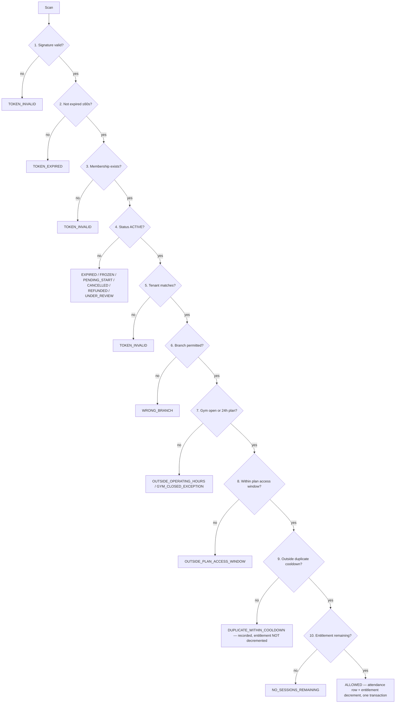

# Business Rules — Complete Enforcement Map

**Document:** `/docs/engineering/BusinessRules.md` · **Phase:** 2 (Engineering Documentation)
**Status:** Draft for Phase-2 acceptance gate · **Date:** 2026-08-06
**Source of truth:** `MASTER_PRD.md` §A8 (rules), §C1.4/§C1.5 (mechanisms), §C2 (schema), §C4 (state
machines), §C5 (jobs), §C8 (tests) · **Governing law:** `PROJECT_CONSTITUTION.md` §1.3, §4.4, §8.12,
§17.6 · **Market:** India (`LAUNCH_MARKET_INDIA.md`)

---

## 1. Purpose, authority and scope

`PROJECT_CONSTITUTION.md` §17.6 states the requirement this document exists to satisfy:

> *"The purpose is a single grep: `BR-FIN-04` must find the rule in the PRD, its enforcement in the
> code, its row in `/docs/engineering/BusinessRules.md`, and its tests."*

This document is the third leg of that grep. For every one of the **95** `BR-` identifiers it
publishes: the verbatim rule text, its MoSCoW priority, its owning module of the 23 in §C1.3, the
**enforcement points** expressed as concrete constructs in named layers, the **single authoritative
layer** among them, the commercial or legal failure mode if the rule is not enforced, a **positive
test id and a negative test id**, the related `FR-`/`AC-`/`E2E-`/`INV-` identifiers, and whether
`BR-DAT-01` audit logging applies.

### 1.1 The rule count is 95, not 78

`MASTER_PRD.md` §A8's own completeness attestation records **78** `BR-` rows. Enumerating the
thirteen families yields **95** distinct identifiers. This discrepancy is logged as **`KL-004`** in
`/docs/KNOWN_LIMITATIONS.md`, and the binding number is **95**. It matters because a `BAC-06`
coverage gate written against 78 would pass while seventeen rules sat untested.

| Family | Count | Section | Protects |
| :--- | :-: | :-: | :--- |
| `BR-TEN` | 6 | §5 | Tenant isolation, tenant lifecycle, arrears degradation |
| `BR-GYM` | 9 | §6 | Verification before visibility — supply-side trust |
| `BR-PLN` | 7 | §7 | Catalogue integrity and price honesty |
| `BR-MEM` | 14 | §8 | The membership state machine and what the member bought |
| `BR-PAY` | 11 | §9 | Money capture, idempotency, activation causality |
| `BR-REF` | 9 | §10 | Money returning, policy-at-time-of-sale, disputes |
| `BR-CHK` | 10 | §11 | Access control at the door and attendance truth |
| `BR-REV` | 7 | §12 | Review integrity — earned reviews only |
| `BR-CPN` | 5 | §13 | Discount arithmetic and who pays for it |
| `BR-RFL` | 1 | §14 | Referral reward timing |
| `BR-WAL` | 1 | §15 | Wallet credit semantics |
| `BR-FIN` | 8 | §16 | Ledger truth and settlement arithmetic |
| `BR-DAT` | 7 | §17 | Audit, privacy, subject rights, KYC custody |
| **Total** | **95** | | |

### 1.2 The five load-bearing invariants these rules serve

Every rule below is ultimately in service of one of five statements. Where a rule serves one of
them, its entry is marked with the invariant number.

| # | Invariant | Primary rules | Constitution |
| :-: | :--- | :--- | :--- |
| **I1** | No tenant reads or writes another tenant's data — enforced in the **database**, by RLS | `BR-TEN-01`, `BR-TEN-02` | `INV-TEN-1`…`INV-TEN-3` |
| **I2** | Money is an append-only ledger of integer minor units | `BR-PAY-01`, `BR-FIN-01` | `INV-FIN-1`, `INV-FIN-7` |
| **I3** | Price displayed = price charged; server re-validation aborts on mismatch | `BR-PLN-03`, `BR-PAY-04` | `INV-TRU-7` |
| **I4** | Verification before visibility; earned reviews only | `BR-GYM-01`, `BR-GYM-03`, `BR-REV-01`, `BR-REV-03` | `INV-TRU-1`…`INV-TRU-5` |
| **I5** | Activation is webhook-driven, never the client redirect | `BR-PAY-02`, `BR-MEM-02` | `INV-MEM-6` |

### 1.3 What this document is not

It is not a design of the modules — that is `Architecture.md`, `ModuleDependency.md` and
`FolderStructure.md`. It is not the schema — that is `ERD.md`. It is not the test plan — that is
`TestingStrategy.md`. It is the **map from rule to the place the rule is made true**, and the
inventory of what breaks when a rule is only asserted and never enforced.

No application code exists at the time of writing and none is written here. Where a construct is
shown as code it is labelled **illustrative — not committed code**.

---

## 2. The enforcement-layer taxonomy

A rule is not "enforced" because a service method checks it. It is enforced at a **layer**, by a
**named construct**, and the layer determines what class of mistake it survives. The twelve layers
below are the complete vocabulary used in every rule entry in this document. No entry uses a layer
name not in this table.

| Code | Layer | Constructs available | Survives | Does not survive |
| :--- | :--- | :--- | :--- | :--- |
| `L1-DB` | Database constraint | `NOT NULL`, `CHECK`, `UNIQUE`, partial unique index, `FK` with `ON DELETE RESTRICT`, `EXCLUDE USING gist`, generated column, `BEFORE`/`AFTER` trigger, domain type | A bug in any service, a manual `psql` session, a background job, a bad migration data-fix | A migration that drops it |
| `L2-RLS` | Row-level security policy | `ENABLE ROW LEVEL SECURITY`, `USING` / `WITH CHECK` policy on `current_setting('app.tenant_id')` | Every application bug, raw SQL, an injected predicate (`SEC-A03-002`) | A role holding `BYPASSRLS`; a policy written permissively (`ADR-0005` silent failure) |
| `L3-GRANT` | Role grant / absence of grant | `REVOKE UPDATE, DELETE` on append-only tables; three DB roles `app_rw`, `app_ro`, `app_platform` | Any code path in the application tier, including a compromised one | A migration run as owner |
| `L4-EXT` | Prisma tenant-context extension | The mandatory client extension of `ADR-0005`; `TenantPrismaService` throws when `AsyncLocalStorage` has no tenant | A developer forgetting to scope a query | A developer injecting `PlatformPrismaService` instead |
| `L5-DOM` | Domain invariant | Aggregate with a private constructor and a factory; value object (`Money`, `Entitlement`, `DateRange`, `BasisPoints`); the seven state machines of §C4; typed domain error | Any caller inside the process, including a future one | Data written by a job that bypasses the aggregate |
| `L6-UC` | Use-case guard | Application-service precondition executed inside the transaction, before the write, on freshly read state; `SELECT … FOR UPDATE` where a race exists | Concurrent callers when the lock is taken | A second write path that skips the use case |
| `L7-GUARD` | NestJS guard | `AuthGuard`, `PermissionsGuard` + `@RequiredPermission()`, `TenantGuard`, `@FinancialMutation()` impersonation guard | Direct API calls that bypass the UI | Anything running inside the process that is not an HTTP request |
| `L8-PIPE` | Validation pipe / schema | `ZodValidationPipe` with `.strict()` schemas from `packages/types` (`ADR-0022`); rejects unknown fields with `400` | Client-supplied fields that should not exist (`BR-PAY-04`) | Semantically valid but commercially wrong values |
| `L9-INT` | Interceptor | `IdempotencyInterceptor` (`C1.5`), `AuditInterceptor` (`BR-DAT-01`), correlation-id interceptor | Retries, double submits, missing audit rows | Non-HTTP writes (jobs), unless the job wraps the same primitive |
| `L10-JOB` | Background job | A `C5` BullMQ job under a distributed lock, idempotent by construction | Time passing without a user request — expiry, reconciliation, reserve release | Anything needing to be true *at* the moment of a request |
| `L11-UI` | UI affordance | Rendering or not rendering an action; a confirmation dialogue; a "last updated" indicator | User error and accidental misuse | A deliberate attacker; **never counted as enforcement** |
| `L12-CI` | Build-time gate | `dependency-cruiser` rule, ESLint rule, OpenAPI-absence assertion, coverage gate, isolation-suite generator, `permission-declared` job | A whole *class* of future regressions | Anything at runtime |

**Two conventions that hold throughout.**

1. **`L11-UI` is never authoritative.** `FR-RBAC-02` is explicit: *"Client-side hiding of UI is
   presentation only and never a security control."* A UI affordance appears in an entry only as
   defence in depth or as a required disclosure (for example `FR-PLAN-08`'s price-change
   confirmation), never as the layer that makes the rule true.
2. **The authoritative layer is the lowest layer that can express the rule completely.** Where a
   database constraint can express it, the database constraint is authoritative and everything above
   is there to produce a good error message. Where the rule needs a human decision, an external
   system, or a time window, the authoritative layer moves up and the entry says so explicitly.

---

## 3. Test identifier scheme

`BAC-06` is the gate: *"Every rule in A8 has at least one passing automated test, and every
M-priority rule has a test that also proves the negative case."* `PROJECT_CONSTITUTION.md` §8.12
fixes the naming; this section fixes the **identifiers** so the `BAC-06` report can be generated
mechanically.

| Element | Rule |
| :--- | :--- |
| Positive case id | `BR-<FAM>-<nn>-P<n>` — proves the rule holds when it should |
| Negative case id | `BR-<FAM>-<nn>-N<n>` — proves the prohibited thing is **refused**, with the specific error code |
| Placement in the spec | `describe('BR-MEM-05 — freeze is permitted only if the plan allows it', …)`, `it('BR-MEM-05-N1 · NEGATIVE: refuses a freeze on a plan with freeze_allowed = false', …)` |
| File location | `apps/server/test/rules/<family>/<rule-id>.spec.ts` for integration cases; unit cases live beside the domain object; isolation cases in `test/isolation/`; journeys in `e2e/` named for the `C8.3` id |
| Layer of the test | Stated in the entry. A rule whose authoritative layer is `L1-DB` or `L2-RLS` **must** have at least one test that exercises the database directly (Testcontainers), not a mocked repository |
| Gate | CI generates a traceability report listing all 95 rules and the tests referencing each. The build fails on **any** rule with zero tests, and on any **M**-priority rule with no `N`-labelled test |
| Severity | A failing rule test in the money, tenancy, membership or attendance families is **S1** under `C8.5` — it blocks release |

**Negative tests assert the error code, not merely a non-2xx.** `C3.1` gives `422` for a business
rule violation, `409` for a state or idempotency conflict, `403` for authorisation, `400` for
validation, `410` for an expired order. An entry that names an error code — `PLAN_PRICE_CHANGED`,
`REVIEW_REQUIRES_CHECK_IN`, `GYM_APPROVAL_REQUIRES_HUMAN_ACTOR` — means the negative test asserts
that exact string from the error registry.

---

## 4. How to read a rule entry

Each entry carries: the identifier, priority and owning module in the heading; the rule text
verbatim from `MASTER_PRD.md` §A8 as a block quote; then six fields.

| Field | Meaning |
| :--- | :--- |
| **Enforcement** | Every layer that participates, each with its concrete construct. The authoritative one is marked **AUTHORITATIVE** |
| **Failure mode** | What actually goes wrong commercially or legally if the rule is not enforced — not "data becomes inconsistent" |
| **Positive test** | `…-P<n>` with the behaviour it proves |
| **Negative test** | `…-N<n>` with the refusal it proves and the error code. `—` only where priority is `C` and the rule is Phase-2 |
| **Traceability** | Related `FR-`, `AC-`, `E2E-`, `INV-`, `ADR-`, `NFR-` identifiers |
| **`BR-DAT-01` audit** | Whether a write governed by this rule produces an append-only `audit_log` row, and on which entity |

---

## 5. `BR-TEN` — Tenancy (6 rules)

**What this family protects.** The commercial premise of the product is that a gym chain's member
list, revenue and attendance are invisible to every competitor also using the platform. A single
cross-tenant read is not a bug that degrades a feature; it is a breach that ends the contract and,
under the DPDP Act 2023, is reportable. `MASTER_PRD.md` §C1.4 opens by naming `BR-TEN-01` *"both a
legal obligation and the thing most likely to be violated by an ordinary coding mistake"* — the
family therefore refuses to rely on developer discipline anywhere. It also governs the two ways a
tenant leaves the platform (soft delete, suspension) and the one way it is degraded (arrears), and
in both cases the binding constraint is the same: **a member who has already paid keeps getting in.**

### `BR-TEN-01` · Priority **M** · Owner `tenancy/` · Invariant **I1**

> Every data record other than platform-global reference data belongs to exactly one tenant and is inaccessible to any other tenant by any code path, including reporting and support tooling.

| Field | Detail |
| :--- | :--- |
| **Enforcement** | `L1-DB`: `tenant_id uuid NOT NULL` on every tenant-owned table; composite FKs carry `tenant_id` so a child can never point at a parent in another tenant. **`L2-RLS`: `ENABLE ROW LEVEL SECURITY` plus `USING (tenant_id = current_setting('app.tenant_id')::uuid)` and a matching `WITH CHECK` on every tenant-owned table; the `app_rw` role holds no `BYPASSRLS` — AUTHORITATIVE.** `L4-EXT`: the mandatory Prisma extension (`ADR-0005`) wraps every operation in an interactive transaction that first runs `SELECT set_config('app.tenant_id', $1, true)` on that transaction's connection and **throws** if `AsyncLocalStorage` holds no tenant. `L7-GUARD`: `TenantContextMiddleware` resolves the tenant from the principal or the resource, never from a header or body (`C3.1`). `L3-GRANT`: `app_platform` is the only role that bypasses, reached solely through the audited `runElevated()` named function. `L12-CI`: the isolation-suite generator fails the build for any tenant-scoped endpoint with no isolation case; `dependency-cruiser` forbids injecting `PlatformPrismaService` outside `admin/`, `reporting/`, `settlements/` and `audit/` |
| **Failure mode** | Gym A reads gym B's member list, pricing and revenue. Commercially this is the end of the platform's supply-side proposition — no chain will list beside a competitor that can read its book. Legally it is a personal-data breach under DPDP with notification duties, and it is `RSK-08` materialised. The `ADR-0005` silent-failure variant is the dangerous one: a permissive policy (`COALESCE(NULLIF(current_setting(...),'')::uuid, tenant_id)`) evaluates to `tenant_id = tenant_id`, RLS *looks* enabled, and nothing logs |
| **Positive test** | `BR-TEN-01-P1` — under tenant A's context, `findMany` on every tenant-owned table returns only A's rows; run against Testcontainers Postgres with the real policy, not a mock |
| **Negative test** | `BR-TEN-01-N1` — the generated isolation suite: authenticated as tenant A, every exposed endpoint is called with a known tenant-B resource id and must return `404` (never `403`, which would confirm existence). `BR-TEN-01-N2` — a raw parameterised query with an injected `OR 1=1` returns only tenant A's rows (`SEC-A03-002`). `BR-TEN-01-N3` — an operation attempted with no tenant in `AsyncLocalStorage` throws rather than reading unfiltered |
| **Traceability** | `C1.4`, `C1.5`, `NFR-SEC-09`, `BAC-10`, `E2E-11`, `INV-TEN-1`, `INV-TEN-2`, `ADR-0005`, `ADR-0006`, `RSK-08`, `FR-RBAC-03` |
| **`BR-DAT-01` audit** | Indirectly — every governed write audits under its own entity. The `runElevated()` platform-scope elevation is itself audited with actor and reason (`C1.4`) |

### `BR-TEN-02` · Priority **M** · Owner `tenancy/` · Invariant **I1**

> One owner account may own multiple tenants. Tenant switching is explicit and audited; no cross-tenant action occurs in a single request.

| Field | Detail |
| :--- | :--- |
| **Enforcement** | **`L4-EXT`: exactly one `tenant_id` may be present in `AsyncLocalStorage` for the lifetime of a request; the extension reads it once and any attempt to re-enter with a different value throws `TENANT_CONTEXT_ALREADY_SET` — AUTHORITATIVE.** `L2-RLS`: even if a second tenant's id were somehow set, the transaction-local GUC means the *first* transaction still cannot see the second tenant's rows. `L7-GUARD`: `TenantGuard` resolves the active tenant from the session's selected-tenant claim and validates membership of that tenant. `L9-INT`: the switch endpoint is audited. `L11-UI`: an explicit tenant switcher in `dash`, never an implicit one |
| **Failure mode** | An owner of two gyms performs a bulk action that silently spans both — a price change, an export, a member merge — and the audit trail cannot say which tenant authorised it. When one of the two tenants is later sold or disputed, there is no defensible record. It is also the most plausible route to an accidental `BR-TEN-01` breach by a legitimate user |
| **Positive test** | `BR-TEN-02-P1` — an owner of tenants A and B switches to B; the next request's queries return B's rows only, and an `audit_log` row records the switch with actor, both tenant ids and IP |
| **Negative test** | `BR-TEN-02-N1` — a request that attempts to write to tenant B while the resolved context is tenant A throws `TENANT_CONTEXT_ALREADY_SET` and the transaction rolls back; no partial write survives |
| **Traceability** | `C1.4`, `FR-RBAC-03`, `INV-TEN-3`, `BAC-10`, `E2E-11`, `ADR-0005` |
| **`BR-DAT-01` audit** | **Yes** — the switch writes an `audit_log` row (`entity_type = 'tenant_session'`, action `SWITCH`) |

### `BR-TEN-03` · Priority **M** · Owner `catalog/`

> One tenant may operate multiple branches. Branches share the plan catalogue by default; a plan may be restricted to named branches.

| Field | Detail |
| :--- | :--- |
| **Enforcement** | `L1-DB`: `plan_branches (plan_id, branch_id)` with a composite FK carrying `tenant_id`; **absence of rows means all branches** (`C2.2`), so the default is structural rather than a nullable flag. **`L5-DOM`: `PlanBranchEntitlement` value object resolves "all branches" versus "named subset" once, and is the only thing `attendance/` consults at `FR-CHK-04` step 6 — AUTHORITATIVE.** `L6-UC`: creating a `plan_branches` row for a branch of another gym is refused. `L11-UI`: `AC-GYM-01.1` requires the plan editor to offer all-branches or a named subset explicitly |
| **Failure mode** | A member buys a cheap single-branch plan and gains entry to the chain's flagship location, or the reverse — a member who paid for all-branch access is turned away at the door. The first leaks revenue silently; the second produces a refund request and a one-star review the same day |
| **Positive test** | `BR-TEN-03-P1` — a plan with no `plan_branches` rows admits at every active branch (`AC-GYM-01.2`); a plan with one row admits only there |
| **Negative test** | `BR-TEN-03-N1` — check-in at a non-permitted branch is denied with `WRONG_BRANCH` and the denial is recorded (`AC-GYM-01.3`, `BR-CHK-03`, `BR-CHK-10`) |
| **Traceability** | `FR-GYM-07`, `FR-GYM-08`, `FR-PLAN-01`, `AC-GYM-01.1`…`01.3`, `BR-CHK-03`, `E2E-03` |
| **`BR-DAT-01` audit** | **Yes** — plan and branch are both audited entity types; a change to branch entitlement writes before/after state |

### `BR-TEN-04` · Priority **M** · Owner `tenancy/` + `audit/`

> Deleting a tenant is a soft delete. Financial, invoice and audit records are retained for the statutory retention period regardless of deletion.

| Field | Detail |
| :--- | :--- |
| **Enforcement** | `L1-DB`: `deleted_at timestamptz` on soft-deletable tables (`NFR-DQ-05`); `ledger_entries`, `invoices`, `credit_notes`, `settlement_lines`, `audit_log` have **no** `deleted_at` column at all — deletion is structurally inexpressible. **`L3-GRANT`: the application role holds no `DELETE` grant on those five tables — AUTHORITATIVE.** `L5-DOM`: `Tenant.close()` transitions to `CLOSED` (`C4.4`) and never removes rows. `L10-JOB`: `data.retention-sweep` applies the retention policy weekly and is the only writer that may purge, and only for entities outside the financial set. `L12-CI`: an `append-only-grants` CI check asserts the absent grants |
| **Failure mode** | A tenant demands deletion, the platform obliges, and the statutory books vanish. Under Indian tax law books of account carry a multi-year retention obligation; losing them exposes the platform, not the tenant. It also destroys the evidence needed to defend a chargeback (`FR-RFND-09`) after the tenant has gone |
| **Positive test** | `BR-TEN-04-P1` — closing a tenant sets `status = CLOSED` and `deleted_at`, removes it from discovery, and leaves every `ledger_entries`, `invoices` and `audit_log` row byte-identical and queryable by Finance |
| **Negative test** | `BR-TEN-04-N1` — a `DELETE` issued as `app_rw` against `ledger_entries`, `invoices`, `credit_notes`, `settlement_lines` or `audit_log` raises `permission denied` from Postgres |
| **Traceability** | `CON-04`, `NFR-DQ-05`, `BR-DAT-04`, `INV-TEN-6`, `ADR-0024`, `LAUNCH_MARKET_INDIA.md` §9 |
| **`BR-DAT-01` audit** | **Yes** — tenant closure is a configuration-class change; actor, reason and before/after state are required (`FR-ADMN-02`) |

### `BR-TEN-05` · Priority **M** · Owner `tenancy/` + `discovery/`

> A suspended tenant is removed from marketplace search immediately; existing active memberships continue to permit check-in until their natural expiry.

| Field | Detail |
| :--- | :--- |
| **Enforcement** | **`L6-UC`: the discovery read path filters on `gyms.status = 'APPROVED'` AND `tenants.status <> 'SUSPENDED'` AND `≥1` published public plan (`FR-SRCH-09`); the check-in path deliberately does **not** consult tenant status — AUTHORITATIVE for the visibility half.** `L10-JOB`: `search.reindex` runs on change, so suspension propagates to the index inside the `BAC-02` 60-second window. `L5-DOM`: `CheckInValidationSequence` (`FR-CHK-04`) has ten steps and *tenant suspension is not one of them*; the `TENANT_SUSPENDED` denial reason exists in the `C4.8` taxonomy for the distinct case of a tenant suspended **for cause** with member notification under `BR-MEM-14`. `L11-UI`: the dashboard shows a suspension banner with the reason |
| **Failure mode** | Two opposite failures, both expensive. If suspension does not remove the listing, the platform keeps selling memberships to a gym it has just judged unfit — every such sale becomes a `BR-REF-07` refund funded from the platform's own reserve. If suspension *does* block check-in, hundreds of members who paid in good faith are locked out of a gym that is still open, and the platform, not the gym, is the visible cause |
| **Positive test** | `BR-TEN-05-P1` — suspending a tenant removes its gyms from search and from city landing pages within 60 seconds (`BAC-02`), while an `ACTIVE` membership at that gym still scans successfully |
| **Negative test** | `BR-TEN-05-N1` — a suspended tenant's gym does not appear in any search, category, map-bounds, comparison or sitemap response; `BR-TEN-05-N2` — the check-in endpoint does **not** return `TENANT_SUSPENDED` merely because the tenant is suspended for non-payment |
| **Traceability** | `FR-SRCH-09`, `FR-ADMN-01`, `BAC-02`, `INV-TEN-4`, `C4.4`, `C4.8`, `BR-CHK-01`, `BR-MEM-14` |
| **`BR-DAT-01` audit** | **Yes** — `FR-ADMN-02` requires a reason on every administrative action; suspension writes actor, reason and before/after tenant status |

### `BR-TEN-06` · Priority **M** · Owner `billing/`

> A tenant whose subscription payment fails enters `PAST_DUE` after the first failure, loses marketplace visibility after 7 days, and loses dashboard write access after 14 days. Check-in for existing members is never blocked by subscription arrears.

| Field | Detail |
| :--- | :--- |
| **Enforcement** | **`L10-JOB`: `subscription.charge` (daily) applies the transitions — `ACTIVE → PAST_DUE` on first failure, then two date-driven degradations computed from `past_due_since` — AUTHORITATIVE.** `L5-DOM`: a `SubscriptionDegradation` value object maps days-past-due to a capability set, so "7 days" and "14 days" exist once, as configuration, not as two scattered comparisons. `L7-GUARD`: a `WriteAccessGuard` returns `403 TENANT_WRITE_SUSPENDED` on dashboard mutations past day 14. `L6-UC`: discovery filters `subscription_status` past day 7, reusing the `BR-TEN-05` predicate. `L11-UI`: a persistent countdown banner in `dash` from day 0, and email at each threshold |
| **Failure mode** | Without the ladder, the platform either cuts a paying gym off on the day a card expires — an outcome that produces churn and a public complaint — or never cuts anyone off and carries indefinite unpaid SaaS revenue. Blocking check-in for arrears is the worst version: members who owe nothing are punished for their gym's billing problem, the gym's staff cannot let them in, and the platform's brand takes the damage |
| **Positive test** | `BR-TEN-06-P1` — with the clock advanced, a failed charge yields `PAST_DUE` at day 0, delisting at day 7, dashboard read-only at day 14, and full restoration on successful payment at any point |
| **Negative test** | `BR-TEN-06-N1` — at day 30 past due, a member of that tenant with an `ACTIVE` membership checks in successfully; the response contains no arrears-derived denial reason |
| **Traceability** | `A6.2`, `FR-INV-01`, `FR-ADMN-04`, `INV-TEN-5`, `C5` `subscription.charge`, `OBJ-08`, `BR-CHK-01` |
| **`BR-DAT-01` audit** | **Yes** — each degradation step writes an `audit_log` row against the tenant with the actor recorded as the system job and the threshold as the reason |

---

## 6. `BR-GYM` — Gym verification and listing integrity (9 rules)

**What this family protects.** `RSK-01` (fake or non-existent gyms listed) carries the highest score
in the register — likelihood 4, impact 5, exposure 20. A consumer who pays ₹5,000 for a gym that
does not exist does not blame the gym; they blame the marketplace, and they say so publicly. This
family is the entire supply-side trust apparatus: nothing is visible until a **human** has approved
it (`I4`), approval has an enumerated evidence bar, rejection is explainable, and post-approval
changes are triaged into those that need re-review and those that do not. `BR-GYM-06` and
`BR-GYM-07` together are the rule that stops verification from becoming a bottleneck that gyms route
around by never updating their listing.

### `BR-GYM-01` · Priority **M** · Owner `catalog/` + `discovery/` · Invariant **I4**

> A gym must not be visible in marketplace search until it has status `APPROVED`.

| Field | Detail |
| :--- | :--- |
| **Enforcement** | **`L6-UC`: one shared `PublicVisibilityPredicate` — `gyms.status = 'APPROVED'` AND tenant not `SUSPENDED`/`PAST_DUE`-beyond-7-days AND `≥1` published `PUBLIC` plan — used by *every* public read path: search, map bounds, category and city landing pages, comparison, favourites, sitemap, structured data — AUTHORITATIVE.** `L1-DB`: a partial index `(status, rating_avg DESC, freshness_score DESC) WHERE status = 'APPROVED'` makes the approved set the only cheap query, so an unfiltered read is visibly slow rather than silently wrong. `L4-EXT`: `PublicPrismaService` may read only the approved-gym projection (`ADR-0005`). `L10-JOB`: `search.reindex` on change. `L12-CI`: a contract test asserts every `web`-facing endpoint composes the predicate |
| **Failure mode** | An unverified — possibly fictitious — gym takes money through the marketplace. `RSK-01` realised: refunds under `BR-REF-07`, chargebacks under `BR-REF-08`, and the loss of the "Verified" claim that the whole consumer proposition rests on |
| **Positive test** | `BR-GYM-01-P1` — approval publishes the listing to search, detail, city and category surfaces within 60 seconds (`FR-ONB-13`, `BAC-02`) |
| **Negative test** | `BR-GYM-01-N1` — a `DRAFT`, `PENDING_REVIEW`, `SUSPENDED` or `CLOSED` gym is absent from all seven public surfaces enumerated above, and its detail URL returns `404`, not a bare listing |
| **Traceability** | `FR-SRCH-09`, `FR-ONB-13`, `AC-GYM-02.*`, `INV-TRU-1`, `BAC-02`, `E2E-01`, `RSK-01` |
| **`BR-DAT-01` audit** | **Yes** — gym status change writes before/after with the deciding actor |

### `BR-GYM-02` · Priority **M** · Owner `onboarding/` · Invariant **I4**

> Approval requires: verified owner email and phone, complete KYC document set for the tenant's country profile, at least one published plan, at least three photographs, a resolvable geo-location, and stated operating hours.

| Field | Detail |
| :--- | :--- |
| **Enforcement** | **`L6-UC`: `ApprovalReadinessCheck` evaluates the six conditions against the *submitted application snapshot*, not live data, and the approve use case refuses when any is unmet — AUTHORITATIVE.** `L5-DOM`: the checklist is data (`kyc_checklists` per `C2.3`, keyed by `country_code`), so India's ten-document list (`LAUNCH_MARKET_INDIA.md` §6 — PAN, GSTIN conditional, business registration, Shop & Establishment, bank proof, owner identity, premises address proof, trade licence conditional, fire NOC conditional, music licence advisory) is configuration, not code (`ADR-0028`). `L10-JOB`: `FR-ONB-12` pre-checks run at submission and are shown to the reviewer. `L11-UI`: `FR-ONB-14` activation checklist and `FR-NAV-04` persistent progress |
| **Failure mode** | A gym is approved with no bank proof and cannot be paid, or with no photographs and converts at a fraction of the rate, or with an unverified phone so the platform cannot reach the owner when a member is locked out. Each is a support cost that recurs monthly against `OBJ-10` |
| **Positive test** | `BR-GYM-02-P1` — an application meeting all six conditions is approvable and the reviewer sees each condition's evidence |
| **Negative test** | `BR-GYM-02-N1` — six parameterised cases, one per missing condition; each returns `422 APPROVAL_PRECONDITION_UNMET` naming the specific failing condition, and the gym stays out of search |
| **Traceability** | `FR-ONB-02`…`FR-ONB-07`, `FR-ONB-12`, `FR-ADMN-06`, `AC-ONB-02.*`, `E2E-01`, `ADR-0028`, `LAUNCH_MARKET_INDIA.md` §6 |
| **`BR-DAT-01` audit** | **Yes** — the approval decision records actor, timestamp, application version and evidence snapshot |

### `BR-GYM-03` · Priority **M** · Owner `onboarding/` · Invariant **I4**

> Approval is a human decision. No automated path may set `APPROVED`.

| Field | Detail |
| :--- | :--- |
| **Enforcement** | **`L5-DOM`: `Application.approve(actor: HumanActor, …)` accepts a branded `HumanActor` type; a system or job actor cannot construct one, so the automated path is a *compile-time* error before it is a runtime one — AUTHORITATIVE.** `L1-DB`: `CHECK (status <> 'APPROVED' OR decided_by IS NOT NULL)` on `applications`, plus an FK from `decided_by` to a platform staff user. `L7-GUARD`: `@RequiredPermission('onboarding.application.decide')`, held by Verification Officer and Super Admin only. `L6-UC`: the use case rejects when the actor type is `SYSTEM` with `GYM_APPROVAL_REQUIRES_HUMAN_ACTOR`. `L12-CI`: an OpenAPI-absence assertion proves no endpoint exists that sets `APPROVED` without a decision payload |
| **Failure mode** | The single control that makes `RSK-01` tolerable is automation of a judgement no algorithm is competent to make. An auto-approver — added later "to clear the queue" — would let a fraudulent listing through, and the platform would have no named human to point to when asked who verified it. That is the difference between a mistake and negligence |
| **Positive test** | `BR-GYM-03-P1` — a Verification Officer approves; `applications.decided_by` holds their id and an `audit_log` row names them |
| **Negative test** | `BR-GYM-03-N1` — a system actor invoking approval is refused with `GYM_APPROVAL_REQUIRES_HUMAN_ACTOR` (`SEC-A04-002`); `BR-GYM-03-N2` — a direct `UPDATE gyms SET status='APPROVED'` with `applications.decided_by IS NULL` violates the `CHECK` |
| **Traceability** | `FR-ONB-11`, `FR-ADMN-11`, `INV-TRU-2`, `SEC-A04-002`, `E2E-01`, `RSK-01`, `C4.4` |
| **`BR-DAT-01` audit** | **Yes** — mandatory; the human actor id is the point of the rule |

### `BR-GYM-04` · Priority **M** · Owner `onboarding/`

> Rejection must cite at least one structured reason code and may include free text. The owner sees both.

| Field | Detail |
| :--- | :--- |
| **Enforcement** | **`L1-DB`: `CHECK (status <> 'REJECTED' OR array_length(reason_codes, 1) >= 1)` on `applications` — AUTHORITATIVE.** `L8-PIPE`: the Zod schema types `reason_codes` as a non-empty array of the sixteen `C4.8` application-rejection codes (`KYC_DOCUMENT_MISSING`, `KYC_DOCUMENT_ILLEGIBLE`, `KYC_DOCUMENT_EXPIRED`, `KYC_NAME_MISMATCH`, `ADDRESS_UNVERIFIABLE`, `GEO_ADDRESS_MISMATCH`, `DUPLICATE_LISTING`, `INSUFFICIENT_PHOTOS`, `PHOTO_QUALITY`, `PHOTO_NOT_OF_PREMISES`, `INCOMPLETE_PROFILE`, `NO_PUBLISHED_PLAN`, `BANK_VERIFICATION_FAILED`, `PROHIBITED_CONTENT`, `SUSPECTED_FRAUD`, `OTHER`). `L11-UI`: `FR-ONB-11` shows codes and free text to the owner and identifies exactly which fields or documents are at fault |
| **Failure mode** | An owner rejected with "does not meet our standards" resubmits the same application, is rejected again, and abandons. Supply acquisition cost is the platform's largest early expense; an unexplainable rejection wastes it and generates a support ticket that a reason code would have prevented |
| **Positive test** | `BR-GYM-04-P1` — rejection with two codes plus free text is visible verbatim to the owner and drives a per-field remediation list |
| **Negative test** | `BR-GYM-04-N1` — rejection with an empty `reason_codes` array is refused at the pipe with `400` and, if forced at the database, violates the `CHECK` |
| **Traceability** | `FR-ONB-11`, `FR-ADMN-07`, `C4.8`, `AC-ONB-02.*`, `E2E-01` |
| **`BR-DAT-01` audit** | **Yes** — decision, codes, notes and actor |

### `BR-GYM-05` · Priority **M** · Owner `onboarding/`

> A gym may be re-submitted after rejection an unlimited number of times; each submission is a new reviewable version with the prior version retained.

| Field | Detail |
| :--- | :--- |
| **Enforcement** | **`L1-DB`: `applications` carries `version int` with `UNIQUE (tenant_id, version)`; each submission inserts a new row holding a full `snapshot jsonb`. No row is ever updated in place — AUTHORITATIVE.** `L5-DOM`: `Application` is an immutable snapshot aggregate; `resubmit()` produces `version + 1`. `L6-UC`: no submission-count ceiling exists anywhere; a rate limit protects the queue by time, not by count. `L11-UI`: version history visible to reviewer and owner |
| **Failure mode** | Without version retention the reviewer cannot see what changed since the last rejection and re-reviews from scratch — the queue cost per gym multiplies. Worse, a gym can quietly revert a field the reviewer objected to after approval, and nothing records that it ever differed |
| **Positive test** | `BR-GYM-05-P1` — five successive rejections and resubmissions produce five retained versions, each diffable against its predecessor |
| **Negative test** | `BR-GYM-05-N1` — an attempt to mutate a submitted version's `snapshot` is refused; `FR-ONB-08` locks the submitted version while permitting non-material edits to the live draft |
| **Traceability** | `FR-ONB-08`, `FR-ONB-09`, `FR-ONB-10`, `C4.4`, `E2E-01` |
| **`BR-DAT-01` audit** | **Yes** — each submission and each decision |

### `BR-GYM-06` · Priority **M** · Owner `catalog/` + `onboarding/`

> Material changes to an approved gym — legal name, address, geo-location, ownership, bank account — return the gym to `PENDING_REVIEW` for those fields while the listing stays live, unless the change is to the bank account, which suspends payouts until re-verified.

| Field | Detail |
| :--- | :--- |
| **Enforcement** | **`L5-DOM`: a single `MaterialFieldRegistry` enumerates the five material fields; `Gym.applyChange()` routes each change to `IMMEDIATE` or `FIELD_REVIEW`, and `payout_account` additionally to `PAYOUTS_SUSPENDED` — AUTHORITATIVE.** `L1-DB`: a `pending_field_reviews` table keyed `(gym_id, field_name)` so the listing row itself stays `APPROVED` while individual fields are under review; `payout_accounts.verification_status` gates settlement. `L6-UC`: `settlements/` refuses to build a batch for a tenant whose payout account is unverified, holding the balance rather than paying it out. `L7-GUARD`: a bank-account change is a `@FinancialMutation()` and is refused under impersonation (`AC-AUTH-03.2`). `L11-UI`: `FR-GYM-11` states the review consequence **before** the change is saved |
| **Failure mode** | The attack this rule exists to stop is account takeover followed by a bank-account swap: the attacker changes the payout destination and the next settlement pays them. Suspending payouts until re-verification makes the takeover unprofitable. The address/geo half stops a listing approved at one premises quietly relocating to an unverified one |
| **Positive test** | `BR-GYM-06-P1` — changing the address puts that field in `PENDING_REVIEW` while search still returns the gym at its old, approved coordinates; `BR-GYM-06-P2` — changing the bank account sets payouts to suspended and the next `settlement.build-batches` run rolls the balance forward with a visible reason |
| **Negative test** | `BR-GYM-06-N1` — a payout executes for a tenant with an unverified bank account: must not occur; the batch is held with `PAYOUT_ACCOUNT_UNVERIFIED`. `BR-GYM-06-N2` — a support agent under impersonation attempting the bank change is refused (`SEC-A01-007`) |
| **Traceability** | `FR-GYM-11`, `FR-ONB-06`, `FR-SETL-06`, `AC-AUTH-03.2`, `TA-6`, `C4.4`, `BR-FIN-08` |
| **`BR-DAT-01` audit** | **Yes** — material change, old and new value, actor, IP; bank-account changes additionally notify the owner on all enabled channels |

### `BR-GYM-07` · Priority **M** · Owner `catalog/`

> Non-material changes (photos, description, amenities, timings, plan pricing) publish immediately without review, subject to automated content screening.

| Field | Detail |
| :--- | :--- |
| **Enforcement** | **`L5-DOM`: the complement of `MaterialFieldRegistry` — a field is non-material if and only if it is not in the material set, so the two rules cannot drift apart — AUTHORITATIVE.** `L6-UC`: an automated screening step (profanity, contact details, URLs, prohibited content) runs on description and captions before publish; `gym_media.moderation_status` gates photo display. `L10-JOB`: `gym.freshness-score` nightly, and `search.reindex` on change. `L11-UI`: amenity selection is from a platform taxonomy with no free text (`FR-GYM-03`) |
| **Failure mode** | If routine edits queued for human review, gyms would stop editing — `FR-GYM-12`'s freshness score would collapse, `RSK-11` (stale listing mismatch) would materialise, and search relevance would degrade for everyone. Conversely, unscreened free text is how a phone number appears in a description and the marketplace is disintermediated |
| **Positive test** | `BR-GYM-07-P1` — a photo, description, amenity, timing and plan price change all publish without a review step and appear in search within one reindex cycle |
| **Negative test** | `BR-GYM-07-N1` — a description containing a phone number, an email address or a URL is held by screening and does not publish; `BR-GYM-07-N2` — a free-text amenity is refused at the pipe |
| **Traceability** | `FR-GYM-01`, `FR-GYM-02`, `FR-GYM-03`, `FR-GYM-04`, `FR-GYM-12`, `FR-ADMN-12`, `RSK-11` |
| **`BR-DAT-01` audit** | **Yes** — gym is an audited entity type; before/after on every field change including non-material ones |

### `BR-GYM-08` · Priority **M** · Owner `onboarding/`

> Geo-location must be within a configurable tolerance of the geocoded postal address; a mismatch beyond tolerance blocks approval and is flagged to the reviewer.

| Field | Detail |
| :--- | :--- |
| **Enforcement** | **`L6-UC`: `FR-ONB-12` pre-check computes `ST_Distance(branches.location, geocode(address))` through the geocoding anti-corruption layer (`PROJECT_CONSTITUTION.md` §4.5.2) and writes the result into `applications.precheck_results`; the approve use case refuses when the distance exceeds the configured tolerance — AUTHORITATIVE.** `L1-DB`: `location geography(Point,4326) NOT NULL` with a GiST index (`C2.2`). `L11-UI`: the reviewer sees the pin, the geocoded point and the distance, and may record an override with a reason where the geocoder is at fault |
| **Failure mode** | A listing whose pin is two kilometres from its address ruins the single most-used filter on the marketplace — distance. A member travels to the pin, finds nothing, and the platform has sold a membership to a gym the member cannot locate. It is also the cheapest automated signal for `RSK-01`: fabricated listings routinely fail it |
| **Positive test** | `BR-GYM-08-P1` — a pin within tolerance passes the pre-check and the distance is recorded on the application |
| **Negative test** | `BR-GYM-08-N1` — a pin beyond tolerance blocks approval with `GEO_ADDRESS_MISMATCH` and surfaces the measured distance to the reviewer |
| **Traceability** | `FR-ONB-12`, `FR-GYM-06`, `C4.8` `GEO_ADDRESS_MISMATCH`, `ADR-0007`, `RSK-01`, `E2E-01` |
| **`BR-DAT-01` audit** | **Yes** — the pre-check result and any reviewer override with its reason |

### `BR-GYM-09` · Priority **S** · Owner `onboarding/`

> A single physical address may host only one `APPROVED` gym at a time. Collisions are surfaced to the reviewer as a possible duplicate.

| Field | Detail |
| :--- | :--- |
| **Enforcement** | **`L6-UC`: at submission, a normalised-address plus radius probe (`ST_DWithin` on `branches.location`) against all `APPROVED` gyms produces a candidate-duplicate list on `applications.precheck_results`; the reviewer must dismiss or act on it — AUTHORITATIVE, because "same physical address" is a human judgement that normalisation cannot settle.** `L1-DB`: a *partial* unique index on the normalised address hash `WHERE status = 'APPROVED'` is available as a hard backstop, but is **advisory in Phase 1** because shared premises (two studios in one building) are legitimate. `L11-UI`: side-by-side comparison in the review queue |
| **Failure mode** | The same gym listed twice splits its reviews and ratings, doubles its search footprint unfairly, and — the real hazard — lets a suspended tenant re-list the same premises under a new entity, defeating `BR-TEN-05` |
| **Positive test** | `BR-GYM-09-P1` — submitting a gym at the coordinates of an existing approved gym raises a `DUPLICATE_LISTING` candidate for the reviewer with both listings shown |
| **Negative test** | `BR-GYM-09-N1` — approving the duplicate without dismissing the flag is refused; the reviewer must record a dismissal reason. Priority `S`, but the negative case is required because this is the re-listing route around suspension |
| **Traceability** | `FR-ONB-12`, `C4.8` `DUPLICATE_LISTING`, `BR-TEN-05`, `RSK-01`, `ADR-0007` |
| **`BR-DAT-01` audit** | **Yes** — the duplicate flag and its dismissal, with the reviewer's reason |

---

## 7. `BR-PLN` — Plans and pricing (7 rules)

**What this family protects.** The marketplace's only product is a promise about price and terms.
`BR-PLN-03` is load-bearing invariant `I3` and the direct mitigation for `RSK-11`; `BR-PLN-02` is the
rule that lets a gym raise prices without breaching every existing member's contract; `BR-PLN-05`
keeps the gym's internal, staff-negotiated pricing off the public internet. `BR-PLN-06` is the only
place in the system where an entitlement counter and a date both bound the same membership, and it
is the source of the `BR-CHK-04` interaction analysed in §18.

### `BR-PLN-01` · Priority **M** · Owner `plans/`

> A plan defines: name, description, duration (or session count), price, currency, applicable branches, joining fee, minimum age, gender eligibility, access windows, and whether it is publicly sellable or staff-only.

| Field | Detail |
| :--- | :--- |
| **Enforcement** | **`L1-DB`: the `plans` table of `C2.2` carries every named attribute as a column, with `CHECK ((plan_type='DURATION' AND duration_value IS NOT NULL) OR (plan_type='SESSION' AND session_count IS NOT NULL))` so the discriminated union is expressed in the schema — AUTHORITATIVE.** `L8-PIPE`: one Zod discriminated union in `packages/types` is the single definition shared by API, dashboard form and tests (`ADR-0022`). `L5-DOM`: `price_minor bigint` + `currency char(3)` are wrapped in `Money`; `access_window jsonb` is parsed into an `AccessWindow` value object at the boundary and never handled as raw JSON inside the domain |
| **Failure mode** | An attribute missing at creation becomes a dispute at the door. A plan with no `min_age` sells to a fifteen-year-old the gym's insurance does not cover; no `gender_eligibility` sells a women-only gym to a man; no `access_window` sells an off-peak plan that admits at 19:00 |
| **Positive test** | `BR-PLN-01-P1` — a `DURATION` plan and a `SESSION` plan each round-trip through create, publish, public read and purchase with every attribute preserved |
| **Negative test** | `BR-PLN-01-N1` — a `SESSION` plan with a null `session_count`, and a `DURATION` plan with a null `duration_value`, are both refused at the pipe with `400` and violate the `CHECK` if forced |
| **Traceability** | `FR-PLAN-01`, `FR-PLAN-02`, `FR-CART-07`, `AC-PLAN-01.*`, `C2.2` `plans`, `ADR-0022` |
| **`BR-DAT-01` audit** | **Yes** — plan is an audited entity type |

### `BR-PLN-02` · Priority **M** · Owner `plans/` + `memberships/`

> A published plan's price change never affects an already-purchased membership. Existing memberships retain their purchased terms until expiry.

| Field | Detail |
| :--- | :--- |
| **Enforcement** | **`L1-DB`: `memberships.purchased_price_minor`, `currency` and `purchased_terms jsonb` snapshot the plan at purchase (`C2.2`); nothing in the membership read path joins to `plans` for price or terms — AUTHORITATIVE.** `L5-DOM`: `Membership` exposes `purchasedTerms`, and the aggregate has no reference to a live `Plan`; a `dependency-cruiser` rule (`L12-CI`) forbids `memberships/domain` from importing `plans/domain`. `L11-UI`: `FR-PLAN-08` requires explicit confirmation stating that existing memberships are unaffected |
| **Failure mode** | A gym raises its price and every existing member's app shows the new figure, their renewal quote changes retroactively, and any refund proration computes against a price they never paid. That is a consumer-protection problem, not a display bug — and under a pro-rata refund it becomes a cash error |
| **Positive test** | `BR-PLN-02-P1` — after a purchase, the plan price is doubled; the membership detail, the invoice, the refund proration base and the settlement line all still show the purchased price |
| **Negative test** | `BR-PLN-02-N1` — no read path returns the live plan price for an existing membership; asserted by mutating `plans.price_minor` directly in the database and re-reading every membership-facing endpoint |
| **Traceability** | `FR-PLAN-08`, `FR-MEMB-03`, `C2.2` `memberships`, `BR-REF-02`, `AC-PLAN-01.*` |
| **`BR-DAT-01` audit** | **Yes** — the price change on the plan is audited; the membership is untouched, which is the point |

### `BR-PLN-03` · Priority **M** · Owner `ordering/` · Invariant **I3**

> The price displayed on the marketplace must equal the price charged at checkout for the same plan at the same moment. Server-side re-validation at checkout is mandatory; a mismatch aborts checkout with an explicit message rather than silently charging either figure.

| Field | Detail |
| :--- | :--- |
| **Enforcement** | **`L6-UC`: at payment initiation the order is re-priced from server-held plan, promotion, coupon and tax data inside the same transaction that creates the payment intent; the client-echoed `price_fingerprint` (plan id + price + promo id + `updated_at`) is compared, and a difference aborts with `422 PLAN_PRICE_CHANGED` — AUTHORITATIVE.** `L8-PIPE`: `.strict()` schemas make any client-submitted amount a `400`, so there is no figure to "silently charge" (`BR-PAY-04`). `L5-DOM`: `PriceQuote` is a value object carrying its own fingerprint; it cannot be constructed from client input. `L11-UI`: `AC-PLAN-02.2` requires the checkout screen to show the old and new price and require re-confirmation, never to auto-accept |
| **Failure mode** | Both directions are damaging. Charging more than displayed is a deceptive-pricing complaint and a chargeback the platform will lose. Charging less is silent margin loss the gym discovers at settlement. `RSK-11` scores this 12; `INV-TRU-7` makes it non-negotiable. "Silently charging either figure" is explicitly the prohibited behaviour — the abort is the requirement |
| **Positive test** | `BR-PLN-03-P1` — displayed price equals charged price across list, detail, comparison, checkout summary and invoice for the same plan at the same moment (`AC-PLAN-02.1`) |
| **Negative test** | `BR-PLN-03-N1` — the price is changed between page load and payment; checkout returns `422 PLAN_PRICE_CHANGED` and **no** payment intent is created (`AC-PLAN-02.2`, `SEC-A04-005`). `BR-PLN-03-N2` — the plan is archived mid-flow; checkout returns `422 PLAN_UNAVAILABLE` (`AC-PLAN-02.3`) |
| **Traceability** | `FR-CART-04`, `FR-PLAN-08`, `AC-PLAN-02.1`…`02.3`, `INV-TRU-7`, `RSK-11`, `E2E-02`, `E2E-06`, `BR-PAY-04`, `BR-CPN-03` |
| **`BR-DAT-01` audit** | **No** — an aborted checkout writes no audited entity. It emits the `checkout_validated` analytics event with `changed = true` and `change_type` (`C6`), which is where the rate is monitored |

### `BR-PLN-04` · Priority **M** · Owner `plans/`

> A plan may be archived but never hard-deleted while any membership references it.

| Field | Detail |
| :--- | :--- |
| **Enforcement** | **`L1-DB`: `memberships.plan_id` and `orders.plan_id` are FKs with `ON DELETE RESTRICT`; `plans` carries `deleted_at` and the archive path sets `status = 'ARCHIVED'` — AUTHORITATIVE.** `L5-DOM`: `Plan.archive()` exists; `Plan.delete()` does not exist on the aggregate. `L6-UC`: archiving removes the plan from sale and blocks new selection while retaining existing memberships (`FR-PLAN-05`). `L12-CI`: an OpenAPI-absence assertion proves no hard-delete endpoint exists for plans |
| **Failure mode** | Deleting a plan orphans every membership that references it: the member's screen cannot say what they bought, the refund engine cannot compute proration, and the invoice's line description is unreconstructable. Under `BR-PAY-10` the invoice is immutable, so the damage is permanent |
| **Positive test** | `BR-PLN-04-P1` — archiving a plan with live memberships succeeds; those memberships continue to display and to permit check-in, and the plan disappears from the public catalogue |
| **Negative test** | `BR-PLN-04-N1` — a `DELETE` on a referenced plan raises a foreign-key violation at the database, and no API path offers it |
| **Traceability** | `FR-PLAN-05`, `ADR-0024`, `NFR-DQ-05`, `BR-PLN-02`, `C2.2` |
| **`BR-DAT-01` audit** | **Yes** — archive writes before/after status with actor |

### `BR-PLN-05` · Priority **M** · Owner `plans/` + `discovery/` · Invariant **I4**

> A staff-only plan is never returned by any public API or rendered on any public surface.

| Field | Detail |
| :--- | :--- |
| **Enforcement** | **`L6-UC`: the shared `PublicVisibilityPredicate` (see `BR-GYM-01`) includes `plans.visibility = 'PUBLIC' AND plans.status = 'PUBLISHED'`; the public plan projection is a separate read model from the dashboard one, so a `STAFF_ONLY` plan has no path to serialisation on a public surface — AUTHORITATIVE.** `L1-DB`: index `(gym_id, status, visibility)` (`C2.4`) makes the filtered read the natural one. `L4-EXT`: `PublicPrismaService` may read only the public projection (`ADR-0005`). `L12-CI`: a contract test asserts the public plan DTO has no field that could carry a `STAFF_ONLY` row, and the isolation suite probes plan-by-id on the public route |
| **Failure mode** | Staff-only plans are corporate rates, win-back offers and negotiated pricing. Publishing them destroys the gym's price discipline overnight — every walk-in asks for the corporate rate — and the gym's response is to stop entering real prices, which degrades the marketplace for everyone |
| **Positive test** | `BR-PLN-05-P1` — a `STAFF_ONLY` plan is sellable by staff in `dash` and appears on the resulting invoice and membership |
| **Negative test** | `BR-PLN-05-N1` — the plan is absent from the public gym detail response, from search facets, from the price filter's range computation, from comparison, from the sitemap and from server-rendered SEO markup; requesting it by id on the public route returns `404` |
| **Traceability** | `FR-PLAN-01`, `FR-DETL-*`, `FR-SRCH-03`, `INV-TRU-8`, `C2.4`, `ADR-0005` |
| **`BR-DAT-01` audit** | **Yes** — a visibility change on a plan is an audited field change |

### `BR-PLN-06` · Priority **M** · Owner `plans/` + `memberships/` + `attendance/`

> Session-based plans carry an entitlement count decremented per check-in; the membership expires on the earlier of entitlement exhaustion or validity end date.

| Field | Detail |
| :--- | :--- |
| **Enforcement** | **`L5-DOM`: an `Entitlement` value object over `sessions_total` / `sessions_used`; `Membership.consumeSession()` is the only decrement path and refuses at zero — AUTHORITATIVE.** `L1-DB`: `CHECK (sessions_used >= 0 AND (sessions_total IS NULL OR sessions_used <= sessions_total))`; the decrement happens in the same transaction as the attendance insert. `L6-UC`: the check-in use case takes `SELECT … FOR UPDATE` on the membership row so two simultaneous scans cannot both consume the last session. `L10-JOB`: `membership.expire` also expires on exhaustion, so a membership that runs out at 21:00 is `EXPIRED` without waiting for its end date |
| **Failure mode** | Over-consumption gives away sessions the gym was never paid for; under-consumption charges a member for sessions they did not use and produces a refund claim they will win. The concurrency case is real at a busy desk with two scanners |
| **Positive test** | `BR-PLN-06-P1` — a ten-session plan decrements once per allowed check-in and transitions to `EXPIRED` on the tenth, before its end date |
| **Negative test** | `BR-PLN-06-N1` — the eleventh check-in is denied with `NO_SESSIONS_REMAINING` and is recorded as a denial (`BR-CHK-10`). `BR-PLN-06-N2` — two concurrent scans against a one-session-remaining membership produce exactly one `ALLOWED` and one denial, never two allows |
| **Traceability** | `FR-PLAN-01`, `FR-CHK-04` step 10, `FR-MEMB-09`, `C4.8` `NO_SESSIONS_REMAINING`, `C5` `membership.expire`, `BR-CHK-04`, `E2E-03` |
| **`BR-DAT-01` audit** | **Yes** — the membership is an audited entity; each consumption writes a `membership_events` row and the attendance record is itself immutable evidence |

### `BR-PLN-07` · Priority **S** · Owner `plans/`

> A gym may run at most one active promotional price per plan at a time; overlapping promotions are rejected at creation.

| Field | Detail |
| :--- | :--- |
| **Enforcement** | **`L1-DB`: `EXCLUDE USING gist (plan_id WITH =, tstzrange(promo_starts_at, promo_ends_at) WITH &&)` on the promotion rows — the overlap is refused by Postgres, not by a read-then-write check that a concurrent request can defeat — AUTHORITATIVE.** `L6-UC`: the creation use case translates the exclusion violation into `422 PROMOTION_OVERLAPS`. `L5-DOM`: `PromotionWindow` is a `DateRange` value object; effective price resolution is `promo if now ∈ window else list`, defined once. `L11-UI`: the plan editor shows the promotion calendar |
| **Failure mode** | Two overlapping promotions mean the effective price depends on evaluation order — the marketplace shows one figure and checkout computes another, which is a direct `BR-PLN-03` breach with a `RSK-11` outcome. Priority is `S`, but the failure lands squarely on an `M` rule, which is why the enforcement is a database exclusion constraint rather than a service check |
| **Positive test** | `BR-PLN-07-P1` — a promotion applies within its window and reverts automatically to list price at its end (`FR-PLAN-03`), with the displayed and charged price equal throughout |
| **Negative test** | `BR-PLN-07-N1` — creating a promotion overlapping an existing one is refused with `422 PROMOTION_OVERLAPS`; two concurrent creations of overlapping windows produce exactly one success |
| **Traceability** | `FR-PLAN-03`, `BR-PLN-03`, `C2.2` `plans` promo columns, `RSK-11` |
| **`BR-DAT-01` audit** | **Yes** — promotional price is a plan field change |

---

## 8. `BR-MEM` — Membership lifecycle (14 rules)

**What this family protects.** A membership is the object the member paid for, the object the gym
staffs against, and the object every refund and every check-in resolves to. The family's spine is
the `C4.1` state machine: six states, an enumerated transition table, `EXPIRED` terminal, and
renewal producing a **new** membership rather than reactivating an old one. Everything else in the
family is a rule about the two boundaries of that object — when it starts and ends (`BR-MEM-03`,
`BR-MEM-05`, `BR-MEM-07`), what it costs to change it (`BR-MEM-09`, `BR-MEM-10`), and who may use it
(`BR-MEM-04`, `BR-MEM-13`). Time is computed in the **gym's** timezone throughout; under
`Asia/Kolkata` (+05:30, no DST) midnight gym-time is 18:30 UTC the previous day, so any job on a
naive UTC hour fires on the wrong day (`LAUNCH_MARKET_INDIA.md` §3).

### `BR-MEM-01` · Priority **M** · Owner `memberships/`

> A membership exists in exactly one state: `PENDING`, `ACTIVE`, `FROZEN`, `EXPIRED`, `CANCELLED`, or `REFUNDED`. Permitted transitions are defined in Part C §C4.1.

| Field | Detail |
| :--- | :--- |
| **Enforcement** | **`L5-DOM`: a `MembershipStateMachine` with the `C4.1` transition table as data; `Membership.transitionTo()` is the only mutator of `status` and throws `INVALID_MEMBERSHIP_TRANSITION` on an undefined edge — AUTHORITATIVE.** `L1-DB`: `status` is a Postgres enum with exactly six labels, plus a trigger writing one `membership_events` row per change (`INV-MEM-4`). `L6-UC`: `FR-MEMB-01` forbids ad-hoc updates; no use case sets `status` directly. `L12-CI`: an ESLint rule bans assignment to `status` outside the aggregate |
| **Failure mode** | Ad-hoc status updates are how a membership ends up `EXPIRED` but still scanning, or `REFUNDED` and still counted in the active-member tier limit. Every downstream figure — expiring-soon lists, occupancy, `KPI-08`, the tier seat check — is derived from status, so an illegal state corrupts all of them at once |
| **Positive test** | `BR-MEM-01-P1` — each of the eleven `C4.1` transitions succeeds under its stated guard and writes exactly one `membership_events` row with actor, reason and timestamp |
| **Negative test** | `BR-MEM-01-N1` — a table-driven case attempts every state pair **not** in `C4.1` (including `EXPIRED → ACTIVE`) and asserts `INVALID_MEMBERSHIP_TRANSITION` with no row written |
| **Traceability** | `FR-MEMB-01`, `FR-MEMB-02`, `C4.1`, `INV-MEM-1`, `INV-MEM-4`, `INV-MEM-5`, `E2E-04`, `E2E-05` |
| **`BR-DAT-01` audit** | **Yes** — membership is an audited entity; `membership_events` is the domain log and `audit_log` the compliance log, and both are written |

### `BR-MEM-02` · Priority **M** · Owner `memberships/` · Invariant **I5**

> A membership becomes `ACTIVE` only on confirmed payment capture (BR-PAY-02) or on an explicit staff-recorded offline payment.

| Field | Detail |
| :--- | :--- |
| **Enforcement** | **`L5-DOM`: `Membership.activate()` requires an `ActivationEvidence` discriminated union of exactly two shapes — `{ kind: 'GATEWAY_CAPTURE', paymentId, providerChargeId }` or `{ kind: 'OFFLINE', staffId, method, collectedAt }`. There is no third constructor — AUTHORITATIVE.** `L6-UC`: the only two callers are the webhook handler (`payments/`) and the staff offline-sale use case (`ordering/`). `L12-CI`: an OpenAPI-absence assertion proves no endpoint activates a membership from a client signal (`SEC-A04-004`); `dependency-cruiser` forbids any other module calling `activate()` |
| **Failure mode** | Free memberships. A forged or merely optimistic client success signal creates entitlement with no money behind it, and the gym discovers it at settlement when the member has already trained for a month. `TA-8` (payment-provider impersonator) attacks exactly this seam |
| **Positive test** | `BR-MEM-02-P1` — a verified capture webhook activates; `BR-MEM-02-P2` — a staff-recorded cash payment activates with `collected_by_staff_id` set (`E2E-10`) |
| **Negative test** | `BR-MEM-02-N1` — a client `POST` to the order-confirmation route with a success flag leaves the membership `PENDING`; the order shows "payment processing" (`AC-PAY-02.2`) |
| **Traceability** | `FR-PAY-03`, `FR-CART-09`, `AC-PAY-02.1`, `AC-PAY-02.2`, `INV-MEM-6`, `ADR-0013`, `SEC-A04-004`, `E2E-02`, `E2E-10` |
| **`BR-DAT-01` audit** | **Yes** — activation with the evidence reference (payment id or staff id) |

### `BR-MEM-03` · Priority **M** · Owner `memberships/`

> A membership's validity is `[start_date, end_date]` inclusive, computed in the **gym's** timezone, not the member's.

| Field | Detail |
| :--- | :--- |
| **Enforcement** | **`L5-DOM`: validity is a `DateRange` evaluated by `isValidOn(date, IanaTimeZone)`; the timezone argument is **required** and comes from `tenants.timezone`, never from a request header, a browser offset or a server default — AUTHORITATIVE (`ADR-0025`).** `L1-DB`: `start_date`, `end_date` are `date` (not `timestamptz`), with `CHECK (end_date >= start_date)` and `end_date NOT NULL` (`INV-MEM-3`). `L10-JOB`: `membership.activate-pending` and `membership.expire` run hourly **per gym timezone**, so the +05:30 boundary is handled by bucketing gyms by zone, not by a UTC-midnight cron. `L12-CI`: an ESLint rule bans `new Date()` and `Date.now()` in domain code; `Clock` is injected |
| **Failure mode** | A member whose phone reports `America/New_York` sees their membership expire a day early or late relative to the gym's own view — and `FR-MEMB-12` requires the two views to agree *always*. At +05:30 a naive UTC computation is wrong for the five and a half hours either side of local midnight, every single day, for every membership |
| **Positive test** | `BR-MEM-03-P1` — a membership ending 31 March admits at 23:00 `Asia/Kolkata` on 31 March (17:30 UTC) and is denied at 00:30 on 1 April (19:00 UTC on 31 March); the member's device timezone is varied across five zones with no effect |
| **Negative test** | `BR-MEM-03-N1` — a client-supplied timezone or offset in the check-in or membership request is ignored; asserted by sending a header that would flip the boundary and observing no change |
| **Traceability** | `FR-MEMB-09`, `FR-MEMB-12`, `C1.5` Time, `INV-MEM-2`, `ADR-0025`, `LAUNCH_MARKET_INDIA.md` §3, `E2E-04` |
| **`BR-DAT-01` audit** | **Yes** — any change to `start_date` or `end_date` (freeze, unfreeze, correction) is audited with before/after |

### `BR-MEM-04` · Priority **M** · Owner `memberships/` + `ordering/`

> A member may hold multiple concurrent memberships at different gyms. Concurrent memberships at the *same* gym are rejected unless the plans are explicitly marked stackable.

| Field | Detail |
| :--- | :--- |
| **Enforcement** | **`L1-DB`: `EXCLUDE USING gist (user_id WITH =, gym_id WITH =, daterange(start_date, end_date, '[]') WITH &&) WHERE (status IN ('PENDING','ACTIVE','FROZEN') AND is_stackable = false)` — a `is_stackable` column copied from the plan at purchase (`BR-PLN-02` snapshot discipline) makes the exclusion self-contained — AUTHORITATIVE.** `L6-UC`: `FR-CART-07` validates eligibility before payment and returns `422 CONCURRENT_MEMBERSHIP_CONFLICT` with the conflicting membership's dates. `L11-UI`: the scanner asks which membership to consume where a member legitimately holds two (`FR-CHK` edge case) |
| **Failure mode** | Without the constraint a member can buy the same plan twice by opening two tabs, then demand a refund for one — the platform has paid gateway fees on both and reversed commission on one. With the constraint applied only in the service layer, the two-tab race defeats it, which is why it is a database exclusion |
| **Positive test** | `BR-MEM-04-P1` — the same user holds concurrent active memberships at two different gyms; `BR-MEM-04-P2` — two stackable plans at the same gym coexist |
| **Negative test** | `BR-MEM-04-N1` — a second overlapping non-stackable membership at the same gym is refused at checkout with `CONCURRENT_MEMBERSHIP_CONFLICT`; `BR-MEM-04-N2` — two concurrent checkouts for the same plan produce exactly one membership |
| **Traceability** | `FR-CART-07`, `FR-MEMB-03`, `C2.2` `plans.stackable`, `AC-CART-01.*`, `E2E-02` |
| **`BR-DAT-01` audit** | **Yes** — membership creation is audited; the refusal is not an audited entity write |

### `BR-MEM-05` · Priority **S** · Owner `memberships/`

> Freeze is permitted only if the plan allows it. Freeze extends `end_date` by exactly the frozen duration. Total freeze days per membership term are capped by plan configuration.

| Field | Detail |
| :--- | :--- |
| **Enforcement** | **`L5-DOM`: `Membership.freeze(range, purchasedTerms)` checks `purchasedTerms.freezeAllowed`, checks `freeze_days_used + range.days <= purchasedTerms.freezeMaxDays`, and extends `end_date` by exactly `range.days` in one operation — the three clauses cannot be applied separately — AUTHORITATIVE.** `L1-DB`: `CHECK (freeze_days_used >= 0)` plus, per freeze record, `CHECK (upper(frozen_range) > lower(frozen_range))`; a `membership_freezes` table holds the actual ranges so the extension is reconstructable. `L6-UC`: `SELECT … FOR UPDATE` on the membership prevents two simultaneous freeze requests both passing the cap check. `L10-JOB`: `membership.unfreeze-scheduled` ends freezes hourly. `L11-UI`: `AC-MEMB-01.5` — no freeze affordance renders at all when the plan disallows it |
| **Failure mode** | Uncapped freezing converts a twelve-month membership into a perpetual one: the member freezes for eleven months, the gym carries the liability, and deferred revenue never recognises. "Exactly the frozen duration" matters because an off-by-one applied to every freeze is a systematic giveaway that only shows up in an annual reconciliation. The plan flag matters because freeze is a priced feature |
| **Positive test** | `BR-MEM-05-P1` — a 14-day freeze on a freeze-enabled plan moves `end_date` forward by exactly 14 days and sets `freeze_days_used = 14` (`AC-MEMB-01.1`); `BR-MEM-05-P2` — early unfreeze recalculates to the **actual** frozen duration (`FR-MEMB-05`, `AC-MEMB-01.3`) |
| **Negative test** | `BR-MEM-05-N1` — a freeze on a plan with `freeze_allowed = false` is refused with `422 FREEZE_NOT_PERMITTED`; `BR-MEM-05-N2` — a freeze exceeding the remaining allowance is refused with `422 FREEZE_ALLOWANCE_EXCEEDED` and the exact remaining days (`AC-MEMB-01.4`); `BR-MEM-05-N3` — two concurrent freezes that individually fit but jointly exceed the cap yield one success and one refusal |
| **Traceability** | `FR-MEMB-04`, `FR-MEMB-05`, `AC-MEMB-01.1`…`01.5`, `INV-MEM-7`, `C4.1`, `C5` `membership.unfreeze-scheduled`, `E2E-05`, §18.1 |
| **`BR-DAT-01` audit** | **Yes** — freeze and unfreeze both change `end_date` and are audited with before/after and the freeze range |

### `BR-MEM-06` · Priority **M** · Owner `attendance/`

> A `FROZEN` membership denies check-in.

| Field | Detail |
| :--- | :--- |
| **Enforcement** | **`L5-DOM`: `CheckInValidationSequence` step 4 requires `status = 'ACTIVE'`; `FROZEN` fails it and maps to the `MEMBERSHIP_FROZEN` denial reason — AUTHORITATIVE (this is `BR-CHK-01` specialised, and deliberately shares its code path so the two cannot diverge).** `L1-DB`: the attendance insert carries `result = 'DENIED'` and `denial_reason = 'MEMBERSHIP_FROZEN'`. `L11-UI`: the member's QR screen shows the frozen state and the resume date rather than a scannable code, so the denial is rare at the desk |
| **Failure mode** | A frozen membership that still admits is a free membership: the member freezes, keeps training, and the end date extends anyway. It is also the one case where the gym's staff see a green screen for a member the system believes is not training, so occupancy and `KPI` attendance figures decouple from reality |
| **Positive test** | `BR-MEM-06-P1` — a membership frozen today denies at the door with `MEMBERSHIP_FROZEN` and the denial is recorded (`AC-MEMB-01.2`, `E2E-05`) |
| **Negative test** | `BR-MEM-06-N1` — no check-in path admits a `FROZEN` membership: scan, manual staff check-in and staff override are each attempted; override is permitted only with a `C4.8` override reason and is recorded as `OVERRIDE`, never as `SCAN` |
| **Traceability** | `FR-CHK-04`, `FR-CHK-08`, `AC-MEMB-01.2`, `C4.8`, `INV-CHK-1`, `E2E-05` |
| **`BR-DAT-01` audit** | **No** for the denial itself (attendance is its own immutable record); **Yes** for a staff override, which is an audited staff action with a reason |

### `BR-MEM-07` · Priority **S** · Owner `memberships/`

> Freeze may not be applied retroactively to a past date, and may not begin more than 30 days in the future.

| Field | Detail |
| :--- | :--- |
| **Enforcement** | **`L5-DOM`: `Membership.freeze()` validates `range.start >= today(gymTz)` and `range.start <= today(gymTz) + 30 days`, both computed from the injected `Clock` in the gym's timezone — AUTHORITATIVE.** `L1-DB`: `CHECK (lower(frozen_range) >= created_at::date)` on `membership_freezes` catches a retroactive write from any path. `L8-PIPE`: the request schema bounds the date range. `L11-UI`: the freeze date picker is bounded to the same window |
| **Failure mode** | Retroactive freezing is the mechanism for laundering unused time: a member who did not attend in March asks in April to have March frozen, and the gym's revenue for March is silently converted into April liability. The forward bound stops a member freezing a year ahead and holding an indefinite option |
| **Positive test** | `BR-MEM-07-P1` — a freeze starting today and one starting in 30 days both succeed |
| **Negative test** | `BR-MEM-07-N1` — a freeze starting yesterday is refused with `422 FREEZE_RETROACTIVE`; `BR-MEM-07-N2` — a freeze starting in 31 days is refused with `422 FREEZE_TOO_FAR_AHEAD`. Boundary cases at exactly 0 and exactly 30 days are asserted at the gym-timezone day boundary, not UTC |
| **Traceability** | `FR-MEMB-04`, `BR-MEM-03`, `BR-MEM-05`, `ADR-0025`, `C5` |
| **`BR-DAT-01` audit** | **Yes** — as a change to `end_date` |

### `BR-MEM-08` · Priority **C** · Owner `memberships/`

> Transfer of a membership to another person requires gym approval and is permitted only if the plan allows it; the transfer is recorded with both parties' identities.

| Field | Detail |
| :--- | :--- |
| **Enforcement** | **`L5-DOM`: `Membership.transfer(toUser, approval)` requires `purchasedTerms.transferAllowed` and a `GymApproval` value object carrying the approving staff id — AUTHORITATIVE.** `L1-DB`: a `membership_transfers` append-only table holding `from_user_id`, `to_user_id`, `approved_by`, `occurred_at`; `memberships.user_id` changes only through this path. `L7-GUARD`: `@RequiredPermission('memberships.membership.transfer')`. Phase 2 (`C`) — the aggregate and the table are designed now so the change is additive, per `ADR-0029`'s dead-end-avoidance principle |
| **Failure mode** | Unrestricted transfer is credential sharing with a paper trail — a resold membership defeats `BR-MEM-13` and the gym loses the joining fee on a new member. Recording both identities is what makes a later `BR-CHK-07` sharing investigation conclusive rather than speculative |
| **Positive test** | `BR-MEM-08-P1` — a transfer on a transfer-enabled plan with gym approval moves the membership and records both identities |
| **Negative test** | `BR-MEM-08-N1` — a transfer without gym approval, and a transfer on a plan with `transfer_allowed = false`, are each refused. Priority `C`, so `BAC-06` requires only the positive case; the negative is specified because the rule is a fraud control |
| **Traceability** | `FR-MEMB-11`, `BR-MEM-13`, `BR-CHK-07`, `C2.2` `plans.transfer_allowed` |
| **`BR-DAT-01` audit** | **Yes** — both parties, the approver, and before/after `user_id` |

### `BR-MEM-09` · Priority **S** · Owner `memberships/` + `ordering/`

> Upgrade to a higher plan is charged pro rata on the unused remainder of the current plan; downgrade takes effect at the next renewal and never generates a cash refund.

| Field | Detail |
| :--- | :--- |
| **Enforcement** | **`L5-DOM`: a `ProrationCalculator` domain service operating entirely on `Money` and integer day counts, with `round_half_even` per `A6.3`; upgrade produces a new order for the difference, downgrade produces a scheduled plan change with **no** ledger entry — AUTHORITATIVE.** `L6-UC`: the downgrade use case has no path to `refunds/`; `dependency-cruiser` (`L12-CI`) forbids `memberships/` from importing `refunds/`. `L1-DB`: the upgrade's differential order carries its own `idempotency_key`. `L11-UI`: the upgrade quote shows unused days, credit and amount payable before confirmation |
| **Failure mode** | A downgrade that pays out cash converts the platform into a refund machine for buyer's remorse and inverts the economics of annual plans. An upgrade priced on the full new plan rather than the difference double-charges the member for time they already bought, which is the single most common billing complaint in subscription businesses |
| **Positive test** | `BR-MEM-09-P1` — upgrading with 100 of 365 days used charges exactly the differential computed on the 265 unused days, in integer paise, with the rounding mode asserted; `BR-MEM-09-P2` — a downgrade takes effect at the next term with the current term untouched |
| **Negative test** | `BR-MEM-09-N1` — no downgrade path produces a `REFUND` ledger entry or a gateway refund call; asserted by executing a downgrade and diffing `ledger_entries` |
| **Traceability** | `FR-MEMB-07`, `A6.3` rounding, `BR-PAY-01`, `BR-FIN-01`, `ADR-0014`, `E2E-02` |
| **`BR-DAT-01` audit** | **Yes** — plan change on a membership, with before/after plan and the proration computation retained |

### `BR-MEM-10` · Priority **S** · Owner `memberships/` + `payments/`

> Auto-renewal is opt-in, disclosed at purchase, and cancellable at any time before the renewal charge without penalty.

| Field | Detail |
| :--- | :--- |
| **Enforcement** | **`L1-DB`: `memberships.auto_renew boolean NOT NULL DEFAULT false` — opt-in is the schema default, not a UI convention — AUTHORITATIVE for the opt-in half.** `L6-UC`: `membership.auto-renew` (`C5`) refuses to charge when `auto_renew = false` at the moment of charge, re-read inside the charging transaction. `L5-DOM`: cancellation sets the flag and cancels the provider mandate through the `PaymentProvider` port; no cancellation fee exists in the domain. `L11-UI`: disclosure at purchase is a required checkout element, and the cancel control is on the membership detail screen. **India:** RBI e-mandate rules require AFA at registration and **pre-debit notification in advance** (`FR-PAY-11`, `LAUNCH_MARKET_INDIA.md` §7); UPI AutoPay is the practical rail |
| **Failure mode** | Pre-ticked auto-renewal is a dark pattern, a chargeback generator, and under RBI e-mandate rules a compliance breach. A charge that lands after cancellation is an unauthorised debit — the member disputes it, the platform loses, and the gym's balance carries the loss |
| **Positive test** | `BR-MEM-10-P1` — auto-renew defaults to off; opting in at purchase records the disclosure; the pre-debit notification is dispatched before the charge; cancelling before the charge date prevents it with no fee |
| **Negative test** | `BR-MEM-10-N1` — the auto-renew job finds a membership cancelled after batch selection but before charge and does **not** charge it (the flag is re-read inside the charging transaction); `BR-MEM-10-N2` — no cancellation path produces a fee ledger entry |
| **Traceability** | `FR-MEMB-08`, `FR-PAY-11`, `C5` `membership.auto-renew`, `BR-PAY-03`, `LAUNCH_MARKET_INDIA.md` §7 |
| **`BR-DAT-01` audit** | **Yes** — opt-in and cancellation are both audited membership field changes |

### `BR-MEM-11` · Priority **M** · Owner `notifications/`

> Renewal reminders are sent at T−15, T−7, T−3 and T−1 days and on expiry, subject to the member's notification preferences.

| Field | Detail |
| :--- | :--- |
| **Enforcement** | **`L10-JOB`: `membership.renewal-reminders` daily at 09:00 **gym time**, selecting on the `(tenant_id, status, end_date)` index; idempotent by a unique `(membership_id, offset_days)` send key so a re-run never double-sends — AUTHORITATIVE.** `L6-UC`: `FR-USER-04` per-channel, per-category preferences are applied at dispatch; the category is *operational reminder* (opt-out), not marketing. `L1-DB`: `notification_log` unique on the send key. **India:** these are transactional/service messages and may reach DND numbers, but every SMS template requires TRAI **DLT pre-approval**; editing a template moves it to `PENDING_DLT_APPROVAL` while the previously approved version continues to send (`LAUNCH_MARKET_INDIA.md` §8) |
| **Failure mode** | Renewal reminders are the primary lever on `OBJ-05` and `KPI` retention. Missing them costs renewals directly. Double-sending — the far more likely failure, from a job re-run — trains members to ignore the channel and, on SMS in India, costs money per message and risks the transactional routing classification if the wording drifts promotional |
| **Positive test** | `BR-MEM-11-P1` — with the clock advanced, exactly five notifications fire at T−15, T−7, T−3, T−1 and expiry, on the member's enabled channels only, at 09:00 `Asia/Kolkata` |
| **Negative test** | `BR-MEM-11-N1` — re-running the job for the same day sends nothing further; `BR-MEM-11-N2` — a member who has opted out of operational reminders on SMS receives none on SMS while still receiving transactional messages |
| **Traceability** | `FR-MEMB-10`, `FR-USER-04`, `FR-NOTF-02`, `FR-NOTF-03`, `C5`, `OBJ-05`, `LAUNCH_MARKET_INDIA.md` §8 |
| **`BR-DAT-01` audit** | **No** — dispatch is recorded in `notification_log`, not `audit_log`. A change to the tenant's reminder schedule override **is** audited as configuration |

### `BR-MEM-12` · Priority **M** · Owner `memberships/` + `crm/`

> An `EXPIRED` membership retains full historical visibility to both member and gym indefinitely.

| Field | Detail |
| :--- | :--- |
| **Enforcement** | **`L6-UC`: membership list queries default to *all* statuses with status as an explicit filter, never a hidden `WHERE status = 'ACTIVE'` — AUTHORITATIVE.** `L1-DB`: no retention sweep touches `memberships`, `attendance`, `orders` or `invoices`; `data.retention-sweep` (`L10-JOB`) operates on an explicit allow-list that excludes them. `L11-UI`: both `web` account history and `dash` member record show past memberships with their terms and attendance |
| **Failure mode** | A member who cannot see what they paid for last year cannot dispute a charge or claim a benefit, and a gym that cannot see a lapsed member's history cannot win them back — which removes the entire win-back motion the CRM exists for. It also destroys the evidence pack for a late chargeback (`FR-RFND-09`) |
| **Positive test** | `BR-MEM-12-P1` — an expired membership, its attendance records, its order and its invoice remain retrievable by both member and gym after the retention sweep has run |
| **Negative test** | `BR-MEM-12-N1` — no list endpoint silently excludes non-active memberships; asserted by comparing the unfiltered count against the sum of per-status counts |
| **Traceability** | `FR-MEMB-03`, `FR-CRM-*`, `BR-DAT-05`, `C5` `data.retention-sweep`, `BAC-12` |
| **`BR-DAT-01` audit** | **No** — reads are not audited except for KYC (`BR-DAT-07`) and impersonated sessions (`BR-DAT-02`) |

### `BR-MEM-13` · Priority **M** · Owner `memberships/` + `attendance/`

> Membership credentials are personal. Detected sharing (BR-CHK-07) suspends the membership pending review rather than cancelling it.

| Field | Detail |
| :--- | :--- |
| **Enforcement** | **`L5-DOM`: the sharing outcome is a distinct `under_review` marker on the membership — **not** a `C4.1` state transition, because `C4.1` has no `SUSPENDED` membership state and inventing one would violate `BR-MEM-01`. Check-in step 4 treats an under-review membership as denied with `MEMBERSHIP_UNDER_REVIEW` (`C4.8`) while `status` stays `ACTIVE` — AUTHORITATIVE. See §21 conflict `CR-04`.** `L10-JOB`: `attendance.sharing-scan` hourly sets the marker. `L6-UC`: only a human with `memberships.membership.review` may clear or escalate it. `L11-UI`: the member sees the hold and how to resolve it; the staff screen shows the member's photo (`FR-CHK-05`) as the front-line deterrent |
| **Failure mode** | Cancelling on suspicion converts a false positive — two family members at two branches, a mis-set device clock — into a refund, a one-star review and a lost member. Doing nothing makes `RSK-03` (credential sharing, score 12) a business model: one membership, five users, and the gym's capacity planning is fiction |
| **Positive test** | `BR-MEM-13-P1` — a flagged membership is denied at the door with `MEMBERSHIP_UNDER_REVIEW`, keeps `status = 'ACTIVE'`, and is fully restored by a reviewer with no data loss and no refund |
| **Negative test** | `BR-MEM-13-N1` — no automated path transitions a flagged membership to `CANCELLED` or `REFUNDED`; asserted by running the sharing scan and diffing `membership_events` |
| **Traceability** | `BR-CHK-07`, `FR-CHK-12`, `FR-CHK-05`, `C4.8` `MEMBERSHIP_UNDER_REVIEW`, `RSK-03`, `C5` `attendance.sharing-scan` |
| **`BR-DAT-01` audit** | **Yes** — the flag, the reviewer's decision and the reason |

### `BR-MEM-14` · Priority **M** · Owner `memberships/` + `notifications/` + `refunds/`

> If a gym is suspended or closes, affected members are notified within 24 hours and any unconsumed prepaid value becomes eligible for refund under BR-REF-07.

| Field | Detail |
| :--- | :--- |
| **Enforcement** | **`L6-UC`: gym suspension-for-cause and closure both emit a `GymCeasedOperating` domain event through the transactional outbox (`C1.5`, `ADR-0017`), in the same transaction as the status change — so the notification can neither be lost if the change commits nor sent if it rolls back — AUTHORITATIVE.** `L10-JOB`: `notification.dispatch` drains the outbox continuously; a 24-hour SLA monitor alerts on any undelivered member. `L5-DOM`: the same event opens `BR-REF-07` pro-rata eligibility on each affected membership. `L11-UI`: an in-app banner in addition to email and SMS |
| **Failure mode** | Members turn up at a closed gym. They blame the marketplace, which sold them the membership and knew before they did. Beyond the reputational cost, a member who is not notified and continues to be unable to train has a strong consumer claim for the full amount rather than the unconsumed pro-rata portion. `RSK-06` scores this 15 |
| **Positive test** | `BR-MEM-14-P1` — suspending a gym for cause notifies every member holding a `PENDING`, `ACTIVE` or `FROZEN` membership within 24 hours on their enabled channels, and marks each membership refund-eligible with its computed unconsumed value |
| **Negative test** | `BR-MEM-14-N1` — a rolled-back suspension transaction sends no notification (outbox semantics); `BR-MEM-14-N2` — an ordinary arrears suspension under `BR-TEN-06` does **not** trigger closure notifications or refund eligibility, because that gym is still open |
| **Traceability** | `BR-REF-07`, `BR-TEN-05`, `FR-GYM-10`, `C1.5` outbox, `ADR-0017`, `RSK-06`, `A6.4` reserve |
| **`BR-DAT-01` audit** | **Yes** — the suspension or closure decision, its reason, and the resulting refund-eligibility marks |

---

## 9. `BR-PAY` — Payments (11 rules)

**What this family protects.** Money entering the system. Three of the eleven are structural rather
than procedural and are never negotiable: `BR-PAY-01` (integer minor units, invariant `I2`),
`BR-PAY-02` (webhook-driven activation, invariant `I5`) and `BR-PAY-08` (no instrument data ever
touches platform infrastructure). The remainder harden the seam with the provider, which is the only
place in the architecture where a third party can lie to us: `BR-PAY-03` and `BR-PAY-05` make
repetition and forgery harmless, `BR-PAY-06` and `BR-PAY-07` handle the two states a gateway leaves
behind — indeterminate and duplicated. India: the adapter is **Razorpay Route**, not Stripe Connect
(`LAUNCH_MARKET_INDIA.md` §7, `ADR-0018`'s port is what makes this a configuration choice).

### `BR-PAY-01` · Priority **M** · Owner `common/` + `ledger/` · Invariant **I2**

> All monetary amounts are stored as integers in the currency's minor unit with an explicit ISO-4217 code. Floating-point representation of money is prohibited anywhere in the system.

| Field | Detail |
| :--- | :--- |
| **Enforcement** | **`L5-DOM`: a `Money` value object of `{ amountMinor: bigint, currency: CurrencyCode }`; arithmetic exists only as its methods, and it has no `toNumber()` — AUTHORITATIVE (`ADR-0014`).** `L1-DB`: every amount column is `bigint` with an adjacent `char(3) currency` (`NFR-DQ-02`); no `numeric`, `real` or `double precision` column exists in the money path. `L12-CI`: an ESLint rule forbids `number` for any field matching `/(_minor|amount|price|fee|total|commission|payable)$/`, and a schema check fails the build on a floating-point column in the money path. `L8-PIPE`: `Money` serialises as a string in JSON so JavaScript's 2^53 boundary is never in play. **India:** paise, 100 per rupee; display uses lakh/crore grouping from a single formatter in `packages/utils` |
| **Failure mode** | Floating point loses money silently and asymmetrically. At the platform's scale the loss appears first as a settlement variance that `BR-FIN-07` blocks payouts on, then as an unreconcilable ledger. There is no partial version of this rule: one `number` in the chain is enough |
| **Positive test** | `BR-PAY-01-P1` — a full order-to-settlement cycle asserts every persisted amount is an integer minor unit with an adjacent currency, and the eight `A6.3` figures sum exactly |
| **Negative test** | `BR-PAY-01-N1` — the lint rule fails a fixture declaring `price: number`; `BR-PAY-01-N2` — a migration introducing a `numeric` amount column fails the schema check; `BR-PAY-01-N3` — `Money` refuses arithmetic between two different currencies with `CURRENCY_MISMATCH` |
| **Traceability** | `NFR-DQ-02`, `C1.5` Money, `INV-FIN-1`, `INV-FIN-2`, `ADR-0014`, `A6.3`, `LAUNCH_MARKET_INDIA.md` §2 |
| **`BR-DAT-01` audit** | **Yes** — indirectly; every payment and order write is audited and the amounts are part of before/after state |

### `BR-PAY-02` · Priority **M** · Owner `payments/` · Invariant **I5**

> Membership activation is driven by the gateway webhook, not by the client's redirect. A client-side success signal never activates a membership.

| Field | Detail |
| :--- | :--- |
| **Enforcement** | **`L12-CI`: structural absence — an assertion over the generated OpenAPI document proves **no endpoint exists** that transitions a membership to `ACTIVE` from a client signal (`SEC-A04-004`) — AUTHORITATIVE, because a rule of the form "X never happens" is best proved by X being unrepresentable.** `L5-DOM`: `ActivationEvidence` (see `BR-MEM-02`) has two shapes and neither can be constructed from a request body. `L6-UC`: the webhook handler verifies signature, checks `provider_event_id` uniqueness, **re-validates the captured amount against the order**, then activates. `L11-UI`: the confirmation screen polls order status and shows "payment processing" until the webhook lands (`AC-PAY-02.2`) |
| **Failure mode** | `TA-8`: anyone who can `POST` to the confirmation route gets a free membership. Even without an attacker, the browser-closed case (`AC-PAY-02.1`) means redirect-driven activation loses real, paid memberships — the member paid, never got activated, and calls support |
| **Positive test** | `BR-PAY-02-P1` — payment succeeds at the gateway, the browser is closed before redirect, and the membership activates on the webhook with the invoice issued and the QR provisioned (`AC-PAY-02.1`, `BAC-04`) |
| **Negative test** | `BR-PAY-02-N1` — a forged client success signal leaves the membership `PENDING`; `BR-PAY-02-N2` — a webhook with a valid signature but an amount differing from the order is refused with `PAYMENT_AMOUNT_MISMATCH` and does not activate |
| **Traceability** | `FR-PAY-03`, `FR-PAY-04`, `AC-PAY-02.1`…`02.3`, `INV-MEM-6`, `ADR-0013`, `SEC-A04-004`, `BAC-04`, `E2E-02` |
| **`BR-DAT-01` audit** | **Yes** — activation and the payment state transition; `payment_events` additionally holds the raw redacted provider event |

### `BR-PAY-03` · Priority **M** · Owner `common/` + `payments/`

> All payment-affecting operations are idempotent on a client-supplied idempotency key; a repeated request returns the original result without side effects.

| Field | Detail |
| :--- | :--- |
| **Enforcement** | **`L9-INT`: a single `IdempotencyInterceptor` in `common/` stores key, endpoint, request fingerprint, response status and body for 24 hours; a repeat with the same key and fingerprint replays the stored response, a same key with a different fingerprint returns `409` (`C1.5`) — AUTHORITATIVE.** `L1-DB`: `UNIQUE (idempotency_key)` on `orders` (`C2.4`) and on `idempotency_keys`; the uniqueness is what makes the interceptor race-safe. `L7-GUARD`: `Idempotency-Key` is **required** on every mutating endpoint affecting money or membership state (`C3.1`) — a missing key is `400`, never a silent pass-through |
| **Failure mode** | Double charges. A member taps "Pay" twice on a slow connection, or the network retries, and two memberships and two invoices exist. `RSK-04` scores this 15. The repair path (`BR-PAY-07`) costs the gateway fee on both legs and a support contact |
| **Positive test** | `BR-PAY-03-P1` — the same key replayed returns the identical response body and status with no second order, payment intent, membership or invoice (`AC-PAY-01.1`) |
| **Negative test** | `BR-PAY-03-N1` — the same key with a different request body returns `409 IDEMPOTENCY_KEY_REUSE`; `BR-PAY-03-N2` — a mutating money endpoint called without the header returns `400 IDEMPOTENCY_KEY_REQUIRED`; `BR-PAY-03-N3` — two concurrent identical requests produce exactly one order (asserted with a real database, not a mock) |
| **Traceability** | `FR-CART-06`, `FR-PAY-04`, `AC-PAY-01.1`, `C1.5`, `C2.4`, `ADR-0016`, `RSK-04`, `E2E-08` |
| **`BR-DAT-01` audit** | **Yes** — the original operation audits; the replay does not write a second audit row, which is itself asserted |

### `BR-PAY-04` · Priority **M** · Owner `ordering/` · Invariant **I3**

> Order amounts are computed server-side from server-held plan, coupon and tax data. Client-submitted amounts are ignored.

| Field | Detail |
| :--- | :--- |
| **Enforcement** | **`L8-PIPE`: every order and payment schema is Zod `.strict()`, so a client-submitted `total_minor`, `discount_minor` or `commission_minor` is not "ignored" — it is a `400 VALIDATION_FAILED`, which is strictly stronger and produces a signal — AUTHORITATIVE (`ADR-0022`).** `L6-UC`: `OrderPricingService` composes plan price (or promo), joining fee, add-ons, coupon and tax profile entirely from server state. `L5-DOM`: `PriceQuote` cannot be constructed from a DTO. `L12-CI`: a contract test enumerates every money field in every request schema and asserts none is client-writable |
| **Failure mode** | A client that can name its own price buys a ₹15,000 annual membership for ₹1. This is the most-attempted attack on any e-commerce API and the cheapest to prevent |
| **Positive test** | `BR-PAY-04-P1` — the order total is derived from server data and matches the invoice and the settlement line exactly (`FR-CART-04`) |
| **Negative test** | `BR-PAY-04-N1` — posting `total_minor`, `discount_minor` or `commission_minor` at checkout returns `400 VALIDATION_FAILED` naming the unknown field (`SEC-A04-001`) |
| **Traceability** | `FR-CART-03`, `FR-CART-04`, `BR-PLN-03`, `INV-TRU-7`, `ADR-0022`, `SEC-A04-001`, `E2E-02` |
| **`BR-DAT-01` audit** | **Yes** — order creation is audited with the full computed breakdown |

### `BR-PAY-05` · Priority **M** · Owner `payments/`

> Every webhook is signature-verified and replay-protected; unverified webhooks are logged and discarded.

| Field | Detail |
| :--- | :--- |
| **Enforcement** | **`L6-UC`: the webhook handler verifies the provider HMAC over the **raw** body before parsing, checks the event timestamp against a bounded window, then inserts into `payment_events` where `UNIQUE (provider_event_id)` makes replay a no-op — AUTHORITATIVE, with the database uniqueness as the race-safe half.** `L1-DB`: that unique index (`C2.4`). `L7-GUARD`: the route is exempt from JSON body parsing so the raw bytes survive for HMAC. `L9-INT`: an unverified webhook is logged with its provider, event id and reason at `warn` and discarded with `2xx` (so the provider does not retry a forgery indefinitely) — never processed |
| **Failure mode** | `TA-8` again, from the other side: a forged `payment.captured` mints a membership. Replay is the subtler variant — a genuine, correctly signed event replayed a hundred times produces a hundred activations or a hundred refunds unless uniqueness stops it |
| **Positive test** | `BR-PAY-05-P1` — a correctly signed, in-window, first-seen event processes exactly once and writes one `payment_events` row |
| **Negative test** | `BR-PAY-05-N1` — a body-tampered event with a stale signature is discarded and logged, with no state change; `BR-PAY-05-N2` — the same `provider_event_id` delivered five times produces one activation and four no-ops; `BR-PAY-05-N3` — an event outside the timestamp window is discarded |
| **Traceability** | `FR-PAY-04`, `FR-PAY-07`, `C2.4`, `TA-8`, `SEC-A08-001`…`004`, `ADR-0013`, `ADR-0018` |
| **`BR-DAT-01` audit** | **Yes** for processed events (payment state change); discarded events are logged to `payment_events`/application logs, not `audit_log` |

### `BR-PAY-06` · Priority **M** · Owner `payments/`

> A payment in an indeterminate state after the gateway's settlement window is reconciled automatically; if still indeterminate, it is escalated to Finance and never auto-activates a membership.

| Field | Detail |
| :--- | :--- |
| **Enforcement** | **`L10-JOB`: `payment.reconcile` every 15 minutes polls every payment left `PENDING` or `AUTHORISED` beyond the threshold; a terminal provider state is applied idempotently, and a still-indeterminate payment past the escalation threshold raises a Finance alert and moves to a manual queue — AUTHORITATIVE (`C4.3`).** `L5-DOM`: the payment state machine has no edge from an indeterminate state to `CAPTURED` other than through applied provider truth. `L6-UC`: escalation never activates; the "resolve" action requires a human with a reason |
| **Failure mode** | Two symmetric errors. Auto-activating an indeterminate payment gives away memberships that may never settle. Leaving it indeterminate forever means a member who genuinely paid stays `PENDING`, contacts support, and the platform cannot tell them whether they paid — the worst possible support conversation |
| **Positive test** | `BR-PAY-06-P1` — a payment left `AUTHORISED` past the threshold is polled; the provider reports `CAPTURED`; the membership activates through the same idempotent path the webhook uses, producing one activation total even if the webhook later arrives |
| **Negative test** | `BR-PAY-06-N1` — a payment the provider cannot resolve is escalated to Finance and the membership remains `PENDING`; no code path activates it without a human decision |
| **Traceability** | `FR-PAY-05`, `C4.3`, `C5` `payment.reconcile`, `BR-PAY-02`, `BR-PAY-03`, `BR-FIN-07` |
| **`BR-DAT-01` audit** | **Yes** — the escalation, and any human resolution with its reason |

### `BR-PAY-07` · Priority **M** · Owner `payments/` + `refunds/`

> Duplicate payment for the same order is detected and automatically refunded within one business day, with notification to the payer.

| Field | Detail |
| :--- | :--- |
| **Enforcement** | **`L10-JOB`: `payment.duplicate-detect` every 15 minutes finds orders with more than one `CAPTURED` payment, keeps the earliest, and issues a full refund of the rest through `refunds/` with reason `DUPLICATE_PAYMENT` — AUTHORITATIVE.** `L1-DB`: `UNIQUE (provider, provider_intent_id)` on `payments` prevents the same *intent* being recorded twice; a genuine second intent is what this rule handles. `L6-UC`: the auto-refund uses the standard refund path so commission reversal (`BR-REF-05`) and the credit note (`FR-INV-09`) happen correctly. `L9-INT`: notification to the payer on issue. `FR-PAY-08` sets the detection target at **one hour**, tighter than the rule's one business day |
| **Failure mode** | A member charged twice who is not refunded proactively files a chargeback (`BR-REF-08`), which costs the gym a dispute fee on top of the refund and damages the platform's provider standing. Detecting it first turns a dispute into a goodwill moment |
| **Positive test** | `BR-PAY-07-P1` — two captures against one order produce a single membership, an automatic refund of the second within the detection window, notification to the payer, and two settlement lines netting to zero (`AC-PAY-01.2`, `AC-PAY-01.3`, `E2E-08`) |
| **Negative test** | `BR-PAY-07-N1` — the duplicate refund never touches the first payment or the membership; `BR-PAY-07-N2` — re-running the detector does not issue a second refund (idempotent on the order and payment) |
| **Traceability** | `FR-PAY-08`, `AC-PAY-01.1`…`01.3`, `C5` `payment.duplicate-detect`, `BR-REF-05`, `BR-REF-09`, `RSK-04`, `E2E-08` |
| **`BR-DAT-01` audit** | **Yes** — refund creation and execution, with the system actor and the detection reason |

### `BR-PAY-08` · Priority **M** · Owner `payments/`

> Card and bank credentials are never stored, logged, or transmitted through platform infrastructure. Only gateway tokens are retained.

| Field | Detail |
| :--- | :--- |
| **Enforcement** | **Structural: card entry happens in the **provider's** hosted element or app; the platform's API never receives a PAN, CVV or bank credential, so there is nothing to store — AUTHORITATIVE, and it is an architecture decision (`ADR-0018`) rather than a filter.** `L1-DB`: no column exists anywhere for an instrument number; `payments.raw_payload` is stored redacted. `L9-INT`: Pino redaction of `token`, `authorization`, `cookie`, `password`, `otp`, `card`, `cvv`; Sentry `sendDefaultPii` disabled. `L12-CI`: a `pii-redaction` CI job scans log fixtures; a schema check fails the build on any column name matching an instrument pattern. **India:** RBI card-tokenisation rules make this a licensing condition, not merely PCI hygiene (`LAUNCH_MARKET_INDIA.md` §7) |
| **Failure mode** | A PAN in a log line puts the entire platform in PCI-DSS scope and, in India, breaches RBI tokenisation rules — which is an existential regulatory problem, not a fine. The payout bank account is the other half: it is held for settlement, and its exposure enables the `BR-GYM-06` takeover attack |
| **Positive test** | `BR-PAY-08-P1` — a complete card and a complete UPI payment flow leave no instrument identifier in the database, logs, traces, Sentry events or analytics; only provider tokens and last-four display strings exist |
| **Negative test** | `BR-PAY-08-N1` — a synthetic payload containing a PAN and CVV passed through the webhook handler is redacted in every sink; the assertion greps the captured log stream for the digits |
| **Traceability** | `FR-PAY-09`, `NFR-SEC-03`, `INV-DAT-4`, `BR-DAT-06`, `ADR-0018`, `LAUNCH_MARKET_INDIA.md` §7 |
| **`BR-DAT-01` audit** | **No** — there is no instrument entity to audit. Access to the payout account **is** audited under `BR-GYM-06` and `BR-DAT-07` |

### `BR-PAY-09` · Priority **S** · Owner `ordering/` + `billing/`

> Partial payment is permitted only for staff-recorded offline sales, which may hold a `BALANCE_DUE`; online marketplace purchases must be paid in full.

| Field | Detail |
| :--- | :--- |
| **Enforcement** | **`L1-DB`: `CHECK (status <> 'PARTIALLY_PAID' OR channel = 'DASHBOARD')` on `orders` — the `C4.2` state machine already restricts `PARTIALLY_PAID` to offline, and the constraint makes it unreachable from the web channel — AUTHORITATIVE.** `L6-UC`: the offline-sale use case requires a staff actor and records `collected_by_staff_id` and the method (`CASH`, `CARD`, `BANK_TRANSFER`). `L5-DOM`: `Order.balanceDue()` derives from payments, never a stored mutable figure. `L11-UI`: `AC-CART-02.2` surfaces the outstanding balance on the member record |
| **Failure mode** | Partial online payment would activate a membership for a fraction of its price with no collection mechanism, and would break the settlement arithmetic — `A6.3` computes commission on a net sale that was never fully received. Offline is different because a human is accountable for the balance |
| **Positive test** | `BR-PAY-09-P1` — a receptionist records a partial cash payment, the balance is visible, collecting it moves the order to `PAID` and produces **one** consolidated invoice (`AC-CART-02.1`…`02.3`, `E2E-10`) |
| **Negative test** | `BR-PAY-09-N1` — a web-channel order cannot reach `PARTIALLY_PAID`; the checkout offers no partial option and the state transition is refused (`AC-CART-02.4`) |
| **Traceability** | `FR-CART-09`, `FR-PAY-01`, `AC-CART-02.1`…`02.4`, `C4.2`, `E2E-10` |
| **`BR-DAT-01` audit** | **Yes** — every offline payment records the collecting staff member; `FR-STAF-05` reports payments collected per staff |

### `BR-PAY-10` · Priority **M** · Owner `billing/`

> An invoice is generated for every successful payment, carries a gapless sequential number per tenant per financial year, and is immutable once issued. Corrections are issued as credit notes.

| Field | Detail |
| :--- | :--- |
| **Enforcement** | **`L1-DB`: `UNIQUE (tenant_id, financial_year, invoice_number)` plus number allocation from a per-tenant-per-FY sequence taken under `SELECT … FOR UPDATE` **inside the invoice transaction**, so a rollback releases the number and gaplessness survives concurrency (`AC-INV-01.1`, `AC-INV-01.2`) — AUTHORITATIVE.** `L3-GRANT`: no `UPDATE` or `DELETE` grant on `invoices` for the application role. `L5-DOM`: `Invoice` has no mutators; `CreditNote` is a separate aggregate with its own sequence (`FR-INV-09`). `L12-CI`: the `append-only-grants` check. **India:** the financial year starts **1 April**, held as tax-profile configuration, not a constant (`LAUNCH_MARKET_INDIA.md` §5) |
| **Failure mode** | A gap or a duplicate in a tax invoice sequence is a GST compliance failure for the **tenant**, discovered at filing, and caused by the platform. An editable invoice is worse: it destroys the document's evidentiary value in a chargeback and in an audit |
| **Positive test** | `BR-PAY-10-P1` — 500 concurrent payments across two tenants produce two gapless sequences with no duplicates (`AC-INV-01.1`); `BR-PAY-10-P2` — the first invoice after 1 April restarts at 1 with the new FY label (`AC-INV-01.3`) |
| **Negative test** | `BR-PAY-10-N1` — an `UPDATE` on an issued invoice is refused by the grant; `BR-PAY-10-N2` — a failure after number allocation leaves no gap, asserted by forcing a rollback mid-issue (`AC-INV-01.2`) |
| **Traceability** | `FR-INV-01`, `FR-INV-02`, `FR-INV-03`, `FR-INV-09`, `AC-INV-01.1`…`01.3`, `INV-FIN-9`, `INV-FIN-10`, `LAUNCH_MARKET_INDIA.md` §5 |
| **`BR-DAT-01` audit** | **Yes** — issue and credit-note issue; there is no update to audit, by construction |

### `BR-PAY-11` · Priority **M** · Owner `billing/`

> Tax treatment is determined by the tenant's tax profile at the moment of sale and stored on the invoice; a later change to the profile never alters an issued invoice.

| Field | Detail |
| :--- | :--- |
| **Enforcement** | **`L1-DB`: `orders.tax_snapshot jsonb` and `invoices.tax_breakdown jsonb` persist the applied treatment; no invoice read path joins to `tax_profiles` — AUTHORITATIVE.** `L5-DOM`: `TaxProfile.apply()` returns a `TaxAssessment` value object that is snapshotted, never a reference. `L6-UC`: invoice rendering reads only the snapshot. `L12-CI`: `dependency-cruiser` forbids the invoice renderer importing the live tax-profile repository. **India:** intra-state supply splits as **CGST 9% + SGST 9%**, inter-state as **IGST 18%**, place of supply is the **branch location**; the snapshot must therefore hold two component lines, not one combined 18% figure (`LAUNCH_MARKET_INDIA.md` §4, `FR-INV-04`) |
| **Failure mode** | A GST rate change would silently rewrite every historical invoice, so the tenant's filed returns would no longer match their own invoice archive. That is an audit finding against the tenant with the platform as cause. Collapsing CGST+SGST into one line makes the invoice non-compliant for input-credit purposes |
| **Positive test** | `BR-PAY-11-P1` — an invoice issued at 18% (9+9) is regenerated byte-identically after the profile is changed to 12% (`FR-INV-07`), with both components still shown |
| **Negative test** | `BR-PAY-11-N1` — no invoice read path returns a live-profile figure; asserted by mutating `tax_profiles` directly and re-reading every invoice surface and PDF |
| **Traceability** | `FR-INV-04`, `FR-INV-05`, `FR-INV-06`, `FR-INV-07`, `FR-ADMN-05`, `ADR-0028`, `LAUNCH_MARKET_INDIA.md` §4, `OBJ-09` |
| **`BR-DAT-01` audit** | **Yes** — a tax-profile change is an audited configuration change (`FR-ADMN-02`); issued invoices are untouched, which is the assertion |

---

## 10. `BR-REF` — Refunds and disputes (9 rules)

**What this family protects.** Money leaving the system, and the platform's ability to defend the
outflow. Two rules carry most of the weight: `BR-REF-02` (the policy that applies is the one stored
on the *order*, not today's policy) makes every refund decision defensible months later, and
`BR-REF-05` (proportional commission reversal, actual gateway-fee treatment) is where a plausible
shortcut costs real money on every single refund. `BR-REF-07` and `BR-REF-08` are the two ways the
platform's own balance sheet is exposed — gym failure and chargeback — and both are backed by the
`A6.4` rolling reserve. `RSK-05` scores refund and chargeback abuse at 12.

### `BR-REF-01` · Priority **M** · Owner `refunds/` + `ordering/`

> Each tenant publishes a refund policy — window, proration method, cancellation fee — which is shown to the customer before payment and stored with the order.

| Field | Detail |
| :--- | :--- |
| **Enforcement** | **`L1-DB`: `orders.refund_policy_snapshot jsonb NOT NULL` — an order cannot exist without a stored policy — AUTHORITATIVE.** `L5-DOM`: `RefundPolicy` is a value object with exactly three components (window days, proration method, cancellation fee) parsed from `tenants.refund_policy`; an unparseable policy blocks checkout rather than defaulting. `L6-UC`: the order-creation use case snapshots it. `L11-UI`: the checkout screen displays the policy above the pay button and the acceptance is part of the order record |
| **Failure mode** | A refund policy not shown before payment is unenforceable against the consumer, so every refund becomes a full refund regardless of usage. A policy not stored on the order cannot be proved to have been shown — which is the same outcome, discovered later |
| **Positive test** | `BR-REF-01-P1` — the policy shown at checkout is byte-identical to `orders.refund_policy_snapshot` and to the policy displayed on the later refund request (`FR-RFND-02`) |
| **Negative test** | `BR-REF-01-N1` — an order cannot be created for a tenant with a null or unparseable refund policy; checkout aborts with `422 REFUND_POLICY_UNAVAILABLE` |
| **Traceability** | `FR-CART-03`, `FR-RFND-02`, `C2.2` `orders`, `BR-REF-02`, `E2E-07` |
| **`BR-DAT-01` audit** | **Yes** — a tenant policy change is audited; the snapshot on existing orders is untouched |

### `BR-REF-02` · Priority **M** · Owner `refunds/`

> The refund policy applicable to a membership is the one stored on its order, not the tenant's current policy.

| Field | Detail |
| :--- | :--- |
| **Enforcement** | **`L6-UC`: the refund eligibility evaluator takes `RefundPolicy` as an argument constructed **only** from `orders.refund_policy_snapshot`; it has no repository dependency and cannot reach the live tenant record — AUTHORITATIVE.** `L12-CI`: `dependency-cruiser` forbids `refunds/domain` importing the tenant repository. `L11-UI`: the refund screen shows the stored policy with its capture date |
| **Failure mode** | A tenant that tightens its policy after a bad month would retroactively deny refunds to members who bought under the old terms — a consumer-protection breach the platform executes on the tenant's behalf. The reverse (a loosened policy applied retroactively) hands out refunds the gym never agreed to fund |
| **Positive test** | `BR-REF-02-P1` — a member who bought under a 14-day window still receives a 14-day evaluation after the tenant moves to 3 days |
| **Negative test** | `BR-REF-02-N1` — no refund code path reads `tenants.refund_policy`; asserted by mutating it directly and re-running eligibility for an existing order, which must be unchanged |
| **Traceability** | `FR-RFND-02`, `FR-RFND-03`, `AC-RFND-01.1`, `RSK-05`, `BR-PLN-02` (same snapshot discipline), `E2E-07` |
| **`BR-DAT-01` audit** | **Yes** — the refund decision records which policy snapshot was applied |

### `BR-REF-03` · Priority **M** · Owner `refunds/`

> Refunds within the tenant's stated no-questions window and below a configurable value threshold auto-approve; all others require Super Admin approval.

| Field | Detail |
| :--- | :--- |
| **Enforcement** | **`L5-DOM`: a `RefundApprovalPolicy` domain service returns `AUTO_APPROVED` or `PENDING_APPROVAL` from four inputs — days since purchase against the snapshot window, requested amount against the threshold, check-in count against the `BR-REF-06` usage threshold, and reason code — and the `C4.5` state machine has no edge from `REQUESTED` straight to `PROCESSING` — AUTHORITATIVE.** `L7-GUARD`: `@RequiredPermission('refunds.refund.approve')`, Super Admin only. `L1-DB`: `CHECK (status <> 'PROCESSING' OR approver_id IS NOT NULL OR auto_approved = true)`. `L11-UI`: the member sees the outcome and, where approval is needed, the expected timeline |
| **Failure mode** | Auto-approving everything is an open till — `RSK-05` abuse becomes trivial and the reserve is consumed. Approving nothing automatically means a ₹300 refund inside the cooling-off window waits three days for a human, which generates the support ticket and the bad review the refund was meant to avoid |
| **Positive test** | `BR-REF-03-P1` — a within-window, below-threshold, zero-check-in request auto-approves and executes without human action (`AC-RFND-01.1`) |
| **Negative test** | `BR-REF-03-N1` — an above-threshold request, and an out-of-window request, each move to `PENDING_APPROVAL` and cannot execute at the gateway until an approver acts; `BR-REF-03-N2` — a Gym Owner cannot approve a refund requiring Super Admin approval (`403`) |
| **Traceability** | `FR-RFND-01`, `FR-RFND-03`, `AC-RFND-01.1`, `C4.5`, `BR-REF-06`, `RSK-05`, `E2E-07` |
| **`BR-DAT-01` audit** | **Yes** — request, decision, approver identity and reason |

### `BR-REF-04` · Priority **M** · Owner `refunds/`

> A refund is never issued to any instrument other than the original payment instrument.

| Field | Detail |
| :--- | :--- |
| **Enforcement** | **`L5-DOM`: `Refund.execute()` takes the originating `paymentId` and the `PaymentProvider` port's `refund()` signature accepts only a charge reference — there is no destination parameter to supply — AUTHORITATIVE (`ADR-0018`).** `L1-DB`: `refunds.order_id` and the payment link are `NOT NULL`; no destination column exists. `L6-UC`: an offline cash sale refunds as recorded cash with a staff actor, never to a card. `L12-CI`: an OpenAPI-absence assertion proves no request schema accepts a refund destination |
| **Failure mode** | A refund to an attacker-supplied account is the classic account-takeover cash-out, and it is also money-laundering exposure: a marketplace that pays out to an instrument other than the one that paid in is doing something a payment aggregator's licence does not contemplate. `A4.3` makes not holding funds an explicit non-goal — this rule keeps that true |
| **Positive test** | `BR-REF-04-P1` — a card payment refunds to the same card, a UPI payment to the same VPA, and a recorded cash sale refunds as cash with staff attribution |
| **Negative test** | `BR-REF-04-N1` — no API accepts a destination account, VPA or card for a refund; a request containing one returns `400` at the strict schema (`SEC-A04-007`) |
| **Traceability** | `FR-RFND-05`, `INV-FIN-12`, `ADR-0018`, `SEC-A04-007`, `A4.3`, `LAUNCH_MARKET_INDIA.md` §7 |
| **`BR-DAT-01` audit** | **Yes** — execution with the provider refund reference |

### `BR-REF-05` · Priority **M** · Owner `ledger/` + `refunds/`

> Platform commission is reversed proportionally on refund. Gateway fees are reversed only to the extent the gateway reverses them; any non-reversed fee is borne per the tenant agreement and shown explicitly on the statement.

| Field | Detail |
| :--- | :--- |
| **Enforcement** | **`L5-DOM`: `CommissionReversalCalculator` computes `reversal = round_half_even(original_commission × refunded_amount / original_net)` using the **rate stored on the original order**, never a current rate (`BR-FIN-05`); a separate `GatewayFeeReversal` records only what the provider actually reported reversing — AUTHORITATIVE.** `L1-DB`: `COMMISSION_REVERSAL` and `GATEWAY_FEE` are distinct `ledger_entries.entry_type` values (`C2.2`), so a non-reversed fee is a visible ledger line rather than an unexplained difference. `L6-UC`: the reversal is written in the same transaction as the refund. `L10-JOB`: `settlement.reconcile` proves the reversal against the provider report. `L11-UI`: `FR-SETL-02` shows the fee line explicitly on the statement |
| **Failure mode** | Two expensive shortcuts. Reversing commission at today's rate rather than the sale's rate makes refunds unreconcilable and, after a rate change, systematically wrong. Estimating the gateway-fee reversal — assuming the provider gives it back when it does not — means the platform silently absorbs a fee it never charged for, on every refund, invisibly, until an annual reconciliation finds it. §18.2 analyses the interaction with `BR-FIN-05` |
| **Positive test** | `BR-REF-05-P1` — a 40% partial refund reverses exactly 40% of the original commission at the original rate, in integer paise with `round_half_even`, and the settlement statement ties out to zero variance (`E2E-07`, `E2E-12`, `BAC-07`) |
| **Negative test** | `BR-REF-05-N1` — the reversal does **not** use the tenant's current `commission_rate_bps`; asserted by changing the rate between sale and refund and checking the reversal amount is unchanged. `BR-REF-05-N2` — where the provider reverses no fee, no `GATEWAY_FEE` reversal entry is written and the statement shows the borne fee as its own labelled line |
| **Traceability** | `FR-RFND-07`, `FR-SETL-02`, `FR-SETL-03`, `A6.3`, `BR-FIN-05`, `BR-FIN-06`, `BAC-07`, `BAC-08`, `E2E-07`, `E2E-12`, §18.2 |
| **`BR-DAT-01` audit** | **Yes** — the refund is audited; the ledger entries are append-only and are themselves the financial record |

### `BR-REF-06` · Priority **M** · Owner `refunds/`

> Refunding a membership with recorded check-ins requires a stated reason and, above a configurable usage threshold, Super Admin approval.

| Field | Detail |
| :--- | :--- |
| **Enforcement** | **`L6-UC`: eligibility evaluation counts `attendance` rows with `result = 'ALLOWED'` for the membership and feeds the count into `RefundApprovalPolicy`; above the threshold the outcome is forced to `PENDING_APPROVAL` — AUTHORITATIVE.** `L1-DB`: `CHECK (reason_code IS NOT NULL)` on `refunds`; `reason_code` is constrained to the ten `C4.8` refund reasons. `L8-PIPE`: the reason enum. `L11-UI`: the refund screen shows the check-in count and the pro-rata computation before submission (`AC-RFND-01.2`) |
| **Failure mode** | Full refunds for members who used the gym twenty times is the abuse pattern in `RSK-05`, and the gym bears it because the sale is already settled. Requiring a stated reason also produces the dataset that tells the platform *why* refunds happen — without it, `KPI` refund-rate movements are uninterpretable |
| **Positive test** | `BR-REF-06-P1` — a member with 8 of 30 days used and a stated reason receives a pro-rata refund with the computation shown and retained (`AC-RFND-01.2`) |
| **Negative test** | `BR-REF-06-N1` — a refund request with no reason code is refused at the pipe; `BR-REF-06-N2` — a request above the usage threshold cannot auto-approve regardless of amount or window |
| **Traceability** | `FR-RFND-03`, `FR-RFND-04`, `AC-RFND-01.2`, `C4.8` refund reasons, `BR-REF-03`, `RSK-05` |
| **`BR-DAT-01` audit** | **Yes** — reason, usage count, computation and approver |

### `BR-REF-07` · Priority **M** · Owner `refunds/` + `settlements/`

> If a gym closes, is suspended for cause, or materially fails to provide access, affected members are refunded the unconsumed pro-rata value; the amount is recovered from the tenant's balance and reserve.

| Field | Detail |
| :--- | :--- |
| **Enforcement** | **`L6-UC`: the `GymCeasedOperating` event (see `BR-MEM-14`) opens a bulk refund run that computes unconsumed pro-rata value per membership from `purchased_terms` and elapsed days in the gym's timezone; recovery draws first on the tenant's current balance, then the rolling reserve, then a negative balance carried forward (`A6.4`, `FR-SETL-10`) — AUTHORITATIVE.** `L1-DB`: `RESERVE_HOLD`, `RESERVE_RELEASE`, `REFUND` and `ADJUSTMENT` ledger entry types make each step visible. `L10-JOB`: `reserve.release` is suspended for a tenant under a `BR-REF-07` run so maturing reserve is not released while claims are open |
| **Failure mode** | `RSK-06`, score 15: a gym takes a year of prepayments and closes. If the platform cannot recover from balance and reserve, it funds the refunds itself; if it does not refund at all, it sold memberships for a service that no longer exists and the liability is unambiguous. The reserve exists precisely for this and is worthless if it can be released while a claim is open |
| **Positive test** | `BR-REF-07-P1` — closing a gym with 100 active memberships produces 100 pro-rata refunds, recovery lines against balance and reserve, and a settlement statement that ties out including a negative carry-forward (`E2E-12`, `AC-SETL-01.4`) |
| **Negative test** | `BR-REF-07-N1` — reserve is not released for a tenant with an open closure claim; `BR-REF-07-N2` — consumed value is **not** refunded, asserted against a membership 80% elapsed |
| **Traceability** | `BR-MEM-14`, `FR-SETL-04`, `FR-SETL-10`, `A6.4`, `AC-SETL-01.3`, `AC-SETL-01.4`, `RSK-06`, `E2E-12` |
| **`BR-DAT-01` audit** | **Yes** — the closure decision, the bulk run and each refund |

### `BR-REF-08` · Priority **M** · Owner `refunds/`

> A chargeback immediately places the disputed amount in hold against the tenant's balance and opens a dispute case with an evidence deadline.

| Field | Detail |
| :--- | :--- |
| **Enforcement** | **`L6-UC`: the dispute webhook handler writes a `CHARGEBACK` ledger entry and creates a `disputes` row with `evidence_due_at` in the **same transaction** — the hold is not a scheduled follow-up — AUTHORITATIVE.** `L1-DB`: `disputes.evidence_due_at NOT NULL`; `UNIQUE (provider_dispute_id)`. `L10-JOB`: `settlement.build-batches` excludes held amounts. `L6-UC`: `FR-RFND-09` auto-assembles the evidence pack — order, invoice, payment record, attendance records, terms acceptance — at case creation, not on demand. `L9-INT`: escalating reminders before the deadline |
| **Failure mode** | If the hold lags the chargeback, the disputed amount can be paid out to the tenant before the dispute resolves and the platform is left carrying it. Missing an evidence deadline forfeits a dispute that the attendance records would very likely have won — the platform has unusually strong evidence here and it is worthless if it arrives late |
| **Positive test** | `BR-REF-08-P1` — a chargeback webhook creates the case, holds the amount, assembles the evidence pack and notifies (`AC-RFND-02.1`, `AC-RFND-02.2`); resolution in the tenant's favour releases the hold (`AC-RFND-02.3`) |
| **Negative test** | `BR-REF-08-N1` — a settlement batch built while a dispute is open excludes the disputed amount; `BR-REF-08-N2` — a duplicate dispute webhook does not double-hold (unique on `provider_dispute_id`) |
| **Traceability** | `FR-RFND-08`, `FR-RFND-09`, `FR-RFND-10`, `AC-RFND-02.1`…`02.3`, `A6.4`, `RSK-05`, `BR-FIN-03` |
| **`BR-DAT-01` audit** | **Yes** — case creation, evidence submission, outcome |

### `BR-REF-09` · Priority **M** · Owner `refunds/`

> Refunds are never processed on a membership already refunded; the operation is idempotent on the order.

| Field | Detail |
| :--- | :--- |
| **Enforcement** | **`L1-DB`: a partial unique index `ON refunds (order_id) WHERE status IN ('AUTO_APPROVED','PENDING_APPROVAL','PROCESSING','COMPLETED')` permits at most one live refund per order; combined with `SUM(approved_amount_minor) <= orders.total_minor` enforced in the use case under `SELECT … FOR UPDATE` — AUTHORITATIVE for the full-refund case.** `L9-INT`: the idempotency interceptor covers request-level repetition (`BR-PAY-03`). `L5-DOM`: `Membership` in `REFUNDED` is terminal in `C4.1`, so a second refund has no state to move |
| **Failure mode** | Double refunds pay out twice for one sale. The realistic route is not malice but a retry: a support agent clicks twice, or a failed gateway call is retried after it actually succeeded. `INV-FIN-13` makes the second call a no-op returning the original result rather than an error, so the retry is safe |
| **Positive test** | `BR-REF-09-P1` — repeating a refund request with the same idempotency key returns the original refund record with no second gateway call and no second ledger entry |
| **Negative test** | `BR-REF-09-N1` — a second refund request on a fully refunded order is refused with `409 ORDER_ALREADY_REFUNDED`; `BR-REF-09-N2` — two concurrent refund requests on one order produce exactly one refund |
| **Traceability** | `FR-RFND-05`, `INV-FIN-13`, `C4.1`, `C4.5`, `BR-PAY-03`, `ADR-0016`, `E2E-07` |
| **`BR-DAT-01` audit** | **Yes** — the first refund; the refused duplicate is logged, not audited as an entity write |

---

## 11. `BR-CHK` — Check-in and attendance (10 rules)

**What this family protects.** The door. Everything upstream — verification, pricing, payment,
membership state — resolves here, twenty times a minute at 07:00, on a receptionist's tablet, in
front of a queue. Two properties dominate: the decision must be **fast** (`NFR-PERF-03`, 2 s p95 per
`AC-CHK-01.1`) and it must be **explainable**, because the person denied is standing in front of a
human who has to say why. `FR-CHK-04` fixes the validation order and first-failure semantics, so the
denial reason is deterministic rather than whichever check happened to run first. The attendance
record produced is immutable (`BR-CHK-09`) and is later the platform's strongest chargeback
evidence and the sole gate on review eligibility (`BR-REV-01`).



### `BR-CHK-01` · Priority **M** · Owner `attendance/`

> Only an `ACTIVE` membership permits check-in.

| Field | Detail |
| :--- | :--- |
| **Enforcement** | **`L5-DOM`: `CheckInValidationSequence` step 4, evaluated on membership state read **inside** the check-in transaction — AUTHORITATIVE.** `L1-DB`: the attendance insert and the entitlement decrement are one transaction; `result` and `denial_reason` are `NOT NULL`-consistent via `CHECK ((result='DENIED') = (denial_reason IS NOT NULL))`. `L6-UC`: no check-in path consults tenant subscription status (`BR-TEN-06`, `INV-TEN-5`) or tenant suspension for arrears (`BR-TEN-05`) — see §18.5. `L11-UI`: the denial screen offers the remedial action, for expiry a pre-filled renewal (`AC-CHK-01.2`, `E2E-04`) |
| **Failure mode** | Admitting a non-active membership is unpaid service delivered — the gym's direct cost. Denying an active one at 07:00 with a queue behind is the single most visible failure the product can have, and it is the moment a gym owner decides the platform is not reliable |
| **Positive test** | `BR-CHK-01-P1` — an `ACTIVE` membership within its dates, branch, hours, access window and entitlement is admitted and one attendance row is written |
| **Negative test** | `BR-CHK-01-N1` — five parameterised cases for `PENDING`, `FROZEN`, `EXPIRED`, `CANCELLED` and `REFUNDED`, each denied with its specific `C4.8` reason and each **recorded** as a denial |
| **Traceability** | `FR-CHK-04`, `FR-CHK-06`, `AC-CHK-01.2`, `INV-CHK-1`, `C4.8`, `BAC-05`, `E2E-03`, `E2E-04`, §18.5 |
| **`BR-DAT-01` audit** | **No** for the attendance row itself, which is its own immutable record; **Yes** for a staff override of a denial |

### `BR-CHK-02` · Priority **M** · Owner `attendance/`

> A check-in QR token is signed, single-purpose, and expires within 60 seconds of generation. Screenshots are therefore of no lasting value.

| Field | Detail |
| :--- | :--- |
| **Enforcement** | **`L5-DOM`: an **EdDSA Ed25519** detached signature over a payload of `{ membershipId, memberId, tenantId, iat, exp, nonce, kid }`, minted server-side only; verification checks `exp − iat ≤ 60s` **and** `now ≤ exp` against server time — AUTHORITATIVE (`ADR-0012`, addition A-11).** `L6-UC`: `FR-CHK-04` steps 1 and 2 run before any database read, so a forged token costs nothing. `L11-UI`: a visible countdown with automatic refresh (`FR-CHK-01`); the scanner never trusts the device clock. Retired signing keys are removed from the verifier set after the overlap window (`SEC-A02-003`) |
| **Failure mode** | A long-lived token is a transferable membership: one member's screenshot admits ten people. `RSK-03` (credential sharing) scores 12 and the 60-second TTL is its primary control. The payload carrying no personal data (`FR-CHK-02`) matters because QR codes are photographed and shared casually |
| **Positive test** | `BR-CHK-02-P1` — a token minted now verifies and admits; the same token 61 seconds later is denied `TOKEN_EXPIRED` (`AC-CHK-01.3`) |
| **Negative test** | `BR-CHK-02-N1` — a payload with a valid shape and an invalid signature is denied `TOKEN_INVALID` and **recorded** (`SEC-A02-002`, `BR-CHK-10`); `BR-CHK-02-N2` — a token signed by a retired `kid` is rejected; `BR-CHK-02-N3` — a token minted with `exp − iat = 3600` is rejected regardless of signature validity |
| **Traceability** | `FR-CHK-01`, `FR-CHK-02`, `FR-CHK-04`, `AC-CHK-01.3`, `INV-CHK-2`, `ADR-0012`, `RSK-03`, `NFR-SEC-*` |
| **`BR-DAT-01` audit** | **No** — token mint and verify are high-frequency operations logged as metrics and the `qr_generated` analytics event (`C6`), not as audit rows |

### `BR-CHK-03` · Priority **M** · Owner `attendance/`

> A token is valid only at the gym and branch that the membership grants access to.

| Field | Detail |
| :--- | :--- |
| **Enforcement** | **`L5-DOM`: `CheckInValidationSequence` steps 5 and 6 — tenant match, then `PlanBranchEntitlement.permits(branchId)` from `BR-TEN-03` — AUTHORITATIVE.** `L2-RLS`: the membership lookup runs under the scanning branch's tenant context, so a token from another tenant cannot even resolve to a row — RLS makes the cross-tenant case a `TOKEN_INVALID` rather than a `WRONG_BRANCH`, which is the correct information-disclosure posture. `L1-DB`: `attendance.branch_id NOT NULL` with a composite FK carrying `tenant_id` |
| **Failure mode** | A single-branch member admitted at the flagship location is revenue the gym priced deliberately and did not receive. A token accepted across tenants would be a `BR-TEN-01` breach expressed as physical access — the worst possible form |
| **Positive test** | `BR-CHK-03-P1` — an all-branch plan admits at every active branch; a restricted plan admits only at its named branches (`AC-GYM-01.2`) |
| **Negative test** | `BR-CHK-03-N1` — check-in at a non-permitted branch of the same gym is denied `WRONG_BRANCH` (`AC-GYM-01.3`); `BR-CHK-03-N2` — a valid token from tenant A presented at tenant B's scanner is denied `TOKEN_INVALID`, discloses nothing about the membership, and is recorded |
| **Traceability** | `FR-CHK-04`, `FR-GYM-08`, `AC-GYM-01.2`, `AC-GYM-01.3`, `BR-TEN-01`, `BR-TEN-03`, `E2E-11` |
| **`BR-DAT-01` audit** | **No** — recorded as a denial in `attendance` |

### `BR-CHK-04` · Priority **M** · Owner `attendance/`

> A repeat check-in within a configurable cooldown (default 60 minutes) at the same branch is recorded as a duplicate and does not decrement entitlement.

| Field | Detail |
| :--- | :--- |
| **Enforcement** | **`L6-UC`: step 9 queries the `(membership_id, checked_in_at DESC)` index (`C2.4`) for the most recent `ALLOWED` row at the same branch within the cooldown; on a hit the attendance row is written with `denial_reason = 'DUPLICATE_WITHIN_COOLDOWN'` and the entitlement decrement is **skipped**, both inside one transaction — AUTHORITATIVE.** `L5-DOM`: the cooldown is a `Duration` from tenant configuration, defaulting to 60 minutes; `Entitlement.consume()` is simply not called. `L1-DB`: the row is still written, satisfying `BR-CHK-10`. See §18.4 for the interaction with `BR-PLN-06` |
| **Failure mode** | Without it, a session-plan member who steps outside for a phone call and re-scans loses a session — a complaint the gym cannot resolve because `BR-CHK-09` makes attendance immutable, so the only remedy is a manual entitlement adjustment that itself needs an audit trail. It also inflates visit counts, distorting `FR-CHK-13` peak analysis and `KPI` engagement figures |
| **Positive test** | `BR-CHK-04-P1` — a second scan 30 minutes later at the same branch is recorded as a duplicate with `sessions_used` unchanged; a scan 61 minutes later is a normal check-in and decrements |
| **Negative test** | `BR-CHK-04-N1` — the duplicate does **not** decrement entitlement (asserted on a session plan); `BR-CHK-04-N2` — a scan at a *different* branch within the cooldown is not treated as a duplicate, and instead feeds `BR-CHK-07` implausible-travel detection |
| **Traceability** | `FR-CHK-04` step 9, `FR-CHK-13`, `C4.8` `DUPLICATE_WITHIN_COOLDOWN`, `INV-CHK-6`, `BR-PLN-06`, `BR-CHK-07`, `C2.4`, §18.4 |
| **`BR-DAT-01` audit** | **No** — the duplicate is itself an attendance record |

### `BR-CHK-05` · Priority **M** · Owner `attendance/`

> Check-in outside the gym's operating hours is denied unless the plan grants 24-hour access.

| Field | Detail |
| :--- | :--- |
| **Enforcement** | **`L5-DOM`: step 7 evaluates `branch_hours` for the weekday (multiple windows per day are supported per `C2.2`) then `branch_hour_exceptions` for the date, which **overrides** the weekday rule; a plan with 24-hour access short-circuits the check — AUTHORITATIVE.** `L1-DB`: `branch_hours` and `branch_hour_exceptions` as separate tables so a holiday closure does not require editing recurring hours. `L5-DOM`: all evaluation in the gym's timezone via the injected `Clock`. `L11-UI`: the denial distinguishes `GYM_CLOSED_EXCEPTION` from `OUTSIDE_OPERATING_HOURS` — the PRD edge case is explicit that a declared closure must not be reported as "outside operating hours" |
| **Failure mode** | Admitting outside hours means members in an unstaffed building — an insurance and safety exposure the gym carries. Denying a legitimate 24-hour member at 02:00 with no staff present to override is the mirror failure, and the member has no recourse until morning |
| **Positive test** | `BR-CHK-05-P1` — admission inside a split-hours window; admission at 02:00 on a 24-hour plan; denial at 02:00 on a standard plan |
| **Negative test** | `BR-CHK-05-N1` — on a declared closure date the denial reason is `GYM_CLOSED_EXCEPTION`, not `OUTSIDE_OPERATING_HOURS`; `BR-CHK-05-N2` — the boundary minute is asserted in `Asia/Kolkata`, not UTC |
| **Traceability** | `FR-CHK-04` step 7, `FR-GYM-04`, `FR-GYM-10`, `C2.2` `branch_hours`, `C4.8`, `ADR-0025` |
| **`BR-DAT-01` audit** | **No** for the denial; **Yes** for a change to operating hours or a closure exception (gym entity) |

### `BR-CHK-06` · Priority **M** · Owner `attendance/`

> Check-in is idempotent on the token; a token replayed within its TTL yields the original attendance record, not a second one.

| Field | Detail |
| :--- | :--- |
| **Enforcement** | **`L1-DB`: `UNIQUE (token_nonce)` on `attendance` (`C2.2` names the column for exactly this purpose); the insert is attempted and a unique violation is translated into "return the existing row" — AUTHORITATIVE, because only the database can make this race-safe.** `L6-UC`: the handler catches the violation and re-reads rather than checking first. `L9-INT`: the endpoint also participates in the standard idempotency mechanism, giving two independent guarantees. `L11-UI`: the scanner shows the original result so the operator sees a consistent screen (`AC-CHK-01.4`) |
| **Failure mode** | The realistic case is not an attacker but a flaky front-desk network: the request times out, the tablet retries, and the member is counted twice — decrementing two sessions from a session plan and doubling the visit count. `AC-CHK-01.5` states the requirement as "completed exactly once or not at all — never twice" |
| **Positive test** | `BR-CHK-06-P1` — the same token scanned twice within its TTL returns the identical attendance record id and one row exists (`AC-CHK-01.4`) |
| **Negative test** | `BR-CHK-06-N1` — a mid-scan network drop followed by retry produces exactly one attendance row and one entitlement decrement (`AC-CHK-01.5`); `BR-CHK-06-N2` — two concurrent scans of the same token produce one row |
| **Traceability** | `FR-CHK-04`, `AC-CHK-01.4`, `AC-CHK-01.5`, `INV-CHK-3`, `C2.2` `token_nonce`, `BR-PAY-03`, `ADR-0016` |
| **`BR-DAT-01` audit** | **No** |

### `BR-CHK-07` · Priority **S** · Owner `attendance/`

> Concurrent check-ins for the same membership at two branches within a physically implausible interval flag the membership for sharing review.

| Field | Detail |
| :--- | :--- |
| **Enforcement** | **`L10-JOB`: `attendance.sharing-scan` hourly computes, for each membership with check-ins at two branches in a window, `ST_Distance` between the branches against the elapsed interval and a configurable implied-speed threshold; exceeding it sets the `BR-MEM-13` under-review marker — AUTHORITATIVE, and it is a job rather than an inline check because the decision is statistical and must not add latency to the door (`NFR-PERF-03`).** `L1-DB`: the `(membership_id, checked_in_at)` index makes the scan cheap; branch `location` is PostGIS. `L6-UC`: the outcome is review, never automated cancellation (`BR-MEM-13`). `L11-UI`: the member photo on the staff screen (`FR-CHK-05`) is the real-time deterrent this job cannot be |
| **Failure mode** | Undetected sharing is `RSK-03`: one membership serving a household. The gym's capacity model, its revenue per member and the platform's `KPI-08` active-membership figure are all overstated. Over-detection is equally costly — a false flag denies a paying member at the door |
| **Positive test** | `BR-CHK-07-P1` — check-ins 40 km apart 10 minutes apart flag the membership; the flag denies with `MEMBERSHIP_UNDER_REVIEW` and notifies both member and gym |
| **Negative test** | `BR-CHK-07-N1` — check-ins at two branches 2 km apart 45 minutes apart do **not** flag; `BR-CHK-07-N2` — the scan never transitions the membership to `CANCELLED` or `REFUNDED` |
| **Traceability** | `FR-CHK-12`, `BR-MEM-13`, `C5` `attendance.sharing-scan`, `C4.8` `MEMBERSHIP_UNDER_REVIEW`, `RSK-03`, `ADR-0007` |
| **`BR-DAT-01` audit** | **Yes** — the flag and its human resolution |

### `BR-CHK-08` · Priority **M** · Owner `attendance/` + `staff/`

> Staff may manually check in a member; the record is marked `MANUAL` with the staff identity and a reason, and is reportable separately from scanned check-ins.

| Field | Detail |
| :--- | :--- |
| **Enforcement** | **`L1-DB`: `attendance.method` enum (`SCAN`, `MANUAL`, `OVERRIDE`) with `CHECK (method = 'SCAN' OR staff_id IS NOT NULL)` — a manual or override record without a named staff member cannot exist — AUTHORITATIVE.** `L7-GUARD`: `@RequiredPermission('attendance.checkin.manual')`, branch-scoped as **refusal** not filtering (`FR-STAF-03`). `L8-PIPE`: an override additionally requires one of the seven `C4.8` override reasons. `L6-UC`: manual check-in still runs the full `FR-CHK-04` sequence; only the token steps are replaced by member lookup. `L11-UI`: `FR-CHK-10` filters by method; `FR-STAF-05` reports overrides per staff member |
| **Failure mode** | Manual check-in is the necessary escape hatch — a flat phone battery must not mean a lost visit. It is also the fraud channel: a receptionist admitting friends. Separating `MANUAL` and `OVERRIDE` from `SCAN` in reporting is what lets an owner see a receptionist with a 40% override rate |
| **Positive test** | `BR-CHK-08-P1` — a manual check-in by phone lookup records `MANUAL`, the staff id and the reason, and appears separately in the attendance report and the staff activity log |
| **Negative test** | `BR-CHK-08-N1` — a manual check-in without a staff identity is refused by the `CHECK`; `BR-CHK-08-N2` — an override without a `C4.8` reason code is refused at the pipe; `BR-CHK-08-N3` — a receptionist assigned to branch 1 attempting a manual check-in at branch 2 receives `403`, not an empty result (`SEC-A01-002`) |
| **Traceability** | `FR-CHK-07`, `FR-CHK-08`, `FR-CHK-10`, `FR-STAF-03`, `FR-STAF-05`, `C4.8` override reasons, `TA-5` |
| **`BR-DAT-01` audit** | **Yes** — manual check-ins and overrides are audited staff actions with reason and IP |

### `BR-CHK-09` · Priority **M** · Owner `attendance/`

> Attendance records are immutable once written. Corrections are separate reversal records.

| Field | Detail |
| :--- | :--- |
| **Enforcement** | **`L3-GRANT`: no `UPDATE` or `DELETE` grant on `attendance` for the application role; a correction inserts a linked reversal row — AUTHORITATIVE.** `L5-DOM`: the `Attendance` entity exposes no mutator; `checked_out_at` is written by an append-only companion row or a single constrained transition, never a free update. `L1-DB`: monthly partitioning by `checked_in_at` (`C2.2`) makes historical partitions cheap to make read-only. `L12-CI`: the `append-only-grants` check |
| **Failure mode** | Attendance is the evidence base for three separate high-stakes decisions: review eligibility (`BR-REV-01`), refund usage thresholds (`BR-REF-06`) and chargeback defence (`FR-RFND-09`). Editable attendance means a gym can manufacture review eligibility, suppress a refund, or fabricate a dispute defence. That is not a data-integrity concern; it is fraud enablement |
| **Positive test** | `BR-CHK-09-P1` — a mistaken check-in is corrected by a reversal row; both rows remain, the net is correct, and the attendance report shows the correction |
| **Negative test** | `BR-CHK-09-N1` — `UPDATE` and `DELETE` on `attendance` as `app_rw` raise `permission denied`; no API path offers either |
| **Traceability** | `INV-CHK-4`, `BR-REV-01`, `BR-REF-06`, `FR-RFND-09`, `C2.2` partitioning, `NFR-SEC-13` |
| **`BR-DAT-01` audit** | **Yes** — a reversal is an audited staff action with a reason |

### `BR-CHK-10` · Priority **M** · Owner `attendance/`

> A denied check-in is recorded with its denial reason, so that disputes and access problems are analysable.

| Field | Detail |
| :--- | :--- |
| **Enforcement** | **`L1-DB`: `CHECK ((result = 'DENIED') = (denial_reason IS NOT NULL))` with `denial_reason` constrained to the fifteen `C4.8` codes — a denial without a reason is unrepresentable — AUTHORITATIVE.** `L6-UC`: every exit from `CheckInValidationSequence`, including token-invalid and token-expired, writes a row before returning; the write is not conditional on the failure being "interesting". `L11-UI`: `FR-CHK-06` shows the reason in staff-appropriate language plus a suggested action; `FR-CHK-10` filters the log by result and reason |
| **Failure mode** | Unrecorded denials make every access dispute unresolvable — "I was turned away on Tuesday" against "the system says nothing happened". They also hide systematic problems: a branch whose hours are configured wrong produces a hundred `OUTSIDE_OPERATING_HOURS` denials a week and nobody knows. And a forged-token campaign is invisible without the `TOKEN_INVALID` record |
| **Positive test** | `BR-CHK-10-P1` — all fifteen `C4.8` denial reasons are individually reproducible and each writes a row with the correct code, branch, timestamp and membership where resolvable |
| **Negative test** | `BR-CHK-10-N1` — no denial path returns without writing a row; asserted by driving every branch of the validation sequence and counting rows. `BR-CHK-10-N2` — inserting `result = 'DENIED'` with a null reason violates the `CHECK` |
| **Traceability** | `FR-CHK-06`, `FR-CHK-10`, `INV-CHK-5`, `C4.8`, `BR-CHK-02`, `E2E-04` |
| **`BR-DAT-01` audit** | **No** — the attendance row is the record; a staff override of the denial is separately audited |

---

## 12. `BR-REV` — Reviews and ratings (7 rules)

**What this family protects.** The consumer's only independent signal. `RSK-02` (fake or incentivised
reviews) scores 16, and the family's answer is structural rather than algorithmic: a review requires
a recorded check-in (`BR-REV-01`), there is exactly one review type and it is verified
(`BR-REV-03`), and a gym has no mechanism — not a hidden one, *no mechanism* — to edit or delete a
review (`BR-REV-05`). Invariant `I4`. The rules are deliberately hostile to the supply side because
the demand side has no other way to tell a good gym from a well-marketed one.

### `BR-REV-01` · Priority **M** · Owner `reviews/` · Invariant **I4**

> Only a user with at least one recorded check-in at the gym may review it.

| Field | Detail |
| :--- | :--- |
| **Enforcement** | **`L6-UC`: eligibility is `EXISTS (SELECT 1 FROM attendance WHERE user_id = :u AND gym_id = :g AND result = 'ALLOWED')`, evaluated server-side inside the submission transaction — AUTHORITATIVE.** `L1-DB`: `reviews.membership_id NOT NULL` with an FK, so a review is always anchored to a purchased membership; a trigger or the use case additionally asserts the attendance existence. `L7-GUARD`: submission returns `403 REVIEW_REQUIRES_CHECK_IN`. `L11-UI`: `FR-REV-01` — the compose UI is unreachable without eligibility, so the refusal is rare rather than routine |
| **Failure mode** | This is the whole trust proposition. If reviews can be bought, the marketplace's ratings are worth nothing and the consumer has no reason to use it over a maps search. `BAC-09` makes the negative case a business acceptance criterion in its own right, which is unusual and deliberate |
| **Positive test** | `BR-REV-01-P1` — a user with one recorded `ALLOWED` check-in can submit, and the review publishes after screening (`E2E-09`) |
| **Negative test** | `BR-REV-01-N1` — a user with a membership but **zero** check-ins is refused with `403 REVIEW_REQUIRES_CHECK_IN` (`AC-REV-02.1`, `BAC-09`, `SEC-A01-008`); `BR-REV-01-N2` — a user whose only attendance rows are `DENIED` is refused |
| **Traceability** | `FR-REV-01`, `AC-REV-02.1`, `BAC-09`, `INV-TRU-3`, `RSK-02`, `BR-CHK-09`, `E2E-09` |
| **`BR-DAT-01` audit** | **Yes** — review submission and every moderation action |

### `BR-REV-02` · Priority **M** · Owner `reviews/`

> One review per member per gym per membership term. Editing is permitted for 7 days; the edit history is retained.

| Field | Detail |
| :--- | :--- |
| **Enforcement** | **`L1-DB`: `UNIQUE (user_id, gym_id, membership_id)` — "per membership term" is expressed as "per membership", which is exactly what a term is — AUTHORITATIVE.** `L6-UC`: the edit path checks `now <= published_at + 7 days` in the gym's timezone and appends the prior body to `edit_history jsonb` before writing. `L5-DOM`: `Review.edit()` refuses past the window with `422 REVIEW_EDIT_WINDOW_CLOSED`. `L11-UI`: the edit affordance disappears after 7 days and edited reviews are labelled |
| **Failure mode** | Unlimited reviews per member is the simplest rating-manipulation attack available to a gym with a few cooperative members. An unbounded edit window is the subtler one: a five-star review posted for a discount, quietly edited to one star later, or the reverse — a gym pressuring a member to rewrite. Retained history is what makes `FR-REV-09` anomaly detection possible |
| **Positive test** | `BR-REV-02-P1` — a second membership term at the same gym permits a second review; an edit on day 6 succeeds and the prior version is retained |
| **Negative test** | `BR-REV-02-N1` — a second review within the same membership term is refused by the unique index (`409`); `BR-REV-02-N2` — an edit on day 8 is refused with `REVIEW_EDIT_WINDOW_CLOSED` |
| **Traceability** | `FR-REV-04`, `FR-REV-09`, `C2.2` `reviews.edit_history`, `RSK-02` |
| **`BR-DAT-01` audit** | **Yes** — submission and each edit |

### `BR-REV-03` · Priority **M** · Owner `reviews/` · Invariant **I4**

> Every published review carries a "Verified member" marker; there is no unverified review type.

| Field | Detail |
| :--- | :--- |
| **Enforcement** | **Structural: `reviews` has no `is_verified` column and the domain has no unverified variant, because `BR-REV-01` makes every review verified by construction; the marker is a render-time constant on the review card — AUTHORITATIVE.** `L12-CI`: a schema check asserts no verification-status column is added to `reviews`; a contract test asserts the public review DTO always carries the marker. `L11-UI`: `FR-DETL-*` renders it on every review on `SCR-WEB-003` |
| **Failure mode** | Introducing an unverified review type is how a marketplace under growth pressure quietly abandons `RSK-02` — "let anyone review, mark it differently". The moment two types exist, the verified marker stops meaning anything, because consumers do not read badges. This rule's enforcement is therefore about preventing a *future schema change*, not a runtime condition |
| **Positive test** | `BR-REV-03-P1` — every review returned by every public endpoint carries the verified marker |
| **Negative test** | `BR-REV-03-N1` — no path exists to create a review without a `membership_id` and a check-in; the schema check fails a migration adding a verification-status column |
| **Traceability** | `FR-REV-01`, `FR-DETL-*`, `INV-TRU-5`, `BR-REV-01`, `RSK-02` |
| **`BR-DAT-01` audit** | **No** — nothing to audit; the rule is a structural constraint |

### `BR-REV-04` · Priority **M** · Owner `reviews/`

> Reviews pass automated screening for abuse, contact details and spam before publication; flagged reviews queue for human moderation.

| Field | Detail |
| :--- | :--- |
| **Enforcement** | **`L5-DOM`: the `C4.6` state machine — `SUBMITTED → [screening] → PUBLISHED | HELD`; there is no transition from `SUBMITTED` directly to `PUBLISHED` that bypasses screening — AUTHORITATIVE.** `L6-UC`: screening covers profanity, contact details, URLs and competitor solicitation (`FR-REV-03`), and the same pipeline screens gym responses (`FR-REV-05`) and all four rich-text surfaces share one sanitiser configuration (`SEC-A03-004`). `L1-DB`: `screening_result jsonb` retained for appeal. `L10-JOB`: `review.anomaly-scan` hourly feeds the same queue. `L11-UI`: `FR-ADMN-12` moderation queue |
| **Failure mode** | Unscreened reviews publish phone numbers and WhatsApp links, which disintermediates the marketplace — the whole point of a review section becomes a channel for taking the transaction off-platform. Unscreened abuse is a legal exposure and an immediate reputational one, because it renders on a public, SEO-indexed page |
| **Positive test** | `BR-REV-04-P1` — a clean review publishes automatically; a review containing a phone number, an email, a URL or profanity moves to `HELD` with the screening result retained |
| **Negative test** | `BR-REV-04-N1` — no path publishes a review without a screening result; `BR-REV-04-N2` — a stored-XSS payload in a review body neither stores executable nor renders executable (`SEC-A03-004`) |
| **Traceability** | `FR-REV-03`, `FR-REV-05`, `FR-REV-07`, `FR-ADMN-12`, `C4.6`, `SEC-A03-004`, `E2E-09` |
| **`BR-DAT-01` audit** | **Yes** — every moderation action with actor and reason |

### `BR-REV-05` · Priority **M** · Owner `reviews/` · Invariant **I4**

> A gym may publicly respond once per review. A gym may never edit or delete a member's review; it may only report it.

| Field | Detail |
| :--- | :--- |
| **Enforcement** | **`L12-CI`: structural absence — an assertion over the generated OpenAPI document proves **no operation exists** by which a tenant principal can mutate or delete a `reviews` row (`SEC-A04-003`) — AUTHORITATIVE, because "never" is only credible if the capability does not exist.** `L1-DB`: `UNIQUE (review_id)` on `review_responses` enforces "once per review". `L2-RLS`/`L3-GRANT`: the tenant-scoped role has no `UPDATE` or `DELETE` privilege on `reviews`. `L7-GUARD`: the report endpoint requires a structured reason and never changes review status. `L11-UI`: `AC-REV-01.2` — no delete or edit action renders on a review for a gym user |
| **Failure mode** | A gym that can delete a bad review is a gym with a five-star rating and no information content. This is the mechanism that most directly destroys marketplace trust, and it is also the one most likely to be requested as a "customer success" feature. Making it structurally impossible removes the conversation |
| **Positive test** | `BR-REV-05-P1` — a gym posts one response, which is screened and published (`AC-REV-01.1`); a gym reports a review with a structured reason and the review **stays published** (`AC-REV-01.3`) |
| **Negative test** | `BR-REV-05-N1` — no endpoint exists to edit or delete a member review, asserted against the OpenAPI document (`SEC-A04-003`); `BR-REV-05-N2` — a second response to the same review is refused by the unique index; `BR-REV-05-N3` — a direct `UPDATE reviews` as the tenant role raises `permission denied` |
| **Traceability** | `FR-REV-05`, `FR-REV-06`, `AC-REV-01.1`…`01.3`, `INV-TRU-4`, `SEC-A04-003`, `E2E-09` |
| **`BR-DAT-01` audit** | **Yes** — responses and reports |

### `BR-REV-06` · Priority **M** · Owner `reviews/`

> A reported review stays published while under moderation unless it contains content requiring immediate removal (personal data, threats), which is hidden pending review.

| Field | Detail |
| :--- | :--- |
| **Enforcement** | **`L5-DOM`: reporting writes a `review_reports` row and does **not** touch `reviews.status`; only two `C4.8` moderation reasons — `PERSONAL_INFORMATION` and `THREAT` — trigger an automatic transition to `HELD`, and that decision is made by the screening classifier, not by the reporter's claim — AUTHORITATIVE.** `L1-DB`: `review_reports` is a separate table precisely so that reporting cannot be an update to the review. `L7-GUARD`: the report endpoint has no status parameter. `L11-UI`: the gym sees "reported, under review", never "removed" |
| **Failure mode** | If reporting hid the review, every gym would report every negative review and the rating system would be advisory. Conversely, leaving a member's home address or a threat published while a moderator works through a queue is a genuine safety and privacy failure — which is why exactly two categories are carved out and no more |
| **Positive test** | `BR-REV-06-P1` — a reported review remains published and visible in the rating aggregate throughout moderation; a moderator's unpublish decision recalculates the rating (`AC-REV-02.3`, `E2E-09`) |
| **Negative test** | `BR-REV-06-N1` — reporting with reason `SUSPECTED_FAKE`, `IRRELEVANT`, `SPAM`, `PROMOTIONAL`, `ABUSIVE_LANGUAGE`, `CONFLICT_OF_INTEREST` or `OTHER` does **not** change review status; `BR-REV-06-N2` — a review classified as containing personal data or a threat is hidden immediately and its absence from the aggregate is asserted |
| **Traceability** | `FR-REV-06`, `FR-REV-07`, `AC-REV-01.3`, `AC-REV-02.3`, `C4.6`, `C4.8` moderation reasons, `E2E-09` |
| **`BR-DAT-01` audit** | **Yes** — report, classification and moderator decision |

### `BR-REV-07` · Priority **S** · Owner `reviews/` + `discovery/`

> The displayed rating is the mean of published reviews, shown with the review count; ratings are not displayed at all below a minimum of 3 reviews.

| Field | Detail |
| :--- | :--- |
| **Enforcement** | **`L6-UC`: the public gym DTO omits `rating_avg` entirely — it does not send `null` or `0` — when `rating_count < 3`; the threshold is platform configuration — AUTHORITATIVE.** `L10-JOB`: `review.aggregate` on change plus a nightly rebuild maintains `gyms.rating_avg` and `rating_count` over `PUBLISHED` reviews only. `L5-DOM`: the **displayed** figure is the plain mean; the **ranking** figure is Bayesian-adjusted (`FR-REV-08`) and the two are separate fields that must never be swapped. `L11-UI`: below the threshold the card shows "New" rather than a rating |
| **Failure mode** | A single five-star review rendering as "5.0" outranks a gym with 4.7 from 200 reviews — the marketplace's ranking becomes a function of review scarcity, which is exactly backwards, and `RSK-02` becomes trivially exploitable at one review per gym. Sending `0` instead of omitting is the classic bug: the client renders zero stars for a gym with no reviews |
| **Positive test** | `BR-REV-07-P1` — with 3 published reviews the mean and count display; unpublishing one drops the count to 2 and the rating disappears from every surface (`AC-REV-02.3`) |
| **Negative test** | `BR-REV-07-N1` — a gym with 1 or 2 published reviews exposes no rating field on any public surface, including SEO structured data and the comparison table; `BR-REV-07-N2` — `HELD`, `UNPUBLISHED` and `REMOVED` reviews are excluded from both mean and count |
| **Traceability** | `FR-REV-08`, `FR-SRCH-06`, `FR-SRCH-10`, `AC-REV-02.3`, `INV-TRU-6`, `C5` `review.aggregate` |
| **`BR-DAT-01` audit** | **No** — aggregation is derived data; the underlying moderation actions are audited |

---

## 13. `BR-CPN` — Coupons (5 rules)

**What this family protects.** Discounts are the only place where a marketing decision reaches
directly into the settlement arithmetic. `BR-CPN-05` is the load-bearing one: `funding_source`
decides whether the platform or the gym absorbs a discount, which decides the commission base per
`A6.3`, which decides how much money the gym receives. It is immutable after first use for the same
reason an invoice is immutable — changing it retroactively rewrites settlements that have already
been paid. §18.3 works the interaction through.

### `BR-CPN-01` · Priority **M** · Owner `ordering/`

> A coupon declares: code, discount type (percent or fixed), value, cap, validity window, usage limits (total and per user), applicable plans and branches, first-purchase-only flag, and `funding_source` (platform or gym).

| Field | Detail |
| :--- | :--- |
| **Enforcement** | **`L1-DB`: the `coupons` table of `C2.2` carries every named attribute; `funding_source`, `discount_type` and `scope` are enums and `NOT NULL`; `CHECK (discount_type <> 'PERCENT' OR max_discount_minor IS NOT NULL)` so a percentage coupon always has a cap — AUTHORITATIVE.** `L8-PIPE`: one Zod schema in `packages/types`. `L5-DOM`: `Coupon.evaluate(order)` is the single evaluation path used at apply time and again at payment initiation. `L7-GUARD`: platform-scope coupons require Super Admin; tenant coupons are validated against the tenant's own plans and branches (`FR-CPN-02`) |
| **Failure mode** | An uncapped percentage coupon on an annual plan is an unbounded liability — "50% off" against a ₹40,000 corporate plan. A coupon with no `funding_source` cannot be settled at all, because `A6.3` cannot determine the commission base |
| **Positive test** | `BR-CPN-01-P1` — a coupon with all eleven attributes round-trips and evaluates identically at apply time and at payment initiation |
| **Negative test** | `BR-CPN-01-N1` — a percentage coupon with no cap is refused; `BR-CPN-01-N2` — a tenant coupon naming another tenant's plan or branch is refused |
| **Traceability** | `FR-CPN-01`, `FR-CPN-02`, `AC-CPN-01.*`, `C2.2` `coupons`, `A6.3` |
| **`BR-DAT-01` audit** | **Yes** — coupon is configuration; creation, edit, pause and resume are audited |

### `BR-CPN-02` · Priority **M** · Owner `ordering/`

> Coupons do not stack. One coupon per order.

| Field | Detail |
| :--- | :--- |
| **Enforcement** | **`L1-DB`: `orders.coupon_id` is a single nullable FK — the schema cannot express two coupons on an order — AUTHORITATIVE.** `L5-DOM`: `Order.applyCoupon()` replaces rather than appends, and returns the replaced code so the UI can say so. `L1-DB`: `UNIQUE (coupon_id, order_id)` on `coupon_redemptions` prevents a double redemption record. `L11-UI`: applying a second code visibly replaces the first |
| **Failure mode** | Stacked coupons compound to discounts nobody authorised — two 40% codes on one order, or a fixed code on top of a percentage code, producing a near-zero payable. The schema-level enforcement means this cannot be reintroduced by a service-layer change |
| **Positive test** | `BR-CPN-02-P1` — applying a second code replaces the first and the order total reflects only the second |
| **Negative test** | `BR-CPN-02-N1` — no request shape accepts an array of codes; a request carrying two is refused at the strict schema |
| **Traceability** | `FR-CPN-03`, `C2.2` `orders.coupon_id`, `BR-CPN-04`, `E2E-06` |
| **`BR-DAT-01` audit** | **Yes** — as part of the order record |

### `BR-CPN-03` · Priority **M** · Owner `ordering/`

> A coupon is re-validated server-side at payment initiation; an expired or exhausted coupon aborts checkout with a clear message.

| Field | Detail |
| :--- | :--- |
| **Enforcement** | **`L6-UC`: the same `Coupon.evaluate()` runs again inside the payment-initiation transaction, after taking `SELECT … FOR UPDATE` on the coupon row so `redemption_count` cannot be exceeded by concurrent checkouts — AUTHORITATIVE.** `L1-DB`: `CHECK (redemption_count <= total_limit)` plus `UNIQUE (coupon_id, user_id, order_id)` on redemptions for the per-user limit. `L10-JOB`: `order.expire` every 5 minutes releases coupon holds from abandoned orders (`FR-CART-05`). `L11-UI`: an abort message naming the specific reason — expired, exhausted, not applicable to this plan, already used |
| **Failure mode** | A coupon validated only at apply time can be redeemed after expiry by anyone who left a tab open, and its total limit is defeated by concurrency — a "first 100 customers" code redeemed 300 times, with the difference funded by whoever `funding_source` names. It is also a `BR-PLN-03` breach, since the displayed discounted price would not be the charged one |
| **Positive test** | `BR-CPN-03-P1` — a valid coupon survives re-validation and the discount on the invoice equals the discount displayed (`E2E-06`) |
| **Negative test** | `BR-CPN-03-N1` — a coupon that expires between apply and pay aborts checkout with `422 COUPON_EXPIRED` and no payment intent is created; `BR-CPN-03-N2` — 200 concurrent checkouts against a 100-limit coupon yield exactly 100 redemptions (`AC-CPN-01.3`); `BR-CPN-03-N3` — a per-user limit of 1 refuses the second order (`AC-CPN-01.2`); `BR-CPN-03-N4` — a first-purchase-only code is refused for a user with a prior completed order, evaluated platform-wide (`AC-CPN-01.1`, `FR-CPN-06`) |
| **Traceability** | `FR-CPN-03`, `FR-CPN-06`, `FR-CART-05`, `AC-CPN-01.1`…`01.3`, `BR-PLN-03`, `C5` `order.expire`, `E2E-06` |
| **`BR-DAT-01` audit** | **No** for a refused application (analytics event `coupon_rejected` with its reason, `C6`); **Yes** for the redemption as part of the order |

### `BR-CPN-04` · Priority **M** · Owner `ordering/`

> Discount never reduces a payable below zero; any excess is discarded, not credited.

| Field | Detail |
| :--- | :--- |
| **Enforcement** | **`L5-DOM`: `Money.subtractFloorZero()` — the pricing service has no path that can produce a negative payable, and the discarded excess is returned as a separate value so it can be reported without being credited — AUTHORITATIVE.** `L1-DB`: `CHECK (total_minor >= 0 AND discount_minor >= 0 AND discount_minor <= gross_minor)` on `orders`. `L12-CI`: the money lint rule. `L11-UI`: the summary shows the applied discount, not the coupon's nominal value, when they differ |
| **Failure mode** | A negative payable is a refund the platform never intended to issue, and in a split-settlement flow it is a *transfer to the gym* funded by the platform. Crediting the excess to a wallet would be worse: it converts a marketing discount into stored value with a redemption liability nobody modelled |
| **Positive test** | `BR-CPN-04-P1` — a ₹1,000 fixed coupon against a ₹600 order produces a payable of exactly 0 and a discarded excess of ₹400 that appears nowhere as credit |
| **Negative test** | `BR-CPN-04-N1` — no order can persist a negative `total_minor` (`CHECK`); `BR-CPN-04-N2` — the discarded excess creates no wallet entry and no ledger entry (`SEC-A04-006`) |
| **Traceability** | `FR-CPN-03`, `INV-FIN-11`, `BR-WAL-01`, `SEC-A04-006`, `ADR-0014` |
| **`BR-DAT-01` audit** | **Yes** — as part of the order |

### `BR-CPN-05` · Priority **M** · Owner `ordering/` + `ledger/`

> `funding_source` determines the commission base per A6.3 and is immutable after first use.

| Field | Detail |
| :--- | :--- |
| **Enforcement** | **`L1-DB`: a `BEFORE UPDATE` trigger on `coupons` raises when `funding_source` changes and `redemption_count > 0` — the immutability is enforced where concurrent redemption and edit meet — AUTHORITATIVE.** `L5-DOM`: `CommissionBaseResolver` maps `GYM → B = N` (post-discount) and `PLATFORM → B = N + D` (pre-discount net, platform absorbs the discount) per `A6.3`; the resolved base is **persisted on the order**, so settlement never re-derives it. `L1-DB`: `orders.commission_base_minor` is persisted (`C2.2`, `BR-FIN-02`). `L6-UC`: the edit use case refuses with `422 COUPON_FUNDING_IMMUTABLE`. See §18.3 |
| **Failure mode** | Flipping `funding_source` after redemptions rewrites the commission base of settlements that may already have been paid out — the platform either over- or under-charged commission on every affected sale, and the gym's statement no longer reconciles. `AC-CPN-01.4` makes the gym-funded case an explicit acceptance criterion because it is the one that reduces the platform's own revenue and is therefore the one nobody will notice if it is wrong in the platform's favour |
| **Positive test** | `BR-CPN-05-P1` — a gym-funded coupon yields `B = N` (post-discount) and a platform-funded coupon yields `B = N + D`; both are persisted on the order and the settlement statement ties out (`AC-CPN-01.4`, `E2E-06`, `E2E-12`) |
| **Negative test** | `BR-CPN-05-N1` — changing `funding_source` after the first redemption raises at the trigger and returns `422 COUPON_FUNDING_IMMUTABLE`; `BR-CPN-05-N2` — settlement never re-derives the base from the coupon's current value, asserted by flipping it directly in the database and rebuilding the batch |
| **Traceability** | `FR-CPN-01`, `FR-CPN-08`, `AC-CPN-01.4`, `A6.3`, `BR-FIN-02`, `BR-FIN-04`, `E2E-06`, `E2E-12`, §18.3 |
| **`BR-DAT-01` audit** | **Yes** — coupon configuration change with before/after and actor |

---

## 14. `BR-RFL` — Referrals (1 rule)

**What this family protects.** The single rule stops the referral programme from being an arbitrage:
refer a friend, both get a reward, friend refunds, platform has paid for nothing.

### `BR-RFL-01` · Priority **S** · Owner `ordering/` + `crm/`

> Referral reward is credited only after the referred user's first membership passes the tenant's refund window.

| Field | Detail |
| :--- | :--- |
| **Enforcement** | **`L10-JOB`: reward crediting is a scheduled evaluation, not an event handler on activation; it credits only when `now > activation + refund_policy_snapshot.window_days` **and** the membership is still not `REFUNDED` or `CANCELLED` — AUTHORITATIVE.** `L5-DOM`: the referral aggregate has states `PENDING`, `QUALIFIED`, `CREDITED`, `VOIDED`; a refund inside the window transitions to `VOIDED`. `L1-DB`: `UNIQUE (referrer_id, referred_user_id)` so one referral cannot be credited twice. `L6-UC`: the window comes from the order's stored policy (`BR-REF-02`), not the tenant's current one |
| **Failure mode** | Crediting on activation makes refund-farming profitable: buy, get the referrer credited, refund, repeat. The reward is wallet credit under `BR-WAL-01`, so the loss is real stored value the platform must honour |
| **Positive test** | `BR-RFL-01-P1` — the reward credits the day after the stored refund window closes on a membership that was not refunded (`AC-REFR-01.*`) |
| **Negative test** | `BR-RFL-01-N1` — a refund inside the window voids the referral and credits nothing; `BR-RFL-01-N2` — the same referral pair cannot be credited twice |
| **Traceability** | `FR-REFR-04`, `AC-REFR-01.*`, `BR-REF-02`, `BR-WAL-01`, `C5` |
| **`BR-DAT-01` audit** | **Yes** — the credit is a wallet transaction and a member-record change |

---

## 15. `BR-WAL` — Wallet (1 rule)

**What this family protects.** Stored value is a regulated concept. The rule keeps the platform's
wallet strictly a discount mechanism and not an instrument — which is what keeps `A4.3` ("the
platform does not hold funds in its own name") true, and under RBI payment-aggregator rules that is
a licensing condition rather than a preference.

### `BR-WAL-01` · Priority **C** · Owner `ordering/` + `ledger/`

> Wallet credit is non-transferable, non-encashable, expires per configuration, and is applied before payment gateway charge.

| Field | Detail |
| :--- | :--- |
| **Enforcement** | **`L12-CI`: structural absence — no endpoint exists to transfer wallet credit between users or to withdraw it; asserted against the OpenAPI document — AUTHORITATIVE for the non-transferable and non-encashable clauses.** `L1-DB`: `wallet_entries` is append-only with an `expires_at` per credit; the balance is **derived** (`BR-FIN-01`), never stored. `L5-DOM`: the pricing sequence is fixed — coupon, then wallet, then gateway — so the gateway charge is always the residual. `L10-JOB`: `data.retention-sweep` writes expiry debits rather than deleting credits. Phase 2 (`C`); the ledger entry types are reserved now so the addition is additive |
| **Failure mode** | Encashable wallet credit makes the platform a stored-value issuer, which under RBI rules requires authorisation it does not hold — that is a regulatory stop, not a fine. Transferable credit is a money-transmission channel. Applying wallet *after* the gateway charge would mean charging the card for money the member had already deposited |
| **Positive test** | `BR-WAL-01-P1` — wallet credit reduces the gateway charge, expires per configuration with a visible debit entry, and the balance always equals the sum of ledger entries |
| **Negative test** | `BR-WAL-01-N1` — no transfer or withdrawal endpoint exists; `BR-WAL-01-N2` — expired credit cannot be applied. Priority `C`, so `BAC-06` requires only the positive case; the negatives are specified because the rule is a licensing condition |
| **Traceability** | `FR-REFR-06`, `BR-FIN-01`, `BR-CPN-04`, `A4.3`, `LAUNCH_MARKET_INDIA.md` §7 |
| **`BR-DAT-01` audit** | **Yes** — every wallet credit, application and expiry |

---

## 16. `BR-FIN` — Financial control and settlement (8 rules)

**What this family protects.** The platform's ability to prove, to a gym owner and to an auditor,
that a payout figure is correct. `BR-FIN-01` (invariant `I2`) makes every balance derived rather
than stored, so there is no figure that can drift. `BR-FIN-02` makes all eight `A6.3` figures
persisted rather than recomputed, so a statement issued in March still says in December what it said
in March. `BR-FIN-03` demands the statement sum **exactly** — `BAC-07` and `E2E-12` require zero
variance, and `KPI-26` targets zero unexplained variance as an operating metric. The family's
enforcement bias is unusual: almost everything is a database grant or an integer-arithmetic domain
object, because floating point and mutable balances are the two ways money quietly goes wrong.

### `BR-FIN-01` · Priority **M** · Owner `ledger/` · Invariant **I2**

> All balances are derived from the append-only ledger. No balance is ever stored as a directly-mutable figure.

| Field | Detail |
| :--- | :--- |
| **Enforcement** | **`L3-GRANT`: no `UPDATE` and no `DELETE` grant on `ledger_entries` for any application role (`C2.2` states this explicitly) — AUTHORITATIVE.** `L1-DB`: no `balance` column exists on `tenants`; a balance is `SUM(CASE direction WHEN 'CREDIT' THEN amount_minor ELSE -amount_minor END)` over `ledger_entries`, served through a materialised view refreshed on write where performance requires it — and a materialised view is a cache, not a source. `L5-DOM`: `TenantBalance` is a computed value object with no setter. `L12-CI`: the `append-only-grants` check plus a schema check banning any column named `balance` on a tenant-owned table |
| **Failure mode** | A stored balance is a number that can be wrong. Once it diverges from the ledger — through a missed decrement, a partial failure, a manual fix — there is no way to determine which is right, and every payout after that point is unprovable. `ADR-0015` records the reasoning; the practical consequence is that reconciliation becomes possible at all |
| **Positive test** | `BR-FIN-01-P1` — after a mixed cycle of sales, refunds, fees, reserve holds and a payout, the derived balance equals the arithmetic sum of ledger entries at every intermediate point |
| **Negative test** | `BR-FIN-01-N1` — `UPDATE` and `DELETE` on `ledger_entries` as `app_rw` both raise `permission denied`; `BR-FIN-01-N2` — the schema check fails a migration adding a mutable balance column |
| **Traceability** | `FR-SETL-01`, `FR-RPT-02`, `INV-FIN-7`, `ADR-0015`, `C2.2` `ledger_entries`, `BAC-07`, `E2E-12` |
| **`BR-DAT-01` audit** | **Yes** — indirectly: every operation that writes ledger entries is audited on its own entity. The ledger is itself append-only and needs no separate audit |

### `BR-FIN-02` · Priority **M** · Owner `ledger/` + `settlements/`

> Every settlement line persists gross, discount, net, tax, commission base, commission, gateway fee and payable. None of these is recomputed at display time.

| Field | Detail |
| :--- | :--- |
| **Enforcement** | **`L1-DB`: `settlement_lines` and `orders` both carry all eight columns as `bigint NOT NULL` (`C2.2`) — AUTHORITATIVE.** `L6-UC`: the statement renderer reads columns and performs **no** arithmetic beyond summation for display; a `dependency-cruiser` rule (`L12-CI`) forbids the renderer importing `CommissionCalculator`. `L5-DOM`: the eight figures are computed once, in `ledger/`, at the moment of sale. **India gap:** a **ninth** figure, `commission_tax_minor` (18% GST on the platform's own commission service) is not modelled by `A6.3` — see §21 `CR-01`, `LAUNCH_MARKET_INDIA.md` §11 conflict 2 |
| **Failure mode** | Recomputing at display time means the statement a gym owner saw in March renders differently in December after a rate change, a rounding-mode change or a tax-profile change. The gym cannot reconcile its own accounts, and the platform cannot defend the figure. It is also how a rounding difference becomes a per-transaction discrepancy multiplied across a cycle |
| **Positive test** | `BR-FIN-02-P1` — every settlement line persists all eight figures; re-rendering a historical statement after a commission-rate change, a tax-profile change and a rounding-configuration change yields byte-identical output (`AC-SETL-01.1`) |
| **Negative test** | `BR-FIN-02-N1` — the statement renderer has no dependency on any calculator; asserted structurally by `dependency-cruiser` and behaviourally by mutating the live rate and re-rendering |
| **Traceability** | `FR-SETL-02`, `AC-SETL-01.1`, `A6.3`, `INV-FIN-3`, `BR-FIN-05`, `BAC-07`, `E2E-12`, §21 `CR-01` |
| **`BR-DAT-01` audit** | **No** — settlement lines are append-only financial records; the batch decisions around them are audited |

### `BR-FIN-03` · Priority **M** · Owner `settlements/`

> A settlement statement's line items must sum exactly to the payout amount, including opening balance, reserve and refund lines.

| Field | Detail |
| :--- | :--- |
| **Enforcement** | **`L6-UC`: batch closure asserts `opening_balance + Σ(lines) + reserve_released − reserve_held = net_payable` in integer minor units and **refuses to close** the batch on any difference, however small — AUTHORITATIVE.** `L1-DB`: `settlement_batches` persists each component (`C2.2`) so the identity is checkable after the fact. `L5-DOM`: all arithmetic through `Money`; `round_half_even` applied once, at commission computation, never twice. `L10-JOB`: `settlement.reconcile` daily re-proves the identity against the provider report (`BR-FIN-07`) |
| **Failure mode** | A statement that does not sum is the single most damaging artefact the platform can send a gym owner — it destroys confidence in every other figure simultaneously. `BAC-07` makes Finance's zero-variance reconciliation a business acceptance criterion, and `KPI-26` tracks it forever |
| **Positive test** | `BR-FIN-03-P1` — `E2E-12`: a cycle with online sales, offline sales, a coupon, a refund, a reserve hold, a reserve release and a negative opening balance produces a statement that ties out exactly (`BAC-07`, `AC-SETL-01.1`…`01.4`) |
| **Negative test** | `BR-FIN-03-N1` — a batch with a one-paise injected discrepancy refuses to close and raises the reconciliation alert instead of paying out |
| **Traceability** | `FR-SETL-01`…`FR-SETL-05`, `AC-SETL-01.1`…`01.4`, `INV-FIN-6`, `A6.4`, `BAC-07`, `KPI-26`, `E2E-12` |
| **`BR-DAT-01` audit** | **Yes** — batch closure, approval and payout, with actor |

### `BR-FIN-04` · Priority **M** · Owner `ledger/`

> Commission is charged on the commission base only, never on tax and never on gateway fees.

| Field | Detail |
| :--- | :--- |
| **Enforcement** | **`L5-DOM`: `CommissionCalculator.compute(base: CommissionBase, rate: BasisPoints)` accepts a branded `CommissionBase` type that only `CommissionBaseResolver` can construct, from `N` (or `N + D` for a platform-funded coupon per `BR-CPN-05`) — a caller physically cannot pass `N + T` — AUTHORITATIVE.** `L1-DB`: `orders.commission_base_minor` is persisted separately from `net_minor` and `tax_minor`, so the base is inspectable. `L5-DOM`: `BasisPoints` is an integer type; `C = round_half_even(B × bps / 10000)` in integer arithmetic. `L12-CI`: a unit test enumerates the `A6.3` worked example to the paise |
| **Failure mode** | Charging commission on tax means the platform takes a cut of money that belongs to the government — a 10% rate on an 18% GST component is a 1.8% overcharge on every marketplace sale, invisible unless a gym recomputes it by hand, and indefensible when one does. Charging on gateway fees double-counts a cost the gym already bears |
| **Positive test** | `BR-FIN-04-P1` — the `A6.3` worked example reproduces exactly: gross 5,000, discount 1,000, net 4,000, tax 720, base 4,000, commission 400, fee 94.40, payable 4,225.60 — in paise, with `round_half_even` |
| **Negative test** | `BR-FIN-04-N1` — no code path passes `net + tax` or `net + fee` as the base; asserted by type (the branded type cannot be constructed elsewhere) and by a case that computes commission for an order with tax and asserts the base excludes it |
| **Traceability** | `A6.3`, `INV-FIN-4`, `BR-CPN-05`, `BR-FIN-02`, `AC-CPN-01.4`, `E2E-06`, `E2E-12`, `LAUNCH_MARKET_INDIA.md` §10 |
| **`BR-DAT-01` audit** | **No** — computation is deterministic and its inputs are persisted; a rate configuration change **is** audited |

### `BR-FIN-05` · Priority **M** · Owner `ledger/`

> The commission rate applied to a transaction is the rate effective at the moment of sale; later rate changes never alter historical settlements.

| Field | Detail |
| :--- | :--- |
| **Enforcement** | **`L1-DB`: the resolved rate is persisted on the order at sale time (alongside `commission_base_minor` and `commission_minor`); nothing downstream reads a live rate — AUTHORITATIVE.** `L5-DOM`: the resolution order is `global default < tier < tenant override` (`FR-ADMN-03`), applied to **absolute basis-point rates**, with the effective rate clamped to a floor of **0 bps**; the `A6.2` tier deltas (Growth −2pp, Professional −4pp) are converted to absolute rates at resolution time — see §21 `CR-02` (`KL-006`(a)). Renewal generation is derived from the prior membership on the same `(user_id, gym_id)` and **persisted on the order**, so it is never recomputed — §21 `CR-03` (`KL-006`(b)). **India:** 10% standard (1000 bps), 5% renewal (500 bps), first renewal at standard (`LAUNCH_MARKET_INDIA.md` §10, `OQ-02`) |
| **Failure mode** | A rate change that reaches back through history rewrites every unsettled and every re-rendered statement. A gym that negotiated a lower rate in June would see its January commission retroactively reduced — pleasant for them, an unbooked liability for the platform — and a rate increase would be a retroactive charge the gym never agreed to. It is also the mechanism by which `BR-REF-05` reversals go wrong (§18.2) |
| **Positive test** | `BR-FIN-05-P1` — a sale at 1000 bps settles at 1000 bps after the tenant is moved to 600 bps; both the original settlement and its later re-render show 1000 bps |
| **Negative test** | `BR-FIN-05-N1` — changing `tenants.commission_rate_bps` alters no existing order, settlement line or statement; `BR-FIN-05-N2` — a tier delta that would drive the effective rate below zero clamps to 0 bps and never produces a negative commission (`KL-006`(a)) |
| **Traceability** | `FR-ADMN-03`, `A6.2`, `A6.3`, `INV-FIN-5`, `KL-006`, `OQ-02`, `BR-REF-05`, `LAUNCH_MARKET_INDIA.md` §10, §18.2, §21 `CR-02`, `CR-03` |
| **`BR-DAT-01` audit** | **Yes** — a commission-rate override is a `FR-ADMN-01` administrative action requiring a reason (`AC-ADMN-01.4`) |

### `BR-FIN-06` · Priority **M** · Owner `ledger/` + `settlements/`

> Gateway fees are recorded as reported by the provider, never estimated. Where a fee is not yet reported, the line is held out of settlement rather than estimated.

| Field | Detail |
| :--- | :--- |
| **Enforcement** | **`L1-DB`: `gateway_fee_minor` is **nullable** on the order and a settlement line is eligible only when it is non-null; a partial unique/filtered index drives batch selection — AUTHORITATIVE, because nullability is what makes "not yet reported" representable instead of guessable.** `L5-DOM`: no estimator exists in the codebase; there is no default fee constant. `L10-JOB`: `settlement.build-batches` skips lines with an unreported fee and they roll into the next cycle with a visible reason. `L12-CI`: a check bans any constant matching a fee-rate pattern in `ledger/` |
| **Failure mode** | An estimated fee is a figure that will later be wrong by a small amount on every transaction. Those differences accumulate into a settlement variance that `BR-FIN-07` will correctly block payouts on — so estimating does not smooth the process, it stops it. Worse, if the estimate is generous the gym is overpaid and the platform is recovering money after the fact |
| **Positive test** | `BR-FIN-06-P1` — a transaction whose fee is reported on day 2 settles in the day-3 batch with the exact reported fee |
| **Negative test** | `BR-FIN-06-N1` — a transaction with no reported fee is excluded from the batch and no estimated value appears anywhere; `BR-FIN-06-N2` — no fee constant or estimator exists, asserted by the CI check |
| **Traceability** | `FR-SETL-01`, `FR-SETL-02`, `INV-FIN-8`, `A6.3`, `BR-REF-05`, `BR-FIN-07`, `E2E-12` |
| **`BR-DAT-01` audit** | **No** — provider-reported figures are recorded in the ledger and the provider report is retained |

### `BR-FIN-07` · Priority **M** · Owner `settlements/`

> A daily reconciliation compares provider settlement reports to the ledger; any variance raises an alert and blocks auto-payout for the affected tenant until resolved.

| Field | Detail |
| :--- | :--- |
| **Enforcement** | **`L10-JOB`: `settlement.reconcile` daily at 04:00 compares the provider report line-by-line against `ledger_entries`; a non-zero variance writes a reconciliation record, raises an operational alert and sets a per-tenant auto-payout block — AUTHORITATIVE.** `L6-UC`: `settlement.build-batches` refuses auto-payout for a blocked tenant; a human may still approve manually with a reason. **Scope: per tenant, not global** — a variance on one tenant must never stop payouts for every other tenant. `L11-UI`: `FR-ADMN-13` system-health view shows reconciliation status; the alert is never silenced |
| **Failure mode** | Without daily reconciliation a variance is discovered at month end, by which point the wrong amounts have been paid to dozens of tenants and recovery is a commercial negotiation rather than a correction. Blocking globally instead of per tenant converts a one-tenant data problem into a platform-wide payout outage, which is the availability failure mode `TA-1` would aim for |
| **Positive test** | `BR-FIN-07-P1` — a matching provider report reconciles to zero variance and auto-payout proceeds (`KPI-26`, `BAC-07`) |
| **Negative test** | `BR-FIN-07-N1` — an injected variance blocks auto-payout **for that tenant only**, raises the alert, and leaves every other tenant's payout unaffected |
| **Traceability** | `FR-SETL-09`, `A6.4`, `KPI-26`, `C5` `settlement.reconcile`, `BR-FIN-03`, `BR-FIN-06`, `BAC-07`, `E2E-12` |
| **`BR-DAT-01` audit** | **Yes** — the block, and any manual override with actor and reason |

### `BR-FIN-08` · Priority **S** · Owner `settlements/`

> Payouts above a configurable threshold require dual approval.

| Field | Detail |
| :--- | :--- |
| **Enforcement** | **`L1-DB`: `CHECK (net_payable_minor <= dual_approval_threshold_minor OR (approver_1_id IS NOT NULL AND approver_2_id IS NOT NULL AND approver_1_id <> approver_2_id))` on `settlement_batches` — the distinctness of the two approvers is a constraint, not a convention — AUTHORITATIVE.** `L7-GUARD`: `@RequiredPermission('settlements.payout.approve')`; the second approval is a separate authenticated action, MFA-enforced (`NFR-SEC-11`). `L5-DOM`: the `C4.7` batch state machine has no path from `PENDING_APPROVAL` to `PROCESSING` without the required approvals. `L11-UI`: both approver identities appear on the audit row and the statement |
| **Failure mode** | This is the `TA-6` malicious-insider control. A single finance analyst who can approve an arbitrary payout can redirect one — and combined with a `BR-GYM-06` bank-account change, the two together are the complete fraud. Dual approval is what makes the fraud require collusion. Priority is `S`, but the negative test is required because the rule is an insider-threat control |
| **Positive test** | `BR-FIN-08-P1` — a payout above the threshold requires two distinct approvers and records both identities (`AC-ADMN-01.4`) |
| **Negative test** | `BR-FIN-08-N1` — one approver cannot supply both approvals (the `CHECK` refuses the same id twice); `BR-FIN-08-N2` — a batch above the threshold with one approval cannot reach `PROCESSING` |
| **Traceability** | `FR-SETL-06`, `AC-ADMN-01.4`, `C4.7`, `TA-6`, `NFR-SEC-11`, `BR-GYM-06` |
| **`BR-DAT-01` audit** | **Yes** — both approver identities, timestamps and IPs |

---

## 17. `BR-DAT` — Data, privacy and audit (7 rules)

**What this family protects.** Two distinct things that happen to live together. `BR-DAT-01`,
`BR-DAT-02` and `BR-DAT-07` are **accountability**: who did what, to which record, when, from where.
`BR-DAT-03`, `BR-DAT-04`, `BR-DAT-05` and `BR-DAT-06` are **data subject and tenant rights** under
the DPDP Act 2023, which the PRD's rules already anticipate (`LAUNCH_MARKET_INDIA.md` §9). `BAC-13`
requires audit logs to exist for every rule in this section and to be queryable by entity and by
actor. `CON-04`'s tension — statutory retention versus a deletion request — is resolved by
pseudonymisation, not by choosing one obligation over the other.

### `BR-DAT-01` · Priority **M** · Owner `audit/`

> Every create, update and delete on a member, membership, payment, plan, gym, staff or configuration record is written to an append-only audit log capturing actor, timestamp, IP, entity, before-state and after-state.

| Field | Detail |
| :--- | :--- |
| **Enforcement** | **`L9-INT`: a single `AuditInterceptor` in `audit/` writes before/after state for annotated entities; the write goes to `audit_log` **on a connection whose role holds no `UPDATE` or `DELETE` grant** (`C1.5`) — AUTHORITATIVE.** `L3-GRANT`: that absent grant, plus monthly partitioning and a daily seal (`Security.md` §12.4). `L5-DOM`: entities are marked with an `@Audited()` decorator; jobs that write outside an HTTP request use the same `AuditWriter` primitive directly, so the coverage is not HTTP-shaped. `L1-DB`: `audit_log` indexes `(entity_type, entity_id, occurred_at)` and `(actor_id, occurred_at)` for `BAC-13`'s two query modes. `L12-CI`: a check asserts every entity in the seven named classes carries the annotation |
| **Failure mode** | Without the audit log the platform cannot answer the three questions that matter in any dispute: who changed this price, who approved this refund, who accessed this member's record. It is also the only defence against `TA-6` (malicious insider), whose actions look normal in the request log by definition |
| **Positive test** | `BR-DAT-01-P1` — a create, an update and a delete on each of member, membership, payment, plan, gym, staff and configuration each write an audit row with actor, timestamp, IP, entity, before and after; all are retrievable by entity and by actor (`BAC-13`, `AC-ADMN-02.1`) |
| **Negative test** | `BR-DAT-01-N1` — `UPDATE` and `DELETE` on `audit_log` raise `permission denied` and no API offers either (`AC-ADMN-02.3`, `INV-DAT-2`); `BR-DAT-01-N2` — a background job writing to an audited entity also produces an audit row |
| **Traceability** | `FR-ADMN-02`, `FR-ADMN-09`, `AC-ADMN-02.1`…`02.3`, `INV-DAT-1`, `INV-DAT-2`, `NFR-SEC-13`, `BAC-13`, `C1.5`, `C2.2` `audit_log` |
| **`BR-DAT-01` audit** | **Yes** — this rule *is* the audit rule; the log's own partition maintenance is recorded as a system action |

### `BR-DAT-02` · Priority **M** · Owner `iam/` + `support/`

> Support impersonation of a user requires a stated reason, is time-boxed, is visible to the impersonated user in their account activity, and is fully audited.

| Field | Detail |
| :--- | :--- |
| **Enforcement** | **`L7-GUARD`: the impersonation token carries `typ: 'IMPERSONATION'`, a 30-minute expiry and the originating actor; a `@FinancialMutation()` guard refuses every money-affecting operation under that token type — AUTHORITATIVE (`AC-AUTH-03.2`, `INV-DAT-5`).** `L6-UC`: a stated reason is required to mint the token. `L1-DB`: `audit_log.impersonated_by` is populated on every action taken during the session. `L11-UI`: `FR-USER-05` surfaces impersonation events in the user's own account activity log; a persistent banner shows the support agent they are impersonating. Impersonation **never elevates** — the agent gets the user's permissions, not more |
| **Failure mode** | Invisible impersonation is indistinguishable from account takeover, both to the user and after the fact to an investigator. Impersonation that can move money is the `TA-6` insider's ideal tool: perfectly authenticated, attributed to the victim. Time-boxing bounds the blast radius of a forgotten session |
| **Positive test** | `BR-DAT-02-P1` — an impersonation session requires a reason, expires at 30 minutes, appears in the user's activity log, and every action within it carries `impersonated_by` |
| **Negative test** | `BR-DAT-02-N1` — a payment initiation, a refund approval and a payout bank-account change are each refused under an impersonation token (`SEC-A01-006`, `SEC-A01-007`); `BR-DAT-02-N2` — the token is rejected after 30 minutes |
| **Traceability** | `FR-AUTH-12`, `FR-USER-05`, `AC-AUTH-03.1`…`03.3`, `INV-DAT-5`, `TA-6`, `BR-GYM-06`, `NFR-SEC-*` |
| **`BR-DAT-01` audit** | **Yes** — session start with reason, every action, session end |

### `BR-DAT-03` · Priority **M** · Owner `crm/` + `reporting/`

> A user may request export of their personal data and receive it in a machine-readable format within the statutory window.

| Field | Detail |
| :--- | :--- |
| **Enforcement** | **`L10-JOB`: `export.generate` assembles the archive asynchronously and delivers it by notification with a time-limited signed link (`FR-RPT-03`); the SLA clock starts at request and is monitored — AUTHORITATIVE.** `L6-UC`: the export is self-service (`FR-USER-06`) and covers profile, memberships, orders, invoices, attendance, reviews and notification preferences. `L8-PIPE`: CSV and JSON output with formula-injection neutralisation on leading `=`, `+`, `-`, `@`, tab and CR (`SEC-A03-006`). `L2-RLS`: the export runs under the requesting user's own scope, so it cannot leak another user's data |
| **Failure mode** | Failure to honour a data-subject access request within the statutory window is a DPDP Act breach with a direct penalty exposure. Making it self-service also removes a support burden that scales with users, which is `OBJ-10` |
| **Positive test** | `BR-DAT-03-P1` — a self-service export delivers a machine-readable archive containing every category above, within the SLA, by signed link |
| **Negative test** | `BR-DAT-03-N1` — the export contains no other user's data and no other tenant's data; `BR-DAT-03-N2` — a CSV cell beginning `=` is neutralised so a spreadsheet does not execute it |
| **Traceability** | `FR-USER-06`, `FR-RPT-03`, `NFR-PRV-03`, `SEC-A03-006`, `LAUNCH_MARKET_INDIA.md` §9, `AC-USER-02.*` |
| **`BR-DAT-01` audit** | **Yes** — the request and the delivery, and it appears in the user's own activity log |

### `BR-DAT-04` · Priority **M** · Owner `iam/` + `crm/`

> A user may request deletion; the account and personal identifiers are erased or irreversibly pseudonymised, while financial records are retained in de-identified form for the statutory retention period.

| Field | Detail |
| :--- | :--- |
| **Enforcement** | **`L10-JOB`: `data.retention-sweep` executes deletion after the 7-day grace period (`FR-USER-07`) by overwriting personal identifiers in place with a stable pseudonym and clearing free-text fields; `orders`, `invoices`, `payments`, `ledger_entries` and `audit_log` retain their rows with the pseudonymised reference — AUTHORITATIVE.** `L1-DB`: FKs from financial records to `users` are `ON DELETE RESTRICT`, so hard deletion is impossible even by mistake. `L5-DOM`: the pseudonym is deterministic per user so historical records still join, and irreversible so it cannot be resolved back. `L11-UI`: clear disclosure of what is deleted and what is retained, before confirmation |
| **Failure mode** | Hard-deleting a user destroys the invoices their gym must retain and the audit trail defending a past dispute — `CON-04`'s tension. Not deleting at all is a DPDP breach. Reversible pseudonymisation is the worst of both: it satisfies neither the regulator nor the retention obligation honestly |
| **Positive test** | `BR-DAT-04-P1` — after deletion, the user cannot authenticate, personal identifiers are gone everywhere they were stored, and the invoice and ledger rows still exist and still sum correctly |
| **Negative test** | `BR-DAT-04-N1` — no financial or audit row is deleted; the FK refuses; `BR-DAT-04-N2` — the pseudonym cannot be reversed to the original identifiers from anything retained in the system |
| **Traceability** | `FR-USER-07`, `CON-04`, `NFR-PRV-03`, `BR-TEN-04`, `INV-TEN-6`, `C5` `data.retention-sweep`, `LAUNCH_MARKET_INDIA.md` §9 |
| **`BR-DAT-01` audit** | **Yes** — request, grace period, execution; the audit row itself references the pseudonym |

### `BR-DAT-05` · Priority **M** · Owner `reporting/`

> A tenant may export its complete operational dataset — members, memberships, payments, attendance — at any time without contacting support.

| Field | Detail |
| :--- | :--- |
| **Enforcement** | **`L6-UC`: a self-service export in `dash` covering all four entities, with no approval step and no support gate — AUTHORITATIVE.** `L10-JOB`: `export.generate` for anything over the size threshold, delivered by notification (`FR-RPT-03`). `L2-RLS`: the export runs under the tenant's own context, so `BR-TEN-01` holds through the export path — a route the isolation suite covers explicitly (`IS5`). `L8-PIPE`: formula-injection neutralisation on every export |
| **Failure mode** | Export-on-request is a lock-in mechanism, and gym owners recognise it as one. `BAC-12` makes self-service export a business acceptance criterion because the ability to leave is what makes a tenant willing to arrive. The isolation dimension matters equally: exports are the highest-volume cross-tenant leak risk in the product |
| **Positive test** | `BR-DAT-05-P1` — a tenant exports members, memberships, payments and attendance without support involvement and receives complete, well-formed files (`BAC-12`) |
| **Negative test** | `BR-DAT-05-N1` — a tenant A export contains zero tenant B rows, asserted against the seeded multi-tenant dataset (`E2E-11`, `IS5`) |
| **Traceability** | `FR-RPT-01`, `FR-RPT-03`, `BAC-12`, `BR-TEN-01`, `E2E-11`, `OBJ-01` |
| **`BR-DAT-01` audit** | **Yes** — `export_requested` with entity and row count, and an audit row naming the actor |

### `BR-DAT-06` · Priority **M** · Owner `common/`

> Personal data is never included in application logs, error traces, or analytics events.

| Field | Detail |
| :--- | :--- |
| **Enforcement** | **`L9-INT`: Pino redaction configured centrally over a named field list (`token`, `authorization`, `cookie`, `password`, `otp`, `email`, `phone`, `name`, `dob`, `address`, `card`, `cvv`, `aadhaar`, `pan`, `health_notes`); Sentry `sendDefaultPii` disabled; the `C6` analytics contract carries identifiers only and explicitly precision-reduces geolocation — AUTHORITATIVE.** `L12-CI`: a `pii-redaction` CI job runs a corpus through every logging and error path and fails on a leak; an ESLint rule bans string-concatenated log messages so values are always structured fields that redaction can reach. `L8-PIPE`: error responses carry a registry `code` and a message key, never the raw input (`SEC-A03-005`) |
| **Failure mode** | Logs are the least-protected copy of production data — they go to a third-party aggregator, they are read by engineers without a business need, and they are retained beyond the source record's retention. A phone number in a log line is a DPDP breach in a system nobody classified as holding personal data. Health notes (`FR-USER-03`, marked sensitive) are the worst case |
| **Positive test** | `BR-DAT-06-P1` — a full journey with a synthetic PII corpus produces logs, traces, Sentry events and analytics events containing zero personal data; identifiers are opaque ids only |
| **Negative test** | `BR-DAT-06-N1` — a deliberately logged personal field is redacted in every sink; `BR-DAT-06-N2` — an error response echoing user input is refused by the error-model check (`SEC-A03-005`) |
| **Traceability** | `NFR-PRV-*`, `INV-DAT-3`, `C6`, `FR-USER-03`, `SEC-A03-005`, `BR-PAY-08`, `LAUNCH_MARKET_INDIA.md` §6 (Aadhaar caution) |
| **`BR-DAT-01` audit** | **No** — the rule is about *not* recording; a change to the redaction configuration is an audited configuration change |

### `BR-DAT-07` · Priority **M** · Owner `onboarding/`

> KYC documents are stored encrypted, are accessible only to Verification and Super Admin roles, and every access is logged.

| Field | Detail |
| :--- | :--- |
| **Enforcement** | **`L7-GUARD`: `@RequiredPermission('onboarding.kyc.read')`, granted to exactly two roles — Verification Officer and Super Admin — and to no tenant role; combined with a **separate encrypted bucket with its own key**, no CDN, no public access, and a per-access signed URL — AUTHORITATIVE (`NFR-SEC-02`).** `L1-DB`: `kyc_documents.storage_key` points at that bucket only. `L9-INT`: every read writes an audit row — this is one of only two read operations in the system that are audited. `L12-CI`: the Terraform plan asserts `block_public_access = true` (`SEC-A02-005`). **India:** prefer PAN plus a non-Aadhaar identity document; if Aadhaar is ever collected it must be masked at rest and never logged (`LAUNCH_MARKET_INDIA.md` §6) |
| **Failure mode** | KYC holds PAN, bank proof, and government identity documents for every gym owner on the platform — a single bucket misconfiguration is an identity-theft dataset. It is asset `A4` in the threat model and the `TA-6` verification officer is the actor with legitimate access, which is precisely why every access is logged rather than merely permitted |
| **Positive test** | `BR-DAT-07-P1` — a Verification Officer opens a KYC document through a short-lived signed URL and the access writes an audit row with actor, document, tenant and IP |
| **Negative test** | `BR-DAT-07-N1` — a Support Agent, a Gym Owner and a Finance Analyst are each refused with `403` (`SEC-A01-010`); `BR-DAT-07-N2` — an unsigned request to the storage object URL is refused by the storage provider (`SEC-A02-005`) |
| **Traceability** | `FR-ONB-03`, `FR-ADMN-06`, `NFR-SEC-02`, `INV-DAT-6`, `SEC-A01-010`, `SEC-A02-005`, `TA-6`, `LAUNCH_MARKET_INDIA.md` §6 |
| **`BR-DAT-01` audit** | **Yes** — including **reads**, which is unusual and deliberate |

---

## 18. Cross-rule interactions

Rules do not fail in isolation. The pairs below constrain each other, and in every case the bug is
invisible when each rule is tested alone. Each carries a **joint test** identifier that exercises
both rules together; these are additions to the per-rule cases, not substitutes for them.

### 18.1 `BR-MEM-05` freeze × `BR-MEM-03` validity × the `membership.expire` job

Three things read or write `end_date`: the freeze operation extends it, the validity computation
reads it in the gym's timezone, and the hourly expiry job compares it against today. They interleave.

| Interaction | Hazard | Resolution |
| :--- | :--- | :--- |
| Freeze applied while `membership.expire` is running | The job reads `end_date`, the freeze extends it, the job writes `EXPIRED` against the pre-freeze value — a paid extension silently lost | The expiry job takes `SELECT … FOR UPDATE` per membership and **re-reads** `end_date` inside the transaction. The freeze use case takes the same lock. `C5` requires a distributed lock per job; that is not sufficient here because the contention is with a user request, not another job run |
| Freeze on a membership expiring today, in `Asia/Kolkata` | Between 18:30 UTC (00:00 IST) and the job's next run, `end_date` is already past. Freezing then would extend from an expired state, which `C4.1` forbids (`EXPIRED` is terminal) | `Membership.freeze()` evaluates validity through `BR-MEM-03` in the gym's timezone at the moment of the request; a membership past `end_date` in gym time is refused with `422 MEMBERSHIP_EXPIRED` even if the job has not yet transitioned it. The domain's view of expiry leads the job's, never lags it |
| Early unfreeze recalculating the extension (`FR-MEMB-05`) | Recalculating from the *planned* rather than the *actual* frozen duration over-extends every early unfreeze — a systematic giveaway | The extension is always `actual frozen days`, computed from the closed `membership_freezes` range. `AC-MEMB-01.3` is the acceptance criterion; `BR-MEM-05-P2` is the test |
| `FROZEN → EXPIRED` on the extended date (`C4.1`) | A membership frozen past its extended end date must still expire; otherwise a freeze is an indefinite pause | `membership.expire` selects `status IN ('ACTIVE','FROZEN')` on `end_date < today(gymTz)`, exactly as `C4.1` specifies |

**Joint test `BR-X-01`** — a membership expiring today in `Asia/Kolkata` is frozen at 23:55 IST while
`membership.expire` runs concurrently; assert exactly one outcome, `end_date` extended by exactly the
frozen duration, and no lost update. Run with the clock injected and the job triggered explicitly.

### 18.2 `BR-REF-05` commission reversal × `BR-FIN-05` rate at the moment of sale

`BR-REF-05` says commission is reversed proportionally. `BR-FIN-05` says the rate is the one
effective at the sale. Read together they mean the reversal must use the **historical** rate, and the
only safe way to guarantee that is to never consult a rate at refund time at all.

```text
// illustrative — not committed code
// WRONG: consults a live rate at refund time — breaks BR-FIN-05 the moment a rate changes
reversal = round_half_even(refundedNet × tenant.commissionRateBps / 10_000);

// RIGHT: proportion of the commission actually charged, from the order
reversal = round_half_even(order.commissionMinor × refundedNet / order.netMinor);
```

| Hazard | Consequence | Resolution |
| :--- | :--- | :--- |
| Reversal computed from the current rate | After a tier change or an `FR-ADMN-03` override, every reversal is wrong; the statement fails `BR-FIN-03`'s exact-sum test and `BR-FIN-07` blocks the payout | The reversal is a **proportion of the persisted commission**, never a rate multiplication. `BR-REF-05-N1` asserts this by changing the rate between sale and refund |
| Rounding applied twice | Reversing a rounded commission proportionally and rounding again can leave one paise stranded on a partial refund | On a **full** refund the reversal equals `order.commissionMinor` exactly, by construction rather than by arithmetic. On a partial refund the residue is retained on the order so successive partial refunds sum to the original |
| Platform-funded coupon in the mix | The base was `N + D` (`BR-CPN-05`); a proportion taken against `N` would understate the reversal | The proportion is taken against `order.commission_base_minor`, the persisted base — not `net_minor` |

**Joint test `BR-X-02`** — sale at 1000 bps with a platform-funded coupon; tenant moved to 600 bps;
two successive partial refunds of 30% and 70%. Assert the two reversals sum exactly to
`order.commissionMinor` and the statement ties out to zero variance (`E2E-12`).

### 18.3 `BR-CPN-05` `funding_source` × `BR-FIN-04` commission base

`A6.3` is explicit that this is *"a field on the coupon, not a policy argument at settlement time"*.
The interaction is therefore about **when** the base is resolved, not how.

| `funding_source` | Commission base `B` | Who absorbs the discount `D` | `A6.3` reference |
| :--- | :--- | :--- | :--- |
| `GYM` | `N` (post-discount net) | The gym — it discounted its own sale | Worked example |
| `PLATFORM` | `N + D` (pre-discount net) | The platform — commission is charged as if undiscounted | *"When platform-funded, commission base is the pre-discount net and the platform absorbs the discount"* |

| Hazard | Consequence | Resolution |
| :--- | :--- | :--- |
| Base resolved at settlement time from the coupon's *current* `funding_source` | A flip after redemption rewrites already-settled commission in one direction or the other | `commission_base_minor` is **persisted on the order** at sale (`BR-FIN-02`); settlement reads the column. `BR-CPN-05-N2` asserts it |
| `funding_source` edited after first use | Same, plus the audit trail shows a value that was never applied | The `BEFORE UPDATE` trigger on `coupons` refuses when `redemption_count > 0` (`BR-CPN-05-N1`) |
| A platform-funded coupon combined with a refund | The reversal proportion must use the pre-discount base, not the net | §18.2's rule: proportion against `commission_base_minor` |

**Joint test `BR-X-03`** — one gym-funded and one platform-funded coupon on otherwise identical
orders; assert the two commission figures differ by exactly `round_half_even(D × rate)` and that
`AC-CPN-01.4` holds on the settlement statement.

### 18.4 `BR-CHK-04` cooldown × `BR-PLN-06` entitlement

The cooldown suppresses an entitlement decrement. Both rules touch `sessions_used`, one by writing
and one by declining to write, in the same transaction as an attendance insert.

| Hazard | Consequence | Resolution |
| :--- | :--- | :--- |
| Cooldown evaluated after the decrement | A session is consumed and then the visit is recorded as a duplicate — the member loses a session for a visit that did not count | `FR-CHK-04` fixes the order: step 9 (cooldown) precedes step 10 (entitlement). The sequence is a single domain object so the order cannot be reordered by an unrelated change |
| Two scanners, one member, one session remaining, inside the cooldown | Both could read `sessions_used` before either writes | The check-in use case takes `SELECT … FOR UPDATE` on the membership; the second scan then sees the first as its cooldown predecessor and is a duplicate. `BR-PLN-06-N2` and `BR-CHK-04-N1` together cover this |
| A session plan whose last session is consumed, then a re-scan inside the cooldown | If the duplicate were evaluated after the entitlement check, the member would see `NO_SESSIONS_REMAINING` rather than `DUPLICATE_WITHIN_COOLDOWN` — a confusing and wrong denial reason at the desk | Step order again: the duplicate is detected first and reported as such. The PRD's own edge case — *"a session-based membership reaches zero entitlement mid-visit: the visit completes"* — is satisfied because the visit is already recorded |
| Cooldown at a **different** branch | Treating it as a duplicate would suppress `BR-CHK-07` implausible-travel detection, which is exactly the signal sharing produces | The cooldown is scoped to the same branch (`BR-CHK-04-N2`); a different branch is a normal check-in that feeds `attendance.sharing-scan` |

**Joint test `BR-X-04`** — a two-session plan: scan, re-scan at 30 minutes same branch, scan at 61
minutes, scan at 90 minutes. Assert `sessions_used = 2`, four attendance rows, one of them a
duplicate, and the membership `EXPIRED` on exhaustion before its end date.

### 18.5 `BR-TEN-05` suspension × `BR-CHK-01` check-in

The most commercially consequential interaction in the document, because the two rules pull in
opposite directions and the naive implementation — "suspended tenant, deny everything" — is wrong.

| Case | Marketplace visibility | Check-in | Governing rules |
| :--- | :--- | :--- | :--- |
| Tenant suspended by admin (any cause) | Removed immediately | **Permitted** until natural expiry | `BR-TEN-05`, `INV-TEN-4` |
| Tenant `PAST_DUE` day 0–6 | Visible | Permitted | `BR-TEN-06` |
| Tenant `PAST_DUE` day 7+ | Removed | **Permitted** — arrears never block check-in | `BR-TEN-06`, `INV-TEN-5` |
| Tenant `PAST_DUE` day 14+ | Removed | **Permitted**; dashboard read-only | `BR-TEN-06` |
| Gym `CLOSED`, or suspended for cause with members notified | Removed | Denied `TENANT_SUSPENDED` **after** `BR-MEM-14` notification and refund eligibility have run | `BR-MEM-14`, `BR-REF-07`, `C4.8` |

**Why `TENANT_SUSPENDED` exists in the `C4.8` denial taxonomy at all.** Read carelessly, `BR-TEN-05`
implies the reason code is unreachable. It is not: it applies to the final row — a gym that has
actually ceased to operate, where members have been notified within 24 hours and unconsumed value is
already refund-eligible. Denying entry to a building that is closed is not the same act as denying
entry over a billing dispute. The distinction is carried by an explicit
`gyms.access_permitted boolean`, defaulted true and set false only by the closure path, so the
check-in sequence tests one field rather than inferring intent from a tenant status enum.

**Joint test `BR-X-05`** — four tenants seeded at suspended, `PAST_DUE` day 8, `PAST_DUE` day 20, and
closed. Assert: none appears in search; the first three admit an `ACTIVE` membership at the door; the
fourth denies with `TENANT_SUSPENDED` and its members hold refund-eligible unconsumed value.

### 18.6 Three further interactions worth naming

| Pair | Constraint | Joint test |
| :--- | :--- | :--- |
| `BR-PAY-02` webhook activation × `BR-PAY-06` reconciliation poller | Both can activate the same membership. They must converge on **one** activation | `BR-X-06` — deliver the webhook and run the poller concurrently; assert one activation, one invoice, one `membership_events` row |
| `BR-REV-01` review eligibility × `BR-CHK-09` attendance immutability | Review eligibility is a function of attendance. If attendance were mutable, review eligibility would be manufacturable | `BR-X-07` — attempt to create eligibility by inserting attendance outside the check-in path; assert the grants refuse it |
| `BR-PLN-02` frozen purchase terms × `BR-REF-02` frozen refund policy × `BR-PAY-11` frozen tax treatment | Three independent snapshots taken at the same moment on the same order. If any one is taken live at refund time, the refund arithmetic is inconsistent with the invoice | `BR-X-08` — change plan price, tenant refund policy and tax profile after purchase, then refund; assert every figure derives from the three snapshots and the credit note reconciles against the original invoice |

---

## 19. Rules the database alone cannot enforce

`L1-DB`, `L2-RLS` and `L3-GRANT` are the strongest layers available, and where a rule fits inside
them it is placed there. Twenty-one rules cannot be expressed that way. The reasons fall into five
categories, and each category has a standard defence-in-depth pattern rather than an ad-hoc one.

| Category | Why the database cannot do it | Rules | Defence in depth |
| :--- | :--- | :--- | :--- |
| **Requires a human judgement** | The constraint is on *who decided*, and personhood is not a column value | `BR-GYM-03`, `BR-GYM-09`, `BR-REF-03`, `BR-REV-04`, `BR-REV-06`, `BR-FIN-08` | Branded `HumanActor` domain types (`L5-DOM`) + `CHECK` on the decision column being non-null (`L1-DB`) + permission guard (`L7-GUARD`) + mandatory audit with reason (`L9-INT`). The database proves *a* decider exists; the type system proves it was not a job |
| **Requires an external system's word** | The truth lives at the gateway, the geocoder or the SMS provider | `BR-PAY-05`, `BR-PAY-06`, `BR-FIN-06`, `BR-FIN-07`, `BR-GYM-08` | Anti-corruption layer (`PROJECT_CONSTITUTION.md` §4.5) + nullable column so "unknown" is representable + a reconciliation job (`L10-JOB`) + an alert that is never silenced. Never a default value standing in for an unreported fact |
| **Requires time to pass** | The rule is about a deadline, a window or a schedule, and no constraint fires on the clock | `BR-TEN-06`, `BR-MEM-11`, `BR-RFL-01`, `BR-REF-08`, `BR-PAY-07`, `BR-CHK-07` | Idempotent `C5` job under a distributed lock + a unique send/effect key so a re-run is a no-op + an SLA monitor that alerts when the job has *not* run + `Clock` injection so the test can advance time deterministically |
| **Requires a whole-system absence** | The rule says a capability must not exist anywhere; a constraint can only govern rows that are written | `BR-PAY-02`, `BR-PAY-08`, `BR-REV-03`, `BR-REV-05`, `BR-REF-04`, `BR-WAL-01`, `BR-DAT-06` | `L12-CI` structural assertions over the generated OpenAPI document and the schema, plus `dependency-cruiser` and ESLint rules. These are the only rules whose authoritative layer is a **build gate**, and they are the ones most likely to be reintroduced by a well-meaning future feature |
| **Requires cross-request or cross-surface consistency** | The invariant spans a page render and a later mutation, or two different applications | `BR-PLN-03`, `BR-PLN-05`, `BR-GYM-01` | A single shared predicate or quote object used by every surface (`L6-UC`), a fingerprint carried through the request and re-validated server-side, and a contract test enumerating every public endpoint. The listing-versus-checkout gap is closed by re-computation, never by trusting the earlier render |

**The rule that follows from this table.** Where the authoritative layer is `L5-DOM`, `L6-UC`,
`L10-JOB` or `L12-CI`, the rule is only as strong as the discipline that keeps every write path
inside that layer. Three mechanisms hold that discipline, and all three are build gates rather than
review conventions: `dependency-cruiser` forbids the shortcut import, ESLint forbids the direct
assignment, and the `BAC-06` traceability report fails the build when a rule loses its test.

---

## 20. Flag-disableable rules versus rules that must never be

`PROJECT_CONSTITUTION.md` §8.9 requires every feature flag to carry a registry row in
`/docs/FEATURE_FLAGS.md` with owner, default, targeting, kill-switch semantics and retirement date.
This section states which business rules a flag may legitimately reach, and — more importantly —
which it may not. `FR-ADMN-08` flags are evaluated server-side (`ADR-0026`, `BL7`); the client never
evaluates targeting, so a flag cannot be flipped by a user.

### 20.1 The three classes

| Class | Definition | Flag may |
| :--- | :--- | :--- |
| **Never-disableable** | Money correctness, tenant isolation, review integrity, activation causality, audit and privacy. A flag that can switch these off is a kill switch for the platform's legality | **Nothing.** No flag, no environment variable, no configuration key, no admin toggle |
| **Parameter-configurable** | The rule always applies; a **value** inside it is configuration | Change the value, never the rule. The value change is audited (`FR-ADMN-02`) |
| **Behaviour-flaggable** | An enhancement or a detection heuristic whose absence degrades the product but violates no invariant | Be disabled, with a registry row and a retirement date |

### 20.2 Never-disableable — the enumerated list

| Rules | Why no flag may reach them |
| :--- | :--- |
| `BR-TEN-01`, `BR-TEN-02` | Tenant isolation is enforced in the database. A flag that could relax RLS would recreate the `ADR-0005` silent failure deliberately |
| `BR-PAY-01`, `BR-PAY-04`, `BR-FIN-01`, `BR-FIN-02`, `BR-FIN-03`, `BR-FIN-04`, `BR-FIN-05`, `BR-FIN-06` | Money arithmetic. A flag here is a flag that makes settlements wrong, and `BR-FIN-03` demands an exact sum with no tolerance to relax |
| `BR-PAY-02`, `BR-MEM-02` | Activation causality. A "temporarily activate on redirect" flag during an incident is exactly how `TA-8` becomes profitable |
| `BR-PAY-03`, `BR-PAY-05`, `BR-CHK-06`, `BR-REF-09` | Idempotency and replay protection. Disabling these under load — the situation in which someone would want to — is when double charges actually happen |
| `BR-PAY-08`, `BR-PAY-10`, `BR-PAY-11` | Instrument data, invoice immutability, tax snapshotting. Each is a statutory obligation, not a product behaviour |
| `BR-REV-01`, `BR-REV-03`, `BR-REV-05` | Review integrity. `BAC-09` makes the negative case an acceptance criterion; a flag would make the acceptance criterion conditional |
| `BR-GYM-01`, `BR-GYM-03` | Verification before visibility. A "fast-track approvals" flag is `RSK-01` with a switch |
| `BR-CHK-01`, `BR-CHK-02`, `BR-CHK-09`, `BR-CHK-10` | Access control and the immutability of the record that later defends a chargeback and gates review eligibility |
| `BR-DAT-01`, `BR-DAT-02`, `BR-DAT-06`, `BR-DAT-07` | Audit and privacy. `NFR-SEC-13` and `INV-DAT-2` make the audit log unmodifiable; a flag that suppresses writes is functionally the same as being able to delete rows |
| `BR-REF-04` | Refund destination. The `PaymentProvider` port has no destination parameter; there is nothing for a flag to change |

### 20.3 Parameter-configurable — the value moves, the rule does not

| Rule | Configurable value | Bound |
| :--- | :--- | :--- |
| `BR-TEN-06` | 7-day and 14-day degradation thresholds | Both must be > 0; check-in is never affected |
| `BR-GYM-08` | Geo-to-address tolerance | Must remain finite; there is no "disabled" value |
| `BR-MEM-05` | Freeze cap per plan | Per-plan; the cap always applies |
| `BR-MEM-07` | 30-day forward freeze horizon | The retroactive prohibition is not configurable |
| `BR-MEM-11` | Reminder offsets, per-tenant override (`FR-MEMB-10`) | The category stays *operational*, never *marketing* |
| `BR-CHK-04` | Cooldown duration, default 60 minutes | May be 0, which disables suppression but never disables the **recording** required by `BR-CHK-10` |
| `BR-CHK-05` | Operating hours, exceptions, 24-hour plan grant | Data, not code |
| `BR-CHK-07` | Distance and interval thresholds | Detection sensitivity only; the review-not-cancel outcome is fixed by `BR-MEM-13` |
| `BR-REF-03`, `BR-REF-06` | Auto-approve value and usage thresholds | A threshold of ∞ is prohibited; approval always exists as a path |
| `BR-REV-07` | Minimum review count, default 3 | Must be ≥ 1; below the threshold the field is omitted, never zeroed |
| `BR-FIN-05` | Commission rates and tier deltas (`FR-ADMN-03`) | Effective rate clamped to a 0 bps floor; rate-at-sale is not configurable |
| `BR-FIN-08` | Dual-approval threshold | Two distinct approvers above it is not configurable |
| `A6.4` | Settlement cycle, hold period, minimum payout, reserve bps | Per tenant; `BR-FIN-03` still must sum exactly |

### 20.4 Behaviour-flaggable — with a registry row and a retirement date

| Rule / behaviour | Flag | Effect when off |
| :--- | :--- | :--- |
| `BR-CHK-07` implausible-travel scan | `release.attendance.sharing_detection` | Sharing is not detected; nothing is falsely flagged. `BR-MEM-13` is unaffected |
| `BR-REV-04` anomaly detection component (`FR-REV-09`) | `release.reviews.anomaly_detection` | Screening still runs; only velocity/clustering analysis pauses. Named in `PROJECT_CONSTITUTION.md` §8.9 |
| `BR-FIN-07` auto-payout | `ops.settlements.auto_payout` | Payouts require manual approval. This is a kill switch **towards** safety and is the correct direction for a money flag |
| `BR-RFL-01` referral programme | `release.referrals.enabled` | No referrals accrue; existing `QUALIFIED` referrals still credit |
| `BR-WAL-01` wallet | `release.wallet.enabled` | Phase 2 (`A-08` pattern); off by default until the `C` scope is taken |
| `BR-GYM-09` duplicate-address probe | `release.onboarding.duplicate_probe` | The reviewer loses a signal; approval still requires the `BR-GYM-02` bar |
| Live counters (`A-08` deferral) | `release.attendance.realtime_transport` | Phase 1 polls at 10–15 s through `useLiveCounters()` with a mandatory "last updated" indicator; the app tier stays stateless (`NFR-SCAL-03`) |

**The test for whether a flag is legitimate.** Ask what a determined attacker would do with the flag
if they obtained admin access for sixty seconds. If the answer involves money moving, a tenant
boundary opening, a review appearing, or an audit row not being written, the flag must not exist.

---

## 21. Conflict register

Per `PROJECT_CONSTITUTION.md` §1.4 (the Halt Rule), a conflict between artefacts halts work on the
affected item until it is recorded in `DECISION_LOG.md`. This register lists every place where two
PRD statements are ambiguous when read together, the interpretation adopted for Phase 2, and its
justification. **Adopting an interpretation here is not the same as resolving it** — rows marked
*Owner ruling required* are gaps in `MASTER_PRD.md` and are change requests under §C10, not decisions
engineering may take.

### `CR-01` — GST on platform commission is not modelled by `A6.3`

| | |
| :--- | :--- |
| **Artefacts** | `A6.3` — `payable_to_gym P = (N + T) − C − F`, eight persisted figures · `BR-FIN-02` — *"Every settlement line persists gross, discount, net, tax, commission base, commission, gateway fee and payable"* · `LAUNCH_MARKET_INDIA.md` §4, §11 conflict 2 |
| **Ambiguity** | The platform supplies a service (marketplace intermediation) to the tenant and charges commission `C` for it. In India that supply attracts **18% GST on `C`**. `A6.3` has no term for it and `BR-FIN-02` enumerates exactly eight figures |
| **Interpretation adopted** | A **ninth** persisted figure, `commission_tax_minor`, and a corresponding `COMMISSION_TAX` ledger entry type. `BR-FIN-02`'s enumeration is read as a floor ("at least these eight"), not a ceiling, because reading it as a ceiling would make lawful operation in the launch market impossible |
| **Justification** | `OBJ-09` requires country-agnostic design and `ADR-0028` makes tax configuration; a tax the platform itself owes cannot be omitted merely because the currency-neutral worked example did not show it. The alternative — netting the GST silently inside `C` — would misstate both the platform's output tax and the tenant's input credit |
| **Status** | **Owner ruling required before Sprint 11.** It changes the settlement statement layout, which the tenant sees. Needs the qualified tax advice listed in `LAUNCH_MARKET_INDIA.md` §13 |

### `CR-02` — `KL-006`(a): percentage-point tier deltas versus absolute `commission_rate_bps`

| | |
| :--- | :--- |
| **Artefacts** | `A6.2` — tier benefits as *"Standard − 2pp"*, *"Standard − 4pp"* · `C2.2` `tenants.commission_rate_bps int` — an **absolute** basis-point rate · `FR-ADMN-03` — precedence `global default < tier < tenant override` |
| **Ambiguity** | Two things are unstated: how a *relative* tier delta composes with an *absolute* stored rate, and what happens when the delta exceeds the standard rate — a 3% standard with a −4pp Professional delta computes **−1%**, a negative commission, which is a payment from the platform to the gym on every sale |
| **Interpretation adopted** | Deltas are converted to **absolute** rates at resolution time, and the resolution order of `FR-ADMN-03` is applied to absolute rates only. The effective rate is clamped to a floor of **0 bps**. `BasisPoints` is an integer value object that cannot hold a negative |
| **Justification** | `KL-006` records this resolution and `LAUNCH_MARKET_INDIA.md` §10 confirms the hazard is not *reachable* at the launch values (10% standard: Growth 8%, Professional 6%) — but `A6.2` states values are configurable, so the floor must exist in code regardless. A clamp is chosen over an error because a misconfiguration must not stop sales; the clamp is observable and alerts |
| **Status** | **Adopted.** The floor is testable now (`BR-FIN-05-N2`). `OQ-02` is answered by `LAUNCH_MARKET_INDIA.md` §10 |

### `CR-03` — `KL-006`(b): the reduced renewal rate has no renewal-sequence column

| | |
| :--- | :--- |
| **Artefacts** | `A6.3` — *"The first renewal … carries commission at the standard rate. Second and subsequent renewals carry a reduced renewal rate"* · `C2.2` `memberships` — carries `origin` and `attributed_at`, and **no renewal-sequence column** |
| **Ambiguity** | Renewal generation must be derived, and the derivation is ambiguous in three real cases: a plan change at renewal, a gap in cover (member lapses for two months then returns), and a gym-side re-creation of a membership rather than a renewal action |
| **Interpretation adopted** | Renewal generation is derived from the immediately prior membership on the same `(user_id, gym_id)` regardless of plan, and the derived integer is **persisted on the order** at sale so it is never recomputed. A gap in cover does **not** reset the sequence — the platform's acquisition claim is against the member–gym relationship, not the continuity of a date range |
| **Justification** | Persisting the derived value is the same discipline as `BR-FIN-05` and `BR-CPN-05`: a figure that determines money is stored, not re-derived. Deriving from `(user_id, gym_id)` rather than from an explicit renewal link is chosen because a gym-side re-creation would otherwise reset the sequence to zero and hand the gym a way to pay the standard rate forever — the leakage `A6.3`'s attribution window exists to prevent |
| **Status** | **Owner ruling required before Sprint 11.** The gap-in-cover reading is a commercial decision. Interim assumption is recorded and flagged; `LAUNCH_MARKET_INDIA.md` §10 additionally leaves open whether tier deltas apply to the renewal rate — the working assumption is **no**, renewal is flat 5% across tiers |

### `CR-04` — `BR-MEM-13` "suspends the membership" versus `BR-MEM-01`'s six states

| | |
| :--- | :--- |
| **Artefacts** | `BR-MEM-13` — detected sharing *"suspends the membership pending review"* · `BR-MEM-01` and `C4.1` — the state set is exactly `PENDING`, `ACTIVE`, `FROZEN`, `EXPIRED`, `CANCELLED`, `REFUNDED`, with **no** `SUSPENDED` |
| **Ambiguity** | Either a seventh state exists (contradicting `BR-MEM-01` and `C4.1`) or "suspends" means something other than a state transition |
| **Interpretation adopted** | An `under_review` marker orthogonal to `status`. The membership remains `ACTIVE`; check-in step 4 treats the marker as a denial with the existing `C4.8` reason `MEMBERSHIP_UNDER_REVIEW` |
| **Justification** | `C4.8` already contains `MEMBERSHIP_UNDER_REVIEW` as a denial reason while `C4.1` contains no matching state — the source itself models this as a denial condition, not a state. Adding a seventh state would break `BR-MEM-01`, an `M` rule, to satisfy loose wording in an `M` rule of equal rank; the marker satisfies both. It also preserves reversibility, which `BR-MEM-13` explicitly requires ("rather than cancelling it") |
| **Status** | **Adopted.** No owner ruling needed; both rules are satisfied as written |

### `CR-05` — `BR-TEN-05` check-in continuity versus the `TENANT_SUSPENDED` denial reason

| | |
| :--- | :--- |
| **Artefacts** | `BR-TEN-05` — *"existing active memberships continue to permit check-in until their natural expiry"* · `C4.8` — `TENANT_SUSPENDED` exists as a check-in denial reason · `BR-MEM-14` — closure/suspension triggers notification and refund eligibility |
| **Ambiguity** | If suspension never blocks check-in, `TENANT_SUSPENDED` is unreachable dead code in the taxonomy |
| **Interpretation adopted** | Two distinct events. **Administrative suspension** (arrears, review, policy) removes visibility and never blocks the door. **Cessation of operation** (closure, or suspension for cause where the premises no longer serve members) blocks the door, but only after `BR-MEM-14` notification and `BR-REF-07` refund eligibility have run. Carried by an explicit `gyms.access_permitted` boolean, not inferred from tenant status |
| **Justification** | `BR-TEN-05` and `BR-MEM-14` are both `M`; reading `BR-TEN-05` as absolute makes `BR-MEM-14`'s refund path pointless (why refund unconsumed value for a gym members can still enter?) and orphans a `C4.8` code. A single explicit boolean makes the distinction testable rather than emergent — see §18.5 |
| **Status** | **Adopted.** Recommended for confirmation at the Phase-2 gate because it adds a column not named in `C2.2` |

### `CR-06` — `KL-004`: the business-rule count is 78 in one place and 95 in another

| | |
| :--- | :--- |
| **Artefacts** | `MASTER_PRD.md` §A8 completeness attestation — **78** · enumeration of the thirteen families — **95** · `PHASES.md` Phase-2 gate — **95** |
| **Ambiguity** | A `BAC-06` coverage gate written against 78 passes with seventeen rules untested |
| **Interpretation adopted** | **95** is binding. `MASTER_PRD_CHECKLIST.md` enumerates each identifier and is the coverage authority; this document publishes an enforcement point and test ids for all 95 |
| **Justification** | Enumeration beats a summary count: the identifiers exist and are individually citable, whereas the 78 is an aggregate with no per-item evidence. `KL-004` records both figures rather than silently correcting the source |
| **Status** | **Adopted.** Closed by this document, per `KL-004`'s stated closure condition |

### `CR-07` — `BR-PAY-07` "one business day" versus `FR-PAY-08` "within one hour"

| | |
| :--- | :--- |
| **Artefacts** | `BR-PAY-07` — duplicates *"automatically refunded within one business day"* · `FR-PAY-08` — duplicates *"detected within one hour and auto-refunded"* |
| **Interpretation adopted** | Detection target one hour (`payment.duplicate-detect` runs every 15 minutes per `C5`); refund **completion** target one business day, since completion depends on the gateway. Both are monitored; the SLA breached is the one that is actually late |
| **Justification** | The two statements measure different events, not the same event twice. Reading them as a conflict would force the slower figure onto detection, which the `C5` job schedule already beats. `FR-` and `BR-` are the same rank under §1.3, so precedence does not resolve it; distinguishing the measured events does |
| **Status** | **Adopted.** No owner ruling needed |

### `CR-08` — `BR-REV-02` one review per term versus `FR-REV-11` member self-deletion

| | |
| :--- | :--- |
| **Artefacts** | `BR-REV-02` — *"One review per member per gym per membership term"* · `FR-REV-11` — *"Members may delete their own review; the aggregate updates and the deletion is retained in audit"* |
| **Ambiguity** | After self-deletion, may the member post a replacement within the same term? A literal `UNIQUE (user_id, gym_id, membership_id)` says no; the existence of a delete action implies they might expect to |
| **Interpretation adopted** | **No replacement within the same term.** Deletion sets `status = 'REMOVED'` (a `C4.6` terminal state) and the unique index counts the removed row, so the slot is consumed |
| **Justification** | The alternative — delete-and-repost — is an unlimited edit channel that defeats `BR-REV-02`'s 7-day edit window and its retained edit history, and it is the exact mechanism a gym would use to pressure a member into "just delete it and write a new one". `FR-REV-11`'s stated purpose is the member's right to withdraw their words, which removal satisfies fully |
| **Status** | **Adopted.** Flagged for confirmation because the UI must say clearly that deletion is final for the term |

---

## 22. Coverage matrix — rule family × enforcement layer

**Legend.** `A` = the layer is **authoritative** for at least one rule in the family · `●` = the
layer participates as defence in depth for at least one rule · `—` = the layer plays no part.

| Family | `L1` DB | `L2` RLS | `L3` Grant | `L4` Ext | `L5` Dom | `L6` UC | `L7` Guard | `L8` Pipe | `L9` Int | `L10` Job | `L11` UI | `L12` CI |
| :--- | :-: | :-: | :-: | :-: | :-: | :-: | :-: | :-: | :-: | :-: | :-: | :-: |
| `BR-TEN` ×6 | ● | **A** | **A** | **A** | **A** | **A** | ● | — | ● | **A** | ● | ● |
| `BR-GYM` ×9 | **A** | — | — | ● | **A** | **A** | ● | ● | — | ● | ● | ● |
| `BR-PLN` ×7 | **A** | — | — | ● | **A** | **A** | — | ● | — | ● | ● | ● |
| `BR-MEM` ×14 | **A** | — | — | — | **A** | **A** | ● | ● | — | **A** | ● | ● |
| `BR-PAY` ×11 | **A** | — | ● | — | **A** | **A** | ● | **A** | **A** | **A** | ● | **A** |
| `BR-REF` ×9 | **A** | — | — | — | **A** | **A** | ● | ● | ● | ● | ● | ● |
| `BR-CHK` ×10 | **A** | ● | **A** | — | **A** | **A** | ● | ● | ● | **A** | ● | ● |
| `BR-REV` ×7 | **A** | ● | ● | — | **A** | **A** | ● | ● | — | ● | ● | **A** |
| `BR-CPN` ×5 | **A** | — | — | — | **A** | **A** | ● | ● | — | ● | ● | ● |
| `BR-RFL` ×1 | ● | — | — | — | ● | ● | — | — | — | **A** | ● | — |
| `BR-WAL` ×1 | ● | — | — | — | ● | ● | — | — | — | ● | ● | **A** |
| `BR-FIN` ×8 | **A** | ● | **A** | — | **A** | **A** | ● | — | — | **A** | ● | ● |
| `BR-DAT` ×7 | ● | ● | ● | — | ● | **A** | **A** | ● | **A** | **A** | ● | ● |

### 22.1 Where authority actually sits

Each of the 95 rules has exactly one authoritative layer. The distribution is the most informative
single figure in this document, because it says how much of the rule set survives an application
bug.

| Authoritative layer | Rules | Share | Reading |
| :--- | :-: | :-: | :--- |
| `L5-DOM` domain invariant | 26 | 27% | The largest group. Survives every caller in-process, but only while every write path goes through the aggregate — held by `dependency-cruiser` and ESLint |
| `L1-DB` database constraint | 24 | 25% | Survives everything except a migration that drops the constraint. The strongest ordinary position |
| `L6-UC` use-case guard | 20 | 21% | Rules needing freshly-read state, a lock, or a cross-surface predicate |
| `L10-JOB` background job | 9 | 9% | Every rule whose trigger is time passing |
| `L12-CI` build gate | 5 | 5% | The "this must not exist anywhere" rules: `BR-PAY-02`, `BR-PAY-08`, `BR-REV-03`, `BR-REV-05`, `BR-WAL-01` |
| `L3-GRANT` absent privilege | 3 | 3% | Append-only enforcement: `BR-TEN-04`, `BR-CHK-09`, `BR-FIN-01` |
| `L9-INT` interceptor | 3 | 3% | `BR-PAY-03`, `BR-DAT-01`, `BR-DAT-06` |
| `L7-GUARD` NestJS guard | 2 | 2% | `BR-DAT-02`, `BR-DAT-07` |
| `L2-RLS` · `L4-EXT` · `L8-PIPE` | 3 | 3% | `BR-TEN-01`, `BR-TEN-02`, `BR-PAY-04` — one each, and the first two carry invariant `I1` |
| `L11-UI` | **0** | **0%** | By rule. `FR-RBAC-02`: presentation is never a control |
| **Total** | **95** | **100%** | |

**Database-resident authority — `L1-DB` + `L2-RLS` + `L3-GRANT` — accounts for 28 of 95 rules (29%).**
That is the fraction of the rule set that survives an arbitrary application-tier defect. Every one of
the remaining 67 depends on a discipline held by a build gate, which is why §19's three mechanisms
are gates and not review conventions.

### 22.2 `BAC-06` readiness

| Check | Position |
| :--- | :--- |
| All 95 rules have a positive test id | Yes — `BR-<FAM>-<nn>-P<n>` published for every rule |
| All **M**-priority rules have a negative test id | Yes — 84 `M` rules, each with at least one `N` case asserting the specific error code |
| `S`-priority rules with negative cases | 9 of 10 (`BR-GYM-09`, `BR-MEM-05`, `BR-MEM-07`, `BR-MEM-09`, `BR-MEM-10`, `BR-CHK-07`, `BR-PLN-07`, `BR-REV-07`, `BR-FIN-08`, `BR-RFL-01`) — specified beyond the `BAC-06` requirement where the rule is a fraud or compliance control |
| `C`-priority rules | 2 (`BR-MEM-08`, `BR-WAL-01`) — positive cases required now, negatives specified for Phase 2 |
| Rules whose authoritative layer requires a real database in the test | 28 — these run against Testcontainers Postgres with the real policy and grants, never a mocked repository |
| Joint interaction tests | 8 — `BR-X-01` … `BR-X-08` (§18) |
| Traceability report | CI job emits rule → tests; fails on any rule with zero tests and any `M` rule with no `NEGATIVE:` case (`PROJECT_CONSTITUTION.md` §17.6) |

---

## 23. Document control

| Item | Value |
| :--- | :--- |
| **Rules published** | 95 of 95 — `BR-TEN` ×6, `BR-GYM` ×9, `BR-PLN` ×7, `BR-MEM` ×14, `BR-PAY` ×11, `BR-REF` ×9, `BR-CHK` ×10, `BR-REV` ×7, `BR-CPN` ×5, `BR-RFL` ×1, `BR-WAL` ×1, `BR-FIN` ×8, `BR-DAT` ×7 |
| **Each rule carries** | Verbatim text · priority · owning module · enforcement points with one authoritative layer · failure mode · positive test id · negative test id · `FR`/`AC`/`E2E`/`INV` traceability · `BR-DAT-01` audit applicability |
| **Closes** | `KL-004` (the binding rule count is 95), per its stated closure condition |
| **Raises for owner ruling** | `CR-01` (GST on commission — before Sprint 11) · `CR-03` (`KL-006`(b) renewal sequence — before Sprint 11) · `CR-05` (recommended confirmation of `gyms.access_permitted` at the Phase-2 gate) |
| **Adopted without escalation** | `CR-02`, `CR-04`, `CR-06`, `CR-07`, `CR-08` — each resolved within existing PRD text, with justification recorded |
| **Downstream documents that must agree** | `ERD.md` (every `L1-DB` construct named here must appear as a column, constraint or index) · `TestingStrategy.md` (the `BR-…-P/N` and `BR-X-…` identifiers) · `StateMachines.md` (`C4.1`, `C4.5`, `C4.6`, `C4.7` guards) · `API_Catalog.md` (the error codes named in the negative tests) · `Security.md` (`SEC-…` cases cross-referenced throughout) · `FEATURE_FLAGS.md` (the seven flags of §20.4) |
| **Change trigger** | Any new or amended `BR-` identifier, any change to a `C4` state machine or `C5` job, any resolution of `CR-01`, `CR-03` or `CR-05`, and any owner ruling recorded in `DECISION_LOG.md` |
| **Code status** | Zero application code exists. Two illustrative fragments appear (§18.2 and the `ADR-0005` quotation in §2) and both are labelled **illustrative — not committed code** |

**END OF DOCUMENT — `BusinessRules.md`, 95 of 95 business rules mapped to enforcement points, failure
modes, and positive and negative test identifiers. No section is truncated.**


