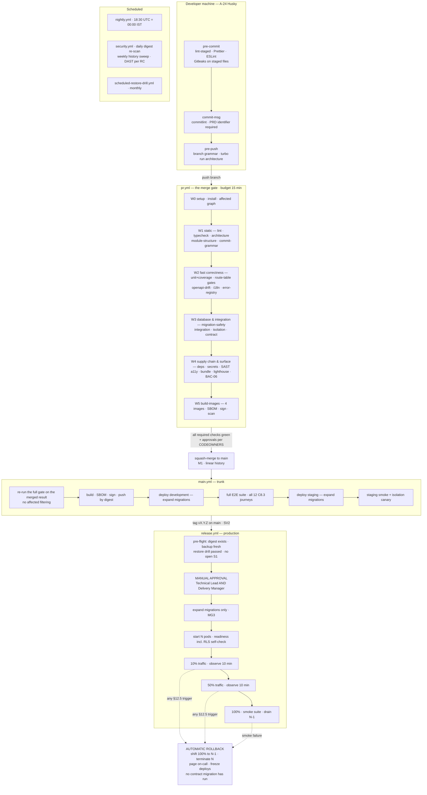
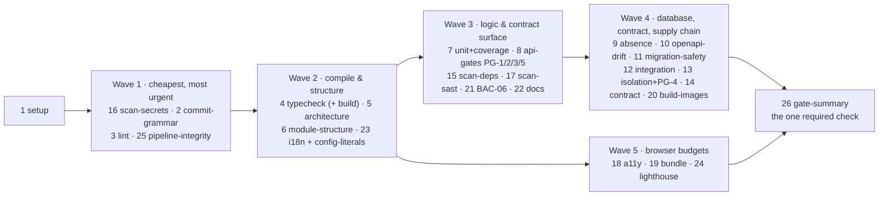

# CI/CD — Workflows, Quality Gates, Promotion and Rollback

**Gym Marketplace & Multi-Tenant Gym Management SaaS**
The implementable delivery-pipeline specification for Phase 1, written before any application code
exists and before the repository itself exists.

---

## 0. Document control

| Field | Value |
| :--- | :--- |
| Path | `/docs/engineering/CI_CD.md` |
| Precedence rank | **3** — binding derived specification (`PROJECT_CONSTITUTION.md` §1.3). Rank 1 (`PROJECT_CONSTITUTION.md`) and rank 2 (`MASTER_PRD.md`) override every statement here. Where this document appears to differ from either, **this document is defective** and is corrected by amendment, not by argument in a pull request. |
| Status | Phase-0 engineering artefact. **`BLK-01` is open: the workspace is not a Git repository.** See §0.4. Every YAML, shell, SQL or TypeScript fragment below is labelled *illustrative — not committed code* and fixes a **shape**, not an implementation. |
| Governing requirements | `§C7` (environments and delivery pipeline; the five non-negotiable gates) · `§C8.1` (the eight test layers) · `NFR-MNT-01` (coverage floors) · `NFR-MNT-02` (versioning and deprecation) · `NFR-MNT-03` (OpenAPI generated from code; **drift fails CI**) · `NFR-MNT-07` (feature flags) · `NFR-MNT-08` (IaC only) · `NFR-MNT-09` (a runbook per module) · `NFR-SEC-04`, `NFR-SEC-07`, `NFR-SEC-08`, `NFR-SEC-09` · `NFR-AVL-01`, `NFR-AVL-02`, `NFR-AVL-04`, `NFR-AVL-05`, `NFR-AVL-06`, `NFR-AVL-08` · `NFR-PERF-02`, `NFR-PERF-10` (per-PR budgets) · `NFR-SCAL-03` (stateless app tier) · `NFR-USE-01` (WCAG 2.1 AA) · `NFR-USE-08` (externalised strings) · `NFR-PRV-05` (data residency) · `FR-RBAC-01` (a declared permission on every endpoint) · `BR-TEN-01` · `BR-PAY-01`, `BR-PAY-02` · `BR-PLN-03` · `BR-GYM-01`, `BR-GYM-03`, `BR-REV-01`, `BR-REV-03` · `BR-FIN-01` · `BAC-06`, `BAC-10`, `BAC-11`, `BAC-14` · `E2E-01` … `E2E-12` |
| Governing law | `PROJECT_CONSTITUTION.md` **§20 (Git Strategy)** G1–G5, M1–M6, protections 1–10, SV1–SV6, hotfix steps 1–9 · **§25 (Enforcement Matrix)** in full, and §25.1 on bypass · §3.7 (the fitness test that fails the build) · §11.7 (the CI isolation suite, IS1–IS6) · §14.6 (OpenAPI drift, OA1–OA6) · §15.3 (migrations, MG1–MG11) · §17 (Testing Law, CV1–CV4, FL1–FL6) · §19 (Performance Budgets, PB1–PB10) · §22 (Dependency Governance) · §23.2 (Definition of Done, criterion 36) |
| Governing decisions | `ADR-0001` (monorepo, pnpm + Turborepo — the cache-correctness consequence is load-bearing here) · `ADR-0002` (NestJS; **Express is a rejected option and a `dependency-cruiser` failure**) · `ADR-0003` (modular monolith — one image, two process roles) · `ADR-0005` (Prisma + the mandatory tenant-context extension) · `ADR-0006` (RLS) · `ADR-0007` (no search cluster in Phase 1) · `ADR-0016` (idempotency) · `ADR-0022` (Zod) · `ADR-0026` (server-side feature flags — the release valve that makes trunk-based development safe) · `ADR-0027` (OpenAPI generated from code, one reflection pass carrying four gates) · `ADR-0028` (country/tax/KYC as configuration) · `ADR-0030` (stack-additions governance) |
| Stack | `A-26` **GitHub Actions** · `A-05` pnpm workspaces + Turborepo · `A-27` Terraform · `A-28` Docker Compose (local only) · `A-06` Jest · Supertest · Testcontainers · Playwright · k6 · axe-core · `A-16` `@nestjs/swagger` · `A-21`/`A-22` ESLint + Prettier · `A-23` `dependency-cruiser` · `A-24` Husky + lint-staged + commitlint · `A-25` Dependabot + Trivy + Gitleaks · `A-29` `size-limit` · `A-07` Prisma Migrate. **Nothing outside `STACK_ADDITIONS.md` Part 1 or Part 2 may appear in a workflow file** — a GitHub Action pinned from the marketplace is a dependency and is governed by §22 exactly as an npm package is (§2.6). |
| Market | **India** (`LAUNCH_MARKET_INDIA.md`, binding). Consequences that reach CI: deploy jobs and any job that can touch production or staging data run on **India-region runners** with **India-region artefact storage**, because `OQ-16` makes residency a compliance requirement and not a preference (§8.6); schedules are expressed in **UTC but reasoned in `Asia/Kolkata` (+05:30, no DST)** (§13.1); the SMS-template DLT gate exists at all (§6.14); and the financial-year and GST literals are subject to a hardcoding scan (§6.15). |

### 0.1 What this document is, and what it is not

| | |
| :--- | :--- |
| **This document is** | The concrete pipeline: seven workflow files with their exact triggers, concurrency groups, permission blocks and runner classes; the Turborepo task graph and the precise cache policy including what is never cached and why; **every** quality gate with its exact pass condition, its failure behaviour and its owner; the twenty-six-job `pr.yml` table with duration budgets and the fail-fast ordering argument; migration handling in CI; secret management in CI; the artefact build / SBOM / sign / scan / promote chain; environment promotion with the manual approval gate; the progressive traffic shift and the automatic-rollback automaton; branch protection and `CODEOWNERS`; the hotfix pipeline; and the order in which all of this comes into existence once `BLK-01` closes. |
| **This document is not** | The test design. `/docs/engineering/TestingStrategy.md` owns the layers, the isolation-suite internals (§5), the deterministic seed (§6), the negative-case rule (§7) and the flake policy (§12); this document owns **when each layer runs and what happens when it fails**. Not the security control catalogue — `/docs/engineering/Security.md` owns the threat model, secrets policy (§7), vulnerability management and remediation SLAs (§14) and incident response (§15). Not the capacity model or the eighteen `LT-` load scenarios — `/docs/engineering/Scalability.md` §10. Not the alert catalogue, SLOs or runbooks — `/docs/engineering/Monitoring.md` §5, §6, §9. Not the endpoint registry — `/docs/engineering/API_Catalog.md` §3. Not the infrastructure topology — `ENGINEERING_PLAN.md` §18.3 until `/docs/engineering/Deployment.md` is written, at which point that document owns topology and this one continues to own the pipeline that drives it. **It references all of them and duplicates none.** |
| **Relationship to `ENGINEERING_PLAN.md` §16** | §16 is the CTO-level overview: six workflow rows, a twenty-job table with one gate sentence each, four restated merge gates, a promotion table, a migration sequence diagram and nine rollback triggers. **This is the detailed version of that slice.** Where §16 gives a job one row, this gives it a trigger, a runner class, a dependency edge, a cache decision, a duration budget, an exact pass condition, a failure behaviour, an owner and a re-run policy. Where §16 says "manual approval", this says who, what they are shown, how long the gate waits and what happens when it expires. Four defects in §16 are corrected in §0.3 with their authority; **no gate is removed, no threshold is loosened, and no job is made optional.** |
| **Non-goal** | Vendor selection for anything not already in `STACK_ADDITIONS.md`. The container registry, the artefact signing service, the remote-cache backend, the DAST scanner, the SAST engine and the mutation-testing runner are **not** approved additions. §19.2 raises them as `PROPOSED` rows under `ADR-0030`. Until they are approved they may not appear in a workflow file, and this document is written to specify the **function** each performs, not the product. |

### 0.2 How to read this document

§1 the `§C7` sentence as a picture · §2 the workflow files · §3 the monorepo build graph and the
cache policy · §4 `pr.yml`'s twenty-six jobs, durations and ordering · **§5 the five non-negotiable
gates** · §6 every other gate · §7 migrations · §8 secrets · §9 the artefact supply chain · §10
trunk · §11 promotion · §12 production, approval, traffic shift, rollback · §13 the scheduled
workflows · §14 branch protection and `CODEOWNERS` · §15 hotfix · §16 the pipeline's own SLOs · §17
what a red build means · §18 bootstrap once `BLK-01` closes · §19 traceability and open items.

### 0.3 Five corrections applied before writing

`ENGINEERING_PLAN.md` §20.1 states its own subordination: *"Where this section and the constitution
differ, the constitution wins, and the discrepancy is a defect in this document."* Four such
discrepancies exist in §16 and are corrected here, each with the higher authority named.

| # | `ENGINEERING_PLAN.md` §16 says | The higher authority says | Correction in force | Why it matters |
| :-: | :--- | :--- | :--- | :--- |
| **C-1** | Job 8 asserts a **`@RequiresPermission`** decorator | `PROJECT_CONSTITUTION.md` §5 layer-4 contract names *"the mandatory `@RequiredPermission()` declaration (`FR-RBAC-01`)"*; `API_Catalog.md` §9.2 uses the same spelling | **`@RequiredPermission()`** is canonical, with **`@Public()`** as the only permitted explicit opt-out. `ADR-0027`'s shorthand `@Permission()` is an ADR-prose abbreviation, not a second decorator | A gate that reflects for the wrong symbol name passes vacuously on every route. This is the single most dangerous class of CI defect: a green gate that checks nothing (§17.4) |
| **C-2** | Job 11 *"runs the migration **forward and backward** against a restored production-shaped snapshot"* | `PROJECT_CONSTITUTION.md` §15.3 **MG1**: migrations are *"forward-only. A `down` migration is not written, is not tested, and would not be trusted in production"* | The job runs **forward only**. What replaces "backward" is the thing MG2 actually requires and that a down-migration only pretends to prove: the **`N−1` compatibility run** — the previously-released application image is started against the newly-migrated schema and the contract suite is executed against it (§7.4) | Testing a down migration builds confidence in a recovery path the constitution forbids using. The real risk is a rolling deploy where both versions run against one database, and only the `N−1` run measures that |
| **C-3** | Job 7's 95% zone is *"`payments/`, `settlements/`, `ledger/`, `refunds/`, `billing/`, `memberships/`, `tenancy/`"* — seven directories | `PROJECT_CONSTITUTION.md` §17.2 lists **eight**, adding `attendance/` (validation sequence and token handling), with the reason stated: `BR-CHK-01` … `BR-CHK-10` are all M-priority | The 95% zone is **eight** globs. `TestingStrategy.md` §3.2 already implements it as row 8; this document's job 7 matches that document exactly | A denial defect is a queue at the front desk during peak hour (`NFR-PERF-08`, `NFR-AVL-02`). Omitting `attendance/` from the gate is how it ships |
| **C-4** | §16.1 names six workflows: `pr.yml`, `main.yml`, `release.yml`, `nightly.yml`, `scheduled-restore-drill.yml`, `dependency-review.yml`. `PROJECT_CONSTITUTION.md` §7.1's tree annotates `.github/workflows/` as *"A-26 · ci.yml, deploy.yml, nightly.yml, security.yml"* | §7.1's **numbered laws are R1–R6** and none of them enumerates a workflow filename; the tree line is a descriptive annotation. `TestingStrategy.md` §2.3, `Scalability.md` §10.1 and `Security.md` §14.1 all cite the six-name inventory and its job numbering | The **six-name inventory is adopted**, and **`security.yml` is additionally created** as a real scheduled workflow, because `Security.md` §14.1 mandates cadences (daily deployed-digest re-scan, weekly full-history secret sweep, per-release-candidate DAST) that no PR-triggered workflow can satisfy. `release.yml` fills the annotation's `deploy.yml` role. **The §7.1 annotation should be updated by editorial amendment under §24** — recorded in §19.3, not changed here | Three peer documents already number `pr.yml` jobs. Renaming them would break every citation. But `Security.md`'s scheduled controls have no home in the plan's six, and a mandated control with no workflow is a control that does not exist |

| **C-5** | §16.3 splits the controller reflection across **three** jobs: 8 `permission-declared`, 9 `ratelimit-declared`, 10 `openapi-drift` | `ADR-0027`'s central decision and `API_Catalog.md` §5.5 make it **one pass, five assertions** `PG-1` … `PG-5`, because booting the Nest application context three times triples a generation cost whose own revisit trigger is 60 seconds (`API_Catalog.md` §9.5) | **Job 8 becomes `api-gates`**: one reflection pass asserting `PG-1` (permission), `PG-2` (idempotency), `PG-3` (permission well-formed), `PG-5` (rate-limit class + error registry), and writing `openapi.json` as an artefact. **`PG-4`** (isolation coverage) runs inside job 13, where the isolation inventory lives. **Job 9 becomes `api-absence-assertions`** — the four "prove it is *not* there" checks of `API_Catalog.md` §9.4, which defend invariants I1, I3, I4 and I5 and deserve their own required check. **Job 10 keeps its name and number** | Three boots is three chances for two of them to disagree about the route table. And a gate that proves an operation *does not exist* — no client-signal activation, no monetary request field, no client tenant id, no gym-edits-review — is worth more than a gate that proves one does |

Corrections `C-1` … `C-5` are recorded in §19.3 for the amendment log. No gate, threshold or
promotion rule from either source document is weakened by any of them.

### 0.4 `BLK-01` — this document specifies a pipeline that cannot yet run

> **`PHASES.md` `BLK-01`, deferred by the project owner on 2026-08-06:** *"Workspace is not a Git
> repository … **Becomes blocking at Phase 8** — the first commit needs somewhere to go."*
> `LAUNCH_MARKET_INDIA.md` §12 restates the consequence: *"`PROJECT_CONSTITUTION.md` §20 (Git
> strategy) and `ENGINEERING_PLAN.md` §15–16 (branch strategy, CI/CD) are **written but
> unenforceable** until a repository exists."*

This is stated explicitly rather than assumed away, because a delivery-pipeline document that reads
as though it describes running infrastructure invites two failures: someone looks for a build page
that does not exist, and someone assumes the gates are protecting them when nothing is protecting
anything.

| Fact | Consequence for this document |
| :--- | :--- |
| No repository, therefore no GitHub Actions, no branch protection, no `CODEOWNERS`, no Environments, no OIDC trust relationship, no remote cache | **Every gate here is a specification, not an observation.** No duration figure in §4.3 is measured; all are **budgets**, derived from the work each job must do at the Sprint-0 codebase size and reviewed against reality in Sprint 1 (§16.4) |
| No commit history | The commit-grammar gate (§6.2), the coverage ratchet's merge-base baseline (§5.2) and the stale-branch report (§13.4) have nothing to compare against on day one. §18.3 gives each a defined cold-start behaviour rather than letting it fail open |
| `RSK-14`'s stated mitigation — *"pair coverage on payments and tenancy"* — is enforced by `CODEOWNERS`, which cannot exist | `RiskAnalysis.md` `DEL-01` and `DEL-06` already record this. §14.3 specifies the `CODEOWNERS` file in full so that closing `BLK-01` is a copy, not a design exercise |
| The `.github/` tree is normative in `PROJECT_CONSTITUTION.md` §7.1 | §2.1 enumerates every file that must exist at `git init` + 1 day, in the order §18.2 gives |

**The single most important consequence:** the first pull request merged into `main` must already be
gated. A repository that accrues a month of commits before the isolation suite becomes a required
check is a repository in which nobody knows when isolation last worked. §18 sequences the
bootstrap so that the trivial tenant-scoped endpoint of `MASTER_PRD.md` §C9.1 Sprint 0 — *"A trivial
tenant-scoped endpoint exists and the isolation suite proves it"* — is the **first** thing the
pipeline proves, not the last.

### 0.5 The five load-bearing invariants, restated as pipeline obligations

Every gate below exists to stop one of the five invariants being broken by a merge. An invariant
whose only defence is a reviewer's attention on a Friday afternoon is undefended.

| # | Invariant | The gate that defends it | Failure behaviour |
| :-: | :--- | :--- | :--- |
| **I1** | No tenant reads or writes another tenant's data (`BR-TEN-01`, `NFR-SEC-09`, `BAC-10`, `E2E-11`) | Job 13 **isolation** (never cached, never affected-filtered), job 5 `no-raw-prisma-client`, job 11's `pg_policies` check (`IS6`), and the production isolation canary that arms the automatic rollback (§12.5) | **BUILD FAILS.** Unwaivable (§5.5). In production, **immediate rollback, no observation window** |
| **I2** | Money is an append-only ledger of integer minor units (`BR-PAY-01`, `BR-FIN-01`) | Job 3's `no-float-money` lint, job 11's `information_schema` money-column check (`DB2`), job 11's `role_table_grants` append-only check (`AP1`), job 7's eight 95% coverage globs, and the `BAC-06` negative-case report (job 21) | **BUILD FAILS.** A money gate is never re-run "to see if it passes" (§17.2) |
| **I3** | Price displayed = price charged; server re-validation aborts on mismatch (`BR-PLN-03`) | Job 10's absence assertion that **no request schema anywhere contains a monetary field** (`API_Catalog.md` §9.4, `CA1`), plus `E2E-06` in the trunk suite | **BUILD FAILS** on the assertion; `main.yml` blocks promotion to `staging` on the E2E failure |
| **I4** | Verification before visibility; earned reviews only (`BR-GYM-01`/`-03`, `BR-REV-01`/`-03`) | Job 10's absence assertions (no operation lets a gym edit or delete a review), the `BAC-06` negative tests for `BR-GYM-01`, `BR-GYM-03`, `BR-REV-01`, `BR-REV-05`, and `E2E-09` on trunk | **BUILD FAILS** |
| **I5** | Activation is webhook-driven, never the client redirect (`BR-PAY-02`) | Job 10's absence assertion that **no operation activates a membership from a client signal**, the `BR-PAY-05` unsigned-webhook contract test, and `E2E-02`/`E2E-08` on trunk | **BUILD FAILS** |

---

## 1. The pipeline in one picture

### 1.1 The `§C7` sentence, and what it commits us to

> **`MASTER_PRD.md` §C7:** *"Commit → lint and type-check → unit tests → build → integration tests →
> tenant-isolation suite → dependency and secret scan → container build → deploy to development →
> end-to-end suite → deploy to staging → manual approval → production deploy with migration → smoke
> tests → progressive traffic shift → automatic rollback on error-rate or latency regression."*

Sixteen steps. Read carefully it fixes more than an order — it fixes **five structural commitments**
that the rest of this document merely implements.

| # | Commitment hidden in the sentence | Where it lands |
| :-: | :--- | :--- |
| 1 | The isolation suite runs **before** the container is built, not after deployment. Tenant isolation is a merge gate, not a smoke test | §4.4, §5.5 |
| 2 | The container is built **once**, before `development`, and the same artefact reaches production. The sentence contains one "container build" and three deploys | §9.5, §11.2 |
| 3 | The end-to-end suite runs **on a deployed environment**, not against a test harness. It sits between `development` and `staging` | §10.3 |
| 4 | The only human decision in the entire chain is **one** approval, and it is placed after staging and before production | §12.2 |
| 5 | Rollback is **automatic** and its triggers are **error rate and latency** — not a human noticing | §12.5 |

### 1.2 The one rule the pipeline exists to serve

`PROJECT_CONSTITUTION.md` §20.1 **G1**: *"`main` is the trunk. It is **always releasable**."*

Everything else follows. Branches live ≤ 2 days (**G2**), so the gate must be fast enough that a
two-day branch is not half CI wall-clock. Incomplete work ships dark behind a flag (**G3**,
`ADR-0026`), so the pipeline never needs a release branch to hold it. History is linear (**G4**,
**M2**), so a bisect over a production regression lands on one squashed commit with one PRD
identifier. And **M5** — *"No merge without a green pipeline. There is no 'merge anyway'"* — is only
survivable if the gates are trustworthy: a flaky gate teaches the team that red means "try again",
and once that is learned, `§C7`'s non-negotiable list is decoration.

**That is why §17 exists**, and why the flake budget in §16.2 is a first-class SLO rather than a
nice-to-have.

### 1.3 The whole pipeline



### 1.4 Where each `§C7` step lives

| `§C7` step | Workflow · job | Section |
| :--- | :--- | :--- |
| Commit | Husky `pre-commit` / `commit-msg` / `pre-push` (`A-24`) | §2.4 |
| Lint and type-check | `pr.yml` jobs 3, 4 | §6.1 |
| Unit tests | `pr.yml` job 7 (with the coverage gate) | §5.2 |
| Build | `pr.yml` job 20 (`build-images`), preceded by `turbo run build` inside jobs 4 and 19 | §9 |
| Integration tests | `pr.yml` job 12 | §6.9 |
| Tenant-isolation suite | `pr.yml` job 13 — **never cached, never affected-filtered** | §5.5 |
| Dependency and secret scan | `pr.yml` jobs 15, 16, 17; `dependency-review.yml`; `security.yml` | §6.11, §13.3 |
| Container build | `pr.yml` job 20 (verify) and `main.yml` job M2 (publish) | §9 |
| Deploy to development | `main.yml` job M3 | §10.2 |
| End-to-end suite | `main.yml` job M4 — all twelve `§C8.3` journeys | §10.3 |
| Deploy to staging | `main.yml` job M5 | §10.4 |
| Manual approval | `release.yml` GitHub Environment `production` | §12.2 |
| Production deploy with migration | `release.yml` jobs R2, R3 | §7.5, §12.3 |
| Smoke tests | `release.yml` job R6, and after every environment deploy | §12.4 |
| Progressive traffic shift | `release.yml` jobs R4, R5, R6 | §12.3 |
| Automatic rollback | The rollback automaton armed at R3 and disarmed 30 minutes after R6 | §12.5 |

---

## 2. Workflow inventory and repository configuration

### 2.1 Every file under `.github/`, and what it is for

`PROJECT_CONSTITUTION.md` §7.1 mandates the directory; **R6** forbids files at the repository root
that the tree does not list. This is the complete `.github/` contents at `git init` + 1 day.

| Path | Kind | Purpose | Mandated by |
| :--- | :--- | :--- | :--- |
| `.github/workflows/pr.yml` | Workflow | The merge gate. Twenty-six jobs (§4) | `§C7`, §20.7 protection 5 |
| `.github/workflows/main.yml` | Workflow | Trunk: re-gate the merged result, publish artefacts, promote to `development` then `staging` | `§C7` |
| `.github/workflows/release.yml` | Workflow | Production: approval, migration, progressive shift, smoke, rollback arming | `§C7`, `NFR-AVL-06` |
| `.github/workflows/nightly.yml` | Workflow | Full E2E ×10 flake sweep, k6, mutation, chaos, stale-branch report, escape-hatch expiry | §17.7 FL6, §9.2.1 N1, `PB3` |
| `.github/workflows/security.yml` | Workflow | Daily re-scan of **deployed digests**, weekly full-history Gitleaks sweep, DAST per release candidate | `Security.md` §14.1 |
| `.github/workflows/dependency-review.yml` | Workflow | Dependabot surface: fails on an unapproved dependency or a critical advisory | `A-25`, §22 DP2, `ADR-0030` |
| `.github/workflows/scheduled-restore-drill.yml` | Workflow | Monthly restore of a production backup into an isolated India-region environment | `NFR-AVL-05` |
| `.github/workflows/_reusable-node-setup.yml` | Reusable | pnpm install, Node 20 pin, Turborepo cache restore, affected-graph computation | `ADR-0001` |
| `.github/workflows/_reusable-testcontainers.yml` | Reusable | Postgres 16 + PostGIS, Redis 7, MinIO service stack for jobs 12, 13, 14 | `A-06` |
| `.github/workflows/_reusable-deploy.yml` | Reusable | One deployment procedure parameterised by environment; used by `main.yml` and `release.yml` so `development` is deployed by the same code path as `production` | `NFR-MNT-08` |
| `.github/workflows/_reusable-scan.yml` | Reusable | Trivy + SBOM + signature verification, called at build time and by `security.yml` | `A-25` |
| `.github/PULL_REQUEST_TEMPLATE.md` | Template | Verbatim from `PROJECT_CONSTITUTION.md` §20.4. Not optional | §20.4 |
| `.github/CODEOWNERS` | Config | Two-reviewer routing for money, tenancy, IAM, migrations, `infra/**`, `.github/**`, the constitution and the PRD | §20.7 protection 4, `RSK-14`, `DEL-01` |
| `.github/dependabot.yml` | Config | Grouped weekly minor/patch PRs; immediate PRs for security advisories; separate ecosystems for npm, Docker and **GitHub Actions** | `A-25`, §2.6 |
| `.github/ISSUE_TEMPLATE/defect.yml` | Template | Severity per `C8.5`, PRD identifier required, reproduction against the `§C8.2` seed | §17.9 |
| `.github/ISSUE_TEMPLATE/flaky-test.yml` | Template | Opened automatically by `nightly.yml`'s flake sweep; carries the owner and the five-working-day quarantine expiry | §17.7 FL2, FL6 |
| `.github/actions/setup-monorepo/action.yml` | Composite | The one place Node 20, pnpm and the cache configuration are declared. Every job calls it; no job re-declares a version | §22 VD3 |
| `.github/actions/assert-india-runner/action.yml` | Composite | Fails any job that handles staging or production data if the runner is not in the India region | `OQ-16`, `NFR-PRV-05` |

### 2.2 Triggers, concurrency and permissions, in one table

Every workflow declares `permissions: {}` at the top level and grants the minimum per job. A
workflow without an explicit top-level `permissions` block inherits the repository default, and a
repository default that is anything other than empty is a finding in the `.github/**` `CODEOWNERS`
review.

| Workflow | Trigger | Concurrency group | Cancel in progress | Top-level permissions | Job-level grants |
| :--- | :--- | :--- | :-: | :--- | :--- |
| `pr.yml` | `pull_request` → `main`; `pull_request_target` **never used** | `pr-${{ github.event.pull_request.number }}` | **Yes** — a new push supersedes the old run | `{}` | `contents: read` everywhere; `security-events: write` on jobs 15/16/17 to upload SARIF; `id-token: write` on **no** job — a PR never authenticates to a cloud account (§8.3) |
| `main.yml` | `push` → `main` | `main-trunk` | **No** — every trunk commit is validated and deployed in order | `{}` | `contents: read`; `packages: write` on M2; `id-token: write` on M2, M3, M5; `deployments: write` on M3, M5 |
| `release.yml` | `push` tags `v*.*.*`; `workflow_dispatch` with a required `digest` input | `release-production` | **No** — never cancel a production deploy | `{}` | `contents: read`; `id-token: write` and `deployments: write` on R2–R6; `packages: read` |
| `nightly.yml` | `schedule` `30 18 * * *` (18:30 UTC = **00:00 IST**); `workflow_dispatch` | `nightly` | **Yes** | `{}` | `contents: read`; `issues: write` for the flake-defect opener; `id-token: write` for staging access |
| `security.yml` | `schedule` `0 20 * * *` (daily, 01:30 IST); `schedule` `0 21 * * 0` (weekly sweep); `workflow_call` for the per-RC DAST | `security-${{ github.event.schedule || 'dispatch' }}` | **No** | `{}` | `contents: read`; `security-events: write`; `id-token: write` for the deployed-digest scan |
| `dependency-review.yml` | `pull_request` | `depreview-${{ github.event.pull_request.number }}` | **Yes** | `{}` | `contents: read`; `pull-requests: write` for the summary comment |
| `scheduled-restore-drill.yml` | `schedule` `0 19 1 * *` (00:30 IST on the 1st); `workflow_dispatch` | `restore-drill` | **No** | `{}` | `contents: read`; `id-token: write` — **India-region runner mandatory** (§8.6) |

**Why `pull_request_target` is banned outright.** It runs the workflow definition from the base
branch with **write** permissions and the repository's secrets, against code from the head branch.
For a public-fork-friendly repository that is a well-known credential-exfiltration path. This
repository is private (`ADR-0001`'s "one repository is one access boundary" consequence), which
lowers but does not remove the risk — a compromised contributor account would be enough. Forks do
not need to run privileged workflows here, so the trigger has no legitimate use and its presence in
any workflow file is a **BUILD FAILS** condition of the workflow-lint check (§6.16).

### 2.3 Runner classes

| Class | Used by | Why |
| :--- | :--- | :--- |
| **`ubuntu-24.04`, GitHub-hosted, 4 vCPU** | Jobs 1–11, 15–19, 21–26 of `pr.yml`; all of `dependency-review.yml` | Pure source-level work. No production data, no cloud credentials, no residency exposure |
| **`ubuntu-24.04`, GitHub-hosted, 8 vCPU** | Jobs 12, 13, 14 (Testcontainers); job 20 (image build) | Three container stacks and four multi-stage image builds are CPU- and I/O-bound; the larger runner buys back more wall-clock than it costs, and §16.1's 15-minute budget is the constraint |
| **Self-hosted, India region (`ap-south-1` class), ephemeral, one job per runner** | `main.yml` M3/M5/M6, all of `release.yml`, `security.yml`'s deployed-digest scan, all of `scheduled-restore-drill.yml` | These jobs hold credentials for, and in the restore drill actually **materialise**, production data. `LAUNCH_MARKET_INDIA.md` §9 makes India residency a **compliance requirement** under RBI payment-data localisation; a runner outside India that restores a production backup moves payment system data out of India. The `assert-india-runner` composite action (§2.1) fails the job if the runner's region label is absent or wrong, so the control does not depend on someone picking the right `runs-on` |
| **Ephemeral, one job per runner, no reuse** | Every self-hosted runner | A persistent self-hosted runner accumulates state between jobs from different trust levels. `NFR-SEC-07` and `Security.md` §7 both make credential isolation non-negotiable |

### 2.4 The local hooks, and why the pipeline re-runs every one of them

`A-24` puts Husky + lint-staged + commitlint at the root (`ADR-0001` implementation notes).
`PROJECT_CONSTITUTION.md` §20.6 **M6**: *"`--no-verify` is forbidden. Husky hooks are not
advisory."* §25's enforcement row for M6 reads: **"Server-side CI re-runs every hook check."**

| Hook | Runs | CI job that re-runs it | Why the duplication is deliberate |
| :--- | :--- | :--- | :--- |
| `pre-commit` | `lint-staged`: Prettier + ESLint on staged files; Gitleaks on the staged diff | Jobs 3 and 16 | A hook is a **courtesy to the developer** — fast feedback before the push. It is never a **control**, because it runs on a machine the project does not control and can be bypassed with one flag |
| `commit-msg` | `commitlint`: Conventional Commit type + a PRD identifier as scope (`C1`, `C2`) | Job 2 | Same reason. Job 2 additionally validates that the cited identifier **exists in `MASTER_PRD.md`**, which a local hook cannot cheaply do across 4,197 lines on every commit |
| `pre-push` | Branch grammar (§20.2); `turbo run architecture` | Jobs 2 and 5 | `dependency-cruiser` locally catches the boundary violation before a 15-minute CI round trip. Job 5 is still the gate |

**The rule:** a hook may only ever be a **faster copy** of a CI gate, never the only place a rule is
checked, and never stricter than CI. A hook that fails where CI passes trains people to use
`--no-verify`, which is exactly the behaviour M6 forbids.

### 2.5 Action pinning

| Rule | Statement |
| :--- | :--- |
| **AP-1** | Every `uses:` reference is pinned to a **full 40-character commit SHA**, with the human-readable version in a trailing comment. Tags are mutable; `v4` is not a version, it is a promise |
| **AP-2** | Dependabot's `github-actions` ecosystem is enabled (§2.1) so that SHA bumps arrive as reviewable pull requests rather than as drift |
| **AP-3** | A third-party action is a **dependency under §22**. It requires an approved `A-NN` row in `STACK_ADDITIONS.md` before it appears in a workflow file. `ADR-0030`'s standing rule — *"A dependency present in the repository without a corresponding approved row is a review blocker"* — does not distinguish npm packages from marketplace actions |
| **AP-4** | Preference order: (1) a shell script in `scripts/ci/` that the team owns and can read; (2) a first-party `actions/*` action; (3) a third-party action with an `A-NN` row. Most of what a marketplace action does in this pipeline is fifteen lines of shell, and fifteen lines of shell cannot be re-tagged by someone else |
| **AP-5** | The workflow-lint check (§6.16) fails the build on any unpinned `uses:`, any `pull_request_target`, any `permissions` block granting `write` beyond the §2.2 table, and any `${{ github.event.* }}` interpolation into a `run:` block — the script-injection path |

### 2.6 Configuration files outside `.github/` that the pipeline depends on

Each is `CODEOWNERS`-protected (§14.3) because each **is a control, not a preference**.

| Path | Owns | Why the review matters |
| :--- | :--- | :--- |
| `turbo.json` | Task graph, inputs, cache policy, the §3.4 `cache: false` declarations | A change to `cache:` or `inputs:` is reviewed as a **correctness** change (`ADR-0001`, `TR-42`) |
| `pnpm-workspace.yaml`, `pnpm-lock.yaml` | Workspace membership; the frozen dependency set | Job 1's §22 manifest check |
| `packages/config/*` | ESLint, Prettier, tsconfig base, Tailwind preset, **Jest coverage thresholds** | Two reviewers; a threshold is never changed in the same PR as feature work (**CG3**, **CG6**) |
| `.dependency-cruiser.cjs` · `.gitleaks.toml` | The §3.7 rule set · secret patterns and the allowlist | §3.7 permits *"no override, no inline suppression"*; an allowlist entry needs a `DECISION_LOG.md` line naming the false positive |
| `infra/terraform/**` · `openapi.json` | Every environment (`NFR-MNT-08`) · the committed generated contract (`OA2`) | Plan posted to the PR, apply only from `main` · never hand-edited; job 10 fails on any regeneration diff |

---

## 3. The monorepo build graph

### 3.1 What the graph actually contains

`ADR-0001` chose one repository for four deployable units and one contract; `PROJECT_CONSTITUTION.md`
§7.1 fixes the workspace layout and `ModuleDependency.md` owns the graph itself. The build graph is
therefore known in advance and is small — **eight** workspaces: `packages/types` → `packages/utils`
and `packages/ui`; those three → `apps/server`, `apps/customer-web`, `apps/gym-dashboard`,
`apps/admin-dashboard`; with `packages/config` a dev-time input to all four applications.

The shape has three consequences the pipeline must respect:

| Observation | Pipeline consequence |
| :--- | :--- |
| `packages/types` is upstream of **everything** | A change to a shared Zod schema or a branded id invalidates all seven downstream workspaces. There is no "small" change to `packages/types`, and affected-detection correctly says so. This is the price of `ADR-0022`'s single validation source and it is paid knowingly |
| `packages/ui` is upstream of the three browser surfaces but **not** of `apps/server` | A design-token change never runs the isolation suite by way of the affected graph — which is precisely why §3.4 forces the isolation suite to run anyway |
| `apps/server` is downstream of nothing but the two leaf packages | A server-only change rebuilds one application and its three typed clients only if the generated client changes — which the OpenAPI drift gate (job 10) makes visible in the same run (`ADR-0001` positive consequence 1) |

### 3.2 The Turborepo task graph

`ADR-0001`'s implementation notes fix the minimum task list. This is that list with its dependency
edges, its inputs and its cache decision. **`dependsOn: ["^task"]` means "the same task in every
workspace I depend on, first."**

| Task | `dependsOn` | Inputs (beyond the workspace's own source) | Outputs | Cached |
| :--- | :--- | :--- | :--- | :-: |
| `lint` | — | `packages/config/eslint*`, `.eslintrc*` | — | ✅ |
| `format:check` | — | `packages/config/prettier*` | — | ✅ |
| `typecheck` | `^build` | `packages/config/tsconfig*` | — | ✅ |
| `architecture` | — | `.dependency-cruiser.cjs`, **every** workspace's source | `dependency-graph.svg` (artefact) | ❌ §3.4 |
| `build` | `^build` | lockfile, `tsconfig`, env allow-list | `dist/`, `.next/`, `build/` | ✅ |
| `test:unit` | `^build` | `jest.config.*`, `packages/config/jest*` | `coverage/` | ✅ |
| `test:integration` | `^build`, `db:migrate:test` | `prisma/schema.prisma`, `prisma/migrations/**`, `prisma/seed/**`, container image digests | `junit.xml` | ❌ §3.4 |
| `test:contract` | `openapi:generate` | `openapi.json`, `prisma/**` | `junit.xml` | ❌ §3.4 |
| `test:isolation` | `openapi:generate`, `db:migrate:test` | **everything** — declared as the whole repository | `isolation-report.json` | ❌ §3.4 |
| `test:e2e` | `build` | `playwright.config.ts`, seed, deployed base URL | traces, videos | ❌ |
| `openapi:generate` | `^build` | every controller, every Zod schema, decorator metadata | `openapi.json` | ❌ §3.4 |
| `openapi:check` | `openapi:generate` | committed `openapi.json` | diff report | ❌ §3.4 |
| `size-limit` | `build` | `.size-limit.json` | budget report | ✅ |
| `depcruise` | — | alias of `architecture`, retained for the `ADR-0001` task name | — | ❌ |

**Why `typecheck` depends on `^build` and not on `^typecheck`.** A downstream workspace type-checks
against its dependencies' **emitted declarations**, not their sources. Depending on `^typecheck`
would let `apps/customer-web` type-check against a stale `packages/types` build and pass while the
real composition is broken — the class of false green that `ADR-0001` warns about in its cache
consequence.

### 3.3 Affected-package detection

`ENGINEERING_PLAN.md` §16.2 fixes the principle. This is the mechanism.

| Step | Detail |
| :--- | :--- |
| 1 | The merge base with `main` is resolved. On a `pull_request` event this is the base SHA GitHub supplies; on `push` to `main` it is the previous trunk commit |
| 2 | `turbo run <task> --filter="...[<merge-base>]"` selects every workspace whose files changed **plus every workspace that depends on one of them**, transitively |
| 3 | Any change to a **global input** — `pnpm-lock.yaml`, `turbo.json`, `packages/config/**`, `.dependency-cruiser.cjs`, `.github/workflows/**`, `apps/server/prisma/**`, `tsconfig.base.json`, the `Dockerfile`s, `.nvmrc` — is declared a **global dependency** in `turbo.json`, which invalidates every workspace. This is correct and must not be "optimised": a tsconfig flag change (§9.1) alters the meaning of every file in the repository |
| 4 | The affected set is written to the job summary of job 1 as a table, so a reviewer can see at a glance whether an apparently small change fanned out — and, more usefully, whether one that should have fanned out did not |
| 5 | If the affected set is **empty** (a docs-only change), jobs 3–20 report a neutral "no affected workspaces" conclusion. **Jobs 2, 5, 10, 13, 15, 16 and 22 still run** (§3.4). A documentation-only pull request is not exempt from the commit-grammar gate or the documentation-freshness gate |

### 3.4 The suites that are never cached and never affected-filtered

`ENGINEERING_PLAN.md` §16.2 names three. This document adds four more, each with the failure it
prevents. `ADR-0001`'s stated posture — *"the safest posture, and the one adopted, is that the
isolation suite and the security scans are never cached"* — is the authority.

| Suite / job | Never affected-filtered | Never cached | The false green it prevents |
| :--- | :-: | :-: | :--- |
| **13 · isolation** | ✅ | ✅ | An RLS policy widened by a migration in a workspace the diff does not touch; a route added through a shared decorator; a change to the Prisma extension (`ADR-0005`). The blast radius of a tenancy regression is the whole platform (`BR-TEN-01`), so its cost is paid unconditionally on every run |
| **10 · openapi-drift** | ✅ | ✅ | The generated document is a function of the entire application graph. A cached "unaffected" verdict is computed from an incomplete graph (`API_Catalog.md` §9.2) |
| **5 · architecture** | ✅ | ✅ | A cycle is a property of the graph, not of a file. Two independently-acyclic changes can compose into a cycle |
| **15, 16, 17 · dependency, secret and SAST scans** | ✅ | ✅ | A CVE is disclosed against an unchanged dependency; a secret is committed in a file that belongs to no workspace (a Terraform variable file, a fixture, a workflow). `TR-42`'s early-warning signal is literally *"Trivy or Gitleaks findings appearing and disappearing between identical runs"* |
| **11 · migration-safety** | ✅ | ✅ | Schema assertions (`information_schema`, `pg_policies`, `role_table_grants`) are properties of the whole schema, not of the migration file that changed |
| **21 · `BAC-06` negative-case report** | ✅ | ✅ | The report cross-references **all 95** `A8` rules against **all** test files. Filtering it to the affected set is how a deleted negative test goes unnoticed |
| **22 · docs-freshness / traceability** | ✅ | ✅ | It compares the diff against `/docs/**`. Filtering by workspace defeats the check |

### 3.5 Remote cache rules — the `TR-42` mitigation

`TR-42` (*stale or poisoned build artefact from the Turborepo cache*, P2 × I4 = 8) fixes the
mitigation. It is restated here as operational rules because this is the document that implements
it.

| # | Rule | Enforced by |
| :-: | :--- | :--- |
| **RC-1** | **Only `main.yml` may write the remote cache.** `pr.yml` is read-only. A pull request that can write the shared cache is a supply-chain surface: one poisoned artefact is served to every subsequent build | The read-only cache token is the only token `pr.yml` holds; `main.yml` holds the write token, scoped to that workflow's environment (§8.4) |
| **RC-2** | **`release.yml` runs with the cache disabled entirely** (`--force`). The artefact that reaches production is built from source in a run whose inputs are auditable | `TURBO_FORCE=true` set at the workflow level and asserted by the workflow-lint check |
| **RC-3** | Cache keys enumerate their inputs **explicitly** rather than defaulting: lockfile hash, Node version from `.nvmrc`, pnpm version, `turbo.json` hash, the Prisma schema hash, and the closed allow-list of environment variables that affect output | `turbo.json` `inputs` and `env` arrays, reviewed by `CODEOWNERS` as a correctness change |
| **RC-4** | Deployments address images by **digest**, never by a mutable tag. A tag can be re-pointed; a digest cannot | §9.5; `_reusable-deploy.yml` accepts a digest and rejects a tag-shaped input |
| **RC-5** | Trivy and Gitleaks run against the **final artefact**, not an intermediate build stage | §9.4 |
| **RC-6** | A cache hit rate **above 95% on a branch with source changes** is reported as an anomaly in the job-1 summary and investigated. `TR-42`'s early-warning signal is a build whose output does not change after a source change | Job 1 emits `cache_hit_ratio` and `affected_workspace_count`; §16.3 tracks both |
| **RC-7** | Suspected poisoning is a **security incident** under `Security.md` §15, not a build problem: purge the cache, rebuild from source with caching off, and rotate every credential the build had access to | `Security.md` §15; `TR-42` contingency |

### 3.6 The wall-clock argument

`ADR-0001` accepted a real cost: *"CI wall-clock grows with the repository, not with the change,
unless affected-target detection stays healthy."* Its revisit trigger 1 fires at **20 minutes p75
on a warm cache for a single-package change, measured over one sprint**. `ENGINEERING_PLAN.md`
§16.3 targets **under 15 minutes** for `pr.yml`.

| Figure | Value | Status |
| :--- | :--- | :--- |
| `pr.yml` target, p50, warm cache, single-workspace change | **≤ 9 min** | Budget (§4.3) |
| `pr.yml` target, p95, warm cache | **≤ 15 min** | Budget — `ENGINEERING_PLAN.md` §16.3 |
| `pr.yml`, cold cache or a `packages/types` change | **≤ 22 min** | Accepted. A change to the shared contract legitimately validates everything |
| `ADR-0001` revisit trigger | **> 20 min p75 over one sprint for a single-package change** | Trigger — opens a review of the monorepo decision, not of the gates |
| Time-to-first-failure for the most common failure classes | **≤ 3 min** | The fail-fast objective of §4.4 |

**The budget is a budget, not a target to be met by weakening gates.** §19 **PB1**'s logic applies by
analogy and is adopted explicitly here as **CI-PB1**: *a CI duration budget is never met by removing
or caching a correctness gate.* The permitted levers are runner size, parallelism, sharding and
input precision. Removing job 13 from the critical path is not a lever; it is the failure the
constitution exists to prevent.

---

## 4. `pr.yml` — the merge gate

### 4.1 Trigger, concurrency and the shape of a run

| Property | Value | Reason |
| :--- | :--- | :--- |
| Trigger | `pull_request` (`opened`, `synchronize`, `reopened`, `ready_for_review`) targeting `main` | `§20.7` protection 1: every change arrives by pull request |
| Draft pull requests | Jobs 1–6 and 16 run; the rest are skipped and the aggregator (job 26) reports **neutral** | A draft is a conversation. Static gates still run because they are cheap and their feedback is the most useful early. Marking ready-for-review re-triggers the full run |
| Concurrency | `pr-${{ github.event.pull_request.number }}`, **cancel in progress** | A superseded commit's run is wasted runner time. §20.6 **M4** re-runs CI after a rebase anyway |
| Merge-queue behaviour | Branch protection requires the branch to be **up to date with `main`** (protection 6). A rebase is a new push, therefore a new run | Protection 6 plus **M4**. There is no "green when it was based on an older trunk" |
| Fork pull requests | Not applicable — private repository, no forks. `pull_request_target` is banned regardless (§2.2) | `ADR-0001` access-boundary consequence |
| Timeout | 30 minutes per job; 45 minutes for the workflow | A hung Testcontainers stack must not hold a runner for six hours |
| Re-run policy | **Whole-workflow re-run only.** Individual failed jobs may not be re-run in isolation | §17.2 — re-running one red job until it passes is how a flaky gate becomes a policy |

### 4.2 The job graph



### 4.3 Every job, with its duration budget

Durations are **budgets, not measurements** — `BLK-01` means nothing has ever run. They are p50
figures on a warm cache with an affected set of one workspace, on the runner class named in §2.3,
against the Sprint-4 codebase size. §16.4 replaces every figure with a measured p50 and p95 at the
end of Sprint 1.

| # | Job | Runner | Depends on | Cached | Affected-filtered | Budget p50 | Required check | Gate summary |
| :-: | :--- | :--- | :--- | :-: | :-: | ---: | :-: | :--- |
| 1 | `setup` | 4 vCPU | — | ✅ store | n/a | 0:45 | ✅ | Frozen lockfile installs; every dependency has an approved `A-NN` row; affected graph published |
| 2 | `commit-grammar` | 4 vCPU | 1 | ✅ | ❌ | 0:20 | ✅ | Branch name, commit types, PRD-identifier scopes; the identifier **exists** in `MASTER_PRD.md` |
| 3 | `lint` | 4 vCPU | 1 | ✅ | ✅ | 1:10 | ✅ | ESLint + Prettier; **warnings are errors**; suppression-comment scan |
| 4 | `typecheck` | 4 vCPU | 1 | ✅ | ✅ | 1:40 | ✅ | `tsc --noEmit`, strict; effective-tsconfig assertion; produces the `build` outputs waves 4–5 consume |
| 5 | `architecture` | 4 vCPU | 1 | ❌ | ❌ | 0:55 | ✅ | `dependency-cruiser` full rule set; publishes the module graph as an artefact |
| 6 | `module-structure` | 4 vCPU | 1 | ✅ | ❌ | 0:15 | ✅ | Every mandated file per §7.3.1 exists; no forbidden directory name; a runbook per module |
| 7 | `unit` | 4 vCPU | 4 | ✅ | ✅ | 3:10 | ✅ | Jest + **branch** coverage; 80% overall; **eight** 95% globs; the ratchet; non-empty-glob assertion |
| 8 | `api-gates` | 4 vCPU | 4 | ❌ | ❌ | 1:05 | ✅ | One reflection pass: `PG-1`, `PG-2`, `PG-3`, `PG-5`; emits `openapi.json` |
| 9 | `api-absence-assertions` | 4 vCPU | 8 | ❌ | ❌ | 0:20 | ✅ | The four absence proofs of `API_Catalog.md` §9.4 |
| 10 | `openapi-drift` | 4 vCPU | 8 | ❌ | ❌ | 0:35 | ✅ | Diff against the committed artefact; breaking-change classification vs `NFR-MNT-02` |
| 11 | `migration-safety` | 8 vCPU | 4 | ❌ | ❌ | 3:40 | ✅ | Forward-only apply to the seeded snapshot; `pg_policies`, `information_schema`, `role_table_grants`; lock budget; `N−1` compatibility |
| 12 | `integration` | 8 vCPU | 4, 11 | ❌ | ✅ | 5:30 | ✅ | Jest + Testcontainers; every repository path; **real RLS**; a repository test passing without tenant context **fails** |
| 13 | `isolation` | 8 vCPU | 8, 11 | ❌ | ❌ | 4:10 | ✅ | `BAC-10`/`E2E-11`; `PG-4`; the positive control; the negative control |
| 14 | `contract` | 8 vCPU | 8, 11 | ❌ | ✅ | 2:45 | ✅ | Supertest request **and** response against the generated document, every endpoint |
| 15 | `scan-deps` | 4 vCPU | 1 | ❌ | ❌ | 1:20 | ✅ | Trivy on the dependency graph; **any critical fails**; licence compliance |
| 16 | `scan-secrets` | 4 vCPU | 1 | ❌ | ❌ | 0:35 | ✅ | Gitleaks over the full PR commit range; a hit **fails and triggers rotation** |
| 17 | `scan-sast` | 4 vCPU | 1 | ❌ | ✅ | 2:00 | ✅ | SAST over the diff plus ESLint security rules; any high-severity finding fails |
| 18 | `a11y` | 4 vCPU | 4 | ❌ | ✅ | 2:30 | ✅ | axe-core over the built route set; **AA** on `customer-web` and the check-in desk, **A** elsewhere |
| 19 | `bundle-budget` | 4 vCPU | 4 | ✅ | ✅ | 0:50 | ✅ | `size-limit`; customer-web initial JS ≤ **200 KB gzipped** |
| 20 | `build-images` | 8 vCPU | 4 | ❌ | ❌ | 4:30 | ✅ | Four multi-stage images built (**not pushed**); SBOM; layer scan; non-root, read-only-rootfs assertions |
| 21 | `bac06-report` | 4 vCPU | 1 | ❌ | ❌ | 0:50 | ✅ | Every `A8` rule has ≥1 test; every **M**-priority rule has a `NEGATIVE:` test |
| 22 | `docs-traceability` | 4 vCPU | 1 | ❌ | ❌ | 0:25 | ✅ | Documentation ships in **this** PR (§21.1 DC1); every `BR-` has a feature document (§21.3 FD2); `PHASES.md` ticked |
| 23 | `i18n-config-literals` | 4 vCPU | 1 | ✅ | ✅ | 0:30 | ✅ | No hard-coded user-facing string; no missing catalogue key; no India literal outside the tax/KYC profile |
| 24 | `lighthouse-lcp` | 4 vCPU | 4 | ❌ | ✅ | 3:00 | ✅ | Gym detail LCP ≤ **2.5 s** on the simulated 4G profile (`NFR-PERF-02`) |
| 25 | `pipeline-integrity` | 4 vCPU | 1 | ✅ | ❌ | 0:50 | ✅ | Workflow lint (`AP-5`); `terraform validate` + `plan`; IaC misconfiguration scan |
| 26 | `gate-summary` | 4 vCPU | all | ❌ | ❌ | 0:10 | ✅ **the one branch protection names** | Asserts every job above reported `success` or a **legitimately** neutral conclusion; publishes the test-layer distribution (§17.1) |

**Roll-up.** Critical path ≈ **8:05** (1 → 4 → 12 → 26). Total runner time ≈ **44 minutes**,
parallelised across at most nine concurrent jobs. Against §3.6: p50 budget ≤ 9 min — met; p95 ≤ 15
min — met with headroom for one 8 vCPU job overrunning by 60%.

### 4.4 Fail-fast ordering — the rationale

The ordering is not "cheap first". It is **expected-cost-of-late-detection first**, which is a
different and better rule. Four principles produce the five waves.

| Principle | Statement | What it moves |
| :--- | :--- | :--- |
| **FF-1 · Irreversibility beats cost** | A failure whose remediation extends **beyond the pull request** runs first, even if it is not the cheapest | `scan-secrets` (16) is in wave 1, ahead of `lint`. A committed secret must be **rotated**, not merely removed from the diff (§12.5 **SC2**). Every minute between the push and the detection is a minute the credential is live in a repository, a runner log and a cache |
| **FF-2 · Density of failures per second of runtime** | Among failures with equal remediation cost, the one that occurs most often per unit of CI time runs first | `lint` (3) and `commit-grammar` (2) catch the most frequent human errors in seconds. `typecheck` (4) is the highest-yield 100 seconds in the pipeline |
| **FF-3 · Prerequisite truthfulness** | A gate that would produce a **misleading** result on a broken foundation must not run before that foundation is verified | `architecture` (5) precedes every test job. A test suite that passes while a module boundary is violated has proved nothing about the system the constitution describes. Similarly `api-gates` (8) precedes `isolation` (13): the isolation inventory is derived from the route table, so an undeclared route would silently shrink the inventory the suite iterates |
| **FF-4 · Never fail-fast out of a correctness gate** | Wave 4's jobs use `fail-fast: false` between themselves. One failing shard must not cancel the others | A developer who fixes an integration failure and then discovers an isolation failure has spent two CI cycles. Wave 4 costs ~5.5 minutes wall-clock either way; the extra runner minutes are cheaper than the extra round trip |

**Wave by wave, with the argument:**

| Wave | Jobs | Why here |
| :-: | :--- | :--- |
| **1** | 16, 2, 3, 25 | Under a minute each. Between them they catch: a leaked credential (**FF-1**, unbounded remediation), a malformed commit that would poison the traceability chain the whole documentation law depends on, the most common lint failures, and an unpinned or over-permissioned workflow — which is a CI **supply-chain** defect and therefore also **FF-1** |
| **2** | 4, 5, 6, 23 | Nothing downstream is trustworthy until the code compiles under `strict` and the boundaries hold (**FF-3**). Job 4 also produces the `build` outputs that waves 3–5 consume, so it is on the critical path by construction, not by choice |
| **3** | 7, 8, 15, 17, 21, 22 | The first wave that can fail for a *domain* reason. Job 8 is deliberately here rather than later: it costs 65 seconds and it is the gate that `§C7` calls non-negotiable. Jobs 21 and 22 are report-shaped and cheap, and both fail for reasons a developer fixes by writing something rather than by debugging |
| **4** | 9, 10, 11, 12, 13, 14, 20 | Everything that needs a database, a container stack or a generated contract. The wave costs 5.5 minutes and it is where genuine defects live. `fail-fast: false` applies (**FF-4**) |
| **5** | 18, 19, 24 | Browser-surface budgets. They depend only on job 4's build outputs, so GitHub schedules them concurrently with waves 3–4 and they contribute **zero** to the critical path. They are listed last because that is their conceptual order, not their temporal one |

**What is deliberately *not* fail-fast.** The three per-PR performance and accessibility budgets
(18, 19, 24) never cancel earlier jobs and are never cancelled by them, because a bundle regression
and a type error are independent defects and a developer benefits from learning about both in one
run. `PB2` makes 19 and 24 blocking; that is a merge decision, not a scheduling one.

### 4.5 What the pull request author sees

| Surface | Content |
| :--- | :--- |
| **Job summary, job 1** | The affected workspace table, the cache-hit ratio, and — if the affected set is empty — an explicit statement of which seven jobs still ran |
| **Job summary, job 7** | Coverage per glob against its floor, and the **delta against the merge-base baseline** (the ratchet, §5.2) |
| **Job summary, job 8** | The route-table inventory: total handlers, `@Public()` handlers with their allowlist justification, `@TenantScoped()` handlers, and the elevated-path inventory `PE5` requires to be published and to **shrink, not grow** |
| **Job summary, job 10** | The OpenAPI diff, rendered. `API_Catalog.md` §9.5 makes this a **mandatory review item** — the generated document describes accidents as faithfully as intentions, and the diff is the only place that failure mode is caught |
| **Job summary, job 13** | Endpoints covered, endpoints uncovered (there must be none), and the positive-control assertion results |
| **Job summary, job 21** | Any `A8` rule with zero tests; any **M**-priority rule with no `NEGATIVE:` test |
| **Job summary, job 26** | The test-layer distribution against §17.1's ratios, flagged if the PR shifts it by more than five percentage points |
| **Failure output** | Every gate names the **offending symbol** — handler, file, table, column, permission string, error code, rule identifier — never "check failed". A gate whose failure message does not tell the developer exactly what to change is a defect in the gate |

---

## 5. The five `§C7` non-negotiable gates

> **`MASTER_PRD.md` §C7:** *"**Non-negotiable gates.** No merge without: passing tests, ≥80%
> coverage overall and ≥95% on payment/settlement/membership/tenancy modules, zero critical
> vulnerabilities, a declared permission on every new endpoint, and isolation coverage for every
> new tenant-scoped endpoint."*

`ENGINEERING_PLAN.md` §16.4 restates four of them and adds: *"None of the four is waivable by a
reviewer. Changing any of them requires an amendment to `PROJECT_CONSTITUTION.md`, not a discussion
in a pull request."* This section gives each of the **five** its exact pass condition, its failure
behaviour, the way it could be made to pass without being satisfied, and what stops that.

### 5.0 The waiver rule, stated once

| # | Rule |
| :-: | :--- |
| **NW-1** | No reviewer, no `CODEOWNERS` owner, no Technical Lead and no administrator may merge past any of the five. §20.7 protection 10: *"Administrators are **not** exempt."* |
| **NW-2** | There is no `[skip ci]`, no `skip-gate` label, no `continue-on-error: true` and no `if: false` on any of the five. The workflow-lint check (§6.16) fails the build if one appears |
| **NW-3** | Disabling, skipping or de-requiring one of the five is an **S1 process defect** under §25.1: *"The gate is restored before any further merge, and the change that disabled it is reverted."* |
| **NW-4** | Changing a threshold requires a §24 amendment with the owner's written approval, and — because all five weaken controls on money, tenancy, security or testing — **AM4** additionally requires a written risk assessment naming the affected `RSK-` entry |
| **NW-5** | The single exception in the entire pipeline is the **break-glass** deploy of `ENGINEERING_PLAN.md` §18.8, which exists for *one* case: a production S1 whose fix is blocked by an **unrelated infrastructure failure in CI**. It requires two named humans, pages both, writes an audit record, mandates a post-incident review, and is reported in `PHASES.md`. **It bypasses infrastructure failure, never a red gate on the change itself** (§15.4) |

### 5.1 Gate A — passing tests

| Field | Specification |
| :--- | :--- |
| **Jobs** | 7 (unit), 12 (integration), 13 (isolation), 14 (contract) on every PR; plus jobs 18, 24 as per-PR budget tests; the twelve `§C8.3` journeys on `main.yml` |
| **Exact pass condition** | Every test in the affected set — and the full set for jobs 5, 10, 11, 13, 21 (§3.4) — reports `passed`. **Zero** `skipped`, **zero** `todo`, **zero** retried-to-green outside Playwright's one permitted network-flake retry (`FL3`) |
| **Failure behaviour** | **BUILD FAILS.** Job 26 reports failure; branch protection blocks merge. No partial-merge path exists |
| **Retry policy** | Automatic retries are configured to **zero** for unit, integration, contract and isolation (`FL3`). Playwright may retry **once**, on network-level flake only, and **every retry is reported in the job summary** and counted against §16.2's flake budget |
| **Skipped tests** | `it.skip`, `describe.skip`, `it.only`, `describe.only` fail **lint** (job 3), not the test run — so they never reach job 7 (`FL5`). A skipped test in trunk is a lie about coverage |
| **Quarantine** | A flaky test may be quarantined for **five working days maximum**, with a named owner and a `TECH_DEBT.md` row (`FL2`). Job 7 fails when a quarantine entry is past its expiry. After expiry the feature is treated as **untested** and the coverage gate fails — the quarantine does not silently become permanent |
| **How it could be gamed** | Deleting a failing test; asserting nothing (`expect(true).toBe(true)`); asserting on the implementation rather than the behaviour |
| **What stops that** | Job 21's `BAC-06` report (every `A8` rule needs a test, every M-priority rule a `NEGATIVE:` test); the coverage ratchet (§5.2 **CG2**); `nightly.yml`'s **mutation** run on the money and tenancy modules — `TR-17`'s mitigation, because a high coverage figure with a low mutation score is exactly "tests that cannot fail" |
| **Owner** | QA Lead |
| **`BLK-01` cold start** | On the first pull request there are no tests. §18.3 requires the **isolation suite and its trivial tenant-scoped endpoint to be the first thing merged**, so the suite is never empty. A test job that finds zero test files **fails**, it does not pass vacuously |

### 5.2 Gate B — coverage floors

| Field | Specification |
| :--- | :--- |
| **Job** | 7 |
| **Exact pass condition** | **Branch** coverage (`CV1`), not line coverage, at or above: **80%** overall, and **95%** on each of the **eight** globs — `payments/`, `billing/`, `ledger/`, `settlements/`, `refunds/`, `memberships/`, `tenancy/`, `attendance/` (correction C-3). Plus three structural assertions below |
| **Structural assertion 1 — the ratchet (`CG2`)** | The trunk baseline `coverage-summary.json` is stored as a workflow artefact keyed by commit. The PR run diffs against the **merge-base** baseline and fails on any *actual* value dropping, **even where the threshold is still met**. 96% → 95.2% on `ledger/` fails |
| **Structural assertion 2 — non-empty globs (`CG5`)** | A `coverageThreshold` glob matching **zero files** fails the build. This is what catches a module renamed or moved out of the 95% zone; without it the gate would pass triumphantly against nothing |
| **Structural assertion 3 — closed exclusion list (`CV4`, `CG6`)** | The denominator excludes **only** generated code, DTO type files and `*.module.ts`. `coveragePathIgnorePatterns` is a closed list living in `packages/config/**`, which is two-reviewer `CODEOWNERS` territory |
| **Failure behaviour** | **BUILD FAILS**, with a per-glob table naming actual, floor, baseline and delta |
| **Threshold changes** | Lowering a threshold in the config file requires `packages/config/**` `CODEOWNERS` review (two reviewers) **and** a `TECH_DEBT.md` row, and is **never bundled with feature work** (`CG3`) |
| **How it could be gamed** | Writing assertion-free tests to inflate the number; moving a hard-to-test file out of a 95% glob; adding an exclusion pattern |
| **What stops that** | `CG5` and `CG6` above; `CG4`'s reviewer instruction (*"coverage is a floor, not a goal"*); the nightly mutation gate `CG7`, which reports a low mutation score against a high coverage figure as an **S3 defect against the owning module** |
| **Frontend treatment (`CG8`)** | Files carrying logic count in the global 80%. `packages/ui` primitives with behaviour require a `<Name>.test.tsx`; purely presentational components with no conditional rendering are covered incidentally by axe-core and E2E and are not separately gated |
| **Owner** | QA Lead; the eight globs' module owners per `CODEOWNERS` |
| **Anchors** | `NFR-MNT-01`, `§C7`, §17.2 `CV1`–`CV4`, `TestingStrategy.md` §3 (which owns the glob definitions this job reads) |

### 5.3 Gate C — zero critical vulnerabilities

| Field | Specification |
| :--- | :--- |
| **Jobs** | 15 (`scan-deps`, dependency graph), 20 (image-layer scan), `dependency-review.yml` (new-dependency advisories), `security.yml` (daily re-scan of **deployed digests**) |
| **Exact pass condition** | **Zero** findings of severity **CRITICAL** in: the resolved dependency graph of every workspace, and every layer of all four container images. `NFR-SEC-08` is the authority and it says *critical*, not *high* |
| **High, medium, low** | Do **not** fail the PR. They enter `Security.md` §14.2's remediation SLAs: high 7 days, medium 30, low 90. A high finding is sprint-interrupting and tracked on the release checklist; it is not a merge blocker, because a policy that blocks on `high` is a policy that gets an exception process, and an exception process is how `critical` eventually gets waived too |
| **Failure behaviour** | **BUILD FAILS.** The finding is emitted as SARIF to the security tab and named in the job summary with the package, the transitive path that pulled it in, and the fixed version if one exists |
| **When no fix exists** | The build still fails. Merging requires a **written exception** with a compensating control, an expiry date and the Technical Lead's approval, recorded in `KNOWN_LIMITATIONS.md`. *"An exception without an expiry date is not an exception"* (`Security.md` §14.2). The exception is implemented as an entry in the scanner's ignore file, which is `CODEOWNERS`-protected and whose entries are asserted non-expired by job 15 — an expired ignore **fails the build** |
| **The gap this gate cannot close** | PR-time scanning cannot catch a CVE **disclosed after the merge**. That is precisely why `security.yml` re-scans the **deployed digests daily** (§13.3) and why base images are rebuilt weekly even with no code change (`VM-3`) |
| **How it could be gamed** | Adding an ignore entry; pinning to an older scanner database; scanning an intermediate build stage rather than the final artefact |
| **What stops that** | `CODEOWNERS` on the ignore file plus expiry assertion; the scanner database is refreshed in the job, never cached (§3.4); **RC-5** requires the scan to target the final artefact |
| **Owner** | Technical Lead (dependency graph); DevOps (image layers) |
| **Anchors** | `NFR-SEC-08`, `A-25`, `Security.md` §14.1, §14.2, `ADR-0030` |

### 5.4 Gate D — a declared permission on every new endpoint

> **`FR-RBAC-01`**, quoted in `PROJECT_CONSTITUTION.md` §12.2.1: *"an endpoint with no declared
> permission **fails a CI check and cannot be merged**."*

| Field | Specification |
| :--- | :--- |
| **Job** | 8 `api-gates`, assertion **PG-1** (with `PG-3` proving the string is well-formed) |
| **Mechanism** | The reflection pass boots the Nest application context **without listening** and enumerates the **compiled route table**. Not a grep. A text search is defeated by a dynamically registered route, a mixin, or a controller composed from a base class; reflection sees what Nest actually mounted (`API_Catalog.md` §5.5) |
| **Exact pass condition — `PG-1`** | Every handler carries **exactly one** of `@RequiredPermission(...)` or `@Public()` (correction C-1). Neither → fail. **Both** → fail, because an endpoint that is simultaneously public and permissioned is a design error, not a redundancy. Every `@Public()` handler appears in the `API_Catalog.md` §5.4 allowlist with its justification |
| **Exact pass condition — `PG-3`** | The permission string has exactly **three** dot-separated segments (`<module>.<resource>.<action>`, §12.2.1 **AZ1**); segment 1 is one of the **23** `§C1.3` modules; the string is declared in **that module's** `permissions.ts`; no two handlers in different modules claim the same string |
| **Failure behaviour** | **BUILD FAILS**, naming the handler: `Handler OrderingController.createOrder declares neither @RequiredPermission nor @Public` |
| **Why "new endpoint" is implemented as "every endpoint"** | `§C7` says *new*. The gate asserts on **all** of them, because "new" requires a diff and a diff can be wrong — a route moved between controllers is not new but its declaration can be lost in the move. Asserting the whole route table costs the same 65 seconds and has no false-negative mode |
| **How it could be gamed** | Declaring `@Public()` on something that should be permissioned |
| **What stops that** | The `@Public()` allowlist is a reviewed artefact in `API_Catalog.md` §5.4; job 8 fails if a handler is `@Public()` and absent from it. Adding a row to the allowlist is a visible diff in the pull request, which is the point |
| **Owner** | Technical Lead; the owning module's `CODEOWNERS` |
| **Anchors** | `FR-RBAC-01`, `§C7`, §12.2.1 **AZ2**, `ADR-0027`, `API_Catalog.md` §5.5 |

### 5.5 Gate E — isolation coverage for every new tenant-scoped endpoint

> **`PROJECT_CONSTITUTION.md` §11.7 `IS3`:** *"**A new endpoint without isolation coverage fails the
> build.** The suite compares its case list against the OpenAPI path list and fails on any uncovered
> tenant-scoped path."*
> **`BAC-10`** makes an automated isolation suite a **launch gate**. **`E2E-11`** is the journey.
> **`NFR-SEC-09`** is the requirement. This is invariant **I1**, and it is the single most important
> gate in this document.

| Field | Specification |
| :--- | :--- |
| **Jobs** | 13 (`isolation`), with `PG-4` (inventory coverage) asserted inside it; job 11 carries the complementary schema-level check `IS6` |
| **Never cached, never affected-filtered** | §3.4. An apparently unrelated change can widen an RLS policy, add a route through a shared decorator, or alter the Prisma extension (`ADR-0005`). `ADR-0001` records this as the adopted posture explicitly |
| **Exact pass condition — coverage (`PG-4`, `IS3`)** | Every handler annotated `@TenantScoped()` appears in the isolation suite's generated endpoint inventory. **Zero** uncovered tenant-scoped paths. A route that is neither `@TenantScoped()` nor on the §5.5-of-`TestingStrategy.md` not-tenant-scoped list also fails — an unclassified route is an uncovered route |
| **Exact pass condition — the negative case** | For **every** covered endpoint: authenticate as tenant A, attempt to **read** and to **write** a known tenant-B resource, assert refusal. Any success → fail |
| **Exact pass condition — the positive control** | For every covered endpoint, the equivalent request **as tenant A for tenant A's own resource returns a non-empty, expected result**. This exists because `TR-01`'s second failure shape — the tenant variable set on a different pooled connection — returns **zero rows**, which is indistinguishable from "correctly refused". Without the positive control the entire suite passes while RLS is silently returning nothing to everybody |
| **Exact pass condition — the negative control** | `TestingStrategy.md` §5.11: a deliberately mis-configured run must **fail**, proving the suite is testing RLS and not testing a bug in its own fixtures |
| **Coverage beyond CRUD (`IS5`)** | The suite explicitly covers the paths where leakage is easiest and least noticed, exactly as `AC-AUTH-02.3` names them: **search** (`GET /search/gyms`), **reports** (`GET /tenant/reports/:reportKey`), **exports** (`POST /tenant/exports`), the **audit explorer**, **notification delivery logs**, and **settlement statements** |
| **The schema-level sibling (`IS6`)** | Job 11 queries `pg_policies` against every table carrying a `tenant_id` column. A migration that creates a tenant-owned table without an RLS policy in the **same migration** (`MG10`) fails the build |
| **Failure behaviour** | **BUILD FAILS.** In production, the equivalent signal — the synthetic cross-tenant canary — triggers **immediate rollback with no observation window** (§12.5). `BR-TEN-01` has zero tolerance and the pipeline reflects that at every stage |
| **How it could be gamed** | Removing `@TenantScoped()` from a handler that is in fact tenant-scoped |
| **What stops that** | Two things. Structurally, a handler that reaches tenant data goes through the Prisma tenant-context extension (§11.4 **P2**, `dependency-cruiser` `no-raw-prisma-client`, job 5), which cannot operate without tenant context — so the endpoint fails at runtime and in job 12. Procedurally, removing `@TenantScoped()` is a visible diff on a path routed by `CODEOWNERS` to a second reviewer |
| **Owner** | Technical Lead — and `RSK-14`'s pair-coverage mitigation applies: `tenancy/` requires **two** approvals |
| **Anchors** | `BR-TEN-01`, `NFR-SEC-09`, `BAC-10`, `E2E-11`, `§C1.4` layer 5, §11.7 `IS1`–`IS6`, `ADR-0005`, `ADR-0006`, `TR-01`, `TR-34`, `TR-37`, `TestingStrategy.md` §5 (which owns the suite's internal design) |

### 5.6 The five gates against the enforcement matrix

Each maps to a §25 row so the pipeline and the constitution cannot drift apart: gate A → rows 23.2
and 17.7 `FL5`; gate B → row 17.2; gate C → row 12.5 `SC2` plus `NFR-SEC-08` via `Security.md` §14;
gate D → row 12.2.1 `AZ2`; gate E → rows 11.6, 11.7 `IS3` and 11.7 `IS6`. Every one of those rows
records the consequence as **BUILD FAILS**.

---

## 6. Every other gate, with its exact pass condition

Format throughout: **pass condition** is what must be true; **failure behaviour** is what the
pipeline does; the anchor is the rule being enforced. Consequences use §25's vocabulary —
`BUILD FAILS`, `PR BLOCKED`, `REVIEW REJECT`, `RUNTIME ERROR`.

### 6.1 Static gates — lint, format, typecheck (jobs 3, 4)

| Assertion | Pass condition | Failure behaviour | Anchor |
| :--- | :--- | :--- | :--- |
| ESLint | **Zero errors and zero warnings.** `--max-warnings=0`; warnings are errors in CI | `BUILD FAILS`, file and rule named | `A-21`, §25 |
| Prettier | `--check` reports no file needing formatting | `BUILD FAILS` | `A-22` |
| Suppression scan | No `eslint-disable` without the §9.2.1 shape: the rule name, a one-line reason, and a PRD or ticket reference. No suppression at all of a `dependency-cruiser` rule (§3.7: *"no override, no inline suppression"*) | `BUILD FAILS` | §9.2.1, §25.1 |
| `no-explicit-any` | Zero `any` outside an annotated escape hatch with its `DECISION_LOG.md` entry; **zero** escape hatches in money or tenancy paths, no exception (`N2`) | `BUILD FAILS` | §9.2 |
| Focused/skipped tests | No `it.only`, `describe.only`, `it.skip`, `describe.skip` anywhere | `BUILD FAILS` | §17.7 `FL5` |
| `no-console` | No `console.*` in `apps/server/**` or `packages/**` | `BUILD FAILS` | §18.1 `LG2` |
| `no-float-money` | No floating-point arithmetic on any identifier matching the money surface, in server **or** `apps/**` | `BUILD FAILS` | §10.3, §16.6 `BL2` |
| `tsc --noEmit` | Zero type errors across every workspace under the strict flag set | `BUILD FAILS` | §9.1 |
| Effective-config assertion | The **resolved** compiler options equal the `packages/config` base. A workspace `tsconfig.json` that relaxes a strict flag fails | `BUILD FAILS` | §9.1 (*"`tsconfig` base is not overridable; CI asserts the effective config"*) |

### 6.2 Commit and branch grammar (job 2)

| Assertion | Pass condition | Failure behaviour | Anchor |
| :--- | :--- | :--- | :--- |
| Branch name | Matches `<type>/<PRD-ID>-<kebab-summary>`; `<type>` from the eleven; total ≤ 60 characters | `PR BLOCKED` | §20.2 |
| Commit type | Every commit in the PR range uses one of the eleven types | `BUILD FAILS` | §20.3 `C1` |
| **Identifier exists** | The scope is a PRD identifier **that is present in `MASTER_PRD.md`**, or an `A-NN` / `TD-NNN` / `OQ-NN` identifier present in its register. A plausible-looking but non-existent `FR-CHK-99` fails | `BUILD FAILS` | §20.3 `C2`; `ENGINEERING_PLAN.md` §16.3 job 2 |
| Forbidden messages | No `WIP`, `fixup`, `temp`, `asdf` | `BUILD FAILS` | §20.3 `C8` |
| Breaking change | A `!` after the scope requires a `BREAKING CHANGE:` footer describing the migration path; the OpenAPI classifier (job 10) requires the converse | `BUILD FAILS` | §20.3 `C5`, §14.1 |
| Signed commits | Every commit in the range is signed | `PR BLOCKED` (branch protection 9) | §20.7 |

### 6.3 Architecture fitness (job 5)

`PROJECT_CONSTITUTION.md` §3.7: *"The job is required. It cannot be skipped, and there is no override,
no inline suppression."* `Architecture.md` §4.2 owns the rule set; this job runs it.

| Assertion | Pass condition | Failure behaviour |
| :--- | :--- | :--- |
| Layer contract | No `domain/**` import of a framework, ORM, `Date.now()`, `Math.random()`, `process.env`; no `application/**` import of `@prisma/client`; no controller importing a repository or an entity | `BUILD FAILS` |
| Cross-module | No cross-module repository, Prisma model, domain type or internal import; imports go through `index.ts` only | `BUILD FAILS` |
| Cycles | `no-circular` across the whole graph — never affected-filtered, because a cycle is a property of the graph | `BUILD FAILS` |
| Raw Prisma | `no-raw-prisma-client`: nothing outside `tenancy/` touches the raw client — the condition on which `A-01` was approved | `BUILD FAILS` |
| Rejected stack | `no-deprecated-express`; no microservice transport package; no non-Postgres primary-store driver; no search-cluster client | `BUILD FAILS` (§1.5, `ADR-0002`, `ADR-0003`, `ADR-0004`, `ADR-0007`) |
| Vendor leakage | No vendor SDK name (`razorpay`, `stripe`, any SMS vendor) outside `infrastructure/` | `BUILD FAILS` (§4.5) |
| Artefact | Publishes the module dependency graph as a build artefact on **every** run (§3.7) | — |

### 6.4 Module structure and runbooks (job 6)

| Assertion | Pass condition | Failure behaviour |
| :--- | :--- | :--- |
| Mandated files | Every backend module has `<module>.module.ts`, `index.ts`, `<module>.tokens.ts`, `README.md`, `RUNBOOK.md`, and a `*.spec.ts` beside every controller, use case, aggregate, state machine and processor | `BUILD FAILS` (§7.3.1, §7.3 rule 19) |
| Forbidden directories | No `entities/` beside `domain/`, no `routes/`, no `utils/` dumping ground, no directory absent from §7.3's normative tree | `BUILD FAILS` (§7.3.2, §5.2) |
| Runbook per module | `NFR-MNT-09`. A module without `RUNBOOK.md` fails | `BUILD FAILS` (§18.5) |
| Alert ↔ runbook | Every alert in the catalogue resolves to a runbook section in `/docs/runbooks/` | `BUILD FAILS` (§18.4 `AL1`) |
| Root laws | No runtime dependency in the root `package.json` (`R1`); no unlisted file at the repository root (`R6`) | `BUILD FAILS` (§7.1.1) |

### 6.5 Dependency manifest and lockfile (job 1)

| Assertion | Pass condition | Failure behaviour |
| :--- | :--- | :--- |
| Frozen lockfile | `pnpm install --frozen-lockfile` succeeds. A `package.json` change without the matching lockfile update fails | `BUILD FAILS` |
| Approved additions | **Every** direct dependency in every workspace has a row in `STACK_ADDITIONS.md` Part 1 or Part 2 with status `APPROVED`. This includes **GitHub Actions** (`AP-3`) | `BUILD FAILS` (§22 `DP2`, `ADR-0030`) |
| Forbidden dependencies | `express` as a direct dependency, `class-validator`, `class-transformer`, any Redux/Zustand/MobX server-state library, any non-Postgres primary-store driver, any search-cluster client | `BUILD FAILS` (§1.5, §9.7 `Z1`, `STACK_ADDITIONS.md` Part 3) |
| Locked majors | Node **20**, PostgreSQL **16**, NestJS **10**, React **18**, Next **14** pinned. A major change is a `§C10` PRD change, not an upgrade | `BUILD FAILS` (§22 `VD3`, `VM-2`) |
| Deferred additions | `A-08` Socket.IO and `A-19` notification vendors are `DEFERRED`. A `socket.io` dependency fails until the register row changes | `BUILD FAILS` (`ADR-0010`, `A-19`) |

### 6.6 API absence assertions (job 9)

Four checks that prove an operation **does not exist**. `API_Catalog.md` §9.4 is the source; this
job is where they run. They defend four of the five invariants and each failure message names the
operation that must be removed.

| Assertion | Pass condition | Invariant | Anchor |
| :--- | :--- | :---: | :--- |
| No client-signal activation | No operation in the generated document activates a membership from a client-supplied success signal | **I5** | `BR-PAY-02`, `ADR-0013` |
| No monetary request field | **No** request schema anywhere contains a monetary field. The server prices the order | **I2**, **I3** | `BR-PAY-04`, §14.4 `CA1` |
| No client tenant id | No operation accepts a tenant identifier in a header, path, query or body | **I1** | `§C3.1`, §11.3 |
| No gym-edits-review | No operation permits a gym to edit or delete a member's review | **I4** | `BR-REV-05`, `AC-REV-01.2` |

**Failure behaviour:** `BUILD FAILS`. These are the cheapest gates in the pipeline (20 seconds) and
they defend the four invariants whose violation is hardest to notice in review.

### 6.7 OpenAPI drift and breaking-change classification (job 10)

| Assertion | Pass condition | Failure behaviour | Anchor |
| :--- | :--- | :--- | :--- |
| Drift | The document regenerated from the code is **byte-identical** to the committed `openapi.json` after canonical ordering | `BUILD FAILS` — *"commit the regenerated artefact"* | `NFR-MNT-03`, `OA2` |
| Completeness (`OA3`) | Every operation documents purpose, authentication, **the required permission**, validation, request, at least one success response, its error codes **from the §6 registry**, the business rules it enforces, its rate-limit class, and its idempotency behaviour | `BUILD FAILS`, operation named | `OA3`, `API_Catalog.md` §9.4 |
| Breaking-change classification | Each diff entry is classified additive or breaking. A **breaking** change inside `v1` fails unless the PR carries a `BREAKING CHANGE:` footer **and** mints `/v2` with the ≥6-month deprecation of `/v1` | `BUILD FAILS` | §14.1 `V4`, `NFR-MNT-02`, §25 row 14.1 |
| Deprecation marking | A deprecated operation or field carries its sunset date | `BUILD FAILS` | `OA6`, §8.4 of `API_Catalog.md` |
| Generation budget | Generation completes in **≤ 60 s**. Exceeding it is `ADR-0027`'s revisit trigger 1 — reported, not failed | Job summary warning; opens a review | `API_Catalog.md` §9.5 |
| Review obligation | The rendered diff is a **mandatory review item**, because a generated document describes accidents as faithfully as intentions | `REVIEW REJECT` if unexamined | `API_Catalog.md` §9.5 |

### 6.8 Idempotency, rate-limit class and the error registry (job 8, `PG-2` / `PG-5`)

| Assertion | Pass condition | Failure behaviour | Anchor |
| :--- | :--- | :--- | :--- |
| `PG-2` idempotency | Every handler in a required class — money-affecting, state-affecting, externally-retried — carries `@Idempotent(...)` with its key derivation | `BUILD FAILS` | `BR-PAY-03`, §14.2.1, `ADR-0016` `ID7` |
| `PG-5` rate-limit class | Every handler resolves to exactly one declared rate-limit class | `BUILD FAILS` | `NFR-SEC-06`, §C1.5, `RLM5` |
| `PG-5` error registry | Every error code a handler can emit exists in the registry; **no two registry rows share a code**; no hand-constructed error response bypasses the single exception filter | `BUILD FAILS` | §13.2, §13.3, §25 row 13.2 |
| Check-in denial status | A contract test asserts `POST /checkin/scan` returns **200** for a denial, never 4xx | `BUILD FAILS` (job 14) | §13.5, `E2E-04` |

### 6.9 Integration and RLS behaviour (job 12)

| Assertion | Pass condition | Failure behaviour |
| :--- | :--- | :--- |
| Real dependencies | Jest + Testcontainers with **Postgres 16 + PostGIS**, **Redis 7** and **MinIO**. No mocked database, no in-memory substitute | `BUILD FAILS` |
| Every repository path | Every repository and service path in the affected set is exercised | `BUILD FAILS` (§C8.1) |
| **Tenant-context tripwire** | A repository test that **passes without an active tenant context** fails the job. This is the direct test of `TR-01` and of `A-01`'s approval condition | `BUILD FAILS` |
| RLS assertions | Every new tenant-owned table has an integration test asserting the policy refuses the other tenant | `BUILD FAILS` (§17.3) |
| Outbox atomicity | A domain event is published inside the state-changing transaction; a test asserts outbox-and-state atomicity | `BUILD FAILS` (§3.4.2 `E2`, `ADR-0017`) |
| Job idempotency | Every new BullMQ job has a test proving that running it twice produces one effect, plus a distributed-lock test and a failure-alerting test | `BUILD FAILS` (§17.3, `§C5`) |
| Correlation id | An integration test asserts the correlation id survives enqueue and dequeue | `BUILD FAILS` (§18.1 `LG4`) |
| Determinism | Tests run against the `§C8.2` seed with the `Clock` port fixed; a test that seeds its own data is a review finding | `REVIEW REJECT` (§17.5 `SE1`, `SE6`) |

### 6.10 Contract (job 14)

| Assertion | Pass condition | Failure behaviour |
| :--- | :--- | :--- |
| Every endpoint | Supertest validates **request and response** against the generated document, for every endpoint — not a sample | `BUILD FAILS` (`OA4`) |
| Error envelope | Every error response matches the `§C3.1` envelope exactly; no hand-constructed shape | `BUILD FAILS` (§13.3) |
| Webhook signature | An unsigned, wrongly-signed and replayed webhook are each **discarded** | `BUILD FAILS` (`BR-PAY-05`, §14.5 `W1`) |
| Pagination | Cursor only. An offset parameter or a generic query-language filter fails | `BUILD FAILS` (§14.3, `ADR-0023`) |
| Money serialisation | Money appears as `<name>_minor` **as a string** with an adjacent `currency` — the `TR-38` `BigInt` boundary defect | `BUILD FAILS` (§10.2 `MO5`) |
| Health endpoints | `/healthz` and `/readyz` exist, are `@Public()`, and expose no internal detail | `BUILD FAILS` (`NFR-AVL-01`, §14.7 row 12) |

### 6.11 Dependency scan and licence compliance (job 15)

Covered as Gate C in §5.3. Two additions:

| Assertion | Pass condition | Failure behaviour |
| :--- | :--- | :--- |
| Licence compliance | No dependency carries a copyleft licence incompatible with a commercial closed-source product | `BUILD FAILS` (`Security.md` §14.1) |
| Ignore-file expiry | Every entry in the scanner ignore file has an expiry date in the future and a `KNOWN_LIMITATIONS.md` reference | `BUILD FAILS` (`Security.md` §14.2) |

### 6.12 Secret scan (job 16)

| Assertion | Pass condition | Failure behaviour |
| :--- | :--- | :--- |
| Gitleaks over the range | Zero findings across **every commit in the PR range**, not just the head tree — a secret added and removed in the same branch is still a leaked secret | `BUILD FAILS` **and triggers rotation** (§12.5 `SC2`) |
| `.env` discipline | No `.env*` file committed except `.env.example`, which contains **names only, never values** | `BUILD FAILS` (`ENGINEERING_PLAN.md` §18.5) |
| Allowlist discipline | Every `.gitleaks.toml` allowlist entry names the false positive and cites a `DECISION_LOG.md` line | `BUILD FAILS` (§2.6) |
| Rotation, not deletion | On any hit, the pipeline **also** opens an S1-tracked rotation task naming the credential class. Removing the line from the diff is not remediation | Incident under `Security.md` §15 |
| Weekly deepening | `security.yml` runs a **full-history** sweep weekly, because history rewriting is not how this repository responds to a leak — rotation is | §13.3 |

### 6.13 SAST (job 17)

| Assertion | Pass condition | Failure behaviour |
| :--- | :--- | :--- |
| Diff-scoped SAST | Zero **high**-severity findings introduced by the diff | `BUILD FAILS` (`NFR-SEC-04`) |
| Injection classes | Parameterised queries only; raw SQL outside `tenancy/` is already a `dependency-cruiser` failure, and any `$queryRaw` inside a repository carries the `P7` comment naming the reason and the RLS policy that still applies | `BUILD FAILS` (§11.4 `P7`, `TR-34`) |
| Output encoding | HTML sanitisation on ingest **and** contextual encoding on output for gym descriptions and review bodies | `BUILD FAILS` (§12.1 A03) |
| PII in logs | A scan for logger calls interpolating a field on the redaction list | `BUILD FAILS` (§12.10 `PII8`, `BR-DAT-06`) |
| SARIF | Findings uploaded to the security tab with the rule, the file and the line | — |

### 6.14 Notification templates — the TRAI DLT gate (job 23)

India-specific, and it exists because `LAUNCH_MARKET_INDIA.md` §8 records a genuine conflict with
`FR-NOTF-03`: SMS templates **cannot** be *"editable by Super Admin without deployment"*, because
an edited template must clear DLT approval before it can send.

| Assertion | Pass condition | Failure behaviour | Anchor |
| :--- | :--- | :--- | :--- |
| DLT identifier | Every SMS template definition in the repository carries a `dlt_template_id` **and** an approval state | `BUILD FAILS` | `LAUNCH_MARKET_INDIA.md` §8, `FR-NOTF-03` |
| Approval state machine | An edited SMS template moves to `PENDING_DLT_APPROVAL`; the previously approved version remains the sending version. A template edited **in place** without a new version fails | `BUILD FAILS` | `LAUNCH_MARKET_INDIA.md` §8 resolution |
| Channel classification | Every template declares transactional or promotional. `BR-MEM-11` renewal reminders must be classified **transactional** — a promotional classification breaks DND routing and the reminder never arrives | `BUILD FAILS` | `BR-MEM-11`, `FR-NOTF-05` |
| Email and in-app | **Not** gated. They remain instantly editable, as `FR-NOTF-03` intends. The gate degrades honestly on exactly the channel where the law does not permit the requirement | — | `LAUNCH_MARKET_INDIA.md` §8 |

### 6.15 India configuration literals, and internationalisation (job 23)

`ADR-0028` makes country, currency, tax and KYC **configuration, not code**, and `OBJ-09` requires
the platform to be country-agnostic. A hardcoded literal is how that decision quietly reverses.

| Assertion | Pass condition | Failure behaviour | Anchor |
| :--- | :--- | :--- | :--- |
| Currency | No `"INR"`, `"₹"` or `100` minor-unit divisor outside the currency configuration and `packages/utils`' single formatter | `BUILD FAILS` | `ADR-0028`, `LAUNCH_MARKET_INDIA.md` §2 |
| Tax | No `18`, `0.18`, `1800` (bps) or `"GST"`/`"CGST"`/`"SGST"` literal outside the tax profile | `BUILD FAILS` | `ADR-0028`, `LAUNCH_MARKET_INDIA.md` §4 |
| Financial year | No `1 January`, month index `0`, or `getFullYear()`-based year boundary in an invoice-numbering path. The FY start month is **configuration** and for India it is **April** | `BUILD FAILS` | `FR-INV-02`, `AC-INV-01.3`, `TR-19` |
| Timezone | No `"Asia/Kolkata"` literal outside configuration and test fixtures; no `+05:30` offset arithmetic anywhere. Business dates take an explicit IANA timezone parameter | `BUILD FAILS` | §10.6 `TM4`, `TR-24`, `ADR-0025` |
| Commission | No `10`, `1000` bps or `5`/`500` bps literal outside the commission configuration | `BUILD FAILS` | `A6.2`, `OQ-02`, `KL-006` |
| Externalised strings | No hard-coded user-facing string; no missing catalogue key in any locale the build declares | `BUILD FAILS` | `NFR-USE-08`, §16.8 `I18N5` |

### 6.16 Pipeline integrity (job 25)

The pipeline gates the product; this gate gates the pipeline. `§25.1`: *"A CI gate is disabled,
skipped, or made non-required → treated as an S1 process defect."* This job is how that is detected
mechanically rather than by someone noticing.

| Assertion | Pass condition | Failure behaviour |
| :--- | :--- | :--- |
| Action pinning | Every `uses:` is a 40-character SHA (`AP-1`) | `BUILD FAILS` |
| Trigger safety | No `pull_request_target`; no `${{ github.event.* }}` interpolated into a `run:` block (script injection) | `BUILD FAILS` (§2.2, `AP-5`) |
| Permissions | Every workflow declares top-level `permissions: {}`; no job grants a `write` scope absent from §2.2's table | `BUILD FAILS` |
| **Gate integrity** | No `continue-on-error: true`, no `if: false`, no `[skip ci]` handling, and no `timeout-minutes: 0` on any of the twenty-six jobs; the set of job names in `pr.yml` **equals** the required-check list recorded in §14.2 | `BUILD FAILS` (`NW-2`) |
| Cache policy | Every job listed in §3.4 as never-cached actually declares `cache: false` in `turbo.json` or runs with `--force` | `BUILD FAILS` (`TR-42`, `RC-1`, `RC-2`) |
| Terraform | `terraform fmt -check`, `validate`, and a `plan` against every environment; the plan is posted to the PR. **A plan is never applied from a pull request** | `BUILD FAILS`; apply only from `main` (`NFR-MNT-08`) |
| IaC misconfiguration scan | No public bucket, no unencrypted volume, no security group open to `0.0.0.0/0` on a non-public port, no resource outside the **India region** | `BUILD FAILS` (`Security.md` §14.1, `OQ-16`) |
| Constitution integrity | A diff touching `PROJECT_CONSTITUTION.md` without a matching Amendment Register row fails | `PR BLOCKED` (§25 row 1.2, §24) |

### 6.17 Browser-surface budgets (jobs 18, 19, 24)

| Job | Pass condition | Failure behaviour | Anchor |
| :-: | :--- | :--- | :--- |
| 18 `a11y` | axe-core reports **zero WCAG 2.1 AA violations** on `customer-web` and the check-in desk, and zero **Level A** violations on the two dashboards. Every affected screen implements loading, empty, error and permission-denied states | `BUILD FAILS` | `NFR-USE-01`, §16.7, §16.9 |
| 19 `bundle-budget` | `size-limit`: customer-web **initial JS ≤ 200 KB gzipped**. A **per-PR** gate, because bundle size regresses one import at a time | `BUILD FAILS`; **PB2** — the PR does not merge | `NFR-PERF-10`, `A-29`, `TR-18` |
| 24 `lighthouse-lcp` | Lab LCP on the gym detail page **≤ 2.5 s** on the simulated 4G profile | `BUILD FAILS`; **PB2** | `NFR-PERF-02`, §19 |
| All three | **A budget is never raised to make a build pass.** Raising one is a `§C10` PRD change plus a §24 amendment | `REVIEW REJECT` on any budget-raising diff | §19.1 `PB1` |

### 6.18 The two report gates (jobs 21, 22)

| Job | Pass condition | Failure behaviour | Anchor |
| :-: | :--- | :--- | :--- |
| 21 `bac06-report` | Every one of the **95** `A8` business rules has at least one test referencing its identifier, **and** every **M**-priority rule has at least one test labelled `NEGATIVE:`. The report lists rule → tests | `BUILD FAILS`, rules named | `BAC-06`, §17.4, §17.6 |
| 21 (second assertion) | Every invariant `INV-TEN-*`, `INV-FIN-*`, `INV-MEM-*`, `INV-CHK-*`, `INV-TRU-*`, `INV-DAT-*` has at least one unit **and** one integration test | `BUILD FAILS` | §4.4, §25 row 4.4 |
| 22 `docs-traceability` | Documentation ships **in this PR**: a module `README` change where the module changed; a `/docs/features/<name>.md` where behaviour changed; `/docs/apis/`, `/docs/database/`, `/docs/ui/` where the contract, schema or screens changed; a `CHANGELOG.md` entry; a `FEATURE_FLAGS.md` row where a flag was added; a `STACK_ADDITIONS.md` row where a dependency was added; `PHASES.md` ticked where a deliverable completed | `PR BLOCKED` | §21.1 `DC1`, §23.2 rows 22–28 |
| 22 (second assertion) | Every `BR-` rule has a feature document; every alert has a runbook; every `TD-` and every §9.2.1 escape hatch has a review-by date **in the future** | `BUILD FAILS` | §21.3 `FD2`, §18.4 `AL1`, §9.2.1 `N1` |

### 6.19 The gate summary (job 26)

The one status check branch protection names. Everything else is a dependency of it.

| Assertion | Pass condition | Failure behaviour |
| :--- | :--- | :--- |
| Completeness | The set of jobs that reported equals the twenty-five expected job names. A job that **did not run at all** — because a `needs:` chain broke, or a workflow file was edited to remove it — fails the summary | `BUILD FAILS` |
| Conclusions | Every job reported `success`, or `skipped` **only** for a reason on the legitimate list: the affected set was empty for an affected-filtered job, or the PR is a draft and the job is in the draft-deferred set (§4.1) | `BUILD FAILS` |
| Never-skippable set | Jobs 2, 5, 10, 13, 15, 16, 21, 22, 25 must report `success`. `skipped` is never legitimate for these | `BUILD FAILS` |
| Layer distribution | Publishes the test-layer distribution against §17.1's ratios; flags a shift of more than five percentage points **for discussion**, does not fail | Job summary annotation |
| Why an aggregator at all | GitHub treats a skipped required check as satisfied. With affected-filtering (§3.3) that is a hole big enough to drive a release through: delete a workspace's tests and the job "passes" by not running. The aggregator closes it by asserting **why** each job was skipped | — |

### 6.20 What is deliberately not a gate

Recorded so that nobody adds them under pressure and nobody assumes they exist.

| Not a gate | Why | What happens instead |
| :--- | :--- | :--- |
| Code-review comment count, PR size, "velocity" | Metrics that punish honest work and reward splitting one change into five | §20.5's twenty-item checklist and `CODEOWNERS` |
| Test-layer ratio | §17.1 calls the ratios *"guidance with teeth"* — reported and discussed, never failed. A hard ratio gate makes people write low-value unit tests to rebalance a number | Job 26 annotation |
| High/medium/low vulnerabilities | Blocking on `high` produces an exception process, and an exception process eventually swallows `critical` | `Security.md` §14.2 SLAs: 7 / 30 / 90 days |
| k6 performance budgets `NFR-PERF-01`, `-03` … `-09` | They need production-shaped volumes and a 15-to-40-minute run. Putting them on the PR path would triple the gate and still measure the wrong thing on a 4 vCPU runner | Nightly (`PB3`: two consecutive breaches block the next release) and pre-release (`PB4`: release gate) — §13.2 |
| DAST | It needs a deployed environment | `security.yml` per release candidate (§13.3) |
| Mutation score | Slow, and its value is trend-shaped | Nightly on the money and tenancy modules; a low score is an S3 defect (`CG7`, `TR-17`) |
| Manual accessibility, keyboard and screen-reader passes | Cannot be automated; axe-core catches roughly a third of real WCAG issues | Per release (§4.8.3 of `TestingStrategy.md`), and at `M6` |

---

## 7. Migrations in CI

`A-07` selects Prisma Migrate. `PROJECT_CONSTITUTION.md` §15.3 fixes eleven rules, `MG1`–`MG11`.
`NFR-AVL-06` requires zero-downtime deployment with backward-compatible migrations. `TR-11`
(non-backward-compatible migration, score 10) and `TR-29` (migration lock contention, score 12) are
the risks this section retires.

### 7.1 The three places a migration is exercised

| Stage | Where | Against what | Proves |
| :--- | :--- | :--- | :--- |
| **Static** | Job 11, step `migration-lint` | The migration SQL text | It is forward-only, annotated, and contains no unannotated destructive DDL |
| **Applied** | Job 11, steps `apply` and `schema-assert` | A **fresh** Postgres 16 + PostGIS container, then the `§C8.2` seed, then a **production-shaped snapshot** | It applies, the seed still loads, the schema assertions hold, and the lock budget is met |
| **Compatible** | Job 11, step `n-minus-one` | The **previously released** application image against the **newly migrated** schema | `MG2` — the property that makes a rolling deploy safe |

### 7.2 Static analysis of the migration (job 11, `migration-lint`)

| Assertion | Pass condition | Failure behaviour |
| :--- | :--- | :--- |
| Forward-only (`MG1`) | No `down` migration file exists anywhere in `prisma/migrations/**` | `BUILD FAILS` |
| Immutability (`MG7`) | No previously-applied migration file is modified. The check compares checksums against the manifest committed on `main` | `BUILD FAILS` — *"a correction is a new migration"* |
| Phase annotation (`MG3`) | Every migration declares a header comment `-- phase: expand \| migrate \| contract` and the PRD identifier it serves | `BUILD FAILS` |
| Destructive DDL | `DROP COLUMN`, `DROP TABLE`, `ALTER COLUMN … TYPE`, `RENAME`, `DROP CONSTRAINT`, `DROP INDEX` may appear **only** in a `contract`-phase migration, and a `contract` migration may not appear in the **same pull request** as the code that stopped using the old shape | `BUILD FAILS`, naming the statement |
| Concurrent index (`MG4`) | `CREATE INDEX` on a table the snapshot shows as populated uses `CONCURRENTLY` and is **not** wrapped in the migration transaction | `BUILD FAILS` |
| `NOT NULL` discipline (`MG5`) | Adding `NOT NULL` to a populated table either supplies a default, or follows the four-step path: add nullable → backfill in batches → `NOT VALID` check → `VALIDATE CONSTRAINT` → set `NOT NULL` | `BUILD FAILS` |
| No backfill in a migration (`MG6`) | No `UPDATE` or `INSERT … SELECT` touching more than a declared row threshold. Long backfills are **jobs**, with a distributed lock | `BUILD FAILS` |
| Enum discipline (`MG9`) | Values are added, never removed while any row holds them, never renamed | `BUILD FAILS` |
| RLS in the same migration (`MG10`) | A migration creating a table with a `tenant_id` column also creates its RLS policy **in that migration** | `BUILD FAILS` — this is `IS6`'s static half |
| Documentation (`15.1`) | A new table has its `/docs/database/Schema.md` entry — purpose, relationships, indexes with the query each serves, constraints, business rules, RLS policy and predicate, retention class, expected volume at Y1 and 10× | `PR BLOCKED` (job 22) |
| Two reviewers (`MG8`) | `CODEOWNERS` routes `prisma/migrations/**` to two reviewers, one of whom owns the schema | `PR BLOCKED` |

### 7.3 Applying and asserting (job 11, `apply` + `schema-assert`)

The migration is applied **forward only** (correction C-2) three times, against three databases:

| Run | Database | Assertion |
| :--- | :--- | :--- |
| 1 | Empty Postgres 16 + PostGIS | The full migration history applies from zero. This is what a new environment does |
| 2 | The `§C8.2` deterministic seed | The migration applies **and the seed still loads**, which is `MG11`'s requirement and the fastest detector of a constraint that contradicts real data |
| 3 | The production-shaped snapshot (anonymised, India-region storage, §8.6) | Duration is measured against the lock budget below |

**The schema assertions**, run against the migrated database and never affected-filtered:

| Assertion | Pass condition | Anchor |
| :--- | :--- | :--- |
| `pg_policies` | Every table carrying a `tenant_id` column has an RLS policy, and the policy is `FORCE`d so the table owner is not exempt | §11.7 `IS6`, §15.6 |
| Money columns | Every `%_minor` column is `bigint`; **no** column anywhere is of type `money`, `numeric`, `decimal`, `real` or `double precision` for a monetary value; every money column has an adjacent `currency char(3)` | §10.3, §15.2 `DB1`/`DB2`, `BR-PAY-01` |
| Rates | Every rate column is `int` basis points | §10.4 `DB3` |
| Time columns | Every instant is `timestamptz`; **`timestamp without time zone` appears nowhere** | §15.2 `DB4`/`DB6`, `NFR-DQ-03` |
| Audit columns | Every table has `created_at`, `updated_at`, `created_by`, `updated_by` | §15.5 `AC1`/`AC6`, `NFR-DQ-05` |
| Append-only grants | No `UPDATE` or `DELETE` grant exists on `ledger_entries`, `audit_log`, `payment_events` or any other append-only table, for any application role | §15.7 `AP1`, `BR-FIN-01`, invariant **I2** |
| Soft-delete uniqueness | Unique constraints on soft-deletable tables are partial: `… WHERE deleted_at IS NULL` | §15.4 `SD7` |
| Naming | Index, constraint and column names match §8.6–§8.7, checked against `information_schema` | §8, §25 row 8.1–8.13 |
| Partitions | Every partitioned table has partitions covering the next 90 days, and the default partition is empty | `NFR-SCAL-06`, `TR-41` |

### 7.4 The `N−1` compatibility run (correction C-2)

This replaces `ENGINEERING_PLAN.md` §16.3's "backward" run, which `MG1` forbids.

| Step | Action |
| :--- | :--- |
| 1 | Resolve the **currently-released** production image digest from the deployment record |
| 2 | Start that image against the **newly migrated** schema (run 3 above) |
| 3 | Run the **contract suite** and a subset of the integration suite against it |
| 4 | Assert: no query fails; no column-not-found; no enum-value-not-found; no constraint violation on a write path that the `N−1` code performs |

| Field | Value |
| :--- | :--- |
| **Pass condition** | The `N−1` image serves the contract suite green against the `N` schema |
| **Failure behaviour** | `BUILD FAILS`. The remedy is never to make the migration reversible; it is to **split it into expand and contract phases across two releases** (`MG3`) |
| **Why this and not a down migration** | During a rolling deploy both versions run against one database (`MG2`). A down migration proves you can undo a schema change on an empty maintenance window — a situation `NFR-AVL-06` says will not occur. The `N−1` run measures the situation that will |
| **Cold start** | On the first release there is no `N−1` image. The step reports **neutral** and job 11 records why in its summary. §18.3 lists this as one of three defined cold-start behaviours |

### 7.5 Lock budget and the `TR-29` mitigation

`TR-29` is *migration lock contention during a zero-downtime deploy* — a distinct failure from
`TR-11`'s incompatibility. A perfectly compatible migration that takes an `ACCESS EXCLUSIVE` lock
for 40 seconds on `memberships` at 19:00 IST is an outage.

| Rule | Value |
| :--- | :--- |
| `lock_timeout` | **3 s** — set by the migration runner, not left to the default. A migration that cannot get its lock **fails fast** rather than queueing behind a long read and blocking every subsequent query |
| `statement_timeout` | **30 s** for DDL; a migration needing longer is a job (`MG6`) |
| Total migration budget | **≤ 60 s** wall-clock for the whole release's expand phase, measured in run 3 against the production-shaped snapshot. Exceeding it fails job 11 (`MG11`: *"their duration is measured; a migration exceeding its budget fails the build"*) |
| Retry | The **runner** retries a lock-timeout failure up to 3 times with backoff during deployment; the CI measurement does not retry |
| Peak-hour rule | A migration that cannot meet the budget requires a maintenance window announced in-product **72 hours ahead**, and never during peak gym hours **in any served timezone** (`NFR-AVL-08`). For India that means avoiding roughly 05:30–08:30 and 17:30–21:30 IST — a narrower window than it looks, and it must be computed per served timezone, not per server region |

### 7.6 Ordering during deployment

`ENGINEERING_PLAN.md` §16.6 fixes the sequence; §12.3 of this document executes it. The two rules
that matter most are restated here because they are the ones under schedule pressure:

| Rule | Statement |
| :--- | :--- |
| **MG-D1** | **Expand and contract are always in different releases.** A column is never dropped in the release that stops writing to it. This is what makes the rollback in §12.5 a **traffic** operation rather than a schema operation — and therefore what makes it safe to automate |
| **MG-D2** | **RLS policy changes are expand-only.** A new policy is added; the old one is dropped one release later. A policy swapped in place has a window in which neither is authoritative, and `BR-TEN-01` has no tolerance for a window |

### 7.7 What CI cannot prove about a migration

Recorded honestly, with the compensating control, because a migration gate that claims completeness
is worse than one that names its limits.

| Limit | Compensating control |
| :--- | :--- |
| The snapshot is production-**shaped**, not production. Real row distributions and index bloat differ | `Scalability.md` §10.2's volume overlay at `NFR-SCAL-01` volumes; the pre-release `LT-18` deploy-under-load scenario |
| Lock behaviour under real concurrency is not reproduced by a single-connection CI run | `LT-18` runs the traffic shift **during** the `LT-07` mixed peak; and `lock_timeout` bounds the damage in production regardless |
| A migration can be correct and the **backfill job** wrong | The backfill is a BullMQ job with its own idempotency, distributed-lock and failure-alerting tests (§6.9), plus a dry-run mode |
| Cross-release compatibility beyond `N−1` | Not attempted. Trunk-based development with ≤ 2-day branches means `N−2` is days old, and `MG3`'s three-release expand-migrate-contract cadence is the mechanism that makes the question uninteresting |

---

## 8. Secret management in CI

`NFR-SEC-07` and `PROJECT_CONSTITUTION.md` §12.5 govern. `Security.md` §7 owns the platform-wide
secrets and key-rotation policy; this section owns **only** what is specific to the pipeline.

### 8.1 The three rules

| # | Rule |
| :-: | :--- |
| **CS-1** | **No long-lived cloud credential exists anywhere in the repository or in Actions secrets.** Cloud access is obtained at job runtime by **GitHub OIDC federation** to a short-lived, role-scoped credential (`ENGINEERING_PLAN.md` §18.5). There is nothing to leak and nothing to rotate |
| **CS-2** | A secret that must exist as an Actions secret is scoped to a **GitHub Environment**, not to the repository, so that the `production` deploy credential is unreachable from `pr.yml` (§8.4) |
| **CS-3** | Every secret has a named owner, a rotation period and a documented blast radius. A secret nobody owns is a secret nobody rotates |

### 8.2 OIDC trust, concretely

| Property | Value |
| :--- | :--- |
| Federation | The cloud account trusts GitHub's OIDC issuer for **this repository only** |
| Subject condition | The trust policy pins the **workflow file path**, the **ref** and the **environment**: `repo:<org>/gymmap:environment:production` is assumable only by a job that declares `environment: production`, which means only by `release.yml` after the approval gate has been satisfied |
| Session | ≤ **60 minutes**, matching the longest plausible deploy, and re-obtained per job. Ephemeral runners (§2.3) mean the credential dies with the runner |
| Role scoping | Four distinct roles — `ci-read` (artefact read), `deploy-development`, `deploy-staging`, `deploy-production` — each with the minimum policy for its environment. There is no role that can deploy to more than one environment |
| Provisioning | Terraform (`A-27`). The trust policy is IaC and therefore reviewable, diffable and `CODEOWNERS`-protected. `NFR-MNT-08`: *"There is no manual production change; a console-made change is an incident, not a shortcut"* |
| Assertion | The `assert-india-runner` composite action (§2.1) additionally verifies the region before the credential is used |

### 8.3 What `pr.yml` may and may not hold

| Capability | `pr.yml` | `main.yml` | `release.yml` |
| :--- | :-: | :-: | :-: |
| Read source, install dependencies | ✅ | ✅ | ✅ |
| Read the Turborepo remote cache | ✅ | ✅ | ❌ disabled (`RC-2`) |
| **Write** the Turborepo remote cache | ❌ (`RC-1`) | ✅ | ❌ |
| Push a container image | ❌ builds, does not push | ✅ | ❌ promotes by digest |
| Assume any cloud role | ❌ **no `id-token: write` on any job** | ✅ dev + staging | ✅ production |
| Read any production or staging secret | ❌ | staging only | production only |
| Read a payment-provider key | ❌ — payments are **stubbed** in CI (`§C7`) | sandbox only | live, from the managed store at runtime, never from Actions |

**Why `pr.yml` holds nothing.** A pull request runs code proposed by a human whose account may be
compromised, in a workflow whose file that human can edit in the same pull request. Giving that run
a cloud credential is giving the credential to whoever writes the pull request. The gate that stops
a malicious workflow edit is `CODEOWNERS` on `.github/**` — but `CODEOWNERS` is a review control, and
review is not a control you want standing alone in front of a production credential.

### 8.4 The Actions-secret inventory

Everything that is genuinely an Actions secret, with its scope and owner. **The list is closed**: a
new entry requires a `Security.md` §7 review and a `CODEOWNERS`-approved change.

| Secret | Scope | Purpose | Rotation | Owner |
| :--- | :--- | :--- | :--- | :--- |
| `TURBO_TOKEN_READ` | Repository | Read-only remote cache | 90 days | DevOps |
| `TURBO_TOKEN_WRITE` | Environment `trunk` (usable only by `main.yml`) | Write the remote cache (`RC-1`) | 90 days | DevOps |
| `REGISTRY_TOKEN` | Environment `trunk` | Push images by digest | 90 days | DevOps |
| `SIGNING_KEY_REF` | Environment `trunk` | A **reference** to the signing key in the managed KMS — not the key. Signing happens through KMS; the private key never exists on a runner | KMS-managed | Technical Lead |
| `SENTRY_RELEASE_TOKEN` | Environments `development`, `staging`, `production` | Upload source maps and mark releases (`A-15`) | 180 days | Technical Lead |
| `PAGER_WEBHOOK` | Environment `production` | Page on-call from the rollback automaton | 180 days | DevOps |
| `SNAPSHOT_RESTORE_ROLE_HINT` | Environment `restore-drill` | The role **name** the drill assumes by OIDC; not a credential | n/a | DevOps |

Notably **absent**, and deliberately: any database password, any payment-provider key, any SMS or
email provider key, any object-storage key, any JWT or Ed25519 signing key. All of those live in the
managed secret store and are read by the **application at startup and on rotation signal**, never
by the pipeline (`ENGINEERING_PLAN.md` §18.5).

### 8.5 Preventing leakage through the pipeline itself

| Vector | Control |
| :--- | :--- |
| A secret printed into a log | GitHub masks registered secrets, which is necessary and not sufficient — a base64 or JSON-embedded secret defeats masking. Jobs never `echo` a variable; the workflow-lint check (§6.16) fails on `echo $` followed by a secret-shaped name |
| A secret written into a build artefact or an image layer | Job 20 scans the **final image filesystem** with Gitleaks in addition to Trivy; a hit fails the build and triggers rotation |
| A secret in the Turborepo cache | `turbo.json`'s `env` array is a **closed allow-list** (`RC-3`); a task that reads an undeclared environment variable does not get it |
| A secret in a Sentry event or a trace | Pino redaction plus the §12.10 `PII8` scan (job 17); `Monitoring.md` §2 owns the redaction list |
| A malicious pull request exfiltrating via a workflow edit | `pr.yml` holds no credential (§8.3); `CODEOWNERS` on `.github/**`; `pull_request_target` banned |
| A compromised third-party action | SHA pinning (`AP-1`), an approved `A-NN` row (`AP-3`), and the preference for owned shell scripts (`AP-4`) |

### 8.6 India residency, applied to the pipeline

`LAUNCH_MARKET_INDIA.md` §9: RBI payment-data localisation makes India storage a **compliance
requirement**; `OQ-16` records it as mandatory, not configurable. Applied to CI, that produces four
concrete constraints that are easy to violate by accident.

| # | Constraint | Enforcement |
| :-: | :--- | :--- |
| **IR-1** | Any job that restores, reads or materialises **production** data runs on an **India-region self-hosted runner** with India-region temporary storage. That is `scheduled-restore-drill.yml` in full, and `security.yml`'s deployed-digest scan | `assert-india-runner` composite action; the job fails before the credential is used |
| **IR-2** | The **production-shaped snapshot** used by job 11 run 3 is anonymised **and** stored in an India-region bucket. Job 11 runs on a GitHub-hosted runner only because the snapshot is anonymised; if that ever changes, job 11 moves to a self-hosted India runner | `Security.md` §8; the bucket region is asserted by the IaC scan (§6.16) |
| **IR-3** | Container images and SBOMs are stored in an **India-region registry**. Promotion by digest never crosses a region | Terraform; §9.5 |
| **IR-4** | CI **never** holds production data of any kind. `§C7` fixes CI's data as *"ephemeral per run"* and its payments as *"stubbed"*. A test fixture derived from production is a `Security.md` §8 violation, not a convenience | `Scalability.md` §10.2 **LD6**: load-test data is synthetic by construction, keeping `NFR-PRV-01` and `BR-DAT-06` out of the pipeline entirely |

---

## 9. Artefacts: build, SBOM, sign, scan, promote

### 9.1 What is built

`ENGINEERING_PLAN.md` §18.2 fixes four images. `ADR-0003`'s modular monolith produces **one server
image with two entrypoints**, not two images — the worker tier is a separate *deployment* of the
same artefact, which is what makes `NFR-SCAL-05` cheap.

| Image | Base | Contents | Entrypoints | Notes |
| :--- | :--- | :--- | :--- | :--- |
| `server` | Node 20 slim, **digest-pinned** | The NestJS build, Prisma client, migrations | `main.ts` (HTTP) · `worker.ts` (BullMQ) | One image, two deployments (`NFR-SCAL-05`) |
| `pdf-renderer` | Node 20 + headless Chromium, **pinned by digest** | Deterministic invoice rendering; fonts baked in; `TZ=UTC`; fixed locale | one | Separated so ~300 MB and the Chromium attack surface stay out of the API image (`FR-INV-07`, `TR-15`) |
| `customer-web` | Node 20 slim | Next.js 14 standalone output | one | Needs a Node runtime for SSR (`FR-SRCH-13`, `FR-DETL-10`) |
| `spa-static` | nginx-unprivileged | Built assets for `gym-dashboard` and `admin-dashboard` | n/a | Pure static behind the CDN with `NFR-SEC-12` headers |

### 9.2 Build-time assertions (job 20 / `main.yml` M2)

| Assertion | Pass condition | Failure behaviour |
| :--- | :--- | :--- |
| Multi-stage | The final stage contains no build toolchain, no `devDependencies`, no source maps for the server image | `BUILD FAILS` |
| Non-root | `USER` is a non-root uid; the image declares a read-only root filesystem and drops all Linux capabilities | `BUILD FAILS` |
| Base pinning | Every `FROM` is pinned by **digest**, not by tag (`VM-3`) | `BUILD FAILS` |
| Reproducibility | Two builds of the same commit produce **identical layer digests** for the application layers. `SOURCE_DATE_EPOCH` is fixed; no build timestamp is baked in | `BUILD FAILS` — non-reproducibility means the digest promise in §9.5 is unverifiable |
| Determinism of the renderer | `pdf-renderer` renders the same invoice **byte-identically** twice. `FR-INV-07` requires it and `TR-15` is the risk | `BUILD FAILS` |
| Version stamping | The image carries the commit SHA and, for a release, the semantic version, both surfaced in the `version` log field and on the health endpoint | `BUILD FAILS` (§20.8 `SV6`) |
| Size | A per-image size budget, reported and trended; a >20% increase in one commit is flagged for review, not failed | Job summary annotation |

### 9.3 SBOM and signing

| Step | Detail |
| :--- | :--- |
| **SBOM** | A full SBOM is generated per image at build time and stored **as an attestation attached to the digest**, not as a loose file. `Security.md` §14.1 makes an unsigned image a build failure; an image without an SBOM is equally unshippable, because §5.3's daily re-scan of deployed digests needs one to be meaningful |
| **Signing** | Keyless or KMS-backed signature over the **digest**. The private key never exists on a runner (§8.4, `SIGNING_KEY_REF`) |
| **Provenance** | A build-provenance attestation records the workflow, the commit SHA, the runner class and the inputs. This is what makes `TR-42`'s poisoning scenario detectable after the fact rather than merely survivable |
| **Verification** | `_reusable-deploy.yml` **verifies the signature and the provenance before every deploy**, in every environment including `development`. A deploy step that skips verification is a `pipeline-integrity` failure (§6.16) |

### 9.4 Scanning, and where in the chain

`RC-5`: scan the **final artefact**, never an intermediate stage.

| When | What | Gate |
| :--- | :--- | :--- |
| Job 20, PR | Trivy over the final image layers of all four images; Gitleaks over the final image filesystem | Any **critical** CVE, or any secret → `BUILD FAILS` (§5.3) |
| `main.yml` M2 | Re-scan at publish time — the CVE database has moved since the PR ran | Critical → the publish fails and the merge is followed immediately by a revert or a fix-forward |
| `security.yml`, daily | Re-scan the **deployed** digests in all three environments | A newly-disclosed critical in production opens an S1-tracked ticket immediately (`Security.md` §14.1) |
| `security.yml`, weekly | Rebuild base images so OS patches land even with no code change (`VM-3`) | A rebuild that changes the base digest opens a routine PR |

### 9.5 Promotion by digest — build once, deploy three times

> **`ENGINEERING_PLAN.md` §16.5:** *"Promotion is by **artefact digest**, never by rebuilding — the
> image tested in `development` is bit-for-bit the image that reaches production."*

| Rule | Statement |
| :--- | :--- |
| **PD-1** | The four images are built and pushed **once**, by `main.yml` M2, from a trunk commit. `pr.yml` builds them to prove they build; it never pushes |
| **PD-2** | Every deploy takes a **digest** input. `_reusable-deploy.yml` rejects an input that looks like a tag. `RC-4`: a tag can be re-pointed; a digest cannot |
| **PD-3** | A tag `vX.Y.Z` is metadata **pointing at** a digest, used by humans and release notes. The deploy never resolves the tag itself |
| **PD-4** | `release.yml` **does not build**. It takes the digest that `main.yml` published, that `development` ran the full E2E suite against, and that `staging` served UAT from. If that digest is not deployed in `staging`, the pre-flight check R0 fails |
| **PD-5** | Configuration differs between environments; the artefact does not. Everything environment-specific is injected at runtime from the managed secret store and the config service (`ADR-0028`) |
| **PD-6** | The deployment record — digest, semantic version, commit SHA, migration ids applied, actor, timestamp in **UTC and IST** — is written for every environment and is the input to §12.5's rollback and to `Monitoring.md`'s incident timeline |

One digest therefore traverses `development` → `staging` → `production`, and a rollback is the
**previous** digest re-deployed. §1.3's diagram shows the flow; nothing between those three
deployments rebuilds anything.

---

## 10. `main.yml` — the trunk workflow

### 10.1 What changes once the code is on trunk

| Aspect | `pr.yml` | `main.yml` | Why |
| :--- | :--- | :--- | :--- |
| Affected filtering | Yes, for the filterable jobs | **No — everything runs in full** | The merged result is not the same tree as the branch. §20.6 **M4** requires a rebase before merge, which reduces but does not eliminate semantic conflicts: two PRs can each be green and their merge red |
| Remote cache | Read-only | **Read and write** (`RC-1`) | Trunk is the only trusted writer |
| Images | Built, not pushed | **Built, signed, SBOM'd, pushed by digest** | `PD-1` |
| E2E | Smoke subset only — `E2E-02`, `E2E-03`, `E2E-11` | **All twelve `§C8.3` journeys**, against `development` | `TestingStrategy.md` §2.3's run matrix |
| Deployment | None | `development`, then `staging` | `§C7` |
| Concurrency | Cancel in progress | **Never cancel; runs serialise on `main-trunk`** | Two concurrent deploys of different commits to one environment is how an older image wins |

### 10.2 The job sequence

| Job | What it does | Gate to advance |
| :--- | :--- | :--- |
| **M1 `re-gate`** | Re-runs the full twenty-six-job gate on the merged result, unfiltered | All green. A red M1 means trunk is broken: §17.3's trunk-red protocol applies immediately |
| **M2 `publish`** | Builds four images, generates SBOMs, signs, re-scans, pushes by digest, records the deployment candidate | Signature and SBOM present; zero critical CVEs |
| **M3 `deploy-development`** | `_reusable-deploy.yml` with `environment: development`: verify signature → apply **expand** migrations → roll pods → smoke suite | Smoke green within 5 minutes |
| **M4 `e2e-full`** | All twelve `§C8.3` Playwright journeys against `development`, on the `§C8.2` seed | **All twelve pass.** No retries except Playwright's one permitted network-flake retry, and each is reported |
| **M5 `deploy-staging`** | Same reusable workflow with `environment: staging`; **anonymised production-shaped** data, sandbox payments | Smoke green |
| **M6 `staging-verify`** | Smoke suite, the **isolation canary**, security-header assertions, and a settlement dry run for one seeded tenant | All green; the isolation canary is **immediate-fail** |

### 10.3 The full E2E suite as the promotion gate

`§C7` places the end-to-end suite between `development` and `staging`, which makes it the gate that
decides whether a trunk commit is a release candidate at all.

| Journey | Blocks promotion because |
| :--- | :--- |
| `E2E-01` · `E2E-09` | Verification before visibility, and review integrity — invariant **I4** |
| `E2E-02` · `E2E-10` | The revenue path (`BAC-03`) and the receptionist's offline-sale workflow |
| `E2E-03`, `-04`, `-05` | Check-in is the daily operational surface; `NFR-AVL-02` says it degrades **last** |
| `E2E-06`, `-07`, `-08`, `-12` | Commission on the correct base, refund, duplicate payment, statement tying out — invariant **I2**; money moving twice is an S1 by definition |
| **`E2E-11`** | **Cross-tenant refusal — invariant I1.** A failure here stops promotion instantly and is treated as an S1, not as a test failure |

### 10.4 Staging and the UAT freeze

`§C7` gives staging to *"Team + client"* for *"UAT and pre-release"*. During Sprint 17 (UAT) and
during any release candidate's UAT window, an automatic deploy mid-script invalidates the script and
wastes a scarce resource — `DEL-05` records UAT participant availability as a score-16 delivery
risk.

| Rule | Statement |
| :--- | :--- |
| **ST-1** | A repository variable `STAGING_FREEZE` (default `false`) is checked by M5. When `true`, M5 reports **neutral** with the reason and the trunk commit remains deployable to staging on demand via `workflow_dispatch` |
| **ST-2** | The freeze is set by the Delivery Manager, has a stated end time, and is announced. A freeze with no end time is a stalled pipeline pretending to be a policy |
| **ST-3** | The freeze **never** applies to `development`, so trunk keeps being integrated |
| **ST-4** | On unfreeze, staging is deployed from the **latest** green trunk digest, not from the queued backlog one commit at a time |

---

## 11. Environment promotion

### 11.1 The five environments

From `§C7`, with the pipeline's view added.

| Environment | Data | Payments | Deployed from | Approval | Runner | Access |
| :--- | :--- | :--- | :--- | :--- | :--- | :--- |
| **Local** | `§C8.2` deterministic seed | Provider sandbox | Docker Compose (`A-28`) | — | — | Developers |
| **CI** | Ephemeral per run (Testcontainers) | **Stubbed** | Every PR | — | GitHub-hosted | Automated only |
| **Development** | Synthetic, reset weekly | Sandbox | **Automatic** on every green `main` | None | India self-hosted | Team |
| **Staging** | Anonymised production-shaped | Sandbox | **Automatic** after the full E2E suite passes on `development`, subject to `ST-1` | None | India self-hosted | Team + client |
| **Production** | Live | **Live** | Tag `v*.*.*` via `release.yml` | **Manual, two named approvers** | India self-hosted | Restricted, audited, MFA |

### 11.2 The promotion rules

| # | Rule |
| :-: | :--- |
| **EP-1** | **The artefact never changes.** One digest traverses all three deployed environments (`PD-1` … `PD-6`) |
| **EP-2** | **The deploy procedure never changes.** `development` is deployed by `_reusable-deploy.yml`, the same file, the same steps, the same signature verification and the same smoke suite as `production`. A production deploy path exercised for the first time in production is not a deploy path, it is an experiment |
| **EP-3** | **The migration procedure never changes.** Expand-only, `lock_timeout` 3 s, the same budget, in every environment |
| **EP-4** | What legitimately differs: replica counts, instance sizes, the secret **scope**, the payment provider **mode** (sandbox vs live), the data, and the feature-flag values. Nothing else. Every one of those is Terraform or configuration, never a code path |
| **EP-5** | **No environment is skipped.** A digest reaches production only if it is currently deployed in staging (`PD-4`, checked at R0). "Straight to production because it is urgent" is the hotfix path (§15), which skips no gate either |
| **EP-6** | Promotion is **forward-only in the same direction as the trunk**. An older digest may be re-deployed as a **rollback** (§12.5), never as a promotion |
| **EP-7** | Every environment is provisioned exclusively by Terraform (`NFR-MNT-08`). A console-made change is an **incident**, not a shortcut, and the nightly drift detection (§13.4) is what finds it |

### 11.3 Feature flags as the real release mechanism

`ADR-0026` (server-side flag evaluation) and `NFR-MNT-07` are what make trunk-based development with
≤ 2-day branches possible at all (**G3**). The pipeline's relationship to flags is narrow and worth
stating so that nobody builds a second release mechanism:

| Rule | Statement |
| :--- | :--- |
| **FF-P1** | A deploy ships **code**; a flag ships **behaviour**. Incomplete work merges dark and is enabled independently of any deploy |
| **FF-P2** | A flag change is **not** a deploy and does not run this pipeline. It is an audited configuration change through the admin console (`FR-ADMN-08`), which is why it is faster than any rollback |
| **FF-P3** | §20.9 step 1 of the hotfix path is therefore **"try the flag first"** — it needs no code change and no deploy window |
| **FF-P4** | Every flag is registered in `FEATURE_FLAGS.md` in the PR that adds it (job 22), with its default, its owner and its kill-switch semantics |
| **FF-P5** | A flag is **temporary by default**. Job 22 fails on a flag past its stated removal date, for the same reason it fails on an expired escape hatch: a permanent flag is an untested code path that nobody remembers exists |

---

## 12. `release.yml` — production

### 12.1 Trigger and pre-flight

| Property | Value |
| :--- | :--- |
| Trigger | `push` of a tag matching `v*.*.*` on `main` (§20.8 **SV2**), or `workflow_dispatch` with a required `digest` input for a re-deploy or a rollback |
| Tagging | Tags are created on `main` only. A tag on any other ref fails R0 |
| Concurrency | `release-production`, **never cancelled**. A second release queues behind the first |
| Runner | India self-hosted, ephemeral (§2.3, `IR-1`) |
| Environment | `production` — which is what makes the OIDC role assumable (§8.2) and what triggers the approval gate |

**Pre-flight (job R0), all conditions, all blocking:**

| # | Condition | Why |
| :-: | :--- | :--- |
| 1 | The tag's commit is an ancestor of `main` and `main`'s latest `main.yml` run for it was **green** | Trunk is always releasable (**G1**), and this checks it rather than assuming it |
| 2 | The digest exists in the registry, is **signed**, and its signature and provenance verify | §9.3 |
| 3 | The **same digest is currently deployed in `staging`** | `PD-4`, `EP-5` |
| 4 | A restorable backup point exists, **less than 24 hours old**, and the **last monthly restore drill passed** | `ENGINEERING_PLAN.md` §18.4 stage 0; `NFR-AVL-05`: *"a restore that has never been tested is not a backup"* |
| 5 | **Zero open S1 or S2 defects** against the release scope | `C8.5`; `BAC-14` |
| 6 | Zero **critical** vulnerabilities in the digest as of a re-scan **now**, not as of the merge | §5.3's known gap |
| 7 | The current time is outside the peak-hour exclusion in every served timezone — for India, outside ~05:30–08:30 and ~17:30–21:30 IST | `NFR-AVL-08`; §7.5 |
| 8 | No deploy freeze is active (a freeze is set automatically by a prior rollback, §12.5, and cleared only by acknowledgement) | §12.6 |
| 9 | `CHANGELOG.md` has an entry for this version and release notes generate cleanly from Conventional Commits, citing PRD identifiers | §20.8 **SV3**, **SV4** |

### 12.2 The manual approval gate

`§C7` places exactly one human decision in the pipeline. It is here.

| Property | Value |
| :--- | :--- |
| **Mechanism** | A GitHub Environment named `production` with required reviewers. The environment is also what scopes the OIDC role (§8.2), so an unapproved run **cannot obtain a production credential** — the gate is a capability boundary, not a prompt |
| **Approvers** | **Technical Lead** *and* **Delivery Manager** — two distinct humans, both required (`ENGINEERING_PLAN.md` §16.5). Self-approval by the release author is blocked |
| **What the approver is shown** | R0's full pre-flight result; the digest and its provenance; the semantic version and the commit range since the last production tag; the generated **release notes with PRD identifiers**; the **OpenAPI diff** since the last production release; the **list of migrations** in this release with their phase annotations and measured durations from job 11; the current production error rate, p95 latency, payment success rate and check-in success rate as the **baseline** the rollback thresholds will be computed against; and the rollback plan from the PR template of every included change |
| **What the approver is asserting** | Not "the code is good" — the gates asserted that. They are asserting: *the business is ready for this to be live now.* Timing, communication, support readiness, and whether a UAT or pilot commitment is outstanding |
| **Timeout** | **6 hours**, then the run expires. An expired run is re-dispatched, not force-approved — because a six-hour-old pre-flight is a stale pre-flight, and condition 4's backup-age check in particular must be re-evaluated |
| **Record** | The approval, the two approvers, the timestamp in **UTC and IST**, and the digest are written to the deployment record and to `audit_log`. `NFR-SEC-13` and §12.9's immutability apply |
| **What it does not do** | It does not permit overriding a red gate. R0 runs **before** the approval, so there is nothing to override — an approver never sees a run whose gates failed |

### 12.3 The deployment ladder

`ENGINEERING_PLAN.md` §16.6 and §18.4 fix the sequence. This is that sequence as workflow jobs, with
the advance condition for each.

```mermaid
sequenceDiagram
    autonumber
    participant CI as release.yml
    participant DB as PostgreSQL 16 (India)
    participant OLD as Pods N-1
    participant NEW as Pods N
    participant LB as Load balancer
    participant OBS as Telemetry

    CI->>DB: R2 · apply EXPAND migrations only (lock_timeout 3s, budget 60s)
    Note over DB,OLD: N-1 runs correctly against the expanded schema.<br/>MG-D1 is what makes the rollback below a traffic operation.
    CI->>NEW: R3 · start N; readiness = DB + Redis + RLS self-check
    NEW-->>CI: all ready within 120 s
    CI->>OBS: arm the rollback automaton with the pre-deploy baseline
    CI->>LB: R4 · shift 10%
    OBS-->>CI: observe 10 min against §12.5 triggers
    CI->>LB: R5 · shift 50%
    OBS-->>CI: observe 10 min
    CI->>LB: R6 · shift 100%
    CI->>CI: smoke suite + 3 E2E journeys against production
    CI->>OLD: drain 60 s, then terminate
    CI->>OBS: hold the automaton armed a further 30 min, then disarm
    Note over DB: CONTRACT migrations belong to a LATER release. Never this one.
```

| Job | Action | Advance condition | On failure |
| :--- | :--- | :--- | :--- |
| **R2** | Apply **expand** migrations only | Completes inside the 60 s budget with no lock wait above 3 s | Abort before any pod change. Nothing has shifted; the release simply does not happen |
| **R3** | Start `N` pods. Readiness probe checks database connectivity, Redis, **and an RLS self-check that asserts a cross-tenant read is refused** | All new pods ready within **120 s** | Terminate `N`; no traffic ever reached it |
| **R4** | Shift **10%** | **10 minutes** with no §12.5 trigger firing | Automatic rollback |
| **R5** | Shift **50%** | **10 minutes** clean | Automatic rollback |
| **R6** | Shift **100%**; run the smoke suite and the three release-smoke journeys (`E2E-02`, `E2E-03`, `E2E-11`) against production | Smoke green; then drain `N−1` over 60 s | Automatic rollback |
| **R7** | Hold the automaton armed **30 minutes** past 100%, then disarm; write the deployment record; post release notes | — | A trigger in this window still rolls back |

**The readiness RLS self-check deserves its own line.** A pod that can reach the database but whose
Prisma tenant-context extension is misconfigured (`TR-01`) is a pod that will serve cross-tenant
data. Making that a **readiness** condition means such a pod never receives traffic, rather than
receiving 10% of it for ten minutes while the automaton waits for a symptom.

### 12.4 Smoke tests

| Property | Value |
| :--- | :--- |
| **Where** | After every deploy in every environment (`§C7` names it only for production; `EP-2` runs it everywhere so the path is exercised) |
| **Duration budget** | ≤ 3 minutes |
| **Contents** | `/healthz` and `/readyz` on both process roles · version endpoint returns the expected SHA and semantic version (`SV6`) · security headers present (`NFR-SEC-12`) · a public search returns results · a seeded member authenticates · a seeded QR token verifies · a payment intent is created against the **sandbox** in non-production and against a **zero-amount probe** in production · one invoice PDF renders and matches its byte-identical reference · the **isolation canary** · outbox and webhook lag are within budget |
| **Production data rule** | The production smoke suite uses a dedicated platform-owned probe tenant, never a real tenant's data, and writes nothing to the ledger |
| **Failure** | **Immediate rollback**, no observation window (§12.5) |

### 12.5 The rollback automaton

> **`§C7`:** *"progressive traffic shift → **automatic rollback on error-rate or latency
> regression**."* No human decision is required, and none is permitted to delay it.

**The triggers** — `ENGINEERING_PLAN.md` §16.7's nine, with the evaluation window and the signal
source made explicit. Any one firing rolls back.

| # | Trigger | Threshold | Window | Source | Rationale |
| :-: | :--- | :--- | :--- | :--- | :--- |
| 1 | HTTP 5xx rate | > **1%** of requests, **or** > 2× the pre-deploy baseline | 5 min | `http_requests_total{status_class="5xx"}` | Generic health; `NFR-AVL-01` is 99.9% |
| 2 | API p95 latency | > **1.5×** the pre-deploy baseline on any of `/search/gyms`, `/checkin/scan`, `/orders`, `/orders/:ref/payment-intent` | 5 min | `http_request_duration_seconds` | `NFR-PERF-01`, `-03`, `-05` |
| 3 | Payment success rate | Below **92%** (`KPI-19`), or any drop of more than **3 percentage points** | 10 min | `payment_outcome_total` | Money |
| 4 | Check-in success rate | Drop of more than **2 percentage points** on `ALLOWED` outcomes | 10 min | `checkin_total{result}` | `NFR-AVL-02` — check-in degrades **last** |
| 5 | **Isolation canary** | **Any** failure of the synthetic cross-tenant probe | **Immediate** | `tenant_isolation_violations_total` | `BR-TEN-01` — zero tolerance, invariant **I1** |
| 6 | Webhook processing lag | Unprocessed provider events older than **120 s** | 5 min | `webhook_processing_lag_seconds` | `BR-PAY-02` — activation depends on webhooks, invariant **I5** |
| 7 | Outbox lag | Unpublished rows older than **300 s** | 5 min | `outbox_unpublished_age_seconds` | `TR-08` |
| 8 | Error-tracking spike | A **new unique** issue at > 50 events/min | 5 min | Sentry (`A-15`) | Catches the failure classes no metric anticipated |
| 9 | Smoke suite | Any failure | **Immediate** | R6 | Basic correctness |

**Two triggers this document adds to §16.7**, because both are invariant-level and neither is
covered by the nine:

| # | Trigger | Threshold | Window | Rationale |
| :-: | :--- | :--- | :--- | :--- |
| 10 | **Tenant-context missing** | `tenancy_context_missing_total` > 0 | **Immediate** | `TR-01`'s first failure shape. A query reaching the database with no tenant variable is invariant **I1** breaking, whether or not it returned a row. `Scalability.md` §10.5 already treats it as a must-be-zero gauge |
| 11 | **Ledger or invoice integrity** | `ledger_balance_mismatch_total` > 0, or an invoice sequence gap detected | **Immediate** | Invariant **I2**. Money being wrong is an S1 by `C8.5`'s definition, and a 5-minute window on a money defect is 5 minutes of wrong money |

**What rollback does:**

| Step | Action |
| :--- | :--- |
| 1 | Shift **100% of traffic back to `N−1`** immediately. Not gradually — the ladder exists to limit exposure going up, not coming down |
| 2 | Terminate the `N` pods |
| 3 | **Run no schema change.** `MG-D1` guarantees `N−1` is fully functional against the expanded schema, so there is no schema rollback, no data loss and no restore |
| 4 | Page the on-call engineer (`PAGER_WEBHOOK`, §8.4) with the trigger, its measured value, the baseline, the digest and a link to the deployment record |
| 5 | **Freeze further deploys** until a human acknowledges. R0 condition 8 enforces the freeze |
| 6 | Open an incident record and start the `Monitoring.md` §10 timeline, with times in IST |
| 7 | Post the rollback to the release channel with the trigger named. A rollback is never announced as a person's failure |

| Rule | Statement |
| :--- | :--- |
| **RB-1** | *"A rollback is never treated as a failure of the engineer who deployed; it is treated as the mechanism working"* (`ENGINEERING_PLAN.md` §16.7). This sentence is policy, not comfort: a team that experiences rollback as blame will widen the thresholds |
| **RB-2** | Rollback is **automatic**. There is no "wait and see" button. Triggers 5, 9, 10 and 11 have **no** observation window at all |
| **RB-3** | The automaton is armed at R3 and stays armed for **30 minutes past 100%**, because a regression that only appears at full traffic appears after the ladder finishes |
| **RB-4** | The baselines for triggers 1–4 are captured **before** R2, from the trailing 60 minutes, and are recorded in the deployment record. A baseline computed during the shift is contaminated by the shift |
| **RB-5** | The **only** thing rollback cannot undo is data written by `N` that `N−1` does not understand. `MG-D1` and `MG3`'s expand-migrate-contract cadence exist precisely so that this set is empty. A release that cannot make it empty is a release that needs a maintenance window (`NFR-AVL-08`), not a faster rollback |
| **RB-6** | After acknowledgement: a post-incident review, a **regression test that fails before the fix**, and — if the trigger fired late or spuriously — a threshold review recorded in `DECISION_LOG.md`. A threshold is never loosened to stop a rollback recurring without that record |

### 12.6 The deploy freeze

| Property | Value |
| :--- | :--- |
| Set by | An automatic rollback (§12.5 step 5); a declared incident; a `Security.md` §15 security incident; the DR runbook's *Contain* step |
| Cleared by | Human acknowledgement of the incident by the Technical Lead, recorded with a reason |
| Effect | R0 condition 8 fails; `main.yml` M3 and M5 still run — **`development` and `staging` keep integrating**, because freezing trunk integration during an incident is how a queue of untested changes accumulates behind the fix |
| Exception | The **hotfix path** (§15), which is the reason the freeze exists in the first place: to ensure the next thing deployed is the fix and not an unrelated feature |

---

## 13. The scheduled workflows

### 13.1 Why the schedule is expressed in UTC and reasoned in IST

GitHub Actions cron is UTC. India is **UTC+05:30 with no DST** (`LAUNCH_MARKET_INDIA.md` §3), so
every schedule is a fixed half-hour-offset translation — which is a simplification, but the design
must not *depend* on it (`NFR-PRV-05`, `A11` anticipate other markets). Three considerations fix the
times:

| Consideration | Consequence |
| :--- | :--- |
| The delivery team works India hours | A nightly run finishing at 10:30 IST burns half a working morning before anyone sees the result. `ENGINEERING_PLAN.md` §16.1's `02:00 UTC` is **07:30 IST** — the worst possible time. **Corrected to 18:30 UTC = 00:00 IST**, so a three-hour suite reports by 03:00 IST and the team arrives to a finished result |
| Staging runs the same 24 job schedules as production | The `§C5` batch bursts land at **02:00 IST** and **09:00 IST** (`Scalability.md` §8.7). `LT-16` (worker drain) is therefore scheduled **deliberately** to overlap the 02:00 IST burst rather than to avoid it — the interaction is the thing worth measuring |
| Restore drills materialise production data | They must run on an India-region runner (`IR-1`) and at a time when a failure can be investigated, not at 04:00 IST |

### 13.2 `nightly.yml` — 18:30 UTC / 00:00 IST

| Slot (IST) | Job | Gate |
| :--- | :--- | :--- |
| 00:00 | **Full E2E ×10** — the twelve `§C8.3` journeys, ten times, across three browsers | Any test failing intermittently is **automatically opened as a flaky-test defect** with an owner and a five-working-day quarantine expiry (`FL6`, `FL2`) |
| 01:15 | **k6**: `LT-01`, `LT-05`, `LT-09`, `LT-10`, `LT-11`, `LT-16` against the Y1 volume snapshot | A breach opens an **S2**; **two consecutive breaches block the next release** (`PB3`). Thresholds are exactly the `NFR-PERF` figures — no margin added, none subtracted (`PB1`) |
| 02:00 | `LT-16` **worker drain**, deliberately overlapping the 02:00 IST batch burst | `§C5` duration envelopes; `NFR-SCAL-05` — background work must not starve request handling |
| 02:45 | **Mutation testing** on the eight 95%-coverage modules | A low mutation score against a high coverage figure is `TR-17` materialised; reported as an **S3 defect against the owning module** (`CG7`) |
| 03:15 | **Chaos**: `DEP-01` … `DEP-08` disabled in turn against staging | Degradation must match `NFR-AVL-02`'s priority — **check-in and payment degrade last**. A failure here is an S2 |
| 03:45 | **Housekeeping**: stale-branch report (>5 days, §20.1 **G2**); expired §9.2.1 escape hatches; expired `TD-` review-by dates; expired feature flags; expired vulnerability exceptions; **Terraform drift detection** against all three environments | Any expiry → the **next** `pr.yml` run fails via job 22. Terraform drift is an **incident**, not a finding (`NFR-MNT-08`) |
| 04:00 | **Cost and cardinality report**: metric series count, log volume, CI runner minutes, remote-cache size | Trend only; feeds §16.3 |

### 13.3 `security.yml` — the scheduled security controls

Created to satisfy `Security.md` §14.1's cadences, which no PR-triggered workflow can meet
(correction C-4).

| Schedule | Job | Gate |
| :--- | :--- | :--- |
| Daily, 20:00 UTC / **01:30 IST** | **Re-scan the deployed digests** in `development`, `staging` and `production` against a fresh vulnerability database, using the SBOM attached to each digest | A newly-disclosed **critical** in production opens an **S1-tracked ticket immediately** and sets the deploy freeze pending triage. PR-time scanning cannot catch a CVE disclosed after the merge |
| Weekly, Sunday 21:00 UTC | **Full-history Gitleaks sweep** over every commit ever made | Any hit → **rotation**, not history rewriting (§6.12) |
| Weekly | **Base-image rebuild** so OS patches land with no code change (`VM-3`) | A changed base digest opens a routine dependency PR |
| Weekly | **Elevated-path inventory diff** — `PE5` requires the inventory to be published and reviewed, and *"its size should shrink, not grow"* | Growth is a review item raised to the Technical Lead |
| `workflow_call`, per release candidate | **DAST** against staging | High findings **block the release** (`Security.md` §14.1) |
| Quarterly | The `A-NN` register review: still used, still maintained, still the right choice (`VM-5`) | A `STACK_ADDITIONS.md` amendment or a `TECH_DEBT.md` row |

### 13.4 `dependency-review.yml` and `scheduled-restore-drill.yml`

| Workflow | Behaviour |
| :--- | :--- |
| `dependency-review.yml` | On every PR: fails on a **new** dependency absent from `STACK_ADDITIONS.md` Parts 1–2 (`ADR-0030`'s standing rule), on any **critical** advisory in an added dependency, and on an incompatible licence. Posts a summary comment naming the addition and the `A-NN` row it needs. This duplicates part of job 1 deliberately — job 1 checks the whole manifest, this checks the **delta**, and the delta is what a reviewer reads |
| `scheduled-restore-drill.yml` | Monthly, 19:00 UTC on the 1st / **00:30 IST**, India-region runner (`IR-1`). Restores the latest production backup into an **isolated** India-region environment, applies the current migration head, runs the smoke suite and the isolation canary against the restored data, records **RTO and RPO actuals**, and destroys the environment. **A drill that fails, or that exceeds `NFR-AVL-04`'s RTO ≤ 4 h / RPO ≤ 15 min, is an S1.** R0 condition 4 blocks every production release until the most recent drill has passed — which is the only mechanism that makes *"a restore that has never been tested is not a backup"* operative rather than aspirational |

---

## 14. Branch protection and repository configuration

### 14.1 `main` protection, as configured

`PROJECT_CONSTITUTION.md` §20.7 fixes ten protections. This is each one as a repository setting.

| # | Protection | Setting |
| :-: | :--- | :--- |
| 1 | No direct pushes | Restrict pushes; **no** bypass list |
| 2 | ≥ 1 approving review; **≥ 2** for `ledger/`, `settlements/`, `billing/`, `refunds/`, `payments/`, `tenancy/`, `iam/` and **any migration** | Base rule 1 approval; `CODEOWNERS` (§14.3) raises it to 2 on those paths (`RSK-14`, `DEL-01`) |
| 3 | Stale approvals dismissed on new commits | Enabled |
| 4 | `CODEOWNERS` review required for the paths above plus `/docs/PROJECT_CONSTITUTION.md`, `/docs/MASTER_PRD.md`, `infra/**` and `.github/**` | Enabled, required |
| 5 | All required status checks green | **One** required check: `gate-summary` (§6.19), which asserts all twenty-five others. §14.2 explains the choice |
| 6 | Branch up to date with `main` before merge | Enabled (with §20.6 **M4**) |
| 7 | Linear history | Enabled; squash merge only (**M1**, **M2**) |
| 8 | Force push and deletion blocked | Enabled |
| 9 | Signed commits required | Enabled; job 2 re-asserts it |
| 10 | **Administrators are not exempt** | *Do not allow bypassing the above settings* — enabled. §25.1 makes disabling this an S1 process defect |

**Additional settings not in §20.7 but required by it in spirit:**

| Setting | Value | Reason |
| :--- | :--- | :--- |
| Auto-merge | Allowed, but only once every required check is green | Reduces the temptation to merge manually while a slow job finishes |
| Merge methods | **Squash only.** Merge commits and rebase merges disabled | **M1**, **M2** |
| Branch deletion on merge | Automatic | **M3** |
| Tag protection | `v*.*.*` creatable only by the release role | §20.8 **SV2** |
| Default `GITHUB_TOKEN` permissions | **Read-only**, repository-wide | §2.2 |
| Actions allowed | Only actions with an approved `A-NN` row, by SHA | `AP-3` |

### 14.2 Why exactly one required status check

A required-check list of twenty-five names has three failure modes, all of which have caused
outages in real projects:

| Failure mode | What happens |
| :--- | :--- |
| A **skipped** job satisfies a required check | With affected-filtering (§3.3), deleting a workspace's tests makes its job skip — and the branch becomes mergeable. §6.19's aggregator exists exactly to close this |
| Adding a job without adding it to the required list | The new gate is advisory from birth and nobody notices. `pipeline-integrity` (§6.16) asserts that the job-name set **equals** the aggregator's expected set, so a new job is required the moment it exists |
| Renaming a job silently de-requires it | Same mechanism catches it |

So branch protection names **`gate-summary`** and nothing else, and `gate-summary` is the thing that
knows the list. The list itself lives in one file, `.github/required-checks.json`, read by both the
aggregator and the pipeline-integrity check — one source of truth, `CODEOWNERS`-protected.

### 14.3 `CODEOWNERS`

Two reviewers wherever `RSK-14`'s pair coverage applies, and wherever a mistake is expensive and
quiet.

| Path | Owners | Approvals |
| :--- | :--- | :-: |
| `apps/server/src/payments/**`, `billing/**`, `ledger/**`, `settlements/**`, `refunds/**` | Technical Lead + Backend (money) | **2** |
| `apps/server/src/tenancy/**`, `iam/**` | Technical Lead + a second backend engineer | **2** |
| `apps/server/prisma/migrations/**`, `prisma/schema.prisma` | Technical Lead + schema owner | **2** |
| `apps/server/src/attendance/**` | Backend + QA Lead | 1 |
| `packages/config/**`, `turbo.json`, `.dependency-cruiser.cjs` | Technical Lead | **2** — a threshold or a rule is a control, not a config |
| `.github/**`, `.github/required-checks.json` | Technical Lead + DevOps | **2** — the gates gate themselves |
| `infra/terraform/**`, `infra/docker/**` | DevOps + Technical Lead | **2** |
| `.gitleaks.toml` | Security reviewer | **2** |
| `/docs/PROJECT_CONSTITUTION.md` | Project owner | **2** + §24 amendment procedure |
| `/docs/MASTER_PRD.md` | Project owner + Delivery Manager | **2** + `§C10` change control |
| `/docs/engineering/**`, `/docs/database/**`, `/docs/apis/**` | Technical Lead | 1 |
| Everything else | The owning discipline lead | 1 |

**The honest limitation.** `ADR-0001` recorded it: *"One repository is one access boundary … This is
a genuine reduction in defence-in-depth and must be compensated by review rules."* `CODEOWNERS` is
that compensation, and `DEL-01` records that it cannot exist until `BLK-01` closes. Until then,
`RSK-14`'s mitigation is **written and unenforced**, and this document does not pretend otherwise.

### 14.4 GitHub Environments

| Environment | Required reviewers | Wait timer | Deployment branches | Secrets scoped |
| :--- | :--- | :---: | :--- | :--- |
| `trunk` | None | — | `main` only | `TURBO_TOKEN_WRITE`, `REGISTRY_TOKEN`, `SIGNING_KEY_REF` |
| `development` | None | — | `main` only | `SENTRY_RELEASE_TOKEN` (dev scope) |
| `staging` | None | — | `main` only | `SENTRY_RELEASE_TOKEN` (staging scope) |
| `production` | **Technical Lead + Delivery Manager** | 0 (the ladder is the wait) | Tags `v*.*.*` only | `SENTRY_RELEASE_TOKEN` (prod), `PAGER_WEBHOOK` |
| `restore-drill` | None | — | `main` only | `SNAPSHOT_RESTORE_ROLE_HINT` |

Environments are doing three jobs at once here: the approval gate (§12.2), the OIDC subject
condition (§8.2), and secret scoping (§8.4). That is deliberate — one boundary that all three
respect is stronger than three boundaries that can disagree.

---

## 15. The hotfix pipeline

`PROJECT_CONSTITUTION.md` §20.9 fixes nine steps for **S1 and S2 defects only**: money is wrong,
data crosses tenants, check-in or payment is down, a security defect, or a core journey blocked with
no workaround.

### 15.1 What is different, and what is not

| Aspect | Normal release | Hotfix |
| :--- | :--- | :--- |
| Branch cut from | `main` | **The released tag**, so unreleased trunk work is not dragged into an emergency deploy |
| First commit | Anything | **The failing regression test.** *"A hotfix without one is not merged, even at 03:00"* |
| Scope | Whatever the story needs | Minimal fix only. No refactoring, no tidying, no drive-by improvements |
| Pipeline | Full | **Full. Nothing is skipped** — *"the isolation suite especially, since an isolation regression is the exact class of defect a rushed hotfix causes"* |
| Reviewers | Per `CODEOWNERS` | **Two**, one of whom is a `CODEOWNERS` owner for the affected path |
| Deploy | Standard ladder | **Standard ladder**, with the standard automatic rollback |
| After | — | **Merged back into `main` the same day.** A fix living only on a tag will be reverted by the next release |

### 15.2 Step 1 is not a deploy

§20.9 step 1: *"**Try the flag first.** If a feature flag can disable the broken behaviour
(`NFR-MNT-07`), do that immediately. It is faster than any deploy and needs no code change. Record
it."*

This is the single most important operational line in the constitution's Git chapter and it belongs
in a CI/CD document because it defines what the pipeline is **not** for. The fastest hotfix runs no
workflow at all. A flag flip is an audited configuration change (`FF-P2`), it takes seconds, and it
is reversible without a rollback. The pipeline is what ships the *real* fix afterwards, calmly.

### 15.3 The workflow shape

`hotfix.yml` does not exist. A hotfix uses `pr.yml` and `release.yml` unchanged, with three
differences that are inputs, not code paths:

| # | Difference | Mechanism |
| :-: | :--- | :--- |
| 1 | The pull request targets a `hotfix/*` branch cut from the tag, and the release is tagged `vX.Y.Z+1` from that branch | §20.9 steps 2 and 7 |
| 2 | The deploy freeze set by the incident (§12.6) is bypassed **only** for the digest carrying the fix, identified by its commit SHA | R0 condition 8 accepts an incident reference plus the SHA |
| 3 | R0's peak-hour exclusion (condition 7) is waived for an S1, because an S1 is already worse than a deploy during peak | Recorded in the deployment record with the incident id |

Everything else — twenty-six jobs, five non-negotiable gates, expand-only migration, the 10/50/100
ladder, the eleven rollback triggers — is identical. **A hotfix that cannot pass the gates is not a
hotfix; it is a second incident waiting to be caused.**

### 15.4 Break-glass, precisely bounded

`ENGINEERING_PLAN.md` §18.8 permits **one** case: *"a production S1 whose fix is blocked by an
**unrelated infrastructure failure in CI**"* — GitHub Actions is down, the registry is unreachable,
the Testcontainers registry is rate-limiting.

| Rule | Statement |
| :--- | :--- |
| **BG-1** | Break-glass bypasses **broken infrastructure**, never a **red gate on the change itself**. A failing isolation suite is not an infrastructure failure |
| **BG-2** | It requires the Technical Lead **and** the Delivery Manager, pages both, writes an audit record, and mandates a post-incident review |
| **BG-3** | Use is reported in `PHASES.md`'s progress log — visible, countable, and awkward, which is the intent |
| **BG-4** | Every gate that was bypassed is **run afterwards** against the deployed digest, and any failure becomes an immediate S1 |
| **BG-5** | A second break-glass use within one quarter triggers a review of CI's own availability (§16.5), because at that point the pipeline is the incident |

---

## 16. The pipeline's own SLOs

CI is infrastructure with users. `ADR-0001` accepted the monorepo partly on the promise that a
`web`-only change would not rebuild `api`; if that promise decays, the decision was mispriced. These
are the figures that detect the decay.

### 16.1 Duration

| Metric | Objective | Breach behaviour |
| :--- | :--- | :--- |
| `pr.yml` p50, warm cache, single-workspace change | ≤ **9 min** | Reported |
| `pr.yml` p95 | ≤ **15 min** | An S3 defect against DevOps; a sprint action |
| `pr.yml` p75 for a single-package change over one sprint | ≤ **20 min** | **`ADR-0001` revisit trigger 1** — opens a review of the monorepo decision, not of the gates |
| Time to first failure, most common classes | ≤ **3 min** | Re-examine the wave ordering (§4.4) |
| `main.yml` to `development` deployed | ≤ **25 min** | Reported |
| `main.yml` to `staging` deployed | ≤ **45 min** | Reported |
| `release.yml` approval → 100% traffic | ≈ **28 min** (10 + 10 observation + ladder overhead) | Fixed by the ladder; not compressible |
| OpenAPI generation | ≤ **60 s** | `ADR-0027` revisit trigger 1 |

### 16.2 Reliability

| Metric | Objective | Breach behaviour |
| :--- | :--- | :--- |
| **Flake rate** — runs failing on a re-run-identical commit | **< 0.5%** of `pr.yml` runs | Every instance is a **defect** with an owner (`FL1`). Above 2% sustained, the pipeline is treated as an S2 and gate credibility is the stated risk |
| False cache hits on a correctness-critical task | **Zero** | **`ADR-0001` revisit trigger 2** — an immediate review of cache scope; `TR-42` contingency |
| Green-trunk time | ≥ **95%** of the working day | A red trunk is stop-the-line (§17.3) |
| Automatic rollbacks per quarter | Tracked, not targeted | A rollback is the mechanism working (**RB-1**). **Zero** rollbacks over many releases is itself worth examining — either the thresholds are too loose or nothing is being released |
| Break-glass uses per quarter | **0** | Two triggers `BG-5` |

### 16.3 What is measured about the pipeline itself

| Signal | Emitted by | Used for |
| :--- | :--- | :--- |
| `cache_hit_ratio`, `affected_workspace_count` | Job 1 | `RC-6`'s anomaly detection; the affected-graph health `ADR-0001` depends on |
| Per-job duration, p50/p95 | Job 26 | §16.1 |
| Retry count per Playwright spec | Jobs 18, M4 | §16.2's flake rate; `FL3` requires every retry to be reported |
| Test-layer distribution | Job 26 | §17.1's ratios; a five-point shift is flagged for discussion |
| Coverage per glob and its delta | Job 7 | Gate B's ratchet |
| Elevated-path inventory size | Job 8 | `PE5` — *"it should shrink, not grow"* |
| Runner minutes, remote-cache size, metric-series count | `nightly.yml` 04:00 IST | `CON-05` cost discipline |

### 16.4 Replacing the budgets with measurements

Every duration figure in this document is a **budget written before anything ran** (`BLK-01`). At
the end of Sprint 1:

| Action | Owner |
| :--- | :--- |
| Replace §4.3's twenty-six budgets with measured p50 and p95 | DevOps |
| Re-derive §16.1's objectives from the measurements, **without weakening any gate** (`CI-PB1`) | Technical Lead |
| Record the deltas in `DECISION_LOG.md`; if the critical path exceeds 15 min, open a `TECH_DEBT.md` row with the specific job and the specific remedy | Technical Lead |
| Re-check `ADR-0001` revisit trigger 1 against real p75 | Technical Lead |

### 16.5 When CI itself is unavailable

| Situation | Response |
| :--- | :--- |
| GitHub Actions degraded | Merging stops. **M5** — *"No merge without a green pipeline. There is no 'merge anyway'"* — does not have a service-availability exception. Work continues on branches |
| A production S1 arrives while CI is down | §15.4 break-glass, both approvers, all its obligations |
| Sustained unavailability (> 4 hours, twice in a quarter) | A `DECISION_LOG.md` review of runner strategy — self-hosted capacity for the critical jobs is the obvious mitigation and it has its own security cost (§2.3) |
| Testcontainers registry rate-limiting | Base images are mirrored into the India-region registry and referenced by digest; this is a build dependency and is treated as one |

---

## 17. What a red build means

### 17.1 The taxonomy

| Class | Example | Who fixes | Re-run permitted |
| :--- | :--- | :--- | :-: |
| **Genuine defect** | A test fails; coverage drops; a permission is undeclared | The author | ❌ Fix, push, the run re-triggers |
| **Contract change** | OpenAPI drift because the contract legitimately changed | The author, by committing the regenerated artefact and having the diff reviewed | ❌ |
| **Process gap** | A missing `TECH_DEBT.md` row, an unticked PR-template box, a missing feature document | The author | ❌ |
| **Environmental** | The registry timed out; a runner died; GitHub is degraded | Anyone | ✅ **Whole-workflow re-run**, with the reason recorded in §16.3's flake signal |
| **Flake** | A test that fails on a re-run-identical commit | The **test owner**, as a defect (`FL1`) | ✅ once, and it opens a defect regardless of the second result |
| **Gate defect** | A gate that fails on correct code, or passes on incorrect code | Technical Lead, immediately | ❌ — the gate is fixed, not bypassed |

### 17.2 The re-run rule

| # | Rule |
| :-: | :--- |
| **RR-1** | Only **whole-workflow** re-runs are permitted. Re-running a single failed job in isolation lets a run go green in a state that never existed as a whole |
| **RR-2** | A re-run of a **money or tenancy** gate — jobs 7 (the eight globs), 11, 12, 13, 21 — is **never** performed to "see if it passes". If one of these is non-deterministic, that is the defect, and it is an S1-class process defect because it undermines invariants **I1** and **I2** |
| **RR-3** | Every re-run is counted. Three re-runs of the same commit is an automatic flake investigation |
| **RR-4** | A re-run never changes the reviewed artefact. If the second run produces a different OpenAPI diff or a different coverage number, the build is non-deterministic and §16.2's false-cache-hit rule applies |

### 17.3 A red trunk is stop-the-line

| Step | Action |
| :-: | :--- |
| 1 | `main.yml` M1 fails → the pipeline posts to the release channel and **sets the deploy freeze** |
| 2 | The author of the merged commit owns the fix. No new merges until trunk is green — **G1** says `main` is always releasable, and a red trunk means it is not |
| 3 | Preferred remedy is **revert**, not fix-forward. A squash-merged commit reverts cleanly (**M1**, **M2**), and a revert is a 10-minute path where a fix under pressure is an unbounded one |
| 4 | If the failure is a **flake**, the flake is the defect and it is opened as one before merging resumes |
| 5 | Trunk-red duration is measured against §16.2's 95% green-trunk objective |

### 17.4 The two failure modes this document fears most

| Mode | Why it is worse than a red build | Defence |
| :--- | :--- | :--- |
| **A green gate that checks nothing** | A build passes, everyone trusts it, and the thing it was supposed to prove has not been true for weeks. Correction C-1 is a live example: a reflection pass looking for the wrong decorator name passes on every route | Job 26's completeness assertion; `CG5`'s non-empty-glob rule; `TestingStrategy.md` §5.11's negative control on the isolation suite; the mutation gate; **and the rule that every new gate ships with a test that proves it fails on a known-bad input** |
| **A gate that is disabled under pressure** | §25.1 calls it an **S1 process defect**: *"The gate is restored before any further merge, and the change that disabled it is reverted"* | `NW-1` … `NW-5`; `pipeline-integrity` (§6.16) asserting the required-check set; `.github/**` under two-reviewer `CODEOWNERS`; administrators not exempt |

**Every new gate must ship with a proof that it can fail.** A gate merged without a
known-bad fixture that it rejects is a gate nobody has ever seen work.

---

## 18. Bootstrapping, once `BLK-01` closes

### 18.1 The ordering principle

The first pull request merged into `main` must already be gated (§0.4). The sequence below is
therefore ordered by **what protects what**, not by what is easy. `MASTER_PRD.md` §C9.1 fixes the
Sprint-0 exit condition — *"A trivial tenant-scoped endpoint exists and the isolation suite proves
it"* — and that sentence is the acceptance test for this entire section.

### 18.2 The order

| Day | Deliverable | Why here |
| :-: | :--- | :--- |
| **0** | `git init`; `main` created; **branch protection with `gate-summary` required from the first commit**; `CODEOWNERS`; signed commits enforced | A repository that accrues commits before protection is a repository nobody can attest to |
| **0** | Import the ~24,000 lines of existing documentation as the initial commit | `DEL-06`: they currently have no version history at all |
| **1** | `pnpm-workspace.yaml`, `turbo.json`, `packages/config`, `.nvmrc`, Husky hooks, `commitlint`, `.gitleaks.toml` | Jobs 1–3 and 16 need them |
| **1** | `pr.yml` waves 1–2 (jobs 1, 2, 3, 4, 5, 6, 16, 23, 25) + job 26 | The cheapest gates, live before any application code exists |
| **2** | `.dependency-cruiser.cjs` with the §3.7 rule set; `dependabot.yml`; the PR template verbatim from §20.4 | Job 5 becomes real; §22 governance starts |
| **3** | Docker Compose (`A-28`); Prisma schema skeleton; the first migration; job 11 with its schema assertions | `IS6` and the money-column check must exist **before** the first tenant-owned table |
| **4** | `tenancy/` with the mandatory Prisma client extension (`A-01`, §11.4); the trivial tenant-scoped endpoint; **job 13, the isolation suite, with its positive and negative controls** | This is the Sprint-0 exit condition and the highest-value thing in the repository |
| **5** | Jobs 7, 12, 14 (unit, integration, contract); the `§C8.2` seed skeleton; coverage thresholds at their final values | Gate B must be at 80/95 from day one; ratcheting **up** from a lower floor never happens |
| **6** | Job 8 `api-gates` with `PG-1`, `PG-2`, `PG-3`, `PG-5`; job 9; job 10 and the committed `openapi.json` | The four `ADR-0027` gates arrive with the first controller, not after fifty of them |
| **7** | Jobs 15, 17, 18, 19, 20, 21, 22, 24; `dependency-review.yml` | The remaining gates |
| **8** | Terraform for `development`; OIDC trust; the container registry in the India region; `_reusable-deploy.yml`; `main.yml` M1–M3 | First deployment, by the same reusable workflow production will use (`EP-2`) |
| **9** | Playwright harness; `main.yml` M4–M6; `staging` | The promotion chain is complete |
| **10** | `release.yml` with the `production` Environment and its two approvers; the rollback automaton; the isolation canary | Production capability exists but is unused until Sprint 18 |
| **11** | `nightly.yml`, `security.yml`, `scheduled-restore-drill.yml` | Scheduled controls |

### 18.3 Cold-start behaviours

Three gates have nothing to compare against on the first run. Each has a **defined** behaviour, so
that none of them fails open by accident.

| Gate | Cold-start behaviour |
| :--- | :--- |
| Coverage ratchet (`CG2`) | No merge-base baseline → the **floors still apply** (80/95); only the "never decreases" comparison is skipped, and job 7's summary states that it was |
| `N−1` compatibility (§7.4) | No previous release image → the step reports **neutral** with the reason recorded. It becomes blocking from the second release |
| Test jobs | A test job that finds **zero test files fails**. It never passes vacuously — this is the §17.4 "green gate that checks nothing" failure mode, and it is most likely on day one |

### 18.4 What must be true before Sprint 1 begins

All twenty-six `pr.yml` jobs exist and are dependencies of `gate-summary`, which is the sole
required check on `main`; the isolation suite proves the trivial tenant-scoped endpoint **and its
negative control proves the suite can fail**; coverage thresholds are already at 80% / 95×8, because
ratcheting *up* from a lower floor never happens; no long-lived cloud credential exists and OIDC
works for `development`; `CODEOWNERS` routes money, tenancy, migrations, `packages/config/**` and
`.github/**` to two reviewers; one green deploy has reached `development` through
`_reusable-deploy.yml` with signature verification and the smoke suite; and §16.4's measurement task
is scheduled.

---

## 19. Traceability, open items and register rows

### 19.1 Requirement coverage

| Requirement | Where discharged |
| :--- | :--- |
| `§C7` — the sixteen pipeline steps · the five non-negotiable gates · the five environments | §1.4 · §5.1–§5.5 · §11.1 |
| `NFR-MNT-01` · `-02` · `-03` · `-07` · `-08` · `-09` | §5.2 (eight globs, C-3) · §6.7 · §6.7 · §11.3 · §6.16 + `EP-7` + nightly drift · §6.4 |
| `NFR-SEC-04` · `-07` · `-08` · `-09` | §6.13 + §13.3 DAST · §8 in full · §5.3 + §9.4 + §13.3 · §5.5 + §12.3 readiness RLS self-check + §12.5 trigger 5 |
| `NFR-AVL-04`/`-05` · `-06` · `-08` | R0 condition 4 + §13.4 · §7 in full + §12.3 · §7.5 + R0 condition 7 |
| `NFR-PERF-02`, `-10` (per PR) · `NFR-PERF-01`, `-03` … `-09` | §6.17 jobs 24 and 19 · §13.2 nightly and pre-release (`PB3`, `PB4`) |
| `NFR-USE-01` · `NFR-USE-08` · `NFR-PRV-05` / `OQ-16` | §6.17 job 18 · §6.15 · §8.6 `IR-1` … `IR-4` |
| `FR-RBAC-01` · `BR-TEN-01` | §5.4 (`PG-1`, `PG-3`) · §5.5 + §12.5 triggers 5 and 10 |
| `BR-PAY-01`, `BR-FIN-01` · `BR-PAY-02` · `BR-PAY-03`/`-04`/`-05` · `BR-PLN-03` | §6.1 + §7.3 + §12.5 trigger 11 · §6.6 + §12.5 trigger 6 · §6.8 `PG-2` + §6.6 + §6.10 · §6.6 + `E2E-06` |
| `BR-GYM-01`/`-03`, `BR-REV-01`/`-03`/`-05` | §6.6 absence assertions, §6.18 job 21, `E2E-09` |
| `BAC-06` · `BAC-10`, `E2E-11` · `BAC-11` · `BAC-14` · `E2E-01` … `E2E-12` | §6.18 job 21 · §5.5 · §6.17 + §13.2 · R0 condition 5 · §10.3 |
| `LAUNCH_MARKET_INDIA.md` §3, §4, §5, §8, §9 | §13.1 schedules · §6.15 tax and FY literals · §6.15 · §6.14 DLT gate · §8.6 residency |

### 19.2 Stack-additions rows this document needs

Under `ADR-0030`, none of the following may appear in a workflow file until its row reads
`APPROVED`. Each is a **function**, and the row must name the product before it is used.

| Proposed id | Slot | Why it is needed | Status |
| :--- | :--- | :--- | :--- |
| `A-31` | **Container registry** | `PD-1` … `PD-6` require a digest-addressable registry **in the India region** (`IR-3`) | `PROPOSED` |
| `A-32` | **Artefact signing and provenance attestation** | `Security.md` §14.1 makes an unsigned image a build failure; §9.3 requires KMS-backed signing so no private key touches a runner | `PROPOSED` |
| `A-33` | **SBOM generator** | Required by §9.3 and by §13.3's daily re-scan of deployed digests | `PROPOSED` |
| `A-34` | **Turborepo remote cache backend** | `ADR-0001` assumes remote caching; `RC-1`/`RC-2` constrain who may write it | `PROPOSED` |
| `A-35` | **SAST engine** | Job 17. `NFR-SEC-04` requires automated OWASP verification; `A-25` covers dependency and secret scanning only | `PROPOSED` |
| `A-36` | **DAST scanner** | `§C8.1`'s security layer names DAST; `Security.md` §14.1 gates the release on it | `PROPOSED` |
| `A-37` | **Mutation-testing runner** | `CG7` and `TR-17`'s mitigation; nightly only | `PROPOSED` |
| `A-38` | **Lighthouse CI** | §19 names Lighthouse CI explicitly for `NFR-PERF-02`; it is not in the `A-06` list | `PROPOSED` |
| `A-39` | **IaC misconfiguration scanner** | §6.16; `NFR-MNT-08` and `OQ-16` region assertion | `PROPOSED` |

### 19.3 Corrections and amendments raised

| Ref | Raised against | Action required |
| :--- | :--- | :--- |
| **C-1** | `ENGINEERING_PLAN.md` §16.3 job 8 | Editorial: `@RequiresPermission` → **`@RequiredPermission()`** |
| **C-2** | `ENGINEERING_PLAN.md` §16.3 job 11 | Substantive: remove *"and backward"*; replace with the `N−1` compatibility run (`MG1`, `MG2`) |
| **C-3** | `ENGINEERING_PLAN.md` §16.3 job 7 | Substantive: the 95% zone is **eight** globs, adding `attendance/` (§17.2) |
| **C-4** | `PROJECT_CONSTITUTION.md` §7.1 tree annotation | **Editorial amendment under §24**: the `.github/workflows/` annotation should read the seven-file inventory of §2.1. Requires the project owner's approval; not applied here |
| **C-5** | `ENGINEERING_PLAN.md` §16.3 jobs 8–10 | Substantive: one reflection pass, five assertions (`ADR-0027`, `API_Catalog.md` §5.5). Job 8 → `api-gates`; job 9 → `api-absence-assertions`; `PG-4` moves into job 13 |

### 19.4 Open items this document depends on

| Item | Blocks | Owner |
| :--- | :--- | :--- |
| **`BLK-01`** — no Git repository | **Everything here.** Becomes blocking at Phase 8 | Project owner |
| The **Zod ↔ OpenAPI bridge** (`API_Catalog.md` §9.3), unresolved at Phase 0 | Jobs 8, 9, 10 — `NFR-MNT-03`'s gate cannot be fully implemented until it is settled | Backend |
| `A-31` … `A-39` above | The corresponding jobs and steps | Technical Lead → project owner |
| **`A-19`** notification vendors, still `DEFERRED` | §6.14's DLT gate can assert the template contract now; it cannot assert against a provider's template registry until a vendor exists | Technical Lead |
| **`BLK-03`** — the six India conflicts, especially GST on commission (`commission_tax_minor`) | §7.3's money-column assertions and the `A6.3` figure count. A ninth persisted figure changes what job 11 asserts | Client sponsor + tax advisor |
| The **production-shaped snapshot** (job 11 run 3, `IR-2`) | Cannot exist before production does. Until then job 11 runs against the `§C8.2` seed plus `Scalability.md` §10.2's volume overlay, and job 11's summary says so | DevOps |

### 19.5 Revisit triggers for this document

| Trigger | Consequence |
| :--- | :--- |
| `pr.yml` p75 > 20 min for a single-package change over one sprint | `ADR-0001` revisit trigger 1 — review the monorepo decision, never the gates (`CI-PB1`) |
| A false cache hit on any correctness-critical task | `ADR-0001` revisit trigger 2; `TR-42` contingency; immediate cache-scope review |
| Flake rate above 2% sustained | The pipeline is an S2; gate credibility is the stated risk (§16.2) |
| Two break-glass uses in a quarter | `BG-5` — CI availability review |
| Two consecutive nightly `NFR-PERF` breaches | `PB3` — blocks the next release |
| A rollback trigger firing spuriously twice | A threshold review recorded in `DECISION_LOG.md` (**RB-6**) — never a silent loosening |
| A sixth workflow-integrity finding in a quarter | The `.github/**` review model is not working; escalate to the project owner |

---

**This document is a specification, not a description.** `BLK-01` means nothing in it has ever run.
Every duration is a budget, every threshold is a commitment made in advance, and the first
measurement of any of it happens at the end of Sprint 1 (§16.4). What is **not** provisional is the
gate list: the five `§C7` non-negotiables and the twenty-one gates around them are the mechanical
form of five invariants that must never be wrong — no tenant reads another's data, money is an
append-only ledger of integer minor units, the price displayed is the price charged, verification
precedes visibility, and activation is webhook-driven. A pipeline that ships those five reliably is
worth fifteen minutes on every pull request.

---

*End of CI_CD.md.*

