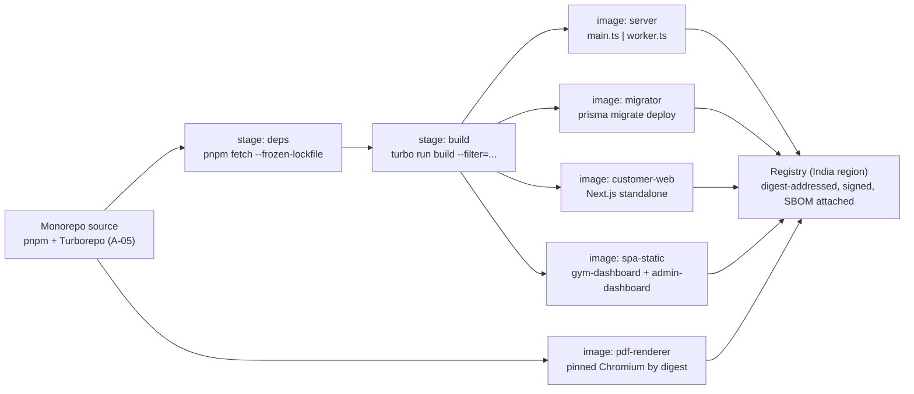
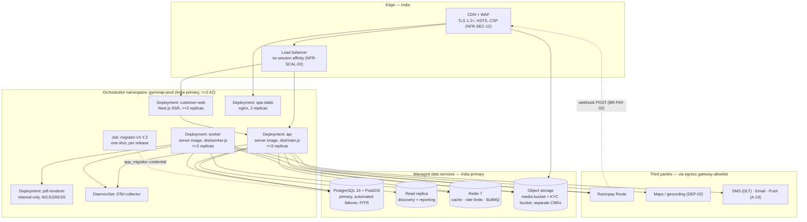
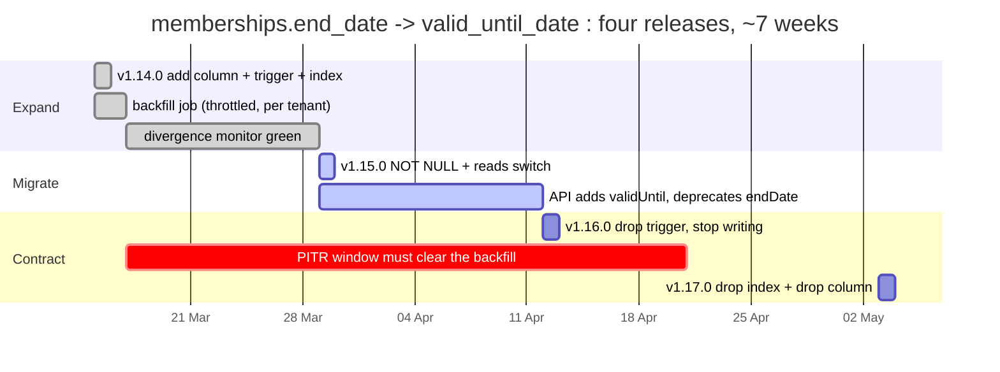
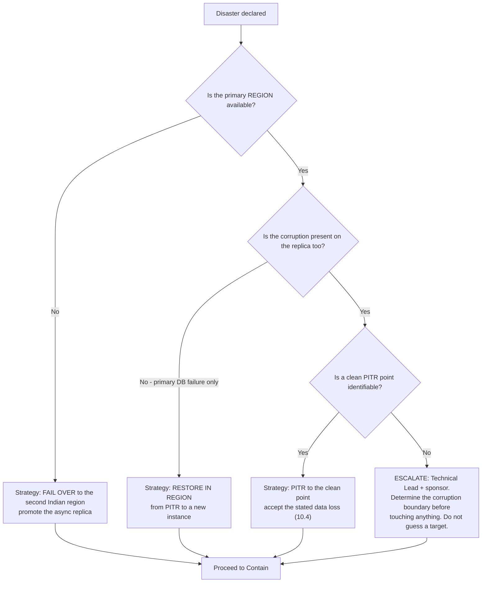
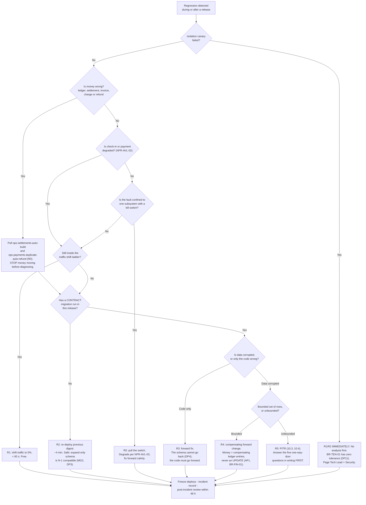

# Deployment — Environments, Containers, Release, Migrations, DR and Cutover

**Gym Marketplace & Multi-Tenant Gym Management SaaS**
The implementable delivery-and-operations design for Phase 1, written before any application code exists.

---

## 0. Document control

| Field | Value |
| :--- | :--- |
| Path | `/docs/engineering/Deployment.md` |
| Precedence rank | **3** — binding derived specification (`PROJECT_CONSTITUTION.md` §1.3). Rank 1 (`PROJECT_CONSTITUTION.md`) and rank 2 (`MASTER_PRD.md`) override every statement here. Where this document appears to differ from either, **this document is defective** and is corrected by amendment (§16.3). |
| Status | Phase-0/2 engineering artefact. **No application code exists.** Every Dockerfile, YAML, SQL, shell or TypeScript fragment below is labelled *illustrative — not committed code* and fixes a shape, not an implementation. |
| Governing requirements | `NFR-AVL-04` (RPO ≤ 15 min, RTO ≤ 4 h) · `NFR-AVL-05` (daily backups, **monthly restore verification**) · `NFR-AVL-06` (zero-downtime deploys, backward-compatible migrations) · `NFR-AVL-08` (72-hour announcement, never during peak gym hours in any served timezone) · `NFR-AVL-01` (99.9%) · `NFR-AVL-02` (check-in and payment degrade last) · `NFR-AVL-03` (partial-failure degradation) · `NFR-AVL-07` (circuit breakers) · `NFR-SCAL-03` (stateless tier) · `NFR-SCAL-05` (**separate worker tier**) · `NFR-SEC-07` (managed secret store) · `NFR-SEC-08` (dependency and secret scanning) · `NFR-SEC-01`, `NFR-SEC-02` (encryption, KYC key separation) · `NFR-MNT-08` (**IaC; no manual production changes**) · `NFR-PRV-04` (retention) · `NFR-PRV-05` (residency) · `NFR-DQ-03` (UTC storage) · `§C7` (five environments and the pipeline) · `§C9.4` (city-by-city launch gates) · `BAC-01` … `BAC-15` |
| Governing law | `PROJECT_CONSTITUTION.md` **§15.3 (MG1–MG11, migrations)**, §15.6 (RS1–RS7, RLS), §15.7 (AP1–AP4, append-only), §12.5 (SC1–SC7, secrets), §11 (Multi-Tenancy Law), §8.9 (environment-variable and flag naming), §8.10 (queue and job naming), §10 (Money & Time Law — `Asia/Kolkata`, UTC storage), §19 (Performance Budgets), §20 (Git Strategy), §22 (Dependency Governance), §23 (DoR/DoD) |
| Governing decisions | `ADR-0003` (modular monolith → **one image, two process roles**) · `ADR-0005` (Prisma + mandatory tenant-context extension → the backfill runs under tenant context) · `ADR-0006` (RLS → the readiness probe is a tenancy probe) · `ADR-0007` (PostGIS, no search cluster in Phase 1 → nothing to re-index cross-region on failover except a Postgres projection) · `ADR-0009` (BullMQ + distributed locks → the drain design of §9) · `ADR-0010` (**polling, not Socket.IO** → no sticky sessions, so a traffic shift is free) · `ADR-0013` (**webhook-driven activation** → the DR failover must preserve the webhook hostname, §11.6) · `ADR-0015` (append-only ledger → PITR restores money by replay, never by edit) · `ADR-0017` (transactional outbox → the outbox is the DR re-enqueue source, not Redis) · `ADR-0018` (`PaymentProvider` port; **Razorpay Route** is the India adapter) · `ADR-0024` (soft delete → a bad `UPDATE` is recoverable without PITR; a bad `DELETE` is not, and almost none exist) · `ADR-0025` (UTC storage, gym timezone authoritative → the maintenance-window computation of §13) · `ADR-0026` (server-side flags → a flag pull is the cheapest rollback) · `ADR-0028` (country/tax/KYC as configuration → the FY-boundary freeze of §13.5) · `ADR-0030` (stack-additions governance → §16.2) |
| Market | **India**, and `LAUNCH_MARKET_INDIA.md` is binding. `Asia/Kolkata` (UTC+05:30, **no DST**) · INR/paise · GST 18% as CGST 9% + SGST 9% · financial year **1 April – 31 March** · **Razorpay Route** · **TRAI DLT pre-approval for every SMS template** — including the maintenance-notice template (§13.4) · **mandatory India data residency (RBI)**, which is what makes §11 hard rather than routine. |

### 0.1 What this document is, and what it is not

| | |
| :--- | :--- |
| **This document is** | The detailed deployment specification: each of the five `§C7` environments enumerated to the level of data provenance, payment mode, access control and residency; the container build with per-image size budgets and the distroless decision argued image by image; the orchestration topology with exact probe, drain and disruption settings; the configuration and secret model; the zero-downtime release ladder; the expand/contract migration law **with a fully worked three-phase breaking column rename on `memberships`**; migration ordering against code rollout; the separately-deployed worker tier and how in-flight BullMQ jobs are drained; backup, PITR and the monthly restore drill; the RPO/RTO architecture that **India-only residency** actually forces; the DR runbook; the maintenance-window policy and its cross-timezone computation; the launch cutover with `§C9.4` applied to a real Indian city; and the rollback decision tree. |
| **This document is not** | The observability design (`/docs/engineering/Monitoring.md` — metrics, alerts, SLOs, on-call, incident *detection*). Not the security control catalogue (`/docs/engineering/Security.md` — §7 secret inventory K-01…K-18, §8 encryption, §15 incident response). Not the capacity model (`/docs/engineering/Scalability.md` — §2 demand, §4.2 autoscaling triggers, §5.3 pool sizing, §8 worker classes). Not the test plan (`/docs/engineering/TestingStrategy.md`). Not the schema (`/docs/engineering/ERD.md`) or the endpoint registry (`/docs/engineering/API_Catalog.md`). **It references all of them and duplicates none.** |
| **Relationship to `ENGINEERING_PLAN.md` §16.5–16.7 and §18** | Those sections are the CTO-level overview: five environment rows, four image rows, one topology diagram, an eight-stage deploy table, six secret rules, seven backup rows, a nine-heading DR outline and two paragraphs on maintenance. **This is the detailed version of that slice.** Where §18.2 gives an image one row, this gives it a base, a build graph, a size budget, a CI gate and a distroless verdict with its reason. Where §18.4 gives the deploy seven stages, this gives each stage its probe values, its abort criterion and its inverse. Where §16.6 states expand/contract as a rule, §7 of this document executes it end to end on a real column. Where §18.7 lists nine runbook headings, §12 writes the runbook. **No obligation in §16 or §18 is weakened here**; three are extended, and each extension is recorded with its authority in §0.3. |
| **Non-goal** | Vendor selection. `§C1.1` says *"containers on a managed orchestrator; managed Postgres and Redis; IaC"* and names no orchestrator, no cloud, no CDN and no secret store. Under `ADR-0030`'s standing rule those slots are **unapproved until registered**, so this document specifies orchestration in terms of primitives every managed orchestrator provides and raises the missing slots as `PROPOSED` register rows in §16.2. No product name that is not already in `STACK_ADDITIONS.md` Part 1 or Part 2 appears here as a decision. |

### 0.2 How to read this document

| Section | Answers |
| :--- | :--- |
| §1 | The sixteen deployment laws, and the one that outranks the rest: the artefact that reaches production is the artefact that was tested |
| §2 | The five `§C7` environments — what data each holds, what money it can move, who can reach it |
| §3 | What we build, how big it is allowed to be, and where distroless is possible and where it is a lie |
| §4 | The running shape: workloads, probes, drain, disruption budgets, network policy |
| §5 | Where configuration comes from, where secrets come from, and why neither is ever in an image |
| §6 | How a release reaches 100% of traffic without dropping a request |
| §7 | **The migration law, and a breaking `memberships` column rename executed in three phases** |
| §8 | What runs before what: migration job, API rollout, worker rollout, and why consumers go first |
| §9 | The worker tier as its own deployment, and how a BullMQ job in flight survives a rollout |
| §10 | Backups, PITR, and the monthly drill that turns a backup into a restore |
| §11 | What RPO ≤ 15 min and RTO ≤ 4 h cost when every byte must stay in India |
| §12 | The DR runbook, written now so it is not invented at 02:40 |
| §13 | When we are allowed to take the platform down, computed across served timezones |
| §14 | Launch: the cutover sequence, and `§C9.4`'s five gates instantiated for an Indian city |
| §15 | Rollback: the taxonomy, the decision tree, and the four things rollback cannot undo |
| §16 | Traceability, the stack slots this document needs approved, and open items |

### 0.3 Three extensions to `ENGINEERING_PLAN.md` §18, with their authority

`ENGINEERING_PLAN.md` §20.1 states its own subordination: *"Where this section and the constitution differ, the constitution wins, and the discrepancy is a defect in this document."* Three gaps — not contradictions — are closed here.

| # | §18 says | The gap | Extension in force | Authority |
| :-: | :--- | :--- | :--- | :--- |
| **D-C1** | *"Four images"*: `server`, `pdf-renderer`, `customer-web`, `spa-static` | None of the four can run `prisma migrate deploy`. The Prisma CLI (`A-07`) is a devDependency; putting it in the runtime `server` image would give **every API pod the ability to mutate the schema** | A **fifth image, `migrator`**, built from the same source tree, run as a one-shot Job per release under the dedicated `app_migrator` credential, and never deployed as a long-running workload (§3.2, §8.2) | `Security.md` §7.1 **K-06** already enumerates `app_migrator` as a credential *distinct from* `app_rw`; a distinct credential with no distinct runtime to hold it is a control that does not exist. `PROJECT_CONSTITUTION.md` §12.1 least privilege |
| **D-C2** | Stage 6: *"Drain and terminate N−1 with a 60 s connection-drain window"* | 60 s is correct for the **API** tier. It is wrong for the **worker** tier, where a `settlement.build-batches` tenant slice legitimately runs for minutes (`Scalability.md` §8.7: 100 minutes at 10×) and `ADR-0009` requires no job be killed mid-write | The drain window is **per workload**: API `terminationGracePeriodSeconds: 90`; worker `300`, derived in §9.4 from the longest P0 job's lock duration, with any job exceeding it handled by the stalled-job mechanism rather than by a longer grace period | `NFR-SCAL-05` (worker tier is separate — including in its lifecycle), `ADR-0009`, `Scalability.md` §8.4 |
| **D-C3** | §18.6: *"copied cross-region"* | Under `LAUNCH_MARKET_INDIA.md` §9 and `OQ-16`, "cross-region" cannot mean *any* region. RBI payment-data localisation and the mandatory India residency decision restrict every copy, replica, backup, log store and telemetry sink to **Indian regions** | Every replication target, backup copy and DR standby is named as **India-region-only**, and §11.2 works through what that costs in RPO/RTO terms — including the case where the second Indian region does not offer a managed service the primary does | `LAUNCH_MARKET_INDIA.md` §9 (*"RPO ≤ 15 min / RTO ≤ 4 h must be met using Indian regions only, which constrains the DR design"*), `OQ-16`, `NFR-PRV-05` |

Extensions `D-C1` … `D-C3` are recorded in §16.3 for the amendment log.

---

## 1. The deployment laws

Sixteen rules. Each is testable, each has an owner, and each exists because its absence has a name.

| # | Law | Why it exists | Enforced by |
| :--- | :--- | :--- | :--- |
| **DP1** | **The artefact promoted is the artefact tested.** Images are built **once**, on merge to `main`, and promoted between environments **by digest** (`sha256:…`), never by tag and never by rebuild. | A rebuild is a different artefact. "It passed in staging" is only true if staging ran these exact bytes. | Deploy manifests reference digests; a CI gate rejects any manifest containing a mutable tag (`:latest`, `:main`) |
| **DP2** | **Infrastructure is code.** Every environment, network rule, database parameter, bucket policy, secret binding, alert route and DNS record is Terraform (`A-27`). A console-made production change is an **incident**, not a shortcut. | `NFR-MNT-08`. Manual changes are invisible to review, absent from DR, and undone by the next apply. | Drift detection runs nightly against production and opens a P2 on any difference; `terraform plan` is required and posted on every infrastructure PR |
| **DP3** | **Expand before contract, always in different releases.** No column, table, enum value, index or RLS policy is removed in the same release that stops using it. | `MG3`, `NFR-AVL-06`. During a rolling deploy both application versions run against one database (`MG2`). | §7; the CI **N−1 compatibility job** (§8.4) runs the previous release's contract tests against the new schema |
| **DP4** | **Migrations are forward-only.** No `down` migration is written, tested or trusted. Recovery is a new forward migration; in the worst case, PITR. | `MG1`. A `down` migration that has never run in production is a fiction that gets executed under pressure. | Prisma Migrate (`A-07`) is used in `deploy` mode only; the migration folder is append-only and `MG7`-checked in CI |
| **DP5** | **The application tier is stateless.** No session affinity, no in-memory session state, no local writes outside `/tmp`, no in-process schedulers. | `NFR-SCAL-03`. This is what makes a 10/50/100 traffic shift and an instant rollback possible, and it is exactly why `ADR-0010` deferred Socket.IO. | Read-only root filesystem (§3.5); an architecture fitness test (`A-23`) forbids `fs.write*` outside an allowlisted temp helper |
| **DP6** | **Background work is a separate deployment.** The worker tier scales, drains, fails and deploys independently of the API tier. | `NFR-SCAL-05`: background work *"cannot starve request handling"* — including during a deploy, when a shared tier would trade request capacity for job capacity. | §9; separate Deployment objects, separate pools (`Scalability.md` §5.3), separate autoscaler triggers (`Scalability.md` §4.2) |
| **DP7** | **Secrets are never in an image, a manifest, a build argument, a command line or a log.** | `NFR-SEC-07`, `SC1`–`SC7`. A secret in an image layer is public to anyone who can pull the image, forever, including after it is "removed". | §5.4; Gitleaks (`A-25`) pre-commit and in CI; Trivy secret scanning on the built image; a CI check that fails on any `ARG`/`ENV` whose name matches the secret-name pattern |
| **DP8** | **Rollback is a first-class path, exercised in every deploy.** The previous digest stays warm and routable until the new one has held 100% of traffic for the soak period. | A rollback path that is only used in emergencies is only tested in emergencies. | §15; the previous ReplicaSet is retained (`revisionHistoryLimit: 5`); a quarterly game-day performs an unforced rollback in staging |
| **DP9** | **Deployment does not move money.** No release step charges, refunds, settles or pays out. Financial catch-up after any deploy or restore happens through the existing idempotent jobs (`payment.reconcile`, `payment.duplicate-detect`, `settlement.reconcile`). | `BR-PAY-01`, `BR-FIN-01`, invariant 2. A one-off "fix-up script" against the ledger is forbidden by `§15.7` — the ledger has no `UPDATE` grant. | `AP1` grant check; §12.5; a release checklist item that names any bespoke data script as a blocker requiring the §7 migration process |
| **DP10** | **Check-in and payment are the last things to break and the first things verified.** Every smoke suite, every canary and every restore verification exercises `POST /checkin/scan` and the payment-intent path before anything else. | `NFR-AVL-02`. A deploy that keeps the marketplace up and the turnstile down has failed. | §6.5 smoke suite ordering; §10.5 drill pass criteria; §15.2 rollback triggers |
| **DP11** | **Tenant isolation is verified continuously, including in production.** The readiness probe includes an RLS self-check; a synthetic cross-tenant probe runs against production; **any** failure is an immediate rollback. | `BR-TEN-01`, `NFR-SEC-09`, `BAC-10`, `E2E-11`, invariant 1. Isolation is the one property with no acceptable failure rate. | §4.4 probe design; `ENGINEERING_PLAN.md` §16.7 isolation-canary trigger; `Scalability.md` §4.3's ≤5 ms budget |
| **DP12** | **Every byte stays in India.** Compute, primary, replicas, backups, object storage, logs, traces, metrics, analytics, queue state and the DR standby are all in Indian regions. | `LAUNCH_MARKET_INDIA.md` §9, `OQ-16`, RBI payment-data localisation, DPDP Act 2023. This is a legal constraint, not a latency preference. | Terraform region variable has **no** non-India permitted value; a `terraform validate` policy check fails the plan; §11.2 |
| **DP13** | **A window is a failure of design, not a tool of delivery.** Scheduled downtime is permitted only when a change is provably impossible to make online, and it costs a 72-hour announcement across every served timezone. | `NFR-AVL-08`, `NFR-AVL-01`. Ninety-nine point nine percent is 43 minutes a month; a quarterly two-hour window spends a quarter's budget in one evening. | §13; the window request form requires the rejected online alternative to be stated |
| **DP14** | **An untested restore is not a backup.** The monthly drill is a release-blocking control, and a failed drill is an S1. | `NFR-AVL-05`, verbatim. | §10.5; the deploy pipeline reads the last drill result and refuses production promotion if it is older than 35 days or failed |
| **DP15** | **The DR plan is executable by someone who did not write it.** Every step is a command or a named console action, with its expected output and its abort condition. | An outage is when institutional knowledge is least available. | §12; the quarterly region-failover exercise is performed by an engineer who did not author the runbook |
| **DP16** | **Nothing is deployed that is not observable.** A release that adds a code path adds its metric, its log fields and its span before it is merged. | `PROJECT_CONSTITUTION.md` §2 Q8; `Monitoring.md` §1.5. A canary can only abort on a signal that exists. | The PR template's observability checklist; `Monitoring.md` §1.5's Q8 contract |

> **The shortest statement of the whole document.** Build once, promote by digest, expand before contract, drain before you kill, restore before you trust, and keep it all in India.

---

## 2. The five environments (`§C7`)

`§C7` fixes five environments and, for each, its purpose, data, payment mode and access. That table is the contract; this section is its implementation.

### 2.1 The `§C7` contract, restated verbatim

| Environment | Purpose | Data | Payments | Access |
| :--- | :--- | :--- | :--- | :--- |
| **Local** | Development | Seeded synthetic | Provider sandbox | Developers |
| **CI** | Automated testing | Ephemeral per run | Stubbed | Automated |
| **Development** | Integration | Synthetic, reset weekly | Sandbox | Team |
| **Staging** | UAT and pre-release | Anonymised production-shaped | Sandbox | Team + client |
| **Production** | Live | Live | Live | Restricted, audited |

Nothing below changes a cell of that table. Everything below says what each cell means operationally.

### 2.2 Environment specification

| Property | **Local** | **CI** | **Development** | **Staging** | **Production** |
| :--- | :--- | :--- | :--- | :--- | :--- |
| Provisioned by | Docker Compose (`A-28`) | GitHub Actions (`A-26`) + Testcontainers (`A-06`) | Terraform (`A-27`) | Terraform | Terraform |
| Region | Developer laptop | Runner (ephemeral; **no persistent data**) | India primary | India primary | India primary + India DR (§11) |
| API replicas | 1 process | n/a | 1 | 2 | **≥3 across ≥2 AZs**, autoscaling to 12 (`Scalability.md` §4.2) |
| Worker replicas | 1 process (same terminal, separate entrypoint) | n/a | 1 | 2 | **≥2**, autoscaling to 6 |
| `customer-web` | `next dev` | built in CI, not served | 1 | 2 | ≥2, autoscaling to 8 |
| `spa-static` | Vite dev servers | built + `size-limit` gate (`A-29`) | CDN origin | CDN origin | CDN origin, 2 replicas |
| `pdf-renderer` | container from Compose | stubbed | 1 | 1 | 1 (2 for HA) |
| PostgreSQL | Compose, Postgres 16 + PostGIS | Testcontainers, per job | Managed, small, no replica | Managed + **1 read replica** | Managed, **automated failover**, ≥1 read replica, PITR on |
| Redis | Compose | Testcontainers | Managed, single node | Managed with failover | Managed with failover, AOF persistence |
| Object storage | MinIO | in-memory / temp dir | Managed bucket pair (media + KYC) | Managed bucket pair | Managed bucket pair, **versioning + India cross-region replication** |
| Mail / SMS | Mailpit; SMS to console sink | stub adapters | Provider sandbox; **SMS to a sink**, never a real handset | Provider sandbox; SMS to an allowlist of team handsets on **DLT-approved templates only** | Live provider, live DLT templates |
| Payments | Razorpay **sandbox** (`ADR-0018`) | **stub adapter** implementing the `PaymentProvider` port contract tests | Razorpay sandbox | Razorpay sandbox | **Razorpay Route live** |
| Data | Deterministic `§C8.2` seed | Ephemeral, seeded per job, destroyed after | Synthetic, **reset weekly** (Sunday 03:00 IST) from the seed + accumulated test traffic | **Anonymised production-shaped** (§2.4) | Live |
| Secrets | `.env.local`, git-ignored, structurally non-production (`S-7`) | GitHub OIDC → short-lived cloud credentials; **no long-lived key exists** (`K-18`) | Managed secret store, dev scope | Managed secret store, staging scope | Managed secret store, production scope, break-glass audited |
| Backups | None | None | Daily, 7-day retention | Daily, 14-day retention | **Continuous WAL + daily full, 35-day retention, India cross-region copy** |
| Restore drill | n/a | n/a | n/a | Receives the monthly drill's restored snapshot for smoke (§10.5) | Source of the drill |
| Deployed from | Working tree | Every PR | Every green `main`, automatic | Automatic once `development` E2E passes | Tag `v*.*.*`, **manual approval by Technical Lead and Delivery Manager** |
| Feature flags | Local override file | Forced matrix (`FEATURE_FLAGS.md` §6.2) | Freely toggled | Mirrors intended production state | Server-side evaluation only (`ADR-0026`) |
| Access | Developer | Automated only | Team, SSO | Team + client, SSO | **Restricted, MFA, audited**; no standing human database access |
| Human DB access | Direct | n/a | Read/write via SSO-brokered session | **Read-only** via SSO-brokered session, queries logged | **None standing.** Break-glass only: time-boxed, dual-approved, pages the Technical Lead, every statement logged |
| Observability | Console logs | Job logs | Full stack, 7-day retention | Full stack, 14-day retention | Full stack per `Monitoring.md` §1.3 retention |
| Cost posture | Zero | Per-minute runner | Smallest viable; **scaled to zero outside 07:00–23:00 IST on weekends** | Fixed | Fixed + autoscale headroom (`CON-05`) |

### 2.3 Payment mode is an environment property, and it is enforced twice

`§C7` gives Local/Development/Staging *sandbox*, CI *stubbed*, Production *live*. The failure this prevents — a staging job charging a real card, or a live key reaching a laptop — is prevented in two independent places, because one check is a convention and two are a control.

| Layer | Control |
| :--- | :--- |
| **Credential** | Sandbox and live Razorpay keys are different secrets in different secret-store scopes (`S-6`: *"separate keys per purpose and per environment"*). No principal outside the production workload identity can read the live key. |
| **Boot assertion** | The `PaymentProvider` adapter asserts at startup that the key's environment prefix matches `APP_ENV`. A live key in a non-production environment, or a sandbox key in production, is a **fatal boot error**, not a warning. The pod never becomes ready, so it never receives traffic (`DP5` + §4.4). |
| **CI** | The stub adapter is selected by `APP_ENV=ci` and the real adapters are not registered in the DI container at all, so a mis-set variable cannot fall through to a network call. The stub is held to the same port contract tests as Razorpay (`ADR-0018`), which is what makes it a legitimate substitute rather than a hole in coverage. |

> **India note.** Razorpay Route sub-merchant onboarding is performed separately per environment. A staging tenant's linked account is a sandbox account and can never be funded; the live sub-merchant onboarding of a real gym is part of the `§14.4` city-gate checklist, not part of a deploy.

### 2.4 Staging data: "anonymised production-shaped", made precise

`§C7` says staging holds *anonymised production-shaped* data. This is the highest-risk sentence in `§C7`, because the naive implementation — a production dump with names replaced — is a personal-data breach with extra steps under the DPDP Act 2023.

| Rule | Statement |
| :--- | :--- |
| **SD-1** | **No production dump is ever restored into staging.** The pipeline is one-directional: production → the anonymisation job → staging. The job runs **inside the production security boundary**, in the India primary region, and only its output crosses into staging. |
| **SD-2** | Anonymisation is **irreversible and structure-preserving**: names, emails, phone numbers, addresses and KYC documents are replaced by generated values from a locale-correct Indian corpus; the *shape* — string lengths, distribution of tenants by branch count, membership status mix, order-value distribution in paise, attendance day-shape — is preserved because that is the only property staging needs. |
| **SD-3** | **KYC objects are never copied.** The KYC bucket (`NFR-SEC-02`, `Security.md` §8.3) has no staging counterpart populated from production; staging KYC documents are synthetic fixtures. The separate CMK (`K-03`) makes this structural: the staging workload identity cannot decrypt a production KYC object even if one were copied by mistake. |
| **SD-4** | **Money is preserved exactly, identities are not.** Order, invoice, ledger and settlement amounts in minor units are copied unchanged, because `E2E-12` and `UAT-05` are only meaningful against realistic ledger shapes (`§C9.1` gives this as the reason settlement work sits at Sprint 11). Amounts are not personal data; the payer is. |
| **SD-5** | Provider identifiers (`payment_intent_id`, `razorpay_payment_id`, webhook signatures, `raw_payload`) are **dropped, not anonymised**, and replaced with sandbox-shaped synthetic values. A real provider identifier in a sandbox environment invites a support agent to look it up against the live account. |
| **SD-6** | Refresh cadence: **on demand before a UAT cycle**, and otherwise not more than monthly. Every refresh writes an `audit_log` row naming the requester, the approver and the row counts, and is announced to the team because it destroys staging state. |
| **SD-7** | The anonymisation job has its own test: a **re-identification assertion suite** that fails if any of the twelve direct identifiers in `Security.md` §1.3's C3/C4 classes survives, and a **k-anonymity spot check** on the (city, gender, age-band, plan) quasi-identifier tuple. It runs as part of the job, not afterwards; a failing assertion aborts the export before anything leaves production. |

### 2.5 Environment parity, and the three places it is deliberately broken

Parity is a goal, not a fetish. Where it is broken, it is broken on purpose and the compensating control is named.

| Difference | Environments | Why it is acceptable | Compensating control |
| :--- | :--- | :--- | :--- |
| No read replica in Local, CI, Development | Local, CI, Dev | Replica-lag behaviour cannot be meaningfully simulated on a laptop | Read-routing rules (`Scalability.md` §5.5) are covered by integration tests that assert *which* client a repository selects, not by observing lag; staging has a real replica and the load tests run there |
| Single AZ in Development | Dev | Multi-AZ doubles cost for an environment that is reset weekly | Staging and production are multi-AZ; the quarterly region-failover exercise (§12.8) runs in staging |
| PostGIS data volume | Local, CI | The `§C8.2` seed has 3 tenants; production has 5,000 branches | `NFR-PERF-01` is verified by k6 (`A-06`) against staging seeded to `NFR-SCAL-01` volumes, never against the small seed (`Scalability.md` §10) |

Everything else is parity by construction: **the same image digest**, the same Postgres 16 + PostGIS major version, the same Redis 7 major version, the same Node 20 minor version, the same migrations applied in the same order, and the same Terraform modules with different variable values. A difference not in the table above is a defect.

### 2.6 An environment's lifecycle is also code

| Event | Mechanism |
| :--- | :--- |
| **Create** | `terraform apply` against a new workspace. Bringing up a complete environment from an empty cloud account is the same command that DR uses (§12.4), which is why DR is credible: it is not a special path. |
| **Weekly development reset** | A scheduled pipeline drops and recreates the development database, replays all migrations from zero (this is the only environment where migration replay from scratch is exercised weekly — a genuine `MG7` regression detector), reloads the `§C8.2` seed, and clears the object-storage bucket and all Redis keys. |
| **Ephemeral preview environments** | **Not provisioned in Phase 1.** `§C7` names five environments; a sixth is an addition requiring `ADR-0030` approval, and per-PR databases with RLS and seeded tenants are not free. PR verification is CI plus the `development` deploy on merge. Recorded as a deliberate omission, not an oversight. |
| **Destroy** | `terraform destroy` is permitted for `development` only. Staging and production have `prevent_destroy` lifecycle guards on the database, the buckets and the KMS keys; removing a guard is a reviewed PR, never an interactive flag. |

---

## 3. Containerisation

### 3.1 What is built, and from what

`ADR-0003` is a modular monolith: **one deployable, two process roles**. The image inventory follows from that, plus the three surfaces of `§C1.1` and the migration runner of extension `D-C1`.



### 3.2 The five images

| Image | Runtime role | Base | Entry | Deployed as | Why it is separate |
| :--- | :--- | :--- | :--- | :--- | :--- |
| **`server`** | API **and** worker | distroless Node 20 | `main.ts` (HTTP) · `worker.ts` (BullMQ) | Two Deployments from one digest | `ADR-0003`: one deployable. `NFR-SCAL-05`: two tiers. One image satisfies both — the *artefact* is shared, the *lifecycle* is not (§9) |
| **`migrator`** | Schema evolution | distroless Node 20 | `node node_modules/prisma/build/index.js migrate deploy` | One-shot Job per release | Extension `D-C1`. Holds the Prisma CLI and the `app_migrator` credential; the API tier holds neither |
| **`customer-web`** | SSR marketplace | distroless Node 20 | Next.js 14 standalone server | Deployment behind the CDN | `§C1.1` requires server rendering for SEO (`FR-SRCH-13`, `FR-DETL-10`), so it needs a Node runtime — it is not static |
| **`spa-static`** | Both dashboards | `nginx-unprivileged` | nginx | Deployment as CDN origin | Pure static assets; the two SPAs are separate document roots behind separate hostnames (`dash.` and `admin.`) with different CSPs (`Security.md` §11.4, §11.5) |
| **`pdf-renderer`** | Deterministic invoice PDF | Debian slim + Chromium pinned **by digest** | headless Chromium service | Deployment, internal only, **no egress** | `FR-INV-07` determinism plus a ~300 MB attack surface that has no business being in the API image. `ENGINEERING_PLAN.md` §18.2 |

### 3.3 The multi-stage build

*Illustrative — not committed code.* The shape is normative; the exact syntax is not.

```dockerfile
# ---------- stage 1: fetch ----------
# Base images are pinned BY DIGEST, never by tag. A tag is mutable; a digest is the artefact.
FROM node:20.18.1-bookworm-slim@sha256:<pinned> AS deps
WORKDIR /repo
RUN corepack enable
COPY pnpm-lock.yaml pnpm-workspace.yaml ./
RUN pnpm fetch --frozen-lockfile          # lockfile-only layer: caches across source changes

# ---------- stage 2: build ----------
FROM deps AS build
COPY . .
RUN pnpm install --frozen-lockfile --offline
RUN pnpm exec prisma generate             # A-01; engines vendored, no network at runtime
RUN pnpm exec turbo run build --filter=@gymmap/server...
RUN pnpm deploy --filter=@gymmap/server --prod /out   # prod deps only, hoisted

# ---------- stage 3: runtime ----------
FROM gcr.io/distroless/nodejs20-debian12@sha256:<pinned> AS runtime
WORKDIR /app
COPY --from=build --chown=nonroot:nonroot /out ./
USER nonroot
ENV NODE_ENV=production TZ=UTC            # DB4/NFR-DQ-03: the process clock is UTC, always
# No shell exists in this image. No package manager exists. No curl exists.
CMD ["dist/main.js"]                      # worker deployment overrides args to dist/worker.js
```

| Build rule | Statement |
| :--- | :--- |
| **BR-1** | **Base images are pinned by digest.** `node:20-slim` is a moving target; `node:20.18.1-bookworm-slim@sha256:…` is an artefact. Renovation of a pinned digest is a reviewed PR with the Trivy delta attached. |
| **BR-2** | **The lockfile is frozen.** `--frozen-lockfile` everywhere; a build that would mutate `pnpm-lock.yaml` fails. This is the build-time face of `PROJECT_CONSTITUTION.md` §22. |
| **BR-3** | **No secret is a build argument.** `ARG`/`ENV` values persist in image history and `docker history` is not privileged. Registry credentials come from OIDC (`K-18`); nothing else is needed at build time (`DP7`). |
| **BR-4** | **`TZ=UTC` in every image.** `NFR-DQ-03` stores UTC; `BR-MEM-03` computes validity in the *gym's* timezone from stored UTC. A container whose clock is `Asia/Kolkata` makes a naive `new Date()` bug invisible in India and catastrophic in the second market. The `pdf-renderer` additionally fixes `LANG` and bakes its fonts, because a font fallback changes the rendered bytes and `FR-INV-07` requires determinism. |
| **BR-5** | **Builds are reproducible enough to compare.** `SOURCE_DATE_EPOCH` is set from the commit timestamp, file ordering is stable, and two builds of one commit produce identical layer digests for everything except the final metadata layer. A divergence is investigated, because a non-reproducible build makes "the artefact promoted is the artefact tested" unverifiable (`DP1`). |
| **BR-6** | **The build never reaches the network at runtime-image assembly time.** Prisma engines are vendored during stage 2; Chromium is in the `pdf-renderer` base; no `postinstall` script downloads a binary. A build that needs the internet at deploy time is a build that fails during an incident. |

### 3.4 Size budgets, and the distroless verdict per image

Image size is not vanity. It is cold-start latency during a scale-out at 19:00 (`Scalability.md` §2.4's peak band), it is registry egress cost under `CON-05`, and it is CVE surface under `NFR-SEC-08`.

| Image | Base | Target (uncompressed) | Hard cap — CI fails above | Distroless | Verdict and reason |
| :--- | :--- | ---: | ---: | :---: | :--- |
| `server` | distroless nodejs20-debian12 | **≤ 240 MB** | 300 MB | **Yes** | Node runtime, `libc`, CA bundle, nothing else. No shell, no package manager, no `curl` — the three tools every container-breakout writeup begins with. Prisma's query engine (~40 MB) and the `argon2` (`A-12`) and `sharp` (`A-17`) native binaries are the bulk; all three are prebuilt in stage 2 against the same glibc, which is why the distroless *debian12* variant is required rather than a musl base |
| `migrator` | distroless nodejs20-debian12 | **≤ 200 MB** | 260 MB | **Yes** | Prisma CLI + migrations + schema. Deliberately shell-less: a compromised migration Job cannot spawn `psql`, cannot `curl` an exfiltration endpoint, and holds the one credential that can `ALTER TABLE` |
| `customer-web` | distroless nodejs20-debian12 | **≤ 200 MB** | 250 MB | **Yes** | Next.js 14 `output: 'standalone'` traces exactly the files the server needs (~60 MB including `.next/`); everything else is the Node base |
| `spa-static` | `nginx-unprivileged` | **≤ 70 MB** | 90 MB | **No** | nginx needs `libc`, `libpcre`, `zlib` and its own config machinery. A distroless static base would require a Go or Rust static file server, which is **an unapproved dependency** (`ADR-0030`) introduced to save 20 MB on an image the CDN fronts. Rejected. Compensated by: unprivileged base, read-only root, `NFR-SEC-12` headers set at the CDN *and* at nginx |
| `pdf-renderer` | Debian slim + Chromium **by digest** | **≤ 720 MB** | 850 MB | **No** | Chromium needs a real filesystem, `/proc`, a zygote process, ~40 shared libraries and installed fonts. Distroless is not achievable and pretending otherwise produces an image that crashes on the first render. **This is exactly why the renderer is a separate image**: the 500 MB and the browser CVE stream stay off the API tier. Compensated by: **zero network egress** (§4.6), `--no-sandbox` explicitly *not* used, a seccomp profile, one-page-per-render process isolation, and a nightly Trivy re-scan of the deployed digest |
| **Fleet total** | | **≤ 1,430 MB** | 1,750 MB | | Registry storage per release; pulls are layer-deduplicated across `server`/`migrator`/`customer-web`, which share the distroless base |

| Gate | Mechanism |
| :--- | :--- |
| Size | `size-limit` (`A-29`) already gates **client bundles** at 200 KB gzipped (`NFR-PERF-10`); **container** size is a separate CI step comparing the built image against the cap and against the previous release, failing on the cap and warning on a >10% release-over-release growth |
| Vulnerabilities | Trivy (`A-25`) at build: **zero critical** is a `§C7` non-negotiable merge gate. Plus a **nightly re-scan of the digest currently deployed to production**, because a CVE published on Tuesday does not care that the image was clean on Monday |
| Secrets | Trivy secret scanner over image layers, in addition to Gitleaks over the diff (`DP7`) |
| Provenance | SBOM (CycloneDX) generated per image and attached to the digest; the image is signed; the deploy admission check verifies the signature and refuses an unsigned digest |

### 3.5 Runtime hardening applied to every image

| Control | Setting | Why |
| :--- | :--- | :--- |
| User | Non-root, fixed UID, no `sudo`, no setuid binaries | `PROJECT_CONSTITUTION.md` §12.1 |
| Root filesystem | **Read-only**, with an explicit `emptyDir` at `/tmp` sized per workload (API 64 Mi, worker 512 Mi for CSV streaming under `A-20`, `pdf-renderer` 1 Gi) | `DP5`: statelessness enforced by the kernel, not by review |
| Capabilities | `drop: ["ALL"]`, no `NET_RAW`, no `NET_BIND_SERVICE` (containers listen above 1024) | Least privilege |
| Privilege escalation | `allowPrivilegeEscalation: false`, `privileged: false` | |
| Seccomp | `RuntimeDefault` on all; a tightened custom profile on `pdf-renderer` | Chromium is the largest attack surface in the fleet |
| Host access | No `hostNetwork`, no `hostPID`, no host path mounts, no Docker socket | |
| Node heap | `--max-old-space-size` set to **75%** of the memory limit | A Node process that OOM-kills at the container limit produces no heap dump and no useful log; failing inside V8 does |
| Health endpoints | `/health/live`, `/health/ready`, `/health/startup` — bound to the same port, excluded from access logs, **never** exposed through the CDN | §4.4 |

---

## 4. The orchestration model

> **Vendor neutrality.** `§C1.1` says *"containers on a managed orchestrator"* and names none. This section is written in terms of primitives every managed orchestrator provides — declarative workloads, replica sets, rolling updates, three probe types, graceful termination with a grace period, disruption budgets, horizontal autoscaling, one-shot jobs, scheduled jobs, secret and config injection, and network policy. The concrete orchestrator is `PROPOSED` addition **`A-D01`** (§16.2) and may not appear in Terraform until approved (`ADR-0030`).

### 4.1 Topology



### 4.2 Workload inventory

| Workload | Kind | Image | Replicas (prod) | Update strategy | Grace | Notes |
| :--- | :--- | :--- | :--- | :--- | ---: | :--- |
| `api` | Deployment | `server` | 3 → 12 | RollingUpdate `maxSurge: 25%`, `maxUnavailable: 0` | 90 s | `maxUnavailable: 0` is mandatory: capacity never dips below the current replica count during a rollout |
| `worker` | Deployment | `server` | 2 → 6 | RollingUpdate `maxSurge: 1`, `maxUnavailable: 0` | **300 s** | Extension `D-C2`; §9 |
| `customer-web` | Deployment | `customer-web` | 2 → 8 | RollingUpdate `maxSurge: 25%`, `maxUnavailable: 0` | 60 s | |
| `spa-static` | Deployment | `spa-static` | 2 | RollingUpdate | 30 s | CDN caches most requests; origin churn is invisible |
| `pdf-renderer` | Deployment | `pdf-renderer` | 1 (2 HA) | Recreate | 120 s | A render in flight is retried by the calling job; `Recreate` avoids two Chromium pools competing for memory |
| `migrator-vX.Y.Z` | Job | `migrator` | 1, `backoffLimit: 0` | n/a | n/a | **`backoffLimit: 0`**: a failed migration is never silently retried; §8.3 |
| `restore-drill` | CronJob | `migrator` + a verification image | monthly | n/a | n/a | §10.5; runs in an isolated drill namespace |
| `otel-collector` | DaemonSet | vendor | per node | RollingUpdate | 30 s | `A-31`/`A-D02` (§16.2) |

### 4.3 Placement, disruption and resource shape

| Concern | Setting | Reason |
| :--- | :--- | :--- |
| Zone spread | `topologySpreadConstraints`: `maxSkew: 1` over the zone key, `whenUnsatisfiable: DoNotSchedule` for `api`, `ScheduleAnyway` for `worker` | `ENGINEERING_PLAN.md` §18.1 requires ≥2 AZs for the API. The worker tier may concentrate: a zone loss delays jobs, it does not drop requests |
| Anti-affinity | Soft pod anti-affinity per Deployment on the node key | Two API replicas on one node is a single point of failure wearing a plural |
| Disruption budget | `api`: `minAvailable: 2`. `worker`: `maxUnavailable: 1`. `customer-web`: `minAvailable: 1`. `pdf-renderer`: `maxUnavailable: 1` | A node drain during a cluster upgrade must not be able to take the API below two live replicas |
| CPU | **Requests only** (`api` 500 m, `worker` 400 m, `customer-web` 500 m, `pdf-renderer` 1000 m); **no CPU limit** | CPU limits cause CFS throttling, which appears as p99 latency with no CPU saturation to explain it — the single most misdiagnosed symptom in a Node fleet. Fair-share is enforced by requests |
| Memory | Request **=** limit (`api` 768 Mi, `worker` 1 Gi, `customer-web` 768 Mi, `pdf-renderer` 2 Gi) | Memory is not compressible; a burstable memory class turns one leaky pod into a node-wide eviction cascade |
| Priority | `api` and `worker` at the same high priority class; `pdf-renderer` and `spa-static` lower | Under node pressure, invoice rendering yields before check-in does (`NFR-AVL-02`) |
| Scale-to-zero | Never in production, for any workload | A cold start on the check-in path at 19:00 is an `NFR-PERF-03` breach with a plausible-sounding excuse |

### 4.4 Probes — three of them, doing three different jobs

Conflating these is how a dependency blip becomes an outage. `Scalability.md` §4.3 states the rule; here are the values.

| Probe | Path | Period | Timeout | Failure threshold | Checks | Effect of failure |
| :--- | :--- | ---: | ---: | ---: | :--- | :--- |
| **Startup** | `/health/startup` | 5 s | 2 s | 24 (**120 s budget**) | Config parsed and validated (§5.3), secrets loaded, Prisma client constructed, migrations at or ahead of the required baseline, BullMQ connected (worker only) | Pod restarted. Never receives traffic |
| **Readiness** | `/health/ready` | 20 s | 2 s | 2 | Postgres primary reachable · read replica reachable *or* explicitly degraded · Redis reachable · **RLS self-check**: a prepared cross-tenant read against two seeded probe tenants returns zero rows | Pod removed from the load balancer. **Not restarted** |
| **Liveness** | `/health/live` | 30 s | 3 s | 3 | Event loop responsive; no unhandled fatal state. **No dependency is checked** | Pod restarted |

| Rule | Statement |
| :--- | :--- |
| **PB-1** | **Liveness never checks a dependency.** A Redis failover that fails liveness restarts the whole fleet, converting a 20-second degradation into a cold-start outage. `NFR-AVL-07`'s circuit breakers exist for dependency failure; the kubelet does not. |
| **PB-2** | **Readiness includes the RLS self-check** (`DP11`, `ADR-0006`). A pod that cannot prove isolation must not serve. Budget ≤5 ms, one prepared statement, a dedicated pre-warmed connection **outside** the request pool, and it must not open a fresh tenant-context transaction per probe (`Scalability.md` §4.3). At 12 replicas this runs 36 times a minute; it is not free and it is not optional. |
| **PB-3** | **Readiness distinguishes degraded from unready.** Loss of the read replica marks the pod *degraded* (metric emitted, reads fail over to the primary per `Scalability.md` §5.5) but **ready**, because `NFR-AVL-03` requires that losing search or analytics does not stop check-in or payment. Loss of the **primary** or of **Redis** is unready. |
| **PB-4** | The readiness endpoint returns a **structured body** naming each dependency and its state. An on-call engineer should learn *which* dependency from the probe, not from a log search. |
| **PB-5** | Health endpoints are unauthenticated but **not routable from the internet** — no CDN route, no ingress path, `NetworkPolicy`-restricted to the orchestrator's probe source. They disclose dependency topology. |

### 4.5 Graceful termination

The sequence below is identical in a rollout, a scale-in, a node drain and a rollback. It is the reason `maxUnavailable: 0` is safe.

```mermaid
sequenceDiagram
  autonumber
  participant O as Orchestrator
  participant P as Pod (api)
  participant LB as Load balancer
  participant C as In-flight client

  O->>P: 1. Mark Terminating; remove from Service endpoints
  O->>P: 2. preStop hook: sleep 10s
  Note over LB: Endpoint removal is eventually consistent.<br/>The 10s sleep is what stops the classic<br/>"terminating pod still receives requests" 502.
  O->>P: 3. SIGTERM
  P->>P: 4. Readiness flips to false immediately
  P->>P: 5. HTTP server stops accepting NEW connections;<br/>keep-alive sockets get Connection: close
  C->>P: 6. In-flight requests complete (<=60s)
  P->>P: 7. Flush OTel spans, flush Pino buffer, close Prisma pool, close Redis
  P-->>O: 8. Exit 0 (typical: 11-14s total)
  Note over O,P: If not exited by terminationGracePeriodSeconds (90s),<br/>SIGKILL. For the API this should never happen:<br/>no HTTP handler is permitted to exceed 30s (PB budgets).
```

| Rule | Statement |
| :--- | :--- |
| **GT-1** | The `preStop` sleep is **10 s** and is not optional. Endpoint propagation is asynchronous in every orchestrator; without it, a rolling update produces a burst of 502s that looks exactly like an application defect. |
| **GT-2** | The process **must** handle `SIGTERM`. A Node process that ignores it is killed at the grace period, dropping every in-flight request, including a payment webhook (`BR-PAY-02`). A CI test asserts that a `SIGTERM`ed server exits 0 within the budget with zero dropped requests. |
| **GT-3** | Shutdown is **ordered**: stop accepting → finish in-flight → flush telemetry → close pools. Closing the Prisma pool first aborts in-flight transactions, which for a checkout means an order in an indeterminate state and an `FR-PAY-05` poller cleanup that was entirely avoidable. |
| **GT-4** | The worker's shutdown is a different sequence with a different budget — §9.4. |

### 4.6 Network policy: default deny, enumerated allow

| Source | Permitted destinations |
| :--- | :--- |
| `api` | Postgres primary, Postgres replica, Redis, object storage endpoints, OTel collector, **egress gateway** (Razorpay, maps) |
| `worker` | Postgres primary, Redis, object storage endpoints, OTel collector, `pdf-renderer`, **egress gateway** (Razorpay, SMS, email, push) |
| `customer-web` | `api` service, OTel collector, CDN-origin fetches only |
| `spa-static` | Nothing outbound |
| **`pdf-renderer`** | **Nothing.** No DNS, no egress gateway, no object storage | 
| `migrator` Job | Postgres primary **only** |
| Anything → anything else | Denied |

> **Why `pdf-renderer` has no egress at all.** It renders HTML supplied by the invoicing module. A renderer with network access is a server-side request forgery primitive by construction (`Security.md` §5.11) and a determinism hazard (`FR-INV-07`): a remote font, a remote stylesheet or a tracking pixel makes the same invoice render differently on two days. Fonts are baked into the image (`BR-4`); assets are passed in as data URIs. The rendered PDF is returned to the calling worker, which is the only component that writes it to object storage.

Egress to third parties leaves through a gateway with an **allowlist of hostnames**, so that a compromised dependency cannot reach an arbitrary endpoint and a new third-party integration is a reviewed Terraform change rather than an outbound call nobody noticed (`PROJECT_CONSTITUTION.md` §22).

---

## 5. Configuration and secrets (`NFR-SEC-07`)

### 5.1 Five kinds of configuration, five different rules

Most configuration incidents come from treating these as one thing.

| Class | Examples | Source | Changing it requires | Visible in |
| :--- | :--- | :--- | :--- | :--- |
| **1. Build-time** | Node version, base image digest, Prisma client generation, bundle target | Dockerfile + lockfile | A new image and a new release | Image digest |
| **2. Boot-time environment** | `APP_ENV`, database host, Redis host, bucket names, region, log level, pool sizes, replica DSN, OTel endpoint | Orchestrator config object, Terraform-managed | A rollout (pods read at boot) | `/health/startup` config fingerprint |
| **3. Secrets** | The eighteen entries `K-01` … `K-18` of `Security.md` §7.1 | Managed secret store, injected as environment variables from a secret reference | Rotation (§5.5) — often **without** a rollout | Never. Redacted everywhere (`S-9`) |
| **4. Feature flags** | `release.*`, `ops.*`, `exp.*`, `mig.*`, `perm.*` per `FEATURE_FLAGS.md` §3 | Database, evaluated **server-side** (`ADR-0026`) | An audited admin action, no deploy (`FR-ADMN-08`) | Admin console + `audit_log` (`FEATURE_FLAGS.md` §5.7) |
| **5. Tenant / platform business configuration** | Tax profiles, KYC checklists, commission rates, reason codes, notification templates, settlement cycle, reserve bps | Database reference tables (`§C2.3`), admin-managed | An audited admin action, no deploy | Admin console + `audit_log` |

> **The line that matters.** `ADR-0028` makes country, currency, tax and KYC **configuration, not code**. `LAUNCH_MARKET_INDIA.md` §13 then states that *"every rate and threshold in this document must be verified before it is written into a tax profile"* and that verification *"is a data task, not a code change"*. Concretely: confirming the GST SAC code, or the April financial-year start, or a revised e-mandate threshold, must never require a deploy. If any of those ends up in class 1 or 2, that is a defect against `ADR-0028`, not a configuration choice.

### 5.2 Naming and the environment-variable contract

`PROJECT_CONSTITUTION.md` §8.9 fixes the grammar. Applied here:

| Rule | Statement |
| :--- | :--- |
| **CF-1** | Environment variables are `SCREAMING_SNAKE_CASE`, prefixed by domain: `DATABASE_URL`, `DATABASE_REPLICA_URL`, `REDIS_URL`, `S3_MEDIA_BUCKET`, `S3_KYC_BUCKET`, `PAYMENT_PROVIDER`, `RAZORPAY_KEY_ID`, `OTEL_EXPORTER_OTLP_ENDPOINT`, `APP_ENV`, `APP_REGION`, `LOG_LEVEL`. |
| **CF-2** | `.env.example` is committed with **keys only** and placeholder values that are obviously not credentials (`S-4`). It is the canonical list; a variable read by code and absent from `.env.example` fails CI. |
| **CF-3** | **There is exactly one place that reads `process.env`**: the config module. Everywhere else injects a typed config service. An architecture fitness test (`A-23`) fails the build on any other `process.env` reference. This is what makes §5.3's validation total rather than partial. |
| **CF-4** | No variable is optional-with-a-silent-default for anything that affects money, tenancy, residency or payment mode. Those are required; a missing value is a boot failure, not a default. |

### 5.3 Boot-time validation with Zod (`A-02`)

*Illustrative — not committed code.*

```ts
// apps/server/src/config/env.schema.ts — the ONLY module that reads process.env (CF-3)
const EnvSchema = z.object({
  APP_ENV:      z.enum(['local', 'ci', 'development', 'staging', 'production']),
  APP_REGION:   z.literal('india'),                    // DP12: no other value is representable
  DATABASE_URL: z.string().url(),
  RAZORPAY_KEY_ID: z.string(),
  // ...
}).superRefine((env, ctx) => {
  // DP7 / §2.3: a live payment key outside production is a fatal boot error, not a warning.
  const isLiveKey = env.RAZORPAY_KEY_ID.startsWith('rzp_live_');
  if (isLiveKey !== (env.APP_ENV === 'production')) {
    ctx.addIssue({ code: 'custom', message: 'payment key does not match APP_ENV' });
  }
});
```

| Rule | Statement |
| :--- | :--- |
| **CF-5** | Validation runs **before** the HTTP server binds and before the worker registers a processor. A misconfigured pod fails its **startup** probe and never enters rotation, so a bad config rollout is caught by `maxUnavailable: 0` and is self-limiting. |
| **CF-6** | The error message names **every** invalid or missing key at once. Discovering eight missing variables one restart at a time is eight minutes of an outage. |
| **CF-7** | The validated config object's `toJSON` returns redacted values (`S-9`), so an accidental `logger.info({ config })` prints nothing useful. |
| **CF-8** | The startup probe response includes a **config fingerprint** — a hash over the non-secret key/value set. Two pods with different fingerprints in one ReplicaSet is an alertable condition and the fastest way to diagnose a partially-applied config change. |

### 5.4 Where secrets come from

| Rule | Implementation |
| :--- | :--- |
| **SEC-1** | Secrets live in the managed secret store, Terraform-provisioned **by reference** — the value never enters Terraform state readable outside the state backend's access control (`S-5`, `SC4`). |
| **SEC-2** | Injection is by **secret reference** resolved at pod start into the process environment. No secret is written to a mounted file that survives the pod, and no secret is in the image (`DP7`). |
| **SEC-3** | The workload identity is **per workload, not per cluster**: `api`, `worker`, `migrator` and `pdf-renderer` each have their own identity with their own read grants. `pdf-renderer` can read **nothing** — it holds no credential at all. `migrator` can read `app_migrator` and nothing else; `api` can read `app_rw` and not `app_migrator`. This is the runtime half of extension `D-C1`. |
| **SEC-4** | **The KYC bucket credential (`K-09`) and CMK (`K-03`) are readable only by the specific worker processors that handle KYC** (`Security.md` §8.3), never by the API tier. A defect in a public media endpoint therefore cannot reach an identity document — the separation is an identity boundary, not a code convention. |
| **SEC-5** | The state backend for Terraform is in India, versioned, encrypted with a customer-managed key, with state locking and **no public access**, and its access log is retained with the audit log. It is a DR asset (§11.4). |
| **SEC-6** | CI holds **no long-lived cloud credential**. GitHub OIDC federates to short-lived credentials scoped to the target environment (`K-18`). Production deployment credentials are issuable only from the protected `release.yml` workflow on a tag, gated by the two-person GitHub Environment approval. |
| **SEC-7** | Break-glass human access is a named, time-boxed elevation that pages the Technical Lead, writes an `audit_log` row, expires automatically, and is reviewed at the next weekly operations review. Its use is reported in `PHASES.md`'s progress log (`ENGINEERING_PLAN.md` §18.8). |

### 5.5 Rotation without a deploy

`Security.md` §7.3 owns the rotation model (KR1–KR6 and the per-key table). Two deployment-side obligations follow.

| Obligation | Design |
| :--- | :--- |
| **Refresh on signal, not on restart** | The process re-reads rotating secrets on a rotation signal (`S-2`). Rotating the **QR signing key `K-02` every 30 days** must not require a fleet restart: a restart during the 06:00–09:00 band is precisely when a botched rotation denies every check-in on the platform (`Security.md` §7.3.2), and `NFR-AVL-02` says that path degrades last. |
| **Verifier sets, not single keys** | `K-01` (JWT), `K-02` (QR) and `K-11` (webhook secrets) are held as **sets** selected by `kid`, so `CURRENT` and `PREVIOUS` are simultaneously valid during the overlap. For `K-11` this is load-bearing for invariant 5: a rotation that dropped one capture webhook would break `BR-PAY-02` and produce a paid member with no membership. |
| **Database credential rotation** | `K-06`, 90 days, dual-credential: the new credential is created and granted, pods are rolled one at a time to pick it up, then the old credential is revoked. Because a rollout is zero-downtime (§6), a credential rotation is an ordinary Tuesday, not an event. |

---

## 6. Zero-downtime deployment (`NFR-AVL-06`)

### 6.1 What "zero downtime" is being claimed

`NFR-AVL-06`: *"Zero-downtime deployment; database migrations are backward-compatible within a release window."* The precise claim, stated so it can be tested:

> During a release, **no client request is refused, dropped or served an error that it would not have received before the release**, and no background job is lost. Individual requests may be slower while pods warm. Individual *tenants* see nothing.

Three properties make it achievable, and all three are already decided elsewhere: the tier is stateless (`NFR-SCAL-03`, `DP5`), there is no session affinity (`ADR-0010` — the polling decision is what keeps this true), and every migration in a release is backward-compatible with the previous image (`MG2`, `DP3`).

### 6.2 The release ladder

| Stage | Action | Advance criterion | Abort action |
| :-: | :--- | :--- | :--- |
| **0** | **Preflight.** Confirm: a restorable backup point < 24 h old exists; the last restore drill passed and is < 35 days old (`DP14`); no maintenance freeze is active (§13.5); no unresolved S1 | All true | Refuse to start. This gate is automatic and cannot be waived without break-glass |
| **1** | **Expand migrations only** (§7, §8). Run as the `migrator` Job under `app_migrator` | Job exits 0; no lock wait exceeded 5 s; total duration within the declared budget | Job fails → **no rollout occurs**; the previous release keeps serving; investigate against a schema that was never changed |
| **2** | **Deploy the worker tier first** (§8.5, "consumers before producers") | New worker pods pass startup and readiness; queue depths unchanged; no DLQ growth | Roll worker back to N−1; the API has not moved |
| **3** | **Start N API pods.** Readiness includes the RLS self-check (`PB-2`) | All new pods ready within the 120 s startup budget | Delete the new ReplicaSet; nothing has shifted |
| **4** | **Shift 10% of traffic** | **10 minutes** with no rollback trigger fired (`ENGINEERING_PLAN.md` §16.7) | Shift to 0%; §15 |
| **5** | **Shift 50%** | **10 minutes** clean | Shift to 0% |
| **6** | **Shift 100%** | Smoke suite green against production (§6.5) | Shift to 0% |
| **7** | **Soak 30 minutes at 100%** with N−1 still warm | No trigger fired | Shift to 0% — still a traffic operation, still seconds |
| **8** | **Drain and terminate N−1** (§4.5) | No in-flight request terminated | — (past this point, rollback is a re-deploy of the previous digest, ~4 minutes, not a traffic shift) |
| **9** | **Contract migrations** | **Never in this release.** A later release only (`DP3`) | — |

Total wall-clock for a clean release: ≈ 65 minutes, of which 60 are deliberate waiting. That is the price of `NFR-AVL-01`'s 43-minutes-per-month error budget, and it is cheap.

### 6.3 Why 10 / 50 / 100 and not blue-green

| Option | Verdict |
| :--- | :--- |
| **Progressive traffic shift (chosen)** | One database, one schema, two application versions — which `MG2` already requires us to support. Rollback is a load-balancer weight change, measured in seconds. Cost is one extra pod set for ~65 minutes. |
| Blue-green with two databases | Rejected. Two live databases means either dual-write (which for an append-only ledger and gapless invoice numbering is not a thing you do casually — `BR-FIN-01`, `FR-INV-02`) or a cutover with a write freeze, i.e. downtime. |
| Canary by tenant | Rejected for Phase 1. Attractive, but it means two code versions producing settlement lines for different tenants in the same cycle, and `BAC-07` requires reconciliation to zero variance. Revisit when per-tenant routing exists for `mig.tenancy.dedicated-schema-pilot`. |
| Recreate | Rejected. It is downtime with a nicer name. |

### 6.4 What the traffic shift is measured on

The rollback triggers are `ENGINEERING_PLAN.md` §16.7's nine, unchanged and not re-litigated here. Two deployment-specific observations:

1. **Ten minutes at 10% must produce enough events to decide.** At `Scalability.md` §2.7's peak-minute budget, 10% of traffic for 10 minutes is a large sample for search and for dashboard reads, and a *small* one for payments (a few dozen intents). The payment-success trigger therefore uses a **10-minute window and a 3-percentage-point drop**, not a 5-minute window — a deliberately less twitchy threshold on a lower-volume signal. A release shipped at 03:00 IST would have almost no payment traffic to judge, which is one of several reasons §13.6 places the standard release window in the **daytime**, not overnight.
2. **The isolation canary is not sampled.** It runs continuously against production, at 10% and at 100%, and **any** failure aborts immediately (`DP11`, `BR-TEN-01`).

### 6.5 The production smoke suite

Ordered by `DP10`: the two paths that must never break are verified first. Runs against production with dedicated smoke fixtures — a platform-owned smoke tenant, a smoke member and a plan priced at the minimum, all excluded from `KPI-*` reporting and from settlement.

| # | Check | Asserts | PRD anchor |
| :-: | :--- | :--- | :--- |
| 1 | `POST /checkin/scan` with a freshly minted QR token → `ALLOWED` | Invariant 4's operational sibling: the turnstile works. Also proves `K-02` verification and the Ed25519 `kid` selection | `NFR-AVL-02`, `FR-CHK-02`, `NFR-PERF-03` |
| 2 | `POST /checkin/scan` with an expired token → `DENIED` with the correct `§C4.8` reason | The deny path is code too, and it is the path staff actually see | `BR-CHK-*`, `E2E-04` |
| 3 | `POST /orders` then `POST /orders/:ref/payment-intent` in sandbox-shadow mode | Price re-validation aborts on mismatch (invariant 3) and the intent path is alive | `BR-PLN-03`, `NFR-PERF-05` |
| 4 | Replay a signed test webhook → activation path reaches the outbox | Invariant 5: activation is webhook-driven, never the redirect | `BR-PAY-02`, `ADR-0013` |
| 5 | Cross-tenant read attempt as smoke tenant A against smoke tenant B → refused | Invariant 1, in production, on this digest | `BR-TEN-01`, `BAC-10`, `E2E-11` |
| 6 | `GET /search/gyms` with a Pune-centred radius → results, p95 within budget | `NFR-PERF-01`, PostGIS path, read-replica routing | `NFR-PERF-01`, `ADR-0007` |
| 7 | Invoice render for a fixture order → byte-identical to the golden PDF | `FR-INV-07` determinism; catches a Chromium or font drift in `pdf-renderer` | `FR-INV-07` |
| 8 | Ledger balance assertion for the smoke tenant: sum of entries equals the projection | Invariant 2 | `BR-FIN-01`, `BR-FIN-02` |
| 9 | Enqueue and drain a no-op job on the `critical` queue | The worker tier is actually consuming, not merely running | `NFR-SCAL-05` |
| 10 | OpenAPI document served matches the release's committed spec | `NFR-MNT-03` drift, in production | `ADR-0027` |

Any failure aborts and rolls back. The suite is idempotent, leaves no residue in reporting, and completes in under 90 seconds.

---

## 7. Schema evolution: expand / migrate / contract

### 7.1 The law, and what it costs

`PROJECT_CONSTITUTION.md` §15.3 gives MG1–MG11. `MG3` is the one this section executes:

> *"The expand-migrate-contract pattern is mandatory for any change that is not purely additive. Three releases: **expand** (add the new shape, dual-write), **migrate** (backfill, switch reads), **contract** (stop writing the old shape, then drop it in a later release)."*

The cost is honest and should be stated before the worked example, not after: **a one-line rename becomes four releases spread over five to seven weeks, three migrations, one temporary database trigger, one one-shot backfill job, one divergence monitor, and a deprecation cycle on the public API.** That is not bureaucracy. It is the price of `NFR-AVL-06` in a system where two application versions run against one database during every rollout (`MG2`) and where the platform must survive a point-in-time restore to any moment in the last 35 days (§10).

### 7.2 Change taxonomy — what needs the full ceremony and what does not

| Change | Class | Pattern | Releases |
| :--- | :--- | :--- | :-: |
| Add nullable column | **Additive** | Single migration; metadata-only in Postgres 16 | 1 |
| Add column with a constant default | **Additive** | Single migration; metadata-only since PG 11 | 1 |
| Add table | Additive | Single migration — **and its RLS policy in the same migration** (`MG10`, CI check `IS6`) | 1 |
| Add index | Additive | `CREATE INDEX CONCURRENTLY`, outside the migration transaction (`MG4`) | 1 |
| Add enum value | Additive | `ALTER TYPE … ADD VALUE`; **never removed while any row holds it** (`MG9`) | 1 |
| Widen a column (`varchar(32)` → `text`) | Additive | Single migration, metadata-only | 1 |
| **Rename a column** | **Breaking** | **Expand / migrate / contract** | **4** |
| **Rename or repurpose an enum value** | **Breaking, worse** | Add the new value, migrate rows, switch code, leave the old value **permanently** (`MG9` forbids removal) | 3 + never |
| Narrow a column, change its type | Breaking | Expand/migrate/contract with a transforming backfill | 4 |
| Add `NOT NULL` to a populated column | Breaking | `MG5`'s five steps: nullable → backfill → `NOT VALID` check → `VALIDATE` → `SET NOT NULL` | 2 |
| Split one column into two | Breaking | Expand/migrate/contract, transforming backfill | 4 |
| Drop a column | Breaking | Contract only — but only after everything below has already happened | 2 |
| Change an RLS policy | **Breaking, special** | Expand-only: add the new policy, drop the old **one release later** (`ENGINEERING_PLAN.md` §16.6) | 2 |
| Move a table to partitioned | Breaking | Behind `mig.attendance.partitioned-reads` (`FEATURE_FLAGS.md` §7.7), dual-write, shadow comparison | 4+ |

### 7.3 The worked example — renaming `memberships.end_date`

#### 7.3.1 The change and why it is worth four releases

`memberships.end_date date` is defined by `§C2.2` as *"interpreted in the gym's timezone"* and indexed as `(tenant_id, status, end_date)` for *"expiry and renewal queries"* (`§C2.4`).

The name is wrong in a way that has cost us a defect. `end_date` reads as *the date on which it ends* — an exclusive boundary. It is in fact the **last day on which check-in is permitted, inclusive, in the gym's timezone** (`BR-MEM-03`, `ADR-0025`). Three other columns in the schema use `end`-shaped names with *exclusive* or *period* semantics (`freeze_ends_at`, settlement `period_end`, `promo_ends_at`), so the reader has no way to know which convention applies here without opening the business rule. The consequence, in production, is a member denied entry at 06:15 on the last day they paid for — an `NFR-AVL-02` path, a support ticket, and a refund conversation.

Renaming it to **`valid_until_date`** does one thing that a comment cannot: **it forces every call site to be re-read.** That is the actual value of the change, and it is why the rename is worth the ceremony rather than being papered over with documentation.

**Scope of the blast radius**, enumerated before any migration is written — this enumeration is a required artefact of the change, not preparation for it:

| Consumer | Where | Criticality |
| :--- | :--- | :--- |
| `memberships/` domain — activation, freeze, unfreeze, renewal, expiry | `§C4.1` state machine | High |
| `membership.activate-pending`, `membership.expire`, `membership.unfreeze-scheduled`, `membership.renewal-reminders`, `membership.auto-renew` | Five `§C5` jobs, classes P0/P1/P2 | **Highest** — P0/P1 |
| Check-in validity evaluation | `attendance/`, `POST /checkin/scan` | **Highest** — `NFR-PERF-03`, `NFR-AVL-02` |
| `crm.risk-flags` at-risk computation | `crm/` | Medium |
| Expiring-memberships report, member export | `reporting/`, `BAC-12` | Medium — **CSV header is a tenant-visible contract** |
| `GET /account/memberships`, `GET /memberships/:id`, dashboard member list and Member 360 | `API-MEMB` | High — **wire contract** |
| `SCR-WEB-009`, `SCR-DASH-007`, `SCR-DASH-008` | Three screens | Medium |
| Index `(tenant_id, status, end_date)` | `§C2.4` | High |
| `purchased_terms` jsonb | **Not affected** — it snapshots plan configuration, not membership dates (`BR-PLN-02`) | — |
| Ledger, invoices, settlements | **Not affected** — money lives on orders and `ledger_entries` | — |

**Facts that shape the plan:** `memberships` holds ≈ 350,000 rows at the time of the change (`Scalability.md` §2.8: ~300,000 rows/year), is **not partitioned**, is tenant-owned and therefore under RLS (`RS1`), and receives ≈ 822 inserts and a few thousand updates a day — a low-write table, which is what makes the trigger of §7.3.3 affordable.

#### 7.3.2 The four releases at a glance



| Release | Phase | Migration | Application behaviour | Rollback position |
| :--- | :--- | :--- | :--- | :--- |
| **`v1.14.0`** | **Expand** | Add `valid_until_date` nullable · add sync trigger · `CREATE INDEX CONCURRENTLY` on the new shape | Reads **`end_date`**, writes **`end_date`**. The new column is populated by the trigger and read by nothing | Free. Roll back the image; the extra column and trigger are inert |
| **`v1.15.0`** | **Migrate** | `NOT VALID` check → `VALIDATE` → `SET NOT NULL` (`MG5`) | Reads **`valid_until_date`**, writes **`valid_until_date`**; the trigger keeps `end_date` in sync for the N−1 pods still reading it | Free. Roll back the image; `end_date` is still current because the trigger never stopped |
| **`v1.16.0`** | **Contract, step 1** | Drop the trigger and its function | Reads and writes `valid_until_date` only. `end_date` becomes stale-but-present | **Bounded.** Rolling back to `v1.15.0` is safe (it also reads the new column). Rolling back to `v1.14.0` is **not** — see `MX-4` |
| **`v1.17.0`** | **Contract, step 2** | `DROP INDEX CONCURRENTLY` old index · `ALTER TABLE … DROP COLUMN end_date` · drop the redundant check | Unchanged | **Forward only.** From here, recovering `end_date` requires a restore |

#### 7.3.3 Phase E — Expand (`v1.14.0`)

**Migration** `20270315090000_expand_membership_valid_until` — *illustrative — not committed code*:

```sql
-- Step 1. Add the new column. Nullable, no default: metadata-only in PostgreSQL 16.
-- No table rewrite, no ACCESS EXCLUSIVE lock beyond the catalogue update (single-digit ms).
ALTER TABLE memberships ADD COLUMN valid_until_date date NULL;

COMMENT ON COLUMN memberships.valid_until_date IS
  'Last day on which check-in is permitted, INCLUSIVE, interpreted in the gym timezone (BR-MEM-03, ADR-0025). Replaces end_date.';

-- Step 2. Bidirectional sync trigger. TEMPORARY MIGRATION SCAFFOLDING.
-- Registered in /docs/database/MigrationScaffolding.md with removal release v1.16.0.
-- SECURITY INVOKER (the default) is deliberate: the trigger runs as the calling role,
-- so RLS (RS1-RS3) still applies inside it. A SECURITY DEFINER trigger here would be a
-- tenant-isolation bypass wearing a migration costume.
CREATE FUNCTION memberships_sync_valid_until() RETURNS trigger
  LANGUAGE plpgsql
  SET search_path = pg_catalog, public   -- pinned: an unpinned search_path is a hijack vector
AS $$
BEGIN
  IF TG_OP = 'INSERT' THEN
    NEW.valid_until_date := COALESCE(NEW.valid_until_date, NEW.end_date);
    NEW.end_date         := COALESCE(NEW.end_date, NEW.valid_until_date);
  ELSE
    -- Whichever side the writer actually changed is authoritative.
    IF NEW.valid_until_date IS DISTINCT FROM OLD.valid_until_date THEN
      NEW.end_date := NEW.valid_until_date;          -- new code wrote
    ELSIF NEW.end_date IS DISTINCT FROM OLD.end_date THEN
      NEW.valid_until_date := NEW.end_date;          -- old code wrote
    END IF;
  END IF;
  RETURN NEW;
END $$;

CREATE TRIGGER memberships_sync_valid_until
  BEFORE INSERT OR UPDATE OF end_date, valid_until_date ON memberships
  FOR EACH ROW EXECUTE FUNCTION memberships_sync_valid_until();
```

```sql
-- Step 3. The replacement index. CONCURRENTLY, therefore NOT in the migration transaction (MG4).
-- Prisma Migrate runs this from a migration file marked as non-transactional.
-- Leads with tenant_id per the index-leading rule (Scalability.md §5.4): an RLS predicate
-- that cannot use the index leading column turns every query into a filtered scan.
CREATE INDEX CONCURRENTLY idx_memberships_tenant_status_valid_until
  ON memberships (tenant_id, status, valid_until_date);
```

**RLS is untouched.** The policy `rls_memberships__tenant_isolation` predicates on `tenant_id` (`RS1`) and is indifferent to the new column. Stating this explicitly is required by the review checklist: any migration on a tenant-owned table must record whether it changes the RLS surface, and "no" is an acceptable answer only when written down.

**Prisma schema state** (`A-01`) — *illustrative*:

```prisma
model Membership {
  // ...
  endDate        DateTime  @map("end_date")        @db.Date   // legacy; removed in v1.17.0
  validUntilDate DateTime? @map("valid_until_date") @db.Date  // nullable until v1.15.0
}
```

**Application behaviour in `v1.14.0`: unchanged.** Every read and every write still uses `end_date`. This is the property that makes the expand release risk-free: if it is rolled back, the only residue is an unread column and an inert trigger.

**The backfill job.** The trigger populates rows that are *written*; the 350,000 rows that already exist are untouched. `MG6` puts backfills in jobs, not migrations — and the reason is **not** duration:

> A single `UPDATE memberships SET valid_until_date = end_date` over 350,000 rows takes roughly 40 seconds. The problem is not the 40 seconds. It is that the statement holds 350,000 row locks in one transaction, produces 350,000 dead tuples that autovacuum cannot reclaim until it commits, and — because it would run inside the release's critical path — converts any lock wait into a **failed deploy**. `MG6` exists to keep the deploy short and the locks small, not to keep the work fast.

| Property | Design |
| :--- | :--- |
| Name | `membership.backfill-valid-until` — job grammar `<domain>.<verb-phrase>` (§8.10), queue `memberships` (queue name = module) |
| Class | **P4 `BULK`** (`Scalability.md` §8.4) — semaphore 1, elastic to 4 when P3 is idle, and **0 during served-timezone gym peak hours**. The backfill yields to check-in without being asked |
| Registration | A **one-shot maintenance job**, not a `§C5` scheduled job. Recorded in `/docs/database/MigrationScaffolding.md` with removal release `v1.16.0`. It does not join the twenty-four |
| Scoping | **Per tenant, under tenant context** (`ADR-0005`). Not a platform elevation: `RS5` grants elevation `SELECT` only, and this writes. The per-tenant loop also gives free checkpointing, free progress reporting, and a blast radius of one tenant |
| Batching | 5,000 rows per transaction, keyset-ordered by `id`, `FOR UPDATE SKIP LOCKED`, 250 ms pause between batches |
| Audit columns | **`updated_at`, `updated_by` are NOT touched.** Bumping them on 350,000 rows would destroy the "when was this row last touched" semantic of `AC1`, invalidate every incremental export, and make `crm.risk-flags` recompute the world. The backfill writes **one** `audit_log` row per tenant with the batch counts, not one per row (`SC-R02`'s principle) |
| Idempotency | `WHERE valid_until_date IS NULL` — re-running is a no-op, which is what makes it safe to resume after a failure (`§C5`'s universal rule) |
| Duration | ≈ 70 batches, ≈ 2 minutes of actual work at Y1, spread across a throttled window of a few hours. ≈ 20 minutes of work at `NFR-SCAL-02`'s 10× |

**Exit criteria for phase E** — all four must hold for **10 consecutive days** before `v1.15.0` may be cut:

```sql
-- Run under the audited platform read-only elevation (ADR-0006 §11.6, role app_platform_ro).
-- A cross-tenant verification query is exactly the case that elevation exists for.
SELECT
  count(*) FILTER (WHERE valid_until_date IS NULL)                      AS unbackfilled,   -- must be 0
  count(*) FILTER (WHERE valid_until_date IS DISTINCT FROM end_date)    AS divergent,      -- must be 0
  count(*)                                                              AS total
FROM memberships;
```

| # | Criterion |
| :-: | :--- |
| 1 | `unbackfilled = 0` and `divergent = 0`, continuously |
| 2 | `migration_column_divergence{column="memberships.valid_until_date"}` — a **new unlabelled gauge**, sampled hourly, alerting at any non-zero value. No `tenant_id` label (`MT2`); the runbook query above names the tenant when it fires |
| 3 | Write throughput on `memberships` unchanged within noise; the trigger's cost is measured, not assumed |
| 4 | Both indexes present and the new one showing scans in `pg_stat_user_indexes` from the shadow-read integration tests |

#### 7.3.4 Phase M — Migrate (`v1.15.0`)

**Migration** `20270329090000_migrate_membership_valid_until` — *illustrative*:

```sql
-- MG5's sequence, which is the only way to add NOT NULL to a populated table without
-- an ACCESS EXCLUSIVE full-table scan blocking every check-in for the duration.

-- 1. NOT VALID: takes a brief lock, validates nothing, applies to new rows only.
ALTER TABLE memberships
  ADD CONSTRAINT chk_memberships_valid_until_not_null
  CHECK (valid_until_date IS NOT NULL) NOT VALID;

-- 2. VALIDATE: scans the table under SHARE UPDATE EXCLUSIVE.
--    Concurrent SELECT, INSERT, UPDATE and DELETE all proceed. This is the whole point.
ALTER TABLE memberships VALIDATE CONSTRAINT chk_memberships_valid_until_not_null;

-- 3. SET NOT NULL: PostgreSQL 12+ uses the now-valid CHECK to skip the full scan.
--    Milliseconds, not minutes.
ALTER TABLE memberships ALTER COLUMN valid_until_date SET NOT NULL;
```

**Application behaviour in `v1.15.0`: reads and writes switch to `valid_until_date`.** The trigger stays. It has to: during the rollout, N−1 pods running `v1.14.0` still read `end_date`, and the only thing keeping `end_date` current once new pods start writing `valid_until_date` **is** the trigger. This is the exact moment where an engineer who "cleans up" the trigger one release early causes N−1 pods to serve stale expiry dates on the check-in path.

**The API contract is a separate contract with a separate schedule.** A column name is not a wire format.

| Surface | `v1.15.0` | `v1.16.0` | `v1.17.0` | `v1.18.0` |
| :--- | :--- | :--- | :--- | :--- |
| `GET /memberships/:id` JSON | adds `validUntil`; keeps `endDate` as an alias marked `deprecated: true` in the generated OpenAPI (`ADR-0027`) | both | both | `endDate` removed |
| `gym-dashboard`, `customer-web` | switch to `validUntil` | — | — | — |
| **Member CSV export** (`BAC-12`, `FR-RPT-*`) | header unchanged | header unchanged | header unchanged | **header changes** — announced to tenants 30 days ahead through the in-product notification centre, because a gym owner's saved spreadsheet formula breaks silently and they will not read a changelog |

> **Rule MX-1 — the database rename and the API rename are two migrations, not one.** Coupling them means the deprecation window of a public contract (weeks, driven by consumers) dictates the lifetime of a database trigger (days, driven by risk). Decoupling them is why the trigger can be dropped at `v1.16.0` while `endDate` survives to `v1.18.0`.

#### 7.3.5 Phase C — Contract, in two steps (`v1.16.0`, `v1.17.0`)

**`v1.16.0` — stop writing.**

```sql
DROP TRIGGER memberships_sync_valid_until ON memberships;
DROP FUNCTION memberships_sync_valid_until();
```

From this moment `end_date` is frozen at its last synced value. Nothing reads it; nothing writes it. Two tripwires run for the soak:

| Tripwire | Detects |
| :--- | :--- |
| `pg_stat_user_indexes.idx_scan` on `idx_memberships_tenant_status_end_date` must stay flat | A query path nobody enumerated in §7.3.1 — an ad-hoc report, a support query, a forgotten export |
| A `pg_stat_statements` filter for the literal string `end_date` | The same, from a different angle, including from a human session |

**`v1.17.0` — drop.**

```sql
DROP INDEX CONCURRENTLY idx_memberships_tenant_status_end_date;   -- outside the transaction (MG4)
ALTER TABLE memberships DROP CONSTRAINT chk_memberships_valid_until_not_null;  -- now redundant
ALTER TABLE memberships DROP COLUMN end_date;                     -- metadata-only, instant
```

> **Rule MX-2 — the contract-drop gate is the PITR retention window, not the release calendar.**
> `v1.17.0` may not be applied until **the entire 35-day PITR window (§10.2) lies after the backfill completed.** The reason is not tidiness. A point-in-time restore to a moment *before* the backfill produces a database where `valid_until_date` is NULL for most rows — and the code running after that restore is `v1.17.0`, which has no `end_date` to fall back to. The restore would leave every membership without an expiry date: check-in evaluation broken, `membership.expire` broken, renewal reminders broken. `NFR-AVL-04`'s 4-hour RTO would be blown by an emergency re-derivation nobody rehearsed.
> With backfill completion on 17 March and 35-day retention, the earliest lawful date for `v1.17.0` is **21 April**. The rule generalises: **a contract migration is gated on `backfill_completed_at + pitr_retention_days`**, and the release pipeline computes and enforces this automatically rather than trusting a human to remember it.

> **Rule MX-3 — the drop release contains nothing else.** `v1.17.0` is a contract-only release: no features, no other migrations. It is the one release whose rollback is not free, and it should have exactly one thing to think about.

> **Rule MX-4 — you may roll back one phase, never two.** From `v1.16.0` you may roll back to `v1.15.0` (which also reads `valid_until_date`). You may **not** roll back to `v1.14.0`, whose code reads an `end_date` that stopped being maintained. The deploy tooling encodes each release's `min_rollback_target` and refuses a rollback below it, because at 02:00 the person doing the rollback is not the person who wrote this document.

#### 7.3.6 What breaks if a phase is skipped

| Shortcut | What actually happens |
| :--- | :--- |
| `ALTER TABLE … RENAME COLUMN` in one migration | The rename takes `ACCESS EXCLUSIVE` (brief), but the moment it commits **every N−1 pod's every query against `memberships` fails** with "column end_date does not exist" — for the whole rollout window. That is check-in down, renewals down, Member 360 down. `NFR-AVL-06` breached, `NFR-AVL-02` breached, and rollback does not help because the schema has already moved |
| Expand and backfill, then skip Migrate and go straight to Contract | New rows are fine; old rows have `valid_until_date` from the backfill but nothing ever proved it. Without the `NOT NULL` gate, one row missed by the backfill becomes a null expiry date — and a null on the check-in path is either a permanent denial or a permanent allow, depending on how the comparison was written. Both are `S1` |
| Drop the trigger in `v1.15.0` instead of `v1.16.0` | During the `v1.15.0` rollout, N−1 pods read an `end_date` that new pods have stopped maintaining. A membership renewed at 10:00 shows its **old** expiry to whichever pod the next request lands on. Non-deterministic, tenant-visible, and nearly impossible to reproduce |
| Drop the column in the same release that stops writing it | Rollback becomes impossible in a single step, and the PITR hazard of `MX-2` becomes live 35 days early |
| Skip the API deprecation window | The SPAs are versioned with the API; a tenant's export automation is not. `BAC-12` promises self-service export; silently changing its shape breaks the promise |

#### 7.3.7 Generalising the pattern

| Variant | What changes |
| :--- | :--- |
| **Value-transforming change** (type change, unit change, split) | The trigger computes rather than copies, and the backfill applies the same transform. The **inverse** transform must also exist in the trigger for the old→new direction, or old code's writes are lost. If the transform is not invertible, dual-write is impossible and the change requires a maintenance window (§13) — which is the honest test of whether it is really necessary |
| **High-write table** (`attendance`, 50,000 writes/day, `NFR-PERF-03` hot path) | A row trigger is **not** acceptable: it is on the check-in critical path. Use application-level dual-write in the repository, plus a nightly shadow-comparison job that reports divergence. The trigger threshold is a stated rule: **row triggers for sync are permitted below ~5,000 writes/day and forbidden above it** |
| **Append-only table** (`ledger_entries`, `audit_log`, `membership_events`, `payment_events`, `attendance`) | There is no `UPDATE` grant (`AP1`), so there is no backfill. The only lawful pattern is a **new column populated forward from the expand release**, with readers handling nulls for historical rows forever. A "backfilled" append-only table is a rewritten history |
| **Enum value rename** | `MG9`: values are added, never removed while any row holds them, and never renamed. The old value survives in the type permanently. This is strictly worse than a column rename and is a strong argument for getting `§C4.8`'s reason-code taxonomies right the first time |
| **RLS policy change** | Expand-only, always: add the new policy (policies are `OR`-combined for the same command), verify with the isolation suite, drop the old one a release later. Never `ALTER POLICY` in place — there is no instant during which the table is unprotected, and this keeps it that way |

---

## 8. Migration ordering against code deployment

### 8.1 The ordering rule

> **Expand migrations run before any new code. Contract migrations run after all old code is gone — in a later release. Nothing else is permitted between them.**

`ENGINEERING_PLAN.md` §16.6's sequence diagram is the authority and is not restated. What follows is the mechanism that makes it enforceable.

### 8.2 The migration Job

| Property | Value | Reason |
| :--- | :--- | :--- |
| Runs as | One-shot Job from the **`migrator`** image (extension `D-C1`) | The API tier must not carry schema-mutating capability |
| Credential | `app_migrator` (`K-06`) — `CREATE`, `ALTER`, `DROP` on the application schema; **no `BYPASSRLS`** (`RS3`) | A migrator that bypasses RLS is a cross-tenant read primitive with a deployment schedule |
| Concurrency | A **Postgres advisory lock** taken for the whole run | Two concurrent pipelines (a hotfix racing a release) applying migrations to one database is the failure mode that produces a half-applied schema at 23:00 |
| `backoffLimit` | **0** | A failed migration is never silently retried. Retrying a partially-applied non-transactional step (a `CONCURRENTLY` index left `INVALID`) makes diagnosis worse |
| `lock_timeout` | **5 s** | A migration that cannot get its lock in 5 s must fail fast, not queue behind a long transaction and then block every writer behind *itself* |
| `statement_timeout` | **300 s**, per statement | A migration is not a backfill (`MG6`). Anything longer is in the wrong place |
| `idle_in_transaction_session_timeout` | 30 s | A migration Job that dies mid-transaction must not hold locks until someone notices |
| Duration budget | Declared per migration, measured in CI against the `§C8.2` seed at production-shaped volume; exceeding it fails the build (`MG11`) | The budget is part of the migration's review, like its RLS policy |
| Output | Applied migration names, per-statement durations, lock waits, and the resulting schema hash — into the release record | The schema hash is what the N−1 compatibility job (§8.4) pins against |

### 8.3 Failure handling

| Situation | Action |
| :--- | :--- |
| Migration Job fails **before** any statement committed | Release aborts. Previous version continues serving against an unchanged schema. Zero customer impact |
| Migration Job fails **after** some statements committed | Release aborts and the deploy is frozen. Because every migration is expand-only, the partially-applied schema is still backward-compatible with the running N−1 code (`MG2`) — this is the payoff of `DP3`. Recovery is a **new forward migration** (`MG1`/`DP4`), never a hand-edit and never a `down` |
| `CREATE INDEX CONCURRENTLY` fails | The index is left `INVALID` and, crucially, **invisible to the planner but present in the catalogue**. The recovery migration must `DROP INDEX` and recreate. A CI and a nightly check query `pg_index.indisvalid = false` and alert, because an invalid index is silent |
| Migration succeeds, rollout then fails | The schema stays. It is compatible with N−1 by construction. No schema rollback occurs, ever (`DP4`) |
| A migration is discovered to be wrong after production | New forward migration. If data was corrupted, PITR to just before the migration (§10.3) and replay — which is the case the 15-minute RPO exists for |

### 8.4 The N−1 compatibility job

The single CI job that makes `MG2` a fact rather than an intention.

| Step | Action |
| :--- | :--- |
| 1 | Spin a Testcontainers Postgres (`A-06`) and load the `§C8.2` deterministic seed |
| 2 | Apply **all** migrations from the release under test |
| 3 | Check out the **previously released tag** and run its full integration and contract suites against that schema |
| 4 | Fail the build on any failure |

This catches the entire class of "we added a `NOT NULL` column with no default and the old code's `INSERT` no longer compiles" — a class that is otherwise discovered at 10% traffic, in production, by a member trying to buy a membership. It is cheap: one extra container and one extra suite run.

A second job runs the reverse for contract releases: apply the release's migrations, then assert that the **N−2** suite *fails* in the expected places. A contract release whose N−2 suite still passes means the old shape is still in use and the contract is premature.

### 8.5 Rollout ordering within a release: consumers before producers

| Order | Component | Why |
| :-: | :--- | :--- |
| 1 | **Expand migrations** | Both code versions must be able to run against the schema |
| 2 | **Worker tier** | The worker is the **consumer** of outbox events and queued jobs (`ADR-0017`, `ADR-0009`). Deploying it first means that by the time the API starts producing a new event type or a new job payload shape, something already knows how to handle it. Deploying producers first produces a window in which new messages land in a queue whose consumers reject them — and a rejected job goes to a DLQ, which is a human ticket rather than a delay |
| 3 | **API tier**, progressively (§6.2) | The producer |
| 4 | **`customer-web`**, then **`spa-static`** | Front ends are the last to change, so that a browser holding an old bundle always talks to an API that still understands it |
| 5 | **Contract migrations** | Never in this release |

> **Corollary — event and job payloads are versioned and additively evolved.** A worker must tolerate a payload from the previous release and from the next. Fields are added, never removed or repurposed, and a handler ignores unknown fields. This is the same expand/contract discipline applied to the message bus instead of the schema, and `ADR-0017`'s `(event_id, handler_name)` idempotency key is what makes replaying an in-flight event across a version boundary safe.

---

## 9. The worker tier: separate deployment, safe drain (`NFR-SCAL-05`)

### 9.1 Why it is a separate deployment even though it is the same image

`NFR-SCAL-05`: background work *"runs on a separate worker tier that cannot starve request handling."* `ADR-0003` says one deployable. Both hold: **one artefact, two deployments.** The separation buys five things a shared tier cannot provide, and four of them are deployment properties.

| Property | Shared tier | Separate tier |
| :--- | :--- | :--- |
| Connection pools | One pool, contended (`Scalability.md` §5.3) | Two pools, sized independently; the worker's 4.65 Erlangs never draw on the API's |
| Scaling signal | CPU, which for a Node API means nothing useful | API scales on event-loop lag and pool waits; worker scales on **queue depth and outbox age** (`Scalability.md` §4.2) |
| Grace period | One value, wrong for both | API **90 s**, worker **300 s** (extension `D-C2`) |
| Blast radius of a rollout | Restarting for a worker-only change churns request capacity | A worker-only change never touches a pod serving `POST /checkin/scan` |
| Peak-hour behaviour | Impossible to express | P3/P4 throttled to near-zero during served-timezone gym peak (`Scalability.md` §8.5) while the API scales **out** |

### 9.2 What is in flight when a worker pod receives `SIGTERM`

| In-flight thing | Where it lives | At risk? |
| :--- | :--- | :--- |
| A job actively executing | Worker process memory + a BullMQ **lock** in Redis | Yes — this is the whole problem |
| Jobs waiting in the queue | Redis (durable) | No |
| Delayed and repeatable jobs | Redis | No — they are re-registered on boot |
| Unpublished outbox rows | **Postgres** (`ADR-0017`) | No — the outbox is the durable source, Redis is only the transport |
| The class semaphore slot | Redis counter | Must be released, or the tier leaks capacity across rollouts |
| An open Prisma transaction | Postgres | Rolls back on connection close — which for a money job is correct, because the job is idempotent and will re-run |

> **The single most important consequence of `ADR-0017`.** Because every cross-module effect is written to the Postgres outbox in the same transaction as its state change, **losing Redis loses nothing but time.** A drained, crashed or evicted worker pod cannot lose a notification, an activation or a projection update — the relay simply picks the row up again. This is why the drain design below can afford to be pragmatic rather than heroic.

### 9.3 The drain sequence

```mermaid
sequenceDiagram
  autonumber
  participant O as Orchestrator
  participant W as Worker pod
  participant Q as BullMQ / Redis
  participant DB as PostgreSQL

  O->>W: 1. SIGTERM
  W->>Q: 2. worker.pause(true) - stop FETCHING new jobs (does not touch running ones)
  W->>W: 3. Readiness false; emit worker_draining=1
  Note over W,Q: The pod is now a pure consumer of its own in-flight work.<br/>Other replicas keep the queues moving - NFR-SCAL-05 is<br/>never suspended, only this pod's intake is.
  W->>W: 4. Await settlement of in-flight jobs (bounded by the drain budget)
  W->>DB: 5. Each finishing job commits its transaction + outbox rows
  W->>Q: 6. Each finishing job releases its lock and its class semaphore slot
  alt all jobs settled before the budget
    W->>Q: 7. worker.close() - release Redis connections
    W->>W: 8. Flush OTel spans and Pino buffer
    W-->>O: 9. Exit 0
  else budget exhausted (P0/P4 long-runner)
    W->>Q: 7'. worker.close(force) - abandon the running job WITHOUT completing it
    Note over Q: The job's Redis lock is NOT renewed. After lockDuration it<br/>becomes STALLED and is re-delivered to another replica.<br/>ADR-0009 requires every job to be idempotent and resumable,<br/>which is exactly the property being spent here.
    W-->>O: 9'. Exit 0
  end
  Note over O,W: SIGKILL at 300s is a defect, not a design point.<br/>It fires an alert and opens a ticket against the job that caused it.
```

### 9.4 Deriving the 300-second grace period

The number is not a round guess; it is the largest of four constraints, plus margin.

| Constraint | Value | Source |
| :--- | ---: | :--- |
| Longest **P0** job slice that must not be interrupted mid-write (`settlement.build-batches`, **one tenant batch**, not the whole run) | ≈ 90 s at Y1 | `Scalability.md` §8.7: 286 tenant-batches, checkpointed per tenant |
| Longest **P1** slice (`membership.expire` for one timezone-hour) | ≈ 45 s | `Scalability.md` §8.3 |
| BullMQ `lockDuration` for the money classes — the drain must exceed it, or a job is declared stalled while its pod is still working on it | 120 s | `ADR-0009` |
| Provider call timeout inside a job (Razorpay payout instruction) + retry budget | ≈ 60 s | `NFR-AVL-07` circuit breaker settings |
| Telemetry flush + connection close | ≈ 5 s | §4.5 |
| **Chosen `terminationGracePeriodSeconds`** | **300 s** | Largest constraint (120 s) × 2, plus the longest slice, rounded up |

| Rule | Statement |
| :--- | :--- |
| **WD-1** | **`lockDuration` < drain budget.** If the lock expires while the pod is still working, another replica picks the job up and it runs twice concurrently. `ADR-0009` requires idempotency, but "idempotent" is a property of the *outcome*, not a licence to run a payout twice in parallel and rely on a unique constraint to sort it out |
| **WD-2** | **No job may be designed to exceed the drain budget.** A job that legitimately needs an hour is decomposed into checkpointed slices — which `settlement.build-batches` and `export.generate` already are. A single indivisible 40-minute job would make every rollout a gamble |
| **WD-3** | **A forced close is not data loss; it is a delay.** The stalled-job mechanism re-delivers. What it costs is one wasted execution's work and one `job_stalled_total` increment, which is monitored: routine stalls mean `WD-2` is being violated |
| **WD-4** | **The class semaphore slot must be released on every exit path**, including forced close and including an uncaught exception. A leaked P0 slot permanently reduces money-critical capacity, and it survives the pod that leaked it because the counter is in Redis. The `JobRunner` wrapper releases in a `finally`, and a reconciliation sweep re-derives the counter from active job locks every 5 minutes |
| **WD-5** | **The outbox relay is drained differently.** It is exempt from backpressure (`BP5`) and its unit of work is milliseconds, so it stops fetching immediately on `SIGTERM` and exits in under a second. It is never the reason a pod hits the grace period |
| **WD-6** | **Repeatable-job schedules are not re-registered per pod.** They are registered idempotently by key (§8.10's `<job-name>:<scope>:<period>` grammar), so rolling six worker pods does not create six copies of `settlement.build-batches`. A rollout that duplicated the nightly settlement schedule is a `BR-FIN-*` incident |
| **WD-7** | **Rollouts are `maxSurge: 1, maxUnavailable: 0`.** One pod drains at a time; the tier never loses more than one replica's throughput, and at the minimum of 2 replicas there is always a consumer |

### 9.5 Deploying the worker during the 02:00–05:00 money window

`Scalability.md` finding **SC-F14** records that at 10× the nightly settlement window has only 60 minutes of slack. Two rules follow, and they are deployment rules rather than capacity rules:

| Rule | Statement |
| :--- | :--- |
| **WD-8** | **No worker rollout between 01:30 and 05:30 IST.** Draining a pod mid-way through `settlement.build-batches` costs a re-execution of the current tenant batch, and at 10× the window cannot absorb it. The release pipeline refuses; overriding requires break-glass |
| **WD-9** | **No worker rollout during a served-timezone gym peak** (06:00–09:00 and 17:00–21:00 local, §13.2) unless the release is a fix for the check-in path itself. P0/P1 capacity is what gets a paying member through the door |

Combined with §13.6's release window, the practical worker-deploy window in an India-only Phase 1 is **10:00–16:30 IST on a working day** — which is also when the people who would have to roll it back are awake. That is not a coincidence; it is the design.

---

## 10. Backup, point-in-time recovery and the restore drill (`NFR-AVL-05`)

### 10.1 What must be recoverable, not just the database

A database restore into an empty account is not a recovery. Six asset classes are needed to reconstitute the platform, and each has its own mechanism and its own drill step.

| # | Asset | Mechanism | Retention | India-region copy | Recovers |
| :-: | :--- | :--- | :--- | :--- | :--- |
| **B-1** | **PostgreSQL** | Continuous WAL archiving + daily full base backup; PITR enabled | **35 days** | Yes — second Indian region | All operational, financial and audit state |
| **B-2** | **Object storage — media** | Bucket **versioning** + India cross-region replication + a 30-day delete-marker retention | Per `NFR-PRV-04` | Yes | Gym photos, review photos, support attachments, generated invoice PDFs |
| **B-3** | **Object storage — KYC** | Versioning + replication under the **separate CMK `K-03`**, replicated to a bucket whose key is also India-resident | Statutory, after tenant closure (`BR-DAT-07`) | Yes | Identity documents. Deliberately a separate mechanism so a media-path defect cannot reach it |
| **B-4** | **Secrets and KMS keys** | Secret store's own versioning + replication; CMKs are **multi-region within India** | 90 days of prior versions | Yes | Without this, a restored database is an encrypted blob (`K-03`, `K-04`, `K-05`) |
| **B-5** | **Terraform state** | Versioned, encrypted, locked state backend in India (`SEC-5`) | Indefinite | Yes | The ability to rebuild the environment at all |
| **B-6** | **Container images** | Registry replication to the second Indian region; images are digest-addressed and immutable | 12 months of released digests | Yes | Without this, DR requires a rebuild from source — adding 20+ minutes to the RTO and violating `DP1` |
| **B-7** | **Redis** | **Not backed up as a recovery asset.** Cache is disposable; BullMQ state is reconstructible from the Postgres outbox (`ADR-0017`) | — | n/a | Documented explicitly so that nobody spends RTO minutes trying to restore it |

### 10.2 PITR configuration

| Parameter | Value | Justification |
| :--- | :--- | :--- |
| WAL archive interval | **≤ 5 minutes**, or on segment fill, whichever is sooner | The RPO budget of §11.1 gives WAL shipping 5 of its 15 minutes |
| Full backup | Daily, 02:45 IST — **deliberately between** `settlement.build-batches` (02:00) and `settlement.reconcile` (04:00), during the `Scalability.md` §2.4 traffic trough | A backup taken mid-settlement is a backup of a half-built batch |
| Retention | **35 days** | `ENGINEERING_PLAN.md` §18.6. Also the gate in `MX-2` |
| Encryption | AES-256 at rest with a customer-managed key; TLS in transit (`NFR-SEC-01`) | |
| Recovery granularity | Any transaction boundary within the 35 days | |
| Cross-region copy lag | Monitored; alert if the second-region copy is > 20 minutes behind | An unmonitored replica is a backup you find out about during the incident |
| Immutability | Backups are write-once for their retention; the production workload identity **cannot delete a backup** | Ransomware and a bad `terraform destroy` are the same threat model |

### 10.3 What PITR is and is not for

| Scenario | Right tool |
| :--- | :--- |
| A bad migration corrupted data | **PITR** to just before the migration, then a forward fix (`DP4`) |
| A defect wrote wrong values to many rows | PITR to a scratch instance, extract the correct values, apply a **compensating forward change** — never restore production in place if the platform is still transacting, because that discards every transaction since |
| Someone deleted rows | Almost impossible: soft delete is the default (`ADR-0024`, `SD1`) and the five append-only tables have no `DELETE` grant (`AP1`). The realistic case is a `data.retention-sweep` misconfiguration, which is why it has a **dry-run mode and a report before it deletes anything** |
| **Money is wrong** | **Not PITR.** The ledger is append-only (`BR-FIN-01`); corrections are compensating entries (`COMMISSION_REVERSAL`, `CHARGEBACK_REVERSAL`, `ADJUSTMENT`). Restoring the database to "un-charge" someone would also un-record every other tenant's money |
| Region loss | §11, §12 — a different mechanism entirely |

### 10.4 The one-way-door check before any production restore

| # | Question that must be answered in writing before the restore starts |
| :-: | :--- |
| 1 | What is the exact recovery target, in UTC, and what evidence identifies it? |
| 2 | What transactions will be **lost** between the target and now, and who is told? |
| 3 | Have payments captured at Razorpay in that interval been enumerated, so `payment.reconcile` can replay them (`BR-PAY-06`: never auto-activate an indeterminate payment)? |
| 4 | Have any invoices been issued in that interval? Invoice numbers are **gapless per tenant per financial year** (`FR-INV-02`); rolling back past an issued invoice creates a gap that requires a documented void (`AC-INV-01.2`) |
| 5 | Is the restore in place, or into a new instance with a cutover? Default is **new instance**; in-place is a second decision with a second approver |

### 10.5 The monthly restore drill (`NFR-AVL-05`)

> *"Automated daily backups with monthly restore verification; **a restore that has never been tested is not a backup**."* — `NFR-AVL-05`, verbatim.

| Property | Design |
| :--- | :--- |
| Cadence | **Monthly**, automated, on a fixed calendar slot; additionally after any change to backup configuration, database major/minor version, or the DR topology |
| Trigger | Scheduled pipeline, not a human. A drill that depends on someone remembering is a drill that lapses in month four |
| Target | A **fresh, isolated** environment in the **second Indian region**, built by `terraform apply` from the same modules as production. Building it is part of the drill: it proves `B-5` and `B-6` as well as `B-1` |
| Data | The most recent production PITR point, restored to a **randomly chosen** timestamp within the last 7 days — not always "latest", because "latest" never exercises WAL replay depth |
| Isolation | No egress; payment adapter forced to the stub; **notification dispatch hard-disabled** (`ops.notifications.dispatch` pulled at the environment level). A drill that emails 40,000 members a renewal reminder is an incident, and it is the classic way this goes wrong |
| Duration | Timed end to end, and the number is the input to the §11 RTO budget. **A drill is not "passed" — it is "passed in N minutes"** |
| Teardown | Automatic within 24 hours; the restored copy is production personal data and must not persist (DPDP minimisation) |

**Pass criteria — all eleven, automatically evaluated:**

| # | Criterion | Proves |
| :-: | :--- | :--- |
| 1 | Environment provisioned from IaC with zero manual steps | `B-5`, `DP2` |
| 2 | Database restored to the chosen timestamp; **actual RPO measured** = target minus last replayed transaction | `NFR-AVL-04` |
| 3 | **Total elapsed time recorded** and compared against the 4-hour RTO | `NFR-AVL-04` |
| 4 | Application boots on the **production digest** and passes startup and readiness | `DP1`, `B-6` |
| 5 | **RLS self-check passes** and the isolation suite runs green against restored data | `BR-TEN-01`, `BAC-10` |
| 6 | Smoke suite (§6.5) green — **check-in and payment first** | `DP10`, `NFR-AVL-02` |
| 7 | **Ledger integrity**: for every tenant, sum of `ledger_entries` equals the settlement projection, to the paisa | `BR-FIN-01`, `BR-FIN-02` |
| 8 | **Invoice sequence contiguity** per tenant per financial year — with the year boundary at **1 April**, not 1 January | `FR-INV-02`, `LAUNCH_MARKET_INDIA.md` §5 |
| 9 | Object storage objects referenced by restored rows resolve, including one KYC object decrypted with `K-03` | `B-2`, `B-3`, `B-4` |
| 10 | Row counts for the ten largest tables within 0.1% of the source at the target timestamp | Restore completeness |
| 11 | A **`membership.expire` dry run** produces the same set of memberships as production did for that timestamp | The gym-timezone date logic survived the restore (`ADR-0025`) |

**Consequences, which are what make it a control rather than a report:**

| Outcome | Consequence |
| :--- | :--- |
| Drill fails any criterion | **Severity 1.** Blocks the next production release (§6.2 stage 0). Remediation is the team's top priority |
| Drill exceeds the 4-hour RTO | **Severity 1.** `NFR-AVL-04` is a contractual number, and a drill that takes 5 hours means the real thing takes longer |
| Drill result older than 35 days | Production promotion is **automatically refused** (`DP14`) |
| Drill passes | Result, timings and measured RPO/RTO recorded in the operations log and published on the DR dashboard. **The trend matters more than the pass** — an RTO creeping from 70 to 140 minutes over six months is the finding |

---

## 11. RPO ≤ 15 min and RTO ≤ 4 h, under India-only residency (`NFR-AVL-04`)

### 11.1 Decomposing the budgets

`NFR-AVL-04` gives two numbers. Neither is meaningful until it is decomposed into things that can be measured and improved.

**RPO ≤ 15 minutes** — the maximum data loss:

| Component | Budget | Actual design |
| :--- | ---: | :--- |
| Transaction commit → WAL segment archived | 5 min | Archive on segment fill **or** every 5 minutes (§10.2) |
| Archived segment → replicated to the second Indian region | 5 min | Continuous; alert at 20 min lag |
| Detection and decision margin | 5 min | The gap between "the region is unavailable" and "we are failing over" |
| **Total** | **15 min** | |

**RTO ≤ 4 hours** — declaration to service restored:

| Phase | Budget | Notes |
| :--- | ---: | :--- |
| Detect and declare | 15 min | `Monitoring.md` §5 alerting plus the §12.1 declaration authority. Automated where possible |
| Assess and choose strategy | 15 min | §12.2: restore in place, or fail over to the second Indian region |
| Provision compute in the standby region | 20 min | `terraform apply`; the reason DR is not a special path (§2.6) |
| Promote or restore the database | **60 min** | Warm standby: promotion is minutes. Cold restore of a ~40 GB database (`Scalability.md` §2.8 gives ≈19.2 GB/year): 30–50 min |
| Rehydrate object storage references, secrets, DNS | 20 min | Replication is continuous; this is cutover, not copying |
| Verify (smoke, isolation, ledger, invoice contiguity) | 30 min | §10.5's criteria 5–11 |
| Reconcile payments and settlements for the outage window | 40 min | §12.5 — the step most often forgotten in an RTO estimate |
| **Contingency** | **40 min** | ≈17%. Every drill that consumes contingency is a finding |
| **Total** | **4 h 00** | |

> The tightest line is **verification plus reconciliation: 70 of the 240 minutes.** That is not overhead. Bringing the platform back up without proving tenant isolation, ledger integrity and invoice contiguity would be restoring a system nobody can trust with money.

### 11.2 What India-only residency actually costs

`LAUNCH_MARKET_INDIA.md` §9 makes the region a **compliance requirement, not a preference**, and states plainly that `NFR-AVL-04` *"must be met using Indian regions only, which constrains the DR design."* Six concrete constraints follow.

| # | Constraint | Consequence |
| :-: | :--- | :--- |
| **IR-1** | **There are only two viable regions**, not a global menu. Major providers operate roughly two Indian regions (a western/Mumbai region and a second, newer one). The DR pair is therefore **fixed**, not chosen for latency or cost | No region shopping. If the second Indian region is degraded at the same moment, there is no third option and the answer is in-region multi-AZ recovery plus PITR, not geographic failover |
| **IR-2** | **The two Indian regions are ~1,000 km apart**, and inter-region latency is ~25–35 ms RTT | Enough for **asynchronous** replication with sub-minute lag. **Not** enough for synchronous replication without paying that latency on every commit — which would breach `NFR-PERF-05`'s payment-intent budget and `NFR-PERF-03`'s check-in budget. **Async is therefore forced, and async is why the RPO is 15 minutes and not zero** |
| **IR-3** | **Service parity between the two regions is not guaranteed.** A newer secondary region may lack a managed service tier, an instance family, or a feature (for example a specific managed-Postgres extension version or a KMS multi-region capability) that the primary has | Terraform modules must be **parity-tested in the secondary region quarterly** (§12.8). A DR plan that has only ever been applied to the primary is an untested restore by another name (`DP14`'s principle applied to infrastructure) |
| **IR-4** | **PostGIS version parity is load-bearing.** `ADR-0007` puts radius search in PostGIS; a secondary whose managed Postgres offers a different PostGIS minor version can change index behaviour | The version is pinned in Terraform and asserted in the drill's criterion 4 |
| **IR-5** | **The telemetry, log, trace and analytics stores must also be Indian** (`Monitoring.md` §1.6) | During DR the observability plane must fail over too, or the recovery is performed blind. This is an explicit §12.4 step, not an afterthought |
| **IR-6** | **RBI payment-data localisation binds the payment provider's data too.** Razorpay is an RBI-licensed aggregator operating in India (`LAUNCH_MARKET_INDIA.md` §7), which is one more reason the port's India adapter is Razorpay Route rather than a foreign gateway | No design change; recorded because a DR plan that assumed a global gateway would be non-compliant before it was unavailable |

### 11.3 The DR topology decision

| Option | RPO | RTO | Cost | Verdict |
| :--- | :--- | :--- | :--- | :--- |
| Backup and restore only (single region) | ≤ 15 min | **6–10 h** | Lowest | **Rejected.** Provisioning plus a cold restore plus verification does not fit 4 hours reliably, and a region loss with no standby means rebuilding everything under pressure |
| **Pilot light** (chosen) — cross-region **async read replica** of Postgres in the second Indian region, continuous object-storage and registry replication, secrets and CMKs replicated, and **compute defined but scaled to zero** | **≤ 15 min** (async replica lag typically < 60 s) | **≈ 2 h 15 measured, 4 h budgeted** | Replica + storage + replication egress. Compute costs nothing until needed | **Chosen.** It fits both budgets with contingency, it is affordable under `CON-05`, and the standby replica is not idle — it is the target of every restore drill and the quarterly failover exercise |
| Warm standby (compute always running at reduced scale) | ≤ 15 min | ≈ 45 min | ~1.6× | Rejected for Phase 1. It buys 90 minutes we do not need against a 4-hour budget, at a permanent cost. **Revisit trigger: any month in which the measured drill RTO exceeds 3 hours** |
| Multi-region active-active | ~0 | ~0 | ≥ 2.5× plus enormous complexity | **Rejected.** Two writable primaries for an append-only ledger with gapless per-tenant invoice numbering (`FR-INV-02`) is a distributed-consensus problem the business has not asked for. `A4.3` and `ADR-0003` both point the other way |

### 11.4 The standby, enumerated

| Component | Standby state |
| :--- | :--- |
| PostgreSQL | Cross-region **async read replica**, promotable. Lag monitored; alert at 60 s, page at 300 s |
| Object storage (media, KYC) | Continuous replication, versioning on, **KYC under its own replicated CMK** |
| Container registry | Released digests replicated (`B-6`) |
| Secrets and CMKs | Replicated within India; the standby workload identities pre-created with the same grants |
| Compute | Terraform-defined, **zero replicas**. `terraform apply -var replicas=…` is the whole activation |
| DNS | Records with a **60-second TTL** on the API, webhook and web hostnames. A 300-second TTL would spend 5 of the RTO's 240 minutes doing nothing |
| Redis | **Not replicated** (`B-7`). Created empty on activation; cache warms, queues refill from the outbox |
| Observability | Collector and stores present in both regions (`IR-5`) |

### 11.5 What is deliberately not protected

| Not protected | Why that is acceptable |
| :--- | :--- |
| Redis cache and rate-limit counters | Reconstructible. A cold cache after failover means slower search for minutes, not wrong answers. Rate-limit counters resetting is a brief permissiveness, accepted |
| BullMQ queue contents | The Postgres outbox is the durable source (`ADR-0017`, `B-7`). Re-enqueue is a documented step (§12.4) |
| In-flight HTTP requests at the moment of region loss | Clients retry. Money endpoints carry idempotency keys (`ADR-0016`), so a retry is safe by construction |
| Sent notifications | Already delivered; nothing to protect. Notifications *not yet* sent are outbox rows and are protected |
| An availability-zone failure | Not a DR event at all. Multi-AZ managed Postgres fails over automatically in ~60 s, and the API runs across ≥2 AZs. **`NFR-AVL-04` is about losing a region, and conflating the two inflates the perceived risk** |

### 11.6 The one detail that breaks a naive failover: the webhook hostname

Invariant 5 and `ADR-0013`: **activation is webhook-driven, never the client redirect.** Razorpay is configured with a **fixed webhook URL**. Three consequences the DR design must honour:

| # | Consequence |
| :-: | :--- |
| 1 | The webhook hostname must be **the same hostname in both regions**, moved by DNS, not a different URL configured at the provider during the incident. Editing gateway configuration mid-incident is slow, requires provider-console credentials under pressure, and is easy to get wrong |
| 2 | The webhook endpoint should be the **first** thing restored — before the marketplace, before the dashboards. It writes a `payment_events` row and returns `2xx` immediately (`BP4`); everything downstream is asynchronous. Accepting webhooks while the rest of the platform is still verifying loses nothing and preserves everything |
| 3 | Provider retry windows are finite. Every capture whose retries expire during the outage becomes a **paid member with no membership** until `payment.reconcile` (every 15 min) and `FR-PAY-05`'s status poller catch it. This is exactly why §12.5's reconciliation step has 40 minutes and why `BR-PAY-06` forbids auto-activating an indeterminate payment |

---

## 12. The disaster-recovery runbook

Lives at `infra/runbooks/DR.md`. `ENGINEERING_PLAN.md` §18.7 fixes its nine sections; this is the executable content of each. Written to `DP15`: **someone who did not write it must be able to run it.**

### 12.1 Declaration

| Item | Content |
| :--- | :--- |
| **Who may declare** | The **Technical Lead** or the **DevOps on-call**. One person, not a committee. If neither is reachable within 10 minutes, the Delivery Manager may declare |
| **Three qualifying conditions** | (a) the primary database is unrecoverable in place; (b) the primary **region** is unavailable; (c) data corruption is confirmed **across replicas** — a corruption that replicated is not fixed by failing over |
| **Not a disaster** | A single AZ failure (automatic, §11.5) · a failed deploy (§15) · a third-party outage (`NFR-AVL-07` circuit breakers and the `ops.*` kill switches) · high latency · a single tenant's data problem |
| **Clock starts** | At declaration. The 4-hour RTO is measured from here and announced as such, so nobody re-baselines it later |
| **Communication tree** | Declarer → incident channel → on-call engineer + Technical Lead + Delivery Manager + Finance (money is involved by definition) → **client sponsor within 30 minutes** → in-product notice within 45 minutes |
| **Roles** | **Incident Commander** (decides, does not type) · **Operator** (runs the runbook) · **Scribe** (timestamps every action — this becomes the §12.9 report and the drill's timing data) · **Comms** (tenants and sponsor). One person may hold at most two roles; the Commander never also Operates |

### 12.2 Assessment — the decision gate, timeboxed to 15 minutes



The output of this gate is written down before anything is touched: **strategy, recovery target timestamp (UTC), expected data loss, and the `§10.4` five answers.**

### 12.3 Contain

| # | Action | Reason |
| :-: | :--- | :--- |
| 1 | **Freeze deploys.** Lock the release pipeline | A deploy racing a recovery is how a recovery becomes two incidents |
| 2 | **Disable the payment webhook consumer** — the ingest endpoint keeps returning `2xx` and writing `payment_events`; only the *processor* stops | No new financial state is written into a store that may be rolled back, and no provider event is refused (`BP4`, §11.6) |
| 3 | Pull `ops.settlements.auto-build` | Money stops moving until someone understands why (`FEATURE_FLAGS.md` §7.5) |
| 4 | Pull `ops.notifications.dispatch` | Prevents a burst of wrong or duplicated messages during recovery. Nothing is lost — the outbox retains everything (`ADR-0017`) |
| 5 | Put the customer site into read-only informational mode | Browsing continues, purchase does not |
| 6 | **Do NOT disable check-in unless the database itself is unavailable** | `NFR-AVL-02`: check-in degrades last. If the database is up and only the marketplace is affected, a member at a turnstile at 19:00 should still get in |
| 7 | Snapshot the current (damaged) primary before touching it | The forensic copy. You get exactly one chance to take it |

### 12.4 Restore

| # | Step | Expected output | Abort condition |
| :-: | :--- | :--- | :--- |
| 1 | `terraform workspace select dr-india-2 && terraform apply` | Network, cluster, secrets bindings, observability plane created | Any resource unavailable in the secondary region → `IR-3` has bitten; escalate and fall back to in-region restore |
| 2 | Promote the async replica **or** restore from PITR to the target timestamp | Database accepting writes; last replayed LSN recorded → **this is the measured RPO** | Replay stops short of the target → re-evaluate the target, do not extrapolate |
| 3 | Verify object storage replication is current for both buckets; confirm one KYC object decrypts (`K-03`) | Object counts within tolerance | KYC undecryptable → the CMK did not replicate; this is a stop-and-escalate |
| 4 | Deploy the **exact production digest** (`DP1`, `B-6`) at production replica counts | All pods ready, including the RLS self-check | Digest missing from the regional registry → `B-6` failed; escalate |
| 5 | **Redis: create empty.** Do not attempt to restore it | Reachable | — |
| 6 | **Re-enqueue from the outbox**, not from Redis: unpublished `outbox` rows are re-claimed by the relay automatically; scheduled and repeatable jobs re-register on worker boot (`WD-6`) | Queue depths rising then draining | Depths not draining → workers are not consuming; check the class semaphore counters (`WD-4`) |
| 7 | Cut DNS over (60 s TTL, §11.4) — **API and webhook hostnames first**, per §11.6 | Traffic arriving | — |
| 8 | Verify the observability plane is receiving signals in the standby region (`IR-5`) | Dashboards live | If blind, stop: the remaining steps cannot be judged |

### 12.5 Reconcile — the step that is always underestimated

| # | Action | Rule it enforces |
| :-: | :--- | :--- |
| 1 | Re-enable the payment webhook **processor**. The backlog of `payment_events` written during containment drains through the normal idempotent path | `BR-PAY-05`, `ADR-0013` |
| 2 | Run `payment.reconcile` over the outage window: every payment captured at Razorpay but absent from the ledger is replayed idempotently | `BR-PAY-06` — and **never auto-activate an indeterminate payment**; those become a Finance task |
| 3 | Run `payment.duplicate-detect`: an outage plus client retries is the highest-probability window for a duplicate capture in the platform's life | `BR-PAY-07`, `E2E-08` |
| 4 | Run `settlement.reconcile` for the window; any variance blocks auto-payout **for that tenant only** | `BR-FIN-07`, `KPI-26` |
| 5 | **Invoice sequence contiguity check** per tenant per financial year (boundary **1 April**). Any gap is voided with a documented reason | `FR-INV-02`, `AC-INV-01.2` |
| 6 | **Ledger balance assertion**: sum of `ledger_entries` equals the projection for every tenant, to the paisa | `BR-FIN-01`, `BR-FIN-02` |
| 7 | Membership state sweep: run `membership.activate-pending` and `membership.expire` for every gym timezone-hour missed during the outage | `BR-MEM-03`, `FR-MEMB-09` |
| 8 | Re-enable `ops.settlements.auto-build` only after steps 4–6 are clean | |

### 12.6 Verify

Criteria 5 through 11 of the restore drill (§10.5), unchanged — which is the point: **the drill and the disaster use the same checklist**, so the checklist is exercised monthly.

### 12.7 Resume and communicate

| Step | Content |
| :--- | :--- |
| Traffic | Progressive restoration on the same 10 / 50 / 100 ladder (§6.2). A region that has just been promoted has a cold cache, an empty Redis and no warmed connection pools; sending it 100% immediately is how a successful recovery becomes a second outage |
| Notifications | Re-enable `ops.notifications.dispatch` **last**, and let the backlog drain under `FR-NOTF-06`'s per-recipient per-category limiter so nobody receives forty messages in ninety seconds |
| Deploy freeze | Lifted only after **24 hours** of clean signals |
| In-product | Notice on all three surfaces; the same channel as a maintenance notice (§13.4) |
| Tenants | Direct notice to affected tenants, **naming any settlement delay explicitly**. A gym owner tolerates a delayed payout they were told about and does not tolerate one they discovered |
| Sponsor | Written incident report within **5 working days** |

### 12.8 What is rehearsed, and how often

| Exercise | Cadence | Scope |
| :--- | :--- | :--- |
| **Restore drill** (§10.5) | **Monthly**, automated | `NFR-AVL-05`. Measures actual RPO and RTO |
| **Region-failover exercise** | **Quarterly**, in staging, manual, following this runbook | Proves `IR-3` parity and that the runbook is executable by its reader |
| **Game day: unforced rollback** | Quarterly, staging | `DP8` |
| **Break-glass rehearsal** | Twice yearly | That the elevation works, pages, audits and expires (`SEC-7`) |
| **Key-rotation rehearsal** | Per `Security.md` §7.3 KR4, in staging first | Especially `K-02`: a botched QR rotation denies every check-in simultaneously |

### 12.9 Learn

Post-incident review within **48 hours**, blameless, with the Scribe's timeline as the primary artefact. Every action item lands in `TECH_DEBT.md` or the backlog **with an owner and a date**. Any architectural change the incident forces is recorded as a new ADR in `DECISION_LOG.md`. The measured RPO and RTO are added to the trend on the DR dashboard, because a single number is an anecdote and a trend is a control.

---

## 13. Scheduled maintenance (`NFR-AVL-08`)

> *"Scheduled maintenance windows are announced in-product 72 hours ahead and never scheduled during peak gym hours in any served timezone."* — `NFR-AVL-08`

### 13.1 First, the presumption against windows

`DP13`. A window is permitted only when a change is **provably impossible online**, and the request must state the rejected online alternative. In practice, given §7's expand/contract discipline, almost nothing qualifies. The realistic list for Phase 1 is short and worth enumerating so that "we need a window" is a claim that can be checked:

| Genuinely needs a window | Does not, despite the folklore |
| :--- | :--- |
| A Postgres **major** version upgrade that the managed provider cannot perform online | Minor version patching (managed, rolling, multi-AZ) |
| A change that is not invertible and therefore cannot be dual-written (§7.3.7) | Any column rename, type widening, index change, enum addition |
| A tenancy-model change such as `mig.tenancy.dedicated-schema-pilot`'s first cutover for a large tenant | Feature releases, schema expands, RLS policy additions |
| A payment-provider migration requiring a settlement quiescence point | Adding a second `PaymentProvider` adapter behind the port |

### 13.2 "Peak gym hours", defined

`Scalability.md` §2.4's day-shape gives two bands carrying **64% of daily check-ins in 7 of 24 hours**:

| Band | Local time | Share of daily check-ins |
| :--- | :--- | ---: |
| Morning peak | **06:00 – 09:00** | 21.0% |
| Evening peak | **17:00 – 21:00** | 43.0% |

A maintenance window may not overlap either band **in any served timezone**. Three further exclusions are added here, and each has a money reason rather than a member reason:

| Exclusion | Local window | Reason |
| :--- | :--- | :--- |
| The nightly money window | **01:30 – 05:30** | `settlement.build-batches` 02:00, backup 02:45, `settlement.reconcile` 04:00; `SC-F14` says there is only 60 minutes of slack at 10× (`WD-8`) |
| The renewal-reminder burst | **08:45 – 09:15** | `membership.renewal-reminders` fires at 09:00 gym-time; ≈3,100 notifications in one minute at Y1 (`Scalability.md` §8.7) |
| Financial-year boundary | **28 March – 3 April** | Invoice numbering restarts on **1 April** (`LAUNCH_MARKET_INDIA.md` §5, `AC-INV-01.3`). Nothing touches invoicing, numbering or tax configuration in that week (§13.5) |

### 13.3 Computing the window across tenant timezones

The computation is the `PeakWindowService` of `Scalability.md` §8.5, reused rather than reinvented: it already resolves the **union of active peak windows across all served timezones**, refreshed every 5 minutes from the distinct values of `tenants.timezone`.

```
eligible(t) = NOT EXISTS tz in DISTINCT(tenants.timezone) such that
                 localTime(t, tz) falls in [06:00,09:00) or [17:00,21:00)
              AND localTime(t, primaryTz) not in [01:30,05:30)
              AND localTime(t, primaryTz) not in [08:45,09:15)
              AND date(t) not in the FY-boundary blackout
```

**Phase 1, India only** — one served timezone, `Asia/Kolkata`, no DST:

| IST band | Eligible? | Why |
| :--- | :---: | :--- |
| 00:00 – 01:30 | **Yes** | The only substantial night window |
| 01:30 – 05:30 | No | Money window |
| 05:30 – 06:00 | No (too tight) | 30 minutes abutting the morning peak; a 10-minute overrun lands in it |
| 06:00 – 09:00 | No | Morning peak |
| 09:00 – 09:15 | No | Renewal-reminder burst |
| **09:15 – 17:00** | **Yes** | Working hours. Low check-in volume (`Scalability.md` §2.4), and **the whole team is awake** |
| 17:00 – 21:00 | No | Evening peak |
| 21:00 – 24:00 | **Yes** | Post-peak; acceptable, but staffing is thinner |

**The counter-intuitive result, stated because it is the useful one:** the best maintenance window for an India-only gym platform is **late morning to mid-afternoon on a working day**, not the middle of the night. Gyms are empty at 11:00 and full at 19:00, and 11:00 is when a rollback can be executed by people who are not half asleep. The industry habit of 02:00 maintenance is inherited from businesses whose peak is the working day; this one's is not — and 02:00 is precisely when the settlement batch runs.

**When the second country arrives** (`OBJ-09`, `A11`), the union shrinks fast. A worked example:

| Served timezones | Union of excluded local bands, expressed in IST | Remaining eligible IST time |
| :--- | :--- | :--- |
| `Asia/Kolkata` only | 01:30–05:30, 05:30–06:00, 06:00–09:00, 09:00–09:15, 17:00–21:00 | ≈ 10.25 h/day |
| `+ Asia/Dubai` (UTC+04:00, IST−1:30) | adds 07:30–10:30 and 18:30–22:30 IST | ≈ 7.5 h/day |
| `+ Europe/London` (UTC+00:00/+01:00, **with DST**) | adds 10:30–13:30 and 21:30–01:30 IST in winter, **shifting by an hour in summer** | ≈ 4 h/day, **and the window moves twice a year** |

> **Engineering consequence, recorded now while it is cheap.** The eligible window must be **computed, never hard-coded**, and it must be computed from IANA identifiers with real DST rules rather than fixed offsets. India's lack of DST (`LAUNCH_MARKET_INDIA.md` §3) makes Phase 1 easy and is exactly the reason a hard-coded window would survive Phase 1 and fail in Phase 2. The service already exists for `Scalability.md` §8.5's throttle; the maintenance planner is its second consumer.

### 13.4 The 72-hour announcement

| Channel | Timing | Content |
| :--- | :--- | :--- |
| **In-product banner** — all three surfaces (`web`, `dash`, `admin`) | **T−72 h**, persistent, dismissible per session but reappearing at T−24 h and T−2 h | Window start and end **in the viewer's gym timezone**, expected impact per surface, and explicitly whether **check-in** is affected |
| In-app notification centre | T−72 h | Same content, retained afterwards |
| **Email** to every tenant Owner and Manager | T−72 h and T−4 h | `FR-NOTF-*` Operational category |
| **SMS** | Only if check-in will be unavailable | **Requires a DLT-approved template** — see below |
| Status page | T−72 h through resolution | |
| Post-window | Within 1 h of completion | Confirmation, actual duration, anything deferred |

> **The India constraint that makes this non-trivial.** `LAUNCH_MARKET_INDIA.md` §8: **every SMS template requires TRAI DLT pre-approval before it can send**, and an edited template returns to `PENDING_DLT_APPROVAL` while the previous approved version keeps sending. A maintenance-notice SMS therefore **cannot be written 72 hours before the window** — approval takes longer than that.
> **Resolution:** a **generic, variable-only maintenance template is registered and DLT-approved during Sprint 14**, with the window start, end and affected-surface list as template variables. The 72-hour notice populates variables in an already-approved template; it never authors new copy. A window that would require new SMS wording cannot be announced within 72 hours and therefore **cannot be scheduled** — which is a genuine, legally-imposed constraint on the release process, not an inconvenience.

### 13.5 Freezes

| Freeze | Period | Scope |
| :--- | :--- | :--- |
| **Financial-year boundary** | 28 March – 3 April | No change to invoicing, invoice numbering, tax profiles, settlement or the ledger. The FY rolls over on **1 April** and `FR-INV-02`'s per-tenant sequence restarts; that rollover should be observed, not participated in |
| **UAT freeze** | From the start of UAT (Sprint 17) | Only S1 and S2 defect fixes (`§C10`) |
| **Launch hypercare** | Cutover to T+14 days | Only S1 and S2 fixes; everything else queues (§14.5) |
| **Incident freeze** | While any S1 is open | Automatic; lifted by the Incident Commander |
| **Restore-drill freeze** | If the last drill failed or is > 35 days old | Automatic (`DP14`, §6.2 stage 0) |

### 13.6 The standard release window

Distinct from a maintenance window, because a release causes no downtime.

| Property | Value |
| :--- | :--- |
| Standard window | **Tuesday – Thursday, 10:00 – 16:30 IST** |
| Why not Monday | Monday morning absorbs the weekend's support backlog |
| Why not Friday | A regression discovered on Saturday is staffed by nobody |
| Why daytime | §6.4: a 03:00 canary has almost no payment traffic to judge, and the rollback triggers need a sample. And rollback is done by awake people |
| Approval | GitHub Environment approval by the **Technical Lead and the Delivery Manager** (`ENGINEERING_PLAN.md` §16.5) |
| Hotfix | Any time, following the same ladder, with the soak shortened to 10 minutes at 100% and never skipped |
| Worker rollouts | Additionally constrained by `WD-8` and `WD-9` |

---

## 14. Launch cutover and the `§C9.4` city gates

### 14.1 What "cutover" means when there is nothing to cut over from

There is no legacy system, no existing user base and no data to migrate. Launch is therefore not a *migration* — it is the **first opening of a system that has been running in staging for eighteen sprints**. That reframing matters, because it means the risks are not data-loss risks; they are **readiness, supply-density and money-correctness risks**. `§C9.1` Sprint 18 and `§C9.2` M8 own the schedule; this section owns the mechanics.

### 14.2 The cutover timeline

| When | Step | Owner | Gate to proceed |
| :--- | :--- | :--- | :--- |
| **T−30 d** | Production infrastructure provisioned by Terraform in the India primary + the India DR region; DNS delegated; TLS certificates issued; WAF rules active | DevOps | `terraform plan` clean; drift detection running |
| **T−30 d** | **First production restore drill** (§10.5) executed and passed on an empty-but-real production | DevOps | Pass, with the measured RTO recorded as the baseline |
| **T−28 d** | Razorpay **live** account, Route sub-merchant onboarding flow verified end to end with one real gym and one ₹1 transaction, refunded | Finance + Backend | A live capture, a live refund and a live settlement line, all reconciled |
| **T−28 d** | **TRAI DLT**: sender header approved; **every** SMS template in the `§B5.19` catalogue approved, including the maintenance template of §13.4 | Product + Ops | Zero templates in `PENDING_DLT_APPROVAL` |
| **T−21 d** | Security: penetration-test remediation complete (Sprint 16); Trivy zero-critical; Gitleaks clean over full history | Tech Lead | `M6` sign-off |
| **T−21 d** | Observability: all `Monitoring.md` §5 alerts firing into a real pager; on-call rota published; every `NFR-MNT-09` runbook written | DevOps | A deliberately-triggered synthetic alert pages the correct human |
| **T−14 d** | UAT sign-off recorded from the client sponsor (`UAT-01`…`UAT-06`, `BAC-15`) | Delivery Manager | `M7` |
| **T−14 d** | **Production readiness review** (§14.3) | All | Every row green or explicitly waived in writing by the sponsor |
| **T−10 d** | Pilot tenants onboarded into **production**: 5 real gyms, full KYC, real GSTIN, real bank accounts, published plans, staff trained | Ops | 5 tenants `APPROVED`, ≥15 plans published |
| **T−7 d** | **Silent running**: pilot tenants transact for real with real members, marketplace **not** publicly discoverable (`ops.discovery.marketplace-search` serving only direct links) | Ops | ≥20 real memberships sold; ≥50 real check-ins |
| **T−3 d** | **One complete settlement cycle** on real money reconciled to **zero variance** (`BAC-07`, `E2E-12`, `KPI-26`) — including GST CGST 9% + SGST 9% on the membership sale and the `commission_tax_minor` treatment of `LAUNCH_MARKET_INDIA.md` conflict 2 | Finance | Zero variance, signed by Finance |
| **T−1 d** | Freeze. Final restore drill. Final smoke. On-call rota confirmed for hypercare | Tech Lead | All green |
| **T−0** | **Open the city**: city gates (§14.4) confirmed, marketplace made discoverable, SEO surfaces indexed, consumer marketing released | Product | All five `§C9.4` gates met |
| **T+0 … T+14** | **Hypercare** (§14.5) | All | |
| **T+30** | Launch retrospective; `BAC-01`…`BAC-15` formally attested in production (`A12`: *"demonstrably true in the production environment"*) | Delivery Manager | Phase 1 accepted |

### 14.3 Production readiness review

| Area | Must be true | Anchor |
| :--- | :--- | :--- |
| Isolation | Isolation suite green in **production** against smoke tenants; canary running | `BAC-10`, `E2E-11`, `DP11` |
| Money | Ledger balance assertion green; invoice numbering gapless per tenant per FY (1 April basis); one real settlement at zero variance | `BAC-07`, `BR-FIN-01`, `FR-INV-02` |
| Check-in | `NFR-PERF-03` p95 ≤ 2 s measured on real devices at a real gym, not in a lab | `BAC-05`, `NFR-PERF-03` |
| Performance | `NFR-PERF-01`…`-05` met under the k6 load profile against production-shaped staging | `BAC-11` |
| Accessibility | axe-core clean; manual keyboard and screen-reader passes on the customer site and the check-in desk | `NFR-USE-*`, `M6` |
| Backup | Drill passed within 35 days, with the timing recorded | `NFR-AVL-05`, `DP14` |
| DR | Region-failover exercise completed at least once | §12.8 |
| Rollback | An unforced rollback performed in staging within the last quarter | `DP8` |
| Compliance | GST rates and SAC code confirmed by the tax advisor; DPDP notice and consent flows live; KYC checklist matching `LAUNCH_MARKET_INDIA.md` §6; Aadhaar **not** collected | `LAUNCH_MARKET_INDIA.md` §4, §6, §13 |
| Support | Runbooks complete for all 23 modules; support hours and first-response SLA published (`OQ-19`) | `NFR-MNT-09` |
| Flags | Every `ops.*` kill switch tested in staging by actually pulling it | `FEATURE_FLAGS.md` §7.5 |
| Residency | Every store — database, backups, objects, logs, traces, metrics, analytics — verified in an Indian region | `DP12`, `OQ-16` |

### 14.4 `§C9.4` applied to an Indian city

`§C9.4` mandates city-by-city launch because `RSK-10` (supply–demand imbalance) is the most likely cause of *"a technically successful launch that fails commercially."* The five gates are platform-agnostic; instantiating them for a real Indian city makes them operational.

**Worked example: Pune.** The launch city is **not yet selected** — `LAUNCH_MARKET_INDIA.md` §1 records that it *"is selected separately per the `C9.4` city-gating criteria"*. Pune is used here as a concrete instantiation because it has the right shape for a first city: a large, fragmented independent-gym market, high smartphone and UPI penetration, and localities that are genuinely distinct rather than a single downtown. **The board below is instantiated per city; the numbers are the gates, the localities are the city's.**

| Gate | `§C9.4` condition | Pune instantiation | Measurement | Status |
| :--- | :--- | :--- | :--- | :--- |
| **G1 Supply density** | ≥ 25 verified, activated gyms with published plans | 25 tenants in `APPROVED` with ≥1 `PUBLISHED` plan and ≥1 `ACTIVE` branch inside the Pune municipal boundary | `KPI-01`, `KPI-02`; a saved admin query, not a spreadsheet | ☐ |
| **G2 Coverage** | Distributed across ≥ 5 localities, not clustered | **Kothrud · Baner–Balewadi · Koregaon Park–Kalyani Nagar · Viman Nagar · Hadapsar–Magarpatta**, with **≥3 gyms in each** and no single locality holding >35% of listings | PostGIS point-in-polygon against the `localities` reference table (`§C2.3`), computed nightly | ☐ |
| **G3 Data quality** | ≥ 90% of listed gyms have complete profiles and a freshness score above threshold | ≥90% of Pune gyms with `freshness_score ≥ 70`, ≥4 photos, complete `branch_hours` for all 7 days, correct geocode within 100 m of the address (`BR-GYM-08`), and at least one plan under ₹2,000/month so the price ladder is not empty | `gym.freshness-score` job output; a geocode-drift report | ☐ |
| **G4 Operational readiness** | Verification SLA met for 2 consecutive weeks; support runbooks complete | `KPI-03` verification turnaround within SLA for 14 consecutive days; all 23 module runbooks complete; support staffed for `OQ-19` hours in IST | `Monitoring.md` §5.9 queue metrics; runbook index | ☐ |
| **G5 Financial readiness** | One full settlement cycle with zero reconciliation variance | One complete **T+7** cycle (`OQ-04`) covering ≥20 real Pune transactions including ≥1 coupon, ≥1 refund and the 5% reserve, reconciling to **zero variance** against the Razorpay Route settlement report — with CGST 9% + SGST 9% presented as separate lines (`FR-INV-04`) | `BAC-07`, `E2E-12`, `KPI-26` | ☐ |

**Four India-specific pre-gates**, without which G1–G5 can be met on paper and fail in practice:

| # | Pre-gate | Why |
| :-: | :--- | :--- |
| **G0-a** | Every launch tenant has a **verified PAN**, a GSTIN where above threshold, and a **completed Razorpay Route sub-merchant onboarding**. A tenant who cannot receive a payout is a listing that takes money it cannot settle | `LAUNCH_MARKET_INDIA.md` §6, §7 |
| **G0-b** | **UPI is a first-class, tested checkout path** on real devices on real Indian networks — not a fallback behind cards. UPI will be the dominant method (`LAUNCH_MARKET_INDIA.md` §7) | `FR-PAY-02`, `KPI-19` |
| **G0-c** | **All DLT templates approved**, including OTP, renewal reminders (T−15/−7/−3/−1) and maintenance | `LAUNCH_MARKET_INDIA.md` §8, `BR-MEM-11` |
| **G0-d** | Money is displayed in **Indian digit grouping** (₹2,50,000, not ₹250,000) on every surface including invoices and settlement statements | `LAUNCH_MARKET_INDIA.md` §2 |

**The gate board is a product artefact, not a slide.** It lives in the admin console as a per-city view with each gate computed from live data and a red/amber/green state. `ops.discovery.marketplace-search` and the consumer-marketing spend for a city are released **only** when the board is green — which makes `§C9.4` an enforced control rather than an intention, and makes the second city's launch a repetition rather than a project.

### 14.5 Hypercare, T+0 to T+14

| Aspect | Design |
| :--- | :--- |
| Staffing | Full team, extended IST coverage spanning both gym peaks (05:30–22:00 IST) |
| Cadence | Twice-daily standing review at 10:00 and 18:00 IST: error budget, payment success rate (`KPI-19`), check-in success and denial mix, queue depths, settlement variance, support inflow |
| Change policy | S1 and S2 fixes only (§13.5). Everything else queues |
| Release cadence | Daily if needed, on the same ladder with a shortened soak; never skipped |
| Watch list | Payment success rate `KPI-19` ≥ 92% · check-in `ALLOWED` rate and denial-reason mix · webhook processing lag (invariant 5) · outbox lag · settlement variance (must be zero) · isolation canary (must never fire) · **DLT rejection rate on SMS**, which is India-specific and will be the first surprise |
| Exit | 14 days with no S1, error budget consumption under 25%, first settlement cycle at zero variance, and the `BAC-01`…`BAC-15` attestation scheduled |

---

## 15. Rollback

### 15.1 Six classes of rollback

Not everything called "rollback" is the same operation, and choosing the wrong one costs minutes that the error budget does not have.

| Class | Action | Time to effect | Authority | Reverses | Does **not** reverse |
| :--- | :--- | ---: | :--- | :--- | :--- |
| **R0** | **Pull an `ops.*` kill switch** (`FEATURE_FLAGS.md` §7.5) | **< 30 s** | On-call, alone | The behaviour of one subsystem | Anything already done |
| **R1** | **Traffic shift back to N−1** (during the ladder) | **< 60 s** | Automatic on trigger; on-call may force | The new code | Committed writes |
| **R2** | **Re-deploy the previous digest** (after N−1 is gone) | **≈ 4 min** | On-call | The new code | Committed writes |
| **R3** | **Forward fix** — a new release | 30–90 min | Tech Lead | The defect | — |
| **R4** | **Compensating data change** — a forward migration or, for money, compensating ledger entries | Hours | Tech Lead + Finance for money | Wrong data | Notifications sent, payouts made |
| **R5** | **PITR restore** (§10.3) | 1–3 h | Technical Lead + sponsor | Everything after the target | Everything after the target — that is the cost |

### 15.2 The decision tree



### 15.3 Rules

| Rule | Statement |
| :--- | :--- |
| **RB-1** | **Rollback first, diagnose second.** The production incident is the regression, not the mystery. `ENGINEERING_PLAN.md` §16.7's triggers roll back automatically for exactly this reason |
| **RB-2** | **A rollback is never a failure of the engineer who deployed.** It is the mechanism working (`ENGINEERING_PLAN.md` §16.7, verbatim). A culture in which rollback is embarrassing is a culture that hesitates at minute three |
| **RB-3** | **The schema never rolls back** (`DP4`, `MG1`). Every rollback path above is a *code* or *data* path. This is safe only because every release is expand-only (`DP3`) — the two rules are one rule |
| **RB-4** | **You may roll back one phase, never two** (`MX-4`). The tooling enforces `min_rollback_target` |
| **RB-5** | **A rollback freezes further deploys until acknowledged** and opens an incident record |
| **RB-6** | **Rolling back the worker tier requires the drain** (§9.3). A forced worker rollback is a forced close: in-flight jobs stall and are re-delivered, which is safe but is not free |
| **RB-7** | **Money is never rolled back by editing.** `AP1`: there is no `UPDATE` grant on `ledger_entries`. Corrections are `COMMISSION_REVERSAL`, `CHARGEBACK_REVERSAL` or `ADJUSTMENT` entries |

### 15.4 Four things rollback cannot undo

Naming these prevents the most expensive mistake in an incident: believing that going back in time is possible.

| Irreversible | Consequence and mitigation |
| :--- | :--- |
| **Notifications already sent** | An email, an SMS or a push is gone. A wrong renewal reminder sent to 3,100 members is a support event and, for SMS, a DLT-classification risk. Mitigation: `ops.notifications.dispatch` is the **first** switch to pull when a defect touches messaging, and the outbox retains everything so nothing is *lost* by pulling it |
| **Gateway captures and refunds** | Money has moved at Razorpay. Mitigation: idempotency keys (`ADR-0016`), `payment.duplicate-detect`, and `BR-PAY-07`'s one-business-day auto-refund |
| **Payouts issued** | Funds have left. Mitigation: settlement is `T+7` (`OQ-04`) with a 5% reserve, and `ops.settlements.auto-build` stops the next batch — the delay between accrual and payout is the recovery window, which is a design property, not an accident |
| **Published content and search indexing** | A review published in error, or a listing indexed by a search engine, persists externally. Mitigation: `ops.reviews.publication` holds new reviews without rejecting them; verification-before-visibility (invariant 4) means nothing reaches the marketplace before a human approved it |

---

## 16. Traceability, stack slots and open items

### 16.1 Requirement coverage

| Requirement | Where satisfied |
| :--- | :--- |
| `NFR-AVL-01` 99.9% | §6 (zero-downtime ladder), §13.1 (`DP13` — a window spends the budget), §4.3 (disruption budgets) |
| `NFR-AVL-02` check-in and payment degrade last | `DP10`, §6.5 smoke ordering, §4.3 priority classes, §9.5 `WD-9`, §12.3 step 6, §13.2 |
| `NFR-AVL-03` partial degradation | `PB-3` (replica loss is degraded, not unready), §15.2 (`R0` path), §12.7 |
| `NFR-AVL-04` RPO ≤ 15 min, RTO ≤ 4 h | §11.1 (budget decomposition), §11.2 (`IR-1`…`IR-6`), §11.3 (topology), §12 |
| `NFR-AVL-05` daily backups, monthly restore verification | §10.1–§10.5, `DP14`, §6.2 stage 0 |
| `NFR-AVL-06` zero-downtime, backward-compatible migrations | §6, §7, §8, `DP3` |
| `NFR-AVL-07` circuit breakers | `PB-1` (liveness never checks a dependency), §9.4 (provider timeout in the drain budget) |
| `NFR-AVL-08` 72 h, never peak, any served timezone | §13.2, §13.3, §13.4 |
| `NFR-SCAL-03` stateless | `DP5`, §3.5 (read-only rootfs), §4.5, §6.3 |
| `NFR-SCAL-05` separate worker tier | `DP6`, §9.1–§9.5 |
| `NFR-SEC-07` managed secret store | §5.4 (`SEC-1`…`SEC-7`), `DP7`, §3.3 `BR-3` |
| `NFR-SEC-08` dependency and secret scanning | §3.4 gates, `DP7` |
| `NFR-SEC-01`, `-02` encryption and KYC separation | §10.1 (`B-3`, `B-4`), §5.4 `SEC-4` |
| `NFR-SEC-09` tenant isolation | `DP11`, `PB-2`, §6.5 check 5, §10.5 criterion 5 |
| `NFR-MNT-08` IaC, no manual production change | `DP2`, §2.6, §12.4 step 1 |
| `NFR-PRV-04` retention | §10.1, §10.2, §2.4 `SD-6` |
| `NFR-PRV-05` residency | `DP12`, §11.2, §14.3 |
| `NFR-DQ-03` UTC storage | §3.3 `BR-4` |
| `§C7` five environments and pipeline | §2 in full |
| `§C9.4` city gates | §14.4 |
| `BAC-01`…`BAC-15` | §14.2 (T+30 attestation), §14.3 readiness review |
| `BR-TEN-01` (invariant 1) | `DP11`, `PB-2`, §6.5, §7.3.3 (trigger is `SECURITY INVOKER`), §10.5 |
| `BR-PAY-01`/`BR-FIN-01` (invariant 2) | `DP9`, §10.3, §12.5, `RB-7` |
| `BR-PLN-03` (invariant 3) | §6.5 check 3 |
| `BR-GYM-01`/`BR-REV-01` (invariant 4) | §15.4, §14.4 |
| `BR-PAY-02` (invariant 5) | §5.5 (`K-11` verifier sets), §6.5 check 4, §11.6, §12.3 step 2, §12.5 |

### 16.2 Stack slots this document needs approved (`ADR-0030`)

`§C1.1` names *"containers on a managed orchestrator; managed Postgres and Redis; IaC"* and no products. Terraform (`A-27`), Docker Compose (`A-28`) and GitHub Actions (`A-26`) are approved; the slots below are not, and under the standing rule they **may not appear in code or in an infrastructure definition** until they do.

> **Numbering note.** `Security.md` §0.4 and `Monitoring.md` §11.2 have both already claimed `A-31`…`A-34`, which collide. Rather than add a third claimant, the rows below use a provisional `A-D**` namespace; the register owner assigns final `A-NN` numbers at merge. **The collision itself is a defect in the register and should be resolved in the same pass.**

| ID | Slot | `§C1.1` clause leaving it open | Requirements the choice must satisfy | Status |
| :--- | :--- | :--- | :--- | :--- |
| **`A-D01`** | **Container orchestrator** (managed) | *"Containers on a managed orchestrator"* — names none | India region (`DP12`); rolling update with `maxUnavailable: 0`; three probe types; `terminationGracePeriodSeconds` ≥ 300 (`D-C2`); PodDisruptionBudgets; topology spread across ≥2 AZs; one-shot Jobs and CronJobs; secret references; NetworkPolicy; workload identity federation for `SEC-3` | `PROPOSED` |
| **`A-D02`** | **Container registry** | Implied by "containers"; not named | India region; **immutable tags**; digest addressing; **cross-region replication within India** (`B-6`); signature verification at admission; SBOM attachment | `PROPOSED` |
| **`A-D03`** | **Managed secret store** | `NFR-SEC-07` says *"a managed secret store"* and names none | India region; per-workload identity grants (`SEC-3`); versioned with rollback; rotation signal to running processes without restart (`S-2`, §5.5); audit log of every read; Terraform-by-reference so values never enter state (`S-5`) | `PROPOSED` |
| **`A-D04`** | **CDN + WAF** | `§C1.1` says *"S3-compatible + CDN"*; the CDN and WAF products are unnamed | India PoPs; origin shielding; `NFR-SEC-12` header injection; ISR/stale-while-revalidate for the SEO surfaces (`Scalability.md` §7.2); WAF rules manageable as code; **no logging of request bodies** (`BR-DAT-06`) | `PROPOSED` |
| **`A-D05`** | **Image signing and SBOM generation** | `§C7` requires a container build; provenance is unspecified | Keyless or KMS-backed signing verifiable at admission; CycloneDX SBOM per image; both attached to the digest | `PROPOSED` |
| **`A-D06`** | **Production data anonymisation tool** for `§C7`'s *"anonymised production-shaped"* staging data | `§C7` requires the data class; names no mechanism | Runs **inside** the production boundary (`SD-1`); structure-preserving, irreversible; locale-correct Indian corpus (`SD-2`); re-identification assertion suite (`SD-7`); never touches the KYC bucket (`SD-3`) | `PROPOSED` |

| ID | Open item | Owner | Needed by |
| :--- | :--- | :--- | :--- |
| **DP-O1** | Approve `A-D01`…`A-D06` or direct alternatives. Until then Sprint 0's *"repository, CI/CD, environments, IaC"* exit condition cannot be met, because there is no approved thing to write Terraform against | Project owner | **Sprint 0** |
| **DP-O2** | Resolve the `A-31`…`A-35` numbering collision between `Security.md` §0.4 and `Monitoring.md` §11.2 | Register owner | Sprint 0 |
| **DP-O3** | Confirm the two Indian regions offered by the selected provider, and **parity-test** the Terraform modules in the secondary (`IR-3`, `IR-4`) | DevOps | Sprint 0 (region choice), Sprint 16 (parity test) |
| **DP-O4** | Register and obtain **DLT approval for the generic maintenance-notice SMS template** (§13.4). Without it, no window affecting check-in can lawfully be announced in 72 hours | Product + Ops | **Sprint 14** |
| **DP-O5** | Confirm Razorpay Route's webhook **retry window and duration**, which sets the point at which an outage converts captures into indeterminate payments (§11.6) | Backend + Finance | Sprint 5 |
| **DP-O6** | Decide whether the **launch city** is Pune or another; §14.4's board is instantiated from the decision | Project owner | Sprint 16 |
| **DP-O7** | `BLK-01` — **no Git repository exists** (`LAUNCH_MARKET_INDIA.md` §12). Sections §6, §8 and §15 describe a pipeline triggered by commits, tags and protected branches, all of which are **written but unenforceable** until a repository exists. Blocking at Phase 8 | Project owner | **Before Phase 8** |
| **DP-O8** | Agree the **first restore-drill date** and put it in the calendar before Sprint 0 ends, so the cadence starts with the first environment rather than with the first production data | DevOps | Sprint 0 |

### 16.3 Amendment log

| # | Change | Authority |
| :-: | :--- | :--- |
| **D-C1** | Fifth image, `migrator`, added to `ENGINEERING_PLAN.md` §18.2's four | `Security.md` §7.1 `K-06` (distinct `app_migrator` credential); `PROJECT_CONSTITUTION.md` §12.1 least privilege |
| **D-C2** | Drain window is per workload: API 90 s, worker 300 s, replacing §18.4's single 60 s | `NFR-SCAL-05`; `ADR-0009`; `Scalability.md` §8.4, §8.7 |
| **D-C3** | "Cross-region" is narrowed to **India-region-only** everywhere | `LAUNCH_MARKET_INDIA.md` §9; `OQ-16`; `NFR-PRV-05` |
| **MX-2** | New rule: a contract migration is gated on `backfill_completed_at + pitr_retention_days` | Derived from `NFR-AVL-04` + `NFR-AVL-05` + `MG3`; no source document states it, and its absence is a latent RTO hazard |
| **§13.3** | New finding: the optimal maintenance window for an India-only gym platform is **daytime**, not overnight | `Scalability.md` §2.4 day-shape; `§C5` job schedule; `NFR-AVL-08` |

### 16.4 What this document deliberately does not decide

| Not decided here | Where it belongs |
| :--- | :--- |
| Cloud provider, orchestrator, registry, secret store, CDN, WAF | `STACK_ADDITIONS.md` via §16.2 and `ADR-0030` |
| Metrics, log, trace, analytics and paging vendors | `Monitoring.md` §11.2 |
| Alert thresholds and on-call rota | `Monitoring.md` §5, §10 |
| Load-test scenarios and capacity numbers | `Scalability.md` §2, §10 |
| Secret inventory and rotation periods | `Security.md` §7 |
| Test layers, coverage gates and the seed | `TestingStrategy.md`, `§C8` |
| Branch naming, commit grammar, PR rules | `PROJECT_CONSTITUTION.md` §20, `ENGINEERING_PLAN.md` §15 |
| Sprint sequencing and estimates | `ENGINEERING_PLAN.md` §9, `SprintPlanning.md` |

---

*End of Deployment.md.*

