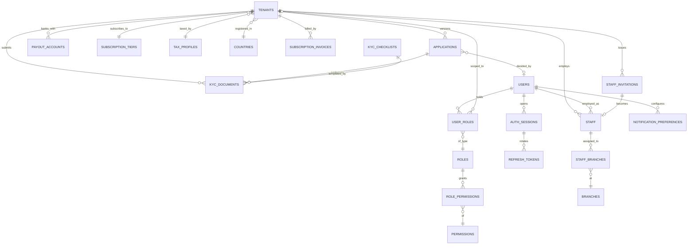
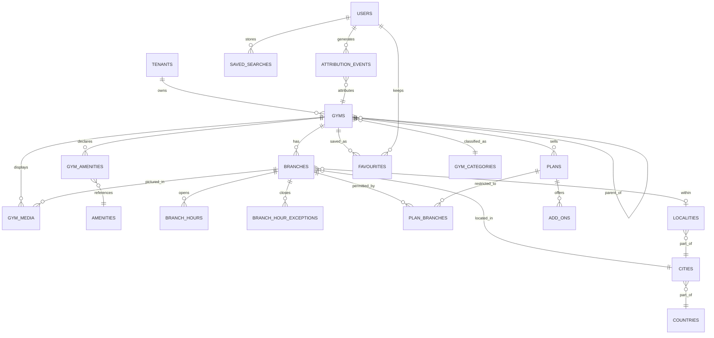
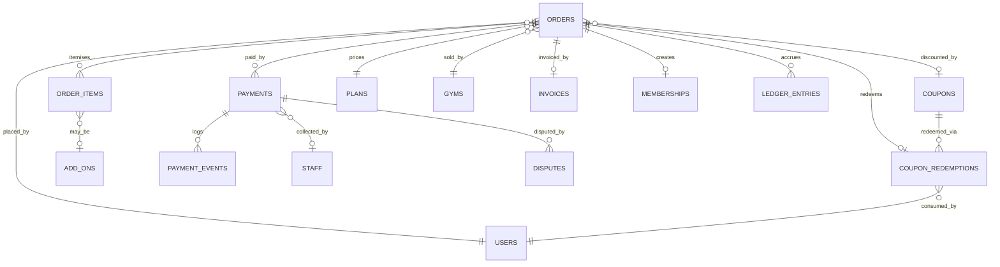
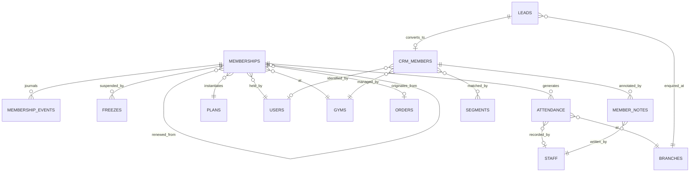
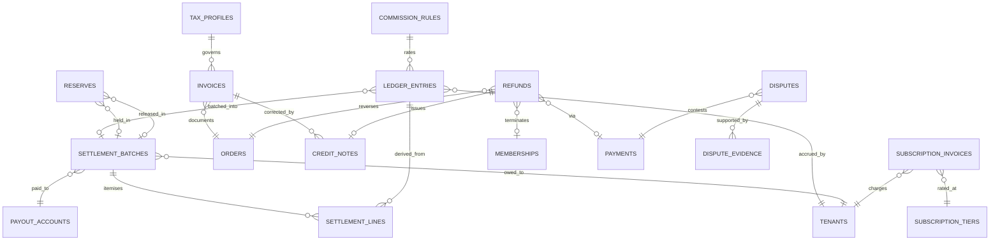
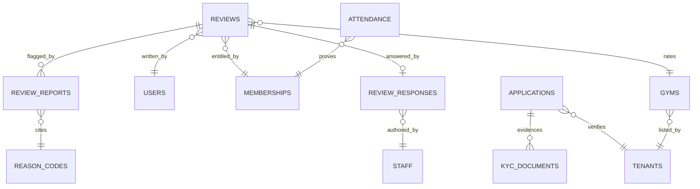
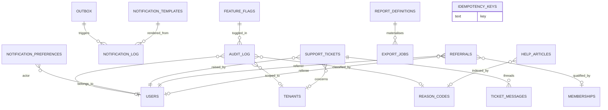
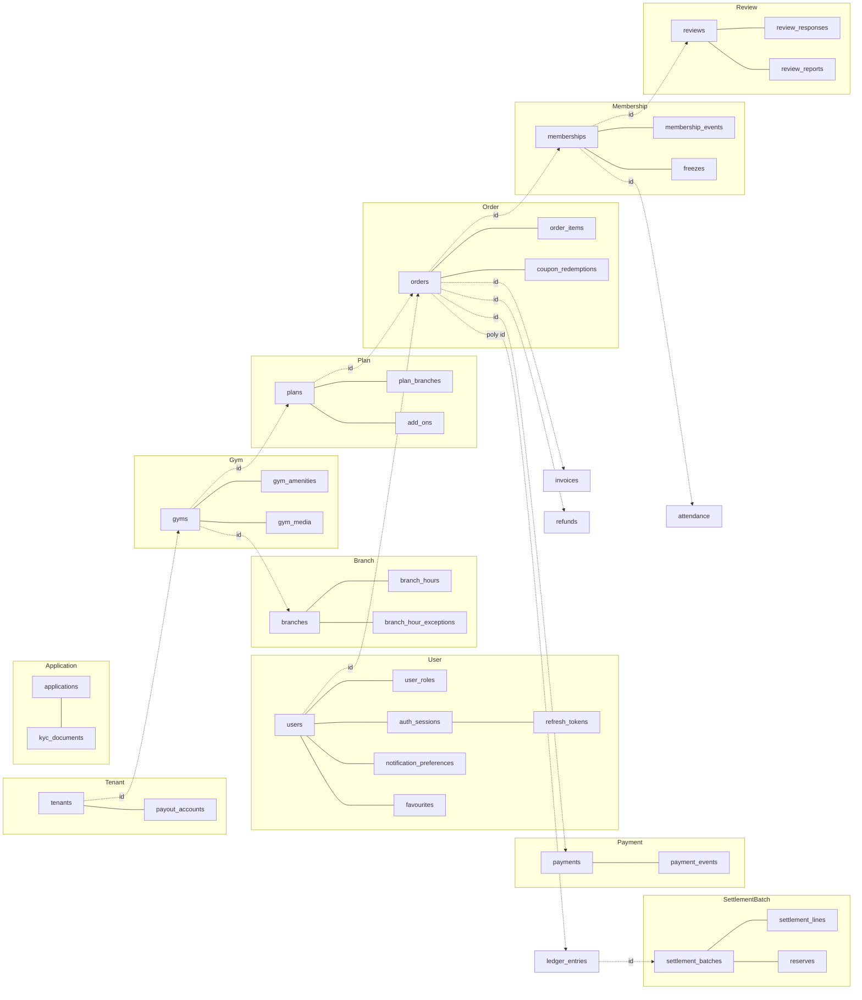

# ERD — Engineering Entity Design

> **Phase:** Engineering design (pre-code) · **Status:** Authoritative for entity design ·
> **Date:** 2026-08-06 · **Launch market:** India (`LAUNCH_MARKET_INDIA.md`)
>
> **Precedence.** `PROJECT_CONSTITUTION.md` > `MASTER_PRD.md` > `DECISION_LOG.md` >
> `STACK_ADDITIONS.md` > this document. Where this document appears to conflict with any of them,
> they win and this document is defective. Nothing here re-litigates a settled ADR.

---

## 0. What this document is, and what it is not

`ENGINEERING_PLAN.md` §5 contains the **CTO-level overview ERD** — one diagram, a cardinality-notes
table, and the RLS split. That is the map. **This document is the terrain.**

| This document **does** | This document **does not** |
| :--- | :--- |
| Enumerate every entity in `§C2.2` and `§C2.3` and every entity the engineering plan's ERD names | Specify column types, lengths, nullability, defaults, or check constraints |
| Assign each entity an aggregate root, a tenancy class, a lifecycle and a retention class | Write DDL, Prisma schema, or migration files |
| Give the full relationship register with on-delete semantics and module-boundary justification | Enumerate indexes beyond those whose *existence* is a modelling decision (partial uniques, partition keys) |
| Explain the cardinality edge cases that a naive reading of the PRD gets wrong | Duplicate `§C2.4`'s index catalogue |
| Register every denormalised field and every immutable snapshot, with its recompute owner | Choose physical storage parameters, fillfactor, tablespaces |
| Fix the partitioning strategy for `attendance` and `audit_log` | Define the partition maintenance job's implementation |

**Phase 4 owns the physical schema.** Phase 4 must treat every ruling in §4, §5, §6, §9, §10 and §11
of this document as an input constraint, not a suggestion. Where Phase 4 finds a ruling here
unimplementable, it raises a change under Part C §C10 rather than quietly deviating.

**No application code exists and none is written here.** The two SQL fragments in §10 and §11 are
labelled **illustrative — not committed code** and exist only to make a grant model and a partition
key unambiguous.

---

## 1. Conventions in force

### 1.1 Columns every table carries

`NFR-DQ-05` and `§C2.2` mandate the following on every table. They are **omitted from every diagram
and every dictionary row** in this document; assume them present.

| Column | Present on | Note |
| :--- | :--- | :--- |
| `id uuid` | all | Primary key. UUIDv7 (time-ordered) so that B-tree inserts stay right-most and partition pruning by id remains meaningful; see §11.4 |
| `created_at timestamptz` | all | UTC (`NFR-DQ-03`, ADR-0025) |
| `updated_at timestamptz` | all | UTC |
| `created_by uuid` | all | Actor id; nullable only for system-originated rows, which carry the sentinel system actor |
| `updated_by uuid` | all | As above |
| `deleted_at timestamptz` | tables marked **Soft** in §4 | ADR-0024. Absence of this column on a table is a deliberate statement that the row is never deleted |
| `tenant_id uuid` | tables marked **RLS** in §4 | `NOT NULL`. The RLS key (`§C1.4`, `BR-TEN-01`, `NFR-SEC-09`) |

### 1.2 Tenancy classes

| Class | Meaning | RLS policy |
| :--- | :--- | :--- |
| **RLS** | Tenant-owned. `tenant_id NOT NULL`, RLS enabled | `USING (tenant_id = current_setting('app.tenant_id')::uuid)` |
| **GLOBAL** | Platform reference or platform-owned. No `tenant_id` | RLS not enabled; writes only via `admin/` with reason + audit |
| **HYBRID** | Row-level discriminator decides scope | Named per entity in §4 (only `coupons` and `notification_log`) |
| **IDENTITY** | Platform-global identity, tenant-scoped *exposure* | No `tenant_id`; a tenant sees the row only through an RLS-scoped join row. Only `users` |
| **DUAL** | `tenant_id` present **and** a platform-scope read path exists behind the named audited elevation of `§C1.4` | Only `audit_log` |

### 1.3 Retention classes (`NFR-PRV-04`, `CON-04`, DPDP Act 2023)

| Class | Rule | Deletion behaviour on a `BR-DAT-04` subject request |
| :--- | :--- | :--- |
| **R-OPS** | Retained while the account is active, **plus 12 months** | Hard-deleted or pseudonymised |
| **R-FIN** | **Statutory period**, held as tax-profile configuration. India baseline: 8 financial years from the end of the FY to which the record relates (books-of-account obligation); GST records 72 months | **Never deleted.** Personal identifiers replaced by the pseudonym token; figures untouched (`BR-TEN-04`, `INV-TEN-6`) |
| **R-AUD** | **7 years**, immovable | Never deleted, never modified (`INV-DAT-2`, `NFR-SEC-13`). Actor id is pseudonymised in place by a privileged migration, never by the application role |
| **R-KYC** | Statutory period **after tenant closure**; separate encrypted bucket, separate key (`BR-DAT-07`, `NFR-SEC-02`, `INV-DAT-6`) | Never deleted while the obligation runs; storage object purged on expiry, row tombstoned |
| **R-EPH** | Ephemeral. Bounded by an explicit TTL stated per entity | Expired by a sweeper job; not part of subject-access exports |
| **R-REF** | Reference data. Indefinite, version-retained | Not personal data; unaffected |

`R-FIN` and `R-AUD` **override** a deletion request. This is the `CON-04` tension and the
resolution is the PRD's own: pseudonymise, do not delete.

### 1.4 Lifecycle vocabulary

| Term | Meaning in §4's *Lifecycle* column |
| :--- | :--- |
| **Immutable** | Written once; no `UPDATE` path exists in the application role's grants (§10) |
| **Append-only** | The *table* only grows. Rows are immutable. Corrections are new rows |
| **Mutable + soft delete** | Ordinary CRUD; `deleted_at` set instead of `DELETE` (ADR-0024, `NFR-DQ-04`) |
| **State machine** | Mutable, but only through the transitions of the named `§C4` machine |
| **Frozen after `<event>`** | Mutable up to the named event, immutable thereafter (e.g. `applications` after submit, `FR-ONB-08`) |
| **TTL** | Deleted by a sweeper when `expires_at` passes |

### 1.5 On-delete vocabulary (§5)

Because ADR-0024 makes soft delete the default, **hard `DELETE` is rare and every occurrence is
named**. The `On delete` column in §5 therefore describes what happens if a hard delete of the
parent were attempted — which for most rows is *it is refused*.

| Value | Meaning |
| :--- | :--- |
| `RESTRICT` | The FK refuses the parent delete. The intended path is the parent's soft delete |
| `CASCADE` | Child rows are owned by the parent aggregate and have no independent identity |
| `SET NULL` | The reference is an attribution, not an ownership; losing it degrades the row but does not invalidate it |
| `NO FK` | Deliberately no foreign key. Always justified in the row's *Why* column |

---

## 2. The master ERD

Every entity in `§C2.2` and `§C2.3`, plus the entities the `ENGINEERING_PLAN.md` §5.1 diagram names
that `§C2.2` describes only in prose (`freezes`, `add_ons`, `crm_members`, `member_notes`,
`segments`, `leads`, `support_tickets`, `ticket_messages`, `referrals`, `favourites`,
`payout_accounts`, `reserves`, `subscription_invoices`, `export_jobs`, `report_definitions`,
`staff_invitations`, `dispute_evidence`, `notification_preferences`, `roles`, `permissions`,
`help_articles`, `commission_rules`), plus three entities that no source names but which a stated
requirement makes unavoidable and which §4 flags as **engineering-derived**: `auth_sessions`,
`refresh_tokens` and `attribution_events`.

Standard columns (§1.1) are omitted. Reference tables are drawn without their `created_by` edges.

```mermaid
erDiagram
  %% ---------- Tenancy & Identity ----------
  TENANTS ||--o{ GYMS : owns
  TENANTS ||--o{ APPLICATIONS : versions
  TENANTS ||--o{ KYC_DOCUMENTS : submits
  TENANTS ||--o{ STAFF : employs
  TENANTS ||--o{ STAFF_INVITATIONS : issues
  TENANTS ||--o{ PAYOUT_ACCOUNTS : banks_with
  TENANTS ||--o{ COUPONS : issues
  TENANTS ||--o{ SUBSCRIPTION_INVOICES : billed_by
  TENANTS ||--o{ LEDGER_ENTRIES : accrues
  TENANTS ||--o{ SETTLEMENT_BATCHES : settles
  TENANTS ||--o{ RESERVES : withholds
  TENANTS }o--|| SUBSCRIPTION_TIERS : subscribes_to
  TENANTS }o--|| TAX_PROFILES : taxed_by
  TENANTS }o--|| COUNTRIES : registered_in

  USERS ||--o{ USER_ROLES : holds
  USERS ||--o{ AUTH_SESSIONS : opens
  USERS ||--o{ NOTIFICATION_PREFERENCES : configures
  USERS ||--o{ STAFF : employed_as
  USERS ||--o{ MEMBERSHIPS : holds
  USERS ||--o{ ORDERS : places
  USERS ||--o{ REVIEWS : writes
  USERS ||--o{ FAVOURITES : keeps
  USERS ||--o{ SAVED_SEARCHES : stores
  USERS ||--o{ ATTRIBUTION_EVENTS : generates
  USERS ||--o{ SUPPORT_TICKETS : raises
  USERS ||--o{ REFERRALS : refers
  USERS ||--o| CRM_MEMBERS : identified_by
  USER_ROLES }o--|| ROLES : of_type
  ROLES ||--o{ ROLE_PERMISSIONS : grants
  ROLE_PERMISSIONS }o--|| PERMISSIONS : of
  AUTH_SESSIONS ||--o{ REFRESH_TOKENS : rotates

  STAFF ||--o{ STAFF_BRANCHES : assigned_to
  STAFF ||--o{ ATTENDANCE : performs
  STAFF ||--o{ PAYMENTS : collects
  STAFF ||--o{ REVIEW_RESPONSES : authors
  STAFF ||--o{ MEMBER_NOTES : records
  STAFF_INVITATIONS ||--o| STAFF : becomes

  APPLICATIONS ||--o{ KYC_DOCUMENTS : evidences
  KYC_CHECKLISTS ||--o{ KYC_DOCUMENTS : templated_by

  %% ---------- Catalogue ----------
  GYMS ||--o{ BRANCHES : has
  GYMS ||--o{ PLANS : sells
  GYMS ||--o{ GYM_AMENITIES : declares
  GYMS ||--o{ GYM_MEDIA : displays
  GYMS ||--o{ REVIEWS : receives
  GYMS ||--o{ FAVOURITES : saved_as
  GYMS ||--o{ CRM_MEMBERS : manages
  GYMS }o--|| GYM_CATEGORIES : classified_as
  GYMS ||--o{ GYMS : parent_of
  GYM_AMENITIES }o--|| AMENITIES : references

  BRANCHES ||--o{ BRANCH_HOURS : opens
  BRANCHES ||--o{ BRANCH_HOUR_EXCEPTIONS : closes
  BRANCHES ||--o{ PLAN_BRANCHES : permitted_by
  BRANCHES ||--o{ STAFF_BRANCHES : staffed_by
  BRANCHES ||--o{ ATTENDANCE : records
  BRANCHES ||--o{ LEADS : enquired_at
  BRANCHES ||--o{ GYM_MEDIA : pictured_in
  BRANCHES }o--|| CITIES : located_in
  BRANCHES }o--o| LOCALITIES : within
  CITIES }o--|| COUNTRIES : part_of
  LOCALITIES }o--|| CITIES : part_of

  PLANS ||--o{ PLAN_BRANCHES : restricted_to
  PLANS ||--o{ ADD_ONS : offers
  PLANS ||--o{ ORDERS : ordered_as
  PLANS ||--o{ MEMBERSHIPS : purchased_as

  %% ---------- Commerce ----------
  ORDERS ||--o{ ORDER_ITEMS : itemises
  ORDERS ||--o{ PAYMENTS : paid_by
  ORDERS ||--o| INVOICES : invoiced_by
  ORDERS ||--o| MEMBERSHIPS : creates
  ORDERS ||--o{ REFUNDS : refunded_by
  ORDERS ||--o| COUPON_REDEMPTIONS : redeems
  ORDERS }o--o| COUPONS : discounted_by
  COUPONS ||--o{ COUPON_REDEMPTIONS : redeemed_via
  ORDER_ITEMS }o--o| ADD_ONS : may_be

  PAYMENTS ||--o{ PAYMENT_EVENTS : logs
  PAYMENTS ||--o{ DISPUTES : disputed_by
  PAYMENTS ||--o{ REFUNDS : reversed_by
  DISPUTES ||--o{ DISPUTE_EVIDENCE : supported_by

  INVOICES ||--o{ CREDIT_NOTES : corrected_by
  REFUNDS ||--o| CREDIT_NOTES : issues

  %% ---------- Membership & Attendance ----------
  MEMBERSHIPS ||--o{ MEMBERSHIP_EVENTS : journals
  MEMBERSHIPS ||--o{ FREEZES : suspended_by
  MEMBERSHIPS ||--o{ ATTENDANCE : generates
  MEMBERSHIPS ||--o| REVIEWS : entitles
  MEMBERSHIPS ||--o{ REFUNDS : refunded_by
  MEMBERSHIPS }o--o| MEMBERSHIPS : renewed_from
  CRM_MEMBERS ||--o{ MEMBER_NOTES : annotated_by
  CRM_MEMBERS }o--o{ SEGMENTS : matched_by
  LEADS ||--o| CRM_MEMBERS : converts_to

  %% ---------- Money ----------
  LEDGER_ENTRIES }o--o| SETTLEMENT_BATCHES : batched_into
  SETTLEMENT_BATCHES ||--o{ SETTLEMENT_LINES : itemises
  SETTLEMENT_LINES }o--|| LEDGER_ENTRIES : derived_from
  SETTLEMENT_BATCHES }o--|| PAYOUT_ACCOUNTS : paid_to
  RESERVES }o--o| SETTLEMENT_BATCHES : held_in
  TENANTS }o--o| COMMISSION_RULES : rated_by

  %% ---------- Trust ----------
  REVIEWS ||--o| REVIEW_RESPONSES : answered_by
  REVIEWS ||--o{ REVIEW_REPORTS : flagged_by

  %% ---------- Platform ----------
  OUTBOX ||--o{ NOTIFICATION_LOG : triggers
  NOTIFICATION_TEMPLATES ||--o{ NOTIFICATION_LOG : rendered_from
  SUPPORT_TICKETS ||--o{ TICKET_MESSAGES : threads
  REPORT_DEFINITIONS ||--o{ EXPORT_JOBS : materialises
  REASON_CODES ||--o{ AUDIT_LOG : classifies
  AUDIT_LOG }o--o| USERS : actor

  %% ---------- Unattached by design ----------
  IDEMPOTENCY_KEYS {
    text key
  }
  FEATURE_FLAGS {
    text flag_key
  }
  HELP_ARTICLES {
    text slug
  }
```



**Three edges in that diagram are deliberately absent and their absence is the design.**

1. There is **no FK from `audit_log` to the entity it describes.** `audit_log` addresses its subject
   polymorphically through `(entity_type, entity_id)` because the audit record must outlive the
   thing it describes (`CON-04`, `NFR-PRV-04`, `INV-DAT-2`). A foreign key would make `R-AUD`
   unachievable the first time a `R-OPS` row was purged.
2. There is **no FK from `outbox` to its aggregate.** `outbox` also uses
   `(aggregate_type, aggregate_id)`. The outbox row is a fact about an emission, not a child of the
   aggregate, and it is dispatched by a worker that must not be able to block an aggregate's delete
   path (ADR-0017).
3. There is **no join table between `plans` and `memberships` for terms.** Terms live in
   `memberships.purchased_terms` as a snapshot, not as a reference (§9, `BR-PLN-02`).

---

## 3. Domain sub-diagrams

The seven groups below are the **eight bounded contexts of `PROJECT_CONSTITUTION.md` §4.1**
regrouped for data-modelling purposes: *Demand* has no aggregates of its own beyond `favourites`,
`saved_searches` and `attribution_events`, so it is drawn inside **Catalogue**; *Engagement &
Insight* has no aggregates that are not platform machinery, so it is drawn inside **Platform**.

Each sub-diagram shows entities **owned** by that domain in full, and entities owned elsewhere as
boundary nodes so that the crossing is visible rather than implied.

### 3.1 Tenancy & Identity

Owns: `tenancy/`, `iam/`, `staff/`, `onboarding/`. Answers *who is asking*, *what they may do*, and
*which tenant the request belongs to* — never *what they own*.



| Reading note | Rule |
| :--- | :--- |
| `users` has **no** `tenant_id` | One identity may own or work for several tenants (`BR-TEN-02`, `FR-AUTH-11`). Putting `tenant_id` on `users` would force either duplicate people or a leak |
| `user_roles.tenant_id` is **nullable** | A platform role (`SUPER_ADMIN`, `VERIFICATION_OFFICER`) has no tenant scope; a tenant role always does. The nullable column is the discriminator, and `INV-TEN-3` is enforced by refusing to resolve two tenant-scoped roles in one request |
| `auth_sessions` / `refresh_tokens` are engineering-derived | `§C3.2 API-AUTH` mandates `GET /auth/sessions`, `DELETE /auth/sessions/:id`, and `FR-AUTH-10` requires password reset to invalidate all sessions. ADR-0011 requires rotation with reuse detection. None of that is expressible without a persisted session and a token family. Redis alone cannot satisfy `FR-AUTH-10`'s audit expectation across a restart |
| `staff` bridges `users` to `tenants` | `staff` is the RLS-scoped row through which a tenant may see a person at all. A tenant that has never employed or sold to a person cannot observe that the person exists |
| `applications` is versioned, not edited | `BR-GYM-05` allows unlimited resubmission; `FR-ONB-08` freezes the reviewer's view. Version N+1 is a new row |

### 3.2 Catalogue (Supply + Demand)

Owns: `catalog/`, `plans/`, `discovery/`. Turns an approved tenant into sellable, findable
inventory.



| Reading note | Rule |
| :--- | :--- |
| `gyms.parent_gym_id` is a self-reference reserved, not used | `A4.2` reserves parent-child nesting for the deferred franchise hierarchy. Phase 1 writes `NULL` universally and a check constraint enforces it (§13.4) |
| `plan_branches` empty ⇒ **all branches** | Open-world encoding (`§C2.2`, §7.3). Adding a branch must not silently un-sell an existing plan |
| `branch_hours` is many rows per weekday | Split hours (05:00–11:00, 16:00–23:00) are two rows, not a nullable second pair (§7.4) |
| `branches.location` is `geography(Point,4326)` | GiST-indexed, PostGIS (ADR-0007). Radius search never leaves Postgres until ~50k listings (`§C1.1`) |
| `attribution_events` is engineering-derived | `A6.3` requires the 30-day `MARKETPLACE` window to be *"recorded server-side at first authenticated view"* and *"resolved by the recorded event log, which is visible to both parties"*. That is a table, not a cookie |
| `discovery/` reads a **read model**, not these tables | Constitution §4.1.1: *published language*. The search projection is a materialised read model over `gyms`/`branches`/`plans`; it is not an entity in this ERD because it holds no facts of its own |

### 3.3 Commerce

Owns: `ordering/`, `payments/`. Converts intent into a captured payment, exactly once.



| Reading note | Rule |
| :--- | :--- |
| `orders` carries **nine** money figures | The eight of `A6.3` plus `commission_tax_minor` (§12.4). All persisted, none recomputed (`BR-FIN-02`, `INV-FIN-3`) |
| `orders.idempotency_key` is uniquely indexed | `BR-PAY-03`, `§C2.4`. This is a modelling decision, not a tuning one: the uniqueness *is* the exactly-once guarantee |
| One order → many payments | Retries (`FR-PAY-06`) and duplicates (`BR-PAY-07`) each create a row. At most one may reach `CAPTURED` |
| `payment_events.provider_event_id` unique **globally**, not per tenant | Replay protection (`BR-PAY-05`) must hold before the tenant is known — the webhook arrives with a provider id and nothing else. This is one of exactly two globally-unique constraints on an RLS table (§5.4) |
| `coupon_redemptions` is 1:0..1 from `orders`, not 1:N | `BR-CPN-02`: coupons do not stack, one coupon per order |
| `orders → ledger_entries` is drawn, but it is a **by-id reference** | `ledger_entries.reference_type = 'ORDER'`, `reference_id = orders.id`. Polymorphic; see §5.3 |

### 3.4 Membership & Attendance

Owns: `memberships/`, `attendance/`, `crm/`. Makes the membership a live thing to both sides of the
counter.



| Reading note | Rule |
| :--- | :--- |
| `memberships.renewed_from_membership_id` is a self-reference | `INV-MEM-5`: `EXPIRED` is terminal; renewal creates a **new** membership. The link exists so `A6.3`'s renewal step-down can count *which* renewal this is (first = standard rate, second onward = reduced) |
| `memberships → orders` is **optional** | A `DIRECT` staff-recorded offline sale still creates an order (`FR-CRM-06`), but a Phase-1 migration import and an admin-created goodwill membership may not. The FK is nullable so that the exceptional path does not require a fake order |
| `attendance` has **no** `deleted_at` | `BR-CHK-09` / `INV-CHK-4`: never updated, never deleted. Corrections are separate reversal records |
| `attendance.token_nonce` is unique within TTL | `BR-CHK-06` / `INV-CHK-3`. A partial unique index over the live TTL window, not a global unique — the nonce space is recycled |
| `crm_members` is **not** `users` | Constitution §4.2: *member* in `crm/` is a person the gym manages, possibly a walk-in with no platform account. `user_id` is nullable and that nullability is the whole point |
| `segments` has no membership join table | Segments are **query definitions** evaluated at read time (`FR-CRM-04`), not stored sets. Storing a materialised set would make the nightly `crm.risk-flags` job (`§C5`) authoritative over a query the owner just changed |

### 3.5 Money

Owns: `ledger/`, `billing/`, `settlements/`, `refunds/`. Its one job: prove, for any figure, where
it came from — and never edit a fact.



| Reading note | Rule |
| :--- | :--- |
| `ledger_entries` is the **only** source of a balance | `BR-FIN-01` / `INV-FIN-7`. No table in this ERD has a `balance_minor` column, and none ever may. `tenants` has a `reserve_bps` policy figure, which is a rate, not a balance |
| `settlement_lines` denormalises the figures **deliberately** | `BR-FIN-02` / `FR-SETL-02`: nine figures persisted per line, never recomputed at display. See §8.3 |
| `reserves` points at **two** batches | The batch that held it and the batch that released it (`A6.4`, `FR-SETL-04`). Both nullable, both `SET NULL`-free (RESTRICT) because a released reserve must remain traceable |
| `invoices` has no FK to `tenants` for its *printed* identity | It has `tenant_id` for RLS, and a **separate immutable `tenant_snapshot`** for what the document says. `BR-PAY-11` / §9.3 |
| `credit_notes` has its own number sequence | `FR-INV-09`: invoices are never edited (`INV-FIN-9`); corrections are separate documents in a separate gapless sequence |
| `disputes` is 1:N from `payments`, not 1:0..1 | `BR-REF-08`: a payment can be disputed more than once across its life, each with its own evidence deadline |

### 3.6 Trust

Owns: `reviews/`, plus the verification-gated status fields that `onboarding/` and `catalog/` write.
Trust is not a module; it is an invariant enforced across three.



| Reading note | Rule |
| :--- | :--- |
| `reviews.membership_id` is **`NOT NULL`** and is the entitlement proof | `BR-REV-02`: one review per member per gym **per membership term**. The term is why the FK is to `membership_id` and not to `(user_id, gym_id)`. A unique index on `membership_id` gives the rule for free |
| `BR-REV-01` is *not* enforced by an FK | *"Only a user with at least one recorded check-in at the gym may review it"* is a predicate over `attendance`, checked through `AttendanceQueryPort` at submission (Constitution §4.1.1) and re-asserted by a nightly consistency check. An FK cannot express "≥1 row exists" |
| `review_responses` is 1:0..1 with **no delete path** | `BR-REV-05` / `INV-TRU-4`: one response, and the gym may never edit or delete the review itself |
| `gyms.status = APPROVED` has no automated writer | `BR-GYM-03` / `INV-TRU-2`. The transition requires a human actor id, recorded in `audit_log` and in `applications.decided_by` |
| `reviews.edit_history` is a JSONB append log, not a table | Volume is negligible (one row per edit per review) and it is only ever read with its parent. Promoting it to a table would add a join to the gym detail page's hot path for no gain |

### 3.7 Platform

Owns: `common/`, `audit/`, `admin/`, `notifications/`, `reporting/`, `support/`. The machinery every
other domain conforms to.



| Reading note | Rule |
| :--- | :--- |
| `audit_log` is class **DUAL** | It has `tenant_id` and RLS for the owner's own log (`B3.2`), **and** a platform-wide read policy for `FR-ADMN-09`'s explorer, reachable only through the named audited elevation of `§C1.4` |
| `outbox` and `audit_log` are written in the **same transaction** as the state change | ADR-0017 and `BR-DAT-01`. This is why they are modelled as tables and not as a queue or a log shipper |
| `idempotency_keys` has no relationships at all | Deliberately. It stores `(key, endpoint, request_hash, response_status, response_body, expires_at)` and nothing else. Coupling it to any aggregate would make its 24-hour TTL a business concern (`§C1.5`, ADR-0016) |
| `notification_log` is class **HYBRID** | A message to a member is user-addressed and has no tenant; a message to a gym owner is tenant-addressed. The policy is `tenant_id IS NULL OR tenant_id = current_setting(...)`, and the member-addressed rows are readable only by `iam/`'s own user-scoped path |
| `referrals.qualifying_membership_id` exists in Phase 1; **wallet credit does not** | `BR-RFL-01` (`S`) is modelled; `BR-WAL-01` (`C`) is deferred with a seam (§13.3) |
| `export_jobs` holds a signed URL and a TTL, not the file | Files live in S3-compatible storage behind the CDN (`§C1.1`). The row is the job record and the expiry clock |

---

## 4. Entity dictionary

Columns: **Root** = the aggregate root this entity belongs to (§6); *self* means it is its own root.
**Tncy** = tenancy class (§1.2). **Retn** = retention class (§1.3). **A-O** = append-only (§1.4);
`Y` means the application role holds no `UPDATE` and no `DELETE` grant (§10).

### 4.1 Tenancy & Identity — 18 entities

| Entity | Purpose (one sentence) | Root | Tncy | Lifecycle | Retn | A-O |
| :--- | :--- | :--- | :--- | :--- | :--- | :-: |
| `tenants` | The gym business that is the unit of data isolation, commercial contract and settlement. | self | RLS¹ | State machine `§C4.4` + soft delete | R-FIN | N |
| `applications` | An immutable submitted version of a tenant's verification dossier, awaiting a human decision. | self | RLS | Frozen after submit (`FR-ONB-08`); versioned, never edited | R-KYC | Y |
| `kyc_documents` | A single uploaded verification artefact held in the separate encrypted bucket with its own key. | `Application` | RLS | Mutable review status; storage object immutable | R-KYC | N |
| `payout_accounts` | The tenant's verified bank destination for settlement payouts. | `Tenant` | RLS | Mutable + soft delete; a change re-triggers penny verification | R-FIN | N |
| `subscription_invoices` | The tenant's own SaaS bill for its `subscription_tier`, distinct from member invoices. | self | RLS | Immutable once issued (`INV-FIN-9` applies equally) | R-FIN | Y |
| `users` | A platform identity — a person with credentials, contact points and verification state. | self | IDENTITY | Mutable + soft delete; hard-delete/pseudonymise path per `BR-DAT-04` | R-OPS | N |
| `user_roles` | The grant of one role to one user, optionally scoped to one tenant. | `User` | IDENTITY | Mutable; every change audited (`BR-DAT-01`) | R-OPS | N |
| `roles` | A named bundle of permissions from the `B4.1` role matrix. | self | GLOBAL | Mutable by `admin/` only, with reason | R-REF | N |
| `permissions` | An atomic capability that an endpoint declares and a guard evaluates. | `Role` | GLOBAL | Mutable by migration only; `FR-RBAC-01` fails CI on an undeclared permission | R-REF | N |
| `role_permissions` | The join that composes a role from permissions. | `Role` | GLOBAL | Mutable by `admin/` with reason + audit | R-REF | N |
| `auth_sessions` | One authenticated device session, listable and revocable by its owner. | `User` | IDENTITY | Mutable status; TTL on absolute expiry | R-EPH (90 d) | N |
| `refresh_tokens` | One rotation generation within a session's token family, for reuse detection. | `AuthSession` | IDENTITY | Immutable; superseded, never updated | R-EPH (refresh TTL + 30 d) | Y |
| `notification_preferences` | One user's opt-in state for one channel × category pair, with timestamped consent. | `User` | IDENTITY | Mutable; every change timestamped (`NFR-PRV-02`) | R-OPS | N |
| `staff` | The employment of a platform identity by a tenant, in a role, with a status. | self | RLS | State machine (invited → active → removed) + soft delete | R-OPS | N |
| `staff_branches` | The assignment of a staff member to a branch, which scopes everything they can see. | `Staff` | RLS | Mutable | R-OPS | N |
| `staff_invitations` | A pending, expiring invitation to join a tenant's staff at a named role. | `Staff` | RLS | TTL on `expires_at`; consumed once | R-EPH (invite TTL + 12 mo) | N |
| `attribution_events` | The server-side record that a user reached a gym through a platform discovery surface. | self | RLS | Immutable | R-FIN² | Y |
| `favourites` | A user's saved gym, used for the account surface and for `MARKETPLACE` attribution. | `User` | RLS | Mutable (create/delete only) | R-OPS | N |

¹ `tenants` is the RLS anchor: it carries `id` as its own tenant key and its policy is
`id = current_setting('app.tenant_id')::uuid`. Platform-scope reads of the tenant list use the named
elevation.
² `attribution_events` is `R-FIN`, not `R-OPS`, because `A6.3` makes it **evidence in a commission
dispute** *"visible to both parties"*. It must outlive the operational window.

### 4.2 Catalogue — 12 entities

| Entity | Purpose (one sentence) | Root | Tncy | Lifecycle | Retn | A-O |
| :--- | :--- | :--- | :--- | :--- | :--- | :-: |
| `gyms` | A tenant's public brand and listing identity, with slug, category, rating snapshot and status. | self | RLS | State machine `§C4.4` + soft delete | R-OPS | N |
| `branches` | A physical location with an address, a PostGIS point, hours, capacity and staff. | self | RLS | Mutable status + soft delete | R-OPS | N |
| `branch_hours` | One contiguous open period for one branch on one weekday. | `Branch` | RLS | Mutable; replaced wholesale on edit | R-OPS | N |
| `branch_hour_exceptions` | A dated override of a branch's normal hours, including full closure. | `Branch` | RLS | Mutable; purged 12 months after the date | R-OPS | N |
| `gym_amenities` | The declaration that a gym offers a platform-defined amenity. | `Gym` | RLS | Mutable | R-OPS | N |
| `gym_media` | One image or video asset for a gym or a specific branch, with renditions and moderation state. | `Gym` | RLS | Mutable metadata; storage object immutable per rendition | R-OPS | N |
| `plans` | Sellable inventory — a duration or session package with price, eligibility and policy. | self | RLS | State machine (`DRAFT`→`PUBLISHED`→`ARCHIVED`); archive never orphans (`BR-PLN-04`) | R-FIN³ | N |
| `plan_branches` | A restriction of a plan to a named branch; **no rows means all branches**. | `Plan` | RLS | Mutable | R-FIN³ | N |
| `add_ons` | An optional priced extra attachable to a plan at checkout. | `Plan` | RLS | Mutable + soft delete | R-FIN³ | N |
| `saved_searches` | A user's stored discovery query with an optional alert cadence. | `User` | IDENTITY | Mutable + hard delete | R-OPS | N |
| `crm_members` | The gym's own record of a person it manages, who may or may not hold a platform account. | self | RLS | Mutable + soft delete | R-OPS | N |
| `leads` | An enquiry at a branch that has not yet become a member. | self | RLS | State machine (`FR-CRM-08` pipeline) + soft delete | R-OPS | N |

³ `plans` and its children are `R-FIN` rather than `R-OPS` because an issued invoice's line item
names a plan, and a settlement dispute two years later must be able to resolve the plan that was
sold. The *snapshot* on the membership is authoritative (§9.2); the plan row is corroborating
evidence.

### 4.3 Commerce — 8 entities

| Entity | Purpose (one sentence) | Root | Tncy | Lifecycle | Retn | A-O |
| :--- | :--- | :--- | :--- | :--- | :--- | :-: |
| `orders` | The server-priced commercial record of one purchase attempt, carrying nine money figures and two snapshots. | self | RLS | State machine `§C4.2`; money figures immutable once `PAID` | R-FIN | N⁴ |
| `order_items` | One priced line of an order — the plan, a joining fee, or an add-on. | `Order` | RLS | Immutable after order leaves `PENDING` | R-FIN | Y⁴ |
| `coupons` | A discount instrument with scope, limits, applicability and an immutable funding source. | self | HYBRID | Mutable while unused; `funding_source` immutable after first use (`BR-CPN-05`) | R-FIN | N |
| `coupon_redemptions` | The consumption of one coupon by one user on one order. | `Coupon` | RLS | Immutable | R-FIN | Y |
| `payments` | One attempt to move money for an order through one provider, in one of eight states. | self | RLS | State machine `§C4.3` | R-FIN | N |
| `payment_events` | The deduplicated, replay-protected log of provider callbacks for a payment. | `Payment` | RLS | Immutable; unique on `provider_event_id` | R-FIN | Y |
| `invoices` | The immutable tax document for a paid order, numbered gaplessly per tenant per financial year. | self | RLS | Immutable once issued (`INV-FIN-9`) | R-FIN | Y |
| `credit_notes` | The immutable document reversing all or part of an invoice, in its own gapless sequence. | self | RLS | Immutable once issued | R-FIN | Y |

⁴ `orders` is not append-only as a *table* — `status` advances through `§C4.2`. But the **nine money
figures and both snapshots are column-level immutable** once the order reaches `PAID`, enforced by a
trigger, because `BR-FIN-02` and `INV-FIN-3` are meaningless if a later write can change `C` or `T`.
`order_items` is fully append-only after the order leaves `PENDING`.

### 4.4 Membership & Attendance — 6 entities

| Entity | Purpose (one sentence) | Root | Tncy | Lifecycle | Retn | A-O |
| :--- | :--- | :--- | :--- | :--- | :--- | :-: |
| `memberships` | An instance of a plan held by a user at a gym — **the product** — in exactly one of six states. | self | RLS | State machine `§C4.1`; `purchased_*` columns immutable from creation | R-FIN | N |
| `membership_events` | The complete transition journal of a membership, one row per state change. | `Membership` | RLS | Immutable | R-FIN | Y |
| `freezes` | One suspension window of a membership, which extends `end_date` by exactly its duration. | `Membership` | RLS | Immutable once ended; cancellable only while future-dated | R-FIN | N |
| `attendance` | One recorded entry attempt at a branch, allowed or denied, with its reason. | self | RLS | **Immutable** (`BR-CHK-09`); partitioned monthly | R-OPS⁵ | Y |
| `member_notes` | A staff-authored note against a CRM member, including the sensitive-category flag. | `CrmMember` | RLS | Mutable by author within an edit window, then immutable | R-OPS | N |
| `segments` | A named, re-evaluated query definition over a gym's CRM members. | self | RLS | Mutable + soft delete | R-OPS | N |

⁵ `attendance` is `R-OPS`, but with a **caveat that Phase 4 must implement**: attendance rows that a
review depends on (`BR-REV-01`, `INV-TRU-3`) cannot be purged while the review is published, or the
verified-member marker becomes unprovable. The purge job therefore excludes
`(user_id, gym_id)` pairs with a `PUBLISHED` review. This is a real coupling and it is cheaper to
state here than to discover in year two.

### 4.5 Money — 11 entities

| Entity | Purpose (one sentence) | Root | Tncy | Lifecycle | Retn | A-O |
| :--- | :--- | :--- | :--- | :--- | :--- | :-: |
| `ledger_entries` | One append-only financial fact; the sole source of every balance in the system. | self | RLS | **Immutable. No `UPDATE`/`DELETE` grant exists** (`§C2.2`, `BR-FIN-01`) | R-FIN | Y |
| `settlement_batches` | The periodic aggregate of eligible ledger entries for one tenant for one cycle. | self | RLS | State machine `§C4.7`; figures immutable from `LOCKED` | R-FIN | N |
| `settlement_lines` | One statement line per contributing ledger entry, with all nine figures denormalised. | `SettlementBatch` | RLS | Immutable | R-FIN | Y |
| `reserves` | One rolling withholding against a tenant's settled value, with its hold and release batches. | `SettlementBatch` | RLS | Mutable until released, then immutable | R-FIN | N |
| `refunds` | A request to reverse all or part of an order, with its policy computation and approval. | self | RLS | State machine `§C4.5` | R-FIN | N |
| `disputes` | A provider-raised chargeback case with an evidence deadline and an outcome. | self | RLS | State machine; outcome immutable | R-FIN | N |
| `dispute_evidence` | One artefact submitted to a dispute before its deadline. | `Dispute` | RLS | Immutable once submitted | R-FIN | Y |
| `commission_rules` | The platform-global and per-tier commission rates effective over a date range. | self | GLOBAL | Versioned by validity window; never edited in place (`BR-FIN-05`) | R-FIN | Y |
| `tax_profiles` | A country's tax configuration: components, rates, inclusivity, FY start month, rounding. | self | GLOBAL | Versioned by validity window (`BR-PAY-11`, ADR-0028) | R-FIN | Y |
| `subscription_tiers` | The four SaaS plans of `A6.2`, with their limits and commission deltas. | self | GLOBAL | Versioned by validity window | R-REF | Y |
| `outbox` | The transactional record of a domain event, written with the state change and dispatched by a worker. | self | RLS | Append + a single `published_at` write; purged 30 days after publish | R-EPH (30 d) | N⁶ |

⁶ `outbox` is the one table in the Money-adjacent set that takes an `UPDATE`, and it takes exactly
one: `published_at` and `attempts`. Phase 4 grants column-level `UPDATE` on those two columns only.

### 4.6 Trust — 3 entities

| Entity | Purpose (one sentence) | Root | Tncy | Lifecycle | Retn | A-O |
| :--- | :--- | :--- | :--- | :--- | :--- | :-: |
| `reviews` | A verified member's rating and written account of one gym for one membership term. | self | RLS | State machine `§C4.6`; body edits append to `edit_history`, never overwrite | R-OPS | N |
| `review_responses` | The gym's single public reply to a review, which it may never use to alter the review. | `Review` | RLS | Mutable by author until published, then immutable | R-OPS | N |
| `review_reports` | A report that a review breaches policy, with its reason code and resolution. | `Review` | RLS | State machine (open → resolved) | R-OPS | N |

### 4.7 Platform — 8 entities

| Entity | Purpose (one sentence) | Root | Tncy | Lifecycle | Retn | A-O |
| :--- | :--- | :--- | :--- | :--- | :--- | :-: |
| `audit_log` | The append-only before/after record of every mutation on a governed entity, with actor and reason. | self | DUAL | **Immutable**; partitioned monthly; no application interface can modify it (`INV-DAT-2`) | R-AUD | Y |
| `idempotency_keys` | A 24-hour cache of `(key, endpoint, request fingerprint, response)` making mutations exactly-once. | self | RLS | TTL 24 h (`§C1.5`) | R-EPH (24 h) | N |
| `notification_log` | The delivery record of one templated message to one recipient on one channel. | self | HYBRID | Mutable status until terminal, then immutable | R-OPS | N |
| `support_tickets` | A user's or owner's support case with category, priority, SLA timers and linked entities. | self | RLS⁷ | State machine `FR-SUP-04` | R-OPS | N |
| `ticket_messages` | One message or internal note in a ticket thread. | `SupportTicket` | RLS⁷ | Immutable | R-OPS | Y |
| `referrals` | The link between a referrer, a referee and the membership that qualifies the reward. | self | IDENTITY | State machine (pending → qualified → rewarded → void) | R-FIN | N |
| `report_definitions` | A named, parameterised report — platform-supplied or tenant-defined. | self | HYBRID | Mutable + soft delete | R-OPS | N |
| `export_jobs` | One asynchronous export run, its status, its signed URL and that URL's expiry. | self | RLS | TTL on `url_expires_at`; row retained 90 days for audit | R-EPH (90 d) | N |

⁷ `support_tickets.tenant_id` is **nullable**: a member's ticket about the platform itself has no
tenant. The RLS policy is `tenant_id IS NULL OR tenant_id = current_setting(...)`, and the
tenant-null rows are additionally gated by the requester's own user id.

### 4.8 Reference (platform-global) — 10 entities

All are `§C2.3` tables: **no `tenant_id`, RLS not enabled, written only by `admin/` through an
audited, reason-required path** (`FR-ADMN-05`, `FR-ADMN-06`, ADR-0028).

| Entity | Purpose (one sentence) | Tncy | Lifecycle | Retn | A-O |
| :--- | :--- | :--- | :--- | :--- | :-: |
| `countries` | ISO-3166 country with its default currency, tax profile, KYC checklist and FY start month. | GLOBAL | Mutable by `admin/` | R-REF | N |
| `cities` | A serviceable city with its centroid, slug and gating status per `C9.4`. | GLOBAL | Mutable by `admin/` | R-REF | N |
| `localities` | A named sub-city area used for SEO landing pages and filter chips. | GLOBAL | Mutable by `admin/` | R-REF | N |
| `amenities` | A platform-defined facility a gym may declare, with icon and display group. | GLOBAL | Mutable by `admin/` | R-REF | N |
| `gym_categories` | The taxonomy a gym is classified into for browse and filtering. | GLOBAL | Mutable by `admin/` | R-REF | N |
| `kyc_checklists` | The per-country, per-entity-type list of required verification documents. | GLOBAL | Versioned; the version in force at submit is snapshotted onto the application | R-REF | N |
| `reason_codes` | The typed, fixed vocabularies for rejection, denial, refund, moderation and override. | GLOBAL | Mutable by `admin/`; codes are never re-pointed, only retired | R-REF | N |
| `feature_flags` | A server-evaluated flag with tenant, role and percentage targeting (ADR-0026). | GLOBAL | Mutable by `admin/`; every toggle audited | R-REF | N |
| `notification_templates` | A versioned, previewable message template per channel and locale. | GLOBAL | Versioned; SMS versions additionally carry DLT approval state (§12.5) | R-REF | N |
| `help_articles` | A published help-centre article, indexed for search and linkable from reason codes. | GLOBAL | Mutable + soft delete | R-REF | N |

**Entity count: 76.** 18 + 12 + 8 + 6 + 11 + 3 + 8 + 10 = 76.

---

## 5. Relationship register

### 5.1 When a foreign key may cross a module boundary

`PROJECT_CONSTITUTION.md` §3.3 forbids a module from reaching into another module's repositories.
It does **not** forbid a foreign key, and `NFR-DQ-01` positively requires referential integrity to
be *"enforced by database constraints, not application convention alone"*. The two are reconciled by
three tests. A cross-module FK is legitimate **only if all three pass**.

| Test | Statement |
| :--- | :--- |
| **T1 — Direction** | The FK points *up* the §4.5 allowed-dependency graph: the child's module already legitimately depends on the parent's module. A downward FK (`catalog/` → `memberships/`) is a boundary violation, not a shortcut |
| **T2 — By-id only** | The FK exists for integrity and joins in **read models and reports**, never for object-graph navigation. Constitution rule **A2**: there is no `order.membership.plan.gym.tenant` chain in the domain |
| **T3 — Integrity is load-bearing** | Losing the constraint would allow an orphan that violates a stated invariant. A "nice to have" FK across a boundary is a coupling with no benefit and is not created |

Where a relationship fails T1 or T3 it is modelled **polymorphically with no FK** and the `Why`
column says so. `dependency-cruiser` and the architecture test enforce T2 in code; the FK itself
cannot.

**Legend.** `Opt` = is the child's FK column nullable? `X-mod` = crosses a module boundary.

### 5.2 Register

#### Tenancy & Identity

| Parent | Child | Card. | Opt | On delete | X-mod | Why this is legitimate / the rule it encodes |
| :--- | :--- | :---: | :-: | :--- | :-: | :--- |
| `tenants` | `gyms` | 1:N | No | RESTRICT | `tenancy/`→`catalog/` | T1 up. The tenant is the isolation unit, the gym the listing unit (`BR-TEN-01`) |
| `tenants` | `applications` | 1:N | No | RESTRICT | `tenancy/`→`onboarding/` | Versioned resubmission, prior versions retained (`BR-GYM-05`) |
| `tenants` | `kyc_documents` | 1:N | No | RESTRICT | `tenancy/`→`onboarding/` | `BR-TEN-04`: closure never deletes KYC while the statutory clock runs |
| `tenants` | `staff` | 1:N | No | RESTRICT | `tenancy/`→`staff/` | Seat limits per tier (`FR-STAF-06`) are counted here |
| `tenants` | `payout_accounts` | 1:N | No | RESTRICT | `tenancy/`→`settlements/` | Exactly one may be `ACTIVE`; history retained for `R-FIN` |
| `tenants` | `coupons` | 1:0..N | **Yes** | RESTRICT | `tenancy/`→`ordering/` | Nullable because `scope = 'PLATFORM'` coupons have no tenant (§7.7) |
| `tenants` | `ledger_entries` | 1:N | No | RESTRICT | `tenancy/`→`ledger/` | A ledger entry without a tenant is unattributable money |
| `tenants` | `settlement_batches` | 1:N | No | RESTRICT | `tenancy/`→`settlements/` | One batch per tenant per cycle |
| `tenants` | `subscription_invoices` | 1:N | No | RESTRICT | `tenancy/`→`billing/` | The tenant's own SaaS bill (`A6.2`) |
| `subscription_tiers` | `tenants` | 1:N | No | RESTRICT | `admin/`→`tenancy/` | Reference data; a tier in use cannot be deleted, only superseded |
| `tax_profiles` | `tenants` | 1:N | No | RESTRICT | `admin/`→`tenancy/` | `BR-PAY-11` — but the **invoice** uses a snapshot, not this FK (§9.3) |
| `countries` | `tenants` | 1:N | No | RESTRICT | `admin/`→`tenancy/` | Drives tax profile, KYC checklist and FY start month (ADR-0028) |
| `users` | `user_roles` | 1:N | No | CASCADE | — | Owned by the `User` aggregate |
| `roles` | `user_roles` | 1:N | No | RESTRICT | `admin/`→`iam/` | A role held by anyone cannot be deleted |
| `tenants` | `user_roles` | 1:0..N | **Yes** | CASCADE | `tenancy/`→`iam/` | Nullable = a platform role. Cascade because a tenant-scoped grant is meaningless without the tenant |
| `roles` | `role_permissions` | 1:N | No | CASCADE | — | Owned by the `Role` aggregate |
| `permissions` | `role_permissions` | 1:N | No | RESTRICT | — | `FR-RBAC-01` fails CI if an endpoint's permission is missing; deleting one silently would defeat that |
| `users` | `auth_sessions` | 1:N | No | CASCADE | — | `FR-AUTH-10`: password reset invalidates all sessions |
| `auth_sessions` | `refresh_tokens` | 1:N | No | CASCADE | — | The token family. Reuse detection needs the whole chain (ADR-0011) |
| `users` | `notification_preferences` | 1:N | No | CASCADE | `iam/`→`notifications/` | Consent is a property of the person (`NFR-PRV-02`) |
| `users` | `staff` | 1:N | No | RESTRICT | `iam/`→`staff/` | RESTRICT because a person with employment history is never hard-deleted, only pseudonymised (`BR-DAT-04`) |
| `staff` | `staff_branches` | 1:N | No | CASCADE | — | Owned by the `Staff` aggregate |
| `branches` | `staff_branches` | 1:N | No | RESTRICT | `catalog/`→`staff/` | Removing a branch must force an explicit reassignment, never a silent unscoping |
| `staff_invitations` | `staff` | 1:0..1 | **Yes** | SET NULL | — | The invitation is evidence the employment was consented to; it survives if the staff row is later purged |
| `applications` | `kyc_documents` | 1:N | **Yes** | RESTRICT | — | Nullable: a document may be uploaded before the application version is created |
| `kyc_checklists` | `kyc_documents` | 1:N | No | RESTRICT | `admin/`→`onboarding/` | The checklist **version** in force is also snapshotted onto the application (§9.6) |
| `users` | `applications` (`decided_by`) | 1:0..N | **Yes** | RESTRICT | `iam/`→`onboarding/` | `BR-GYM-03` / `INV-TRU-2`: approval always carries a human actor id that must remain resolvable |

#### Catalogue

| Parent | Child | Card. | Opt | On delete | X-mod | Why this is legitimate / the rule it encodes |
| :--- | :--- | :---: | :-: | :--- | :-: | :--- |
| `gyms` | `branches` | 1:N (≥1) | No | RESTRICT | — | `BR-TEN-03`; exactly one `is_primary` (§7.5) |
| `gyms` | `gyms` (`parent_gym_id`) | 1:0..N | **Yes** | RESTRICT | — | Franchise nesting reserved by `A4.2`; **`NULL` enforced in Phase 1** (§13.4) |
| `gyms` | `plans` | 1:N | No | RESTRICT | `catalog/`→`plans/` | A plan without a gym is unsellable |
| `gyms` | `gym_amenities` | 1:N | No | CASCADE | — | Owned by the `Gym` aggregate |
| `amenities` | `gym_amenities` | 1:N | No | RESTRICT | `admin/`→`catalog/` | Retiring an amenity must not silently strip it from listings |
| `gym_categories` | `gyms` | 1:N | No | RESTRICT | `admin/`→`catalog/` | Reference taxonomy |
| `gyms` | `gym_media` | 1:N | No | CASCADE | — | Owned by the `Gym` aggregate |
| `branches` | `gym_media` | 1:0..N | **Yes** | SET NULL | — | Nullable: media may belong to the gym generally. `SET NULL` demotes a branch photo to a gym photo rather than destroying it |
| `branches` | `branch_hours` | 1:N | No | CASCADE | — | Owned by the `Branch` aggregate; **multiple rows per weekday** (§7.4) |
| `branches` | `branch_hour_exceptions` | 1:N | No | CASCADE | — | Owned by the `Branch` aggregate |
| `cities` | `branches` | 1:N | No | RESTRICT | `admin/`→`catalog/` | City landing pages and slug uniqueness (`gyms.slug` unique per city) |
| `localities` | `branches` | 1:0..N | **Yes** | SET NULL | `admin/`→`catalog/` | Nullable: not every address resolves to a mapped locality |
| `plans` | `plan_branches` | 1:0..N | No | CASCADE | — | **Zero rows = all branches** (§7.3) |
| `branches` | `plan_branches` | 1:0..N | No | CASCADE | `catalog/`→`plans/` | Cascade is safe *only* because zero rows means "all branches", so deleting the last restriction widens rather than breaks the plan — a behaviour §7.3 requires the UI to state explicitly |
| `plans` | `add_ons` | 1:N | No | RESTRICT | — | An add-on sold on an order must remain resolvable |
| `users` | `favourites` | 1:N | No | CASCADE | `iam/`→`discovery/` | Owned by the `User` aggregate |
| `gyms` | `favourites` | 1:N | No | CASCADE | `catalog/`→`discovery/` | A favourite of a deleted gym is noise |
| `users` | `saved_searches` | 1:N | No | CASCADE | `iam/`→`discovery/` | Owned by the `User` aggregate |
| `users` | `attribution_events` | 1:N | No | RESTRICT | `iam/`→`discovery/` | `R-FIN`: commission evidence must survive the user's operational purge, pseudonymised |
| `gyms` | `attribution_events` | 1:N | No | RESTRICT | `catalog/`→`discovery/` | As above |

#### Commerce

| Parent | Child | Card. | Opt | On delete | X-mod | Why this is legitimate / the rule it encodes |
| :--- | :--- | :---: | :-: | :--- | :-: | :--- |
| `users` | `orders` | 1:N | No | RESTRICT | `iam/`→`ordering/` | `R-FIN` outlives `R-OPS`; the buyer is pseudonymised, never removed |
| `gyms` | `orders` | 1:N | No | RESTRICT | `catalog/`→`ordering/` | The seller on a tax document |
| `plans` | `orders` | 1:N | No | RESTRICT | `plans/`→`ordering/` | T3: an order naming a vanished plan cannot be audited. The **priced terms** are snapshotted regardless (§9.2) |
| `orders` | `order_items` | 1:N | No | CASCADE | — | Owned by the `Order` aggregate |
| `add_ons` | `order_items` | 1:0..N | **Yes** | RESTRICT | `plans/`→`ordering/` | Nullable: the principal line is the plan, not an add-on |
| `coupons` | `orders` | 1:0..N | **Yes** | RESTRICT | — | One coupon per order (`BR-CPN-02`) |
| `coupons` | `coupon_redemptions` | 1:N | No | RESTRICT | — | `redemption_count` is denormalised from this (§8.5) |
| `orders` | `coupon_redemptions` | 1:0..1 | No | CASCADE | — | `BR-CPN-02` again, from the other side |
| `users` | `coupon_redemptions` | 1:N | No | RESTRICT | `iam/`→`ordering/` | `per_user_limit` is counted here (`BR-CPN-01`) |
| `orders` | `payments` | 1:N | No | RESTRICT | `ordering/`→`payments/` | Retries and duplicates each create a row (`FR-PAY-06`, `BR-PAY-07`) |
| `payments` | `payment_events` | 1:N | No | RESTRICT | — | `provider_event_id` globally unique (`BR-PAY-05`) |
| `staff` | `payments` (`collected_by`) | 1:0..N | **Yes** | RESTRICT | `staff/`→`payments/` | Cash attribution (`FR-CRM-07`). Nullable for online payments; RESTRICT because "who took the cash" must stay answerable |
| `orders` | `invoices` | 1:0..1 | No | RESTRICT | `ordering/`→`billing/` | `BR-PAY-10`: one invoice per order, issued at full payment (`AC-CART-02.3`) |
| `invoices` | `credit_notes` | 1:N | No | RESTRICT | — | Corrections are never edits (`INV-FIN-9`) |
| `orders` | `memberships` | 1:0..1 | No | RESTRICT | `ordering/`→`memberships/` | An expired `PENDING` order creates none (`FR-CART-05`) |
| `orders` | `refunds` | 1:N | No | RESTRICT | `ordering/`→`refunds/` | Partial refunds accumulate; idempotent per order (`BR-REF-09`) |

#### Membership, Attendance & CRM

| Parent | Child | Card. | Opt | On delete | X-mod | Why this is legitimate / the rule it encodes |
| :--- | :--- | :---: | :-: | :--- | :-: | :--- |
| `users` | `memberships` | 1:N | No | RESTRICT | `iam/`→`memberships/` | Concurrent memberships at different gyms are permitted (`BR-MEM-04`, §7.1) |
| `gyms` | `memberships` | 1:N | No | RESTRICT | `catalog/`→`memberships/` | The gym scopes the stackability rule (§7.2) |
| `plans` | `memberships` | 1:N | No | RESTRICT | `plans/`→`memberships/` | `BR-PLN-04`: archiving a plan never orphans a membership — hence RESTRICT, not CASCADE |
| `orders` | `memberships` | 1:0..1 | **Yes** | RESTRICT | `ordering/`→`memberships/` | Nullable for staff-created and migrated memberships (§3.4) |
| `memberships` | `memberships` (`renewed_from`) | 1:0..N | **Yes** | RESTRICT | — | Counts renewal generation for the `A6.3` rate step-down |
| `memberships` | `membership_events` | 1:N | No | RESTRICT | — | `INV-MEM-4`: exactly one row per transition. RESTRICT because the journal outlives nothing |
| `memberships` | `freezes` | 1:N | No | RESTRICT | — | `BR-MEM-05`: `freeze_days_used` is denormalised from these (§8.6) |
| `memberships` | `attendance` | 1:N | No | RESTRICT | `memberships/`→`attendance/` | `INV-CHK-4`: attendance is never deleted, so RESTRICT can never fire in practice |
| `branches` | `attendance` | 1:N | No | RESTRICT | `catalog/`→`attendance/` | Where the entry happened; drives `(tenant_id, branch_id, checked_in_at)` reporting |
| `users` | `attendance` | 1:N | No | RESTRICT | `iam/`→`attendance/` | Duplicated alongside `membership_id` deliberately — see §8.7 |
| `staff` | `attendance` (`staff_id`) | 1:0..N | **Yes** | RESTRICT | `staff/`→`attendance/` | Nullable for `SCAN`; required for `MANUAL` and `OVERRIDE` (`BR-CHK-10`) |
| `gyms` | `crm_members` | 1:N | No | RESTRICT | `catalog/`→`crm/` | The gym's own record of the person |
| `users` | `crm_members` | 1:0..1 | **Yes** | SET NULL | `iam/`→`crm/` | **Nullable is the point**: a walk-in has no platform account. `SET NULL` on subject deletion leaves the gym's operational record intact and de-identified |
| `crm_members` | `member_notes` | 1:N | No | CASCADE | — | Owned by the `CrmMember` aggregate |
| `staff` | `member_notes` | 1:N | No | RESTRICT | `staff/`→`crm/` | Authorship must remain attributable |
| `branches` | `leads` | 1:N | No | RESTRICT | `catalog/`→`crm/` | Enquiry location drives the pipeline view |
| `crm_members` | `leads` (`converted_to`) | 1:0..1 | **Yes** | SET NULL | — | Conversion is a fact about the lead, not an ownership |

#### Money

| Parent | Child | Card. | Opt | On delete | X-mod | Why this is legitimate / the rule it encodes |
| :--- | :--- | :---: | :-: | :--- | :-: | :--- |
| `settlement_batches` | `ledger_entries` | 1:0..N | **Yes** | RESTRICT | `settlements/`→`ledger/` | Null until batched. `BR-FIN-06` holds unreported-fee lines out by leaving it null |
| `settlement_batches` | `settlement_lines` | 1:N | No | RESTRICT | — | Lines sum **exactly** to the payout (`BR-FIN-03`, `INV-FIN-6`) |
| `ledger_entries` | `settlement_lines` | 1:0..1 | No | RESTRICT | `ledger/`→`settlements/` | One line per contributing entry; the entry is the provenance |
| `payout_accounts` | `settlement_batches` | 1:N | No | RESTRICT | — | The destination is captured **per batch**, not read live, so a later bank change never rewrites a paid statement |
| `settlement_batches` | `reserves` (`held_in`) | 1:0..N | **Yes** | RESTRICT | — | `A6.4`, `FR-SETL-04` |
| `settlement_batches` | `reserves` (`released_in`) | 1:0..N | **Yes** | RESTRICT | — | Nullable until the 30-day release |
| `commission_rules` | `ledger_entries` | 1:0..N | **Yes** | RESTRICT | `admin/`→`ledger/` | `BR-FIN-05` / `INV-FIN-5`: the rate **effective at the moment of sale**. The rule row is versioned, never edited, so the FK is safe evidence |
| `orders` | `ledger_entries` | poly 1:N | n/a | **NO FK** | `ordering/`→`ledger/` | `(reference_type, reference_id)` addresses orders, refunds, payouts and disputes from one column pair. A four-way exclusive-arc FK would be four nullable columns and four constraints for no integrity gain (§5.3) |
| `orders` | `refunds` | 1:N | No | RESTRICT | `ordering/`→`refunds/` | See Commerce |
| `memberships` | `refunds` | 1:0..N | **Yes** | RESTRICT | `memberships/`→`refunds/` | Nullable: an order may be refunded before a membership exists |
| `payments` | `refunds` | 1:0..N | **Yes** | RESTRICT | `payments/`→`refunds/` | `INV-FIN-12`: refund to the **original instrument** — hence the payment, not just the order |
| `refunds` | `credit_notes` | 1:0..1 | **Yes** | RESTRICT | `refunds/`→`billing/` | Nullable: a credit note may also arise from a dispute loss |
| `payments` | `disputes` | 1:N | No | RESTRICT | `payments/`→`refunds/` | `BR-REF-08`: multiple disputes per payment across its life |
| `disputes` | `dispute_evidence` | 1:N | No | RESTRICT | — | Evidence submitted before the deadline is a permanent record |
| `orders` | `invoices` | 1:0..1 | No | RESTRICT | `ordering/`→`billing/` | See Commerce |
| `subscription_tiers` | `subscription_invoices` | 1:N | No | RESTRICT | `admin/`→`billing/` | The tier rate at the moment of billing |

#### Trust & Platform

| Parent | Child | Card. | Opt | On delete | X-mod | Why this is legitimate / the rule it encodes |
| :--- | :--- | :---: | :-: | :--- | :-: | :--- |
| `gyms` | `reviews` | 1:N | No | RESTRICT | `catalog/`→`reviews/` | `rating_avg` / `rating_count` are denormalised from these (§8.1) |
| `users` | `reviews` | 1:N | No | RESTRICT | `iam/`→`reviews/` | Author identity is pseudonymised on deletion, never removed — the review stays published |
| `memberships` | `reviews` | 1:0..1 | No | RESTRICT | `memberships/`→`reviews/` | **Unique on `membership_id`.** This one index *is* `BR-REV-02` |
| `reviews` | `review_responses` | 1:0..1 | No | RESTRICT | — | `BR-REV-05`: one response, no delete path |
| `staff` | `review_responses` | 1:N | No | RESTRICT | `staff/`→`reviews/` | Public attribution of the responder |
| `reviews` | `review_reports` | 1:N | No | RESTRICT | — | Multiple parties may report one review |
| `reason_codes` | `review_reports` | 1:N | No | RESTRICT | `admin/`→`reviews/` | Typed vocabulary; codes retire, never re-point |
| `notification_templates` | `notification_log` | 1:N | No | RESTRICT | `admin/`→`notifications/` | The template **version** actually rendered must stay resolvable for a delivery dispute |
| `outbox` | `notification_log` | 1:0..N | **Yes** | SET NULL | `common/`→`notifications/` | Nullable: some notifications are raised directly by a job, not by a domain event. `SET NULL` survives the 30-day outbox purge |
| `support_tickets` | `ticket_messages` | 1:N | No | CASCADE | — | Owned by the `SupportTicket` aggregate |
| `users` | `support_tickets` | 1:N | No | RESTRICT | `iam/`→`support/` | Requester identity |
| `report_definitions` | `export_jobs` | 1:N | No | RESTRICT | — | The definition that produced the file must remain resolvable while the file exists |
| `users` | `referrals` (referrer) | 1:N | No | RESTRICT | `iam/`→`support/` | `BR-RFL-01`: reward credited after the referee's refund window |
| `users` | `referrals` (referee) | 1:0..N | **Yes** | RESTRICT | `iam/`→`support/` | Nullable until the invitation is accepted |
| `memberships` | `referrals` (`qualifying`) | 1:0..N | **Yes** | RESTRICT | `memberships/`→`support/` | The membership whose survival past the refund window triggers the reward |
| *any entity* | `audit_log` | poly 1:N | n/a | **NO FK** | all → `audit/` | `CON-04` / `INV-DAT-2`: audit must survive the deletion of what it describes. An FK would make `R-AUD` unachievable (§5.3) |
| *any aggregate* | `outbox` | poly 1:N | n/a | **NO FK** | all → `common/` | The outbox row is a fact about an emission; a worker's dispatch must never be able to block an aggregate's lifecycle (ADR-0017) |
| `users` | `audit_log` (`actor_id`) | 1:0..N | **Yes** | **NO FK** | `iam/`→`audit/` | Nullable and unconstrained: the actor may be the system, an anonymous request, or a since-purged identity |

### 5.3 The three polymorphic references, justified individually

| Reference | Columns | Values `reference_type` / `entity_type` / `aggregate_type` may take | Why no FK |
| :--- | :--- | :--- | :--- |
| `ledger_entries` → subject | `(reference_type, reference_id)` | `ORDER`, `REFUND`, `DISPUTE`, `PAYOUT`, `ADJUSTMENT`, `SUBSCRIPTION_INVOICE` | Six targets. Six nullable FK columns plus a six-way exclusive-arc check constraint would be more code, more indexes and identical integrity to a validated enum plus a nightly orphan check. The ledger is append-only, so the orphan window is bounded by one job cycle |
| `audit_log` → subject | `(entity_type, entity_id)` | Every governed entity of `BR-DAT-01`: member, membership, payment, plan, gym, staff, configuration — 31 types in practice | The audit row must outlive its subject (`CON-04`). An FK is not merely unhelpful, it is **incorrect** |
| `outbox` → aggregate | `(aggregate_type, aggregate_id)` | Every aggregate root in §6 | The outbox is purged 30 days after publish while aggregates live for years; the FK direction is wrong and the lifetimes do not nest |

Each of the three carries a **CI-enforced enum** in `packages/types` (Zod, ADR-0022) and a nightly
`ops.orphan-scan` job that reports unresolvable references as a data-quality alert rather than
silently tolerating them.

### 5.4 The two globally-unique constraints on RLS tables

Uniqueness on an RLS table is normally **per tenant**, because a global unique index leaks the
existence of another tenant's row through a constraint-violation error. Two exceptions are
deliberate and both are justified.

| Constraint | Why it must be global | How the leak is contained |
| :--- | :--- | :--- |
| `payment_events (provider_event_id)` unique | The webhook arrives carrying a provider event id **and nothing else**. Deduplication (`BR-PAY-05`) must succeed before the tenant is resolved | The endpoint is unauthenticated-but-signed and returns `200` on duplicate without a body. No caller can distinguish "already processed by me" from "already processed by another tenant" because no caller other than the provider can reach it |
| `orders (idempotency_key)` unique | `BR-PAY-03` / ADR-0016: keys are client-generated UUIDs. A per-tenant scope would be sufficient in theory, but the interceptor sits **before** tenant resolution for the public checkout path | Keys are 128-bit random. A collision across tenants is a `409` with no body detail, indistinguishable from the caller's own replay with a changed fingerprint |

Every other unique constraint in the schema is `(tenant_id, ...)`-prefixed. Phase 4 must treat a
non-prefixed unique index on an RLS table as a review-blocking finding unless it appears in this
table.

---

## 6. The aggregate map

`PROJECT_CONSTITUTION.md` §4.3 names **18 aggregate roots** and rules **A1–A6**. This section does
what the constitution does not: it assigns **all 76 entities** to an aggregate, states each
aggregate's transaction boundary in terms of rows, and enumerates every crossing that is by-id
reference only.

### 6.1 Aggregate composition

`Root` = aggregate root entity. `Contained` = rows loaded and saved **whole** with the root (rule
A4). `Boundary` = what one transaction guarantees.

| # | Root | Contained entities | Boundary — what one transaction guarantees |
| :-: | :--- | :--- | :--- |
| 1 | `Tenant` (`tenants`) | `payout_accounts` | Commission override, settlement cycle, reserve rate, tax profile reference and refund policy are internally consistent; an override never exists without a validity window and a reason (`AC-ADMN-01.2`) |
| 2 | `Application` (`applications`) | `kyc_documents` | A submitted version is frozen (`FR-ONB-08`); a decision carries an actor and, on rejection, ≥1 structured reason code (`BR-GYM-04`) |
| 3 | `User` (`users`) | `user_roles`, `auth_sessions`, `refresh_tokens`, `notification_preferences`, `favourites`, `saved_searches` | Credentials, roles and consent state are consistent; revoking a session revokes its whole token family atomically (ADR-0011) |
| 4 | `Staff` (`staff`) | `staff_branches`, `staff_invitations` | The last `GYM_OWNER` can never be removed or demoted (`FR-RBAC-07`, `FR-STAF-09`); seat limits per tier hold (`FR-STAF-06`) |
| 5 | `Gym` (`gyms`) | `gym_amenities`, `gym_media` | Status transitions obey `§C4.4`; never `APPROVED` without a human actor (`INV-TRU-2`) |
| 6 | `Branch` (`branches`) | `branch_hours`, `branch_hour_exceptions` | Hours and exceptions are internally coherent (no overlapping rows on one weekday, §7.4); the location is within `BR-GYM-08` tolerance of the geocoded address at approval |
| 7 | `Plan` (`plans`) | `plan_branches`, `add_ons` | At most one active promotion (`BR-PLN-07`); a `PUBLISHED` plan has price and currency; archiving never orphans (`BR-PLN-04`) |
| 8 | `Order` (`orders`) | `order_items`, `coupon_redemptions` | All nine money figures computed server-side and internally consistent: `N = G − D`, `P = (N + T) − C − F − Cₜ` (`A6.3`, §12.4, `INV-FIN-3`) |
| 9 | `Payment` (`payments`) | `payment_events` | Status transitions obey `§C4.3`; `provider_event_id` unique (`BR-PAY-05`) |
| 10 | `Invoice` (`invoices`) | — | Gapless sequential number per tenant per financial year; immutable once issued (`INV-FIN-9`, `INV-FIN-10`) |
| 11 | `CreditNote` (`credit_notes`) | — | Own gapless sequence; references the original invoice number as printed text **and** by id |
| 12 | `Membership` (`memberships`) | `membership_events`, `freezes` | Exactly one of six states (`INV-MEM-1`); `ACTIVE` ⇒ `start_date ≤ today ≤ end_date` in the **gym's** timezone (`INV-MEM-2`); every transition writes exactly one event row (`INV-MEM-4`) |
| 13 | `CheckIn` (`attendance`) | — | Immutable once written (`INV-CHK-4`); idempotent on `token_nonce` within TTL (`INV-CHK-3`) |
| 14 | `CrmMember` (`crm_members`) | `member_notes` | The gym's operational record is coherent independently of whether a platform `user` is linked |
| 15 | `Lead` (`leads`) | — | Pipeline transitions obey `FR-CRM-08`; conversion sets `converted_to_crm_member_id` once |
| 16 | `Review` (`reviews`) | `review_responses`, `review_reports` | One per membership term (`BR-REV-02`); the gym may never edit or delete it (`INV-TRU-4`) |
| 17 | `LedgerEntry` (`ledger_entries`) | — | **No mutating behaviour at all.** The aggregate is a fact (`BR-FIN-01`) |
| 18 | `SettlementBatch` (`settlement_batches`) | `settlement_lines`, `reserves` | Lines + opening balance + reserve lines + refund lines sum **exactly** to the payout (`INV-FIN-6`); dual approval above threshold (`BR-FIN-08`) |
| 19 | `Refund` (`refunds`) | — | Idempotent on the order (`BR-REF-09`); the applicable policy is the one **stored on the order** (`BR-REF-02`); commission reverses proportionally (`BR-REF-05`) |
| 20 | `Dispute` (`disputes`) | `dispute_evidence` | Opening a case holds the amount against the tenant balance (`BR-REF-08`) |
| 21 | `Coupon` (`coupons`) | — | `funding_source` immutable after first use (`BR-CPN-05`); discount never takes payable below zero (`INV-FIN-11`) |
| 22 | `SupportTicket` (`support_tickets`) | `ticket_messages` | Status transitions obey `FR-SUP-04`; SLA timers are consistent with status |
| 23 | `Segment` (`segments`) | — | A definition, not a set (§3.4) |
| 24 | `Referral` (`referrals`) | — | Reward state advances only after the referee's refund window closes (`BR-RFL-01`) |
| 25 | `SubscriptionInvoice` (`subscription_invoices`) | — | Own gapless sequence, distinct from member invoices |
| 26 | `AttributionEvent` (`attribution_events`) | — | Immutable evidence of a discovery event (`A6.3`) |

**Six entities belong to no aggregate.** They are platform infrastructure with no domain invariant
of their own: `audit_log`, `outbox`, `idempotency_keys`, `notification_log`, `export_jobs`,
`report_definitions`. They are written by interceptors and workers, not by domain services.

**Ten entities are platform reference data** and are managed by `admin/` as configuration, not as
aggregates: `countries`, `cities`, `localities`, `amenities`, `gym_categories`,
`subscription_tiers`, `tax_profiles`, `kyc_checklists`, `reason_codes`, `feature_flags`,
`notification_templates`, `help_articles`, `roles`, `permissions`, `role_permissions`,
`commission_rules`. (Sixteen rows; ten in `§C2.3`'s named list plus six the engineering plan adds.)

### 6.2 Consistency boundaries drawn

Solid lines are **contained** (same transaction). Dashed lines are **by-id reference only** — the
crossing that rule A2 governs.



### 6.3 Every by-id-only crossing, and the mechanism that keeps it consistent

Rule **A1** — one transaction, one aggregate — means each row below is a place where consistency is
**eventual**, achieved by a domain event through the outbox (ADR-0017) or by an append to the
ledger. Each names the event and the idempotency key that makes the handler safe to replay.

| From aggregate | To aggregate | Trigger | Mechanism | Handler idempotency key |
| :--- | :--- | :--- | :--- | :--- |
| `Payment` | `Order` | Capture confirmed by webhook | `payment.captured` | `(order_id, provider_event_id)` |
| `Order` | `Membership` | Order reaches `PAID` | `order.paid` | `order_id` — an order yields **at most one** membership |
| `Order` | `Invoice` | Order reaches `PAID` | `order.paid` | `order_id`; number allocation is transactional, a post-allocation failure reuses the number on retry or records a documented void (`AC-INV-01.2`) |
| `Order` | `LedgerEntry` ×5 | Order reaches `PAID` | `order.paid` | `(reference_type, reference_id, entry_type)` — `SALE`, `TAX`, `COMMISSION`, `COMMISSION_TAX`, `GATEWAY_FEE` |
| `Refund` | `Membership` | Refund approved and executed | `refund.completed` | `refund_id` |
| `Refund` | `LedgerEntry` ×3 | Refund executed | `refund.completed` | `(REFUND, refund_id, entry_type)` — `REFUND`, `COMMISSION_REVERSAL`, `COMMISSION_TAX_REVERSAL` |
| `Refund` | `CreditNote` | Refund executed | `refund.completed` | `refund_id` |
| `Dispute` | `LedgerEntry` ×1 | Dispute opened | `dispute.opened` | `(DISPUTE, dispute_id, CHARGEBACK)` |
| `LedgerEntry` | `SettlementBatch` | Batch build job (`§C5`) | Batch claims unbatched entries | `(tenant_id, period_start, period_end)` |
| `CheckIn` | `Membership` | Session plan check-in allowed | In-transaction decrement of `sessions_used` **plus** the attendance insert | `token_nonce` — the one place two aggregates share a transaction, justified in §6.4 |
| `Review` | `Gym` | Review published, unpublished or removed | `review.published` / `review.unpublished` | `(gym_id, recompute_watermark)` — see §8.1 |
| `Attendance` | `Gym` | Nightly freshness recompute | `catalog.freshness` job | `(gym_id, run_date)` |
| `Membership` | `CrmMember` | Membership activated for a linked user | `membership.activated` | `(gym_id, user_id)` upsert |
| `Membership` | `Referral` | Referee's membership passes the refund window | `membership.refund_window_closed` | `referral_id` |
| `Coupon` | `Coupon.redemption_count` | Redemption row inserted | In-transaction counter (same aggregate) | n/a |

### 6.4 The two documented exceptions to "one transaction, one aggregate"

| # | Exception | Why it is unavoidable | What bounds the damage |
| :-: | :--- | :--- | :--- |
| 1 | **Payment capture spans five aggregates** | `AC-PAY-01.1` requires two simultaneous submissions to produce exactly one membership | Constitution §4.3.2 resolves this as **five transactions, five idempotent handlers, one outbox** — not one five-aggregate transaction, which would hold locks across an invoice PDF render and make `BR-PAY-06` structurally impossible |
| 2 | **A session-plan check-in writes `attendance` and decrements `memberships.sessions_used` in one transaction** | `BR-CHK-04` says a repeat within the cooldown must **not** decrement. If the decrement were an eventual handler, a second scan inside the cooldown could read a stale `sessions_used` and either double-decrement or wrongly allow | The transaction touches exactly two rows and holds no external call. `NFR-PERF-03`'s 2-second budget is measured end-to-end and this write is single-digit milliseconds. The idempotency key is `token_nonce` (`INV-CHK-3`) |

Any third exception proposed during implementation is a **design review item**, not a developer
decision.

### 6.5 Read models are not aggregates

Rule **A5**. Four projections exist in Phase 1 and none of them is an entity in this ERD, because
none holds a fact that is not derivable:

| Read model | Source aggregates | Refresh | Why it is not a table in §4 |
| :--- | :--- | :--- | :--- |
| Search projection (`SCR-WEB-002`) | `Gym`, `Branch`, `Plan`, plus `gyms.rating_avg` / `freshness_score` | Materialised view refreshed on catalogue change + nightly; PostGIS GiST + FTS/trigram indexes live here (ADR-0007) | It stores no fact; a full rebuild from the aggregates is always correct |
| Member list (`SCR-DASH-007`) | `CrmMember`, `Membership`, `Attendance` | Query-time, cursor-paginated (ADR-0023) | Live query; caching it would make `NFR-PERF-04` easier and correctness harder |
| Live counters (`SCR-DASH-001`, `SCR-DASH-009`) | `Attendance` current partition | **Polled at 10–15 s** by a single `useLiveCounters()` hook (A-08, ADR-0010) with a mandatory "last updated" indicator; app tier stays stateless (`NFR-SCAL-03`) | A counter is a `COUNT(*)` over one partition, not a stored figure |
| Settlement statement (`FR-SETL-02`) | `SettlementBatch`, `SettlementLine` | None — the lines **are** the statement | This one is the inverse: the figures are persisted precisely so the statement is never a projection (`BR-FIN-02`) |

---

## 7. Cardinality edge cases

These are the seven places where a competent reading of the PRD produces the **wrong** schema. Each
states the naive model, why it is wrong, and the ruling Phase 4 must implement.

### 7.1 Concurrent memberships at *different* gyms — `BR-MEM-04`

| | |
| :--- | :--- |
| **Naive model** | `UNIQUE (user_id) WHERE status IN ('PENDING','ACTIVE','FROZEN')` — "a person has a gym membership" |
| **Why it is wrong** | `BR-MEM-04` explicitly permits *"multiple concurrent memberships at different gyms"*. A member with a weekday gym near the office and a weekend gym near home is an ordinary case, not an edge case. A global unique on `user_id` makes the second purchase impossible |
| **Ruling** | The uniqueness scope is **`(user_id, gym_id)`**, never `(user_id)`. The gym is part of the key |
| **Consequence for reads** | `/me/memberships` (`SCR-WEB-011`) returns an unbounded list, not an object. The membership wallet UI is a list surface with no "current membership" singular concept |
| **Consequence for check-in** | The check-in evaluator resolves the membership **from the branch being scanned at**, never from the user. `BR-CHK-03` reads `plan_branches` for entitlement; §7.3 governs |

### 7.2 Stackable plans at the *same* gym — `BR-MEM-04`, `plans.stackable`

| | |
| :--- | :--- |
| **Naive model** | `UNIQUE (user_id, gym_id) WHERE status IN ('PENDING','ACTIVE','FROZEN')` |
| **Why it is wrong** | It is right for the default case and wrong for the case `plans.stackable = true` exists to serve: a 12-month duration plan plus a 10-session personal-training pack at the same gym. `BR-MEM-04` rejects concurrency *"unless the plans are explicitly marked stackable"* |
| **Ruling** | A **partial unique index whose predicate excludes stackable plans**. Because the flag lives on `plans` and the index lives on `memberships`, the flag is **copied onto the membership row at creation** as `is_stackable`, sourced from `purchased_terms` — a denormalisation registered in §8.8 |
| **Illustrative — not committed code** | `CREATE UNIQUE INDEX uq_membership_nonstackable ON memberships (user_id, gym_id) WHERE deleted_at IS NULL AND is_stackable = false AND status IN ('PENDING','ACTIVE','FROZEN');` |
| **Why not a trigger** | A trigger enforcing "count of non-stackable active memberships ≤ 1" is a read-then-write and races under concurrent checkout. `AC-PAY-01.1` requires two simultaneous submissions to produce exactly one membership; only a unique index gives that at the storage layer |
| **Why the flag is copied, not joined** | The index predicate cannot join. Copying also survives `BR-PLN-02`: if the owner later flips `plans.stackable`, existing memberships keep the rule they were sold under |
| **Interaction with §7.1** | Two stackable memberships at gym A and one at gym B is legal and produces three rows, none of which the index constrains |

### 7.3 `plan_branches` — **absence means all branches**

| | |
| :--- | :--- |
| **Naive model** | A plan is valid at the branches listed in `plan_branches`; a plan with no rows is valid nowhere |
| **Why it is wrong** | `§C2.2` states plainly: *"absence of rows means all branches"*. Under the naive model, publishing a plan would require the owner to tick every branch, and — far worse — **adding a new branch would silently un-sell every existing plan**, because the new branch would be absent from every list |
| **Ruling** | **Open-world encoding.** Zero rows = unrestricted. One or more rows = restricted to exactly those. There is no third state and no `is_all_branches` boolean; a boolean plus a list is two sources of truth |
| **Predicate the evaluator uses** | *(illustrative — not committed code)* `NOT EXISTS (SELECT 1 FROM plan_branches pb WHERE pb.plan_id = $plan) OR EXISTS (SELECT 1 FROM plan_branches pb WHERE pb.plan_id = $plan AND pb.branch_id = $branch)` |
| **Where it is read** | `FR-GYM-08` (branch entitlement display), `BR-CHK-03` (check-in evaluation), the plan card on `SCR-WEB-004`, and the checkout eligibility check |
| **UI obligation this creates** | `NFR-USE-06` requires destructive actions to state their consequence specifically. Removing the **last** `plan_branches` row is not a narrowing, it is a **widening to all branches**, and the confirmation must say so in those words |
| **Membership-time behaviour** | The entitled branch set is snapshotted into `memberships.purchased_terms` at purchase (§9.2). A branch added after purchase does **not** widen an existing membership — the snapshot governs, per `BR-PLN-02` |

### 7.4 Split operating hours — multiple rows per weekday

| | |
| :--- | :--- |
| **Naive model** | `branch_hours (branch_id, weekday, opens_at, closes_at)` with a unique key on `(branch_id, weekday)` |
| **Why it is wrong** | Indian gyms very commonly close through the afternoon: 05:00–11:00 and 16:00–23:00. `§C2.2` anticipates this — *"multiple rows per weekday permit split hours"* |
| **Ruling** | The key is **`(branch_id, weekday, opens_at)`**. No unique on `(branch_id, weekday)`. A weekday may carry 0, 1, 2 or more rows |
| **Zero rows means closed** | Not "unknown". A weekday with no rows renders as *Closed* and denies `outside_operating_hours` at check-in |
| **Non-overlap is an aggregate invariant, not a constraint** | Rows for one weekday must not overlap. This is enforced in the `Branch` aggregate's constructor (rule A3) and backed by an exclusion constraint as the second line: *(illustrative — not committed code)* `EXCLUDE USING gist (branch_id WITH =, weekday WITH =, timerange(opens_at, closes_at) WITH &&)` |
| **Crossing midnight** | A 22:00–02:00 period is stored as **two rows on two weekdays** (22:00–23:59:59 on day N, 00:00–02:00 on day N+1), never as `opens_at > closes_at`. A comparison operator that must know about wraparound is a bug generator, and `Asia/Kolkata` has no DST to complicate the split (§12.2) |
| **Exceptions override, they do not merge** | A `branch_hour_exceptions` row for a date **replaces** that date's `branch_hours` entirely. `is_closed = true` with null times is the full-closure case |

### 7.5 Exactly one primary branch per gym — `BR-TEN-03`, `BR-GYM-08`

| | |
| :--- | :--- |
| **Rule** | A gym has ≥1 branch, and **exactly one** has `is_primary = true`. The primary carries the canonical address used for the `BR-GYM-08` geo-tolerance check at approval |
| **Ruling** | A partial unique index, not a trigger: *(illustrative — not committed code)* `CREATE UNIQUE INDEX uq_primary_branch ON branches (gym_id) WHERE is_primary AND deleted_at IS NULL;` |
| **The "≥1 branch" half cannot be an index** | It is a deferred aggregate invariant checked in the `Gym` aggregate on branch removal, and asserted at the `PENDING_REVIEW` transition. A gym with zero branches can exist transiently in `DRAFT` and must not be able to reach `PENDING_REVIEW` |
| **Reassignment is atomic** | Promoting branch B to primary demotes branch A in the same transaction, inside the `Gym`/`Branch` boundary |

### 7.6 Parent-child gym nesting — reserved for franchise, `A4.2`

| | |
| :--- | :--- |
| **What `A4.2` says** | Franchise / multi-brand hierarchy is out of Phase 1 scope, and the design anticipates it because *"`gym` supports parent-child branch nesting"* |
| **Ruling for Phase 1** | The column `gyms.parent_gym_id uuid NULL` **exists** and is **always `NULL`**, enforced by `CHECK (parent_gym_id IS NULL)` |
| **Why the column exists now** | Adding a nullable self-FK to a table with an existing index set is a cheap, backward-compatible migration (`§C7`, `NFR-AVL-06`). Adding it later is equally cheap. What is **not** cheap later is discovering that every catalogue query, every RLS policy, every ranking expression and every report was written assuming a flat gym list. Declaring the column now with a check constraint makes the assumption **visible and greppable** |
| **Why the check constraint, not just convention** | Without it, the first developer who needs a "group" concept will populate the column, and half the system will silently start behaving as if hierarchy were supported. The constraint turns that into a loud failure |
| **What Phase 2 must change to lift it** | Drop the check; add `depth` and a materialised path or a recursive CTE helper; extend the RLS policy — a franchise parent and child are still **one tenant**, so RLS is unaffected; extend the search projection to roll child ratings into a parent listing (a `BR-REV-07` question, not just a schema one); extend `plan_branches` to permit a plan at a child gym's branches. That list is the actual cost of the deferral and it is recorded here so nobody estimates it at "add a column" |
| **What it is *not*** | It is **not** branch nesting. `branches` has no self-reference and never will; a branch is a leaf by definition. `A4.2`'s wording says "branch nesting" but the entity that gains a parent is `gyms`, because a franchise is a brand relationship, not a geographic one |

### 7.7 `coupons` — one table, two tenancy scopes

| | |
| :--- | :--- |
| **Rule** | `FR-CPN-02` requires platform-wide coupons usable at any tenant, alongside tenant-only coupons. `BR-CPN-05` makes `funding_source` immutable after first use because it determines the commission base (`A6.3`) |
| **Ruling** | One table, class **HYBRID**, discriminated by `scope`. RLS policy: `scope = 'PLATFORM' OR tenant_id = current_setting('app.tenant_id')::uuid`. `CHECK ((scope = 'PLATFORM' AND tenant_id IS NULL) OR (scope = 'TENANT' AND tenant_id IS NOT NULL))` |
| **Why not two tables** | `coupon_redemptions`, `orders.coupon_id`, the per-user limit counter and the validation pipeline would all need to be doubled or made polymorphic. A discriminator plus a compound RLS policy is one table and one code path |
| **Uniqueness of `code`** | Global across `PLATFORM` rows; per-tenant across `TENANT` rows. Two partial unique indexes, and a tenant coupon **may** collide with a platform code — resolution order at redemption is tenant-first, which is stated in `FR-CPN-03`'s validation order |
| **Write path for `PLATFORM` rows** | `admin/` only, through the audited reason-required path. A tenant session can read a platform coupon and can never write one |

---

## 8. Denormalisation register

### 8.0 The rule, and the register's purpose

**Every denormalised field is a bug waiting for a deployment.** The register exists so that when one
drifts, the on-call engineer finds the recompute owner in one lookup instead of reading the schema.

A denormalised field is admitted only if **all four** hold:

1. The normalised computation is on a hot path with a stated NFR that it would breach.
2. It has exactly **one** named writer — a job, a handler or a trigger — and no other.
3. Its staleness window is bounded and stated.
4. A reconciliation exists that detects drift without a human noticing it first.

**Nothing in this register is a balance.** `INV-FIN-7` forbids a stored balance absolutely, and no
field below is one. The persisted money figures of §8.3 and §8.4 are *facts about a transaction*,
not running totals.

### 8.1 `gyms.rating_avg`, `gyms.rating_count`

| | |
| :--- | :--- |
| **Duplicates** | `AVG(rating)` and `COUNT(*)` over `reviews WHERE gym_id = ? AND status = 'PUBLISHED'` |
| **Why** | `§C2.4` indexes `gyms (status, rating_avg DESC, freshness_score DESC)` for marketplace ranking. `NFR-PERF-01` requires search at p95 ≤ 500 ms. Ranking by a correlated aggregate over `reviews` cannot use that index and cannot meet the budget at 50k listings |
| **Recomputed by** | `reviews/`'s aggregation handler on the `review.published`, `review.unpublished` and `review.removed` events (`E2E-09`, `ENGINEERING_PLAN.md` §8.9) |
| **Trigger** | Any transition into or out of `PUBLISHED`, and any rating edit |
| **Staleness window** | **≤ 60 seconds** — outbox dispatch latency. The gym detail page reads `reviews` directly and is never stale; only the *ranking* and the search card are |
| **Reconciliation** | Nightly `catalog.rating-audit` job recomputes both from `reviews` and alerts on any gym where either differs. It **corrects** the row and records the correction in `audit_log` with actor = system |
| **Interaction with `BR-REV-07`** | No numeric rating is displayed below the configured minimum review count (`INV-TRU-6`). The threshold is applied at **render**, not by nulling the column — the column always holds the true value so the threshold can be changed without a backfill |

### 8.2 `gyms.freshness_score`

| | |
| :--- | :--- |
| **Duplicates** | A weighted function of media recency, plan edit recency, response-to-review rate, and recent attendance volume |
| **Why** | Same ranking index as §8.1. It is a composite over four tables; computing it per search request is not arguable |
| **Recomputed by** | The nightly `catalog.freshness` job (`§C5`) |
| **Trigger** | Schedule only. **No event recomputes it** — deliberately, so that an owner cannot game ranking by touching a field repeatedly |
| **Staleness window** | **≤ 24 hours + job duration.** Stated on the owner-facing surface as "updated daily" so the owner does not conclude the score is broken |
| **Reconciliation** | The job **is** the reconciliation; it is a full recompute, not an increment. A failed run leaves yesterday's value and raises a `NFR-MNT-06` job-failure alert |
| **Range invariant** | 0–100 integer, clamped in the job. A scoring-weight change never requires a schema change because the weights are `admin/` configuration (ADR-0028) |

### 8.3 `settlement_lines` — the nine figures, and `settlement_batches`' roll-ups

| | |
| :--- | :--- |
| **Duplicates** | `settlement_lines` holds gross, discount, net, tax, commission base, commission, **commission tax** (§12.4), gateway fee and payable — each already derivable from `orders` and `ledger_entries`. `settlement_batches` holds `opening_balance_minor`, `gross_minor`, `commission_minor`, `fees_minor`, `refunds_minor`, `reserve_held_minor`, `reserve_released_minor`, `net_payable_minor` |
| **Why** | **This is not an optimisation. It is `BR-FIN-02`**: *"Every settlement line persists gross, discount, net, tax, commission base, commission, gateway fee and payable. None of these is recomputed at display time."* A statement is a financial document; if a rate change, a rounding-mode change or a bug in the computation could alter what a two-year-old statement says, the statement is worthless |
| **Recomputed by** | **Nothing. Ever.** Written once by the batch-build job at `LOCKED` and never touched again |
| **Trigger** | Batch build (`§C5`, `E2E-12`, `BAC-07`) |
| **Staleness window** | **None — the figures are the truth, not a cache of it.** This is the one entry in this register where "stale" is not a coherent concept |
| **Reconciliation** | `BR-FIN-03` / `INV-FIN-6`: the batch's lines plus opening balance plus reserve lines plus refund lines must sum **exactly** to `net_payable_minor`. Asserted at `LOCKED` and re-asserted by the daily `finance.reconcile` job (`BR-FIN-07`), which additionally compares provider settlement reports and **blocks auto-payout** for the affected tenant on any variance |
| **Why nine and not eight** | `A6.3` names eight. India adds `commission_tax_minor` because the platform's commission is itself a taxable supply (§12.4, `LAUNCH_MARKET_INDIA.md` Conflict 2) |

### 8.4 `orders` — the same nine figures, persisted at sale

| | |
| :--- | :--- |
| **Duplicates** | Derivable from `plans.price_minor`, the coupon, the tax profile and the commission rule **as they were at the moment of sale** |
| **Why** | `INV-FIN-3` and `INV-FIN-5`. All four inputs are versioned or mutable; only the persisted output is stable. `A6.3`: *"Every one of `G`, `D`, `N`, `T`, `B`, `C`, `F`, `P` is persisted per transaction"* |
| **Recomputed by** | Nothing. **Column-level immutable from the moment the order reaches `PAID`**, enforced by a trigger (§4.3 note 4) |
| **Trigger** | Written once at order creation (`G`, `D`, `N`, `T`, `B`, `C`, `Cₜ`), then `F` and `P` completed on capture when the provider reports the fee — `BR-FIN-06` forbids estimating `F`, so `P` is not final until `F` is known |
| **Staleness window** | None. `F` and `P` are `NULL` rather than estimated until reported, and a null `F` holds the line out of settlement |
| **Reconciliation** | `finance.reconcile` asserts `N = G − D` and `P = (N + T) − C − F − Cₜ` on every `PAID` order nightly, and on 100% of orders in the money-code test suite (`NFR-MNT-01`, 95% coverage floor) |

### 8.5 `coupons.redemption_count`

| | |
| :--- | :--- |
| **Duplicates** | `COUNT(*)` over `coupon_redemptions WHERE coupon_id = ?` |
| **Why** | `BR-CPN-01`'s `total_limit` must be enforced **at checkout under concurrency**. A `COUNT(*)` read-then-write races; an atomic `UPDATE ... SET redemption_count = redemption_count + 1 WHERE redemption_count < total_limit RETURNING *` does not |
| **Recomputed by** | The same transaction that inserts the `coupon_redemptions` row — it is an in-aggregate counter, not a cross-aggregate projection |
| **Trigger** | Redemption insert; decrement on order cancellation or expiry before payment |
| **Staleness window** | **Zero.** Same transaction |
| **Reconciliation** | Nightly `ops.counter-audit` compares the counter to the row count and alerts on drift. Drift can only arise from a manual correction, which is itself audited |

### 8.6 `memberships.freeze_days_used`, `sessions_used`

| | |
| :--- | :--- |
| **Duplicates** | `SUM(days)` over `freezes`, and `COUNT(*)` over `attendance WHERE result = 'ALLOWED'` for session plans |
| **Why** | `BR-MEM-05` caps total freeze days at the plan's `freeze_max_days`; `BR-CHK-04`/`BR-PLN-06` deny check-in when sessions are exhausted. Both are enforced **inside the 2-second check-in budget** (`NFR-PERF-03`) against a partitioned attendance table that will hold millions of rows (`NFR-SCAL-06`). A `COUNT(*)` over partitions on the check-in hot path is not viable |
| **Recomputed by** | `sessions_used` — the check-in transaction itself (§6.4 exception 2). `freeze_days_used` — the freeze start/end handler in the `Membership` aggregate |
| **Trigger** | Allowed check-in on a session plan; freeze applied, ended or cancelled |
| **Staleness window** | **Zero** for both — same transaction as the fact that changes them |
| **Reconciliation** | Nightly `memberships.entitlement-audit` recomputes both from `attendance` and `freezes`, alerts on drift, and **does not auto-correct** — a drift here means the check-in path double-counted or under-counted, which is an incident, not a data fix |
| **Why `sessions_total` is *not* in this register** | It is copied from `purchased_terms` at creation and is a **snapshot**, not a projection. It never changes. See §9.2 |

### 8.7 `tenant_id`, `gym_id` and `user_id` carried redundantly on child rows

| | |
| :--- | :--- |
| **Duplicates** | `attendance` carries `tenant_id`, `gym_id`, `branch_id`, `membership_id` **and** `user_id`, though `branch_id` alone determines `gym_id` and `tenant_id`, and `membership_id` alone determines `user_id`. The same pattern holds on `memberships`, `orders`, `reviews`, `payments`, `invoices` and every RLS table with a grandparent |
| **Why** | **RLS makes this mandatory, not optional.** The policy is `tenant_id = current_setting('app.tenant_id')::uuid` evaluated **per row on that row's own columns**. A table without its own `tenant_id` would have to resolve tenancy through a join, and a join inside an RLS policy is both a performance catastrophe and a correctness hazard — the joined table's own policy applies recursively. `INV-TEN-1` requires *every* row in a tenant-owned table to carry a non-null `tenant_id` |
| **Secondary reason** | `§C2.4`'s reporting indexes — `(tenant_id, branch_id, checked_in_at)`, `(tenant_id, status, end_date)`, `(tenant_id, status, created_at)` — are only expressible if the column is local |
| **Recomputed by** | Nothing. Set at insert from the resolved parent, never updated |
| **Trigger** | Insert |
| **Staleness window** | None, **provided the parent's own key never changes.** It cannot: a branch never moves to another gym, a gym never moves to another tenant. If a franchise transfer is ever built (§7.6), this becomes a backfill and this register row becomes the reason it was foreseen |
| **Reconciliation** | The `ops.orphan-scan` job asserts `attendance.tenant_id = branches.tenant_id` and the four other derivations nightly. A mismatch is a **P1 tenancy alert**, not a data-quality warning, because it means an RLS policy is evaluating on a lie |

### 8.8 `memberships.is_stackable`

| | |
| :--- | :--- |
| **Duplicates** | `plans.stackable` for the plan this membership instantiates |
| **Why** | The partial unique index of §7.2 cannot join. Copying is the only way to express `BR-MEM-04` as a storage-layer constraint rather than a racy application check |
| **Recomputed by** | Nothing. Copied once from `purchased_terms` at membership creation |
| **Trigger** | Creation |
| **Staleness window** | **Permanently and deliberately divergent.** If the owner flips `plans.stackable`, existing memberships keep the value they were sold under — which is `BR-PLN-02` working correctly, not drift |
| **Reconciliation** | None, and none is wanted. A job that "fixed" this would violate `BR-PLN-02` |

### 8.9 `attendance.duration_minutes`

| | |
| :--- | :--- |
| **Duplicates** | `checked_out_at − checked_in_at` |
| **Why** | Attendance reports aggregate average visit duration over partitioned data (`FR-CHK-11`). Computing an interval difference across tens of millions of rows per report is avoidable by storing an integer |
| **Recomputed by** | The check-out handler, in the same transaction as the `checked_out_at` write |
| **Trigger** | Check-out. Remains `NULL` where no check-out was recorded, and reports must state the coverage percentage rather than treating `NULL` as zero |
| **Staleness window** | Zero |
| **Reconciliation** | Nightly assertion that `duration_minutes` matches the timestamps where both exist |
| **Note on immutability** | This is the **only** write to an `attendance` row after insert, and it is the reason `attendance` is described as immutable *once complete* rather than immutable on insert. Phase 4 grants column-level `UPDATE` on `checked_out_at` and `duration_minutes` only, and only where both are currently `NULL` (§10.3) |

### 8.10 Register summary

| Field | Owner | Staleness | Auto-corrects? |
| :--- | :--- | :--- | :--- |
| `gyms.rating_avg`, `gyms.rating_count` | `reviews/` event handler | ≤ 60 s | Yes, nightly |
| `gyms.freshness_score` | `catalog.freshness` nightly job | ≤ 24 h | Yes (full recompute) |
| `settlement_lines.*` (nine figures) | Batch build, once | **Never stale by definition** | No — correction is a new adjustment line |
| `settlement_batches.*` (eight roll-ups) | Batch build, once | Never stale by definition | No |
| `orders.*` (nine figures) | Order creation + capture | None (`F`,`P` null until reported) | No |
| `coupons.redemption_count` | Redemption transaction | Zero | Alert only |
| `memberships.sessions_used` | Check-in transaction | Zero | **No — drift is an incident** |
| `memberships.freeze_days_used` | Freeze handler | Zero | No — drift is an incident |
| `tenant_id`/`gym_id`/`user_id` on child rows | Insert | None | **No — drift is a P1 tenancy alert** |
| `memberships.is_stackable` | Creation, once | Deliberately divergent | No, and must not |
| `attendance.duration_minutes` | Check-out transaction | Zero | Alert only |

---

## 9. The snapshot pattern

### 9.0 The pattern, stated once

> A **snapshot** is an immutable copy of the state of a referenced entity, taken at the moment a
> commitment was made, stored on the committing row, and thereafter authoritative over the
> referenced entity.

A foreign key answers *"what is this thing now?"*. A snapshot answers *"what was agreed?"*. Four
PRD rules ask the second question, and a foreign key gets all four wrong:

| Rule | The question it asks | What an FK would answer | What the snapshot answers |
| :--- | :--- | :--- | :--- |
| `BR-REF-02` | Which refund policy applies to this membership? | The tenant's policy **today** | The policy stored on the order |
| `BR-PAY-11` | What tax treatment applies to this invoice? | The tax profile **today** | The profile at the moment of sale |
| `BR-PLN-02` | What terms does this member hold? | The plan's terms **today** | The terms at purchase |
| `FR-ONB-08` | What did the reviewer decide on? | The tenant's data **today** | The submitted version |

In every case the FK answer is not merely less useful — **it is wrong, and the wrongness is
silent**. A gym owner who shortens the refund window on Tuesday would retroactively shorten it for
every member who bought on Monday. Nobody would see an error; they would see a refused refund.

**The rule.** Where a value participates in a **commitment between two parties**, snapshot it.
Where it is operational state, reference it. The FK is retained *alongside* the snapshot in every
case below — for joins, reporting and integrity — but the snapshot wins on read.

### 9.1 `orders.refund_policy_snapshot` — `BR-REF-02`

| | |
| :--- | :--- |
| **Snapshots** | `tenants.refund_policy` jsonb: window days, proration method, cancellation fee, free text |
| **Taken at** | Order creation, before payment initiation — so the customer sees, at checkout, exactly the text that will bind |
| **Read by** | `refunds/`'s policy evaluator on every refund request (`FR-RFND-04`, `E2E-07`), and rendered to **both parties** in the refund computation display |
| **Authoritative over** | `tenants.refund_policy`, absolutely. The tenant's current policy is never consulted for an existing order |
| **What breaks without it** | A tenant lengthens the cancellation fee on Tuesday; a Monday buyer requests a refund on Wednesday and is charged a fee they never agreed to. There is no audit trail showing the term changed, because `tenants` is mutable |
| **Why not version `tenants.refund_policy` and FK to the version** | It would work, and it costs a versioned table, a version resolver, and a join on the refund path. The policy document is ~300 bytes. Copying it is cheaper in code, cheaper at read time, and — decisively — it survives the tenant row being closed and purged while `R-FIN` retention keeps the order |

### 9.2 `memberships.purchased_terms` and `purchased_price_minor` — `BR-PLN-02`

| | |
| :--- | :--- |
| **Snapshots** | The full sellable configuration of the plan: `plan_type`, `duration_value`/`duration_unit` or `session_count`, `price_minor`, `currency`, `joining_fee_minor`, the promo price if applied, `access_window`, `min_age`, `gender_eligibility`, `freeze_allowed`, `freeze_max_days`, `transfer_allowed`, `stackable`, **and the resolved entitled branch set** (§7.3) |
| **Taken at** | Membership creation, sourced from the order's priced snapshot — **not** re-read from `plans`, which may have changed between order creation and webhook-driven activation |
| **Read by** | Every entitlement decision: check-in evaluation (`BR-CHK-01`, `BR-CHK-03`), freeze cap (`BR-MEM-05`), transfer permission, renewal pricing display, the membership detail screen (`SCR-WEB-011`) |
| **Authoritative over** | `plans`, absolutely. `BR-PLN-02`: *"A published plan's price change never affects an already-purchased membership."* |
| **The entitled branch set is the subtle part** | `plan_branches` is open-world (§7.3): today's absence of rows means *all branches*. Snapshotting the **resolved list** rather than the rule means a branch opened next month does not silently widen an existing membership. Snapshotting the *rule* would produce exactly the leak `BR-PLN-02` forbids |
| **Columns promoted out of the JSON** | `purchased_price_minor`, `currency`, `sessions_total`, `is_stackable` are duplicated as first-class columns because they are indexed, constrained (§7.2) or summed in reports. The JSON remains the complete record; the columns are extractions of it, asserted equal at insert |
| **What breaks without it** | A gym raises prices; every existing member's renewal quote, refund proration and invoice reprint silently reflect the new price. `BR-PLN-03` (price displayed = price charged) is a *checkout* rule; `BR-PLN-02` is its lifetime counterpart, and only the snapshot delivers it |

### 9.3 `orders.tax_snapshot`, `invoices.tenant_snapshot`, `invoices.customer_snapshot`, `invoices.tax_breakdown` — `BR-PAY-11`

| | |
| :--- | :--- |
| **`orders.tax_snapshot` captures** | The `tax_profiles` row **as it stood at the moment of sale**: components and rates (for India, CGST 9% + SGST 9% — §12.3), inclusive/exclusive treatment, rounding mode, place-of-supply rule, SAC/HSN code, and the profile's version id |
| **`invoices.tenant_snapshot` captures** | Legal name, trading name, registered address, **GSTIN**, **PAN**, entity type, state code, and the branch address that establishes place of supply |
| **`invoices.customer_snapshot` captures** | Name, contact, billing address and state as given at purchase |
| **`invoices.tax_breakdown` captures** | The computed components as printed — for India, two lines (CGST and SGST) or one (IGST) — with each component's rate, taxable value and amount |
| **Taken at** | `tax_snapshot` at order creation; the invoice snapshots at invoice issuance |
| **Authoritative over** | `tax_profiles`, `tenants` and `users`, absolutely. `BR-PAY-11`: *"a later change to the profile never alters an issued invoice"*. `INV-FIN-9`: an issued invoice is never modified |
| **What breaks without it** | A rate change, a GSTIN correction, or a tenant renaming itself would silently rewrite historical tax documents. Under Indian law a filed return references issued invoices; a document that changes retroactively is not a document. This is the single strongest case for the pattern in the system |
| **Why the tenant FK is still present** | For RLS (`tenant_id`) and for joining invoices to a tenant in reporting. The **printed identity** comes only from the snapshot. Both coexist and neither substitutes for the other |
| **Reprint determinism** | `§C1.1` requires deterministic headless-Chromium PDF rendering. Determinism is only achievable because the renderer reads snapshots — a re-render of a 2024 invoice in 2027 must produce a byte-comparable document |

### 9.4 `applications.snapshot` — `FR-ONB-08`, `BR-GYM-05`

| | |
| :--- | :--- |
| **Snapshots** | The complete submitted dossier: tenant details, gym and branch data, declared amenities, the KYC checklist **version** in force, the document set, and the pre-check results |
| **Taken at** | Submission. The row is **frozen** thereafter |
| **Why** | The reviewer must decide on a fixed artefact. If the applicant could edit underlying records while a reviewer read them, a rejection reason could reference data that no longer exists, and `BR-GYM-04`'s structured reason codes would be unverifiable |
| **Resubmission** | Creates **version N+1** as a new row. Prior versions are retained (`BR-GYM-05`), which is why `applications` is append-only and `R-KYC` |

### 9.5 Two snapshots that are columns, not JSON

| Snapshot | On | Snapshots | Why it must be captured, not looked up |
| :--- | :--- | :--- | :--- |
| Commission rate at sale | `orders` (as the persisted `C`, plus the `commission_rule_id` that produced it) | The effective rate from `commission_rules` × tier delta × tenant override | `BR-FIN-05` / `INV-FIN-5`: *"the rate effective at the moment of sale; later rate changes never alter historical settlements."* Storing `C` alone would satisfy the arithmetic; storing the rule id too makes the figure **explicable** in a dispute |
| Payout destination | `settlement_batches` (bank identifiers copied at batch creation) | The `payout_accounts` row in force | A bank-detail change after a statement is issued must not rewrite where the money is shown to have gone. The FK to `payout_accounts` remains for joins; the copied identifiers are what the statement prints |

### 9.6 The KYC checklist version snapshot

`kyc_checklists` is versioned global reference data. The version in force at submission is copied
into `applications.snapshot`. Without it, adding a tenth required document in March would
retroactively make every February application incomplete, and the approval queue's "missing
documents" indicator would light up across closed cases.

### 9.7 The snapshot contract — rules Phase 4 must implement

| # | Rule |
| :-: | :--- |
| **S1** | Every snapshot JSONB column carries a `schema_version` integer as its first key. A reader that encounters an unknown version **fails loudly**; it never guesses |
| **S2** | Every snapshot shape is a **Zod schema in `packages/types`** (ADR-0022), exported as `RefundPolicySnapshotV1`, `PurchasedTermsV1`, `TaxSnapshotV1`, `InvoicePartySnapshotV1`, `ApplicationSnapshotV1`. Writers validate on write; readers validate on read |
| **S3** | Snapshot schemas are **additive only**. A field is never removed or retyped; a breaking change mints `V2` and readers keep `V1` support for the full `R-FIN` retention period |
| **S4** | A snapshot column is **never updated**. `orders`' and `memberships`' snapshot columns are covered by the column-immutability triggers of §4.3 note 4 and §10.3 |
| **S5** | A snapshot **never contains a reference that must be resolved to be understood**. Ids may be present for traceability, but every value needed to render or compute must be present as a literal. A snapshot that requires a join has failed at its one job |
| **S6** | Money inside a snapshot obeys `BR-PAY-01` exactly as elsewhere: integer minor units with an adjacent ISO-4217 code, serialised as a JSON **string** to survive `bigint` round-tripping through `JSON.parse` |
| **S7** | No snapshot contains card data, bank credentials or full instrument identifiers (`INV-DAT-4`), and no snapshot contains a field classed sensitive under `NFR-PRV-07` unless the document it produces legally requires it |

### 9.8 Snapshot versus foreign key — the decision table

| Value | Modelled as | Because |
| :--- | :--- | :--- |
| Refund policy on an order | **Snapshot** + no FK | The tenant's policy is a mutable text document, not a versioned entity |
| Plan terms on a membership | **Snapshot** + FK to `plans` | FK for reporting and `BR-PLN-04`; snapshot for entitlement |
| Tax treatment on an order/invoice | **Snapshot** + FK to `tax_profiles` | FK for admin traceability; snapshot for the document |
| Tenant identity on an invoice | **Snapshot** + FK for RLS | Two different questions, two different answers |
| Commission rate on an order | **Persisted figure** + FK to `commission_rules` | `commission_rules` is append-only and versioned, so the FK is already immutable — the snapshot would be redundant |
| Subscription tier on a tenant | **FK only** | Operational state. Which tier the tenant is on today is exactly the question being asked |
| Branch a check-in occurred at | **FK only** | The branch is an operational fact, and branches do not change identity |
| Gym category | **FK only** | Reclassification *should* apply retroactively; it is a taxonomy, not a commitment |

---

## 10. Append-only entities and the grant model that enforces it

### 10.1 The roster

**Fully append-only** — the application role holds `INSERT` and `SELECT` only. No `UPDATE`, no
`DELETE`, at any privilege the application can reach.

| Entity | Why | Source |
| :--- | :--- | :--- |
| `ledger_entries` | The source of truth for every balance | `BR-FIN-01`, `§C2.2` states it explicitly, ADR-0015 |
| `audit_log` | Must be unalterable by the credentials that produce the events it records | `BR-DAT-01`, `INV-DAT-2`, `NFR-SEC-13` |
| `membership_events` | The transition journal is the evidence for every lifecycle dispute | `INV-MEM-4`, `FR-MEMB-02` |
| `payment_events` | Replay protection depends on the record being unrewritable | `BR-PAY-05` |
| `settlement_lines` | A statement line is a financial document line | `BR-FIN-02`, `INV-FIN-6` |
| `invoices` | Corrections exist only as credit notes | `INV-FIN-9`, `BR-PAY-10` |
| `credit_notes` | Same, one level down | `FR-INV-09` |
| `subscription_invoices` | Same rule, tenant-facing | `A6.2` |
| `coupon_redemptions` | A consumed redemption is a fact about a purchase | `BR-CPN-01` |
| `dispute_evidence` | Evidence submitted before a deadline cannot be revised after it | `BR-REF-08` |
| `applications` | A submitted version is frozen | `FR-ONB-08`, `BR-GYM-05` |
| `attribution_events` | Commission-dispute evidence visible to both parties | `A6.3` |
| `refresh_tokens` | Rotation must leave a chain; a rewritten generation defeats reuse detection | ADR-0011 |
| `ticket_messages` | A message in a thread is what was said | `FR-SUP-04` |
| `commission_rules`, `tax_profiles`, `subscription_tiers` | Versioned by validity window; superseded, never edited | `BR-FIN-05`, `BR-PAY-11`, ADR-0028 |

**Insert-then-single-completion** — `INSERT`, `SELECT`, and `UPDATE` on **named columns only**,
guarded so the completion can happen once.

| Entity | Updatable columns | Guard |
| :--- | :--- | :--- |
| `attendance` | `checked_out_at`, `duration_minutes` | Both currently `NULL` (§8.9). No other column is grantable |
| `outbox` | `published_at`, `attempts`, `last_error` | Dispatcher-only; `published_at` set once |
| `orders` | Everything until `PAID`; after `PAID`, **none of the nine money figures and neither snapshot** | Trigger, §10.4 |
| `memberships` | Everything except `purchased_price_minor`, `currency`, `purchased_terms`, `sessions_total`, `is_stackable`, `origin`, `attributed_at` | Trigger, §10.4 |
| `settlement_batches` | Everything until `LOCKED`; after `LOCKED`, `status`, `payout_reference`, `statement_url` only | Trigger |

### 10.2 Why grants, and not a trigger, and not a code review

| Mechanism | Why it is insufficient alone |
| :--- | :--- |
| **Code review** | `RSK-08` scores the tenancy-and-integrity failure mode 2×5. A control a reviewer must notice is not a control (`DECISION_LOG.md` ADR-0002's own phrasing) |
| **ORM-level guard** | Prisma's client extension (ADR-0005) can refuse an `update` on a model, and it will — but `$queryRaw` exists, migrations exist, and a psql session exists. The ORM guard is the **first** line, not the last |
| **Trigger `RAISE EXCEPTION`** | Works, and is used for column-level immutability (§10.4) where a grant cannot express the rule. But a trigger can be disabled by the table owner, and the application role must not *be* the table owner |
| **Grants** | A privilege the role does not hold cannot be exercised by any statement the role can write, including raw SQL, including a compromised code path. This is the only mechanism that holds when the application is the attacker |

`NFR-SEC-13` requires audit logs *"stored where application credentials cannot alter them"*. That
sentence is a grant requirement, not a policy requirement.

### 10.3 The database role model

Four roles. **No role the application can reach holds `BYPASSRLS`** (`§C1.4` step 3).

| Role | Held by | Capabilities | RLS |
| :--- | :--- | :--- | :--- |
| `gm_migrator` | Prisma Migrate in CI/CD only (A-07); credentials never present in a running app container | `CREATE`, `ALTER`, `DROP`, full DML. Owns every table | Owner — policies do not apply, which is why it is never used at runtime |
| `gm_app` | The API and worker processes | `SELECT`, `INSERT` everywhere; `UPDATE`/`DELETE` only where §10.1 permits | **Enforced.** No `BYPASSRLS` |
| `gm_audit_writer` | The audit interceptor's dedicated connection | `INSERT` on `audit_log` **only**. No `SELECT`, no `UPDATE`, no `DELETE` | Enforced |
| `gm_platform` | Super-admin and cross-tenant reporting, entered only through the named, audited elevation function of `§C1.4` | `SELECT` across tenants via a platform read policy; **no** write grants beyond `admin/`-owned reference tables | Enforced via a second policy, not bypassed |

**Illustrative — not committed code.** The shape of the grant set, to remove ambiguity for Phase 4:

```sql
-- baseline: nothing is granted implicitly
REVOKE ALL ON ALL TABLES IN SCHEMA public FROM PUBLIC, gm_app, gm_audit_writer, gm_platform;

-- the ordinary application surface
GRANT SELECT, INSERT, UPDATE, DELETE ON <mutable tables> TO gm_app;

-- append-only: insert and read, nothing else, forever
GRANT SELECT, INSERT ON
  ledger_entries, membership_events, payment_events, settlement_lines,
  invoices, credit_notes, subscription_invoices, coupon_redemptions,
  dispute_evidence, applications, attribution_events, refresh_tokens,
  ticket_messages
TO gm_app;

-- attendance: insert, read, and exactly one completion write
GRANT SELECT, INSERT ON attendance TO gm_app;
GRANT UPDATE (checked_out_at, duration_minutes) ON attendance TO gm_app;

-- outbox: the dispatcher's two columns
GRANT SELECT, INSERT ON outbox TO gm_app;
GRANT UPDATE (published_at, attempts, last_error) ON outbox TO gm_app;

-- audit: a separate role that can only write, and an application role that can only read
GRANT INSERT ON audit_log TO gm_audit_writer;
GRANT SELECT ON audit_log TO gm_app;

-- sequences follow the insert grants
GRANT USAGE ON ALL SEQUENCES IN SCHEMA public TO gm_app;
```

Two properties of that set are load-bearing and must not be relaxed:

1. **`gm_app` cannot `SELECT` through `gm_audit_writer`'s connection and cannot `INSERT` through its
   own.** The separation means a code path that writes audit rows cannot also read or suppress them.
2. **`DELETE` is granted on no table in §10.1, and on no table at all where `deleted_at` exists.**
   ADR-0024 makes soft delete the default; the hard-delete paths of `BR-DAT-04` run as `gm_migrator`
   in a reviewed, audited data-subject job, not as `gm_app`.

### 10.4 Column-level immutability where a grant cannot express the rule

A grant is all-or-nothing per column, but three rules are **conditional on state**, which only a
trigger can express.

| Table | Rule | Trigger |
| :--- | :--- | :--- |
| `orders` | Once `status = 'PAID'`, the nine money figures, `currency`, `refund_policy_snapshot` and `tax_snapshot` are frozen | `BEFORE UPDATE` — if `OLD.status = 'PAID'` and any guarded column changed, `RAISE EXCEPTION` |
| `memberships` | `purchased_price_minor`, `currency`, `purchased_terms`, `sessions_total`, `is_stackable`, `origin`, `attributed_at` are frozen from insert | `BEFORE UPDATE` — any change to a guarded column raises |
| `settlement_batches` | Once `status = 'LOCKED'`, the eight roll-up figures and `period_start`/`period_end` are frozen | `BEFORE UPDATE` — as above |

Each trigger is paired with a **negative test** (`BAC-06`) that attempts the forbidden update and
asserts the exception, and each exception carries a stable error code so the `§C1.5` error model can
surface it without leaking SQL.

### 10.5 How a correction happens when nothing can be edited

| Wrong thing | Correction |
| :--- | :--- |
| A ledger entry was posted with the wrong amount | A compensating `ADJUSTMENT` entry with an explanatory reference. The original stays (`BR-FIN-01`) |
| An invoice was issued incorrectly | A **credit note** for the incorrect portion, then a new invoice. The original invoice is never voided in place (`INV-FIN-9`) |
| An attendance record is wrong | A **reversal record** — a second `attendance` row of method `OVERRIDE` with a reason, linked by `corrects_attendance_id`. `INV-CHK-4` forbids editing the original |
| A membership transitioned wrongly | A new transition, with a new `membership_events` row carrying the correcting actor and reason. The erroneous event row stays |
| A settlement batch was built on bad data | The batch is not edited. It is `LOCKED`, paid or cancelled per `§C4.7`, and the correction appears as adjustment lines in the **next** batch, with the opening balance carrying the difference (`BR-FIN-03`) |
| An audit row is wrong | Nothing. It records what the system did, including what it did wrongly. That is the point |

### 10.6 CI enforcement

| Check | Fails the build when |
| :--- | :--- |
| Grant-set snapshot test | The grant set produced by migrations differs from the checked-in expected set for any table in §10.1 |
| Testcontainers integration test (A-06) | Connecting as `gm_app` and issuing `UPDATE ledger_entries …` or `DELETE FROM audit_log …` **succeeds** |
| Trigger negative tests | Any §10.4 guarded column can be changed after the freezing state is reached |
| Prisma schema lint | A model in §10.1 exposes an `update`, `updateMany`, `delete`, `deleteMany` or `upsert` method through the tenant-context client extension (ADR-0005) |
| `dependency-cruiser` | Anything outside `apps/api/src/common/database` imports `@prisma/client` (ADR-0005) |

---

## 11. Partitioning plan

`NFR-SCAL-06`: *"Database growth is bounded by partitioning attendance and audit tables by time."*
Two tables are partitioned in Phase 1 and **no others**.

### 11.1 Volume basis

From `NFR-SCAL-01` (Year 1) and `NFR-SCAL-02` (Year 3 = 10× without re-architecture):

| Table | Year-1 rate | Year-1 rows | Year-3 rate | Rows in the largest single monthly partition, Year 3 |
| :--- | ---: | ---: | ---: | ---: |
| `attendance` | 50,000 / day | ~18.3 M | 500,000 / day | **~15.5 M** |
| `audit_log` | ~3× write volume across governed entities; estimate 250,000 / day | ~91 M | 2.5 M / day | **~76 M** |

A single unpartitioned `audit_log` reaching ~1 billion rows by Year 3 makes `R-AUD`'s 7-year
retention an operational impossibility: a `DELETE` sweep at that scale bloats, and the
`(entity_type, entity_id, occurred_at)` index of `§C2.4` stops fitting comfortably in cache. Both
problems disappear when retention is `DETACH PARTITION` and each index is per-partition.

### 11.2 `attendance`

| Property | Ruling |
| :--- | :--- |
| **Strategy** | `PARTITION BY RANGE (checked_in_at)`, **monthly** — as `§C2.2` states |
| **Boundaries** | UTC month boundaries, **not** `Asia/Kolkata` month boundaries. Storage is UTC (`NFR-DQ-03`, ADR-0025); a +05:30 partition boundary would make the partition key a local-time concept and break pruning for any query written in UTC |
| **Primary key** | `(checked_in_at, id)` — Postgres requires the partition key to be part of every unique constraint on a partitioned table. `id` alone cannot be the PK |
| **Per-partition indexes** | `(tenant_id, branch_id, checked_in_at)`, `(membership_id, checked_in_at DESC)` — both from `§C2.4`, both created on the parent so Postgres propagates them to every partition automatically |
| **Pre-creation** | Three months ahead, by the `ops.partition-maintain` job (`§C5`). A write with no matching partition is an outage, not a warning |
| **Default partition** | **None.** A `DEFAULT` partition would silently absorb out-of-range writes and then block every future `ATTACH`. The job's failure alarm is the correct behaviour |
| **Retention** | `R-OPS`: active + 12 months. Partitions older than the window are `DETACH`ed, exported to S3-compatible cold storage in Parquet, then dropped — **subject to the review-dependency carve-out of §4.4 note 5** |
| **Live counters** | `SCR-DASH-001`'s in-gym count and `SCR-DASH-009`'s recent-check-ins strip touch **only the current partition**, which is what makes a 10–15 s poll (A-08, ADR-0010) affordable without a real-time transport |

**The `token_nonce` consequence, and it is not a footnote.** `§C2.2` requires `token_nonce` to be
*"unique within TTL for idempotency (`BR-CHK-06`)"*. On a partitioned table a unique index **must
include the partition key**, so `UNIQUE (token_nonce)` is not creatable and `UNIQUE (checked_in_at,
token_nonce)` does not express the rule — two check-ins with the same nonce at different instants
would both be allowed, which is exactly the replay `INV-CHK-3` forbids.

**Ruling.** Nonce uniqueness is enforced in **two places, neither of which is a global unique
index**:

1. **Redis `SET NX` on the nonce with the token's 60-second TTL** (ADR-0008, ADR-0012) is the
   primary gate. It is the correct home: the constraint is *"unique within TTL"*, and a TTL is what
   Redis expresses natively. The check-in handler returns the **original** attendance record on a
   nonce collision, satisfying `INV-CHK-3`.
2. **A per-partition unique index on `(token_nonce)`** — created on the parent as
   `UNIQUE (checked_in_at, token_nonce)` — as the second line (`NFR-DQ-01`). Because a 60-second TTL
   cannot span more than two adjacent monthly partitions, and the only window where a cross-partition
   replay is arithmetically possible is the 60 seconds astride a month boundary, the residual gap is
   bounded and covered by the Redis gate.

This is a real weakening of a database-level guarantee in exchange for partitioning, and it is
recorded here rather than discovered later. The compensating control is that the Redis gate is on
the **synchronous** path, not a background job, and its failure mode is to reject the check-in
(`NFR-AVL-03` degradation), not to allow a duplicate.

### 11.3 `audit_log`

| Property | Ruling |
| :--- | :--- |
| **Strategy** | `PARTITION BY RANGE (occurred_at)`, **monthly** — as `§C2.2` states |
| **Boundaries** | UTC, for the same reason as §11.2 |
| **Primary key** | `(occurred_at, id)` |
| **Per-partition indexes** | `(entity_type, entity_id, occurred_at)` and `(actor_id, occurred_at)` from `§C2.4`, plus `(tenant_id, occurred_at)` for the owner-facing log of `B3.2` |
| **Pre-creation** | Three months ahead, same job |
| **Retention** | `R-AUD`: **7 years = 84 live partitions.** Partitions beyond 24 months are detached to cold storage and re-attachable as foreign tables for the `FR-ADMN-09` explorer's deep queries, which are rare and may be slow |
| **Grants on new partitions** | The maintenance job must apply the §10.3 grant set to each new partition: `INSERT` to `gm_audit_writer`, `SELECT` to `gm_app` and `gm_platform`, and **nothing else** |
| **Why not one partition per tenant** | 2,000 tenants at Year 1 and 20,000 at Year 3 (`NFR-SCAL-01/02`) would mean 20,000 partitions, planning-time explosion on every cross-tenant admin query, and no help at all with `R-AUD`, whose axis is time. Tenant isolation is RLS's job, not the partitioner's |

### 11.4 The three properties the maintenance job must guarantee

`ops.partition-maintain` runs daily on the worker tier (`NFR-SCAL-05`) under the BullMQ distributed
lock of ADR-0009, and is idempotent. **Illustrative — not committed code:**

```sql
-- for each of the next three months, if absent:
CREATE TABLE attendance_2026_11 PARTITION OF attendance
  FOR VALUES FROM ('2026-11-01T00:00:00Z') TO ('2026-12-01T00:00:00Z');

-- 1. RLS is NOT inherited when a partition is accessed directly
ALTER TABLE attendance_2026_11 ENABLE ROW LEVEL SECURITY;
ALTER TABLE attendance_2026_11 FORCE ROW LEVEL SECURITY;
CREATE POLICY tenant_isolation ON attendance_2026_11
  USING (tenant_id = current_setting('app.tenant_id')::uuid);

-- 2. grants are not inherited either
GRANT SELECT, INSERT ON attendance_2026_11 TO gm_app;
GRANT UPDATE (checked_out_at, duration_minutes) ON attendance_2026_11 TO gm_app;
```

| # | Guarantee | Why it is not automatic |
| :-: | :--- | :--- |
| **1** | **RLS is enabled and the tenant policy exists on every partition** | Postgres applies the parent's policies to queries routed *through the parent*. A query issued directly against `attendance_2026_11` uses **that table's** policies. Since `gm_app` can name a partition, the policy must exist there too. A partition created without it is a `BR-TEN-01` hole that no application test would find |
| **2** | **The §10.3 grant set is applied to every partition** | Grants are not inherited by new partitions |
| **3** | **`FORCE ROW LEVEL SECURITY` is set** | Without `FORCE`, the table owner bypasses RLS. `gm_migrator` owns the tables and runs the maintenance job's DDL; `FORCE` ensures no ambient bypass survives |

The CI isolation suite (`BAC-10`, `E2E-11`) is extended with a case that **creates next month's
partition and then attempts a cross-tenant read against the partition by name**. A new partition
without a policy fails the build.

### 11.5 UUIDv7 and why the id choice interacts with partitioning

`id` is UUIDv7 (§1.1) — time-ordered. On a monthly range-partitioned table with 15 M rows per
partition, random UUIDv4 primary keys produce write amplification across the whole partition's
B-tree; time-ordered keys keep inserts at the right-most leaf. The effect is largest exactly where
`NFR-PERF-03`'s 2-second check-in budget lives.

UUIDv7 also makes `(checked_in_at, id)` a **near-monotonic** composite, so the PK index and the
partition key agree on ordering rather than fighting.

### 11.6 What is deliberately *not* partitioned in Phase 1

| Table | Year-3 estimate | Why not |
| :--- | ---: | :--- |
| `notification_log` | ~200 M | High volume, but `R-OPS` retention is satisfied by a straightforward dated `DELETE` sweep, and no query pattern needs pruning. **Re-evaluate at 100 M rows** and treat monthly partitioning as the pre-planned answer |
| `ledger_entries` | ~50 M | Append-only and large, but every query is `(tenant_id, occurred_at)`-scoped and `R-FIN` means **nothing is ever deleted** — the primary benefit of partitioning does not apply. Partitioning would also complicate `settlement_batch_id` uniqueness for no gain |
| `outbox` | Transient | Purged 30 days after publish; steady-state size is small |
| `orders`, `payments`, `memberships` | ≤ 20 M | Well within a single-table working set at Year 3; partitioning them would add operational surface with no NFR behind it |

Partitioning a table that does not need it is a permanent tax on every unique constraint it carries
(§11.2 shows the cost). The two tables `NFR-SCAL-06` names are the two tables partitioned.

---

## 12. India additions

### 12.1 Why the launch market reaches into the entity design at all

ADR-0028 holds country, currency, tax and KYC as **configuration, not code**, and `OBJ-09` requires
the platform to be country-agnostic. That principle is honoured throughout: every rate below lives
in `tax_profiles` or `commission_rules`, not in a constant.

But four things India requires are **structural, not configurable**, and a schema that lacks them
cannot be configured into having them:

| # | Requirement | Structural because |
| :-: | :--- | :--- |
| 1 | GSTIN and PAN on the tenant | They are printed on every invoice and they are columns, not a rate |
| 2 | Tax breakdown by **component**, not by rate | One combined 18% line and two 9% lines are different documents |
| 3 | A ninth money figure for GST on the platform's own commission | `A6.3` has eight columns and no place to put it |
| 4 | DLT approval state on SMS templates | An approval state machine is a schema, not a setting |

Everything else India brings — the 18% rate, the 10%/5% commission, the April FY start, the
`Asia/Kolkata` timezone, the `INR` currency, the KYC document list — is data.

### 12.2 Timezone, currency and residency — what they change, and what they do not

| Property | Value | Effect on the model |
| :--- | :--- | :--- |
| Timezone | `Asia/Kolkata`, **UTC+05:30, no DST** | **No new columns.** `tenants.timezone` already exists and is *"authoritative for all validity computation"* (`§C2.2`). ADR-0025 already fixes UTC storage with the gym timezone authoritative. The half-hour offset means midnight gym-time is **18:30 UTC the previous day**, which is a **job-scheduling** concern (`FR-MEMB-09`, `§C5`), not a schema one. The absence of DST simplifies §7.4's split-hours model but the model must not *depend* on it |
| Currency | `INR`, minor unit **paise**, 100/rupee | **No new columns.** `BR-PAY-01` already mandates `bigint` minor units with an adjacent ISO-4217 code. Indian lakh/crore digit grouping (`₹2,50,000`) is a formatter in `packages/utils`, not a stored representation |
| Residency | India, **mandatory** (RBI payment-data localisation), Mumbai primary + a second Indian region for DR | **No new columns.** It constrains where the cluster runs, the S3-compatible bucket region, the KYC bucket region and the DR design under `NFR-AVL-04` (RPO ≤ 15 min, RTO ≤ 4 h **using Indian regions only**). `NFR-PRV-05`'s configurability is retained in the architecture and fixed to India for Phase 1 |

### 12.3 Tax identity and the CGST/SGST split

#### `tenants` — the India tax-identity fields

| Field | Type | Rule |
| :--- | :--- | :--- |
| `pan` | text, nullable | India's permanent account number. Format `AAAAA9999A`; the 4th character encodes entity type and **must agree with `tenants.entity_type`** — a `P` (individual) PAN on a `company` tenant is a data error caught at onboarding. Mandatory for every Indian tenant (`LAUNCH_MARKET_INDIA.md` §6 item 1) |
| `gstin` | text, nullable | 15 characters: 2-digit state code + the 10-character PAN + entity number + `Z` + checksum. **Conditionally mandatory** — required above the registration threshold. Nullable is correct and the KYC checklist decides when it is required |
| `state_code` | char(2), nullable | Derived from `gstin` when present, otherwise from the registered address. **Drives intra-state versus inter-state determination** and therefore whether the invoice carries CGST+SGST or IGST |
| `tax_registration_status` | enum | `NOT_REGISTERED`, `REGISTERED`, `COMPOSITION`, `PENDING` — because an unregistered tenant below the threshold issues a different document |

These are **not** generic `tax_id_1`/`tax_id_2` columns. `OBJ-09` is satisfied by making the *set*
of identity fields a property of the country's `kyc_checklists` and `tax_profiles` rows; giving the
Indian fields their real names makes validation, invoice rendering and duplicate detection
(`registration_number` is already *"unique per country, indexed for duplicate detection"*) correct
rather than string-typed guesswork. A second market adds its own named columns or a typed
`tax_identifiers` jsonb — that decision is deferred, not pre-empted.

**Both fields are `NFR-PRV-07`-adjacent and `BR-DAT-06`-governed**: PAN and GSTIN never appear in an
application log, an error trace or an analytics event.

#### `invoices.tax_breakdown` — components, not a rate

`FR-INV-04` requires a *"tax breakdown by rate"*. **For India the breakdown is by component**, and
the invoice must show both lines.

| Supply | Components | Rows in `tax_breakdown` |
| :--- | :--- | ---: |
| Intra-state (the normal case — a gym is consumed at a physical location, so place of supply is the **branch**) | CGST 9% + SGST 9% | **2** |
| Inter-state (rare; a member billed in another state) | IGST 18% | 1 |

**Ruling.** `tax_breakdown` is an **array of component objects**, never a scalar and never a single
object:

```
[ { "component": "CGST", "rate_bps": 900, "taxable_value_minor": "400000", "amount_minor": "36000" },
  { "component": "SGST", "rate_bps": 900, "taxable_value_minor": "400000", "amount_minor": "36000" } ]
```

| Rule | Statement |
| :--- | :--- |
| The array is part of the **immutable invoice snapshot** (§9.3) | `BR-PAY-11` / `INV-FIN-9` |
| `SUM(amount_minor)` over the array **must equal** `orders.tax_minor` | Asserted at issuance and by `finance.reconcile`; a mismatch blocks the invoice, it does not round |
| Rounding is applied **per component**, then summed | Not: computed on 18% and split. Two 9% roundings can differ from one 18% rounding by one paisa, and the filed return references the components |
| `place_of_supply_state_code` and `sac_code` are stored on the invoice snapshot | Place of supply is the **branch** state; the SAC code (9997xx, to be confirmed with a tax advisor) is printed |
| The same array shape carries a single `IGST` row inter-state | One shape, two populations. No branching in the renderer |

`tax_profiles` gains a `components` array so that a country's split is configuration
(`[{CGST,50%},{SGST,50%}]` of an 1800 bps total, or `[{IGST,100%}]`), and the *shape* stays
country-agnostic per ADR-0028.

### 12.4 `commission_tax_minor` — the proposed ninth figure

**This is `LAUNCH_MARKET_INDIA.md` Conflict 2, severity High, and it must be agreed before Sprint
11.**

`A6.3` computes `P = (N + T) − C − F` and persists eight figures. Two taxable supplies exist and the
PRD models one:

| # | Supply | Modelled? |
| :-: | :--- | :--- |
| 1 | Gym → Member: the membership sale, tax `T` | Yes — `A6.3` |
| 2 | **Platform → Gym: the commission `C`.** A service the platform supplies to the tenant, attracting **18% GST on `C`** | **No** |

#### The proposal

| Item | Ruling |
| :--- | :--- |
| **New persisted figure** | `commission_tax_minor` (`Cₜ`) on `orders` **and** on `settlement_lines`, taking the count from eight to **nine** |
| **Computation** | `Cₜ = round_half_even(C × commission_tax_rate)`, where the rate comes from the **platform's own** tax profile, not the tenant's — it is the platform's supply |
| **Revised payable** | `P = (N + T) − C − F − Cₜ` |
| **New ledger entry type** | `COMMISSION_TAX`, direction `DEBIT` against the tenant, alongside the existing `COMMISSION`. Reversal type `COMMISSION_TAX_REVERSAL` mirrors `COMMISSION_REVERSAL` for `BR-REF-05` proportional reversal |
| **New settlement line column** | `commission_tax_minor`, so `BR-FIN-02`'s *"none of these is recomputed at display time"* covers it |
| **Statement impact** | The settlement statement gains a visible line. `BR-FIN-03` / `INV-FIN-6` — lines sum **exactly** to the payout — is unaffected in form and must be re-asserted with the new term |
| **Invariant impact** | `INV-FIN-3` is amended from `P = (N + T) − C − F` to `P = (N + T) − C − F − Cₜ`. **This is a constitution-level change and requires the §C10 process**; it is proposed here and is not adopted by this document |
| **Where it does *not* go** | `Cₜ` is **not** part of the commission base. `BR-FIN-04` / `INV-FIN-4` — *"commission is charged on the commission base only, never on tax"* — applies to `Cₜ` exactly as to `T` |
| **Backward compatibility** | Until agreed, `commission_tax_minor` is nullable and `NULL` on every row, with `P` computed the `A6.3` way. Adding the column now costs a nullable `bigint`; adding it after go-live costs a settlement-statement redesign and a restatement conversation with every tenant |

#### Worked example, extending `A6.3`'s own figures (rupees for readability)

| Line | `A6.3` as written | With `Cₜ` |
| :--- | ---: | ---: |
| Gross `G` | 5,000.00 | 5,000.00 |
| Discount `D` | −1,000.00 | −1,000.00 |
| Net `N` | 4,000.00 | 4,000.00 |
| Tax `T` @18% (CGST 360 + SGST 360) | 720.00 | 720.00 |
| Customer pays `N + T` | 4,720.00 | 4,720.00 |
| Commission base `B` | 4,000.00 | 4,000.00 |
| Commission `C` @10% | 400.00 | 400.00 |
| **Commission GST `Cₜ` @18% of `C`** | — | **72.00** |
| Gateway fee `F` @2% | 94.40 | 94.40 |
| **Payable to gym `P`** | **4,225.60** | **4,153.60** |

The 72.00 difference is a real liability that, unmodelled, the platform absorbs silently on every
transaction and discovers at its first GST filing.

### 12.5 DLT approval state on `notification_templates`

**`LAUNCH_MARKET_INDIA.md` Conflict 5.** TRAI DLT registration requires the sender header **and
every SMS template** to be pre-approved before it can send. `FR-NOTF-03` requires templates to be
*"versioned, previewable, and editable by Super Admin without deployment"* — which for Indian SMS is
not achievable.

**Ruling.** `notification_templates` gains three fields, meaningful **only where `channel = 'SMS'`**:

| Field | Purpose |
| :--- | :--- |
| `dlt_template_id` | The registered DLT id that must accompany the send |
| `dlt_approval_status` | `NOT_REQUIRED`, `PENDING_DLT_APPROVAL`, `APPROVED`, `REJECTED` |
| `supersedes_version_id` | The previously-approved version that **continues to send** while the new one is pending |

The state machine: editing an SMS template creates a new version in `PENDING_DLT_APPROVAL`; the
dispatcher resolves the **latest `APPROVED` version**, not the latest version. Email and in-app
templates are `NOT_REQUIRED` and remain instantly editable exactly as `FR-NOTF-03` intends. The
requirement's intent is preserved where it is possible and degrades honestly where the law does not
permit it.

`BR-MEM-11` renewal reminders (T−15/−7/−3/−1) are **transactional**, tied to an existing customer
relationship, and may reach DND numbers — but the stored template body must stay transactional in
wording or the routing classification breaks. `notification_templates` therefore also carries a
`routing_class` (`TRANSACTIONAL` / `PROMOTIONAL`) that is a **property of the template**, distinct
from `notification_log.category`, which is a property of the send.

### 12.6 `invoices.financial_year` — April to March

**`LAUNCH_MARKET_INDIA.md` Conflict 4.** `FR-INV-02` requires invoice numbering *"gapless and
sequential per tenant per financial year"* and `AC-INV-01.3` requires the sequence to restart on
rollover. **India's financial year runs 1 April to 31 March.**

| Ruling | Detail |
| :--- | :--- |
| **The FY start month is configuration, not a constant** | `tax_profiles.fy_start_month smallint` (India = 4). `OBJ-09` requires country-agnosticism and FY start varies by country; hardcoding January would be a defect that surfaces in April |
| **`invoices.financial_year` is a label, not a year integer** | Stored as the printed form `'2026-27'`, derived at issuance from `issued_at` in the **tenant's timezone** and the profile's `fy_start_month`. A stored `2026` is ambiguous on 31 March |
| **The uniqueness constraint** | `UNIQUE (tenant_id, financial_year, invoice_number)` — this is `FR-INV-02` expressed as an index |
| **The sequence allocator is keyed the same way** | `(tenant_id, financial_year)`. Allocation is transactional; `AC-INV-01.2` governs the post-allocation failure case — the number is reused on retry or a documented void is recorded. **Gapless means gapless**, so a Postgres `SEQUENCE` (which is non-transactional and gaps on rollback) cannot be used; the allocator is a row-locked counter |
| **The boundary is the tenant's timezone** | An invoice issued at 23:45 IST on 31 March 2027 belongs to FY `2026-27`. Issued at 00:15 IST on 1 April it belongs to `2027-28`. In UTC those two instants are 18:15 and 18:45 on 31 March — the same UTC day. Computing the FY in UTC would put both in the same year and break the sequence |
| **`credit_notes` follows the identical rule** | Its own sequence, same `(tenant_id, financial_year)` key |
| **`subscription_invoices` too** | The platform's own bills to tenants are Indian tax documents as well |

Reporting consequence: every financial report's default period selector is April–March, and
`reporting/`'s period resolver reads `fy_start_month` rather than assuming a calendar year.

### 12.7 What India requires that is **not** modelled, and why

**`LAUNCH_MARKET_INDIA.md` Conflict 3, severity High.** GST **TCS** and income-tax **TDS**
obligations for e-commerce operators are entirely unmodelled. A marketplace collecting on a
merchant's behalf may have statutory collection-and-remit duties with periodic returns.

| | |
| :--- | :--- |
| **Why it is not modelled** | Whether the platform is an *e-commerce operator* for GST TCS purposes, at what rate, and whether TDS on e-commerce participant payments applies, are **liability determinations requiring a qualified Indian tax advisor**. This document can specify the mechanism; it cannot determine the obligation |
| **What it would cost if it applies** | Two ledger entry types (`TCS_COLLECTED`, `TDS_WITHHELD`), two settlement-line columns, a statutory filing report, and a per-state registration question that may multiply `tenants.state_code` handling |
| **The seam that is left** | `ledger_entries.entry_type` is an enum extended by migration, not a lookup join, so adding two types is a backward-compatible migration (`§C7`). `settlement_lines` is append-only, so new columns are nullable on historical rows by construction. The settlement statement renderer iterates the line's figures rather than naming eight — the same design that makes §12.4 cheap makes this cheap |
| **The decision gate** | Before Sprint 11, with the same tax advisor who confirms the SAC code and the 18% rate |

---

## 13. Deliberately not modelled in Phase 1, and where the seam is left

`A4.2` says each out-of-scope item is *"architecturally anticipated but not built"*. A seam that is
claimed but not specified is not a seam. This section specifies each one: what exists now, what does
not, what the first migration looks like, and what would break if the seam were absent.

**The seam rule.** A seam is one of exactly three things, and never a stub table:

| Seam type | What it is | Cost to leave |
| :--- | :--- | :--- |
| **A reserved column** | A nullable column with a `CHECK` forbidding its use (§7.6) | One column, one constraint |
| **A widened enum position** | An enum whose values are extended by migration, and consumers that switch exhaustively so a new value fails to compile | Zero |
| **A named absence** | A documented statement that a concept has no home yet, plus the table it will attach to | Zero |

**A stub table is not a seam.** An empty `wallet_entries` table invites a developer to write to it,
invites a report to join it, and invites a reviewer to assume it works. Phase 1 creates no table it
does not use.

### 13.1 `corporate_account` — the corporate wellness portal

| | |
| :--- | :--- |
| **`A4.2` says** | *"Corporate wellness portal — enterprise sales motion not yet built — `corporate_account` entity reserved"* |
| **What it would be** | An employer that buys memberships in bulk for its employees, receives one consolidated invoice, and sees aggregate utilisation without seeing individual attendance |
| **Seam type** | **Named absence + one reserved column** |
| **What exists in Phase 1** | `orders.purchaser_type enum('INDIVIDUAL')` with a `CHECK` restricting it to that single value. One enum, one position occupied |
| **Why that column and not a table** | The structural question is *"is the payer the same person as the beneficiary?"*. Everything downstream — invoicing to a third party, `customer_snapshot` naming an employer, refund authority sitting with the buyer not the member, attendance visibility rules — hangs off that one distinction. Reserving the discriminator makes the question visible in the schema; reserving an empty `corporate_accounts` table would not |
| **The first migration when it is built** | Add `corporate_accounts` (tenant-**independent**: an employer buys across gyms); add `corporate_account_id` nullable to `orders` and `memberships`; widen `purchaser_type` to `('INDIVIDUAL','CORPORATE')` and drop the check; add `invoices.bill_to_snapshot` as a **third** party snapshot alongside tenant and customer (§9.3) |
| **What breaks if the seam is absent** | Nothing breaks; the cost is that `invoices.customer_snapshot` would have been built assuming buyer ≡ beneficiary, and `INV-FIN-9`'s immutability means historical invoices could never be re-rendered under a three-party model. The seam costs an enum position and prevents a permanent divergence in the invoice corpus |
| **The hard part, recorded now** | `NFR-PRV-07`: attendance is health-adjacent. An employer must see aggregate utilisation and **never** an individual's visit log. That is an authorisation design, not a schema one, and it is the real work |

### 13.2 Staff sessions — the trainer / PT booking entity

| | |
| :--- | :--- |
| **`A4.2` says** | *"Trainer marketplace (cross-gym PT booking) — requires two-sided liquidity of its own — `staff` and `session` entities modelled"*. `OQ-15` resolves it: *"No; assignment only, sessions deferred"* |
| **What exists in Phase 1** | `staff` with role `TRAINER` (`B4.1`), `staff_branches` assignment, and the surface `/trainers/sessions` **stubbed** (`B6.3`). Trainers can be employed, assigned to branches and shown assigned members. Nothing books |
| **Seam type** | **Named absence.** No column is reserved, and that is deliberate |
| **Why no reserved column** | A PT session is a **new aggregate with its own lifecycle** — scheduled, confirmed, delivered, no-showed, cancelled — its own capacity rules, its own consumption semantics against a session-plan entitlement, and its own money path if it is separately priced. There is no single discriminator that makes it cheap later; reserving one would be theatre |
| **What Phase 1 does provide** | Three genuine affordances. (a) `plans.plan_type = 'SESSION'` with `session_count` already models a consumable session entitlement, and `memberships.sessions_total`/`sessions_used` already track it. (b) `attendance` already records who was on the desk (`staff_id`) and by what method. (c) `staff_branches` already scopes a trainer to locations |
| **The first migration when it is built** | `pt_sessions` (tenant-owned, RLS): `trainer_staff_id`, `member_crm_member_id`, `membership_id`, `branch_id`, `scheduled_at`, `duration_minutes`, `status`, `consumed_session` boolean, `cancellation_reason`. Plus `pt_session_events` for the transition journal, mirroring `membership_events` |
| **The coupling to watch** | Whether a delivered PT session decrements `memberships.sessions_used`. If it does, §6.4 exception 2's single-transaction rule extends to a second writer of the same counter, and §8.6's reconciliation must learn about it. **That is the design question Phase 2 must answer first**, before any table is created |
| **Cross-gym is a separate, larger problem** | A trainer marketplace spanning tenants breaks `BR-TEN-01`'s premise that every row belongs to exactly one tenant. It is not a schema extension; it is a second marketplace. Recorded so nobody scopes it as "add a table" |

### 13.3 Wallet — `BR-WAL-01`

| | |
| :--- | :--- |
| **What the PRD says** | `BR-WAL-01` (priority **`C`** — could-have): *"Wallet credit is non-transferable, non-encashable, expires per configuration, and is applied before payment gateway charge."* `B6.1` routes `/account/wallet` as **Phase 2**. `FR-REFR-03` allows a referral reward to be *"wallet credit or discount"* |
| **What exists in Phase 1** | `referrals` is fully modelled (§4.7) and `BR-RFL-01`'s qualification rule is enforced. The reward is delivered as a **coupon**, not as wallet credit — `coupons` already carries `funding_source`, per-user limits and validity windows, which is everything a referral discount needs |
| **Seam type** | **Named absence + a widened enum position.** `referrals.reward_type enum('COUPON')` with a `CHECK`; `ledger_entries.entry_type` is extended by migration |
| **Why no `wallet_entries` table now** | It would be a second money system. `INV-FIN-7` forbids a stored balance, so a wallet balance must itself be derived from append-only entries — which means the wallet is not a table, it is **a second ledger scope**. Creating it empty invites exactly the mistake of adding a `balance_minor` column to it |
| **The correct shape when it is built** | Not a new table with a balance. Either (a) `ledger_entries` gains a `scope` discriminator (`PLATFORM_TENANT` vs `USER_WALLET`) and the existing append-only machinery, derived-balance rule and reconciliation apply unchanged; or (b) a `wallet_entries` table that is a **literal structural copy** of `ledger_entries` — append-only, no `UPDATE`/`DELETE` grant, balance derived. Option (a) is preferred and is what `ENGINEERING_PLAN.md` §5.3 anticipates by listing `wallet_entries` beside `ledger_entries` in the RLS column |
| **New entry types it needs** | `WALLET_CREDIT`, `WALLET_DEBIT`, `WALLET_EXPIRY`. Three enum values |
| **The ordering rule it must respect** | *"applied before payment gateway charge"* means wallet application changes `orders`' figures: it is neither a discount `D` (which reduces the commission base `B`) nor a payment. It is a **tender**, and it must reduce the amount charged without reducing `N`, `B`, `C` or `T`. Getting that wrong silently reduces platform commission on every wallet-funded sale. **This is the single most important thing to record about the wallet seam**, and it is why the concept is not half-built |
| **What breaks if the seam is absent** | Nothing in Phase 1. The risk is entirely the opposite: a partially-built wallet that a developer wires into the discount path |

### 13.4 Franchise / multi-brand hierarchy

Fully specified in **§7.6**. Summary: `gyms.parent_gym_id` exists, is always `NULL`, and is held
`NULL` by a `CHECK` constraint. `branches` has no self-reference and never will. The lift cost is
enumerated in §7.6, and it is larger than "add a column".

### 13.5 The remaining `A4.2` items

| Item | Modelled in Phase 1? | Seam, stated precisely |
| :--- | :--- | :--- |
| Native iOS/Android apps | No | **None needed.** The API is client-agnostic and `auth_sessions` already records a device fingerprint and user agent, so device registration is a column on an existing table, not a new entity |
| Wearable / health-platform sync | No | **`attendance.method` enum position.** `A4.2` states *"`attendance` schema accommodates external sources"*; the enum is `SCAN`, `MANUAL`, `OVERRIDE` and gains `EXTERNAL` by migration. `attendance` is append-only so a new source cannot corrupt history |
| Offline-first check-in | No | **`attendance.token_nonce` + `INV-CHK-3`.** `A4.2`: *"Check-in API is idempotent, enabling later replay"*. Replay of a queued offline scan is the **same** call with the **same** nonce and returns the original record. The unresolved part is clock skew on `checked_in_at`, which §11.2's partition key makes non-trivial — a scan queued across a month boundary routes to a partition by its *claimed* time |
| Class and slot booking with waitlists | No | **Named absence.** `branches.capacity` exists and is currently only a display and reporting figure. A booking system needs a `class_sessions` aggregate and a `bookings` aggregate with capacity as a **transactional** constraint — a different use of the same column |
| Multi-language UI | No | **None needed in the schema.** `NFR-USE-08` externalises strings from the first commit; `notification_templates` is already keyed by locale |
| AI coaching, VOD, nutrition, insurance | No | **None.** Different products; no reservation made, and none should be |
| OpenSearch | No | **`§C1.1` threshold.** Postgres FTS + trigram until ~50k listings (ADR-0007). The seam is that `discovery/` reads a **read model** (§6.5), not the aggregates, so the projection can be re-pointed at a different engine without touching `catalog/` or `plans/` |
| Socket.IO real-time | No (A-08, ADR-0010) | **None in the schema.** Phase 1 polls at 10–15 s over the current `attendance` partition via `useLiveCounters()` with a mandatory "last updated" indicator; the app tier stays stateless (`NFR-SCAL-03`) |

### 13.6 Three things this ERD asserts are *not* deferrable

Recorded because "we will add it in Phase 2" is a plausible-sounding sentence about each, and it is
wrong about all three:

| Item | Why it cannot be deferred |
| :--- | :--- |
| `tenant_id` on every tenant-owned row (§8.7) | Retrofitting a tenancy column onto a populated table is a backfill plus an RLS policy plus a full re-audit of every query. `BR-TEN-01` is a legal obligation and `RSK-08` scores it 2×5 |
| Append-only grants (§10) | Retrofitting append-only after mutable rows exist means the history is already untrustworthy. The value of `ledger_entries` is entirely in the guarantee having held from row one |
| The snapshots of §9 | A snapshot cannot be backfilled. The state it was supposed to capture is gone. Every order created before the snapshot column exists is permanently governed by whatever the referenced entity says today |

---

## 14. Closing — traceability, open items, handover

### 14.1 The five load-bearing invariants, and where this document makes them structural

| # | Invariant | Structural mechanism in this ERD |
| :-: | :--- | :--- |
| 1 | **No tenant reads or writes another's data** (`BR-TEN-01`, `NFR-SEC-09`, `BAC-10`, `E2E-11`) | `tenant_id` on every RLS row, carried redundantly and justified (§8.7); tenancy class assigned to all 76 entities (§4); the two global unique constraints enumerated and contained (§5.4); RLS re-applied per partition by the maintenance job (§11.4) |
| 2 | **Money is an append-only ledger of integer minor units** (`BR-PAY-01`, `BR-FIN-01`) | `ledger_entries` append-only with no `UPDATE`/`DELETE` grant (§10.1, §10.3); no table anywhere carries a balance column (§8.0); corrections are compensating rows (§10.5) |
| 3 | **Price displayed = price charged** (`BR-PLN-03`) | Nine money figures persisted server-side on `orders` and column-immutable from `PAID` (§8.4, §10.4); its lifetime counterpart `BR-PLN-02` delivered by `purchased_terms` (§9.2) |
| 4 | **Verification before visibility; earned reviews only** (`BR-GYM-01/03`, `BR-REV-01/03`) | `applications` frozen and append-only (§9.4); `reviews.membership_id` `NOT NULL` and unique, which *is* `BR-REV-02` (§3.6); the attendance-retention carve-out that keeps `BR-REV-01` provable (§4.4 note 5) |
| 5 | **Activation is webhook-driven, never the client redirect** (`BR-PAY-02`) | `payment_events.provider_event_id` globally unique (§5.4); the five-transaction capture chain with a named idempotency key per handler (§6.3, §6.4) |

### 14.2 Open items this document raises

None is a defect in the PRD; each is a decision this document is not entitled to take alone.

| # | Item | Owner | Gate |
| :-: | :--- | :--- | :--- |
| **O-1** | **`commission_tax_minor` as the ninth persisted figure**, and the consequent amendment of `INV-FIN-3` from `P = (N + T) − C − F` to `P = (N + T) − C − F − Cₜ`. Requires the Part C §C10 change-control process because it amends a constitution invariant (§12.4) | Project Owner, Finance | **Before Sprint 11** |
| **O-2** | GST TCS / income-tax TDS applicability, rate and filing obligations (§12.7) | Qualified Indian tax advisor | Before Sprint 11 |
| **O-3** | Confirmation of the 18% GST rate and the SAC code (9997xx) written into the India `tax_profile` (§12.3) | Tax advisor | Before Sprint 5 |
| **O-4** | Whether tier deltas apply to the **renewal** commission rate. Working assumption: standard rate only, renewal flat 5% (`KL-006`, `LAUNCH_MARKET_INDIA.md` §10). Affects `commission_rules`' shape, not this ERD's structure | Project Owner | Before Sprint 11 |
| **O-5** | The `attendance` retention carve-out for gyms with published reviews (§4.4 note 5) — confirm the rule and its cost before the first purge runs | Technical Lead, Product Manager | Before the first partition detach (month 13) |
| **O-6** | Whether a delivered PT session decrements `memberships.sessions_used` (§13.2). Answer this **before** any `pt_sessions` table is designed | Product Manager | Phase 2 scoping |

### 14.3 Handover to Phase 4 — the physical-schema checklist

Phase 4 must be able to tick every line. A line that cannot be ticked is a change request, not a
deviation.

| # | Constraint from this document |
| :-: | :--- |
| 1 | All 76 entities of §4 exist, with the tenancy class, lifecycle and retention class assigned there |
| 2 | Every relationship in §5.2 exists with the stated cardinality, optionality and on-delete behaviour; the three polymorphic references of §5.3 carry **no** FK |
| 3 | Only the two unique constraints of §5.4 are non-`tenant_id`-prefixed on an RLS table |
| 4 | The four partial/exclusion indexes of §7.2, §7.3, §7.4 and §7.5 exist, and the `CHECK (parent_gym_id IS NULL)` of §7.6 exists |
| 5 | The `coupons` split RLS policy and its `CHECK` (§7.7) exist |
| 6 | Every §8 denormalised field has exactly one named writer and its reconciliation job is scheduled in `§C5` |
| 7 | Every §9 snapshot column exists as JSONB with `schema_version`, backed by a Zod schema in `packages/types`, obeying S1–S7 |
| 8 | The §10.3 grant set is applied, the §10.4 triggers exist, and the §10.6 CI checks fail the build on violation |
| 9 | `attendance` and `audit_log` are monthly range-partitioned per §11, and the maintenance job applies RLS, `FORCE`, and grants to every new partition |
| 10 | The India fields of §12.3, the `tax_breakdown` component array, the `fy_start_month` configuration and the `financial_year` label semantics of §12.6 exist |
| 11 | `commission_tax_minor` exists as a nullable column on `orders` and `settlement_lines`, `NULL` until **O-1** is agreed |
| 12 | No table exists that §13 says must not exist: no `wallet_entries`, no `corporate_accounts`, no `pt_sessions`, no `class_sessions`, no `bookings` |

### 14.4 Document control

| Field | Value |
| :--- | :--- |
| Supersedes | Nothing. Extends `ENGINEERING_PLAN.md` §5, which remains the overview |
| Superseded by | Nothing yet. Phase 4's physical schema **implements** this document; it does not replace it |
| Contradicts | Nothing in `PROJECT_CONSTITUTION.md`, `MASTER_PRD.md`, `DECISION_LOG.md` (ADR-0001…0030), `STACK_ADDITIONS.md` (A-01…A-30) or `LAUNCH_MARKET_INDIA.md`. §12.4 **proposes** an amendment to `INV-FIN-3` and does not adopt it |
| Entities specified | **76** — 66 tenant-owned or identity, 10 platform-global reference, plus 6 platform-infrastructure tables assigned to no aggregate |
| Aggregates specified | **26 roots**, 2 documented exceptions to rule A1 |
| Relationships specified | **111 distinct** across 114 register rows (three appear in two domain tables), of which 3 are polymorphic with no foreign key |
| Denormalised fields registered | **11** |
| Snapshots specified | **7**, governed by rules S1–S7 |
| Append-only entities | **15 fully**, 5 insert-then-single-completion |
| Open items | **6** (O-1 … O-6), of which O-1 is the only one that changes an invariant |

---

**END OF DOCUMENT — `docs/engineering/ERD.md`.** Entity design complete: 76 entities, 26 aggregate
roots, 111 relationships, 7 snapshots, 11 denormalised fields, 2 partitioned tables, 6 open items.
Phase 4 may now write the physical schema against §14.3.
