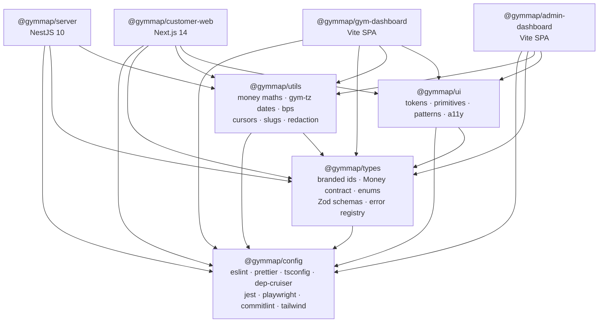
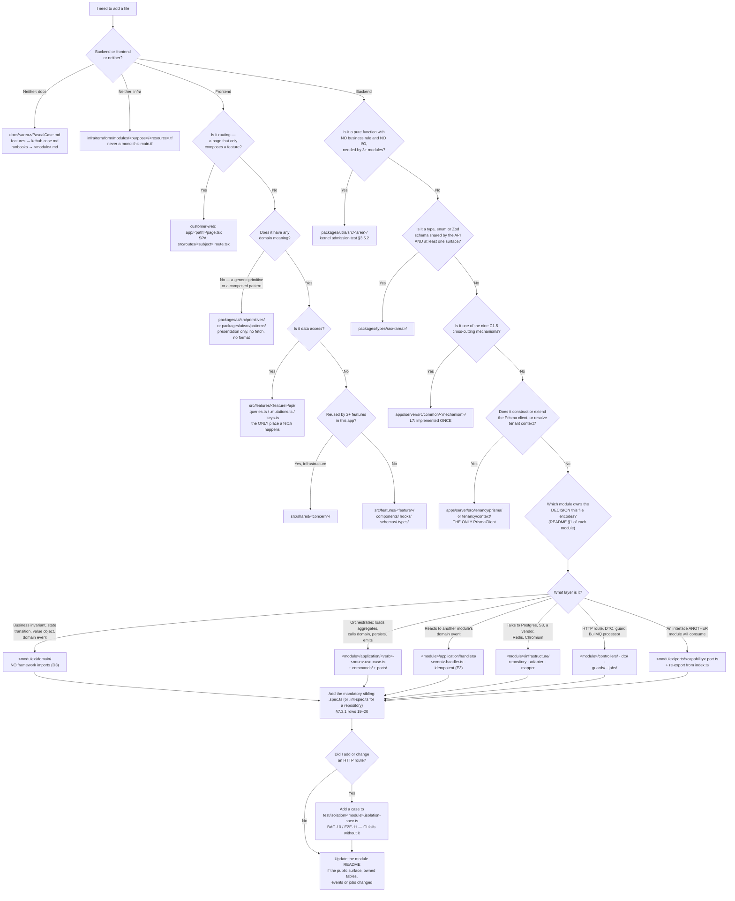

# Folder Structure

> **Rank 3 artefact** (`PROJECT_CONSTITUTION.md` §1.3). Binding on all code. Subordinate to
> `PROJECT_CONSTITUTION.md` (rank 1) and `MASTER_PRD.md` (rank 2); superior to
> `/docs/backlog`, `/docs/roadmap` and to the code itself.
>
> **Scope.** This document is the *detailed* expansion of `ENGINEERING_PLAN.md` §1. The plan states
> the shape at CTO altitude; this document states every directory, every mandated file, the exact
> naming grammar, the decision procedure for placing a new file, and the enforcement that fails the
> build when the tree is violated. Where this document and `ENGINEERING_PLAN.md` §1 differ, the
> difference is deliberate and is recorded in §0 below with its precedence resolution.
>
> **Status.** No application code exists. Every code block in this document is labelled
> `illustrative — not committed code`. Nothing here is a commitment to a particular line of code;
> it is a commitment to a *location* and a *name*.

**Companion document:** `/docs/engineering/ModuleDependency.md` — what may import what, and the proof
that the graph is acyclic. This document says *where things live*; that one says *what may reach
what*. Neither is complete without the other.

---

## Table of contents

| § | Section |
| :-: | :--- |
| 0 | [Two conflicts found and resolved before writing](#0-two-conflicts-found-and-resolved-before-writing) |
| 1 | [What the tree encodes](#1-what-the-tree-encodes) |
| 2 | [The monorepo root](#2-the-monorepo-root) |
| 3 | [pnpm workspace and the Turborepo pipeline](#3-pnpm-workspace-and-the-turborepo-pipeline) |
| 4 | [`apps/customer-web` — Next.js 14 App Router](#4-appscustomer-web--nextjs-14-app-router) |
| 5 | [`apps/gym-dashboard` — React 18 + Vite SPA](#5-appsgym-dashboard--react-18--vite-spa) |
| 6 | [`apps/admin-dashboard` — React 18 + Vite SPA](#6-appsadmin-dashboard--react-18--vite-spa) |
| 7 | [`apps/server` — the NestJS 10 modular monolith](#7-appsserver--the-nestjs-10-modular-monolith) |
| 8 | [The canonical backend module tree](#8-the-canonical-backend-module-tree) |
| 9 | [Fully worked example — `memberships/`](#9-fully-worked-example--memberships) |
| 10 | [`packages/ui`](#10-packagesui) |
| 11 | [`packages/types`](#11-packagestypes) |
| 12 | [`packages/utils`](#12-packagesutils) |
| 13 | [`packages/config`](#13-packagesconfig) |
| 14 | [`docs/`](#14-docs) |
| 15 | [`infra/`](#15-infra) |
| 16 | [`.github/` and `.husky/`](#16-github-and-husky) |
| 17 | [File naming rules](#17-file-naming-rules) |
| 18 | [Where does a new file go](#18-where-does-a-new-file-go) |
| 19 | [Forbidden placements](#19-forbidden-placements) |
| 20 | [How the tree is enforced](#20-how-the-tree-is-enforced) |

---

## 0. Two conflicts found and resolved before writing

`PROJECT_CONSTITUTION.md` §1.4 (the Halt Rule) requires that a conflict between two artefacts is
written down, resolved by the §1.3 precedence order, and recorded. Two conflicts exist between the
constitution's normative tree (§7.2, §7.3) and the overview tree in `ENGINEERING_PLAN.md` §1.3/§1.4.
Both are resolved here in favour of the constitution, which is rank 1.

### Conflict 1 — module-internal layout: `api/` versus `controllers/` + `dto/`

| Artefact | Rank | Text |
| :--- | :-: | :--- |
| `PROJECT_CONSTITUTION.md` §7.3 | 1 | Module contains `controllers/`, `dto/`, `guards/`, `application/` (with `*.use-case.ts` files directly inside, plus `commands/` and `ports/`), `domain/`, `infrastructure/`, `jobs/`, `types/`, `permissions.ts`. Tests sit **beside** their subject (§8.1: *"Test files sit beside the subject"*). |
| `ENGINEERING_PLAN.md` §1.4 | 3 | Module contains `api/` (holding `*.controller.ts` and `dto/`), `application/use-cases/`, `application/event-handlers/`, `application/mappers/`, `application/queries/`, and a `__tests__/` directory at module root. |

**Resolution.** Rank 1 wins. The normative module tree is the constitution's: `controllers/` and
`dto/` are siblings at module root, there is **no** `api/` directory, there is **no**
`application/use-cases/` sub-directory (the `.use-case` suffix carries that meaning — constitution
§8.1: *"`use-cases/` is **not** used (files carry the suffix)"*), and there is **no** `__tests__/`
directory anywhere in `apps/server` (constitution §8.1 explicitly names `__tests__/commission.test.ts`
as the *Bad* column). Three useful sub-directories named only by the plan — `event-handlers/`,
`mappers/`, `queries/` — are **retained inside `application/`** because they contradict nothing in
§7.3 and §7.3.1 row 5 requires only "`application/` with ≥1 use case". They are documented in §8
below as *conditional* rather than *mandatory* directories.

**Consequence recorded.** `/docs/DECISION_LOG.md` gains an entry, and `ENGINEERING_PLAN.md` §1.4 is
corrected in the same pull request that lands this document, per Halt Rule step 3.

### Conflict 2 — where the Prisma tenant-context extension lives

| Artefact | Rank | Text |
| :--- | :-: | :--- |
| `PROJECT_CONSTITUTION.md` §11.4.2 rule **P1**, §3.7 rule `no-raw-prisma-client`, §7.2 | 1 | *"The extension lives in `apps/server/src/tenancy/prisma/` and is the **only** place `PrismaClient` is constructed."* The lint rule names `src/tenancy/prisma/**`. §7.2 annotates `tenancy/` as *"tenant context, RLS session variable, Prisma extension (A-01)"*. |
| `ENGINEERING_PLAN.md` §1.3 | 3 | Places `prisma/` (PrismaService + tenant-context extension) inside `common/`. |

**Resolution.** Rank 1 wins, and it is the better boundary anyway. `common/` is imported by all 22
other modules; putting the only legitimate database entrypoint there would make the raw client
ambiently reachable from every module's `common/` import. `tenancy/` is imported deliberately, is one
of only two modules permitted to be `@Global()` (constitution §3.4.3), and already owns the
`SET LOCAL app.tenant_id` mechanism that the extension exists to guarantee (`§C1.4` step 2,
`BR-TEN-01`, `NFR-SEC-09`, ADR-0005, ADR-0006). **`apps/server/src/tenancy/prisma/` is normative.**
`common/` retains the `TenantScopedRepository` *base class* (constitution §3.5.1 lists "base
repository" under `common/`), which obtains its client from the `tenancy/` extension by injection and
never constructs one.

---

## 1. What the tree encodes

A folder tree is an argument about what may go wrong. Every rule below exists because a specific
identifier in the PRD or the constitution would otherwise be violated by an ordinary, well-meant
commit.

### 1.1 The five load-bearing invariants, as structure

| # | Invariant | Structural consequence | Where enforced |
| :-: | :--- | :--- | :--- |
| 1 | **No tenant reads or writes another tenant's data** (`BR-TEN-01`, `NFR-SEC-09`, `BAC-10`, `E2E-11`) | `PrismaClient` may be constructed in exactly one directory, `apps/server/src/tenancy/prisma/`. Every repository file is named `*.prisma-repository.ts` and has a mandatory sibling `*.int-spec.ts` containing an RLS assertion. Every module has `*.isolation-spec.ts` coverage under `apps/server/test/isolation/`. | `dependency-cruiser` `no-raw-prisma-client`; structure test; CI isolation suite |
| 2 | **Money is an append-only ledger of integer minor units** (`BR-PAY-01`, `BR-FIN-01`) | `Money` exists once, in `apps/server/src/common/money/` with its contract type in `packages/types/src/money.ts`; minor-unit arithmetic exists once, in `packages/utils/src/money/`. `ledger/` has repositories with an `append`-only surface and no `update*`/`delete*` method names. Four money modules (`ledger/`, `settlements/`, `refunds/`, `billing/`) are four directories, never one (ADR-0029). | `no-float-money`; structure test forbidding `update`/`delete` method names in `ledger/infrastructure/` |
| 3 | **Price displayed = price charged** (`BR-PLN-03`) | Pricing authority is a single directory, `apps/server/src/plans/domain/`, and a single exported port, `plans/ports/plan-pricing.port.ts`. No other module may contain a file whose name matches `*price*` or `*pricing*` in a `domain/` folder. | `dependency-cruiser` scoped rule `pricing-authority-single-home` |
| 4 | **Verification before visibility; earned reviews only** (`BR-GYM-01`, `BR-GYM-03`, `BR-REV-01`, `BR-REV-03`) | `discovery/` may import `catalog/` and `plans/` only through their `index.ts` read-model ports, so a listing can only surface through a query that carries the approved-status predicate. `reviews/` has no repository reach into `attendance/`; it consumes `attendance/ports/attendance-query.port.ts`. | `no-cross-module-repository`; `no-cross-module-internal` |
| 5 | **Activation is webhook-driven, never the client redirect** (`BR-PAY-02`, ADR-0013) | `memberships/` contains no controller route that activates a membership. Activation lives in `memberships/application/activate-membership-from-payment.use-case.ts`, reached only from `memberships/application/handlers/payment-captured.handler.ts`. The confirmation page under `apps/customer-web/app/checkout/[orderRef]/confirmation/` polls; it never posts an activation. | Structure test: no route decorator in `memberships/controllers/**` maps to the activation use case; review |

### 1.2 The nine other rules the tree obeys

| Rule | Source | Consequence in the tree |
| :--- | :--- | :--- |
| One deployable API artefact, two roles | Constitution §3.1 **L1**, **L2**; `NFR-SCAL-05` | `apps/server/src/main.ts` and `apps/server/src/worker.ts` are two files in one project built into one image. There is no `apps/worker`. |
| Three surfaces, one API | `B1.1` | Three app directories, zero private back doors. `apps/*` never import each other (constitution §7.1.1 **R2**). |
| Only `index.ts` is public surface | `§C1.3`; constitution §3.4.3 | Every one of the 23 module directories has exactly one `index.ts`. A module without one fails `module-public-api-only`. |
| The domain imports nothing | Constitution §3.3 **D3**, §5 layer 1 | `domain/` folders may contain no import of `@nestjs/*`, `@prisma/client`, `zod`, `bullmq`, `ioredis`, `pino`, `@sentry/*`, `axios`, `node:fs`, `node:http`, `node:crypto`. |
| Routing is decorators, not a route table | Constitution §5.2 | No `routes/`, no `router/`, no `routes.ts` — anywhere in `apps/server`. |
| Every module carries its own operations documentation | `NFR-MNT-09`; constitution §7.3.1 row 3 | `README.md` inside each module; the deep runbook at `/docs/runbooks/<module>.md`. |
| Design tokens are the single styling truth | `§C1.1`; A-03, A-04 | `packages/ui/src/tokens/` is the only place a colour, space, radius, type-scale or motion value is defined. No app defines one. |
| Schema validation is shared, not duplicated | `NFR-SEC-05`; A-02; ADR-0022 | Zod schemas live in `packages/types/src/schemas/`; the server re-exports them into `dto/`, the clients feed them to React Hook Form resolvers (A-09). |
| Infrastructure is code | `NFR-MNT-08`; A-27 | `infra/terraform/` is the only path to a production resource. Region is India (`ap-south-1` primary) per `LAUNCH_MARKET_INDIA.md` §9 — mandatory under RBI localisation, not a preference. |

### 1.3 India, as structure

`LAUNCH_MARKET_INDIA.md` resolves `OQ-01`, `OQ-02`, `OQ-16`, `OQ-20`. Six of its findings have a
directory-level consequence, listed here so they are not rediscovered in Sprint 5.

| Finding | Directory consequence |
| :--- | :--- |
| INR / paise, Indian digit grouping (**₹2,50,000**, not ₹250,000) | `packages/utils/src/money/format-indian-grouping.ts` — one formatter, consumed by all three surfaces and by the PDF renderer. Hand-rolled grouping in a surface is a review rejection. |
| `Asia/Kolkata`, UTC **+05:30**, no DST | `packages/utils/src/time/gym-timezone.ts` holds every validity computation (`BR-MEM-03`). Job scheduling per gym timezone lives in `apps/server/src/common/queue/timezone-schedule.ts`; no processor computes a local midnight itself. |
| GST 18% split **CGST 9% + SGST 9%** intra-state | `apps/server/src/billing/domain/tax/` contains `tax-component.vo.ts` and `gst-split.policy.ts`. The invoice template `apps/server/src/billing/infrastructure/pdf/templates/tax-invoice.hbs` renders **two** tax lines, satisfying `FR-INV-04` for India. |
| Financial year **1 April – 31 March** | FY start month is configuration, not a constant: `billing/domain/financial-year.vo.ts` takes `fyStartMonth` from the tax profile. `FR-INV-02` gapless numbering keys on it; `AC-INV-01.3` rollover is tested at 1 April. |
| **Razorpay Route**, not Stripe Connect, for domestic split settlement | `apps/server/src/payments/infrastructure/adapters/razorpay-route.payment-provider.adapter.ts` is the Phase-1 adapter. `stripe-connect.payment-provider.adapter.ts` remains as the reference implementation that the port's contract tests run against (`C1.1`, ADR-0018). Both sit behind `payments/ports/payment-provider.port.ts`. |
| TRAI **DLT** template pre-approval for SMS | `notifications/domain/sms-template-approval.state-machine.ts` implements the `PENDING_DLT_APPROVAL` state; the previous approved version keeps sending. Email and in-app templates remain instantly editable per `FR-NOTF-03`. |

---

## 2. The monorepo root

Normative. A directory not listed here does not exist without an amendment under constitution §24.

`illustrative — not committed code`

```text
gymmap/
├── apps/
│   ├── customer-web/            Next.js 14 App Router · React 18 · TS · SSR for SEO  (surface `web`)
│   ├── gym-dashboard/           React 18 + Vite + TS · SPA                            (surface `dash`)
│   ├── admin-dashboard/         React 18 + Vite + TS · SPA · MFA required (NFR-SEC-11) (surface `admin`)
│   └── server/                  NestJS 10 · Node 20 · TS · the modular monolith
│
├── packages/
│   ├── ui/                      Design tokens + shadcn/ui primitives (A-03, A-04) — presentation only
│   ├── types/                   Branded ids · Money contract · PRD enums · shared Zod · error registry
│   ├── utils/                   Pure functions: money maths, gym-timezone dates, bps, cursors, redaction
│   └── config/                  eslint · prettier · tsconfig · dependency-cruiser · jest · playwright ·
│                                commitlint · tailwind preset
│
├── docs/                        Governance + the seven derived specification folders — see §14
│
├── infra/
│   ├── terraform/               A-27 · modules/ + environments/{development,staging,production}
│   ├── docker/                  Dockerfiles: server, customer-web, gym-dashboard, admin-dashboard
│   ├── compose/                 A-28 · Postgres 16+PostGIS, Redis 7, MinIO, Mailpit
│   └── k8s/                     Manifests / Helm values for the managed orchestrator
│
├── .github/
│   ├── workflows/               A-26 · ci.yml, deploy.yml, nightly.yml, security.yml
│   ├── PULL_REQUEST_TEMPLATE.md PRD id · permission declared · isolation test · rollback plan
│   ├── CODEOWNERS               money and tenancy paths require two reviewers (RSK-14)
│   ├── ISSUE_TEMPLATE/
│   └── dependabot.yml           A-25
│
├── .husky/                      A-24 · pre-commit (lint-staged), commit-msg (commitlint), pre-push
├── package.json                 workspace root — NO runtime dependency (R1)
├── pnpm-workspace.yaml          A-05
├── turbo.json                   A-05 · see §3
├── tsconfig.base.json           the §9.1 compiler flags, extended by every package
├── .dependency-cruiser.cjs      A-23 · re-exports the rule set from packages/config
├── .gitleaks.toml               A-25
├── .trivyignore                 A-25 · every entry carries an expiry date and a ticket id
├── .nvmrc                       Node 20 — pinned, matching the container base image
├── .editorconfig
├── .gitignore
├── LICENSE
├── pnpm-lock.yaml
└── README.md
```

### 2.1 Root-level laws, extended

The constitution's six root laws (§7.1.1 **R1**–**R6**) hold verbatim. Four operational corollaries:

| # | Corollary | Why |
| :-: | :--- | :--- |
| R1a | The root `package.json` `dependencies` block is **absent**, not empty. `devDependencies` contains only `turbo`, `prettier`, `husky`, `lint-staged`, `@commitlint/*`, `dependency-cruiser`, `typescript`. | An accidental root dependency is invisible to `size-limit` (A-29) and to per-app Dockerfile pruning. |
| R2a | No app imports another app **and no app imports `apps/server`'s source**. Types cross via `packages/types` and the generated OpenAPI client only. | `NFR-MNT-03` makes the OpenAPI document the contract; a direct type import would let the contract drift silently. |
| R6a | A new root file requires an amendment. In practice the only additions ever justified are a second lockfile-adjacent tool config; anything else belongs in `packages/config`. | Root clutter is how a monorepo stops being navigable. |
| R7 | Every workspace package declares `"private": true` except none — **all four `packages/*` and all four `apps/*` are private**. Nothing in this repository is published to a registry. | There is no external consumer. Publishing would create an unowned compatibility obligation. |

---

## 3. pnpm workspace and the Turborepo pipeline

A-05 selects pnpm workspaces + Turborepo. ADR-0001 records why (monorepo over polyrepo). This section
fixes the layout so that the CI graph in `ENGINEERING_PLAN.md` §16.2 ("affected-graph optimisation")
has something concrete to optimise.

### 3.1 `pnpm-workspace.yaml`

`illustrative — not committed code`

```yaml
packages:
  - 'apps/*'
  - 'packages/*'
```

Two globs, no more. A third glob is how a `tools/` or `scripts/` directory appears without an
amendment.

### 3.2 The package graph

Eight workspace packages. Names are scoped `@gymmap/*` so a typo resolves to nothing rather than to a
public package (a supply-chain concern under `NFR-SEC-08`).



| Edge that does **not** exist | Why it must never be added |
| :--- | :--- |
| `@gymmap/ui → @gymmap/utils` | Constitution §7.1.1 **R3**: `packages/ui` is presentation only. A UI primitive that needs `round_half_even` is not a primitive — it is a domain component and belongs in a feature folder. The one exception is *display formatting*, which is passed **in** as a prop (a pre-formatted string), never computed inside the component. |
| `@gymmap/types → @gymmap/utils` | Types must stay runtime-free apart from `zod` (**R4**). A helper in a types package becomes a hidden runtime dependency of all three browsers bundles. |
| `apps/* → apps/*` | **R2**. |
| `@gymmap/server → @gymmap/ui` | The server renders HTML only for the deterministic PDF path (`FR-INV-07`), and that template set is server-owned Handlebars in `billing/infrastructure/pdf/templates/`, not React. Pulling `packages/ui` into the server would put Tailwind and Radix into the API image. |

### 3.3 `turbo.json`

`illustrative — not committed code`

```jsonc
{
  "$schema": "https://turbo.build/schema.json",
  "globalDependencies": ["tsconfig.base.json", ".nvmrc", "pnpm-lock.yaml"],
  "globalEnv": ["NODE_ENV", "CI"],
  "tasks": {
    "build":        { "dependsOn": ["^build"], "outputs": ["dist/**", ".next/**", "!.next/cache/**"] },
    "typecheck":    { "dependsOn": ["^build"], "outputs": [] },
    "lint":         { "outputs": [] },
    "architecture": { "outputs": ["dependency-graph.svg", "dependency-graph.json"] },
    "test:unit":    { "dependsOn": ["^build"], "outputs": ["coverage/**"] },
    "test:int":     { "dependsOn": ["^build"], "outputs": [], "cache": false },
    "test:contract":{ "dependsOn": ["build"],  "outputs": [], "cache": false },
    "test:isolation":{ "dependsOn": ["^build"],"outputs": [], "cache": false },
    "test:e2e":     { "dependsOn": ["build"],  "outputs": ["playwright-report/**"], "cache": false },
    "test:a11y":    { "dependsOn": ["build"],  "outputs": [], "cache": false },
    "size":         { "dependsOn": ["build"],  "outputs": [] },
    "openapi:check":{ "dependsOn": ["build"],  "outputs": [] },
    "dev":          { "cache": false, "persistent": true }
  }
}
```

### 3.4 Task table — what each task is, and which gate it feeds

| Task | Runs in | Tooling | CI gate it feeds (`ENGINEERING_PLAN.md` §16.4) | Cacheable |
| :--- | :--- | :--- | :--- | :-: |
| `build` | all 8 | `tsc` / `nest build` / `next build` / `vite build` | Compilation | ✅ |
| `typecheck` | all 8 | `tsc --noEmit` with the §9.1 flag set | Zero type errors | ✅ |
| `lint` | all 8 | ESLint (A-21) + Prettier check (A-22) | Zero lint errors | ✅ |
| `architecture` | `server`, `packages/*` | `dependency-cruiser` (A-23) | **Non-negotiable.** Fails before tests run. No inline suppression. | ✅ |
| `test:unit` | all 8 | Jest (A-06) | Coverage thresholds: ≥95% on payment, settlement, membership-state and tenancy code (`NFR-MNT-01`) | ✅ |
| `test:int` | `server` | Jest + Testcontainers (A-06) | Real Postgres 16 + PostGIS + real RLS | ❌ (containers) |
| `test:contract` | `server` | Supertest vs generated OpenAPI (A-06, A-16) | `NFR-MNT-03` drift gate | ❌ |
| `test:isolation` | `server` | Jest + Testcontainers, two seeded tenants | **`BAC-10` / `E2E-11`.** A new endpoint without isolation coverage fails the build (`§C1.4` step 5) | ❌ |
| `test:e2e` | `web`, `dash`, `admin` | Playwright (A-06) | The twelve `§C8.3` journeys | ❌ |
| `test:a11y` | `web`, `dash`, `admin` | axe-core (A-06) | `NFR-USE-01`, `NFR-USE-02` | ❌ |
| `size` | `web`, `dash`, `admin` | `size-limit` (A-29) | `NFR-PERF-10` ≤ 200 KB gzipped initial JS | ✅ |
| `openapi:check` | `server` | `@nestjs/swagger` emit + diff | `NFR-MNT-03` | ✅ |

### 3.5 Why `test:int`, `test:isolation` and `test:contract` are `"cache": false`

Turborepo caches on input hash. These three suites depend on a **container image and a migration
state**, not only on source files. A cached pass would mean "the code did not change", which is not
the same as "isolation still holds after the migration that changed the RLS policy". Given that
`BR-TEN-01` is the single most important rule in the system, the correct trade is to pay the minutes.
`ENGINEERING_PLAN.md` §16.3 budgets for it.

### 3.6 Per-package `package.json` script contract

Every workspace package exposes the same script names, even where the implementation is a no-op, so
that `turbo run <task>` never needs a filter list.

| Script | `server` | `customer-web` | `gym-dashboard` | `admin-dashboard` | `types` | `utils` | `ui` | `config` |
| :--- | :-: | :-: | :-: | :-: | :-: | :-: | :-: | :-: |
| `build` | ✅ | ✅ | ✅ | ✅ | ✅ | ✅ | ✅ | no-op |
| `typecheck` | ✅ | ✅ | ✅ | ✅ | ✅ | ✅ | ✅ | no-op |
| `lint` | ✅ | ✅ | ✅ | ✅ | ✅ | ✅ | ✅ | ✅ |
| `architecture` | ✅ | no-op | no-op | no-op | ✅ | ✅ | ✅ | no-op |
| `test:unit` | ✅ | ✅ | ✅ | ✅ | ✅ | ✅ | ✅ | no-op |
| `test:int` | ✅ | no-op | no-op | no-op | no-op | no-op | no-op | no-op |
| `test:isolation` | ✅ | no-op | no-op | no-op | no-op | no-op | no-op | no-op |
| `test:e2e` | no-op | ✅ | ✅ | ✅ | no-op | no-op | no-op | no-op |
| `size` | no-op | ✅ | ✅ | ✅ | no-op | no-op | no-op | no-op |

A "no-op" is the literal string `echo "no-op"` — not a missing script. A missing script makes
`turbo run` succeed by omission, which is indistinguishable from passing.

---

## 4. `apps/customer-web` — Next.js 14 App Router

Server-rendered for SEO (`§C1.1`, `FR-SRCH-13`, `FR-NAV-05`, `FR-DETL-10`, ADR-0019). `app/` is
routing **only** (constitution §7.4.1 **F1**); all real code is in `src/features/**`.

`illustrative — not committed code`

```text
apps/customer-web/
├── app/                                              ROUTING ONLY — F1
│   ├── layout.tsx                                    root shell · <html lang> · skip link (NFR-USE-02)
│   ├── page.tsx                                      SCR-WEB-001 Home
│   ├── error.tsx · not-found.tsx · loading.tsx
│   ├── robots.ts · sitemap.ts                        FR-SRCH-13 · generated, not static
│   ├── manifest.webmanifest
│   │
│   ├── search/
│   │   ├── page.tsx                                  SCR-WEB-002 · RSC shell
│   │   └── opengraph-image.tsx
│   ├── gyms/[citySlug]/[gymSlug]/
│   │   ├── page.tsx                                  SCR-WEB-003 · SSR · JSON-LD LocalBusiness
│   │   ├── reviews/page.tsx                          FR-DETL-06
│   │   ├── plans/page.tsx                            FR-DETL-04
│   │   └── opengraph-image.tsx
│   ├── c/[categorySlug]/page.tsx                     SEO category landing (FR-SRCH-13)
│   ├── city/[citySlug]/page.tsx                      SEO city landing (FR-SRCH-13)
│   ├── compare/page.tsx                              SCR-WEB-004 (FR-DETL-08)
│   │
│   ├── checkout/[orderRef]/
│   │   ├── page.tsx                                  SCR-WEB-005 · re-validation on mount (BR-PLN-03)
│   │   ├── payment/page.tsx                          SCR-WEB-006
│   │   └── confirmation/page.tsx                     SCR-WEB-007 · POLLS for activation (BR-PAY-02)
│   │
│   ├── account/
│   │   ├── page.tsx                                  SCR-WEB-008
│   │   ├── memberships/[id]/page.tsx                 SCR-WEB-009 · QR (FR-CHK-01)
│   │   ├── visits/page.tsx                           SCR-WEB-010
│   │   ├── orders/page.tsx                           SCR-WEB-011
│   │   ├── favourites/page.tsx                       SCR-WEB-012
│   │   ├── reviews/[gymSlug]/page.tsx                SCR-WEB-013
│   │   ├── profile/page.tsx                          SCR-WEB-014
│   │   ├── referrals/page.tsx                        SCR-WEB-015
│   │   └── support/page.tsx                          SCR-WEB-017
│   ├── auth/{login,register,verify,forgot,reset}/page.tsx   SCR-WEB-016
│   ├── for-gyms/page.tsx                             SCR-WEB-018
│   └── legal/{terms,privacy,refunds}/page.tsx
│
├── src/
│   ├── features/                                     ← ALL real code
│   │   ├── discovery/                                SCR-WEB-002, 004 · FR-SRCH-01…15, FR-DETL-08
│   │   ├── gym-detail/                               SCR-WEB-003 · FR-DETL-01…11
│   │   ├── checkout/                                 SCR-WEB-005…007 · FR-CART-01…11
│   │   ├── membership/                               SCR-WEB-009, 010 · FR-MEMB-03, FR-CHK-01
│   │   ├── reviews/                                  SCR-WEB-013 · FR-REV-01…05
│   │   ├── favourites/                               SCR-WEB-012 · FR-FAV-01…05
│   │   ├── referrals/                                SCR-WEB-015 · FR-RFL-*
│   │   ├── orders/                                   SCR-WEB-011 · FR-INV-06
│   │   ├── account/                                  SCR-WEB-008, 014 · FR-USER-01…06
│   │   ├── auth/                                     SCR-WEB-016 · FR-AUTH-01…10
│   │   └── support/                                  SCR-WEB-017 · FR-SUP-01…07
│   │
│   ├── shared/
│   │   ├── api/
│   │   │   ├── generated/                            from the OpenAPI document (NFR-MNT-03) — never edited
│   │   │   ├── fetcher.ts                            typed fetch · correlation id · Idempotency-Key
│   │   │   └── problem-details.ts                    C3.1 error envelope → typed union
│   │   ├── query/
│   │   │   ├── client.ts                             TanStack Query defaults (ADR-0021)
│   │   │   └── keys.ts                               root key namespaces only; per-feature keys are local
│   │   ├── auth/                                     session context · httpOnly refresh rotation (ADR-0011)
│   │   ├── i18n/                                     NFR-USE-08 · externalised from the first commit
│   │   ├── analytics/                                C6 emitters — no personal data (BR-DAT-06)
│   │   ├── seo/                                      JSON-LD builders, canonical/hreflang helpers
│   │   └── money/                                    thin wrapper over @gymmap/utils Indian grouping
│   │
│   └── styles/globals.css                            Tailwind entry consuming packages/ui tokens
│
├── public/
├── next.config.mjs                                   CSP + security headers (NFR-SEC-12), image renditions
├── size-limit.json                                   A-29 · NFR-PERF-10 ≤ 200 KB gzipped
├── playwright.config.ts                              extends @gymmap/config/playwright
├── tsconfig.json · package.json
```

### 4.1 The canonical feature folder

Identical in all three surfaces (constitution §7.4, **F6**). `checkout/` shown.

```text
apps/customer-web/src/features/checkout/
├── index.ts                              MANDATORY · the feature's public surface
├── README.md                             MANDATORY · SCR- screens + FR- ids it serves (F3)
├── api/                                  MANDATORY
│   ├── checkout.keys.ts                  query-key factory: checkoutKeys.order(orderRef)
│   ├── checkout.queries.ts               TanStack Query hooks — the ONLY data access (ADR-0021)
│   └── checkout.mutations.ts             useMutation wrappers; Idempotency-Key per BR-PAY-03
├── components/                           MANDATORY
│   ├── OrderSummary.tsx
│   ├── OrderSummary.test.tsx             MANDATORY per component with logic
│   ├── PriceBreakdown.tsx                renders the server's figures verbatim (BR-PLN-03, FR-CART-04)
│   ├── GstBreakdownLines.tsx             CGST 9% + SGST 9% as two lines (LAUNCH_MARKET_INDIA §4)
│   ├── CouponField.tsx
│   └── RefundPolicyDisclosure.tsx        SCR-WEB-005 region 5 — full text, not a link
├── hooks/
│   └── useCheckoutValidation.ts          calls POST /v1/orders/:orderRef/validate before payment
├── schemas/
│   └── checkout.schema.ts                re-exported from @gymmap/types (A-02) — never redefined
├── types/
│   └── checkout.types.ts
└── server/                               customer-web ONLY · RSC loaders + cache tags
    └── load-order.ts
```

| Law | Statement |
| :--- | :--- |
| **F1** | `app/` composes a feature and nothing else. |
| **F2** | A feature never imports another feature's internals. Cross-feature reuse goes through `packages/ui` (presentation) or `src/shared` (infrastructure). |
| **F3** | The feature `README.md` names its `SCR-` and `FR-` identifiers. |
| **F4** | `PascalCase.tsx` components · `useCamelCase.ts` hooks · `kebab-case.ts` everything else. |
| **F5** | A component file over 250 lines is a review discussion; over 350 it is a rejection. |
| **F7** | `src/features/*/server/` exists **only** in `customer-web`, because only it has React Server Components. Its presence in a Vite SPA is a structure-test failure. |
| **F8** | `api/` is the only directory in a feature permitted to import `src/shared/api`. A component that fetches is a rejection. |

---

## 5. `apps/gym-dashboard` — React 18 + Vite SPA

`illustrative — not committed code`

```text
apps/gym-dashboard/
├── index.html
├── src/
│   ├── main.tsx                                    createRoot · providers · Sentry (A-15)
│   ├── routes/                                     ROUTING ONLY — the SPA equivalent of app/
│   │   ├── router.tsx                              route table · lazy() per route (code splitting)
│   │   ├── dashboard.route.tsx                     SCR-DASH-001
│   │   ├── onboarding.route.tsx                    SCR-DASH-002 · 6-step resumable wizard
│   │   ├── gym-profile.route.tsx                   SCR-DASH-003
│   │   ├── branches.route.tsx                      SCR-DASH-004
│   │   ├── plans.route.tsx                         SCR-DASH-005
│   │   ├── plan-editor.route.tsx                   SCR-DASH-006
│   │   ├── members.route.tsx                       SCR-DASH-007
│   │   ├── member-360.route.tsx                    SCR-DASH-008
│   │   ├── checkin-desk.route.tsx                  SCR-DASH-009
│   │   ├── attendance.route.tsx                    SCR-DASH-010
│   │   ├── sales.route.tsx                         SCR-DASH-011
│   │   ├── offline-sale.route.tsx                  SCR-DASH-012
│   │   ├── invoices.route.tsx                      SCR-DASH-013
│   │   ├── settlements.route.tsx                   SCR-DASH-014
│   │   ├── refunds.route.tsx                       SCR-DASH-015
│   │   ├── coupons.route.tsx                       SCR-DASH-016
│   │   ├── leads.route.tsx                         SCR-DASH-017
│   │   ├── staff.route.tsx                         SCR-DASH-018
│   │   ├── reviews.route.tsx                       SCR-DASH-019
│   │   ├── reports.route.tsx                       SCR-DASH-020
│   │   ├── notifications.route.tsx                 SCR-DASH-021
│   │   └── settings.route.tsx                      SCR-DASH-022
│   │
│   ├── features/                                   same shape as §4.1, minus server/
│   │   ├── onboarding-wizard/  gym-profile/  branches/  plans/  members/  checkin-desk/
│   │   ├── attendance/  sales/  invoices/  settlements/  refunds/  coupons/  leads/
│   │   └── staff/  reviews/  reports/  notifications/  settings/
│   │
│   ├── shared/
│   │   ├── api/ · query/ · auth/ · i18n/ · analytics/           as §4
│   │   ├── hooks/useLiveCounters.ts                A-08 · THE SINGLE live-figure seam
│   │   ├── tenant/tenant-context.tsx               explicit tenant switch (FR-AUTH-11, AC-AUTH-02.2)
│   │   ├── permissions/visible-if.tsx              presentation-only filtering (FR-NAV-03) —
│   │   │                                           NEVER a security control (FR-RBAC-02)
│   │   └── branch/branch-scope.tsx                 FR-STAF-03 branch scoping in the UI
│   └── styles/globals.css
├── vite.config.ts · size-limit.json · playwright.config.ts
└── tsconfig.json · package.json
```

### 5.1 `useLiveCounters()` — one file, deliberately

A-08 defers Socket.IO to Phase 2 behind `release.attendance.realtime_transport`. Phase 1 polls at
10–15 s. The whole point of the decision is that the upgrade touches **one file**:

| Constraint | Structural expression |
| :--- | :--- |
| One transport seam | `src/shared/hooks/useLiveCounters.ts` is the only file in the SPA permitted to set a TanStack Query `refetchInterval`. A structure test greps for `refetchInterval` elsewhere and fails. |
| One polled endpoint | It calls `GET /v1/tenant/attendance/live` and nothing else. That endpoint returns the `SCR-DASH-001` currently-in-gym count, the `SCR-DASH-009` recent-check-ins strip, and `generated_at`. |
| Mandatory staleness disclosure | The hook returns `generatedAt`; `packages/ui`'s `LastUpdatedIndicator` renders it. A surface consuming the hook without rendering the indicator fails review — *"a stale figure presented as live is a defect"* (`STACK_ADDITIONS.md` Part 4). |
| Stateless app tier | No WebSocket, no sticky session, no Redis adapter (`NFR-SCAL-03`, constitution §3.1 **L6**). |

---

## 6. `apps/admin-dashboard` — React 18 + Vite SPA

Identical shape to §5. MFA-gated at the router boundary (`NFR-SEC-11`).

`illustrative — not committed code`

```text
apps/admin-dashboard/
├── src/
│   ├── routes/
│   │   ├── router.tsx                              MFA guard wraps the entire tree (NFR-SEC-11)
│   │   ├── platform-dashboard.route.tsx            SCR-ADM-001
│   │   ├── approvals.route.tsx                     SCR-ADM-002
│   │   ├── application-review.route.tsx            SCR-ADM-003
│   │   ├── tenants.route.tsx                       SCR-ADM-004
│   │   ├── users.route.tsx                         SCR-ADM-005
│   │   ├── finance-orders.route.tsx                SCR-ADM-006
│   │   ├── finance-settlements.route.tsx           SCR-ADM-007
│   │   ├── finance-refunds.route.tsx               SCR-ADM-008
│   │   ├── finance-disputes.route.tsx              SCR-ADM-009
│   │   ├── finance-reconciliation.route.tsx        SCR-ADM-010
│   │   ├── configuration.route.tsx                 SCR-ADM-011
│   │   ├── moderation.route.tsx                    SCR-ADM-012
│   │   ├── support-console.route.tsx               SCR-ADM-013
│   │   ├── platform-analytics.route.tsx            SCR-ADM-014
│   │   └── audit-explorer.route.tsx                SCR-ADM-015
│   │
│   ├── features/
│   │   ├── approvals/  tenants/  users/
│   │   ├── finance/{orders,settlements,refunds,disputes,reconciliation}/
│   │   ├── configuration/{commission,subscription,tax,kyc,taxonomy,flags,templates}/
│   │   │        tax/ holds the India GST profile editor: rate, CGST/SGST split, SAC code,
│   │   │        fy_start_month (LAUNCH_MARKET_INDIA §4, §5) — configuration, never constants
│   │   ├── moderation/  support/  analytics/  audit/  platform-staff/
│   │
│   └── shared/
│       ├── api/ · query/ · auth/ · i18n/ · analytics/
│       ├── mfa/                                    step-up prompt, recovery codes (NFR-SEC-11)
│       ├── impersonation/banner.tsx                persistent banner (FR-AUTH-12, BR-DAT-02)
│       ├── reason/require-reason.tsx               every admin write states a reason (FR-ADMN-02)
│       └── queue-board-link.ts                     A-30 Bull Board entry, RBAC-gated (FR-ADMN-13)
├── vite.config.ts · size-limit.json · tsconfig.json · package.json
```

| Admin-only structural rule | Reason |
| :--- | :--- |
| Every mutation hook in `features/**/api/*.mutations.ts` takes a `reason` argument typed as a non-empty branded `Reason` string. | `FR-ADMN-02` — every administrative write is reason-required and audited. A default `reason = ''` is a review rejection. |
| `shared/impersonation/` is imported by the root layout, not by a feature. | `BR-DAT-02` — the banner must be impossible to render a page without. |
| No `features/tenants/**` file imports `features/finance/**`. | **F2**, and it is the seam where a "just show the payouts here" shortcut would appear. |

---

## 7. `apps/server` — the NestJS 10 modular monolith

Twenty-three module directories, exactly as `MASTER_PRD.md` §C1.3 names them, confirmed by ADR-0029
and constitution §3.2. Not twenty-two, not twenty-four. Adding one requires an amendment under
constitution §24.

`illustrative — not committed code`

```text
apps/server/
├── src/
│   ├── main.ts                     HTTP role · Nest factory · Pino (A-14) · OTel · ZodValidationPipe (A-02)
│   ├── worker.ts                   BullMQ role · processors only · NO HTTP listener (NFR-SCAL-05, L2)
│   ├── app.module.ts               composition root — imports the 23 modules, declares nothing itself
│   ├── instrumentation.ts          OpenTelemetry SDK bootstrap (NFR-MNT-05) + Sentry init (A-15)
│   │
│   ├── common/                     ── L0 shared kernel · @Global() permitted
│   ├── tenancy/                    ── L1 · @Global() permitted · owns the ONLY PrismaClient
│   ├── audit/                      ── L1
│   ├── iam/                        ── L2
│   ├── catalog/  plans/  staff/  crm/  onboarding/          ── L3
│   ├── discovery/  ordering/  memberships/  attendance/  reviews/   ── L4
│   ├── payments/  billing/  ledger/                         ── L5
│   ├── settlements/  refunds/                               ── L6
│   └── notifications/  reporting/  support/  admin/         ── L7
│
├── prisma/
│   ├── schema.prisma               A-01/A-07 · one schema · PascalCase models → snake_case tables (§8.6)
│   ├── migrations/                 A-07 · forward-only · every migration backward-compatible (NFR-AVL-06)
│   │   └── <ts>_<verb>_<subject>/migration.sql
│   ├── rls/                        hand-written policy SQL, one file per tenant-owned table,
│   │                               applied FROM a migration — never applied out of band
│   │   ├── _template.sql           rls_<table>__tenant_isolation (§8.7)
│   │   └── memberships.sql · orders.sql · payments.sql · ledger_entries.sql · … (one per table)
│   ├── grants/                     role grants: app role has NO BYPASSRLS; audit role has NO UPDATE/DELETE
│   └── seed/                       C8.2 deterministic seed — 3 tenants, 12 plans, 200 members,
│                                   5,000 attendance rows · fixed uuids · fixed clock
│
├── test/
│   ├── integration/                Testcontainers · real Postgres 16 + PostGIS · real RLS (A-06)
│   ├── contract/                   Supertest vs the generated OpenAPI (NFR-MNT-03, A-16)
│   ├── isolation/                  BAC-10 / E2E-11 · one spec per tenant-scoped endpoint
│   │   └── <module>.isolation-spec.ts
│   ├── load/                       k6 (A-06) · search 2,000/min (NFR-PERF-09) ·
│   │                               check-in 500/min (NFR-PERF-08)
│   ├── fixtures/                   recorded provider payloads for the four §4.5 ACL adapters —
│   │                               razorpay/, stripe/, maps/, sms/
│   └── harness/                    container bootstrap, tenant seeding, clock control
│
├── nest-cli.json
├── jest.config.ts                  extends @gymmap/config/jest
├── .dependency-cruiser.cjs         extends @gymmap/config/dependency-cruiser
├── tsconfig.json · tsconfig.build.json
└── package.json
```

### 7.1 Why `main.ts` and `worker.ts` are two files and not two applications

| Property | Consequence |
| :--- | :--- |
| One image, two commands | `infra/docker/server.Dockerfile` produces one artefact. The orchestrator runs `node dist/main.js` for the request tier and `node dist/worker.js` for the worker tier — two deployments, two scaling groups, one build (constitution §3.1 **L1**, **L2**). |
| Worker imports the same 23 modules | A job processor is an interface-layer adapter (constitution §3.3 **D7**) that calls one use case. It must therefore see the same DI graph. |
| `worker.ts` binds no HTTP listener | If it did, the worker tier would be routable and `NFR-SCAL-05` ("background work cannot starve request handling") would be unverifiable. |
| Neither file contains business logic | Both are bootstrap. A conditional in `main.ts` that changes behaviour by environment is a review rejection; environment differences are configuration validated by `common/config`. |

### 7.2 `common/` — the shared kernel module

```text
apps/server/src/common/
├── common.module.ts                @Global() — one of only two permitted (§3.4.3)
├── index.ts · README.md
├── config/                         typed env schema (Zod) · AppConfigSchema validated at boot (§8.9)
│   ├── app-config.schema.ts        every env var declared here, nowhere else
│   └── feature-flag.port.ts        server-side evaluation (ADR-0026); client receives the resolved set
├── logging/                        Pino + nestjs-pino + AsyncLocalStorage correlation id (NFR-MNT-04)
│   ├── correlation.als.ts          crosses HTTP → queue → job boundaries
│   └── redaction.ts                BR-DAT-06 · NFR-PRV-07 · the deny-list, including Aadhaar
├── tracing/                        OTel span helpers and span-name conventions
├── errors/                         error taxonomy · ProblemDetails mapper → {code,message,details,correlation_id}
│   ├── error-code.registry.ts      §13.2 registry: code · owning module · HTTP status · BR-/FR- id
│   └── domain-exception.filter.ts
├── guards/                         JwtAuthGuard · PermissionsGuard · MfaGuard · ImpersonationRestrictionGuard
├── decorators/                     @RequiredPermission() · @TenantScoped() · @Idempotent() · @Audited() · @RateLimit()
├── money/                          Money value type · arithmetic ONLY via its methods (§C1.5, BR-PAY-01)
├── pagination/                     opaque cursor codec (§C3.1, ADR-0023)
├── idempotency/                    key store · request fingerprint · 24 h TTL · 409 on mismatch (BR-PAY-03)
├── outbox/                         transactional outbox writer + dispatcher contract (§C1.5, ADR-0017)
├── ratelimit/                      rate-limiter-flexible on Redis (A-13, NFR-SEC-06) · class registry
├── persistence/
│   ├── tenant-scoped.repository.ts base class · refuses to query without context (§C1.4 step 4, §11.5)
│   ├── reference-data.repository.ts platform-global tables · RLS-exempt BY DESIGN and greppable (BR4)
│   └── unit-of-work.port.ts        ONE interactive transaction per use case (§11.4.2 P4)
├── queue/                          BullMQ registry · distributed lock helper · timezone-schedule (§C5)
├── storage/                        S3 port + AWS SDK v3 adapter (A-18) · Sharp renditions (A-17)
├── pdf/                            headless-Chromium deterministic renderer port (FR-INV-07)
├── clock/                          Clock and IdGenerator ports — the domain never calls Date.now()
└── types/
```

**`common/` has no `domain/` and no `controllers/`.** Constitution §7.3.1 row 4 exempts it from
controllers and row 9 exempts it from a domain layer. It exposes mechanisms, not a bounded context.

### 7.3 `tenancy/` — the only place a database client is constructed

```text
apps/server/src/tenancy/
├── tenancy.module.ts               @Global() — the second and last permitted (§3.4.3)
├── index.ts · README.md
├── prisma/                         ★ THE ONLY DIRECTORY THAT MAY CONSTRUCT PrismaClient (P1, P2)
│   ├── prisma.service.ts           lifecycle, pool sizing (P8), $on('query') sampling for OTel
│   ├── tenant-scoped-client.ts     the MANDATORY $extends extension (A-01 approval condition)
│   ├── platform-elevation.ts       named, audited elevation — never ambient (§11.6, C1.4)
│   └── tenant-scoped-client.int-spec.ts   proves SET LOCAL and the query share one connection
├── context/
│   ├── tenant-context.middleware.ts       resolves tenant from principal or resource — NEVER a header (§11.3)
│   ├── tenant-context.als.ts              AsyncLocalStorage carrier (P5)
│   └── tenant-context.vo.ts               discriminated union: NONE | TENANT | PLATFORM (§9.4)
├── guards/tenant.guard.ts
├── domain/
│   ├── tenant-id.vo.ts                    branded — a plain string is how isolation bugs are written
│   └── tenancy.errors.ts                  MissingTenantContextError → TENANT_CONTEXT_MISSING (BR2)
└── types/
```

| Rule | Statement | Enforcement |
| :--- | :--- | :--- |
| P1 | The extension lives here and is the only place `PrismaClient` is constructed. | `no-raw-prisma-client` |
| P3 | `set_config('app.tenant_id', $1, true)` — the `true` is `is_local`. A session-level `SET` is forbidden: a pooled connection returned to the pool would carry it to the next request. | Review + `tenant-scoped-client.int-spec.ts` |
| P7 | `$queryRaw` / `$executeRaw` outside `tenancy/` is forbidden. Where genuinely required — PostGIS radius search (`discovery/`), FTS ranking (`discovery/`), the reconciliation aggregate (`settlements/`) — it is written inside the owning module's repository, uses the extension-provided transaction client, and carries a comment naming the reason and the RLS policy that still applies. | `dependency-cruiser` allow-list of exactly three paths |
| BR5 | No repository method signature contains a `tenantId` parameter. If one appears, the boundary is wrong. | ESLint custom rule + review |

---

## 8. The canonical backend module tree

Every one of the 23 modules has the shape below. This is constitution §7.3, expanded with the
conditional directories retained from `ENGINEERING_PLAN.md` §1.4 per §0 Conflict 1.

`illustrative — not committed code`

```text
apps/server/src/<module>/
├── index.ts                          MANDATORY · the ONLY public surface (§3.4.3)
│                                     exports: port TOKENS, port INTERFACES, read-model TYPES,
│                                              domain EVENT payload types, permission constants
│                                     never:   entities · repositories · DTOs · Prisma types
├── <module>.module.ts                MANDATORY · NestJS module · binds ports to adapters by token
├── README.md                         MANDATORY · §21.2 contents (see §8.3)
├── permissions.ts                    MANDATORY where the module has controllers (FR-RBAC-01)
│
├── controllers/                      MANDATORY (≥1) — LAYER 4 · except common/ tenancy/ ledger/ audit/
│   ├── <resource>.controller.ts              audience-prefixed: member-facing vs tenant vs admin
│   ├── <resource>.controller.spec.ts MANDATORY per controller
│   └── webhooks/<vendor>.webhook.controller.ts   payments/ only · signature-verified, unauthenticated
│
├── dto/                              MANDATORY where the module has controllers — LAYER 4
│   ├── <operation>.request.dto.ts    Zod schema re-exported from @gymmap/types (A-02) + inferred type
│   ├── <operation>.response.dto.ts
│   └── <resource>.openapi.ts         @nestjs/swagger decoration (A-16); drift fails CI (NFR-MNT-03)
│
├── guards/                           CONDITIONAL · where the module owns a rule-bearing authorisation
│   └── <subject>.guard.ts            e.g. membership-ownership, branch-scope, tenant-resource-match
│
├── application/                      MANDATORY (≥1 use case) — LAYER 2
│   ├── <verb>-<noun>.use-case.ts     one class · one public execute() · no God services
│   ├── <verb>-<noun>.use-case.spec.ts MANDATORY per use case
│   ├── commands/                     MANDATORY where a use case takes input
│   │   ├── <verb>-<noun>.command.ts  plain TS · not Zod · not decorated classes
│   │   └── <verb>-<noun>.result.ts
│   ├── ports/                        MANDATORY · interfaces this module CONSUMES (DIP)
│   │   └── <capability>.port.ts      e.g. membership-repository.port.ts, plan-pricing.port.ts
│   ├── handlers/                     CONDITIONAL · inbound domain-event handlers (§3.4.2)
│   │   └── <event-name>.handler.ts   idempotent (E3) · imports NOTHING from the publishing module
│   ├── queries/                      CONDITIONAL · read models; may bypass the aggregate,
│   │   └── <name>.query.ts           never the tenant context
│   └── mappers/                      CONDITIONAL · domain ⇄ read-model / response mapping
│       └── <aggregate>.mapper.ts
│
├── ports/                            CONDITIONAL · interfaces this module EXPORTS (§3.4.1 X2)
│   └── <capability>.port.ts          declared BY the provider; re-exported from index.ts
│
├── domain/                           MANDATORY — LAYER 1 · framework-free · 100% unit-testable
│   ├── <aggregate>.entity.ts         the aggregate root; invariants live here (§4.3)
│   ├── <aggregate>.entity.spec.ts    MANDATORY per aggregate
│   ├── <name>.vo.ts                  value objects
│   ├── <name>.state-machine.ts       CONDITIONAL · a C4 machine expressed ONCE, here
│   ├── <name>.state-machine.spec.ts  MANDATORY per state machine
│   ├── <rule>.policy.ts              CONDITIONAL · named after the BR- it enforces
│   ├── <name>.errors.ts              MANDATORY where a business rule can fail (§13)
│   └── events/                       CONDITIONAL · where the module emits
│       └── <aggregate>-<past-tense>.event.ts
│
├── infrastructure/                   MANDATORY where the module persists or calls out — LAYER 3
│   ├── <aggregate>.prisma-repository.ts       extends TenantScopedRepository; never the raw client
│   ├── <aggregate>.prisma-repository.int-spec.ts  MANDATORY · Testcontainers, INCLUDING an RLS assertion
│   ├── <aggregate>.mapper.ts                  Prisma row ⇄ domain aggregate
│   ├── adapters/<vendor>.<capability>.adapter.ts  the §4.5 ACLs
│   └── persistence/<name>.row.ts              the row shape, where it differs from the model
│
├── jobs/                             CONDITIONAL · where the module owns a C5 job
│   ├── <job-name>.processor.ts       BullMQ · distributed lock · idempotent · no business logic (D7)
│   └── <job-name>.processor.spec.ts  MANDATORY per processor
│
└── types/                            MANDATORY · module-local types not admitted to @gymmap/types
    └── <module>.types.ts
```

### 8.1 Mandatory / conditional / forbidden, per directory

| Directory or file | Status | Condition | Rule source |
| :--- | :--- | :--- | :--- |
| `index.ts` | **Mandatory** | Always, all 23 | §7.3.1 row 1; `module-public-api-only` |
| `<module>.module.ts` | **Mandatory** | Always | §7.3.1 row 2 |
| `README.md` | **Mandatory** | Always | §7.3.1 row 3; `NFR-MNT-09` |
| `permissions.ts` | **Mandatory** | Where controllers exist | §7.3.1 row 18; `FR-RBAC-01` |
| `controllers/` | **Mandatory** | Except `common/`, `tenancy/`, `ledger/`, `audit/` (provider-only) | §7.3.1 row 4 |
| `dto/` | **Mandatory** | Where controllers exist | §7.3.1 row 14 |
| `application/` | **Mandatory** | Always | §7.3.1 row 5 |
| `application/commands/` | **Mandatory** | Where a use case takes input | §7.3.1 row 6 |
| `application/ports/` | **Mandatory** | Always | §7.3.1 row 7 |
| `application/handlers/` | Conditional | Where the module consumes an event | §3.4.2; §0 Conflict 1 |
| `application/queries/` | Conditional | Where a read model bypasses the aggregate | §0 Conflict 1 |
| `application/mappers/` | Conditional | Where domain ⇄ view mapping is non-trivial | §0 Conflict 1 |
| `ports/` (module root) | Conditional | Where another module consumes this one | §7.3.1 row 8; §3.4.1 X2 |
| `domain/` | **Mandatory** | Except `common/` and `admin/` (domain is configuration) | §7.3.1 row 9 |
| `domain/<x>.errors.ts` | **Mandatory** | Where a business rule can fail | §7.3.1 row 11 |
| `domain/events/` | Conditional | Where the module emits | §7.3.1 row 12 |
| `infrastructure/` | **Mandatory** | Where the module persists or calls out | §7.3.1 row 13 |
| `guards/` | Conditional | Where an authorisation rule exceeds the generic permission check | §7.3.1 row 15 |
| `jobs/` | Conditional | Where the module owns one of the 24 `C5` jobs | §7.3.1 row 16 |
| `types/` | **Mandatory** | Always | §7.3.1 row 17 |
| `*.spec.ts` beside subject | **Mandatory** | Per controller, use case, aggregate, state machine, processor | §7.3.1 row 19 — *fails CI, not review* |
| `*.int-spec.ts` beside repository | **Mandatory** | Per repository, including an RLS assertion | §7.3.1 row 20; §11.7 |
| `__tests__/`, `routes/`, `services/`, `helpers/`, `utils/`, `models/`, `interfaces/`, `constants/`, `middleware/`, `entities/`, `lib/`, `core/`, `shared/`, `misc/` | **Forbidden** | Always | §7.3.2; see §19 |

### 8.2 The three provider-only modules, and `audit/`

`common/`, `tenancy/`, `ledger/` and `audit/` are exempt from `controllers/`. Their reasons differ and
the difference matters:

| Module | Why no controller | What replaces it |
| :--- | :--- | :--- |
| `common/` | It is a mechanism library, not a bounded context. | Nothing. It is consumed by DI. |
| `tenancy/` | Exposing tenant context over HTTP is precisely the `§11.3` failure ("the tenant id never comes from the client"). | The middleware and guard. |
| `ledger/` | `BR-FIN-01`: balances are **derived**, never mutated. A write endpoint on the ledger is the exact API that would let something adjust a balance. Reads go through `reporting/` and `settlements/`. | `ledger/ports/ledger-read.port.ts` and `ledger/ports/ledger-append.port.ts` — append-only by signature. |
| `audit/` | The *writer* must not be reachable from the administration UI. `admin/` reads audit through a query port; nothing outside `audit/` can write one. | `audit/ports/audit-write.port.ts` (internal, injected by the `@Audited()` interceptor) and `audit/ports/audit-read.port.ts` (exported to `admin/` for `FR-ADMN-09`). |

### 8.3 What a module `README.md` must contain

Nine headings, in this order. A README missing one fails review (constitution §7.5).

| # | Heading | Content |
| :-: | :--- | :--- |
| 1 | Bounded context | One paragraph. What decision does this module own that no other module may take? |
| 2 | PRD identifiers | The `FR-`, `BR-`, `NFR-`, `C4`, `C5` ids implemented here. |
| 3 | Owned tables | Every table this module's repositories write. Tables appear under exactly one module. |
| 4 | Public surface | Every symbol exported from `index.ts`, with its consumer list. |
| 5 | Consumed ports | Every other module's port this one injects, and why the answer is needed synchronously. |
| 6 | Emitted events | Event name, payload fields, and the known consumers (informational — consumers may change). |
| 7 | Consumed events | Event name, publisher, and the idempotency key the handler uses. |
| 8 | Jobs | `C5` job name, schedule, lock scope, expected duration. |
| 9 | Top three failure modes | `NFR-MNT-09`: the signal, the first action, and the link to `/docs/runbooks/<module>.md`. |

---

## 9. Fully worked example — `memberships/`

`memberships/` is the right module to work fully because it touches every mechanism: a `C4.1` state
machine, five of the twenty-four `C5` jobs, an event it consumes from a **higher** layer
(`payment.captured` — the shape that looks like a cycle and is not), an ownership guard, gym-timezone
date arithmetic at UTC **+05:30**, and money it must never compute itself.

**Charter (PRD §C1.3):** *lifecycle state machine, freeze, renewal, upgrade, expiry jobs.*
**Identifiers:** `FR-MEMB-01` … `FR-MEMB-12`, `BR-MEM-01` … `BR-MEM-14`, `§C4.1`, `API-MEMB`.
**Layer:** L4. **Owns:** `memberships`, `membership_events`, `freezes`.

### 9.1 The complete tree — every file

`illustrative — not committed code`

```text
apps/server/src/memberships/
├── index.ts
├── memberships.module.ts
├── README.md
├── permissions.ts
│
├── controllers/
│   ├── membership.controller.ts                    /v1/me/memberships*            (API-MEMB, member)
│   ├── membership.controller.spec.ts
│   ├── tenant-membership.controller.ts             /v1/tenant/memberships*        (API-TEN, tenant)
│   └── tenant-membership.controller.spec.ts
│
├── dto/
│   ├── list-memberships.request.dto.ts             ?limit&cursor&status&branch_id&expiring_within_days
│   ├── membership.response.dto.ts                  FR-MEMB-03 — the full detail payload
│   ├── membership-summary.response.dto.ts          list rows
│   ├── freeze-membership.request.dto.ts            { start_date, end_date, reason }
│   ├── unfreeze-membership.request.dto.ts          { effective_date }
│   ├── renew-membership.request.dto.ts             { plan_id?, start_date? }
│   ├── set-auto-renew.request.dto.ts               { is_enabled }
│   ├── transfer-membership.request.dto.ts          { to_user_id, reason }
│   ├── issue-qr-token.response.dto.ts              { token, expires_at, kid }  (FR-CHK-02, A-11)
│   └── membership.openapi.ts                       A-16 decoration; drift fails CI (NFR-MNT-03)
│
├── guards/
│   ├── membership-ownership.guard.ts               "is this the caller's membership?" (FR-RBAC-03)
│   └── membership-ownership.guard.spec.ts
│
├── application/
│   ├── activate-membership-from-payment.use-case.ts        BR-PAY-02 · webhook-driven ONLY
│   ├── activate-membership-from-payment.use-case.spec.ts
│   ├── activate-pending-memberships.use-case.ts            C4.1 PENDING→ACTIVE on start_date
│   ├── activate-pending-memberships.use-case.spec.ts
│   ├── freeze-membership.use-case.ts                       FR-MEMB-04 · BR-MEM-05/07
│   ├── freeze-membership.use-case.spec.ts
│   ├── unfreeze-membership.use-case.ts                     FR-MEMB-05 · recompute extension
│   ├── unfreeze-membership.use-case.spec.ts
│   ├── expire-memberships.use-case.ts                      FR-MEMB-09 · BR-MEM-01
│   ├── expire-memberships.use-case.spec.ts
│   ├── renew-membership.use-case.ts                        FR-MEMB-06 · creates a NEW membership
│   ├── renew-membership.use-case.spec.ts
│   ├── upgrade-membership.use-case.ts                      FR-MEMB-07 · BR-MEM-09 pro rata
│   ├── upgrade-membership.use-case.spec.ts
│   ├── schedule-downgrade.use-case.ts                      BR-MEM-09 · next term, never a cash refund
│   ├── schedule-downgrade.use-case.spec.ts
│   ├── set-auto-renew.use-case.ts                          FR-MEMB-08 · BR-MEM-10
│   ├── set-auto-renew.use-case.spec.ts
│   ├── transfer-membership.use-case.ts                     FR-MEMB-11 · BR-MEM-08 · gym approval
│   ├── transfer-membership.use-case.spec.ts
│   ├── suspend-for-sharing.use-case.ts                     BR-MEM-13 · suspend pending review
│   ├── suspend-for-sharing.use-case.spec.ts
│   ├── cancel-membership.use-case.ts                       C4.1 → CANCELLED · reason required
│   ├── cancel-membership.use-case.spec.ts
│   ├── mark-membership-refunded.use-case.ts                C4.1 any → REFUNDED (from refunds/ event)
│   ├── mark-membership-refunded.use-case.spec.ts
│   │
│   ├── commands/
│   │   ├── freeze-membership.command.ts · freeze-membership.result.ts
│   │   ├── unfreeze-membership.command.ts · unfreeze-membership.result.ts
│   │   ├── renew-membership.command.ts · renew-membership.result.ts
│   │   ├── upgrade-membership.command.ts · upgrade-membership.result.ts
│   │   ├── transfer-membership.command.ts · transfer-membership.result.ts
│   │   ├── set-auto-renew.command.ts · set-auto-renew.result.ts
│   │   ├── cancel-membership.command.ts · cancel-membership.result.ts
│   │   └── activate-from-payment.command.ts · activate-from-payment.result.ts
│   │
│   ├── ports/                                       interfaces this module CONSUMES
│   │   ├── membership-repository.port.ts
│   │   ├── membership-event-repository.port.ts      the C4.1 transition log (FR-MEMB-02)
│   │   ├── freeze-repository.port.ts
│   │   ├── plan-terms.port.ts                       ← implemented by an adapter over plans/index.ts
│   │   ├── order-snapshot.port.ts                   ← implemented by an adapter over ordering/index.ts
│   │   ├── gym-timezone.port.ts                     ← implemented by an adapter over catalog/index.ts
│   │   ├── membership-outbox.port.ts                thin façade over common/outbox
│   │   └── unit-of-work.port.ts                     re-declared locally; bound to common/persistence
│   │
│   ├── handlers/                                    inbound events — import NOTHING from the publisher
│   │   ├── payment-captured.handler.ts              payments/ → activate or create PENDING (BR-PAY-02)
│   │   ├── payment-captured.handler.spec.ts
│   │   ├── refund-completed.handler.ts              refunds/ → any → REFUNDED
│   │   ├── refund-completed.handler.spec.ts
│   │   ├── gym-suspended.handler.ts                 catalog/ → notify + flag refund eligibility (BR-MEM-14)
│   │   └── gym-suspended.handler.spec.ts
│   │
│   ├── queries/
│   │   ├── membership-detail.query.ts               FR-MEMB-03 composite read model
│   │   ├── membership-list.query.ts                 cursor-paginated (§C3.1)
│   │   └── expiring-memberships.query.ts            drives renewal reminders and the CRM at-risk flag
│   │
│   └── mappers/
│       └── membership-view.mapper.ts                aggregate → MembershipDetailView (read model)
│
├── ports/                                           interfaces this module EXPORTS
│   ├── membership-query.port.ts                     consumed by attendance/, support/, reporting/, crm/
│   └── membership-command.port.ts                   consumed by refunds/ (mark refunded) and admin/
│
├── domain/
│   ├── membership.entity.ts                         the aggregate root
│   ├── membership.entity.spec.ts
│   ├── membership-status.state-machine.ts           §C4.1 — the ONLY place transitions are decided
│   ├── membership-status.state-machine.spec.ts
│   ├── entitlement.vo.ts                            branch entitlement + session allowance (BR-PLN-06)
│   ├── entitlement.vo.spec.ts
│   ├── validity-window.vo.ts                        [start_date, end_date] inclusive, gym tz (BR-MEM-03)
│   ├── validity-window.vo.spec.ts
│   ├── freeze.vo.ts                                 a single freeze interval
│   ├── freeze-allowance.vo.ts                       days used vs plan cap (BR-MEM-05)
│   ├── freeze-allowance.vo.spec.ts
│   ├── renewal-term.vo.ts                           day-after-end, or today if already expired (FR-MEMB-06)
│   ├── auto-renew-mandate.vo.ts                     opt-in, cancellable, pre-debit notice (BR-MEM-10)
│   ├── stackability.policy.ts                       BR-MEM-04 concurrent-at-same-gym rejection
│   ├── stackability.policy.spec.ts
│   ├── freeze-window.policy.ts                      BR-MEM-07 not retroactive, ≤ 30 days ahead
│   ├── freeze-window.policy.spec.ts
│   ├── proration.policy.ts                          BR-MEM-09 upgrade pro rata on unused remainder
│   ├── proration.policy.spec.ts
│   ├── membership.errors.ts                         typed domain errors → the §13 registry
│   └── events/
│       ├── membership-created.event.ts
│       ├── membership-activated.event.ts            → notifications/, crm/, attendance/
│       ├── membership-frozen.event.ts               → notifications/, attendance/
│       ├── membership-unfrozen.event.ts
│       ├── membership-expired.event.ts              → notifications/, crm/, reviews/ (prompt window)
│       ├── membership-cancelled.event.ts
│       ├── membership-refunded.event.ts
│       ├── membership-transferred.event.ts
│       ├── membership-renewal-due.event.ts          T−15/−7/−3/−1 (BR-MEM-11)
│       └── membership-suspended-for-sharing.event.ts  BR-MEM-13
│
├── infrastructure/
│   ├── membership.prisma-repository.ts
│   ├── membership.prisma-repository.int-spec.ts     Testcontainers + RLS assertion (MANDATORY)
│   ├── membership-event.prisma-repository.ts
│   ├── membership-event.prisma-repository.int-spec.ts
│   ├── freeze.prisma-repository.ts
│   ├── freeze.prisma-repository.int-spec.ts
│   ├── membership.mapper.ts                         Prisma row ⇄ Membership aggregate
│   ├── membership.mapper.spec.ts
│   └── adapters/
│       ├── plans-plan-terms.adapter.ts              implements plan-terms.port over plans/index.ts
│       ├── ordering-order-snapshot.adapter.ts       implements order-snapshot.port over ordering/index.ts
│       └── catalog-gym-timezone.adapter.ts          implements gym-timezone.port over catalog/index.ts
│
├── jobs/
│   ├── membership-activate-pending.processor.ts     C5 · hourly per gym timezone
│   ├── membership-activate-pending.processor.spec.ts
│   ├── membership-expire.processor.ts               C5 · hourly per gym timezone (FR-MEMB-09)
│   ├── membership-expire.processor.spec.ts
│   ├── membership-unfreeze-scheduled.processor.ts   C5 · hourly
│   ├── membership-unfreeze-scheduled.processor.spec.ts
│   ├── membership-renewal-reminders.processor.ts    C5 · daily 09:00 gym-time (BR-MEM-11)
│   ├── membership-renewal-reminders.processor.spec.ts
│   ├── membership-auto-renew.processor.ts           C5 · daily · idempotency key per period
│   └── membership-auto-renew.processor.spec.ts
│
└── types/
    └── membership.types.ts                          MembershipDetailView · MembershipSummaryView ·
                                                     FreezeLedgerLine — read models, not entities
```

**File count:** 1 index + 1 module + 1 README + 1 permissions + 4 controller files + 10 dto + 2 guard
+ 26 application (13 use cases × 2) + 16 command/result + 8 consumed ports + 6 handler files + 3
queries + 1 mapper + 2 exported ports + 21 domain + 10 events + 9 infrastructure + 3 adapters + 10
jobs + 1 types = **136 files**. That is the real cost of one module done to the constitution, and it
is stated here so nobody is surprised in Sprint 7.

### 9.2 `index.ts` — the entire public surface

`illustrative — not committed code`

```ts
// apps/server/src/memberships/index.ts
// The ONLY file other modules may import from (§3.4.3, module-public-api-only).

export { MEMBERSHIP_QUERY_PORT, type MembershipQueryPort } from './ports/membership-query.port';
export { MEMBERSHIP_COMMAND_PORT, type MembershipCommandPort } from './ports/membership-command.port';

// Read-model types only — never the aggregate.
export type { MembershipSummaryView, MembershipEntitlementView } from './types/membership.types';

// Event payload types, so a consumer can type its handler without importing our domain.
export type { MembershipActivatedPayload } from './domain/events/membership-activated.event';
export type { MembershipExpiredPayload }   from './domain/events/membership-expired.event';
export type { MembershipFrozenPayload }    from './domain/events/membership-frozen.event';

export { MEMBERSHIP_PERMISSIONS } from './permissions';

// NOT exported, ever:
//   Membership (aggregate)         — §3.4.3 no-cross-module-domain
//   MembershipRepository (port)    — consumed, not published; §3.4.3 no-cross-module-repository
//   any *.dto.ts                   — §3.4.3 no-cross-module-interface
//   any Prisma model or delegate   — §3.4.3 no-cross-module-prisma
```

### 9.3 `ports/membership-query.port.ts` — the narrow outward contract

`illustrative — not committed code`

```ts
// Declared BY memberships/ because memberships/ owns the contract (§3.4.1 X2).
// Consumed by attendance/ (BR-CHK-04 step 3), support/, reporting/, crm/.
export const MEMBERSHIP_QUERY_PORT = Symbol('MEMBERSHIP_QUERY_PORT');

export interface MembershipQueryPort {
  /** BR-CHK-04 step 3: is there a membership entitling this member at this branch, right now? */
  findActiveEntitlementAtBranch(input: {
    readonly memberId: MemberId;
    readonly branchId: BranchId;
    readonly at: Date;                       // UTC instant; the gym timezone is applied inside
  }): Promise<MembershipEntitlementView | null>;

  /** SCR-DASH-008 Member 360 and FR-SUP-02 contextual attachment. */
  listForMember(input: {
    readonly memberId: MemberId;
    readonly limit: number;
    readonly cursor?: string;
  }): Promise<Page<MembershipSummaryView>>;
}
```

Three properties make this a *narrow* interface rather than a leak (§3.4.1 **X3**, **X4**):
it answers a **question** (`findActiveEntitlementAtBranch`) rather than exposing an entity; the
return type is a **view** owned by `memberships/`; and there is no `getMembership(id)` — a
"give me the whole thing" method is the design smell the constitution names.

### 9.4 `memberships.module.ts` — the composition root fragment

`illustrative — not committed code`

```ts
@Module({
  imports: [PlansModule, OrderingModule, CatalogModule],   // downward only — L4→L3/L4 (see ModuleDependency §3)
  controllers: [MembershipController, TenantMembershipController],
  providers: [
    // use cases
    ActivateMembershipFromPaymentUseCase, ActivatePendingMembershipsUseCase,
    FreezeMembershipUseCase, UnfreezeMembershipUseCase, ExpireMembershipsUseCase,
    RenewMembershipUseCase, UpgradeMembershipUseCase, ScheduleDowngradeUseCase,
    SetAutoRenewUseCase, TransferMembershipUseCase, SuspendForSharingUseCase,
    CancelMembershipUseCase, MarkMembershipRefundedUseCase,

    // inbound event handlers
    PaymentCapturedHandler, RefundCompletedHandler, GymSuspendedHandler,

    // port bindings — by TOKEN, never by concrete class as the token (§5.1 rule 1)
    { provide: MEMBERSHIP_REPOSITORY,        useClass: PrismaMembershipRepository },
    { provide: MEMBERSHIP_EVENT_REPOSITORY,  useClass: PrismaMembershipEventRepository },
    { provide: FREEZE_REPOSITORY,            useClass: PrismaFreezeRepository },
    { provide: PLAN_TERMS_PORT,              useClass: PlansPlanTermsAdapter },
    { provide: ORDER_SNAPSHOT_PORT,          useClass: OrderingOrderSnapshotAdapter },
    { provide: GYM_TIMEZONE_PORT,            useClass: CatalogGymTimezoneAdapter },

    // outward implementation of what we publish
    { provide: MEMBERSHIP_QUERY_PORT,        useClass: MembershipQueryService },
    { provide: MEMBERSHIP_COMMAND_PORT,      useClass: MembershipCommandService },
  ],
  exports: [MEMBERSHIP_QUERY_PORT, MEMBERSHIP_COMMAND_PORT],   // tokens only (§5.1 rule 2)
})
export class MembershipsModule {}
```

**No `forwardRef`.** `payments/` is L5 and `memberships/` is L4; the reaction to payment capture is an
**event**, not an import, so the apparent cycle never becomes a NestJS cycle. A `forwardRef` here
would be the first symptom of having made it one, and constitution §5.1 rule 3 requires a
`DECISION_LOG.md` entry before one may be written.

### 9.5 `controllers/membership.controller.ts` — thin by construction

`illustrative — not committed code`

```ts
@Controller('v1/me/memberships')
@UseGuards(JwtAuthGuard, PermissionsGuard, MembershipOwnershipGuard)
export class MembershipController {
  constructor(
    private readonly freezeMembership: FreezeMembershipUseCase,
    private readonly listMemberships: MembershipListQuery,
  ) {}

  @Post(':id/freeze')
  @RequiredPermission(MEMBERSHIP_PERMISSIONS.FREEZE_SELF)   // FR-RBAC-01 — mandatory on every route
  @Idempotent()                                             // BR-PAY-03 — API-MEMB marks this REQ
  @Audited('membership.freeze')                             // BR-DAT-01
  @RateLimit('RL-WRITE')
  @UsePipes(new ZodValidationPipe(freezeMembershipRequestSchema))   // A-02
  async freeze(
    @Param('id') id: string,
    @Body() body: FreezeMembershipRequestDto,
    @CurrentActor() actor: Actor,
  ): Promise<MembershipResponseDto> {
    const result = await this.freezeMembership.execute({          // exactly ONE use case (D1)
      membershipId: asMembershipId(id),
      requestedBy: actor.userId,
      startDate: body.start_date,
      endDate: body.end_date,
      reason: body.reason,
    });
    return toMembershipResponse(result.membership);               // map, do not compute
  }
}
```

Everything absent from that method is the point: no date arithmetic, no allowance check, no status
comparison, no `prisma`, no `try/catch`. The `DomainExceptionFilter` in `common/errors/` turns
`FreezeAllowanceExhaustedError` into `409 { code: "FREEZE_ALLOWANCE_EXHAUSTED", … }` from the §13
registry.

### 9.6 `application/freeze-membership.use-case.ts` — orchestration only

`illustrative — not committed code`

```ts
@Injectable()
export class FreezeMembershipUseCase {
  constructor(
    @Inject(MEMBERSHIP_REPOSITORY) private readonly memberships: MembershipRepository,
    @Inject(FREEZE_REPOSITORY)     private readonly freezes: FreezeRepository,
    @Inject(PLAN_TERMS_PORT)       private readonly planTerms: PlanTermsPort,
    @Inject(GYM_TIMEZONE_PORT)     private readonly gymTimezone: GymTimezonePort,
    @Inject(UNIT_OF_WORK)          private readonly uow: UnitOfWork,
    @Inject(OUTBOX)                private readonly outbox: OutboxPort,
    @Inject(CLOCK)                 private readonly clock: Clock,
  ) {}

  async execute(cmd: FreezeMembershipCommand): Promise<FreezeMembershipResult> {
    return this.uow.run(async () => {                       // ONE interactive transaction (§11.4.2 P4)
      const membership = await this.memberships.getByIdOrThrow(cmd.membershipId);
      const terms      = await this.planTerms.forPlan(membership.planId);        // BR-MEM-05 cap
      const timezone   = await this.gymTimezone.forGym(membership.gymId);        // Asia/Kolkata, +05:30

      const frozen = membership.freeze({                    // ALL rules inside the aggregate
        requested: FreezeVo.of(cmd.startDate, cmd.endDate),
        allowance: FreezeAllowanceVo.from(terms.freezeDayCap, membership.freezeDaysUsed),
        timezone,
        now: this.clock.now(),
      });

      await this.memberships.save(frozen.membership);
      await this.freezes.append(frozen.freeze);
      await this.outbox.publish(frozen.event);              // same transaction (§C1.5, E2)
      return { membership: frozen.membership };
    });
  }
}
```

### 9.7 `domain/membership.entity.ts` and the state machine

`illustrative — not committed code`

```ts
// domain/membership-status.state-machine.ts — §C4.1 expressed ONCE.
const TRANSITIONS: Readonly<Record<MembershipStatus, readonly MembershipStatus[]>> = {
  PENDING:   ['ACTIVE', 'CANCELLED', 'REFUNDED'],
  ACTIVE:    ['FROZEN', 'EXPIRED', 'CANCELLED', 'REFUNDED'],
  FROZEN:    ['ACTIVE', 'EXPIRED', 'CANCELLED', 'REFUNDED'],
  EXPIRED:   ['REFUNDED'],          // terminal for lifecycle; renewal creates a NEW membership
  CANCELLED: ['REFUNDED'],
  REFUNDED:  [],
} as const;

export function assertTransition(from: MembershipStatus, to: MembershipStatus): void {
  if (!TRANSITIONS[from].includes(to)) throw new IllegalMembershipTransitionError(from, to);
}
```

```ts
// domain/membership.entity.ts — no @nestjs/*, no @prisma/client, no zod, no Date.now() (D3)
export class Membership {
  private constructor(
    readonly id: MembershipId,
    readonly gymId: GymId,
    readonly planId: PlanId,
    readonly memberId: MemberId,
    readonly status: MembershipStatus,
    readonly validity: ValidityWindow,        // BR-MEM-03 · inclusive · gym timezone
    readonly entitlement: Entitlement,
    readonly freezeDaysUsed: number,
    readonly autoRenew: AutoRenewMandate,
  ) {}

  freeze(input: FreezeInput): { membership: Membership; freeze: Freeze; event: MembershipFrozen } {
    assertTransition(this.status, 'FROZEN');                        // BR-MEM-01
    FreezeWindowPolicy.assertValid(input.requested, input.now, input.timezone);  // BR-MEM-07
    input.allowance.assertCovers(input.requested.days);             // BR-MEM-05
    const extended = this.validity.extendBy(input.requested.days);  // BR-MEM-05 exact extension
    // …returns a new instance; the aggregate is immutable (§9.8)
  }
}
```

| Rule enforced here, and nowhere else | Identifier |
| :--- | :--- |
| Exactly one of six states; only the `C4.1` transitions | `BR-MEM-01`, `FR-MEMB-01` |
| Validity is inclusive and computed in the **gym's** timezone (`Asia/Kolkata`, +05:30, no DST) | `BR-MEM-03` |
| Freeze extends `end_date` by exactly the frozen duration; the cap is plan configuration | `BR-MEM-05` |
| Freeze is never retroactive and never begins more than 30 days ahead | `BR-MEM-07` |
| A `FROZEN` membership denies check-in — expressed as `entitlement.isUsableAt()` returning false | `BR-MEM-06` |
| Concurrent memberships at the same gym rejected unless the plans are stackable | `BR-MEM-04` |
| Upgrade prorates the unused remainder; downgrade never generates cash | `BR-MEM-09` |
| A membership is never reactivated — `EXPIRED` renewal creates a new aggregate | `C4.1`, `FR-MEMB-06` |

**What the domain deliberately cannot do:** compute a price. `BR-PLN-03` makes `plans/` the pricing
authority and `ordering/` the order-total authority. `proration.policy.ts` computes a *fraction of
days*, expressed in basis points; the money multiplication happens in `ordering/` when the upgrade
order is created. If `memberships/domain/` ever contains a `Money` multiplication, invariant 3 has
been broken structurally.

### 9.8 `infrastructure/membership.prisma-repository.ts` and the mapper

`illustrative — not committed code`

```ts
@Injectable()
export class PrismaMembershipRepository
  extends TenantScopedRepository            // §11.5 BR1 — refuses to query without tenant context
  implements MembershipRepository
{
  async getByIdOrThrow(id: MembershipId): Promise<Membership> {
    // No `where: { tenantId }` by hand. RLS does that (§11.5 BR3).
    // No tenantId parameter in the signature (§11.5 BR5).
    const row = await this.client.membership.findUnique({ where: { id }, include: { freezes: true } });
    if (row === null) throw new MembershipNotFoundError(id);
    return MembershipMapper.toDomain(row);
  }

  async save(membership: Membership): Promise<void> {
    await this.client.membership.update({
      where: { id: membership.id },
      data: MembershipMapper.toPersistence(membership),
    });
  }
}
```

```ts
// infrastructure/membership.mapper.ts — the ONLY file that knows both shapes.
export const MembershipMapper = {
  toDomain(row: MembershipRow): Membership { /* bigint → Money, date → ValidityWindow, … */ },
  toPersistence(m: Membership): MembershipPersistence { /* the inverse */ },
};
```

The mapper exists so that a Prisma column rename is a one-file change, and so that the aggregate
never carries a Prisma type. `membership.mapper.spec.ts` asserts round-tripping: `toDomain` after
`toPersistence` is the identity for every field, including the +05:30 boundary case where a
`start_date` of 2026-04-01 in `Asia/Kolkata` is `2026-03-31T18:30:00Z`.

### 9.9 `infrastructure/membership.prisma-repository.int-spec.ts` — the mandatory RLS assertion

`illustrative — not committed code`

```ts
describe('PrismaMembershipRepository', () => {
  describe('BR-TEN-01 — row-level isolation', () => {
    it('NEGATIVE: tenant A cannot read a tenant B membership by id', async () => {
      const b = await seed.membershipFor(tenantB);
      await withTenantContext(tenantA, async () => {
        await expect(repo.getByIdOrThrow(b.id)).rejects.toThrow(MembershipNotFoundError);
      });
    });

    it('NEGATIVE: absent tenant context throws loudly rather than reading everything', async () => {
      await expect(repo.getByIdOrThrow(anyId)).rejects.toThrow(MissingTenantContextError);
    });
  });
});
```

The second test is the one that matters most. `§C1.4` step 4 requires "a loud failure rather than a
silent full-table read", and the `no-tenant-context` case is exactly the failure mode that connection
pooling plus RLS produces (constitution §11.4.1).

### 9.10 `jobs/` — five of the twenty-four `C5` jobs

| Processor file | `C5` job name | Schedule | Lock scope | Idempotency |
| :--- | :--- | :--- | :--- | :--- |
| `membership-activate-pending.processor.ts` | `membership.activate-pending` | Hourly, per gym timezone | `membership.activate-pending:tenant_<id>:<YYYY-MM-DDTHH>` | Transition guard: `PENDING → ACTIVE` is a no-op if already `ACTIVE` |
| `membership-expire.processor.ts` | `membership.expire` | Hourly, per gym timezone | `membership.expire:tenant_<id>:<YYYY-MM-DDTHH>` | Same |
| `membership-unfreeze-scheduled.processor.ts` | `membership.unfreeze-scheduled` | Hourly | `membership.unfreeze-scheduled:tenant_<id>:<YYYY-MM-DDTHH>` | Freeze row carries `ended_at`; a second run finds none |
| `membership-renewal-reminders.processor.ts` | `membership.renewal-reminders` | Daily 09:00 **gym-time** | `membership.renewal-reminders:tenant_<id>:<YYYY-MM-DD>` | One outbox row per `(membership_id, offset_days)`; unique index makes a replay a no-op |
| `membership-auto-renew.processor.ts` | `membership.auto-renew` | Daily | `membership.auto-renew:tenant_<id>:<YYYY-MM-DD>` | Idempotency key per **period**, per `C5` |

`illustrative — not committed code`

```ts
@Processor('memberships')
export class MembershipExpireProcessor {
  constructor(private readonly expire: ExpireMembershipsUseCase) {}

  @Process('membership.expire')
  async handle(job: Job<ExpireMembershipsJobData>): Promise<void> {
    await this.expire.execute({ tenantId: job.data.tenantId, asOf: job.data.localMidnightUtc });
  }
}
```

That is the whole processor: resolve, call one use case, return (constitution §3.3 **D7**). The
+05:30 arithmetic that turns "00:00 in `Asia/Kolkata`" into `18:30 UTC the previous day` is computed
by `common/queue/timezone-schedule.ts` when the repeatable job is enqueued — **not** in the
processor, and never by a naive hourly UTC cron. `LAUNCH_MARKET_INDIA.md` §3 names this as the
specific way `FR-MEMB-09` gets silently broken.

### 9.11 Tests, enumerated

| Test file pattern | Count in `memberships/` | Runner | What it proves |
| :--- | :-: | :--- | :--- |
| `domain/*.spec.ts` | 8 | Jest, no I/O | `BR-MEM-01` … `BR-MEM-14` as pure functions. Fast enough to run on save. |
| `application/*.use-case.spec.ts` | 13 | Jest, ports mocked | Orchestration and error mapping; that the use case emits to the outbox **inside** the unit of work |
| `application/handlers/*.spec.ts` | 3 | Jest | Idempotency (E3): delivering `payment.captured` twice activates once |
| `controllers/*.controller.spec.ts` | 2 | Jest | Every route declares `@RequiredPermission` (`FR-RBAC-01`); the response DTO shape |
| `guards/*.guard.spec.ts` | 1 | Jest | `FR-RBAC-03` — a member cannot address another member's membership |
| `infrastructure/*.int-spec.ts` | 3 | Testcontainers | Persistence round-trip **and** the two RLS assertions of §9.9 |
| `jobs/*.processor.spec.ts` | 5 | Jest | Lock key construction; that the processor holds no business logic |
| `test/isolation/memberships.isolation-spec.ts` | 1 file, one case per endpoint (10) | Testcontainers | `BAC-10` / `E2E-11`: for each `API-MEMB` route, tenant A is refused tenant B's resource |
| `test/contract/memberships.contract-spec.ts` | 1 | Supertest | The generated OpenAPI matches the implementation (`NFR-MNT-03`) |

Coverage target for this module is the **≥95%** band of `NFR-MNT-01` ("membership state" is named
explicitly alongside payment, settlement and tenancy isolation code), not the general threshold.

### 9.12 `README.md` skeleton for `memberships/`

`illustrative — not committed code`

```md
# memberships/

## 1. Bounded context
Owns the answer to "what is this member entitled to, at which branch, between which dates, in what
state". No other module may change a membership's status.

## 2. PRD identifiers
FR-MEMB-01…12 · BR-MEM-01…14 · §C4.1 · API-MEMB · C5 jobs ×5 · SCR-WEB-009 · SCR-DASH-007/008

## 3. Owned tables
memberships · membership_events · freezes

## 4. Public surface
MEMBERSHIP_QUERY_PORT   → attendance/, support/, reporting/, crm/
MEMBERSHIP_COMMAND_PORT → refunds/, admin/

## 5. Consumed ports
plans/     PLAN_TERMS_PORT      — freeze cap, stackability, access window (BR-MEM-04/05, BR-PLN-06)
ordering/  ORDER_SNAPSHOT_PORT  — purchased terms at time of sale (BR-REF-02 immutability)
catalog/   GYM_TIMEZONE_PORT    — the IANA zone that BR-MEM-03 computes in

## 6. Emitted events
membership.created · .activated · .frozen · .unfrozen · .expired · .cancelled · .refunded ·
.transferred · .renewal-due · .suspended-for-sharing

## 7. Consumed events
payment.captured  (payments/)  idempotency key: payment_id
refund.completed  (refunds/)   idempotency key: refund_id
gym.suspended     (catalog/)   idempotency key: gym_id + occurred_at

## 8. Jobs
See §9.10 of /docs/engineering/FolderStructure.md.

## 9. Top three failure modes (NFR-MNT-09)
1. Expiry job skipped for a timezone → memberships ACTIVE past end_date. Signal: `membership_active_past_end` gauge > 0.
2. payment.captured handler dead-lettered → paid member with no membership. Signal: `memberships.dlq` depth > 0.
3. Freeze allowance drift after a partial unfreeze. Signal: `freeze_days_used` exceeding the plan cap.
Runbook: /docs/runbooks/memberships.md
```

---

## 10. `packages/ui`

A-03 (Tailwind) + A-04 (shadcn/ui copied in, **not** a runtime dependency). Presentation only —
constitution §7.1.1 **R3** and §3.5.1.

`illustrative — not committed code`

```text
packages/ui/
├── src/
│   ├── tokens/                    THE single source of styling truth (§C1.1)
│   │   ├── colour.ts              semantic scales; both light and dark; WCAG AA pairs pre-verified
│   │   ├── space.ts · radius.ts · elevation.ts · motion.ts
│   │   ├── typography.ts          type scale + Devanagari-capable stack (Indian language support, NFR-USE-08)
│   │   └── tokens.css             the same values as CSS custom properties, generated from the above
│   │
│   ├── primitives/                shadcn/ui-derived, Radix-backed, zero domain semantics
│   │   ├── Button.tsx · Input.tsx · Select.tsx · Textarea.tsx · Checkbox.tsx · RadioGroup.tsx
│   │   ├── Switch.tsx · Dialog.tsx · Sheet.tsx · Popover.tsx · Tooltip.tsx · Tabs.tsx
│   │   ├── Table.tsx · Toast.tsx · Calendar.tsx · Command.tsx · Skeleton.tsx · Badge.tsx · Avatar.tsx
│   │   └── <Name>.test.tsx        per primitive with behaviour
│   │
│   ├── patterns/                  composed, still domain-free
│   │   ├── MoneyDisplay.tsx       takes a PRE-FORMATTED string; never formats (R3)
│   │   ├── PriceBreakdown.tsx     renders rows it is given, in the order given
│   │   ├── StatusPill.tsx · RatingStars.tsx · DataTable.tsx · FilterRail.tsx
│   │   ├── DateRangePicker.tsx · EmptyState.tsx · ErrorState.tsx · PermissionDeniedState.tsx
│   │   ├── ConfirmDestructive.tsx NFR-USE-06 — typed confirmation for irreversible actions
│   │   ├── LastUpdatedIndicator.tsx  A-08 MANDATED companion to any polled figure
│   │   └── QrPanel.tsx            renders a QR string; knows nothing about tokens or TTL
│   │
│   ├── a11y/                      focus ring · skip links · live-region announcer (NFR-USE-01/02)
│   └── index.ts                   the package's public surface
├── tailwind-preset.ts             consumed by all three apps; apps add no theme of their own
├── README.md                      R5 · purpose, public surface, what may not be added
└── package.json · tsconfig.json
```

| Boundary rule | Consequence |
| :--- | :--- |
| No API calls, no TanStack Query hooks | A component that fetches cannot be reused across three surfaces with different auth models. |
| No domain component | `<MembershipCard/>`, `<SettlementStatement/>`, `<CheckInDeskScanner/>` live in the consuming app's feature folder (constitution §3.5.2). |
| No formatting logic | `MoneyDisplay` receives `"₹2,50,000"`. The Indian grouping is computed by `@gymmap/utils`. Putting it in `ui` would give the PDF renderer (which is not React) a second implementation — and `LAUNCH_MARKET_INDIA.md` §2 names divergent grouping as a trust defect. |
| Tokens are values, not decisions | A component never hard-codes `#0F766E`. `size-limit` and the a11y suite both assume tokens are the only palette. |

---

## 11. `packages/types`

A-02, ADR-0022. Zero runtime dependencies beyond `zod` (constitution §7.1.1 **R4**).

`illustrative — not committed code`

```text
packages/types/
├── src/
│   ├── ids/
│   │   └── branded.ts             TenantId · GymId · BranchId · PlanId · MembershipId · OrderId ·
│   │                              PaymentId · InvoiceId · LedgerEntryId · SettlementBatchId ·
│   │                              RefundId · DisputeId · ReviewId · CouponId · StaffId · UserId ·
│   │                              MemberId · AttendanceId · ApplicationId · TicketId   (§9.5)
│   ├── money.ts                   { amountMinor: bigint; currency: CurrencyCode }  (§C1.5, BR-PAY-01)
│   ├── currency.ts                CurrencyCode · minor-unit exponent table (INR → 2)
│   ├── time.ts                    IanaTimeZone branded type · IsoDate · IsoInstant
│   ├── enums/
│   │   ├── membership-status.ts   PENDING ACTIVE FROZEN EXPIRED CANCELLED REFUNDED   (BR-MEM-01)
│   │   ├── order-status.ts · payment-status.ts · tenant-status.ts · gym-status.ts
│   │   ├── plan-status.ts · plan-type.ts · review-status.ts · refund-status.ts
│   │   ├── settlement-batch-status.ts · dispute-status.ts
│   │   ├── ledger-entry-type.ts · ledger-direction.ts
│   │   ├── attendance-method.ts · attendance-result.ts
│   │   ├── check-in-denial-reason.ts        the fifteen §C4.8 values (NOT error codes — §13.4)
│   │   ├── check-in-override-reason.ts · application-rejection-reason.ts
│   │   ├── refund-reason.ts · moderation-reason.ts
│   │   ├── notification-channel.ts · notification-category.ts
│   │   ├── coupon-funding-source.ts · discount-type.ts
│   │   ├── gender-policy.ts · visibility.ts · origin.ts · channel.ts
│   │   └── index.ts
│   ├── schemas/                   ONE Zod schema per API contract shape — the A-02 payoff
│   │   ├── auth.schema.ts · user.schema.ts · onboarding.schema.ts · gym.schema.ts
│   │   ├── plan.schema.ts · search.schema.ts · order.schema.ts · payment.schema.ts
│   │   ├── membership.schema.ts · checkin.schema.ts · review.schema.ts · refund.schema.ts
│   │   ├── settlement.schema.ts · invoice.schema.ts · notification.schema.ts
│   │   ├── report.schema.ts · support.schema.ts · admin.schema.ts
│   │   └── common/pagination.schema.ts · problem-details.schema.ts · money.schema.ts
│   ├── errors/error-code.ts       the §13.2 registry TYPE and the union of codes
│   ├── pagination.ts              Page<T> · Cursor · the §C3.1 envelope
│   ├── api/generated/             OpenAPI-derived client types (NFR-MNT-03) — generated, never edited
│   └── index.ts
├── README.md · package.json · tsconfig.json
```

| Rule | Reason |
| :--- | :--- |
| A schema lives here **only if both a client and the server validate the same shape**. Server-only shapes stay in the module's `dto/`. | Otherwise `packages/types` becomes the server's DTO folder with extra steps, and every server change forces three app rebuilds. |
| Enum members are `SCREAMING_SNAKE_CASE` and match the PRD string **verbatim** (§8.3). | The wire format, the database enum and the TypeScript enum are one vocabulary. A `MembershipStatus.Active` would silently mismatch `PENDING_REVIEW` handling elsewhere. |
| `src/api/generated/` is written by CI and is `.gitignore`d from manual edit via a CODEOWNERS lock. | `NFR-MNT-03` makes the OpenAPI document the contract; a hand-edit is a lie. |
| No function with a branch on business meaning. | That is a business rule, and constitution §3.5.2 forbids business rules in the kernel. |

---

## 12. `packages/utils`

Pure, dependency-free, 100% unit-tested. Every export is a total function of its arguments.

`illustrative — not committed code`

```text
packages/utils/
├── src/
│   ├── money/
│   │   ├── minor-units.ts             add · subtract · multiplyByBps · negate — all bigint
│   │   ├── round-half-even.ts         A6.3's named rounding mode; the ONLY rounding in the money path
│   │   ├── allocate.ts                largest-remainder allocation so parts sum EXACTLY (BR-FIN-03)
│   │   ├── basis-points.ts            bps maths with the 0 bps floor (KL-006, LAUNCH_MARKET_INDIA §10)
│   │   ├── format-indian-grouping.ts  ₹2,50,000 — lakh/crore grouping (LAUNCH_MARKET_INDIA §2)
│   │   ├── format-currency.ts         locale-parameterised; India is the default, not the assumption
│   │   └── *.spec.ts                  one per file · property-based cases for allocate/rounding
│   ├── time/
│   │   ├── gym-timezone.ts            business-day computation given an EXPLICIT IanaTimeZone
│   │   ├── validity-window.ts         inclusive [start,end] in a named zone (BR-MEM-03)
│   │   ├── local-midnight-utc.ts      "00:00 Asia/Kolkata" → 18:30 UTC previous day (+05:30, no DST)
│   │   ├── financial-year.ts          FY start month as a PARAMETER; India = April (FR-INV-02)
│   │   └── *.spec.ts
│   ├── bps/ · slug/ · geo/ · csv/
│   │   ├── slug/slugify.ts            deterministic, transliterating, collision-suffixed
│   │   ├── geo/haversine.ts           display distance only; PostGIS does the search (ADR-0007)
│   │   └── csv/row-error.ts           per-row error shape for the FR-ONB-15 dry-run import
│   ├── cursor/encode.ts · decode.ts   opaque cursor codec (§C3.1, ADR-0023)
│   ├── redact/deny-list.ts            BR-DAT-06 · NFR-PRV-07 · phone, email, PAN, GSTIN, Aadhaar
│   ├── result/result.ts               Result<T,E> — no throwing across module boundaries
│   ├── assert/assert-never.ts         the §9.6 exhaustiveness guard
│   └── index.ts
├── README.md · package.json · tsconfig.json
```

**The Aadhaar entry in `redact/deny-list.ts` is not optional.** `LAUNCH_MARKET_INDIA.md` §6 records
the position that the platform prefers PAN plus a non-Aadhaar identity document precisely to avoid
Aadhaar handling obligations — but the redaction pattern exists anyway, because a support ticket
attachment or a free-text note can carry one regardless of policy.

---

## 13. `packages/config`

One versioned package so that a rule change lands everywhere at once.

```text
packages/config/
├── eslint/
│   ├── base.cjs · node.cjs · react.cjs · nest.cjs
│   └── rules/                      custom rules the constitution needs and ESLint lacks
│       ├── no-global-module.cjs            @Global() outside common/ and tenancy/ (§3.4.3)
│       ├── no-tenant-id-parameter.cjs      repository signatures with tenantId (§11.5 BR5)
│       ├── no-float-money.cjs              number for amount|price|fee|…|minor (§10.3)
│       ├── require-permission-decorator.cjs every controller route (FR-RBAC-01)
│       └── no-default-export.cjs           §9.9
├── prettier/index.cjs
├── tsconfig/{base,node,react,nest}.json     the §9.1 flag set — strict, noUncheckedIndexedAccess,
│                                            exactOptionalPropertyTypes, noImplicitOverride, …
├── dependency-cruiser/
│   ├── index.cjs                    the §3.7 rule set (see ModuleDependency.md §7)
│   └── module-layers.cjs            the layer + within-layer rank table the rules read
├── jest/{node,react}.cjs            coverage thresholds incl. the NFR-MNT-01 ≥95% path list
├── playwright/index.ts              projects, trace-on-retry, axe integration
├── commitlint/index.cjs             Conventional Commits + mandatory PRD identifier in scope (§8.13)
├── tailwind/preset.ts               re-exports packages/ui's preset so apps import one thing
├── size-limit/budgets.json          NFR-PERF-10 per surface
└── README.md · package.json
```

The coverage threshold list in `jest/node.cjs` is worth naming explicitly, because `NFR-MNT-01`'s
≥95% applies to *paths*, not to the repository average:

| Path glob | Threshold | Identifier |
| :--- | :-: | :--- |
| `src/payments/**`, `src/billing/**` | 95% | `NFR-MNT-01` "payment" |
| `src/ledger/**`, `src/settlements/**`, `src/refunds/**` | 95% | `NFR-MNT-01` "settlement" |
| `src/memberships/**` | 95% | `NFR-MNT-01` "membership state" |
| `src/tenancy/**` | 95% | `NFR-MNT-01` "tenancy isolation" |
| everything else in `apps/server/src/**` | 80% | project default |

---

## 14. `docs/`

Naming per constitution §8.1: `PascalCase.md` in the four specification folders,
`SCREAMING_SNAKE.md` for root governance, `kebab-case.md` in `features/` and `runbooks/`.

```text
docs/
├── MASTER_PRD.md · MASTER_PRD_CHECKLIST.md · PROJECT_CONSTITUTION.md · PHASES.md
├── DECISION_LOG.md · CHANGELOG.md · KNOWN_LIMITATIONS.md · TECH_DEBT.md · FEATURE_FLAGS.md
├── LAUNCH_MARKET_INDIA.md
├── engineering/
│   ├── STACK_ADDITIONS.md
│   ├── Architecture.md · FolderStructure.md ← this file · ModuleDependency.md
│   ├── ERD.md · API_Catalog.md · BusinessRules.md · SequenceDiagrams.md · StateMachines.md
│   ├── SprintPlanning.md · RiskAnalysis.md · TestingStrategy.md · Deployment.md
│   ├── Monitoring.md · CI_CD.md · Security.md · Scalability.md
│   └── phase-0/ENGINEERING_PLAN.md
├── database/  ERD.md · Schema.md · Indexes.md · Constraints.md · Relationships.md ·
│              NamingConvention.md · MigrationStrategy.md · SeedStrategy.md ·
│              SoftDeleteStrategy.md · AuditStrategy.md
├── apis/      README.md · Authentication.md · Gym.md · Marketplace.md · Membership.md ·
│              Payments.md · Reviews.md · Notifications.md · Search.md · Admin.md
├── ui/        CustomerApp.md · GymDashboard.md · AdminDashboard.md · Navigation.md ·
│              Components.md · DesignSystem.md · Accessibility.md · ResponsiveBehavior.md
├── adr/       one file per ADR, mirroring DECISION_LOG.md entries ADR-0001 … ADR-0030
├── backlog/   README.md · Epic_01.md … Epic_20.md
├── roadmap/   README.md · Milestones_000-029.md … Milestones_090-119.md
├── features/  one kebab-case file per feature (§21.3)
└── runbooks/  one per backend module (NFR-MNT-09):
              common.md tenancy.md iam.md onboarding.md catalog.md plans.md discovery.md
              ordering.md payments.md billing.md memberships.md attendance.md crm.md staff.md
              reviews.md ledger.md settlements.md refunds.md notifications.md reporting.md
              support.md admin.md audit.md          — 23 files, one per module, no exceptions
```

---

## 15. `infra/`

A-27 Terraform, A-28 Docker Compose. Region is **India** and that is a compliance constraint, not a
default: RBI payment-data localisation makes it mandatory (`LAUNCH_MARKET_INDIA.md` §9,
`NFR-PRV-05`).

```text
infra/
├── terraform/
│   ├── modules/
│   │   ├── network/            VPC, subnets, egress control
│   │   ├── orchestrator/       managed container platform, two workloads: api + worker (L1/L2)
│   │   ├── postgres/           managed Postgres 16 + PostGIS · PITR · RPO ≤ 15 min (NFR-AVL-04)
│   │   ├── redis/              managed Redis 7 · separate logical DBs: cache · queue · ratelimit
│   │   ├── object-storage/     two buckets: media (public via CDN) · kyc (private, encrypted)
│   │   ├── cdn/                media renditions, cache keys, signed URLs for KYC
│   │   ├── secrets/            managed secret store — no secret ever in a repository (NFR-SEC-07)
│   │   ├── observability/      OTel collector, metrics, log sink, Sentry project (A-15)
│   │   └── waf/                edge rules, bot rules, the NFR-SEC-06 outer rate-limit tier
│   ├── envs/
│   │   ├── development/        region ap-south-1
│   │   ├── staging/            region ap-south-1
│   │   └── production/         region ap-south-1 primary; second Indian region for DR
│   └── README.md               every env var documented here (§8.9)
├── docker/
│   ├── server.Dockerfile       multi-stage · distroless runtime · ONE image, two commands
│   ├── customer-web.Dockerfile
│   ├── gym-dashboard.Dockerfile · admin-dashboard.Dockerfile   (static build + nginx)
│   └── chromium.Dockerfile     headless-Chromium sidecar for deterministic PDF (FR-INV-07)
├── compose/
│   └── compose.yaml            A-28 · Postgres 16+PostGIS · Redis 7 · MinIO · Mailpit
└── runbooks/                   operational, infra-scoped (module runbooks live in docs/runbooks/)
    ├── disaster-recovery.md · restore-drill.md · incident-response.md
    ├── payout-failure.md · reconciliation-variance.md · dlt-template-rejected.md
```

`dlt-template-rejected.md` is an India-specific runbook: when a TRAI DLT template is rejected, the
previous approved version keeps sending and someone must be told (`LAUNCH_MARKET_INDIA.md` §8,
`FR-NOTF-03`).

---

## 16. `.github/` and `.husky/`

```text
.github/
├── workflows/
│   ├── ci.yml                  A-26 · PR gate: install → lint → typecheck → architecture →
│   │                           unit → int → contract → isolation → build → size → e2e → a11y
│   ├── deploy.yml              trunk → staging → production, migration ordering per §16.6
│   ├── nightly.yml             full e2e matrix, k6 load, Trivy image scan, restore drill trigger
│   └── security.yml            A-25 · Gitleaks, Trivy filesystem, dependency review
├── CODEOWNERS
├── PULL_REQUEST_TEMPLATE.md
├── ISSUE_TEMPLATE/{bug.yml,defect-severity.yml,change-request.yml}
└── dependabot.yml
```

**CODEOWNERS is a structural control, not an administrative one.** These paths require two reviewers
(`RSK-14` pair coverage):

| Path | Why two reviewers |
| :--- | :--- |
| `apps/server/src/tenancy/**` | `BR-TEN-01`. A one-line change here can silently disable isolation for every table. |
| `apps/server/prisma/rls/**` | Same, at the policy level. |
| `apps/server/src/ledger/**`, `settlements/**`, `refunds/**`, `billing/**`, `payments/**` | `BR-FIN-01` … `BR-FIN-08`. Money. |
| `packages/utils/src/money/**` | One rounding change moves every settlement statement. |
| `packages/config/dependency-cruiser/**` | Weakening a rule here weakens every other control. |
| `apps/server/src/common/idempotency/**` | `BR-PAY-03`. A double charge is not recoverable by an apology. |

```text
.husky/
├── pre-commit      lint-staged: eslint --fix, prettier --write on staged files only
├── commit-msg      commitlint: Conventional Commits + a PRD identifier (§8.13)
└── pre-push        turbo run typecheck architecture --filter=...[origin/main]
```

`pre-push` runs `architecture` deliberately: the fitness test is cheap and catching a boundary
violation locally is far cheaper than catching it after a red pipeline blocks the trunk.

---

## 17. File naming rules

Constitution §8 is the law. This section is the operational form: the complete suffix registry, the
per-directory grammar, and the collision rules that §8 implies but does not spell out.

### 17.1 The complete backend suffix registry

A backend file in `apps/server/src/**` is `kebab-case` plus exactly one suffix from this closed set.
A file with no suffix, or with a suffix not listed here, fails the structure test.

| Suffix | Layer | Lives in | Class/export naming | Example |
| :--- | :-: | :--- | :--- | :--- |
| `.module.ts` | — | module root | `PascalCase` + `Module` | `memberships.module.ts` → `MembershipsModule` |
| `.controller.ts` | 4 | `controllers/` | resource + audience + `Controller` | `tenant-membership.controller.ts` → `TenantMembershipController` |
| `.webhook.controller.ts` | 4 | `controllers/webhooks/` | vendor + `WebhookController` | `razorpay.webhook.controller.ts` |
| `.request.dto.ts` | 4 | `dto/` | operation + `RequestDto` | `freeze-membership.request.dto.ts` |
| `.response.dto.ts` | 4 | `dto/` | resource + `ResponseDto` | `membership.response.dto.ts` |
| `.openapi.ts` | 4 | `dto/` | — (decoration only) | `membership.openapi.ts` |
| `.guard.ts` | 4 | `guards/` | subject + `Guard` | `membership-ownership.guard.ts` |
| `.interceptor.ts` | 4 | `common/` | purpose + `Interceptor` | `idempotency.interceptor.ts` |
| `.pipe.ts` | 4 | `common/` | purpose + `Pipe` | `zod-validation.pipe.ts` |
| `.filter.ts` | 4 | `common/` | purpose + `Filter` | `domain-exception.filter.ts` |
| `.processor.ts` | 4 | `jobs/` | job name `PascalCase` + `Processor` | `membership-expire.processor.ts` |
| `.use-case.ts` | 2 | `application/` | verb + noun + `UseCase` | `freeze-membership.use-case.ts` |
| `.command.ts` | 2 | `application/commands/` | verb-noun + `Command` | `freeze-membership.command.ts` |
| `.result.ts` | 2 | `application/commands/` | verb-noun + `Result` | `freeze-membership.result.ts` |
| `.port.ts` | 2 | `application/ports/` or `ports/` | capability + `Port`, or a plain domain noun for a repository | `attendance-query.port.ts`, `membership-repository.port.ts` |
| `.handler.ts` | 2 | `application/handlers/` | event `PascalCase` + `Handler` | `payment-captured.handler.ts` |
| `.query.ts` | 2 | `application/queries/` | noun + `Query` | `membership-detail.query.ts` |
| `.mapper.ts` | 2 or 3 | `application/mappers/` (view) or `infrastructure/` (row) | subject + `Mapper` | `membership.mapper.ts` |
| `.entity.ts` | 1 | `domain/` | `PascalCase` noun, no suffix on the class | `membership.entity.ts` → `Membership` |
| `.vo.ts` | 1 | `domain/` | `PascalCase` noun | `validity-window.vo.ts` → `ValidityWindow` |
| `.state-machine.ts` | 1 | `domain/` | — (exported functions) | `membership-status.state-machine.ts` |
| `.policy.ts` | 1 | `domain/` | `PascalCase` + `Policy`, named for the `BR-` | `freeze-window.policy.ts` |
| `.event.ts` | 1 | `domain/events/` | past tense, **no** `Event` suffix on the class | `membership-activated.event.ts` → `MembershipActivated` |
| `.errors.ts` | 1 | `domain/` | condition + `Error` per class | `membership.errors.ts` → `FreezeAllowanceExhaustedError` |
| `.prisma-repository.ts` | 3 | `infrastructure/` | `Prisma` + aggregate + `Repository` | `membership.prisma-repository.ts` → `PrismaMembershipRepository` |
| `.adapter.ts` | 3 | `infrastructure/adapters/` | vendor + capability + `Adapter` | `razorpay-route.payment-provider.adapter.ts` |
| `.row.ts` | 3 | `infrastructure/persistence/` | subject + `Row` | `membership.row.ts` |
| `.types.ts` | — | `types/` | — | `membership.types.ts` |
| `.spec.ts` | — | beside its subject | — | `freeze-membership.use-case.spec.ts` |
| `.int-spec.ts` | — | beside its repository | — | `membership.prisma-repository.int-spec.ts` |
| `.isolation-spec.ts` | — | `apps/server/test/isolation/` | — | `memberships.isolation-spec.ts` |
| `.contract-spec.ts` | — | `apps/server/test/contract/` | — | `memberships.contract-spec.ts` |
| `.e2e-spec.ts` | — | app-level `e2e/` | matches the PRD journey id | `e2e-06-coupon-to-settlement.e2e-spec.ts` |

### 17.2 Frontend naming

| Kind | Pattern | Example | Never |
| :--- | :--- | :--- | :--- |
| Component | `PascalCase.tsx` | `CheckInDeskScanner.tsx` | `checkin-desk-scanner.tsx` |
| Component test | `PascalCase.test.tsx` beside it | `OrderSummary.test.tsx` | `__tests__/OrderSummary.tsx` |
| Hook | `useCamelCase.ts` | `useLiveCounters.ts` | `live-counters.ts` |
| Route (SPA) | `<subject>.route.tsx` | `checkin-desk.route.tsx` | `CheckinDesk.tsx` in `routes/` |
| Route (Next.js) | App Router reserved names only | `page.tsx`, `layout.tsx`, `loading.tsx`, `error.tsx`, `not-found.tsx`, `route.ts`, `opengraph-image.tsx` | `index.tsx` |
| Query hooks file | `<feature>.queries.ts` | `checkout.queries.ts` | `api.ts` |
| Mutation hooks file | `<feature>.mutations.ts` | `checkout.mutations.ts` | `actions.ts` |
| Query-key factory | `<feature>.keys.ts` exporting `<feature>Keys` | `membershipKeys.detail(id)` | `QK`, `keys` |
| Zod schema file | `<feature>.schema.ts` | `checkout.schema.ts` | `validation.ts` |
| Everything else | `kebab-case.ts` | `problem-details.ts` | `problemDetails.ts` |

### 17.3 Four naming rules §8 implies but does not state

| # | Rule | Why it is needed |
| :-: | :--- | :--- |
| N1 | **The file stem matches its principal export, transformed.** `freeze-membership.use-case.ts` exports `FreezeMembershipUseCase` and nothing else public. A file exporting two use cases is split. | Grep-ability. An engineer looking for `RenewMembershipUseCase` must be able to guess the path. |
| N2 | **No two files anywhere in `apps/server/src` share a stem + suffix pair across modules where confusion is possible.** `membership.mapper.ts` may exist in `memberships/`; a second `membership.mapper.ts` in `crm/` is renamed `crm-member.mapper.ts`. | Stack traces and import auto-completion both present the basename first. |
| N3 | **Adapters name the *port* they satisfy, not only the vendor.** `razorpay-route.payment-provider.adapter.ts`, not `razorpay.adapter.ts`. | With two adapters behind `PaymentProvider` (Razorpay Route for India, Stripe Connect as the reference for contract tests — `LAUNCH_MARKET_INDIA.md` §7, ADR-0018), the vendor alone is ambiguous about which contract is being implemented. |
| N4 | **Cross-module adapters are named `<providing-module>-<port>.adapter.ts`.** `plans-plan-terms.adapter.ts` in `memberships/infrastructure/adapters/`. | It makes every outbound module dependency visible in a directory listing, which is what makes the §19 review possible without reading imports. |

---

## 18. Where does a new file go

Follow the tree. Every terminal node is a directory, and every terminal node is reachable by
answering questions that do not require judgement.



### 18.1 The three questions that resolve almost every real case

| Question | If the answer is unclear | Then |
| :--- | :--- | :--- |
| **Which module owns the decision this code takes?** | Two modules both seem to own it | The boundary is wrong, or the code is two pieces. Constitution §2 Q1 and Q5 apply: stop and state the bounded context before writing. |
| **Would this file still compile if NestJS and Prisma vanished?** | Yes | It is a domain file. Put it in `domain/`. If it is in `application/` or `infrastructure/`, it is misplaced and the fitness test will not catch it — only review will. |
| **Does another module need to call this?** | Yes | It is a port. Declare the interface in `<module>/ports/`, re-export from `index.ts`, and add the consumer to the adjacency table in `ModuleDependency.md` §4 in the same pull request. |

---

## 19. Forbidden placements

Each row is a real, plausible mistake on this project — not a hypothetical. The *Reason* column names
what breaks.

| # | Forbidden placement | Reason it is forbidden | Caught by |
| :-: | :--- | :--- | :--- |
| 1 | `PrismaClient` constructed or imported anywhere except `apps/server/src/tenancy/prisma/` | Pooling + RLS: a query on a different pooled connection than the `SET LOCAL` either returns zero rows or another tenant's rows (constitution §11.4.1). `BR-TEN-01` becomes unenforceable. | `dependency-cruiser` `no-raw-prisma-client` |
| 2 | A `routes/`, `router/` or `routes.ts` file in `apps/server` | NestJS routing is decorators plus `*.module.ts`. A parallel route table drifts from the decorators and from the OpenAPI document (constitution §5.2, `NFR-MNT-03`). | Structure test |
| 3 | `services/` as a catch-all directory in a module | It becomes a god-folder holding orchestration, rules and SQL together, and the four-layer contract stops being checkable (constitution §7.3.2). | Structure test |
| 4 | `helpers/`, `utils/`, `misc/`, `shared/`, `lib/`, `core/`, `common/` inside a **module** | Ambiguous names accrete. Pure functions go to `packages/utils`; module logic goes to the layer that owns it. (`common/` at `src/` root is the shared kernel and is the sole exception.) | Structure test |
| 5 | `models/`, `entities/`, `interfaces/`, `constants/` in a module | Each is ambiguous between two real concepts (Prisma model vs domain entity; port vs type; invariant vs configuration). §2 Q6 makes configurable values configuration, not constants. | Structure test |
| 6 | `middleware/` in a module | Cross-cutting middleware belongs in `common/`; a module-specific one is a guard or an interceptor. | Structure test |
| 7 | `__tests__/` anywhere in `apps/server` or `packages/*` | Constitution §8.1 places tests beside their subject. A separate tree lets a file exist with no test and look intentional. | Structure test |
| 8 | A Zod schema in `<module>/domain/` | The domain imports nothing (`D3`, `domain-is-pure`). Validation is layer 4; meaning is layers 1–2. | `dependency-cruiser` `domain-is-pure` |
| 9 | A `@nestjs/*` import in `<module>/domain/` | Same. The domain must be unit-testable with zero framework bootstrap, which is what makes the ≥95% `NFR-MNT-01` target affordable. | `domain-is-pure` |
| 10 | A `*.repository.ts` import in `<module>/controllers/` | A controller that reaches persistence skips the use case, and with it the unit of work, the outbox write and the domain invariants. | `controller-no-repository` |
| 11 | Another module's `domain/`, `infrastructure/`, `controllers/` or `dto/` imported from anywhere | Only `index.ts` is public surface. Deep imports make extraction impossible (constitution §3.6 step 1) and couple to persistence shape. | `no-cross-module-internal`, `no-cross-module-domain`, `no-cross-module-repository`, `no-cross-module-interface` |
| 12 | A domain entity or Prisma model exported from a module's `index.ts` | Two modules would then share a consistency boundary, and a Prisma schema change would ripple across module lines. | `dependency-cruiser` custom rule on `index.ts` exports |
| 13 | Money arithmetic in `packages/ui` or in any component | A second rounding implementation is a defect class. `BR-FIN-03` requires statement lines to sum exactly; two rounding paths guarantee they eventually will not. | `no-float-money` + review |
| 14 | Indian digit grouping implemented in a surface rather than `packages/utils/src/money/format-indian-grouping.ts` | Three implementations drift; a gym owner seeing `₹250,000` where they expect `₹2,50,000` stops trusting the figure (`LAUNCH_MARKET_INDIA.md` §2). | Review + a lint rule on `toLocaleString` outside `packages/utils` |
| 15 | A `refetchInterval` outside `useLiveCounters.ts` | A-08's whole value is that the Phase-2 Socket.IO swap touches one file. A second polling site turns a one-file change into an audit. | Structure test grep |
| 16 | A membership-activating route in `memberships/controllers/` | `BR-PAY-02` and ADR-0013: activation is webhook-driven, never the client redirect. A route is an invitation to call it from the confirmation page. | Structure test + review |
| 17 | An `update*` or `delete*` method on a `ledger/` repository | `BR-FIN-01`: the ledger is append-only. The method name is the affordance; if it exists, someone will call it. | Structure test on method names in `ledger/infrastructure/**` |
| 18 | A write path in `reporting/` | `reporting/` may read almost everything precisely because it can write nothing. A single write turns a broad read allowance into a broad write allowance. | `dependency-cruiser` `reporting-is-read-only` |
| 19 | `@Global()` outside `common/` and `tenancy/` | Ambient availability defeats explicit dependency declaration, and the module graph in `ModuleDependency.md` stops describing reality. | `no-global-modules` |
| 20 | A secret, key or connection string in `infra/compose/`, a `.env` file, or any committed file | `NFR-SEC-07`. Secrets come from the managed secret store. A committed secret is a rotation event, not a cleanup. | Gitleaks (A-25), pre-commit and CI |
| 21 | An `apps/*` importing another `apps/*`, or any app importing `apps/server/src` | Constitution §7.1.1 **R2**. The API contract is the OpenAPI document; a source import lets it drift silently. | `dependency-cruiser` + `tsconfig` path restrictions |
| 22 | A new top-level directory at the repository root | Constitution §7.1.1 **R6**. Root clutter is how a monorepo stops being navigable, and it is always "just this once". | Structure test + CODEOWNERS on the root |
| 23 | A `tenantId` parameter in a repository method signature | §11.5 **BR5**. A parameter can be forgotten or passed wrong; an absent AsyncLocalStorage context throws. Accepting one re-opens the exact hole RLS closes. | ESLint `no-tenant-id-parameter` |
| 24 | A file under `packages/types/src/api/generated/` edited by hand | It is generated from the OpenAPI document (`NFR-MNT-03`). A hand edit makes the client and the contract disagree while both look correct. | CI regeneration diff |

---

## 20. How the tree is enforced

Structure is not a convention here; it is a build gate. Three mechanisms, in the order they run.

| # | Mechanism | Runs at | Fails on |
| :-: | :--- | :--- | :--- |
| 1 | **Husky `pre-commit`** (A-24) | Local, staged files | Lint and format violations |
| 2 | **Husky `pre-push`** (A-24) | Local, affected packages | `typecheck`, `architecture` |
| 3 | **`architecture` CI job** (A-23 + A-21 custom rules) | PR, before any test runs | The §3.7 rule set — see `ModuleDependency.md` §7 for the full table |
| 4 | **Repository structure test** (Jest, in `apps/server/test/`) | PR, in the unit stage | Missing mandated files; forbidden directories; suffix registry violations |

### 20.1 What the structure test asserts, enumerated

`illustrative — not committed code` — the assertions, as a list rather than as code:

1. `apps/server/src` contains exactly **23** module directories, and their names match the §C1.3 list
   character for character.
2. Every module directory contains `index.ts`, `<module>.module.ts`, `README.md`, `types/`,
   `application/` with ≥1 `*.use-case.ts`, and `application/ports/`.
3. Every module except `common/`, `tenancy/`, `ledger/` and `audit/` contains `controllers/` with ≥1
   `*.controller.ts`, `dto/`, and `permissions.ts`.
4. Every module except `common/` and `admin/` contains `domain/`.
5. No module contains any directory named in §19 rows 3–7.
6. Every `*.controller.ts`, `*.use-case.ts`, `*.entity.ts`, `*.state-machine.ts` and `*.processor.ts`
   has a sibling `*.spec.ts`.
7. Every `*.prisma-repository.ts` has a sibling `*.int-spec.ts`, and that file's source text contains
   the string `BR-TEN-01`.
8. Every file in `apps/server/src/**` ends in a suffix from the §17.1 registry.
9. Every module `README.md` contains all nine §8.3 headings.
10. Every route declared in a controller has a corresponding case in
    `apps/server/test/isolation/<module>.isolation-spec.ts` (`BAC-10`, `E2E-11`).
11. `/docs/runbooks/` contains exactly 23 files, one per module (`NFR-MNT-09`).
12. No file outside `packages/utils/src/money/` calls `toLocaleString` with a currency option.
13. No file outside `apps/gym-dashboard/src/shared/hooks/useLiveCounters.ts` and
    `apps/admin-dashboard/src/shared/hooks/useLiveCounters.ts` sets `refetchInterval`.
14. No method name in `apps/server/src/ledger/infrastructure/**` begins with `update` or `delete`.

### 20.2 The escalation path when the tree is wrong

There is exactly one, and it is not "add the directory and open a follow-up ticket":

| Step | Action |
| :-: | :--- |
| 1 | Stop. A missing home for a file is usually a missing bounded context, not a missing folder (constitution §2 Q1). |
| 2 | Write down the file, the decision it encodes, and the two or three modules that could plausibly own it. |
| 3 | If one module clearly owns the decision, the file goes there — no amendment needed. This resolves the large majority of cases. |
| 4 | If none does, this is a §24 amendment to the constitution's §7.3, recorded in `DECISION_LOG.md` with the options considered. |
| 5 | A pull request that adds a directory not in this document, without step 4, is **closed, not commented on** (constitution §7.5). |

---

## Closing

This document fixes **where** every file in the GymMap monorepo lives: the eight workspace packages,
the Turborepo task graph, the three surfaces' feature trees, the twenty-three backend modules'
four-layer shape, the 136 files of a fully worked `memberships/`, the complete suffix registry, the
placement decision tree, the twenty-four forbidden placements, and the fourteen assertions that make
all of it a build gate rather than an aspiration.

Two conflicts with `ENGINEERING_PLAN.md` §1 were found and resolved by the §1.3 precedence order
(§0 above): the module-internal layout is the constitution's `controllers/` + `dto/` shape, and the
Prisma tenant-context extension lives in `tenancy/prisma/`, not `common/prisma/`. Both corrections
land in the same pull request as this document, per the Halt Rule.

**Read next:** `/docs/engineering/ModuleDependency.md` — what may import what, the proof the graph is
acyclic, the domain-event catalogue, and the `dependency-cruiser` rule set that enforces both.

*End of FolderStructure.md.*

