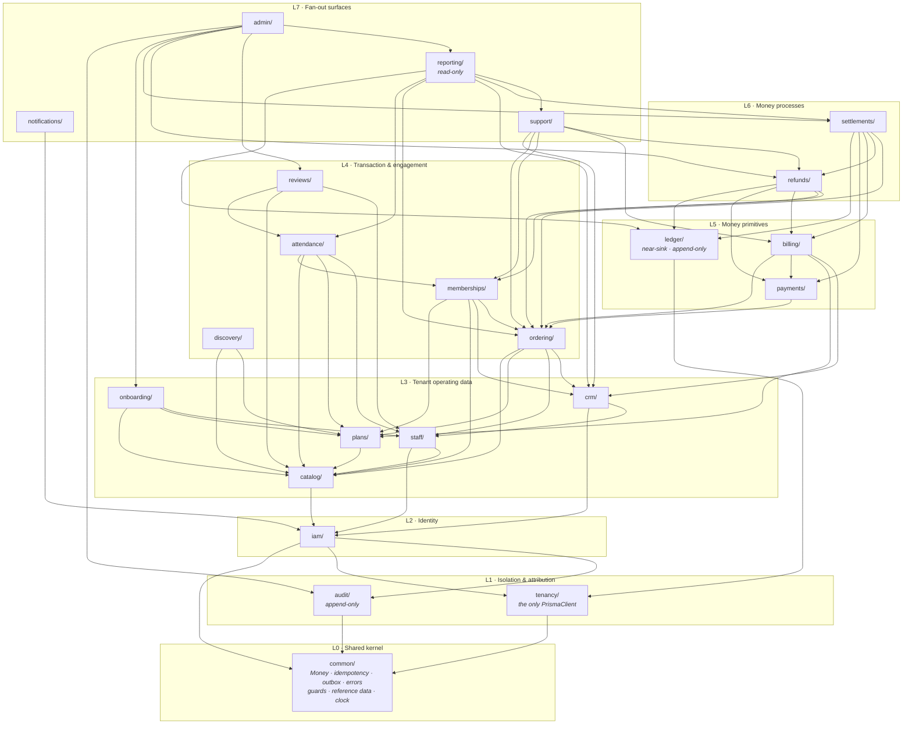
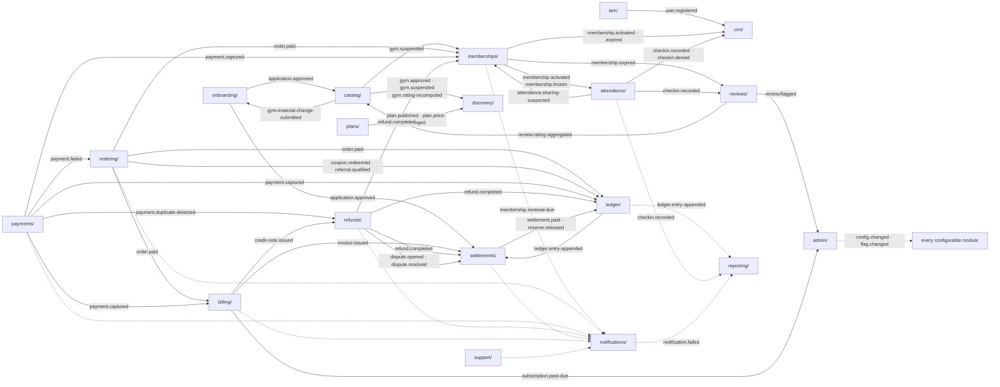

# Module Dependency

> **Rank 3 artefact** (`PROJECT_CONSTITUTION.md` §1.3). Binding on all code.
>
> **What this document is for.** `PROJECT_CONSTITUTION.md` §3.4.1 rule **X5** states:
> *"Cross-module calls are acyclic. `/docs/engineering/ModuleDependency.md` **must prove** the graph
> is a DAG."* This document discharges that obligation. It is not a diagram with commentary; it is
> the edge list, the matrix, the proof, the event catalogue, the enforcement rule set, and the
> extraction-readiness audit that §3.6 step 1 requires before any module is ever pulled out.
>
> **Companion document:** `/docs/engineering/FolderStructure.md` — where every file lives. That one
> says *where things are*; this one says *what may reach what*.
>
> **Status.** No application code exists. Every code block is labelled
> `illustrative — not committed code`.

---

## Table of contents

| § | Section |
| :-: | :--- |
| 0 | [Three corrections applied before the graph was drawn](#0-three-corrections-applied-before-the-graph-was-drawn) |
| 1 | [The two mechanisms, and only two](#1-the-two-mechanisms-and-only-two) |
| 2 | [The layered dependency graph](#2-the-layered-dependency-graph) |
| 3 | [The complete synchronous edge list](#3-the-complete-synchronous-edge-list) |
| 4 | [The may-import / may-not-import matrix](#4-the-may-import--may-not-import-matrix) |
| 5 | [Proof of acyclicity](#5-proof-of-acyclicity) |
| 6 | [The shared kernel and its entry rules](#6-the-shared-kernel-and-its-entry-rules) |
| 7 | [The module public surface](#7-the-module-public-surface) |
| 8 | [The domain-event catalogue](#8-the-domain-event-catalogue) |
| 9 | [The no-callback rule](#9-the-no-callback-rule) |
| 10 | [The `dependency-cruiser` rule set](#10-the-dependency-cruiser-rule-set) |
| 11 | [The five most likely coupling mistakes](#11-the-five-most-likely-coupling-mistakes) |
| 12 | [Extraction readiness](#12-extraction-readiness) |

---

## 0. Three corrections applied before the graph was drawn

`ENGINEERING_PLAN.md` §4 gives the graph at overview altitude. Working it edge by edge surfaced three
internal inconsistencies. Each is resolved here under the Halt Rule (constitution §1.4) and recorded
so that nobody re-litigates it from the older text.

### C-1 — `ledger/` depends on `common/` and `tenancy/` only

| Artefact | Statement |
| :--- | :--- |
| `DECISION_LOG.md` **ADR-0029** | *"`ledger/` depends on nothing but `common/` and `tenancy/`. `settlements/` and `refunds/` depend on `ledger/`. `billing/` depends on `ordering/` and `payments/`. `payments/` **never** depends on `settlements/`."* |
| `ENGINEERING_PLAN.md` §4.2 / §4.3 | Draws `ledger/ → ordering/` and `ledger/ → payments/`, and orders L5 as `payments < billing < ledger`. |
| `ENGINEERING_PLAN.md` §4.5 matrix, row `ledger` | Shows `payments` as **—** (forbidden), contradicting §4.3 in the same document. |

**Resolution: ADR-0029 governs.** `ledger/` imports `common/` and `tenancy/` and nothing else, and its
within-layer rank becomes **the lowest in L5**: `ledger < payments < billing`. Facts reach the ledger
as **events** (`order.paid`, `payment.captured`, `refund.completed`, `settlement.paid`) handled by
`ledger/application/handlers/`, and other modules append through `ledger/ports/ledger-append.port.ts`.

**Why this is the better boundary, not merely the recorded one.** `BR-FIN-01` — *"all balances are
derived from the append-only ledger; no balance is ever stored as a directly-mutable figure"* — is a
**boundary property**. A `ledger/` that imports `ordering/` can reach into an order to "check" a
figure, and the next commit computes from the order instead of from the entries. A `ledger/` that
imports nothing but the kernel physically cannot. The append-only guarantee stops being a convention
and becomes a compile-time fact.

**The obvious objection, answered.** Commission computation lives in `ledger/` (constitution §3.2 row
16). It needs a commission rate. Rates live in `commission_rules`, which is **platform-global
reference data** (`C2.3`), read through `common/persistence/reference-data.repository.ts` under
constitution §11.5 **BR4** — *not* by importing `admin/`. See C-3.

### C-2 — `discovery/` does not import `reviews/`

`ENGINEERING_PLAN.md` §4.5's `discovery` row marks `reviews` as **●** (permitted synchronous import).
Its own §4.2 mermaid and §4.3 adjacency table both omit that edge, and §4.2's event graph draws the
real path: `review.published → catalog/ rating projection → discovery/ reindex`.

**Resolution: the edge is removed.** `discovery/` is L4 rank 0 and `reviews/` is L4 rank 4; a
synchronous edge from the former to the latter is a lateral back-edge and would break the total order
that makes the graph provably acyclic (constitution §3.4.1 **X5**). Ratings reach discovery as part of
`catalog/`'s gym read model, which `catalog/` maintains as a projection updated by its
`review.rating-aggregated` handler. This also happens to be the only design in which
`search.reindex` (`C5`) has one input rather than two.

### C-3 — platform-global configuration is read through `common/`, never by importing `admin/`

`ENGINEERING_PLAN.md` §4.5 marks `onboarding → admin` as **▲** and describes `admin/` as reaching
"everywhere". Taken literally in reverse, any module needing a configured value would import `admin/`
— an L7 module — producing an upward edge from almost every module in the system and collapsing the
DAG in one move.

**Resolution.** `admin/` is the **write** surface for platform-global configuration
(`FR-ADMN-01` … `FR-ADMN-13`): commission rules, subscription tiers, tax profiles, KYC checklists,
reason codes, taxonomy, feature flags, notification templates. Every other module **reads** those
tables through `common/persistence/reference-data.repository.ts`, the RLS-exempt base class that
constitution §11.5 **BR4** requires to exist precisely so the exemption is "explicit and greppable".
Configuration changes propagate as `config.changed` events, not as imports.

| Reader | Global table it reads through `common/` | Never by importing |
| :--- | :--- | :--- |
| `ledger/` | `commission_rules` (`A6.2`, `A6.3`, `BR-FIN-04`) | `admin/` |
| `billing/` | `tax_profiles` — for India: GST 18%, CGST 9% + SGST 9%, `fy_start_month = 4` | `admin/` |
| `onboarding/` | `kyc_checklists` — the ten-document India list (`FR-ONB-03`, `FR-ADMN-06`) | `admin/` |
| `notifications/` | `notification_templates`, including `dlt_template_id` and its approval state | `admin/` |
| `refunds/`, `reviews/`, `attendance/` | `reason_codes` (`C4.8` denial reasons, moderation reasons, refund reasons) | `admin/` |
| `catalog/`, `discovery/` | `amenities`, `gym_categories`, `countries`, `cities`, `localities` | `admin/` |
| every module | `feature_flags` via `common/config/feature-flag.port.ts` (server-side evaluation, ADR-0026) | `admin/` |

**Net effect of C-1, C-2 and C-3: nineteen candidate upward edges removed.** That is why the proof in
§5 is short.

---

## 1. The two mechanisms, and only two

> Modules communicate through **exported service interfaces** or **domain events**, never by reaching
> into another module's repositories. A lint rule and an architecture test fail the build on
> violation. — `MASTER_PRD.md` §C1.3

| | Synchronous port call | Domain event via the transactional outbox |
| :--- | :--- | :--- |
| **Direction** | **Downward only** — strictly decreasing in the §5 total order | Any direction, including upward and lateral |
| **Used when** | The caller needs an answer **now** to complete its own transaction and cannot proceed without it | The caller does not need an answer, and the receiver must not be able to abort the caller's transaction |
| **Contract** | An interface declared by the **provider**, in `<provider>/ports/`, injected by `Symbol` token | A serialisable payload of ids, an occurrence timestamp in UTC, the tenant id, and minimal scalar facts |
| **Transaction** | Same transaction as the caller (the caller owns the unit of work) | The outbox row is written **inside** the state-changing transaction; the handler runs in a **different** transaction later |
| **Failure semantics** | Propagates — the caller's transaction rolls back | Retry with backoff, then dead-letter with an alert (`NFR-MNT-06`). The emitter is never rolled back (**E6**) |
| **Typical example** | `ordering/` asking `plans/` for the authoritative price before creating an order (`BR-PLN-03`) | `payments/` emitting `payment.captured`, handled by `memberships/`, `billing/` and `ledger/` (`BR-PAY-02`) |
| **Enforcement** | `dependency-cruiser` allow-list generated from §3 | Outbox write asserted by the use-case spec; handler idempotency asserted by the handler spec (**E3**) |

**The single rule that makes the graph acyclic:** *an upward synchronous call is forbidden.* Every
reaction that needs to travel upward or sideways travels as an event.

**There is no third mechanism.** Not a shared service class, not a `@Global()` module (permitted only
for `common/` and `tenancy/`), not a shared Prisma transaction across two modules' repositories, not
a direct table read. Constitution §3.4.3 enumerates all nine forbidden shortcuts and §10 of this
document maps each to the rule that fails the build.

---

## 2. The layered dependency graph

Eight layers, twenty-three modules. Every arrow is a **synchronous** import of the target's
`index.ts`. Events are deliberately not drawn here — they would produce visual cycles that are not
code cycles. They have their own graph in §8.



*(Every module additionally imports `common/`, and every tenant-scoped module additionally imports
`tenancy/`. Those 45 edges are omitted from the diagram for legibility and are stated explicitly in
§3.1.)*

### 2.1 Why the layers are where they are

| Layer | Members | The property that puts them here |
| :-: | :--- | :--- |
| L0 | `common/` | Depends on nothing. Implements the nine `C1.5` mechanisms once (constitution §3.1 **L7**). |
| L1 | `tenancy/`, `audit/` | Both depend only on `common/` and both are *preconditions* for correctness rather than participants in a domain. `tenancy/` owns the only `PrismaClient`; `audit/` owns a table nobody else may write. |
| L2 | `iam/` | Everything tenant-scoped needs to know who the actor is, and `iam/` needs tenancy and audit — so it sits between them and the domain. |
| L3 | `catalog/`, `plans/`, `staff/`, `crm/`, `onboarding/` | Tenant-configured operating data. Nothing here knows about money or transactions. |
| L4 | `discovery/`, `ordering/`, `memberships/`, `attendance/`, `reviews/` | The things a **member** does. Each reads L3 to know what is on offer and who is entitled. |
| L5 | `ledger/`, `payments/`, `billing/` | Money **primitives**: a fact store, a gateway boundary, a document store. Each has a single consistency boundary. |
| L6 | `refunds/`, `settlements/` | Money **processes**: state machines (`C4.5`, `C4.7`) that read primitives and produce reversals and payouts. |
| L7 | `notifications/`, `support/`, `reporting/`, `admin/` | Fan-out surfaces. They read widely by design and are read by nothing, which is what makes a wide read allowance safe. |

---

## 3. The complete synchronous edge list

Every permitted synchronous import in the system, with the port that carries it and the reason the
answer must be synchronous. **If a port is not in this table, the edge does not exist.**

### 3.1 The universal edges

| Edge | Applies to | What is imported | Why it is not a cycle |
| :--- | :--- | :--- | :--- |
| `* → common/` | All 22 other modules | `Money`, `Result`, error taxonomy, guards, decorators, idempotency, outbox port, pagination codec, `Clock`, `IdGenerator`, `ReferenceDataRepository`, rate-limit registry | `common/` imports no module. It is the sink of the graph. |
| `* → tenancy/` | All 21 tenant-scoped modules (all but `common/` and `audit/`) | `TenantContext`, `TenantId`, `TenantGuard`, the tenant-scoped Prisma client | `tenancy/` imports only `common/`. |
| `* → audit/` | 18 modules that record an audited action (all but `common/`, `tenancy/`, `audit/`, `notifications/`, `ledger/`) | `AUDIT_WRITE_PORT` (injected by the `@Audited()` interceptor) | `audit/` imports only `common/`. It is a second sink. |

### 3.2 The domain edges

| # | From | To | Port on the target's `index.ts` | Why synchronous, and the identifier |
| :-: | :--- | :--- | :--- | :--- |
| 1 | `iam/` | `tenancy/` | `TENANT_RESOLUTION_PORT` | A session cannot be issued without knowing the tenant it is scoped to (`FR-AUTH-11`, `BR-TEN-02`). |
| 2 | `iam/` | `audit/` | `AUDIT_WRITE_PORT` | Impersonation start/stop must be written before the elevated session exists (`FR-AUTH-12`, `BR-DAT-02`). |
| 3 | `catalog/` | `iam/` | `USER_QUERY_PORT` | Owner and manager attribution on a gym record. |
| 4 | `plans/` | `catalog/` | `BRANCH_QUERY_PORT` | A plan's branch entitlement must reference branches that exist and belong to the same gym (`BR-PLN-06`). |
| 5 | `staff/` | `iam/` | `USER_QUERY_PORT`, `ROLE_QUERY_PORT` | A staff member is a user with roles; role definitions live in `iam/` (`FR-STAF-01`, `FR-RBAC-01`). |
| 6 | `staff/` | `catalog/` | `BRANCH_QUERY_PORT` | Branch assignment must resolve to a real branch (`FR-STAF-03`). |
| 7 | `crm/` | `iam/` | `USER_QUERY_PORT` | A member record is anchored to a user identity (`FR-CRM-01`). |
| 8 | `crm/` | `staff/` | `STAFF_QUERY_PORT` | Notes and leads carry an assigned staff member (`FR-CRM-04`, `FR-CRM-08`). |
| 9 | `onboarding/` | `catalog/` | `GYM_COMMAND_PORT` | Wizard step 3 creates the gym and branches inside the application transaction (`FR-ONB-04`). |
| 10 | `onboarding/` | `plans/` | `PLAN_COMMAND_PORT` | Wizard step 5 creates the first plans (`FR-ONB-06`). |
| 11 | `onboarding/` | `staff/` | `STAFF_INVITATION_PORT` | Wizard step 6 invites staff (`FR-ONB-07`). |
| 12 | `discovery/` | `catalog/` | `GYM_SEARCH_VIEW_PORT` | Search reads the approved-gym read model, which carries the rating projection (`BR-GYM-01`, `FR-SRCH-01`). |
| 13 | `discovery/` | `plans/` | `PLAN_SUMMARY_PORT` | "From ₹X" price on a result card must be the current authoritative price (`BR-PLN-03`, `FR-SRCH-06`). |
| 14 | `ordering/` | `plans/` | `PLAN_PRICING_PORT` | **Invariant 3.** Server-side re-validation aborts on mismatch; the price is fetched, never trusted from the client (`BR-PLN-03`, `BR-PAY-04`, `FR-CART-08`). |
| 15 | `ordering/` | `catalog/` | `BRANCH_QUERY_PORT`, `GYM_STATUS_PORT` | An order against a suspended gym must fail before payment (`BR-GYM-01`). |
| 16 | `ordering/` | `crm/` | `MEMBER_QUERY_PORT` | Eligibility: age minimum, gender policy, existing relationship (`FR-CART-07`). |
| 17 | `ordering/` | `staff/` | `STAFF_QUERY_PORT` | Offline sale attribution (`FR-CART-11`, `SCR-DASH-012`). |
| 18 | `memberships/` | `plans/` | `PLAN_TERMS_PORT` | Freeze cap, stackability, access window, session allowance (`BR-MEM-04`, `BR-MEM-05`, `BR-PLN-06`). |
| 19 | `memberships/` | `ordering/` | `ORDER_SNAPSHOT_PORT` | The purchased terms snapshot, which is immutable and is what refund policy later reads (`BR-REF-02`). |
| 20 | `memberships/` | `catalog/` | `GYM_TIMEZONE_PORT` | `BR-MEM-03` computes validity in the **gym's** timezone — `Asia/Kolkata`, +05:30, no DST. |
| 21 | `memberships/` | `crm/` | `MEMBER_QUERY_PORT` | The member the membership belongs to. |
| 22 | `attendance/` | `memberships/` | `MEMBERSHIP_QUERY_PORT` | Step 3 of the ten-step check-in sequence needs a live entitlement answer inside a 2 s p95 budget (`FR-CHK-04`, `NFR-PERF-03`). |
| 23 | `attendance/` | `catalog/` | `BRANCH_QUERY_PORT`, `OPERATING_HOURS_PORT` | Steps 5–6: is this branch open now, in its own timezone (`BR-CHK-04`)? |
| 24 | `attendance/` | `plans/` | `ACCESS_WINDOW_PORT` | Step 7: is the plan's access window satisfied (`BR-PLN-06`, denial reason `OUTSIDE_PLAN_ACCESS_WINDOW`)? |
| 25 | `attendance/` | `staff/` | `STAFF_QUERY_PORT` | Override authority and branch scope (`BR-CHK-10`, `FR-STAF-03`). |
| 26 | `reviews/` | `attendance/` | `ATTENDANCE_QUERY_PORT` | **Invariant 4.** `BR-REV-01`: earned reviews only. `hasCheckInAtGym()` answers a question; it does not expose attendance rows. |
| 27 | `reviews/` | `catalog/` | `GYM_QUERY_PORT` | The gym being reviewed, and its owner for the response path (`FR-REV-06`). |
| 28 | `reviews/` | `staff/` | `STAFF_QUERY_PORT` | Who may publish an owner response (`FR-REV-06`). |
| 29 | `payments/` | `ordering/` | `ORDER_QUERY_PORT` | An intent is created against an order total the server computed (`BR-PAY-04`, `FR-PAY-01`). |
| 30 | `billing/` | `ordering/` | `ORDER_SNAPSHOT_PORT` | The invoice restates the order exactly, including the CGST/SGST split lines (`FR-INV-01`, `FR-INV-04`). |
| 31 | `billing/` | `payments/` | `PAYMENT_QUERY_PORT` | An invoice is issued on capture and names the payment (`BR-PAY-10`). |
| 32 | `billing/` | `plans/` | `PLAN_SUMMARY_PORT` | Line descriptions on the document. |
| 33 | `billing/` | `crm/` | `MEMBER_QUERY_PORT` | Bill-to party. |
| 34 | `refunds/` | `ledger/` | `LEDGER_READ_PORT`, `LEDGER_APPEND_PORT` | `BR-REF-05`: the proportional commission reversal is computed from ledger facts and appended as reversal entries. |
| 35 | `refunds/` | `payments/` | `PAYMENT_REFUND_PORT` | The gateway refund must succeed before the state machine advances (`C4.5`, `BR-REF-09`). |
| 36 | `refunds/` | `billing/` | `CREDIT_NOTE_PORT` | `refunds/` decides; `billing/` issues the numbered document. ADR-0029: *"`billing/` never decides a refund."* |
| 37 | `refunds/` | `ordering/` | `ORDER_SNAPSHOT_PORT` | `BR-REF-02`: policy comes from the order snapshot, never from current tenant settings. |
| 38 | `refunds/` | `memberships/` | `MEMBERSHIP_COMMAND_PORT` | The membership must be marked `REFUNDED` in the same decision (`C4.1`). |
| 39 | `settlements/` | `ledger/` | `LEDGER_READ_PORT` | `BR-FIN-01`: a batch is a **derived** aggregate over ledger facts, never over orders. |
| 40 | `settlements/` | `payments/` | `PAYOUT_PORT`, `PAYMENT_QUERY_PORT` | The Razorpay Route payout call and the gateway fee, which `BR-FIN-06` forbids estimating. |
| 41 | `settlements/` | `billing/` | `INVOICE_QUERY_PORT` | Statement lines cite invoice numbers (`FR-SETL-04`). |
| 42 | `settlements/` | `refunds/` | `REFUND_QUERY_PORT` | Refunds in the period appear as negative lines (`BR-REF-05`, `FR-SETL-03`). |
| 43 | `settlements/` | `ordering/` | `ORDER_QUERY_PORT` | Coupon `funding_source` selects the commission base (`BR-CPN-05`, `BR-FIN-04`). |
| 44 | `notifications/` | `iam/` | `USER_CONTACT_PORT` | Resolve a recipient's channel addresses and preferences at send time, never earlier (`FR-NOTF-05`, `BR-DAT-06`). |
| 45 | `support/` | `crm/`, `ordering/`, `memberships/`, `billing/`, `refunds/` | `*_QUERY_PORT` ×5 | `FR-SUP-02` contextual attachment stores **references**, and renders them by querying live. |
| 46 | `reporting/` | 10 modules (see §4) | `*_QUERY_PORT` only | `FR-RPT-05` requires drill-down from any total to its constituent records. **No write path exists.** |
| 47 | `admin/` | 18 modules (see §4) | Public **command** interfaces only | `FR-ADMN-01` … `FR-ADMN-13` configure every module. Every write is reason-required and audited (`FR-ADMN-02`). |

### 3.3 Two rows that need explicit justification

**`reporting/` may read almost everything.** That is safe only because it can write nothing. The
`reporting-is-read-only` rule (§10) forbids `reporting/**` from importing any repository, any port
whose name contains `Command`, and any symbol whose name begins with a mutating verb
(`create|update|delete|approve|reject|cancel|issue|append|charge|capture|refund|publish`). Widen the
read allowance freely; the moment a write appears, the allowance becomes a liability.

**`admin/` may reach almost everything.** It imports **command** interfaces, never domain entities and
never repositories — constitution §3.4.3 and `ENGINEERING_PLAN.md` §4.5: *"it may not import a domain
entity, only a module's public command interface."* An admin action is therefore always the same
shape as the action a user would take, with an extra reason and an audit row, which is what makes
`FR-ADMN-02` verifiable.

---

## 4. The may-import / may-not-import matrix

**Rows import columns.** This table is the machine-readable truth; `packages/config/dependency-cruiser/module-layers.cjs`
is generated from it and `dependency-cruiser` enforces it.

| Symbol | Meaning |
| :-: | :--- |
| **●** | Permitted synchronous import of the target's `index.ts`. Downward edges only. Events in the same direction are also permitted. |
| **▲** | **Event only.** A synchronous import fails the build. The row module publishes a domain event that the column module consumes. |
| **—** | Forbidden in both directions. Neither an import nor an event flows on this pair. |
| **▪** | Self. |

Column keys, in topological order: `cmn` common · `ten` tenancy · `aud` audit · `iam` iam ·
`cat` catalog · `pln` plans · `stf` staff · `crm` crm · `onb` onboarding · `dsc` discovery ·
`ord` ordering · `mem` memberships · `att` attendance · `rev` reviews · `ldg` ledger · `pay` payments ·
`bil` billing · `rfd` refunds · `stl` settlements · `ntf` notifications · `sup` support ·
`rpt` reporting · `adm` admin.

| ↓ imports → | cmn | ten | aud | iam | cat | pln | stf | crm | onb | dsc | ord | mem | att | rev | ldg | pay | bil | rfd | stl | ntf | sup | rpt | adm |
| :--- | :-: | :-: | :-: | :-: | :-: | :-: | :-: | :-: | :-: | :-: | :-: | :-: | :-: | :-: | :-: | :-: | :-: | :-: | :-: | :-: | :-: | :-: | :-: |
| **common** | ▪ | — | — | — | — | — | — | — | — | — | — | — | — | — | — | — | — | — | — | — | — | — | — |
| **tenancy** | ● | ▪ | — | — | — | — | — | — | — | — | — | — | — | — | — | — | — | — | — | — | — | — | — |
| **audit** | ● | — | ▪ | — | — | — | — | — | — | — | — | — | — | — | — | — | — | — | — | — | — | — | — |
| **iam** | ● | ● | ● | ▪ | — | — | — | ▲ | — | — | — | — | — | — | — | — | — | — | — | ▲ | — | — | — |
| **catalog** | ● | ● | ● | ● | ▪ | — | — | — | ▲ | ▲ | — | ▲ | — | — | — | — | — | — | — | ▲ | — | ▲ | ▲ |
| **plans** | ● | ● | ● | — | ● | ▪ | — | — | — | ▲ | — | — | — | — | — | — | — | — | — | ▲ | — | ▲ | — |
| **staff** | ● | ● | ● | ● | ● | — | ▪ | — | — | — | — | — | — | — | — | — | — | — | — | ▲ | — | ▲ | — |
| **crm** | ● | ● | ● | ● | — | — | ● | ▪ | — | — | — | — | — | — | — | — | — | — | — | ▲ | — | ▲ | — |
| **onboarding** | ● | ● | ● | ● | ● | ● | ● | — | ▪ | — | — | — | — | — | — | — | — | — | ▲ | ▲ | — | ▲ | ▲ |
| **discovery** | ● | ● | ● | — | ● | ● | — | — | — | ▪ | — | — | — | — | — | — | — | — | — | ▲ | — | ▲ | — |
| **ordering** | ● | ● | ● | ● | ● | ● | ● | ● | — | — | ▪ | ▲ | — | — | ▲ | ▲ | ▲ | ▲ | — | ▲ | — | ▲ | — |
| **memberships** | ● | ● | ● | ● | ● | ● | — | ● | — | — | ● | ▪ | ▲ | ▲ | — | — | — | — | — | ▲ | — | ▲ | — |
| **attendance** | ● | ● | ● | ● | ● | ● | ● | ▲ | — | — | — | ● | ▪ | ▲ | — | — | — | — | — | ▲ | — | ▲ | — |
| **reviews** | ● | ● | ● | ● | ● | — | ● | — | — | — | — | — | ● | ▪ | — | — | — | — | — | ▲ | — | ▲ | ▲ |
| **ledger** | ● | ● | — | — | — | — | — | — | — | — | — | — | — | — | ▪ | — | — | — | ▲ | — | — | ▲ | — |
| **payments** | ● | ● | ● | ● | — | — | — | — | — | — | ● | ▲ | — | — | ▲ | ▪ | ▲ | ▲ | — | ▲ | — | ▲ | — |
| **billing** | ● | ● | ● | ● | ● | ● | — | ● | — | — | ● | — | — | — | — | ● | ▪ | ▲ | ▲ | ▲ | — | ▲ | ▲ |
| **refunds** | ● | ● | ● | ● | — | — | — | — | — | — | ● | ● | — | — | ● | ● | ● | ▪ | ▲ | ▲ | — | ▲ | ▲ |
| **settlements** | ● | ● | ● | ● | — | — | — | — | — | — | ● | — | — | — | ● | ● | ● | ● | ▪ | ▲ | — | ▲ | ▲ |
| **notifications** | ● | ● | — | ● | — | — | — | — | — | — | — | — | — | — | — | — | — | — | — | ▪ | — | ▲ | — |
| **support** | ● | ● | ● | ● | — | — | — | ● | — | — | ● | ● | — | — | — | — | ● | ● | — | ▲ | ▪ | ▲ | ▲ |
| **reporting** | ● | ● | ● | ● | ● | ● | ● | ● | — | — | ● | ● | ● | ● | ● | ● | ● | ● | ● | ● | ● | ▪ | — |
| **admin** | ● | ● | ● | ● | ● | ● | ● | ● | ● | ● | ● | ● | ● | ● | ● | ● | ● | ● | ● | ● | ● | ● | ▪ |

### 4.1 Reading the matrix — five cells worth understanding

| Cell | Value | What it means in practice |
| :--- | :-: | :--- |
| `memberships → payments` | **▲** | `memberships/` must never ask "was this paid?". It learns from `payment.captured`. This is `BR-PAY-02` and ADR-0013 expressed as a build rule: activation is webhook-driven, never the client redirect — and never a synchronous poll either. |
| `discovery → reviews` | **—** | Not even an event. Rating reaches `discovery/` inside `catalog/`'s gym read model. Two sources of a rating is how a search result and a detail page end up disagreeing (§0 C-2). |
| `ledger → *` | **—** except `common/`, `tenancy/` | The append-only store depends on nothing it could be tempted to derive a balance from (`BR-FIN-01`, ADR-0029, §0 C-1). |
| `settlements → refunds` | **●** | A batch must include the period's refunds as negative lines (`BR-REF-05`, `FR-SETL-03`). The reverse cell, `refunds → settlements`, is **▲**: a completed refund notifies settlements, it does not reach into a batch. |
| `reporting → *` | **●** almost everywhere | Read allowance is broad because `FR-RPT-05` demands drill-down. It is only safe because `reporting-is-read-only` (§10) makes the write allowance empty. |

### 4.2 The forbidden pairs that a reasonable engineer would try anyway

| Pair | Why it looks reasonable | Why it is forbidden |
| :--- | :--- | :--- |
| `crm → memberships` | "Show membership status on the member list." | Upward L3→L4. `crm/` receives `membership.activated` / `.expired` and maintains its own projection, which is also what `FR-CRM-06`'s at-risk flag needs. |
| `catalog → reviews` | "Store the rating on the gym row." | Upward L3→L4. `catalog/` *does* store the rating — as a projection updated by its `review.rating-aggregated` handler. The projection is fine; the import is not. |
| `plans → ordering` | "Count how many times this plan sold." | Upward L3→L4. That is a `reporting/` question. |
| `payments → memberships` | "Activate the membership right here in the webhook handler." | Upward L5→L4, and it also merges two consistency boundaries so that a membership failure would roll back a captured payment. `BR-PAY-02` requires the opposite. |
| `notifications → memberships` | "Look up the plan name for the reminder text." | Upward L7→L4. The `membership.renewal-due` event payload carries the scalar facts the template needs. `notifications/` importing 12 modules to render templates is how it becomes the module nobody can change. |
| `onboarding → settlements` | "Create the payout account in step 4." | Upward L3→L6. `application.approved` triggers payout-account creation in `settlements/`. |
| `attendance → ordering` | "Check the order was not refunded before allowing entry." | Upward L4.3→L4.1 is legal, but this specific question is wrong: `memberships/` already reflects a refund as `REFUNDED` (`C4.1`), and `attendance/` asks `memberships/`. Two paths to the same answer will eventually disagree. |

---

## 5. Proof of acyclicity

**Claim.** The synchronous dependency graph over the 23 backend modules is a directed acyclic graph.

**Method.** Exhibit a total order and show every edge strictly decreases it. A graph admitting a
topological ordering is acyclic; this is Kahn's theorem, and the ordering is the certificate.

### 5.1 The total order

Each module is assigned a pair `(layer, rank)`. The order is lexicographic on that pair; because no
two modules share a pair, it is total. The **ordinal** column is the resulting single integer.

| Ordinal | Module | Layer | Rank | Out-degree (sync) | In-degree (sync) |
| :-: | :--- | :-: | :-: | :-: | :-: |
| 1 | `common/` | 0 | 0 | 0 | 22 |
| 2 | `tenancy/` | 1 | 0 | 1 | 21 |
| 3 | `audit/` | 1 | 1 | 1 | 18 |
| 4 | `iam/` | 2 | 0 | 3 | 15 |
| 5 | `catalog/` | 3 | 0 | 4 | 11 |
| 6 | `plans/` | 3 | 1 | 4 | 8 |
| 7 | `staff/` | 3 | 2 | 5 | 7 |
| 8 | `crm/` | 3 | 3 | 5 | 6 |
| 9 | `onboarding/` | 3 | 4 | 7 | 1 |
| 10 | `discovery/` | 4 | 0 | 4 | 1 |
| 11 | `ordering/` | 4 | 1 | 8 | 9 |
| 12 | `memberships/` | 4 | 2 | 8 | 5 |
| 13 | `attendance/` | 4 | 3 | 8 | 3 |
| 14 | `reviews/` | 4 | 4 | 7 | 2 |
| 15 | `ledger/` | 5 | 0 | 2 | 4 |
| 16 | `payments/` | 5 | 1 | 5 | 5 |
| 17 | `billing/` | 5 | 2 | 9 | 5 |
| 18 | `refunds/` | 6 | 0 | 9 | 4 |
| 19 | `settlements/` | 6 | 1 | 9 | 3 |
| 20 | `notifications/` | 7 | 0 | 3 | 2 |
| 21 | `support/` | 7 | 1 | 9 | 2 |
| 22 | `reporting/` | 7 | 2 | 19 | 1 |
| 23 | `admin/` | 7 | 3 | 22 | 0 |

### 5.2 The eight layers as a numbered topological ordering

Any linear extension of this ordering is a valid build, test and — eventually — extraction sequence.

| Layer | Ordinals | Modules | Guaranteed property |
| :-: | :--- | :--- | :--- |
| **L0** | 1 | `common/` | Imports no module. **Sink.** |
| **L1** | 2–3 | `tenancy/`, `audit/` | Import only L0. |
| **L2** | 4 | `iam/` | Imports only L0–L1. |
| **L3** | 5–9 | `catalog/`, `plans/`, `staff/`, `crm/`, `onboarding/` | Import only L0–L2 and strictly lower-ranked L3. |
| **L4** | 10–14 | `discovery/`, `ordering/`, `memberships/`, `attendance/`, `reviews/` | Import only L0–L3 and strictly lower-ranked L4. |
| **L5** | 15–17 | `ledger/`, `payments/`, `billing/` | Import only L0–L4 and strictly lower-ranked L5. |
| **L6** | 18–19 | `refunds/`, `settlements/` | Import only L0–L5 and strictly lower-ranked L6. |
| **L7** | 20–23 | `notifications/`, `support/`, `reporting/`, `admin/` | Import only L0–L6 and strictly lower-ranked L7. **No module imports L7.** |

### 5.3 The proof

> **Lemma.** For every synchronous edge `a → b` in §3, `ordinal(a) > ordinal(b)`.

*Verification is exhaustive rather than argued.* The §3 edge list contains 47 domain edges plus the
three universal families of §3.1. Grouped by the layer pair they span:

| Edge class | Count | `ordinal(a) > ordinal(b)`? | Note |
| :--- | :-: | :-: | :--- |
| `* → common/` | 22 | ✅ | `common/` is ordinal 1, the minimum. |
| `* → tenancy/` | 21 | ✅ | `tenancy/` is ordinal 2; the only module below it is `common/`, which does not import it. |
| `* → audit/` | 18 | ✅ | `audit/` is ordinal 3; `common/`, `tenancy/`, `notifications/` and `ledger/` do not import it. |
| Cross-layer downward (`L(a) > L(b)`) | 43 | ✅ | Strictly decreasing by layer, therefore by ordinal. |
| Within-layer L3 | 5 · `plans→catalog`, `staff→iam*`, `staff→catalog`, `crm→staff`, `onboarding→{catalog,plans,staff}` | ✅ | Ranks: `catalog`(0) < `plans`(1) < `staff`(2) < `crm`(3) < `onboarding`(4). Every edge points to a lower rank. |
| Within-layer L4 | 3 · `memberships→ordering`, `attendance→memberships`, `reviews→attendance` | ✅ | Ranks: `discovery`(0) < `ordering`(1) < `memberships`(2) < `attendance`(3) < `reviews`(4). |
| Within-layer L5 | 1 · `billing→payments` | ✅ | Ranks: `ledger`(0) < `payments`(1) < `billing`(2). `ledger/` imports neither, per §0 C-1. |
| Within-layer L6 | 1 · `settlements→refunds` | ✅ | Ranks: `refunds`(0) < `settlements`(1). |
| Within-layer L7 | 6 · `support→notifications*`, `reporting→{notifications,support}`, `admin→{notifications,support,reporting}` | ✅ | Ranks: `notifications`(0) < `support`(1) < `reporting`(2) < `admin`(3). |

*(`staff→iam` and `support→notifications` are cross-layer; listed here only because they appear in the
same table rows.)*

> **Theorem.** The graph is acyclic.
>
> *Proof.* Suppose a cycle `m₁ → m₂ → … → mₖ → m₁` existed. By the Lemma,
> `ordinal(m₁) > ordinal(m₂) > … > ordinal(mₖ) > ordinal(m₁)`, so `ordinal(m₁) > ordinal(m₁)`. ∎

### 5.4 The three apparent cycles, and why none is one

| Apparent cycle | Reality |
| :--- | :--- |
| `payments/ → ordering/` **and** `ordering/` reacts to `payment.captured` | The second direction is an **outbox event** handled in a different transaction by `ordering/application/handlers/payment-captured.handler.ts`, which imports nothing from `payments/`. It receives a serialised payload typed in `packages/types`. No compile-time edge exists. |
| `refunds/ → memberships/` **and** `memberships/` reacts to `refund.completed` | Identical shape. `refunds/` calls `MEMBERSHIP_COMMAND_PORT` synchronously for the state change it owns the decision for; the *notification* of completion travels as an event to `ledger/`, `billing/`, `settlements/` and `notifications/`. |
| `reviews/ → attendance/` **and** `attendance/` emits `checkin.recorded` consumed by `reviews/` | `reviews/` asks a **question** (`hasCheckInAtGym`) when a review is submitted; `attendance/` announces a **fact** when a check-in happens, which opens the review-eligibility window. Two different moments, two different mechanisms. |

**The rule that keeps this true** is §9: an event consumer never reaches synchronously back into its
publisher. Without it, the first "while I'm here, let me just check…" turns one of these three into a
real cycle, and `forwardRef()` appears in a module file.

### 5.5 What the CI job actually asserts

The `architecture` job (constitution §3.7, A-23) does three things, in this order:

1. **`no-circular`** on the file graph at any depth. Catches a cycle even if it routes through a
   shared type file.
2. **`no-upward-or-lateral-backedge`** against the generated `module-layers.cjs` table. Catches an
   edge that is acyclic today but violates the layering — the edge that would *become* a cycle after
   one more commit.
3. **Graph artefact publication.** `dependency-graph.svg` and `dependency-graph.json` are attached to
   every CI run. Constitution §3.6 makes this the evidence base for extraction readiness (§12): a
   module whose inbound edge count rises without an amendment is flagged in review.

---

## 6. The shared kernel and its entry rules

The shared kernel is **`apps/server/src/common/`**, **`apps/server/src/tenancy/`**,
**`packages/types`** and **`packages/utils`**. It is deliberately tiny, because everything placed in
it becomes a coupling point for all twenty-three modules simultaneously.

### 6.1 The admission test

A type or function enters the kernel only if **all four** hold (constitution §3.5.1):

| # | Test | Failure mode if skipped |
| :-: | :--- | :--- |
| 1 | At least **three** of the twenty-three modules need it. | A two-module helper becomes a kernel item, and the second module's change now breaks twenty-one others' builds. |
| 2 | It encodes **no business rule**. | A `BR-` in the kernel is a rule nobody owns. `BR-REF-05`'s proportional reversal looks generic and is not: it belongs to `refunds/`. |
| 3 | It has **no runtime dependency** beyond the standard library and the locked stack. | The kernel is on every module's critical path; a dependency there is a dependency everywhere. |
| 4 | Changing it **would be a breaking change to a contract**, and the team accepts that weight. | Items enter casually and then cannot be changed at all. |

### 6.2 What is in the kernel, and why each item earns its place

| Item | Location | Modules needing it | PRD anchor |
| :--- | :--- | :-: | :--- |
| `Money { amountMinor: bigint; currency }` | `packages/types/src/money.ts` (contract) + `common/money/` (behaviour) | 9 | `BR-PAY-01`, `NFR-DQ-02`, `§C1.5` |
| `round_half_even`, proportional allocation, basis-point maths | `packages/utils/src/money/` | 6 | `A6.3`, `BR-FIN-03`, `BR-REF-05` |
| Indian digit grouping (`₹2,50,000`) | `packages/utils/src/money/format-indian-grouping.ts` | 4 (three surfaces + the PDF renderer) | `LAUNCH_MARKET_INDIA.md` §2 |
| Branded ids (`TenantId`, `MembershipId`, … 20 of them) | `packages/types/src/ids/` | 23 | `§9.5` |
| `TenantContext`, `TenantId`, the tenant guard | `tenancy/` | 21 | `BR-TEN-01`, `§C1.4` |
| The Prisma tenant-context client extension | `tenancy/prisma/` | 21 | A-01 approval condition, `§11.4.2` |
| `TenantScopedRepository`, `ReferenceDataRepository`, `UnitOfWork` | `common/persistence/` | 21 | `§C1.4` step 4, `§11.5` |
| Idempotency store + request fingerprint | `common/idempotency/` | 6 (`ordering`, `payments`, `refunds`, `attendance`, `memberships`, `onboarding`) | `BR-PAY-03`, `§C1.5` |
| Outbox writer + dispatcher contract | `common/outbox/` | 15 | `§C1.5` Events, ADR-0017 |
| Error taxonomy + `ProblemDetails` mapper + code registry | `common/errors/` + `packages/types/src/errors/` | 23 | `§C1.5`, `NFR-USE-05`, `§13.2` |
| Correlation-id propagation (AsyncLocalStorage) | `common/logging/` | 23 | `NFR-MNT-04` |
| Redaction deny-list (phone, email, PAN, GSTIN, Aadhaar) | `common/logging/redaction.ts` + `packages/utils/src/redact/` | 23 | `BR-DAT-06`, `NFR-PRV-07` |
| Cursor pagination codec | `common/pagination/` + `packages/utils/src/cursor/` | 18 | `§C3.1`, ADR-0023 |
| Rate-limit class registry | `common/ratelimit/` | 23 (by decorator) | `NFR-SEC-06`, A-13 |
| Gym-timezone validity helpers, `local-midnight-utc` | `packages/utils/src/time/` | 7 | `BR-MEM-03`, `NFR-DQ-03`, `LAUNCH_MARKET_INDIA.md` §3 |
| Financial-year helper with `fyStartMonth` as a **parameter** | `packages/utils/src/time/financial-year.ts` | 3 | `FR-INV-02`, `AC-INV-01.3`, India FY = April |
| PRD enums, shared Zod schemas | `packages/types/src/enums/`, `/schemas/` | 23 + 3 surfaces | `NFR-SEC-05`, A-02, ADR-0022 |
| `Result<T, E>`, `assertNever` | `packages/utils/src/result/`, `/assert/` | 23 | Constitution §9.6, §13.6 |
| `Clock`, `IdGenerator` ports | `common/clock/` | 23 | Constitution §5 layer 1 (no `Date.now()` in the domain) |

### 6.3 What may never enter the kernel

| Forbidden | Where it belongs | The specific temptation on this project |
| :--- | :--- | :--- |
| Any `BR-*` logic | The owning module's `domain/` | "Commission calculation is used by three modules" — no: `ledger/` computes it, `settlements/` and `reporting/` read the result. |
| Anything that reads or writes the database | The owning module's `infrastructure/` | A "shared query helper" in `common/` becomes a cross-module query in one refactor. |
| Anything that knows a vendor | The owning module's `adapters/` | Razorpay's webhook signature scheme is `payments/`'s problem, not everyone's. |
| A `helpers/` or `misc/` bucket | Nowhere | Rejected in review, by name (constitution §3.5.2). |
| Cross-module orchestration | The **consuming** module's event handler | "When payment captured, activate membership" is `memberships/`'s handler, not a kernel saga. |
| Module-specific permission definitions | The module's `permissions.ts` | `iam/` declares the permission *model*; each module declares its own constants. |
| React components with domain semantics | The consuming app's feature folder | `<MembershipCard/>`, `<SettlementStatement/>`, `<CheckInDeskScanner/>` (constitution §3.5.2). |

### 6.4 Kernel entry rules — the process

| # | Rule |
| :-: | :--- |
| K1 | A kernel addition is a pull request that **cites the three or more consuming modules by name** and shows the §6.1 test passing on all four points. |
| K2 | `packages/types` and `packages/utils` are CODEOWNERS-gated. `packages/utils/src/money/**` requires two reviewers (`RSK-14`). |
| K3 | A kernel item is **never** deleted in the same release it is deprecated. Deprecate, migrate all consumers, then delete — because a kernel change is a twenty-three-module change. |
| K4 | `packages/types` has **zero** runtime dependencies beyond `zod`; `packages/utils` has **zero**, full stop (constitution §7.1.1 **R4**). A pull request adding one to either is a review blocker. |
| K5 | Only `common/` and `tenancy/` may be `@Global()` NestJS modules. Everything else is imported explicitly so that the §4 matrix describes reality (constitution §3.4.3). |
| K6 | The kernel imports **no module**. `common/` and `tenancy/` are ordinals 1 and 2 and must stay there; an edge from either into a domain module is a `no-circular` failure and an architecture escalation. |

---

## 7. The module public surface

### 7.1 The convention

Every module directory contains exactly one `index.ts`, and it is the **only** file any other module
may import from (constitution §3.4.3, `dependency-cruiser` `module-public-api-only`).

| May be exported | Must never be exported |
| :--- | :--- |
| **Port tokens** — `Symbol`-typed injection tokens (`MEMBERSHIP_QUERY_PORT`) | **Repository interfaces or classes** — `MembershipRepository`, `PrismaMembershipRepository` |
| **Port interfaces** — the narrow contract each token satisfies | **Domain entities, aggregates and value objects** — `Membership`, `ValidityWindow`, `Money` subclasses |
| **Read-model / contract types** — `MembershipSummaryView`, `SettlementStatementSummary` | **Prisma models, delegates or `Prisma.*` types** of any kind |
| **Domain-event payload types** — so a consumer can type its handler without importing the publisher's domain | **NestJS DTO classes** from `dto/`, and any `@nestjs/swagger`-decorated shape |
| **Permission constants** — `MEMBERSHIP_PERMISSIONS`, so `iam/` and `admin/` can enumerate them | **Use-case classes**, guards, controllers, processors, mappers |
| **Domain error classes** the caller must distinguish (`PlanPriceChangedError`) | **Anything from `infrastructure/`**, without exception |

**On "DTO types".** The wire-shape types that clients and the server share live in
`packages/types/src/schemas/` — they are shared *contract* types, and a module's `index.ts` may
re-export the ones it owns. The NestJS `dto/` **classes** in `<module>/dto/` are a layer-4
implementation detail and are never exported; constitution §7.3.1 row 1 says so in as many words:
*"Exports port tokens, port interfaces, read-model types. Never entities, repositories or DTOs."*
The distinction matters because a `dto/` class carries `@nestjs/swagger` decorators, and exporting it
would drag the framework into a consumer's domain layer.

### 7.2 Why each prohibition exists

| Prohibited export | What breaks if it is allowed |
| :--- | :--- |
| Repository | The consumer couples to **persistence shape**. A column rename in the provider becomes a compile error in an unrelated module, and constitution §2 Q4 deletability is lost. |
| Domain entity | Two modules then share a **consistency boundary**. `attendance/` holding a `Membership` aggregate can mutate it, and `BR-MEM-01`'s single state machine now has two callers. |
| Prisma model | The ORM leaks into the domain, and `no-cross-module-prisma` exists precisely because this is the most convenient wrong answer. |
| DTO class | Interface-layer coupling. The consumer inherits the provider's HTTP contract and its Swagger decorators, and an API-versioning change becomes a cross-module refactor. |
| Use-case class | The consumer bypasses the port and gets the provider's *implementation*, including its unit-of-work assumptions. The dependency-inversion arrow reverses. |

### 7.3 The three shapes a port may take

| Shape | Signature style | When | Example |
| :--- | :--- | :--- | :--- |
| **Question port** | Returns a scalar or a small view; total function | The consumer needs one fact to make its own decision | `AttendanceQueryPort.hasCheckInAtGym(): Promise<boolean>` (`BR-REV-01`) |
| **Read-model port** | Returns a `View`/`Summary` type owned by the provider | The consumer renders or aggregates provider data | `MembershipQueryPort.listForMember(): Promise<Page<MembershipSummaryView>>` |
| **Command port** | Takes a command, returns a result or `Result<T, E>`; the provider owns the decision | The consumer needs the provider to change its own state | `MembershipCommandPort.markRefunded(cmd): Promise<Result<void, MembershipError>>` |

Anti-pattern, named so it can be rejected by name: **the entity port** —
`getMembership(id): Promise<Membership>`. Constitution §3.4.1 **X3**: *"a 'give me the whole entity'
method is a design smell and normally means the boundary is wrong."*

### 7.4 `index.ts` — the enforced shape

`illustrative — not committed code`

```ts
// apps/server/src/attendance/index.ts
export { ATTENDANCE_QUERY_PORT, type AttendanceQueryPort } from './ports/attendance-query.port';
export type { CheckInEvaluationView, AttendanceSummaryView } from './types/attendance.types';
export type { CheckInRecordedPayload } from './domain/events/checkin-recorded.event';
export { ATTENDANCE_PERMISSIONS } from './permissions';
```

Four export statements. A twenty-line `index.ts` is a warning sign; a fifty-line one means the module
is doing several jobs. The `dependency-cruiser` rule `index-exports-allow-list` restricts an
`index.ts` to re-exporting from `./ports/**`, `./types/**`, `./domain/events/**` (types only) and
`./permissions`. Any other source path fails the build.

---

## 8. The domain-event catalogue

### 8.1 The contract every event obeys

| Rule | Statement | Source |
| :-: | :--- | :--- |
| **E1** | Any reaction that may be eventually consistent uses an event, not a port. | Constitution §3.4.2 |
| **E2** | The outbox row is written **inside** the same interactive transaction that changed state. A publish outside the transaction is a review blocker. | `§C1.5`, ADR-0017 |
| **E3** | Handlers are idempotent. The dispatcher may deliver more than once. | `§C5` |
| **E4** | Names are `<aggregate>.<past-tense-verb>`, lowercase, dot-separated. | Constitution §3.4.2 |
| **E5** | Payloads carry ids, a UTC occurrence timestamp, the tenant id, and minimal scalar facts. **Never** a name, phone, email or any other personal datum. | `BR-DAT-06`, `C6` |
| **E6** | A failing handler never rolls back the emitter. Retry with backoff, then dead-letter with an alert. | `NFR-MNT-06` |
| **E7** | The payload type lives in the publisher's `domain/events/` and is re-exported as a **type** from its `index.ts`, so a consumer types its handler without importing the publisher's domain. | §7.1 |

### 8.2 The catalogue

| Event | Publisher | Payload (beyond `tenant_id`, `occurred_at`) | Consumers | Handler idempotency key |
| :--- | :--- | :--- | :--- | :--- |
| `user.registered` | `iam/` | `user_id`, `origin` | `crm/`, `notifications/` | `user_id` |
| `user.email-verified` | `iam/` | `user_id` | `notifications/` | `user_id` |
| `impersonation.started` / `.ended` | `iam/` | `actor_id`, `subject_id`, `reason_code` | `audit/`(via interceptor), `notifications/` | `impersonation_id` |
| `application.submitted` | `onboarding/` | `application_id`, `version` | `admin/`, `notifications/` | `application_id` + `version` |
| `application.approved` | `onboarding/` | `application_id`, `tenant_id`, `gym_id` | `catalog/`, `settlements/`, `notifications/`, `admin/` | `application_id` |
| `application.rejected` / `.info-requested` | `onboarding/` | `application_id`, `reason_codes[]` | `notifications/`, `admin/` | `application_id` + `version` |
| `gym.approved` | `catalog/` | `gym_id`, `city_id` | `discovery/`, `notifications/` | `gym_id` + `occurred_at` |
| `gym.suspended` | `catalog/` | `gym_id`, `reason_code` | `discovery/`, `memberships/`, `notifications/` | `gym_id` + `occurred_at` |
| `gym.material-change-submitted` | `catalog/` | `gym_id`, `changed_fields[]` | `onboarding/` (re-review, `BR-GYM-06`) | `gym_id` + `revision` |
| `gym.rating-recomputed` | `catalog/` | `gym_id`, `rating_bps`, `review_count` | `discovery/` (reindex) | `gym_id` + `revision` |
| `plan.published` / `.archived` | `plans/` | `plan_id`, `gym_id` | `discovery/` | `plan_id` + `revision` |
| `plan.price-changed` | `plans/` | `plan_id`, `old_price_minor`, `new_price_minor`, `currency` | `discovery/`, `notifications/` (`FR-FAV-04`) | `plan_id` + `revision` |
| `staff.invited` / `.deactivated` | `staff/` | `staff_id`, `branch_ids[]` | `notifications/` | `staff_id` + `occurred_at` |
| `order.created` | `ordering/` | `order_id`, `order_ref`, `plan_id`, `net_minor`, `currency` | `notifications/` | `order_id` |
| `order.paid` | `ordering/` | `order_id`, `gross_minor`, `tax_minor`, `discount_minor`, `commission_base_minor`, `coupon_funding_source` | `ledger/`, `billing/`, `memberships/` | `order_id` |
| `order.cancelled` / `.expired` | `ordering/` | `order_id`, `reason_code` | `memberships/`, `notifications/` | `order_id` |
| `coupon.redeemed` | `ordering/` | `coupon_id`, `order_id`, `discount_minor`, `funding_source` | `ledger/`, `notifications/` | `coupon_redemption_id` |
| `referral.qualified` | `ordering/` | `referral_id`, `referrer_user_id`, `credit_minor` | `ledger/` (wallet entry), `notifications/` | `referral_id` |
| `payment.captured` | `payments/` | `payment_id`, `order_id`, `amount_minor`, `method`, `provider_ref` | `memberships/`, `billing/`, `ledger/` | `payment_id` |
| `payment.failed` | `payments/` | `payment_id`, `order_id`, `failure_code`, `attempt` | `ordering/`, `notifications/` | `payment_id` + `attempt` |
| `payment.duplicate-detected` | `payments/` | `payment_id`, `original_payment_id` | `refunds/`, `notifications/` | `payment_id` |
| `membership.created` | `memberships/` | `membership_id`, `order_id`, `plan_id`, `status` | `crm/`, `notifications/` | `membership_id` |
| `membership.activated` | `memberships/` | `membership_id`, `start_date`, `end_date` | `attendance/`, `crm/`, `notifications/` | `membership_id` + `activation_seq` |
| `membership.frozen` / `.unfrozen` | `memberships/` | `membership_id`, `freeze_id`, `days` | `attendance/`, `notifications/` | `freeze_id` |
| `membership.expired` | `memberships/` | `membership_id`, `end_date` | `crm/`, `reviews/` (prompt window), `notifications/` | `membership_id` + `end_date` |
| `membership.renewal-due` | `memberships/` | `membership_id`, `days_before_expiry` | `notifications/` (`BR-MEM-11` T−15/−7/−3/−1) | `membership_id` + `days_before_expiry` |
| `membership.suspended-for-sharing` | `memberships/` | `membership_id`, `evidence_ref` | `crm/`, `notifications/` (`BR-MEM-13`) | `membership_id` + `occurred_at` |
| `checkin.recorded` | `attendance/` | `attendance_id`, `membership_id`, `branch_id`, `method` | `reviews/`, `crm/`, `reporting/` | `attendance_id` |
| `checkin.denied` | `attendance/` | `membership_id`, `branch_id`, `denial_reason` | `crm/`, `reporting/` | `attempt_id` |
| `attendance.sharing-suspected` | `attendance/` | `membership_id`, `signal` | `memberships/` (`BR-MEM-13`), `notifications/` | `scan_run_id` + `membership_id` |
| `review.published` | `reviews/` | `review_id`, `gym_id`, `rating` | `catalog/` (rating projection), `notifications/` | `review_id` |
| `review.flagged` | `reviews/` | `review_id`, `reason_code` | `admin/` (moderation queue) | `review_report_id` |
| `review.rating-aggregated` | `reviews/` | `gym_id`, `rating_bps`, `review_count` | `catalog/` | `gym_id` + `aggregation_run_id` |
| `ledger.entry-appended` | `ledger/` | `ledger_entry_id`, `entry_type`, `direction`, `amount_minor` | `settlements/`, `reporting/` | `ledger_entry_id` |
| `wallet.credited` | `ledger/` | `wallet_entry_id`, `user_id`, `amount_minor` | `notifications/` | `wallet_entry_id` |
| `invoice.issued` | `billing/` | `invoice_id`, `invoice_number`, `order_id`, `tax_components[]` | `notifications/`, `settlements/` | `invoice_id` |
| `credit-note.issued` | `billing/` | `credit_note_id`, `invoice_id`, `amount_minor` | `refunds/`, `notifications/` | `credit_note_id` |
| `subscription.past-due` | `billing/` | `tenant_id`, `days_overdue` | `admin/`, `notifications/` (`BR-TEN-06`) | `tenant_id` + `billing_period` |
| `refund.requested` / `.approved` | `refunds/` | `refund_id`, `order_id`, `amount_minor`, `reason_code` | `notifications/`, `admin/` | `refund_id` + `status` |
| `refund.completed` | `refunds/` | `refund_id`, `order_id`, `amount_minor`, `commission_reversal_minor` | `ledger/`, `memberships/`, `billing/`, `settlements/`, `notifications/` | `refund_id` |
| `dispute.opened` / `.resolved` | `refunds/` | `dispute_id`, `payment_id`, `outcome` | `settlements/`, `notifications/`, `admin/` | `dispute_id` + `status` |
| `settlement.batch-built` | `settlements/` | `batch_id`, `line_count`, `payable_to_gym_minor` | `notifications/`, `admin/` | `batch_id` |
| `settlement.paid` | `settlements/` | `batch_id`, `payout_ref`, `paid_at` | `ledger/`, `notifications/`, `admin/` | `batch_id` |
| `settlement.failed` | `settlements/` | `batch_id`, `failure_code` | `notifications/`, `admin/` | `batch_id` + `attempt` |
| `reserve.released` | `settlements/` | `reserve_id`, `amount_minor` | `ledger/`, `notifications/` | `reserve_id` |
| `notification.failed` | `notifications/` | `notification_id`, `channel`, `failure_code` | `reporting/` | `notification_id` + `attempt` |
| `export.completed` | `reporting/` | `export_job_id`, `object_key` | `notifications/` | `export_job_id` |
| `ticket.created` / `.resolved` | `support/` | `ticket_id`, `category` | `notifications/`, `admin/` | `ticket_id` + `status` |
| `config.changed` | `admin/` | `config_key`, `scope`, `version` | every configurable module | `config_key` + `version` |
| `flag.changed` | `admin/` | `flag_key`, `version` | every module (via `common/config`) | `flag_key` + `version` |

**Fifty-two events.** Every one carries `tenant_id` and `occurred_at`; none carries a personal datum
(`E5`). The `commission_reversal_minor` field on `refund.completed` is the one place an event payload
carries a derived money figure, and it does so because `settlements/` must produce the negative line
before it can re-read the ledger in the next batch window.

### 8.3 Event flow graph

Solid arrows are outbox events. This graph **is** cyclic when read as a whole; that is expected and is
not a code cycle, because every arrow is an asynchronous, differently-transacted delivery of a typed
payload (§5.4, §9).



*(Dotted arrows are the fan-out edges to `notifications/`, `reporting/` and the config broadcast; they
are drawn separately only to keep the money and lifecycle paths legible.)*

### 8.4 The three chains worth tracing end to end

| Chain | Path | The invariant it realises |
| :--- | :--- | :--- |
| **Activation** (`E2E-02`, `BR-PAY-02`) | Razorpay webhook → `payments/` capture → `payment.captured` → `memberships/` handler → `membership.activated` → `attendance/` + `crm/` + `notifications/` | Invariant 5: activation is webhook-driven. The customer's browser can close at any point; the chain completes regardless. |
| **Refund** (`E2E-07`, `BR-REF-05`) | `refunds/` decision → gateway refund → `refund.completed` → `ledger/` reversal entries + `billing/` credit note + `memberships/` → `REFUNDED` + `settlements/` negative line | Invariant 2: the reversal is *appended*, never an edit. Four modules, four owners, one event. |
| **Earned review** (`E2E-09`, `BR-REV-01`) | `attendance/` `checkin.recorded` → `reviews/` opens eligibility → member submits → `reviews/` re-asks `ATTENDANCE_QUERY_PORT` synchronously → `review.published` → `catalog/` rating projection → `gym.rating-recomputed` → `discovery/` reindex | Invariant 4: eligibility is checked twice — once asynchronously to open the window, once synchronously at submission, because the window can open and the check-in can later be voided. |

---

## 9. The no-callback rule

> **An event consumer never reaches synchronously back into its publisher.**

### 9.1 Statement

If module `B` handles an event published by module `A`, then `B` may not import `A`'s `index.ts`, may
not inject any of `A`'s port tokens, and may not call `A` through any intermediary in the same
request. `B` works from the event payload and its own data. If the payload is insufficient, the
payload is wrong — not the rule.

### 9.2 Why

| Reason | Consequence of breaking it |
| :--- | :--- |
| **It is the only thing keeping the graph acyclic.** `payments/ → ordering/` is a legal downward edge; `ordering/`'s `payment-captured` handler importing `payments/` would close the loop into a genuine compile-time cycle. | `no-circular` fails, `forwardRef()` appears, and constitution §3.6's extraction path closes. |
| **The publisher may already be gone.** The handler runs in a different transaction, potentially minutes later after a dead-letter replay. A synchronous read-back may see a *newer* state than the event described, and the handler would then act on facts the event never asserted. | Non-deterministic behaviour that is unreproducible in tests. |
| **It re-introduces the coupling the event removed.** The point of `E1` is that the receiver must not be able to abort the caller. A read-back makes the receiver's availability a dependency of the emitter's ecosystem again. | `NFR-AVL-02`: an outage in a downstream concern must not block sales. |
| **It hides an insufficient payload.** A handler that needs three more fields is telling you the event is under-specified. Fixing the payload is a one-line change with a versioned contract; the read-back is a permanent coupling. | The event contract stops describing what actually happened. |

### 9.3 The permitted alternatives, in preference order

| # | Alternative | When | Cost |
| :-: | :--- | :--- | :--- |
| 1 | **Enrich the payload.** Add the scalar facts the handler needs, subject to `E5` (no personal data). | Almost always | One field, one contract version |
| 2 | **Read the consumer's own projection.** `crm/` maintains a membership-status projection from `membership.*` events and reads its own table. | The consumer already needs the data for its own screens | One projection to keep correct |
| 3 | **Call a module strictly *below* both.** `memberships/`'s handler may call `plans/` (L3) for plan terms — that is a legal downward edge, not a read-back. | The needed fact belongs to a third, lower module | None |
| 4 | **Emit a second event and let the publisher answer.** A request/response pair of events, both asynchronous. | Rare — genuinely needs the publisher's live state | Two events, a correlation id, and a timeout path |

### 9.4 How it is enforced

`dependency-cruiser` rule **`handler-no-publisher-import`**:

> No file matching `src/*/application/handlers/**` may import from `src/<other>/index.ts` where
> `<other>` is the module that publishes the event the handler's filename names.

The publisher for each event name is read from a generated manifest,
`packages/config/dependency-cruiser/event-publishers.json`, produced by scanning
`src/*/domain/events/**`. Because the handler file is named after the event
(`payment-captured.handler.ts` handles `payment.captured`, published by `payments/`), the rule needs
no annotation to work.

`illustrative — not committed code`

```ts
// apps/server/src/memberships/application/handlers/payment-captured.handler.ts
//
// Imports NOTHING from payments/. The payload is the contract.
@Injectable()
export class PaymentCapturedHandler {
  constructor(
    private readonly activate: ActivateMembershipFromPaymentUseCase,
    @Inject(ORDER_SNAPSHOT_PORT) private readonly orders: OrderSnapshotPort,  // ordering/ is BELOW us — legal
  ) {}

  async handle(payload: PaymentCapturedPayload): Promise<void> {
    // E3: idempotent. Keyed on payment_id; a redelivery is a no-op.
    await this.activate.execute({
      paymentId: payload.payment_id,
      orderId: payload.order_id,
      capturedAt: payload.occurred_at,
    });
  }
}
```

---

## 10. The `dependency-cruiser` rule set

Implemented in `packages/config/dependency-cruiser/index.cjs` (A-23) with a small number of custom
ESLint rules (A-21) for the checks a module-graph tool cannot express. It runs in the `architecture`
CI job. **The job is required. It cannot be skipped, and its rules cannot be disabled inline** —
constitution §3.7: *"There is no override path, no `--no-verify`, no inline suppression comment, and
no 'fix it in the next PR'."*

### 10.1 The constitutional rule set (§3.7) — sixteen rules, unaltered

| # | Rule name | Forbidden pattern | Severity | Rationale |
| :-: | :--- | :--- | :-: | :--- |
| 1 | `no-circular` | Any cycle in the module or file dependency graph, at any depth | error | A cycle makes extraction impossible (§3.6 step 1) and makes "which module owns this?" unanswerable. |
| 2 | `no-cross-module-internal` | `src/<a>/**` → `src/<b>/**` other than `src/<b>/index.ts` | error | Only `index.ts` is public surface. A deep import couples to a file path that the provider is entitled to change freely. |
| 3 | `no-cross-module-repository` | `src/<a>/**` → any path matching `src/<b>/infrastructure/**repository**` | error | Couples the consumer to **persistence shape**; kills Q4 deletability. |
| 4 | `no-cross-module-prisma` | `@prisma/client` types imported from another module's directory; any `Prisma.*Delegate` outside `src/*/infrastructure/**` | error | Leaks the ORM across a boundary and into the domain. |
| 5 | `no-cross-module-domain` | `src/<a>/**` → `src/<b>/domain/**` | error | Two modules would share a consistency boundary; one aggregate would have two mutators. |
| 6 | `no-cross-module-interface` | `src/<a>/**` → `src/<b>/controllers/**`, `src/<b>/dto/**`, `src/<b>/guards/**` | error | Interface-layer coupling: the consumer inherits the provider's HTTP contract and Swagger decorators. |
| 7 | `domain-is-pure` | `src/*/domain/**` importing `@nestjs/*`, `@prisma/client`, `zod`, `ioredis`, `bullmq`, `pino`, `@sentry/*`, `axios`, `node:fs`, `node:net`, `node:http` | error | The domain must be unit-testable with zero bootstrap, which is what makes the `NFR-MNT-01` ≥95% target affordable. |
| 8 | `usecase-no-orm` | `src/*/application/**` importing `@prisma/client` or any file under `src/*/infrastructure/**` | error | The dependency-inversion arrow must point from infrastructure to application, never back (§5.3). |
| 9 | `controller-no-repository` | `src/*/controllers/**` importing any `*.repository.ts` | error | A controller reaching persistence skips the use case, the unit of work, the outbox write and the invariants. |
| 10 | `no-raw-prisma-client` | Any file outside `src/tenancy/prisma/**` importing or constructing `PrismaClient` | error | **The single most important rule.** Pooling + RLS: a query on a different pooled connection than the `SET LOCAL` returns zero rows or another tenant's rows (`BR-TEN-01`, §11.4.1). |
| 11 | `orphan-modules` | A file reachable from nothing | error | Dead code is code that is not reviewed, not tested and not deleted. |
| 12 | `no-deprecated-express` | Any import of `express`, Express middleware bypassing Nest, or a document describing Express as this project's framework | error | The PRD names NestJS (ADR-0002). Express is a **rejected** option, not an alternative. |
| 13 | `module-public-api-only` | A module directory lacking `index.ts`, or exporting from anywhere else | error | Without it, every other boundary rule is unenforceable. |
| 14 | `no-global-modules` | `@Global()` outside `src/common` and `src/tenancy` | error | Ambient availability defeats explicit declaration, and the §4 matrix stops describing reality. |
| 15 | `no-default-export` | `export default` anywhere in `apps/server` and `packages/*` | error | Named exports make the graph analysable and refactors mechanical. |
| 16 | `no-float-money` | `number` used for any identifier matching `/(amount\|price\|fee\|total\|gross\|net\|tax\|commission\|discount\|payable\|balance\|reserve\|minor)/i` | error | `BR-PAY-01`. One float in the money path and `BR-FIN-03`'s "lines sum exactly" is untrue at some scale. |

### 10.2 Derived rules — mechanising law already written elsewhere

These add **no new law**. Each mechanises a prohibition that the constitution or the PRD already
states in prose, and each is registered here so its provenance is auditable.

| # | Rule name | Forbidden pattern | Severity | Rationale — and the clause it mechanises |
| :-: | :--- | :--- | :-: | :--- |
| 17 | `no-upward-or-lateral-backedge` | Any edge `a → b` where `ordinal(a) ≤ ordinal(b)` per §5.1 | error | Mechanises constitution §3.4.1 **X5** and this document's §5. Catches the edge that is acyclic today but would become a cycle next commit. Named in `ENGINEERING_PLAN.md` §4.4. |
| 18 | `handler-no-publisher-import` | `src/*/application/handlers/<event>.handler.ts` importing the module that publishes `<event>` | error | Mechanises §9. Without it, the three apparent cycles of §5.4 become real ones. |
| 19 | `index-exports-allow-list` | An `index.ts` re-exporting from anywhere other than `./ports/**`, `./types/**`, `./domain/events/**` (types only), `./permissions` | error | Mechanises constitution §7.3.1 row 1 and §5.1 rule 2 — `exports` are tokens and types, never entities, repositories or DTOs. |
| 20 | `reporting-is-read-only` | `src/reporting/**` importing any `*.repository.ts`, any port whose name contains `Command`, or any symbol matching `/^(create\|update\|delete\|approve\|reject\|cancel\|issue\|append\|charge\|capture\|refund\|publish)/` | error | `reporting/`'s broad read allowance (`FR-RPT-05`) is only safe while its write allowance is empty. Named in `ENGINEERING_PLAN.md` §4.5. |
| 21 | `admin-command-only` | `src/admin/**` importing another module's `domain/**` or any `*.repository.ts` | error | `ENGINEERING_PLAN.md` §4.5: admin *"may not import a domain entity — only a module's public command interface."* Every admin write is then reason-required and audited (`FR-ADMN-02`). |
| 22 | `ledger-append-only` | A method matching `/^(update\|delete\|adjust\|set)/` on any class in `src/ledger/infrastructure/**`, or a `prisma.ledgerEntry.update`/`.delete` call anywhere | error | `BR-FIN-01`. The method name is the affordance; if it exists, it will be called. ADR-0015. |
| 23 | `no-tenant-id-parameter` (ESLint) | Any repository method signature containing a `tenantId` parameter | error | Constitution §11.5 **BR5**. A parameter can be forgotten or passed wrong; an absent AsyncLocalStorage context throws. |
| 24 | `no-raw-sql-outside-allowlist` | `$queryRaw` / `$executeRaw` outside `src/tenancy/prisma/**`, `src/discovery/infrastructure/**` (PostGIS + FTS), `src/settlements/infrastructure/**` (the reconciliation aggregate) | error | Constitution §11.4.2 **P7**. Three named exceptions, each carrying a comment naming the reason and the RLS policy that still applies. |
| 25 | `pricing-authority-single-home` | A file matching `*price*` or `*pricing*` under any `src/<m>/domain/**` where `m ≠ plans` | error | Invariant 3 (`BR-PLN-03`): price displayed = price charged. Two pricing homes is how they diverge. |
| 26 | `no-cross-module-transaction` (ESLint) | A `UnitOfWork.run()` callback invoking a port token belonging to another module | error | Constitution §3.4.3: *"Sharing a database transaction across two modules' repositories … merges consistency boundaries silently."* |

### 10.3 Severity policy

Every rule above is `error`. There are no `warn`-level architecture rules on this project, and that is
deliberate: a warning is a rule that will be violated. Rules that would be advisory are instead not
written, and the concern is handled by CODEOWNERS review (`FolderStructure.md` §16).

### 10.4 The generated inputs

Three files are generated, not hand-maintained, so the rules cannot drift from this document:

| Generated file | Source | Consumed by |
| :--- | :--- | :--- |
| `packages/config/dependency-cruiser/module-layers.cjs` | §5.1 ordinal table | rule 17 |
| `packages/config/dependency-cruiser/event-publishers.json` | scan of `src/*/domain/events/**` | rule 18 |
| `packages/config/dependency-cruiser/allowed-edges.json` | §3 edge list + §4 matrix | rules 2 and 17 |

A pull request that changes an edge must change §3 and §4 of this document in the same commit; the CI
job diffs the generated files against the document and fails on divergence, the same drift gate
`NFR-MNT-03` applies to the OpenAPI document.

---

## 11. The five most likely coupling mistakes

Not generic anti-patterns. These are the five specific commits that this codebase, with these
requirements and these deadlines, will actually attract.

### 11.1 `memberships/` imports `payments/` to check whether the order was paid

**How it happens.** Sprint 7 builds membership lifecycle. Sprint 5–6 already built payments. An
engineer writing `ActivateMembershipFromPaymentUseCase` wants certainty and writes
`@Inject(PAYMENT_QUERY_PORT)` to confirm the capture before flipping the status. It reads as
defensive programming.

**What it breaks.** `payments/` is ordinal 16, `memberships/` is ordinal 12 — an upward edge, and
combined with the existing `payment.captured` handler it is a genuine cycle. It also contradicts
`BR-PAY-02` and ADR-0013 in spirit: the truth about capture is the webhook, and a second source of
that truth will eventually disagree with the first (the classic case: the webhook arrives before the
gateway's read API is consistent, the check returns "not captured", and a paid member has no
membership).

**Caught by.** `no-upward-or-lateral-backedge` (rule 17) at the import; `handler-no-publisher-import`
(rule 18) if it is written inside the handler; `no-circular` (rule 1) once the edge exists in both
directions. Three independent rules fire — deliberately, because this is the most likely mistake in
the system.

**Do instead.** Enrich `PaymentCapturedPayload`. It already carries `payment_id`, `order_id`,
`amount_minor` and `provider_ref`; if activation needs more, add the field.

### 11.2 `discovery/` imports `reviews/` to sort search results by rating

**How it happens.** Sprint 3–4 builds search. `FR-SRCH-08` sorts by rating. The rating lives in
`reviews/`. The one-line fix is `@Inject(REVIEW_AGGREGATE_PORT)`.

**What it breaks.** `discovery/` is ordinal 10, `reviews/` is ordinal 14 — a lateral back-edge inside
L4. It also creates two rating sources: the search index and the reviews aggregate, which will
disagree during the window between `review.published` and the nightly `review.aggregate` job, and a
user will see 4.6 on the card and 4.4 on the detail page.

**Caught by.** `no-upward-or-lateral-backedge` (rule 17), and the §4 matrix cell is **—**, not **▲** —
so even the event workaround is refused.

**Do instead.** `catalog/` maintains the rating projection on the gym read model, updated by its
`review.rating-aggregated` handler; `discovery/` reads it from `GYM_SEARCH_VIEW_PORT`. One number,
one source, one reindex trigger. This is §0 correction C-2.

### 11.3 `settlements/` computes the commission base from orders instead of from the ledger

**How it happens.** Sprint 11 builds settlements. Building a batch needs the commission base per line.
`ordering/` has `orders.net_minor` sitting right there, and `settlements/ → ordering/` is a *legal*
downward edge (§3.2 row 43 permits it for `coupon.funding_source`). So the query is written, and it
compiles, and the tests pass.

**What it breaks.** `BR-FIN-01`: *"all balances are derived from the append-only ledger."* A batch
derived from mutable order rows is not derived from the ledger. The failure surfaces months later, at
the first refund: the ledger has a `COMMISSION_REVERSAL` entry, the order row does not, and the
statement stops tying out — `BR-FIN-03`. In India this compounds, because `commission_tax_minor` (the
18% GST the platform owes on its own commission, `LAUNCH_MARKET_INDIA.md` §11 Conflict 2) is a ninth
persisted figure that exists only as a ledger entry type.

**Caught by.** Not by a lint rule — the edge is legal. This one is caught by **CODEOWNERS** (two
reviewers on `src/settlements/**`), by the `BR-FIN-03` reconciliation test in the integration suite
(statement total must equal the sum of ledger entries for the period, to the paise), and by the
`settlement.reconcile` job (`C5`, daily 04:00) raising a variance. **It is the most expensive mistake
on this list and the only one tooling cannot prevent** — which is exactly why `ledger/` was made a
near-sink in §0 C-1: the fewer things `ledger/` can see, the more obviously `settlements/` must read
from it.

**Do instead.** `LEDGER_READ_PORT.entriesForPeriod()`. Use `ORDER_QUERY_PORT` only for
`coupon.funding_source` (`BR-CPN-05`), which is genuinely an ordering fact.

### 11.4 A module reads platform configuration by importing `admin/`

**How it happens.** Sprint 15 builds admin configuration. `billing/` needs the GST rate;
`ledger/` needs the commission rate; `onboarding/` needs the KYC checklist; `notifications/` needs
templates. `admin/` owns all four screens, so `admin/` looks like the owner of all four values.

**What it breaks.** `admin/` is ordinal 23 — the maximum. **Every** such import is an upward edge, and
four of them at once make the graph cyclic in four places. It also inverts the intended relationship:
`admin/` is a *write* surface over global reference tables, not a runtime configuration service, and
routing every module's config read through an L7 module would make `admin/`'s availability a
dependency of check-in (`NFR-PERF-03`, 2 s p95).

**Caught by.** `no-upward-or-lateral-backedge` (rule 17) on the first import. This is the mistake with
the largest blast radius and the cheapest detection.

**Do instead.** Read the platform-global table through
`common/persistence/reference-data.repository.ts` (constitution §11.5 **BR4** — RLS-exempt by design,
explicit and greppable), and react to `config.changed` for cache invalidation. This is §0 correction
C-3.

### 11.5 An event handler opens the emitter's transaction, or the emitter awaits its handler

**How it happens.** Two variants, both from wanting "one atomic operation":
(a) `ordering/`'s use case calls `outbox.publish()` and then `await dispatcher.drain()` so the
membership exists before the HTTP response returns — so the confirmation page has something to show;
(b) `memberships/`'s handler is given the emitter's transaction client so that the activation and the
payment row commit together.

**What it breaks.** Variant (a) makes a downstream failure roll back the sale — the precise thing
**E6** forbids, and a direct `NFR-AVL-02` violation. Variant (b) merges two consistency boundaries,
which constitution §3.4.3 lists as forbidden and which makes both modules un-extractable in one
commit. Both also defeat the outbox's entire purpose: `§C1.5` guarantees an event is *never sent for a
rolled-back transaction and never lost for a committed one* — a guarantee that only holds if the
dispatch is separate.

**Caught by.** `no-cross-module-transaction` (rule 26) for variant (b). Variant (a) is caught by the
use-case spec convention: every use case that publishes asserts that the outbox row is written
**inside** `uow.run()` and that nothing is awaited on a dispatcher afterwards. The nightly chaos check
in `ENGINEERING_PLAN.md` §17 also exercises it — kill the worker tier and assert that checkout still
returns 201.

**Do instead.** Publish inside the transaction; return. The `SCR-WEB-007` confirmation page **polls**
(`E2E-02`, `AC-PAY-02.1` — the journey explicitly covers "browser closed before redirect"), which is
also the only design that works when the customer's browser never comes back.

### 11.6 Summary

| # | Mistake | Primary detection | Detection latency |
| :-: | :--- | :--- | :--- |
| 1 | `memberships/ → payments/` | Rules 17, 18, 1 | Seconds (pre-push) |
| 2 | `discovery/ → reviews/` | Rule 17 + matrix cell **—** | Seconds (pre-push) |
| 3 | `settlements/` computes from orders | CODEOWNERS + `BR-FIN-03` reconciliation test + `settlement.reconcile` variance | Hours to days — **the dangerous one** |
| 4 | Any module → `admin/` for config | Rule 17 | Seconds (pre-push) |
| 5 | Handler/emitter transaction merge | Rule 26 + use-case spec convention + worker-kill chaos check | Minutes (CI) |

---

## 12. Extraction readiness

Extraction to a service is a **Phase 2+ possibility, not a plan** — `MASTER_PRD.md` rejects
microservices for Phase 1 and ADR-0003 records it. This section exists for the reason constitution
§3.6 gives: *"so that the modular monolith's promise is verifiable rather than aspirational — and so
that nobody argues in month nine that extraction is 'impossible now'."*

### 12.1 The rubric

Five criteria, one point each. Score is out of 5; **5 means the module could be extracted in a single
release with no prior migration.**

| # | Criterion | Fails when |
| :-: | :--- | :--- |
| **R1** | **Inbound edges are ports and events only** | Another module imports anything but its `index.ts`. (Structurally guaranteed by rules 2 and 13 — so this criterion is satisfied by every module and is scored as a baseline, not a discriminator.) |
| **R2** | **No foreign key crosses the boundary** | A table it owns has an FK to a table another module owns, or vice versa. §3.6 step 2 requires FKs to be replaced by an id column plus a port lookup **in a prior release**. |
| **R3** | **Outbound synchronous fan-out ≤ 4** | Every outbound sync edge becomes a network hop with a latency and a failure mode. Beyond four, extraction turns one call into a distributed transaction discussion. |
| **R4** | **No latency-critical synchronous inbound path** | Something on an `NFR-PERF` budget calls it synchronously; a network hop would consume the budget. |
| **R5** | **No shared unit of work with another module** | A use case in another module needs this module's writes in the same transaction. |

### 12.2 Scores

| Module | Ord. | R2 FK | R3 fan-out | R4 latency | R5 UoW | **Score** | Chief blocker |
| :--- | :-: | :-: | :-: | :-: | :-: | :-: | :--- |
| `audit/` | 3 | ✅ | ✅ 1 | ✅ | ✅ | **5** | None. Append-only, no FKs out, one dependency. The natural first extraction if log volume ever demands it. |
| `notifications/` | 20 | ✅ | ✅ 3 | ✅ | ✅ | **5** | None. Reads recipients at send time via one port; everything else arrives as events. `A-19` vendor adapters are already isolated. |
| `reporting/` | 22 | ✅ | ⚠️ 19 | ✅ | ✅ | **4** | Fan-out. Read-only and FK-free, but nineteen synchronous read ports. Extraction implies a read-replica or a CQRS projection store first. |
| `discovery/` | 10 | ✅ | ✅ 4 | ⚠️ | ✅ | **4** | `NFR-PERF-01` search p95 ≤ 500 ms. Its two reads (`catalog/`, `plans/`) are on the hot path; extraction needs the search document denormalised first — which `search.reindex` (`C5`) already builds. |
| `support/` | 21 | ✅ | ⚠️ 5 | ✅ | ✅ | **4** | Five read ports for `FR-SUP-02` contextual attachment. It stores references, not copies, so each becomes a hop. |
| `ledger/` | 15 | ⚠️ | ✅ 2 | ✅ | ⚠️ | **3** | `ledger_entries.order_id` / `.payment_id` / `.refund_id` FKs. And `refunds/` appends reversal entries **inside its own transaction** — an intentional shared UoW that `BR-REF-05` currently relies on. Both are solvable; neither is solved. |
| `attendance/` | 13 | ⚠️ | ⚠️ 5 | ❌ | ✅ | **2** | `NFR-PERF-03`: scan → confirmation p95 ≤ 2 s at `NFR-PERF-08` 500 check-ins/min. Its `MEMBERSHIP_QUERY_PORT` call is inside that budget. FKs to `memberships`, `branches`, `staff`. **Lowest-priority extraction candidate; highest-value module to keep local.** |
| `reviews/` | 14 | ⚠️ | ⚠️ 5 | ✅ | ✅ | **3** | FKs to `gyms` and `users`. Its `ATTENDANCE_QUERY_PORT` call is a question port and would survive a hop. |
| `memberships/` | 12 | ❌ | ⚠️ 5 | ❌ | ⚠️ | **1** | FKs to `plans`, `orders`, `users`, `gyms`. Sits inside `attendance/`'s 2 s budget. Its activation handler and `refunds/`'s `markRefunded` want the same transaction. **Extract last, if ever.** |
| `catalog/` | 5 | ⚠️ | ✅ 4 | ⚠️ | ✅ | **3** | Referenced by FK from `plans`, `memberships`, `attendance`, `reviews`, `orders` — five inbound FKs. Also read on the search hot path. |
| `plans/` | 6 | ⚠️ | ✅ 4 | ❌ | ✅ | **2** | Invariant 3 makes it the pricing authority *inside* the checkout transaction (`BR-PLN-03` re-validation). A hop here puts the network between "price displayed" and "price charged". |
| `ordering/` | 11 | ❌ | ⚠️ 8 | ⚠️ | ❌ | **1** | The busiest node: in-degree 9, out-degree 8, FKs in six directions, and the checkout unit of work spans order creation, coupon hold and idempotency record. |
| `payments/` | 16 | ⚠️ | ✅ 5 | ✅ | ✅ | **3** | FKs to `orders`. Otherwise well-isolated behind the `PaymentProvider` port — the Razorpay Route / Stripe Connect pair proves the abstraction works (ADR-0018). Webhook ingress would need its own public endpoint. |
| `billing/` | 17 | ⚠️ | ⚠️ 9 | ✅ | ⚠️ | **2** | Nine read ports to compose a document, plus `FR-INV-02` gapless per-tenant-per-FY numbering, which is a serialisable sequence that is materially harder across a network. India's April FY boundary makes the sequence reset an annual event with no room for an off-by-one. |
| `refunds/` | 18 | ⚠️ | ⚠️ 9 | ✅ | ❌ | **1** | Writes ledger reversals, asks `billing/` for a credit note and `memberships/` for a state change, all as one decision (`BR-REF-05`). Four modules, one atomic intent. |
| `settlements/` | 19 | ⚠️ | ⚠️ 9 | ✅ | ✅ | **3** | Batch build is a **job**, not a request, so latency is irrelevant and a hop is affordable. FKs to `payout_accounts` and `ledger_entries`. The strongest of the money modules for extraction. |
| `iam/` | 4 | ⚠️ | ✅ 3 | ❌ | ✅ | **2** | Every authenticated request resolves a principal. Extraction means a token-introspection hop on every request unless the JWT stays self-contained — which it is (ADR-0011), so this is more tractable than it looks. `users` is referenced by FK from nine tables. |
| `crm/` | 8 | ⚠️ | ✅ 4 | ✅ | ✅ | **3** | FKs to `users` and `staff`. Otherwise projection-driven and event-fed. |
| `staff/` | 7 | ⚠️ | ✅ 4 | ⚠️ | ✅ | **3** | Read by `attendance/` inside the check-in budget for override authority. FKs to `users` and `branches`. |
| `onboarding/` | 9 | ⚠️ | ✅ 4 | ✅ | ❌ | **2** | Wizard steps 3–6 create gym, branches and plans **inside the application transaction** (`FR-ONB-04`…`FR-ONB-07`). That shared UoW is the whole blocker; it would become a saga. |
| `admin/` | 23 | ✅ | ❌ 22 | ✅ | ✅ | **3** | No FKs out (it owns global reference tables) and nothing depends on it — but twenty-two outbound ports. Extraction is *possible* and *pointless*: it would be a UI-shaped service making twenty-two calls. |
| `tenancy/` | 2 | ✅ | ✅ 1 | ❌ | ❌ | **0** | **Never extractable, by design.** It owns the database connection and the RLS session variable. Extracting it would put the network between `SET LOCAL app.tenant_id` and the query it protects — the exact failure mode of constitution §11.4.1. |
| `common/` | 1 | ✅ | ✅ 0 | ❌ | ❌ | **0** | **Never extractable.** It is a library, not a service. It would travel *with* every extracted module as a shared package. |

### 12.3 What the scores say

| Observation | Consequence |
| :--- | :--- |
| **Two modules score 5** (`audit/`, `notifications/`) and both are *fan-in sinks that emit little*. | If extraction ever happens, it starts here — and both are the ones whose load profile most plausibly justifies it (audit volume, notification throughput). |
| **The three lowest non-kernel scores** (`ordering/`, `memberships/`, `refunds/` at 1) are all on the money-and-lifecycle path. | This is the correct outcome, not a design failure. Those three are where atomicity genuinely matters, and ADR-0003's whole argument is that a modular monolith buys atomicity for free where a distributed system charges for it. |
| **Cross-boundary foreign keys are the dominant blocker** — 17 of 23 modules. | This is expected in Phase 1 and is what constitution §3.6 step 2 anticipates: FKs are replaced by an id column plus a port lookup **in a prior release**. It is a migration, not a rewrite. |
| **No module fails R1.** | Rules 2 and 13 make it structurally impossible. That is the promise of §3.1 **L3** — boundaries are compile-time and lint-time enforced, not conventional — actually holding. |
| **`tenancy/` and `common/` score 0 and always will.** | They are not services in waiting. They are the kernel that travels with whatever is extracted. |

### 12.4 How readiness is tracked

Constitution §3.6: *"Extraction-readiness is tested continuously, not at extraction time."*

| Mechanism | Cadence | Signal |
| :--- | :--- | :--- |
| `dependency-graph.json` published as a CI artefact | Every CI run | Per-module in-degree and out-degree |
| In-degree delta check | Every pull request | A module whose inbound edge count rises without an amendment is flagged in review (§3.6) |
| Cross-boundary FK inventory | Generated from `schema.prisma` in the `architecture` job | The R2 column of §12.2, regenerated — so this table is never stale |
| This document's §12.2 table | Reviewed at each milestone (`M2`, `M4`, `M5`, `M6`) | A score that **falls** between milestones is an architecture regression and is treated as a defect, not as drift |

---

## Closing

This document discharges the obligation that constitution §3.4.1 **X5** places on it. It contains:
the two permitted communication mechanisms and the rule that an upward synchronous call is forbidden;
the eight-layer graph over all twenty-three modules; the complete forty-seven-edge synchronous list
with the port and reason for each; the full 23 × 23 may-import matrix; a total order and an exhaustive
proof that every edge strictly decreases it, therefore that the graph is a DAG; the shared kernel with
its four-part admission test and six entry rules; the `index.ts` public-surface convention and why
each prohibited export is prohibited; a catalogue of fifty-two domain events with publishers,
consumers and idempotency keys; the no-callback rule and the four permitted alternatives to it; a
twenty-six-rule enforcement set split into the sixteen constitutional rules and ten derived ones; the
five coupling mistakes this codebase will actually attract, with the detection latency of each; and an
extraction-readiness score for every module with its chief blocker named.

Three corrections to `ENGINEERING_PLAN.md` §4 were applied first and are recorded in §0 with their
precedence basis: `ledger/` depends only on `common/` and `tenancy/` (ADR-0029); `discovery/` does not
reach `reviews/`; and platform-global configuration is read through `common/`'s
`ReferenceDataRepository`, never by importing `admin/`. Together they removed nineteen candidate
upward edges, which is why the proof in §5 fits on one page.

**Read alongside:** `/docs/engineering/FolderStructure.md` — where every file lives, and the
`memberships/` module worked through in full.

*End of ModuleDependency.md.*

