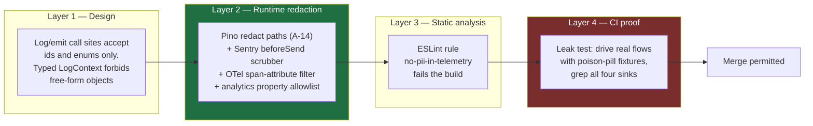
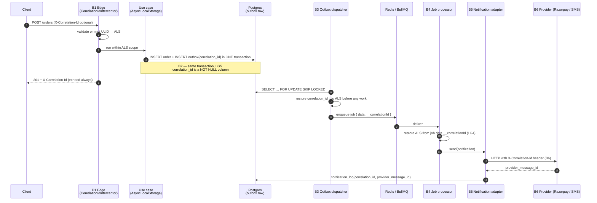
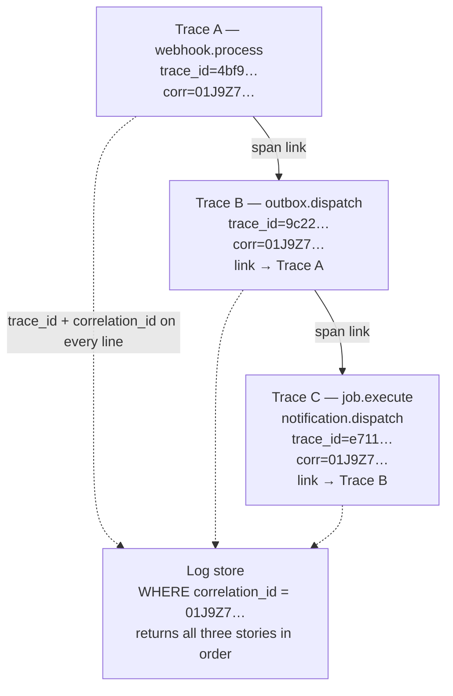
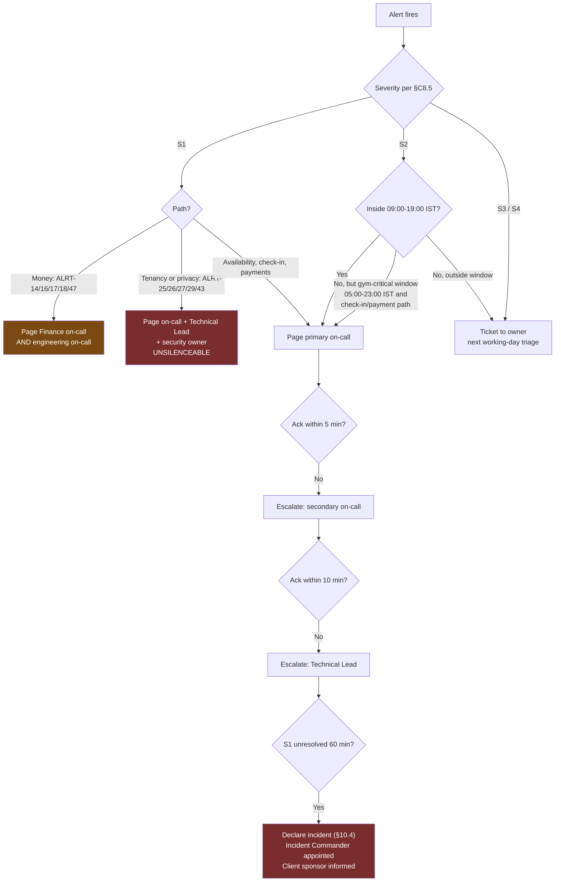
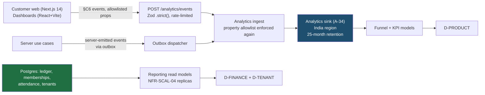
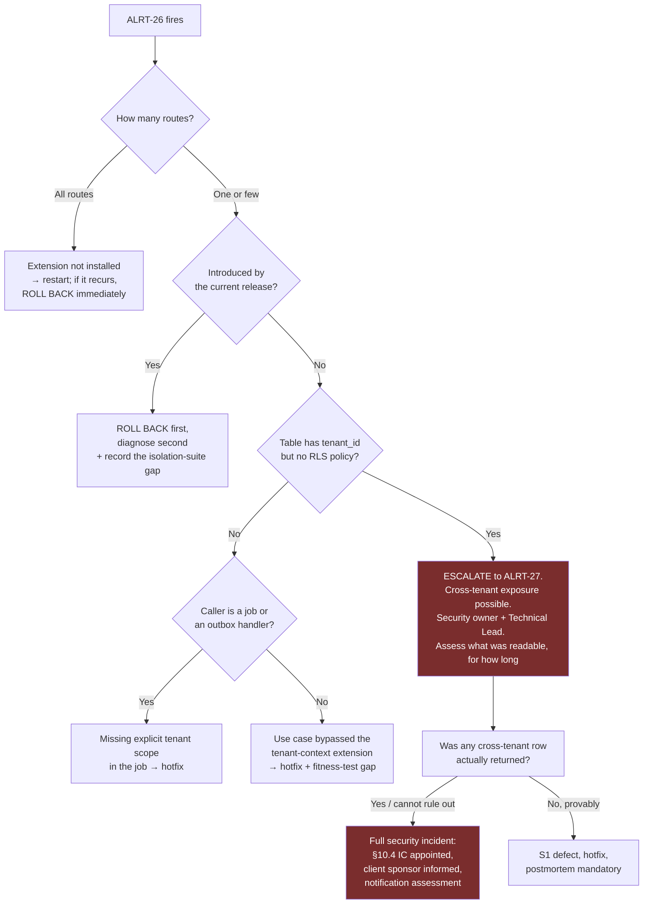

# Monitoring — Observability, Alerting, SLOs, Runbooks and On-Call

**Gym Marketplace & Multi-Tenant Gym Management SaaS**
The implementable observability design for Phase 1, written before any application code exists.

---

## 0. Document control

| Field | Value |
| :--- | :--- |
| Path | `/docs/engineering/Monitoring.md` |
| Precedence rank | **3** — binding derived specification (`PROJECT_CONSTITUTION.md` §1.3). Rank 1 (`PROJECT_CONSTITUTION.md`) and rank 2 (`MASTER_PRD.md`) override every statement here. Where this document appears to differ from either, **this document is defective** and is corrected by amendment. |
| Status | Phase-0/2 engineering artefact. **No application code exists.** Every code, YAML, SQL or PromQL fragment below is labelled *illustrative — not committed code* and fixes a shape, not an implementation. |
| Governing requirements | `NFR-MNT-04` (structured JSON logs + correlation id into jobs) · `NFR-MNT-05` (distributed tracing on all request paths) · `NFR-MNT-06` (the seven alert signals) · `NFR-MNT-09` (a runbook per module) · `NFR-AVL-01` … `NFR-AVL-08` · `NFR-PERF-01` … `NFR-PERF-10` · `NFR-SEC-09` · `BR-DAT-06` (no personal data in logs, traces or analytics) · `BR-DAT-01`, `BR-DAT-02`, `BR-DAT-07` · `BR-FIN-01`, `BR-FIN-03`, `BR-FIN-07` · `BR-PAY-02`, `BR-PAY-05`, `BR-PAY-06`, `BR-PAY-07`, `BR-PAY-08` · `BR-TEN-01` · `KPI-01` … `KPI-26` · `BAC-07`, `BAC-10`, `BAC-11` |
| Governing law | `PROJECT_CONSTITUTION.md` **§18 (Observability Law)** in full — LG1–LG8, MT1–MT5, TR1–TR4, AL1–AL4, HL1–HL4 — plus §13 (Error Handling Law, ER4/ER5/EV5), §11 (Multi-Tenancy Law), §12.10 (what is never logged), §19 (Performance Budgets, PB7/PB10), §2 Q8 (*"is this implementation observable?"*) |
| Governing decisions | `ADR-0003` (modular monolith — one deployable, two process roles) · `ADR-0005` (Prisma + tenant-context extension → the `db.tenant_context_set` tripwire) · `ADR-0006` (RLS) · `ADR-0009` (BullMQ + distributed locks) · `ADR-0010` (**polling, not Socket.IO** — the freshness indicator and the 5% poll-share trigger) · `ADR-0013` (webhook-driven activation → webhook lag is a money alert, not an ops alert) · `ADR-0015` (append-only ledger → ledger is the money source of truth, telemetry is not) · `ADR-0017` (transactional outbox → outbox lag alert) · `ADR-0018` (`PaymentProvider` port; **Razorpay Route** is the India adapter per `LAUNCH_MARKET_INDIA.md` §7) · `ADR-0026` (server-side flags → kill switches in runbooks) · `ADR-0027` (OpenAPI drift) · `ADR-0028` (country/tax/KYC as configuration) · `ADR-0030` (stack-additions governance — see §11.2) |
| Stack | Locked by `MASTER_PRD.md` §C1.1. Observability = **OpenTelemetry** traces + structured JSON logs + metrics + error tracking. Logging is **Pino + `nestjs-pino` + `AsyncLocalStorage`** (`A-14`); error tracking is **Sentry, self-hosted** (`A-15`, and self-hosting is now mandatory — §1.6); queue inspection is **Bull Board, admin-only behind RBAC** (`A-30`). The API framework is **NestJS 10 on Node.js 20**. Express appears in this repository only as the rejected option of `ADR-0002`. |
| Market | **India.** `LAUNCH_MARKET_INDIA.md` is binding: `Asia/Kolkata` (UTC+05:30, no DST), INR/paise, GST 18% as CGST 9% + SGST 9% intra-state, financial year **1 April – 31 March**, Razorpay Route, **TRAI DLT template pre-approval for every SMS**, and **mandatory India data residency** — which constrains where telemetry may be stored (§1.6). |

### 0.1 What this document is, and what it is not

| | |
| :--- | :--- |
| **This document is** | The detailed observability specification: the exact log schema field by field, the complete metric catalogue with type, labels and cardinality budget, the required span tree per request path, the full alert catalogue with concrete thresholds and out-of-hours paging decisions, the five SLOs with their error-budget policy, the five audience dashboards, the instrumentation map for `KPI-01` … `KPI-21`, the mandatory runbook structure plus three fully worked runbooks, and the on-call model. |
| **This document is not** | The security control catalogue (`/docs/engineering/Security.md` — audit log design §12, secrets §7, incident *response* policy §15). Not the capacity or load-test design (`/docs/engineering/Scalability.md` §3, §10 — the eighteen `LT-` scenarios and the k6 thresholds). Not the test plan (`/docs/engineering/TestingStrategy.md`). Not the endpoint or error-code registry (`/docs/engineering/API_Catalog.md` §3, §6). Not the schema (`/docs/engineering/ERD.md`). Not the state machines (`/docs/engineering/StateMachines.md`). **It references all of them and duplicates none.** |
| **Relationship to `ENGINEERING_PLAN.md` §19** | `ENGINEERING_PLAN.md` §19 is the CTO-level overview: golden signals in one table, ~40 metric rows, a log-field table, a span table, ~24 alert rows, four dashboards, five SLOs. **This is the detailed version of that slice.** Where §19 gives an alert one row, this gives it a threshold, a commercial justification, a first diagnostic command, a routing rule and an out-of-hours decision. Where §19 lists a span, this gives the parent, the attributes, the sampling rule and the failure it exists to explain. Four defects in §19 are corrected in §0.3 with their authority; **no alert is removed and no threshold is loosened**. |
| **Non-goal** | Vendor selection. The metrics store, log store, trace store and paging tool are **not** in `STACK_ADDITIONS.md` and therefore may not appear in code or Terraform. §11.2 raises them as `PROPOSED` register rows for owner approval under `ADR-0030`. This document is written to be vendor-neutral: it specifies signals, names, thresholds and routes, not products. |

### 0.2 How to read this document

| Section | Answers |
| :--- | :--- |
| §1 | Why we instrument at all, and the one rule that outranks every other: no personal data in telemetry |
| §2 | What a log line looks like, exactly, and how one id ties an HTTP request to a job to a notification |
| §3 | Every metric, its type, its labels, and the cardinality budget that stops the bill exploding |
| §4 | Which spans must exist on which path, and what is always sampled |
| §5 | **The alert catalogue** — the operational contract |
| §6 | What we promise (`KPI-22` … `KPI-26`), how it is measured, and what happens when we miss |
| §7 | Who looks at what, including the polling-freshness panel `A-08` requires |
| §8 | How `KPI-01` … `KPI-21` are computed from `§C6` events, and why money never is |
| §9 | The runbook contract, and three runbooks written out in full |
| §10 | Who gets woken, when, by what, and what happens afterwards |
| §11 | Traceability, open items, and the four stack-additions rows this document needs |

### 0.3 Four corrections applied before writing

`ENGINEERING_PLAN.md` §20.1 states its own subordination: *"Where this section and the constitution
differ, the constitution wins, and the discrepancy is a defect in this document."* Four such
discrepancies exist in §19 and are corrected here.

| # | `ENGINEERING_PLAN.md` §19 says | `PROJECT_CONSTITUTION.md` §18 says | Correction in force | Why it matters |
| :-: | :--- | :--- | :--- | :--- |
| **C-1** | Metric naming `gym.<domain>.<metric>` with dot separators (`gym.http.request.duration_ms`) | **MT1**: names are `snake_case`, `<area>_<subject>_<unit>`; counters end `_total`, durations end `_seconds`, sizes end `_bytes` | **The constitution's form is canonical.** The registered instrument name is `http_request_duration_seconds`. The `gym.` prefix is dropped — the OTel resource attribute `service.namespace=gymmap` already namespaces every signal, and a prefix repeated on 60 series is 60 wasted bytes per scrape and a second naming convention to police. `_ms` becomes `_seconds`: OTel and every Prometheus-compatible backend expect base units, and a histogram whose bucket boundaries are in milliseconds cannot be aggregated with one in seconds. §3.9 gives the full old→new mapping. | Two naming schemes means two dashboards, two alert rule sets and a query that silently matches nothing |
| **C-2** | Six metrics carry a `tenant_id` label: `gym.live.projection.staleness_ms`, `gym.payment.duplicate_detected.count`, `gym.invoice.sequence_gap.count`, `gym.settlement.variance.count`, `gym.ledger.balance_check.mismatch`, `gym.dispute.open.count`, `gym.export.rows` | **MT2**: *"`tenant_id` is never a metric label … The single exception is the reconciliation variance gauge, which is per-tenant by necessity (`BR-FIN-07`) and is emitted only for tenants with a non-zero variance."* | **Only `settlement_reconciliation_variance_minor` may carry `tenant_id`.** Every other per-tenant figure becomes (a) an unlabelled aggregate metric that fires the alert, plus (b) a **database query in the runbook** that names the tenant. §3.8 specifies each replacement. | 2,000 tenants (`NFR-SCAL-01`) × histogram buckets is the classic cardinality explosion; and per-tenant money figures belong in the ledger (`BR-FIN-01`), not in a metrics store with a 15-day retention and no audit trail |
| **C-3** | `gym.checkin.result.count` carries `branch_id` | **MT2** allowlist: `module`, `route_template`, `status_class`, `job_name`, `channel`, `provider`, `result`, `denial_reason`, `entry_type`, `environment` | `checkin_total` labels are **`method`, `result`, `denial_reason`** only. Per-branch denial analysis is a query against `attendance` (`BR-CHK-10` requires the *data* to be analysable, not the *metric*). §5.4 `ALRT-24` detects a denial-rate anomaly platform-wide; the runbook's first step localises it to a branch by SQL. | 5,000 branches × 15 `§C4.8` denial reasons × 4 methods = 300,000 series from one counter |
| **C-4** | `service` values include `pdf-renderer` and `web` | **§18.1.1**: `service` is *"`api` or `worker`"* | `service` ∈ {`api`, `worker`}. `ADR-0003` is a **modular monolith**: one image, two process roles. The Chromium renderer is a pool *inside* the worker role, distinguished by the `component=pdf-renderer` resource attribute, not by pretending to be a service. Browser telemetry (`NFR-PERF-02` RUM) is a **separate signal class** with its own schema (§2.8) and is never mixed into server logs — it is untrusted input. | Inventing services in telemetry that do not exist in the deployment is how an on-call engineer wastes ten minutes looking for a container that was never deployed |

Corrections `C-1` … `C-4` are recorded in §11.1 for the amendment log. No alert, threshold, SLO or
runbook obligation from either source document is weakened by any of them.

### 0.4 The five invariants, restated as observability obligations

Every section below exists to make one of the five load-bearing invariants **visible while it is
breaking**, not after. An invariant with no telemetry is an invariant enforced on trust.

| # | Invariant | The signal that proves it is holding | The alert that fires when it is not | Section |
| :-: | :--- | :--- | :--- | :--- |
| **I1** | No tenant reads or writes another tenant's data (`BR-TEN-01`, `NFR-SEC-09`, `BAC-10`, `E2E-11`) | `tenant_isolation_violations_total` flat at zero; `db.tenant_context_set=true` on 100% of `db.transaction` spans; the production isolation canary green | `ALRT-25`, `ALRT-26`, `ALRT-27` — all S1, all page immediately, all unsilenceable (`AL3`) | §4.4, §5.5, §9.5 |
| **I2** | Money is an append-only ledger of integer minor units (`BR-PAY-01`, `BR-FIN-01`) | `settlement_reconciliation_variance_minor` == 0 for every tenant every cycle; `ledger_balance_mismatch_total` == 0; invoice sequence contiguous per tenant per **Indian FY** | `ALRT-14`, `ALRT-15`, `ALRT-16`, `ALRT-17` | §5.4, §9.4 |
| **I3** | Price displayed = price charged; server re-validation aborts on mismatch (`BR-PLN-03`) | `checkout_revalidation_total{outcome}` — an `ABORTED` rate above baseline means prices are moving under live checkouts | `ALRT-19` | §3.5, §5.4 |
| **I4** | Verification before visibility; earned reviews only (`BR-GYM-01/03`, `BR-REV-01/03`) | `discovery_unverified_listing_leaks_total` == 0 (synthetic probe); `review_rejected_total{reason="NO_CHECK_IN"}` as expected traffic, not zero | `ALRT-28`, `ALRT-36` | §5.5, §5.7 |
| **I5** | Activation is webhook-driven, never the client redirect (`BR-PAY-02`) | `webhook_processing_lag_seconds` low; `webhook_events_total{outcome}` non-zero on a schedule; activation always parented to a `webhook.process` trace, never to an HTTP request from a browser | `ALRT-10`, `ALRT-11`, `ALRT-12` | §4.3, §5.3, §9.3 |

---

## 1. Observability principles

### 1.1 Why this document exists at all

`PROJECT_CONSTITUTION.md` §2 Q8 makes observability a **precondition of writing code**, not a
follow-up: *"Answer Q8 with four artefacts: the log line's field list, the metric names, the span
names, and the alert condition. 'It logs errors' is not an answer."* This document is the platform-
wide answer to Q8, so that each PR only has to answer it for its own slice.

Three properties of this specific product make observability load-bearing rather than nice:

1. **The money path is asynchronous and irreversible.** A membership activates because a webhook
   arrived (`BR-PAY-02`, `ADR-0013`), an invoice number is allocated gaplessly per Indian financial
   year (`FR-INV-02`), and a payout is instructed from an append-only ledger (`BR-FIN-01`). There is
   no user watching most of that. If the outbox stalls at 02:00 IST, nobody finds out from a
   complaint — they find out from a metric, or they find out from a gym owner who was not paid.
2. **The most important failure is silent by construction.** A tenant-isolation breach returns
   `200 OK` with the wrong rows. It is not an error rate, it is not a latency spike, and no user
   reports it. `tenant_isolation_violations_total` and the `db.tenant_context_set` span attribute
   exist because the only way to see this class of defect is to instrument for its absence.
3. **The product is a door.** `NFR-AVL-02` ranks check-in and payment as the paths that degrade
   last. A member standing at a turnstile in Bengaluru at 07:10 IST is a worse audience for a
   30-second latency spike than a marketer refreshing a report. Peak gym hours in India —
   **06:00–10:00 and 17:00–22:00 IST** — are the hours the system must be watched hardest, and they
   are precisely the hours that are *outside* an office rota. §10.3 makes that explicit in the
   paging policy rather than leaving it to goodwill.

### 1.2 The twelve principles

| # | Principle | Consequence in this codebase |
| :-: | :--- | :--- |
| **P1** | **Telemetry is a product surface with a consumer.** Every signal has a named consumer — an alert, a dashboard panel, an SLO, or a runbook step. | `HL4` is enforced: a dashboard panel names the `NFR-`/`KPI-` it tracks. A metric emitted for nobody is deleted at the next quarterly review (§3.10). |
| **P2** | **Three pillars plus one.** Logs, metrics and traces are operational and disposable. The **audit log is not telemetry** — it is a durable, append-only business record (`BR-DAT-01`) on a connection whose role cannot `UPDATE` or `DELETE`. | Never satisfy an audit requirement with a log line, and never satisfy an operational need by querying `audit_log`. `Security.md` §12 owns the audit design. |
| **P3** | **Money is measured twice, from two independent sources, and the two are compared.** Metrics give the real-time operational figure; the ledger gives the reported figure. | `KPI-19`/`KPI-20`/`KPI-21` alert from counters (MT5) but **report** from the ledger (§8.4). Divergence beyond tolerance is itself an alert (`ALRT-47`). |
| **P4** | **One correlation id, end to end, or the chain is broken.** HTTP → use case → outbox row → BullMQ job → notification → PDF render all carry the same id (LG3, LG4, LG5). | A support agent quotes one id (`UM6`) and an engineer reconstructs the whole story. §2.4 specifies the propagation at each of the six boundaries. |
| **P5** | **Alert on symptoms the business feels; diagnose with causes.** Page on "payment success rate below 92%", not on "Redis CPU at 80%". | §5 alerts are ordered by commercial consequence. Saturation metrics exist for diagnosis (§3.3) and mostly do not page. |
| **P6** | **Every alert has a runbook, an owner, a threshold and a false-positive rate** (`AL1`). An alert without a runbook is deleted. | §5 columns are mandatory. §9.1 fixes the runbook structure. §10.7 reviews false-positive rates monthly. |
| **P7** | **Cardinality is a budget, not an accident** (`MT2`). Labels come from a fixed allowlist. `tenant_id` is banned with one named exception. | §3.7 sets the budget at **60,000 active series** with a per-metric ceiling and a CI check on the label allowlist. |
| **P8** | **Sampling never removes money or the door** (`LG7`, `TR4`). Discovery reads are sampled; `ordering`, `payments`, `ledger`, `billing`, `settlements`, `refunds`, `attendance` and every error are not. | §4.5 gives the sampling matrix. A sampled-out payment trace is an incident that cannot be explained. |
| **P9** | **Log once, at the boundary that decides** (`LG8`, `ER4`). | Duplicate logging inflates error rates and makes thresholds meaningless. §2.6 names the boundary for each error class. |
| **P10** | **Instrument the absence of things.** A webhook stream dropping to zero, an outbox that stops draining, a nightly job that never starts, a settlement cycle that produces no batches — all look like health to a naive error-rate monitor. | §5 contains five explicit *dead-man* alerts (`ALRT-11`, `ALRT-21`, `ALRT-22`, `ALRT-31`, `ALRT-42`). |
| **P11** | **`BR-DAT-06` is absolute and outranks every debugging convenience.** Personal data never enters a log, a trace, an analytics event or an error report. | §1.4 gives the four-layer enforcement. There is no "just for this incident" exemption; there is an impersonation flow (`BR-DAT-02`) and a database, both audited. |
| **P12** | **Telemetry is subject to data residency.** India residency is mandatory, not preferential (`LAUNCH_MARKET_INDIA.md` §9, `OQ-16`). | Every telemetry store — metrics, logs, traces, error tracking, product analytics — is India-region. §1.6 makes self-hosted Sentry a requirement rather than a preference. |

### 1.3 The signal taxonomy — five classes, five different rules

Confusing these five is the most common cause of a `BR-DAT-06` breach, because each has a different
retention, a different audience and a different residency posture.

| Class | Purpose | Contains ids? | Contains personal data? | Retention | Store | Owner |
| :--- | :--- | :--- | :--- | :--- | :--- | :--- |
| **Logs** | Reconstruct one request or job | Yes — `tenant_id`, `actor_id`, `entity_id` as **opaque identifiers only** | **Never** (`BR-DAT-06`) | 30 days hot, 90 days cold | Log store (§11.2 `A-32`) | DevOps |
| **Metrics** | Aggregate behaviour over time | **No** — one exception, `settlement_reconciliation_variance_minor{tenant_id}` (`MT2`) | Never | 15 days raw, 13 months at 5-minute rollup (needed for FY-over-FY comparison in an April–March year) | Metrics store (§11.2 `A-31`) | DevOps |
| **Traces** | Explain latency and causality within one operation | Yes — as span attributes (`TR3`) | Never | 7 days sampled, 30 days for money and check-in paths | Trace store (§11.2 `A-31`) | DevOps |
| **Errors** | Group and triage exceptions | Yes — ids and stack frames | Never — **scrubbed before transmission** | 90 days | Sentry, **self-hosted, India region** (`A-15`, `DEP-07`) | Technical Lead |
| **Product analytics** | `§C6` event taxonomy, funnels, `KPI-01` … `KPI-21` | `anonymous_id`, `user_id`, `session_id`, `tenant_id` | **Never a property** — `§C6` states it explicitly | 25 months (two Indian financial years plus a month) | Analytics sink (§11.2 `A-34`), India region | Product |

**Audit** (`audit_log`) is deliberately absent from this table. It is business data, it *does* record
before-and-after states that may contain personal data, it lives in Postgres under RLS with a
retention governed by `NFR-PRV-*`, and it is specified in `Security.md` §12. Telemetry retention
policies do not apply to it and must never be applied to it.

### 1.4 `BR-DAT-06` — no personal data in logs, traces or analytics, and how it is enforced

> `BR-DAT-06` (Must): *"Personal data is never included in application logs, error traces, or
> analytics events."* Restated by `PROJECT_CONSTITUTION.md` §18.1.2 and §12.10, and by `§C6`:
> *"Personal data is never a property."*

One rule, four independent enforcement layers, because a single layer is a single point of failure
and this is a Must-rule with regulatory teeth in the launch market.



#### Layer 1 — Design: the call site cannot express the mistake

The logger is not `pino` directly. `common/` exposes a `PlatformLogger` whose context parameter is a
**closed type**: identifiers, enums, integers, booleans and `Money` — never `string` free-form, never
a spread of a domain entity. `logger.info('checkin.recorded', member)` does not compile, because
`Member` is not assignable to `LogContext`. This eliminates the single largest source of leaks —
spreading an entity into a log call — before any redaction is needed.

```ts
// illustrative — not committed code
type LogSafeValue = Brand<string, 'Id'> | number | bigint | boolean | Money | LogSafeEnum;
export interface LogContext { readonly [k: string]: LogSafeValue | undefined }
// Widening escape hatches are banned by ESLint: no `as unknown as LogContext`, no index signatures
// on domain types, no `JSON.stringify(entity)` anywhere under apps/server/**.
```

`PROJECT_CONSTITUTION.md` §18.1.1 already requires `message` to be *"short, stable,
non-interpolated"* — variable data goes in fields. That rule and this type are the same rule seen
from two sides: a non-interpolated message cannot smuggle a member's name into free text.

#### Layer 2 — Runtime redaction: four sinks, four scrubbers

| Sink | Mechanism | Configuration location |
| :--- | :--- | :--- |
| Logs | **Pino `redact` paths** (`A-14`), `censor: '[REDACTED]'`, `remove: false` — the *key* stays so a reviewer can see that a redaction fired | `apps/server/src/common/logging/redaction.ts` |
| Errors | Sentry `beforeSend` + `beforeSendTransaction` scrubber running the same path list plus stack-frame local-variable stripping, `sendDefaultPii: false` | `apps/server/src/common/observability/sentry.config.ts` |
| Traces | OTel `SpanProcessor` that drops any attribute whose key is not on the span-attribute allowlist (§4.4) — **allowlist, not denylist** | `apps/server/src/common/observability/tracing.ts` |
| Analytics | `§C6` property **allowlist** per event name, derived from the `§C6` tables; an unknown property is dropped and counted in `analytics_property_dropped_total` | `packages/types/src/analytics/events.ts` |

The Pino redaction path list is a **reviewed artefact** — a change to it requires the same two
reviewers `CODEOWNERS` mandates for `payments/` and `tenancy/`. The list, in full:

```ts
// illustrative — not committed code
export const REDACT_PATHS = [
  // Credentials and tokens (§18.1.2 row 3; NFR-SEC-*)
  'req.headers.authorization', 'req.headers.cookie', 'res.headers["set-cookie"]',
  'req.headers["x-razorpay-signature"]', 'req.headers["idempotency-key"]',
  '*.password', '*.passwordHash', '*.currentPassword', '*.newPassword',
  '*.otp', '*.otpHash', '*.accessToken', '*.refreshToken', '*.sessionToken',
  '*.qrToken', '*.qrPayload', '*.signature', '*.privateKey', '*.secret', '*.apiKey',
  // Direct personal identifiers (BR-DAT-06; §18.1.2 row 1)
  '*.name', '*.firstName', '*.lastName', '*.fullName', '*.displayName',
  '*.email', '*.emailAddress', '*.phone', '*.phoneNumber', '*.mobile', '*.msisdn',
  '*.address', '*.addressLine1', '*.addressLine2', '*.pincode', '*.postalCode',
  '*.dob', '*.dateOfBirth', '*.gender', '*.emergencyContact', '*.emergencyContactPhone',
  // Health and fitness (FR-USER-03, NFR-PRV-07; §18.1.2 row 2 — "it has no operational use")
  '*.healthNotes', '*.medicalConditions', '*.injuries', '*.fitnessGoal',
  '*.height', '*.weight', '*.bodyFat', '*.measurements',
  // Instruments (BR-PAY-08; §18.1.2 row 4)
  '*.cardNumber', '*.pan', '*.cvv', '*.expiry', '*.bankAccountNumber', '*.ifsc',
  '*.upiId', '*.vpa', '*.accountHolderName',
  // India KYC (LAUNCH_MARKET_INDIA.md §6; BR-DAT-07)
  '*.panNumber', '*.aadhaar', '*.aadhaarNumber', '*.gstin', '*.fssai',
  '*.kycDocumentUrl', '*.kycStorageKey', '*.documentContent',
  // Provider payloads (§18.1.2 row 5) — log the event id, never the body
  'payload', 'rawPayload', 'body', 'req.body', 'webhook.payload', 'provider.response',
  // Geolocation (§18.1.2 row 8) — precision-reduced coords only, as §C6 already requires
  '*.lat', '*.lng', '*.latitude', '*.longitude', '*.coordinates',
] as const;
```

Four notes a reviewer must understand, because each encodes a rule rather than a preference:

1. **`gstin` and `panNumber` are redacted even though a GSTIN is semi-public.** A GSTIN embeds the
   state code and the PAN (`LAUNCH_MARKET_INDIA.md` §6); a PAN is a tax identifier of a natural
   person in a proprietorship. `tenant_id` identifies the tenant for every operational purpose.
2. **`body` is redacted wholesale, not field-by-field.** §18.1.2 row 7: *"Full request bodies on any
   authenticated endpoint → field **names** that failed validation, never their values."* The
   validation pipe emits `validation.failedFields: ["email","phone"]` — names only.
3. **`payload` is redacted wholesale** because a Razorpay webhook body contains the payer's contact
   details and `payments.raw_payload` already stores the redacted copy under RLS. The log carries
   `provider`, `event_type`, `provider_event_id` and `outcome`.
4. **Coordinates are redacted, not rounded, in logs.** `§C6` requires precision reduction for the
   `search_performed` **analytics** event; that reduction happens in the analytics emitter, not in
   the logger. A log line has no need for a member's location at any precision.

#### Layer 3 — Static analysis: `no-pii-in-telemetry`

A local ESLint rule (`A-21`) in `packages/config/eslint/rules/`, error severity, no warnings, applied
to `apps/server/**` and `packages/**`:

| The rule flags | Rationale |
| :--- | :--- |
| Any member expression matching the redaction key list appearing as an argument to `logger.*`, `span.setAttribute(s)`, `Sentry.*`, or `analytics.track` | Direct leak |
| Template literals inside `logger.*` message arguments | `LG1`/§18.1.1: messages are stable and non-interpolated; `` `member ${m.email} denied` `` is the classic breach |
| `JSON.stringify(...)` anywhere in a telemetry argument | Defeats path-based redaction because the result is one opaque string |
| Spreading a type imported from `*/domain/**` or `@prisma/client` into a telemetry argument | Entity spread is leak vector #1 |
| `console.log` / `.error` / `.warn` / `.debug` / `.info` in `apps/server/**` and `packages/**` | `LG2` — bypasses redaction entirely |
| `new Error(msg)` where `msg` interpolates a flagged identifier — errors reach Sentry | Error messages are telemetry |
| `req.body`, `req.headers`, `req.query` referenced in a telemetry argument | Whole-object leak |

Suppression requires `// eslint-disable-next-line no-pii-in-telemetry -- <reason> (<PRD id>)` and the
CI job `pii-suppressions` fails if the count of suppressions in the repository increases. The
baseline count is **zero**.

#### Layer 4 — CI proof: the leak test

Static analysis proves nobody *wrote* a leak. It cannot prove a library did not. The leak test proves
the running system does not emit one.

| Property | Value |
| :--- | :--- |
| Location | `apps/server/test/observability/pii-leak.e2e-spec.ts` |
| Job | `pr.yml` job `pii-leak` — **never** affected-graph-filtered, exactly like the isolation suite (`TestingStrategy.md` §5) |
| Fixtures | **Poison-pill seed**: the `§C8.2` deterministic seed is re-projected with unmistakable sentinel values — member name `ZZQXPOISONNAME`, email `zzqxpoison@example.invalid`, phone `+919999900001`, PAN `ZZQXP0001Z`, Aadhaar `999999990001`, health note `ZZQXPOISONHEALTH`, address `ZZQXPOISONADDR`, card `4111111111111111`, UPI `zzqxpoison@upi` |
| Flows exercised | 14 flows covering every sink: registration, OTP, login, member create, CSV import with a deliberately invalid row, search with coordinates, checkout, Razorpay webhook capture, refund, check-in allowed, check-in denied, KYC upload, tenant export, and a forced `500` on an authenticated route |
| Sinks captured | Pino stream to an in-memory buffer; an OTLP trace collector stub; a Sentry transport stub; the analytics sink stub |
| Assertion | The concatenation of all four buffers contains **none** of the sentinel values, case-insensitively, and additionally matches no `\b[6-9]\d{9}\b` (Indian mobile), no `[A-Z]{5}\d{4}[A-Z]` (PAN), no `\b\d{12}\b` (Aadhaar), and no RFC-5322 local@domain pattern except `@example.invalid` in an explicitly allowlisted assertion-diagnostics field |
| Negative control | One test **removes** the Pino redaction config and asserts the suite **fails**. A leak test that cannot fail is theatre (`TestingStrategy.md` §1). |
| Runtime canary | In staging and production, a sampled 1-in-10,000 log-line scanner runs the same regex battery and increments `pii_leak_suspected_total`. Any increment is `ALRT-29`, S1. |

### 1.5 What "observable" means for a PR (the Q8 contract)

`PROJECT_CONSTITUTION.md` §2 Q8 requires four artefacts in every PR description. This document fixes
what each must contain so that review is a check, not a negotiation.

| Artefact | Acceptance standard | Rejected |
| :--- | :--- | :--- |
| **Log line** | The exact field list, with the base fields assumed and only the contextual additions listed; each named field is on the §2.2 schema or is justified | "Logs the result" |
| **Metric names** | Full `snake_case` names with type and labels; labels drawn from the §3.7 allowlist; each new metric names its consumer (alert, panel or SLO) | "Adds Prometheus metrics" |
| **Span names** | The parent span and the new child spans, with attributes from the §4.4 allowlist | "Traced with OTel" |
| **Alert condition** | Either a concrete condition with a threshold and a §9 runbook section, or the sentence *"No new alert; covered by `ALRT-nn`"* | Silence |

A PR touching `payments/`, `settlements/`, `ledger/`, `refunds/`, `billing/`, `tenancy/` or
`attendance/` and answering Q8 with fewer than four artefacts is a **review blocker**, not a comment.

### 1.6 India residency and the telemetry supply chain (`P12`)

`LAUNCH_MARKET_INDIA.md` §9 makes India data residency **mandatory** (RBI, `OQ-16`), which
`NFR-PRV-05` previously treated as configurable. Telemetry is data.

| Signal | Residency obligation | Consequence |
| :--- | :--- | :--- |
| Logs | India region. Logs carry `tenant_id`, `actor_id` and `entity_id` — pseudonymous, but re-identifiable against the production database, so they are personal data under a conservative reading. | The log store is deployed by Terraform (`A-27`) into the same Indian region as Postgres. No SaaS log vendor with a non-Indian control plane. |
| Metrics | India region. Metrics carry no identifiers (`MT2`) except the variance gauge's `tenant_id`. | Lower risk, same placement — splitting regions to save nothing adds an egress path. |
| Traces | India region, same reasoning as logs. | Same collector deployment. |
| **Errors (Sentry, `A-15`, `DEP-07`)** | India region. Sentry captures stack frames whose local variables can contain anything the scrubber missed. | **Self-hosting is now mandatory, not the "self-hostable" optionality `A-15` records.** This is an amendment-worthy tightening: §11.2 raises it. |
| Product analytics | India region; `§C6` events carry `user_id` and `tenant_id`. | Rules out any analytics product without an Indian data plane, which materially narrows `A-34`'s options. |
| Payment provider telemetry | Razorpay's own dashboards remain the provider's system of record for gateway-side events; we mirror only `provider_event_id`, `event_type` and `outcome`. | Never re-host provider payloads for convenience (§18.1.2 row 5). |

**Degradation posture.** `DEP-07` is *Mandatory (ops)* with the stated mitigation *"operational
blindness; local logging retained"*. `NFR-AVL-03` therefore applies to our own tooling: **loss of
the telemetry stack must not prevent check-in, purchase or payment.** Concretely — the OTLP exporter
is non-blocking with a bounded queue that **drops** on overflow and increments
`telemetry_export_dropped_total`; Pino writes to stdout regardless of whether any collector is
reachable; a metrics scrape failure never affects request handling; and Sentry initialisation failing
is a `warn`, never a boot failure. An observability outage degrades to `ALRT-41` and a blind-flying
posture, never to an availability incident.

---

## 2. Structured logging (`NFR-MNT-04`)

### 2.1 The eight rules, restated as engineering obligations

`PROJECT_CONSTITUTION.md` §18.1 fixes LG1–LG8. This section does not re-argue them; it specifies
what satisfying each looks like in `apps/server`.

| Rule | Obligation here |
| :--- | :--- |
| **LG1** JSON everywhere | Pino default transport writes newline-delimited JSON to stdout. `pino-pretty` is attached **only** when `NODE_ENV === 'local'`, and only as a terminal pipe — never as a logger transport, so that no environment can accidentally ship pretty output that a log parser cannot index. |
| **LG2** No `console.*` | ESLint `no-console` at error severity across `apps/server/**` and `packages/**`, plus the §1.4 Layer-3 rule. There is one allowlisted file: `apps/server/src/main.ts` may `process.stdout.write` a single JSON boot line **before** the logger exists, and that line is asserted to be valid JSON in a unit test. |
| **LG3** Correlation id at the edge | §2.4. |
| **LG4** Into BullMQ jobs | §2.4, boundary B4. |
| **LG5** Onto the outbox | §2.4, boundary B3; `outbox.correlation_id` is a **non-null column** (`ERD.md` §4), not an optional field in `payload`. |
| **LG6** Level discipline | §2.3. |
| **LG7** Sampling | §2.7. |
| **LG8** Log once | §2.6. |

### 2.2 The log schema — every field, exactly

Base fields appear on **every** line. Contextual groups appear when their context exists. A field not
in this table does not appear in a log line without an amendment to this section.

#### 2.2.1 Base — always present (10 fields)

| Field | Type | Source | Example | Notes |
| :--- | :--- | :--- | :--- | :--- |
| `timestamp` | ISO-8601 string, UTC, millisecond precision | Pino `timestamp` with `isoTime` | `2026-08-06T13:42:07.318Z` | **Always UTC**, never `Asia/Kolkata`. `ADR-0025`: UTC storage, gym timezone for business computation. A log timeline in IST and a database timestamp in UTC is how a 5½-hour phantom incident is born. Dashboards render IST; the wire is UTC. |
| `level` | string enum | Pino | `info` | Emitted as the **string label**, not Pino's numeric level, so a human reading raw stdout in a container can act without a decoder ring. |
| `message` | string | Call site | `checkin.recorded` | Short, **stable, non-interpolated** (§18.1.1). Convention: `<module>.<event>` in dot-lowercase for business events; a plain sentence for diagnostics. Stability matters because alerts and saved searches key on it. |
| `correlation_id` | ULID string, 26 chars | `AsyncLocalStorage` (`A-14`) | `01J9Z7K3M8QF4C2XPB6RT0V9AE` | LG3/LG4/LG5. ULID over UUIDv4: lexicographically sortable by creation time, which makes a raw log grep chronologically meaningful. |
| `service` | `api` \| `worker` | Boot config | `worker` | Correction **C-1/C-4**: exactly two values (§18.1.1). |
| `component` | string enum | Boot config | `pdf-renderer` | Added here. Distinguishes roles inside one process image (`ADR-0003`): `http`, `outbox-dispatcher`, `scheduler`, `queue-worker`, `pdf-renderer`. Low cardinality, five values. |
| `version` | string | Build-time env | `1.4.0+9f2c1ab` | Semantic version **and** build SHA (§18.1.1: *"Build SHA and semantic version"*). One field, `+`-joined, so a deploy correlation is a single grep. |
| `environment` | enum | Config | `production` | `local`, `ci`, `development`, `staging`, `production` — the five of `§C7`. |
| `module` | enum, 23 values | `AsyncLocalStorage`, set by the use-case decorator | `settlements` | One of the twenty-three `§C1.3` modules. Set by the module the *use case* belongs to, not the controller that received the call, so an outbox handler logs `memberships`, not `payments`. |
| `region` | string | Config | `ap-south-1` | Added here. India residency (`P12`) is auditable only if every line states where it was produced. A line with a non-Indian region in production is `ALRT-43`. |

#### 2.2.2 Tenant and actor — present when the context exists (5 fields)

| Field | Type | Present when | Notes |
| :--- | :--- | :--- | :--- |
| `tenant_id` | UUID | A tenant context is resolved (`§C1.4` step 1) | **Identifier only.** Never the tenant's trading name — that is a business name, it is high-cardinality, and it is the exact thing `MT2` bans from labels. Absent on public marketplace reads, and its absence on a `/tenant/**` route is itself the `ALRT-26` signal. |
| `actor_id` | UUID | Authenticated | User id only, **never** name or contact (§18.1.1). |
| `actor_type` | enum | Authenticated | `MEMBER`, `GYM_OWNER`, `GYM_MANAGER`, `RECEPTIONIST`, `TRAINER`, `PLATFORM_ADMIN`, `VERIFICATION_OFFICER`, `FINANCE`, `SUPPORT_AGENT`, `SYSTEM`. `SYSTEM` for job- and webhook-initiated work. |
| `impersonated_by` | UUID | During impersonation | `FR-AUTH-12`, `BR-DAT-02`. Its presence is also a `warn`-level security event at session start (§2.3). |
| `session_id` | UUID | Authenticated HTTP | Ties a burst of lines to one login without exposing the token. Enables "the same user's 40 requests" grouping that `actor_id` alone cannot distinguish across devices. |

#### 2.2.3 HTTP — request-completion lines (7 fields)

| Field | Type | Notes |
| :--- | :--- | :--- |
| `http.method` | enum | `GET`, `POST`, `PATCH`, `PUT`, `DELETE` |
| `http.route` | string | **Route template only** — `/tenant/members/:id`, never `/tenant/members/8f2c…`. §18.1.1 is explicit: an interpolated path leaks ids into log indexes as high-cardinality noise, and on a public route it can leak a slug that identifies a person. |
| `http.status_code` | integer | The final status after the `DomainExceptionFilter` |
| `http.duration_ms` | number | Server-side, first byte in to last byte out |
| `http.request_size_bytes` | integer | Upload-abuse signal, feeds `Security.md` §9 |
| `http.response_size_bytes` | integer | Export-egress signal (`TR-12`) |
| `http.user_agent_class` | enum | Added here. **Not** the raw UA string — a raw UA is a fingerprinting surface and is high-cardinality. Classified at the edge into `browser-desktop`, `browser-mobile`, `checkin-desk`, `bot-known`, `bot-suspected`, `api-client`, `unknown`. |

Deliberately absent: `http.query`, `http.body`, `http.headers`, `ip`. The client IP is written to
`audit_log` (`BR-DAT-01` requires it there) and to the rate-limiter's Redis keyspace — **not** to
application logs, where it would sit in a 90-day store with no access audit.

#### 2.2.4 Job — BullMQ processor lines (7 fields)

| Field | Type | Notes |
| :--- | :--- | :--- |
| `job.name` | enum, 24 values | One of the `§C5` jobs, e.g. `settlement.reconcile` |
| `job.id` | string | BullMQ job id |
| `job.attempt` | integer | 1-based; attempt > 1 is inherently `warn`-worthy context |
| `job.duration_ms` | number | Against the `§C5` expected envelope (§3.4) |
| `job.outcome` | enum | `SUCCEEDED`, `FAILED`, `SKIPPED_LOCK_HELD`, `SKIPPED_NOTHING_TO_DO`, `DEAD_LETTERED` |
| `job.items_processed` | integer | `MT4` requires it; also the dead-man signal for `ALRT-22` |
| `job.lock_acquired` | boolean | `§C5`: *"runs with a distributed lock"* (`ADR-0009`). A job that never acquires its lock is invisible without this field. |

#### 2.2.5 Error — error and fatal lines (6 fields)

| Field | Type | Notes |
| :--- | :--- | :--- |
| `error.code` | string | The `API_Catalog.md` §6 registry code — `TENANT_CONTEXT_MISSING`, `PLAN_PRICE_CHANGED`. Stable and machine-readable; alerts key on it. |
| `error.class` | string | The internal exception class name — `MissingTenantContextError`. Never sent to a client (`ER5`). |
| `error.stack` | string | Server-side only, redacted of local variables. Never in a response (`ER5`). |
| `error.retryable` | enum | `No`, `Fix`, `Wait`, `Same-key` — mirrors `API_Catalog.md` §6.2 so a log reader knows whether a client will come back. |
| `error.cause_code` | string | Present when a domain error wraps a dependency failure — `DEPENDENCY_UNAVAILABLE` caused by `RAZORPAY_TIMEOUT`. |
| `error.fingerprint` | string | Stable hash of `error.class` + normalised top-3 stack frames, so log grouping matches Sentry grouping and the two systems agree on "the same error". |

#### 2.2.6 Domain — business-event lines (6 fields)

| Field | Type | Notes |
| :--- | :--- | :--- |
| `entity_type` | enum | `membership`, `order`, `payment`, `invoice`, `settlement_batch`, `attendance`, `review`, `refund`, `dispute`, `application`, `plan`, `gym`, `branch`, `ticket` |
| `entity_id` | UUID | Identifier only |
| `outcome` | enum | §18.1.1: `ALLOWED`/`DENIED` on check-in, `AUTO_APPROVED`/`PENDING_APPROVAL` on refund, `PUBLISHED`/`HELD` on review |
| `reason_code` | enum | One of the five `§C4.8` taxonomies (`StateMachines.md` §15). Denial reasons are **data in a 200**, never error codes (`API_Catalog.md` §6.1). |
| `amount_minor` + `currency` | integer + ISO-4217 | Money is logged as **minor units plus currency**, never a formatted string. `250000` + `INR`, never `"₹2,50,000"`. Indian digit grouping is a display concern (`LAUNCH_MARKET_INDIA.md` §2), and a formatted string cannot be summed by a log query. |
| `state.from` / `state.to` | enum | On any of the nine `StateMachines.md` transitions |

#### 2.2.7 Trace linkage — always present once tracing is initialised (3 fields)

| Field | Notes |
| :--- | :--- |
| `trace_id` | W3C 32-hex. §4.6 explains why this is **not** the same value as `correlation_id` and why both must exist. |
| `span_id` | W3C 16-hex — the span active at the moment of the log call. |
| `trace_sampled` | Boolean. Tells a reader whether following `trace_id` into the trace store will find anything, which saves the most common wasted minute of an investigation. |

#### 2.2.8 A complete line

```json
// illustrative — not committed code
{
  "timestamp": "2026-08-06T13:42:07.318Z",
  "level": "info",
  "message": "checkin.recorded",
  "correlation_id": "01J9Z7K3M8QF4C2XPB6RT0V9AE",
  "service": "api", "component": "http",
  "version": "1.4.0+9f2c1ab", "environment": "production",
  "module": "attendance", "region": "ap-south-1",
  "tenant_id": "3f1c…", "actor_id": "9ab2…", "actor_type": "RECEPTIONIST",
  "session_id": "c71e…",
  "http": { "method": "POST", "route": "/tenant/checkin/scan",
            "status_code": 200, "duration_ms": 412,
            "request_size_bytes": 284, "response_size_bytes": 1140,
            "user_agent_class": "checkin-desk" },
  "entity_type": "attendance", "entity_id": "aa17…",
  "outcome": "ALLOWED", "reason_code": null,
  "trace_id": "4bf92f3577b34da6a3ce929d0e0e4736", "span_id": "00f067aa0ba902b7",
  "trace_sampled": true
}
```

Note what is **not** there: no member name, no membership id belonging to a person by name, no
device id, no IP, no QR payload, no raw user agent. An operator can answer "did check-ins at this
tenant succeed in the last ten minutes and how fast" without learning who attended a gym — which is
health-adjacent information and squarely `BR-DAT-06`/`NFR-PRV-07` territory.

### 2.3 Levels — when each is used, with this domain's examples

`LG6` fixes the semantics. This table fixes the judgement calls, because the recurring failure is not
choosing `info` over `debug`, it is logging an expected business outcome as an `error` and thereby
poisoning `ALRT-01`.

| Level | Meaning | Production? | Sampled? | Examples in this domain | Never |
| :--- | :--- | :---: | :---: | :--- | :--- |
| `trace` | Frame-by-frame internals | **Never** (`LG6`) | — | Prisma query text in a local reproduction | Any environment above `development`; a `trace` line in production is a defect and fails the config test |
| `debug` | Development diagnosis | No (staging: temporarily, flag-gated, auto-expiring in 4 h) | — | Ranking-weight intermediates for `FR-SRCH-10`; proration arithmetic steps | Money-affecting values that would be needed post-hoc — those are `info` business events |
| `info` | Business events and request completion | Yes | Discovery reads only (§2.7) | `checkin.recorded`, `membership.activated`, `payment.captured`, `invoice.issued`, `settlement.batch.built`, `review.published`, HTTP 2xx/3xx completion, job start and end | Loops; per-row lines in a 400-row CSV import (`FR-ONB-15`) — that is one summary line with counts |
| `warn` | Recoverable anomaly; the system coped | Yes | **Never** | Circuit breaker opening (`NFR-AVL-07`); a `403` authorisation denial; rate-limit rejection; job attempt 2+; a check-in **denial** (`DENIED` is a valid business outcome but a denial *spike* is `ALRT-24`); a Razorpay webhook arriving for an unknown event type; SMS falling back to email OTP (`DEP-03`); replica lag forcing a primary read; **an SMS template in `PENDING_DLT_APPROVAL` being requested for send** | A user typo. `VALIDATION_FAILED` on a form is `info` at most — `warn` means *the system* had to do something unusual |
| `error` | Unhandled failure or system error; a human may need to act | Yes | **Never** | Any 5xx; `TENANT_CONTEXT_MISSING`; gateway refund failure; PDF determinism mismatch; outbox handler exhausting retries into the dead-letter queue; ledger write failure inside a capture transaction | **Any expected 4xx.** `MEMBERSHIP_EXPIRED` at the check-in desk is the product working (`AC-CHK-01.2`); logging it as `error` makes `ALRT-01` unusable and is called out as a mistake in `PROJECT_CONSTITUTION.md` §13.5 |
| `fatal` | The process cannot continue and is terminating | Yes | Never | Config validation failure at boot (`common` failure mode 1); Prisma unable to reach Postgres at startup; the tenant-context extension failing to install — **fail closed and loudly**, because a server running without that extension is an isolation breach waiting to be served (`ADR-0005`) | A single failed request, ever |

**The 4xx/5xx rule, stated once.** A 4xx is the contract working: log at `info`, or `warn` when it
carries a security signal (`401`, `403`, `429`). A 5xx is the contract failing: log at `error`,
always, exactly once. `API_Catalog.md` §2 owns which is which; this document owns the level that
follows from it.

### 2.4 Correlation-id propagation across six boundaries

`NFR-MNT-04` says *"propagated across services and into background jobs"*. In a modular monolith
(`ADR-0003`) there is one service and two roles, so the hard boundaries are process-internal
asynchrony — which is worse, because nothing forces you to notice you dropped it.



| # | Boundary | Mechanism | Failure mode if omitted | Test that catches it |
| :-: | :--- | :--- | :--- | :--- |
| **B1** | Client → HTTP edge | `CorrelationIdInterceptor` reads `X-Correlation-Id`; **validates** it as a 26-char Crockford ULID or a UUIDv4; if absent, malformed, or over 64 chars, mints a fresh ULID and records `correlation.client_supplied=false`. **Never trusted verbatim into a log field without validation** — an unvalidated header is a log-injection and index-poisoning vector. Echoed on every response, success and failure (`API_Catalog.md` §1). | An id per hop; nothing joins | Contract test: response header present on 200/400/500; a header containing `\n` or 500 chars is rejected and replaced |
| **B2** | Use case → outbox row | `outbox.correlation_id NOT NULL`, written in the **same transaction** as the state change (`ADR-0017`, `LG5`) | The async chain `payment.captured → activation → invoice → notification` becomes four unrelated stories | Integration test asserting the column is non-null for every emitted event type in `ModuleDependency.md` §8 |
| **B3** | Outbox row → dispatcher | Dispatcher restores the id into `AsyncLocalStorage` **before** invoking any handler | The dispatcher's own id replaces the originating one | Unit test on the dispatcher: handler observes the row's id, not a new one |
| **B4** | Enqueue → BullMQ job | A `QueueService` wrapper injects `__correlationId` into `job.data` on every `add()`; the processor base class restores it before `process()` runs. **`LG4` is not optional and the wrapper is the only permitted enqueue path** — `dependency-cruiser` (`A-23`) forbids importing `bullmq`'s `Queue` outside `common/queue`. | The settlement batch cannot be traced back to the request that triggered it — exactly the example `LG4` gives | Architecture fitness test + a job test asserting the id survives enqueue→process |
| **B5** | Job → notification adapter | `notification_log.correlation_id` persisted alongside the provider's message id | "Which request sent this SMS?" is unanswerable, and under TRAI DLT rules an SMS that should not have been sent needs an answer | Integration test on `FR-NOTF-04` delivery logging |
| **B6** | Platform → external provider | `X-Correlation-Id` sent on outbound Razorpay, SMS and email calls where the provider accepts it; the provider's own id (`provider_event_id`, `provider_message_id`) stored on our side | A provider-side support ticket has no join key to our logs | Adapter contract tests |

**Scheduled jobs have no upstream request.** The `§C5` scheduler mints a **deterministic** id at
tick time: `job:<job.name>:<ISO-8601 scheduled instant in UTC>` hashed into ULID form. Deterministic
because a retried tick must be recognisable as the same logical run — for example
`settlement.reconcile` for the cycle of 2026-08-06 keeps one id whether it runs at 04:00 IST or is
re-run manually at 09:30 IST. That single id is the join key the reconciliation runbook (§9.4) opens
with.

**Webhooks are roots, not children.** A Razorpay webhook mints a new correlation id and records
`causation.provider_event_id`. It is deliberately *not* joined to the browser request that created
the order, because `BR-PAY-02`/`ADR-0013` make activation independent of the client — pretending
otherwise in telemetry would encode the wrong mental model. The join is available through
`order_ref`, which both stories carry.

### 2.5 The prohibited list, enumerated

`PROJECT_CONSTITUTION.md` §18.1.2 gives nine rows. This is that list at field granularity, with the
India additions, and it is the list the §1.4 enforcement layers implement. **There are no
exceptions, in any environment, at any level, for any duration.**

| # | Never logged | Log instead | Authority |
| :-: | :--- | :--- | :--- |
| 1 | Member/user **name** — first, last, full, display | `actor_id`, `member_id` | `BR-DAT-06` |
| 2 | **Email address**, in any field, including inside an error message | `user_id`; for a bounce, `notification_log_id` | `BR-DAT-06` |
| 3 | **Phone number / MSISDN**, including the OTP destination | `user_id`; for delivery, `provider_message_id` | `BR-DAT-06` |
| 4 | **Postal address, pincode, geocoded home location** | `branch_id`, or nothing | `BR-DAT-06` |
| 5 | **Date of birth, age, gender** | Nothing — no operational use | `BR-DAT-06` |
| 6 | **Emergency contact** name or number | Nothing | `BR-DAT-06` |
| 7 | **Health/fitness data** — conditions, injuries, goals, height, weight, body composition | **Nothing.** §18.1.2: *"It has no operational use."* | `FR-USER-03`, `NFR-PRV-07` |
| 8 | **Passwords**, password hashes, reset tokens | Nothing | §12.10 |
| 9 | **OTP values** and OTP hashes | `otp_request_id`, attempt count | §12.10 |
| 10 | **Access tokens, refresh tokens, session tokens, `Authorization` header, `Cookie`/`Set-Cookie`** | `session_id`, `jti` | `FR-AUTH-06`, §12.10 |
| 11 | **QR token payload or signature** (`FR-CHK-02`, `ADR-0012`) | `membership_id`, `kid`, verification `result` | `A-11` |
| 12 | **Card PAN, CVV, expiry, cardholder name** | The provider's opaque token id | `BR-PAY-08` |
| 13 | **Bank account number, IFSC, UPI VPA, account holder name** | `payout_account_id` | `BR-PAY-08` |
| 14 | **Full provider webhook payloads** | `provider`, `event_type`, `provider_event_id`, `outcome`; the redacted body already lives in `payments.raw_payload` | §18.1.2 row 5 |
| 15 | **KYC document contents, original filenames, storage keys, signed URLs** | `kyc_document_id` + the access-audit row | `BR-DAT-07` |
| 16 | **PAN (tax), Aadhaar, GSTIN, FSSAI numbers** | `tenant_id`; for KYC state, `kyc_document_id` and status | `LAUNCH_MARKET_INDIA.md` §6, `BR-DAT-07` |
| 17 | **Full request bodies on any authenticated endpoint** | Field **names** that failed validation, never values | §18.1.2 row 7 |
| 18 | **Precise geolocation** of a user or a search | Nothing in logs; precision-reduced coordinates in `§C6` analytics only | §18.1.2 row 8, `§C6` |
| 19 | **Interpolated URL paths containing ids** | `http.route` template + separate id fields | §18.1.1, §18.1.2 row 9 |
| 20 | **Raw `User-Agent`** and any device fingerprint | `http.user_agent_class` (§2.2.3) | Added here — fingerprinting surface, unbounded cardinality |
| 21 | **Client IP** in application logs | It belongs in `audit_log` (`BR-DAT-01`) and the rate limiter, both access-controlled | Added here |
| 22 | **Review free text** and support ticket bodies | `review_id`, `ticket_id`, moderation `reason_code` | `BR-DAT-06` — user-authored prose routinely contains contact details and health claims |
| 23 | **Coupon codes belonging to a named individual** (referral codes derived from a user) | `coupon_id` | `BR-RFL-01` — a referral code can be a person's name |
| 24 | **Tenant trading name, branch name, gym slug** | `tenant_id`, `branch_id`, `gym_id` | Added here — a sole-proprietor gym's trading name is frequently the owner's personal name |

### 2.6 Log once, at the deciding boundary (`LG8`, `ER4`)

*"An error is logged once, at the boundary that decides the response, not at every frame it passes
through. Duplicate logging makes alert thresholds meaningless."*

| Origin | The single boundary that logs it | Everyone else |
| :--- | :--- | :--- |
| Domain error thrown in `domain/` | The `DomainExceptionFilter` at the HTTP boundary, or the job processor's outcome handler | Layers 1–3 throw typed errors and log nothing |
| Dependency failure inside an adapter | The **circuit breaker** wrapper — it knows whether the call was retried, whether the fallback fired, and what the user finally got | The adapter itself does not log the raw failure |
| Outbox handler failure | The dispatcher, once per attempt with `job.attempt`; a separate single `error` line on dead-lettering | The handler re-throws |
| Validation failure | The Zod pipe, once, with field **names** | Controllers do not re-log |
| An expected business denial (check-in denied, refund outside window, review without check-in) | The use case, once, at `warn`/`info` with `outcome` + `reason_code` | The controller returns `200` with the reason as data (`API_Catalog.md` §6.1) and logs nothing more |

A CI assertion supports this: the leak-test harness (§1.4) counts lines per `correlation_id` for its
14 flows and fails if any single request produces more than one line with `level >= error`.

### 2.7 Sampling (`LG7`)

| Traffic class | Sampling | Rationale |
| :--- | :--- | :--- |
| `GET /search/gyms`, `GET /gyms/:slug`, `GET /gyms/:id/plans`, map bounds queries — **2xx only** | **1 in 10** request-completion lines; latency and status still fully counted in metrics | `NFR-PERF-09` targets 2,000 searches/minute; at 100% these lines are ~70% of log volume and add nothing a histogram does not already give |
| Live-counter polling `GET /tenant/attendance/live` | **1 in 50** | `ADR-0010` polling at 10–15 s from every open dashboard is high-volume and low-information. The **metric** (`live_counter_poll_requests_total`) is never sampled because `PB10`'s 5% trigger depends on an exact count |
| Static/health `/healthz`, `/readyz` | **Never logged** at `info`; a transition healthy↔unhealthy logs once at `warn` | Otherwise the probe interval sets the log bill |
| Everything else at `info` | **100%** | |
| Every `warn`, `error`, `fatal` | **100%, never sampled** (`LG7`) | |
| Every line where `module` ∈ {`ordering`, `payments`, `billing`, `ledger`, `settlements`, `refunds`, `tenancy`, `attendance`, `audit`} | **100%, never sampled** (`LG7`: *"every money-path and tenancy-path line"*); `attendance` added here because `NFR-AVL-02` ranks check-in with payment | A sampled-away check-in is an unanswerable dispute at the front desk |
| Any line whose trace is sampled | **100%**, so a sampled trace always has its logs | Prevents the worst investigative dead end: a trace with no lines |

Sampling is **deterministic on `correlation_id`**, not random per line: `hash(correlation_id) % N`.
A sampled request keeps *all* of its lines or none. Random per-line sampling yields half-stories,
which are worse than no story.

### 2.8 Browser and RUM logs — a separate, untrusted class

`NFR-PERF-02` (LCP ≤ 2.5 s on 4G) is measured with field data, which means the browser sends
telemetry. Correction `C-4` keeps this out of the server log stream.

| Rule | Statement |
| :--- | :--- |
| BR1 | Browser telemetry arrives at a dedicated endpoint (`POST /telemetry/rum`), is rate-limited under its own class, and is written to a separate stream with `source=browser`. It is **never** merged into the `service=api` stream. |
| BR2 | It is **untrusted input**: schema-validated with Zod (`A-02`), `.strict()`, unknown fields rejected. A browser cannot set `tenant_id`, `actor_id` or `level`. |
| BR3 | It carries the page's `correlation_id` from the SSR response so a slow LCP joins the server render that produced it. |
| BR4 | Permitted fields: `metric` ∈ {`LCP`,`FID`,`INP`,`CLS`,`TTFB`,`FCP`}, `value_ms`, `route_template`, `connection_class` ∈ {`4g`,`3g`,`slow-2g`,`wifi`,`unknown`}, `device_class` ∈ {`mobile`,`tablet`,`desktop`}, `app` ∈ {`customer-web`,`gym-dashboard`,`admin-dashboard`}. Nothing else. |
| BR5 | Check-in client timing for `NFR-PERF-03` (p95 ≤ 2 s **client-observed**) is a first-class member of this class, not an afterthought: the desk app reports `metric=CHECKIN_SCAN_TO_CONFIRMATION` with `result`, and that is the authoritative `KPI-24` series (§6.4). The server histogram measures only the server's share. |

---

## 3. Metrics

### 3.1 Naming convention (`MT1`)

```
<area>_<subject>_<unit>          e.g. http_request_duration_seconds
<area>_<subject>_total           counters
<area>_<subject>_seconds         durations (histograms) — base unit, never _ms
<area>_<subject>_bytes           sizes
<area>_<subject>                 gauges, named for the quantity (queue_depth)
```

| Rule | Statement |
| :--- | :--- |
| **N1** | `snake_case` only. No dots, no camelCase, no `gym.` prefix (correction **C-1**). Namespacing is done by the OTel resource attributes `service.namespace=gymmap`, `service.name`, `deployment.environment`. |
| **N2** | `<area>` is drawn from a closed list of **21 values**: `http`, `db`, `cache`, `queue`, `job`, `outbox`, `auth`, `tenancy`, `search`, `checkin`, `payment`, `webhook`, `order`, `invoice`, `ledger`, `settlement`, `refund`, `notification`, `review`, `report`, `telemetry`. A new area requires an amendment to this section — an unbounded area prefix is how a metric namespace becomes a landfill. |
| **N3** | Units are SI base units: `seconds`, `bytes`, `ratio`. Money is the one deliberate exception: `_minor` (integer minor units, paise in INR), because `BR-PAY-01`/`ADR-0014` forbid representing money as a float and a `_rupees` gauge would be exactly that. |
| **N4** | Counters are monotonic and end `_total`. A counter named for a rate (`payment_success_rate`) is banned — the rate is computed at query time from two counters, so that any window can be asked for after the fact. |
| **N5** | Gauges state the instant. A gauge that is really a counter (`errors_count` that resets on deploy) is a defect. |
| **N6** | Histogram buckets are declared **per metric** in §3.11 and chosen around the `NFR-PERF-*` budget so the SLO boundary is a bucket edge. A p95 interpolated across a bucket that straddles 500 ms cannot answer `KPI-23` honestly. |
| **N7** | Every metric declares its **consumer** — an alert id, a dashboard panel, or an SLO. Unconsumed metrics are deleted at the quarterly review (§3.10). |

### 3.2 The catalogue — HTTP and edge

Legend: **†** = mandatory by `PROJECT_CONSTITUTION.md` §18.2.1 · **+** = added by this document under
`MT1`/`MT2` · Consumer references are §5 alert ids, §6 SLO ids and §7 dashboard ids.

| Metric | Type | Labels | Consumer | Notes |
| :--- | :--- | :--- | :--- | :--- |
| `http_request_duration_seconds` **†** | histogram | `route_template`, `method`, `status_class` | `SLO-02`, `SLO-03`, `ALRT-02`…`ALRT-05`, `D-ONCALL` | `NFR-PERF-01`/`-04`/`-05`, `KPI-23`. `status_class` ∈ {`2xx`,`3xx`,`4xx`,`5xx`} — **never** the raw status code (5× the series for no operational gain; the exact code lives in logs) |
| `http_requests_total` **†** | counter | `route_template`, `method`, `status_class` | `SLO-01`, `ALRT-01`, `PB10` | Error rate = `5xx / all` |
| `http_request_size_bytes` **+** | histogram | `route_template` | `D-ONCALL` | Upload-abuse and import-size signal |
| `http_response_size_bytes` **+** | histogram | `route_template` | `ALRT-38B` | Export egress (`TR-12`) |
| `http_inflight_requests` **+** | gauge | — | `ALRT-06` | Saturation ahead of latency; the earliest sign the app tier needs to scale (`NFR-SCAL-03`) |
| `rate_limit_rejections_total` **†** | counter | `tier`, `route_template` | `ALRT-32`, `D-ONCALL` | §12.8; `tier` is one of the eleven `API_Catalog.md` §4 classes |
| `live_counter_poll_requests_total` **†** | counter | — | `ALRT-40`, `PB10`, `D-ONCALL` | `A-08`/`ADR-0010`. **Never sampled** — the 5% revisit trigger needs an exact count |
| `web_bundle_bytes` **†** | gauge | `app` | `ALRT-44` | `NFR-PERF-10`; emitted by CI (`size-limit`, `A-29`), not by the runtime |
| `rum_web_vital_seconds` **+** | histogram | `metric`, `app`, `connection_class`, `device_class` | `SLO-06`, `D-PRODUCT` | `NFR-PERF-02` field data (§2.8). 6 × 3 × 5 × 3 = 270 series, budgeted |
| `checkin_client_duration_seconds` **+** | histogram | `result` | **`SLO-03`**, `ALRT-08` | `NFR-PERF-03` is **client-observed**; this is the authoritative `KPI-24` series, reported by the desk app |

### 3.3 Database, cache and saturation

| Metric | Type | Labels | Consumer | Notes |
| :--- | :--- | :--- | :--- | :--- |
| `db_pool_connections_in_use` **+** | gauge | `pool` | `ALRT-33` | `pool` ∈ {`primary`,`replica`,`audit`,`platform_elevated`} — the four roles of `Architecture.md` §6.4 and `ERD.md` §10 |
| `db_pool_connections_waiting` **+** | gauge | `pool` | `ALRT-33` | The true saturation signal. `ADR-0005`'s interactive transactions hold a connection for the whole use case, so waiters climb before latency does |
| `db_query_duration_seconds` **+** | histogram | `module`, `operation` | `D-ENG` | `operation` ∈ {`select`,`insert`,`update`,`delete`,`transaction`}. **No `table` label** — 80+ tables × 5 operations × buckets |
| `db_transaction_duration_seconds` **+** | histogram | `module` | `ALRT-33` | A long interactive transaction is the `tenancy` module's declared failure mode 3 |
| `db_replica_lag_seconds` **+** | gauge | `replica` | `ALRT-34` | `NFR-SCAL-04`, `TR-10`. Alert at 2 s, automatic fallback to primary above 5 s |
| `db_deadlocks_total` **+** | counter | — | `ALRT-33` | Invoice numbering (`FR-INV-02`) and ledger writes are the contention candidates |
| `db_rls_policy_count` **+** | gauge | — | `ALRT-27` | Count of tables with RLS enabled versus the expected constant. A migration that adds a tenant-owned table without a policy is `tenancy` failure mode 2, and this gauge is how it is caught in **production** rather than only in CI |
| `db_append_only_grant_violations_total` **+** | counter | `table` | `ALRT-17` | Attempted `UPDATE`/`DELETE` on `ledger_entries`, `audit_log`, `attendance`, `invoices`. Must be zero — the grant blocks it, this counts the attempt (`ERD.md` §10) |
| `cache_operations_total` **+** | counter | `cache`, `result` | `D-ENG` | `result` ∈ {`hit`,`miss`,`error`}; `cache` ∈ {`search`,`gym_detail`,`plan`,`flags`,`permissions`,`live_counters`,`idempotency`} — seven named caches from `Scalability.md` §7 |
| `cache_operation_duration_seconds` **+** | histogram | `cache` | `D-ENG` | |
| `redis_memory_used_bytes` **+** | gauge | `instance` | `ALRT-35` | Redis holds sessions, rate limits, idempotency records and BullMQ (`ADR-0008`). Eviction of an idempotency record is a **duplicate-payment risk**, not a cache miss |
| `redis_evicted_keys_total` **+** | counter | `instance` | `ALRT-35` | Must be **zero** on the instance holding idempotency and queues |
| `process_event_loop_lag_seconds` **+** | histogram | — | `ALRT-06` | Node 20 single-thread saturation; the honest CPU signal for this stack |

### 3.4 Queue, jobs and outbox

| Metric | Type | Labels | Consumer | Notes |
| :--- | :--- | :--- | :--- | :--- |
| `queue_depth` **†** | gauge | `queue` | `ALRT-20` | `NFR-MNT-06`. `queue` ∈ the 8 queues of `Scalability.md` §8: `critical`, `payments`, `notifications`, `reports`, `settlement`, `maintenance`, `search-index`, `media` |
| `queue_oldest_job_age_seconds` **+** | gauge | `queue` | `ALRT-20` | Depth alone lies: 10,000 fast jobs are fine, 1 stuck job for 20 minutes is not |
| `queue_active_workers` **+** | gauge | `queue` | `ALRT-20` | Zero active workers on a non-empty queue is the dead-man condition |
| `queue_dead_letter_total` **+** | counter | `queue`, `job_name` | `ALRT-23` | `E6`: retry, then DLQ **with an alert** |
| `job_duration_seconds` **†** | histogram | `job_name` | `ALRT-21`, `D-ONCALL` | 24 `§C5` jobs × buckets |
| `job_outcomes_total` **†** | counter | `job_name`, `outcome` | `ALRT-21`, `ALRT-22` | `outcome` ∈ {`SUCCEEDED`,`FAILED`,`SKIPPED_LOCK_HELD`,`SKIPPED_NOTHING_TO_DO`,`DEAD_LETTERED`} |
| `job_items_processed_total` **+** | counter | `job_name` | `ALRT-22` | `MT4`. A job that succeeds while processing zero items for three consecutive runs is the silent failure `P10` targets |
| `job_last_success_timestamp_seconds` **+** | gauge | `job_name` | `ALRT-22` | **The dead-man gauge.** `time() - value` exceeding the job's declared interval is the only way to detect a job that never *started* — a failure that produces no failure metric at all |
| `job_lock_contention_total` **+** | counter | `job_name` | `ALRT-21` | `ADR-0009` distributed lock; sustained contention means an overlapping schedule or a stuck holder |
| `outbox_unpublished_rows` **+** | gauge | — | `ALRT-21` | `ADR-0017` |
| `outbox_oldest_unpublished_age_seconds` **+** | gauge | — | **`ALRT-21`** | `TR-08`: warn at 60 s, page at 300 s |
| `outbox_dispatch_duration_seconds` **+** | histogram | `event_type` | `D-ENG` | `event_type` from the `ModuleDependency.md` §8 catalogue — a closed list |
| `outbox_handler_outcomes_total` **+** | counter | `event_type`, `handler`, `outcome` | `ALRT-23` | Idempotent on `(event_id, handler_name)`; `outcome` ∈ {`SUCCEEDED`,`RETRIED`,`DEAD_LETTERED`,`SKIPPED_DUPLICATE`} |

### 3.5 Payments, orders and money flow

| Metric | Type | Labels | Consumer | Notes |
| :--- | :--- | :--- | :--- | :--- |
| `payment_intent_duration_seconds` **†** | histogram | `provider` | `ALRT-05` | `NFR-PERF-05` p95 ≤ 1.5 s **excluding** gateway; measured around our own work only |
| `payment_provider_call_duration_seconds` **+** | histogram | `provider`, `operation` | `ALRT-13`, `D-ONCALL` | Razorpay's share, measured separately so a provider slowdown is never mistaken for ours. `operation` ∈ {`create_order`,`capture`,`refund`,`fetch_payment`,`fetch_settlement`,`create_transfer`} — the Route split call is `create_transfer` |
| `payment_attempts_total` **†** | counter | `provider`, `status`, `failure_code` | **`SLO-07`**, `ALRT-09` | `KPI-19` ≥ 92%. `failure_code` is a **mapped, closed enum** (≤ 25 values) from `StateMachines.md` §15, never the provider's raw string — an unbounded provider string is an unbounded label |
| `payment_duplicates_detected_total` **†+** | counter | `resolution` | `ALRT-18` | `BR-PAY-07`, job `payment.duplicate-detect`. `resolution` ∈ {`AUTO_REFUNDED`,`MANUAL_REVIEW`}. `tenant_id` **removed** per correction **C-2**; the runbook query names the tenant |
| `payment_indeterminate_current` **+** | gauge | — | `ALRT-12` | `BR-PAY-06`. Count of payments in an indeterminate state past the poll threshold |
| `payment_indeterminate_oldest_age_seconds` **+** | gauge | — | `ALRT-12` | Escalation is driven by **age**, not count: one payment stuck for four hours is a member with money taken and no membership |
| `checkout_revalidation_total` **+** | counter | `outcome`, `change_type` | `ALRT-19` | **Invariant I3.** `BR-PLN-03`; `outcome` ∈ {`UNCHANGED`,`CHANGED_ACCEPTED`,`ABORTED`}; `change_type` ∈ {`PRICE`,`COUPON_EXPIRED`,`COUPON_EXHAUSTED`,`PLAN_ARCHIVED`,`ELIGIBILITY_LOST`} |
| `order_state_transitions_total` **+** | counter | `from`, `to` | `D-FINANCE` | `C4.2`; also the funnel's server-side truth |
| `order_expired_total` **+** | counter | — | `D-PRODUCT` | Job `order.expire`, every 5 min |
| `webhook_events_total` **†** | counter | `provider`, `event_type`, `outcome` | `ALRT-10`, `ALRT-11` | `outcome` ∈ {`PROCESSED`,`DUPLICATE_IGNORED`,`UNKNOWN_TYPE`,`FAILED`,`DEAD_LETTERED`} |
| `webhook_verification_failures_total` **†** | counter | `provider`, `reason` | `ALRT-30` | `BR-PAY-05`. `reason` ∈ {`BAD_SIGNATURE`,`STALE_TIMESTAMP`,`UNKNOWN_KEY_ID`,`MALFORMED`} — a **security** signal, not an ops one |
| `webhook_processing_lag_seconds` **+** | gauge | `provider` | **`ALRT-10`** | Provider event timestamp → our processing completion. **Invariant I5.** Rollback trigger at 120 s |
| `invoice_issued_total` **+** | counter | `document_type` | `D-FINANCE` | `document_type` ∈ {`INVOICE`,`CREDIT_NOTE`} |
| `invoice_pdf_duration_seconds` **†** | histogram | — | `ALRT-07` | `NFR-PERF-07` ≤ 3 s |
| `invoice_pdf_determinism_failures_total` **†+** | counter | — | `ALRT-37` | `FR-INV-07`: regeneration must be **byte-identical**. Any increment is a correctness defect |
| `invoice_sequence_gaps_current` **+** | gauge | — | **`ALRT-16`** | `FR-INV-02`, `AC-INV-01.2`, `TR-03`. Gapless **per tenant per Indian financial year (1 Apr – 31 Mar)**. `tenant_id` and `financial_year` labels **removed** per **C-2**; the nightly integrity job writes the offending `(tenant_id, financial_year, missing_number)` rows to a table the runbook queries |
| `ledger_entries_written_total` **†** | counter | `entry_type`, `direction` | `D-FINANCE`, `ALRT-18` | `entry_type` includes the India-specific `COMMISSION_TAX` (`LAUNCH_MARKET_INDIA.md` §11 Conflict 2) |
| `ledger_balance_mismatch_total` **+** | counter | — | **`ALRT-17`** | `BR-FIN-03`. Derived balance ≠ statement sum. `tenant_id` removed per **C-2** |
| `settlement_reconciliation_variance_minor` **†** | gauge | **`tenant_id`** | **`ALRT-14`** | **The one sanctioned `tenant_id` label** (`MT2`), emitted **only** for tenants with a non-zero variance. Steady state: zero series. `KPI-26`, `BR-FIN-07` |
| `settlement_batches_total` **+** | counter | `status` | `ALRT-15`, `D-FINANCE` | `C4.7` statuses |
| `settlement_batch_build_duration_seconds` **+** | histogram | — | `ALRT-21` | Constitution §2 Q8 worked example names this metric explicitly |
| `settlement_batch_lines_total` **+** | counter | — | `D-FINANCE` | Ditto |
| `settlement_held_lines_current` **+** | gauge | `reason` | `D-FINANCE` | `BR-FIN-06`: a line with no reported gateway fee is **held, never estimated**. `reason` ∈ {`FEE_NOT_REPORTED`,`VARIANCE_BLOCK`,`RESERVE`,`NEW_TENANT_HOLD`} |
| `payout_outcomes_total` **+** | counter | `outcome` | `ALRT-15` | `FR-SETL-08`; `outcome` ∈ {`INSTRUCTED`,`SUCCEEDED`,`REJECTED`,`RETURNED`} |
| `refunds_total` **†** | counter | `reason_code`, `outcome` | `SLO-08`, `D-FINANCE` | `KPI-20` ≤ 3% |
| `refund_amount_minor_total` **+** | counter | `reason_code` | `D-FINANCE` | The **value** figure `KPI-20` actually needs; the count alone cannot compute a value ratio |
| `disputes_total` **†** | counter | `reason_code`, `outcome` | `D-FINANCE` | `KPI-21` ≤ 0.5% |
| `dispute_deadline_hours_remaining_min` **+** | gauge | — | `ALRT-39` | The **minimum** across open disputes. `BR-REF-08`. `tenant_id` removed per **C-2** |
| `gmv_minor_total` **+** | counter | `origin` | `D-FINANCE`, `D-PRODUCT` | `origin` ∈ {`MARKETPLACE`,`GYM_ENTERED`} — exactly what `KPI-17` needs. **Operational signal only**; the reported figure comes from the ledger (§8.4) |

### 3.6 Check-in, search, discovery, notifications, reviews, support, tenancy, auth

| Metric | Type | Labels | Consumer | Notes |
| :--- | :--- | :--- | :--- | :--- |
| `checkin_scan_duration_seconds` **†** | histogram | `result` | `ALRT-08` | Server-side share of `NFR-PERF-03` |
| `checkin_total` **†** | counter | `method`, `result`, `denial_reason` | `SLO-03`, `ALRT-24`, `D-TENANT` | `branch_id` **removed** per correction **C-3**. `method` ∈ {`QR`,`MANUAL`,`STAFF_OVERRIDE`,`KIOSK`}; `denial_reason` is one of the fifteen `§C4.8` reasons or `NONE` |
| `checkin_rate_per_minute` **†** | gauge | — | `ALRT-08` | `NFR-PERF-08` (500/min platform-wide) |
| `checkin_token_verification_failures_total` **+** | counter | `reason` | **`ALRT-31`** | `ADR-0012`/`A-11` Ed25519. `reason` ∈ {`BAD_SIGNATURE`,`EXPIRED`,`UNKNOWN_KID`,`MALFORMED`,`REPLAYED`}. `BAD_SIGNATURE` and `UNKNOWN_KID` are **forgery signals**; `EXPIRED` is ordinary at a 60 s TTL and is alerted on separately |
| `checkin_overrides_total` **+** | counter | `reason_code` | `D-TENANT`, `ALRT-24` | `BR-CHK-08` staff override; abuse detection |
| `search_duration_seconds` **†** | histogram | — | **`SLO-02`**, `ALRT-03` | `NFR-PERF-01`, `KPI-23` |
| `search_requests_per_minute` **†** | gauge | — | `D-ONCALL` | `NFR-PERF-09` (2,000/min) |
| `search_zero_results_total` **+** | counter | `most_restrictive_filter` | `ALRT-36`, `D-PRODUCT` | `FR-SRCH-12`; supply-density signal for the `§C9.4` city gates |
| `search_index_lag_seconds` **+** | gauge | — | `ALRT-36` | `catalog` failure mode 3: a published plan invisible to search |
| `discovery_unverified_listing_leaks_total` **+** | counter | — | **`ALRT-28`** | **Invariant I4.** A synthetic probe searches for a known `PENDING_REVIEW` gym every 60 s. Must be zero (`BR-GYM-01`) |
| `notification_delivery_total` **†** | counter | `channel`, `category`, `status` | `ALRT-38`, `D-ONCALL` | `channel` ∈ {`EMAIL`,`SMS`,`IN_APP`,`PUSH`}; `category` ∈ {`TRANSACTIONAL`,`OPERATIONAL`,`MARKETING`} (`FR-NOTF-02`); `status` ∈ {`QUEUED`,`SENT`,`DELIVERED`,`BOUNCED`,`FAILED`,`SUPPRESSED_PREFERENCE`,`SUPPRESSED_QUIET_HOURS`,`SUPPRESSED_DND`} |
| `notification_cost_minor_total` **†** | counter | `channel` | `ALRT-45`, `D-FINANCE` | `FR-NOTF-08`, `RSK-12` |
| `notification_dlt_rejections_total` **+** | counter | `reason` | **`ALRT-46`** | **India.** TRAI DLT. `reason` ∈ {`TEMPLATE_NOT_APPROVED`,`TEMPLATE_MISMATCH`,`HEADER_NOT_REGISTERED`,`DLT_ENTITY_BLOCKED`,`DND_BLOCKED`}. See §5.7 |
| `notification_templates_pending_dlt_current` **+** | gauge | — | `ALRT-46` | Count of SMS templates in `PENDING_DLT_APPROVAL` (`LAUNCH_MARKET_INDIA.md` §8) |
| `review_moderation_queue_depth` **+** | gauge | — | `ALRT-35b` | `FR-ADMN-12` |
| `review_anomalies_flagged_total` **+** | counter | `signal` | `D-ENG` | `RSK-02`; `signal` ∈ {`VELOCITY`,`CLUSTERING`,`DEVICE_REUSE`,`TEXT_SIMILARITY`} |
| `review_rejected_total` **+** | counter | `reason` | `ALRT-28` | `BR-REV-01`/`-03`; `reason=NO_CHECK_IN` going to **zero** would mean the earned-review gate stopped being reached |
| `application_queue_depth` **+** | gauge | — | `ALRT-35a` | `FR-ADMN-11` verification SLA |
| `application_queue_oldest_age_hours` **+** | gauge | — | `ALRT-35a` | `KPI-03` ≤ 48 h to first listing depends on this |
| `support_first_response_seconds` **+** | histogram | `priority` | **`SLO-04`** | `KPI-25` median ≤ 4 h; `FR-SUP-05` |
| `support_sla_breaches_total` **+** | counter | `priority` | `ALRT-35c` | |
| `tenant_isolation_violations_total` **†** | counter | — | **`ALRT-25`** | **Must always be zero.** Any increment pages immediately |
| `tenancy_context_missing_total` **+** | counter | `route_template` | **`ALRT-26`** | `TENANT_CONTEXT_MISSING`; `TR-01`. §9.5 is its runbook |
| `tenancy_cross_tenant_denied_total` **+** | counter | `route_template` | `ALRT-25` | Expected in CI, **alarming in production** |
| `tenancy_isolation_canary_failures_total` **+** | counter | — | **`ALRT-27`** | The production synthetic cross-tenant probe (§5.5) |
| `tenancy_platform_elevations_total` **+** | counter | `reason_class` | `D-ENG` | `Architecture.md` §6.4; every elevation is audited (`PE2`) |
| `auth_failures_total` **†** | counter | `reason` | `ALRT-32` | `FR-AUTH-08` credential stuffing |
| `refresh_token_reuse_detected_total` **†** | counter | — | **`ALRT-32`** | `FR-AUTH-06` theft detection; any increment is a security event |
| `impersonation_sessions_total` **†** | counter | — | `D-ENG` | `BR-DAT-02` oversight |
| `report_generation_duration_seconds` **†** | histogram | `report_key`, `mode` | `ALRT-07` | `NFR-PERF-06`; `mode` ∈ {`SYNC`,`ASYNC`} |
| `export_rows_total` **+** | counter | `entity` | `ALRT-38B` | `TR-12` egress. `tenant_id` removed per **C-2** |
| `thirdparty_call_duration_seconds` **+** | histogram | `dependency`, `outcome` | `ALRT-13` | `dependency` ∈ `DEP-01`…`DEP-08` |
| `thirdparty_circuit_state` **+** | gauge | `dependency` | **`ALRT-13`** | 0 closed, 1 half-open, 2 open (`NFR-AVL-07`) |
| `feature_flag_evaluations_total` **+** | counter | `flag_key`, `result` | `D-ENG` | `ADR-0026`; `flag_key` is a closed registry (`FEATURE_FLAGS.md`) |
| `pii_leak_suspected_total` **+** | counter | `pattern` | **`ALRT-29`** | §1.4 runtime canary |
| `telemetry_export_dropped_total` **+** | counter | `signal` | `ALRT-41` | §1.6 degradation posture; `signal` ∈ {`trace`,`metric`,`log`} |
| `backup_last_success_timestamp_seconds` **+** | gauge | `kind` | `ALRT-42` | `NFR-AVL-05`; `kind` ∈ {`snapshot`,`wal`,`restore_drill`} |

### 3.7 The cardinality budget (`MT2`, `P7`)

Cardinality is the only observability cost that grows without anyone deciding to spend it.

| Control | Value |
| :--- | :--- |
| **Total active series budget** | **60,000** across all metrics, all environments combined. Production alone: 40,000. |
| **Per-metric ceiling** | **2,000 series.** A metric exceeding it fails the §3.10 review and must shed a label. |
| **Label allowlist** | Exactly the `MT2` list — `module`, `route_template`, `status_class`, `job_name`, `channel`, `provider`, `result`, `denial_reason`, `entry_type`, `environment` — plus the additions this document registers: `method`, `queue`, `outcome`, `reason`, `reason_code`, `status`, `priority`, `cache`, `pool`, `replica`, `instance`, `dependency`, `app`, `metric`, `connection_class`, `device_class`, `event_type`, `handler`, `operation`, `signal`, `direction`, `origin`, `change_type`, `failure_code`, `document_type`, `report_key`, `mode`, `entity`, `tier`, `kind`, `flag_key`, `most_restrictive_filter`, `from`, `to`, `pattern`, `resolution`, `financial_year`. **A label not on this list fails CI.** |
| **The `tenant_id` rule** | Banned on every metric except `settlement_reconciliation_variance_minor`, which is emitted **only** for non-zero variance and is therefore an empty series set in the healthy state (`MT2`). |
| **Also banned as labels, explicitly** | `user_id`, `actor_id`, `member_id`, `branch_id`, `gym_id`, `plan_id`, `order_id`, `payment_id`, `invoice_id`, `membership_id`, `session_id`, `correlation_id`, `trace_id`, **tenant name**, **gym name**, **branch name**, city, pincode, email domain, phone prefix, raw `User-Agent`, raw provider error string, full URL path, IP address, SQL text. |
| **Why "tenant name" is called out** | It is the label a well-meaning engineer adds to make a dashboard readable. It is simultaneously a cardinality bomb (2,000 values), a `BR-DAT-06` risk (sole-proprietor gyms are named after people), and a stability bug (a tenant renaming itself orphans every historical series). |

**Enforcement.**

| Layer | Mechanism |
| :--- | :--- |
| Compile time | The metrics facade in `common/observability/metrics.ts` types each instrument's label set as a literal union. `counter.inc({ tenant_id })` does not compile. |
| Lint | ESLint rule `metrics-label-allowlist` (companion to `no-pii-in-telemetry`) checks label keys against §3.7. |
| CI | Job `metric-cardinality`: boots the app against the `§C8.2` seed, drives the smoke suite, scrapes `/metrics`, and fails if any metric exceeds 2,000 series or total series exceed 20,000 at seed scale. |
| Runtime | The exporter enforces a hard per-metric series cap; on breach it stops adding new series, emits `telemetry_export_dropped_total{signal="metric"}` and fires `ALRT-41`. **It degrades; it never takes the process down** (§1.6). |
| Review | §3.10 quarterly review lists the top 10 metrics by series count. |

**Worked budget** (steady state, production, `NFR-SCAL-01` scale):

| Metric family | Series | Working |
| :--- | ---: | :--- |
| `http_request_duration_seconds` | 14,400 | ~120 route templates × 4 methods × 4 status classes × (buckets amortised as 7.5 series/histogram) |
| `http_requests_total` | 1,920 | 120 × 4 × 4 |
| `job_*` | 900 | 24 jobs × (histogram 7.5 + 5 outcomes + 3 gauges) |
| `queue_*` | 32 | 8 queues × 4 |
| `checkin_total` | 240 | 4 methods × 4 results × 16 denial reasons (incl. `NONE`) |
| `payment_attempts_total` | 150 | 2 providers × 3 statuses × 25 failure codes |
| `notification_delivery_total` | 96 | 4 channels × 3 categories × 8 statuses |
| `rum_web_vital_seconds` | 2,025 | 270 label combinations × 7.5 |
| Everything else | ~4,000 | |
| **Total** | **≈ 23,800** | Comfortably inside 40,000, leaving headroom for the `NFR-SCAL-02` 10× data growth — which grows *values*, not series |

### 3.8 Correction **C-2** applied: what replaces each banned `tenant_id` label

| `ENGINEERING_PLAN.md` §19.2 metric | Replacement metric (no `tenant_id`) | How the tenant is identified when the alert fires |
| :--- | :--- | :--- |
| `gym.live.projection.staleness_ms{tenant_id}` | `live_projection_staleness_seconds` (histogram, unlabelled) | The in-product "last updated" indicator is computed **per response** from the projection's own timestamp (§7.6) — it never needed a metric label |
| `gym.payment.duplicate_detected.count{tenant_id}` | `payment_duplicates_detected_total{resolution}` | `ALRT-18` runbook step 1 is a SQL query over `payments` for the detection window |
| `gym.invoice.sequence_gap.count{tenant_id, financial_year}` | `invoice_sequence_gaps_current` (gauge) | The nightly integrity job persists `invoice_sequence_gaps(tenant_id, financial_year, missing_number, detected_at)`; §9 runbook reads that table |
| `gym.ledger.balance_check.mismatch{tenant_id}` | `ledger_balance_mismatch_total` (counter) | `ALRT-17` runbook runs the derivation query per tenant, ordered by mismatch magnitude |
| `gym.dispute.open.count{tenant_id}` and `.deadline_hours_remaining{tenant_id}` | `disputes_open_current` (gauge) + `dispute_deadline_hours_remaining_min` (gauge) | The Finance dashboard's dispute table is a **database** panel, not a metrics panel (§7.4) |
| `gym.export.rows{entity, tenant_id}` | `export_rows_total{entity}` | Export auditing is `audit_log` (`BR-DAT-01`), which is the correct store for a per-tenant egress record anyway |
| `gym.checkin.result.count{…, branch_id}` (**C-3**) | `checkin_total{method,result,denial_reason}` | `ALRT-24` runbook localises to a branch with a grouped query over `attendance` |

The pattern is general and worth stating as a rule: **a metric answers "is something wrong"; a
database query answers "for whom".** The metrics store is not a reporting database, has a 15-day
retention, and has no tenant-scoped access control — three reasons a per-tenant money figure must not
live there.

### 3.9 Correction **C-1** applied: name mapping

| `ENGINEERING_PLAN.md` §19.2 | Canonical name in force |
| :--- | :--- |
| `gym.http.request.duration_ms` | `http_request_duration_seconds` |
| `gym.http.request.count` | `http_requests_total` |
| `gym.tenancy.context_missing.count` | `tenancy_context_missing_total` |
| `gym.tenancy.cross_tenant_denied.count` | `tenancy_cross_tenant_denied_total` |
| `gym.isolation.canary.result` | `tenancy_isolation_canary_failures_total` (counter, not gauge — a gauge cannot distinguish "never ran" from "passed") |
| `gym.db.pool.in_use` / `.waiting` | `db_pool_connections_in_use` / `db_pool_connections_waiting` |
| `gym.db.replica.lag_ms` | `db_replica_lag_seconds` |
| `gym.search.duration_ms` | `search_duration_seconds` |
| `gym.search.zero_results.count` | `search_zero_results_total` |
| `gym.checkin.duration_ms` | `checkin_scan_duration_seconds` |
| `gym.checkin.result.count` | `checkin_total` |
| `gym.checkin.token.verify_failures` | `checkin_token_verification_failures_total` |
| `gym.live.poll.share_pct` | Computed at query time from `live_counter_poll_requests_total ÷ http_requests_total`; **not** a stored gauge (`N4`) |
| `gym.payment.intent.duration_ms` | `payment_intent_duration_seconds` |
| `gym.payment.outcome.count` | `payment_attempts_total` |
| `gym.payment.indeterminate.age_s` | `payment_indeterminate_oldest_age_seconds` (the `{payment_id}` label is banned — see §3.7) |
| `gym.webhook.received.count` / `.rejected.count` | `webhook_events_total` / `webhook_verification_failures_total` |
| `gym.webhook.processing.lag_s` | `webhook_processing_lag_seconds` |
| `gym.outbox.unpublished.age_s` | `outbox_oldest_unpublished_age_seconds` |
| `gym.job.duration_ms` / `.outcome.count` | `job_duration_seconds` / `job_outcomes_total` |
| `gym.queue.depth` | `queue_depth` |
| `gym.invoice.sequence_gap.count` | `invoice_sequence_gaps_current` |
| `gym.invoice.pdf.determinism_failures` | `invoice_pdf_determinism_failures_total` |
| `gym.settlement.variance.count` | `settlement_reconciliation_variance_minor{tenant_id}` — note this is the **variance amount in paise**, not a count, because `BR-FIN-07` needs the magnitude to triage |
| `gym.settlement.batch.status.count` | `settlement_batches_total{status}` |
| `gym.ledger.balance_check.mismatch` | `ledger_balance_mismatch_total` |
| `gym.refund.auto_approved_pct` | Computed from `refunds_total{outcome}` (`N4`) |
| `gym.notification.sent.count` / `.failed.count` / `.cost_minor` | `notification_delivery_total{status}` / `notification_cost_minor_total` |
| `gym.review.moderation_queue.depth` | `review_moderation_queue_depth` |
| `gym.review.anomaly_flagged.count` | `review_anomalies_flagged_total` |
| `gym.application.queue.depth` / `.age_hours` | `application_queue_depth` / `application_queue_oldest_age_hours` |
| `gym.export.rows` | `export_rows_total` |
| `gym.thirdparty.call.duration_ms` / `.circuit_state` | `thirdparty_call_duration_seconds` / `thirdparty_circuit_state` |
| `gym.bundle.size_bytes` | `web_bundle_bytes` |

### 3.10 Metric governance

| Rule | Statement |
| :--- | :--- |
| **G1** | A new metric is added in the PR that consumes it, never speculatively. `N7` requires a named consumer. |
| **G2** | Quarterly review (with the `AL2` alert-threshold review): top 10 by series count, list of metrics with zero queries in 90 days, list of alerts with zero fires and alerts with a false-positive rate above 20%. Unused metrics are deleted. |
| **G3** | A metric is **never renamed in place**. Rename = emit both for one release, migrate dashboards and alerts, then remove — the same discipline `NFR-MNT-02` applies to the API. |
| **G4** | Recording rules pre-compute the expensive SLO expressions (error-budget burn, p95 over 30 days) so a dashboard load never runs a 30-day range query against raw series. |
| **G5** | Every metric in §3.2–§3.6 is registered in one file, `apps/server/src/common/observability/metric-registry.ts`, as an `as const` catalogue with name, type, labels, buckets, consumer and PRD identifier — the same single-registry pattern as the error codes (`API_Catalog.md` §6.1). CI fails on a metric emitted that is absent from the registry. |

### 3.11 Histogram buckets — chosen around the budgets (`N6`)

| Histogram | Buckets (seconds) | Why |
| :--- | :--- | :--- |
| `http_request_duration_seconds` | 0.01, 0.025, 0.05, 0.1, 0.25, **0.5**, **0.8**, 1, **1.5**, 2.5, 5, 10 | Edges land exactly on `NFR-PERF-01` (0.5), `NFR-PERF-04` (0.8), `NFR-PERF-05` (1.5) and `NFR-PERF-01` p99 (1.0) |
| `search_duration_seconds` | 0.025, 0.05, 0.1, 0.2, 0.35, **0.5**, 0.75, **1.0**, 2, 5 | `KPI-23` p95 ≤ 0.5 and p99 ≤ 1.0 are both bucket edges |
| `checkin_scan_duration_seconds` | 0.05, 0.1, 0.2, 0.35, 0.5, 0.75, 1, 1.5, **2**, 3, 5 | Server share of `NFR-PERF-03` |
| `checkin_client_duration_seconds` | 0.25, 0.5, 0.75, 1, 1.25, 1.5, 1.75, **2**, 2.5, 3, 5, 10 | Dense below 2 s because `KPI-24` is judged there and the desk feels every 250 ms |
| `payment_intent_duration_seconds` | 0.1, 0.25, 0.5, 0.75, 1, **1.5**, 2, 3, 5, 10 | `NFR-PERF-05` |
| `payment_provider_call_duration_seconds` | 0.1, 0.25, 0.5, 1, 2, 5, 10, 20, 30 | Razorpay's tail is wide; a 30 s bucket exists because that is our timeout |
| `invoice_pdf_duration_seconds` | 0.25, 0.5, 1, 1.5, 2, 2.5, **3**, 5, 10 | `NFR-PERF-07` |
| `report_generation_duration_seconds` | 0.5, 1, 2, 3, 4, **5**, 10, 30, 60, 300 | `NFR-PERF-06` 5 s sync threshold, then the async range |
| `job_duration_seconds` | 1, 5, 15, 30, 60, 300, 900, 1800, 3600, 7200 | `settlement.build-batches` is the long tail; 7200 s is its declared window |
| `support_first_response_seconds` | 900, 1800, 3600, 7200, **14400**, 28800, 86400 | 14400 s = the `KPI-25` 4-hour median |
| `rum_web_vital_seconds` | 0.5, 1, 1.5, 2, **2.5**, 3, 4, 6, 10 | `NFR-PERF-02` LCP 2.5 s |

---

## 4. Tracing (`NFR-MNT-05`)

### 4.1 Scope and the four rules

`NFR-MNT-05` requires distributed tracing on **all request paths**. `§C1.1` locks OpenTelemetry.
`TR1`–`TR4` fix the rules; this section fixes the tree.

| Rule | Obligation here |
| :--- | :--- |
| **TR1** | Three trace roots exist: `http.server.request`, `job.execute`, `outbox.dispatch`. Context propagates across all three (§4.6). |
| **TR2** | Span names are route templates or job names — **never** interpolated. §4.3 gives the closed name list. |
| **TR3** | Attributes carry `tenant_id`, `module`, `actor_type` and entity ids; **never** personal data. §4.4 is an allowlist. |
| **TR4** | Head-based sampling: low on public discovery reads, **100% on money paths**, **100% on check-in**, 100% on any errored trace. §4.5. |

### 4.2 Span naming grammar

```
<area>.<operation>                    e.g.  payment.provider.call
http.server.request                   the HTTP root — one name for all routes
job.execute                           the job root — one name for all jobs
```

| Rule | Statement |
| :--- | :--- |
| **S1** | The HTTP root span is named `http.server.request` for **every** route. The route template is the attribute `http.route`. This is OTel HTTP semantic convention and it means one query answers "p95 across all routes" without a regex over span names. |
| **S2** | Internal spans use `<area>.<operation>` with the same closed `<area>` list as metrics (`N2`). |
| **S3** | **No identifier ever appears in a span name.** Not a tenant id, not an order id, not a slug. `TR2` states it; it is repeated because it is the single most common tracing mistake and it makes trace aggregation impossible. |
| **S4** | Span names are stable across releases. A renamed span breaks every saved trace query, exactly as `G3` says for metrics. |
| **S5** | Spans are created **only** in layers 2, 3 and 4 (`PROJECT_CONSTITUTION.md` §4). The domain layer performs no I/O and creates no spans; a domain function that wants a span is a domain function doing something it should not. |

### 4.3 Required spans per request path

`PROJECT_CONSTITUTION.md` §18.3.1 fixes seven paths. Each is expanded below with parent, name and the
failure the span exists to explain. A path missing a mandatory span fails PR review under Q8.

#### 4.3.1 Check-in scan — `POST /tenant/checkin/scan` (`FR-CHK-04`, `NFR-PERF-03`)

| Depth | Span | Key attributes | Exists to explain |
| :-- | :--- | :--- | :--- |
| 0 | `http.server.request` | `http.route`, `http.status_code`, `tenant.id`, `module=attendance` | Total server time against the 2 s client budget |
| 1 | `tenancy.resolve` | `tenancy.source` ∈ {`principal`,`resource`}, `tenant.id` | Context resolution cost and, critically, whether it happened at all |
| 1 | `checkin.token.verify` | `token.kid`, `verify.result`, `verify.reason` | Ed25519 verification (`ADR-0012`); a `kid` mismatch after a key rotation is `attendance` failure mode 2 |
| 1 | `db.transaction` | **`db.tenant_context_set`** (boolean), `db.statement_count` | **The `TR-01` tripwire.** `false` in production is `ALRT-26` |
| 2 | `db.query` (membership load) | `db.operation`, `db.rows` | |
| 1 | `checkin.validate` | `checkin.step_reached` (1–10), `result`, `denial_reason` | The **ten-step `FR-CHK-04` sequence as one span** with the failing step as an attribute (§18.3.1). One span, not ten: ten spans on a 500/min path is trace bloat, and the only interesting fact is where it stopped |
| 1 | `db.transaction` (attendance write) | `db.tenant_context_set` | |
| 2 | `entitlement.decrement` | `entitlement.type`, `entitlement.remaining` | `BR-PLN-06` visit-pack decrement; an off-by-one here is a member turned away with credit remaining |
| 1 | `attendance.publish_outbox` | `event_type=CheckInRecorded` | Ties the desk scan to the live-counter projection refresh |

#### 4.3.2 Order creation — `POST /orders` (`FR-CART-07`, `A6.3`, invariant **I3**)

| Depth | Span | Key attributes |
| :-- | :--- | :--- |
| 0 | `http.server.request` | `http.route`, `module=ordering` |
| 1 | `order.plan.load` | `plan.id`, `plan.version` |
| 1 | `order.eligibility.evaluate` | `eligibility.result`, `eligibility.failed_rule` (`FR-CART-07`) |
| 1 | `order.coupon.validate` | `coupon.id`, `coupon.result`, `coupon.funding_source` (`BR-CPN-03`, `BR-CPN-05`) |
| 1 | `order.tax.compute` | `tax.profile`, `tax.jurisdiction`, **`tax.components`** = `["CGST","SGST"]` or `["IGST"]` | India: `LAUNCH_MARKET_INDIA.md` §4 requires CGST+SGST as **two** lines, so the span records which split applied |
| 1 | `order.pricing.compute` | `pricing.figures_count` = **9** | The `A6.3` eight figures **plus** `commission_tax_minor` (`LAUNCH_MARKET_INDIA.md` §11 Conflict 2). Nine, not eight, in the India profile |
| 1 | `db.transaction` (persist) | `db.tenant_context_set` |
| 1 | `idempotency.record` | `idempotency.outcome` ∈ {`STORED`,`REPLAYED`,`FINGERPRINT_MISMATCH`} (`ADR-0016`) |

#### 4.3.3 Payment capture webhook — `POST /webhooks/razorpay` (invariant **I5**)

This is a **trace root**, not a child of the browser request (§2.4).

| Depth | Span | Key attributes |
| :-- | :--- | :--- |
| 0 | `webhook.process` | `provider=razorpay`, `event_type`, `deduplicated` (boolean), `provider.event_age_seconds` |
| 1 | `webhook.signature.verify` | `verify.result`, `verify.reason` (`BR-PAY-05`) |
| 1 | `webhook.dedupe` | `dedupe.result` |
| 1 | `db.transaction` (persist + outbox) | `db.tenant_context_set`, `outbox.events_written` |
| — | *(handlers below run in the dispatcher's own traces, linked — see §4.6)* | |
| 0′ | `outbox.dispatch` → `order.transition` | `state.from`, `state.to` |
| 0′ | `outbox.dispatch` → `membership.activate` | `membership.id`, `activation.origin=WEBHOOK` |
| 0′ | `outbox.dispatch` → `invoice.issue` | `invoice.financial_year`, `invoice.sequence_allocated` |
| 0′ | `outbox.dispatch` → `ledger.write` | `ledger.entry_types` (array of the entry types written in that unit of work) |

`W6` requires the handler to **persist and acknowledge quickly**, then process asynchronously. The
span tree makes that visible: a `webhook.process` span containing an `invoice.issue` child is a
design violation you can see in a screenshot.

#### 4.3.4 Settlement batch build — job `settlement.build-batches`

| Depth | Span | Key attributes |
| :-- | :--- | :--- |
| 0 | `job.execute` | `job.name`, `job.lock_acquired`, `job.items_processed` |
| 1 | `settlement.tenant.resolve` | `settlement.tenants_due` |
| 1 | `settlement.ledger.read` | `ledger.entries_read` |
| 1 | `settlement.lines.compute` | `settlement.line_count`, `settlement.held_line_count` (`BR-FIN-06`) |
| 1 | `settlement.reserve.compute` | `reserve.rate_bp`, `reserve.held_minor` |
| 1 | `db.transaction` (persist batch) | `db.tenant_context_set` |
| 1 | `settlement.statement.render` | `pdf.deterministic_checksum` |
| 1 | `settlement.payout.instruct` | `provider`, `payout.outcome` |

#### 4.3.5 Search — `GET /search/gyms` (`KPI-23`)

| Depth | Span | Key attributes |
| :-- | :--- | :--- |
| 0 | `http.server.request` | `http.route`, `module=discovery` — **no `tenant.id`**, this is a public read |
| 1 | `search.filter.parse` | `search.filter_count`, `search.has_geo` |
| 1 | `search.geo.query` | `geo.radius_km`, `db.rows` — PostGIS (`ADR-0007`) |
| 1 | `search.text.query` | `text.mode` ∈ {`fts`,`trigram`,`both`}, `db.rows` |
| 1 | `search.rank` | `rank.candidates`, `rank.weights_version` (`FR-SRCH-10`) |
| 1 | `search.facets.count` | `facet.count` — historically the slowest child and the first thing to cache |
| 1 | `search.serialise` | `result.count` |

**No coordinates on any attribute.** §2.5 row 18. The radius is fine; the centre is not.

#### 4.3.6 Invoice PDF — `FR-INV-07`, `NFR-PERF-07`

`pdf.template.render` → `pdf.chromium.render` (`chromium.pool_wait_seconds`) →
`pdf.determinism.hash` (`pdf.checksum_matched` boolean) → `pdf.storage.upload` (`storage.bytes`).
The pool-wait attribute exists because when PDF generation misses 3 s the question is always *"was it
Chromium, or was it waiting for Chromium?"*

#### 4.3.7 Notification dispatch

`notification.template.render` (`template.key`, `template.version`, **`template.dlt_id`**) →
`notification.preference.evaluate` (`preference.result`) → `notification.quiet_hours.evaluate`
(`quiet_hours.applied`, `timezone=Asia/Kolkata`) → `notification.channel.send` (`channel`,
`provider`, `send.result`, `provider.message_id`).

`template.dlt_id` is India-specific and load-bearing: an SMS sent against an unapproved or mismatched
DLT template is rejected by the operator, and the span attribute is what makes `ALRT-46` diagnosable
in one click.

#### 4.3.8 Two paths added here

| Path | Spans | Why it is mandatory |
| :--- | :--- | :--- |
| **Refund** (`FR-RFND-*`, `E2E-07`) | `refund.policy.evaluate` (`policy.window_days`, `policy.result`) → `refund.provider.call` → `refund.credit_note.issue` → `refund.membership.revoke` (`qr.revoked` boolean) → `refund.ledger.reverse` | `E2E-07` chains five modules; without one trace, a refund that reverses the ledger but does not revoke the QR is found by a member checking in after a refund |
| **Tenant export** (`BR-DAT-05`, `FR-RPT-03`) | `export.scope.resolve` → `export.query` (`export.entity`, `db.rows`) → `export.serialise` → `export.storage.upload` → `export.link.sign` (`link.ttl_seconds`) | The largest data-egress surface (`TR-12`); a 400,000-row export that quietly becomes synchronous is both a performance and a security event |

### 4.4 Span attributes — the allowlist (`TR3`)

Attributes are an **allowlist**, enforced by the `SpanProcessor` of §1.4 Layer 2. An attribute not
listed here is dropped before export and increments `telemetry_export_dropped_total`.

| Group | Attributes |
| :--- | :--- |
| Resource (on every span, set once at boot) | `service.name` ∈ {`gymmap-api`,`gymmap-worker`}, `service.namespace=gymmap`, `service.version`, `deployment.environment`, `cloud.region`, `component` |
| Tenancy and actor | `tenant.id`, `actor.type`, `actor.id`, `impersonated_by`, `session.id` |
| Correlation | `correlation_id` (as a span attribute **and** the log field — §4.6) |
| HTTP | `http.route`, `http.request.method`, `http.response.status_code`, `user_agent.class` |
| Job | `job.name`, `job.id`, `job.attempt`, `job.lock_acquired`, `job.items_processed`, `job.outcome` |
| Database | `db.system=postgresql`, `db.operation`, `db.table`, `db.rows`, `db.statement_count`, **`db.tenant_context_set`** |
| Domain | `module`, `entity.type`, `entity.id`, `state.from`, `state.to`, `outcome`, `reason_code` |
| Money | `amount.minor` (integer), `currency` |
| Provider | `provider`, `provider.operation`, `provider.event_id`, `provider.message_id`, `provider.latency_seconds`, `circuit.state`, `fallback.used` |
| Path-specific | The attributes named in §4.3.1–§4.3.8 |
| Error | `error.type` (the registry code), `exception.type`, `exception.message` (**scrubbed**), `exception.stacktrace` (scrubbed) |

**Never an attribute:** `db.statement` (SQL text can contain literal values — a parameterised
statement with bound personal data is still personal data), request or response bodies, headers,
tokens, coordinates, names, contacts, IPs, raw user agents, or provider payloads. Same list as §2.5,
same rule, different sink.

**`db.tenant_context_set` deserves its own paragraph.** It is a boolean on every `db.transaction`
span, set by the Prisma tenant-context extension (`ADR-0005`) when it has executed
`SET LOCAL app.tenant_id`. In steady state it is `true` on 100% of tenant-scoped transactions and
absent on platform-elevated ones. A single `false` is not a performance observation — it is invariant
**I1** failing in production, it fires `ALRT-26`, and §9.5 is its runbook. It is cheap to emit and it
is the only in-band evidence that the most important rule in the system is holding on this request,
on this connection, right now.

### 4.5 Sampling (`TR4`)

| Class | Rate | Rationale |
| :--- | ---: | :--- |
| `module` ∈ {`ordering`,`payments`,`billing`,`ledger`,`settlements`,`refunds`} | **100%** | `TR4` verbatim: money paths are never sampled out |
| `attendance` — every check-in scan | **100%** | `TR4` verbatim; also `NFR-AVL-02` |
| Any trace containing a span with `error.type` set, or an HTTP 5xx | **100%** (tail rule, see below) | `TR4` |
| Any trace where `db.tenant_context_set=false` or `tenancy.*` counters increment | **100%** | Invariant **I1** evidence must never be sampled away |
| `webhook.process`, `outbox.dispatch`, `job.execute` | **100%** | Volume is bounded (24 jobs, one provider) and these are the paths with no user to notice failure (`P10`) |
| `iam` — login, OTP, refresh | **20%**; 100% on failure | Enough to see latency; auth failures are the security signal and are kept |
| Authenticated dashboard reads | **10%** | |
| Public discovery reads — `search`, gym detail, plan lists | **1%** | `TR4`: *"a low rate on public discovery reads"*. At 2,000 searches/minute (`NFR-PERF-09`) 1% is 20 traces/minute, which is ample for latency diagnosis; the histogram carries the SLO |
| Live-counter polling | **0.1%** | `ADR-0010` polling is high-volume and uniform |
| `/healthz`, `/readyz`, `/metrics` | **0%** | Never traced |

**Head-based with a tail-sampling exception.** `TR4` says head-based, and head-based it is for the
routing decision. But an error is only known at the *end* of a request, so the collector runs a
narrow tail policy on top: retain any trace whose root has `http.response.status_code >= 500`, whose
spans include `error.type`, or whose duration exceeds the route's `NFR-PERF-*` budget. This is not a
change to `TR4`; it is how "100% on any trace containing an error" is physically achieved, since the
head cannot know.

**Sampling is deterministic on `correlation_id`**, the same hash as log sampling (§2.7), so a
sampled trace always has its logs and vice versa.

### 4.6 Trace-to-log correlation — and why there are two ids

| Id | Generated | Lifetime | Purpose |
| :--- | :--- | :--- | :--- |
| `correlation_id` (ULID) | At the edge, or at job tick, or at webhook receipt (§2.4) | **The whole business operation**, across HTTP → outbox → job → notification, minutes or hours | The **business** thread. Quoted to a member (`UM6`), stored in `outbox`, `notification_log`, `audit_log` and error envelopes |
| `trace_id` (W3C 32-hex) | By the OTel SDK per trace root | **One trace**, seconds | The **technical** thread inside one operation, with parent/child structure and timings |

They are deliberately **not** unified. A single settlement flow spans one HTTP request, one outbox
dispatch and three jobs over ninety minutes — that is four or five traces and one correlation id.
Forcing them into one trace would produce a 90-minute root span that no trace backend renders
usefully and no sampler handles sensibly.

The linkage is threefold, and all three are mandatory:

1. **Log → trace.** Every log line carries `trace_id`, `span_id` and `trace_sampled` (§2.2.7).
2. **Trace → log.** Every span carries `correlation_id` as an attribute, so from a slow span you can
   retrieve every log line of the whole operation, not just that trace.
3. **Trace → trace.** Traces in one operation are joined by **OTel span links**: the
   `outbox.dispatch` root links to the `webhook.process` span that wrote the row; `job.execute` links
   to the span that enqueued it. Links, not parent-child, because the causal predecessor has already
   ended.



**Sentry closes the loop.** Every Sentry event is tagged with `correlation_id`, `trace_id`,
`tenant_id`, `module` and `release` (= `version`). From a Sentry issue an engineer reaches the trace
and the full log story in two clicks, without ever seeing who the member was.

### 4.7 What is not traced

| Not traced | Instead |
| :--- | :--- |
| The domain layer | Layer 1 does no I/O (`S5`, `PROJECT_CONSTITUTION.md` §4). Domain time is inside its caller's span |
| Individual rows of a bulk import | One span for the batch with `items_processed`; 400 spans for a 400-row CSV is trace spam |
| Each Redis `GET` | `cache_operations_total` and one span per cache **operation group** within a use case |
| Browser page rendering internals | RUM metrics (§2.8), not spans. Distributed tracing into the browser is a Phase-2 conversation and is not in the approved stack |
| `/metrics` scrapes and health probes | Excluded at the instrumentation layer |

---

## 5. The alert catalogue (`NFR-MNT-06`)

### 5.1 Alert design rules

`NFR-MNT-06` names seven signals: **error rate, latency percentiles, queue depth, webhook failures,
payment success rate, reconciliation variance, job failures.** All seven are below, plus the
isolation, integrity, security, India-regulatory and dead-man alerts that `NFR-SEC-09`, `BR-FIN-07`,
`BR-DAT-06`, `LAUNCH_MARKET_INDIA.md` §8 and `P10` require.

| Rule | Statement |
| :--- | :--- |
| **AL1** (constitution) | Every alert has an owner, a threshold, a runbook link and a documented false-positive rate. **An alert without a runbook is deleted** — an alert nobody can act on trains people to ignore alerts. |
| **AL2** (constitution) | Thresholds are **configuration**, reviewed quarterly (§3.10 G2), version-controlled in `infra/monitoring/` and changed by PR, never in a console. |
| **AL3** (constitution) | **`ALRT-14` (reconciliation variance) and `ALRT-25`/`ALRT-26`/`ALRT-27` (isolation) are never silenced.** A variance or an isolation violation is an `S1` by definition (`§C8.5`). The alerting configuration rejects a silence targeting them. |
| **AL4** (constitution) | A page that fires and resolves with no action is reviewed: either the threshold is wrong or the system is flapping. |
| **AL5** | Severity uses `§C8.5` — `S1` money is wrong / data crosses tenants / check-in or payment is down / security defect; `S2` a core journey blocked with no workaround; `S3` impaired with a workaround; `S4` cosmetic. **Severity is a property of consequence, not of noise.** |
| **AL6** | **Symptom alerts page; cause alerts ticket** (`P5`). `ALRT-01` pages; `ALRT-33` (pool saturation) tickets — unless it is *causing* `ALRT-01`, in which case `ALRT-01` already paged. |
| **AL7** | Every alert declares **`for:`** — a sustain duration. No alert fires on a single scrape, with three deliberate exceptions where one occurrence is the incident: `ALRT-14`, `ALRT-25`, `ALRT-26`, `ALRT-27`, `ALRT-29`. |
| **AL8** | **Inhibition** is declared: if `ALRT-01` (API error rate) is firing, `ALRT-02`…`ALRT-05` latency alerts are suppressed — a broken system is also a slow system, and five pages for one incident is how a rota burns out. |
| **AL9** | Every alert carries in its payload: alert id, severity, the firing value, the threshold, the affected surface, the `correlation_id` **or** the query that finds them, the runbook deep link, and the owner. A page that says only "high error rate" costs the responder the first four minutes. |
| **AL10** | **Out-of-hours paging respects the gym clock, not the office clock.** The **gym-critical window is 05:00–23:00 IST daily, including weekends** (`ASM-06`, peak 06:00–10:00 and 17:00–22:00). An alert on the check-in or payment path pages inside that window regardless of the day. `NFR-AVL-08` already forbids scheduled maintenance in those hours; this is the operational mirror of that rule. |

**Multi-window, multi-burn-rate for SLO alerts.** A single-threshold error-rate alert either pages on
noise or misses a slow burn. `ALRT-01` and `ALRT-02` use two windows (§6.6): a **fast burn** (14.4×,
short window → page) and a **slow burn** (3× / 1×, long window → ticket). This is why `ALRT-01`'s
condition below has two lines.

**Column meanings.** *Condition* is the exact firing expression with its sustain window. *Sev* is
`§C8.5`. *OOH* answers **"does this page a human outside 09:00–19:00 IST?"** — `Yes` (always),
`Gym` (yes within 05:00–23:00 IST, ticket outside), `No` (next working day).

### 5.2 Availability, latency and saturation

| ID | Alert | Condition (concrete) | Sev | Why it matters commercially | First diagnostic step | Runbook | Routing and escalation | OOH |
| :--- | :--- | :--- | :-: | :--- | :--- | :--- | :--- | :-: |
| **ALRT-01** | API error rate | `sum(rate(http_requests_total{status_class="5xx"}[5m])) / sum(rate(http_requests_total[5m])) > 0.02` **for 5 m** (fast burn, page) **or** `> 0.005` **for 1 h** (slow burn, ticket) | S1 / S2 | `KPI-22` is a 99.9% commitment and the base of every enterprise conversation. 2% 5xx for five minutes is roughly 4 minutes of the monthly budget of 43 m 12 s | `D-ONCALL` panel *"5xx by route_template"* — is it one route or all routes? One route → recent deploy or one dependency; all routes → database, Redis or the tier itself | `runbooks/api-error-rate.md` | Page primary on-call → 15 m no ack → secondary → 30 m → Technical Lead | **Yes** |
| **ALRT-02** | Availability error budget fast burn | Budget consumed at **14.4×** over 1 h **and** 6× over 6 h (`SLO-01`, §6.6) | S1 | Distinguishes "we are burning the month in a day" from ordinary noise. Exhaustion triggers the §6.7 feature freeze, which has schedule cost | `D-ONCALL` burn-rate panel; then §6.7 policy check — is a freeze already in force? | `runbooks/error-budget.md` | Page primary + Technical Lead (the freeze decision is the Lead's) | **Yes** |
| **ALRT-03** | Marketplace search latency | `histogram_quantile(0.95, search_duration_seconds) > 0.5` **for 10 m**, or p99 > 1.0 for 10 m | S2 | `KPI-23`/`NFR-PERF-01`. Search is the top of the entire consumer funnel (`KPI-09`→`KPI-11`); a slow search is lost GMV that never appears as an error | `D-ENG` search panel: PostGIS child span vs text child span vs facet child span (§4.3.5) — the three have different fixes | `runbooks/latency.md` §Search | Ticket to Backend Lead (discovery); page if sustained 30 m or coinciding with `ALRT-01` | Gym |
| **ALRT-04** | Post-deploy regression | Within 30 m of a traffic shift: 5xx rate or p95 on any budgeted route **worse than the pre-deploy baseline by > 25%** for 5 m | S1 | `§C7` requires *"automatic rollback on error-rate or latency regression"*. Catching it during the 10%→50% shift costs 10% of users; catching it after costs all of them | Compare the two `version` label values on `D-ONCALL`; confirm the shift stage | `runbooks/deploy-rollback.md` | **Automatic rollback fires first**, then pages the deployer + primary on-call; deploys freeze until acknowledged | **Yes** |
| **ALRT-05** | Payment intent latency | `histogram_quantile(0.95, payment_intent_duration_seconds) > 1.5` **for 10 m** (our own time, gateway excluded) | S2 | `NFR-PERF-05`. Checkout abandonment rises steeply with latency; `KPI-11` (≥65% completion) is directly exposed | Split the span: `payment_intent_duration_seconds` (ours) vs `payment_provider_call_duration_seconds` (Razorpay's). If the provider's, this is `ALRT-13` territory | `runbooks/payment-health.md` §Latency | Page primary on-call + notify Finance channel | **Yes** |
| **ALRT-06** | App-tier saturation | `process_event_loop_lag_seconds` p99 > 0.25 **for 5 m**, or `http_inflight_requests` > 80% of the configured ceiling for 5 m | S2 | The leading indicator of every latency alert. `NFR-SCAL-03` says scale horizontally; this is the signal that says now | Autoscaler state, then `D-ENG` CPU vs event-loop-lag: lag without CPU means a blocking call, not load | `runbooks/api-error-rate.md` §Saturation | Ticket; page if any latency or error alert is also firing (`AL6`) | Gym |
| **ALRT-07** | Document generation latency | `histogram_quantile(0.95, invoice_pdf_duration_seconds) > 3` for 15 m, **or** `report_generation_duration_seconds{mode="SYNC"}` p95 > 5 for 15 m | S3 | `NFR-PERF-07`/`NFR-PERF-06`. An invoice that will not render is a GST document a tenant cannot give a member — in India that is a compliance irritation, not a UX one | Chromium pool wait attribute (§4.3.6): waiting for the pool vs rendering slowly | `runbooks/billing.md` §PDF | Ticket to Backend Lead (billing) | No |
| **ALRT-08** | **Check-in degraded or down** | `histogram_quantile(0.95, checkin_client_duration_seconds) > 2` **for 5 m**, **or** 5xx rate on `/tenant/checkin/scan` > 1% for 3 m, **or** `checkin_total{result="ALLOWED"}` falling > 40% below the same weekday-hour trailing-4-week baseline for 10 m | **S1** | This is the door. `NFR-AVL-02` ranks check-in and payment as the last things to degrade. A queue at the desk at 07:00 in Bengaluru is the most visible possible failure and the fastest route to churn (`KPI-04`) | `D-ONCALL` check-in panel: is it token verification, membership load, or the attendance write? (§4.3.1 spans) | `runbooks/checkin.md` | Page primary on-call immediately; **inside the gym-critical window also notify the tenant-facing status page**; 15 m → secondary; 30 m → Technical Lead | **Yes** |

### 5.3 Payments and webhooks

| ID | Alert | Condition (concrete) | Sev | Why it matters commercially | First diagnostic step | Runbook | Routing and escalation | OOH |
| :--- | :--- | :--- | :-: | :--- | :--- | :--- | :--- | :-: |
| **ALRT-09** | Payment success rate below target | `payment_attempts_total{status="SUCCEEDED"} / payment_attempts_total` **< 0.92 over a rolling 30 m** with a minimum of 20 attempts, **or** an absolute drop of > 3 pp versus the trailing 24 h | S1 | `KPI-19`. Every lost payment is lost GMV (`KPI-14`), a lost membership (`KPI-08`) and a member who will probably not retry. Below 92% the marketplace is leaking revenue continuously | Group `failure_code`: a single dominant code means a Razorpay method outage (UPI vs card vs netbanking); a flat spread means us | `runbooks/payment-health.md` | Page primary on-call **and** Finance on-call; 20 m → Technical Lead; > 45 m → consider the `payments.gateway_degraded_banner` flag | **Yes** |
| **ALRT-10** | Webhook processing lag | `webhook_processing_lag_seconds{provider="razorpay"} > 120` **for 2 m** | **S1** | **Invariant I5.** `BR-PAY-02`/`ADR-0013`: activation is webhook-driven. Lag means members have paid and have no membership — the single worst support scenario, and it generates refund demands and chargebacks (`KPI-21`) | Is the endpoint returning 2xx to Razorpay? Then it is our async side: check `queue_depth{queue="payments"}` and `outbox_oldest_unpublished_age_seconds` | `runbooks/webhooks.md` → §9.3 worked | Page primary on-call + Finance; auto-scale the `payments` queue workers; 15 m → Technical Lead | **Yes** |
| **ALRT-11** | **Webhook volume dead-man** | `sum(rate(webhook_events_total{provider="razorpay"}[30m])) == 0` **for 30 m** during 06:00–23:00 IST, when `payment_attempts_total` in the same window is > 0 | **S1** | `P10`. A silent webhook stream looks identical to health on every error dashboard. Razorpay disabling our endpoint after repeated 5xx, or an expired webhook secret, produces exactly this — and every payment in that window strands | Razorpay dashboard → webhook delivery log and endpoint status. Then our edge: are we returning non-2xx? | `runbooks/webhooks.md` §Dead-man | Page primary on-call + Finance; escalate to the Razorpay integration owner; reconciliation poller (`payment.reconcile`) is the stopgap | **Yes** |
| **ALRT-12** | Indeterminate payments escalating | `payment_indeterminate_oldest_age_seconds > 3600`, **or** `payment_indeterminate_current > 10` for 15 m | S1 | `BR-PAY-06`. Money is taken and the outcome is unknown. Each one is a person who paid and has nothing, and each one has a statutory-adjacent refund expectation | Run the `payment.reconcile` job manually against the affected window; compare Razorpay `fetch_payment` to our `payments` rows | `runbooks/indeterminate-payment.md` | Page Finance on-call + primary on-call. Beyond 4 h, each case is manually resolved and the member notified | **Yes** |
| **ALRT-13** | Dependency circuit open | `thirdparty_circuit_state{dependency=~"DEP-0[1-8]"} == 2` **for 5 m** | S1 (`DEP-01`) / S2 (`DEP-02`…`DEP-06`) / S3 (`DEP-07`, `DEP-08`) | `NFR-AVL-07`. Severity follows the dependency: the payment gateway open is no sales; maps open is a degraded list view (`AC-SRCH-02.3`); error tracking open is blindness we survive (§1.6) | Confirm the declared fallback actually engaged: maps → list-only, SMS → email OTP, email → queue + in-app, storage → placeholders | `runbooks/dependency-degradation.md` | `DEP-01` pages immediately; others ticket with a channel notification; a breaker open > 30 m escalates one level | Gym (`DEP-01`/`DEP-03`), No otherwise |

### 5.4 Money integrity — the append-only ledger and its guarantees

Every alert in this family is a **correctness** alert. None of them is a capacity problem, none of
them resolves itself, and `ALRT-14` has no error budget at all (`SLO-05`, §6.5).

| ID | Alert | Condition (concrete) | Sev | Why it matters commercially | First diagnostic step | Runbook | Routing and escalation | OOH |
| :--- | :--- | :--- | :-: | :--- | :--- | :--- | :--- | :-: |
| **ALRT-14** | **Settlement reconciliation variance ≠ 0** | `settlement_reconciliation_variance_minor != 0` for **any** tenant — **one occurrence, no sustain window, never silenced** (`AL3`, `AL7`) | **S1** | `KPI-26` demands **100%** settlement accuracy and `BAC-07` makes zero variance a launch condition. A variance means we are about to pay a gym an amount we cannot derive from the ledger. `BR-FIN-07` **blocks auto-payout for that tenant** the moment it fires — the alert is not advisory, it is the trigger for a control | `SELECT tenant_id, variance_minor FROM settlement_reconciliation WHERE variance_minor <> 0 AND run_date = CURRENT_DATE;` then confirm the auto-payout block is in force for those tenants | `runbooks/reconciliation-variance.md` → **§9.4 worked in full** | Page **Finance on-call and engineering on-call together**; Finance owns the number, engineering owns the cause; unresolved at 24 h → Technical Lead + client sponsor. **Unsilenceable** | **Yes** |
| **ALRT-15** | Payout rejected or batch failed | `increase(payout_outcomes_total{outcome=~"REJECTED\|RETURNED"}[15m]) > 0`, or `settlement_batches_total{status="FAILED"}` increasing | S2 | `FR-SETL-08`. A gym expecting money on a T+7 cycle did not receive it. Payout reliability is the single loudest determinant of tenant trust and `KPI-04` retention | Read the bank/Razorpay rejection reason code; check whether the tenant's payout account details changed or KYC lapsed | `runbooks/payout-failure.md` | Ticket to Finance **plus an automatic tenant notification** (`BR-MEM-14` pattern); Finance escalates to the banking partner | No |
| **ALRT-16** | **Invoice sequence gap** | `invoice_sequence_gaps_current > 0` — the nightly integrity job asserts contiguity **per tenant per Indian financial year (1 Apr – 31 Mar)** | **S1** | `FR-INV-02`, `AC-INV-01.2`: a silently skipped invoice number is **explicitly a defect**. In India a gap in a GST invoice series is a question at assessment time that the tenant, not the platform, has to answer | `SELECT tenant_id, financial_year, missing_number FROM invoice_sequence_gaps WHERE resolved_at IS NULL;` then check for concurrent-allocation retries and rollback-after-allocation in the same window | `runbooks/billing.md` §Sequence integrity | Ticket to Backend Lead (billing) + Finance; a gap remaining unexplained at 24 h escalates to Technical Lead. **A void record occupies the number** rather than leaving a hole (`TR-03`) | No |
| **ALRT-17** | **Ledger imbalance or append-only violation** | `increase(ledger_balance_mismatch_total[1h]) > 0` (derived balance ≠ statement sum, `BR-FIN-03`) **or** `increase(db_append_only_grant_violations_total[1h]) > 0` (an `UPDATE`/`DELETE` was attempted on `ledger_entries`, `audit_log`, `attendance` or `invoices`) | **S1** | **Invariant I2.** `BR-FIN-01`: all balances derive from the append-only ledger. A mismatch means a balance somewhere is not derivable — every statement, payout and report downstream is suspect. An attempted mutation means code exists that believes it may rewrite history | For a mismatch, run the derivation query per tenant ordered by magnitude; for a grant violation, the log line's `module` + `correlation_id` names the offending code path exactly | `runbooks/ledger.md` | Page Finance + Backend Lead (settlements). **Payouts for affected tenants are frozen** pending explanation | **Yes** |
| **ALRT-18** | Duplicate payment detected | `increase(payment_duplicates_detected_total[15m]) > 0`; separately, `{resolution="MANUAL_REVIEW"} > 0` is the higher-severity variant | S2 (auto-refunded) / S1 (manual review) | `BR-PAY-07`, `E2E-08`. A member charged twice is a refund, a support ticket and a review risk. The auto-refund path (`ADR-0016` idempotency) usually contains it; a case needing manual review means idempotency did **not** contain it, which is the real signal | `SELECT * FROM payments WHERE order_ref IN (SELECT order_ref FROM payments GROUP BY order_ref HAVING count(*) FILTER (WHERE status='CAPTURED') > 1);` — then check whether an `Idempotency-Key` was present on the originating requests | `runbooks/duplicate-payment.md` | Ticket to Finance; auto-refund proceeds unattended. `MANUAL_REVIEW` pages Finance | No / **Yes** for manual |
| **ALRT-19** | Checkout re-validation aborts spiking | `rate(checkout_revalidation_total{outcome="ABORTED"}[15m]) / rate(checkout_revalidation_total[15m]) > 0.02` for 15 m | S2 | **Invariant I3.** `BR-PLN-03`: price displayed = price charged, and a mismatch **aborts**. Aborting is correct behaviour, but a spike means prices are moving under live checkouts — a promotional window misfiring (`plans` failure mode 1) can abort every checkout at a tenant | Group by `change_type`: `PRICE` → a plan edit or a promo window boundary; `COUPON_EXHAUSTED` → a campaign hitting its cap; `PLAN_ARCHIVED` → an archive that should have been blocked | `runbooks/plans.md` §Price stability | Ticket to Backend Lead (plans) + Product; page if the abort ratio exceeds 10% | Gym |
| **ALRT-20** | Queue depth or age | `queue_depth{queue} >` its declared envelope **for 15 m**, **or** `queue_oldest_job_age_seconds{queue} >` its envelope, **or** `queue_active_workers == 0` while `queue_depth > 0` for 5 m. Envelopes: `critical` 100/60 s · `payments` 200/120 s · `notifications` 5,000/300 s · `settlement` 50/900 s · `reports` 200/600 s · `search-index` 2,000/300 s · `media` 500/600 s · `maintenance` 1,000/3,600 s | S1 (`critical`, `payments`) / S2 (others) | `NFR-MNT-06` names queue depth. The `payments` queue backing up **is** invariant I5 breaking (see `ALRT-10`); the `notifications` queue backing up means renewal reminders miss their window and `KPI-12` suffers silently | Bull Board (`A-30`, admin-only) → is the queue paused, are workers alive, is one job type dominating? | `runbooks/queue-backlog.md` | `critical`/`payments` page on-call; others ticket to the owning module lead; zero-workers always pages | **Yes** (critical/payments), No (others) |
| **ALRT-21** | Job failure or duration overrun | Any `§C5` job with `increase(job_outcomes_total{outcome="FAILED"}[15m]) > 0` **twice consecutively**, **or** `job_duration_seconds` exceeding the job's declared envelope, **or** `job_lock_contention_total` increasing for 30 m | S1 (money/membership jobs) / S2 (others) | `NFR-MNT-06` names job failures. Severity follows the job: `settlement.reconcile` failing hides `ALRT-14`; `membership.expire` failing lets expired members through the door; `gym.freshness-score` failing is cosmetic | `job_outcomes_total` by `job_name`; then the job's trace (`job.execute`, 100% sampled) for the failing child span | `runbooks/<job>.md` (one per `§C5` job, `NFR-MNT-09`) | Money and membership jobs page on-call; others ticket the owning module lead | Gym (money/membership), No (others) |
| **ALRT-21B** | **Outbox dispatch lag** | `outbox_oldest_unpublished_age_seconds > 60` for 5 m → **ticket**; `> 300` for 2 m → **page** (`TR-08`) | S2 → S1 | `ADR-0017`. Every cross-module effect flows through the outbox: activation, invoicing, ledger writes, notifications, search reindexing, projections. A stalled dispatcher stops all of them **while every HTTP endpoint keeps returning 200** — the most deceptive failure in the system | `SELECT event_type, count(*), min(created_at) FROM outbox WHERE published_at IS NULL GROUP BY 1 ORDER BY 3;` — one dominant `event_type` means a poisoned handler, a flat spread means the dispatcher itself | `runbooks/outbox.md` | Page on-call at the 300 s threshold; the dispatcher is a worker-tier process (`NFR-SCAL-05`) so restarting it cannot affect request handling | **Yes** |
| **ALRT-22** | **Job dead-man** | `time() - job_last_success_timestamp_seconds{job_name} >` 2× the job's declared interval, **or** `job_items_processed_total` flat across 3 consecutive runs of a job that should process items | S1 (money/membership) / S2 | `P10`. A job that never *starts* emits no failure. `membership.expire` runs hourly **per gym timezone**; at UTC+05:30 a naive UTC cron fires at the wrong local moment (`LAUNCH_MARKET_INDIA.md` §3) and the silent symptom is expired members still checking in | Scheduler logs for the tick (deterministic correlation id, §2.4); then the distributed lock — is a dead holder still holding it? | `runbooks/queue-backlog.md` §Dead-man | Page on-call for money/membership jobs; ticket otherwise | Gym |
| **ALRT-23** | Dead-letter queue growth | `increase(queue_dead_letter_total[1h]) > 0` for any queue; `> 10` in 1 h is the page threshold | S2 | `E6`: a handler failing must not roll back its emitter — it retries, then dead-letters **with an alert**. Dead-lettered work is work that silently did not happen: an unsent renewal reminder, an unwritten projection | Bull Board → the DLQ payload's `event_type` and `handler`; the `correlation_id` in the job data reconstructs the original story | `runbooks/queue-backlog.md` §DLQ | Ticket to the owning module lead; page above 10/h or any DLQ entry from `payments`/`settlement` | No |

### 5.5 Tenancy, security and privacy

Everything in this family is `S1` by `§C8.5`'s own words — *"data crosses tenants … or a security
defect"*. `AL3` makes `ALRT-25`, `ALRT-26` and `ALRT-27` unsilenceable. `AL7` waives the sustain
window: one occurrence is the incident.

| ID | Alert | Condition (concrete) | Sev | Why it matters commercially | First diagnostic step | Runbook | Routing and escalation | OOH |
| :--- | :--- | :--- | :-: | :--- | :--- | :--- | :--- | :-: |
| **ALRT-25** | **Tenant isolation violation** | `tenant_isolation_violations_total > 0` — **any** increment, ever. Also `tenancy_cross_tenant_denied_total > 0` in `production` (expected in CI, alarming in production) | **S1** | **Invariant I1.** `OBJ-07` calls a defensible multi-tenant architecture a *"legal and reputational necessity; also a sales objection to pre-empt"*. One confirmed cross-tenant read is a notifiable event, a contract breach with every tenant simultaneously, and the end of the marketplace's credibility | Pull the `correlation_id` from the violation log line; open its trace; check `db.tenant_context_set` on every `db.transaction` span; identify the route and the two tenants involved from the log, **not** from the metric | `runbooks/tenant-isolation.md` | **Page primary on-call, Technical Lead and the security owner simultaneously.** Consider immediate rollback if it correlates with a deploy. Never silenced (`AL3`) | **Yes** |
| **ALRT-26** | **RLS tenant context missing** | `increase(tenancy_context_missing_total[5m]) > 0` — i.e. `TENANT_CONTEXT_MISSING` occurring **at all**; equivalently `db.tenant_context_set=false` on any tenant-scoped `db.transaction` span | **S1** | `PROJECT_CONSTITUTION.md` §11 BR2: *"It is a **defect**, never a user-facing 403, because a user should never be able to cause it."* Under `ADR-0005` a query without the context either returns nothing (a broken feature) or, if a policy were ever written permissively, the wrong rows (an I1 breach). It is the near-miss that precedes `ALRT-25` | `tenancy_context_missing_total` by `route_template` names the endpoint; the log line's `module` and `correlation_id` name the code path | `runbooks/tenant-isolation.md` → **§9.5 worked in full** | Page primary on-call + Technical Lead; if the route is new, roll back the deploy that introduced it. Never silenced | **Yes** |
| **ALRT-27** | **Isolation canary failed / RLS coverage drift** | `increase(tenancy_isolation_canary_failures_total[10m]) > 0` (the production synthetic cross-tenant probe, run every 60 s), **or** `db_rls_policy_count != <expected constant>` | **S1** | `BAC-10`/`NFR-SEC-09` require isolation proven by automated tests. The CI suite proves it at merge; the canary proves it **in production, after the migration ran**. A migration adding a tenant-owned table with no policy (`tenancy` failure mode 2) is invisible to CI if the table has no endpoint yet — and very visible the day it gets one | Canary output names the probe that failed and the table; `SELECT tablename FROM pg_tables t WHERE …` cross-joined against `pg_policies` lists tables with a `tenant_id` column and no policy | `runbooks/tenant-isolation.md` §Canary | **Automatic rollback of the current release**, then page on-call + Technical Lead. Never silenced | **Yes** |
| **ALRT-28** | Unverified listing leaked to discovery | `increase(discovery_unverified_listing_leaks_total[10m]) > 0` — a synthetic probe searches for a known `PENDING_REVIEW` gym every 60 s and must never find it | **S1** | **Invariant I4.** `BR-GYM-01`/`OBJ-03`: *"Trust is the marketplace's only durable moat. It is cheap to lose and expensive to rebuild."* An unverified gym visible to consumers is the failure that makes the verification promise a lie | Which surface leaked — search index, cached detail page, or the sitemap? Check `search_index_lag_seconds` and the CDN cache key for the listing | `runbooks/discovery-integrity.md` | Page on-call + Operations; purge the CDN entry and force a reindex immediately | **Yes** |
| **ALRT-29** | **Suspected personal data in telemetry** | `increase(pii_leak_suspected_total[10m]) > 0` — the runtime canary (§1.4 Layer 4) matched an Indian mobile, PAN, Aadhaar or email pattern in a log, span or error payload | **S1** | `BR-DAT-06` is a Must-rule and India residency is mandatory. A leak means personal data is sitting in a 90-day store with no access audit and no consent basis. Remediation means purging a log index, which is expensive and evidentiary | The counter's `pattern` label plus the sampling window narrows it; then grep the redaction path list for the missing key and identify the emitting `module` | `runbooks/pii-leak.md` | Page Technical Lead + security owner; **the fix is a hotfix, not a next-sprint item**; purge the affected index range and record the incident in the privacy register | **Yes** |
| **ALRT-30** | Webhook signature failures | `increase(webhook_verification_failures_total{reason="BAD_SIGNATURE"}[10m]) > 5`, **or** any `UNKNOWN_KEY_ID` | S1 | `BR-PAY-05`. A forged capture webhook would activate a membership nobody paid for. Sustained bad signatures are either an attack or a secret rotation done on one side only — both need a human now | Do the failures correlate with a Razorpay secret rotation? Check the `kid`/secret version in use versus the provider dashboard | `runbooks/webhooks.md` §Signature | Page security owner + on-call; **never** disable verification to "restore service" | **Yes** |
| **ALRT-31** | **QR signature failures spiking** | `increase(checkin_token_verification_failures_total{reason=~"BAD_SIGNATURE\|UNKNOWN_KID"}[10m]) > 10`, **or** `> 1%` of scans in 10 m. `reason="EXPIRED"` is **excluded** — at a 60 s TTL (`FR-CHK-02`) expiry is ordinary | S1 | `ADR-0012`/`A-11`: Ed25519 rotating QR tokens. `BAD_SIGNATURE` at volume means someone is attempting forged entry — free access, and a fraud story that damages every gym on the platform. `UNKNOWN_KID` at volume means a **key rotation went wrong** (`attendance` failure mode 2) and legitimate members are being refused at the door | Split the two reasons — they are different incidents. `UNKNOWN_KID` → compare the active `kid` set against the rotation overlap window (`SC6`). `BAD_SIGNATURE` → group by branch in `attendance` to see whether it is one desk | `runbooks/checkin.md` §Token verification | `UNKNOWN_KID` pages on-call immediately (members are being denied). `BAD_SIGNATURE` pages the security owner and notifies the affected tenant | **Yes** |
| **ALRT-32** | Authentication anomaly | `rate(auth_failures_total[10m])` > 5× the trailing-7-day same-hour baseline for 10 m, **or any** `increase(refresh_token_reuse_detected_total[5m]) > 0` | S1 | `FR-AUTH-06`/`FR-AUTH-08`. Refresh-token reuse means a token was stolen and replayed — a session hijack. A credential-stuffing wave against a fitness marketplace targets payment instruments on file | For reuse: the `session_id` and `actor_id` in the log; the whole token family is already revoked by design. For failures: are they concentrated on one account (targeted) or spread across many (stuffing)? | `runbooks/auth-anomaly.md` | Page security owner; on-call assists with rate-limit tightening (`RL-AUTH`, `RL-OTP`) | **Yes** |

### 5.6 Check-in behaviour anomalies

| ID | Alert | Condition (concrete) | Sev | Why it matters commercially | First diagnostic step | Runbook | Routing and escalation | OOH |
| :--- | :--- | :--- | :-: | :--- | :--- | :--- | :--- | :-: |
| **ALRT-24** | **Check-in denial rate anomaly** | `sum(rate(checkin_total{result="DENIED"}[15m])) / sum(rate(checkin_total[15m]))` exceeding the trailing-4-week **same weekday, same hour** baseline **by more than 8 percentage points** for 15 m, with a floor of 30 scans in the window. Evaluated **per `denial_reason`** as well as in aggregate | S1 if `denial_reason` ∈ {`MEMBERSHIP_NOT_FOUND`, `TOKEN_INVALID`, `SYSTEM_ERROR`} · S2 otherwise | A denial is a member turned away at the door. A *rise* in denials is one of three things and the distinction is worth paging for: (a) correct — a wave of genuine expiries; (b) **a defect** — the expiry job ran in the wrong timezone, or an activation did not fire; (c) **abuse** — pass sharing (`attendance` sharing-scan). Only (a) is acceptable, and (a) is predictable from the expiry cohort, so an unpredicted spike is (b) or (c) | Break down by `denial_reason` first — the shape names the cause. `MEMBERSHIP_EXPIRED` spike → cross-check against the expiry cohort for that IST day. `MEMBERSHIP_NOT_FOUND` → activation pipeline (`ALRT-10`/`ALRT-21B`). `WRONG_BRANCH`/`OUTSIDE_ACCESS_HOURS` → a tenant configuration change. Then localise to a branch: `SELECT branch_id, denial_reason, count(*) FROM attendance WHERE occurred_at > now() - interval '1 hour' GROUP BY 1,2 ORDER BY 3 DESC;` (**correction C-3**: the metric detects, the query localises) | `runbooks/checkin.md` §Denial anomaly | S1 variants page on-call; S2 variants ticket the owning lead **and** notify the affected tenant's account owner — a gym whose members are being denied needs to hear it from us first | **Yes** (S1), Gym (S2) |
| **ALRT-24B** | Staff override rate anomaly | `rate(checkin_overrides_total[1h])` > 3× the tenant-agnostic trailing-4-week baseline for 1 h | S3 | `BR-CHK-08`. Overrides exist so a desk is never blocked, but a spike means either the validation is wrong (members who should pass are being denied, and staff are papering over it) or overrides are being abused for unpaid entry | Group overrides by `reason_code`; then localise to branch and staff member via `attendance` + `audit_log` | `runbooks/checkin.md` §Overrides | Ticket to Operations; sustained → tenant account review | No |

### 5.7 Notifications, and the India DLT regime

| ID | Alert | Condition (concrete) | Sev | Why it matters commercially | First diagnostic step | Runbook | Routing and escalation | OOH |
| :--- | :--- | :--- | :-: | :--- | :--- | :--- | :--- | :-: |
| **ALRT-38** | Notification delivery failure rate | `notification_delivery_total{status=~"FAILED\|BOUNCED"} / notification_delivery_total` > 10% **per channel** for 15 m, **or** a channel's circuit open (`ALRT-13`) | S2 (transactional) / S3 (operational, marketing) | `FR-NOTF-04`. Transactional failures break OTP login (`DEP-03`) and payment receipts; operational failures silently kill renewal reminders, and `KPI-12` (≥55% renewal) depends on T−15/−7/−3/−1 reminders actually arriving | Split by `channel` and `provider`. If SMS only, go straight to `ALRT-46` — in India an SMS failure is more often regulatory than technical | `runbooks/notifications.md` | Ticket on-call; transactional-channel failures page inside the gym-critical window because OTP login gates check-in-adjacent flows | Gym (transactional) |
| **ALRT-38B** | Data egress anomaly | `increase(export_rows_total[1h])` > 5× the trailing-7-day same-hour baseline, **or** any single export exceeding 250,000 rows, **or** `http_response_size_bytes` p99 above its route budget | S2 | `TR-12`, `BR-DAT-05`. Tenant export is a right, not a leak — but an unusual export volume is also exactly what data exfiltration looks like, whether by a departing staff member or a compromised session | `audit_log` for the export events: which actor, which tenant, which entity, was the session impersonated? | `runbooks/data-egress.md` | Ticket to security owner; page if the actor is a platform role rather than a tenant role | No |
| **ALRT-45** | Notification cost run rate | `notification_cost_minor_total` projected month-end spend > 120% of the monthly budget, evaluated daily at 09:00 IST | S3 | `RSK-12`, `FR-NOTF-08`. Notification spend is the variable cost most able to break the `A6.5` unit economics; SMS in India is cheap per message and expensive at 25,000 active memberships × several lifecycle messages | Group `notification_cost_minor_total` by `channel`; then by `category` in the database — a marketing campaign, a retry storm, and organic growth look different | `runbooks/notifications.md` §Cost | Ticket to Finance + Product; per-tenant caps and email-first defaults are the levers | No |
| **ALRT-46** | **DLT template rejection (India)** | `increase(notification_dlt_rejections_total[15m]) > 0` for `reason` ∈ {`TEMPLATE_NOT_APPROVED`, `TEMPLATE_MISMATCH`, `HEADER_NOT_REGISTERED`, `DLT_ENTITY_BLOCKED`} — **any occurrence**. Separately, `notification_templates_pending_dlt_current > 0` for **more than 72 h** is an S3 ticket | **S1** for `DLT_ENTITY_BLOCKED` · **S2** for the other rejection reasons · S3 for the pending-approval backlog | `LAUNCH_MARKET_INDIA.md` §8 is unambiguous: TRAI DLT requires the sender header **and every message template** to be pre-registered, and an edited template must go back through approval before it can send. A `TEMPLATE_MISMATCH` means **every SMS on that template is being dropped by the operator** — OTPs, payment receipts, renewal reminders — while our own delivery metrics may still report "sent to provider". `DLT_ENTITY_BLOCKED` means **no SMS at all**, platform-wide, which takes down SMS OTP login for every user in the country. This is the alert most likely to be missed by a team that has only ever launched outside India | `SELECT template_key, dlt_template_id, approval_state, updated_at FROM notification_templates WHERE channel='SMS' AND approval_state <> 'DLT_APPROVED';` — then compare the **rendered** message body against the registered DLT template character-for-character, because DLT matching is exact on the static portions and on variable count | `runbooks/notifications.md` §DLT | `DLT_ENTITY_BLOCKED` pages on-call + Technical Lead + the client sponsor (only the registered entity can resolve it with the operator). `TEMPLATE_MISMATCH` pages on-call and **the fallback is enforced automatically: the previous approved template version continues to send** (`LAUNCH_MARKET_INDIA.md` §8 resolution), with email substitution for OTP per `AC-AUTH-01.5` | **Yes** |

`ALRT-46` also carries a **pre-emptive** obligation that no other alert has: because a template edit
*cannot* take effect without external approval (`FR-NOTF-03`'s "editable without deployment" does not
hold for SMS in India — `LAUNCH_MARKET_INDIA.md` §11 Conflict 5), the admin console shows the
approval state inline, and the 72-hour pending-approval ticket exists so that a template edited on a
Friday is not discovered unapproved during a Monday renewal-reminder run.

### 5.8 Data platform, delivery and infrastructure

| ID | Alert | Condition (concrete) | Sev | Why it matters commercially | First diagnostic step | Runbook | Routing and escalation | OOH |
| :--- | :--- | :--- | :-: | :--- | :--- | :--- | :--- | :-: |
| **ALRT-33** | Database health | `db_pool_connections_waiting > 5` for 5 m, **or** `db_pool_connections_in_use / max > 0.85` for 5 m, **or** `increase(db_deadlocks_total[15m]) > 3`, **or** `db_transaction_duration_seconds` p99 > 5 s | S1 if check-in or payment routes are affected, else S2 | `ADR-0005`'s interactive transactions hold a connection for the whole use case, so pool exhaustion arrives before latency does and takes the **whole platform** with it. Deadlocks concentrate on invoice numbering (`FR-INV-02`) and ledger writes | `pg_stat_activity` for long-running transactions, then which `module` owns them (span attribute). Polling load (`ADR-0010`) is the recurring suspect — check `ALRT-40` too | `runbooks/database.md` | Page on-call; Technical Lead if a schema or index change is implicated | **Yes** |
| **ALRT-34** | Replica lag | `db_replica_lag_seconds > 2` for 5 m → ticket; `> 5` → page **and automatic fallback to primary** | S2 → S1 | `TR-10`, `NFR-SCAL-04`. Lag makes a just-published plan invisible, a completed payment look unpaid, and a financial report understate revenue — the last violates `FR-RPT-02`. Financial reads are pinned to primary by design; everything else degrades | Replica health and WAL apply rate; a long-running analytical query on the replica is the usual cause | `runbooks/database.md` §Replication | Ticket then page at 5 s; the automatic fallback protects correctness at the cost of primary load | Gym |
| **ALRT-35** | Redis pressure | `redis_memory_used_bytes / max > 0.85` for 10 m, **or any** `increase(redis_evicted_keys_total[5m]) > 0` on the instance holding idempotency records or queues | S1 (eviction) / S2 (memory) | `ADR-0008`. Redis holds sessions, rate limits, **idempotency records** and BullMQ. Evicting an idempotency record turns a client retry into a **second charge** (`BR-PAY-03`, `ADR-0016`) — a cache eviction becomes a duplicate payment | Which keyspace is growing? Idempotency (24 h TTL), rate limits, sessions, or queue backlog (then it is `ALRT-20`)? | `runbooks/redis.md` | Eviction on the idempotency instance pages immediately — this is a money-correctness alert wearing an infrastructure costume | **Yes** (eviction) |
| **ALRT-37** | Invoice PDF determinism failure | `increase(invoice_pdf_determinism_failures_total[1h]) > 0` | S2 | `FR-INV-07`: regeneration must be **byte-identical**. Two different PDFs for the same GST invoice number is an evidentiary problem in a dispute and an audit finding in India | Diff the two renders' inputs: font availability in the container, locale, timezone, or a non-deterministic timestamp in the template | `runbooks/billing.md` §Determinism | Ticket to Backend Lead (billing); blocks the release if it appears in a pre-release run | No |
| **ALRT-40** | Live-counter poll share above trigger | `live_counter_poll_requests_total / http_requests_total > 5%` sustained **1 h** | S3 | `ADR-0010`/`A-08`/`PB10`. Polling was chosen over Socket.IO on the explicit condition that it be watched. Crossing 5% is the **recorded revisit trigger** — it converts `TD-0xx` from a known cost into a scheduled Phase-2 decision | Which tenants and screens? A single tenant with > 200 check-ins/hour at one branch is also a declared trigger | `runbooks/live-counters.md` | Ticket to Technical Lead; opens the `A-08` Phase-2 review, it does **not** authorise adding Socket.IO unilaterally (`ADR-0010` is settled; changing it needs the register) | No |
| **ALRT-41** | Telemetry pipeline degraded | `increase(telemetry_export_dropped_total[15m]) > 0` for 15 m, **or** the collector unreachable for 5 m | S3 | §1.6. `DEP-07`'s stated consequence is *"operational blindness"*. We are still serving, but we are flying blind — and every other alert in this catalogue becomes unreliable, so this must be visible immediately even though it is not customer-facing | Is it drops (cardinality — check `ALRT`-adjacent series growth) or unreachability (collector health)? | `runbooks/observability.md` | Ticket to DevOps; **escalate to page if it coincides with any S1**, because an S1 investigated blind takes far longer | No |
| **ALRT-42** | Backup or restore drill failed | `time() - backup_last_success_timestamp_seconds{kind="snapshot"} > 26h`, **or** `{kind="wal"} > 30m` (`NFR-AVL-04` RPO ≤ 15 min), **or** any `{kind="restore_drill"}` failure or drill exceeding the 4 h RTO | S1 | `NFR-AVL-05`: *"a restore that has never been tested is not a backup."* `NFR-AVL-04` commits to RPO ≤ 15 min and RTO ≤ 4 h. A WAL archiving gap silently shortens the recovery window we have promised | Backup subsystem status, then storage permissions and capacity in the India region | `runbooks/backup-restore.md` | Page DevOps + Technical Lead; a failed monthly drill is an S1 ticket reviewed at the next release gate | **Yes** (WAL gap), No (drill) |
| **ALRT-43** | **Data residency violation** | Any telemetry, backup or object-storage write observed with `region` outside the approved Indian region set, **for one occurrence** | **S1** | `LAUNCH_MARKET_INDIA.md` §9 / `OQ-16`: India residency is **mandatory (RBI)**, not a preference. A misconfigured Terraform module placing a replica or a log sink outside India is a regulatory exposure that no amount of engineering elegance excuses | The emitting `service`/`component`/`region` triple names the resource; then `terraform plan` against the module to find the drift | `runbooks/residency.md` | Page DevOps + Technical Lead + client sponsor; stop the offending writer before investigating further | **Yes** |
| **ALRT-44** | Bundle budget breach | `web_bundle_bytes{app="customer-web"} > 204800` on `main` | S3 | `NFR-PERF-10` is a **per-PR** gate (`PB2`); this alert catches a breach that reached `main` through an emergency path. Bundle size is `NFR-PERF-02` LCP, which is SEO, which is the marketplace's acquisition channel | `size-limit` (`A-29`) report: which import grew? | `runbooks/frontend-budgets.md` | Ticket to Frontend Lead (web); blocks the next release | No |
| **ALRT-48** | Critical vulnerability in a deployed image | Trivy (`A-25`) reporting a new **critical** CVE in a running image | S2 | `NFR-SEC-08`. A known-critical CVE in production is an unacceptable finding at the annual penetration test and in any enterprise security review | Is it reachable — is the vulnerable path used? Is a patched base image available? | `runbooks/vulnerability.md` | Ticket to DevOps; **blocks the next release**; page if a public exploit exists for an internet-facing component | No |
| **ALRT-49** | Migration or smoke failure during deploy | A migration failing, or any smoke test failing after a production deploy | S1 | `NFR-AVL-06` requires zero-downtime deploys with backward-compatible migrations. A half-applied migration is the fastest route to a data-integrity incident | Migration log and the current schema version; then whether the release is forward-compatible with the pre-migration schema | `runbooks/deploy-rollback.md` | Page the deployer + on-call; **deploys freeze until acknowledged** (`ENGINEERING_PLAN.md` §16) | **Yes** |

### 5.9 Business and operational queues

These alert Operations, Finance and Product rather than engineering. They are in the same catalogue
because `AL1` applies to them identically: owner, threshold, runbook, false-positive rate.

| ID | Alert | Condition (concrete) | Sev | Why it matters commercially | First diagnostic step | Runbook | Routing and escalation | OOH |
| :--- | :--- | :--- | :-: | :--- | :--- | :--- | :--- | :-: |
| **ALRT-35a** | Verification queue SLA breach | `application_queue_oldest_age_hours > 24`, or `application_queue_depth > 40`, evaluated hourly 09:00–21:00 IST | S3 | `FR-ADMN-11`, `KPI-03` (median ≤ 48 h to a live listing) and `KPI-02` (≥70% activation within 7 days). Supply is the constraint in a city launch (`§C9.4` gate: ≥25 verified gyms); a verification backlog directly delays a city opening | Queue composition: are they blocked awaiting tenant information, or awaiting us? | `runbooks/verification-queue.md` | Ticket to Operations; > 48 h escalates to the Operations manager | No |
| **ALRT-35b** | Moderation queue depth | `review_moderation_queue_depth > 50` for 4 h, or oldest item > 48 h | S3 | `FR-ADMN-12`, `BR-REV-*`. Unmoderated reviews are either unpublished (the reviewer feels ignored, `KPI-13` suffers) or published unchecked (trust risk, `OBJ-03`) | Is the backlog organic or an anomaly burst (`review_anomalies_flagged_total`)? | `runbooks/moderation-queue.md` | Ticket to Operations | No |
| **ALRT-35c** | Support first-response SLA | Rolling 24 h median `support_first_response_seconds` > 4 h (`KPI-25`), **or** `increase(support_sla_breaches_total{priority="P1"}[1h]) > 0` | S3 (median) / S2 (P1 breach) | `KPI-25` and `OBJ-10`. Support cost per tenant is the variable most likely to break the `A6.5` unit economics; a rising first-response time is the leading indicator of both cost and churn | Ticket volume by category — a spike in one category usually points at a product defect that self-service should have absorbed (`FR-SUP-06`) | `runbooks/support-sla.md` | Ticket to Support lead; a P1 breach notifies the Delivery manager | No |
| **ALRT-36** | Discovery integrity | `search_index_lag_seconds > 300` for 10 m, **or** `search_zero_results_total / search_requests` > 25% for 1 h in a launched city | S2 (lag) / S3 (zero results) | Index lag means a just-published plan is unbuyable and, worse, a **just-suspended tenant may still be visible** — which is invariant I4 through the back door. A zero-result rate spike in a launched city means supply density has fallen below the `§C9.4` gate and consumer marketing is spending into an empty marketplace | For lag: `search.reindex` job health (`ALRT-21`). For zero results: `most_restrictive_filter` breakdown — is it geography, price band, or amenity filters? | `runbooks/discovery-integrity.md` | Lag → ticket to Backend Lead (discovery), page if > 15 m. Zero results → ticket to Product + Operations | No |
| **ALRT-39** | Dispute evidence deadline | `dispute_deadline_hours_remaining_min < 48`, evaluated hourly | S2 | `BR-REF-08`. A missed evidence deadline is an automatic loss: the money goes, plus the dispute fee, and `KPI-21` (≤0.5%) degrades. The deadline is set by the network, not by us, and it does not move | `SELECT dispute_id, tenant_id, deadline_at FROM disputes WHERE status='OPEN' ORDER BY deadline_at;` then whether the evidence pack is assembled | `runbooks/disputes.md` | Ticket to Finance; < 24 h remaining pages Finance on-call | Gym (< 24 h) |
| **ALRT-22B** | Persistent negative tenant balance | A tenant's derived balance negative for **2 consecutive settlement cycles** | S3 | `A6.4`: *"Persistent negative balance triggers tenant review."* It usually means refunds exceeded sales — a gym that closed (`RSK-06`), or one gaming refunds. Unrecovered, the platform absorbs it | Balance derivation for the tenant plus its refund and check-in trend — a collapsing check-in trend alongside refunds is the closure signature | `runbooks/reconciliation-variance.md` §Negative balance | Ticket to Finance; triggers tenant review and, if closure is suspected, the `BR-MEM-14` member-notification path within 24 h | No |
| **ALRT-47** | **Money telemetry diverging from the ledger** | Daily at 05:00 IST: `|metric-derived GMV − ledger-derived GMV| / ledger GMV > 0.5%`, likewise for refund value and dispute count | S2 | `P3`. `MT5` puts KPI counters in the metrics store so money is observable without a database query; `BR-FIN-01` makes the ledger the only source of truth. When the two disagree, **either the counters are lying to the alerts or the ledger is missing entries** — and one of those two is an S1 wearing an S2 costume until you know which | Recompute both sides for the same IST day boundary; a systematic offset usually means a timezone boundary error (UTC vs `Asia/Kolkata`), a random offset means dropped counter increments | `runbooks/reconciliation-variance.md` §Telemetry divergence | Ticket to Finance + Backend Lead (ledger); escalates to S1 if the ledger side is the one that is short | No |

### 5.10 Routing, escalation and the paging matrix



| Destination | Alerts | Who |
| :--- | :--- | :--- |
| **Primary on-call (page)** | 01, 02, 04, 05, 08, 09, 10, 11, 12, 13 (`DEP-01`), 20 (critical/payments), 21 (money/membership), 21B (>300 s), 22 (money/membership), 24 (S1), 26, 27, 31, 33, 35 (eviction), 42 (WAL), 49 | Rotating engineer, §10.1 |
| **Finance on-call (page)** | 09, 10, 12, **14**, 17, 18 (manual), 39 (<24 h) | Finance analyst rota, §10.2 |
| **Security owner (page)** | 25, 29, 30, 31 (`BAD_SIGNATURE`), 32, 38B (platform actor) | Technical Lead is the Phase-1 security owner |
| **Technical Lead (page)** | 02, 14 (24 h), 25, 26, 27, 29, 43, 46 (`DLT_ENTITY_BLOCKED`), 49 | |
| **Ticket — engineering** | 03, 06, 07, 19, 21 (non-money), 23, 34, 36, 37, 40, 41, 44, 48 | Owning module lead per `CODEOWNERS` |
| **Ticket — Operations** | 28 (after the page), 35a, 35b, 24B | Operations |
| **Ticket — Finance** | 15, 22B, 45, 47 | Finance |
| **Ticket — Product** | 36 (zero results), 45 | Product manager |
| **Automatic action, no human first** | 04 (rollback), 14 (auto-payout block), 27 (rollback), 34 (primary fallback), 46 (previous approved template continues) | The action fires, **then** the page goes out |

**Notification fatigue controls.** Grouping by `service` + family with a 5-minute group window; one
page per incident, not per alert (`AL8` inhibition); auto-resolve notifications so a rota knows a
condition cleared; and a monthly review of every alert's fire count and false-positive rate (§10.7).
An alert whose false-positive rate exceeds **20%** over a quarter is re-thresholded or deleted — `AL4`
made measurable.

---

## 6. SLIs, SLOs and error budgets

### 6.1 The five contractual objectives, and three internal guardrails

`KPI-22` … `KPI-26` are the platform-health commitments. They become `SLO-01` … `SLO-05`.
`SLO-06` … `SLO-08` are internal guardrails with the same machinery but no external promise — they
exist so that a regression is caught by the same review, not by a quarterly business report.

| SLO | KPI | SLI (the measurement, precisely) | Objective | Window | Error budget | Owner |
| :--- | :--- | :--- | :--- | :--- | :--- | :--- |
| **SLO-01** | `KPI-22` | Proportion of **valid** requests to the core API that succeed: `1 − (5xx ÷ valid)` where *valid* excludes `/healthz`, `/readyz`, `/metrics`, requests rejected by rate limiting (`429`) and all 4xx | **≥ 99.9%** | Calendar month, IST boundaries | **43 m 12 s** of full unavailability, or the equivalent partial-failure minutes | Technical Lead |
| **SLO-02** | `KPI-23` | Proportion of 5-minute windows in which `histogram_quantile(0.95, search_duration_seconds) ≤ 0.5` | **≥ 99% of windows** | Rolling 30 days | 1% of windows ≈ **86 windows/month** | Backend Lead (discovery) |
| **SLO-03** | `KPI-24` | Proportion of 5-minute windows in which `histogram_quantile(0.95, checkin_client_duration_seconds) ≤ 2.0` — **client-observed** (`NFR-PERF-03`), reported by the desk app (§2.8 BR5) | **≥ 99% of windows** | Rolling 30 days | 1% of windows | Backend Lead (attendance) |
| **SLO-04** | `KPI-25` | Median `support_first_response_seconds` across tickets receiving a **human** response — auto-acknowledgements do not count | **≤ 4 h median** | Rolling 30 days, checked on 7-day sub-windows | A median breach on **any** 7-day sub-window consumes the budget | Support lead |
| **SLO-05** | `KPI-26` | Proportion of settlements matching the computed ledger with **no manual adjustment** | **100%** | Every cycle | **Zero. There is no error budget.** | Finance lead |
| **SLO-06** | `NFR-PERF-02` | Proportion of RUM `LCP` samples on gym detail ≤ 2.5 s on `connection_class=4g` | ≥ 90% of samples | Rolling 28 days | 10% of samples | Frontend Lead (web) |
| **SLO-07** | `KPI-19` | `payment_attempts_total{status="SUCCEEDED"} ÷ all attempts` | ≥ 92% | Rolling 30 days | 8% | Backend Lead (payments) |
| **SLO-08** | `KPI-20`, `KPI-21` | Refund value ÷ GMV; disputed transactions ÷ total transactions | ≤ 3% and ≤ 0.5% | Calendar month | Guardrail, not a burn budget | Finance lead |

### 6.2 What counts as "the core API" for `SLO-01`

An availability number is only meaningful if its denominator is written down. `KPI-22` says *"core
API"*; this fixes it.

| In scope | Out of scope |
| :--- | :--- |
| `/auth/**`, `/search/**`, `/gyms/**`, `/plans/**`, `/orders/**`, `/payments/**`, `/memberships/**`, `/tenant/checkin/**`, `/tenant/members/**`, `/tenant/dashboard/**`, `/invoices/**`, `/webhooks/**` | `/healthz`, `/readyz`, `/metrics`, `/telemetry/rum`, Bull Board, admin-only diagnostics |
| Errors caused by our dependencies where **no fallback was defined** (`NFR-AVL-07` requires one) | Errors where the declared fallback engaged and the user got a degraded but correct result — `AC-SRCH-02.3` list-only maps is **not** downtime |
| 5xx of every kind, including timeouts and connection resets observed at the edge | 4xx of every kind, including `429` (rate limiting working) and `422 PLAN_PRICE_CHANGED` (`BR-PLN-03` working — invariant I3 aborting a checkout is the product being correct) |
| Planned maintenance **is counted as downtime** unless announced 72 h ahead per `NFR-AVL-08` | Announced maintenance inside the `NFR-AVL-08` rules, which by that rule is never in peak gym hours anyway |

**Weighting.** `SLO-01` is measured on request success, not on wall-clock uptime, because a modular
monolith rarely fails wholesale — it fails one route at a time. A 30-minute outage of report
generation and a 30-minute outage of check-in are not the same event, and `NFR-AVL-02` says so. The
on-call dashboard therefore shows `SLO-01` **plus** a per-surface availability breakdown, and the
check-in and payment surfaces have their own internal target of **99.95%** — stricter than the
platform promise, because they are the paths that degrade last.

### 6.3 SLI implementation notes

| SLO | Implementation detail that changes the number if you get it wrong |
| :--- | :--- |
| SLO-01 | Measured at the **edge/load balancer**, not in the application. An application that has stopped accepting connections reports 100% success on the requests it never saw. The application-side counter is the cross-check, and a divergence between the two is itself worth a panel. |
| SLO-02 | `search_duration_seconds` is **server-side, excluding client render** — `NFR-PERF-01` says so explicitly. Windows with fewer than 20 searches are excluded, otherwise 03:00 IST with two searches decides the month. |
| SLO-03 | **Client-observed**, therefore reported by the check-in desk app over `/telemetry/rum`. A desk that loses connectivity reports nothing; that gap is treated as a **bad window** if the branch recorded check-ins in the same period through a later sync, because from the member's point of view the door was slow. `ASM-06` assumes adequate connectivity; when the assumption fails, the SLO should show it. |
| SLO-04 | Business hours are **not** subtracted. `KPI-25` says *"median time to first human response"* with no working-hours carve-out, and a member who tickets at 21:00 IST experiences the wait regardless. Support staffing is the lever, not the definition. |
| SLO-05 | Measured **per settlement cycle per tenant**, not platform-wide averaged. One tenant with a variance is a 100% failure of that tenant's settlement, not a 0.05% platform blip. |
| SLO-07 | Attempts, not orders. A member retrying after a UPI timeout is two attempts and one order; `KPI-19` is about the payment experience, so attempts is the honest denominator. |

### 6.4 Error-budget arithmetic

| SLO | Budget per window | Consumed by |
| :--- | :--- | :--- |
| SLO-01 (99.9% monthly) | 43 m 12 s of complete failure; equivalently 0.1% of requests | 26 m of a 100%-failing check-in path; or 4 h 20 m at 10% failure; or 43 h at 1% failure |
| SLO-02 (99% of 5-min windows / 30 d) | 86 bad windows | One 7-hour period of degraded search consumes the whole month |
| SLO-03 (99% of 5-min windows / 30 d) | 86 bad windows | Same arithmetic; but note that 86 windows concentrated in peak gym hours is far worse commercially than 86 spread across nights, so §6.7 weights peak-hour burn at **2×** |
| SLO-05 | **Zero** | Any variance at all |

`SLO-05` deliberately has no budget. `ENGINEERING_PLAN.md` §19.7 states the reason and it is restated
here because it is the one place where the reliability-versus-velocity trade is refused: *"Every
other SLO trades reliability against velocity; settlement accuracy does not, because `BAC-07` makes
zero variance a launch condition and `BR-FIN-01` makes the ledger the only source of truth for
money."*

### 6.5 Burn-rate alerting (`ALRT-02`)

Two windows, two rates, two responses — the standard multi-window approach, with the numbers worked
for a 99.9% monthly budget.

| Burn rate | Long window | Short window | Budget consumed if sustained | Response | Alert |
| ---: | :--- | :--- | :--- | :--- | :--- |
| **14.4×** | 1 h | 5 m | 2% of the month per hour → whole budget in ~2.9 days | **Page** | `ALRT-02` (fast) |
| **6×** | 6 h | 30 m | 5% per 6 h | **Page** | `ALRT-02` (fast) |
| **3×** | 24 h | 2 h | 10% per day | Ticket, same working day | `ALRT-02` (slow) |
| **1×** | 3 d | 6 h | 10% per 3 days | Ticket, reviewed at weekly ops | `ALRT-02` (slow) |

Both the long and the short window must be burning for the alert to fire — the short window is what
makes it resolve promptly once the incident ends, which is what stops a page from re-firing for the
rest of the hour.

### 6.6 The error-budget policy

| Budget remaining | Status | What changes |
| :--- | :--- | :--- |
| **> 50%** | **Green** | Normal delivery. Feature work proceeds. Risky changes (migrations, index changes, provider swaps) are scheduled outside peak gym hours (`NFR-AVL-08`) but are otherwise unrestricted. |
| **25–50%** | **Amber** | The weekly ops review adds an SLO item. Any change touching `payments/`, `settlements/`, `ledger/`, `tenancy/` or `attendance/` needs the Technical Lead's explicit approval on top of the two `CODEOWNERS` reviewers. Deploys shift to a slower traffic ramp (10% → 25% → 50% → 100%). |
| **< 25%** | **Red** | **Feature deploys pause.** Only reliability work, security fixes and S1/S2 defect fixes merge. The current sprint's plan is re-cut by the Technical Lead and the Product manager together. |
| **Exhausted (0%)** | **Freeze** | **Full feature freeze.** `ENGINEERING_PLAN.md` §19.7: *"the next sprint's first three days are reliability work only."* This document adds: the freeze lifts only when (a) a postmortem exists for every S1 and S2 that consumed the budget, (b) each has a landed corrective action or an accepted `TECH_DEBT.md` entry with a payoff condition, and (c) the Technical Lead records the lift decision in the weekly ops note. **The freeze is not lifted by the calendar rolling over into a fresh budget.** |

**Per-SLO consequences on exhaustion** — a generic freeze is a blunt instrument, so each SLO names
its own remedy:

| SLO | On exhaustion |
| :--- | :--- |
| SLO-01 | Platform-wide feature freeze as above |
| SLO-02 | Discovery performance work is pulled into the **current** sprint; the `search.reindex` and PostGIS index strategy are re-reviewed (`Scalability.md` §6); consumer marketing spend in affected cities is paused with Product, because paying for traffic into a slow funnel loses money twice |
| SLO-03 | **Check-in path work takes priority over all feature work.** This is the daily habit the product depends on (`KPI-06` ≥80% digital adoption); a slow door is the fastest churn mechanism the platform has |
| SLO-04 | Support staffing and the self-service article set are reviewed (`OBJ-10`, `FR-SUP-06`); the ten most common issues are re-derived from actual ticket categories, not from the original assumption |
| SLO-05 | Not applicable — there is no budget. **Every** occurrence blocks auto-payout for the affected tenant (`BR-FIN-07`), raises `ALRT-14`, and is treated as an S1 defect until explained |
| SLO-06 | Bundle and image-pipeline work is pulled forward; `NFR-PERF-10` per-PR gate tightened |
| SLO-07 | Payment method mix, retry policy and the Razorpay adapter's error mapping are reviewed with Finance |

**Peak-hour weighting.** Budget consumed inside the gym-critical window (05:00–23:00 IST) counts
**2×** against `SLO-01` and `SLO-03`. This is a deliberate distortion of the arithmetic in favour of
the commercial truth: 20 minutes of check-in failure at 07:00 on a Monday and 20 minutes at 03:00 on
a Sunday are not the same event, and a policy that treats them identically will reliably prioritise
the wrong work.

### 6.7 Where the SLO numbers are published

| Audience | Surface | Cadence |
| :--- | :--- | :--- |
| Engineering | `D-ONCALL` burn-rate panel; `D-ENG` per-SLO trend | Continuous |
| Technical Lead + Product | Weekly ops note: remaining budget per SLO, incidents that consumed it, current policy status | Weekly |
| Client sponsor | Monthly service report: `KPI-22` … `KPI-26` actuals against target, incident summary, corrective actions | Monthly, IST calendar month |
| Tenants | The public status page carries current and historical availability. **It does not carry an SLO percentage** — a status page is for "is it working now", and publishing a burn figure invites a conversation about a contract we have not signed | Continuous |

---

## 7. Dashboards

`HL3` requires dashboards for the golden signals per surface, the money path, the check-in path,
queue health and the measurable `KPI-` set. `HL4` requires **every panel to name the `NFR-`/`KPI-`
identifier it tracks**, so that a panel which no longer serves a requirement is deleted rather than
accumulated. Six dashboards, each with a named audience and a stated first question.

| Id | Dashboard | Audience | The one question it answers in five seconds |
| :--- | :--- | :--- | :--- |
| `D-ONCALL` | On-call | Rotating engineer, paged at 03:00 | *Is something broken, where, and did it start with a deploy?* |
| `D-ENG` | Engineering | Module leads, weekly review | *Which subsystem is trending the wrong way before it pages?* |
| `D-FINANCE` | Finance | Finance analyst | *Is every rupee accounted for, and is any payout blocked?* |
| `D-PRODUCT` | Product | Product manager | *Where is the funnel leaking and is supply keeping up with demand?* |
| `D-SUPPORT` | Support | Support agent, per-ticket | *What is happening to this member or this tenant right now?* |
| `D-TENANT` | Per-tenant health | Account owner (internal) and, in reduced form, the gym owner | *Is this gym healthy, and if not, why?* |

### 7.1 `D-ONCALL` — the paging dashboard

Designed for the 03:00 case: the top row must be readable before the responder is fully awake, and
every panel must be one click from a runbook.

| Row | Panels | Identifiers |
| :--- | :--- | :--- |
| **1 — Am I on fire** | Composite health traffic light; count of firing alerts by severity; **error-budget remaining for `SLO-01` with burn rate**; current deploy state (version, traffic-shift stage, time since deploy) | `KPI-22`, `SLO-01`, `ALRT-02`, `ALRT-04` |
| **2 — The two paths that matter** | Check-in: client p95, scans/min, ALLOWED/DENIED split, token verification failures · Payments: success rate vs the 92% line, intent p95, webhook lag, webhook events/min | `NFR-PERF-03`, `KPI-24`, `NFR-AVL-02`, `KPI-19`, `NFR-PERF-05`, `ALRT-08`…`ALRT-11`, `ALRT-31` |
| **3 — Golden signals** | 5xx rate by `route_template` (top 10); p95/p99 by surface (search, dashboard lists, checkout, detail SSR); requests/min; `http_inflight_requests`; event-loop lag | `NFR-PERF-01`, `-04`, `-05`, `ALRT-01`, `ALRT-06` |
| **4 — Async spine** | `queue_depth` and `queue_oldest_job_age_seconds` per queue; `outbox_oldest_unpublished_age_seconds`; dead-letter counts; `job_last_success_timestamp_seconds` heat strip across all 24 `§C5` jobs | `§C5`, `NFR-MNT-06`, `ALRT-20`…`ALRT-23` |
| **5 — Dependencies** | `thirdparty_circuit_state` per `DEP-01`…`DEP-08`; provider latency p95; Razorpay webhook receipt rate | `NFR-AVL-07`, `ALRT-13` |
| **6 — Data platform** | Pool in-use/waiting per pool; replica lag; deadlocks; Redis memory and evictions; disk headroom | `ALRT-33`…`ALRT-35` |
| **7 — Isolation and integrity** | `tenant_isolation_violations_total` (must be flat zero, rendered as a **red-if-nonzero** stat, never a sparkline that hides a single event); `tenancy_context_missing_total`; canary status; `settlement_reconciliation_variance_minor` series count; `invoice_sequence_gaps_current`; `pii_leak_suspected_total` | **I1**, **I2**, `ALRT-14`, `ALRT-25`…`ALRT-29` |
| **8 — Recent errors** | Ten newest Sentry issues with `module`, `release`, count and first-seen; each links to its trace | `DEP-07` |

### 7.2 `D-ENG` — engineering trends

Weekly-review dashboard: nothing here pages, everything here predicts.

| Row | Panels | Identifiers |
| :--- | :--- | :--- |
| Budgets | Every `NFR-PERF-01`…`-10` metric against its budget line, 7-day and 28-day trend; nightly k6 results overlaid on production p95 so lab and field are read together | `PB7` |
| Database | Query duration by `module`; transaction duration p99; index-hit ratio; table and index growth against the `ERD.md` §11 partitioning plan; connection saturation trend | `NFR-SCAL-06` |
| Cache | Hit ratio per named cache; staleness for the live-counter projection | `Scalability.md` §7 |
| Jobs | Duration distribution per `§C5` job against its envelope; failure and retry rates; lock contention | `§C5`, `NFR-MNT-06` |
| Outbox | Dispatch lag distribution; handler outcomes by `event_type`; duplicate-suppression rate | `ADR-0017` |
| Flags | Evaluation counts per `flag_key`; flags on for > 90 days (a flag is a temporary state, and a permanent one is debt) | `ADR-0026`, `NFR-MNT-07` |
| Telemetry health | Series count vs the 60,000 budget; top 10 metrics by cardinality; export drops; log volume by `module` | §3.7, `ALRT-41` |
| Polling | `live_counter_poll_requests_total` share of all requests against the **5% line**, with the two other `A-08` revisit triggers listed beside it | `ADR-0010`, `PB10`, `ALRT-40` |

### 7.3 `D-FINANCE` — the money dashboard

Every figure here is **sourced from the database and the ledger**, not from the metrics store
(`P3`, `BR-FIN-01`). Metrics-sourced panels are labelled *(operational estimate)* so that nobody
quotes one in a settlement conversation.

| Row | Panels | Identifiers |
| :--- | :--- | :--- |
| **Variance — the top row, always** | **Reconciliation variance count with a target line at zero**; list of tenants with a non-zero variance and their auto-payout block status; days since the last non-zero variance | **`KPI-26`**, `BR-FIN-07`, `ALRT-14`, `BAC-07` |
| GMV and revenue | GMV today / MTD / trailing 30 d, split `MARKETPLACE` vs `GYM_ENTERED`; net platform revenue; **take rate against the 8–12% band** | `KPI-14`, `KPI-15`, `KPI-16`, `KPI-17` |
| Payments | Success rate against 92% *(operational estimate: metrics; authoritative: `payments` table)*; failure codes ranked; duplicate detections; indeterminate payments with ages | `KPI-19`, `BR-PAY-06`, `BR-PAY-07` |
| Settlement | Batches by status; payouts pending approval **including those above the dual-approval threshold** (`BR-FIN-08`); held lines by reason; reserve held and scheduled releases; tenants with a negative balance | `A6.4`, `BR-FIN-06`, `BR-FIN-08`, `ALRT-15`, `ALRT-22B` |
| Refunds and disputes | Refund rate against `KPI-20` ≤3% (by **value**, not count); dispute rate against `KPI-21` ≤0.5%; open disputes with deadline countdowns; chargeback outcomes | `KPI-20`, `KPI-21`, `BR-REF-08`, `ALRT-39` |
| **India tax** | GST collected split **CGST / SGST / IGST**; **`commission_tax_minor` accrued** (the ninth figure, `LAUNCH_MARKET_INDIA.md` §11 Conflict 2); invoice count and sequence integrity **per tenant per financial year (Apr–Mar)**; FY-to-date totals with the FY boundary marked | `LAUNCH_MARKET_INDIA.md` §4, §5; `FR-INV-02`; `ALRT-16` |
| Cost | Notification cost by channel against budget run-rate; gateway fees as reported (never estimated — `BR-FIN-06`) | `FR-NOTF-08`, `RSK-12`, `ALRT-45` |

The financial-year boundary matters enough to be a design instruction: every cumulative panel on this
dashboard defaults to **the Indian financial year, 1 April – 31 March**, not the calendar year, and
the 13-month metric retention (§1.3) exists specifically so an April comparison against the previous
April is possible on day one of a new FY.

### 7.4 `D-PRODUCT` — funnels and adoption

Sourced from `§C6` analytics events (§8), with the money figures cross-referenced from
`D-FINANCE` rather than recomputed.

| Row | Panels | Identifiers |
| :--- | :--- | :--- |
| Marketplace funnel | `search_performed` → `search_result_clicked` → `gym_detail_viewed` → `checkout_started` → `payment_succeeded`, with drop-off at each step and a 28-day trend | `KPI-09` ≥45%, `KPI-10` ≥8%, `KPI-11` ≥65% |
| Search quality | Zero-result rate with `most_restrictive_filter` breakdown; searches per session; map-vs-list usage; filter usage ranking | `FR-SRCH-12`, `ALRT-36` |
| Tenant activation funnel | `owner_signup_started` → `application_submitted` → `application_approved` → `first_plan_published` → `first_member_added` → `first_checkin_recorded`, with elapsed-time distributions | `KPI-02` ≥70%, `KPI-03` ≤48 h |
| Retention and habit | `KPI-06` digital check-in adoption ≥80%; `KPI-12` renewal rate ≥55%; `KPI-05` weekly active gym dashboard usage ≥60%; `KPI-13` review submission ≥20% | |
| Growth | `KPI-07` registered users; `KPI-08` active memberships; `KPI-01` verified active gyms | |
| **City leaderboard** | Per launch city: verified gyms vs the ≥25 `§C9.4` gate, demand signals, supply/demand ratio, zero-result rate | `§C9.4`, `RSK-10` |
| Experiments | Flag-gated cohorts with their primary metric; `NFR-MNT-07` dark launches currently live | `ADR-0026` |

### 7.5 `D-SUPPORT` — the per-entity view

Not a metrics dashboard. It is an in-product operational view (`FR-SUP-03` agent console) and it is
listed here because it is where an observability signal becomes a support answer.

| Panel | Content | Identifiers |
| :--- | :--- | :--- |
| Correlation lookup | Paste an `X-Correlation-Id` from a user's error screen → the full ordered story: request, jobs, notifications, outcome. **Ids and outcomes only, no payloads** | `UM6`, `NFR-MNT-04` |
| Member timeline | Orders, payments, memberships, check-ins, notifications sent (channel + status, **not content**), tickets | `FR-SUP-03` |
| Tenant timeline | Application state, plan changes, settlement batches, payout status, open disputes | |
| SLA | First-response and resolution timers by priority, with breach countdown | `KPI-25`, `FR-SUP-05` |
| Known issues | Currently firing alerts translated into plain language, so an agent says *"payments are delayed, we know, here is the ETA"* instead of *"that's strange"* | `OBJ-10` |
| Impersonation | Active impersonation sessions with reason and expiry — visible to the agent as a reminder that the impersonated user can see it too | `BR-DAT-02` |

### 7.6 `D-TENANT` — per-tenant health, and the `A-08` freshness indicator

Two audiences, two versions, one projection underneath.

**Internal (account owner).** Per tenant: check-in volume against its own trailing 8-week baseline
(the `RSK-06` closure detector); active membership count; revenue trend; payment success rate;
settlement status and any variance block; support ticket count; dashboard usage (`KPI-05`); denial
rate against its own baseline; days since last staff login. This is the churn-prediction surface, and
it is per-tenant **from the database**, which is exactly why `MT2` bans `tenant_id` from metrics
(§3.8).

**In-product (gym owner, `SCR-DASH-001`).** Today's check-ins, active members, revenue today,
**currently-in-gym count**, expiring in 7 days, outstanding balances, at-risk members.

> **The polling-freshness indicator (`A-08`/`ADR-0010`).** `SCR-DASH-001`'s currently-in-gym count and
> `SCR-DASH-009`'s recent-check-ins strip refresh by TanStack Query polling at **10–15 s**. The
> approval of that decision came with a binding condition: *"Both surfaces must show a 'last updated'
> indicator. **A stale figure presented as live is a defect.**"*

That condition is a monitoring requirement, not only a UI one, and it is specified here so it cannot
be quietly dropped in implementation:

| Requirement | Specification |
| :--- | :--- |
| Source of truth for freshness | The **server** returns `generated_at` (UTC) on every live-counter response, taken from the projection's own computation time — never from the client's clock. `AC-CHK-01.3` already establishes that device clocks are not trusted; the same reasoning applies to a rendered timestamp. |
| Displayed value | Relative and rendered in the gym's timezone: *"Updated 8 seconds ago"*. Absolute time on hover, `Asia/Kolkata`. |
| Degradation ladder | ≤ 20 s → normal. 20–60 s → the indicator turns amber and reads *"Updating…"*. > 60 s → the counter is visually **de-emphasised** and reads *"Last updated at 07:14 — reconnecting"*. > 5 min → the number is **hidden** and replaced by *"Live count unavailable"*. A number that cannot be trusted is not shown; that is what "a stale figure presented as live is a defect" means operationally. |
| Single implementation | One `useLiveCounters()` hook owns polling, `generated_at` and the ladder. `ADR-0010`'s upgrade path depends on that hook being the only transport touchpoint, so a component computing its own freshness is an architecture violation, not a style preference. |
| Instrumented | `live_projection_staleness_seconds` (histogram, unlabelled — correction **C-2**) and `live_counter_poll_requests_total`. The `D-ENG` polling panel tracks the 5% share against `PB10`; `ALRT-40` is the revisit trigger. |
| Accessibility | The indicator is an `aria-live="polite"` region, so a screen-reader user is told the figure is stale — `axe-core` (`A-06`) coverage applies to the check-in desk and the dashboard alike. |

### 7.7 Dashboard governance

| Rule | Statement |
| :--- | :--- |
| **DB1** | Every panel names its `NFR-`/`KPI-`/`ALRT-` identifier in its title or subtitle (`HL4`). A panel that cannot name one is deleted at the quarterly review. |
| **DB2** | Dashboards are **code**, in `infra/monitoring/dashboards/`, deployed by Terraform (`A-27`, `NFR-MNT-08`: *"no manual production changes"*). A dashboard edited in a console is lost at the next apply, and that is the intended behaviour. |
| **DB3** | Every alert links to the panel that shows its signal, and every panel links to the runbook of any alert derived from it. Navigation is bidirectional or the 03:00 case fails. |
| **DB4** | Time ranges default to **`Asia/Kolkata`** on every dashboard, while the underlying data stays UTC (§2.2.1). An on-call engineer in India correlating a 07:00 desk complaint should not do arithmetic. |
| **DB5** | No dashboard displays personal data. `D-SUPPORT` displays a member's own record because it is an in-product, RLS-scoped, audited view — not a telemetry dashboard. The distinction is the access-control boundary, and it is why the two are separate systems. |

---

## 8. Business monitoring — instrumenting `KPI-01` … `KPI-21`

### 8.1 The rule that decides where each KPI comes from

Three sources exist, and choosing the wrong one is how a business review ends in an argument about
whose number is right.

| Source | Use it for | Never use it for |
| :--- | :--- | :--- |
| **`§C6` analytics events** | Behaviour and funnels — what a person did, in what order, on which surface | Money. An analytics event can be blocked, dropped, duplicated by a retry, or emitted from an untrusted client |
| **The database / append-only ledger** | Money and state — GMV, revenue, refunds, disputes, active memberships, retention | Intent and drop-off. The database has no record of a search that led nowhere |
| **Metrics** | Real-time operational alerting on business signals (`MT5`) | Reporting. 15-day retention, no per-tenant labels, no audit trail |

> **The money rule, stated once and applied everywhere.** `KPI-14` … `KPI-21` are computed from the
> **ledger** (`BR-FIN-01`, `ADR-0015`). Metric counters for the same quantities exist so that
> `ALRT-09` and friends can fire in seconds (`MT5`), and the two are compared daily by `ALRT-47`.
> **A money figure quoted to the client, to a tenant or to a tax authority comes from the ledger.**

### 8.2 Event pipeline



Four properties of this pipeline are requirements, not implementation detail:

1. **Server-emitted events go through the outbox** (`ADR-0017`). `payment_succeeded` emitted from the
   browser would be a lie the moment a user closes the tab (`AC-PAY-02.1`) — and `BR-PAY-02` already
   establishes that the client is not the authority on payment outcome. Any event that asserts a
   money or state fact is emitted server-side.
2. **Client-emitted events are untrusted.** `.strict()` Zod validation, an allowlist per event name,
   rate limiting, and no ability to set `tenant_id`, `user_id` or timestamps that the server does not
   corroborate.
3. **The property allowlist is enforced twice** — at the emitter and at ingest (§1.4 Layer 2).
   `§C6`: *"Personal data is never a property."*
4. **Identity is `anonymous_id` until authentication**, then aliased to `user_id`. The alias is a
   join, not a rewrite, so a pre-login search still attributes to the funnel that produced the sale.

### 8.3 `KPI-01` … `KPI-13` — supply and demand, from `§C6` events

| KPI | Target | Numerator / denominator | `§C6` events and fields | Source | Cadence | Measurement caveat |
| :--- | :--- | :--- | :--- | :--- | :--- | :--- |
| **KPI-01** Verified active gyms | 500 | Gyms with approved KYC **and** ≥1 published plan **and** ≥1 check-in in trailing 30 d | `application_approved`, `first_plan_published`, `checkin_recorded` mark the transitions | **Database** (state, not events) | Daily 06:00 IST | All three conditions are states; events give the *timing*, the database gives the *count* |
| **KPI-02** Gym activation rate | ≥70% | Tenants reaching `first_plan_published` within 7 days of `owner_signup_started` ÷ tenants signed up | `owner_signup_started`, `onboarding_step_completed{step}`, `first_plan_published{elapsed_since_signup}` | Events | Weekly cohort | Cohort by signup week; a tenant is only ever counted in its signup cohort |
| **KPI-03** Time to first listing | ≤48 h median | Median hours `owner_signup_started` → listing marketplace-visible | `owner_signup_started`, `application_submitted`, `application_approved` | Events + database (visibility is a state) | Weekly | Approval is not visibility — `search_index_lag_seconds` sits between them, which is why `ALRT-36` matters to a *business* KPI |
| **KPI-04** Gym monthly retention | ≥95% | Paying tenants at month end still paying next month end | Subscription state | **Database** (billing) | Monthly | Voluntary churn and `PAST_DUE` suspension are reported separately — they have different remedies |
| **KPI-05** Weekly active gym dashboard usage | ≥60% | Tenants with ≥3 distinct dashboard sessions in a week ÷ active tenants | `dashboard_screen_viewed{screen, role}` grouped by `session_id` | Events | Weekly | A session is bounded at 30 minutes of inactivity; polling requests (`ADR-0010`) **must not** extend a session, or an open tab counts as engagement |
| **KPI-06** Digital check-in adoption | ≥80% | `checkin_recorded{method ∈ QR, KIOSK}` ÷ all recorded visits including `MANUAL`, `STAFF_OVERRIDE` | `checkin_recorded{method, result}` | Events + `attendance` | Daily | **Honest caveat:** the true denominator is *all* member visits, including those never recorded in the platform, and that number is unobservable. Reported as *"digital share of recorded visits"* with the limitation stated on the panel |
| **KPI-07** Registered users | 100,000 | Count of accounts | `auth_completed{method}` | Database | Daily | Deleted/pseudonymised accounts (`BR-DAT-04`) are excluded from the live count and retained in the historical series |
| **KPI-08** Active memberships | 25,000 | Memberships in `ACTIVE` at period end | `membership_activated`, `membership_frozen`/`unfrozen` mark transitions | **Database** (`C4.1` state) | Daily 06:00 IST | `FROZEN` is excluded from `ACTIVE` but reported alongside; freeze is a retention tool, not churn |
| **KPI-09** Search-to-detail | ≥45% | Sessions with ≥1 `gym_detail_viewed` following a `search_performed` ÷ sessions with ≥1 `search_performed` | `search_performed{result_count}`, `search_result_clicked{gym_id, position, is_featured}`, `gym_detail_viewed{source}` | Events | Daily | Session-scoped, not event-scoped; `gym_detail_viewed{source=direct}` is excluded from the numerator |
| **KPI-10** Detail-to-checkout | ≥8% | Sessions with `checkout_started` ÷ sessions with `gym_detail_viewed` | `gym_detail_viewed`, `plan_viewed`, `checkout_started{origin}` | Events | Daily | |
| **KPI-11** Checkout completion | ≥65% | `payment_succeeded` ÷ `checkout_started`, joined on `order_ref` | `checkout_started`, `auth_gate_shown`/`auth_completed`, `coupon_applied`/`coupon_rejected`, `checkout_validated{changed, change_type}`, `payment_initiated`, `payment_succeeded`/`payment_failed`, `checkout_abandoned{last_step}` | Events, **cross-checked against `orders`** | Daily | The richest funnel in the product: `auth_gate_shown` and `checkout_validated{changed=true}` (invariant **I3**) are the two steps where abandonment concentrates, and both are actionable |
| **KPI-12** Renewal rate | ≥55% | Memberships renewed within 15 days of expiry ÷ memberships expiring | `renewal_reminder_sent{days_before_expiry}`, `renewal_started`, `renewal_completed` | Events + database | Weekly cohort by expiry week | Reminder-effectiveness is broken out per T−15/−7/−3/−1 so the schedule can be tuned rather than guessed |
| **KPI-13** Review submission | ≥20% | Members submitting a review within 45 days of `membership_activated` ÷ members activated | `review_prompted`, `review_submitted{rating}` | Events | Monthly cohort | Only **earned** reviews exist (`BR-REV-01`/`-03`, invariant **I4**), so the denominator is members with ≥1 check-in |

### 8.4 `KPI-14` … `KPI-21` — commercial, from the ledger

| KPI | Target | Definition | Ledger / database source | Operational metric (alerting only) | Cadence |
| :--- | :--- | :--- | :--- | :--- | :--- |
| **KPI-14** GMV | tracked | Gross value of memberships transacted | Sum of gross lines in `ledger_entries` for the period | `gmv_minor_total{origin}` *(estimate)* | Daily 05:00 IST, FY-to-date on `D-FINANCE` |
| **KPI-15** Net platform revenue | tracked | Subscription + commission + listing fees | Ledger entry types `SUBSCRIPTION`, `COMMISSION`, `LISTING_FEE`; **`COMMISSION_TAX` is a liability, not revenue** (`LAUNCH_MARKET_INDIA.md` §11 Conflict 2) | — | Daily |
| **KPI-16** Take rate | 8–12% | `KPI-15 ÷ KPI-14` | Derived | — | Daily; the band is drawn on the panel |
| **KPI-17** Marketplace-originated share | ≥30% | Gym GMV originating from marketplace discovery vs gym-entered | `orders.origin`, corroborated by `checkout_started{origin}` | `gmv_minor_total{origin}` | Weekly |
| **KPI-18** ARPT | tracked | Average platform revenue per tenant per month | `KPI-15 ÷` active tenants | — | Monthly |
| **KPI-19** Payment success rate | ≥92% | Successful ÷ attempted payments | `payments` table | `payment_attempts_total` → **`ALRT-09`** | Real-time alert; daily authoritative figure |
| **KPI-20** Refund rate | ≤3% | Refunded **value** ÷ GMV | Ledger reversal entries | `refunds_total`, `refund_amount_minor_total` | Daily |
| **KPI-21** Dispute rate | ≤0.5% | Disputed ÷ total transactions | `disputes` table | `disputes_total` | Daily |

`ALRT-47` compares the metric-derived and ledger-derived values of `KPI-14`, `KPI-19`, `KPI-20` and
`KPI-21` every day at 05:00 IST and alerts on a divergence above 0.5%. The comparison uses **IST day
boundaries** on both sides; getting that wrong produces a permanent 5½-hour phantom divergence, which
is precisely the class of bug the check exists to catch.

### 8.5 Event-quality monitoring — instrumenting the instrumentation

A funnel silently missing one step reads as a conversion collapse and sends Product chasing a problem
that does not exist.

| Signal | Condition | Response |
| :--- | :--- | :--- |
| Event volume per `event_name` vs its trailing-4-week same-hour baseline | Below 50% for 2 h | Ticket to the owning frontend or backend lead — an instrumentation regression, not a product change |
| Funnel-step ratio discontinuity | Any step's pass-through ratio moving > 20 pp week over week without a release | Investigate instrumentation **before** investigating product |
| `analytics_property_dropped_total` | Any increment | An emitter is sending a property outside the `§C6` allowlist — either a leak attempt caught by Layer 2, or a schema drift |
| Client-vs-server event divergence | `payment_succeeded` (client) vs `orders` reaching `PAID` differing by > 2% daily | Ad blockers and lost tabs explain a small gap; a large one means the client funnel is unusable for `KPI-11` and the server-side join is authoritative |
| Session integrity | Sessions with a `checkout_started` and no preceding `gym_detail_viewed` above 5% | Deep links and app-switch flows; adjust the funnel definition rather than the product |

### 8.6 What is deliberately **not** instrumented as an analytics event

| Not an event | Why | Where it lives instead |
| :--- | :--- | :--- |
| Anything with a personal-data property | `§C6`, `BR-DAT-06` | Nowhere |
| Ledger writes | `BR-FIN-01` — the ledger is the record; an event describing it is a second, weaker copy | `ledger_entries` |
| Audit-relevant actions (impersonation, permission change, KYC access) | `BR-DAT-01`/`-02`/`-07` require an append-only audit row with actor, IP and before/after state — an analytics event is not a legal record | `audit_log` |
| Precise geolocation | §18.1.2 row 8 | `search_performed` carries precision-reduced coordinates only |
| Review free text, ticket bodies | User prose contains contact details and health claims | The tables, under RLS |
| Health or fitness data | `NFR-PRV-07` | Nowhere in telemetry, ever |

---

## 9. Runbooks (`NFR-MNT-09`)

### 9.1 The contract

> `NFR-MNT-09`: *"Every module has a runbook covering its top three failure modes."*
> Twenty-three modules, twenty-three runbooks in `/docs/runbooks/`, each linked from the module's
> `README.md`. A module without one **fails review** (`PROJECT_CONSTITUTION.md` §7.3.1 row 3), and
> the `module-structure` fitness test asserts the file exists (`ENGINEERING_PLAN.md` §16 gate 6).

`PROJECT_CONSTITUTION.md` §18.5 fixes six mandatory sections and §18.5.1 declares each module's
top-three failure modes. This document adds the **per-failure-mode** structure, because "symptom,
diagnosis, mitigation" written as prose is unusable at 03:00.

| Section | Content | Why it is mandatory |
| :--- | :--- | :--- |
| **1. Purpose** | What the module does; the `SCR-`/`FR-` identifiers that depend on it | A responder from another team needs to know what they are looking at |
| **2. Dependencies** | Ports consumed, ports published, `DEP-01`…`DEP-08` touched, tables owned | Determines who else to wake |
| **3. Blast radius** | What still works if this module is down — the Q4 answer, operationalised | Decides severity before the debate starts |
| **4. Kill switch** | The feature flag that disables non-critical behaviour, if one exists (`NFR-MNT-07`, `ADR-0026`); **or the explicit sentence "no kill switch exists, and here is why"** | An unstated absence is discovered during the incident |
| **5. Failure modes 1–3** | The structure below, one per declared mode | `NFR-MNT-09` |
| **6. Data recovery** | What is recoverable and how, given append-only tables and the retention policy | Append-only means "compensate", never "fix the row" — and that must be said before someone tries |
| **7. Verification of recovery** | The exact checks that prove the incident is over | "It looks fine now" is how an incident reopens at 06:00 |
| **8. Escalation** | Named roles, not names; the point at which the client sponsor is informed | |

**Per-failure-mode structure — the eight fields:**

| Field | Content |
| :--- | :--- |
| **Symptom** | What an operator, a tenant or a member *sees* — not what the code does |
| **Alert** | The `ALRT-nn` that fires (or the honest statement that none does, which is itself a finding) |
| **Blast radius** | Who is affected, and what still works |
| **Diagnose** | Ordered steps, each a **runnable** query, dashboard link or command, each with the decision it informs |
| **Mitigate** | The action that stops the bleeding **now**, with its side effects stated |
| **Fix** | The permanent correction, and whether it is a hotfix or a next-release item |
| **Verify** | The checks that prove recovery |
| **Prevent** | The `TECH_DEBT.md` or backlog item that stops a recurrence, or the reason none is needed |

### 9.2 Runbook governance

| Rule | Statement |
| :--- | :--- |
| **RB1** | A runbook lives in `/docs/runbooks/<kebab-case>.md` (`PROJECT_CONSTITUTION.md` §8 naming) and is linked from the owning module's `README.md` and from every alert that references it. |
| **RB2** | **Every command and query in a runbook is copy-pasteable and has been run.** A query that does not parse is worse than no query, because it is trusted at 03:00. |
| **RB3** | A runbook is **exercised**, not just written: each of the three worked runbooks below is executed against staging during hypercare preparation, and the execution is timed. A runbook nobody has followed is a hypothesis. |
| **RB4** | Every incident either follows its runbook or amends it. The postmortem template (§10.6) has a mandatory *"was the runbook correct?"* field. |
| **RB5** | Runbooks never contain credentials, connection strings or personal data. They reference the secret's **name** in the managed store (`Security.md` §7). |
| **RB6** | Every runbook query is written to be **safe to run in production**: read-only unless explicitly marked `-- MUTATING`, `LIMIT`-bounded, and never `SELECT *` on a table with personal columns. |

### 9.3 Worked runbook 1 — `runbooks/webhooks.md` §Payment webhook backlog

> **Module:** `payments/` · **Declared failure mode 1:** *webhook delivery stopped*
> **Alerts:** `ALRT-10` (lag > 120 s), `ALRT-11` (dead-man), `ALRT-20` (`payments` queue depth)
> **Invariant at risk:** **I5** — activation is webhook-driven, never the client redirect
> (`BR-PAY-02`, `ADR-0013`)

**Symptom.** Members report *"I paid but I have no membership."* Support tickets spike within about
ten minutes of the backlog starting. The gym owner sees a payment in Razorpay that is not in the
dashboard. Critically, **the API looks completely healthy**: `ALRT-01` is quiet, latency is normal,
and every endpoint returns 200.

**Blast radius.**

| Affected | Still working |
| :--- | :--- |
| New membership activation from online purchase; invoice issue; ledger writes for new captures; activation notifications | Check-in for **existing** members (`NFR-AVL-02` — this is why the paths are ranked); offline/desk sales (`FR-STAF`); search and browsing; renewals already activated; the dashboard |

**Kill switch.** None disables webhook processing, deliberately — there is no safe degraded mode for
money intake. The available lever is the `payments.reconcile_aggressive` flag, which shortens the
`payment.reconcile` poll from 15 minutes to 2 minutes (`ADR-0026`, server-evaluated).

**Diagnose — in this order.**

```sql
-- illustrative — not committed code. Step 1: is it ingestion or processing?
SELECT date_trunc('minute', received_at) AS minute,
       count(*) FILTER (WHERE processed_at IS NOT NULL) AS processed,
       count(*) FILTER (WHERE processed_at IS NULL)     AS pending,
       max(now() - received_at)                          AS oldest_pending
FROM webhook_events
WHERE received_at > now() - interval '60 minutes'
GROUP BY 1 ORDER BY 1 DESC LIMIT 60;
```

| Step | Question | How | Decision |
| :-: | :--- | :--- | :--- |
| 1 | Are events **arriving**? | The query above; `webhook_events_total` rate on `D-ONCALL` | Arriving but not processing → step 3. **Not arriving** → step 2 (this is `ALRT-11`, a different incident with the same symptom) |
| 2 | Is Razorpay delivering? | Razorpay dashboard → webhook delivery log and endpoint status. Check whether our endpoint returned non-2xx recently, and whether the endpoint is disabled | Endpoint disabled or 4xx → fix the endpoint/secret, then ask Razorpay to redeliver. Provider-side incident → the reconciliation poller is the mitigation |
| 3 | Is the **edge** accepting fast enough? | `http_request_duration_seconds{route_template="/webhooks/razorpay"}` p95. `W6` requires persist-and-acknowledge-quickly | p95 > 1 s means we are doing work synchronously that belongs in the outbox — a design defect, and it causes provider timeouts and redelivery storms |
| 4 | Is the **queue** draining? | `queue_depth{queue="payments"}`, `queue_active_workers{queue="payments"}`, Bull Board | Zero workers → step 5. Workers alive but slow → step 6 |
| 5 | Are workers alive? | Worker-tier pod status and `job_last_success_timestamp_seconds` | Dead → restart the worker tier. It is a **separate tier** (`NFR-SCAL-05`), so restarting it cannot affect request handling |
| 6 | Is a single handler poisoned? | `SELECT event_type, count(*), min(created_at) FROM outbox WHERE published_at IS NULL GROUP BY 1 ORDER BY 3 LIMIT 20;` | One dominant `event_type` → a specific handler is failing; open its dead-letter entries. Flat spread → the dispatcher itself (`ALRT-21B`, §9.4-adjacent) |
| 7 | Is the database the constraint? | `db_pool_connections_waiting`, `pg_stat_activity` long transactions | Pool exhaustion → `ALRT-33`; this backlog is a symptom, not the incident |

**Mitigate.**

| Action | When | Side effects |
| :--- | :--- | :--- |
| Scale the `payments` queue workers (2× to 4×) | Backlog draining but too slowly | More database connections; watch `db_pool_connections_waiting` |
| Restart the worker tier | Workers dead or wedged | In-flight jobs re-run; every job is idempotent by `§C5` mandate, so this is safe |
| Enable `payments.reconcile_aggressive` | Webhooks not arriving at all | The poller catches captures Razorpay knows about; higher provider API usage |
| Requeue a poisoned handler's DLQ entries **after** fixing the cause | Dead-lettered activations | Handlers are idempotent on `(event_id, handler_name)`; requeuing is safe, requeuing before fixing is a loop |
| Ask Razorpay to redeliver a time range | Events genuinely lost provider-side | Deduplication (`webhook.dedupe`) makes redelivery of already-processed events harmless |
| Notify support with the affected `order_ref` list and an ETA | Backlog > 15 minutes | Support gets ahead of the tickets; `KPI-25` protected |

**Never do.**

| Do not | Because |
| :--- | :--- |
| Activate memberships manually from the Razorpay dashboard | `BR-PAY-02`/`ADR-0013`: activation is webhook-driven. A manual activation bypasses invoice issue and ledger writes and creates a **reconciliation variance** (`ALRT-14`) — an S1 to escape an S1 |
| Disable signature verification to "get events flowing" | `BR-PAY-05`. Attackers watch for exactly this |
| Truncate or delete outbox rows | `ADR-0017`. Those rows are the only record that the effect is owed |
| Replay the browser's success redirect as an activation trigger | It is the invariant the architecture exists to prevent |

**Verify.** `webhook_processing_lag_seconds` < 10 s sustained 15 min · `queue_depth{queue="payments"}`
at baseline · zero unpublished outbox rows older than 60 s · every `order_ref` from the incident
window in `PAID` with an active membership, an issued invoice and its ledger entries · **the next
`settlement.reconcile` run at 04:00 IST shows zero variance** — this last check is mandatory, because
a webhook backlog that was "resolved" but left one capture unledgered surfaces as `ALRT-14` the next
morning, and by then the connection to this incident is lost.

**Prevent.** Endpoint response-time budget with its own alert; a synthetic webhook probe every 5
minutes so `ALRT-11` fires in 5 minutes rather than 30; provider-side alerting on delivery failure;
`TR-08` mitigations kept current.

### 9.4 Worked runbook 2 — `runbooks/reconciliation-variance.md`

> **Module:** `settlements/` · **Declared failure mode 1:** *reconciliation variance*
> **Alert:** `ALRT-14` — `settlement_reconciliation_variance_minor != 0`, one occurrence, **never
> silenced** (`AL3`) · **Severity: S1, always** (`§C8.5`: *"money is wrong"*)
> **Invariant at risk:** **I2** · **KPI at risk:** `KPI-26` (100%, **no error budget**) ·
> **`BAC-07`** makes zero variance a launch condition

**Symptom.** The daily `settlement.reconcile` job (04:00 IST) reports a non-zero variance between the
Razorpay settlement report and the internal ledger for one or more tenants. Auto-payout for those
tenants is **already blocked** by `BR-FIN-07` — the block is automatic and is not the responder's
decision. Finance sees a red count on `D-FINANCE`'s top row; the tenant sees a payout that has not
arrived and will ask within a day.

**Blast radius.**

| Affected | Still working |
| :--- | :--- |
| Auto-payout for the affected tenants only (`BR-FIN-07` is deliberately **per-tenant**, not platform-wide); the current cycle's statement for those tenants | Every other tenant's settlement; all sales, check-ins and refunds; the ledger itself, which is append-only and unaffected by a reporting variance |

**Kill switch.** None. A variance is a correctness signal, and suppressing it would defeat the
control it exists to trigger. The *block* it causes is the safety behaviour, not a fault.

**Diagnose — six ordered steps.**

```sql
-- illustrative — not committed code. Step 1: scope and magnitude.
SELECT tenant_id, run_date, variance_minor, currency,
       gateway_total_minor, ledger_total_minor, line_count
FROM settlement_reconciliation
WHERE variance_minor <> 0 AND run_date >= CURRENT_DATE - 7
ORDER BY abs(variance_minor) DESC;
```

| Step | Question | How | What the answer means |
| :-: | :--- | :--- | :--- |
| 1 | **Scope and shape** | Query above | One tenant → tenant-specific (fee change, refund timing, payout account). Many tenants with the **same** variance → a systematic bug. Many with **different** variances → a report-parsing or period-boundary error |
| 2 | **Direction** | Sign of `variance_minor` | Gateway > ledger → we have **not recorded** something the gateway settled: a missed capture (see §9.3), an unrecorded fee, a refund we did not reverse. Ledger > gateway → we recorded something the gateway did **not** settle: a held line released early, or a capture that later failed |
| 3 | **Period boundary** | Compare the report's period against ours in **IST** | `LAUNCH_MARKET_INDIA.md` §3: UTC+05:30. A report cut at UTC midnight against a ledger cut at IST midnight produces a 5½-hour band of transactions in the wrong cycle, and the variance will be roughly the value of that band. **Check this third, because it is the most common cause and the cheapest to confirm** |
| 4 | **Line-level diff** | Join gateway lines to ledger entries on the provider payment id | Unmatched **gateway** lines = we are missing entries. Unmatched **ledger** lines = we recorded something extra. Matched with different amounts = a fee or tax computation difference |
| 5 | **Fee reporting** | `settlement_held_lines_current{reason="FEE_NOT_REPORTED"}` | `BR-FIN-06`: fees are recorded **as reported, never estimated**; an unreported fee **holds** the line. A line that was estimated somewhere would show here as a matched-but-different amount |
| 6 | **Tax** | Recompute CGST/SGST/IGST and `commission_tax_minor` for the diffing lines | India: GST 18% as **CGST 9% + SGST 9%** intra-state, IGST 18% inter-state (`LAUNCH_MARKET_INDIA.md` §4). A tenant in a different state from the platform's registration is the classic trigger — and **`commission_tax_minor` is the ninth figure** (§11 Conflict 2); a build that computes eight will vary by exactly 18% of the commission |

```sql
-- illustrative — not committed code. Step 4: line-level diff for one tenant/day.
SELECT COALESCE(g.provider_payment_id, l.provider_payment_id) AS payment_ref,
       g.gross_minor AS gw_gross, l.gross_minor AS lg_gross,
       g.fee_minor   AS gw_fee,   l.fee_minor   AS lg_fee,
       CASE WHEN g.provider_payment_id IS NULL THEN 'LEDGER_ONLY'
            WHEN l.provider_payment_id IS NULL THEN 'GATEWAY_ONLY'
            ELSE 'AMOUNT_DIFF' END AS classification
FROM gateway_settlement_lines g
FULL OUTER JOIN ledger_settlement_lines l USING (provider_payment_id)
WHERE COALESCE(g.tenant_id, l.tenant_id) = $1
  AND COALESCE(g.settled_on, l.settled_on) = $2
  AND (g.provider_payment_id IS NULL OR l.provider_payment_id IS NULL
       OR g.gross_minor <> l.gross_minor OR g.fee_minor <> l.fee_minor)
ORDER BY classification, payment_ref;
```

**The cause table.**

| Classification | Likely cause | Correction |
| :--- | :--- | :--- |
| `GATEWAY_ONLY` | A capture we never recorded — usually a webhook backlog (§9.3) or a payment resolved by the poller after the cycle cut | Record the missing capture through the **normal capture path** so activation, invoice and ledger all occur; re-run reconciliation |
| `LEDGER_ONLY` | A capture we recorded that the gateway later reversed, or a refund not yet in the gateway report | Confirm against `fetch_payment`. If genuinely reversed, write a **compensating entry** — never edit or delete (`BR-FIN-01`) |
| `AMOUNT_DIFF` on fee | Fee changed by the provider, or a fee was estimated | `BR-FIN-06`: record as reported. If a fee was estimated anywhere in the code, that is the defect and it is a hotfix |
| `AMOUNT_DIFF` on gross | Coupon `funding_source` applied to the wrong commission base (`BR-CPN-05`, `A6.3`) | Recompute with the correct base; `BR-FIN-05` — the rate effective **at the moment of sale**, never today's |
| Uniform offset ≈ 5½ h of volume | IST/UTC period boundary | Fix the cycle boundary; re-run. This is a **code** defect, not a data one |
| Uniform offset ≈ 18% of commission | `commission_tax_minor` missing | `LAUNCH_MARKET_INDIA.md` §11 Conflict 2 — the ninth figure and the `COMMISSION_TAX` ledger entry type |

**Mitigate.**

| Action | Notes |
| :--- | :--- |
| **Do nothing to the payout** | It is already blocked (`BR-FIN-07`), and that is correct. There is no mitigation that involves paying out an unexplained figure |
| Notify the affected tenant proactively within one business day | *"Your payout is under review and will be released on <date>."* A gym owner who discovers a missing payout themselves is a retention event (`KPI-04`) |
| If one line is the cause, **hold that line** and settle the remainder | `BR-FIN-06`'s hold mechanism already exists; a held line is a first-class state, not a workaround |
| Correct **only** by compensating entry | `BR-FIN-01`. Any correction that edits a ledger row is a worse incident than the variance |

**Fix.** Correct the root cause in code (hotfix if systematic across tenants); write the compensating
entries; re-run `settlement.reconcile` for the affected tenant and date; confirm zero variance;
release the auto-payout block **explicitly, by a named Finance actor, recorded in `audit_log`** — the
block never lifts automatically, because "the number changed" is not the same as "we understand why".

**Verify.** `settlement_reconciliation_variance_minor` has **no series** for the affected tenants
(the gauge is emitted only for non-zero, so absence is the healthy state) · the statement's line items
sum exactly to the payout including opening balance, reserve and refunds (`BR-FIN-03`) · payout
instructed and acknowledged · the **next** cycle also reconciles to zero — one clean cycle proves the
correction, two prove the cause.

**Prevent.** `E2E-12` extended with the specific shape that caused it; a property test asserting the
nine-figure identity for the India profile; the IST boundary asserted in a unit test with a
transaction at 23:45 IST; `KPI-26` reviewed at every release gate — three consecutive zero-variance
cycles is the hypercare exit criterion (`ENGINEERING_PLAN.md` §+1).

**Escalation.** Finance on-call + engineering on-call immediately (paged together, because Finance
owns the number and engineering owns the cause). Unresolved at 24 h → Technical Lead + Finance lead.
Unresolved at 72 h, or affecting more than 5% of tenants → client sponsor, and the incident is
reported in the monthly service report regardless of resolution speed.

### 9.5 Worked runbook 3 — `runbooks/tenant-isolation.md` §`TENANT_CONTEXT_MISSING`

> **Module:** `tenancy/` · **Declared failure mode 1:** *`TENANT_CONTEXT_MISSING` spike*
> **Alert:** `ALRT-26`, one occurrence, **never silenced** (`AL3`) · **Severity: S1, always**
> **Invariant at risk:** **I1** — the most important rule in the system
> (`BR-TEN-01`, `NFR-SEC-09`, `BAC-10`, `E2E-11`, `OBJ-07`)

**Symptom.** Users on a tenant-scoped route receive a `500` with code `TENANT_CONTEXT_MISSING`. The
constitution is emphatic about how to read this (§11 BR2): *"It is a **defect**, never a user-facing
403, because a user should never be able to cause it."* Equivalently, `db.tenant_context_set=false`
appears on a `db.transaction` span. In the worst variant there is **no error at all** — a query
simply returns zero rows and a dashboard renders empty, which is why the span attribute exists
alongside the error counter.

**Why this is S1 even when it looks like a 500.** Under `ADR-0005`/`ADR-0006`, RLS policies are
`USING (tenant_id = current_setting('app.tenant_id')::uuid)`. Without the setting, the policy either
matches nothing (a broken feature — annoying) or, if any policy were ever written permissively, the
**wrong rows** (a cross-tenant read — catastrophic). The failure mode is one code review away from
`ALRT-25`. Treat every occurrence as a near-miss on the invariant the whole architecture exists to
protect.

**Blast radius.**

| Affected | Still working |
| :--- | :--- |
| The specific route(s) throwing it; any data path sharing the same defect | Everything else, **assuming** the cause is a missing context and not a **missing policy** — step 3 decides which, and the two have very different blast radii |

**Kill switch.** None, and this is deliberate. `ADR-0005`'s approval condition is that all
tenant-scoped access goes through the tenant-context Prisma extension; there is no bypass to enable,
because a bypass is the vulnerability. If the extension itself fails to install at boot, the process
logs `fatal` and **exits** (§2.3) — fail closed.

**Diagnose — five steps, in this order.**

| Step | Question | How | Decision |
| :-: | :--- | :--- | :--- |
| 1 | **Which routes?** | `sum by (route_template) (increase(tenancy_context_missing_total[15m]))` | One route → step 2. Many routes → step 4. **Every** route → the extension is not installed; check the boot log for the `fatal` that should have prevented the process from serving |
| 2 | **Is the route new?** | Compare the first occurrence against the deploy timeline (`version` label) | New route in the current release → **roll back**, then fix. The isolation suite should have caught it (`BAC-10` requires isolation coverage on every tenant-scoped endpoint), so a gap in the suite is a **second** defect to record |
| 3 | **Missing context, or missing policy?** | The query below | Table has a `tenant_id` column but **no RLS policy** → this is `tenancy` failure mode 2 and it escalates to `ALRT-27` with a much larger blast radius: that table has been readable across tenants for as long as the policy has been absent |
| 4 | **Which code path?** | The `correlation_id` from the error log → the trace → the `db.transaction` span with `tenant_context_set=false` → its parent `usecase.execute` span's `usecase.name` | Names the offending use case exactly |
| 5 | **Which bypass?** | Search the module for a raw `PrismaClient` import; check for a background job or an outbox handler running without a tenant scope | Jobs and outbox handlers are the recurring cause: they have no HTTP request to resolve context from and must set it explicitly per aggregate |

```sql
-- illustrative — not committed code. Step 3: tenant-owned tables with no RLS policy.
SELECT c.relname AS table_name, c.relrowsecurity AS rls_enabled,
       count(p.polname) AS policy_count
FROM pg_class c
JOIN pg_namespace n ON n.oid = c.relnamespace
JOIN pg_attribute a ON a.attrelid = c.oid AND a.attname = 'tenant_id' AND a.attnum > 0
LEFT JOIN pg_policy p ON p.polrelid = c.oid
WHERE n.nspname = 'public' AND c.relkind = 'r'
GROUP BY 1, 2
HAVING c.relrowsecurity = false OR count(p.polname) = 0;
-- Expected result set: EMPTY. Any row is ALRT-27 and an immediate rollback candidate.
```

```sql
-- illustrative — not committed code. Confirm the application role has no BYPASSRLS.
SELECT rolname, rolbypassrls, rolsuper FROM pg_roles
WHERE rolname IN ('app_rw','app_ro','app_audit','app_platform');
-- Expected: rolbypassrls = false and rolsuper = false on ALL FOUR. Anything else is S1
-- independent of this incident (§C1.4 layer 3: "The application role has no BYPASSRLS").
```

**The decision tree.**



**Mitigate.**

| Situation | Action |
| :--- | :--- |
| Introduced by the current release | **Roll back.** Do not debug forward on an isolation defect |
| A single job or handler | Disable that job (`ADR-0026` flag) until the scope is set explicitly; the work is idempotent and will catch up |
| A missing RLS policy | Add the policy immediately via migration — **it is additive and backward-compatible**, so it is a safe hotfix; then assess exposure |
| Cross-tenant rows possibly returned | Stop mitigating and **declare an incident** (§10.4). Preserve logs; do not redeploy over the evidence |

**Never do.**

| Do not | Because |
| :--- | :--- |
| Grant `BYPASSRLS` to unblock | It removes the last line of defence in the five-layer chain and converts a bug into a vulnerability |
| Set `app.tenant_id` from a client-supplied header | `§C1.4` step 1: *"never taken from a client-supplied header or body parameter."* `TENANT_HEADER_NOT_ACCEPTED` exists for exactly this |
| Catch and swallow `MissingTenantContextError` to return an empty list | Turns a loud, detectable defect into silent data loss — the outcome the base repository's loud failure was designed to prevent |
| Add a `WHERE tenant_id = ?` in application code and call it fixed | `NFR-SEC-09`: isolation is enforced **in the database**, not solely in application code. An application-level filter is a second control, never a substitute |

**Verify.** `tenancy_context_missing_total` flat at zero for 30 minutes · the RLS-coverage query
returns **zero rows** · `db_rls_policy_count` back to the expected constant · the isolation canary
green for 10 consecutive runs · the CI isolation suite extended with a case covering the specific
route or job, and **failing** against the pre-fix build (a regression test that passes before the fix
is not a regression test) · `E2E-11` green.

**Prevent.** Close the isolation-suite gap that let it through (`BAC-10` says a new endpoint without
isolation coverage fails the build — if it reached production, the generator missed it, and *that* is
the fix); add the table to the RLS-coverage fitness test; if the caller was a job, add a lint rule
requiring an explicit tenant scope in every processor; record a `TECH_DEBT.md` entry if any part is
deferred.

**Escalation.** Page primary on-call + Technical Lead + security owner **simultaneously** — this is
one of the three alert families where parallel notification is mandatory rather than sequential. If
step 3 shows a missing policy, the client sponsor is informed **the same day**, before root cause is
known, because a possible cross-tenant exposure is a disclosure question and not only an engineering
one. A postmortem is mandatory regardless of impact (§10.6).

### 9.6 The remaining twenty-two runbooks

`PROJECT_CONSTITUTION.md` §18.5.1 declares every module's top three failure modes; those declarations
are the runbooks' section-5 headings and are not restated here. Ownership and the primary alert:

| Runbook | Module | Owner | Primary alerts |
| :--- | :--- | :--- | :--- |
| `common.md` | `common` | Technical Lead | `ALRT-26` (correlation loss), `ALRT-35` (idempotency store), boot-config `fatal` |
| `tenant-isolation.md` | `tenancy` | Technical Lead | `ALRT-25`, `ALRT-26`, `ALRT-27`, `ALRT-33` |
| `auth-anomaly.md` | `iam` | Backend Lead (platform) | `ALRT-32`, `ALRT-13` (`DEP-03`) |
| `verification-queue.md` | `onboarding` | Operations | `ALRT-35a`, `ALRT-13` (`DEP-08`) |
| `catalog-media.md` | `catalog` | Backend Lead (catalog) | `ALRT-20` (`media`), `ALRT-36` |
| `plans.md` | `plans` | Backend Lead (plans) | `ALRT-19` |
| `discovery-integrity.md` | `discovery` | Backend Lead (discovery) | `ALRT-03`, `ALRT-28`, `ALRT-36` |
| `ordering.md` | `ordering` | Backend Lead (payments) | `ALRT-19`, `ALRT-21` (`order.expire`) |
| `payment-health.md`, `webhooks.md`, `indeterminate-payment.md`, `duplicate-payment.md` | `payments` | Backend Lead (payments) | `ALRT-09`…`ALRT-12`, `ALRT-18`, `ALRT-30` |
| `billing.md` | `billing` | Backend Lead (billing) | `ALRT-07`, `ALRT-16`, `ALRT-37` |
| `memberships.md` | `memberships` | Backend Lead (memberships) | `ALRT-22` (expiry job), `ALRT-24` |
| `checkin.md` | `attendance` | Backend Lead (attendance) | `ALRT-08`, `ALRT-24`, `ALRT-31` |
| `crm.md` | `crm` | Backend Lead (crm) | `ALRT-20` (import), `ALRT-38B` |
| `staff.md` | `staff` | Backend Lead (platform) | `ALRT-38` (invitations) |
| `moderation-queue.md` | `reviews` | Operations | `ALRT-35b`, `ALRT-28` |
| `ledger.md` | `ledger` | Backend Lead (settlements) | `ALRT-17`, `ALRT-47` |
| `reconciliation-variance.md`, `payout-failure.md` | `settlements` | Finance + Backend Lead (settlements) | `ALRT-14`, `ALRT-15`, `ALRT-22B` |
| `disputes.md` | `refunds` | Finance | `ALRT-39`, `ALRT-18` |
| `notifications.md` | `notifications` | Backend Lead (notifications) | `ALRT-38`, `ALRT-45`, **`ALRT-46` (DLT)** |
| `reporting.md` | `reporting` | Backend Lead (reporting) | `ALRT-07`, `ALRT-34` |
| `support-sla.md` | `support` | Support lead | `ALRT-35c` |
| `admin.md` | `admin` | Technical Lead | Flag-evaluation failure, config blast radius |
| `audit.md` | `audit` | Technical Lead | `ALRT-17` (append-only), partition maintenance |
| **Cross-cutting** | — | DevOps | `database.md`, `redis.md`, `queue-backlog.md`, `outbox.md`, `deploy-rollback.md`, `backup-restore.md`, `dependency-degradation.md`, `residency.md`, `observability.md`, `pii-leak.md`, `data-egress.md`, `error-budget.md`, `latency.md`, `api-error-rate.md`, `live-counters.md`, `frontend-budgets.md`, `vulnerability.md`, `DR.md` |

---

## 10. On-call and incident management

### 10.1 The rotation, sized honestly against the team we have

`§C9.3` gives the team: 1 technical lead, 3 backend, 1 frontend (customer site), 2 frontend
(dashboards), 1 DevOps (part-time), 2 QA (from sprint 2), plus product, design and delivery. A 24/7
rotation cannot be conjured from that by wishing, so it is stated plainly.

| Property | Value |
| :--- | :--- |
| **Primary rotation pool** | 5 — the 3 backend engineers, the DevOps engineer and the Technical Lead |
| **Secondary (escalation) pool** | 3 — Technical Lead, DevOps, and the most senior backend engineer not currently primary |
| **Shift** | 7 days, handover **Tuesday 11:00 IST** (mid-week, so a handover is never done by someone about to start a weekend) |
| **Frequency** | 1 week in 5 as primary. Below 1-in-4 the rota is unsustainable and this is the stated floor: **if the pool drops below four, on-call hours are reduced or the DevOps engagement is increased — the rota is not simply run harder** |
| **Coverage** | Primary carries the pager 24/7 for the week. Secondary is reachable 24/7 |
| **Compensation** | Time off in lieu for any page outside 09:00–19:00 IST resulting in > 30 minutes of work, and for any page between 23:00 and 05:00 IST regardless of duration |
| **Business on-call** | **Finance on-call** (2-person rota) for `ALRT-14`, `ALRT-15`, `ALRT-17`, `ALRT-18`-manual, `ALRT-39`; **Operations** for `ALRT-35a/b`, business-hours only |
| **Hypercare** | `ENGINEERING_PLAN.md` §+1 (weeks 39–42): 24/7 with an explicitly larger pool, Product and Finance included, and the pilot-city gyms' peak hours (06:00–10:00, 17:00–22:00 IST) staffed with an engineer **awake**, not merely reachable |
| **Prerequisite to joining the rota** | Completed the on-call onboarding: executed the three worked runbooks (§9.3–§9.5) against staging, has production read access, has the paging app configured and **tested**, and has shadowed one full week |

**A candid limitation.** A five-person rotation in one timezone is thin for a 24/7 commitment, and
pretending otherwise would be the kind of optimism this document exists to prevent. Two mitigations
are structural rather than heroic: (a) `AL10`'s gym-critical window concentrates genuine paging into
05:00–23:00 IST, so 23:00–05:00 pages are rare by construction — the alert set is designed so that
what fires at 02:00 is genuinely worth waking for; (b) automatic actions (rollback on `ALRT-04`,
auto-payout block on `ALRT-14`, primary fallback on `ALRT-34`, previous-template fallback on
`ALRT-46`) mean the safe state is reached **before** the human, which converts several would-be
emergencies into morning tickets.

### 10.2 Severity, response times and who gets woken

Severity is `§C8.5`, unchanged. This adds the operational timings.

| Sev | `§C8.5` definition | Ack | Mitigation target | Resolution target | Who | Comms |
| :-: | :--- | :--- | :--- | :--- | :--- | :--- |
| **S1** | Money is wrong, data crosses tenants, check-in or payment is down, or a security defect | **5 min**, 24/7 | 30 min | 4 h, or a documented workaround with a fix plan | Primary + secondary + Technical Lead; **+ Finance** for money, **+ security owner** for tenancy/privacy | Status page within 15 min if customer-visible; client sponsor within 1 h; hourly updates |
| **S2** | A core journey blocked with no workaround | 15 min in hours; 30 min in the gym-critical window; next morning otherwise | 2 h | Same day | Primary; secondary if unresolved at 1 h | Internal channel; status page if > 30 min customer-visible |
| **S3** | Functionality impaired with a workaround | Next working day | — | Next release | Owning module lead | Ticket |
| **S4** | Cosmetic or minor | Next working day | — | Backlog | Owning module lead | Ticket |

**Severity is assigned by consequence, not by the alert that fired.** `ALRT-33` (pool saturation) is
S2 by default and S1 the moment check-in is affected, because `NFR-AVL-02` ranks the paths. The
responder may raise severity unilaterally; **lowering** it requires the Technical Lead. That asymmetry
is deliberate: the failure mode to prevent is a tired responder talking themselves out of an S1 at
02:00.

### 10.3 The paging policy, restated for the gym clock (`AL10`)

| Window (IST) | What pages |
| :--- | :--- |
| **09:00–19:00, Mon–Fri** (office) | Everything S1 and S2 |
| **05:00–23:00, every day** (gym-critical) | All S1. S2 **on the check-in and payment paths only** — a member at a door or a checkout is a live commercial event at 07:00 on a Sunday exactly as at 11:00 on a Tuesday |
| **23:00–05:00** (night) | S1 only. S2 becomes a queued page at 05:00 |
| Any window | The three unsilenceable families (`ALRT-14`, `ALRT-25`/`26`/`27`) and `ALRT-29`, `ALRT-43` always page |

This is the operational mirror of `NFR-AVL-08`, which forbids scheduled maintenance during peak gym
hours in any served timezone. It would be incoherent to refuse to *deploy* at 07:00 IST because gyms
are busy and then decline to *respond* at 07:00 IST because it is before office hours.

### 10.4 Incident command

An **incident** is declared when: any S1 is confirmed; two or more S2s are active simultaneously; any
customer-visible degradation exceeds 30 minutes; or any suspected cross-tenant or personal-data
exposure occurs (regardless of severity assessment — §9.5's step 3 branch).

| Role | Who | Responsibility | Explicitly not |
| :--- | :--- | :--- | :--- |
| **Incident Commander (IC)** | The responder who declared it, until formally handed over | Owns the incident, not the fix. Decides severity, assigns work, decides on rollback and on customer communication, runs the timeline | **Debugging.** An IC with their head in a stack trace is not commanding |
| **Operations Lead** | The engineer actually investigating | Diagnosis and mitigation; reports findings to the IC | Talking to customers |
| **Communications Lead** | Support lead in hours; IC out of hours if nobody else is available | Status page, tenant notifications, client sponsor, internal channel | Making technical decisions |
| **Scribe** | Any available engineer; the IC if the incident is small | Timestamped timeline in the incident channel — every action, every observation, every decision, in **IST** | Fixing anything |
| **Subject-matter expert** | Pulled in by the IC | The one who knows this module | Being pulled in "just in case"; unnecessary presence is noise |

For a single-responder S2 the same person holds every role, and that is fine — the roles exist so
that when an incident grows, the split is already defined and does not have to be invented while it
is on fire.

| Rule | Statement |
| :--- | :--- |
| **IC1** | The IC is named explicitly in the channel: *"I am IC for this incident."* An unowned incident is the most common cause of a long one |
| **IC2** | **One change at a time, announced before it is made.** Two simultaneous mitigations mean neither can be attributed |
| **IC3** | Preserve evidence: no redeploy over an unexplained isolation or privacy incident until logs and traces are captured (§9.5) |
| **IC4** | The IC may authorise breaking any process rule except the four invariants' controls: never grant `BYPASSRLS`, never disable signature verification, never edit a ledger row, never activate a membership outside the webhook path. **These are not available as emergency levers, by design** |
| **IC5** | Handover is explicit and includes the timeline, current hypothesis, actions taken and actions rejected with reasons. An incident crossing a shift boundary without a handover restarts its own investigation |
| **IC6** | The IC declares the incident **resolved** only after the runbook's Verify section passes — not when the graph looks better |

### 10.5 Communication templates

| Audience | Channel | Timing | Content |
| :--- | :--- | :--- | :--- |
| Internal | Incident channel | Immediately, then every 30 min | Severity, IC, symptom, blast radius, current action, next update time |
| Tenants (affected) | In-app banner + email | Within 15 min for S1 | What is affected, what still works (**always state this** — a gym owner needs to know check-in still works even if reporting does not), what to do meanwhile, when the next update comes |
| Tenants (all) | Public status page | S1 customer-visible | Component-level status; no root cause during the incident; **no personal data and no tenant names, ever** |
| Members | Only where directly affected | Case by case | Plain language; never technical detail; always a next step |
| Client sponsor | Direct | Within 1 h for S1 | Business impact, timeline, what we are doing, what we need from them |
| Support | `D-SUPPORT` known-issues panel | Immediately | Plain-language description so agents lead with knowledge instead of surprise |

### 10.6 Blameless postmortem

**Mandatory for:** every S1; any S2 lasting > 2 hours; any incident that consumed > 10% of a monthly
error budget; **every** tenancy, privacy or money-integrity alert regardless of impact; and any
repeat of a previously postmortemed incident (a repeat is a failure of the previous corrective
action, and that is the more interesting finding).

**Timing.** Draft within 3 working days. Review meeting within 5. Published to the whole team.

**Blameless means:** the document names **roles and systems**, never individuals; it asks *"what made
this the reasonable action to take with the information available?"*; and it treats a human error as
a **system that permitted it**. `PROJECT_CONSTITUTION.md` §2's Ten Questions exist because the design
should make the wrong thing hard — a postmortem that concludes "engineer should have been more
careful" has found nothing and is returned for rework.

```markdown
<!-- illustrative — not committed code -->
# Postmortem: <short title>   ·   INC-YYYY-NNN

| Field | Value |
| :--- | :--- |
| Date / time (IST) | Detected … · Mitigated … · Resolved … |
| Severity | S1 / S2  (per §C8.5) |
| Duration | Detection→mitigation … · mitigation→resolution … |
| Incident Commander | <role> |
| Alert that fired | ALRT-nn, or **"none — detected by <how>"** |
| Invariant at risk | I1 / I2 / I3 / I4 / I5 / none |
| PRD identifiers | BR-…, NFR-…, KPI-…, ADR-… |

## 1. Impact
Tenants affected · members affected · money affected (minor units, INR) · KPIs affected ·
error budget consumed · **and what continued to work**.

## 2. Timeline (IST, one row per event)
| Time | Event | Source |

## 3. What happened
Narrative. Systems and roles only.

## 4. Root cause
The technical cause **and** the systemic cause. "A missing tenant scope in a job processor" is
the technical cause; "jobs are not covered by the isolation-suite generator" is the systemic one,
and it is the one that matters.

## 5. Detection
How did we find out? How long did it take? **Would a customer have told us first?**
If an alert fired: did it name the right thing, at the right threshold, to the right person?
If none fired: which alert is now being added, with what threshold?

## 6. Response
What was tried, in order. What was rejected and why. Was the runbook followed?
**Was the runbook correct?** (mandatory — RB4)

## 7. What went well
Not optional. A postmortem that lists only failures teaches a team to fear postmortems.

## 8. Where we got lucky
The most valuable section. What would have made this materially worse — a different hour, a
different tenant, one more concurrent failure?

## 9. Corrective actions
| # | Action | Type (prevent / detect / mitigate / process) | Owner (role) | Due | Ticket |
Every action has an owner and a date, or it is not an action. **At least one must be
detect-class** unless the alerting already performed correctly.

## 10. Lessons for the documentation
Amendments required to PROJECT_CONSTITUTION.md, Monitoring.md, the runbook, TECH_DEBT.md
or KNOWN_LIMITATIONS.md.
```

**Corrective-action discipline.** Actions are tracked to completion in the weekly ops review. An
overdue S1 corrective action is escalated to the Technical Lead; **two** overdue S1 corrective actions
put the error-budget policy into Amber (§6.6) irrespective of the measured budget, because a team
that cannot close its corrective actions is accumulating risk faster than it is measuring it.

### 10.7 The operational review cadence

| Cadence | Forum | Reviews |
| :--- | :--- | :--- |
| **Daily, 10:00 IST** (hypercare and the first 8 weeks post-launch) | Ops stand-up, 15 min | Overnight pages, S1/S2 open, error-budget movement, settlement variance status (must be zero), the previous night's job outcomes |
| **Weekly, Tuesday post-handover** | Ops review, 45 min | Every page of the week: was it actionable, was the threshold right, did the runbook work · error budget per SLO · corrective-action burn-down · alert false-positive rates · on-call load, honestly counted |
| **Monthly** | Service review | `KPI-22`…`KPI-26` against target · incident summary and postmortems · `KPI-01`…`KPI-21` trends · notification cost · a **restore-drill result** (`NFR-AVL-05`) |
| **Quarterly** | Observability review | `AL2` threshold review · §3.10 G2 metric and cardinality review · dashboard panel audit against `HL4` · runbook accuracy audit · alerts that never fired (delete or fix) and alerts that fired most (fix the system) · on-call rota health and pool size against the 1-in-4 floor |

---

## 11. Traceability, corrections and open items

### 11.1 Requirement coverage

| Requirement | Where satisfied |
| :--- | :--- |
| `NFR-MNT-04` structured JSON logs + correlation id into background jobs | §2.2 (schema), §2.4 (six propagation boundaries), §2.3 (levels) |
| `NFR-MNT-05` distributed tracing on all request paths | §4.3 (nine paths), §4.4 (attributes), §4.5 (sampling) |
| `NFR-MNT-06` alerting on error rate, latency, queue depth, webhook failures, payment success, reconciliation variance, job failures | `ALRT-01` · `ALRT-02`…`ALRT-08` · `ALRT-20` · `ALRT-10`/`11`/`30` · `ALRT-09` · **`ALRT-14`** · `ALRT-21`/`22` |
| `NFR-MNT-09` a runbook per module, top three failure modes | §9.1 (structure), §9.3–§9.5 (three worked), §9.6 (the other twenty-two) |
| `NFR-AVL-01`…`-08` | §6 (`SLO-01`), §6.2 (scope), `ALRT-13` (`-07`), `ALRT-42` (`-04`/`-05`), §10.3 (`-08`) |
| `NFR-PERF-01`…`-10` | §3.11 (buckets on every budget), `ALRT-03`…`ALRT-08`, `ALRT-44`; `PB7` satisfied |
| `NFR-SEC-09` isolation proven, database-enforced | §4.4 (`db.tenant_context_set`), `ALRT-25`/`26`/`27`, §9.5 |
| `BR-DAT-06` no personal data in logs, traces, analytics | **§1.4** (four enforcement layers), §2.5 (24-row prohibited list), §4.4 (attribute allowlist), §8.2/§8.6 |
| `BR-DAT-01`/`-02`/`-07` | §1.3 (audit is not telemetry), §2.2.2 (`impersonated_by`), §7.5 |
| `BR-FIN-01`/`-03`/`-06`/`-07` | §8.1 (money rule), `ALRT-14`/`17`, §9.4 |
| `BR-PAY-02`/`-05`/`-06`/`-07`/`-08` | `ALRT-10`/`11` · `ALRT-30` · `ALRT-12` · `ALRT-18` · §2.5 rows 12–13 |
| `BR-TEN-01` | §0.4 **I1**, §4.4, §5.5, §9.5 |
| `BR-CHK-10` denial analysability | `ALRT-24`; correction **C-3** (metric detects, query localises) |
| `BR-PLN-03` price displayed = price charged | `ALRT-19`, `checkout_revalidation_total` |
| `KPI-01`…`KPI-21` | §8.3, §8.4 |
| `KPI-22`…`KPI-26` | §6 (`SLO-01`…`SLO-05`, error-budget policy) |
| `BAC-07`, `BAC-10`, `BAC-11` | `ALRT-14`/`SLO-05` · `ALRT-25`/`26`/`27` · §3.11 + `PB7` |
| `LAUNCH_MARKET_INDIA.md` §3 timezone | §2.2.1 (UTC on the wire, IST on dashboards), `ALRT-22`, `DB4`, §9.4 step 3 |
| `LAUNCH_MARKET_INDIA.md` §4 GST, §5 financial year | §4.3.2 (`tax.components`), §7.3 (India tax row), `ALRT-16` (gapless per FY) |
| `LAUNCH_MARKET_INDIA.md` §8 TRAI DLT | **`ALRT-46`**, `notification_dlt_rejections_total`, §4.3.7 (`template.dlt_id`) |
| `LAUNCH_MARKET_INDIA.md` §9 residency | §1.6, `ALRT-43`, §1.3 (store placement) |
| `A-08`/`ADR-0010` polling + freshness indicator | **§7.6**, `live_counter_poll_requests_total`, `ALRT-40`, `PB10` |
| `PROJECT_CONSTITUTION.md` §18 LG1–LG8, MT1–MT5, TR1–TR4, AL1–AL4, HL1–HL4 | §2.1, §3.1/§3.7, §4.1, §5.1, §7 |

### 11.2 Open items and the four stack-additions rows this document requires

`ADR-0030` and `STACK_ADDITIONS.md`'s standing rule are explicit: *"Any technology not listed in
Part 1 (locked) or Part 2 (approved) is unapproved and may not appear in code, in a `package.json`,
or in an infrastructure definition."* Four observability slots are unfilled. This document
**specifies signals, not products**, and raises the following as `PROPOSED` rows for owner approval.
None may be used until approved.

| Proposed | Slot | The clause leaving it open | Constraints this document imposes | Status |
| :--- | :--- | :--- | :--- | :--- |
| **A-31** | Metrics + trace backend (OTLP-compatible store and query layer) | `§C1.1` names **OpenTelemetry** — the instrumentation standard — but no backend | India region (§1.6); OTLP ingest so the application never couples to the vendor; ≥ 60,000 active series (§3.7); 13-month rolled-up metric retention for FY-over-FY (§1.3); recording rules for SLO burn (`G4`); dashboards-as-code (`DB2`) | `PROPOSED` |
| **A-32** | Log aggregation and search | `NFR-MNT-04` requires structured logs; no store named | India region; 30-day hot / 90-day cold; query by `correlation_id`, `tenant_id`, `module`, `error.code`; retention **deletion** capability for a `BR-DAT-04` erasure request and for an `ALRT-29` purge | `PROPOSED` |
| **A-33** | Paging, on-call scheduling and escalation | `NFR-MNT-06` requires alerting; no delivery tool named | Escalation policies as code; per-alert routing (§5.10); **enforceable un-silenceability** for `ALRT-14`/`25`/`26`/`27` (`AL3`); reliable delivery to Indian mobile numbers — note this makes the pager itself dependent on the SMS/DLT regime, so a push-first channel with an SMS fallback is required, not the reverse | `PROPOSED` |
| **A-34** | Product analytics sink for the `§C6` taxonomy | `§C6` defines events; no sink named | India region; 25-month retention; server-side ingest so the outbox can emit (§8.2); property allowlist enforceable at ingest; funnel and cohort modelling for §8.3 | `PROPOSED` |

| # | Open item | Owner | Needed by |
| :-: | :--- | :--- | :--- |
| **OM-01** | Approve `A-31`…`A-34`, or direct alternatives. Until then no dashboard, alert rule or exporter can be committed, and §5 remains a specification rather than a running control | Project owner | **Sprint 0** — the `§C7` pipeline assumes alerting exists from the first production deploy |
| **OM-02** | **Tighten `A-15` (Sentry) from "self-hostable" to "self-hosted, India region"** (§1.6). This is a genuine tightening of an approved row and needs a recorded amendment, not a silent reading | Project owner + Technical Lead | Sprint 0 |
| **OM-03** | Confirm the queue-depth envelopes in `ALRT-20` against the real worker-tier sizing once `Scalability.md` §8 capacity is provisioned. The values here are the design intent, not measurements | DevOps | Sprint 5 |
| **OM-04** | Ratify the peak-hour 2× error-budget weighting (§6.6) with the client sponsor — it changes when a feature freeze triggers, which is a delivery-schedule commitment | Technical Lead + Delivery | Sprint 16 |
| **OM-05** | Confirm the on-call pool size against the 1-in-4 floor (§10.1) before the launch sprint. If the pool is four or fewer, either the DevOps engagement increases or the out-of-hours S2 window narrows — **the rota is not run harder** | Delivery manager | Sprint 17 |
| **OM-06** | Determine whether TRAI DLT rejection reason codes are exposed by the chosen SMS aggregator with sufficient granularity to populate `notification_dlt_rejections_total{reason}`. If not, `ALRT-46` degrades to a coarse failure signal and its diagnostic value drops sharply | Backend Lead (notifications) | Blocked on `A-19` (vendor selection) |
| **OM-07** | `KPI-06`'s true denominator is unobservable (§8.3). Agree with the client that the reported figure is *"digital share of recorded visits"* and that the panel states the limitation | Product | Sprint 13 |
| **OM-08** | Decide the retention and access-control model for `ALRT-29` evidence: a suspected-leak investigation needs the offending log line, which is the very thing that must not be widely readable | Technical Lead | Sprint 16 |

### 11.3 Corrections recorded against `ENGINEERING_PLAN.md` §19

| # | Correction | Authority |
| :-: | :--- | :--- |
| **C-1** | Metric naming: `snake_case`, `<area>_<subject>_<unit>`, no `gym.` prefix, base units | `PROJECT_CONSTITUTION.md` §18.2 MT1 (rank 1 over rank 4) |
| **C-2** | `tenant_id` removed from six metrics; only `settlement_reconciliation_variance_minor` retains it | §18.2 MT2 |
| **C-3** | `branch_id` removed from `checkin_total` | §18.2 MT2 label allowlist |
| **C-4** | `service` ∈ {`api`,`worker`}; `component` added; browser telemetry separated | §18.1.1 |

No alert, threshold, SLO, runbook obligation or dashboard requirement from `ENGINEERING_PLAN.md` §19
is removed or weakened by any correction. Two are **added**: `ALRT-43` (data residency) and
`ALRT-46` (TRAI DLT), both consequences of the India launch decision post-dating that document.

### 11.4 What this document deliberately does not decide

| Not decided here | Where it belongs |
| :--- | :--- |
| Vendor selection for `A-31`…`A-34` | `STACK_ADDITIONS.md`, owner approval, `ADR-0030` |
| The audit-log design and its retention | `Security.md` §12; `ERD.md` §10 |
| Load-test scenarios and k6 thresholds | `Scalability.md` §10 |
| The isolation **test suite** design (as opposed to its production signals) | `TestingStrategy.md` §5 |
| The error-code registry | `API_Catalog.md` §6 |
| Incident *policy* for security events — legal notification, regulator contact | `Security.md` §15 |
| Disaster-recovery procedure | `infra/runbooks/DR.md`, outlined in `ENGINEERING_PLAN.md` §18.7 |
| Whether Socket.IO replaces polling | `ADR-0010`. `ALRT-40` fires the **review**; it does not make the decision |

### 11.5 Document control

| Field | Value |
| :--- | :--- |
| Version | 1.0 |
| Date | 2026-08-06 |
| Author | Principal Software Architect |
| Status | Phase-2 engineering artefact, submitted for the Phase-2 acceptance gate |
| Precedence | Rank 3. `PROJECT_CONSTITUTION.md` and `MASTER_PRD.md` override every statement here |
| Amendment | By PR, with the amending PRD or ADR identifier in the commit scope (`PROJECT_CONSTITUTION.md` §20.3 C2), reviewed by the Technical Lead. Threshold changes follow `AL2` and do not require a document amendment; **adding, removing or re-severitying an alert does** |
| Companion artefacts this document obliges | `infra/monitoring/` (alert rules, dashboards-as-code), `/docs/runbooks/` (23 module runbooks + 18 cross-cutting), `apps/server/src/common/observability/` (metric registry, redaction list, span-attribute allowlist), `packages/config/eslint/rules/no-pii-in-telemetry` |

---

**The one-paragraph summary, for anyone who reads only this.** Personal data never enters a log, a
trace, an analytics event or an error report, and four independent layers enforce it. One correlation
id follows a business operation from the browser through the outbox into a job and out to a
notification. Metrics are `snake_case`, low-cardinality, and never labelled by tenant — with a single
sanctioned exception for settlement variance, which is the number that must be zero. Fifty-six alerts
carry a concrete threshold, a commercial justification, a first diagnostic step, a runbook and an
out-of-hours decision made against the gym clock rather than the office clock. Five SLOs come from
`KPI-22`…`KPI-26`, four have error budgets and one — settlement accuracy — has none. Twenty-three
runbooks exist because `NFR-MNT-09` requires them, and three of them are written out here in full so
the pattern is not open to interpretation. And every one of the five load-bearing invariants has a
signal that goes off **while** it is breaking, because an invariant with no telemetry is an invariant
enforced on trust.

*End of Monitoring.md.*
