# Risk Analysis — The Complete Risk Register and Contingency Plan

**Document:** `/docs/engineering/RiskAnalysis.md` · **Phase:** 2 (Engineering Documentation)
**Status:** Draft for Phase-2 acceptance gate · **Date:** 2026-08-06
**Source of truth:** `MASTER_PRD.md` §A10 (`RSK-01`…`RSK-15`), §A9 (`ASM-`, `CON-`, `DEP-`),
§A12 (`BAC-01`…`BAC-15`), §B9 (NFRs), §C10 (change control)
**Governing law:** `PROJECT_CONSTITUTION.md` §1.3 (precedence), §1.4 (the Halt Rule), §10 (money),
§11 (multi-tenancy), §18 (observability), §19 (performance budgets)
**Market:** India — `LAUNCH_MARKET_INDIA.md` · **Blockers:** `PHASES.md` `BLK-01`…`BLK-04`
**Registers this document feeds:** `TECH_DEBT.md` (`TD-`), `KNOWN_LIMITATIONS.md` (`KL-`),
`DECISION_LOG.md` (`ADR-`), `FEATURE_FLAGS.md`

---

## 0. What this document is, and its authority

| | |
| :--- | :--- |
| **This document is** | The complete risk register for Phase 1. It scores every risk on the PRD's own P×I scale, names one accountable owner per risk, states the **leading indicator** that the risk is materialising and the **metric** that carries it, specifies the engineering countermeasure at design level, and — for every single entry — states the **contingency if the mitigation fails** and the **residual score** after mitigation. It adds the four risk families the PRD does not carry: technical (`TR-`), India regulatory (`REG-`), delivery (`DEL-`) and security (`SR-`). |
| **This document is not** | The control catalogue — `Security.md` owns `SEC-*` cases, the OWASP expansion and the asset register (§1.2 there). It is not the test plan — `TestingStrategy.md` owns the layers, the seed and the twelve journeys. It is not the capacity model — `Scalability.md` §2 and §11 own the demand model and the bottleneck predictions. It is not the debt ledger — `TECH_DEBT.md` owns `TD-001`…`TD-028` and their revisit triggers. **This document cites all four and duplicates none of them.** |
| **Relationship to `ENGINEERING_PLAN.md` §11–§12** | §11 of the plan is the CTO-level technical-risk table: eighteen rows, one line of mitigation each, no contingency column, no residual score. §12 restates the PRD's fifteen business risks with an engineering note. **This is the detailed version of that slice.** `TR-01`…`TR-18` keep their identifiers and their P/I scores unchanged — renumbering them would break every citation in `Scalability.md`, `TestingStrategy.md` and `ENGINEERING_PLAN.md` §19. This document **deepens** them and **adds** `TR-19`…`TR-42`. |
| **Precedence** | `PROJECT_CONSTITUTION.md` §1.3 governs. Where this document and the constitution differ, the constitution wins and this document is wrong. Where this document and `MASTER_PRD.md` differ, the PRD wins. No settled `ADR-` is re-litigated here; where a risk is a *known consequence* of a settled decision, the ADR is cited and the risk is managed, not re-argued. |
| **The Halt Rule applies to this register** | A risk whose materialisation would violate one of the five load-bearing invariants is not a risk to be "monitored". Under `PROJECT_CONSTITUTION.md` §1.4 it **halts the affected work item** the moment its trigger fires. §9 enumerates those triggers exactly. |

**No application code exists and none is written here.** Every code block in this document is
labelled **illustrative — not committed code** and exists to fix a shape, not to be copied.

### 0.1 The five load-bearing invariants, restated as risk appetite

Risk appetite is not a mood. It is a numeric ceiling on residual score, and it differs per
invariant because the invariants are not equally recoverable.

| # | Invariant | Anchor | Recoverability if violated | Residual appetite |
| :-: | :--- | :--- | :--- | :---: |
| **I1** | No tenant reads or writes another tenant's data | `BR-TEN-01`, `NFR-SEC-09`, `BAC-10`, `E2E-11` | **None.** A leak cannot be un-leaked. Notification obligations under DPDP 2023 follow within a statutory window. | **≤ 6** |
| **I2** | Money is an append-only ledger of integer minor units | `BR-PAY-01`, `BR-FIN-01`, `ADR-0014`, `ADR-0015` | **None for integrity.** The ledger *is* the record; restoring a backup restores a wrong ledger. | **≤ 6** |
| **I3** | Price displayed = price charged; server re-validation aborts on mismatch | `BR-PLN-03`, `RSK-11` | Partial. Individual over/under-charges are refundable; the trust loss is not. | **≤ 9** |
| **I4** | Verification before visibility; earned reviews only | `BR-GYM-01`, `BR-GYM-03`, `BR-REV-01`, `BR-REV-03` | Partial. A fake gym can be delisted, but a defrauded member is gone and public. | **≤ 9** |
| **I5** | Activation is webhook-driven, never the client redirect | `BR-PAY-02`, `ADR-0013` | Recoverable per-transaction, catastrophic in aggregate (free memberships at scale). | **≤ 6** |

Any risk in this register whose residual score exceeds the appetite of an invariant it touches is
**not accepted** — it is either mitigated further or it becomes a gate blocker in §9.

---

## 1. Risk methodology

### 1.1 Scoring — Probability × Impact, on the PRD's scale

`MASTER_PRD.md` §A10 scores risks as **Probability (1–5) × Impact (1–5)**. That scale is retained
verbatim so that a `TR-` score and an `RSK-` score are directly comparable in the same heat map
(§7). What §A10 does not do is *define* the bands. This does, because "4" must mean the same thing
to the Technical Lead and to Finance or the register is a collection of opinions.

**Probability — the likelihood of at least one occurrence within the assessment window.**
The window is **the 18-sprint Phase-1 delivery plus the first 90 days of production operation**
(`ENGINEERING_PLAN.md` §9, §14). A risk that is certain in year three and impossible in year one
scores against year one and carries a §9 revisit trigger.

| P | Label | Definition | Rough frequency |
| :-: | :--- | :--- | :--- |
| **1** | Rare | Requires a combination of failures none of which has been observed in comparable systems. | < 5% |
| **2** | Unlikely | Plausible, but every known precondition is already controlled by a design decision. | 5–20% |
| **3** | Possible | Known failure mode of the chosen technology; occurs unless deliberately prevented. | 20–50% |
| **4** | Likely | Occurs by default. The question is when and how visibly, not whether. | 50–80% |
| **5** | Near-certain | Will happen; the register exists to bound the damage, not to prevent it. | > 80% |

**Impact — the worst credible single-occurrence consequence, before mitigation.**
Impact is scored on the **highest** applicable row, never averaged across columns.

| I | Label | Money | Data / trust | Delivery | Regulatory |
| :-: | :--- | :--- | :--- | :--- | :--- |
| **1** | Negligible | < ₹10,000 exposure | Cosmetic; no user-visible incorrectness | < 1 day | None |
| **2** | Minor | ₹10,000 – ₹1,00,000 | One tenant inconvenienced; self-correcting | 1–3 days | None |
| **3** | Moderate | ₹1,00,000 – ₹10,00,000 | One tenant's data wrong; correctable with a script and a notice | 1 sprint | Internal policy breach |
| **4** | Major | ₹10,00,000 – ₹1,00,00,000, or a statement that cannot be reconciled | Multiple tenants affected; manual remediation; public apology | 2–4 sprints | Reportable breach or a filing error |
| **5** | Severe | Unbounded, or ledger integrity lost | Cross-tenant leak, fabricated trust signal, or money moved to the wrong party | Launch cannot proceed | Licence, RBI or DPDP enforcement exposure |

**Score = P × I**, range 1–25. Bands, and what each band *obliges*:

| Score | Band | Obligation | Sign-off to accept residual |
| :---: | :--- | :--- | :--- |
| **1–4** | **Low** | Accept and record. No plan required. | Risk owner alone |
| **5–9** | **Moderate** | Monitor. A named metric must exist in `ENGINEERING_PLAN.md` §19.2 before the risk leaves `ASSESSED`. | Risk owner + Delivery Manager |
| **10–14** | **Elevated** | Mitigate. A written countermeasure, a leading indicator and a contingency are mandatory — the three columns this document adds. | Technical Lead or Product Manager |
| **15–19** | **High** | Mitigate **before** the milestone gate the risk touches. Cannot be carried past its gate on a promise. | Project Owner |
| **20–25** | **Severe** | **No gate passes while open.** A severe risk is a §9 kill-criterion candidate by construction. | Project Owner + Client Sponsor, recorded in `DECISION_LOG.md` |

**Residual score** is re-scored after the countermeasure is *implemented and evidenced*, not after
it is *planned*. A mitigation that exists only in this document does not reduce a score. The
evidence column in §2–§6 names the artefact — a test id, a CI job, a metric, a runbook — whose
existence is what actually moves the number.

### 1.2 Why probability is not reduced by "we'll be careful"

A recurring failure of risk registers is a mitigation column full of intentions. This register
applies one filter, borrowed from `PROJECT_CONSTITUTION.md` Q7 (*is this implementation testable?*):

> **A mitigation may reduce the probability score only if it is enforced by something that fails a
> build, fails a deploy, fires an alert, or refuses a request. Everything else reduces impact at
> best, and usually reduces nothing.**

| Mitigation shape | Reduces P? | Reduces I? | Example in this register |
| :--- | :---: | :---: | :--- |
| CI job that fails the build | ✅ | — | `dependency-cruiser` forbidding `PrismaClient` outside `common/prisma` (`TR-01`) |
| Database constraint or grant | ✅ | ✅ | Absent `UPDATE` grant on `ledger_entries` (`I2`) |
| Guard that refuses the request | ✅ | — | `PermissionsGuard` on every route, CI job 8 proving declaration (`SR-*`) |
| Alert with a named threshold and an owner | — | ✅ | `gym.outbox.unpublished.age_s` > 300 s (`TR-08`) |
| Runbook rehearsed at least once | — | ✅ | Reserve-exhaustion recovery (`TR-26`) |
| Code review / "engineers will remember" | ❌ | ❌ | Not accepted as a mitigation anywhere in this document |
| Documentation alone | ❌ | ❌ | Not accepted as a mitigation anywhere in this document |

### 1.3 Identifier scheme

| Prefix | Family | Owned by | Renumberable? |
| :--- | :--- | :--- | :--- |
| `RSK-01`…`RSK-15` | **Business risks** | `MASTER_PRD.md` §A10 | **Never.** The PRD is the baseline; §2 expands, it does not renumber. |
| `TR-01`…`TR-18` | **Technical risks, inherited** | `ENGINEERING_PLAN.md` §11 | **Never.** Cited by `Scalability.md`, `TestingStrategy.md` §1.2 and §19.2 of the plan. |
| `TR-19`…`TR-42` | **Technical risks, new in this document** | This document | Not after Phase-2 acceptance |
| `REG-01`…`REG-11` | **India regulatory risks** | This document, sourced from `LAUNCH_MARKET_INDIA.md` and `BLK-03`/`BLK-04` | Not after Phase-2 acceptance |
| `DEL-01`…`DEL-09` | **Delivery risks** | This document, sourced from `ASM-`, `BLK-01`, `BLK-02` | Not after Phase-2 acceptance |
| `SR-01`…`SR-18` | **Security risks**, STRIDE-derived per asset (6 categories × 3 assets) | This document, anchored to `Security.md` §1.2 assets `A2`, `A3`, `A4` | Not after Phase-2 acceptance |

### 1.4 Ownership — one name, never a committee

Every risk has exactly **one accountable owner**, drawn from the `§C9.3` team shape plus the two
external roles the plan depends on. A risk owned by "the team" is owned by nobody.

| Owner role | Count (`§C9.3`) | Risk families they can own | Cannot own |
| :--- | :---: | :--- | :--- |
| **Project Owner** | 1 (external) | Any. Sole accepter of residual ≥ 15. | — |
| **Client Sponsor** | 1 (external) | `REG-`, `DEL-` items requiring a commercial or legal decision | Technical risks |
| **Technical Lead / Architect** | 1 | `TR-`, `SR-`, `RSK-04`, `RSK-08` | `REG-` liability determinations |
| **Product Manager** | 1 | `RSK-03`, `RSK-09`, `RSK-11`, `TR-13`, scope items | Money-path technical risks |
| **Backend Engineer (money path)** | 1 of 3, named | `TR-` entries in `payments/`, `billing/`, `ledger/`, `settlements/`, `refunds/` | Register-level acceptance |
| **Frontend Lead — dashboards** | 1 of 2, named | `TR-02`, `TR-28`, `TR-18` | — |
| **QA Lead** | 1 of 2, named | `TR-17`, `TR-33`, evidence integrity for every mitigation | — |
| **DevOps Engineer** | 1 (part) | Infrastructure, deploy, DR, `TR-29`, `TR-31`, `TR-35` | — |
| **Delivery Manager** | 1 (part) | `DEL-` family, cadence, escalation hygiene | Technical or regulatory judgements |
| **Finance / Operations / Commercial / Legal** | Client-side functions | `RSK-` entries the PRD already assigns them | Engineering countermeasure design |

**RACI, expressed once.** The **owner is Accountable**. The **countermeasure implementer is
Responsible** (usually a named engineer). **Consulted** is whoever owns the anchoring rule — for a
money risk, that is whoever owns `BR-FIN-*` in `BusinessRules.md`. **Informed** is the weekly
review. If the Accountable and the Responsible are the same person for a High or Severe risk, that
is itself flagged, because self-assessment of one's own mitigation is how `TR-17` happens.

### 1.5 Review cadence

| Forum | Frequency | Chair | Scope | Output |
| :--- | :--- | :--- | :--- | :--- |
| **Sprint risk stand-down** | Every sprint, 20 min, at sprint review | Delivery Manager | Only the risks flagged for that sprint by `ENGINEERING_PLAN.md` §9 plus anything whose leading indicator fired | Score changes recorded inline in this file |
| **Register review** | Fortnightly (every second sprint) | Technical Lead | Whole `TR-`, `SR-` register; probability re-scored against observed evidence | Re-scores + new entries |
| **Milestone gate review** | At each of `M0`…`M8` (`ENGINEERING_PLAN.md` §10) | Project Owner | Every risk at score ≥ 15 touching that gate; §9 kill criteria checked explicitly | Gate pass / conditional pass / hold |
| **Regulatory review** | Monthly, and on any RBI / GST / TRAI / DPDP notification | Client Sponsor + tax advisor | `REG-` family only; `BLK-04`'s seven advisory items | `LAUNCH_MARKET_INDIA.md` amendment |
| **Post-incident review** | Within 5 working days of any S1/S2 | Technical Lead | The materialised risk, plus the *sibling* risks that share its mechanism | New/re-scored entries + a regression test before a post-mortem paragraph (`Security.md` §15) |
| **Hypercare daily** | Daily for the first 14 days of production (`ENGINEERING_PLAN.md` §10 `M8`) | Delivery Manager | Every leading indicator in §2–§6, read off the dashboards | Go / no-go for the next city gate |

**Cadence discipline rule.** A risk whose leading indicator has fired and which has not been
re-scored by the next fortnightly review is escalated automatically to L2 (§1.7). Silence is not
evidence of absence.

### 1.6 Risk lifecycle

```mermaid
stateDiagram-v2
    [*] --> IDENTIFIED: raised by anyone, any forum
    IDENTIFIED --> ASSESSED: P and I scored against §1.1; owner named
    ASSESSED --> ACCEPTED: score ≤ 4 and inside §0.1 appetite
    ASSESSED --> MITIGATING: score ≥ 5
    MITIGATING --> MONITORED: countermeasure implemented AND evidenced
    MONITORED --> MITIGATING: leading indicator fires, or re-score raises the band
    MONITORED --> CLOSED: precondition permanently removed
    ACCEPTED --> CLOSED: precondition permanently removed
    MITIGATING --> MATERIALISED: the risk occurs
    MONITORED --> MATERIALISED: the risk occurs
    MATERIALISED --> MITIGATING: contingency executed; regression test added
    MATERIALISED --> [*]: recorded as an incident + a TD- or KL- entry
    CLOSED --> [*]
```

Two transitions carry obligations that are easy to skip and are therefore stated as rules:

1. **`MITIGATING` → `MONITORED` requires evidence, not assertion.** The evidence is one of: a merged
   CI job number, a passing named test id, a live metric in `ENGINEERING_PLAN.md` §19.2 with a
   configured alert, a migration applied to staging, or a rehearsed runbook. The QA Lead validates
   the evidence; the risk owner cannot self-certify a High or Severe risk.
2. **`MATERIALISED` never returns directly to `MONITORED`.** It returns to `MITIGATING` and carries
   a regression test that would have caught it. `Security.md` §15 states the same for incidents:
   *an incident produces a test before it produces a post-mortem paragraph*.

### 1.7 Escalation ladder

| Level | Trigger | Escalate to | Response time | Authority |
| :---: | :--- | :--- | :--- | :--- |
| **L0** | Leading indicator fires, score < 10 | Risk owner | Next stand-down | Adjust the countermeasure |
| **L1** | Score 10–14, or any leading indicator fired twice in one sprint | Technical Lead (technical) / Product Manager (product) | 2 working days | Re-plan the sprint's capacity; pull the mitigation forward |
| **L2** | Score 15–19, or an `I1`/`I2`/`I5` appetite breach, or a materialised Elevated risk | Project Owner | 1 working day | Halt the affected work item (`PROJECT_CONSTITUTION.md` §1.4); re-sequence milestones |
| **L3** | Score 20–25, any §9 kill criterion met, or any confirmed cross-tenant leak or ledger integrity loss | Project Owner **and** Client Sponsor jointly | Same day | Pause the programme; convene a re-plan; `DECISION_LOG.md` entry mandatory before work resumes |

**Escalation is not a judgement about competence.** It is a routing rule. `PROJECT_CONSTITUTION.md`
§1.4 already forbids an engineer from resolving a conflict between artefacts by picking the sensible
one; the same principle applies here — the ladder exists so that nobody has to decide whether a
problem is "big enough to mention".

### 1.8 What this register deliberately does not do

No monetary expected-loss figures (`P × I × ₹`): `A6.5`'s unit economics are reference figures
against an unanswered `OQ-03`, and multiplying an unvalidated revenue model by a subjective
probability manufactures false precision. No settled architectural trade-offs — a known consequence
of an accepted `ADR-` is **debt**, tracked in `TECH_DEBT.md` (`TD-001`…`TD-028`). No deliberately
excluded scope — an absent feature is a **limitation**, tracked in `KNOWN_LIMITATIONS.md`
(`KL-001`…`KL-110`). No re-derivation of the OWASP control catalogue (`Security.md` §5) or the load
model (`Scalability.md` §2, §11), because duplication drifts.

---

## 2. Business risks — `RSK-01` … `RSK-15`, expanded

`MASTER_PRD.md` §A10 gives each of these a probability, an impact, a one-line mitigation and a
functional owner. That is the commercial view and it is correct as far as it goes. What it does not
give — and what makes a risk actually manageable — is: *what does engineering build so that the
mitigation is real*, *what number tells us it is happening before a customer tells us*, *what do we
do when the mitigation fails anyway*, and *what are we left carrying*.

**Reading the blocks.** `PRD score` is §A10's inherent score and is never altered here. `Residual`
is the score after the countermeasure is implemented **and** evidenced per §1.6. Metric names in
`code font` exist in `ENGINEERING_PLAN.md` §19.2; names marked **[new]** are proposed by this
document and must be added to §19.2 before the owning sprint exits.

### 2.1 `RSK-01` — Fake or non-existent gyms listed

| | |
| :--- | :--- |
| **PRD score** | P 4 × I 5 = **20** — the highest entry in the register. Owner: **Operations** |
| **Why it is a 5** | It is the marketplace's founding promise. `OBJ-03` and invariant `I4` both reduce to *a listing on this platform is a real business*. One member who pays ₹12,000 for a gym that does not exist is a news story, a chargeback, a `DEP-01` merchant-risk review, and the end of the supply-side sales pitch. |
| **PRD mitigation** | Mandatory human KYC review; address-to-geo tolerance check (`BR-GYM-08`); duplicate address detection; bank account verification; post-launch spot audits; member "report this gym" flow. |
| **Engineering countermeasure** | 1. `BR-GYM-01` + `BR-GYM-03` enforced as a **state machine**, not a boolean: no code path may set `APPROVED`; `StateMachines.md` gives the transition table and the discovery query filters on it, so a `PENDING_REVIEW` gym is unreachable from `discovery/` by construction. 2. **India KYC checklist as configuration** (`ADR-0028`, `LAUNCH_MARKET_INDIA.md` §6): PAN format-validated `AAAAA9999A` with the 4th-character entity-type check; GSTIN 15-char structural validation with the embedded state code cross-checked against the branch's PostGIS-resolved state; Shop & Establishment registration; cancelled cheque. 3. **Bank verification is a penny-drop through the Razorpay Route beneficiary API**, not a document read — the returned account-holder name is fuzzy-matched (trigram) against the PAN/entity name and a mismatch blocks approval. 4. **Duplicate-address detection** as a composite: `ST_DWithin(geo, geo, 75 m)` cluster plus `pg_trgm` similarity ≥ 0.6 on the normalised address string plus exact match on `pincode` — any hit routes to a mandatory second reviewer. 5. `BR-GYM-08` geo-tolerance: geocoded address vs owner-placed pin must agree within the configured radius or approval is blocked. 6. **Payout hold**: `A6.4`'s 14-day new-tenant hold is not a formality — no money leaves the platform for a new gym until it has both an approval and a non-zero check-in count. |
| **Leading indicator** | (a) Verification **rejection rate falls** while application volume rises — the signature of rubber-stamping. (b) Median verification decision time drops below **4 minutes** (a genuine India KYC review of ten documents cannot be done in four minutes). (c) Any gym reaching `APPROVED` with a duplicate-address flag unresolved. (d) A gym with an approved listing and **zero check-ins 30 days after its first sale**. (e) "Report this gym" submissions exceeding **1 per 100 published listings per month**. |
| **Tracking metric** | `gym.application.queue.depth`, `gym.application.queue.age_hours`; **[new]** `gym.verification.decision_seconds` (histogram, label `officer_id`), `gym.verification.outcome.count{outcome,reason_code}`, `gym.gym.duplicate_address_flagged.count`, `gym.gym.zero_checkin_after_sale.count`, `gym.gym.member_report.count{reason}` |
| **Owner** | **Operations** (PRD). Engineering counterpart: **Backend Engineer — `onboarding/` + `admin/`**. Escalation L2 on any indicator (c) or (d). |
| **Contingency if mitigation fails** | 1. **Emergency delist**: `admin/` bulk-suspend by cohort (application batch, reviewing officer, city) — a single audited action, not a database script. 2. **Freeze settlements** for the cohort immediately (`settlements/` hold state, `A6.4` negative-balance path). 3. **Pro-rata refund run** for affected members under `BR-REF-07`, funded from the reserve and, where the reserve is short, from platform funds — the arithmetic path is `TR-26`. 4. **Close the city gate** (`§C9.4`) — stop consumer marketing in that city until re-verification completes. 5. Re-verify **every** gym approved by the same officer or in the same batch. |
| **Residual** | P 2 × I 5 = **10** (Elevated). Impact cannot be reduced — a fake listing is a fake listing. Probability falls because approval is a human decision behind five mechanical gates, three of which fail closed. |
| **Evidence that moves the score** | `BR-GYM-01-N1` / `BR-GYM-03-N1` negative tests; the duplicate-detection integration test against seeded near-duplicates; a penny-drop contract test against the Razorpay sandbox; the `M8` city-gate checklist signed by Commercial. |

### 2.2 `RSK-02` — Fake or incentivised reviews

| | |
| :--- | :--- |
| **PRD score** | P 4 × I 4 = **16**. Owner: **Operations** |
| **PRD mitigation** | Check-in-gated reviews (`BR-REV-01`); one review per term; anomaly detection on rating velocity; moderation queue. |
| **Engineering countermeasure** | 1. `BR-REV-01` eligibility is computed server-side from `attendance`, never from a client claim; the negative case returns `403 REVIEW_REQUIRES_CHECK_IN` (`SEC-A01-008`, `BAC-09`). 2. `BR-REV-03` — there is **no unverified review type**, so there is no lower-trust tier to game. 3. **Velocity anomaly detection** on four independent signals, any two of which flag: reviews per gym per 24 h above 4× the trailing 28-day mean; ≥ 3 reviews from accounts whose *only* check-in is at that gym and occurred within 90 minutes of the review; rating distribution collapsing to a single value; shared device fingerprint or `/24` source network across ≥ 3 reviewers. 4. **Moderation queue** (`FR-ADMN-12`) receives flags; a flagged review is **held, not deleted** — deletion destroys the evidence needed to distinguish a campaign from a genuine burst. 5. Numeric rating suppressed below 3 published reviews (`OQ-10`, `KL-037`). |
| **Leading indicator** | Anomaly-flag rate rising while moderation-queue **clearance** rate stays flat (detection working, response not). A gym's rating moving > 0.4 in a 7-day window on ≥ 5 reviews. A ratio of *reviews : distinct reviewing members* above 1.05 for any gym (one review per term should make this ≈ 1.0). |
| **Tracking metric** | `gym.review.anomaly_flagged.count{signal}`, `gym.review.moderation_queue.depth`; **[new]** `gym.review.rating_delta_7d{gym_id}`, `gym.review.per_reviewer_ratio{gym_id}` |
| **Owner** | **Operations** (PRD). Engineering counterpart: **Backend Engineer — `reviews/`**. Threshold tuning is recorded in `FEATURE_FLAGS.md`, not in code (`ENGINEERING_PLAN.md` §9 sprint-10 risk note). |
| **Contingency if mitigation fails** | 1. Suppress the gym's numeric rating and show the review count with an explanation (the `KL-037` mechanism, re-used as a remediation). 2. Bulk-unpublish the flagged cohort with an audit reason, and **recompute** both `gyms.rating_avg` and the Bayesian ranking input (`TR-23`, `TD-015`). 3. Notify affected members that reviews were removed — silence here reads as complicity. 4. If a gym is complicit: `BR-GYM-*` suspension and commission-terms review under `RSK-07`'s contractual path. |
| **Residual** | P 3 × I 3 = **9** (Moderate). Probability stays at 3 because incentivised reviews are an economic activity, not a bug — the gate raises the cost, it does not remove the motive. Impact falls to 3 because detection is fast and the correction is mechanical. |
| **Evidence that moves the score** | `BR-REV-01-N1`, `BR-REV-03-P1`; the anomaly detector run against `TestingStrategy.md` §5's seeded review distribution with a documented false-positive rate; `E2E-09`. |

### 2.3 `RSK-03` — Membership credential sharing

| | |
| :--- | :--- |
| **PRD score** | P 4 × I 3 = **12**. Owner: **Product** |
| **PRD mitigation** | 60-second rotating tokens (`BR-CHK-02`); implausible-travel detection (`BR-CHK-07`); photo on the staff check-in screen; suspension pending review. |
| **Engineering countermeasure** | 1. `ADR-0012` — Ed25519-signed tokens with a 60-second TTL, a `kid` header, and a 128-bit nonce unique within the TTL (`BR-CHK-06`), so a screenshot is worthless within a minute and a replay inside the minute is refused. 2. **Device clock skew is irrelevant by design** — TTL is evaluated against **server** time only (`ENGINEERING_PLAN.md` §9 sprint-8 risk note); this is also why `TR-21` matters. 3. `BR-CHK-07` implausible travel: two check-ins by one member at branches whose PostGIS distance exceeds what is traversable in the elapsed time flags both. 4. The staff screen shows the member **photograph** on the `200 OK` scan payload (`§C3.3`) — a human check that costs nothing and defeats the common case. 5. 60-minute cooldown (`OQ-08`) caps the throughput of a shared credential. |
| **Leading indicator** | Check-ins per active membership per week exceeding the P99 of the seeded distribution. `BR-CHK-07` flags concentrating in a small set of memberships. A branch whose *distinct members : total check-ins* ratio diverges from its cohort. Override rate at one branch above 5% of scans (staff waving through). |
| **Tracking metric** | `gym.checkin.result.count{result,denial_reason,branch_id}`, `gym.checkin.token.verify_failures{reason}`; **[new]** `gym.checkin.implausible_travel_flag.count`, `gym.checkin.override.rate{branch_id}` |
| **Owner** | **Product** (PRD). Engineering counterpart: **Backend Engineer — `attendance/`**. |
| **Contingency if mitigation fails** | Suspend the membership pending review (already an available state, `StateMachines.md`); require staff-side photo confirmation as a **blocking** step at branches above the override threshold; reduce the cooldown for the affected tenant via configuration; in the extreme, per-branch device binding — which is a Phase-2 change and would need `§C10`. |
| **Residual** | P 3 × I 2 = **6** (Moderate). Sharing remains possible with a cooperative account holder physically present; the impact is a gym's revenue leakage, not the platform's, and it is visible to the gym in its own attendance report. |
| **Evidence that moves the score** | `BR-CHK-02-P1/-N1`, `BR-CHK-06-N1` (replay), `BR-CHK-07-P1`; `E2E-03`, `E2E-04`; `NFR-PERF-03` k6 run proving verification cost does not push the scan past 2 s. |

### 2.4 `RSK-04` — Payment failure or double charge

| | |
| :--- | :--- |
| **PRD score** | P 3 × I 5 = **15** (High). Owner: **Engineering** |
| **India amplifier** | UPI is expected to be the dominant instrument (`LAUNCH_MARKET_INDIA.md` §7). UPI collect requests have a genuinely **indeterminate** state that cards mostly do not: the payer's app may confirm while the aggregator callback is delayed or lost. `BR-PAY-06`'s indeterminate-payment path is therefore not an edge case in India — it is a routine daily occurrence, and the escalation threshold on `gym.payment.indeterminate.age_s` must be tuned for UPI, not for cards. |
| **PRD mitigation** | Idempotency everywhere (`BR-PAY-03`); webhook-driven activation (`BR-PAY-02`); automated duplicate detection and refund (`BR-PAY-07`); daily reconciliation. |
| **Engineering countermeasure** | 1. `ADR-0016` — `Idempotency-Key` mandatory on every money- and state-affecting endpoint, with the request-hash check that makes key reuse with a different body a `409`, not a silent replay. 2. `ADR-0013` — activation is webhook-only (`I5`); the OpenAPI contract test asserts the **absence** of any client-driven activation endpoint. 3. `BR-PAY-05` — `provider_event_id` is `UNIQUE`, so a redelivered webhook is a no-op at the database level, not at the handler level. 4. `BR-PAY-07` duplicate detection: same tenant + same member + same plan + amount within a configurable window → flagged and auto-refunded. 5. **Daily reconciliation** against the Razorpay settlement report with `KPI-26`'s zero-unexplained-variance target. 6. `BR-PAY-06` indeterminate payments are *polled* against the provider, never assumed. |
| **Leading indicator** | `gym.payment.duplicate_detected.count` non-zero at all. Payment success rate below **92%** (`ENGINEERING_PLAN.md` §19.1). Any indeterminate payment older than its escalation threshold. Webhook processing lag above **120 s** (the release rollback trigger). Reconciliation variance count non-zero on any day. |
| **Tracking metric** | `gym.payment.outcome.count{provider,status,failure_code}`, `gym.payment.duplicate_detected.count{tenant_id}`, `gym.payment.indeterminate.age_s{payment_id}`, `gym.webhook.processing.lag_s{provider}`, `gym.settlement.variance.count{tenant_id}` |
| **Owner** | **Technical Lead** (PRD says "Engineering"; this register names the role). Responsible: **Backend Engineer — money path**. |
| **Contingency if mitigation fails** | 1. **Auto-refund the duplicate within 24 hours** without waiting for the member to notice — `BR-PAY-07` makes this the default, and it is cheaper than a chargeback under `RSK-05`. 2. Halt checkout with the kill-switch flag (`FEATURE_FLAGS.md`) rather than take another payment on a suspect path — `NFR-AVL-02` ranks payment as degrading last, but taking a *wrong* payment is worse than taking none. 3. Reconcile manually from the provider report; the ledger is append-only, so the correction is a **compensating entry**, never an edit (`ADR-0015`). 4. Notify affected members proactively through `notifications/`. |
| **Residual** | P 2 × I 4 = **8** (Moderate), inside the `I2` appetite of 6 only if the reconciliation gate holds — **it does not currently sit inside appetite, and that is deliberate and visible**: the last point of exposure is the provider's own behaviour (`CON-03`), which no platform control removes. Reduced to 6 by the `BAC-07` zero-variance settlement gate being met twice consecutively. |
| **Evidence that moves the score** | `BR-PAY-02-N1` (client signal activates nothing), `BR-PAY-03-P1/-N1`, `BR-PAY-05-N1`, `BR-PAY-07-P1`; the sandbox contract suite (`TD-028` is the debt of not having it); `BAC-04`, `BAC-07`. |

### 2.5 `RSK-05` — Refund and chargeback abuse

| | |
| :--- | :--- |
| **PRD score** | P 3 × I 4 = **12**. Owner: **Finance** |
| **PRD mitigation** | Policy stored per order (`BR-REF-02`); usage-aware refund rules (`BR-REF-06`); rolling reserve; evidence pack auto-assembled for disputes. |
| **Engineering countermeasure** | 1. `BR-REF-02` — the refund policy in force **at the moment of purchase** is copied onto the order, so a gym cannot retroactively tighten it and a member cannot claim a policy that never applied. 2. `BR-REF-06` — entitlement is computed from *actual usage*: elapsed days and recorded check-ins, both of which the platform holds first-hand. 3. `OQ-05`'s platform-mandated **7-day no-visit cooling-off** is a floor no tenant policy can undercut. 4. Rolling reserve (default 5%, released at 30 days, `A6.4` / `OQ-04`) absorbs refunds against already-settled sales; the arithmetic when it is exhausted is `TR-26`. 5. `BR-REF-08` dispute deadlines tracked with a countdown; the evidence pack (order, policy snapshot, check-in records, communications) is assembled automatically because assembling it by hand at hour 70 of a 72-hour window is how disputes are lost. |
| **Leading indicator** | Auto-approved refund percentage drifting above its configured band. Refund rate for one tenant above 3× the platform median. A member account with ≥ 2 refunds in 90 days across different gyms. Any dispute with < 24 h remaining and no evidence pack attached. |
| **Tracking metric** | `gym.refund.auto_approved_pct`, `gym.dispute.open.count{tenant_id}`, `gym.dispute.deadline_hours_remaining{tenant_id}`; **[new]** `gym.refund.rate_by_tenant{tenant_id}`, `gym.refund.repeat_member.count` |
| **Owner** | **Finance** (PRD). Engineering counterpart: **Backend Engineer — `refunds/`**. |
| **Contingency if mitigation fails** | Raise the reserve percentage for the affected tenant (configuration, not code); move that tenant's refunds from auto-approval to manual; flag the member account for manual review on subsequent refund requests; if chargeback ratio approaches the card networks' monitoring thresholds, escalate to `DEP-01` before the aggregator does. |
| **Residual** | P 2 × I 3 = **6** (Moderate). |
| **Evidence that moves the score** | `BR-REF-02-P1`, `BR-REF-05-P1` (proportional commission reversal with identical rounding), `BR-REF-06-P1/-N1`, `BR-REF-07-P1`; `BAC-08`; the sprint-12 empty-reserve negative test. |

### 2.6 `RSK-06` — Gym closes with prepaid members

| | |
| :--- | :--- |
| **PRD score** | P 3 × I 5 = **15** (High). Owner: **Finance** |
| **PRD mitigation** | Reserve and hold period; `BR-REF-07` pro-rata refund; closure detection through check-in drop-off alerts. |
| **Engineering countermeasure** | 1. `A6.4`'s **14-day new-tenant hold** plus the 5% / 30-day rolling reserve is the funded buffer; it is deliberately not sized to cover a large gym's whole prepaid book, and pretending otherwise would be dishonest. 2. **Closure detection is the real control**: a branch whose 7-day check-in count falls below 20% of its trailing 28-day mean, with ≥ 30 active memberships, raises an operational alert — this fires *days* before a member complains. 3. Corroborating signals, any two of which escalate: staff logins stop; the owner's dashboard has no session in 10 days; a support ticket mentioning closure; a burst of refund requests at one branch. 4. `BR-REF-07` pro-rata refund is a **batch-capable** operation, because doing 400 of them one at a time is not a plan. 5. Settlement hold is immediate and reversible on evidence of reopening. |
| **Leading indicator** | The 7-day/28-day check-in ratio crossing 0.2 at any branch with ≥ 30 active memberships. Owner dashboard inactivity ≥ 10 days on a tenant with active memberships. Refund requests from ≥ 5 distinct members at one branch within 72 h. |
| **Tracking metric** | **[new]** `gym.branch.checkin_ratio_7d_28d{branch_id}`, `gym.tenant.owner_session_age_days{tenant_id}`, `gym.refund.cluster_by_branch.count{branch_id}` |
| **Owner** | **Finance** (PRD). Engineering counterpart: **Backend Engineer — `settlements/` + `reporting/`**. |
| **Contingency if mitigation fails** | 1. Freeze the tenant's payouts the same day (`settlements/` hold). 2. Run the batch pro-rata refund against the reserve; where the reserve is short, the balance goes negative and is recovered per `A6.4` — realistically it is **absorbed by the platform**, and that decision must be made by the Project Owner, not implied by a code path. 3. Notify every affected member with the refund amount and timeline before they ask. 4. Publish the closure on the listing rather than silently delisting — a member who cannot find the gym they paid for assumes the platform vanished with the money. 5. Post-mortem the KYC and hold decisions for that tenant. |
| **Residual** | P 3 × I 4 = **12** (Elevated). **Probability does not fall** — gyms close, and nothing in the platform prevents it. Impact falls one point because detection is early and the refund path is batch-capable and tested. This is one of the few entries where the honest answer is that engineering can only shorten the response, not prevent the event. |
| **Evidence that moves the score** | `BR-REF-07-P1` pro-rata arithmetic; the batch refund run exercised against the seeded 400-member tenant; the empty-reserve negative test (`TR-26`); a rehearsed runbook. |

### 2.7 `RSK-07` — Gym disintermediates the marketplace

| | |
| :--- | :--- |
| **PRD score** | P 4 × I 4 = **16**. Owner: **Commercial** |
| **PRD mitigation** | 30-day attribution window with a server-side event log; commercial terms in the tenant agreement; renewal rate step-down so the gym keeps more over time; marketplace-only coupons. |
| **Engineering countermeasure** | 1. **Attribution is a server-side event, not a cookie** — the qualifying discovery event is recorded against the user and the gym with a 30-day window (`A6.3`, `KL-040`). `TD-017` records the debt that it is currently a timestamp rather than an event store; the *risk* consequence of that debt is that the first commission dispute has thin evidence, and that is why `TD-017` carries a **High** rating. 2. Renewal step-down 10% → 5% (`OQ-02`) is implemented as data (`commission_rate_bps`, `ADR-0028`) so Commercial can adjust without a release. 3. Marketplace-funded coupons (`funding_source = PLATFORM`, `BR-CPN-05`) are only redeemable through the marketplace checkout, giving the member a reason to transact on-platform. 4. The offline-sale path exists precisely so that a gym recording a walk-in is **not** treated as disintermediation — conflating the two would punish honest tenants (`LSP` example in `PROJECT_CONSTITUTION.md` §6.3). |
| **Leading indicator** | A gym's marketplace **detail-view : checkout-start** ratio collapsing while its offline-sale count rises. `KPI-17` (attribution) below 30% for a tenant whose listing traffic is healthy. Offline sales exceeding 70% of a tenant's total within 60 days of joining. Members who viewed a gym on the marketplace appearing in that gym's member list with no corresponding order. |
| **Tracking metric** | `KPI-17`; **[new]** `gym.attribution.view_to_checkout_ratio{gym_id}`, `gym.sales.offline_share_pct{tenant_id}`, `gym.attribution.unmatched_member.count{tenant_id}` |
| **Owner** | **Commercial** (PRD). Engineering counterpart: **Backend Engineer — `ordering/` + `reporting/`**. |
| **Contingency if mitigation fails** | Commercial enforcement under the tenant agreement using the attribution log as evidence; re-price the tenant's commission tier; in the limit, remove marketplace placement while retaining the SaaS relationship — the modular monolith makes that separable because `catalog/` visibility and `memberships/` are different modules with different rules. |
| **Residual** | P 3 × I 3 = **9** (Moderate). It is fundamentally a commercial risk with an engineering evidence base; the platform's job is to make the behaviour **visible and provable**, not to prevent it. |
| **Evidence that moves the score** | The attribution event log with `BR-` coverage; a settlement statement that reconciles marketplace-attributed and offline sales separately (`BAC-07`); `KPI-17` reported weekly from sprint 11. |

### 2.8 `RSK-08` — Cross-tenant data leakage

| | |
| :--- | :--- |
| **PRD score** | P 2 × I 5 = **10**. Owner: **Engineering** |
| **Why the PRD scores P at only 2** | Because five independent layers guard it (`Security.md` §4). The score is *conditional on those layers existing*. Before `ADR-0005`'s mandatory Prisma extension and `ADR-0006`'s RLS policies are implemented and proven, the honest probability is **4**, and `TR-01` carries that exposure explicitly. |
| **PRD mitigation** | Row-level security in the database, not only in application code; tenant-scoped repository layer; automated multi-tenant isolation test suite in CI; penetration test before launch. |
| **Engineering countermeasure** | 1. `ADR-0006` — RLS on every tenant-owned table, shared database and shared schema; the application role has **no** `BYPASSRLS`. 2. `ADR-0005` — the **mandatory** Prisma client extension that wraps every tenant-scoped operation in an interactive transaction executing `SET LOCAL app.tenant_id` first; `A-01`'s approval is conditional on it. 3. `dependency-cruiser` forbids importing `PrismaClient` outside `common/prisma` — a build failure, not a review comment (§1.2). 4. The **isolation suite is generated from the route table**, so a new endpoint cannot escape coverage (`TestingStrategy.md` §5); it asserts both the negative case *and* the positive case, so "returns nothing" cannot masquerade as "correctly refused". 5. Cross-tenant reads exist only inside `runElevated()`, which writes an audit row **before** the work (`Security.md` P5). 6. A synthetic cross-tenant canary runs continuously in production and its failure is a deploy rollback trigger. 7. Independent penetration test before launch (`NFR-SEC-04`). |
| **Leading indicator** | `gym.tenancy.context_missing.count` **non-zero at all** — this metric's target is exactly zero, and any non-zero value is an S1. Isolation-canary gauge failing once. A pull request adding a raw-SQL query outside the sanctioned wrapper. A route merging without `@RequiredPermission()` or `@Public()` (CI job 8 should make this impossible; the *attempt* is the indicator). |
| **Tracking metric** | `gym.tenancy.context_missing.count{route}`, `gym.tenancy.cross_tenant_denied.count{route}`, `gym.isolation.canary.result`, `gym.export.rows{entity,tenant_id}` |
| **Owner** | **Technical Lead**. This risk may not be delegated. |
| **Contingency if mitigation fails** | 1. **Halt** under `PROJECT_CONSTITUTION.md` §1.4 and §9 of this document — a confirmed leak is an L3 kill-criterion. 2. Incident response per `Security.md` §15: contain (disable the route), preserve (`audit_log` is append-only and hash-chained), scope (which tenants, which rows, via `gym.export.rows` and the audit trail). 3. **DPDP Act 2023 breach notification** — a statutory obligation with a clock, and the reason `REG-09` exists. 4. Notify affected tenants individually with the precise scope; a marketplace whose supply side are competitors of one another cannot issue a vague notice. 5. Regression test before post-mortem prose. |
| **Residual** | P 1 × I 5 = **5** (Moderate), inside the `I1` appetite of 6 — **only after** the isolation suite runs green unfiltered on every PR, the canary is live in production, and the penetration test has reported. Until all three exist, this risk is carried at **10**. |
| **Evidence that moves the score** | `BAC-10`, `E2E-11`, the generated isolation suite at 100% of tenant-scoped routes, `SEC-A01-003`, the dropped-policy negative control (`TestingStrategy.md` §5), the penetration-test report. |

### 2.9 `RSK-09` — Poor gym-side adoption after signup

| | |
| :--- | :--- |
| **PRD score** | P 4 × I 4 = **16**. Owner: **Product** |
| **PRD mitigation** | Guided onboarding with an activation checklist; `KPI-02`/`KPI-05` monitored weekly; data import assistance; check-in as the daily habit hook. |
| **Engineering countermeasure** | 1. The onboarding checklist is a **persisted state machine**, not a UI hint — each step (`KYC submitted`, `branch created`, `plan published`, `staff invited`, `first member imported`, `first check-in`) is a queryable field, so "stalled at step 3" is a report, not a guess. 2. **CSV member import** (`A-20` papaparse in **stream** mode, per the sprint-9 risk note) so a gym arrives with its existing 400 members rather than an empty dashboard; buffering a 400-row file is the failure the note calls out. 3. **Check-in is the habit hook** and therefore the only screen optimised for a shared front-desk tablet under `NFR-PERF-03`. 4. Lifecycle nudges through `notifications/` keyed off the checklist state, not off elapsed time — a gym that finished setup should not be nagged. |
| **Leading indicator** | Median time from signup to `first check-in` exceeding 14 days. More than 30% of approved tenants stalled at the same checklist step. Weekly active owner sessions per tenant below 1. `KPI-02` / `KPI-05` off-target for two consecutive weeks. |
| **Tracking metric** | `KPI-02`, `KPI-05`; **[new]** `gym.onboarding.checklist_step.count{step,status}`, `gym.onboarding.signup_to_first_checkin_days` (histogram), `gym.tenant.weekly_active_owner.count` |
| **Owner** | **Product Manager**. |
| **Contingency if mitigation fails** | Human-assisted onboarding for the pilot cohort (Operations time, not code); a concierge data-import service; if a single checklist step is the universal blocker, re-sequence the flow — which is a UI change inside one surface, not an architectural one. |
| **Residual** | P 3 × I 3 = **9** (Moderate). Adoption is ultimately a product-market fit question that instrumentation makes *visible* rather than *solved*. |
| **Evidence** | `E2E-01` (owner signup to submitted-for-review in one session, `BAC-01`); the checklist-state report; the streamed 400-row import test. |

### 2.10 `RSK-10` — Supply–demand imbalance at launch

| | |
| :--- | :--- |
| **PRD score** | P 4 × I 4 = **16**. Owner: **Commercial** |
| **PRD mitigation** | City-by-city launch; do not open consumer marketing in a city below a minimum verified gym density. |
| **Engineering countermeasure** | Engineering's contribution is **the gate mechanism, not the commercial judgement**. 1. A **city gate** is data: minimum count of `APPROVED` gyms with published plans within the city polygon, computed by PostGIS, exposed in `admin/` as a go/no-go tile. 2. Consumer-facing city availability is a **feature flag** (`FEATURE_FLAGS.md`, server-evaluated per `ADR-0026`) so opening a city is a flag flip with an audit row, not a deploy. 3. `FR-SRCH-12`'s zero-result handling matters more at launch than at any later point — the `gym.search.zero_results.count{most_restrictive_filter}` metric tells Commercial *which* supply gap is costing searches. 4. Search must degrade gracefully to a wider radius rather than an empty page. |
| **Leading indicator** | Zero-result search rate above 15% in an open city. Verified gym density below the configured floor while marketing spend is live. Detail-to-checkout rate (`KPI-10`, ≥ 8%) not reached within 30 days of a city opening. |
| **Tracking metric** | `gym.search.zero_results.count{most_restrictive_filter}`, `KPI-10`; **[new]** `gym.city.verified_gym_density{city}` |
| **Owner** | **Commercial** (PRD). Engineering counterpart: **Product Manager** for the gate instrumentation. |
| **Contingency if mitigation fails** | Close the city gate (flag off) and stop consumer spend — reversible in seconds because it is a flag; widen the default search radius for that city; concentrate supply acquisition on the pincodes generating zero-result searches. |
| **Residual** | P 3 × I 3 = **9** (Moderate). |
| **Evidence** | The city-gate tile computing from live data; the flag registered with owner, default and retirement criteria per `NFR-MNT-07`; `M8`'s signed city-gate checklist. |

### 2.11 `RSK-11` — Price / stale listing mismatch damaging trust

| | |
| :--- | :--- |
| **PRD score** | P 3 × I 4 = **12**. Owner: **Product** · **Invariant `I3`** |
| **PRD mitigation** | `BR-PLN-03` server-side re-validation; listing freshness score; automatic delisting of gyms with stale data beyond a threshold. |
| **Engineering countermeasure** | 1. `BR-PLN-03` is enforced **twice**: at checkout initiation and again at payment initiation, both against the live plan row, and a mismatch returns `422 PLAN_PRICE_CHANGED` with **no payment intent created**. Aborting is the specified behaviour; silently charging either figure is the defect. 2. Cached and server-rendered surfaces are the actual hazard, and they are `TR-30` — Next.js ISR, the Redis search projection and CDN edge caching can all present a price the database no longer holds. 3. Plan price changes **invalidate** the search projection and the ISR path for every affected listing as part of the same unit of work, through the outbox (`ADR-0017`). 4. A **freshness score** per listing (last plan edit, last owner session, last check-in) drives an operational report and, past a threshold, automatic delisting. |
| **Leading indicator** | `422 PLAN_PRICE_CHANGED` rate above **0.5%** of checkout initiations — every one of those is a user who saw one number and was told another. Search-projection staleness age above its budget. Listings above the freshness threshold and still published. |
| **Tracking metric** | **[new]** `gym.checkout.price_mismatch.count{gym_id,source_surface}`, `gym.search.projection.staleness_ms`, `gym.listing.freshness_days` (histogram) |
| **Owner** | **Product Manager**. Engineering counterpart: **Backend Engineer — `plans/` + `discovery/`**. |
| **Contingency if mitigation fails** | Reduce the ISR revalidation window and the search-projection TTL to near-zero for the affected tenants (configuration); in the extreme, bypass the projection and read through to Postgres for price at render time, accepting the `NFR-PERF-01` cost until the invalidation defect is fixed; honour the displayed price for affected orders as a commercial decision — but only as a decision, never as a code path, because a code path that honours a stale price *is* a violation of `I3`. |
| **Residual** | P 2 × I 3 = **6** (Moderate), inside the `I3` appetite of 9. |
| **Evidence** | `BR-PLN-03-N1` (price changed between page load and payment → `422`, no intent), `E2E-05`; the outbox-driven invalidation integration test; `TR-30`'s staleness budget. |

### 2.12 `RSK-12` — Notification cost escalating beyond unit economics

| | |
| :--- | :--- |
| **PRD score** | P 3 × I 3 = **9**. Owner: **Finance** |
| **India amplifier** | Every SMS is metered **and** every template needs TRAI DLT pre-approval (`REG-05`). OTP volume scales with registration and with every failed login retry, and OTP is the one message that cannot be batched or downgraded to email without weakening `FR-AUTH-05`. A brute-force or enumeration campaign against the OTP endpoint is therefore simultaneously a security event and a **cost** event. |
| **PRD mitigation** | Channel preference by cost; email-first for non-urgent; batching; per-tenant caps. |
| **Engineering countermeasure** | 1. `notifications/` is a **channel-adapter** design (`§C1.1`), so routing by cost is a policy table, not a code branch. 2. Every send records `cost_minor` at send time from the adapter, so the cost report is first-hand, not estimated (`BR-FIN-06`'s spirit applied outside the money path). 3. **Per-tenant caps** enforced in the dispatcher; exceeding a cap degrades the channel rather than dropping the message. 4. `BR-MEM-11` renewal reminders (T−15/−7/−3/−1) are the highest-volume recurring send and are **batched per tenant per day**. 5. OTP endpoints sit behind `rate-limiter-flexible` with per-phone, per-IP and per-tenant buckets; `AC-AUTH-01.5`'s email fallback exists from day one. |
| **Leading indicator** | Notification cost per active membership per month above its budget line in `A6.5`. SMS share of total sends rising. OTP sends per successful registration above 1.4. Any tenant hitting its cap twice in a week. |
| **Tracking metric** | `gym.notification.sent.count{channel,category,provider}`, `gym.notification.failed.count`, `gym.notification.cost_minor{channel}`; **[new]** `gym.notification.otp_per_registration_ratio` |
| **Owner** | **Finance** (PRD). Engineering counterpart: **Backend Engineer — `notifications/`**. |
| **Contingency if mitigation fails** | Flip non-urgent categories to email-only via the routing policy (no deploy); tighten OTP rate limits; reduce the renewal-reminder ladder from four sends to two (T−7, T−1) as a configuration change — `BR-MEM-11` specifies the schedule, so this is a `§C10` change request, not an engineering choice. |
| **Residual** | P 2 × I 2 = **4** (Low). |
| **Evidence** | Cost recorded per send in the notification log; the per-tenant cap integration test; the rate-limiter abuse cases (`SEC-ABUSE-*` in `Security.md` §10). |

### 2.13 `RSK-13` — Regulatory change in payments or data protection

| | |
| :--- | :--- |
| **PRD score** | P 2 × I 4 = **8**. Owner: **Legal** |
| **India re-score** | The PRD scored this for a generic market. In India, with an actively evolving RBI e-mandate regime, GST notifications, TRAI DLT rules and a DPDP Act whose subordinate rules are still bedding in, the honest probability over an 18-sprint window is **4**, not 2. **Re-scored: P 4 × I 4 = 16 (High)**, and decomposed into the `REG-` family in §4 rather than carried as one undifferentiated line. |
| **PRD mitigation** | Provider abstraction; data residency configurable; legal review before each market entry. |
| **Engineering countermeasure** | `ADR-0028` is the whole answer and it was taken for exactly this reason: **country, currency, tax and KYC are configuration, not code**. A GST rate change, a new SAC code, a changed e-mandate ceiling or an added KYC document is a data task. The design obligations that make that true are: tax profile rows keyed by country with an effective-from date (so a rate change is a new row, never an update — an invoice issued last month must still reproduce byte-identically under `FR-INV-07`); the FY start month held as configuration (`REG-04`); the KYC checklist as configuration (`FR-ADMN-06`); and the `PaymentProvider` port (`ADR-0018`) so a regulator-forced provider change is an adapter. |
| **Leading indicator** | Any RBI circular, GST notification, TRAI directive or DPDP rule published in the monthly regulatory review. A provider announcing a compliance-driven API change with a deadline. |
| **Tracking metric** | Not a runtime metric. Tracked as a standing agenda item in the §1.5 monthly regulatory review, with `LAUNCH_MARKET_INDIA.md` §13's seven advisory items as the checklist. |
| **Owner** | **Client Sponsor** (the PRD says Legal; the sponsor is the accountable party who engages counsel). |
| **Contingency if mitigation fails** | If a change cannot be absorbed as configuration, it is a `§C10` change request with an explicit schedule impact — and the register says so at the milestone gate rather than absorbing it silently into a sprint. |
| **Residual** | P 4 × I 2 = **8** (Moderate). Probability is irreducible; impact falls from 4 to 2 **only** because `ADR-0028` holds. Every place the codebase hard-codes a rate, a document list or an FY boundary re-inflates this to 16. |
| **Evidence** | Tax profile with effective-dated rows and a test that reproduces a historical invoice after a rate change; the KYC checklist loaded from `config/kyc`; the `PaymentProvider` port with two adapters (`TD-022` is the debt of having only one). |

### 2.14 `RSK-14` — Key-person dependency in the delivery team

| | |
| :--- | :--- |
| **PRD score** | P 3 × I 3 = **9**. Owner: **Delivery** |
| **PRD mitigation** | Documentation-first culture; this document as the baseline; pair coverage on payments and tenancy. |
| **Engineering countermeasure** | Expanded and made concrete as **`DEL-01`** in §5, because "pair coverage" needs a named second person per critical area and a `CODEOWNERS` file to enforce it — and `CODEOWNERS` cannot exist until `BLK-01` closes. That dependency is the point: `RSK-14`'s stated mitigation is currently **unenforceable**. |
| **Leading indicator** | Any module where one engineer authored > 80% of the commits (unmeasurable while `BLK-01` is open). A design question about `payments/` or `tenancy/` that only one person can answer. |
| **Tracking metric** | Post-`BLK-01`: commit authorship concentration per module. Pre-`BLK-01`: none — and that absence is itself recorded in `DEL-06`. |
| **Owner** | **Delivery Manager**. |
| **Contingency** | See `DEL-01`. |
| **Residual** | P 3 × I 3 = **9** unchanged while `BLK-01` is open; **P 2 × I 2 = 4** once `CODEOWNERS` enforces two reviewers on the money and tenancy paths. |

### 2.15 `RSK-15` — Scope creep between sign-off and delivery

| | |
| :--- | :--- |
| **PRD score** | P 4 × I 3 = **12**. Owner: **Delivery** |
| **PRD mitigation** | Change-request process (`§C10`); this document as the contractual baseline. |
| **Engineering countermeasure** | Expanded as **`DEL-02`** in §5. The engineering contribution is that the baseline is **enumerable and testable**: 233 endpoint rows in `API_Catalog.md`, 95 `BR-` rules in `BusinessRules.md`, 15 `BAC-` criteria, `NFR-` budgets with numbers. A change request is therefore a diff against a countable artefact, not an argument about intent. |
| **Leading indicator** | Any sprint accepting work with no `FR-`/`BR-`/`NFR-` identifier. `MASTER_PRD_CHECKLIST.md` tickable-item count changing without a `DECISION_LOG.md` entry. Estimation drift above 15% against `ENGINEERING_PLAN.md` §13. |
| **Tracking metric** | Traceability coverage from the `BAC-06` report (`TD-027` records that this is maintained by hand — a **High** debt precisely because it is the scope-creep detector). |
| **Owner** | **Delivery Manager**, with the **Client Sponsor** as the only party who may approve a `§C10` change. |
| **Contingency** | See `DEL-02`. |
| **Residual** | P 3 × I 2 = **6** (Moderate). |

### 2.16 Business-risk summary

| Id | Risk | PRD P×I | Residual P×I | Δ | Owner | Invariant touched |
| :--- | :--- | :---: | :---: | :---: | :--- | :--- |
| `RSK-01` | Fake or non-existent gyms | **20** | **10** | −10 | Operations | `I4` |
| `RSK-02` | Fake or incentivised reviews | **16** | **9** | −7 | Operations | `I4` |
| `RSK-03` | Credential sharing | **12** | **6** | −6 | Product | — |
| `RSK-04` | Payment failure / double charge | **15** | **8** | −7 | Technical Lead | `I2`, `I5` |
| `RSK-05` | Refund / chargeback abuse | **12** | **6** | −6 | Finance | `I2` |
| `RSK-06` | Gym closes with prepaid members | **15** | **12** | −3 | Finance | `I2` |
| `RSK-07` | Disintermediation | **16** | **9** | −7 | Commercial | — |
| `RSK-08` | Cross-tenant leakage | **10** | **5** | −5 | Technical Lead | `I1` |
| `RSK-09` | Poor gym-side adoption | **16** | **9** | −7 | Product Manager | — |
| `RSK-10` | Supply–demand imbalance | **16** | **9** | −7 | Commercial | — |
| `RSK-11` | Price / stale listing mismatch | **12** | **6** | −6 | Product Manager | `I3` |
| `RSK-12` | Notification cost escalation | **9** | **4** | −5 | Finance | — |
| `RSK-13` | Regulatory change | **8** → **16** (India) | **8** | −8 | Client Sponsor | — |
| `RSK-14` | Key-person dependency | **9** | **9** (→4 post-`BLK-01`) | 0 | Delivery Manager | — |
| `RSK-15` | Scope creep | **12** | **6** | −6 | Delivery Manager | — |

**Three entries deserve a second look.** `RSK-06` moves only three points (gym closure is external),
`RSK-13` is **re-scored upward** for India before mitigation, and `RSK-14` does not move at all
while `BLK-01` is open. Dressing those up would make the register useless.

---

## 3. Technical risks — `TR-01` … `TR-42`

### 3.1 The inherited register, `TR-01` … `TR-18`

`ENGINEERING_PLAN.md` §11 registers eighteen technical risks with P, I, score, an early-warning
signal, a one-paragraph mitigation and an owner. **Those identifiers, scores and owners are carried
forward unchanged.** What §11 does not carry is a contingency column and a residual score, and for
eight of them the India launch or a peer document has since added material. This table states, for
each, what this document adds and where.

| Id | Inherited risk | P×I | Owner | What this document adds | Deep dive |
| :--- | :--- | :---: | :--- | :--- | :--- |
| `TR-01` | Prisma pooling defeats RLS | **15** | Technical Lead | Contingency, residual, and the connection-lifecycle failure modes the one-paragraph mitigation cannot carry; splits out `TR-34` (raw-query escape hatches) and `TR-37` (pool exhaustion) as distinct hazards | §3.3.1 |
| `TR-02` | Polling load at scale (`ADR-0010`) | **12** | Technical Lead | The arithmetic at `NFR-SCAL-01` volume, the four degradation levers in priority order, and the contingency that does **not** mean "build Socket.IO in a hurry" | §3.3.2 |
| `TR-03` | Invoice number gaps under concurrency | **12** | Backend (money) | Contingency and residual; **compounded by `TR-19`**, the 1 April FY rollover, which §11 predates | §3.3.3 |
| `TR-04` | Webhook ordering and loss | **12** | Backend (money) | The out-of-order state-transition matrix and the reconciliation sweep that is the actual contingency | §3.3.4 |
| `TR-05` | Money rounding divergence | **10** | Backend (money) | Residual; the single-`Money`-object enforcement is already specified by `ADR-0014` and is not re-argued | — |
| `TR-06` | PostGIS search misses `NFR-PERF-01` | **12** | Backend | The index plan, the query-shape hazard, and the escalation order that keeps `ADR-0007` intact | §3.3.5 |
| `TR-07` | Timezone errors in validity computation | **12** | Backend | Contingency and residual; **compounded by `TR-24`**, the +05:30 half-hour offset | §3.3.6 |
| `TR-08` | Outbox dispatcher backlog or duplicate dispatch | **12** | Technical Lead | Contingency and residual; **`TR-20`** splits out unbounded *table growth*, which is a different failure from dispatcher stall | §3.3.7 |
| `TR-09` | QR token forgery or replay | **10** | Technical Lead | Cross-referenced to `SR-*` STRIDE analysis in §6; no new material | §6 |
| `TR-10` | Read-replica staleness misread as truth | **9** | DevOps | Cross-referenced to `TR-30` (search staleness) which shares the mechanism but a different consequence | §3.3.19 |
| `TR-11` | Non-backward-compatible migration | **10** | Technical Lead | **`TR-29`** splits out *lock contention*, a distinct failure from *incompatibility* | §3.3.18 |
| `TR-12` | Cross-tenant leakage through reporting and exports | **10** | Technical Lead | STRIDE-decomposed in §6 against asset `A3` | §6 |
| `TR-13` | Notification vendor undecided (`A-19`) | **12** | Product Manager | **Partially resolved** — `OQ-01` is answered (India), so the candidate set is MSG91 / Gupshup / Kaleyra / Airtel IQ; but `REG-05` (DLT lead time) is a *new* and larger risk that replaces most of it | §4 |
| `TR-14` | Attendance and audit table growth | **12** | DevOps | **`TR-32`** (audit as a write bottleneck) and **`TR-41`** (partition maintenance failure) split out the two distinct failures inside this one row | §3.3.20, §3.3.24 |
| `TR-15` | Deterministic PDF is not deterministic | **9** | Backend | The five concrete byte-drift sources, the pinning discipline, and the India-specific one (`₹` glyph and lakh grouping) | §3.3.8 |
| `TR-16` | Third-party dependency cascade | **10** | Technical Lead | `REG-01` re-scores `DEP-01` upward because India has a **single** viable adapter at launch | §4 |
| `TR-17` | Coverage gates gamed | **9** | QA Lead | **`TR-33`** (test-seed drift) is its sibling — a suite can also be *green and meaningless* because the data it runs against stopped resembling production | §3.3.21 |
| `TR-18` | Bundle budget breached by shared UI | **6** | Frontend Lead | No new material; `size-limit` in CI is the enforcement | — |

### 3.2 New technical risks, `TR-19` … `TR-42`

| Id | Risk | P | I | Score | Owner | Deep dive |
| :--- | :--- | :-: | :-: | :---: | :--- | :---: |
| `TR-19` | **Invoice sequence versus the 1 April financial-year rollover** | 4 | 4 | **16** | Backend (money) | §3.3.9 |
| `TR-20` | **Unbounded outbox table growth** | 4 | 3 | **12** | Technical Lead | §3.3.10 |
| `TR-21` | **Clock skew across the worker tier** | 3 | 4 | **12** | DevOps | §3.3.11 |
| `TR-22` | **Runtime-configurable ranking formula is breakable** | 4 | 3 | **12** | Backend (`discovery/`) | §3.3.12 |
| `TR-23` | **Bayesian-versus-mean rating divergence** | 4 | 3 | **12** | Backend (`reviews/`) | §3.3.13 |
| `TR-24` | **The +05:30 half-hour offset in scheduling and bucketing** | 4 | 4 | **16** | Backend | §3.3.14 |
| `TR-25` | **BullMQ duplicate execution under Redis failover** | 3 | 5 | **15** | Technical Lead | §3.3.15 |
| `TR-26` | **Reserve arithmetic under a negative balance** | 3 | 4 | **12** | Backend (money) | §3.3.16 |
| `TR-27` | **Coupon race at the usage cap** | 4 | 3 | **12** | Backend (`ordering/`) | §3.3.17 |
| `TR-28` | **Refresh-token rotation race across parallel tabs** | 4 | 3 | **12** | Frontend Lead (dashboards) | §3.3.22 |
| `TR-29` | **Migration lock contention during a zero-downtime deploy** | 3 | 4 | **12** | DevOps | §3.3.18 |
| `TR-30` | **Search / SSR staleness versus `BR-PLN-03`** | 4 | 4 | **16** | Backend (`discovery/`) | §3.3.19 |
| `TR-31` | **S3 read-after-write on freshly uploaded KYC documents** | 3 | 3 | **9** | DevOps | §3.3.23 |
| `TR-32` | **The audit log as a write bottleneck** | 3 | 4 | **12** | Technical Lead | §3.3.20 |
| `TR-33` | **Test-seed drift** | 4 | 3 | **12** | QA Lead | §3.3.21 |
| `TR-34` | **Raw-query escape hatches bypass the tenant extension** | 3 | 5 | **15** | Technical Lead | §3.3.25 |
| `TR-35` | **One Redis for cache, queue, rate limiting and sessions** | 3 | 4 | **12** | DevOps | §3.3.26 |
| `TR-36` | **Idempotency retention shorter than the provider's retry window** | 3 | 4 | **12** | Backend (money) | §3.3.27 |
| `TR-37` | **Connection-pool exhaustion from interactive transactions** | 4 | 4 | **16** | Technical Lead | §3.3.28 |
| `TR-38` | **Minor-unit / `BigInt` serialisation across the API boundary** | 3 | 4 | **12** | Backend | §3.3.29 |
| `TR-39` | **Zod ↔ OpenAPI ↔ Prisma schema drift** | 3 | 3 | **9** | Backend | §3.3.30 |
| `TR-40` | **Image-decode resource exhaustion on upload (Sharp)** | 3 | 3 | **9** | Backend (`catalog/`) | §3.3.31 |
| `TR-41` | **Partition maintenance job failure** | 3 | 5 | **15** | DevOps | §3.3.24 |
| `TR-42` | **Stale or poisoned build artefact shipped from the Turborepo cache** | 2 | 4 | **8** | DevOps | §3.3.32 |

### 3.3 Deep dives

#### 3.3.1 `TR-01` — Prisma pooling defeats RLS · P 3 × I 5 = **15** (High)

**Description.** PostgreSQL evaluates an RLS policy against `current_setting('app.tenant_id')` on
**the connection executing the statement**. `SET LOCAL` scopes that variable to the enclosing
transaction. Prisma's pool may hand a bare `prisma.membership.findMany()` a *different* connection
from the one the variable was set on. The policy then sees no tenant. `ADR-0005` and `ADR-0006` fix
this with a mandatory client extension; `A-01`'s approval is explicitly conditional on it. Three
failure shapes deserve naming because they fail *differently*:

| Shape | What happens | Why it is dangerous |
| :--- | :--- | :--- |
| **Variable never set** | `current_setting` raises `unrecognized configuration parameter` (with `missing_ok = false`) or returns `NULL` | Fails **loudly** if the policy is written to reject `NULL` — this is the good case, and the policy must be written that way |
| **Variable set on a different connection** | The query runs against a connection with a stale or absent tenant | Returns **zero rows**, which is indistinguishable from "correctly refused" — the reason the isolation suite must assert the positive case too |
| **Variable set to the wrong tenant** | A pooled connection retains a previous request's value because `SET` was used instead of `SET LOCAL`, or a transaction was not used at all | Returns **another tenant's rows**. This is `RSK-08` materialised, and it is silent |

| Field | Detail |
| :--- | :--- |
| **Early-warning signal** | `gym.tenancy.context_missing.count` non-zero. A repository importing `PrismaClient` directly (caught by `dependency-cruiser`, so the *attempt* in a PR is the signal). An isolation test passing only because the query returned zero rows. `unrecognized configuration parameter` in Postgres logs. |
| **Mitigation** | The mandatory extension wraps every tenant-scoped operation in an **interactive transaction** that first executes `SET LOCAL app.tenant_id`; policies are written `USING (tenant_id = current_setting('app.tenant_id')::uuid)` with **no `NULL` fallback**, so an unset variable errors rather than matches; `dependency-cruiser` forbids the import outside `common/prisma`; the generated isolation suite asserts both directions on 100% of tenant-scoped routes; a Testcontainers test asserts the variable is visible **inside the same transaction** as the query; a production canary probes cross-tenant access continuously. |
| **Contingency** | Disable the affected route at the edge (feature flag, seconds); run the scope query from `audit_log` and `gym.export.rows` to establish exactly which rows were returned to whom; execute the `RSK-08` contingency including DPDP notification; add the failing case to the generated suite **before** the fix merges. Reverting the deploy is not sufficient — the data already moved. |
| **Owner** | **Technical Lead**, non-delegable |
| **Residual** | P 1 × I 5 = **5** — and only once the extension, the lint rule, the generated suite and the canary all exist. `TD-010` records this as **Compounding** debt for the honest reason that discipline decays. |
| **Traces to** | `RSK-08`, `NFR-SEC-09`, `BR-TEN-01`, `BAC-10`, `E2E-11`, `ADR-0005`, `ADR-0006`, `A-01`, `TD-010`; splits: `TR-34`, `TR-37` |

#### 3.3.2 `TR-02` — Polling load at scale · P 4 × I 3 = **12** (Elevated)

**Description.** `ADR-0010` chose TanStack Query polling at 10–15 s over Socket.IO to keep the app
tier stateless per `NFR-SCAL-03`. The decision is settled and is not re-litigated. Its **cost** is
arithmetic: at `NFR-SCAL-01`'s 5,000 branches, one check-in desk open per branch through a 14-hour
trading day at a 12-second interval is 5,000 × 5 = **25,000 requests/minute of pure polling**, plus
owner dashboards. Against a peak-minute mix where genuine check-ins run at ~500/min, polling is
**fifty times** the real traffic. The hazards are connection-pool contention with checkout
(`TR-37`), and a thundering herd when every client's interval aligns after a deploy.

| Field | Detail |
| :--- | :--- |
| **Early-warning signal** | `gym.live.poll.share_pct` above **5%** of total API requests — the recorded `TD-002` revisit trigger. `/tenant/attendance/live` p95 above 300 ms. `gym.db.pool.waiting` rising during gym peak hours (06:00–09:00 and 18:00–22:00 IST). 304-response ratio **falling** (meaning ETags stopped working, so every poll now costs a full response). |
| **Mitigation** | One endpoint reading a **Redis projection**, never the `attendance` table; `ETag`/`304` so the common "nothing changed" case is nearly free; **jittered** intervals (±20%) so clients do not align; polling paused on `document.hidden`; per-branch rate limiting; the single `useLiveCounters()` hook so behaviour is changed in one file; the mandatory "last updated" indicator so a stale figure is never presented as live. |
| **Contingency** | In priority order, and **none of them is "ship Socket.IO in a hurry"**: (1) widen the interval to 30 s via remote configuration — the hook reads it, so no deploy; (2) disable polling per tenant, leaving manual refresh plus the mandatory staleness indicator; (3) serve the projection from the CDN edge with a 10-second TTL; (4) only if all three are insufficient, pull the Phase-2 `release.attendance.realtime_transport` work forward as a scoped project with its own `§C10` entry. |
| **Owner** | **Technical Lead**; frontend implementation **Frontend Lead — dashboards** |
| **Residual** | P 3 × I 2 = **6** (Moderate). Probability stays at 3 because the load is *designed in*; impact drops because four independent levers exist and three need no deploy. |
| **Traces to** | `ADR-0010`, `A-08`, `NFR-SCAL-03`, `TD-002`, `TR-37`, `Scalability.md` §11 |

#### 3.3.3 `TR-03` — Invoice number gaps under concurrency · P 3 × I 4 = **12** (Elevated)

**Description.** `FR-INV-02` requires numbering *"gapless and sequential per tenant per financial
year"*. `AC-INV-01.1` requires concurrent captures for one tenant to produce distinct consecutive
numbers; `AC-INV-01.2` requires that a failure **after** allocation does not consume a number. Those
two are in direct tension with the obvious implementations: a Postgres `SEQUENCE` is fast and
**gappy** (a rolled-back transaction burns the value); an application-level `MAX()+1` is gapless and
**racy**. The only formulation satisfying both is allocation inside the same transaction that
commits the invoice, serialised per `(tenant_id, financial_year)`, with the number allocated **last**
so nothing can fail after it. `TD-020` registers the throughput consequence: a tenant is capped at
roughly 30 invoices/minute.

| Field | Detail |
| :--- | :--- |
| **Early-warning signal** | `gym.invoice.sequence_gap.count{tenant_id,financial_year}` **non-zero at all** — a gauge whose only acceptable value is 0. Lock-wait time on the counter row rising. Invoice-creation p95 approaching the `NFR-PERF-05` budget under a burst. Any invoice row with a number and a non-`ISSUED` status. |
| **Mitigation** | A per-`(tenant_id, financial_year)` counter row taken with `SELECT … FOR UPDATE` inside the invoice transaction; the number is the **last** write before commit; the PDF is rendered **after** commit through the outbox, so a rendering failure cannot orphan a number; a `UNIQUE (tenant_id, financial_year, number)` constraint as the last line of defence; a nightly gap-detection job asserting `count(*) = max(number)` per tenant per FY. |
| **Contingency** | A detected gap is **not** back-filled — a fabricated invoice is worse than a gap. It is recorded as a numbered **void** entry with a reason, which is what tax auditors expect and what `CON-04` retention preserves. If gaps are systemic, freeze invoice issuance for the affected tenant (memberships still activate; the invoice is queued), repair the allocator, then issue the queued invoices in order. |
| **Owner** | **Backend Engineer — money path** |
| **Residual** | P 2 × I 3 = **6** (Moderate) |
| **Traces to** | `FR-INV-02`, `AC-INV-01.1`, `AC-INV-01.2`, `AC-INV-01.3`, `TD-020`, **`TR-19`** |

#### 3.3.4 `TR-04` — Webhook ordering and loss · P 3 × I 4 = **12** (Elevated)

**Description.** `BR-PAY-02` / `ADR-0013` make activation webhook-only (`I5`). Gateways deliver out
of order, deliver twice, and occasionally not at all. Razorpay's retry schedule and the UPI
indeterminate window (`RSK-04`) make all three routine rather than exotic. The dangerous shapes:

| Arrival | Correct behaviour |
| :--- | :--- |
| `refund.processed` **before** `payment.captured` | Refund handler must not find "no payment" and drop the event. Park it, resolve the capture by **pulling** from the provider, then apply both in causal order. |
| `payment.captured` twice | `provider_event_id UNIQUE` (`BR-PAY-05`) makes the second a database no-op — the handler is not where idempotency lives. |
| `payment.failed` **after** `payment.captured` | Terminal states are terminal. A later contradictory event is recorded in `payment_events` for forensics and **does not** transition the aggregate. |
| Nothing arrives | The reconciliation sweep, not the webhook, is what finds this. |

| Field | Detail |
| :--- | :--- |
| **Early-warning signal** | `gym.webhook.processing.lag_s{provider}` above 120 s (the release rollback trigger). `gym.webhook.rejected.count{reason}` rising. Any payment in `PENDING` older than the `BR-PAY-06` escalation threshold. Parked-event queue depth non-zero for more than one dispatch cycle. |
| **Mitigation** | Signature verification before parsing; `provider_event_id` unique; every event persisted to `payment_events` **before** interpretation, so ordering is reconstructable; a parking area for causally-premature events with a bounded retry; a **pull-based reconciliation sweep** every 15 minutes that asks the provider for the truth about any payment not in a terminal state; state transitions expressed as a table in `StateMachines.md` where illegal transitions are refused, not ignored. |
| **Contingency** | Run the sweep at 1-minute intervals; if the provider's webhook channel is down entirely, switch `payments/` to pull-only mode (a flag) — slower activation, but `BR-PAY-02` still holds because the client is still not the source of truth; manually reconcile from the provider dashboard export and post compensating ledger entries. |
| **Owner** | **Backend Engineer — money path** |
| **Residual** | P 2 × I 3 = **6** (Moderate) |
| **Traces to** | `BR-PAY-02`, `BR-PAY-05`, `BR-PAY-06`, `ADR-0013`, `RSK-04`, `TR-36` |

#### 3.3.5 `TR-06` — PostGIS search misses `NFR-PERF-01` at volume · P 4 × I 3 = **12** (Elevated)

**Description.** `ADR-0007` commits Phase 1 to Postgres FTS + trigram + PostGIS, with OpenSearch
sanctioned only past ~50,000 listings. `NFR-PERF-01` is p95 ≤ 500 ms / p99 ≤ 1000 ms. The risk is
not raw row count — 5,000 branches is small — it is the **query shape**: a radius predicate, six
facet filters, a full-text match, a trigram similarity and a *runtime-configurable* ranking
expression (`TR-22`) in one statement. The planner cannot use a GiST index for the radius **and** a
GIN index for the text in a way that composes well when the ranking expression is opaque to it,
and the sort is the part that does not scale.

| Field | Detail |
| :--- | :--- |
| **Early-warning signal** | `gym.search.duration_ms` p95 above **400 ms** (an 80% early-warning line under the 500 ms budget). p95 diverging sharply by `filter_count` — the signature of the planner abandoning an index. Sequential scans on `gyms` or `plans` in `pg_stat_user_tables`. Published-listing count crossing 25,000 (half the `ADR-0007` threshold). |
| **Mitigation** | A GiST index on `geography`, a GIN index on the `tsvector`, a `gin_trgm_ops` index for fuzzy name match, and **partial indexes restricted to `status = 'APPROVED' AND published`** so the hot set is a fraction of the table; the radius predicate applied **first** as a `ST_DWithin` on the indexed geography to shrink the candidate set before ranking; ranking computed over the already-bounded candidate set, never over the whole table; a **materialised search projection** refreshed through the outbox for the fields the listing card needs; `EXPLAIN (ANALYZE, BUFFERS)` captured in CI for the six canonical query shapes and diffed against a committed baseline, so a plan regression fails the build. |
| **Contingency** | In order: (1) tighten the default radius and cap `filter_count`; (2) precompute the ranking score into a stored column refreshed on change, reducing the runtime formula to a sort on an indexed column — this narrows `TR-22`'s configurability and is a deliberate trade; (3) serve the first page from a Redis-cached projection per (city, filter-hash); (4) only past the `ADR-0007` threshold, and only with an ADR, introduce OpenSearch. Adding a search cluster earlier is a **rejected substitution** (`ENGINEERING_PLAN.md` §9, sprint-3 risk note). |
| **Owner** | **Backend Engineer — `discovery/`** |
| **Residual** | P 3 × I 2 = **6** (Moderate) |
| **Traces to** | `ADR-0007`, `NFR-PERF-01`, `TD-003`, `TR-22`, `TR-30`, `Scalability.md` §6 |

#### 3.3.6 `TR-07` — Timezone errors in validity computation · P 3 × I 4 = **12** (Elevated)

**Description.** `BR-MEM-03` computes membership validity in the **gym's** timezone; `ADR-0025`
stores UTC and makes the gym timezone authoritative. Every date-bearing computation in the product
— expiry, freeze extension, operating-hours checks, the reminder ladder, attendance day-bucketing,
the FY boundary, report ranges — interprets a date, and a single implicit server timezone silently
shifts an entire class of them. India makes this worse in a specific way that `TR-24` isolates.

| Field | Detail |
| :--- | :--- |
| **Early-warning signal** | Any function signature computing a date without an explicit timezone parameter (a review checklist item and a lint target). Expiry-job runs whose affected-row count clusters at a boundary hour. Member complaints of expiry "a day early". Attendance report totals disagreeing with the check-in list for the same day. |
| **Mitigation** | No implicit server timezone anywhere — containers run `TZ=UTC` and the application never reads it; every validity function takes an explicit IANA timezone argument; `date_trunc` with `AT TIME ZONE` for every bucketing query; property-based unit tests over boundary instants; the same functions used by the expiry job, the reminder scheduler and the report so there is one implementation to be wrong. |
| **Contingency** | Recompute affected memberships from the source events (the ledger and `attendance` are append-only, so recomputation is possible); extend affected memberships by the discrepancy rather than shortening them — always resolve in the member's favour, because the alternative is a refund plus a trust loss; re-issue affected reports with a correction notice. |
| **Owner** | **Backend Engineer — `memberships/`** |
| **Residual** | P 2 × I 3 = **6** (Moderate) |
| **Traces to** | `BR-MEM-03`, `FR-MEMB-09`, `ADR-0025`, `§C1.5`, **`TR-24`** |

#### 3.3.7 `TR-08` — Outbox dispatcher backlog or duplicate dispatch · P 3 × I 4 = **12** (Elevated)

**Description.** `ADR-0017` routes every cross-module effect through a transactional outbox. It is
therefore a **single shared dependency of the whole system**: if the dispatcher stalls, activations,
notifications, search-projection invalidation (`TR-30`) and rating recomputation (`TR-23`) all stop
together — and each degrades into a *different* visible defect, which makes diagnosis slower than
the outage deserves. `TD-018` records the debt of draining it with a worker rather than a broker.

| Field | Detail |
| :--- | :--- |
| **Early-warning signal** | `gym.outbox.unpublished.age_s` above **300 s** — already a release rollback trigger. Unpublished row count above 10,000 (the `TD-018` revisit trigger). Any single event retried more than 5 times. Dispatch rate falling while insert rate holds. |
| **Mitigation** | Write to the outbox in the **same transaction** as the state change, so an event cannot exist without its cause; dispatch with `FOR UPDATE SKIP LOCKED` so multiple workers do not contend; **every consumer is idempotent by event id**, which is what makes at-least-once delivery acceptable; a poison-event dead-letter path with the event preserved; the age gauge alarmed, not merely graphed. |
| **Contingency** | Scale the dispatcher horizontally (it is stateless and `SKIP LOCKED`-safe); if a single event type is poisoning the loop, skip that type to its dead-letter queue and drain the rest — a partial drain is far better than a stalled one; replay the dead-letter queue after the fix, relying on consumer idempotency; if the backlog exceeds what can be drained inside the RPO, prioritise `payments/` and `memberships/` events over `notifications/` explicitly rather than by accident. |
| **Owner** | **Technical Lead** |
| **Residual** | P 2 × I 3 = **6** (Moderate) |
| **Traces to** | `ADR-0017`, `TD-018`, **`TR-20`**, `TR-25`, `NFR-AVL-03` |

#### 3.3.8 `TR-15` — Deterministic PDF is not deterministic · P 3 × I 3 = **9** (Moderate)

**Description.** `FR-INV-07` requires an invoice PDF to regenerate **byte-identically**. Headless
Chromium is a poor tool for that promise and `TD-009` says so. Five independent drift sources, each
of which must be eliminated rather than hoped about:

| # | Drift source | Elimination |
| :-: | :--- | :--- |
| 1 | `CreationDate` / `ModDate` metadata | Pinned from the invoice's own `issued_at`, never `now()` |
| 2 | Font subsetting varying by Chromium version | Fonts embedded from a version-pinned file in the image; **no system font fallback** |
| 3 | Locale-dependent number and date formatting | Explicit `en-IN` locale and the `packages/utils` lakh–crore formatter (`LAUNCH_MARKET_INDIA.md` §2), never the container's locale |
| 4 | Container timezone leaking into rendered timestamps | `TZ=UTC` in the renderer; the invoice carries its own rendered timezone string |
| 5 | Chromium version drift between build and rebuild | The renderer is a **separately versioned image, pinned by digest**, and the digest is recorded on the invoice row |
| 6 | **India-specific**: the `₹` glyph resolving to a different font, and CGST/SGST as two lines whose widths shift | The `₹`-bearing font is embedded; the tax-breakdown table has fixed column widths |

| Field | Detail |
| :--- | :--- |
| **Early-warning signal** | `gym.invoice.pdf.determinism_failures` non-zero. A renderer image digest change appearing in a deploy diff without a determinism re-baseline. Invoice PDF p95 above 2.4 s (`TD-009`'s trigger, and a proxy for the renderer pool behaving differently). |
| **Mitigation** | A nightly job regenerating a fixed corpus of historical invoices and comparing SHA-256 hashes; the renderer digest stored per invoice so a mismatch is explainable rather than mysterious; determinism asserted in CI on a sample before the image is promoted. |
| **Contingency** | Serve the **stored** PDF rather than regenerating — the stored artefact is the legal record and regeneration is a convenience; freeze the renderer digest; if the corpus fails after an unavoidable upgrade, record the boundary explicitly (invoices before digest X regenerate under image X) rather than silently producing different bytes. |
| **Owner** | **Backend Engineer — `billing/`** |
| **Residual** | P 2 × I 2 = **4** (Low) |
| **Traces to** | `FR-INV-07`, `NFR-PERF-07`, `TD-009`, `REG-04` |

#### 3.3.9 `TR-19` — Invoice sequence versus the 1 April financial-year rollover · P 4 × I 4 = **16** (High)

**Description.** `AC-INV-01.3` requires the sequence to restart when a financial year rolls over.
India's financial year begins **1 April**, not 1 January (`LAUNCH_MARKET_INDIA.md` §5, `BLK-03`
conflict 4). This compounds `TR-03` in four distinct ways, and every one of them is a defect that
appears exactly once a year, in production, at a moment when nobody is looking for it:

| # | Compounding failure | Consequence |
| :-: | :--- | :--- |
| 1 | The FY boundary is hard-coded to January, or inferred from `EXTRACT(YEAR …)` | Every tenant's sequence restarts on 1 January and the FY-2026-27 book has two `INV-000001`s |
| 2 | The boundary is evaluated in UTC | 1 April 00:00 IST is **31 March 18:30 UTC**. Invoices issued between 18:30 and 23:59:59 UTC on 31 March land in the **wrong financial year** — the `TR-24` half-hour offset with a statutory consequence |
| 3 | Concurrent captures **across** the boundary | Two transactions in flight at 00:00 IST, one allocating from the closing year and one from the opening year, contend on two different counter rows — the `SELECT … FOR UPDATE` in `TR-03` protects each row but not the *choice* of row |
| 4 | Sequence restart is not atomic with the first invoice of the new year | A crash between "create the new counter" and "issue invoice 1" leaves a counter at 0 with no invoice, which the `TR-03` gap detector then reports as a false positive every April |

| Field | Detail |
| :--- | :--- |
| **Early-warning signal** | Any invoice whose `financial_year` label disagrees with `issued_at` converted to `Asia/Kolkata`. `gym.invoice.sequence_gap.count` spiking in the first week of April. A code path calling `getFullYear()` on an invoice date. The FY start month appearing as a literal anywhere outside the tax profile. |
| **Mitigation** | **FY start month is tax-profile configuration** (`ADR-0028`), defaulting to 4 for India — a country-agnostic requirement under `OBJ-09`, and cheap now. The financial year is derived by a single function `financialYearOf(instant, timezone, fyStartMonth)` used by the allocator, the report, the export and the PDF alike. The counter row is keyed `(tenant_id, financial_year)` and **created lazily inside the same transaction** as the first invoice of that year, using an upsert, so failure shape 4 cannot occur. A **rollover rehearsal** is run against staging with the clock advanced across 31 March 18:30 UTC, and is a named exit criterion of the sprint that delivers `billing/`. |
| **Contingency** | Invoices landed in the wrong FY are **not renumbered** — they are voided and reissued in the correct year with a cross-reference, which is what a tax auditor expects and what `CON-04` retention supports. If the boundary is discovered wrong after filings have been made, this becomes a `REG-03`-class matter requiring the tax advisor, not an engineering fix. |
| **Owner** | **Backend Engineer — money path**; regulatory correctness **Client Sponsor** |
| **Residual** | P 2 × I 3 = **6** (Moderate) |
| **Traces to** | `FR-INV-02`, `AC-INV-01.3`, `LAUNCH_MARKET_INDIA.md` §5, `BLK-03` conflict 4, `ADR-0028`, `TR-03`, `TR-24`, `REG-04` |

#### 3.3.10 `TR-20` — Unbounded outbox table growth · P 4 × I 3 = **12** (Elevated)

**Description.** `TR-08` is about the dispatcher **stalling**. This is the opposite failure: the
dispatcher works perfectly, and the table grows without bound because nothing deletes a dispatched
row. Every domain event in the system passes through it — at `NFR-SCAL-01` volume that is on the
order of 50,000 check-in events, plus orders, payments, memberships, reviews and projection
invalidations, **per day**. Within a year an untended outbox is tens of millions of rows on the
**write** path of every transaction in the product. The insert stays cheap; the *dispatcher's*
`FOR UPDATE SKIP LOCKED` scan for undispatched rows does not, because the index it walks is
increasingly dominated by dead entries, and autovacuum falls behind on a table that is
simultaneously the hottest insert target in the schema.

| Field | Detail |
| :--- | :--- |
| **Early-warning signal** | Outbox table size growing faster than its retention window implies. `n_dead_tup` on the outbox table exceeding live tuples. Dispatcher poll query duration rising while backlog age stays flat — the tell that the *scan*, not the work, is slowing. Autovacuum on the outbox running continuously. |
| **Mitigation** | A **retention policy stated as a number, not a habit**: dispatched rows are deleted after 7 days (long enough for a forensic replay, short enough to stay small). Deletion is by **partition drop, not `DELETE`** — the outbox is range-partitioned by day, so reclaiming space is a metadata operation and produces no bloat. A **partial index on undispatched rows only** (`WHERE dispatched_at IS NULL`), so the dispatcher's scan is proportional to the backlog, not the history. Dead-letter rows move to a separate table and are exempt from the drop. Partition creation and dropping is the same job that maintains `attendance` and `audit_log`, which is why `TR-41` is scored at impact 5. |
| **Contingency** | Drop the oldest partitions immediately (seconds, no lock on live data); if a `DELETE`-based implementation shipped by mistake, run it in bounded batches with a lock timeout rather than one statement; move the dead-letter rows out and rebuild the partial index concurrently. |
| **Owner** | **Technical Lead** |
| **Residual** | P 2 × I 2 = **4** (Low) |
| **Traces to** | `ADR-0017`, `TD-018`, `TR-08`, `TR-41`, `NFR-SCAL-06` |

#### 3.3.11 `TR-21` — Clock skew across the worker tier · P 3 × I 4 = **12** (Elevated)

**Description.** The application tier is stateless and horizontally scaled (`NFR-SCAL-03`); the
worker tier runs BullMQ jobs on separate instances. Several correctness properties are **time
comparisons made on whichever machine happens to run the code**: QR token TTL evaluation
(`BR-CHK-02`, 60 seconds — a 3-second skew is 5% of the entire window), the check-in cooldown
(`OQ-08`), idempotency-key expiry (`TR-36`), refresh-token grace windows (`TR-28`), BullMQ delayed
job due-times, distributed-lock leases (`§C5`), rate-limiter windows, and the `BR-MEM-11` reminder
ladder. Skew between two workers does not produce an error; it produces **two different answers to
the same question**, which is far harder to notice.

| Field | Detail |
| :--- | :--- |
| **Early-warning signal** | `QR_TOKEN_EXPIRED` failures clustering on one API instance. A job's `processedOn` earlier than the `createdAt` of the row that enqueued it (a negative duration in `gym.job.duration_ms` — impossible, and therefore diagnostic). NTP offset above 250 ms on any node. Distributed-lock lease expiring while the holder still believes it holds the lock. |
| **Mitigation** | **The database clock is the single authority for anything durable.** Timestamps that are persisted or compared across processes are generated by Postgres (`now()` inside the transaction), not by Node — an approach that also removes the question entirely for the ledger and the audit log. Where a wall clock is unavoidable (token TTL evaluated in-process at request time), NTP/chrony is mandatory on every node with an alert at 250 ms offset, and TTLs carry a deliberate **grace margin** larger than the alert threshold. Distributed-lock leases use Redis server time (`TIME`), never the client's. Monotonic clocks are used for durations, wall clocks only for instants. |
| **Contingency** | Cordon the skewed node out of the load balancer and the queue's worker pool; widen the affected grace windows temporarily via configuration (accepting a small security trade on token TTL, recorded as a decision, not a shrug); re-verify any lock-protected job that ran during the skew window for double execution (`TR-25`'s idempotency keys are what make that survivable). |
| **Owner** | **DevOps Engineer** |
| **Residual** | P 2 × I 2 = **4** (Low) |
| **Traces to** | `BR-CHK-02`, `ADR-0012`, `§C5`, `NFR-SCAL-03`, `TR-25`, `TR-28`, `TR-36` |

#### 3.3.12 `TR-22` — Runtime-configurable ranking formula is breakable · P 4 × I 3 = **12** (Elevated)

**Description.** `FR-SRCH-10` requires the ranking formula to be **configurable without deployment**
— correctly, because otherwise every ranking tweak is a release (`ENGINEERING_PLAN.md` §9, sprint-3
risk note). But a runtime-editable scoring expression is, in the general case, **arbitrary code
execution reachable from an admin form**, and in the specific case a way to make the entire
marketplace return nonsense in one save. The failure modes are: a weight set that makes distance
irrelevant so a gym 40 km away outranks one next door; a division by a zero review count; a formula
referencing a field that does not exist, throwing inside the query and 500-ing all search; a weight
change that quietly re-ranks featured placements and breaks a commercial commitment (`OQ-12`); and
an expression the planner cannot optimise, turning `TR-06` from Elevated into an outage.

| Field | Detail |
| :--- | :--- |
| **Early-warning signal** | Search 5xx rate rising immediately after a configuration save. `gym.search.duration_ms` p95 stepping up at a configuration-change timestamp. Zero-result rate changing sharply with no supply change. `KPI-09` (search-to-detail) dropping after a weight change. Any weight change with no recorded rationale (`TD-024` — no evaluation harness). |
| **Mitigation** | The formula is **not an expression language**. It is a fixed set of named, bounded components — distance decay, text relevance, rating (Bayesian, per `TR-23`), freshness, completeness, featured boost — each with an integer weight in a validated range, summed. Zod validates the weight object; the sum of weights must be positive; each component is a pure function with a defined behaviour at zero (a gym with no reviews scores the prior, never `NaN`). Configuration changes are **versioned, audited and revertible in one action**, and are gated behind a `SUPER_ADMIN` permission. A **golden-set regression** — 30 hand-labelled query/expected-top-3 pairs — runs against a candidate weight set before it can be activated; failing the golden set blocks activation. Featured placement is a separate, additive slot, never an emergent property of the weights. |
| **Contingency** | One-click revert to the previous weight version (this is why it is versioned rather than mutable); a hard-coded fallback weight set used if the stored configuration fails validation at load, so a bad row degrades ranking rather than removing search; if the formula itself (not the weights) is implicated, disable the ranking component and fall back to distance-then-rating ordering. |
| **Owner** | **Backend Engineer — `discovery/`** |
| **Residual** | P 2 × I 2 = **4** (Low) |
| **Traces to** | `FR-SRCH-10`, `OQ-12`, `KPI-09`, `TD-024`, `TR-06`, `ADR-0026` |

#### 3.3.13 `TR-23` — Bayesian-versus-mean rating divergence · P 4 × I 3 = **12** (Elevated)

**Description.** Two rating numbers exist and `TD-015` already records that they must be kept in
sync: the **displayed** rating (`gyms.rating_avg`, a denormalised arithmetic mean, `TD-004`) and the
**ranking input**, which must be a Bayesian/shrunk estimate or a single 5-star review outranks a
gym with two hundred 4.7s. The risk is that these two diverge in ways users can see and gyms will
complain about: a gym displaying **4.9** sitting below a gym displaying **4.4**; the displayed mean
updating on a new review while the ranking input updates on a nightly rebuild, so the order changes
hours later for no visible reason; `OQ-10`'s three-review threshold suppressing the *display* while
the *ranking* still uses a one-review value; and a moderation removal (`RSK-02`) decrementing one
figure and not the other.

| Field | Detail |
| :--- | :--- |
| **Early-warning signal** | Any search result page where displayed rating order contradicts result order by more than the featured-slot offset. A gym's `rating_avg` and its stored ranking input differing by more than the prior's expected shrinkage. A support ticket of the form "why is my 4.9 below their 4.4" — which is the *user-visible* form of the same defect. Nightly rebuild correcting more than 0.05 on any gym (`TD-004`'s revisit trigger). |
| **Mitigation** | **One function, two consumers.** `ratingOf(gym)` returns both the display mean and the shrunk value from the same `(sum, count)` pair, updated in the **same transaction** as the review publish/unpublish, so they cannot be independently stale. The Bayesian prior (`C`, the confidence count, and `m`, the prior mean) are **configuration**, versioned like the ranking weights (`TR-22`), and a change to them triggers a full recompute rather than a lazy drift. `OQ-10`'s three-review suppression applies to **both** — a gym below the threshold is ranked on the prior, not on its single review. Moderation actions go through the same recompute path as publication. A nightly reconciliation recomputes both from `reviews` and alerts on any correction. |
| **Contingency** | Fall back to displaying the review **count** with no numeric rating (the `KL-037` mechanism) for gyms where the two figures disagree beyond tolerance, until the recompute completes; run the full rebuild out of hours; if the prior itself is mis-set, revert the configuration version and recompute. |
| **Owner** | **Backend Engineer — `reviews/`** |
| **Residual** | P 2 × I 2 = **4** (Low) |
| **Traces to** | `BR-REV-07`, `OQ-10`, `TD-004`, `TD-015`, `KL-037`, `TR-22`, `RSK-02` |

#### 3.3.14 `TR-24` — The +05:30 half-hour offset in scheduling and bucketing · P 4 × I 4 = **16** (High)

**Description.** `Asia/Kolkata` is **UTC+05:30 with no DST**. The absence of DST is a genuine
simplification; the **half-hour** offset is a genuine hazard, and it is one that most timezone
handling gets wrong precisely because most timezone handling assumes whole-hour offsets. Midnight
IST is **18:30 UTC the previous day**. Consequences, each of which is a real defect:

| # | Surface | The failure |
| :-: | :--- | :--- |
| 1 | **Hourly UTC cron** (`FR-MEMB-09` expiry job, `BR-MEM-11` reminders) | A job on `0 * * * *` UTC **never fires at local midnight**. It fires at 18:00 or 19:00 UTC — 23:30 or 00:30 IST. Memberships expire half an hour early or half an hour late, every single day |
| 2 | **Daily report bucketing** | A day bucketed on UTC boundaries contains 18:30–18:30, so the "today" figure on `SCR-DASH-001` disagrees with the attendance list the owner is looking at |
| 3 | **Financial-year boundary** | 31 March 18:30 UTC — see `TR-19` failure 2 |
| 4 | **Attendance partition boundaries** | Monthly partitions on a UTC boundary split an IST month, so a month-range query touches three partitions instead of two — a performance issue, not a correctness one, but it invalidates the partition-pruning assumption in `Scalability.md` §5 |
| 5 | **Date-only fields** (`valid_from`, `valid_to`) | A `date` compared against a UTC `now()` is off by up to 5h30m in one direction for the whole day |
| 6 | **Naive offset arithmetic** | Code that adds `5 * 3600` seconds — a whole-hour assumption — is wrong by 30 minutes and will pass a code review by anyone who has only worked in whole-hour zones |

| Field | Detail |
| :--- | :--- |
| **Early-warning signal** | Any cron expression with a minute field of `0` for a job that is supposed to run at a local time. A daily counter whose value changes between 18:30 and 19:00 UTC. Expiry-job affected-row counts clustering at :00 rather than :30. Any literal `5.5`, `19800`, or `+0530` in the codebase outside a test fixture. |
| **Mitigation** | Jobs are scheduled on a **UTC instant computed from the gym's timezone**, not on a fixed UTC cron: the scheduler asks "what UTC instant is next 00:00 in `Asia/Kolkata` for this gym", which is correct for half-hour offsets, whole-hour offsets and DST alike — the design must not *depend* on India having no DST, because `NFR-PRV-05` and `A11` anticipate other markets. All bucketing uses `date_trunc('day', ts AT TIME ZONE 'Asia/Kolkata')`. Partition boundaries are defined on IST month boundaries. Unit tests assert against the six failure rows above using fixed instants at 18:29:59Z and 18:30:00Z. A lint rule bans numeric offset literals. |
| **Contingency** | Recompute and extend affected memberships in the member's favour (`TR-07`); reissue affected daily reports; re-partition on corrected boundaries during a maintenance window (`TR-29`'s lock discipline applies). |
| **Owner** | **Backend Engineer — `memberships/` + `reporting/`**; scheduling **DevOps Engineer** |
| **Residual** | P 2 × I 3 = **6** (Moderate) |
| **Traces to** | `LAUNCH_MARKET_INDIA.md` §3, `BR-MEM-03`, `FR-MEMB-09`, `BR-MEM-11`, `ADR-0025`, `TR-07`, `TR-19`, `NFR-SCAL-06` |

#### 3.3.15 `TR-25` — BullMQ duplicate execution under Redis failover · P 3 × I 5 = **15** (High)

**Description.** `ADR-0009` selects BullMQ with a distributed-lock requirement from `§C5`. BullMQ's
guarantees rest on Redis, and a managed Redis failover is **not** a lossless operation: replication
is asynchronous, so a failover can lose the last fraction of a second of writes. Concretely, a job
whose "completed" acknowledgement was written to the primary but not replicated is, after failover,
**still active** — and gets retried. For an idempotent notification that is harmless. For the
settlement batch builder, the reserve release, the commission posting or the renewal charge, a
second execution is **money moved twice**, which is why impact is 5 rather than 3.

| Field | Detail |
| :--- | :--- |
| **Early-warning signal** | A Redis failover event of any kind — this is the signal; there is no subtler one. `gym.job.outcome.count{job_key,outcome}` showing a second success for a job key that should be unique per period. Stalled-job counts non-zero. Duplicate ledger entries caught by the daily reconciliation. Lock acquisition failures spiking around a failover. |
| **Mitigation** | **Redis is treated as a scheduling hint, never as a correctness boundary.** Every money-affecting job carries a **deterministic job id** derived from its business key (`settlement:{tenant}:{period}`, `reserve-release:{batch}`) so re-enqueue is a no-op at the queue level; and — because that alone trusts Redis — every such job additionally takes a **Postgres advisory lock or a unique row** on the same business key inside its transaction, so a duplicate execution is refused by the database even if the queue lets it through. Handlers are idempotent by construction: they check for an existing ledger effect before writing one (`ADR-0015`'s append-only model makes "did I already do this" a query, not a guess). Jobs are **at-least-once, never assumed exactly-once**, and that assumption is stated in the job base class documentation. |
| **Contingency** | On any failover, run the reconciliation sweep immediately rather than on schedule; freeze settlement execution until reconciliation reports zero variance; if a duplicate money effect did land, correct it with a **compensating ledger entry** (never an edit) and record it as an incident. |
| **Owner** | **Technical Lead** |
| **Residual** | P 3 × I 2 = **6** (Moderate). Probability is unchanged — failovers happen and are not in our control; impact collapses because the database, not Redis, is the arbiter of whether the work already happened. |
| **Traces to** | `ADR-0009`, `§C5`, `BR-FIN-01`, `ADR-0015`, `ADR-0016`, `TR-21`, `TR-35`, `TD-025` |

#### 3.3.16 `TR-26` — Reserve arithmetic under a negative balance · P 3 × I 4 = **12** (Elevated)

**Description.** `A6.4` defines a rolling reserve (default 5%, released at 30 days) and states that
if refunds exceed the cycle's sales the balance **goes negative and is recovered from the next
cycle**. That sentence hides several arithmetic questions the code must answer, and answering them
wrongly produces a statement that does not reconcile — which `BR-FIN-03` makes a launch blocker
through `BAC-07`:

| # | Question | Required behaviour |
| :-: | :--- | :--- |
| 1 | Does a refund draw from the **reserve** or from the **current cycle's sales** first? | Current cycle first, then reserve, then negative balance. Recorded as an ordering rule, because the reverse order changes the reserve-release schedule |
| 2 | What happens to a **scheduled reserve release** while the balance is negative? | The release is netted against the negative balance, not paid out. It must not both release and be recovered |
| 3 | Can a payout be **negative**? | No. A negative balance produces **no payout** and a carried-forward negative figure — never a debit instruction to the gym's bank |
| 4 | Does the **commission reversal** (`BR-REF-05`) net against a negative balance? | Yes, and with the same rounding as the original commission or statements stop tying out (`TR-05`) |
| 5 | What if the tenant never trades again? | The negative balance is a **platform loss** to be written off by a human decision, with a ledger entry — not an indefinitely carried number |
| 6 | Can the reserve go negative independently of the balance? | No. The reserve is a bounded pot; over-draw flows to the balance |

| Field | Detail |
| :--- | :--- |
| **Early-warning signal** | `gym.settlement.variance.count` non-zero. Any tenant with a negative balance for two consecutive cycles (`A6.4`'s own "persistent negative balance triggers tenant review"). A reserve release and a negative balance recorded in the same batch. Any payout instruction with a non-positive amount reaching the provider. |
| **Mitigation** | The six rows above are implemented as an explicit, ordered allocation function over integer minor units, unit-tested with property-based tests including the exhausted-reserve and never-trades-again cases; the **empty-reserve path is a named negative test** in sprint 12 (`ENGINEERING_PLAN.md` §9); balances are always **derived from the ledger** (`BR-FIN-01`), so there is no stored figure to drift; the payout adapter refuses a non-positive instruction as a precondition, not as a validation. |
| **Contingency** | Hold the tenant's settlement batch (`ON_HOLD`) rather than emitting a wrong payout; recover from the ledger by replaying the allocation; escalate a persistent negative balance to Finance with the `RSK-06` closure checklist, because a gym that cannot cover its refunds is often a gym that is closing. |
| **Owner** | **Backend Engineer — money path** |
| **Residual** | P 2 × I 2 = **4** (Low) |
| **Traces to** | `A6.4`, `OQ-04`, `BR-FIN-01`, `BR-FIN-03`, `BR-REF-05`, `BR-REF-07`, `BAC-07`, `BAC-08`, `RSK-05`, `RSK-06` |

#### 3.3.17 `TR-27` — Coupon race at the usage cap · P 4 × I 3 = **12** (Elevated)

**Description.** `BR-CPN-01` gives a coupon total and per-user usage limits; `BR-CPN-03` re-validates
server-side at payment initiation. Between validation and payment there is a window, and a popular
launch coupon is exactly the situation where hundreds of checkouts hit that window simultaneously.
Three distinct races: **over-redemption** (a 100-use coupon redeemed 140 times because 140 checkouts
each read `used = 99`); **phantom exhaustion** (a reservation taken at validation and never released
when the payment is abandoned, so a coupon shows exhausted with 60 unredeemed); and **the
funding-source race** — `BR-CPN-05` makes `funding_source` immutable after first use, so two
concurrent first-uses could both believe they are the first. Over-redemption is not a cosmetic
error: a platform-funded coupon over-redeemed 40 times is a direct, unbudgeted platform cost, and
under `BR-CPN-05` it also changes the commission base for every affected order.

| Field | Detail |
| :--- | :--- |
| **Early-warning signal** | Any coupon whose redemption count exceeds its limit — a query that should always return zero rows and is therefore a nightly assertion. Redemption reservations older than the checkout expiry window. `422 COUPON_EXHAUSTED` rate spiking while the redemption count sits below the cap (phantom exhaustion). Discount total in the settlement statement disagreeing with the sum of coupon redemptions. |
| **Mitigation** | Redemption is a **row in a `coupon_redemptions` table with a unique constraint**, not a counter increment: `UNIQUE (coupon_id, order_id)` for the redemption itself, plus `UNIQUE (coupon_id, user_id)` where the per-user limit is 1, so the database refuses the duplicate. The cap is enforced by taking the coupon row `FOR UPDATE` inside the order transaction and counting redemptions — correct under concurrency at the cost of serialising a single hot row, which is acceptable because a coupon is a bounded-life object. Reservations carry a **TTL equal to the checkout window** and are swept, so abandonment self-heals. `funding_source` immutability is enforced by a `CHECK`-backed state transition, not by an application read-then-write. `BR-CPN-04` (discount never reduces payable below zero) is a pure function tested independently. |
| **Contingency** | Honour every over-redeemed coupon that has already been charged — clawing back a discount from a member is a trust catastrophe far more expensive than the discount — and absorb the cost against the funding source, recording it as an incident; disable the coupon immediately (a flag on the row); reconcile the settlement statement with an explicit adjustment line rather than a silent difference. |
| **Owner** | **Backend Engineer — `ordering/`** |
| **Residual** | P 2 × I 2 = **4** (Low) |
| **Traces to** | `BR-CPN-01`…`BR-CPN-05`, `KL-038`, `A6.3`, `BAC-07`, `OQ-11` |

#### 3.3.18 `TR-29` — Migration lock contention during a zero-downtime deploy · P 3 × I 4 = **12** (Elevated)

**Description.** `TR-11` covers migrations that are **semantically** incompatible. This is the
orthogonal failure: a migration that is perfectly backward-compatible but takes a lock that blocks
production traffic. `NFR-AVL-06` requires zero-downtime deploys. Prisma Migrate runs DDL inside a
transaction; PostgreSQL's `ACCESS EXCLUSIVE` lock does not queue politely — it **queues ahead of
every subsequent reader**, so a 30-second `ALTER TABLE` on `attendance` during the 18:00 IST check-in
peak stalls every check-in at every gym in the country, not just the writes. The specific traps:
adding an index without `CONCURRENTLY`; adding a `NOT NULL` column with a volatile default on a
large table; a `VALIDATE CONSTRAINT` on `attendance` or `audit_log`; a foreign key added without
`NOT VALID` first; and a migration waiting behind a long-running report query, holding its lock
request open and blocking everything behind *it*.

| Field | Detail |
| :--- | :--- |
| **Early-warning signal** | Any migration file containing `CREATE INDEX` without `CONCURRENTLY`, `ADD CONSTRAINT` without `NOT VALID`, or a `DEFAULT` on an `ADD COLUMN … NOT NULL` against a partitioned table — all three are grep-able in CI. Migration duration in staging above 5 seconds on a production-sized dataset. `pg_locks` showing a waiting `ACCESS EXCLUSIVE` request during a deploy. |
| **Mitigation** | Every migration runs with `lock_timeout` (5 s) and `statement_timeout` set — **a migration that cannot get its lock quickly must fail rather than queue**, because failing is recoverable and queueing is an outage. Indexes are built `CONCURRENTLY`, outside a transaction, as a separate migration step. Constraints are added `NOT VALID` then validated separately. Column additions are nullable-then-backfill-then-constrain, across three releases. Migrations are rehearsed against a **production-sized** restored dataset in staging with the timing recorded, and the deploy window avoids the two IST peaks. |
| **Contingency** | The `lock_timeout` failure aborts the migration and the deploy halts with the old version still serving — the intended outcome; re-run in the low-traffic window (02:00–05:00 IST); for an unavoidable heavy change, use the expand/contract path across releases rather than a maintenance window, because `NFR-AVL-06` does not permit one. |
| **Owner** | **DevOps Engineer**; migration authorship **Backend Engineer** |
| **Residual** | P 2 × I 2 = **4** (Low) |
| **Traces to** | `NFR-AVL-06`, `TR-11`, `TR-41`, `ADR-0004`, `ENGINEERING_PLAN.md` §18 |

#### 3.3.19 `TR-30` — Search / SSR staleness versus `BR-PLN-03` · P 4 × I 4 = **16** (High)

**Description.** `BR-PLN-03` (invariant `I3`) says the price displayed **must equal** the price
charged. Four caching layers sit between the `plans` row and the number a member reads: the Redis
search projection, Next.js ISR/`revalidate` on the gym-detail page, the CDN edge cache in front of
it, and TanStack Query's client cache. Each has its own TTL, and the composition of four TTLs is a
staleness window nobody has explicitly chosen. `TR-10` (read-replica lag) adds a fifth. `BR-PLN-03`
is not violated by the *display* being stale — the rule is satisfied by the checkout abort — but
every stale display that reaches checkout is a `422 PLAN_PRICE_CHANGED` in a member's face, which is
`RSK-11` materialising and is exactly the trust damage the rule exists to prevent.

| Field | Detail |
| :--- | :--- |
| **Early-warning signal** | `422 PLAN_PRICE_CHANGED` above 0.5% of checkout initiations. Projection staleness age above budget. A price change whose outbox invalidation event is still undispatched (`TR-08`). CDN cache-hit ratio on gym-detail rising sharply after a pricing campaign — the tell that invalidation is not reaching the edge. |
| **Mitigation** | **One stated staleness budget for the whole chain, not four independent TTLs**: 60 seconds from `plans` commit to every surface. Achieved by event-driven invalidation through the outbox (projection, ISR path, CDN purge) rather than TTL expiry, with the TTLs acting only as a backstop. Price is **re-read from the primary, never a replica**, at both checkout gates. The gym-detail page renders price with the plan's `updated_at` so a stale render is detectable, not merely suspected. Client cache for price-bearing queries is configured `staleTime: 0` — the one place where TanStack Query's default is wrong for this product. |
| **Contingency** | Drop the projection and ISR windows to near-zero for affected tenants (configuration); bypass the projection for price and read through to Postgres, accepting the `NFR-PERF-01` cost until invalidation is fixed; honour the displayed price as a **commercial** decision per order, never as a code path (§2.11). |
| **Owner** | **Backend Engineer — `discovery/`**; SSR surface **Frontend Lead — customer site** |
| **Residual** | P 2 × I 3 = **6** (Moderate) |
| **Traces to** | `BR-PLN-03`, `RSK-11`, `TR-08`, `TR-10`, `ADR-0019`, `ADR-0021`, `NFR-PERF-01` |

#### 3.3.20 `TR-32` — The audit log as a write bottleneck · P 3 × I 4 = **12** (Elevated)

**Description.** `BR-DAT-01` and `A8.10` require an audit row for every mutation across eight entity
families; `NFR-SEC-13` makes the table append-only with no `UPDATE`/`DELETE` grant; `Security.md`
§12.4 adds a daily hash-chain seal. Every one of those properties is correct and every one adds
write cost to the **same table** on the **same transaction** as the business write. At
`NFR-SCAL-01` volume that is one audit insert per check-in (50,000/day), per payment, per membership
transition, per staff action, per admin decision. The specific hazards: the audit insert sharing
the business transaction means audit latency is *on* the request path; a hash chain implies an
**ordering dependency**, and a naive chain (each row hashing its predecessor) serialises every
insert platform-wide onto one row; and `C4`-class fields must never be recorded (`Security.md` §1.3),
so a careless "log the whole entity" implementation is simultaneously a bottleneck and a privacy
breach.

| Field | Detail |
| :--- | :--- |
| **Early-warning signal** | Audit insert duration appearing in the p95 of unrelated endpoints. Lock waits on the audit sequence or chain-head row. Audit table write throughput approaching the partition's sustainable rate. Any audit row containing a `C3`/`C4` value (the `pii-redaction` CI job's runtime sibling). |
| **Mitigation** | The audit row is written in the **same transaction** as the business change — this is non-negotiable for non-repudiation and is not traded away for throughput. Throughput is bought instead by: monthly **range partitioning** (`NFR-SCAL-06`), so the hot partition stays small; a **BRIN** index on `occurred_at` plus targeted B-trees on `(entity_type, entity_id)` and `actor_id` rather than indexing everything; **no per-row hash chain** — the chain is a **daily seal** over the day's partition computed by a job, which gives the same tamper-evidence without an ordering dependency on the write path; `C4` fields recorded as "field changed" with no value, per `Security.md` §1.3; before/after payloads stored as `jsonb` with the redaction list applied at write time. |
| **Contingency** | If audit writes are genuinely saturating, the correct response is **more write capacity or narrower payloads**, never dropping or deferring audit rows — an asynchronous audit log is a log an attacker can outrun (`Security.md` A7). Short-term: reduce payload size to changed fields only; move `audit_log` to its own tablespace; bring the partition rollover forward. |
| **Owner** | **Technical Lead** |
| **Residual** | P 2 × I 3 = **6** (Moderate) |
| **Traces to** | `BR-DAT-01`, `A8.10`, `NFR-SEC-13`, `NFR-SCAL-06`, `BAC-13`, `TR-14`, `TR-41`, `Security.md` §12 |

#### 3.3.21 `TR-33` — Test-seed drift · P 4 × I 3 = **12** (Elevated)

**Description.** `§C8.2` specifies a deterministic seed, and `TestingStrategy.md` §5 fixes it row by
row. A seed is a **model of production**, and models rot. The drift shapes: the seed contains 20
gyms while production has 2,000, so every query looks fast and `TR-06` is invisible until launch;
the seed has one tenant, so `TR-01` cannot fail; every seeded gym has 5 reviews, so `TR-23`'s
low-review path is never exercised; no seeded tenant has a negative balance, so `TR-26` is untested;
seeded timestamps are all whole hours, so `TR-24` cannot fire; and — the most corrosive — a test is
"fixed" by changing the seed rather than the code, which converts a red build into a green lie.
`TR-17` (coverage gamed) and this are siblings: one produces tests that cannot fail, the other
produces data against which tests cannot fail.

| Field | Detail |
| :--- | :--- |
| **Early-warning signal** | A pull request that changes both a seed file and a test assertion. Seed volume more than one order of magnitude below the `NFR-SCAL-01` figure for any entity used in a performance-sensitive test. A performance test whose runtime has not changed in ten sprints. Any risk in this register with no seeded fixture exercising it. |
| **Mitigation** | The seed is **versioned and reviewed like schema**, with `CODEOWNERS` requiring the QA Lead on any change (post-`BLK-01`). Two seeds exist and are named: a **small deterministic seed** for correctness (fixed ids, fixed instants, including 31 March 18:29:59Z and 18:30:00Z for `TR-24`, a negative-balance tenant for `TR-26`, a zero-review and a one-review gym for `TR-23`, two tenants with overlapping natural keys for `TR-01`), and a **volume seed** generated to `NFR-SCAL-01` proportions for k6 and `EXPLAIN` baselines. **A changed assertion and a changed seed in the same PR requires an explicit written justification** in the PR body. Every risk in §3 that is provable by a fixture names that fixture in `TestingStrategy.md`. |
| **Contingency** | Regenerate the volume seed from production-shaped statistics (never production data — `Security.md` §13); re-baseline the `EXPLAIN` plans and k6 thresholds and treat the delta as a finding, not a nuisance; audit the tests that changed alongside seed edits over the preceding sprints. |
| **Owner** | **QA Lead** |
| **Residual** | P 2 × I 2 = **4** (Low) |
| **Traces to** | `§C8.2`, `TestingStrategy.md` §5, `NFR-SCAL-01`, `TR-17`, `TR-06`, `TR-23`, `TR-24`, `TR-26`, `NFR-MNT-01` |

#### 3.3.22 `TR-28` — Refresh-token rotation race across parallel tabs · P 4 × I 3 = **12** (Elevated)

**Description.** `ADR-0011` rotates refresh tokens and revokes **the entire family** on reuse
detection — the correct response to theft, and `ADR-0011` itself records that it *"can false-positive
on flaky networks racing two refreshes"*. The dashboards are SPAs that users keep open in several
tabs; a member on the customer site may have the gym detail page and checkout open simultaneously.
When two tabs' access tokens expire in the same second, both `POST /v1/auth/refresh` with the same
cookie. One wins; the other presents a now-consumed token; family revoked; **both tabs logged out**,
mid-checkout. On a mobile network with retries, a single tab reproduces this on its own. The failure
mode is not a security hole — it is a security control firing on legitimate users, which trains
everyone to distrust the alert, and a member logged out at the payment step is a lost sale.

| Field | Detail |
| :--- | :--- |
| **Early-warning signal** | Refresh-reuse revocation events with **two refreshes from the same device fingerprint within 5 seconds** — the signature of a race rather than a theft. Session-length distribution developing a spike at exactly 15 minutes. Support tickets of the form "it logs me out constantly". Checkout abandonment clustering at the token-expiry boundary. |
| **Mitigation** | Four layers, in order of preference: (1) **a single-flight refresh in the client** — one shared promise per browsing context, coordinated across tabs through the `BroadcastChannel` API or a `localStorage` mutex, so parallel tabs make **one** refresh call; (2) **a short grace window** on the server, as `ADR-0011` anticipates, during which the immediately-preceding generation is accepted and returns the *same* new token rather than rotating again — bounded to a few seconds and to the same device fingerprint, so it does not weaken theft detection meaningfully; (3) **proactive refresh** at ~80% of the access-token lifetime, so refreshes happen while the user is idle rather than mid-action; (4) the grace window's width is **configuration with a metric**, because `ADR-0011` explicitly warns that a mistuned grace window logs real users out. |
| **Contingency** | Widen the grace window via configuration (no deploy) while investigating; if the client single-flight is the defect, ship the client fix — this is one file behind the auth hook; never respond by disabling reuse detection, which is trading a usability defect for a security one. |
| **Owner** | **Frontend Lead — dashboards**; server grace window **Backend Engineer — `iam/`** |
| **Residual** | P 2 × I 2 = **4** (Low) |
| **Traces to** | `ADR-0011`, `FR-AUTH-06`, `FR-AUTH-09`, `B5.1` edge cases, `TR-21` |

#### 3.3.23 `TR-31` — S3 read-after-write on freshly uploaded KYC documents · P 3 × I 3 = **9** (Moderate)

**Description.** A gym owner uploads ten India KYC documents (`LAUNCH_MARKET_INDIA.md` §6) and the
verification officer opens them minutes later; the onboarding flow may also generate a thumbnail or
run a virus scan immediately after upload. S3 itself provides strong read-after-write consistency
for new objects, but the **path** does not: a CDN or proxy in front of the bucket can cache a `404`
from a pre-upload probe; an object written to one region and read through a misconfigured endpoint
is a different story; and a **worker that starts before the upload transaction commits** reads a
database row pointing at a key that does not exist yet. That last one is the real risk and it is a
transactional-boundary bug wearing a storage costume. Compounding it: KYC documents live in a
separate bucket with a separate key and are **never on the CDN** (`Security.md` §1.2 A4,
`NFR-SEC-02`), so any CDN-based path is itself a misconfiguration.

| Field | Detail |
| :--- | :--- |
| **Early-warning signal** | `NoSuchKey` errors in the document-processing job. Verification officers reporting "document not found" on freshly submitted applications. Thumbnail-generation retries above baseline. Any request for a KYC object arriving through the CDN origin. |
| **Mitigation** | The document row is written **after** a successful `PutObject` completes, and the processing job is enqueued through the **outbox** in the same transaction as that row — so the job cannot start before the object exists and the row is committed. Reads use a **pre-signed URL against the bucket endpoint directly**, never the CDN (also required by `BR-DAT-07`'s per-access logging, which a CDN would bypass). The processing job retries `NoSuchKey` with bounded backoff rather than dead-lettering on first miss. Uploads are direct-to-S3 with a pre-signed `PUT` so the API tier never buffers the file (`TR-40`'s sibling concern). |
| **Contingency** | Retry with backoff; if the object is genuinely absent, mark the document `UPLOAD_FAILED` and prompt the owner to re-upload with a clear message rather than leaving the application stuck in a queue nobody can clear; never approve a gym with an unreadable document (`I4`). |
| **Owner** | **DevOps Engineer**; upload flow **Backend Engineer — `onboarding/`** |
| **Residual** | P 1 × I 2 = **2** (Low) |
| **Traces to** | `FR-ONB-03`, `FR-ADMN-06`, `BR-DAT-07`, `NFR-SEC-02`, `ADR-0017`, `Security.md` §9, `LAUNCH_MARKET_INDIA.md` §6 |

#### 3.3.24 `TR-41` — Partition maintenance job failure · P 3 × I 5 = **15** (High)

**Description.** `attendance`, `audit_log` and the outbox (`TR-20`) are range-partitioned, and
`TD-014` records — at **High** severity — that partitions are created by a cron job. A partitioned
table with no partition covering the current date **rejects the insert**. That is not a degraded
mode: an `attendance` insert failure is a member standing at a turnstile who cannot check in, an
`audit_log` insert failure rolls back the business transaction it is attached to (`TR-32`), and both
happen at **00:00 IST on the 1st of a month** — a time chosen by no one, noticed by nobody, and
recoverable only by someone awake. Impact is 5 for that reason alone.

| Field | Detail |
| :--- | :--- |
| **Early-warning signal** | Fewer than **3 future partitions** existing on any partitioned table — the single most important check in the whole operational suite, and it must be a monitored gauge, not a job log line. The maintenance job's last-success age exceeding 25 hours. Any `no partition of relation … found for row` error, at all. |
| **Mitigation** | The job creates partitions **three months ahead**, runs daily (not monthly), and is idempotent. A separate **monitor** — deliberately not the same job — alerts if future-partition count drops below 3, so the failure of the maintenance job is detected by something that is not the maintenance job. A `DEFAULT` partition exists on `attendance` and `audit_log` as a **catch-all so inserts never fail**, with an alert if it ever receives a row (a `DEFAULT` partition with rows in it is a bug, but a bug is better than an outage; rows are migrated out and the default re-detached during maintenance). Partition boundaries are **IST** month boundaries (`TR-24` failure 4). Creation is rehearsed across the FY boundary (`TR-19`) and across a month-end deploy. |
| **Contingency** | Create the missing partition manually — a fast metadata operation with a runbook, and the runbook is rehearsed, not written and filed; if the `DEFAULT` partition absorbed rows, detach and redistribute them out of hours; treat any occurrence as an S1 regardless of duration, because the near-miss version of this is indistinguishable from the outage version. |
| **Owner** | **DevOps Engineer** |
| **Residual** | P 1 × I 3 = **3** (Low), with the default-partition backstop; **P 3 × I 5 = 15 without it**, which is why the backstop is mandatory rather than advisable. |
| **Traces to** | `TD-014`, `NFR-SCAL-06`, `TR-14`, `TR-20`, `TR-24`, `TR-32`, `NFR-AVL-02` |

#### 3.3.25 `TR-34` — Raw-query escape hatches bypass the tenant extension · P 3 × I 5 = **15** (High)

`TR-01`'s extension wraps Prisma's **model** methods. `$queryRaw`, `$executeRaw` and
`$transaction([...])` in array form do not go through it. PostGIS radius search, the `tsvector`
ranking query, `EXPLAIN` baselining, the invoice-gap detector and the reporting aggregates all
legitimately need raw SQL — so the escape hatch is not removable, only governable.

| Field | Detail |
| :--- | :--- |
| **Early-warning signal** | Any `$queryRaw` / `$executeRaw` outside the sanctioned wrapper (a lint rule and a `dependency-cruiser` rule, so the PR attempt is the signal). A raw query with string interpolation rather than a tagged template. A reporting query with no `tenant_id` predicate. |
| **Mitigation** | Raw SQL is permitted **only** through `common/prisma`'s `rawTenantQuery()`, which opens the same interactive transaction, executes `SET LOCAL app.tenant_id`, and refuses to run without a tenant context; RLS still applies to raw SQL, so the policy is the backstop; tagged templates only (never interpolation) so injection is structurally impossible; the generated isolation suite covers raw-backed routes identically because it is generated from the **route table**, not from the query implementation. |
| **Contingency** | Identical to `TR-01`: disable the route, scope from `audit_log`, execute the `RSK-08` contingency. |
| **Owner** | **Technical Lead** |
| **Residual** | P 1 × I 5 = **5** |
| **Traces to** | `ADR-0005`, `ADR-0006`, `BR-TEN-01`, `TR-01`, `NFR-SEC-09`, `Security.md` §6 |

#### 3.3.26 `TR-35` — One Redis for cache, queue, rate limiting and sessions · P 3 × I 4 = **12** (Elevated)

`TD-025` registers this consolidation as debt. The risk is that the four workloads have
**incompatible failure semantics**: cache wants eviction, queues must never be evicted, rate-limiter
counters may be lost harmlessly, and the `perm_ver` counter that `ADR-0011` uses for 60-second
permission propagation must not be. A cache-driven memory spike evicting a BullMQ key is silent
job loss; a Redis outage simultaneously removes search caching, live counters, job processing, rate
limiting **and** permission-version checks.

| Field | Detail |
| :--- | :--- |
| **Early-warning signal** | Any eviction on a queue or `perm:*` key — target zero. Redis memory above 70%. `evicted_keys` non-zero. Rate-limiter fail-open events. |
| **Mitigation** | **Logical separation now, physical separation on trigger**: distinct key prefixes and distinct logical databases per workload; `maxmemory-policy` `volatile-lru` with **TTLs only on cache keys**, so keys without a TTL (queues, `perm_ver`) are never eviction candidates; the rate limiter **fails closed** on the auth and payment paths and **fails open** on read paths, a decision made deliberately per `Security.md` §10; `perm_ver` absence is treated as "assume changed", forcing a database check rather than granting stale permissions. |
| **Contingency** | Split the queue onto its own Redis (the `TD-025` remediation, sized S); on total Redis loss, the platform degrades to: no live counters (polling shows the staleness indicator), no cached search (slower but correct), jobs paused (the outbox retains the work — nothing is lost), rate limiting fail-closed on auth. Check-in and payment continue, satisfying `NFR-AVL-02`. |
| **Owner** | **DevOps Engineer** |
| **Residual** | P 2 × I 2 = **4** (Low) |
| **Traces to** | `ADR-0008`, `ADR-0009`, `ADR-0011`, `TD-025`, `TR-25`, `NFR-AVL-02`, `NFR-AVL-03` |

#### 3.3.27 `TR-36` — Idempotency retention shorter than the provider's retry window · P 3 × I 4 = **12** (Elevated)

`TD-019` records idempotency keys held in Postgres for **24 hours**. Payment providers retry
webhooks and, in some flows, client-side calls for **longer** — Razorpay's webhook retry schedule
extends beyond a day, and a UPI reconciliation can surface a payment days later (`RSK-04`). A retry
arriving after the key expires is **not** recognised as a duplicate, and the guarantee that
`ADR-0016` exists to provide silently lapses.

| Field | Detail |
| :--- | :--- |
| **Early-warning signal** | Any idempotency-key lookup miss for a request whose payload hash matches an existing order. `gym.payment.duplicate_detected.count` non-zero (the second line of defence catching what the first missed). Webhook events with a provider timestamp older than 24 hours. |
| **Mitigation** | Retention is set from the **provider's documented maximum retry window plus a margin**, not from a round number — verified per adapter and recorded in the adapter's contract test. `provider_event_id UNIQUE` on `payment_events` is retained **permanently** (it is small and it is the durable duplicate defence, unlike the idempotency table); `BR-PAY-07` duplicate detection operates on business keys with no time limit at all. The three layers are deliberately independent. |
| **Contingency** | Extend retention (a configuration change plus a longer-lived partition); rely on `BR-PAY-07` auto-refund for anything that slipped through; reconcile from the provider report. |
| **Owner** | **Backend Engineer — money path** |
| **Residual** | P 2 × I 2 = **4** (Low) |
| **Traces to** | `ADR-0016`, `BR-PAY-03`, `BR-PAY-05`, `BR-PAY-07`, `TD-019`, `TR-04`, `CON-03` |

#### 3.3.28 `TR-37` — Connection-pool exhaustion from interactive transactions · P 4 × I 4 = **16** (High)

`TR-01`'s mandatory extension means **every tenant-scoped read holds a transaction**, not just a
statement. A transaction holds a pooled connection for its whole life, including any application
work inside it. Combine that with `TR-02`'s 25,000 polls/minute, `TR-32`'s in-transaction audit
write, and reports that read the primary (`TD-021`), and connection count — not CPU — becomes the
binding constraint. Worse: a transaction-mode pooler such as PgBouncer, the obvious remedy, is
**incompatible with `SET LOCAL` reuse across statements outside a transaction** and breaks prepared
statements, so the easy fix conflicts with the isolation mechanism. This is the compounding
consequence `TD-010` calls out.

| Field | Detail |
| :--- | :--- |
| **Early-warning signal** | `gym.db.pool.waiting` above zero for more than a few seconds. Mean transaction duration rising while query duration stays flat — the tell that application work moved inside the transaction. `idle in transaction` sessions in `pg_stat_activity`. Pool acquisition timeouts on checkout while search is unaffected. |
| **Mitigation** | Transactions are **as short as the RLS requirement permits**: no HTTP calls, no PDF rendering, no S3 operations and no queue publishes inside a tenant transaction — the outbox exists precisely so effects leave the transaction as a row (`ADR-0017`). A `statement_timeout` and an `idle_in_transaction_session_timeout` are set so a leaked transaction cannot hold a connection indefinitely. Pool size is derived from measured concurrency, not guessed. Read-heavy marketplace traffic goes to replicas (`NFR-SCAL-04`; `TD-011` records that this is not day-one). If a pooler is introduced, it is **session mode** for the application pool, with transaction mode reserved for genuinely stateless read paths — and that split is an ADR, not a configuration tweak. |
| **Contingency** | Raise `max_connections` and pool size as an immediate stopgap (bounded by Postgres memory per connection); shed polling first (`TR-02`'s levers) because it is the largest and least valuable consumer; move reports off the primary. |
| **Owner** | **Technical Lead** |
| **Residual** | P 2 × I 3 = **6** (Moderate) |
| **Traces to** | `ADR-0005`, `TD-010`, `TD-011`, `TD-021`, `TR-01`, `TR-02`, `TR-32`, `NFR-SCAL-04`, `Scalability.md` §5 |

#### 3.3.29 `TR-38` — Minor-unit / `BigInt` serialisation across the API boundary · P 3 × I 4 = **12** (Elevated)

`BR-PAY-01` stores money as `bigint` paise. Node's `JSON.stringify` **throws** on `BigInt`, and the
two common workarounds are both wrong: `Number(bigint)` silently loses precision above 2^53 paise,
and a global `BigInt.prototype.toJSON = function(){return Number(this)}` does the same thing
invisibly across the entire codebase. A ₹1,00,00,000 settlement batch is 10^9 paise — safe — but a
platform-wide aggregate across 2,000 tenants over a financial year is not, and neither is a
deliberately hostile input. `ADR-0014`'s `Money` value object is the answer; the risk is the
boundary where it is serialised.

| Field | Detail |
| :--- | :--- |
| **Early-warning signal** | Any `Number(` applied to a money field. A money field typed `number` in a Zod schema or an OpenAPI response. A response body with a money value expressed with a decimal point. `TypeError: Do not know how to serialize a BigInt` in logs — the *good* failure. |
| **Mitigation** | Money crosses the API boundary as a **string of minor units plus an explicit currency code**, never a JSON number — a rule stated once in `API_Catalog.md` and enforced by the contract tests against the generated OpenAPI document. The `Money` value object owns parsing and formatting; `packages/utils` owns the lakh–crore display formatter (`LAUNCH_MARKET_INDIA.md` §2). A lint rule bans `Number()` on any identifier matching `*_minor`. `PROJECT_CONSTITUTION.md` §10 already forbids float in the money path; this extends the same prohibition to the serialisation boundary. |
| **Contingency** | Any detected precision loss is corrected from the ledger (append-only, so the true value survives); affected statements are reissued; the boundary is fixed before the reissue, not after. |
| **Owner** | **Backend Engineer — money path** |
| **Residual** | P 1 × I 3 = **3** (Low) |
| **Traces to** | `BR-PAY-01`, `BR-FIN-02`, `ADR-0014`, `PROJECT_CONSTITUTION.md` §10, `ADR-0027` |

#### 3.3.30 `TR-39` — Zod ↔ OpenAPI ↔ Prisma schema drift · P 3 × I 3 = **9** (Moderate)

Three schema declarations describe overlapping truths: Prisma's model (the database), Zod (`ADR-0022`,
runtime validation with inferred types) and the `@nestjs/swagger`-generated OpenAPI document
(`ADR-0027`, the client contract). Nothing structurally prevents them diverging — a nullable column
that Zod treats as required, an enum value added in Prisma and absent from Zod, a field removed from
a DTO but still in the OpenAPI document consumed by the three front ends.

| Field | Detail |
| :--- | :--- |
| **Early-warning signal** | The `ADR-0027` OpenAPI drift-detection job failing. Runtime `ZodError`s on fields the database happily returns. A front end reading a field the API stopped sending. Enum handling falling to a default branch (`TD-016`, reason codes as reference data). |
| **Mitigation** | **Zod is the single validation source and types are inferred from it** (`ADR-0022`) — there is no hand-written duplicate type; the OpenAPI document is **generated from code** with CI drift detection (`ADR-0027`), so a divergence fails the build rather than a client; the 233 `API_Catalog.md` rows are asserted by contract tests against the generated document; enums shared between Prisma and Zod are generated from one declaration. |
| **Contingency** | Fail the build (that is the design); if drift reaches production, the contract test that should have caught it is added before the fix merges. |
| **Owner** | **Backend Engineer** |
| **Residual** | P 1 × I 2 = **2** (Low) |
| **Traces to** | `ADR-0022`, `ADR-0027`, `TD-016`, `API_Catalog.md`, `NFR-MNT-*` |

#### 3.3.31 `TR-40` — Image-decode resource exhaustion on upload (Sharp) · P 3 × I 3 = **9** (Moderate)

`catalog/` accepts gym photographs and `crm/` accepts member photographs; Sharp (`A-16`) resizes
them. A decompression-bomb image — small on the wire, enormous decoded — exhausts worker memory; a
malformed file crashes the decoder; a burst of uploads saturates the pool that also renders
thumbnails for KYC (`TR-31`).

| Field | Detail |
| :--- | :--- |
| **Early-warning signal** | Worker OOM restarts correlated with upload traffic. Sharp decode duration p95 rising. Upload queue depth growing. Rejected-upload count rising (which is the control working). |
| **Mitigation** | Limits **before** decode: declared size cap, `limitInputPixels` set explicitly, format allow-list validated by magic bytes rather than extension or `Content-Type`, and metadata inspection before full decode; processing happens in the **worker tier**, never in the API request path, so a bomb degrades image processing and not check-in (`NFR-AVL-02`); uploads go direct-to-S3 with a pre-signed `PUT` so the API tier never buffers the payload; per-tenant upload rate limits; `Security.md` §9's upload controls (virus scan, no execution, separate origin) apply unchanged. |
| **Contingency** | Reject and quarantine the offending object; pause image processing for the tenant; serve placeholders (`DEP-05`'s stated degradation) rather than blocking the listing. |
| **Owner** | **Backend Engineer — `catalog/`** |
| **Residual** | P 1 × I 2 = **2** (Low) |
| **Traces to** | `NFR-SEC-10`, `DEP-05`, `A-16`, `Security.md` §9, `PROJECT_CONSTITUTION.md` §12.7 |

#### 3.3.32 `TR-42` — Stale or poisoned build artefact from the Turborepo cache · P 2 × I 4 = **8** (Moderate)

`ADR-0001` adopts pnpm + Turborepo with remote caching. A cache key that under-specifies its inputs
returns a build that does not reflect the source — the classic symptom being a schema or generated
client change that "did not take". Worse, a writable shared remote cache is a supply-chain surface:
an artefact poisoned once is served to every subsequent build and to production.

| Field | Detail |
| :--- | :--- |
| **Early-warning signal** | A build whose output does not change after a source change. Cache hit rates near 100% on a branch with real changes. Any CI job able to **write** the remote cache from a pull request rather than from trunk. Trivy or Gitleaks findings appearing and disappearing between identical runs. |
| **Mitigation** | Cache keys include the lockfile, the Prisma schema, the tool versions and the environment variables that affect output — enumerated explicitly rather than defaulted; **only trunk CI may write** the remote cache, pull requests read only; release builds run with the cache **disabled** so the shipped artefact is built from source; images are addressed by **digest** in deploys, never by mutable tag; Trivy and Gitleaks run against the final artefact, not against an intermediate. |
| **Contingency** | Purge the remote cache (cheap; the cost is one slow build); rebuild the release from source with caching off; if poisoning is suspected rather than staleness, treat it as a security incident under `Security.md` §15 and rotate any credential the build had access to. |
| **Owner** | **DevOps Engineer** |
| **Residual** | P 1 × I 3 = **3** (Low) |
| **Traces to** | `ADR-0001`, `A-05`, `A-28`, `ENGINEERING_PLAN.md` §16, `Security.md` §14 |

---

## 4. India regulatory risks — `REG-01` … `REG-11`

`LAUNCH_MARKET_INDIA.md` §11 raises six conflicts with PRD baselines, tracked as `BLK-03`, and §13
lists seven items needing professional advice, tracked as `BLK-04`. Neither is a risk register
entry yet. This section makes them scored, owned risks with contingencies, and adds five more that
follow from the India decision but are not in either list.

**A standing caveat, restated because it governs everything below.** Rates and thresholds in
`LAUNCH_MARKET_INDIA.md` are stated to the best of current understanding and **must be verified by a
qualified Indian tax advisor and legal counsel**. This document specifies mechanisms and manages
delivery risk. It does not determine liability, and no engineering decision below should be read as
tax advice.

| Id | Risk | Source | P | I | Score | Owner | Must resolve by |
| :--- | :--- | :--- | :-: | :-: | :---: | :--- | :--- |
| `REG-01` | No viable Stripe Connect adapter for India split settlement | `BLK-03` c1 | 5 | 4 | **20** | Technical Lead | Sprint 5 |
| `REG-02` | GST on platform commission is unmodelled by `A6.3` | `BLK-03` c2 | 5 | 4 | **20** | Client Sponsor | Sprint 11 |
| `REG-03` | GST TCS / income-tax TDS obligations discovered late | `BLK-03` c3 | 3 | 5 | **15** | Client Sponsor | Sprint 11 |
| `REG-04` | Financial year is April–March, not calendar | `BLK-03` c4 | 4 | 4 | **16** | Backend (money) | Sprint 11 |
| `REG-05` | DLT template pre-approval breaks *"editable without deployment"* | `BLK-03` c5 | 5 | 3 | **15** | Product Manager | Sprint 14 |
| `REG-06` | Data residency is mandatory, not configurable | `BLK-03` c6 | 5 | 2 | **10** | DevOps | Sprint 0 |
| `REG-07` | Razorpay Route as a single point of dependency | New | 3 | 5 | **15** | Technical Lead | Sprint 6 |
| `REG-08` | DLT template approval lead time delays launch | New | 4 | 4 | **16** | Product Manager | Sprint 12 |
| `REG-09` | DPDP Act 2023 obligations, including significant-data-fiduciary status | `BLK-04` #7 | 3 | 4 | **12** | Client Sponsor | Sprint 14 |
| `REG-10` | RBI e-mandate rules constrain auto-renewal | `BLK-04` #5 | 4 | 4 | **16** | Backend (money) | Sprint 7 |
| `REG-11` | Data residency constrains the DR topology against `NFR-AVL-04` | New | 3 | 4 | **12** | DevOps | Sprint 15 |

### 4.1 `REG-01` — No viable Stripe Connect adapter for India split settlement · **20** (Severe)

`§C1.1` names Stripe Connect as the reference implementation and `ASM-03` assumes a split-settlement
gateway exists in each launch market. For domestic Indian marketplace split settlement, Stripe's
capability is materially more limited. Probability is **5** because this is not a forecast — it is a
present fact. `LAUNCH_MARKET_INDIA.md` §7 is right that this is the `PaymentProvider` port working
as designed, not a deviation; the *risk* is the delivery consequence, because `TD-022` records that
the port has **one** adapter and is therefore unproven as an abstraction.

| Field | Detail |
| :--- | :--- |
| **Countermeasure** | Build the **Razorpay Route** adapter as the Phase-1 India adapter and keep Stripe as the reference implementation for the port's **contract tests**, so the port is proven by two implementations rather than asserted by one. The `PaymentProvider` contract test suite runs against both, and against the sandbox (`TD-028` records the absence of sandbox contract tests as **High** debt for exactly this reason). Route-specific concepts — linked accounts, transfers, on-hold transfers, settlement reports — are mapped in the **anti-corruption layer** (`PROJECT_CONSTITUTION.md` §4.5.1), never leaked into domain code. |
| **Early-warning signal** | Any Route concept appearing in a `payments/` domain type. Adapter work starting later than sprint 5. Contract-test coverage of the port below 100% of its methods. |
| **Contingency** | Cashfree Easy Split and PayU are named alternatives with comparable capability; because the port is a port, a switch is an adapter plus a migration of linked-account references, not a redesign. If no aggregator can be onboarded in time, `ASM-03`'s stated fallback applies — manual payouts with a Finance headcount increase — and that is a `§C10` change with a cost, not a quiet degradation. |
| **Residual** | P 2 × I 3 = **6**, once two adapters pass the same contract suite. |
| **Traces to** | `ASM-03`, `§C1.1`, `ADR-0018`, `TD-022`, `TD-028`, `DEP-01`, `REG-07` |

### 4.2 `REG-02` — GST on platform commission is unmodelled · **20** (Severe)

`A6.3` computes `payable_to_gym = (N + T) − C − F` with **no tax on `C`**. The platform supplies a
service (marketplace intermediation) to the tenant, and that service attracts GST — 18% on the
commission amount, split CGST 9% + SGST 9% intra-state. `BR-FIN-02` requires all figures to be
**persisted**, and `BR-FIN-03` requires statement lines to sum **exactly** to the payout. As written,
they cannot both hold once commission GST exists. This is arithmetic, not opinion: probability 5.

| Field | Detail |
| :--- | :--- |
| **Countermeasure** | Add a **ninth persisted figure `commission_tax_minor`** and a corresponding `COMMISSION_TAX` ledger entry type; the settlement statement gains a line; `BR-REF-05`'s proportional commission reversal must reverse the tax with **the same rounding** (`TR-05`); the platform issues a **tax invoice to the tenant** for its commission, which is a second invoice series with its own gapless sequence per FY (`TR-19` applies to it identically). The rate lives in the tax profile (`ADR-0028`), not in code. |
| **Early-warning signal** | Any settlement statement that reconciles only because commission tax is absent. Sprint 11 approaching with the ninth figure not in the ERD. Finance asking where the platform's own GST liability is recorded. |
| **Contingency** | If the decision is not taken before sprint 11, the settlement design is built with the ninth figure **present and set to zero**, so adding the tax later is a configuration change and a backfill rather than a schema migration through live money. Retrofitting a figure into a settled ledger after real payouts is the outcome this avoids. |
| **Residual** | P 1 × I 3 = **3**, once the figure exists. |
| **Traces to** | `A6.3`, `BR-FIN-02`, `BR-FIN-03`, `BR-REF-05`, `BLK-03` c2, `BAC-07`, `ADR-0028` |

### 4.3 `REG-03` — GST TCS / income-tax TDS discovered late · **15** (High)

A marketplace collecting on a merchant's behalf may be an *e-commerce operator* with statutory
collect-and-remit duties and periodic returns. `A6.4` and `A4.3` model none of it. Impact is **5**
because discovering a collection obligation *after* payouts have been made means the platform has
under-collected against a statutory liability it cannot recover from tenants retroactively.

| Field | Detail |
| :--- | :--- |
| **Countermeasure** | This needs a **qualified Indian tax advisor**, and the register says so rather than guessing. What engineering does regardless: model the settlement ledger so that **additional statutory deductions are a first-class, extensible entry type** rather than a hard-coded list of two; make the deduction rate and applicability tax-profile configuration; ensure the settlement statement can carry deduction lines with a statutory reference; and design the filing report as a query over the ledger, not as a separate accumulator that can drift. |
| **Early-warning signal** | Sprint 11 approaching with `BLK-04` items 1 and 2 unanswered. Any tenant asking for a TCS certificate the platform cannot produce. |
| **Contingency** | If the obligation is confirmed after launch, the ledger is append-only and complete, so the liability is **computable retrospectively** — that is the single most important design property protecting this risk. Remittance and returns are then a Finance and advisor exercise, expensive but not impossible. If the ledger had been lossy, it would be impossible. |
| **Residual** | P 3 × I 3 = **9** — probability is not engineering's to reduce; impact falls because the ledger makes retrospective computation feasible. |
| **Traces to** | `A6.4`, `A4.3`, `BLK-03` c3, `BLK-04` #1–#2, `BR-FIN-01`, `ADR-0015` |

### 4.4 `REG-04` — Financial year is April–March · **16** (High)

The regulatory face of `TR-19`. `FR-INV-02` and `AC-INV-01.3` are written without a stated FY start,
and every implementation instinct says January.

| Field | Detail |
| :--- | :--- |
| **Countermeasure** | FY start month as **tax-profile configuration** defaulting to 4 for India (`OBJ-09` requires country-agnosticism); one `financialYearOf()` function; the 31 March 18:30 UTC boundary rehearsal (`TR-19`, `TR-24`). |
| **Early-warning signal** | Any FY literal outside the tax profile. Invoice `financial_year` disagreeing with `issued_at` in IST. |
| **Contingency** | Void-and-reissue for misfiled invoices; escalate to `REG-03`'s advisor path if filings are affected. |
| **Residual** | P 2 × I 2 = **4** |
| **Traces to** | `FR-INV-02`, `AC-INV-01.3`, `TR-19`, `TR-24`, `ADR-0028`, `OBJ-09` |

### 4.5 `REG-05` — DLT pre-approval breaks *"editable without deployment"* · **15** (High)

`FR-NOTF-03` requires templates to be *"versioned, previewable, and editable by Super Admin without
deployment"*. For SMS in India that is **not achievable** — TRAI DLT requires every template to be
pre-approved. The requirement cannot be met as written; the honest response is to meet its intent
where the law permits and degrade visibly where it does not.

| Field | Detail |
| :--- | :--- |
| **Countermeasure** | SMS templates carry a `dlt_template_id` and an **approval state machine**: editing moves the new version to `PENDING_DLT_APPROVAL` while **the previous approved version continues to send**. Email and in-app templates remain instantly editable, exactly as `FR-NOTF-03` intends. The admin UI states the approval state and the expected lead time so a Super Admin is never surprised. Variable placeholders must match the approved DLT template **exactly**, so the template editor validates the variable set against the registered one and refuses a save that would fail at the operator. |
| **Early-warning signal** | Any SMS template in `PENDING_DLT_APPROVAL` for longer than the provider's stated lead time. Send failures with operator rejection codes. A template edited with a changed variable set. |
| **Contingency** | Fall back to email for the affected category (`OQ-13` puts SMS on OTP and expiry only, so the blast radius is bounded); for OTP specifically, `AC-AUTH-01.5`'s email fallback is available from day one. |
| **Residual** | P 2 × I 2 = **4** |
| **Traces to** | `FR-NOTF-03`, `OQ-13`, `BR-MEM-11`, `AC-AUTH-01.5`, `BLK-03` c5, `A-19` |

### 4.6 `REG-06` — Data residency is mandatory, not configurable · **10** (Elevated)

`NFR-PRV-05` treats residency as *"configurable per deployment region"*. RBI payment-data
localisation makes India **fixed** for Phase 1. Impact is only 2 because the platform was already
going to deploy in one region (`TD-007`); the risk is that a service is chosen whose region cannot
be constrained — an error-tracking or APM endpoint outside India, a CDN that caches origin content
abroad, a notification provider processing content in another jurisdiction.

| Field | Detail |
| :--- | :--- |
| **Countermeasure** | Region is fixed in **Terraform**, so a resource in the wrong region fails `plan` review; **every third-party in `DEP-01`…`DEP-08` is assessed for data location before selection**, and that assessment is a recorded decision, not an assumption; Sentry and OTel exporters are configured to Indian endpoints or self-hosted; KYC and payment data never traverse the CDN (`TR-31`); residency configurability is retained in the architecture for later markets, per `LAUNCH_MARKET_INDIA.md` §9. |
| **Early-warning signal** | Any Terraform resource without an explicit region. A vendor whose data-processing location is unstated in the assessment. |
| **Contingency** | Self-host or replace the offending dependency; `NFR-AVL-03` already requires the platform to degrade gracefully without observability vendors, so removal is survivable. |
| **Residual** | P 2 × I 1 = **2** |
| **Traces to** | `NFR-PRV-05`, `OQ-16`, `OQ-20`, `TD-007`, `DEP-01`…`DEP-08`, `BLK-03` c6 |

### 4.7 `REG-07` — Razorpay Route as a single point of dependency · **15** (High)

`DEP-01` is already rated **Critical** with the failure mode *"no sales"*. India concentrates it
further: one aggregator, one Route integration, one KYC-linked account structure, one settlement
report format, and a regulator that can suspend a payment aggregator's licence. `NFR-AVL-03`'s
degradation list explicitly does **not** include payments, because payments cannot degrade — they
either work or the marketplace stops selling.

| Field | Detail |
| :--- | :--- |
| **Countermeasure** | The `PaymentProvider` port with a **second adapter proven by contract tests** (`REG-01`) is the structural mitigation; the ACL keeps Route vocabulary out of the domain; **offline sale recording continues to work with no gateway at all** (`DEP-01`'s stated mitigation, and a genuine one — a gym can still sell at the desk); linked-account identifiers are stored as provider-namespaced references so a second provider's identifiers coexist rather than collide; the settlement reconciliation reads a **normalised** report shape produced by the adapter, so a provider change does not rewrite `settlements/`. |
| **Early-warning signal** | Aggregator status-page incidents. Payment success rate below 92%. Settlement report format changing without notice. Any regulatory action reported against the aggregator. |
| **Contingency** | Activate the second adapter for **new** transactions (existing linked accounts must be re-onboarded with the new provider, which is a weeks-long operational exercise, not a switch — and saying so honestly is the point); meanwhile, offline sales and manual settlement continue; communicate to tenants immediately, because their payouts are what stop. |
| **Residual** | P 3 × I 3 = **9** — probability unchanged (external), impact reduced by the port, the ACL and the offline path. |
| **Traces to** | `DEP-01`, `ASM-03`, `ADR-0018`, `NFR-AVL-03`, `TD-022`, `REG-01` |

### 4.8 `REG-08` — DLT template approval lead time delays launch · **16** (High)

Distinct from `REG-05`. That risk is about *editing*; this is about the **first** approval. Header
registration and per-template approval both take real calendar time and neither is under the
project's control. Every OTP, every `BR-MEM-11` reminder (four templates), every expiry notice and
every check-in-related SMS needs its own approved template. `KPI-25`, `FR-AUTH-05` and `BR-MEM-11`
all depend on delivery working on launch day.

| Field | Detail |
| :--- | :--- |
| **Countermeasure** | The DLT registration path is started **in sprint 0**, not in sprint 14 — it is calendar time, and calendar time cannot be compressed by engineering effort. The full SMS template inventory is enumerated at design time from the `FR-NOTF` catalogue, so nothing is discovered late. Templates are submitted with **generous variable placeholders** so wording tweaks do not require re-approval. `TR-13`'s vendor-decision deadline of sprint 12 is retained and is now the *outer* bound: vendor selection gates DLT submission. |
| **Early-warning signal** | Header registration not started by the end of sprint 2. Any template unsubmitted by sprint 12. Approval turnaround exceeding the provider's stated lead time on the first submission. |
| **Contingency** | Launch with **email-only** for every category except OTP; for OTP, `AC-AUTH-01.5`'s email fallback carries registration and login, degrading conversion but not blocking it; a city launch can proceed on email while templates clear, because `§C9.4` gates on supply density, not on SMS. |
| **Residual** | P 2 × I 2 = **4** |
| **Traces to** | `FR-NOTF-03`, `FR-AUTH-05`, `BR-MEM-11`, `KPI-25`, `DEP-03`, `A-19`, `TR-13`, `OQ-13` |

### 4.9 `REG-09` — DPDP Act 2023 obligations · **12** (Elevated)

The DPDP Act brings consent, notice, data-principal rights, breach notification and volume-scaled
obligations. `LAUNCH_MARKET_INDIA.md` §9 is right that it maps cleanly onto `BR-DAT-03` (export),
`BR-DAT-04` (deletion), `NFR-PRV-02` (granular consent) and `NFR-PRV-03` (subject rights). The
residual risk sits in two places: **breach notification has a clock**, and **significant data
fiduciary** status may attach at `NFR-SCAL-01`'s 500,000 users, bringing additional duties.

| Field | Detail |
| :--- | :--- |
| **Countermeasure** | `Security.md` §13 owns the privacy controls and is not duplicated here. What this register adds: breach notification is a **rehearsed runbook with a named decision-maker**, because the failure mode is not a missing control but an unmade decision at hour six; `CON-04`'s tension (statutory retention preventing true deletion of financial records) is resolved by the per-user crypto-shredding design (`Security.md` §13.4), which is also the answer under Indian tax-law retention; consent is recorded with purpose and version so a later challenge is answerable from data. |
| **Early-warning signal** | Registered-user count crossing 250,000 (half the threshold at which significant-data-fiduciary status becomes a live question). Any subject-rights request unanswered inside its window. A breach-notification rehearsal not completed before `M8`. |
| **Contingency** | Engage counsel on significant-data-fiduciary duties before the threshold, not after; if a breach occurs, the runbook's clock starts at detection, and `audit_log` plus `gym.export.rows` are what make scope statable rather than guessed. |
| **Residual** | P 2 × I 3 = **6** |
| **Traces to** | `BR-DAT-03`, `BR-DAT-04`, `NFR-PRV-02`, `NFR-PRV-03`, `CON-04`, `BLK-04` #7, `Security.md` §13, `RSK-08` |

### 4.10 `REG-10` — RBI e-mandate rules constrain auto-renewal · **16** (High)

`OQ-07` confirms auto-renewal at launch, opt-in and off by default; `BR-MEM-10` and `FR-PAY-11`
specify it. RBI's e-mandate framework requires additional-factor authentication at registration, a
**pre-debit notification a defined period in advance**, and per-transaction ceilings above which
re-authentication is required. UPI AutoPay is the practical rail. None of that is in the PRD.

| Field | Detail |
| :--- | :--- |
| **Countermeasure** | Auto-renewal is modelled as a **mandate object with its own lifecycle**, not as a flag on a membership: `REGISTERED` → `NOTIFIED` → `DEBITED` / `FAILED` / `REVOKED`, with the pre-debit notification a **required, recorded step** whose absence blocks the debit rather than being best-effort. The notification lead time and the per-transaction ceiling are **configuration** (`ADR-0028`) because both are regulator-set and both change. A renewal whose amount exceeds the ceiling routes to a re-authentication flow rather than failing silently. The `PaymentProvider` port gains mandate methods, which is a port change and therefore an ADR. |
| **Early-warning signal** | Any debit attempted without a recorded pre-debit notification — a query that must return zero rows. Mandate failure rate rising. A renewal amount above the configured ceiling reaching the provider. `BLK-04` #5 unanswered by sprint 7. |
| **Contingency** | Disable auto-renewal (it is opt-in and off by default, so the blast radius is small) and fall back to the `BR-MEM-11` reminder ladder plus manual renewal, which is the Phase-1 behaviour for every member who did not opt in anyway. |
| **Residual** | P 2 × I 3 = **6** |
| **Traces to** | `BR-MEM-10`, `FR-PAY-11`, `OQ-07`, `BR-MEM-11`, `BLK-04` #5, `ADR-0018`, `ADR-0028` |

### 4.11 `REG-11` — Residency constrains the DR topology · **12** (Elevated)

`NFR-AVL-04` requires **RPO ≤ 15 minutes and RTO ≤ 4 hours**. `REG-06` fixes deployment to Indian
regions. That is achievable — Mumbai primary with a second Indian region for DR — but it removes the
cross-geography options normally used to cheapen DR, and it interacts with `CON-05`'s budget
constraint. `TD-007` already registers single-region deployment as debt with a Medium rating; this
risk is what happens if that debt is still outstanding at `M8`.

| Field | Detail |
| :--- | :--- |
| **Countermeasure** | Continuous WAL archiving to object storage **in a second Indian region** gives RPO well inside 15 minutes at modest cost; a documented, **rehearsed** restore procedure is what actually delivers RTO, and an unrehearsed one delivers nothing; backups are encrypted and their restore is tested on a schedule, because an untested backup is a hypothesis; the DR region holds the Terraform state and the container images by digest so the environment is reconstructable, not merely the data. |
| **Early-warning signal** | Any month without a restore rehearsal. WAL archive lag above 5 minutes. Restore rehearsal duration trending toward 4 hours. Backup encryption keys stored only in the primary region. |
| **Contingency** | If RTO cannot be met within budget, that is a `§C10` conversation about `NFR-AVL-04` with an explicit cost — not a silent acceptance of a longer RTO. Interim: publish the achievable RTO honestly and gate Enterprise-tier commitments on it. |
| **Residual** | P 2 × I 3 = **6** |
| **Traces to** | `NFR-AVL-04`, `NFR-PRV-05`, `CON-05`, `TD-007`, `REG-06`, `OQ-16` |

---

## 5. Delivery risks — `DEL-01` … `DEL-09`

| Id | Risk | P | I | Score | Owner | Expands |
| :--- | :--- | :-: | :-: | :---: | :--- | :--- |
| `DEL-01` | Key-person dependency on the money and tenancy paths | 3 | 4 | **12** | Delivery Manager | `RSK-14` |
| `DEL-02` | Scope creep between sign-off and delivery | 4 | 3 | **12** | Delivery Manager | `RSK-15` |
| `DEL-03` | Sixteen open questions still on documented defaults | 4 | 3 | **12** | Client Sponsor | `BLK-02` |
| `DEL-04` | `ASM-05` client-supplied dependencies arrive late | 4 | 4 | **16** | Client Sponsor | `ASM-05`, `OQ-17` |
| `DEL-05` | UAT participant availability | 4 | 4 | **16** | Delivery Manager | `BAC-15`, `§C8.4` |
| `DEL-06` | **No Git repository — no version history for ~24,000 lines** | 3 | 5 | **15** | Project Owner | `BLK-01` |
| `DEL-07` | Single part-time DevOps engineer | 3 | 4 | **12** | Delivery Manager | `§C9.3` |
| `DEL-08` | Traceability maintained by hand | 4 | 3 | **12** | QA Lead | `TD-027` |
| `DEL-09` | Penetration-test criticals found too late to fix | 3 | 4 | **12** | Technical Lead | `NFR-SEC-04`, `M7` |

### 5.1 `DEL-01` — Key-person dependency · **12**

`RSK-14`'s mitigation is *"pair coverage on payments and tenancy"*. Three backend engineers cover
23 modules; `payments/`, `billing/`, `ledger/`, `settlements/` and `refunds/` are five of the most
consequential and, realistically, will concentrate in one person. The tenancy extension (`TR-01`) is
owned by the Technical Lead and is non-delegable by design — which is correct for accountability and
a bus factor of one for knowledge.

| Field | Detail |
| :--- | :--- |
| **Countermeasure** | A **named second reviewer** per critical area, recorded in `CODEOWNERS` and enforced by branch protection — which requires `DEL-06` to close first. Money-path and tenancy PRs require **two** approvals. The `§C5` job catalogue, the `A6.3` worked example and the `StateMachines.md` transition tables are the knowledge artefacts that make a handover possible in days rather than weeks; they exist *because* of this risk. Runbooks for all 23 modules are an `M8` entry criterion. |
| **Early-warning signal** | Commit authorship above 80% in any module (unmeasurable while `BLK-01` is open — see `DEL-06`). A design question only one person can answer. Any money-path PR merged with one approval. |
| **Contingency** | Stop feature work in the affected area and run a documented handover against the module's runbook before proceeding; a partial re-plan is cheaper than a silent slowdown. |
| **Residual** | P 2 × I 2 = **4** post-`BLK-01`; **12** while it is open. |

### 5.2 `DEL-02` — Scope creep · **12**

| Field | Detail |
| :--- | :--- |
| **Countermeasure** | Every work item cites an `FR-`/`BR-`/`NFR-`/`AC-` identifier; an item with none is not startable. `§C10` is the only route to a baseline change, and only the Client Sponsor may approve one. `MASTER_PRD_CHECKLIST.md`'s 1,784 tickable items make the baseline **countable**, so creep is a diff and not a debate. Sprint capacity is compared to `ENGINEERING_PLAN.md` §13 estimates each sprint, and a >15% drift is a register item, not a note. |
| **Early-warning signal** | Work accepted with no identifier. A checklist-item count change with no `DECISION_LOG.md` entry. Two consecutive sprints with >15% estimate drift. "While we're in there" appearing in a PR description. |
| **Contingency** | Formal `§C10` change request with a schedule impact stated at the milestone gate; if the client declines the schedule impact, the scope is declined — that is what a baseline is for. |
| **Residual** | P 3 × I 2 = **6** |

### 5.3 `DEL-03` — Sixteen open questions on documented defaults · **12**

`BLK-02` is **partially resolved**: `OQ-01`, `OQ-02`, `OQ-16` and `OQ-20` are answered. **Sixteen
remain** — `OQ-03`…`OQ-15`, `OQ-17`, `OQ-18`, `OQ-19` — proceeding on documented defaults. Each has
a sprint by which it is due (`MASTER_PRD.md` §C11), and each default is a bet that the client will
agree. The dangerous ones are not the late-due ones; they are the ones whose default is **expensive
to reverse**: `OQ-11` (both coupon funding sources — *"structural and expensive to retrofit"*),
`OQ-04` (settlement cycle and reserve, which shapes `TR-26`), `OQ-06`/`OQ-07` (freeze and
auto-renewal, which shape the membership state machine and `REG-10`), and `OQ-03` (tier prices,
which sets the commission deltas in `A6.2`).

| Field | Detail |
| :--- | :--- |
| **Countermeasure** | Every applied default is recorded in `DECISION_LOG.md` with the sprint it becomes irreversible; the four structurally-expensive defaults above are surfaced at the **milestone gate preceding** their sprint, not at the sprint itself; where a default is cheap to hold open, the design holds it open as configuration (`ADR-0028`) rather than as a decision. |
| **Early-warning signal** | Any `OQ-` passing its due sprint unanswered. A default being implemented in a way that is not configuration where configuration was possible. |
| **Contingency** | Proceed on the default and treat a later reversal as a `§C10` change with an estimated cost — which is exactly why the cost is estimated **now**, at the gate, and not discovered later. |
| **Residual** | P 4 × I 2 = **8** — probability is the client's, impact is reduced by configurability and by recording. |

### 5.4 `DEL-04` — `ASM-05` client-supplied dependencies arrive late · **16** (High)

`ASM-05` assumes the client provides **brand assets, legal copy (terms, privacy, refund policy) and
tax rules before UAT**, and states the consequence plainly: *"Launch slips."* `OQ-17` puts brand,
domain and legal copy at sprint 14. Several of these are not cosmetic: the **refund policy** is
`BR-REF-02` input and is copied onto every order; the **tax rules** populate the tax profile that
`REG-02`, `REG-03` and `REG-04` all depend on; the **privacy notice** is a DPDP obligation
(`REG-09`), not a marketing page.

| Field | Detail |
| :--- | :--- |
| **Countermeasure** | Each item has a **named owner and a hard date one sprint before it is needed**, not on the sprint it is needed. Placeholder content is used in development but is **detectable**: a CI check fails the release build if any placeholder marker (`LOREM`, `TODO-COPY`, the placeholder logo hash) appears in a production bundle — so a placeholder cannot ship by accident, which is the actual failure mode. Legal copy is **versioned content**, not code, so late arrival is a data load rather than a release. |
| **Early-warning signal** | Any `ASM-05` item without a named owner by sprint 8. Refund policy or tax rules unreceived by sprint 10 (they are needed earlier than sprint 14 and the PRD's own date is too late for them). Placeholder markers present in a release-candidate build. |
| **Contingency** | Launch with the platform-default refund policy floor (`OQ-05`) and a counsel-reviewed generic privacy notice, both flagged for replacement; delay the **city gate**, not the platform build, because a city launch is a flag flip (`RSK-10`) and can wait for copy while the platform cannot wait for a city. |
| **Residual** | P 3 × I 2 = **6** |

### 5.5 `DEL-05` — UAT participant availability · **16** (High)

`BAC-15` requires recorded UAT sign-off from the client sponsor against the six `§C8.4` scripts.
Those scripts need **real gym owners and real front-desk staff**, not client-side proxies — a
receptionist script executed by a project manager proves nothing about `NFR-PERF-03` at a queue.
UAT sits at the end of the plan, where every upstream slip accumulates.

| Field | Detail |
| :--- | :--- |
| **Countermeasure** | The pilot cohort is recruited **during** supply acquisition, not after build (they are the same gyms); the six scripts are written in Phase 2 (`TestingStrategy.md`) so participants can be briefed early; UAT runs **incrementally** against the `M4`–`M7` milestones rather than as one end-loaded event, so a failure has somewhere to go; each script has a named participant and a named backup. |
| **Early-warning signal** | No named UAT participants by sprint 12. Any script with no backup participant. A `M5`/`M6` milestone passed with no client-side walkthrough. |
| **Contingency** | Run UAT with client-side proxies for the owner and admin scripts, but **not** for the check-in desk script — that one is re-run with real staff before `M8`, and `BAC-15` is signed conditionally with the exception recorded. Slipping `M8` is preferable to signing an unexercised check-in flow. |
| **Residual** | P 3 × I 2 = **6** |

### 5.6 `DEL-06` — `BLK-01`: no Git repository · **15** (High)

`BLK-01` is **deliberately deferred** by the project owner (`LAUNCH_MARKET_INDIA.md` §12), and this
register does not re-open a closed decision. It records the consequences, which are real and which
`PHASES.md` states without softening:

| Consequence | Effect on this register |
| :--- | :--- |
| **~24,000 lines of documentation have no version history** | An accidental overwrite is unrecoverable. This document, `MASTER_PRD.md`, the constitution and the ADRs are the *entire* specification; there is no other copy of the reasoning. |
| `PROJECT_CONSTITUTION.md` §20 and `ENGINEERING_PLAN.md` §15–16 are **written but unenforceable** | Branch protection, `CODEOWNERS`, required reviews and every CI gate in §1.2's "reduces P" column do not exist yet. **Every probability reduction in §3 that depends on a CI job is currently unearned.** |
| Conventional Commits carrying PRD identifiers cannot accrue | `TD-027`'s hand-maintained traceability (`DEL-08`) has no automated successor, and `DEL-01`'s authorship measurement is impossible. |

| Field | Detail |
| :--- | :--- |
| **Countermeasure** | While deferred: a **dated off-machine backup of `/docs` before and after every authoring session** is the minimum viable substitute and costs minutes; it is not version control and must not be described as such. `PHASES.md` records the re-raise point. |
| **Early-warning signal** | Any documentation edit that cannot be attributed to a session. Phase 8 approaching with `BLK-01` still open. A conflict between two documents with no history to establish which changed. |
| **Contingency** | `git init` before Phase 8 — the point at which the plan itself says it becomes blocking. Retrofitting history is impossible; the ~24,000 lines will enter as a single initial commit, and that is the permanent cost of the deferral. |
| **Residual** | **15, unchanged.** No engineering countermeasure reduces this; it is closed by a decision, not by work. It is listed in §9 as a Phase-8 kill criterion. |

### 5.7 `DEL-07` — Single part-time DevOps engineer · **12**

`§C9.3` allocates **one part-time** DevOps engineer against Terraform for a residency-constrained
deployment (`REG-06`), CI/CD with twenty jobs, partition maintenance (`TR-41`), DR rehearsals
(`REG-11`), the on-call rota and 14 days of hypercare. That is a single point of failure on the
infrastructure path and it is also the owner of five `TR-` entries.

| Field | Detail |
| :--- | :--- |
| **Countermeasure** | Everything is **Terraform and code**, never a console action, so a backend engineer can operate it from the repository; runbooks for the five DevOps-owned risks are written and **rehearsed with a backend engineer as the operator**, which is the only rehearsal that proves transferability; on-call is shared with the Technical Lead from `M7`. |
| **Early-warning signal** | Any production change made outside Terraform. A runbook never executed by anyone but its author. DevOps utilisation above the contracted part-time allocation for two consecutive sprints. |
| **Contingency** | Increase the allocation to full-time from `M6` (a cost decision, surfaced at the gate); descope non-essential infrastructure work — but **not** partition maintenance, DR rehearsal or the isolation canary, which are the three that protect Severe risks. |
| **Residual** | P 2 × I 3 = **6** |

### 5.8 `DEL-08` — Traceability maintained by hand · **12**

`TD-027` rates this **High** debt: the `BAC-06` traceability roll-up, which is the mechanism proving
every rule has a test and the detector for `DEL-02`, is maintained manually. A hand-maintained
index of 95 rules, 233 endpoints and 1,784 checklist items decays silently.

| Field | Detail |
| :--- | :--- |
| **Countermeasure** | Test names carry their requirement id (`PROJECT_CONSTITUTION.md` §8.12), so the roll-up is **generatable from the test suite** rather than authored — which converts `TD-027` from a discipline problem into a small tool; the generator is a Phase-8 deliverable and until then the manual update is a PR checklist item with the QA Lead as reviewer. |
| **Early-warning signal** | A sprint where the checklist is not updated in-PR (`TD-027`'s own trigger). An `M`-priority rule with no mapped test in the roll-up. |
| **Contingency** | A full manual reconciliation at `M7`, budgeted as work rather than absorbed; `BAC-06` and `BAC-14` cannot be signed on an unreconciled roll-up. |
| **Residual** | P 2 × I 2 = **4** once generated. |

### 5.9 `DEL-09` — Penetration-test criticals found too late · **12**

`NFR-SEC-04` requires an independent penetration test **before launch**. If it is scheduled at `M7`
and returns criticals in the payment or tenancy paths, there is no schedule left to fix them —
`ENGINEERING_PLAN.md` §13's P90 case names exactly this.

| Field | Detail |
| :--- | :--- |
| **Countermeasure** | **Two engagements, not one**: a scoped early test against the payment and tenancy paths as soon as `M5` completes, and the full test before `M8`; the isolation suite is handed to the tester as a design artefact (`Security.md` §4.6) so their time is spent on what the suite cannot prove; DAST and SAST run continuously so the tester does not spend the engagement finding what CI should have. |
| **Early-warning signal** | Penetration test unbooked by sprint 10. Any critical or high finding in the early engagement. DAST findings accumulating unfixed. |
| **Contingency** | A critical finding in `payments/` or `tenancy/` is a §9 gate hold — launch does not proceed, and the register says so in advance so that the conversation at the gate is about remediation rather than about whether the finding counts. |
| **Residual** | P 2 × I 3 = **6** |

---

## 6. Security risks — STRIDE × OWASP for the three highest-value assets

`Security.md` §1.2 ranks eight assets by composite score and §5 maps OWASP Top 10 2021 to named
`SEC-*` test cases. **Neither is duplicated here.** What this section adds is the missing axis: a
**STRIDE decomposition per asset**, scored on the §1.1 scale, so that a control catalogue organised
by *attack class* can be read as a risk register organised by *what we are protecting*.

Three assets are decomposed, chosen by composite score and by the task's own framing:

| Asset | `Security.md` rank | Composite | Why this one | STRIDE ids |
| :--- | :---: | :---: | :--- | :--- |
| **Money and the ledger** | `A2` | 25 | Integrity failure is uncorrectable — the ledger *is* the record (`BR-FIN-01`). Payout-account substitution is the highest-value fraud in the product. | `SR-01`…`SR-06` |
| **Tenant operational data** | `A3` | 20 | `BR-TEN-01` is *"the thing most likely to be violated by an ordinary coding mistake"*. The supply side are competitors of one another. | `SR-07`…`SR-12` |
| **KYC documents** | `A4` | 18 | Low volume, extreme per-record harm: government identity documents directly usable for identity fraud against a named individual. | `SR-13`…`SR-18` |

`A1` (credentials and keys) outranks all three on composite score and is deliberately **not**
decomposed here — it is the enabling asset for every row below, `Security.md` §7 owns its key
rotation and secret management in full, and re-deriving it would produce two competing accounts of
the same controls.

### 6.1 Asset `A2` — Money and the ledger

| Id | STRIDE | Threat, concretely in this product | OWASP 2021 | Primary control | P | I | Score |
| :--- | :--- | :--- | :--- | :--- | :-: | :-: | :---: |
| `SR-01` | **S**poofing | A forged Razorpay webhook activates a membership without payment, or a spoofed settlement callback redirects a payout. Invariant `I5` is the target. | A07 Identification & Authentication Failures | Signature verification **before** parsing; `provider_event_id` unique; secrets in the managed store with rotation; no activation endpoint exists to spoof (`ADR-0013`) | 2 | 5 | **10** |
| `SR-02` | **T**ampering | A payout bank account is substituted on a tenant. `Security.md` A2 names this the single highest-value fraud. Also: direct `UPDATE` of a `ledger_entries` row to make a statement reconcile. | A01 Broken Access Control · A08 Data Integrity Failures | `BR-GYM-06` suspends payouts on bank-account change; step-up authentication and an audit row; **no `UPDATE`/`DELETE` grant** on `ledger_entries` — tampering is refused by the database, not by code | 2 | 5 | **10** |
| `SR-03` | **R**epudiation | A tenant disputes a commission deduction or denies authorising a refund; the platform cannot prove who did what. | A09 Logging & Monitoring Failures | Append-only `audit_log` with actor, impersonator (`BR-DAT-02`) and correlation id; daily hash-chain seal; every settlement figure persisted (`BR-FIN-02`) so the statement is reproducible from the ledger | 2 | 4 | **8** |
| `SR-04` | **I**nformation disclosure | One tenant reads another's revenue, commission rate or payout schedule through a reporting or export path — competitive intelligence, not just a privacy breach. | A01 Broken Access Control | RLS on every money table; `reporting/` and exports covered by the generated isolation suite (`TR-12`); `gym.export.rows` monitored | 2 | 4 | **8** |
| `SR-05` | **D**enial of service | Checkout or webhook ingestion is flooded, so payments stop. `NFR-AVL-02` ranks payment as degrading **last**, which means there is nothing below it to degrade to. | A04 Insecure Design | Rate limiting per IP, per user, per tenant with **fail-closed** behaviour on the payment path; webhook ingestion accepts, persists and acknowledges fast, processing asynchronously so a flood queues rather than blocks; idempotency makes replay cheap | 3 | 4 | **12** |
| `SR-06` | **E**levation of privilege | A `SUPPORT_AGENT` initiates a payment or changes a payout account while impersonating a `GYM_OWNER`. | A01 Broken Access Control | `@FinancialMutation()` plus the `typ` claim guard — an impersonation token **cannot** perform financial mutations (`AC-AUTH-03.2`); tested by `SEC-A01-006` and `SEC-A01-007` | 1 | 5 | **5** |

**Highest residual in this asset is `SR-05`**, and deliberately so: availability of the payment path
is the one property that cannot be traded for confidentiality, so the fail-closed rate limiter is
tuned toward accepting load rather than shedding it, and the residual sits in that trade.

### 6.2 Asset `A3` — Tenant operational data

| Id | STRIDE | Threat, concretely in this product | OWASP 2021 | Primary control | P | I | Score |
| :--- | :--- | :--- | :--- | :--- | :-: | :-: | :---: |
| `SR-07` | **S**poofing | A stolen refresh token is replayed to assume a gym owner's session and read the member book. | A07 Identification & Authentication Failures | `httpOnly` `Secure` `SameSite=Lax` cookies; opaque rotating refresh with **family revocation on reuse** (`ADR-0011`); `perm_ver` closes the 60-second gap (`FR-RBAC-04`); MFA mandatory for platform staff | 2 | 4 | **8** |
| `SR-08` | **T**ampering | A client-supplied `tenant_id` or `branch_id` in a request body or a forged `roles` claim redirects a query to another tenant. | A01 Broken Access Control · A03 Injection | `§C3.1` forbids taking tenant from the client — it is a server-issued claim; permissions are **not** read from the token (`SEC-A01-009`); branch scoping is **refusal, not filtering** (`AC-STAF-01.1`); RLS is the backstop | 2 | 5 | **10** |
| `SR-09` | **R**epudiation | A staff member denies deleting a member record or overriding a check-in denial. | A09 Logging & Monitoring Failures | `A8.10` audit coverage on eight entity families; override reasons recorded and reported weekly (`FR-CHK-08`, `OQ-09`); `BAC-13` queryable by entity and actor | 2 | 3 | **6** |
| `SR-10` | **I**nformation disclosure | **The register's defining risk.** A pooling defect (`TR-01`), a raw query (`TR-34`), a reporting join (`TR-12`) or an export returns tenant B's members to tenant A. | A01 Broken Access Control | The five-layer chain of `Security.md` §4, with RLS last; the generated isolation suite at 100% of tenant-scoped routes asserting **both** directions; the production cross-tenant canary; `runElevated()` audited before the work | 2 | 5 | **10** |
| `SR-11` | **D**enial of service | A single tenant's export, report or CSV import saturates shared capacity and degrades every other tenant — the noisy-neighbour failure of a shared-schema design (`ADR-0006`). | A04 Insecure Design | Per-tenant rate limits and export row caps; reports above 5 s run asynchronously (`NFR-PERF-06`); imports stream rather than buffer (`A-20`); queue concurrency bounded per tenant | 3 | 3 | **9** |
| `SR-12` | **E**levation of privilege | A `RECEPTIONIST` reaches the plan editor or another branch's attendance by direct URL. | A01 Broken Access Control | `@RequiredPermission()` on every route with CI job 8 proving declaration; UI hiding is presentation only (`FR-RBAC-02`); `SEC-A01-001`, `SEC-A01-002` | 2 | 3 | **6** |

### 6.3 Asset `A4` — KYC documents and identity images

| Id | STRIDE | Threat, concretely in this product | OWASP 2021 | Primary control | P | I | Score |
| :--- | :--- | :--- | :--- | :--- | :-: | :-: | :---: |
| `SR-13` | **S**poofing | A forged or borrowed PAN, GSTIN or Shop & Establishment certificate is submitted to obtain approval — `RSK-01` seen from the security side. | A07 Identification & Authentication Failures | Structural validation (PAN checksum position, GSTIN state code vs PostGIS-resolved state); **penny-drop bank verification** with name match; human review is mandatory and `BR-GYM-03` forbids any automated `APPROVED` | 3 | 4 | **12** |
| `SR-14` | **T**ampering | An uploaded document is replaced after approval, so the approved record and the stored artefact diverge. | A08 Data Integrity Failures | Object keys are content-addressed and **immutable**; a replacement is a new version with its own review, never an overwrite; bucket versioning with deletion protection; the approval decision records the document hash it was made against | 2 | 4 | **8** |
| `SR-15` | **R**epudiation | Nobody can establish who viewed a gym owner's Aadhaar-alternative identity document, or when. | A09 Logging & Monitoring Failures | `BR-DAT-07` **per-access logging** — every read of a KYC object writes an audit row; access restricted to `VERIFICATION_OFFICER` and `SUPER_ADMIN` alone; pre-signed URLs are short-lived and single-purpose so access is always mediated | 2 | 4 | **8** |
| `SR-16` | **I**nformation disclosure | The KYC bucket is exposed, or a document leaks through the CDN, an over-broad pre-signed URL, a thumbnail written to the public media bucket, or a support-tool screenshot. Directly usable for identity fraud against a named individual. | A01 Broken Access Control · A05 Security Misconfiguration | **Separate bucket, separate key** (`NFR-SEC-02`), **never on the CDN** (`TR-31`); no public ACL, enforced by Terraform and re-checked by a scheduled configuration audit; thumbnails, if generated, stay in the same restricted bucket; `C4` classification keeps content out of logs and out of `audit_log` values entirely | 2 | 5 | **10** |
| `SR-17` | **D**enial of service | Upload flooding or a decompression bomb blocks the verification pipeline, stalling onboarding and therefore supply acquisition. | A04 Insecure Design | `TR-40`'s pre-decode limits; processing in the worker tier, never the request path; per-tenant upload limits; direct-to-S3 pre-signed uploads so the API tier never buffers | 2 | 2 | **4** |
| `SR-18` | **E**levation of privilege | A `SUPPORT_AGENT` — or an impersonating actor — opens a KYC document they have no business seeing. | A01 Broken Access Control | Permission granted to **two roles only**, with a separate storage credential the support role does not hold; `SEC-A01-010`; impersonation tokens are distinctly typed and audited to both identities (`BR-DAT-02`) | 1 | 5 | **5** |

### 6.4 What the STRIDE pass changed

Three findings came out of this decomposition that were not visible in either the OWASP mapping or
the asset register alone, and each is now tracked:

1. **`SR-05` is the highest-scoring security risk (12), and it is an availability risk, not a
   confidentiality one.** Most security effort in this project points at `I1` and `I2`; the residual
   concentration is in keeping payments *up* under abuse. Tracked against `NFR-AVL-02`.
2. **`SR-13` (12) is a security risk whose control is an operational process**, not a technical one —
   human KYC review. It is the security face of `RSK-01`, and the two must be re-scored together,
   because a technical improvement to document validation moves both.
3. **`SR-14` (document replacement after approval) has no explicit rule in the PRD.** `BR-GYM-*`
   covers approval; nothing states that an approved document is immutable. Raised here; the
   immutability requirement is recorded as a design obligation in `onboarding/` and should be
   reflected as a `BR-` amendment under `§C10`.

---

## 7. Risk heat map

**Inherent scores** — before mitigation, all five families on one grid. This is the picture the
programme must actually manage; §7.2 shows what is left after the countermeasures in §2–§6 are
implemented and evidenced.

| P ↓ / I → | **1 Negligible** | **2 Minor** | **3 Moderate** | **4 Major** | **5 Severe** |
| :--- | :--- | :--- | :--- | :--- | :--- |
| **5 Near-certain** | — | `REG-06` **10** | `REG-05` **15** | `REG-01` `REG-02` **20** | — |
| **4 Likely** | — | — | `RSK-03` `RSK-15` `TR-02` `TR-06` `TR-13` `TR-14` `TR-20` `TR-22` `TR-23` `TR-27` `TR-28` `TR-33` `DEL-02` `DEL-03` `DEL-08` **12** | `RSK-02` `RSK-07` `RSK-09` `RSK-10` `RSK-13` `TR-19` `TR-24` `TR-30` `TR-37` `REG-04` `REG-08` `REG-10` `DEL-04` `DEL-05` **16** | `RSK-01` **20** |
| **3 Possible** | — | `TR-18` **6** | `RSK-12` `RSK-14` `TR-10` `TR-15` `TR-17` `TR-31` `TR-39` `TR-40` `SR-11` **9** | `RSK-05` `RSK-11` `TR-03` `TR-04` `TR-07` `TR-08` `TR-21` `TR-26` `TR-29` `TR-32` `TR-35` `TR-36` `TR-38` `REG-09` `REG-11` `DEL-01` `DEL-07` `DEL-09` `SR-05` `SR-13` **12** | `RSK-04` `RSK-06` `TR-01` `TR-25` `TR-34` `TR-41` `REG-03` `REG-07` `DEL-06` **15** |
| **2 Unlikely** | — | `SR-17` **4** | `SR-09` `SR-12` **6** | `TR-42` `SR-03` `SR-04` `SR-07` `SR-14` `SR-15` **8** | `RSK-08` `TR-05` `TR-09` `TR-11` `TR-12` `TR-16` `SR-01` `SR-02` `SR-08` `SR-10` `SR-16` **10** |
| **1 Rare** | — | — | — | — | `SR-06` `SR-18` **5** |

**Band legend:** 1–4 Low · 5–9 Moderate · 10–14 Elevated · 15–19 High · 20–25 Severe.
**Totals:** 3 Severe · 20 High · 41 Elevated · 22 Moderate · 2 Low, across 88 entries.

**What the shape says.** The mass sits in the P3–P4 / I3–I4 quadrant, which is the correct and
expected shape for a system that is fully specified but **not yet built**: most entries are "known
failure mode of the chosen technology, prevented only if deliberately prevented". The three Severe
entries are all *known present facts* rather than forecasts — `RSK-01` is the marketplace's
structural exposure, and `REG-01`/`REG-02` are consequences of the India decision that are true
today. **None of the three is reduced by writing code**; two need a client or advisor decision and
one needs an operational process. That is the single most important observation in this document.

### 7.2 Residual profile, after evidenced mitigation

| Residual band | Count | Named entries |
| :--- | :---: | :--- |
| **High (15–19)** | 1 | `DEL-06` — unchanged by any countermeasure; closed by a decision, not by work |
| **Elevated (10–14)** | 1 | `RSK-06` at 12 — gym closure is an external event; only response time is reducible |
| **Moderate (5–9)** | 12 | `RSK-02` `RSK-03` `RSK-07` `RSK-09` `RSK-10` `SR-11` at 9 (external drivers, P stays 3) · `REG-03` `REG-07` at 9 · `DEL-03` at 8 · `RSK-04` at 8 · `RSK-08` `TR-01` `TR-34` at 5 |
| **Low (1–4)** | 74 | Everything else, dominated by P 1–2 × I 2–3 |

Every `I1`, `I2` and `I5` appetite ceiling in §0.1 is met **except** `RSK-04` at 8 — stated openly in
§2.4, and closing to 6 on two consecutive zero-variance settlement cycles.

---

## 8. Top ten risks, ranked, with action plans

**Ranking key, stated so the order is auditable:** `rank score = inherent P×I, plus 3 if the risk
breaches an I1, I2 or I5 appetite ceiling when unmitigated`. Ties break on irreversibility, then on
whether the risk blocks a named milestone gate. `I3` and `I4` breaches do not attract the adjustment
because their appetite ceiling (9) already tolerates a mitigated Moderate.

| # | Id | Risk | Inherent | Adj. | Owner | Gate |
| :-: | :--- | :--- | :---: | :---: | :--- | :--- |
| 1 | `REG-02` | GST on platform commission unmodelled | 20 | **23** | Client Sponsor | `M5` / sprint 11 |
| 2 | `RSK-01` | Fake or non-existent gyms listed | 20 | **20** | Operations | `M8` |
| 3 | `REG-01` | No viable Stripe adapter for India | 20 | **20** | Technical Lead | `M3` / sprint 5 |
| 4 | `TR-19` | Invoice sequence vs 1 April FY rollover | 16 | **19** | Backend (money) | `M5` |
| 5 | `TR-37` | Connection-pool exhaustion | 16 | **19** | Technical Lead | `M6` |
| 6 | `TR-01` | Prisma pooling defeats RLS (+ `TR-34`) | 15 | **18** | Technical Lead | `M1` |
| 7 | `RSK-04` | Payment failure or double charge | 15 | **18** | Technical Lead | `M3` |
| 8 | `TR-25` | BullMQ duplicate execution under failover | 15 | **18** | Technical Lead | `M5` |
| 9 | `REG-03` | GST TCS / TDS discovered late | 15 | **18** | Client Sponsor | `M5` |
| 10 | `TR-30` | Search / SSR staleness vs `BR-PLN-03` | 16 | **16** | Backend (`discovery/`) | `M4` |

**Immediately below the line, and reviewed at every gate:** `TR-24` (16), `REG-04` (16), `REG-08`
(16), `REG-10` (16), `DEL-04` (16), `DEL-05` (16), `RSK-02` (16), `RSK-07` (16), `RSK-09` (16),
`RSK-10` (16), `RSK-13` (16), `TR-41` (15), `TR-34` (15), `REG-07` (15), `RSK-06` (15), `DEL-06` (15).

### 8.1 `REG-02` — GST on platform commission · rank 23

**Accountable:** Client Sponsor · **Responsible:** Backend Engineer — money path · **Deadline:** before Sprint 11

| # | Action | By |
| :-: | :--- | :--- |
| 1 | Tax advisor confirms that platform commission is a taxable supply, the rate, and the CGST/SGST vs IGST determination for a platform registered in one state serving tenants in many | Sprint 5 |
| 2 | ERD amended: ninth persisted figure `commission_tax_minor` on `settlement_lines`, plus a `COMMISSION_TAX` ledger entry type | Sprint 8 |
| 3 | `A6.3` formula amended in the PRD under `§C10` — this is a baseline change, not an engineering correction | Sprint 8 |
| 4 | Platform→tenant tax-invoice series designed with its own gapless FY sequence (`TR-19` applies identically) | Sprint 10 |
| 5 | `BR-REF-05` reversal extended to reverse commission tax with identical rounding; `BAC-07` reconciliation re-proved | Sprint 12 |

**Done when:** a settlement statement with mixed online, offline, coupon and refund lines reconciles
to **zero variance** *including* commission tax (`BAC-07`).
**If the advisor is unavailable:** ship the ninth figure set to zero (§4.2 contingency) — never ship
without the column.
**Kill trigger:** `M5` reached with the figure absent from the ERD → gate hold.

### 8.2 `RSK-01` — Fake or non-existent gyms · rank 20

**Accountable:** Operations · **Responsible:** Backend Engineer — `onboarding/` + `admin/` · **Deadline:** `M8`

| # | Action | By |
| :-: | :--- | :--- |
| 1 | India KYC checklist loaded as configuration; PAN and GSTIN structural validators with the GSTIN state code cross-checked against the PostGIS-resolved branch state | Sprint 2 |
| 2 | `BR-GYM-08` geo-tolerance and the composite duplicate-address detector (75 m + trigram 0.6 + pincode) block approval on a hit | Sprint 2 |
| 3 | Penny-drop bank verification through the Route beneficiary API with trigram name match | Sprint 6 |
| 4 | Verification-officer instrumentation: decision time, outcome by reason, duplicate flags — the rubber-stamping detector | Sprint 4 |
| 5 | Emergency bulk-delist and cohort settlement-freeze actions built, audited, and **rehearsed** | Sprint 15 |
| 6 | Member "report this gym" flow with a routed queue | Sprint 10 |

**Done when:** `BR-GYM-01-N1` and `BR-GYM-03-N1` pass, the duplicate detector catches every seeded
near-duplicate, and the delist rehearsal completes inside 15 minutes.
**Kill trigger:** any gym reaching `APPROVED` in production with an unresolved duplicate flag → L3.

### 8.3 `REG-01` — No viable Stripe adapter for India · rank 20

**Accountable:** Technical Lead · **Responsible:** Backend Engineer — money path · **Deadline:** Sprint 5

| # | Action | By |
| :-: | :--- | :--- |
| 1 | Razorpay Route commercial onboarding started — it is calendar time and gates everything else | Sprint 1 |
| 2 | `PaymentProvider` port contract-test suite authored **first**, provider-agnostic, covering intent, capture, refund, split, mandate (`REG-10`) and settlement report | Sprint 4 |
| 3 | Route adapter implemented behind the ACL; no Route vocabulary crosses into `payments/` domain types | Sprint 5 |
| 4 | Stripe reference adapter kept green against the same contract suite — the proof that the port is a port | Sprint 6 |
| 5 | Sandbox contract tests against the live Route sandbox, closing `TD-028` | Sprint 6 |

**Done when:** two adapters pass one contract suite and `dependency-cruiser` shows no provider
import outside `payments/adapters`.
**Kill trigger:** `M3` reached with no aggregator contract signed → the `ASM-03` manual-payout
fallback is invoked as a costed `§C10` change, not absorbed.

### 8.4 `TR-19` — Invoice sequence vs the 1 April FY rollover · rank 19

**Accountable:** Backend Engineer — money path · **Deadline:** `M5`

| # | Action | By |
| :-: | :--- | :--- |
| 1 | FY start month added to the tax profile (default 4); a single `financialYearOf(instant, tz, fyStartMonth)` function; lint rule banning FY literals | Sprint 5 |
| 2 | Counter row keyed `(tenant_id, financial_year)`, created lazily by upsert **inside** the invoice transaction; number allocated last; `UNIQUE` constraint as backstop | Sprint 5 |
| 3 | Concurrency tests for `AC-INV-01.1` and `AC-INV-01.2`; boundary tests at 31 Mar 18:29:59Z and 18:30:00Z | Sprint 6 |
| 4 | Nightly gap detector asserting `count(*) = max(number)` per tenant per FY, wired to a zero-target gauge | Sprint 11 |
| 5 | **Rollover rehearsal** on staging with the clock advanced across the boundary — a named sprint exit criterion | Sprint 11 |

**Done when:** the rehearsal produces a correct restart with zero gaps and zero misfiled invoices.
**Kill trigger:** `gym.invoice.sequence_gap.count` non-zero in production → L2, invoice issuance
frozen for the affected tenant.

### 8.5 `TR-37` — Connection-pool exhaustion · rank 19

**Accountable:** Technical Lead · **Responsible:** DevOps Engineer · **Deadline:** `M6`

| # | Action | By |
| :-: | :--- | :--- |
| 1 | Rule established and lint-enforced: **no HTTP, S3, PDF or queue operation inside a tenant transaction** — effects leave via the outbox | Sprint 1 |
| 2 | `statement_timeout` and `idle_in_transaction_session_timeout` set on the application role | Sprint 1 |
| 3 | Pool size derived from measured concurrency under the `Scalability.md` §2.7 peak mix, not guessed | Sprint 13 |
| 4 | k6 run combining checkout, check-in **and** `TR-02` polling at `NFR-SCAL-01` proportions; `gym.db.pool.waiting` asserted at zero | Sprint 13 |
| 5 | Read-replica routing for marketplace and reporting reads (`NFR-SCAL-04`), closing `TD-011` | Sprint 15 |

**Done when:** the combined k6 profile sustains the peak minute with zero pool waits and checkout
p95 inside `NFR-PERF-05`.
**Kill trigger:** pool waits during the pilot → shed polling first (`TR-02` lever 1), then escalate.

### 8.6 `TR-01` + `TR-34` — Prisma pooling defeats RLS · rank 18

**Accountable:** Technical Lead, non-delegable · **Deadline:** `M1`

| # | Action | By |
| :-: | :--- | :--- |
| 1 | Tenant-context client extension built as the **first** database code written; `A-01`'s approval is conditional on it | Sprint 1 |
| 2 | RLS policies written with **no `NULL` fallback**, so an unset variable errors rather than matches | Sprint 1 |
| 3 | `dependency-cruiser` forbids `PrismaClient` and `$queryRaw` outside `common/prisma`; `rawTenantQuery()` is the only raw path (`TR-34`) | Sprint 1 |
| 4 | Isolation suite **generated from the route table**, asserting both directions, running unfiltered on every PR | Sprint 2 |
| 5 | Testcontainers test proving `SET LOCAL` shares the transaction with its query; dropped-policy negative control | Sprint 2 |
| 6 | Production cross-tenant canary wired to a deploy rollback trigger | Sprint 16 |

**Done when:** `BAC-10` and `E2E-11` pass at 100% of tenant-scoped routes and the canary is live.
**Kill trigger:** `gym.tenancy.context_missing.count` non-zero in production, or any confirmed
cross-tenant read → **L3, immediate halt** (§9).

### 8.7 `RSK-04` — Payment failure or double charge · rank 18

**Accountable:** Technical Lead · **Responsible:** Backend Engineer — money path · **Deadline:** `M3`

| # | Action | By |
| :-: | :--- | :--- |
| 1 | `Idempotency-Key` middleware with request-hash comparison, in place **before** the first payment path ships — not retrofitted | Sprint 5 |
| 2 | Webhook-only activation with `provider_event_id UNIQUE`; contract test asserting the **absence** of any client-driven activation endpoint | Sprint 5 |
| 3 | `BR-PAY-06` indeterminate-payment poller tuned for **UPI**, not for cards | Sprint 6 |
| 4 | `BR-PAY-07` duplicate detection with automatic refund inside 24 hours | Sprint 6 |
| 5 | Daily reconciliation against the Route settlement report; `KPI-26` zero-unexplained-variance | Sprint 11 |

**Done when:** `BAC-04` and `BAC-07` pass and two consecutive settlement cycles reconcile to zero.
**Kill trigger:** two duplicate charges in one week, or reconciliation variance unexplained for
48 hours → checkout kill-switch and L2.

### 8.8 `TR-25` — BullMQ duplicate execution under Redis failover · rank 18

**Accountable:** Technical Lead · **Deadline:** `M5`

| # | Action | By |
| :-: | :--- | :--- |
| 1 | Deterministic job ids from business keys for every money-affecting job | Sprint 5 |
| 2 | Postgres advisory lock or unique row on the same business key **inside** the job transaction — the database, not Redis, arbitrates | Sprint 5 |
| 3 | Every money handler checks for its existing ledger effect before writing one | Sprint 11 |
| 4 | **Failover drill**: force a Redis failover mid-settlement in staging and assert zero duplicate ledger entries | Sprint 13 |
| 5 | Runbook: on any production failover, run reconciliation immediately and freeze settlement until variance is zero | Sprint 15 |

**Done when:** the failover drill produces zero duplicate effects and the runbook has been executed
by someone other than its author.
**Kill trigger:** any duplicate money effect in production → L3; correct by compensating entry only.

### 8.9 `REG-03` — GST TCS / TDS discovered late · rank 18

**Accountable:** Client Sponsor · **Responsible:** Backend Engineer — money path · **Deadline:** `M5`

| # | Action | By |
| :-: | :--- | :--- |
| 1 | Tax advisor engaged on `BLK-04` items 1, 2 and 4 (operator status, TDS applicability, multi-state registration) | Sprint 4 |
| 2 | Settlement ledger designed with **extensible statutory deduction entry types**, not a fixed pair | Sprint 8 |
| 3 | Deduction rates and applicability held as tax-profile configuration | Sprint 8 |
| 4 | Filing report specified as a **query over the ledger**, never a separate accumulator | Sprint 12 |
| 5 | Retrospective-computation rehearsal: prove a deduction can be computed for a historical period from the ledger alone | Sprint 13 |

**Done when:** the retrospective rehearsal produces a correct figure for a past period with the
deduction type added *after* the fact.
**Kill trigger:** advisor confirms an obligation and the ledger cannot express it → L3 re-plan.

### 8.10 `TR-30` — Search / SSR staleness vs `BR-PLN-03` · rank 16

**Accountable:** Backend Engineer — `discovery/` · **Responsible:** Frontend Lead — customer site · **Deadline:** `M4`

| # | Action | By |
| :-: | :--- | :--- |
| 1 | **One stated staleness budget** — 60 s from `plans` commit to every surface — written down and owned, replacing four independent TTLs | Sprint 3 |
| 2 | Outbox-driven invalidation of the search projection, the ISR path and the CDN on price change; TTLs are backstops only | Sprint 4 |
| 3 | Price re-read from the **primary** at both `BR-PLN-03` gates; `staleTime: 0` on price-bearing client queries | Sprint 5 |
| 4 | `422 PLAN_PRICE_CHANGED` rate instrumented with a 0.5% alert; `BR-PLN-03-N1` and `E2E-05` green | Sprint 5 |
| 5 | Chaos case: outbox stalled → assert prices go stale but **no wrong price is ever charged** | Sprint 13 |

**Done when:** a price change is observable on every surface inside 60 s, and the chaos case proves
`I3` holds even when invalidation fails.
**Kill trigger:** mismatch rate above 2% of checkouts → drop projection and ISR windows to zero.

---

## 9. Risk triggers and kill criteria

A kill criterion is **not** a decision to cancel. It is a pre-agreed condition under which the
programme **stops adding scope, pauses the affected work, and re-plans** — agreed now, while nobody
is under pressure, precisely because the same conversation at 23:00 on the eve of a gate produces a
different answer. `PROJECT_CONSTITUTION.md` §1.4 already establishes the pattern for artefact
conflicts; this extends it to risk.

### 9.1 Three classes of trigger

| Class | Meaning | Who decides | Effect |
| :--- | :--- | :--- | :--- |
| **T1 — Work-item halt** | One item stops; the sprint continues | Risk owner, notified to L1 | Item moves to `BLOCKED`; `DECISION_LOG.md` entry on resolution |
| **T2 — Gate hold** | A named milestone (`M0`…`M8`) cannot pass | Project Owner (L2) | Milestone is held; downstream sprints re-sequenced; the hold is recorded, not waived |
| **T3 — Programme pause and re-plan** | All feature work stops; remediation only | Project Owner **and** Client Sponsor jointly (L3) | Re-plan convened; `DECISION_LOG.md` entry mandatory before work resumes |

### 9.2 Trigger table

| # | Condition | Class | Risk | Immediate action |
| :-: | :--- | :--: | :--- | :--- |
| 1 | **Any confirmed cross-tenant read or write in any environment with real data** | **T3** | `RSK-08`, `TR-01`, `TR-34`, `SR-10` | Halt; contain; scope from `audit_log`; DPDP notification clock starts (`REG-09`) |
| 2 | `gym.tenancy.context_missing.count` non-zero in production | **T2** | `TR-01` | Disable the route; isolation suite re-run unfiltered before any deploy |
| 3 | **Any `UPDATE` or `DELETE` executed against `ledger_entries` or `audit_log`** | **T3** | `I2`, `SR-02`, `SR-03` | Halt; the grant that permitted it is the incident, not the statement |
| 4 | A settlement statement that cannot be reconciled to the ledger, unexplained for 48 h | **T2** | `RSK-04`, `TR-05`, `TR-26`, `BAC-07` | Freeze payouts platform-wide; reconcile manually; `M7`/`M8` held |
| 5 | Two duplicate charges to real members in one week | **T2** | `RSK-04`, `TR-36` | Checkout kill-switch; auto-refund; provider path audited |
| 6 | Any duplicate money effect traced to job re-execution | **T3** | `TR-25` | Freeze settlement; compensating entries only; failover drill re-run |
| 7 | A membership activated by anything other than a webhook | **T3** | `I5`, `BR-PAY-02` | Halt `payments/`; the activation path is re-derived from `ADR-0013` |
| 8 | `gym.invoice.sequence_gap.count` non-zero | **T2** | `TR-03`, `TR-19` | Freeze invoice issuance for the tenant; void-not-backfill |
| 9 | A fake or non-existent gym confirmed listed and transacted | **T2** | `RSK-01` | Cohort delist, settlement freeze, city gate closed, officer's batch re-verified |
| 10 | Penetration-test **critical** in `payments/`, `tenancy/` or `iam/` | **T2** | `DEL-09`, `NFR-SEC-04` | `M8` held until remediated and retested |
| 11 | `REG-01` — no aggregator contract signed at `M3` | **T2** | `REG-01`, `ASM-03` | Manual-payout fallback costed as a `§C10` change before proceeding |
| 12 | `REG-02` — ninth settlement figure absent from the ERD at `M5` | **T2** | `REG-02` | Ship the column at zero or hold the gate; never build settlement without it |
| 13 | Tax advisor confirms a TCS/TDS obligation the ledger cannot express | **T3** | `REG-03` | Re-plan `settlements/` before any further money code |
| 14 | An `attendance` or `audit_log` insert fails for want of a partition | **T2** | `TR-41` | S1 regardless of duration; default-partition backstop verified platform-wide |
| 15 | Poll traffic above 5% of API requests, or pool waits sustained in production | **T1** | `TR-02`, `TR-37` | Apply the four polling levers in order; do **not** pull Socket.IO forward reflexively |
| 16 | Price-mismatch aborts above 2% of checkout initiations | **T1** | `RSK-11`, `TR-30` | Collapse cache windows; invalidation defect fixed before the window is restored |
| 17 | Estimate drift above 15% for two consecutive sprints | **T2** | `DEL-02`, `RSK-15` | Re-baseline at the gate; scope conversation with the Client Sponsor |
| 18 | Phase 8 reached with `BLK-01` still open | **T2** | `DEL-06` | No first commit may be made; `git init` is the gate |
| 19 | Launch-critical `ASM-05` items (refund policy, tax rules) unreceived at sprint 12 | **T2** | `DEL-04` | Platform build continues; **city gate** does not open |
| 20 | Any `OQ-` with an expensive-to-reverse default passing its gate unanswered | **T1** | `DEL-03` | Cost of reversal estimated and recorded before the default hardens |

### 9.3 Kill criteria — when the programme pauses and re-plans

Four conditions, and only four. Each is an L3 decision requiring both the Project Owner and the
Client Sponsor, and each requires a `DECISION_LOG.md` entry before work resumes.

| # | Kill criterion | Why this one |
| :-: | :--- | :--- |
| **K1** | **Tenant isolation cannot be demonstrated.** The generated isolation suite cannot be made to pass at 100% of tenant-scoped routes, or a confirmed leak recurs after remediation. | `BR-TEN-01` is *"a legal obligation"* (`§C1.4`) and `OBJ-07` makes isolation a commercial objective. A multi-tenant SaaS that cannot prove isolation has no product to launch. |
| **K2** | **Ledger integrity cannot be demonstrated.** `BAC-07` cannot be met — a settlement statement cannot be reconciled to zero variance twice consecutively — or a duplicate/lost money effect recurs after remediation. | `BR-FIN-01` makes the ledger the source of truth. An unreconcilable marketplace cannot pay its supply side, and no amount of feature delivery compensates. |
| **K3** | **No compliant path to money movement exists in India.** No payment aggregator can be onboarded, or a confirmed statutory obligation (`REG-03`) cannot be met within the architecture. | `DEP-01` is Critical with the stated failure mode *"no sales"*. This is a commercial re-plan, not an engineering one. |
| **K4** | **The marketplace cannot demonstrate that its listings are real.** `RSK-01` materialises more than once after the §8.2 countermeasures are complete. | Invariant `I4`. A marketplace whose listings cannot be trusted has inverted its own value proposition, and city-by-city launch cannot outrun it. |

**Deliberately not kill criteria**, so that nobody proposes them at a gate: missing an `NFR-PERF-*`
budget (a scaling problem with a documented roadmap in `Scalability.md` §13); a `C`-priority feature
being cut (that is what priorities are for); polling being slow (`ADR-0010` accepted that trade and
`TECH_DEBT.md` `TD-002` records it); a `KL-` limitation being noticed (they are all recorded and
accepted); and schedule slip alone (slip is a re-plan input, not a stop condition, unless it is
caused by K1–K4).

### 9.4 Standing revisit triggers

These do not stop anything. They **reopen a settled decision** for review, and are listed so that
reopening is a scheduled event rather than an argument.

| Trigger | Reopens | Source |
| :--- | :--- | :--- |
| Published listings pass ~50,000 | `ADR-0007` — Postgres search vs OpenSearch | `TD-003` |
| Poll share of API requests passes 5%, or one branch passes 200 check-ins/hour | `ADR-0010` — polling vs Socket.IO | `TD-002` |
| Outbox backlog passes 10,000 rows, or a second consumer is needed | `ADR-0017` — worker-drained outbox vs a broker | `TD-018` |
| Redis memory passes 70%, or any eviction on a queue key | `ADR-0008` — one Redis for four workloads | `TD-025`, `TR-35` |
| Primary CPU above 60% for a week, or search p95 above 400 ms | Read-replica routing | `TD-011`, `TR-37` |
| A tenant exceeds 30 invoices/minute | Per-tenant invoice serialisation | `TD-020`, `TR-03` |
| A second market is committed | Residency, multi-currency, FY configuration | `TD-007`, `TD-013`, `REG-04` |
| Any RBI, GST, TRAI or DPDP publication | The whole `REG-` family | §1.5 monthly review |

---

## 10. Register maintenance and traceability

### 10.1 Coverage

| Family | Count | Source register | Every entry has |
| :--- | :---: | :--- | :--- |
| `RSK-` | 15 | `MASTER_PRD.md` §A10 | PRD mitigation · engineering countermeasure · leading indicator · metric · owner · contingency · residual · evidence |
| `TR-` | 42 (18 inherited + 24 new) | `ENGINEERING_PLAN.md` §11 + this document | Description · P · I · score · early-warning signal · mitigation · contingency · owner · residual · traces |
| `REG-` | 11 | `LAUNCH_MARKET_INDIA.md`, `BLK-03`, `BLK-04` | Countermeasure · signal · contingency · residual · resolve-by sprint |
| `DEL-` | 9 | `ASM-`, `BLK-01`, `BLK-02`, `§C9.3` | Countermeasure · signal · contingency · residual |
| `SR-` | 18 | STRIDE × `Security.md` §1.2 assets `A2`, `A3`, `A4` | STRIDE class · OWASP 2021 category · control · P · I · score |
| **Total** | **95** | | |

### 10.2 Requirements and decisions traced

**Rules and requirements:** `BR-TEN-01` · `BR-PAY-01`…`-08` · `BR-FIN-01`…`-07` · `BR-PLN-03` ·
`BR-GYM-01`/`-03`/`-06`/`-08` · `BR-REV-01`/`-03`/`-07` · `BR-CHK-02`/`-06`/`-07` · `BR-MEM-03`/`-10`/`-11` ·
`BR-CPN-01`…`-05` · `BR-REF-02`/`-05`…`-08` · `BR-DAT-01`…`-07` · `FR-INV-02`/`-07` · `FR-NOTF-03` ·
`FR-SRCH-10`/`-12` · `FR-AUTH-05`/`-06`/`-09`/`-12` · `FR-RBAC-01`…`-04` · `FR-PAY-09`/`-11` ·
`AC-INV-01.1`…`.3` · `AC-AUTH-01.5`/`-03.2` · `AC-STAF-01.1`/`.2` · `NFR-PERF-01`/`-03`/`-05`…`-07`/`-10` ·
`NFR-SCAL-01`/`-03`/`-04`/`-06` · `NFR-AVL-02`…`-04`/`-06` · `NFR-SEC-02`/`-04`/`-09`…`-11`/`-13` ·
`NFR-PRV-01`…`-05`/`-07` · `NFR-MNT-01`/`-04`/`-07` · `BAC-01`…`BAC-15` · `ASM-03`/`-05` · `CON-03`…`-05` ·
`DEP-01`…`DEP-08` · `OQ-01`…`OQ-20` · `KPI-02`/`-05`/`-09`/`-10`/`-16`/`-17`/`-19`/`-24`…`-26`

**Decisions depended on and never re-litigated:** `ADR-0001` · `ADR-0004`…`ADR-0019` (all) ·
`ADR-0021` · `ADR-0022` · `ADR-0025`…`ADR-0028`

### 10.4 Open items this register depends on

| Item | Blocks | Needed by |
| :--- | :--- | :--- |
| `BLK-03` conflicts 1, 2, 3 | `REG-01`, `REG-02`, `REG-03` residual scores | Sprint 5 / Sprint 11 |
| `BLK-04` items 1, 2, 4, 5, 7 | `REG-03`, `REG-09`, `REG-10` | Sprint 5 → Sprint 14 |
| `BLK-01` | `DEL-01`, `DEL-06`, `DEL-08`, and **every probability reduction in §3 that depends on a CI gate** | Before Phase 8 |
| Sixteen open `OQ-` items | `DEL-03`; four are expensive to reverse | Per `§C11` sprint dates |
| **[new]** metrics named in §2–§6 | Leading indicators for 14 risks | Added to `ENGINEERING_PLAN.md` §19.2 before the owning sprint exits |

### 10.5 Maintenance rules

1. **No entry may be closed without evidence** (§1.6). Closure names the artefact.
2. **No score may be reduced by a plan** — only by an implemented, evidenced control (§1.2).
3. **A materialised risk produces a regression test before a post-mortem paragraph** (`Security.md` §15).
4. **A new risk is raised by anyone, in any forum**, and is scored within one review cycle.
5. **This register is corrected in the same pull request as the work that invalidates it**, per
   `PROJECT_CONSTITUTION.md` §1.4 step 3.

---

*End of RiskAnalysis.md.*
